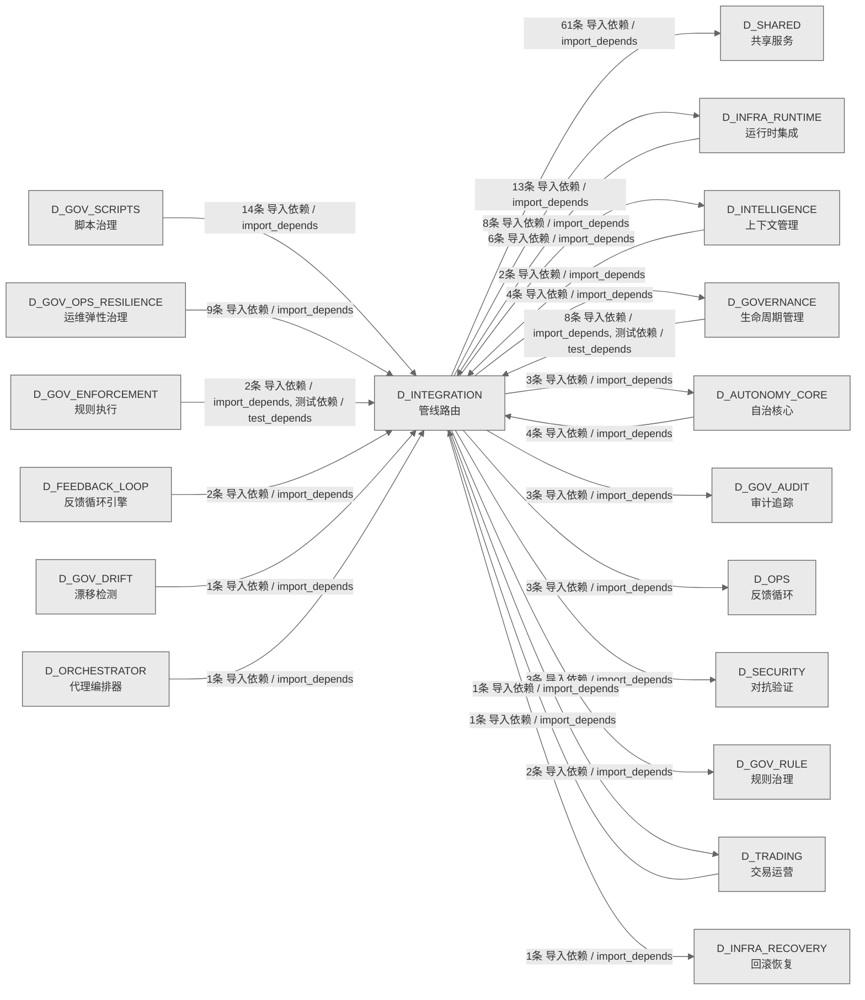

# 21_d_integration / 管线路由域 / Pipeline Routing

> **功能简介 / Overview**: 管线路由，负责跨域数据流路由、管道编排和集成适配

> **文档作用 / Purpose**: 展示 管线路由（D_INTEGRATION）功能域的域内依赖关系、跨域依赖关系，模块信息（成熟度/中英文名/大白话/文件路径）内嵌于 Mermaid 节点，供架构审查和域治理参考。

> 本文档由 generate_domain_doc.py 从 depgraph (PostgreSQL) 自动生成
> 数据源: depgraph (PostgreSQL) nodes表 + edges表

> **[可缩放 HTML 版 / Zoomable HTML](http://localhost:8765/docs/02_enterprise_architecture/02_domain_architecture_docs/_zoomable_html/21_d_integration.html)** — Ctrl+滚轮缩放 ｜ 双击重置 ｜ Ctrl+Shift+D 切换拖动/选择模式

## 域基本信息 / Domain Overview

| 字段 | 值 | Field | Value |
|------|------|-------|-------|
| 编号 | 21 | Number | 21 |
| 域ID | D_INTEGRATION | Domain ID | D_INTEGRATION |
| 域名称 | 管线路由 | Domain Name | Pipeline Routing |
| 层级 | L1 基础平台层 | Layer | L1 Foundation |
| 模块数 | 71 | Module Count | 71 |
| 域内依赖 | 68 | Internal Dependencies | 68 |
| 跨域入边 | 52 | Cross-domain Incoming | 52 |
| 跨域出边 | 100 | Cross-domain Outgoing | 100 |
| 设计态模块 | 0 | Design Modules | 0 |
| 生产态模块 | 71 | Production Modules | 71 |
| 容量 | 71/150 (正常) | Capacity | 71/150 (正常) |
| 描述 | M1-M11双管线路由 | Description | M1-M11双管线路由 |

## 域内依赖图 / Internal Dependency Diagram

> 依赖图内嵌在本文档中，IDE 可直接渲染；网页版可 Ctrl+滚轮缩放 + 拖动平移查看细节。
>
> **图例说明 / Legend**：
> - 🟦 **蓝色 = 运营态模块**（production，已上线运行）
> - 🟧 **橙色虚线 = 设计态模块**（design，蓝图阶段，代码未写）
> - **实线箭头 = 运营态依赖**（已生效的依赖关系）
> - **虚线箭头 = 非运营态依赖**（计划中/验证中的依赖关系）

### 全景图（全部模块，颜色区分运营态/设计态）

> 展示全部 71 个模块（生产态 71 + 设计态 0），含跨域依赖外部节点。节点含成熟度+名称+大白话/简介+文件路径。

```mermaid
%%{init: {'theme': 'base', 'themeVariables': {'primaryColor': '#eaeaea', 'primaryTextColor': '#333333', 'primaryBorderColor': '#666666', 'lineColor': '#666666', 'secondaryColor': '#eaeaea', 'tertiaryColor': '#eaeaea', 'fontSize': '14px'}}}%%
flowchart TD
    src_zephyr_integration_behavioral_admission_admission_response_py["behavioral_admission/admission_response<br/>集成/behavioral<br/>admission包的admission_response模块<br/>Admission Response<br/>文件: behavioral_admission/admission_response.py<br/>(生产态 / production)"]
    src_zephyr_integration_budget_enforcer_degradation_spiral_detector_py["DegradationSpiral检测器<br/>Degradation Spiral Detector —<br/>模型幻觉-容量正反馈螺旋检测 (盲点 #19, M-29)<br/>文件: budget_enforcer<br/>/degradation_spiral_detector.py<br/>(生产态 / production)"]
    src_zephyr_integration_llm_bridge_py["LLM 桥接 Stage 6<br/>接收 RED 问题,生成修复文本。LLM<br/>只润色不做判断。不可用时降级为模板生成。<br/>Llm Bridge<br/>文件: integration/llm_bridge.py<br/>(生产态 / production)"]
    src_zephyr_integration_mcp_gateway_server_py["MCP Gateway 集中式治理节点<br/>（MOD-INF-013 §12 Phase 5）<br/>Gateway Server<br/>文件: mcp/gateway_server.py<br/>(生产态 / production)"]
    src_zephyr_integration_mcp_handoff_auto_loader_py["—从 handoff 包恢复 AI session 上下文<br/>Handoff 自动加载器——从 handoff 包恢复 AI<br/>session 上下文（MOD-INF-013 §5.3）。<br/>Handoff Auto Loader<br/>文件: mcp/handoff_auto_loader.py<br/>(生产态 / production)"]
    src_zephyr_integration_mcp_prompt_provider_py["关闭 B3）<br/>MCP Prompt 模板提供者（MOD-INF-013 Phase 6 —<br/>关闭 B3）。<br/>Prompt Provider<br/>文件: mcp/prompt_provider.py<br/>(生产态 / production)"]
    src_zephyr_integration_mcp_resource_provider_py["关闭 B2/B41）<br/>MCP Resource 提供者（MOD-INF-013 Phase 6 — 关闭<br/>B2/B41）。<br/>Resource Provider<br/>文件: mcp/resource_provider.py<br/>(生产态 / production)"]
    src_zephyr_integration_mcp_rule_discovery_server_py["规则发现服务端<br/>RuleDiscoveryServer — MCP Server for rule<br/>discovery（...<br/>Rule Discovery Server<br/>文件: mcp/rule_discovery_server.py<br/>(生产态 / production)"]
    src_zephyr_integration_mcp_server_py["MOD-INF-026 蓝图 §21<br/>AssetInventory MCP Server — MOD-INF-026 蓝图 §21<br/>文件: integration/mcp_server.py<br/>(生产态 / production)"]
    src_zephyr_integration_pipeline_orchestrator_py["管道编排器<br/>PipelineOrchestrator — M1-M11 管线协调器<br/>Pipeline Orchestrator<br/>文件: integration/pipeline_orchestrator.py<br/>(生产态 / production)"]
    src_zephyr_integration_ports_py["端口<br/>Protocol-based interface layer for<br/>pipeline->mcp dependency abstraction.<br/>Ports<br/>文件: integration/ports.py<br/>(生产态 / production)"]
    src_zephyr_integration_shared_contracts_errors_contract_violation_error_py["契约ViolationError<br/>集成/错误包的contract_violation_error模块<br/>Contract Violation Error<br/>文件: errors/contract_violation_error.py<br/>(生产态 / production)"]
    src_zephyr_integration_shared_contracts_errors_data_quality_error_py["数据QualityError<br/>CTR-ERR-001: DataQualityError /<br/>行情质量门禁不通过错误<br/>Data Quality Error<br/>文件: errors/data_quality_error.py<br/>(生产态 / production)"]
    src_zephyr_integration_shared_contracts_errors_execution_rejection_error_py["执行RejectionError<br/>集成/错误包的execution_rejection_error模块<br/>Execution Rejection Error<br/>文件: errors/execution_rejection_error.py<br/>(生产态 / production)"]
    src_zephyr_integration_shared_contracts_errors_factor_computation_error_py["因子ComputationError<br/>CTR-ERR-002: FactorComputationError /<br/>因子计算失败错误<br/>Factor Computation Error<br/>文件: errors/factor_computation_error.py<br/>(生产态 / production)"]
    src_zephyr_integration_shared_contracts_errors_risk_limit_violation_error_py["风险LimitViolationError<br/>集成/错误包的risk_limit_violation_error模块<br/>Risk Limit Violation Error<br/>文件: errors/risk_limit_violation_error.py<br/>(生产态 / production)"]
    src_zephyr_integration_shared_contracts_errors_signal_degradation_warning_py["信号DegradationWarning<br/>集成/错误包的signal_degradation_warning模块<br/>Signal Degradation Warning<br/>文件: errors/signal_degradation_warning.py<br/>(生产态 / production)"]
    src_zephyr_integration_shared_events_dlq_bridge_py["Dlq桥接器<br/>CT-DLQ-001: DeadLetterQueue -> System Event Bus<br/>integration bridge.<br/>Dlq Bridge<br/>文件: events/dlq_bridge.py<br/>(生产态 / production)"]
    src_zephyr_integration_shared_events_event_bus_upgrade_py["事件BusUpgrade<br/>EventBus Upgrade — 事件总线升级 (M-16)<br/>Event Bus Upgrade<br/>文件: events/event_bus_upgrade.py<br/>(生产态 / production)"]
    src_zephyr_integration_shared_events_event_schemas_py["—文件系统变更通知<br/>event_schemas.py —— Observer 事件体 Pydantic V2<br/>Schema（盲点 B6/B10 修复）<br/>Event Schemas<br/>文件: events/event_schemas.py<br/>(生产态 / production)"]
    src_zephyr_integration_shared_events_upgrade_strategy_py["EventBus 升级策略引擎<br/>集成/事件包的upgrade_strategy模块<br/>Upgrade Strategy<br/>文件: events/upgrade_strategy.py<br/>(生产态 / production)"]
    src_zephyr_integration_vector_memory_bm25_index_py["MOD-INF-011 稀疏检索组件<br/>BM25Index — MOD-INF-011 稀疏检索组件<br/>Bm25 Index<br/>文件: vector_memory/bm25_index.py<br/>(生产态 / production)"]
    src_zephyr_integration_vector_memory_cache_layer_py["缓存层<br/>集成/vector memory包的cache_layer模块<br/>Cache Layer<br/>文件: vector_memory/cache_layer.py<br/>(生产态 / production)"]
    src_zephyr_integration_vector_memory_context_ingest_py["上下文Ingest<br/>VMS 上下文注入器 — ingest_context() 消费者<br/>Context Ingest<br/>文件: vector_memory/context_ingest.py<br/>(生产态 / production)"]
    src_zephyr_integration_vector_memory_cross_collection_retriever_py["跨收集Retriever<br/>CrossCollectionRetriever — MOD-INF-011 跨<br/>Collection 联合检索<br/>Cross Collection Retriever<br/>文件: vector_memory<br/>/cross_collection_retriever.py<br/>(生产态 / production)"]
    src_zephyr_integration_vector_memory_delegated_vector_memory_py["以 ``UnifiedMemoryAPI`` 为后端的<br/>``VectorMemoryBase`` 实现<br/>DelegatedVectorMemory — VectorMemoryBase 的<br/>RI-02 落地适配器<br/>Delegated Vector Memory<br/>文件: vector_memory/delegated_vector_memory.py<br/>(生产态 / production)"]
    src_zephyr_integration_vector_memory_design_principles_py["设计原则<br/>集成/vector memory包的design_principles模块<br/>Design Principles<br/>文件: vector_memory/design_principles.py<br/>(生产态 / production)"]
    src_zephyr_integration_vector_memory_migrate_chroma_to_faiss_py["Chroma到FAISS迁移<br/>ChromDB -> FAISS + SQLite WAL 数据迁移脚本<br/>Migrate Chroma To Faiss<br/>文件: vector_memory/migrate_chroma_to_faiss.py<br/>(生产态 / production)"]
    src_zephyr_integration_vector_memory_ollama_embedding_py["Ollama嵌入<br/>集成/vector memory包的ollama_embedding模块<br/>Ollama Embedding<br/>文件: vector_memory/ollama_embedding.py<br/>(生产态 / production)"]
    src_zephyr_integration_vector_memory_vms_memory_backend_py["—将 UnifiedMemoryAPI 的操作路由到<br/>InProcessVectorMemory<br/>VMSMemoryBackend — UnifiedMemoryAPI 的 VMS<br/>后端适配器<br/>Vms Memory Backend<br/>文件: vector_memory/vms_memory_backend.py<br/>(生产态 / production)"]
    src_zephyr_shared_contracts_approval_types_py["Approval类型定义<br/>G-CT-004 — ApprovalRequest Pydantic V2<br/>BaseModel 审批请求数据结构.<br/>Approval Types<br/>文件: contracts/approval_types.py<br/>(生产态 / production)"]
    src_zephyr_shared_contracts_rollback_types_py["回滚类型定义<br/>G-CT-003 — RollbackResult Pydantic V2 BaseModel<br/>回滚结果数据结构.<br/>Rollback Types<br/>文件: contracts/rollback_types.py<br/>(生产态 / production)"]
    src_zephyr_shared_contracts_runtime_types_py["运行时类型定义<br/>共享层/契约包的runtime_types模块<br/>Runtime Types<br/>文件: contracts/runtime_types.py<br/>(生产态 / production)"]
    src_zephyr_shared_evaluation_evals_py["评估<br/>共享层/evaluation包的evals模块<br/>文件: evaluation/evals.py<br/>(生产态 / production)"]
    src_zephyr_shared_resilience_durable_execution_py["Durable执行<br/>共享层/resilience包的durable_execution模块<br/>Durable Execution<br/>文件: resilience/durable_execution.py<br/>(生产态 / production)"]
    src_zephyr_shared_versioning_version_negotiation_py["只读：deprecations<br/>共享层/versioning包的version_negotiation模块<br/>Version Negotiation<br/>文件: versioning/version_negotiation.py<br/>(生产态 / production)"]
    src_zephyr_integration_behavioral_admission_admission_response_py ~~~ src_zephyr_integration_budget_enforcer_degradation_spiral_detector_py
    src_zephyr_integration_budget_enforcer_degradation_spiral_detector_py ~~~ src_zephyr_integration_llm_bridge_py
    src_zephyr_integration_llm_bridge_py ~~~ src_zephyr_integration_mcp_gateway_server_py
    src_zephyr_integration_mcp_gateway_server_py ~~~ src_zephyr_integration_mcp_handoff_auto_loader_py
    src_zephyr_integration_mcp_handoff_auto_loader_py ~~~ src_zephyr_integration_mcp_prompt_provider_py
    src_zephyr_integration_mcp_prompt_provider_py ~~~ src_zephyr_integration_mcp_resource_provider_py
    src_zephyr_integration_mcp_resource_provider_py ~~~ src_zephyr_integration_mcp_rule_discovery_server_py
    src_zephyr_integration_mcp_rule_discovery_server_py ~~~ src_zephyr_integration_mcp_server_py
    src_zephyr_integration_mcp_server_py ~~~ src_zephyr_integration_pipeline_orchestrator_py
    src_zephyr_integration_pipeline_orchestrator_py ~~~ src_zephyr_integration_ports_py
    src_zephyr_integration_ports_py ~~~ src_zephyr_integration_shared_contracts_errors_contract_violation_error_py
    src_zephyr_integration_shared_contracts_errors_contract_violation_error_py ~~~ src_zephyr_integration_shared_contracts_errors_data_quality_error_py
    src_zephyr_integration_shared_contracts_errors_data_quality_error_py ~~~ src_zephyr_integration_shared_contracts_errors_execution_rejection_error_py
    src_zephyr_integration_shared_contracts_errors_execution_rejection_error_py ~~~ src_zephyr_integration_shared_contracts_errors_factor_computation_error_py
    src_zephyr_integration_shared_contracts_errors_factor_computation_error_py ~~~ src_zephyr_integration_shared_contracts_errors_risk_limit_violation_error_py
    src_zephyr_integration_shared_contracts_errors_risk_limit_violation_error_py ~~~ src_zephyr_integration_shared_contracts_errors_signal_degradation_warning_py
    src_zephyr_integration_shared_contracts_errors_signal_degradation_warning_py ~~~ src_zephyr_integration_shared_events_dlq_bridge_py
    src_zephyr_integration_shared_events_dlq_bridge_py ~~~ src_zephyr_integration_shared_events_event_bus_upgrade_py
    src_zephyr_integration_shared_events_event_bus_upgrade_py ~~~ src_zephyr_integration_shared_events_event_schemas_py
    src_zephyr_integration_shared_events_event_schemas_py ~~~ src_zephyr_integration_shared_events_upgrade_strategy_py
    src_zephyr_integration_shared_events_upgrade_strategy_py ~~~ src_zephyr_integration_vector_memory_bm25_index_py
    src_zephyr_integration_vector_memory_bm25_index_py ~~~ src_zephyr_integration_vector_memory_cache_layer_py
    src_zephyr_integration_vector_memory_cache_layer_py ~~~ src_zephyr_integration_vector_memory_context_ingest_py
    src_zephyr_integration_vector_memory_context_ingest_py ~~~ src_zephyr_integration_vector_memory_cross_collection_retriever_py
    src_zephyr_integration_vector_memory_cross_collection_retriever_py ~~~ src_zephyr_integration_vector_memory_delegated_vector_memory_py
    src_zephyr_integration_vector_memory_delegated_vector_memory_py ~~~ src_zephyr_integration_vector_memory_design_principles_py
    src_zephyr_integration_vector_memory_design_principles_py ~~~ src_zephyr_integration_vector_memory_migrate_chroma_to_faiss_py
    src_zephyr_integration_vector_memory_migrate_chroma_to_faiss_py ~~~ src_zephyr_integration_vector_memory_ollama_embedding_py
    src_zephyr_integration_vector_memory_ollama_embedding_py ~~~ src_zephyr_integration_vector_memory_vms_memory_backend_py
    src_zephyr_integration_vector_memory_vms_memory_backend_py ~~~ src_zephyr_shared_contracts_approval_types_py
    src_zephyr_shared_contracts_approval_types_py ~~~ src_zephyr_shared_contracts_rollback_types_py
    src_zephyr_shared_contracts_rollback_types_py ~~~ src_zephyr_shared_contracts_runtime_types_py
    src_zephyr_shared_contracts_runtime_types_py ~~~ src_zephyr_shared_evaluation_evals_py
    src_zephyr_shared_evaluation_evals_py ~~~ src_zephyr_shared_resilience_durable_execution_py
    src_zephyr_shared_resilience_durable_execution_py ~~~ src_zephyr_shared_versioning_version_negotiation_py
    src_zephyr_integration_local_model_cache_layer_py["Stage 4 公共化<br/>CacheLayer — MOD-INF-011 嵌入缓存与查询结果 LRU<br/>Cache Layer<br/>文件: local_model/cache_layer.py<br/>(生产态 / production)"]
    src_zephyr_integration_local_model_local_model_scheduler_py["Local模型调度器<br/>LocalModelScheduler — L2 本地模型 24/7 调度循环<br/>Local Model Scheduler<br/>文件: local_model/local_model_scheduler.py<br/>(生产态 / production)"]
    src_zephyr_integration_local_model_ollama_embedding_py["—封装 /api/embed，兼容<br/>SentenceTransformer.encode<br/>OllamaEmbedder — 通过 Ollama HTTP API<br/>生成文本嵌入<br/>Ollama Embedding<br/>文件: local_model/ollama_embedding.py<br/>(生产态 / production)"]
    src_zephyr_integration_mcp_audit_logger_py["MCP 全量工具调用审计日志<br/>（MOD-INF-013 §12 Step 4）<br/>Audit Logger<br/>文件: mcp/audit_logger.py<br/>(生产态 / production)"]
    src_zephyr_integration_mcp_blueprint_search_server_py["蓝图Search服务端<br/>BlueprintSearchServer — MCP Server for<br/>blueprint discovery<br/>Blueprint Search Server<br/>文件: mcp/blueprint_search_server.py<br/>(生产态 / production)"]
    src_zephyr_integration_mcp_doc_guard_server_py["session_handoff MCP Server 实现<br/>DocGuardServer: 跨会话交接协议服务 MCP Server<br/>Doc Guard Server<br/>文件: mcp/doc_guard_server.py<br/>(生产态 / production)"]
    src_zephyr_integration_mcp_gate_engine_server_py["检查路径是否命中黑名单<br/>GateEngineServer: 门禁裁决服务 MCP Server<br/>Gate Engine Server<br/>文件: mcp/gate_engine_server.py<br/>(生产态 / production)"]
    src_zephyr_integration_mcp_rate_limiter_py["MCP Gateway 同步速率限制器<br/>（MOD-INF-013 §12 Step 3）<br/>Rate Limiter<br/>文件: mcp/rate_limiter.py<br/>(生产态 / production)"]
    src_zephyr_integration_mcp_sandbox_server_py["关闭 B4）<br/>MCP sandbox 安全代码执行沙箱（MOD-INF-013 Phase<br/>7 — 关闭 B4）。<br/>Sandbox Server<br/>文件: mcp/sandbox_server.py<br/>(生产态 / production)"]
    src_zephyr_integration_mcp_sentinel_server_py["Stage 1 关键词匹配，返回<br/>SentinelServer: 意图路由哨兵 MCP Server<br/>Sentinel Server<br/>文件: mcp/sentinel_server.py<br/>(生产态 / production)"]
    src_zephyr_integration_mcp_task_manager_server_py["任务管理器服务端<br/>ZephyrAlpha MCP Task Manager Server<br/>文件: mcp/task_manager_server.py<br/>(生产态 / production)"]
    src_zephyr_integration_mcp_telemetry_server_py["系统可观测性 MCP 接口<br/>ZephyrAlpha MCP Telemetry Server — 系统可观测性<br/>MCP 接口<br/>文件: mcp/telemetry_server.py<br/>(生产态 / production)"]
    src_zephyr_integration_mcp_vector_memory_server_py["向量记忆服务端<br/>VectorMemoryServer: VMS 向量记忆 MCP Server<br/>(MOD-INF-011 v0.7.0)<br/>Vector Memory Server<br/>文件: mcp/vector_memory_server.py<br/>(生产态 / production)"]
    src_zephyr_integration_vector_memory_bridge_layer_py["桥接器层<br/>BridgeLayer — MOD-INF-011 kb/ ↔ VMS 过渡桥接<br/>Bridge Layer<br/>文件: vector_memory/bridge_layer.py<br/>(生产态 / production)"]
    src_zephyr_integration_vector_memory_collection_schemas_py["收集Schemas<br/>集成/vector memory包的collection_schemas模块<br/>Collection Schemas<br/>文件: vector_memory/collection_schemas.py<br/>(生产态 / production)"]
    src_zephyr_integration_vector_memory_faiss_collection_manager_py["Faiss收集管理器<br/>FAISSCollectionManager — FAISS HNSW/IVF+PQ 8<br/>Collection 全生命周期管理<br/>Faiss Collection Manager<br/>文件: vector_memory/faiss_collection_manager.py<br/>(生产态 / production)"]
    src_zephyr_integration_vector_memory_hybrid_retriever_py["混合检索器<br/>HybridRetriever — MOD-INF-011 混合检索架构<br/>Hybrid Retriever<br/>文件: vector_memory/hybrid_retriever.py<br/>(生产态 / production)"]
    src_zephyr_integration_vector_memory_in_memory_fake_vms_py["只读：store_size<br/>InMemoryFakeVMS — MOD-INF-011 · 零依赖测试双胞胎<br/>In Memory Fake Vms<br/>文件: vector_memory/in_memory_fake_vms.py<br/>(生产态 / production)"]
    src_zephyr_integration_vector_memory_interface_py["单条记忆条目'''<br/>VMS — Vector Memory Service 接口基类<br/>Interface<br/>文件: vector_memory/interface.py<br/>(生产态 / production)"]
    src_zephyr_integration_vector_memory_provenance_enforcer_py["校验 WriteTrace 完整性<br/>ProvenanceEnforcer — MOD-INF-011<br/>写入溯源强制执行<br/>Provenance Enforcer<br/>文件: vector_memory/provenance_enforcer.py<br/>(生产态 / production)"]
    src_zephyr_integration_vector_memory_sqlite_metadata_store_py["Sqlite元数据存储<br/>SQLiteMetadataStore — VMS 元数据存储 (SQLite<br/>WAL + FTS5 BM25)<br/>Sqlite Metadata Store<br/>文件: vector_memory/sqlite_metadata_store.py<br/>(生产态 / production)"]
    src_zephyr_integration_vector_memory_vms_schemas_py["VMS模式定义<br/>VMS 共享数据模型 — MOD-INF-011 · 蓝图 §6.1<br/>接口契约<br/>Vms Schemas<br/>文件: vector_memory/vms_schemas.py<br/>(生产态 / production)"]
    src_zephyr_shared_contracts_protocols_py["协议<br/>Structural Protocol interfaces for cross-module<br/>contracts.<br/>Protocols<br/>文件: contracts/protocols.py<br/>(生产态 / production)"]
    src_zephyr_integration_local_model_cache_layer_py ~~~ src_zephyr_integration_local_model_local_model_scheduler_py
    src_zephyr_integration_local_model_local_model_scheduler_py ~~~ src_zephyr_integration_local_model_ollama_embedding_py
    src_zephyr_integration_local_model_ollama_embedding_py ~~~ src_zephyr_integration_mcp_audit_logger_py
    src_zephyr_integration_mcp_audit_logger_py ~~~ src_zephyr_integration_mcp_blueprint_search_server_py
    src_zephyr_integration_mcp_blueprint_search_server_py ~~~ src_zephyr_integration_mcp_doc_guard_server_py
    src_zephyr_integration_mcp_doc_guard_server_py ~~~ src_zephyr_integration_mcp_gate_engine_server_py
    src_zephyr_integration_mcp_gate_engine_server_py ~~~ src_zephyr_integration_mcp_rate_limiter_py
    src_zephyr_integration_mcp_rate_limiter_py ~~~ src_zephyr_integration_mcp_sandbox_server_py
    src_zephyr_integration_mcp_sandbox_server_py ~~~ src_zephyr_integration_mcp_sentinel_server_py
    src_zephyr_integration_mcp_sentinel_server_py ~~~ src_zephyr_integration_mcp_task_manager_server_py
    src_zephyr_integration_mcp_task_manager_server_py ~~~ src_zephyr_integration_mcp_telemetry_server_py
    src_zephyr_integration_mcp_telemetry_server_py ~~~ src_zephyr_integration_mcp_vector_memory_server_py
    src_zephyr_integration_mcp_vector_memory_server_py ~~~ src_zephyr_integration_vector_memory_bridge_layer_py
    src_zephyr_integration_vector_memory_bridge_layer_py ~~~ src_zephyr_integration_vector_memory_collection_schemas_py
    src_zephyr_integration_vector_memory_collection_schemas_py ~~~ src_zephyr_integration_vector_memory_faiss_collection_manager_py
    src_zephyr_integration_vector_memory_faiss_collection_manager_py ~~~ src_zephyr_integration_vector_memory_hybrid_retriever_py
    src_zephyr_integration_vector_memory_hybrid_retriever_py ~~~ src_zephyr_integration_vector_memory_in_memory_fake_vms_py
    src_zephyr_integration_vector_memory_in_memory_fake_vms_py ~~~ src_zephyr_integration_vector_memory_interface_py
    src_zephyr_integration_vector_memory_interface_py ~~~ src_zephyr_integration_vector_memory_provenance_enforcer_py
    src_zephyr_integration_vector_memory_provenance_enforcer_py ~~~ src_zephyr_integration_vector_memory_sqlite_metadata_store_py
    src_zephyr_integration_vector_memory_sqlite_metadata_store_py ~~~ src_zephyr_integration_vector_memory_vms_schemas_py
    src_zephyr_integration_vector_memory_vms_schemas_py ~~~ src_zephyr_shared_contracts_protocols_py
    src_zephyr_integration_local_model_embedding_router_py["—DI 注入契约<br/>EmbeddingRouter — MOD-INF-011 双嵌入维度路由<br/>Embedding Router<br/>文件: local_model/embedding_router.py<br/>(生产态 / production)"]
    src_zephyr_integration_local_model_ollama_chat_py["Ollama聊天<br/>OllamaChat — 通过 Ollama HTTP API 进行本地 LLM<br/>推理<br/>Ollama Chat<br/>文件: local_model/ollama_chat.py<br/>(生产态 / production)"]
    src_zephyr_integration_mcp_base_server_py["基础服务端<br/>BaseMCPServer: stdio 传输 + JSON-RPC 2.0<br/>协议基类<br/>Base Server<br/>文件: mcp/_base_server.py<br/>(生产态 / production)"]
    src_zephyr_integration_vector_memory_collection_manager_py["收集管理器<br/>CollectionManager — MOD-INF-011 八大 Collection<br/>全生命周期管理<br/>Collection Manager<br/>文件: vector_memory/collection_manager.py<br/>(生产态 / production)"]
    src_zephyr_integration_vector_memory_in_process_vector_memory_py["In流程向量记忆<br/>InProcessVectorMemory — MOD-INF-011 VMS 统一入口<br/>In Process Vector Memory<br/>文件: vector_memory/in_process_vector_memory.py<br/>(生产态 / production)"]
    src_zephyr_integration_vector_memory_vms_errors_py["VMS错误<br/>集成/vector memory包的vms_errors模块<br/>Vms Errors<br/>文件: vector_memory/vms_errors.py<br/>(生产态 / production)"]
    src_zephyr_integration_local_model_embedding_router_py ~~~ src_zephyr_integration_local_model_ollama_chat_py
    src_zephyr_integration_local_model_ollama_chat_py ~~~ src_zephyr_integration_mcp_base_server_py
    src_zephyr_integration_mcp_base_server_py ~~~ src_zephyr_integration_vector_memory_collection_manager_py
    src_zephyr_integration_vector_memory_collection_manager_py ~~~ src_zephyr_integration_vector_memory_in_process_vector_memory_py
    src_zephyr_integration_vector_memory_in_process_vector_memory_py ~~~ src_zephyr_integration_vector_memory_vms_errors_py
    src_zephyr_integration_mcp_error_codes_py["MCP 错误码集中注册<br/>（MOD-INF-013 §3.4）<br/>Error Codes<br/>文件: mcp/error_codes.py<br/>(生产态 / production)"]
    src_zephyr_integration_vector_memory_chunk_strategy_router_py["Chunk策略路由器<br/>ChunkStrategyRouter — MOD-INF-011 分块策略调度<br/>Chunk Strategy Router<br/>文件: vector_memory/chunk_strategy_router.py<br/>(生产态 / production)"]
    src_zephyr_integration_vector_memory_in_memory_memory_backend_py["In记忆记忆后端<br/>DegradedVMSBackend — MOD-INF-011 降级兜底<br/>In Memory Memory Backend<br/>文件: vector_memory/in_memory_memory_backend.py<br/>(生产态 / production)"]
    src_zephyr_integration_vector_memory_index_health_monitor_py["索引Health监控器<br/>IndexHealthMonitor — MOD-INF-011<br/>索引健康自检与自动修复<br/>Index Health Monitor<br/>文件: vector_memory/index_health_monitor.py<br/>(生产态 / production)"]
    src_zephyr_integration_vector_memory_retrieval_feedback_py["只读：long_tail<br/>RetrievalFeedback — MOD-INF-011 FLE 检索质量消费<br/>Retrieval Feedback<br/>文件: vector_memory/retrieval_feedback.py<br/>(生产态 / production)"]
    src_zephyr_integration_vector_memory_vector_bridge_py["向量桥接器<br/>VectorBridge — MOD-INF-011 CE/KB 外部集成适配器<br/>Vector Bridge<br/>文件: vector_memory/vector_bridge.py<br/>(生产态 / production)"]
    src_zephyr_integration_vector_memory_chunk_strategy_router_py ~~~ src_zephyr_integration_vector_memory_in_memory_memory_backend_py
    src_zephyr_integration_vector_memory_in_memory_memory_backend_py ~~~ src_zephyr_integration_vector_memory_index_health_monitor_py
    src_zephyr_integration_vector_memory_index_health_monitor_py ~~~ src_zephyr_integration_vector_memory_retrieval_feedback_py
    src_zephyr_integration_vector_memory_retrieval_feedback_py ~~~ src_zephyr_integration_vector_memory_vector_bridge_py
    src_zephyr_integration_pipeline_orchestrator_py -->|导入依赖 / import_depends| src_zephyr_integration_local_model_local_model_scheduler_py
    src_zephyr_integration_pipeline_orchestrator_py -->|导入依赖 / import_depends| src_zephyr_integration_local_model_embedding_router_py
    src_zephyr_integration_pipeline_orchestrator_py -->|导入依赖 / import_depends| src_zephyr_shared_contracts_protocols_py
    src_zephyr_integration_local_model_local_model_scheduler_py -->|导入依赖 / import_depends| src_zephyr_integration_local_model_ollama_chat_py
    src_zephyr_integration_local_model_local_model_scheduler_py -->|导入依赖 / import_depends| src_zephyr_integration_local_model_embedding_router_py
    src_zephyr_integration_local_model_embedding_router_py -->|导入依赖 / import_depends| src_zephyr_integration_local_model_ollama_embedding_py
    src_zephyr_integration_mcp_blueprint_search_server_py -->|导入依赖 / import_depends| src_zephyr_integration_mcp_base_server_py
    src_zephyr_integration_mcp_gateway_server_py -->|导入依赖 / import_depends| src_zephyr_integration_mcp_audit_logger_py
    src_zephyr_integration_mcp_gateway_server_py -->|导入依赖 / import_depends| src_zephyr_integration_mcp_error_codes_py
    src_zephyr_integration_mcp_gateway_server_py -->|导入依赖 / import_depends| src_zephyr_integration_mcp_blueprint_search_server_py
    src_zephyr_integration_mcp_gateway_server_py -->|导入依赖 / import_depends| src_zephyr_integration_mcp_doc_guard_server_py
    src_zephyr_integration_mcp_gateway_server_py -->|导入依赖 / import_depends| src_zephyr_integration_mcp_gate_engine_server_py
    src_zephyr_integration_mcp_gateway_server_py -->|导入依赖 / import_depends| src_zephyr_integration_mcp_sandbox_server_py
    src_zephyr_integration_mcp_gateway_server_py -->|导入依赖 / import_depends| src_zephyr_integration_mcp_rate_limiter_py
    src_zephyr_integration_mcp_gateway_server_py -->|导入依赖 / import_depends| src_zephyr_integration_mcp_task_manager_server_py
    src_zephyr_integration_mcp_gateway_server_py -->|导入依赖 / import_depends| src_zephyr_integration_mcp_sentinel_server_py
    src_zephyr_integration_mcp_gateway_server_py -->|导入依赖 / import_depends| src_zephyr_integration_mcp_base_server_py
    src_zephyr_integration_mcp_gateway_server_py -->|导入依赖 / import_depends| src_zephyr_integration_mcp_vector_memory_server_py
    src_zephyr_integration_mcp_gateway_server_py -->|导入依赖 / import_depends| src_zephyr_integration_mcp_telemetry_server_py
    src_zephyr_integration_mcp_doc_guard_server_py -->|导入依赖 / import_depends| src_zephyr_integration_mcp_base_server_py
    src_zephyr_integration_mcp_gate_engine_server_py -->|导入依赖 / import_depends| src_zephyr_integration_mcp_base_server_py
    src_zephyr_integration_mcp_sandbox_server_py -->|导入依赖 / import_depends| src_zephyr_integration_mcp_base_server_py
    src_zephyr_integration_mcp_rule_discovery_server_py -->|导入依赖 / import_depends| src_zephyr_integration_mcp_base_server_py
    src_zephyr_integration_mcp_sentinel_server_py -->|导入依赖 / import_depends| src_zephyr_integration_mcp_base_server_py
    src_zephyr_integration_mcp_base_server_py -->|导入依赖 / import_depends| src_zephyr_integration_mcp_error_codes_py
    src_zephyr_integration_mcp_vector_memory_server_py -->|导入依赖 / import_depends| src_zephyr_integration_mcp_base_server_py
    src_zephyr_integration_mcp_vector_memory_server_py -->|导入依赖 / import_depends| src_zephyr_integration_vector_memory_collection_manager_py
    src_zephyr_integration_mcp_vector_memory_server_py -->|导入依赖 / import_depends| src_zephyr_integration_vector_memory_in_process_vector_memory_py
    src_zephyr_integration_mcp_vector_memory_server_py -->|导入依赖 / import_depends| src_zephyr_integration_vector_memory_vms_errors_py
    src_zephyr_integration_vector_memory_collection_manager_py -->|导入依赖 / import_depends| src_zephyr_integration_local_model_embedding_router_py
    src_zephyr_integration_vector_memory_collection_manager_py -->|导入依赖 / import_depends| src_zephyr_integration_vector_memory_collection_schemas_py
    src_zephyr_integration_vector_memory_context_ingest_py -->|导入依赖 / import_depends| src_zephyr_integration_vector_memory_in_memory_fake_vms_py
    src_zephyr_integration_vector_memory_bridge_layer_py -->|导入依赖 / import_depends| src_zephyr_integration_vector_memory_collection_manager_py
    src_zephyr_integration_vector_memory_cache_layer_py -->|导入依赖 / import_depends| src_zephyr_integration_local_model_cache_layer_py
    src_zephyr_integration_vector_memory_design_principles_py -->|导入依赖 / import_depends| src_zephyr_integration_vector_memory_collection_schemas_py
    src_zephyr_integration_vector_memory_design_principles_py -->|导入依赖 / import_depends| src_zephyr_integration_vector_memory_provenance_enforcer_py
    src_zephyr_integration_vector_memory_design_principles_py -->|导入依赖 / import_depends| src_zephyr_integration_vector_memory_vms_errors_py
    src_zephyr_integration_vector_memory_design_principles_py -->|导入依赖 / import_depends| src_zephyr_integration_vector_memory_vms_schemas_py
    src_zephyr_integration_vector_memory_hybrid_retriever_py -->|导入依赖 / import_depends| src_zephyr_integration_local_model_embedding_router_py
    src_zephyr_integration_vector_memory_hybrid_retriever_py -->|导入依赖 / import_depends| src_zephyr_integration_vector_memory_collection_manager_py
    src_zephyr_integration_vector_memory_cross_collection_retriever_py -->|导入依赖 / import_depends| src_zephyr_integration_vector_memory_hybrid_retriever_py
    src_zephyr_integration_vector_memory_faiss_collection_manager_py -->|导入依赖 / import_depends| src_zephyr_integration_vector_memory_collection_manager_py
    src_zephyr_integration_vector_memory_index_health_monitor_py -->|导入依赖 / import_depends| src_zephyr_integration_vector_memory_collection_manager_py
    src_zephyr_integration_vector_memory_in_memory_fake_vms_py -->|导入依赖 / import_depends| src_zephyr_integration_vector_memory_collection_manager_py
    src_zephyr_integration_vector_memory_delegated_vector_memory_py -->|导入依赖 / import_depends| src_zephyr_integration_vector_memory_interface_py
    src_zephyr_integration_vector_memory_ollama_embedding_py -->|导入依赖 / import_depends| src_zephyr_integration_local_model_ollama_embedding_py
    src_zephyr_integration_vector_memory_migrate_chroma_to_faiss_py -->|导入依赖 / import_depends| src_zephyr_integration_vector_memory_collection_manager_py
    src_zephyr_integration_vector_memory_migrate_chroma_to_faiss_py -->|导入依赖 / import_depends| src_zephyr_integration_vector_memory_faiss_collection_manager_py
    src_zephyr_integration_vector_memory_migrate_chroma_to_faiss_py -->|导入依赖 / import_depends| src_zephyr_integration_vector_memory_sqlite_metadata_store_py
    src_zephyr_integration_vector_memory_provenance_enforcer_py -->|导入依赖 / import_depends| src_zephyr_integration_vector_memory_collection_manager_py
    src_zephyr_integration_vector_memory_provenance_enforcer_py -->|导入依赖 / import_depends| src_zephyr_integration_vector_memory_vms_schemas_py
    src_zephyr_integration_vector_memory_in_process_vector_memory_py -->|导入依赖 / import_depends| src_zephyr_integration_local_model_cache_layer_py
    src_zephyr_integration_vector_memory_in_process_vector_memory_py -->|导入依赖 / import_depends| src_zephyr_integration_local_model_embedding_router_py
    src_zephyr_integration_vector_memory_in_process_vector_memory_py -->|导入依赖 / import_depends| src_zephyr_integration_vector_memory_collection_manager_py
    src_zephyr_integration_vector_memory_in_process_vector_memory_py -->|导入依赖 / import_depends| src_zephyr_integration_vector_memory_chunk_strategy_router_py
    src_zephyr_integration_vector_memory_in_process_vector_memory_py -->|导入依赖 / import_depends| src_zephyr_integration_vector_memory_bridge_layer_py
    src_zephyr_integration_vector_memory_in_process_vector_memory_py -->|导入依赖 / import_depends| src_zephyr_integration_vector_memory_hybrid_retriever_py
    src_zephyr_integration_vector_memory_in_process_vector_memory_py -->|导入依赖 / import_depends| src_zephyr_integration_vector_memory_index_health_monitor_py
    src_zephyr_integration_vector_memory_in_process_vector_memory_py -->|导入依赖 / import_depends| src_zephyr_integration_vector_memory_in_memory_memory_backend_py
    src_zephyr_integration_vector_memory_in_process_vector_memory_py -->|导入依赖 / import_depends| src_zephyr_integration_vector_memory_provenance_enforcer_py
    src_zephyr_integration_vector_memory_in_process_vector_memory_py -->|导入依赖 / import_depends| src_zephyr_integration_vector_memory_retrieval_feedback_py
    src_zephyr_integration_vector_memory_in_process_vector_memory_py -->|导入依赖 / import_depends| src_zephyr_integration_vector_memory_vector_bridge_py
    src_zephyr_integration_vector_memory_sqlite_metadata_store_py -->|导入依赖 / import_depends| src_zephyr_integration_vector_memory_collection_manager_py
    src_zephyr_integration_vector_memory_retrieval_feedback_py -->|导入依赖 / import_depends| src_zephyr_integration_vector_memory_hybrid_retriever_py
    src_zephyr_integration_vector_memory_retrieval_feedback_py -->|导入依赖 / import_depends| src_zephyr_integration_vector_memory_in_process_vector_memory_py
    src_zephyr_integration_vector_memory_vector_bridge_py -->|导入依赖 / import_depends| src_zephyr_integration_vector_memory_in_process_vector_memory_py
    src_zephyr_integration_vector_memory_vms_memory_backend_py -->|导入依赖 / import_depends| src_zephyr_integration_vector_memory_bridge_layer_py
    src_zephyr_integration_vector_memory_vms_memory_backend_py -->|导入依赖 / import_depends| src_zephyr_integration_vector_memory_in_process_vector_memory_py
    D_SHARED["共享服务<br/>共享服务，负责跨域共享的工具、协议和基础服务<br/>Shared Services<br/>跨域节点 / cross-domain<br/>(生产态 / production)"]
    src_zephyr_integration_mcp_server_py -->|导入依赖 / import_depends| D_SHARED
    src_zephyr_integration_mcp_task_manager_server_py -->|导入依赖 / import_depends| D_SHARED
    src_zephyr_integration_shared_contracts_errors_data_quality_error_py -->|导入依赖 / import_depends| D_SHARED
    src_zephyr_integration_pipeline_orchestrator_py -->|导入依赖 / import_depends| D_SHARED
    src_zephyr_integration_pipeline_orchestrator_py -->|导入依赖 / import_depends| D_SHARED
    src_zephyr_integration_shared_contracts_errors_risk_limit_violation_error_py -->|导入依赖 / import_depends| D_SHARED
    src_zephyr_integration_vector_memory_vms_schemas_py -->|导入依赖 / import_depends| D_SHARED
    src_zephyr_integration_pipeline_orchestrator_py -->|导入依赖 / import_depends| D_SHARED
    D_INFRA_RUNTIME["运行时集成<br/>运行时集成，负责组件生命周期编排、启动钩子和运行<br/>时上下文管理<br/>Runtime Integration<br/>跨域节点 / cross-domain<br/>(生产态 / production)"]
    src_zephyr_integration_pipeline_orchestrator_py -->|导入依赖 / import_depends| D_INFRA_RUNTIME
    src_zephyr_integration_vector_memory_retrieval_feedback_py -->|导入依赖 / import_depends| D_SHARED
    src_zephyr_integration_mcp_resource_provider_py -->|导入依赖 / import_depends| D_SHARED
    D_SECURITY["对抗验证<br/>对抗验证，负责系统安全对抗测试、漏洞扫描和攻防验<br/>证<br/>Adversarial Validation<br/>跨域节点 / cross-domain<br/>(生产态 / production)"]
    src_zephyr_integration_pipeline_orchestrator_py -->|导入依赖 / import_depends| D_SECURITY
    src_zephyr_integration_vector_memory_index_health_monitor_py -->|导入依赖 / import_depends| D_SHARED
    src_zephyr_integration_mcp_gate_engine_server_py -->|导入依赖 / import_depends| D_SHARED
    src_zephyr_integration_pipeline_orchestrator_py -->|导入依赖 / import_depends| D_SHARED
    D_GOV_SCRIPTS["脚本治理<br/>脚本治理，负责脚本生命周期管理和脚本质量门禁<br/>Script Governance<br/>跨域节点 / cross-domain<br/>(生产态 / production)"]
    D_GOV_SCRIPTS -->|导入依赖 / import_depends| src_zephyr_integration_vector_memory_collection_manager_py
    D_GOV_SCRIPTS -->|导入依赖 / import_depends| src_zephyr_integration_vector_memory_bridge_layer_py
    D_GOV_SCRIPTS -->|导入依赖 / import_depends| src_zephyr_integration_vector_memory_index_health_monitor_py
    D_GOV_OPS_RESILIENCE["运维弹性治理<br/>运维弹性治理，负责运维治理、安全治理、弹性治理和<br/>升级协议<br/>Ops Resilience Governance<br/>跨域节点 / cross-domain<br/>(生产态 / production)"]
    D_GOV_OPS_RESILIENCE -->|导入依赖 / import_depends| src_zephyr_integration_vector_memory_index_health_monitor_py
    D_GOVERNANCE["生命周期管理<br/>生命周期管理，负责蓝图/模块<br/>/任务的声明周期管理和元数据治理<br/>Lifecycle Management<br/>跨域节点 / cross-domain<br/>(生产态 / production)"]
    D_GOVERNANCE -->|导入依赖 / import_depends| src_zephyr_shared_contracts_runtime_types_py
    D_GOVERNANCE -->|测试依赖 / test_depends| src_zephyr_shared_resilience_durable_execution_py
    D_AUTONOMY_CORE["自治核心<br/>自治核心，负责 AI 自治决策、目标分解和执行编排<br/>Autonomy Core<br/>跨域节点 / cross-domain<br/>(生产态 / production)"]
    D_AUTONOMY_CORE -->|导入依赖 / import_depends| src_zephyr_integration_local_model_embedding_router_py
    D_GOV_OPS_RESILIENCE -->|导入依赖 / import_depends| src_zephyr_integration_vector_memory_in_process_vector_memory_py
    D_GOV_SCRIPTS -->|导入依赖 / import_depends| src_zephyr_integration_vector_memory_collection_manager_py
    D_INFRA_RUNTIME -->|导入依赖 / import_depends| src_zephyr_integration_local_model_local_model_scheduler_py
    D_INFRA_RUNTIME -->|导入依赖 / import_depends| src_zephyr_integration_vector_memory_in_process_vector_memory_py
    D_INFRA_RUNTIME -->|导入依赖 / import_depends| src_zephyr_integration_shared_events_upgrade_strategy_py
    D_GOV_SCRIPTS -->|导入依赖 / import_depends| src_zephyr_integration_vector_memory_index_health_monitor_py
    D_GOV_ENFORCEMENT["规则执行<br/>规则执行，负责治理规则执行和门禁拦截<br/>Rule Enforcement<br/>跨域节点 / cross-domain<br/>(生产态 / production)"]
    D_GOV_ENFORCEMENT -->|测试依赖 / test_depends| src_zephyr_integration_mcp_rule_discovery_server_py
    D_AUTONOMY_CORE -->|导入依赖 / import_depends| src_zephyr_shared_contracts_protocols_py
    classDef production fill:#e1f5fe,stroke:#01579b,stroke-width:2px,color:#000
    classDef design fill:#fff3e0,stroke:#e65100,stroke-width:2px,color:#000,stroke-dasharray: 5 5
    classDef external_prod fill:#e8f4fd,stroke:#0277bd,stroke-width:1px,color:#000
    classDef external_design fill:#fff8e7,stroke:#ef6c00,stroke-width:1px,color:#000,stroke-dasharray: 5 5
    class src_zephyr_integration_behavioral_admission_admission_response_py,src_zephyr_integration_budget_enforcer_degradation_spiral_detector_py,src_zephyr_integration_llm_bridge_py,src_zephyr_integration_local_model_cache_layer_py,src_zephyr_integration_local_model_embedding_router_py,src_zephyr_integration_local_model_local_model_scheduler_py,src_zephyr_integration_local_model_ollama_chat_py,src_zephyr_integration_local_model_ollama_embedding_py,src_zephyr_integration_mcp_base_server_py,src_zephyr_integration_mcp_audit_logger_py,src_zephyr_integration_mcp_blueprint_search_server_py,src_zephyr_integration_mcp_doc_guard_server_py,src_zephyr_integration_mcp_error_codes_py,src_zephyr_integration_mcp_gate_engine_server_py,src_zephyr_integration_mcp_gateway_server_py,src_zephyr_integration_mcp_handoff_auto_loader_py,src_zephyr_integration_mcp_prompt_provider_py,src_zephyr_integration_mcp_rate_limiter_py,src_zephyr_integration_mcp_resource_provider_py,src_zephyr_integration_mcp_rule_discovery_server_py,src_zephyr_integration_mcp_sandbox_server_py,src_zephyr_integration_mcp_sentinel_server_py,src_zephyr_integration_mcp_task_manager_server_py,src_zephyr_integration_mcp_telemetry_server_py,src_zephyr_integration_mcp_vector_memory_server_py,src_zephyr_integration_mcp_server_py,src_zephyr_integration_pipeline_orchestrator_py,src_zephyr_integration_ports_py,src_zephyr_integration_shared_contracts_errors_contract_violation_error_py,src_zephyr_integration_shared_contracts_errors_data_quality_error_py,src_zephyr_integration_shared_contracts_errors_execution_rejection_error_py,src_zephyr_integration_shared_contracts_errors_factor_computation_error_py,src_zephyr_integration_shared_contracts_errors_risk_limit_violation_error_py,src_zephyr_integration_shared_contracts_errors_signal_degradation_warning_py,src_zephyr_integration_shared_events_dlq_bridge_py,src_zephyr_integration_shared_events_event_bus_upgrade_py,src_zephyr_integration_shared_events_event_schemas_py,src_zephyr_integration_shared_events_upgrade_strategy_py,src_zephyr_integration_vector_memory_bm25_index_py,src_zephyr_integration_vector_memory_bridge_layer_py,src_zephyr_integration_vector_memory_cache_layer_py,src_zephyr_integration_vector_memory_chunk_strategy_router_py,src_zephyr_integration_vector_memory_collection_manager_py,src_zephyr_integration_vector_memory_collection_schemas_py,src_zephyr_integration_vector_memory_context_ingest_py,src_zephyr_integration_vector_memory_cross_collection_retriever_py,src_zephyr_integration_vector_memory_delegated_vector_memory_py,src_zephyr_integration_vector_memory_design_principles_py,src_zephyr_integration_vector_memory_faiss_collection_manager_py,src_zephyr_integration_vector_memory_hybrid_retriever_py,src_zephyr_integration_vector_memory_in_memory_fake_vms_py,src_zephyr_integration_vector_memory_in_memory_memory_backend_py,src_zephyr_integration_vector_memory_in_process_vector_memory_py,src_zephyr_integration_vector_memory_index_health_monitor_py,src_zephyr_integration_vector_memory_interface_py,src_zephyr_integration_vector_memory_migrate_chroma_to_faiss_py,src_zephyr_integration_vector_memory_ollama_embedding_py,src_zephyr_integration_vector_memory_provenance_enforcer_py,src_zephyr_integration_vector_memory_retrieval_feedback_py,src_zephyr_integration_vector_memory_sqlite_metadata_store_py,src_zephyr_integration_vector_memory_vector_bridge_py,src_zephyr_integration_vector_memory_vms_errors_py,src_zephyr_integration_vector_memory_vms_memory_backend_py,src_zephyr_integration_vector_memory_vms_schemas_py,src_zephyr_shared_contracts_approval_types_py,src_zephyr_shared_contracts_protocols_py,src_zephyr_shared_contracts_rollback_types_py,src_zephyr_shared_contracts_runtime_types_py,src_zephyr_shared_evaluation_evals_py,src_zephyr_shared_resilience_durable_execution_py,src_zephyr_shared_versioning_version_negotiation_py production
    class D_SHARED,D_INFRA_RUNTIME,D_SECURITY,D_GOV_SCRIPTS,D_GOV_OPS_RESILIENCE,D_GOVERNANCE,D_AUTONOMY_CORE,D_GOV_ENFORCEMENT external_prod
```

### 运营态的图（仅 design_maturity=production 的模块和域内依赖）

> 仅展示已上线运行的模块（共 71 个），不含跨域外部节点。跨域依赖见下方跨域依赖章节。

```mermaid
%%{init: {'theme': 'base', 'themeVariables': {'primaryColor': '#eaeaea', 'primaryTextColor': '#333333', 'primaryBorderColor': '#666666', 'lineColor': '#666666', 'secondaryColor': '#eaeaea', 'tertiaryColor': '#eaeaea', 'fontSize': '14px'}}}%%
flowchart TD
    src_zephyr_integration_behavioral_admission_admission_response_py["behavioral_admission/admission_response<br/>集成/behavioral<br/>admission包的admission_response模块<br/>Admission Response<br/>文件: behavioral_admission/admission_response.py<br/>(生产态 / production)"]
    src_zephyr_integration_budget_enforcer_degradation_spiral_detector_py["DegradationSpiral检测器<br/>Degradation Spiral Detector —<br/>模型幻觉-容量正反馈螺旋检测 (盲点 #19, M-29)<br/>文件: budget_enforcer<br/>/degradation_spiral_detector.py<br/>(生产态 / production)"]
    src_zephyr_integration_llm_bridge_py["LLM 桥接 Stage 6<br/>接收 RED 问题,生成修复文本。LLM<br/>只润色不做判断。不可用时降级为模板生成。<br/>Llm Bridge<br/>文件: integration/llm_bridge.py<br/>(生产态 / production)"]
    src_zephyr_integration_mcp_gateway_server_py["MCP Gateway 集中式治理节点<br/>（MOD-INF-013 §12 Phase 5）<br/>Gateway Server<br/>文件: mcp/gateway_server.py<br/>(生产态 / production)"]
    src_zephyr_integration_mcp_handoff_auto_loader_py["—从 handoff 包恢复 AI session 上下文<br/>Handoff 自动加载器——从 handoff 包恢复 AI<br/>session 上下文（MOD-INF-013 §5.3）。<br/>Handoff Auto Loader<br/>文件: mcp/handoff_auto_loader.py<br/>(生产态 / production)"]
    src_zephyr_integration_mcp_prompt_provider_py["关闭 B3）<br/>MCP Prompt 模板提供者（MOD-INF-013 Phase 6 —<br/>关闭 B3）。<br/>Prompt Provider<br/>文件: mcp/prompt_provider.py<br/>(生产态 / production)"]
    src_zephyr_integration_mcp_resource_provider_py["关闭 B2/B41）<br/>MCP Resource 提供者（MOD-INF-013 Phase 6 — 关闭<br/>B2/B41）。<br/>Resource Provider<br/>文件: mcp/resource_provider.py<br/>(生产态 / production)"]
    src_zephyr_integration_mcp_rule_discovery_server_py["规则发现服务端<br/>RuleDiscoveryServer — MCP Server for rule<br/>discovery（...<br/>Rule Discovery Server<br/>文件: mcp/rule_discovery_server.py<br/>(生产态 / production)"]
    src_zephyr_integration_mcp_server_py["MOD-INF-026 蓝图 §21<br/>AssetInventory MCP Server — MOD-INF-026 蓝图 §21<br/>文件: integration/mcp_server.py<br/>(生产态 / production)"]
    src_zephyr_integration_pipeline_orchestrator_py["管道编排器<br/>PipelineOrchestrator — M1-M11 管线协调器<br/>Pipeline Orchestrator<br/>文件: integration/pipeline_orchestrator.py<br/>(生产态 / production)"]
    src_zephyr_integration_ports_py["端口<br/>Protocol-based interface layer for<br/>pipeline->mcp dependency abstraction.<br/>Ports<br/>文件: integration/ports.py<br/>(生产态 / production)"]
    src_zephyr_integration_shared_contracts_errors_contract_violation_error_py["契约ViolationError<br/>集成/错误包的contract_violation_error模块<br/>Contract Violation Error<br/>文件: errors/contract_violation_error.py<br/>(生产态 / production)"]
    src_zephyr_integration_shared_contracts_errors_data_quality_error_py["数据QualityError<br/>CTR-ERR-001: DataQualityError /<br/>行情质量门禁不通过错误<br/>Data Quality Error<br/>文件: errors/data_quality_error.py<br/>(生产态 / production)"]
    src_zephyr_integration_shared_contracts_errors_execution_rejection_error_py["执行RejectionError<br/>集成/错误包的execution_rejection_error模块<br/>Execution Rejection Error<br/>文件: errors/execution_rejection_error.py<br/>(生产态 / production)"]
    src_zephyr_integration_shared_contracts_errors_factor_computation_error_py["因子ComputationError<br/>CTR-ERR-002: FactorComputationError /<br/>因子计算失败错误<br/>Factor Computation Error<br/>文件: errors/factor_computation_error.py<br/>(生产态 / production)"]
    src_zephyr_integration_shared_contracts_errors_risk_limit_violation_error_py["风险LimitViolationError<br/>集成/错误包的risk_limit_violation_error模块<br/>Risk Limit Violation Error<br/>文件: errors/risk_limit_violation_error.py<br/>(生产态 / production)"]
    src_zephyr_integration_shared_contracts_errors_signal_degradation_warning_py["信号DegradationWarning<br/>集成/错误包的signal_degradation_warning模块<br/>Signal Degradation Warning<br/>文件: errors/signal_degradation_warning.py<br/>(生产态 / production)"]
    src_zephyr_integration_shared_events_dlq_bridge_py["Dlq桥接器<br/>CT-DLQ-001: DeadLetterQueue -> System Event Bus<br/>integration bridge.<br/>Dlq Bridge<br/>文件: events/dlq_bridge.py<br/>(生产态 / production)"]
    src_zephyr_integration_shared_events_event_bus_upgrade_py["事件BusUpgrade<br/>EventBus Upgrade — 事件总线升级 (M-16)<br/>Event Bus Upgrade<br/>文件: events/event_bus_upgrade.py<br/>(生产态 / production)"]
    src_zephyr_integration_shared_events_event_schemas_py["—文件系统变更通知<br/>event_schemas.py —— Observer 事件体 Pydantic V2<br/>Schema（盲点 B6/B10 修复）<br/>Event Schemas<br/>文件: events/event_schemas.py<br/>(生产态 / production)"]
    src_zephyr_integration_shared_events_upgrade_strategy_py["EventBus 升级策略引擎<br/>集成/事件包的upgrade_strategy模块<br/>Upgrade Strategy<br/>文件: events/upgrade_strategy.py<br/>(生产态 / production)"]
    src_zephyr_integration_vector_memory_bm25_index_py["MOD-INF-011 稀疏检索组件<br/>BM25Index — MOD-INF-011 稀疏检索组件<br/>Bm25 Index<br/>文件: vector_memory/bm25_index.py<br/>(生产态 / production)"]
    src_zephyr_integration_vector_memory_cache_layer_py["缓存层<br/>集成/vector memory包的cache_layer模块<br/>Cache Layer<br/>文件: vector_memory/cache_layer.py<br/>(生产态 / production)"]
    src_zephyr_integration_vector_memory_context_ingest_py["上下文Ingest<br/>VMS 上下文注入器 — ingest_context() 消费者<br/>Context Ingest<br/>文件: vector_memory/context_ingest.py<br/>(生产态 / production)"]
    src_zephyr_integration_vector_memory_cross_collection_retriever_py["跨收集Retriever<br/>CrossCollectionRetriever — MOD-INF-011 跨<br/>Collection 联合检索<br/>Cross Collection Retriever<br/>文件: vector_memory<br/>/cross_collection_retriever.py<br/>(生产态 / production)"]
    src_zephyr_integration_vector_memory_delegated_vector_memory_py["以 ``UnifiedMemoryAPI`` 为后端的<br/>``VectorMemoryBase`` 实现<br/>DelegatedVectorMemory — VectorMemoryBase 的<br/>RI-02 落地适配器<br/>Delegated Vector Memory<br/>文件: vector_memory/delegated_vector_memory.py<br/>(生产态 / production)"]
    src_zephyr_integration_vector_memory_design_principles_py["设计原则<br/>集成/vector memory包的design_principles模块<br/>Design Principles<br/>文件: vector_memory/design_principles.py<br/>(生产态 / production)"]
    src_zephyr_integration_vector_memory_migrate_chroma_to_faiss_py["Chroma到FAISS迁移<br/>ChromDB -> FAISS + SQLite WAL 数据迁移脚本<br/>Migrate Chroma To Faiss<br/>文件: vector_memory/migrate_chroma_to_faiss.py<br/>(生产态 / production)"]
    src_zephyr_integration_vector_memory_ollama_embedding_py["Ollama嵌入<br/>集成/vector memory包的ollama_embedding模块<br/>Ollama Embedding<br/>文件: vector_memory/ollama_embedding.py<br/>(生产态 / production)"]
    src_zephyr_integration_vector_memory_vms_memory_backend_py["—将 UnifiedMemoryAPI 的操作路由到<br/>InProcessVectorMemory<br/>VMSMemoryBackend — UnifiedMemoryAPI 的 VMS<br/>后端适配器<br/>Vms Memory Backend<br/>文件: vector_memory/vms_memory_backend.py<br/>(生产态 / production)"]
    src_zephyr_shared_contracts_approval_types_py["Approval类型定义<br/>G-CT-004 — ApprovalRequest Pydantic V2<br/>BaseModel 审批请求数据结构.<br/>Approval Types<br/>文件: contracts/approval_types.py<br/>(生产态 / production)"]
    src_zephyr_shared_contracts_rollback_types_py["回滚类型定义<br/>G-CT-003 — RollbackResult Pydantic V2 BaseModel<br/>回滚结果数据结构.<br/>Rollback Types<br/>文件: contracts/rollback_types.py<br/>(生产态 / production)"]
    src_zephyr_shared_contracts_runtime_types_py["运行时类型定义<br/>共享层/契约包的runtime_types模块<br/>Runtime Types<br/>文件: contracts/runtime_types.py<br/>(生产态 / production)"]
    src_zephyr_shared_evaluation_evals_py["评估<br/>共享层/evaluation包的evals模块<br/>文件: evaluation/evals.py<br/>(生产态 / production)"]
    src_zephyr_shared_resilience_durable_execution_py["Durable执行<br/>共享层/resilience包的durable_execution模块<br/>Durable Execution<br/>文件: resilience/durable_execution.py<br/>(生产态 / production)"]
    src_zephyr_shared_versioning_version_negotiation_py["只读：deprecations<br/>共享层/versioning包的version_negotiation模块<br/>Version Negotiation<br/>文件: versioning/version_negotiation.py<br/>(生产态 / production)"]
    src_zephyr_integration_behavioral_admission_admission_response_py ~~~ src_zephyr_integration_budget_enforcer_degradation_spiral_detector_py
    src_zephyr_integration_budget_enforcer_degradation_spiral_detector_py ~~~ src_zephyr_integration_llm_bridge_py
    src_zephyr_integration_llm_bridge_py ~~~ src_zephyr_integration_mcp_gateway_server_py
    src_zephyr_integration_mcp_gateway_server_py ~~~ src_zephyr_integration_mcp_handoff_auto_loader_py
    src_zephyr_integration_mcp_handoff_auto_loader_py ~~~ src_zephyr_integration_mcp_prompt_provider_py
    src_zephyr_integration_mcp_prompt_provider_py ~~~ src_zephyr_integration_mcp_resource_provider_py
    src_zephyr_integration_mcp_resource_provider_py ~~~ src_zephyr_integration_mcp_rule_discovery_server_py
    src_zephyr_integration_mcp_rule_discovery_server_py ~~~ src_zephyr_integration_mcp_server_py
    src_zephyr_integration_mcp_server_py ~~~ src_zephyr_integration_pipeline_orchestrator_py
    src_zephyr_integration_pipeline_orchestrator_py ~~~ src_zephyr_integration_ports_py
    src_zephyr_integration_ports_py ~~~ src_zephyr_integration_shared_contracts_errors_contract_violation_error_py
    src_zephyr_integration_shared_contracts_errors_contract_violation_error_py ~~~ src_zephyr_integration_shared_contracts_errors_data_quality_error_py
    src_zephyr_integration_shared_contracts_errors_data_quality_error_py ~~~ src_zephyr_integration_shared_contracts_errors_execution_rejection_error_py
    src_zephyr_integration_shared_contracts_errors_execution_rejection_error_py ~~~ src_zephyr_integration_shared_contracts_errors_factor_computation_error_py
    src_zephyr_integration_shared_contracts_errors_factor_computation_error_py ~~~ src_zephyr_integration_shared_contracts_errors_risk_limit_violation_error_py
    src_zephyr_integration_shared_contracts_errors_risk_limit_violation_error_py ~~~ src_zephyr_integration_shared_contracts_errors_signal_degradation_warning_py
    src_zephyr_integration_shared_contracts_errors_signal_degradation_warning_py ~~~ src_zephyr_integration_shared_events_dlq_bridge_py
    src_zephyr_integration_shared_events_dlq_bridge_py ~~~ src_zephyr_integration_shared_events_event_bus_upgrade_py
    src_zephyr_integration_shared_events_event_bus_upgrade_py ~~~ src_zephyr_integration_shared_events_event_schemas_py
    src_zephyr_integration_shared_events_event_schemas_py ~~~ src_zephyr_integration_shared_events_upgrade_strategy_py
    src_zephyr_integration_shared_events_upgrade_strategy_py ~~~ src_zephyr_integration_vector_memory_bm25_index_py
    src_zephyr_integration_vector_memory_bm25_index_py ~~~ src_zephyr_integration_vector_memory_cache_layer_py
    src_zephyr_integration_vector_memory_cache_layer_py ~~~ src_zephyr_integration_vector_memory_context_ingest_py
    src_zephyr_integration_vector_memory_context_ingest_py ~~~ src_zephyr_integration_vector_memory_cross_collection_retriever_py
    src_zephyr_integration_vector_memory_cross_collection_retriever_py ~~~ src_zephyr_integration_vector_memory_delegated_vector_memory_py
    src_zephyr_integration_vector_memory_delegated_vector_memory_py ~~~ src_zephyr_integration_vector_memory_design_principles_py
    src_zephyr_integration_vector_memory_design_principles_py ~~~ src_zephyr_integration_vector_memory_migrate_chroma_to_faiss_py
    src_zephyr_integration_vector_memory_migrate_chroma_to_faiss_py ~~~ src_zephyr_integration_vector_memory_ollama_embedding_py
    src_zephyr_integration_vector_memory_ollama_embedding_py ~~~ src_zephyr_integration_vector_memory_vms_memory_backend_py
    src_zephyr_integration_vector_memory_vms_memory_backend_py ~~~ src_zephyr_shared_contracts_approval_types_py
    src_zephyr_shared_contracts_approval_types_py ~~~ src_zephyr_shared_contracts_rollback_types_py
    src_zephyr_shared_contracts_rollback_types_py ~~~ src_zephyr_shared_contracts_runtime_types_py
    src_zephyr_shared_contracts_runtime_types_py ~~~ src_zephyr_shared_evaluation_evals_py
    src_zephyr_shared_evaluation_evals_py ~~~ src_zephyr_shared_resilience_durable_execution_py
    src_zephyr_shared_resilience_durable_execution_py ~~~ src_zephyr_shared_versioning_version_negotiation_py
    src_zephyr_integration_local_model_cache_layer_py["Stage 4 公共化<br/>CacheLayer — MOD-INF-011 嵌入缓存与查询结果 LRU<br/>Cache Layer<br/>文件: local_model/cache_layer.py<br/>(生产态 / production)"]
    src_zephyr_integration_local_model_local_model_scheduler_py["Local模型调度器<br/>LocalModelScheduler — L2 本地模型 24/7 调度循环<br/>Local Model Scheduler<br/>文件: local_model/local_model_scheduler.py<br/>(生产态 / production)"]
    src_zephyr_integration_local_model_ollama_embedding_py["—封装 /api/embed，兼容<br/>SentenceTransformer.encode<br/>OllamaEmbedder — 通过 Ollama HTTP API<br/>生成文本嵌入<br/>Ollama Embedding<br/>文件: local_model/ollama_embedding.py<br/>(生产态 / production)"]
    src_zephyr_integration_mcp_audit_logger_py["MCP 全量工具调用审计日志<br/>（MOD-INF-013 §12 Step 4）<br/>Audit Logger<br/>文件: mcp/audit_logger.py<br/>(生产态 / production)"]
    src_zephyr_integration_mcp_blueprint_search_server_py["蓝图Search服务端<br/>BlueprintSearchServer — MCP Server for<br/>blueprint discovery<br/>Blueprint Search Server<br/>文件: mcp/blueprint_search_server.py<br/>(生产态 / production)"]
    src_zephyr_integration_mcp_doc_guard_server_py["session_handoff MCP Server 实现<br/>DocGuardServer: 跨会话交接协议服务 MCP Server<br/>Doc Guard Server<br/>文件: mcp/doc_guard_server.py<br/>(生产态 / production)"]
    src_zephyr_integration_mcp_gate_engine_server_py["检查路径是否命中黑名单<br/>GateEngineServer: 门禁裁决服务 MCP Server<br/>Gate Engine Server<br/>文件: mcp/gate_engine_server.py<br/>(生产态 / production)"]
    src_zephyr_integration_mcp_rate_limiter_py["MCP Gateway 同步速率限制器<br/>（MOD-INF-013 §12 Step 3）<br/>Rate Limiter<br/>文件: mcp/rate_limiter.py<br/>(生产态 / production)"]
    src_zephyr_integration_mcp_sandbox_server_py["关闭 B4）<br/>MCP sandbox 安全代码执行沙箱（MOD-INF-013 Phase<br/>7 — 关闭 B4）。<br/>Sandbox Server<br/>文件: mcp/sandbox_server.py<br/>(生产态 / production)"]
    src_zephyr_integration_mcp_sentinel_server_py["Stage 1 关键词匹配，返回<br/>SentinelServer: 意图路由哨兵 MCP Server<br/>Sentinel Server<br/>文件: mcp/sentinel_server.py<br/>(生产态 / production)"]
    src_zephyr_integration_mcp_task_manager_server_py["任务管理器服务端<br/>ZephyrAlpha MCP Task Manager Server<br/>文件: mcp/task_manager_server.py<br/>(生产态 / production)"]
    src_zephyr_integration_mcp_telemetry_server_py["系统可观测性 MCP 接口<br/>ZephyrAlpha MCP Telemetry Server — 系统可观测性<br/>MCP 接口<br/>文件: mcp/telemetry_server.py<br/>(生产态 / production)"]
    src_zephyr_integration_mcp_vector_memory_server_py["向量记忆服务端<br/>VectorMemoryServer: VMS 向量记忆 MCP Server<br/>(MOD-INF-011 v0.7.0)<br/>Vector Memory Server<br/>文件: mcp/vector_memory_server.py<br/>(生产态 / production)"]
    src_zephyr_integration_vector_memory_bridge_layer_py["桥接器层<br/>BridgeLayer — MOD-INF-011 kb/ ↔ VMS 过渡桥接<br/>Bridge Layer<br/>文件: vector_memory/bridge_layer.py<br/>(生产态 / production)"]
    src_zephyr_integration_vector_memory_collection_schemas_py["收集Schemas<br/>集成/vector memory包的collection_schemas模块<br/>Collection Schemas<br/>文件: vector_memory/collection_schemas.py<br/>(生产态 / production)"]
    src_zephyr_integration_vector_memory_faiss_collection_manager_py["Faiss收集管理器<br/>FAISSCollectionManager — FAISS HNSW/IVF+PQ 8<br/>Collection 全生命周期管理<br/>Faiss Collection Manager<br/>文件: vector_memory/faiss_collection_manager.py<br/>(生产态 / production)"]
    src_zephyr_integration_vector_memory_hybrid_retriever_py["混合检索器<br/>HybridRetriever — MOD-INF-011 混合检索架构<br/>Hybrid Retriever<br/>文件: vector_memory/hybrid_retriever.py<br/>(生产态 / production)"]
    src_zephyr_integration_vector_memory_in_memory_fake_vms_py["只读：store_size<br/>InMemoryFakeVMS — MOD-INF-011 · 零依赖测试双胞胎<br/>In Memory Fake Vms<br/>文件: vector_memory/in_memory_fake_vms.py<br/>(生产态 / production)"]
    src_zephyr_integration_vector_memory_interface_py["单条记忆条目'''<br/>VMS — Vector Memory Service 接口基类<br/>Interface<br/>文件: vector_memory/interface.py<br/>(生产态 / production)"]
    src_zephyr_integration_vector_memory_provenance_enforcer_py["校验 WriteTrace 完整性<br/>ProvenanceEnforcer — MOD-INF-011<br/>写入溯源强制执行<br/>Provenance Enforcer<br/>文件: vector_memory/provenance_enforcer.py<br/>(生产态 / production)"]
    src_zephyr_integration_vector_memory_sqlite_metadata_store_py["Sqlite元数据存储<br/>SQLiteMetadataStore — VMS 元数据存储 (SQLite<br/>WAL + FTS5 BM25)<br/>Sqlite Metadata Store<br/>文件: vector_memory/sqlite_metadata_store.py<br/>(生产态 / production)"]
    src_zephyr_integration_vector_memory_vms_schemas_py["VMS模式定义<br/>VMS 共享数据模型 — MOD-INF-011 · 蓝图 §6.1<br/>接口契约<br/>Vms Schemas<br/>文件: vector_memory/vms_schemas.py<br/>(生产态 / production)"]
    src_zephyr_shared_contracts_protocols_py["协议<br/>Structural Protocol interfaces for cross-module<br/>contracts.<br/>Protocols<br/>文件: contracts/protocols.py<br/>(生产态 / production)"]
    src_zephyr_integration_local_model_cache_layer_py ~~~ src_zephyr_integration_local_model_local_model_scheduler_py
    src_zephyr_integration_local_model_local_model_scheduler_py ~~~ src_zephyr_integration_local_model_ollama_embedding_py
    src_zephyr_integration_local_model_ollama_embedding_py ~~~ src_zephyr_integration_mcp_audit_logger_py
    src_zephyr_integration_mcp_audit_logger_py ~~~ src_zephyr_integration_mcp_blueprint_search_server_py
    src_zephyr_integration_mcp_blueprint_search_server_py ~~~ src_zephyr_integration_mcp_doc_guard_server_py
    src_zephyr_integration_mcp_doc_guard_server_py ~~~ src_zephyr_integration_mcp_gate_engine_server_py
    src_zephyr_integration_mcp_gate_engine_server_py ~~~ src_zephyr_integration_mcp_rate_limiter_py
    src_zephyr_integration_mcp_rate_limiter_py ~~~ src_zephyr_integration_mcp_sandbox_server_py
    src_zephyr_integration_mcp_sandbox_server_py ~~~ src_zephyr_integration_mcp_sentinel_server_py
    src_zephyr_integration_mcp_sentinel_server_py ~~~ src_zephyr_integration_mcp_task_manager_server_py
    src_zephyr_integration_mcp_task_manager_server_py ~~~ src_zephyr_integration_mcp_telemetry_server_py
    src_zephyr_integration_mcp_telemetry_server_py ~~~ src_zephyr_integration_mcp_vector_memory_server_py
    src_zephyr_integration_mcp_vector_memory_server_py ~~~ src_zephyr_integration_vector_memory_bridge_layer_py
    src_zephyr_integration_vector_memory_bridge_layer_py ~~~ src_zephyr_integration_vector_memory_collection_schemas_py
    src_zephyr_integration_vector_memory_collection_schemas_py ~~~ src_zephyr_integration_vector_memory_faiss_collection_manager_py
    src_zephyr_integration_vector_memory_faiss_collection_manager_py ~~~ src_zephyr_integration_vector_memory_hybrid_retriever_py
    src_zephyr_integration_vector_memory_hybrid_retriever_py ~~~ src_zephyr_integration_vector_memory_in_memory_fake_vms_py
    src_zephyr_integration_vector_memory_in_memory_fake_vms_py ~~~ src_zephyr_integration_vector_memory_interface_py
    src_zephyr_integration_vector_memory_interface_py ~~~ src_zephyr_integration_vector_memory_provenance_enforcer_py
    src_zephyr_integration_vector_memory_provenance_enforcer_py ~~~ src_zephyr_integration_vector_memory_sqlite_metadata_store_py
    src_zephyr_integration_vector_memory_sqlite_metadata_store_py ~~~ src_zephyr_integration_vector_memory_vms_schemas_py
    src_zephyr_integration_vector_memory_vms_schemas_py ~~~ src_zephyr_shared_contracts_protocols_py
    src_zephyr_integration_local_model_embedding_router_py["—DI 注入契约<br/>EmbeddingRouter — MOD-INF-011 双嵌入维度路由<br/>Embedding Router<br/>文件: local_model/embedding_router.py<br/>(生产态 / production)"]
    src_zephyr_integration_local_model_ollama_chat_py["Ollama聊天<br/>OllamaChat — 通过 Ollama HTTP API 进行本地 LLM<br/>推理<br/>Ollama Chat<br/>文件: local_model/ollama_chat.py<br/>(生产态 / production)"]
    src_zephyr_integration_mcp_base_server_py["基础服务端<br/>BaseMCPServer: stdio 传输 + JSON-RPC 2.0<br/>协议基类<br/>Base Server<br/>文件: mcp/_base_server.py<br/>(生产态 / production)"]
    src_zephyr_integration_vector_memory_collection_manager_py["收集管理器<br/>CollectionManager — MOD-INF-011 八大 Collection<br/>全生命周期管理<br/>Collection Manager<br/>文件: vector_memory/collection_manager.py<br/>(生产态 / production)"]
    src_zephyr_integration_vector_memory_in_process_vector_memory_py["In流程向量记忆<br/>InProcessVectorMemory — MOD-INF-011 VMS 统一入口<br/>In Process Vector Memory<br/>文件: vector_memory/in_process_vector_memory.py<br/>(生产态 / production)"]
    src_zephyr_integration_vector_memory_vms_errors_py["VMS错误<br/>集成/vector memory包的vms_errors模块<br/>Vms Errors<br/>文件: vector_memory/vms_errors.py<br/>(生产态 / production)"]
    src_zephyr_integration_local_model_embedding_router_py ~~~ src_zephyr_integration_local_model_ollama_chat_py
    src_zephyr_integration_local_model_ollama_chat_py ~~~ src_zephyr_integration_mcp_base_server_py
    src_zephyr_integration_mcp_base_server_py ~~~ src_zephyr_integration_vector_memory_collection_manager_py
    src_zephyr_integration_vector_memory_collection_manager_py ~~~ src_zephyr_integration_vector_memory_in_process_vector_memory_py
    src_zephyr_integration_vector_memory_in_process_vector_memory_py ~~~ src_zephyr_integration_vector_memory_vms_errors_py
    src_zephyr_integration_mcp_error_codes_py["MCP 错误码集中注册<br/>（MOD-INF-013 §3.4）<br/>Error Codes<br/>文件: mcp/error_codes.py<br/>(生产态 / production)"]
    src_zephyr_integration_vector_memory_chunk_strategy_router_py["Chunk策略路由器<br/>ChunkStrategyRouter — MOD-INF-011 分块策略调度<br/>Chunk Strategy Router<br/>文件: vector_memory/chunk_strategy_router.py<br/>(生产态 / production)"]
    src_zephyr_integration_vector_memory_in_memory_memory_backend_py["In记忆记忆后端<br/>DegradedVMSBackend — MOD-INF-011 降级兜底<br/>In Memory Memory Backend<br/>文件: vector_memory/in_memory_memory_backend.py<br/>(生产态 / production)"]
    src_zephyr_integration_vector_memory_index_health_monitor_py["索引Health监控器<br/>IndexHealthMonitor — MOD-INF-011<br/>索引健康自检与自动修复<br/>Index Health Monitor<br/>文件: vector_memory/index_health_monitor.py<br/>(生产态 / production)"]
    src_zephyr_integration_vector_memory_retrieval_feedback_py["只读：long_tail<br/>RetrievalFeedback — MOD-INF-011 FLE 检索质量消费<br/>Retrieval Feedback<br/>文件: vector_memory/retrieval_feedback.py<br/>(生产态 / production)"]
    src_zephyr_integration_vector_memory_vector_bridge_py["向量桥接器<br/>VectorBridge — MOD-INF-011 CE/KB 外部集成适配器<br/>Vector Bridge<br/>文件: vector_memory/vector_bridge.py<br/>(生产态 / production)"]
    src_zephyr_integration_vector_memory_chunk_strategy_router_py ~~~ src_zephyr_integration_vector_memory_in_memory_memory_backend_py
    src_zephyr_integration_vector_memory_in_memory_memory_backend_py ~~~ src_zephyr_integration_vector_memory_index_health_monitor_py
    src_zephyr_integration_vector_memory_index_health_monitor_py ~~~ src_zephyr_integration_vector_memory_retrieval_feedback_py
    src_zephyr_integration_vector_memory_retrieval_feedback_py ~~~ src_zephyr_integration_vector_memory_vector_bridge_py
    src_zephyr_integration_pipeline_orchestrator_py -->|导入依赖 / import_depends| src_zephyr_integration_local_model_local_model_scheduler_py
    src_zephyr_integration_pipeline_orchestrator_py -->|导入依赖 / import_depends| src_zephyr_integration_local_model_embedding_router_py
    src_zephyr_integration_pipeline_orchestrator_py -->|导入依赖 / import_depends| src_zephyr_shared_contracts_protocols_py
    src_zephyr_integration_local_model_local_model_scheduler_py -->|导入依赖 / import_depends| src_zephyr_integration_local_model_ollama_chat_py
    src_zephyr_integration_local_model_local_model_scheduler_py -->|导入依赖 / import_depends| src_zephyr_integration_local_model_embedding_router_py
    src_zephyr_integration_local_model_embedding_router_py -->|导入依赖 / import_depends| src_zephyr_integration_local_model_ollama_embedding_py
    src_zephyr_integration_mcp_blueprint_search_server_py -->|导入依赖 / import_depends| src_zephyr_integration_mcp_base_server_py
    src_zephyr_integration_mcp_gateway_server_py -->|导入依赖 / import_depends| src_zephyr_integration_mcp_audit_logger_py
    src_zephyr_integration_mcp_gateway_server_py -->|导入依赖 / import_depends| src_zephyr_integration_mcp_error_codes_py
    src_zephyr_integration_mcp_gateway_server_py -->|导入依赖 / import_depends| src_zephyr_integration_mcp_blueprint_search_server_py
    src_zephyr_integration_mcp_gateway_server_py -->|导入依赖 / import_depends| src_zephyr_integration_mcp_doc_guard_server_py
    src_zephyr_integration_mcp_gateway_server_py -->|导入依赖 / import_depends| src_zephyr_integration_mcp_gate_engine_server_py
    src_zephyr_integration_mcp_gateway_server_py -->|导入依赖 / import_depends| src_zephyr_integration_mcp_sandbox_server_py
    src_zephyr_integration_mcp_gateway_server_py -->|导入依赖 / import_depends| src_zephyr_integration_mcp_rate_limiter_py
    src_zephyr_integration_mcp_gateway_server_py -->|导入依赖 / import_depends| src_zephyr_integration_mcp_task_manager_server_py
    src_zephyr_integration_mcp_gateway_server_py -->|导入依赖 / import_depends| src_zephyr_integration_mcp_sentinel_server_py
    src_zephyr_integration_mcp_gateway_server_py -->|导入依赖 / import_depends| src_zephyr_integration_mcp_base_server_py
    src_zephyr_integration_mcp_gateway_server_py -->|导入依赖 / import_depends| src_zephyr_integration_mcp_vector_memory_server_py
    src_zephyr_integration_mcp_gateway_server_py -->|导入依赖 / import_depends| src_zephyr_integration_mcp_telemetry_server_py
    src_zephyr_integration_mcp_doc_guard_server_py -->|导入依赖 / import_depends| src_zephyr_integration_mcp_base_server_py
    src_zephyr_integration_mcp_gate_engine_server_py -->|导入依赖 / import_depends| src_zephyr_integration_mcp_base_server_py
    src_zephyr_integration_mcp_sandbox_server_py -->|导入依赖 / import_depends| src_zephyr_integration_mcp_base_server_py
    src_zephyr_integration_mcp_rule_discovery_server_py -->|导入依赖 / import_depends| src_zephyr_integration_mcp_base_server_py
    src_zephyr_integration_mcp_sentinel_server_py -->|导入依赖 / import_depends| src_zephyr_integration_mcp_base_server_py
    src_zephyr_integration_mcp_base_server_py -->|导入依赖 / import_depends| src_zephyr_integration_mcp_error_codes_py
    src_zephyr_integration_mcp_vector_memory_server_py -->|导入依赖 / import_depends| src_zephyr_integration_mcp_base_server_py
    src_zephyr_integration_mcp_vector_memory_server_py -->|导入依赖 / import_depends| src_zephyr_integration_vector_memory_collection_manager_py
    src_zephyr_integration_mcp_vector_memory_server_py -->|导入依赖 / import_depends| src_zephyr_integration_vector_memory_in_process_vector_memory_py
    src_zephyr_integration_mcp_vector_memory_server_py -->|导入依赖 / import_depends| src_zephyr_integration_vector_memory_vms_errors_py
    src_zephyr_integration_vector_memory_collection_manager_py -->|导入依赖 / import_depends| src_zephyr_integration_local_model_embedding_router_py
    src_zephyr_integration_vector_memory_collection_manager_py -->|导入依赖 / import_depends| src_zephyr_integration_vector_memory_collection_schemas_py
    src_zephyr_integration_vector_memory_context_ingest_py -->|导入依赖 / import_depends| src_zephyr_integration_vector_memory_in_memory_fake_vms_py
    src_zephyr_integration_vector_memory_bridge_layer_py -->|导入依赖 / import_depends| src_zephyr_integration_vector_memory_collection_manager_py
    src_zephyr_integration_vector_memory_cache_layer_py -->|导入依赖 / import_depends| src_zephyr_integration_local_model_cache_layer_py
    src_zephyr_integration_vector_memory_design_principles_py -->|导入依赖 / import_depends| src_zephyr_integration_vector_memory_collection_schemas_py
    src_zephyr_integration_vector_memory_design_principles_py -->|导入依赖 / import_depends| src_zephyr_integration_vector_memory_provenance_enforcer_py
    src_zephyr_integration_vector_memory_design_principles_py -->|导入依赖 / import_depends| src_zephyr_integration_vector_memory_vms_errors_py
    src_zephyr_integration_vector_memory_design_principles_py -->|导入依赖 / import_depends| src_zephyr_integration_vector_memory_vms_schemas_py
    src_zephyr_integration_vector_memory_hybrid_retriever_py -->|导入依赖 / import_depends| src_zephyr_integration_local_model_embedding_router_py
    src_zephyr_integration_vector_memory_hybrid_retriever_py -->|导入依赖 / import_depends| src_zephyr_integration_vector_memory_collection_manager_py
    src_zephyr_integration_vector_memory_cross_collection_retriever_py -->|导入依赖 / import_depends| src_zephyr_integration_vector_memory_hybrid_retriever_py
    src_zephyr_integration_vector_memory_faiss_collection_manager_py -->|导入依赖 / import_depends| src_zephyr_integration_vector_memory_collection_manager_py
    src_zephyr_integration_vector_memory_index_health_monitor_py -->|导入依赖 / import_depends| src_zephyr_integration_vector_memory_collection_manager_py
    src_zephyr_integration_vector_memory_in_memory_fake_vms_py -->|导入依赖 / import_depends| src_zephyr_integration_vector_memory_collection_manager_py
    src_zephyr_integration_vector_memory_delegated_vector_memory_py -->|导入依赖 / import_depends| src_zephyr_integration_vector_memory_interface_py
    src_zephyr_integration_vector_memory_ollama_embedding_py -->|导入依赖 / import_depends| src_zephyr_integration_local_model_ollama_embedding_py
    src_zephyr_integration_vector_memory_migrate_chroma_to_faiss_py -->|导入依赖 / import_depends| src_zephyr_integration_vector_memory_collection_manager_py
    src_zephyr_integration_vector_memory_migrate_chroma_to_faiss_py -->|导入依赖 / import_depends| src_zephyr_integration_vector_memory_faiss_collection_manager_py
    src_zephyr_integration_vector_memory_migrate_chroma_to_faiss_py -->|导入依赖 / import_depends| src_zephyr_integration_vector_memory_sqlite_metadata_store_py
    src_zephyr_integration_vector_memory_provenance_enforcer_py -->|导入依赖 / import_depends| src_zephyr_integration_vector_memory_collection_manager_py
    src_zephyr_integration_vector_memory_provenance_enforcer_py -->|导入依赖 / import_depends| src_zephyr_integration_vector_memory_vms_schemas_py
    src_zephyr_integration_vector_memory_in_process_vector_memory_py -->|导入依赖 / import_depends| src_zephyr_integration_local_model_cache_layer_py
    src_zephyr_integration_vector_memory_in_process_vector_memory_py -->|导入依赖 / import_depends| src_zephyr_integration_local_model_embedding_router_py
    src_zephyr_integration_vector_memory_in_process_vector_memory_py -->|导入依赖 / import_depends| src_zephyr_integration_vector_memory_collection_manager_py
    src_zephyr_integration_vector_memory_in_process_vector_memory_py -->|导入依赖 / import_depends| src_zephyr_integration_vector_memory_chunk_strategy_router_py
    src_zephyr_integration_vector_memory_in_process_vector_memory_py -->|导入依赖 / import_depends| src_zephyr_integration_vector_memory_bridge_layer_py
    src_zephyr_integration_vector_memory_in_process_vector_memory_py -->|导入依赖 / import_depends| src_zephyr_integration_vector_memory_hybrid_retriever_py
    src_zephyr_integration_vector_memory_in_process_vector_memory_py -->|导入依赖 / import_depends| src_zephyr_integration_vector_memory_index_health_monitor_py
    src_zephyr_integration_vector_memory_in_process_vector_memory_py -->|导入依赖 / import_depends| src_zephyr_integration_vector_memory_in_memory_memory_backend_py
    src_zephyr_integration_vector_memory_in_process_vector_memory_py -->|导入依赖 / import_depends| src_zephyr_integration_vector_memory_provenance_enforcer_py
    src_zephyr_integration_vector_memory_in_process_vector_memory_py -->|导入依赖 / import_depends| src_zephyr_integration_vector_memory_retrieval_feedback_py
    src_zephyr_integration_vector_memory_in_process_vector_memory_py -->|导入依赖 / import_depends| src_zephyr_integration_vector_memory_vector_bridge_py
    src_zephyr_integration_vector_memory_sqlite_metadata_store_py -->|导入依赖 / import_depends| src_zephyr_integration_vector_memory_collection_manager_py
    src_zephyr_integration_vector_memory_retrieval_feedback_py -->|导入依赖 / import_depends| src_zephyr_integration_vector_memory_hybrid_retriever_py
    src_zephyr_integration_vector_memory_retrieval_feedback_py -->|导入依赖 / import_depends| src_zephyr_integration_vector_memory_in_process_vector_memory_py
    src_zephyr_integration_vector_memory_vector_bridge_py -->|导入依赖 / import_depends| src_zephyr_integration_vector_memory_in_process_vector_memory_py
    src_zephyr_integration_vector_memory_vms_memory_backend_py -->|导入依赖 / import_depends| src_zephyr_integration_vector_memory_bridge_layer_py
    src_zephyr_integration_vector_memory_vms_memory_backend_py -->|导入依赖 / import_depends| src_zephyr_integration_vector_memory_in_process_vector_memory_py
    classDef production fill:#e1f5fe,stroke:#01579b,stroke-width:2px,color:#000
    classDef design fill:#fff3e0,stroke:#e65100,stroke-width:2px,color:#000,stroke-dasharray: 5 5
    classDef external_prod fill:#e8f4fd,stroke:#0277bd,stroke-width:1px,color:#000
    classDef external_design fill:#fff8e7,stroke:#ef6c00,stroke-width:1px,color:#000,stroke-dasharray: 5 5
    class src_zephyr_integration_behavioral_admission_admission_response_py,src_zephyr_integration_budget_enforcer_degradation_spiral_detector_py,src_zephyr_integration_llm_bridge_py,src_zephyr_integration_local_model_cache_layer_py,src_zephyr_integration_local_model_embedding_router_py,src_zephyr_integration_local_model_local_model_scheduler_py,src_zephyr_integration_local_model_ollama_chat_py,src_zephyr_integration_local_model_ollama_embedding_py,src_zephyr_integration_mcp_base_server_py,src_zephyr_integration_mcp_audit_logger_py,src_zephyr_integration_mcp_blueprint_search_server_py,src_zephyr_integration_mcp_doc_guard_server_py,src_zephyr_integration_mcp_error_codes_py,src_zephyr_integration_mcp_gate_engine_server_py,src_zephyr_integration_mcp_gateway_server_py,src_zephyr_integration_mcp_handoff_auto_loader_py,src_zephyr_integration_mcp_prompt_provider_py,src_zephyr_integration_mcp_rate_limiter_py,src_zephyr_integration_mcp_resource_provider_py,src_zephyr_integration_mcp_rule_discovery_server_py,src_zephyr_integration_mcp_sandbox_server_py,src_zephyr_integration_mcp_sentinel_server_py,src_zephyr_integration_mcp_task_manager_server_py,src_zephyr_integration_mcp_telemetry_server_py,src_zephyr_integration_mcp_vector_memory_server_py,src_zephyr_integration_mcp_server_py,src_zephyr_integration_pipeline_orchestrator_py,src_zephyr_integration_ports_py,src_zephyr_integration_shared_contracts_errors_contract_violation_error_py,src_zephyr_integration_shared_contracts_errors_data_quality_error_py,src_zephyr_integration_shared_contracts_errors_execution_rejection_error_py,src_zephyr_integration_shared_contracts_errors_factor_computation_error_py,src_zephyr_integration_shared_contracts_errors_risk_limit_violation_error_py,src_zephyr_integration_shared_contracts_errors_signal_degradation_warning_py,src_zephyr_integration_shared_events_dlq_bridge_py,src_zephyr_integration_shared_events_event_bus_upgrade_py,src_zephyr_integration_shared_events_event_schemas_py,src_zephyr_integration_shared_events_upgrade_strategy_py,src_zephyr_integration_vector_memory_bm25_index_py,src_zephyr_integration_vector_memory_bridge_layer_py,src_zephyr_integration_vector_memory_cache_layer_py,src_zephyr_integration_vector_memory_chunk_strategy_router_py,src_zephyr_integration_vector_memory_collection_manager_py,src_zephyr_integration_vector_memory_collection_schemas_py,src_zephyr_integration_vector_memory_context_ingest_py,src_zephyr_integration_vector_memory_cross_collection_retriever_py,src_zephyr_integration_vector_memory_delegated_vector_memory_py,src_zephyr_integration_vector_memory_design_principles_py,src_zephyr_integration_vector_memory_faiss_collection_manager_py,src_zephyr_integration_vector_memory_hybrid_retriever_py,src_zephyr_integration_vector_memory_in_memory_fake_vms_py,src_zephyr_integration_vector_memory_in_memory_memory_backend_py,src_zephyr_integration_vector_memory_in_process_vector_memory_py,src_zephyr_integration_vector_memory_index_health_monitor_py,src_zephyr_integration_vector_memory_interface_py,src_zephyr_integration_vector_memory_migrate_chroma_to_faiss_py,src_zephyr_integration_vector_memory_ollama_embedding_py,src_zephyr_integration_vector_memory_provenance_enforcer_py,src_zephyr_integration_vector_memory_retrieval_feedback_py,src_zephyr_integration_vector_memory_sqlite_metadata_store_py,src_zephyr_integration_vector_memory_vector_bridge_py,src_zephyr_integration_vector_memory_vms_errors_py,src_zephyr_integration_vector_memory_vms_memory_backend_py,src_zephyr_integration_vector_memory_vms_schemas_py,src_zephyr_shared_contracts_approval_types_py,src_zephyr_shared_contracts_protocols_py,src_zephyr_shared_contracts_rollback_types_py,src_zephyr_shared_contracts_runtime_types_py,src_zephyr_shared_evaluation_evals_py,src_zephyr_shared_resilience_durable_execution_py,src_zephyr_shared_versioning_version_negotiation_py production
```

### 设计态的图（仅 design_maturity=design 的模块和域内依赖）

> 仅展示蓝图阶段、代码未写的设计态模块（共 0 个），不含跨域外部节点。

> （无模块 / No modules）

## 跨域依赖 / Cross-domain Dependencies

### 本域依赖的其他域（出边）/ Depends On

| # | 本域模块 / Source Module | → | 外部域-目标模块 / Target Module | 依赖类型 / Type |
|:--:|---------|:--:|---------|---------|
| 1 | Stage 1 关键词匹配，返回 / Sentinel Server (mcp/sentinel_... | → | D_AUTONOMY_CORE 自治核心: 意图关键词映射器 / IntentKeywordMapper - Stage 1 of three... | 导入依赖 / import_depends |
| 2 | 管道编排器 / Pipeline Orchestrator (integration/pipeline_... | → | D_AUTONOMY_CORE 自治核心: 管线桥接 / pipeline_bridge (integration/pipeline_bridge.py) | 导入依赖 / import_depends |
| 3 | 管道编排器 / Pipeline Orchestrator (integration/pipeline_... | → | D_AUTONOMY_CORE 自治核心: 技能反馈 / MOD-INF-019: Agent Spec — Skill Feedback Loop... | 导入依赖 / import_depends |
| 4 | 基础服务端 / Base Server (mcp/_base_server.py) | → | D_GOVERNANCE 生命周期管理: RBAC桥接 / rbac_bridge (agent_spec/rbac_bridge.py) | 导入依赖 / import_depends |
| 5 | MCP Gateway 集中式治理节点 / Gateway Server (mcp/gateway_... | → | D_GOVERNANCE 生命周期管理: 治理服务端 / governance_server (mcp/governance_server.py) | 导入依赖 / import_depends |
| 6 | 任务管理器服务端 / Task Manager Server (mcp/task_manager_... | → | D_GOVERNANCE 生命周期管理: 路径解析器 / path_resolver (architecture_governance/path_... | 导入依赖 / import_depends |
| 7 | 管道编排器 / Pipeline Orchestrator (integration/pipeline_... | → | D_GOVERNANCE 生命周期管理: RBAC桥接 / rbac_bridge (agent_spec/rbac_bridge.py) | 导入依赖 / import_depends |
| 8 | LLM 桥接 Stage 6 / Llm Bridge (integration/llm_bridge.py) | → | D_GOV_AUDIT 审计追踪: 语义审计管线数据模型 — MOD-INF-028 §4.2 / models (seman... | 导入依赖 / import_depends |
| 9 | MCP 全量工具调用审计日志 / Audit Logger (mcp/audit_logger... | → | D_GOV_AUDIT 审计追踪: 不可变审计写入器——JSONL 追加 + SHA-256 哈 / writer (gov... | 导入依赖 / import_depends |
| 10 | 管道编排器 / Pipeline Orchestrator (integration/pipeline_... | → | D_GOV_AUDIT 审计追踪: 不可变审计写入器——JSONL 追加 + SHA-256 哈 / writer (gov... | 导入依赖 / import_depends |
| 11 | 任务管理器服务端 / Task Manager Server (mcp/task_manager_... | → | D_GOV_RULE 规则治理: 任务类型定义 / Task Types (rule_enforcement/task_types.py) | 导入依赖 / import_depends |
| 12 | 协议 / Protocols (contracts/protocols.py) | → | D_GOV_RULE 规则治理: 门禁类型定义 / Gate Types (rule_enforcement/gate_types.py) | 导入依赖 / import_depends |
| 13 | 管道编排器 / Pipeline Orchestrator (integration/pipeline_... | → | D_INFRA_RECOVERY 回滚恢复: 契约 / Contract (rollback/contract.py) | 导入依赖 / import_depends |
| 14 | Local模型调度器 / Local Model Scheduler (local_model/loca... | → | D_INFRA_RUNTIME 运行时集成: 资源优化 / Resource Optimization (trading/resource_optimi... | 导入依赖 / import_depends |
| 15 | 系统可观测性 MCP 接口 / Telemetry Server (mcp/telemetry_s... | → | D_INFRA_RUNTIME 运行时集成: 系统遥测门面类 / Facade (system_telemetry/facade.py) | 导入依赖 / import_depends |
| 16 | 管道编排器 / Pipeline Orchestrator (integration/pipeline_... | → | D_INFRA_RUNTIME 运行时集成: 模型调用断路器管理器 / Circuit Breaker Manager (pipeline/... | 导入依赖 / import_depends |
| 17 | 管道编排器 / Pipeline Orchestrator (integration/pipeline_... | → | D_INFRA_RUNTIME 运行时集成: LLM 调用成本追踪器 / Cost Tracker (pipeline/cost_tracker.py) | 导入依赖 / import_depends |
| 18 | 管道编排器 / Pipeline Orchestrator (integration/pipeline_... | → | D_INFRA_RUNTIME 运行时集成: CT管道路由 / Ct Pipe Routing (pipeline/ct_pipe_routing.py) | 导入依赖 / import_depends |
| 19 | 管道编排器 / Pipeline Orchestrator (integration/pipeline_... | → | D_INFRA_RUNTIME 运行时集成: B169 永久失败任务存储 / Dead Letter Queue (pipeline/dead_... | 导入依赖 / import_depends |
| 20 | 管道编排器 / Pipeline Orchestrator (integration/pipeline_... | → | D_INFRA_RUNTIME 运行时集成: 模型选择、降级链、成本估算 / Model Router (pipeline/model... | 导入依赖 / import_depends |
| 21 | 管道编排器 / Pipeline Orchestrator (integration/pipeline_... | → | D_INFRA_RUNTIME 运行时集成: 模型 / Models (pipeline/models.py) | 导入依赖 / import_depends |
| 22 | 管道编排器 / Pipeline Orchestrator (integration/pipeline_... | → | D_INFRA_RUNTIME 运行时集成: 返回 Mx 节点绑定的 Agent Role 名 / Pipeline Agent Bridge ... | 导入依赖 / import_depends |
| 23 | 管道编排器 / Pipeline Orchestrator (integration/pipeline_... | → | D_INFRA_RUNTIME 运行时集成: 管道Lock / Pipeline Lock (pipeline/pipeline_lock.py) | 导入依赖 / import_depends |
| 24 | 管道编排器 / Pipeline Orchestrator (integration/pipeline_... | → | D_INFRA_RUNTIME 运行时集成: 优先级抢占管理器. / Preemption Manager (pipeline/preempti... | 导入依赖 / import_depends |
| 25 | 管道编排器 / Pipeline Orchestrator (integration/pipeline_... | → | D_INFRA_RUNTIME 运行时集成: 路由Plugins / Routing Plugins (pipeline/routing_plugins.py) | 导入依赖 / import_depends |
| 26 | 管道编排器 / Pipeline Orchestrator (integration/pipeline_... | → | D_INFRA_RUNTIME 运行时集成: 零侵入式 / Hooks (lifecycle/hooks.py) | 导入依赖 / import_depends |
| 27 | 管道编排器 / Pipeline Orchestrator (integration/pipeline_... | → | D_INTELLIGENCE 上下文管理: 重排器 / Reranker (model_evaluation/reranker.py) | 导入依赖 / import_depends |
| 28 | 管道编排器 / Pipeline Orchestrator (integration/pipeline_... | → | D_INTELLIGENCE 上下文管理: 分析器 / Profiler (pipeline_routing/profiler.py) | 导入依赖 / import_depends |
| 29 | 管道编排器 / Pipeline Orchestrator (integration/pipeline_... | → | D_INTELLIGENCE 上下文管理: 将 benchmark 结果写入 JSONL 文件 / Results Writer (pipeli... | 导入依赖 / import_depends |
| 30 | 以 ``UnifiedMemoryAPI`` 为后端的 ``VectorMemoryBase`` 实... | → | D_INTELLIGENCE 上下文管理: ChromaDB 中承载 RI-02 跨模块记忆的集合名 / Unified Memory... | 导入依赖 / import_depends |
| 31 | 将 UnifiedMemoryAPI 的操作路由到 InProcessVectorMemory / ... | → | D_INTELLIGENCE 上下文管理: 记忆后端 / Memory Backend (model_evaluation/_memory_backe... | 导入依赖 / import_depends |
| 32 | VMS模式定义 / Vms Schemas (vector_memory/vms_schemas.py) | → | D_INTELLIGENCE 上下文管理: ChromaDB 中承载 RI-02 跨模块记忆的集合名 / Unified Memory... | 导入依赖 / import_depends |
| 33 | Ollama聊天 / Ollama Chat (local_model/ollama_chat.py) | → | D_OPS 反馈循环: 5.133.2 DI 注入契约 / Budget Engine (ops_governance/budge... | 导入依赖 / import_depends |
| 34 | 管道编排器 / Pipeline Orchestrator (integration/pipeline_... | → | D_OPS 反馈循环: 5.133.2 DI 注入契约 / Budget Engine (ops_governance/budge... | 导入依赖 / import_depends |
| 35 | 管道编排器 / Pipeline Orchestrator (integration/pipeline_... | → | D_OPS 反馈循环: 预算模型 / Budget Models (ops_governance/budget_models.py) | 导入依赖 / import_depends |
| 36 | MCP Gateway 集中式治理节点 / Gateway Server (mcp/gateway_... | → | D_SECURITY 对抗验证: 网关 / Gateway (llm_security/gateway.py) | 导入依赖 / import_depends |
| 37 | MCP Gateway 集中式治理节点 / Gateway Server (mcp/gateway_... | → | D_SECURITY 对抗验证: LLM Security Gateway 九层防御统一接口契约 / Protocol (llm... | 导入依赖 / import_depends |
| 38 | 管道编排器 / Pipeline Orchestrator (integration/pipeline_... | → | D_SECURITY 对抗验证: 网关 / Gateway (llm_security/gateway.py) | 导入依赖 / import_depends |
| 39 | Ollama聊天 / Ollama Chat (local_model/ollama_chat.py) | → | D_SHARED 共享服务: 常量 / Constants (foundation/constants.py) | 导入依赖 / import_depends |
| 40 | 封装 /api/embed，兼容 SentenceTransformer.encode / Ollama... | → | D_SHARED 共享服务: 常量 / Constants (foundation/constants.py) | 导入依赖 / import_depends |
| 41 | 基础服务端 / Base Server (mcp/_base_server.py) | → | D_SHARED 共享服务: async/sync 边界桥接 / Async Utils (utils/async_utils.py) | 导入依赖 / import_depends |
| 42 | MCP 全量工具调用审计日志 / Audit Logger (mcp/audit_logger... | → | D_SHARED 共享服务: 从当前文件向上查找项目根目录 / Paths (io/paths.py) | 导入依赖 / import_depends |
| 43 | 蓝图Search服务端 / Blueprint Search Server (mcp/blueprint... | → | D_SHARED 共享服务: 从当前文件向上查找项目根目录 / Paths (io/paths.py) | 导入依赖 / import_depends |
| 44 | session_handoff MCP Server 实现 / Doc Guard Server (mcp/d... | → | D_SHARED 共享服务: 模式定义 / Schemas (schema/schemas.py) | 导入依赖 / import_depends |
| 45 | session_handoff MCP Server 实现 / Doc Guard Server (mcp/d... | → | D_SHARED 共享服务: 注册 datetime/date→sqlite3 str 适配器 / Time Utils (util... | 导入依赖 / import_depends |
| 46 | 检查路径是否命中黑名单 / Gate Engine Server (mcp/gate_eng... | → | D_SHARED 共享服务: 模式定义 / Schemas (schema/schemas.py) | 导入依赖 / import_depends |
| 47 | 检查路径是否命中黑名单 / Gate Engine Server (mcp/gate_eng... | → | D_SHARED 共享服务: 注册 datetime/date→sqlite3 str 适配器 / Time Utils (util... | 导入依赖 / import_depends |
| 48 | MCP Gateway 集中式治理节点 / Gateway Server (mcp/gateway_... | → | D_SHARED 共享服务: async/sync 边界桥接 / Async Utils (utils/async_utils.py) | 导入依赖 / import_depends |
| 49 | MCP Gateway 同步速率限制器 / Rate Limiter (mcp/rate_limit... | → | D_SHARED 共享服务: 等待时间过长或无法获取 token / Limiter (infra/limiter.py) | 导入依赖 / import_depends |
| 50 | 关闭 B2/B41） / Resource Provider (mcp/resource_provider.py) | → | D_SHARED 共享服务: 从当前文件向上查找项目根目录 / Paths (io/paths.py) | 导入依赖 / import_depends |
| 51 | 规则发现服务端 / Rule Discovery Server (mcp/rule_discover... | → | D_SHARED 共享服务: 从当前文件向上查找项目根目录 / Paths (io/paths.py) | 导入依赖 / import_depends |
| 52 | 关闭 B4） / Sandbox Server (mcp/sandbox_server.py) | → | D_SHARED 共享服务: 返回 Windows 无窗口 creationflags；POSIX 返回 0 / Process... | 导入依赖 / import_depends |
| 53 | 任务管理器服务端 / Task Manager Server (mcp/task_manager_... | → | D_SHARED 共享服务: 从任务描述行中拆出叙事文本与 ``depends_on`` 列表 / Bluepr... | 导入依赖 / import_depends |
| 54 | 任务管理器服务端 / Task Manager Server (mcp/task_manager_... | → | D_SHARED 共享服务: 蓝图 MOD-TASK_SYSTEM §3.2.2 / Models (foundation/models.py) | 导入依赖 / import_depends |
| 55 | 任务管理器服务端 / Task Manager Server (mcp/task_manager_... | → | D_SHARED 共享服务: 从当前文件向上查找项目根目录 / Paths (io/paths.py) | 导入依赖 / import_depends |
| 56 | 任务管理器服务端 / Task Manager Server (mcp/task_manager_... | → | D_SHARED 共享服务: 模式定义 / Schemas (schema/schemas.py) | 导入依赖 / import_depends |
| 57 | 任务管理器服务端 / Task Manager Server (mcp/task_manager_... | → | D_SHARED 共享服务: Severity类型定义 / Severity Types (schema/severity_types.py) | 导入依赖 / import_depends |
| 58 | 任务管理器服务端 / Task Manager Server (mcp/task_manager_... | → | D_SHARED 共享服务: 注册 datetime/date→sqlite3 str 适配器 / Time Utils (util... | 导入依赖 / import_depends |
| 59 | 系统可观测性 MCP 接口 / Telemetry Server (mcp/telemetry_s... | → | D_SHARED 共享服务: 从当前文件向上查找项目根目录 / Paths (io/paths.py) | 导入依赖 / import_depends |
| 60 | 向量记忆服务端 / Vector Memory Server (mcp/vector_memory_... | → | D_SHARED 共享服务: D-INFRA 通过此接口获取 DB 连接和路径 / Ports (protocols/p... | 导入依赖 / import_depends |
| 61 | MOD-INF-026 蓝图 §21 / Mcp Server (integration/mcp_serve... | → | D_SHARED 共享服务: 任务生命周期事件类型 / Event Bus (shared/event_bus.py) | 导入依赖 / import_depends |
| 62 | MOD-INF-026 蓝图 §21 / Mcp Server (integration/mcp_serve... | → | D_SHARED 共享服务: 从当前文件向上查找项目根目录 / Paths (io/paths.py) | 导入依赖 / import_depends |
| 63 | 管道编排器 / Pipeline Orchestrator (integration/pipeline_... | → | D_SHARED 共享服务: 与 orchestration.agent_lifecycle.llm_gateway.LLMResponse ... | 导入依赖 / import_depends |
| 64 | 管道编排器 / Pipeline Orchestrator (integration/pipeline_... | → | D_SHARED 共享服务: D-ORCH / D-GOV / D-RESILIENCE 通过此接口访问任务持久化 / ... | 导入依赖 / import_depends |
| 65 | 管道编排器 / Pipeline Orchestrator (integration/pipeline_... | → | D_SHARED 共享服务: 任务生命周期事件类型 / Event Bus (shared/event_bus.py) | 导入依赖 / import_depends |
| 66 | 管道编排器 / Pipeline Orchestrator (integration/pipeline_... | → | D_SHARED 共享服务: 蓝图 MOD-TASK_SYSTEM §3.2.2 / Models (foundation/models.py) | 导入依赖 / import_depends |
| 67 | 管道编排器 / Pipeline Orchestrator (integration/pipeline_... | → | D_SHARED 共享服务: 观察者 / Observer (infra/observer.py) | 导入依赖 / import_depends |
| 68 | 管道编排器 / Pipeline Orchestrator (integration/pipeline_... | → | D_SHARED 共享服务: 从当前文件向上查找项目根目录 / Paths (io/paths.py) | 导入依赖 / import_depends |
| 69 | 管道编排器 / Pipeline Orchestrator (integration/pipeline_... | → | D_SHARED 共享服务: D-INFRA 通过此接口获取 DB 连接和路径 / Ports (protocols/p... | 导入依赖 / import_depends |
| 70 | 管道编排器 / Pipeline Orchestrator (integration/pipeline_... | → | D_SHARED 共享服务: 任务类型定义 / Task Types (schema/task_types.py) | 导入依赖 / import_depends |
| 71 | 管道编排器 / Pipeline Orchestrator (integration/pipeline_... | → | D_SHARED 共享服务: async/sync 边界桥接 / Async Utils (utils/async_utils.py) | 导入依赖 / import_depends |
| 72 | 管道编排器 / Pipeline Orchestrator (integration/pipeline_... | → | D_SHARED 共享服务: 注册 datetime/date→sqlite3 str 适配器 / Time Utils (util... | 导入依赖 / import_depends |
| 73 | 契约ViolationError / Contract Violation Error (errors/con... | → | D_SHARED 共享服务: 链路上下文 / Trace Context (core/trace_context.py) | 导入依赖 / import_depends |
| 74 | 数据QualityError / Data Quality Error (errors/data_qualit... | → | D_SHARED 共享服务: 链路上下文 / Trace Context (core/trace_context.py) | 导入依赖 / import_depends |
| 75 | 执行RejectionError / Execution Rejection Error (errors/ex... | → | D_SHARED 共享服务: 链路上下文 / Trace Context (core/trace_context.py) | 导入依赖 / import_depends |
| 76 | 因子ComputationError / Factor Computation Error (errors/f... | → | D_SHARED 共享服务: 链路上下文 / Trace Context (core/trace_context.py) | 导入依赖 / import_depends |
| 77 | 风险LimitViolationError / Risk Limit Violation Error (err... | → | D_SHARED 共享服务: 链路上下文 / Trace Context (core/trace_context.py) | 导入依赖 / import_depends |
| 78 | 信号DegradationWarning / Signal Degradation Warning (erro... | → | D_SHARED 共享服务: 链路上下文 / Trace Context (core/trace_context.py) | 导入依赖 / import_depends |
| 79 | Dlq桥接器 / Dlq Bridge (events/dlq_bridge.py) | → | D_SHARED 共享服务: 5.63.2 修复：对 traceback / error 字符串脱敏，防止敏感信... | 导入依赖 / import_depends |
| 80 | Dlq桥接器 / Dlq Bridge (events/dlq_bridge.py) | → | D_SHARED 共享服务: 观察者 / Observer (infra/observer.py) | 导入依赖 / import_depends |
| 81 | 文件系统变更通知 / Event Schemas (events/event_schemas.py) | → | D_SHARED 共享服务: 观察者 / Observer (infra/observer.py) | 导入依赖 / import_depends |
| 82 | 文件系统变更通知 / Event Schemas (events/event_schemas.py) | → | D_SHARED 共享服务: 基础配置 / Base Config (schema/base_config.py) | 导入依赖 / import_depends |
| 83 | EventBus 升级策略引擎 / Upgrade Strategy (events/upgrade_... | → | D_SHARED 共享服务: 观察者 / Observer (infra/observer.py) | 导入依赖 / import_depends |
| 84 | Chunk策略路由器 / Chunk Strategy Router (vector_memory/ch... | → | D_SHARED 共享服务: 模式定义 / Schemas (schema/schemas.py) | 导入依赖 / import_depends |
| 85 | 收集管理器 / Collection Manager (vector_memory/collection... | → | D_SHARED 共享服务: 从当前文件向上查找项目根目录 / Paths (io/paths.py) | 导入依赖 / import_depends |
| 86 | 收集管理器 / Collection Manager (vector_memory/collection... | → | D_SHARED 共享服务: 模式定义 / Schemas (schema/schemas.py) | 导入依赖 / import_depends |
| 87 | 收集Schemas / Collection Schemas (vector_memory/collectio... | → | D_SHARED 共享服务: 从当前文件向上查找项目根目录 / Paths (io/paths.py) | 导入依赖 / import_depends |
| 88 | 收集Schemas / Collection Schemas (vector_memory/collectio... | → | D_SHARED 共享服务: 模式定义 / Schemas (schema/schemas.py) | 导入依赖 / import_depends |
| 89 | 混合检索器 / Hybrid Retriever (vector_memory/hybrid_retri... | → | D_SHARED 共享服务: D-INFRA 通过此接口获取 DB 连接和路径 / Ports (protocols/p... | 导入依赖 / import_depends |
| 90 | 混合检索器 / Hybrid Retriever (vector_memory/hybrid_retri... | → | D_SHARED 共享服务: 模式定义 / Schemas (schema/schemas.py) | 导入依赖 / import_depends |
| 91 | 索引Health监控器 / Index Health Monitor (vector_memory/in... | → | D_SHARED 共享服务: 模式定义 / Schemas (schema/schemas.py) | 导入依赖 / import_depends |
| 92 | Chroma到FAISS迁移 / Migrate Chroma To Faiss (vector_memor... | → | D_SHARED 共享服务: 从当前文件向上查找项目根目录 / Paths (io/paths.py) | 导入依赖 / import_depends |
| 93 | 只读：long_tail / Retrieval Feedback (vector_memory/retri... | → | D_SHARED 共享服务: 模式定义 / Schemas (schema/schemas.py) | 导入依赖 / import_depends |
| 94 | Sqlite元数据存储 / Sqlite Metadata Store (vector_memory/s... | → | D_SHARED 共享服务: 对连接应用 KBG-0030 §4.3 PRAGMA 基线 / Sqlite Factory (i... | 导入依赖 / import_depends |
| 95 | 向量桥接器 / Vector Bridge (vector_memory/vector_bridge.py) | → | D_SHARED 共享服务: 序列化/反序列化过程中类型不兼容或格式错误 / Serialization... | 导入依赖 / import_depends |
| 96 | VMS模式定义 / Vms Schemas (vector_memory/vms_schemas.py) | → | D_SHARED 共享服务: 模式定义 / Schemas (schema/schemas.py) | 导入依赖 / import_depends |
| 97 | 运行时类型定义 / Runtime Types (contracts/runtime_types.py) | → | D_SHARED 共享服务: 常量 / Constants (foundation/constants.py) | 导入依赖 / import_depends |
| 98 | 运行时类型定义 / Runtime Types (contracts/runtime_types.py) | → | D_SHARED 共享服务: 从当前文件向上查找项目根目录 / Paths (io/paths.py) | 导入依赖 / import_depends |
| 99 | 运行时类型定义 / Runtime Types (contracts/runtime_types.py) | → | D_SHARED 共享服务: 基础配置 / Base Config (schema/base_config.py) | 导入依赖 / import_depends |
| 100 | 准入响应 / Admission Response (behavioral_admission/admis... | → | D_TRADING 交易运营: Any) Any 滥用——定义 VerdictEvent Protocol / Admission C... | 导入依赖 / import_depends |

### 依赖本域的其他域（入边）/ Depended By

| # | 外部域-源模块 / Source Module | → | 本域模块 / Target Module | 依赖类型 / Type |
|:--:|---------|:--:|---------|---------|
| 1 | D_AUTONOMY_CORE 自治核心: 技能执行器 / skill_executor (skills/skill_executor.py) | → | 协议 / Protocols (contracts/protocols.py) | 导入依赖 / import_depends |
| 2 | D_AUTONOMY_CORE 自治核心: 技能路由器 / skill_router (skills/skill_router.py) | → | DI 注入契约 / Embedding Router (local_model/embedding_rou... | 导入依赖 / import_depends |
| 3 | D_AUTONOMY_CORE 自治核心: spec引擎 / spec_engine (autonomy_core/spec_engine.py) | → | 协议 / Protocols (contracts/protocols.py) | 导入依赖 / import_depends |
| 4 | D_AUTONOMY_CORE 自治核心: 向量写入器 / vector_writer (vector_memory/vector_writer.py) | → | 上下文Ingest / Context Ingest (vector_memory/context_inge... | 导入依赖 / import_depends |
| 5 | D_FEEDBACK_LOOP 反馈循环引擎: 协议 / protocols (feedback_loop/protocols.py) | → | 协议 / Protocols (contracts/protocols.py) | 导入依赖 / import_depends |
| 6 | D_FEEDBACK_LOOP 反馈循环引擎: 调度器 / scheduler (feedback_loop/scheduler.py) | → | In流程向量记忆 / In Process Vector Memory (vector_memory/... | 导入依赖 / import_depends |
| 7 | D_GOVERNANCE 生命周期管理: 本地层daemon / local_layer_daemon (construction/local_lay... | → | Local模型调度器 / Local Model Scheduler (local_model/loca... | 导入依赖 / import_depends |
| 8 | D_GOVERNANCE 生命周期管理: 启动brain / start_brain (construction/start_brain.py) | → | 运行时类型定义 / Runtime Types (contracts/runtime_types.py) | 导入依赖 / import_depends |
| 9 | D_GOVERNANCE 生命周期管理: 运行ollamaexam / run_ollama_exam (scripts/run_ollama_exam... | → | Ollama聊天 / Ollama Chat (local_model/ollama_chat.py) | 导入依赖 / import_depends |
| 10 | D_GOVERNANCE 生命周期管理: spec审计器 / spec_auditor (bridges/spec_auditor.py) | → | 协议 / Protocols (contracts/protocols.py) | 导入依赖 / import_depends |
| 11 | D_GOVERNANCE 生命周期管理: 治理服务端 / governance_server (mcp/governance_server.py) | → | 基础服务端 / Base Server (mcp/_base_server.py) | 导入依赖 / import_depends |
| 12 | D_GOVERNANCE 生命周期管理: Approval测试 / Test Approval (access_control/test_approva... | → | Approval类型定义 / Approval Types (contracts/approval_typ... | 测试依赖 / test_depends |
| 13 | D_GOVERNANCE 生命周期管理: Evals单元测试 / Test Evals Unit (code_quality/test_evals_... | → | 评估 / Evals (evaluation/evals.py) | 测试依赖 / test_depends |
| 14 | D_GOVERNANCE 生命周期管理: Durable执行单元测试 / Test Durable Execution Unit (resili... | → | Durable执行 / Durable Execution (resilience/durable_execu... | 测试依赖 / test_depends |
| 15 | D_GOV_DRIFT 漂移检测: 只读：audit_dir / Drift Hotfix Bypass (gov_drift/drift_ho... | → | 协议 / Protocols (contracts/protocols.py) | 导入依赖 / import_depends |
| 16 | D_GOV_ENFORCEMENT 规则执行: Approval (rule_enforcement/approval.py) | → | Approval类型定义 / Approval Types (contracts/approval_typ... | 导入依赖 / import_depends |
| 17 | D_GOV_ENFORCEMENT 规则执行: CAPABILITY-LOOKUP-REQUIRED 门禁单测 / Test Capability Loo... | → | 规则发现服务端 / Rule Discovery Server (mcp/rule_discover... | 测试依赖 / test_depends |
| 18 | D_GOV_OPS_RESILIENCE 运维弹性治理: G-CT-003/004/006/008 消费端. / Contracts (escalation/cont... | → | 回滚类型定义 / Rollback Types (contracts/rollback_types.py) | 导入依赖 / import_depends |
| 19 | D_GOV_OPS_RESILIENCE 运维弹性治理: 结果类型定义 / Result Types (escalation/result_types.py) | → | 回滚类型定义 / Rollback Types (contracts/rollback_types.py) | 导入依赖 / import_depends |
| 20 | D_GOV_OPS_RESILIENCE 运维弹性治理: 44 个阶段门控检查映射. / Phase Check Registry (ops_govern... | → | 桥接器层 / Bridge Layer (vector_memory/bridge_layer.py) | 导入依赖 / import_depends |
| 21 | D_GOV_OPS_RESILIENCE 运维弹性治理: 44 个阶段门控检查映射. / Phase Check Registry (ops_govern... | → | 收集管理器 / Collection Manager (vector_memory/collection... | 导入依赖 / import_depends |
| 22 | D_GOV_OPS_RESILIENCE 运维弹性治理: 44 个阶段门控检查映射. / Phase Check Registry (ops_govern... | → | In流程向量记忆 / In Process Vector Memory (vector_memory/... | 导入依赖 / import_depends |
| 23 | D_GOV_OPS_RESILIENCE 运维弹性治理: 44 个阶段门控检查映射. / Phase Check Registry (ops_govern... | → | 索引Health监控器 / Index Health Monitor (vector_memory/in... | 导入依赖 / import_depends |
| 24 | D_GOV_OPS_RESILIENCE 运维弹性治理: 44 个阶段门控检查映射. / Phase Check Registry (ops_govern... | → | 协议 / Protocols (contracts/protocols.py) | 导入依赖 / import_depends |
| 25 | D_GOV_OPS_RESILIENCE 运维弹性治理: 将 D-DATA 实现注册到 ServiceRegistry / Service Registrati... | → | 收集管理器 / Collection Manager (vector_memory/collection... | 导入依赖 / import_depends |
| 26 | D_GOV_OPS_RESILIENCE 运维弹性治理: 将 D-DATA 实现注册到 ServiceRegistry / Service Registrati... | → | In流程向量记忆 / In Process Vector Memory (vector_memory/... | 导入依赖 / import_depends |
| 27 | D_GOV_SCRIPTS 脚本治理: VmsCron监控器 / Vms Cron Monitor (vms_ri/vms_cron_monitor... | → | 收集管理器 / Collection Manager (vector_memory/collection... | 导入依赖 / import_depends |
| 28 | D_GOV_SCRIPTS 脚本治理: VmsCron监控器 / Vms Cron Monitor (vms_ri/vms_cron_monitor... | → | 索引Health监控器 / Index Health Monitor (vector_memory/in... | 导入依赖 / import_depends |
| 29 | D_GOV_SCRIPTS 脚本治理: VmsHealth检查 / Vms Health Check (vms_ri/vms_health_check... | → | 收集管理器 / Collection Manager (vector_memory/collection... | 导入依赖 / import_depends |
| 30 | D_GOV_SCRIPTS 脚本治理: VmsHealth检查 / Vms Health Check (vms_ri/vms_health_check... | → | 索引Health监控器 / Index Health Monitor (vector_memory/in... | 导入依赖 / import_depends |
| 31 | D_GOV_SCRIPTS 脚本治理: Vms Migrate (vms_ri/vms_migrate.py) | → | 桥接器层 / Bridge Layer (vector_memory/bridge_layer.py) | 导入依赖 / import_depends |
| 32 | D_GOV_SCRIPTS 脚本治理: Vms Migrate (vms_ri/vms_migrate.py) | → | 收集管理器 / Collection Manager (vector_memory/collection... | 导入依赖 / import_depends |
| 33 | D_GOV_SCRIPTS 脚本治理: VmsMigrationDry运行 / Vms Migration Dry Run (vms_ri/vms_m... | → | 桥接器层 / Bridge Layer (vector_memory/bridge_layer.py) | 导入依赖 / import_depends |
| 34 | D_GOV_SCRIPTS 脚本治理: VmsCron监控器 / Vms Cron Monitor (vms/vms_cron_monitor.py) | → | 收集管理器 / Collection Manager (vector_memory/collection... | 导入依赖 / import_depends |
| 35 | D_GOV_SCRIPTS 脚本治理: VmsCron监控器 / Vms Cron Monitor (vms/vms_cron_monitor.py) | → | 索引Health监控器 / Index Health Monitor (vector_memory/in... | 导入依赖 / import_depends |
| 36 | D_GOV_SCRIPTS 脚本治理: VmsHealth检查 / Vms Health Check (vms/vms_health_check.py) | → | 收集管理器 / Collection Manager (vector_memory/collection... | 导入依赖 / import_depends |
| 37 | D_GOV_SCRIPTS 脚本治理: VmsHealth检查 / Vms Health Check (vms/vms_health_check.py) | → | 索引Health监控器 / Index Health Monitor (vector_memory/in... | 导入依赖 / import_depends |
| 38 | D_GOV_SCRIPTS 脚本治理: Vms Migrate (vms/vms_migrate.py) | → | 桥接器层 / Bridge Layer (vector_memory/bridge_layer.py) | 导入依赖 / import_depends |
| 39 | D_GOV_SCRIPTS 脚本治理: Vms Migrate (vms/vms_migrate.py) | → | 收集管理器 / Collection Manager (vector_memory/collection... | 导入依赖 / import_depends |
| 40 | D_GOV_SCRIPTS 脚本治理: VmsMigrationDry运行 / Vms Migration Dry Run (vms/vms_migr... | → | 桥接器层 / Bridge Layer (vector_memory/bridge_layer.py) | 导入依赖 / import_depends |
| 41 | D_INFRA_RUNTIME 运行时集成: 事件BusUpgrade / Event Bus Upgrade (infrastructure/event_... | → | EventBus 升级策略引擎 / Upgrade Strategy (events/upgrade_... | 导入依赖 / import_depends |
| 42 | D_INFRA_RUNTIME 运行时集成: 自动运行时核心 / Auto Runtime Core (trading/auto_runtime_... | → | DI 注入契约 / Embedding Router (local_model/embedding_rou... | 导入依赖 / import_depends |
| 43 | D_INFRA_RUNTIME 运行时集成: 自动运行时核心 / Auto Runtime Core (trading/auto_runtime_... | → | Local模型调度器 / Local Model Scheduler (local_model/loca... | 导入依赖 / import_depends |
| 44 | D_INFRA_RUNTIME 运行时集成: 自动运行时核心 / Auto Runtime Core (trading/auto_runtime_... | → | Ollama聊天 / Ollama Chat (local_model/ollama_chat.py) | 导入依赖 / import_depends |
| 45 | D_INFRA_RUNTIME 运行时集成: 自动运行时核心 / Auto Runtime Core (trading/auto_runtime_... | → | 管道编排器 / Pipeline Orchestrator (integration/pipeline_... | 导入依赖 / import_depends |
| 46 | D_INFRA_RUNTIME 运行时集成: 自动运行时核心 / Auto Runtime Core (trading/auto_runtime_... | → | In流程向量记忆 / In Process Vector Memory (vector_memory/... | 导入依赖 / import_depends |
| 47 | D_INFRA_RUNTIME 运行时集成: 扫描项目 -> 生成推理任务 -> 送入调度器 / Auto Task Genera... | → | Local模型调度器 / Local Model Scheduler (local_model/loca... | 导入依赖 / import_depends |
| 48 | D_INFRA_RUNTIME 运行时集成: 必填字段/类型/范围，失败 fail-fast / Runtime Config (trad... | → | 运行时类型定义 / Runtime Types (contracts/runtime_types.py) | 导入依赖 / import_depends |
| 49 | D_INTELLIGENCE 上下文管理: 列出全部已有护照 / Quick Profile (scripts/quick_profile.py) | → | Ollama聊天 / Ollama Chat (local_model/ollama_chat.py) | 导入依赖 / import_depends |
| 50 | D_INTELLIGENCE 上下文管理: ChromaDB 中承载 RI-02 跨模块记忆的集合名 / Unified Memory... | → | 将 UnifiedMemoryAPI 的操作路由到 InProcessVectorMemory / ... | 导入依赖 / import_depends |
| 51 | D_ORCHESTRATOR 代理编排器: Orc->VMS 记忆写入器 / Memory Writer (execution/memory_wri... | → | 只读：store_size / In Memory Fake Vms (vector_memory/in_m... | 导入依赖 / import_depends |
| 52 | D_TRADING 交易运营: Verdict引擎 / Verdict Engine (trading/verdict_engine.py) | → | Local模型调度器 / Local Model Scheduler (local_model/loca... | 导入依赖 / import_depends |

### 跨域依赖图 / Cross-domain Dependency Diagram

> 本域与 17 个外部域直接连接（出边 100 条 + 入边 52 条 = 152 条）。只显示直接连接的域，不展开具体节点。



## 说明 / Notes

- **数据源 / Data Source**: `depgraph (PostgreSQL)` 的 `nodes`、`edges`、`domains` 表
- **生成器 / Generator**: `generate_domain_doc.py`（G2+G10 合并）
- **维护方式 / Maintenance**: 自动生成，全景图更新时刷新
- **文件名规则 / File Naming**: `{编号:02d}_{域ID小写}.md`，如 `16_d_trading.md`
- **图例说明 / Legend**: `[production]`=已上线 / `[design]`=设计中 / `[unknown]`=未知
