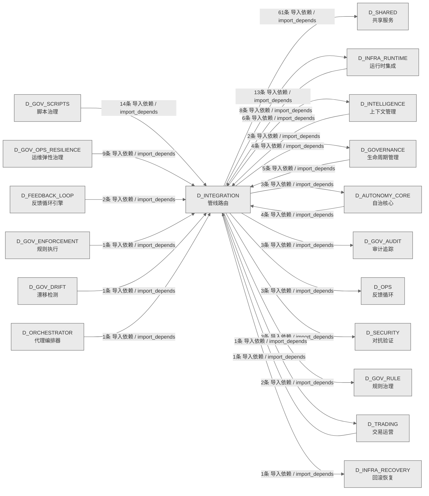

# 21_d_integration / 管线路由域 / Pipeline Routing

> **功能简介 / Overview**: 管线路由，负责跨域数据流路由、管道编排和集成适配

> **文档作用 / Purpose**: 展示 管线路由（D_INTEGRATION）功能域的域内依赖关系、跨域依赖关系，模块信息（成熟度/中英文名/大白话/文件路径）内嵌于 Mermaid 节点，供架构审查和域治理参考。

> 本文档由 generate_domain_doc.py 从 depgraph (PostgreSQL) 自动生成
> 数据源: depgraph (PostgreSQL) nodes表 + edges表

> **[可缩放 HTML 版 / Zoomable HTML](http://localhost:8765/docs/02_enterprise_architecture/02_domain_architecture_docs/_zoomable_html/21_d_integration.html)** — Ctrl+滚轮缩放 ｜ 双击重置 ｜ Ctrl+Shift+D 切换拖动/选择模式

## 域基本信息 / Domain Overview

| 字段 | 值 | Field | Value |
|------|------|-------|-------|
| 编号 | 21 | Number | 21 |
| 域ID | D_INTEGRATION | Domain ID | D_INTEGRATION |
| 域名称 | 管线路由 | Domain Name | Pipeline Routing |
| 层级 | L1 基础平台层 | Layer | L1 Foundation |
| 模块数 | 71 | Module Count | 71 |
| 域内依赖 | 68 | Internal Dependencies | 68 |
| 跨域入边 | 48 | Cross-domain Incoming | 48 |
| 跨域出边 | 100 | Cross-domain Outgoing | 100 |
| 设计态模块 | 0 | Design Modules | 0 |
| 生产态模块 | 71 | Production Modules | 71 |
| 容量 | 71/150 (正常) | Capacity | 71/150 (正常) |
| 描述 | M1-M11双管线路由 | Description | M1-M11双管线路由 |

## 域内依赖图 / Internal Dependency Diagram

> 依赖图内嵌在本文档中，IDE 可直接渲染；网页版可 Ctrl+滚轮缩放 + 拖动平移查看细节。全景图用颜色区分运营态/设计态，不再分页/拆子图。
>
> **图例说明 / Legend**：
> - 🟦 **蓝色 = 运营态模块**（production，已上线运行）
> - 🟧 **橙色虚线 = 设计态模块**（design，蓝图阶段，代码未写）
> - **实线箭头 = 运营态依赖**（已生效的依赖关系）
> - **虚线箭头 = 非运营态依赖**（计划中/验证中的依赖关系）

### 全景依赖图（全部模块，颜色区分运营态/设计态）

> 展示全部 71 个模块（生产态 71 + 设计态 0），节点含成熟度+中英文名+大白话+文件路径。

```mermaid
%%{init: {'theme': 'base', 'themeVariables': {'primaryColor': '#eaeaea', 'primaryTextColor': '#333333', 'primaryBorderColor': '#666666', 'lineColor': '#666666', 'secondaryColor': '#eaeaea', 'tertiaryColor': '#eaeaea', 'fontSize': '14px'}}}%%
flowchart TD
    src_zephyr_integration_behavioral_admission_admission_response_py["(生产态 / production) 准入响应 / Admission Response<br/>InvalidDecisionError<br/>文件: behavioral_admission/admission_response.py"]
    src_zephyr_integration_budget_enforcer_degradation_spiral_detector_py["(生产态 / production) 降级螺旋检测器 / Degradation Spiral Detector<br/>Degradation Spiral Detector — 模型幻觉-容量正反馈螺旋检测 (盲点 #19, M-29)<br/>文件: budget_enforcer/degradation_spiral_detector.py"]
    src_zephyr_integration_llm_bridge_py["(生产态 / production) LLM桥接 / LLM Bridge<br/>接收 RED 问题,生成修复文本。LLM 只润色不做判断。不可用时降级为模板生成。<br/>文件: integration/llm_bridge.py"]
    src_zephyr_integration_mcp_gateway_server_py["(生产态 / production) gateway服务端 / Gateway Server<br/>MCP Gateway 集中式治理节点（MOD-INF-013 §12 Phase 5）。<br/>文件: mcp/gateway_server.py"]
    src_zephyr_integration_mcp_handoff_auto_loader_py["(生产态 / production) handoff自动加载器 / Handoff Auto Loader<br/>Handoff 自动加载器——从 handoff 包恢复 AI session 上下文（MOD-INF-013 §5.3）。<br/>文件: mcp/handoff_auto_loader.py"]
    src_zephyr_integration_mcp_prompt_provider_py["(生产态 / production) 提示词提供者 / Prompt Provider<br/>MCP Prompt 模板提供者（MOD-INF-013 Phase 6 — 关闭 B3）。<br/>文件: mcp/prompt_provider.py"]
    src_zephyr_integration_mcp_resource_provider_py["(生产态 / production) 资源提供者 / Resource Provider<br/>MCP Resource 提供者（MOD-INF-013 Phase 6 — 关闭 B2/B41）。<br/>文件: mcp/resource_provider.py"]
    src_zephyr_integration_mcp_rule_discovery_server_py["(生产态 / production) 规则discovery服务端 / Rule Discovery Server<br/>RuleDiscoveryServer — MCP Server for rule discovery（...<br/>文件: mcp/rule_discovery_server.py"]
    src_zephyr_integration_mcp_server_py["(生产态 / production) MCP服务端 / MCP Server<br/>AssetInventory MCP Server — MOD-INF-026 蓝图 §21<br/>文件: integration/mcp_server.py"]
    src_zephyr_integration_pipeline_orchestrator_py["(生产态 / production) 流水线orchestrator / Pipeline Orchestrator<br/>PipelineOrchestrator — M1-M11 管线协调器<br/>文件: integration/pipeline_orchestrator.py"]
    src_zephyr_integration_ports_py["(生产态 / production) ports / Ports<br/>Protocol-based interface layer for pipeline->mcp dependency abstraction.<br/>文件: integration/ports.py"]
    src_zephyr_integration_shared_contracts_errors_contract_violation_error_py["(生产态 / production) contract违规错误 / Contract Violation Error<br/>==== BEGIN CODGEN:CTR-ERR-006 ====<br/>文件: errors/contract_violation_error.py"]
    src_zephyr_integration_shared_contracts_errors_data_quality_error_py["(生产态 / production) 数据质量错误 / Data Quality Error<br/>CTR-ERR-001: DataQualityError / 行情质量门禁不通过错误<br/>文件: errors/data_quality_error.py"]
    src_zephyr_integration_shared_contracts_errors_execution_rejection_error_py["(生产态 / production) 执行拒绝错误 / Execution Rejection Error<br/>==== BEGIN CODGEN:CTR-ERR-005 ====<br/>文件: errors/execution_rejection_error.py"]
    src_zephyr_integration_shared_contracts_errors_factor_computation_error_py["(生产态 / production) 因子computation错误 / Factor Computation Error<br/>CTR-ERR-002: FactorComputationError / 因子计算失败错误<br/>文件: errors/factor_computation_error.py"]
    src_zephyr_integration_shared_contracts_errors_risk_limit_violation_error_py["(生产态 / production) 风险限制违规错误 / Risk Limit Violation Error<br/>==== BEGIN CODGEN:CTR-ERR-004 ====<br/>文件: errors/risk_limit_violation_error.py"]
    src_zephyr_integration_shared_contracts_errors_signal_degradation_warning_py["(生产态 / production) 信号降级警告 / Signal Degradation Warning<br/>==== BEGIN CODGEN:CTR-ERR-003 ====<br/>文件: errors/signal_degradation_warning.py"]
    src_zephyr_integration_shared_events_dlq_bridge_py["(生产态 / production) dlq桥接 / Dlq Bridge<br/>CT-DLQ-001: DeadLetterQueue -> System Event Bus integration bridge.<br/>文件: events/dlq_bridge.py"]
    src_zephyr_integration_shared_events_event_bus_upgrade_py["(生产态 / production) 事件总线upgrade / Event Bus Upgrade<br/>EventBus Upgrade — 事件总线升级 (M-16)<br/>文件: events/event_bus_upgrade.py"]
    src_zephyr_integration_shared_events_event_schemas_py["(生产态 / production) 事件模式 / Event Schemas<br/>event_schemas.py —— Observer 事件体 Pydantic V2 Schema（盲点 B6/B10 修复）<br/>文件: events/event_schemas.py"]
    src_zephyr_integration_shared_events_upgrade_strategy_py["(生产态 / production) upgrade策略 / Upgrade Strategy<br/>EventBus 升级策略引擎<br/>文件: events/upgrade_strategy.py"]
    src_zephyr_integration_vector_memory_bm25_index_py["(生产态 / production) bm25索引 / Bm25 Index<br/>BM25Index — MOD-INF-011 稀疏检索组件<br/>文件: vector_memory/bm25_index.py"]
    src_zephyr_integration_vector_memory_cache_layer_py["(生产态 / production) 缓存层 / Cache Layer<br/>缓存层模块。<br/>文件: vector_memory/cache_layer.py"]
    src_zephyr_integration_vector_memory_context_ingest_py["(生产态 / production) 上下文摄入 / Context Ingest<br/>VMS 上下文注入器 — ingest_context() 消费者<br/>文件: vector_memory/context_ingest.py"]
    src_zephyr_integration_vector_memory_cross_collection_retriever_py["(生产态 / production) 跨集合retriever / Cross Collection Retriever<br/>CrossCollectionRetriever — MOD-INF-011 跨 Collection 联合检索<br/>文件: vector_memory/cross_collection_retriever.py"]
    src_zephyr_integration_vector_memory_delegated_vector_memory_py["(生产态 / production) delegatedvectormemory / Delegated Vector Memory<br/>DelegatedVectorMemory — VectorMemoryBase 的 RI-02 落地适配器<br/>文件: vector_memory/delegated_vector_memory.py"]
    src_zephyr_integration_vector_memory_design_principles_py["(生产态 / production) 设计原则 / Design Principles<br/>raises DimensionError/ChunkStrategyError/TTLError/HotColdSeparationError/Prov...<br/>文件: vector_memory/design_principles.py"]
    src_zephyr_integration_vector_memory_migrate_chroma_to_faiss_py["(生产态 / production) migratechroma转faiss / Migrate Chroma To Faiss<br/>ChromDB -> FAISS + SQLite WAL 数据迁移脚本<br/>文件: vector_memory/migrate_chroma_to_faiss.py"]
    src_zephyr_integration_vector_memory_ollama_embedding_py["(生产态 / production) Ollama嵌入 / Ollama Embedding<br/>Ollama嵌入模块。<br/>文件: vector_memory/ollama_embedding.py"]
    src_zephyr_integration_vector_memory_vms_memory_backend_py["(生产态 / production) VMSmemorybackend / VMS Memory Backend<br/>VMSMemoryBackend — UnifiedMemoryAPI 的 VMS 后端适配器<br/>文件: vector_memory/vms_memory_backend.py"]
    src_zephyr_shared_contracts_approval_types_py["(生产态 / production) approval类型 / Approval Types<br/>G-CT-004 — ApprovalRequest Pydantic V2 BaseModel 审批请求数据结构.<br/>文件: contracts/approval_types.py"]
    src_zephyr_shared_contracts_rollback_types_py["(生产态 / production) rollback类型 / Rollback Types<br/>G-CT-003 — RollbackResult Pydantic V2 BaseModel 回滚结果数据结构.<br/>文件: contracts/rollback_types.py"]
    src_zephyr_shared_contracts_runtime_types_py["(生产态 / production) 运行时类型 / Runtime Types<br/>定义 RuntimeConfig 等类型。<br/>文件: contracts/runtime_types.py"]
    src_zephyr_shared_evaluation_evals_py["(生产态 / production) 评估 / Evals<br/>定义 EvalDimension、DimensionScore、EvalCase 等类型。<br/>文件: evaluation/evals.py"]
    src_zephyr_shared_resilience_durable_execution_py["(生产态 / production) 持久执行 / Durable Execution<br/>定义 ActivityStatus、ActivityResult、ProgressSnapshot 等类型。<br/>文件: resilience/durable_execution.py"]
    src_zephyr_shared_versioning_version_negotiation_py["(生产态 / production) 版本协商 / Version Negotiation<br/>定义 SchemaName、ChangeType、VersionSegment 等类型。<br/>文件: versioning/version_negotiation.py"]
    src_zephyr_integration_behavioral_admission_admission_response_py ~~~ src_zephyr_integration_budget_enforcer_degradation_spiral_detector_py
    src_zephyr_integration_budget_enforcer_degradation_spiral_detector_py ~~~ src_zephyr_integration_llm_bridge_py
    src_zephyr_integration_llm_bridge_py ~~~ src_zephyr_integration_mcp_gateway_server_py
    src_zephyr_integration_mcp_gateway_server_py ~~~ src_zephyr_integration_mcp_handoff_auto_loader_py
    src_zephyr_integration_mcp_handoff_auto_loader_py ~~~ src_zephyr_integration_mcp_prompt_provider_py
    src_zephyr_integration_mcp_prompt_provider_py ~~~ src_zephyr_integration_mcp_resource_provider_py
    src_zephyr_integration_mcp_resource_provider_py ~~~ src_zephyr_integration_mcp_rule_discovery_server_py
    src_zephyr_integration_mcp_rule_discovery_server_py ~~~ src_zephyr_integration_mcp_server_py
    src_zephyr_integration_mcp_server_py ~~~ src_zephyr_integration_pipeline_orchestrator_py
    src_zephyr_integration_pipeline_orchestrator_py ~~~ src_zephyr_integration_ports_py
    src_zephyr_integration_ports_py ~~~ src_zephyr_integration_shared_contracts_errors_contract_violation_error_py
    src_zephyr_integration_shared_contracts_errors_contract_violation_error_py ~~~ src_zephyr_integration_shared_contracts_errors_data_quality_error_py
    src_zephyr_integration_shared_contracts_errors_data_quality_error_py ~~~ src_zephyr_integration_shared_contracts_errors_execution_rejection_error_py
    src_zephyr_integration_shared_contracts_errors_execution_rejection_error_py ~~~ src_zephyr_integration_shared_contracts_errors_factor_computation_error_py
    src_zephyr_integration_shared_contracts_errors_factor_computation_error_py ~~~ src_zephyr_integration_shared_contracts_errors_risk_limit_violation_error_py
    src_zephyr_integration_shared_contracts_errors_risk_limit_violation_error_py ~~~ src_zephyr_integration_shared_contracts_errors_signal_degradation_warning_py
    src_zephyr_integration_shared_contracts_errors_signal_degradation_warning_py ~~~ src_zephyr_integration_shared_events_dlq_bridge_py
    src_zephyr_integration_shared_events_dlq_bridge_py ~~~ src_zephyr_integration_shared_events_event_bus_upgrade_py
    src_zephyr_integration_shared_events_event_bus_upgrade_py ~~~ src_zephyr_integration_shared_events_event_schemas_py
    src_zephyr_integration_shared_events_event_schemas_py ~~~ src_zephyr_integration_shared_events_upgrade_strategy_py
    src_zephyr_integration_shared_events_upgrade_strategy_py ~~~ src_zephyr_integration_vector_memory_bm25_index_py
    src_zephyr_integration_vector_memory_bm25_index_py ~~~ src_zephyr_integration_vector_memory_cache_layer_py
    src_zephyr_integration_vector_memory_cache_layer_py ~~~ src_zephyr_integration_vector_memory_context_ingest_py
    src_zephyr_integration_vector_memory_context_ingest_py ~~~ src_zephyr_integration_vector_memory_cross_collection_retriever_py
    src_zephyr_integration_vector_memory_cross_collection_retriever_py ~~~ src_zephyr_integration_vector_memory_delegated_vector_memory_py
    src_zephyr_integration_vector_memory_delegated_vector_memory_py ~~~ src_zephyr_integration_vector_memory_design_principles_py
    src_zephyr_integration_vector_memory_design_principles_py ~~~ src_zephyr_integration_vector_memory_migrate_chroma_to_faiss_py
    src_zephyr_integration_vector_memory_migrate_chroma_to_faiss_py ~~~ src_zephyr_integration_vector_memory_ollama_embedding_py
    src_zephyr_integration_vector_memory_ollama_embedding_py ~~~ src_zephyr_integration_vector_memory_vms_memory_backend_py
    src_zephyr_integration_vector_memory_vms_memory_backend_py ~~~ src_zephyr_shared_contracts_approval_types_py
    src_zephyr_shared_contracts_approval_types_py ~~~ src_zephyr_shared_contracts_rollback_types_py
    src_zephyr_shared_contracts_rollback_types_py ~~~ src_zephyr_shared_contracts_runtime_types_py
    src_zephyr_shared_contracts_runtime_types_py ~~~ src_zephyr_shared_evaluation_evals_py
    src_zephyr_shared_evaluation_evals_py ~~~ src_zephyr_shared_resilience_durable_execution_py
    src_zephyr_shared_resilience_durable_execution_py ~~~ src_zephyr_shared_versioning_version_negotiation_py
    src_zephyr_integration_local_model_cache_layer_py["(生产态 / production) 缓存层 / Cache Layer<br/>CacheLayer — MOD-INF-011 嵌入缓存与查询结果 LRU<br/>文件: local_model/cache_layer.py"]
    src_zephyr_integration_local_model_local_model_scheduler_py["(生产态 / production) 本地模型调度器 / Local Model Scheduler<br/>LocalModelScheduler — L2 本地模型 24/7 调度循环<br/>文件: local_model/local_model_scheduler.py"]
    src_zephyr_integration_local_model_ollama_embedding_py["(生产态 / production) Ollama嵌入 / Ollama Embedding<br/>OllamaEmbedder — 通过 Ollama HTTP API 生成文本嵌入<br/>文件: local_model/ollama_embedding.py"]
    src_zephyr_integration_mcp_audit_logger_py["(生产态 / production) 审计日志器 / Audit Logger<br/>MCP 全量工具调用审计日志（MOD-INF-013 §12 Step 4）。<br/>文件: mcp/audit_logger.py"]
    src_zephyr_integration_mcp_blueprint_search_server_py["(生产态 / production) 蓝图search服务端 / Blueprint Search Server<br/>BlueprintSearchServer — MCP Server for blueprint discovery<br/>文件: mcp/blueprint_search_server.py"]
    src_zephyr_integration_mcp_doc_guard_server_py["(生产态 / production) doc守卫服务端 / Doc Guard Server<br/>DocGuardServer: 跨会话交接协议服务 MCP Server<br/>文件: mcp/doc_guard_server.py"]
    src_zephyr_integration_mcp_gate_engine_server_py["(生产态 / production) 门禁引擎服务端 / Gate Engine Server<br/>GateEngineServer: 门禁裁决服务 MCP Server<br/>文件: mcp/gate_engine_server.py"]
    src_zephyr_integration_mcp_rate_limiter_py["(生产态 / production) ratelimiter / Rate Limiter<br/>MCP Gateway 同步速率限制器（MOD-INF-013 §12 Step 3）。<br/>文件: mcp/rate_limiter.py"]
    src_zephyr_integration_mcp_sandbox_server_py["(生产态 / production) 沙箱服务端 / Sandbox Server<br/>MCP sandbox 安全代码执行沙箱（MOD-INF-013 Phase 7 — 关闭 B4）。<br/>文件: mcp/sandbox_server.py"]
    src_zephyr_integration_mcp_sentinel_server_py["(生产态 / production) sentinel服务端 / Sentinel Server<br/>SentinelServer: 意图路由哨兵 MCP Server<br/>文件: mcp/sentinel_server.py"]
    src_zephyr_integration_mcp_task_manager_server_py["(生产态 / production) 任务管理器服务端 / Task Manager Server<br/>ZephyrAlpha MCP Task Manager Server<br/>文件: mcp/task_manager_server.py"]
    src_zephyr_integration_mcp_telemetry_server_py["(生产态 / production) 遥测服务端 / Telemetry Server<br/>ZephyrAlpha MCP Telemetry Server — 系统可观测性 MCP 接口<br/>文件: mcp/telemetry_server.py"]
    src_zephyr_integration_mcp_vector_memory_server_py["(生产态 / production) vectormemory服务端 / Vector Memory Server<br/>VectorMemoryServer: VMS 向量记忆 MCP Server (MOD-INF-011 v0.7.0)<br/>文件: mcp/vector_memory_server.py"]
    src_zephyr_integration_vector_memory_bridge_layer_py["(生产态 / production) 桥接层 / Bridge Layer<br/>BridgeLayer — MOD-INF-011 kb/ ↔ VMS 过渡桥接<br/>文件: vector_memory/bridge_layer.py"]
    src_zephyr_integration_vector_memory_collection_schemas_py["(生产态 / production) 集合模式 / Collection Schemas<br/>COLLECTION_SCHEMAS keys match COLLECTION_NAMES; dimensions in ALLOWED_DIMENSIONS<br/>文件: vector_memory/collection_schemas.py"]
    src_zephyr_integration_vector_memory_faiss_collection_manager_py["(生产态 / production) faiss集合管理器 / Faiss Collection Manager<br/>FAISSCollectionManager — FAISS HNSW/IVF+PQ 8 Collection 全生命周期管理<br/>文件: vector_memory/faiss_collection_manager.py"]
    src_zephyr_integration_vector_memory_hybrid_retriever_py["(生产态 / production) hybridretriever / Hybrid Retriever<br/>HybridRetriever — MOD-INF-011 混合检索架构<br/>文件: vector_memory/hybrid_retriever.py"]
    src_zephyr_integration_vector_memory_in_memory_fake_vms_py["(生产态 / production) inmemoryfakeVMS / In Memory Fake VMS<br/>InMemoryFakeVMS — MOD-INF-011 · 零依赖测试双胞胎<br/>文件: vector_memory/in_memory_fake_vms.py"]
    src_zephyr_integration_vector_memory_interface_py["(生产态 / production) interface / Interface<br/>VMS — Vector Memory Service 接口基类<br/>文件: vector_memory/interface.py"]
    src_zephyr_integration_vector_memory_provenance_enforcer_py["(生产态 / production) 溯源执行器 / Provenance Enforcer<br/>ProvenanceEnforcer — MOD-INF-011 写入溯源强制执行<br/>文件: vector_memory/provenance_enforcer.py"]
    src_zephyr_integration_vector_memory_sqlite_metadata_store_py["(生产态 / production) sqlitemetadatastore / Sqlite Metadata Store<br/>SQLiteMetadataStore — VMS 元数据存储 (SQLite WAL + FTS5 BM25)<br/>文件: vector_memory/sqlite_metadata_store.py"]
    src_zephyr_integration_vector_memory_vms_schemas_py["(生产态 / production) VMS模式 / VMS Schemas<br/>VMS 共享数据模型 — MOD-INF-011 · 蓝图 §6.1 接口契约<br/>文件: vector_memory/vms_schemas.py"]
    src_zephyr_shared_contracts_protocols_py["(生产态 / production) 协议 / Protocols<br/>Structural Protocol interfaces for cross-module contracts.<br/>文件: contracts/protocols.py"]
    src_zephyr_integration_local_model_cache_layer_py ~~~ src_zephyr_integration_local_model_local_model_scheduler_py
    src_zephyr_integration_local_model_local_model_scheduler_py ~~~ src_zephyr_integration_local_model_ollama_embedding_py
    src_zephyr_integration_local_model_ollama_embedding_py ~~~ src_zephyr_integration_mcp_audit_logger_py
    src_zephyr_integration_mcp_audit_logger_py ~~~ src_zephyr_integration_mcp_blueprint_search_server_py
    src_zephyr_integration_mcp_blueprint_search_server_py ~~~ src_zephyr_integration_mcp_doc_guard_server_py
    src_zephyr_integration_mcp_doc_guard_server_py ~~~ src_zephyr_integration_mcp_gate_engine_server_py
    src_zephyr_integration_mcp_gate_engine_server_py ~~~ src_zephyr_integration_mcp_rate_limiter_py
    src_zephyr_integration_mcp_rate_limiter_py ~~~ src_zephyr_integration_mcp_sandbox_server_py
    src_zephyr_integration_mcp_sandbox_server_py ~~~ src_zephyr_integration_mcp_sentinel_server_py
    src_zephyr_integration_mcp_sentinel_server_py ~~~ src_zephyr_integration_mcp_task_manager_server_py
    src_zephyr_integration_mcp_task_manager_server_py ~~~ src_zephyr_integration_mcp_telemetry_server_py
    src_zephyr_integration_mcp_telemetry_server_py ~~~ src_zephyr_integration_mcp_vector_memory_server_py
    src_zephyr_integration_mcp_vector_memory_server_py ~~~ src_zephyr_integration_vector_memory_bridge_layer_py
    src_zephyr_integration_vector_memory_bridge_layer_py ~~~ src_zephyr_integration_vector_memory_collection_schemas_py
    src_zephyr_integration_vector_memory_collection_schemas_py ~~~ src_zephyr_integration_vector_memory_faiss_collection_manager_py
    src_zephyr_integration_vector_memory_faiss_collection_manager_py ~~~ src_zephyr_integration_vector_memory_hybrid_retriever_py
    src_zephyr_integration_vector_memory_hybrid_retriever_py ~~~ src_zephyr_integration_vector_memory_in_memory_fake_vms_py
    src_zephyr_integration_vector_memory_in_memory_fake_vms_py ~~~ src_zephyr_integration_vector_memory_interface_py
    src_zephyr_integration_vector_memory_interface_py ~~~ src_zephyr_integration_vector_memory_provenance_enforcer_py
    src_zephyr_integration_vector_memory_provenance_enforcer_py ~~~ src_zephyr_integration_vector_memory_sqlite_metadata_store_py
    src_zephyr_integration_vector_memory_sqlite_metadata_store_py ~~~ src_zephyr_integration_vector_memory_vms_schemas_py
    src_zephyr_integration_vector_memory_vms_schemas_py ~~~ src_zephyr_shared_contracts_protocols_py
    src_zephyr_integration_local_model_embedding_router_py["(生产态 / production) 嵌入路由器 / Embedding Router<br/>EmbeddingRouter — MOD-INF-011 双嵌入维度路由<br/>文件: local_model/embedding_router.py"]
    src_zephyr_integration_local_model_ollama_chat_py["(生产态 / production) Ollamachat / Ollama Chat<br/>OllamaChat — 通过 Ollama HTTP API 进行本地 LLM 推理<br/>文件: local_model/ollama_chat.py"]
    src_zephyr_integration_mcp_base_server_py["(生产态 / production) 基础服务端 / Base Server<br/>BaseMCPServer: stdio 传输 + JSON-RPC 2.0 协议基类<br/>文件: mcp/_base_server.py"]
    src_zephyr_integration_vector_memory_collection_manager_py["(生产态 / production) 集合管理器 / Collection Manager<br/>CollectionManager — MOD-INF-011 八大 Collection 全生命周期管理<br/>文件: vector_memory/collection_manager.py"]
    src_zephyr_integration_vector_memory_in_process_vector_memory_py["(生产态 / production) inprocessvectormemory / In Process Vector Memory<br/>InProcessVectorMemory — MOD-INF-011 VMS 统一入口<br/>文件: vector_memory/in_process_vector_memory.py"]
    src_zephyr_integration_vector_memory_vms_errors_py["(生产态 / production) VMS错误 / VMS Errors<br/>VMSError hierarchy; no side effects<br/>文件: vector_memory/vms_errors.py"]
    src_zephyr_integration_local_model_embedding_router_py ~~~ src_zephyr_integration_local_model_ollama_chat_py
    src_zephyr_integration_local_model_ollama_chat_py ~~~ src_zephyr_integration_mcp_base_server_py
    src_zephyr_integration_mcp_base_server_py ~~~ src_zephyr_integration_vector_memory_collection_manager_py
    src_zephyr_integration_vector_memory_collection_manager_py ~~~ src_zephyr_integration_vector_memory_in_process_vector_memory_py
    src_zephyr_integration_vector_memory_in_process_vector_memory_py ~~~ src_zephyr_integration_vector_memory_vms_errors_py
    src_zephyr_integration_mcp_error_codes_py["(生产态 / production) 错误代码 / Error Codes<br/>MCP 错误码集中注册（MOD-INF-013 §3.4）。<br/>文件: mcp/error_codes.py"]
    src_zephyr_integration_vector_memory_chunk_strategy_router_py["(生产态 / production) chunk策略路由器 / Chunk Strategy Router<br/>ChunkStrategyRouter — MOD-INF-011 分块策略调度<br/>文件: vector_memory/chunk_strategy_router.py"]
    src_zephyr_integration_vector_memory_in_memory_memory_backend_py["(生产态 / production) inmemorymemorybackend / In Memory Memory Backend<br/>DegradedVMSBackend — MOD-INF-011 降级兜底<br/>文件: vector_memory/in_memory_memory_backend.py"]
    src_zephyr_integration_vector_memory_index_health_monitor_py["(生产态 / production) 索引健康监控器 / Index Health Monitor<br/>IndexHealthMonitor — MOD-INF-011 索引健康自检与自动修复<br/>文件: vector_memory/index_health_monitor.py"]
    src_zephyr_integration_vector_memory_retrieval_feedback_py["(生产态 / production) retrieval反馈 / Retrieval Feedback<br/>RetrievalFeedback — MOD-INF-011 FLE 检索质量消费<br/>文件: vector_memory/retrieval_feedback.py"]
    src_zephyr_integration_vector_memory_vector_bridge_py["(生产态 / production) vector桥接 / Vector Bridge<br/>VectorBridge — MOD-INF-011 CE/KB 外部集成适配器<br/>文件: vector_memory/vector_bridge.py"]
    src_zephyr_integration_vector_memory_chunk_strategy_router_py ~~~ src_zephyr_integration_vector_memory_in_memory_memory_backend_py
    src_zephyr_integration_vector_memory_in_memory_memory_backend_py ~~~ src_zephyr_integration_vector_memory_index_health_monitor_py
    src_zephyr_integration_vector_memory_index_health_monitor_py ~~~ src_zephyr_integration_vector_memory_retrieval_feedback_py
    src_zephyr_integration_vector_memory_retrieval_feedback_py ~~~ src_zephyr_integration_vector_memory_vector_bridge_py
    src_zephyr_integration_pipeline_orchestrator_py -->|导入依赖 / import_depends| src_zephyr_integration_local_model_local_model_scheduler_py
    src_zephyr_integration_pipeline_orchestrator_py -->|导入依赖 / import_depends| src_zephyr_integration_local_model_embedding_router_py
    src_zephyr_integration_pipeline_orchestrator_py -->|导入依赖 / import_depends| src_zephyr_shared_contracts_protocols_py
    src_zephyr_integration_local_model_local_model_scheduler_py -->|导入依赖 / import_depends| src_zephyr_integration_local_model_embedding_router_py
    src_zephyr_integration_local_model_local_model_scheduler_py -->|导入依赖 / import_depends| src_zephyr_integration_local_model_ollama_chat_py
    src_zephyr_integration_local_model_embedding_router_py -->|导入依赖 / import_depends| src_zephyr_integration_local_model_ollama_embedding_py
    src_zephyr_integration_mcp_doc_guard_server_py -->|导入依赖 / import_depends| src_zephyr_integration_mcp_base_server_py
    src_zephyr_integration_mcp_blueprint_search_server_py -->|导入依赖 / import_depends| src_zephyr_integration_mcp_base_server_py
    src_zephyr_integration_mcp_gateway_server_py -->|导入依赖 / import_depends| src_zephyr_integration_mcp_audit_logger_py
    src_zephyr_integration_mcp_gateway_server_py -->|导入依赖 / import_depends| src_zephyr_integration_mcp_doc_guard_server_py
    src_zephyr_integration_mcp_gateway_server_py -->|导入依赖 / import_depends| src_zephyr_integration_mcp_blueprint_search_server_py
    src_zephyr_integration_mcp_gateway_server_py -->|导入依赖 / import_depends| src_zephyr_integration_mcp_error_codes_py
    src_zephyr_integration_mcp_gateway_server_py -->|导入依赖 / import_depends| src_zephyr_integration_mcp_sandbox_server_py
    src_zephyr_integration_mcp_gateway_server_py -->|导入依赖 / import_depends| src_zephyr_integration_mcp_gate_engine_server_py
    src_zephyr_integration_mcp_gateway_server_py -->|导入依赖 / import_depends| src_zephyr_integration_mcp_rate_limiter_py
    src_zephyr_integration_mcp_gateway_server_py -->|导入依赖 / import_depends| src_zephyr_integration_mcp_sentinel_server_py
    src_zephyr_integration_mcp_gateway_server_py -->|导入依赖 / import_depends| src_zephyr_integration_mcp_vector_memory_server_py
    src_zephyr_integration_mcp_gateway_server_py -->|导入依赖 / import_depends| src_zephyr_integration_mcp_base_server_py
    src_zephyr_integration_mcp_gateway_server_py -->|导入依赖 / import_depends| src_zephyr_integration_mcp_task_manager_server_py
    src_zephyr_integration_mcp_gateway_server_py -->|导入依赖 / import_depends| src_zephyr_integration_mcp_telemetry_server_py
    src_zephyr_integration_mcp_sandbox_server_py -->|导入依赖 / import_depends| src_zephyr_integration_mcp_base_server_py
    src_zephyr_integration_mcp_gate_engine_server_py -->|导入依赖 / import_depends| src_zephyr_integration_mcp_base_server_py
    src_zephyr_integration_mcp_rule_discovery_server_py -->|导入依赖 / import_depends| src_zephyr_integration_mcp_base_server_py
    src_zephyr_integration_mcp_sentinel_server_py -->|导入依赖 / import_depends| src_zephyr_integration_mcp_base_server_py
    src_zephyr_integration_mcp_vector_memory_server_py -->|导入依赖 / import_depends| src_zephyr_integration_mcp_base_server_py
    src_zephyr_integration_mcp_vector_memory_server_py -->|导入依赖 / import_depends| src_zephyr_integration_vector_memory_collection_manager_py
    src_zephyr_integration_mcp_vector_memory_server_py -->|导入依赖 / import_depends| src_zephyr_integration_vector_memory_in_process_vector_memory_py
    src_zephyr_integration_mcp_vector_memory_server_py -->|导入依赖 / import_depends| src_zephyr_integration_vector_memory_vms_errors_py
    src_zephyr_integration_mcp_base_server_py -->|导入依赖 / import_depends| src_zephyr_integration_mcp_error_codes_py
    src_zephyr_integration_vector_memory_cache_layer_py -->|导入依赖 / import_depends| src_zephyr_integration_local_model_cache_layer_py
    src_zephyr_integration_vector_memory_bridge_layer_py -->|导入依赖 / import_depends| src_zephyr_integration_vector_memory_collection_manager_py
    src_zephyr_integration_vector_memory_delegated_vector_memory_py -->|导入依赖 / import_depends| src_zephyr_integration_vector_memory_interface_py
    src_zephyr_integration_vector_memory_context_ingest_py -->|导入依赖 / import_depends| src_zephyr_integration_vector_memory_in_memory_fake_vms_py
    src_zephyr_integration_vector_memory_cross_collection_retriever_py -->|导入依赖 / import_depends| src_zephyr_integration_vector_memory_hybrid_retriever_py
    src_zephyr_integration_vector_memory_design_principles_py -->|导入依赖 / import_depends| src_zephyr_integration_vector_memory_collection_schemas_py
    src_zephyr_integration_vector_memory_design_principles_py -->|导入依赖 / import_depends| src_zephyr_integration_vector_memory_provenance_enforcer_py
    src_zephyr_integration_vector_memory_design_principles_py -->|导入依赖 / import_depends| src_zephyr_integration_vector_memory_vms_errors_py
    src_zephyr_integration_vector_memory_design_principles_py -->|导入依赖 / import_depends| src_zephyr_integration_vector_memory_vms_schemas_py
    src_zephyr_integration_vector_memory_collection_manager_py -->|导入依赖 / import_depends| src_zephyr_integration_local_model_embedding_router_py
    src_zephyr_integration_vector_memory_collection_manager_py -->|导入依赖 / import_depends| src_zephyr_integration_vector_memory_collection_schemas_py
    src_zephyr_integration_vector_memory_in_memory_fake_vms_py -->|导入依赖 / import_depends| src_zephyr_integration_vector_memory_collection_manager_py
    src_zephyr_integration_vector_memory_hybrid_retriever_py -->|导入依赖 / import_depends| src_zephyr_integration_local_model_embedding_router_py
    src_zephyr_integration_vector_memory_hybrid_retriever_py -->|导入依赖 / import_depends| src_zephyr_integration_vector_memory_collection_manager_py
    src_zephyr_integration_vector_memory_index_health_monitor_py -->|导入依赖 / import_depends| src_zephyr_integration_vector_memory_collection_manager_py
    src_zephyr_integration_vector_memory_in_process_vector_memory_py -->|导入依赖 / import_depends| src_zephyr_integration_local_model_cache_layer_py
    src_zephyr_integration_vector_memory_in_process_vector_memory_py -->|导入依赖 / import_depends| src_zephyr_integration_local_model_embedding_router_py
    src_zephyr_integration_vector_memory_in_process_vector_memory_py -->|导入依赖 / import_depends| src_zephyr_integration_vector_memory_bridge_layer_py
    src_zephyr_integration_vector_memory_in_process_vector_memory_py -->|导入依赖 / import_depends| src_zephyr_integration_vector_memory_chunk_strategy_router_py
    src_zephyr_integration_vector_memory_in_process_vector_memory_py -->|导入依赖 / import_depends| src_zephyr_integration_vector_memory_collection_manager_py
    src_zephyr_integration_vector_memory_in_process_vector_memory_py -->|导入依赖 / import_depends| src_zephyr_integration_vector_memory_hybrid_retriever_py
    src_zephyr_integration_vector_memory_in_process_vector_memory_py -->|导入依赖 / import_depends| src_zephyr_integration_vector_memory_index_health_monitor_py
    src_zephyr_integration_vector_memory_in_process_vector_memory_py -->|导入依赖 / import_depends| src_zephyr_integration_vector_memory_provenance_enforcer_py
    src_zephyr_integration_vector_memory_in_process_vector_memory_py -->|导入依赖 / import_depends| src_zephyr_integration_vector_memory_in_memory_memory_backend_py
    src_zephyr_integration_vector_memory_in_process_vector_memory_py -->|导入依赖 / import_depends| src_zephyr_integration_vector_memory_vector_bridge_py
    src_zephyr_integration_vector_memory_in_process_vector_memory_py -->|导入依赖 / import_depends| src_zephyr_integration_vector_memory_retrieval_feedback_py
    src_zephyr_integration_vector_memory_faiss_collection_manager_py -->|导入依赖 / import_depends| src_zephyr_integration_vector_memory_collection_manager_py
    src_zephyr_integration_vector_memory_migrate_chroma_to_faiss_py -->|导入依赖 / import_depends| src_zephyr_integration_vector_memory_collection_manager_py
    src_zephyr_integration_vector_memory_migrate_chroma_to_faiss_py -->|导入依赖 / import_depends| src_zephyr_integration_vector_memory_faiss_collection_manager_py
    src_zephyr_integration_vector_memory_migrate_chroma_to_faiss_py -->|导入依赖 / import_depends| src_zephyr_integration_vector_memory_sqlite_metadata_store_py
    src_zephyr_integration_vector_memory_provenance_enforcer_py -->|导入依赖 / import_depends| src_zephyr_integration_vector_memory_collection_manager_py
    src_zephyr_integration_vector_memory_provenance_enforcer_py -->|导入依赖 / import_depends| src_zephyr_integration_vector_memory_vms_schemas_py
    src_zephyr_integration_vector_memory_ollama_embedding_py -->|导入依赖 / import_depends| src_zephyr_integration_local_model_ollama_embedding_py
    src_zephyr_integration_vector_memory_vector_bridge_py -->|导入依赖 / import_depends| src_zephyr_integration_vector_memory_in_process_vector_memory_py
    src_zephyr_integration_vector_memory_sqlite_metadata_store_py -->|导入依赖 / import_depends| src_zephyr_integration_vector_memory_collection_manager_py
    src_zephyr_integration_vector_memory_vms_memory_backend_py -->|导入依赖 / import_depends| src_zephyr_integration_vector_memory_bridge_layer_py
    src_zephyr_integration_vector_memory_vms_memory_backend_py -->|导入依赖 / import_depends| src_zephyr_integration_vector_memory_in_process_vector_memory_py
    src_zephyr_integration_vector_memory_retrieval_feedback_py -->|导入依赖 / import_depends| src_zephyr_integration_vector_memory_hybrid_retriever_py
    src_zephyr_integration_vector_memory_retrieval_feedback_py -->|导入依赖 / import_depends| src_zephyr_integration_vector_memory_in_process_vector_memory_py
    D_SHARED["(生产态 / production) 共享服务 / Shared Services<br/>共享服务，负责跨域共享的工具、协议和基础服务<br/>跨域节点 / cross-domain"]
    src_zephyr_integration_pipeline_orchestrator_py -->|导入依赖 / import_depends| D_SHARED
    src_zephyr_integration_pipeline_orchestrator_py -->|导入依赖 / import_depends| D_SHARED
    src_zephyr_integration_shared_events_dlq_bridge_py -->|导入依赖 / import_depends| D_SHARED
    src_zephyr_integration_pipeline_orchestrator_py -->|导入依赖 / import_depends| D_SHARED
    D_OPS["(生产态 / production) 反馈循环 / Feedback Loop<br/>反馈循环，负责系统运行反馈、性能监控和自动调优闭环<br/>跨域节点 / cross-domain"]
    src_zephyr_integration_pipeline_orchestrator_py -->|导入依赖 / import_depends| D_OPS
    src_zephyr_integration_vector_memory_collection_manager_py -->|导入依赖 / import_depends| D_SHARED
    src_zephyr_integration_mcp_rate_limiter_py -->|导入依赖 / import_depends| D_SHARED
    D_GOV_AUDIT["(生产态 / production) 审计追踪 / Audit Trail<br/>审计追踪，负责变更审计追踪和操作日志管理<br/>跨域节点 / cross-domain"]
    src_zephyr_integration_llm_bridge_py -->|导入依赖 / import_depends| D_GOV_AUDIT
    src_zephyr_integration_shared_contracts_errors_execution_rejection_error_py -->|导入依赖 / import_depends| D_SHARED
    src_zephyr_integration_pipeline_orchestrator_py -->|导入依赖 / import_depends| D_SHARED
    src_zephyr_integration_local_model_ollama_embedding_py -->|导入依赖 / import_depends| D_SHARED
    src_zephyr_integration_pipeline_orchestrator_py -->|导入依赖 / import_depends| D_SHARED
    D_SECURITY["(生产态 / production) 对抗验证 / Adversarial Validation<br/>对抗验证，负责系统安全对抗测试、漏洞扫描和攻防验证<br/>跨域节点 / cross-domain"]
    src_zephyr_integration_pipeline_orchestrator_py -->|导入依赖 / import_depends| D_SECURITY
    src_zephyr_shared_contracts_runtime_types_py -->|导入依赖 / import_depends| D_SHARED
    src_zephyr_shared_contracts_runtime_types_py -->|导入依赖 / import_depends| D_SHARED
    D_GOV_OPS_RESILIENCE["(生产态 / production) 运维弹性治理 / Ops Resilience Governance<br/>运维弹性治理，负责运维治理、安全治理、弹性治理和升级协议<br/>跨域节点 / cross-domain"]
    D_GOV_OPS_RESILIENCE -->|导入依赖 / import_depends| src_zephyr_shared_contracts_rollback_types_py
    D_GOV_OPS_RESILIENCE -->|导入依赖 / import_depends| src_zephyr_integration_vector_memory_index_health_monitor_py
    D_INFRA_RUNTIME["(生产态 / production) 运行时集成 / Runtime Integration<br/>运行时集成，负责组件生命周期编排、启动钩子和运行时上下文管理<br/>跨域节点 / cross-domain"]
    D_INFRA_RUNTIME -->|导入依赖 / import_depends| src_zephyr_integration_local_model_local_model_scheduler_py
    D_GOV_SCRIPTS["(生产态 / production) 脚本治理 / Script Governance<br/>脚本治理，负责脚本生命周期管理和脚本质量门禁<br/>跨域节点 / cross-domain"]
    D_GOV_SCRIPTS -->|导入依赖 / import_depends| src_zephyr_integration_vector_memory_collection_manager_py
    D_GOVERNANCE["(生产态 / production) 生命周期管理 / Lifecycle Management<br/>生命周期管理，负责蓝图/模块/任务的声明周期管理和元数据治理<br/>跨域节点 / cross-domain"]
    D_GOVERNANCE -->|导入依赖 / import_depends| src_zephyr_integration_mcp_base_server_py
    D_INFRA_RUNTIME -->|导入依赖 / import_depends| src_zephyr_integration_pipeline_orchestrator_py
    D_GOV_SCRIPTS -->|导入依赖 / import_depends| src_zephyr_integration_vector_memory_bridge_layer_py
    D_GOV_SCRIPTS -->|导入依赖 / import_depends| src_zephyr_integration_vector_memory_collection_manager_py
    D_GOV_SCRIPTS -->|导入依赖 / import_depends| src_zephyr_integration_vector_memory_collection_manager_py
    D_GOV_SCRIPTS -->|导入依赖 / import_depends| src_zephyr_integration_vector_memory_collection_manager_py
    D_INFRA_RUNTIME -->|导入依赖 / import_depends| src_zephyr_shared_contracts_runtime_types_py
    D_GOV_SCRIPTS -->|导入依赖 / import_depends| src_zephyr_integration_vector_memory_index_health_monitor_py
    D_GOV_SCRIPTS -->|导入依赖 / import_depends| src_zephyr_integration_vector_memory_collection_manager_py
    D_GOV_SCRIPTS -->|导入依赖 / import_depends| src_zephyr_integration_vector_memory_bridge_layer_py
    D_GOV_SCRIPTS -->|导入依赖 / import_depends| src_zephyr_integration_vector_memory_index_health_monitor_py
    classDef production fill:#e1f5fe,stroke:#01579b,stroke-width:2px,color:#000
    classDef design fill:#fff3e0,stroke:#e65100,stroke-width:2px,color:#000,stroke-dasharray: 5 5
    classDef external_prod fill:#e8f4fd,stroke:#0277bd,stroke-width:1px,color:#000
    classDef external_design fill:#fff8e7,stroke:#ef6c00,stroke-width:1px,color:#000,stroke-dasharray: 5 5
    class src_zephyr_integration_behavioral_admission_admission_response_py,src_zephyr_integration_budget_enforcer_degradation_spiral_detector_py,src_zephyr_integration_llm_bridge_py,src_zephyr_integration_local_model_cache_layer_py,src_zephyr_integration_local_model_embedding_router_py,src_zephyr_integration_local_model_local_model_scheduler_py,src_zephyr_integration_local_model_ollama_chat_py,src_zephyr_integration_local_model_ollama_embedding_py,src_zephyr_integration_mcp_base_server_py,src_zephyr_integration_mcp_audit_logger_py,src_zephyr_integration_mcp_blueprint_search_server_py,src_zephyr_integration_mcp_doc_guard_server_py,src_zephyr_integration_mcp_error_codes_py,src_zephyr_integration_mcp_gate_engine_server_py,src_zephyr_integration_mcp_gateway_server_py,src_zephyr_integration_mcp_handoff_auto_loader_py,src_zephyr_integration_mcp_prompt_provider_py,src_zephyr_integration_mcp_rate_limiter_py,src_zephyr_integration_mcp_resource_provider_py,src_zephyr_integration_mcp_rule_discovery_server_py,src_zephyr_integration_mcp_sandbox_server_py,src_zephyr_integration_mcp_sentinel_server_py,src_zephyr_integration_mcp_task_manager_server_py,src_zephyr_integration_mcp_telemetry_server_py,src_zephyr_integration_mcp_vector_memory_server_py,src_zephyr_integration_mcp_server_py,src_zephyr_integration_pipeline_orchestrator_py,src_zephyr_integration_ports_py,src_zephyr_integration_shared_contracts_errors_contract_violation_error_py,src_zephyr_integration_shared_contracts_errors_data_quality_error_py,src_zephyr_integration_shared_contracts_errors_execution_rejection_error_py,src_zephyr_integration_shared_contracts_errors_factor_computation_error_py,src_zephyr_integration_shared_contracts_errors_risk_limit_violation_error_py,src_zephyr_integration_shared_contracts_errors_signal_degradation_warning_py,src_zephyr_integration_shared_events_dlq_bridge_py,src_zephyr_integration_shared_events_event_bus_upgrade_py,src_zephyr_integration_shared_events_event_schemas_py,src_zephyr_integration_shared_events_upgrade_strategy_py,src_zephyr_integration_vector_memory_bm25_index_py,src_zephyr_integration_vector_memory_bridge_layer_py,src_zephyr_integration_vector_memory_cache_layer_py,src_zephyr_integration_vector_memory_chunk_strategy_router_py,src_zephyr_integration_vector_memory_collection_manager_py,src_zephyr_integration_vector_memory_collection_schemas_py,src_zephyr_integration_vector_memory_context_ingest_py,src_zephyr_integration_vector_memory_cross_collection_retriever_py,src_zephyr_integration_vector_memory_delegated_vector_memory_py,src_zephyr_integration_vector_memory_design_principles_py,src_zephyr_integration_vector_memory_faiss_collection_manager_py,src_zephyr_integration_vector_memory_hybrid_retriever_py,src_zephyr_integration_vector_memory_in_memory_fake_vms_py,src_zephyr_integration_vector_memory_in_memory_memory_backend_py,src_zephyr_integration_vector_memory_in_process_vector_memory_py,src_zephyr_integration_vector_memory_index_health_monitor_py,src_zephyr_integration_vector_memory_interface_py,src_zephyr_integration_vector_memory_migrate_chroma_to_faiss_py,src_zephyr_integration_vector_memory_ollama_embedding_py,src_zephyr_integration_vector_memory_provenance_enforcer_py,src_zephyr_integration_vector_memory_retrieval_feedback_py,src_zephyr_integration_vector_memory_sqlite_metadata_store_py,src_zephyr_integration_vector_memory_vector_bridge_py,src_zephyr_integration_vector_memory_vms_errors_py,src_zephyr_integration_vector_memory_vms_memory_backend_py,src_zephyr_integration_vector_memory_vms_schemas_py,src_zephyr_shared_contracts_approval_types_py,src_zephyr_shared_contracts_protocols_py,src_zephyr_shared_contracts_rollback_types_py,src_zephyr_shared_contracts_runtime_types_py,src_zephyr_shared_evaluation_evals_py,src_zephyr_shared_resilience_durable_execution_py,src_zephyr_shared_versioning_version_negotiation_py production
    class D_SHARED,D_OPS,D_GOV_AUDIT,D_SECURITY,D_GOV_OPS_RESILIENCE,D_INFRA_RUNTIME,D_GOV_SCRIPTS,D_GOVERNANCE external_prod
```

## 跨域依赖 / Cross-domain Dependencies

### 本域依赖的其他域（出边）/ Depends On

| # | 本域模块 / Source Module | → | 外部域-目标模块 / Target Module | 依赖类型 / Type |
|:--:|---------|:--:|---------|---------|
| 1 | sentinel服务端 / Sentinel Server (mcp/sentinel_server.py) | → | D_AUTONOMY_CORE 自治核心: intentkeywordmapper / Intent Keyword Mapper (persistence/... | 导入依赖 / import_depends |
| 2 | 流水线orchestrator / Pipeline Orchestrator (integration/p... | → | D_AUTONOMY_CORE 自治核心: 流水线桥接 / Pipeline Bridge (integration/pipeline_bridge... | 导入依赖 / import_depends |
| 3 | 流水线orchestrator / Pipeline Orchestrator (integration/p... | → | D_AUTONOMY_CORE 自治核心: 技能反馈 / Skill Feedback (skills/skill_feedback.py) | 导入依赖 / import_depends |
| 4 | 基础服务端 / Base Server (mcp/_base_server.py) | → | D_GOVERNANCE 生命周期管理: RBAC桥接 / RBAC Bridge (agent_spec/rbac_bridge.py) | 导入依赖 / import_depends |
| 5 | gateway服务端 / Gateway Server (mcp/gateway_server.py) | → | D_GOVERNANCE 生命周期管理: 治理服务端 / Governance Server (mcp/governance_server.py) | 导入依赖 / import_depends |
| 6 | 任务管理器服务端 / Task Manager Server (mcp/task_manager_... | → | D_GOVERNANCE 生命周期管理: 路径resolver / Path Resolver (architecture_governance/pat... | 导入依赖 / import_depends |
| 7 | 流水线orchestrator / Pipeline Orchestrator (integration/p... | → | D_GOVERNANCE 生命周期管理: RBAC桥接 / RBAC Bridge (agent_spec/rbac_bridge.py) | 导入依赖 / import_depends |
| 8 | LLM桥接 / LLM Bridge (integration/llm_bridge.py) | → | D_GOV_AUDIT 审计追踪: 模型 / Models (semantic_audit/models.py) | 导入依赖 / import_depends |
| 9 | 审计日志器 / Audit Logger (mcp/audit_logger.py) | → | D_GOV_AUDIT 审计追踪: writer / Writer (gov_audit/writer.py) | 导入依赖 / import_depends |
| 10 | 流水线orchestrator / Pipeline Orchestrator (integration/p... | → | D_GOV_AUDIT 审计追踪: writer / Writer (gov_audit/writer.py) | 导入依赖 / import_depends |
| 11 | 任务管理器服务端 / Task Manager Server (mcp/task_manager_... | → | D_GOV_RULE 规则治理: 任务类型定义 / Task Types (rule_enforcement/task_types.py) | 导入依赖 / import_depends |
| 12 | 协议 / Protocols (contracts/protocols.py) | → | D_GOV_RULE 规则治理: 门禁类型定义 / Gate Types (rule_enforcement/gate_types.py) | 导入依赖 / import_depends |
| 13 | 流水线orchestrator / Pipeline Orchestrator (integration/p... | → | D_INFRA_RECOVERY 回滚恢复: contract / Contract (rollback/contract.py) | 导入依赖 / import_depends |
| 14 | 本地模型调度器 / Local Model Scheduler (local_model/local... | → | D_INFRA_RUNTIME 运行时集成: 资源optimization / Resource Optimization (trading/resourc... | 导入依赖 / import_depends |
| 15 | 遥测服务端 / Telemetry Server (mcp/telemetry_server.py) | → | D_INFRA_RUNTIME 运行时集成: facade / Facade (system_telemetry/facade.py) | 导入依赖 / import_depends |
| 16 | 流水线orchestrator / Pipeline Orchestrator (integration/p... | → | D_INFRA_RUNTIME 运行时集成: 断路熔断器管理器 / Circuit Breaker Manager (pipeline/circ... | 导入依赖 / import_depends |
| 17 | 流水线orchestrator / Pipeline Orchestrator (integration/p... | → | D_INFRA_RUNTIME 运行时集成: 成本追踪器 / Cost Tracker (pipeline/cost_tracker.py) | 导入依赖 / import_depends |
| 18 | 流水线orchestrator / Pipeline Orchestrator (integration/p... | → | D_INFRA_RUNTIME 运行时集成: ctpiperouting / Ct Pipe Routing (pipeline/ct_pipe_routing... | 导入依赖 / import_depends |
| 19 | 流水线orchestrator / Pipeline Orchestrator (integration/p... | → | D_INFRA_RUNTIME 运行时集成: deadletterqueue / Dead Letter Queue (pipeline/dead_letter... | 导入依赖 / import_depends |
| 20 | 流水线orchestrator / Pipeline Orchestrator (integration/p... | → | D_INFRA_RUNTIME 运行时集成: 模型路由器 / Model Router (pipeline/model_router.py) | 导入依赖 / import_depends |
| 21 | 流水线orchestrator / Pipeline Orchestrator (integration/p... | → | D_INFRA_RUNTIME 运行时集成: 模型 / Models (pipeline/models.py) | 导入依赖 / import_depends |
| 22 | 流水线orchestrator / Pipeline Orchestrator (integration/p... | → | D_INFRA_RUNTIME 运行时集成: 流水线代理桥接 / Pipeline Agent Bridge (pipeline/pipeline... | 导入依赖 / import_depends |
| 23 | 流水线orchestrator / Pipeline Orchestrator (integration/p... | → | D_INFRA_RUNTIME 运行时集成: 流水线lock / Pipeline Lock (pipeline/pipeline_lock.py) | 导入依赖 / import_depends |
| 24 | 流水线orchestrator / Pipeline Orchestrator (integration/p... | → | D_INFRA_RUNTIME 运行时集成: preemption管理器 / Preemption Manager (pipeline/preemptio... | 导入依赖 / import_depends |
| 25 | 流水线orchestrator / Pipeline Orchestrator (integration/p... | → | D_INFRA_RUNTIME 运行时集成: routingplugins / Routing Plugins (pipeline/routing_plugin... | 导入依赖 / import_depends |
| 26 | 流水线orchestrator / Pipeline Orchestrator (integration/p... | → | D_INFRA_RUNTIME 运行时集成: hooks / Hooks (lifecycle/hooks.py) | 导入依赖 / import_depends |
| 27 | 流水线orchestrator / Pipeline Orchestrator (integration/p... | → | D_INTELLIGENCE 上下文管理: reranker / Reranker (model_evaluation/reranker.py) | 导入依赖 / import_depends |
| 28 | 流水线orchestrator / Pipeline Orchestrator (integration/p... | → | D_INTELLIGENCE 上下文管理: profiler / Profiler (pipeline_routing/profiler.py) | 导入依赖 / import_depends |
| 29 | 流水线orchestrator / Pipeline Orchestrator (integration/p... | → | D_INTELLIGENCE 上下文管理: resultswriter / Results Writer (pipeline_routing/results_... | 导入依赖 / import_depends |
| 30 | delegatedvectormemory / Delegated Vector Memory (vector_m... | → | D_INTELLIGENCE 上下文管理: unifiedmemoryAPI / Unified Memory API (model_evaluation/u... | 导入依赖 / import_depends |
| 31 | VMSmemorybackend / VMS Memory Backend (vector_memory/vms_... | → | D_INTELLIGENCE 上下文管理: memorybackend / Memory Backend (model_evaluation/_memory_... | 导入依赖 / import_depends |
| 32 | VMS模式 / VMS Schemas (vector_memory/vms_schemas.py) | → | D_INTELLIGENCE 上下文管理: unifiedmemoryAPI / Unified Memory API (model_evaluation/u... | 导入依赖 / import_depends |
| 33 | Ollamachat / Ollama Chat (local_model/ollama_chat.py) | → | D_OPS 反馈循环: 预算引擎 / Budget Engine (ops_governance/budget_engine.py) | 导入依赖 / import_depends |
| 34 | 流水线orchestrator / Pipeline Orchestrator (integration/p... | → | D_OPS 反馈循环: 预算引擎 / Budget Engine (ops_governance/budget_engine.py) | 导入依赖 / import_depends |
| 35 | 流水线orchestrator / Pipeline Orchestrator (integration/p... | → | D_OPS 反馈循环: 预算模型 / Budget Models (ops_governance/budget_models.py) | 导入依赖 / import_depends |
| 36 | gateway服务端 / Gateway Server (mcp/gateway_server.py) | → | D_SECURITY 对抗验证: gateway / Gateway (llm_security/gateway.py) | 导入依赖 / import_depends |
| 37 | gateway服务端 / Gateway Server (mcp/gateway_server.py) | → | D_SECURITY 对抗验证: 协议 / Protocol (llm_security/protocol.py) | 导入依赖 / import_depends |
| 38 | 流水线orchestrator / Pipeline Orchestrator (integration/p... | → | D_SECURITY 对抗验证: gateway / Gateway (llm_security/gateway.py) | 导入依赖 / import_depends |
| 39 | Ollamachat / Ollama Chat (local_model/ollama_chat.py) | → | D_SHARED 共享服务: constants / Constants (foundation/constants.py) | 导入依赖 / import_depends |
| 40 | Ollama嵌入 / Ollama Embedding (local_model/ollama_embeddi... | → | D_SHARED 共享服务: constants / Constants (foundation/constants.py) | 导入依赖 / import_depends |
| 41 | 基础服务端 / Base Server (mcp/_base_server.py) | → | D_SHARED 共享服务: 异步utils / Async Utils (utils/async_utils.py) | 导入依赖 / import_depends |
| 42 | 审计日志器 / Audit Logger (mcp/audit_logger.py) | → | D_SHARED 共享服务: paths / Paths (io/paths.py) | 导入依赖 / import_depends |
| 43 | 蓝图search服务端 / Blueprint Search Server (mcp/blueprint... | → | D_SHARED 共享服务: paths / Paths (io/paths.py) | 导入依赖 / import_depends |
| 44 | doc守卫服务端 / Doc Guard Server (mcp/doc_guard_server.py) | → | D_SHARED 共享服务: 模式 / Schemas (schema/schemas.py) | 导入依赖 / import_depends |
| 45 | doc守卫服务端 / Doc Guard Server (mcp/doc_guard_server.py) | → | D_SHARED 共享服务: 时间utils / Time Utils (utils/time_utils.py) | 导入依赖 / import_depends |
| 46 | 门禁引擎服务端 / Gate Engine Server (mcp/gate_engine_serv... | → | D_SHARED 共享服务: 模式 / Schemas (schema/schemas.py) | 导入依赖 / import_depends |
| 47 | 门禁引擎服务端 / Gate Engine Server (mcp/gate_engine_serv... | → | D_SHARED 共享服务: 时间utils / Time Utils (utils/time_utils.py) | 导入依赖 / import_depends |
| 48 | gateway服务端 / Gateway Server (mcp/gateway_server.py) | → | D_SHARED 共享服务: 异步utils / Async Utils (utils/async_utils.py) | 导入依赖 / import_depends |
| 49 | ratelimiter / Rate Limiter (mcp/rate_limiter.py) | → | D_SHARED 共享服务: limiter / Limiter (infra/limiter.py) | 导入依赖 / import_depends |
| 50 | 资源提供者 / Resource Provider (mcp/resource_provider.py) | → | D_SHARED 共享服务: paths / Paths (io/paths.py) | 导入依赖 / import_depends |
| 51 | 规则discovery服务端 / Rule Discovery Server (mcp/rule_dis... | → | D_SHARED 共享服务: paths / Paths (io/paths.py) | 导入依赖 / import_depends |
| 52 | 沙箱服务端 / Sandbox Server (mcp/sandbox_server.py) | → | D_SHARED 共享服务: process池 / Process Pool (infra/process_pool.py) | 导入依赖 / import_depends |
| 53 | 任务管理器服务端 / Task Manager Server (mcp/task_manager_... | → | D_SHARED 共享服务: 蓝图decomposer / Blueprint Decomposer (blueprint_tools/bl... | 导入依赖 / import_depends |
| 54 | 任务管理器服务端 / Task Manager Server (mcp/task_manager_... | → | D_SHARED 共享服务: 模型 / Models (foundation/models.py) | 导入依赖 / import_depends |
| 55 | 任务管理器服务端 / Task Manager Server (mcp/task_manager_... | → | D_SHARED 共享服务: paths / Paths (io/paths.py) | 导入依赖 / import_depends |
| 56 | 任务管理器服务端 / Task Manager Server (mcp/task_manager_... | → | D_SHARED 共享服务: 模式 / Schemas (schema/schemas.py) | 导入依赖 / import_depends |
| 57 | 任务管理器服务端 / Task Manager Server (mcp/task_manager_... | → | D_SHARED 共享服务: severity类型 / Severity Types (schema/severity_types.py) | 导入依赖 / import_depends |
| 58 | 任务管理器服务端 / Task Manager Server (mcp/task_manager_... | → | D_SHARED 共享服务: 时间utils / Time Utils (utils/time_utils.py) | 导入依赖 / import_depends |
| 59 | 遥测服务端 / Telemetry Server (mcp/telemetry_server.py) | → | D_SHARED 共享服务: paths / Paths (io/paths.py) | 导入依赖 / import_depends |
| 60 | vectormemory服务端 / Vector Memory Server (mcp/vector_mem... | → | D_SHARED 共享服务: ports / Ports (protocols/ports.py) | 导入依赖 / import_depends |
| 61 | MCP服务端 / MCP Server (integration/mcp_server.py) | → | D_SHARED 共享服务: 事件总线 / Event Bus (shared/event_bus.py) | 导入依赖 / import_depends |
| 62 | MCP服务端 / MCP Server (integration/mcp_server.py) | → | D_SHARED 共享服务: paths / Paths (io/paths.py) | 导入依赖 / import_depends |
| 63 | 流水线orchestrator / Pipeline Orchestrator (integration/p... | → | D_SHARED 共享服务: LLMgateway协议 / LLM Gateway Protocol (contracts/llm_gate... | 导入依赖 / import_depends |
| 64 | 流水线orchestrator / Pipeline Orchestrator (integration/p... | → | D_SHARED 共享服务: 任务repository协议 / Task Repository Protocol (contracts/... | 导入依赖 / import_depends |
| 65 | 流水线orchestrator / Pipeline Orchestrator (integration/p... | → | D_SHARED 共享服务: 事件总线 / Event Bus (shared/event_bus.py) | 导入依赖 / import_depends |
| 66 | 流水线orchestrator / Pipeline Orchestrator (integration/p... | → | D_SHARED 共享服务: 模型 / Models (foundation/models.py) | 导入依赖 / import_depends |
| 67 | 流水线orchestrator / Pipeline Orchestrator (integration/p... | → | D_SHARED 共享服务: observer / Observer (infra/observer.py) | 导入依赖 / import_depends |
| 68 | 流水线orchestrator / Pipeline Orchestrator (integration/p... | → | D_SHARED 共享服务: paths / Paths (io/paths.py) | 导入依赖 / import_depends |
| 69 | 流水线orchestrator / Pipeline Orchestrator (integration/p... | → | D_SHARED 共享服务: ports / Ports (protocols/ports.py) | 导入依赖 / import_depends |
| 70 | 流水线orchestrator / Pipeline Orchestrator (integration/p... | → | D_SHARED 共享服务: 任务类型 / Task Types (schema/task_types.py) | 导入依赖 / import_depends |
| 71 | 流水线orchestrator / Pipeline Orchestrator (integration/p... | → | D_SHARED 共享服务: 异步utils / Async Utils (utils/async_utils.py) | 导入依赖 / import_depends |
| 72 | 流水线orchestrator / Pipeline Orchestrator (integration/p... | → | D_SHARED 共享服务: 时间utils / Time Utils (utils/time_utils.py) | 导入依赖 / import_depends |
| 73 | contract违规错误 / Contract Violation Error (errors/contr... | → | D_SHARED 共享服务: 追踪上下文 / Trace Context (core/trace_context.py) | 导入依赖 / import_depends |
| 74 | 数据质量错误 / Data Quality Error (errors/data_quality_er... | → | D_SHARED 共享服务: 追踪上下文 / Trace Context (core/trace_context.py) | 导入依赖 / import_depends |
| 75 | 执行拒绝错误 / Execution Rejection Error (errors/executio... | → | D_SHARED 共享服务: 追踪上下文 / Trace Context (core/trace_context.py) | 导入依赖 / import_depends |
| 76 | 因子computation错误 / Factor Computation Error (errors/fa... | → | D_SHARED 共享服务: 追踪上下文 / Trace Context (core/trace_context.py) | 导入依赖 / import_depends |
| 77 | 风险限制违规错误 / Risk Limit Violation Error (errors/ris... | → | D_SHARED 共享服务: 追踪上下文 / Trace Context (core/trace_context.py) | 导入依赖 / import_depends |
| 78 | 信号降级警告 / Signal Degradation Warning (errors/signal_... | → | D_SHARED 共享服务: 追踪上下文 / Trace Context (core/trace_context.py) | 导入依赖 / import_depends |
| 79 | dlq桥接 / Dlq Bridge (events/dlq_bridge.py) | → | D_SHARED 共享服务: dlq / Dlq (events/dlq.py) | 导入依赖 / import_depends |
| 80 | dlq桥接 / Dlq Bridge (events/dlq_bridge.py) | → | D_SHARED 共享服务: observer / Observer (infra/observer.py) | 导入依赖 / import_depends |
| 81 | 事件模式 / Event Schemas (events/event_schemas.py) | → | D_SHARED 共享服务: observer / Observer (infra/observer.py) | 导入依赖 / import_depends |
| 82 | 事件模式 / Event Schemas (events/event_schemas.py) | → | D_SHARED 共享服务: 基础配置 / Base Config (schema/base_config.py) | 导入依赖 / import_depends |
| 83 | upgrade策略 / Upgrade Strategy (events/upgrade_strategy.py) | → | D_SHARED 共享服务: observer / Observer (events/observer.py) | 导入依赖 / import_depends |
| 84 | chunk策略路由器 / Chunk Strategy Router (vector_memory/ch... | → | D_SHARED 共享服务: 模式 / Schemas (schema/schemas.py) | 导入依赖 / import_depends |
| 85 | 集合管理器 / Collection Manager (vector_memory/collection... | → | D_SHARED 共享服务: paths / Paths (io/paths.py) | 导入依赖 / import_depends |
| 86 | 集合管理器 / Collection Manager (vector_memory/collection... | → | D_SHARED 共享服务: 模式 / Schemas (schema/schemas.py) | 导入依赖 / import_depends |
| 87 | 集合模式 / Collection Schemas (vector_memory/collection_s... | → | D_SHARED 共享服务: paths / Paths (io/paths.py) | 导入依赖 / import_depends |
| 88 | 集合模式 / Collection Schemas (vector_memory/collection_s... | → | D_SHARED 共享服务: 模式 / Schemas (schema/schemas.py) | 导入依赖 / import_depends |
| 89 | hybridretriever / Hybrid Retriever (vector_memory/hybrid_... | → | D_SHARED 共享服务: ports / Ports (protocols/ports.py) | 导入依赖 / import_depends |
| 90 | hybridretriever / Hybrid Retriever (vector_memory/hybrid_... | → | D_SHARED 共享服务: 模式 / Schemas (schema/schemas.py) | 导入依赖 / import_depends |
| 91 | 索引健康监控器 / Index Health Monitor (vector_memory/inde... | → | D_SHARED 共享服务: 模式 / Schemas (schema/schemas.py) | 导入依赖 / import_depends |
| 92 | migratechroma转faiss / Migrate Chroma To Faiss (vector_me... | → | D_SHARED 共享服务: paths / Paths (io/paths.py) | 导入依赖 / import_depends |
| 93 | retrieval反馈 / Retrieval Feedback (vector_memory/retriev... | → | D_SHARED 共享服务: 模式 / Schemas (schema/schemas.py) | 导入依赖 / import_depends |
| 94 | sqlitemetadatastore / Sqlite Metadata Store (vector_memor... | → | D_SHARED 共享服务: sqlite工厂 / Sqlite Factory (io/sqlite_factory.py) | 导入依赖 / import_depends |
| 95 | vector桥接 / Vector Bridge (vector_memory/vector_bridge.py) | → | D_SHARED 共享服务: serialization / Serialization (io/serialization.py) | 导入依赖 / import_depends |
| 96 | VMS模式 / VMS Schemas (vector_memory/vms_schemas.py) | → | D_SHARED 共享服务: 模式 / Schemas (schema/schemas.py) | 导入依赖 / import_depends |
| 97 | 运行时类型 / Runtime Types (contracts/runtime_types.py) | → | D_SHARED 共享服务: constants / Constants (foundation/constants.py) | 导入依赖 / import_depends |
| 98 | 运行时类型 / Runtime Types (contracts/runtime_types.py) | → | D_SHARED 共享服务: paths / Paths (io/paths.py) | 导入依赖 / import_depends |
| 99 | 运行时类型 / Runtime Types (contracts/runtime_types.py) | → | D_SHARED 共享服务: 基础配置 / Base Config (schema/base_config.py) | 导入依赖 / import_depends |
| 100 | 准入响应 / Admission Response (behavioral_admission/admis... | → | D_TRADING 交易运营: 准入控制器 / Admission Controller (trading/admission_cont... | 导入依赖 / import_depends |

### 依赖本域的其他域（入边）/ Depended By

| # | 外部域-源模块 / Source Module | → | 本域模块 / Target Module | 依赖类型 / Type |
|:--:|---------|:--:|---------|---------|
| 1 | D_AUTONOMY_CORE 自治核心: 技能executor / Skill Executor (skills/skill_executor.py) | → | 协议 / Protocols (contracts/protocols.py) | 导入依赖 / import_depends |
| 2 | D_AUTONOMY_CORE 自治核心: 技能路由器 / Skill Router (skills/skill_router.py) | → | 嵌入路由器 / Embedding Router (local_model/embedding_rout... | 导入依赖 / import_depends |
| 3 | D_AUTONOMY_CORE 自治核心: 规格引擎 / Spec Engine (autonomy_core/spec_engine.py) | → | 协议 / Protocols (contracts/protocols.py) | 导入依赖 / import_depends |
| 4 | D_AUTONOMY_CORE 自治核心: vectorwriter / Vector Writer (vector_memory/vector_writer... | → | 上下文摄入 / Context Ingest (vector_memory/context_ingest... | 导入依赖 / import_depends |
| 5 | D_FEEDBACK_LOOP 反馈循环引擎: 协议 / Protocols (feedback_loop/protocols.py) | → | 协议 / Protocols (contracts/protocols.py) | 导入依赖 / import_depends |
| 6 | D_FEEDBACK_LOOP 反馈循环引擎: 调度器 / Scheduler (feedback_loop/scheduler.py) | → | inprocessvectormemory / In Process Vector Memory (vector_... | 导入依赖 / import_depends |
| 7 | D_GOVERNANCE 生命周期管理: 本地层daemon / Local Layer Daemon (construction/local_lay... | → | 本地模型调度器 / Local Model Scheduler (local_model/local... | 导入依赖 / import_depends |
| 8 | D_GOVERNANCE 生命周期管理: 启动brain / Start Brain (construction/start_brain.py) | → | 运行时类型 / Runtime Types (contracts/runtime_types.py) | 导入依赖 / import_depends |
| 9 | D_GOVERNANCE 生命周期管理: runOllamaexam / Run Ollama Exam (scripts/run_ollama_exam.py) | → | Ollamachat / Ollama Chat (local_model/ollama_chat.py) | 导入依赖 / import_depends |
| 10 | D_GOVERNANCE 生命周期管理: 规格审计器 / Spec Auditor (bridges/spec_auditor.py) | → | 协议 / Protocols (contracts/protocols.py) | 导入依赖 / import_depends |
| 11 | D_GOVERNANCE 生命周期管理: 治理服务端 / Governance Server (mcp/governance_server.py) | → | 基础服务端 / Base Server (mcp/_base_server.py) | 导入依赖 / import_depends |
| 12 | D_GOV_DRIFT 漂移检测: 漂移hotfix旁路 / Drift Hotfix Bypass (gov_drift/drift_hot... | → | 协议 / Protocols (contracts/protocols.py) | 导入依赖 / import_depends |
| 13 | D_GOV_ENFORCEMENT 规则执行: approval / Approval (rule_enforcement/approval.py) | → | approval类型 / Approval Types (contracts/approval_types.py) | 导入依赖 / import_depends |
| 14 | D_GOV_OPS_RESILIENCE 运维弹性治理: 契约 / Contracts (escalation/contracts.py) | → | rollback类型 / Rollback Types (contracts/rollback_types.py) | 导入依赖 / import_depends |
| 15 | D_GOV_OPS_RESILIENCE 运维弹性治理: 结果类型 / Result Types (escalation/result_types.py) | → | rollback类型 / Rollback Types (contracts/rollback_types.py) | 导入依赖 / import_depends |
| 16 | D_GOV_OPS_RESILIENCE 运维弹性治理: phase检查注册表 / Phase Check Registry (ops_governance/ph... | → | 桥接层 / Bridge Layer (vector_memory/bridge_layer.py) | 导入依赖 / import_depends |
| 17 | D_GOV_OPS_RESILIENCE 运维弹性治理: phase检查注册表 / Phase Check Registry (ops_governance/ph... | → | 集合管理器 / Collection Manager (vector_memory/collection... | 导入依赖 / import_depends |
| 18 | D_GOV_OPS_RESILIENCE 运维弹性治理: phase检查注册表 / Phase Check Registry (ops_governance/ph... | → | inprocessvectormemory / In Process Vector Memory (vector_... | 导入依赖 / import_depends |
| 19 | D_GOV_OPS_RESILIENCE 运维弹性治理: phase检查注册表 / Phase Check Registry (ops_governance/ph... | → | 索引健康监控器 / Index Health Monitor (vector_memory/inde... | 导入依赖 / import_depends |
| 20 | D_GOV_OPS_RESILIENCE 运维弹性治理: phase检查注册表 / Phase Check Registry (ops_governance/ph... | → | 协议 / Protocols (contracts/protocols.py) | 导入依赖 / import_depends |
| 21 | D_GOV_OPS_RESILIENCE 运维弹性治理: 服务registration / Service Registration (ops_governance/s... | → | 集合管理器 / Collection Manager (vector_memory/collection... | 导入依赖 / import_depends |
| 22 | D_GOV_OPS_RESILIENCE 运维弹性治理: 服务registration / Service Registration (ops_governance/s... | → | inprocessvectormemory / In Process Vector Memory (vector_... | 导入依赖 / import_depends |
| 23 | D_GOV_SCRIPTS 脚本治理: VMScron监控器 / VMS Cron Monitor (vms_ri/vms_cron_monitor... | → | 集合管理器 / Collection Manager (vector_memory/collection... | 导入依赖 / import_depends |
| 24 | D_GOV_SCRIPTS 脚本治理: VMScron监控器 / VMS Cron Monitor (vms_ri/vms_cron_monitor... | → | 索引健康监控器 / Index Health Monitor (vector_memory/inde... | 导入依赖 / import_depends |
| 25 | D_GOV_SCRIPTS 脚本治理: VMS健康检查 / VMS Health Check (vms_ri/vms_health_check.py) | → | 集合管理器 / Collection Manager (vector_memory/collection... | 导入依赖 / import_depends |
| 26 | D_GOV_SCRIPTS 脚本治理: VMS健康检查 / VMS Health Check (vms_ri/vms_health_check.py) | → | 索引健康监控器 / Index Health Monitor (vector_memory/inde... | 导入依赖 / import_depends |
| 27 | D_GOV_SCRIPTS 脚本治理: VMSmigrate / VMS Migrate (vms_ri/vms_migrate.py) | → | 桥接层 / Bridge Layer (vector_memory/bridge_layer.py) | 导入依赖 / import_depends |
| 28 | D_GOV_SCRIPTS 脚本治理: VMSmigrate / VMS Migrate (vms_ri/vms_migrate.py) | → | 集合管理器 / Collection Manager (vector_memory/collection... | 导入依赖 / import_depends |
| 29 | D_GOV_SCRIPTS 脚本治理: VMS迁移dryrun / VMS Migration Dry Run (vms_ri/vms_migrati... | → | 桥接层 / Bridge Layer (vector_memory/bridge_layer.py) | 导入依赖 / import_depends |
| 30 | D_GOV_SCRIPTS 脚本治理: VMScron监控器 / VMS Cron Monitor (vms/vms_cron_monitor.py) | → | 集合管理器 / Collection Manager (vector_memory/collection... | 导入依赖 / import_depends |
| 31 | D_GOV_SCRIPTS 脚本治理: VMScron监控器 / VMS Cron Monitor (vms/vms_cron_monitor.py) | → | 索引健康监控器 / Index Health Monitor (vector_memory/inde... | 导入依赖 / import_depends |
| 32 | D_GOV_SCRIPTS 脚本治理: VMS健康检查 / VMS Health Check (vms/vms_health_check.py) | → | 集合管理器 / Collection Manager (vector_memory/collection... | 导入依赖 / import_depends |
| 33 | D_GOV_SCRIPTS 脚本治理: VMS健康检查 / VMS Health Check (vms/vms_health_check.py) | → | 索引健康监控器 / Index Health Monitor (vector_memory/inde... | 导入依赖 / import_depends |
| 34 | D_GOV_SCRIPTS 脚本治理: VMSmigrate / VMS Migrate (vms/vms_migrate.py) | → | 桥接层 / Bridge Layer (vector_memory/bridge_layer.py) | 导入依赖 / import_depends |
| 35 | D_GOV_SCRIPTS 脚本治理: VMSmigrate / VMS Migrate (vms/vms_migrate.py) | → | 集合管理器 / Collection Manager (vector_memory/collection... | 导入依赖 / import_depends |
| 36 | D_GOV_SCRIPTS 脚本治理: VMS迁移dryrun / VMS Migration Dry Run (vms/vms_migration_... | → | 桥接层 / Bridge Layer (vector_memory/bridge_layer.py) | 导入依赖 / import_depends |
| 37 | D_INFRA_RUNTIME 运行时集成: 事件总线upgrade / Event Bus Upgrade (infrastructure/event... | → | upgrade策略 / Upgrade Strategy (events/upgrade_strategy.py) | 导入依赖 / import_depends |
| 38 | D_INFRA_RUNTIME 运行时集成: 自动运行时核心 / Auto Runtime Core (trading/auto_runtime_... | → | 嵌入路由器 / Embedding Router (local_model/embedding_rout... | 导入依赖 / import_depends |
| 39 | D_INFRA_RUNTIME 运行时集成: 自动运行时核心 / Auto Runtime Core (trading/auto_runtime_... | → | 本地模型调度器 / Local Model Scheduler (local_model/local... | 导入依赖 / import_depends |
| 40 | D_INFRA_RUNTIME 运行时集成: 自动运行时核心 / Auto Runtime Core (trading/auto_runtime_... | → | Ollamachat / Ollama Chat (local_model/ollama_chat.py) | 导入依赖 / import_depends |
| 41 | D_INFRA_RUNTIME 运行时集成: 自动运行时核心 / Auto Runtime Core (trading/auto_runtime_... | → | 流水线orchestrator / Pipeline Orchestrator (integration/p... | 导入依赖 / import_depends |
| 42 | D_INFRA_RUNTIME 运行时集成: 自动运行时核心 / Auto Runtime Core (trading/auto_runtime_... | → | inprocessvectormemory / In Process Vector Memory (vector_... | 导入依赖 / import_depends |
| 43 | D_INFRA_RUNTIME 运行时集成: 自动任务生成器 / Auto Task Generator (trading/auto_task_g... | → | 本地模型调度器 / Local Model Scheduler (local_model/local... | 导入依赖 / import_depends |
| 44 | D_INFRA_RUNTIME 运行时集成: 运行时配置 / Runtime Config (trading/runtime_config.py) | → | 运行时类型 / Runtime Types (contracts/runtime_types.py) | 导入依赖 / import_depends |
| 45 | D_INTELLIGENCE 上下文管理: quickprofile / Quick Profile (scripts/quick_profile.py) | → | Ollamachat / Ollama Chat (local_model/ollama_chat.py) | 导入依赖 / import_depends |
| 46 | D_INTELLIGENCE 上下文管理: unifiedmemoryAPI / Unified Memory API (model_evaluation/u... | → | VMSmemorybackend / VMS Memory Backend (vector_memory/vms_... | 导入依赖 / import_depends |
| 47 | D_ORCHESTRATOR 代理编排器: memorywriter / Memory Writer (execution/memory_writer.py) | → | inmemoryfakeVMS / In Memory Fake VMS (vector_memory/in_me... | 导入依赖 / import_depends |
| 48 | D_TRADING 交易运营: verdict引擎 / Verdict Engine (trading/verdict_engine.py) | → | 本地模型调度器 / Local Model Scheduler (local_model/local... | 导入依赖 / import_depends |

### 跨域依赖图 / Cross-domain Dependency Diagram

> 本域与 17 个外部域直接连接（出边 100 条 + 入边 48 条 = 148 条）。只显示直接连接的域，不展开具体节点。



## 说明 / Notes

- **数据源 / Data Source**: `depgraph (PostgreSQL)` 的 `nodes`、`edges`、`domains` 表
- **生成器 / Generator**: `generate_domain_doc.py`（G2+G10 合并）
- **维护方式 / Maintenance**: 自动生成，全景图更新时刷新
- **文件名规则 / File Naming**: `{编号:02d}_{域ID小写}.md`，如 `16_d_trading.md`
- **图例说明 / Legend**: `[production]`=已上线 / `[design]`=设计中 / `[unknown]`=未知
