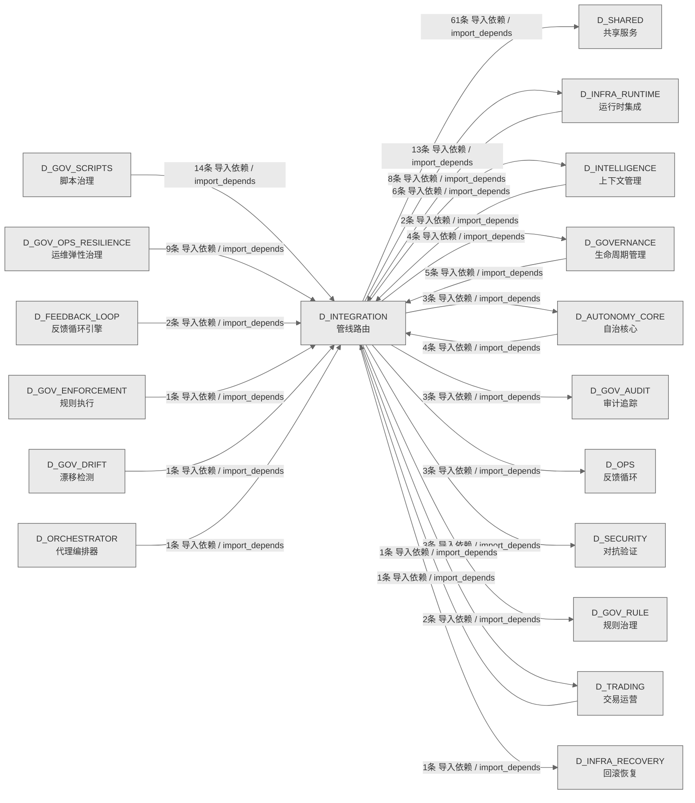

# 21_d_integration / 管线路由域 / Pipeline Routing

> **功能简介 / Overview**: 管线路由，负责跨域数据流路由、管道编排和集成适配

> **文档作用 / Purpose**: 展示 管线路由（D_INTEGRATION）功能域的域内依赖关系、跨域依赖关系，模块信息（成熟度/中英文名/大白话/文件路径）内嵌于 Mermaid 节点，供架构审查和域治理参考。

> 本文档由 generate_domain_doc.py 从 depgraph (PostgreSQL) 自动生成
> 数据源: depgraph (PostgreSQL) nodes表 + edges表

> **[可缩放 HTML 版 / Zoomable HTML](http://localhost:8765/docs/02_enterprise_architecture/02_domain_architecture_docs/_zoomable_html/21_d_integration.html)** — Ctrl+滚轮缩放 ｜ 双击重置 ｜ Ctrl+Shift+D 切换拖动/选择模式

## 域基本信息 / Domain Overview

| 字段 | 值 | Field | Value |
|------|------|-------|-------|
| 编号 | 21 | Number | 21 |
| 域ID | D_INTEGRATION | Domain ID | D_INTEGRATION |
| 域名称 | 管线路由 | Domain Name | Pipeline Routing |
| 层级 | L1 基础平台层 | Layer | L1 Foundation |
| 模块数 | 71 | Module Count | 71 |
| 域内依赖 | 68 | Internal Dependencies | 68 |
| 跨域入边 | 48 | Cross-domain Incoming | 48 |
| 跨域出边 | 100 | Cross-domain Outgoing | 100 |
| 设计态模块 | 0 | Design Modules | 0 |
| 生产态模块 | 71 | Production Modules | 71 |
| 容量 | 71/150 (正常) | Capacity | 71/150 (正常) |
| 描述 | M1-M11双管线路由 | Description | M1-M11双管线路由 |

## 域内依赖图 / Internal Dependency Diagram

> 依赖图内嵌在本文档中，IDE 可直接渲染；网页版可 Ctrl+滚轮缩放 + 拖动平移查看细节。
>
> **图例说明 / Legend**：
> - 🟦 **蓝色 = 运营态模块**（production，已上线运行）
> - 🟧 **橙色虚线 = 设计态模块**（design，蓝图阶段，代码未写）
> - **实线箭头 = 运营态依赖**（已生效的依赖关系）
> - **虚线箭头 = 非运营态依赖**（计划中/验证中的依赖关系）

### 全景图（全部模块，颜色区分运营态/设计态）

> 展示全部 71 个模块（生产态 71 + 设计态 0），含跨域依赖外部节点。节点含成熟度+名称+大白话/简介+文件路径。

```mermaid
%%{init: {'theme': 'base', 'themeVariables': {'primaryColor': '#eaeaea', 'primaryTextColor': '#333333', 'primaryBorderColor': '#666666', 'lineColor': '#666666', 'secondaryColor': '#eaeaea', 'tertiaryColor': '#eaeaea', 'fontSize': '14px'}}}%%
flowchart TD
    src_zephyr_integration_behavioral_admission_admission_response_py["behavioral_admission/admission_response<br/>5.152 #25 sanctioned: integration<br/>为组合层，允许依赖全部层（trading.L2<br/>准入决策契约）。<br/>文件: behavioral_admission/admission_response.py<br/>(生产态 / production)"]
    src_zephyr_integration_budget_enforcer_degradation_spiral_detector_py["退化螺旋检测器<br/>Degradation Spiral Detector —<br/>模型幻觉-容量正反馈螺旋检测 (盲点 #19, M-29)<br/>degradation_spiral_detector<br/>文件: budget_enforcer<br/>/degradation_spiral_detector.py<br/>(生产态 / production)"]
    src_zephyr_integration_llm_bridge_py["接收 RED 问题,生成修复文本。LLM<br/>只润色不做判断。不可用时降级为模板生成<br/>Stage 6 LLM 桥接 — 修复文本生成.<br/>llm_bridge<br/>文件: integration/llm_bridge.py<br/>(生产态 / production)"]
    src_zephyr_integration_mcp_gateway_server_py["网关服务端<br/>架构对标 IBM ContextForge Gateway 模式。五模块：<br/>gateway_server<br/>文件: mcp/gateway_server.py<br/>(生产态 / production)"]
    src_zephyr_integration_mcp_handoff_auto_loader_py["handoff自动加载器<br/>Handoff 自动加载器，从 handoff 包恢复 AI<br/>session 上下文，实现跨 session 状态续接。<br/>handoff_auto_loader<br/>文件: mcp/handoff_auto_loader.py<br/>(生产态 / production)"]
    src_zephyr_integration_mcp_prompt_provider_py["提示提供器<br/>MCP Prompt 模板提供者，为 MCP<br/>工具提供标准化提示词模板。<br/>prompt_provider<br/>文件: mcp/prompt_provider.py<br/>(生产态 / production)"]
    src_zephyr_integration_mcp_resource_provider_py["资源提供器<br/>注册至少 3 类资源：蓝图/任务卡/测试报告。<br/>resource_provider<br/>文件: mcp/resource_provider.py<br/>(生产态 / production)"]
    src_zephyr_integration_mcp_rule_discovery_server_py["规则discovery服务端<br/>病根2（规则可发现性）治本：64条 trae<br/>规则分散在各 YAML 文件中，AI 无法在施工前<br/>文件: mcp/rule_discovery_server.py<br/>(生产态 / production)"]
    src_zephyr_integration_mcp_server_py["MCP服务端<br/>集成与适配外部系统（mcp server）<br/>mcp_server<br/>文件: integration/mcp_server.py<br/>(生产态 / production)"]
    src_zephyr_integration_pipeline_orchestrator_py["管线编排器<br/>- **M1–M11 入口与模块切片**：``TaskCard``（含<br/>ct_pipe 提示）+<br/>``ct_pipe_routing.resolve_ct_pipe_orc001``<br/>pipeline_orchestrator<br/>文件: integration/pipeline_orchestrator.py<br/>(生产态 / production)"]
    src_zephyr_integration_ports_py["端口<br/>抽象层，用 Protocol 接口抽象 pipeline 到 MCP<br/>的依赖，解耦调用方与实现<br/>文件: integration/ports.py<br/>(生产态 / production)"]
    src_zephyr_integration_shared_contracts_errors_contract_violation_error_py["契约违规错误<br/>集成/错误包的contract_violation_error模块<br/>文件: errors/contract_violation_error.py<br/>(生产态 / production)"]
    src_zephyr_integration_shared_contracts_errors_data_quality_error_py["数据质量错误<br/>集成/错误包的data_quality_error模块<br/>文件: errors/data_quality_error.py<br/>(生产态 / production)"]
    src_zephyr_integration_shared_contracts_errors_execution_rejection_error_py["执行拒绝错误<br/>供erro使用<br/>execution_rejection_error<br/>文件: errors/execution_rejection_error.py<br/>(生产态 / production)"]
    src_zephyr_integration_shared_contracts_errors_factor_computation_error_py["因子computation错误<br/>集成/错误包的factor_computation_error模块<br/>文件: errors/factor_computation_error.py<br/>(生产态 / production)"]
    src_zephyr_integration_shared_contracts_errors_risk_limit_violation_error_py["风险限制违规错误<br/>集成/错误包的risk_limit_violation_error模块<br/>文件: errors/risk_limit_violation_error.py<br/>(生产态 / production)"]
    src_zephyr_integration_shared_contracts_errors_signal_degradation_warning_py["信号退化警告<br/>契约，定义信号质量退化时的警告数据结构与触发条件<br/>signal_degradation_warning<br/>文件: errors/signal_degradation_warning.py<br/>(生产态 / production)"]
    src_zephyr_integration_shared_events_dlq_bridge_py["dlq桥接<br/>死信队列桥接器，把死信队列中的无法处理消息桥接到<br/>系统事件总线，供统一监控。<br/>文件: events/dlq_bridge.py<br/>(生产态 / production)"]
    src_zephyr_integration_shared_events_event_bus_upgrade_py["事件总线upgrade<br/>集成/事件包的event_bus_upgrade模块<br/>文件: events/event_bus_upgrade.py<br/>(生产态 / production)"]
    src_zephyr_integration_shared_events_event_schemas_py["事件模式<br/>集成与适配外部系统（event schemas）<br/>event_schemas<br/>文件: events/event_schemas.py<br/>(生产态 / production)"]
    src_zephyr_integration_shared_events_upgrade_strategy_py["upgrade策略<br/>集成/事件包的upgrade_strategy模块<br/>文件: events/upgrade_strategy.py<br/>(生产态 / production)"]
    src_zephyr_integration_vector_memory_bm25_index_py["bm25索引<br/>蓝图 §3.2 · BM25 稀疏检索索引<br/>bm25_index<br/>文件: vector_memory/bm25_index.py<br/>(生产态 / production)"]
    src_zephyr_integration_vector_memory_cache_layer_py["缓存层<br/>vector_memory的缓存，暂存常用数据加速访问<br/>cache_layer<br/>文件: vector_memory/cache_layer.py<br/>(生产态 / production)"]
    src_zephyr_integration_vector_memory_context_ingest_py["上下文ingest<br/>VMS 上下文注入器 — ingest_context() 消费者<br/>context_ingest<br/>文件: vector_memory/context_ingest.py<br/>(生产态 / production)"]
    src_zephyr_integration_vector_memory_cross_collection_retriever_py["跨collectionretriever<br/>蓝图 §3 · §6 · 多 Collection 并行检索 -> 聚合<br/>-> 重排序<br/>cross_collection_retriever<br/>文件: vector_memory<br/>/cross_collection_retriever.py<br/>(生产态 / production)"]
    src_zephyr_integration_vector_memory_delegated_vector_memory_py["delegated向量记忆<br/>将 ``VectorMemoryBase`` 映射到<br/>``UnifiedMemoryAPI``（Chroma / InMemory<br/>后端，集成与适配外部系统<br/>delegated_vector_memory<br/>文件: vector_memory/delegated_vector_memory.py<br/>(生产态 / production)"]
    src_zephyr_integration_vector_memory_design_principles_py["设计原则<br/>强制器，校验嵌入维度白名单、热冷数据分块策略匹配<br/>、存活时间合规，防违规配置<br/>design_principles<br/>文件: vector_memory/design_principles.py<br/>(生产态 / production)"]
    src_zephyr_integration_vector_memory_migrate_chroma_to_faiss_py["ChromDB -> FAISS + SQLite WAL 数据迁移脚本<br/>向量数据迁移脚本，把数据从 ChromaDB 迁移到<br/>FAISS + SQLite WAL 存储后端。<br/>migrate_chroma_to_faiss<br/>文件: vector_memory/migrate_chroma_to_faiss.py<br/>(生产态 / production)"]
    src_zephyr_integration_vector_memory_ollama_embedding_py["ollama嵌入<br/>Ollama 嵌入生成器，调用本地 Ollama<br/>模型生成文本嵌入向量。<br/>ollama_embedding<br/>文件: vector_memory/ollama_embedding.py<br/>(生产态 / production)"]
    src_zephyr_integration_vector_memory_vms_memory_backend_py["vms记忆后端<br/>实现 MemoryBackend 协议，将 UnifiedMemoryAPI<br/>的三件套 API<br/>vms_memory_backend<br/>文件: vector_memory/vms_memory_backend.py<br/>(生产态 / production)"]
    src_zephyr_shared_contracts_approval_types_py["审批类型定义<br/>G-CT-004 — ApprovalRequest Pydantic V2<br/>BaseModel 审批请求数据结构.<br/>approval_types<br/>文件: contracts/approval_types.py<br/>(生产态 / production)"]
    src_zephyr_shared_contracts_rollback_types_py["回滚类型定义<br/>G-CT-003 — RollbackResult Pydantic V2 BaseModel<br/>回滚结果数据结构.<br/>rollback_types<br/>文件: contracts/rollback_types.py<br/>(生产态 / production)"]
    src_zephyr_shared_contracts_runtime_types_py["运行时类型定义<br/>contracts的配置，管理配置项的读取和校验<br/>（runtime types）<br/>runtime_types<br/>文件: contracts/runtime_types.py<br/>(生产态 / production)"]
    src_zephyr_shared_evaluation_evals_py["评估<br/>框架，按 relevance/accuracy/safety<br/>三维度评估模型输出质量，含评估用例与打分<br/>evals<br/>文件: evaluation/evals.py<br/>(生产态 / production)"]
    src_zephyr_shared_resilience_durable_execution_py["durable执行<br/>持久执行框架，用 PENDING/RUNNING/COMPLETED<br/>/FAILED/SKIPPED 活动状态机管理可恢复的执行流。<br/>durable_execution<br/>文件: resilience/durable_execution.py<br/>(生产态 / production)"]
    src_zephyr_shared_versioning_version_negotiation_py["版本negotiation<br/>版本的结构定义，定义数据的结构和约束<br/>version_negotiation<br/>文件: versioning/version_negotiation.py<br/>(生产态 / production)"]
    src_zephyr_integration_behavioral_admission_admission_response_py ~~~ src_zephyr_integration_budget_enforcer_degradation_spiral_detector_py
    src_zephyr_integration_budget_enforcer_degradation_spiral_detector_py ~~~ src_zephyr_integration_llm_bridge_py
    src_zephyr_integration_llm_bridge_py ~~~ src_zephyr_integration_mcp_gateway_server_py
    src_zephyr_integration_mcp_gateway_server_py ~~~ src_zephyr_integration_mcp_handoff_auto_loader_py
    src_zephyr_integration_mcp_handoff_auto_loader_py ~~~ src_zephyr_integration_mcp_prompt_provider_py
    src_zephyr_integration_mcp_prompt_provider_py ~~~ src_zephyr_integration_mcp_resource_provider_py
    src_zephyr_integration_mcp_resource_provider_py ~~~ src_zephyr_integration_mcp_rule_discovery_server_py
    src_zephyr_integration_mcp_rule_discovery_server_py ~~~ src_zephyr_integration_mcp_server_py
    src_zephyr_integration_mcp_server_py ~~~ src_zephyr_integration_pipeline_orchestrator_py
    src_zephyr_integration_pipeline_orchestrator_py ~~~ src_zephyr_integration_ports_py
    src_zephyr_integration_ports_py ~~~ src_zephyr_integration_shared_contracts_errors_contract_violation_error_py
    src_zephyr_integration_shared_contracts_errors_contract_violation_error_py ~~~ src_zephyr_integration_shared_contracts_errors_data_quality_error_py
    src_zephyr_integration_shared_contracts_errors_data_quality_error_py ~~~ src_zephyr_integration_shared_contracts_errors_execution_rejection_error_py
    src_zephyr_integration_shared_contracts_errors_execution_rejection_error_py ~~~ src_zephyr_integration_shared_contracts_errors_factor_computation_error_py
    src_zephyr_integration_shared_contracts_errors_factor_computation_error_py ~~~ src_zephyr_integration_shared_contracts_errors_risk_limit_violation_error_py
    src_zephyr_integration_shared_contracts_errors_risk_limit_violation_error_py ~~~ src_zephyr_integration_shared_contracts_errors_signal_degradation_warning_py
    src_zephyr_integration_shared_contracts_errors_signal_degradation_warning_py ~~~ src_zephyr_integration_shared_events_dlq_bridge_py
    src_zephyr_integration_shared_events_dlq_bridge_py ~~~ src_zephyr_integration_shared_events_event_bus_upgrade_py
    src_zephyr_integration_shared_events_event_bus_upgrade_py ~~~ src_zephyr_integration_shared_events_event_schemas_py
    src_zephyr_integration_shared_events_event_schemas_py ~~~ src_zephyr_integration_shared_events_upgrade_strategy_py
    src_zephyr_integration_shared_events_upgrade_strategy_py ~~~ src_zephyr_integration_vector_memory_bm25_index_py
    src_zephyr_integration_vector_memory_bm25_index_py ~~~ src_zephyr_integration_vector_memory_cache_layer_py
    src_zephyr_integration_vector_memory_cache_layer_py ~~~ src_zephyr_integration_vector_memory_context_ingest_py
    src_zephyr_integration_vector_memory_context_ingest_py ~~~ src_zephyr_integration_vector_memory_cross_collection_retriever_py
    src_zephyr_integration_vector_memory_cross_collection_retriever_py ~~~ src_zephyr_integration_vector_memory_delegated_vector_memory_py
    src_zephyr_integration_vector_memory_delegated_vector_memory_py ~~~ src_zephyr_integration_vector_memory_design_principles_py
    src_zephyr_integration_vector_memory_design_principles_py ~~~ src_zephyr_integration_vector_memory_migrate_chroma_to_faiss_py
    src_zephyr_integration_vector_memory_migrate_chroma_to_faiss_py ~~~ src_zephyr_integration_vector_memory_ollama_embedding_py
    src_zephyr_integration_vector_memory_ollama_embedding_py ~~~ src_zephyr_integration_vector_memory_vms_memory_backend_py
    src_zephyr_integration_vector_memory_vms_memory_backend_py ~~~ src_zephyr_shared_contracts_approval_types_py
    src_zephyr_shared_contracts_approval_types_py ~~~ src_zephyr_shared_contracts_rollback_types_py
    src_zephyr_shared_contracts_rollback_types_py ~~~ src_zephyr_shared_contracts_runtime_types_py
    src_zephyr_shared_contracts_runtime_types_py ~~~ src_zephyr_shared_evaluation_evals_py
    src_zephyr_shared_evaluation_evals_py ~~~ src_zephyr_shared_resilience_durable_execution_py
    src_zephyr_shared_resilience_durable_execution_py ~~~ src_zephyr_shared_versioning_version_negotiation_py
    src_zephyr_integration_local_model_cache_layer_py["缓存层<br/>用 LRU 策略缓存嵌入向量与查询结果，减少重复计算<br/>开销<br/>cache_layer<br/>文件: local_model/cache_layer.py<br/>(生产态 / production)"]
    src_zephyr_integration_local_model_local_model_scheduler_py["本地模型调度器<br/>LocalModelScheduler — L2 本地模型 24/7 调度循环<br/>local_model_scheduler<br/>文件: local_model/local_model_scheduler.py<br/>(生产态 / production)"]
    src_zephyr_integration_local_model_ollama_embedding_py["ollama嵌入<br/>OllamaEmbedder — 通过 Ollama HTTP API<br/>生成文本嵌入<br/>ollama_embedding<br/>文件: local_model/ollama_embedding.py<br/>(生产态 / production)"]
    src_zephyr_integration_mcp_audit_logger_py["审计日志器<br/>MCP 全量工具调用审计日志器，记录每次 MCP<br/>工具调用的输入输出与耗时。<br/>audit_logger<br/>文件: mcp/audit_logger.py<br/>(生产态 / production)"]
    src_zephyr_integration_mcp_blueprint_search_server_py["蓝图search服务端<br/>BlueprintSearchServer — MCP Server for<br/>blueprint discovery，集成与适配外部系统<br/>文件: mcp/blueprint_search_server.py<br/>(生产态 / production)"]
    src_zephyr_integration_mcp_doc_guard_server_py["doc守卫服务端<br/>DocGuardServer: 跨会话交接协议服务 MCP Server<br/>doc_guard_server<br/>文件: mcp/doc_guard_server.py<br/>(生产态 / production)"]
    src_zephyr_integration_mcp_gate_engine_server_py["门禁引擎服务端<br/>- gate_engine.run_g1_write     — 写入防护 Gate<br/>（UTF-8 / 命名 / 路径白名单）<br/>gate_engine_server<br/>文件: mcp/gate_engine_server.py<br/>(生产态 / production)"]
    src_zephyr_integration_mcp_rate_limiter_py["速率限制器<br/>集成与适配外部系统（rate limiter）<br/>rate_limiter<br/>文件: mcp/rate_limiter.py<br/>(生产态 / production)"]
    src_zephyr_integration_mcp_sandbox_server_py["沙箱服务端<br/>MCP 安全代码执行沙箱，在隔离环境中执行 MCP<br/>工具生成的代码，防注入风险。<br/>sandbox_server<br/>文件: mcp/sandbox_server.py<br/>(生产态 / production)"]
    src_zephyr_integration_mcp_sentinel_server_py["哨兵服务端<br/>集成与适配外部系统（sentinel server）<br/>sentinel_server<br/>文件: mcp/sentinel_server.py<br/>(生产态 / production)"]
    src_zephyr_integration_mcp_task_manager_server_py["任务管理器服务端<br/>ZephyrAlpha MCP Task Manager Server<br/>文件: mcp/task_manager_server.py<br/>(生产态 / production)"]
    src_zephyr_integration_mcp_telemetry_server_py["遥测服务端<br/>ZephyrAlpha MCP Telemetry Server — 系统可观测性<br/>MCP 接口<br/>telemetry_server<br/>文件: mcp/telemetry_server.py<br/>(生产态 / production)"]
    src_zephyr_integration_mcp_vector_memory_server_py["向量记忆服务端<br/>集成与适配外部系统（vector memory server）<br/>vector_memory_server<br/>文件: mcp/vector_memory_server.py<br/>(生产态 / production)"]
    src_zephyr_integration_vector_memory_bridge_layer_py["桥接层<br/>蓝图 §5.2 · §6 · Phase 1-2 过渡期双读策略<br/>bridge_layer<br/>文件: vector_memory/bridge_layer.py<br/>(生产态 / production)"]
    src_zephyr_integration_vector_memory_collection_schemas_py["收集模式<br/>vector_memory的采集器，从多处收集数据<br/>collection_schemas<br/>文件: vector_memory/collection_schemas.py<br/>(生产态 / production)"]
    src_zephyr_integration_vector_memory_faiss_collection_manager_py["faisscollection管理器<br/>真源: VMS 蓝图 · 迁自 ChromaDB 0.6<br/>CollectionManager，集成与适配外部系统<br/>faiss_collection_manager<br/>文件: vector_memory/faiss_collection_manager.py<br/>(生产态 / production)"]
    src_zephyr_integration_vector_memory_hybrid_retriever_py["HybridRetriever — MOD-INF-011 混合检索架构<br/>向量记忆混合检索器，结合向量检索与关键词检索提升<br/>召回质量。<br/>hybrid_retriever<br/>文件: vector_memory/hybrid_retriever.py<br/>(生产态 / production)"]
    src_zephyr_integration_vector_memory_in_memory_fake_vms_py["in记忆fakevms<br/>内存假 VMS，零依赖的测试双胞胎，在无向量数据库环<br/>境模拟 VMS 行为，用于单元测试隔离。<br/>in_memory_fake_vms<br/>文件: vector_memory/in_memory_fake_vms.py<br/>(生产态 / production)"]
    src_zephyr_integration_vector_memory_interface_py["接口<br/>向量化记忆服务。负责语义向量存储、检索与记忆管理<br/>。<br/>interface<br/>文件: vector_memory/interface.py<br/>(生产态 / production)"]
    src_zephyr_integration_vector_memory_provenance_enforcer_py["溯源执行器<br/>写入溯源强制器，强制每条向量写入携带来源信息，保<br/>证数据可追溯。<br/>provenance_enforcer<br/>文件: vector_memory/provenance_enforcer.py<br/>(生产态 / production)"]
    src_zephyr_integration_vector_memory_sqlite_metadata_store_py["sqlitemetadata存储<br/>真源: VMS 蓝图 §12.3 · 迁自 BridgeLayer /<br/>ChromaDB 内嵌 SQLite<br/>sqlite_metadata_store<br/>文件: vector_memory/sqlite_metadata_store.py<br/>(生产态 / production)"]
    src_zephyr_integration_vector_memory_vms_schemas_py["VMS 共享数据模型 — MOD-INF-011 · 蓝图 §6.1<br/>接口契约<br/>向量记忆共享数据模型，定义 8 个 Collection 的<br/>Pydantic V2 接口契约。<br/>vms_schemas<br/>文件: vector_memory/vms_schemas.py<br/>(生产态 / production)"]
    src_zephyr_shared_contracts_protocols_py["协议<br/>注册 ContractRegistry 类/工厂（由 orchestrator<br/>侧模块加载时调用）。<br/>文件: contracts/protocols.py<br/>(生产态 / production)"]
    src_zephyr_integration_local_model_cache_layer_py ~~~ src_zephyr_integration_local_model_local_model_scheduler_py
    src_zephyr_integration_local_model_local_model_scheduler_py ~~~ src_zephyr_integration_local_model_ollama_embedding_py
    src_zephyr_integration_local_model_ollama_embedding_py ~~~ src_zephyr_integration_mcp_audit_logger_py
    src_zephyr_integration_mcp_audit_logger_py ~~~ src_zephyr_integration_mcp_blueprint_search_server_py
    src_zephyr_integration_mcp_blueprint_search_server_py ~~~ src_zephyr_integration_mcp_doc_guard_server_py
    src_zephyr_integration_mcp_doc_guard_server_py ~~~ src_zephyr_integration_mcp_gate_engine_server_py
    src_zephyr_integration_mcp_gate_engine_server_py ~~~ src_zephyr_integration_mcp_rate_limiter_py
    src_zephyr_integration_mcp_rate_limiter_py ~~~ src_zephyr_integration_mcp_sandbox_server_py
    src_zephyr_integration_mcp_sandbox_server_py ~~~ src_zephyr_integration_mcp_sentinel_server_py
    src_zephyr_integration_mcp_sentinel_server_py ~~~ src_zephyr_integration_mcp_task_manager_server_py
    src_zephyr_integration_mcp_task_manager_server_py ~~~ src_zephyr_integration_mcp_telemetry_server_py
    src_zephyr_integration_mcp_telemetry_server_py ~~~ src_zephyr_integration_mcp_vector_memory_server_py
    src_zephyr_integration_mcp_vector_memory_server_py ~~~ src_zephyr_integration_vector_memory_bridge_layer_py
    src_zephyr_integration_vector_memory_bridge_layer_py ~~~ src_zephyr_integration_vector_memory_collection_schemas_py
    src_zephyr_integration_vector_memory_collection_schemas_py ~~~ src_zephyr_integration_vector_memory_faiss_collection_manager_py
    src_zephyr_integration_vector_memory_faiss_collection_manager_py ~~~ src_zephyr_integration_vector_memory_hybrid_retriever_py
    src_zephyr_integration_vector_memory_hybrid_retriever_py ~~~ src_zephyr_integration_vector_memory_in_memory_fake_vms_py
    src_zephyr_integration_vector_memory_in_memory_fake_vms_py ~~~ src_zephyr_integration_vector_memory_interface_py
    src_zephyr_integration_vector_memory_interface_py ~~~ src_zephyr_integration_vector_memory_provenance_enforcer_py
    src_zephyr_integration_vector_memory_provenance_enforcer_py ~~~ src_zephyr_integration_vector_memory_sqlite_metadata_store_py
    src_zephyr_integration_vector_memory_sqlite_metadata_store_py ~~~ src_zephyr_integration_vector_memory_vms_schemas_py
    src_zephyr_integration_vector_memory_vms_schemas_py ~~~ src_zephyr_shared_contracts_protocols_py
    src_zephyr_integration_local_model_embedding_router_py["嵌入路由器<br/>蓝图 §3.1 · V-VMS-505/507 · 按 Collection<br/>路由到对应模型<br/>embedding_router<br/>文件: local_model/embedding_router.py<br/>(生产态 / production)"]
    src_zephyr_integration_local_model_ollama_chat_py["OllamaChat — 通过 Ollama HTTP API 进行本地 LLM<br/>替代外部 API 调用，使用本地 Ollama 的 qwen3:8b<br/>等模型。<br/>ollama_chat<br/>文件: local_model/ollama_chat.py<br/>(生产态 / production)"]
    src_zephyr_integration_mcp_base_server_py["基类服务端<br/>集成与适配外部系统（base server）<br/>_base_server<br/>文件: mcp/_base_server.py<br/>(生产态 / production)"]
    src_zephyr_integration_vector_memory_collection_manager_py["收集管理器<br/>Collection 管理器，管理八大向量 Collection<br/>的全生命周期（创建/写入/查询/迁移/删除）。<br/>collection_manager<br/>文件: vector_memory/collection_manager.py<br/>(生产态 / production)"]
    src_zephyr_integration_vector_memory_in_process_vector_memory_py["入进程向量记忆<br/>蓝图 §6 架构分层 · Phase 1-4 施工 · 11<br/>子模块组装<br/>in_process_vector_memory<br/>文件: vector_memory/in_process_vector_memory.py<br/>(生产态 / production)"]
    src_zephyr_integration_vector_memory_vms_errors_py["vms错误<br/>vector_memory的异常，定义本模块的异常类型<br/>vms_errors<br/>文件: vector_memory/vms_errors.py<br/>(生产态 / production)"]
    src_zephyr_integration_local_model_embedding_router_py ~~~ src_zephyr_integration_local_model_ollama_chat_py
    src_zephyr_integration_local_model_ollama_chat_py ~~~ src_zephyr_integration_mcp_base_server_py
    src_zephyr_integration_mcp_base_server_py ~~~ src_zephyr_integration_vector_memory_collection_manager_py
    src_zephyr_integration_vector_memory_collection_manager_py ~~~ src_zephyr_integration_vector_memory_in_process_vector_memory_py
    src_zephyr_integration_vector_memory_in_process_vector_memory_py ~~~ src_zephyr_integration_vector_memory_vms_errors_py
    src_zephyr_integration_mcp_error_codes_py["MCP 错误码集中注册（MOD-INF-013 §3.4）。<br/>本文件是 MCP 协议错误码的 canonical SSoT。<br/>error_codes<br/>文件: mcp/error_codes.py<br/>(生产态 / production)"]
    src_zephyr_integration_vector_memory_chunk_strategy_router_py["块策略路由器<br/>蓝图 §2.1 · §6 · 6 种分块策略按 Collection<br/>差异化路由<br/>chunk_strategy_router<br/>文件: vector_memory/chunk_strategy_router.py<br/>(生产态 / production)"]
    src_zephyr_integration_vector_memory_in_memory_memory_backend_py["入记忆记忆后端<br/>蓝图 §6 · V-VMS-505/507 · ChromaDB +<br/>双模型全不可用时的最后防线<br/>in_memory_memory_backend<br/>文件: vector_memory/in_memory_memory_backend.py<br/>(生产态 / production)"]
    src_zephyr_integration_vector_memory_index_health_monitor_py["索引健康监控<br/>器，定期自检向量索引健康状态并自动修复异常<br/>index_health_monitor<br/>文件: vector_memory/index_health_monitor.py<br/>(生产态 / production)"]
    src_zephyr_integration_vector_memory_retrieval_feedback_py["retrieval反馈<br/>蓝图 §7 · §6 · 检索结果质量闭环 + IMET 采样接口<br/>retrieval_feedback<br/>文件: vector_memory/retrieval_feedback.py<br/>(生产态 / production)"]
    src_zephyr_integration_vector_memory_vector_bridge_py["向量桥接<br/>蓝图 §8 · §6 · 6 系统集成目标<br/>vector_bridge<br/>文件: vector_memory/vector_bridge.py<br/>(生产态 / production)"]
    src_zephyr_integration_vector_memory_chunk_strategy_router_py ~~~ src_zephyr_integration_vector_memory_in_memory_memory_backend_py
    src_zephyr_integration_vector_memory_in_memory_memory_backend_py ~~~ src_zephyr_integration_vector_memory_index_health_monitor_py
    src_zephyr_integration_vector_memory_index_health_monitor_py ~~~ src_zephyr_integration_vector_memory_retrieval_feedback_py
    src_zephyr_integration_vector_memory_retrieval_feedback_py ~~~ src_zephyr_integration_vector_memory_vector_bridge_py
    src_zephyr_integration_pipeline_orchestrator_py -->|导入依赖 / import_depends| src_zephyr_integration_local_model_embedding_router_py
    src_zephyr_integration_pipeline_orchestrator_py -->|导入依赖 / import_depends| src_zephyr_integration_local_model_local_model_scheduler_py
    src_zephyr_integration_pipeline_orchestrator_py -->|导入依赖 / import_depends| src_zephyr_shared_contracts_protocols_py
    src_zephyr_integration_local_model_embedding_router_py -->|导入依赖 / import_depends| src_zephyr_integration_local_model_ollama_embedding_py
    src_zephyr_integration_local_model_local_model_scheduler_py -->|导入依赖 / import_depends| src_zephyr_integration_local_model_embedding_router_py
    src_zephyr_integration_local_model_local_model_scheduler_py -->|导入依赖 / import_depends| src_zephyr_integration_local_model_ollama_chat_py
    src_zephyr_integration_mcp_doc_guard_server_py -->|导入依赖 / import_depends| src_zephyr_integration_mcp_base_server_py
    src_zephyr_integration_mcp_blueprint_search_server_py -->|导入依赖 / import_depends| src_zephyr_integration_mcp_base_server_py
    src_zephyr_integration_mcp_gate_engine_server_py -->|导入依赖 / import_depends| src_zephyr_integration_mcp_base_server_py
    src_zephyr_integration_mcp_gateway_server_py -->|导入依赖 / import_depends| src_zephyr_integration_mcp_doc_guard_server_py
    src_zephyr_integration_mcp_gateway_server_py -->|导入依赖 / import_depends| src_zephyr_integration_mcp_audit_logger_py
    src_zephyr_integration_mcp_gateway_server_py -->|导入依赖 / import_depends| src_zephyr_integration_mcp_blueprint_search_server_py
    src_zephyr_integration_mcp_gateway_server_py -->|导入依赖 / import_depends| src_zephyr_integration_mcp_error_codes_py
    src_zephyr_integration_mcp_gateway_server_py -->|导入依赖 / import_depends| src_zephyr_integration_mcp_gate_engine_server_py
    src_zephyr_integration_mcp_gateway_server_py -->|导入依赖 / import_depends| src_zephyr_integration_mcp_sandbox_server_py
    src_zephyr_integration_mcp_gateway_server_py -->|导入依赖 / import_depends| src_zephyr_integration_mcp_rate_limiter_py
    src_zephyr_integration_mcp_gateway_server_py -->|导入依赖 / import_depends| src_zephyr_integration_mcp_sentinel_server_py
    src_zephyr_integration_mcp_gateway_server_py -->|导入依赖 / import_depends| src_zephyr_integration_mcp_vector_memory_server_py
    src_zephyr_integration_mcp_gateway_server_py -->|导入依赖 / import_depends| src_zephyr_integration_mcp_telemetry_server_py
    src_zephyr_integration_mcp_gateway_server_py -->|导入依赖 / import_depends| src_zephyr_integration_mcp_task_manager_server_py
    src_zephyr_integration_mcp_gateway_server_py -->|导入依赖 / import_depends| src_zephyr_integration_mcp_base_server_py
    src_zephyr_integration_mcp_sandbox_server_py -->|导入依赖 / import_depends| src_zephyr_integration_mcp_base_server_py
    src_zephyr_integration_mcp_sentinel_server_py -->|导入依赖 / import_depends| src_zephyr_integration_mcp_base_server_py
    src_zephyr_integration_mcp_vector_memory_server_py -->|导入依赖 / import_depends| src_zephyr_integration_mcp_base_server_py
    src_zephyr_integration_mcp_vector_memory_server_py -->|导入依赖 / import_depends| src_zephyr_integration_vector_memory_collection_manager_py
    src_zephyr_integration_mcp_vector_memory_server_py -->|导入依赖 / import_depends| src_zephyr_integration_vector_memory_in_process_vector_memory_py
    src_zephyr_integration_mcp_vector_memory_server_py -->|导入依赖 / import_depends| src_zephyr_integration_vector_memory_vms_errors_py
    src_zephyr_integration_mcp_rule_discovery_server_py -->|导入依赖 / import_depends| src_zephyr_integration_mcp_base_server_py
    src_zephyr_integration_mcp_base_server_py -->|导入依赖 / import_depends| src_zephyr_integration_mcp_error_codes_py
    src_zephyr_integration_vector_memory_cache_layer_py -->|导入依赖 / import_depends| src_zephyr_integration_local_model_cache_layer_py
    src_zephyr_integration_vector_memory_bridge_layer_py -->|导入依赖 / import_depends| src_zephyr_integration_vector_memory_collection_manager_py
    src_zephyr_integration_vector_memory_context_ingest_py -->|导入依赖 / import_depends| src_zephyr_integration_vector_memory_in_memory_fake_vms_py
    src_zephyr_integration_vector_memory_cross_collection_retriever_py -->|导入依赖 / import_depends| src_zephyr_integration_vector_memory_hybrid_retriever_py
    src_zephyr_integration_vector_memory_faiss_collection_manager_py -->|导入依赖 / import_depends| src_zephyr_integration_vector_memory_collection_manager_py
    src_zephyr_integration_vector_memory_collection_manager_py -->|导入依赖 / import_depends| src_zephyr_integration_local_model_embedding_router_py
    src_zephyr_integration_vector_memory_collection_manager_py -->|导入依赖 / import_depends| src_zephyr_integration_vector_memory_collection_schemas_py
    src_zephyr_integration_vector_memory_delegated_vector_memory_py -->|导入依赖 / import_depends| src_zephyr_integration_vector_memory_interface_py
    src_zephyr_integration_vector_memory_design_principles_py -->|导入依赖 / import_depends| src_zephyr_integration_vector_memory_collection_schemas_py
    src_zephyr_integration_vector_memory_design_principles_py -->|导入依赖 / import_depends| src_zephyr_integration_vector_memory_provenance_enforcer_py
    src_zephyr_integration_vector_memory_design_principles_py -->|导入依赖 / import_depends| src_zephyr_integration_vector_memory_vms_errors_py
    src_zephyr_integration_vector_memory_design_principles_py -->|导入依赖 / import_depends| src_zephyr_integration_vector_memory_vms_schemas_py
    src_zephyr_integration_vector_memory_hybrid_retriever_py -->|导入依赖 / import_depends| src_zephyr_integration_local_model_embedding_router_py
    src_zephyr_integration_vector_memory_hybrid_retriever_py -->|导入依赖 / import_depends| src_zephyr_integration_vector_memory_collection_manager_py
    src_zephyr_integration_vector_memory_index_health_monitor_py -->|导入依赖 / import_depends| src_zephyr_integration_vector_memory_collection_manager_py
    src_zephyr_integration_vector_memory_in_process_vector_memory_py -->|导入依赖 / import_depends| src_zephyr_integration_local_model_embedding_router_py
    src_zephyr_integration_vector_memory_in_process_vector_memory_py -->|导入依赖 / import_depends| src_zephyr_integration_local_model_cache_layer_py
    src_zephyr_integration_vector_memory_in_process_vector_memory_py -->|导入依赖 / import_depends| src_zephyr_integration_vector_memory_bridge_layer_py
    src_zephyr_integration_vector_memory_in_process_vector_memory_py -->|导入依赖 / import_depends| src_zephyr_integration_vector_memory_chunk_strategy_router_py
    src_zephyr_integration_vector_memory_in_process_vector_memory_py -->|导入依赖 / import_depends| src_zephyr_integration_vector_memory_collection_manager_py
    src_zephyr_integration_vector_memory_in_process_vector_memory_py -->|导入依赖 / import_depends| src_zephyr_integration_vector_memory_hybrid_retriever_py
    src_zephyr_integration_vector_memory_in_process_vector_memory_py -->|导入依赖 / import_depends| src_zephyr_integration_vector_memory_index_health_monitor_py
    src_zephyr_integration_vector_memory_in_process_vector_memory_py -->|导入依赖 / import_depends| src_zephyr_integration_vector_memory_provenance_enforcer_py
    src_zephyr_integration_vector_memory_in_process_vector_memory_py -->|导入依赖 / import_depends| src_zephyr_integration_vector_memory_in_memory_memory_backend_py
    src_zephyr_integration_vector_memory_in_process_vector_memory_py -->|导入依赖 / import_depends| src_zephyr_integration_vector_memory_retrieval_feedback_py
    src_zephyr_integration_vector_memory_in_process_vector_memory_py -->|导入依赖 / import_depends| src_zephyr_integration_vector_memory_vector_bridge_py
    src_zephyr_integration_vector_memory_in_memory_fake_vms_py -->|导入依赖 / import_depends| src_zephyr_integration_vector_memory_collection_manager_py
    src_zephyr_integration_vector_memory_provenance_enforcer_py -->|导入依赖 / import_depends| src_zephyr_integration_vector_memory_collection_manager_py
    src_zephyr_integration_vector_memory_provenance_enforcer_py -->|导入依赖 / import_depends| src_zephyr_integration_vector_memory_vms_schemas_py
    src_zephyr_integration_vector_memory_migrate_chroma_to_faiss_py -->|导入依赖 / import_depends| src_zephyr_integration_vector_memory_faiss_collection_manager_py
    src_zephyr_integration_vector_memory_migrate_chroma_to_faiss_py -->|导入依赖 / import_depends| src_zephyr_integration_vector_memory_collection_manager_py
    src_zephyr_integration_vector_memory_migrate_chroma_to_faiss_py -->|导入依赖 / import_depends| src_zephyr_integration_vector_memory_sqlite_metadata_store_py
    src_zephyr_integration_vector_memory_ollama_embedding_py -->|导入依赖 / import_depends| src_zephyr_integration_local_model_ollama_embedding_py
    src_zephyr_integration_vector_memory_sqlite_metadata_store_py -->|导入依赖 / import_depends| src_zephyr_integration_vector_memory_collection_manager_py
    src_zephyr_integration_vector_memory_retrieval_feedback_py -->|导入依赖 / import_depends| src_zephyr_integration_vector_memory_hybrid_retriever_py
    src_zephyr_integration_vector_memory_retrieval_feedback_py -->|导入依赖 / import_depends| src_zephyr_integration_vector_memory_in_process_vector_memory_py
    src_zephyr_integration_vector_memory_vector_bridge_py -->|导入依赖 / import_depends| src_zephyr_integration_vector_memory_in_process_vector_memory_py
    src_zephyr_integration_vector_memory_vms_memory_backend_py -->|导入依赖 / import_depends| src_zephyr_integration_vector_memory_bridge_layer_py
    src_zephyr_integration_vector_memory_vms_memory_backend_py -->|导入依赖 / import_depends| src_zephyr_integration_vector_memory_in_process_vector_memory_py
    D_SHARED["共享服务<br/>共享服务，负责跨域共享的工具、协议和基础服务<br/>Shared Services<br/>跨域节点 / cross-domain<br/>(生产态 / production)"]
    src_zephyr_integration_mcp_resource_provider_py -->|导入依赖 / import_depends| D_SHARED
    src_zephyr_integration_pipeline_orchestrator_py -->|导入依赖 / import_depends| D_SHARED
    src_zephyr_integration_pipeline_orchestrator_py -->|导入依赖 / import_depends| D_SHARED
    src_zephyr_integration_pipeline_orchestrator_py -->|导入依赖 / import_depends| D_SHARED
    src_zephyr_integration_shared_contracts_errors_execution_rejection_error_py -->|导入依赖 / import_depends| D_SHARED
    src_zephyr_integration_mcp_sandbox_server_py -->|导入依赖 / import_depends| D_SHARED
    src_zephyr_integration_local_model_ollama_embedding_py -->|导入依赖 / import_depends| D_SHARED
    src_zephyr_integration_shared_events_dlq_bridge_py -->|导入依赖 / import_depends| D_SHARED
    src_zephyr_shared_contracts_runtime_types_py -->|导入依赖 / import_depends| D_SHARED
    D_OPS["反馈循环<br/>反馈循环，负责系统运行反馈、性能监控和自动调优闭<br/>环<br/>Feedback Loop<br/>跨域节点 / cross-domain<br/>(生产态 / production)"]
    src_zephyr_integration_pipeline_orchestrator_py -->|导入依赖 / import_depends| D_OPS
    src_zephyr_integration_pipeline_orchestrator_py -->|导入依赖 / import_depends| D_SHARED
    D_GOV_AUDIT["审计追踪<br/>审计追踪，负责变更审计追踪和操作日志管理<br/>Audit Trail<br/>跨域节点 / cross-domain<br/>(生产态 / production)"]
    src_zephyr_integration_mcp_audit_logger_py -->|导入依赖 / import_depends| D_GOV_AUDIT
    src_zephyr_integration_pipeline_orchestrator_py -->|导入依赖 / import_depends| D_OPS
    D_INTELLIGENCE["上下文管理<br/>上下文管理，负责 AI<br/>上下文窗口管理、记忆检索和上下文压缩<br/>Context Management<br/>跨域节点 / cross-domain<br/>(生产态 / production)"]
    src_zephyr_integration_vector_memory_vms_schemas_py -->|导入依赖 / import_depends| D_INTELLIGENCE
    src_zephyr_integration_llm_bridge_py -->|导入依赖 / import_depends| D_GOV_AUDIT
    D_GOV_OPS_RESILIENCE["运维弹性治理<br/>运维弹性治理，负责运维治理、安全治理、弹性治理和<br/>升级协议<br/>Ops Resilience Governance<br/>跨域节点 / cross-domain<br/>(生产态 / production)"]
    D_GOV_OPS_RESILIENCE -->|导入依赖 / import_depends| src_zephyr_shared_contracts_rollback_types_py
    D_INFRA_RUNTIME["运行时集成<br/>运行时集成，负责组件生命周期编排、启动钩子和运行<br/>时上下文管理<br/>Runtime Integration<br/>跨域节点 / cross-domain<br/>(生产态 / production)"]
    D_INFRA_RUNTIME -->|导入依赖 / import_depends| src_zephyr_shared_contracts_runtime_types_py
    D_GOV_SCRIPTS["脚本治理<br/>脚本治理，负责脚本生命周期管理和脚本质量门禁<br/>Script Governance<br/>跨域节点 / cross-domain<br/>(生产态 / production)"]
    D_GOV_SCRIPTS -->|导入依赖 / import_depends| src_zephyr_integration_vector_memory_collection_manager_py
    D_GOVERNANCE["生命周期管理<br/>生命周期管理，负责蓝图/模块<br/>/任务的声明周期管理和元数据治理<br/>Lifecycle Management<br/>跨域节点 / cross-domain<br/>(生产态 / production)"]
    D_GOVERNANCE -->|导入依赖 / import_depends| src_zephyr_integration_mcp_base_server_py
    D_GOV_OPS_RESILIENCE -->|导入依赖 / import_depends| src_zephyr_integration_vector_memory_index_health_monitor_py
    D_GOV_SCRIPTS -->|导入依赖 / import_depends| src_zephyr_integration_vector_memory_collection_manager_py
    D_GOV_OPS_RESILIENCE -->|导入依赖 / import_depends| src_zephyr_shared_contracts_rollback_types_py
    D_INFRA_RUNTIME -->|导入依赖 / import_depends| src_zephyr_integration_local_model_local_model_scheduler_py
    D_INFRA_RUNTIME -->|导入依赖 / import_depends| src_zephyr_integration_pipeline_orchestrator_py
    D_GOV_SCRIPTS -->|导入依赖 / import_depends| src_zephyr_integration_vector_memory_bridge_layer_py
    D_GOV_SCRIPTS -->|导入依赖 / import_depends| src_zephyr_integration_vector_memory_collection_manager_py
    D_GOV_SCRIPTS -->|导入依赖 / import_depends| src_zephyr_integration_vector_memory_index_health_monitor_py
    D_GOV_SCRIPTS -->|导入依赖 / import_depends| src_zephyr_integration_vector_memory_index_health_monitor_py
    D_GOV_SCRIPTS -->|导入依赖 / import_depends| src_zephyr_integration_vector_memory_collection_manager_py
    D_GOV_SCRIPTS -->|导入依赖 / import_depends| src_zephyr_integration_vector_memory_bridge_layer_py
    classDef production fill:#e1f5fe,stroke:#01579b,stroke-width:2px,color:#000
    classDef design fill:#fff3e0,stroke:#e65100,stroke-width:2px,color:#000,stroke-dasharray: 5 5
    classDef external_prod fill:#e8f4fd,stroke:#0277bd,stroke-width:1px,color:#000
    classDef external_design fill:#fff8e7,stroke:#ef6c00,stroke-width:1px,color:#000,stroke-dasharray: 5 5
    class src_zephyr_integration_behavioral_admission_admission_response_py,src_zephyr_integration_budget_enforcer_degradation_spiral_detector_py,src_zephyr_integration_llm_bridge_py,src_zephyr_integration_local_model_cache_layer_py,src_zephyr_integration_local_model_embedding_router_py,src_zephyr_integration_local_model_local_model_scheduler_py,src_zephyr_integration_local_model_ollama_chat_py,src_zephyr_integration_local_model_ollama_embedding_py,src_zephyr_integration_mcp_base_server_py,src_zephyr_integration_mcp_audit_logger_py,src_zephyr_integration_mcp_blueprint_search_server_py,src_zephyr_integration_mcp_doc_guard_server_py,src_zephyr_integration_mcp_error_codes_py,src_zephyr_integration_mcp_gate_engine_server_py,src_zephyr_integration_mcp_gateway_server_py,src_zephyr_integration_mcp_handoff_auto_loader_py,src_zephyr_integration_mcp_prompt_provider_py,src_zephyr_integration_mcp_rate_limiter_py,src_zephyr_integration_mcp_resource_provider_py,src_zephyr_integration_mcp_rule_discovery_server_py,src_zephyr_integration_mcp_sandbox_server_py,src_zephyr_integration_mcp_sentinel_server_py,src_zephyr_integration_mcp_task_manager_server_py,src_zephyr_integration_mcp_telemetry_server_py,src_zephyr_integration_mcp_vector_memory_server_py,src_zephyr_integration_mcp_server_py,src_zephyr_integration_pipeline_orchestrator_py,src_zephyr_integration_ports_py,src_zephyr_integration_shared_contracts_errors_contract_violation_error_py,src_zephyr_integration_shared_contracts_errors_data_quality_error_py,src_zephyr_integration_shared_contracts_errors_execution_rejection_error_py,src_zephyr_integration_shared_contracts_errors_factor_computation_error_py,src_zephyr_integration_shared_contracts_errors_risk_limit_violation_error_py,src_zephyr_integration_shared_contracts_errors_signal_degradation_warning_py,src_zephyr_integration_shared_events_dlq_bridge_py,src_zephyr_integration_shared_events_event_bus_upgrade_py,src_zephyr_integration_shared_events_event_schemas_py,src_zephyr_integration_shared_events_upgrade_strategy_py,src_zephyr_integration_vector_memory_bm25_index_py,src_zephyr_integration_vector_memory_bridge_layer_py,src_zephyr_integration_vector_memory_cache_layer_py,src_zephyr_integration_vector_memory_chunk_strategy_router_py,src_zephyr_integration_vector_memory_collection_manager_py,src_zephyr_integration_vector_memory_collection_schemas_py,src_zephyr_integration_vector_memory_context_ingest_py,src_zephyr_integration_vector_memory_cross_collection_retriever_py,src_zephyr_integration_vector_memory_delegated_vector_memory_py,src_zephyr_integration_vector_memory_design_principles_py,src_zephyr_integration_vector_memory_faiss_collection_manager_py,src_zephyr_integration_vector_memory_hybrid_retriever_py,src_zephyr_integration_vector_memory_in_memory_fake_vms_py,src_zephyr_integration_vector_memory_in_memory_memory_backend_py,src_zephyr_integration_vector_memory_in_process_vector_memory_py,src_zephyr_integration_vector_memory_index_health_monitor_py,src_zephyr_integration_vector_memory_interface_py,src_zephyr_integration_vector_memory_migrate_chroma_to_faiss_py,src_zephyr_integration_vector_memory_ollama_embedding_py,src_zephyr_integration_vector_memory_provenance_enforcer_py,src_zephyr_integration_vector_memory_retrieval_feedback_py,src_zephyr_integration_vector_memory_sqlite_metadata_store_py,src_zephyr_integration_vector_memory_vector_bridge_py,src_zephyr_integration_vector_memory_vms_errors_py,src_zephyr_integration_vector_memory_vms_memory_backend_py,src_zephyr_integration_vector_memory_vms_schemas_py,src_zephyr_shared_contracts_approval_types_py,src_zephyr_shared_contracts_protocols_py,src_zephyr_shared_contracts_rollback_types_py,src_zephyr_shared_contracts_runtime_types_py,src_zephyr_shared_evaluation_evals_py,src_zephyr_shared_resilience_durable_execution_py,src_zephyr_shared_versioning_version_negotiation_py production
    class D_SHARED,D_OPS,D_GOV_AUDIT,D_INTELLIGENCE,D_GOV_OPS_RESILIENCE,D_INFRA_RUNTIME,D_GOV_SCRIPTS,D_GOVERNANCE external_prod
```

### 运营态的图（仅 design_maturity=production 的模块和域内依赖）

> 仅展示已上线运行的模块（共 71 个），不含跨域外部节点。跨域依赖见下方跨域依赖章节。

```mermaid
%%{init: {'theme': 'base', 'themeVariables': {'primaryColor': '#eaeaea', 'primaryTextColor': '#333333', 'primaryBorderColor': '#666666', 'lineColor': '#666666', 'secondaryColor': '#eaeaea', 'tertiaryColor': '#eaeaea', 'fontSize': '14px'}}}%%
flowchart TD
    src_zephyr_integration_behavioral_admission_admission_response_py["behavioral_admission/admission_response<br/>5.152 #25 sanctioned: integration<br/>为组合层，允许依赖全部层（trading.L2<br/>准入决策契约）。<br/>文件: behavioral_admission/admission_response.py<br/>(生产态 / production)"]
    src_zephyr_integration_budget_enforcer_degradation_spiral_detector_py["退化螺旋检测器<br/>Degradation Spiral Detector —<br/>模型幻觉-容量正反馈螺旋检测 (盲点 #19, M-29)<br/>degradation_spiral_detector<br/>文件: budget_enforcer<br/>/degradation_spiral_detector.py<br/>(生产态 / production)"]
    src_zephyr_integration_llm_bridge_py["接收 RED 问题,生成修复文本。LLM<br/>只润色不做判断。不可用时降级为模板生成<br/>Stage 6 LLM 桥接 — 修复文本生成.<br/>llm_bridge<br/>文件: integration/llm_bridge.py<br/>(生产态 / production)"]
    src_zephyr_integration_mcp_gateway_server_py["网关服务端<br/>架构对标 IBM ContextForge Gateway 模式。五模块：<br/>gateway_server<br/>文件: mcp/gateway_server.py<br/>(生产态 / production)"]
    src_zephyr_integration_mcp_handoff_auto_loader_py["handoff自动加载器<br/>Handoff 自动加载器，从 handoff 包恢复 AI<br/>session 上下文，实现跨 session 状态续接。<br/>handoff_auto_loader<br/>文件: mcp/handoff_auto_loader.py<br/>(生产态 / production)"]
    src_zephyr_integration_mcp_prompt_provider_py["提示提供器<br/>MCP Prompt 模板提供者，为 MCP<br/>工具提供标准化提示词模板。<br/>prompt_provider<br/>文件: mcp/prompt_provider.py<br/>(生产态 / production)"]
    src_zephyr_integration_mcp_resource_provider_py["资源提供器<br/>注册至少 3 类资源：蓝图/任务卡/测试报告。<br/>resource_provider<br/>文件: mcp/resource_provider.py<br/>(生产态 / production)"]
    src_zephyr_integration_mcp_rule_discovery_server_py["规则discovery服务端<br/>病根2（规则可发现性）治本：64条 trae<br/>规则分散在各 YAML 文件中，AI 无法在施工前<br/>文件: mcp/rule_discovery_server.py<br/>(生产态 / production)"]
    src_zephyr_integration_mcp_server_py["MCP服务端<br/>集成与适配外部系统（mcp server）<br/>mcp_server<br/>文件: integration/mcp_server.py<br/>(生产态 / production)"]
    src_zephyr_integration_pipeline_orchestrator_py["管线编排器<br/>- **M1–M11 入口与模块切片**：``TaskCard``（含<br/>ct_pipe 提示）+<br/>``ct_pipe_routing.resolve_ct_pipe_orc001``<br/>pipeline_orchestrator<br/>文件: integration/pipeline_orchestrator.py<br/>(生产态 / production)"]
    src_zephyr_integration_ports_py["端口<br/>抽象层，用 Protocol 接口抽象 pipeline 到 MCP<br/>的依赖，解耦调用方与实现<br/>文件: integration/ports.py<br/>(生产态 / production)"]
    src_zephyr_integration_shared_contracts_errors_contract_violation_error_py["契约违规错误<br/>集成/错误包的contract_violation_error模块<br/>文件: errors/contract_violation_error.py<br/>(生产态 / production)"]
    src_zephyr_integration_shared_contracts_errors_data_quality_error_py["数据质量错误<br/>集成/错误包的data_quality_error模块<br/>文件: errors/data_quality_error.py<br/>(生产态 / production)"]
    src_zephyr_integration_shared_contracts_errors_execution_rejection_error_py["执行拒绝错误<br/>供erro使用<br/>execution_rejection_error<br/>文件: errors/execution_rejection_error.py<br/>(生产态 / production)"]
    src_zephyr_integration_shared_contracts_errors_factor_computation_error_py["因子computation错误<br/>集成/错误包的factor_computation_error模块<br/>文件: errors/factor_computation_error.py<br/>(生产态 / production)"]
    src_zephyr_integration_shared_contracts_errors_risk_limit_violation_error_py["风险限制违规错误<br/>集成/错误包的risk_limit_violation_error模块<br/>文件: errors/risk_limit_violation_error.py<br/>(生产态 / production)"]
    src_zephyr_integration_shared_contracts_errors_signal_degradation_warning_py["信号退化警告<br/>契约，定义信号质量退化时的警告数据结构与触发条件<br/>signal_degradation_warning<br/>文件: errors/signal_degradation_warning.py<br/>(生产态 / production)"]
    src_zephyr_integration_shared_events_dlq_bridge_py["dlq桥接<br/>死信队列桥接器，把死信队列中的无法处理消息桥接到<br/>系统事件总线，供统一监控。<br/>文件: events/dlq_bridge.py<br/>(生产态 / production)"]
    src_zephyr_integration_shared_events_event_bus_upgrade_py["事件总线upgrade<br/>集成/事件包的event_bus_upgrade模块<br/>文件: events/event_bus_upgrade.py<br/>(生产态 / production)"]
    src_zephyr_integration_shared_events_event_schemas_py["事件模式<br/>集成与适配外部系统（event schemas）<br/>event_schemas<br/>文件: events/event_schemas.py<br/>(生产态 / production)"]
    src_zephyr_integration_shared_events_upgrade_strategy_py["upgrade策略<br/>集成/事件包的upgrade_strategy模块<br/>文件: events/upgrade_strategy.py<br/>(生产态 / production)"]
    src_zephyr_integration_vector_memory_bm25_index_py["bm25索引<br/>蓝图 §3.2 · BM25 稀疏检索索引<br/>bm25_index<br/>文件: vector_memory/bm25_index.py<br/>(生产态 / production)"]
    src_zephyr_integration_vector_memory_cache_layer_py["缓存层<br/>vector_memory的缓存，暂存常用数据加速访问<br/>cache_layer<br/>文件: vector_memory/cache_layer.py<br/>(生产态 / production)"]
    src_zephyr_integration_vector_memory_context_ingest_py["上下文ingest<br/>VMS 上下文注入器 — ingest_context() 消费者<br/>context_ingest<br/>文件: vector_memory/context_ingest.py<br/>(生产态 / production)"]
    src_zephyr_integration_vector_memory_cross_collection_retriever_py["跨collectionretriever<br/>蓝图 §3 · §6 · 多 Collection 并行检索 -> 聚合<br/>-> 重排序<br/>cross_collection_retriever<br/>文件: vector_memory<br/>/cross_collection_retriever.py<br/>(生产态 / production)"]
    src_zephyr_integration_vector_memory_delegated_vector_memory_py["delegated向量记忆<br/>将 ``VectorMemoryBase`` 映射到<br/>``UnifiedMemoryAPI``（Chroma / InMemory<br/>后端，集成与适配外部系统<br/>delegated_vector_memory<br/>文件: vector_memory/delegated_vector_memory.py<br/>(生产态 / production)"]
    src_zephyr_integration_vector_memory_design_principles_py["设计原则<br/>强制器，校验嵌入维度白名单、热冷数据分块策略匹配<br/>、存活时间合规，防违规配置<br/>design_principles<br/>文件: vector_memory/design_principles.py<br/>(生产态 / production)"]
    src_zephyr_integration_vector_memory_migrate_chroma_to_faiss_py["ChromDB -> FAISS + SQLite WAL 数据迁移脚本<br/>向量数据迁移脚本，把数据从 ChromaDB 迁移到<br/>FAISS + SQLite WAL 存储后端。<br/>migrate_chroma_to_faiss<br/>文件: vector_memory/migrate_chroma_to_faiss.py<br/>(生产态 / production)"]
    src_zephyr_integration_vector_memory_ollama_embedding_py["ollama嵌入<br/>Ollama 嵌入生成器，调用本地 Ollama<br/>模型生成文本嵌入向量。<br/>ollama_embedding<br/>文件: vector_memory/ollama_embedding.py<br/>(生产态 / production)"]
    src_zephyr_integration_vector_memory_vms_memory_backend_py["vms记忆后端<br/>实现 MemoryBackend 协议，将 UnifiedMemoryAPI<br/>的三件套 API<br/>vms_memory_backend<br/>文件: vector_memory/vms_memory_backend.py<br/>(生产态 / production)"]
    src_zephyr_shared_contracts_approval_types_py["审批类型定义<br/>G-CT-004 — ApprovalRequest Pydantic V2<br/>BaseModel 审批请求数据结构.<br/>approval_types<br/>文件: contracts/approval_types.py<br/>(生产态 / production)"]
    src_zephyr_shared_contracts_rollback_types_py["回滚类型定义<br/>G-CT-003 — RollbackResult Pydantic V2 BaseModel<br/>回滚结果数据结构.<br/>rollback_types<br/>文件: contracts/rollback_types.py<br/>(生产态 / production)"]
    src_zephyr_shared_contracts_runtime_types_py["运行时类型定义<br/>contracts的配置，管理配置项的读取和校验<br/>（runtime types）<br/>runtime_types<br/>文件: contracts/runtime_types.py<br/>(生产态 / production)"]
    src_zephyr_shared_evaluation_evals_py["评估<br/>框架，按 relevance/accuracy/safety<br/>三维度评估模型输出质量，含评估用例与打分<br/>evals<br/>文件: evaluation/evals.py<br/>(生产态 / production)"]
    src_zephyr_shared_resilience_durable_execution_py["durable执行<br/>持久执行框架，用 PENDING/RUNNING/COMPLETED<br/>/FAILED/SKIPPED 活动状态机管理可恢复的执行流。<br/>durable_execution<br/>文件: resilience/durable_execution.py<br/>(生产态 / production)"]
    src_zephyr_shared_versioning_version_negotiation_py["版本negotiation<br/>版本的结构定义，定义数据的结构和约束<br/>version_negotiation<br/>文件: versioning/version_negotiation.py<br/>(生产态 / production)"]
    src_zephyr_integration_behavioral_admission_admission_response_py ~~~ src_zephyr_integration_budget_enforcer_degradation_spiral_detector_py
    src_zephyr_integration_budget_enforcer_degradation_spiral_detector_py ~~~ src_zephyr_integration_llm_bridge_py
    src_zephyr_integration_llm_bridge_py ~~~ src_zephyr_integration_mcp_gateway_server_py
    src_zephyr_integration_mcp_gateway_server_py ~~~ src_zephyr_integration_mcp_handoff_auto_loader_py
    src_zephyr_integration_mcp_handoff_auto_loader_py ~~~ src_zephyr_integration_mcp_prompt_provider_py
    src_zephyr_integration_mcp_prompt_provider_py ~~~ src_zephyr_integration_mcp_resource_provider_py
    src_zephyr_integration_mcp_resource_provider_py ~~~ src_zephyr_integration_mcp_rule_discovery_server_py
    src_zephyr_integration_mcp_rule_discovery_server_py ~~~ src_zephyr_integration_mcp_server_py
    src_zephyr_integration_mcp_server_py ~~~ src_zephyr_integration_pipeline_orchestrator_py
    src_zephyr_integration_pipeline_orchestrator_py ~~~ src_zephyr_integration_ports_py
    src_zephyr_integration_ports_py ~~~ src_zephyr_integration_shared_contracts_errors_contract_violation_error_py
    src_zephyr_integration_shared_contracts_errors_contract_violation_error_py ~~~ src_zephyr_integration_shared_contracts_errors_data_quality_error_py
    src_zephyr_integration_shared_contracts_errors_data_quality_error_py ~~~ src_zephyr_integration_shared_contracts_errors_execution_rejection_error_py
    src_zephyr_integration_shared_contracts_errors_execution_rejection_error_py ~~~ src_zephyr_integration_shared_contracts_errors_factor_computation_error_py
    src_zephyr_integration_shared_contracts_errors_factor_computation_error_py ~~~ src_zephyr_integration_shared_contracts_errors_risk_limit_violation_error_py
    src_zephyr_integration_shared_contracts_errors_risk_limit_violation_error_py ~~~ src_zephyr_integration_shared_contracts_errors_signal_degradation_warning_py
    src_zephyr_integration_shared_contracts_errors_signal_degradation_warning_py ~~~ src_zephyr_integration_shared_events_dlq_bridge_py
    src_zephyr_integration_shared_events_dlq_bridge_py ~~~ src_zephyr_integration_shared_events_event_bus_upgrade_py
    src_zephyr_integration_shared_events_event_bus_upgrade_py ~~~ src_zephyr_integration_shared_events_event_schemas_py
    src_zephyr_integration_shared_events_event_schemas_py ~~~ src_zephyr_integration_shared_events_upgrade_strategy_py
    src_zephyr_integration_shared_events_upgrade_strategy_py ~~~ src_zephyr_integration_vector_memory_bm25_index_py
    src_zephyr_integration_vector_memory_bm25_index_py ~~~ src_zephyr_integration_vector_memory_cache_layer_py
    src_zephyr_integration_vector_memory_cache_layer_py ~~~ src_zephyr_integration_vector_memory_context_ingest_py
    src_zephyr_integration_vector_memory_context_ingest_py ~~~ src_zephyr_integration_vector_memory_cross_collection_retriever_py
    src_zephyr_integration_vector_memory_cross_collection_retriever_py ~~~ src_zephyr_integration_vector_memory_delegated_vector_memory_py
    src_zephyr_integration_vector_memory_delegated_vector_memory_py ~~~ src_zephyr_integration_vector_memory_design_principles_py
    src_zephyr_integration_vector_memory_design_principles_py ~~~ src_zephyr_integration_vector_memory_migrate_chroma_to_faiss_py
    src_zephyr_integration_vector_memory_migrate_chroma_to_faiss_py ~~~ src_zephyr_integration_vector_memory_ollama_embedding_py
    src_zephyr_integration_vector_memory_ollama_embedding_py ~~~ src_zephyr_integration_vector_memory_vms_memory_backend_py
    src_zephyr_integration_vector_memory_vms_memory_backend_py ~~~ src_zephyr_shared_contracts_approval_types_py
    src_zephyr_shared_contracts_approval_types_py ~~~ src_zephyr_shared_contracts_rollback_types_py
    src_zephyr_shared_contracts_rollback_types_py ~~~ src_zephyr_shared_contracts_runtime_types_py
    src_zephyr_shared_contracts_runtime_types_py ~~~ src_zephyr_shared_evaluation_evals_py
    src_zephyr_shared_evaluation_evals_py ~~~ src_zephyr_shared_resilience_durable_execution_py
    src_zephyr_shared_resilience_durable_execution_py ~~~ src_zephyr_shared_versioning_version_negotiation_py
    src_zephyr_integration_local_model_cache_layer_py["缓存层<br/>用 LRU 策略缓存嵌入向量与查询结果，减少重复计算<br/>开销<br/>cache_layer<br/>文件: local_model/cache_layer.py<br/>(生产态 / production)"]
    src_zephyr_integration_local_model_local_model_scheduler_py["本地模型调度器<br/>LocalModelScheduler — L2 本地模型 24/7 调度循环<br/>local_model_scheduler<br/>文件: local_model/local_model_scheduler.py<br/>(生产态 / production)"]
    src_zephyr_integration_local_model_ollama_embedding_py["ollama嵌入<br/>OllamaEmbedder — 通过 Ollama HTTP API<br/>生成文本嵌入<br/>ollama_embedding<br/>文件: local_model/ollama_embedding.py<br/>(生产态 / production)"]
    src_zephyr_integration_mcp_audit_logger_py["审计日志器<br/>MCP 全量工具调用审计日志器，记录每次 MCP<br/>工具调用的输入输出与耗时。<br/>audit_logger<br/>文件: mcp/audit_logger.py<br/>(生产态 / production)"]
    src_zephyr_integration_mcp_blueprint_search_server_py["蓝图search服务端<br/>BlueprintSearchServer — MCP Server for<br/>blueprint discovery，集成与适配外部系统<br/>文件: mcp/blueprint_search_server.py<br/>(生产态 / production)"]
    src_zephyr_integration_mcp_doc_guard_server_py["doc守卫服务端<br/>DocGuardServer: 跨会话交接协议服务 MCP Server<br/>doc_guard_server<br/>文件: mcp/doc_guard_server.py<br/>(生产态 / production)"]
    src_zephyr_integration_mcp_gate_engine_server_py["门禁引擎服务端<br/>- gate_engine.run_g1_write     — 写入防护 Gate<br/>（UTF-8 / 命名 / 路径白名单）<br/>gate_engine_server<br/>文件: mcp/gate_engine_server.py<br/>(生产态 / production)"]
    src_zephyr_integration_mcp_rate_limiter_py["速率限制器<br/>集成与适配外部系统（rate limiter）<br/>rate_limiter<br/>文件: mcp/rate_limiter.py<br/>(生产态 / production)"]
    src_zephyr_integration_mcp_sandbox_server_py["沙箱服务端<br/>MCP 安全代码执行沙箱，在隔离环境中执行 MCP<br/>工具生成的代码，防注入风险。<br/>sandbox_server<br/>文件: mcp/sandbox_server.py<br/>(生产态 / production)"]
    src_zephyr_integration_mcp_sentinel_server_py["哨兵服务端<br/>集成与适配外部系统（sentinel server）<br/>sentinel_server<br/>文件: mcp/sentinel_server.py<br/>(生产态 / production)"]
    src_zephyr_integration_mcp_task_manager_server_py["任务管理器服务端<br/>ZephyrAlpha MCP Task Manager Server<br/>文件: mcp/task_manager_server.py<br/>(生产态 / production)"]
    src_zephyr_integration_mcp_telemetry_server_py["遥测服务端<br/>ZephyrAlpha MCP Telemetry Server — 系统可观测性<br/>MCP 接口<br/>telemetry_server<br/>文件: mcp/telemetry_server.py<br/>(生产态 / production)"]
    src_zephyr_integration_mcp_vector_memory_server_py["向量记忆服务端<br/>集成与适配外部系统（vector memory server）<br/>vector_memory_server<br/>文件: mcp/vector_memory_server.py<br/>(生产态 / production)"]
    src_zephyr_integration_vector_memory_bridge_layer_py["桥接层<br/>蓝图 §5.2 · §6 · Phase 1-2 过渡期双读策略<br/>bridge_layer<br/>文件: vector_memory/bridge_layer.py<br/>(生产态 / production)"]
    src_zephyr_integration_vector_memory_collection_schemas_py["收集模式<br/>vector_memory的采集器，从多处收集数据<br/>collection_schemas<br/>文件: vector_memory/collection_schemas.py<br/>(生产态 / production)"]
    src_zephyr_integration_vector_memory_faiss_collection_manager_py["faisscollection管理器<br/>真源: VMS 蓝图 · 迁自 ChromaDB 0.6<br/>CollectionManager，集成与适配外部系统<br/>faiss_collection_manager<br/>文件: vector_memory/faiss_collection_manager.py<br/>(生产态 / production)"]
    src_zephyr_integration_vector_memory_hybrid_retriever_py["HybridRetriever — MOD-INF-011 混合检索架构<br/>向量记忆混合检索器，结合向量检索与关键词检索提升<br/>召回质量。<br/>hybrid_retriever<br/>文件: vector_memory/hybrid_retriever.py<br/>(生产态 / production)"]
    src_zephyr_integration_vector_memory_in_memory_fake_vms_py["in记忆fakevms<br/>内存假 VMS，零依赖的测试双胞胎，在无向量数据库环<br/>境模拟 VMS 行为，用于单元测试隔离。<br/>in_memory_fake_vms<br/>文件: vector_memory/in_memory_fake_vms.py<br/>(生产态 / production)"]
    src_zephyr_integration_vector_memory_interface_py["接口<br/>向量化记忆服务。负责语义向量存储、检索与记忆管理<br/>。<br/>interface<br/>文件: vector_memory/interface.py<br/>(生产态 / production)"]
    src_zephyr_integration_vector_memory_provenance_enforcer_py["溯源执行器<br/>写入溯源强制器，强制每条向量写入携带来源信息，保<br/>证数据可追溯。<br/>provenance_enforcer<br/>文件: vector_memory/provenance_enforcer.py<br/>(生产态 / production)"]
    src_zephyr_integration_vector_memory_sqlite_metadata_store_py["sqlitemetadata存储<br/>真源: VMS 蓝图 §12.3 · 迁自 BridgeLayer /<br/>ChromaDB 内嵌 SQLite<br/>sqlite_metadata_store<br/>文件: vector_memory/sqlite_metadata_store.py<br/>(生产态 / production)"]
    src_zephyr_integration_vector_memory_vms_schemas_py["VMS 共享数据模型 — MOD-INF-011 · 蓝图 §6.1<br/>接口契约<br/>向量记忆共享数据模型，定义 8 个 Collection 的<br/>Pydantic V2 接口契约。<br/>vms_schemas<br/>文件: vector_memory/vms_schemas.py<br/>(生产态 / production)"]
    src_zephyr_shared_contracts_protocols_py["协议<br/>注册 ContractRegistry 类/工厂（由 orchestrator<br/>侧模块加载时调用）。<br/>文件: contracts/protocols.py<br/>(生产态 / production)"]
    src_zephyr_integration_local_model_cache_layer_py ~~~ src_zephyr_integration_local_model_local_model_scheduler_py
    src_zephyr_integration_local_model_local_model_scheduler_py ~~~ src_zephyr_integration_local_model_ollama_embedding_py
    src_zephyr_integration_local_model_ollama_embedding_py ~~~ src_zephyr_integration_mcp_audit_logger_py
    src_zephyr_integration_mcp_audit_logger_py ~~~ src_zephyr_integration_mcp_blueprint_search_server_py
    src_zephyr_integration_mcp_blueprint_search_server_py ~~~ src_zephyr_integration_mcp_doc_guard_server_py
    src_zephyr_integration_mcp_doc_guard_server_py ~~~ src_zephyr_integration_mcp_gate_engine_server_py
    src_zephyr_integration_mcp_gate_engine_server_py ~~~ src_zephyr_integration_mcp_rate_limiter_py
    src_zephyr_integration_mcp_rate_limiter_py ~~~ src_zephyr_integration_mcp_sandbox_server_py
    src_zephyr_integration_mcp_sandbox_server_py ~~~ src_zephyr_integration_mcp_sentinel_server_py
    src_zephyr_integration_mcp_sentinel_server_py ~~~ src_zephyr_integration_mcp_task_manager_server_py
    src_zephyr_integration_mcp_task_manager_server_py ~~~ src_zephyr_integration_mcp_telemetry_server_py
    src_zephyr_integration_mcp_telemetry_server_py ~~~ src_zephyr_integration_mcp_vector_memory_server_py
    src_zephyr_integration_mcp_vector_memory_server_py ~~~ src_zephyr_integration_vector_memory_bridge_layer_py
    src_zephyr_integration_vector_memory_bridge_layer_py ~~~ src_zephyr_integration_vector_memory_collection_schemas_py
    src_zephyr_integration_vector_memory_collection_schemas_py ~~~ src_zephyr_integration_vector_memory_faiss_collection_manager_py
    src_zephyr_integration_vector_memory_faiss_collection_manager_py ~~~ src_zephyr_integration_vector_memory_hybrid_retriever_py
    src_zephyr_integration_vector_memory_hybrid_retriever_py ~~~ src_zephyr_integration_vector_memory_in_memory_fake_vms_py
    src_zephyr_integration_vector_memory_in_memory_fake_vms_py ~~~ src_zephyr_integration_vector_memory_interface_py
    src_zephyr_integration_vector_memory_interface_py ~~~ src_zephyr_integration_vector_memory_provenance_enforcer_py
    src_zephyr_integration_vector_memory_provenance_enforcer_py ~~~ src_zephyr_integration_vector_memory_sqlite_metadata_store_py
    src_zephyr_integration_vector_memory_sqlite_metadata_store_py ~~~ src_zephyr_integration_vector_memory_vms_schemas_py
    src_zephyr_integration_vector_memory_vms_schemas_py ~~~ src_zephyr_shared_contracts_protocols_py
    src_zephyr_integration_local_model_embedding_router_py["嵌入路由器<br/>蓝图 §3.1 · V-VMS-505/507 · 按 Collection<br/>路由到对应模型<br/>embedding_router<br/>文件: local_model/embedding_router.py<br/>(生产态 / production)"]
    src_zephyr_integration_local_model_ollama_chat_py["OllamaChat — 通过 Ollama HTTP API 进行本地 LLM<br/>替代外部 API 调用，使用本地 Ollama 的 qwen3:8b<br/>等模型。<br/>ollama_chat<br/>文件: local_model/ollama_chat.py<br/>(生产态 / production)"]
    src_zephyr_integration_mcp_base_server_py["基类服务端<br/>集成与适配外部系统（base server）<br/>_base_server<br/>文件: mcp/_base_server.py<br/>(生产态 / production)"]
    src_zephyr_integration_vector_memory_collection_manager_py["收集管理器<br/>Collection 管理器，管理八大向量 Collection<br/>的全生命周期（创建/写入/查询/迁移/删除）。<br/>collection_manager<br/>文件: vector_memory/collection_manager.py<br/>(生产态 / production)"]
    src_zephyr_integration_vector_memory_in_process_vector_memory_py["入进程向量记忆<br/>蓝图 §6 架构分层 · Phase 1-4 施工 · 11<br/>子模块组装<br/>in_process_vector_memory<br/>文件: vector_memory/in_process_vector_memory.py<br/>(生产态 / production)"]
    src_zephyr_integration_vector_memory_vms_errors_py["vms错误<br/>vector_memory的异常，定义本模块的异常类型<br/>vms_errors<br/>文件: vector_memory/vms_errors.py<br/>(生产态 / production)"]
    src_zephyr_integration_local_model_embedding_router_py ~~~ src_zephyr_integration_local_model_ollama_chat_py
    src_zephyr_integration_local_model_ollama_chat_py ~~~ src_zephyr_integration_mcp_base_server_py
    src_zephyr_integration_mcp_base_server_py ~~~ src_zephyr_integration_vector_memory_collection_manager_py
    src_zephyr_integration_vector_memory_collection_manager_py ~~~ src_zephyr_integration_vector_memory_in_process_vector_memory_py
    src_zephyr_integration_vector_memory_in_process_vector_memory_py ~~~ src_zephyr_integration_vector_memory_vms_errors_py
    src_zephyr_integration_mcp_error_codes_py["MCP 错误码集中注册（MOD-INF-013 §3.4）。<br/>本文件是 MCP 协议错误码的 canonical SSoT。<br/>error_codes<br/>文件: mcp/error_codes.py<br/>(生产态 / production)"]
    src_zephyr_integration_vector_memory_chunk_strategy_router_py["块策略路由器<br/>蓝图 §2.1 · §6 · 6 种分块策略按 Collection<br/>差异化路由<br/>chunk_strategy_router<br/>文件: vector_memory/chunk_strategy_router.py<br/>(生产态 / production)"]
    src_zephyr_integration_vector_memory_in_memory_memory_backend_py["入记忆记忆后端<br/>蓝图 §6 · V-VMS-505/507 · ChromaDB +<br/>双模型全不可用时的最后防线<br/>in_memory_memory_backend<br/>文件: vector_memory/in_memory_memory_backend.py<br/>(生产态 / production)"]
    src_zephyr_integration_vector_memory_index_health_monitor_py["索引健康监控<br/>器，定期自检向量索引健康状态并自动修复异常<br/>index_health_monitor<br/>文件: vector_memory/index_health_monitor.py<br/>(生产态 / production)"]
    src_zephyr_integration_vector_memory_retrieval_feedback_py["retrieval反馈<br/>蓝图 §7 · §6 · 检索结果质量闭环 + IMET 采样接口<br/>retrieval_feedback<br/>文件: vector_memory/retrieval_feedback.py<br/>(生产态 / production)"]
    src_zephyr_integration_vector_memory_vector_bridge_py["向量桥接<br/>蓝图 §8 · §6 · 6 系统集成目标<br/>vector_bridge<br/>文件: vector_memory/vector_bridge.py<br/>(生产态 / production)"]
    src_zephyr_integration_vector_memory_chunk_strategy_router_py ~~~ src_zephyr_integration_vector_memory_in_memory_memory_backend_py
    src_zephyr_integration_vector_memory_in_memory_memory_backend_py ~~~ src_zephyr_integration_vector_memory_index_health_monitor_py
    src_zephyr_integration_vector_memory_index_health_monitor_py ~~~ src_zephyr_integration_vector_memory_retrieval_feedback_py
    src_zephyr_integration_vector_memory_retrieval_feedback_py ~~~ src_zephyr_integration_vector_memory_vector_bridge_py
    src_zephyr_integration_pipeline_orchestrator_py -->|导入依赖 / import_depends| src_zephyr_integration_local_model_embedding_router_py
    src_zephyr_integration_pipeline_orchestrator_py -->|导入依赖 / import_depends| src_zephyr_integration_local_model_local_model_scheduler_py
    src_zephyr_integration_pipeline_orchestrator_py -->|导入依赖 / import_depends| src_zephyr_shared_contracts_protocols_py
    src_zephyr_integration_local_model_embedding_router_py -->|导入依赖 / import_depends| src_zephyr_integration_local_model_ollama_embedding_py
    src_zephyr_integration_local_model_local_model_scheduler_py -->|导入依赖 / import_depends| src_zephyr_integration_local_model_embedding_router_py
    src_zephyr_integration_local_model_local_model_scheduler_py -->|导入依赖 / import_depends| src_zephyr_integration_local_model_ollama_chat_py
    src_zephyr_integration_mcp_doc_guard_server_py -->|导入依赖 / import_depends| src_zephyr_integration_mcp_base_server_py
    src_zephyr_integration_mcp_blueprint_search_server_py -->|导入依赖 / import_depends| src_zephyr_integration_mcp_base_server_py
    src_zephyr_integration_mcp_gate_engine_server_py -->|导入依赖 / import_depends| src_zephyr_integration_mcp_base_server_py
    src_zephyr_integration_mcp_gateway_server_py -->|导入依赖 / import_depends| src_zephyr_integration_mcp_doc_guard_server_py
    src_zephyr_integration_mcp_gateway_server_py -->|导入依赖 / import_depends| src_zephyr_integration_mcp_audit_logger_py
    src_zephyr_integration_mcp_gateway_server_py -->|导入依赖 / import_depends| src_zephyr_integration_mcp_blueprint_search_server_py
    src_zephyr_integration_mcp_gateway_server_py -->|导入依赖 / import_depends| src_zephyr_integration_mcp_error_codes_py
    src_zephyr_integration_mcp_gateway_server_py -->|导入依赖 / import_depends| src_zephyr_integration_mcp_gate_engine_server_py
    src_zephyr_integration_mcp_gateway_server_py -->|导入依赖 / import_depends| src_zephyr_integration_mcp_sandbox_server_py
    src_zephyr_integration_mcp_gateway_server_py -->|导入依赖 / import_depends| src_zephyr_integration_mcp_rate_limiter_py
    src_zephyr_integration_mcp_gateway_server_py -->|导入依赖 / import_depends| src_zephyr_integration_mcp_sentinel_server_py
    src_zephyr_integration_mcp_gateway_server_py -->|导入依赖 / import_depends| src_zephyr_integration_mcp_vector_memory_server_py
    src_zephyr_integration_mcp_gateway_server_py -->|导入依赖 / import_depends| src_zephyr_integration_mcp_telemetry_server_py
    src_zephyr_integration_mcp_gateway_server_py -->|导入依赖 / import_depends| src_zephyr_integration_mcp_task_manager_server_py
    src_zephyr_integration_mcp_gateway_server_py -->|导入依赖 / import_depends| src_zephyr_integration_mcp_base_server_py
    src_zephyr_integration_mcp_sandbox_server_py -->|导入依赖 / import_depends| src_zephyr_integration_mcp_base_server_py
    src_zephyr_integration_mcp_sentinel_server_py -->|导入依赖 / import_depends| src_zephyr_integration_mcp_base_server_py
    src_zephyr_integration_mcp_vector_memory_server_py -->|导入依赖 / import_depends| src_zephyr_integration_mcp_base_server_py
    src_zephyr_integration_mcp_vector_memory_server_py -->|导入依赖 / import_depends| src_zephyr_integration_vector_memory_collection_manager_py
    src_zephyr_integration_mcp_vector_memory_server_py -->|导入依赖 / import_depends| src_zephyr_integration_vector_memory_in_process_vector_memory_py
    src_zephyr_integration_mcp_vector_memory_server_py -->|导入依赖 / import_depends| src_zephyr_integration_vector_memory_vms_errors_py
    src_zephyr_integration_mcp_rule_discovery_server_py -->|导入依赖 / import_depends| src_zephyr_integration_mcp_base_server_py
    src_zephyr_integration_mcp_base_server_py -->|导入依赖 / import_depends| src_zephyr_integration_mcp_error_codes_py
    src_zephyr_integration_vector_memory_cache_layer_py -->|导入依赖 / import_depends| src_zephyr_integration_local_model_cache_layer_py
    src_zephyr_integration_vector_memory_bridge_layer_py -->|导入依赖 / import_depends| src_zephyr_integration_vector_memory_collection_manager_py
    src_zephyr_integration_vector_memory_context_ingest_py -->|导入依赖 / import_depends| src_zephyr_integration_vector_memory_in_memory_fake_vms_py
    src_zephyr_integration_vector_memory_cross_collection_retriever_py -->|导入依赖 / import_depends| src_zephyr_integration_vector_memory_hybrid_retriever_py
    src_zephyr_integration_vector_memory_faiss_collection_manager_py -->|导入依赖 / import_depends| src_zephyr_integration_vector_memory_collection_manager_py
    src_zephyr_integration_vector_memory_collection_manager_py -->|导入依赖 / import_depends| src_zephyr_integration_local_model_embedding_router_py
    src_zephyr_integration_vector_memory_collection_manager_py -->|导入依赖 / import_depends| src_zephyr_integration_vector_memory_collection_schemas_py
    src_zephyr_integration_vector_memory_delegated_vector_memory_py -->|导入依赖 / import_depends| src_zephyr_integration_vector_memory_interface_py
    src_zephyr_integration_vector_memory_design_principles_py -->|导入依赖 / import_depends| src_zephyr_integration_vector_memory_collection_schemas_py
    src_zephyr_integration_vector_memory_design_principles_py -->|导入依赖 / import_depends| src_zephyr_integration_vector_memory_provenance_enforcer_py
    src_zephyr_integration_vector_memory_design_principles_py -->|导入依赖 / import_depends| src_zephyr_integration_vector_memory_vms_errors_py
    src_zephyr_integration_vector_memory_design_principles_py -->|导入依赖 / import_depends| src_zephyr_integration_vector_memory_vms_schemas_py
    src_zephyr_integration_vector_memory_hybrid_retriever_py -->|导入依赖 / import_depends| src_zephyr_integration_local_model_embedding_router_py
    src_zephyr_integration_vector_memory_hybrid_retriever_py -->|导入依赖 / import_depends| src_zephyr_integration_vector_memory_collection_manager_py
    src_zephyr_integration_vector_memory_index_health_monitor_py -->|导入依赖 / import_depends| src_zephyr_integration_vector_memory_collection_manager_py
    src_zephyr_integration_vector_memory_in_process_vector_memory_py -->|导入依赖 / import_depends| src_zephyr_integration_local_model_embedding_router_py
    src_zephyr_integration_vector_memory_in_process_vector_memory_py -->|导入依赖 / import_depends| src_zephyr_integration_local_model_cache_layer_py
    src_zephyr_integration_vector_memory_in_process_vector_memory_py -->|导入依赖 / import_depends| src_zephyr_integration_vector_memory_bridge_layer_py
    src_zephyr_integration_vector_memory_in_process_vector_memory_py -->|导入依赖 / import_depends| src_zephyr_integration_vector_memory_chunk_strategy_router_py
    src_zephyr_integration_vector_memory_in_process_vector_memory_py -->|导入依赖 / import_depends| src_zephyr_integration_vector_memory_collection_manager_py
    src_zephyr_integration_vector_memory_in_process_vector_memory_py -->|导入依赖 / import_depends| src_zephyr_integration_vector_memory_hybrid_retriever_py
    src_zephyr_integration_vector_memory_in_process_vector_memory_py -->|导入依赖 / import_depends| src_zephyr_integration_vector_memory_index_health_monitor_py
    src_zephyr_integration_vector_memory_in_process_vector_memory_py -->|导入依赖 / import_depends| src_zephyr_integration_vector_memory_provenance_enforcer_py
    src_zephyr_integration_vector_memory_in_process_vector_memory_py -->|导入依赖 / import_depends| src_zephyr_integration_vector_memory_in_memory_memory_backend_py
    src_zephyr_integration_vector_memory_in_process_vector_memory_py -->|导入依赖 / import_depends| src_zephyr_integration_vector_memory_retrieval_feedback_py
    src_zephyr_integration_vector_memory_in_process_vector_memory_py -->|导入依赖 / import_depends| src_zephyr_integration_vector_memory_vector_bridge_py
    src_zephyr_integration_vector_memory_in_memory_fake_vms_py -->|导入依赖 / import_depends| src_zephyr_integration_vector_memory_collection_manager_py
    src_zephyr_integration_vector_memory_provenance_enforcer_py -->|导入依赖 / import_depends| src_zephyr_integration_vector_memory_collection_manager_py
    src_zephyr_integration_vector_memory_provenance_enforcer_py -->|导入依赖 / import_depends| src_zephyr_integration_vector_memory_vms_schemas_py
    src_zephyr_integration_vector_memory_migrate_chroma_to_faiss_py -->|导入依赖 / import_depends| src_zephyr_integration_vector_memory_faiss_collection_manager_py
    src_zephyr_integration_vector_memory_migrate_chroma_to_faiss_py -->|导入依赖 / import_depends| src_zephyr_integration_vector_memory_collection_manager_py
    src_zephyr_integration_vector_memory_migrate_chroma_to_faiss_py -->|导入依赖 / import_depends| src_zephyr_integration_vector_memory_sqlite_metadata_store_py
    src_zephyr_integration_vector_memory_ollama_embedding_py -->|导入依赖 / import_depends| src_zephyr_integration_local_model_ollama_embedding_py
    src_zephyr_integration_vector_memory_sqlite_metadata_store_py -->|导入依赖 / import_depends| src_zephyr_integration_vector_memory_collection_manager_py
    src_zephyr_integration_vector_memory_retrieval_feedback_py -->|导入依赖 / import_depends| src_zephyr_integration_vector_memory_hybrid_retriever_py
    src_zephyr_integration_vector_memory_retrieval_feedback_py -->|导入依赖 / import_depends| src_zephyr_integration_vector_memory_in_process_vector_memory_py
    src_zephyr_integration_vector_memory_vector_bridge_py -->|导入依赖 / import_depends| src_zephyr_integration_vector_memory_in_process_vector_memory_py
    src_zephyr_integration_vector_memory_vms_memory_backend_py -->|导入依赖 / import_depends| src_zephyr_integration_vector_memory_bridge_layer_py
    src_zephyr_integration_vector_memory_vms_memory_backend_py -->|导入依赖 / import_depends| src_zephyr_integration_vector_memory_in_process_vector_memory_py
    classDef production fill:#e1f5fe,stroke:#01579b,stroke-width:2px,color:#000
    classDef design fill:#fff3e0,stroke:#e65100,stroke-width:2px,color:#000,stroke-dasharray: 5 5
    classDef external_prod fill:#e8f4fd,stroke:#0277bd,stroke-width:1px,color:#000
    classDef external_design fill:#fff8e7,stroke:#ef6c00,stroke-width:1px,color:#000,stroke-dasharray: 5 5
    class src_zephyr_integration_behavioral_admission_admission_response_py,src_zephyr_integration_budget_enforcer_degradation_spiral_detector_py,src_zephyr_integration_llm_bridge_py,src_zephyr_integration_local_model_cache_layer_py,src_zephyr_integration_local_model_embedding_router_py,src_zephyr_integration_local_model_local_model_scheduler_py,src_zephyr_integration_local_model_ollama_chat_py,src_zephyr_integration_local_model_ollama_embedding_py,src_zephyr_integration_mcp_base_server_py,src_zephyr_integration_mcp_audit_logger_py,src_zephyr_integration_mcp_blueprint_search_server_py,src_zephyr_integration_mcp_doc_guard_server_py,src_zephyr_integration_mcp_error_codes_py,src_zephyr_integration_mcp_gate_engine_server_py,src_zephyr_integration_mcp_gateway_server_py,src_zephyr_integration_mcp_handoff_auto_loader_py,src_zephyr_integration_mcp_prompt_provider_py,src_zephyr_integration_mcp_rate_limiter_py,src_zephyr_integration_mcp_resource_provider_py,src_zephyr_integration_mcp_rule_discovery_server_py,src_zephyr_integration_mcp_sandbox_server_py,src_zephyr_integration_mcp_sentinel_server_py,src_zephyr_integration_mcp_task_manager_server_py,src_zephyr_integration_mcp_telemetry_server_py,src_zephyr_integration_mcp_vector_memory_server_py,src_zephyr_integration_mcp_server_py,src_zephyr_integration_pipeline_orchestrator_py,src_zephyr_integration_ports_py,src_zephyr_integration_shared_contracts_errors_contract_violation_error_py,src_zephyr_integration_shared_contracts_errors_data_quality_error_py,src_zephyr_integration_shared_contracts_errors_execution_rejection_error_py,src_zephyr_integration_shared_contracts_errors_factor_computation_error_py,src_zephyr_integration_shared_contracts_errors_risk_limit_violation_error_py,src_zephyr_integration_shared_contracts_errors_signal_degradation_warning_py,src_zephyr_integration_shared_events_dlq_bridge_py,src_zephyr_integration_shared_events_event_bus_upgrade_py,src_zephyr_integration_shared_events_event_schemas_py,src_zephyr_integration_shared_events_upgrade_strategy_py,src_zephyr_integration_vector_memory_bm25_index_py,src_zephyr_integration_vector_memory_bridge_layer_py,src_zephyr_integration_vector_memory_cache_layer_py,src_zephyr_integration_vector_memory_chunk_strategy_router_py,src_zephyr_integration_vector_memory_collection_manager_py,src_zephyr_integration_vector_memory_collection_schemas_py,src_zephyr_integration_vector_memory_context_ingest_py,src_zephyr_integration_vector_memory_cross_collection_retriever_py,src_zephyr_integration_vector_memory_delegated_vector_memory_py,src_zephyr_integration_vector_memory_design_principles_py,src_zephyr_integration_vector_memory_faiss_collection_manager_py,src_zephyr_integration_vector_memory_hybrid_retriever_py,src_zephyr_integration_vector_memory_in_memory_fake_vms_py,src_zephyr_integration_vector_memory_in_memory_memory_backend_py,src_zephyr_integration_vector_memory_in_process_vector_memory_py,src_zephyr_integration_vector_memory_index_health_monitor_py,src_zephyr_integration_vector_memory_interface_py,src_zephyr_integration_vector_memory_migrate_chroma_to_faiss_py,src_zephyr_integration_vector_memory_ollama_embedding_py,src_zephyr_integration_vector_memory_provenance_enforcer_py,src_zephyr_integration_vector_memory_retrieval_feedback_py,src_zephyr_integration_vector_memory_sqlite_metadata_store_py,src_zephyr_integration_vector_memory_vector_bridge_py,src_zephyr_integration_vector_memory_vms_errors_py,src_zephyr_integration_vector_memory_vms_memory_backend_py,src_zephyr_integration_vector_memory_vms_schemas_py,src_zephyr_shared_contracts_approval_types_py,src_zephyr_shared_contracts_protocols_py,src_zephyr_shared_contracts_rollback_types_py,src_zephyr_shared_contracts_runtime_types_py,src_zephyr_shared_evaluation_evals_py,src_zephyr_shared_resilience_durable_execution_py,src_zephyr_shared_versioning_version_negotiation_py production
```

### 设计态的图（仅 design_maturity=design 的模块和域内依赖）

> 仅展示蓝图阶段、代码未写的设计态模块（共 0 个），不含跨域外部节点。

> （无模块 / No modules）

## 跨域依赖 / Cross-domain Dependencies

### 本域依赖的其他域（出边）/ Depends On

| # | 本域模块 / Source Module | → | 外部域-目标模块 / Target Module | 依赖类型 / Type |
|:--:|---------|:--:|---------|---------|
| 1 | 哨兵服务端 / sentinel_server (mcp/sentinel_server.py) | → | D_AUTONOMY_CORE 自治核心: 意图关键词映射器 / IntentKeywordMapper - Stage 1 of three... | 导入依赖 / import_depends |
| 2 | 管线编排器 / pipeline_orchestrator (integration/pipeline_... | → | D_AUTONOMY_CORE 自治核心: 管线桥接 / pipeline_bridge (integration/pipeline_bridge.py) | 导入依赖 / import_depends |
| 3 | 管线编排器 / pipeline_orchestrator (integration/pipeline_... | → | D_AUTONOMY_CORE 自治核心: 技能反馈 / MOD-INF-019: Agent Spec — Skill Feedback Loop... | 导入依赖 / import_depends |
| 4 | 基类服务端 / _base_server (mcp/_base_server.py) | → | D_GOVERNANCE 生命周期管理: RBAC桥接 / rbac_bridge (agent_spec/rbac_bridge.py) | 导入依赖 / import_depends |
| 5 | 网关服务端 / gateway_server (mcp/gateway_server.py) | → | D_GOVERNANCE 生命周期管理: 治理服务端 / governance_server (mcp/governance_server.py) | 导入依赖 / import_depends |
| 6 | 任务管理器服务端 / ZephyrAlpha MCP Task Manager Server (m... | → | D_GOVERNANCE 生命周期管理: 路径解析器 / path_resolver (architecture_governance/path_... | 导入依赖 / import_depends |
| 7 | 管线编排器 / pipeline_orchestrator (integration/pipeline_... | → | D_GOVERNANCE 生命周期管理: RBAC桥接 / rbac_bridge (agent_spec/rbac_bridge.py) | 导入依赖 / import_depends |
| 8 | 接收 RED 问题,生成修复文本。LLM 只润色不做判断。不可用时... | → | D_GOV_AUDIT 审计追踪: 语义审计管线数据模型 — MOD-INF-028 §4.2 / models (seman... | 导入依赖 / import_depends |
| 9 | 审计日志器 / audit_logger (mcp/audit_logger.py) | → | D_GOV_AUDIT 审计追踪: 不可变审计写入器——JSONL 追加 + SHA-256 哈 / writer (gov... | 导入依赖 / import_depends |
| 10 | 管线编排器 / pipeline_orchestrator (integration/pipeline_... | → | D_GOV_AUDIT 审计追踪: 不可变审计写入器——JSONL 追加 + SHA-256 哈 / writer (gov... | 导入依赖 / import_depends |
| 11 | 任务管理器服务端 / ZephyrAlpha MCP Task Manager Server (m... | → | D_GOV_RULE 规则治理: 任务类型定义 / Task Types (rule_enforcement/task_types.py) | 导入依赖 / import_depends |
| 12 | 协议 / Structural Protocol interfaces for cross-module co... | → | D_GOV_RULE 规则治理: 门禁类型定义 / Gate Types (rule_enforcement/gate_types.py) | 导入依赖 / import_depends |
| 13 | 管线编排器 / pipeline_orchestrator (integration/pipeline_... | → | D_INFRA_RECOVERY 回滚恢复: 契约 / contract (rollback/contract.py) | 导入依赖 / import_depends |
| 14 | 本地模型调度器 / local_model_scheduler (local_model/local... | → | D_INFRA_RUNTIME 运行时集成: 资源优化 / resource_optimization.py - MAPE-K autonomic re... | 导入依赖 / import_depends |
| 15 | 遥测服务端 / telemetry_server (mcp/telemetry_server.py) | → | D_INFRA_RUNTIME 运行时集成: Telemetry — 系统遥测门面类（MOD-INF-015 v2.1.0） / facad... | 导入依赖 / import_depends |
| 16 | 管线编排器 / pipeline_orchestrator (integration/pipeline_... | → | D_INFRA_RUNTIME 运行时集成: 熔断断路器管理器 / CircuitBreakerManager -- standalone ci... | 导入依赖 / import_depends |
| 17 | 管线编排器 / pipeline_orchestrator (integration/pipeline_... | → | D_INFRA_RUNTIME 运行时集成: 成本追踪器 / cost_tracker (pipeline/cost_tracker.py) | 导入依赖 / import_depends |
| 18 | 管线编排器 / pipeline_orchestrator (integration/pipeline_... | → | D_INFRA_RUNTIME 运行时集成: CT-PIPE-ORC-001 — TaskCard -> 管线入口节点路由 / ct_pipe... | 导入依赖 / import_depends |
| 19 | 管线编排器 / pipeline_orchestrator (integration/pipeline_... | → | D_INFRA_RUNTIME 运行时集成: deadletter队列 / dead_letter_queue (pipeline/dead_letter_... | 导入依赖 / import_depends |
| 20 | 管线编排器 / pipeline_orchestrator (integration/pipeline_... | → | D_INFRA_RUNTIME 运行时集成: 模型路由器 / model_router (pipeline/model_router.py) | 导入依赖 / import_depends |
| 21 | 管线编排器 / pipeline_orchestrator (integration/pipeline_... | → | D_INFRA_RUNTIME 运行时集成: 模型 / models (pipeline/models.py) | 导入依赖 / import_depends |
| 22 | 管线编排器 / pipeline_orchestrator (integration/pipeline_... | → | D_INFRA_RUNTIME 运行时集成: 管线代理桥接 / pipeline_agent_bridge (pipeline/pipeline_a... | 导入依赖 / import_depends |
| 23 | 管线编排器 / pipeline_orchestrator (integration/pipeline_... | → | D_INFRA_RUNTIME 运行时集成: 管线锁 / pipeline_lock (pipeline/pipeline_lock.py) | 导入依赖 / import_depends |
| 24 | 管线编排器 / pipeline_orchestrator (integration/pipeline_... | → | D_INFRA_RUNTIME 运行时集成: preemption管理器 / preemption_manager (pipeline/preemptio... | 导入依赖 / import_depends |
| 25 | 管线编排器 / pipeline_orchestrator (integration/pipeline_... | → | D_INFRA_RUNTIME 运行时集成: 管线 / routing_plugins (pipeline/routing_plugins.py) | 导入依赖 / import_depends |
| 26 | 管线编排器 / pipeline_orchestrator (integration/pipeline_... | → | D_INFRA_RUNTIME 运行时集成: 钩子 / hooks (lifecycle/hooks.py) | 导入依赖 / import_depends |
| 27 | 管线编排器 / pipeline_orchestrator (integration/pipeline_... | → | D_INTELLIGENCE 上下文管理: Cross-Encoder 重排序层 — BGE-reranker-v2-m3 / reranker (... | 导入依赖 / import_depends |
| 28 | 管线编排器 / pipeline_orchestrator (integration/pipeline_... | → | D_INTELLIGENCE 上下文管理: 性能分析器 / profiler (pipeline_routing/profiler.py) | 导入依赖 / import_depends |
| 29 | 管线编排器 / pipeline_orchestrator (integration/pipeline_... | → | D_INTELLIGENCE 上下文管理: results写入器 / results_writer (pipeline_routing/results_... | 导入依赖 / import_depends |
| 30 | delegated向量记忆 / delegated_vector_memory (vector_memor... | → | D_INTELLIGENCE 上下文管理: unified记忆API / unified_memory_api (model_evaluation/uni... | 导入依赖 / import_depends |
| 31 | vms记忆后端 / vms_memory_backend (vector_memory/vms_memor... | → | D_INTELLIGENCE 上下文管理: 记忆后端 / Backend protocol & shared data classes for the... | 导入依赖 / import_depends |
| 32 | VMS 共享数据模型 — MOD-INF-011 · 蓝图 §6.1 接口契约 / ... | → | D_INTELLIGENCE 上下文管理: unified记忆API / unified_memory_api (model_evaluation/uni... | 导入依赖 / import_depends |
| 33 | OllamaChat — 通过 Ollama HTTP API 进行本地 LLM / ollama_... | → | D_OPS 反馈循环: 预算引擎 / Budget Enforcer core engine — MOD-INF-024 (op... | 导入依赖 / import_depends |
| 34 | 管线编排器 / pipeline_orchestrator (integration/pipeline_... | → | D_OPS 反馈循环: 预算引擎 / Budget Enforcer core engine — MOD-INF-024 (op... | 导入依赖 / import_depends |
| 35 | 管线编排器 / pipeline_orchestrator (integration/pipeline_... | → | D_OPS 反馈循环: 预算模型 / Budget Enforcer data models — MOD-INF-024 (op... | 导入依赖 / import_depends |
| 36 | 网关服务端 / gateway_server (mcp/gateway_server.py) | → | D_SECURITY 对抗验证: 网关 / gateway (llm_security/gateway.py) | 导入依赖 / import_depends |
| 37 | 网关服务端 / gateway_server (mcp/gateway_server.py) | → | D_SECURITY 对抗验证: 协议 / protocol (llm_security/protocol.py) | 导入依赖 / import_depends |
| 38 | 管线编排器 / pipeline_orchestrator (integration/pipeline_... | → | D_SECURITY 对抗验证: 网关 / gateway (llm_security/gateway.py) | 导入依赖 / import_depends |
| 39 | OllamaChat — 通过 Ollama HTTP API 进行本地 LLM / ollama_... | → | D_SHARED 共享服务: 常量 / constants (foundation/constants.py) | 导入依赖 / import_depends |
| 40 | ollama嵌入 / ollama_embedding (local_model/ollama_embeddi... | → | D_SHARED 共享服务: 常量 / constants (foundation/constants.py) | 导入依赖 / import_depends |
| 41 | 基类服务端 / _base_server (mcp/_base_server.py) | → | D_SHARED 共享服务: 异步工具 / async_utils (utils/async_utils.py) | 导入依赖 / import_depends |
| 42 | 审计日志器 / audit_logger (mcp/audit_logger.py) | → | D_SHARED 共享服务: paths.py — 项目路径常量 SSoT（Single Source of  / paths ... | 导入依赖 / import_depends |
| 43 | 蓝图search服务端 / BlueprintSearchServer — MCP Server fo... | → | D_SHARED 共享服务: paths.py — 项目路径常量 SSoT（Single Source of  / paths ... | 导入依赖 / import_depends |
| 44 | doc守卫服务端 / doc_guard_server (mcp/doc_guard_server.py) | → | D_SHARED 共享服务: 模式 / schemas (schema/schemas.py) | 导入依赖 / import_depends |
| 45 | doc守卫服务端 / doc_guard_server (mcp/doc_guard_server.py) | → | D_SHARED 共享服务: 时间工具 / time_utils (utils/time_utils.py) | 导入依赖 / import_depends |
| 46 | 门禁引擎服务端 / gate_engine_server (mcp/gate_engine_serv... | → | D_SHARED 共享服务: 模式 / schemas (schema/schemas.py) | 导入依赖 / import_depends |
| 47 | 门禁引擎服务端 / gate_engine_server (mcp/gate_engine_serv... | → | D_SHARED 共享服务: 时间工具 / time_utils (utils/time_utils.py) | 导入依赖 / import_depends |
| 48 | 网关服务端 / gateway_server (mcp/gateway_server.py) | → | D_SHARED 共享服务: 异步工具 / async_utils (utils/async_utils.py) | 导入依赖 / import_depends |
| 49 | 速率限制器 / rate_limiter (mcp/rate_limiter.py) | → | D_SHARED 共享服务: 限制器 / limiter (infra/limiter.py) | 导入依赖 / import_depends |
| 50 | 资源提供器 / resource_provider (mcp/resource_provider.py) | → | D_SHARED 共享服务: paths.py — 项目路径常量 SSoT（Single Source of  / paths ... | 导入依赖 / import_depends |
| 51 | 规则discovery服务端 / RuleDiscoveryServer — MCP Server f... | → | D_SHARED 共享服务: paths.py — 项目路径常量 SSoT（Single Source of  / paths ... | 导入依赖 / import_depends |
| 52 | 沙箱服务端 / sandbox_server (mcp/sandbox_server.py) | → | D_SHARED 共享服务: 进程池 / process_pool.py - Shared process pool for MCP se... | 导入依赖 / import_depends |
| 53 | 任务管理器服务端 / ZephyrAlpha MCP Task Manager Server (m... | → | D_SHARED 共享服务: 蓝图decomposer / blueprint_decomposer (blueprint_tools/bl... | 导入依赖 / import_depends |
| 54 | 任务管理器服务端 / ZephyrAlpha MCP Task Manager Server (m... | → | D_SHARED 共享服务: 模型 / models (foundation/models.py) | 导入依赖 / import_depends |
| 55 | 任务管理器服务端 / ZephyrAlpha MCP Task Manager Server (m... | → | D_SHARED 共享服务: paths.py — 项目路径常量 SSoT（Single Source of  / paths ... | 导入依赖 / import_depends |
| 56 | 任务管理器服务端 / ZephyrAlpha MCP Task Manager Server (m... | → | D_SHARED 共享服务: 模式 / schemas (schema/schemas.py) | 导入依赖 / import_depends |
| 57 | 任务管理器服务端 / ZephyrAlpha MCP Task Manager Server (m... | → | D_SHARED 共享服务: severity类型 / severity_types (schema/severity_types.py) | 导入依赖 / import_depends |
| 58 | 任务管理器服务端 / ZephyrAlpha MCP Task Manager Server (m... | → | D_SHARED 共享服务: 时间工具 / time_utils (utils/time_utils.py) | 导入依赖 / import_depends |
| 59 | 遥测服务端 / telemetry_server (mcp/telemetry_server.py) | → | D_SHARED 共享服务: paths.py — 项目路径常量 SSoT（Single Source of  / paths ... | 导入依赖 / import_depends |
| 60 | 向量记忆服务端 / vector_memory_server (mcp/vector_memory_... | → | D_SHARED 共享服务: 端口 / ports (protocols/ports.py) | 导入依赖 / import_depends |
| 61 | MCP服务端 / mcp_server (integration/mcp_server.py) | → | D_SHARED 共享服务: 事件总线 / event_bus (shared/event_bus.py) | 导入依赖 / import_depends |
| 62 | MCP服务端 / mcp_server (integration/mcp_server.py) | → | D_SHARED 共享服务: paths.py — 项目路径常量 SSoT（Single Source of  / paths ... | 导入依赖 / import_depends |
| 63 | 管线编排器 / pipeline_orchestrator (integration/pipeline_... | → | D_SHARED 共享服务: LLM网关协议 / llm_gateway_protocol (contracts/llm_gateway... | 导入依赖 / import_depends |
| 64 | 管线编排器 / pipeline_orchestrator (integration/pipeline_... | → | D_SHARED 共享服务: 任务仓库协议 / task_repository_protocol (contracts/task_r... | 导入依赖 / import_depends |
| 65 | 管线编排器 / pipeline_orchestrator (integration/pipeline_... | → | D_SHARED 共享服务: 事件总线 / event_bus (shared/event_bus.py) | 导入依赖 / import_depends |
| 66 | 管线编排器 / pipeline_orchestrator (integration/pipeline_... | → | D_SHARED 共享服务: 模型 / models (foundation/models.py) | 导入依赖 / import_depends |
| 67 | 管线编排器 / pipeline_orchestrator (integration/pipeline_... | → | D_SHARED 共享服务: 观察者 / Zero-dependency Observer pattern (subscribe/emit... | 导入依赖 / import_depends |
| 68 | 管线编排器 / pipeline_orchestrator (integration/pipeline_... | → | D_SHARED 共享服务: paths.py — 项目路径常量 SSoT（Single Source of  / paths ... | 导入依赖 / import_depends |
| 69 | 管线编排器 / pipeline_orchestrator (integration/pipeline_... | → | D_SHARED 共享服务: 端口 / ports (protocols/ports.py) | 导入依赖 / import_depends |
| 70 | 管线编排器 / pipeline_orchestrator (integration/pipeline_... | → | D_SHARED 共享服务: 任务类型定义 / task_types (schema/task_types.py) | 导入依赖 / import_depends |
| 71 | 管线编排器 / pipeline_orchestrator (integration/pipeline_... | → | D_SHARED 共享服务: 异步工具 / async_utils (utils/async_utils.py) | 导入依赖 / import_depends |
| 72 | 管线编排器 / pipeline_orchestrator (integration/pipeline_... | → | D_SHARED 共享服务: 时间工具 / time_utils (utils/time_utils.py) | 导入依赖 / import_depends |
| 73 | 契约违规错误 / contract_violation_error (errors/contract_... | → | D_SHARED 共享服务: 追踪上下文 / trace_context (core/trace_context.py) | 导入依赖 / import_depends |
| 74 | 数据质量错误 / data_quality_error (errors/data_quality_er... | → | D_SHARED 共享服务: 追踪上下文 / trace_context (core/trace_context.py) | 导入依赖 / import_depends |
| 75 | 执行拒绝错误 / execution_rejection_error (errors/executio... | → | D_SHARED 共享服务: 追踪上下文 / trace_context (core/trace_context.py) | 导入依赖 / import_depends |
| 76 | 因子computation错误 / factor_computation_error (errors/fa... | → | D_SHARED 共享服务: 追踪上下文 / trace_context (core/trace_context.py) | 导入依赖 / import_depends |
| 77 | 风险限制违规错误 / risk_limit_violation_error (errors/ris... | → | D_SHARED 共享服务: 追踪上下文 / trace_context (core/trace_context.py) | 导入依赖 / import_depends |
| 78 | 信号退化警告 / signal_degradation_warning (errors/signal_... | → | D_SHARED 共享服务: 追踪上下文 / trace_context (core/trace_context.py) | 导入依赖 / import_depends |
| 79 | dlq桥接 / CT-DLQ-001: DeadLetterQueue -> System Event Bus... | → | D_SHARED 共享服务: dlq.py —— ZephyrAlpha 死信队列（Dead Letter Q / dlq (ev... | 导入依赖 / import_depends |
| 80 | dlq桥接 / CT-DLQ-001: DeadLetterQueue -> System Event Bus... | → | D_SHARED 共享服务: 观察者 / Zero-dependency Observer pattern (subscribe/emit... | 导入依赖 / import_depends |
| 81 | 事件模式 / event_schemas (events/event_schemas.py) | → | D_SHARED 共享服务: 观察者 / Zero-dependency Observer pattern (subscribe/emit... | 导入依赖 / import_depends |
| 82 | 事件模式 / event_schemas (events/event_schemas.py) | → | D_SHARED 共享服务: 基类配置 / base_config (schema/base_config.py) | 导入依赖 / import_depends |
| 83 | upgrade策略 / upgrade_strategy (events/upgrade_strategy.py) | → | D_SHARED 共享服务: 观察者 / observer.py —— Re-export wrapper -> canonical:... | 导入依赖 / import_depends |
| 84 | 块策略路由器 / chunk_strategy_router (vector_memory/chunk... | → | D_SHARED 共享服务: 模式 / schemas (schema/schemas.py) | 导入依赖 / import_depends |
| 85 | 收集管理器 / collection_manager (vector_memory/collection... | → | D_SHARED 共享服务: paths.py — 项目路径常量 SSoT（Single Source of  / paths ... | 导入依赖 / import_depends |
| 86 | 收集管理器 / collection_manager (vector_memory/collection... | → | D_SHARED 共享服务: 模式 / schemas (schema/schemas.py) | 导入依赖 / import_depends |
| 87 | 收集模式 / collection_schemas (vector_memory/collection_s... | → | D_SHARED 共享服务: paths.py — 项目路径常量 SSoT（Single Source of  / paths ... | 导入依赖 / import_depends |
| 88 | 收集模式 / collection_schemas (vector_memory/collection_s... | → | D_SHARED 共享服务: 模式 / schemas (schema/schemas.py) | 导入依赖 / import_depends |
| 89 | HybridRetriever — MOD-INF-011 混合检索架构 / hybrid_retr... | → | D_SHARED 共享服务: 端口 / ports (protocols/ports.py) | 导入依赖 / import_depends |
| 90 | HybridRetriever — MOD-INF-011 混合检索架构 / hybrid_retr... | → | D_SHARED 共享服务: 模式 / schemas (schema/schemas.py) | 导入依赖 / import_depends |
| 91 | 索引健康监控 / index_health_monitor (vector_memory/index_... | → | D_SHARED 共享服务: 模式 / schemas (schema/schemas.py) | 导入依赖 / import_depends |
| 92 | ChromDB -> FAISS + SQLite WAL 数据迁移脚本 / migrate_chro... | → | D_SHARED 共享服务: paths.py — 项目路径常量 SSoT（Single Source of  / paths ... | 导入依赖 / import_depends |
| 93 | retrieval反馈 / retrieval_feedback (vector_memory/retriev... | → | D_SHARED 共享服务: 模式 / schemas (schema/schemas.py) | 导入依赖 / import_depends |
| 94 | sqlitemetadata存储 / sqlite_metadata_store (vector_memory... | → | D_SHARED 共享服务: sqlite工厂 / sqlite_factory (io/sqlite_factory.py) | 导入依赖 / import_depends |
| 95 | 向量桥接 / vector_bridge (vector_memory/vector_bridge.py) | → | D_SHARED 共享服务: serialization.py —— 统一序列化/反序列化基础设施（Phase ... | 导入依赖 / import_depends |
| 96 | VMS 共享数据模型 — MOD-INF-011 · 蓝图 §6.1 接口契约 / ... | → | D_SHARED 共享服务: 模式 / schemas (schema/schemas.py) | 导入依赖 / import_depends |
| 97 | 运行时类型定义 / runtime_types (contracts/runtime_types.py) | → | D_SHARED 共享服务: 常量 / constants (foundation/constants.py) | 导入依赖 / import_depends |
| 98 | 运行时类型定义 / runtime_types (contracts/runtime_types.py) | → | D_SHARED 共享服务: paths.py — 项目路径常量 SSoT（Single Source of  / paths ... | 导入依赖 / import_depends |
| 99 | 运行时类型定义 / runtime_types (contracts/runtime_types.py) | → | D_SHARED 共享服务: 基类配置 / base_config (schema/base_config.py) | 导入依赖 / import_depends |
| 100 | 准入响应 / admission_response (behavioral_admission/admis... | → | D_TRADING 交易运营: 准入控制器 / admission_controller (trading/admission_cont... | 导入依赖 / import_depends |

### 依赖本域的其他域（入边）/ Depended By

| # | 外部域-源模块 / Source Module | → | 本域模块 / Target Module | 依赖类型 / Type |
|:--:|---------|:--:|---------|---------|
| 1 | D_AUTONOMY_CORE 自治核心: 技能执行器 / skill_executor (skills/skill_executor.py) | → | 协议 / Structural Protocol interfaces for cross-module co... | 导入依赖 / import_depends |
| 2 | D_AUTONOMY_CORE 自治核心: 技能路由器 / skill_router (skills/skill_router.py) | → | 嵌入路由器 / embedding_router (local_model/embedding_rout... | 导入依赖 / import_depends |
| 3 | D_AUTONOMY_CORE 自治核心: spec引擎 / spec_engine (autonomy_core/spec_engine.py) | → | 协议 / Structural Protocol interfaces for cross-module co... | 导入依赖 / import_depends |
| 4 | D_AUTONOMY_CORE 自治核心: 向量写入器 / vector_writer (vector_memory/vector_writer.py) | → | 上下文ingest / context_ingest (vector_memory/context_inge... | 导入依赖 / import_depends |
| 5 | D_FEEDBACK_LOOP 反馈循环引擎: 协议 / protocols (feedback_loop/protocols.py) | → | 协议 / Structural Protocol interfaces for cross-module co... | 导入依赖 / import_depends |
| 6 | D_FEEDBACK_LOOP 反馈循环引擎: 调度器 / scheduler (feedback_loop/scheduler.py) | → | 入进程向量记忆 / in_process_vector_memory (vector_memory/... | 导入依赖 / import_depends |
| 7 | D_GOVERNANCE 生命周期管理: 本地层daemon / local_layer_daemon (construction/local_lay... | → | 本地模型调度器 / local_model_scheduler (local_model/local... | 导入依赖 / import_depends |
| 8 | D_GOVERNANCE 生命周期管理: 启动brain / start_brain (construction/start_brain.py) | → | 运行时类型定义 / runtime_types (contracts/runtime_types.py) | 导入依赖 / import_depends |
| 9 | D_GOVERNANCE 生命周期管理: 运行ollamaexam / run_ollama_exam (scripts/run_ollama_exam... | → | OllamaChat — 通过 Ollama HTTP API 进行本地 LLM / ollama_... | 导入依赖 / import_depends |
| 10 | D_GOVERNANCE 生命周期管理: spec审计器 / spec_auditor (bridges/spec_auditor.py) | → | 协议 / Structural Protocol interfaces for cross-module co... | 导入依赖 / import_depends |
| 11 | D_GOVERNANCE 生命周期管理: 治理服务端 / governance_server (mcp/governance_server.py) | → | 基类服务端 / _base_server (mcp/_base_server.py) | 导入依赖 / import_depends |
| 12 | D_GOV_DRIFT 漂移检测: 漂移hotfix绕过 / Drift Hotfix Bypass — drift_hotfix_bypa... | → | 协议 / Structural Protocol interfaces for cross-module co... | 导入依赖 / import_depends |
| 13 | D_GOV_ENFORCEMENT 规则执行: 审批 / approval (rule_enforcement/approval.py) | → | 审批类型定义 / approval_types (contracts/approval_types.py) | 导入依赖 / import_depends |
| 14 | D_GOV_OPS_RESILIENCE 运维弹性治理: 契约 / contracts (escalation/contracts.py) | → | 回滚类型定义 / rollback_types (contracts/rollback_types.py) | 导入依赖 / import_depends |
| 15 | D_GOV_OPS_RESILIENCE 运维弹性治理: 结果类型定义 / G-CT-003 — RollbackResult backward-compat... | → | 回滚类型定义 / rollback_types (contracts/rollback_types.py) | 导入依赖 / import_depends |
| 16 | D_GOV_OPS_RESILIENCE 运维弹性治理: 阶段检查注册表 / phase_check_registry (ops_governance/pha... | → | 桥接层 / bridge_layer (vector_memory/bridge_layer.py) | 导入依赖 / import_depends |
| 17 | D_GOV_OPS_RESILIENCE 运维弹性治理: 阶段检查注册表 / phase_check_registry (ops_governance/pha... | → | 收集管理器 / collection_manager (vector_memory/collection... | 导入依赖 / import_depends |
| 18 | D_GOV_OPS_RESILIENCE 运维弹性治理: 阶段检查注册表 / phase_check_registry (ops_governance/pha... | → | 入进程向量记忆 / in_process_vector_memory (vector_memory/... | 导入依赖 / import_depends |
| 19 | D_GOV_OPS_RESILIENCE 运维弹性治理: 阶段检查注册表 / phase_check_registry (ops_governance/pha... | → | 索引健康监控 / index_health_monitor (vector_memory/index_... | 导入依赖 / import_depends |
| 20 | D_GOV_OPS_RESILIENCE 运维弹性治理: 阶段检查注册表 / phase_check_registry (ops_governance/pha... | → | 协议 / Structural Protocol interfaces for cross-module co... | 导入依赖 / import_depends |
| 21 | D_GOV_OPS_RESILIENCE 运维弹性治理: 服务registration / service_registration (ops_governance/s... | → | 收集管理器 / collection_manager (vector_memory/collection... | 导入依赖 / import_depends |
| 22 | D_GOV_OPS_RESILIENCE 运维弹性治理: 服务registration / service_registration (ops_governance/s... | → | 入进程向量记忆 / in_process_vector_memory (vector_memory/... | 导入依赖 / import_depends |
| 23 | D_GOV_SCRIPTS 脚本治理: vmscron监控器 / vms_cron_monitor (vms_ri/vms_cron_monitor... | → | 收集管理器 / collection_manager (vector_memory/collection... | 导入依赖 / import_depends |
| 24 | D_GOV_SCRIPTS 脚本治理: vmscron监控器 / vms_cron_monitor (vms_ri/vms_cron_monitor... | → | 索引健康监控 / index_health_monitor (vector_memory/index_... | 导入依赖 / import_depends |
| 25 | D_GOV_SCRIPTS 脚本治理: vms健康检查 / vms_health_check (vms_ri/vms_health_check.py) | → | 收集管理器 / collection_manager (vector_memory/collection... | 导入依赖 / import_depends |
| 26 | D_GOV_SCRIPTS 脚本治理: vms健康检查 / vms_health_check (vms_ri/vms_health_check.py) | → | 索引健康监控 / index_health_monitor (vector_memory/index_... | 导入依赖 / import_depends |
| 27 | D_GOV_SCRIPTS 脚本治理: VMS Phase 2 数据迁移脚本 — MOD-INF-011 / vms_migrate (vm... | → | 桥接层 / bridge_layer (vector_memory/bridge_layer.py) | 导入依赖 / import_depends |
| 28 | D_GOV_SCRIPTS 脚本治理: VMS Phase 2 数据迁移脚本 — MOD-INF-011 / vms_migrate (vm... | → | 收集管理器 / collection_manager (vector_memory/collection... | 导入依赖 / import_depends |
| 29 | D_GOV_SCRIPTS 脚本治理: vms迁移dry运行 / vms_migration_dry_run (vms_ri/vms_migrat... | → | 桥接层 / bridge_layer (vector_memory/bridge_layer.py) | 导入依赖 / import_depends |
| 30 | D_GOV_SCRIPTS 脚本治理: vmscron监控器 / vms_cron_monitor (vms/vms_cron_monitor.py) | → | 收集管理器 / collection_manager (vector_memory/collection... | 导入依赖 / import_depends |
| 31 | D_GOV_SCRIPTS 脚本治理: vmscron监控器 / vms_cron_monitor (vms/vms_cron_monitor.py) | → | 索引健康监控 / index_health_monitor (vector_memory/index_... | 导入依赖 / import_depends |
| 32 | D_GOV_SCRIPTS 脚本治理: vms健康检查 / vms_health_check (vms/vms_health_check.py) | → | 收集管理器 / collection_manager (vector_memory/collection... | 导入依赖 / import_depends |
| 33 | D_GOV_SCRIPTS 脚本治理: vms健康检查 / vms_health_check (vms/vms_health_check.py) | → | 索引健康监控 / index_health_monitor (vector_memory/index_... | 导入依赖 / import_depends |
| 34 | D_GOV_SCRIPTS 脚本治理: VMS Phase 2 数据迁移脚本 — MOD-INF-011 / vms_migrate (vm... | → | 桥接层 / bridge_layer (vector_memory/bridge_layer.py) | 导入依赖 / import_depends |
| 35 | D_GOV_SCRIPTS 脚本治理: VMS Phase 2 数据迁移脚本 — MOD-INF-011 / vms_migrate (vm... | → | 收集管理器 / collection_manager (vector_memory/collection... | 导入依赖 / import_depends |
| 36 | D_GOV_SCRIPTS 脚本治理: vms迁移dry运行 / vms_migration_dry_run (vms/vms_migration... | → | 桥接层 / bridge_layer (vector_memory/bridge_layer.py) | 导入依赖 / import_depends |
| 37 | D_INFRA_RUNTIME 运行时集成: DEPRECATED: 此文件已废弃。 / event_bus_upgrade (infrastru... | → | upgrade策略 / upgrade_strategy (events/upgrade_strategy.py) | 导入依赖 / import_depends |
| 38 | D_INFRA_RUNTIME 运行时集成: 自动运行时核心 / auto_runtime_core (trading/auto_runtime_... | → | 嵌入路由器 / embedding_router (local_model/embedding_rout... | 导入依赖 / import_depends |
| 39 | D_INFRA_RUNTIME 运行时集成: 自动运行时核心 / auto_runtime_core (trading/auto_runtime_... | → | 本地模型调度器 / local_model_scheduler (local_model/local... | 导入依赖 / import_depends |
| 40 | D_INFRA_RUNTIME 运行时集成: 自动运行时核心 / auto_runtime_core (trading/auto_runtime_... | → | OllamaChat — 通过 Ollama HTTP API 进行本地 LLM / ollama_... | 导入依赖 / import_depends |
| 41 | D_INFRA_RUNTIME 运行时集成: 自动运行时核心 / auto_runtime_core (trading/auto_runtime_... | → | 管线编排器 / pipeline_orchestrator (integration/pipeline_... | 导入依赖 / import_depends |
| 42 | D_INFRA_RUNTIME 运行时集成: 自动运行时核心 / auto_runtime_core (trading/auto_runtime_... | → | 入进程向量记忆 / in_process_vector_memory (vector_memory/... | 导入依赖 / import_depends |
| 43 | D_INFRA_RUNTIME 运行时集成: 自动任务生成器 / auto_task_generator (trading/auto_task_g... | → | 本地模型调度器 / local_model_scheduler (local_model/local... | 导入依赖 / import_depends |
| 44 | D_INFRA_RUNTIME 运行时集成: 启动前配置完整性校验（5.71.1 治本）——必填字段/类型 / ru... | → | 运行时类型定义 / runtime_types (contracts/runtime_types.py) | 导入依赖 / import_depends |
| 45 | D_INTELLIGENCE 上下文管理: quick画像 / quick_profile (scripts/quick_profile.py) | → | OllamaChat — 通过 Ollama HTTP API 进行本地 LLM / ollama_... | 导入依赖 / import_depends |
| 46 | D_INTELLIGENCE 上下文管理: unified记忆API / unified_memory_api (model_evaluation/uni... | → | vms记忆后端 / vms_memory_backend (vector_memory/vms_memor... | 导入依赖 / import_depends |
| 47 | D_ORCHESTRATOR 代理编排器: Orc->VMS 记忆写入器 / memory_writer (execution/memory_wri... | → | in记忆fakevms / in_memory_fake_vms (vector_memory/in_memo... | 导入依赖 / import_depends |
| 48 | D_TRADING 交易运营: 裁定引擎 / verdict_engine (trading/verdict_engine.py) | → | 本地模型调度器 / local_model_scheduler (local_model/local... | 导入依赖 / import_depends |

### 跨域依赖图 / Cross-domain Dependency Diagram

> 本域与 17 个外部域直接连接（出边 100 条 + 入边 48 条 = 148 条）。只显示直接连接的域，不展开具体节点。



## 说明 / Notes

- **数据源 / Data Source**: `depgraph (PostgreSQL)` 的 `nodes`、`edges`、`domains` 表
- **生成器 / Generator**: `generate_domain_doc.py`（G2+G10 合并）
- **维护方式 / Maintenance**: 自动生成，全景图更新时刷新
- **文件名规则 / File Naming**: `{编号:02d}_{域ID小写}.md`，如 `16_d_trading.md`
- **图例说明 / Legend**: `[production]`=已上线 / `[design]`=设计中 / `[unknown]`=未知
