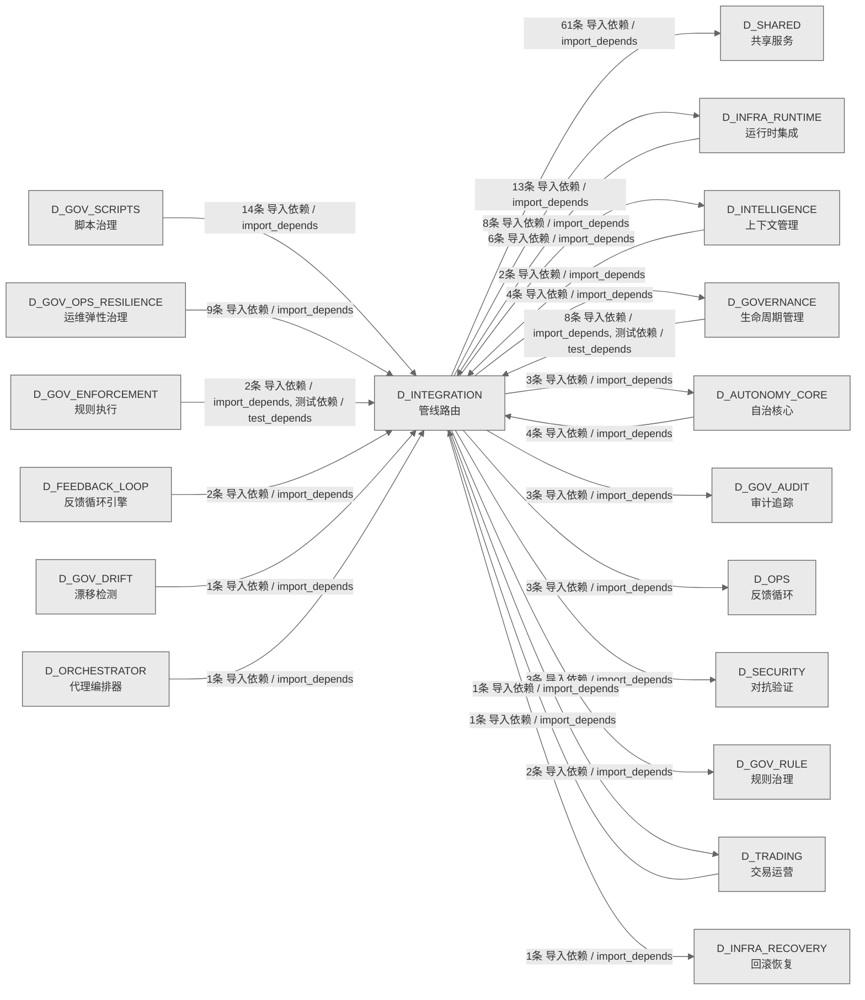

# 21_d_integration / 管线路由域 / Pipeline Routing

> **功能简介 / Overview**: 管线路由，负责跨域数据流路由、管道编排和集成适配

> **文档作用 / Purpose**: 展示 管线路由（D_INTEGRATION）功能域的域内依赖关系、跨域依赖关系，模块信息（成熟度/中英文名/大白话/文件路径）内嵌于 Mermaid 节点，供架构审查和域治理参考。

> 本文档由 generate_domain_doc.py 从 depgraph (PostgreSQL) 自动生成
> 数据源: depgraph (PostgreSQL) nodes表 + edges表

> **[可缩放 HTML 版 / Zoomable HTML](http://localhost:8765/docs/02_enterprise_architecture/02_domain_architecture_docs/_zoomable_html/21_d_integration.html)** — Ctrl+滚轮缩放 ｜ 双击重置 ｜ Ctrl+Shift+D 切换拖动/选择模式

## 域基本信息 / Domain Overview

| 字段 | 值 | Field | Value |
|------|------|-------|-------|
| 编号 | 21 | Number | 21 |
| 域ID | D_INTEGRATION | Domain ID | D_INTEGRATION |
| 域名称 | 管线路由 | Domain Name | Pipeline Routing |
| 层级 | L1 基础平台层 | Layer | L1 Foundation |
| 模块数 | 71 | Module Count | 71 |
| 域内依赖 | 68 | Internal Dependencies | 68 |
| 跨域入边 | 52 | Cross-domain Incoming | 52 |
| 跨域出边 | 100 | Cross-domain Outgoing | 100 |
| 设计态模块 | 0 | Design Modules | 0 |
| 生产态模块 | 71 | Production Modules | 71 |
| 容量 | 71/150 (正常) | Capacity | 71/150 (正常) |
| 描述 | M1-M11双管线路由 | Description | M1-M11双管线路由 |

## 域内依赖图 / Internal Dependency Diagram

> 依赖图内嵌在本文档中，IDE 可直接渲染；网页版可 Ctrl+滚轮缩放 + 拖动平移查看细节。
>
> **图例说明 / Legend**：
> - 🟦 **蓝色 = 运营态模块**（production，已上线运行）
> - 🟧 **橙色虚线 = 设计态模块**（design，蓝图阶段，代码未写）
> - **实线箭头 = 运营态依赖**（已生效的依赖关系）
> - **虚线箭头 = 非运营态依赖**（计划中/验证中的依赖关系）

### 全景图（全部模块，颜色区分运营态/设计态）

> 展示全部 71 个模块（生产态 71 + 设计态 0），含跨域依赖外部节点。节点含成熟度+名称+大白话/简介+文件路径。

```mermaid
%%{init: {'theme': 'base', 'themeVariables': {'primaryColor': '#eaeaea', 'primaryTextColor': '#333333', 'primaryBorderColor': '#666666', 'lineColor': '#666666', 'secondaryColor': '#eaeaea', 'tertiaryColor': '#eaeaea', 'fontSize': '14px'}}}%%
flowchart TD
    src_zephyr_integration_behavioral_admission_admission_response_py["behavioral_admission/admission_response<br/>集成/behavioral<br/>admission包的admission_response模块<br/>文件: behavioral_admission/admission_response.py<br/>(生产态 / production)"]
    src_zephyr_integration_budget_enforcer_degradation_spiral_detector_py["budget_enforcer/degradation_spiral_detector<br/>Degradation Spiral Detector —<br/>模型幻觉-容量正反馈螺旋检测 (盲点 #19, M-29)<br/>文件: budget_enforcer<br/>/degradation_spiral_detector.py<br/>(生产态 / production)"]
    src_zephyr_integration_llm_bridge_py["integration/llm_bridge<br/>接收 RED 问题,生成修复文本。LLM<br/>只润色不做判断。不可用时降级为模板生成。<br/>文件: integration/llm_bridge.py<br/>(生产态 / production)"]
    src_zephyr_integration_mcp_gateway_server_py["mcp/gateway_server<br/>MCP Gateway 集中式治理节点（MOD-INF-013 §12<br/>Phase 5）。<br/>文件: mcp/gateway_server.py<br/>(生产态 / production)"]
    src_zephyr_integration_mcp_handoff_auto_loader_py["mcp/handoff_auto_loader<br/>Handoff 自动加载器——从 handoff 包恢复 AI<br/>session 上下文（MOD-INF-013 §5.3）。<br/>文件: mcp/handoff_auto_loader.py<br/>(生产态 / production)"]
    src_zephyr_integration_mcp_prompt_provider_py["mcp/prompt_provider<br/>MCP Prompt 模板提供者（MOD-INF-013 Phase 6 —<br/>关闭 B3）。<br/>文件: mcp/prompt_provider.py<br/>(生产态 / production)"]
    src_zephyr_integration_mcp_resource_provider_py["mcp/resource_provider<br/>MCP Resource 提供者（MOD-INF-013 Phase 6 — 关闭<br/>B2/B41）。<br/>文件: mcp/resource_provider.py<br/>(生产态 / production)"]
    src_zephyr_integration_mcp_rule_discovery_server_py["mcp/rule_discovery_server<br/>RuleDiscoveryServer — MCP Server for rule<br/>discovery（...<br/>文件: mcp/rule_discovery_server.py<br/>(生产态 / production)"]
    src_zephyr_integration_mcp_server_py["integration/mcp_server<br/>AssetInventory MCP Server — MOD-INF-026 蓝图 §21<br/>文件: integration/mcp_server.py<br/>(生产态 / production)"]
    src_zephyr_integration_pipeline_orchestrator_py["integration/pipeline_orchestrator<br/>PipelineOrchestrator — M1-M11 管线协调器<br/>文件: integration/pipeline_orchestrator.py<br/>(生产态 / production)"]
    src_zephyr_integration_ports_py["integration/ports<br/>Protocol-based interface layer for<br/>pipeline->mcp dependency abstraction.<br/>文件: integration/ports.py<br/>(生产态 / production)"]
    src_zephyr_integration_shared_contracts_errors_contract_violation_error_py["errors/contract_violation_error<br/>集成/错误包的contract_violation_error模块<br/>文件: errors/contract_violation_error.py<br/>(生产态 / production)"]
    src_zephyr_integration_shared_contracts_errors_data_quality_error_py["errors/data_quality_error<br/>CTR-ERR-001: DataQualityError /<br/>行情质量门禁不通过错误<br/>文件: errors/data_quality_error.py<br/>(生产态 / production)"]
    src_zephyr_integration_shared_contracts_errors_execution_rejection_error_py["errors/execution_rejection_error<br/>集成/错误包的execution_rejection_error模块<br/>文件: errors/execution_rejection_error.py<br/>(生产态 / production)"]
    src_zephyr_integration_shared_contracts_errors_factor_computation_error_py["errors/factor_computation_error<br/>CTR-ERR-002: FactorComputationError /<br/>因子计算失败错误<br/>文件: errors/factor_computation_error.py<br/>(生产态 / production)"]
    src_zephyr_integration_shared_contracts_errors_risk_limit_violation_error_py["errors/risk_limit_violation_error<br/>集成/错误包的risk_limit_violation_error模块<br/>文件: errors/risk_limit_violation_error.py<br/>(生产态 / production)"]
    src_zephyr_integration_shared_contracts_errors_signal_degradation_warning_py["errors/signal_degradation_warning<br/>集成/错误包的signal_degradation_warning模块<br/>文件: errors/signal_degradation_warning.py<br/>(生产态 / production)"]
    src_zephyr_integration_shared_events_dlq_bridge_py["events/dlq_bridge<br/>CT-DLQ-001: DeadLetterQueue -> System Event Bus<br/>integration bridge.<br/>文件: events/dlq_bridge.py<br/>(生产态 / production)"]
    src_zephyr_integration_shared_events_event_bus_upgrade_py["events/event_bus_upgrade<br/>EventBus Upgrade — 事件总线升级 (M-16)<br/>文件: events/event_bus_upgrade.py<br/>(生产态 / production)"]
    src_zephyr_integration_shared_events_event_schemas_py["events/event_schemas<br/>event_schemas.py —— Observer 事件体 Pydantic V2<br/>Schema（盲点 B6/B10 修复）<br/>文件: events/event_schemas.py<br/>(生产态 / production)"]
    src_zephyr_integration_shared_events_upgrade_strategy_py["events/upgrade_strategy<br/>EventBus 升级策略引擎<br/>文件: events/upgrade_strategy.py<br/>(生产态 / production)"]
    src_zephyr_integration_vector_memory_bm25_index_py["vector_memory/bm25_index<br/>BM25Index — MOD-INF-011 稀疏检索组件<br/>文件: vector_memory/bm25_index.py<br/>(生产态 / production)"]
    src_zephyr_integration_vector_memory_cache_layer_py["vector_memory/cache_layer<br/>集成/vector memory包的cache_layer模块<br/>文件: vector_memory/cache_layer.py<br/>(生产态 / production)"]
    src_zephyr_integration_vector_memory_context_ingest_py["vector_memory/context_ingest<br/>VMS 上下文注入器 — ingest_context() 消费者<br/>文件: vector_memory/context_ingest.py<br/>(生产态 / production)"]
    src_zephyr_integration_vector_memory_cross_collection_retriever_py["vector_memory/cross_collection_retriever<br/>CrossCollectionRetriever — MOD-INF-011 跨<br/>Collection 联合检索<br/>文件: vector_memory<br/>/cross_collection_retriever.py<br/>(生产态 / production)"]
    src_zephyr_integration_vector_memory_delegated_vector_memory_py["vector_memory/delegated_vector_memory<br/>DelegatedVectorMemory — VectorMemoryBase 的<br/>RI-02 落地适配器<br/>文件: vector_memory/delegated_vector_memory.py<br/>(生产态 / production)"]
    src_zephyr_integration_vector_memory_design_principles_py["vector_memory/design_principles<br/>集成/vector memory包的design_principles模块<br/>文件: vector_memory/design_principles.py<br/>(生产态 / production)"]
    src_zephyr_integration_vector_memory_migrate_chroma_to_faiss_py["vector_memory/migrate_chroma_to_faiss<br/>ChromDB -> FAISS + SQLite WAL 数据迁移脚本<br/>文件: vector_memory/migrate_chroma_to_faiss.py<br/>(生产态 / production)"]
    src_zephyr_integration_vector_memory_ollama_embedding_py["vector_memory/ollama_embedding<br/>集成/vector memory包的ollama_embedding模块<br/>文件: vector_memory/ollama_embedding.py<br/>(生产态 / production)"]
    src_zephyr_integration_vector_memory_vms_memory_backend_py["vector_memory/vms_memory_backend<br/>VMSMemoryBackend — UnifiedMemoryAPI 的 VMS<br/>后端适配器<br/>文件: vector_memory/vms_memory_backend.py<br/>(生产态 / production)"]
    src_zephyr_shared_contracts_approval_types_py["contracts/approval_types<br/>G-CT-004 — ApprovalRequest Pydantic V2<br/>BaseModel 审批请求数据结构.<br/>文件: contracts/approval_types.py<br/>(生产态 / production)"]
    src_zephyr_shared_contracts_rollback_types_py["contracts/rollback_types<br/>G-CT-003 — RollbackResult Pydantic V2 BaseModel<br/>回滚结果数据结构.<br/>文件: contracts/rollback_types.py<br/>(生产态 / production)"]
    src_zephyr_shared_contracts_runtime_types_py["contracts/runtime_types<br/>共享层/契约包的runtime_types模块<br/>文件: contracts/runtime_types.py<br/>(生产态 / production)"]
    src_zephyr_shared_evaluation_evals_py["evaluation/evals<br/>共享层/evaluation包的evals模块<br/>文件: evaluation/evals.py<br/>(生产态 / production)"]
    src_zephyr_shared_resilience_durable_execution_py["resilience/durable_execution<br/>共享层/resilience包的durable_execution模块<br/>文件: resilience/durable_execution.py<br/>(生产态 / production)"]
    src_zephyr_shared_versioning_version_negotiation_py["versioning/version_negotiation<br/>共享层/versioning包的version_negotiation模块<br/>文件: versioning/version_negotiation.py<br/>(生产态 / production)"]
    src_zephyr_integration_behavioral_admission_admission_response_py ~~~ src_zephyr_integration_budget_enforcer_degradation_spiral_detector_py
    src_zephyr_integration_budget_enforcer_degradation_spiral_detector_py ~~~ src_zephyr_integration_llm_bridge_py
    src_zephyr_integration_llm_bridge_py ~~~ src_zephyr_integration_mcp_gateway_server_py
    src_zephyr_integration_mcp_gateway_server_py ~~~ src_zephyr_integration_mcp_handoff_auto_loader_py
    src_zephyr_integration_mcp_handoff_auto_loader_py ~~~ src_zephyr_integration_mcp_prompt_provider_py
    src_zephyr_integration_mcp_prompt_provider_py ~~~ src_zephyr_integration_mcp_resource_provider_py
    src_zephyr_integration_mcp_resource_provider_py ~~~ src_zephyr_integration_mcp_rule_discovery_server_py
    src_zephyr_integration_mcp_rule_discovery_server_py ~~~ src_zephyr_integration_mcp_server_py
    src_zephyr_integration_mcp_server_py ~~~ src_zephyr_integration_pipeline_orchestrator_py
    src_zephyr_integration_pipeline_orchestrator_py ~~~ src_zephyr_integration_ports_py
    src_zephyr_integration_ports_py ~~~ src_zephyr_integration_shared_contracts_errors_contract_violation_error_py
    src_zephyr_integration_shared_contracts_errors_contract_violation_error_py ~~~ src_zephyr_integration_shared_contracts_errors_data_quality_error_py
    src_zephyr_integration_shared_contracts_errors_data_quality_error_py ~~~ src_zephyr_integration_shared_contracts_errors_execution_rejection_error_py
    src_zephyr_integration_shared_contracts_errors_execution_rejection_error_py ~~~ src_zephyr_integration_shared_contracts_errors_factor_computation_error_py
    src_zephyr_integration_shared_contracts_errors_factor_computation_error_py ~~~ src_zephyr_integration_shared_contracts_errors_risk_limit_violation_error_py
    src_zephyr_integration_shared_contracts_errors_risk_limit_violation_error_py ~~~ src_zephyr_integration_shared_contracts_errors_signal_degradation_warning_py
    src_zephyr_integration_shared_contracts_errors_signal_degradation_warning_py ~~~ src_zephyr_integration_shared_events_dlq_bridge_py
    src_zephyr_integration_shared_events_dlq_bridge_py ~~~ src_zephyr_integration_shared_events_event_bus_upgrade_py
    src_zephyr_integration_shared_events_event_bus_upgrade_py ~~~ src_zephyr_integration_shared_events_event_schemas_py
    src_zephyr_integration_shared_events_event_schemas_py ~~~ src_zephyr_integration_shared_events_upgrade_strategy_py
    src_zephyr_integration_shared_events_upgrade_strategy_py ~~~ src_zephyr_integration_vector_memory_bm25_index_py
    src_zephyr_integration_vector_memory_bm25_index_py ~~~ src_zephyr_integration_vector_memory_cache_layer_py
    src_zephyr_integration_vector_memory_cache_layer_py ~~~ src_zephyr_integration_vector_memory_context_ingest_py
    src_zephyr_integration_vector_memory_context_ingest_py ~~~ src_zephyr_integration_vector_memory_cross_collection_retriever_py
    src_zephyr_integration_vector_memory_cross_collection_retriever_py ~~~ src_zephyr_integration_vector_memory_delegated_vector_memory_py
    src_zephyr_integration_vector_memory_delegated_vector_memory_py ~~~ src_zephyr_integration_vector_memory_design_principles_py
    src_zephyr_integration_vector_memory_design_principles_py ~~~ src_zephyr_integration_vector_memory_migrate_chroma_to_faiss_py
    src_zephyr_integration_vector_memory_migrate_chroma_to_faiss_py ~~~ src_zephyr_integration_vector_memory_ollama_embedding_py
    src_zephyr_integration_vector_memory_ollama_embedding_py ~~~ src_zephyr_integration_vector_memory_vms_memory_backend_py
    src_zephyr_integration_vector_memory_vms_memory_backend_py ~~~ src_zephyr_shared_contracts_approval_types_py
    src_zephyr_shared_contracts_approval_types_py ~~~ src_zephyr_shared_contracts_rollback_types_py
    src_zephyr_shared_contracts_rollback_types_py ~~~ src_zephyr_shared_contracts_runtime_types_py
    src_zephyr_shared_contracts_runtime_types_py ~~~ src_zephyr_shared_evaluation_evals_py
    src_zephyr_shared_evaluation_evals_py ~~~ src_zephyr_shared_resilience_durable_execution_py
    src_zephyr_shared_resilience_durable_execution_py ~~~ src_zephyr_shared_versioning_version_negotiation_py
    src_zephyr_integration_local_model_cache_layer_py["local_model/cache_layer<br/>CacheLayer — MOD-INF-011 嵌入缓存与查询结果 LRU<br/>文件: local_model/cache_layer.py<br/>(生产态 / production)"]
    src_zephyr_integration_local_model_local_model_scheduler_py["local_model/local_model_scheduler<br/>LocalModelScheduler — L2 本地模型 24/7 调度循环<br/>文件: local_model/local_model_scheduler.py<br/>(生产态 / production)"]
    src_zephyr_integration_local_model_ollama_embedding_py["local_model/ollama_embedding<br/>OllamaEmbedder — 通过 Ollama HTTP API<br/>生成文本嵌入<br/>文件: local_model/ollama_embedding.py<br/>(生产态 / production)"]
    src_zephyr_integration_mcp_audit_logger_py["mcp/audit_logger<br/>MCP 全量工具调用审计日志（MOD-INF-013 §12 Step<br/>4）。<br/>文件: mcp/audit_logger.py<br/>(生产态 / production)"]
    src_zephyr_integration_mcp_blueprint_search_server_py["mcp/blueprint_search_server<br/>BlueprintSearchServer — MCP Server for<br/>blueprint discovery<br/>文件: mcp/blueprint_search_server.py<br/>(生产态 / production)"]
    src_zephyr_integration_mcp_doc_guard_server_py["mcp/doc_guard_server<br/>DocGuardServer: 跨会话交接协议服务 MCP Server<br/>文件: mcp/doc_guard_server.py<br/>(生产态 / production)"]
    src_zephyr_integration_mcp_gate_engine_server_py["mcp/gate_engine_server<br/>GateEngineServer: 门禁裁决服务 MCP Server<br/>文件: mcp/gate_engine_server.py<br/>(生产态 / production)"]
    src_zephyr_integration_mcp_rate_limiter_py["mcp/rate_limiter<br/>MCP Gateway 同步速率限制器（MOD-INF-013 §12<br/>Step 3）。<br/>文件: mcp/rate_limiter.py<br/>(生产态 / production)"]
    src_zephyr_integration_mcp_sandbox_server_py["mcp/sandbox_server<br/>MCP sandbox 安全代码执行沙箱（MOD-INF-013 Phase<br/>7 — 关闭 B4）。<br/>文件: mcp/sandbox_server.py<br/>(生产态 / production)"]
    src_zephyr_integration_mcp_sentinel_server_py["mcp/sentinel_server<br/>SentinelServer: 意图路由哨兵 MCP Server<br/>文件: mcp/sentinel_server.py<br/>(生产态 / production)"]
    src_zephyr_integration_mcp_task_manager_server_py["mcp/task_manager_server<br/>ZephyrAlpha MCP Task Manager Server<br/>文件: mcp/task_manager_server.py<br/>(生产态 / production)"]
    src_zephyr_integration_mcp_telemetry_server_py["mcp/telemetry_server<br/>ZephyrAlpha MCP Telemetry Server — 系统可观测性<br/>MCP 接口<br/>文件: mcp/telemetry_server.py<br/>(生产态 / production)"]
    src_zephyr_integration_mcp_vector_memory_server_py["mcp/vector_memory_server<br/>VectorMemoryServer: VMS 向量记忆 MCP Server<br/>(MOD-INF-011 v0.7.0)<br/>文件: mcp/vector_memory_server.py<br/>(生产态 / production)"]
    src_zephyr_integration_vector_memory_bridge_layer_py["vector_memory/bridge_layer<br/>BridgeLayer — MOD-INF-011 kb/ ↔ VMS 过渡桥接<br/>文件: vector_memory/bridge_layer.py<br/>(生产态 / production)"]
    src_zephyr_integration_vector_memory_collection_schemas_py["vector_memory/collection_schemas<br/>集成/vector memory包的collection_schemas模块<br/>文件: vector_memory/collection_schemas.py<br/>(生产态 / production)"]
    src_zephyr_integration_vector_memory_faiss_collection_manager_py["vector_memory/faiss_collection_manager<br/>FAISSCollectionManager — FAISS HNSW/IVF+PQ 8<br/>Collection 全生命周期管理<br/>文件: vector_memory/faiss_collection_manager.py<br/>(生产态 / production)"]
    src_zephyr_integration_vector_memory_hybrid_retriever_py["vector_memory/hybrid_retriever<br/>HybridRetriever — MOD-INF-011 混合检索架构<br/>文件: vector_memory/hybrid_retriever.py<br/>(生产态 / production)"]
    src_zephyr_integration_vector_memory_in_memory_fake_vms_py["vector_memory/in_memory_fake_vms<br/>InMemoryFakeVMS — MOD-INF-011 · 零依赖测试双胞胎<br/>文件: vector_memory/in_memory_fake_vms.py<br/>(生产态 / production)"]
    src_zephyr_integration_vector_memory_interface_py["vector_memory/interface<br/>VMS — Vector Memory Service 接口基类<br/>文件: vector_memory/interface.py<br/>(生产态 / production)"]
    src_zephyr_integration_vector_memory_provenance_enforcer_py["vector_memory/provenance_enforcer<br/>ProvenanceEnforcer — MOD-INF-011<br/>写入溯源强制执行<br/>文件: vector_memory/provenance_enforcer.py<br/>(生产态 / production)"]
    src_zephyr_integration_vector_memory_sqlite_metadata_store_py["vector_memory/sqlite_metadata_store<br/>SQLiteMetadataStore — VMS 元数据存储 (SQLite<br/>WAL + FTS5 BM25)<br/>文件: vector_memory/sqlite_metadata_store.py<br/>(生产态 / production)"]
    src_zephyr_integration_vector_memory_vms_schemas_py["vector_memory/vms_schemas<br/>VMS 共享数据模型 — MOD-INF-011 · 蓝图 §6.1<br/>接口契约<br/>文件: vector_memory/vms_schemas.py<br/>(生产态 / production)"]
    src_zephyr_shared_contracts_protocols_py["contracts/protocols<br/>Structural Protocol interfaces for cross-module<br/>contracts.<br/>文件: contracts/protocols.py<br/>(生产态 / production)"]
    src_zephyr_integration_local_model_cache_layer_py ~~~ src_zephyr_integration_local_model_local_model_scheduler_py
    src_zephyr_integration_local_model_local_model_scheduler_py ~~~ src_zephyr_integration_local_model_ollama_embedding_py
    src_zephyr_integration_local_model_ollama_embedding_py ~~~ src_zephyr_integration_mcp_audit_logger_py
    src_zephyr_integration_mcp_audit_logger_py ~~~ src_zephyr_integration_mcp_blueprint_search_server_py
    src_zephyr_integration_mcp_blueprint_search_server_py ~~~ src_zephyr_integration_mcp_doc_guard_server_py
    src_zephyr_integration_mcp_doc_guard_server_py ~~~ src_zephyr_integration_mcp_gate_engine_server_py
    src_zephyr_integration_mcp_gate_engine_server_py ~~~ src_zephyr_integration_mcp_rate_limiter_py
    src_zephyr_integration_mcp_rate_limiter_py ~~~ src_zephyr_integration_mcp_sandbox_server_py
    src_zephyr_integration_mcp_sandbox_server_py ~~~ src_zephyr_integration_mcp_sentinel_server_py
    src_zephyr_integration_mcp_sentinel_server_py ~~~ src_zephyr_integration_mcp_task_manager_server_py
    src_zephyr_integration_mcp_task_manager_server_py ~~~ src_zephyr_integration_mcp_telemetry_server_py
    src_zephyr_integration_mcp_telemetry_server_py ~~~ src_zephyr_integration_mcp_vector_memory_server_py
    src_zephyr_integration_mcp_vector_memory_server_py ~~~ src_zephyr_integration_vector_memory_bridge_layer_py
    src_zephyr_integration_vector_memory_bridge_layer_py ~~~ src_zephyr_integration_vector_memory_collection_schemas_py
    src_zephyr_integration_vector_memory_collection_schemas_py ~~~ src_zephyr_integration_vector_memory_faiss_collection_manager_py
    src_zephyr_integration_vector_memory_faiss_collection_manager_py ~~~ src_zephyr_integration_vector_memory_hybrid_retriever_py
    src_zephyr_integration_vector_memory_hybrid_retriever_py ~~~ src_zephyr_integration_vector_memory_in_memory_fake_vms_py
    src_zephyr_integration_vector_memory_in_memory_fake_vms_py ~~~ src_zephyr_integration_vector_memory_interface_py
    src_zephyr_integration_vector_memory_interface_py ~~~ src_zephyr_integration_vector_memory_provenance_enforcer_py
    src_zephyr_integration_vector_memory_provenance_enforcer_py ~~~ src_zephyr_integration_vector_memory_sqlite_metadata_store_py
    src_zephyr_integration_vector_memory_sqlite_metadata_store_py ~~~ src_zephyr_integration_vector_memory_vms_schemas_py
    src_zephyr_integration_vector_memory_vms_schemas_py ~~~ src_zephyr_shared_contracts_protocols_py
    src_zephyr_integration_local_model_embedding_router_py["local_model/embedding_router<br/>EmbeddingRouter — MOD-INF-011 双嵌入维度路由<br/>文件: local_model/embedding_router.py<br/>(生产态 / production)"]
    src_zephyr_integration_local_model_ollama_chat_py["local_model/ollama_chat<br/>OllamaChat — 通过 Ollama HTTP API 进行本地 LLM<br/>推理<br/>文件: local_model/ollama_chat.py<br/>(生产态 / production)"]
    src_zephyr_integration_mcp_base_server_py["mcp/_base_server<br/>BaseMCPServer: stdio 传输 + JSON-RPC 2.0<br/>协议基类<br/>文件: mcp/_base_server.py<br/>(生产态 / production)"]
    src_zephyr_integration_vector_memory_collection_manager_py["vector_memory/collection_manager<br/>CollectionManager — MOD-INF-011 八大 Collection<br/>全生命周期管理<br/>文件: vector_memory/collection_manager.py<br/>(生产态 / production)"]
    src_zephyr_integration_vector_memory_in_process_vector_memory_py["vector_memory/in_process_vector_memory<br/>InProcessVectorMemory — MOD-INF-011 VMS 统一入口<br/>文件: vector_memory/in_process_vector_memory.py<br/>(生产态 / production)"]
    src_zephyr_integration_vector_memory_vms_errors_py["vector_memory/vms_errors<br/>集成/vector memory包的vms_errors模块<br/>文件: vector_memory/vms_errors.py<br/>(生产态 / production)"]
    src_zephyr_integration_local_model_embedding_router_py ~~~ src_zephyr_integration_local_model_ollama_chat_py
    src_zephyr_integration_local_model_ollama_chat_py ~~~ src_zephyr_integration_mcp_base_server_py
    src_zephyr_integration_mcp_base_server_py ~~~ src_zephyr_integration_vector_memory_collection_manager_py
    src_zephyr_integration_vector_memory_collection_manager_py ~~~ src_zephyr_integration_vector_memory_in_process_vector_memory_py
    src_zephyr_integration_vector_memory_in_process_vector_memory_py ~~~ src_zephyr_integration_vector_memory_vms_errors_py
    src_zephyr_integration_mcp_error_codes_py["mcp/error_codes<br/>MCP 错误码集中注册（MOD-INF-013 §3.4）。<br/>文件: mcp/error_codes.py<br/>(生产态 / production)"]
    src_zephyr_integration_vector_memory_chunk_strategy_router_py["vector_memory/chunk_strategy_router<br/>ChunkStrategyRouter — MOD-INF-011 分块策略调度<br/>文件: vector_memory/chunk_strategy_router.py<br/>(生产态 / production)"]
    src_zephyr_integration_vector_memory_in_memory_memory_backend_py["vector_memory/in_memory_memory_backend<br/>DegradedVMSBackend — MOD-INF-011 降级兜底<br/>文件: vector_memory/in_memory_memory_backend.py<br/>(生产态 / production)"]
    src_zephyr_integration_vector_memory_index_health_monitor_py["vector_memory/index_health_monitor<br/>IndexHealthMonitor — MOD-INF-011<br/>索引健康自检与自动修复<br/>文件: vector_memory/index_health_monitor.py<br/>(生产态 / production)"]
    src_zephyr_integration_vector_memory_retrieval_feedback_py["vector_memory/retrieval_feedback<br/>RetrievalFeedback — MOD-INF-011 FLE 检索质量消费<br/>文件: vector_memory/retrieval_feedback.py<br/>(生产态 / production)"]
    src_zephyr_integration_vector_memory_vector_bridge_py["vector_memory/vector_bridge<br/>VectorBridge — MOD-INF-011 CE/KB 外部集成适配器<br/>文件: vector_memory/vector_bridge.py<br/>(生产态 / production)"]
    src_zephyr_integration_vector_memory_chunk_strategy_router_py ~~~ src_zephyr_integration_vector_memory_in_memory_memory_backend_py
    src_zephyr_integration_vector_memory_in_memory_memory_backend_py ~~~ src_zephyr_integration_vector_memory_index_health_monitor_py
    src_zephyr_integration_vector_memory_index_health_monitor_py ~~~ src_zephyr_integration_vector_memory_retrieval_feedback_py
    src_zephyr_integration_vector_memory_retrieval_feedback_py ~~~ src_zephyr_integration_vector_memory_vector_bridge_py
    src_zephyr_integration_pipeline_orchestrator_py -->|导入依赖 / import_depends| src_zephyr_integration_local_model_embedding_router_py
    src_zephyr_integration_pipeline_orchestrator_py -->|导入依赖 / import_depends| src_zephyr_integration_local_model_local_model_scheduler_py
    src_zephyr_integration_pipeline_orchestrator_py -->|导入依赖 / import_depends| src_zephyr_shared_contracts_protocols_py
    src_zephyr_integration_local_model_embedding_router_py -->|导入依赖 / import_depends| src_zephyr_integration_local_model_ollama_embedding_py
    src_zephyr_integration_local_model_local_model_scheduler_py -->|导入依赖 / import_depends| src_zephyr_integration_local_model_embedding_router_py
    src_zephyr_integration_local_model_local_model_scheduler_py -->|导入依赖 / import_depends| src_zephyr_integration_local_model_ollama_chat_py
    src_zephyr_integration_mcp_blueprint_search_server_py -->|导入依赖 / import_depends| src_zephyr_integration_mcp_base_server_py
    src_zephyr_integration_mcp_doc_guard_server_py -->|导入依赖 / import_depends| src_zephyr_integration_mcp_base_server_py
    src_zephyr_integration_mcp_gate_engine_server_py -->|导入依赖 / import_depends| src_zephyr_integration_mcp_base_server_py
    src_zephyr_integration_mcp_gateway_server_py -->|导入依赖 / import_depends| src_zephyr_integration_mcp_audit_logger_py
    src_zephyr_integration_mcp_gateway_server_py -->|导入依赖 / import_depends| src_zephyr_integration_mcp_blueprint_search_server_py
    src_zephyr_integration_mcp_gateway_server_py -->|导入依赖 / import_depends| src_zephyr_integration_mcp_doc_guard_server_py
    src_zephyr_integration_mcp_gateway_server_py -->|导入依赖 / import_depends| src_zephyr_integration_mcp_error_codes_py
    src_zephyr_integration_mcp_gateway_server_py -->|导入依赖 / import_depends| src_zephyr_integration_mcp_gate_engine_server_py
    src_zephyr_integration_mcp_gateway_server_py -->|导入依赖 / import_depends| src_zephyr_integration_mcp_rate_limiter_py
    src_zephyr_integration_mcp_gateway_server_py -->|导入依赖 / import_depends| src_zephyr_integration_mcp_sandbox_server_py
    src_zephyr_integration_mcp_gateway_server_py -->|导入依赖 / import_depends| src_zephyr_integration_mcp_task_manager_server_py
    src_zephyr_integration_mcp_gateway_server_py -->|导入依赖 / import_depends| src_zephyr_integration_mcp_vector_memory_server_py
    src_zephyr_integration_mcp_gateway_server_py -->|导入依赖 / import_depends| src_zephyr_integration_mcp_telemetry_server_py
    src_zephyr_integration_mcp_gateway_server_py -->|导入依赖 / import_depends| src_zephyr_integration_mcp_sentinel_server_py
    src_zephyr_integration_mcp_gateway_server_py -->|导入依赖 / import_depends| src_zephyr_integration_mcp_base_server_py
    src_zephyr_integration_mcp_sandbox_server_py -->|导入依赖 / import_depends| src_zephyr_integration_mcp_base_server_py
    src_zephyr_integration_mcp_vector_memory_server_py -->|导入依赖 / import_depends| src_zephyr_integration_mcp_base_server_py
    src_zephyr_integration_mcp_vector_memory_server_py -->|导入依赖 / import_depends| src_zephyr_integration_vector_memory_collection_manager_py
    src_zephyr_integration_mcp_vector_memory_server_py -->|导入依赖 / import_depends| src_zephyr_integration_vector_memory_in_process_vector_memory_py
    src_zephyr_integration_mcp_vector_memory_server_py -->|导入依赖 / import_depends| src_zephyr_integration_vector_memory_vms_errors_py
    src_zephyr_integration_mcp_rule_discovery_server_py -->|导入依赖 / import_depends| src_zephyr_integration_mcp_base_server_py
    src_zephyr_integration_mcp_sentinel_server_py -->|导入依赖 / import_depends| src_zephyr_integration_mcp_base_server_py
    src_zephyr_integration_mcp_base_server_py -->|导入依赖 / import_depends| src_zephyr_integration_mcp_error_codes_py
    src_zephyr_integration_vector_memory_cache_layer_py -->|导入依赖 / import_depends| src_zephyr_integration_local_model_cache_layer_py
    src_zephyr_integration_vector_memory_bridge_layer_py -->|导入依赖 / import_depends| src_zephyr_integration_vector_memory_collection_manager_py
    src_zephyr_integration_vector_memory_delegated_vector_memory_py -->|导入依赖 / import_depends| src_zephyr_integration_vector_memory_interface_py
    src_zephyr_integration_vector_memory_collection_manager_py -->|导入依赖 / import_depends| src_zephyr_integration_local_model_embedding_router_py
    src_zephyr_integration_vector_memory_collection_manager_py -->|导入依赖 / import_depends| src_zephyr_integration_vector_memory_collection_schemas_py
    src_zephyr_integration_vector_memory_cross_collection_retriever_py -->|导入依赖 / import_depends| src_zephyr_integration_vector_memory_hybrid_retriever_py
    src_zephyr_integration_vector_memory_context_ingest_py -->|导入依赖 / import_depends| src_zephyr_integration_vector_memory_in_memory_fake_vms_py
    src_zephyr_integration_vector_memory_hybrid_retriever_py -->|导入依赖 / import_depends| src_zephyr_integration_local_model_embedding_router_py
    src_zephyr_integration_vector_memory_hybrid_retriever_py -->|导入依赖 / import_depends| src_zephyr_integration_vector_memory_collection_manager_py
    src_zephyr_integration_vector_memory_design_principles_py -->|导入依赖 / import_depends| src_zephyr_integration_vector_memory_collection_schemas_py
    src_zephyr_integration_vector_memory_design_principles_py -->|导入依赖 / import_depends| src_zephyr_integration_vector_memory_provenance_enforcer_py
    src_zephyr_integration_vector_memory_design_principles_py -->|导入依赖 / import_depends| src_zephyr_integration_vector_memory_vms_errors_py
    src_zephyr_integration_vector_memory_design_principles_py -->|导入依赖 / import_depends| src_zephyr_integration_vector_memory_vms_schemas_py
    src_zephyr_integration_vector_memory_faiss_collection_manager_py -->|导入依赖 / import_depends| src_zephyr_integration_vector_memory_collection_manager_py
    src_zephyr_integration_vector_memory_index_health_monitor_py -->|导入依赖 / import_depends| src_zephyr_integration_vector_memory_collection_manager_py
    src_zephyr_integration_vector_memory_ollama_embedding_py -->|导入依赖 / import_depends| src_zephyr_integration_local_model_ollama_embedding_py
    src_zephyr_integration_vector_memory_in_process_vector_memory_py -->|导入依赖 / import_depends| src_zephyr_integration_local_model_cache_layer_py
    src_zephyr_integration_vector_memory_in_process_vector_memory_py -->|导入依赖 / import_depends| src_zephyr_integration_local_model_embedding_router_py
    src_zephyr_integration_vector_memory_in_process_vector_memory_py -->|导入依赖 / import_depends| src_zephyr_integration_vector_memory_bridge_layer_py
    src_zephyr_integration_vector_memory_in_process_vector_memory_py -->|导入依赖 / import_depends| src_zephyr_integration_vector_memory_chunk_strategy_router_py
    src_zephyr_integration_vector_memory_in_process_vector_memory_py -->|导入依赖 / import_depends| src_zephyr_integration_vector_memory_collection_manager_py
    src_zephyr_integration_vector_memory_in_process_vector_memory_py -->|导入依赖 / import_depends| src_zephyr_integration_vector_memory_hybrid_retriever_py
    src_zephyr_integration_vector_memory_in_process_vector_memory_py -->|导入依赖 / import_depends| src_zephyr_integration_vector_memory_index_health_monitor_py
    src_zephyr_integration_vector_memory_in_process_vector_memory_py -->|导入依赖 / import_depends| src_zephyr_integration_vector_memory_provenance_enforcer_py
    src_zephyr_integration_vector_memory_in_process_vector_memory_py -->|导入依赖 / import_depends| src_zephyr_integration_vector_memory_in_memory_memory_backend_py
    src_zephyr_integration_vector_memory_in_process_vector_memory_py -->|导入依赖 / import_depends| src_zephyr_integration_vector_memory_retrieval_feedback_py
    src_zephyr_integration_vector_memory_in_process_vector_memory_py -->|导入依赖 / import_depends| src_zephyr_integration_vector_memory_vector_bridge_py
    src_zephyr_integration_vector_memory_migrate_chroma_to_faiss_py -->|导入依赖 / import_depends| src_zephyr_integration_vector_memory_collection_manager_py
    src_zephyr_integration_vector_memory_migrate_chroma_to_faiss_py -->|导入依赖 / import_depends| src_zephyr_integration_vector_memory_faiss_collection_manager_py
    src_zephyr_integration_vector_memory_migrate_chroma_to_faiss_py -->|导入依赖 / import_depends| src_zephyr_integration_vector_memory_sqlite_metadata_store_py
    src_zephyr_integration_vector_memory_in_memory_fake_vms_py -->|导入依赖 / import_depends| src_zephyr_integration_vector_memory_collection_manager_py
    src_zephyr_integration_vector_memory_provenance_enforcer_py -->|导入依赖 / import_depends| src_zephyr_integration_vector_memory_collection_manager_py
    src_zephyr_integration_vector_memory_provenance_enforcer_py -->|导入依赖 / import_depends| src_zephyr_integration_vector_memory_vms_schemas_py
    src_zephyr_integration_vector_memory_sqlite_metadata_store_py -->|导入依赖 / import_depends| src_zephyr_integration_vector_memory_collection_manager_py
    src_zephyr_integration_vector_memory_retrieval_feedback_py -->|导入依赖 / import_depends| src_zephyr_integration_vector_memory_hybrid_retriever_py
    src_zephyr_integration_vector_memory_retrieval_feedback_py -->|导入依赖 / import_depends| src_zephyr_integration_vector_memory_in_process_vector_memory_py
    src_zephyr_integration_vector_memory_vector_bridge_py -->|导入依赖 / import_depends| src_zephyr_integration_vector_memory_in_process_vector_memory_py
    src_zephyr_integration_vector_memory_vms_memory_backend_py -->|导入依赖 / import_depends| src_zephyr_integration_vector_memory_bridge_layer_py
    src_zephyr_integration_vector_memory_vms_memory_backend_py -->|导入依赖 / import_depends| src_zephyr_integration_vector_memory_in_process_vector_memory_py
    D_SHARED["共享服务<br/>共享服务，负责跨域共享的工具、协议和基础服务<br/>Shared Services<br/>跨域节点 / cross-domain<br/>(生产态 / production)"]
    src_zephyr_integration_shared_events_upgrade_strategy_py -->|导入依赖 / import_depends| D_SHARED
    D_INFRA_RUNTIME["运行时集成<br/>运行时集成，负责组件生命周期编排、启动钩子和运行<br/>时上下文管理<br/>Runtime Integration<br/>跨域节点 / cross-domain<br/>(生产态 / production)"]
    src_zephyr_integration_pipeline_orchestrator_py -->|导入依赖 / import_depends| D_INFRA_RUNTIME
    src_zephyr_integration_pipeline_orchestrator_py -->|导入依赖 / import_depends| D_SHARED
    src_zephyr_integration_mcp_gateway_server_py -->|导入依赖 / import_depends| D_SHARED
    src_zephyr_integration_mcp_gate_engine_server_py -->|导入依赖 / import_depends| D_SHARED
    src_zephyr_integration_mcp_task_manager_server_py -->|导入依赖 / import_depends| D_SHARED
    D_INTELLIGENCE["上下文管理<br/>上下文管理，负责 AI<br/>上下文窗口管理、记忆检索和上下文压缩<br/>Context Management<br/>跨域节点 / cross-domain<br/>(生产态 / production)"]
    src_zephyr_integration_vector_memory_vms_schemas_py -->|导入依赖 / import_depends| D_INTELLIGENCE
    src_zephyr_integration_mcp_server_py -->|导入依赖 / import_depends| D_SHARED
    src_zephyr_integration_mcp_server_py -->|导入依赖 / import_depends| D_SHARED
    src_zephyr_integration_vector_memory_index_health_monitor_py -->|导入依赖 / import_depends| D_SHARED
    D_SECURITY["对抗验证<br/>对抗验证，负责系统安全对抗测试、漏洞扫描和攻防验<br/>证<br/>Adversarial Validation<br/>跨域节点 / cross-domain<br/>(生产态 / production)"]
    src_zephyr_integration_pipeline_orchestrator_py -->|导入依赖 / import_depends| D_SECURITY
    D_OPS["反馈循环<br/>反馈循环，负责系统运行反馈、性能监控和自动调优闭<br/>环<br/>Feedback Loop<br/>跨域节点 / cross-domain<br/>(生产态 / production)"]
    src_zephyr_integration_pipeline_orchestrator_py -->|导入依赖 / import_depends| D_OPS
    src_zephyr_integration_mcp_task_manager_server_py -->|导入依赖 / import_depends| D_SHARED
    src_zephyr_integration_pipeline_orchestrator_py -->|导入依赖 / import_depends| D_INFRA_RUNTIME
    src_zephyr_integration_mcp_task_manager_server_py -->|导入依赖 / import_depends| D_SHARED
    D_GOV_OPS_RESILIENCE["运维弹性治理<br/>运维弹性治理，负责运维治理、安全治理、弹性治理和<br/>升级协议<br/>Ops Resilience Governance<br/>跨域节点 / cross-domain<br/>(生产态 / production)"]
    D_GOV_OPS_RESILIENCE -->|导入依赖 / import_depends| src_zephyr_integration_vector_memory_bridge_layer_py
    D_INTELLIGENCE -->|导入依赖 / import_depends| src_zephyr_integration_vector_memory_vms_memory_backend_py
    D_INFRA_RUNTIME -->|导入依赖 / import_depends| src_zephyr_integration_local_model_local_model_scheduler_py
    D_ORCHESTRATOR["代理编排器<br/>代理编排器，负责 Agent<br/>任务全生命周期：任务入队、调度、沙箱执行、幻觉检<br/>测和收尾归档<br/>Agent Orchestrator<br/>跨域节点 / cross-domain<br/>(生产态 / production)"]
    D_ORCHESTRATOR -->|导入依赖 / import_depends| src_zephyr_integration_vector_memory_in_memory_fake_vms_py
    D_GOV_ENFORCEMENT["规则执行<br/>规则执行，负责治理规则执行和门禁拦截<br/>Rule Enforcement<br/>跨域节点 / cross-domain<br/>(生产态 / production)"]
    D_GOV_ENFORCEMENT -->|导入依赖 / import_depends| src_zephyr_shared_contracts_approval_types_py
    D_GOVERNANCE["生命周期管理<br/>生命周期管理，负责蓝图/模块<br/>/任务的声明周期管理和元数据治理<br/>Lifecycle Management<br/>跨域节点 / cross-domain<br/>(生产态 / production)"]
    D_GOVERNANCE -->|导入依赖 / import_depends| src_zephyr_shared_contracts_runtime_types_py
    D_AUTONOMY_CORE["自治核心<br/>自治核心，负责 AI 自治决策、目标分解和执行编排<br/>Autonomy Core<br/>跨域节点 / cross-domain<br/>(生产态 / production)"]
    D_AUTONOMY_CORE -->|导入依赖 / import_depends| src_zephyr_shared_contracts_protocols_py
    D_GOV_SCRIPTS["脚本治理<br/>脚本治理，负责脚本生命周期管理和脚本质量门禁<br/>Script Governance<br/>跨域节点 / cross-domain<br/>(生产态 / production)"]
    D_GOV_SCRIPTS -->|导入依赖 / import_depends| src_zephyr_integration_vector_memory_bridge_layer_py
    D_GOV_SCRIPTS -->|导入依赖 / import_depends| src_zephyr_integration_vector_memory_collection_manager_py
    D_GOV_SCRIPTS -->|导入依赖 / import_depends| src_zephyr_integration_vector_memory_index_health_monitor_py
    D_INFRA_RUNTIME -->|导入依赖 / import_depends| src_zephyr_shared_contracts_runtime_types_py
    D_GOVERNANCE -->|测试依赖 / test_depends| src_zephyr_shared_contracts_approval_types_py
    D_GOV_OPS_RESILIENCE -->|导入依赖 / import_depends| src_zephyr_integration_vector_memory_in_process_vector_memory_py
    D_GOV_OPS_RESILIENCE -->|导入依赖 / import_depends| src_zephyr_integration_vector_memory_collection_manager_py
    D_GOV_ENFORCEMENT -->|测试依赖 / test_depends| src_zephyr_integration_mcp_rule_discovery_server_py
    classDef production fill:#e1f5fe,stroke:#01579b,stroke-width:2px,color:#000
    classDef design fill:#fff3e0,stroke:#e65100,stroke-width:2px,color:#000,stroke-dasharray: 5 5
    classDef external_prod fill:#e8f4fd,stroke:#0277bd,stroke-width:1px,color:#000
    classDef external_design fill:#fff8e7,stroke:#ef6c00,stroke-width:1px,color:#000,stroke-dasharray: 5 5
    class src_zephyr_integration_behavioral_admission_admission_response_py,src_zephyr_integration_budget_enforcer_degradation_spiral_detector_py,src_zephyr_integration_llm_bridge_py,src_zephyr_integration_local_model_cache_layer_py,src_zephyr_integration_local_model_embedding_router_py,src_zephyr_integration_local_model_local_model_scheduler_py,src_zephyr_integration_local_model_ollama_chat_py,src_zephyr_integration_local_model_ollama_embedding_py,src_zephyr_integration_mcp_base_server_py,src_zephyr_integration_mcp_audit_logger_py,src_zephyr_integration_mcp_blueprint_search_server_py,src_zephyr_integration_mcp_doc_guard_server_py,src_zephyr_integration_mcp_error_codes_py,src_zephyr_integration_mcp_gate_engine_server_py,src_zephyr_integration_mcp_gateway_server_py,src_zephyr_integration_mcp_handoff_auto_loader_py,src_zephyr_integration_mcp_prompt_provider_py,src_zephyr_integration_mcp_rate_limiter_py,src_zephyr_integration_mcp_resource_provider_py,src_zephyr_integration_mcp_rule_discovery_server_py,src_zephyr_integration_mcp_sandbox_server_py,src_zephyr_integration_mcp_sentinel_server_py,src_zephyr_integration_mcp_task_manager_server_py,src_zephyr_integration_mcp_telemetry_server_py,src_zephyr_integration_mcp_vector_memory_server_py,src_zephyr_integration_mcp_server_py,src_zephyr_integration_pipeline_orchestrator_py,src_zephyr_integration_ports_py,src_zephyr_integration_shared_contracts_errors_contract_violation_error_py,src_zephyr_integration_shared_contracts_errors_data_quality_error_py,src_zephyr_integration_shared_contracts_errors_execution_rejection_error_py,src_zephyr_integration_shared_contracts_errors_factor_computation_error_py,src_zephyr_integration_shared_contracts_errors_risk_limit_violation_error_py,src_zephyr_integration_shared_contracts_errors_signal_degradation_warning_py,src_zephyr_integration_shared_events_dlq_bridge_py,src_zephyr_integration_shared_events_event_bus_upgrade_py,src_zephyr_integration_shared_events_event_schemas_py,src_zephyr_integration_shared_events_upgrade_strategy_py,src_zephyr_integration_vector_memory_bm25_index_py,src_zephyr_integration_vector_memory_bridge_layer_py,src_zephyr_integration_vector_memory_cache_layer_py,src_zephyr_integration_vector_memory_chunk_strategy_router_py,src_zephyr_integration_vector_memory_collection_manager_py,src_zephyr_integration_vector_memory_collection_schemas_py,src_zephyr_integration_vector_memory_context_ingest_py,src_zephyr_integration_vector_memory_cross_collection_retriever_py,src_zephyr_integration_vector_memory_delegated_vector_memory_py,src_zephyr_integration_vector_memory_design_principles_py,src_zephyr_integration_vector_memory_faiss_collection_manager_py,src_zephyr_integration_vector_memory_hybrid_retriever_py,src_zephyr_integration_vector_memory_in_memory_fake_vms_py,src_zephyr_integration_vector_memory_in_memory_memory_backend_py,src_zephyr_integration_vector_memory_in_process_vector_memory_py,src_zephyr_integration_vector_memory_index_health_monitor_py,src_zephyr_integration_vector_memory_interface_py,src_zephyr_integration_vector_memory_migrate_chroma_to_faiss_py,src_zephyr_integration_vector_memory_ollama_embedding_py,src_zephyr_integration_vector_memory_provenance_enforcer_py,src_zephyr_integration_vector_memory_retrieval_feedback_py,src_zephyr_integration_vector_memory_sqlite_metadata_store_py,src_zephyr_integration_vector_memory_vector_bridge_py,src_zephyr_integration_vector_memory_vms_errors_py,src_zephyr_integration_vector_memory_vms_memory_backend_py,src_zephyr_integration_vector_memory_vms_schemas_py,src_zephyr_shared_contracts_approval_types_py,src_zephyr_shared_contracts_protocols_py,src_zephyr_shared_contracts_rollback_types_py,src_zephyr_shared_contracts_runtime_types_py,src_zephyr_shared_evaluation_evals_py,src_zephyr_shared_resilience_durable_execution_py,src_zephyr_shared_versioning_version_negotiation_py production
    class D_SHARED,D_INFRA_RUNTIME,D_INTELLIGENCE,D_SECURITY,D_OPS,D_GOV_OPS_RESILIENCE,D_ORCHESTRATOR,D_GOV_ENFORCEMENT,D_GOVERNANCE,D_AUTONOMY_CORE,D_GOV_SCRIPTS external_prod
```

### 运营态的图（仅 design_maturity=production 的模块和域内依赖）

> 仅展示已上线运行的模块（共 71 个），不含跨域外部节点。跨域依赖见下方跨域依赖章节。

```mermaid
%%{init: {'theme': 'base', 'themeVariables': {'primaryColor': '#eaeaea', 'primaryTextColor': '#333333', 'primaryBorderColor': '#666666', 'lineColor': '#666666', 'secondaryColor': '#eaeaea', 'tertiaryColor': '#eaeaea', 'fontSize': '14px'}}}%%
flowchart TD
    src_zephyr_integration_behavioral_admission_admission_response_py["behavioral_admission/admission_response<br/>集成/behavioral<br/>admission包的admission_response模块<br/>文件: behavioral_admission/admission_response.py<br/>(生产态 / production)"]
    src_zephyr_integration_budget_enforcer_degradation_spiral_detector_py["budget_enforcer/degradation_spiral_detector<br/>Degradation Spiral Detector —<br/>模型幻觉-容量正反馈螺旋检测 (盲点 #19, M-29)<br/>文件: budget_enforcer<br/>/degradation_spiral_detector.py<br/>(生产态 / production)"]
    src_zephyr_integration_llm_bridge_py["integration/llm_bridge<br/>接收 RED 问题,生成修复文本。LLM<br/>只润色不做判断。不可用时降级为模板生成。<br/>文件: integration/llm_bridge.py<br/>(生产态 / production)"]
    src_zephyr_integration_mcp_gateway_server_py["mcp/gateway_server<br/>MCP Gateway 集中式治理节点（MOD-INF-013 §12<br/>Phase 5）。<br/>文件: mcp/gateway_server.py<br/>(生产态 / production)"]
    src_zephyr_integration_mcp_handoff_auto_loader_py["mcp/handoff_auto_loader<br/>Handoff 自动加载器——从 handoff 包恢复 AI<br/>session 上下文（MOD-INF-013 §5.3）。<br/>文件: mcp/handoff_auto_loader.py<br/>(生产态 / production)"]
    src_zephyr_integration_mcp_prompt_provider_py["mcp/prompt_provider<br/>MCP Prompt 模板提供者（MOD-INF-013 Phase 6 —<br/>关闭 B3）。<br/>文件: mcp/prompt_provider.py<br/>(生产态 / production)"]
    src_zephyr_integration_mcp_resource_provider_py["mcp/resource_provider<br/>MCP Resource 提供者（MOD-INF-013 Phase 6 — 关闭<br/>B2/B41）。<br/>文件: mcp/resource_provider.py<br/>(生产态 / production)"]
    src_zephyr_integration_mcp_rule_discovery_server_py["mcp/rule_discovery_server<br/>RuleDiscoveryServer — MCP Server for rule<br/>discovery（...<br/>文件: mcp/rule_discovery_server.py<br/>(生产态 / production)"]
    src_zephyr_integration_mcp_server_py["integration/mcp_server<br/>AssetInventory MCP Server — MOD-INF-026 蓝图 §21<br/>文件: integration/mcp_server.py<br/>(生产态 / production)"]
    src_zephyr_integration_pipeline_orchestrator_py["integration/pipeline_orchestrator<br/>PipelineOrchestrator — M1-M11 管线协调器<br/>文件: integration/pipeline_orchestrator.py<br/>(生产态 / production)"]
    src_zephyr_integration_ports_py["integration/ports<br/>Protocol-based interface layer for<br/>pipeline->mcp dependency abstraction.<br/>文件: integration/ports.py<br/>(生产态 / production)"]
    src_zephyr_integration_shared_contracts_errors_contract_violation_error_py["errors/contract_violation_error<br/>集成/错误包的contract_violation_error模块<br/>文件: errors/contract_violation_error.py<br/>(生产态 / production)"]
    src_zephyr_integration_shared_contracts_errors_data_quality_error_py["errors/data_quality_error<br/>CTR-ERR-001: DataQualityError /<br/>行情质量门禁不通过错误<br/>文件: errors/data_quality_error.py<br/>(生产态 / production)"]
    src_zephyr_integration_shared_contracts_errors_execution_rejection_error_py["errors/execution_rejection_error<br/>集成/错误包的execution_rejection_error模块<br/>文件: errors/execution_rejection_error.py<br/>(生产态 / production)"]
    src_zephyr_integration_shared_contracts_errors_factor_computation_error_py["errors/factor_computation_error<br/>CTR-ERR-002: FactorComputationError /<br/>因子计算失败错误<br/>文件: errors/factor_computation_error.py<br/>(生产态 / production)"]
    src_zephyr_integration_shared_contracts_errors_risk_limit_violation_error_py["errors/risk_limit_violation_error<br/>集成/错误包的risk_limit_violation_error模块<br/>文件: errors/risk_limit_violation_error.py<br/>(生产态 / production)"]
    src_zephyr_integration_shared_contracts_errors_signal_degradation_warning_py["errors/signal_degradation_warning<br/>集成/错误包的signal_degradation_warning模块<br/>文件: errors/signal_degradation_warning.py<br/>(生产态 / production)"]
    src_zephyr_integration_shared_events_dlq_bridge_py["events/dlq_bridge<br/>CT-DLQ-001: DeadLetterQueue -> System Event Bus<br/>integration bridge.<br/>文件: events/dlq_bridge.py<br/>(生产态 / production)"]
    src_zephyr_integration_shared_events_event_bus_upgrade_py["events/event_bus_upgrade<br/>EventBus Upgrade — 事件总线升级 (M-16)<br/>文件: events/event_bus_upgrade.py<br/>(生产态 / production)"]
    src_zephyr_integration_shared_events_event_schemas_py["events/event_schemas<br/>event_schemas.py —— Observer 事件体 Pydantic V2<br/>Schema（盲点 B6/B10 修复）<br/>文件: events/event_schemas.py<br/>(生产态 / production)"]
    src_zephyr_integration_shared_events_upgrade_strategy_py["events/upgrade_strategy<br/>EventBus 升级策略引擎<br/>文件: events/upgrade_strategy.py<br/>(生产态 / production)"]
    src_zephyr_integration_vector_memory_bm25_index_py["vector_memory/bm25_index<br/>BM25Index — MOD-INF-011 稀疏检索组件<br/>文件: vector_memory/bm25_index.py<br/>(生产态 / production)"]
    src_zephyr_integration_vector_memory_cache_layer_py["vector_memory/cache_layer<br/>集成/vector memory包的cache_layer模块<br/>文件: vector_memory/cache_layer.py<br/>(生产态 / production)"]
    src_zephyr_integration_vector_memory_context_ingest_py["vector_memory/context_ingest<br/>VMS 上下文注入器 — ingest_context() 消费者<br/>文件: vector_memory/context_ingest.py<br/>(生产态 / production)"]
    src_zephyr_integration_vector_memory_cross_collection_retriever_py["vector_memory/cross_collection_retriever<br/>CrossCollectionRetriever — MOD-INF-011 跨<br/>Collection 联合检索<br/>文件: vector_memory<br/>/cross_collection_retriever.py<br/>(生产态 / production)"]
    src_zephyr_integration_vector_memory_delegated_vector_memory_py["vector_memory/delegated_vector_memory<br/>DelegatedVectorMemory — VectorMemoryBase 的<br/>RI-02 落地适配器<br/>文件: vector_memory/delegated_vector_memory.py<br/>(生产态 / production)"]
    src_zephyr_integration_vector_memory_design_principles_py["vector_memory/design_principles<br/>集成/vector memory包的design_principles模块<br/>文件: vector_memory/design_principles.py<br/>(生产态 / production)"]
    src_zephyr_integration_vector_memory_migrate_chroma_to_faiss_py["vector_memory/migrate_chroma_to_faiss<br/>ChromDB -> FAISS + SQLite WAL 数据迁移脚本<br/>文件: vector_memory/migrate_chroma_to_faiss.py<br/>(生产态 / production)"]
    src_zephyr_integration_vector_memory_ollama_embedding_py["vector_memory/ollama_embedding<br/>集成/vector memory包的ollama_embedding模块<br/>文件: vector_memory/ollama_embedding.py<br/>(生产态 / production)"]
    src_zephyr_integration_vector_memory_vms_memory_backend_py["vector_memory/vms_memory_backend<br/>VMSMemoryBackend — UnifiedMemoryAPI 的 VMS<br/>后端适配器<br/>文件: vector_memory/vms_memory_backend.py<br/>(生产态 / production)"]
    src_zephyr_shared_contracts_approval_types_py["contracts/approval_types<br/>G-CT-004 — ApprovalRequest Pydantic V2<br/>BaseModel 审批请求数据结构.<br/>文件: contracts/approval_types.py<br/>(生产态 / production)"]
    src_zephyr_shared_contracts_rollback_types_py["contracts/rollback_types<br/>G-CT-003 — RollbackResult Pydantic V2 BaseModel<br/>回滚结果数据结构.<br/>文件: contracts/rollback_types.py<br/>(生产态 / production)"]
    src_zephyr_shared_contracts_runtime_types_py["contracts/runtime_types<br/>共享层/契约包的runtime_types模块<br/>文件: contracts/runtime_types.py<br/>(生产态 / production)"]
    src_zephyr_shared_evaluation_evals_py["evaluation/evals<br/>共享层/evaluation包的evals模块<br/>文件: evaluation/evals.py<br/>(生产态 / production)"]
    src_zephyr_shared_resilience_durable_execution_py["resilience/durable_execution<br/>共享层/resilience包的durable_execution模块<br/>文件: resilience/durable_execution.py<br/>(生产态 / production)"]
    src_zephyr_shared_versioning_version_negotiation_py["versioning/version_negotiation<br/>共享层/versioning包的version_negotiation模块<br/>文件: versioning/version_negotiation.py<br/>(生产态 / production)"]
    src_zephyr_integration_behavioral_admission_admission_response_py ~~~ src_zephyr_integration_budget_enforcer_degradation_spiral_detector_py
    src_zephyr_integration_budget_enforcer_degradation_spiral_detector_py ~~~ src_zephyr_integration_llm_bridge_py
    src_zephyr_integration_llm_bridge_py ~~~ src_zephyr_integration_mcp_gateway_server_py
    src_zephyr_integration_mcp_gateway_server_py ~~~ src_zephyr_integration_mcp_handoff_auto_loader_py
    src_zephyr_integration_mcp_handoff_auto_loader_py ~~~ src_zephyr_integration_mcp_prompt_provider_py
    src_zephyr_integration_mcp_prompt_provider_py ~~~ src_zephyr_integration_mcp_resource_provider_py
    src_zephyr_integration_mcp_resource_provider_py ~~~ src_zephyr_integration_mcp_rule_discovery_server_py
    src_zephyr_integration_mcp_rule_discovery_server_py ~~~ src_zephyr_integration_mcp_server_py
    src_zephyr_integration_mcp_server_py ~~~ src_zephyr_integration_pipeline_orchestrator_py
    src_zephyr_integration_pipeline_orchestrator_py ~~~ src_zephyr_integration_ports_py
    src_zephyr_integration_ports_py ~~~ src_zephyr_integration_shared_contracts_errors_contract_violation_error_py
    src_zephyr_integration_shared_contracts_errors_contract_violation_error_py ~~~ src_zephyr_integration_shared_contracts_errors_data_quality_error_py
    src_zephyr_integration_shared_contracts_errors_data_quality_error_py ~~~ src_zephyr_integration_shared_contracts_errors_execution_rejection_error_py
    src_zephyr_integration_shared_contracts_errors_execution_rejection_error_py ~~~ src_zephyr_integration_shared_contracts_errors_factor_computation_error_py
    src_zephyr_integration_shared_contracts_errors_factor_computation_error_py ~~~ src_zephyr_integration_shared_contracts_errors_risk_limit_violation_error_py
    src_zephyr_integration_shared_contracts_errors_risk_limit_violation_error_py ~~~ src_zephyr_integration_shared_contracts_errors_signal_degradation_warning_py
    src_zephyr_integration_shared_contracts_errors_signal_degradation_warning_py ~~~ src_zephyr_integration_shared_events_dlq_bridge_py
    src_zephyr_integration_shared_events_dlq_bridge_py ~~~ src_zephyr_integration_shared_events_event_bus_upgrade_py
    src_zephyr_integration_shared_events_event_bus_upgrade_py ~~~ src_zephyr_integration_shared_events_event_schemas_py
    src_zephyr_integration_shared_events_event_schemas_py ~~~ src_zephyr_integration_shared_events_upgrade_strategy_py
    src_zephyr_integration_shared_events_upgrade_strategy_py ~~~ src_zephyr_integration_vector_memory_bm25_index_py
    src_zephyr_integration_vector_memory_bm25_index_py ~~~ src_zephyr_integration_vector_memory_cache_layer_py
    src_zephyr_integration_vector_memory_cache_layer_py ~~~ src_zephyr_integration_vector_memory_context_ingest_py
    src_zephyr_integration_vector_memory_context_ingest_py ~~~ src_zephyr_integration_vector_memory_cross_collection_retriever_py
    src_zephyr_integration_vector_memory_cross_collection_retriever_py ~~~ src_zephyr_integration_vector_memory_delegated_vector_memory_py
    src_zephyr_integration_vector_memory_delegated_vector_memory_py ~~~ src_zephyr_integration_vector_memory_design_principles_py
    src_zephyr_integration_vector_memory_design_principles_py ~~~ src_zephyr_integration_vector_memory_migrate_chroma_to_faiss_py
    src_zephyr_integration_vector_memory_migrate_chroma_to_faiss_py ~~~ src_zephyr_integration_vector_memory_ollama_embedding_py
    src_zephyr_integration_vector_memory_ollama_embedding_py ~~~ src_zephyr_integration_vector_memory_vms_memory_backend_py
    src_zephyr_integration_vector_memory_vms_memory_backend_py ~~~ src_zephyr_shared_contracts_approval_types_py
    src_zephyr_shared_contracts_approval_types_py ~~~ src_zephyr_shared_contracts_rollback_types_py
    src_zephyr_shared_contracts_rollback_types_py ~~~ src_zephyr_shared_contracts_runtime_types_py
    src_zephyr_shared_contracts_runtime_types_py ~~~ src_zephyr_shared_evaluation_evals_py
    src_zephyr_shared_evaluation_evals_py ~~~ src_zephyr_shared_resilience_durable_execution_py
    src_zephyr_shared_resilience_durable_execution_py ~~~ src_zephyr_shared_versioning_version_negotiation_py
    src_zephyr_integration_local_model_cache_layer_py["local_model/cache_layer<br/>CacheLayer — MOD-INF-011 嵌入缓存与查询结果 LRU<br/>文件: local_model/cache_layer.py<br/>(生产态 / production)"]
    src_zephyr_integration_local_model_local_model_scheduler_py["local_model/local_model_scheduler<br/>LocalModelScheduler — L2 本地模型 24/7 调度循环<br/>文件: local_model/local_model_scheduler.py<br/>(生产态 / production)"]
    src_zephyr_integration_local_model_ollama_embedding_py["local_model/ollama_embedding<br/>OllamaEmbedder — 通过 Ollama HTTP API<br/>生成文本嵌入<br/>文件: local_model/ollama_embedding.py<br/>(生产态 / production)"]
    src_zephyr_integration_mcp_audit_logger_py["mcp/audit_logger<br/>MCP 全量工具调用审计日志（MOD-INF-013 §12 Step<br/>4）。<br/>文件: mcp/audit_logger.py<br/>(生产态 / production)"]
    src_zephyr_integration_mcp_blueprint_search_server_py["mcp/blueprint_search_server<br/>BlueprintSearchServer — MCP Server for<br/>blueprint discovery<br/>文件: mcp/blueprint_search_server.py<br/>(生产态 / production)"]
    src_zephyr_integration_mcp_doc_guard_server_py["mcp/doc_guard_server<br/>DocGuardServer: 跨会话交接协议服务 MCP Server<br/>文件: mcp/doc_guard_server.py<br/>(生产态 / production)"]
    src_zephyr_integration_mcp_gate_engine_server_py["mcp/gate_engine_server<br/>GateEngineServer: 门禁裁决服务 MCP Server<br/>文件: mcp/gate_engine_server.py<br/>(生产态 / production)"]
    src_zephyr_integration_mcp_rate_limiter_py["mcp/rate_limiter<br/>MCP Gateway 同步速率限制器（MOD-INF-013 §12<br/>Step 3）。<br/>文件: mcp/rate_limiter.py<br/>(生产态 / production)"]
    src_zephyr_integration_mcp_sandbox_server_py["mcp/sandbox_server<br/>MCP sandbox 安全代码执行沙箱（MOD-INF-013 Phase<br/>7 — 关闭 B4）。<br/>文件: mcp/sandbox_server.py<br/>(生产态 / production)"]
    src_zephyr_integration_mcp_sentinel_server_py["mcp/sentinel_server<br/>SentinelServer: 意图路由哨兵 MCP Server<br/>文件: mcp/sentinel_server.py<br/>(生产态 / production)"]
    src_zephyr_integration_mcp_task_manager_server_py["mcp/task_manager_server<br/>ZephyrAlpha MCP Task Manager Server<br/>文件: mcp/task_manager_server.py<br/>(生产态 / production)"]
    src_zephyr_integration_mcp_telemetry_server_py["mcp/telemetry_server<br/>ZephyrAlpha MCP Telemetry Server — 系统可观测性<br/>MCP 接口<br/>文件: mcp/telemetry_server.py<br/>(生产态 / production)"]
    src_zephyr_integration_mcp_vector_memory_server_py["mcp/vector_memory_server<br/>VectorMemoryServer: VMS 向量记忆 MCP Server<br/>(MOD-INF-011 v0.7.0)<br/>文件: mcp/vector_memory_server.py<br/>(生产态 / production)"]
    src_zephyr_integration_vector_memory_bridge_layer_py["vector_memory/bridge_layer<br/>BridgeLayer — MOD-INF-011 kb/ ↔ VMS 过渡桥接<br/>文件: vector_memory/bridge_layer.py<br/>(生产态 / production)"]
    src_zephyr_integration_vector_memory_collection_schemas_py["vector_memory/collection_schemas<br/>集成/vector memory包的collection_schemas模块<br/>文件: vector_memory/collection_schemas.py<br/>(生产态 / production)"]
    src_zephyr_integration_vector_memory_faiss_collection_manager_py["vector_memory/faiss_collection_manager<br/>FAISSCollectionManager — FAISS HNSW/IVF+PQ 8<br/>Collection 全生命周期管理<br/>文件: vector_memory/faiss_collection_manager.py<br/>(生产态 / production)"]
    src_zephyr_integration_vector_memory_hybrid_retriever_py["vector_memory/hybrid_retriever<br/>HybridRetriever — MOD-INF-011 混合检索架构<br/>文件: vector_memory/hybrid_retriever.py<br/>(生产态 / production)"]
    src_zephyr_integration_vector_memory_in_memory_fake_vms_py["vector_memory/in_memory_fake_vms<br/>InMemoryFakeVMS — MOD-INF-011 · 零依赖测试双胞胎<br/>文件: vector_memory/in_memory_fake_vms.py<br/>(生产态 / production)"]
    src_zephyr_integration_vector_memory_interface_py["vector_memory/interface<br/>VMS — Vector Memory Service 接口基类<br/>文件: vector_memory/interface.py<br/>(生产态 / production)"]
    src_zephyr_integration_vector_memory_provenance_enforcer_py["vector_memory/provenance_enforcer<br/>ProvenanceEnforcer — MOD-INF-011<br/>写入溯源强制执行<br/>文件: vector_memory/provenance_enforcer.py<br/>(生产态 / production)"]
    src_zephyr_integration_vector_memory_sqlite_metadata_store_py["vector_memory/sqlite_metadata_store<br/>SQLiteMetadataStore — VMS 元数据存储 (SQLite<br/>WAL + FTS5 BM25)<br/>文件: vector_memory/sqlite_metadata_store.py<br/>(生产态 / production)"]
    src_zephyr_integration_vector_memory_vms_schemas_py["vector_memory/vms_schemas<br/>VMS 共享数据模型 — MOD-INF-011 · 蓝图 §6.1<br/>接口契约<br/>文件: vector_memory/vms_schemas.py<br/>(生产态 / production)"]
    src_zephyr_shared_contracts_protocols_py["contracts/protocols<br/>Structural Protocol interfaces for cross-module<br/>contracts.<br/>文件: contracts/protocols.py<br/>(生产态 / production)"]
    src_zephyr_integration_local_model_cache_layer_py ~~~ src_zephyr_integration_local_model_local_model_scheduler_py
    src_zephyr_integration_local_model_local_model_scheduler_py ~~~ src_zephyr_integration_local_model_ollama_embedding_py
    src_zephyr_integration_local_model_ollama_embedding_py ~~~ src_zephyr_integration_mcp_audit_logger_py
    src_zephyr_integration_mcp_audit_logger_py ~~~ src_zephyr_integration_mcp_blueprint_search_server_py
    src_zephyr_integration_mcp_blueprint_search_server_py ~~~ src_zephyr_integration_mcp_doc_guard_server_py
    src_zephyr_integration_mcp_doc_guard_server_py ~~~ src_zephyr_integration_mcp_gate_engine_server_py
    src_zephyr_integration_mcp_gate_engine_server_py ~~~ src_zephyr_integration_mcp_rate_limiter_py
    src_zephyr_integration_mcp_rate_limiter_py ~~~ src_zephyr_integration_mcp_sandbox_server_py
    src_zephyr_integration_mcp_sandbox_server_py ~~~ src_zephyr_integration_mcp_sentinel_server_py
    src_zephyr_integration_mcp_sentinel_server_py ~~~ src_zephyr_integration_mcp_task_manager_server_py
    src_zephyr_integration_mcp_task_manager_server_py ~~~ src_zephyr_integration_mcp_telemetry_server_py
    src_zephyr_integration_mcp_telemetry_server_py ~~~ src_zephyr_integration_mcp_vector_memory_server_py
    src_zephyr_integration_mcp_vector_memory_server_py ~~~ src_zephyr_integration_vector_memory_bridge_layer_py
    src_zephyr_integration_vector_memory_bridge_layer_py ~~~ src_zephyr_integration_vector_memory_collection_schemas_py
    src_zephyr_integration_vector_memory_collection_schemas_py ~~~ src_zephyr_integration_vector_memory_faiss_collection_manager_py
    src_zephyr_integration_vector_memory_faiss_collection_manager_py ~~~ src_zephyr_integration_vector_memory_hybrid_retriever_py
    src_zephyr_integration_vector_memory_hybrid_retriever_py ~~~ src_zephyr_integration_vector_memory_in_memory_fake_vms_py
    src_zephyr_integration_vector_memory_in_memory_fake_vms_py ~~~ src_zephyr_integration_vector_memory_interface_py
    src_zephyr_integration_vector_memory_interface_py ~~~ src_zephyr_integration_vector_memory_provenance_enforcer_py
    src_zephyr_integration_vector_memory_provenance_enforcer_py ~~~ src_zephyr_integration_vector_memory_sqlite_metadata_store_py
    src_zephyr_integration_vector_memory_sqlite_metadata_store_py ~~~ src_zephyr_integration_vector_memory_vms_schemas_py
    src_zephyr_integration_vector_memory_vms_schemas_py ~~~ src_zephyr_shared_contracts_protocols_py
    src_zephyr_integration_local_model_embedding_router_py["local_model/embedding_router<br/>EmbeddingRouter — MOD-INF-011 双嵌入维度路由<br/>文件: local_model/embedding_router.py<br/>(生产态 / production)"]
    src_zephyr_integration_local_model_ollama_chat_py["local_model/ollama_chat<br/>OllamaChat — 通过 Ollama HTTP API 进行本地 LLM<br/>推理<br/>文件: local_model/ollama_chat.py<br/>(生产态 / production)"]
    src_zephyr_integration_mcp_base_server_py["mcp/_base_server<br/>BaseMCPServer: stdio 传输 + JSON-RPC 2.0<br/>协议基类<br/>文件: mcp/_base_server.py<br/>(生产态 / production)"]
    src_zephyr_integration_vector_memory_collection_manager_py["vector_memory/collection_manager<br/>CollectionManager — MOD-INF-011 八大 Collection<br/>全生命周期管理<br/>文件: vector_memory/collection_manager.py<br/>(生产态 / production)"]
    src_zephyr_integration_vector_memory_in_process_vector_memory_py["vector_memory/in_process_vector_memory<br/>InProcessVectorMemory — MOD-INF-011 VMS 统一入口<br/>文件: vector_memory/in_process_vector_memory.py<br/>(生产态 / production)"]
    src_zephyr_integration_vector_memory_vms_errors_py["vector_memory/vms_errors<br/>集成/vector memory包的vms_errors模块<br/>文件: vector_memory/vms_errors.py<br/>(生产态 / production)"]
    src_zephyr_integration_local_model_embedding_router_py ~~~ src_zephyr_integration_local_model_ollama_chat_py
    src_zephyr_integration_local_model_ollama_chat_py ~~~ src_zephyr_integration_mcp_base_server_py
    src_zephyr_integration_mcp_base_server_py ~~~ src_zephyr_integration_vector_memory_collection_manager_py
    src_zephyr_integration_vector_memory_collection_manager_py ~~~ src_zephyr_integration_vector_memory_in_process_vector_memory_py
    src_zephyr_integration_vector_memory_in_process_vector_memory_py ~~~ src_zephyr_integration_vector_memory_vms_errors_py
    src_zephyr_integration_mcp_error_codes_py["mcp/error_codes<br/>MCP 错误码集中注册（MOD-INF-013 §3.4）。<br/>文件: mcp/error_codes.py<br/>(生产态 / production)"]
    src_zephyr_integration_vector_memory_chunk_strategy_router_py["vector_memory/chunk_strategy_router<br/>ChunkStrategyRouter — MOD-INF-011 分块策略调度<br/>文件: vector_memory/chunk_strategy_router.py<br/>(生产态 / production)"]
    src_zephyr_integration_vector_memory_in_memory_memory_backend_py["vector_memory/in_memory_memory_backend<br/>DegradedVMSBackend — MOD-INF-011 降级兜底<br/>文件: vector_memory/in_memory_memory_backend.py<br/>(生产态 / production)"]
    src_zephyr_integration_vector_memory_index_health_monitor_py["vector_memory/index_health_monitor<br/>IndexHealthMonitor — MOD-INF-011<br/>索引健康自检与自动修复<br/>文件: vector_memory/index_health_monitor.py<br/>(生产态 / production)"]
    src_zephyr_integration_vector_memory_retrieval_feedback_py["vector_memory/retrieval_feedback<br/>RetrievalFeedback — MOD-INF-011 FLE 检索质量消费<br/>文件: vector_memory/retrieval_feedback.py<br/>(生产态 / production)"]
    src_zephyr_integration_vector_memory_vector_bridge_py["vector_memory/vector_bridge<br/>VectorBridge — MOD-INF-011 CE/KB 外部集成适配器<br/>文件: vector_memory/vector_bridge.py<br/>(生产态 / production)"]
    src_zephyr_integration_vector_memory_chunk_strategy_router_py ~~~ src_zephyr_integration_vector_memory_in_memory_memory_backend_py
    src_zephyr_integration_vector_memory_in_memory_memory_backend_py ~~~ src_zephyr_integration_vector_memory_index_health_monitor_py
    src_zephyr_integration_vector_memory_index_health_monitor_py ~~~ src_zephyr_integration_vector_memory_retrieval_feedback_py
    src_zephyr_integration_vector_memory_retrieval_feedback_py ~~~ src_zephyr_integration_vector_memory_vector_bridge_py
    src_zephyr_integration_pipeline_orchestrator_py -->|导入依赖 / import_depends| src_zephyr_integration_local_model_embedding_router_py
    src_zephyr_integration_pipeline_orchestrator_py -->|导入依赖 / import_depends| src_zephyr_integration_local_model_local_model_scheduler_py
    src_zephyr_integration_pipeline_orchestrator_py -->|导入依赖 / import_depends| src_zephyr_shared_contracts_protocols_py
    src_zephyr_integration_local_model_embedding_router_py -->|导入依赖 / import_depends| src_zephyr_integration_local_model_ollama_embedding_py
    src_zephyr_integration_local_model_local_model_scheduler_py -->|导入依赖 / import_depends| src_zephyr_integration_local_model_embedding_router_py
    src_zephyr_integration_local_model_local_model_scheduler_py -->|导入依赖 / import_depends| src_zephyr_integration_local_model_ollama_chat_py
    src_zephyr_integration_mcp_blueprint_search_server_py -->|导入依赖 / import_depends| src_zephyr_integration_mcp_base_server_py
    src_zephyr_integration_mcp_doc_guard_server_py -->|导入依赖 / import_depends| src_zephyr_integration_mcp_base_server_py
    src_zephyr_integration_mcp_gate_engine_server_py -->|导入依赖 / import_depends| src_zephyr_integration_mcp_base_server_py
    src_zephyr_integration_mcp_gateway_server_py -->|导入依赖 / import_depends| src_zephyr_integration_mcp_audit_logger_py
    src_zephyr_integration_mcp_gateway_server_py -->|导入依赖 / import_depends| src_zephyr_integration_mcp_blueprint_search_server_py
    src_zephyr_integration_mcp_gateway_server_py -->|导入依赖 / import_depends| src_zephyr_integration_mcp_doc_guard_server_py
    src_zephyr_integration_mcp_gateway_server_py -->|导入依赖 / import_depends| src_zephyr_integration_mcp_error_codes_py
    src_zephyr_integration_mcp_gateway_server_py -->|导入依赖 / import_depends| src_zephyr_integration_mcp_gate_engine_server_py
    src_zephyr_integration_mcp_gateway_server_py -->|导入依赖 / import_depends| src_zephyr_integration_mcp_rate_limiter_py
    src_zephyr_integration_mcp_gateway_server_py -->|导入依赖 / import_depends| src_zephyr_integration_mcp_sandbox_server_py
    src_zephyr_integration_mcp_gateway_server_py -->|导入依赖 / import_depends| src_zephyr_integration_mcp_task_manager_server_py
    src_zephyr_integration_mcp_gateway_server_py -->|导入依赖 / import_depends| src_zephyr_integration_mcp_vector_memory_server_py
    src_zephyr_integration_mcp_gateway_server_py -->|导入依赖 / import_depends| src_zephyr_integration_mcp_telemetry_server_py
    src_zephyr_integration_mcp_gateway_server_py -->|导入依赖 / import_depends| src_zephyr_integration_mcp_sentinel_server_py
    src_zephyr_integration_mcp_gateway_server_py -->|导入依赖 / import_depends| src_zephyr_integration_mcp_base_server_py
    src_zephyr_integration_mcp_sandbox_server_py -->|导入依赖 / import_depends| src_zephyr_integration_mcp_base_server_py
    src_zephyr_integration_mcp_vector_memory_server_py -->|导入依赖 / import_depends| src_zephyr_integration_mcp_base_server_py
    src_zephyr_integration_mcp_vector_memory_server_py -->|导入依赖 / import_depends| src_zephyr_integration_vector_memory_collection_manager_py
    src_zephyr_integration_mcp_vector_memory_server_py -->|导入依赖 / import_depends| src_zephyr_integration_vector_memory_in_process_vector_memory_py
    src_zephyr_integration_mcp_vector_memory_server_py -->|导入依赖 / import_depends| src_zephyr_integration_vector_memory_vms_errors_py
    src_zephyr_integration_mcp_rule_discovery_server_py -->|导入依赖 / import_depends| src_zephyr_integration_mcp_base_server_py
    src_zephyr_integration_mcp_sentinel_server_py -->|导入依赖 / import_depends| src_zephyr_integration_mcp_base_server_py
    src_zephyr_integration_mcp_base_server_py -->|导入依赖 / import_depends| src_zephyr_integration_mcp_error_codes_py
    src_zephyr_integration_vector_memory_cache_layer_py -->|导入依赖 / import_depends| src_zephyr_integration_local_model_cache_layer_py
    src_zephyr_integration_vector_memory_bridge_layer_py -->|导入依赖 / import_depends| src_zephyr_integration_vector_memory_collection_manager_py
    src_zephyr_integration_vector_memory_delegated_vector_memory_py -->|导入依赖 / import_depends| src_zephyr_integration_vector_memory_interface_py
    src_zephyr_integration_vector_memory_collection_manager_py -->|导入依赖 / import_depends| src_zephyr_integration_local_model_embedding_router_py
    src_zephyr_integration_vector_memory_collection_manager_py -->|导入依赖 / import_depends| src_zephyr_integration_vector_memory_collection_schemas_py
    src_zephyr_integration_vector_memory_cross_collection_retriever_py -->|导入依赖 / import_depends| src_zephyr_integration_vector_memory_hybrid_retriever_py
    src_zephyr_integration_vector_memory_context_ingest_py -->|导入依赖 / import_depends| src_zephyr_integration_vector_memory_in_memory_fake_vms_py
    src_zephyr_integration_vector_memory_hybrid_retriever_py -->|导入依赖 / import_depends| src_zephyr_integration_local_model_embedding_router_py
    src_zephyr_integration_vector_memory_hybrid_retriever_py -->|导入依赖 / import_depends| src_zephyr_integration_vector_memory_collection_manager_py
    src_zephyr_integration_vector_memory_design_principles_py -->|导入依赖 / import_depends| src_zephyr_integration_vector_memory_collection_schemas_py
    src_zephyr_integration_vector_memory_design_principles_py -->|导入依赖 / import_depends| src_zephyr_integration_vector_memory_provenance_enforcer_py
    src_zephyr_integration_vector_memory_design_principles_py -->|导入依赖 / import_depends| src_zephyr_integration_vector_memory_vms_errors_py
    src_zephyr_integration_vector_memory_design_principles_py -->|导入依赖 / import_depends| src_zephyr_integration_vector_memory_vms_schemas_py
    src_zephyr_integration_vector_memory_faiss_collection_manager_py -->|导入依赖 / import_depends| src_zephyr_integration_vector_memory_collection_manager_py
    src_zephyr_integration_vector_memory_index_health_monitor_py -->|导入依赖 / import_depends| src_zephyr_integration_vector_memory_collection_manager_py
    src_zephyr_integration_vector_memory_ollama_embedding_py -->|导入依赖 / import_depends| src_zephyr_integration_local_model_ollama_embedding_py
    src_zephyr_integration_vector_memory_in_process_vector_memory_py -->|导入依赖 / import_depends| src_zephyr_integration_local_model_cache_layer_py
    src_zephyr_integration_vector_memory_in_process_vector_memory_py -->|导入依赖 / import_depends| src_zephyr_integration_local_model_embedding_router_py
    src_zephyr_integration_vector_memory_in_process_vector_memory_py -->|导入依赖 / import_depends| src_zephyr_integration_vector_memory_bridge_layer_py
    src_zephyr_integration_vector_memory_in_process_vector_memory_py -->|导入依赖 / import_depends| src_zephyr_integration_vector_memory_chunk_strategy_router_py
    src_zephyr_integration_vector_memory_in_process_vector_memory_py -->|导入依赖 / import_depends| src_zephyr_integration_vector_memory_collection_manager_py
    src_zephyr_integration_vector_memory_in_process_vector_memory_py -->|导入依赖 / import_depends| src_zephyr_integration_vector_memory_hybrid_retriever_py
    src_zephyr_integration_vector_memory_in_process_vector_memory_py -->|导入依赖 / import_depends| src_zephyr_integration_vector_memory_index_health_monitor_py
    src_zephyr_integration_vector_memory_in_process_vector_memory_py -->|导入依赖 / import_depends| src_zephyr_integration_vector_memory_provenance_enforcer_py
    src_zephyr_integration_vector_memory_in_process_vector_memory_py -->|导入依赖 / import_depends| src_zephyr_integration_vector_memory_in_memory_memory_backend_py
    src_zephyr_integration_vector_memory_in_process_vector_memory_py -->|导入依赖 / import_depends| src_zephyr_integration_vector_memory_retrieval_feedback_py
    src_zephyr_integration_vector_memory_in_process_vector_memory_py -->|导入依赖 / import_depends| src_zephyr_integration_vector_memory_vector_bridge_py
    src_zephyr_integration_vector_memory_migrate_chroma_to_faiss_py -->|导入依赖 / import_depends| src_zephyr_integration_vector_memory_collection_manager_py
    src_zephyr_integration_vector_memory_migrate_chroma_to_faiss_py -->|导入依赖 / import_depends| src_zephyr_integration_vector_memory_faiss_collection_manager_py
    src_zephyr_integration_vector_memory_migrate_chroma_to_faiss_py -->|导入依赖 / import_depends| src_zephyr_integration_vector_memory_sqlite_metadata_store_py
    src_zephyr_integration_vector_memory_in_memory_fake_vms_py -->|导入依赖 / import_depends| src_zephyr_integration_vector_memory_collection_manager_py
    src_zephyr_integration_vector_memory_provenance_enforcer_py -->|导入依赖 / import_depends| src_zephyr_integration_vector_memory_collection_manager_py
    src_zephyr_integration_vector_memory_provenance_enforcer_py -->|导入依赖 / import_depends| src_zephyr_integration_vector_memory_vms_schemas_py
    src_zephyr_integration_vector_memory_sqlite_metadata_store_py -->|导入依赖 / import_depends| src_zephyr_integration_vector_memory_collection_manager_py
    src_zephyr_integration_vector_memory_retrieval_feedback_py -->|导入依赖 / import_depends| src_zephyr_integration_vector_memory_hybrid_retriever_py
    src_zephyr_integration_vector_memory_retrieval_feedback_py -->|导入依赖 / import_depends| src_zephyr_integration_vector_memory_in_process_vector_memory_py
    src_zephyr_integration_vector_memory_vector_bridge_py -->|导入依赖 / import_depends| src_zephyr_integration_vector_memory_in_process_vector_memory_py
    src_zephyr_integration_vector_memory_vms_memory_backend_py -->|导入依赖 / import_depends| src_zephyr_integration_vector_memory_bridge_layer_py
    src_zephyr_integration_vector_memory_vms_memory_backend_py -->|导入依赖 / import_depends| src_zephyr_integration_vector_memory_in_process_vector_memory_py
    classDef production fill:#e1f5fe,stroke:#01579b,stroke-width:2px,color:#000
    classDef design fill:#fff3e0,stroke:#e65100,stroke-width:2px,color:#000,stroke-dasharray: 5 5
    classDef external_prod fill:#e8f4fd,stroke:#0277bd,stroke-width:1px,color:#000
    classDef external_design fill:#fff8e7,stroke:#ef6c00,stroke-width:1px,color:#000,stroke-dasharray: 5 5
    class src_zephyr_integration_behavioral_admission_admission_response_py,src_zephyr_integration_budget_enforcer_degradation_spiral_detector_py,src_zephyr_integration_llm_bridge_py,src_zephyr_integration_local_model_cache_layer_py,src_zephyr_integration_local_model_embedding_router_py,src_zephyr_integration_local_model_local_model_scheduler_py,src_zephyr_integration_local_model_ollama_chat_py,src_zephyr_integration_local_model_ollama_embedding_py,src_zephyr_integration_mcp_base_server_py,src_zephyr_integration_mcp_audit_logger_py,src_zephyr_integration_mcp_blueprint_search_server_py,src_zephyr_integration_mcp_doc_guard_server_py,src_zephyr_integration_mcp_error_codes_py,src_zephyr_integration_mcp_gate_engine_server_py,src_zephyr_integration_mcp_gateway_server_py,src_zephyr_integration_mcp_handoff_auto_loader_py,src_zephyr_integration_mcp_prompt_provider_py,src_zephyr_integration_mcp_rate_limiter_py,src_zephyr_integration_mcp_resource_provider_py,src_zephyr_integration_mcp_rule_discovery_server_py,src_zephyr_integration_mcp_sandbox_server_py,src_zephyr_integration_mcp_sentinel_server_py,src_zephyr_integration_mcp_task_manager_server_py,src_zephyr_integration_mcp_telemetry_server_py,src_zephyr_integration_mcp_vector_memory_server_py,src_zephyr_integration_mcp_server_py,src_zephyr_integration_pipeline_orchestrator_py,src_zephyr_integration_ports_py,src_zephyr_integration_shared_contracts_errors_contract_violation_error_py,src_zephyr_integration_shared_contracts_errors_data_quality_error_py,src_zephyr_integration_shared_contracts_errors_execution_rejection_error_py,src_zephyr_integration_shared_contracts_errors_factor_computation_error_py,src_zephyr_integration_shared_contracts_errors_risk_limit_violation_error_py,src_zephyr_integration_shared_contracts_errors_signal_degradation_warning_py,src_zephyr_integration_shared_events_dlq_bridge_py,src_zephyr_integration_shared_events_event_bus_upgrade_py,src_zephyr_integration_shared_events_event_schemas_py,src_zephyr_integration_shared_events_upgrade_strategy_py,src_zephyr_integration_vector_memory_bm25_index_py,src_zephyr_integration_vector_memory_bridge_layer_py,src_zephyr_integration_vector_memory_cache_layer_py,src_zephyr_integration_vector_memory_chunk_strategy_router_py,src_zephyr_integration_vector_memory_collection_manager_py,src_zephyr_integration_vector_memory_collection_schemas_py,src_zephyr_integration_vector_memory_context_ingest_py,src_zephyr_integration_vector_memory_cross_collection_retriever_py,src_zephyr_integration_vector_memory_delegated_vector_memory_py,src_zephyr_integration_vector_memory_design_principles_py,src_zephyr_integration_vector_memory_faiss_collection_manager_py,src_zephyr_integration_vector_memory_hybrid_retriever_py,src_zephyr_integration_vector_memory_in_memory_fake_vms_py,src_zephyr_integration_vector_memory_in_memory_memory_backend_py,src_zephyr_integration_vector_memory_in_process_vector_memory_py,src_zephyr_integration_vector_memory_index_health_monitor_py,src_zephyr_integration_vector_memory_interface_py,src_zephyr_integration_vector_memory_migrate_chroma_to_faiss_py,src_zephyr_integration_vector_memory_ollama_embedding_py,src_zephyr_integration_vector_memory_provenance_enforcer_py,src_zephyr_integration_vector_memory_retrieval_feedback_py,src_zephyr_integration_vector_memory_sqlite_metadata_store_py,src_zephyr_integration_vector_memory_vector_bridge_py,src_zephyr_integration_vector_memory_vms_errors_py,src_zephyr_integration_vector_memory_vms_memory_backend_py,src_zephyr_integration_vector_memory_vms_schemas_py,src_zephyr_shared_contracts_approval_types_py,src_zephyr_shared_contracts_protocols_py,src_zephyr_shared_contracts_rollback_types_py,src_zephyr_shared_contracts_runtime_types_py,src_zephyr_shared_evaluation_evals_py,src_zephyr_shared_resilience_durable_execution_py,src_zephyr_shared_versioning_version_negotiation_py production
```

### 设计态的图（仅 design_maturity=design 的模块和域内依赖）

> 仅展示蓝图阶段、代码未写的设计态模块（共 0 个），不含跨域外部节点。

> （无模块 / No modules）

## 跨域依赖 / Cross-domain Dependencies

### 本域依赖的其他域（出边）/ Depends On

| # | 本域模块 / Source Module | → | 外部域-目标模块 / Target Module | 依赖类型 / Type |
|:--:|---------|:--:|---------|---------|
| 1 | SentinelServer: 意图路由哨兵 MCP Server (mcp/sentinel_ser... | → | D_AUTONOMY_CORE 自治核心: 意图关键词映射器 / IntentKeywordMapper - Stage 1 of three... | 导入依赖 / import_depends |
| 2 | PipelineOrchestrator — M1-M11 管线协调器 (integration/pi... | → | D_AUTONOMY_CORE 自治核心: 管线桥接 / pipeline_bridge (integration/pipeline_bridge.py) | 导入依赖 / import_depends |
| 3 | PipelineOrchestrator — M1-M11 管线协调器 (integration/pi... | → | D_AUTONOMY_CORE 自治核心: 技能反馈 / MOD-INF-019: Agent Spec — Skill Feedback Loop... | 导入依赖 / import_depends |
| 4 | BaseMCPServer: stdio 传输 + JSON-RPC 2.0 协议基类 (mcp/_b... | → | D_GOVERNANCE 生命周期管理: RBAC桥接 / rbac_bridge (agent_spec/rbac_bridge.py) | 导入依赖 / import_depends |
| 5 | MCP Gateway 集中式治理节点（MOD-INF-013 §12 Phase 5）。 ... | → | D_GOVERNANCE 生命周期管理: 治理服务端 / governance_server (mcp/governance_server.py) | 导入依赖 / import_depends |
| 6 | ZephyrAlpha MCP Task Manager Server (mcp/task_manager_ser... | → | D_GOVERNANCE 生命周期管理: 路径解析器 / path_resolver (architecture_governance/path_... | 导入依赖 / import_depends |
| 7 | PipelineOrchestrator — M1-M11 管线协调器 (integration/pi... | → | D_GOVERNANCE 生命周期管理: RBAC桥接 / rbac_bridge (agent_spec/rbac_bridge.py) | 导入依赖 / import_depends |
| 8 | 接收 RED 问题,生成修复文本。LLM 只润色不做判断。不可用时... | → | D_GOV_AUDIT 审计追踪: 语义审计管线数据模型 — MOD-INF-028 §4.2 / models (seman... | 导入依赖 / import_depends |
| 9 | MCP 全量工具调用审计日志（MOD-INF-013 §12 Step 4）。 (mc... | → | D_GOV_AUDIT 审计追踪: 不可变审计写入器——JSONL 追加 + SHA-256 哈 / writer (gov... | 导入依赖 / import_depends |
| 10 | PipelineOrchestrator — M1-M11 管线协调器 (integration/pi... | → | D_GOV_AUDIT 审计追踪: 不可变审计写入器——JSONL 追加 + SHA-256 哈 / writer (gov... | 导入依赖 / import_depends |
| 11 | ZephyrAlpha MCP Task Manager Server (mcp/task_manager_ser... | → | D_GOV_RULE 规则治理: 任务类型定义 / Task Types (rule_enforcement/task_types.py) | 导入依赖 / import_depends |
| 12 | Structural Protocol interfaces for cross-module contracts... | → | D_GOV_RULE 规则治理: 门禁类型定义 / Gate Types (rule_enforcement/gate_types.py) | 导入依赖 / import_depends |
| 13 | PipelineOrchestrator — M1-M11 管线协调器 (integration/pi... | → | D_INFRA_RECOVERY 回滚恢复: CT-RBK-GATE-001 集成契约落地——Rollback System Exit Code... | 导入依赖 / import_depends |
| 14 | LocalModelScheduler — L2 本地模型 24/7 调度循环 (local_m... | → | D_INFRA_RUNTIME 运行时集成: resource_optimization.py - MAPE-K autonomic resource opti... | 导入依赖 / import_depends |
| 15 | ZephyrAlpha MCP Telemetry Server — 系统可观测性 MCP 接口... | → | D_INFRA_RUNTIME 运行时集成: Telemetry — 系统遥测门面类（MOD-INF-015 v2.1.0） (system... | 导入依赖 / import_depends |
| 16 | PipelineOrchestrator — M1-M11 管线协调器 (integration/pi... | → | D_INFRA_RUNTIME 运行时集成: CircuitBreakerManager -- standalone circuit breaker manag... | 导入依赖 / import_depends |
| 17 | PipelineOrchestrator — M1-M11 管线协调器 (integration/pi... | → | D_INFRA_RUNTIME 运行时集成: CostTracker —— LLM 调用成本追踪器（SRC-0025） (pipeline... | 导入依赖 / import_depends |
| 18 | PipelineOrchestrator — M1-M11 管线协调器 (integration/pi... | → | D_INFRA_RUNTIME 运行时集成: CT-PIPE-ORC-001 — TaskCard -> 管线入口节点路由 (pipeline... | 导入依赖 / import_depends |
| 19 | PipelineOrchestrator — M1-M11 管线协调器 (integration/pi... | → | D_INFRA_RUNTIME 运行时集成: DeadLetterQueue — 死信队列 (pipeline/dead_letter_queue.py) | 导入依赖 / import_depends |
| 20 | PipelineOrchestrator — M1-M11 管线协调器 (integration/pi... | → | D_INFRA_RUNTIME 运行时集成: ModelRouter — 模型路由与降级链管理 (pipeline/model_route... | 导入依赖 / import_depends |
| 21 | PipelineOrchestrator — M1-M11 管线协调器 (integration/pi... | → | D_INFRA_RUNTIME 运行时集成: Pipeline 数据模型 (pipeline/models.py) | 导入依赖 / import_depends |
| 22 | PipelineOrchestrator — M1-M11 管线协调器 (integration/pi... | → | D_INFRA_RUNTIME 运行时集成: Pipeline -> Agent Bridge — 双编排器桥接层 (pipeline/pipe... | 导入依赖 / import_depends |
| 23 | PipelineOrchestrator — M1-M11 管线协调器 (integration/pi... | → | D_INFRA_RUNTIME 运行时集成: Pipeline Lock — 双管线并发锁 (pipeline/pipeline_lock.py) | 导入依赖 / import_depends |
| 24 | PipelineOrchestrator — M1-M11 管线协调器 (integration/pi... | → | D_INFRA_RUNTIME 运行时集成: PreemptionManager -- 优先级抢占管理器 (pipeline/preemptio... | 导入依赖 / import_depends |
| 25 | PipelineOrchestrator — M1-M11 管线协调器 (integration/pi... | → | D_INFRA_RUNTIME 运行时集成: Pipeline Routing Plugin System — K8s Scheduling Framewor... | 导入依赖 / import_depends |
| 26 | PipelineOrchestrator — M1-M11 管线协调器 (integration/pi... | → | D_INFRA_RUNTIME 运行时集成: hooks.py —— 模块生命周期钩子（Phase 2 新增 | 盲点 B8 修... | 导入依赖 / import_depends |
| 27 | PipelineOrchestrator — M1-M11 管线协调器 (integration/pi... | → | D_INTELLIGENCE 上下文管理: Cross-Encoder 重排序层 — BGE-reranker-v2-m3 (model_evalu... | 导入依赖 / import_depends |
| 28 | PipelineOrchestrator — M1-M11 管线协调器 (integration/pi... | → | D_INTELLIGENCE 上下文管理: ModelProfiler — 核心性能分析引擎 (pipeline_routing/profi... | 导入依赖 / import_depends |
| 29 | PipelineOrchestrator — M1-M11 管线协调器 (integration/pi... | → | D_INTELLIGENCE 上下文管理: Results Writer — 持久化 benchmark 结果，支持历史对比（漂... | 导入依赖 / import_depends |
| 30 | DelegatedVectorMemory — VectorMemoryBase 的 RI-02 落地适... | → | D_INTELLIGENCE 上下文管理: UnifiedMemoryAPI — RI-02 统一记忆 API（M2 跨模块封装） (... | 导入依赖 / import_depends |
| 31 | VMSMemoryBackend — UnifiedMemoryAPI 的 VMS 后端适配器 (v... | → | D_INTELLIGENCE 上下文管理: Backend protocol & shared data classes for the unified me... | 导入依赖 / import_depends |
| 32 | VMS 共享数据模型 — MOD-INF-011 · 蓝图 §6.1 接口契约 (v... | → | D_INTELLIGENCE 上下文管理: UnifiedMemoryAPI — RI-02 统一记忆 API（M2 跨模块封装） (... | 导入依赖 / import_depends |
| 33 | OllamaChat — 通过 Ollama HTTP API 进行本地 LLM 推理 (loc... | → | D_OPS 反馈循环: Budget Enforcer core engine — MOD-INF-024 (ops_governanc... | 导入依赖 / import_depends |
| 34 | PipelineOrchestrator — M1-M11 管线协调器 (integration/pi... | → | D_OPS 反馈循环: Budget Enforcer core engine — MOD-INF-024 (ops_governanc... | 导入依赖 / import_depends |
| 35 | PipelineOrchestrator — M1-M11 管线协调器 (integration/pi... | → | D_OPS 反馈循环: Budget Enforcer data models — MOD-INF-024 (ops_governanc... | 导入依赖 / import_depends |
| 36 | MCP Gateway 集中式治理节点（MOD-INF-013 §12 Phase 5）。 ... | → | D_SECURITY 对抗验证: llm_security/gateway.py | 导入依赖 / import_depends |
| 37 | MCP Gateway 集中式治理节点（MOD-INF-013 §12 Phase 5）。 ... | → | D_SECURITY 对抗验证: llm_security/protocol.py | 导入依赖 / import_depends |
| 38 | PipelineOrchestrator — M1-M11 管线协调器 (integration/pi... | → | D_SECURITY 对抗验证: llm_security/gateway.py | 导入依赖 / import_depends |
| 39 | OllamaChat — 通过 Ollama HTTP API 进行本地 LLM 推理 (loc... | → | D_SHARED 共享服务: constants.py —— 共享枚举 & 常量集中 re-export（Single S... | 导入依赖 / import_depends |
| 40 | OllamaEmbedder — 通过 Ollama HTTP API 生成文本嵌入 (loca... | → | D_SHARED 共享服务: constants.py —— 共享枚举 & 常量集中 re-export（Single S... | 导入依赖 / import_depends |
| 41 | BaseMCPServer: stdio 传输 + JSON-RPC 2.0 协议基类 (mcp/_b... | → | D_SHARED 共享服务: async_utils.py — async/sync 边界桥接（5.12.8 修复） (uti... | 导入依赖 / import_depends |
| 42 | MCP 全量工具调用审计日志（MOD-INF-013 §12 Step 4）。 (mc... | → | D_SHARED 共享服务: paths.py — 项目路径常量 SSoT（Single Source of Truth） (... | 导入依赖 / import_depends |
| 43 | BlueprintSearchServer — MCP Server for blueprint discove... | → | D_SHARED 共享服务: paths.py — 项目路径常量 SSoT（Single Source of Truth） (... | 导入依赖 / import_depends |
| 44 | DocGuardServer: 跨会话交接协议服务 MCP Server (mcp/doc_gu... | → | D_SHARED 共享服务: schema/schemas.py | 导入依赖 / import_depends |
| 45 | DocGuardServer: 跨会话交接协议服务 MCP Server (mcp/doc_gu... | → | D_SHARED 共享服务: time_utils.py —— 时间/日期工具（Phase 9 新增 | 盲点 B19... | 导入依赖 / import_depends |
| 46 | GateEngineServer: 门禁裁决服务 MCP Server (mcp/gate_engin... | → | D_SHARED 共享服务: schema/schemas.py | 导入依赖 / import_depends |
| 47 | GateEngineServer: 门禁裁决服务 MCP Server (mcp/gate_engin... | → | D_SHARED 共享服务: time_utils.py —— 时间/日期工具（Phase 9 新增 | 盲点 B19... | 导入依赖 / import_depends |
| 48 | MCP Gateway 集中式治理节点（MOD-INF-013 §12 Phase 5）。 ... | → | D_SHARED 共享服务: async_utils.py — async/sync 边界桥接（5.12.8 修复） (uti... | 导入依赖 / import_depends |
| 49 | MCP Gateway 同步速率限制器（MOD-INF-013 §12 Step 3）。 (... | → | D_SHARED 共享服务: infra/limiter.py | 导入依赖 / import_depends |
| 50 | MCP Resource 提供者（MOD-INF-013 Phase 6 — 关闭 B2/B41）... | → | D_SHARED 共享服务: paths.py — 项目路径常量 SSoT（Single Source of Truth） (... | 导入依赖 / import_depends |
| 51 | RuleDiscoveryServer — MCP Server for rule discovery（...... | → | D_SHARED 共享服务: paths.py — 项目路径常量 SSoT（Single Source of Truth） (... | 导入依赖 / import_depends |
| 52 | MCP sandbox 安全代码执行沙箱（MOD-INF-013 Phase 7 — 关闭... | → | D_SHARED 共享服务: process_pool.py - Shared process pool for MCP servers and... | 导入依赖 / import_depends |
| 53 | ZephyrAlpha MCP Task Manager Server (mcp/task_manager_ser... | → | D_SHARED 共享服务: ZephyrAlpha 蓝图拆解器 (blueprint_tools/blueprint_decompo... | 导入依赖 / import_depends |
| 54 | ZephyrAlpha MCP Task Manager Server (mcp/task_manager_ser... | → | D_SHARED 共享服务: ZephyrAlpha 任务系统核心数据模型 (foundation/models.py) | 导入依赖 / import_depends |
| 55 | ZephyrAlpha MCP Task Manager Server (mcp/task_manager_ser... | → | D_SHARED 共享服务: paths.py — 项目路径常量 SSoT（Single Source of Truth） (... | 导入依赖 / import_depends |
| 56 | ZephyrAlpha MCP Task Manager Server (mcp/task_manager_ser... | → | D_SHARED 共享服务: schema/schemas.py | 导入依赖 / import_depends |
| 57 | ZephyrAlpha MCP Task Manager Server (mcp/task_manager_ser... | → | D_SHARED 共享服务: schema/severity_types.py | 导入依赖 / import_depends |
| 58 | ZephyrAlpha MCP Task Manager Server (mcp/task_manager_ser... | → | D_SHARED 共享服务: time_utils.py —— 时间/日期工具（Phase 9 新增 | 盲点 B19... | 导入依赖 / import_depends |
| 59 | ZephyrAlpha MCP Telemetry Server — 系统可观测性 MCP 接口... | → | D_SHARED 共享服务: paths.py — 项目路径常量 SSoT（Single Source of Truth） (... | 导入依赖 / import_depends |
| 60 | VectorMemoryServer: VMS 向量记忆 MCP Server (MOD-INF-011 ... | → | D_SHARED 共享服务: ports — D-DATA 服务的 Protocol 定义 (protocols/ports.py) | 导入依赖 / import_depends |
| 61 | AssetInventory MCP Server — MOD-INF-026 蓝图 §21 (integ... | → | D_SHARED 共享服务: EventBus — 事件总线（带背压控制）(M-07) (shared/event_bu... | 导入依赖 / import_depends |
| 62 | AssetInventory MCP Server — MOD-INF-026 蓝图 §21 (integ... | → | D_SHARED 共享服务: paths.py — 项目路径常量 SSoT（Single Source of Truth） (... | 导入依赖 / import_depends |
| 63 | PipelineOrchestrator — M1-M11 管线协调器 (integration/pi... | → | D_SHARED 共享服务: LLMGatewayProtocol — LLM 网关抽象接口 (contracts/llm_gat... | 导入依赖 / import_depends |
| 64 | PipelineOrchestrator — M1-M11 管线协调器 (integration/pi... | → | D_SHARED 共享服务: TaskRepositoryProtocol — TaskRepository 的 Protocol 接口... | 导入依赖 / import_depends |
| 65 | PipelineOrchestrator — M1-M11 管线协调器 (integration/pi... | → | D_SHARED 共享服务: EventBus — 事件总线（带背压控制）(M-07) (shared/event_bu... | 导入依赖 / import_depends |
| 66 | PipelineOrchestrator — M1-M11 管线协调器 (integration/pi... | → | D_SHARED 共享服务: ZephyrAlpha 任务系统核心数据模型 (foundation/models.py) | 导入依赖 / import_depends |
| 67 | PipelineOrchestrator — M1-M11 管线协调器 (integration/pi... | → | D_SHARED 共享服务: Zero-dependency Observer pattern (subscribe/emit/unsubscr... | 导入依赖 / import_depends |
| 68 | PipelineOrchestrator — M1-M11 管线协调器 (integration/pi... | → | D_SHARED 共享服务: paths.py — 项目路径常量 SSoT（Single Source of Truth） (... | 导入依赖 / import_depends |
| 69 | PipelineOrchestrator — M1-M11 管线协调器 (integration/pi... | → | D_SHARED 共享服务: ports — D-DATA 服务的 Protocol 定义 (protocols/ports.py) | 导入依赖 / import_depends |
| 70 | PipelineOrchestrator — M1-M11 管线协调器 (integration/pi... | → | D_SHARED 共享服务: task_types — 任务系统核心类型 re-export 层 (schema/task_... | 导入依赖 / import_depends |
| 71 | PipelineOrchestrator — M1-M11 管线协调器 (integration/pi... | → | D_SHARED 共享服务: async_utils.py — async/sync 边界桥接（5.12.8 修复） (uti... | 导入依赖 / import_depends |
| 72 | PipelineOrchestrator — M1-M11 管线协调器 (integration/pi... | → | D_SHARED 共享服务: time_utils.py —— 时间/日期工具（Phase 9 新增 | 盲点 B19... | 导入依赖 / import_depends |
| 73 | errors/contract_violation_error.py | → | D_SHARED 共享服务: core/trace_context.py | 导入依赖 / import_depends |
| 74 | CTR-ERR-001: DataQualityError / 行情质量门禁不通过错误 (e... | → | D_SHARED 共享服务: core/trace_context.py | 导入依赖 / import_depends |
| 75 | errors/execution_rejection_error.py | → | D_SHARED 共享服务: core/trace_context.py | 导入依赖 / import_depends |
| 76 | CTR-ERR-002: FactorComputationError / 因子计算失败错误 (e... | → | D_SHARED 共享服务: core/trace_context.py | 导入依赖 / import_depends |
| 77 | errors/risk_limit_violation_error.py | → | D_SHARED 共享服务: core/trace_context.py | 导入依赖 / import_depends |
| 78 | errors/signal_degradation_warning.py | → | D_SHARED 共享服务: core/trace_context.py | 导入依赖 / import_depends |
| 79 | CT-DLQ-001: DeadLetterQueue -> System Event Bus integrati... | → | D_SHARED 共享服务: dlq.py —— ZephyrAlpha 死信队列（Dead Letter Queue） (ev... | 导入依赖 / import_depends |
| 80 | CT-DLQ-001: DeadLetterQueue -> System Event Bus integrati... | → | D_SHARED 共享服务: Zero-dependency Observer pattern (subscribe/emit/unsubscr... | 导入依赖 / import_depends |
| 81 | event_schemas.py —— Observer 事件体 Pydantic V2 Schema... | → | D_SHARED 共享服务: Zero-dependency Observer pattern (subscribe/emit/unsubscr... | 导入依赖 / import_depends |
| 82 | event_schemas.py —— Observer 事件体 Pydantic V2 Schema... | → | D_SHARED 共享服务: schema/base_config.py | 导入依赖 / import_depends |
| 83 | EventBus 升级策略引擎 (events/upgrade_strategy.py) | → | D_SHARED 共享服务: Zero-dependency Observer pattern (subscribe/emit/unsubscr... | 导入依赖 / import_depends |
| 84 | ChunkStrategyRouter — MOD-INF-011 分块策略调度 (vector_m... | → | D_SHARED 共享服务: schema/schemas.py | 导入依赖 / import_depends |
| 85 | CollectionManager — MOD-INF-011 八大 Collection 全生命周... | → | D_SHARED 共享服务: paths.py — 项目路径常量 SSoT（Single Source of Truth） (... | 导入依赖 / import_depends |
| 86 | CollectionManager — MOD-INF-011 八大 Collection 全生命周... | → | D_SHARED 共享服务: schema/schemas.py | 导入依赖 / import_depends |
| 87 | vector_memory/collection_schemas.py | → | D_SHARED 共享服务: paths.py — 项目路径常量 SSoT（Single Source of Truth） (... | 导入依赖 / import_depends |
| 88 | vector_memory/collection_schemas.py | → | D_SHARED 共享服务: schema/schemas.py | 导入依赖 / import_depends |
| 89 | HybridRetriever — MOD-INF-011 混合检索架构 (vector_memor... | → | D_SHARED 共享服务: ports — D-DATA 服务的 Protocol 定义 (protocols/ports.py) | 导入依赖 / import_depends |
| 90 | HybridRetriever — MOD-INF-011 混合检索架构 (vector_memor... | → | D_SHARED 共享服务: schema/schemas.py | 导入依赖 / import_depends |
| 91 | IndexHealthMonitor — MOD-INF-011 索引健康自检与自动修复 ... | → | D_SHARED 共享服务: schema/schemas.py | 导入依赖 / import_depends |
| 92 | ChromDB -> FAISS + SQLite WAL 数据迁移脚本 (vector_memory... | → | D_SHARED 共享服务: paths.py — 项目路径常量 SSoT（Single Source of Truth） (... | 导入依赖 / import_depends |
| 93 | RetrievalFeedback — MOD-INF-011 FLE 检索质量消费 (vector... | → | D_SHARED 共享服务: schema/schemas.py | 导入依赖 / import_depends |
| 94 | SQLiteMetadataStore — VMS 元数据存储 (SQLite WAL + FTS5 ... | → | D_SHARED 共享服务: SQLite 连接工厂真源（SSoT） (io/sqlite_factory.py) | 导入依赖 / import_depends |
| 95 | VectorBridge — MOD-INF-011 CE/KB 外部集成适配器 (vector_... | → | D_SHARED 共享服务: serialization.py —— 统一序列化/反序列化基础设施（Phase ... | 导入依赖 / import_depends |
| 96 | VMS 共享数据模型 — MOD-INF-011 · 蓝图 §6.1 接口契约 (v... | → | D_SHARED 共享服务: schema/schemas.py | 导入依赖 / import_depends |
| 97 | contracts/runtime_types.py | → | D_SHARED 共享服务: constants.py —— 共享枚举 & 常量集中 re-export（Single S... | 导入依赖 / import_depends |
| 98 | contracts/runtime_types.py | → | D_SHARED 共享服务: paths.py — 项目路径常量 SSoT（Single Source of Truth） (... | 导入依赖 / import_depends |
| 99 | contracts/runtime_types.py | → | D_SHARED 共享服务: schema/base_config.py | 导入依赖 / import_depends |
| 100 | behavioral_admission/admission_response.py | → | D_TRADING 交易运营: trading/admission_controller.py | 导入依赖 / import_depends |

### 依赖本域的其他域（入边）/ Depended By

| # | 外部域-源模块 / Source Module | → | 本域模块 / Target Module | 依赖类型 / Type |
|:--:|---------|:--:|---------|---------|
| 1 | D_AUTONOMY_CORE 自治核心: 技能执行器 / skill_executor (skills/skill_executor.py) | → | Structural Protocol interfaces for cross-module contracts... | 导入依赖 / import_depends |
| 2 | D_AUTONOMY_CORE 自治核心: 技能路由器 / skill_router (skills/skill_router.py) | → | EmbeddingRouter — MOD-INF-011 双嵌入维度路由 (local_mode... | 导入依赖 / import_depends |
| 3 | D_AUTONOMY_CORE 自治核心: spec引擎 / spec_engine (autonomy_core/spec_engine.py) | → | Structural Protocol interfaces for cross-module contracts... | 导入依赖 / import_depends |
| 4 | D_AUTONOMY_CORE 自治核心: 向量写入器 / vector_writer (vector_memory/vector_writer.py) | → | VMS 上下文注入器 — ingest_context() 消费者 (vector_memor... | 导入依赖 / import_depends |
| 5 | D_FEEDBACK_LOOP 反馈循环引擎: 协议 / protocols (feedback_loop/protocols.py) | → | Structural Protocol interfaces for cross-module contracts... | 导入依赖 / import_depends |
| 6 | D_FEEDBACK_LOOP 反馈循环引擎: 调度器 / scheduler (feedback_loop/scheduler.py) | → | InProcessVectorMemory — MOD-INF-011 VMS 统一入口 (vector... | 导入依赖 / import_depends |
| 7 | D_GOVERNANCE 生命周期管理: 本地层daemon / local_layer_daemon (construction/local_lay... | → | LocalModelScheduler — L2 本地模型 24/7 调度循环 (local_m... | 导入依赖 / import_depends |
| 8 | D_GOVERNANCE 生命周期管理: 启动brain / start_brain (construction/start_brain.py) | → | contracts/runtime_types.py | 导入依赖 / import_depends |
| 9 | D_GOVERNANCE 生命周期管理: 运行ollamaexam / run_ollama_exam (scripts/run_ollama_exam... | → | OllamaChat — 通过 Ollama HTTP API 进行本地 LLM 推理 (loc... | 导入依赖 / import_depends |
| 10 | D_GOVERNANCE 生命周期管理: spec审计器 / spec_auditor (bridges/spec_auditor.py) | → | Structural Protocol interfaces for cross-module contracts... | 导入依赖 / import_depends |
| 11 | D_GOVERNANCE 生命周期管理: 治理服务端 / governance_server (mcp/governance_server.py) | → | BaseMCPServer: stdio 传输 + JSON-RPC 2.0 协议基类 (mcp/_b... | 导入依赖 / import_depends |
| 12 | D_GOVERNANCE 生命周期管理: access_control/test_approval.py | → | G-CT-004 — ApprovalRequest Pydantic V2 BaseModel 审批请... | 测试依赖 / test_depends |
| 13 | D_GOVERNANCE 生命周期管理: Unit tests for evals.py (code_quality/test_evals_unit.py) | → | evaluation/evals.py | 测试依赖 / test_depends |
| 14 | D_GOVERNANCE 生命周期管理: Unit tests for durable_execution.py (resilience/test_dura... | → | resilience/durable_execution.py | 测试依赖 / test_depends |
| 15 | D_GOV_DRIFT 漂移检测: Drift Hotfix Bypass — drift_hotfix_bypass.py (gov_drift/... | → | Structural Protocol interfaces for cross-module contracts... | 导入依赖 / import_depends |
| 16 | D_GOV_ENFORCEMENT 规则执行: G-CT-004 — Backward-compat re-export of ApprovalRequest ... | → | G-CT-004 — ApprovalRequest Pydantic V2 BaseModel 审批请... | 导入依赖 / import_depends |
| 17 | D_GOV_ENFORCEMENT 规则执行: test_capability_lookup_required_gate.py — CAPABILITY-LOO... | → | RuleDiscoveryServer — MCP Server for rule discovery（...... | 测试依赖 / test_depends |
| 18 | D_GOV_OPS_RESILIENCE 运维弹性治理: G-CT-003 消费端 — Escalation.on_rollback_failure() + G-C... | → | G-CT-003 — RollbackResult Pydantic V2 BaseModel 回滚结果... | 导入依赖 / import_depends |
| 19 | D_GOV_OPS_RESILIENCE 运维弹性治理: G-CT-003 — RollbackResult backward-compat re-export faca... | → | G-CT-003 — RollbackResult Pydantic V2 BaseModel 回滚结果... | 导入依赖 / import_depends |
| 20 | D_GOV_OPS_RESILIENCE 运维弹性治理: PhaseManager->GateEngine 检查注册表桥梁 — 44 个阶段门控... | → | BridgeLayer — MOD-INF-011 kb/ ↔ VMS 过渡桥接 (vector_me... | 导入依赖 / import_depends |
| 21 | D_GOV_OPS_RESILIENCE 运维弹性治理: PhaseManager->GateEngine 检查注册表桥梁 — 44 个阶段门控... | → | CollectionManager — MOD-INF-011 八大 Collection 全生命周... | 导入依赖 / import_depends |
| 22 | D_GOV_OPS_RESILIENCE 运维弹性治理: PhaseManager->GateEngine 检查注册表桥梁 — 44 个阶段门控... | → | InProcessVectorMemory — MOD-INF-011 VMS 统一入口 (vector... | 导入依赖 / import_depends |
| 23 | D_GOV_OPS_RESILIENCE 运维弹性治理: PhaseManager->GateEngine 检查注册表桥梁 — 44 个阶段门控... | → | IndexHealthMonitor — MOD-INF-011 索引健康自检与自动修复 ... | 导入依赖 / import_depends |
| 24 | D_GOV_OPS_RESILIENCE 运维弹性治理: PhaseManager->GateEngine 检查注册表桥梁 — 44 个阶段门控... | → | Structural Protocol interfaces for cross-module contracts... | 导入依赖 / import_depends |
| 25 | D_GOV_OPS_RESILIENCE 运维弹性治理: D-DATA -> ServiceRegistry 注册模块 (ops_governance/servic... | → | CollectionManager — MOD-INF-011 八大 Collection 全生命周... | 导入依赖 / import_depends |
| 26 | D_GOV_OPS_RESILIENCE 运维弹性治理: D-DATA -> ServiceRegistry 注册模块 (ops_governance/servic... | → | InProcessVectorMemory — MOD-INF-011 VMS 统一入口 (vector... | 导入依赖 / import_depends |
| 27 | D_GOV_SCRIPTS 脚本治理: VMS Cron 监控器 — MOD-INF-011 · TASK-INF-0224 (vms_ri/v... | → | CollectionManager — MOD-INF-011 八大 Collection 全生命周... | 导入依赖 / import_depends |
| 28 | D_GOV_SCRIPTS 脚本治理: VMS Cron 监控器 — MOD-INF-011 · TASK-INF-0224 (vms_ri/v... | → | IndexHealthMonitor — MOD-INF-011 索引健康自检与自动修复 ... | 导入依赖 / import_depends |
| 29 | D_GOV_SCRIPTS 脚本治理: VMS Health Check 脚本 — MOD-INF-011 · Phase 3 运维自动... | → | CollectionManager — MOD-INF-011 八大 Collection 全生命周... | 导入依赖 / import_depends |
| 30 | D_GOV_SCRIPTS 脚本治理: VMS Health Check 脚本 — MOD-INF-011 · Phase 3 运维自动... | → | IndexHealthMonitor — MOD-INF-011 索引健康自检与自动修复 ... | 导入依赖 / import_depends |
| 31 | D_GOV_SCRIPTS 脚本治理: VMS Phase 2 数据迁移脚本 — MOD-INF-011 (vms_ri/vms_migra... | → | BridgeLayer — MOD-INF-011 kb/ ↔ VMS 过渡桥接 (vector_me... | 导入依赖 / import_depends |
| 32 | D_GOV_SCRIPTS 脚本治理: VMS Phase 2 数据迁移脚本 — MOD-INF-011 (vms_ri/vms_migra... | → | CollectionManager — MOD-INF-011 八大 Collection 全生命周... | 导入依赖 / import_depends |
| 33 | D_GOV_SCRIPTS 脚本治理: VMS 迁移 dry-run 脚本 — MOD-INF-011 Phase 2 前置检查 (vm... | → | BridgeLayer — MOD-INF-011 kb/ ↔ VMS 过渡桥接 (vector_me... | 导入依赖 / import_depends |
| 34 | D_GOV_SCRIPTS 脚本治理: VMS Cron 监控器 — MOD-INF-011 · TASK-INF-0224 (vms/vms_... | → | CollectionManager — MOD-INF-011 八大 Collection 全生命周... | 导入依赖 / import_depends |
| 35 | D_GOV_SCRIPTS 脚本治理: VMS Cron 监控器 — MOD-INF-011 · TASK-INF-0224 (vms/vms_... | → | IndexHealthMonitor — MOD-INF-011 索引健康自检与自动修复 ... | 导入依赖 / import_depends |
| 36 | D_GOV_SCRIPTS 脚本治理: VMS Health Check 脚本 — MOD-INF-011 · Phase 3 运维自动... | → | CollectionManager — MOD-INF-011 八大 Collection 全生命周... | 导入依赖 / import_depends |
| 37 | D_GOV_SCRIPTS 脚本治理: VMS Health Check 脚本 — MOD-INF-011 · Phase 3 运维自动... | → | IndexHealthMonitor — MOD-INF-011 索引健康自检与自动修复 ... | 导入依赖 / import_depends |
| 38 | D_GOV_SCRIPTS 脚本治理: VMS Phase 2 数据迁移脚本 — MOD-INF-011 (vms/vms_migrate.py) | → | BridgeLayer — MOD-INF-011 kb/ ↔ VMS 过渡桥接 (vector_me... | 导入依赖 / import_depends |
| 39 | D_GOV_SCRIPTS 脚本治理: VMS Phase 2 数据迁移脚本 — MOD-INF-011 (vms/vms_migrate.py) | → | CollectionManager — MOD-INF-011 八大 Collection 全生命周... | 导入依赖 / import_depends |
| 40 | D_GOV_SCRIPTS 脚本治理: VMS 迁移 dry-run 脚本 — MOD-INF-011 Phase 2 前置检查 (vm... | → | BridgeLayer — MOD-INF-011 kb/ ↔ VMS 过渡桥接 (vector_me... | 导入依赖 / import_depends |
| 41 | D_INFRA_RUNTIME 运行时集成: DEPRECATED: 此文件已废弃。 (infrastructure/event_bus_upgr... | → | EventBus 升级策略引擎 (events/upgrade_strategy.py) | 导入依赖 / import_depends |
| 42 | D_INFRA_RUNTIME 运行时集成: AutoRuntimeCore — 三层运行时运营中心（系统大脑） (tradin... | → | EmbeddingRouter — MOD-INF-011 双嵌入维度路由 (local_mode... | 导入依赖 / import_depends |
| 43 | D_INFRA_RUNTIME 运行时集成: AutoRuntimeCore — 三层运行时运营中心（系统大脑） (tradin... | → | LocalModelScheduler — L2 本地模型 24/7 调度循环 (local_m... | 导入依赖 / import_depends |
| 44 | D_INFRA_RUNTIME 运行时集成: AutoRuntimeCore — 三层运行时运营中心（系统大脑） (tradin... | → | OllamaChat — 通过 Ollama HTTP API 进行本地 LLM 推理 (loc... | 导入依赖 / import_depends |
| 45 | D_INFRA_RUNTIME 运行时集成: AutoRuntimeCore — 三层运行时运营中心（系统大脑） (tradin... | → | PipelineOrchestrator — M1-M11 管线协调器 (integration/pi... | 导入依赖 / import_depends |
| 46 | D_INFRA_RUNTIME 运行时集成: AutoRuntimeCore — 三层运行时运营中心（系统大脑） (tradin... | → | InProcessVectorMemory — MOD-INF-011 VMS 统一入口 (vector... | 导入依赖 / import_depends |
| 47 | D_INFRA_RUNTIME 运行时集成: AutoTaskGenerator — 自动任务生成器 (trading/auto_task_ge... | → | LocalModelScheduler — L2 本地模型 24/7 调度循环 (local_m... | 导入依赖 / import_depends |
| 48 | D_INFRA_RUNTIME 运行时集成: trading/runtime_config.py | → | contracts/runtime_types.py | 导入依赖 / import_depends |
| 49 | D_INTELLIGENCE 上下文管理: 模型快速能力画像脚本 (P2 三级模式 Quick 入口)。 (scripts/... | → | OllamaChat — 通过 Ollama HTTP API 进行本地 LLM 推理 (loc... | 导入依赖 / import_depends |
| 50 | D_INTELLIGENCE 上下文管理: UnifiedMemoryAPI — RI-02 统一记忆 API（M2 跨模块封装） (... | → | VMSMemoryBackend — UnifiedMemoryAPI 的 VMS 后端适配器 (v... | 导入依赖 / import_depends |
| 51 | D_ORCHESTRATOR 代理编排器: Orc->VMS 记忆写入器 (execution/memory_writer.py) | → | InMemoryFakeVMS — MOD-INF-011 · 零依赖测试双胞胎 (vecto... | 导入依赖 / import_depends |
| 52 | D_TRADING 交易运营: trading/verdict_engine.py | → | LocalModelScheduler — L2 本地模型 24/7 调度循环 (local_m... | 导入依赖 / import_depends |

### 跨域依赖图 / Cross-domain Dependency Diagram

> 本域与 17 个外部域直接连接（出边 100 条 + 入边 52 条 = 152 条）。只显示直接连接的域，不展开具体节点。



## 说明 / Notes

- **数据源 / Data Source**: `depgraph (PostgreSQL)` 的 `nodes`、`edges`、`domains` 表
- **生成器 / Generator**: `generate_domain_doc.py`（G2+G10 合并）
- **维护方式 / Maintenance**: 自动生成，全景图更新时刷新
- **文件名规则 / File Naming**: `{编号:02d}_{域ID小写}.md`，如 `16_d_trading.md`
- **图例说明 / Legend**: `[production]`=已上线 / `[design]`=设计中 / `[unknown]`=未知
