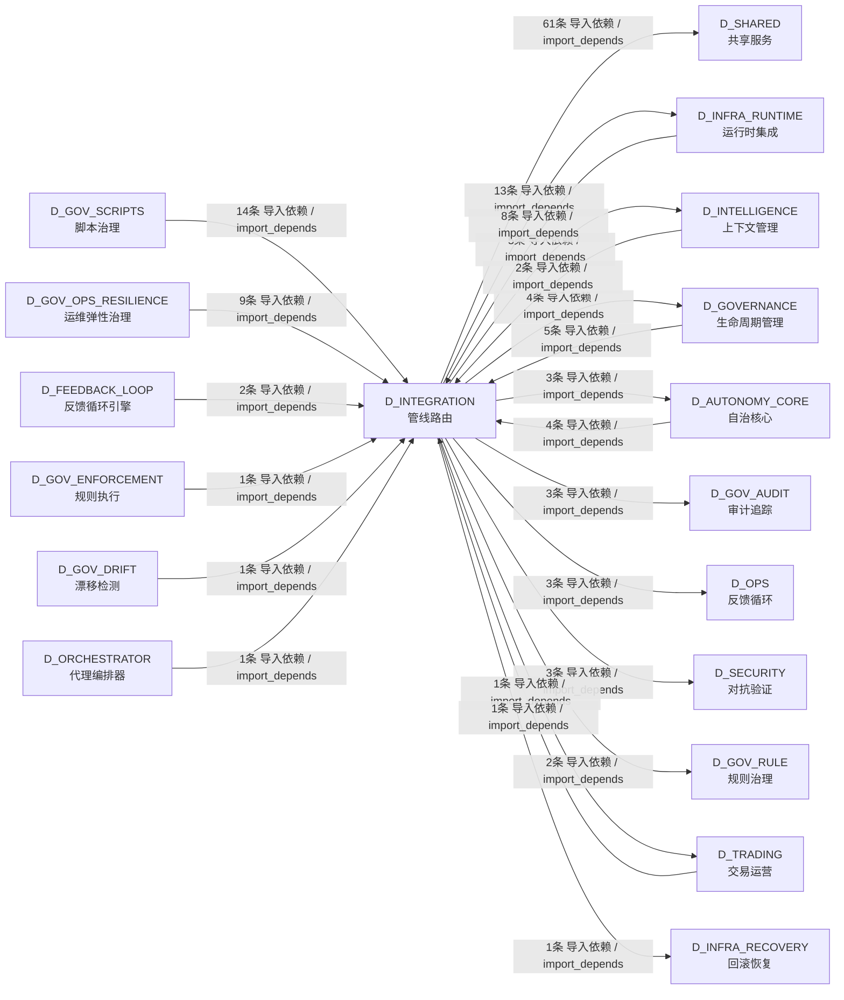

# 21_d_integration / 管线路由 / Pipeline Routing

> **功能简介 / Overview**: 管线路由，负责跨域数据流路由、管道编排和集成适配

> **文档作用 / Purpose**: 展示 管线路由（D_INTEGRATION）功能域的模块清单、域内依赖关系、跨域依赖关系、架构分层视图，供架构审查和域治理参考。

> 本文档由 generate_domain_doc.py 从 depgraph (PostgreSQL) 自动生成
> 数据源: depgraph (PostgreSQL) nodes表 + edges表

## 域基本信息 / Domain Overview

| 字段 | 值 | Field | Value |
|------|------|-------|-------|
| 编号 | 21 | Number | 21 |
| 域ID | D_INTEGRATION | Domain ID | D_INTEGRATION |
| 域名称 | 管线路由 | Domain Name | Pipeline Routing |
| 层级 | L1 基础平台层 | Layer | L1 Foundation |
| 模块数 | 71 | Module Count | 71 |
| 域内依赖 | 68 | Internal Dependencies | 68 |
| 跨域入边 | 48 | Cross-domain Incoming | 48 |
| 跨域出边 | 99 | Cross-domain Outgoing | 99 |
| 设计态模块 | 0 | Design Modules | 0 |
| 生产态模块 | 71 | Production Modules | 71 |
| 容量 | 71/150 (正常) | Capacity | 71/150 (正常) |
| 描述 | M1-M11双管线路由 | Description | M1-M11双管线路由 |

## 模块分层清单 / Module Layered List

> 按 architecture_layer 分组的模块清单（共 71 个模块 / 71 modules）。

### L1 基础层 / Foundation Layer (71 modules)

| # | 模块路径 / Module Path | 模块名称 / Module Name (功能简介 / Description) | 成熟度 / Maturity | 蓝图 / Blueprint |
|:--:|---------|---------|:---:|:---:|
| 1 | src/zephyr/integration/behavioral_admission/admission_res... | admission_response.py | 生产态 / production |  |
| 2 | src/zephyr/integration/budget_enforcer/degradation_spiral... | Degradation Spiral Detector — 模型幻觉-容量正... | 生产态 / production |  |
| 3 | src/zephyr/integration/llm_bridge.py | 接收 RED 问题,生成修复文本。LLM 只润色不做判断... | 生产态 / production |  |
| 4 | src/zephyr/integration/local_model/cache_layer.py | CacheLayer — MOD-INF-011 嵌入缓存与查询结果 LRU | 生产态 / production |  |
| 5 | src/zephyr/integration/local_model/embedding_router.py | EmbeddingRouter — MOD-INF-011 双嵌入维度路由 | 生产态 / production |  |
| 6 | src/zephyr/integration/local_model/local_model_scheduler.py | LocalModelScheduler — L2 本地模型 24/7 调度循环 | 生产态 / production |  |
| 7 | src/zephyr/integration/local_model/ollama_chat.py | OllamaChat — 通过 Ollama HTTP API 进行本地 LLM... | 生产态 / production |  |
| 8 | src/zephyr/integration/local_model/ollama_embedding.py | OllamaEmbedder — 通过 Ollama HTTP API 生成文本嵌入 | 生产态 / production |  |
| 9 | src/zephyr/integration/mcp/_base_server.py | BaseMCPServer: stdio 传输 + JSON-RPC 2.0 协议基类 | 生产态 / production |  |
| 10 | src/zephyr/integration/mcp/audit_logger.py | MCP 全量工具调用审计日志（MOD-INF-013 §12 Step... | 生产态 / production |  |
| 11 | src/zephyr/integration/mcp/blueprint_search_server.py | BlueprintSearchServer — MCP Server for bluepri... | 生产态 / production |  |
| 12 | src/zephyr/integration/mcp/doc_guard_server.py | DocGuardServer: 跨会话交接协议服务 MCP Server | 生产态 / production |  |
| 13 | src/zephyr/integration/mcp/error_codes.py | MCP 错误码集中注册（MOD-INF-013 §3.4）。 | 生产态 / production |  |
| 14 | src/zephyr/integration/mcp/gate_engine_server.py | GateEngineServer: 门禁裁决服务 MCP Server | 生产态 / production |  |
| 15 | src/zephyr/integration/mcp/gateway_server.py | MCP Gateway 集中式治理节点（MOD-INF-013 §12 Ph... | 生产态 / production |  |
| 16 | src/zephyr/integration/mcp/handoff_auto_loader.py | Handoff 自动加载器——从 handoff 包恢复 AI sess... | 生产态 / production |  |
| 17 | src/zephyr/integration/mcp/prompt_provider.py | MCP Prompt 模板提供者（MOD-INF-013 Phase 6 — ... | 生产态 / production |  |
| 18 | src/zephyr/integration/mcp/rate_limiter.py | MCP Gateway 同步速率限制器（MOD-INF-013 §12 St... | 生产态 / production |  |
| 19 | src/zephyr/integration/mcp/resource_provider.py | MCP Resource 提供者（MOD-INF-013 Phase 6 — 关... | 生产态 / production |  |
| 20 | src/zephyr/integration/mcp/rule_discovery_server.py | RuleDiscoveryServer — MCP Server for rule disc... | 生产态 / production |  |
| 21 | src/zephyr/integration/mcp/sandbox_server.py | MCP sandbox 安全代码执行沙箱（MOD-INF-013 Phase... | 生产态 / production |  |
| 22 | src/zephyr/integration/mcp/sentinel_server.py | SentinelServer: 意图路由哨兵 MCP Server | 生产态 / production |  |
| 23 | src/zephyr/integration/mcp/task_manager_server.py | ZephyrAlpha MCP Task Manager Server | 生产态 / production |  |
| 24 | src/zephyr/integration/mcp/telemetry_server.py | ZephyrAlpha MCP Telemetry Server — 系统可观测... | 生产态 / production |  |
| 25 | src/zephyr/integration/mcp/vector_memory_server.py | VectorMemoryServer: VMS 向量记忆 MCP Server (MO... | 生产态 / production |  |
| 26 | src/zephyr/integration/mcp_server.py | AssetInventory MCP Server — MOD-INF-026 蓝图 §21 | 生产态 / production |  |
| 27 | src/zephyr/integration/pipeline_orchestrator.py | PipelineOrchestrator — M1-M11 管线协调器 | 生产态 / production |  |
| 28 | src/zephyr/integration/ports.py | Protocol-based interface layer for pipeline->mc... | 生产态 / production |  |
| 29 | src/zephyr/integration/shared/contracts/errors/contract_v... | contract_violation_error.py | 生产态 / production |  |
| 30 | src/zephyr/integration/shared/contracts/errors/data_quali... | CTR-ERR-001: DataQualityError / 行情质量门禁不... | 生产态 / production |  |
| 31 | src/zephyr/integration/shared/contracts/errors/execution_... | execution_rejection_error.py | 生产态 / production |  |
| 32 | src/zephyr/integration/shared/contracts/errors/factor_com... | CTR-ERR-002: FactorComputationError / 因子计算... | 生产态 / production |  |
| 33 | src/zephyr/integration/shared/contracts/errors/risk_limit... | risk_limit_violation_error.py | 生产态 / production |  |
| 34 | src/zephyr/integration/shared/contracts/errors/signal_deg... | signal_degradation_warning.py | 生产态 / production |  |
| 35 | src/zephyr/integration/shared/events/dlq_bridge.py | CT-DLQ-001: DeadLetterQueue -> System Event Bus... | 生产态 / production |  |
| 36 | src/zephyr/integration/shared/events/event_bus_upgrade.py | EventBus Upgrade — 事件总线升级 (M-16) | 生产态 / production |  |
| 37 | src/zephyr/integration/shared/events/event_schemas.py | event_schemas.py —— Observer 事件体 Pydantic ... | 生产态 / production |  |
| 38 | src/zephyr/integration/shared/events/upgrade_strategy.py | EventBus 升级策略引擎 | 生产态 / production |  |
| 39 | src/zephyr/integration/vector_memory/bm25_index.py | BM25Index — MOD-INF-011 稀疏检索组件 | 生产态 / production |  |
| 40 | src/zephyr/integration/vector_memory/bridge_layer.py | BridgeLayer — MOD-INF-011 kb/ ↔ VMS 过渡桥接 | 生产态 / production |  |
| 41 | src/zephyr/integration/vector_memory/cache_layer.py | cache_layer.py | 生产态 / production |  |
| 42 | src/zephyr/integration/vector_memory/chunk_strategy_route... | ChunkStrategyRouter — MOD-INF-011 分块策略调度 | 生产态 / production |  |
| 43 | src/zephyr/integration/vector_memory/collection_manager.py | CollectionManager — MOD-INF-011 八大 Collectio... | 生产态 / production |  |
| 44 | src/zephyr/integration/vector_memory/collection_schemas.py | collection_schemas.py | 生产态 / production |  |
| 45 | src/zephyr/integration/vector_memory/context_ingest.py | VMS 上下文注入器 — ingest_context() 消费者 | 生产态 / production |  |
| 46 | src/zephyr/integration/vector_memory/cross_collection_ret... | CrossCollectionRetriever — MOD-INF-011 跨 Coll... | 生产态 / production |  |
| 47 | src/zephyr/integration/vector_memory/delegated_vector_mem... | DelegatedVectorMemory — VectorMemoryBase 的 RI... | 生产态 / production |  |
| 48 | src/zephyr/integration/vector_memory/design_principles.py | design_principles.py | 生产态 / production |  |
| 49 | src/zephyr/integration/vector_memory/faiss_collection_man... | FAISSCollectionManager — FAISS HNSW/IVF+PQ 8 C... | 生产态 / production |  |
| 50 | src/zephyr/integration/vector_memory/hybrid_retriever.py | HybridRetriever — MOD-INF-011 混合检索架构 | 生产态 / production |  |
| 51 | src/zephyr/integration/vector_memory/in_memory_fake_vms.py | InMemoryFakeVMS — MOD-INF-011 · 零依赖测试双胞胎 | 生产态 / production |  |
| 52 | src/zephyr/integration/vector_memory/in_memory_memory_bac... | DegradedVMSBackend — MOD-INF-011 降级兜底 | 生产态 / production |  |
| 53 | src/zephyr/integration/vector_memory/in_process_vector_me... | InProcessVectorMemory — MOD-INF-011 VMS 统一入口 | 生产态 / production |  |
| 54 | src/zephyr/integration/vector_memory/index_health_monitor.py | IndexHealthMonitor — MOD-INF-011 索引健康自检... | 生产态 / production |  |
| 55 | src/zephyr/integration/vector_memory/interface.py | VMS — Vector Memory Service 接口基类 | 生产态 / production |  |
| 56 | src/zephyr/integration/vector_memory/migrate_chroma_to_fa... | ChromDB -> FAISS + SQLite WAL 数据迁移脚本 | 生产态 / production |  |
| 57 | src/zephyr/integration/vector_memory/ollama_embedding.py | ollama_embedding.py | 生产态 / production |  |
| 58 | src/zephyr/integration/vector_memory/provenance_enforcer.py | ProvenanceEnforcer — MOD-INF-011 写入溯源强制执行 | 生产态 / production |  |
| 59 | src/zephyr/integration/vector_memory/retrieval_feedback.py | RetrievalFeedback — MOD-INF-011 FLE 检索质量消费 | 生产态 / production |  |
| 60 | src/zephyr/integration/vector_memory/sqlite_metadata_stor... | SQLiteMetadataStore — VMS 元数据存储 (SQLite W... | 生产态 / production |  |
| 61 | src/zephyr/integration/vector_memory/vector_bridge.py | VectorBridge — MOD-INF-011 CE/KB 外部集成适配器 | 生产态 / production |  |
| 62 | src/zephyr/integration/vector_memory/vms_errors.py | vms_errors.py | 生产态 / production |  |
| 63 | src/zephyr/integration/vector_memory/vms_memory_backend.py | VMSMemoryBackend — UnifiedMemoryAPI 的 VMS 后... | 生产态 / production |  |
| 64 | src/zephyr/integration/vector_memory/vms_schemas.py | VMS 共享数据模型 — MOD-INF-011 · 蓝图 §6.1 ... | 生产态 / production |  |
| 65 | src/zephyr/shared/contracts/approval_types.py | G-CT-004 — ApprovalRequest Pydantic V2 BaseMod... | 生产态 / production |  |
| 66 | src/zephyr/shared/contracts/protocols.py | Structural Protocol interfaces for cross-module... | 生产态 / production |  |
| 67 | src/zephyr/shared/contracts/rollback_types.py | G-CT-003 — RollbackResult Pydantic V2 BaseMode... | 生产态 / production |  |
| 68 | src/zephyr/shared/contracts/runtime_types.py | runtime_types.py | 生产态 / production |  |
| 69 | src/zephyr/shared/evaluation/evals.py | evals.py | 生产态 / production |  |
| 70 | src/zephyr/shared/resilience/durable_execution.py | durable_execution.py | 生产态 / production |  |
| 71 | src/zephyr/shared/versioning/version_negotiation.py | version_negotiation.py | 生产态 / production |  |

## 域内依赖图 / Internal Dependency Diagram

> 依赖图内嵌在本文档中，IDE 可直接渲染显示。参考 decision_index.md 设计，分三个视图：合并全景图、运营态子图、设计态子图（按 design_maturity 实际值拆分）。
>
> **图例说明 / Legend**：
> - **实线边框 = 运营态模块**（production，已上线运行）
> - **虚线边框 = 设计态模块**（design，蓝图阶段，代码未写）
> - **实线箭头 = 运营态依赖**（已生效的依赖关系）
> - **虚线箭头 = 非运营态依赖**（计划中/验证中的依赖关系）

### 合并全景图（全部模块，标签标注成熟度）

> 展示全部 71 个模块（生产态 71 + 设计态 0），标签标注成熟度。

#### 第 1 页 / 共 3 页

```mermaid
graph TD
    subgraph D_INTEGRATION["D_INTEGRATION 管线路由"]
        src_zephyr_integration_behavioral_admission_admission_response_py["(生产态 / production) admission_response.py"]
        src_zephyr_integration_budget_enforcer_degradation_spiral_detector_py["(生产态 / production) Degradation Spiral Detector — 模型幻觉-容量正...<br/>文件: degradation_spiral_detector.py"]
        src_zephyr_integration_llm_bridge_py["(生产态 / production) 接收 RED 问题,生成修复文本。LLM 只润色不做判断...<br/>文件: llm_bridge.py"]
        src_zephyr_integration_local_model_cache_layer_py["(生产态 / production) CacheLayer — MOD-INF-011 嵌入缓存与查询结果 LRU<br/>文件: cache_layer.py"]
        src_zephyr_integration_local_model_embedding_router_py["(生产态 / production) EmbeddingRouter — MOD-INF-011 双嵌入维度路由<br/>文件: embedding_router.py"]
        src_zephyr_integration_local_model_local_model_scheduler_py["(生产态 / production) LocalModelScheduler — L2 本地模型 24/7 调度循环<br/>文件: local_model_scheduler.py"]
        src_zephyr_integration_local_model_ollama_chat_py["(生产态 / production) OllamaChat — 通过 Ollama HTTP API 进行本地 LLM...<br/>文件: ollama_chat.py"]
        src_zephyr_integration_local_model_ollama_embedding_py["(生产态 / production) OllamaEmbedder — 通过 Ollama HTTP API 生成文本嵌入<br/>文件: ollama_embedding.py"]
        src_zephyr_integration_mcp_base_server_py["(生产态 / production) BaseMCPServer: stdio 传输 + JSON-RPC 2.0 协议基类<br/>文件: _base_server.py"]
        src_zephyr_integration_mcp_audit_logger_py["(生产态 / production) MCP 全量工具调用审计日志（MOD-INF-013 §12 Step...<br/>文件: audit_logger.py"]
        src_zephyr_integration_mcp_blueprint_search_server_py["(生产态 / production) BlueprintSearchServer — MCP Server for bluepri...<br/>文件: blueprint_search_server.py"]
        src_zephyr_integration_mcp_doc_guard_server_py["(生产态 / production) DocGuardServer: 跨会话交接协议服务 MCP Server<br/>文件: doc_guard_server.py"]
        src_zephyr_integration_mcp_error_codes_py["(生产态 / production) MCP 错误码集中注册（MOD-INF-013 §3.4）。<br/>文件: error_codes.py"]
        src_zephyr_integration_mcp_gate_engine_server_py["(生产态 / production) GateEngineServer: 门禁裁决服务 MCP Server<br/>文件: gate_engine_server.py"]
        src_zephyr_integration_mcp_gateway_server_py["(生产态 / production) MCP Gateway 集中式治理节点（MOD-INF-013 §12 Ph...<br/>文件: gateway_server.py"]
        src_zephyr_integration_mcp_handoff_auto_loader_py["(生产态 / production) Handoff 自动加载器——从 handoff 包恢复 AI sess...<br/>文件: handoff_auto_loader.py"]
        src_zephyr_integration_mcp_prompt_provider_py["(生产态 / production) MCP Prompt 模板提供者（MOD-INF-013 Phase 6 — ...<br/>文件: prompt_provider.py"]
        src_zephyr_integration_mcp_rate_limiter_py["(生产态 / production) MCP Gateway 同步速率限制器（MOD-INF-013 §12 St...<br/>文件: rate_limiter.py"]
        src_zephyr_integration_mcp_resource_provider_py["(生产态 / production) MCP Resource 提供者（MOD-INF-013 Phase 6 — 关...<br/>文件: resource_provider.py"]
        src_zephyr_integration_mcp_rule_discovery_server_py["(生产态 / production) RuleDiscoveryServer — MCP Server for rule disc...<br/>文件: rule_discovery_server.py"]
        src_zephyr_integration_mcp_sandbox_server_py["(生产态 / production) MCP sandbox 安全代码执行沙箱（MOD-INF-013 Phase...<br/>文件: sandbox_server.py"]
        src_zephyr_integration_mcp_sentinel_server_py["(生产态 / production) SentinelServer: 意图路由哨兵 MCP Server<br/>文件: sentinel_server.py"]
        src_zephyr_integration_mcp_task_manager_server_py["(生产态 / production) ZephyrAlpha MCP Task Manager Server<br/>文件: task_manager_server.py"]
        src_zephyr_integration_mcp_telemetry_server_py["(生产态 / production) ZephyrAlpha MCP Telemetry Server — 系统可观测...<br/>文件: telemetry_server.py"]
        src_zephyr_integration_mcp_vector_memory_server_py["(生产态 / production) VectorMemoryServer: VMS 向量记忆 MCP Server (MO...<br/>文件: vector_memory_server.py"]
        src_zephyr_integration_mcp_server_py["(生产态 / production) AssetInventory MCP Server — MOD-INF-026 蓝图 §21<br/>文件: mcp_server.py"]
        src_zephyr_integration_pipeline_orchestrator_py["(生产态 / production) PipelineOrchestrator — M1-M11 管线协调器<br/>文件: pipeline_orchestrator.py"]
        src_zephyr_integration_ports_py["(生产态 / production) Protocol-based interface layer for pipeline->mc...<br/>文件: ports.py"]
        src_zephyr_integration_shared_contracts_errors_contract_violation_error_py["(生产态 / production) contract_violation_error.py"]
        src_zephyr_integration_shared_contracts_errors_data_quality_error_py["(生产态 / production) CTR-ERR-001: DataQualityError / 行情质量门禁不...<br/>文件: data_quality_error.py"]
    end
    src_zephyr_integration_pipeline_orchestrator_py -->|导入依赖 / import_depends| src_zephyr_integration_local_model_embedding_router_py
    src_zephyr_integration_pipeline_orchestrator_py -->|导入依赖 / import_depends| src_zephyr_integration_local_model_local_model_scheduler_py
    src_zephyr_integration_local_model_embedding_router_py -->|导入依赖 / import_depends| src_zephyr_integration_local_model_ollama_embedding_py
    src_zephyr_integration_local_model_local_model_scheduler_py -->|导入依赖 / import_depends| src_zephyr_integration_local_model_embedding_router_py
    src_zephyr_integration_local_model_local_model_scheduler_py -->|导入依赖 / import_depends| src_zephyr_integration_local_model_ollama_chat_py
    src_zephyr_integration_mcp_doc_guard_server_py -->|导入依赖 / import_depends| src_zephyr_integration_mcp_base_server_py
    src_zephyr_integration_mcp_gateway_server_py -->|导入依赖 / import_depends| src_zephyr_integration_mcp_audit_logger_py
    src_zephyr_integration_mcp_gateway_server_py -->|导入依赖 / import_depends| src_zephyr_integration_mcp_doc_guard_server_py
    src_zephyr_integration_mcp_gateway_server_py -->|导入依赖 / import_depends| src_zephyr_integration_mcp_error_codes_py
    src_zephyr_integration_mcp_gateway_server_py -->|导入依赖 / import_depends| src_zephyr_integration_mcp_gate_engine_server_py
    src_zephyr_integration_mcp_gateway_server_py -->|导入依赖 / import_depends| src_zephyr_integration_mcp_blueprint_search_server_py
    src_zephyr_integration_mcp_gateway_server_py -->|导入依赖 / import_depends| src_zephyr_integration_mcp_sentinel_server_py
    src_zephyr_integration_mcp_gateway_server_py -->|导入依赖 / import_depends| src_zephyr_integration_mcp_sandbox_server_py
    src_zephyr_integration_mcp_gateway_server_py -->|导入依赖 / import_depends| src_zephyr_integration_mcp_vector_memory_server_py
    src_zephyr_integration_mcp_gateway_server_py -->|导入依赖 / import_depends| src_zephyr_integration_mcp_rate_limiter_py
    src_zephyr_integration_mcp_gateway_server_py -->|导入依赖 / import_depends| src_zephyr_integration_mcp_telemetry_server_py
    src_zephyr_integration_mcp_gateway_server_py -->|导入依赖 / import_depends| src_zephyr_integration_mcp_task_manager_server_py
    src_zephyr_integration_mcp_gateway_server_py -->|导入依赖 / import_depends| src_zephyr_integration_mcp_base_server_py
    src_zephyr_integration_mcp_gate_engine_server_py -->|导入依赖 / import_depends| src_zephyr_integration_mcp_base_server_py
    src_zephyr_integration_mcp_blueprint_search_server_py -->|导入依赖 / import_depends| src_zephyr_integration_mcp_base_server_py
    src_zephyr_integration_mcp_sentinel_server_py -->|导入依赖 / import_depends| src_zephyr_integration_mcp_base_server_py
    src_zephyr_integration_mcp_rule_discovery_server_py -->|导入依赖 / import_depends| src_zephyr_integration_mcp_base_server_py
    src_zephyr_integration_mcp_sandbox_server_py -->|导入依赖 / import_depends| src_zephyr_integration_mcp_base_server_py
    src_zephyr_integration_mcp_vector_memory_server_py -->|导入依赖 / import_depends| src_zephyr_integration_mcp_base_server_py
    src_zephyr_integration_mcp_base_server_py -->|导入依赖 / import_depends| src_zephyr_integration_mcp_error_codes_py
    D_SHARED["(生产态 / production) D_SHARED"]
    src_zephyr_integration_mcp_resource_provider_py -->|导入依赖 / import_depends| D_SHARED
    src_zephyr_integration_pipeline_orchestrator_py -->|导入依赖 / import_depends| D_SHARED
    src_zephyr_integration_pipeline_orchestrator_py -->|导入依赖 / import_depends| D_SHARED
    D_INFRA_RUNTIME["(生产态 / production) D_INFRA_RUNTIME"]
    src_zephyr_integration_mcp_telemetry_server_py -->|导入依赖 / import_depends| D_INFRA_RUNTIME
    src_zephyr_integration_local_model_ollama_embedding_py -->|导入依赖 / import_depends| D_SHARED
    D_GOV_AUDIT["(生产态 / production) D_GOV_AUDIT"]
    src_zephyr_integration_mcp_audit_logger_py -->|导入依赖 / import_depends| D_GOV_AUDIT
    D_SECURITY["(生产态 / production) D_SECURITY"]
    src_zephyr_integration_pipeline_orchestrator_py -->|导入依赖 / import_depends| D_SECURITY
    src_zephyr_integration_mcp_sandbox_server_py -->|导入依赖 / import_depends| D_SHARED
    D_INFRA_RECOVERY["(生产态 / production) D_INFRA_RECOVERY"]
    src_zephyr_integration_pipeline_orchestrator_py -->|导入依赖 / import_depends| D_INFRA_RECOVERY
    src_zephyr_integration_mcp_doc_guard_server_py -->|导入依赖 / import_depends| D_SHARED
    src_zephyr_integration_pipeline_orchestrator_py -->|导入依赖 / import_depends| D_SHARED
    src_zephyr_integration_pipeline_orchestrator_py -->|导入依赖 / import_depends| D_SHARED
    src_zephyr_integration_mcp_task_manager_server_py -->|导入依赖 / import_depends| D_SHARED
    src_zephyr_integration_pipeline_orchestrator_py -->|导入依赖 / import_depends| D_INFRA_RUNTIME
    D_GOV_RULE["(生产态 / production) D_GOV_RULE"]
    src_zephyr_integration_mcp_task_manager_server_py -->|导入依赖 / import_depends| D_GOV_RULE
    D_INFRA_RUNTIME -->|导入依赖 / import_depends| src_zephyr_integration_pipeline_orchestrator_py
    D_GOVERNANCE["(生产态 / production) D_GOVERNANCE"]
    D_GOVERNANCE -->|导入依赖 / import_depends| src_zephyr_integration_mcp_base_server_py
    D_INFRA_RUNTIME -->|导入依赖 / import_depends| src_zephyr_integration_local_model_ollama_chat_py
    D_INFRA_RUNTIME -->|导入依赖 / import_depends| src_zephyr_integration_local_model_embedding_router_py
    D_INTELLIGENCE["(生产态 / production) D_INTELLIGENCE"]
    D_INTELLIGENCE -->|导入依赖 / import_depends| src_zephyr_integration_local_model_ollama_chat_py
    D_AUTONOMY_CORE["(生产态 / production) D_AUTONOMY_CORE"]
    D_AUTONOMY_CORE -->|导入依赖 / import_depends| src_zephyr_integration_local_model_embedding_router_py
    D_GOVERNANCE -->|导入依赖 / import_depends| src_zephyr_integration_local_model_local_model_scheduler_py
    D_INFRA_RUNTIME -->|导入依赖 / import_depends| src_zephyr_integration_local_model_local_model_scheduler_py
    D_TRADING["(生产态 / production) D_TRADING"]
    D_TRADING -->|导入依赖 / import_depends| src_zephyr_integration_local_model_local_model_scheduler_py
    D_INFRA_RUNTIME -->|导入依赖 / import_depends| src_zephyr_integration_local_model_local_model_scheduler_py
    D_GOVERNANCE -->|导入依赖 / import_depends| src_zephyr_integration_local_model_ollama_chat_py
    classDef production fill:#e1f5fe,stroke:#01579b,stroke-width:2px,color:#000
    classDef design fill:#fff3e0,stroke:#e65100,stroke-width:2px,color:#000,stroke-dasharray: 5 5
    classDef external_prod fill:#e8f5e9,stroke:#1b5e20,stroke-width:1px,color:#000
    classDef external_design fill:#fce4ec,stroke:#880e4f,stroke-width:1px,color:#000,stroke-dasharray: 5 5
    class src_zephyr_integration_behavioral_admission_admission_response_py,src_zephyr_integration_budget_enforcer_degradation_spiral_detector_py,src_zephyr_integration_llm_bridge_py,src_zephyr_integration_local_model_cache_layer_py,src_zephyr_integration_local_model_embedding_router_py,src_zephyr_integration_local_model_local_model_scheduler_py,src_zephyr_integration_local_model_ollama_chat_py,src_zephyr_integration_local_model_ollama_embedding_py,src_zephyr_integration_mcp_base_server_py,src_zephyr_integration_mcp_audit_logger_py,src_zephyr_integration_mcp_blueprint_search_server_py,src_zephyr_integration_mcp_doc_guard_server_py,src_zephyr_integration_mcp_error_codes_py,src_zephyr_integration_mcp_gate_engine_server_py,src_zephyr_integration_mcp_gateway_server_py,src_zephyr_integration_mcp_handoff_auto_loader_py,src_zephyr_integration_mcp_prompt_provider_py,src_zephyr_integration_mcp_rate_limiter_py,src_zephyr_integration_mcp_resource_provider_py,src_zephyr_integration_mcp_rule_discovery_server_py,src_zephyr_integration_mcp_sandbox_server_py,src_zephyr_integration_mcp_sentinel_server_py,src_zephyr_integration_mcp_task_manager_server_py,src_zephyr_integration_mcp_telemetry_server_py,src_zephyr_integration_mcp_vector_memory_server_py,src_zephyr_integration_mcp_server_py,src_zephyr_integration_pipeline_orchestrator_py,src_zephyr_integration_ports_py,src_zephyr_integration_shared_contracts_errors_contract_violation_error_py,src_zephyr_integration_shared_contracts_errors_data_quality_error_py production
    class D_SHARED,D_INFRA_RUNTIME,D_GOV_AUDIT,D_SECURITY,D_INFRA_RECOVERY,D_GOV_RULE,D_GOVERNANCE,D_INTELLIGENCE,D_AUTONOMY_CORE,D_TRADING external_prod
```



#### 第 2 页 / 共 3 页

```mermaid
graph TD
    subgraph D_INTEGRATION["D_INTEGRATION 管线路由"]
        src_zephyr_integration_shared_contracts_errors_execution_rejection_error_py["(生产态 / production) execution_rejection_error.py"]
        src_zephyr_integration_shared_contracts_errors_factor_computation_error_py["(生产态 / production) CTR-ERR-002: FactorComputationError / 因子计算...<br/>文件: factor_computation_error.py"]
        src_zephyr_integration_shared_contracts_errors_risk_limit_violation_error_py["(生产态 / production) risk_limit_violation_error.py"]
        src_zephyr_integration_shared_contracts_errors_signal_degradation_warning_py["(生产态 / production) signal_degradation_warning.py"]
        src_zephyr_integration_shared_events_dlq_bridge_py["(生产态 / production) CT-DLQ-001: DeadLetterQueue -> System Event Bus...<br/>文件: dlq_bridge.py"]
        src_zephyr_integration_shared_events_event_bus_upgrade_py["(生产态 / production) EventBus Upgrade — 事件总线升级 (M-16)<br/>文件: event_bus_upgrade.py"]
        src_zephyr_integration_shared_events_event_schemas_py["(生产态 / production) event_schemas.py —— Observer 事件体 Pydantic ...<br/>文件: event_schemas.py"]
        src_zephyr_integration_shared_events_upgrade_strategy_py["(生产态 / production) EventBus 升级策略引擎<br/>文件: upgrade_strategy.py"]
        src_zephyr_integration_vector_memory_bm25_index_py["(生产态 / production) BM25Index — MOD-INF-011 稀疏检索组件<br/>文件: bm25_index.py"]
        src_zephyr_integration_vector_memory_bridge_layer_py["(生产态 / production) BridgeLayer — MOD-INF-011 kb/ ↔ VMS 过渡桥接<br/>文件: bridge_layer.py"]
        src_zephyr_integration_vector_memory_cache_layer_py["(生产态 / production) cache_layer.py"]
        src_zephyr_integration_vector_memory_chunk_strategy_router_py["(生产态 / production) ChunkStrategyRouter — MOD-INF-011 分块策略调度<br/>文件: chunk_strategy_router.py"]
        src_zephyr_integration_vector_memory_collection_manager_py["(生产态 / production) CollectionManager — MOD-INF-011 八大 Collectio...<br/>文件: collection_manager.py"]
        src_zephyr_integration_vector_memory_collection_schemas_py["(生产态 / production) collection_schemas.py"]
        src_zephyr_integration_vector_memory_context_ingest_py["(生产态 / production) VMS 上下文注入器 — ingest_context() 消费者<br/>文件: context_ingest.py"]
        src_zephyr_integration_vector_memory_cross_collection_retriever_py["(生产态 / production) CrossCollectionRetriever — MOD-INF-011 跨 Coll...<br/>文件: cross_collection_retriever.py"]
        src_zephyr_integration_vector_memory_delegated_vector_memory_py["(生产态 / production) DelegatedVectorMemory — VectorMemoryBase 的 RI...<br/>文件: delegated_vector_memory.py"]
        src_zephyr_integration_vector_memory_design_principles_py["(生产态 / production) design_principles.py"]
        src_zephyr_integration_vector_memory_faiss_collection_manager_py["(生产态 / production) FAISSCollectionManager — FAISS HNSW/IVF+PQ 8 C...<br/>文件: faiss_collection_manager.py"]
        src_zephyr_integration_vector_memory_hybrid_retriever_py["(生产态 / production) HybridRetriever — MOD-INF-011 混合检索架构<br/>文件: hybrid_retriever.py"]
        src_zephyr_integration_vector_memory_in_memory_fake_vms_py["(生产态 / production) InMemoryFakeVMS — MOD-INF-011 · 零依赖测试双胞胎<br/>文件: in_memory_fake_vms.py"]
        src_zephyr_integration_vector_memory_in_memory_memory_backend_py["(生产态 / production) DegradedVMSBackend — MOD-INF-011 降级兜底<br/>文件: in_memory_memory_backend.py"]
        src_zephyr_integration_vector_memory_in_process_vector_memory_py["(生产态 / production) InProcessVectorMemory — MOD-INF-011 VMS 统一入口<br/>文件: in_process_vector_memory.py"]
        src_zephyr_integration_vector_memory_index_health_monitor_py["(生产态 / production) IndexHealthMonitor — MOD-INF-011 索引健康自检...<br/>文件: index_health_monitor.py"]
        src_zephyr_integration_vector_memory_interface_py["(生产态 / production) VMS — Vector Memory Service 接口基类<br/>文件: interface.py"]
        src_zephyr_integration_vector_memory_migrate_chroma_to_faiss_py["(生产态 / production) ChromDB -> FAISS + SQLite WAL 数据迁移脚本<br/>文件: migrate_chroma_to_faiss.py"]
        src_zephyr_integration_vector_memory_ollama_embedding_py["(生产态 / production) ollama_embedding.py"]
        src_zephyr_integration_vector_memory_provenance_enforcer_py["(生产态 / production) ProvenanceEnforcer — MOD-INF-011 写入溯源强制执行<br/>文件: provenance_enforcer.py"]
        src_zephyr_integration_vector_memory_retrieval_feedback_py["(生产态 / production) RetrievalFeedback — MOD-INF-011 FLE 检索质量消费<br/>文件: retrieval_feedback.py"]
        src_zephyr_integration_vector_memory_sqlite_metadata_store_py["(生产态 / production) SQLiteMetadataStore — VMS 元数据存储 (SQLite W...<br/>文件: sqlite_metadata_store.py"]
    end
    src_zephyr_integration_vector_memory_collection_manager_py -->|导入依赖 / import_depends| src_zephyr_integration_vector_memory_collection_schemas_py
    src_zephyr_integration_vector_memory_bridge_layer_py -->|导入依赖 / import_depends| src_zephyr_integration_vector_memory_collection_manager_py
    src_zephyr_integration_vector_memory_design_principles_py -->|导入依赖 / import_depends| src_zephyr_integration_vector_memory_collection_schemas_py
    src_zephyr_integration_vector_memory_design_principles_py -->|导入依赖 / import_depends| src_zephyr_integration_vector_memory_provenance_enforcer_py
    src_zephyr_integration_vector_memory_delegated_vector_memory_py -->|导入依赖 / import_depends| src_zephyr_integration_vector_memory_interface_py
    src_zephyr_integration_vector_memory_context_ingest_py -->|导入依赖 / import_depends| src_zephyr_integration_vector_memory_in_memory_fake_vms_py
    src_zephyr_integration_vector_memory_cross_collection_retriever_py -->|导入依赖 / import_depends| src_zephyr_integration_vector_memory_hybrid_retriever_py
    src_zephyr_integration_vector_memory_faiss_collection_manager_py -->|导入依赖 / import_depends| src_zephyr_integration_vector_memory_collection_manager_py
    src_zephyr_integration_vector_memory_in_memory_fake_vms_py -->|导入依赖 / import_depends| src_zephyr_integration_vector_memory_collection_manager_py
    src_zephyr_integration_vector_memory_in_process_vector_memory_py -->|导入依赖 / import_depends| src_zephyr_integration_vector_memory_collection_manager_py
    src_zephyr_integration_vector_memory_in_process_vector_memory_py -->|导入依赖 / import_depends| src_zephyr_integration_vector_memory_bridge_layer_py
    src_zephyr_integration_vector_memory_in_process_vector_memory_py -->|导入依赖 / import_depends| src_zephyr_integration_vector_memory_chunk_strategy_router_py
    src_zephyr_integration_vector_memory_in_process_vector_memory_py -->|导入依赖 / import_depends| src_zephyr_integration_vector_memory_in_memory_memory_backend_py
    src_zephyr_integration_vector_memory_in_process_vector_memory_py -->|导入依赖 / import_depends| src_zephyr_integration_vector_memory_hybrid_retriever_py
    src_zephyr_integration_vector_memory_in_process_vector_memory_py -->|导入依赖 / import_depends| src_zephyr_integration_vector_memory_index_health_monitor_py
    src_zephyr_integration_vector_memory_in_process_vector_memory_py -->|导入依赖 / import_depends| src_zephyr_integration_vector_memory_provenance_enforcer_py
    src_zephyr_integration_vector_memory_in_process_vector_memory_py -->|导入依赖 / import_depends| src_zephyr_integration_vector_memory_retrieval_feedback_py
    src_zephyr_integration_vector_memory_hybrid_retriever_py -->|导入依赖 / import_depends| src_zephyr_integration_vector_memory_collection_manager_py
    src_zephyr_integration_vector_memory_index_health_monitor_py -->|导入依赖 / import_depends| src_zephyr_integration_vector_memory_collection_manager_py
    src_zephyr_integration_vector_memory_migrate_chroma_to_faiss_py -->|导入依赖 / import_depends| src_zephyr_integration_vector_memory_collection_manager_py
    src_zephyr_integration_vector_memory_migrate_chroma_to_faiss_py -->|导入依赖 / import_depends| src_zephyr_integration_vector_memory_faiss_collection_manager_py
    src_zephyr_integration_vector_memory_migrate_chroma_to_faiss_py -->|导入依赖 / import_depends| src_zephyr_integration_vector_memory_sqlite_metadata_store_py
    src_zephyr_integration_vector_memory_provenance_enforcer_py -->|导入依赖 / import_depends| src_zephyr_integration_vector_memory_collection_manager_py
    src_zephyr_integration_vector_memory_retrieval_feedback_py -->|导入依赖 / import_depends| src_zephyr_integration_vector_memory_in_process_vector_memory_py
    src_zephyr_integration_vector_memory_retrieval_feedback_py -->|导入依赖 / import_depends| src_zephyr_integration_vector_memory_hybrid_retriever_py
    src_zephyr_integration_vector_memory_sqlite_metadata_store_py -->|导入依赖 / import_depends| src_zephyr_integration_vector_memory_collection_manager_py
    D_SHARED["(生产态 / production) D_SHARED"]
    src_zephyr_integration_shared_contracts_errors_factor_computation_error_py -->|导入依赖 / import_depends| D_SHARED
    src_zephyr_integration_shared_contracts_errors_execution_rejection_error_py -->|导入依赖 / import_depends| D_SHARED
    src_zephyr_integration_shared_contracts_errors_risk_limit_violation_error_py -->|导入依赖 / import_depends| D_SHARED
    src_zephyr_integration_shared_contracts_errors_signal_degradation_warning_py -->|导入依赖 / import_depends| D_SHARED
    src_zephyr_integration_shared_events_upgrade_strategy_py -->|导入依赖 / import_depends| D_SHARED
    src_zephyr_integration_shared_events_dlq_bridge_py -->|导入依赖 / import_depends| D_SHARED
    src_zephyr_integration_shared_events_dlq_bridge_py -->|导入依赖 / import_depends| D_SHARED
    src_zephyr_integration_shared_events_event_schemas_py -->|导入依赖 / import_depends| D_SHARED
    src_zephyr_integration_shared_events_event_schemas_py -->|导入依赖 / import_depends| D_SHARED
    src_zephyr_integration_vector_memory_collection_manager_py -->|导入依赖 / import_depends| D_SHARED
    src_zephyr_integration_vector_memory_collection_manager_py -->|导入依赖 / import_depends| D_SHARED
    D_INTELLIGENCE["(生产态 / production) D_INTELLIGENCE"]
    src_zephyr_integration_vector_memory_delegated_vector_memory_py -->|导入依赖 / import_depends| D_INTELLIGENCE
    src_zephyr_integration_vector_memory_collection_schemas_py -->|导入依赖 / import_depends| D_SHARED
    src_zephyr_integration_vector_memory_collection_schemas_py -->|导入依赖 / import_depends| D_SHARED
    src_zephyr_integration_vector_memory_chunk_strategy_router_py -->|导入依赖 / import_depends| D_SHARED
    D_GOV_SCRIPTS["(生产态 / production) D_GOV_SCRIPTS"]
    D_GOV_SCRIPTS -->|导入依赖 / import_depends| src_zephyr_integration_vector_memory_index_health_monitor_py
    D_GOV_SCRIPTS -->|导入依赖 / import_depends| src_zephyr_integration_vector_memory_collection_manager_py
    D_GOV_SCRIPTS -->|导入依赖 / import_depends| src_zephyr_integration_vector_memory_bridge_layer_py
    D_GOV_SCRIPTS -->|导入依赖 / import_depends| src_zephyr_integration_vector_memory_collection_manager_py
    D_GOV_SCRIPTS -->|导入依赖 / import_depends| src_zephyr_integration_vector_memory_collection_manager_py
    D_GOV_SCRIPTS -->|导入依赖 / import_depends| src_zephyr_integration_vector_memory_collection_manager_py
    D_GOV_SCRIPTS -->|导入依赖 / import_depends| src_zephyr_integration_vector_memory_collection_manager_py
    D_GOV_SCRIPTS -->|导入依赖 / import_depends| src_zephyr_integration_vector_memory_bridge_layer_py
    D_GOV_SCRIPTS -->|导入依赖 / import_depends| src_zephyr_integration_vector_memory_index_health_monitor_py
    D_GOV_SCRIPTS -->|导入依赖 / import_depends| src_zephyr_integration_vector_memory_bridge_layer_py
    D_INFRA_RUNTIME["(生产态 / production) D_INFRA_RUNTIME"]
    D_INFRA_RUNTIME -->|导入依赖 / import_depends| src_zephyr_integration_vector_memory_in_process_vector_memory_py
    D_GOV_SCRIPTS -->|导入依赖 / import_depends| src_zephyr_integration_vector_memory_index_health_monitor_py
    D_GOV_SCRIPTS -->|导入依赖 / import_depends| src_zephyr_integration_vector_memory_collection_manager_py
    D_GOV_SCRIPTS -->|导入依赖 / import_depends| src_zephyr_integration_vector_memory_bridge_layer_py
    D_GOV_SCRIPTS -->|导入依赖 / import_depends| src_zephyr_integration_vector_memory_index_health_monitor_py
    classDef production fill:#e1f5fe,stroke:#01579b,stroke-width:2px,color:#000
    classDef design fill:#fff3e0,stroke:#e65100,stroke-width:2px,color:#000,stroke-dasharray: 5 5
    classDef external_prod fill:#e8f5e9,stroke:#1b5e20,stroke-width:1px,color:#000
    classDef external_design fill:#fce4ec,stroke:#880e4f,stroke-width:1px,color:#000,stroke-dasharray: 5 5
    class src_zephyr_integration_shared_contracts_errors_execution_rejection_error_py,src_zephyr_integration_shared_contracts_errors_factor_computation_error_py,src_zephyr_integration_shared_contracts_errors_risk_limit_violation_error_py,src_zephyr_integration_shared_contracts_errors_signal_degradation_warning_py,src_zephyr_integration_shared_events_dlq_bridge_py,src_zephyr_integration_shared_events_event_bus_upgrade_py,src_zephyr_integration_shared_events_event_schemas_py,src_zephyr_integration_shared_events_upgrade_strategy_py,src_zephyr_integration_vector_memory_bm25_index_py,src_zephyr_integration_vector_memory_bridge_layer_py,src_zephyr_integration_vector_memory_cache_layer_py,src_zephyr_integration_vector_memory_chunk_strategy_router_py,src_zephyr_integration_vector_memory_collection_manager_py,src_zephyr_integration_vector_memory_collection_schemas_py,src_zephyr_integration_vector_memory_context_ingest_py,src_zephyr_integration_vector_memory_cross_collection_retriever_py,src_zephyr_integration_vector_memory_delegated_vector_memory_py,src_zephyr_integration_vector_memory_design_principles_py,src_zephyr_integration_vector_memory_faiss_collection_manager_py,src_zephyr_integration_vector_memory_hybrid_retriever_py,src_zephyr_integration_vector_memory_in_memory_fake_vms_py,src_zephyr_integration_vector_memory_in_memory_memory_backend_py,src_zephyr_integration_vector_memory_in_process_vector_memory_py,src_zephyr_integration_vector_memory_index_health_monitor_py,src_zephyr_integration_vector_memory_interface_py,src_zephyr_integration_vector_memory_migrate_chroma_to_faiss_py,src_zephyr_integration_vector_memory_ollama_embedding_py,src_zephyr_integration_vector_memory_provenance_enforcer_py,src_zephyr_integration_vector_memory_retrieval_feedback_py,src_zephyr_integration_vector_memory_sqlite_metadata_store_py production
    class D_SHARED,D_INTELLIGENCE,D_GOV_SCRIPTS,D_INFRA_RUNTIME external_prod
```



#### 第 3 页 / 共 3 页

```mermaid
graph TD
    subgraph D_INTEGRATION["D_INTEGRATION 管线路由"]
        src_zephyr_integration_vector_memory_vector_bridge_py["(生产态 / production) VectorBridge — MOD-INF-011 CE/KB 外部集成适配器<br/>文件: vector_bridge.py"]
        src_zephyr_integration_vector_memory_vms_errors_py["(生产态 / production) vms_errors.py"]
        src_zephyr_integration_vector_memory_vms_memory_backend_py["(生产态 / production) VMSMemoryBackend — UnifiedMemoryAPI 的 VMS 后...<br/>文件: vms_memory_backend.py"]
        src_zephyr_integration_vector_memory_vms_schemas_py["(生产态 / production) VMS 共享数据模型 — MOD-INF-011 · 蓝图 §6.1 ...<br/>文件: vms_schemas.py"]
        src_zephyr_shared_contracts_approval_types_py["(生产态 / production) G-CT-004 — ApprovalRequest Pydantic V2 BaseMod...<br/>文件: approval_types.py"]
        src_zephyr_shared_contracts_protocols_py["(生产态 / production) Structural Protocol interfaces for cross-module...<br/>文件: protocols.py"]
        src_zephyr_shared_contracts_rollback_types_py["(生产态 / production) G-CT-003 — RollbackResult Pydantic V2 BaseMode...<br/>文件: rollback_types.py"]
        src_zephyr_shared_contracts_runtime_types_py["(生产态 / production) runtime_types.py"]
        src_zephyr_shared_evaluation_evals_py["(生产态 / production) evals.py"]
        src_zephyr_shared_resilience_durable_execution_py["(生产态 / production) durable_execution.py"]
        src_zephyr_shared_versioning_version_negotiation_py["(生产态 / production) version_negotiation.py"]
    end
    D_SHARED["(生产态 / production) D_SHARED"]
    src_zephyr_shared_contracts_runtime_types_py -->|导入依赖 / import_depends| D_SHARED
    src_zephyr_shared_contracts_runtime_types_py -->|导入依赖 / import_depends| D_SHARED
    src_zephyr_shared_contracts_runtime_types_py -->|导入依赖 / import_depends| D_SHARED
    src_zephyr_integration_vector_memory_vms_schemas_py -->|导入依赖 / import_depends| D_SHARED
    D_GOV_RULE["(生产态 / production) D_GOV_RULE"]
    src_zephyr_shared_contracts_protocols_py -->|导入依赖 / import_depends| D_GOV_RULE
    src_zephyr_integration_vector_memory_vector_bridge_py -->|导入依赖 / import_depends| D_SHARED
    D_INTELLIGENCE["(生产态 / production) D_INTELLIGENCE"]
    src_zephyr_integration_vector_memory_vms_memory_backend_py -->|导入依赖 / import_depends| D_INTELLIGENCE
    D_GOV_OPS_RESILIENCE["(生产态 / production) D_GOV_OPS_RESILIENCE"]
    D_GOV_OPS_RESILIENCE -->|导入依赖 / import_depends| src_zephyr_shared_contracts_rollback_types_py
    D_INFRA_RUNTIME["(生产态 / production) D_INFRA_RUNTIME"]
    D_INFRA_RUNTIME -->|导入依赖 / import_depends| src_zephyr_shared_contracts_runtime_types_py
    D_FEEDBACK_LOOP["(生产态 / production) D_FEEDBACK_LOOP"]
    D_FEEDBACK_LOOP -->|导入依赖 / import_depends| src_zephyr_shared_contracts_protocols_py
    D_AUTONOMY_CORE["(生产态 / production) D_AUTONOMY_CORE"]
    D_AUTONOMY_CORE -->|导入依赖 / import_depends| src_zephyr_shared_contracts_protocols_py
    D_INTELLIGENCE -->|导入依赖 / import_depends| src_zephyr_integration_vector_memory_vms_memory_backend_py
    D_GOV_OPS_RESILIENCE -->|导入依赖 / import_depends| src_zephyr_shared_contracts_protocols_py
    D_GOVERNANCE["(生产态 / production) D_GOVERNANCE"]
    D_GOVERNANCE -->|导入依赖 / import_depends| src_zephyr_shared_contracts_runtime_types_py
    D_GOV_OPS_RESILIENCE -->|导入依赖 / import_depends| src_zephyr_shared_contracts_rollback_types_py
    D_GOVERNANCE -->|导入依赖 / import_depends| src_zephyr_shared_contracts_protocols_py
    D_GOV_DRIFT["(生产态 / production) D_GOV_DRIFT"]
    D_GOV_DRIFT -->|导入依赖 / import_depends| src_zephyr_shared_contracts_protocols_py
    D_GOV_ENFORCEMENT["(生产态 / production) D_GOV_ENFORCEMENT"]
    D_GOV_ENFORCEMENT -->|导入依赖 / import_depends| src_zephyr_shared_contracts_approval_types_py
    D_AUTONOMY_CORE -->|导入依赖 / import_depends| src_zephyr_shared_contracts_protocols_py
    classDef production fill:#e1f5fe,stroke:#01579b,stroke-width:2px,color:#000
    classDef design fill:#fff3e0,stroke:#e65100,stroke-width:2px,color:#000,stroke-dasharray: 5 5
    classDef external_prod fill:#e8f5e9,stroke:#1b5e20,stroke-width:1px,color:#000
    classDef external_design fill:#fce4ec,stroke:#880e4f,stroke-width:1px,color:#000,stroke-dasharray: 5 5
    class src_zephyr_integration_vector_memory_vector_bridge_py,src_zephyr_integration_vector_memory_vms_errors_py,src_zephyr_integration_vector_memory_vms_memory_backend_py,src_zephyr_integration_vector_memory_vms_schemas_py,src_zephyr_shared_contracts_approval_types_py,src_zephyr_shared_contracts_protocols_py,src_zephyr_shared_contracts_rollback_types_py,src_zephyr_shared_contracts_runtime_types_py,src_zephyr_shared_evaluation_evals_py,src_zephyr_shared_resilience_durable_execution_py,src_zephyr_shared_versioning_version_negotiation_py production
    class D_SHARED,D_GOV_RULE,D_INTELLIGENCE,D_GOV_OPS_RESILIENCE,D_INFRA_RUNTIME,D_FEEDBACK_LOOP,D_AUTONOMY_CORE,D_GOVERNANCE,D_GOV_DRIFT,D_GOV_ENFORCEMENT external_prod
```



### 运营态子图（仅 design_maturity=production 的模块和依赖）

> 仅展示已上线运行的模块（共 71 个，68 条域内依赖）。

```mermaid
graph TD
    subgraph D_INTEGRATION["D_INTEGRATION 管线路由"]
        src_zephyr_integration_behavioral_admission_admission_response_py["(生产态 / production) admission_response.py"]
        src_zephyr_integration_budget_enforcer_degradation_spiral_detector_py["(生产态 / production) Degradation Spiral Detector — 模型幻觉-容量正...<br/>文件: degradation_spiral_detector.py"]
        src_zephyr_integration_llm_bridge_py["(生产态 / production) 接收 RED 问题,生成修复文本。LLM 只润色不做判断...<br/>文件: llm_bridge.py"]
        src_zephyr_integration_local_model_cache_layer_py["(生产态 / production) CacheLayer — MOD-INF-011 嵌入缓存与查询结果 LRU<br/>文件: cache_layer.py"]
        src_zephyr_integration_local_model_embedding_router_py["(生产态 / production) EmbeddingRouter — MOD-INF-011 双嵌入维度路由<br/>文件: embedding_router.py"]
        src_zephyr_integration_local_model_local_model_scheduler_py["(生产态 / production) LocalModelScheduler — L2 本地模型 24/7 调度循环<br/>文件: local_model_scheduler.py"]
        src_zephyr_integration_local_model_ollama_chat_py["(生产态 / production) OllamaChat — 通过 Ollama HTTP API 进行本地 LLM...<br/>文件: ollama_chat.py"]
        src_zephyr_integration_local_model_ollama_embedding_py["(生产态 / production) OllamaEmbedder — 通过 Ollama HTTP API 生成文本嵌入<br/>文件: ollama_embedding.py"]
        src_zephyr_integration_mcp_base_server_py["(生产态 / production) BaseMCPServer: stdio 传输 + JSON-RPC 2.0 协议基类<br/>文件: _base_server.py"]
        src_zephyr_integration_mcp_audit_logger_py["(生产态 / production) MCP 全量工具调用审计日志（MOD-INF-013 §12 Step...<br/>文件: audit_logger.py"]
        src_zephyr_integration_mcp_blueprint_search_server_py["(生产态 / production) BlueprintSearchServer — MCP Server for bluepri...<br/>文件: blueprint_search_server.py"]
        src_zephyr_integration_mcp_doc_guard_server_py["(生产态 / production) DocGuardServer: 跨会话交接协议服务 MCP Server<br/>文件: doc_guard_server.py"]
        src_zephyr_integration_mcp_error_codes_py["(生产态 / production) MCP 错误码集中注册（MOD-INF-013 §3.4）。<br/>文件: error_codes.py"]
        src_zephyr_integration_mcp_gate_engine_server_py["(生产态 / production) GateEngineServer: 门禁裁决服务 MCP Server<br/>文件: gate_engine_server.py"]
        src_zephyr_integration_mcp_gateway_server_py["(生产态 / production) MCP Gateway 集中式治理节点（MOD-INF-013 §12 Ph...<br/>文件: gateway_server.py"]
        src_zephyr_integration_mcp_handoff_auto_loader_py["(生产态 / production) Handoff 自动加载器——从 handoff 包恢复 AI sess...<br/>文件: handoff_auto_loader.py"]
        src_zephyr_integration_mcp_prompt_provider_py["(生产态 / production) MCP Prompt 模板提供者（MOD-INF-013 Phase 6 — ...<br/>文件: prompt_provider.py"]
        src_zephyr_integration_mcp_rate_limiter_py["(生产态 / production) MCP Gateway 同步速率限制器（MOD-INF-013 §12 St...<br/>文件: rate_limiter.py"]
        src_zephyr_integration_mcp_resource_provider_py["(生产态 / production) MCP Resource 提供者（MOD-INF-013 Phase 6 — 关...<br/>文件: resource_provider.py"]
        src_zephyr_integration_mcp_rule_discovery_server_py["(生产态 / production) RuleDiscoveryServer — MCP Server for rule disc...<br/>文件: rule_discovery_server.py"]
        src_zephyr_integration_mcp_sandbox_server_py["(生产态 / production) MCP sandbox 安全代码执行沙箱（MOD-INF-013 Phase...<br/>文件: sandbox_server.py"]
        src_zephyr_integration_mcp_sentinel_server_py["(生产态 / production) SentinelServer: 意图路由哨兵 MCP Server<br/>文件: sentinel_server.py"]
        src_zephyr_integration_mcp_task_manager_server_py["(生产态 / production) ZephyrAlpha MCP Task Manager Server<br/>文件: task_manager_server.py"]
        src_zephyr_integration_mcp_telemetry_server_py["(生产态 / production) ZephyrAlpha MCP Telemetry Server — 系统可观测...<br/>文件: telemetry_server.py"]
        src_zephyr_integration_mcp_vector_memory_server_py["(生产态 / production) VectorMemoryServer: VMS 向量记忆 MCP Server (MO...<br/>文件: vector_memory_server.py"]
        src_zephyr_integration_mcp_server_py["(生产态 / production) AssetInventory MCP Server — MOD-INF-026 蓝图 §21<br/>文件: mcp_server.py"]
        src_zephyr_integration_pipeline_orchestrator_py["(生产态 / production) PipelineOrchestrator — M1-M11 管线协调器<br/>文件: pipeline_orchestrator.py"]
        src_zephyr_integration_ports_py["(生产态 / production) Protocol-based interface layer for pipeline->mc...<br/>文件: ports.py"]
        src_zephyr_integration_shared_contracts_errors_contract_violation_error_py["(生产态 / production) contract_violation_error.py"]
        src_zephyr_integration_shared_contracts_errors_data_quality_error_py["(生产态 / production) CTR-ERR-001: DataQualityError / 行情质量门禁不...<br/>文件: data_quality_error.py"]
        src_zephyr_integration_shared_contracts_errors_execution_rejection_error_py["(生产态 / production) execution_rejection_error.py"]
        src_zephyr_integration_shared_contracts_errors_factor_computation_error_py["(生产态 / production) CTR-ERR-002: FactorComputationError / 因子计算...<br/>文件: factor_computation_error.py"]
        src_zephyr_integration_shared_contracts_errors_risk_limit_violation_error_py["(生产态 / production) risk_limit_violation_error.py"]
        src_zephyr_integration_shared_contracts_errors_signal_degradation_warning_py["(生产态 / production) signal_degradation_warning.py"]
        src_zephyr_integration_shared_events_dlq_bridge_py["(生产态 / production) CT-DLQ-001: DeadLetterQueue -> System Event Bus...<br/>文件: dlq_bridge.py"]
        src_zephyr_integration_shared_events_event_bus_upgrade_py["(生产态 / production) EventBus Upgrade — 事件总线升级 (M-16)<br/>文件: event_bus_upgrade.py"]
        src_zephyr_integration_shared_events_event_schemas_py["(生产态 / production) event_schemas.py —— Observer 事件体 Pydantic ...<br/>文件: event_schemas.py"]
        src_zephyr_integration_shared_events_upgrade_strategy_py["(生产态 / production) EventBus 升级策略引擎<br/>文件: upgrade_strategy.py"]
        src_zephyr_integration_vector_memory_bm25_index_py["(生产态 / production) BM25Index — MOD-INF-011 稀疏检索组件<br/>文件: bm25_index.py"]
        src_zephyr_integration_vector_memory_bridge_layer_py["(生产态 / production) BridgeLayer — MOD-INF-011 kb/ ↔ VMS 过渡桥接<br/>文件: bridge_layer.py"]
        src_zephyr_integration_vector_memory_cache_layer_py["(生产态 / production) cache_layer.py"]
        src_zephyr_integration_vector_memory_chunk_strategy_router_py["(生产态 / production) ChunkStrategyRouter — MOD-INF-011 分块策略调度<br/>文件: chunk_strategy_router.py"]
        src_zephyr_integration_vector_memory_collection_manager_py["(生产态 / production) CollectionManager — MOD-INF-011 八大 Collectio...<br/>文件: collection_manager.py"]
        src_zephyr_integration_vector_memory_collection_schemas_py["(生产态 / production) collection_schemas.py"]
        src_zephyr_integration_vector_memory_context_ingest_py["(生产态 / production) VMS 上下文注入器 — ingest_context() 消费者<br/>文件: context_ingest.py"]
        src_zephyr_integration_vector_memory_cross_collection_retriever_py["(生产态 / production) CrossCollectionRetriever — MOD-INF-011 跨 Coll...<br/>文件: cross_collection_retriever.py"]
        src_zephyr_integration_vector_memory_delegated_vector_memory_py["(生产态 / production) DelegatedVectorMemory — VectorMemoryBase 的 RI...<br/>文件: delegated_vector_memory.py"]
        src_zephyr_integration_vector_memory_design_principles_py["(生产态 / production) design_principles.py"]
        src_zephyr_integration_vector_memory_faiss_collection_manager_py["(生产态 / production) FAISSCollectionManager — FAISS HNSW/IVF+PQ 8 C...<br/>文件: faiss_collection_manager.py"]
        src_zephyr_integration_vector_memory_hybrid_retriever_py["(生产态 / production) HybridRetriever — MOD-INF-011 混合检索架构<br/>文件: hybrid_retriever.py"]
        src_zephyr_integration_vector_memory_in_memory_fake_vms_py["(生产态 / production) InMemoryFakeVMS — MOD-INF-011 · 零依赖测试双胞胎<br/>文件: in_memory_fake_vms.py"]
        src_zephyr_integration_vector_memory_in_memory_memory_backend_py["(生产态 / production) DegradedVMSBackend — MOD-INF-011 降级兜底<br/>文件: in_memory_memory_backend.py"]
        src_zephyr_integration_vector_memory_in_process_vector_memory_py["(生产态 / production) InProcessVectorMemory — MOD-INF-011 VMS 统一入口<br/>文件: in_process_vector_memory.py"]
        src_zephyr_integration_vector_memory_index_health_monitor_py["(生产态 / production) IndexHealthMonitor — MOD-INF-011 索引健康自检...<br/>文件: index_health_monitor.py"]
        src_zephyr_integration_vector_memory_interface_py["(生产态 / production) VMS — Vector Memory Service 接口基类<br/>文件: interface.py"]
        src_zephyr_integration_vector_memory_migrate_chroma_to_faiss_py["(生产态 / production) ChromDB -> FAISS + SQLite WAL 数据迁移脚本<br/>文件: migrate_chroma_to_faiss.py"]
        src_zephyr_integration_vector_memory_ollama_embedding_py["(生产态 / production) ollama_embedding.py"]
        src_zephyr_integration_vector_memory_provenance_enforcer_py["(生产态 / production) ProvenanceEnforcer — MOD-INF-011 写入溯源强制执行<br/>文件: provenance_enforcer.py"]
        src_zephyr_integration_vector_memory_retrieval_feedback_py["(生产态 / production) RetrievalFeedback — MOD-INF-011 FLE 检索质量消费<br/>文件: retrieval_feedback.py"]
        src_zephyr_integration_vector_memory_sqlite_metadata_store_py["(生产态 / production) SQLiteMetadataStore — VMS 元数据存储 (SQLite W...<br/>文件: sqlite_metadata_store.py"]
        src_zephyr_integration_vector_memory_vector_bridge_py["(生产态 / production) VectorBridge — MOD-INF-011 CE/KB 外部集成适配器<br/>文件: vector_bridge.py"]
        src_zephyr_integration_vector_memory_vms_errors_py["(生产态 / production) vms_errors.py"]
        src_zephyr_integration_vector_memory_vms_memory_backend_py["(生产态 / production) VMSMemoryBackend — UnifiedMemoryAPI 的 VMS 后...<br/>文件: vms_memory_backend.py"]
        src_zephyr_integration_vector_memory_vms_schemas_py["(生产态 / production) VMS 共享数据模型 — MOD-INF-011 · 蓝图 §6.1 ...<br/>文件: vms_schemas.py"]
        src_zephyr_shared_contracts_approval_types_py["(生产态 / production) G-CT-004 — ApprovalRequest Pydantic V2 BaseMod...<br/>文件: approval_types.py"]
        src_zephyr_shared_contracts_protocols_py["(生产态 / production) Structural Protocol interfaces for cross-module...<br/>文件: protocols.py"]
        src_zephyr_shared_contracts_rollback_types_py["(生产态 / production) G-CT-003 — RollbackResult Pydantic V2 BaseMode...<br/>文件: rollback_types.py"]
        src_zephyr_shared_contracts_runtime_types_py["(生产态 / production) runtime_types.py"]
        src_zephyr_shared_evaluation_evals_py["(生产态 / production) evals.py"]
        src_zephyr_shared_resilience_durable_execution_py["(生产态 / production) durable_execution.py"]
        src_zephyr_shared_versioning_version_negotiation_py["(生产态 / production) version_negotiation.py"]
    end
    src_zephyr_integration_pipeline_orchestrator_py -->|导入依赖 / import_depends| src_zephyr_integration_local_model_embedding_router_py
    src_zephyr_integration_pipeline_orchestrator_py -->|导入依赖 / import_depends| src_zephyr_integration_local_model_local_model_scheduler_py
    src_zephyr_integration_pipeline_orchestrator_py -->|导入依赖 / import_depends| src_zephyr_shared_contracts_protocols_py
    src_zephyr_integration_local_model_embedding_router_py -->|导入依赖 / import_depends| src_zephyr_integration_local_model_ollama_embedding_py
    src_zephyr_integration_local_model_local_model_scheduler_py -->|导入依赖 / import_depends| src_zephyr_integration_local_model_embedding_router_py
    src_zephyr_integration_local_model_local_model_scheduler_py -->|导入依赖 / import_depends| src_zephyr_integration_local_model_ollama_chat_py
    src_zephyr_integration_mcp_doc_guard_server_py -->|导入依赖 / import_depends| src_zephyr_integration_mcp_base_server_py
    src_zephyr_integration_mcp_gateway_server_py -->|导入依赖 / import_depends| src_zephyr_integration_mcp_audit_logger_py
    src_zephyr_integration_mcp_gateway_server_py -->|导入依赖 / import_depends| src_zephyr_integration_mcp_doc_guard_server_py
    src_zephyr_integration_mcp_gateway_server_py -->|导入依赖 / import_depends| src_zephyr_integration_mcp_error_codes_py
    src_zephyr_integration_mcp_gateway_server_py -->|导入依赖 / import_depends| src_zephyr_integration_mcp_gate_engine_server_py
    src_zephyr_integration_mcp_gateway_server_py -->|导入依赖 / import_depends| src_zephyr_integration_mcp_blueprint_search_server_py
    src_zephyr_integration_mcp_gateway_server_py -->|导入依赖 / import_depends| src_zephyr_integration_mcp_sentinel_server_py
    src_zephyr_integration_mcp_gateway_server_py -->|导入依赖 / import_depends| src_zephyr_integration_mcp_sandbox_server_py
    src_zephyr_integration_mcp_gateway_server_py -->|导入依赖 / import_depends| src_zephyr_integration_mcp_vector_memory_server_py
    src_zephyr_integration_mcp_gateway_server_py -->|导入依赖 / import_depends| src_zephyr_integration_mcp_rate_limiter_py
    src_zephyr_integration_mcp_gateway_server_py -->|导入依赖 / import_depends| src_zephyr_integration_mcp_telemetry_server_py
    src_zephyr_integration_mcp_gateway_server_py -->|导入依赖 / import_depends| src_zephyr_integration_mcp_task_manager_server_py
    src_zephyr_integration_mcp_gateway_server_py -->|导入依赖 / import_depends| src_zephyr_integration_mcp_base_server_py
    src_zephyr_integration_mcp_gate_engine_server_py -->|导入依赖 / import_depends| src_zephyr_integration_mcp_base_server_py
    src_zephyr_integration_mcp_blueprint_search_server_py -->|导入依赖 / import_depends| src_zephyr_integration_mcp_base_server_py
    src_zephyr_integration_mcp_sentinel_server_py -->|导入依赖 / import_depends| src_zephyr_integration_mcp_base_server_py
    src_zephyr_integration_mcp_rule_discovery_server_py -->|导入依赖 / import_depends| src_zephyr_integration_mcp_base_server_py
    src_zephyr_integration_mcp_sandbox_server_py -->|导入依赖 / import_depends| src_zephyr_integration_mcp_base_server_py
    src_zephyr_integration_mcp_vector_memory_server_py -->|导入依赖 / import_depends| src_zephyr_integration_mcp_base_server_py
    src_zephyr_integration_mcp_vector_memory_server_py -->|导入依赖 / import_depends| src_zephyr_integration_vector_memory_collection_manager_py
    src_zephyr_integration_mcp_vector_memory_server_py -->|导入依赖 / import_depends| src_zephyr_integration_vector_memory_in_process_vector_memory_py
    src_zephyr_integration_mcp_vector_memory_server_py -->|导入依赖 / import_depends| src_zephyr_integration_vector_memory_vms_errors_py
    src_zephyr_integration_mcp_base_server_py -->|导入依赖 / import_depends| src_zephyr_integration_mcp_error_codes_py
    src_zephyr_integration_vector_memory_cache_layer_py -->|导入依赖 / import_depends| src_zephyr_integration_local_model_cache_layer_py
    src_zephyr_integration_vector_memory_collection_manager_py -->|导入依赖 / import_depends| src_zephyr_integration_local_model_embedding_router_py
    src_zephyr_integration_vector_memory_collection_manager_py -->|导入依赖 / import_depends| src_zephyr_integration_vector_memory_collection_schemas_py
    src_zephyr_integration_vector_memory_bridge_layer_py -->|导入依赖 / import_depends| src_zephyr_integration_vector_memory_collection_manager_py
    src_zephyr_integration_vector_memory_design_principles_py -->|导入依赖 / import_depends| src_zephyr_integration_vector_memory_collection_schemas_py
    src_zephyr_integration_vector_memory_design_principles_py -->|导入依赖 / import_depends| src_zephyr_integration_vector_memory_provenance_enforcer_py
    src_zephyr_integration_vector_memory_design_principles_py -->|导入依赖 / import_depends| src_zephyr_integration_vector_memory_vms_schemas_py
    src_zephyr_integration_vector_memory_design_principles_py -->|导入依赖 / import_depends| src_zephyr_integration_vector_memory_vms_errors_py
    src_zephyr_integration_vector_memory_delegated_vector_memory_py -->|导入依赖 / import_depends| src_zephyr_integration_vector_memory_interface_py
    src_zephyr_integration_vector_memory_context_ingest_py -->|导入依赖 / import_depends| src_zephyr_integration_vector_memory_in_memory_fake_vms_py
    src_zephyr_integration_vector_memory_cross_collection_retriever_py -->|导入依赖 / import_depends| src_zephyr_integration_vector_memory_hybrid_retriever_py
    src_zephyr_integration_vector_memory_faiss_collection_manager_py -->|导入依赖 / import_depends| src_zephyr_integration_vector_memory_collection_manager_py
    src_zephyr_integration_vector_memory_in_memory_fake_vms_py -->|导入依赖 / import_depends| src_zephyr_integration_vector_memory_collection_manager_py
    src_zephyr_integration_vector_memory_in_process_vector_memory_py -->|导入依赖 / import_depends| src_zephyr_integration_local_model_cache_layer_py
    src_zephyr_integration_vector_memory_in_process_vector_memory_py -->|导入依赖 / import_depends| src_zephyr_integration_local_model_embedding_router_py
    src_zephyr_integration_vector_memory_in_process_vector_memory_py -->|导入依赖 / import_depends| src_zephyr_integration_vector_memory_collection_manager_py
    src_zephyr_integration_vector_memory_in_process_vector_memory_py -->|导入依赖 / import_depends| src_zephyr_integration_vector_memory_bridge_layer_py
    src_zephyr_integration_vector_memory_in_process_vector_memory_py -->|导入依赖 / import_depends| src_zephyr_integration_vector_memory_chunk_strategy_router_py
    src_zephyr_integration_vector_memory_in_process_vector_memory_py -->|导入依赖 / import_depends| src_zephyr_integration_vector_memory_in_memory_memory_backend_py
    src_zephyr_integration_vector_memory_in_process_vector_memory_py -->|导入依赖 / import_depends| src_zephyr_integration_vector_memory_hybrid_retriever_py
    src_zephyr_integration_vector_memory_in_process_vector_memory_py -->|导入依赖 / import_depends| src_zephyr_integration_vector_memory_index_health_monitor_py
    src_zephyr_integration_vector_memory_in_process_vector_memory_py -->|导入依赖 / import_depends| src_zephyr_integration_vector_memory_provenance_enforcer_py
    src_zephyr_integration_vector_memory_in_process_vector_memory_py -->|导入依赖 / import_depends| src_zephyr_integration_vector_memory_retrieval_feedback_py
    src_zephyr_integration_vector_memory_in_process_vector_memory_py -->|导入依赖 / import_depends| src_zephyr_integration_vector_memory_vector_bridge_py
    src_zephyr_integration_vector_memory_hybrid_retriever_py -->|导入依赖 / import_depends| src_zephyr_integration_local_model_embedding_router_py
    src_zephyr_integration_vector_memory_hybrid_retriever_py -->|导入依赖 / import_depends| src_zephyr_integration_vector_memory_collection_manager_py
    src_zephyr_integration_vector_memory_ollama_embedding_py -->|导入依赖 / import_depends| src_zephyr_integration_local_model_ollama_embedding_py
    src_zephyr_integration_vector_memory_index_health_monitor_py -->|导入依赖 / import_depends| src_zephyr_integration_vector_memory_collection_manager_py
    src_zephyr_integration_vector_memory_migrate_chroma_to_faiss_py -->|导入依赖 / import_depends| src_zephyr_integration_vector_memory_collection_manager_py
    src_zephyr_integration_vector_memory_migrate_chroma_to_faiss_py -->|导入依赖 / import_depends| src_zephyr_integration_vector_memory_faiss_collection_manager_py
    src_zephyr_integration_vector_memory_migrate_chroma_to_faiss_py -->|导入依赖 / import_depends| src_zephyr_integration_vector_memory_sqlite_metadata_store_py
    src_zephyr_integration_vector_memory_provenance_enforcer_py -->|导入依赖 / import_depends| src_zephyr_integration_vector_memory_collection_manager_py
    src_zephyr_integration_vector_memory_provenance_enforcer_py -->|导入依赖 / import_depends| src_zephyr_integration_vector_memory_vms_schemas_py
    src_zephyr_integration_vector_memory_retrieval_feedback_py -->|导入依赖 / import_depends| src_zephyr_integration_vector_memory_in_process_vector_memory_py
    src_zephyr_integration_vector_memory_retrieval_feedback_py -->|导入依赖 / import_depends| src_zephyr_integration_vector_memory_hybrid_retriever_py
    src_zephyr_integration_vector_memory_vector_bridge_py -->|导入依赖 / import_depends| src_zephyr_integration_vector_memory_in_process_vector_memory_py
    src_zephyr_integration_vector_memory_sqlite_metadata_store_py -->|导入依赖 / import_depends| src_zephyr_integration_vector_memory_collection_manager_py
    src_zephyr_integration_vector_memory_vms_memory_backend_py -->|导入依赖 / import_depends| src_zephyr_integration_vector_memory_bridge_layer_py
    src_zephyr_integration_vector_memory_vms_memory_backend_py -->|导入依赖 / import_depends| src_zephyr_integration_vector_memory_in_process_vector_memory_py
    D_SHARED["(生产态 / production) D_SHARED"]
    src_zephyr_integration_vector_memory_collection_manager_py -->|导入依赖 / import_depends| D_SHARED
    src_zephyr_integration_mcp_resource_provider_py -->|导入依赖 / import_depends| D_SHARED
    src_zephyr_integration_pipeline_orchestrator_py -->|导入依赖 / import_depends| D_SHARED
    src_zephyr_integration_pipeline_orchestrator_py -->|导入依赖 / import_depends| D_SHARED
    D_INFRA_RUNTIME["(生产态 / production) D_INFRA_RUNTIME"]
    src_zephyr_integration_mcp_telemetry_server_py -->|导入依赖 / import_depends| D_INFRA_RUNTIME
    src_zephyr_integration_local_model_ollama_embedding_py -->|导入依赖 / import_depends| D_SHARED
    src_zephyr_shared_contracts_runtime_types_py -->|导入依赖 / import_depends| D_SHARED
    D_GOV_AUDIT["(生产态 / production) D_GOV_AUDIT"]
    src_zephyr_integration_mcp_audit_logger_py -->|导入依赖 / import_depends| D_GOV_AUDIT
    D_SECURITY["(生产态 / production) D_SECURITY"]
    src_zephyr_integration_pipeline_orchestrator_py -->|导入依赖 / import_depends| D_SECURITY
    src_zephyr_integration_mcp_sandbox_server_py -->|导入依赖 / import_depends| D_SHARED
    D_INFRA_RECOVERY["(生产态 / production) D_INFRA_RECOVERY"]
    src_zephyr_integration_pipeline_orchestrator_py -->|导入依赖 / import_depends| D_INFRA_RECOVERY
    src_zephyr_integration_mcp_doc_guard_server_py -->|导入依赖 / import_depends| D_SHARED
    src_zephyr_shared_contracts_runtime_types_py -->|导入依赖 / import_depends| D_SHARED
    src_zephyr_shared_contracts_runtime_types_py -->|导入依赖 / import_depends| D_SHARED
    src_zephyr_integration_pipeline_orchestrator_py -->|导入依赖 / import_depends| D_SHARED
    D_GOV_OPS_RESILIENCE["(生产态 / production) D_GOV_OPS_RESILIENCE"]
    D_GOV_OPS_RESILIENCE -->|导入依赖 / import_depends| src_zephyr_shared_contracts_rollback_types_py
    D_GOV_SCRIPTS["(生产态 / production) D_GOV_SCRIPTS"]
    D_GOV_SCRIPTS -->|导入依赖 / import_depends| src_zephyr_integration_vector_memory_index_health_monitor_py
    D_GOV_SCRIPTS -->|导入依赖 / import_depends| src_zephyr_integration_vector_memory_collection_manager_py
    D_GOV_SCRIPTS -->|导入依赖 / import_depends| src_zephyr_integration_vector_memory_bridge_layer_py
    D_GOV_SCRIPTS -->|导入依赖 / import_depends| src_zephyr_integration_vector_memory_collection_manager_py
    D_INFRA_RUNTIME -->|导入依赖 / import_depends| src_zephyr_integration_pipeline_orchestrator_py
    D_INFRA_RUNTIME -->|导入依赖 / import_depends| src_zephyr_shared_contracts_runtime_types_py
    D_GOV_SCRIPTS -->|导入依赖 / import_depends| src_zephyr_integration_vector_memory_collection_manager_py
    D_GOV_SCRIPTS -->|导入依赖 / import_depends| src_zephyr_integration_vector_memory_collection_manager_py
    D_GOV_SCRIPTS -->|导入依赖 / import_depends| src_zephyr_integration_vector_memory_collection_manager_py
    D_FEEDBACK_LOOP["(生产态 / production) D_FEEDBACK_LOOP"]
    D_FEEDBACK_LOOP -->|导入依赖 / import_depends| src_zephyr_shared_contracts_protocols_py
    D_GOVERNANCE["(生产态 / production) D_GOVERNANCE"]
    D_GOVERNANCE -->|导入依赖 / import_depends| src_zephyr_integration_mcp_base_server_py
    D_AUTONOMY_CORE["(生产态 / production) D_AUTONOMY_CORE"]
    D_AUTONOMY_CORE -->|导入依赖 / import_depends| src_zephyr_shared_contracts_protocols_py
    D_GOV_SCRIPTS -->|导入依赖 / import_depends| src_zephyr_integration_vector_memory_bridge_layer_py
    D_GOV_SCRIPTS -->|导入依赖 / import_depends| src_zephyr_integration_vector_memory_index_health_monitor_py
    classDef production fill:#e1f5fe,stroke:#01579b,stroke-width:2px,color:#000
    classDef design fill:#fff3e0,stroke:#e65100,stroke-width:2px,color:#000,stroke-dasharray: 5 5
    classDef external_prod fill:#e8f5e9,stroke:#1b5e20,stroke-width:1px,color:#000
    classDef external_design fill:#fce4ec,stroke:#880e4f,stroke-width:1px,color:#000,stroke-dasharray: 5 5
    class src_zephyr_integration_behavioral_admission_admission_response_py,src_zephyr_integration_budget_enforcer_degradation_spiral_detector_py,src_zephyr_integration_llm_bridge_py,src_zephyr_integration_local_model_cache_layer_py,src_zephyr_integration_local_model_embedding_router_py,src_zephyr_integration_local_model_local_model_scheduler_py,src_zephyr_integration_local_model_ollama_chat_py,src_zephyr_integration_local_model_ollama_embedding_py,src_zephyr_integration_mcp_base_server_py,src_zephyr_integration_mcp_audit_logger_py,src_zephyr_integration_mcp_blueprint_search_server_py,src_zephyr_integration_mcp_doc_guard_server_py,src_zephyr_integration_mcp_error_codes_py,src_zephyr_integration_mcp_gate_engine_server_py,src_zephyr_integration_mcp_gateway_server_py,src_zephyr_integration_mcp_handoff_auto_loader_py,src_zephyr_integration_mcp_prompt_provider_py,src_zephyr_integration_mcp_rate_limiter_py,src_zephyr_integration_mcp_resource_provider_py,src_zephyr_integration_mcp_rule_discovery_server_py,src_zephyr_integration_mcp_sandbox_server_py,src_zephyr_integration_mcp_sentinel_server_py,src_zephyr_integration_mcp_task_manager_server_py,src_zephyr_integration_mcp_telemetry_server_py,src_zephyr_integration_mcp_vector_memory_server_py,src_zephyr_integration_mcp_server_py,src_zephyr_integration_pipeline_orchestrator_py,src_zephyr_integration_ports_py,src_zephyr_integration_shared_contracts_errors_contract_violation_error_py,src_zephyr_integration_shared_contracts_errors_data_quality_error_py,src_zephyr_integration_shared_contracts_errors_execution_rejection_error_py,src_zephyr_integration_shared_contracts_errors_factor_computation_error_py,src_zephyr_integration_shared_contracts_errors_risk_limit_violation_error_py,src_zephyr_integration_shared_contracts_errors_signal_degradation_warning_py,src_zephyr_integration_shared_events_dlq_bridge_py,src_zephyr_integration_shared_events_event_bus_upgrade_py,src_zephyr_integration_shared_events_event_schemas_py,src_zephyr_integration_shared_events_upgrade_strategy_py,src_zephyr_integration_vector_memory_bm25_index_py,src_zephyr_integration_vector_memory_bridge_layer_py,src_zephyr_integration_vector_memory_cache_layer_py,src_zephyr_integration_vector_memory_chunk_strategy_router_py,src_zephyr_integration_vector_memory_collection_manager_py,src_zephyr_integration_vector_memory_collection_schemas_py,src_zephyr_integration_vector_memory_context_ingest_py,src_zephyr_integration_vector_memory_cross_collection_retriever_py,src_zephyr_integration_vector_memory_delegated_vector_memory_py,src_zephyr_integration_vector_memory_design_principles_py,src_zephyr_integration_vector_memory_faiss_collection_manager_py,src_zephyr_integration_vector_memory_hybrid_retriever_py,src_zephyr_integration_vector_memory_in_memory_fake_vms_py,src_zephyr_integration_vector_memory_in_memory_memory_backend_py,src_zephyr_integration_vector_memory_in_process_vector_memory_py,src_zephyr_integration_vector_memory_index_health_monitor_py,src_zephyr_integration_vector_memory_interface_py,src_zephyr_integration_vector_memory_migrate_chroma_to_faiss_py,src_zephyr_integration_vector_memory_ollama_embedding_py,src_zephyr_integration_vector_memory_provenance_enforcer_py,src_zephyr_integration_vector_memory_retrieval_feedback_py,src_zephyr_integration_vector_memory_sqlite_metadata_store_py,src_zephyr_integration_vector_memory_vector_bridge_py,src_zephyr_integration_vector_memory_vms_errors_py,src_zephyr_integration_vector_memory_vms_memory_backend_py,src_zephyr_integration_vector_memory_vms_schemas_py,src_zephyr_shared_contracts_approval_types_py,src_zephyr_shared_contracts_protocols_py,src_zephyr_shared_contracts_rollback_types_py,src_zephyr_shared_contracts_runtime_types_py,src_zephyr_shared_evaluation_evals_py,src_zephyr_shared_resilience_durable_execution_py,src_zephyr_shared_versioning_version_negotiation_py production
    class D_SHARED,D_INFRA_RUNTIME,D_GOV_AUDIT,D_SECURITY,D_INFRA_RECOVERY,D_GOV_OPS_RESILIENCE,D_GOV_SCRIPTS,D_FEEDBACK_LOOP,D_GOVERNANCE,D_AUTONOMY_CORE external_prod
```

### 设计态子图（仅 design_maturity=design 的模块和依赖）

> 仅展示蓝图阶段、代码未写的设计态模块（共 0 个，0 条域内依赖）。

> （无设计态模块 / No design modules）

## 跨域依赖 / Cross-domain Dependencies

### 本域依赖的其他域（出边）/ Depends On

| # | 本域模块 / Source Module | → | 外部域-目标模块 / Target Module | 依赖类型 / Type |
|:--:|---------|:--:|---------|---------|
| 1 | SentinelServer: 意图路由哨兵 MCP Server (sentin... | → | D_AUTONOMY_CORE 自治核心: IntentKeywordMapper - Stage 1 of three-stage in... | 导入依赖 / import_depends |
| 2 | PipelineOrchestrator — M1-M11 管线协调器 (pipe... | → | D_AUTONOMY_CORE 自治核心: PipelineSkillBridge — Agent Spec -> Pipeline .... | 导入依赖 / import_depends |
| 3 | PipelineOrchestrator — M1-M11 管线协调器 (pipe... | → | D_AUTONOMY_CORE 自治核心: MOD-INF-019: Agent Spec — Skill Feedback Loop ... | 导入依赖 / import_depends |
| 4 | BaseMCPServer: stdio 传输 + JSON-RPC 2.0 协议基... | → | D_GOVERNANCE 生命周期管理: G-CT-007 契约：Budget -> RBAC 配额限制. (rbac_b... | 导入依赖 / import_depends |
| 5 | MCP Gateway 集中式治理节点（MOD-INF-013 §12 Ph... | → | D_GOVERNANCE 生命周期管理: GovernanceServer: 治理域统一MCP入口 (governance... | 导入依赖 / import_depends |
| 6 | ZephyrAlpha MCP Task Manager Server (task_manag... | → | D_GOVERNANCE 生命周期管理: PathResolver — 模块路径解析器 (path_resolver.py) | 导入依赖 / import_depends |
| 7 | PipelineOrchestrator — M1-M11 管线协调器 (pipe... | → | D_GOVERNANCE 生命周期管理: G-CT-007 契约：Budget -> RBAC 配额限制. (rbac_b... | 导入依赖 / import_depends |
| 8 | 接收 RED 问题,生成修复文本。LLM 只润色不做判断.... | → | D_GOV_AUDIT 审计追踪: 语义审计管线数据模型 — MOD-INF-028 §4.2 (mode... | 导入依赖 / import_depends |
| 9 | MCP 全量工具调用审计日志（MOD-INF-013 §12 Step... | → | D_GOV_AUDIT 审计追踪: writer.py | 导入依赖 / import_depends |
| 10 | PipelineOrchestrator — M1-M11 管线协调器 (pipe... | → | D_GOV_AUDIT 审计追踪: writer.py | 导入依赖 / import_depends |
| 11 | ZephyrAlpha MCP Task Manager Server (task_manag... | → | D_GOV_RULE 规则治理: task_types.py | 导入依赖 / import_depends |
| 12 | Structural Protocol interfaces for cross-module... | → | D_GOV_RULE 规则治理: gate_types.py | 导入依赖 / import_depends |
| 13 | PipelineOrchestrator — M1-M11 管线协调器 (pipe... | → | D_INFRA_RECOVERY 回滚恢复: CT-RBK-GATE-001 集成契约落地——Rollback System... | 导入依赖 / import_depends |
| 14 | LocalModelScheduler — L2 本地模型 24/7 调度循... | → | D_INFRA_RUNTIME 运行时集成: resource_optimization.py - MAPE-K autonomic res... | 导入依赖 / import_depends |
| 15 | ZephyrAlpha MCP Telemetry Server — 系统可观测.... | → | D_INFRA_RUNTIME 运行时集成: Telemetry — 系统遥测门面类（MOD-INF-015 v2.1.0... | 导入依赖 / import_depends |
| 16 | PipelineOrchestrator — M1-M11 管线协调器 (pipe... | → | D_INFRA_RUNTIME 运行时集成: CircuitBreakerManager -- standalone circuit bre... | 导入依赖 / import_depends |
| 17 | PipelineOrchestrator — M1-M11 管线协调器 (pipe... | → | D_INFRA_RUNTIME 运行时集成: CostTracker —— LLM 调用成本追踪器（SRC-0025）... | 导入依赖 / import_depends |
| 18 | PipelineOrchestrator — M1-M11 管线协调器 (pipe... | → | D_INFRA_RUNTIME 运行时集成: CT-PIPE-ORC-001 — TaskCard -> 管线入口节点路由... | 导入依赖 / import_depends |
| 19 | PipelineOrchestrator — M1-M11 管线协调器 (pipe... | → | D_INFRA_RUNTIME 运行时集成: DeadLetterQueue — 死信队列 (dead_letter_queue.py) | 导入依赖 / import_depends |
| 20 | PipelineOrchestrator — M1-M11 管线协调器 (pipe... | → | D_INFRA_RUNTIME 运行时集成: ModelRouter — 模型路由与降级链管理 (model_rout... | 导入依赖 / import_depends |
| 21 | PipelineOrchestrator — M1-M11 管线协调器 (pipe... | → | D_INFRA_RUNTIME 运行时集成: Pipeline 数据模型 (models.py) | 导入依赖 / import_depends |
| 22 | PipelineOrchestrator — M1-M11 管线协调器 (pipe... | → | D_INFRA_RUNTIME 运行时集成: Pipeline -> Agent Bridge — 双编排器桥接层 (pip... | 导入依赖 / import_depends |
| 23 | PipelineOrchestrator — M1-M11 管线协调器 (pipe... | → | D_INFRA_RUNTIME 运行时集成: Pipeline Lock — 双管线并发锁 (pipeline_lock.py) | 导入依赖 / import_depends |
| 24 | PipelineOrchestrator — M1-M11 管线协调器 (pipe... | → | D_INFRA_RUNTIME 运行时集成: PreemptionManager -- 优先级抢占管理器 (preempti... | 导入依赖 / import_depends |
| 25 | PipelineOrchestrator — M1-M11 管线协调器 (pipe... | → | D_INFRA_RUNTIME 运行时集成: Pipeline Routing Plugin System — K8s Schedulin... | 导入依赖 / import_depends |
| 26 | PipelineOrchestrator — M1-M11 管线协调器 (pipe... | → | D_INFRA_RUNTIME 运行时集成: hooks.py —— 模块生命周期钩子（Phase 2 新增 | ... | 导入依赖 / import_depends |
| 27 | PipelineOrchestrator — M1-M11 管线协调器 (pipe... | → | D_INTELLIGENCE 上下文管理: Cross-Encoder 重排序层 — BGE-reranker-v2-m3 (r... | 导入依赖 / import_depends |
| 28 | PipelineOrchestrator — M1-M11 管线协调器 (pipe... | → | D_INTELLIGENCE 上下文管理: ModelProfiler — 核心性能分析引擎 (profiler.py) | 导入依赖 / import_depends |
| 29 | PipelineOrchestrator — M1-M11 管线协调器 (pipe... | → | D_INTELLIGENCE 上下文管理: Results Writer — 持久化 benchmark 结果，支持历... | 导入依赖 / import_depends |
| 30 | DelegatedVectorMemory — VectorMemoryBase 的 RI... | → | D_INTELLIGENCE 上下文管理: UnifiedMemoryAPI — RI-02 统一记忆 API（M2 跨模... | 导入依赖 / import_depends |
| 31 | VMSMemoryBackend — UnifiedMemoryAPI 的 VMS 后.... | → | D_INTELLIGENCE 上下文管理: Backend protocol & shared data classes for the ... | 导入依赖 / import_depends |
| 32 | OllamaChat — 通过 Ollama HTTP API 进行本地 LLM... | → | D_OPS 反馈循环: Budget Enforcer core engine — MOD-INF-024 (bud... | 导入依赖 / import_depends |
| 33 | PipelineOrchestrator — M1-M11 管线协调器 (pipe... | → | D_OPS 反馈循环: Budget Enforcer core engine — MOD-INF-024 (bud... | 导入依赖 / import_depends |
| 34 | PipelineOrchestrator — M1-M11 管线协调器 (pipe... | → | D_OPS 反馈循环: Budget Enforcer data models — MOD-INF-024 (bud... | 导入依赖 / import_depends |
| 35 | MCP Gateway 集中式治理节点（MOD-INF-013 §12 Ph... | → | D_SECURITY 对抗验证: gateway.py | 导入依赖 / import_depends |
| 36 | MCP Gateway 集中式治理节点（MOD-INF-013 §12 Ph... | → | D_SECURITY 对抗验证: protocol.py | 导入依赖 / import_depends |
| 37 | PipelineOrchestrator — M1-M11 管线协调器 (pipe... | → | D_SECURITY 对抗验证: gateway.py | 导入依赖 / import_depends |
| 38 | OllamaChat — 通过 Ollama HTTP API 进行本地 LLM... | → | D_SHARED 共享服务: constants.py —— 共享枚举 & 常量集中 re-export... | 导入依赖 / import_depends |
| 39 | OllamaEmbedder — 通过 Ollama HTTP API 生成文本... | → | D_SHARED 共享服务: constants.py —— 共享枚举 & 常量集中 re-export... | 导入依赖 / import_depends |
| 40 | BaseMCPServer: stdio 传输 + JSON-RPC 2.0 协议基... | → | D_SHARED 共享服务: async_utils.py — async/sync 边界桥接（5.12.8 .... | 导入依赖 / import_depends |
| 41 | MCP 全量工具调用审计日志（MOD-INF-013 §12 Step... | → | D_SHARED 共享服务: paths.py — 项目路径常量 SSoT（Single Source of... | 导入依赖 / import_depends |
| 42 | BlueprintSearchServer — MCP Server for bluepri... | → | D_SHARED 共享服务: paths.py — 项目路径常量 SSoT（Single Source of... | 导入依赖 / import_depends |
| 43 | DocGuardServer: 跨会话交接协议服务 MCP Server (... | → | D_SHARED 共享服务: schemas.py | 导入依赖 / import_depends |
| 44 | DocGuardServer: 跨会话交接协议服务 MCP Server (... | → | D_SHARED 共享服务: time_utils.py —— 时间/日期工具（Phase 9 新增 ... | 导入依赖 / import_depends |
| 45 | GateEngineServer: 门禁裁决服务 MCP Server (gate... | → | D_SHARED 共享服务: schemas.py | 导入依赖 / import_depends |
| 46 | GateEngineServer: 门禁裁决服务 MCP Server (gate... | → | D_SHARED 共享服务: time_utils.py —— 时间/日期工具（Phase 9 新增 ... | 导入依赖 / import_depends |
| 47 | MCP Gateway 集中式治理节点（MOD-INF-013 §12 Ph... | → | D_SHARED 共享服务: async_utils.py — async/sync 边界桥接（5.12.8 .... | 导入依赖 / import_depends |
| 48 | MCP Gateway 同步速率限制器（MOD-INF-013 §12 St... | → | D_SHARED 共享服务: limiter.py | 导入依赖 / import_depends |
| 49 | MCP Resource 提供者（MOD-INF-013 Phase 6 — 关.... | → | D_SHARED 共享服务: paths.py — 项目路径常量 SSoT（Single Source of... | 导入依赖 / import_depends |
| 50 | RuleDiscoveryServer — MCP Server for rule disc... | → | D_SHARED 共享服务: paths.py — 项目路径常量 SSoT（Single Source of... | 导入依赖 / import_depends |
| 51 | MCP sandbox 安全代码执行沙箱（MOD-INF-013 Phase... | → | D_SHARED 共享服务: process_pool.py - Shared process pool for MCP s... | 导入依赖 / import_depends |
| 52 | ZephyrAlpha MCP Task Manager Server (task_manag... | → | D_SHARED 共享服务: ZephyrAlpha 蓝图拆解器 (blueprint_decomposer.py) | 导入依赖 / import_depends |
| 53 | ZephyrAlpha MCP Task Manager Server (task_manag... | → | D_SHARED 共享服务: ZephyrAlpha 任务系统核心数据模型 (models.py) | 导入依赖 / import_depends |
| 54 | ZephyrAlpha MCP Task Manager Server (task_manag... | → | D_SHARED 共享服务: paths.py — 项目路径常量 SSoT（Single Source of... | 导入依赖 / import_depends |
| 55 | ZephyrAlpha MCP Task Manager Server (task_manag... | → | D_SHARED 共享服务: schemas.py | 导入依赖 / import_depends |
| 56 | ZephyrAlpha MCP Task Manager Server (task_manag... | → | D_SHARED 共享服务: severity_types.py | 导入依赖 / import_depends |
| 57 | ZephyrAlpha MCP Task Manager Server (task_manag... | → | D_SHARED 共享服务: time_utils.py —— 时间/日期工具（Phase 9 新增 ... | 导入依赖 / import_depends |
| 58 | ZephyrAlpha MCP Telemetry Server — 系统可观测.... | → | D_SHARED 共享服务: paths.py — 项目路径常量 SSoT（Single Source of... | 导入依赖 / import_depends |
| 59 | VectorMemoryServer: VMS 向量记忆 MCP Server (MO... | → | D_SHARED 共享服务: ports — D-DATA 服务的 Protocol 定义 (ports.py) | 导入依赖 / import_depends |
| 60 | AssetInventory MCP Server — MOD-INF-026 蓝图 ... | → | D_SHARED 共享服务: EventBus — 事件总线（带背压控制）(M-07) (event... | 导入依赖 / import_depends |
| 61 | AssetInventory MCP Server — MOD-INF-026 蓝图 ... | → | D_SHARED 共享服务: paths.py — 项目路径常量 SSoT（Single Source of... | 导入依赖 / import_depends |
| 62 | PipelineOrchestrator — M1-M11 管线协调器 (pipe... | → | D_SHARED 共享服务: LLMGatewayProtocol — LLM 网关抽象接口 (llm_gat... | 导入依赖 / import_depends |
| 63 | PipelineOrchestrator — M1-M11 管线协调器 (pipe... | → | D_SHARED 共享服务: TaskRepositoryProtocol — TaskRepository 的 Pro... | 导入依赖 / import_depends |
| 64 | PipelineOrchestrator — M1-M11 管线协调器 (pipe... | → | D_SHARED 共享服务: EventBus — 事件总线（带背压控制）(M-07) (event... | 导入依赖 / import_depends |
| 65 | PipelineOrchestrator — M1-M11 管线协调器 (pipe... | → | D_SHARED 共享服务: ZephyrAlpha 任务系统核心数据模型 (models.py) | 导入依赖 / import_depends |
| 66 | PipelineOrchestrator — M1-M11 管线协调器 (pipe... | → | D_SHARED 共享服务: Zero-dependency Observer pattern (subscribe/emi... | 导入依赖 / import_depends |
| 67 | PipelineOrchestrator — M1-M11 管线协调器 (pipe... | → | D_SHARED 共享服务: paths.py — 项目路径常量 SSoT（Single Source of... | 导入依赖 / import_depends |
| 68 | PipelineOrchestrator — M1-M11 管线协调器 (pipe... | → | D_SHARED 共享服务: ports — D-DATA 服务的 Protocol 定义 (ports.py) | 导入依赖 / import_depends |
| 69 | PipelineOrchestrator — M1-M11 管线协调器 (pipe... | → | D_SHARED 共享服务: task_types — 任务系统核心类型 re-export 层 (ta... | 导入依赖 / import_depends |
| 70 | PipelineOrchestrator — M1-M11 管线协调器 (pipe... | → | D_SHARED 共享服务: async_utils.py — async/sync 边界桥接（5.12.8 .... | 导入依赖 / import_depends |
| 71 | PipelineOrchestrator — M1-M11 管线协调器 (pipe... | → | D_SHARED 共享服务: time_utils.py —— 时间/日期工具（Phase 9 新增 ... | 导入依赖 / import_depends |
| 72 | contract_violation_error.py | → | D_SHARED 共享服务: trace_context.py | 导入依赖 / import_depends |
| 73 | CTR-ERR-001: DataQualityError / 行情质量门禁不.... | → | D_SHARED 共享服务: trace_context.py | 导入依赖 / import_depends |
| 74 | execution_rejection_error.py | → | D_SHARED 共享服务: trace_context.py | 导入依赖 / import_depends |
| 75 | CTR-ERR-002: FactorComputationError / 因子计算.... | → | D_SHARED 共享服务: trace_context.py | 导入依赖 / import_depends |
| 76 | risk_limit_violation_error.py | → | D_SHARED 共享服务: trace_context.py | 导入依赖 / import_depends |
| 77 | signal_degradation_warning.py | → | D_SHARED 共享服务: trace_context.py | 导入依赖 / import_depends |
| 78 | CT-DLQ-001: DeadLetterQueue -> System Event Bus... | → | D_SHARED 共享服务: dlq.py —— ZephyrAlpha 死信队列（Dead Letter Q... | 导入依赖 / import_depends |
| 79 | CT-DLQ-001: DeadLetterQueue -> System Event Bus... | → | D_SHARED 共享服务: Zero-dependency Observer pattern (subscribe/emi... | 导入依赖 / import_depends |
| 80 | event_schemas.py —— Observer 事件体 Pydantic ... | → | D_SHARED 共享服务: Zero-dependency Observer pattern (subscribe/emi... | 导入依赖 / import_depends |
| 81 | event_schemas.py —— Observer 事件体 Pydantic ... | → | D_SHARED 共享服务: base_config.py | 导入依赖 / import_depends |
| 82 | EventBus 升级策略引擎 (upgrade_strategy.py) | → | D_SHARED 共享服务: observer.py —— Re-export wrapper -> canonical... | 导入依赖 / import_depends |
| 83 | ChunkStrategyRouter — MOD-INF-011 分块策略调度... | → | D_SHARED 共享服务: schemas.py | 导入依赖 / import_depends |
| 84 | CollectionManager — MOD-INF-011 八大 Collectio... | → | D_SHARED 共享服务: paths.py — 项目路径常量 SSoT（Single Source of... | 导入依赖 / import_depends |
| 85 | CollectionManager — MOD-INF-011 八大 Collectio... | → | D_SHARED 共享服务: schemas.py | 导入依赖 / import_depends |
| 86 | collection_schemas.py | → | D_SHARED 共享服务: paths.py — 项目路径常量 SSoT（Single Source of... | 导入依赖 / import_depends |
| 87 | collection_schemas.py | → | D_SHARED 共享服务: schemas.py | 导入依赖 / import_depends |
| 88 | HybridRetriever — MOD-INF-011 混合检索架构 (hy... | → | D_SHARED 共享服务: ports — D-DATA 服务的 Protocol 定义 (ports.py) | 导入依赖 / import_depends |
| 89 | HybridRetriever — MOD-INF-011 混合检索架构 (hy... | → | D_SHARED 共享服务: schemas.py | 导入依赖 / import_depends |
| 90 | IndexHealthMonitor — MOD-INF-011 索引健康自检.... | → | D_SHARED 共享服务: schemas.py | 导入依赖 / import_depends |
| 91 | ChromDB -> FAISS + SQLite WAL 数据迁移脚本 (mig... | → | D_SHARED 共享服务: paths.py — 项目路径常量 SSoT（Single Source of... | 导入依赖 / import_depends |
| 92 | RetrievalFeedback — MOD-INF-011 FLE 检索质量消... | → | D_SHARED 共享服务: schemas.py | 导入依赖 / import_depends |
| 93 | SQLiteMetadataStore — VMS 元数据存储 (SQLite W... | → | D_SHARED 共享服务: SQLite 连接工厂真源（SSoT） (sqlite_factory.py) | 导入依赖 / import_depends |
| 94 | VectorBridge — MOD-INF-011 CE/KB 外部集成适配... | → | D_SHARED 共享服务: serialization.py —— 统一序列化/反序列化基础设... | 导入依赖 / import_depends |
| 95 | VMS 共享数据模型 — MOD-INF-011 · 蓝图 §6.1 .... | → | D_SHARED 共享服务: schemas.py | 导入依赖 / import_depends |
| 96 | runtime_types.py | → | D_SHARED 共享服务: constants.py —— 共享枚举 & 常量集中 re-export... | 导入依赖 / import_depends |
| 97 | runtime_types.py | → | D_SHARED 共享服务: paths.py — 项目路径常量 SSoT（Single Source of... | 导入依赖 / import_depends |
| 98 | runtime_types.py | → | D_SHARED 共享服务: base_config.py | 导入依赖 / import_depends |
| 99 | admission_response.py | → | D_TRADING 交易运营: admission_controller.py | 导入依赖 / import_depends |

### 依赖本域的其他域（入边）/ Depended By

| # | 外部域-源模块 / Source Module | → | 本域模块 / Target Module | 依赖类型 / Type |
|:--:|---------|:--:|---------|---------|
| 1 | D_AUTONOMY_CORE 自治核心: skill_executor.py | → | Structural Protocol interfaces for cross-module... | 导入依赖 / import_depends |
| 2 | D_AUTONOMY_CORE 自治核心: skill_router.py | → | EmbeddingRouter — MOD-INF-011 双嵌入维度路由 (... | 导入依赖 / import_depends |
| 3 | D_AUTONOMY_CORE 自治核心: MOD-INF-019: Agent Spec — SpecEngine 蓝图->Ski... | → | Structural Protocol interfaces for cross-module... | 导入依赖 / import_depends |
| 4 | D_AUTONOMY_CORE 自治核心: CE 向量写入器 — vectorize_and_store() 生产者 (... | → | VMS 上下文注入器 — ingest_context() 消费者 (co... | 导入依赖 / import_depends |
| 5 | D_FEEDBACK_LOOP 反馈循环引擎: protocols.py | → | Structural Protocol interfaces for cross-module... | 导入依赖 / import_depends |
| 6 | D_FEEDBACK_LOOP 反馈循环引擎: FLE 全链路调度器 —— collect->detect->diagnose... | → | InProcessVectorMemory — MOD-INF-011 VMS 统一入... | 导入依赖 / import_depends |
| 7 | D_GOVERNANCE 生命周期管理: local_layer_daemon.py — L2 本地模型层守护进程.... | → | LocalModelScheduler — L2 本地模型 24/7 调度循... | 导入依赖 / import_depends |
| 8 | D_GOVERNANCE 生命周期管理: start_brain.py — ZephyrAlpha 系统大脑一键启动 ... | → | runtime_types.py | 导入依赖 / import_depends |
| 9 | D_GOVERNANCE 生命周期管理: Ollama 入职考试运行脚本 (run_ollama_exam.py) | → | OllamaChat — 通过 Ollama HTTP API 进行本地 LLM... | 导入依赖 / import_depends |
| 10 | D_GOVERNANCE 生命周期管理: G-CT-007 — Audit.record_agent_spec() 记录 Agen... | → | Structural Protocol interfaces for cross-module... | 导入依赖 / import_depends |
| 11 | D_GOVERNANCE 生命周期管理: GovernanceServer: 治理域统一MCP入口 (governance... | → | BaseMCPServer: stdio 传输 + JSON-RPC 2.0 协议基... | 导入依赖 / import_depends |
| 12 | D_GOV_DRIFT 漂移检测: Drift Hotfix Bypass — drift_hotfix_bypass.py (... | → | Structural Protocol interfaces for cross-module... | 导入依赖 / import_depends |
| 13 | D_GOV_ENFORCEMENT 规则执行: G-CT-004 — Backward-compat re-export of Approv... | → | G-CT-004 — ApprovalRequest Pydantic V2 BaseMod... | 导入依赖 / import_depends |
| 14 | D_GOV_OPS_RESILIENCE 运维弹性治理: G-CT-003 消费端 — Escalation.on_rollback_failu... | → | G-CT-003 — RollbackResult Pydantic V2 BaseMode... | 导入依赖 / import_depends |
| 15 | D_GOV_OPS_RESILIENCE 运维弹性治理: G-CT-003 — RollbackResult backward-compat re-e... | → | G-CT-003 — RollbackResult Pydantic V2 BaseMode... | 导入依赖 / import_depends |
| 16 | D_GOV_OPS_RESILIENCE 运维弹性治理: PhaseManager->GateEngine 检查注册表桥梁 — 44 .... | → | BridgeLayer — MOD-INF-011 kb/ ↔ VMS 过渡桥接 ... | 导入依赖 / import_depends |
| 17 | D_GOV_OPS_RESILIENCE 运维弹性治理: PhaseManager->GateEngine 检查注册表桥梁 — 44 .... | → | CollectionManager — MOD-INF-011 八大 Collectio... | 导入依赖 / import_depends |
| 18 | D_GOV_OPS_RESILIENCE 运维弹性治理: PhaseManager->GateEngine 检查注册表桥梁 — 44 .... | → | InProcessVectorMemory — MOD-INF-011 VMS 统一入... | 导入依赖 / import_depends |
| 19 | D_GOV_OPS_RESILIENCE 运维弹性治理: PhaseManager->GateEngine 检查注册表桥梁 — 44 .... | → | IndexHealthMonitor — MOD-INF-011 索引健康自检.... | 导入依赖 / import_depends |
| 20 | D_GOV_OPS_RESILIENCE 运维弹性治理: PhaseManager->GateEngine 检查注册表桥梁 — 44 .... | → | Structural Protocol interfaces for cross-module... | 导入依赖 / import_depends |
| 21 | D_GOV_OPS_RESILIENCE 运维弹性治理: D-DATA -> ServiceRegistry 注册模块 (service_reg... | → | CollectionManager — MOD-INF-011 八大 Collectio... | 导入依赖 / import_depends |
| 22 | D_GOV_OPS_RESILIENCE 运维弹性治理: D-DATA -> ServiceRegistry 注册模块 (service_reg... | → | InProcessVectorMemory — MOD-INF-011 VMS 统一入... | 导入依赖 / import_depends |
| 23 | D_GOV_SCRIPTS 脚本治理: VMS Cron 监控器 — MOD-INF-011 · TASK-INF-0224... | → | CollectionManager — MOD-INF-011 八大 Collectio... | 导入依赖 / import_depends |
| 24 | D_GOV_SCRIPTS 脚本治理: VMS Cron 监控器 — MOD-INF-011 · TASK-INF-0224... | → | IndexHealthMonitor — MOD-INF-011 索引健康自检.... | 导入依赖 / import_depends |
| 25 | D_GOV_SCRIPTS 脚本治理: VMS Health Check 脚本 — MOD-INF-011 · Phase 3... | → | CollectionManager — MOD-INF-011 八大 Collectio... | 导入依赖 / import_depends |
| 26 | D_GOV_SCRIPTS 脚本治理: VMS Health Check 脚本 — MOD-INF-011 · Phase 3... | → | IndexHealthMonitor — MOD-INF-011 索引健康自检.... | 导入依赖 / import_depends |
| 27 | D_GOV_SCRIPTS 脚本治理: VMS Phase 2 数据迁移脚本 — MOD-INF-011 (vms_mi... | → | BridgeLayer — MOD-INF-011 kb/ ↔ VMS 过渡桥接 ... | 导入依赖 / import_depends |
| 28 | D_GOV_SCRIPTS 脚本治理: VMS Phase 2 数据迁移脚本 — MOD-INF-011 (vms_mi... | → | CollectionManager — MOD-INF-011 八大 Collectio... | 导入依赖 / import_depends |
| 29 | D_GOV_SCRIPTS 脚本治理: VMS 迁移 dry-run 脚本 — MOD-INF-011 Phase 2 前... | → | BridgeLayer — MOD-INF-011 kb/ ↔ VMS 过渡桥接 ... | 导入依赖 / import_depends |
| 30 | D_GOV_SCRIPTS 脚本治理: VMS Cron 监控器 — MOD-INF-011 · TASK-INF-0224... | → | CollectionManager — MOD-INF-011 八大 Collectio... | 导入依赖 / import_depends |
| 31 | D_GOV_SCRIPTS 脚本治理: VMS Cron 监控器 — MOD-INF-011 · TASK-INF-0224... | → | IndexHealthMonitor — MOD-INF-011 索引健康自检.... | 导入依赖 / import_depends |
| 32 | D_GOV_SCRIPTS 脚本治理: VMS Health Check 脚本 — MOD-INF-011 · Phase 3... | → | CollectionManager — MOD-INF-011 八大 Collectio... | 导入依赖 / import_depends |
| 33 | D_GOV_SCRIPTS 脚本治理: VMS Health Check 脚本 — MOD-INF-011 · Phase 3... | → | IndexHealthMonitor — MOD-INF-011 索引健康自检.... | 导入依赖 / import_depends |
| 34 | D_GOV_SCRIPTS 脚本治理: VMS Phase 2 数据迁移脚本 — MOD-INF-011 (vms_mi... | → | BridgeLayer — MOD-INF-011 kb/ ↔ VMS 过渡桥接 ... | 导入依赖 / import_depends |
| 35 | D_GOV_SCRIPTS 脚本治理: VMS Phase 2 数据迁移脚本 — MOD-INF-011 (vms_mi... | → | CollectionManager — MOD-INF-011 八大 Collectio... | 导入依赖 / import_depends |
| 36 | D_GOV_SCRIPTS 脚本治理: VMS 迁移 dry-run 脚本 — MOD-INF-011 Phase 2 前... | → | BridgeLayer — MOD-INF-011 kb/ ↔ VMS 过渡桥接 ... | 导入依赖 / import_depends |
| 37 | D_INFRA_RUNTIME 运行时集成: DEPRECATED: 此文件已废弃。 (event_bus_upgrade.py) | → | EventBus 升级策略引擎 (upgrade_strategy.py) | 导入依赖 / import_depends |
| 38 | D_INFRA_RUNTIME 运行时集成: AutoRuntimeCore — 三层运行时运营中心（系统大脑... | → | EmbeddingRouter — MOD-INF-011 双嵌入维度路由 (... | 导入依赖 / import_depends |
| 39 | D_INFRA_RUNTIME 运行时集成: AutoRuntimeCore — 三层运行时运营中心（系统大脑... | → | LocalModelScheduler — L2 本地模型 24/7 调度循... | 导入依赖 / import_depends |
| 40 | D_INFRA_RUNTIME 运行时集成: AutoRuntimeCore — 三层运行时运营中心（系统大脑... | → | OllamaChat — 通过 Ollama HTTP API 进行本地 LLM... | 导入依赖 / import_depends |
| 41 | D_INFRA_RUNTIME 运行时集成: AutoRuntimeCore — 三层运行时运营中心（系统大脑... | → | PipelineOrchestrator — M1-M11 管线协调器 (pipe... | 导入依赖 / import_depends |
| 42 | D_INFRA_RUNTIME 运行时集成: AutoRuntimeCore — 三层运行时运营中心（系统大脑... | → | InProcessVectorMemory — MOD-INF-011 VMS 统一入... | 导入依赖 / import_depends |
| 43 | D_INFRA_RUNTIME 运行时集成: AutoTaskGenerator — 自动任务生成器 (auto_task_... | → | LocalModelScheduler — L2 本地模型 24/7 调度循... | 导入依赖 / import_depends |
| 44 | D_INFRA_RUNTIME 运行时集成: runtime_config.py | → | runtime_types.py | 导入依赖 / import_depends |
| 45 | D_INTELLIGENCE 上下文管理: 模型快速能力画像脚本 (P2 三级模式 Quick 入口)。... | → | OllamaChat — 通过 Ollama HTTP API 进行本地 LLM... | 导入依赖 / import_depends |
| 46 | D_INTELLIGENCE 上下文管理: UnifiedMemoryAPI — RI-02 统一记忆 API（M2 跨模... | → | VMSMemoryBackend — UnifiedMemoryAPI 的 VMS 后.... | 导入依赖 / import_depends |
| 47 | D_ORCHESTRATOR 代理编排器: Orc->VMS 记忆写入器 (memory_writer.py) | → | InMemoryFakeVMS — MOD-INF-011 · 零依赖测试双... | 导入依赖 / import_depends |
| 48 | D_TRADING 交易运营: verdict_engine.py | → | LocalModelScheduler — L2 本地模型 24/7 调度循... | 导入依赖 / import_depends |

### 跨域依赖图 / Cross-domain Dependency Diagram

> 本域与 17 个外部域直接连接（出边 99 条 + 入边 48 条 = 147 条）。只显示直接连接的域，不展开具体节点。



## 说明 / Notes

- **数据源 / Data Source**: `depgraph (PostgreSQL)` 的 `nodes`、`edges`、`domains` 表
- **生成器 / Generator**: `generate_domain_doc.py`（G2+G10 合并）
- **维护方式 / Maintenance**: 自动生成，全景图更新时刷新
- **文件名规则 / File Naming**: `{编号:02d}_{域ID小写}.md`，如 `16_d_trading.md`
- **图例说明 / Legend**: `[production]`=已上线 / `[design]`=设计中 / `[unknown]`=未知
