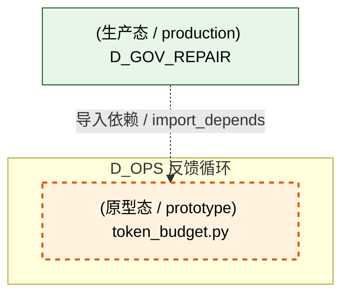
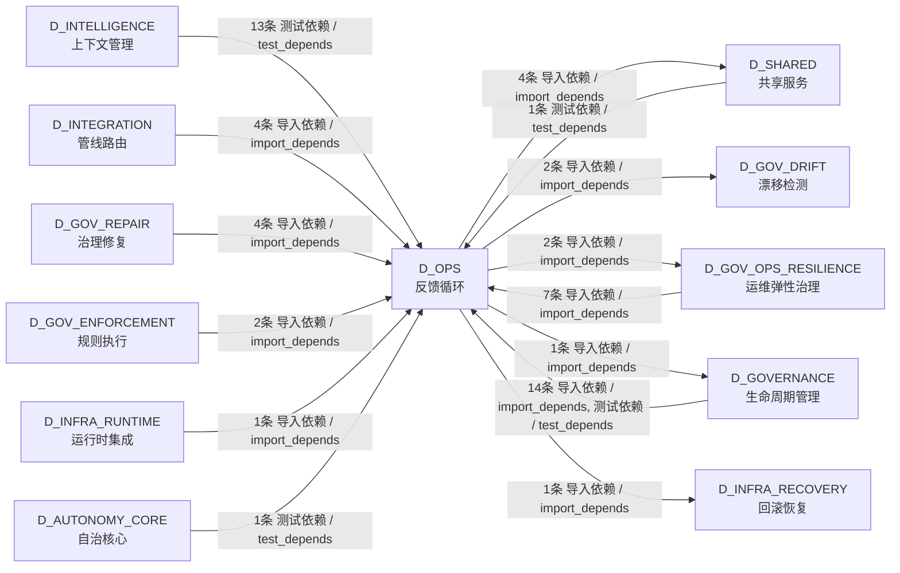

# 21_d_ops / telemetry / 反馈循环 / Feedback Loop

> **功能简介 / Overview**: 反馈循环，负责系统运行反馈、性能监控和自动调优闭环

> **文档作用 / Purpose**: 展示 反馈循环（D_OPS）功能域的模块清单、域内依赖关系、跨域依赖关系、架构分层视图，供架构审查和域治理参考。

> 本文档由 generate_domain_doc.py 从 depgraph (PostgreSQL) 自动生成
> 最后更新: 2026-07-17 12:19:55
> 数据源: depgraph (PostgreSQL) nodes表 + edges表

## 域基本信息 / Domain Overview

| 字段 | 值 | Field | Value |
|------|------|-------|-------|
| 编号 | 21 | Number | 21 |
| 域ID | D_OPS | Domain ID | D_OPS |
| 域名称 | 反馈循环 | Domain Name | Feedback Loop |
| 层级 | L1 基础平台层 | Layer | L1 Foundation |
| 模块数 | 9 | Module Count | 9 |
| 域内依赖 | 2 | Internal Dependencies | 2 |
| 跨域入边 | 47 | Cross-domain Incoming | 47 |
| 跨域出边 | 10 | Cross-domain Outgoing | 10 |
| 设计态模块 | 0 | Design Modules | 0 |
| 原型态模块 | 1 | Prototype Modules | 1 |
| 生产态模块 | 8 | Production Modules | 8 |
| 容量 | 8/150 (正常) | Capacity | 8/150 (正常) |
| 描述 | 自动引导(auto_bootstrap) | Description | 自动引导(auto_bootstrap) |

## 模块分层清单 / Module Layered List

> 按 architecture_layer 分组的模块清单（共 9 个模块 / 9 modules）。

### L1 基础层 / Foundation Layer (8 modules)

| # | 模块路径 / Module Path | 模块名称 / Module Name (功能简介 / Description) | 成熟度 / Maturity | 蓝图 / Blueprint |
|:--:|---------|---------|:---:|:---:|
| 1 | src/zephyr/governance/ops_governance/budget_engine.py | Budget Enforcer core engine — MOD-INF-024 | 生产态 / production | [MOD-INF-024](../../03_modules/_domain_autonomy_perm/budget_enforcer/blueprint.md) |
| 2 | src/zephyr/governance/ops_governance/budget_handler.py | G-CT-006 消费端 — Escalation.on_budget_alert()... | 生产态 / production | [MOD-INF-022](../../03_modules/_domain_autonomy_perm/escalation_protocol/blueprint.md) |
| 3 | src/zephyr/governance/ops_governance/budget_models.py | Budget Enforcer data models — MOD-INF-024 | 生产态 / production | [MOD-INF-024](../../03_modules/_domain_autonomy_perm/budget_enforcer/blueprint.md) |
| 4 | src/zephyr/governance/ops_governance/budget_profile_manag... | budget_profile_manager.py | 生产态 / production | [MOD-INF-024](../../03_modules/_domain_autonomy_perm/budget_enforcer/blueprint.md) |
| 5 | src/zephyr/governance/ops_governance/budget_tracker.py | budget_tracker.py | 生产态 / production | [MOD-INF-024](../../03_modules/_domain_autonomy_perm/budget_enforcer/blueprint.md) |
| 6 | src/zephyr/governance/ops_governance/cost_budget.py | cost_budget.py —— AI 成本预算与强制熔断（Phas... | 生产态 / production | [MOD-INF-024](../../03_modules/_domain_autonomy_perm/budget_enforcer/blueprint.md) |
| 7 | src/zephyr/governance/ops_governance/meta_observability.py | Meta Observability — v0.10.0 协议自身可观测性:... | 生产态 / production | [MOD-INF-022](../../03_modules/_domain_autonomy_perm/escalation_protocol/blueprint.md) |
| 8 | src/zephyr/governance/ops_governance/token_budget.py | token_budget.py | 原型态 / prototype | [MOD-INF-024](../../03_modules/_domain_autonomy_perm/budget_enforcer/blueprint.md) |

### L2 领域层 / Domain Layer (1 modules)

| # | 模块路径 / Module Path | 模块名称 / Module Name (功能简介 / Description) | 成熟度 / Maturity | 蓝图 / Blueprint |
|:--:|---------|---------|:---:|:---:|
| 1 | src/zephyr/governance/observability_governance/observabil... | observability_dashboard.py | 生产态 / production | [MOD-GOVERNANCE](../../03_modules/_domain_governance/blueprint.md) |

## 域内依赖图 / Internal Dependency Diagram

> 依赖图内嵌在本文档中，IDE 可直接渲染显示。参考 decision_index.md 设计，分四个视图：合并全景图、运营态子图、设计态子图、原型态子图（按 design_maturity 实际值拆分）。
>
> **图例说明 / Legend**：
> - **实线边框 = 运营态模块**（production，已上线运行）
> - **虚线边框 = 设计态模块**（design，蓝图阶段，代码未写）
> - **虚线边框 = 原型态模块**（prototype，代码已写，验证中未稳定上线）
> - **实线箭头 = 运营态依赖**（已生效的依赖关系）
> - **虚线箭头 = 非运营态依赖**（计划中/验证中的依赖关系）

### 合并全景图（全部模块，标签标注成熟度）

> 展示全部 9 个模块（生产态 8 + 设计态 0 + 原型态 1），标签标注成熟度。

```mermaid
graph TD
    subgraph D_OPS["D_OPS 反馈循环"]
        src_zephyr_governance_observability_governance_observability_dashboard_py["(生产态 / production) observability_dashboard.py"]
        src_zephyr_governance_ops_governance_budget_engine_py["(生产态 / production) Budget Enforcer core engine — MOD-INF-024<br/>文件: budget_engine.py"]
        src_zephyr_governance_ops_governance_budget_handler_py["(生产态 / production) G-CT-006 消费端 — Escalation.on_budget_alert()...<br/>文件: budget_handler.py"]
        src_zephyr_governance_ops_governance_budget_models_py["(生产态 / production) Budget Enforcer data models — MOD-INF-024<br/>文件: budget_models.py"]
        src_zephyr_governance_ops_governance_budget_profile_manager_py["(生产态 / production) budget_profile_manager.py"]
        src_zephyr_governance_ops_governance_budget_tracker_py["(生产态 / production) budget_tracker.py"]
        src_zephyr_governance_ops_governance_cost_budget_py["(生产态 / production) cost_budget.py —— AI 成本预算与强制熔断（Phas...<br/>文件: cost_budget.py"]
        src_zephyr_governance_ops_governance_meta_observability_py["(生产态 / production) Meta Observability — v0.10.0 协议自身可观测性:...<br/>文件: meta_observability.py"]
        src_zephyr_governance_ops_governance_token_budget_py["(原型态 / prototype) token_budget.py"]
    end
    src_zephyr_governance_ops_governance_budget_engine_py -->|导入依赖 / import_depends| src_zephyr_governance_ops_governance_budget_models_py
    src_zephyr_governance_ops_governance_budget_tracker_py -->|导入依赖 / import_depends| src_zephyr_governance_ops_governance_budget_models_py
    D_GOV_DRIFT["(生产态 / production) D_GOV_DRIFT"]
    src_zephyr_governance_ops_governance_budget_engine_py -->|导入依赖 / import_depends| D_GOV_DRIFT
    src_zephyr_governance_ops_governance_budget_engine_py -->|导入依赖 / import_depends| D_GOV_DRIFT
    D_GOVERNANCE["(生产态 / production) D_GOVERNANCE"]
    src_zephyr_governance_ops_governance_budget_handler_py -->|导入依赖 / import_depends| D_GOVERNANCE
    D_GOV_OPS_RESILIENCE["(生产态 / production) D_GOV_OPS_RESILIENCE"]
    src_zephyr_governance_ops_governance_budget_handler_py -->|导入依赖 / import_depends| D_GOV_OPS_RESILIENCE
    src_zephyr_governance_ops_governance_budget_engine_py -->|导入依赖 / import_depends| D_GOV_OPS_RESILIENCE
    D_INFRA_RECOVERY["(原型态 / prototype) D_INFRA_RECOVERY"]
    src_zephyr_governance_ops_governance_budget_tracker_py -.->|导入依赖 / import_depends| D_INFRA_RECOVERY
    D_SHARED["(生产态 / production) D_SHARED"]
    src_zephyr_governance_ops_governance_cost_budget_py -->|导入依赖 / import_depends| D_SHARED
    src_zephyr_governance_ops_governance_budget_engine_py -->|导入依赖 / import_depends| D_SHARED
    src_zephyr_governance_ops_governance_budget_handler_py -->|导入依赖 / import_depends| D_SHARED
    src_zephyr_governance_ops_governance_cost_budget_py -->|导入依赖 / import_depends| D_SHARED
    D_GOVERNANCE -.->|测试依赖 / test_depends| src_zephyr_governance_ops_governance_budget_engine_py
    D_GOVERNANCE -.->|测试依赖 / test_depends| src_zephyr_governance_ops_governance_budget_models_py
    D_GOVERNANCE -.->|测试依赖 / test_depends| src_zephyr_governance_ops_governance_budget_models_py
    D_GOVERNANCE -.->|测试依赖 / test_depends| src_zephyr_governance_ops_governance_budget_engine_py
    D_INTELLIGENCE["(原型态 / prototype) D_INTELLIGENCE"]
    D_INTELLIGENCE -.->|测试依赖 / test_depends| src_zephyr_governance_ops_governance_budget_models_py
    D_INTELLIGENCE -.->|测试依赖 / test_depends| src_zephyr_governance_ops_governance_budget_models_py
    D_INTELLIGENCE -.->|测试依赖 / test_depends| src_zephyr_governance_ops_governance_budget_profile_manager_py
    D_INTELLIGENCE -.->|测试依赖 / test_depends| src_zephyr_governance_ops_governance_budget_models_py
    D_INTELLIGENCE -.->|测试依赖 / test_depends| src_zephyr_governance_ops_governance_budget_tracker_py
    D_INTELLIGENCE -.->|测试依赖 / test_depends| src_zephyr_governance_ops_governance_budget_engine_py
    D_INTELLIGENCE -.->|测试依赖 / test_depends| src_zephyr_governance_ops_governance_budget_models_py
    D_GOV_REPAIR["(生产态 / production) D_GOV_REPAIR"]
    D_GOV_REPAIR -.->|导入依赖 / import_depends| src_zephyr_governance_ops_governance_token_budget_py
    D_GOV_OPS_RESILIENCE -->|导入依赖 / import_depends| src_zephyr_governance_ops_governance_budget_engine_py
    D_INTEGRATION["(生产态 / production) D_INTEGRATION"]
    D_INTEGRATION -->|导入依赖 / import_depends| src_zephyr_governance_ops_governance_budget_engine_py
    D_GOV_REPAIR -->|导入依赖 / import_depends| src_zephyr_governance_ops_governance_budget_engine_py
    classDef production fill:#e1f5fe,stroke:#01579b,stroke-width:2px,color:#000
    classDef design fill:#fff3e0,stroke:#e65100,stroke-width:2px,color:#000,stroke-dasharray: 5 5
    classDef external_prod fill:#e8f5e9,stroke:#1b5e20,stroke-width:1px,color:#000
    classDef external_design fill:#fce4ec,stroke:#880e4f,stroke-width:1px,color:#000,stroke-dasharray: 5 5
    class src_zephyr_governance_observability_governance_observability_dashboard_py,src_zephyr_governance_ops_governance_budget_engine_py,src_zephyr_governance_ops_governance_budget_handler_py,src_zephyr_governance_ops_governance_budget_models_py,src_zephyr_governance_ops_governance_budget_profile_manager_py,src_zephyr_governance_ops_governance_budget_tracker_py,src_zephyr_governance_ops_governance_cost_budget_py,src_zephyr_governance_ops_governance_meta_observability_py production
    class src_zephyr_governance_ops_governance_token_budget_py design
    class D_GOV_DRIFT,D_GOVERNANCE,D_GOV_OPS_RESILIENCE,D_SHARED,D_GOV_REPAIR,D_INTEGRATION external_prod
    class D_INFRA_RECOVERY,D_INTELLIGENCE external_design
```

### 运营态子图（仅 design_maturity=production 的模块和依赖）

> 仅展示已上线运行的模块（共 8 个，2 条域内依赖）。

```mermaid
graph TD
    subgraph D_OPS["D_OPS 反馈循环"]
        src_zephyr_governance_observability_governance_observability_dashboard_py["(生产态 / production) observability_dashboard.py"]
        src_zephyr_governance_ops_governance_budget_engine_py["(生产态 / production) Budget Enforcer core engine — MOD-INF-024<br/>文件: budget_engine.py"]
        src_zephyr_governance_ops_governance_budget_handler_py["(生产态 / production) G-CT-006 消费端 — Escalation.on_budget_alert()...<br/>文件: budget_handler.py"]
        src_zephyr_governance_ops_governance_budget_models_py["(生产态 / production) Budget Enforcer data models — MOD-INF-024<br/>文件: budget_models.py"]
        src_zephyr_governance_ops_governance_budget_profile_manager_py["(生产态 / production) budget_profile_manager.py"]
        src_zephyr_governance_ops_governance_budget_tracker_py["(生产态 / production) budget_tracker.py"]
        src_zephyr_governance_ops_governance_cost_budget_py["(生产态 / production) cost_budget.py —— AI 成本预算与强制熔断（Phas...<br/>文件: cost_budget.py"]
        src_zephyr_governance_ops_governance_meta_observability_py["(生产态 / production) Meta Observability — v0.10.0 协议自身可观测性:...<br/>文件: meta_observability.py"]
    end
    src_zephyr_governance_ops_governance_budget_engine_py -->|导入依赖 / import_depends| src_zephyr_governance_ops_governance_budget_models_py
    src_zephyr_governance_ops_governance_budget_tracker_py -->|导入依赖 / import_depends| src_zephyr_governance_ops_governance_budget_models_py
    D_GOV_DRIFT["(生产态 / production) D_GOV_DRIFT"]
    src_zephyr_governance_ops_governance_budget_engine_py -->|导入依赖 / import_depends| D_GOV_DRIFT
    src_zephyr_governance_ops_governance_budget_engine_py -->|导入依赖 / import_depends| D_GOV_DRIFT
    D_GOVERNANCE["(生产态 / production) D_GOVERNANCE"]
    src_zephyr_governance_ops_governance_budget_handler_py -->|导入依赖 / import_depends| D_GOVERNANCE
    D_GOV_OPS_RESILIENCE["(生产态 / production) D_GOV_OPS_RESILIENCE"]
    src_zephyr_governance_ops_governance_budget_handler_py -->|导入依赖 / import_depends| D_GOV_OPS_RESILIENCE
    src_zephyr_governance_ops_governance_budget_engine_py -->|导入依赖 / import_depends| D_GOV_OPS_RESILIENCE
    D_INFRA_RECOVERY["(原型态 / prototype) D_INFRA_RECOVERY"]
    src_zephyr_governance_ops_governance_budget_tracker_py -.->|导入依赖 / import_depends| D_INFRA_RECOVERY
    D_SHARED["(生产态 / production) D_SHARED"]
    src_zephyr_governance_ops_governance_cost_budget_py -->|导入依赖 / import_depends| D_SHARED
    src_zephyr_governance_ops_governance_budget_engine_py -->|导入依赖 / import_depends| D_SHARED
    src_zephyr_governance_ops_governance_budget_handler_py -->|导入依赖 / import_depends| D_SHARED
    src_zephyr_governance_ops_governance_cost_budget_py -->|导入依赖 / import_depends| D_SHARED
    D_GOVERNANCE -.->|测试依赖 / test_depends| src_zephyr_governance_ops_governance_budget_engine_py
    D_GOVERNANCE -.->|测试依赖 / test_depends| src_zephyr_governance_ops_governance_budget_models_py
    D_GOVERNANCE -.->|测试依赖 / test_depends| src_zephyr_governance_ops_governance_budget_models_py
    D_GOVERNANCE -.->|测试依赖 / test_depends| src_zephyr_governance_ops_governance_budget_engine_py
    D_INTELLIGENCE["(原型态 / prototype) D_INTELLIGENCE"]
    D_INTELLIGENCE -.->|测试依赖 / test_depends| src_zephyr_governance_ops_governance_budget_models_py
    D_INTELLIGENCE -.->|测试依赖 / test_depends| src_zephyr_governance_ops_governance_budget_models_py
    D_INTELLIGENCE -.->|测试依赖 / test_depends| src_zephyr_governance_ops_governance_budget_profile_manager_py
    D_INTELLIGENCE -.->|测试依赖 / test_depends| src_zephyr_governance_ops_governance_budget_models_py
    D_INTELLIGENCE -.->|测试依赖 / test_depends| src_zephyr_governance_ops_governance_budget_tracker_py
    D_INTELLIGENCE -.->|测试依赖 / test_depends| src_zephyr_governance_ops_governance_budget_engine_py
    D_INTELLIGENCE -.->|测试依赖 / test_depends| src_zephyr_governance_ops_governance_budget_models_py
    D_GOV_OPS_RESILIENCE -->|导入依赖 / import_depends| src_zephyr_governance_ops_governance_budget_engine_py
    D_INTEGRATION["(生产态 / production) D_INTEGRATION"]
    D_INTEGRATION -->|导入依赖 / import_depends| src_zephyr_governance_ops_governance_budget_engine_py
    D_GOV_REPAIR["(生产态 / production) D_GOV_REPAIR"]
    D_GOV_REPAIR -->|导入依赖 / import_depends| src_zephyr_governance_ops_governance_budget_engine_py
    D_GOVERNANCE -->|导入依赖 / import_depends| src_zephyr_governance_ops_governance_budget_models_py
    classDef production fill:#e1f5fe,stroke:#01579b,stroke-width:2px,color:#000
    classDef design fill:#fff3e0,stroke:#e65100,stroke-width:2px,color:#000,stroke-dasharray: 5 5
    classDef external_prod fill:#e8f5e9,stroke:#1b5e20,stroke-width:1px,color:#000
    classDef external_design fill:#fce4ec,stroke:#880e4f,stroke-width:1px,color:#000,stroke-dasharray: 5 5
    class src_zephyr_governance_observability_governance_observability_dashboard_py,src_zephyr_governance_ops_governance_budget_engine_py,src_zephyr_governance_ops_governance_budget_handler_py,src_zephyr_governance_ops_governance_budget_models_py,src_zephyr_governance_ops_governance_budget_profile_manager_py,src_zephyr_governance_ops_governance_budget_tracker_py,src_zephyr_governance_ops_governance_cost_budget_py,src_zephyr_governance_ops_governance_meta_observability_py production
    class D_GOV_DRIFT,D_GOVERNANCE,D_GOV_OPS_RESILIENCE,D_SHARED,D_INTEGRATION,D_GOV_REPAIR external_prod
    class D_INFRA_RECOVERY,D_INTELLIGENCE external_design
```

### 设计态子图（仅 design_maturity=design 的模块和依赖）

> 仅展示蓝图阶段、代码未写的设计态模块（共 0 个，0 条域内依赖）。

> （无设计态模块 / No design modules）

### 原型态子图（仅 design_maturity=prototype 的模块和依赖）

> 仅展示代码已写、验证中未稳定上线的原型态模块（共 1 个，0 条域内依赖）。

## 跨域依赖 / Cross-domain Dependencies

### 本域依赖的其他域（出边）/ Depends On

| # | 本域模块 / Source Module | → | 外部域-目标模块 / Target Module | 依赖类型 / Type |
|:--:|---------|:--:|---------|---------|
| 1 | G-CT-006 消费端 — Escalation.on_budget_alert()... | → | D_GOVERNANCE 生命周期管理: Escalation Adapter — MOD-INF-022 统一集成入口.... | 导入依赖 / import_depends |
| 2 | Budget Enforcer core engine — MOD-INF-024 (bud... | → | D_GOV_DRIFT 漂移检测: Drift Detector 基础设施 — drift_infrastructure... | 导入依赖 / import_depends |
| 3 | Budget Enforcer core engine — MOD-INF-024 (bud... | → | D_GOV_DRIFT 漂移检测: spiral_ews.py | 导入依赖 / import_depends |
| 4 | Budget Enforcer core engine — MOD-INF-024 (bud... | → | D_GOV_OPS_RESILIENCE 运维弹性治理: ipi_defense.py | 导入依赖 / import_depends |
| 5 | G-CT-006 消费端 — Escalation.on_budget_alert()... | → | D_GOV_OPS_RESILIENCE 运维弹性治理: G-CT-003 消费端 — Escalation.on_rollback_failu... | 导入依赖 / import_depends |
| 6 | budget_tracker.py | → | D_INFRA_RECOVERY 回滚恢复: G-CT-009 契约：Rollback -> Budget 回滚成本计入.... | 导入依赖 / import_depends |
| 7 | Budget Enforcer core engine — MOD-INF-024 (bud... | → | D_SHARED 共享服务: EventBus — 事件总线（带背压控制）(M-07) (event... | 导入依赖 / import_depends |
| 8 | G-CT-006 消费端 — Escalation.on_budget_alert()... | → | D_SHARED 共享服务: budget_alert.py | 导入依赖 / import_depends |
| 9 | cost_budget.py —— AI 成本预算与强制熔断（Phas... | → | D_SHARED 共享服务: errors.py —— ZephyrAlpha 统一错误层次（Tradit... | 导入依赖 / import_depends |
| 10 | cost_budget.py —— AI 成本预算与强制熔断（Phas... | → | D_SHARED 共享服务: metrics.py —— 轻量级 Metrics 收集基础设施（Ph... | 导入依赖 / import_depends |

### 依赖本域的其他域（入边）/ Depended By

| # | 外部域-源模块 / Source Module | → | 本域模块 / Target Module | 依赖类型 / Type |
|:--:|---------|:--:|---------|---------|
| 1 | D_AUTONOMY_CORE 自治核心: test_escalation_gov_budget_handler.py | → | G-CT-006 消费端 — Escalation.on_budget_alert()... | 测试依赖 / test_depends |
| 2 | D_GOVERNANCE 生命周期管理: model_provider_data.py | → | Budget Enforcer data models — MOD-INF-024 (bud... | 导入依赖 / import_depends |
| 3 | D_GOVERNANCE 生命周期管理: model_router.py | → | Budget Enforcer data models — MOD-INF-024 (bud... | 导入依赖 / import_depends |
| 4 | D_GOVERNANCE 生命周期管理: GovernanceServer: 治理域统一MCP入口 (governance... | → | Budget Enforcer core engine — MOD-INF-024 (bud... | 导入依赖 / import_depends |
| 5 | D_GOVERNANCE 生命周期管理: GovernanceServer: 治理域统一MCP入口 (governance... | → | Budget Enforcer data models — MOD-INF-024 (bud... | 导入依赖 / import_depends |
| 6 | D_GOVERNANCE 生命周期管理: F4 红蓝对抗极端测试——真实降级链/并发/分块/col... | → | Budget Enforcer core engine — MOD-INF-024 (bud... | 测试依赖 / test_depends |
| 7 | D_GOVERNANCE 生命周期管理: F4 红蓝对抗极端测试——真实降级链/并发/分块/col... | → | Budget Enforcer data models — MOD-INF-024 (bud... | 测试依赖 / test_depends |
| 8 | D_GOVERNANCE 生命周期管理: test_burn_rate_monitor.py | → | Budget Enforcer data models — MOD-INF-024 (bud... | 测试依赖 / test_depends |
| 9 | D_GOVERNANCE 生命周期管理: test_cost_attributor.py | → | Budget Enforcer data models — MOD-INF-024 (bud... | 测试依赖 / test_depends |
| 10 | D_GOVERNANCE 生命周期管理: test_cost_budget_root.py | → | cost_budget.py —— AI 成本预算与强制熔断（Phas... | 测试依赖 / test_depends |
| 11 | D_GOVERNANCE 生命周期管理: test_degradation_manager.py | → | Budget Enforcer data models — MOD-INF-024 (bud... | 测试依赖 / test_depends |
| 12 | D_GOVERNANCE 生命周期管理: test_governance_budget_tracker.py | → | budget_tracker.py | 测试依赖 / test_depends |
| 13 | D_GOVERNANCE 生命周期管理: test_pre_flight_gate.py | → | Budget Enforcer core engine — MOD-INF-024 (bud... | 测试依赖 / test_depends |
| 14 | D_GOVERNANCE 生命周期管理: test_pre_flight_gate.py | → | Budget Enforcer data models — MOD-INF-024 (bud... | 测试依赖 / test_depends |
| 15 | D_GOVERNANCE 生命周期管理: test_meta_observability.py | → | Meta Observability — v0.10.0 协议自身可观测性:... | 测试依赖 / test_depends |
| 16 | D_GOV_ENFORCEMENT 规则执行: pre_flight_gate.py | → | Budget Enforcer core engine — MOD-INF-024 (bud... | 导入依赖 / import_depends |
| 17 | D_GOV_ENFORCEMENT 规则执行: pre_flight_gate.py | → | Budget Enforcer data models — MOD-INF-024 (bud... | 导入依赖 / import_depends |
| 18 | D_GOV_OPS_RESILIENCE 运维弹性治理: Burn Rate Monitor — MOD-INF-024 (burn_rate_mon... | → | Budget Enforcer data models — MOD-INF-024 (bud... | 导入依赖 / import_depends |
| 19 | D_GOV_OPS_RESILIENCE 运维弹性治理: cost_attributor.py | → | Budget Enforcer data models — MOD-INF-024 (bud... | 导入依赖 / import_depends |
| 20 | D_GOV_OPS_RESILIENCE 运维弹性治理: degradation_manager.py | → | Budget Enforcer data models — MOD-INF-024 (bud... | 导入依赖 / import_depends |
| 21 | D_GOV_OPS_RESILIENCE 运维弹性治理: PhaseManager->GateEngine 检查注册表桥梁 — 44 .... | → | Budget Enforcer core engine — MOD-INF-024 (bud... | 导入依赖 / import_depends |
| 22 | D_GOV_OPS_RESILIENCE 运维弹性治理: PhaseManager->GateEngine 检查注册表桥梁 — 44 .... | → | Budget Enforcer data models — MOD-INF-024 (bud... | 导入依赖 / import_depends |
| 23 | D_GOV_OPS_RESILIENCE 运维弹性治理: adversarial_tester.py | → | Budget Enforcer core engine — MOD-INF-024 (bud... | 导入依赖 / import_depends |
| 24 | D_GOV_OPS_RESILIENCE 运维弹性治理: adversarial_tester.py | → | Budget Enforcer data models — MOD-INF-024 (bud... | 导入依赖 / import_depends |
| 25 | D_GOV_REPAIR 治理修复: Agent 治理八件套 · Governance Domain — DOM-GO... | → | token_budget.py | 导入依赖 / import_depends |
| 26 | D_GOV_REPAIR 治理修复: budget_enforcement.py | → | Budget Enforcer core engine — MOD-INF-024 (bud... | 导入依赖 / import_depends |
| 27 | D_GOV_REPAIR 治理修复: budget_enforcement.py | → | Budget Enforcer data models — MOD-INF-024 (bud... | 导入依赖 / import_depends |
| 28 | D_GOV_REPAIR 治理修复: budget_enforcement.py | → | budget_tracker.py | 导入依赖 / import_depends |
| 29 | D_INFRA_RUNTIME 运行时集成: boot_hooks.py | → | Budget Enforcer core engine — MOD-INF-024 (bud... | 导入依赖 / import_depends |
| 30 | D_INTEGRATION 管线路由: DeepSeekChat — 通过 DeepSeek API 进行 LLM 推理... | → | Budget Enforcer core engine — MOD-INF-024 (bud... | 导入依赖 / import_depends |
| 31 | D_INTEGRATION 管线路由: OllamaChat — 通过 Ollama HTTP API 进行本地 LLM... | → | Budget Enforcer core engine — MOD-INF-024 (bud... | 导入依赖 / import_depends |
| 32 | D_INTEGRATION 管线路由: PipelineOrchestrator — M1-M11 管线协调器 (pipe... | → | Budget Enforcer core engine — MOD-INF-024 (bud... | 导入依赖 / import_depends |
| 33 | D_INTEGRATION 管线路由: PipelineOrchestrator — M1-M11 管线协调器 (pipe... | → | Budget Enforcer data models — MOD-INF-024 (bud... | 导入依赖 / import_depends |
| 34 | D_INTELLIGENCE 上下文管理: test_budget_engine_root.py | → | Budget Enforcer core engine — MOD-INF-024 (bud... | 测试依赖 / test_depends |
| 35 | D_INTELLIGENCE 上下文管理: test_budget_engine_root.py | → | Budget Enforcer data models — MOD-INF-024 (bud... | 测试依赖 / test_depends |
| 36 | D_INTELLIGENCE 上下文管理: DM-201503: F4 事件驱动预算执行——超限/IPI/螺旋... | → | Budget Enforcer core engine — MOD-INF-024 (bud... | 测试依赖 / test_depends |
| 37 | D_INTELLIGENCE 上下文管理: DM-201503: F4 事件驱动预算执行——超限/IPI/螺旋... | → | Budget Enforcer data models — MOD-INF-024 (bud... | 测试依赖 / test_depends |
| 38 | D_INTELLIGENCE 上下文管理: test_budget_handler.py | → | G-CT-006 消费端 — Escalation.on_budget_alert()... | 测试依赖 / test_depends |
| 39 | D_INTELLIGENCE 上下文管理: DM-201505: F4 自动化集成测试——完整生命周期端... | → | Budget Enforcer core engine — MOD-INF-024 (bud... | 测试依赖 / test_depends |
| 40 | D_INTELLIGENCE 上下文管理: DM-201505: F4 自动化集成测试——完整生命周期端... | → | Budget Enforcer data models — MOD-INF-024 (bud... | 测试依赖 / test_depends |
| 41 | D_INTELLIGENCE 上下文管理: test_budget_models.py | → | Budget Enforcer data models — MOD-INF-024 (bud... | 测试依赖 / test_depends |
| 42 | D_INTELLIGENCE 上下文管理: test_budget_profile_manager.py | → | budget_profile_manager.py | 测试依赖 / test_depends |
| 43 | D_INTELLIGENCE 上下文管理: DM-201504: F4 BudgetEngine自动关闭——shutdown.... | → | Budget Enforcer core engine — MOD-INF-024 (bud... | 测试依赖 / test_depends |
| 44 | D_INTELLIGENCE 上下文管理: DM-201504: F4 BudgetEngine自动关闭——shutdown.... | → | Budget Enforcer data models — MOD-INF-024 (bud... | 测试依赖 / test_depends |
| 45 | D_INTELLIGENCE 上下文管理: test_budget_tracker.py | → | Budget Enforcer data models — MOD-INF-024 (bud... | 测试依赖 / test_depends |
| 46 | D_INTELLIGENCE 上下文管理: test_budget_tracker.py | → | budget_tracker.py | 测试依赖 / test_depends |
| 47 | D_SHARED 共享服务: test_e_gov_budget_handler.py | → | G-CT-006 消费端 — Escalation.on_budget_alert()... | 测试依赖 / test_depends |

### 跨域依赖图 / Cross-domain Dependency Diagram

> 本域与 11 个外部域直接连接（出边 10 条 + 入边 47 条 = 57 条）。只显示直接连接的域，不展开具体节点。

## 说明 / Notes

- **数据源 / Data Source**: `depgraph (PostgreSQL)` 的 `nodes`、`edges`、`domains` 表
- **生成器 / Generator**: `generate_domain_doc.py`（G2+G10 合并）
- **维护方式 / Maintenance**: 自动生成，全景图更新时刷新
- **文件名规则 / File Naming**: `{编号:02d}_{域ID小写}.md`，如 `16_d_trading.md`
- **图例说明 / Legend**: `[production]`=已上线 / `[design]`=设计中 / `[prototype]`=原型 / `[unknown]`=未知
