# 22_d_audittest / 审计测试套件

> **文档作用 / Purpose**: 展示 审计测试套件（D_AUDITTEST）功能域的模块清单、域内依赖关系、跨域依赖关系、架构全景图，供架构审查和域治理参考。

> 本文档由 generate_domain_doc.py 从 depgraph.db 自动生成
> 最后更新: 2026-06-30 01:26:47
> 数据源: depgraph.db nodes表 + edges表

## 域基本信息 / Domain Overview

| 字段 | 值 | Field | Value |
|------|------|-------|-------|
| 编号 | 22 | Number | 22 |
| 域ID | D_AUDITTEST | Domain ID | D_AUDITTEST |
| 域名称 | 审计测试套件 | Domain Name | 审计测试套件 |
| 层级 | L2_domain | Layer | L2_domain |
| 模块数 | 148 | Module Count | 148 |
| 域内依赖 | 0 | Internal Dependencies | 0 |
| 跨域入边 | 0 | Cross-domain Incoming | 0 |
| 跨域出边 | 14 | Cross-domain Outgoing | 14 |
| 设计态模块 | 0 | Design Modules | 0 |
| 原型态模块 | 7 | Prototype Modules | 7 |
| 生产态模块 | 141 | Production Modules | 141 |
| 容量 | 142/150 (正常) | Capacity | 142/150 (正常) |
| 描述 | 审计单元测试(unit) | Description | 审计单元测试(unit) |

## 域内依赖图 / Internal Dependency Diagram

> 依赖图内嵌在本文档中，IDE 可直接渲染显示。每30个节点一组分页显示。
>
> **图例说明 / Legend**：
> - **实线边框 = 运营态模块**（production，已上线运行）
> - **虚线边框 = 设计态模块**（design，还在设计中）
> - **实线箭头 = 运营态依赖**（已生效的依赖关系）
> - **虚线箭头 = 设计态依赖**（计划中的依赖关系）

### 第 1 页 / 共 5 页 / Page 1 of 5


### 第 2 页 / 共 5 页 / Page 2 of 5

```mermaid
graph TD
    subgraph D_AUDITTEST["D_AUDITTEST 审计测试套件"]
        tests_test_fl_safety_gate_l40_l41_py["tests/test_fl_safety_gate_l40_l41.py production"]
        tests_test_fl_safety_gate_l42_l43_py["tests/test_fl_safety_gate_l42_l43.py production"]
        tests_test_fl_safety_gate_l44_l45_py["tests/test_fl_safety_gate_l44_l45.py production"]
        tests_test_fl_safety_gate_l46_l47_py["tests/test_fl_safety_gate_l46_l47.py production"]
        tests_test_fl_safety_gate_l48_l49_py["tests/test_fl_safety_gate_l48_l49.py production"]
        tests_test_fl_safety_gate_l50_l51_py["tests/test_fl_safety_gate_l50_l51.py production"]
        tests_test_fl_safety_gate_l52_l53_py["tests/test_fl_safety_gate_l52_l53.py production"]
        tests_test_fl_safety_gate_l54_l55_py["tests/test_fl_safety_gate_l54_l55.py production"]
        tests_test_fl_safety_gate_l56_l57_py["tests/test_fl_safety_gate_l56_l57.py production"]
        tests_test_fl_safety_gate_l58_l59_py["tests/test_fl_safety_gate_l58_l59.py production"]
        tests_test_fl_safety_gate_l60_l61_py["tests/test_fl_safety_gate_l60_l61.py production"]
        tests_test_fl_safety_gate_l62_l63_py["tests/test_fl_safety_gate_l62_l63.py production"]
        tests_test_fl_safety_gate_l64_l65_py["tests/test_fl_safety_gate_l64_l65.py production"]
        tests_test_fl_safety_gate_l66_l67_py["tests/test_fl_safety_gate_l66_l67.py production"]
        tests_test_g_trae_003_py["tests/test_g_trae_003.py production"]
        tests_test_g_trae_004_py["tests/test_g_trae_004.py production"]
        tests_test_g_trae_006_py["tests/test_g_trae_006.py production"]
        tests_test_g_trae_007_py["tests/test_g_trae_007.py production"]
        tests_test_g_trae_008_py["tests/test_g_trae_008.py production"]
        tests_test_g_trae_009_py["tests/test_g_trae_009.py production"]
        tests_test_g_trae_010_py["tests/test_g_trae_010.py production"]
        tests_test_g_trae_011_py["tests/test_g_trae_011.py production"]
        tests_test_g_trae_012_py["tests/test_g_trae_012.py production"]
        tests_test_g_trae_016_py["tests/test_g_trae_016.py production"]
        tests_test_g_trae_017_py["tests/test_g_trae_017.py production"]
        tests_test_g_trae_018_py["tests/test_g_trae_018.py production"]
        tests_test_g_trae_020_py["tests/test_g_trae_020.py production"]
        tests_test_g_trae_021_py["tests/test_g_trae_021.py production"]
        tests_test_g_trae_022_py["tests/test_g_trae_022.py production"]
        tests_test_g_trae_023_py["tests/test_g_trae_023.py production"]
    end
    classDef production fill:#e1f5fe,stroke:#01579b,stroke-width:2px,color:#000
    classDef design fill:#fff3e0,stroke:#e65100,stroke-width:2px,color:#000,stroke-dasharray: 5 5
    classDef external_prod fill:#e8f5e9,stroke:#1b5e20,stroke-width:1px,color:#000
    classDef external_design fill:#fce4ec,stroke:#880e4f,stroke-width:1px,color:#000,stroke-dasharray: 5 5
    class tests_test_fl_safety_gate_l40_l41_py,tests_test_fl_safety_gate_l42_l43_py,tests_test_fl_safety_gate_l44_l45_py,tests_test_fl_safety_gate_l46_l47_py,tests_test_fl_safety_gate_l48_l49_py,tests_test_fl_safety_gate_l50_l51_py,tests_test_fl_safety_gate_l52_l53_py,tests_test_fl_safety_gate_l54_l55_py,tests_test_fl_safety_gate_l56_l57_py,tests_test_fl_safety_gate_l58_l59_py,tests_test_fl_safety_gate_l60_l61_py,tests_test_fl_safety_gate_l62_l63_py,tests_test_fl_safety_gate_l64_l65_py,tests_test_fl_safety_gate_l66_l67_py,tests_test_g_trae_003_py,tests_test_g_trae_004_py,tests_test_g_trae_006_py,tests_test_g_trae_007_py,tests_test_g_trae_008_py,tests_test_g_trae_009_py,tests_test_g_trae_010_py,tests_test_g_trae_011_py,tests_test_g_trae_012_py,tests_test_g_trae_016_py,tests_test_g_trae_017_py,tests_test_g_trae_018_py,tests_test_g_trae_020_py,tests_test_g_trae_021_py,tests_test_g_trae_022_py,tests_test_g_trae_023_py production
```



### 第 3 页 / 共 5 页 / Page 3 of 5

```mermaid
graph TD
    subgraph D_AUDITTEST["D_AUDITTEST 审计测试套件"]
        tests_test_g_trae_024_py["tests/test_g_trae_024.py production"]
        tests_test_g_trae_025_py["tests/test_g_trae_025.py production"]
        tests_test_g_trae_026_py["tests/test_g_trae_026.py production"]
        tests_test_g_trae_027_py["tests/test_g_trae_027.py production"]
        tests_test_g_trae_028_py["tests/test_g_trae_028.py production"]
        tests_test_g_trae_029_py["tests/test_g_trae_029.py production"]
        tests_test_g_trae_030_py["tests/test_g_trae_030.py production"]
        tests_test_g_trae_031_py["tests/test_g_trae_031.py production"]
        tests_test_g_trae_032_py["tests/test_g_trae_032.py production"]
        tests_test_g_trae_033_py["tests/test_g_trae_033.py production"]
        tests_test_g_trae_034_py["tests/test_g_trae_034.py production"]
        tests_test_g_trae_035_py["tests/test_g_trae_035.py production"]
        tests_test_g_trae_036_py["tests/test_g_trae_036.py production"]
        tests_test_g_trae_037_py["tests/test_g_trae_037.py production"]
        tests_test_g_trae_038_py["tests/test_g_trae_038.py production"]
        tests_test_g_trae_039_py["tests/test_g_trae_039.py production"]
        tests_test_g_trae_040_py["tests/test_g_trae_040.py production"]
        tests_test_g_trae_041_py["tests/test_g_trae_041.py production"]
        tests_test_g_trae_042_py["tests/test_g_trae_042.py production"]
        tests_test_g_trae_043_py["tests/test_g_trae_043.py production"]
        tests_test_g_trae_044_py["tests/test_g_trae_044.py production"]
        tests_test_g_trae_045_py["tests/test_g_trae_045.py production"]
        tests_test_g_trae_046_py["tests/test_g_trae_046.py production"]
        tests_test_g_trae_047_py["tests/test_g_trae_047.py production"]
        tests_test_g_trae_048_py["tests/test_g_trae_048.py production"]
        tests_test_g_trae_049_py["tests/test_g_trae_049.py production"]
        tests_test_g_trae_050_py["tests/test_g_trae_050.py production"]
        tests_test_g_trae_051_py["tests/test_g_trae_051.py production"]
        tests_test_g_trae_052_py["tests/test_g_trae_052.py production"]
        tests_test_g_trae_053_py["tests/test_g_trae_053.py production"]
    end
    classDef production fill:#e1f5fe,stroke:#01579b,stroke-width:2px,color:#000
    classDef design fill:#fff3e0,stroke:#e65100,stroke-width:2px,color:#000,stroke-dasharray: 5 5
    classDef external_prod fill:#e8f5e9,stroke:#1b5e20,stroke-width:1px,color:#000
    classDef external_design fill:#fce4ec,stroke:#880e4f,stroke-width:1px,color:#000,stroke-dasharray: 5 5
    class tests_test_g_trae_024_py,tests_test_g_trae_025_py,tests_test_g_trae_026_py,tests_test_g_trae_027_py,tests_test_g_trae_028_py,tests_test_g_trae_029_py,tests_test_g_trae_030_py,tests_test_g_trae_031_py,tests_test_g_trae_032_py,tests_test_g_trae_033_py,tests_test_g_trae_034_py,tests_test_g_trae_035_py,tests_test_g_trae_036_py,tests_test_g_trae_037_py,tests_test_g_trae_038_py,tests_test_g_trae_039_py,tests_test_g_trae_040_py,tests_test_g_trae_041_py,tests_test_g_trae_042_py,tests_test_g_trae_043_py,tests_test_g_trae_044_py,tests_test_g_trae_045_py,tests_test_g_trae_046_py,tests_test_g_trae_047_py,tests_test_g_trae_048_py,tests_test_g_trae_049_py,tests_test_g_trae_050_py,tests_test_g_trae_051_py,tests_test_g_trae_052_py,tests_test_g_trae_053_py production
```



### 第 4 页 / 共 5 页 / Page 4 of 5


### 第 5 页 / 共 5 页 / Page 5 of 5


## 跨域依赖 / Cross-domain Dependencies

### 本域依赖的其他域（出边）/ Depends On

| 目标域 / Target Domain | 依赖数 / Count | 依赖类型 / Type |
|--------|:---:|---------|
| D_GOV_AUDIT | 7 | test_depends |
| D_SECURITY | 3 | test_depends |
| D_GOV_ENFORCEMENT | 2 | test_depends |
| D_GOV_DRIFT | 1 | test_depends |
| D_OPS | 1 | test_depends |

### 依赖本域的其他域（入边）/ Depended By

无跨域入边依赖 / No cross-domain incoming dependencies

## 架构全景图 / Architecture Overview

> 按 architecture_layer 分层显示 审计测试套件（D_AUDITTEST）的模块分布。共 148 个模块 / 148 modules。

```

┌──────────────────────────────────────────────────────────────────┐
│             L1 基础层 / Foundation Layer (7 modules)             │
├──────────────────────────────────────────────────────────────────┤
│   tests/test_audit_chain_verifier.py  [prototype]                │
│   tests/test_legal_audit_chain.py  [prototype]                   │
│   tests/test_self_heal_agent.py  [prototype]                     │
│   tests/test_self_health_monitor.py  [prototype]                 │
│   tests/unit/audit_trail/test_audit_core.py  [prototype]         │
│   tests/unit/audit_trail/test_import_smoke_audit_trail.py  [p... │
│   tests/unit/resource_optimization/test_self_healing.py  [pro... │
└──────────────────────────────────────────────────────────────────┘
                                  │
                                  ▼
┌──────────────────────────────────────────────────────────────────┐
│               未分类 / Unclassified (141 modules)                │
├──────────────────────────────────────────────────────────────────┤
│   tests/agent_rbac/test_rbac_auto_lifecycle.py  [production]     │
│   tests/e2e/test_mcp_full_lifecycle_e2e.py  [production]         │
│   tests/test_adversarial_extreme.py  [production]                │
│   tests/test_arbiter.py  [production]                            │
│   tests/test_auto_fix_autopilot.py  [production]                 │
│   tests/test_auto_fix_phase_manager.py  [production]             │
│   tests/test_auto_fix_red_blue.py  [production]                  │
│   tests/test_auto_runtime_e2e.py  [production]                   │
│   tests/test_auto_runtime_fle_integration.py  [production]       │
│   tests/test_budget_event_driven.py  [production]                │
│   tests/test_budget_lifecycle_e2e.py  [production]               │
│   tests/test_budget_shutdown.py  [production]                    │
│   tests/test_conductor.py  [production]                          │
│   tests/test_f10_red_blue.py  [production]                       │
│   tests/test_f18_automation.py  [production]                     │
│   tests/test_f18_redblue.py  [production]                        │
│   tests/test_f1_event_trigger.py  [production]                   │
│   tests/test_f21_auto_run.py  [production]                       │
│   ...还有 123 个模块 / 123 more modules                          │
└──────────────────────────────────────────────────────────────────┘

```

## 模块分层清单 / Module Layered List

> 按 architecture_layer 分组的模块清单（共 148 个模块 / 148 modules）。

### L1 基础层 / Foundation Layer (7 modules)

| # | 模块路径 / Module Path | 模块名称 / Module Name | 成熟度 / Maturity | 构建状态 / Build Status |
|:--:|---------|---------|:---:|:---:|
| 1 | tests/test_audit_chain_verifier.py | tests/test_audit_chain_verifier.py | prototype | generated |
| 2 | tests/test_legal_audit_chain.py | tests/test_legal_audit_chain.py | prototype | generated |
| 3 | tests/test_self_heal_agent.py | tests/test_self_heal_agent.py | prototype | generated |
| 4 | tests/test_self_health_monitor.py | tests/test_self_health_monitor.py | prototype | generated |
| 5 | tests/unit/audit_trail/test_audit_core.py | tests/unit/audit_trail/test_audit_cor... | prototype | generated |
| 6 | tests/unit/audit_trail/test_import_smoke_audit_trail.py | tests/unit/audit_trail/test_import_sm... | prototype | generated |
| 7 | tests/unit/resource_optimization/test_self_healing.py | tests/unit/resource_optimization/test... | prototype | generated |

### 未分类 / Unclassified (141 modules)

| # | 模块路径 / Module Path | 模块名称 / Module Name | 成熟度 / Maturity | 构建状态 / Build Status |
|:--:|---------|---------|:---:|:---:|
| 1 | tests/agent_rbac/test_rbac_auto_lifecycle.py | tests/agent_rbac/test_rbac_auto_lifec... | production | generated |
| 2 | tests/e2e/test_mcp_full_lifecycle_e2e.py | tests/e2e/test_mcp_full_lifecycle_e2e.py | production | generated |
| 3 | tests/test_adversarial_extreme.py | tests/test_adversarial_extreme.py | production | generated |
| 4 | tests/test_arbiter.py | tests/test_arbiter.py | production | generated |
| 5 | tests/test_auto_fix_autopilot.py | tests/test_auto_fix_autopilot.py | production | generated |
| 6 | tests/test_auto_fix_phase_manager.py | tests/test_auto_fix_phase_manager.py | production | generated |
| 7 | tests/test_auto_fix_red_blue.py | tests/test_auto_fix_red_blue.py | production | generated |
| 8 | tests/test_auto_runtime_e2e.py | tests/test_auto_runtime_e2e.py | production | generated |
| 9 | tests/test_auto_runtime_fle_integration.py | tests/test_auto_runtime_fle_integrati... | production | generated |
| 10 | tests/test_budget_event_driven.py | tests/test_budget_event_driven.py | production | generated |
| 11 | tests/test_budget_lifecycle_e2e.py | tests/test_budget_lifecycle_e2e.py | production | generated |
| 12 | tests/test_budget_shutdown.py | tests/test_budget_shutdown.py | production | generated |
| 13 | tests/test_conductor.py | tests/test_conductor.py | production | generated |
| 14 | tests/test_f10_red_blue.py | tests/test_f10_red_blue.py | production | generated |
| 15 | tests/test_f18_automation.py | tests/test_f18_automation.py | production | generated |
| 16 | tests/test_f18_redblue.py | tests/test_f18_redblue.py | production | generated |
| 17 | tests/test_f1_event_trigger.py | tests/test_f1_event_trigger.py | production | generated |
| 18 | tests/test_f21_auto_run.py | tests/test_f21_auto_run.py | production | generated |
| 19 | tests/test_f21_auto_shutdown.py | tests/test_f21_auto_shutdown.py | production | generated |
| 20 | tests/test_f21_auto_startup.py | tests/test_f21_auto_startup.py | production | generated |
| 21 | tests/test_f21_event_driven.py | tests/test_f21_event_driven.py | production | generated |
| 22 | tests/test_f5_auto_shutdown.py | tests/test_f5_auto_shutdown.py | production | generated |
| 23 | tests/test_f5_auto_startup.py | tests/test_f5_auto_startup.py | production | generated |
| 24 | tests/test_f5_e2e_lifecycle.py | tests/test_f5_e2e_lifecycle.py | production | generated |
| 25 | tests/test_f5_event_startup.py | tests/test_f5_event_startup.py | production | generated |
| 26 | tests/test_f5_red_team_extreme.py | tests/test_f5_red_team_extreme.py | production | generated |
| 27 | tests/test_fl_safety_gate_l28_l29.py | tests/test_fl_safety_gate_l28_l29.py | production | generated |
| 28 | tests/test_fl_safety_gate_l36_l37.py | tests/test_fl_safety_gate_l36_l37.py | production | generated |
| 29 | tests/test_fl_safety_gate_l38_l39.py | tests/test_fl_safety_gate_l38_l39.py | production | generated |
| 30 | tests/test_fl_safety_gate_l40_l41.py | tests/test_fl_safety_gate_l40_l41.py | production | generated |
| 31 | tests/test_fl_safety_gate_l42_l43.py | tests/test_fl_safety_gate_l42_l43.py | production | generated |
| 32 | tests/test_fl_safety_gate_l44_l45.py | tests/test_fl_safety_gate_l44_l45.py | production | generated |
| 33 | tests/test_fl_safety_gate_l46_l47.py | tests/test_fl_safety_gate_l46_l47.py | production | generated |
| 34 | tests/test_fl_safety_gate_l48_l49.py | tests/test_fl_safety_gate_l48_l49.py | production | generated |
| 35 | tests/test_fl_safety_gate_l50_l51.py | tests/test_fl_safety_gate_l50_l51.py | production | generated |
| 36 | tests/test_fl_safety_gate_l52_l53.py | tests/test_fl_safety_gate_l52_l53.py | production | generated |
| 37 | tests/test_fl_safety_gate_l54_l55.py | tests/test_fl_safety_gate_l54_l55.py | production | generated |
| 38 | tests/test_fl_safety_gate_l56_l57.py | tests/test_fl_safety_gate_l56_l57.py | production | generated |
| 39 | tests/test_fl_safety_gate_l58_l59.py | tests/test_fl_safety_gate_l58_l59.py | production | generated |
| 40 | tests/test_fl_safety_gate_l60_l61.py | tests/test_fl_safety_gate_l60_l61.py | production | generated |
| 41 | tests/test_fl_safety_gate_l62_l63.py | tests/test_fl_safety_gate_l62_l63.py | production | generated |
| 42 | tests/test_fl_safety_gate_l64_l65.py | tests/test_fl_safety_gate_l64_l65.py | production | generated |
| 43 | tests/test_fl_safety_gate_l66_l67.py | tests/test_fl_safety_gate_l66_l67.py | production | generated |
| 44 | tests/test_g_trae_003.py | tests/test_g_trae_003.py | production | generated |
| 45 | tests/test_g_trae_004.py | tests/test_g_trae_004.py | production | generated |
| 46 | tests/test_g_trae_006.py | tests/test_g_trae_006.py | production | generated |
| 47 | tests/test_g_trae_007.py | tests/test_g_trae_007.py | production | generated |
| 48 | tests/test_g_trae_008.py | tests/test_g_trae_008.py | production | generated |
| 49 | tests/test_g_trae_009.py | tests/test_g_trae_009.py | production | generated |
| 50 | tests/test_g_trae_010.py | tests/test_g_trae_010.py | production | generated |
| 51 | tests/test_g_trae_011.py | tests/test_g_trae_011.py | production | generated |
| 52 | tests/test_g_trae_012.py | tests/test_g_trae_012.py | production | generated |
| 53 | tests/test_g_trae_016.py | tests/test_g_trae_016.py | production | generated |
| 54 | tests/test_g_trae_017.py | tests/test_g_trae_017.py | production | generated |
| 55 | tests/test_g_trae_018.py | tests/test_g_trae_018.py | production | generated |
| 56 | tests/test_g_trae_020.py | tests/test_g_trae_020.py | production | generated |
| 57 | tests/test_g_trae_021.py | tests/test_g_trae_021.py | production | generated |
| 58 | tests/test_g_trae_022.py | tests/test_g_trae_022.py | production | generated |
| 59 | tests/test_g_trae_023.py | tests/test_g_trae_023.py | production | generated |
| 60 | tests/test_g_trae_024.py | tests/test_g_trae_024.py | production | generated |
| 61 | tests/test_g_trae_025.py | tests/test_g_trae_025.py | production | generated |
| 62 | tests/test_g_trae_026.py | tests/test_g_trae_026.py | production | generated |
| 63 | tests/test_g_trae_027.py | tests/test_g_trae_027.py | production | generated |
| 64 | tests/test_g_trae_028.py | tests/test_g_trae_028.py | production | generated |
| 65 | tests/test_g_trae_029.py | tests/test_g_trae_029.py | production | generated |
| 66 | tests/test_g_trae_030.py | tests/test_g_trae_030.py | production | generated |
| 67 | tests/test_g_trae_031.py | tests/test_g_trae_031.py | production | generated |
| 68 | tests/test_g_trae_032.py | tests/test_g_trae_032.py | production | generated |
| 69 | tests/test_g_trae_033.py | tests/test_g_trae_033.py | production | generated |
| 70 | tests/test_g_trae_034.py | tests/test_g_trae_034.py | production | generated |
| 71 | tests/test_g_trae_035.py | tests/test_g_trae_035.py | production | generated |
| 72 | tests/test_g_trae_036.py | tests/test_g_trae_036.py | production | generated |
| 73 | tests/test_g_trae_037.py | tests/test_g_trae_037.py | production | generated |
| 74 | tests/test_g_trae_038.py | tests/test_g_trae_038.py | production | generated |
| 75 | tests/test_g_trae_039.py | tests/test_g_trae_039.py | production | generated |
| 76 | tests/test_g_trae_040.py | tests/test_g_trae_040.py | production | generated |
| 77 | tests/test_g_trae_041.py | tests/test_g_trae_041.py | production | generated |
| 78 | tests/test_g_trae_042.py | tests/test_g_trae_042.py | production | generated |
| 79 | tests/test_g_trae_043.py | tests/test_g_trae_043.py | production | generated |
| 80 | tests/test_g_trae_044.py | tests/test_g_trae_044.py | production | generated |
| 81 | tests/test_g_trae_045.py | tests/test_g_trae_045.py | production | generated |
| 82 | tests/test_g_trae_046.py | tests/test_g_trae_046.py | production | generated |
| 83 | tests/test_g_trae_047.py | tests/test_g_trae_047.py | production | generated |
| 84 | tests/test_g_trae_048.py | tests/test_g_trae_048.py | production | generated |
| 85 | tests/test_g_trae_049.py | tests/test_g_trae_049.py | production | generated |
| 86 | tests/test_g_trae_050.py | tests/test_g_trae_050.py | production | generated |
| 87 | tests/test_g_trae_051.py | tests/test_g_trae_051.py | production | generated |
| 88 | tests/test_g_trae_052.py | tests/test_g_trae_052.py | production | generated |
| 89 | tests/test_g_trae_053.py | tests/test_g_trae_053.py | production | generated |
| 90 | tests/test_g_trae_054.py | tests/test_g_trae_054.py | production | generated |
| 91 | tests/test_g_trae_055.py | tests/test_g_trae_055.py | production | generated |
| 92 | tests/test_ide_health_daemon.py | tests/test_ide_health_daemon.py | production | generated |
| 93 | tests/test_l00_data_source.py | tests/test_l00_data_source.py | production | generated |
| 94 | tests/test_l02_alpha_factor.py | tests/test_l02_alpha_factor.py | production | generated |
| 95 | tests/test_l03_signal_generation.py | tests/test_l03_signal_generation.py | production | generated |
| 96 | tests/test_l04_risk_management.py | tests/test_l04_risk_management.py | production | generated |
| 97 | tests/test_l05_portfolio_construction.py | tests/test_l05_portfolio_construction.py | production | generated |
| 98 | tests/test_l06_trade_execution.py | tests/test_l06_trade_execution.py | production | generated |
| 99 | tests/test_l07_post_trade_analytics.py | tests/test_l07_post_trade_analytics.py | production | generated |
| 100 | tests/test_l08_human_ai_interface.py | tests/test_l08_human_ai_interface.py | production | generated |
| 101 | tests/test_l09_research_innovation.py | tests/test_l09_research_innovation.py | production | generated |
| 102 | tests/test_l10_compliance.py | tests/test_l10_compliance.py | production | generated |
| 103 | tests/test_l11_ml_platform.py | tests/test_l11_ml_platform.py | production | generated |
| 104 | tests/test_l13_experimentation.py | tests/test_l13_experimentation.py | production | generated |
| 105 | tests/test_lock_release_uncommitted.py | tests/test_lock_release_uncommitted.py | production | generated |
| 106 | tests/test_mcp_launcher.py | tests/test_mcp_launcher.py | production | generated |
| 107 | tests/test_phase_executor_rule_enforcement.py | tests/test_phase_executor_rule_enforc... | production | generated |
| 108 | tests/test_pipeline_orchestrator_auto.py | tests/test_pipeline_orchestrator_auto.py | production | generated |
| 109 | tests/test_post_doc_review.py | tests/test_post_doc_review.py | production | generated |
| 110 | tests/test_red_blue_validator_tests.py | tests/test_red_blue_validator_tests.py | production | generated |
| 111 | tests/test_safety_gate_l28_l29.py | tests/test_safety_gate_l28_l29.py | production | generated |
| 112 | tests/test_safety_gate_l36_l37.py | tests/test_safety_gate_l36_l37.py | production | generated |
| 113 | tests/test_safety_gate_l38_l39.py | tests/test_safety_gate_l38_l39.py | production | generated |
| 114 | tests/test_safety_gate_l40_l41.py | tests/test_safety_gate_l40_l41.py | production | generated |
| 115 | tests/test_safety_gate_l42_l43.py | tests/test_safety_gate_l42_l43.py | production | generated |
| 116 | tests/test_safety_gate_l44_l45.py | tests/test_safety_gate_l44_l45.py | production | generated |
| 117 | tests/test_safety_gate_l46_l47.py | tests/test_safety_gate_l46_l47.py | production | generated |
| 118 | tests/test_safety_gate_l48_l49.py | tests/test_safety_gate_l48_l49.py | production | generated |
| 119 | tests/test_safety_gate_l50_l51.py | tests/test_safety_gate_l50_l51.py | production | generated |
| 120 | tests/test_safety_gate_l52_l53.py | tests/test_safety_gate_l52_l53.py | production | generated |
| 121 | tests/test_safety_gate_l54_l55.py | tests/test_safety_gate_l54_l55.py | production | generated |
| 122 | tests/test_safety_gate_l56_l57.py | tests/test_safety_gate_l56_l57.py | production | generated |
| 123 | tests/test_safety_gate_l58_l59.py | tests/test_safety_gate_l58_l59.py | production | generated |
| 124 | tests/test_safety_gate_l60_l61.py | tests/test_safety_gate_l60_l61.py | production | generated |
| 125 | tests/test_safety_gate_l62_l63.py | tests/test_safety_gate_l62_l63.py | production | generated |
| 126 | tests/test_safety_gate_l64_l65.py | tests/test_safety_gate_l64_l65.py | production | generated |
| 127 | tests/test_safety_gate_l66_l67.py | tests/test_safety_gate_l66_l67.py | production | generated |
| 128 | tests/test_task_repo_auto_commit.py | tests/test_task_repo_auto_commit.py | production | generated |
| 129 | tests/test_trading_session_lifecycle.py | tests/test_trading_session_lifecycle.py | production | generated |
| 130 | tests/test_validate_rule_frontmatter_red_blue.py | tests/test_validate_rule_frontmatter_... | production | generated |
| 131 | tests/unit/feedback_loop/test_scheduler_integration.py | tests/unit/feedback_loop/test_schedul... | production | generated |
| 132 | tests/unit/pipeline/conftest.py | tests/unit/pipeline/conftest.py | production | generated |
| 133 | tests/unit/telemetry/test_l12_telemetry.py | tests/unit/telemetry/test_l12_telemet... | production | generated |
| 134 | tests/unit/test_concurrency_guard.py | tests/unit/test_concurrency_guard.py | production | generated |
| 135 | tests/unit/test_context_pipeline_auto.py | tests/unit/test_context_pipeline_auto.py | production | generated |
| 136 | tests/unit/test_l08_interface.py | tests/unit/test_l08_interface.py | production | generated |
| 137 | tests/unit/test_l12_telemetry_unit.py | tests/unit/test_l12_telemetry_unit.py | production | generated |
| 138 | tests/unit/vector_memory/test_vms_adversarial_hijack.py | tests/unit/vector_memory/test_vms_adv... | production | generated |
| 139 | tests/unit/vector_memory/test_vms_adversarial_injection.py | tests/unit/vector_memory/test_vms_adv... | production | generated |
| 140 | tests/unit/vector_memory/test_vms_automation.py | tests/unit/vector_memory/test_vms_aut... | production | generated |
| 141 | tests/unit/vector_memory/test_vms_lifecycle.py | tests/unit/vector_memory/test_vms_lif... | production | generated |

## 依赖关系图 / Dependency Graph

> 域内模块依赖关系（共 0 条 / 0 edges）。按依赖类型分组，使用 → 表示方向。

（无域内依赖 / No internal dependencies）


## 说明 / Notes

- **数据源 / Data Source**: `depgraph.db` 的 `nodes`、`edges`、`domains` 表
- **生成器 / Generator**: `generate_domain_doc.py`（G2+G10 合并）
- **维护方式 / Maintenance**: 自动生成，全景图更新时刷新
- **文件名规则 / File Naming**: `{编号:02d}_{域ID小写}.md`，如 `16_d_trading.md`
- **图例说明 / Legend**: `[production]`=已上线 / `[design]`=设计中 / `[prototype]`=原型 / `[unknown]`=未知
