# 22_d_autonomy_perm / budget_enforcement

> **文档作用 / Purpose**: 展示 budget_enforcement（D_AUTONOMY_PERM）功能域的模块清单、域内依赖关系、跨域依赖关系、架构分层视图，供架构审查和域治理参考。

> 本文档由 generate_domain_doc.py 从 depgraph (PostgreSQL) 自动生成
> 最后更新: 2026-07-06 05:15:05
> 数据源: depgraph (PostgreSQL) nodes表 + edges表

## 域基本信息 / Domain Overview

| 字段 | 值 | Field | Value |
|------|------|-------|-------|
| 编号 | 22 | Number | 22 |
| 域ID | D_AUTONOMY_PERM | Domain ID | D_AUTONOMY_PERM |
| 域名称 | budget_enforcement | Domain Name | budget_enforcement |
| 层级 | L2_domain | Layer | L2_domain |
| 模块数 | 14 | Module Count | 14 |
| 域内依赖 | 0 | Internal Dependencies | 0 |
| 跨域入边 | 0 | Cross-domain Incoming | 0 |
| 跨域出边 | 12 | Cross-domain Outgoing | 12 |
| 设计态模块 | 0 | Design Modules | 0 |
| 原型态模块 | 14 | Prototype Modules | 14 |
| 生产态模块 | 0 | Production Modules | 0 |
| 容量 | 0/150 (正常) | Capacity | 0/150 (正常) |
| 描述 | Token/Cost/Time三维预算 | Description | Token/Cost/Time三维预算 |

## 域内依赖图 / Internal Dependency Diagram

> 依赖图内嵌在本文档中，IDE 可直接渲染显示。每30个节点一组分页显示。
>
> **图例说明 / Legend**：
> - **实线边框 = 运营态模块**（production，已上线运行）
> - **虚线边框 = 设计态模块**（design，还在设计中）
> - **实线箭头 = 运营态依赖**（已生效的依赖关系）
> - **虚线箭头 = 设计态依赖**（计划中的依赖关系）

```mermaid
graph TD
    subgraph D_AUTONOMY_PERM["D_AUTONOMY_PERM budget_enforcement"]
        src_zephyr_autonomy_perm_init_py["src/zephyr/autonomy_perm/__init__.py prototype"]
        src_zephyr_autonomy_perm_extensions_init_py["src/zephyr/autonomy_perm/_extensions/__init__.py prototype"]
        src_zephyr_autonomy_perm_api_init_py["src/zephyr/autonomy_perm/api/__init__.py prototype"]
        src_zephyr_autonomy_perm_core_init_py["src/zephyr/autonomy_perm/core/__init__.py prototype"]
        src_zephyr_autonomy_perm_infrastructure_init_py["src/zephyr/autonomy_perm/infrastructure/__init_... prototype"]
        src_zephyr_autonomy_perm_models_init_py["src/zephyr/autonomy_perm/models/__init__.py prototype"]
        src_zephyr_autonomy_perm_red_blue_validator_init_py["src/zephyr/autonomy_perm/red_blue_validator/__i... prototype"]
        src_zephyr_autonomy_perm_red_blue_validator_attack_registry_py["src/zephyr/autonomy_perm/red_blue_validator/att... prototype"]
        src_zephyr_autonomy_perm_red_blue_validator_bypass_recorder_py["src/zephyr/autonomy_perm/red_blue_validator/byp... prototype"]
        src_zephyr_autonomy_perm_red_blue_validator_constitution_guard_py["src/zephyr/autonomy_perm/red_blue_validator/con... prototype"]
        src_zephyr_autonomy_perm_red_blue_validator_convergence_checker_py["src/zephyr/autonomy_perm/red_blue_validator/con... prototype"]
        src_zephyr_autonomy_perm_red_blue_validator_defense_runner_py["src/zephyr/autonomy_perm/red_blue_validator/def... prototype"]
        src_zephyr_autonomy_perm_red_blue_validator_game_day_runner_py["src/zephyr/autonomy_perm/red_blue_validator/gam... prototype"]
        src_zephyr_autonomy_perm_services_init_py["src/zephyr/autonomy_perm/services/__init__.py prototype"]
    end
    D_SECURITY["D_SECURITY prototype"]
    src_zephyr_autonomy_perm_red_blue_validator_constitution_guard_py -.->|import_depends| D_SECURITY
    src_zephyr_autonomy_perm_red_blue_validator_bypass_recorder_py -.->|import_depends| D_SECURITY
    src_zephyr_autonomy_perm_red_blue_validator_convergence_checker_py -.->|import_depends| D_SECURITY
    src_zephyr_autonomy_perm_red_blue_validator_game_day_runner_py -.->|import_depends| D_SECURITY
    src_zephyr_autonomy_perm_red_blue_validator_attack_registry_py -.->|import_depends| D_SECURITY
    src_zephyr_autonomy_perm_red_blue_validator_init_py -.->|import_depends| D_SECURITY
    src_zephyr_autonomy_perm_red_blue_validator_defense_runner_py -.->|import_depends| D_SECURITY
    src_zephyr_autonomy_perm_red_blue_validator_init_py -.->|import_depends| D_SECURITY
    src_zephyr_autonomy_perm_red_blue_validator_init_py -.->|import_depends| D_SECURITY
    src_zephyr_autonomy_perm_red_blue_validator_init_py -.->|import_depends| D_SECURITY
    src_zephyr_autonomy_perm_red_blue_validator_init_py -.->|import_depends| D_SECURITY
    src_zephyr_autonomy_perm_red_blue_validator_init_py -.->|import_depends| D_SECURITY
    classDef production fill:#e1f5fe,stroke:#01579b,stroke-width:2px,color:#000
    classDef design fill:#fff3e0,stroke:#e65100,stroke-width:2px,color:#000,stroke-dasharray: 5 5
    classDef external_prod fill:#e8f5e9,stroke:#1b5e20,stroke-width:1px,color:#000
    classDef external_design fill:#fce4ec,stroke:#880e4f,stroke-width:1px,color:#000,stroke-dasharray: 5 5
    class src_zephyr_autonomy_perm_init_py,src_zephyr_autonomy_perm_extensions_init_py,src_zephyr_autonomy_perm_api_init_py,src_zephyr_autonomy_perm_core_init_py,src_zephyr_autonomy_perm_infrastructure_init_py,src_zephyr_autonomy_perm_models_init_py,src_zephyr_autonomy_perm_red_blue_validator_init_py,src_zephyr_autonomy_perm_red_blue_validator_attack_registry_py,src_zephyr_autonomy_perm_red_blue_validator_bypass_recorder_py,src_zephyr_autonomy_perm_red_blue_validator_constitution_guard_py,src_zephyr_autonomy_perm_red_blue_validator_convergence_checker_py,src_zephyr_autonomy_perm_red_blue_validator_defense_runner_py,src_zephyr_autonomy_perm_red_blue_validator_game_day_runner_py,src_zephyr_autonomy_perm_services_init_py design
    class D_SECURITY external_design
```



## 跨域依赖 / Cross-domain Dependencies

### 本域依赖的其他域（出边）/ Depends On

| 目标域 / Target Domain | 依赖数 / Count | 依赖类型 / Type |
|--------|:---:|---------|
| D_SECURITY | 12 | import_depends |

### 依赖本域的其他域（入边）/ Depended By

无跨域入边依赖 / No cross-domain incoming dependencies

## 架构分层视图 / Architecture Overview

> 按 architecture_layer 分层显示 budget_enforcement（D_AUTONOMY_PERM）的模块分布。共 14 个模块 / 14 modules。

```

┌──────────────────────────────────────────────────────────────────┐
│              L2 领域层 / Domain Layer (14 modules)               │
├──────────────────────────────────────────────────────────────────┤
│   src/zephyr/autonomy_perm/__init__.py  [prototype]              │
│   src/zephyr/autonomy_perm/_extensions/__init__.py  [prototype]  │
│   src/zephyr/autonomy_perm/api/__init__.py  [prototype]          │
│   src/zephyr/autonomy_perm/core/__init__.py  [prototype]         │
│   src/zephyr/autonomy_perm/infrastructure/__init__.py  [proto... │
│   src/zephyr/autonomy_perm/models/__init__.py  [prototype]       │
│   src/zephyr/autonomy_perm/red_blue_validator/__init__.py  [p... │
│   src/zephyr/autonomy_perm/red_blue_validator/attack_registry... │
│   src/zephyr/autonomy_perm/red_blue_validator/bypass_recorder... │
│   src/zephyr/autonomy_perm/red_blue_validator/constitution_gu... │
│   src/zephyr/autonomy_perm/red_blue_validator/convergence_che... │
│   src/zephyr/autonomy_perm/red_blue_validator/defense_runner.... │
│   src/zephyr/autonomy_perm/red_blue_validator/game_day_runner... │
│   src/zephyr/autonomy_perm/services/__init__.py  [prototype]     │
└──────────────────────────────────────────────────────────────────┘

```

## 模块分层清单 / Module Layered List

> 按 architecture_layer 分组的模块清单（共 14 个模块 / 14 modules）。

### L2 领域层 / Domain Layer (14 modules)

| # | 模块路径 / Module Path | 模块名称 / Module Name | 成熟度 / Maturity | 构建状态 / Build Status |
|:--:|---------|---------|:---:|:---:|
| 1 | src/zephyr/autonomy_perm/__init__.py | src/zephyr/autonomy_perm/__init__.py | prototype | generated |
| 2 | src/zephyr/autonomy_perm/_extensions/__init__.py | src/zephyr/autonomy_perm/_extensions/... | prototype | generated |
| 3 | src/zephyr/autonomy_perm/api/__init__.py | src/zephyr/autonomy_perm/api/__init__.py | prototype | generated |
| 4 | src/zephyr/autonomy_perm/core/__init__.py | src/zephyr/autonomy_perm/core/__init_... | prototype | generated |
| 5 | src/zephyr/autonomy_perm/infrastructure/__init__.py | src/zephyr/autonomy_perm/infrastructu... | prototype | generated |
| 6 | src/zephyr/autonomy_perm/models/__init__.py | src/zephyr/autonomy_perm/models/__ini... | prototype | generated |
| 7 | src/zephyr/autonomy_perm/red_blue_validator/__init__.py | src/zephyr/autonomy_perm/red_blue_val... | prototype | generated |
| 8 | src/zephyr/autonomy_perm/red_blue_validator/attack_regist... | src/zephyr/autonomy_perm/red_blue_val... | prototype | generated |
| 9 | src/zephyr/autonomy_perm/red_blue_validator/bypass_record... | src/zephyr/autonomy_perm/red_blue_val... | prototype | generated |
| 10 | src/zephyr/autonomy_perm/red_blue_validator/constitution_... | src/zephyr/autonomy_perm/red_blue_val... | prototype | generated |
| 11 | src/zephyr/autonomy_perm/red_blue_validator/convergence_c... | src/zephyr/autonomy_perm/red_blue_val... | prototype | generated |
| 12 | src/zephyr/autonomy_perm/red_blue_validator/defense_runne... | src/zephyr/autonomy_perm/red_blue_val... | prototype | generated |
| 13 | src/zephyr/autonomy_perm/red_blue_validator/game_day_runn... | src/zephyr/autonomy_perm/red_blue_val... | prototype | generated |
| 14 | src/zephyr/autonomy_perm/services/__init__.py | src/zephyr/autonomy_perm/services/__i... | prototype | generated |

## 依赖关系图 / Dependency Graph

> 域内模块依赖关系（共 0 条 / 0 edges）。按依赖类型分组，使用 → 表示方向。

（无域内依赖 / No internal dependencies）


## 说明 / Notes

- **数据源 / Data Source**: `depgraph (PostgreSQL)` 的 `nodes`、`edges`、`domains` 表
- **生成器 / Generator**: `generate_domain_doc.py`（G2+G10 合并）
- **维护方式 / Maintenance**: 自动生成，全景图更新时刷新
- **文件名规则 / File Naming**: `{编号:02d}_{域ID小写}.md`，如 `16_d_trading.md`
- **图例说明 / Legend**: `[production]`=已上线 / `[design]`=设计中 / `[prototype]`=原型 / `[unknown]`=未知
