# 22_d_autonomy_perm / budget_enforcement / 自治保护 / Autonomy Protection

> **功能简介 / Overview**: 自治保护，负责 AI 自治行为的权限控制和安全边界

> **文档作用 / Purpose**: 展示 自治保护（D_AUTONOMY_PERM）功能域的模块清单、域内依赖关系、跨域依赖关系、架构分层视图，供架构审查和域治理参考。

> 本文档由 generate_domain_doc.py 从 depgraph (PostgreSQL) 自动生成
> 最后更新: 2026-07-09 17:10:55
> 数据源: depgraph (PostgreSQL) nodes表 + edges表

## 域基本信息 / Domain Overview

| 字段 | 值 | Field | Value |
|------|------|-------|-------|
| 编号 | 22 | Number | 22 |
| 域ID | D_AUTONOMY_PERM | Domain ID | D_AUTONOMY_PERM |
| 域名称 | 自治保护 | Domain Name | Autonomy Protection |
| 层级 | L2 业务域层 | Layer | L2 Domain |
| 模块数 | 14 | Module Count | 14 |
| 域内依赖 | 0 | Internal Dependencies | 0 |
| 跨域入边 | 0 | Cross-domain Incoming | 0 |
| 跨域出边 | 12 | Cross-domain Outgoing | 12 |
| 设计态模块 | 0 | Design Modules | 0 |
| 原型态模块 | 14 | Prototype Modules | 14 |
| 生产态模块 | 0 | Production Modules | 0 |
| 容量 | 0/150 (正常) | Capacity | 0/150 (正常) |
| 描述 | Token/Cost/Time三维预算 | Description | Token/Cost/Time三维预算 |

## 模块分层清单 / Module Layered List

> 按 architecture_layer 分组的模块清单（共 14 个模块 / 14 modules）。

### L2 领域层 / Domain Layer (14 modules)

| # | 模块路径 / Module Path | 模块名称 / Module Name (功能简介 / Description) | 成熟度 / Maturity | 蓝图 / Blueprint |
|:--:|---------|---------|:---:|:---:|
| 1 | src/zephyr/autonomy_perm/__init__.py | Autonomy Permission domain — Re-export wrapper... | 原型态 / prototype |  |
| 2 | src/zephyr/autonomy_perm/_extensions/__init__.py | __init__.py | 原型态 / prototype |  |
| 3 | src/zephyr/autonomy_perm/api/__init__.py | __init__.py | 原型态 / prototype |  |
| 4 | src/zephyr/autonomy_perm/core/__init__.py | __init__.py | 原型态 / prototype |  |
| 5 | src/zephyr/autonomy_perm/infrastructure/__init__.py | __init__.py | 原型态 / prototype |  |
| 6 | src/zephyr/autonomy_perm/models/__init__.py | __init__.py | 原型态 / prototype |  |
| 7 | src/zephyr/autonomy_perm/red_blue_validator/__init__.py | Re-export wrapper: red-blue-validator has migra... | 原型态 / prototype |  |
| 8 | src/zephyr/autonomy_perm/red_blue_validator/attack_regist... | Re-export wrapper: attack_registry has migrated... | 原型态 / prototype |  |
| 9 | src/zephyr/autonomy_perm/red_blue_validator/bypass_record... | Re-export wrapper: bypass_recorder has migrated... | 原型态 / prototype |  |
| 10 | src/zephyr/autonomy_perm/red_blue_validator/constitution_... | Re-export wrapper: constitution_guard has migra... | 原型态 / prototype |  |
| 11 | src/zephyr/autonomy_perm/red_blue_validator/convergence_c... | Re-export wrapper: convergence_checker has migr... | 原型态 / prototype |  |
| 12 | src/zephyr/autonomy_perm/red_blue_validator/defense_runne... | Re-export wrapper: defense_runner has migrated ... | 原型态 / prototype |  |
| 13 | src/zephyr/autonomy_perm/red_blue_validator/game_day_runn... | Re-export wrapper: game_day_runner has migrated... | 原型态 / prototype |  |
| 14 | src/zephyr/autonomy_perm/services/__init__.py | __init__.py | 原型态 / prototype |  |

## 域内依赖图 / Internal Dependency Diagram

> 依赖图内嵌在本文档中，IDE 可直接渲染显示。参考 decision_index.md 设计，分四个视图：合并全景图、运营态子图、设计态子图、原型态子图（按 design_maturity 实际值拆分）。
>
> **图例说明 / Legend**：
> - **实线边框 = 运营态模块**（production，已上线运行）
> - **虚线边框 = 设计态模块**（design，蓝图阶段，代码未写）
> - **虚线边框 = 原型态模块**（prototype，代码已写，验证中未稳定上线）
> - **实线箭头 = 运营态依赖**（已生效的依赖关系）
> - **虚线箭头 = 非运营态依赖**（计划中/验证中的依赖关系）

### 合并全景图（全部模块，标签标注成熟度）

> 展示全部 14 个模块（生产态 0 + 设计态 0 + 原型态 14），标签标注成熟度。

### 运营态子图（仅 design_maturity=production 的模块和依赖）

> 仅展示已上线运行的模块（共 0 个，0 条域内依赖）。

> （无运营态模块 / No production modules）

### 设计态子图（仅 design_maturity=design 的模块和依赖）

> 仅展示蓝图阶段、代码未写的设计态模块（共 0 个，0 条域内依赖）。

> （无设计态模块 / No design modules）

### 原型态子图（仅 design_maturity=prototype 的模块和依赖）

> 仅展示代码已写、验证中未稳定上线的原型态模块（共 14 个，0 条域内依赖）。

```mermaid
graph TD
    subgraph D_AUTONOMY_PERM["D_AUTONOMY_PERM 自治保护"]
        src_zephyr_autonomy_perm_init_py["(原型态 / prototype) Autonomy Permission domain — Re-export wrapper...<br/>文件: __init__.py"]
        src_zephyr_autonomy_perm_extensions_init_py["(原型态 / prototype) __init__.py"]
        src_zephyr_autonomy_perm_api_init_py["(原型态 / prototype) __init__.py"]
        src_zephyr_autonomy_perm_core_init_py["(原型态 / prototype) __init__.py"]
        src_zephyr_autonomy_perm_infrastructure_init_py["(原型态 / prototype) __init__.py"]
        src_zephyr_autonomy_perm_models_init_py["(原型态 / prototype) __init__.py"]
        src_zephyr_autonomy_perm_red_blue_validator_init_py["(原型态 / prototype) Re-export wrapper: red-blue-validator has migra...<br/>文件: __init__.py"]
        src_zephyr_autonomy_perm_red_blue_validator_attack_registry_py["(原型态 / prototype) Re-export wrapper: attack_registry has migrated...<br/>文件: attack_registry.py"]
        src_zephyr_autonomy_perm_red_blue_validator_bypass_recorder_py["(原型态 / prototype) Re-export wrapper: bypass_recorder has migrated...<br/>文件: bypass_recorder.py"]
        src_zephyr_autonomy_perm_red_blue_validator_constitution_guard_py["(原型态 / prototype) Re-export wrapper: constitution_guard has migra...<br/>文件: constitution_guard.py"]
        src_zephyr_autonomy_perm_red_blue_validator_convergence_checker_py["(原型态 / prototype) Re-export wrapper: convergence_checker has migr...<br/>文件: convergence_checker.py"]
        src_zephyr_autonomy_perm_red_blue_validator_defense_runner_py["(原型态 / prototype) Re-export wrapper: defense_runner has migrated ...<br/>文件: defense_runner.py"]
        src_zephyr_autonomy_perm_red_blue_validator_game_day_runner_py["(原型态 / prototype) Re-export wrapper: game_day_runner has migrated...<br/>文件: game_day_runner.py"]
        src_zephyr_autonomy_perm_services_init_py["(原型态 / prototype) __init__.py"]
    end
    D_SECURITY["(原型态 / prototype) D_SECURITY"]
    src_zephyr_autonomy_perm_red_blue_validator_attack_registry_py -.->|导入依赖 / import_depends| D_SECURITY
    src_zephyr_autonomy_perm_red_blue_validator_bypass_recorder_py -.->|导入依赖 / import_depends| D_SECURITY
    src_zephyr_autonomy_perm_red_blue_validator_convergence_checker_py -.->|导入依赖 / import_depends| D_SECURITY
    src_zephyr_autonomy_perm_red_blue_validator_defense_runner_py -.->|导入依赖 / import_depends| D_SECURITY
    src_zephyr_autonomy_perm_red_blue_validator_constitution_guard_py -.->|导入依赖 / import_depends| D_SECURITY
    src_zephyr_autonomy_perm_red_blue_validator_game_day_runner_py -.->|导入依赖 / import_depends| D_SECURITY
    src_zephyr_autonomy_perm_red_blue_validator_init_py -.->|导入依赖 / import_depends| D_SECURITY
    src_zephyr_autonomy_perm_red_blue_validator_init_py -.->|导入依赖 / import_depends| D_SECURITY
    src_zephyr_autonomy_perm_red_blue_validator_init_py -.->|导入依赖 / import_depends| D_SECURITY
    src_zephyr_autonomy_perm_red_blue_validator_init_py -.->|导入依赖 / import_depends| D_SECURITY
    src_zephyr_autonomy_perm_red_blue_validator_init_py -.->|导入依赖 / import_depends| D_SECURITY
    src_zephyr_autonomy_perm_red_blue_validator_init_py -.->|导入依赖 / import_depends| D_SECURITY
    classDef production fill:#e1f5fe,stroke:#01579b,stroke-width:2px,color:#000
    classDef design fill:#fff3e0,stroke:#e65100,stroke-width:2px,color:#000,stroke-dasharray: 5 5
    classDef external_prod fill:#e8f5e9,stroke:#1b5e20,stroke-width:1px,color:#000
    classDef external_design fill:#fce4ec,stroke:#880e4f,stroke-width:1px,color:#000,stroke-dasharray: 5 5
    class src_zephyr_autonomy_perm_init_py,src_zephyr_autonomy_perm_extensions_init_py,src_zephyr_autonomy_perm_api_init_py,src_zephyr_autonomy_perm_core_init_py,src_zephyr_autonomy_perm_infrastructure_init_py,src_zephyr_autonomy_perm_models_init_py,src_zephyr_autonomy_perm_red_blue_validator_init_py,src_zephyr_autonomy_perm_red_blue_validator_attack_registry_py,src_zephyr_autonomy_perm_red_blue_validator_bypass_recorder_py,src_zephyr_autonomy_perm_red_blue_validator_constitution_guard_py,src_zephyr_autonomy_perm_red_blue_validator_convergence_checker_py,src_zephyr_autonomy_perm_red_blue_validator_defense_runner_py,src_zephyr_autonomy_perm_red_blue_validator_game_day_runner_py,src_zephyr_autonomy_perm_services_init_py design
    class D_SECURITY external_design
```

## 跨域依赖 / Cross-domain Dependencies

### 本域依赖的其他域（出边）/ Depends On

| # | 本域模块 / Source Module | → | 外部域-目标模块 / Target Module | 依赖类型 / Type |
|:--:|---------|:--:|---------|---------|
| 1 | Re-export wrapper: red-blue-validator has migra... | → | D_SECURITY 对抗验证: attack_registry.py | 导入依赖 / import_depends |
| 2 | Re-export wrapper: red-blue-validator has migra... | → | D_SECURITY 对抗验证: bypass_recorder.py | 导入依赖 / import_depends |
| 3 | Re-export wrapper: red-blue-validator has migra... | → | D_SECURITY 对抗验证: constitution_guard.py | 导入依赖 / import_depends |
| 4 | Re-export wrapper: red-blue-validator has migra... | → | D_SECURITY 对抗验证: convergence_checker.py | 导入依赖 / import_depends |
| 5 | Re-export wrapper: red-blue-validator has migra... | → | D_SECURITY 对抗验证: defense_runner.py | 导入依赖 / import_depends |
| 6 | Re-export wrapper: red-blue-validator has migra... | → | D_SECURITY 对抗验证: game_day_runner.py | 导入依赖 / import_depends |
| 7 | Re-export wrapper: attack_registry has migrated... | → | D_SECURITY 对抗验证: attack_registry.py | 导入依赖 / import_depends |
| 8 | Re-export wrapper: bypass_recorder has migrated... | → | D_SECURITY 对抗验证: bypass_recorder.py | 导入依赖 / import_depends |
| 9 | Re-export wrapper: constitution_guard has migra... | → | D_SECURITY 对抗验证: constitution_guard.py | 导入依赖 / import_depends |
| 10 | Re-export wrapper: convergence_checker has migr... | → | D_SECURITY 对抗验证: convergence_checker.py | 导入依赖 / import_depends |
| 11 | Re-export wrapper: defense_runner has migrated ... | → | D_SECURITY 对抗验证: defense_runner.py | 导入依赖 / import_depends |
| 12 | Re-export wrapper: game_day_runner has migrated... | → | D_SECURITY 对抗验证: game_day_runner.py | 导入依赖 / import_depends |

### 依赖本域的其他域（入边）/ Depended By

无跨域入边依赖 / No cross-domain incoming dependencies

### 跨域依赖图 / Cross-domain Dependency Diagram

> 本域与 1 个外部域直接连接（出边 12 条 + 入边 0 条 = 12 条）。只显示直接连接的域，不展开具体节点。

## 说明 / Notes

- **数据源 / Data Source**: `depgraph (PostgreSQL)` 的 `nodes`、`edges`、`domains` 表
- **生成器 / Generator**: `generate_domain_doc.py`（G2+G10 合并）
- **维护方式 / Maintenance**: 自动生成，全景图更新时刷新
- **文件名规则 / File Naming**: `{编号:02d}_{域ID小写}.md`，如 `16_d_trading.md`
- **图例说明 / Legend**: `[production]`=已上线 / `[design]`=设计中 / `[prototype]`=原型 / `[unknown]`=未知
