# 22_d_autonomy_perm / 自治保护

> **文档作用 / Purpose**: 展示 自治保护（D-AUTONOMY_PERM）功能域的模块清单、域内依赖关系和跨域依赖关系，供架构审查和域治理参考。

> 本文档由 generate_domain_doc.py 从 depgraph.db 自动生成
> 最后更新: 2026-06-25 20:00:20
> 数据源: depgraph.db nodes表 + edges表

## 域基本信息 / Domain Overview

| 字段 | 值 | Field | Value |
|------|------|-------|-------|
| 编号 | 22 | Number | 22 |
| 域ID | D-AUTONOMY_PERM | Domain ID | D-AUTONOMY_PERM |
| 域名称 | 自治保护 | Domain Name | escalation |
| 层级 | L2_domain | Layer | L2_domain |
| 模块数 | 88 | Module Count | 88 |
| 域内依赖 | 7 | Internal Dependencies | 7 |
| 跨域入边 | 5 | Cross-domain Incoming | 5 |
| 跨域出边 | 146 | Cross-domain Outgoing | 146 |
| 设计态模块 | 19 | Design Modules | 19 |
| 原型态模块 | 67 | Prototype Modules | 67 |
| 生产态模块 | 2 | Production Modules | 2 |
| 容量 | 2/150 (正常) | Capacity | 2/150 (正常) |
| 描述 | 规则驱动升级(EscalationEngine) | Description | 规则驱动升级(EscalationEngine) |

## 模块清单 / Module List

共 88 个模块（按路径排序，全部显示）

| 模块路径 / Module Path | 模块名称 / Module Name | 设计成熟度 / Maturity | 构建状态 / Build Status |
|---------|---------|-----------|---------|
| config/runtime/kill_switch_state.yaml |  | production | deprecated |
| docs/03_modules/_domain_autonomy_core/agent_rbac/blueprint.md | docs__03_modules___domain_autonomy_co... | design | planned |
| src/zephyr/autonomy_perm/__init__.py |  | prototype | deprecated |
| src/zephyr/autonomy_perm/_extensions/__init__.py |  | prototype | deprecated |
| src/zephyr/autonomy_perm/api/__init__.py |  | prototype | deprecated |
| src/zephyr/autonomy_perm/core/__init__.py |  | prototype | deprecated |
| src/zephyr/autonomy_perm/infrastructure/__init__.py |  | prototype | deprecated |
| src/zephyr/autonomy_perm/models/__init__.py |  | prototype | deprecated |
| src/zephyr/autonomy_perm/red_blue_validator/__init__.py |  | prototype | generated |
| src/zephyr/autonomy_perm/red_blue_validator/attack_registry.py |  | prototype | generated |
| src/zephyr/autonomy_perm/red_blue_validator/bypass_recorder.py |  | prototype | generated |
| src/zephyr/autonomy_perm/red_blue_validator/constitution_guard.py |  | prototype | generated |
| src/zephyr/autonomy_perm/red_blue_validator/convergence_checker.py |  | prototype | generated |
| src/zephyr/autonomy_perm/red_blue_validator/defense_runner.py |  | prototype | generated |
| src/zephyr/autonomy_perm/red_blue_validator/game_day_runner.py |  | prototype | generated |
| src/zephyr/autonomy_perm/services/__init__.py |  | prototype | deprecated |
| src/zephyr/governance/agent_signer.py |  | prototype | generated |
| src/zephyr/security/access_control/governance_bridges/__init__.py |  | prototype | stable |
| src/zephyr/security/access_control/governance_bridges/a2a_check.py |  | prototype | stable |
| src/zephyr/security/access_control/governance_bridges/approver_check.py |  | prototype | stable |
| src/zephyr/security/access_control/governance_bridges/bootstrap_superadmin.py |  | production | stable |
| src/zephyr/security/access_control/governance_bridges/capability_check.py |  | prototype | stable |
| src/zephyr/security/access_control/governance_bridges/contracts.py |  | prototype | stable |
| tests/agent_rbac/__init__.py |  | prototype | generated |
| tests/agent_rbac/conftest.py |  | prototype | generated |
| tests/agent_rbac/test_abac_guard_agent_rbac.py |  | prototype | generated |
| tests/agent_rbac/test_adversarial_agent_rbac.py |  | prototype | generated |
| tests/agent_rbac/test_blind_spot_coverage.py |  | prototype | generated |
| tests/agent_rbac/test_cross_model_consistency.py |  | prototype | generated |
| tests/agent_rbac/test_crosscut_d.py |  | prototype | generated |
| tests/agent_rbac/test_cybersec_2026.py |  | prototype | generated |
| tests/agent_rbac/test_decision_explainer_agent_rbac.py |  | prototype | generated |
| tests/agent_rbac/test_decisions.py |  | prototype | generated |
| tests/agent_rbac/test_derive_rbac.py |  | prototype | generated |
| tests/agent_rbac/test_dry_run_agent_rbac.py |  | prototype | generated |
| tests/agent_rbac/test_engine_degradation_agent_rbac.py |  | prototype | generated |
| tests/agent_rbac/test_enhanced_security.py |  | prototype | generated |
| tests/agent_rbac/test_exceptions_agent_rbac.py |  | prototype | generated |
| tests/agent_rbac/test_forensic_a.py |  | prototype | generated |
| tests/agent_rbac/test_forensic_b.py |  | prototype | generated |
| tests/agent_rbac/test_forensic_c.py |  | prototype | generated |
| tests/agent_rbac/test_guard_layers_agent_rbac.py |  | prototype | generated |
| tests/agent_rbac/test_identity.py |  | prototype | generated |
| tests/agent_rbac/test_immutable_core_agent_rbac.py |  | prototype | generated |
| tests/agent_rbac/test_input_guard_agent_rbac.py |  | prototype | generated |
| tests/agent_rbac/test_integration_agent_rbac.py |  | prototype | generated |
| tests/agent_rbac/test_integrity_agent_rbac.py |  | prototype | generated |
| tests/agent_rbac/test_intent_binder_agent_rbac.py |  | prototype | generated |
| tests/agent_rbac/test_kill_switch_agent_rbac.py |  | prototype | generated |
| tests/agent_rbac/test_novel_attack.py |  | prototype | generated |
| tests/agent_rbac/test_observability_agent_rbac.py |  | prototype | generated |
| tests/agent_rbac/test_output_guard_agent_rbac.py |  | prototype | generated |
| tests/agent_rbac/test_permission_guard.py |  | prototype | generated |
| tests/agent_rbac/test_permissions.py |  | prototype | generated |
| tests/agent_rbac/test_post_action.py |  | prototype | generated |
| tests/agent_rbac/test_rbac_guard_agent_rbac.py |  | prototype | generated |
| tests/agent_rbac/test_redteam_adversarial.py |  | prototype | generated |
| tests/agent_rbac/test_risk_mitigation_agent_rbac.py |  | prototype | generated |
| tests/agent_rbac/test_sequence_guard_agent_rbac.py |  | prototype | generated |
| tests/agent_rbac/test_toctou_guard_agent_rbac.py |  | prototype | generated |
| tests/agent_rbac/test_vibe_coding.py |  | prototype | generated |
| tests/test_agent_signer.py |  | prototype | generated |
| tests/test_ce_kill_switch.py |  | prototype | generated |
| tests/test_kill_switch_root.py |  | prototype | generated |
| tests/test_kill_switch_sim.py |  | prototype | generated |
| tests/test_skill_kill_switch.py |  | prototype | generated |
| tests/test_trading_kill_switch.py |  | prototype | generated |
| tests/unit/agent_rbac/__init__.py |  | prototype | generated |
| tests/unit/agent_rbac/conftest.py |  | prototype | generated |
| tests/unit/agent_rbac/test_rbac_core.py |  | prototype | generated |
| 自治保护域-双写协调/D-AUTONOMY-166 | Audit-Persistence Dual-Write Coordinator | design | planned |
| 自治保护域-反馈升级/D-AUTONOMY-184 | Feedback Loop Three-Layer Escalation ... | design | planned |
| 自治保护域-向量索引/D-AUTONOMY-74 | Vector Index Health Monitor | design | planned |
| 自治保护域-回滚协调/D-AUTONOMY-106 | Dual-Storage Rollback Coordinator | design | planned |
| 自治保护域-审计报告/D-AUTONOMY-203 | M10 Audit Report Finding Format Gener... | design | planned |
| 自治保护域-成本/D-AUTONOMY-16 | Cost Optimizer | design | planned |
| 自治保护域-治理精简/D-AUTONOMY-128 | Governance Phase Check Slimmer | design | planned |
| 自治保护域-理解成本/D-AUTONOMY-145 | AI Comprehension Cost Dynamic Estimator | design | planned |
| 自治保护域-系统评分/D-AUTONOMY-151 | System Health Five-Star Scorer | design | planned |
| 自治保护域-链路监控/D-AUTONOMY-120 | Core Chain E2E Health Monitor | design | planned |
| 自治保护域-风控通知/D-AUTONOMY-52 | Risk Alert Notification Dispatcher | design | planned |
| 自治保护域/D-AUTONOMY-10 | 密钥管理器(自治版) | design | planned |
| 自治保护域/D-AUTONOMY-104 | MCP网关限流审计管理器 | design | planned |
| 自治保护域/D-AUTONOMY-108 | Auto-Guard异步审批管理器 | design | planned |
| 自治保护域/D-AUTONOMY-161 | TaskCard六维防漂移校验器 | design | planned |
| 自治保护域/D-AUTONOMY-33 | 非AI模块边界守卫器 | design | planned |
| 自治保护域/D-AUTONOMY-47 | 知识快照回滚管理器 | design | planned |
| 自治保护域/D-AUTONOMY-83 | Token预算管理器 | design | planned |

## 域内依赖图 / Internal Dependency Diagram

> 依赖图内嵌在本文档中，IDE 可直接渲染显示。每30个节点一组分页显示。
>
> **图例说明 / Legend**：
> - **实线边框 = 运营态模块**（production，已上线运行）
> - **虚线边框 = 设计态模块**（design，还在设计中）
> - **实线箭头 = 运营态依赖**（已生效的依赖关系）
> - **虚线箭头 = 设计态依赖**（计划中的依赖关系）

### 第 1 页 / 共 3 页 / Page 1 of 3

```mermaid
graph TD
    subgraph D_AUTONOMY_PERM["D-AUTONOMY_PERM 自治保护"]
        config_runtime_kill_switch_state_yaml["config/runtime/kill_switch_state.yaml production"]
        docs_03_modules_domain_autonomy_core_agent_rbac_blueprint_md["docs__03_modules___domain_autonomy_core__agent_... design"]
        src_zephyr_autonomy_perm_init_py["src/zephyr/autonomy_perm/__init__.py prototype"]
        src_zephyr_autonomy_perm_extensions_init_py["src/zephyr/autonomy_perm/_extensions/__init__.py prototype"]
        src_zephyr_autonomy_perm_api_init_py["src/zephyr/autonomy_perm/api/__init__.py prototype"]
        src_zephyr_autonomy_perm_core_init_py["src/zephyr/autonomy_perm/core/__init__.py prototype"]
        src_zephyr_autonomy_perm_infrastructure_init_py["src/zephyr/autonomy_perm/infrastructure/__init_... prototype"]
        src_zephyr_autonomy_perm_models_init_py["src/zephyr/autonomy_perm/models/__init__.py prototype"]
        src_zephyr_autonomy_perm_red_blue_validator_init_py["src/zephyr/autonomy_perm/red_blue_validator/__i... prototype"]
        src_zephyr_autonomy_perm_red_blue_validator_attack_registry_py["src/zephyr/autonomy_perm/red_blue_validator/att... prototype"]
        src_zephyr_autonomy_perm_red_blue_validator_bypass_recorder_py["src/zephyr/autonomy_perm/red_blue_validator/byp... prototype"]
        src_zephyr_autonomy_perm_red_blue_validator_constitution_guard_py["src/zephyr/autonomy_perm/red_blue_validator/con... prototype"]
        src_zephyr_autonomy_perm_red_blue_validator_convergence_checker_py["src/zephyr/autonomy_perm/red_blue_validator/con... prototype"]
        src_zephyr_autonomy_perm_red_blue_validator_defense_runner_py["src/zephyr/autonomy_perm/red_blue_validator/def... prototype"]
        src_zephyr_autonomy_perm_red_blue_validator_game_day_runner_py["src/zephyr/autonomy_perm/red_blue_validator/gam... prototype"]
        src_zephyr_autonomy_perm_services_init_py["src/zephyr/autonomy_perm/services/__init__.py prototype"]
        src_zephyr_governance_agent_signer_py["src/zephyr/governance/agent_signer.py prototype"]
        src_zephyr_security_access_control_governance_bridges_init_py["src/zephyr/security/access_control/governance_b... prototype"]
        src_zephyr_security_access_control_governance_bridges_a2a_check_py["src/zephyr/security/access_control/governance_b... prototype"]
        src_zephyr_security_access_control_governance_bridges_approver_check_py["src/zephyr/security/access_control/governance_b... prototype"]
        src_zephyr_security_access_control_governance_bridges_bootstrap_superadmin_py["src/zephyr/security/access_control/governance_b... production"]
        src_zephyr_security_access_control_governance_bridges_capability_check_py["src/zephyr/security/access_control/governance_b... prototype"]
        src_zephyr_security_access_control_governance_bridges_contracts_py["src/zephyr/security/access_control/governance_b... prototype"]
        tests_agent_rbac_init_py["tests/agent_rbac/__init__.py prototype"]
        tests_agent_rbac_conftest_py["tests/agent_rbac/conftest.py prototype"]
        tests_agent_rbac_test_abac_guard_agent_rbac_py["tests/agent_rbac/test_abac_guard_agent_rbac.py prototype"]
        tests_agent_rbac_test_adversarial_agent_rbac_py["tests/agent_rbac/test_adversarial_agent_rbac.py prototype"]
        tests_agent_rbac_test_blind_spot_coverage_py["tests/agent_rbac/test_blind_spot_coverage.py prototype"]
        tests_agent_rbac_test_cross_model_consistency_py["tests/agent_rbac/test_cross_model_consistency.py prototype"]
        tests_agent_rbac_test_crosscut_d_py["tests/agent_rbac/test_crosscut_d.py prototype"]
    end
    src_zephyr_security_access_control_governance_bridges_a2a_check_py -.->|config_depends| src_zephyr_security_access_control_governance_bridges_init_py
    src_zephyr_security_access_control_governance_bridges_approver_check_py -.->|config_depends| src_zephyr_security_access_control_governance_bridges_init_py
    src_zephyr_security_access_control_governance_bridges_bootstrap_superadmin_py -.->|config_depends| src_zephyr_security_access_control_governance_bridges_init_py
    src_zephyr_security_access_control_governance_bridges_capability_check_py -.->|config_depends| src_zephyr_security_access_control_governance_bridges_init_py
    src_zephyr_security_access_control_governance_bridges_contracts_py -.->|config_depends| src_zephyr_security_access_control_governance_bridges_init_py
    tests_agent_rbac_conftest_py -.->|config_depends| tests_agent_rbac_init_py
    D_SECURITY["D-SECURITY prototype"]
    src_zephyr_autonomy_perm_red_blue_validator_attack_registry_py -.->|import_depends| D_SECURITY
    src_zephyr_autonomy_perm_red_blue_validator_convergence_checker_py -.->|import_depends| D_SECURITY
    src_zephyr_autonomy_perm_red_blue_validator_defense_runner_py -.->|import_depends| D_SECURITY
    src_zephyr_autonomy_perm_red_blue_validator_constitution_guard_py -.->|import_depends| D_SECURITY
    src_zephyr_autonomy_perm_red_blue_validator_bypass_recorder_py -.->|import_depends| D_SECURITY
    src_zephyr_autonomy_perm_red_blue_validator_game_day_runner_py -.->|import_depends| D_SECURITY
    src_zephyr_autonomy_perm_red_blue_validator_init_py -.->|import_depends| D_SECURITY
    src_zephyr_autonomy_perm_red_blue_validator_init_py -.->|import_depends| D_SECURITY
    src_zephyr_autonomy_perm_red_blue_validator_init_py -.->|import_depends| D_SECURITY
    src_zephyr_autonomy_perm_red_blue_validator_init_py -.->|import_depends| D_SECURITY
    src_zephyr_autonomy_perm_red_blue_validator_init_py -.->|import_depends| D_SECURITY
    src_zephyr_autonomy_perm_red_blue_validator_init_py -.->|import_depends| D_SECURITY
    D_GOVERNANCE["D-GOVERNANCE production"]
    src_zephyr_governance_agent_signer_py -.->|config_depends| D_GOVERNANCE
    tests_agent_rbac_test_adversarial_agent_rbac_py -.->|test_depends| D_SECURITY
    tests_agent_rbac_test_adversarial_agent_rbac_py -.->|test_depends| D_SECURITY
    D_GOVERNANCE -.->|runtime| docs_03_modules_domain_autonomy_core_agent_rbac_blueprint_md
    D_GOV_DRIFT["D-GOV_DRIFT design"]
    D_GOV_DRIFT -.->|runtime| docs_03_modules_domain_autonomy_core_agent_rbac_blueprint_md
    D_GOVERNANCE -.->|contract| docs_03_modules_domain_autonomy_core_agent_rbac_blueprint_md
    D_GOVERNANCE -.->|contract| docs_03_modules_domain_autonomy_core_agent_rbac_blueprint_md
    D_GOVERNANCE -.->|runtime| docs_03_modules_domain_autonomy_core_agent_rbac_blueprint_md
    classDef production fill:#e1f5fe,stroke:#01579b,stroke-width:2px,color:#000
    classDef design fill:#fff3e0,stroke:#e65100,stroke-width:2px,color:#000,stroke-dasharray: 5 5
    classDef external_prod fill:#e8f5e9,stroke:#1b5e20,stroke-width:1px,color:#000
    classDef external_design fill:#fce4ec,stroke:#880e4f,stroke-width:1px,color:#000,stroke-dasharray: 5 5
    class config_runtime_kill_switch_state_yaml,src_zephyr_security_access_control_governance_bridges_bootstrap_superadmin_py production
    class docs_03_modules_domain_autonomy_core_agent_rbac_blueprint_md,src_zephyr_autonomy_perm_init_py,src_zephyr_autonomy_perm_extensions_init_py,src_zephyr_autonomy_perm_api_init_py,src_zephyr_autonomy_perm_core_init_py,src_zephyr_autonomy_perm_infrastructure_init_py,src_zephyr_autonomy_perm_models_init_py,src_zephyr_autonomy_perm_red_blue_validator_init_py,src_zephyr_autonomy_perm_red_blue_validator_attack_registry_py,src_zephyr_autonomy_perm_red_blue_validator_bypass_recorder_py,src_zephyr_autonomy_perm_red_blue_validator_constitution_guard_py,src_zephyr_autonomy_perm_red_blue_validator_convergence_checker_py,src_zephyr_autonomy_perm_red_blue_validator_defense_runner_py,src_zephyr_autonomy_perm_red_blue_validator_game_day_runner_py,src_zephyr_autonomy_perm_services_init_py,src_zephyr_governance_agent_signer_py,src_zephyr_security_access_control_governance_bridges_init_py,src_zephyr_security_access_control_governance_bridges_a2a_check_py,src_zephyr_security_access_control_governance_bridges_approver_check_py,src_zephyr_security_access_control_governance_bridges_capability_check_py,src_zephyr_security_access_control_governance_bridges_contracts_py,tests_agent_rbac_init_py,tests_agent_rbac_conftest_py,tests_agent_rbac_test_abac_guard_agent_rbac_py,tests_agent_rbac_test_adversarial_agent_rbac_py,tests_agent_rbac_test_blind_spot_coverage_py,tests_agent_rbac_test_cross_model_consistency_py,tests_agent_rbac_test_crosscut_d_py design
    class D_GOVERNANCE external_prod
    class D_SECURITY,D_GOV_DRIFT external_design
```

### 第 2 页 / 共 3 页 / Page 2 of 3

```mermaid
graph TD
    subgraph D_AUTONOMY_PERM["D-AUTONOMY_PERM 自治保护"]
        tests_agent_rbac_test_cybersec_2026_py["tests/agent_rbac/test_cybersec_2026.py prototype"]
        tests_agent_rbac_test_decision_explainer_agent_rbac_py["tests/agent_rbac/test_decision_explainer_agent_... prototype"]
        tests_agent_rbac_test_decisions_py["tests/agent_rbac/test_decisions.py prototype"]
        tests_agent_rbac_test_derive_rbac_py["tests/agent_rbac/test_derive_rbac.py prototype"]
        tests_agent_rbac_test_dry_run_agent_rbac_py["tests/agent_rbac/test_dry_run_agent_rbac.py prototype"]
        tests_agent_rbac_test_engine_degradation_agent_rbac_py["tests/agent_rbac/test_engine_degradation_agent_... prototype"]
        tests_agent_rbac_test_enhanced_security_py["tests/agent_rbac/test_enhanced_security.py prototype"]
        tests_agent_rbac_test_exceptions_agent_rbac_py["tests/agent_rbac/test_exceptions_agent_rbac.py prototype"]
        tests_agent_rbac_test_forensic_a_py["tests/agent_rbac/test_forensic_a.py prototype"]
        tests_agent_rbac_test_forensic_b_py["tests/agent_rbac/test_forensic_b.py prototype"]
        tests_agent_rbac_test_forensic_c_py["tests/agent_rbac/test_forensic_c.py prototype"]
        tests_agent_rbac_test_guard_layers_agent_rbac_py["tests/agent_rbac/test_guard_layers_agent_rbac.py prototype"]
        tests_agent_rbac_test_identity_py["tests/agent_rbac/test_identity.py prototype"]
        tests_agent_rbac_test_immutable_core_agent_rbac_py["tests/agent_rbac/test_immutable_core_agent_rbac.py prototype"]
        tests_agent_rbac_test_input_guard_agent_rbac_py["tests/agent_rbac/test_input_guard_agent_rbac.py prototype"]
        tests_agent_rbac_test_integration_agent_rbac_py["tests/agent_rbac/test_integration_agent_rbac.py prototype"]
        tests_agent_rbac_test_integrity_agent_rbac_py["tests/agent_rbac/test_integrity_agent_rbac.py prototype"]
        tests_agent_rbac_test_intent_binder_agent_rbac_py["tests/agent_rbac/test_intent_binder_agent_rbac.py prototype"]
        tests_agent_rbac_test_kill_switch_agent_rbac_py["tests/agent_rbac/test_kill_switch_agent_rbac.py prototype"]
        tests_agent_rbac_test_novel_attack_py["tests/agent_rbac/test_novel_attack.py prototype"]
        tests_agent_rbac_test_observability_agent_rbac_py["tests/agent_rbac/test_observability_agent_rbac.py prototype"]
        tests_agent_rbac_test_output_guard_agent_rbac_py["tests/agent_rbac/test_output_guard_agent_rbac.py prototype"]
        tests_agent_rbac_test_permission_guard_py["tests/agent_rbac/test_permission_guard.py prototype"]
        tests_agent_rbac_test_permissions_py["tests/agent_rbac/test_permissions.py prototype"]
        tests_agent_rbac_test_post_action_py["tests/agent_rbac/test_post_action.py prototype"]
        tests_agent_rbac_test_rbac_guard_agent_rbac_py["tests/agent_rbac/test_rbac_guard_agent_rbac.py prototype"]
        tests_agent_rbac_test_redteam_adversarial_py["tests/agent_rbac/test_redteam_adversarial.py prototype"]
        tests_agent_rbac_test_risk_mitigation_agent_rbac_py["tests/agent_rbac/test_risk_mitigation_agent_rba... prototype"]
        tests_agent_rbac_test_sequence_guard_agent_rbac_py["tests/agent_rbac/test_sequence_guard_agent_rbac.py prototype"]
        tests_agent_rbac_test_toctou_guard_agent_rbac_py["tests/agent_rbac/test_toctou_guard_agent_rbac.py prototype"]
    end
    D_SECURITY["D-SECURITY production"]
    tests_agent_rbac_test_cybersec_2026_py -.->|test_depends| D_SECURITY
    tests_agent_rbac_test_decisions_py -.->|test_depends| D_SECURITY
    tests_agent_rbac_test_decision_explainer_agent_rbac_py -.->|test_depends| D_SECURITY
    tests_agent_rbac_test_derive_rbac_py -.->|test_depends| D_SECURITY
    tests_agent_rbac_test_derive_rbac_py -.->|test_depends| D_SECURITY
    tests_agent_rbac_test_engine_degradation_agent_rbac_py -.->|test_depends| D_SECURITY
    tests_agent_rbac_test_dry_run_agent_rbac_py -.->|test_depends| D_SECURITY
    tests_agent_rbac_test_dry_run_agent_rbac_py -.->|test_depends| D_SECURITY
    tests_agent_rbac_test_dry_run_agent_rbac_py -.->|test_depends| D_SECURITY
    tests_agent_rbac_test_enhanced_security_py -.->|test_depends| D_SECURITY
    tests_agent_rbac_test_enhanced_security_py -.->|test_depends| D_SECURITY
    tests_agent_rbac_test_enhanced_security_py -.->|test_depends| D_SECURITY
    tests_agent_rbac_test_enhanced_security_py -.->|test_depends| D_SECURITY
    tests_agent_rbac_test_enhanced_security_py -.->|test_depends| D_SECURITY
    tests_agent_rbac_test_enhanced_security_py -.->|test_depends| D_SECURITY
    classDef production fill:#e1f5fe,stroke:#01579b,stroke-width:2px,color:#000
    classDef design fill:#fff3e0,stroke:#e65100,stroke-width:2px,color:#000,stroke-dasharray: 5 5
    classDef external_prod fill:#e8f5e9,stroke:#1b5e20,stroke-width:1px,color:#000
    classDef external_design fill:#fce4ec,stroke:#880e4f,stroke-width:1px,color:#000,stroke-dasharray: 5 5
    class tests_agent_rbac_test_cybersec_2026_py,tests_agent_rbac_test_decision_explainer_agent_rbac_py,tests_agent_rbac_test_decisions_py,tests_agent_rbac_test_derive_rbac_py,tests_agent_rbac_test_dry_run_agent_rbac_py,tests_agent_rbac_test_engine_degradation_agent_rbac_py,tests_agent_rbac_test_enhanced_security_py,tests_agent_rbac_test_exceptions_agent_rbac_py,tests_agent_rbac_test_forensic_a_py,tests_agent_rbac_test_forensic_b_py,tests_agent_rbac_test_forensic_c_py,tests_agent_rbac_test_guard_layers_agent_rbac_py,tests_agent_rbac_test_identity_py,tests_agent_rbac_test_immutable_core_agent_rbac_py,tests_agent_rbac_test_input_guard_agent_rbac_py,tests_agent_rbac_test_integration_agent_rbac_py,tests_agent_rbac_test_integrity_agent_rbac_py,tests_agent_rbac_test_intent_binder_agent_rbac_py,tests_agent_rbac_test_kill_switch_agent_rbac_py,tests_agent_rbac_test_novel_attack_py,tests_agent_rbac_test_observability_agent_rbac_py,tests_agent_rbac_test_output_guard_agent_rbac_py,tests_agent_rbac_test_permission_guard_py,tests_agent_rbac_test_permissions_py,tests_agent_rbac_test_post_action_py,tests_agent_rbac_test_rbac_guard_agent_rbac_py,tests_agent_rbac_test_redteam_adversarial_py,tests_agent_rbac_test_risk_mitigation_agent_rbac_py,tests_agent_rbac_test_sequence_guard_agent_rbac_py,tests_agent_rbac_test_toctou_guard_agent_rbac_py design
    class D_SECURITY external_prod
```

### 第 3 页 / 共 3 页 / Page 3 of 3

```mermaid
graph TD
    subgraph D_AUTONOMY_PERM["D-AUTONOMY_PERM 自治保护"]
        tests_agent_rbac_test_vibe_coding_py["tests/agent_rbac/test_vibe_coding.py prototype"]
        tests_test_agent_signer_py["tests/test_agent_signer.py prototype"]
        tests_test_ce_kill_switch_py["tests/test_ce_kill_switch.py prototype"]
        tests_test_kill_switch_root_py["tests/test_kill_switch_root.py prototype"]
        tests_test_kill_switch_sim_py["tests/test_kill_switch_sim.py prototype"]
        tests_test_skill_kill_switch_py["tests/test_skill_kill_switch.py prototype"]
        tests_test_trading_kill_switch_py["tests/test_trading_kill_switch.py prototype"]
        tests_unit_agent_rbac_init_py["tests/unit/agent_rbac/__init__.py prototype"]
        tests_unit_agent_rbac_conftest_py["tests/unit/agent_rbac/conftest.py prototype"]
        tests_unit_agent_rbac_test_rbac_core_py["tests/unit/agent_rbac/test_rbac_core.py prototype"]
        D_AUTONOMY_166["Audit-Persistence Dual-Write Coordinator design"]
        D_AUTONOMY_184["Feedback Loop Three-Layer Escalation Trigger design"]
        D_AUTONOMY_74["Vector Index Health Monitor design"]
        D_AUTONOMY_106["Dual-Storage Rollback Coordinator design"]
        D_AUTONOMY_203["M10 Audit Report Finding Format Generator design"]
        D_AUTONOMY_16["Cost Optimizer design"]
        D_AUTONOMY_128["Governance Phase Check Slimmer design"]
        D_AUTONOMY_145["AI Comprehension Cost Dynamic Estimator design"]
        D_AUTONOMY_151["System Health Five-Star Scorer design"]
        D_AUTONOMY_120["Core Chain E2E Health Monitor design"]
        D_AUTONOMY_52["Risk Alert Notification Dispatcher design"]
        D_AUTONOMY_10["密钥管理器(自治版) design"]
        D_AUTONOMY_104["MCP网关限流审计管理器 design"]
        D_AUTONOMY_108["Auto-Guard异步审批管理器 design"]
        D_AUTONOMY_161["TaskCard六维防漂移校验器 design"]
        D_AUTONOMY_33["非AI模块边界守卫器 design"]
        D_AUTONOMY_47["知识快照回滚管理器 design"]
        D_AUTONOMY_83["Token预算管理器 design"]
    end
    tests_unit_agent_rbac_conftest_py -.->|config_depends| tests_unit_agent_rbac_init_py
    D_SECURITY["D-SECURITY design"]
    D_AUTONOMY_10 -.->|contract| D_SECURITY
    D_GOV_AUDIT["D-GOV_AUDIT production"]
    tests_test_agent_signer_py -.->|test_depends| D_GOV_AUDIT
    D_GOVERNANCE["D-GOVERNANCE production"]
    tests_test_ce_kill_switch_py -.->|test_depends| D_GOVERNANCE
    tests_test_kill_switch_root_py -.->|test_depends| D_SECURITY
    tests_test_kill_switch_root_py -.->|test_depends| D_SECURITY
    D_INFRA_RUNTIME["D-INFRA_RUNTIME production"]
    tests_test_kill_switch_sim_py -.->|test_depends| D_INFRA_RUNTIME
    D_AUTONOMY_CORE["D-AUTONOMY_CORE production"]
    tests_test_skill_kill_switch_py -.->|test_depends| D_AUTONOMY_CORE
    tests_test_trading_kill_switch_py -.->|test_depends| D_GOVERNANCE
    tests_agent_rbac_test_vibe_coding_py -.->|test_depends| D_SECURITY
    tests_agent_rbac_test_vibe_coding_py -.->|test_depends| D_SECURITY
    tests_agent_rbac_test_vibe_coding_py -.->|test_depends| D_SECURITY
    D_INTEGRATION["D-INTEGRATION production"]
    tests_unit_agent_rbac_test_rbac_core_py -.->|test_depends| D_INTEGRATION
    tests_unit_agent_rbac_test_rbac_core_py -.->|test_depends| D_INTEGRATION
    tests_unit_agent_rbac_test_rbac_core_py -.->|test_depends| D_SECURITY
    tests_unit_agent_rbac_test_rbac_core_py -.->|test_depends| D_SECURITY
    classDef production fill:#e1f5fe,stroke:#01579b,stroke-width:2px,color:#000
    classDef design fill:#fff3e0,stroke:#e65100,stroke-width:2px,color:#000,stroke-dasharray: 5 5
    classDef external_prod fill:#e8f5e9,stroke:#1b5e20,stroke-width:1px,color:#000
    classDef external_design fill:#fce4ec,stroke:#880e4f,stroke-width:1px,color:#000,stroke-dasharray: 5 5
    class tests_agent_rbac_test_vibe_coding_py,tests_test_agent_signer_py,tests_test_ce_kill_switch_py,tests_test_kill_switch_root_py,tests_test_kill_switch_sim_py,tests_test_skill_kill_switch_py,tests_test_trading_kill_switch_py,tests_unit_agent_rbac_init_py,tests_unit_agent_rbac_conftest_py,tests_unit_agent_rbac_test_rbac_core_py,D_AUTONOMY_166,D_AUTONOMY_184,D_AUTONOMY_74,D_AUTONOMY_106,D_AUTONOMY_203,D_AUTONOMY_16,D_AUTONOMY_128,D_AUTONOMY_145,D_AUTONOMY_151,D_AUTONOMY_120,D_AUTONOMY_52,D_AUTONOMY_10,D_AUTONOMY_104,D_AUTONOMY_108,D_AUTONOMY_161,D_AUTONOMY_33,D_AUTONOMY_47,D_AUTONOMY_83 design
    class D_GOV_AUDIT,D_GOVERNANCE,D_INFRA_RUNTIME,D_AUTONOMY_CORE,D_INTEGRATION external_prod
    class D_SECURITY external_design
```

## 跨域依赖 / Cross-domain Dependencies

### 本域依赖的其他域（出边）/ Depends On

| 目标域 / Target Domain | 依赖数 / Count | 依赖类型 / Type |
|--------|:---:|---------|
| D-SECURITY | 138 | contract,import_depends,test_depends |
| D-GOVERNANCE | 3 | config_depends,test_depends |
| D-INTEGRATION | 2 | test_depends |
| D-INFRA_RUNTIME | 1 | test_depends |
| D-GOV_AUDIT | 1 | test_depends |
| D-AUTONOMY_CORE | 1 | test_depends |

### 依赖本域的其他域（入边）/ Depended By

| 源域 / Source Domain | 依赖数 / Count | 依赖类型 / Type |
|------|:---:|---------|
| D-GOVERNANCE | 4 | runtime,contract |
| D-GOV_DRIFT | 1 | runtime |

## 说明 / Notes

- **数据源 / Data Source**: `depgraph.db` 的 `nodes`、`edges`、`domains` 表
- **生成器 / Generator**: `generate_domain_doc.py`
- **维护方式 / Maintenance**: 自动生成，全景图更新时刷新
- **文件名规则 / File Naming**: `{编号:02d}_{域ID小写}.md`，如 `16_d_trading.md`
