# 22_d_ex_core 域文档

> 本文档由 generate_domain_doc.py 从 depgraph.db 自动生成
> 最后更新: 2026-06-24 02:24:12
> 数据源: depgraph.db nodes表 + edges表

## 域基本信息 / Domain Overview

| 字段 | 值 | Field | Value |
|------|------|-------|-------|
| 编号 | 22 | Number | 22 |
| 域ID | D-EX_CORE | Domain ID | D-EX_CORE |
| 域名称 | 执行核心 | Domain Name | 执行核心 |
| 层级 | L2_domain | Layer | L2_domain |
| 模块数 | 135 | Module Count | 135 |
| 域内依赖 | 116 | Internal Dependencies | 116 |
| 跨域入边 | 191 | Cross-domain Incoming | 191 |
| 跨域出边 | 62 | Cross-domain Outgoing | 62 |
| 设计态模块 | 120 | Design Modules | 120 |
| 原型态模块 | 6 | Prototype Modules | 6 |
| 生产态模块 | 3 | Production Modules | 3 |
| 容量 | 135/150 (正常) | Capacity | 135/150 (正常) |
| 描述 | 执行核心域。负责订单执行核心引擎，包括订单拆分、执行算法(VWAP/TWAP/Iceberg)、执行质量分析。 | Description | 执行核心域。负责订单执行核心引擎，包括订单拆分、执行算法(VWAP/TWAP/Iceberg)、执行质量分析。 |

## 模块清单 / Module List

共 135 个模块（按路径排序，最多显示前 200 个）

| 模块路径 | 模块名称 | 设计成熟度 | 构建状态 | Module Path | Module Name | Maturity | Build Status |
|---------|---------|-----------|---------|-------------|-------------|----------|--------------|
|  | AGG-002 | design | active |  | AGG-002 | design | active |
| D-EX-CORE/Agent State Inconsistency Agent状态不一致 | Agent State Inconsistency Agent状态不一致 | design | design_only | D-EX-CORE/Agent State Inconsistency Agent状态不一致 | Agent State Inconsistency Agent状态不一致 | design | design_only |
| D-EX-CORE/Arbitration Priority System 仲裁优先级体系 | Arbitration Priority System 仲裁优先级体系 | design | design_only | D-EX-CORE/Arbitration Priority System 仲裁优先级体系 | Arbitration Priority System 仲裁优先级体系 | design | design_only |
| D-EX-CORE/Auction Deviation Threshold Executor 竞价偏离阈值执行器 | Auction Deviation Threshold Executor ... | design | design_only | D-EX-CORE/Auction Deviation Threshold Executor 竞价偏离阈值执行器 | Auction Deviation Threshold Executor ... | design | design_only |
| D-EX-CORE/Blueprint Implementer 蓝图实现器 | Blueprint Implementer 蓝图实现器 | design | design_only | D-EX-CORE/Blueprint Implementer 蓝图实现器 | Blueprint Implementer 蓝图实现器 | design | design_only |
| D-EX-CORE/Broker ACL Broker访问控制列表 | Broker ACL Broker访问控制列表 | design | design_only | D-EX-CORE/Broker ACL Broker访问控制列表 | Broker ACL Broker访问控制列表 | design | design_only |
| D-EX-CORE/Broker API 券商API | Broker API 券商API | design | design_only | D-EX-CORE/Broker API 券商API | Broker API 券商API | design | design_only |
| D-EX-CORE/Broker Interface broker接口 | Broker Interface broker接口 | design | design_only | D-EX-CORE/Broker Interface broker接口 | Broker Interface broker接口 | design | design_only |
| D-EX-CORE/BrokerInterface 券商适配器接口 | BrokerInterface 券商适配器接口 | design | design_only | D-EX-CORE/BrokerInterface 券商适配器接口 | BrokerInterface 券商适配器接口 | design | design_only |
| D-EX-CORE/C Track L06 Layer C轨L06层 | C Track L06 Layer C轨L06层 | design | design_only | D-EX-CORE/C Track L06 Layer C轨L06层 | C Track L06 Layer C轨L06层 | design | design_only |
| D-EX-CORE/CTR-005 Fill CTR-005 Fill契约 | CTR-005 Fill CTR-005 Fill契约 | design | design_only | D-EX-CORE/CTR-005 Fill CTR-005 Fill契约 | CTR-005 Fill CTR-005 Fill契约 | design | design_only |
| D-EX-CORE/CTR-006 PositionSnapshot CTR-006 PositionSnapshot契约 | CTR-006 PositionSnapshot CTR-006 Posi... | design | design_only | D-EX-CORE/CTR-006 PositionSnapshot CTR-006 PositionSnapshot契约 | CTR-006 PositionSnapshot CTR-006 Posi... | design | design_only |
| ...ORE/CTR-ERR-005 ExecutionRejectionError CTR-ERR-005 ExecutionRejectionError契约 | CTR-ERR-005 ExecutionRejectionError C... | design | design_only | ...ORE/CTR-ERR-005 ExecutionRejectionError CTR-ERR-005 ExecutionRejectionError契约 | CTR-ERR-005 ExecutionRejectionError C... | design | design_only |
| D-EX-CORE/CTR-P1-007 ExecutionReport CTR-P1-007 ExecutionReport契约 | CTR-P1-007 ExecutionReport CTR-P1-007... | design | design_only | D-EX-CORE/CTR-P1-007 ExecutionReport CTR-P1-007 ExecutionReport契约 | CTR-P1-007 ExecutionReport CTR-P1-007... | design | design_only |
| D-EX-CORE/Circuit Breaker Pattern 熔断器模式 | Circuit Breaker Pattern 熔断器模式 | design | design_only | D-EX-CORE/Circuit Breaker Pattern 熔断器模式 | Circuit Breaker Pattern 熔断器模式 | design | design_only |
| D-EX-CORE/Conditional Order Manager 条件订单管理器 | Conditional Order Manager 条件订单管理器 | design | design_only | D-EX-CORE/Conditional Order Manager 条件订单管理器 | Conditional Order Manager 条件订单管理器 | design | design_only |
| D-EX-CORE/Day Trade Execution 做T执行 | Day Trade Execution 做T执行 | design | design_only | D-EX-CORE/Day Trade Execution 做T执行 | Day Trade Execution 做T执行 | design | design_only |
| D-EX-CORE/Day Trade PnL Estimate 做T盈亏预估 | Day Trade PnL Estimate 做T盈亏预估 | design | design_only | D-EX-CORE/Day Trade PnL Estimate 做T盈亏预估 | Day Trade PnL Estimate 做T盈亏预估 | design | design_only |
| D-EX-CORE/Degradation Constraint Set 降级约束集 | Degradation Constraint Set 降级约束集 | design | design_only | D-EX-CORE/Degradation Constraint Set 降级约束集 | Degradation Constraint Set 降级约束集 | design | design_only |
| D-EX-CORE/Deployment Consistency Manager 部署一致性管理器 | Deployment Consistency Manager 部署一致性管理器 | design | design_only | D-EX-CORE/Deployment Consistency Manager 部署一致性管理器 | Deployment Consistency Manager 部署一致性管理器 | design | design_only |
| D-EX-CORE/Design Decision Constraint Set 设计决策约束集 | Design Decision Constraint Set 设计决策约束集 | design | design_only | D-EX-CORE/Design Decision Constraint Set 设计决策约束集 | Design Decision Constraint Set 设计决策约束集 | design | design_only |
| D-EX-CORE/E-EX-04 FillReceived E-EX-04 FillReceived事件 | E-EX-04 FillReceived E-EX-04 FillRece... | design | design_only | D-EX-CORE/E-EX-04 FillReceived E-EX-04 FillReceived事件 | E-EX-04 FillReceived E-EX-04 FillRece... | design | design_only |
| D-EX-CORE/E0.5 Integration Path Layer E0.5集成路径层 | E0.5 Integration Path Layer E0.5集成路径层 | design | design_only | D-EX-CORE/E0.5 Integration Path Layer E0.5集成路径层 | E0.5 Integration Path Layer E0.5集成路径层 | design | design_only |
| D-EX-CORE/E1 Integration Path Layer E1集成路径层 | E1 Integration Path Layer E1集成路径层 | design | design_only | D-EX-CORE/E1 Integration Path Layer E1集成路径层 | E1 Integration Path Layer E1集成路径层 | design | design_only |
| D-EX-CORE/E2 Integration Path Layer E2集成路径层 | E2 Integration Path Layer E2集成路径层 | design | design_only | D-EX-CORE/E2 Integration Path Layer E2集成路径层 | E2 Integration Path Layer E2集成路径层 | design | design_only |
| D-EX-CORE/E3 Integration Path Layer E3集成路径层 | E3 Integration Path Layer E3集成路径层 | design | design_only | D-EX-CORE/E3 Integration Path Layer E3集成路径层 | E3 Integration Path Layer E3集成路径层 | design | design_only |
| D-EX-CORE/Emergency Execution 紧急执行 | Emergency Execution 紧急执行 | design | design_only | D-EX-CORE/Emergency Execution 紧急执行 | Emergency Execution 紧急执行 | design | design_only |
| D-EX-CORE/Execution Aggregate Root Manager 执行聚合根管理器 | Execution Aggregate Root Manager 执行聚合... | design | design_only | D-EX-CORE/Execution Aggregate Root Manager 执行聚合根管理器 | Execution Aggregate Root Manager 执行聚合... | design | design_only |
| D-EX-CORE/Execution Auditor 执行审计 | Execution Auditor 执行审计 | design | design_only | D-EX-CORE/Execution Auditor 执行审计 | Execution Auditor 执行审计 | design | design_only |
| D-EX-CORE/Execution Core 执行核心 | Execution Core 执行核心 | design | design_only | D-EX-CORE/Execution Core 执行核心 | Execution Core 执行核心 | design | design_only |
| D-EX-CORE/Execution Domain Factory Method 执行域工厂方法 | Execution Domain Factory Method 执行域工厂方法 | design | design_only | D-EX-CORE/Execution Domain Factory Method 执行域工厂方法 | Execution Domain Factory Method 执行域工厂方法 | design | design_only |
| D-EX-CORE/Execution Domain Repository Interface 执行域仓储接口 | Execution Domain Repository Interface... | design | design_only | D-EX-CORE/Execution Domain Repository Interface 执行域仓储接口 | Execution Domain Repository Interface... | design | design_only |
| D-EX-CORE/Execution Domain Value Object Definition 执行域值对象定义 | Execution Domain Value Object Definit... | design | design_only | D-EX-CORE/Execution Domain Value Object Definition 执行域值对象定义 | Execution Domain Value Object Definit... | design | design_only |
| D-EX-CORE/Execution Engine 执行引擎 | Execution Engine 执行引擎 | design | design_only | D-EX-CORE/Execution Engine 执行引擎 | Execution Engine 执行引擎 | design | design_only |
| D-EX-CORE/Execution Ops Auto-Optimization 执行运营自优化 | Execution Ops Auto-Optimization 执行运营自优化 | design | design_only | D-EX-CORE/Execution Ops Auto-Optimization 执行运营自优化 | Execution Ops Auto-Optimization 执行运营自优化 | design | design_only |
| D-EX-CORE/Execution Quality Analysis (TCA) 执行质量分析 | Execution Quality Analysis (TCA) 执行质量分析 | design | design_only | D-EX-CORE/Execution Quality Analysis (TCA) 执行质量分析 | Execution Quality Analysis (TCA) 执行质量分析 | design | design_only |
| D-EX-CORE/Execution Risk Gate 执行风险门禁 | Execution Risk Gate 执行风险门禁 | design | design_only | D-EX-CORE/Execution Risk Gate 执行风险门禁 | Execution Risk Gate 执行风险门禁 | design | design_only |
| D-EX-CORE/Execution TCA 执行TCA | Execution TCA 执行TCA | design | design_only | D-EX-CORE/Execution TCA 执行TCA | Execution TCA 执行TCA | design | design_only |
| ...CORE/ExecutionModuleBase Code Generation Base Class ExecutionModuleBase代码生成基类 | ExecutionModuleBase Code Generation B... | design | design_only | ...CORE/ExecutionModuleBase Code Generation Base Class ExecutionModuleBase代码生成基类 | ExecutionModuleBase Code Generation B... | design | design_only |
| D-EX-CORE/ExecutionRejectionError 执行拒绝错误 | ExecutionRejectionError 执行拒绝错误 | design | design_only | D-EX-CORE/ExecutionRejectionError 执行拒绝错误 | ExecutionRejectionError 执行拒绝错误 | design | design_only |
| D-EX-CORE/ExecutionReport 交易执行报告 | ExecutionReport 交易执行报告 | design | design_only | D-EX-CORE/ExecutionReport 交易执行报告 | ExecutionReport 交易执行报告 | design | design_only |
| D-EX-CORE/ExecutionReport 执行报告 | ExecutionReport 执行报告 | design | design_only | D-EX-CORE/ExecutionReport 执行报告 | ExecutionReport 执行报告 | design | design_only |
| D-EX-CORE/Executor Agent 执行Agent | Executor Agent 执行Agent | design | design_only | D-EX-CORE/Executor Agent 执行Agent | Executor Agent 执行Agent | design | design_only |
| D-EX-CORE/Fill Contract 成交契约 | Fill Contract 成交契约 | design | design_only | D-EX-CORE/Fill Contract 成交契约 | Fill Contract 成交契约 | design | design_only |
| D-EX-CORE/Fill Processor 成交处理器 | Fill Processor 成交处理器 | design | design_only | D-EX-CORE/Fill Processor 成交处理器 | Fill Processor 成交处理器 | design | design_only |
| D-EX-CORE/Fill Tracker 成交跟踪器 | Fill Tracker 成交跟踪器 | design | design_only | D-EX-CORE/Fill Tracker 成交跟踪器 | Fill Tracker 成交跟踪器 | design | design_only |
| D-EX-CORE/FillReceived 成交回报已接收 | FillReceived 成交回报已接收 | design | design_only | D-EX-CORE/FillReceived 成交回报已接收 | FillReceived 成交回报已接收 | design | design_only |
| D-EX-CORE/IdempotencyBlocked 幂等性拦截事件 | IdempotencyBlocked 幂等性拦截事件 | design | design_only | D-EX-CORE/IdempotencyBlocked 幂等性拦截事件 | IdempotencyBlocked 幂等性拦截事件 | design | design_only |
| D-EX-CORE/Integration Path Layer 集成路径层 | Integration Path Layer 集成路径层 | design | design_only | D-EX-CORE/Integration Path Layer 集成路径层 | Integration Path Layer 集成路径层 | design | design_only |
| D-EX-CORE/Intraday Position Reconciler 盘中持仓对账器 | Intraday Position Reconciler 盘中持仓对账器 | design | design_only | D-EX-CORE/Intraday Position Reconciler 盘中持仓对账器 | Intraday Position Reconciler 盘中持仓对账器 | design | design_only |
| D-EX-CORE/Kill Switch 紧急停机事件 | Kill Switch 紧急停机事件 | design | design_only | D-EX-CORE/Kill Switch 紧急停机事件 | Kill Switch 紧急停机事件 | design | design_only |
| D-EX-CORE/L1 Fixed Slippage Model L1固定滑点模型 | L1 Fixed Slippage Model L1固定滑点模型 | design | design_only | D-EX-CORE/L1 Fixed Slippage Model L1固定滑点模型 | L1 Fixed Slippage Model L1固定滑点模型 | design | design_only |
| D-EX-CORE/L2 Square Root Impact Slippage Model L2平方根冲击滑点模型 | L2 Square Root Impact Slippage Model ... | design | design_only | D-EX-CORE/L2 Square Root Impact Slippage Model L2平方根冲击滑点模型 | L2 Square Root Impact Slippage Model ... | design | design_only |
| D-EX-CORE/L3 Order Book Simulation Slippage Model L3订单簿模拟滑点模型 | L3 Order Book Simulation Slippage Mod... | design | design_only | D-EX-CORE/L3 Order Book Simulation Slippage Model L3订单簿模拟滑点模型 | L3 Order Book Simulation Slippage Mod... | design | design_only |
| D-EX-CORE/L4 to Execution Order Submission L4→执行订单提交 | L4 to Execution Order Submission L4→执... | design | design_only | D-EX-CORE/L4 to Execution Order Submission L4→执行订单提交 | L4 to Execution Order Submission L4→执... | design | design_only |
| D-EX-CORE/Live/Simulation Switcher 实盘/模拟切换器 | Live/Simulation Switcher 实盘/模拟切换器 | design | design_only | D-EX-CORE/Live/Simulation Switcher 实盘/模拟切换器 | Live/Simulation Switcher 实盘/模拟切换器 | design | design_only |
| D-EX-CORE/Microstructure Modeler 微观结构建模器 | Microstructure Modeler 微观结构建模器 | design | design_only | D-EX-CORE/Microstructure Modeler 微观结构建模器 | Microstructure Modeler 微观结构建模器 | design | design_only |
| D-EX-CORE/Nanosecond Critical Path Analyzer 纳秒级关键路径分析器 | Nanosecond Critical Path Analyzer 纳秒级... | design | design_only | D-EX-CORE/Nanosecond Critical Path Analyzer 纳秒级关键路径分析器 | Nanosecond Critical Path Analyzer 纳秒级... | design | design_only |
| D-EX-CORE/Non-Trading Hours Order Prohibition 非交易时段禁止下单 | Non-Trading Hours Order Prohibition 非... | design | design_only | D-EX-CORE/Non-Trading Hours Order Prohibition 非交易时段禁止下单 | Non-Trading Hours Order Prohibition 非... | design | design_only |
| D-EX-CORE/OMS Risk Engine OMS风险引擎 | OMS Risk Engine OMS风险引擎 | design | design_only | D-EX-CORE/OMS Risk Engine OMS风险引擎 | OMS Risk Engine OMS风险引擎 | design | design_only |
| D-EX-CORE/Order Aggregate 订单聚合根 | Order Aggregate 订单聚合根 | design | design_only | D-EX-CORE/Order Aggregate 订单聚合根 | Order Aggregate 订单聚合根 | design | design_only |
| D-EX-CORE/Order Contract 订单契约 | Order Contract 订单契约 | design | design_only | D-EX-CORE/Order Contract 订单契约 | Order Contract 订单契约 | design | design_only |
| D-EX-CORE/Order Execution Saga Orchestrator 下单执行Saga编排器 | Order Execution Saga Orchestrator 下单执... | design | design_only | D-EX-CORE/Order Execution Saga Orchestrator 下单执行Saga编排器 | Order Execution Saga Orchestrator 下单执... | design | design_only |
| D-EX-CORE/Order Generation 订单生成 | Order Generation 订单生成 | design | design_only | D-EX-CORE/Order Generation 订单生成 | Order Generation 订单生成 | design | design_only |
| D-EX-CORE/Order Manager 订单管理器 | Order Manager 订单管理器 | design | design_only | D-EX-CORE/Order Manager 订单管理器 | Order Manager 订单管理器 | design | design_only |
| D-EX-CORE/Order Splitter 订单拆分器 | Order Splitter 订单拆分器 | design | design_only | D-EX-CORE/Order Splitter 订单拆分器 | Order Splitter 订单拆分器 | design | design_only |
| D-EX-CORE/Order State Machine 订单状态机 | Order State Machine 订单状态机 | design | design_only | D-EX-CORE/Order State Machine 订单状态机 | Order State Machine 订单状态机 | design | design_only |
| D-EX-CORE/Order Submission 订单提交 | Order Submission 订单提交 | design | design_only | D-EX-CORE/Order Submission 订单提交 | Order Submission 订单提交 | design | design_only |
| D-EX-CORE/Order Tracking 订单跟踪 | Order Tracking 订单跟踪 | design | design_only | D-EX-CORE/Order Tracking 订单跟踪 | Order Tracking 订单跟踪 | design | design_only |
| D-EX-CORE/Order 订单聚合根 | Order 订单聚合根 | design | design_only | D-EX-CORE/Order 订单聚合根 | Order 订单聚合根 | design | design_only |
| D-EX-CORE/OrderCancelled 订单撤销事件 | OrderCancelled 订单撤销事件 | design | design_only | D-EX-CORE/OrderCancelled 订单撤销事件 | OrderCancelled 订单撤销事件 | design | design_only |
| D-EX-CORE/OrderCreated 订单创建事件 | OrderCreated 订单创建事件 | design | design_only | D-EX-CORE/OrderCreated 订单创建事件 | OrderCreated 订单创建事件 | design | design_only |
| D-EX-CORE/OrderExpired 订单过期事件 | OrderExpired 订单过期事件 | design | design_only | D-EX-CORE/OrderExpired 订单过期事件 | OrderExpired 订单过期事件 | design | design_only |
| D-EX-CORE/OrderFilled 订单已成交 | OrderFilled 订单已成交 | design | design_only | D-EX-CORE/OrderFilled 订单已成交 | OrderFilled 订单已成交 | design | design_only |
| D-EX-CORE/OrderFilled 订单成交事件 | OrderFilled 订单成交事件 | design | design_only | D-EX-CORE/OrderFilled 订单成交事件 | OrderFilled 订单成交事件 | design | design_only |
| D-EX-CORE/OrderPlaced 订单已提交 | OrderPlaced 订单已提交 | design | design_only | D-EX-CORE/OrderPlaced 订单已提交 | OrderPlaced 订单已提交 | design | design_only |
| D-EX-CORE/OrderRejected 订单拒绝事件 | OrderRejected 订单拒绝事件 | design | design_only | D-EX-CORE/OrderRejected 订单拒绝事件 | OrderRejected 订单拒绝事件 | design | design_only |
| D-EX-CORE/OrderRejected 订单被拒事件 | OrderRejected 订单被拒事件 | design | design_only | D-EX-CORE/OrderRejected 订单被拒事件 | OrderRejected 订单被拒事件 | design | design_only |
| D-EX-CORE/OrderSubmitted 订单提交事件 | OrderSubmitted 订单提交事件 | design | design_only | D-EX-CORE/OrderSubmitted 订单提交事件 | OrderSubmitted 订单提交事件 | design | design_only |
| D-EX-CORE/OrderSubmitted 订单提交契约 | OrderSubmitted 订单提交契约 | design | design_only | D-EX-CORE/OrderSubmitted 订单提交契约 | OrderSubmitted 订单提交契约 | design | design_only |
| D-EX-CORE/P2-Medium P2中优先级指令 | P2-Medium P2中优先级指令 | design | design_only | D-EX-CORE/P2-Medium P2中优先级指令 | P2-Medium P2中优先级指令 | design | design_only |
| D-EX-CORE/P3 Heartbeat Loss Alert P3心跳丢失告警 | P3 Heartbeat Loss Alert P3心跳丢失告警 | design | design_only | D-EX-CORE/P3 Heartbeat Loss Alert P3心跳丢失告警 | P3 Heartbeat Loss Alert P3心跳丢失告警 | design | design_only |
| D-EX-CORE/Parameterized Batch Executor 参数化分批执行器 | Parameterized Batch Executor 参数化分批执行器 | design | design_only | D-EX-CORE/Parameterized Batch Executor 参数化分批执行器 | Parameterized Batch Executor 参数化分批执行器 | design | design_only |
| D-EX-CORE/Parameterized Batch Take Profit Executor 参数化分批止盈执行器 | Parameterized Batch Take Profit Execu... | design | design_only | D-EX-CORE/Parameterized Batch Take Profit Executor 参数化分批止盈执行器 | Parameterized Batch Take Profit Execu... | design | design_only |
| D-EX-CORE/Parameterized Stop Loss/Take Profit Executor 参数化止损止盈执行器 | Parameterized Stop Loss/Take Profit E... | design | design_only | D-EX-CORE/Parameterized Stop Loss/Take Profit Executor 参数化止损止盈执行器 | Parameterized Stop Loss/Take Profit E... | design | design_only |
| D-EX-CORE/Partial Fill Processor 部分成交处理器 | Partial Fill Processor 部分成交处理器 | design | design_only | D-EX-CORE/Partial Fill Processor 部分成交处理器 | Partial Fill Processor 部分成交处理器 | design | design_only |
| D-EX-CORE/Performance Monitor 性能监控器 | Performance Monitor 性能监控器 | design | design_only | D-EX-CORE/Performance Monitor 性能监控器 | Performance Monitor 性能监控器 | design | design_only |
| D-EX-CORE/Position Aggregate 持仓聚合根 | Position Aggregate 持仓聚合根 | design | design_only | D-EX-CORE/Position Aggregate 持仓聚合根 | Position Aggregate 持仓聚合根 | design | design_only |
| D-EX-CORE/Position Tracker 持仓追踪 | Position Tracker 持仓追踪 | design | design_only | D-EX-CORE/Position Tracker 持仓追踪 | Position Tracker 持仓追踪 | design | design_only |
| D-EX-CORE/Pre-Execution Checker 执行前检查器 | Pre-Execution Checker 执行前检查器 | design | design_only | D-EX-CORE/Pre-Execution Checker 执行前检查器 | Pre-Execution Checker 执行前检查器 | design | design_only |
| D-EX-CORE/Price 价格 | Price 价格 | design | design_only | D-EX-CORE/Price 价格 | Price 价格 | design | design_only |
| D-EX-CORE/Quantity 数量 | Quantity 数量 | design | design_only | D-EX-CORE/Quantity 数量 | Quantity 数量 | design | design_only |
| D-EX-CORE/RL Optimal Executor RL最优执行器 | RL Optimal Executor RL最优执行器 | design | design_only | D-EX-CORE/RL Optimal Executor RL最优执行器 | RL Optimal Executor RL最优执行器 | design | design_only |
| D-EX-CORE/Sell Priority Scheduler 卖出优先级调度器 | Sell Priority Scheduler 卖出优先级调度器 | design | design_only | D-EX-CORE/Sell Priority Scheduler 卖出优先级调度器 | Sell Priority Scheduler 卖出优先级调度器 | design | design_only |
| D-EX-CORE/Side 方向 | Side 方向 | design | design_only | D-EX-CORE/Side 方向 | Side 方向 | design | design_only |
| D-EX-CORE/Simulation Broker 模拟Broker | Simulation Broker 模拟Broker | design | design_only | D-EX-CORE/Simulation Broker 模拟Broker | Simulation Broker 模拟Broker | design | design_only |
| D-EX-CORE/Single Large Order Non-Auto-Execute 单笔大额下单不可自动执行 | Single Large Order Non-Auto-Execute 单... | design | design_only | D-EX-CORE/Single Large Order Non-Auto-Execute 单笔大额下单不可自动执行 | Single Large Order Non-Auto-Execute 单... | design | design_only |
| D-EX-CORE/Slippage Model 3 Level Progressive 滑点模型3级渐进 | Slippage Model 3 Level Progressive 滑点... | design | design_only | D-EX-CORE/Slippage Model 3 Level Progressive 滑点模型3级渐进 | Slippage Model 3 Level Progressive 滑点... | design | design_only |
| ...tive Trading Experience to Quantitative Framework Transformation 主观交易经验量化框架转化 | Subjective Trading Experience to Quan... | design | design_only | ...tive Trading Experience to Quantitative Framework Transformation 主观交易经验量化框架转化 | Subjective Trading Experience to Quan... | design | design_only |
| D-EX-CORE/Subjective to Quantitative Transformation Record 主观到量化转化记录 | Subjective to Quantitative Transforma... | design | design_only | D-EX-CORE/Subjective to Quantitative Transformation Record 主观到量化转化记录 | Subjective to Quantitative Transforma... | design | design_only |
| D-EX-CORE/T+1 Rule Non-Violable T+1规则不可违反 | T+1 Rule Non-Violable T+1规则不可违反 | design | design_only | D-EX-CORE/T+1 Rule Non-Violable T+1规则不可违反 | T+1 Rule Non-Violable T+1规则不可违反 | design | design_only |
| D-EX-CORE/Timer Agent 择时Agent | Timer Agent 择时Agent | design | design_only | D-EX-CORE/Timer Agent 择时Agent | Timer Agent 择时Agent | design | design_only |
| D-EX-CORE/Timing Decision 择时决策 | Timing Decision 择时决策 | design | design_only | D-EX-CORE/Timing Decision 择时决策 | Timing Decision 择时决策 | design | design_only |
| D-EX-CORE/Trade Execution Core 交易执行核心 | Trade Execution Core 交易执行核心 | design | design_only | D-EX-CORE/Trade Execution Core 交易执行核心 | Trade Execution Core 交易执行核心 | design | design_only |
| D-EX-CORE/Trade Execution 交易执行与订单管理 | Trade Execution 交易执行与订单管理 | design | design_only | D-EX-CORE/Trade Execution 交易执行与订单管理 | Trade Execution 交易执行与订单管理 | design | design_only |
| D-EX-CORE/Trading Channel Auto Recovery 交易通道熔断自动恢复 | Trading Channel Auto Recovery 交易通道熔断自动恢复 | design | design_only | D-EX-CORE/Trading Channel Auto Recovery 交易通道熔断自动恢复 | Trading Channel Auto Recovery 交易通道熔断自动恢复 | design | design_only |
| D-EX-CORE/Trading Kill Switch 交易Kill Switch | Trading Kill Switch 交易Kill Switch | design | design_only | D-EX-CORE/Trading Kill Switch 交易Kill Switch | Trading Kill Switch 交易Kill Switch | design | design_only |
| D-EX-CORE/Trading Pipeline Process 交易流水线进程 | Trading Pipeline Process 交易流水线进程 | design | design_only | D-EX-CORE/Trading Pipeline Process 交易流水线进程 | Trading Pipeline Process 交易流水线进程 | design | design_only |
| D-EX-CORE/Trigger Evaluation 触发评估 | Trigger Evaluation 触发评估 | design | design_only | D-EX-CORE/Trigger Evaluation 触发评估 | Trigger Evaluation 触发评估 | design | design_only |
| D-EX-CORE/l06-oms C轨L06层订单管理系统子模块 | l06-oms C轨L06层订单管理系统子模块 | design | design_only | D-EX-CORE/l06-oms C轨L06层订单管理系统子模块 | l06-oms C轨L06层订单管理系统子模块 | design | design_only |
| D-EX-CORE/l06-pre-trade C轨L06层Pre-Trade子模块 | l06-pre-trade C轨L06层Pre-Trade子模块 | design | design_only | D-EX-CORE/l06-pre-trade C轨L06层Pre-Trade子模块 | l06-pre-trade C轨L06层Pre-Trade子模块 | design | design_only |
| D-EX-CORE/miniQMT API Unavailable miniQMT API不可用 | miniQMT API Unavailable miniQMT API不可用 | design | design_only | D-EX-CORE/miniQMT API Unavailable miniQMT API不可用 | miniQMT API Unavailable miniQMT API不可用 | design | design_only |
| D-EX-CORE/miniQMT Trading Channel Manager miniQMT交易通道管理器 | miniQMT Trading Channel Manager miniQ... | design | design_only | D-EX-CORE/miniQMT Trading Channel Manager miniQMT交易通道管理器 | miniQMT Trading Channel Manager miniQ... | design | design_only |
| D-EX-CORE/miniQMT Trading Channel miniQMT交易通道 | miniQMT Trading Channel miniQMT交易通道 | design | design_only | D-EX-CORE/miniQMT Trading Channel miniQMT交易通道 | miniQMT Trading Channel miniQMT交易通道 | design | design_only |
| D-EX-CORE/下单执行 下单执行 Execution | 下单执行 下单执行 Execution | design | design_only | D-EX-CORE/下单执行 下单执行 Execution | 下单执行 下单执行 Execution | design | design_only |
| D-EX-CORE/任务执行流 Task Execution Stream | 任务执行流 Task Execution Stream | design | design_only | D-EX-CORE/任务执行流 Task Execution Stream | 任务执行流 Task Execution Stream | design | design_only |
| D-EX-CORE/做T日内套利 | 做T日内套利 | design | design_only | D-EX-CORE/做T日内套利 | 做T日内套利 | design | design_only |
| D-EX-CORE/多契约生产适配器 Multi-contract Production Adapter | 多契约生产适配器 Multi-contract Production Ad... | design | design_only | D-EX-CORE/多契约生产适配器 Multi-contract Production Adapter | 多契约生产适配器 Multi-contract Production Ad... | design | design_only |
| D-EX-CORE/当前持仓物化视图 Current Position View | 当前持仓物化视图 Current Position View | design | design_only | D-EX-CORE/当前持仓物化视图 Current Position View | 当前持仓物化视图 Current Position View | design | design_only |
| D-EX-CORE/当日交易物化视图 Today's Trade View | 当日交易物化视图 Today's Trade View | design | design_only | D-EX-CORE/当日交易物化视图 Today's Trade View | 当日交易物化视图 Today's Trade View | design | design_only |
| src/zephyr/ex_core/__init__.py |  | production | draft | src/zephyr/ex_core/__init__.py |  | production | draft |
| src/zephyr/ex_core/_extensions/__init__.py |  | scaffold_placeholder | orphan | src/zephyr/ex_core/_extensions/__init__.py |  | scaffold_placeholder | orphan |
| src/zephyr/ex_core/adapters/__init__.py |  | prototype | draft | src/zephyr/ex_core/adapters/__init__.py |  | prototype | draft |
| src/zephyr/ex_core/adapters/broker_interface.py |  | production | draft | src/zephyr/ex_core/adapters/broker_interface.py |  | production | draft |
| src/zephyr/ex_core/adapters/risk_validation_bridge.py |  | prototype | draft | src/zephyr/ex_core/adapters/risk_validation_bridge.py |  | prototype | draft |
| src/zephyr/ex_core/adapters/simulation_broker.py |  | production | draft | src/zephyr/ex_core/adapters/simulation_broker.py |  | production | draft |
| src/zephyr/ex_core/api/__init__.py |  | scaffold_placeholder | orphan | src/zephyr/ex_core/api/__init__.py |  | scaffold_placeholder | orphan |
| src/zephyr/ex_core/broker_interface.py |  | prototype | draft | src/zephyr/ex_core/broker_interface.py |  | prototype | draft |
| src/zephyr/ex_core/core/__init__.py |  | scaffold_placeholder | orphan | src/zephyr/ex_core/core/__init__.py |  | scaffold_placeholder | orphan |
| src/zephyr/ex_core/execution_engine.py |  | prototype | draft | src/zephyr/ex_core/execution_engine.py |  | prototype | draft |
| src/zephyr/ex_core/infrastructure/__init__.py |  | scaffold_placeholder | orphan | src/zephyr/ex_core/infrastructure/__init__.py |  | scaffold_placeholder | orphan |
| src/zephyr/ex_core/models/__init__.py |  | scaffold_placeholder | orphan | src/zephyr/ex_core/models/__init__.py |  | scaffold_placeholder | orphan |
| src/zephyr/ex_core/order_manager.py |  | prototype | draft | src/zephyr/ex_core/order_manager.py |  | prototype | draft |
| src/zephyr/ex_core/order_state_escalator.py |  | prototype | draft | src/zephyr/ex_core/order_state_escalator.py |  | prototype | draft |
| src/zephyr/ex_core/services/__init__.py |  | scaffold_placeholder | orphan | src/zephyr/ex_core/services/__init__.py |  | scaffold_placeholder | orphan |

## 域内依赖图 / Internal Dependency Diagram

> 依赖图内嵌在本文档中，IDE 可直接渲染显示。
>
> **图例说明 / Legend**：
> - **实线边框 = 运营态模块**（production，已上线运行）
> - **虚线边框 = 设计态模块**（design，还在设计中）
> - **实线箭头 = 运营态依赖**（已生效的依赖关系）
> - **虚线箭头 = 设计态依赖**（计划中的依赖关系）

```mermaid
graph TD
    subgraph D_EX_CORE["D-EX_CORE 执行核心"]
        AGG_002["AGG-002 design"]
        D_EX_CORE_Agent_State_Inconsistency_Agent["Agent State Inconsistency Agent状态不一致 design"]
        D_EX_CORE_Arbitration_Priority_System["Arbitration Priority System 仲裁优先级体系 design"]
        D_EX_CORE_Auction_Deviation_Threshold_Executor["Auction Deviation Threshold Executor 竞价偏离阈值执行器 design"]
        D_EX_CORE_Blueprint_Implementer["Blueprint Implementer 蓝图实现器 design"]
        D_EX_CORE_Broker_ACL_Broker["Broker ACL Broker访问控制列表 design"]
        D_EX_CORE_Broker_API_API["Broker API 券商API design"]
        D_EX_CORE_Broker_Interface_broker["Broker Interface broker接口 design"]
        D_EX_CORE_BrokerInterface["BrokerInterface 券商适配器接口 design"]
        D_EX_CORE_C_Track_L06_Layer_C_L06["C Track L06 Layer C轨L06层 design"]
        D_EX_CORE_CTR_005_Fill_CTR_005_Fill["CTR-005 Fill CTR-005 Fill契约 design"]
        D_EX_CORE_CTR_006_PositionSnapshot_CTR_006_PositionSnapshot["CTR-006 PositionSnapshot CTR-006 PositionSnapsh... design"]
        D_EX_CORE_CTR_ERR_005_ExecutionRejectionError_CTR_ERR_005_ExecutionRejectionError["CTR-ERR-005 ExecutionRejectionError CTR-ERR-005... design"]
        D_EX_CORE_CTR_P1_007_ExecutionReport_CTR_P1_007_ExecutionReport["CTR-P1-007 ExecutionReport CTR-P1-007 Execution... design"]
        D_EX_CORE_Circuit_Breaker_Pattern["Circuit Breaker Pattern 熔断器模式 design"]
        D_EX_CORE_Conditional_Order_Manager["Conditional Order Manager 条件订单管理器 design"]
        D_EX_CORE_Day_Trade_Execution_T["Day Trade Execution 做T执行 design"]
        D_EX_CORE_Day_Trade_PnL_Estimate_T["Day Trade PnL Estimate 做T盈亏预估 design"]
        D_EX_CORE_Degradation_Constraint_Set["Degradation Constraint Set 降级约束集 design"]
        D_EX_CORE_Deployment_Consistency_Manager["Deployment Consistency Manager 部署一致性管理器 design"]
        D_EX_CORE_Design_Decision_Constraint_Set["Design Decision Constraint Set 设计决策约束集 design"]
        D_EX_CORE_E_EX_04_FillReceived_E_EX_04_FillReceived["E-EX-04 FillReceived E-EX-04 FillReceived事件 design"]
        D_EX_CORE_E0_5_Integration_Path_Layer_E0_5["E0.5 Integration Path Layer E0.5集成路径层 design"]
        D_EX_CORE_E1_Integration_Path_Layer_E1["E1 Integration Path Layer E1集成路径层 design"]
        D_EX_CORE_E2_Integration_Path_Layer_E2["E2 Integration Path Layer E2集成路径层 design"]
        D_EX_CORE_E3_Integration_Path_Layer_E3["E3 Integration Path Layer E3集成路径层 design"]
        D_EX_CORE_Emergency_Execution["Emergency Execution 紧急执行 design"]
        D_EX_CORE_Execution_Aggregate_Root_Manager["Execution Aggregate Root Manager 执行聚合根管理器 design"]
        D_EX_CORE_Execution_Auditor["Execution Auditor 执行审计 design"]
        D_EX_CORE_Execution_Core["Execution Core 执行核心 design"]
    end
    D_EX_CORE_Blueprint_Implementer -.->|import_depends| D_EX_CORE_Conditional_Order_Manager
    D_EX_CORE_Conditional_Order_Manager -.->|import_depends| D_EX_CORE_E1_Integration_Path_Layer_E1
    D_EX_CORE_Conditional_Order_Manager -.->|import_depends| D_EX_CORE_Degradation_Constraint_Set
    D_EX_CORE_Day_Trade_Execution_T -.->|import_depends| D_EX_CORE_Day_Trade_PnL_Estimate_T
    D_EX_CORE_CTR_ERR_005_ExecutionRejectionError_CTR_ERR_005_ExecutionRejectionError -.->|contract| D_EX_CORE_Emergency_Execution
    D_FACTOR["D-FACTOR design"]
    D_EX_CORE_Execution_Aggregate_Root_Manager -.->|contract| D_FACTOR
    D_EX_CORE_Broker_Interface_broker -.->|contract| D_FACTOR
    D_EX_CORE_E0_5_Integration_Path_Layer_E0_5 -.->|contract| D_FACTOR
    D_EX_SOR["D-EX_SOR design"]
    D_EX_CORE_E2_Integration_Path_Layer_E2 -.->|event| D_EX_SOR
    D_MKT_DATA["D-MKT_DATA design"]
    D_EX_CORE_E3_Integration_Path_Layer_E3 -.->|data| D_MKT_DATA
    D_EX_CORE_Arbitration_Priority_System -.->|contract| D_MKT_DATA
    D_INFRA_RUNTIME["D-INFRA_RUNTIME design"]
    D_EX_CORE_Degradation_Constraint_Set -.->|config_depends| D_INFRA_RUNTIME
    D_EX_CORE_BrokerInterface -.->|contract| D_INFRA_RUNTIME
    D_EX_CORE_Emergency_Execution -.->|data| D_MKT_DATA
    D_INTELLIGENCE["D-INTELLIGENCE design"]
    D_INTELLIGENCE -.->|data| D_EX_CORE_Execution_Auditor
    D_SIGNAL["D-SIGNAL design"]
    D_SIGNAL -.->|contract| D_EX_CORE_Deployment_Consistency_Manager
    D_AUTONOMY_PERM["D-AUTONOMY_PERM design"]
    D_AUTONOMY_PERM -.->|event| D_EX_CORE_Auction_Deviation_Threshold_Executor
    D_INTEGRATION["D-INTEGRATION design"]
    D_INTEGRATION -.->|contract| D_EX_CORE_Blueprint_Implementer
    D_SECURITY["D-SECURITY design"]
    D_SECURITY -.->|event| D_EX_CORE_Blueprint_Implementer
    D_COMPLIANCE["D-COMPLIANCE design"]
    D_COMPLIANCE -.->|event| D_EX_CORE_Blueprint_Implementer
    D_COMPLIANCE -.->|contract| D_EX_CORE_Day_Trade_Execution_T
    D_AUTONOMY_PERM -.->|contract| D_EX_CORE_Day_Trade_PnL_Estimate_T
    D_SIGNAL -.->|config_depends| D_EX_CORE_Day_Trade_PnL_Estimate_T
    D_SIGNAL -.->|config_depends| D_EX_CORE_Day_Trade_PnL_Estimate_T
    D_SIMULATION["D-SIMULATION design"]
    D_SIMULATION -.->|event| D_EX_CORE_Day_Trade_PnL_Estimate_T
    D_COMPLIANCE -.->|contract| D_EX_CORE_Agent_State_Inconsistency_Agent
    D_KNOWLEDGE["D-KNOWLEDGE design"]
    D_KNOWLEDGE -.->|event| D_EX_CORE_Agent_State_Inconsistency_Agent
    D_COMPLIANCE -.->|contract| D_EX_CORE_Agent_State_Inconsistency_Agent
    D_OPS["D-OPS design"]
    D_OPS -.->|data| D_EX_CORE_CTR_005_Fill_CTR_005_Fill
    classDef production fill:#e1f5fe,stroke:#01579b,stroke-width:2px,color:#000
    classDef design fill:#fff3e0,stroke:#e65100,stroke-width:2px,color:#000,stroke-dasharray: 5 5
    classDef external_prod fill:#e8f5e9,stroke:#1b5e20,stroke-width:1px,color:#000
    classDef external_design fill:#fce4ec,stroke:#880e4f,stroke-width:1px,color:#000,stroke-dasharray: 5 5
    class AGG_002,D_EX_CORE_Agent_State_Inconsistency_Agent,D_EX_CORE_Arbitration_Priority_System,D_EX_CORE_Auction_Deviation_Threshold_Executor,D_EX_CORE_Blueprint_Implementer,D_EX_CORE_Broker_ACL_Broker,D_EX_CORE_Broker_API_API,D_EX_CORE_Broker_Interface_broker,D_EX_CORE_BrokerInterface,D_EX_CORE_C_Track_L06_Layer_C_L06,D_EX_CORE_CTR_005_Fill_CTR_005_Fill,D_EX_CORE_CTR_006_PositionSnapshot_CTR_006_PositionSnapshot,D_EX_CORE_CTR_ERR_005_ExecutionRejectionError_CTR_ERR_005_ExecutionRejectionError,D_EX_CORE_CTR_P1_007_ExecutionReport_CTR_P1_007_ExecutionReport,D_EX_CORE_Circuit_Breaker_Pattern,D_EX_CORE_Conditional_Order_Manager,D_EX_CORE_Day_Trade_Execution_T,D_EX_CORE_Day_Trade_PnL_Estimate_T,D_EX_CORE_Degradation_Constraint_Set,D_EX_CORE_Deployment_Consistency_Manager,D_EX_CORE_Design_Decision_Constraint_Set,D_EX_CORE_E_EX_04_FillReceived_E_EX_04_FillReceived,D_EX_CORE_E0_5_Integration_Path_Layer_E0_5,D_EX_CORE_E1_Integration_Path_Layer_E1,D_EX_CORE_E2_Integration_Path_Layer_E2,D_EX_CORE_E3_Integration_Path_Layer_E3,D_EX_CORE_Emergency_Execution,D_EX_CORE_Execution_Aggregate_Root_Manager,D_EX_CORE_Execution_Auditor,D_EX_CORE_Execution_Core design
    class D_FACTOR,D_EX_SOR,D_MKT_DATA,D_INFRA_RUNTIME,D_INTELLIGENCE,D_SIGNAL,D_AUTONOMY_PERM,D_INTEGRATION,D_SECURITY,D_COMPLIANCE,D_SIMULATION,D_KNOWLEDGE,D_OPS external_design
```

> (依赖图最多显示前 30 个节点，共 135 个)

## 跨域依赖 / Cross-domain Dependencies

### 本域依赖的其他域（出边）/ Depends On

| 目标域 | 依赖数 | 依赖类型 | Target Domain | Count | Type |
|--------|:---:|---------|---------------|:---:|------|
| D-FACTOR | 15 | config_depends,data,contract,event | D-FACTOR | 15 | config_depends,data,contract,event |
| D-INFRA_RUNTIME | 10 | contract,event,config_depends,data | D-INFRA_RUNTIME | 10 | contract,event,config_depends,data |
| D-GOVERNANCE | 10 | import_depends,config_depends | D-GOVERNANCE | 10 | import_depends,config_depends |
| D-MKT_DATA | 9 | data,contract,event | D-MKT_DATA | 9 | data,contract,event |
| D-TRADING | 7 | import_depends,contract,data | D-TRADING | 7 | import_depends,contract,data |
| D-EX_SOR | 7 | data,contract,event | D-EX_SOR | 7 | data,contract,event |
| D-DATA_ENG | 4 | data,contract | D-DATA_ENG | 4 | data,contract |

### 依赖本域的其他域（入边）/ Depended By

| 源域 | 依赖数 | 依赖类型 | Source Domain | Count | Type |
|------|:---:|---------|---------------|:---:|------|
| D-GOVERNANCE | 23 | import_depends,test_depends,config_depends,data,contract,event | D-GOVERNANCE | 23 | import_depends,test_depends,config_depends,data,contract,event |
| D-COMPLIANCE | 23 | event,config_depends,contract,data | D-COMPLIANCE | 23 | event,config_depends,contract,data |
| D-RISK | 20 | data,event,contract,config_depends | D-RISK | 20 | data,event,contract,config_depends |
| D-SECURITY | 16 | contract,data,event,config_depends | D-SECURITY | 16 | contract,data,event,config_depends |
| D-SIGNAL | 15 | data,contract,event,config_depends | D-SIGNAL | 15 | data,contract,event,config_depends |
| D-INTEGRATION | 15 | data,config_depends,event,contract | D-INTEGRATION | 15 | data,config_depends,event,contract |
| D-AUTONOMY_CORE | 15 | config_depends,contract,data,event | D-AUTONOMY_CORE | 15 | config_depends,contract,data,event |
| D-OPS | 10 | data,contract,event | D-OPS | 10 | data,contract,event |
| D-PF_CORE | 9 | event,config_depends,contract | D-PF_CORE | 9 | event,config_depends,contract |
| D-SIMULATION | 7 | data,contract,event | D-SIMULATION | 7 | data,contract,event |
| D-INFRA_OPS | 7 | data,contract,event | D-INFRA_OPS | 7 | data,contract,event |
| D-INTELLIGENCE | 6 | data,config_depends,contract | D-INTELLIGENCE | 6 | data,config_depends,contract |
| D-REPORTING | 5 | data,contract,event | D-REPORTING | 5 | data,contract,event |
| D-FRONTEND | 5 | event,config_depends,data | D-FRONTEND | 5 | event,config_depends,data |
| D-AUTONOMY_PERM | 4 | event,contract | D-AUTONOMY_PERM | 4 | event,contract |
| D-POSITION | 3 | event,data,contract | D-POSITION | 3 | event,data,contract |
| D-KNOWLEDGE | 3 | event,contract,data | D-KNOWLEDGE | 3 | event,contract,data |
| D-SELL_DECISION | 2 | data,event | D-SELL_DECISION | 2 | data,event |
| D-CROSS_ASSET | 2 | contract,config_depends | D-CROSS_ASSET | 2 | contract,config_depends |
| D-PF_ALLOC | 1 | data | D-PF_ALLOC | 1 | data |

## 说明 / Notes

- **数据源 / Data Source**: `depgraph.db` 的 `nodes`、`edges`、`domains` 表
- **生成器 / Generator**: `generate_domain_doc.py`
- **维护方式 / Maintenance**: 自动生成，全景图更新时刷新
- **文件名规则 / File Naming**: `{编号:02d}_{域ID小写}.md`，如 `16_d_trading.md`
