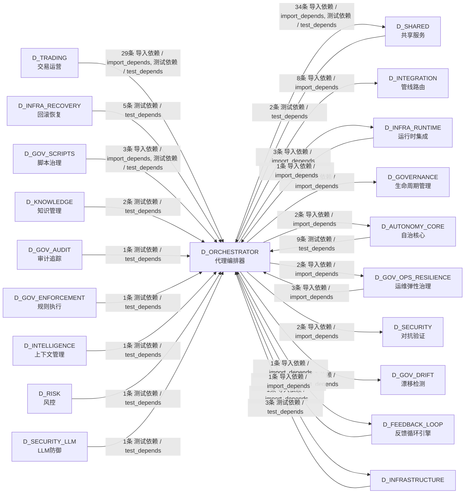

# 22_d_orchestrator / agent_orchestrator / 代理编排器 / Agent Orchestrator

> **功能简介 / Overview**: 代理编排器，负责 Agent 任务全生命周期：任务入队、调度、沙箱执行、幻觉检测和收尾归档

> **文档作用 / Purpose**: 展示 代理编排器（D_ORCHESTRATOR）功能域的模块清单、域内依赖关系、跨域依赖关系、架构分层视图，供架构审查和域治理参考。

> 本文档由 generate_domain_doc.py 从 depgraph (PostgreSQL) 自动生成
> 最后更新: 2026-07-17 03:13:58
> 数据源: depgraph (PostgreSQL) nodes表 + edges表

## 域基本信息 / Domain Overview

| 字段 | 值 | Field | Value |
|------|------|-------|-------|
| 编号 | 22 | Number | 22 |
| 域ID | D_ORCHESTRATOR | Domain ID | D_ORCHESTRATOR |
| 域名称 | 代理编排器 | Domain Name | Agent Orchestrator |
| 层级 | L1 基础平台层 | Layer | L1 Foundation |
| 模块数 | 82 | Module Count | 82 |
| 域内依赖 | 29 | Internal Dependencies | 29 |
| 跨域入边 | 63 | Cross-domain Incoming | 63 |
| 跨域出边 | 57 | Cross-domain Outgoing | 57 |
| 设计态模块 | 0 | Design Modules | 0 |
| 原型态模块 | 23 | Prototype Modules | 23 |
| 生产态模块 | 59 | Production Modules | 59 |
| 容量 | 59/150 (正常) | Capacity | 59/150 (正常) |
| 描述 | Agent全生命周期编排 | Description | Agent全生命周期编排 |

## 模块分层清单 / Module Layered List

> 按 architecture_layer 分组的模块清单（共 82 个模块 / 82 modules）。

### L1 基础层 / Foundation Layer (73 modules)

| # | 模块路径 / Module Path | 模块名称 / Module Name (功能简介 / Description) | 成熟度 / Maturity | 蓝图 / Blueprint |
|:--:|---------|---------|:---:|:---:|
| 1 | src/zephyr/orchestrator/__init__.py | __init__.py | 生产态 / production | [MOD-INF-039](../../03_modules/_cross_layer/agent_orchestrator/blueprint.md) |
| 2 | src/zephyr/orchestrator/agent_health_monitor.py | AgentHealthMonitor · Agent 健康监控（三态 + 5 ... | 生产态 / production | [MOD-INF-039](../../03_modules/_cross_layer/agent_orchestrator/blueprint.md) |
| 3 | src/zephyr/orchestrator/agent_orchestrator.py | AgentOrchestrator · 多角色 Agent 路由、工具链... | 生产态 / production | [MOD-INF-039](../../03_modules/_cross_layer/agent_orchestrator/blueprint.md) |
| 4 | src/zephyr/orchestrator/contracts/__init__.py | contracts — orchestrator contracts subpackage. | 原型态 / prototype | [MOD-INF-039](../../03_modules/_cross_layer/agent_orchestrator/blueprint.md) |
| 5 | src/zephyr/orchestrator/contracts/alert_handler.py | Orc 告警接收器 — handle_alert() 消费者 | 原型态 / prototype | [MOD-FEEDBACK_LOOP](../../03_modules/_cross_layer/feedback_loop/blueprint.md) |
| 6 | src/zephyr/orchestrator/contracts/construction_guide.py | 施工指南引擎（Construction Guide） | 生产态 / production | [MOD-INF-039](../../03_modules/_cross_layer/agent_orchestrator/blueprint.md) |
| 7 | src/zephyr/orchestrator/contracts/contract_registry.py | 集成契约注册表（Contract Registry） | 生产态 / production | [MOD-INF-039](../../03_modules/_cross_layer/agent_orchestrator/blueprint.md) |
| 8 | src/zephyr/orchestrator/contracts/contract_router.py | 契约路由（Contract Router） | 生产态 / production | [MOD-INF-039](../../03_modules/_cross_layer/agent_orchestrator/blueprint.md) |
| 9 | src/zephyr/orchestrator/contracts/design_decisions.py | design_decisions.py | 生产态 / production | [MOD-INF-039](../../03_modules/_cross_layer/agent_orchestrator/blueprint.md) |
| 10 | src/zephyr/orchestrator/contracts/finding_bridge.py | CT-ORC-SCRIPT-001 运行时桥接 | 生产态 / production | [MOD-INF-039](../../03_modules/_cross_layer/agent_orchestrator/blueprint.md) |
| 11 | src/zephyr/orchestrator/contracts/prompt_version.py | AI Prompt 版本控制（CT-PROMPT-VERSION）——prom... | 生产态 / production | [MOD-INF-039](../../03_modules/_cross_layer/agent_orchestrator/blueprint.md) |
| 12 | src/zephyr/orchestrator/core/__init__.py | orchestrator.core — auto-generated package init. | 原型态 / prototype | [MOD-INF-002](../../03_modules/_domain_infrastructure_runtime/runtime_integration/blueprint.md) |
| 13 | src/zephyr/orchestrator/core/task_queue.py | ActiveTaskQueue — 后台任务轮询与自动分发 | 原型态 / prototype | [MOD-INF-002](../../03_modules/_domain_infrastructure_runtime/runtime_integration/blueprint.md) |
| 14 | src/zephyr/orchestrator/deferred_queue.py | DeferredQueue: WAITING -> READY task scheduler. | 生产态 / production | [MOD-INF-039](../../03_modules/_cross_layer/agent_orchestrator/blueprint.md) |
| 15 | src/zephyr/orchestrator/execution/__init__.py | execution — orchestrator execution subpackage. | 原型态 / prototype | [MOD-INF-039](../../03_modules/_cross_layer/agent_orchestrator/blueprint.md) |
| 16 | src/zephyr/orchestrator/execution/batch_orchestrator.py | BatchOrchestrator — 多 Worker 批量任务协调器（... | 生产态 / production | [MOD-INF-039](../../03_modules/_cross_layer/agent_orchestrator/blueprint.md) |
| 17 | src/zephyr/orchestrator/execution/context_bridge.py | Orc->CE 上下文桥接 — request_context() 生产者 | 原型态 / prototype | [MOD-INF-039](../../03_modules/_cross_layer/agent_orchestrator/blueprint.md) |
| 18 | src/zephyr/orchestrator/execution/data_lifecycle.py | data_lifecycle.py | 生产态 / production | [MOD-INF-039](../../03_modules/_cross_layer/agent_orchestrator/blueprint.md) |
| 19 | src/zephyr/orchestrator/execution/dispatch_table.py | AI Agent 冷启动分派表（Dispatch Table） | 生产态 / production | [MOD-INF-039](../../03_modules/_cross_layer/agent_orchestrator/blueprint.md) |
| 20 | src/zephyr/orchestrator/execution/dlq_manager.py | DLQ 管理器（Dead Letter Queue Manager — CT-DLQ... | 生产态 / production | [MOD-INF-039](../../03_modules/_cross_layer/agent_orchestrator/blueprint.md) |
| 21 | src/zephyr/orchestrator/execution/memory_writer.py | Orc->VMS 记忆写入器 | 原型态 / prototype | [MOD-INF-039](../../03_modules/_cross_layer/agent_orchestrator/blueprint.md) |
| 22 | src/zephyr/orchestrator/execution/phase_executor.py | Phase 执行引擎（Phase Executor） | 生产态 / production | [MOD-INF-039](../../03_modules/_cross_layer/agent_orchestrator/blueprint.md) |
| 23 | src/zephyr/orchestrator/execution/reconciliation_loop.py | reconciliation_loop.py | 生产态 / production | [MOD-INF-039](../../03_modules/_cross_layer/agent_orchestrator/blueprint.md) |
| 24 | src/zephyr/orchestrator/execution/script_runner.py | Orc->Script 脚本执行器 — run_audit() 生产者 | 原型态 / prototype | [MOD-INF-039](../../03_modules/_cross_layer/agent_orchestrator/blueprint.md) |
| 25 | src/zephyr/orchestrator/execution/task_context_builder.py | CE 任务上下文构建器 — build_from_task() 消费者 | 原型态 / prototype | [MOD-INF-039](../../03_modules/_cross_layer/agent_orchestrator/blueprint.md) |
| 26 | src/zephyr/orchestrator/execution/trigger_router.py | TriggerRouter — RI-03 触发路由器（M3 跨模块触... | 生产态 / production | [MOD-INF-039](../../03_modules/_cross_layer/agent_orchestrator/blueprint.md) |
| 27 | src/zephyr/orchestrator/execution/wave_generator.py | WaveGenerator — 根据 Task 依赖图生成执行 Wave... | 生产态 / production | [MOD-INF-039](../../03_modules/_cross_layer/agent_orchestrator/blueprint.md) |
| 28 | src/zephyr/orchestrator/failure_matcher.py | FailurePatternMatcher — 任务失败模式识别与纠正建议 | 生产态 / production | [MOD-INF-039](../../03_modules/_cross_layer/agent_orchestrator/blueprint.md) |
| 29 | src/zephyr/orchestrator/fault_tolerance/__init__.py | fault_tolerance — orchestrator fault_tolerance... | 原型态 / prototype | [MOD-INF-039](../../03_modules/_cross_layer/agent_orchestrator/blueprint.md) |
| 30 | src/zephyr/orchestrator/fault_tolerance/bulkhead_manager.py | bulkhead_manager.py | 生产态 / production | [MOD-INF-039](../../03_modules/_cross_layer/agent_orchestrator/blueprint.md) |
| 31 | src/zephyr/orchestrator/fault_tolerance/canary_manager.py | 金丝雀发布管理器（CT-CANARY）——权重分流+指标... | 生产态 / production | [MOD-INF-039](../../03_modules/_cross_layer/agent_orchestrator/blueprint.md) |
| 32 | src/zephyr/orchestrator/fault_tolerance/chaos_engine.py | Chaos 故障注入引擎（CT-CHAOS-001）——4注入点×... | 生产态 / production | [MOD-INF-039](../../03_modules/_cross_layer/agent_orchestrator/blueprint.md) |
| 33 | src/zephyr/orchestrator/fault_tolerance/chaos_hooks.py | ChaosHook — integrates ChaosEngine with the or... | 生产态 / production | [MOD-INF-039](../../03_modules/_cross_layer/agent_orchestrator/blueprint.md) |
| 34 | src/zephyr/orchestrator/fault_tolerance/degrade_cascade.py | degrade_cascade.py | 生产态 / production | [MOD-INF-039](../../03_modules/_cross_layer/agent_orchestrator/blueprint.md) |
| 35 | src/zephyr/orchestrator/fault_tolerance/disk_guard.py | disk_guard.py | 生产态 / production | [MOD-INF-039](../../03_modules/_cross_layer/agent_orchestrator/blueprint.md) |
| 36 | src/zephyr/orchestrator/fault_tolerance/fault_types.py | Fault type registry and preset templates for ch... | 生产态 / production | [MOD-INF-039](../../03_modules/_cross_layer/agent_orchestrator/blueprint.md) |
| 37 | src/zephyr/orchestrator/fault_tolerance/network_partition.py | 网络分区容忍（CT-NETWORK-PARTITION）——CAP定理... | 生产态 / production | [MOD-INF-039](../../03_modules/_cross_layer/agent_orchestrator/blueprint.md) |
| 38 | src/zephyr/orchestrator/file_task_mapper.py | FileTaskMapper — 文件路径 ↔ Task N:N 映射器（... | 生产态 / production | [MOD-INF-039](../../03_modules/_cross_layer/agent_orchestrator/blueprint.md) |
| 39 | src/zephyr/orchestrator/governance/__init__.py | governance — orchestrator governance subpackage. | 原型态 / prototype | [MOD-INF-039](../../03_modules/_cross_layer/agent_orchestrator/blueprint.md) |
| 40 | src/zephyr/orchestrator/governance/autonomy_guard.py | Owner 缺位分级自治（CT-AUTONOMY）——Owner离线-... | 生产态 / production | [MOD-INF-039](../../03_modules/_cross_layer/agent_orchestrator/blueprint.md) |
| 41 | src/zephyr/orchestrator/governance/capacity_budget.py | 全局容量预算控制器（Capacity Budget Controller） | 生产态 / production | [MOD-INF-039](../../03_modules/_cross_layer/agent_orchestrator/blueprint.md) |
| 42 | src/zephyr/orchestrator/governance/dependency_lock.py | 外部依赖版本锁（CT-DEPS）——Python包版本锁定+h... | 生产态 / production | [MOD-INF-039](../../03_modules/_cross_layer/agent_orchestrator/blueprint.md) |
| 43 | src/zephyr/orchestrator/governance/feature_flag.py | FeatureFlag 管理器（CT-FEATUREFLAG-001）——CT-... | 生产态 / production | [MOD-INF-039](../../03_modules/_cross_layer/agent_orchestrator/blueprint.md) |
| 44 | src/zephyr/orchestrator/governance/model_registry.py | model_registry.py | 生产态 / production | [MOD-INF-039](../../03_modules/_cross_layer/agent_orchestrator/blueprint.md) |
| 45 | src/zephyr/orchestrator/governance/path_index.py | path_index.py | 生产态 / production | [MOD-INF-039](../../03_modules/_cross_layer/agent_orchestrator/blueprint.md) |
| 46 | src/zephyr/orchestrator/governance/risk_registry.py | risk_registry.py | 生产态 / production | [MOD-INF-039](../../03_modules/_cross_layer/agent_orchestrator/blueprint.md) |
| 47 | src/zephyr/orchestrator/governance/schema_migration.py | 数据库 Schema 演化契约（CT-SCHEMA-MIGRATE）——... | 生产态 / production | [MOD-INF-039](../../03_modules/_cross_layer/agent_orchestrator/blueprint.md) |
| 48 | src/zephyr/orchestrator/governance/version_manifest.py | version_manifest.py | 生产态 / production | [MOD-INF-039](../../03_modules/_cross_layer/agent_orchestrator/blueprint.md) |
| 49 | src/zephyr/orchestrator/hallucination_detector.py | HallucinationDetector · Chain-of-Verification... | 生产态 / production | [MOD-INF-039](../../03_modules/_cross_layer/agent_orchestrator/blueprint.md) |
| 50 | src/zephyr/orchestrator/lifecycle/__init__.py | lifecycle — orchestrator lifecycle subpackage. | 原型态 / prototype | [MOD-INF-039](../../03_modules/_cross_layer/agent_orchestrator/blueprint.md) |
| 51 | src/zephyr/orchestrator/lifecycle/housekeeping.py | 文件卫生保洁管理器（CT-HOUSEKEEPING）——临时文... | 生产态 / production | [MOD-INF-039](../../03_modules/_cross_layer/agent_orchestrator/blueprint.md) |
| 52 | src/zephyr/orchestrator/lifecycle/incident_postmortem.py | 事件复盘管理器（CT-INCIDENT）——incident记录+t... | 生产态 / production | [MOD-INF-039](../../03_modules/_cross_layer/agent_orchestrator/blueprint.md) |
| 53 | src/zephyr/orchestrator/lifecycle/rolling_upgrade.py | 零停机滚动升级（CT-DEPLOY）——graceful shutdow... | 生产态 / production | [MOD-INF-039](../../03_modules/_cross_layer/agent_orchestrator/blueprint.md) |
| 54 | src/zephyr/orchestrator/lifecycle/session_conflict.py | Session 冲突预防契约（CT-SESSION-CONFLICT）——... | 生产态 / production | [MOD-INF-039](../../03_modules/_cross_layer/agent_orchestrator/blueprint.md) |
| 55 | src/zephyr/orchestrator/lifecycle/session_manager.py | SessionManager — AI Agent 会话生命周期管理（CT... | 生产态 / production | [MOD-INF-039](../../03_modules/_cross_layer/agent_orchestrator/blueprint.md) |
| 56 | src/zephyr/orchestrator/lifecycle/startup_sequencer.py | startup_sequencer.py | 生产态 / production | [MOD-INF-039](../../03_modules/_cross_layer/agent_orchestrator/blueprint.md) |
| 57 | src/zephyr/orchestrator/lifecycle/state_propagation.py | 全局状态传播链（State Propagation Chain） | 生产态 / production | [MOD-INF-039](../../03_modules/_cross_layer/agent_orchestrator/blueprint.md) |
| 58 | src/zephyr/orchestrator/lifecycle/state_synchronizer.py | StateSynchronizer — 同步 SQLite 状态与文件系统... | 生产态 / production | [MOD-INF-039](../../03_modules/_cross_layer/agent_orchestrator/blueprint.md) |
| 59 | src/zephyr/orchestrator/lifecycle/system_transfer.py | 系统移交恢复（CT-TRANSFER）——系统Owner变更+配... | 生产态 / production | [MOD-INF-039](../../03_modules/_cross_layer/agent_orchestrator/blueprint.md) |
| 60 | src/zephyr/orchestrator/lifecycle/teardown_manager.py | teardown_manager.py | 生产态 / production | [MOD-INF-039](../../03_modules/_cross_layer/agent_orchestrator/blueprint.md) |
| 61 | src/zephyr/orchestrator/quality/__init__.py | quality — orchestrator quality subpackage. | 原型态 / prototype | [MOD-INF-039](../../03_modules/_cross_layer/agent_orchestrator/blueprint.md) |
| 62 | src/zephyr/orchestrator/quality/agent_quality.py | AI Agent 质量反馈闭环（CT-AGENT-QUALITY）——ta... | 生产态 / production | [MOD-INF-039](../../03_modules/_cross_layer/agent_orchestrator/blueprint.md) |
| 63 | src/zephyr/orchestrator/quality/benchmark_runner.py | benchmark_runner.py | 生产态 / production | [MOD-INF-039](../../03_modules/_cross_layer/agent_orchestrator/blueprint.md) |
| 64 | src/zephyr/orchestrator/quality/blind_spot_closure.py | blind_spot_closure.py | 生产态 / production | [MOD-INF-039](../../03_modules/_cross_layer/agent_orchestrator/blueprint.md) |
| 65 | src/zephyr/orchestrator/quality/blueprint_scorer.py | BlueprintScorer — 蓝图路由统一打分逻辑 | 生产态 / production | [MOD-INF-039](../../03_modules/_cross_layer/agent_orchestrator/blueprint.md) |
| 66 | src/zephyr/orchestrator/quality/ke_quality.py | 知识质量评分契约（CT-KE-QUALITY）——KE完整性+... | 生产态 / production | [MOD-INF-039](../../03_modules/_cross_layer/agent_orchestrator/blueprint.md) |
| 67 | src/zephyr/orchestrator/quality/knowledge_freshness.py | 知识新鲜度废止管理器（CT-KNOWLEDGE-FRESHNESS）... | 生产态 / production | [MOD-INF-039](../../03_modules/_cross_layer/agent_orchestrator/blueprint.md) |
| 68 | src/zephyr/orchestrator/quality/lean_scanner.py | 死代码/孤儿文件/僵尸引用三扫描（CT-LEAN）——三... | 生产态 / production | [MOD-INF-039](../../03_modules/_cross_layer/agent_orchestrator/blueprint.md) |
| 69 | src/zephyr/orchestrator/quality/stability_guard.py | API 稳定性守护（CT-STABILITY）——public API签... | 生产态 / production | [MOD-INF-039](../../03_modules/_cross_layer/agent_orchestrator/blueprint.md) |
| 70 | src/zephyr/orchestrator/resilience/__init__.py | orchestrator.resilience — auto-generated packa... | 原型态 / prototype | [MOD-INF-039](../../03_modules/_cross_layer/agent_orchestrator/blueprint.md) |
| 71 | src/zephyr/orchestrator/resilience/failure_matcher.py | FailurePatternMatcher — 任务失败模式识别与纠正建议 | 生产态 / production | [MOD-INF-039](../../03_modules/_cross_layer/agent_orchestrator/blueprint.md) |
| 72 | src/zephyr/orchestrator/rollback_manager.py | RollbackManager — 仅调试用途的 DB-state 快照，... | 生产态 / production | [MOD-INF-039](../../03_modules/_cross_layer/agent_orchestrator/blueprint.md) |
| 73 | src/zephyr/orchestrator/task_queue.py | ActiveTaskQueue — 后台任务轮询与自动分发 | 生产态 / production | [MOD-INF-039](../../03_modules/_cross_layer/agent_orchestrator/blueprint.md) |

### L2 领域层 / Domain Layer (9 modules)

| # | 模块路径 / Module Path | 模块名称 / Module Name (功能简介 / Description) | 成熟度 / Maturity | 蓝图 / Blueprint |
|:--:|---------|---------|:---:|:---:|
| 1 | tests/orchestrator/test_deferred_queue.py | test_deferred_queue.py | 原型态 / prototype | [MOD-INF-039](../../03_modules/_cross_layer/agent_orchestrator/blueprint.md) |
| 2 | tests/orchestrator/test_orchestrator_data_lifecycle.py | test_orchestrator_data_lifecycle.py | 原型态 / prototype | [MOD-INF-039](../../03_modules/_cross_layer/agent_orchestrator/blueprint.md) |
| 3 | tests/orchestrator/test_orchestrator_failure_matcher.py | test_orchestrator_failure_matcher.py | 原型态 / prototype | [MOD-INF-039](../../03_modules/_cross_layer/agent_orchestrator/blueprint.md) |
| 4 | tests/orchestrator/test_orchestrator_hallucination_detect... | test_orchestrator_hallucination_detector.py | 原型态 / prototype | [MOD-INF-039](../../03_modules/_cross_layer/agent_orchestrator/blueprint.md) |
| 5 | tests/orchestrator/test_orchestrator_model_registry.py | test_orchestrator_model_registry.py | 原型态 / prototype | [MOD-INF-039](../../03_modules/_cross_layer/agent_orchestrator/blueprint.md) |
| 6 | tests/orchestrator/test_orchestrator_rollback_manager.py | test_orchestrator_rollback_manager.py | 原型态 / prototype | [MOD-INF-039](../../03_modules/_cross_layer/agent_orchestrator/blueprint.md) |
| 7 | tests/orchestrator/test_orchestrator_task_queue.py | test_orchestrator_task_queue.py | 原型态 / prototype | [MOD-INF-039](../../03_modules/_cross_layer/agent_orchestrator/blueprint.md) |
| 8 | tests/orchestrator/test_orchestrator_trigger_router.py | test_orchestrator_trigger_router.py | 原型态 / prototype | [MOD-INF-039](../../03_modules/_cross_layer/agent_orchestrator/blueprint.md) |
| 9 | tests/orchestrator/test_orchestrator_wave_generator.py | test_orchestrator_wave_generator.py | 原型态 / prototype | [MOD-INF-039](../../03_modules/_cross_layer/agent_orchestrator/blueprint.md) |

## 域内依赖图 / Internal Dependency Diagram

> 依赖图内嵌在本文档中，IDE 可直接渲染显示。参考 decision_index.md 设计，分四个视图：合并全景图、运营态子图、设计态子图、原型态子图（按 design_maturity 实际值拆分）。
>
> **图例说明 / Legend**：
> - **实线边框 = 运营态模块**（production，已上线运行）
> - **虚线边框 = 设计态模块**（design，蓝图阶段，代码未写）
> - **虚线边框 = 原型态模块**（prototype，代码已写，验证中未稳定上线）
> - **实线箭头 = 运营态依赖**（已生效的依赖关系）
> - **虚线箭头 = 非运营态依赖**（计划中/验证中的依赖关系）

### 合并全景图（全部模块，标签标注成熟度）

> 展示全部 82 个模块（生产态 59 + 设计态 0 + 原型态 23），标签标注成熟度。

#### 第 1 页 / 共 3 页

```mermaid
graph TD
    subgraph D_ORCHESTRATOR["D_ORCHESTRATOR 代理编排器"]
        src_zephyr_orchestrator_init_py["(生产态 / production) __init__.py"]
        src_zephyr_orchestrator_agent_health_monitor_py["(生产态 / production) AgentHealthMonitor · Agent 健康监控（三态 + 5 ...<br/>文件: agent_health_monitor.py"]
        src_zephyr_orchestrator_agent_orchestrator_py["(生产态 / production) AgentOrchestrator · 多角色 Agent 路由、工具链...<br/>文件: agent_orchestrator.py"]
        src_zephyr_orchestrator_contracts_init_py["(原型态 / prototype) contracts — orchestrator contracts subpackage.<br/>文件: __init__.py"]
        src_zephyr_orchestrator_contracts_alert_handler_py["(原型态 / prototype) Orc 告警接收器 — handle_alert() 消费者<br/>文件: alert_handler.py"]
        src_zephyr_orchestrator_contracts_construction_guide_py["(生产态 / production) 施工指南引擎（Construction Guide）<br/>文件: construction_guide.py"]
        src_zephyr_orchestrator_contracts_contract_registry_py["(生产态 / production) 集成契约注册表（Contract Registry）<br/>文件: contract_registry.py"]
        src_zephyr_orchestrator_contracts_contract_router_py["(生产态 / production) 契约路由（Contract Router）<br/>文件: contract_router.py"]
        src_zephyr_orchestrator_contracts_design_decisions_py["(生产态 / production) design_decisions.py"]
        src_zephyr_orchestrator_contracts_finding_bridge_py["(生产态 / production) CT-ORC-SCRIPT-001 运行时桥接<br/>文件: finding_bridge.py"]
        src_zephyr_orchestrator_contracts_prompt_version_py["(生产态 / production) AI Prompt 版本控制（CT-PROMPT-VERSION）——prom...<br/>文件: prompt_version.py"]
        src_zephyr_orchestrator_core_init_py["(原型态 / prototype) orchestrator.core — auto-generated package init.<br/>文件: __init__.py"]
        src_zephyr_orchestrator_core_task_queue_py["(原型态 / prototype) ActiveTaskQueue — 后台任务轮询与自动分发<br/>文件: task_queue.py"]
        src_zephyr_orchestrator_deferred_queue_py["(生产态 / production) DeferredQueue: WAITING -> READY task scheduler.<br/>文件: deferred_queue.py"]
        src_zephyr_orchestrator_execution_init_py["(原型态 / prototype) execution — orchestrator execution subpackage.<br/>文件: __init__.py"]
        src_zephyr_orchestrator_execution_batch_orchestrator_py["(生产态 / production) BatchOrchestrator — 多 Worker 批量任务协调器（...<br/>文件: batch_orchestrator.py"]
        src_zephyr_orchestrator_execution_context_bridge_py["(原型态 / prototype) Orc->CE 上下文桥接 — request_context() 生产者<br/>文件: context_bridge.py"]
        src_zephyr_orchestrator_execution_data_lifecycle_py["(生产态 / production) data_lifecycle.py"]
        src_zephyr_orchestrator_execution_dispatch_table_py["(生产态 / production) AI Agent 冷启动分派表（Dispatch Table）<br/>文件: dispatch_table.py"]
        src_zephyr_orchestrator_execution_dlq_manager_py["(生产态 / production) DLQ 管理器（Dead Letter Queue Manager — CT-DLQ...<br/>文件: dlq_manager.py"]
        src_zephyr_orchestrator_execution_memory_writer_py["(原型态 / prototype) Orc->VMS 记忆写入器<br/>文件: memory_writer.py"]
        src_zephyr_orchestrator_execution_phase_executor_py["(生产态 / production) Phase 执行引擎（Phase Executor）<br/>文件: phase_executor.py"]
        src_zephyr_orchestrator_execution_reconciliation_loop_py["(生产态 / production) reconciliation_loop.py"]
        src_zephyr_orchestrator_execution_script_runner_py["(原型态 / prototype) Orc->Script 脚本执行器 — run_audit() 生产者<br/>文件: script_runner.py"]
        src_zephyr_orchestrator_execution_task_context_builder_py["(原型态 / prototype) CE 任务上下文构建器 — build_from_task() 消费者<br/>文件: task_context_builder.py"]
        src_zephyr_orchestrator_execution_trigger_router_py["(生产态 / production) TriggerRouter — RI-03 触发路由器（M3 跨模块触...<br/>文件: trigger_router.py"]
        src_zephyr_orchestrator_execution_wave_generator_py["(生产态 / production) WaveGenerator — 根据 Task 依赖图生成执行 Wave...<br/>文件: wave_generator.py"]
        src_zephyr_orchestrator_failure_matcher_py["(生产态 / production) FailurePatternMatcher — 任务失败模式识别与纠正建议<br/>文件: failure_matcher.py"]
        src_zephyr_orchestrator_fault_tolerance_init_py["(原型态 / prototype) fault_tolerance — orchestrator fault_tolerance...<br/>文件: __init__.py"]
        src_zephyr_orchestrator_fault_tolerance_bulkhead_manager_py["(生产态 / production) bulkhead_manager.py"]
    end
    src_zephyr_orchestrator_agent_health_monitor_py -->|导入依赖 / import_depends| src_zephyr_orchestrator_agent_orchestrator_py
    src_zephyr_orchestrator_init_py -.->|导入依赖 / import_depends| src_zephyr_orchestrator_contracts_alert_handler_py
    src_zephyr_orchestrator_init_py -.->|导入依赖 / import_depends| src_zephyr_orchestrator_execution_context_bridge_py
    src_zephyr_orchestrator_init_py -.->|导入依赖 / import_depends| src_zephyr_orchestrator_execution_memory_writer_py
    src_zephyr_orchestrator_init_py -.->|导入依赖 / import_depends| src_zephyr_orchestrator_execution_script_runner_py
    src_zephyr_orchestrator_contracts_contract_router_py -->|导入依赖 / import_depends| src_zephyr_orchestrator_contracts_contract_registry_py
    src_zephyr_orchestrator_contracts_init_py -.->|config_depends / config_depends| src_zephyr_orchestrator_contracts_construction_guide_py
    src_zephyr_orchestrator_core_init_py -.->|config_depends / config_depends| src_zephyr_orchestrator_core_task_queue_py
    src_zephyr_orchestrator_execution_context_bridge_py -.->|导入依赖 / import_depends| src_zephyr_orchestrator_execution_task_context_builder_py
    src_zephyr_orchestrator_execution_init_py -.->|config_depends / config_depends| src_zephyr_orchestrator_execution_batch_orchestrator_py
    src_zephyr_orchestrator_fault_tolerance_init_py -.->|config_depends / config_depends| src_zephyr_orchestrator_fault_tolerance_bulkhead_manager_py
    D_INTEGRATION["(生产态 / production) D_INTEGRATION"]
    src_zephyr_orchestrator_agent_health_monitor_py -->|导入依赖 / import_depends| D_INTEGRATION
    D_SHARED["(生产态 / production) D_SHARED"]
    src_zephyr_orchestrator_agent_health_monitor_py -->|导入依赖 / import_depends| D_SHARED
    src_zephyr_orchestrator_deferred_queue_py -.->|导入依赖 / import_depends| D_SHARED
    src_zephyr_orchestrator_deferred_queue_py -->|导入依赖 / import_depends| D_SHARED
    D_GOV_OPS_RESILIENCE["(生产态 / production) D_GOV_OPS_RESILIENCE"]
    src_zephyr_orchestrator_failure_matcher_py -->|导入依赖 / import_depends| D_GOV_OPS_RESILIENCE
    src_zephyr_orchestrator_agent_orchestrator_py -->|导入依赖 / import_depends| D_SHARED
    src_zephyr_orchestrator_agent_orchestrator_py -->|导入依赖 / import_depends| D_SHARED
    src_zephyr_orchestrator_agent_orchestrator_py -.->|导入依赖 / import_depends| D_SHARED
    src_zephyr_orchestrator_agent_orchestrator_py -->|导入依赖 / import_depends| D_INTEGRATION
    src_zephyr_orchestrator_agent_orchestrator_py -->|导入依赖 / import_depends| D_SHARED
    D_SECURITY["(生产态 / production) D_SECURITY"]
    src_zephyr_orchestrator_agent_orchestrator_py -->|导入依赖 / import_depends| D_SECURITY
    D_INFRA_RUNTIME["(生产态 / production) D_INFRA_RUNTIME"]
    src_zephyr_orchestrator_agent_orchestrator_py -->|导入依赖 / import_depends| D_INFRA_RUNTIME
    D_INFRASTRUCTURE["(原型态 / prototype) D_INFRASTRUCTURE"]
    src_zephyr_orchestrator_agent_orchestrator_py -.->|导入依赖 / import_depends| D_INFRASTRUCTURE
    src_zephyr_orchestrator_agent_orchestrator_py -->|导入依赖 / import_depends| D_SECURITY
    src_zephyr_orchestrator_contracts_alert_handler_py -.->|导入依赖 / import_depends| D_SHARED
    D_FEEDBACK_LOOP["(原型态 / prototype) D_FEEDBACK_LOOP"]
    D_FEEDBACK_LOOP -.->|导入依赖 / import_depends| src_zephyr_orchestrator_contracts_alert_handler_py
    D_GOV_OPS_RESILIENCE -->|导入依赖 / import_depends| src_zephyr_orchestrator_contracts_contract_registry_py
    D_GOV_OPS_RESILIENCE -->|导入依赖 / import_depends| src_zephyr_orchestrator_execution_batch_orchestrator_py
    D_TRADING["(原型态 / prototype) D_TRADING"]
    D_TRADING -.->|导入依赖 / import_depends| src_zephyr_orchestrator_core_task_queue_py
    D_TRADING -.->|导入依赖 / import_depends| src_zephyr_orchestrator_execution_context_bridge_py
    D_TRADING -.->|导入依赖 / import_depends| src_zephyr_orchestrator_execution_script_runner_py
    D_INFRA_RUNTIME -.->|导入依赖 / import_depends| src_zephyr_orchestrator_execution_memory_writer_py
    D_GOV_SCRIPTS["(原型态 / prototype) D_GOV_SCRIPTS"]
    D_GOV_SCRIPTS -.->|导入依赖 / import_depends| src_zephyr_orchestrator_contracts_contract_registry_py
    D_AUTONOMY_CORE["(原型态 / prototype) D_AUTONOMY_CORE"]
    D_AUTONOMY_CORE -.->|测试依赖 / test_depends| src_zephyr_orchestrator_agent_health_monitor_py
    D_AUTONOMY_CORE -.->|测试依赖 / test_depends| src_zephyr_orchestrator_agent_orchestrator_py
    D_AUTONOMY_CORE -.->|测试依赖 / test_depends| src_zephyr_orchestrator_agent_orchestrator_py
    D_AUTONOMY_CORE -.->|测试依赖 / test_depends| src_zephyr_orchestrator_execution_dispatch_table_py
    D_INFRASTRUCTURE -.->|测试依赖 / test_depends| src_zephyr_orchestrator_contracts_contract_registry_py
    D_INFRASTRUCTURE -.->|测试依赖 / test_depends| src_zephyr_orchestrator_contracts_contract_registry_py
    D_INFRASTRUCTURE -.->|测试依赖 / test_depends| src_zephyr_orchestrator_contracts_contract_router_py
    classDef production fill:#e1f5fe,stroke:#01579b,stroke-width:2px,color:#000
    classDef design fill:#fff3e0,stroke:#e65100,stroke-width:2px,color:#000,stroke-dasharray: 5 5
    classDef external_prod fill:#e8f5e9,stroke:#1b5e20,stroke-width:1px,color:#000
    classDef external_design fill:#fce4ec,stroke:#880e4f,stroke-width:1px,color:#000,stroke-dasharray: 5 5
    class src_zephyr_orchestrator_init_py,src_zephyr_orchestrator_agent_health_monitor_py,src_zephyr_orchestrator_agent_orchestrator_py,src_zephyr_orchestrator_contracts_construction_guide_py,src_zephyr_orchestrator_contracts_contract_registry_py,src_zephyr_orchestrator_contracts_contract_router_py,src_zephyr_orchestrator_contracts_design_decisions_py,src_zephyr_orchestrator_contracts_finding_bridge_py,src_zephyr_orchestrator_contracts_prompt_version_py,src_zephyr_orchestrator_deferred_queue_py,src_zephyr_orchestrator_execution_batch_orchestrator_py,src_zephyr_orchestrator_execution_data_lifecycle_py,src_zephyr_orchestrator_execution_dispatch_table_py,src_zephyr_orchestrator_execution_dlq_manager_py,src_zephyr_orchestrator_execution_phase_executor_py,src_zephyr_orchestrator_execution_reconciliation_loop_py,src_zephyr_orchestrator_execution_trigger_router_py,src_zephyr_orchestrator_execution_wave_generator_py,src_zephyr_orchestrator_failure_matcher_py,src_zephyr_orchestrator_fault_tolerance_bulkhead_manager_py production
    class src_zephyr_orchestrator_contracts_init_py,src_zephyr_orchestrator_contracts_alert_handler_py,src_zephyr_orchestrator_core_init_py,src_zephyr_orchestrator_core_task_queue_py,src_zephyr_orchestrator_execution_init_py,src_zephyr_orchestrator_execution_context_bridge_py,src_zephyr_orchestrator_execution_memory_writer_py,src_zephyr_orchestrator_execution_script_runner_py,src_zephyr_orchestrator_execution_task_context_builder_py,src_zephyr_orchestrator_fault_tolerance_init_py design
    class D_INTEGRATION,D_SHARED,D_GOV_OPS_RESILIENCE,D_SECURITY,D_INFRA_RUNTIME external_prod
    class D_INFRASTRUCTURE,D_FEEDBACK_LOOP,D_TRADING,D_GOV_SCRIPTS,D_AUTONOMY_CORE external_design
```

#### 第 2 页 / 共 3 页

```mermaid
graph TD
    subgraph D_ORCHESTRATOR["D_ORCHESTRATOR 代理编排器"]
        src_zephyr_orchestrator_fault_tolerance_canary_manager_py["(生产态 / production) 金丝雀发布管理器（CT-CANARY）——权重分流+指标...<br/>文件: canary_manager.py"]
        src_zephyr_orchestrator_fault_tolerance_chaos_engine_py["(生产态 / production) Chaos 故障注入引擎（CT-CHAOS-001）——4注入点×...<br/>文件: chaos_engine.py"]
        src_zephyr_orchestrator_fault_tolerance_chaos_hooks_py["(生产态 / production) ChaosHook — integrates ChaosEngine with the or...<br/>文件: chaos_hooks.py"]
        src_zephyr_orchestrator_fault_tolerance_degrade_cascade_py["(生产态 / production) degrade_cascade.py"]
        src_zephyr_orchestrator_fault_tolerance_disk_guard_py["(生产态 / production) disk_guard.py"]
        src_zephyr_orchestrator_fault_tolerance_fault_types_py["(生产态 / production) Fault type registry and preset templates for ch...<br/>文件: fault_types.py"]
        src_zephyr_orchestrator_fault_tolerance_network_partition_py["(生产态 / production) 网络分区容忍（CT-NETWORK-PARTITION）——CAP定理...<br/>文件: network_partition.py"]
        src_zephyr_orchestrator_file_task_mapper_py["(生产态 / production) FileTaskMapper — 文件路径 ↔ Task N:N 映射器（...<br/>文件: file_task_mapper.py"]
        src_zephyr_orchestrator_governance_init_py["(原型态 / prototype) governance — orchestrator governance subpackage.<br/>文件: __init__.py"]
        src_zephyr_orchestrator_governance_autonomy_guard_py["(生产态 / production) Owner 缺位分级自治（CT-AUTONOMY）——Owner离线-...<br/>文件: autonomy_guard.py"]
        src_zephyr_orchestrator_governance_capacity_budget_py["(生产态 / production) 全局容量预算控制器（Capacity Budget Controller）<br/>文件: capacity_budget.py"]
        src_zephyr_orchestrator_governance_dependency_lock_py["(生产态 / production) 外部依赖版本锁（CT-DEPS）——Python包版本锁定+h...<br/>文件: dependency_lock.py"]
        src_zephyr_orchestrator_governance_feature_flag_py["(生产态 / production) FeatureFlag 管理器（CT-FEATUREFLAG-001）——CT-...<br/>文件: feature_flag.py"]
        src_zephyr_orchestrator_governance_model_registry_py["(生产态 / production) model_registry.py"]
        src_zephyr_orchestrator_governance_path_index_py["(生产态 / production) path_index.py"]
        src_zephyr_orchestrator_governance_risk_registry_py["(生产态 / production) risk_registry.py"]
        src_zephyr_orchestrator_governance_schema_migration_py["(生产态 / production) 数据库 Schema 演化契约（CT-SCHEMA-MIGRATE）——...<br/>文件: schema_migration.py"]
        src_zephyr_orchestrator_governance_version_manifest_py["(生产态 / production) version_manifest.py"]
        src_zephyr_orchestrator_hallucination_detector_py["(生产态 / production) HallucinationDetector · Chain-of-Verification...<br/>文件: hallucination_detector.py"]
        src_zephyr_orchestrator_lifecycle_init_py["(原型态 / prototype) lifecycle — orchestrator lifecycle subpackage.<br/>文件: __init__.py"]
        src_zephyr_orchestrator_lifecycle_housekeeping_py["(生产态 / production) 文件卫生保洁管理器（CT-HOUSEKEEPING）——临时文...<br/>文件: housekeeping.py"]
        src_zephyr_orchestrator_lifecycle_incident_postmortem_py["(生产态 / production) 事件复盘管理器（CT-INCIDENT）——incident记录+t...<br/>文件: incident_postmortem.py"]
        src_zephyr_orchestrator_lifecycle_rolling_upgrade_py["(生产态 / production) 零停机滚动升级（CT-DEPLOY）——graceful shutdow...<br/>文件: rolling_upgrade.py"]
        src_zephyr_orchestrator_lifecycle_session_conflict_py["(生产态 / production) Session 冲突预防契约（CT-SESSION-CONFLICT）——...<br/>文件: session_conflict.py"]
        src_zephyr_orchestrator_lifecycle_session_manager_py["(生产态 / production) SessionManager — AI Agent 会话生命周期管理（CT...<br/>文件: session_manager.py"]
        src_zephyr_orchestrator_lifecycle_startup_sequencer_py["(生产态 / production) startup_sequencer.py"]
        src_zephyr_orchestrator_lifecycle_state_propagation_py["(生产态 / production) 全局状态传播链（State Propagation Chain）<br/>文件: state_propagation.py"]
        src_zephyr_orchestrator_lifecycle_state_synchronizer_py["(生产态 / production) StateSynchronizer — 同步 SQLite 状态与文件系统...<br/>文件: state_synchronizer.py"]
        src_zephyr_orchestrator_lifecycle_system_transfer_py["(生产态 / production) 系统移交恢复（CT-TRANSFER）——系统Owner变更+配...<br/>文件: system_transfer.py"]
        src_zephyr_orchestrator_lifecycle_teardown_manager_py["(生产态 / production) teardown_manager.py"]
    end
    src_zephyr_orchestrator_fault_tolerance_chaos_hooks_py -->|导入依赖 / import_depends| src_zephyr_orchestrator_fault_tolerance_chaos_engine_py
    src_zephyr_orchestrator_fault_tolerance_chaos_hooks_py -->|导入依赖 / import_depends| src_zephyr_orchestrator_fault_tolerance_fault_types_py
    src_zephyr_orchestrator_governance_init_py -.->|config_depends / config_depends| src_zephyr_orchestrator_governance_dependency_lock_py
    src_zephyr_orchestrator_lifecycle_init_py -.->|config_depends / config_depends| src_zephyr_orchestrator_lifecycle_incident_postmortem_py
    src_zephyr_orchestrator_lifecycle_state_synchronizer_py -->|导入依赖 / import_depends| src_zephyr_orchestrator_file_task_mapper_py
    D_SHARED["(生产态 / production) D_SHARED"]
    src_zephyr_orchestrator_file_task_mapper_py -->|导入依赖 / import_depends| D_SHARED
    src_zephyr_orchestrator_file_task_mapper_py -->|导入依赖 / import_depends| D_SHARED
    src_zephyr_orchestrator_file_task_mapper_py -->|导入依赖 / import_depends| D_SHARED
    src_zephyr_orchestrator_file_task_mapper_py -->|导入依赖 / import_depends| D_SHARED
    src_zephyr_orchestrator_hallucination_detector_py -->|导入依赖 / import_depends| D_SHARED
    D_INTEGRATION["(生产态 / production) D_INTEGRATION"]
    src_zephyr_orchestrator_hallucination_detector_py -->|导入依赖 / import_depends| D_INTEGRATION
    src_zephyr_orchestrator_fault_tolerance_chaos_hooks_py -.->|导入依赖 / import_depends| D_SHARED
    src_zephyr_orchestrator_lifecycle_session_manager_py -->|导入依赖 / import_depends| D_SHARED
    src_zephyr_orchestrator_lifecycle_session_manager_py -->|导入依赖 / import_depends| D_SHARED
    src_zephyr_orchestrator_lifecycle_state_synchronizer_py -->|导入依赖 / import_depends| D_SHARED
    src_zephyr_orchestrator_lifecycle_state_synchronizer_py -->|导入依赖 / import_depends| D_SHARED
    src_zephyr_orchestrator_lifecycle_state_synchronizer_py -->|导入依赖 / import_depends| D_SHARED
    D_GOV_OPS_RESILIENCE["(生产态 / production) D_GOV_OPS_RESILIENCE"]
    D_GOV_OPS_RESILIENCE -->|导入依赖 / import_depends| src_zephyr_orchestrator_fault_tolerance_chaos_engine_py
    D_AUTONOMY_CORE["(原型态 / prototype) D_AUTONOMY_CORE"]
    D_AUTONOMY_CORE -.->|测试依赖 / test_depends| src_zephyr_orchestrator_governance_autonomy_guard_py
    D_INFRA_RECOVERY["(原型态 / prototype) D_INFRA_RECOVERY"]
    D_INFRA_RECOVERY -.->|测试依赖 / test_depends| src_zephyr_orchestrator_fault_tolerance_canary_manager_py
    D_GOV_ENFORCEMENT["(原型态 / prototype) D_GOV_ENFORCEMENT"]
    D_GOV_ENFORCEMENT -.->|测试依赖 / test_depends| src_zephyr_orchestrator_governance_capacity_budget_py
    D_INFRA_RECOVERY -.->|测试依赖 / test_depends| src_zephyr_orchestrator_fault_tolerance_chaos_engine_py
    D_INFRA_RECOVERY -.->|测试依赖 / test_depends| src_zephyr_orchestrator_fault_tolerance_chaos_engine_py
    D_INFRA_RECOVERY -.->|测试依赖 / test_depends| src_zephyr_orchestrator_fault_tolerance_chaos_hooks_py
    D_INFRA_RECOVERY -.->|测试依赖 / test_depends| src_zephyr_orchestrator_fault_tolerance_chaos_engine_py
    D_GOV_SCRIPTS["(原型态 / prototype) D_GOV_SCRIPTS"]
    D_GOV_SCRIPTS -.->|测试依赖 / test_depends| src_zephyr_orchestrator_governance_dependency_lock_py
    D_SHARED -.->|测试依赖 / test_depends| src_zephyr_orchestrator_file_task_mapper_py
    D_SHARED -.->|测试依赖 / test_depends| src_zephyr_orchestrator_governance_path_index_py
    D_RISK["(原型态 / prototype) D_RISK"]
    D_RISK -.->|测试依赖 / test_depends| src_zephyr_orchestrator_governance_risk_registry_py
    D_AUTONOMY_CORE -.->|测试依赖 / test_depends| src_zephyr_orchestrator_lifecycle_session_conflict_py
    D_AUTONOMY_CORE -.->|测试依赖 / test_depends| src_zephyr_orchestrator_lifecycle_session_manager_py
    D_TRADING["(原型态 / prototype) D_TRADING"]
    D_TRADING -.->|测试依赖 / test_depends| src_zephyr_orchestrator_fault_tolerance_degrade_cascade_py
    classDef production fill:#e1f5fe,stroke:#01579b,stroke-width:2px,color:#000
    classDef design fill:#fff3e0,stroke:#e65100,stroke-width:2px,color:#000,stroke-dasharray: 5 5
    classDef external_prod fill:#e8f5e9,stroke:#1b5e20,stroke-width:1px,color:#000
    classDef external_design fill:#fce4ec,stroke:#880e4f,stroke-width:1px,color:#000,stroke-dasharray: 5 5
    class src_zephyr_orchestrator_fault_tolerance_canary_manager_py,src_zephyr_orchestrator_fault_tolerance_chaos_engine_py,src_zephyr_orchestrator_fault_tolerance_chaos_hooks_py,src_zephyr_orchestrator_fault_tolerance_degrade_cascade_py,src_zephyr_orchestrator_fault_tolerance_disk_guard_py,src_zephyr_orchestrator_fault_tolerance_fault_types_py,src_zephyr_orchestrator_fault_tolerance_network_partition_py,src_zephyr_orchestrator_file_task_mapper_py,src_zephyr_orchestrator_governance_autonomy_guard_py,src_zephyr_orchestrator_governance_capacity_budget_py,src_zephyr_orchestrator_governance_dependency_lock_py,src_zephyr_orchestrator_governance_feature_flag_py,src_zephyr_orchestrator_governance_model_registry_py,src_zephyr_orchestrator_governance_path_index_py,src_zephyr_orchestrator_governance_risk_registry_py,src_zephyr_orchestrator_governance_schema_migration_py,src_zephyr_orchestrator_governance_version_manifest_py,src_zephyr_orchestrator_hallucination_detector_py,src_zephyr_orchestrator_lifecycle_housekeeping_py,src_zephyr_orchestrator_lifecycle_incident_postmortem_py,src_zephyr_orchestrator_lifecycle_rolling_upgrade_py,src_zephyr_orchestrator_lifecycle_session_conflict_py,src_zephyr_orchestrator_lifecycle_session_manager_py,src_zephyr_orchestrator_lifecycle_startup_sequencer_py,src_zephyr_orchestrator_lifecycle_state_propagation_py,src_zephyr_orchestrator_lifecycle_state_synchronizer_py,src_zephyr_orchestrator_lifecycle_system_transfer_py,src_zephyr_orchestrator_lifecycle_teardown_manager_py production
    class src_zephyr_orchestrator_governance_init_py,src_zephyr_orchestrator_lifecycle_init_py design
    class D_SHARED,D_INTEGRATION,D_GOV_OPS_RESILIENCE external_prod
    class D_AUTONOMY_CORE,D_INFRA_RECOVERY,D_GOV_ENFORCEMENT,D_GOV_SCRIPTS,D_RISK,D_TRADING external_design
```

#### 第 3 页 / 共 3 页

```mermaid
graph TD
    subgraph D_ORCHESTRATOR["D_ORCHESTRATOR 代理编排器"]
        src_zephyr_orchestrator_quality_init_py["(原型态 / prototype) quality — orchestrator quality subpackage.<br/>文件: __init__.py"]
        src_zephyr_orchestrator_quality_agent_quality_py["(生产态 / production) AI Agent 质量反馈闭环（CT-AGENT-QUALITY）——ta...<br/>文件: agent_quality.py"]
        src_zephyr_orchestrator_quality_benchmark_runner_py["(生产态 / production) benchmark_runner.py"]
        src_zephyr_orchestrator_quality_blind_spot_closure_py["(生产态 / production) blind_spot_closure.py"]
        src_zephyr_orchestrator_quality_blueprint_scorer_py["(生产态 / production) BlueprintScorer — 蓝图路由统一打分逻辑<br/>文件: blueprint_scorer.py"]
        src_zephyr_orchestrator_quality_ke_quality_py["(生产态 / production) 知识质量评分契约（CT-KE-QUALITY）——KE完整性+...<br/>文件: ke_quality.py"]
        src_zephyr_orchestrator_quality_knowledge_freshness_py["(生产态 / production) 知识新鲜度废止管理器（CT-KNOWLEDGE-FRESHNESS）...<br/>文件: knowledge_freshness.py"]
        src_zephyr_orchestrator_quality_lean_scanner_py["(生产态 / production) 死代码/孤儿文件/僵尸引用三扫描（CT-LEAN）——三...<br/>文件: lean_scanner.py"]
        src_zephyr_orchestrator_quality_stability_guard_py["(生产态 / production) API 稳定性守护（CT-STABILITY）——public API签...<br/>文件: stability_guard.py"]
        src_zephyr_orchestrator_resilience_init_py["(原型态 / prototype) orchestrator.resilience — auto-generated packa...<br/>文件: __init__.py"]
        src_zephyr_orchestrator_resilience_failure_matcher_py["(生产态 / production) FailurePatternMatcher — 任务失败模式识别与纠正建议<br/>文件: failure_matcher.py"]
        src_zephyr_orchestrator_rollback_manager_py["(生产态 / production) RollbackManager — 仅调试用途的 DB-state 快照，...<br/>文件: rollback_manager.py"]
        src_zephyr_orchestrator_task_queue_py["(生产态 / production) ActiveTaskQueue — 后台任务轮询与自动分发<br/>文件: task_queue.py"]
        tests_orchestrator_test_deferred_queue_py["(原型态 / prototype) test_deferred_queue.py"]
        tests_orchestrator_test_orchestrator_data_lifecycle_py["(原型态 / prototype) test_orchestrator_data_lifecycle.py"]
        tests_orchestrator_test_orchestrator_failure_matcher_py["(原型态 / prototype) test_orchestrator_failure_matcher.py"]
        tests_orchestrator_test_orchestrator_hallucination_detector_py["(原型态 / prototype) test_orchestrator_hallucination_detector.py"]
        tests_orchestrator_test_orchestrator_model_registry_py["(原型态 / prototype) test_orchestrator_model_registry.py"]
        tests_orchestrator_test_orchestrator_rollback_manager_py["(原型态 / prototype) test_orchestrator_rollback_manager.py"]
        tests_orchestrator_test_orchestrator_task_queue_py["(原型态 / prototype) test_orchestrator_task_queue.py"]
        tests_orchestrator_test_orchestrator_trigger_router_py["(原型态 / prototype) test_orchestrator_trigger_router.py"]
        tests_orchestrator_test_orchestrator_wave_generator_py["(原型态 / prototype) test_orchestrator_wave_generator.py"]
    end
    src_zephyr_orchestrator_resilience_init_py -.->|导入依赖 / import_depends| src_zephyr_orchestrator_resilience_failure_matcher_py
    src_zephyr_orchestrator_quality_init_py -.->|config_depends / config_depends| src_zephyr_orchestrator_quality_benchmark_runner_py
    tests_orchestrator_test_orchestrator_rollback_manager_py -.->|测试依赖 / test_depends| src_zephyr_orchestrator_rollback_manager_py
    tests_orchestrator_test_orchestrator_task_queue_py -.->|测试依赖 / test_depends| src_zephyr_orchestrator_task_queue_py
    D_SHARED["(生产态 / production) D_SHARED"]
    src_zephyr_orchestrator_rollback_manager_py -->|导入依赖 / import_depends| D_SHARED
    src_zephyr_orchestrator_rollback_manager_py -->|导入依赖 / import_depends| D_SHARED
    src_zephyr_orchestrator_rollback_manager_py -->|导入依赖 / import_depends| D_SHARED
    D_GOV_OPS_RESILIENCE["(生产态 / production) D_GOV_OPS_RESILIENCE"]
    src_zephyr_orchestrator_resilience_failure_matcher_py -->|导入依赖 / import_depends| D_GOV_OPS_RESILIENCE
    tests_orchestrator_test_deferred_queue_py -.->|测试依赖 / test_depends| D_SHARED
    D_TRADING["(原型态 / prototype) D_TRADING"]
    D_TRADING -.->|测试依赖 / test_depends| src_zephyr_orchestrator_quality_benchmark_runner_py
    D_TRADING -.->|测试依赖 / test_depends| src_zephyr_orchestrator_quality_blind_spot_closure_py
    D_AUTONOMY_CORE["(原型态 / prototype) D_AUTONOMY_CORE"]
    D_AUTONOMY_CORE -.->|测试依赖 / test_depends| src_zephyr_orchestrator_quality_agent_quality_py
    D_GOV_SCRIPTS["(原型态 / prototype) D_GOV_SCRIPTS"]
    D_GOV_SCRIPTS -.->|测试依赖 / test_depends| src_zephyr_orchestrator_quality_blueprint_scorer_py
    D_KNOWLEDGE["(原型态 / prototype) D_KNOWLEDGE"]
    D_KNOWLEDGE -.->|测试依赖 / test_depends| src_zephyr_orchestrator_quality_ke_quality_py
    D_TRADING -.->|测试依赖 / test_depends| src_zephyr_orchestrator_quality_lean_scanner_py
    D_KNOWLEDGE -.->|测试依赖 / test_depends| src_zephyr_orchestrator_quality_knowledge_freshness_py
    D_TRADING -.->|测试依赖 / test_depends| src_zephyr_orchestrator_quality_stability_guard_py
    classDef production fill:#e1f5fe,stroke:#01579b,stroke-width:2px,color:#000
    classDef design fill:#fff3e0,stroke:#e65100,stroke-width:2px,color:#000,stroke-dasharray: 5 5
    classDef external_prod fill:#e8f5e9,stroke:#1b5e20,stroke-width:1px,color:#000
    classDef external_design fill:#fce4ec,stroke:#880e4f,stroke-width:1px,color:#000,stroke-dasharray: 5 5
    class src_zephyr_orchestrator_quality_agent_quality_py,src_zephyr_orchestrator_quality_benchmark_runner_py,src_zephyr_orchestrator_quality_blind_spot_closure_py,src_zephyr_orchestrator_quality_blueprint_scorer_py,src_zephyr_orchestrator_quality_ke_quality_py,src_zephyr_orchestrator_quality_knowledge_freshness_py,src_zephyr_orchestrator_quality_lean_scanner_py,src_zephyr_orchestrator_quality_stability_guard_py,src_zephyr_orchestrator_resilience_failure_matcher_py,src_zephyr_orchestrator_rollback_manager_py,src_zephyr_orchestrator_task_queue_py production
    class src_zephyr_orchestrator_quality_init_py,src_zephyr_orchestrator_resilience_init_py,tests_orchestrator_test_deferred_queue_py,tests_orchestrator_test_orchestrator_data_lifecycle_py,tests_orchestrator_test_orchestrator_failure_matcher_py,tests_orchestrator_test_orchestrator_hallucination_detector_py,tests_orchestrator_test_orchestrator_model_registry_py,tests_orchestrator_test_orchestrator_rollback_manager_py,tests_orchestrator_test_orchestrator_task_queue_py,tests_orchestrator_test_orchestrator_trigger_router_py,tests_orchestrator_test_orchestrator_wave_generator_py design
    class D_SHARED,D_GOV_OPS_RESILIENCE external_prod
    class D_TRADING,D_AUTONOMY_CORE,D_GOV_SCRIPTS,D_KNOWLEDGE external_design
```

### 运营态子图（仅 design_maturity=production 的模块和依赖）

> 仅展示已上线运行的模块（共 59 个，6 条域内依赖）。

```mermaid
graph TD
    subgraph D_ORCHESTRATOR["D_ORCHESTRATOR 代理编排器"]
        src_zephyr_orchestrator_init_py["(生产态 / production) __init__.py"]
        src_zephyr_orchestrator_agent_health_monitor_py["(生产态 / production) AgentHealthMonitor · Agent 健康监控（三态 + 5 ...<br/>文件: agent_health_monitor.py"]
        src_zephyr_orchestrator_agent_orchestrator_py["(生产态 / production) AgentOrchestrator · 多角色 Agent 路由、工具链...<br/>文件: agent_orchestrator.py"]
        src_zephyr_orchestrator_contracts_construction_guide_py["(生产态 / production) 施工指南引擎（Construction Guide）<br/>文件: construction_guide.py"]
        src_zephyr_orchestrator_contracts_contract_registry_py["(生产态 / production) 集成契约注册表（Contract Registry）<br/>文件: contract_registry.py"]
        src_zephyr_orchestrator_contracts_contract_router_py["(生产态 / production) 契约路由（Contract Router）<br/>文件: contract_router.py"]
        src_zephyr_orchestrator_contracts_design_decisions_py["(生产态 / production) design_decisions.py"]
        src_zephyr_orchestrator_contracts_finding_bridge_py["(生产态 / production) CT-ORC-SCRIPT-001 运行时桥接<br/>文件: finding_bridge.py"]
        src_zephyr_orchestrator_contracts_prompt_version_py["(生产态 / production) AI Prompt 版本控制（CT-PROMPT-VERSION）——prom...<br/>文件: prompt_version.py"]
        src_zephyr_orchestrator_deferred_queue_py["(生产态 / production) DeferredQueue: WAITING -> READY task scheduler.<br/>文件: deferred_queue.py"]
        src_zephyr_orchestrator_execution_batch_orchestrator_py["(生产态 / production) BatchOrchestrator — 多 Worker 批量任务协调器（...<br/>文件: batch_orchestrator.py"]
        src_zephyr_orchestrator_execution_data_lifecycle_py["(生产态 / production) data_lifecycle.py"]
        src_zephyr_orchestrator_execution_dispatch_table_py["(生产态 / production) AI Agent 冷启动分派表（Dispatch Table）<br/>文件: dispatch_table.py"]
        src_zephyr_orchestrator_execution_dlq_manager_py["(生产态 / production) DLQ 管理器（Dead Letter Queue Manager — CT-DLQ...<br/>文件: dlq_manager.py"]
        src_zephyr_orchestrator_execution_phase_executor_py["(生产态 / production) Phase 执行引擎（Phase Executor）<br/>文件: phase_executor.py"]
        src_zephyr_orchestrator_execution_reconciliation_loop_py["(生产态 / production) reconciliation_loop.py"]
        src_zephyr_orchestrator_execution_trigger_router_py["(生产态 / production) TriggerRouter — RI-03 触发路由器（M3 跨模块触...<br/>文件: trigger_router.py"]
        src_zephyr_orchestrator_execution_wave_generator_py["(生产态 / production) WaveGenerator — 根据 Task 依赖图生成执行 Wave...<br/>文件: wave_generator.py"]
        src_zephyr_orchestrator_failure_matcher_py["(生产态 / production) FailurePatternMatcher — 任务失败模式识别与纠正建议<br/>文件: failure_matcher.py"]
        src_zephyr_orchestrator_fault_tolerance_bulkhead_manager_py["(生产态 / production) bulkhead_manager.py"]
        src_zephyr_orchestrator_fault_tolerance_canary_manager_py["(生产态 / production) 金丝雀发布管理器（CT-CANARY）——权重分流+指标...<br/>文件: canary_manager.py"]
        src_zephyr_orchestrator_fault_tolerance_chaos_engine_py["(生产态 / production) Chaos 故障注入引擎（CT-CHAOS-001）——4注入点×...<br/>文件: chaos_engine.py"]
        src_zephyr_orchestrator_fault_tolerance_chaos_hooks_py["(生产态 / production) ChaosHook — integrates ChaosEngine with the or...<br/>文件: chaos_hooks.py"]
        src_zephyr_orchestrator_fault_tolerance_degrade_cascade_py["(生产态 / production) degrade_cascade.py"]
        src_zephyr_orchestrator_fault_tolerance_disk_guard_py["(生产态 / production) disk_guard.py"]
        src_zephyr_orchestrator_fault_tolerance_fault_types_py["(生产态 / production) Fault type registry and preset templates for ch...<br/>文件: fault_types.py"]
        src_zephyr_orchestrator_fault_tolerance_network_partition_py["(生产态 / production) 网络分区容忍（CT-NETWORK-PARTITION）——CAP定理...<br/>文件: network_partition.py"]
        src_zephyr_orchestrator_file_task_mapper_py["(生产态 / production) FileTaskMapper — 文件路径 ↔ Task N:N 映射器（...<br/>文件: file_task_mapper.py"]
        src_zephyr_orchestrator_governance_autonomy_guard_py["(生产态 / production) Owner 缺位分级自治（CT-AUTONOMY）——Owner离线-...<br/>文件: autonomy_guard.py"]
        src_zephyr_orchestrator_governance_capacity_budget_py["(生产态 / production) 全局容量预算控制器（Capacity Budget Controller）<br/>文件: capacity_budget.py"]
        src_zephyr_orchestrator_governance_dependency_lock_py["(生产态 / production) 外部依赖版本锁（CT-DEPS）——Python包版本锁定+h...<br/>文件: dependency_lock.py"]
        src_zephyr_orchestrator_governance_feature_flag_py["(生产态 / production) FeatureFlag 管理器（CT-FEATUREFLAG-001）——CT-...<br/>文件: feature_flag.py"]
        src_zephyr_orchestrator_governance_model_registry_py["(生产态 / production) model_registry.py"]
        src_zephyr_orchestrator_governance_path_index_py["(生产态 / production) path_index.py"]
        src_zephyr_orchestrator_governance_risk_registry_py["(生产态 / production) risk_registry.py"]
        src_zephyr_orchestrator_governance_schema_migration_py["(生产态 / production) 数据库 Schema 演化契约（CT-SCHEMA-MIGRATE）——...<br/>文件: schema_migration.py"]
        src_zephyr_orchestrator_governance_version_manifest_py["(生产态 / production) version_manifest.py"]
        src_zephyr_orchestrator_hallucination_detector_py["(生产态 / production) HallucinationDetector · Chain-of-Verification...<br/>文件: hallucination_detector.py"]
        src_zephyr_orchestrator_lifecycle_housekeeping_py["(生产态 / production) 文件卫生保洁管理器（CT-HOUSEKEEPING）——临时文...<br/>文件: housekeeping.py"]
        src_zephyr_orchestrator_lifecycle_incident_postmortem_py["(生产态 / production) 事件复盘管理器（CT-INCIDENT）——incident记录+t...<br/>文件: incident_postmortem.py"]
        src_zephyr_orchestrator_lifecycle_rolling_upgrade_py["(生产态 / production) 零停机滚动升级（CT-DEPLOY）——graceful shutdow...<br/>文件: rolling_upgrade.py"]
        src_zephyr_orchestrator_lifecycle_session_conflict_py["(生产态 / production) Session 冲突预防契约（CT-SESSION-CONFLICT）——...<br/>文件: session_conflict.py"]
        src_zephyr_orchestrator_lifecycle_session_manager_py["(生产态 / production) SessionManager — AI Agent 会话生命周期管理（CT...<br/>文件: session_manager.py"]
        src_zephyr_orchestrator_lifecycle_startup_sequencer_py["(生产态 / production) startup_sequencer.py"]
        src_zephyr_orchestrator_lifecycle_state_propagation_py["(生产态 / production) 全局状态传播链（State Propagation Chain）<br/>文件: state_propagation.py"]
        src_zephyr_orchestrator_lifecycle_state_synchronizer_py["(生产态 / production) StateSynchronizer — 同步 SQLite 状态与文件系统...<br/>文件: state_synchronizer.py"]
        src_zephyr_orchestrator_lifecycle_system_transfer_py["(生产态 / production) 系统移交恢复（CT-TRANSFER）——系统Owner变更+配...<br/>文件: system_transfer.py"]
        src_zephyr_orchestrator_lifecycle_teardown_manager_py["(生产态 / production) teardown_manager.py"]
        src_zephyr_orchestrator_quality_agent_quality_py["(生产态 / production) AI Agent 质量反馈闭环（CT-AGENT-QUALITY）——ta...<br/>文件: agent_quality.py"]
        src_zephyr_orchestrator_quality_benchmark_runner_py["(生产态 / production) benchmark_runner.py"]
        src_zephyr_orchestrator_quality_blind_spot_closure_py["(生产态 / production) blind_spot_closure.py"]
        src_zephyr_orchestrator_quality_blueprint_scorer_py["(生产态 / production) BlueprintScorer — 蓝图路由统一打分逻辑<br/>文件: blueprint_scorer.py"]
        src_zephyr_orchestrator_quality_ke_quality_py["(生产态 / production) 知识质量评分契约（CT-KE-QUALITY）——KE完整性+...<br/>文件: ke_quality.py"]
        src_zephyr_orchestrator_quality_knowledge_freshness_py["(生产态 / production) 知识新鲜度废止管理器（CT-KNOWLEDGE-FRESHNESS）...<br/>文件: knowledge_freshness.py"]
        src_zephyr_orchestrator_quality_lean_scanner_py["(生产态 / production) 死代码/孤儿文件/僵尸引用三扫描（CT-LEAN）——三...<br/>文件: lean_scanner.py"]
        src_zephyr_orchestrator_quality_stability_guard_py["(生产态 / production) API 稳定性守护（CT-STABILITY）——public API签...<br/>文件: stability_guard.py"]
        src_zephyr_orchestrator_resilience_failure_matcher_py["(生产态 / production) FailurePatternMatcher — 任务失败模式识别与纠正建议<br/>文件: failure_matcher.py"]
        src_zephyr_orchestrator_rollback_manager_py["(生产态 / production) RollbackManager — 仅调试用途的 DB-state 快照，...<br/>文件: rollback_manager.py"]
        src_zephyr_orchestrator_task_queue_py["(生产态 / production) ActiveTaskQueue — 后台任务轮询与自动分发<br/>文件: task_queue.py"]
    end
    src_zephyr_orchestrator_agent_health_monitor_py -->|导入依赖 / import_depends| src_zephyr_orchestrator_agent_orchestrator_py
    src_zephyr_orchestrator_contracts_contract_router_py -->|导入依赖 / import_depends| src_zephyr_orchestrator_contracts_contract_registry_py
    src_zephyr_orchestrator_execution_trigger_router_py -->|导入依赖 / import_depends| src_zephyr_orchestrator_quality_blueprint_scorer_py
    src_zephyr_orchestrator_fault_tolerance_chaos_hooks_py -->|导入依赖 / import_depends| src_zephyr_orchestrator_fault_tolerance_chaos_engine_py
    src_zephyr_orchestrator_fault_tolerance_chaos_hooks_py -->|导入依赖 / import_depends| src_zephyr_orchestrator_fault_tolerance_fault_types_py
    src_zephyr_orchestrator_lifecycle_state_synchronizer_py -->|导入依赖 / import_depends| src_zephyr_orchestrator_file_task_mapper_py
    D_INTEGRATION["(生产态 / production) D_INTEGRATION"]
    src_zephyr_orchestrator_agent_health_monitor_py -->|导入依赖 / import_depends| D_INTEGRATION
    D_SHARED["(生产态 / production) D_SHARED"]
    src_zephyr_orchestrator_agent_health_monitor_py -->|导入依赖 / import_depends| D_SHARED
    src_zephyr_orchestrator_deferred_queue_py -.->|导入依赖 / import_depends| D_SHARED
    src_zephyr_orchestrator_deferred_queue_py -->|导入依赖 / import_depends| D_SHARED
    D_GOV_OPS_RESILIENCE["(生产态 / production) D_GOV_OPS_RESILIENCE"]
    src_zephyr_orchestrator_failure_matcher_py -->|导入依赖 / import_depends| D_GOV_OPS_RESILIENCE
    src_zephyr_orchestrator_agent_orchestrator_py -->|导入依赖 / import_depends| D_SHARED
    src_zephyr_orchestrator_agent_orchestrator_py -->|导入依赖 / import_depends| D_SHARED
    src_zephyr_orchestrator_agent_orchestrator_py -.->|导入依赖 / import_depends| D_SHARED
    src_zephyr_orchestrator_agent_orchestrator_py -->|导入依赖 / import_depends| D_INTEGRATION
    src_zephyr_orchestrator_agent_orchestrator_py -->|导入依赖 / import_depends| D_SHARED
    D_SECURITY["(生产态 / production) D_SECURITY"]
    src_zephyr_orchestrator_agent_orchestrator_py -->|导入依赖 / import_depends| D_SECURITY
    D_INFRA_RUNTIME["(生产态 / production) D_INFRA_RUNTIME"]
    src_zephyr_orchestrator_agent_orchestrator_py -->|导入依赖 / import_depends| D_INFRA_RUNTIME
    D_INFRASTRUCTURE["(原型态 / prototype) D_INFRASTRUCTURE"]
    src_zephyr_orchestrator_agent_orchestrator_py -.->|导入依赖 / import_depends| D_INFRASTRUCTURE
    src_zephyr_orchestrator_agent_orchestrator_py -->|导入依赖 / import_depends| D_SECURITY
    src_zephyr_orchestrator_file_task_mapper_py -->|导入依赖 / import_depends| D_SHARED
    D_GOV_OPS_RESILIENCE -->|导入依赖 / import_depends| src_zephyr_orchestrator_contracts_contract_registry_py
    D_GOV_OPS_RESILIENCE -->|导入依赖 / import_depends| src_zephyr_orchestrator_fault_tolerance_chaos_engine_py
    D_GOV_OPS_RESILIENCE -->|导入依赖 / import_depends| src_zephyr_orchestrator_execution_batch_orchestrator_py
    D_GOV_SCRIPTS["(原型态 / prototype) D_GOV_SCRIPTS"]
    D_GOV_SCRIPTS -.->|导入依赖 / import_depends| src_zephyr_orchestrator_contracts_contract_registry_py
    D_AUTONOMY_CORE["(原型态 / prototype) D_AUTONOMY_CORE"]
    D_AUTONOMY_CORE -.->|测试依赖 / test_depends| src_zephyr_orchestrator_agent_health_monitor_py
    D_AUTONOMY_CORE -.->|测试依赖 / test_depends| src_zephyr_orchestrator_agent_orchestrator_py
    D_AUTONOMY_CORE -.->|测试依赖 / test_depends| src_zephyr_orchestrator_quality_agent_quality_py
    D_AUTONOMY_CORE -.->|测试依赖 / test_depends| src_zephyr_orchestrator_agent_orchestrator_py
    D_AUTONOMY_CORE -.->|测试依赖 / test_depends| src_zephyr_orchestrator_governance_autonomy_guard_py
    D_AUTONOMY_CORE -.->|测试依赖 / test_depends| src_zephyr_orchestrator_execution_dispatch_table_py
    D_GOV_SCRIPTS -.->|测试依赖 / test_depends| src_zephyr_orchestrator_quality_blueprint_scorer_py
    D_INFRA_RECOVERY["(原型态 / prototype) D_INFRA_RECOVERY"]
    D_INFRA_RECOVERY -.->|测试依赖 / test_depends| src_zephyr_orchestrator_fault_tolerance_canary_manager_py
    D_GOV_ENFORCEMENT["(原型态 / prototype) D_GOV_ENFORCEMENT"]
    D_GOV_ENFORCEMENT -.->|测试依赖 / test_depends| src_zephyr_orchestrator_governance_capacity_budget_py
    D_INFRA_RECOVERY -.->|测试依赖 / test_depends| src_zephyr_orchestrator_fault_tolerance_chaos_engine_py
    D_INFRA_RECOVERY -.->|测试依赖 / test_depends| src_zephyr_orchestrator_fault_tolerance_chaos_engine_py
    classDef production fill:#e1f5fe,stroke:#01579b,stroke-width:2px,color:#000
    classDef design fill:#fff3e0,stroke:#e65100,stroke-width:2px,color:#000,stroke-dasharray: 5 5
    classDef external_prod fill:#e8f5e9,stroke:#1b5e20,stroke-width:1px,color:#000
    classDef external_design fill:#fce4ec,stroke:#880e4f,stroke-width:1px,color:#000,stroke-dasharray: 5 5
    class src_zephyr_orchestrator_init_py,src_zephyr_orchestrator_agent_health_monitor_py,src_zephyr_orchestrator_agent_orchestrator_py,src_zephyr_orchestrator_contracts_construction_guide_py,src_zephyr_orchestrator_contracts_contract_registry_py,src_zephyr_orchestrator_contracts_contract_router_py,src_zephyr_orchestrator_contracts_design_decisions_py,src_zephyr_orchestrator_contracts_finding_bridge_py,src_zephyr_orchestrator_contracts_prompt_version_py,src_zephyr_orchestrator_deferred_queue_py,src_zephyr_orchestrator_execution_batch_orchestrator_py,src_zephyr_orchestrator_execution_data_lifecycle_py,src_zephyr_orchestrator_execution_dispatch_table_py,src_zephyr_orchestrator_execution_dlq_manager_py,src_zephyr_orchestrator_execution_phase_executor_py,src_zephyr_orchestrator_execution_reconciliation_loop_py,src_zephyr_orchestrator_execution_trigger_router_py,src_zephyr_orchestrator_execution_wave_generator_py,src_zephyr_orchestrator_failure_matcher_py,src_zephyr_orchestrator_fault_tolerance_bulkhead_manager_py,src_zephyr_orchestrator_fault_tolerance_canary_manager_py,src_zephyr_orchestrator_fault_tolerance_chaos_engine_py,src_zephyr_orchestrator_fault_tolerance_chaos_hooks_py,src_zephyr_orchestrator_fault_tolerance_degrade_cascade_py,src_zephyr_orchestrator_fault_tolerance_disk_guard_py,src_zephyr_orchestrator_fault_tolerance_fault_types_py,src_zephyr_orchestrator_fault_tolerance_network_partition_py,src_zephyr_orchestrator_file_task_mapper_py,src_zephyr_orchestrator_governance_autonomy_guard_py,src_zephyr_orchestrator_governance_capacity_budget_py,src_zephyr_orchestrator_governance_dependency_lock_py,src_zephyr_orchestrator_governance_feature_flag_py,src_zephyr_orchestrator_governance_model_registry_py,src_zephyr_orchestrator_governance_path_index_py,src_zephyr_orchestrator_governance_risk_registry_py,src_zephyr_orchestrator_governance_schema_migration_py,src_zephyr_orchestrator_governance_version_manifest_py,src_zephyr_orchestrator_hallucination_detector_py,src_zephyr_orchestrator_lifecycle_housekeeping_py,src_zephyr_orchestrator_lifecycle_incident_postmortem_py,src_zephyr_orchestrator_lifecycle_rolling_upgrade_py,src_zephyr_orchestrator_lifecycle_session_conflict_py,src_zephyr_orchestrator_lifecycle_session_manager_py,src_zephyr_orchestrator_lifecycle_startup_sequencer_py,src_zephyr_orchestrator_lifecycle_state_propagation_py,src_zephyr_orchestrator_lifecycle_state_synchronizer_py,src_zephyr_orchestrator_lifecycle_system_transfer_py,src_zephyr_orchestrator_lifecycle_teardown_manager_py,src_zephyr_orchestrator_quality_agent_quality_py,src_zephyr_orchestrator_quality_benchmark_runner_py,src_zephyr_orchestrator_quality_blind_spot_closure_py,src_zephyr_orchestrator_quality_blueprint_scorer_py,src_zephyr_orchestrator_quality_ke_quality_py,src_zephyr_orchestrator_quality_knowledge_freshness_py,src_zephyr_orchestrator_quality_lean_scanner_py,src_zephyr_orchestrator_quality_stability_guard_py,src_zephyr_orchestrator_resilience_failure_matcher_py,src_zephyr_orchestrator_rollback_manager_py,src_zephyr_orchestrator_task_queue_py production
    class D_INTEGRATION,D_SHARED,D_GOV_OPS_RESILIENCE,D_SECURITY,D_INFRA_RUNTIME external_prod
    class D_INFRASTRUCTURE,D_GOV_SCRIPTS,D_AUTONOMY_CORE,D_INFRA_RECOVERY,D_GOV_ENFORCEMENT external_design
```

### 设计态子图（仅 design_maturity=design 的模块和依赖）

> 仅展示蓝图阶段、代码未写的设计态模块（共 0 个，0 条域内依赖）。

> （无设计态模块 / No design modules）

### 原型态子图（仅 design_maturity=prototype 的模块和依赖）

> 仅展示代码已写、验证中未稳定上线的原型态模块（共 23 个，2 条域内依赖）。

```mermaid
graph TD
    subgraph D_ORCHESTRATOR["D_ORCHESTRATOR 代理编排器"]
        src_zephyr_orchestrator_contracts_init_py["(原型态 / prototype) contracts — orchestrator contracts subpackage.<br/>文件: __init__.py"]
        src_zephyr_orchestrator_contracts_alert_handler_py["(原型态 / prototype) Orc 告警接收器 — handle_alert() 消费者<br/>文件: alert_handler.py"]
        src_zephyr_orchestrator_core_init_py["(原型态 / prototype) orchestrator.core — auto-generated package init.<br/>文件: __init__.py"]
        src_zephyr_orchestrator_core_task_queue_py["(原型态 / prototype) ActiveTaskQueue — 后台任务轮询与自动分发<br/>文件: task_queue.py"]
        src_zephyr_orchestrator_execution_init_py["(原型态 / prototype) execution — orchestrator execution subpackage.<br/>文件: __init__.py"]
        src_zephyr_orchestrator_execution_context_bridge_py["(原型态 / prototype) Orc->CE 上下文桥接 — request_context() 生产者<br/>文件: context_bridge.py"]
        src_zephyr_orchestrator_execution_memory_writer_py["(原型态 / prototype) Orc->VMS 记忆写入器<br/>文件: memory_writer.py"]
        src_zephyr_orchestrator_execution_script_runner_py["(原型态 / prototype) Orc->Script 脚本执行器 — run_audit() 生产者<br/>文件: script_runner.py"]
        src_zephyr_orchestrator_execution_task_context_builder_py["(原型态 / prototype) CE 任务上下文构建器 — build_from_task() 消费者<br/>文件: task_context_builder.py"]
        src_zephyr_orchestrator_fault_tolerance_init_py["(原型态 / prototype) fault_tolerance — orchestrator fault_tolerance...<br/>文件: __init__.py"]
        src_zephyr_orchestrator_governance_init_py["(原型态 / prototype) governance — orchestrator governance subpackage.<br/>文件: __init__.py"]
        src_zephyr_orchestrator_lifecycle_init_py["(原型态 / prototype) lifecycle — orchestrator lifecycle subpackage.<br/>文件: __init__.py"]
        src_zephyr_orchestrator_quality_init_py["(原型态 / prototype) quality — orchestrator quality subpackage.<br/>文件: __init__.py"]
        src_zephyr_orchestrator_resilience_init_py["(原型态 / prototype) orchestrator.resilience — auto-generated packa...<br/>文件: __init__.py"]
        tests_orchestrator_test_deferred_queue_py["(原型态 / prototype) test_deferred_queue.py"]
        tests_orchestrator_test_orchestrator_data_lifecycle_py["(原型态 / prototype) test_orchestrator_data_lifecycle.py"]
        tests_orchestrator_test_orchestrator_failure_matcher_py["(原型态 / prototype) test_orchestrator_failure_matcher.py"]
        tests_orchestrator_test_orchestrator_hallucination_detector_py["(原型态 / prototype) test_orchestrator_hallucination_detector.py"]
        tests_orchestrator_test_orchestrator_model_registry_py["(原型态 / prototype) test_orchestrator_model_registry.py"]
        tests_orchestrator_test_orchestrator_rollback_manager_py["(原型态 / prototype) test_orchestrator_rollback_manager.py"]
        tests_orchestrator_test_orchestrator_task_queue_py["(原型态 / prototype) test_orchestrator_task_queue.py"]
        tests_orchestrator_test_orchestrator_trigger_router_py["(原型态 / prototype) test_orchestrator_trigger_router.py"]
        tests_orchestrator_test_orchestrator_wave_generator_py["(原型态 / prototype) test_orchestrator_wave_generator.py"]
    end
    src_zephyr_orchestrator_core_init_py -.->|config_depends / config_depends| src_zephyr_orchestrator_core_task_queue_py
    src_zephyr_orchestrator_execution_context_bridge_py -.->|导入依赖 / import_depends| src_zephyr_orchestrator_execution_task_context_builder_py
    D_GOVERNANCE["(生产态 / production) D_GOVERNANCE"]
    src_zephyr_orchestrator_contracts_alert_handler_py -.->|导入依赖 / import_depends| D_GOVERNANCE
    src_zephyr_orchestrator_contracts_alert_handler_py -.->|导入依赖 / import_depends| D_GOVERNANCE
    D_SHARED["(生产态 / production) D_SHARED"]
    src_zephyr_orchestrator_contracts_alert_handler_py -.->|导入依赖 / import_depends| D_SHARED
    src_zephyr_orchestrator_contracts_alert_handler_py -.->|导入依赖 / import_depends| D_SHARED
    D_INTEGRATION["(生产态 / production) D_INTEGRATION"]
    src_zephyr_orchestrator_contracts_alert_handler_py -.->|导入依赖 / import_depends| D_INTEGRATION
    src_zephyr_orchestrator_contracts_alert_handler_py -.->|导入依赖 / import_depends| D_INTEGRATION
    src_zephyr_orchestrator_contracts_alert_handler_py -.->|导入依赖 / import_depends| D_INTEGRATION
    src_zephyr_orchestrator_contracts_alert_handler_py -.->|导入依赖 / import_depends| D_SHARED
    src_zephyr_orchestrator_core_task_queue_py -.->|导入依赖 / import_depends| D_SHARED
    D_AUTONOMY_CORE["(原型态 / prototype) D_AUTONOMY_CORE"]
    src_zephyr_orchestrator_execution_context_bridge_py -.->|导入依赖 / import_depends| D_AUTONOMY_CORE
    src_zephyr_orchestrator_execution_memory_writer_py -.->|导入依赖 / import_depends| D_INTEGRATION
    src_zephyr_orchestrator_execution_memory_writer_py -.->|导入依赖 / import_depends| D_AUTONOMY_CORE
    src_zephyr_orchestrator_execution_memory_writer_py -.->|导入依赖 / import_depends| D_SHARED
    src_zephyr_orchestrator_execution_task_context_builder_py -.->|导入依赖 / import_depends| D_INTEGRATION
    D_INFRA_RUNTIME["(原型态 / prototype) D_INFRA_RUNTIME"]
    src_zephyr_orchestrator_execution_script_runner_py -.->|导入依赖 / import_depends| D_INFRA_RUNTIME
    D_FEEDBACK_LOOP["(原型态 / prototype) D_FEEDBACK_LOOP"]
    D_FEEDBACK_LOOP -.->|导入依赖 / import_depends| src_zephyr_orchestrator_contracts_alert_handler_py
    D_TRADING["(原型态 / prototype) D_TRADING"]
    D_TRADING -.->|导入依赖 / import_depends| src_zephyr_orchestrator_core_task_queue_py
    D_TRADING -.->|导入依赖 / import_depends| src_zephyr_orchestrator_execution_context_bridge_py
    D_INFRA_RUNTIME -.->|导入依赖 / import_depends| src_zephyr_orchestrator_execution_memory_writer_py
    D_TRADING -.->|导入依赖 / import_depends| src_zephyr_orchestrator_execution_script_runner_py
    classDef production fill:#e1f5fe,stroke:#01579b,stroke-width:2px,color:#000
    classDef design fill:#fff3e0,stroke:#e65100,stroke-width:2px,color:#000,stroke-dasharray: 5 5
    classDef external_prod fill:#e8f5e9,stroke:#1b5e20,stroke-width:1px,color:#000
    classDef external_design fill:#fce4ec,stroke:#880e4f,stroke-width:1px,color:#000,stroke-dasharray: 5 5
    class src_zephyr_orchestrator_contracts_init_py,src_zephyr_orchestrator_contracts_alert_handler_py,src_zephyr_orchestrator_core_init_py,src_zephyr_orchestrator_core_task_queue_py,src_zephyr_orchestrator_execution_init_py,src_zephyr_orchestrator_execution_context_bridge_py,src_zephyr_orchestrator_execution_memory_writer_py,src_zephyr_orchestrator_execution_script_runner_py,src_zephyr_orchestrator_execution_task_context_builder_py,src_zephyr_orchestrator_fault_tolerance_init_py,src_zephyr_orchestrator_governance_init_py,src_zephyr_orchestrator_lifecycle_init_py,src_zephyr_orchestrator_quality_init_py,src_zephyr_orchestrator_resilience_init_py,tests_orchestrator_test_deferred_queue_py,tests_orchestrator_test_orchestrator_data_lifecycle_py,tests_orchestrator_test_orchestrator_failure_matcher_py,tests_orchestrator_test_orchestrator_hallucination_detector_py,tests_orchestrator_test_orchestrator_model_registry_py,tests_orchestrator_test_orchestrator_rollback_manager_py,tests_orchestrator_test_orchestrator_task_queue_py,tests_orchestrator_test_orchestrator_trigger_router_py,tests_orchestrator_test_orchestrator_wave_generator_py design
    class D_GOVERNANCE,D_SHARED,D_INTEGRATION external_prod
    class D_AUTONOMY_CORE,D_INFRA_RUNTIME,D_FEEDBACK_LOOP,D_TRADING external_design
```

## 跨域依赖 / Cross-domain Dependencies

### 本域依赖的其他域（出边）/ Depends On

| # | 本域模块 / Source Module | → | 外部域-目标模块 / Target Module | 依赖类型 / Type |
|:--:|---------|:--:|---------|---------|
| 1 | Orc->CE 上下文桥接 — request_context() 生产者 ... | → | D_AUTONOMY_CORE 自治核心: CE 向量写入器 — vectorize_and_store() 生产者 (... | 导入依赖 / import_depends |
| 2 | Orc->VMS 记忆写入器 (memory_writer.py) | → | D_AUTONOMY_CORE 自治核心: VectorBridge — CE↔VMS 检索桥接 (Connect CT-CE... | 导入依赖 / import_depends |
| 3 | TriggerRouter — RI-03 触发路由器（M3 跨模块触.... | → | D_FEEDBACK_LOOP 反馈循环引擎: Feedback Loop Decision Engine (decision_engine.py) | 导入依赖 / import_depends |
| 4 | Orc 告警接收器 — handle_alert() 消费者 (alert_... | → | D_GOVERNANCE 生命周期管理: SQLite 元数据层 Schema DDL + 版本化迁移框架（T-... | 导入依赖 / import_depends |
| 5 | Orc 告警接收器 — handle_alert() 消费者 (alert_... | → | D_GOVERNANCE 生命周期管理: TaskRepository — 任务登记表 CRUD + 状态机（T-1... | 导入依赖 / import_depends |
| 6 | CT-ORC-SCRIPT-001 运行时桥接 (finding_bridge.py) | → | D_GOVERNANCE 生命周期管理: TaskRepository — 任务登记表 CRUD + 状态机（T-1... | 导入依赖 / import_depends |
| 7 | TriggerRouter — RI-03 触发路由器（M3 跨模块触.... | → | D_GOV_DRIFT 漂移检测: Gate-side Drift Detector Recovery — zephyr.gov... | 导入依赖 / import_depends |
| 8 | FailurePatternMatcher — 任务失败模式识别与纠正... | → | D_GOV_OPS_RESILIENCE 运维弹性治理: EventHook — 声明式任务系统事件订阅 (event_hook.py) | 导入依赖 / import_depends |
| 9 | FailurePatternMatcher — 任务失败模式识别与纠正... | → | D_GOV_OPS_RESILIENCE 运维弹性治理: EventHook — 声明式任务系统事件订阅 (event_hook.py) | 导入依赖 / import_depends |
| 10 | AgentOrchestrator · 多角色 Agent 路由、工具链.... | → | D_INFRASTRUCTURE: __init__.py | 导入依赖 / import_depends |
| 11 | AgentOrchestrator · 多角色 Agent 路由、工具链.... | → | D_INFRA_RUNTIME 运行时集成: token_budget.py — Token 估算工具 SSoT (token_b... | 导入依赖 / import_depends |
| 12 | Orc->Script 脚本执行器 — run_audit() 生产者 (s... | → | D_INFRA_RUNTIME 运行时集成: Script->Gate 门禁桥接器 — submit_findings() 生... | 导入依赖 / import_depends |
| 13 | Orc->Script 脚本执行器 — run_audit() 生产者 (s... | → | D_INFRA_RUNTIME 运行时集成: Script->KB 审计入库桥接器 — publish_to_kb() 生... | 导入依赖 / import_depends |
| 14 | AgentHealthMonitor · Agent 健康监控（三态 + 5 ... | → | D_INTEGRATION 管线路由: schemas.py | 导入依赖 / import_depends |
| 15 | AgentOrchestrator · 多角色 Agent 路由、工具链.... | → | D_INTEGRATION 管线路由: schemas.py | 导入依赖 / import_depends |
| 16 | Orc 告警接收器 — handle_alert() 消费者 (alert_... | → | D_INTEGRATION 管线路由: base_config.py | 导入依赖 / import_depends |
| 17 | Orc 告警接收器 — handle_alert() 消费者 (alert_... | → | D_INTEGRATION 管线路由: execution_model.py | 导入依赖 / import_depends |
| 18 | Orc 告警接收器 — handle_alert() 消费者 (alert_... | → | D_INTEGRATION 管线路由: severity_types.py | 导入依赖 / import_depends |
| 19 | Orc->VMS 记忆写入器 (memory_writer.py) | → | D_INTEGRATION 管线路由: InMemoryFakeVMS — MOD-INF-011 · 零依赖测试双... | 导入依赖 / import_depends |
| 20 | CE 任务上下文构建器 — build_from_task() 消费者... | → | D_INTEGRATION 管线路由: schemas.py | 导入依赖 / import_depends |
| 21 | HallucinationDetector · Chain-of-Verification.... | → | D_INTEGRATION 管线路由: schemas.py | 导入依赖 / import_depends |
| 22 | AgentOrchestrator · 多角色 Agent 路由、工具链.... | → | D_SECURITY 对抗验证: gateway.py | 导入依赖 / import_depends |
| 23 | AgentOrchestrator · 多角色 Agent 路由、工具链.... | → | D_SECURITY 对抗验证: InputSanitizer: path whitelist + command whitel... | 导入依赖 / import_depends |
| 24 | AgentHealthMonitor · Agent 健康监控（三态 + 5 ... | → | D_SHARED 共享服务: time_utils.py —— 时间/日期工具（Phase 9 新增 ... | 导入依赖 / import_depends |
| 25 | AgentOrchestrator · 多角色 Agent 路由、工具链.... | → | D_SHARED 共享服务: paths.py — 项目路径常量 SSoT（Single Source of... | 导入依赖 / import_depends |
| 26 | AgentOrchestrator · 多角色 Agent 路由、工具链.... | → | D_SHARED 共享服务: serialization.py —— 统一序列化/反序列化基础设... | 导入依赖 / import_depends |
| 27 | AgentOrchestrator · 多角色 Agent 路由、工具链.... | → | D_SHARED 共享服务: async_utils.py — async/sync 边界桥接（5.12.8 .... | 导入依赖 / import_depends |
| 28 | AgentOrchestrator · 多角色 Agent 路由、工具链.... | → | D_SHARED 共享服务: time_utils.py —— 时间/日期工具（Phase 9 新增 ... | 导入依赖 / import_depends |
| 29 | Orc 告警接收器 — handle_alert() 消费者 (alert_... | → | D_SHARED 共享服务: TaskRepositoryProtocol — TaskRepository 的 Pro... | 导入依赖 / import_depends |
| 30 | Orc 告警接收器 — handle_alert() 消费者 (alert_... | → | D_SHARED 共享服务: ZephyrAlpha 任务系统核心数据模型 (models.py) | 导入依赖 / import_depends |
| 31 | Orc 告警接收器 — handle_alert() 消费者 (alert_... | → | D_SHARED 共享服务: task_types — 任务系统核心类型 re-export 层 (ta... | 导入依赖 / import_depends |
| 32 | CT-ORC-SCRIPT-001 运行时桥接 (finding_bridge.py) | → | D_SHARED 共享服务: ZephyrAlpha 任务系统核心数据模型 (models.py) | 导入依赖 / import_depends |
| 33 | CT-ORC-SCRIPT-001 运行时桥接 (finding_bridge.py) | → | D_SHARED 共享服务: paths.py — 项目路径常量 SSoT（Single Source of... | 导入依赖 / import_depends |
| 34 | ActiveTaskQueue — 后台任务轮询与自动分发 (task... | → | D_SHARED 共享服务: TaskRepositoryProtocol — TaskRepository 的 Pro... | 导入依赖 / import_depends |
| 35 | DeferredQueue: WAITING -> READY task scheduler.... | → | D_SHARED 共享服务: Zero-dependency Observer pattern (subscribe/emi... | 导入依赖 / import_depends |
| 36 | DeferredQueue: WAITING -> READY task scheduler.... | → | D_SHARED 共享服务: SQLite 连接工厂真源（SSoT） (sqlite_factory.py) | 导入依赖 / import_depends |
| 37 | BatchOrchestrator — 多 Worker 批量任务协调器（... | → | D_SHARED 共享服务: TaskRepositoryProtocol — TaskRepository 的 Pro... | 导入依赖 / import_depends |
| 38 | BatchOrchestrator — 多 Worker 批量任务协调器（... | → | D_SHARED 共享服务: ZephyrAlpha 任务系统核心数据模型 (models.py) | 导入依赖 / import_depends |
| 39 | Orc->VMS 记忆写入器 (memory_writer.py) | → | D_SHARED 共享服务: serialization.py —— 统一序列化/反序列化基础设... | 导入依赖 / import_depends |
| 40 | TriggerRouter — RI-03 触发路由器（M3 跨模块触.... | → | D_SHARED 共享服务: paths.py — 项目路径常量 SSoT（Single Source of... | 导入依赖 / import_depends |
| 41 | WaveGenerator — 根据 Task 依赖图生成执行 Wave.... | → | D_SHARED 共享服务: paths.py — 项目路径常量 SSoT（Single Source of... | 导入依赖 / import_depends |
| 42 | WaveGenerator — 根据 Task 依赖图生成执行 Wave.... | → | D_SHARED 共享服务: db_utils.py — SQLite 连接公共 API（SSoT: zephy... | 导入依赖 / import_depends |
| 43 | ChaosHook — integrates ChaosEngine with the or... | → | D_SHARED 共享服务: orchestration_protocol.py | 导入依赖 / import_depends |
| 44 | FileTaskMapper — 文件路径 ↔ Task N:N 映射器（... | → | D_SHARED 共享服务: paths.py — 项目路径常量 SSoT（Single Source of... | 导入依赖 / import_depends |
| 45 | FileTaskMapper — 文件路径 ↔ Task N:N 映射器（... | → | D_SHARED 共享服务: task_types — 任务系统核心类型 re-export 层 (ta... | 导入依赖 / import_depends |
| 46 | FileTaskMapper — 文件路径 ↔ Task N:N 映射器（... | → | D_SHARED 共享服务: db_utils.py — SQLite 连接公共 API（SSoT: zephy... | 导入依赖 / import_depends |
| 47 | FileTaskMapper — 文件路径 ↔ Task N:N 映射器（... | → | D_SHARED 共享服务: time_utils.py —— 时间/日期工具（Phase 9 新增 ... | 导入依赖 / import_depends |
| 48 | HallucinationDetector · Chain-of-Verification.... | → | D_SHARED 共享服务: time_utils.py —— 时间/日期工具（Phase 9 新增 ... | 导入依赖 / import_depends |
| 49 | SessionManager — AI Agent 会话生命周期管理（CT... | → | D_SHARED 共享服务: errors.py —— ZephyrAlpha 统一错误层次（Tradit... | 导入依赖 / import_depends |
| 50 | SessionManager — AI Agent 会话生命周期管理（CT... | → | D_SHARED 共享服务: paths.py — 项目路径常量 SSoT（Single Source of... | 导入依赖 / import_depends |
| 51 | StateSynchronizer — 同步 SQLite 状态与文件系统... | → | D_SHARED 共享服务: paths.py — 项目路径常量 SSoT（Single Source of... | 导入依赖 / import_depends |
| 52 | StateSynchronizer — 同步 SQLite 状态与文件系统... | → | D_SHARED 共享服务: db_utils.py — SQLite 连接公共 API（SSoT: zephy... | 导入依赖 / import_depends |
| 53 | StateSynchronizer — 同步 SQLite 状态与文件系统... | → | D_SHARED 共享服务: time_utils.py —— 时间/日期工具（Phase 9 新增 ... | 导入依赖 / import_depends |
| 54 | RollbackManager — 仅调试用途的 DB-state 快照，... | → | D_SHARED 共享服务: paths.py — 项目路径常量 SSoT（Single Source of... | 导入依赖 / import_depends |
| 55 | RollbackManager — 仅调试用途的 DB-state 快照，... | → | D_SHARED 共享服务: db_utils.py — SQLite 连接公共 API（SSoT: zephy... | 导入依赖 / import_depends |
| 56 | RollbackManager — 仅调试用途的 DB-state 快照，... | → | D_SHARED 共享服务: time_utils.py —— 时间/日期工具（Phase 9 新增 ... | 导入依赖 / import_depends |
| 57 | test_deferred_queue.py | → | D_SHARED 共享服务: Zero-dependency Observer pattern (subscribe/emi... | 测试依赖 / test_depends |

### 依赖本域的其他域（入边）/ Depended By

| # | 外部域-源模块 / Source Module | → | 本域模块 / Target Module | 依赖类型 / Type |
|:--:|---------|:--:|---------|---------|
| 1 | D_AUTONOMY_CORE 自治核心: test_agent_health_monitor_root.py | → | AgentHealthMonitor · Agent 健康监控（三态 + 5 ... | 测试依赖 / test_depends |
| 2 | D_AUTONOMY_CORE 自治核心: test_agent_health_monitor_root.py | → | AgentOrchestrator · 多角色 Agent 路由、工具链.... | 测试依赖 / test_depends |
| 3 | D_AUTONOMY_CORE 自治核心: test_agent_orchestrator_root.py | → | AgentOrchestrator · 多角色 Agent 路由、工具链.... | 测试依赖 / test_depends |
| 4 | D_AUTONOMY_CORE 自治核心: test_agent_quality.py | → | AI Agent 质量反馈闭环（CT-AGENT-QUALITY）——ta... | 测试依赖 / test_depends |
| 5 | D_AUTONOMY_CORE 自治核心: test_autonomy_guard.py | → | Owner 缺位分级自治（CT-AUTONOMY）——Owner离线-... | 测试依赖 / test_depends |
| 6 | D_AUTONOMY_CORE 自治核心: test_dispatch_table_root.py | → | AI Agent 冷启动分派表（Dispatch Table） (dispat... | 测试依赖 / test_depends |
| 7 | D_AUTONOMY_CORE 自治核心: test_prompt_version.py | → | AI Prompt 版本控制（CT-PROMPT-VERSION）——prom... | 测试依赖 / test_depends |
| 8 | D_AUTONOMY_CORE 自治核心: test_session_conflict.py | → | Session 冲突预防契约（CT-SESSION-CONFLICT）——... | 测试依赖 / test_depends |
| 9 | D_AUTONOMY_CORE 自治核心: test_session_manager.py | → | SessionManager — AI Agent 会话生命周期管理（CT... | 测试依赖 / test_depends |
| 10 | D_FEEDBACK_LOOP 反馈循环引擎: FLE->Orc 告警分派器 — dispatch() 生产者 (alert... | → | Orc 告警接收器 — handle_alert() 消费者 (alert_... | 导入依赖 / import_depends |
| 11 | D_GOV_AUDIT 审计追踪: test_phase_executor_root.py | → | Phase 执行引擎（Phase Executor） (phase_executo... | 测试依赖 / test_depends |
| 12 | D_GOV_ENFORCEMENT 规则执行: test_capacity_budget_root.py | → | 全局容量预算控制器（Capacity Budget Controller... | 测试依赖 / test_depends |
| 13 | D_GOV_OPS_RESILIENCE 运维弹性治理: PhaseManager->GateEngine 检查注册表桥梁 — 44 .... | → | 集成契约注册表（Contract Registry） (contract_r... | 导入依赖 / import_depends |
| 14 | D_GOV_OPS_RESILIENCE 运维弹性治理: PhaseManager->GateEngine 检查注册表桥梁 — 44 .... | → | BatchOrchestrator — 多 Worker 批量任务协调器（... | 导入依赖 / import_depends |
| 15 | D_GOV_OPS_RESILIENCE 运维弹性治理: PhaseManager->GateEngine 检查注册表桥梁 — 44 .... | → | Chaos 故障注入引擎（CT-CHAOS-001）——4注入点×... | 导入依赖 / import_depends |
| 16 | D_GOV_SCRIPTS 脚本治理: check_handoff_manifests.py — AI Session Handof... | → | 集成契约注册表（Contract Registry） (contract_r... | 导入依赖 / import_depends |
| 17 | D_GOV_SCRIPTS 脚本治理: test_blueprint_scorer.py | → | BlueprintScorer — 蓝图路由统一打分逻辑 (bluepr... | 测试依赖 / test_depends |
| 18 | D_GOV_SCRIPTS 脚本治理: test_dependency_lock.py | → | 外部依赖版本锁（CT-DEPS）——Python包版本锁定+h... | 测试依赖 / test_depends |
| 19 | D_INFRASTRUCTURE: test_contract_registry_root.py | → | 集成契约注册表（Contract Registry） (contract_r... | 测试依赖 / test_depends |
| 20 | D_INFRASTRUCTURE: test_contract_router_root.py | → | 集成契约注册表（Contract Registry） (contract_r... | 测试依赖 / test_depends |
| 21 | D_INFRASTRUCTURE: test_contract_router_root.py | → | 契约路由（Contract Router） (contract_router.py) | 测试依赖 / test_depends |
| 22 | D_INFRA_RECOVERY 回滚恢复: test_canary_manager.py | → | 金丝雀发布管理器（CT-CANARY）——权重分流+指标.... | 测试依赖 / test_depends |
| 23 | D_INFRA_RECOVERY 回滚恢复: test_chaos_engine.py | → | Chaos 故障注入引擎（CT-CHAOS-001）——4注入点×... | 测试依赖 / test_depends |
| 24 | D_INFRA_RECOVERY 回滚恢复: test_chaos_engine_ops.py | → | Chaos 故障注入引擎（CT-CHAOS-001）——4注入点×... | 测试依赖 / test_depends |
| 25 | D_INFRA_RECOVERY 回滚恢复: test_chaos_hooks.py | → | Chaos 故障注入引擎（CT-CHAOS-001）——4注入点×... | 测试依赖 / test_depends |
| 26 | D_INFRA_RECOVERY 回滚恢复: test_chaos_hooks.py | → | ChaosHook — integrates ChaosEngine with the or... | 测试依赖 / test_depends |
| 27 | D_INFRA_RUNTIME 运行时集成: boot_hooks.py | → | Orc->VMS 记忆写入器 (memory_writer.py) | 导入依赖 / import_depends |
| 28 | D_INTELLIGENCE 上下文管理: test_pipeline_agent_bridge.py | → | AgentOrchestrator · 多角色 Agent 路由、工具链.... | 测试依赖 / test_depends |
| 29 | D_KNOWLEDGE 知识管理: test_ke_quality.py | → | 知识质量评分契约（CT-KE-QUALITY）——KE完整性+.... | 测试依赖 / test_depends |
| 30 | D_KNOWLEDGE 知识管理: test_knowledge_freshness.py | → | 知识新鲜度废止管理器（CT-KNOWLEDGE-FRESHNESS）.... | 测试依赖 / test_depends |
| 31 | D_RISK 风控: test_risk_registry_root.py | → | risk_registry.py | 测试依赖 / test_depends |
| 32 | D_SECURITY_LLM LLM防御: test_cross_module_integration_llm_security.py | → | AgentOrchestrator · 多角色 Agent 路由、工具链.... | 测试依赖 / test_depends |
| 33 | D_SHARED 共享服务: test_file_task_mapper_root.py | → | FileTaskMapper — 文件路径 ↔ Task N:N 映射器（... | 测试依赖 / test_depends |
| 34 | D_SHARED 共享服务: test_path_index.py | → | path_index.py | 测试依赖 / test_depends |
| 35 | D_TRADING 交易运营: AutoDispatcher — 守护进程内的轻量 PipelineDisp... | → | ActiveTaskQueue — 后台任务轮询与自动分发 (task... | 导入依赖 / import_depends |
| 36 | D_TRADING 交易运营: AutoDispatcher — 守护进程内的轻量 PipelineDisp... | → | Orc->CE 上下文桥接 — request_context() 生产者 ... | 导入依赖 / import_depends |
| 37 | D_TRADING 交易运营: AutoDispatcher — 守护进程内的轻量 PipelineDisp... | → | Orc->Script 脚本执行器 — run_audit() 生产者 (s... | 导入依赖 / import_depends |
| 38 | D_TRADING 交易运营: test_design_decisions_root.py | → | design_decisions.py | 测试依赖 / test_depends |
| 39 | D_TRADING 交易运营: test_dlq_manager_root.py | → | DLQ 管理器（Dead Letter Queue Manager — CT-DLQ... | 测试依赖 / test_depends |
| 40 | D_TRADING 交易运营: test_state_propagation_root.py | → | 全局状态传播链（State Propagation Chain） (stat... | 测试依赖 / test_depends |
| 41 | D_TRADING 交易运营: test_state_synchronizer_root.py | → | StateSynchronizer — 同步 SQLite 状态与文件系统... | 测试依赖 / test_depends |
| 42 | D_TRADING 交易运营: test_batch_orchestrator.py | → | BatchOrchestrator — 多 Worker 批量任务协调器（... | 测试依赖 / test_depends |
| 43 | D_TRADING 交易运营: test_benchmark_runner.py | → | benchmark_runner.py | 测试依赖 / test_depends |
| 44 | D_TRADING 交易运营: test_blind_spot_closure.py | → | blind_spot_closure.py | 测试依赖 / test_depends |
| 45 | D_TRADING 交易运营: test_bulkhead_manager.py | → | bulkhead_manager.py | 测试依赖 / test_depends |
| 46 | D_TRADING 交易运营: test_construction_guide.py | → | 施工指南引擎（Construction Guide） (constructio... | 测试依赖 / test_depends |
| 47 | D_TRADING 交易运营: test_degrade_cascade.py | → | degrade_cascade.py | 测试依赖 / test_depends |
| 48 | D_TRADING 交易运营: test_disk_guard.py | → | disk_guard.py | 测试依赖 / test_depends |
| 49 | D_TRADING 交易运营: test_fault_types.py | → | Fault type registry and preset templates for ch... | 测试依赖 / test_depends |
| 50 | D_TRADING 交易运营: test_feature_flag.py | → | FeatureFlag 管理器（CT-FEATUREFLAG-001）——CT-... | 测试依赖 / test_depends |
| 51 | D_TRADING 交易运营: test_finding_bridge.py | → | CT-ORC-SCRIPT-001 运行时桥接 (finding_bridge.py) | 测试依赖 / test_depends |
| 52 | D_TRADING 交易运营: test_housekeeping.py | → | 文件卫生保洁管理器（CT-HOUSEKEEPING）——临时文... | 测试依赖 / test_depends |
| 53 | D_TRADING 交易运营: test_incident_postmortem.py | → | 事件复盘管理器（CT-INCIDENT）——incident记录+t... | 测试依赖 / test_depends |
| 54 | D_TRADING 交易运营: test_lean_scanner.py | → | 死代码/孤儿文件/僵尸引用三扫描（CT-LEAN）——三... | 测试依赖 / test_depends |
| 55 | D_TRADING 交易运营: test_network_partition.py | → | 网络分区容忍（CT-NETWORK-PARTITION）——CAP定理... | 测试依赖 / test_depends |
| 56 | D_TRADING 交易运营: test_reconciliation_loop.py | → | reconciliation_loop.py | 测试依赖 / test_depends |
| 57 | D_TRADING 交易运营: test_rolling_upgrade.py | → | 零停机滚动升级（CT-DEPLOY）——graceful shutdow... | 测试依赖 / test_depends |
| 58 | D_TRADING 交易运营: test_schema_migration.py | → | 数据库 Schema 演化契约（CT-SCHEMA-MIGRATE）——... | 测试依赖 / test_depends |
| 59 | D_TRADING 交易运营: test_stability_guard.py | → | API 稳定性守护（CT-STABILITY）——public API签.... | 测试依赖 / test_depends |
| 60 | D_TRADING 交易运营: test_startup_sequencer.py | → | startup_sequencer.py | 测试依赖 / test_depends |
| 61 | D_TRADING 交易运营: test_system_transfer.py | → | 系统移交恢复（CT-TRANSFER）——系统Owner变更+配... | 测试依赖 / test_depends |
| 62 | D_TRADING 交易运营: test_teardown_manager.py | → | teardown_manager.py | 测试依赖 / test_depends |
| 63 | D_TRADING 交易运营: test_version_manifest.py | → | version_manifest.py | 测试依赖 / test_depends |

### 跨域依赖图 / Cross-domain Dependency Diagram

> 本域与 19 个外部域直接连接（出边 57 条 + 入边 63 条 = 120 条）。只显示直接连接的域，不展开具体节点。

## 说明 / Notes

- **数据源 / Data Source**: `depgraph (PostgreSQL)` 的 `nodes`、`edges`、`domains` 表
- **生成器 / Generator**: `generate_domain_doc.py`（G2+G10 合并）
- **维护方式 / Maintenance**: 自动生成，全景图更新时刷新
- **文件名规则 / File Naming**: `{编号:02d}_{域ID小写}.md`，如 `16_d_trading.md`
- **图例说明 / Legend**: `[production]`=已上线 / `[design]`=设计中 / `[prototype]`=原型 / `[unknown]`=未知
