# 23_d_autonomy_perm / 自治保护

> **文档作用 / Purpose**: 展示 自治保护（D_AUTONOMY_PERM）功能域的模块清单、域内依赖关系、跨域依赖关系、架构分层视图，供架构审查和域治理参考。

> 本文档由 generate_domain_doc.py 从 depgraph (PostgreSQL) 自动生成
> 最后更新: 2026-07-01 03:11:05
> 数据源: depgraph (PostgreSQL) nodes表 + edges表

## 域基本信息 / Domain Overview

| 字段 | 值 | Field | Value |
|------|------|-------|-------|
| 编号 | 23 | Number | 23 |
| 域ID | D_AUTONOMY_PERM | Domain ID | D_AUTONOMY_PERM |
| 域名称 | 自治保护 | Domain Name | 自治保护 |
| 层级 | L2_domain | Layer | L2_domain |
| 模块数 | 46 | Module Count | 46 |
| 域内依赖 | 1 | Internal Dependencies | 1 |
| 跨域入边 | 1 | Cross-domain Incoming | 1 |
| 跨域出边 | 143 | Cross-domain Outgoing | 143 |
| 设计态模块 | 1 | Design Modules | 1 |
| 原型态模块 | 45 | Prototype Modules | 45 |
| 生产态模块 | 0 | Production Modules | 0 |
| 容量 | 2/150 (正常) | Capacity | 2/150 (正常) |
| 描述 | 规则驱动升级(EscalationEngine) | Description | 规则驱动升级(EscalationEngine) |

## 域内依赖图 / Internal Dependency Diagram

> 依赖图内嵌在本文档中，IDE 可直接渲染显示。每30个节点一组分页显示。
>
> **图例说明 / Legend**：
> - **实线边框 = 运营态模块**（production，已上线运行）
> - **虚线边框 = 设计态模块**（design，还在设计中）
> - **实线箭头 = 运营态依赖**（已生效的依赖关系）
> - **虚线箭头 = 设计态依赖**（计划中的依赖关系）

### 第 1 页 / 共 2 页 / Page 1 of 2


### 第 2 页 / 共 2 页 / Page 2 of 2

```mermaid
graph TD
    subgraph D_AUTONOMY_PERM["D_AUTONOMY_PERM 自治保护"]
        tests_agent_rbac_test_integration_agent_rbac_py["tests/agent_rbac/test_integration_agent_rbac.py prototype"]
        tests_agent_rbac_test_integrity_agent_rbac_py["tests/agent_rbac/test_integrity_agent_rbac.py prototype"]
        tests_agent_rbac_test_intent_binder_agent_rbac_py["tests/agent_rbac/test_intent_binder_agent_rbac.py prototype"]
        tests_agent_rbac_test_kill_switch_agent_rbac_py["tests/agent_rbac/test_kill_switch_agent_rbac.py prototype"]
        tests_agent_rbac_test_novel_attack_py["tests/agent_rbac/test_novel_attack.py prototype"]
        tests_agent_rbac_test_observability_agent_rbac_py["tests/agent_rbac/test_observability_agent_rbac.py prototype"]
        tests_agent_rbac_test_output_guard_agent_rbac_py["tests/agent_rbac/test_output_guard_agent_rbac.py prototype"]
        tests_agent_rbac_test_permission_guard_py["tests/agent_rbac/test_permission_guard.py prototype"]
        tests_agent_rbac_test_permissions_py["tests/agent_rbac/test_permissions.py prototype"]
        tests_agent_rbac_test_post_action_py["tests/agent_rbac/test_post_action.py prototype"]
        tests_agent_rbac_test_rbac_guard_agent_rbac_py["tests/agent_rbac/test_rbac_guard_agent_rbac.py prototype"]
        tests_agent_rbac_test_redteam_adversarial_py["tests/agent_rbac/test_redteam_adversarial.py prototype"]
        tests_agent_rbac_test_risk_mitigation_agent_rbac_py["tests/agent_rbac/test_risk_mitigation_agent_rba... prototype"]
        tests_agent_rbac_test_sequence_guard_agent_rbac_py["tests/agent_rbac/test_sequence_guard_agent_rbac.py prototype"]
        tests_agent_rbac_test_toctou_guard_agent_rbac_py["tests/agent_rbac/test_toctou_guard_agent_rbac.py prototype"]
        tests_agent_rbac_test_vibe_coding_py["tests/agent_rbac/test_vibe_coding.py prototype"]
    end
    D_SECURITY["D_SECURITY production"]
    tests_agent_rbac_test_integrity_agent_rbac_py -.->|test_depends| D_SECURITY
    tests_agent_rbac_test_intent_binder_agent_rbac_py -.->|test_depends| D_SECURITY
    tests_agent_rbac_test_integration_agent_rbac_py -.->|test_depends| D_SECURITY
    tests_agent_rbac_test_kill_switch_agent_rbac_py -.->|test_depends| D_SECURITY
    tests_agent_rbac_test_observability_agent_rbac_py -.->|test_depends| D_SECURITY
    tests_agent_rbac_test_permission_guard_py -.->|test_depends| D_SECURITY
    tests_agent_rbac_test_permission_guard_py -.->|test_depends| D_SECURITY
    tests_agent_rbac_test_permission_guard_py -.->|test_depends| D_SECURITY
    tests_agent_rbac_test_rbac_guard_agent_rbac_py -.->|test_depends| D_SECURITY
    classDef production fill:#e1f5fe,stroke:#01579b,stroke-width:2px,color:#000
    classDef design fill:#fff3e0,stroke:#e65100,stroke-width:2px,color:#000,stroke-dasharray: 5 5
    classDef external_prod fill:#e8f5e9,stroke:#1b5e20,stroke-width:1px,color:#000
    classDef external_design fill:#fce4ec,stroke:#880e4f,stroke-width:1px,color:#000,stroke-dasharray: 5 5
    class tests_agent_rbac_test_integration_agent_rbac_py,tests_agent_rbac_test_integrity_agent_rbac_py,tests_agent_rbac_test_intent_binder_agent_rbac_py,tests_agent_rbac_test_kill_switch_agent_rbac_py,tests_agent_rbac_test_novel_attack_py,tests_agent_rbac_test_observability_agent_rbac_py,tests_agent_rbac_test_output_guard_agent_rbac_py,tests_agent_rbac_test_permission_guard_py,tests_agent_rbac_test_permissions_py,tests_agent_rbac_test_post_action_py,tests_agent_rbac_test_rbac_guard_agent_rbac_py,tests_agent_rbac_test_redteam_adversarial_py,tests_agent_rbac_test_risk_mitigation_agent_rbac_py,tests_agent_rbac_test_sequence_guard_agent_rbac_py,tests_agent_rbac_test_toctou_guard_agent_rbac_py,tests_agent_rbac_test_vibe_coding_py design
    class D_SECURITY external_prod
```



## 跨域依赖 / Cross-domain Dependencies

### 本域依赖的其他域（出边）/ Depends On

| 目标域 / Target Domain | 依赖数 / Count | 依赖类型 / Type |
|--------|:---:|---------|
| D_SECURITY | 137 | import_depends,test_depends |
| D_GOVERNANCE | 3 | config_depends,test_depends |
| D_AUTONOMY_CORE | 1 | test_depends |
| D_GOV_AUDIT | 1 | test_depends |
| D_INFRA_RUNTIME | 1 | test_depends |

### 依赖本域的其他域（入边）/ Depended By

| 源域 / Source Domain | 依赖数 / Count | 依赖类型 / Type |
|------|:---:|---------|
| D_GOVERNANCE | 1 | runtime |

## 架构分层视图 / Architecture Overview

> 按 architecture_layer 分层显示 自治保护（D_AUTONOMY_PERM）的模块分布。共 46 个模块 / 46 modules。

```

┌──────────────────────────────────────────────────────────────────┐
│            L1 基础层 / Foundation Layer (46 modules)             │
├──────────────────────────────────────────────────────────────────┤
│   docs__03_modules___domain_autonomy_core__agent_rbac__bluepr... │
│   src/zephyr/autonomy_perm/red_blue_validator/__init__.py  [p... │
│   src/zephyr/autonomy_perm/red_blue_validator/attack_registry... │
│   src/zephyr/autonomy_perm/red_blue_validator/bypass_recorder... │
│   src/zephyr/autonomy_perm/red_blue_validator/constitution_gu... │
│   src/zephyr/autonomy_perm/red_blue_validator/convergence_che... │
│   src/zephyr/autonomy_perm/red_blue_validator/defense_runner.... │
│   src/zephyr/autonomy_perm/red_blue_validator/game_day_runner... │
│   tests/agent_rbac/__init__.py  [prototype]                      │
│   tests/agent_rbac/conftest.py  [prototype]                      │
│   tests/agent_rbac/test_abac_guard_agent_rbac.py  [prototype]    │
│   tests/agent_rbac/test_adversarial_agent_rbac.py  [prototype]   │
│   tests/agent_rbac/test_blind_spot_coverage.py  [prototype]      │
│   tests/agent_rbac/test_cross_model_consistency.py  [prototype]  │
│   tests/agent_rbac/test_crosscut_d.py  [prototype]               │
│   tests/agent_rbac/test_cybersec_2026.py  [prototype]            │
│   tests/agent_rbac/test_decision_explainer_agent_rbac.py  [pr... │
│   tests/agent_rbac/test_decisions.py  [prototype]                │
│   ...还有 28 个模块 / 28 more modules                            │
└──────────────────────────────────────────────────────────────────┘

```

## 模块分层清单 / Module Layered List

> 按 architecture_layer 分组的模块清单（共 46 个模块 / 46 modules）。

### L1 基础层 / Foundation Layer (46 modules)

| # | 模块路径 / Module Path | 模块名称 / Module Name | 成熟度 / Maturity | 构建状态 / Build Status |
|:--:|---------|---------|:---:|:---:|
| 1 | docs/03_modules/_domain_autonomy_core/agent_rbac/blueprin... | docs__03_modules___domain_autonomy_co... | design | planned |
| 2 | src/zephyr/autonomy_perm/red_blue_validator/__init__.py | src/zephyr/autonomy_perm/red_blue_val... | prototype | generated |
| 3 | src/zephyr/autonomy_perm/red_blue_validator/attack_regist... | src/zephyr/autonomy_perm/red_blue_val... | prototype | generated |
| 4 | src/zephyr/autonomy_perm/red_blue_validator/bypass_record... | src/zephyr/autonomy_perm/red_blue_val... | prototype | generated |
| 5 | src/zephyr/autonomy_perm/red_blue_validator/constitution_... | src/zephyr/autonomy_perm/red_blue_val... | prototype | generated |
| 6 | src/zephyr/autonomy_perm/red_blue_validator/convergence_c... | src/zephyr/autonomy_perm/red_blue_val... | prototype | generated |
| 7 | src/zephyr/autonomy_perm/red_blue_validator/defense_runne... | src/zephyr/autonomy_perm/red_blue_val... | prototype | generated |
| 8 | src/zephyr/autonomy_perm/red_blue_validator/game_day_runn... | src/zephyr/autonomy_perm/red_blue_val... | prototype | generated |
| 9 | tests/agent_rbac/__init__.py | tests/agent_rbac/__init__.py | prototype | generated |
| 10 | tests/agent_rbac/conftest.py | tests/agent_rbac/conftest.py | prototype | generated |
| 11 | tests/agent_rbac/test_abac_guard_agent_rbac.py | tests/agent_rbac/test_abac_guard_agen... | prototype | generated |
| 12 | tests/agent_rbac/test_adversarial_agent_rbac.py | tests/agent_rbac/test_adversarial_age... | prototype | generated |
| 13 | tests/agent_rbac/test_blind_spot_coverage.py | tests/agent_rbac/test_blind_spot_cove... | prototype | generated |
| 14 | tests/agent_rbac/test_cross_model_consistency.py | tests/agent_rbac/test_cross_model_con... | prototype | generated |
| 15 | tests/agent_rbac/test_crosscut_d.py | tests/agent_rbac/test_crosscut_d.py | prototype | generated |
| 16 | tests/agent_rbac/test_cybersec_2026.py | tests/agent_rbac/test_cybersec_2026.py | prototype | generated |
| 17 | tests/agent_rbac/test_decision_explainer_agent_rbac.py | tests/agent_rbac/test_decision_explai... | prototype | generated |
| 18 | tests/agent_rbac/test_decisions.py | tests/agent_rbac/test_decisions.py | prototype | generated |
| 19 | tests/agent_rbac/test_derive_rbac.py | tests/agent_rbac/test_derive_rbac.py | prototype | generated |
| 20 | tests/agent_rbac/test_dry_run_agent_rbac.py | tests/agent_rbac/test_dry_run_agent_r... | prototype | generated |
| 21 | tests/agent_rbac/test_engine_degradation_agent_rbac.py | tests/agent_rbac/test_engine_degradat... | prototype | generated |
| 22 | tests/agent_rbac/test_enhanced_security.py | tests/agent_rbac/test_enhanced_securi... | prototype | generated |
| 23 | tests/agent_rbac/test_exceptions_agent_rbac.py | tests/agent_rbac/test_exceptions_agen... | prototype | generated |
| 24 | tests/agent_rbac/test_forensic_a.py | tests/agent_rbac/test_forensic_a.py | prototype | generated |
| 25 | tests/agent_rbac/test_forensic_b.py | tests/agent_rbac/test_forensic_b.py | prototype | generated |
| 26 | tests/agent_rbac/test_forensic_c.py | tests/agent_rbac/test_forensic_c.py | prototype | generated |
| 27 | tests/agent_rbac/test_guard_layers_agent_rbac.py | tests/agent_rbac/test_guard_layers_ag... | prototype | generated |
| 28 | tests/agent_rbac/test_identity.py | tests/agent_rbac/test_identity.py | prototype | generated |
| 29 | tests/agent_rbac/test_immutable_core_agent_rbac.py | tests/agent_rbac/test_immutable_core_... | prototype | generated |
| 30 | tests/agent_rbac/test_input_guard_agent_rbac.py | tests/agent_rbac/test_input_guard_age... | prototype | generated |
| 31 | tests/agent_rbac/test_integration_agent_rbac.py | tests/agent_rbac/test_integration_age... | prototype | generated |
| 32 | tests/agent_rbac/test_integrity_agent_rbac.py | tests/agent_rbac/test_integrity_agent... | prototype | generated |
| 33 | tests/agent_rbac/test_intent_binder_agent_rbac.py | tests/agent_rbac/test_intent_binder_a... | prototype | generated |
| 34 | tests/agent_rbac/test_kill_switch_agent_rbac.py | tests/agent_rbac/test_kill_switch_age... | prototype | generated |
| 35 | tests/agent_rbac/test_novel_attack.py | tests/agent_rbac/test_novel_attack.py | prototype | generated |
| 36 | tests/agent_rbac/test_observability_agent_rbac.py | tests/agent_rbac/test_observability_a... | prototype | generated |
| 37 | tests/agent_rbac/test_output_guard_agent_rbac.py | tests/agent_rbac/test_output_guard_ag... | prototype | generated |
| 38 | tests/agent_rbac/test_permission_guard.py | tests/agent_rbac/test_permission_guar... | prototype | generated |
| 39 | tests/agent_rbac/test_permissions.py | tests/agent_rbac/test_permissions.py | prototype | generated |
| 40 | tests/agent_rbac/test_post_action.py | tests/agent_rbac/test_post_action.py | prototype | generated |
| 41 | tests/agent_rbac/test_rbac_guard_agent_rbac.py | tests/agent_rbac/test_rbac_guard_agen... | prototype | generated |
| 42 | tests/agent_rbac/test_redteam_adversarial.py | tests/agent_rbac/test_redteam_adversa... | prototype | generated |
| 43 | tests/agent_rbac/test_risk_mitigation_agent_rbac.py | tests/agent_rbac/test_risk_mitigation... | prototype | generated |
| 44 | tests/agent_rbac/test_sequence_guard_agent_rbac.py | tests/agent_rbac/test_sequence_guard_... | prototype | generated |
| 45 | tests/agent_rbac/test_toctou_guard_agent_rbac.py | tests/agent_rbac/test_toctou_guard_ag... | prototype | generated |
| 46 | tests/agent_rbac/test_vibe_coding.py | tests/agent_rbac/test_vibe_coding.py | prototype | generated |

## 依赖关系图 / Dependency Graph

> 域内模块依赖关系（共 1 条 / 1 edges）。按依赖类型分组，使用 → 表示方向。

```

┌──────────────────────────────────────────────────────────────────┐
│        依赖关系图 / Dependency Graph (共 1 条 / 1 edges)         │
├──────────────────────────────────────────────────────────────────┤
│   依赖类型数 / Dependency Types: 1                               │
│   [config_depends]: 1 条 / edges                                 │
└──────────────────────────────────────────────────────────────────┘

┌──────────────────────────────────────────────────────────────────┐
│                 [config_depends] (1 条 / edges)                  │
├──────────────────────────────────────────────────────────────────┤
│   conftest.py → __init__.py                                      │
└──────────────────────────────────────────────────────────────────┘

```

## 说明 / Notes

- **数据源 / Data Source**: `depgraph (PostgreSQL)` 的 `nodes`、`edges`、`domains` 表
- **生成器 / Generator**: `generate_domain_doc.py`（G2+G10 合并）
- **维护方式 / Maintenance**: 自动生成，全景图更新时刷新
- **文件名规则 / File Naming**: `{编号:02d}_{域ID小写}.md`，如 `16_d_trading.md`
- **图例说明 / Legend**: `[production]`=已上线 / `[design]`=设计中 / `[prototype]`=原型 / `[unknown]`=未知
