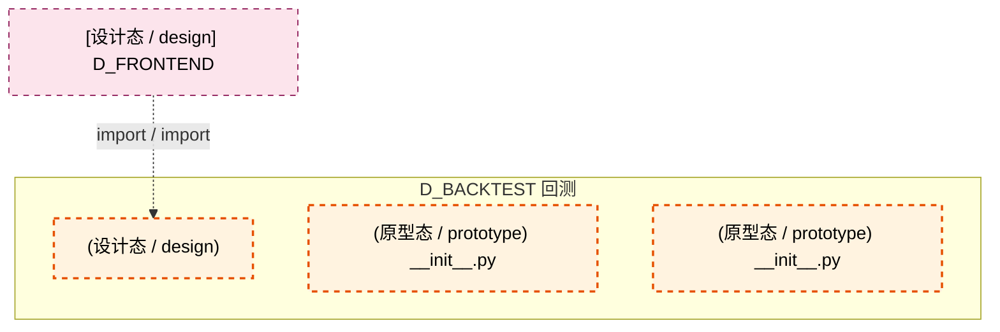

# 23_d_backtest / 回测 / 回测 / Backtest

> **功能简介 / Overview**: 回测引擎与历史重放

> **文档作用 / Purpose**: 展示 回测（D_BACKTEST）功能域的模块清单、域内依赖关系、跨域依赖关系、架构分层视图，供架构审查和域治理参考。

> 本文档由 generate_domain_doc.py 从 depgraph (PostgreSQL) 自动生成
> 最后更新: 2026-07-09 01:10:28
> 数据源: depgraph (PostgreSQL) nodes表 + edges表

## 域基本信息 / Domain Overview

| 字段 | 值 | Field | Value |
|------|------|-------|-------|
| 编号 | 23 | Number | 23 |
| 域ID | D_BACKTEST | Domain ID | D_BACKTEST |
| 域名称 | 回测 | Domain Name | Backtest |
| 层级 | L2 业务域层 | Layer | L2 Domain |
| 模块数 | 33 | Module Count | 33 |
| 域内依赖 | 44 | Internal Dependencies | 44 |
| 跨域入边 | 20 | Cross-domain Incoming | 20 |
| 跨域出边 | 6 | Cross-domain Outgoing | 6 |
| 设计态模块 | 8 | Design Modules | 8 |
| 原型态模块 | 16 | Prototype Modules | 16 |
| 生产态模块 | 9 | Production Modules | 9 |
| 容量 | 9/150 (正常) | Capacity | 9/150 (正常) |
| 描述 | 历史回测、参数寻优、过拟合检测、绩效归因。策略验证引擎。 | Description | 历史回测、参数寻优、过拟合检测、绩效归因。策略验证引擎。 |

## 域内依赖图 / Internal Dependency Diagram

> 依赖图内嵌在本文档中，IDE 可直接渲染显示。每30个节点一组分页显示。
>
> **图例说明 / Legend**：
> - **实线边框 = 运营态模块**（production，已上线运行）
> - **虚线边框 = 设计态模块**（design，还在设计中）
> - **实线箭头 = 运营态依赖**（已生效的依赖关系）
> - **虚线箭头 = 设计态依赖**（计划中的依赖关系）

### 第 1 页 / 共 2 页 / Page 1 of 2

```mermaid
graph TD
    subgraph D_BACKTEST["D_BACKTEST 回测"]
        src_zephyr_backtest_init_py["(原型态 / prototype) __init__.py"]
        src_zephyr_backtest_extensions_init_py["(原型态 / prototype) __init__.py"]
        src_zephyr_backtest_api_init_py["(原型态 / prototype) __init__.py"]
        src_zephyr_backtest_core_init_py["(原型态 / prototype) __init__.py"]
        src_zephyr_backtest_core_data_handler_py["(生产态 / production) data_handler.py"]
        src_zephyr_backtest_core_data_handler_py_1["(设计态 / design) "]
        src_zephyr_backtest_core_decision_gate_py["(原型态 / prototype) decision_gate.py"]
        src_zephyr_backtest_core_engine_base_py["(生产态 / production) engine_base.py"]
        src_zephyr_backtest_core_matching_engine_py["(生产态 / production) matching_engine.py"]
        src_zephyr_backtest_core_matching_engine_py_1["(设计态 / design) "]
        src_zephyr_backtest_core_matching_logic_py["(生产态 / production) matching_logic.py"]
        src_zephyr_backtest_core_matching_logic_py_1["(设计态 / design) "]
        src_zephyr_backtest_core_metrics_py["(原型态 / prototype) metrics.py"]
        src_zephyr_backtest_core_metrics_py_1["(设计态 / design) "]
        src_zephyr_backtest_core_overfitting_detector_py["(原型态 / prototype) overfitting_detector.py"]
        src_zephyr_backtest_core_pit_manager_py["(原型态 / prototype) pit_manager.py"]
        src_zephyr_backtest_core_portfolio_py["(生产态 / production) portfolio.py"]
        src_zephyr_backtest_core_portfolio_py_1["(设计态 / design) "]
        src_zephyr_backtest_core_tick_replay_py["(生产态 / production) tick_replay.py"]
        src_zephyr_backtest_core_tick_replay_py_1["(设计态 / design) "]
        src_zephyr_backtest_core_walk_forward_py["(原型态 / prototype) walk_forward.py"]
        src_zephyr_backtest_implementations_init_py["(原型态 / prototype) __init__.py"]
        src_zephyr_backtest_implementations_event_driven_engine_py["(生产态 / production) event_driven_engine.py"]
        src_zephyr_backtest_implementations_vectorized_engine_py["(生产态 / production) vectorized_engine.py"]
        src_zephyr_backtest_infrastructure_init_py["(原型态 / prototype) __init__.py"]
        src_zephyr_backtest_io_init_py["(原型态 / prototype) __init__.py"]
        src_zephyr_backtest_io_backtest_result_sink_py["(原型态 / prototype) backtest_result_sink.py"]
        src_zephyr_backtest_io_backtest_result_sink_py_1["(设计态 / design) "]
        src_zephyr_backtest_io_decisiongraph_adapter_py["(生产态 / production) decisiongraph_adapter.py"]
        src_zephyr_backtest_io_result_repository_py["(原型态 / prototype) result_repository.py"]
    end
    src_zephyr_backtest_core_portfolio_py_1 -.->|导入依赖 / import_depends| src_zephyr_backtest_core_data_handler_py_1
    src_zephyr_backtest_core_matching_engine_py_1 -.->|导入依赖 / import_depends| src_zephyr_backtest_core_portfolio_py_1
    src_zephyr_backtest_core_matching_engine_py_1 -.->|导入依赖 / import_depends| src_zephyr_backtest_core_matching_logic_py_1
    src_zephyr_backtest_init_py -.->|导入依赖 / import_depends| src_zephyr_backtest_core_engine_base_py
    src_zephyr_backtest_init_py -.->|导入依赖 / import_depends| src_zephyr_backtest_implementations_vectorized_engine_py
    src_zephyr_backtest_init_py -.->|导入依赖 / import_depends| src_zephyr_backtest_io_init_py
    src_zephyr_backtest_core_data_handler_py -.->|导入依赖 / import_depends| src_zephyr_backtest_core_pit_manager_py
    src_zephyr_backtest_core_matching_engine_py -->|导入依赖 / import_depends| src_zephyr_backtest_core_matching_logic_py
    src_zephyr_backtest_core_matching_engine_py -->|导入依赖 / import_depends| src_zephyr_backtest_core_portfolio_py
    src_zephyr_backtest_implementations_event_driven_engine_py -->|导入依赖 / import_depends| src_zephyr_backtest_core_matching_engine_py
    src_zephyr_backtest_implementations_event_driven_engine_py -.->|导入依赖 / import_depends| src_zephyr_backtest_core_decision_gate_py
    src_zephyr_backtest_implementations_event_driven_engine_py -->|导入依赖 / import_depends| src_zephyr_backtest_core_engine_base_py
    src_zephyr_backtest_implementations_event_driven_engine_py -.->|导入依赖 / import_depends| src_zephyr_backtest_core_overfitting_detector_py
    src_zephyr_backtest_implementations_event_driven_engine_py -.->|导入依赖 / import_depends| src_zephyr_backtest_core_metrics_py
    src_zephyr_backtest_implementations_event_driven_engine_py -->|导入依赖 / import_depends| src_zephyr_backtest_core_portfolio_py
    src_zephyr_backtest_implementations_event_driven_engine_py -.->|导入依赖 / import_depends| src_zephyr_backtest_core_walk_forward_py
    src_zephyr_backtest_implementations_event_driven_engine_py -->|导入依赖 / import_depends| src_zephyr_backtest_core_tick_replay_py
    src_zephyr_backtest_implementations_event_driven_engine_py -->|导入依赖 / import_depends| src_zephyr_backtest_implementations_vectorized_engine_py
    src_zephyr_backtest_core_init_py -.->|导入依赖 / import_depends| src_zephyr_backtest_core_data_handler_py
    src_zephyr_backtest_core_init_py -.->|导入依赖 / import_depends| src_zephyr_backtest_core_matching_engine_py
    src_zephyr_backtest_core_init_py -.->|导入依赖 / import_depends| src_zephyr_backtest_core_decision_gate_py
    src_zephyr_backtest_core_init_py -.->|导入依赖 / import_depends| src_zephyr_backtest_core_engine_base_py
    src_zephyr_backtest_core_init_py -.->|导入依赖 / import_depends| src_zephyr_backtest_core_pit_manager_py
    src_zephyr_backtest_core_init_py -.->|导入依赖 / import_depends| src_zephyr_backtest_core_overfitting_detector_py
    src_zephyr_backtest_core_init_py -.->|导入依赖 / import_depends| src_zephyr_backtest_core_metrics_py
    src_zephyr_backtest_core_init_py -.->|导入依赖 / import_depends| src_zephyr_backtest_core_portfolio_py
    src_zephyr_backtest_core_init_py -.->|导入依赖 / import_depends| src_zephyr_backtest_core_walk_forward_py
    src_zephyr_backtest_core_tick_replay_py -->|导入依赖 / import_depends| src_zephyr_backtest_core_matching_logic_py
    src_zephyr_backtest_implementations_vectorized_engine_py -->|导入依赖 / import_depends| src_zephyr_backtest_core_matching_engine_py
    src_zephyr_backtest_implementations_vectorized_engine_py -.->|导入依赖 / import_depends| src_zephyr_backtest_core_decision_gate_py
    src_zephyr_backtest_implementations_vectorized_engine_py -->|导入依赖 / import_depends| src_zephyr_backtest_core_engine_base_py
    src_zephyr_backtest_implementations_vectorized_engine_py -.->|导入依赖 / import_depends| src_zephyr_backtest_core_overfitting_detector_py
    src_zephyr_backtest_implementations_vectorized_engine_py -.->|导入依赖 / import_depends| src_zephyr_backtest_core_metrics_py
    src_zephyr_backtest_implementations_vectorized_engine_py -->|导入依赖 / import_depends| src_zephyr_backtest_core_portfolio_py
    src_zephyr_backtest_implementations_vectorized_engine_py -.->|导入依赖 / import_depends| src_zephyr_backtest_core_walk_forward_py
    src_zephyr_backtest_implementations_init_py -.->|导入依赖 / import_depends| src_zephyr_backtest_implementations_event_driven_engine_py
    src_zephyr_backtest_implementations_init_py -.->|导入依赖 / import_depends| src_zephyr_backtest_implementations_vectorized_engine_py
    src_zephyr_backtest_io_backtest_result_sink_py -.->|导入依赖 / import_depends| src_zephyr_backtest_core_engine_base_py
    src_zephyr_backtest_io_result_repository_py -.->|导入依赖 / import_depends| src_zephyr_backtest_io_backtest_result_sink_py
    src_zephyr_backtest_io_decisiongraph_adapter_py -->|导入依赖 / import_depends| src_zephyr_backtest_core_engine_base_py
    src_zephyr_backtest_io_init_py -.->|导入依赖 / import_depends| src_zephyr_backtest_io_backtest_result_sink_py
    src_zephyr_backtest_io_init_py -.->|导入依赖 / import_depends| src_zephyr_backtest_io_result_repository_py
    src_zephyr_backtest_io_init_py -.->|导入依赖 / import_depends| src_zephyr_backtest_io_decisiongraph_adapter_py
    D_GOVERNANCE["[设计态 / design] D_GOVERNANCE"]
    src_zephyr_backtest_core_data_handler_py_1 -.->|导入依赖 / import_depends| D_GOVERNANCE
    src_zephyr_backtest_core_tick_replay_py_1 -.->|导入依赖 / import_depends| D_GOVERNANCE
    D_INFRA_RUNTIME["[原型态 / prototype] D_INFRA_RUNTIME"]
    src_zephyr_backtest_core_data_handler_py -.->|导入依赖 / import_depends| D_INFRA_RUNTIME
    D_SHARED["[生产态 / production] D_SHARED"]
    src_zephyr_backtest_core_engine_base_py -->|导入依赖 / import_depends| D_SHARED
    src_zephyr_backtest_io_result_repository_py -.->|导入依赖 / import_depends| D_SHARED
    src_zephyr_backtest_io_decisiongraph_adapter_py -->|导入依赖 / import_depends| D_GOVERNANCE
    D_EX_CORE["[设计态 / design] D_EX_CORE"]
    D_EX_CORE -.->|导入依赖 / import_depends| src_zephyr_backtest_core_matching_logic_py_1
    D_FRONTEND["[设计态 / design] D_FRONTEND"]
    D_FRONTEND -.->|导入依赖 / import_depends| src_zephyr_backtest_core_tick_replay_py_1
    D_EX_CORE -.->|导入依赖 / import_depends| src_zephyr_backtest_core_matching_logic_py
    D_INTELLIGENCE["[原型态 / prototype] D_INTELLIGENCE"]
    D_INTELLIGENCE -.->|导入依赖 / import_depends| src_zephyr_backtest_implementations_vectorized_engine_py
    D_INTELLIGENCE -.->|导入依赖 / import_depends| src_zephyr_backtest_implementations_vectorized_engine_py
    D_INTELLIGENCE -.->|导入依赖 / import_depends| src_zephyr_backtest_core_engine_base_py
    D_AUDITTEST["[原型态 / prototype] D_AUDITTEST"]
    D_AUDITTEST -.->|测试依赖 / test_depends| src_zephyr_backtest_core_engine_base_py
    D_AUDITTEST -.->|测试依赖 / test_depends| src_zephyr_backtest_io_decisiongraph_adapter_py
    D_AUDITTEST -.->|测试依赖 / test_depends| src_zephyr_backtest_implementations_event_driven_engine_py
    D_AUDITTEST -.->|测试依赖 / test_depends| src_zephyr_backtest_implementations_vectorized_engine_py
    D_AUDITTEST -.->|测试依赖 / test_depends| src_zephyr_backtest_core_tick_replay_py
    D_AUDITTEST -.->|测试依赖 / test_depends| src_zephyr_backtest_core_engine_base_py
    D_AUDITTEST -.->|测试依赖 / test_depends| src_zephyr_backtest_core_matching_logic_py
    D_AUDITTEST -.->|测试依赖 / test_depends| src_zephyr_backtest_core_matching_engine_py
    D_AUDITTEST -.->|测试依赖 / test_depends| src_zephyr_backtest_core_matching_logic_py
    classDef production fill:#e1f5fe,stroke:#01579b,stroke-width:2px,color:#000
    classDef design fill:#fff3e0,stroke:#e65100,stroke-width:2px,color:#000,stroke-dasharray: 5 5
    classDef external_prod fill:#e8f5e9,stroke:#1b5e20,stroke-width:1px,color:#000
    classDef external_design fill:#fce4ec,stroke:#880e4f,stroke-width:1px,color:#000,stroke-dasharray: 5 5
    class src_zephyr_backtest_core_data_handler_py,src_zephyr_backtest_core_engine_base_py,src_zephyr_backtest_core_matching_engine_py,src_zephyr_backtest_core_matching_logic_py,src_zephyr_backtest_core_portfolio_py,src_zephyr_backtest_core_tick_replay_py,src_zephyr_backtest_implementations_event_driven_engine_py,src_zephyr_backtest_implementations_vectorized_engine_py,src_zephyr_backtest_io_decisiongraph_adapter_py production
    class src_zephyr_backtest_init_py,src_zephyr_backtest_extensions_init_py,src_zephyr_backtest_api_init_py,src_zephyr_backtest_core_init_py,src_zephyr_backtest_core_data_handler_py_1,src_zephyr_backtest_core_decision_gate_py,src_zephyr_backtest_core_matching_engine_py_1,src_zephyr_backtest_core_matching_logic_py_1,src_zephyr_backtest_core_metrics_py,src_zephyr_backtest_core_metrics_py_1,src_zephyr_backtest_core_overfitting_detector_py,src_zephyr_backtest_core_pit_manager_py,src_zephyr_backtest_core_portfolio_py_1,src_zephyr_backtest_core_tick_replay_py_1,src_zephyr_backtest_core_walk_forward_py,src_zephyr_backtest_implementations_init_py,src_zephyr_backtest_infrastructure_init_py,src_zephyr_backtest_io_init_py,src_zephyr_backtest_io_backtest_result_sink_py,src_zephyr_backtest_io_backtest_result_sink_py_1,src_zephyr_backtest_io_result_repository_py design
    class D_SHARED external_prod
    class D_GOVERNANCE,D_INFRA_RUNTIME,D_EX_CORE,D_FRONTEND,D_INTELLIGENCE,D_AUDITTEST external_design
```



### 第 2 页 / 共 2 页 / Page 2 of 2



## 跨域依赖 / Cross-domain Dependencies

### 本域依赖的其他域（出边）/ Depends On

| 目标域 / Target Domain | 依赖数 / Count | 依赖类型 / Type |
|--------|:---:|---------|
| D_GOVERNANCE | 3 | 导入依赖 / import_depends |
| D_SHARED | 2 | 导入依赖 / import_depends |
| D_INFRA_RUNTIME | 1 | 导入依赖 / import_depends |

### 依赖本域的其他域（入边）/ Depended By

| 源域 / Source Domain | 依赖数 / Count | 依赖类型 / Type |
|------|:---:|---------|
| D_AUDITTEST | 13 | 测试依赖 / test_depends |
| D_INTELLIGENCE | 3 | 导入依赖 / import_depends |
| D_EX_CORE | 2 | 导入依赖 / import_depends |
| D_FRONTEND | 2 | import,import_depends / import,import_depends |

## 架构分层视图 / Architecture Overview

> 按 architecture_layer 分层显示 回测（D_BACKTEST）的模块分布。共 33 个模块 / 33 modules。

```

┌──────────────────────────────────────────────────────────────────┐
│      L2 领域层 / Domain Layer（共 33 个模块 / 33 modules）       │
├──────────────────────────────────────────────────────────────────┤
│   __init__.py [原型态 / prototype]                               │
│   __init__.py [原型态 / prototype]                               │
│   __init__.py [原型态 / prototype]                               │
│   __init__.py [原型态 / prototype]                               │
│   data_handler.py [生产态 / production]                          │
│    [设计态 / design]                                             │
│   decision_gate.py [原型态 / prototype]                          │
│   engine_base.py [生产态 / production]                           │
│   matching_engine.py [生产态 / production]                       │
│    [设计态 / design]                                             │
│   matching_logic.py [生产态 / production]                        │
│    [设计态 / design]                                             │
│   metrics.py [原型态 / prototype]                                │
│    [设计态 / design]                                             │
│   overfitting_detector.py [原型态 / prototype]                   │
│   pit_manager.py [原型态 / prototype]                            │
│   portfolio.py [生产态 / production]                             │
│    [设计态 / design]                                             │
│   ...还有 15 个模块 / 15 more modules                            │
└──────────────────────────────────────────────────────────────────┘

```

## 模块分层清单 / Module Layered List

> 按 architecture_layer 分组的模块清单（共 33 个模块 / 33 modules）。

### L2 领域层 / Domain Layer (33 modules)

| # | 模块路径 / Module Path | 模块名称 / Module Name | 功能简介 / Description | 成熟度 / Maturity | 构建状态 / Build Status |
|:--:|---------|---------|---------|:---:|:---:|
| 1 | src/zephyr/backtest/__init__.py | src/zephyr/backtest/__init__.py | ZephyrAlpha — D_BACKTEST 回测引擎域 | prototype | generated |
| 2 | src/zephyr/backtest/_extensions/__init__.py | src/zephyr/backtest/_extensions/__ini... |  | prototype | generated |
| 3 | src/zephyr/backtest/api/__init__.py | src/zephyr/backtest/api/__init__.py |  | prototype | generated |
| 4 | src/zephyr/backtest/core/__init__.py | src/zephyr/backtest/core/__init__.py |  | prototype | generated |
| 5 | src/zephyr/backtest/core/data_handler.py | src/zephyr/backtest/core/data_handler.py | 回测数据处理器模块（v1.1.0 扩展：多源化 + ClickHouse 实现 + Tick 源） | production | generated |
| 6 | src/zephyr/backtest/core/data_handler.py/ | src/zephyr/backtest/core/data_handler... |  | design | generated |
| 7 | src/zephyr/backtest/core/decision_gate.py | src/zephyr/backtest/core/decision_gat... | 3阶段决策门控模块(IS->WFA->OOS) | prototype | generated |
| 8 | src/zephyr/backtest/core/engine_base.py | src/zephyr/backtest/core/engine_base.py | L_BACKTEST — Backtest Engine Layer | production | generated |
| 9 | src/zephyr/backtest/core/matching_engine.py | src/zephyr/backtest/core/matching_eng... | 回测撮合引擎模块（v1.1.0 重构：委托 MatchingLogic 保证回测=实盘一致性） | production | generated |
| 10 | src/zephyr/backtest/core/matching_engine.py/ | src/zephyr/backtest/core/matching_eng... |  | design | generated |
| 11 | src/zephyr/backtest/core/matching_logic.py | src/zephyr/backtest/core/matching_log... | 共享撮合逻辑模块（回测=实盘一致性核心） | production | generated |
| 12 | src/zephyr/backtest/core/matching_logic.py/ | src/zephyr/backtest/core/matching_log... |  | design | stable |
| 13 | src/zephyr/backtest/core/metrics.py | src/zephyr/backtest/core/metrics.py | 回测绩效指标计算模块 | prototype | generated |
| 14 | src/zephyr/backtest/core/metrics.py/ | src/zephyr/backtest/core/metrics.py/ |  | design | generated |
| 15 | src/zephyr/backtest/core/overfitting_detector.py | src/zephyr/backtest/core/overfitting_... | 过拟合检测模块(三维度 + 三层) | prototype | generated |
| 16 | src/zephyr/backtest/core/pit_manager.py | src/zephyr/backtest/core/pit_manager.py | PIT(Point-In-Time)铁律管理器模块 | prototype | generated |
| 17 | src/zephyr/backtest/core/portfolio.py | src/zephyr/backtest/core/portfolio.py | 回测持仓管理模块 | production | generated |
| 18 | src/zephyr/backtest/core/portfolio.py/ | src/zephyr/backtest/core/portfolio.py/ |  | design | generated |
| 19 | src/zephyr/backtest/core/tick_replay.py | src/zephyr/backtest/core/tick_replay.py | Tick 回放引擎模块（v1.1.0 新增，秒级做T专用） | production | generated |
| 20 | src/zephyr/backtest/core/tick_replay.py/ | src/zephyr/backtest/core/tick_replay.py/ |  | design | stable |
| 21 | src/zephyr/backtest/core/walk_forward.py | src/zephyr/backtest/core/walk_forward.py | Walk-Forward分析与多重比较偏差校正模块 | prototype | generated |
| 22 | src/zephyr/backtest/implementations/__init__.py | src/zephyr/backtest/implementations/_... |  | prototype | generated |
| 23 | src/zephyr/backtest/implementations/event_driven_engine.py | src/zephyr/backtest/implementations/e... | 事件驱动回测引擎（v1.1.0 新增，Tick 级回测核心） | production | generated |
| 24 | src/zephyr/backtest/implementations/vectorized_engine.py | src/zephyr/backtest/implementations/v... | L_BACKTEST — Vectorized Backtest Engine | production | generated |
| 25 | src/zephyr/backtest/infrastructure/__init__.py | src/zephyr/backtest/infrastructure/__... |  | prototype | generated |
| 26 | src/zephyr/backtest/io/__init__.py | src/zephyr/backtest/io/__init__.py | io · D_BACKTEST 可视化产物 io 子包（v1.3.0 新增，#ARCH-047） | prototype | generated |
| 27 | src/zephyr/backtest/io/backtest_result_sink.py | src/zephyr/backtest/io/backtest_resul... | backtest_result_sink · 回测结果数据落地模块（v1.3.0 新增，#ARCH-047） | prototype | generated |
| 28 | src/zephyr/backtest/io/backtest_result_sink.py/ | src/zephyr/backtest/io/backtest_resul... |  | design | generated |
| 29 | src/zephyr/backtest/io/decisiongraph_adapter.py | src/zephyr/backtest/io/decisiongraph_... | BacktestResult -> decisiongraph 适配器（TRAE-061 Phase 5） | production | generated |
| 30 | src/zephyr/backtest/io/result_repository.py | src/zephyr/backtest/io/result_reposit... | result_repository · 回测产物持久化/检索模块（v1.3.0 新增，#ARCH-047） | prototype | generated |
| 31 | src/zephyr/backtest/io/result_repository.py/ | src/zephyr/backtest/io/result_reposit... |  | design | generated |
| 32 | src/zephyr/backtest/models/__init__.py | src/zephyr/backtest/models/__init__.py |  | prototype | generated |
| 33 | src/zephyr/backtest/services/__init__.py | src/zephyr/backtest/services/__init__.py |  | prototype | generated |

## 依赖关系图 / Dependency Graph

> 域内模块依赖关系（共 44 条 / 44 edges）。按依赖类型分组，使用 → 表示方向。

```

┌──────────────────────────────────────────────────────────────────┐
│       依赖关系图 / Dependency Graph (共 44 条 / 44 edges)        │
├──────────────────────────────────────────────────────────────────┤
│   依赖类型数 / Dependency Types: 2                               │
│   [import_depends]: 43 条 / edges                                │
│   [import]: 1 条 / edges                                         │
└──────────────────────────────────────────────────────────────────┘

┌──────────────────────────────────────────────────────────────────┐
│           [导入依赖 / import_depends]（43 条 / edges）           │
├──────────────────────────────────────────────────────────────────┤
│    →                                                             │
│    →                                                             │
│    →                                                             │
│   __init__.py → engine_base.py                                   │
│   __init__.py → vectorized_engine.py                             │
│   __init__.py → __init__.py                                      │
│   data_handler.py → pit_manager.py                               │
│   matching_engine.py → matching_logic.py                         │
│   matching_engine.py → portfolio.py                              │
│   event_driven_engine.py → matching_engine.py                    │
│   event_driven_engine.py → decision_gate.py                      │
│   event_driven_engine.py → engine_base.py                        │
│   event_driven_engine.py → overfitting_detector.py               │
│   event_driven_engine.py → metrics.py                            │
│   event_driven_engine.py → portfolio.py                          │
│   event_driven_engine.py → walk_forward.py                       │
│   event_driven_engine.py → tick_replay.py                        │
│   event_driven_engine.py → vectorized_engine.py                  │
│   __init__.py → data_handler.py                                  │
│   __init__.py → matching_engine.py                               │
│   __init__.py → decision_gate.py                                 │
│   __init__.py → engine_base.py                                   │
│   __init__.py → pit_manager.py                                   │
│   __init__.py → overfitting_detector.py                          │
│   __init__.py → metrics.py                                       │
│   __init__.py → portfolio.py                                     │
│   __init__.py → walk_forward.py                                  │
│   tick_replay.py → matching_logic.py                             │
│   vectorized_engine.py → matching_engine.py                      │
│   vectorized_engine.py → decision_gate.py                        │
│   vectorized_engine.py → engine_base.py                          │
│   vectorized_engine.py → overfitting_detector.py                 │
│   vectorized_engine.py → metrics.py                              │
│   vectorized_engine.py → portfolio.py                            │
│   vectorized_engine.py → walk_forward.py                         │
│   __init__.py → event_driven_engine.py                           │
│   __init__.py → vectorized_engine.py                             │
│   backtest_result_sink.py → engine_base.py                       │
│   result_repository.py → backtest_result_sink.py                 │
│   decisiongraph_adapter.py → engine_base.py                      │
│   __init__.py → backtest_result_sink.py                          │
│   __init__.py → result_repository.py                             │
│   __init__.py → decisiongraph_adapter.py                         │
└──────────────────────────────────────────────────────────────────┘

┌──────────────────────────────────────────────────────────────────┐
│                [import / import]（1 条 / edges）                 │
├──────────────────────────────────────────────────────────────────┤
│    →                                                             │
└──────────────────────────────────────────────────────────────────┘

```

## 说明 / Notes

- **数据源 / Data Source**: `depgraph (PostgreSQL)` 的 `nodes`、`edges`、`domains` 表
- **生成器 / Generator**: `generate_domain_doc.py`（G2+G10 合并）
- **维护方式 / Maintenance**: 自动生成，全景图更新时刷新
- **文件名规则 / File Naming**: `{编号:02d}_{域ID小写}.md`，如 `16_d_trading.md`
- **图例说明 / Legend**: `[生产态 / production]`=已上线 / `[设计态 / design]`=设计中 / `[原型态 / prototype]`=原型 / `[未知 / unknown]`=未知
