# 23_d_ex_sor 域文档

> 本文档由 generate_domain_doc.py 从 depgraph.db 自动生成
> 最后更新: 2026-06-24 02:24:12
> 数据源: depgraph.db nodes表 + edges表

## 域基本信息 / Domain Overview

| 字段 | 值 | Field | Value |
|------|------|-------|-------|
| 编号 | 23 | Number | 23 |
| 域ID | D-EX_SOR | Domain ID | D-EX_SOR |
| 域名称 | 执行路由 | Domain Name | 执行路由 |
| 层级 | L2_domain | Layer | L2_domain |
| 模块数 | 131 | Module Count | 131 |
| 域内依赖 | 123 | Internal Dependencies | 123 |
| 跨域入边 | 228 | Cross-domain Incoming | 228 |
| 跨域出边 | 13 | Cross-domain Outgoing | 13 |
| 设计态模块 | 124 | Design Modules | 124 |
| 原型态模块 | 1 | Prototype Modules | 1 |
| 生产态模块 | 0 | Production Modules | 0 |
| 容量 | 131/150 (正常) | Capacity | 131/150 (正常) |
| 描述 | 执行路由域。负责智能订单路由(SOR)，包括多交易通道选择、流动性聚合、最优执行路径规划。 | Description | 执行路由域。负责智能订单路由(SOR)，包括多交易通道选择、流动性聚合、最优执行路径规划。 |

## 模块清单 / Module List

共 131 个模块（按路径排序，最多显示前 200 个）

| 模块路径 | 模块名称 | 设计成熟度 | 构建状态 | Module Path | Module Name | Maturity | Build Status |
|---------|---------|-----------|---------|-------------|-------------|----------|--------------|
| D-EX-SOR/A2A-01 交易执行禁止A2A | A2A-01 交易执行禁止A2A | design | design_only | D-EX-SOR/A2A-01 交易执行禁止A2A | A2A-01 交易执行禁止A2A | design | design_only |
| D-EX-SOR/ALT算法 Aggressive Liquidity Taking | ALT算法 Aggressive Liquidity Taking | design | design_only | D-EX-SOR/ALT算法 Aggressive Liquidity Taking | ALT算法 Aggressive Liquidity Taking | design | design_only |
| D-EX-SOR/API Doc Auto Version Syncer API文档自动版本同步器 | API Doc Auto Version Syncer API文档自动版本同步器 | design | design_only | D-EX-SOR/API Doc Auto Version Syncer API文档自动版本同步器 | API Doc Auto Version Syncer API文档自动版本同步器 | design | design_only |
| D-EX-SOR/API Route & Service Discovery API路由与服务发现 | API Route & Service Discovery API路由与服务发现 | design | design_only | D-EX-SOR/API Route & Service Discovery API路由与服务发现 | API Route & Service Discovery API路由与服务发现 | design | design_only |
| D-EX-SOR/AUM>500万门禁 | AUM>500万门禁 | design | design_only | D-EX-SOR/AUM>500万门禁 | AUM>500万门禁 | design | design_only |
| D-EX-SOR/Adaptive Routing Optimizer 自适应路由优化器 | Adaptive Routing Optimizer 自适应路由优化器 | design | design_only | D-EX-SOR/Adaptive Routing Optimizer 自适应路由优化器 | Adaptive Routing Optimizer 自适应路由优化器 | design | design_only |
| D-EX-SOR/Algo Execution Selector 算法执行选择器 | Algo Execution Selector 算法执行选择器 | design | design_only | D-EX-SOR/Algo Execution Selector 算法执行选择器 | Algo Execution Selector 算法执行选择器 | design | design_only |
| D-EX-SOR/Almgren-Chriss最优执行框架 | Almgren-Chriss最优执行框架 | design | design_only | D-EX-SOR/Almgren-Chriss最优执行框架 | Almgren-Chriss最优执行框架 | design | design_only |
| D-EX-SOR/Backtrader框架 | Backtrader框架 | design | design_only | D-EX-SOR/Backtrader框架 | Backtrader框架 | design | design_only |
| D-EX-SOR/Broker API Connector 券商API连接器 | Broker API Connector 券商API连接器 | design | design_only | D-EX-SOR/Broker API Connector 券商API连接器 | Broker API Connector 券商API连接器 | design | design_only |
| D-EX-SOR/Broker Adapter 适配器 | Broker Adapter 适配器 | design | design_only | D-EX-SOR/Broker Adapter 适配器 | Broker Adapter 适配器 | design | design_only |
| D-EX-SOR/C-026 API行为监控 API Behavior Monitor | C-026 API行为监控 API Behavior Monitor | design | design_only | D-EX-SOR/C-026 API行为监控 API Behavior Monitor | C-026 API行为监控 API Behavior Monitor | design | design_only |
| D-EX-SOR/CB-001 iFind数据拉取熔断器 | CB-001 iFind数据拉取熔断器 | design | design_only | D-EX-SOR/CB-001 iFind数据拉取熔断器 | CB-001 iFind数据拉取熔断器 | design | design_only |
| D-EX-SOR/CB-002 miniQMT下单熔断器 | CB-002 miniQMT下单熔断器 | design | design_only | D-EX-SOR/CB-002 miniQMT下单熔断器 | CB-002 miniQMT下单熔断器 | design | design_only |
| D-EX-SOR/Close-Only Mode 仅平仓模式 | Close-Only Mode 仅平仓模式 | design | design_only | D-EX-SOR/Close-Only Mode 仅平仓模式 | Close-Only Mode 仅平仓模式 | design | design_only |
| D-EX-SOR/D-15 编排式Saga | D-15 编排式Saga | design | design_only | D-EX-SOR/D-15 编排式Saga | D-15 编排式Saga | design | design_only |
| D-EX-SOR/D-EX-SOR 执行路由域 Execution Routing | D-EX-SOR 执行路由域 Execution Routing | design | design_only | D-EX-SOR/D-EX-SOR 执行路由域 Execution Routing | D-EX-SOR 执行路由域 Execution Routing | design | design_only |
| D-EX-SOR/D-EXECUTION-SOR 执行路由域 | D-EXECUTION-SOR 执行路由域 | design | design_only | D-EX-SOR/D-EXECUTION-SOR 执行路由域 | D-EXECUTION-SOR 执行路由域 | design | design_only |
| D-EX-SOR/DQN强化学习执行 | DQN强化学习执行 | design | design_only | D-EX-SOR/DQN强化学习执行 | DQN强化学习执行 | design | design_only |
| D-EX-SOR/EX-SOR四域链路位置 | EX-SOR四域链路位置 | design | design_only | D-EX-SOR/EX-SOR四域链路位置 | EX-SOR四域链路位置 | design | design_only |
| D-EX-SOR/Exchange API Rate Limiter 交易所API限速器 | Exchange API Rate Limiter 交易所API限速器 | design | design_only | D-EX-SOR/Exchange API Rate Limiter 交易所API限速器 | Exchange API Rate Limiter 交易所API限速器 | design | design_only |
| D-EX-SOR/Execution Algorithm Engine 执行算法引擎 | Execution Algorithm Engine 执行算法引擎 | design | design_only | D-EX-SOR/Execution Algorithm Engine 执行算法引擎 | Execution Algorithm Engine 执行算法引擎 | design | design_only |
| D-EX-SOR/Execution Quality Scorer 执行质量评分器 | Execution Quality Scorer 执行质量评分器 | design | design_only | D-EX-SOR/Execution Quality Scorer 执行质量评分器 | Execution Quality Scorer 执行质量评分器 | design | design_only |
| D-EX-SOR/Execution Scheduler 调度器执行 | Execution Scheduler 调度器执行 | design | design_only | D-EX-SOR/Execution Scheduler 调度器执行 | Execution Scheduler 调度器执行 | design | design_only |
| D-EX-SOR/FIX 4.2 协议 | FIX 4.2 协议 | design | design_only | D-EX-SOR/FIX 4.2 协议 | FIX 4.2 协议 | design | design_only |
| D-EX-SOR/Fail-Closed 合规规则引擎不可用机制 | Fail-Closed 合规规则引擎不可用机制 | design | design_only | D-EX-SOR/Fail-Closed 合规规则引擎不可用机制 | Fail-Closed 合规规则引擎不可用机制 | design | design_only |
| D-EX-SOR/Freqtrade框架 | Freqtrade框架 | design | design_only | D-EX-SOR/Freqtrade框架 | Freqtrade框架 | design | design_only |
| D-EX-SOR/GATE-LP02 Kill Switch直连券商紧急平仓门禁 | GATE-LP02 Kill Switch直连券商紧急平仓门禁 | design | design_only | D-EX-SOR/GATE-LP02 Kill Switch直连券商紧急平仓门禁 | GATE-LP02 Kill Switch直连券商紧急平仓门禁 | design | design_only |
| D-EX-SOR/GATE-QP01 交易通道熔断自动恢复门禁 | GATE-QP01 交易通道熔断自动恢复门禁 | design | design_only | D-EX-SOR/GATE-QP01 交易通道熔断自动恢复门禁 | GATE-QP01 交易通道熔断自动恢复门禁 | design | design_only |
| D-EX-SOR/GATE-QP02 MCP交易执行Server门禁 | GATE-QP02 MCP交易执行Server门禁 | design | design_only | D-EX-SOR/GATE-QP02 MCP交易执行Server门禁 | GATE-QP02 MCP交易执行Server门禁 | design | design_only |
| D-EX-SOR/GATE-XS03 L2订单簿数据源门禁 | GATE-XS03 L2订单簿数据源门禁 | design | design_only | D-EX-SOR/GATE-XS03 L2订单簿数据源门禁 | GATE-XS03 L2订单簿数据源门禁 | design | design_only |
| D-EX-SOR/GATE-XS04 多框架集成门禁 | GATE-XS04 多框架集成门禁 | design | design_only | D-EX-SOR/GATE-XS04 多框架集成门禁 | GATE-XS04 多框架集成门禁 | design | design_only |
| D-EX-SOR/GATE-XS06 多交易场所接入门禁 | GATE-XS06 多交易场所接入门禁 | design | design_only | D-EX-SOR/GATE-XS06 多交易场所接入门禁 | GATE-XS06 多交易场所接入门禁 | design | design_only |
| D-EX-SOR/GATE-XS07 L2订单簿+ABIDES门禁 | GATE-XS07 L2订单簿+ABIDES门禁 | design | design_only | D-EX-SOR/GATE-XS07 L2订单簿+ABIDES门禁 | GATE-XS07 L2订单簿+ABIDES门禁 | design | design_only |
| D-EX-SOR/GATE-XS08 RL训练基础设施门禁 | GATE-XS08 RL训练基础设施门禁 | design | design_only | D-EX-SOR/GATE-XS08 RL训练基础设施门禁 | GATE-XS08 RL训练基础设施门禁 | design | design_only |
| D-EX-SOR/GATE-XS09 DPDK/RDMA硬件门禁 | GATE-XS09 DPDK/RDMA硬件门禁 | design | design_only | D-EX-SOR/GATE-XS09 DPDK/RDMA硬件门禁 | GATE-XS09 DPDK/RDMA硬件门禁 | design | design_only |
| D-EX-SOR/GATE-XS10 裸金属部署门禁 | GATE-XS10 裸金属部署门禁 | design | design_only | D-EX-SOR/GATE-XS10 裸金属部署门禁 | GATE-XS10 裸金属部署门禁 | design | design_only |
| D-EX-SOR/GATE-XS12 ML训练管线门禁 | GATE-XS12 ML训练管线门禁 | design | design_only | D-EX-SOR/GATE-XS12 ML训练管线门禁 | GATE-XS12 ML训练管线门禁 | design | design_only |
| D-EX-SOR/GATE-XS15 API文档结构化访问门禁 | GATE-XS15 API文档结构化访问门禁 | design | design_only | D-EX-SOR/GATE-XS15 API文档结构化访问门禁 | GATE-XS15 API文档结构化访问门禁 | design | design_only |
| D-EX-SOR/GATE-XS16 多机部署门禁 | GATE-XS16 多机部署门禁 | design | design_only | D-EX-SOR/GATE-XS16 多机部署门禁 | GATE-XS16 多机部署门禁 | design | design_only |
| D-EX-SOR/HB-01 外部系统故障不传染 | HB-01 外部系统故障不传染 | design | design_only | D-EX-SOR/HB-01 外部系统故障不传染 | HB-01 外部系统故障不传染 | design | design_only |
| D-EX-SOR/HB-04 API版本不匹配拒绝 | HB-04 API版本不匹配拒绝 | design | design_only | D-EX-SOR/HB-04 API版本不匹配拒绝 | HB-04 API版本不匹配拒绝 | design | design_only |
| D-EX-SOR/HB-05 隔离策略不可绕过 | HB-05 隔离策略不可绕过 | design | design_only | D-EX-SOR/HB-05 隔离策略不可绕过 | HB-05 隔离策略不可绕过 | design | design_only |
| D-EX-SOR/HB-06 交易通道熔断人工恢复 | HB-06 交易通道熔断人工恢复 | design | design_only | D-EX-SOR/HB-06 交易通道熔断人工恢复 | HB-06 交易通道熔断人工恢复 | design | design_only |
| D-EX-SOR/HB-07 下单不可自动重试 | HB-07 下单不可自动重试 | design | design_only | D-EX-SOR/HB-07 下单不可自动重试 | HB-07 下单不可自动重试 | design | design_only |
| D-EX-SOR/HB-11 外部API统一网关 | HB-11 外部API统一网关 | design | design_only | D-EX-SOR/HB-11 外部API统一网关 | HB-11 外部API统一网关 | design | design_only |
| D-EX-SOR/HYDRA-EI→HMARL 主观交易经验映射 | HYDRA-EI→HMARL 主观交易经验映射 | design | design_only | D-EX-SOR/HYDRA-EI→HMARL 主观交易经验映射 | HYDRA-EI→HMARL 主观交易经验映射 | design | design_only |
| D-EX-SOR/Hawkes过程 | Hawkes过程 | design | design_only | D-EX-SOR/Hawkes过程 | Hawkes过程 | design | design_only |
| D-EX-SOR/Hot平面10ms延迟预算 | Hot平面10ms延迟预算 | design | design_only | D-EX-SOR/Hot平面10ms延迟预算 | Hot平面10ms延迟预算 | design | design_only |
| D-EX-SOR/ICEBERG算法 ICEBERG Algorithm | ICEBERG算法 ICEBERG Algorithm | design | design_only | D-EX-SOR/ICEBERG算法 ICEBERG Algorithm | ICEBERG算法 ICEBERG Algorithm | design | design_only |
| D-EX-SOR/Implementation Shortfall算法 IS Algorithm | Implementation Shortfall算法 IS Algorithm | design | design_only | D-EX-SOR/Implementation Shortfall算法 IS Algorithm | Implementation Shortfall算法 IS Algorithm | design | design_only |
| D-EX-SOR/Kill-Switch五层防御架构 Kill Switch 5-Layer Defense | Kill-Switch五层防御架构 Kill Switch 5-Layer... | design | design_only | D-EX-SOR/Kill-Switch五层防御架构 Kill Switch 5-Layer Defense | Kill-Switch五层防御架构 Kill Switch 5-Layer... | design | design_only |
| D-EX-SOR/L0 正常降级等级 | L0 正常降级等级 | design | design_only | D-EX-SOR/L0 正常降级等级 | L0 正常降级等级 | design | design_only |
| D-EX-SOR/L1全局限流 | L1全局限流 | design | design_only | D-EX-SOR/L1全局限流 | L1全局限流 | design | design_only |
| D-EX-SOR/L2外部系统级限流 | L2外部系统级限流 | design | design_only | D-EX-SOR/L2外部系统级限流 | L2外部系统级限流 | design | design_only |
| D-EX-SOR/L3操作级限流 | L3操作级限流 | design | design_only | D-EX-SOR/L3操作级限流 | L3操作级限流 | design | design_only |
| D-EX-SOR/L4优先级限流 | L4优先级限流 | design | design_only | D-EX-SOR/L4优先级限流 | L4优先级限流 | design | design_only |
| D-EX-SOR/LOB不平衡度 | LOB不平衡度 | design | design_only | D-EX-SOR/LOB不平衡度 | LOB不平衡度 | design | design_only |
| D-EX-SOR/LOB恢复速度 | LOB恢复速度 | design | design_only | D-EX-SOR/LOB恢复速度 | LOB恢复速度 | design | design_only |
| D-EX-SOR/Level-2数据需求 Level-2 Data Requirement | Level-2数据需求 Level-2 Data Requirement | design | design_only | D-EX-SOR/Level-2数据需求 Level-2 Data Requirement | Level-2数据需求 Level-2 Data Requirement | design | design_only |
| D-EX-SOR/Liquidity Detector 流动性检测器 | Liquidity Detector 流动性检测器 | design | design_only | D-EX-SOR/Liquidity Detector 流动性检测器 | Liquidity Detector 流动性检测器 | design | design_only |
| D-EX-SOR/Low-Latency Data Handler 低延迟数据处理器 | Low-Latency Data Handler 低延迟数据处理器 | design | design_only | D-EX-SOR/Low-Latency Data Handler 低延迟数据处理器 | Low-Latency Data Handler 低延迟数据处理器 | design | design_only |
| D-EX-SOR/Low-Latency Path Optimizer 低延迟路径优化器 | Low-Latency Path Optimizer 低延迟路径优化器 | design | design_only | D-EX-SOR/Low-Latency Path Optimizer 低延迟路径优化器 | Low-Latency Path Optimizer 低延迟路径优化器 | design | design_only |
| D-EX-SOR/MQMT-01 XtMiniQmt启动顺序 | MQMT-01 XtMiniQmt启动顺序 | design | design_only | D-EX-SOR/MQMT-01 XtMiniQmt启动顺序 | MQMT-01 XtMiniQmt启动顺序 | design | design_only |
| D-EX-SOR/MQMT-02 极简模式登录 | MQMT-02 极简模式登录 | design | design_only | D-EX-SOR/MQMT-02 极简模式登录 | MQMT-02 极简模式登录 | design | design_only |
| D-EX-SOR/MQMT-03 非交易时段拦截 | MQMT-03 非交易时段拦截 | design | design_only | D-EX-SOR/MQMT-03 非交易时段拦截 | MQMT-03 非交易时段拦截 | design | design_only |
| D-EX-SOR/MQMT-04 版本匹配 | MQMT-04 版本匹配 | design | design_only | D-EX-SOR/MQMT-04 版本匹配 | MQMT-04 版本匹配 | design | design_only |
| D-EX-SOR/MQMT-05 单进程单账户 | MQMT-05 单进程单账户 | design | design_only | D-EX-SOR/MQMT-05 单进程单账户 | MQMT-05 单进程单账户 | design | design_only |
| D-EX-SOR/Market Impact Estimator 市场冲击估算器 | Market Impact Estimator 市场冲击估算器 | design | design_only | D-EX-SOR/Market Impact Estimator 市场冲击估算器 | Market Impact Estimator 市场冲击估算器 | design | design_only |
| D-EX-SOR/Market Impact Modeler 模型 | Market Impact Modeler 模型 | design | design_only | D-EX-SOR/Market Impact Modeler 模型 | Market Impact Modeler 模型 | design | design_only |
| D-EX-SOR/Multi-Exchange Optimal Router 多交易所最优路由器 | Multi-Exchange Optimal Router 多交易所最优路由器 | design | design_only | D-EX-SOR/Multi-Exchange Optimal Router 多交易所最优路由器 | Multi-Exchange Optimal Router 多交易所最优路由器 | design | design_only |
| D-EX-SOR/Multi-Framework Strategy Router 多框架策略路由器 | Multi-Framework Strategy Router 多框架策略路由器 | design | design_only | D-EX-SOR/Multi-Framework Strategy Router 多框架策略路由器 | Multi-Framework Strategy Router 多框架策略路由器 | design | design_only |
| D-EX-SOR/Order Book Simulator 订单簿仿真器 | Order Book Simulator 订单簿仿真器 | design | design_only | D-EX-SOR/Order Book Simulator 订单簿仿真器 | Order Book Simulator 订单簿仿真器 | design | design_only |
| D-EX-SOR/Order Routing 订单路由 | Order Routing 订单路由 | design | design_only | D-EX-SOR/Order Routing 订单路由 | Order Routing 订单路由 | design | design_only |
| D-EX-SOR/Order Splitting 拆单策略 | Order Splitting 拆单策略 | design | design_only | D-EX-SOR/Order Splitting 拆单策略 | Order Splitting 拆单策略 | design | design_only |
| D-EX-SOR/P2子模块暂不纳入骨架 | P2子模块暂不纳入骨架 | design | design_only | D-EX-SOR/P2子模块暂不纳入骨架 | P2子模块暂不纳入骨架 | design | design_only |
| D-EX-SOR/POV算法 POV Algorithm | POV算法 POV Algorithm | design | design_only | D-EX-SOR/POV算法 POV Algorithm | POV算法 POV Algorithm | design | design_only |
| D-EX-SOR/PPO强化学习执行 | PPO强化学习执行 | design | design_only | D-EX-SOR/PPO强化学习执行 | PPO强化学习执行 | design | design_only |
| D-EX-SOR/QP-01 交易通道熔断自动恢复不能建 | QP-01 交易通道熔断自动恢复不能建 | design | design_only | D-EX-SOR/QP-01 交易通道熔断自动恢复不能建 | QP-01 交易通道熔断自动恢复不能建 | design | design_only |
| D-EX-SOR/QP-02 MCP交易执行Server不能建 | QP-02 MCP交易执行Server不能建 | design | design_only | D-EX-SOR/QP-02 MCP交易执行Server不能建 | QP-02 MCP交易执行Server不能建 | design | design_only |
| D-EX-SOR/RL Execution Training Env RL执行训练环境 | RL Execution Training Env RL执行训练环境 | design | design_only | D-EX-SOR/RL Execution Training Env RL执行训练环境 | RL Execution Training Env RL执行训练环境 | design | design_only |
| D-EX-SOR/SOR Agent 路由Agent | SOR Agent 路由Agent | design | design_only | D-EX-SOR/SOR Agent 路由Agent | SOR Agent 路由Agent | design | design_only |
| D-EX-SOR/Saga超时硬约束 Saga Timeout Hard Constraint | Saga超时硬约束 Saga Timeout Hard Constraint | design | design_only | D-EX-SOR/Saga超时硬约束 Saga Timeout Hard Constraint | Saga超时硬约束 Saga Timeout Hard Constraint | design | design_only |
| D-EX-SOR/Slippage Analyzer 滑点分析器 | Slippage Analyzer 滑点分析器 | design | design_only | D-EX-SOR/Slippage Analyzer 滑点分析器 | Slippage Analyzer 滑点分析器 | design | design_only |
| D-EX-SOR/Smart Order Router 智能订单路由 | Smart Order Router 智能订单路由 | design | design_only | D-EX-SOR/Smart Order Router 智能订单路由 | Smart Order Router 智能订单路由 | design | design_only |
| D-EX-SOR/Smart Order Router 智能订单路由器 | Smart Order Router 智能订单路由器 | design | design_only | D-EX-SOR/Smart Order Router 智能订单路由器 | Smart Order Router 智能订单路由器 | design | design_only |
| D-EX-SOR/Smart Routing 智能路由 | Smart Routing 智能路由 | design | design_only | D-EX-SOR/Smart Routing 智能路由 | Smart Routing 智能路由 | design | design_only |
| D-EX-SOR/Smart→Optimal/Adaptive 主观交易经验映射 | Smart→Optimal/Adaptive 主观交易经验映射 | design | design_only | D-EX-SOR/Smart→Optimal/Adaptive 主观交易经验映射 | Smart→Optimal/Adaptive 主观交易经验映射 | design | design_only |
| D-EX-SOR/Sniper→ALT 主观交易经验映射 | Sniper→ALT 主观交易经验映射 | design | design_only | D-EX-SOR/Sniper→ALT 主观交易经验映射 | Sniper→ALT 主观交易经验映射 | design | design_only |
| D-EX-SOR/TWAP算法 TWAP Algorithm | TWAP算法 TWAP Algorithm | design | design_only | D-EX-SOR/TWAP算法 TWAP Algorithm | TWAP算法 TWAP Algorithm | design | design_only |
| D-EX-SOR/Transaction Cost Optimizer 交易成本优化器 | Transaction Cost Optimizer 交易成本优化器 | design | design_only | D-EX-SOR/Transaction Cost Optimizer 交易成本优化器 | Transaction Cost Optimizer 交易成本优化器 | design | design_only |
| D-EX-SOR/VPIN 订单流毒性 | VPIN 订单流毒性 | design | design_only | D-EX-SOR/VPIN 订单流毒性 | VPIN 订单流毒性 | design | design_only |
| D-EX-SOR/VWAP算法 VWAP Algorithm | VWAP算法 VWAP Algorithm | design | design_only | D-EX-SOR/VWAP算法 VWAP Algorithm | VWAP算法 VWAP Algorithm | design | design_only |
| D-EX-SOR/VeighNa框架 | VeighNa框架 | design | design_only | D-EX-SOR/VeighNa框架 | VeighNa框架 | design | design_only |
| D-EX-SOR/XS-05 Algo Trading Engine 算法交易引擎 | XS-05 Algo Trading Engine 算法交易引擎 | design | design_only | D-EX-SOR/XS-05 Algo Trading Engine 算法交易引擎 | XS-05 Algo Trading Engine 算法交易引擎 | design | design_only |
| D-EX-SOR/XS-06 Venue Selector 交易场所选择器 | XS-06 Venue Selector 交易场所选择器 | design | design_only | D-EX-SOR/XS-06 Venue Selector 交易场所选择器 | XS-06 Venue Selector 交易场所选择器 | design | design_only |
| D-EX-SOR/XS-07~XS-16 子模块设计引用 | XS-07~XS-16 子模块设计引用 | design | design_only | D-EX-SOR/XS-07~XS-16 子模块设计引用 | XS-07~XS-16 子模块设计引用 | design | design_only |
| D-EX-SOR/XS-BrokerDisconnected 券商断开事件 | XS-BrokerDisconnected 券商断开事件 | design | design_only | D-EX-SOR/XS-BrokerDisconnected 券商断开事件 | XS-BrokerDisconnected 券商断开事件 | design | design_only |
| D-EX-SOR/XS-ExecutionCompleted 执行完成事件 | XS-ExecutionCompleted 执行完成事件 | design | design_only | D-EX-SOR/XS-ExecutionCompleted 执行完成事件 | XS-ExecutionCompleted 执行完成事件 | design | design_only |
| D-EX-SOR/XS-FillReceived 成交已收到事件 | XS-FillReceived 成交已收到事件 | design | design_only | D-EX-SOR/XS-FillReceived 成交已收到事件 | XS-FillReceived 成交已收到事件 | design | design_only |
| D-EX-SOR/XS-OrderRouted 订单已路由事件 | XS-OrderRouted 订单已路由事件 | design | design_only | D-EX-SOR/XS-OrderRouted 订单已路由事件 | XS-OrderRouted 订单已路由事件 | design | design_only |
| D-EX-SOR/XS-RouteOptimized 路由已优化事件 | XS-RouteOptimized 路由已优化事件 | design | design_only | D-EX-SOR/XS-RouteOptimized 路由已优化事件 | XS-RouteOptimized 路由已优化事件 | design | design_only |
| D-EX-SOR/XTP/CTP/OKX 券商API | XTP/CTP/OKX 券商API | design | design_only | D-EX-SOR/XTP/CTP/OKX 券商API | XTP/CTP/OKX 券商API | design | design_only |
| D-EX-SOR/XtMiniQmt.exe 极简模式进程 | XtMiniQmt.exe 极简模式进程 | design | design_only | D-EX-SOR/XtMiniQmt.exe 极简模式进程 | XtMiniQmt.exe 极简模式进程 | design | design_only |
| D-EX-SOR/execution-sor 路由Agent | execution-sor 路由Agent | design | design_only | D-EX-SOR/execution-sor 路由Agent | execution-sor 路由Agent | design | design_only |
| D-EX-SOR/miniQMT个人账户限制 | miniQMT个人账户限制 | design | design_only | D-EX-SOR/miniQMT个人账户限制 | miniQMT个人账户限制 | design | design_only |
| D-EX-SOR/trading_core P3交易核心进程 | trading_core P3交易核心进程 | design | design_only | D-EX-SOR/trading_core P3交易核心进程 | trading_core P3交易核心进程 | design | design_only |
| D-EX-SOR/xtquant miniQMT接口库 | xtquant miniQMT接口库 | design | design_only | D-EX-SOR/xtquant miniQMT接口库 | xtquant miniQMT接口库 | design | design_only |
| D-EX-SOR/亏损报复→Revenge Trading 主观交易经验映射 | 亏损报复→Revenge Trading 主观交易经验映射 | design | design_only | D-EX-SOR/亏损报复→Revenge Trading 主观交易经验映射 | 亏损报复→Revenge Trading 主观交易经验映射 | design | design_only |
| D-EX-SOR/仅平仓→Close-Only Mode 主观交易经验映射 | 仅平仓→Close-Only Mode 主观交易经验映射 | design | design_only | D-EX-SOR/仅平仓→Close-Only Mode 主观交易经验映射 | 仅平仓→Close-Only Mode 主观交易经验映射 | design | design_only |
| D-EX-SOR/保命轨→Emergency Survival Track 主观交易经验映射 | 保命轨→Emergency Survival Track 主观交易经验映射 | design | design_only | D-EX-SOR/保命轨→Emergency Survival Track 主观交易经验映射 | 保命轨→Emergency Survival Track 主观交易经验映射 | design | design_only |
| D-EX-SOR/做T→Intraday Round-trip Trading 主观交易经验映射 | 做T→Intraday Round-trip Trading 主观交易经验映射 | design | design_only | D-EX-SOR/做T→Intraday Round-trip Trading 主观交易经验映射 | 做T→Intraday Round-trip Trading 主观交易经验映射 | design | design_only |
| D-EX-SOR/做市商行为推断 Market Maker Behavior Inference | 做市商行为推断 Market Maker Behavior Inference | design | design_only | D-EX-SOR/做市商行为推断 Market Maker Behavior Inference | 做市商行为推断 Market Maker Behavior Inference | design | design_only |
| D-EX-SOR/先报告后交易铁律 Report Before Trade | 先报告后交易铁律 Report Before Trade | design | design_only | D-EX-SOR/先报告后交易铁律 Report Before Trade | 先报告后交易铁律 Report Before Trade | design | design_only |
| D-EX-SOR/场内代码现状 On-site Code Status | 场内代码现状 On-site Code Status | design | design_only | D-EX-SOR/场内代码现状 On-site Code Status | 场内代码现状 On-site Code Status | design | design_only |
| D-EX-SOR/权重中心接口约束 Weight Center Interface Constraint | 权重中心接口约束 Weight Center Interface Cons... | design | design_only | D-EX-SOR/权重中心接口约束 Weight Center Interface Constraint | 权重中心接口约束 Weight Center Interface Cons... | design | design_only |
| D-EX-SOR/止损减仓允许 Stop Loss Reduction Allowed | 止损减仓允许 Stop Loss Reduction Allowed | design | design_only | D-EX-SOR/止损减仓允许 Stop Loss Reduction Allowed | 止损减仓允许 Stop Loss Reduction Allowed | design | design_only |
| D-EX-SOR/盈利骄傲→Overconfidence 主观交易经验映射 | 盈利骄傲→Overconfidence 主观交易经验映射 | design | design_only | D-EX-SOR/盈利骄傲→Overconfidence 主观交易经验映射 | 盈利骄傲→Overconfidence 主观交易经验映射 | design | design_only |
| D-EX-SOR/被套补仓→Underwater Averaging Down 主观交易经验映射 | 被套补仓→Underwater Averaging Down 主观交易经验映射 | design | design_only | D-EX-SOR/被套补仓→Underwater Averaging Down 主观交易经验映射 | 被套补仓→Underwater Averaging Down 主观交易经验映射 | design | design_only |
| D-EX-SOR/路由Agent反思频率 Reflection Frequency | 路由Agent反思频率 Reflection Frequency | design | design_only | D-EX-SOR/路由Agent反思频率 Reflection Frequency | 路由Agent反思频率 Reflection Frequency | design | design_only |
| D-EX-SOR/路由Agent熔断器 | 路由Agent熔断器 | design | design_only | D-EX-SOR/路由Agent熔断器 | 路由Agent熔断器 | design | design_only |
| D-EX-SOR/路由降级 Route Degradation | 路由降级 Route Degradation | design | design_only | D-EX-SOR/路由降级 Route Degradation | 路由降级 Route Degradation | design | design_only |
| D-EX-SOR/踏空追高→FOMO Entry 主观交易经验映射 | 踏空追高→FOMO Entry 主观交易经验映射 | design | design_only | D-EX-SOR/踏空追高→FOMO Entry 主观交易经验映射 | 踏空追高→FOMO Entry 主观交易经验映射 | design | design_only |
| D-EX-SOR/追跌卖出→Distressed Selling 主观交易经验映射 | 追跌卖出→Distressed Selling 主观交易经验映射 | design | design_only | D-EX-SOR/追跌卖出→Distressed Selling 主观交易经验映射 | 追跌卖出→Distressed Selling 主观交易经验映射 | design | design_only |
| src/zephyr/ex_sor/__init__.py |  | prototype | orphan | src/zephyr/ex_sor/__init__.py |  | prototype | orphan |
| src/zephyr/ex_sor/_extensions/__init__.py |  | scaffold_placeholder | orphan | src/zephyr/ex_sor/_extensions/__init__.py |  | scaffold_placeholder | orphan |
| src/zephyr/ex_sor/api/__init__.py |  | scaffold_placeholder | orphan | src/zephyr/ex_sor/api/__init__.py |  | scaffold_placeholder | orphan |
| src/zephyr/ex_sor/core/__init__.py |  | scaffold_placeholder | orphan | src/zephyr/ex_sor/core/__init__.py |  | scaffold_placeholder | orphan |
| src/zephyr/ex_sor/infrastructure/__init__.py |  | scaffold_placeholder | orphan | src/zephyr/ex_sor/infrastructure/__init__.py |  | scaffold_placeholder | orphan |
| src/zephyr/ex_sor/models/__init__.py |  | scaffold_placeholder | orphan | src/zephyr/ex_sor/models/__init__.py |  | scaffold_placeholder | orphan |
| src/zephyr/ex_sor/services/__init__.py |  | scaffold_placeholder | orphan | src/zephyr/ex_sor/services/__init__.py |  | scaffold_placeholder | orphan |

## 域内依赖图 / Internal Dependency Diagram

> 依赖图内嵌在本文档中，IDE 可直接渲染显示。
>
> **图例说明 / Legend**：
> - **实线边框 = 运营态模块**（production，已上线运行）
> - **虚线边框 = 设计态模块**（design，还在设计中）
> - **实线箭头 = 运营态依赖**（已生效的依赖关系）
> - **虚线箭头 = 设计态依赖**（计划中的依赖关系）

```mermaid
graph TD
    subgraph D_EX_SOR["D-EX_SOR 执行路由"]
        D_EX_SOR_A2A_01_A2A["A2A-01 交易执行禁止A2A design"]
        D_EX_SOR_ALT_Aggressive_Liquidity_Taking["ALT算法 Aggressive Liquidity Taking design"]
        D_EX_SOR_API_Doc_Auto_Version_Syncer_API["API Doc Auto Version Syncer API文档自动版本同步器 design"]
        D_EX_SOR_API_Route_Service_Discovery_API["API Route & Service Discovery API路由与服务发现 design"]
        D_EX_SOR_AUM_500["AUM>500万门禁 design"]
        D_EX_SOR_Adaptive_Routing_Optimizer["Adaptive Routing Optimizer 自适应路由优化器 design"]
        D_EX_SOR_Algo_Execution_Selector["Algo Execution Selector 算法执行选择器 design"]
        D_EX_SOR_Almgren_Chriss["Almgren-Chriss最优执行框架 design"]
        D_EX_SOR_Backtrader["Backtrader框架 design"]
        D_EX_SOR_Broker_API_Connector_API["Broker API Connector 券商API连接器 design"]
        D_EX_SOR_Broker_Adapter["Broker Adapter 适配器 design"]
        D_EX_SOR_C_026_API_API_Behavior_Monitor["C-026 API行为监控 API Behavior Monitor design"]
        D_EX_SOR_CB_001_iFind["CB-001 iFind数据拉取熔断器 design"]
        D_EX_SOR_CB_002_miniQMT["CB-002 miniQMT下单熔断器 design"]
        D_EX_SOR_Close_Only_Mode["Close-Only Mode 仅平仓模式 design"]
        D_EX_SOR_D_15_Saga["D-15 编排式Saga design"]
        D_EX_SOR_D_EX_SOR_Execution_Routing["D-EX-SOR 执行路由域 Execution Routing design"]
        D_EX_SOR_D_EXECUTION_SOR["D-EXECUTION-SOR 执行路由域 design"]
        D_EX_SOR_DQN["DQN强化学习执行 design"]
        D_EX_SOR_EX_SOR["EX-SOR四域链路位置 design"]
        D_EX_SOR_Exchange_API_Rate_Limiter_API["Exchange API Rate Limiter 交易所API限速器 design"]
        D_EX_SOR_Execution_Algorithm_Engine["Execution Algorithm Engine 执行算法引擎 design"]
        D_EX_SOR_Execution_Quality_Scorer["Execution Quality Scorer 执行质量评分器 design"]
        D_EX_SOR_Execution_Scheduler["Execution Scheduler 调度器执行 design"]
        D_EX_SOR_FIX_4_2["FIX 4.2 协议 design"]
        D_EX_SOR_Fail_Closed["Fail-Closed 合规规则引擎不可用机制 design"]
        D_EX_SOR_Freqtrade["Freqtrade框架 design"]
        D_EX_SOR_GATE_LP02_Kill_Switch["GATE-LP02 Kill Switch直连券商紧急平仓门禁 design"]
        D_EX_SOR_GATE_QP01["GATE-QP01 交易通道熔断自动恢复门禁 design"]
        D_EX_SOR_GATE_QP02_MCP_Server["GATE-QP02 MCP交易执行Server门禁 design"]
    end
    D_EX_SOR_Execution_Scheduler -.->|import_depends| D_EX_SOR_Broker_API_Connector_API
    D_EX_SOR_Broker_API_Connector_API -.->|import_depends| D_EX_SOR_C_026_API_API_Behavior_Monitor
    D_EX_SOR_Execution_Algorithm_Engine -.->|config_depends| D_EX_SOR_GATE_QP02_MCP_Server
    D_EX_SOR_Algo_Execution_Selector -.->|import_depends| D_EX_SOR_Adaptive_Routing_Optimizer
    D_EX_SOR_Adaptive_Routing_Optimizer -.->|import_depends| D_EX_SOR_Exchange_API_Rate_Limiter_API
    D_EX_SOR_Exchange_API_Rate_Limiter_API -.->|import_depends| D_EX_SOR_API_Doc_Auto_Version_Syncer_API
    D_EX_SOR_Exchange_API_Rate_Limiter_API -.->|config_depends| D_EX_SOR_AUM_500
    D_EX_SOR_API_Doc_Auto_Version_Syncer_API -.->|import_depends| D_EX_SOR_API_Route_Service_Discovery_API
    D_EX_SOR_A2A_01_A2A -.->|config_depends| D_EX_SOR_Freqtrade
    D_EX_SOR_CB_002_miniQMT -.->|import_depends| D_EX_SOR_CB_001_iFind
    D_EX_SOR_CB_001_iFind -.->|import_depends| D_EX_SOR_Close_Only_Mode
    D_EX_SOR_Almgren_Chriss -.->|import_depends| D_EX_SOR_EX_SOR
    D_EX_SOR_Backtrader -.->|import_depends| D_EX_SOR_Freqtrade
    D_INFRA_RUNTIME["D-INFRA_RUNTIME design"]
    D_EX_SOR_API_Route_Service_Discovery_API -.->|data| D_INFRA_RUNTIME
    D_EX_SOR_Execution_Quality_Scorer -.->|contract| D_INFRA_RUNTIME
    D_EX_SOR_D_EXECUTION_SOR -.->|domain_dependency| D_INFRA_RUNTIME
    D_EX_SOR_CB_002_miniQMT -.->|contract| D_INFRA_RUNTIME
    D_EX_SOR_FIX_4_2 -.->|contract| D_INFRA_RUNTIME
    D_EX_SOR_GATE_QP01 -.->|event| D_INFRA_RUNTIME
    D_EX_SOR_GATE_QP02_MCP_Server -.->|data| D_INFRA_RUNTIME
    D_SELL_DECISION["D-SELL_DECISION design"]
    D_SELL_DECISION -.->|contract| D_EX_SOR_Execution_Scheduler
    D_ML_TRAIN["D-ML_TRAIN design"]
    D_ML_TRAIN -.->|event| D_EX_SOR_Execution_Scheduler
    D_AUTONOMY_CORE["D-AUTONOMY_CORE design"]
    D_AUTONOMY_CORE -.->|config_depends| D_EX_SOR_Execution_Scheduler
    D_INTELLIGENCE["D-INTELLIGENCE design"]
    D_INTELLIGENCE -.->|event| D_EX_SOR_Execution_Scheduler
    D_SECURITY["D-SECURITY design"]
    D_SECURITY -.->|event| D_EX_SOR_Broker_API_Connector_API
    D_ML_TRAIN -.->|contract| D_EX_SOR_C_026_API_API_Behavior_Monitor
    D_RISK["D-RISK design"]
    D_RISK -.->|data| D_EX_SOR_C_026_API_API_Behavior_Monitor
    D_GOVERNANCE["D-GOVERNANCE design"]
    D_GOVERNANCE -.->|data| D_EX_SOR_Execution_Algorithm_Engine
    D_INFRA_OPS["D-INFRA_OPS design"]
    D_INFRA_OPS -.->|data| D_EX_SOR_Execution_Algorithm_Engine
    D_COMPLIANCE["D-COMPLIANCE design"]
    D_COMPLIANCE -.->|data| D_EX_SOR_Execution_Algorithm_Engine
    D_EX_CORE["D-EX_CORE design"]
    D_EX_CORE -.->|event| D_EX_SOR_Execution_Algorithm_Engine
    D_POSITION["D-POSITION design"]
    D_POSITION -.->|event| D_EX_SOR_Execution_Algorithm_Engine
    D_RISK -.->|config_depends| D_EX_SOR_Execution_Algorithm_Engine
    D_MKT_DATA["D-MKT_DATA design"]
    D_MKT_DATA -.->|data| D_EX_SOR_Algo_Execution_Selector
    D_COMPLIANCE -.->|contract| D_EX_SOR_Algo_Execution_Selector
    classDef production fill:#e1f5fe,stroke:#01579b,stroke-width:2px,color:#000
    classDef design fill:#fff3e0,stroke:#e65100,stroke-width:2px,color:#000,stroke-dasharray: 5 5
    classDef external_prod fill:#e8f5e9,stroke:#1b5e20,stroke-width:1px,color:#000
    classDef external_design fill:#fce4ec,stroke:#880e4f,stroke-width:1px,color:#000,stroke-dasharray: 5 5
    class D_EX_SOR_A2A_01_A2A,D_EX_SOR_ALT_Aggressive_Liquidity_Taking,D_EX_SOR_API_Doc_Auto_Version_Syncer_API,D_EX_SOR_API_Route_Service_Discovery_API,D_EX_SOR_AUM_500,D_EX_SOR_Adaptive_Routing_Optimizer,D_EX_SOR_Algo_Execution_Selector,D_EX_SOR_Almgren_Chriss,D_EX_SOR_Backtrader,D_EX_SOR_Broker_API_Connector_API,D_EX_SOR_Broker_Adapter,D_EX_SOR_C_026_API_API_Behavior_Monitor,D_EX_SOR_CB_001_iFind,D_EX_SOR_CB_002_miniQMT,D_EX_SOR_Close_Only_Mode,D_EX_SOR_D_15_Saga,D_EX_SOR_D_EX_SOR_Execution_Routing,D_EX_SOR_D_EXECUTION_SOR,D_EX_SOR_DQN,D_EX_SOR_EX_SOR,D_EX_SOR_Exchange_API_Rate_Limiter_API,D_EX_SOR_Execution_Algorithm_Engine,D_EX_SOR_Execution_Quality_Scorer,D_EX_SOR_Execution_Scheduler,D_EX_SOR_FIX_4_2,D_EX_SOR_Fail_Closed,D_EX_SOR_Freqtrade,D_EX_SOR_GATE_LP02_Kill_Switch,D_EX_SOR_GATE_QP01,D_EX_SOR_GATE_QP02_MCP_Server design
    class D_INFRA_RUNTIME,D_SELL_DECISION,D_ML_TRAIN,D_AUTONOMY_CORE,D_INTELLIGENCE,D_SECURITY,D_RISK,D_GOVERNANCE,D_INFRA_OPS,D_COMPLIANCE,D_EX_CORE,D_POSITION,D_MKT_DATA external_design
```

> (依赖图最多显示前 30 个节点，共 131 个)

## 跨域依赖 / Cross-domain Dependencies

### 本域依赖的其他域（出边）/ Depends On

| 目标域 | 依赖数 | 依赖类型 | Target Domain | Count | Type |
|--------|:---:|---------|---------------|:---:|------|
| D-INFRA_RUNTIME | 12 | event,contract,data,domain_dependency | D-INFRA_RUNTIME | 12 | event,contract,data,domain_dependency |
| D-SHARED | 1 | contract | D-SHARED | 1 | contract |

### 依赖本域的其他域（入边）/ Depended By

| 源域 | 依赖数 | 依赖类型 | Source Domain | Count | Type |
|------|:---:|---------|---------------|:---:|------|
| D-SECURITY | 23 | event,contract,data,config_depends | D-SECURITY | 23 | event,contract,data,config_depends |
| D-COMPLIANCE | 22 | data,contract,config_depends,event | D-COMPLIANCE | 22 | data,contract,config_depends,event |
| D-RISK | 19 | data,config_depends,event,contract | D-RISK | 19 | data,config_depends,event,contract |
| D-GOVERNANCE | 15 | data,contract,event,config_depends | D-GOVERNANCE | 15 | data,contract,event,config_depends |
| D-AUTONOMY_CORE | 15 | config_depends,data,contract,event | D-AUTONOMY_CORE | 15 | config_depends,data,contract,event |
| D-SIGNAL | 13 | data,event,config_depends,contract | D-SIGNAL | 13 | data,event,config_depends,contract |
| D-OPS | 13 | event,contract,data | D-OPS | 13 | event,contract,data |
| D-INFRA_OPS | 13 | data,contract,config_depends | D-INFRA_OPS | 13 | data,contract,config_depends |
| D-INTEGRATION | 11 | config_depends,contract,event,data | D-INTEGRATION | 11 | config_depends,contract,event,data |
| D-MKT_DATA | 8 | data,contract,config_depends,event | D-MKT_DATA | 8 | data,contract,config_depends,event |
| D-AUTONOMY_PERM | 8 | contract,event,data,config_depends | D-AUTONOMY_PERM | 8 | contract,event,data,config_depends |
| D-FRONTEND | 7 | data,config_depends,contract | D-FRONTEND | 7 | data,config_depends,contract |
| D-FACTOR | 7 | config_depends,contract,event | D-FACTOR | 7 | config_depends,contract,event |
| D-EX_CORE | 7 | contract,event,data | D-EX_CORE | 7 | contract,event,data |
| D-REPORTING | 6 | config_depends,data,contract | D-REPORTING | 6 | config_depends,data,contract |
| D-TRADING | 4 | domain_dependency,config_depends,data,event | D-TRADING | 4 | domain_dependency,config_depends,data,event |
| D-SELL_DECISION | 4 | contract,event | D-SELL_DECISION | 4 | contract,event |
| D-PF_CORE | 4 | config_depends,event,data | D-PF_CORE | 4 | config_depends,event,data |
| D-PF_ALLOC | 4 | config_depends,data,contract | D-PF_ALLOC | 4 | config_depends,data,contract |
| D-INTELLIGENCE | 4 | event,contract,data | D-INTELLIGENCE | 4 | event,contract,data |
| D-DATA_ENG | 4 | event,data,contract | D-DATA_ENG | 4 | event,data,contract |
| D-SIMULATION | 3 | data | D-SIMULATION | 3 | data |
| D-POSITION | 3 | event,contract | D-POSITION | 3 | event,contract |
| D-ML_TRAIN | 3 | event,contract | D-ML_TRAIN | 3 | event,contract |
| D-CROSS_ASSET | 3 | event,data,contract | D-CROSS_ASSET | 3 | event,data,contract |
| D-ML_SERVE | 2 | contract,data | D-ML_SERVE | 2 | contract,data |
| D-DATA_SEC | 1 | data | D-DATA_SEC | 1 | data |
| D-DATA_GOV | 1 | contract | D-DATA_GOV | 1 | contract |
| D-ALT_DATA | 1 | config_depends | D-ALT_DATA | 1 | config_depends |

## 说明 / Notes

- **数据源 / Data Source**: `depgraph.db` 的 `nodes`、`edges`、`domains` 表
- **生成器 / Generator**: `generate_domain_doc.py`
- **维护方式 / Maintenance**: 自动生成，全景图更新时刷新
- **文件名规则 / File Naming**: `{编号:02d}_{域ID小写}.md`，如 `16_d_trading.md`
