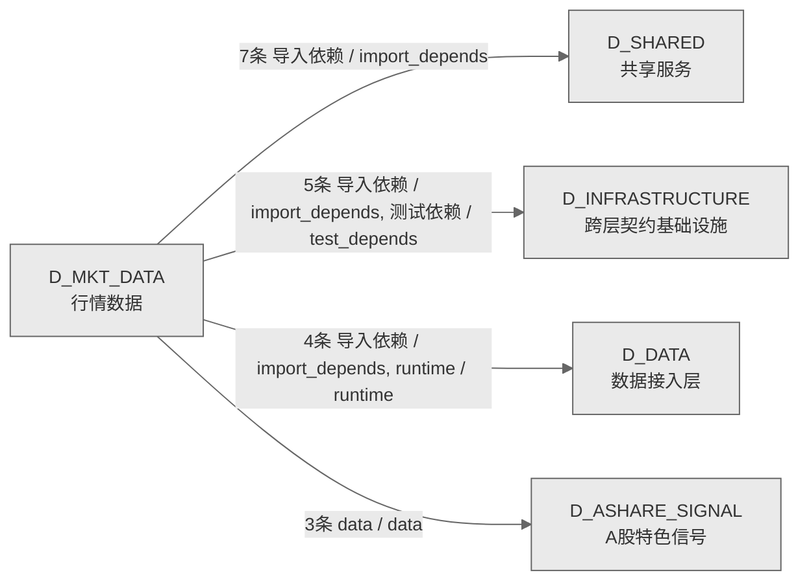

# 23_d_mkt_data / 行情数据域 / Market Data

> **功能简介 / Overview**: 行情数据，负责市场行情数据的采集、分发和订阅管理

> **文档作用 / Purpose**: 展示 行情数据（D_MKT_DATA）功能域的域内依赖关系、跨域依赖关系，模块信息（成熟度/中英文名/大白话/文件路径）内嵌于 Mermaid 节点，供架构审查和域治理参考。

> 本文档由 generate_domain_doc.py 从 depgraph (PostgreSQL) 自动生成
> 数据源: depgraph (PostgreSQL) nodes表 + edges表

> **[可缩放 HTML 版 / Zoomable HTML](http://localhost:8765/docs/02_enterprise_architecture/02_domain_architecture_docs/_zoomable_html/23_d_mkt_data.html)** — Ctrl+滚轮缩放 ｜ 双击重置 ｜ Ctrl+Shift+D 切换拖动/选择模式

## 域基本信息 / Domain Overview

| 字段 | 值 | Field | Value |
|------|------|-------|-------|
| 编号 | 23 | Number | 23 |
| 域ID | D_MKT_DATA | Domain ID | D_MKT_DATA |
| 域名称 | 行情数据 | Domain Name | Market Data |
| 层级 | L1 基础平台层 | Layer | L1 Foundation |
| 模块数 | 26 | Module Count | 26 |
| 域内依赖 | 29 | Internal Dependencies | 29 |
| 跨域入边 | 0 | Cross-domain Incoming | 0 |
| 跨域出边 | 19 | Cross-domain Outgoing | 19 |
| 设计态模块 | 0 | Design Modules | 0 |
| 生产态模块 | 26 | Production Modules | 26 |
| 容量 | 26/150 (正常) | Capacity | 26/150 (正常) |
| 描述 | 行情数据，负责市场行情数据的采集、分发和订阅管理 | Description | 行情数据，负责市场行情数据的采集、分发和订阅管理 |

## 域内依赖图 / Internal Dependency Diagram

> 依赖图内嵌在本文档中，IDE 可直接渲染；网页版可 Ctrl+滚轮缩放 + 拖动平移查看细节。
>
> **图例说明 / Legend**：
> - 🟦 **蓝色 = 运营态模块**（production，已上线运行）
> - 🟧 **橙色虚线 = 设计态模块**（design，蓝图阶段，代码未写）
> - **实线箭头 = 运营态依赖**（已生效的依赖关系）
> - **虚线箭头 = 非运营态依赖**（计划中/验证中的依赖关系）

### 全景图（全部模块，颜色区分运营态/设计态）

> 展示全部 26 个模块（生产态 26 + 设计态 0），含跨域依赖外部节点。节点含成熟度+名称+大白话/简介+文件路径。

```mermaid
%%{init: {'theme': 'base', 'themeVariables': {'primaryColor': '#eaeaea', 'primaryTextColor': '#333333', 'primaryBorderColor': '#666666', 'lineColor': '#666666', 'secondaryColor': '#eaeaea', 'tertiaryColor': '#eaeaea', 'fontSize': '14px'}}}%%
flowchart TD
    src_zephyr_market_data_init_py["zephyr/market_data 包入口<br/>管理zephyr.market_data子包的加载和懒导入<br/>Init<br/>文件: market_data/__init__.py<br/>(生产态 / production)"]
    src_zephyr_market_data_extensions_init_py["market_data/_extensions 包入口<br/>管理market_data._extensions子包的加载和懒导入<br/>Init<br/>文件: _extensions/__init__.py<br/>(生产态 / production)"]
    src_zephyr_market_data_api_init_py["market_data/api 包入口<br/>管理market_data.api子包的加载和懒导入<br/>Init<br/>文件: api/__init__.py<br/>(生产态 / production)"]
    src_zephyr_market_data_core_init_py["market_data/core 包入口<br/>管理market_data.core子包的加载和懒导入<br/>Init<br/>文件: core/__init__.py<br/>(生产态 / production)"]
    src_zephyr_market_data_infrastructure_init_py["market_data/infrastructure 包入口<br/>管理market_data.infrastructure子包的加载和懒导入<br/>Init<br/>文件: infrastructure/__init__.py<br/>(生产态 / production)"]
    src_zephyr_market_data_models_init_py["market_data/models 包入口<br/>管理market_data.models子包的加载和懒导入<br/>Init<br/>文件: models/__init__.py<br/>(生产态 / production)"]
    src_zephyr_market_data_normalized_market_data_producer_init_py["—D_MKT_DATA→D_FACTOR 数据供给<br/>NormalizedMarketData<br/>生产者包——D_MKT_DATA→D_FACTOR 数据供给。<br/>Init<br/>文件: normalized_market_data_producer<br/>/__init__.py<br/>(生产态 / production)"]
    src_zephyr_market_data_services_init_py["market_data/services 包入口<br/>管理market_data.services子包的加载和懒导入<br/>Init<br/>文件: services/__init__.py<br/>(生产态 / production)"]
    tests_market_data_connectors_test_connector_base_py["MOD-MKT-003 Connector Base 单元测试.<br/>连接器包的test_connector_base模块<br/>Test Connector Base<br/>文件: connectors/test_connector_base.py<br/>(生产态 / production)"]
    tests_market_data_connectors_test_connector_manager_py["MOD-MKT-003 Connector Manager 单元测试.<br/>连接器包的test_connector_manager模块<br/>Test Connector Manager<br/>文件: connectors/test_connector_manager.py<br/>(生产态 / production)"]
    tests_market_data_failover_test_failover_manager_py["MOD-MKT-004 Failover Manager 单元测试.<br/>failover包的test_failover_manager模块<br/>Test Failover Manager<br/>文件: failover/test_failover_manager.py<br/>(生产态 / production)"]
    tests_market_data_raw_data_cache_test_raw_data_cache_py["MOD-MKT-006 Raw Data Cache 单元测试.<br/>raw data cache包的test_raw_data_cache模块<br/>Test Raw Data Cache<br/>文件: raw_data_cache/test_raw_data_cache.py<br/>(生产态 / production)"]
    tests_market_data_test_autoload_py["MOD-MKT-005 Autoload 单元测试.<br/>行情数据包的test_autoload模块<br/>Test Autoload<br/>文件: market_data/test_autoload.py<br/>(生产态 / production)"]
    tests_market_data_test_vendor_base_py["MOD-MKT-002 Vendor Base 单元测试.<br/>行情数据包的test_vendor_base模块<br/>Test Vendor Base<br/>文件: market_data/test_vendor_base.py<br/>(生产态 / production)"]
    tests_market_data_test_vendor_registry_py["MOD-MKT-001 Vendor Registry 单元测试.<br/>行情数据包的test_vendor_registry模块<br/>Test Vendor Registry<br/>文件: market_data/test_vendor_registry.py<br/>(生产态 / production)"]
    src_zephyr_market_data_init_py ~~~ src_zephyr_market_data_extensions_init_py
    src_zephyr_market_data_extensions_init_py ~~~ src_zephyr_market_data_api_init_py
    src_zephyr_market_data_api_init_py ~~~ src_zephyr_market_data_core_init_py
    src_zephyr_market_data_core_init_py ~~~ src_zephyr_market_data_infrastructure_init_py
    src_zephyr_market_data_infrastructure_init_py ~~~ src_zephyr_market_data_models_init_py
    src_zephyr_market_data_models_init_py ~~~ src_zephyr_market_data_normalized_market_data_producer_init_py
    src_zephyr_market_data_normalized_market_data_producer_init_py ~~~ src_zephyr_market_data_services_init_py
    src_zephyr_market_data_services_init_py ~~~ tests_market_data_connectors_test_connector_base_py
    tests_market_data_connectors_test_connector_base_py ~~~ tests_market_data_connectors_test_connector_manager_py
    tests_market_data_connectors_test_connector_manager_py ~~~ tests_market_data_failover_test_failover_manager_py
    tests_market_data_failover_test_failover_manager_py ~~~ tests_market_data_raw_data_cache_test_raw_data_cache_py
    tests_market_data_raw_data_cache_test_raw_data_cache_py ~~~ tests_market_data_test_autoload_py
    tests_market_data_test_autoload_py ~~~ tests_market_data_test_vendor_base_py
    tests_market_data_test_vendor_base_py ~~~ tests_market_data_test_vendor_registry_py
    src_zephyr_market_data_autoload_py["Autoload<br/>D_MKT_DATA — Autoload (自动加载器)<br/>文件: market_data/autoload.py<br/>(生产态 / production)"]
    src_zephyr_market_data_connectors_init_py["market_data/connectors 包入口<br/>D_MKT_DATA — Connectors (行情数据连接器)<br/>Init<br/>文件: connectors/__init__.py<br/>(生产态 / production)"]
    src_zephyr_market_data_failover_init_py["market_data/failover 包入口<br/>D_MKT_DATA — Failover (故障切换)<br/>Init<br/>文件: failover/__init__.py<br/>(生产态 / production)"]
    src_zephyr_market_data_normalized_market_data_producer_producer_py["—D_MKT_DATA→D_FACTOR 数据供给<br/>NormalizedMarketData<br/>生产者——D_MKT_DATA→D_FACTOR 数据供给。<br/>Producer<br/>文件: normalized_market_data_producer<br/>/producer.py<br/>(生产态 / production)"]
    src_zephyr_market_data_raw_data_cache_init_py["market_data/raw_data_cache 包入口<br/>D_MKT_DATA — Raw Data Cache (原始数据缓存)<br/>Init<br/>文件: raw_data_cache/__init__.py<br/>(生产态 / production)"]
    src_zephyr_market_data_autoload_py ~~~ src_zephyr_market_data_connectors_init_py
    src_zephyr_market_data_connectors_init_py ~~~ src_zephyr_market_data_failover_init_py
    src_zephyr_market_data_failover_init_py ~~~ src_zephyr_market_data_normalized_market_data_producer_producer_py
    src_zephyr_market_data_normalized_market_data_producer_producer_py ~~~ src_zephyr_market_data_raw_data_cache_init_py
    src_zephyr_market_data_connectors_manager_py["管理器<br/>D_MKT_DATA — Connector Manager (连接器管理器)<br/>文件: connectors/manager.py<br/>(生产态 / production)"]
    src_zephyr_market_data_failover_manager_py["管理器<br/>D_MKT_DATA — Failover Manager (故障切换管理器)<br/>文件: failover/manager.py<br/>(生产态 / production)"]
    src_zephyr_market_data_raw_data_cache_cache_py["Raw Data Cache 实现<br/>D_MKT_DATA — Raw Data Cache 实现 (原始数据缓存)<br/>文件: raw_data_cache/cache.py<br/>(生产态 / production)"]
    src_zephyr_market_data_connectors_manager_py ~~~ src_zephyr_market_data_failover_manager_py
    src_zephyr_market_data_failover_manager_py ~~~ src_zephyr_market_data_raw_data_cache_cache_py
    src_zephyr_market_data_connectors_base_py["基础<br/>D_MKT_DATA — Connector Base (行情数据连接器基类)<br/>文件: connectors/base.py<br/>(生产态 / production)"]
    src_zephyr_market_data_vendor_registry_py["Vendor注册表<br/>D_MKT_DATA — Vendor Registry (行情数据源注册表)<br/>文件: market_data/vendor_registry.py<br/>(生产态 / production)"]
    src_zephyr_market_data_connectors_base_py ~~~ src_zephyr_market_data_vendor_registry_py
    src_zephyr_market_data_vendor_base_py["Vendor基础<br/>D_MKT_DATA — Vendor Base (行情数据源基类)<br/>文件: market_data/vendor_base.py<br/>(生产态 / production)"]
    src_zephyr_market_data_vendor_registry_py -->|导入依赖 / import_depends| src_zephyr_market_data_vendor_base_py
    src_zephyr_market_data_vendor_registry_py -->|import / import| src_zephyr_market_data_vendor_base_py
    src_zephyr_market_data_connectors_base_py -->|导入依赖 / import_depends| src_zephyr_market_data_vendor_base_py
    src_zephyr_market_data_autoload_py -->|导入依赖 / import_depends| src_zephyr_market_data_vendor_base_py
    src_zephyr_market_data_autoload_py -->|runtime / runtime| src_zephyr_market_data_vendor_registry_py
    src_zephyr_market_data_autoload_py -->|导入依赖 / import_depends| src_zephyr_market_data_vendor_registry_py
    src_zephyr_market_data_connectors_init_py -->|导入依赖 / import_depends| src_zephyr_market_data_connectors_base_py
    src_zephyr_market_data_connectors_init_py -->|导入依赖 / import_depends| src_zephyr_market_data_connectors_manager_py
    src_zephyr_market_data_connectors_manager_py -->|导入依赖 / import_depends| src_zephyr_market_data_connectors_base_py
    src_zephyr_market_data_failover_init_py -->|导入依赖 / import_depends| src_zephyr_market_data_failover_manager_py
    src_zephyr_market_data_failover_manager_py -->|导入依赖 / import_depends| src_zephyr_market_data_vendor_base_py
    src_zephyr_market_data_failover_manager_py -->|导入依赖 / import_depends| src_zephyr_market_data_vendor_registry_py
    src_zephyr_market_data_normalized_market_data_producer_init_py -->|导入依赖 / import_depends| src_zephyr_market_data_normalized_market_data_producer_producer_py
    src_zephyr_market_data_raw_data_cache_init_py -->|导入依赖 / import_depends| src_zephyr_market_data_raw_data_cache_cache_py
    tests_market_data_test_autoload_py -->|测试依赖 / test_depends| src_zephyr_market_data_vendor_base_py
    tests_market_data_test_autoload_py -->|测试依赖 / test_depends| src_zephyr_market_data_vendor_registry_py
    tests_market_data_test_autoload_py -->|测试依赖 / test_depends| src_zephyr_market_data_autoload_py
    tests_market_data_test_vendor_registry_py -->|测试依赖 / test_depends| src_zephyr_market_data_vendor_base_py
    tests_market_data_test_vendor_registry_py -->|测试依赖 / test_depends| src_zephyr_market_data_vendor_registry_py
    tests_market_data_connectors_test_connector_manager_py -->|测试依赖 / test_depends| src_zephyr_market_data_vendor_base_py
    tests_market_data_connectors_test_connector_manager_py -->|测试依赖 / test_depends| src_zephyr_market_data_connectors_init_py
    tests_market_data_connectors_test_connector_manager_py -->|测试依赖 / test_depends| src_zephyr_market_data_connectors_manager_py
    tests_market_data_test_vendor_base_py -->|测试依赖 / test_depends| src_zephyr_market_data_vendor_base_py
    tests_market_data_failover_test_failover_manager_py -->|测试依赖 / test_depends| src_zephyr_market_data_vendor_base_py
    tests_market_data_failover_test_failover_manager_py -->|测试依赖 / test_depends| src_zephyr_market_data_vendor_registry_py
    tests_market_data_failover_test_failover_manager_py -->|测试依赖 / test_depends| src_zephyr_market_data_failover_init_py
    tests_market_data_raw_data_cache_test_raw_data_cache_py -->|测试依赖 / test_depends| src_zephyr_market_data_raw_data_cache_init_py
    tests_market_data_connectors_test_connector_base_py -->|测试依赖 / test_depends| src_zephyr_market_data_vendor_base_py
    tests_market_data_connectors_test_connector_base_py -->|测试依赖 / test_depends| src_zephyr_market_data_connectors_init_py
    D_DATA["数据接入层<br/>数据接入层，负责数据源接入、数据集成和数据标准化<br/>Data Access Layer<br/>跨域节点 / cross-domain<br/>(生产态 / production)"]
    src_zephyr_market_data_autoload_py -->|runtime / runtime| D_DATA
    D_ASHARE_SIGNAL["A股特色信号<br/>A 股特色信号，负责 A<br/>股市场特色交易信号的生成和管理<br/>A-Share Signal<br/>跨域节点 / cross-domain<br/>(设计态 / design)"]
    src_zephyr_market_data_raw_data_cache_init_py -.->|data / data| D_ASHARE_SIGNAL
    src_zephyr_market_data_raw_data_cache_init_py -.->|data / data| D_ASHARE_SIGNAL
    src_zephyr_market_data_raw_data_cache_init_py -.->|data / data| D_ASHARE_SIGNAL
    D_SHARED["共享服务<br/>共享服务，负责跨域共享的工具、协议和基础服务<br/>Shared Services<br/>跨域节点 / cross-domain<br/>(生产态 / production)"]
    src_zephyr_market_data_autoload_py -->|导入依赖 / import_depends| D_SHARED
    src_zephyr_market_data_vendor_base_py -->|导入依赖 / import_depends| D_SHARED
    src_zephyr_market_data_failover_manager_py -->|导入依赖 / import_depends| D_SHARED
    D_INFRASTRUCTURE["跨层契约基础设施<br/>跨层契约基础设施，负责跨层契约定义、共享契约管理<br/>和契约校验<br/>Cross-Layer Contract Infrastructure<br/>跨域节点 / cross-domain<br/>(生产态 / production)"]
    src_zephyr_market_data_connectors_base_py -->|导入依赖 / import_depends| D_INFRASTRUCTURE
    src_zephyr_market_data_init_py -->|导入依赖 / import_depends| D_INFRASTRUCTURE
    tests_market_data_test_vendor_base_py -->|测试依赖 / test_depends| D_INFRASTRUCTURE
    src_zephyr_market_data_normalized_market_data_producer_producer_py -->|导入依赖 / import_depends| D_DATA
    src_zephyr_market_data_vendor_registry_py -->|导入依赖 / import_depends| D_SHARED
    src_zephyr_market_data_raw_data_cache_cache_py -->|导入依赖 / import_depends| D_SHARED
    src_zephyr_market_data_normalized_market_data_producer_producer_py -->|导入依赖 / import_depends| D_INFRASTRUCTURE
    src_zephyr_market_data_normalized_market_data_producer_producer_py -->|导入依赖 / import_depends| D_DATA
    classDef production fill:#e1f5fe,stroke:#01579b,stroke-width:2px,color:#000
    classDef design fill:#fff3e0,stroke:#e65100,stroke-width:2px,color:#000,stroke-dasharray: 5 5
    classDef external_prod fill:#e8f4fd,stroke:#0277bd,stroke-width:1px,color:#000
    classDef external_design fill:#fff8e7,stroke:#ef6c00,stroke-width:1px,color:#000,stroke-dasharray: 5 5
    class src_zephyr_market_data_init_py,src_zephyr_market_data_extensions_init_py,src_zephyr_market_data_api_init_py,src_zephyr_market_data_autoload_py,src_zephyr_market_data_connectors_init_py,src_zephyr_market_data_connectors_base_py,src_zephyr_market_data_connectors_manager_py,src_zephyr_market_data_core_init_py,src_zephyr_market_data_failover_init_py,src_zephyr_market_data_failover_manager_py,src_zephyr_market_data_infrastructure_init_py,src_zephyr_market_data_models_init_py,src_zephyr_market_data_normalized_market_data_producer_init_py,src_zephyr_market_data_normalized_market_data_producer_producer_py,src_zephyr_market_data_raw_data_cache_init_py,src_zephyr_market_data_raw_data_cache_cache_py,src_zephyr_market_data_services_init_py,src_zephyr_market_data_vendor_base_py,src_zephyr_market_data_vendor_registry_py,tests_market_data_connectors_test_connector_base_py,tests_market_data_connectors_test_connector_manager_py,tests_market_data_failover_test_failover_manager_py,tests_market_data_raw_data_cache_test_raw_data_cache_py,tests_market_data_test_autoload_py,tests_market_data_test_vendor_base_py,tests_market_data_test_vendor_registry_py production
    class D_DATA,D_SHARED,D_INFRASTRUCTURE external_prod
    class D_ASHARE_SIGNAL external_design
```

### 运营态的图（仅 design_maturity=production 的模块和域内依赖）

> 仅展示已上线运行的模块（共 26 个），不含跨域外部节点。跨域依赖见下方跨域依赖章节。

```mermaid
%%{init: {'theme': 'base', 'themeVariables': {'primaryColor': '#eaeaea', 'primaryTextColor': '#333333', 'primaryBorderColor': '#666666', 'lineColor': '#666666', 'secondaryColor': '#eaeaea', 'tertiaryColor': '#eaeaea', 'fontSize': '14px'}}}%%
flowchart TD
    src_zephyr_market_data_init_py["zephyr/market_data 包入口<br/>管理zephyr.market_data子包的加载和懒导入<br/>Init<br/>文件: market_data/__init__.py<br/>(生产态 / production)"]
    src_zephyr_market_data_extensions_init_py["market_data/_extensions 包入口<br/>管理market_data._extensions子包的加载和懒导入<br/>Init<br/>文件: _extensions/__init__.py<br/>(生产态 / production)"]
    src_zephyr_market_data_api_init_py["market_data/api 包入口<br/>管理market_data.api子包的加载和懒导入<br/>Init<br/>文件: api/__init__.py<br/>(生产态 / production)"]
    src_zephyr_market_data_core_init_py["market_data/core 包入口<br/>管理market_data.core子包的加载和懒导入<br/>Init<br/>文件: core/__init__.py<br/>(生产态 / production)"]
    src_zephyr_market_data_infrastructure_init_py["market_data/infrastructure 包入口<br/>管理market_data.infrastructure子包的加载和懒导入<br/>Init<br/>文件: infrastructure/__init__.py<br/>(生产态 / production)"]
    src_zephyr_market_data_models_init_py["market_data/models 包入口<br/>管理market_data.models子包的加载和懒导入<br/>Init<br/>文件: models/__init__.py<br/>(生产态 / production)"]
    src_zephyr_market_data_normalized_market_data_producer_init_py["—D_MKT_DATA→D_FACTOR 数据供给<br/>NormalizedMarketData<br/>生产者包——D_MKT_DATA→D_FACTOR 数据供给。<br/>Init<br/>文件: normalized_market_data_producer<br/>/__init__.py<br/>(生产态 / production)"]
    src_zephyr_market_data_services_init_py["market_data/services 包入口<br/>管理market_data.services子包的加载和懒导入<br/>Init<br/>文件: services/__init__.py<br/>(生产态 / production)"]
    tests_market_data_connectors_test_connector_base_py["MOD-MKT-003 Connector Base 单元测试.<br/>连接器包的test_connector_base模块<br/>Test Connector Base<br/>文件: connectors/test_connector_base.py<br/>(生产态 / production)"]
    tests_market_data_connectors_test_connector_manager_py["MOD-MKT-003 Connector Manager 单元测试.<br/>连接器包的test_connector_manager模块<br/>Test Connector Manager<br/>文件: connectors/test_connector_manager.py<br/>(生产态 / production)"]
    tests_market_data_failover_test_failover_manager_py["MOD-MKT-004 Failover Manager 单元测试.<br/>failover包的test_failover_manager模块<br/>Test Failover Manager<br/>文件: failover/test_failover_manager.py<br/>(生产态 / production)"]
    tests_market_data_raw_data_cache_test_raw_data_cache_py["MOD-MKT-006 Raw Data Cache 单元测试.<br/>raw data cache包的test_raw_data_cache模块<br/>Test Raw Data Cache<br/>文件: raw_data_cache/test_raw_data_cache.py<br/>(生产态 / production)"]
    tests_market_data_test_autoload_py["MOD-MKT-005 Autoload 单元测试.<br/>行情数据包的test_autoload模块<br/>Test Autoload<br/>文件: market_data/test_autoload.py<br/>(生产态 / production)"]
    tests_market_data_test_vendor_base_py["MOD-MKT-002 Vendor Base 单元测试.<br/>行情数据包的test_vendor_base模块<br/>Test Vendor Base<br/>文件: market_data/test_vendor_base.py<br/>(生产态 / production)"]
    tests_market_data_test_vendor_registry_py["MOD-MKT-001 Vendor Registry 单元测试.<br/>行情数据包的test_vendor_registry模块<br/>Test Vendor Registry<br/>文件: market_data/test_vendor_registry.py<br/>(生产态 / production)"]
    src_zephyr_market_data_init_py ~~~ src_zephyr_market_data_extensions_init_py
    src_zephyr_market_data_extensions_init_py ~~~ src_zephyr_market_data_api_init_py
    src_zephyr_market_data_api_init_py ~~~ src_zephyr_market_data_core_init_py
    src_zephyr_market_data_core_init_py ~~~ src_zephyr_market_data_infrastructure_init_py
    src_zephyr_market_data_infrastructure_init_py ~~~ src_zephyr_market_data_models_init_py
    src_zephyr_market_data_models_init_py ~~~ src_zephyr_market_data_normalized_market_data_producer_init_py
    src_zephyr_market_data_normalized_market_data_producer_init_py ~~~ src_zephyr_market_data_services_init_py
    src_zephyr_market_data_services_init_py ~~~ tests_market_data_connectors_test_connector_base_py
    tests_market_data_connectors_test_connector_base_py ~~~ tests_market_data_connectors_test_connector_manager_py
    tests_market_data_connectors_test_connector_manager_py ~~~ tests_market_data_failover_test_failover_manager_py
    tests_market_data_failover_test_failover_manager_py ~~~ tests_market_data_raw_data_cache_test_raw_data_cache_py
    tests_market_data_raw_data_cache_test_raw_data_cache_py ~~~ tests_market_data_test_autoload_py
    tests_market_data_test_autoload_py ~~~ tests_market_data_test_vendor_base_py
    tests_market_data_test_vendor_base_py ~~~ tests_market_data_test_vendor_registry_py
    src_zephyr_market_data_autoload_py["Autoload<br/>D_MKT_DATA — Autoload (自动加载器)<br/>文件: market_data/autoload.py<br/>(生产态 / production)"]
    src_zephyr_market_data_connectors_init_py["market_data/connectors 包入口<br/>D_MKT_DATA — Connectors (行情数据连接器)<br/>Init<br/>文件: connectors/__init__.py<br/>(生产态 / production)"]
    src_zephyr_market_data_failover_init_py["market_data/failover 包入口<br/>D_MKT_DATA — Failover (故障切换)<br/>Init<br/>文件: failover/__init__.py<br/>(生产态 / production)"]
    src_zephyr_market_data_normalized_market_data_producer_producer_py["—D_MKT_DATA→D_FACTOR 数据供给<br/>NormalizedMarketData<br/>生产者——D_MKT_DATA→D_FACTOR 数据供给。<br/>Producer<br/>文件: normalized_market_data_producer<br/>/producer.py<br/>(生产态 / production)"]
    src_zephyr_market_data_raw_data_cache_init_py["market_data/raw_data_cache 包入口<br/>D_MKT_DATA — Raw Data Cache (原始数据缓存)<br/>Init<br/>文件: raw_data_cache/__init__.py<br/>(生产态 / production)"]
    src_zephyr_market_data_autoload_py ~~~ src_zephyr_market_data_connectors_init_py
    src_zephyr_market_data_connectors_init_py ~~~ src_zephyr_market_data_failover_init_py
    src_zephyr_market_data_failover_init_py ~~~ src_zephyr_market_data_normalized_market_data_producer_producer_py
    src_zephyr_market_data_normalized_market_data_producer_producer_py ~~~ src_zephyr_market_data_raw_data_cache_init_py
    src_zephyr_market_data_connectors_manager_py["管理器<br/>D_MKT_DATA — Connector Manager (连接器管理器)<br/>文件: connectors/manager.py<br/>(生产态 / production)"]
    src_zephyr_market_data_failover_manager_py["管理器<br/>D_MKT_DATA — Failover Manager (故障切换管理器)<br/>文件: failover/manager.py<br/>(生产态 / production)"]
    src_zephyr_market_data_raw_data_cache_cache_py["Raw Data Cache 实现<br/>D_MKT_DATA — Raw Data Cache 实现 (原始数据缓存)<br/>文件: raw_data_cache/cache.py<br/>(生产态 / production)"]
    src_zephyr_market_data_connectors_manager_py ~~~ src_zephyr_market_data_failover_manager_py
    src_zephyr_market_data_failover_manager_py ~~~ src_zephyr_market_data_raw_data_cache_cache_py
    src_zephyr_market_data_connectors_base_py["基础<br/>D_MKT_DATA — Connector Base (行情数据连接器基类)<br/>文件: connectors/base.py<br/>(生产态 / production)"]
    src_zephyr_market_data_vendor_registry_py["Vendor注册表<br/>D_MKT_DATA — Vendor Registry (行情数据源注册表)<br/>文件: market_data/vendor_registry.py<br/>(生产态 / production)"]
    src_zephyr_market_data_connectors_base_py ~~~ src_zephyr_market_data_vendor_registry_py
    src_zephyr_market_data_vendor_base_py["Vendor基础<br/>D_MKT_DATA — Vendor Base (行情数据源基类)<br/>文件: market_data/vendor_base.py<br/>(生产态 / production)"]
    src_zephyr_market_data_vendor_registry_py -->|导入依赖 / import_depends| src_zephyr_market_data_vendor_base_py
    src_zephyr_market_data_vendor_registry_py -->|import / import| src_zephyr_market_data_vendor_base_py
    src_zephyr_market_data_connectors_base_py -->|导入依赖 / import_depends| src_zephyr_market_data_vendor_base_py
    src_zephyr_market_data_autoload_py -->|导入依赖 / import_depends| src_zephyr_market_data_vendor_base_py
    src_zephyr_market_data_autoload_py -->|runtime / runtime| src_zephyr_market_data_vendor_registry_py
    src_zephyr_market_data_autoload_py -->|导入依赖 / import_depends| src_zephyr_market_data_vendor_registry_py
    src_zephyr_market_data_connectors_init_py -->|导入依赖 / import_depends| src_zephyr_market_data_connectors_base_py
    src_zephyr_market_data_connectors_init_py -->|导入依赖 / import_depends| src_zephyr_market_data_connectors_manager_py
    src_zephyr_market_data_connectors_manager_py -->|导入依赖 / import_depends| src_zephyr_market_data_connectors_base_py
    src_zephyr_market_data_failover_init_py -->|导入依赖 / import_depends| src_zephyr_market_data_failover_manager_py
    src_zephyr_market_data_failover_manager_py -->|导入依赖 / import_depends| src_zephyr_market_data_vendor_base_py
    src_zephyr_market_data_failover_manager_py -->|导入依赖 / import_depends| src_zephyr_market_data_vendor_registry_py
    src_zephyr_market_data_normalized_market_data_producer_init_py -->|导入依赖 / import_depends| src_zephyr_market_data_normalized_market_data_producer_producer_py
    src_zephyr_market_data_raw_data_cache_init_py -->|导入依赖 / import_depends| src_zephyr_market_data_raw_data_cache_cache_py
    tests_market_data_test_autoload_py -->|测试依赖 / test_depends| src_zephyr_market_data_vendor_base_py
    tests_market_data_test_autoload_py -->|测试依赖 / test_depends| src_zephyr_market_data_vendor_registry_py
    tests_market_data_test_autoload_py -->|测试依赖 / test_depends| src_zephyr_market_data_autoload_py
    tests_market_data_test_vendor_registry_py -->|测试依赖 / test_depends| src_zephyr_market_data_vendor_base_py
    tests_market_data_test_vendor_registry_py -->|测试依赖 / test_depends| src_zephyr_market_data_vendor_registry_py
    tests_market_data_connectors_test_connector_manager_py -->|测试依赖 / test_depends| src_zephyr_market_data_vendor_base_py
    tests_market_data_connectors_test_connector_manager_py -->|测试依赖 / test_depends| src_zephyr_market_data_connectors_init_py
    tests_market_data_connectors_test_connector_manager_py -->|测试依赖 / test_depends| src_zephyr_market_data_connectors_manager_py
    tests_market_data_test_vendor_base_py -->|测试依赖 / test_depends| src_zephyr_market_data_vendor_base_py
    tests_market_data_failover_test_failover_manager_py -->|测试依赖 / test_depends| src_zephyr_market_data_vendor_base_py
    tests_market_data_failover_test_failover_manager_py -->|测试依赖 / test_depends| src_zephyr_market_data_vendor_registry_py
    tests_market_data_failover_test_failover_manager_py -->|测试依赖 / test_depends| src_zephyr_market_data_failover_init_py
    tests_market_data_raw_data_cache_test_raw_data_cache_py -->|测试依赖 / test_depends| src_zephyr_market_data_raw_data_cache_init_py
    tests_market_data_connectors_test_connector_base_py -->|测试依赖 / test_depends| src_zephyr_market_data_vendor_base_py
    tests_market_data_connectors_test_connector_base_py -->|测试依赖 / test_depends| src_zephyr_market_data_connectors_init_py
    classDef production fill:#e1f5fe,stroke:#01579b,stroke-width:2px,color:#000
    classDef design fill:#fff3e0,stroke:#e65100,stroke-width:2px,color:#000,stroke-dasharray: 5 5
    classDef external_prod fill:#e8f4fd,stroke:#0277bd,stroke-width:1px,color:#000
    classDef external_design fill:#fff8e7,stroke:#ef6c00,stroke-width:1px,color:#000,stroke-dasharray: 5 5
    class src_zephyr_market_data_init_py,src_zephyr_market_data_extensions_init_py,src_zephyr_market_data_api_init_py,src_zephyr_market_data_autoload_py,src_zephyr_market_data_connectors_init_py,src_zephyr_market_data_connectors_base_py,src_zephyr_market_data_connectors_manager_py,src_zephyr_market_data_core_init_py,src_zephyr_market_data_failover_init_py,src_zephyr_market_data_failover_manager_py,src_zephyr_market_data_infrastructure_init_py,src_zephyr_market_data_models_init_py,src_zephyr_market_data_normalized_market_data_producer_init_py,src_zephyr_market_data_normalized_market_data_producer_producer_py,src_zephyr_market_data_raw_data_cache_init_py,src_zephyr_market_data_raw_data_cache_cache_py,src_zephyr_market_data_services_init_py,src_zephyr_market_data_vendor_base_py,src_zephyr_market_data_vendor_registry_py,tests_market_data_connectors_test_connector_base_py,tests_market_data_connectors_test_connector_manager_py,tests_market_data_failover_test_failover_manager_py,tests_market_data_raw_data_cache_test_raw_data_cache_py,tests_market_data_test_autoload_py,tests_market_data_test_vendor_base_py,tests_market_data_test_vendor_registry_py production
```

### 设计态的图（仅 design_maturity=design 的模块和域内依赖）

> 仅展示蓝图阶段、代码未写的设计态模块（共 0 个），不含跨域外部节点。

> （无模块 / No modules）

## 跨域依赖 / Cross-domain Dependencies

### 本域依赖的其他域（出边）/ Depends On

| # | 本域模块 / Source Module | → | 外部域-目标模块 / Target Module | 依赖类型 / Type |
|:--:|---------|:--:|---------|---------|
| 1 | 包入口 / Init (raw_data_cache/__init__.py) | → | D_ASHARE_SIGNAL A股特色信号: 调整周期追踪 / Adjustment Cycle Tracking (signal_ashare/a... | data / data |
| 2 | 包入口 / Init (raw_data_cache/__init__.py) | → | D_ASHARE_SIGNAL A股特色信号: 跨市场传导感知 / Cross-Market Conduction Sensing (signal_... | data / data |
| 3 | 包入口 / Init (raw_data_cache/__init__.py) | → | D_ASHARE_SIGNAL A股特色信号: 行情生命周期阶段 / Market Lifecycle Phase (signal_ashare/... | data / data |
| 4 | Autoload (market_data/autoload.py) | → | D_DATA 数据接入层: table注册表 / table_registry (data/table_registry.py) | runtime / runtime |
| 5 | D_MKT_DATA→D_FACTOR 数据供给 / Producer (normalized_mark... | → | D_DATA 数据接入层: 包入口 / __init__ (data/__init__.py) | 导入依赖 / import_depends |
| 6 | D_MKT_DATA→D_FACTOR 数据供给 / Producer (normalized_mark... | → | D_DATA 数据接入层: ch读取器 / ch_reader (data/ch_reader.py) | 导入依赖 / import_depends |
| 7 | D_MKT_DATA→D_FACTOR 数据供给 / Producer (normalized_mark... | → | D_DATA 数据接入层: table注册表 / table_registry (data/table_registry.py) | 导入依赖 / import_depends |
| 8 | 包入口 / Init (market_data/__init__.py) | → | D_INFRASTRUCTURE 跨层契约基础设施: 市场数据 / Market Data (contracts/market_data.py) | 导入依赖 / import_depends |
| 9 | 基础 / Base (connectors/base.py) | → | D_INFRASTRUCTURE 跨层契约基础设施: 市场数据 / Market Data (contracts/market_data.py) | 导入依赖 / import_depends |
| 10 | D_MKT_DATA→D_FACTOR 数据供给 / Producer (normalized_mark... | → | D_INFRASTRUCTURE 跨层契约基础设施: 市场数据 / Market Data (contracts/market_data.py) | 导入依赖 / import_depends |
| 11 | Vendor基础 / Vendor Base (market_data/vendor_base.py) | → | D_INFRASTRUCTURE 跨层契约基础设施: 市场数据 / Market Data (contracts/market_data.py) | 导入依赖 / import_depends |
| 12 | MOD-MKT-002 Vendor Base 单元测试. / Test Vendor Base (mar... | → | D_INFRASTRUCTURE 跨层契约基础设施: 市场数据 / Market Data (contracts/market_data.py) | 测试依赖 / test_depends |
| 13 | Autoload (market_data/autoload.py) | → | D_SHARED 共享服务: ZephyrAlpha 所有业务异常的根 / Errors (foundation/errors.py) | 导入依赖 / import_depends |
| 14 | 基础 / Base (connectors/base.py) | → | D_SHARED 共享服务: ZephyrAlpha 所有业务异常的根 / Errors (foundation/errors.py) | 导入依赖 / import_depends |
| 15 | 管理器 / Manager (connectors/manager.py) | → | D_SHARED 共享服务: ZephyrAlpha 所有业务异常的根 / Errors (foundation/errors.py) | 导入依赖 / import_depends |
| 16 | 管理器 / Manager (failover/manager.py) | → | D_SHARED 共享服务: ZephyrAlpha 所有业务异常的根 / Errors (foundation/errors.py) | 导入依赖 / import_depends |
| 17 | Raw Data Cache 实现 / Cache (raw_data_cache/cache.py) | → | D_SHARED 共享服务: ZephyrAlpha 所有业务异常的根 / Errors (foundation/errors.py) | 导入依赖 / import_depends |
| 18 | Vendor基础 / Vendor Base (market_data/vendor_base.py) | → | D_SHARED 共享服务: ZephyrAlpha 所有业务异常的根 / Errors (foundation/errors.py) | 导入依赖 / import_depends |
| 19 | Vendor注册表 / Vendor Registry (market_data/vendor_regist... | → | D_SHARED 共享服务: ZephyrAlpha 所有业务异常的根 / Errors (foundation/errors.py) | 导入依赖 / import_depends |

### 依赖本域的其他域（入边）/ Depended By

无跨域入边依赖 / No cross-domain incoming dependencies

### 跨域依赖图 / Cross-domain Dependency Diagram

> 本域与 4 个外部域直接连接（出边 19 条 + 入边 0 条 = 19 条）。只显示直接连接的域，不展开具体节点。

## 说明 / Notes

- **数据源 / Data Source**: `depgraph (PostgreSQL)` 的 `nodes`、`edges`、`domains` 表
- **生成器 / Generator**: `generate_domain_doc.py`（G2+G10 合并）
- **维护方式 / Maintenance**: 自动生成，全景图更新时刷新
- **文件名规则 / File Naming**: `{编号:02d}_{域ID小写}.md`，如 `16_d_trading.md`
- **图例说明 / Legend**: `[production]`=已上线 / `[design]`=设计中 / `[unknown]`=未知
