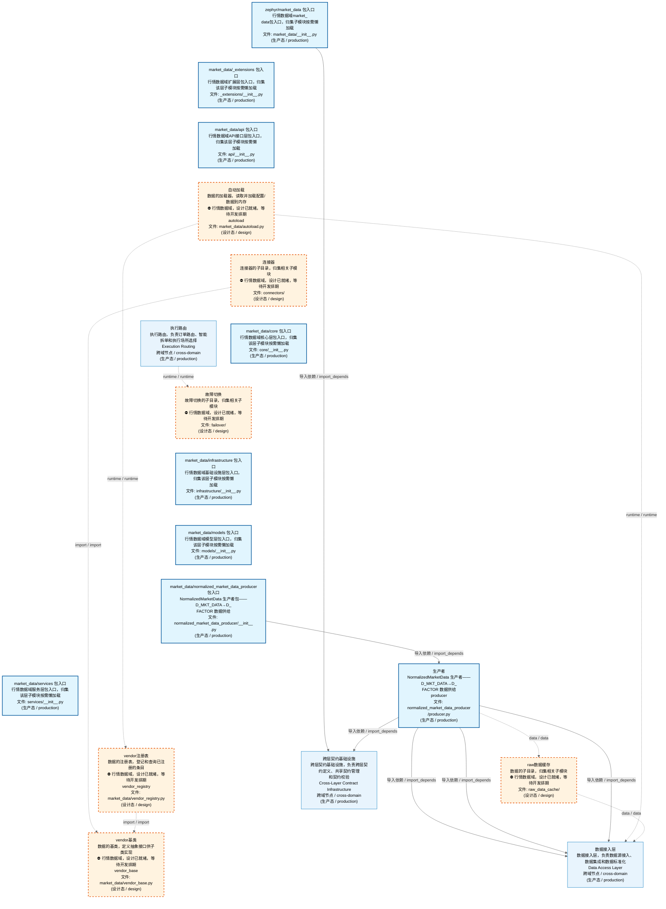
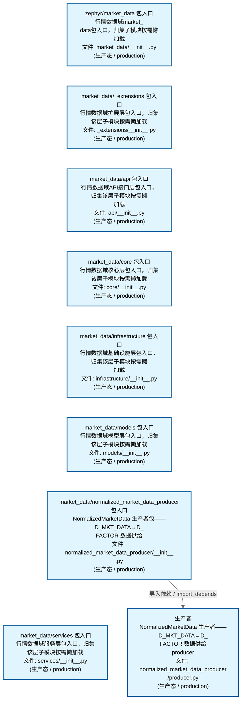
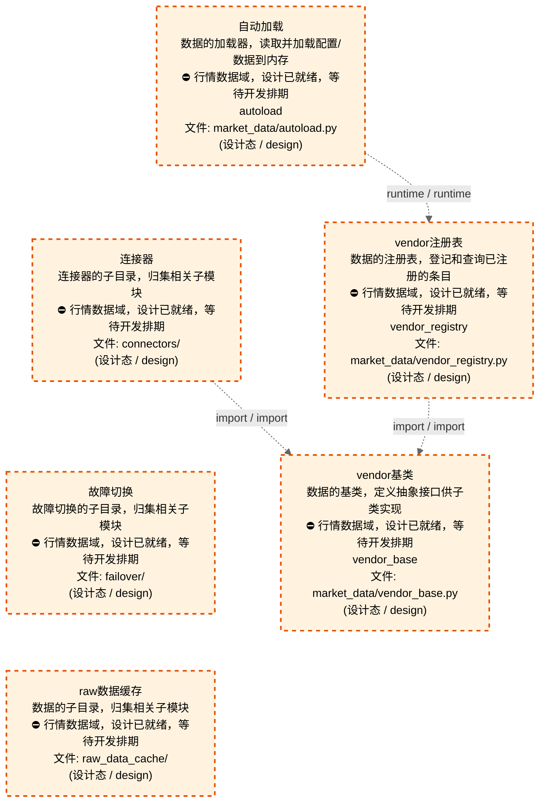
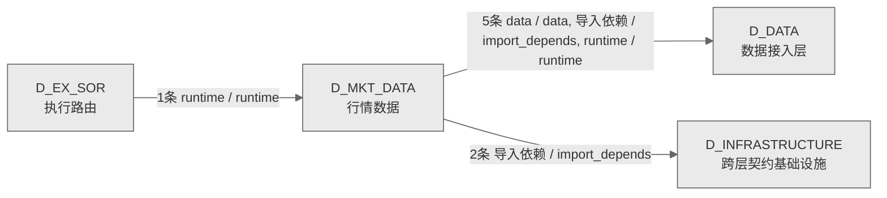

# 23_d_mkt_data / 行情数据域 / Market Data

> **功能简介 / Overview**: 行情数据，负责市场行情数据的采集、分发和订阅管理

> **文档作用 / Purpose**: 展示 行情数据（D_MKT_DATA）功能域的域内依赖关系、跨域依赖关系，模块信息（成熟度/中英文名/大白话/文件路径）内嵌于 Mermaid 节点，供架构审查和域治理参考。

> 本文档由 generate_domain_doc.py 从 depgraph (PostgreSQL) 自动生成
> 数据源: depgraph (PostgreSQL) nodes表 + edges表

> **[可缩放 HTML 版 / Zoomable HTML](http://localhost:8765/docs/02_enterprise_architecture/02_domain_architecture_docs/_zoomable_html/23_d_mkt_data.html)** — Ctrl+滚轮缩放 ｜ 双击重置 ｜ Ctrl+Shift+D 切换拖动/选择模式

## 域基本信息 / Domain Overview

| 字段 | 值 | Field | Value |
|------|------|-------|-------|
| 编号 | 23 | Number | 23 |
| 域ID | D_MKT_DATA | Domain ID | D_MKT_DATA |
| 域名称 | 行情数据 | Domain Name | Market Data |
| 层级 | L1 基础平台层 | Layer | L1 Foundation |
| 模块数 | 15 | Module Count | 15 |
| 域内依赖 | 5 | Internal Dependencies | 5 |
| 跨域入边 | 1 | Cross-domain Incoming | 1 |
| 跨域出边 | 7 | Cross-domain Outgoing | 7 |
| 设计态模块 | 6 | Design Modules | 6 |
| 生产态模块 | 9 | Production Modules | 9 |
| 容量 | 9/150 (正常) | Capacity | 9/150 (正常) |
| 描述 | 行情数据，负责市场行情数据的采集、分发和订阅管理 | Description | 行情数据，负责市场行情数据的采集、分发和订阅管理 |

## 域内依赖图 / Internal Dependency Diagram

> 依赖图内嵌在本文档中，IDE 可直接渲染；网页版可 Ctrl+滚轮缩放 + 拖动平移查看细节。
>
> **图例说明 / Legend**：
> - 🟦 **蓝色 = 运营态模块**（production，已上线运行）
> - 🟧 **橙色虚线 = 设计态模块**（design，蓝图阶段，代码未写）
> - **实线箭头 = 运营态依赖**（已生效的依赖关系）
> - **虚线箭头 = 非运营态依赖**（计划中/验证中的依赖关系）

### 全景图（全部模块，颜色区分运营态/设计态）

> 展示全部 15 个模块（生产态 9 + 设计态 6），含跨域依赖外部节点。节点含成熟度+名称+大白话/简介+文件路径。

### 运营态的图（仅 design_maturity=production 的模块和域内依赖）

> 仅展示已上线运行的模块（共 9 个），不含跨域外部节点。跨域依赖见下方跨域依赖章节。

### 设计态的图（仅 design_maturity=design 的模块和域内依赖）

> 仅展示蓝图阶段、代码未写的设计态模块（共 6 个），不含跨域外部节点。

## 跨域依赖 / Cross-domain Dependencies

### 本域依赖的其他域（出边）/ Depends On

| # | 本域模块 / Source Module | → | 外部域-目标模块 / Target Module | 依赖类型 / Type |
|:--:|---------|:--:|---------|---------|
| 1 | 自动加载 / autoload (market_data/autoload.py) | → | D_DATA 数据接入层: table注册表 / table_registry (data/table_registry.py) | runtime / runtime |
| 2 | 生产者 / producer (normalized_market_data_producer/produc... | → | D_DATA 数据接入层: 包入口 / __init__ (data/__init__.py) | 导入依赖 / import_depends |
| 3 | 生产者 / producer (normalized_market_data_producer/produc... | → | D_DATA 数据接入层: ch读取器 / ch_reader (data/ch_reader.py) | 导入依赖 / import_depends |
| 4 | 生产者 / producer (normalized_market_data_producer/produc... | → | D_DATA 数据接入层: table注册表 / table_registry (data/table_registry.py) | 导入依赖 / import_depends |
| 5 | raw数据缓存 (raw_data_cache/) | → | D_DATA 数据接入层: 提供器基类 / provider_base (data/provider_base.py) | data / data |
| 6 | 包入口 / __init__ (market_data/__init__.py) | → | D_INFRASTRUCTURE 跨层契约基础设施: 市场数据 / market_data (contracts/market_data.py) | 导入依赖 / import_depends |
| 7 | 生产者 / producer (normalized_market_data_producer/produc... | → | D_INFRASTRUCTURE 跨层契约基础设施: 市场数据 / market_data (contracts/market_data.py) | 导入依赖 / import_depends |

### 依赖本域的其他域（入边）/ Depended By

| # | 外部域-源模块 / Source Module | → | 本域模块 / Target Module | 依赖类型 / Type |
|:--:|---------|:--:|---------|---------|
| 1 | D_EX_SOR 执行路由: 包入口 / __init__ (core/__init__.py) | → | 故障切换 (failover/) | runtime / runtime |

### 跨域依赖图 / Cross-domain Dependency Diagram

> 本域与 3 个外部域直接连接（出边 7 条 + 入边 1 条 = 8 条）。只显示直接连接的域，不展开具体节点。

## 说明 / Notes

- **数据源 / Data Source**: `depgraph (PostgreSQL)` 的 `nodes`、`edges`、`domains` 表
- **生成器 / Generator**: `generate_domain_doc.py`（G2+G10 合并）
- **维护方式 / Maintenance**: 自动生成，全景图更新时刷新
- **文件名规则 / File Naming**: `{编号:02d}_{域ID小写}.md`，如 `16_d_trading.md`
- **图例说明 / Legend**: `[production]`=已上线 / `[design]`=设计中 / `[unknown]`=未知
