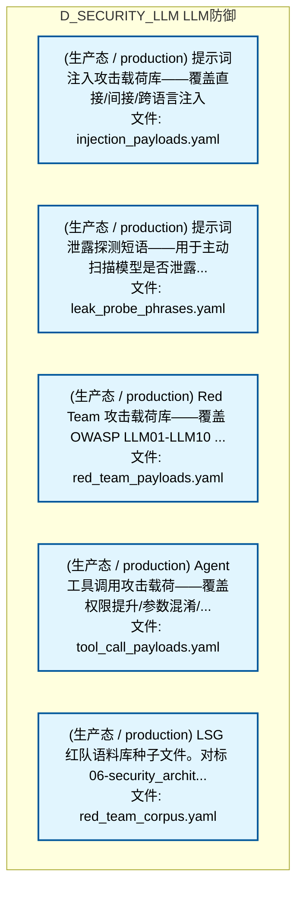
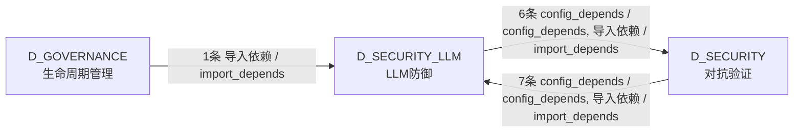

# 23_d_security_llm / llm_defense / LLM防御 / LLM Defense

> **功能简介 / Overview**: LLM 防御，负责 LLM 安全防护、Prompt 注入防御和输出过滤

> **文档作用 / Purpose**: 展示 LLM防御（D_SECURITY_LLM）功能域的模块清单、域内依赖关系、跨域依赖关系、架构分层视图，供架构审查和域治理参考。

> 本文档由 generate_domain_doc.py 从 depgraph (PostgreSQL) 自动生成
> 最后更新: 2026-07-13 01:56:08
> 数据源: depgraph (PostgreSQL) nodes表 + edges表

## 域基本信息 / Domain Overview

| 字段 | 值 | Field | Value |
|------|------|-------|-------|
| 编号 | 23 | Number | 23 |
| 域ID | D_SECURITY_LLM | Domain ID | D_SECURITY_LLM |
| 域名称 | LLM防御 | Domain Name | LLM Defense |
| 层级 | L1 基础平台层 | Layer | L1 Foundation |
| 模块数 | 13 | Module Count | 13 |
| 域内依赖 | 5 | Internal Dependencies | 5 |
| 跨域入边 | 8 | Cross-domain Incoming | 8 |
| 跨域出边 | 6 | Cross-domain Outgoing | 6 |
| 设计态模块 | 0 | Design Modules | 0 |
| 原型态模块 | 8 | Prototype Modules | 8 |
| 生产态模块 | 5 | Production Modules | 5 |
| 容量 | 5/150 (正常) | Capacity | 5/150 (正常) |
| 描述 | L0供应链安全(模型验证/依赖扫描) | Description | L0供应链安全(模型验证/依赖扫描) |

## 模块分层清单 / Module Layered List

> 按 architecture_layer 分组的模块清单（共 13 个模块 / 13 modules）。

### L1 基础层 / Foundation Layer (13 modules)

| # | 模块路径 / Module Path | 模块名称 / Module Name (功能简介 / Description) | 成熟度 / Maturity | 蓝图 / Blueprint |
|:--:|---------|---------|:---:|:---:|
| 1 | src/zephyr/security/llm_defense/__init__.py | __init__.py | 原型态 / prototype |  |
| 2 | src/zephyr/security/llm_defense/llm_security/__init__.py | __init__.py | 原型态 / prototype |  |
| 3 | src/zephyr/security/llm_defense/llm_security/dashboard/__... | LLM Security Gateway Dashboard Module. | 原型态 / prototype | [MOD-LLM_SECURITY](../../03_modules/_cross_layer/large_language_model_security/blueprint.md) |
| 4 | src/zephyr/security/llm_defense/llm_security/layers/__ini... | __init__.py | 原型态 / prototype |  |
| 5 | src/zephyr/security/llm_defense/llm_security/patterns/__i... | __init__.py | 原型态 / prototype |  |
| 6 | src/zephyr/security/llm_defense/llm_security/payloads/__i... | __init__.py | 原型态 / prototype |  |
| 7 | src/zephyr/security/llm_defense/llm_security/payloads/inj... | 提示词注入攻击载荷库——覆盖直接/间接/跨语言注入 | 生产态 / production | [MOD-LLM_SECURITY](../../03_modules/_cross_layer/large_language_model_security/blueprint.md) |
| 8 | src/zephyr/security/llm_defense/llm_security/payloads/lea... | 提示词泄露探测短语——用于主动扫描模型是否泄露... | 生产态 / production | [MOD-LLM_SECURITY](../../03_modules/_cross_layer/large_language_model_security/blueprint.md) |
| 9 | src/zephyr/security/llm_defense/llm_security/payloads/red... | Red Team 攻击载荷库——覆盖 OWASP LLM01-LLM10 ... | 生产态 / production | [MOD-LLM_SECURITY](../../03_modules/_cross_layer/large_language_model_security/blueprint.md) |
| 10 | src/zephyr/security/llm_defense/llm_security/payloads/too... | Agent工具调用攻击载荷——覆盖权限提升/参数混淆/... | 生产态 / production | [MOD-LLM_SECURITY](../../03_modules/_cross_layer/large_language_model_security/blueprint.md) |
| 11 | src/zephyr/security/llm_defense/llm_security/red_team_cor... | LSG 红队语料库种子文件。对标 06-security_archit... | 生产态 / production | [MOD-LLM_SECURITY](../../03_modules/_cross_layer/large_language_model_security/blueprint.md) |
| 12 | src/zephyr/security/llm_defense/llm_security/sandbox/__in... | LSG 代码执行沙箱包。 | 原型态 / prototype | [MOD-LLM_SECURITY](../../03_modules/_cross_layer/large_language_model_security/blueprint.md) |
| 13 | src/zephyr/security/llm_defense/llm_security/self_protect... | __init__.py | 原型态 / prototype |  |

## 域内依赖图 / Internal Dependency Diagram

> 依赖图内嵌在本文档中，IDE 可直接渲染显示。参考 decision_index.md 设计，分四个视图：合并全景图、运营态子图、设计态子图、原型态子图（按 design_maturity 实际值拆分）。
>
> **图例说明 / Legend**：
> - **实线边框 = 运营态模块**（production，已上线运行）
> - **虚线边框 = 设计态模块**（design，蓝图阶段，代码未写）
> - **虚线边框 = 原型态模块**（prototype，代码已写，验证中未稳定上线）
> - **实线箭头 = 运营态依赖**（已生效的依赖关系）
> - **虚线箭头 = 非运营态依赖**（计划中/验证中的依赖关系）

### 合并全景图（全部模块，标签标注成熟度）

> 展示全部 13 个模块（生产态 5 + 设计态 0 + 原型态 8），标签标注成熟度。

```mermaid
graph TD
    subgraph D_SECURITY_LLM["D_SECURITY_LLM LLM防御"]
        src_zephyr_security_llm_defense_init_py["(原型态 / prototype) __init__.py"]
        src_zephyr_security_llm_defense_llm_security_init_py["(原型态 / prototype) __init__.py"]
        src_zephyr_security_llm_defense_llm_security_dashboard_init_py["(原型态 / prototype) LLM Security Gateway Dashboard Module.<br/>文件: __init__.py"]
        src_zephyr_security_llm_defense_llm_security_layers_init_py["(原型态 / prototype) __init__.py"]
        src_zephyr_security_llm_defense_llm_security_patterns_init_py["(原型态 / prototype) __init__.py"]
        src_zephyr_security_llm_defense_llm_security_payloads_init_py["(原型态 / prototype) __init__.py"]
        src_zephyr_security_llm_defense_llm_security_payloads_injection_payloads_yaml["(生产态 / production) 提示词注入攻击载荷库——覆盖直接/间接/跨语言注入<br/>文件: injection_payloads.yaml"]
        src_zephyr_security_llm_defense_llm_security_payloads_leak_probe_phrases_yaml["(生产态 / production) 提示词泄露探测短语——用于主动扫描模型是否泄露...<br/>文件: leak_probe_phrases.yaml"]
        src_zephyr_security_llm_defense_llm_security_payloads_red_team_payloads_yaml["(生产态 / production) Red Team 攻击载荷库——覆盖 OWASP LLM01-LLM10 ...<br/>文件: red_team_payloads.yaml"]
        src_zephyr_security_llm_defense_llm_security_payloads_tool_call_payloads_yaml["(生产态 / production) Agent工具调用攻击载荷——覆盖权限提升/参数混淆/...<br/>文件: tool_call_payloads.yaml"]
        src_zephyr_security_llm_defense_llm_security_red_team_corpus_yaml["(生产态 / production) LSG 红队语料库种子文件。对标 06-security_archit...<br/>文件: red_team_corpus.yaml"]
        src_zephyr_security_llm_defense_llm_security_sandbox_init_py["(原型态 / prototype) LSG 代码执行沙箱包。<br/>文件: __init__.py"]
        src_zephyr_security_llm_defense_llm_security_self_protection_init_py["(原型态 / prototype) __init__.py"]
    end
    src_zephyr_security_llm_defense_llm_security_red_team_corpus_yaml -.->|config_depends / config_depends| src_zephyr_security_llm_defense_llm_security_init_py
    src_zephyr_security_llm_defense_llm_security_payloads_injection_payloads_yaml -.->|config_depends / config_depends| src_zephyr_security_llm_defense_llm_security_payloads_init_py
    src_zephyr_security_llm_defense_llm_security_payloads_leak_probe_phrases_yaml -.->|config_depends / config_depends| src_zephyr_security_llm_defense_llm_security_payloads_init_py
    src_zephyr_security_llm_defense_llm_security_payloads_red_team_payloads_yaml -.->|config_depends / config_depends| src_zephyr_security_llm_defense_llm_security_payloads_init_py
    src_zephyr_security_llm_defense_llm_security_payloads_tool_call_payloads_yaml -.->|config_depends / config_depends| src_zephyr_security_llm_defense_llm_security_payloads_init_py
    D_SECURITY["(生产态 / production) D_SECURITY"]
    src_zephyr_security_llm_defense_llm_security_init_py -.->|导入依赖 / import_depends| D_SECURITY
    src_zephyr_security_llm_defense_llm_security_init_py -.->|导入依赖 / import_depends| D_SECURITY
    src_zephyr_security_llm_defense_llm_security_init_py -.->|导入依赖 / import_depends| D_SECURITY
    src_zephyr_security_llm_defense_llm_security_init_py -.->|导入依赖 / import_depends| D_SECURITY
    src_zephyr_security_llm_defense_llm_security_init_py -.->|导入依赖 / import_depends| D_SECURITY
    src_zephyr_security_llm_defense_llm_security_dashboard_init_py -.->|config_depends / config_depends| D_SECURITY
    D_SECURITY -.->|导入依赖 / import_depends| src_zephyr_security_llm_defense_llm_security_layers_init_py
    D_SECURITY -.->|导入依赖 / import_depends| src_zephyr_security_llm_defense_llm_security_patterns_init_py
    D_SECURITY -.->|导入依赖 / import_depends| src_zephyr_security_llm_defense_llm_security_payloads_init_py
    D_SECURITY -.->|导入依赖 / import_depends| src_zephyr_security_llm_defense_llm_security_self_protection_init_py
    D_SECURITY -.->|导入依赖 / import_depends| src_zephyr_security_llm_defense_llm_security_payloads_init_py
    D_GOVERNANCE["(原型态 / prototype) D_GOVERNANCE"]
    D_GOVERNANCE -.->|导入依赖 / import_depends| src_zephyr_security_llm_defense_llm_security_init_py
    D_SECURITY -.->|config_depends / config_depends| src_zephyr_security_llm_defense_llm_security_layers_init_py
    D_SECURITY -.->|config_depends / config_depends| src_zephyr_security_llm_defense_llm_security_layers_init_py
    classDef production fill:#e1f5fe,stroke:#01579b,stroke-width:2px,color:#000
    classDef design fill:#fff3e0,stroke:#e65100,stroke-width:2px,color:#000,stroke-dasharray: 5 5
    classDef external_prod fill:#e8f5e9,stroke:#1b5e20,stroke-width:1px,color:#000
    classDef external_design fill:#fce4ec,stroke:#880e4f,stroke-width:1px,color:#000,stroke-dasharray: 5 5
    class src_zephyr_security_llm_defense_llm_security_payloads_injection_payloads_yaml,src_zephyr_security_llm_defense_llm_security_payloads_leak_probe_phrases_yaml,src_zephyr_security_llm_defense_llm_security_payloads_red_team_payloads_yaml,src_zephyr_security_llm_defense_llm_security_payloads_tool_call_payloads_yaml,src_zephyr_security_llm_defense_llm_security_red_team_corpus_yaml production
    class src_zephyr_security_llm_defense_init_py,src_zephyr_security_llm_defense_llm_security_init_py,src_zephyr_security_llm_defense_llm_security_dashboard_init_py,src_zephyr_security_llm_defense_llm_security_layers_init_py,src_zephyr_security_llm_defense_llm_security_patterns_init_py,src_zephyr_security_llm_defense_llm_security_payloads_init_py,src_zephyr_security_llm_defense_llm_security_sandbox_init_py,src_zephyr_security_llm_defense_llm_security_self_protection_init_py design
    class D_SECURITY external_prod
    class D_GOVERNANCE external_design
```

### 运营态子图（仅 design_maturity=production 的模块和依赖）

> 仅展示已上线运行的模块（共 5 个，0 条域内依赖）。

### 设计态子图（仅 design_maturity=design 的模块和依赖）

> 仅展示蓝图阶段、代码未写的设计态模块（共 0 个，0 条域内依赖）。

> （无设计态模块 / No design modules）

### 原型态子图（仅 design_maturity=prototype 的模块和依赖）

> 仅展示代码已写、验证中未稳定上线的原型态模块（共 8 个，0 条域内依赖）。

```mermaid
graph TD
    subgraph D_SECURITY_LLM["D_SECURITY_LLM LLM防御"]
        src_zephyr_security_llm_defense_init_py["(原型态 / prototype) __init__.py"]
        src_zephyr_security_llm_defense_llm_security_init_py["(原型态 / prototype) __init__.py"]
        src_zephyr_security_llm_defense_llm_security_dashboard_init_py["(原型态 / prototype) LLM Security Gateway Dashboard Module.<br/>文件: __init__.py"]
        src_zephyr_security_llm_defense_llm_security_layers_init_py["(原型态 / prototype) __init__.py"]
        src_zephyr_security_llm_defense_llm_security_patterns_init_py["(原型态 / prototype) __init__.py"]
        src_zephyr_security_llm_defense_llm_security_payloads_init_py["(原型态 / prototype) __init__.py"]
        src_zephyr_security_llm_defense_llm_security_sandbox_init_py["(原型态 / prototype) LSG 代码执行沙箱包。<br/>文件: __init__.py"]
        src_zephyr_security_llm_defense_llm_security_self_protection_init_py["(原型态 / prototype) __init__.py"]
    end
    D_SECURITY["(生产态 / production) D_SECURITY"]
    src_zephyr_security_llm_defense_llm_security_init_py -.->|导入依赖 / import_depends| D_SECURITY
    src_zephyr_security_llm_defense_llm_security_init_py -.->|导入依赖 / import_depends| D_SECURITY
    src_zephyr_security_llm_defense_llm_security_init_py -.->|导入依赖 / import_depends| D_SECURITY
    src_zephyr_security_llm_defense_llm_security_init_py -.->|导入依赖 / import_depends| D_SECURITY
    src_zephyr_security_llm_defense_llm_security_init_py -.->|导入依赖 / import_depends| D_SECURITY
    src_zephyr_security_llm_defense_llm_security_dashboard_init_py -.->|config_depends / config_depends| D_SECURITY
    D_SECURITY -.->|导入依赖 / import_depends| src_zephyr_security_llm_defense_llm_security_layers_init_py
    D_SECURITY -.->|导入依赖 / import_depends| src_zephyr_security_llm_defense_llm_security_patterns_init_py
    D_SECURITY -.->|导入依赖 / import_depends| src_zephyr_security_llm_defense_llm_security_payloads_init_py
    D_SECURITY -.->|导入依赖 / import_depends| src_zephyr_security_llm_defense_llm_security_self_protection_init_py
    D_SECURITY -.->|导入依赖 / import_depends| src_zephyr_security_llm_defense_llm_security_payloads_init_py
    D_GOVERNANCE["(原型态 / prototype) D_GOVERNANCE"]
    D_GOVERNANCE -.->|导入依赖 / import_depends| src_zephyr_security_llm_defense_llm_security_init_py
    D_SECURITY -.->|config_depends / config_depends| src_zephyr_security_llm_defense_llm_security_layers_init_py
    D_SECURITY -.->|config_depends / config_depends| src_zephyr_security_llm_defense_llm_security_layers_init_py
    classDef production fill:#e1f5fe,stroke:#01579b,stroke-width:2px,color:#000
    classDef design fill:#fff3e0,stroke:#e65100,stroke-width:2px,color:#000,stroke-dasharray: 5 5
    classDef external_prod fill:#e8f5e9,stroke:#1b5e20,stroke-width:1px,color:#000
    classDef external_design fill:#fce4ec,stroke:#880e4f,stroke-width:1px,color:#000,stroke-dasharray: 5 5
    class src_zephyr_security_llm_defense_init_py,src_zephyr_security_llm_defense_llm_security_init_py,src_zephyr_security_llm_defense_llm_security_dashboard_init_py,src_zephyr_security_llm_defense_llm_security_layers_init_py,src_zephyr_security_llm_defense_llm_security_patterns_init_py,src_zephyr_security_llm_defense_llm_security_payloads_init_py,src_zephyr_security_llm_defense_llm_security_sandbox_init_py,src_zephyr_security_llm_defense_llm_security_self_protection_init_py design
    class D_SECURITY external_prod
    class D_GOVERNANCE external_design
```

## 跨域依赖 / Cross-domain Dependencies

### 本域依赖的其他域（出边）/ Depends On

| # | 本域模块 / Source Module | → | 外部域-目标模块 / Target Module | 依赖类型 / Type |
|:--:|---------|:--:|---------|---------|
| 1 | __init__.py | → | D_SECURITY 对抗验证: behavior_audit_logger.py | 导入依赖 / import_depends |
| 2 | __init__.py | → | D_SECURITY 对抗验证: gateway.py | 导入依赖 / import_depends |
| 3 | __init__.py | → | D_SECURITY 对抗验证: InputSanitizer: path whitelist + command whitel... | 导入依赖 / import_depends |
| 4 | __init__.py | → | D_SECURITY 对抗验证: L2a ProcessSandbox — subprocess 路径白名单沙箱... | 导入依赖 / import_depends |
| 5 | __init__.py | → | D_SECURITY 对抗验证: protocol.py | 导入依赖 / import_depends |
| 6 | LLM Security Gateway Dashboard Module. (__init_... | → | D_SECURITY 对抗验证: LLM Security Gateway - Streamlit Dashboard. (ap... | config_depends / config_depends |

### 依赖本域的其他域（入边）/ Depended By

| # | 外部域-源模块 / Source Module | → | 本域模块 / Target Module | 依赖类型 / Type |
|:--:|---------|:--:|---------|---------|
| 1 | D_GOVERNANCE 生命周期管理: C-track 端到端演示 —— 全流水线一次性运行 (dem... | → | __init__.py | 导入依赖 / import_depends |
| 2 | D_SECURITY 对抗验证: LLM Security Gateway - Streamlit Dashboard. (ap... | → | __init__.py | 导入依赖 / import_depends |
| 3 | D_SECURITY 对抗验证: LLM Security Gateway - Streamlit Dashboard. (ap... | → | __init__.py | 导入依赖 / import_depends |
| 4 | D_SECURITY 对抗验证: LLM Security Gateway - Streamlit Dashboard. (ap... | → | __init__.py | 导入依赖 / import_depends |
| 5 | D_SECURITY 对抗验证: LLM Security Gateway - Streamlit Dashboard. (ap... | → | __init__.py | 导入依赖 / import_depends |
| 6 | D_SECURITY 对抗验证: l6_data_flow.py | → | __init__.py | config_depends / config_depends |
| 7 | D_SECURITY 对抗验证: l8_compliance.py | → | __init__.py | config_depends / config_depends |
| 8 | D_SECURITY 对抗验证: red_team_scanner.py | → | __init__.py | 导入依赖 / import_depends |

### 跨域依赖图 / Cross-domain Dependency Diagram

> 本域与 2 个外部域直接连接（出边 6 条 + 入边 8 条 = 14 条）。只显示直接连接的域，不展开具体节点。

## 说明 / Notes

- **数据源 / Data Source**: `depgraph (PostgreSQL)` 的 `nodes`、`edges`、`domains` 表
- **生成器 / Generator**: `generate_domain_doc.py`（G2+G10 合并）
- **维护方式 / Maintenance**: 自动生成，全景图更新时刷新
- **文件名规则 / File Naming**: `{编号:02d}_{域ID小写}.md`，如 `16_d_trading.md`
- **图例说明 / Legend**: `[production]`=已上线 / `[design]`=设计中 / `[prototype]`=原型 / `[unknown]`=未知
