# 24_d_compliance / 合规

> **文档作用 / Purpose**: 展示 合规（D-COMPLIANCE）功能域的模块清单、域内依赖关系和跨域依赖关系，供架构审查和域治理参考。

> 本文档由 generate_domain_doc.py 从 depgraph.db 自动生成
> 最后更新: 2026-06-25 20:00:20
> 数据源: depgraph.db nodes表 + edges表

## 域基本信息 / Domain Overview

| 字段 | 值 | Field | Value |
|------|------|-------|-------|
| 编号 | 24 | Number | 24 |
| 域ID | D-COMPLIANCE | Domain ID | D-COMPLIANCE |
| 域名称 | 合规 | Domain Name | 合规 |
| 层级 | L2_domain | Layer | L2_domain |
| 模块数 | 30 | Module Count | 30 |
| 域内依赖 | 2 | Internal Dependencies | 2 |
| 跨域入边 | 0 | Cross-domain Incoming | 0 |
| 跨域出边 | 24 | Cross-domain Outgoing | 24 |
| 设计态模块 | 5 | Design Modules | 5 |
| 原型态模块 | 25 | Prototype Modules | 25 |
| 生产态模块 | 0 | Production Modules | 0 |
| 容量 | 0/150 (正常) | Capacity | 0/150 (正常) |
| 描述 | 合规规则、交易限制、报告合规、监管对接。合规监管防线。 | Description | 合规规则、交易限制、报告合规、监管对接。合规监管防线。 |

## 模块清单 / Module List

共 30 个模块（按路径排序，全部显示）

| 模块路径 / Module Path | 模块名称 / Module Name | 设计成熟度 / Maturity | 构建状态 / Build Status |
|---------|---------|-----------|---------|
| src/zephyr/compliance/__init__.py |  | prototype | generated |
| src/zephyr/compliance/_extensions/__init__.py |  | prototype | deprecated |
| src/zephyr/compliance/aisg_sandbox.py |  | prototype | generated |
| src/zephyr/compliance/api/__init__.py |  | prototype | deprecated |
| src/zephyr/compliance/artifact_scanner.py |  | prototype | generated |
| src/zephyr/compliance/audit_orchestrator/__init__.py |  | prototype | generated |
| src/zephyr/compliance/audit_trail/__init__.py |  | prototype | generated |
| src/zephyr/compliance/audit_trail/bridges/__init__.py |  | prototype | generated |
| src/zephyr/compliance/behavioral_admission/__init__.py |  | prototype | generated |
| src/zephyr/compliance/behavioral_auditor/__init__.py |  | prototype | generated |
| src/zephyr/compliance/compliance_gate_a6/__init__.py |  | prototype | generated |
| src/zephyr/compliance/compliance_manager.py |  | prototype | generated |
| src/zephyr/compliance/core/__init__.py |  | prototype | deprecated |
| src/zephyr/compliance/default_security_gateway.py |  | prototype | generated |
| src/zephyr/compliance/evidence_pack.py |  | prototype | generated |
| src/zephyr/compliance/financial_compliance.py |  | prototype | generated |
| src/zephyr/compliance/implementations/__init__.py |  | prototype | generated |
| src/zephyr/compliance/infrastructure/__init__.py |  | prototype | deprecated |
| src/zephyr/compliance/integrity.py |  | prototype | generated |
| src/zephyr/compliance/merkle_hourly.py |  | prototype | generated |
| src/zephyr/compliance/models/__init__.py |  | prototype | deprecated |
| src/zephyr/compliance/security_gateway_base.py |  | prototype | generated |
| src/zephyr/compliance/semantic_auditor/__init__.py |  | prototype | generated |
| src/zephyr/compliance/services/__init__.py |  | prototype | deprecated |
| src/zephyr/compliance/zero_knowledge_audit_stub/__init__.py |  | prototype | generated |
| 交易监控规则引擎+监管报告生成器+身份验证集成器+风险管理集成器+监管变更追踪器+合规工作流引擎+合规仪表盘/D-COMPLIANCE-14 | RegTech Compliance Automation Engine | design | planned |
| 合规域-交易纪律/D-COMPLIANCE-23 | A-Share Trading Discipline Checker | design | planned |
| 合规域-持续运营/D-COMPLIANCE-13 | AML/KYC Engine | design | planned |
| 合规域-规则验证/D-COMPLIANCE-20 | Compliance Rule Backtester | design | planned |
| 异常交易披露数据采集器(监管披露数据→统计因子)/D-DATA-89 | 龙虎榜 | design | planned |

## 域内依赖图 / Internal Dependency Diagram

> 依赖图内嵌在本文档中，IDE 可直接渲染显示。每30个节点一组分页显示。
>
> **图例说明 / Legend**：
> - **实线边框 = 运营态模块**（production，已上线运行）
> - **虚线边框 = 设计态模块**（design，还在设计中）
> - **实线箭头 = 运营态依赖**（已生效的依赖关系）
> - **虚线箭头 = 设计态依赖**（计划中的依赖关系）

```mermaid
graph TD
    subgraph D_COMPLIANCE["D-COMPLIANCE 合规"]
        src_zephyr_compliance_init_py["src/zephyr/compliance/__init__.py prototype"]
        src_zephyr_compliance_extensions_init_py["src/zephyr/compliance/_extensions/__init__.py prototype"]
        src_zephyr_compliance_aisg_sandbox_py["src/zephyr/compliance/aisg_sandbox.py prototype"]
        src_zephyr_compliance_api_init_py["src/zephyr/compliance/api/__init__.py prototype"]
        src_zephyr_compliance_artifact_scanner_py["src/zephyr/compliance/artifact_scanner.py prototype"]
        src_zephyr_compliance_audit_orchestrator_init_py["src/zephyr/compliance/audit_orchestrator/__init... prototype"]
        src_zephyr_compliance_audit_trail_init_py["src/zephyr/compliance/audit_trail/__init__.py prototype"]
        src_zephyr_compliance_audit_trail_bridges_init_py["src/zephyr/compliance/audit_trail/bridges/__ini... prototype"]
        src_zephyr_compliance_behavioral_admission_init_py["src/zephyr/compliance/behavioral_admission/__in... prototype"]
        src_zephyr_compliance_behavioral_auditor_init_py["src/zephyr/compliance/behavioral_auditor/__init... prototype"]
        src_zephyr_compliance_compliance_gate_a6_init_py["src/zephyr/compliance/compliance_gate_a6/__init... prototype"]
        src_zephyr_compliance_compliance_manager_py["src/zephyr/compliance/compliance_manager.py prototype"]
        src_zephyr_compliance_core_init_py["src/zephyr/compliance/core/__init__.py prototype"]
        src_zephyr_compliance_default_security_gateway_py["src/zephyr/compliance/default_security_gateway.py prototype"]
        src_zephyr_compliance_evidence_pack_py["src/zephyr/compliance/evidence_pack.py prototype"]
        src_zephyr_compliance_financial_compliance_py["src/zephyr/compliance/financial_compliance.py prototype"]
        src_zephyr_compliance_implementations_init_py["src/zephyr/compliance/implementations/__init__.py prototype"]
        src_zephyr_compliance_infrastructure_init_py["src/zephyr/compliance/infrastructure/__init__.py prototype"]
        src_zephyr_compliance_integrity_py["src/zephyr/compliance/integrity.py prototype"]
        src_zephyr_compliance_merkle_hourly_py["src/zephyr/compliance/merkle_hourly.py prototype"]
        src_zephyr_compliance_models_init_py["src/zephyr/compliance/models/__init__.py prototype"]
        src_zephyr_compliance_security_gateway_base_py["src/zephyr/compliance/security_gateway_base.py prototype"]
        src_zephyr_compliance_semantic_auditor_init_py["src/zephyr/compliance/semantic_auditor/__init__.py prototype"]
        src_zephyr_compliance_services_init_py["src/zephyr/compliance/services/__init__.py prototype"]
        src_zephyr_compliance_zero_knowledge_audit_stub_init_py["src/zephyr/compliance/zero_knowledge_audit_stub... prototype"]
        D_COMPLIANCE_14["RegTech Compliance Automation Engine design"]
        D_COMPLIANCE_23["A-Share Trading Discipline Checker design"]
        D_COMPLIANCE_13["AML/KYC Engine design"]
        D_COMPLIANCE_20["Compliance Rule Backtester design"]
        D_DATA_89["龙虎榜 design"]
    end
    src_zephyr_compliance_init_py -.->|config_depends| src_zephyr_compliance_artifact_scanner_py
    src_zephyr_compliance_audit_trail_bridges_init_py -.->|import_depends| src_zephyr_compliance_audit_trail_init_py
    D_GOVERNANCE["D-GOVERNANCE design"]
    D_COMPLIANCE_13 -.->|contract| D_GOVERNANCE
    D_GOV_DRIFT["D-GOV_DRIFT production"]
    src_zephyr_compliance_artifact_scanner_py -.->|import_depends| D_GOV_DRIFT
    src_zephyr_compliance_evidence_pack_py -.->|import_depends| D_GOVERNANCE
    src_zephyr_compliance_aisg_sandbox_py -.->|import_depends| D_GOVERNANCE
    src_zephyr_compliance_compliance_manager_py -.->|import_depends| D_GOVERNANCE
    src_zephyr_compliance_default_security_gateway_py -.->|import_depends| D_GOVERNANCE
    D_GOV_AUDIT["D-GOV_AUDIT production"]
    src_zephyr_compliance_financial_compliance_py -.->|import_depends| D_GOV_AUDIT
    src_zephyr_compliance_security_gateway_base_py -.->|import_depends| D_GOVERNANCE
    src_zephyr_compliance_merkle_hourly_py -.->|import_depends| D_GOV_AUDIT
    src_zephyr_compliance_integrity_py -.->|import_depends| D_GOV_DRIFT
    src_zephyr_compliance_audit_orchestrator_init_py -.->|import_depends| D_GOV_AUDIT
    src_zephyr_compliance_audit_trail_init_py -.->|import_depends| D_GOV_AUDIT
    src_zephyr_compliance_audit_trail_bridges_init_py -.->|import_depends| D_GOV_AUDIT
    src_zephyr_compliance_audit_trail_bridges_init_py -.->|import_depends| D_GOV_AUDIT
    src_zephyr_compliance_audit_trail_bridges_init_py -.->|import_depends| D_GOV_AUDIT
    classDef production fill:#e1f5fe,stroke:#01579b,stroke-width:2px,color:#000
    classDef design fill:#fff3e0,stroke:#e65100,stroke-width:2px,color:#000,stroke-dasharray: 5 5
    classDef external_prod fill:#e8f5e9,stroke:#1b5e20,stroke-width:1px,color:#000
    classDef external_design fill:#fce4ec,stroke:#880e4f,stroke-width:1px,color:#000,stroke-dasharray: 5 5
    class src_zephyr_compliance_init_py,src_zephyr_compliance_extensions_init_py,src_zephyr_compliance_aisg_sandbox_py,src_zephyr_compliance_api_init_py,src_zephyr_compliance_artifact_scanner_py,src_zephyr_compliance_audit_orchestrator_init_py,src_zephyr_compliance_audit_trail_init_py,src_zephyr_compliance_audit_trail_bridges_init_py,src_zephyr_compliance_behavioral_admission_init_py,src_zephyr_compliance_behavioral_auditor_init_py,src_zephyr_compliance_compliance_gate_a6_init_py,src_zephyr_compliance_compliance_manager_py,src_zephyr_compliance_core_init_py,src_zephyr_compliance_default_security_gateway_py,src_zephyr_compliance_evidence_pack_py,src_zephyr_compliance_financial_compliance_py,src_zephyr_compliance_implementations_init_py,src_zephyr_compliance_infrastructure_init_py,src_zephyr_compliance_integrity_py,src_zephyr_compliance_merkle_hourly_py,src_zephyr_compliance_models_init_py,src_zephyr_compliance_security_gateway_base_py,src_zephyr_compliance_semantic_auditor_init_py,src_zephyr_compliance_services_init_py,src_zephyr_compliance_zero_knowledge_audit_stub_init_py,D_COMPLIANCE_14,D_COMPLIANCE_23,D_COMPLIANCE_13,D_COMPLIANCE_20,D_DATA_89 design
    class D_GOV_DRIFT,D_GOV_AUDIT external_prod
    class D_GOVERNANCE external_design
```

## 跨域依赖 / Cross-domain Dependencies

### 本域依赖的其他域（出边）/ Depends On

| 目标域 / Target Domain | 依赖数 / Count | 依赖类型 / Type |
|--------|:---:|---------|
| D-GOV_AUDIT | 11 | import_depends |
| D-GOVERNANCE | 11 | contract,import_depends |
| D-GOV_DRIFT | 2 | import_depends |

### 依赖本域的其他域（入边）/ Depended By

无跨域入边依赖 / No cross-domain incoming dependencies

## 说明 / Notes

- **数据源 / Data Source**: `depgraph.db` 的 `nodes`、`edges`、`domains` 表
- **生成器 / Generator**: `generate_domain_doc.py`
- **维护方式 / Maintenance**: 自动生成，全景图更新时刷新
- **文件名规则 / File Naming**: `{编号:02d}_{域ID小写}.md`，如 `16_d_trading.md`
