# 24_d_factor / 因子

> **文档作用 / Purpose**: 展示 因子（D-FACTOR）功能域的模块清单、域内依赖关系和跨域依赖关系，供架构审查和域治理参考。

> 本文档由 generate_domain_doc.py 从 depgraph.db 自动生成
> 最后更新: 2026-06-24 23:56:40
> 数据源: depgraph.db nodes表 + edges表

## 域基本信息 / Domain Overview

| 字段 | 值 | Field | Value |
|------|------|-------|-------|
| 编号 | 24 | Number | 24 |
| 域ID | D-FACTOR | Domain ID | D-FACTOR |
| 域名称 | 因子 | Domain Name | 因子 |
| 层级 | L2_domain | Layer | L2_domain |
| 模块数 | 318 | Module Count | 318 |
| 域内依赖 | 308 | Internal Dependencies | 308 |
| 跨域入边 | 519 | Cross-domain Incoming | 519 |
| 跨域出边 | 76 | Cross-domain Outgoing | 76 |
| 设计态模块 | 301 | Design Modules | 301 |
| 原型态模块 | 10 | Prototype Modules | 10 |
| 生产态模块 | 2 | Production Modules | 2 |
| 容量 | 320/150 (超容) | Capacity | 320/150 (超容) |
| 描述 | 因子计算、因子库、因子评价、因子正交化。Alpha挖掘引擎。 | Description | 因子计算、因子库、因子评价、因子正交化。Alpha挖掘引擎。 |

## 模块清单 / Module List

共 318 个模块（按路径排序，全部显示）

| 模块路径 / Module Path | 模块名称 / Module Name | 设计成熟度 / Maturity | 构建状态 / Build Status |
|---------|---------|-----------|---------|
| D-FACTOR/10风格+28行业因子完整实现+验证 Factor | 10风格+28行业因子完整实现+验证 Factor | design | design_only |
| D-FACTOR/3-Level Judgment 三级判断 | 3-Level Judgment 三级判断 | design | design_only |
| D-FACTOR/39类漂移检测器实现复杂度 Detector | 39类漂移检测器实现复杂度 Detector | design | design_only |
| D-FACTOR/6-Step Flow 6步流程 | 6-Step Flow 6步流程 | design | design_only |
| D-FACTOR/87-Alpha 87-Alpha因子 | 87-Alpha 87-Alpha因子 | design | design_only |
| D-FACTOR/87-Alpha 87Alpha因子 | 87-Alpha 87Alpha因子 | design | design_only |
| D-FACTOR/A-Share Capital Flow Factor 因子 | A-Share Capital Flow Factor 因子 | design | design_only |
| D-FACTOR/A-Share Microstructure Factor 因子 | A-Share Microstructure Factor 因子 | design | design_only |
| D-FACTOR/ABS-001 Gate ABS-001门禁 | ABS-001 Gate ABS-001门禁 | design | design_only |
| D-FACTOR/Alpha Factor Alpha因子 | Alpha Factor Alpha因子 | design | design_only |
| D-FACTOR/Alpha Factor Calculation Engine 引擎因子 | Alpha Factor Calculation Engine 引擎因子 | design | design_only |
| D-FACTOR/Alpha因子 Alpha Factor | Alpha因子 Alpha Factor | design | design_only |
| D-FACTOR/BVC方法 Bulk Volume Classification | BVC方法 Bulk Volume Classification | design | design_only |
| D-FACTOR/Backpressure 背压 | Backpressure 背压 | design | design_only |
| D-FACTOR/Backpressure 背压控制 | Backpressure 背压控制 | design | design_only |
| D-FACTOR/Barra Risk Model 模型风险 | Barra Risk Model 模型风险 | design | design_only |
| D-FACTOR/Barra因子权重方法论需MSCI参考实现 | Barra因子权重方法论需MSCI参考实现 | design | design_only |
| D-FACTOR/Barra风险模型归D-FACTOR-06 | Barra风险模型归D-FACTOR-06 | design | design_only |
| D-FACTOR/Batch Output 批量输出 | Batch Output 批量输出 | design | design_only |
| D-FACTOR/CTR-001 Consumer CTR-001消费者 | CTR-001 Consumer CTR-001消费者 | design | design_only |
| D-FACTOR/CTR-001 Consumer 契约消费者 | CTR-001 Consumer 契约消费者 | design | design_only |
| D-FACTOR/CTR-002/003 Producer CTR-002/003生产者 | CTR-002/003 Producer CTR-002/003生产者 | design | design_only |
| D-FACTOR/CTR-002/003 Producer 契约生产者 | CTR-002/003 Producer 契约生产者 | design | design_only |
| D-FACTOR/CTR-P1-001 FactorMonitorReport CTR-P1-001 FactorMonitorReport契约 | CTR-P1-001 FactorMonitorReport CTR-P1... | design | design_only |
| D-FACTOR/CVD 累积买卖压力 Cumulative Volume Delta | CVD 累积买卖压力 Cumulative Volume Delta | design | design_only |
| D-FACTOR/CVD买卖压力追踪 Cumulative Volume Delta | CVD买卖压力追踪 Cumulative Volume Delta | design | design_only |
| D-FACTOR/CVD价格背离 CVD Price Divergence | CVD价格背离 CVD Price Divergence | design | design_only |
| D-FACTOR/Capital Flow 资金流 | Capital Flow 资金流 | design | design_only |
| D-FACTOR/Causal Factor Validation Layer 因果因子验证层 | Causal Factor Validation Layer 因果因子验证层 | design | design_only |
| D-FACTOR/Causal Validator 因果验证器 | Causal Validator 因果验证器 | design | design_only |
| D-FACTOR/Correlation Redundancy Remover 相关性去冗余 | Correlation Redundancy Remover 相关性去冗余 | design | design_only |
| D-FACTOR/Cross-Market Factor 跨市场因子 | Cross-Market Factor 跨市场因子 | design | design_only |
| D-FACTOR/Crowding Detection 拥挤度检测 | Crowding Detection 拥挤度检测 | design | design_only |
| D-FACTOR/D-AUTONOMY域就绪审计链门禁引擎 | D-AUTONOMY域就绪审计链门禁引擎 | design | design_only |
| D-FACTOR/D-FACTOR Engine 因子引擎 | D-FACTOR Engine 因子引擎 | design | design_only |
| D-FACTOR/D-FACTOR Engine 因子计算引擎 | D-FACTOR Engine 因子计算引擎 | design | design_only |
| D-FACTOR/D-FACTOR 因子 | D-FACTOR 因子 | design | design_only |
| D-FACTOR/D-FACTOR-01到04稳定运行产出IC历史数据大于20日 | D-FACTOR-01到04稳定运行产出IC历史数据大于20日 | design | design_only |
| D-FACTOR/D-FACTOR-04 Pipeline D-FACTOR-04管道 | D-FACTOR-04 Pipeline D-FACTOR-04管道 | design | design_only |
| D-FACTOR/DAG调度因子计算 | DAG调度因子计算 | design | design_only |
| D-FACTOR/DecayMonitor 因子衰减监控 | DecayMonitor 因子衰减监控 | design | design_only |
| D-FACTOR/Distribution Feature Engineering 分布特征工程 | Distribution Feature Engineering 分布特征工程 | design | design_only |
| D-FACTOR/Distribution Feature Engineering产出不入因子池 | Distribution Feature Engineering产出不入因子池 | design | design_only |
| D-FACTOR/E-SIM-05 OverfittingDetected 过拟合检测触发 | E-SIM-05 OverfittingDetected 过拟合检测触发 | design | design_only |
| D-FACTOR/ESG ESG因子 | ESG ESG因子 | design | design_only |
| D-FACTOR/Engine 引擎 | Engine 引擎 | design | design_only |
| D-FACTOR/Evaluation 评估器 | Evaluation 评估器 | design | design_only |
| D-FACTOR/Event Impact Assessment 事件影响评估 | Event Impact Assessment 事件影响评估 | design | design_only |
| D-FACTOR/Factor Attribution 因子归因 | Factor Attribution 因子归因 | design | design_only |
| D-FACTOR/Factor Correlation Analyzer 因子相关性分析器 | Factor Correlation Analyzer 因子相关性分析器 | design | design_only |
| D-FACTOR/Factor Definition Interface 因子定义接口 | Factor Definition Interface 因子定义接口 | design | design_only |
| D-FACTOR/Factor Dependency DAG Manager 因子依赖DAG管理器 | Factor Dependency DAG Manager 因子依赖DAG管理器 | design | design_only |
| D-FACTOR/Factor Dependency Graph DAG 因子依赖图DAG | Factor Dependency Graph DAG 因子依赖图DAG | design | design_only |
| D-FACTOR/Factor Exposure Calculator 因子暴露计算器 | Factor Exposure Calculator 因子暴露计算器 | design | design_only |
| D-FACTOR/Factor Factory 因子工厂 | Factor Factory 因子工厂 | design | design_only |
| D-FACTOR/Factor Orthogonalizer 因子正交化器 | Factor Orthogonalizer 因子正交化器 | design | design_only |
| D-FACTOR/Factor Portfolio Optimizer 因子组合优化器 | Factor Portfolio Optimizer 因子组合优化器 | design | design_only |
| D-FACTOR/Factor Risk Budget Allocator 因子风险预算分配器 | Factor Risk Budget Allocator 因子风险预算分配器 | design | design_only |
| D-FACTOR/Factor Turnover Analyzer 因子换手率分析器 | Factor Turnover Analyzer 因子换手率分析器 | design | design_only |
| D-FACTOR/Factor Value Feed 因子值供给 | Factor Value Feed 因子值供给 | design | design_only |
| D-FACTOR/FactorBase Interface Contract FactorBase接口契约 | FactorBase Interface Contract FactorB... | design | design_only |
| D-FACTOR/FactorComputationError 因子计算错误 | FactorComputationError 因子计算错误 | design | design_only |
| D-FACTOR/FactorMonitorReport 因子监控报告 | FactorMonitorReport 因子监控报告 | design | design_only |
| D-FACTOR/FactorResearched 因子已研究 | FactorResearched 因子已研究 | design | design_only |
| D-FACTOR/FactorResearched 因子研究完成 | FactorResearched 因子研究完成 | design | design_only |
| D-FACTOR/FactorSignal 因子信号 | FactorSignal 因子信号 | design | design_only |
| D-FACTOR/FactorSignal 因子信号契约 | FactorSignal 因子信号契约 | design | design_only |
| D-FACTOR/Feature Lifecycle Events 特征生命周期事件 | Feature Lifecycle Events 特征生命周期事件 | design | design_only |
| D-FACTOR/Feature Serving API 特征服务API | Feature Serving API 特征服务API | design | design_only |
| D-FACTOR/Feature Store 2.0声明式定义语言 Declarative Feature Definition | Feature Store 2.0声明式定义语言 Declarative ... | design | design_only |
| D-FACTOR/Feature Store归D-DATA-03 | Feature Store归D-DATA-03 | design | design_only |
| D-FACTOR/FeatureCreated 因子创建事件 | FeatureCreated 因子创建事件 | design | design_only |
| D-FACTOR/FeatureDecaying 因子衰减事件 | FeatureDecaying 因子衰减事件 | design | design_only |
| D-FACTOR/FeatureDeprecated 因子废弃事件 | FeatureDeprecated 因子废弃事件 | design | design_only |
| D-FACTOR/FeatureDormant 因子休眠事件 | FeatureDormant 因子休眠事件 | design | design_only |
| D-FACTOR/FeatureOnline 因子上线事件 | FeatureOnline 因子上线事件 | design | design_only |
| D-FACTOR/FeatureReactivated 因子重新激活事件 | FeatureReactivated 因子重新激活事件 | design | design_only |
| D-FACTOR/FeatureRegistered 因子注册事件 | FeatureRegistered 因子注册事件 | design | design_only |
| D-FACTOR/FeatureRetired 因子退役事件 | FeatureRetired 因子退役事件 | design | design_only |
| D-FACTOR/FeatureValidated 因子验证事件 | FeatureValidated 因子验证事件 | design | design_only |
| D-FACTOR/Fundamental 基本面 | Fundamental 基本面 | design | design_only |
| D-FACTOR/Fundamental 基本面因子 | Fundamental 基本面因子 | design | design_only |
| D-FACTOR/Global Market Contagion Quantification 全球市场传导量化 | Global Market Contagion Quantificatio... | design | design_only |
| D-FACTOR/Governance 因子治理 | Governance 因子治理 | design | design_only |
| D-FACTOR/Grayscale Rollout 灰度发布 | Grayscale Rollout 灰度发布 | design | design_only |
| D-FACTOR/HVN/LVN节点 High/Low Volume Node | HVN/LVN节点 High/Low Volume Node | design | design_only |
| D-FACTOR/HVN/LVN节点 Volume Profile HVN LVN | HVN/LVN节点 Volume Profile HVN LVN | design | design_only |
| D-FACTOR/IC Decay Analyzer IC衰减分析器 | IC Decay Analyzer IC衰减分析器 | design | design_only |
| D-FACTOR/IC Decay Detection IC衰减检测 | IC Decay Detection IC衰减检测 | design | design_only |
| D-FACTOR/IC/IR Evaluator IC/IR评估器 | IC/IR Evaluator IC/IR评估器 | design | design_only |
| D-FACTOR/IC_IR Calculator IC_IR计算器 | IC_IR Calculator IC_IR计算器 | design | design_only |
| D-FACTOR/IC_IR计算 IC_IR Calculator | IC_IR计算 IC_IR Calculator | design | design_only |
| D-FACTOR/IC因子替换 IC-Based Factor Replacement | IC因子替换 IC-Based Factor Replacement | design | design_only |
| D-FACTOR/IC衰减三级自动处置需D-AUTONOMY自愈引擎联动 | IC衰减三级自动处置需D-AUTONOMY自愈引擎联动 | design | design_only |
| D-FACTOR/IC衰减分析器 IC Decay Analyzer | IC衰减分析器 IC Decay Analyzer | design | design_only |
| D-FACTOR/IRCF因子 Institutional Retail Contrarian Flow | IRCF因子 Institutional Retail Contraria... | design | design_only |
| D-FACTOR/IRL IRL因子 | IRL IRL因子 | design | design_only |
| D-FACTOR/IRL 机构行为识别 | IRL 机构行为识别 | design | design_only |
| D-FACTOR/Institutional Behavior Factor 机构行为因子 | Institutional Behavior Factor 机构行为因子 | design | design_only |
| D-FACTOR/Intraday 日内 | Intraday 日内 | design | design_only |
| D-FACTOR/Intraday 日内因子 | Intraday 日内因子 | design | design_only |
| D-FACTOR/KAN Explainable Function Approximator KAN可解释函数逼近 | KAN Explainable Function Approximator... | design | design_only |
| D-FACTOR/L1 to L2-A Factor Calculation L1→L2-A因子计算 | L1 to L2-A Factor Calculation L1→L2-A... | design | design_only |
| D-FACTOR/L1 因子计算层 Factor Compute Layer | L1 因子计算层 Factor Compute Layer | design | design_only |
| D-FACTOR/LLM本地部署需GPU大于16GB显存 | LLM本地部署需GPU大于16GB显存 | design | design_only |
| D-FACTOR/Layered Backtest 分层回测 | Layered Backtest 分层回测 | design | design_only |
| D-FACTOR/Lee-Ready算法 Lee-Ready Algorithm | Lee-Ready算法 Lee-Ready Algorithm | design | design_only |
| D-FACTOR/Lifecycle State Machine 生命周期状态机 | Lifecycle State Machine 生命周期状态机 | design | design_only |
| D-FACTOR/MacroFactorSignal 宏观因子信号 | MacroFactorSignal 宏观因子信号 | design | design_only |
| D-FACTOR/Market Structure Factor 市场结构因子 | Market Structure Factor 市场结构因子 | design | design_only |
| D-FACTOR/Microstructure 微观结构 | Microstructure 微观结构 | design | design_only |
| D-FACTOR/Multi-Factor Synthesis Validator 多因子合成验证器 | Multi-Factor Synthesis Validator 多因子合... | design | design_only |
| D-FACTOR/Northbound Capital Flow Model 北向资金流向模型 | Northbound Capital Flow Model 北向资金流向模型 | design | design_only |
| D-FACTOR/Northbound Capital Signal 北向资金信号 | Northbound Capital Signal 北向资金信号 | design | design_only |
| D-FACTOR/OCP-001 FactorBase扩展点 | OCP-001 FactorBase扩展点 | design | design_only |
| D-FACTOR/OFI检测框架 Order Flow Imbalance | OFI检测框架 Order Flow Imbalance | design | design_only |
| D-FACTOR/Overnight Global Market Contagion Model 隔夜全球市场传导模型 | Overnight Global Market Contagion Mod... | design | design_only |
| D-FACTOR/PIT一致性保证 PIT Consistency Guarantee | PIT一致性保证 PIT Consistency Guarantee | design | design_only |
| D-FACTOR/POC Point of Control 控制点 | POC Point of Control 控制点 | design | design_only |
| D-FACTOR/POC 公允价值核心 Point of Control | POC 公允价值核心 Point of Control | design | design_only |
| D-FACTOR/Parameter Config Manager 参数配置管理器 | Parameter Config Manager 参数配置管理器 | design | design_only |
| D-FACTOR/Pastor-Stambaugh Liquidity Factor PS流动性因子 | Pastor-Stambaugh Liquidity Factor PS流... | design | design_only |
| D-FACTOR/Pastor-Stambaugh Liquidity Factor Pastor-Stambaugh流动性因子 | Pastor-Stambaugh Liquidity Factor Pas... | design | design_only |
| D-FACTOR/Pattern to Signal Converter 形态信号转化器 | Pattern to Signal Converter 形态信号转化器 | design | design_only |
| D-FACTOR/Pipeline 因子与信号生产管线 | Pipeline 因子与信号生产管线 | design | design_only |
| D-FACTOR/Pipeline 管线 | Pipeline 管线 | design | design_only |
| D-FACTOR/RankNormalized 排名标准化契约 | RankNormalized 排名标准化契约 | design | design_only |
| D-FACTOR/Registry 注册表 | Registry 注册表 | design | design_only |
| D-FACTOR/SMC SMC因子 | SMC SMC因子 | design | design_only |
| D-FACTOR/SMC Smart Money Concept SMC聪明钱概念 | SMC Smart Money Concept SMC聪明钱概念 | design | design_only |
| D-FACTOR/Sector Factor 板块因子 | Sector Factor 板块因子 | design | design_only |
| D-FACTOR/Smart Money Concept算法实现 | Smart Money Concept算法实现 | design | design_only |
| D-FACTOR/Technical Indicator Factor 技术指标因子 | Technical Indicator Factor 技术指标因子 | design | design_only |
| D-FACTOR/Tecton被Databricks收购影响 Tecton Acquisition Impact | Tecton被Databricks收购影响 Tecton Acquisit... | design | design_only |
| D-FACTOR/Timing Engine 择时引擎 | Timing Engine 择时引擎 | design | design_only |
| D-FACTOR/Timing Engine 时机引擎 | Timing Engine 时机引擎 | design | design_only |
| D-FACTOR/UFL Deterministic Fact Layer UFL确定性事实层 | UFL Deterministic Fact Layer UFL确定性事实层 | design | design_only |
| D-FACTOR/VPIN 知情交易概率 VPIN | VPIN 知情交易概率 VPIN | design | design_only |
| D-FACTOR/Value Area 价值区域 | Value Area 价值区域 | design | design_only |
| D-FACTOR/Volume Profile量能分布 Volume Profile | Volume Profile量能分布 Volume Profile | design | design_only |
| D-FACTOR/compute返回类型统一为list FactorSignal | compute返回类型统一为list FactorSignal | design | design_only |
| D-FACTOR/consistency_check 一致性引擎 | consistency_check 一致性引擎 | design | design_only |
| D-FACTOR/incremental_compute 增量因子计算 | incremental_compute 增量因子计算 | design | design_only |
| D-FACTOR/qwen3:8b模型权重需下载部署 | qwen3:8b模型权重需下载部署 | design | design_only |
| D-FACTOR/一致性引擎 Consistency Engine | 一致性引擎 Consistency Engine | design | design_only |
| D-FACTOR/一高七矮 Volume Profile HVN LVN | 一高七矮 Volume Profile HVN LVN | design | design_only |
| D-FACTOR/下跌强度分级 Down Strength Classification | 下跌强度分级 Down Strength Classification | design | design_only |
| D-FACTOR/主力净流入 Institutional Net Inflow Factor | 主力净流入 Institutional Net Inflow Factor | design | design_only |
| D-FACTOR/主力吸筹 Accumulation Factor | 主力吸筹 Accumulation Factor | design | design_only |
| D-FACTOR/主力洗盘 Shakeout Factor | 主力洗盘 Shakeout Factor | design | design_only |
| D-FACTOR/主力派发 Distribution Factor | 主力派发 Distribution Factor | design | design_only |
| D-FACTOR/主力行为因子 Institutional Behavior Factor | 主力行为因子 Institutional Behavior Factor | design | design_only |
| D-FACTOR/买卖价差估算需Level-2数据 | 买卖价差估算需Level-2数据 | design | design_only |
| D-FACTOR/五层筛选漏斗因子支撑 Factor | 五层筛选漏斗因子支撑 Factor | design | design_only |
| D-FACTOR/交互项构造 Interaction Feature Construction | 交互项构造 Interaction Feature Construction | design | design_only |
| D-FACTOR/价格偏离度 Price Deviation | 价格偏离度 Price Deviation | design | design_only |
| D-FACTOR/传导系数 Cross-Market Transmission Coefficient | 传导系数 Cross-Market Transmission Coeffi... | design | design_only |
| D-FACTOR/体制条件因子有效性 Regime-Conditional Factor Effectiveness | 体制条件因子有效性 Regime-Conditional Factor E... | design | design_only |
| D-FACTOR/体制条件因子衰减 Regime-Conditional Factor Decay | 体制条件因子衰减 Regime-Conditional Factor Decay | design | design_only |
| D-FACTOR/信号Agent Signal Gen Agent | 信号Agent Signal Gen Agent | design | design_only |
| D-FACTOR/入池观察池 Probation Pool | 入池观察池 Probation Pool | design | design_only |
| D-FACTOR/冰山单占比 Iceberg Order Ratio | 冰山单占比 Iceberg Order Ratio | design | design_only |
| D-FACTOR/冰山单检测 Hidden Order Detection Factor | 冰山单检测 Hidden Order Detection Factor | design | design_only |
| D-FACTOR/出货信号因子 Distribution Signal Factor | 出货信号因子 Distribution Signal Factor | design | design_only |
| D-FACTOR/分布形态统计量 Distribution Shape Statistics | 分布形态统计量 Distribution Shape Statistics | design | design_only |
| D-FACTOR/前视偏差检测归D-FACTOR-03 | 前视偏差检测归D-FACTOR-03 | design | design_only |
| D-FACTOR/北向持仓变化 Northbound Holding Change Factor | 北向持仓变化 Northbound Holding Change Factor | design | design_only |
| D-FACTOR/十阶段生命周期状态机 Ten-stage Lifecycle | 十阶段生命周期状态机 Ten-stage Lifecycle | design | design_only |
| D-FACTOR/单一定义原则消除偏差 Single Definition Principle | 单一定义原则消除偏差 Single Definition Principle | design | design_only |
| D-FACTOR/参数配置管理器 Parameter Config Manager | 参数配置管理器 Parameter Config Manager | design | design_only |
| D-FACTOR/双存储架构 Dual Storage Architecture | 双存储架构 Dual Storage Architecture | design | design_only |
| D-FACTOR/双模运行 Dual-Mode Operation | 双模运行 Dual-Mode Operation | design | design_only |
| D-FACTOR/另类因子 Alternative Factor | 另类因子 Alternative Factor | design | design_only |
| D-FACTOR/吸筹出货期检测 Accumulation Distribution Phase Detection | 吸筹出货期检测 Accumulation Distribution Pha... | design | design_only |
| D-FACTOR/因子-模型联合优化R&D-Agent-Quant | 因子-模型联合优化R&D-Agent-Quant | design | design_only |
| D-FACTOR/因子IC入池阈值分级 IC Threshold Tiered | 因子IC入池阈值分级 IC Threshold Tiered | design | design_only |
| D-FACTOR/因子IC大于0.03是有效性最低门槛 | 因子IC大于0.03是有效性最低门槛 | design | design_only |
| D-FACTOR/因子依赖DAG管理器 Factor Dependency DAG Manager | 因子依赖DAG管理器 Factor Dependency DAG Manager | design | design_only |
| D-FACTOR/因子依赖图DAG Factor Dependency DAG | 因子依赖图DAG Factor Dependency DAG | design | design_only |
| D-FACTOR/因子分类八大类 Factor | 因子分类八大类 Factor | design | design_only |
| D-FACTOR/因子性能审计 Factor Performance Audit | 因子性能审计 Factor Performance Audit | design | design_only |
| D-FACTOR/因子批量计算→Feature Store检查点 | 因子批量计算→Feature Store检查点 | design | design_only |
| D-FACTOR/因子数据血缘追踪 Factor Data Lineage Tracking | 因子数据血缘追踪 Factor Data Lineage Tracking | design | design_only |
| D-FACTOR/因子暴露合规 Factor Exposure Compliance | 因子暴露合规 Factor Exposure Compliance | design | design_only |
| D-FACTOR/因子暴露审计 Factor Exposure Audit | 因子暴露审计 Factor Exposure Audit | design | design_only |
| D-FACTOR/因子权重变更审批分级 Factor Weight Change Approval Tier | 因子权重变更审批分级 Factor Weight Change Appro... | design | design_only |
| D-FACTOR/因子池容量管理 Factor Management | 因子池容量管理 Factor Management | design | design_only |
| D-FACTOR/因子注册表合规 Factor Registry Compliance | 因子注册表合规 Factor Registry Compliance | design | design_only |
| D-FACTOR/因子版本管理 Factor Version Management | 因子版本管理 Factor Version Management | design | design_only |
| D-FACTOR/因子组合优化 Factor Portfolio Optimizer | 因子组合优化 Factor Portfolio Optimizer | design | design_only |
| D-FACTOR/因子血缘合规 Factor Lineage Compliance | 因子血缘合规 Factor Lineage Compliance | design | design_only |
| D-FACTOR/因子衰减三级自动处置 Factor | 因子衰减三级自动处置 Factor | design | design_only |
| D-FACTOR/因子衰减三级自动处置MILD MODERATE SEVERE | 因子衰减三级自动处置MILD MODERATE SEVERE | design | design_only |
| D-FACTOR/因子计算 增量因子计算 Factor Incremental | 因子计算 增量因子计算 Factor Incremental | design | design_only |
| D-FACTOR/因子计算审计日志 Factor Compute Audit Log | 因子计算审计日志 Factor Compute Audit Log | design | design_only |
| D-FACTOR/因子退役审计 Factor Retirement Audit | 因子退役审计 Factor Retirement Audit | design | design_only |
| D-FACTOR/因子预处理管线归D-DATA-02 | 因子预处理管线归D-DATA-02 | design | design_only |
| D-FACTOR/因果推断库dowhy causalml | 因果推断库dowhy causalml | design | design_only |
| D-FACTOR/图形模式库 Pattern Library | 图形模式库 Pattern Library | design | design_only |
| D-FACTOR/图表形态识别 Chart Pattern Recognition | 图表形态识别 Chart Pattern Recognition | design | design_only |
| D-FACTOR/在线存储 Online Store | 在线存储 Online Store | design | design_only |
| D-FACTOR/基本面因子 Fundamental Factor | 基本面因子 Fundamental Factor | design | design_only |
| D-FACTOR/声明式因子定义 YAML DSL | 声明式因子定义 YAML DSL | design | design_only |
| D-FACTOR/多Agent并发需3-5 CPU核心+2GB内存/Agent | 多Agent并发需3-5 CPU核心+2GB内存/Agent | design | design_only |
| D-FACTOR/多因子合成验证器 Multi-Factor Synthesis Validator | 多因子合成验证器 Multi-Factor Synthesis Valid... | design | design_only |
| D-FACTOR/多时间级别识别 Multi-Timeframe Recognition | 多时间级别识别 Multi-Timeframe Recognition | design | design_only |
| D-FACTOR/大盘下跌状态检测 Market Down State Detection | 大盘下跌状态检测 Market Down State Detection | design | design_only |
| D-FACTOR/宏观因子 Macro Factor | 宏观因子 Macro Factor | design | design_only |
| D-FACTOR/实时特征计算管道 Real-time Feature Pipeline | 实时特征计算管道 Real-time Feature Pipeline | design | design_only |
| D-FACTOR/封单率 Limit Order Fill Rate Factor | 封单率 Limit Order Fill Rate Factor | design | design_only |
| D-FACTOR/市场宽度因子 Market Breadth Factors | 市场宽度因子 Market Breadth Factors | design | design_only |
| D-FACTOR/市场结构因子 Market Structure Factor | 市场结构因子 Market Structure Factor | design | design_only |
| D-FACTOR/庄家行为模式识别 Market Manipulation Pattern Detection | 庄家行为模式识别 Market Manipulation Pattern ... | design | design_only |
| D-FACTOR/开盘缺口因子 Opening Gap Factor | 开盘缺口因子 Opening Gap Factor | design | design_only |
| D-FACTOR/形态到信号转化 Pattern to Signal | 形态到信号转化 Pattern to Signal | design | design_only |
| D-FACTOR/成交量因子 Volume Factor | 成交量因子 Volume Factor | design | design_only |
| D-FACTOR/批量因子裁剪 Batch Factor Pruning | 批量因子裁剪 Batch Factor Pruning | design | design_only |
| D-FACTOR/技术指标因子 Technical Indicator Factor | 技术指标因子 Technical Indicator Factor | design | design_only |
| D-FACTOR/抗跌因子 Downside Resistance Factor | 抗跌因子 Downside Resistance Factor | design | design_only |
| D-FACTOR/撤单率 Cancel Rate | 撤单率 Cancel Rate | design | design_only |
| D-FACTOR/支撑阻力位检测 Support Resistance Level Detection | 支撑阻力位检测 Support Resistance Level Dete... | design | design_only |
| D-FACTOR/晚下单因子 Late Order Arrival Factor | 晚下单因子 Late Order Arrival Factor | design | design_only |
| D-FACTOR/晚下单比例 Late Order Ratio | 晚下单比例 Late Order Ratio | design | design_only |
| D-FACTOR/条件相关性DCC-GARCH需统计库支持 | 条件相关性DCC-GARCH需统计库支持 | design | design_only |
| D-FACTOR/板块强度 Sector Strength Factor | 板块强度 Sector Strength Factor | design | design_only |
| D-FACTOR/板块风格因子 Sector Style Factor | 板块风格因子 Sector Style Factor | design | design_only |
| D-FACTOR/核心事件E-FT-01 FactorComputed | 核心事件E-FT-01 FactorComputed | design | design_only |
| D-FACTOR/核心契约FactorSignal CTR-002 | 核心契约FactorSignal CTR-002 | design | design_only |
| D-FACTOR/治理决策审批流程需D-AUTONOMY自愈引擎联动 | 治理决策审批流程需D-AUTONOMY自愈引擎联动 | design | design_only |
| D-FACTOR/波动率因子 Volatility Factor | 波动率因子 Volatility Factor | design | design_only |
| D-FACTOR/注册表用SQLite Registry via SQLite | 注册表用SQLite Registry via SQLite | design | design_only |
| D-FACTOR/流式特征计算 Streaming Feature Computation | 流式特征计算 Streaming Feature Computation | design | design_only |
| D-FACTOR/滞后项构造 Lag Feature Construction | 滞后项构造 Lag Feature Construction | design | design_only |
| D-FACTOR/特征发现与目录化 Feature Discovery & Catalog | 特征发现与目录化 Feature Discovery & Catalog | design | design_only |
| D-FACTOR/特征存储双存储架构 Feature Store Dual-Storage | 特征存储双存储架构 Feature Store Dual-Storage | design | design_only |
| D-FACTOR/特征注册表 Feature Registry | 特征注册表 Feature Registry | design | design_only |
| D-FACTOR/特征注册表 Feature Registry Schema | 特征注册表 Feature Registry Schema | design | design_only |
| D-FACTOR/特征生命周期 Feature Lifecycle | 特征生命周期 Feature Lifecycle | design | design_only |
| D-FACTOR/特征生命周期十阶段状态机 Feature Lifecycle State Machine | 特征生命周期十阶段状态机 Feature Lifecycle State ... | design | design_only |
| ...CTOR/申万行业分类数据需付费数据源 SW Industry Classification Data Requires Paid Data Source | 申万行业分类数据需付费数据源 SW Industry Classifica... | design | design_only |
| D-FACTOR/盘中快照仅保留3个月 Intraday Snapshot 3 Months | 盘中快照仅保留3个月 Intraday Snapshot 3 Months | design | design_only |
| D-FACTOR/相关性去冗余 Correlation Redundancy Remover | 相关性去冗余 Correlation Redundancy Remover | design | design_only |
| D-FACTOR/研究Agent Researcher Agent | 研究Agent Researcher Agent | design | design_only |
| D-FACTOR/离线+在线双存储 Offline+Online Dual-Storage | 离线+在线双存储 Offline+Online Dual-Storage | design | design_only |
| D-FACTOR/离线存储 Offline Store | 离线存储 Offline Store | design | design_only |
| D-FACTOR/突破回踩动量因子 Breakout-Retest Momentum Factor | 突破回踩动量因子 Breakout-Retest Momentum Factor | design | design_only |
| D-FACTOR/窄表存储因子值 Narrow Table Factor Storage | 窄表存储因子值 Narrow Table Factor Storage | design | design_only |
| D-FACTOR/筹码集中度 Ownership Concentration Factor | 筹码集中度 Ownership Concentration Factor | design | design_only |
| D-FACTOR/统一图形识别引擎 Unified Pattern Recognition Engine | 统一图形识别引擎 Unified Pattern Recognition ... | design | design_only |
| D-FACTOR/统一技术图形识别引擎 Unified Technical Pattern Recognition Engine | 统一技术图形识别引擎 Unified Technical Pattern ... | design | design_only |
| D-FACTOR/统一识别算法 Unified Recognition Algorithm | 统一识别算法 Unified Recognition Algorithm | design | design_only |
| D-FACTOR/缠论图形识别 Statistical Consolidation Zone | 缠论图形识别 Statistical Consolidation Zone | design | design_only |
| D-FACTOR/群体博弈模拟 Game-Theoretic Agent Simulation | 群体博弈模拟 Game-Theoretic Agent Simulation | design | design_only |
| D-FACTOR/自建Feature Store替代Feast Self-built over Feast | 自建Feature Store替代Feast Self-built ove... | design | design_only |
| D-FACTOR/自建Feature Store而非Feast Self-built over Feast | 自建Feature Store而非Feast Self-built ove... | design | design_only |
| D-FACTOR/虚拟匹配量 Virtual Match Volume | 虚拟匹配量 Virtual Match Volume | design | design_only |
| D-FACTOR/虚拟开盘价轨迹 Virtual Open Price Trajectory | 虚拟开盘价轨迹 Virtual Open Price Trajectory | design | design_only |
| D-FACTOR/订单不平衡 Order Imbalance | 订单不平衡 Order Imbalance | design | design_only |
| D-FACTOR/训练-服务一致性保证 Training-Serving Consistency | 训练-服务一致性保证 Training-Serving Consistency | design | design_only |
| D-FACTOR/训练服务一致性引擎 Training Serving Consistency Engine | 训练服务一致性引擎 Training Serving Consistenc... | design | design_only |
| D-FACTOR/跨市场因子 Cross-Market Factor | 跨市场因子 Cross-Market Factor | design | design_only |
| D-FACTOR/过拟合检测3维度归D-FACTOR-03 | 过拟合检测3维度归D-FACTOR-03 | design | design_only |
| D-FACTOR/退市ST数据采集归D-DATA-01 | 退市ST数据采集归D-DATA-01 | design | design_only |
| D-FACTOR/逆势个股排行 Contrarian Stock Ranking | 逆势个股排行 Contrarian Stock Ranking | design | design_only |
| D-FACTOR/逆势强度比 Contrarian Strength Ratio | 逆势强度比 Contrarian Strength Ratio | design | design_only |
| D-FACTOR/逆势持续性 Contrarian Persistence | 逆势持续性 Contrarian Persistence | design | design_only |
| D-FACTOR/逆向资金买点 Contrarian Capital Flow Factor | 逆向资金买点 Contrarian Capital Flow Factor | design | design_only |
| D-FACTOR/逆涨因子 Contrarian Return Factor | 逆涨因子 Contrarian Return Factor | design | design_only |
| D-FACTOR/量价因子 Price-Volume Factor | 量价因子 Price-Volume Factor | design | design_only |
| D-FACTOR/量能体制分类 Volume Regime Classification | 量能体制分类 Volume Regime Classification | design | design_only |
| D-FACTOR/需01 Engine+因子池大于10因子就绪 | 需01 Engine+因子池大于10因子就绪 | design | design_only |
| D-FACTOR/需05 Mining Agent就绪 | 需05 Mining Agent就绪 | design | design_only |
| D-FACTOR/需06 Barra Risk Model就绪 | 需06 Barra Risk Model就绪 | design | design_only |
| D-FACTOR/需06+11就绪 Requires 06+11 Ready | 需06+11就绪 Requires 06+11 Ready | design | design_only |
| D-FACTOR/需06+12就绪 Requires 06+12 Ready | 需06+12就绪 Requires 06+12 Ready | design | design_only |
| D-FACTOR/需06就绪 Requires 06 Ready | 需06就绪 Requires 06 Ready | design | design_only |
| D-FACTOR/需07 Governance Engine就绪 | 需07 Governance Engine就绪 | design | design_only |
| D-FACTOR/需07就绪 Requires 07 Ready | 需07就绪 Requires 07 Ready | design | design_only |
| D-FACTOR/需08 Decay Monitor就绪 | 需08 Decay Monitor就绪 | design | design_only |
| D-FACTOR/需08就绪 Requires 08 Ready | 需08就绪 Requires 08 Ready | design | design_only |
| D-FACTOR/需09 Correlation Analyzer就绪 | 需09 Correlation Analyzer就绪 | design | design_only |
| D-FACTOR/需3秒Tick管线稳定运行 | 需3秒Tick管线稳定运行 | design | design_only |
| D-FACTOR/需70+101就绪 Requires 70+101 Ready | 需70+101就绪 Requires 70+101 Ready | design | design_only |
| D-FACTOR/需84+D-PORTFOLIO就绪 | 需84+D-PORTFOLIO就绪 | design | design_only |
| D-FACTOR/需87个WorldQuant Alpha公式完整实现+逐个验证 | 需87个WorldQuant Alpha公式完整实现+逐个验证 | design | design_only |
| D-FACTOR/需D-RISK域就绪 | 需D-RISK域就绪 | design | design_only |
| D-FACTOR/需D-SIGNAL域就绪+分层回测框架 | 需D-SIGNAL域就绪+分层回测框架 | design | design_only |
| D-FACTOR/需ESG数据源 | 需ESG数据源 | design | design_only |
| D-FACTOR/需Level-2大单数据+机构行为识别 | 需Level-2大单数据+机构行为识别 | design | design_only |
| D-FACTOR/需Level-2数据 | 需Level-2数据 | design | design_only |
| D-FACTOR/需Level-2逐笔成交数据 | 需Level-2逐笔成交数据 | design | design_only |
| D-FACTOR/需iFind全球市场数据 | 需iFind全球市场数据 | design | design_only |
| D-FACTOR/需iFind全球市场数据+统计回归库 | 需iFind全球市场数据+统计回归库 | design | design_only |
| D-FACTOR/需iFind龙虎榜+北向+大宗数据 | 需iFind龙虎榜+北向+大宗数据 | design | design_only |
| D-FACTOR/需制度转换检测算法 Requires Regime Conversion Detection Algorithm | 需制度转换检测算法 Requires Regime Conversion ... | design | design_only |
| D-FACTOR/需大于5个因子稳定运行才有相关性分析意义 Factor | 需大于5个因子稳定运行才有相关性分析意义 Factor | design | design_only |
| D-FACTOR/需大于5因子+70就绪 Factor | 需大于5因子+70就绪 Factor | design | design_only |
| D-FACTOR/需实盘交易执行数据计算换手成本 Execution | 需实盘交易执行数据计算换手成本 Execution | design | design_only |
| D-FACTOR/需统一图形识别引擎DTW CNN就绪 | 需统一图形识别引擎DTW CNN就绪 | design | design_only |
| D-FACTOR/风险因子 Risk Factor | 风险因子 Risk Factor | design | design_only |
| D-FACTOR/龙虎榜机构占比 Dragon-Tiger List Institutional Ratio | 龙虎榜机构占比 Dragon-Tiger List Institution... | design | design_only |
| src/zephyr/factor/__init__.py |  | prototype | draft |
| src/zephyr/factor/_extensions/__init__.py |  | scaffold_placeholder | orphan |
| src/zephyr/factor/alpha_signal_pipeline.py |  | prototype | draft |
| src/zephyr/factor/api/__init__.py |  | scaffold_placeholder | orphan |
| src/zephyr/factor/base.py |  | production | draft |
| src/zephyr/factor/bus_factor_defense.py |  | prototype | draft |
| src/zephyr/factor/core/__init__.py |  | scaffold_placeholder | orphan |
| src/zephyr/factor/ctr_001_consumer/__init__.py |  | prototype | orphan |
| src/zephyr/factor/engine/__init__.py |  | prototype | orphan |
| src/zephyr/factor/factor_base.py |  | production | draft |
| src/zephyr/factor/factors/__init__.py |  | prototype | draft |
| src/zephyr/factor/factors/momentum_factor.py |  | prototype | draft |
| src/zephyr/factor/factors/value_factor.py |  | prototype | draft |
| src/zephyr/factor/infrastructure/__init__.py |  | scaffold_placeholder | orphan |
| src/zephyr/factor/momentum_factor.py |  | prototype | draft |
| src/zephyr/factor/services/__init__.py |  | scaffold_placeholder | orphan |
| src/zephyr/factor/value_factor.py |  | prototype | draft |

## 域内依赖图 / Internal Dependency Diagram

> 依赖图内嵌在本文档中，IDE 可直接渲染显示。每30个节点一组分页显示。
>
> **图例说明 / Legend**：
> - **实线边框 = 运营态模块**（production，已上线运行）
> - **虚线边框 = 设计态模块**（design，还在设计中）
> - **实线箭头 = 运营态依赖**（已生效的依赖关系）
> - **虚线箭头 = 设计态依赖**（计划中的依赖关系）

### 第 1 页 / 共 11 页 / Page 1 of 11

```mermaid
graph TD
    subgraph D_FACTOR["D-FACTOR 因子"]
        D_FACTOR_10_28_Factor["10风格+28行业因子完整实现+验证 Factor design"]
        D_FACTOR_3_Level_Judgment["3-Level Judgment 三级判断 design"]
        D_FACTOR_39_Detector["39类漂移检测器实现复杂度 Detector design"]
        D_FACTOR_6_Step_Flow_6["6-Step Flow 6步流程 design"]
        D_FACTOR_87_Alpha_87_Alpha["87-Alpha 87-Alpha因子 design"]
        D_FACTOR_87_Alpha_87Alpha["87-Alpha 87Alpha因子 design"]
        D_FACTOR_A_Share_Capital_Flow_Factor["A-Share Capital Flow Factor 因子 design"]
        D_FACTOR_A_Share_Microstructure_Factor["A-Share Microstructure Factor 因子 design"]
        D_FACTOR_ABS_001_Gate_ABS_001["ABS-001 Gate ABS-001门禁 design"]
        D_FACTOR_Alpha_Factor_Alpha["Alpha Factor Alpha因子 design"]
        D_FACTOR_Alpha_Factor_Calculation_Engine["Alpha Factor Calculation Engine 引擎因子 design"]
        D_FACTOR_Alpha_Alpha_Factor["Alpha因子 Alpha Factor design"]
        D_FACTOR_BVC_Bulk_Volume_Classification["BVC方法 Bulk Volume Classification design"]
        D_FACTOR_Backpressure["Backpressure 背压 design"]
        D_FACTOR_Backpressure_1["Backpressure 背压控制 design"]
        D_FACTOR_Barra_Risk_Model["Barra Risk Model 模型风险 design"]
        D_FACTOR_Barra_MSCI["Barra因子权重方法论需MSCI参考实现 design"]
        D_FACTOR_Barra_D_FACTOR_06["Barra风险模型归D-FACTOR-06 design"]
        D_FACTOR_Batch_Output["Batch Output 批量输出 design"]
        D_FACTOR_CTR_001_Consumer_CTR_001["CTR-001 Consumer CTR-001消费者 design"]
        D_FACTOR_CTR_001_Consumer["CTR-001 Consumer 契约消费者 design"]
        D_FACTOR_CTR_002_003_Producer_CTR_002_003["CTR-002/003 Producer CTR-002/003生产者 design"]
        D_FACTOR_CTR_002_003_Producer["CTR-002/003 Producer 契约生产者 design"]
        D_FACTOR_CTR_P1_001_FactorMonitorReport_CTR_P1_001_FactorMonitorReport["CTR-P1-001 FactorMonitorReport CTR-P1-001 Facto... design"]
        D_FACTOR_CVD_Cumulative_Volume_Delta["CVD 累积买卖压力 Cumulative Volume Delta design"]
        D_FACTOR_CVD_Cumulative_Volume_Delta_1["CVD买卖压力追踪 Cumulative Volume Delta design"]
        D_FACTOR_CVD_CVD_Price_Divergence["CVD价格背离 CVD Price Divergence design"]
        D_FACTOR_Capital_Flow["Capital Flow 资金流 design"]
        D_FACTOR_Causal_Factor_Validation_Layer["Causal Factor Validation Layer 因果因子验证层 design"]
        D_FACTOR_Causal_Validator["Causal Validator 因果验证器 design"]
    end
    D_FACTOR_Barra_Risk_Model -.->|import_depends| D_FACTOR_A_Share_Capital_Flow_Factor
    D_FACTOR_A_Share_Capital_Flow_Factor -.->|import_depends| D_FACTOR_A_Share_Microstructure_Factor
    D_FACTOR_A_Share_Microstructure_Factor -.->|import_depends| D_FACTOR_Alpha_Factor_Calculation_Engine
    D_FACTOR_Backpressure_1 -.->|import_depends| D_FACTOR_6_Step_Flow_6
    D_FACTOR_CTR_001_Consumer_CTR_001 -.->|import_depends| D_FACTOR_CTR_002_003_Producer_CTR_002_003
    D_FACTOR_CTR_002_003_Producer_CTR_002_003 -.->|import_depends| D_FACTOR_Batch_Output
    D_FACTOR_CTR_001_Consumer -.->|import_depends| D_FACTOR_CTR_002_003_Producer
    D_FACTOR_CTR_002_003_Producer -.->|import_depends| D_FACTOR_Backpressure
    D_FACTOR_Alpha_Factor_Alpha -.->|import_depends| D_FACTOR_87_Alpha_87Alpha
    D_FACTOR_CVD_Cumulative_Volume_Delta -.->|import_depends| D_FACTOR_CVD_CVD_Price_Divergence
    D_TRADING["D-TRADING design"]
    D_FACTOR_A_Share_Microstructure_Factor -.->|contract| D_TRADING
    D_INFRA_RUNTIME["D-INFRA_RUNTIME design"]
    D_FACTOR_CTR_001_Consumer_CTR_001 -.->|contract| D_INFRA_RUNTIME
    D_FACTOR_87_Alpha_87_Alpha -.->|event| D_INFRA_RUNTIME
    D_FACTOR_87_Alpha_87_Alpha -.->|contract| D_INFRA_RUNTIME
    D_RISK["D-RISK design"]
    D_RISK -.->|event| D_FACTOR_Barra_Risk_Model
    D_RISK -.->|contract| D_FACTOR_A_Share_Capital_Flow_Factor
    D_RISK -.->|event| D_FACTOR_A_Share_Capital_Flow_Factor
    D_DATA_GOV["D-DATA_GOV design"]
    D_DATA_GOV -.->|contract| D_FACTOR_Alpha_Factor_Calculation_Engine
    D_INFRA_OPS["D-INFRA_OPS design"]
    D_INFRA_OPS -.->|contract| D_FACTOR_Alpha_Factor_Calculation_Engine
    D_ML_SERVE["D-ML_SERVE design"]
    D_ML_SERVE -.->|contract| D_FACTOR_Alpha_Factor_Calculation_Engine
    D_RISK -.->|event| D_FACTOR_CVD_Cumulative_Volume_Delta_1
    D_SECURITY["D-SECURITY design"]
    D_SECURITY -.->|contract| D_FACTOR_CVD_Cumulative_Volume_Delta_1
    D_EX_CORE["D-EX_CORE design"]
    D_EX_CORE -.->|config_depends| D_FACTOR_BVC_Bulk_Volume_Classification
    D_POSITION["D-POSITION design"]
    D_POSITION -.->|config_depends| D_FACTOR_Causal_Validator
    D_FRONTEND["D-FRONTEND design"]
    D_FRONTEND -.->|config_depends| D_FACTOR_Causal_Validator
    D_INFRA_OPS -.->|data| D_FACTOR_ABS_001_Gate_ABS_001
    D_SIGNAL["D-SIGNAL design"]
    D_SIGNAL -.->|event| D_FACTOR_ABS_001_Gate_ABS_001
    D_REPORTING["D-REPORTING design"]
    D_REPORTING -.->|data| D_FACTOR_Backpressure_1
    D_ML_SERVE -.->|contract| D_FACTOR_CTR_002_003_Producer_CTR_002_003
    classDef production fill:#e1f5fe,stroke:#01579b,stroke-width:2px,color:#000
    classDef design fill:#fff3e0,stroke:#e65100,stroke-width:2px,color:#000,stroke-dasharray: 5 5
    classDef external_prod fill:#e8f5e9,stroke:#1b5e20,stroke-width:1px,color:#000
    classDef external_design fill:#fce4ec,stroke:#880e4f,stroke-width:1px,color:#000,stroke-dasharray: 5 5
    class D_FACTOR_10_28_Factor,D_FACTOR_3_Level_Judgment,D_FACTOR_39_Detector,D_FACTOR_6_Step_Flow_6,D_FACTOR_87_Alpha_87_Alpha,D_FACTOR_87_Alpha_87Alpha,D_FACTOR_A_Share_Capital_Flow_Factor,D_FACTOR_A_Share_Microstructure_Factor,D_FACTOR_ABS_001_Gate_ABS_001,D_FACTOR_Alpha_Factor_Alpha,D_FACTOR_Alpha_Factor_Calculation_Engine,D_FACTOR_Alpha_Alpha_Factor,D_FACTOR_BVC_Bulk_Volume_Classification,D_FACTOR_Backpressure,D_FACTOR_Backpressure_1,D_FACTOR_Barra_Risk_Model,D_FACTOR_Barra_MSCI,D_FACTOR_Barra_D_FACTOR_06,D_FACTOR_Batch_Output,D_FACTOR_CTR_001_Consumer_CTR_001,D_FACTOR_CTR_001_Consumer,D_FACTOR_CTR_002_003_Producer_CTR_002_003,D_FACTOR_CTR_002_003_Producer,D_FACTOR_CTR_P1_001_FactorMonitorReport_CTR_P1_001_FactorMonitorReport,D_FACTOR_CVD_Cumulative_Volume_Delta,D_FACTOR_CVD_Cumulative_Volume_Delta_1,D_FACTOR_CVD_CVD_Price_Divergence,D_FACTOR_Capital_Flow,D_FACTOR_Causal_Factor_Validation_Layer,D_FACTOR_Causal_Validator design
    class D_TRADING,D_INFRA_RUNTIME,D_RISK,D_DATA_GOV,D_INFRA_OPS,D_ML_SERVE,D_SECURITY,D_EX_CORE,D_POSITION,D_FRONTEND,D_SIGNAL,D_REPORTING external_design
```

### 第 2 页 / 共 11 页 / Page 2 of 11

```mermaid
graph TD
    subgraph D_FACTOR["D-FACTOR 因子"]
        D_FACTOR_Correlation_Redundancy_Remover["Correlation Redundancy Remover 相关性去冗余 design"]
        D_FACTOR_Cross_Market_Factor["Cross-Market Factor 跨市场因子 design"]
        D_FACTOR_Crowding_Detection["Crowding Detection 拥挤度检测 design"]
        D_FACTOR_D_AUTONOMY["D-AUTONOMY域就绪审计链门禁引擎 design"]
        D_FACTOR_D_FACTOR_Engine["D-FACTOR Engine 因子引擎 design"]
        D_FACTOR_D_FACTOR_Engine_1["D-FACTOR Engine 因子计算引擎 design"]
        D_FACTOR_D_FACTOR["D-FACTOR 因子 design"]
        D_FACTOR_D_FACTOR_01_04_IC_20["D-FACTOR-01到04稳定运行产出IC历史数据大于20日 design"]
        D_FACTOR_D_FACTOR_04_Pipeline_D_FACTOR_04["D-FACTOR-04 Pipeline D-FACTOR-04管道 design"]
        D_FACTOR_DAG["DAG调度因子计算 design"]
        D_FACTOR_DecayMonitor["DecayMonitor 因子衰减监控 design"]
        D_FACTOR_Distribution_Feature_Engineering["Distribution Feature Engineering 分布特征工程 design"]
        D_FACTOR_Distribution_Feature_Engineering_1["Distribution Feature Engineering产出不入因子池 design"]
        D_FACTOR_E_SIM_05_OverfittingDetected["E-SIM-05 OverfittingDetected 过拟合检测触发 design"]
        D_FACTOR_ESG_ESG["ESG ESG因子 design"]
        D_FACTOR_Engine["Engine 引擎 design"]
        D_FACTOR_Evaluation["Evaluation 评估器 design"]
        D_FACTOR_Event_Impact_Assessment["Event Impact Assessment 事件影响评估 design"]
        D_FACTOR_Factor_Attribution["Factor Attribution 因子归因 design"]
        D_FACTOR_Factor_Correlation_Analyzer["Factor Correlation Analyzer 因子相关性分析器 design"]
        D_FACTOR_Factor_Definition_Interface["Factor Definition Interface 因子定义接口 design"]
        D_FACTOR_Factor_Dependency_DAG_Manager_DAG["Factor Dependency DAG Manager 因子依赖DAG管理器 design"]
        D_FACTOR_Factor_Dependency_Graph_DAG_DAG["Factor Dependency Graph DAG 因子依赖图DAG design"]
        D_FACTOR_Factor_Exposure_Calculator["Factor Exposure Calculator 因子暴露计算器 design"]
        D_FACTOR_Factor_Factory["Factor Factory 因子工厂 design"]
        D_FACTOR_Factor_Orthogonalizer["Factor Orthogonalizer 因子正交化器 design"]
        D_FACTOR_Factor_Portfolio_Optimizer["Factor Portfolio Optimizer 因子组合优化器 design"]
        D_FACTOR_Factor_Risk_Budget_Allocator["Factor Risk Budget Allocator 因子风险预算分配器 design"]
        D_FACTOR_Factor_Turnover_Analyzer["Factor Turnover Analyzer 因子换手率分析器 design"]
        D_FACTOR_Factor_Value_Feed["Factor Value Feed 因子值供给 design"]
    end
    D_FACTOR_D_FACTOR -.->|import_depends| D_FACTOR_Engine
    D_FACTOR_Engine -.->|event| D_FACTOR_E_SIM_05_OverfittingDetected
    D_FACTOR_Factor_Orthogonalizer -.->|import_depends| D_FACTOR_Factor_Exposure_Calculator
    D_FACTOR_Factor_Exposure_Calculator -.->|import_depends| D_FACTOR_Factor_Risk_Budget_Allocator
    D_FACTOR_Factor_Risk_Budget_Allocator -.->|import_depends| D_FACTOR_Factor_Correlation_Analyzer
    D_FACTOR_Factor_Correlation_Analyzer -.->|import_depends| D_FACTOR_Factor_Turnover_Analyzer
    D_FACTOR_Factor_Dependency_DAG_Manager_DAG -.->|import_depends| D_FACTOR_Distribution_Feature_Engineering
    D_FACTOR_Correlation_Redundancy_Remover -.->|import_depends| D_FACTOR_Factor_Portfolio_Optimizer
    D_FACTOR_Factor_Portfolio_Optimizer -.->|import_depends| D_FACTOR_Factor_Attribution
    D_FACTOR_Crowding_Detection -.->|import_depends| D_FACTOR_D_FACTOR_04_Pipeline_D_FACTOR_04
    D_FACTOR_Event_Impact_Assessment -.->|config_depends| D_FACTOR_D_FACTOR_01_04_IC_20
    D_DATA_ENG["D-DATA_ENG design"]
    D_FACTOR_D_FACTOR -.->|contract| D_DATA_ENG
    D_INFRA_RUNTIME["D-INFRA_RUNTIME design"]
    D_FACTOR_D_FACTOR -.->|event| D_INFRA_RUNTIME
    D_FACTOR_D_FACTOR -.->|domain_dependency| D_DATA_ENG
    D_MKT_DATA["D-MKT_DATA design"]
    D_FACTOR_D_FACTOR -.->|domain_dependency| D_MKT_DATA
    D_FACTOR_Factor_Turnover_Analyzer -.->|event| D_MKT_DATA
    D_EX_SOR["D-EX_SOR design"]
    D_FACTOR_Factor_Turnover_Analyzer -.->|contract| D_EX_SOR
    D_FACTOR_ESG_ESG -.->|contract| D_INFRA_RUNTIME
    D_FACTOR_Factor_Dependency_Graph_DAG_DAG -.->|contract| D_MKT_DATA
    D_FACTOR_Factor_Dependency_Graph_DAG_DAG -.->|event| D_MKT_DATA
    D_FACTOR_Correlation_Redundancy_Remover -.->|contract| D_MKT_DATA
    D_FACTOR_Correlation_Redundancy_Remover -.->|contract| D_INFRA_RUNTIME
    D_FACTOR_Crowding_Detection -.->|event| D_DATA_ENG
    D_FACTOR_DAG -.->|contract| D_MKT_DATA
    D_FACTOR_DAG -.->|data| D_MKT_DATA
    D_TRADING["D-TRADING design"]
    D_FACTOR_D_AUTONOMY -.->|data| D_TRADING
    D_PF_ALLOC["D-PF_ALLOC design"]
    D_PF_ALLOC -.->|contract| D_FACTOR_Factor_Factory
    D_SIGNAL["D-SIGNAL design"]
    D_SIGNAL -.->|event| D_FACTOR_Factor_Factory
    D_INFRA_OPS["D-INFRA_OPS design"]
    D_INFRA_OPS -.->|data| D_FACTOR_Factor_Factory
    D_AUTONOMY_CORE["D-AUTONOMY_CORE design"]
    D_AUTONOMY_CORE -.->|contract| D_FACTOR_D_FACTOR
    D_COMPLIANCE["D-COMPLIANCE design"]
    D_COMPLIANCE -.->|config_depends| D_FACTOR_D_FACTOR
    D_ML_TRAIN["D-ML_TRAIN design"]
    D_ML_TRAIN -.->|domain_dependency| D_FACTOR_D_FACTOR
    D_SIGNAL -.->|domain_dependency| D_FACTOR_D_FACTOR
    D_INFRA_OPS -.->|event| D_FACTOR_Engine
    D_SIGNAL -.->|event| D_FACTOR_Engine
    D_SIGNAL -.->|data| D_FACTOR_Evaluation
    D_EX_CORE["D-EX_CORE design"]
    D_EX_CORE -.->|event| D_FACTOR_Evaluation
    D_RISK["D-RISK design"]
    D_RISK -.->|event| D_FACTOR_D_FACTOR_Engine_1
    D_AUTONOMY_CORE -.->|event| D_FACTOR_D_FACTOR_Engine_1
    D_SIGNAL -.->|data| D_FACTOR_DecayMonitor
    D_SECURITY["D-SECURITY design"]
    D_SECURITY -.->|data| D_FACTOR_DecayMonitor
    classDef production fill:#e1f5fe,stroke:#01579b,stroke-width:2px,color:#000
    classDef design fill:#fff3e0,stroke:#e65100,stroke-width:2px,color:#000,stroke-dasharray: 5 5
    classDef external_prod fill:#e8f5e9,stroke:#1b5e20,stroke-width:1px,color:#000
    classDef external_design fill:#fce4ec,stroke:#880e4f,stroke-width:1px,color:#000,stroke-dasharray: 5 5
    class D_FACTOR_Correlation_Redundancy_Remover,D_FACTOR_Cross_Market_Factor,D_FACTOR_Crowding_Detection,D_FACTOR_D_AUTONOMY,D_FACTOR_D_FACTOR_Engine,D_FACTOR_D_FACTOR_Engine_1,D_FACTOR_D_FACTOR,D_FACTOR_D_FACTOR_01_04_IC_20,D_FACTOR_D_FACTOR_04_Pipeline_D_FACTOR_04,D_FACTOR_DAG,D_FACTOR_DecayMonitor,D_FACTOR_Distribution_Feature_Engineering,D_FACTOR_Distribution_Feature_Engineering_1,D_FACTOR_E_SIM_05_OverfittingDetected,D_FACTOR_ESG_ESG,D_FACTOR_Engine,D_FACTOR_Evaluation,D_FACTOR_Event_Impact_Assessment,D_FACTOR_Factor_Attribution,D_FACTOR_Factor_Correlation_Analyzer,D_FACTOR_Factor_Definition_Interface,D_FACTOR_Factor_Dependency_DAG_Manager_DAG,D_FACTOR_Factor_Dependency_Graph_DAG_DAG,D_FACTOR_Factor_Exposure_Calculator,D_FACTOR_Factor_Factory,D_FACTOR_Factor_Orthogonalizer,D_FACTOR_Factor_Portfolio_Optimizer,D_FACTOR_Factor_Risk_Budget_Allocator,D_FACTOR_Factor_Turnover_Analyzer,D_FACTOR_Factor_Value_Feed design
    class D_DATA_ENG,D_INFRA_RUNTIME,D_MKT_DATA,D_EX_SOR,D_TRADING,D_PF_ALLOC,D_SIGNAL,D_INFRA_OPS,D_AUTONOMY_CORE,D_COMPLIANCE,D_ML_TRAIN,D_EX_CORE,D_RISK,D_SECURITY external_design
```

### 第 3 页 / 共 11 页 / Page 3 of 11

```mermaid
graph TD
    subgraph D_FACTOR["D-FACTOR 因子"]
        D_FACTOR_FactorBase_Interface_Contract_FactorBase["FactorBase Interface Contract FactorBase接口契约 design"]
        D_FACTOR_FactorComputationError["FactorComputationError 因子计算错误 design"]
        D_FACTOR_FactorMonitorReport["FactorMonitorReport 因子监控报告 design"]
        D_FACTOR_FactorResearched["FactorResearched 因子已研究 design"]
        D_FACTOR_FactorResearched_1["FactorResearched 因子研究完成 design"]
        D_FACTOR_FactorSignal["FactorSignal 因子信号 design"]
        D_FACTOR_FactorSignal_1["FactorSignal 因子信号契约 design"]
        D_FACTOR_Feature_Lifecycle_Events["Feature Lifecycle Events 特征生命周期事件 design"]
        D_FACTOR_Feature_Serving_API_API["Feature Serving API 特征服务API design"]
        D_FACTOR_Feature_Store_2_0_Declarative_Feature_Definition["Feature Store 2.0声明式定义语言 Declarative Feature De... design"]
        D_FACTOR_Feature_Store_D_DATA_03["Feature Store归D-DATA-03 design"]
        D_FACTOR_FeatureCreated["FeatureCreated 因子创建事件 design"]
        D_FACTOR_FeatureDecaying["FeatureDecaying 因子衰减事件 design"]
        D_FACTOR_FeatureDeprecated["FeatureDeprecated 因子废弃事件 design"]
        D_FACTOR_FeatureDormant["FeatureDormant 因子休眠事件 design"]
        D_FACTOR_FeatureOnline["FeatureOnline 因子上线事件 design"]
        D_FACTOR_FeatureReactivated["FeatureReactivated 因子重新激活事件 design"]
        D_FACTOR_FeatureRegistered["FeatureRegistered 因子注册事件 design"]
        D_FACTOR_FeatureRetired["FeatureRetired 因子退役事件 design"]
        D_FACTOR_FeatureValidated["FeatureValidated 因子验证事件 design"]
        D_FACTOR_Fundamental["Fundamental 基本面 design"]
        D_FACTOR_Fundamental_1["Fundamental 基本面因子 design"]
        D_FACTOR_Global_Market_Contagion_Quantification["Global Market Contagion Quantification 全球市场传导量化 design"]
        D_FACTOR_Governance["Governance 因子治理 design"]
        D_FACTOR_Grayscale_Rollout["Grayscale Rollout 灰度发布 design"]
        D_FACTOR_HVN_LVN_High_Low_Volume_Node["HVN/LVN节点 High/Low Volume Node design"]
        D_FACTOR_HVN_LVN_Volume_Profile_HVN_LVN["HVN/LVN节点 Volume Profile HVN LVN design"]
        D_FACTOR_IC_Decay_Analyzer_IC["IC Decay Analyzer IC衰减分析器 design"]
        D_FACTOR_IC_Decay_Detection_IC["IC Decay Detection IC衰减检测 design"]
        D_FACTOR_IC_IR_Evaluator_IC_IR["IC/IR Evaluator IC/IR评估器 design"]
    end
    D_DATA_ENG["D-DATA_ENG design"]
    D_FACTOR_FeatureOnline -.->|data| D_DATA_ENG
    D_EX_SOR["D-EX_SOR design"]
    D_FACTOR_Fundamental_1 -.->|contract| D_EX_SOR
    D_MKT_DATA["D-MKT_DATA design"]
    D_FACTOR_Fundamental_1 -.->|event| D_MKT_DATA
    D_FACTOR_IC_Decay_Analyzer_IC -.->|contract| D_MKT_DATA
    D_FACTOR_Feature_Serving_API_API -.->|data| D_MKT_DATA
    D_INTEGRATION["D-INTEGRATION design"]
    D_INTEGRATION -.->|contract| D_FACTOR_FactorSignal_1
    D_SIGNAL["D-SIGNAL design"]
    D_SIGNAL -.->|event| D_FACTOR_Governance
    D_ML_TRAIN["D-ML_TRAIN design"]
    D_ML_TRAIN -.->|contract| D_FACTOR_Governance
    D_OPS["D-OPS design"]
    D_OPS -.->|data| D_FACTOR_FeatureCreated
    D_KNOWLEDGE["D-KNOWLEDGE design"]
    D_KNOWLEDGE -.->|data| D_FACTOR_FeatureCreated
    D_AUTONOMY_CORE["D-AUTONOMY_CORE design"]
    D_AUTONOMY_CORE -.->|contract| D_FACTOR_FeatureValidated
    D_SIMULATION["D-SIMULATION design"]
    D_SIMULATION -.->|data| D_FACTOR_FeatureValidated
    D_INFRA_OPS["D-INFRA_OPS design"]
    D_INFRA_OPS -.->|config_depends| D_FACTOR_FeatureDecaying
    D_OPS -.->|data| D_FACTOR_FeatureDeprecated
    D_EX_CORE["D-EX_CORE design"]
    D_EX_CORE -.->|contract| D_FACTOR_FeatureDeprecated
    D_COMPLIANCE["D-COMPLIANCE design"]
    D_COMPLIANCE -.->|data| D_FACTOR_FeatureDeprecated
    D_PF_ALLOC["D-PF_ALLOC design"]
    D_PF_ALLOC -.->|config_depends| D_FACTOR_FeatureDeprecated
    D_SIGNAL -.->|event| D_FACTOR_FeatureDormant
    D_FRONTEND["D-FRONTEND design"]
    D_FRONTEND -.->|event| D_FACTOR_FeatureDormant
    D_AUTONOMY_CORE -.->|contract| D_FACTOR_FeatureDormant
    classDef production fill:#e1f5fe,stroke:#01579b,stroke-width:2px,color:#000
    classDef design fill:#fff3e0,stroke:#e65100,stroke-width:2px,color:#000,stroke-dasharray: 5 5
    classDef external_prod fill:#e8f5e9,stroke:#1b5e20,stroke-width:1px,color:#000
    classDef external_design fill:#fce4ec,stroke:#880e4f,stroke-width:1px,color:#000,stroke-dasharray: 5 5
    class D_FACTOR_FactorBase_Interface_Contract_FactorBase,D_FACTOR_FactorComputationError,D_FACTOR_FactorMonitorReport,D_FACTOR_FactorResearched,D_FACTOR_FactorResearched_1,D_FACTOR_FactorSignal,D_FACTOR_FactorSignal_1,D_FACTOR_Feature_Lifecycle_Events,D_FACTOR_Feature_Serving_API_API,D_FACTOR_Feature_Store_2_0_Declarative_Feature_Definition,D_FACTOR_Feature_Store_D_DATA_03,D_FACTOR_FeatureCreated,D_FACTOR_FeatureDecaying,D_FACTOR_FeatureDeprecated,D_FACTOR_FeatureDormant,D_FACTOR_FeatureOnline,D_FACTOR_FeatureReactivated,D_FACTOR_FeatureRegistered,D_FACTOR_FeatureRetired,D_FACTOR_FeatureValidated,D_FACTOR_Fundamental,D_FACTOR_Fundamental_1,D_FACTOR_Global_Market_Contagion_Quantification,D_FACTOR_Governance,D_FACTOR_Grayscale_Rollout,D_FACTOR_HVN_LVN_High_Low_Volume_Node,D_FACTOR_HVN_LVN_Volume_Profile_HVN_LVN,D_FACTOR_IC_Decay_Analyzer_IC,D_FACTOR_IC_Decay_Detection_IC,D_FACTOR_IC_IR_Evaluator_IC_IR design
    class D_DATA_ENG,D_EX_SOR,D_MKT_DATA,D_INTEGRATION,D_SIGNAL,D_ML_TRAIN,D_OPS,D_KNOWLEDGE,D_AUTONOMY_CORE,D_SIMULATION,D_INFRA_OPS,D_EX_CORE,D_COMPLIANCE,D_PF_ALLOC,D_FRONTEND external_design
```

### 第 4 页 / 共 11 页 / Page 4 of 11

```mermaid
graph TD
    subgraph D_FACTOR["D-FACTOR 因子"]
        D_FACTOR_IC_IR_Calculator_IC_IR["IC_IR Calculator IC_IR计算器 design"]
        D_FACTOR_IC_IR_IC_IR_Calculator["IC_IR计算 IC_IR Calculator design"]
        D_FACTOR_IC_IC_Based_Factor_Replacement["IC因子替换 IC-Based Factor Replacement design"]
        D_FACTOR_IC_D_AUTONOMY["IC衰减三级自动处置需D-AUTONOMY自愈引擎联动 design"]
        D_FACTOR_IC_IC_Decay_Analyzer["IC衰减分析器 IC Decay Analyzer design"]
        D_FACTOR_IRCF_Institutional_Retail_Contrarian_Flow["IRCF因子 Institutional Retail Contrarian Flow design"]
        D_FACTOR_IRL_IRL["IRL IRL因子 design"]
        D_FACTOR_IRL["IRL 机构行为识别 design"]
        D_FACTOR_Institutional_Behavior_Factor["Institutional Behavior Factor 机构行为因子 design"]
        D_FACTOR_Intraday["Intraday 日内 design"]
        D_FACTOR_Intraday_1["Intraday 日内因子 design"]
        D_FACTOR_KAN_Explainable_Function_Approximator_KAN["KAN Explainable Function Approximator KAN可解释函数逼近 design"]
        D_FACTOR_L1_to_L2_A_Factor_Calculation_L1_L2_A["L1 to L2-A Factor Calculation L1→L2-A因子计算 design"]
        D_FACTOR_L1_Factor_Compute_Layer["L1 因子计算层 Factor Compute Layer design"]
        D_FACTOR_LLM_GPU_16GB["LLM本地部署需GPU大于16GB显存 design"]
        D_FACTOR_Layered_Backtest["Layered Backtest 分层回测 design"]
        D_FACTOR_Lee_Ready_Lee_Ready_Algorithm["Lee-Ready算法 Lee-Ready Algorithm design"]
        D_FACTOR_Lifecycle_State_Machine["Lifecycle State Machine 生命周期状态机 design"]
        D_FACTOR_MacroFactorSignal["MacroFactorSignal 宏观因子信号 design"]
        D_FACTOR_Market_Structure_Factor["Market Structure Factor 市场结构因子 design"]
        D_FACTOR_Microstructure["Microstructure 微观结构 design"]
        D_FACTOR_Multi_Factor_Synthesis_Validator["Multi-Factor Synthesis Validator 多因子合成验证器 design"]
        D_FACTOR_Northbound_Capital_Flow_Model["Northbound Capital Flow Model 北向资金流向模型 design"]
        D_FACTOR_Northbound_Capital_Signal["Northbound Capital Signal 北向资金信号 design"]
        D_FACTOR_OCP_001_FactorBase["OCP-001 FactorBase扩展点 design"]
        D_FACTOR_OFI_Order_Flow_Imbalance["OFI检测框架 Order Flow Imbalance design"]
        D_FACTOR_Overnight_Global_Market_Contagion_Model["Overnight Global Market Contagion Model 隔夜全球市场传导模型 design"]
        D_FACTOR_PIT_PIT_Consistency_Guarantee["PIT一致性保证 PIT Consistency Guarantee design"]
        D_FACTOR_POC_Point_of_Control["POC Point of Control 控制点 design"]
        D_FACTOR_POC_Point_of_Control_1["POC 公允价值核心 Point of Control design"]
    end
    D_FACTOR_L1_Factor_Compute_Layer -.->|runtime| D_FACTOR_OCP_001_FactorBase
    D_FACTOR_IRCF_Institutional_Retail_Contrarian_Flow -.->|import_depends| D_FACTOR_OFI_Order_Flow_Imbalance
    D_FACTOR_OFI_Order_Flow_Imbalance -.->|import_depends| D_FACTOR_Lee_Ready_Lee_Ready_Algorithm
    D_FACTOR_Institutional_Behavior_Factor -.->|import_depends| D_FACTOR_Layered_Backtest
    D_FACTOR_Northbound_Capital_Flow_Model -.->|import_depends| D_FACTOR_Northbound_Capital_Signal
    D_FACTOR_IC_IR_IC_IR_Calculator -.->|import_depends| D_FACTOR_IC_IC_Decay_Analyzer
    D_INFRA_RUNTIME["D-INFRA_RUNTIME design"]
    D_FACTOR_L1_Factor_Compute_Layer -.->|data| D_INFRA_RUNTIME
    D_FACTOR_Lifecycle_State_Machine -.->|contract| D_INFRA_RUNTIME
    D_MKT_DATA["D-MKT_DATA design"]
    D_FACTOR_Multi_Factor_Synthesis_Validator -.->|config_depends| D_MKT_DATA
    D_DATA_ENG["D-DATA_ENG design"]
    D_FACTOR_Market_Structure_Factor -.->|contract| D_DATA_ENG
    D_EX_SOR["D-EX_SOR design"]
    D_FACTOR_IC_IR_IC_IR_Calculator -.->|contract| D_EX_SOR
    D_FACTOR_IC_D_AUTONOMY -.->|event| D_EX_SOR
    D_FACTOR_POC_Point_of_Control_1 -.->|contract| D_EX_SOR
    D_FACTOR_KAN_Explainable_Function_Approximator_KAN -.->|config_depends| D_DATA_ENG
    D_AUTONOMY_CORE["D-AUTONOMY_CORE design"]
    D_AUTONOMY_CORE -.->|event| D_FACTOR_L1_Factor_Compute_Layer
    D_INTELLIGENCE["D-INTELLIGENCE design"]
    D_INTELLIGENCE -.->|contract| D_FACTOR_L1_Factor_Compute_Layer
    D_OPS["D-OPS design"]
    D_OPS -.->|contract| D_FACTOR_L1_Factor_Compute_Layer
    D_PF_CORE["D-PF_CORE design"]
    D_PF_CORE -.->|contract| D_FACTOR_L1_Factor_Compute_Layer
    D_COMPLIANCE["D-COMPLIANCE design"]
    D_COMPLIANCE -.->|config_depends| D_FACTOR_L1_Factor_Compute_Layer
    D_COMPLIANCE -.->|event| D_FACTOR_IRCF_Institutional_Retail_Contrarian_Flow
    D_GOVERNANCE["D-GOVERNANCE design"]
    D_GOVERNANCE -.->|contract| D_FACTOR_IRCF_Institutional_Retail_Contrarian_Flow
    D_AUTONOMY_CORE -.->|contract| D_FACTOR_IRCF_Institutional_Retail_Contrarian_Flow
    D_INFRA_OPS["D-INFRA_OPS design"]
    D_INFRA_OPS -.->|event| D_FACTOR_OFI_Order_Flow_Imbalance
    D_AUTONOMY_CORE -.->|event| D_FACTOR_OFI_Order_Flow_Imbalance
    D_SIGNAL["D-SIGNAL design"]
    D_SIGNAL -.->|event| D_FACTOR_OFI_Order_Flow_Imbalance
    D_RISK["D-RISK design"]
    D_RISK -.->|contract| D_FACTOR_Intraday_1
    D_GOVERNANCE -.->|contract| D_FACTOR_Intraday_1
    D_SIMULATION["D-SIMULATION design"]
    D_SIMULATION -.->|contract| D_FACTOR_Intraday_1
    D_GOVERNANCE -.->|config_depends| D_FACTOR_Intraday_1
    classDef production fill:#e1f5fe,stroke:#01579b,stroke-width:2px,color:#000
    classDef design fill:#fff3e0,stroke:#e65100,stroke-width:2px,color:#000,stroke-dasharray: 5 5
    classDef external_prod fill:#e8f5e9,stroke:#1b5e20,stroke-width:1px,color:#000
    classDef external_design fill:#fce4ec,stroke:#880e4f,stroke-width:1px,color:#000,stroke-dasharray: 5 5
    class D_FACTOR_IC_IR_Calculator_IC_IR,D_FACTOR_IC_IR_IC_IR_Calculator,D_FACTOR_IC_IC_Based_Factor_Replacement,D_FACTOR_IC_D_AUTONOMY,D_FACTOR_IC_IC_Decay_Analyzer,D_FACTOR_IRCF_Institutional_Retail_Contrarian_Flow,D_FACTOR_IRL_IRL,D_FACTOR_IRL,D_FACTOR_Institutional_Behavior_Factor,D_FACTOR_Intraday,D_FACTOR_Intraday_1,D_FACTOR_KAN_Explainable_Function_Approximator_KAN,D_FACTOR_L1_to_L2_A_Factor_Calculation_L1_L2_A,D_FACTOR_L1_Factor_Compute_Layer,D_FACTOR_LLM_GPU_16GB,D_FACTOR_Layered_Backtest,D_FACTOR_Lee_Ready_Lee_Ready_Algorithm,D_FACTOR_Lifecycle_State_Machine,D_FACTOR_MacroFactorSignal,D_FACTOR_Market_Structure_Factor,D_FACTOR_Microstructure,D_FACTOR_Multi_Factor_Synthesis_Validator,D_FACTOR_Northbound_Capital_Flow_Model,D_FACTOR_Northbound_Capital_Signal,D_FACTOR_OCP_001_FactorBase,D_FACTOR_OFI_Order_Flow_Imbalance,D_FACTOR_Overnight_Global_Market_Contagion_Model,D_FACTOR_PIT_PIT_Consistency_Guarantee,D_FACTOR_POC_Point_of_Control,D_FACTOR_POC_Point_of_Control_1 design
    class D_INFRA_RUNTIME,D_MKT_DATA,D_DATA_ENG,D_EX_SOR,D_AUTONOMY_CORE,D_INTELLIGENCE,D_OPS,D_PF_CORE,D_COMPLIANCE,D_GOVERNANCE,D_INFRA_OPS,D_SIGNAL,D_RISK,D_SIMULATION external_design
```

### 第 5 页 / 共 11 页 / Page 5 of 11

```mermaid
graph TD
    subgraph D_FACTOR["D-FACTOR 因子"]
        D_FACTOR_Parameter_Config_Manager["Parameter Config Manager 参数配置管理器 design"]
        D_FACTOR_Pastor_Stambaugh_Liquidity_Factor_PS["Pastor-Stambaugh Liquidity Factor PS流动性因子 design"]
        D_FACTOR_Pastor_Stambaugh_Liquidity_Factor_Pastor_Stambaugh["Pastor-Stambaugh Liquidity Factor Pastor-Stamba... design"]
        D_FACTOR_Pattern_to_Signal_Converter["Pattern to Signal Converter 形态信号转化器 design"]
        D_FACTOR_Pipeline["Pipeline 因子与信号生产管线 design"]
        D_FACTOR_Pipeline_1["Pipeline 管线 design"]
        D_FACTOR_RankNormalized["RankNormalized 排名标准化契约 design"]
        D_FACTOR_Registry["Registry 注册表 design"]
        D_FACTOR_SMC_SMC["SMC SMC因子 design"]
        D_FACTOR_SMC_Smart_Money_Concept_SMC["SMC Smart Money Concept SMC聪明钱概念 design"]
        D_FACTOR_Sector_Factor["Sector Factor 板块因子 design"]
        D_FACTOR_Smart_Money_Concept["Smart Money Concept算法实现 design"]
        D_FACTOR_Technical_Indicator_Factor["Technical Indicator Factor 技术指标因子 design"]
        D_FACTOR_Tecton_Databricks_Tecton_Acquisition_Impact["Tecton被Databricks收购影响 Tecton Acquisition Impact design"]
        D_FACTOR_Timing_Engine["Timing Engine 择时引擎 design"]
        D_FACTOR_Timing_Engine_1["Timing Engine 时机引擎 design"]
        D_FACTOR_UFL_Deterministic_Fact_Layer_UFL["UFL Deterministic Fact Layer UFL确定性事实层 design"]
        D_FACTOR_VPIN_VPIN["VPIN 知情交易概率 VPIN design"]
        D_FACTOR_Value_Area["Value Area 价值区域 design"]
        D_FACTOR_Volume_Profile_Volume_Profile["Volume Profile量能分布 Volume Profile design"]
        D_FACTOR_compute_list_FactorSignal["compute返回类型统一为list FactorSignal design"]
        D_FACTOR_consistency_check["consistency_check 一致性引擎 design"]
        D_FACTOR_incremental_compute["incremental_compute 增量因子计算 design"]
        D_FACTOR_qwen3_8b["qwen3:8b模型权重需下载部署 design"]
        D_FACTOR_Consistency_Engine["一致性引擎 Consistency Engine design"]
        D_FACTOR_Volume_Profile_HVN_LVN["一高七矮 Volume Profile HVN LVN design"]
        D_FACTOR_Down_Strength_Classification["下跌强度分级 Down Strength Classification design"]
        D_FACTOR_Institutional_Net_Inflow_Factor["主力净流入 Institutional Net Inflow Factor design"]
        D_FACTOR_Accumulation_Factor["主力吸筹 Accumulation Factor design"]
        D_FACTOR_Shakeout_Factor["主力洗盘 Shakeout Factor design"]
    end
    D_FACTOR_incremental_compute -.->|import_depends| D_FACTOR_consistency_check
    D_FACTOR_consistency_check -.->|import_depends| D_FACTOR_Volume_Profile_Volume_Profile
    D_FACTOR_Technical_Indicator_Factor -.->|import_depends| D_FACTOR_Pattern_to_Signal_Converter
    D_EX_SOR["D-EX_SOR design"]
    D_FACTOR_consistency_check -.->|config_depends| D_EX_SOR
    D_INFRA_RUNTIME["D-INFRA_RUNTIME design"]
    D_FACTOR_Volume_Profile_HVN_LVN -.->|data| D_INFRA_RUNTIME
    D_FACTOR_Accumulation_Factor -.->|data| D_INFRA_RUNTIME
    D_MKT_DATA["D-MKT_DATA design"]
    D_FACTOR_Down_Strength_Classification -.->|contract| D_MKT_DATA
    D_INTEGRATION["D-INTEGRATION design"]
    D_INTEGRATION -.->|contract| D_FACTOR_Pipeline
    D_KNOWLEDGE["D-KNOWLEDGE design"]
    D_KNOWLEDGE -.->|contract| D_FACTOR_Pipeline
    D_COMPLIANCE["D-COMPLIANCE design"]
    D_COMPLIANCE -.->|config_depends| D_FACTOR_Pipeline
    D_INTELLIGENCE["D-INTELLIGENCE design"]
    D_INTELLIGENCE -.->|data| D_FACTOR_Registry
    D_SECURITY["D-SECURITY design"]
    D_SECURITY -.->|config_depends| D_FACTOR_Registry
    D_INFRA_OPS["D-INFRA_OPS design"]
    D_INFRA_OPS -.->|config_depends| D_FACTOR_Registry
    D_SECURITY -.->|data| D_FACTOR_Pipeline_1
    D_COMPLIANCE -.->|event| D_FACTOR_incremental_compute
    D_SIGNAL["D-SIGNAL design"]
    D_SIGNAL -.->|data| D_FACTOR_incremental_compute
    D_AUTONOMY_CORE["D-AUTONOMY_CORE design"]
    D_AUTONOMY_CORE -.->|contract| D_FACTOR_incremental_compute
    D_DATA_GOV["D-DATA_GOV design"]
    D_DATA_GOV -.->|config_depends| D_FACTOR_consistency_check
    D_PF_CORE["D-PF_CORE design"]
    D_PF_CORE -.->|data| D_FACTOR_Volume_Profile_Volume_Profile
    D_COMPLIANCE -.->|data| D_FACTOR_Volume_Profile_Volume_Profile
    D_GOVERNANCE["D-GOVERNANCE design"]
    D_GOVERNANCE -.->|config_depends| D_FACTOR_Volume_Profile_Volume_Profile
    D_INFRA_OPS -.->|config_depends| D_FACTOR_Volume_Profile_Volume_Profile
    classDef production fill:#e1f5fe,stroke:#01579b,stroke-width:2px,color:#000
    classDef design fill:#fff3e0,stroke:#e65100,stroke-width:2px,color:#000,stroke-dasharray: 5 5
    classDef external_prod fill:#e8f5e9,stroke:#1b5e20,stroke-width:1px,color:#000
    classDef external_design fill:#fce4ec,stroke:#880e4f,stroke-width:1px,color:#000,stroke-dasharray: 5 5
    class D_FACTOR_Parameter_Config_Manager,D_FACTOR_Pastor_Stambaugh_Liquidity_Factor_PS,D_FACTOR_Pastor_Stambaugh_Liquidity_Factor_Pastor_Stambaugh,D_FACTOR_Pattern_to_Signal_Converter,D_FACTOR_Pipeline,D_FACTOR_Pipeline_1,D_FACTOR_RankNormalized,D_FACTOR_Registry,D_FACTOR_SMC_SMC,D_FACTOR_SMC_Smart_Money_Concept_SMC,D_FACTOR_Sector_Factor,D_FACTOR_Smart_Money_Concept,D_FACTOR_Technical_Indicator_Factor,D_FACTOR_Tecton_Databricks_Tecton_Acquisition_Impact,D_FACTOR_Timing_Engine,D_FACTOR_Timing_Engine_1,D_FACTOR_UFL_Deterministic_Fact_Layer_UFL,D_FACTOR_VPIN_VPIN,D_FACTOR_Value_Area,D_FACTOR_Volume_Profile_Volume_Profile,D_FACTOR_compute_list_FactorSignal,D_FACTOR_consistency_check,D_FACTOR_incremental_compute,D_FACTOR_qwen3_8b,D_FACTOR_Consistency_Engine,D_FACTOR_Volume_Profile_HVN_LVN,D_FACTOR_Down_Strength_Classification,D_FACTOR_Institutional_Net_Inflow_Factor,D_FACTOR_Accumulation_Factor,D_FACTOR_Shakeout_Factor design
    class D_EX_SOR,D_INFRA_RUNTIME,D_MKT_DATA,D_INTEGRATION,D_KNOWLEDGE,D_COMPLIANCE,D_INTELLIGENCE,D_SECURITY,D_INFRA_OPS,D_SIGNAL,D_AUTONOMY_CORE,D_DATA_GOV,D_PF_CORE,D_GOVERNANCE external_design
```

### 第 6 页 / 共 11 页 / Page 6 of 11

```mermaid
graph TD
    subgraph D_FACTOR["D-FACTOR 因子"]
        D_FACTOR_Distribution_Factor["主力派发 Distribution Factor design"]
        D_FACTOR_Institutional_Behavior_Factor["主力行为因子 Institutional Behavior Factor design"]
        D_FACTOR_Level_2["买卖价差估算需Level-2数据 design"]
        D_FACTOR_Factor["五层筛选漏斗因子支撑 Factor design"]
        D_FACTOR_Interaction_Feature_Construction["交互项构造 Interaction Feature Construction design"]
        D_FACTOR_Price_Deviation["价格偏离度 Price Deviation design"]
        D_FACTOR_Cross_Market_Transmission_Coefficient["传导系数 Cross-Market Transmission Coefficient design"]
        D_FACTOR_Regime_Conditional_Factor_Effectiveness["体制条件因子有效性 Regime-Conditional Factor Effectiveness design"]
        D_FACTOR_Regime_Conditional_Factor_Decay["体制条件因子衰减 Regime-Conditional Factor Decay design"]
        D_FACTOR_Agent_Signal_Gen_Agent["信号Agent Signal Gen Agent design"]
        D_FACTOR_Probation_Pool["入池观察池 Probation Pool design"]
        D_FACTOR_Iceberg_Order_Ratio["冰山单占比 Iceberg Order Ratio design"]
        D_FACTOR_Hidden_Order_Detection_Factor["冰山单检测 Hidden Order Detection Factor design"]
        D_FACTOR_Distribution_Signal_Factor["出货信号因子 Distribution Signal Factor design"]
        D_FACTOR_Distribution_Shape_Statistics["分布形态统计量 Distribution Shape Statistics design"]
        D_FACTOR_D_FACTOR_03["前视偏差检测归D-FACTOR-03 design"]
        D_FACTOR_Northbound_Holding_Change_Factor["北向持仓变化 Northbound Holding Change Factor design"]
        D_FACTOR_Ten_stage_Lifecycle["十阶段生命周期状态机 Ten-stage Lifecycle design"]
        D_FACTOR_Single_Definition_Principle["单一定义原则消除偏差 Single Definition Principle design"]
        D_FACTOR_Parameter_Config_Manager["参数配置管理器 Parameter Config Manager design"]
        D_FACTOR_Dual_Storage_Architecture["双存储架构 Dual Storage Architecture design"]
        D_FACTOR_Dual_Mode_Operation["双模运行 Dual-Mode Operation design"]
        D_FACTOR_Alternative_Factor["另类因子 Alternative Factor design"]
        D_FACTOR_Accumulation_Distribution_Phase_Detection["吸筹出货期检测 Accumulation Distribution Phase Detection design"]
        D_FACTOR_R_D_Agent_Quant["因子-模型联合优化R&D-Agent-Quant design"]
        D_FACTOR_IC_IC_Threshold_Tiered["因子IC入池阈值分级 IC Threshold Tiered design"]
        D_FACTOR_IC_0_03["因子IC大于0.03是有效性最低门槛 design"]
        D_FACTOR_DAG_Factor_Dependency_DAG_Manager["因子依赖DAG管理器 Factor Dependency DAG Manager design"]
        D_FACTOR_DAG_Factor_Dependency_DAG["因子依赖图DAG Factor Dependency DAG design"]
        D_FACTOR_Factor_1["因子分类八大类 Factor design"]
    end
    D_FACTOR_DAG_Factor_Dependency_DAG -.->|import_depends| D_FACTOR_Parameter_Config_Manager
    D_FACTOR_Parameter_Config_Manager -.->|import_depends| D_FACTOR_DAG_Factor_Dependency_DAG_Manager
    D_FACTOR_D_FACTOR_03 -.->|runtime| D_FACTOR_Northbound_Holding_Change_Factor
    D_FACTOR_Institutional_Behavior_Factor -.->|import_depends| D_FACTOR_Alternative_Factor
    D_FACTOR_Distribution_Signal_Factor -.->|import_depends| D_FACTOR_Accumulation_Distribution_Phase_Detection
    D_FACTOR_Interaction_Feature_Construction -.->|import_depends| D_FACTOR_Distribution_Shape_Statistics
    D_FACTOR_Distribution_Shape_Statistics -.->|import_depends| D_FACTOR_Dual_Storage_Architecture
    D_TRADING["D-TRADING design"]
    D_FACTOR_DAG_Factor_Dependency_DAG -.->|data| D_TRADING
    D_INFRA_RUNTIME["D-INFRA_RUNTIME design"]
    D_FACTOR_DAG_Factor_Dependency_DAG -.->|contract| D_INFRA_RUNTIME
    D_DATA_ENG["D-DATA_ENG design"]
    D_FACTOR_Regime_Conditional_Factor_Effectiveness -.->|event| D_DATA_ENG
    D_MKT_DATA["D-MKT_DATA design"]
    D_FACTOR_Distribution_Factor -.->|contract| D_MKT_DATA
    D_FACTOR_Hidden_Order_Detection_Factor -.->|event| D_INFRA_RUNTIME
    D_FACTOR_Northbound_Holding_Change_Factor -.->|contract| D_MKT_DATA
    D_FACTOR_Cross_Market_Transmission_Coefficient -.->|event| D_TRADING
    D_GOVERNANCE["D-GOVERNANCE design"]
    D_GOVERNANCE -.->|data| D_FACTOR_Single_Definition_Principle
    D_GOVERNANCE -.->|contract| D_FACTOR_Ten_stage_Lifecycle
    D_INTELLIGENCE["D-INTELLIGENCE design"]
    D_INTELLIGENCE -.->|event| D_FACTOR_Ten_stage_Lifecycle
    D_OPS["D-OPS design"]
    D_OPS -.->|data| D_FACTOR_DAG_Factor_Dependency_DAG
    D_RISK["D-RISK design"]
    D_RISK -.->|config_depends| D_FACTOR_DAG_Factor_Dependency_DAG
    D_INFRA_OPS["D-INFRA_OPS design"]
    D_INFRA_OPS -.->|contract| D_FACTOR_Parameter_Config_Manager
    D_SECURITY["D-SECURITY design"]
    D_SECURITY -.->|contract| D_FACTOR_DAG_Factor_Dependency_DAG_Manager
    D_EX_CORE["D-EX_CORE design"]
    D_EX_CORE -.->|data| D_FACTOR_DAG_Factor_Dependency_DAG_Manager
    D_COMPLIANCE["D-COMPLIANCE design"]
    D_COMPLIANCE -.->|contract| D_FACTOR_DAG_Factor_Dependency_DAG_Manager
    D_SECURITY -.->|contract| D_FACTOR_DAG_Factor_Dependency_DAG_Manager
    D_GOVERNANCE -.->|contract| D_FACTOR_D_FACTOR_03
    D_COMPLIANCE -.->|contract| D_FACTOR_D_FACTOR_03
    D_GOVERNANCE -.->|event| D_FACTOR_D_FACTOR_03
    D_SIGNAL["D-SIGNAL design"]
    D_SIGNAL -.->|contract| D_FACTOR_IC_0_03
    D_SECURITY -.->|contract| D_FACTOR_Factor_1
    classDef production fill:#e1f5fe,stroke:#01579b,stroke-width:2px,color:#000
    classDef design fill:#fff3e0,stroke:#e65100,stroke-width:2px,color:#000,stroke-dasharray: 5 5
    classDef external_prod fill:#e8f5e9,stroke:#1b5e20,stroke-width:1px,color:#000
    classDef external_design fill:#fce4ec,stroke:#880e4f,stroke-width:1px,color:#000,stroke-dasharray: 5 5
    class D_FACTOR_Distribution_Factor,D_FACTOR_Institutional_Behavior_Factor,D_FACTOR_Level_2,D_FACTOR_Factor,D_FACTOR_Interaction_Feature_Construction,D_FACTOR_Price_Deviation,D_FACTOR_Cross_Market_Transmission_Coefficient,D_FACTOR_Regime_Conditional_Factor_Effectiveness,D_FACTOR_Regime_Conditional_Factor_Decay,D_FACTOR_Agent_Signal_Gen_Agent,D_FACTOR_Probation_Pool,D_FACTOR_Iceberg_Order_Ratio,D_FACTOR_Hidden_Order_Detection_Factor,D_FACTOR_Distribution_Signal_Factor,D_FACTOR_Distribution_Shape_Statistics,D_FACTOR_D_FACTOR_03,D_FACTOR_Northbound_Holding_Change_Factor,D_FACTOR_Ten_stage_Lifecycle,D_FACTOR_Single_Definition_Principle,D_FACTOR_Parameter_Config_Manager,D_FACTOR_Dual_Storage_Architecture,D_FACTOR_Dual_Mode_Operation,D_FACTOR_Alternative_Factor,D_FACTOR_Accumulation_Distribution_Phase_Detection,D_FACTOR_R_D_Agent_Quant,D_FACTOR_IC_IC_Threshold_Tiered,D_FACTOR_IC_0_03,D_FACTOR_DAG_Factor_Dependency_DAG_Manager,D_FACTOR_DAG_Factor_Dependency_DAG,D_FACTOR_Factor_1 design
    class D_TRADING,D_INFRA_RUNTIME,D_DATA_ENG,D_MKT_DATA,D_GOVERNANCE,D_INTELLIGENCE,D_OPS,D_RISK,D_INFRA_OPS,D_SECURITY,D_EX_CORE,D_COMPLIANCE,D_SIGNAL external_design
```

### 第 7 页 / 共 11 页 / Page 7 of 11

```mermaid
graph TD
    subgraph D_FACTOR["D-FACTOR 因子"]
        D_FACTOR_Factor_Performance_Audit["因子性能审计 Factor Performance Audit design"]
        D_FACTOR_Feature_Store["因子批量计算→Feature Store检查点 design"]
        D_FACTOR_Factor_Data_Lineage_Tracking["因子数据血缘追踪 Factor Data Lineage Tracking design"]
        D_FACTOR_Factor_Exposure_Compliance["因子暴露合规 Factor Exposure Compliance design"]
        D_FACTOR_Factor_Exposure_Audit["因子暴露审计 Factor Exposure Audit design"]
        D_FACTOR_Factor_Weight_Change_Approval_Tier["因子权重变更审批分级 Factor Weight Change Approval Tier design"]
        D_FACTOR_Factor_Management["因子池容量管理 Factor Management design"]
        D_FACTOR_Factor_Registry_Compliance["因子注册表合规 Factor Registry Compliance design"]
        D_FACTOR_Factor_Version_Management["因子版本管理 Factor Version Management design"]
        D_FACTOR_Factor_Portfolio_Optimizer["因子组合优化 Factor Portfolio Optimizer design"]
        D_FACTOR_Factor_Lineage_Compliance["因子血缘合规 Factor Lineage Compliance design"]
        D_FACTOR_Factor["因子衰减三级自动处置 Factor design"]
        D_FACTOR_MILD_MODERATE_SEVERE["因子衰减三级自动处置MILD MODERATE SEVERE design"]
        D_FACTOR_Factor_Incremental["因子计算 增量因子计算 Factor Incremental design"]
        D_FACTOR_Factor_Compute_Audit_Log["因子计算审计日志 Factor Compute Audit Log design"]
        D_FACTOR_Factor_Retirement_Audit["因子退役审计 Factor Retirement Audit design"]
        D_FACTOR_D_DATA_02["因子预处理管线归D-DATA-02 design"]
        D_FACTOR_dowhy_causalml["因果推断库dowhy causalml design"]
        D_FACTOR_Pattern_Library["图形模式库 Pattern Library design"]
        D_FACTOR_Chart_Pattern_Recognition["图表形态识别 Chart Pattern Recognition design"]
        D_FACTOR_Online_Store["在线存储 Online Store design"]
        D_FACTOR_Fundamental_Factor["基本面因子 Fundamental Factor design"]
        D_FACTOR_YAML_DSL["声明式因子定义 YAML DSL design"]
        D_FACTOR_Agent_3_5_CPU_2GB_Agent["多Agent并发需3-5 CPU核心+2GB内存/Agent design"]
        D_FACTOR_Multi_Factor_Synthesis_Validator["多因子合成验证器 Multi-Factor Synthesis Validator design"]
        D_FACTOR_Multi_Timeframe_Recognition["多时间级别识别 Multi-Timeframe Recognition design"]
        D_FACTOR_Market_Down_State_Detection["大盘下跌状态检测 Market Down State Detection design"]
        D_FACTOR_Macro_Factor["宏观因子 Macro Factor design"]
        D_FACTOR_Real_time_Feature_Pipeline["实时特征计算管道 Real-time Feature Pipeline design"]
        D_FACTOR_Limit_Order_Fill_Rate_Factor["封单率 Limit Order Fill Rate Factor design"]
    end
    D_FACTOR_Factor_Registry_Compliance -.->|import_depends| D_FACTOR_Factor_Lineage_Compliance
    D_FACTOR_Factor_Lineage_Compliance -.->|import_depends| D_FACTOR_Factor_Exposure_Compliance
    D_FACTOR_Factor_Exposure_Compliance -.->|import_depends| D_FACTOR_Factor_Version_Management
    D_FACTOR_Factor_Version_Management -.->|import_depends| D_FACTOR_Factor_Retirement_Audit
    D_FACTOR_Factor_Retirement_Audit -.->|import_depends| D_FACTOR_Factor_Weight_Change_Approval_Tier
    D_FACTOR_Factor_Weight_Change_Approval_Tier -.->|import_depends| D_FACTOR_Factor_Compute_Audit_Log
    D_FACTOR_Factor_Compute_Audit_Log -.->|import_depends| D_FACTOR_Factor_Data_Lineage_Tracking
    D_FACTOR_Factor_Data_Lineage_Tracking -.->|import_depends| D_FACTOR_Factor_Performance_Audit
    D_FACTOR_Factor_Performance_Audit -.->|import_depends| D_FACTOR_Factor_Exposure_Audit
    D_DATA_ENG["D-DATA_ENG design"]
    D_FACTOR_Pattern_Library -.->|data| D_DATA_ENG
    D_FACTOR_Pattern_Library -.->|data| D_DATA_ENG
    D_MKT_DATA["D-MKT_DATA design"]
    D_FACTOR_Feature_Store -.->|config_depends| D_MKT_DATA
    D_FACTOR_Real_time_Feature_Pipeline -.->|data| D_MKT_DATA
    D_FACTOR_Factor_Portfolio_Optimizer -.->|data| D_MKT_DATA
    D_INFRA_RUNTIME["D-INFRA_RUNTIME design"]
    D_FACTOR_Market_Down_State_Detection -.->|config_depends| D_INFRA_RUNTIME
    D_RISK["D-RISK design"]
    D_RISK -.->|data| D_FACTOR_YAML_DSL
    D_KNOWLEDGE["D-KNOWLEDGE design"]
    D_KNOWLEDGE -.->|contract| D_FACTOR_Multi_Timeframe_Recognition
    D_GOVERNANCE["D-GOVERNANCE design"]
    D_GOVERNANCE -.->|contract| D_FACTOR_Multi_Timeframe_Recognition
    D_SIMULATION["D-SIMULATION design"]
    D_SIMULATION -.->|data| D_FACTOR_Feature_Store
    D_AUTONOMY_CORE["D-AUTONOMY_CORE design"]
    D_AUTONOMY_CORE -.->|contract| D_FACTOR_Online_Store
    D_FRONTEND["D-FRONTEND design"]
    D_FRONTEND -.->|event| D_FACTOR_Online_Store
    D_INTELLIGENCE["D-INTELLIGENCE design"]
    D_INTELLIGENCE -.->|config_depends| D_FACTOR_Online_Store
    D_ML_TRAIN["D-ML_TRAIN design"]
    D_ML_TRAIN -.->|data| D_FACTOR_Real_time_Feature_Pipeline
    D_OPS["D-OPS design"]
    D_OPS -.->|event| D_FACTOR_Real_time_Feature_Pipeline
    D_PF_CORE["D-PF_CORE design"]
    D_PF_CORE -.->|event| D_FACTOR_Multi_Factor_Synthesis_Validator
    D_COMPLIANCE["D-COMPLIANCE design"]
    D_COMPLIANCE -.->|contract| D_FACTOR_Factor_Portfolio_Optimizer
    D_COMPLIANCE -.->|data| D_FACTOR_Factor_Portfolio_Optimizer
    D_GOVERNANCE -.->|data| D_FACTOR_D_DATA_02
    D_SECURITY["D-SECURITY design"]
    D_SECURITY -.->|event| D_FACTOR_MILD_MODERATE_SEVERE
    D_GOVERNANCE -.->|data| D_FACTOR_MILD_MODERATE_SEVERE
    classDef production fill:#e1f5fe,stroke:#01579b,stroke-width:2px,color:#000
    classDef design fill:#fff3e0,stroke:#e65100,stroke-width:2px,color:#000,stroke-dasharray: 5 5
    classDef external_prod fill:#e8f5e9,stroke:#1b5e20,stroke-width:1px,color:#000
    classDef external_design fill:#fce4ec,stroke:#880e4f,stroke-width:1px,color:#000,stroke-dasharray: 5 5
    class D_FACTOR_Factor_Performance_Audit,D_FACTOR_Feature_Store,D_FACTOR_Factor_Data_Lineage_Tracking,D_FACTOR_Factor_Exposure_Compliance,D_FACTOR_Factor_Exposure_Audit,D_FACTOR_Factor_Weight_Change_Approval_Tier,D_FACTOR_Factor_Management,D_FACTOR_Factor_Registry_Compliance,D_FACTOR_Factor_Version_Management,D_FACTOR_Factor_Portfolio_Optimizer,D_FACTOR_Factor_Lineage_Compliance,D_FACTOR_Factor,D_FACTOR_MILD_MODERATE_SEVERE,D_FACTOR_Factor_Incremental,D_FACTOR_Factor_Compute_Audit_Log,D_FACTOR_Factor_Retirement_Audit,D_FACTOR_D_DATA_02,D_FACTOR_dowhy_causalml,D_FACTOR_Pattern_Library,D_FACTOR_Chart_Pattern_Recognition,D_FACTOR_Online_Store,D_FACTOR_Fundamental_Factor,D_FACTOR_YAML_DSL,D_FACTOR_Agent_3_5_CPU_2GB_Agent,D_FACTOR_Multi_Factor_Synthesis_Validator,D_FACTOR_Multi_Timeframe_Recognition,D_FACTOR_Market_Down_State_Detection,D_FACTOR_Macro_Factor,D_FACTOR_Real_time_Feature_Pipeline,D_FACTOR_Limit_Order_Fill_Rate_Factor design
    class D_DATA_ENG,D_MKT_DATA,D_INFRA_RUNTIME,D_RISK,D_KNOWLEDGE,D_GOVERNANCE,D_SIMULATION,D_AUTONOMY_CORE,D_FRONTEND,D_INTELLIGENCE,D_ML_TRAIN,D_OPS,D_PF_CORE,D_COMPLIANCE,D_SECURITY external_design
```

### 第 8 页 / 共 11 页 / Page 8 of 11

```mermaid
graph TD
    subgraph D_FACTOR["D-FACTOR 因子"]
        D_FACTOR_Market_Breadth_Factors["市场宽度因子 Market Breadth Factors design"]
        D_FACTOR_Market_Structure_Factor["市场结构因子 Market Structure Factor design"]
        D_FACTOR_Market_Manipulation_Pattern_Detection["庄家行为模式识别 Market Manipulation Pattern Detection design"]
        D_FACTOR_Opening_Gap_Factor["开盘缺口因子 Opening Gap Factor design"]
        D_FACTOR_Pattern_to_Signal["形态到信号转化 Pattern to Signal design"]
        D_FACTOR_Volume_Factor["成交量因子 Volume Factor design"]
        D_FACTOR_Batch_Factor_Pruning["批量因子裁剪 Batch Factor Pruning design"]
        D_FACTOR_Technical_Indicator_Factor["技术指标因子 Technical Indicator Factor design"]
        D_FACTOR_Downside_Resistance_Factor["抗跌因子 Downside Resistance Factor design"]
        D_FACTOR_Cancel_Rate["撤单率 Cancel Rate design"]
        D_FACTOR_Support_Resistance_Level_Detection["支撑阻力位检测 Support Resistance Level Detection design"]
        D_FACTOR_Late_Order_Arrival_Factor["晚下单因子 Late Order Arrival Factor design"]
        D_FACTOR_Late_Order_Ratio["晚下单比例 Late Order Ratio design"]
        D_FACTOR_DCC_GARCH["条件相关性DCC-GARCH需统计库支持 design"]
        D_FACTOR_Sector_Strength_Factor["板块强度 Sector Strength Factor design"]
        D_FACTOR_Sector_Style_Factor["板块风格因子 Sector Style Factor design"]
        D_FACTOR_E_FT_01_FactorComputed["核心事件E-FT-01 FactorComputed design"]
        D_FACTOR_FactorSignal_CTR_002["核心契约FactorSignal CTR-002 design"]
        D_FACTOR_D_AUTONOMY["治理决策审批流程需D-AUTONOMY自愈引擎联动 design"]
        D_FACTOR_Volatility_Factor["波动率因子 Volatility Factor design"]
        D_FACTOR_SQLite_Registry_via_SQLite["注册表用SQLite Registry via SQLite design"]
        D_FACTOR_Streaming_Feature_Computation["流式特征计算 Streaming Feature Computation design"]
        D_FACTOR_Lag_Feature_Construction["滞后项构造 Lag Feature Construction design"]
        D_FACTOR_Feature_Discovery_Catalog["特征发现与目录化 Feature Discovery & Catalog design"]
        D_FACTOR_Feature_Store_Dual_Storage["特征存储双存储架构 Feature Store Dual-Storage design"]
        D_FACTOR_Feature_Registry["特征注册表 Feature Registry design"]
        D_FACTOR_Feature_Registry_Schema["特征注册表 Feature Registry Schema design"]
        D_FACTOR_Feature_Lifecycle["特征生命周期 Feature Lifecycle design"]
        D_FACTOR_Feature_Lifecycle_State_Machine["特征生命周期十阶段状态机 Feature Lifecycle State Machine design"]
        D_FACTOR_SW_Industry_Classification_Data_Requires_Paid_Data_Source["申万行业分类数据需付费数据源 SW Industry Classification Data ... design"]
    end
    D_FACTOR_SQLite_Registry_via_SQLite -.->|runtime| D_FACTOR_Volatility_Factor
    D_FACTOR_Feature_Discovery_Catalog -.->|import_depends| D_FACTOR_Lag_Feature_Construction
    D_FACTOR_Technical_Indicator_Factor -.->|import_depends| D_FACTOR_Pattern_to_Signal
    D_FACTOR_Volatility_Factor -.->|import_depends| D_FACTOR_Volume_Factor
    D_FACTOR_Volume_Factor -.->|import_depends| D_FACTOR_Market_Structure_Factor
    D_FACTOR_Opening_Gap_Factor -.->|import_depends| D_FACTOR_Downside_Resistance_Factor
    D_FACTOR_Late_Order_Ratio -.->|import_depends| D_FACTOR_Cancel_Rate
    D_TRADING["D-TRADING design"]
    D_FACTOR_Feature_Store_Dual_Storage -.->|contract| D_TRADING
    D_INFRA_RUNTIME["D-INFRA_RUNTIME design"]
    D_FACTOR_Feature_Lifecycle -.->|contract| D_INFRA_RUNTIME
    D_DATA_ENG["D-DATA_ENG design"]
    D_FACTOR_Feature_Lifecycle -.->|contract| D_DATA_ENG
    D_MKT_DATA["D-MKT_DATA design"]
    D_FACTOR_Streaming_Feature_Computation -.->|contract| D_MKT_DATA
    D_FACTOR_Streaming_Feature_Computation -.->|event| D_INFRA_RUNTIME
    D_FACTOR_Pattern_to_Signal -.->|contract| D_MKT_DATA
    D_FACTOR_FactorSignal_CTR_002 -.->|event| D_DATA_ENG
    D_FACTOR_Volatility_Factor -.->|config_depends| D_MKT_DATA
    D_FACTOR_Lag_Feature_Construction -.->|event| D_INFRA_RUNTIME
    D_FACTOR_Feature_Registry_Schema -.->|event| D_DATA_ENG
    D_INTEGRATION["D-INTEGRATION design"]
    D_INTEGRATION -.->|data| D_FACTOR_SQLite_Registry_via_SQLite
    D_COMPLIANCE["D-COMPLIANCE design"]
    D_COMPLIANCE -.->|data| D_FACTOR_Feature_Lifecycle
    D_PF_CORE["D-PF_CORE design"]
    D_PF_CORE -.->|event| D_FACTOR_Feature_Lifecycle
    D_SIMULATION["D-SIMULATION design"]
    D_SIMULATION -.->|contract| D_FACTOR_Feature_Discovery_Catalog
    D_RISK["D-RISK design"]
    D_RISK -.->|config_depends| D_FACTOR_Streaming_Feature_Computation
    D_SIGNAL["D-SIGNAL design"]
    D_SIGNAL -.->|data| D_FACTOR_Streaming_Feature_Computation
    D_RISK -.->|config_depends| D_FACTOR_Technical_Indicator_Factor
    D_ALT_DATA["D-ALT_DATA design"]
    D_ALT_DATA -.->|data| D_FACTOR_Pattern_to_Signal
    D_RISK -.->|data| D_FACTOR_FactorSignal_CTR_002
    D_ML_TRAIN["D-ML_TRAIN design"]
    D_ML_TRAIN -.->|data| D_FACTOR_FactorSignal_CTR_002
    D_SECURITY["D-SECURITY design"]
    D_SECURITY -.->|event| D_FACTOR_FactorSignal_CTR_002
    D_INFRA_OPS["D-INFRA_OPS design"]
    D_INFRA_OPS -.->|event| D_FACTOR_Market_Structure_Factor
    D_INTELLIGENCE["D-INTELLIGENCE design"]
    D_INTELLIGENCE -.->|event| D_FACTOR_Sector_Style_Factor
    D_OPS["D-OPS design"]
    D_OPS -.->|config_depends| D_FACTOR_Sector_Style_Factor
    D_INTEGRATION -.->|event| D_FACTOR_SW_Industry_Classification_Data_Requires_Paid_Data_Source
    classDef production fill:#e1f5fe,stroke:#01579b,stroke-width:2px,color:#000
    classDef design fill:#fff3e0,stroke:#e65100,stroke-width:2px,color:#000,stroke-dasharray: 5 5
    classDef external_prod fill:#e8f5e9,stroke:#1b5e20,stroke-width:1px,color:#000
    classDef external_design fill:#fce4ec,stroke:#880e4f,stroke-width:1px,color:#000,stroke-dasharray: 5 5
    class D_FACTOR_Market_Breadth_Factors,D_FACTOR_Market_Structure_Factor,D_FACTOR_Market_Manipulation_Pattern_Detection,D_FACTOR_Opening_Gap_Factor,D_FACTOR_Pattern_to_Signal,D_FACTOR_Volume_Factor,D_FACTOR_Batch_Factor_Pruning,D_FACTOR_Technical_Indicator_Factor,D_FACTOR_Downside_Resistance_Factor,D_FACTOR_Cancel_Rate,D_FACTOR_Support_Resistance_Level_Detection,D_FACTOR_Late_Order_Arrival_Factor,D_FACTOR_Late_Order_Ratio,D_FACTOR_DCC_GARCH,D_FACTOR_Sector_Strength_Factor,D_FACTOR_Sector_Style_Factor,D_FACTOR_E_FT_01_FactorComputed,D_FACTOR_FactorSignal_CTR_002,D_FACTOR_D_AUTONOMY,D_FACTOR_Volatility_Factor,D_FACTOR_SQLite_Registry_via_SQLite,D_FACTOR_Streaming_Feature_Computation,D_FACTOR_Lag_Feature_Construction,D_FACTOR_Feature_Discovery_Catalog,D_FACTOR_Feature_Store_Dual_Storage,D_FACTOR_Feature_Registry,D_FACTOR_Feature_Registry_Schema,D_FACTOR_Feature_Lifecycle,D_FACTOR_Feature_Lifecycle_State_Machine,D_FACTOR_SW_Industry_Classification_Data_Requires_Paid_Data_Source design
    class D_TRADING,D_INFRA_RUNTIME,D_DATA_ENG,D_MKT_DATA,D_INTEGRATION,D_COMPLIANCE,D_PF_CORE,D_SIMULATION,D_RISK,D_SIGNAL,D_ALT_DATA,D_ML_TRAIN,D_SECURITY,D_INFRA_OPS,D_INTELLIGENCE,D_OPS external_design
```

### 第 9 页 / 共 11 页 / Page 9 of 11

```mermaid
graph TD
    subgraph D_FACTOR["D-FACTOR 因子"]
        D_FACTOR_3_Intraday_Snapshot_3_Months["盘中快照仅保留3个月 Intraday Snapshot 3 Months design"]
        D_FACTOR_Correlation_Redundancy_Remover["相关性去冗余 Correlation Redundancy Remover design"]
        D_FACTOR_Agent_Researcher_Agent["研究Agent Researcher Agent design"]
        D_FACTOR_Offline_Online_Dual_Storage["离线+在线双存储 Offline+Online Dual-Storage design"]
        D_FACTOR_Offline_Store["离线存储 Offline Store design"]
        D_FACTOR_Breakout_Retest_Momentum_Factor["突破回踩动量因子 Breakout-Retest Momentum Factor design"]
        D_FACTOR_Narrow_Table_Factor_Storage["窄表存储因子值 Narrow Table Factor Storage design"]
        D_FACTOR_Ownership_Concentration_Factor["筹码集中度 Ownership Concentration Factor design"]
        D_FACTOR_Unified_Pattern_Recognition_Engine["统一图形识别引擎 Unified Pattern Recognition Engine design"]
        D_FACTOR_Unified_Technical_Pattern_Recognition_Engine["统一技术图形识别引擎 Unified Technical Pattern Recognitio... design"]
        D_FACTOR_Unified_Recognition_Algorithm["统一识别算法 Unified Recognition Algorithm design"]
        D_FACTOR_Statistical_Consolidation_Zone["缠论图形识别 Statistical Consolidation Zone design"]
        D_FACTOR_Game_Theoretic_Agent_Simulation["群体博弈模拟 Game-Theoretic Agent Simulation design"]
        D_FACTOR_Feature_Store_Feast_Self_built_over_Feast["自建Feature Store替代Feast Self-built over Feast design"]
        D_FACTOR_Feature_Store_Feast_Self_built_over_Feast_1["自建Feature Store而非Feast Self-built over Feast design"]
        D_FACTOR_Virtual_Match_Volume["虚拟匹配量 Virtual Match Volume design"]
        D_FACTOR_Virtual_Open_Price_Trajectory["虚拟开盘价轨迹 Virtual Open Price Trajectory design"]
        D_FACTOR_Order_Imbalance["订单不平衡 Order Imbalance design"]
        D_FACTOR_Training_Serving_Consistency["训练-服务一致性保证 Training-Serving Consistency design"]
        D_FACTOR_Training_Serving_Consistency_Engine["训练服务一致性引擎 Training Serving Consistency Engine design"]
        D_FACTOR_Cross_Market_Factor["跨市场因子 Cross-Market Factor design"]
        D_FACTOR_3_D_FACTOR_03["过拟合检测3维度归D-FACTOR-03 design"]
        D_FACTOR_ST_D_DATA_01["退市ST数据采集归D-DATA-01 design"]
        D_FACTOR_Contrarian_Stock_Ranking["逆势个股排行 Contrarian Stock Ranking design"]
        D_FACTOR_Contrarian_Strength_Ratio["逆势强度比 Contrarian Strength Ratio design"]
        D_FACTOR_Contrarian_Persistence["逆势持续性 Contrarian Persistence design"]
        D_FACTOR_Contrarian_Capital_Flow_Factor["逆向资金买点 Contrarian Capital Flow Factor design"]
        D_FACTOR_Contrarian_Return_Factor["逆涨因子 Contrarian Return Factor design"]
        D_FACTOR_Price_Volume_Factor["量价因子 Price-Volume Factor design"]
        D_FACTOR_Volume_Regime_Classification["量能体制分类 Volume Regime Classification design"]
    end
    D_FACTOR_3_Intraday_Snapshot_3_Months -.->|runtime| D_FACTOR_Order_Imbalance
    D_FACTOR_Volume_Regime_Classification -.->|import_depends| D_FACTOR_Breakout_Retest_Momentum_Factor
    D_FACTOR_Game_Theoretic_Agent_Simulation -.->|import_depends| D_FACTOR_Ownership_Concentration_Factor
    D_FACTOR_Contrarian_Strength_Ratio -.->|import_depends| D_FACTOR_Contrarian_Persistence
    D_FACTOR_Contrarian_Persistence -.->|import_depends| D_FACTOR_Contrarian_Stock_Ranking
    D_FACTOR_Contrarian_Stock_Ranking -.->|import_depends| D_FACTOR_Virtual_Open_Price_Trajectory
    D_FACTOR_Virtual_Open_Price_Trajectory -.->|import_depends| D_FACTOR_Virtual_Match_Volume
    D_FACTOR_Virtual_Match_Volume -.->|import_depends| D_FACTOR_Order_Imbalance
    D_INFRA_RUNTIME["D-INFRA_RUNTIME design"]
    D_FACTOR_Contrarian_Stock_Ranking -.->|contract| D_INFRA_RUNTIME
    D_MKT_DATA["D-MKT_DATA design"]
    D_FACTOR_Virtual_Match_Volume -.->|config_depends| D_MKT_DATA
    D_SIGNAL["D-SIGNAL design"]
    D_SIGNAL -.->|config_depends| D_FACTOR_Narrow_Table_Factor_Storage
    D_RISK["D-RISK design"]
    D_RISK -.->|contract| D_FACTOR_3_Intraday_Snapshot_3_Months
    D_COMPLIANCE["D-COMPLIANCE design"]
    D_COMPLIANCE -.->|event| D_FACTOR_Unified_Recognition_Algorithm
    D_RISK -.->|data| D_FACTOR_Unified_Recognition_Algorithm
    D_ML_TRAIN["D-ML_TRAIN design"]
    D_ML_TRAIN -.->|contract| D_FACTOR_Offline_Online_Dual_Storage
    D_GOVERNANCE["D-GOVERNANCE design"]
    D_GOVERNANCE -.->|data| D_FACTOR_Offline_Online_Dual_Storage
    D_COMPLIANCE -.->|event| D_FACTOR_Offline_Store
    D_INFRA_OPS["D-INFRA_OPS design"]
    D_INFRA_OPS -.->|contract| D_FACTOR_Offline_Store
    D_AUTONOMY_CORE["D-AUTONOMY_CORE design"]
    D_AUTONOMY_CORE -.->|contract| D_FACTOR_Offline_Store
    D_ML_TRAIN -.->|event| D_FACTOR_Training_Serving_Consistency
    D_PF_CORE["D-PF_CORE design"]
    D_PF_CORE -.->|contract| D_FACTOR_Training_Serving_Consistency
    D_GOVERNANCE -.->|data| D_FACTOR_Training_Serving_Consistency
    D_INTEGRATION["D-INTEGRATION design"]
    D_INTEGRATION -.->|event| D_FACTOR_Training_Serving_Consistency
    D_SIMULATION["D-SIMULATION design"]
    D_SIMULATION -.->|data| D_FACTOR_Training_Serving_Consistency
    D_COMPLIANCE -.->|data| D_FACTOR_Feature_Store_Feast_Self_built_over_Feast_1
    classDef production fill:#e1f5fe,stroke:#01579b,stroke-width:2px,color:#000
    classDef design fill:#fff3e0,stroke:#e65100,stroke-width:2px,color:#000,stroke-dasharray: 5 5
    classDef external_prod fill:#e8f5e9,stroke:#1b5e20,stroke-width:1px,color:#000
    classDef external_design fill:#fce4ec,stroke:#880e4f,stroke-width:1px,color:#000,stroke-dasharray: 5 5
    class D_FACTOR_3_Intraday_Snapshot_3_Months,D_FACTOR_Correlation_Redundancy_Remover,D_FACTOR_Agent_Researcher_Agent,D_FACTOR_Offline_Online_Dual_Storage,D_FACTOR_Offline_Store,D_FACTOR_Breakout_Retest_Momentum_Factor,D_FACTOR_Narrow_Table_Factor_Storage,D_FACTOR_Ownership_Concentration_Factor,D_FACTOR_Unified_Pattern_Recognition_Engine,D_FACTOR_Unified_Technical_Pattern_Recognition_Engine,D_FACTOR_Unified_Recognition_Algorithm,D_FACTOR_Statistical_Consolidation_Zone,D_FACTOR_Game_Theoretic_Agent_Simulation,D_FACTOR_Feature_Store_Feast_Self_built_over_Feast,D_FACTOR_Feature_Store_Feast_Self_built_over_Feast_1,D_FACTOR_Virtual_Match_Volume,D_FACTOR_Virtual_Open_Price_Trajectory,D_FACTOR_Order_Imbalance,D_FACTOR_Training_Serving_Consistency,D_FACTOR_Training_Serving_Consistency_Engine,D_FACTOR_Cross_Market_Factor,D_FACTOR_3_D_FACTOR_03,D_FACTOR_ST_D_DATA_01,D_FACTOR_Contrarian_Stock_Ranking,D_FACTOR_Contrarian_Strength_Ratio,D_FACTOR_Contrarian_Persistence,D_FACTOR_Contrarian_Capital_Flow_Factor,D_FACTOR_Contrarian_Return_Factor,D_FACTOR_Price_Volume_Factor,D_FACTOR_Volume_Regime_Classification design
    class D_INFRA_RUNTIME,D_MKT_DATA,D_SIGNAL,D_RISK,D_COMPLIANCE,D_ML_TRAIN,D_GOVERNANCE,D_INFRA_OPS,D_AUTONOMY_CORE,D_PF_CORE,D_INTEGRATION,D_SIMULATION external_design
```

### 第 10 页 / 共 11 页 / Page 10 of 11

```mermaid
graph TD
    subgraph D_FACTOR["D-FACTOR 因子"]
        D_FACTOR_01_Engine_10["需01 Engine+因子池大于10因子就绪 design"]
        D_FACTOR_05_Mining_Agent["需05 Mining Agent就绪 design"]
        D_FACTOR_06_Barra_Risk_Model["需06 Barra Risk Model就绪 design"]
        D_FACTOR_06_11_Requires_06_11_Ready["需06+11就绪 Requires 06+11 Ready design"]
        D_FACTOR_06_12_Requires_06_12_Ready["需06+12就绪 Requires 06+12 Ready design"]
        D_FACTOR_06_Requires_06_Ready["需06就绪 Requires 06 Ready design"]
        D_FACTOR_07_Governance_Engine["需07 Governance Engine就绪 design"]
        D_FACTOR_07_Requires_07_Ready["需07就绪 Requires 07 Ready design"]
        D_FACTOR_08_Decay_Monitor["需08 Decay Monitor就绪 design"]
        D_FACTOR_08_Requires_08_Ready["需08就绪 Requires 08 Ready design"]
        D_FACTOR_09_Correlation_Analyzer["需09 Correlation Analyzer就绪 design"]
        D_FACTOR_3_Tick["需3秒Tick管线稳定运行 design"]
        D_FACTOR_70_101_Requires_70_101_Ready["需70+101就绪 Requires 70+101 Ready design"]
        D_FACTOR_84_D_PORTFOLIO["需84+D-PORTFOLIO就绪 design"]
        D_FACTOR_87_WorldQuant_Alpha["需87个WorldQuant Alpha公式完整实现+逐个验证 design"]
        D_FACTOR_D_RISK["需D-RISK域就绪 design"]
        D_FACTOR_D_SIGNAL["需D-SIGNAL域就绪+分层回测框架 design"]
        D_FACTOR_ESG["需ESG数据源 design"]
        D_FACTOR_Level_2["需Level-2大单数据+机构行为识别 design"]
        D_FACTOR_Level_2_1["需Level-2数据 design"]
        D_FACTOR_Level_2_2["需Level-2逐笔成交数据 design"]
        D_FACTOR_iFind["需iFind全球市场数据 design"]
        D_FACTOR_iFind_1["需iFind全球市场数据+统计回归库 design"]
        D_FACTOR_iFind_2["需iFind龙虎榜+北向+大宗数据 design"]
        D_FACTOR_Requires_Regime_Conversion_Detection_Algorithm["需制度转换检测算法 Requires Regime Conversion Detection ... design"]
        D_FACTOR_5_Factor["需大于5个因子稳定运行才有相关性分析意义 Factor design"]
        D_FACTOR_5_70_Factor["需大于5因子+70就绪 Factor design"]
        D_FACTOR_Execution["需实盘交易执行数据计算换手成本 Execution design"]
        D_FACTOR_DTW_CNN["需统一图形识别引擎DTW CNN就绪 design"]
        D_FACTOR_Risk_Factor["风险因子 Risk Factor design"]
    end
    D_INFRA_RUNTIME["D-INFRA_RUNTIME design"]
    D_FACTOR_Execution -.->|contract| D_INFRA_RUNTIME
    D_FACTOR_Level_2_2 -.->|event| D_INFRA_RUNTIME
    D_EX_SOR["D-EX_SOR design"]
    D_FACTOR_Level_2 -.->|event| D_EX_SOR
    D_MKT_DATA["D-MKT_DATA design"]
    D_FACTOR_70_101_Requires_70_101_Ready -.->|contract| D_MKT_DATA
    D_DATA_ENG["D-DATA_ENG design"]
    D_FACTOR_09_Correlation_Analyzer -.->|data| D_DATA_ENG
    D_FACTOR_Requires_Regime_Conversion_Detection_Algorithm -.->|data| D_MKT_DATA
    D_FACTOR_06_12_Requires_06_12_Ready -.->|event| D_DATA_ENG
    D_COMPLIANCE["D-COMPLIANCE design"]
    D_COMPLIANCE -.->|event| D_FACTOR_Risk_Factor
    D_RISK["D-RISK design"]
    D_RISK -.->|contract| D_FACTOR_Risk_Factor
    D_SECURITY["D-SECURITY design"]
    D_SECURITY -.->|data| D_FACTOR_Risk_Factor
    D_SIGNAL["D-SIGNAL design"]
    D_SIGNAL -.->|contract| D_FACTOR_5_Factor
    D_INFRA_OPS["D-INFRA_OPS design"]
    D_INFRA_OPS -.->|event| D_FACTOR_5_Factor
    D_SECURITY -.->|event| D_FACTOR_Execution
    D_SECURITY -.->|contract| D_FACTOR_06_Barra_Risk_Model
    D_CROSS_ASSET["D-CROSS_ASSET design"]
    D_CROSS_ASSET -.->|config_depends| D_FACTOR_06_Barra_Risk_Model
    D_INTELLIGENCE["D-INTELLIGENCE design"]
    D_INTELLIGENCE -.->|event| D_FACTOR_06_11_Requires_06_11_Ready
    D_PF_ALLOC["D-PF_ALLOC design"]
    D_PF_ALLOC -.->|event| D_FACTOR_06_11_Requires_06_11_Ready
    D_COMPLIANCE -.->|config_depends| D_FACTOR_06_11_Requires_06_11_Ready
    D_PF_CORE["D-PF_CORE design"]
    D_PF_CORE -.->|event| D_FACTOR_D_RISK
    D_COMPLIANCE -.->|data| D_FACTOR_Level_2_2
    D_RISK -.->|data| D_FACTOR_Level_2_2
    D_POSITION["D-POSITION design"]
    D_POSITION -.->|data| D_FACTOR_Level_2
    classDef production fill:#e1f5fe,stroke:#01579b,stroke-width:2px,color:#000
    classDef design fill:#fff3e0,stroke:#e65100,stroke-width:2px,color:#000,stroke-dasharray: 5 5
    classDef external_prod fill:#e8f5e9,stroke:#1b5e20,stroke-width:1px,color:#000
    classDef external_design fill:#fce4ec,stroke:#880e4f,stroke-width:1px,color:#000,stroke-dasharray: 5 5
    class D_FACTOR_01_Engine_10,D_FACTOR_05_Mining_Agent,D_FACTOR_06_Barra_Risk_Model,D_FACTOR_06_11_Requires_06_11_Ready,D_FACTOR_06_12_Requires_06_12_Ready,D_FACTOR_06_Requires_06_Ready,D_FACTOR_07_Governance_Engine,D_FACTOR_07_Requires_07_Ready,D_FACTOR_08_Decay_Monitor,D_FACTOR_08_Requires_08_Ready,D_FACTOR_09_Correlation_Analyzer,D_FACTOR_3_Tick,D_FACTOR_70_101_Requires_70_101_Ready,D_FACTOR_84_D_PORTFOLIO,D_FACTOR_87_WorldQuant_Alpha,D_FACTOR_D_RISK,D_FACTOR_D_SIGNAL,D_FACTOR_ESG,D_FACTOR_Level_2,D_FACTOR_Level_2_1,D_FACTOR_Level_2_2,D_FACTOR_iFind,D_FACTOR_iFind_1,D_FACTOR_iFind_2,D_FACTOR_Requires_Regime_Conversion_Detection_Algorithm,D_FACTOR_5_Factor,D_FACTOR_5_70_Factor,D_FACTOR_Execution,D_FACTOR_DTW_CNN,D_FACTOR_Risk_Factor design
    class D_INFRA_RUNTIME,D_EX_SOR,D_MKT_DATA,D_DATA_ENG,D_COMPLIANCE,D_RISK,D_SECURITY,D_SIGNAL,D_INFRA_OPS,D_CROSS_ASSET,D_INTELLIGENCE,D_PF_ALLOC,D_PF_CORE,D_POSITION external_design
```

### 第 11 页 / 共 11 页 / Page 11 of 11

```mermaid
graph TD
    subgraph D_FACTOR["D-FACTOR 因子"]
        D_FACTOR_Dragon_Tiger_List_Institutional_Ratio["龙虎榜机构占比 Dragon-Tiger List Institutional Ratio design"]
        src_zephyr_factor_init_py["src/zephyr/factor/__init__.py prototype"]
        src_zephyr_factor_extensions_init_py["src/zephyr/factor/_extensions/__init__.py scaffold_placeholder"]
        src_zephyr_factor_alpha_signal_pipeline_py["src/zephyr/factor/alpha_signal_pipeline.py prototype"]
        src_zephyr_factor_api_init_py["src/zephyr/factor/api/__init__.py scaffold_placeholder"]
        src_zephyr_factor_base_py["src/zephyr/factor/base.py production"]
        src_zephyr_factor_bus_factor_defense_py["src/zephyr/factor/bus_factor_defense.py prototype"]
        src_zephyr_factor_core_init_py["src/zephyr/factor/core/__init__.py scaffold_placeholder"]
        src_zephyr_factor_ctr_001_consumer_init_py["src/zephyr/factor/ctr_001_consumer/__init__.py prototype"]
        src_zephyr_factor_engine_init_py["src/zephyr/factor/engine/__init__.py prototype"]
        src_zephyr_factor_factor_base_py["src/zephyr/factor/factor_base.py production"]
        src_zephyr_factor_factors_init_py["src/zephyr/factor/factors/__init__.py prototype"]
        src_zephyr_factor_factors_momentum_factor_py["src/zephyr/factor/factors/momentum_factor.py prototype"]
        src_zephyr_factor_factors_value_factor_py["src/zephyr/factor/factors/value_factor.py prototype"]
        src_zephyr_factor_infrastructure_init_py["src/zephyr/factor/infrastructure/__init__.py scaffold_placeholder"]
        src_zephyr_factor_momentum_factor_py["src/zephyr/factor/momentum_factor.py prototype"]
        src_zephyr_factor_services_init_py["src/zephyr/factor/services/__init__.py scaffold_placeholder"]
        src_zephyr_factor_value_factor_py["src/zephyr/factor/value_factor.py prototype"]
    end
    src_zephyr_factor_init_py -.->|config_depends| src_zephyr_factor_alpha_signal_pipeline_py
    src_zephyr_factor_factors_init_py -.->|config_depends| src_zephyr_factor_factors_value_factor_py
    D_SIGNAL["D-SIGNAL production"]
    src_zephyr_factor_alpha_signal_pipeline_py -.->|import_depends| D_SIGNAL
    src_zephyr_factor_alpha_signal_pipeline_py -.->|contract| D_SIGNAL
    D_SHARED["D-SHARED prototype"]
    src_zephyr_factor_factor_base_py -.->|import_depends| D_SHARED
    D_GOVERNANCE["D-GOVERNANCE production"]
    src_zephyr_factor_value_factor_py -.->|import_depends| D_GOVERNANCE
    src_zephyr_factor_momentum_factor_py -.->|import_depends| D_GOVERNANCE
    src_zephyr_factor_factors_value_factor_py -.->|import_depends| D_GOVERNANCE
    src_zephyr_factor_factors_momentum_factor_py -.->|import_depends| D_GOVERNANCE
    src_zephyr_factor_bus_factor_defense_py -.->|config_depends| D_GOVERNANCE
    D_GOVERNANCE -.->|test_depends| src_zephyr_factor_factor_base_py
    D_GOVERNANCE -.->|test_depends| src_zephyr_factor_factor_base_py
    D_GOVERNANCE -.->|test_depends| src_zephyr_factor_factor_base_py
    D_GOVERNANCE -.->|test_depends| src_zephyr_factor_base_py
    classDef production fill:#e1f5fe,stroke:#01579b,stroke-width:2px,color:#000
    classDef design fill:#fff3e0,stroke:#e65100,stroke-width:2px,color:#000,stroke-dasharray: 5 5
    classDef external_prod fill:#e8f5e9,stroke:#1b5e20,stroke-width:1px,color:#000
    classDef external_design fill:#fce4ec,stroke:#880e4f,stroke-width:1px,color:#000,stroke-dasharray: 5 5
    class src_zephyr_factor_base_py,src_zephyr_factor_factor_base_py production
    class D_FACTOR_Dragon_Tiger_List_Institutional_Ratio,src_zephyr_factor_init_py,src_zephyr_factor_extensions_init_py,src_zephyr_factor_alpha_signal_pipeline_py,src_zephyr_factor_api_init_py,src_zephyr_factor_bus_factor_defense_py,src_zephyr_factor_core_init_py,src_zephyr_factor_ctr_001_consumer_init_py,src_zephyr_factor_engine_init_py,src_zephyr_factor_factors_init_py,src_zephyr_factor_factors_momentum_factor_py,src_zephyr_factor_factors_value_factor_py,src_zephyr_factor_infrastructure_init_py,src_zephyr_factor_momentum_factor_py,src_zephyr_factor_services_init_py,src_zephyr_factor_value_factor_py design
    class D_SIGNAL,D_GOVERNANCE external_prod
    class D_SHARED external_design
```

## 跨域依赖 / Cross-domain Dependencies

### 本域依赖的其他域（出边）/ Depends On

| 目标域 / Target Domain | 依赖数 / Count | 依赖类型 / Type |
|--------|:---:|---------|
| D-MKT_DATA | 23 | domain_dependency,config_depends,contract,data,event |
| D-INFRA_RUNTIME | 19 | event,data,contract,config_depends |
| D-DATA_ENG | 14 | contract,domain_dependency,data,event,config_depends |
| D-EX_SOR | 7 | config_depends,contract,event |
| D-TRADING | 5 | contract,data,event |
| D-GOVERNANCE | 5 | import_depends,config_depends |
| D-SIGNAL | 2 | import_depends,contract |
| D-SHARED | 1 | import_depends |

### 依赖本域的其他域（入边）/ Depended By

| 源域 / Source Domain | 依赖数 / Count | 依赖类型 / Type |
|------|:---:|---------|
| D-COMPLIANCE | 65 | config_depends,event,data,contract |
| D-RISK | 54 | event,contract,data,config_depends |
| D-SECURITY | 46 | config_depends,data,contract,event |
| D-GOVERNANCE | 46 | test_depends,config_depends,contract,data,event |
| D-SIGNAL | 40 | event,domain_dependency,data,config_depends,contract |
| D-AUTONOMY_CORE | 34 | contract,event,config_depends,data |
| D-INFRA_OPS | 27 | data,event,config_depends,contract |
| D-OPS | 25 | contract,data,event,config_depends,runtime |
| D-INTEGRATION | 24 | contract,data,event,config_depends |
| D-INTELLIGENCE | 22 | data,contract,config_depends,event |
| D-FRONTEND | 22 | event,config_depends,contract,data |
| D-ML_TRAIN | 15 | domain_dependency,contract,event,data,config_depends |
| D-EX_CORE | 15 | event,config_depends,contract,data |
| D-SIMULATION | 14 | data,contract,event |
| D-KNOWLEDGE | 11 | contract,data,event,config_depends |
| D-AUTONOMY_PERM | 10 | contract,data,event,config_depends |
| D-POSITION | 8 | event,config_depends,contract,data |
| D-PF_CORE | 8 | contract,data,event |
| D-PF_ALLOC | 7 | contract,config_depends,event |
| D-REPORTING | 5 | data,contract,event |
| D-ML_SERVE | 5 | contract,data,config_depends,event |
| D-DATA_GOV | 4 | contract,config_depends,event |
| D-CROSS_ASSET | 4 | event,contract,config_depends |
| D-ALT_DATA | 4 | data,contract,event |
| D-SELL_DECISION | 2 | event,contract |
| D-DATA_SEC | 1 | data |
| D-BACKTEST | 1 | contract |

## 说明 / Notes

- **数据源 / Data Source**: `depgraph.db` 的 `nodes`、`edges`、`domains` 表
- **生成器 / Generator**: `generate_domain_doc.py`
- **维护方式 / Maintenance**: 自动生成，全景图更新时刷新
- **文件名规则 / File Naming**: `{编号:02d}_{域ID小写}.md`，如 `16_d_trading.md`
