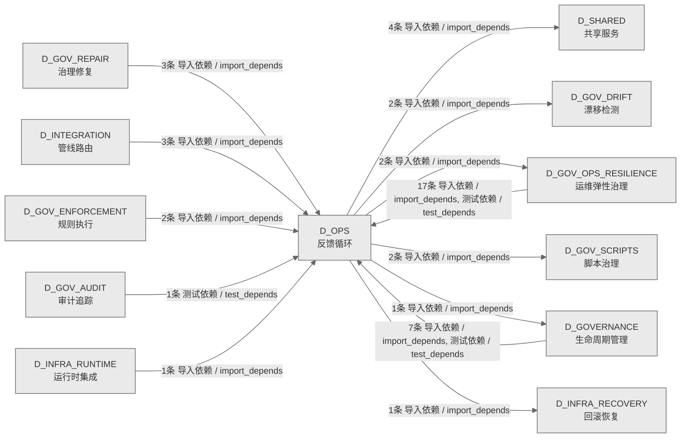

# 24_d_ops / 反馈循环域 / Feedback Loop

> **功能简介 / Overview**: 反馈循环，负责系统运行反馈、性能监控和自动调优闭环

> **文档作用 / Purpose**: 展示 反馈循环（D_OPS）功能域的域内依赖关系、跨域依赖关系，模块信息（成熟度/中英文名/大白话/文件路径）内嵌于 Mermaid 节点，供架构审查和域治理参考。

> 本文档由 generate_domain_doc.py 从 depgraph (PostgreSQL) 自动生成
> 数据源: depgraph (PostgreSQL) nodes表 + edges表

> **[可缩放 HTML 版 / Zoomable HTML](http://localhost:8765/docs/02_enterprise_architecture/02_domain_architecture_docs/_zoomable_html/24_d_ops.html)** — Ctrl+滚轮缩放 ｜ 双击重置 ｜ Ctrl+Shift+D 切换拖动/选择模式

## 域基本信息 / Domain Overview

| 字段 | 值 | Field | Value |
|------|------|-------|-------|
| 编号 | 24 | Number | 24 |
| 域ID | D_OPS | Domain ID | D_OPS |
| 域名称 | 反馈循环 | Domain Name | Feedback Loop |
| 层级 | L1 基础平台层 | Layer | L1 Foundation |
| 模块数 | 11 | Module Count | 11 |
| 域内依赖 | 2 | Internal Dependencies | 2 |
| 跨域入边 | 34 | Cross-domain Incoming | 34 |
| 跨域出边 | 12 | Cross-domain Outgoing | 12 |
| 设计态模块 | 0 | Design Modules | 0 |
| 生产态模块 | 11 | Production Modules | 11 |
| 容量 | 11/150 (正常) | Capacity | 11/150 (正常) |
| 描述 | 自动引导(auto_bootstrap) | Description | 自动引导(auto_bootstrap) |

## 域内依赖图 / Internal Dependency Diagram

> 依赖图内嵌在本文档中，IDE 可直接渲染；网页版可 Ctrl+滚轮缩放 + 拖动平移查看细节。
>
> **图例说明 / Legend**：
> - 🟦 **蓝色 = 运营态模块**（production，已上线运行）
> - 🟧 **橙色虚线 = 设计态模块**（design，蓝图阶段，代码未写）
> - **实线箭头 = 运营态依赖**（已生效的依赖关系）
> - **虚线箭头 = 非运营态依赖**（计划中/验证中的依赖关系）

### 全景图（全部模块，颜色区分运营态/设计态）

> 展示全部 11 个模块（生产态 11 + 设计态 0），含跨域依赖外部节点。节点含成熟度+名称+大白话/简介+文件路径。

```mermaid
%%{init: {'theme': 'base', 'themeVariables': {'primaryColor': '#eaeaea', 'primaryTextColor': '#333333', 'primaryBorderColor': '#666666', 'lineColor': '#666666', 'secondaryColor': '#eaeaea', 'tertiaryColor': '#eaeaea', 'fontSize': '14px'}}}%%
flowchart TD
    scripts_governance_observability_gate_cache_py["observability/gate_cache<br/>observability包的gate_cache模块<br/>文件: observability/gate_cache.py<br/>(生产态 / production)"]
    scripts_setup_dev_env_py["scripts/setup_dev_env<br/>开发环境一次性初始化（裁定<br/>#ARCH-PYTHON-SITECUSTOMIZE）。<br/>文件: scripts/setup_dev_env.py<br/>(生产态 / production)"]
    src_zephyr_governance_observability_governance_observability_dashboard_py["observability_governance/observability_dashboard<br/>治理/observability<br/>governance包的observability_dashboard模块<br/>文件: observability_governance<br/>/observability_dashboard.py<br/>(生产态 / production)"]
    src_zephyr_governance_ops_governance_budget_engine_py["ops_governance/budget_engine<br/>Budget Enforcer core engine — MOD-INF-024<br/>文件: ops_governance/budget_engine.py<br/>(生产态 / production)"]
    src_zephyr_governance_ops_governance_budget_handler_py["ops_governance/budget_handler<br/>G-CT-006 消费端 — Escalation.on_budget_alert()<br/>预算告急升级处理.<br/>文件: ops_governance/budget_handler.py<br/>(生产态 / production)"]
    src_zephyr_governance_ops_governance_budget_profile_manager_py["ops_governance/budget_profile_manager<br/>治理/ops governance包的budget_profile_manager模<br/>块<br/>文件: ops_governance/budget_profile_manager.py<br/>(生产态 / production)"]
    src_zephyr_governance_ops_governance_budget_tracker_py["ops_governance/budget_tracker<br/>治理/ops governance包的budget_tracker模块<br/>文件: ops_governance/budget_tracker.py<br/>(生产态 / production)"]
    src_zephyr_governance_ops_governance_cost_budget_py["ops_governance/cost_budget<br/>cost_budget.py —— AI 成本预算与强制熔断（Phase<br/>11 / 盲点 B26）<br/>文件: ops_governance/cost_budget.py<br/>(生产态 / production)"]
    src_zephyr_governance_ops_governance_meta_observability_py["ops_governance/meta_observability<br/>Meta Observability — v0.10.0 协议自身可观测性:<br/>self loop latency+p99+edge ca...<br/>文件: ops_governance/meta_observability.py<br/>(生产态 / production)"]
    src_zephyr_governance_ops_governance_token_budget_py["ops_governance/token_budget<br/>治理/ops governance包的token_budget模块<br/>文件: ops_governance/token_budget.py<br/>(生产态 / production)"]
    scripts_governance_observability_gate_cache_py ~~~ scripts_setup_dev_env_py
    scripts_setup_dev_env_py ~~~ src_zephyr_governance_observability_governance_observability_dashboard_py
    src_zephyr_governance_observability_governance_observability_dashboard_py ~~~ src_zephyr_governance_ops_governance_budget_engine_py
    src_zephyr_governance_ops_governance_budget_engine_py ~~~ src_zephyr_governance_ops_governance_budget_handler_py
    src_zephyr_governance_ops_governance_budget_handler_py ~~~ src_zephyr_governance_ops_governance_budget_profile_manager_py
    src_zephyr_governance_ops_governance_budget_profile_manager_py ~~~ src_zephyr_governance_ops_governance_budget_tracker_py
    src_zephyr_governance_ops_governance_budget_tracker_py ~~~ src_zephyr_governance_ops_governance_cost_budget_py
    src_zephyr_governance_ops_governance_cost_budget_py ~~~ src_zephyr_governance_ops_governance_meta_observability_py
    src_zephyr_governance_ops_governance_meta_observability_py ~~~ src_zephyr_governance_ops_governance_token_budget_py
    src_zephyr_governance_ops_governance_budget_models_py["ops_governance/budget_models<br/>Budget Enforcer data models — MOD-INF-024<br/>文件: ops_governance/budget_models.py<br/>(生产态 / production)"]
    src_zephyr_governance_ops_governance_budget_engine_py -->|导入依赖 / import_depends| src_zephyr_governance_ops_governance_budget_models_py
    src_zephyr_governance_ops_governance_budget_tracker_py -->|导入依赖 / import_depends| src_zephyr_governance_ops_governance_budget_models_py
    D_GOV_SCRIPTS["脚本治理<br/>脚本治理，负责脚本生命周期管理和脚本质量门禁<br/>Script Governance<br/>跨域节点 / cross-domain<br/>(生产态 / production)"]
    scripts_governance_observability_gate_cache_py -->|导入依赖 / import_depends| D_GOV_SCRIPTS
    scripts_governance_observability_gate_cache_py -->|导入依赖 / import_depends| D_GOV_SCRIPTS
    D_GOV_OPS_RESILIENCE["运维弹性治理<br/>运维弹性治理，负责运维治理、安全治理、弹性治理和<br/>升级协议<br/>Ops Resilience Governance<br/>跨域节点 / cross-domain<br/>(生产态 / production)"]
    src_zephyr_governance_ops_governance_budget_engine_py -->|导入依赖 / import_depends| D_GOV_OPS_RESILIENCE
    D_GOV_DRIFT["漂移检测<br/>漂移检测，负责架构漂移检测和漂移告警<br/>Drift Detection<br/>跨域节点 / cross-domain<br/>(生产态 / production)"]
    src_zephyr_governance_ops_governance_budget_engine_py -->|导入依赖 / import_depends| D_GOV_DRIFT
    src_zephyr_governance_ops_governance_budget_handler_py -->|导入依赖 / import_depends| D_GOV_OPS_RESILIENCE
    D_SHARED["共享服务<br/>共享服务，负责跨域共享的工具、协议和基础服务<br/>Shared Services<br/>跨域节点 / cross-domain<br/>(生产态 / production)"]
    src_zephyr_governance_ops_governance_budget_handler_py -->|导入依赖 / import_depends| D_SHARED
    D_GOVERNANCE["生命周期管理<br/>生命周期管理，负责蓝图/模块<br/>/任务的声明周期管理和元数据治理<br/>Lifecycle Management<br/>跨域节点 / cross-domain<br/>(生产态 / production)"]
    src_zephyr_governance_ops_governance_budget_handler_py -->|导入依赖 / import_depends| D_GOVERNANCE
    src_zephyr_governance_ops_governance_cost_budget_py -->|导入依赖 / import_depends| D_SHARED
    src_zephyr_governance_ops_governance_cost_budget_py -->|导入依赖 / import_depends| D_SHARED
    D_INFRA_RECOVERY["回滚恢复<br/>回滚恢复，负责系统故障时的状态回滚、事务补偿和恢<br/>复编排<br/>Rollback Recovery<br/>跨域节点 / cross-domain<br/>(生产态 / production)"]
    src_zephyr_governance_ops_governance_budget_tracker_py -->|导入依赖 / import_depends| D_INFRA_RECOVERY
    src_zephyr_governance_ops_governance_budget_engine_py -->|导入依赖 / import_depends| D_SHARED
    src_zephyr_governance_ops_governance_budget_engine_py -->|导入依赖 / import_depends| D_GOV_DRIFT
    D_INTEGRATION["管线路由<br/>管线路由，负责跨域数据流路由、管道编排和集成适配<br/>Pipeline Routing<br/>跨域节点 / cross-domain<br/>(生产态 / production)"]
    D_INTEGRATION -->|导入依赖 / import_depends| src_zephyr_governance_ops_governance_budget_engine_py
    D_INTEGRATION -->|导入依赖 / import_depends| src_zephyr_governance_ops_governance_budget_models_py
    D_GOV_ENFORCEMENT["规则执行<br/>规则执行，负责治理规则执行和门禁拦截<br/>Rule Enforcement<br/>跨域节点 / cross-domain<br/>(生产态 / production)"]
    D_GOV_ENFORCEMENT -->|导入依赖 / import_depends| src_zephyr_governance_ops_governance_budget_models_py
    D_INFRA_RUNTIME["运行时集成<br/>运行时集成，负责组件生命周期编排、启动钩子和运行<br/>时上下文管理<br/>Runtime Integration<br/>跨域节点 / cross-domain<br/>(生产态 / production)"]
    D_INFRA_RUNTIME -->|导入依赖 / import_depends| src_zephyr_governance_ops_governance_budget_engine_py
    D_INTEGRATION -->|导入依赖 / import_depends| src_zephyr_governance_ops_governance_budget_engine_py
    D_GOV_OPS_RESILIENCE -->|导入依赖 / import_depends| src_zephyr_governance_ops_governance_budget_models_py
    D_GOVERNANCE -->|导入依赖 / import_depends| src_zephyr_governance_ops_governance_budget_engine_py
    D_GOVERNANCE -->|导入依赖 / import_depends| src_zephyr_governance_ops_governance_budget_models_py
    D_GOV_OPS_RESILIENCE -->|导入依赖 / import_depends| src_zephyr_governance_ops_governance_budget_engine_py
    D_GOV_OPS_RESILIENCE -->|测试依赖 / test_depends| src_zephyr_governance_ops_governance_budget_models_py
    D_GOV_OPS_RESILIENCE -->|测试依赖 / test_depends| src_zephyr_governance_ops_governance_cost_budget_py
    D_GOV_OPS_RESILIENCE -->|测试依赖 / test_depends| src_zephyr_governance_ops_governance_cost_budget_py
    D_GOV_OPS_RESILIENCE -->|测试依赖 / test_depends| src_zephyr_governance_ops_governance_budget_engine_py
    D_GOV_OPS_RESILIENCE -->|测试依赖 / test_depends| src_zephyr_governance_ops_governance_budget_handler_py
    D_GOV_OPS_RESILIENCE -->|测试依赖 / test_depends| src_zephyr_governance_ops_governance_budget_tracker_py
    classDef production fill:#e1f5fe,stroke:#01579b,stroke-width:2px,color:#000
    classDef design fill:#fff3e0,stroke:#e65100,stroke-width:2px,color:#000,stroke-dasharray: 5 5
    classDef external_prod fill:#e8f4fd,stroke:#0277bd,stroke-width:1px,color:#000
    classDef external_design fill:#fff8e7,stroke:#ef6c00,stroke-width:1px,color:#000,stroke-dasharray: 5 5
    class scripts_governance_observability_gate_cache_py,scripts_setup_dev_env_py,src_zephyr_governance_observability_governance_observability_dashboard_py,src_zephyr_governance_ops_governance_budget_engine_py,src_zephyr_governance_ops_governance_budget_handler_py,src_zephyr_governance_ops_governance_budget_models_py,src_zephyr_governance_ops_governance_budget_profile_manager_py,src_zephyr_governance_ops_governance_budget_tracker_py,src_zephyr_governance_ops_governance_cost_budget_py,src_zephyr_governance_ops_governance_meta_observability_py,src_zephyr_governance_ops_governance_token_budget_py production
    class D_GOV_SCRIPTS,D_GOV_OPS_RESILIENCE,D_GOV_DRIFT,D_SHARED,D_GOVERNANCE,D_INFRA_RECOVERY,D_INTEGRATION,D_GOV_ENFORCEMENT,D_INFRA_RUNTIME external_prod
```

### 运营态的图（仅 design_maturity=production 的模块和域内依赖）

> 仅展示已上线运行的模块（共 11 个），不含跨域外部节点。跨域依赖见下方跨域依赖章节。

```mermaid
%%{init: {'theme': 'base', 'themeVariables': {'primaryColor': '#eaeaea', 'primaryTextColor': '#333333', 'primaryBorderColor': '#666666', 'lineColor': '#666666', 'secondaryColor': '#eaeaea', 'tertiaryColor': '#eaeaea', 'fontSize': '14px'}}}%%
flowchart TD
    scripts_governance_observability_gate_cache_py["observability/gate_cache<br/>observability包的gate_cache模块<br/>文件: observability/gate_cache.py<br/>(生产态 / production)"]
    scripts_setup_dev_env_py["scripts/setup_dev_env<br/>开发环境一次性初始化（裁定<br/>#ARCH-PYTHON-SITECUSTOMIZE）。<br/>文件: scripts/setup_dev_env.py<br/>(生产态 / production)"]
    src_zephyr_governance_observability_governance_observability_dashboard_py["observability_governance/observability_dashboard<br/>治理/observability<br/>governance包的observability_dashboard模块<br/>文件: observability_governance<br/>/observability_dashboard.py<br/>(生产态 / production)"]
    src_zephyr_governance_ops_governance_budget_engine_py["ops_governance/budget_engine<br/>Budget Enforcer core engine — MOD-INF-024<br/>文件: ops_governance/budget_engine.py<br/>(生产态 / production)"]
    src_zephyr_governance_ops_governance_budget_handler_py["ops_governance/budget_handler<br/>G-CT-006 消费端 — Escalation.on_budget_alert()<br/>预算告急升级处理.<br/>文件: ops_governance/budget_handler.py<br/>(生产态 / production)"]
    src_zephyr_governance_ops_governance_budget_profile_manager_py["ops_governance/budget_profile_manager<br/>治理/ops governance包的budget_profile_manager模<br/>块<br/>文件: ops_governance/budget_profile_manager.py<br/>(生产态 / production)"]
    src_zephyr_governance_ops_governance_budget_tracker_py["ops_governance/budget_tracker<br/>治理/ops governance包的budget_tracker模块<br/>文件: ops_governance/budget_tracker.py<br/>(生产态 / production)"]
    src_zephyr_governance_ops_governance_cost_budget_py["ops_governance/cost_budget<br/>cost_budget.py —— AI 成本预算与强制熔断（Phase<br/>11 / 盲点 B26）<br/>文件: ops_governance/cost_budget.py<br/>(生产态 / production)"]
    src_zephyr_governance_ops_governance_meta_observability_py["ops_governance/meta_observability<br/>Meta Observability — v0.10.0 协议自身可观测性:<br/>self loop latency+p99+edge ca...<br/>文件: ops_governance/meta_observability.py<br/>(生产态 / production)"]
    src_zephyr_governance_ops_governance_token_budget_py["ops_governance/token_budget<br/>治理/ops governance包的token_budget模块<br/>文件: ops_governance/token_budget.py<br/>(生产态 / production)"]
    scripts_governance_observability_gate_cache_py ~~~ scripts_setup_dev_env_py
    scripts_setup_dev_env_py ~~~ src_zephyr_governance_observability_governance_observability_dashboard_py
    src_zephyr_governance_observability_governance_observability_dashboard_py ~~~ src_zephyr_governance_ops_governance_budget_engine_py
    src_zephyr_governance_ops_governance_budget_engine_py ~~~ src_zephyr_governance_ops_governance_budget_handler_py
    src_zephyr_governance_ops_governance_budget_handler_py ~~~ src_zephyr_governance_ops_governance_budget_profile_manager_py
    src_zephyr_governance_ops_governance_budget_profile_manager_py ~~~ src_zephyr_governance_ops_governance_budget_tracker_py
    src_zephyr_governance_ops_governance_budget_tracker_py ~~~ src_zephyr_governance_ops_governance_cost_budget_py
    src_zephyr_governance_ops_governance_cost_budget_py ~~~ src_zephyr_governance_ops_governance_meta_observability_py
    src_zephyr_governance_ops_governance_meta_observability_py ~~~ src_zephyr_governance_ops_governance_token_budget_py
    src_zephyr_governance_ops_governance_budget_models_py["ops_governance/budget_models<br/>Budget Enforcer data models — MOD-INF-024<br/>文件: ops_governance/budget_models.py<br/>(生产态 / production)"]
    src_zephyr_governance_ops_governance_budget_engine_py -->|导入依赖 / import_depends| src_zephyr_governance_ops_governance_budget_models_py
    src_zephyr_governance_ops_governance_budget_tracker_py -->|导入依赖 / import_depends| src_zephyr_governance_ops_governance_budget_models_py
    classDef production fill:#e1f5fe,stroke:#01579b,stroke-width:2px,color:#000
    classDef design fill:#fff3e0,stroke:#e65100,stroke-width:2px,color:#000,stroke-dasharray: 5 5
    classDef external_prod fill:#e8f4fd,stroke:#0277bd,stroke-width:1px,color:#000
    classDef external_design fill:#fff8e7,stroke:#ef6c00,stroke-width:1px,color:#000,stroke-dasharray: 5 5
    class scripts_governance_observability_gate_cache_py,scripts_setup_dev_env_py,src_zephyr_governance_observability_governance_observability_dashboard_py,src_zephyr_governance_ops_governance_budget_engine_py,src_zephyr_governance_ops_governance_budget_handler_py,src_zephyr_governance_ops_governance_budget_models_py,src_zephyr_governance_ops_governance_budget_profile_manager_py,src_zephyr_governance_ops_governance_budget_tracker_py,src_zephyr_governance_ops_governance_cost_budget_py,src_zephyr_governance_ops_governance_meta_observability_py,src_zephyr_governance_ops_governance_token_budget_py production
```

### 设计态的图（仅 design_maturity=design 的模块和域内依赖）

> 仅展示蓝图阶段、代码未写的设计态模块（共 0 个），不含跨域外部节点。

> （无模块 / No modules）

## 跨域依赖 / Cross-domain Dependencies

### 本域依赖的其他域（出边）/ Depends On

| # | 本域模块 / Source Module | → | 外部域-目标模块 / Target Module | 依赖类型 / Type |
|:--:|---------|:--:|---------|---------|
| 1 | G-CT-006 消费端 — Escalation.on_budget_alert() 预算告急... | → | D_GOVERNANCE 生命周期管理: 适配器 / adapter (services/adapter.py) | 导入依赖 / import_depends |
| 2 | Budget Enforcer core engine — MOD-INF-024 (ops_governanc... | → | D_GOV_DRIFT 漂移检测: Drift Detector 基础设施 — drift_infrastructure.py (gov_d... | 导入依赖 / import_depends |
| 3 | Budget Enforcer core engine — MOD-INF-024 (ops_governanc... | → | D_GOV_DRIFT 漂移检测: gov_drift/spiral_ews.py | 导入依赖 / import_depends |
| 4 | Budget Enforcer core engine — MOD-INF-024 (ops_governanc... | → | D_GOV_OPS_RESILIENCE 运维弹性治理: security_governance/ipi_defense.py | 导入依赖 / import_depends |
| 5 | G-CT-006 消费端 — Escalation.on_budget_alert() 预算告急... | → | D_GOV_OPS_RESILIENCE 运维弹性治理: G-CT-003 消费端 — Escalation.on_rollback_failure() + G-C... | 导入依赖 / import_depends |
| 6 | Module docstring — see module-level docstring for detail... | → | D_GOV_SCRIPTS 脚本治理: constants.py — 审计脚本共享常量 (_shared/constants.py) | 导入依赖 / import_depends |
| 7 | Module docstring — see module-level docstring for detail... | → | D_GOV_SCRIPTS 脚本治理: _shared/file_utils.py — 原子写入共享工具（ARCH-036 P1-1... | 导入依赖 / import_depends |
| 8 | ops_governance/budget_tracker.py | → | D_INFRA_RECOVERY 回滚恢复: G-CT-009 契约：Rollback -> Budget 回滚成本计入预算. (roll... | 导入依赖 / import_depends |
| 9 | Budget Enforcer core engine — MOD-INF-024 (ops_governanc... | → | D_SHARED 共享服务: EventBus — 事件总线（带背压控制）(M-07) (shared/event_bu... | 导入依赖 / import_depends |
| 10 | G-CT-006 消费端 — Escalation.on_budget_alert() 预算告急... | → | D_SHARED 共享服务: escalation/budget_alert.py | 导入依赖 / import_depends |
| 11 | cost_budget.py —— AI 成本预算与强制熔断（Phase 11 | 盲... | → | D_SHARED 共享服务: errors.py —— ZephyrAlpha 统一错误层次（Traditional Exce... | 导入依赖 / import_depends |
| 12 | cost_budget.py —— AI 成本预算与强制熔断（Phase 11 | 盲... | → | D_SHARED 共享服务: metrics.py —— 轻量级 Metrics 收集基础设施（Phase 9 新增... | 导入依赖 / import_depends |

### 依赖本域的其他域（入边）/ Depended By

| # | 外部域-源模块 / Source Module | → | 本域模块 / Target Module | 依赖类型 / Type |
|:--:|---------|:--:|---------|---------|
| 1 | D_GOVERNANCE 生命周期管理: 模型提供器数据 / model_provider_data (intelligence_govern... | → | Budget Enforcer data models — MOD-INF-024 (ops_governanc... | 导入依赖 / import_depends |
| 2 | D_GOVERNANCE 生命周期管理: 模型路由器 / model_router (intelligence_governance/model_... | → | Budget Enforcer data models — MOD-INF-024 (ops_governanc... | 导入依赖 / import_depends |
| 3 | D_GOVERNANCE 生命周期管理: 治理服务端 / governance_server (mcp/governance_server.py) | → | Budget Enforcer core engine — MOD-INF-024 (ops_governanc... | 导入依赖 / import_depends |
| 4 | D_GOVERNANCE 生命周期管理: 治理服务端 / governance_server (mcp/governance_server.py) | → | Budget Enforcer data models — MOD-INF-024 (ops_governanc... | 导入依赖 / import_depends |
| 5 | D_GOVERNANCE 生命周期管理: G-CT-009: Five-System Governance Discovery Integration Te... | → | Budget Enforcer core engine — MOD-INF-024 (ops_governanc... | 测试依赖 / test_depends |
| 6 | D_GOVERNANCE 生命周期管理: observability/test_meta_observability.py | → | Meta Observability — v0.10.0 协议自身可观测性: self loop... | 测试依赖 / test_depends |
| 7 | D_GOVERNANCE 生命周期管理: DOM-GOV-001 P0 测试用例 — P0-U1 冒烟测试 + P0-U2 输入校... | → | G-CT-006 消费端 — Escalation.on_budget_alert() 预算告急... | 测试依赖 / test_depends |
| 8 | D_GOV_AUDIT 审计追踪: G-CT-006 — Budget → Escalation 集成测试. (audit/test_gc... | → | G-CT-006 消费端 — Escalation.on_budget_alert() 预算告急... | 测试依赖 / test_depends |
| 9 | D_GOV_ENFORCEMENT 规则执行: rule_enforcement/pre_flight_gate.py | → | Budget Enforcer core engine — MOD-INF-024 (ops_governanc... | 导入依赖 / import_depends |
| 10 | D_GOV_ENFORCEMENT 规则执行: rule_enforcement/pre_flight_gate.py | → | Budget Enforcer data models — MOD-INF-024 (ops_governanc... | 导入依赖 / import_depends |
| 11 | D_GOV_OPS_RESILIENCE 运维弹性治理: Burn Rate Monitor — MOD-INF-024 (ops_governance/burn_rat... | → | Budget Enforcer data models — MOD-INF-024 (ops_governanc... | 导入依赖 / import_depends |
| 12 | D_GOV_OPS_RESILIENCE 运维弹性治理: ops_governance/cost_attributor.py | → | Budget Enforcer data models — MOD-INF-024 (ops_governanc... | 导入依赖 / import_depends |
| 13 | D_GOV_OPS_RESILIENCE 运维弹性治理: ops_governance/degradation_manager.py | → | Budget Enforcer data models — MOD-INF-024 (ops_governanc... | 导入依赖 / import_depends |
| 14 | D_GOV_OPS_RESILIENCE 运维弹性治理: PhaseManager->GateEngine 检查注册表桥梁 — 44 个阶段门控... | → | Budget Enforcer core engine — MOD-INF-024 (ops_governanc... | 导入依赖 / import_depends |
| 15 | D_GOV_OPS_RESILIENCE 运维弹性治理: PhaseManager->GateEngine 检查注册表桥梁 — 44 个阶段门控... | → | Budget Enforcer data models — MOD-INF-024 (ops_governanc... | 导入依赖 / import_depends |
| 16 | D_GOV_OPS_RESILIENCE 运维弹性治理: security_governance/adversarial_tester.py | → | Budget Enforcer core engine — MOD-INF-024 (ops_governanc... | 导入依赖 / import_depends |
| 17 | D_GOV_OPS_RESILIENCE 运维弹性治理: security_governance/adversarial_tester.py | → | Budget Enforcer data models — MOD-INF-024 (ops_governanc... | 导入依赖 / import_depends |
| 18 | D_GOV_OPS_RESILIENCE 运维弹性治理: budget/test_burn_rate_monitor.py | → | Budget Enforcer data models — MOD-INF-024 (ops_governanc... | 测试依赖 / test_depends |
| 19 | D_GOV_OPS_RESILIENCE 运维弹性治理: budget/test_cost_attributor.py | → | Budget Enforcer data models — MOD-INF-024 (ops_governanc... | 测试依赖 / test_depends |
| 20 | D_GOV_OPS_RESILIENCE 运维弹性治理: budget/test_cost_budget_root.py | → | cost_budget.py —— AI 成本预算与强制熔断（Phase 11 | 盲... | 测试依赖 / test_depends |
| 21 | D_GOV_OPS_RESILIENCE 运维弹性治理: Unit tests for cost_budget.py (budget/test_cost_budget_un... | → | cost_budget.py —— AI 成本预算与强制熔断（Phase 11 | 盲... | 测试依赖 / test_depends |
| 22 | D_GOV_OPS_RESILIENCE 运维弹性治理: budget/test_degradation_manager.py | → | Budget Enforcer data models — MOD-INF-024 (ops_governanc... | 测试依赖 / test_depends |
| 23 | D_GOV_OPS_RESILIENCE 运维弹性治理: budget/test_gct_024_hard_checks.py | → | Budget Enforcer core engine — MOD-INF-024 (ops_governanc... | 测试依赖 / test_depends |
| 24 | D_GOV_OPS_RESILIENCE 运维弹性治理: budget/test_gct_024_hard_checks.py | → | G-CT-006 消费端 — Escalation.on_budget_alert() 预算告急... | 测试依赖 / test_depends |
| 25 | D_GOV_OPS_RESILIENCE 运维弹性治理: budget/test_governance_budget_tracker.py | → | ops_governance/budget_tracker.py | 测试依赖 / test_depends |
| 26 | D_GOV_OPS_RESILIENCE 运维弹性治理: budget/test_pre_flight_gate.py | → | Budget Enforcer core engine — MOD-INF-024 (ops_governanc... | 测试依赖 / test_depends |
| 27 | D_GOV_OPS_RESILIENCE 运维弹性治理: budget/test_pre_flight_gate.py | → | Budget Enforcer data models — MOD-INF-024 (ops_governanc... | 测试依赖 / test_depends |
| 28 | D_GOV_REPAIR 治理修复: financial_governance/budget_enforcement.py | → | Budget Enforcer core engine — MOD-INF-024 (ops_governanc... | 导入依赖 / import_depends |
| 29 | D_GOV_REPAIR 治理修复: financial_governance/budget_enforcement.py | → | Budget Enforcer data models — MOD-INF-024 (ops_governanc... | 导入依赖 / import_depends |
| 30 | D_GOV_REPAIR 治理修复: financial_governance/budget_enforcement.py | → | ops_governance/budget_tracker.py | 导入依赖 / import_depends |
| 31 | D_INFRA_RUNTIME 运行时集成: trading/boot_hooks.py | → | Budget Enforcer core engine — MOD-INF-024 (ops_governanc... | 导入依赖 / import_depends |
| 32 | D_INTEGRATION 管线路由: OllamaChat — 通过 Ollama HTTP API 进行本地 LLM 推理 (loc... | → | Budget Enforcer core engine — MOD-INF-024 (ops_governanc... | 导入依赖 / import_depends |
| 33 | D_INTEGRATION 管线路由: PipelineOrchestrator — M1-M11 管线协调器 (integration/pi... | → | Budget Enforcer core engine — MOD-INF-024 (ops_governanc... | 导入依赖 / import_depends |
| 34 | D_INTEGRATION 管线路由: PipelineOrchestrator — M1-M11 管线协调器 (integration/pi... | → | Budget Enforcer data models — MOD-INF-024 (ops_governanc... | 导入依赖 / import_depends |

### 跨域依赖图 / Cross-domain Dependency Diagram

> 本域与 11 个外部域直接连接（出边 12 条 + 入边 34 条 = 46 条）。只显示直接连接的域，不展开具体节点。

## 说明 / Notes

- **数据源 / Data Source**: `depgraph (PostgreSQL)` 的 `nodes`、`edges`、`domains` 表
- **生成器 / Generator**: `generate_domain_doc.py`（G2+G10 合并）
- **维护方式 / Maintenance**: 自动生成，全景图更新时刷新
- **文件名规则 / File Naming**: `{编号:02d}_{域ID小写}.md`，如 `16_d_trading.md`
- **图例说明 / Legend**: `[production]`=已上线 / `[design]`=设计中 / `[unknown]`=未知
