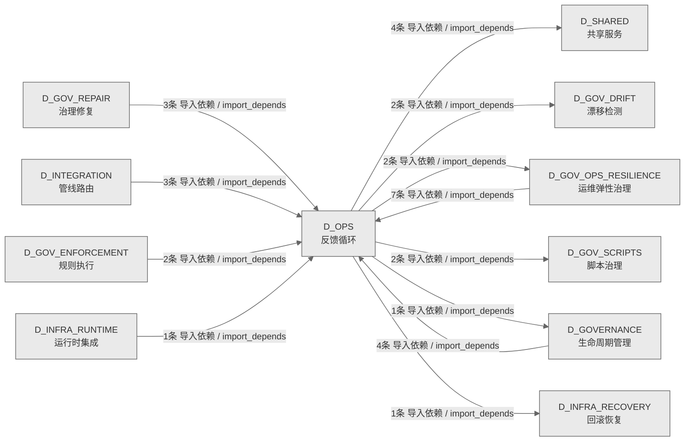

# 24_d_ops / 反馈循环域 / Feedback Loop

> **功能简介 / Overview**: 反馈循环，负责系统运行反馈、性能监控和自动调优闭环

> **文档作用 / Purpose**: 展示 反馈循环（D_OPS）功能域的域内依赖关系、跨域依赖关系，模块信息（成熟度/中英文名/大白话/文件路径）内嵌于 Mermaid 节点，供架构审查和域治理参考。

> 本文档由 generate_domain_doc.py 从 depgraph (PostgreSQL) 自动生成
> 数据源: depgraph (PostgreSQL) nodes表 + edges表

> **[可缩放 HTML 版 / Zoomable HTML](http://localhost:8765/docs/02_enterprise_architecture/02_domain_architecture_docs/_zoomable_html/24_d_ops.html)** — Ctrl+滚轮缩放 ｜ 双击重置 ｜ Ctrl+Shift+D 切换拖动/选择模式

## 域基本信息 / Domain Overview

| 字段 | 值 | Field | Value |
|------|------|-------|-------|
| 编号 | 24 | Number | 24 |
| 域ID | D_OPS | Domain ID | D_OPS |
| 域名称 | 反馈循环 | Domain Name | Feedback Loop |
| 层级 | L1 基础平台层 | Layer | L1 Foundation |
| 模块数 | 11 | Module Count | 11 |
| 域内依赖 | 2 | Internal Dependencies | 2 |
| 跨域入边 | 20 | Cross-domain Incoming | 20 |
| 跨域出边 | 12 | Cross-domain Outgoing | 12 |
| 设计态模块 | 0 | Design Modules | 0 |
| 生产态模块 | 11 | Production Modules | 11 |
| 容量 | 11/150 (正常) | Capacity | 11/150 (正常) |
| 描述 | 自动引导(auto_bootstrap) | Description | 自动引导(auto_bootstrap) |

## 域内依赖图 / Internal Dependency Diagram

> 依赖图内嵌在本文档中，IDE 可直接渲染；网页版可 Ctrl+滚轮缩放 + 拖动平移查看细节。全景图用颜色区分运营态/设计态，不再分页/拆子图。
>
> **图例说明 / Legend**：
> - 🟦 **蓝色 = 运营态模块**（production，已上线运行）
> - 🟧 **橙色虚线 = 设计态模块**（design，蓝图阶段，代码未写）
> - **实线箭头 = 运营态依赖**（已生效的依赖关系）
> - **虚线箭头 = 非运营态依赖**（计划中/验证中的依赖关系）

### 全景依赖图（全部模块，颜色区分运营态/设计态）

> 展示全部 11 个模块（生产态 11 + 设计态 0），节点含成熟度+中英文名+大白话+文件路径。

```mermaid
%%{init: {'theme': 'base', 'themeVariables': {'primaryColor': '#eaeaea', 'primaryTextColor': '#333333', 'primaryBorderColor': '#666666', 'lineColor': '#666666', 'secondaryColor': '#eaeaea', 'tertiaryColor': '#eaeaea', 'fontSize': '14px'}}}%%
flowchart TD
    scripts_governance_observability_gate_cache_py["(生产态 / production) 门禁缓存 / Gate Cache<br/>Module docstring — see module-level docstring for details.<br/>文件: observability/gate_cache.py"]
    scripts_setup_dev_env_py["(生产态 / production) setupdev环境 / Setup Dev Env<br/>开发环境一次性初始化（裁定 #ARCH-PYTHON-SITECUSTOMIZE）。<br/>文件: scripts/setup_dev_env.py"]
    src_zephyr_governance_observability_governance_observability_dashboard_py["(生产态 / production) 可观测性仪表板 / Observability Dashboard<br/>定义 DashboardPanel、SLI、DashboardConfig 等类型。<br/>文件: observability_governance/observability_dashboard.py"]
    src_zephyr_governance_ops_governance_budget_engine_py["(生产态 / production) 预算引擎 / Budget Engine<br/>Budget Enforcer core engine — MOD-INF-024<br/>文件: ops_governance/budget_engine.py"]
    src_zephyr_governance_ops_governance_budget_handler_py["(生产态 / production) 预算handler / Budget Handler<br/>G-CT-006 消费端 — Escalation.on_budget_alert() 预算告急升级处理.<br/>文件: ops_governance/budget_handler.py"]
    src_zephyr_governance_ops_governance_budget_profile_manager_py["(生产态 / production) 预算profile管理器 / Budget Profile Manager<br/>noqa: m03-duplicate  M03豁免: AI趋同演化(不同模块为相似问题生成相似代码),非复...<br/>文件: ops_governance/budget_profile_manager.py"]
    src_zephyr_governance_ops_governance_budget_tracker_py["(生产态 / production) 预算追踪器 / Budget Tracker<br/>noqa: m03-duplicate  M03豁免: AI趋同演化(不同模块为相似问题生成相似代码),非复...<br/>文件: ops_governance/budget_tracker.py"]
    src_zephyr_governance_ops_governance_cost_budget_py["(生产态 / production) 成本预算 / Cost Budget<br/>cost_budget.py —— AI 成本预算与强制熔断（Phase 11 / 盲点 B26）<br/>文件: ops_governance/cost_budget.py"]
    src_zephyr_governance_ops_governance_meta_observability_py["(生产态 / production) meta可观测性 / Meta Observability<br/>Meta Observability — v0.10.0 协议自身可观测性: self loop latency+p99+edge ca...<br/>文件: ops_governance/meta_observability.py"]
    src_zephyr_governance_ops_governance_token_budget_py["(生产态 / production) token预算 / Token Budget<br/>三级 Token Budget 管理器。<br/>文件: ops_governance/token_budget.py"]
    scripts_governance_observability_gate_cache_py ~~~ scripts_setup_dev_env_py
    scripts_setup_dev_env_py ~~~ src_zephyr_governance_observability_governance_observability_dashboard_py
    src_zephyr_governance_observability_governance_observability_dashboard_py ~~~ src_zephyr_governance_ops_governance_budget_engine_py
    src_zephyr_governance_ops_governance_budget_engine_py ~~~ src_zephyr_governance_ops_governance_budget_handler_py
    src_zephyr_governance_ops_governance_budget_handler_py ~~~ src_zephyr_governance_ops_governance_budget_profile_manager_py
    src_zephyr_governance_ops_governance_budget_profile_manager_py ~~~ src_zephyr_governance_ops_governance_budget_tracker_py
    src_zephyr_governance_ops_governance_budget_tracker_py ~~~ src_zephyr_governance_ops_governance_cost_budget_py
    src_zephyr_governance_ops_governance_cost_budget_py ~~~ src_zephyr_governance_ops_governance_meta_observability_py
    src_zephyr_governance_ops_governance_meta_observability_py ~~~ src_zephyr_governance_ops_governance_token_budget_py
    src_zephyr_governance_ops_governance_budget_models_py["(生产态 / production) 预算模型 / Budget Models<br/>Budget Enforcer data models — MOD-INF-024<br/>文件: ops_governance/budget_models.py"]
    src_zephyr_governance_ops_governance_budget_engine_py -->|导入依赖 / import_depends| src_zephyr_governance_ops_governance_budget_models_py
    src_zephyr_governance_ops_governance_budget_tracker_py -->|导入依赖 / import_depends| src_zephyr_governance_ops_governance_budget_models_py
    D_GOV_OPS_RESILIENCE["(生产态 / production) 运维弹性治理 / Ops Resilience Governance<br/>运维弹性治理，负责运维治理、安全治理、弹性治理和升级协议<br/>跨域节点 / cross-domain"]
    src_zephyr_governance_ops_governance_budget_handler_py -->|导入依赖 / import_depends| D_GOV_OPS_RESILIENCE
    D_GOV_SCRIPTS["(生产态 / production) 脚本治理 / Script Governance<br/>脚本治理，负责脚本生命周期管理和脚本质量门禁<br/>跨域节点 / cross-domain"]
    scripts_governance_observability_gate_cache_py -->|导入依赖 / import_depends| D_GOV_SCRIPTS
    scripts_governance_observability_gate_cache_py -->|导入依赖 / import_depends| D_GOV_SCRIPTS
    D_GOV_DRIFT["(生产态 / production) 漂移检测 / Drift Detection<br/>漂移检测，负责架构漂移检测和漂移告警<br/>跨域节点 / cross-domain"]
    src_zephyr_governance_ops_governance_budget_engine_py -->|导入依赖 / import_depends| D_GOV_DRIFT
    D_INFRA_RECOVERY["(生产态 / production) 回滚恢复 / Rollback Recovery<br/>回滚恢复，负责系统故障时的状态回滚、事务补偿和恢复编排<br/>跨域节点 / cross-domain"]
    src_zephyr_governance_ops_governance_budget_tracker_py -->|导入依赖 / import_depends| D_INFRA_RECOVERY
    src_zephyr_governance_ops_governance_budget_engine_py -->|导入依赖 / import_depends| D_GOV_DRIFT
    D_SHARED["(生产态 / production) 共享服务 / Shared Services<br/>共享服务，负责跨域共享的工具、协议和基础服务<br/>跨域节点 / cross-domain"]
    src_zephyr_governance_ops_governance_budget_engine_py -->|导入依赖 / import_depends| D_SHARED
    D_GOVERNANCE["(生产态 / production) 生命周期管理 / Lifecycle Management<br/>生命周期管理，负责蓝图/模块/任务的声明周期管理和元数据治理<br/>跨域节点 / cross-domain"]
    src_zephyr_governance_ops_governance_budget_handler_py -->|导入依赖 / import_depends| D_GOVERNANCE
    src_zephyr_governance_ops_governance_budget_engine_py -->|导入依赖 / import_depends| D_GOV_OPS_RESILIENCE
    src_zephyr_governance_ops_governance_cost_budget_py -->|导入依赖 / import_depends| D_SHARED
    src_zephyr_governance_ops_governance_budget_handler_py -->|导入依赖 / import_depends| D_SHARED
    src_zephyr_governance_ops_governance_cost_budget_py -->|导入依赖 / import_depends| D_SHARED
    D_GOV_REPAIR["(生产态 / production) 治理修复 / Governance Repair<br/>治理修复，负责治理问题自动修复和修复策略管理<br/>跨域节点 / cross-domain"]
    D_GOV_REPAIR -->|导入依赖 / import_depends| src_zephyr_governance_ops_governance_budget_engine_py
    D_GOV_OPS_RESILIENCE -->|导入依赖 / import_depends| src_zephyr_governance_ops_governance_budget_engine_py
    D_INTEGRATION["(生产态 / production) 管线路由 / Pipeline Routing<br/>管线路由，负责跨域数据流路由、管道编排和集成适配<br/>跨域节点 / cross-domain"]
    D_INTEGRATION -->|导入依赖 / import_depends| src_zephyr_governance_ops_governance_budget_engine_py
    D_GOV_ENFORCEMENT["(生产态 / production) 规则执行 / Rule Enforcement<br/>规则执行，负责治理规则执行和门禁拦截<br/>跨域节点 / cross-domain"]
    D_GOV_ENFORCEMENT -->|导入依赖 / import_depends| src_zephyr_governance_ops_governance_budget_models_py
    D_GOVERNANCE -->|导入依赖 / import_depends| src_zephyr_governance_ops_governance_budget_models_py
    D_GOVERNANCE -->|导入依赖 / import_depends| src_zephyr_governance_ops_governance_budget_engine_py
    D_GOV_OPS_RESILIENCE -->|导入依赖 / import_depends| src_zephyr_governance_ops_governance_budget_models_py
    D_INTEGRATION -->|导入依赖 / import_depends| src_zephyr_governance_ops_governance_budget_models_py
    D_GOV_OPS_RESILIENCE -->|导入依赖 / import_depends| src_zephyr_governance_ops_governance_budget_models_py
    D_INTEGRATION -->|导入依赖 / import_depends| src_zephyr_governance_ops_governance_budget_engine_py
    D_GOV_OPS_RESILIENCE -->|导入依赖 / import_depends| src_zephyr_governance_ops_governance_budget_engine_py
    D_GOV_OPS_RESILIENCE -->|导入依赖 / import_depends| src_zephyr_governance_ops_governance_budget_models_py
    D_GOVERNANCE -->|导入依赖 / import_depends| src_zephyr_governance_ops_governance_budget_models_py
    D_GOV_OPS_RESILIENCE -->|导入依赖 / import_depends| src_zephyr_governance_ops_governance_budget_models_py
    D_GOVERNANCE -->|导入依赖 / import_depends| src_zephyr_governance_ops_governance_budget_models_py
    classDef production fill:#e1f5fe,stroke:#01579b,stroke-width:2px,color:#000
    classDef design fill:#fff3e0,stroke:#e65100,stroke-width:2px,color:#000,stroke-dasharray: 5 5
    classDef external_prod fill:#e8f4fd,stroke:#0277bd,stroke-width:1px,color:#000
    classDef external_design fill:#fff8e7,stroke:#ef6c00,stroke-width:1px,color:#000,stroke-dasharray: 5 5
    class scripts_governance_observability_gate_cache_py,scripts_setup_dev_env_py,src_zephyr_governance_observability_governance_observability_dashboard_py,src_zephyr_governance_ops_governance_budget_engine_py,src_zephyr_governance_ops_governance_budget_handler_py,src_zephyr_governance_ops_governance_budget_models_py,src_zephyr_governance_ops_governance_budget_profile_manager_py,src_zephyr_governance_ops_governance_budget_tracker_py,src_zephyr_governance_ops_governance_cost_budget_py,src_zephyr_governance_ops_governance_meta_observability_py,src_zephyr_governance_ops_governance_token_budget_py production
    class D_GOV_OPS_RESILIENCE,D_GOV_SCRIPTS,D_GOV_DRIFT,D_INFRA_RECOVERY,D_SHARED,D_GOVERNANCE,D_GOV_REPAIR,D_INTEGRATION,D_GOV_ENFORCEMENT external_prod
```

## 跨域依赖 / Cross-domain Dependencies

### 本域依赖的其他域（出边）/ Depends On

| # | 本域模块 / Source Module | → | 外部域-目标模块 / Target Module | 依赖类型 / Type |
|:--:|---------|:--:|---------|---------|
| 1 | 预算handler / Budget Handler (ops_governance/budget_handl... | → | D_GOVERNANCE 生命周期管理: 适配器 / Adapter (services/adapter.py) | 导入依赖 / import_depends |
| 2 | 预算引擎 / Budget Engine (ops_governance/budget_engine.py) | → | D_GOV_DRIFT 漂移检测: 漂移infrastructure / Drift Infrastructure (gov_drift/drif... | 导入依赖 / import_depends |
| 3 | 预算引擎 / Budget Engine (ops_governance/budget_engine.py) | → | D_GOV_DRIFT 漂移检测: 螺旋预警 / Spiral EWS (gov_drift/spiral_ews.py) | 导入依赖 / import_depends |
| 4 | 预算引擎 / Budget Engine (ops_governance/budget_engine.py) | → | D_GOV_OPS_RESILIENCE 运维弹性治理: ipi防御 / Ipi Defense (security_governance/ipi_defense.py) | 导入依赖 / import_depends |
| 5 | 预算handler / Budget Handler (ops_governance/budget_handl... | → | D_GOV_OPS_RESILIENCE 运维弹性治理: 契约 / Contracts (escalation/contracts.py) | 导入依赖 / import_depends |
| 6 | 门禁缓存 / Gate Cache (observability/gate_cache.py) | → | D_GOV_SCRIPTS 脚本治理: constants / Constants (_shared/constants.py) | 导入依赖 / import_depends |
| 7 | 门禁缓存 / Gate Cache (observability/gate_cache.py) | → | D_GOV_SCRIPTS 脚本治理: 文件utils / File Utils (_shared/file_utils.py) | 导入依赖 / import_depends |
| 8 | 预算追踪器 / Budget Tracker (ops_governance/budget_tracke... | → | D_INFRA_RECOVERY 回滚恢复: 预算追踪器 / Budget Tracker (rollback/budget_tracker.py) | 导入依赖 / import_depends |
| 9 | 预算引擎 / Budget Engine (ops_governance/budget_engine.py) | → | D_SHARED 共享服务: 事件总线 / Event Bus (shared/event_bus.py) | 导入依赖 / import_depends |
| 10 | 预算handler / Budget Handler (ops_governance/budget_handl... | → | D_SHARED 共享服务: 预算告警 / Budget Alert (escalation/budget_alert.py) | 导入依赖 / import_depends |
| 11 | 成本预算 / Cost Budget (ops_governance/cost_budget.py) | → | D_SHARED 共享服务: 错误 / Errors (foundation/errors.py) | 导入依赖 / import_depends |
| 12 | 成本预算 / Cost Budget (ops_governance/cost_budget.py) | → | D_SHARED 共享服务: 指标 / Metrics (observability/metrics.py) | 导入依赖 / import_depends |

### 依赖本域的其他域（入边）/ Depended By

| # | 外部域-源模块 / Source Module | → | 本域模块 / Target Module | 依赖类型 / Type |
|:--:|---------|:--:|---------|---------|
| 1 | D_GOVERNANCE 生命周期管理: 模型提供者数据 / Model Provider Data (intelligence_govern... | → | 预算模型 / Budget Models (ops_governance/budget_models.py) | 导入依赖 / import_depends |
| 2 | D_GOVERNANCE 生命周期管理: 模型路由器 / Model Router (intelligence_governance/model_... | → | 预算模型 / Budget Models (ops_governance/budget_models.py) | 导入依赖 / import_depends |
| 3 | D_GOVERNANCE 生命周期管理: 治理服务端 / Governance Server (mcp/governance_server.py) | → | 预算引擎 / Budget Engine (ops_governance/budget_engine.py) | 导入依赖 / import_depends |
| 4 | D_GOVERNANCE 生命周期管理: 治理服务端 / Governance Server (mcp/governance_server.py) | → | 预算模型 / Budget Models (ops_governance/budget_models.py) | 导入依赖 / import_depends |
| 5 | D_GOV_ENFORCEMENT 规则执行: 预飞行门禁 / Pre Flight Gate (rule_enforcement/pre_flight... | → | 预算引擎 / Budget Engine (ops_governance/budget_engine.py) | 导入依赖 / import_depends |
| 6 | D_GOV_ENFORCEMENT 规则执行: 预飞行门禁 / Pre Flight Gate (rule_enforcement/pre_flight... | → | 预算模型 / Budget Models (ops_governance/budget_models.py) | 导入依赖 / import_depends |
| 7 | D_GOV_OPS_RESILIENCE 运维弹性治理: burnrate监控器 / Burn Rate Monitor (ops_governance/burn_r... | → | 预算模型 / Budget Models (ops_governance/budget_models.py) | 导入依赖 / import_depends |
| 8 | D_GOV_OPS_RESILIENCE 运维弹性治理: 成本归因器 / Cost Attributor (ops_governance/cost_attribu... | → | 预算模型 / Budget Models (ops_governance/budget_models.py) | 导入依赖 / import_depends |
| 9 | D_GOV_OPS_RESILIENCE 运维弹性治理: 降级管理器 / Degradation Manager (ops_governance/degradat... | → | 预算模型 / Budget Models (ops_governance/budget_models.py) | 导入依赖 / import_depends |
| 10 | D_GOV_OPS_RESILIENCE 运维弹性治理: phase检查注册表 / Phase Check Registry (ops_governance/ph... | → | 预算引擎 / Budget Engine (ops_governance/budget_engine.py) | 导入依赖 / import_depends |
| 11 | D_GOV_OPS_RESILIENCE 运维弹性治理: phase检查注册表 / Phase Check Registry (ops_governance/ph... | → | 预算模型 / Budget Models (ops_governance/budget_models.py) | 导入依赖 / import_depends |
| 12 | D_GOV_OPS_RESILIENCE 运维弹性治理: 对抗测试器 / Adversarial Tester (security_governance/adve... | → | 预算引擎 / Budget Engine (ops_governance/budget_engine.py) | 导入依赖 / import_depends |
| 13 | D_GOV_OPS_RESILIENCE 运维弹性治理: 对抗测试器 / Adversarial Tester (security_governance/adve... | → | 预算模型 / Budget Models (ops_governance/budget_models.py) | 导入依赖 / import_depends |
| 14 | D_GOV_REPAIR 治理修复: 预算enforcement / Budget Enforcement (financial_governanc... | → | 预算引擎 / Budget Engine (ops_governance/budget_engine.py) | 导入依赖 / import_depends |
| 15 | D_GOV_REPAIR 治理修复: 预算enforcement / Budget Enforcement (financial_governanc... | → | 预算模型 / Budget Models (ops_governance/budget_models.py) | 导入依赖 / import_depends |
| 16 | D_GOV_REPAIR 治理修复: 预算enforcement / Budget Enforcement (financial_governanc... | → | 预算追踪器 / Budget Tracker (ops_governance/budget_tracke... | 导入依赖 / import_depends |
| 17 | D_INFRA_RUNTIME 运行时集成: boothooks / Boot Hooks (trading/boot_hooks.py) | → | 预算引擎 / Budget Engine (ops_governance/budget_engine.py) | 导入依赖 / import_depends |
| 18 | D_INTEGRATION 管线路由: Ollamachat / Ollama Chat (local_model/ollama_chat.py) | → | 预算引擎 / Budget Engine (ops_governance/budget_engine.py) | 导入依赖 / import_depends |
| 19 | D_INTEGRATION 管线路由: 流水线orchestrator / Pipeline Orchestrator (integration/p... | → | 预算引擎 / Budget Engine (ops_governance/budget_engine.py) | 导入依赖 / import_depends |
| 20 | D_INTEGRATION 管线路由: 流水线orchestrator / Pipeline Orchestrator (integration/p... | → | 预算模型 / Budget Models (ops_governance/budget_models.py) | 导入依赖 / import_depends |

### 跨域依赖图 / Cross-domain Dependency Diagram

> 本域与 10 个外部域直接连接（出边 12 条 + 入边 20 条 = 32 条）。只显示直接连接的域，不展开具体节点。

## 说明 / Notes

- **数据源 / Data Source**: `depgraph (PostgreSQL)` 的 `nodes`、`edges`、`domains` 表
- **生成器 / Generator**: `generate_domain_doc.py`（G2+G10 合并）
- **维护方式 / Maintenance**: 自动生成，全景图更新时刷新
- **文件名规则 / File Naming**: `{编号:02d}_{域ID小写}.md`，如 `16_d_trading.md`
- **图例说明 / Legend**: `[production]`=已上线 / `[design]`=设计中 / `[unknown]`=未知
