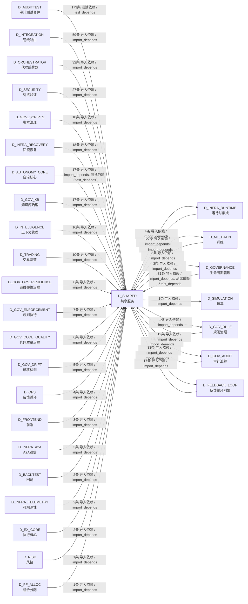

# 24_d_shared / shared_services / 共享服务 / Shared Services

> **功能简介 / Overview**: 共享服务，负责跨域共享的工具、协议和基础服务

> **文档作用 / Purpose**: 展示 共享服务（D_SHARED）功能域的模块清单、域内依赖关系、跨域依赖关系、架构分层视图，供架构审查和域治理参考。

> 本文档由 generate_domain_doc.py 从 depgraph (PostgreSQL) 自动生成
> 最后更新: 2026-07-13 00:56:27
> 数据源: depgraph (PostgreSQL) nodes表 + edges表

## 域基本信息 / Domain Overview

| 字段 | 值 | Field | Value |
|------|------|-------|-------|
| 编号 | 24 | Number | 24 |
| 域ID | D_SHARED | Domain ID | D_SHARED |
| 域名称 | 共享服务 | Domain Name | Shared Services |
| 层级 | L1 基础平台层 | Layer | L1 Foundation |
| 模块数 | 204 | Module Count | 204 |
| 域内依赖 | 151 | Internal Dependencies | 151 |
| 跨域入边 | 704 | Cross-domain Incoming | 704 |
| 跨域出边 | 12 | Cross-domain Outgoing | 12 |
| 设计态模块 | 0 | Design Modules | 0 |
| 原型态模块 | 117 | Prototype Modules | 117 |
| 生产态模块 | 87 | Production Modules | 87 |
| 容量 | 87/150 (正常) | Capacity | 87/150 (正常) |
| 描述 | 事件总线(event_bus) | Description | 事件总线(event_bus) |

## 模块分层清单 / Module Layered List

> 按 architecture_layer 分组的模块清单（共 204 个模块 / 204 modules）。

### L0 基础设施层 / Infrastructure Layer (6 modules)

| # | 模块路径 / Module Path | 模块名称 / Module Name (功能简介 / Description) | 成熟度 / Maturity | 蓝图 / Blueprint |
|:--:|---------|---------|:---:|:---:|
| 1 | src/zephyr/shared/lifecycle/health.py | health.py —— ZephyrAlpha 聚合健康检查 | 生产态 / production | [MOD-INF-016](../../03_modules/_cross_layer/shared_core/blueprint.md) |
| 2 | src/zephyr/shared/lifecycle/health_discovery.py | CT-HEALTH-001: System-wide Health Discovery Reg... | 生产态 / production | [MOD-INF-016](../../03_modules/_cross_layer/shared_core/blueprint.md) |
| 3 | src/zephyr/shared/lifecycle/longevity_monitor.py | longevity_monitor.py | 生产态 / production | [MOD-INF-016](../../03_modules/_cross_layer/shared_core/blueprint.md) |
| 4 | src/zephyr/shared/lifecycle/state_machine.py | StateMachine[S] — 通用状态机泛型基类 (MOD-INF-038) | 原型态 / prototype | [MOD-INF-038](../../03_modules/_domain_infrastructure_runtime/state_machine_engine/blueprint.md) |
| 5 | src/zephyr/shared/lifecycle/task_heartbeat.py | task_heartbeat.py | 生产态 / production |  |
| 6 | src/zephyr/shared/lifecycle/ttl_cleanup_engine.py | ttl_cleanup_engine.py | 生产态 / production |  |

### L1 基础层 / Foundation Layer (198 modules)

| # | 模块路径 / Module Path | 模块名称 / Module Name (功能简介 / Description) | 成熟度 / Maturity | 蓝图 / Blueprint |
|:--:|---------|---------|:---:|:---:|
| 1 | src/zephyr/shared/__init__.py | __init__.py | 原型态 / prototype |  |
| 2 | src/zephyr/shared/__version__.py | __version__.py —— ZephyrAlpha Shared 模块版本常量 | 生产态 / production | [MOD-INF-016](../../03_modules/_cross_layer/shared_core/blueprint.md) |
| 3 | src/zephyr/shared/_cross_layer/__init__.py | _cross_layer: Cross-layer integration pipelines... | 原型态 / prototype | [MOD-INF-002](../../03_modules/_domain_infrastructure_runtime/runtime_integration/blueprint.md) |
| 4 | src/zephyr/shared/_cross_layer/ml_experiment_pipeline.py | MLExperimentPipeline D_ML_TRAIN->实验跨层集成管道 | 原型态 / prototype | [MOD-INF-002](../../03_modules/_domain_infrastructure_runtime/runtime_integration/blueprint.md) |
| 5 | src/zephyr/shared/adaptation/__init__.py | 包 shared.adaptation 的初始化文件。 | 原型态 / prototype |  |
| 6 | src/zephyr/shared/ai_guards/ai_audit_guard.py | ai_audit_guard.py | 生产态 / production |  |
| 7 | src/zephyr/shared/ai_guards/combinatorial_gate.py | combinatorial_gate.py | 生产态 / production |  |
| 8 | src/zephyr/shared/ai_guards/core_integrity_guard.py | core_integrity_guard.py | 生产态 / production |  |
| 9 | src/zephyr/shared/alerts/alert_escalation.py | AlertEscalation — re-homed to eliminate shared... | 生产态 / production |  |
| 10 | src/zephyr/shared/alerts/alert_manager.py | alert_manager.py | 生产态 / production |  |
| 11 | src/zephyr/shared/alerts/alert_precision_tracker.py | alert_precision_tracker.py | 生产态 / production |  |
| 12 | src/zephyr/shared/alerts/dual_channel_alert.py | dual_channel_alert.py | 生产态 / production |  |
| 13 | src/zephyr/shared/alerts/heartbeat_server.py | heartbeat_server.py | 生产态 / production |  |
| 14 | src/zephyr/shared/api/__init__.py | shared.api — auto-generated package init. | 原型态 / prototype | [MOD-INF-016](../../03_modules/_cross_layer/shared_core/blueprint.md) |
| 15 | src/zephyr/shared/api/api_client.py | api_client.py —— 统一 API Client 基类（Phase ... | 原型态 / prototype | [MOD-INF-016](../../03_modules/_cross_layer/shared_core/blueprint.md) |
| 16 | src/zephyr/shared/api/api_index.py | shared/ API 索引 — AI session 冷启动时的"员工... | 原型态 / prototype | [MOD-INF-016](../../03_modules/_cross_layer/shared_core/blueprint.md) |
| 17 | src/zephyr/shared/api/dos_launcher.py | dos_launcher.py | 生产态 / production | [MOD-INF-016](../../03_modules/_cross_layer/shared_core/blueprint.md) |
| 18 | src/zephyr/shared/api/shared_quickref.yaml | shared_quickref.yaml | 生产态 / production | [MOD-INF-016](../../03_modules/_cross_layer/shared_core/blueprint.md) |
| 19 | src/zephyr/shared/blueprint_tools/__init__.py | 包 shared.blueprint_tools 的初始化文件。 | 原型态 / prototype |  |
| 20 | src/zephyr/shared/blueprint_tools/ai_understandability_co... | ai_understandability_constraint.py | 生产态 / production |  |
| 21 | src/zephyr/shared/blueprint_tools/blueprint_code_auditor.py | blueprint_code_auditor.py | 生产态 / production |  |
| 22 | src/zephyr/shared/blueprint_tools/blueprint_scorer.py | blueprint_scorer.py — Re-export wrapper -> can... | 原型态 / prototype | [MOD-INF-016](../../03_modules/_cross_layer/shared_core/blueprint.md) |
| 23 | src/zephyr/shared/capacity_governance/__init__.py | 包 shared.capacity_governance 的初始化文件。 | 原型态 / prototype |  |
| 24 | src/zephyr/shared/capacity_governance/adaptive_sampler.py | adaptive_sampler.py | 生产态 / production |  |
| 25 | src/zephyr/shared/capacity_governance/budget_aware_prompt.py | budget_aware_prompt.py | 生产态 / production |  |
| 26 | src/zephyr/shared/capacity_governance/capacity_calibrator.py | capacity_calibrator.py | 生产态 / production |  |
| 27 | src/zephyr/shared/capacity_governance/capacity_digital_tw... | capacity_digital_twin.py | 生产态 / production |  |
| 28 | src/zephyr/shared/capacity_governance/capacity_fingerprin... | capacity_fingerprint.py | 生产态 / production |  |
| 29 | src/zephyr/shared/capacity_governance/capacity_runbook_ge... | capacity_runbook_generator.py | 生产态 / production |  |
| 30 | src/zephyr/shared/capacity_governance/cost_estimator.py | cost_estimator.py | 生产态 / production |  |
| 31 | src/zephyr/shared/capacity_governance/dependency_capacity... | dependency_capacity_guard.py | 生产态 / production |  |
| 32 | src/zephyr/shared/capacity_governance/model_capacity_prob... | model_capacity_probe.py | 生产态 / production |  |
| 33 | src/zephyr/shared/compensation/__init__.py | 包 shared.compensation 的初始化文件。 | 原型态 / prototype |  |
| 34 | src/zephyr/shared/contracts/__init__.py | ZephyrAlpha — shared/contracts/ | 原型态 / prototype | [MOD-INF-016](../../03_modules/_cross_layer/shared_core/blueprint.md) |
| 35 | src/zephyr/shared/contracts/backpressure/__init__.py | Auto-generated contracts package — backpressure | 原型态 / prototype |  |
| 36 | src/zephyr/shared/contracts/backpressure/_types.py | Shared internal backpressure type definitions. | 原型态 / prototype |  |
| 37 | src/zephyr/shared/contracts/backpressure/pause.py | pause.py | 原型态 / prototype | [MOD-INF-016](../../03_modules/_cross_layer/shared_core/blueprint.md) |
| 38 | src/zephyr/shared/contracts/backpressure/resume.py | resume.py | 原型态 / prototype | [MOD-INF-016](../../03_modules/_cross_layer/shared_core/blueprint.md) |
| 39 | src/zephyr/shared/contracts/backpressure/throttle.py | throttle.py | 原型态 / prototype | [MOD-INF-016](../../03_modules/_cross_layer/shared_core/blueprint.md) |
| 40 | src/zephyr/shared/contracts/contract_bus.py | ContractBus — 跨层通信抽象 + Pydantic v2 Schem... | 原型态 / prototype | [MOD-INF-016](../../03_modules/_cross_layer/shared_core/blueprint.md) |
| 41 | src/zephyr/shared/contracts/contract_tester.py | ContractTester — 契约测试框架 | 原型态 / prototype | [MOD-INF-016](../../03_modules/_cross_layer/shared_core/blueprint.md) |
| 42 | src/zephyr/shared/contracts/core/__init__.py | shared.contracts.core — auto-generated package... | 原型态 / prototype | [MOD-INF-002](../../03_modules/_domain_infrastructure_runtime/runtime_integration/blueprint.md) |
| 43 | src/zephyr/shared/contracts/core/base_event.py | BaseEvent — 跨层事件基类 | 原型态 / prototype | [MOD-INF-002](../../03_modules/_domain_infrastructure_runtime/runtime_integration/blueprint.md) |
| 44 | src/zephyr/shared/contracts/core/enforcer.py | ZephyrAlpha — shared/contracts/enforcer.py | 生产态 / production | [MOD-INF-002](../../03_modules/_domain_infrastructure_runtime/runtime_integration/blueprint.md) |
| 45 | src/zephyr/shared/contracts/core/factories.py | shared/contracts/factories.py — 跨层数据契约工... | 原型态 / prototype | [MOD-INF-002](../../03_modules/_domain_infrastructure_runtime/runtime_integration/blueprint.md) |
| 46 | src/zephyr/shared/contracts/core/gate_types.py | gate_types.py | 原型态 / prototype | [MOD-INF-002](../../03_modules/_domain_infrastructure_runtime/runtime_integration/blueprint.md) |
| 47 | src/zephyr/shared/contracts/core/registry.py | ZephyrAlpha — shared/contracts/registry.py | 原型态 / prototype | [MOD-INF-002](../../03_modules/_domain_infrastructure_runtime/runtime_integration/blueprint.md) |
| 48 | src/zephyr/shared/contracts/core/runtime_plane_tag.py | ZephyrAlpha — shared/contracts/runtime_plane_t... | 原型态 / prototype | [MOD-INF-002](../../03_modules/_domain_infrastructure_runtime/runtime_integration/blueprint.md) |
| 49 | src/zephyr/shared/contracts/core/system_configuration.py | system_configuration.py | 生产态 / production | [MOD-INF-002](../../03_modules/_domain_infrastructure_runtime/runtime_integration/blueprint.md) |
| 50 | src/zephyr/shared/contracts/core/timestamp.py | ZephyrAlpha — shared/contracts/timestamp.py | 原型态 / prototype | [MOD-INF-002](../../03_modules/_domain_infrastructure_runtime/runtime_integration/blueprint.md) |
| 51 | src/zephyr/shared/contracts/core/trace_context.py | trace_context.py | 生产态 / production | [MOD-INF-002](../../03_modules/_domain_infrastructure_runtime/runtime_integration/blueprint.md) |
| 52 | src/zephyr/shared/contracts/enums/__init__.py | shared/contracts/enums — 跨切面交易枚举真源 (5... | 原型态 / prototype | [MOD-INF-016](../../03_modules/_cross_layer/shared_core/blueprint.md) |
| 53 | src/zephyr/shared/contracts/enums/order_enums.py | OrderSide/OrderStatus/OrderType — 交易枚举真源... | 原型态 / prototype | [MOD-INF-016](../../03_modules/_cross_layer/shared_core/blueprint.md) |
| 54 | src/zephyr/shared/contracts/errors/__init__.py | Auto-generated contracts package — errors | 原型态 / prototype |  |
| 55 | src/zephyr/shared/contracts/errors/contract_violation_err... | contract_violation_error.py | 原型态 / prototype | [MOD-INF-016](../../03_modules/_cross_layer/shared_core/blueprint.md) |
| 56 | src/zephyr/shared/contracts/errors/data_quality_error.py | CTR-ERR-001: DataQualityError / 行情质量门禁不... | 原型态 / prototype | [MOD-INF-016](../../03_modules/_cross_layer/shared_core/blueprint.md) |
| 57 | src/zephyr/shared/contracts/errors/execution_rejection_er... | execution_rejection_error.py | 原型态 / prototype | [MOD-INF-016](../../03_modules/_cross_layer/shared_core/blueprint.md) |
| 58 | src/zephyr/shared/contracts/errors/factor_computation_err... | CTR-ERR-002: FactorComputationError / 因子计算... | 原型态 / prototype | [MOD-INF-016](../../03_modules/_cross_layer/shared_core/blueprint.md) |
| 59 | src/zephyr/shared/contracts/errors/risk_limit_violation_e... | risk_limit_violation_error.py | 原型态 / prototype | [MOD-INF-016](../../03_modules/_cross_layer/shared_core/blueprint.md) |
| 60 | src/zephyr/shared/contracts/errors/signal_degradation_war... | signal_degradation_warning.py | 原型态 / prototype | [MOD-INF-016](../../03_modules/_cross_layer/shared_core/blueprint.md) |
| 61 | src/zephyr/shared/contracts/escalation/__init__.py | __init__.py | 原型态 / prototype | [MOD-INF-016](../../03_modules/_cross_layer/shared_core/blueprint.md) |
| 62 | src/zephyr/shared/contracts/escalation/budget_alert.py | budget_alert.py | 生产态 / production | [MOD-INF-016](../../03_modules/_cross_layer/shared_core/blueprint.md) |
| 63 | src/zephyr/shared/contracts/execution/__init__.py | Backward-compat shim — canonical location is z... | 原型态 / prototype | [MOD-INF-016](../../03_modules/_cross_layer/shared_core/blueprint.md) |
| 64 | src/zephyr/shared/contracts/execution/capital_allocation_... | Backward-compat shim — canonical location is z... | 原型态 / prototype | [MOD-INF-016](../../03_modules/_cross_layer/shared_core/blueprint.md) |
| 65 | src/zephyr/shared/contracts/execution/execution_report.py | Backward-compat shim — canonical location is z... | 原型态 / prototype | [MOD-INF-016](../../03_modules/_cross_layer/shared_core/blueprint.md) |
| 66 | src/zephyr/shared/contracts/execution/fill.py | Backward-compat shim — canonical location is z... | 原型态 / prototype | [MOD-INF-016](../../03_modules/_cross_layer/shared_core/blueprint.md) |
| 67 | src/zephyr/shared/contracts/execution/model_serving_reque... | Backward-compat shim — canonical location is z... | 原型态 / prototype | [MOD-INF-016](../../03_modules/_cross_layer/shared_core/blueprint.md) |
| 68 | src/zephyr/shared/contracts/execution/order.py | Backward-compat shim — canonical location is z... | 原型态 / prototype | [MOD-INF-016](../../03_modules/_cross_layer/shared_core/blueprint.md) |
| 69 | src/zephyr/shared/contracts/experiment/__init__.py | shared.contracts.experiment — auto-generated p... | 原型态 / prototype | [MOD-INF-016](../../03_modules/_cross_layer/shared_core/blueprint.md) |
| 70 | src/zephyr/shared/contracts/experiment/experiment_result.py | experiment_result.py | 原型态 / prototype | [MOD-INF-016](../../03_modules/_cross_layer/shared_core/blueprint.md) |
| 71 | src/zephyr/shared/contracts/experiment/model_serving_resp... | model_serving_response.py | 原型态 / prototype | [MOD-INF-016](../../03_modules/_cross_layer/shared_core/blueprint.md) |
| 72 | src/zephyr/shared/contracts/external/__init__.py | Auto-generated contracts package — external | 原型态 / prototype | [MOD-INF-016](../../03_modules/_cross_layer/shared_core/blueprint.md) |
| 73 | src/zephyr/shared/contracts/external/ext_001.py | ext_001.py | 原型态 / prototype | [MOD-INF-016](../../03_modules/_cross_layer/shared_core/blueprint.md) |
| 74 | src/zephyr/shared/contracts/external/ext_002.py | ext_002.py | 原型态 / prototype | [MOD-INF-016](../../03_modules/_cross_layer/shared_core/blueprint.md) |
| 75 | src/zephyr/shared/contracts/external/ext_003.py | ext_003.py | 原型态 / prototype | [MOD-INF-016](../../03_modules/_cross_layer/shared_core/blueprint.md) |
| 76 | src/zephyr/shared/contracts/external/ext_004.py | ext_004.py | 原型态 / prototype | [MOD-INF-016](../../03_modules/_cross_layer/shared_core/blueprint.md) |
| 77 | src/zephyr/shared/contracts/identity/__init__.py | __init__.py | 原型态 / prototype | [MOD-INF-016](../../03_modules/_cross_layer/shared_core/blueprint.md) |
| 78 | src/zephyr/shared/contracts/identity/agent_identity.py | agent_identity.py | 生产态 / production | [MOD-INF-016](../../03_modules/_cross_layer/shared_core/blueprint.md) |
| 79 | src/zephyr/shared/contracts/identity/permission.py | permission.py | 生产态 / production | [MOD-INF-016](../../03_modules/_cross_layer/shared_core/blueprint.md) |
| 80 | src/zephyr/shared/contracts/llm_gateway_protocol.py | LLMGatewayProtocol — LLM 网关抽象接口 | 原型态 / prototype | [MOD-INF-016](../../03_modules/_cross_layer/shared_core/blueprint.md) |
| 81 | src/zephyr/shared/contracts/market/__init__.py | Backward-compat shim — canonical location is z... | 原型态 / prototype | [MOD-INF-016](../../03_modules/_cross_layer/shared_core/blueprint.md) |
| 82 | src/zephyr/shared/contracts/market/factor_monitor_report.py | Backward-compat shim — canonical location is z... | 原型态 / prototype | [MOD-INF-016](../../03_modules/_cross_layer/shared_core/blueprint.md) |
| 83 | src/zephyr/shared/contracts/market/factor_signal.py | Backward-compat shim — canonical location is z... | 原型态 / prototype | [MOD-INF-016](../../03_modules/_cross_layer/shared_core/blueprint.md) |
| 84 | src/zephyr/shared/contracts/market/instrument.py | Backward-compat shim — canonical location is z... | 原型态 / prototype | [MOD-INF-016](../../03_modules/_cross_layer/shared_core/blueprint.md) |
| 85 | src/zephyr/shared/contracts/market/macro_factor_signal.py | Backward-compat shim — canonical location is z... | 原型态 / prototype | [MOD-INF-016](../../03_modules/_cross_layer/shared_core/blueprint.md) |
| 86 | src/zephyr/shared/contracts/market/market_data.py | Backward-compat shim — canonical location is z... | 原型态 / prototype | [MOD-INF-016](../../03_modules/_cross_layer/shared_core/blueprint.md) |
| 87 | src/zephyr/shared/contracts/market/synthesized_signal.py | Backward-compat shim — canonical location is z... | 原型态 / prototype | [MOD-INF-016](../../03_modules/_cross_layer/shared_core/blueprint.md) |
| 88 | src/zephyr/shared/contracts/orchestration_protocol.py | orchestration_protocol.py | 原型态 / prototype | [MOD-INF-016](../../03_modules/_cross_layer/shared_core/blueprint.md) |
| 89 | src/zephyr/shared/contracts/portfolio/__init__.py | shared.contracts.portfolio — auto-generated pa... | 原型态 / prototype | [MOD-INF-016](../../03_modules/_cross_layer/shared_core/blueprint.md) |
| 90 | src/zephyr/shared/contracts/portfolio/money.py | money.py | 生产态 / production | [MOD-INF-016](../../03_modules/_cross_layer/shared_core/blueprint.md) |
| 91 | src/zephyr/shared/contracts/portfolio/performance_attribu... | Re-export shim — 真源已收敛至 zephyr.shared.co... | 原型态 / prototype | [MOD-INF-016](../../03_modules/_cross_layer/shared_core/blueprint.md) |
| 92 | src/zephyr/shared/contracts/portfolio/position.py | Backward-compat shim — canonical location is z... | 原型态 / prototype | [MOD-INF-016](../../03_modules/_cross_layer/shared_core/blueprint.md) |
| 93 | src/zephyr/shared/contracts/portfolio/strategy_lifecycle_... | strategy_lifecycle_event.py | 原型态 / prototype | [MOD-INF-016](../../03_modules/_cross_layer/shared_core/blueprint.md) |
| 94 | src/zephyr/shared/contracts/risk/__init__.py | Backward-compat shim — canonical location is z... | 原型态 / prototype | [MOD-INF-016](../../03_modules/_cross_layer/shared_core/blueprint.md) |
| 95 | src/zephyr/shared/contracts/risk/compliance_rule.py | Backward-compat shim — canonical location is z... | 原型态 / prototype | [MOD-INF-016](../../03_modules/_cross_layer/shared_core/blueprint.md) |
| 96 | src/zephyr/shared/contracts/risk/risk_dashboard_snapshot.py | Backward-compat shim — canonical location is z... | 原型态 / prototype | [MOD-INF-016](../../03_modules/_cross_layer/shared_core/blueprint.md) |
| 97 | src/zephyr/shared/contracts/risk/risk_limits.py | Backward-compat shim — canonical location is z... | 原型态 / prototype | [MOD-INF-016](../../03_modules/_cross_layer/shared_core/blueprint.md) |
| 98 | src/zephyr/shared/contracts/risk/risk_metrics.py | Backward-compat shim — canonical location is z... | 原型态 / prototype | [MOD-INF-016](../../03_modules/_cross_layer/shared_core/blueprint.md) |
| 99 | src/zephyr/shared/contracts/risk/risk_validator_protocol.py | Backward-compat shim — canonical location is z... | 原型态 / prototype | [MOD-INF-016](../../03_modules/_cross_layer/shared_core/blueprint.md) |
| 100 | src/zephyr/shared/contracts/security/__init__.py | __init__.py | 原型态 / prototype | [MOD-INF-016](../../03_modules/_cross_layer/shared_core/blueprint.md) |
| 101 | src/zephyr/shared/contracts/security/security_decision.py | security_decision.py | 生产态 / production | [MOD-INF-016](../../03_modules/_cross_layer/shared_core/blueprint.md) |
| 102 | src/zephyr/shared/contracts/skill_protocol.py | skill_protocol.py | 原型态 / prototype | [MOD-INF-016](../../03_modules/_cross_layer/shared_core/blueprint.md) |
| 103 | src/zephyr/shared/contracts/task_repository_protocol.py | TaskRepositoryProtocol — TaskRepository 的 Pro... | 原型态 / prototype | [MOD-INF-016](../../03_modules/_cross_layer/shared_core/blueprint.md) |
| 104 | src/zephyr/shared/database/__init__.py | 共享数据库工具包：提供 DatabaseService 共用的 C... | 原型态 / prototype | [SH-DB-001](../../03_modules/_cross_layer/database/blueprint.md) |
| 105 | src/zephyr/shared/database/database_crud_mixin.py | DatabaseCRUDMixin: 共享的 governance.db + depgr... | 原型态 / prototype | [SH-DB-001](../../03_modules/_cross_layer/database/blueprint.md) |
| 106 | src/zephyr/shared/dependency/__init__.py | 包 shared.dependency 的初始化文件。 | 原型态 / prototype |  |
| 107 | src/zephyr/shared/draft/__init__.py | 包 shared.draft 的初始化文件。 | 原型态 / prototype |  |
| 108 | src/zephyr/shared/event_bus.py | EventBus — 事件总线（带背压控制）(M-07) | 生产态 / production | [MOD-INF-016](../../03_modules/_cross_layer/shared_core/blueprint.md) |
| 109 | src/zephyr/shared/events/__init__.py | __init__.py | 原型态 / prototype | [MOD-INF-016](../../03_modules/_cross_layer/shared_core/blueprint.md) |
| 110 | src/zephyr/shared/events/dlq.py | dlq.py —— ZephyrAlpha 死信队列（Dead Letter Q... | 原型态 / prototype | [MOD-INF-016](../../03_modules/_cross_layer/shared_core/blueprint.md) |
| 111 | src/zephyr/shared/events/dlq_bridge.py | CT-DLQ-001: DeadLetterQueue -> System Event Bus... | 原型态 / prototype | [MOD-INF-016](../../03_modules/_cross_layer/shared_core/blueprint.md) |
| 112 | src/zephyr/shared/events/event_bus_upgrade.py | EventBus Upgrade — 事件总线升级 (M-16) | 生产态 / production | [MOD-INF-016](../../03_modules/_cross_layer/shared_core/blueprint.md) |
| 113 | src/zephyr/shared/events/event_schemas.py | event_schemas.py —— Observer 事件体 Pydantic ... | 原型态 / prototype | [MOD-INF-016](../../03_modules/_cross_layer/shared_core/blueprint.md) |
| 114 | src/zephyr/shared/events/observer.py | observer.py —— Re-export wrapper -> canonical... | 原型态 / prototype | [MOD-INF-016](../../03_modules/_cross_layer/shared_core/blueprint.md) |
| 115 | src/zephyr/shared/events/outbox.py | outbox.py —— Re-export wrapper -> canonical: ... | 原型态 / prototype | [MOD-INF-016](../../03_modules/_cross_layer/shared_core/blueprint.md) |
| 116 | src/zephyr/shared/events/upgrade_strategy.py | EventBus 升级策略引擎 | 原型态 / prototype | [MOD-INF-016](../../03_modules/_cross_layer/shared_core/blueprint.md) |
| 117 | src/zephyr/shared/foundation/__init__.py | shared.foundation — auto-generated package init. | 生产态 / production | [MOD-INF-016](../../03_modules/_cross_layer/shared_core/blueprint.md) |
| 118 | src/zephyr/shared/foundation/constants.py | constants.py —— 共享枚举 & 常量集中 re-export... | 原型态 / prototype | [MOD-INF-016](../../03_modules/_cross_layer/shared_core/blueprint.md) |
| 119 | src/zephyr/shared/foundation/deprecation.py | deprecation.py —— ZephyrAlpha API 废弃策略 | 生产态 / production | [MOD-INF-016](../../03_modules/_cross_layer/shared_core/blueprint.md) |
| 120 | src/zephyr/shared/foundation/env.py | env.py | 原型态 / prototype | [MOD-INF-016](../../03_modules/_cross_layer/shared_core/blueprint.md) |
| 121 | src/zephyr/shared/foundation/errors.py | errors.py —— ZephyrAlpha 统一错误层次（Tradit... | 生产态 / production | [MOD-INF-016](../../03_modules/_cross_layer/shared_core/blueprint.md) |
| 122 | src/zephyr/shared/foundation/flags.py | flags.py | 生产态 / production | [MOD-INF-016](../../03_modules/_cross_layer/shared_core/blueprint.md) |
| 123 | src/zephyr/shared/foundation/migration.py | migration.py —— Re-export wrapper -> canonica... | 生产态 / production | [MOD-INF-016](../../03_modules/_cross_layer/shared_core/blueprint.md) |
| 124 | src/zephyr/shared/foundation/types.py | types.py —— 共享类型别名 & 语义化 NewType（Ph... | 原型态 / prototype | [MOD-INF-016](../../03_modules/_cross_layer/shared_core/blueprint.md) |
| 125 | src/zephyr/shared/infra/__init__.py | __init__.py | 原型态 / prototype | [MOD-INF-016](../../03_modules/_cross_layer/shared_core/blueprint.md) |
| 126 | src/zephyr/shared/infra/cache.py | cache.py —— 统一缓存抽象（Phase 8 新增 | 盲点... | 生产态 / production | [MOD-INF-016](../../03_modules/_cross_layer/shared_core/blueprint.md) |
| 127 | src/zephyr/shared/infra/idempotency.py | idempotency.py —— 幂等性基础设施（Phase 8 新... | 生产态 / production | [MOD-INF-016](../../03_modules/_cross_layer/shared_core/blueprint.md) |
| 128 | src/zephyr/shared/infra/limiter.py | limiter.py | 原型态 / prototype | [MOD-INF-016](../../03_modules/_cross_layer/shared_core/blueprint.md) |
| 129 | src/zephyr/shared/infra/lock.py | lock.py —— 分布式锁抽象（Phase 10 新增 | 盲点... | 生产态 / production | [MOD-INF-016](../../03_modules/_cross_layer/shared_core/blueprint.md) |
| 130 | src/zephyr/shared/infra/observer.py | Zero-dependency Observer pattern (subscribe/emi... | 生产态 / production | [MOD-INF-016](../../03_modules/_cross_layer/shared_core/blueprint.md) |
| 131 | src/zephyr/shared/infra/outbox.py | outbox.py —— 事务性 Outbox 模式（Phase 10 新... | 生产态 / production | [MOD-INF-016](../../03_modules/_cross_layer/shared_core/blueprint.md) |
| 132 | src/zephyr/shared/infra/process_lifecycle_gateway.py | ProcessLifecycleGateway — 进程生命周期统一入口 | 生产态 / production | [MOD-INF-016](../../03_modules/_cross_layer/shared_core/blueprint.md) |
| 133 | src/zephyr/shared/infra/process_pool.py | process_pool.py - Shared process pool for MCP s... | 生产态 / production | [MOD-INF-016](../../03_modules/_cross_layer/shared_core/blueprint.md) |
| 134 | src/zephyr/shared/io/__init__.py | shared.io — auto-generated package init. | 原型态 / prototype | [MOD-INF-016](../../03_modules/_cross_layer/shared_core/blueprint.md) |
| 135 | src/zephyr/shared/io/content_fingerprint.py | SHA-256 content fingerprint computation and ver... | 生产态 / production | [MOD-INF-016](../../03_modules/_cross_layer/shared_core/blueprint.md) |
| 136 | src/zephyr/shared/io/file_utils.py | file_utils.py —— 安全文件操作工具（Phase 3 新... | 生产态 / production | [MOD-INF-016](../../03_modules/_cross_layer/shared_core/blueprint.md) |
| 137 | src/zephyr/shared/io/frontmatter_utils.py | frontmatter_utils.py — Markdown/YAML frontmatt... | 生产态 / production | [MOD-INF-016](../../03_modules/_cross_layer/shared_core/blueprint.md) |
| 138 | src/zephyr/shared/io/io_cache.py | io_cache.py - File-level I/O cache with LRU evi... | 生产态 / production | [MOD-INF-016](../../03_modules/_cross_layer/shared_core/blueprint.md) |
| 139 | src/zephyr/shared/io/paths.py | paths.py — 项目路径常量 SSoT（Single Source of... | 生产态 / production | [MOD-INF-016](../../03_modules/_cross_layer/shared_core/blueprint.md) |
| 140 | src/zephyr/shared/io/serialization.py | serialization.py —— 统一序列化/反序列化基础设... | 生产态 / production | [MOD-INF-016](../../03_modules/_cross_layer/shared_core/blueprint.md) |
| 141 | src/zephyr/shared/io/sqlite_factory.py | SQLite 连接工厂真源（SSoT） | 原型态 / prototype |  |
| 142 | src/zephyr/shared/io/streaming_reader.py | streaming_reader.py - Memory-efficient streamin... | 生产态 / production | [MOD-INF-016](../../03_modules/_cross_layer/shared_core/blueprint.md) |
| 143 | src/zephyr/shared/io/yaml_utils.py | yaml_utils.py — vocabulary YAML 加载公共工具（... | 原型态 / prototype |  |
| 144 | src/zephyr/shared/knowledge/__init__.py | 包 shared.knowledge 的初始化文件。 | 原型态 / prototype |  |
| 145 | src/zephyr/shared/maintenance/__init__.py | 包 shared.maintenance 的初始化文件。 | 原型态 / prototype |  |
| 146 | src/zephyr/shared/maintenance/autonomy_monitor.py | Autonomy Monitor — AI 自主等级监控与降级。 | 生产态 / production | [MOD-INF-016](../../03_modules/_cross_layer/shared_core/blueprint.md) |
| 147 | src/zephyr/shared/maintenance/code_economy_analyzer.py | code_economy_analyzer.py | 生产态 / production |  |
| 148 | src/zephyr/shared/maintenance/owner_trust_gauge.py | owner_trust_gauge.py | 生产态 / production |  |
| 149 | src/zephyr/shared/maintenance/slo_review_assistant.py | slo_review_assistant.py | 生产态 / production |  |
| 150 | src/zephyr/shared/observability/metrics.py | metrics.py —— 轻量级 Metrics 收集基础设施（Ph... | 生产态 / production | [MOD-INF-016](../../03_modules/_cross_layer/shared_core/blueprint.md) |
| 151 | src/zephyr/shared/observability/reasoning_spans.py | reasoning_spans.py | 生产态 / production |  |
| 152 | src/zephyr/shared/observability/tracing.py | tracing.py —— OpenTelemetry 分布式追踪（Phase... | 生产态 / production | [MOD-INF-016](../../03_modules/_cross_layer/shared_core/blueprint.md) |
| 153 | src/zephyr/shared/protocols/__init__.py | Shared Protocols — cross-domain interface defi... | 原型态 / prototype |  |
| 154 | src/zephyr/shared/protocols/a2a/__init__.py | A2A Protocol — shared interface definitions. | 原型态 / prototype |  |
| 155 | src/zephyr/shared/protocols/a2a/a2a_coordination.py | A2A Coordination — shared interface definition... | 原型态 / prototype |  |
| 156 | src/zephyr/shared/protocols/a2a/a2a_protocol.py | Core A2A Protocol interface and governance data... | 原型态 / prototype |  |
| 157 | src/zephyr/shared/protocols/a2a/a2a_registry.py | A2A Registry and Agent Card contracts — discov... | 原型态 / prototype |  |
| 158 | src/zephyr/shared/protocols/a2a/a2a_schemas.py | A2A data structure contracts — Message, Task, ... | 原型态 / prototype |  |
| 159 | src/zephyr/shared/protocols/a2a/layer3_coordination/__ini... | A2A Layer3 Coordination — shared Protocol inte... | 原型态 / prototype |  |
| 160 | src/zephyr/shared/protocols/capability.py | capability.py —— Re-export wrapper -> canonic... | 原型态 / prototype | [MOD-INF-016](../../03_modules/_cross_layer/shared_core/blueprint.md) |
| 161 | src/zephyr/shared/protocols/module_birth_registry.py | module_birth_registry.py | 生产态 / production |  |
| 162 | src/zephyr/shared/queue/__init__.py | __init__.py | 原型态 / prototype |  |
| 163 | src/zephyr/shared/reliability/__init__.py | 包 shared.reliability 的初始化文件。 | 原型态 / prototype |  |
| 164 | src/zephyr/shared/resilience/__init__.py | resilience/__init__.py — 韧性工具包入口（Phase... | 生产态 / production | [MOD-INF-016](../../03_modules/_cross_layer/shared_core/blueprint.md) |
| 165 | src/zephyr/shared/resilience/circuit_breaker.py | circuit_breaker.py —— 轻量熔断器状态机（Phase... | 生产态 / production | [MOD-INF-016](../../03_modules/_cross_layer/shared_core/blueprint.md) |
| 166 | src/zephyr/shared/resilience/degradation_chain.py | degradation_chain.py | 生产态 / production |  |
| 167 | src/zephyr/shared/resilience/error_budget_tracker.py | error_budget_tracker.py | 生产态 / production |  |
| 168 | src/zephyr/shared/resilience/fallback.py | fallback.py —— 降级策略模式（Phase 2 新增 | ... | 生产态 / production | [MOD-INF-016](../../03_modules/_cross_layer/shared_core/blueprint.md) |
| 169 | src/zephyr/shared/resilience/fault_isolator.py | fault_isolator.py | 生产态 / production |  |
| 170 | src/zephyr/shared/resilience/limiter.py | limiter.py —— Re-export wrapper -> canonical:... | 生产态 / production | [MOD-INF-016](../../03_modules/_cross_layer/shared_core/blueprint.md) |
| 171 | src/zephyr/shared/resilience/retry.py | retry.py —— 统一重试策略（Phase 2 新增 | 零依赖） | 生产态 / production | [MOD-INF-016](../../03_modules/_cross_layer/shared_core/blueprint.md) |
| 172 | src/zephyr/shared/schema/__init__.py | shared.schema — auto-generated package init. | 原型态 / prototype | [MOD-INF-016](../../03_modules/_cross_layer/shared_core/blueprint.md) |
| 173 | src/zephyr/shared/schema/base_config.py | base_config.py | 原型态 / prototype | [MOD-INF-016](../../03_modules/_cross_layer/shared_core/blueprint.md) |
| 174 | src/zephyr/shared/schema/schema_registry.py | schema_registry.py | 原型态 / prototype | [MOD-INF-016](../../03_modules/_cross_layer/shared_core/blueprint.md) |
| 175 | src/zephyr/shared/schema/schemas.py | schemas.py | 原型态 / prototype | [MOD-INF-016](../../03_modules/_cross_layer/shared_core/blueprint.md) |
| 176 | src/zephyr/shared/schema/severity_types.py | severity_types.py | 生产态 / production | [MOD-INF-016](../../03_modules/_cross_layer/shared_core/blueprint.md) |
| 177 | src/zephyr/shared/security/__init__.py | shared.security — auto-generated package init. | 原型态 / prototype | [MOD-INF-016](../../03_modules/_cross_layer/shared_core/blueprint.md) |
| 178 | src/zephyr/shared/security/capability.py | CBAC 能力检查器 (Capability-Based Access Control) | 生产态 / production | [MOD-INF-016](../../03_modules/_cross_layer/shared_core/blueprint.md) |
| 179 | src/zephyr/shared/security/idempotency.py | idempotency.py —— Re-export wrapper -> canoni... | 原型态 / prototype | [MOD-INF-016](../../03_modules/_cross_layer/shared_core/blueprint.md) |
| 180 | src/zephyr/shared/security/lock.py | lock.py —— Re-export wrapper -> canonical: ze... | 原型态 / prototype | [MOD-INF-016](../../03_modules/_cross_layer/shared_core/blueprint.md) |
| 181 | src/zephyr/shared/security/sandbox_executor.py | SandboxExecutor — re-homed to eliminate shared... | 生产态 / production |  |
| 182 | src/zephyr/shared/security/secrets.py | secrets.py —— Secrets 管理抽象（Phase 7 新增 ... | 生产态 / production | [MOD-INF-016](../../03_modules/_cross_layer/shared_core/blueprint.md) |
| 183 | src/zephyr/shared/security/ssot_guard.py | ssot_guard.py | 生产态 / production | [MOD-INF-016](../../03_modules/_cross_layer/shared_core/blueprint.md) |
| 184 | src/zephyr/shared/session/__init__.py | 包 shared.session 的初始化文件。 | 原型态 / prototype |  |
| 185 | src/zephyr/shared/session/session_audit.py | session_audit.py —— Session 审计轨迹（Phase 1... | 生产态 / production | [MOD-INF-016](../../03_modules/_cross_layer/shared_core/blueprint.md) |
| 186 | src/zephyr/shared/shared_util/__init__.py | __init__.py | 原型态 / prototype |  |
| 187 | src/zephyr/shared/utils/__init__.py | shared.utils — auto-generated package init. | 原型态 / prototype | [MOD-INF-016](../../03_modules/_cross_layer/shared_core/blueprint.md) |
| 188 | src/zephyr/shared/utils/async_utils.py | async_utils.py — async/sync 边界桥接（5.12.8 ... | 原型态 / prototype | [MOD-INF-016](../../03_modules/_cross_layer/shared_core/blueprint.md) |
| 189 | src/zephyr/shared/utils/context.py | context.py —— 结构化上下文传播（Phase 8 新增 ... | 生产态 / production | [MOD-INF-016](../../03_modules/_cross_layer/shared_core/blueprint.md) |
| 190 | src/zephyr/shared/utils/db_utils.py | db_utils.py — SQLite 连接公共 API（SSoT: zephy... | 生产态 / production | [MOD-INF-016](../../03_modules/_cross_layer/shared_core/blueprint.md) |
| 191 | src/zephyr/shared/utils/diff_utils.py | diff_utils.py —— 统一 Diff/Patch 工具（Phase ... | 生产态 / production | [MOD-INF-016](../../03_modules/_cross_layer/shared_core/blueprint.md) |
| 192 | src/zephyr/shared/utils/logging.py | logging.py —— ZephyrAlpha 结构化日志系统（Str... | 生产态 / production | [MOD-INF-016](../../03_modules/_cross_layer/shared_core/blueprint.md) |
| 193 | src/zephyr/shared/utils/migration.py | migration.py —— ZephyrAlpha Schema 版本化迁移系统 | 原型态 / prototype | [MOD-INF-016](../../03_modules/_cross_layer/shared_core/blueprint.md) |
| 194 | src/zephyr/shared/utils/pagination.py | pagination.py —— 通用分页工具（Phase 9 新增 |... | 生产态 / production | [MOD-INF-016](../../03_modules/_cross_layer/shared_core/blueprint.md) |
| 195 | src/zephyr/shared/utils/testing.py | testing.py —— ZephyrAlpha 共享测试夹具/工厂 | 生产态 / production | [MOD-INF-016](../../03_modules/_cross_layer/shared_core/blueprint.md) |
| 196 | src/zephyr/shared/utils/time_utils.py | time_utils.py —— 时间/日期工具（Phase 9 新增 ... | 生产态 / production | [MOD-INF-016](../../03_modules/_cross_layer/shared_core/blueprint.md) |
| 197 | src/zephyr/shared/utils/zephyr_logger.py | zephyr_logger.py | 生产态 / production |  |
| 198 | src/zephyr/shared/versioning/vibe_experiment_tracker.py | vibe_experiment_tracker.py | 生产态 / production |  |

## 域内依赖图 / Internal Dependency Diagram

> 依赖图内嵌在本文档中，IDE 可直接渲染显示。参考 decision_index.md 设计，分四个视图：合并全景图、运营态子图、设计态子图、原型态子图（按 design_maturity 实际值拆分）。
>
> **图例说明 / Legend**：
> - **实线边框 = 运营态模块**（production，已上线运行）
> - **虚线边框 = 设计态模块**（design，蓝图阶段，代码未写）
> - **虚线边框 = 原型态模块**（prototype，代码已写，验证中未稳定上线）
> - **实线箭头 = 运营态依赖**（已生效的依赖关系）
> - **虚线箭头 = 非运营态依赖**（计划中/验证中的依赖关系）

### 合并全景图（全部模块，标签标注成熟度）

> 展示全部 204 个模块（生产态 87 + 设计态 0 + 原型态 117），标签标注成熟度。

#### 第 1 页 / 共 7 页

```mermaid
graph TD
    subgraph D_SHARED["D_SHARED 共享服务"]
        src_zephyr_shared_init_py["(原型态 / prototype) __init__.py"]
        src_zephyr_shared_version_py["(生产态 / production) __version__.py —— ZephyrAlpha Shared 模块版本常量<br/>文件: __version__.py"]
        src_zephyr_shared_cross_layer_init_py["(原型态 / prototype) _cross_layer: Cross-layer integration pipelines...<br/>文件: __init__.py"]
        src_zephyr_shared_cross_layer_ml_experiment_pipeline_py["(原型态 / prototype) MLExperimentPipeline D_ML_TRAIN->实验跨层集成管道<br/>文件: ml_experiment_pipeline.py"]
        src_zephyr_shared_adaptation_init_py["(原型态 / prototype) 包 shared.adaptation 的初始化文件。<br/>文件: __init__.py"]
        src_zephyr_shared_ai_guards_ai_audit_guard_py["(生产态 / production) ai_audit_guard.py"]
        src_zephyr_shared_ai_guards_combinatorial_gate_py["(生产态 / production) combinatorial_gate.py"]
        src_zephyr_shared_ai_guards_core_integrity_guard_py["(生产态 / production) core_integrity_guard.py"]
        src_zephyr_shared_alerts_alert_escalation_py["(生产态 / production) AlertEscalation — re-homed to eliminate shared...<br/>文件: alert_escalation.py"]
        src_zephyr_shared_alerts_alert_manager_py["(生产态 / production) alert_manager.py"]
        src_zephyr_shared_alerts_alert_precision_tracker_py["(生产态 / production) alert_precision_tracker.py"]
        src_zephyr_shared_alerts_dual_channel_alert_py["(生产态 / production) dual_channel_alert.py"]
        src_zephyr_shared_alerts_heartbeat_server_py["(生产态 / production) heartbeat_server.py"]
        src_zephyr_shared_api_init_py["(原型态 / prototype) shared.api — auto-generated package init.<br/>文件: __init__.py"]
        src_zephyr_shared_api_api_client_py["(原型态 / prototype) api_client.py —— 统一 API Client 基类（Phase ...<br/>文件: api_client.py"]
        src_zephyr_shared_api_api_index_py["(原型态 / prototype) shared/ API 索引 — AI session 冷启动时的'员工...<br/>文件: api_index.py"]
        src_zephyr_shared_api_dos_launcher_py["(生产态 / production) dos_launcher.py"]
        src_zephyr_shared_api_shared_quickref_yaml["(生产态 / production) shared_quickref.yaml"]
        src_zephyr_shared_blueprint_tools_init_py["(原型态 / prototype) 包 shared.blueprint_tools 的初始化文件。<br/>文件: __init__.py"]
        src_zephyr_shared_blueprint_tools_ai_understandability_constraint_py["(生产态 / production) ai_understandability_constraint.py"]
        src_zephyr_shared_blueprint_tools_blueprint_code_auditor_py["(生产态 / production) blueprint_code_auditor.py"]
        src_zephyr_shared_blueprint_tools_blueprint_scorer_py["(原型态 / prototype) blueprint_scorer.py — Re-export wrapper -> can...<br/>文件: blueprint_scorer.py"]
        src_zephyr_shared_capacity_governance_init_py["(原型态 / prototype) 包 shared.capacity_governance 的初始化文件。<br/>文件: __init__.py"]
        src_zephyr_shared_capacity_governance_adaptive_sampler_py["(生产态 / production) adaptive_sampler.py"]
        src_zephyr_shared_capacity_governance_budget_aware_prompt_py["(生产态 / production) budget_aware_prompt.py"]
        src_zephyr_shared_capacity_governance_capacity_calibrator_py["(生产态 / production) capacity_calibrator.py"]
        src_zephyr_shared_capacity_governance_capacity_digital_twin_py["(生产态 / production) capacity_digital_twin.py"]
        src_zephyr_shared_capacity_governance_capacity_fingerprint_py["(生产态 / production) capacity_fingerprint.py"]
        src_zephyr_shared_capacity_governance_capacity_runbook_generator_py["(生产态 / production) capacity_runbook_generator.py"]
        src_zephyr_shared_capacity_governance_cost_estimator_py["(生产态 / production) cost_estimator.py"]
    end
    src_zephyr_shared_api_api_index_py -.->|config_depends / config_depends| src_zephyr_shared_api_init_py
    src_zephyr_shared_blueprint_tools_blueprint_scorer_py -.->|config_depends / config_depends| src_zephyr_shared_blueprint_tools_init_py
    src_zephyr_shared_capacity_governance_init_py -.->|config_depends / config_depends| src_zephyr_shared_capacity_governance_budget_aware_prompt_py
    src_zephyr_shared_cross_layer_init_py -.->|config_depends / config_depends| src_zephyr_shared_cross_layer_ml_experiment_pipeline_py
    src_zephyr_shared_api_shared_quickref_yaml -.->|config_depends / config_depends| src_zephyr_shared_api_init_py
    D_ML_TRAIN["(原型态 / prototype) D_ML_TRAIN"]
    src_zephyr_shared_cross_layer_ml_experiment_pipeline_py -.->|导入依赖 / import_depends| D_ML_TRAIN
    src_zephyr_shared_cross_layer_ml_experiment_pipeline_py -.->|导入依赖 / import_depends| D_ML_TRAIN
    D_SIMULATION["(生产态 / production) D_SIMULATION"]
    src_zephyr_shared_cross_layer_ml_experiment_pipeline_py -.->|导入依赖 / import_depends| D_SIMULATION
    D_INTEGRATION["(生产态 / production) D_INTEGRATION"]
    D_INTEGRATION -->|导入依赖 / import_depends| src_zephyr_shared_version_py
    D_RISK["(生产态 / production) D_RISK"]
    D_RISK -.->|导入依赖 / import_depends| src_zephyr_shared_cross_layer_ml_experiment_pipeline_py
    D_INFRA_RUNTIME["(生产态 / production) D_INFRA_RUNTIME"]
    D_INFRA_RUNTIME -->|导入依赖 / import_depends| src_zephyr_shared_capacity_governance_capacity_calibrator_py
    D_INFRA_RUNTIME -->|导入依赖 / import_depends| src_zephyr_shared_capacity_governance_capacity_digital_twin_py
    D_INFRA_RUNTIME -->|导入依赖 / import_depends| src_zephyr_shared_capacity_governance_capacity_fingerprint_py
    D_INFRA_RUNTIME -->|导入依赖 / import_depends| src_zephyr_shared_capacity_governance_capacity_runbook_generator_py
    D_AUDITTEST["(原型态 / prototype) D_AUDITTEST"]
    D_AUDITTEST -.->|测试依赖 / test_depends| src_zephyr_shared_version_py
    classDef production fill:#e1f5fe,stroke:#01579b,stroke-width:2px,color:#000
    classDef design fill:#fff3e0,stroke:#e65100,stroke-width:2px,color:#000,stroke-dasharray: 5 5
    classDef external_prod fill:#e8f5e9,stroke:#1b5e20,stroke-width:1px,color:#000
    classDef external_design fill:#fce4ec,stroke:#880e4f,stroke-width:1px,color:#000,stroke-dasharray: 5 5
    class src_zephyr_shared_version_py,src_zephyr_shared_ai_guards_ai_audit_guard_py,src_zephyr_shared_ai_guards_combinatorial_gate_py,src_zephyr_shared_ai_guards_core_integrity_guard_py,src_zephyr_shared_alerts_alert_escalation_py,src_zephyr_shared_alerts_alert_manager_py,src_zephyr_shared_alerts_alert_precision_tracker_py,src_zephyr_shared_alerts_dual_channel_alert_py,src_zephyr_shared_alerts_heartbeat_server_py,src_zephyr_shared_api_dos_launcher_py,src_zephyr_shared_api_shared_quickref_yaml,src_zephyr_shared_blueprint_tools_ai_understandability_constraint_py,src_zephyr_shared_blueprint_tools_blueprint_code_auditor_py,src_zephyr_shared_capacity_governance_adaptive_sampler_py,src_zephyr_shared_capacity_governance_budget_aware_prompt_py,src_zephyr_shared_capacity_governance_capacity_calibrator_py,src_zephyr_shared_capacity_governance_capacity_digital_twin_py,src_zephyr_shared_capacity_governance_capacity_fingerprint_py,src_zephyr_shared_capacity_governance_capacity_runbook_generator_py,src_zephyr_shared_capacity_governance_cost_estimator_py production
    class src_zephyr_shared_init_py,src_zephyr_shared_cross_layer_init_py,src_zephyr_shared_cross_layer_ml_experiment_pipeline_py,src_zephyr_shared_adaptation_init_py,src_zephyr_shared_api_init_py,src_zephyr_shared_api_api_client_py,src_zephyr_shared_api_api_index_py,src_zephyr_shared_blueprint_tools_init_py,src_zephyr_shared_blueprint_tools_blueprint_scorer_py,src_zephyr_shared_capacity_governance_init_py design
    class D_SIMULATION,D_INTEGRATION,D_RISK,D_INFRA_RUNTIME external_prod
    class D_ML_TRAIN,D_AUDITTEST external_design
```



#### 第 2 页 / 共 7 页

```mermaid
graph TD
    subgraph D_SHARED["D_SHARED 共享服务"]
        src_zephyr_shared_capacity_governance_dependency_capacity_guard_py["(生产态 / production) dependency_capacity_guard.py"]
        src_zephyr_shared_capacity_governance_model_capacity_probe_py["(生产态 / production) model_capacity_probe.py"]
        src_zephyr_shared_compensation_init_py["(原型态 / prototype) 包 shared.compensation 的初始化文件。<br/>文件: __init__.py"]
        src_zephyr_shared_contracts_init_py["(原型态 / prototype) ZephyrAlpha — shared/contracts/<br/>文件: __init__.py"]
        src_zephyr_shared_contracts_backpressure_init_py["(原型态 / prototype) Auto-generated contracts package — backpressure<br/>文件: __init__.py"]
        src_zephyr_shared_contracts_backpressure_types_py["(原型态 / prototype) Shared internal backpressure type definitions.<br/>文件: _types.py"]
        src_zephyr_shared_contracts_backpressure_pause_py["(原型态 / prototype) pause.py"]
        src_zephyr_shared_contracts_backpressure_resume_py["(原型态 / prototype) resume.py"]
        src_zephyr_shared_contracts_backpressure_throttle_py["(原型态 / prototype) throttle.py"]
        src_zephyr_shared_contracts_contract_bus_py["(原型态 / prototype) ContractBus — 跨层通信抽象 + Pydantic v2 Schem...<br/>文件: contract_bus.py"]
        src_zephyr_shared_contracts_contract_tester_py["(原型态 / prototype) ContractTester — 契约测试框架<br/>文件: contract_tester.py"]
        src_zephyr_shared_contracts_core_init_py["(原型态 / prototype) shared.contracts.core — auto-generated package...<br/>文件: __init__.py"]
        src_zephyr_shared_contracts_core_base_event_py["(原型态 / prototype) BaseEvent — 跨层事件基类<br/>文件: base_event.py"]
        src_zephyr_shared_contracts_core_enforcer_py["(生产态 / production) ZephyrAlpha — shared/contracts/enforcer.py<br/>文件: enforcer.py"]
        src_zephyr_shared_contracts_core_factories_py["(原型态 / prototype) shared/contracts/factories.py — 跨层数据契约工...<br/>文件: factories.py"]
        src_zephyr_shared_contracts_core_gate_types_py["(原型态 / prototype) gate_types.py"]
        src_zephyr_shared_contracts_core_registry_py["(原型态 / prototype) ZephyrAlpha — shared/contracts/registry.py<br/>文件: registry.py"]
        src_zephyr_shared_contracts_core_runtime_plane_tag_py["(原型态 / prototype) ZephyrAlpha — shared/contracts/runtime_plane_t...<br/>文件: runtime_plane_tag.py"]
        src_zephyr_shared_contracts_core_system_configuration_py["(生产态 / production) system_configuration.py"]
        src_zephyr_shared_contracts_core_timestamp_py["(原型态 / prototype) ZephyrAlpha — shared/contracts/timestamp.py<br/>文件: timestamp.py"]
        src_zephyr_shared_contracts_core_trace_context_py["(生产态 / production) trace_context.py"]
        src_zephyr_shared_contracts_enums_init_py["(原型态 / prototype) shared/contracts/enums — 跨切面交易枚举真源 (5...<br/>文件: __init__.py"]
        src_zephyr_shared_contracts_enums_order_enums_py["(原型态 / prototype) OrderSide/OrderStatus/OrderType — 交易枚举真源...<br/>文件: order_enums.py"]
        src_zephyr_shared_contracts_errors_init_py["(原型态 / prototype) Auto-generated contracts package — errors<br/>文件: __init__.py"]
        src_zephyr_shared_contracts_errors_contract_violation_error_py["(原型态 / prototype) contract_violation_error.py"]
        src_zephyr_shared_contracts_errors_data_quality_error_py["(原型态 / prototype) CTR-ERR-001: DataQualityError / 行情质量门禁不...<br/>文件: data_quality_error.py"]
        src_zephyr_shared_contracts_errors_execution_rejection_error_py["(原型态 / prototype) execution_rejection_error.py"]
        src_zephyr_shared_contracts_errors_factor_computation_error_py["(原型态 / prototype) CTR-ERR-002: FactorComputationError / 因子计算...<br/>文件: factor_computation_error.py"]
        src_zephyr_shared_contracts_errors_risk_limit_violation_error_py["(原型态 / prototype) risk_limit_violation_error.py"]
        src_zephyr_shared_contracts_errors_signal_degradation_warning_py["(原型态 / prototype) signal_degradation_warning.py"]
    end
    src_zephyr_shared_contracts_contract_bus_py -.->|config_depends / config_depends| src_zephyr_shared_contracts_init_py
    src_zephyr_shared_contracts_contract_tester_py -.->|config_depends / config_depends| src_zephyr_shared_contracts_init_py
    src_zephyr_shared_contracts_init_py -.->|导入依赖 / import_depends| src_zephyr_shared_contracts_backpressure_init_py
    src_zephyr_shared_contracts_init_py -.->|导入依赖 / import_depends| src_zephyr_shared_contracts_core_factories_py
    src_zephyr_shared_contracts_init_py -.->|导入依赖 / import_depends| src_zephyr_shared_contracts_core_enforcer_py
    src_zephyr_shared_contracts_init_py -.->|导入依赖 / import_depends| src_zephyr_shared_contracts_core_registry_py
    src_zephyr_shared_contracts_init_py -.->|导入依赖 / import_depends| src_zephyr_shared_contracts_core_system_configuration_py
    src_zephyr_shared_contracts_init_py -.->|导入依赖 / import_depends| src_zephyr_shared_contracts_core_runtime_plane_tag_py
    src_zephyr_shared_contracts_init_py -.->|导入依赖 / import_depends| src_zephyr_shared_contracts_core_timestamp_py
    src_zephyr_shared_contracts_init_py -.->|导入依赖 / import_depends| src_zephyr_shared_contracts_core_trace_context_py
    src_zephyr_shared_contracts_init_py -.->|导入依赖 / import_depends| src_zephyr_shared_contracts_errors_init_py
    src_zephyr_shared_contracts_backpressure_pause_py -.->|导入依赖 / import_depends| src_zephyr_shared_contracts_core_trace_context_py
    src_zephyr_shared_contracts_backpressure_resume_py -.->|导入依赖 / import_depends| src_zephyr_shared_contracts_core_trace_context_py
    src_zephyr_shared_contracts_backpressure_throttle_py -.->|导入依赖 / import_depends| src_zephyr_shared_contracts_core_trace_context_py
    src_zephyr_shared_contracts_backpressure_types_py -.->|导入依赖 / import_depends| src_zephyr_shared_contracts_core_trace_context_py
    src_zephyr_shared_contracts_backpressure_init_py -.->|导入依赖 / import_depends| src_zephyr_shared_contracts_backpressure_pause_py
    src_zephyr_shared_contracts_backpressure_init_py -.->|导入依赖 / import_depends| src_zephyr_shared_contracts_backpressure_resume_py
    src_zephyr_shared_contracts_backpressure_init_py -.->|导入依赖 / import_depends| src_zephyr_shared_contracts_backpressure_throttle_py
    src_zephyr_shared_contracts_core_init_py -.->|导入依赖 / import_depends| src_zephyr_shared_contracts_core_base_event_py
    src_zephyr_shared_contracts_core_init_py -.->|导入依赖 / import_depends| src_zephyr_shared_contracts_core_gate_types_py
    src_zephyr_shared_contracts_errors_contract_violation_error_py -.->|导入依赖 / import_depends| src_zephyr_shared_contracts_core_trace_context_py
    src_zephyr_shared_contracts_enums_init_py -.->|导入依赖 / import_depends| src_zephyr_shared_contracts_enums_order_enums_py
    src_zephyr_shared_contracts_errors_execution_rejection_error_py -.->|导入依赖 / import_depends| src_zephyr_shared_contracts_core_trace_context_py
    src_zephyr_shared_contracts_errors_data_quality_error_py -.->|导入依赖 / import_depends| src_zephyr_shared_contracts_core_trace_context_py
    src_zephyr_shared_contracts_errors_factor_computation_error_py -.->|导入依赖 / import_depends| src_zephyr_shared_contracts_core_trace_context_py
    src_zephyr_shared_contracts_errors_init_py -.->|导入依赖 / import_depends| src_zephyr_shared_contracts_errors_contract_violation_error_py
    src_zephyr_shared_contracts_errors_init_py -.->|导入依赖 / import_depends| src_zephyr_shared_contracts_errors_execution_rejection_error_py
    src_zephyr_shared_contracts_errors_init_py -.->|导入依赖 / import_depends| src_zephyr_shared_contracts_errors_data_quality_error_py
    src_zephyr_shared_contracts_errors_init_py -.->|导入依赖 / import_depends| src_zephyr_shared_contracts_errors_factor_computation_error_py
    src_zephyr_shared_contracts_errors_init_py -.->|导入依赖 / import_depends| src_zephyr_shared_contracts_errors_risk_limit_violation_error_py
    src_zephyr_shared_contracts_errors_init_py -.->|导入依赖 / import_depends| src_zephyr_shared_contracts_errors_signal_degradation_warning_py
    src_zephyr_shared_contracts_errors_risk_limit_violation_error_py -.->|导入依赖 / import_depends| src_zephyr_shared_contracts_core_trace_context_py
    src_zephyr_shared_contracts_errors_signal_degradation_warning_py -.->|导入依赖 / import_depends| src_zephyr_shared_contracts_core_trace_context_py
    D_BACKTEST["(生产态 / production) D_BACKTEST"]
    D_BACKTEST -->|导入依赖 / import_depends| src_zephyr_shared_contracts_core_trace_context_py
    D_EX_CORE["(生产态 / production) D_EX_CORE"]
    D_EX_CORE -.->|导入依赖 / import_depends| src_zephyr_shared_contracts_enums_order_enums_py
    D_GOVERNANCE["(原型态 / prototype) D_GOVERNANCE"]
    D_GOVERNANCE -.->|导入依赖 / import_depends| src_zephyr_shared_contracts_enums_order_enums_py
    D_GOVERNANCE -.->|导入依赖 / import_depends| src_zephyr_shared_contracts_errors_execution_rejection_error_py
    D_INFRA_RUNTIME["(生产态 / production) D_INFRA_RUNTIME"]
    D_INFRA_RUNTIME -->|导入依赖 / import_depends| src_zephyr_shared_contracts_core_trace_context_py
    D_INTEGRATION["(原型态 / prototype) D_INTEGRATION"]
    D_INTEGRATION -.->|导入依赖 / import_depends| src_zephyr_shared_contracts_core_trace_context_py
    D_INTEGRATION -.->|导入依赖 / import_depends| src_zephyr_shared_contracts_core_trace_context_py
    D_INTEGRATION -.->|导入依赖 / import_depends| src_zephyr_shared_contracts_core_trace_context_py
    D_PF_ALLOC["(生产态 / production) D_PF_ALLOC"]
    D_PF_ALLOC -.->|导入依赖 / import_depends| src_zephyr_shared_contracts_enums_order_enums_py
    D_INFRA_RUNTIME -->|导入依赖 / import_depends| src_zephyr_shared_contracts_core_system_configuration_py
    D_INFRA_RUNTIME -->|导入依赖 / import_depends| src_zephyr_shared_capacity_governance_model_capacity_probe_py
    D_TRADING["(生产态 / production) D_TRADING"]
    D_TRADING -.->|导入依赖 / import_depends| src_zephyr_shared_contracts_enums_order_enums_py
    classDef production fill:#e1f5fe,stroke:#01579b,stroke-width:2px,color:#000
    classDef design fill:#fff3e0,stroke:#e65100,stroke-width:2px,color:#000,stroke-dasharray: 5 5
    classDef external_prod fill:#e8f5e9,stroke:#1b5e20,stroke-width:1px,color:#000
    classDef external_design fill:#fce4ec,stroke:#880e4f,stroke-width:1px,color:#000,stroke-dasharray: 5 5
    class src_zephyr_shared_capacity_governance_dependency_capacity_guard_py,src_zephyr_shared_capacity_governance_model_capacity_probe_py,src_zephyr_shared_contracts_core_enforcer_py,src_zephyr_shared_contracts_core_system_configuration_py,src_zephyr_shared_contracts_core_trace_context_py production
    class src_zephyr_shared_compensation_init_py,src_zephyr_shared_contracts_init_py,src_zephyr_shared_contracts_backpressure_init_py,src_zephyr_shared_contracts_backpressure_types_py,src_zephyr_shared_contracts_backpressure_pause_py,src_zephyr_shared_contracts_backpressure_resume_py,src_zephyr_shared_contracts_backpressure_throttle_py,src_zephyr_shared_contracts_contract_bus_py,src_zephyr_shared_contracts_contract_tester_py,src_zephyr_shared_contracts_core_init_py,src_zephyr_shared_contracts_core_base_event_py,src_zephyr_shared_contracts_core_factories_py,src_zephyr_shared_contracts_core_gate_types_py,src_zephyr_shared_contracts_core_registry_py,src_zephyr_shared_contracts_core_runtime_plane_tag_py,src_zephyr_shared_contracts_core_timestamp_py,src_zephyr_shared_contracts_enums_init_py,src_zephyr_shared_contracts_enums_order_enums_py,src_zephyr_shared_contracts_errors_init_py,src_zephyr_shared_contracts_errors_contract_violation_error_py,src_zephyr_shared_contracts_errors_data_quality_error_py,src_zephyr_shared_contracts_errors_execution_rejection_error_py,src_zephyr_shared_contracts_errors_factor_computation_error_py,src_zephyr_shared_contracts_errors_risk_limit_violation_error_py,src_zephyr_shared_contracts_errors_signal_degradation_warning_py design
    class D_BACKTEST,D_EX_CORE,D_INFRA_RUNTIME,D_PF_ALLOC,D_TRADING external_prod
    class D_GOVERNANCE,D_INTEGRATION external_design
```



#### 第 3 页 / 共 7 页

```mermaid
graph TD
    subgraph D_SHARED["D_SHARED 共享服务"]
        src_zephyr_shared_contracts_escalation_init_py["(原型态 / prototype) __init__.py"]
        src_zephyr_shared_contracts_escalation_budget_alert_py["(生产态 / production) budget_alert.py"]
        src_zephyr_shared_contracts_execution_init_py["(原型态 / prototype) Backward-compat shim — canonical location is z...<br/>文件: __init__.py"]
        src_zephyr_shared_contracts_execution_capital_allocation_result_py["(原型态 / prototype) Backward-compat shim — canonical location is z...<br/>文件: capital_allocation_result.py"]
        src_zephyr_shared_contracts_execution_execution_report_py["(原型态 / prototype) Backward-compat shim — canonical location is z...<br/>文件: execution_report.py"]
        src_zephyr_shared_contracts_execution_fill_py["(原型态 / prototype) Backward-compat shim — canonical location is z...<br/>文件: fill.py"]
        src_zephyr_shared_contracts_execution_model_serving_request_py["(原型态 / prototype) Backward-compat shim — canonical location is z...<br/>文件: model_serving_request.py"]
        src_zephyr_shared_contracts_execution_order_py["(原型态 / prototype) Backward-compat shim — canonical location is z...<br/>文件: order.py"]
        src_zephyr_shared_contracts_experiment_init_py["(原型态 / prototype) shared.contracts.experiment — auto-generated p...<br/>文件: __init__.py"]
        src_zephyr_shared_contracts_experiment_experiment_result_py["(原型态 / prototype) experiment_result.py"]
        src_zephyr_shared_contracts_experiment_model_serving_response_py["(原型态 / prototype) model_serving_response.py"]
        src_zephyr_shared_contracts_external_init_py["(原型态 / prototype) Auto-generated contracts package — external<br/>文件: __init__.py"]
        src_zephyr_shared_contracts_external_ext_001_py["(原型态 / prototype) ext_001.py"]
        src_zephyr_shared_contracts_external_ext_002_py["(原型态 / prototype) ext_002.py"]
        src_zephyr_shared_contracts_external_ext_003_py["(原型态 / prototype) ext_003.py"]
        src_zephyr_shared_contracts_external_ext_004_py["(原型态 / prototype) ext_004.py"]
        src_zephyr_shared_contracts_identity_init_py["(原型态 / prototype) __init__.py"]
        src_zephyr_shared_contracts_identity_agent_identity_py["(生产态 / production) agent_identity.py"]
        src_zephyr_shared_contracts_identity_permission_py["(生产态 / production) permission.py"]
        src_zephyr_shared_contracts_llm_gateway_protocol_py["(原型态 / prototype) LLMGatewayProtocol — LLM 网关抽象接口<br/>文件: llm_gateway_protocol.py"]
        src_zephyr_shared_contracts_market_init_py["(原型态 / prototype) Backward-compat shim — canonical location is z...<br/>文件: __init__.py"]
        src_zephyr_shared_contracts_market_factor_monitor_report_py["(原型态 / prototype) Backward-compat shim — canonical location is z...<br/>文件: factor_monitor_report.py"]
        src_zephyr_shared_contracts_market_factor_signal_py["(原型态 / prototype) Backward-compat shim — canonical location is z...<br/>文件: factor_signal.py"]
        src_zephyr_shared_contracts_market_instrument_py["(原型态 / prototype) Backward-compat shim — canonical location is z...<br/>文件: instrument.py"]
        src_zephyr_shared_contracts_market_macro_factor_signal_py["(原型态 / prototype) Backward-compat shim — canonical location is z...<br/>文件: macro_factor_signal.py"]
        src_zephyr_shared_contracts_market_market_data_py["(原型态 / prototype) Backward-compat shim — canonical location is z...<br/>文件: market_data.py"]
        src_zephyr_shared_contracts_market_synthesized_signal_py["(原型态 / prototype) Backward-compat shim — canonical location is z...<br/>文件: synthesized_signal.py"]
        src_zephyr_shared_contracts_orchestration_protocol_py["(原型态 / prototype) orchestration_protocol.py"]
        src_zephyr_shared_contracts_portfolio_init_py["(原型态 / prototype) shared.contracts.portfolio — auto-generated pa...<br/>文件: __init__.py"]
        src_zephyr_shared_contracts_portfolio_money_py["(生产态 / production) money.py"]
    end
    src_zephyr_shared_contracts_escalation_init_py -.->|导入依赖 / import_depends| src_zephyr_shared_contracts_escalation_budget_alert_py
    src_zephyr_shared_contracts_execution_capital_allocation_result_py -.->|config_depends / config_depends| src_zephyr_shared_contracts_execution_init_py
    src_zephyr_shared_contracts_execution_fill_py -.->|config_depends / config_depends| src_zephyr_shared_contracts_execution_init_py
    src_zephyr_shared_contracts_execution_execution_report_py -.->|config_depends / config_depends| src_zephyr_shared_contracts_execution_init_py
    src_zephyr_shared_contracts_execution_model_serving_request_py -.->|config_depends / config_depends| src_zephyr_shared_contracts_execution_init_py
    src_zephyr_shared_contracts_execution_order_py -.->|config_depends / config_depends| src_zephyr_shared_contracts_execution_init_py
    src_zephyr_shared_contracts_experiment_init_py -.->|config_depends / config_depends| src_zephyr_shared_contracts_experiment_experiment_result_py
    src_zephyr_shared_contracts_external_ext_002_py -.->|config_depends / config_depends| src_zephyr_shared_contracts_external_init_py
    src_zephyr_shared_contracts_external_ext_003_py -.->|config_depends / config_depends| src_zephyr_shared_contracts_external_init_py
    src_zephyr_shared_contracts_external_ext_001_py -.->|config_depends / config_depends| src_zephyr_shared_contracts_external_init_py
    src_zephyr_shared_contracts_external_ext_004_py -.->|config_depends / config_depends| src_zephyr_shared_contracts_external_init_py
    src_zephyr_shared_contracts_identity_init_py -.->|导入依赖 / import_depends| src_zephyr_shared_contracts_identity_agent_identity_py
    src_zephyr_shared_contracts_identity_init_py -.->|导入依赖 / import_depends| src_zephyr_shared_contracts_identity_permission_py
    src_zephyr_shared_contracts_market_init_py -.->|导入依赖 / import_depends| src_zephyr_shared_contracts_market_instrument_py
    src_zephyr_shared_contracts_market_init_py -.->|导入依赖 / import_depends| src_zephyr_shared_contracts_market_factor_monitor_report_py
    src_zephyr_shared_contracts_market_init_py -.->|导入依赖 / import_depends| src_zephyr_shared_contracts_market_macro_factor_signal_py
    src_zephyr_shared_contracts_market_init_py -.->|导入依赖 / import_depends| src_zephyr_shared_contracts_market_factor_signal_py
    src_zephyr_shared_contracts_market_init_py -.->|导入依赖 / import_depends| src_zephyr_shared_contracts_market_synthesized_signal_py
    src_zephyr_shared_contracts_market_init_py -.->|导入依赖 / import_depends| src_zephyr_shared_contracts_market_market_data_py
    D_GOVERNANCE["(生产态 / production) D_GOVERNANCE"]
    D_GOVERNANCE -->|导入依赖 / import_depends| src_zephyr_shared_contracts_identity_agent_identity_py
    D_GOVERNANCE -->|导入依赖 / import_depends| src_zephyr_shared_contracts_identity_permission_py
    D_GOVERNANCE -->|导入依赖 / import_depends| src_zephyr_shared_contracts_escalation_budget_alert_py
    D_GOVERNANCE -.->|导入依赖 / import_depends| src_zephyr_shared_contracts_experiment_experiment_result_py
    D_GOV_OPS_RESILIENCE["(生产态 / production) D_GOV_OPS_RESILIENCE"]
    D_GOV_OPS_RESILIENCE -->|导入依赖 / import_depends| src_zephyr_shared_contracts_escalation_budget_alert_py
    D_OPS["(生产态 / production) D_OPS"]
    D_OPS -->|导入依赖 / import_depends| src_zephyr_shared_contracts_escalation_budget_alert_py
    D_INFRA_RUNTIME["(生产态 / production) D_INFRA_RUNTIME"]
    D_INFRA_RUNTIME -.->|导入依赖 / import_depends| src_zephyr_shared_contracts_llm_gateway_protocol_py
    D_INTEGRATION["(生产态 / production) D_INTEGRATION"]
    D_INTEGRATION -.->|导入依赖 / import_depends| src_zephyr_shared_contracts_llm_gateway_protocol_py
    D_GOVERNANCE -->|导入依赖 / import_depends| src_zephyr_shared_contracts_identity_agent_identity_py
    D_INTELLIGENCE["(生产态 / production) D_INTELLIGENCE"]
    D_INTELLIGENCE -.->|导入依赖 / import_depends| src_zephyr_shared_contracts_experiment_model_serving_response_py
    D_ML_TRAIN["(原型态 / prototype) D_ML_TRAIN"]
    D_ML_TRAIN -.->|导入依赖 / import_depends| src_zephyr_shared_contracts_experiment_model_serving_response_py
    D_ML_TRAIN -.->|导入依赖 / import_depends| src_zephyr_shared_contracts_experiment_model_serving_response_py
    D_ORCHESTRATOR["(生产态 / production) D_ORCHESTRATOR"]
    D_ORCHESTRATOR -.->|导入依赖 / import_depends| src_zephyr_shared_contracts_orchestration_protocol_py
    D_AUDITTEST["(原型态 / prototype) D_AUDITTEST"]
    D_AUDITTEST -.->|测试依赖 / test_depends| src_zephyr_shared_contracts_escalation_budget_alert_py
    D_AUDITTEST -.->|测试依赖 / test_depends| src_zephyr_shared_contracts_identity_agent_identity_py
    classDef production fill:#e1f5fe,stroke:#01579b,stroke-width:2px,color:#000
    classDef design fill:#fff3e0,stroke:#e65100,stroke-width:2px,color:#000,stroke-dasharray: 5 5
    classDef external_prod fill:#e8f5e9,stroke:#1b5e20,stroke-width:1px,color:#000
    classDef external_design fill:#fce4ec,stroke:#880e4f,stroke-width:1px,color:#000,stroke-dasharray: 5 5
    class src_zephyr_shared_contracts_escalation_budget_alert_py,src_zephyr_shared_contracts_identity_agent_identity_py,src_zephyr_shared_contracts_identity_permission_py,src_zephyr_shared_contracts_portfolio_money_py production
    class src_zephyr_shared_contracts_escalation_init_py,src_zephyr_shared_contracts_execution_init_py,src_zephyr_shared_contracts_execution_capital_allocation_result_py,src_zephyr_shared_contracts_execution_execution_report_py,src_zephyr_shared_contracts_execution_fill_py,src_zephyr_shared_contracts_execution_model_serving_request_py,src_zephyr_shared_contracts_execution_order_py,src_zephyr_shared_contracts_experiment_init_py,src_zephyr_shared_contracts_experiment_experiment_result_py,src_zephyr_shared_contracts_experiment_model_serving_response_py,src_zephyr_shared_contracts_external_init_py,src_zephyr_shared_contracts_external_ext_001_py,src_zephyr_shared_contracts_external_ext_002_py,src_zephyr_shared_contracts_external_ext_003_py,src_zephyr_shared_contracts_external_ext_004_py,src_zephyr_shared_contracts_identity_init_py,src_zephyr_shared_contracts_llm_gateway_protocol_py,src_zephyr_shared_contracts_market_init_py,src_zephyr_shared_contracts_market_factor_monitor_report_py,src_zephyr_shared_contracts_market_factor_signal_py,src_zephyr_shared_contracts_market_instrument_py,src_zephyr_shared_contracts_market_macro_factor_signal_py,src_zephyr_shared_contracts_market_market_data_py,src_zephyr_shared_contracts_market_synthesized_signal_py,src_zephyr_shared_contracts_orchestration_protocol_py,src_zephyr_shared_contracts_portfolio_init_py design
    class D_GOVERNANCE,D_GOV_OPS_RESILIENCE,D_OPS,D_INFRA_RUNTIME,D_INTEGRATION,D_INTELLIGENCE,D_ORCHESTRATOR external_prod
    class D_ML_TRAIN,D_AUDITTEST external_design
```



#### 第 4 页 / 共 7 页


#### 第 5 页 / 共 7 页

```mermaid
graph TD
    subgraph D_SHARED["D_SHARED 共享服务"]
        src_zephyr_shared_foundation_errors_py["(生产态 / production) errors.py —— ZephyrAlpha 统一错误层次（Tradit...<br/>文件: errors.py"]
        src_zephyr_shared_foundation_flags_py["(生产态 / production) flags.py"]
        src_zephyr_shared_foundation_migration_py["(生产态 / production) migration.py —— Re-export wrapper -> canonica...<br/>文件: migration.py"]
        src_zephyr_shared_foundation_types_py["(原型态 / prototype) types.py —— 共享类型别名 & 语义化 NewType（Ph...<br/>文件: types.py"]
        src_zephyr_shared_infra_init_py["(原型态 / prototype) __init__.py"]
        src_zephyr_shared_infra_cache_py["(生产态 / production) cache.py —— 统一缓存抽象（Phase 8 新增 / 盲点...<br/>文件: cache.py"]
        src_zephyr_shared_infra_idempotency_py["(生产态 / production) idempotency.py —— 幂等性基础设施（Phase 8 新...<br/>文件: idempotency.py"]
        src_zephyr_shared_infra_limiter_py["(原型态 / prototype) limiter.py"]
        src_zephyr_shared_infra_lock_py["(生产态 / production) lock.py —— 分布式锁抽象（Phase 10 新增 / 盲点...<br/>文件: lock.py"]
        src_zephyr_shared_infra_observer_py["(生产态 / production) Zero-dependency Observer pattern (subscribe/emi...<br/>文件: observer.py"]
        src_zephyr_shared_infra_outbox_py["(生产态 / production) outbox.py —— 事务性 Outbox 模式（Phase 10 新...<br/>文件: outbox.py"]
        src_zephyr_shared_infra_process_lifecycle_gateway_py["(生产态 / production) ProcessLifecycleGateway — 进程生命周期统一入口<br/>文件: process_lifecycle_gateway.py"]
        src_zephyr_shared_infra_process_pool_py["(生产态 / production) process_pool.py - Shared process pool for MCP s...<br/>文件: process_pool.py"]
        src_zephyr_shared_io_init_py["(原型态 / prototype) shared.io — auto-generated package init.<br/>文件: __init__.py"]
        src_zephyr_shared_io_content_fingerprint_py["(生产态 / production) SHA-256 content fingerprint computation and ver...<br/>文件: content_fingerprint.py"]
        src_zephyr_shared_io_file_utils_py["(生产态 / production) file_utils.py —— 安全文件操作工具（Phase 3 新...<br/>文件: file_utils.py"]
        src_zephyr_shared_io_frontmatter_utils_py["(生产态 / production) frontmatter_utils.py — Markdown/YAML frontmatt...<br/>文件: frontmatter_utils.py"]
        src_zephyr_shared_io_io_cache_py["(生产态 / production) io_cache.py - File-level I/O cache with LRU evi...<br/>文件: io_cache.py"]
        src_zephyr_shared_io_paths_py["(生产态 / production) paths.py — 项目路径常量 SSoT（Single Source of...<br/>文件: paths.py"]
        src_zephyr_shared_io_serialization_py["(生产态 / production) serialization.py —— 统一序列化/反序列化基础设...<br/>文件: serialization.py"]
        src_zephyr_shared_io_sqlite_factory_py["(原型态 / prototype) SQLite 连接工厂真源（SSoT）<br/>文件: sqlite_factory.py"]
        src_zephyr_shared_io_streaming_reader_py["(生产态 / production) streaming_reader.py - Memory-efficient streamin...<br/>文件: streaming_reader.py"]
        src_zephyr_shared_io_yaml_utils_py["(原型态 / prototype) yaml_utils.py — vocabulary YAML 加载公共工具（...<br/>文件: yaml_utils.py"]
        src_zephyr_shared_knowledge_init_py["(原型态 / prototype) 包 shared.knowledge 的初始化文件。<br/>文件: __init__.py"]
        src_zephyr_shared_lifecycle_health_py["(生产态 / production) health.py —— ZephyrAlpha 聚合健康检查<br/>文件: health.py"]
        src_zephyr_shared_lifecycle_health_discovery_py["(生产态 / production) CT-HEALTH-001: System-wide Health Discovery Reg...<br/>文件: health_discovery.py"]
        src_zephyr_shared_lifecycle_longevity_monitor_py["(生产态 / production) longevity_monitor.py"]
        src_zephyr_shared_lifecycle_state_machine_py["(原型态 / prototype) StateMachine(S) — 通用状态机泛型基类 (MOD-INF-038)<br/>文件: state_machine.py"]
        src_zephyr_shared_lifecycle_task_heartbeat_py["(生产态 / production) task_heartbeat.py"]
        src_zephyr_shared_lifecycle_ttl_cleanup_engine_py["(生产态 / production) ttl_cleanup_engine.py"]
    end
    src_zephyr_shared_foundation_flags_py -->|导入依赖 / import_depends| src_zephyr_shared_foundation_errors_py
    src_zephyr_shared_infra_idempotency_py -->|导入依赖 / import_depends| src_zephyr_shared_foundation_errors_py
    src_zephyr_shared_infra_cache_py -->|导入依赖 / import_depends| src_zephyr_shared_foundation_errors_py
    src_zephyr_shared_infra_limiter_py -.->|导入依赖 / import_depends| src_zephyr_shared_foundation_errors_py
    src_zephyr_shared_infra_lock_py -->|导入依赖 / import_depends| src_zephyr_shared_foundation_errors_py
    src_zephyr_shared_infra_init_py -.->|导入依赖 / import_depends| src_zephyr_shared_infra_cache_py
    src_zephyr_shared_infra_init_py -.->|导入依赖 / import_depends| src_zephyr_shared_infra_process_lifecycle_gateway_py
    src_zephyr_shared_infra_outbox_py -->|导入依赖 / import_depends| src_zephyr_shared_foundation_errors_py
    src_zephyr_shared_infra_process_lifecycle_gateway_py -->|导入依赖 / import_depends| src_zephyr_shared_infra_process_pool_py
    src_zephyr_shared_io_yaml_utils_py -.->|导入依赖 / import_depends| src_zephyr_shared_io_paths_py
    src_zephyr_shared_io_sqlite_factory_py -.->|导入依赖 / import_depends| src_zephyr_shared_io_paths_py
    src_zephyr_shared_io_serialization_py -->|导入依赖 / import_depends| src_zephyr_shared_foundation_errors_py
    src_zephyr_shared_io_init_py -.->|config_depends / config_depends| src_zephyr_shared_io_content_fingerprint_py
    src_zephyr_shared_lifecycle_state_machine_py -.->|导入依赖 / import_depends| src_zephyr_shared_foundation_errors_py
    D_INFRA_RUNTIME["(生产态 / production) D_INFRA_RUNTIME"]
    src_zephyr_shared_infra_process_pool_py -->|导入依赖 / import_depends| D_INFRA_RUNTIME
    src_zephyr_shared_infra_process_lifecycle_gateway_py -->|导入依赖 / import_depends| D_INFRA_RUNTIME
    src_zephyr_shared_io_io_cache_py -->|导入依赖 / import_depends| D_INFRA_RUNTIME
    src_zephyr_shared_lifecycle_health_py -->|导入依赖 / import_depends| D_INFRA_RUNTIME
    D_INFRA_RUNTIME -.->|导入依赖 / import_depends| src_zephyr_shared_io_paths_py
    D_AUTONOMY_CORE["(原型态 / prototype) D_AUTONOMY_CORE"]
    D_AUTONOMY_CORE -.->|导入依赖 / import_depends| src_zephyr_shared_io_paths_py
    D_AUTONOMY_CORE -->|导入依赖 / import_depends| src_zephyr_shared_io_serialization_py
    D_AUTONOMY_CORE -->|导入依赖 / import_depends| src_zephyr_shared_io_paths_py
    D_AUTONOMY_CORE -->|导入依赖 / import_depends| src_zephyr_shared_infra_observer_py
    D_AUTONOMY_CORE -->|导入依赖 / import_depends| src_zephyr_shared_io_paths_py
    D_AUTONOMY_CORE -->|导入依赖 / import_depends| src_zephyr_shared_io_serialization_py
    D_FRONTEND["(原型态 / prototype) D_FRONTEND"]
    D_FRONTEND -.->|导入依赖 / import_depends| src_zephyr_shared_io_serialization_py
    D_GOVERNANCE["(生产态 / production) D_GOVERNANCE"]
    D_GOVERNANCE -->|导入依赖 / import_depends| src_zephyr_shared_io_paths_py
    D_GOVERNANCE -.->|导入依赖 / import_depends| src_zephyr_shared_io_serialization_py
    D_GOVERNANCE -->|导入依赖 / import_depends| src_zephyr_shared_io_paths_py
    D_GOV_AUDIT["(生产态 / production) D_GOV_AUDIT"]
    D_GOV_AUDIT -->|导入依赖 / import_depends| src_zephyr_shared_io_serialization_py
    D_GOV_AUDIT -->|导入依赖 / import_depends| src_zephyr_shared_io_serialization_py
    D_GOV_AUDIT -->|导入依赖 / import_depends| src_zephyr_shared_io_paths_py
    D_GOV_AUDIT -.->|导入依赖 / import_depends| src_zephyr_shared_io_sqlite_factory_py
    classDef production fill:#e1f5fe,stroke:#01579b,stroke-width:2px,color:#000
    classDef design fill:#fff3e0,stroke:#e65100,stroke-width:2px,color:#000,stroke-dasharray: 5 5
    classDef external_prod fill:#e8f5e9,stroke:#1b5e20,stroke-width:1px,color:#000
    classDef external_design fill:#fce4ec,stroke:#880e4f,stroke-width:1px,color:#000,stroke-dasharray: 5 5
    class src_zephyr_shared_foundation_errors_py,src_zephyr_shared_foundation_flags_py,src_zephyr_shared_foundation_migration_py,src_zephyr_shared_infra_cache_py,src_zephyr_shared_infra_idempotency_py,src_zephyr_shared_infra_lock_py,src_zephyr_shared_infra_observer_py,src_zephyr_shared_infra_outbox_py,src_zephyr_shared_infra_process_lifecycle_gateway_py,src_zephyr_shared_infra_process_pool_py,src_zephyr_shared_io_content_fingerprint_py,src_zephyr_shared_io_file_utils_py,src_zephyr_shared_io_frontmatter_utils_py,src_zephyr_shared_io_io_cache_py,src_zephyr_shared_io_paths_py,src_zephyr_shared_io_serialization_py,src_zephyr_shared_io_streaming_reader_py,src_zephyr_shared_lifecycle_health_py,src_zephyr_shared_lifecycle_health_discovery_py,src_zephyr_shared_lifecycle_longevity_monitor_py,src_zephyr_shared_lifecycle_task_heartbeat_py,src_zephyr_shared_lifecycle_ttl_cleanup_engine_py production
    class src_zephyr_shared_foundation_types_py,src_zephyr_shared_infra_init_py,src_zephyr_shared_infra_limiter_py,src_zephyr_shared_io_init_py,src_zephyr_shared_io_sqlite_factory_py,src_zephyr_shared_io_yaml_utils_py,src_zephyr_shared_knowledge_init_py,src_zephyr_shared_lifecycle_state_machine_py design
    class D_INFRA_RUNTIME,D_GOVERNANCE,D_GOV_AUDIT external_prod
    class D_AUTONOMY_CORE,D_FRONTEND external_design
```



#### 第 6 页 / 共 7 页

```mermaid
graph TD
    subgraph D_SHARED["D_SHARED 共享服务"]
        src_zephyr_shared_maintenance_init_py["(原型态 / prototype) 包 shared.maintenance 的初始化文件。<br/>文件: __init__.py"]
        src_zephyr_shared_maintenance_autonomy_monitor_py["(生产态 / production) Autonomy Monitor — AI 自主等级监控与降级。<br/>文件: autonomy_monitor.py"]
        src_zephyr_shared_maintenance_code_economy_analyzer_py["(生产态 / production) code_economy_analyzer.py"]
        src_zephyr_shared_maintenance_owner_trust_gauge_py["(生产态 / production) owner_trust_gauge.py"]
        src_zephyr_shared_maintenance_slo_review_assistant_py["(生产态 / production) slo_review_assistant.py"]
        src_zephyr_shared_observability_metrics_py["(生产态 / production) metrics.py —— 轻量级 Metrics 收集基础设施（Ph...<br/>文件: metrics.py"]
        src_zephyr_shared_observability_reasoning_spans_py["(生产态 / production) reasoning_spans.py"]
        src_zephyr_shared_observability_tracing_py["(生产态 / production) tracing.py —— OpenTelemetry 分布式追踪（Phase...<br/>文件: tracing.py"]
        src_zephyr_shared_protocols_init_py["(原型态 / prototype) Shared Protocols — cross-domain interface defi...<br/>文件: __init__.py"]
        src_zephyr_shared_protocols_a2a_init_py["(原型态 / prototype) A2A Protocol — shared interface definitions.<br/>文件: __init__.py"]
        src_zephyr_shared_protocols_a2a_a2a_coordination_py["(原型态 / prototype) A2A Coordination — shared interface definition...<br/>文件: a2a_coordination.py"]
        src_zephyr_shared_protocols_a2a_a2a_protocol_py["(原型态 / prototype) Core A2A Protocol interface and governance data...<br/>文件: a2a_protocol.py"]
        src_zephyr_shared_protocols_a2a_a2a_registry_py["(原型态 / prototype) A2A Registry and Agent Card contracts — discov...<br/>文件: a2a_registry.py"]
        src_zephyr_shared_protocols_a2a_a2a_schemas_py["(原型态 / prototype) A2A data structure contracts — Message, Task, ...<br/>文件: a2a_schemas.py"]
        src_zephyr_shared_protocols_a2a_layer3_coordination_init_py["(原型态 / prototype) A2A Layer3 Coordination — shared Protocol inte...<br/>文件: __init__.py"]
        src_zephyr_shared_protocols_capability_py["(原型态 / prototype) capability.py —— Re-export wrapper -> canonic...<br/>文件: capability.py"]
        src_zephyr_shared_protocols_module_birth_registry_py["(生产态 / production) module_birth_registry.py"]
        src_zephyr_shared_queue_init_py["(原型态 / prototype) __init__.py"]
        src_zephyr_shared_reliability_init_py["(原型态 / prototype) 包 shared.reliability 的初始化文件。<br/>文件: __init__.py"]
        src_zephyr_shared_resilience_init_py["(生产态 / production) resilience/__init__.py — 韧性工具包入口（Phase...<br/>文件: __init__.py"]
        src_zephyr_shared_resilience_circuit_breaker_py["(生产态 / production) circuit_breaker.py —— 轻量熔断器状态机（Phase...<br/>文件: circuit_breaker.py"]
        src_zephyr_shared_resilience_degradation_chain_py["(生产态 / production) degradation_chain.py"]
        src_zephyr_shared_resilience_error_budget_tracker_py["(生产态 / production) error_budget_tracker.py"]
        src_zephyr_shared_resilience_fallback_py["(生产态 / production) fallback.py —— 降级策略模式（Phase 2 新增 / ...<br/>文件: fallback.py"]
        src_zephyr_shared_resilience_fault_isolator_py["(生产态 / production) fault_isolator.py"]
        src_zephyr_shared_resilience_limiter_py["(生产态 / production) limiter.py —— Re-export wrapper -> canonical:...<br/>文件: limiter.py"]
        src_zephyr_shared_resilience_retry_py["(生产态 / production) retry.py —— 统一重试策略（Phase 2 新增 / 零依赖）<br/>文件: retry.py"]
        src_zephyr_shared_schema_init_py["(原型态 / prototype) shared.schema — auto-generated package init.<br/>文件: __init__.py"]
        src_zephyr_shared_schema_base_config_py["(原型态 / prototype) base_config.py"]
        src_zephyr_shared_schema_schema_registry_py["(原型态 / prototype) schema_registry.py"]
    end
    src_zephyr_shared_maintenance_init_py -.->|config_depends / config_depends| src_zephyr_shared_maintenance_autonomy_monitor_py
    src_zephyr_shared_protocols_init_py -.->|导入依赖 / import_depends| src_zephyr_shared_protocols_a2a_init_py
    src_zephyr_shared_protocols_a2a_layer3_coordination_init_py -.->|导入依赖 / import_depends| src_zephyr_shared_protocols_a2a_a2a_coordination_py
    src_zephyr_shared_protocols_a2a_init_py -.->|导入依赖 / import_depends| src_zephyr_shared_protocols_a2a_a2a_coordination_py
    src_zephyr_shared_protocols_a2a_init_py -.->|导入依赖 / import_depends| src_zephyr_shared_protocols_a2a_a2a_protocol_py
    src_zephyr_shared_protocols_a2a_init_py -.->|导入依赖 / import_depends| src_zephyr_shared_protocols_a2a_a2a_schemas_py
    src_zephyr_shared_protocols_a2a_init_py -.->|导入依赖 / import_depends| src_zephyr_shared_protocols_a2a_a2a_registry_py
    D_GOV_RULE["(生产态 / production) D_GOV_RULE"]
    src_zephyr_shared_protocols_a2a_a2a_coordination_py -.->|导入依赖 / import_depends| D_GOV_RULE
    D_GOVERNANCE["(原型态 / prototype) D_GOVERNANCE"]
    src_zephyr_shared_protocols_a2a_layer3_coordination_init_py -.->|导入依赖 / import_depends| D_GOVERNANCE
    src_zephyr_shared_protocols_a2a_init_py -.->|导入依赖 / import_depends| D_GOVERNANCE
    D_OPS["(生产态 / production) D_OPS"]
    D_OPS -->|导入依赖 / import_depends| src_zephyr_shared_observability_metrics_py
    D_INFRA_RUNTIME["(生产态 / production) D_INFRA_RUNTIME"]
    D_INFRA_RUNTIME -.->|导入依赖 / import_depends| src_zephyr_shared_protocols_a2a_a2a_coordination_py
    D_INFRA_A2A["(生产态 / production) D_INFRA_A2A"]
    D_INFRA_A2A -.->|导入依赖 / import_depends| src_zephyr_shared_protocols_a2a_init_py
    D_GOVERNANCE -.->|导入依赖 / import_depends| src_zephyr_shared_protocols_a2a_a2a_protocol_py
    D_INFRA_RUNTIME -.->|导入依赖 / import_depends| src_zephyr_shared_protocols_a2a_a2a_registry_py
    D_INFRA_A2A -.->|导入依赖 / import_depends| src_zephyr_shared_protocols_a2a_a2a_registry_py
    D_INFRA_RUNTIME -.->|导入依赖 / import_depends| src_zephyr_shared_protocols_a2a_a2a_schemas_py
    D_INFRA_RUNTIME -.->|导入依赖 / import_depends| src_zephyr_shared_protocols_a2a_a2a_schemas_py
    D_INFRA_RUNTIME -.->|导入依赖 / import_depends| src_zephyr_shared_protocols_a2a_a2a_schemas_py
    D_INFRA_RUNTIME -.->|导入依赖 / import_depends| src_zephyr_shared_protocols_a2a_a2a_schemas_py
    D_INFRA_A2A -.->|导入依赖 / import_depends| src_zephyr_shared_protocols_a2a_a2a_schemas_py
    D_INTEGRATION["(生产态 / production) D_INTEGRATION"]
    D_INTEGRATION -.->|导入依赖 / import_depends| src_zephyr_shared_protocols_a2a_layer3_coordination_init_py
    D_INTEGRATION -.->|导入依赖 / import_depends| src_zephyr_shared_protocols_a2a_layer3_coordination_init_py
    D_INTEGRATION -.->|导入依赖 / import_depends| src_zephyr_shared_protocols_a2a_a2a_schemas_py
    D_INTEGRATION -.->|导入依赖 / import_depends| src_zephyr_shared_protocols_a2a_a2a_registry_py
    classDef production fill:#e1f5fe,stroke:#01579b,stroke-width:2px,color:#000
    classDef design fill:#fff3e0,stroke:#e65100,stroke-width:2px,color:#000,stroke-dasharray: 5 5
    classDef external_prod fill:#e8f5e9,stroke:#1b5e20,stroke-width:1px,color:#000
    classDef external_design fill:#fce4ec,stroke:#880e4f,stroke-width:1px,color:#000,stroke-dasharray: 5 5
    class src_zephyr_shared_maintenance_autonomy_monitor_py,src_zephyr_shared_maintenance_code_economy_analyzer_py,src_zephyr_shared_maintenance_owner_trust_gauge_py,src_zephyr_shared_maintenance_slo_review_assistant_py,src_zephyr_shared_observability_metrics_py,src_zephyr_shared_observability_reasoning_spans_py,src_zephyr_shared_observability_tracing_py,src_zephyr_shared_protocols_module_birth_registry_py,src_zephyr_shared_resilience_init_py,src_zephyr_shared_resilience_circuit_breaker_py,src_zephyr_shared_resilience_degradation_chain_py,src_zephyr_shared_resilience_error_budget_tracker_py,src_zephyr_shared_resilience_fallback_py,src_zephyr_shared_resilience_fault_isolator_py,src_zephyr_shared_resilience_limiter_py,src_zephyr_shared_resilience_retry_py production
    class src_zephyr_shared_maintenance_init_py,src_zephyr_shared_protocols_init_py,src_zephyr_shared_protocols_a2a_init_py,src_zephyr_shared_protocols_a2a_a2a_coordination_py,src_zephyr_shared_protocols_a2a_a2a_protocol_py,src_zephyr_shared_protocols_a2a_a2a_registry_py,src_zephyr_shared_protocols_a2a_a2a_schemas_py,src_zephyr_shared_protocols_a2a_layer3_coordination_init_py,src_zephyr_shared_protocols_capability_py,src_zephyr_shared_queue_init_py,src_zephyr_shared_reliability_init_py,src_zephyr_shared_schema_init_py,src_zephyr_shared_schema_base_config_py,src_zephyr_shared_schema_schema_registry_py design
    class D_GOV_RULE,D_OPS,D_INFRA_RUNTIME,D_INFRA_A2A,D_INTEGRATION external_prod
    class D_GOVERNANCE external_design
```



#### 第 7 页 / 共 7 页

```mermaid
graph TD
    subgraph D_SHARED["D_SHARED 共享服务"]
        src_zephyr_shared_schema_schemas_py["(原型态 / prototype) schemas.py"]
        src_zephyr_shared_schema_severity_types_py["(生产态 / production) severity_types.py"]
        src_zephyr_shared_security_init_py["(原型态 / prototype) shared.security — auto-generated package init.<br/>文件: __init__.py"]
        src_zephyr_shared_security_capability_py["(生产态 / production) CBAC 能力检查器 (Capability-Based Access Control)<br/>文件: capability.py"]
        src_zephyr_shared_security_idempotency_py["(原型态 / prototype) idempotency.py —— Re-export wrapper -> canoni...<br/>文件: idempotency.py"]
        src_zephyr_shared_security_lock_py["(原型态 / prototype) lock.py —— Re-export wrapper -> canonical: ze...<br/>文件: lock.py"]
        src_zephyr_shared_security_sandbox_executor_py["(生产态 / production) SandboxExecutor — re-homed to eliminate shared...<br/>文件: sandbox_executor.py"]
        src_zephyr_shared_security_secrets_py["(生产态 / production) secrets.py —— Secrets 管理抽象（Phase 7 新增 ...<br/>文件: secrets.py"]
        src_zephyr_shared_security_ssot_guard_py["(生产态 / production) ssot_guard.py"]
        src_zephyr_shared_session_init_py["(原型态 / prototype) 包 shared.session 的初始化文件。<br/>文件: __init__.py"]
        src_zephyr_shared_session_session_audit_py["(生产态 / production) session_audit.py —— Session 审计轨迹（Phase 1...<br/>文件: session_audit.py"]
        src_zephyr_shared_shared_util_init_py["(原型态 / prototype) __init__.py"]
        src_zephyr_shared_utils_init_py["(原型态 / prototype) shared.utils — auto-generated package init.<br/>文件: __init__.py"]
        src_zephyr_shared_utils_async_utils_py["(原型态 / prototype) async_utils.py — async/sync 边界桥接（5.12.8 ...<br/>文件: async_utils.py"]
        src_zephyr_shared_utils_context_py["(生产态 / production) context.py —— 结构化上下文传播（Phase 8 新增 ...<br/>文件: context.py"]
        src_zephyr_shared_utils_db_utils_py["(生产态 / production) db_utils.py — SQLite 连接公共 API（SSoT: zephy...<br/>文件: db_utils.py"]
        src_zephyr_shared_utils_diff_utils_py["(生产态 / production) diff_utils.py —— 统一 Diff/Patch 工具（Phase ...<br/>文件: diff_utils.py"]
        src_zephyr_shared_utils_logging_py["(生产态 / production) logging.py —— ZephyrAlpha 结构化日志系统（Str...<br/>文件: logging.py"]
        src_zephyr_shared_utils_migration_py["(原型态 / prototype) migration.py —— ZephyrAlpha Schema 版本化迁移系统<br/>文件: migration.py"]
        src_zephyr_shared_utils_pagination_py["(生产态 / production) pagination.py —— 通用分页工具（Phase 9 新增 /...<br/>文件: pagination.py"]
        src_zephyr_shared_utils_testing_py["(生产态 / production) testing.py —— ZephyrAlpha 共享测试夹具/工厂<br/>文件: testing.py"]
        src_zephyr_shared_utils_time_utils_py["(生产态 / production) time_utils.py —— 时间/日期工具（Phase 9 新增 ...<br/>文件: time_utils.py"]
        src_zephyr_shared_utils_zephyr_logger_py["(生产态 / production) zephyr_logger.py"]
        src_zephyr_shared_versioning_vibe_experiment_tracker_py["(生产态 / production) vibe_experiment_tracker.py"]
    end
    src_zephyr_shared_schema_schemas_py -.->|导入依赖 / import_depends| src_zephyr_shared_schema_severity_types_py
    src_zephyr_shared_security_init_py -.->|config_depends / config_depends| src_zephyr_shared_security_sandbox_executor_py
    src_zephyr_shared_utils_zephyr_logger_py -->|导入依赖 / import_depends| src_zephyr_shared_utils_logging_py
    src_zephyr_shared_utils_testing_py -.->|导入依赖 / import_depends| src_zephyr_shared_schema_schemas_py
    src_zephyr_shared_utils_init_py -.->|导入依赖 / import_depends| src_zephyr_shared_utils_context_py
    D_FEEDBACK_LOOP["(生产态 / production) D_FEEDBACK_LOOP"]
    src_zephyr_shared_security_secrets_py -->|导入依赖 / import_depends| D_FEEDBACK_LOOP
    D_GOV_AUDIT["(生产态 / production) D_GOV_AUDIT"]
    src_zephyr_shared_session_session_audit_py -->|导入依赖 / import_depends| D_GOV_AUDIT
    D_AUTONOMY_CORE["(生产态 / production) D_AUTONOMY_CORE"]
    D_AUTONOMY_CORE -.->|导入依赖 / import_depends| src_zephyr_shared_utils_async_utils_py
    D_BACKTEST["(原型态 / prototype) D_BACKTEST"]
    D_BACKTEST -.->|导入依赖 / import_depends| src_zephyr_shared_utils_time_utils_py
    D_EX_CORE["(原型态 / prototype) D_EX_CORE"]
    D_EX_CORE -.->|导入依赖 / import_depends| src_zephyr_shared_utils_time_utils_py
    D_FRONTEND["(生产态 / production) D_FRONTEND"]
    D_FRONTEND -->|导入依赖 / import_depends| src_zephyr_shared_utils_time_utils_py
    D_GOVERNANCE["(生产态 / production) D_GOVERNANCE"]
    D_GOVERNANCE -->|导入依赖 / import_depends| src_zephyr_shared_security_secrets_py
    D_GOV_AUDIT -->|导入依赖 / import_depends| src_zephyr_shared_utils_time_utils_py
    D_GOV_AUDIT -->|导入依赖 / import_depends| src_zephyr_shared_utils_time_utils_py
    D_GOV_AUDIT -->|导入依赖 / import_depends| src_zephyr_shared_utils_time_utils_py
    D_GOV_AUDIT -->|导入依赖 / import_depends| src_zephyr_shared_utils_time_utils_py
    D_GOV_AUDIT -->|导入依赖 / import_depends| src_zephyr_shared_utils_time_utils_py
    D_GOV_AUDIT -->|导入依赖 / import_depends| src_zephyr_shared_utils_time_utils_py
    D_GOV_AUDIT -->|导入依赖 / import_depends| src_zephyr_shared_utils_time_utils_py
    D_GOV_DRIFT["(生产态 / production) D_GOV_DRIFT"]
    D_GOV_DRIFT -->|导入依赖 / import_depends| src_zephyr_shared_utils_time_utils_py
    D_GOV_AUDIT -->|导入依赖 / import_depends| src_zephyr_shared_utils_time_utils_py
    D_GOV_AUDIT -.->|导入依赖 / import_depends| src_zephyr_shared_schema_schemas_py
    classDef production fill:#e1f5fe,stroke:#01579b,stroke-width:2px,color:#000
    classDef design fill:#fff3e0,stroke:#e65100,stroke-width:2px,color:#000,stroke-dasharray: 5 5
    classDef external_prod fill:#e8f5e9,stroke:#1b5e20,stroke-width:1px,color:#000
    classDef external_design fill:#fce4ec,stroke:#880e4f,stroke-width:1px,color:#000,stroke-dasharray: 5 5
    class src_zephyr_shared_schema_severity_types_py,src_zephyr_shared_security_capability_py,src_zephyr_shared_security_sandbox_executor_py,src_zephyr_shared_security_secrets_py,src_zephyr_shared_security_ssot_guard_py,src_zephyr_shared_session_session_audit_py,src_zephyr_shared_utils_context_py,src_zephyr_shared_utils_db_utils_py,src_zephyr_shared_utils_diff_utils_py,src_zephyr_shared_utils_logging_py,src_zephyr_shared_utils_pagination_py,src_zephyr_shared_utils_testing_py,src_zephyr_shared_utils_time_utils_py,src_zephyr_shared_utils_zephyr_logger_py,src_zephyr_shared_versioning_vibe_experiment_tracker_py production
    class src_zephyr_shared_schema_schemas_py,src_zephyr_shared_security_init_py,src_zephyr_shared_security_idempotency_py,src_zephyr_shared_security_lock_py,src_zephyr_shared_session_init_py,src_zephyr_shared_shared_util_init_py,src_zephyr_shared_utils_init_py,src_zephyr_shared_utils_async_utils_py,src_zephyr_shared_utils_migration_py design
    class D_FEEDBACK_LOOP,D_GOV_AUDIT,D_AUTONOMY_CORE,D_FRONTEND,D_GOVERNANCE,D_GOV_DRIFT external_prod
    class D_BACKTEST,D_EX_CORE external_design
```



### 运营态子图（仅 design_maturity=production 的模块和依赖）

> 仅展示已上线运行的模块（共 87 个，21 条域内依赖）。

```mermaid
graph TD
    subgraph D_SHARED["D_SHARED 共享服务"]
        src_zephyr_shared_version_py["(生产态 / production) __version__.py —— ZephyrAlpha Shared 模块版本常量<br/>文件: __version__.py"]
        src_zephyr_shared_ai_guards_ai_audit_guard_py["(生产态 / production) ai_audit_guard.py"]
        src_zephyr_shared_ai_guards_combinatorial_gate_py["(生产态 / production) combinatorial_gate.py"]
        src_zephyr_shared_ai_guards_core_integrity_guard_py["(生产态 / production) core_integrity_guard.py"]
        src_zephyr_shared_alerts_alert_escalation_py["(生产态 / production) AlertEscalation — re-homed to eliminate shared...<br/>文件: alert_escalation.py"]
        src_zephyr_shared_alerts_alert_manager_py["(生产态 / production) alert_manager.py"]
        src_zephyr_shared_alerts_alert_precision_tracker_py["(生产态 / production) alert_precision_tracker.py"]
        src_zephyr_shared_alerts_dual_channel_alert_py["(生产态 / production) dual_channel_alert.py"]
        src_zephyr_shared_alerts_heartbeat_server_py["(生产态 / production) heartbeat_server.py"]
        src_zephyr_shared_api_dos_launcher_py["(生产态 / production) dos_launcher.py"]
        src_zephyr_shared_api_shared_quickref_yaml["(生产态 / production) shared_quickref.yaml"]
        src_zephyr_shared_blueprint_tools_ai_understandability_constraint_py["(生产态 / production) ai_understandability_constraint.py"]
        src_zephyr_shared_blueprint_tools_blueprint_code_auditor_py["(生产态 / production) blueprint_code_auditor.py"]
        src_zephyr_shared_capacity_governance_adaptive_sampler_py["(生产态 / production) adaptive_sampler.py"]
        src_zephyr_shared_capacity_governance_budget_aware_prompt_py["(生产态 / production) budget_aware_prompt.py"]
        src_zephyr_shared_capacity_governance_capacity_calibrator_py["(生产态 / production) capacity_calibrator.py"]
        src_zephyr_shared_capacity_governance_capacity_digital_twin_py["(生产态 / production) capacity_digital_twin.py"]
        src_zephyr_shared_capacity_governance_capacity_fingerprint_py["(生产态 / production) capacity_fingerprint.py"]
        src_zephyr_shared_capacity_governance_capacity_runbook_generator_py["(生产态 / production) capacity_runbook_generator.py"]
        src_zephyr_shared_capacity_governance_cost_estimator_py["(生产态 / production) cost_estimator.py"]
        src_zephyr_shared_capacity_governance_dependency_capacity_guard_py["(生产态 / production) dependency_capacity_guard.py"]
        src_zephyr_shared_capacity_governance_model_capacity_probe_py["(生产态 / production) model_capacity_probe.py"]
        src_zephyr_shared_contracts_core_enforcer_py["(生产态 / production) ZephyrAlpha — shared/contracts/enforcer.py<br/>文件: enforcer.py"]
        src_zephyr_shared_contracts_core_system_configuration_py["(生产态 / production) system_configuration.py"]
        src_zephyr_shared_contracts_core_trace_context_py["(生产态 / production) trace_context.py"]
        src_zephyr_shared_contracts_escalation_budget_alert_py["(生产态 / production) budget_alert.py"]
        src_zephyr_shared_contracts_identity_agent_identity_py["(生产态 / production) agent_identity.py"]
        src_zephyr_shared_contracts_identity_permission_py["(生产态 / production) permission.py"]
        src_zephyr_shared_contracts_portfolio_money_py["(生产态 / production) money.py"]
        src_zephyr_shared_contracts_security_security_decision_py["(生产态 / production) security_decision.py"]
        src_zephyr_shared_event_bus_py["(生产态 / production) EventBus — 事件总线（带背压控制）(M-07)<br/>文件: event_bus.py"]
        src_zephyr_shared_events_event_bus_upgrade_py["(生产态 / production) EventBus Upgrade — 事件总线升级 (M-16)<br/>文件: event_bus_upgrade.py"]
        src_zephyr_shared_foundation_init_py["(生产态 / production) shared.foundation — auto-generated package init.<br/>文件: __init__.py"]
        src_zephyr_shared_foundation_deprecation_py["(生产态 / production) deprecation.py —— ZephyrAlpha API 废弃策略<br/>文件: deprecation.py"]
        src_zephyr_shared_foundation_errors_py["(生产态 / production) errors.py —— ZephyrAlpha 统一错误层次（Tradit...<br/>文件: errors.py"]
        src_zephyr_shared_foundation_flags_py["(生产态 / production) flags.py"]
        src_zephyr_shared_foundation_migration_py["(生产态 / production) migration.py —— Re-export wrapper -> canonica...<br/>文件: migration.py"]
        src_zephyr_shared_infra_cache_py["(生产态 / production) cache.py —— 统一缓存抽象（Phase 8 新增 / 盲点...<br/>文件: cache.py"]
        src_zephyr_shared_infra_idempotency_py["(生产态 / production) idempotency.py —— 幂等性基础设施（Phase 8 新...<br/>文件: idempotency.py"]
        src_zephyr_shared_infra_lock_py["(生产态 / production) lock.py —— 分布式锁抽象（Phase 10 新增 / 盲点...<br/>文件: lock.py"]
        src_zephyr_shared_infra_observer_py["(生产态 / production) Zero-dependency Observer pattern (subscribe/emi...<br/>文件: observer.py"]
        src_zephyr_shared_infra_outbox_py["(生产态 / production) outbox.py —— 事务性 Outbox 模式（Phase 10 新...<br/>文件: outbox.py"]
        src_zephyr_shared_infra_process_lifecycle_gateway_py["(生产态 / production) ProcessLifecycleGateway — 进程生命周期统一入口<br/>文件: process_lifecycle_gateway.py"]
        src_zephyr_shared_infra_process_pool_py["(生产态 / production) process_pool.py - Shared process pool for MCP s...<br/>文件: process_pool.py"]
        src_zephyr_shared_io_content_fingerprint_py["(生产态 / production) SHA-256 content fingerprint computation and ver...<br/>文件: content_fingerprint.py"]
        src_zephyr_shared_io_file_utils_py["(生产态 / production) file_utils.py —— 安全文件操作工具（Phase 3 新...<br/>文件: file_utils.py"]
        src_zephyr_shared_io_frontmatter_utils_py["(生产态 / production) frontmatter_utils.py — Markdown/YAML frontmatt...<br/>文件: frontmatter_utils.py"]
        src_zephyr_shared_io_io_cache_py["(生产态 / production) io_cache.py - File-level I/O cache with LRU evi...<br/>文件: io_cache.py"]
        src_zephyr_shared_io_paths_py["(生产态 / production) paths.py — 项目路径常量 SSoT（Single Source of...<br/>文件: paths.py"]
        src_zephyr_shared_io_serialization_py["(生产态 / production) serialization.py —— 统一序列化/反序列化基础设...<br/>文件: serialization.py"]
        src_zephyr_shared_io_streaming_reader_py["(生产态 / production) streaming_reader.py - Memory-efficient streamin...<br/>文件: streaming_reader.py"]
        src_zephyr_shared_lifecycle_health_py["(生产态 / production) health.py —— ZephyrAlpha 聚合健康检查<br/>文件: health.py"]
        src_zephyr_shared_lifecycle_health_discovery_py["(生产态 / production) CT-HEALTH-001: System-wide Health Discovery Reg...<br/>文件: health_discovery.py"]
        src_zephyr_shared_lifecycle_longevity_monitor_py["(生产态 / production) longevity_monitor.py"]
        src_zephyr_shared_lifecycle_task_heartbeat_py["(生产态 / production) task_heartbeat.py"]
        src_zephyr_shared_lifecycle_ttl_cleanup_engine_py["(生产态 / production) ttl_cleanup_engine.py"]
        src_zephyr_shared_maintenance_autonomy_monitor_py["(生产态 / production) Autonomy Monitor — AI 自主等级监控与降级。<br/>文件: autonomy_monitor.py"]
        src_zephyr_shared_maintenance_code_economy_analyzer_py["(生产态 / production) code_economy_analyzer.py"]
        src_zephyr_shared_maintenance_owner_trust_gauge_py["(生产态 / production) owner_trust_gauge.py"]
        src_zephyr_shared_maintenance_slo_review_assistant_py["(生产态 / production) slo_review_assistant.py"]
        src_zephyr_shared_observability_metrics_py["(生产态 / production) metrics.py —— 轻量级 Metrics 收集基础设施（Ph...<br/>文件: metrics.py"]
        src_zephyr_shared_observability_reasoning_spans_py["(生产态 / production) reasoning_spans.py"]
        src_zephyr_shared_observability_tracing_py["(生产态 / production) tracing.py —— OpenTelemetry 分布式追踪（Phase...<br/>文件: tracing.py"]
        src_zephyr_shared_protocols_module_birth_registry_py["(生产态 / production) module_birth_registry.py"]
        src_zephyr_shared_resilience_init_py["(生产态 / production) resilience/__init__.py — 韧性工具包入口（Phase...<br/>文件: __init__.py"]
        src_zephyr_shared_resilience_circuit_breaker_py["(生产态 / production) circuit_breaker.py —— 轻量熔断器状态机（Phase...<br/>文件: circuit_breaker.py"]
        src_zephyr_shared_resilience_degradation_chain_py["(生产态 / production) degradation_chain.py"]
        src_zephyr_shared_resilience_error_budget_tracker_py["(生产态 / production) error_budget_tracker.py"]
        src_zephyr_shared_resilience_fallback_py["(生产态 / production) fallback.py —— 降级策略模式（Phase 2 新增 / ...<br/>文件: fallback.py"]
        src_zephyr_shared_resilience_fault_isolator_py["(生产态 / production) fault_isolator.py"]
        src_zephyr_shared_resilience_limiter_py["(生产态 / production) limiter.py —— Re-export wrapper -> canonical:...<br/>文件: limiter.py"]
        src_zephyr_shared_resilience_retry_py["(生产态 / production) retry.py —— 统一重试策略（Phase 2 新增 / 零依赖）<br/>文件: retry.py"]
        src_zephyr_shared_schema_severity_types_py["(生产态 / production) severity_types.py"]
        src_zephyr_shared_security_capability_py["(生产态 / production) CBAC 能力检查器 (Capability-Based Access Control)<br/>文件: capability.py"]
        src_zephyr_shared_security_sandbox_executor_py["(生产态 / production) SandboxExecutor — re-homed to eliminate shared...<br/>文件: sandbox_executor.py"]
        src_zephyr_shared_security_secrets_py["(生产态 / production) secrets.py —— Secrets 管理抽象（Phase 7 新增 ...<br/>文件: secrets.py"]
        src_zephyr_shared_security_ssot_guard_py["(生产态 / production) ssot_guard.py"]
        src_zephyr_shared_session_session_audit_py["(生产态 / production) session_audit.py —— Session 审计轨迹（Phase 1...<br/>文件: session_audit.py"]
        src_zephyr_shared_utils_context_py["(生产态 / production) context.py —— 结构化上下文传播（Phase 8 新增 ...<br/>文件: context.py"]
        src_zephyr_shared_utils_db_utils_py["(生产态 / production) db_utils.py — SQLite 连接公共 API（SSoT: zephy...<br/>文件: db_utils.py"]
        src_zephyr_shared_utils_diff_utils_py["(生产态 / production) diff_utils.py —— 统一 Diff/Patch 工具（Phase ...<br/>文件: diff_utils.py"]
        src_zephyr_shared_utils_logging_py["(生产态 / production) logging.py —— ZephyrAlpha 结构化日志系统（Str...<br/>文件: logging.py"]
        src_zephyr_shared_utils_pagination_py["(生产态 / production) pagination.py —— 通用分页工具（Phase 9 新增 /...<br/>文件: pagination.py"]
        src_zephyr_shared_utils_testing_py["(生产态 / production) testing.py —— ZephyrAlpha 共享测试夹具/工厂<br/>文件: testing.py"]
        src_zephyr_shared_utils_time_utils_py["(生产态 / production) time_utils.py —— 时间/日期工具（Phase 9 新增 ...<br/>文件: time_utils.py"]
        src_zephyr_shared_utils_zephyr_logger_py["(生产态 / production) zephyr_logger.py"]
        src_zephyr_shared_versioning_vibe_experiment_tracker_py["(生产态 / production) vibe_experiment_tracker.py"]
    end
    src_zephyr_shared_alerts_alert_escalation_py -->|导入依赖 / import_depends| src_zephyr_shared_utils_time_utils_py
    src_zephyr_shared_api_dos_launcher_py -->|导入依赖 / import_depends| src_zephyr_shared_io_paths_py
    src_zephyr_shared_foundation_flags_py -->|导入依赖 / import_depends| src_zephyr_shared_foundation_errors_py
    src_zephyr_shared_infra_idempotency_py -->|导入依赖 / import_depends| src_zephyr_shared_foundation_errors_py
    src_zephyr_shared_infra_cache_py -->|导入依赖 / import_depends| src_zephyr_shared_foundation_errors_py
    src_zephyr_shared_infra_lock_py -->|导入依赖 / import_depends| src_zephyr_shared_foundation_errors_py
    src_zephyr_shared_infra_outbox_py -->|导入依赖 / import_depends| src_zephyr_shared_foundation_errors_py
    src_zephyr_shared_infra_outbox_py -->|导入依赖 / import_depends| src_zephyr_shared_utils_logging_py
    src_zephyr_shared_infra_process_lifecycle_gateway_py -->|导入依赖 / import_depends| src_zephyr_shared_infra_process_pool_py
    src_zephyr_shared_io_serialization_py -->|导入依赖 / import_depends| src_zephyr_shared_foundation_errors_py
    src_zephyr_shared_lifecycle_health_py -->|导入依赖 / import_depends| src_zephyr_shared_event_bus_py
    src_zephyr_shared_observability_metrics_py -->|导入依赖 / import_depends| src_zephyr_shared_event_bus_py
    src_zephyr_shared_observability_tracing_py -->|导入依赖 / import_depends| src_zephyr_shared_utils_logging_py
    src_zephyr_shared_resilience_circuit_breaker_py -->|导入依赖 / import_depends| src_zephyr_shared_foundation_errors_py
    src_zephyr_shared_resilience_fallback_py -->|导入依赖 / import_depends| src_zephyr_shared_foundation_errors_py
    src_zephyr_shared_resilience_retry_py -->|导入依赖 / import_depends| src_zephyr_shared_foundation_errors_py
    src_zephyr_shared_security_capability_py -->|导入依赖 / import_depends| src_zephyr_shared_io_paths_py
    src_zephyr_shared_security_ssot_guard_py -->|导入依赖 / import_depends| src_zephyr_shared_foundation_errors_py
    src_zephyr_shared_security_secrets_py -->|导入依赖 / import_depends| src_zephyr_shared_foundation_errors_py
    src_zephyr_shared_utils_zephyr_logger_py -->|导入依赖 / import_depends| src_zephyr_shared_utils_logging_py
    src_zephyr_shared_utils_logging_py -->|导入依赖 / import_depends| src_zephyr_shared_io_serialization_py
    D_INFRA_RUNTIME["(生产态 / production) D_INFRA_RUNTIME"]
    src_zephyr_shared_infra_process_pool_py -->|导入依赖 / import_depends| D_INFRA_RUNTIME
    src_zephyr_shared_infra_process_lifecycle_gateway_py -->|导入依赖 / import_depends| D_INFRA_RUNTIME
    src_zephyr_shared_io_io_cache_py -->|导入依赖 / import_depends| D_INFRA_RUNTIME
    src_zephyr_shared_lifecycle_health_py -->|导入依赖 / import_depends| D_INFRA_RUNTIME
    D_FEEDBACK_LOOP["(生产态 / production) D_FEEDBACK_LOOP"]
    src_zephyr_shared_security_secrets_py -->|导入依赖 / import_depends| D_FEEDBACK_LOOP
    D_GOV_AUDIT["(生产态 / production) D_GOV_AUDIT"]
    src_zephyr_shared_session_session_audit_py -->|导入依赖 / import_depends| D_GOV_AUDIT
    D_AUDITTEST["(原型态 / prototype) D_AUDITTEST"]
    D_AUDITTEST -.->|测试依赖 / test_depends| src_zephyr_shared_event_bus_py
    D_AUDITTEST -.->|测试依赖 / test_depends| src_zephyr_shared_event_bus_py
    D_AUDITTEST -.->|测试依赖 / test_depends| src_zephyr_shared_event_bus_py
    D_AUDITTEST -.->|测试依赖 / test_depends| src_zephyr_shared_event_bus_py
    D_AUTONOMY_CORE["(原型态 / prototype) D_AUTONOMY_CORE"]
    D_AUTONOMY_CORE -.->|测试依赖 / test_depends| src_zephyr_shared_event_bus_py
    D_AUDITTEST -.->|测试依赖 / test_depends| src_zephyr_shared_event_bus_py
    D_AUDITTEST -.->|测试依赖 / test_depends| src_zephyr_shared_event_bus_py
    D_FEEDBACK_LOOP -->|导入依赖 / import_depends| src_zephyr_shared_event_bus_py
    D_FEEDBACK_LOOP -->|导入依赖 / import_depends| src_zephyr_shared_event_bus_py
    D_INFRA_RUNTIME -->|导入依赖 / import_depends| src_zephyr_shared_event_bus_py
    D_TRADING["(生产态 / production) D_TRADING"]
    D_TRADING -->|导入依赖 / import_depends| src_zephyr_shared_event_bus_py
    D_INFRA_RUNTIME -->|导入依赖 / import_depends| src_zephyr_shared_event_bus_py
    D_INFRA_RUNTIME -->|导入依赖 / import_depends| src_zephyr_shared_event_bus_py
    D_INFRA_RUNTIME -->|导入依赖 / import_depends| src_zephyr_shared_event_bus_py
    D_SECURITY["(原型态 / prototype) D_SECURITY"]
    D_SECURITY -.->|导入依赖 / import_depends| src_zephyr_shared_event_bus_py
    classDef production fill:#e1f5fe,stroke:#01579b,stroke-width:2px,color:#000
    classDef design fill:#fff3e0,stroke:#e65100,stroke-width:2px,color:#000,stroke-dasharray: 5 5
    classDef external_prod fill:#e8f5e9,stroke:#1b5e20,stroke-width:1px,color:#000
    classDef external_design fill:#fce4ec,stroke:#880e4f,stroke-width:1px,color:#000,stroke-dasharray: 5 5
    class src_zephyr_shared_version_py,src_zephyr_shared_ai_guards_ai_audit_guard_py,src_zephyr_shared_ai_guards_combinatorial_gate_py,src_zephyr_shared_ai_guards_core_integrity_guard_py,src_zephyr_shared_alerts_alert_escalation_py,src_zephyr_shared_alerts_alert_manager_py,src_zephyr_shared_alerts_alert_precision_tracker_py,src_zephyr_shared_alerts_dual_channel_alert_py,src_zephyr_shared_alerts_heartbeat_server_py,src_zephyr_shared_api_dos_launcher_py,src_zephyr_shared_api_shared_quickref_yaml,src_zephyr_shared_blueprint_tools_ai_understandability_constraint_py,src_zephyr_shared_blueprint_tools_blueprint_code_auditor_py,src_zephyr_shared_capacity_governance_adaptive_sampler_py,src_zephyr_shared_capacity_governance_budget_aware_prompt_py,src_zephyr_shared_capacity_governance_capacity_calibrator_py,src_zephyr_shared_capacity_governance_capacity_digital_twin_py,src_zephyr_shared_capacity_governance_capacity_fingerprint_py,src_zephyr_shared_capacity_governance_capacity_runbook_generator_py,src_zephyr_shared_capacity_governance_cost_estimator_py,src_zephyr_shared_capacity_governance_dependency_capacity_guard_py,src_zephyr_shared_capacity_governance_model_capacity_probe_py,src_zephyr_shared_contracts_core_enforcer_py,src_zephyr_shared_contracts_core_system_configuration_py,src_zephyr_shared_contracts_core_trace_context_py,src_zephyr_shared_contracts_escalation_budget_alert_py,src_zephyr_shared_contracts_identity_agent_identity_py,src_zephyr_shared_contracts_identity_permission_py,src_zephyr_shared_contracts_portfolio_money_py,src_zephyr_shared_contracts_security_security_decision_py,src_zephyr_shared_event_bus_py,src_zephyr_shared_events_event_bus_upgrade_py,src_zephyr_shared_foundation_init_py,src_zephyr_shared_foundation_deprecation_py,src_zephyr_shared_foundation_errors_py,src_zephyr_shared_foundation_flags_py,src_zephyr_shared_foundation_migration_py,src_zephyr_shared_infra_cache_py,src_zephyr_shared_infra_idempotency_py,src_zephyr_shared_infra_lock_py,src_zephyr_shared_infra_observer_py,src_zephyr_shared_infra_outbox_py,src_zephyr_shared_infra_process_lifecycle_gateway_py,src_zephyr_shared_infra_process_pool_py,src_zephyr_shared_io_content_fingerprint_py,src_zephyr_shared_io_file_utils_py,src_zephyr_shared_io_frontmatter_utils_py,src_zephyr_shared_io_io_cache_py,src_zephyr_shared_io_paths_py,src_zephyr_shared_io_serialization_py,src_zephyr_shared_io_streaming_reader_py,src_zephyr_shared_lifecycle_health_py,src_zephyr_shared_lifecycle_health_discovery_py,src_zephyr_shared_lifecycle_longevity_monitor_py,src_zephyr_shared_lifecycle_task_heartbeat_py,src_zephyr_shared_lifecycle_ttl_cleanup_engine_py,src_zephyr_shared_maintenance_autonomy_monitor_py,src_zephyr_shared_maintenance_code_economy_analyzer_py,src_zephyr_shared_maintenance_owner_trust_gauge_py,src_zephyr_shared_maintenance_slo_review_assistant_py,src_zephyr_shared_observability_metrics_py,src_zephyr_shared_observability_reasoning_spans_py,src_zephyr_shared_observability_tracing_py,src_zephyr_shared_protocols_module_birth_registry_py,src_zephyr_shared_resilience_init_py,src_zephyr_shared_resilience_circuit_breaker_py,src_zephyr_shared_resilience_degradation_chain_py,src_zephyr_shared_resilience_error_budget_tracker_py,src_zephyr_shared_resilience_fallback_py,src_zephyr_shared_resilience_fault_isolator_py,src_zephyr_shared_resilience_limiter_py,src_zephyr_shared_resilience_retry_py,src_zephyr_shared_schema_severity_types_py,src_zephyr_shared_security_capability_py,src_zephyr_shared_security_sandbox_executor_py,src_zephyr_shared_security_secrets_py,src_zephyr_shared_security_ssot_guard_py,src_zephyr_shared_session_session_audit_py,src_zephyr_shared_utils_context_py,src_zephyr_shared_utils_db_utils_py,src_zephyr_shared_utils_diff_utils_py,src_zephyr_shared_utils_logging_py,src_zephyr_shared_utils_pagination_py,src_zephyr_shared_utils_testing_py,src_zephyr_shared_utils_time_utils_py,src_zephyr_shared_utils_zephyr_logger_py,src_zephyr_shared_versioning_vibe_experiment_tracker_py production
    class D_INFRA_RUNTIME,D_FEEDBACK_LOOP,D_GOV_AUDIT,D_TRADING external_prod
    class D_AUDITTEST,D_AUTONOMY_CORE,D_SECURITY external_design
```

### 设计态子图（仅 design_maturity=design 的模块和依赖）

> 仅展示蓝图阶段、代码未写的设计态模块（共 0 个，0 条域内依赖）。

> （无设计态模块 / No design modules）

### 原型态子图（仅 design_maturity=prototype 的模块和依赖）

> 仅展示代码已写、验证中未稳定上线的原型态模块（共 117 个，71 条域内依赖）。

```mermaid
graph TD
    subgraph D_SHARED["D_SHARED 共享服务"]
        src_zephyr_shared_init_py["(原型态 / prototype) __init__.py"]
        src_zephyr_shared_cross_layer_init_py["(原型态 / prototype) _cross_layer: Cross-layer integration pipelines...<br/>文件: __init__.py"]
        src_zephyr_shared_cross_layer_ml_experiment_pipeline_py["(原型态 / prototype) MLExperimentPipeline D_ML_TRAIN->实验跨层集成管道<br/>文件: ml_experiment_pipeline.py"]
        src_zephyr_shared_adaptation_init_py["(原型态 / prototype) 包 shared.adaptation 的初始化文件。<br/>文件: __init__.py"]
        src_zephyr_shared_api_init_py["(原型态 / prototype) shared.api — auto-generated package init.<br/>文件: __init__.py"]
        src_zephyr_shared_api_api_client_py["(原型态 / prototype) api_client.py —— 统一 API Client 基类（Phase ...<br/>文件: api_client.py"]
        src_zephyr_shared_api_api_index_py["(原型态 / prototype) shared/ API 索引 — AI session 冷启动时的'员工...<br/>文件: api_index.py"]
        src_zephyr_shared_blueprint_tools_init_py["(原型态 / prototype) 包 shared.blueprint_tools 的初始化文件。<br/>文件: __init__.py"]
        src_zephyr_shared_blueprint_tools_blueprint_scorer_py["(原型态 / prototype) blueprint_scorer.py — Re-export wrapper -> can...<br/>文件: blueprint_scorer.py"]
        src_zephyr_shared_capacity_governance_init_py["(原型态 / prototype) 包 shared.capacity_governance 的初始化文件。<br/>文件: __init__.py"]
        src_zephyr_shared_compensation_init_py["(原型态 / prototype) 包 shared.compensation 的初始化文件。<br/>文件: __init__.py"]
        src_zephyr_shared_contracts_init_py["(原型态 / prototype) ZephyrAlpha — shared/contracts/<br/>文件: __init__.py"]
        src_zephyr_shared_contracts_backpressure_init_py["(原型态 / prototype) Auto-generated contracts package — backpressure<br/>文件: __init__.py"]
        src_zephyr_shared_contracts_backpressure_types_py["(原型态 / prototype) Shared internal backpressure type definitions.<br/>文件: _types.py"]
        src_zephyr_shared_contracts_backpressure_pause_py["(原型态 / prototype) pause.py"]
        src_zephyr_shared_contracts_backpressure_resume_py["(原型态 / prototype) resume.py"]
        src_zephyr_shared_contracts_backpressure_throttle_py["(原型态 / prototype) throttle.py"]
        src_zephyr_shared_contracts_contract_bus_py["(原型态 / prototype) ContractBus — 跨层通信抽象 + Pydantic v2 Schem...<br/>文件: contract_bus.py"]
        src_zephyr_shared_contracts_contract_tester_py["(原型态 / prototype) ContractTester — 契约测试框架<br/>文件: contract_tester.py"]
        src_zephyr_shared_contracts_core_init_py["(原型态 / prototype) shared.contracts.core — auto-generated package...<br/>文件: __init__.py"]
        src_zephyr_shared_contracts_core_base_event_py["(原型态 / prototype) BaseEvent — 跨层事件基类<br/>文件: base_event.py"]
        src_zephyr_shared_contracts_core_factories_py["(原型态 / prototype) shared/contracts/factories.py — 跨层数据契约工...<br/>文件: factories.py"]
        src_zephyr_shared_contracts_core_gate_types_py["(原型态 / prototype) gate_types.py"]
        src_zephyr_shared_contracts_core_registry_py["(原型态 / prototype) ZephyrAlpha — shared/contracts/registry.py<br/>文件: registry.py"]
        src_zephyr_shared_contracts_core_runtime_plane_tag_py["(原型态 / prototype) ZephyrAlpha — shared/contracts/runtime_plane_t...<br/>文件: runtime_plane_tag.py"]
        src_zephyr_shared_contracts_core_timestamp_py["(原型态 / prototype) ZephyrAlpha — shared/contracts/timestamp.py<br/>文件: timestamp.py"]
        src_zephyr_shared_contracts_enums_init_py["(原型态 / prototype) shared/contracts/enums — 跨切面交易枚举真源 (5...<br/>文件: __init__.py"]
        src_zephyr_shared_contracts_enums_order_enums_py["(原型态 / prototype) OrderSide/OrderStatus/OrderType — 交易枚举真源...<br/>文件: order_enums.py"]
        src_zephyr_shared_contracts_errors_init_py["(原型态 / prototype) Auto-generated contracts package — errors<br/>文件: __init__.py"]
        src_zephyr_shared_contracts_errors_contract_violation_error_py["(原型态 / prototype) contract_violation_error.py"]
        src_zephyr_shared_contracts_errors_data_quality_error_py["(原型态 / prototype) CTR-ERR-001: DataQualityError / 行情质量门禁不...<br/>文件: data_quality_error.py"]
        src_zephyr_shared_contracts_errors_execution_rejection_error_py["(原型态 / prototype) execution_rejection_error.py"]
        src_zephyr_shared_contracts_errors_factor_computation_error_py["(原型态 / prototype) CTR-ERR-002: FactorComputationError / 因子计算...<br/>文件: factor_computation_error.py"]
        src_zephyr_shared_contracts_errors_risk_limit_violation_error_py["(原型态 / prototype) risk_limit_violation_error.py"]
        src_zephyr_shared_contracts_errors_signal_degradation_warning_py["(原型态 / prototype) signal_degradation_warning.py"]
        src_zephyr_shared_contracts_escalation_init_py["(原型态 / prototype) __init__.py"]
        src_zephyr_shared_contracts_execution_init_py["(原型态 / prototype) Backward-compat shim — canonical location is z...<br/>文件: __init__.py"]
        src_zephyr_shared_contracts_execution_capital_allocation_result_py["(原型态 / prototype) Backward-compat shim — canonical location is z...<br/>文件: capital_allocation_result.py"]
        src_zephyr_shared_contracts_execution_execution_report_py["(原型态 / prototype) Backward-compat shim — canonical location is z...<br/>文件: execution_report.py"]
        src_zephyr_shared_contracts_execution_fill_py["(原型态 / prototype) Backward-compat shim — canonical location is z...<br/>文件: fill.py"]
        src_zephyr_shared_contracts_execution_model_serving_request_py["(原型态 / prototype) Backward-compat shim — canonical location is z...<br/>文件: model_serving_request.py"]
        src_zephyr_shared_contracts_execution_order_py["(原型态 / prototype) Backward-compat shim — canonical location is z...<br/>文件: order.py"]
        src_zephyr_shared_contracts_experiment_init_py["(原型态 / prototype) shared.contracts.experiment — auto-generated p...<br/>文件: __init__.py"]
        src_zephyr_shared_contracts_experiment_experiment_result_py["(原型态 / prototype) experiment_result.py"]
        src_zephyr_shared_contracts_experiment_model_serving_response_py["(原型态 / prototype) model_serving_response.py"]
        src_zephyr_shared_contracts_external_init_py["(原型态 / prototype) Auto-generated contracts package — external<br/>文件: __init__.py"]
        src_zephyr_shared_contracts_external_ext_001_py["(原型态 / prototype) ext_001.py"]
        src_zephyr_shared_contracts_external_ext_002_py["(原型态 / prototype) ext_002.py"]
        src_zephyr_shared_contracts_external_ext_003_py["(原型态 / prototype) ext_003.py"]
        src_zephyr_shared_contracts_external_ext_004_py["(原型态 / prototype) ext_004.py"]
        src_zephyr_shared_contracts_identity_init_py["(原型态 / prototype) __init__.py"]
        src_zephyr_shared_contracts_llm_gateway_protocol_py["(原型态 / prototype) LLMGatewayProtocol — LLM 网关抽象接口<br/>文件: llm_gateway_protocol.py"]
        src_zephyr_shared_contracts_market_init_py["(原型态 / prototype) Backward-compat shim — canonical location is z...<br/>文件: __init__.py"]
        src_zephyr_shared_contracts_market_factor_monitor_report_py["(原型态 / prototype) Backward-compat shim — canonical location is z...<br/>文件: factor_monitor_report.py"]
        src_zephyr_shared_contracts_market_factor_signal_py["(原型态 / prototype) Backward-compat shim — canonical location is z...<br/>文件: factor_signal.py"]
        src_zephyr_shared_contracts_market_instrument_py["(原型态 / prototype) Backward-compat shim — canonical location is z...<br/>文件: instrument.py"]
        src_zephyr_shared_contracts_market_macro_factor_signal_py["(原型态 / prototype) Backward-compat shim — canonical location is z...<br/>文件: macro_factor_signal.py"]
        src_zephyr_shared_contracts_market_market_data_py["(原型态 / prototype) Backward-compat shim — canonical location is z...<br/>文件: market_data.py"]
        src_zephyr_shared_contracts_market_synthesized_signal_py["(原型态 / prototype) Backward-compat shim — canonical location is z...<br/>文件: synthesized_signal.py"]
        src_zephyr_shared_contracts_orchestration_protocol_py["(原型态 / prototype) orchestration_protocol.py"]
        src_zephyr_shared_contracts_portfolio_init_py["(原型态 / prototype) shared.contracts.portfolio — auto-generated pa...<br/>文件: __init__.py"]
        src_zephyr_shared_contracts_portfolio_performance_attribution_report_py["(原型态 / prototype) Re-export shim — 真源已收敛至 zephyr.shared.co...<br/>文件: performance_attribution_report.py"]
        src_zephyr_shared_contracts_portfolio_position_py["(原型态 / prototype) Backward-compat shim — canonical location is z...<br/>文件: position.py"]
        src_zephyr_shared_contracts_portfolio_strategy_lifecycle_event_py["(原型态 / prototype) strategy_lifecycle_event.py"]
        src_zephyr_shared_contracts_risk_init_py["(原型态 / prototype) Backward-compat shim — canonical location is z...<br/>文件: __init__.py"]
        src_zephyr_shared_contracts_risk_compliance_rule_py["(原型态 / prototype) Backward-compat shim — canonical location is z...<br/>文件: compliance_rule.py"]
        src_zephyr_shared_contracts_risk_risk_dashboard_snapshot_py["(原型态 / prototype) Backward-compat shim — canonical location is z...<br/>文件: risk_dashboard_snapshot.py"]
        src_zephyr_shared_contracts_risk_risk_limits_py["(原型态 / prototype) Backward-compat shim — canonical location is z...<br/>文件: risk_limits.py"]
        src_zephyr_shared_contracts_risk_risk_metrics_py["(原型态 / prototype) Backward-compat shim — canonical location is z...<br/>文件: risk_metrics.py"]
        src_zephyr_shared_contracts_risk_risk_validator_protocol_py["(原型态 / prototype) Backward-compat shim — canonical location is z...<br/>文件: risk_validator_protocol.py"]
        src_zephyr_shared_contracts_security_init_py["(原型态 / prototype) __init__.py"]
        src_zephyr_shared_contracts_skill_protocol_py["(原型态 / prototype) skill_protocol.py"]
        src_zephyr_shared_contracts_task_repository_protocol_py["(原型态 / prototype) TaskRepositoryProtocol — TaskRepository 的 Pro...<br/>文件: task_repository_protocol.py"]
        src_zephyr_shared_database_init_py["(原型态 / prototype) 共享数据库工具包：提供 DatabaseService 共用的 C...<br/>文件: __init__.py"]
        src_zephyr_shared_database_database_crud_mixin_py["(原型态 / prototype) DatabaseCRUDMixin: 共享的 governance.db + depgr...<br/>文件: database_crud_mixin.py"]
        src_zephyr_shared_dependency_init_py["(原型态 / prototype) 包 shared.dependency 的初始化文件。<br/>文件: __init__.py"]
        src_zephyr_shared_draft_init_py["(原型态 / prototype) 包 shared.draft 的初始化文件。<br/>文件: __init__.py"]
        src_zephyr_shared_events_init_py["(原型态 / prototype) __init__.py"]
        src_zephyr_shared_events_dlq_py["(原型态 / prototype) dlq.py —— ZephyrAlpha 死信队列（Dead Letter Q...<br/>文件: dlq.py"]
        src_zephyr_shared_events_dlq_bridge_py["(原型态 / prototype) CT-DLQ-001: DeadLetterQueue -> System Event Bus...<br/>文件: dlq_bridge.py"]
        src_zephyr_shared_events_event_schemas_py["(原型态 / prototype) event_schemas.py —— Observer 事件体 Pydantic ...<br/>文件: event_schemas.py"]
        src_zephyr_shared_events_observer_py["(原型态 / prototype) observer.py —— Re-export wrapper -> canonical...<br/>文件: observer.py"]
        src_zephyr_shared_events_outbox_py["(原型态 / prototype) outbox.py —— Re-export wrapper -> canonical: ...<br/>文件: outbox.py"]
        src_zephyr_shared_events_upgrade_strategy_py["(原型态 / prototype) EventBus 升级策略引擎<br/>文件: upgrade_strategy.py"]
        src_zephyr_shared_foundation_constants_py["(原型态 / prototype) constants.py —— 共享枚举 & 常量集中 re-export...<br/>文件: constants.py"]
        src_zephyr_shared_foundation_env_py["(原型态 / prototype) env.py"]
        src_zephyr_shared_foundation_types_py["(原型态 / prototype) types.py —— 共享类型别名 & 语义化 NewType（Ph...<br/>文件: types.py"]
        src_zephyr_shared_infra_init_py["(原型态 / prototype) __init__.py"]
        src_zephyr_shared_infra_limiter_py["(原型态 / prototype) limiter.py"]
        src_zephyr_shared_io_init_py["(原型态 / prototype) shared.io — auto-generated package init.<br/>文件: __init__.py"]
        src_zephyr_shared_io_sqlite_factory_py["(原型态 / prototype) SQLite 连接工厂真源（SSoT）<br/>文件: sqlite_factory.py"]
        src_zephyr_shared_io_yaml_utils_py["(原型态 / prototype) yaml_utils.py — vocabulary YAML 加载公共工具（...<br/>文件: yaml_utils.py"]
        src_zephyr_shared_knowledge_init_py["(原型态 / prototype) 包 shared.knowledge 的初始化文件。<br/>文件: __init__.py"]
        src_zephyr_shared_lifecycle_state_machine_py["(原型态 / prototype) StateMachine(S) — 通用状态机泛型基类 (MOD-INF-038)<br/>文件: state_machine.py"]
        src_zephyr_shared_maintenance_init_py["(原型态 / prototype) 包 shared.maintenance 的初始化文件。<br/>文件: __init__.py"]
        src_zephyr_shared_protocols_init_py["(原型态 / prototype) Shared Protocols — cross-domain interface defi...<br/>文件: __init__.py"]
        src_zephyr_shared_protocols_a2a_init_py["(原型态 / prototype) A2A Protocol — shared interface definitions.<br/>文件: __init__.py"]
        src_zephyr_shared_protocols_a2a_a2a_coordination_py["(原型态 / prototype) A2A Coordination — shared interface definition...<br/>文件: a2a_coordination.py"]
        src_zephyr_shared_protocols_a2a_a2a_protocol_py["(原型态 / prototype) Core A2A Protocol interface and governance data...<br/>文件: a2a_protocol.py"]
        src_zephyr_shared_protocols_a2a_a2a_registry_py["(原型态 / prototype) A2A Registry and Agent Card contracts — discov...<br/>文件: a2a_registry.py"]
        src_zephyr_shared_protocols_a2a_a2a_schemas_py["(原型态 / prototype) A2A data structure contracts — Message, Task, ...<br/>文件: a2a_schemas.py"]
        src_zephyr_shared_protocols_a2a_layer3_coordination_init_py["(原型态 / prototype) A2A Layer3 Coordination — shared Protocol inte...<br/>文件: __init__.py"]
        src_zephyr_shared_protocols_capability_py["(原型态 / prototype) capability.py —— Re-export wrapper -> canonic...<br/>文件: capability.py"]
        src_zephyr_shared_queue_init_py["(原型态 / prototype) __init__.py"]
        src_zephyr_shared_reliability_init_py["(原型态 / prototype) 包 shared.reliability 的初始化文件。<br/>文件: __init__.py"]
        src_zephyr_shared_schema_init_py["(原型态 / prototype) shared.schema — auto-generated package init.<br/>文件: __init__.py"]
        src_zephyr_shared_schema_base_config_py["(原型态 / prototype) base_config.py"]
        src_zephyr_shared_schema_schema_registry_py["(原型态 / prototype) schema_registry.py"]
        src_zephyr_shared_schema_schemas_py["(原型态 / prototype) schemas.py"]
        src_zephyr_shared_security_init_py["(原型态 / prototype) shared.security — auto-generated package init.<br/>文件: __init__.py"]
        src_zephyr_shared_security_idempotency_py["(原型态 / prototype) idempotency.py —— Re-export wrapper -> canoni...<br/>文件: idempotency.py"]
        src_zephyr_shared_security_lock_py["(原型态 / prototype) lock.py —— Re-export wrapper -> canonical: ze...<br/>文件: lock.py"]
        src_zephyr_shared_session_init_py["(原型态 / prototype) 包 shared.session 的初始化文件。<br/>文件: __init__.py"]
        src_zephyr_shared_shared_util_init_py["(原型态 / prototype) __init__.py"]
        src_zephyr_shared_utils_init_py["(原型态 / prototype) shared.utils — auto-generated package init.<br/>文件: __init__.py"]
        src_zephyr_shared_utils_async_utils_py["(原型态 / prototype) async_utils.py — async/sync 边界桥接（5.12.8 ...<br/>文件: async_utils.py"]
        src_zephyr_shared_utils_migration_py["(原型态 / prototype) migration.py —— ZephyrAlpha Schema 版本化迁移系统<br/>文件: migration.py"]
    end
    src_zephyr_shared_api_api_index_py -.->|config_depends / config_depends| src_zephyr_shared_api_init_py
    src_zephyr_shared_blueprint_tools_blueprint_scorer_py -.->|config_depends / config_depends| src_zephyr_shared_blueprint_tools_init_py
    src_zephyr_shared_contracts_contract_bus_py -.->|config_depends / config_depends| src_zephyr_shared_contracts_init_py
    src_zephyr_shared_contracts_contract_tester_py -.->|config_depends / config_depends| src_zephyr_shared_contracts_init_py
    src_zephyr_shared_contracts_init_py -.->|导入依赖 / import_depends| src_zephyr_shared_contracts_orchestration_protocol_py
    src_zephyr_shared_contracts_init_py -.->|导入依赖 / import_depends| src_zephyr_shared_contracts_llm_gateway_protocol_py
    src_zephyr_shared_contracts_init_py -.->|导入依赖 / import_depends| src_zephyr_shared_contracts_skill_protocol_py
    src_zephyr_shared_contracts_init_py -.->|导入依赖 / import_depends| src_zephyr_shared_contracts_task_repository_protocol_py
    src_zephyr_shared_contracts_init_py -.->|导入依赖 / import_depends| src_zephyr_shared_contracts_backpressure_init_py
    src_zephyr_shared_contracts_init_py -.->|导入依赖 / import_depends| src_zephyr_shared_contracts_core_factories_py
    src_zephyr_shared_contracts_init_py -.->|导入依赖 / import_depends| src_zephyr_shared_contracts_core_registry_py
    src_zephyr_shared_contracts_init_py -.->|导入依赖 / import_depends| src_zephyr_shared_contracts_core_runtime_plane_tag_py
    src_zephyr_shared_contracts_init_py -.->|导入依赖 / import_depends| src_zephyr_shared_contracts_core_timestamp_py
    src_zephyr_shared_contracts_init_py -.->|导入依赖 / import_depends| src_zephyr_shared_contracts_errors_init_py
    src_zephyr_shared_contracts_init_py -.->|导入依赖 / import_depends| src_zephyr_shared_contracts_escalation_init_py
    src_zephyr_shared_contracts_init_py -.->|导入依赖 / import_depends| src_zephyr_shared_contracts_experiment_experiment_result_py
    src_zephyr_shared_contracts_init_py -.->|导入依赖 / import_depends| src_zephyr_shared_contracts_experiment_model_serving_response_py
    src_zephyr_shared_contracts_init_py -.->|导入依赖 / import_depends| src_zephyr_shared_contracts_identity_init_py
    src_zephyr_shared_contracts_init_py -.->|导入依赖 / import_depends| src_zephyr_shared_contracts_portfolio_performance_attribution_report_py
    src_zephyr_shared_contracts_init_py -.->|导入依赖 / import_depends| src_zephyr_shared_contracts_portfolio_strategy_lifecycle_event_py
    src_zephyr_shared_contracts_backpressure_init_py -.->|导入依赖 / import_depends| src_zephyr_shared_contracts_backpressure_pause_py
    src_zephyr_shared_contracts_backpressure_init_py -.->|导入依赖 / import_depends| src_zephyr_shared_contracts_backpressure_resume_py
    src_zephyr_shared_contracts_backpressure_init_py -.->|导入依赖 / import_depends| src_zephyr_shared_contracts_backpressure_throttle_py
    src_zephyr_shared_contracts_core_registry_py -.->|导入依赖 / import_depends| src_zephyr_shared_schema_schemas_py
    src_zephyr_shared_contracts_core_init_py -.->|导入依赖 / import_depends| src_zephyr_shared_contracts_core_base_event_py
    src_zephyr_shared_contracts_core_init_py -.->|导入依赖 / import_depends| src_zephyr_shared_contracts_core_gate_types_py
    src_zephyr_shared_contracts_enums_init_py -.->|导入依赖 / import_depends| src_zephyr_shared_contracts_enums_order_enums_py
    src_zephyr_shared_contracts_errors_init_py -.->|导入依赖 / import_depends| src_zephyr_shared_contracts_errors_contract_violation_error_py
    src_zephyr_shared_contracts_errors_init_py -.->|导入依赖 / import_depends| src_zephyr_shared_contracts_errors_execution_rejection_error_py
    src_zephyr_shared_contracts_errors_init_py -.->|导入依赖 / import_depends| src_zephyr_shared_contracts_errors_data_quality_error_py
    src_zephyr_shared_contracts_errors_init_py -.->|导入依赖 / import_depends| src_zephyr_shared_contracts_errors_factor_computation_error_py
    src_zephyr_shared_contracts_errors_init_py -.->|导入依赖 / import_depends| src_zephyr_shared_contracts_errors_risk_limit_violation_error_py
    src_zephyr_shared_contracts_errors_init_py -.->|导入依赖 / import_depends| src_zephyr_shared_contracts_errors_signal_degradation_warning_py
    src_zephyr_shared_contracts_execution_capital_allocation_result_py -.->|config_depends / config_depends| src_zephyr_shared_contracts_execution_init_py
    src_zephyr_shared_contracts_execution_fill_py -.->|config_depends / config_depends| src_zephyr_shared_contracts_execution_init_py
    src_zephyr_shared_contracts_execution_execution_report_py -.->|config_depends / config_depends| src_zephyr_shared_contracts_execution_init_py
    src_zephyr_shared_contracts_execution_model_serving_request_py -.->|config_depends / config_depends| src_zephyr_shared_contracts_execution_init_py
    src_zephyr_shared_contracts_execution_order_py -.->|config_depends / config_depends| src_zephyr_shared_contracts_execution_init_py
    src_zephyr_shared_contracts_experiment_init_py -.->|config_depends / config_depends| src_zephyr_shared_contracts_experiment_experiment_result_py
    src_zephyr_shared_contracts_external_ext_002_py -.->|config_depends / config_depends| src_zephyr_shared_contracts_external_init_py
    src_zephyr_shared_contracts_external_ext_003_py -.->|config_depends / config_depends| src_zephyr_shared_contracts_external_init_py
    src_zephyr_shared_contracts_external_ext_001_py -.->|config_depends / config_depends| src_zephyr_shared_contracts_external_init_py
    src_zephyr_shared_contracts_external_ext_004_py -.->|config_depends / config_depends| src_zephyr_shared_contracts_external_init_py
    src_zephyr_shared_contracts_market_init_py -.->|导入依赖 / import_depends| src_zephyr_shared_contracts_market_instrument_py
    src_zephyr_shared_contracts_market_init_py -.->|导入依赖 / import_depends| src_zephyr_shared_contracts_market_factor_monitor_report_py
    src_zephyr_shared_contracts_market_init_py -.->|导入依赖 / import_depends| src_zephyr_shared_contracts_market_macro_factor_signal_py
    src_zephyr_shared_contracts_market_init_py -.->|导入依赖 / import_depends| src_zephyr_shared_contracts_market_factor_signal_py
    src_zephyr_shared_contracts_market_init_py -.->|导入依赖 / import_depends| src_zephyr_shared_contracts_market_synthesized_signal_py
    src_zephyr_shared_contracts_market_init_py -.->|导入依赖 / import_depends| src_zephyr_shared_contracts_market_market_data_py
    src_zephyr_shared_contracts_portfolio_init_py -.->|导入依赖 / import_depends| src_zephyr_shared_contracts_portfolio_position_py
    src_zephyr_shared_contracts_risk_init_py -.->|导入依赖 / import_depends| src_zephyr_shared_contracts_risk_risk_limits_py
    src_zephyr_shared_contracts_risk_init_py -.->|导入依赖 / import_depends| src_zephyr_shared_contracts_risk_compliance_rule_py
    src_zephyr_shared_contracts_risk_init_py -.->|导入依赖 / import_depends| src_zephyr_shared_contracts_risk_risk_dashboard_snapshot_py
    src_zephyr_shared_contracts_risk_init_py -.->|导入依赖 / import_depends| src_zephyr_shared_contracts_risk_risk_metrics_py
    src_zephyr_shared_contracts_risk_init_py -.->|导入依赖 / import_depends| src_zephyr_shared_contracts_risk_risk_validator_protocol_py
    src_zephyr_shared_database_init_py -.->|config_depends / config_depends| src_zephyr_shared_database_database_crud_mixin_py
    src_zephyr_shared_events_dlq_py -.->|导入依赖 / import_depends| src_zephyr_shared_io_sqlite_factory_py
    src_zephyr_shared_events_dlq_bridge_py -.->|导入依赖 / import_depends| src_zephyr_shared_events_dlq_py
    src_zephyr_shared_events_event_schemas_py -.->|导入依赖 / import_depends| src_zephyr_shared_schema_base_config_py
    src_zephyr_shared_events_init_py -.->|导入依赖 / import_depends| src_zephyr_shared_events_dlq_bridge_py
    src_zephyr_shared_events_upgrade_strategy_py -.->|导入依赖 / import_depends| src_zephyr_shared_events_observer_py
    src_zephyr_shared_foundation_constants_py -.->|导入依赖 / import_depends| src_zephyr_shared_contracts_core_runtime_plane_tag_py
    src_zephyr_shared_foundation_constants_py -.->|导入依赖 / import_depends| src_zephyr_shared_schema_schemas_py
    src_zephyr_shared_protocols_init_py -.->|导入依赖 / import_depends| src_zephyr_shared_protocols_a2a_init_py
    src_zephyr_shared_protocols_a2a_layer3_coordination_init_py -.->|导入依赖 / import_depends| src_zephyr_shared_protocols_a2a_a2a_coordination_py
    src_zephyr_shared_protocols_a2a_init_py -.->|导入依赖 / import_depends| src_zephyr_shared_protocols_a2a_a2a_coordination_py
    src_zephyr_shared_protocols_a2a_init_py -.->|导入依赖 / import_depends| src_zephyr_shared_protocols_a2a_a2a_protocol_py
    src_zephyr_shared_protocols_a2a_init_py -.->|导入依赖 / import_depends| src_zephyr_shared_protocols_a2a_a2a_schemas_py
    src_zephyr_shared_protocols_a2a_init_py -.->|导入依赖 / import_depends| src_zephyr_shared_protocols_a2a_a2a_registry_py
    src_zephyr_shared_schema_schemas_py -.->|导入依赖 / import_depends| src_zephyr_shared_schema_base_config_py
    src_zephyr_shared_cross_layer_init_py -.->|config_depends / config_depends| src_zephyr_shared_cross_layer_ml_experiment_pipeline_py
    D_GOV_RULE["(生产态 / production) D_GOV_RULE"]
    src_zephyr_shared_protocols_a2a_a2a_coordination_py -.->|导入依赖 / import_depends| D_GOV_RULE
    D_GOVERNANCE["(原型态 / prototype) D_GOVERNANCE"]
    src_zephyr_shared_protocols_a2a_layer3_coordination_init_py -.->|导入依赖 / import_depends| D_GOVERNANCE
    src_zephyr_shared_protocols_a2a_init_py -.->|导入依赖 / import_depends| D_GOVERNANCE
    D_ML_TRAIN["(原型态 / prototype) D_ML_TRAIN"]
    src_zephyr_shared_cross_layer_ml_experiment_pipeline_py -.->|导入依赖 / import_depends| D_ML_TRAIN
    src_zephyr_shared_cross_layer_ml_experiment_pipeline_py -.->|导入依赖 / import_depends| D_ML_TRAIN
    D_SIMULATION["(生产态 / production) D_SIMULATION"]
    src_zephyr_shared_cross_layer_ml_experiment_pipeline_py -.->|导入依赖 / import_depends| D_SIMULATION
    D_AUTONOMY_CORE["(生产态 / production) D_AUTONOMY_CORE"]
    D_AUTONOMY_CORE -.->|导入依赖 / import_depends| src_zephyr_shared_foundation_constants_py
    D_AUTONOMY_CORE -.->|导入依赖 / import_depends| src_zephyr_shared_utils_async_utils_py
    D_AUTONOMY_CORE -.->|导入依赖 / import_depends| src_zephyr_shared_foundation_constants_py
    D_EX_CORE["(生产态 / production) D_EX_CORE"]
    D_EX_CORE -.->|导入依赖 / import_depends| src_zephyr_shared_contracts_enums_order_enums_py
    D_FRONTEND["(生产态 / production) D_FRONTEND"]
    D_FRONTEND -.->|导入依赖 / import_depends| src_zephyr_shared_foundation_constants_py
    D_GOVERNANCE -.->|导入依赖 / import_depends| src_zephyr_shared_contracts_skill_protocol_py
    D_GOV_AUDIT["(生产态 / production) D_GOV_AUDIT"]
    D_GOV_AUDIT -.->|导入依赖 / import_depends| src_zephyr_shared_io_sqlite_factory_py
    D_GOV_AUDIT -.->|导入依赖 / import_depends| src_zephyr_shared_schema_schemas_py
    D_GOVERNANCE -.->|导入依赖 / import_depends| src_zephyr_shared_contracts_experiment_experiment_result_py
    D_GOV_OPS_RESILIENCE["(生产态 / production) D_GOV_OPS_RESILIENCE"]
    D_GOV_OPS_RESILIENCE -.->|导入依赖 / import_depends| src_zephyr_shared_utils_async_utils_py
    D_GOV_OPS_RESILIENCE -.->|导入依赖 / import_depends| src_zephyr_shared_io_yaml_utils_py
    D_GOVERNANCE -.->|导入依赖 / import_depends| src_zephyr_shared_utils_async_utils_py
    D_GOV_KB["(生产态 / production) D_GOV_KB"]
    D_GOV_KB -.->|导入依赖 / import_depends| src_zephyr_shared_utils_async_utils_py
    D_GOV_KB -.->|导入依赖 / import_depends| src_zephyr_shared_schema_schemas_py
    D_GOV_KB -.->|导入依赖 / import_depends| src_zephyr_shared_schema_schemas_py
    classDef production fill:#e1f5fe,stroke:#01579b,stroke-width:2px,color:#000
    classDef design fill:#fff3e0,stroke:#e65100,stroke-width:2px,color:#000,stroke-dasharray: 5 5
    classDef external_prod fill:#e8f5e9,stroke:#1b5e20,stroke-width:1px,color:#000
    classDef external_design fill:#fce4ec,stroke:#880e4f,stroke-width:1px,color:#000,stroke-dasharray: 5 5
    class src_zephyr_shared_init_py,src_zephyr_shared_cross_layer_init_py,src_zephyr_shared_cross_layer_ml_experiment_pipeline_py,src_zephyr_shared_adaptation_init_py,src_zephyr_shared_api_init_py,src_zephyr_shared_api_api_client_py,src_zephyr_shared_api_api_index_py,src_zephyr_shared_blueprint_tools_init_py,src_zephyr_shared_blueprint_tools_blueprint_scorer_py,src_zephyr_shared_capacity_governance_init_py,src_zephyr_shared_compensation_init_py,src_zephyr_shared_contracts_init_py,src_zephyr_shared_contracts_backpressure_init_py,src_zephyr_shared_contracts_backpressure_types_py,src_zephyr_shared_contracts_backpressure_pause_py,src_zephyr_shared_contracts_backpressure_resume_py,src_zephyr_shared_contracts_backpressure_throttle_py,src_zephyr_shared_contracts_contract_bus_py,src_zephyr_shared_contracts_contract_tester_py,src_zephyr_shared_contracts_core_init_py,src_zephyr_shared_contracts_core_base_event_py,src_zephyr_shared_contracts_core_factories_py,src_zephyr_shared_contracts_core_gate_types_py,src_zephyr_shared_contracts_core_registry_py,src_zephyr_shared_contracts_core_runtime_plane_tag_py,src_zephyr_shared_contracts_core_timestamp_py,src_zephyr_shared_contracts_enums_init_py,src_zephyr_shared_contracts_enums_order_enums_py,src_zephyr_shared_contracts_errors_init_py,src_zephyr_shared_contracts_errors_contract_violation_error_py,src_zephyr_shared_contracts_errors_data_quality_error_py,src_zephyr_shared_contracts_errors_execution_rejection_error_py,src_zephyr_shared_contracts_errors_factor_computation_error_py,src_zephyr_shared_contracts_errors_risk_limit_violation_error_py,src_zephyr_shared_contracts_errors_signal_degradation_warning_py,src_zephyr_shared_contracts_escalation_init_py,src_zephyr_shared_contracts_execution_init_py,src_zephyr_shared_contracts_execution_capital_allocation_result_py,src_zephyr_shared_contracts_execution_execution_report_py,src_zephyr_shared_contracts_execution_fill_py,src_zephyr_shared_contracts_execution_model_serving_request_py,src_zephyr_shared_contracts_execution_order_py,src_zephyr_shared_contracts_experiment_init_py,src_zephyr_shared_contracts_experiment_experiment_result_py,src_zephyr_shared_contracts_experiment_model_serving_response_py,src_zephyr_shared_contracts_external_init_py,src_zephyr_shared_contracts_external_ext_001_py,src_zephyr_shared_contracts_external_ext_002_py,src_zephyr_shared_contracts_external_ext_003_py,src_zephyr_shared_contracts_external_ext_004_py,src_zephyr_shared_contracts_identity_init_py,src_zephyr_shared_contracts_llm_gateway_protocol_py,src_zephyr_shared_contracts_market_init_py,src_zephyr_shared_contracts_market_factor_monitor_report_py,src_zephyr_shared_contracts_market_factor_signal_py,src_zephyr_shared_contracts_market_instrument_py,src_zephyr_shared_contracts_market_macro_factor_signal_py,src_zephyr_shared_contracts_market_market_data_py,src_zephyr_shared_contracts_market_synthesized_signal_py,src_zephyr_shared_contracts_orchestration_protocol_py,src_zephyr_shared_contracts_portfolio_init_py,src_zephyr_shared_contracts_portfolio_performance_attribution_report_py,src_zephyr_shared_contracts_portfolio_position_py,src_zephyr_shared_contracts_portfolio_strategy_lifecycle_event_py,src_zephyr_shared_contracts_risk_init_py,src_zephyr_shared_contracts_risk_compliance_rule_py,src_zephyr_shared_contracts_risk_risk_dashboard_snapshot_py,src_zephyr_shared_contracts_risk_risk_limits_py,src_zephyr_shared_contracts_risk_risk_metrics_py,src_zephyr_shared_contracts_risk_risk_validator_protocol_py,src_zephyr_shared_contracts_security_init_py,src_zephyr_shared_contracts_skill_protocol_py,src_zephyr_shared_contracts_task_repository_protocol_py,src_zephyr_shared_database_init_py,src_zephyr_shared_database_database_crud_mixin_py,src_zephyr_shared_dependency_init_py,src_zephyr_shared_draft_init_py,src_zephyr_shared_events_init_py,src_zephyr_shared_events_dlq_py,src_zephyr_shared_events_dlq_bridge_py,src_zephyr_shared_events_event_schemas_py,src_zephyr_shared_events_observer_py,src_zephyr_shared_events_outbox_py,src_zephyr_shared_events_upgrade_strategy_py,src_zephyr_shared_foundation_constants_py,src_zephyr_shared_foundation_env_py,src_zephyr_shared_foundation_types_py,src_zephyr_shared_infra_init_py,src_zephyr_shared_infra_limiter_py,src_zephyr_shared_io_init_py,src_zephyr_shared_io_sqlite_factory_py,src_zephyr_shared_io_yaml_utils_py,src_zephyr_shared_knowledge_init_py,src_zephyr_shared_lifecycle_state_machine_py,src_zephyr_shared_maintenance_init_py,src_zephyr_shared_protocols_init_py,src_zephyr_shared_protocols_a2a_init_py,src_zephyr_shared_protocols_a2a_a2a_coordination_py,src_zephyr_shared_protocols_a2a_a2a_protocol_py,src_zephyr_shared_protocols_a2a_a2a_registry_py,src_zephyr_shared_protocols_a2a_a2a_schemas_py,src_zephyr_shared_protocols_a2a_layer3_coordination_init_py,src_zephyr_shared_protocols_capability_py,src_zephyr_shared_queue_init_py,src_zephyr_shared_reliability_init_py,src_zephyr_shared_schema_init_py,src_zephyr_shared_schema_base_config_py,src_zephyr_shared_schema_schema_registry_py,src_zephyr_shared_schema_schemas_py,src_zephyr_shared_security_init_py,src_zephyr_shared_security_idempotency_py,src_zephyr_shared_security_lock_py,src_zephyr_shared_session_init_py,src_zephyr_shared_shared_util_init_py,src_zephyr_shared_utils_init_py,src_zephyr_shared_utils_async_utils_py,src_zephyr_shared_utils_migration_py design
    class D_GOV_RULE,D_SIMULATION,D_AUTONOMY_CORE,D_EX_CORE,D_FRONTEND,D_GOV_AUDIT,D_GOV_OPS_RESILIENCE,D_GOV_KB external_prod
    class D_GOVERNANCE,D_ML_TRAIN external_design
```

## 跨域依赖 / Cross-domain Dependencies

### 本域依赖的其他域（出边）/ Depends On

| # | 本域模块 / Source Module | → | 外部域-目标模块 / Target Module | 依赖类型 / Type |
|:--:|---------|:--:|---------|---------|
| 1 | secrets.py —— Secrets 管理抽象（Phase 7 新增 ... | → | D_FEEDBACK_LOOP 反馈循环引擎: Secret Rotation — v0.14.0 R189 (secret_rotatio... | 导入依赖 / import_depends |
| 2 | A2A Protocol — shared interface definitions. (... | → | D_GOVERNANCE 生命周期管理: A2A Governance — shared interface definitions ... | 导入依赖 / import_depends |
| 3 | A2A Layer3 Coordination — shared Protocol inte... | → | D_GOVERNANCE 生命周期管理: A2A Governance — shared interface definitions ... | 导入依赖 / import_depends |
| 4 | session_audit.py —— Session 审计轨迹（Phase 1... | → | D_GOV_AUDIT 审计追踪: writer.py | 导入依赖 / import_depends |
| 5 | A2A Coordination — shared interface definition... | → | D_GOV_RULE 规则治理: task_types.py | 导入依赖 / import_depends |
| 6 | ProcessLifecycleGateway — 进程生命周期统一入口... | → | D_INFRA_RUNTIME 运行时集成: daemon_registry.py - unified daemon thread regi... | 导入依赖 / import_depends |
| 7 | process_pool.py - Shared process pool for MCP s... | → | D_INFRA_RUNTIME 运行时集成: models.py - Pydantic data models for resource o... | 导入依赖 / import_depends |
| 8 | io_cache.py - File-level I/O cache with LRU evi... | → | D_INFRA_RUNTIME 运行时集成: models.py - Pydantic data models for resource o... | 导入依赖 / import_depends |
| 9 | health.py —— ZephyrAlpha 聚合健康检查 (health.py) | → | D_INFRA_RUNTIME 运行时集成: hooks.py —— 模块生命周期钩子（Phase 2 新增 | ... | 导入依赖 / import_depends |
| 10 | MLExperimentPipeline D_ML_TRAIN->实验跨层集成管... | → | D_ML_TRAIN 训练: D_ML_TRAIN — ML Inference Base (inference_base.py) | 导入依赖 / import_depends |
| 11 | MLExperimentPipeline D_ML_TRAIN->实验跨层集成管... | → | D_ML_TRAIN 训练: D_ML_TRAIN — ML Training Base (trainer_base.py) | 导入依赖 / import_depends |
| 12 | MLExperimentPipeline D_ML_TRAIN->实验跨层集成管... | → | D_SIMULATION 仿真: 实验 — Experimentation Pipeline Layer (pipelin... | 导入依赖 / import_depends |

### 依赖本域的其他域（入边）/ Depended By

| # | 外部域-源模块 / Source Module | → | 本域模块 / Target Module | 依赖类型 / Type |
|:--:|---------|:--:|---------|---------|
| 1 | D_AUDITTEST 审计测试套件: test_ai_capability_guard.py | → | paths.py — 项目路径常量 SSoT（Single Source of... | 测试依赖 / test_depends |
| 2 | D_AUDITTEST 审计测试套件: test_audit_red_blue_e2e.py | → | paths.py — 项目路径常量 SSoT（Single Source of... | 测试依赖 / test_depends |
| 3 | D_AUDITTEST 审计测试套件: test_auto_split.py | → | paths.py — 项目路径常量 SSoT（Single Source of... | 测试依赖 / test_depends |
| 4 | D_AUDITTEST 审计测试套件: test_ide_watcher.py | → | paths.py — 项目路径常量 SSoT（Single Source of... | 测试依赖 / test_depends |
| 5 | D_AUDITTEST 审计测试套件: test_mgmt_context_budget_tracker.py | → | Zero-dependency Observer pattern (subscribe/emi... | 测试依赖 / test_depends |
| 6 | D_AUDITTEST 审计测试套件: DM-201503: F4 事件驱动预算执行——超限/IPI/螺旋... | → | EventBus — 事件总线（带背压控制）(M-07) (event... | 测试依赖 / test_depends |
| 7 | D_AUDITTEST 审计测试套件: test_budget_handler.py | → | budget_alert.py | 测试依赖 / test_depends |
| 8 | D_AUDITTEST 审计测试套件: F11 ContextPipeline 三层自动化机制测试 (test_co... | → | EventBus — 事件总线（带背压控制）(M-07) (event... | 测试依赖 / test_depends |
| 9 | D_AUDITTEST 审计测试套件: test_abac_guard_root.py | → | agent_identity.py | 测试依赖 / test_depends |
| 10 | D_AUDITTEST 审计测试套件: test_alerts_bridge.py | → | budget_alert.py | 测试依赖 / test_depends |
| 11 | D_AUDITTEST 审计测试套件: test_rbac_guard_root.py | → | agent_identity.py | 测试依赖 / test_depends |
| 12 | D_AUDITTEST 审计测试套件: DM-100021: 事件驱动自动启动检查+自动运行检查 (t... | → | paths.py — 项目路径常量 SSoT（Single Source of... | 测试依赖 / test_depends |
| 13 | D_AUDITTEST 审计测试套件: DM-100019: 双库集成测试+四方对齐验证 (test_db_i... | → | paths.py — 项目路径常量 SSoT（Single Source of... | 测试依赖 / test_depends |
| 14 | D_AUDITTEST 审计测试套件: DM-100020: 红蓝对抗测试：数据库安全与韧性 (test... | → | paths.py — 项目路径常量 SSoT（Single Source of... | 测试依赖 / test_depends |
| 15 | D_AUDITTEST 审计测试套件: test_e_gov_budget_handler.py | → | budget_alert.py | 测试依赖 / test_depends |
| 16 | D_AUDITTEST 审计测试套件: test_e_gov_contracts.py | → | budget_alert.py | 测试依赖 / test_depends |
| 17 | D_AUDITTEST 审计测试套件: test_escalation_contracts.py | → | budget_alert.py | 测试依赖 / test_depends |
| 18 | D_AUDITTEST 审计测试套件: test_escalation_gov_budget_handler.py | → | budget_alert.py | 测试依赖 / test_depends |
| 19 | D_AUDITTEST 审计测试套件: test_escalation_gov_contracts.py | → | budget_alert.py | 测试依赖 / test_depends |
| 20 | D_AUDITTEST 审计测试套件: test_escalation_gov_rbac_bridge.py | → | permission.py | 测试依赖 / test_depends |
| 21 | D_AUDITTEST 审计测试套件: F18 治理脚本系统自动化测试. (test_f18_automatio... | → | paths.py — 项目路径常量 SSoT（Single Source of... | 测试依赖 / test_depends |
| 22 | D_AUDITTEST 审计测试套件: F18 红蓝极限对抗测试. (test_f18_redblue.py) | → | paths.py — 项目路径常量 SSoT（Single Source of... | 测试依赖 / test_depends |
| 23 | D_AUDITTEST 审计测试套件: F21 自动关闭测试 — DM-201250 (test_f21_auto_sh... | → | EventBus — 事件总线（带背压控制）(M-07) (event... | 测试依赖 / test_depends |
| 24 | D_AUDITTEST 审计测试套件: F21 自动关闭测试 — DM-201250 (test_f21_auto_sh... | → | health.py —— ZephyrAlpha 聚合健康检查 (health.py) | 测试依赖 / test_depends |
| 25 | D_AUDITTEST 审计测试套件: F21 自动启动测试 — DM-201250 (test_f21_auto_st... | → | health.py —— ZephyrAlpha 聚合健康检查 (health.py) | 测试依赖 / test_depends |
| 26 | D_AUDITTEST 审计测试套件: F21 自动启动测试 — DM-201250 (test_f21_auto_st... | → | CT-HEALTH-001: System-wide Health Discovery Reg... | 测试依赖 / test_depends |
| 27 | D_AUDITTEST 审计测试套件: F21 自动启动测试 — DM-201250 (test_f21_auto_st... | → | longevity_monitor.py | 测试依赖 / test_depends |
| 28 | D_AUDITTEST 审计测试套件: F21 自动启动测试 — DM-201250 (test_f21_auto_st... | → | Autonomy Monitor — AI 自主等级监控与降级。 (au... | 测试依赖 / test_depends |
| 29 | D_AUDITTEST 审计测试套件: F21 自动启动测试 — DM-201250 (test_f21_auto_st... | → | metrics.py —— 轻量级 Metrics 收集基础设施（Ph... | 测试依赖 / test_depends |
| 30 | D_AUDITTEST 审计测试套件: F21 事件启动测试 — DM-201250 (test_f21_event_d... | → | EventBus — 事件总线（带背压控制）(M-07) (event... | 测试依赖 / test_depends |
| 31 | D_AUDITTEST 审计测试套件: F21 事件启动测试 — DM-201250 (test_f21_event_d... | → | health.py —— ZephyrAlpha 聚合健康检查 (health.py) | 测试依赖 / test_depends |
| 32 | D_AUDITTEST 审计测试套件: F21 事件启动测试 — DM-201250 (test_f21_event_d... | → | metrics.py —— 轻量级 Metrics 收集基础设施（Ph... | 测试依赖 / test_depends |
| 33 | D_AUDITTEST 审计测试套件: F5 端到端集成测试 — boot→run→shutdown→resta... | → | EventBus — 事件总线（带背压控制）(M-07) (event... | 测试依赖 / test_depends |
| 34 | D_AUDITTEST 审计测试套件: test_f5_event_startup.py | → | EventBus — 事件总线（带背压控制）(M-07) (event... | 测试依赖 / test_depends |
| 35 | D_AUDITTEST 审计测试套件: test_circuit_breaker_types.py | → | severity_types.py | 测试依赖 / test_depends |
| 36 | D_AUDITTEST 审计测试套件: test_resilience_circuit_breaker.py | → | errors.py —— ZephyrAlpha 统一错误层次（Tradit... | 测试依赖 / test_depends |
| 37 | D_AUDITTEST 审计测试套件: test_resilience_circuit_breaker.py | → | circuit_breaker.py —— 轻量熔断器状态机（Phase... | 测试依赖 / test_depends |
| 38 | D_AUDITTEST 审计测试套件: test_detect_forward_reference.py | → | paths.py — 项目路径常量 SSoT（Single Source of... | 测试依赖 / test_depends |
| 39 | D_AUDITTEST 审计测试套件: DM-100026: 极端红蓝测试：depgraph生成器vs设计态... | → | paths.py — 项目路径常量 SSoT（Single Source of... | 测试依赖 / test_depends |
| 40 | D_AUDITTEST 审计测试套件: DM-398: 命名规范端到端测试 — 验证完整防护链路... | → | paths.py — 项目路径常量 SSoT（Single Source of... | 测试依赖 / test_depends |
| 41 | D_AUDITTEST 审计测试套件: test_schema_schema_registry.py | → | errors.py —— ZephyrAlpha 统一错误层次（Tradit... | 测试依赖 / test_depends |
| 42 | D_AUDITTEST 审计测试套件: test_session_worktree.py — worktree 物理隔离端... | → | paths.py — 项目路径常量 SSoT（Single Source of... | 测试依赖 / test_depends |
| 43 | D_AUDITTEST 审计测试套件: test_boot_hooks_unlock.py | → | paths.py — 项目路径常量 SSoT（Single Source of... | 测试依赖 / test_depends |
| 44 | D_AUDITTEST 审计测试套件: DM-100016: governance.db端到端功能测试 (test_go... | → | paths.py — 项目路径常量 SSoT（Single Source of... | 测试依赖 / test_depends |
| 45 | D_AUDITTEST 审计测试套件: 36-scenario permanent regression test for post_... | → | paths.py — 项目路径常量 SSoT（Single Source of... | 测试依赖 / test_depends |
| 46 | D_AUDITTEST 审计测试套件: audit_rename_completeness.py 回归测试（红蓝对抗... | → | paths.py — 项目路径常量 SSoT（Single Source of... | 测试依赖 / test_depends |
| 47 | D_AUDITTEST 审计测试套件: F18 治理脚本系统红蓝对抗极端测试. (test_f18_gov... | → | paths.py — 项目路径常量 SSoT（Single Source of... | 测试依赖 / test_depends |
| 48 | D_AUDITTEST 审计测试套件: test_infra_cache.py | → | errors.py —— ZephyrAlpha 统一错误层次（Tradit... | 测试依赖 / test_depends |
| 49 | D_AUDITTEST 审计测试套件: test_infra_cache.py | → | cache.py —— 统一缓存抽象（Phase 8 新增 | 盲点... | 测试依赖 / test_depends |
| 50 | D_AUDITTEST 审计测试套件: test_infra_idempotency.py | → | errors.py —— ZephyrAlpha 统一错误层次（Tradit... | 测试依赖 / test_depends |
| 51 | D_AUDITTEST 审计测试套件: test_infra_idempotency.py | → | idempotency.py —— 幂等性基础设施（Phase 8 新.... | 测试依赖 / test_depends |
| 52 | D_AUDITTEST 审计测试套件: test_infra_limiter.py | → | errors.py —— ZephyrAlpha 统一错误层次（Tradit... | 测试依赖 / test_depends |
| 53 | D_AUDITTEST 审计测试套件: test_infra_limiter.py | → | limiter.py —— Re-export wrapper -> canonical:... | 测试依赖 / test_depends |
| 54 | D_AUDITTEST 审计测试套件: test_infra_lock.py | → | errors.py —— ZephyrAlpha 统一错误层次（Tradit... | 测试依赖 / test_depends |
| 55 | D_AUDITTEST 审计测试套件: test_infra_lock.py | → | lock.py —— 分布式锁抽象（Phase 10 新增 | 盲点... | 测试依赖 / test_depends |
| 56 | D_AUDITTEST 审计测试套件: test_infra_observer.py | → | Zero-dependency Observer pattern (subscribe/emi... | 测试依赖 / test_depends |
| 57 | D_AUDITTEST 审计测试套件: test_infra_outbox.py | → | errors.py —— ZephyrAlpha 统一错误层次（Tradit... | 测试依赖 / test_depends |
| 58 | D_AUDITTEST 审计测试套件: test_infra_outbox.py | → | outbox.py —— 事务性 Outbox 模式（Phase 10 新.... | 测试依赖 / test_depends |
| 59 | D_AUDITTEST 审计测试套件: DM-202910: MCP boot_hooks 集成测试——验证10进.... | → | ProcessLifecycleGateway — 进程生命周期统一入口... | 测试依赖 / test_depends |
| 60 | D_AUDITTEST 审计测试套件: DM-202910: MCP boot_hooks 集成测试——验证10进.... | → | paths.py — 项目路径常量 SSoT（Single Source of... | 测试依赖 / test_depends |
| 61 | D_AUDITTEST 审计测试套件: DM-202914: MCP boot→FLE→MCP→shutdown全链路E2... | → | ProcessLifecycleGateway — 进程生命周期统一入口... | 测试依赖 / test_depends |
| 62 | D_AUDITTEST 审计测试套件: DM-202914: MCP boot→FLE→MCP→shutdown全链路E2... | → | paths.py — 项目路径常量 SSoT（Single Source of... | 测试依赖 / test_depends |
| 63 | D_AUDITTEST 审计测试套件: DM-202913: MCP _mcp_health_check死亡进程检测+re... | → | ProcessLifecycleGateway — 进程生命周期统一入口... | 测试依赖 / test_depends |
| 64 | D_AUDITTEST 审计测试套件: DM-202913: MCP _mcp_health_check死亡进程检测+re... | → | paths.py — 项目路径常量 SSoT（Single Source of... | 测试依赖 / test_depends |
| 65 | D_AUDITTEST 审计测试套件: DM-202912: MCP idle_timeout 10分钟自动回收验证... | → | ProcessLifecycleGateway — 进程生命周期统一入口... | 测试依赖 / test_depends |
| 66 | D_AUDITTEST 审计测试套件: DM-202912: MCP idle_timeout 10分钟自动回收验证... | → | process_pool.py - Shared process pool for MCP s... | 测试依赖 / test_depends |
| 67 | D_AUDITTEST 审计测试套件: DM-202912: MCP idle_timeout 10分钟自动回收验证... | → | paths.py — 项目路径常量 SSoT（Single Source of... | 测试依赖 / test_depends |
| 68 | D_AUDITTEST 审计测试套件: DM-202911: MCP SIGINT/SIGTERM 信号优雅关闭进程.... | → | ProcessLifecycleGateway — 进程生命周期统一入口... | 测试依赖 / test_depends |
| 69 | D_AUDITTEST 审计测试套件: DM-202911: MCP SIGINT/SIGTERM 信号优雅关闭进程.... | → | paths.py — 项目路径常量 SSoT（Single Source of... | 测试依赖 / test_depends |
| 70 | D_AUDITTEST 审计测试套件: test_io_content_fingerprint.py | → | SHA-256 content fingerprint computation and ver... | 测试依赖 / test_depends |
| 71 | D_AUDITTEST 审计测试套件: test_io_file_utils.py | → | file_utils.py —— 安全文件操作工具（Phase 3 新... | 测试依赖 / test_depends |
| 72 | D_AUDITTEST 审计测试套件: test_io_frontmatter_utils.py | → | frontmatter_utils.py — Markdown/YAML frontmatt... | 测试依赖 / test_depends |
| 73 | D_AUDITTEST 审计测试套件: test_io_paths.py | → | paths.py — 项目路径常量 SSoT（Single Source of... | 测试依赖 / test_depends |
| 74 | D_AUDITTEST 审计测试套件: test_io_serialization.py | → | errors.py —— ZephyrAlpha 统一错误层次（Tradit... | 测试依赖 / test_depends |
| 75 | D_AUDITTEST 审计测试套件: test_io_serialization.py | → | serialization.py —— 统一序列化/反序列化基础设... | 测试依赖 / test_depends |
| 76 | D_AUDITTEST 审计测试套件: MCP集群launcher.py自动化测试——DAG拓扑/路径/dr... | → | paths.py — 项目路径常量 SSoT（Single Source of... | 测试依赖 / test_depends |
| 77 | D_AUDITTEST 审计测试套件: test_mcp_task_claim.py | → | paths.py — 项目路径常量 SSoT（Single Source of... | 测试依赖 / test_depends |
| 78 | D_AUDITTEST 审计测试套件: test_code_integrity.py | → | paths.py — 项目路径常量 SSoT（Single Source of... | 测试依赖 / test_depends |
| 79 | D_AUDITTEST 审计测试套件: test_fail_closed.py | → | security_decision.py | 测试依赖 / test_depends |
| 80 | D_AUDITTEST 审计测试套件: test_gateway_e2e.py | → | security_decision.py | 测试依赖 / test_depends |
| 81 | D_AUDITTEST 审计测试套件: test_interrupt_guard.py | → | paths.py — 项目路径常量 SSoT（Single Source of... | 测试依赖 / test_depends |
| 82 | D_AUDITTEST 审计测试套件: test_l0_supply_chain.py | → | security_decision.py | 测试依赖 / test_depends |
| 83 | D_AUDITTEST 审计测试套件: test_l1_input_defense.py | → | security_decision.py | 测试依赖 / test_depends |
| 84 | D_AUDITTEST 审计测试套件: test_l2_prompt_protection.py | → | security_decision.py | 测试依赖 / test_depends |
| 85 | D_AUDITTEST 审计测试套件: test_l3_output_security.py | → | security_decision.py | 测试依赖 / test_depends |
| 86 | D_AUDITTEST 审计测试套件: test_l4_agent_security.py | → | security_decision.py | 测试依赖 / test_depends |
| 87 | D_AUDITTEST 审计测试套件: test_l5_resource_protection.py | → | security_decision.py | 测试依赖 / test_depends |
| 88 | D_AUDITTEST 审计测试套件: test_l6_observability.py | → | security_decision.py | 测试依赖 / test_depends |
| 89 | D_AUDITTEST 审计测试套件: test_l7_validation.py | → | security_decision.py | 测试依赖 / test_depends |
| 90 | D_AUDITTEST 审计测试套件: test_process_sandbox_llm_security.py | → | paths.py — 项目路径常量 SSoT（Single Source of... | 测试依赖 / test_depends |
| 91 | D_AUDITTEST 审计测试套件: test_runtime_interceptor.py — 运行时 LLM 裸调.... | → | paths.py — 项目路径常量 SSoT（Single Source of... | 测试依赖 / test_depends |
| 92 | D_AUDITTEST 审计测试套件: test_security_capability.py | → | CBAC 能力检查器 (Capability-Based Access Contro... | 测试依赖 / test_depends |
| 93 | D_AUDITTEST 审计测试套件: test_security_secrets.py | → | errors.py —— ZephyrAlpha 统一错误层次（Tradit... | 测试依赖 / test_depends |
| 94 | D_AUDITTEST 审计测试套件: test_security_secrets.py | → | secrets.py —— Secrets 管理抽象（Phase 7 新增 ... | 测试依赖 / test_depends |
| 95 | D_AUDITTEST 审计测试套件: test_security_ssot_guard.py | → | errors.py —— ZephyrAlpha 统一错误层次（Tradit... | 测试依赖 / test_depends |
| 96 | D_AUDITTEST 审计测试套件: test_security_ssot_guard.py | → | ssot_guard.py | 测试依赖 / test_depends |
| 97 | D_AUDITTEST 审计测试套件: test_observability_logging.py | → | logging.py —— ZephyrAlpha 结构化日志系统（Str... | 测试依赖 / test_depends |
| 98 | D_AUDITTEST 审计测试套件: test_observability_metrics.py | → | metrics.py —— 轻量级 Metrics 收集基础设施（Ph... | 测试依赖 / test_depends |
| 99 | D_AUDITTEST 审计测试套件: test_observability_tracing.py | → | tracing.py —— OpenTelemetry 分布式追踪（Phase... | 测试依赖 / test_depends |
| 100 | D_AUDITTEST 审计测试套件: test_observability_tracing.py | → | logging.py —— ZephyrAlpha 结构化日志系统（Str... | 测试依赖 / test_depends |
| 101 | D_AUDITTEST 审计测试套件: test_deferred_queue.py | → | Zero-dependency Observer pattern (subscribe/emi... | 测试依赖 / test_depends |
| 102 | D_AUDITTEST 审计测试套件: DM-100027: 极端红蓝测试：路径树生成器vs设计态保... | → | paths.py — 项目路径常量 SSoT（Single Source of... | 测试依赖 / test_depends |
| 103 | D_AUDITTEST 审计测试套件: test_risk_ssot.py | → | paths.py — 项目路径常量 SSoT（Single Source of... | 测试依赖 / test_depends |
| 104 | D_AUDITTEST 审计测试套件: test_rule_integration.py | → | paths.py — 项目路径常量 SSoT（Single Source of... | 测试依赖 / test_depends |
| 105 | D_AUDITTEST 审计测试套件: test_rule_red_blue.py | → | paths.py — 项目路径常量 SSoT（Single Source of... | 测试依赖 / test_depends |
| 106 | D_AUDITTEST 审计测试套件: test_commit_trigger.py | → | paths.py — 项目路径常量 SSoT（Single Source of... | 测试依赖 / test_depends |
| 107 | D_AUDITTEST 审计测试套件: test_game_day_scheduler.py | → | paths.py — 项目路径常量 SSoT（Single Source of... | 测试依赖 / test_depends |
| 108 | D_AUDITTEST 审计测试套件: test_behavioral_admission.py | → | errors.py —— ZephyrAlpha 统一错误层次（Tradit... | 测试依赖 / test_depends |
| 109 | D_AUDITTEST 审计测试套件: tests.test_trading_session_lifecycle — F1 Sess... | → | errors.py —— ZephyrAlpha 统一错误层次（Tradit... | 测试依赖 / test_depends |
| 110 | D_AUDITTEST 审计测试套件: Test gate g_trae_003 for rule TRAE-003 — calls... | → | paths.py — 项目路径常量 SSoT（Single Source of... | 测试依赖 / test_depends |
| 111 | D_AUDITTEST 审计测试套件: Test gate g_trae_004 for rule TRAE-004 — calls... | → | paths.py — 项目路径常量 SSoT（Single Source of... | 测试依赖 / test_depends |
| 112 | D_AUDITTEST 审计测试套件: Test gate g_trae_006 for rule TRAE-006 — calls... | → | paths.py — 项目路径常量 SSoT（Single Source of... | 测试依赖 / test_depends |
| 113 | D_AUDITTEST 审计测试套件: Test gate g_trae_007 for rule TRAE-007 — calls... | → | paths.py — 项目路径常量 SSoT（Single Source of... | 测试依赖 / test_depends |
| 114 | D_AUDITTEST 审计测试套件: Test gate g_trae_008 for rule TRAE-008 — calls... | → | paths.py — 项目路径常量 SSoT（Single Source of... | 测试依赖 / test_depends |
| 115 | D_AUDITTEST 审计测试套件: Test gate g_trae_009 for rule TRAE-009 — calls... | → | paths.py — 项目路径常量 SSoT（Single Source of... | 测试依赖 / test_depends |
| 116 | D_AUDITTEST 审计测试套件: Test gate g_trae_010 for rule TRAE-010 — calls... | → | paths.py — 项目路径常量 SSoT（Single Source of... | 测试依赖 / test_depends |
| 117 | D_AUDITTEST 审计测试套件: Test gate g_trae_011 for rule TRAE-011 — calls... | → | paths.py — 项目路径常量 SSoT（Single Source of... | 测试依赖 / test_depends |
| 118 | D_AUDITTEST 审计测试套件: Test gate g_trae_012 for rule TRAE-012 — calls... | → | paths.py — 项目路径常量 SSoT（Single Source of... | 测试依赖 / test_depends |
| 119 | D_AUDITTEST 审计测试套件: Test gate g_trae_016 for rule TRAE-016 — calls... | → | paths.py — 项目路径常量 SSoT（Single Source of... | 测试依赖 / test_depends |
| 120 | D_AUDITTEST 审计测试套件: Test gate g_trae_017 for rule TRAE-017 — calls... | → | paths.py — 项目路径常量 SSoT（Single Source of... | 测试依赖 / test_depends |
| 121 | D_AUDITTEST 审计测试套件: Test gate g_trae_018 for rule TRAE-018 — calls... | → | paths.py — 项目路径常量 SSoT（Single Source of... | 测试依赖 / test_depends |
| 122 | D_AUDITTEST 审计测试套件: Test gate g_trae_020 for rule TRAE-020 — calls... | → | paths.py — 项目路径常量 SSoT（Single Source of... | 测试依赖 / test_depends |
| 123 | D_AUDITTEST 审计测试套件: Test gate g_trae_021 for rule TRAE-021 — calls... | → | paths.py — 项目路径常量 SSoT（Single Source of... | 测试依赖 / test_depends |
| 124 | D_AUDITTEST 审计测试套件: Test gate g_trae_022 for rule TRAE-022 — calls... | → | paths.py — 项目路径常量 SSoT（Single Source of... | 测试依赖 / test_depends |
| 125 | D_AUDITTEST 审计测试套件: Test gate g_trae_023 for rule TRAE-023 — calls... | → | paths.py — 项目路径常量 SSoT（Single Source of... | 测试依赖 / test_depends |
| 126 | D_AUDITTEST 审计测试套件: Test gate g_trae_024 for rule TRAE-024 — calls... | → | paths.py — 项目路径常量 SSoT（Single Source of... | 测试依赖 / test_depends |
| 127 | D_AUDITTEST 审计测试套件: Test gate g_trae_025 for rule TRAE-025 — calls... | → | paths.py — 项目路径常量 SSoT（Single Source of... | 测试依赖 / test_depends |
| 128 | D_AUDITTEST 审计测试套件: Test gate g_trae_026 for rule TRAE-026 — calls... | → | paths.py — 项目路径常量 SSoT（Single Source of... | 测试依赖 / test_depends |
| 129 | D_AUDITTEST 审计测试套件: Test gate g_trae_027 for rule TRAE-027 — calls... | → | paths.py — 项目路径常量 SSoT（Single Source of... | 测试依赖 / test_depends |
| 130 | D_AUDITTEST 审计测试套件: Test gate g_trae_028 for rule TRAE-028 — calls... | → | paths.py — 项目路径常量 SSoT（Single Source of... | 测试依赖 / test_depends |
| 131 | D_AUDITTEST 审计测试套件: Test gate g_trae_029 for rule TRAE-029 — calls... | → | paths.py — 项目路径常量 SSoT（Single Source of... | 测试依赖 / test_depends |
| 132 | D_AUDITTEST 审计测试套件: Test gate g_trae_030 for rule TRAE-030 — calls... | → | paths.py — 项目路径常量 SSoT（Single Source of... | 测试依赖 / test_depends |
| 133 | D_AUDITTEST 审计测试套件: Test gate g_trae_031 for rule TRAE-031 — calls... | → | paths.py — 项目路径常量 SSoT（Single Source of... | 测试依赖 / test_depends |
| 134 | D_AUDITTEST 审计测试套件: Test gate g_trae_032 for rule TRAE-032 — calls... | → | paths.py — 项目路径常量 SSoT（Single Source of... | 测试依赖 / test_depends |
| 135 | D_AUDITTEST 审计测试套件: Test gate g_trae_033 for rule TRAE-033 — calls... | → | paths.py — 项目路径常量 SSoT（Single Source of... | 测试依赖 / test_depends |
| 136 | D_AUDITTEST 审计测试套件: Test gate g_trae_034 for rule TRAE-034 — calls... | → | paths.py — 项目路径常量 SSoT（Single Source of... | 测试依赖 / test_depends |
| 137 | D_AUDITTEST 审计测试套件: Test gate g_trae_035 for rule TRAE-035 — calls... | → | paths.py — 项目路径常量 SSoT（Single Source of... | 测试依赖 / test_depends |
| 138 | D_AUDITTEST 审计测试套件: Test gate g_trae_036 for rule TRAE-036 — calls... | → | paths.py — 项目路径常量 SSoT（Single Source of... | 测试依赖 / test_depends |
| 139 | D_AUDITTEST 审计测试套件: Test gate g_trae_037 for rule TRAE-037 — calls... | → | paths.py — 项目路径常量 SSoT（Single Source of... | 测试依赖 / test_depends |
| 140 | D_AUDITTEST 审计测试套件: Test gate g_trae_038 for rule TRAE-038 — calls... | → | paths.py — 项目路径常量 SSoT（Single Source of... | 测试依赖 / test_depends |
| 141 | D_AUDITTEST 审计测试套件: Test gate g_trae_039 for rule TRAE-039 — calls... | → | paths.py — 项目路径常量 SSoT（Single Source of... | 测试依赖 / test_depends |
| 142 | D_AUDITTEST 审计测试套件: Test gate g_trae_040 for rule TRAE-040 — calls... | → | paths.py — 项目路径常量 SSoT（Single Source of... | 测试依赖 / test_depends |
| 143 | D_AUDITTEST 审计测试套件: Test gate g_trae_041 for rule TRAE-041 — calls... | → | paths.py — 项目路径常量 SSoT（Single Source of... | 测试依赖 / test_depends |
| 144 | D_AUDITTEST 审计测试套件: Test gate g_trae_042 for rule TRAE-042 — calls... | → | paths.py — 项目路径常量 SSoT（Single Source of... | 测试依赖 / test_depends |
| 145 | D_AUDITTEST 审计测试套件: Test gate g_trae_043 for rule TRAE-043 — calls... | → | paths.py — 项目路径常量 SSoT（Single Source of... | 测试依赖 / test_depends |
| 146 | D_AUDITTEST 审计测试套件: Test gate g_trae_044 for rule TRAE-044 — calls... | → | paths.py — 项目路径常量 SSoT（Single Source of... | 测试依赖 / test_depends |
| 147 | D_AUDITTEST 审计测试套件: Test gate g_trae_045 for rule TRAE-045 — calls... | → | paths.py — 项目路径常量 SSoT（Single Source of... | 测试依赖 / test_depends |
| 148 | D_AUDITTEST 审计测试套件: Test gate g_trae_046 for rule TRAE-046 — calls... | → | paths.py — 项目路径常量 SSoT（Single Source of... | 测试依赖 / test_depends |
| 149 | D_AUDITTEST 审计测试套件: Test gate g_trae_047 for rule TRAE-047 — calls... | → | paths.py — 项目路径常量 SSoT（Single Source of... | 测试依赖 / test_depends |
| 150 | D_AUDITTEST 审计测试套件: Test gate g_trae_048 for rule TRAE-048 — calls... | → | paths.py — 项目路径常量 SSoT（Single Source of... | 测试依赖 / test_depends |
| 151 | D_AUDITTEST 审计测试套件: Test gate g_trae_049 for rule TRAE-049 — calls... | → | paths.py — 项目路径常量 SSoT（Single Source of... | 测试依赖 / test_depends |
| 152 | D_AUDITTEST 审计测试套件: Test gate g_trae_050 for rule TRAE-050 — calls... | → | paths.py — 项目路径常量 SSoT（Single Source of... | 测试依赖 / test_depends |
| 153 | D_AUDITTEST 审计测试套件: Test gate g_trae_051 for rule TRAE-051 — calls... | → | paths.py — 项目路径常量 SSoT（Single Source of... | 测试依赖 / test_depends |
| 154 | D_AUDITTEST 审计测试套件: Test gate g_trae_052 for rule TRAE-052 — calls... | → | paths.py — 项目路径常量 SSoT（Single Source of... | 测试依赖 / test_depends |
| 155 | D_AUDITTEST 审计测试套件: Test gate g_trae_053 for rule TRAE-053 — calls... | → | paths.py — 项目路径常量 SSoT（Single Source of... | 测试依赖 / test_depends |
| 156 | D_AUDITTEST 审计测试套件: Test gate g_trae_054 for rule TRAE-054 — calls... | → | paths.py — 项目路径常量 SSoT（Single Source of... | 测试依赖 / test_depends |
| 157 | D_AUDITTEST 审计测试套件: Test gate g_trae_055 for rule TRAE-055 — calls... | → | paths.py — 项目路径常量 SSoT（Single Source of... | 测试依赖 / test_depends |
| 158 | D_AUDITTEST 审计测试套件: test_foundation_deprecation.py | → | deprecation.py —— ZephyrAlpha API 废弃策略 (d... | 测试依赖 / test_depends |
| 159 | D_AUDITTEST 审计测试套件: test_foundation_env.py | → | shared.foundation — auto-generated package ini... | 测试依赖 / test_depends |
| 160 | D_AUDITTEST 审计测试套件: test_foundation_errors.py | → | errors.py —— ZephyrAlpha 统一错误层次（Tradit... | 测试依赖 / test_depends |
| 161 | D_AUDITTEST 审计测试套件: test_foundation_flags.py | → | errors.py —— ZephyrAlpha 统一错误层次（Tradit... | 测试依赖 / test_depends |
| 162 | D_AUDITTEST 审计测试套件: test_foundation_flags.py | → | flags.py | 测试依赖 / test_depends |
| 163 | D_AUDITTEST 审计测试套件: test_resilience_fallback.py | → | errors.py —— ZephyrAlpha 统一错误层次（Tradit... | 测试依赖 / test_depends |
| 164 | D_AUDITTEST 审计测试套件: test_resilience_fallback.py | → | fallback.py —— 降级策略模式（Phase 2 新增 | .... | 测试依赖 / test_depends |
| 165 | D_AUDITTEST 审计测试套件: test_resilience_retry.py | → | errors.py —— ZephyrAlpha 统一错误层次（Tradit... | 测试依赖 / test_depends |
| 166 | D_AUDITTEST 审计测试套件: test_resilience_retry.py | → | retry.py —— 统一重试策略（Phase 2 新增 | 零依... | 测试依赖 / test_depends |
| 167 | D_AUDITTEST 审计测试套件: test_utils_context.py | → | context.py —— 结构化上下文传播（Phase 8 新增 ... | 测试依赖 / test_depends |
| 168 | D_AUDITTEST 审计测试套件: test_utils_diff_utils.py | → | diff_utils.py —— 统一 Diff/Patch 工具（Phase ... | 测试依赖 / test_depends |
| 169 | D_AUDITTEST 审计测试套件: test_utils_migration.py | → | migration.py —— Re-export wrapper -> canonica... | 测试依赖 / test_depends |
| 170 | D_AUDITTEST 审计测试套件: test_utils_pagination.py | → | pagination.py —— 通用分页工具（Phase 9 新增 |... | 测试依赖 / test_depends |
| 171 | D_AUDITTEST 审计测试套件: test_utils_testing.py | → | testing.py —— ZephyrAlpha 共享测试夹具/工厂 (... | 测试依赖 / test_depends |
| 172 | D_AUDITTEST 审计测试套件: test_utils_time_utils.py | → | time_utils.py —— 时间/日期工具（Phase 9 新增 ... | 测试依赖 / test_depends |
| 173 | D_AUDITTEST 审计测试套件: test_version.py | → | __version__.py —— ZephyrAlpha Shared 模块版本... | 测试依赖 / test_depends |
| 174 | D_AUTONOMY_CORE 自治核心: checkpoint_manager.py — Inject 前快照 (DD100, ... | → | serialization.py —— 统一序列化/反序列化基础设... | 导入依赖 / import_depends |
| 175 | D_AUTONOMY_CORE 自治核心: ContextBudgetTracker: token budget management w... | → | Zero-dependency Observer pattern (subscribe/emi... | 导入依赖 / import_depends |
| 176 | D_AUTONOMY_CORE 自治核心: ContextBudgetTracker: token budget management w... | → | paths.py — 项目路径常量 SSoT（Single Source of... | 导入依赖 / import_depends |
| 177 | D_AUTONOMY_CORE 自治核心: ContextInjector: retrieve and inject relevant k... | → | async_utils.py — async/sync 边界桥接（5.12.8 .... | 导入依赖 / import_depends |
| 178 | D_AUTONOMY_CORE 自治核心: context_pipeline_auto.py — ContextPipeline 三.... | → | EventBus — 事件总线（带背压控制）(M-07) (event... | 导入依赖 / import_depends |
| 179 | D_AUTONOMY_CORE 自治核心: file_autoregister.py | → | paths.py — 项目路径常量 SSoT（Single Source of... | 导入依赖 / import_depends |
| 180 | D_AUTONOMY_CORE 自治核心: PromptRegistry: YAML-driven Prompt 模板注册表 (... | → | constants.py —— 共享枚举 & 常量集中 re-export... | 导入依赖 / import_depends |
| 181 | D_AUTONOMY_CORE 自治核心: skill_factory.py | → | paths.py — 项目路径常量 SSoT（Single Source of... | 导入依赖 / import_depends |
| 182 | D_AUTONOMY_CORE 自治核心: MOD-INF-019: Agent Spec — Skill Feedback Loop ... | → | serialization.py —— 统一序列化/反序列化基础设... | 导入依赖 / import_depends |
| 183 | D_AUTONOMY_CORE 自治核心: MOD-INF-019: Agent Spec — Skill Freshness Exte... | → | EventBus — 事件总线（带背压控制）(M-07) (event... | 导入依赖 / import_depends |
| 184 | D_AUTONOMY_CORE 自治核心: skill-registry.py —— Skill 注册基座（Phase 14... | → | constants.py —— 共享枚举 & 常量集中 re-export... | 导入依赖 / import_depends |
| 185 | D_AUTONOMY_CORE 自治核心: PatternLibrary · 成功模式库（KB refactor 后独.... | → | time_utils.py —— 时间/日期工具（Phase 9 新增 ... | 导入依赖 / import_depends |
| 186 | D_AUTONOMY_CORE 自治核心: SystemSnapshotter — M1 系统状态镜像（CL-017 RI... | → | paths.py — 项目路径常量 SSoT（Single Source of... | 导入依赖 / import_depends |
| 187 | D_AUTONOMY_CORE 自治核心: SystemSnapshotter — M1 系统状态镜像（CL-017 RI... | → | SQLite 连接工厂真源（SSoT） (sqlite_factory.py) | 导入依赖 / import_depends |
| 188 | D_AUTONOMY_CORE 自治核心: DocCompressor — 文档压缩服务（CL-018 RI 扩展模... | → | paths.py — 项目路径常量 SSoT（Single Source of... | 导入依赖 / import_depends |
| 189 | D_AUTONOMY_CORE 自治核心: DocCompressor — 文档压缩服务（CL-018 RI 扩展模... | → | CBAC 能力检查器 (Capability-Based Access Contro... | 导入依赖 / import_depends |
| 190 | D_AUTONOMY_CORE 自治核心: F1 事件触发启动测试 (test_f1_event_trigger.py) | → | EventBus — 事件总线（带背压控制）(M-07) (event... | 测试依赖 / test_depends |
| 191 | D_BACKTEST 回测: L_BACKTEST — Backtest Engine Layer (engine_bas... | → | trace_context.py | 导入依赖 / import_depends |
| 192 | D_BACKTEST 回测: result_repository · 回测产物持久化/检索模块（v... | → | time_utils.py —— 时间/日期工具（Phase 9 新增 ... | 导入依赖 / import_depends |
| 193 | D_EX_CORE 执行核心: MiniQMT 实盘券商适配器（对接 xttrader，A股实盘.... | → | time_utils.py —— 时间/日期工具（Phase 9 新增 ... | 导入依赖 / import_depends |
| 194 | D_EX_CORE 执行核心: D_EXECUTION_CORE — Order Manager (order_manage... | → | OrderSide/OrderStatus/OrderType — 交易枚举真源... | 导入依赖 / import_depends |
| 195 | D_FEEDBACK_LOOP 反馈循环引擎: API Version Contract — v0.14.0 R188 (api_versi... | → | time_utils.py —— 时间/日期工具（Phase 9 新增 ... | 导入依赖 / import_depends |
| 196 | D_FEEDBACK_LOOP 反馈循环引擎: FeedbackLoop core — 反馈闭环核心类。 (core.py) | → | serialization.py —— 统一序列化/反序列化基础设... | 导入依赖 / import_depends |
| 197 | D_FEEDBACK_LOOP 反馈循环引擎: FeedbackLoop core — 反馈闭环核心类。 (core.py) | → | time_utils.py —— 时间/日期工具（Phase 9 新增 ... | 导入依赖 / import_depends |
| 198 | D_FEEDBACK_LOOP 反馈循环引擎: Operational Seasonality — v0.16.0 R228 (operat... | → | time_utils.py —— 时间/日期工具（Phase 9 新增 ... | 导入依赖 / import_depends |
| 199 | D_FEEDBACK_LOOP 反馈循环引擎: evolution_engine.py | → | async_utils.py — async/sync 边界桥接（5.12.8 .... | 导入依赖 / import_depends |
| 200 | D_FEEDBACK_LOOP 反馈循环引擎: FeedbackCollector: collect task execution feedb... | → | serialization.py —— 统一序列化/反序列化基础设... | 导入依赖 / import_depends |
| 201 | D_FEEDBACK_LOOP 反馈循环引擎: FeedbackCollector: collect task execution feedb... | → | time_utils.py —— 时间/日期工具（Phase 9 新增 ... | 导入依赖 / import_depends |
| 202 | D_FEEDBACK_LOOP 反馈循环引擎: fitness_functions.py | → | serialization.py —— 统一序列化/反序列化基础设... | 导入依赖 / import_depends |
| 203 | D_FEEDBACK_LOOP 反馈循环引擎: Self-Modification Audit — v0.15.0 R218 (self_m... | → | time_utils.py —— 时间/日期工具（Phase 9 新增 ... | 导入依赖 / import_depends |
| 204 | D_FEEDBACK_LOOP 反馈循环引擎: MetricsCollector: append-only metrics recording... | → | SQLite 连接工厂真源（SSoT） (sqlite_factory.py) | 导入依赖 / import_depends |
| 205 | D_FEEDBACK_LOOP 反馈循环引擎: Config Hot-Reload Guard — v0.40.0 R498 (config... | → | serialization.py —— 统一序列化/反序列化基础设... | 导入依赖 / import_depends |
| 206 | D_FEEDBACK_LOOP 反馈循环引擎: FLE 全链路调度器 —— collect->detect->diagnose... | → | EventBus — 事件总线（带背压控制）(M-07) (event... | 导入依赖 / import_depends |
| 207 | D_FEEDBACK_LOOP 反馈循环引擎: FLE 全链路调度器 —— collect->detect->diagnose... | → | paths.py — 项目路径常量 SSoT（Single Source of... | 导入依赖 / import_depends |
| 208 | D_FEEDBACK_LOOP 反馈循环引擎: FLE 全链路调度器 —— collect->detect->diagnose... | → | async_utils.py — async/sync 边界桥接（5.12.8 .... | 导入依赖 / import_depends |
| 209 | D_FEEDBACK_LOOP 反馈循环引擎: scheduler_act.py | → | EventBus — 事件总线（带背压控制）(M-07) (event... | 导入依赖 / import_depends |
| 210 | D_FEEDBACK_LOOP 反馈循环引擎: scheduler_safety.py | → | paths.py — 项目路径常量 SSoT（Single Source of... | 导入依赖 / import_depends |
| 211 | D_FEEDBACK_LOOP 反馈循环引擎: Secret Rotation — v0.14.0 R189 (secret_rotatio... | → | secrets.py —— Secrets 管理抽象（Phase 7 新增 ... | 导入依赖 / import_depends |
| 212 | D_FRONTEND 前端: chart_factory · 图表统一工厂（v3.0.0新增, #ARC... | → | serialization.py —— 统一序列化/反序列化基础设... | 导入依赖 / import_depends |
| 213 | D_FRONTEND 前端: task_progress · 任务进度看板组件（v3.1.0 Panel... | → | constants.py —— 共享枚举 & 常量集中 re-export... | 导入依赖 / import_depends |
| 214 | D_FRONTEND 前端: trade_panel · 实盘交易面板组件（v3.0.0 Panel+H... | → | time_utils.py —— 时间/日期工具（Phase 9 新增 ... | 导入依赖 / import_depends |
| 215 | D_GOVERNANCE 生命周期管理: DM-106: P2-B 迁移全量验证脚本 (dm106_p2b_verifi... | → | paths.py — 项目路径常量 SSoT（Single Source of... | 导入依赖 / import_depends |
| 216 | D_GOVERNANCE 生命周期管理: _e2e_check.py | → | paths.py — 项目路径常量 SSoT（Single Source of... | 导入依赖 / import_depends |
| 217 | D_GOVERNANCE 生命周期管理: _e2e_deep.py | → | paths.py — 项目路径常量 SSoT（Single Source of... | 导入依赖 / import_depends |
| 218 | D_GOVERNANCE 生命周期管理: reset_test_task.py | → | paths.py — 项目路径常量 SSoT（Single Source of... | 导入依赖 / import_depends |
| 219 | D_GOVERNANCE 生命周期管理: generate_architecture_context.py — 预编译架构.... | → | paths.py — 项目路径常量 SSoT（Single Source of... | 导入依赖 / import_depends |
| 220 | D_GOVERNANCE 生命周期管理: 诊断 breadth_failed 能力的根因。 (diagnose_brea... | → | secrets.py —— Secrets 管理抽象（Phase 7 新增 ... | 导入依赖 / import_depends |
| 221 | D_GOVERNANCE 生命周期管理: audit_post_sync_commands.py — post_sync_standa... | → | paths.py — 项目路径常量 SSoT（Single Source of... | 导入依赖 / import_depends |
| 222 | D_GOVERNANCE 生命周期管理: DM-105: depgraph 未分配节点三策略处理脚本 (dm10... | → | paths.py — 项目路径常量 SSoT（Single Source of... | 导入依赖 / import_depends |
| 223 | D_GOVERNANCE 生命周期管理: constants.py — 审计脚本共享常量 (constants.py) | → | paths.py — 项目路径常量 SSoT（Single Source of... | 导入依赖 / import_depends |
| 224 | D_GOVERNANCE 生命周期管理: _shared/file_utils.py — 原子写入共享工具（ARCH... | → | file_utils.py —— 安全文件操作工具（Phase 3 新... | 导入依赖 / import_depends |
| 225 | D_GOVERNANCE 生命周期管理: _shared/yaml_utils.py — YAML 文件加载共享工具 ... | → | yaml_utils.py — vocabulary YAML 加载公共工具（... | 导入依赖 / import_depends |
| 226 | D_GOVERNANCE 生命周期管理: [INVARIANTS] pg_advisory_lock 写锁; build_statu... | → | paths.py — 项目路径常量 SSoT（Single Source of... | 导入依赖 / import_depends |
| 227 | D_GOVERNANCE 生命周期管理: [INVARIANTS] 原子写入（RULE-ONE）；变更前验证；... | → | paths.py — 项目路径常量 SSoT（Single Source of... | 导入依赖 / import_depends |
| 228 | D_GOVERNANCE 生命周期管理: GATE-SSOT: SSoT 创建门禁（pre-commit hook 双保.... | → | paths.py — 项目路径常量 SSoT（Single Source of... | 导入依赖 / import_depends |
| 229 | D_GOVERNANCE 生命周期管理: GATE-SSOT-SINGLESOURCE: SSoT 单一真源门禁（Phas... | → | paths.py — 项目路径常量 SSoT（Single Source of... | 导入依赖 / import_depends |
| 230 | D_GOVERNANCE 生命周期管理: # [BLUEPRINT] MOD-INF-005 | scripts/governance/... | → | yaml_utils.py — vocabulary YAML 加载公共工具（... | 导入依赖 / import_depends |
| 231 | D_GOVERNANCE 生命周期管理: G13: 从 depgraph (PostgreSQL) 生成资产清单全景... | → | paths.py — 项目路径常量 SSoT（Single Source of... | 导入依赖 / import_depends |
| 232 | D_GOVERNANCE 生命周期管理: G12: 从 depgraph (PostgreSQL) 生成契约目录全景... | → | paths.py — 项目路径常量 SSoT（Single Source of... | 导入依赖 / import_depends |
| 233 | D_GOVERNANCE 生命周期管理: generate_contracts.py -- SSoT to Codegen pipeli... | → | paths.py — 项目路径常量 SSoT（Single Source of... | 导入依赖 / import_depends |
| 234 | D_GOVERNANCE 生命周期管理: G-panorama-registry: 自动生成全景图清单总表 (ge... | → | paths.py — 项目路径常量 SSoT（Single Source of... | 导入依赖 / import_depends |
| 235 | D_GOVERNANCE 生命周期管理: validate_module_lifecycle.py — 模块生命周期校... | → | yaml_utils.py — vocabulary YAML 加载公共工具（... | 导入依赖 / import_depends |
| 236 | D_GOVERNANCE 生命周期管理: validate_interface_contracts.py — 接口契约校验... | → | yaml_utils.py — vocabulary YAML 加载公共工具（... | 导入依赖 / import_depends |
| 237 | D_GOVERNANCE 生命周期管理: extract_decisiongraph - decisiongraph on-demand... | → | paths.py — 项目路径常量 SSoT（Single Source of... | 导入依赖 / import_depends |
| 238 | D_GOVERNANCE 生命周期管理: [INVARIANTS] 禁止AI直接Read 157MB depgraph文件.... | → | paths.py — 项目路径常量 SSoT（Single Source of... | 导入依赖 / import_depends |
| 239 | D_GOVERNANCE 生命周期管理: [INVARIANTS] YAML 是唯一真源; DB 为只读缓存; 同... | → | paths.py — 项目路径常量 SSoT（Single Source of... | 导入依赖 / import_depends |
| 240 | D_GOVERNANCE 生命周期管理: # [BLUEPRINT] MOD-INF-005 | scripts/governance/... | → | yaml_utils.py — vocabulary YAML 加载公共工具（... | 导入依赖 / import_depends |
| 241 | D_GOVERNANCE 生命周期管理: check_gate_inventory_drift.py — commit_gates .... | → | paths.py — 项目路径常量 SSoT（Single Source of... | 导入依赖 / import_depends |
| 242 | D_GOVERNANCE 生命周期管理: _concurrency.py | → | process_pool.py - Shared process pool for MCP s... | 导入依赖 / import_depends |
| 243 | D_GOVERNANCE 生命周期管理: create_task_from_finding.py — Finding → 任务.... | → | paths.py — 项目路径常量 SSoT（Single Source of... | 导入依赖 / import_depends |
| 244 | D_GOVERNANCE 生命周期管理: concurrent_commit_test.py — 幽灵提交红蓝对抗脚... | → | paths.py — 项目路径常量 SSoT（Single Source of... | 导入依赖 / import_depends |
| 245 | D_GOVERNANCE 生命周期管理: IDE健康守护进程CLI包装器 (ide_health_service.py) | → | process_pool.py - Shared process pool for MCP s... | 导入依赖 / import_depends |
| 246 | D_GOVERNANCE 生命周期管理: IDE健康守护进程CLI包装器 (ide_health_service.py) | → | paths.py — 项目路径常量 SSoT（Single Source of... | 导入依赖 / import_depends |
| 247 | D_GOVERNANCE 生命周期管理: lock_files.py —— AI 对话文件锁协议（硬规则执.... | → | process_pool.py - Shared process pool for MCP s... | 导入依赖 / import_depends |
| 248 | D_GOVERNANCE 生命周期管理: lock_files.py —— AI 对话文件锁协议（硬规则执.... | → | paths.py — 项目路径常量 SSoT（Single Source of... | 导入依赖 / import_depends |
| 249 | D_GOVERNANCE 生命周期管理: MCP DAG 编排启动器（MOD-INF-013 §14 拓扑排序 +... | → | ProcessLifecycleGateway — 进程生命周期统一入口... | 导入依赖 / import_depends |
| 250 | D_GOVERNANCE 生命周期管理: 文件头部完整性校验（6 格式统一入口） (verify_he... | → | paths.py — 项目路径常量 SSoT（Single Source of... | 导入依赖 / import_depends |
| 251 | D_GOVERNANCE 生命周期管理: DeepSeek V4 入职考试运行脚本 (run_deepseek_v4_e... | → | secrets.py —— Secrets 管理抽象（Phase 7 新增 ... | 导入依赖 / import_depends |
| 252 | D_GOVERNANCE 生命周期管理: G-CT-007 契约：Budget -> RBAC 配额限制. (rbac_b... | → | agent_identity.py | 导入依赖 / import_depends |
| 253 | D_GOVERNANCE 生命周期管理: G-CT-007 契约：Budget -> RBAC 配额限制. (rbac_b... | → | permission.py | 导入依赖 / import_depends |
| 254 | D_GOVERNANCE 生命周期管理: G-CT-003 契约：Agent Spec -> RBAC 能力检查. (re... | → | skill_protocol.py | 导入依赖 / import_depends |
| 255 | D_GOVERNANCE 生命周期管理: G-CT-006 — BudgetAlert re-exported from shared... | → | budget_alert.py | 导入依赖 / import_depends |
| 256 | D_GOVERNANCE 生命周期管理: CapabilityLookup — 能力->真源文件反查注册表的.... | → | paths.py — 项目路径常量 SSoT（Single Source of... | 导入依赖 / import_depends |
| 257 | D_GOVERNANCE 生命周期管理: MiniQMT 实盘行情 Provider（Tick + 5档盘口） (mi... | → | time_utils.py —— 时间/日期工具（Phase 9 新增 ... | 导入依赖 / import_depends |
| 258 | D_GOVERNANCE 生命周期管理: pricing_sync.py | → | paths.py — 项目路径常量 SSoT（Single Source of... | 导入依赖 / import_depends |
| 259 | D_GOVERNANCE 生命周期管理: depgraph Schema DDL + 版本化迁移框架 (depgraph_... | → | paths.py — 项目路径常量 SSoT（Single Source of... | 导入依赖 / import_depends |
| 260 | D_GOVERNANCE 生命周期管理: depgraph Schema DDL + 版本化迁移框架 (depgraph_... | → | secrets.py —— Secrets 管理抽象（Phase 7 新增 ... | 导入依赖 / import_depends |
| 261 | D_GOVERNANCE 生命周期管理: 实验 — Experimentation Pipeline Layer (pipelin... | → | experiment_result.py | 导入依赖 / import_depends |
| 262 | D_GOVERNANCE 生命周期管理: evidence_pack.py | → | serialization.py —— 统一序列化/反序列化基础设... | 导入依赖 / import_depends |
| 263 | D_GOVERNANCE 生命周期管理: AtomicTransactionManager — SQLite + 文件系统的... | → | paths.py — 项目路径常量 SSoT（Single Source of... | 导入依赖 / import_depends |
| 264 | D_GOVERNANCE 生命周期管理: AISG Sandbox Testing — AI Security Gateway 沙.... | → | paths.py — 项目路径常量 SSoT（Single Source of... | 导入依赖 / import_depends |
| 265 | D_GOVERNANCE 生命周期管理: Delegation Engine — MOD-INF-022 (delegation_en... | → | async_utils.py — async/sync 边界桥接（5.12.8 .... | 导入依赖 / import_depends |
| 266 | D_GOVERNANCE 生命周期管理: Self-Benchmark (W3-7) — 5 组已知对自验证 + 引.... | → | errors.py —— ZephyrAlpha 统一错误层次（Tradit... | 导入依赖 / import_depends |
| 267 | D_GOVERNANCE 生命周期管理: ProjectionEngine — 事件折叠为当前状态（DW-0003... | → | paths.py — 项目路径常量 SSoT（Single Source of... | 导入依赖 / import_depends |
| 268 | D_GOVERNANCE 生命周期管理: QueryMetrics — SQL 查询性能监控装饰器（SH-DB-0... | → | paths.py — 项目路径常量 SSoT（Single Source of... | 导入依赖 / import_depends |
| 269 | D_GOVERNANCE 生命周期管理: QueryMetrics — SQL 查询性能监控装饰器（SH-DB-0... | → | serialization.py —— 统一序列化/反序列化基础设... | 导入依赖 / import_depends |
| 270 | D_GOVERNANCE 生命周期管理: base_repo — 异常类、状态机常量、工具函数（从 t... | → | time_utils.py —— 时间/日期工具（Phase 9 新增 ... | 导入依赖 / import_depends |
| 271 | D_GOVERNANCE 生命周期管理: DatabaseManager — 连接池 + 健康检查 + 自动备份... | → | paths.py — 项目路径常量 SSoT（Single Source of... | 导入依赖 / import_depends |
| 272 | D_GOVERNANCE 生命周期管理: DatabaseService: 统一管理两个数据库的连接池、生... | → | DatabaseCRUDMixin: 共享的 governance.db + depgr... | 导入依赖 / import_depends |
| 273 | D_GOVERNANCE 生命周期管理: DatabaseService: 统一管理两个数据库的连接池、生... | → | paths.py — 项目路径常量 SSoT（Single Source of... | 导入依赖 / import_depends |
| 274 | D_GOVERNANCE 生命周期管理: decisiongraph Schema DDL + 不变量声明 (decision... | → | paths.py — 项目路径常量 SSoT（Single Source of... | 导入依赖 / import_depends |
| 275 | D_GOVERNANCE 生命周期管理: OLAPEngine — DuckDB OLAP 分析引擎 (olap_engine.py) | → | paths.py — 项目路径常量 SSoT（Single Source of... | 导入依赖 / import_depends |
| 276 | D_GOVERNANCE 生命周期管理: SQLite 元数据层 Schema DDL + 版本化迁移框架（T-... | → | paths.py — 项目路径常量 SSoT（Single Source of... | 导入依赖 / import_depends |
| 277 | D_GOVERNANCE 生命周期管理: SQLite 元数据层 Schema DDL + 版本化迁移框架（T-... | → | SQLite 连接工厂真源（SSoT） (sqlite_factory.py) | 导入依赖 / import_depends |
| 278 | D_GOVERNANCE 生命周期管理: TaskRepository — 任务登记表 CRUD + 状态机（T-1... | → | paths.py — 项目路径常量 SSoT（Single Source of... | 导入依赖 / import_depends |
| 279 | D_GOVERNANCE 生命周期管理: TaskRepository — 任务登记表 CRUD + 状态机（T-1... | → | time_utils.py —— 时间/日期工具（Phase 9 新增 ... | 导入依赖 / import_depends |
| 280 | D_GOVERNANCE 生命周期管理: Escalation Adapter — MOD-INF-022 统一集成入口.... | → | EventBus — 事件总线（带背压控制）(M-07) (event... | 导入依赖 / import_depends |
| 281 | D_GOVERNANCE 生命周期管理: zephyr.trading.trading_contracts — trading-dom... | → | OrderSide/OrderStatus/OrderType — 交易枚举真源... | 导入依赖 / import_depends |
| 282 | D_GOVERNANCE 生命周期管理: zephyr.trading.trading_contracts — trading-dom... | → | execution_rejection_error.py | 导入依赖 / import_depends |
| 283 | D_GOVERNANCE 生命周期管理: A2A GovernanceAdapter — Phase 4 治理集成桥接器... | → | security_decision.py | 导入依赖 / import_depends |
| 284 | D_GOVERNANCE 生命周期管理: A2A GovernanceAdapter — Phase 4 治理集成桥接器... | → | async_utils.py — async/sync 边界桥接（5.12.8 .... | 导入依赖 / import_depends |
| 285 | D_GOVERNANCE 生命周期管理: G-CT-008 — A2ACommunication Pydantic V2 BaseMo... | → | Core A2A Protocol interface and governance data... | 导入依赖 / import_depends |
| 286 | D_GOVERNANCE 生命周期管理: A2A 治理适配器 — 连接 A2A 协议与 Governance 层... | → | security_decision.py | 导入依赖 / import_depends |
| 287 | D_GOVERNANCE 生命周期管理: A2A 治理适配器 — 连接 A2A 协议与 Governance 层... | → | async_utils.py — async/sync 边界桥接（5.12.8 .... | 导入依赖 / import_depends |
| 288 | D_GOVERNANCE 生命周期管理: Registry Governance — MOD-INF-037 (registry_go... | → | paths.py — 项目路径常量 SSoT（Single Source of... | 导入依赖 / import_depends |
| 289 | D_GOVERNANCE 生命周期管理: GovernanceServer: 治理域统一MCP入口 (governance... | → | agent_identity.py | 导入依赖 / import_depends |
| 290 | D_GOVERNANCE 生命周期管理: GovernanceServer: 治理域统一MCP入口 (governance... | → | skill_protocol.py | 导入依赖 / import_depends |
| 291 | D_GOVERNANCE 生命周期管理: GovernanceServer: 治理域统一MCP入口 (governance... | → | paths.py — 项目路径常量 SSoT（Single Source of... | 导入依赖 / import_depends |
| 292 | D_GOVERNANCE 生命周期管理: GovernanceServer: 治理域统一MCP入口 (governance... | → | async_utils.py — async/sync 边界桥接（5.12.8 .... | 导入依赖 / import_depends |
| 293 | D_GOVERNANCE 生命周期管理: test_git_commit_extreme.py — GitCommitGateway ... | → | paths.py — 项目路径常量 SSoT（Single Source of... | 测试依赖 / test_depends |
| 294 | D_GOVERNANCE 生命周期管理: test_depgraph_schema.py — depgraph_schema.py D... | → | paths.py — 项目路径常量 SSoT（Single Source of... | 测试依赖 / test_depends |
| 295 | D_GOVERNANCE 生命周期管理: test_verify_schema_health.py — verify_schema_h... | → | paths.py — 项目路径常量 SSoT（Single Source of... | 测试依赖 / test_depends |
| 296 | D_GOV_AUDIT 审计追踪: [INVARIANTS] 20项红蓝对抗测试 (red_blue_test.py) | → | paths.py — 项目路径常量 SSoT（Single Source of... | 导入依赖 / import_depends |
| 297 | D_GOV_AUDIT 审计追踪: [INVARIANTS] 仅接受depgraph.backup.*路径; 回滚.... | → | paths.py — 项目路径常量 SSoT（Single Source of... | 导入依赖 / import_depends |
| 298 | D_GOV_AUDIT 审计追踪: reconciliation_registry.py — GitCommitGateway ... | → | time_utils.py —— 时间/日期工具（Phase 9 新增 ... | 导入依赖 / import_depends |
| 299 | D_GOV_AUDIT 审计追踪: SnapshotManager — Event Sourcing 快照管理（DW-... | → | paths.py — 项目路径常量 SSoT（Single Source of... | 导入依赖 / import_depends |
| 300 | D_GOV_AUDIT 审计追踪: SnapshotManager — Event Sourcing 快照管理（DW-... | → | serialization.py —— 统一序列化/反序列化基础设... | 导入依赖 / import_depends |
| 301 | D_GOV_AUDIT 审计追踪: audit-trail.agent_signer — MOD-INF-020 · Agen... | → | serialization.py —— 统一序列化/反序列化基础设... | 导入依赖 / import_depends |
| 302 | D_GOV_AUDIT 审计追踪: audit_schema — 审计视图与查询入口（SH-DB-001 v... | → | paths.py — 项目路径常量 SSoT（Single Source of... | 导入依赖 / import_depends |
| 303 | D_GOV_AUDIT 审计追踪: audit_schema — 审计视图与查询入口（SH-DB-001 v... | → | SQLite 连接工厂真源（SSoT） (sqlite_factory.py) | 导入依赖 / import_depends |
| 304 | D_GOV_AUDIT 审计追踪: G-CT-007 Audit ↔ Drift 双向桥接 — MOD-INF-020... | → | schemas.py | 导入依赖 / import_depends |
| 305 | D_GOV_AUDIT 审计追踪: cli.py | → | serialization.py —— 统一序列化/反序列化基础设... | 导入依赖 / import_depends |
| 306 | D_GOV_AUDIT 审计追踪: cold_start.py | → | serialization.py —— 统一序列化/反序列化基础设... | 导入依赖 / import_depends |
| 307 | D_GOV_AUDIT 审计追踪: cold_start.py | → | time_utils.py —— 时间/日期工具（Phase 9 新增 ... | 导入依赖 / import_depends |
| 308 | D_GOV_AUDIT 审计追踪: EventStore — Event Sourcing 事件追加与回放（DW... | → | paths.py — 项目路径常量 SSoT（Single Source of... | 导入依赖 / import_depends |
| 309 | D_GOV_AUDIT 审计追踪: audit-trail.evidence_pack — MOD-INF-020 · 证.... | → | serialization.py —— 统一序列化/反序列化基础设... | 导入依赖 / import_depends |
| 310 | D_GOV_AUDIT 审计追踪: feedback_bridge.py | → | paths.py — 项目路径常量 SSoT（Single Source of... | 导入依赖 / import_depends |
| 311 | D_GOV_AUDIT 审计追踪: finding_ingest.py | → | EventBus — 事件总线（带背压控制）(M-07) (event... | 导入依赖 / import_depends |
| 312 | D_GOV_AUDIT 审计追踪: Forensic Package — v0.8.0 取证就绪: escalation... | → | serialization.py —— 统一序列化/反序列化基础设... | 导入依赖 / import_depends |
| 313 | D_GOV_AUDIT 审计追踪: genesis.py | → | serialization.py —— 统一序列化/反序列化基础设... | 导入依赖 / import_depends |
| 314 | D_GOV_AUDIT 审计追踪: indexer.py | → | serialization.py —— 统一序列化/反序列化基础设... | 导入依赖 / import_depends |
| 315 | D_GOV_AUDIT 审计追踪: indexer.py | → | time_utils.py —— 时间/日期工具（Phase 9 新增 ... | 导入依赖 / import_depends |
| 316 | D_GOV_AUDIT 审计追踪: audit-trail.integrity — MOD-INF-020 · 密码学.... | → | serialization.py —— 统一序列化/反序列化基础设... | 导入依赖 / import_depends |
| 317 | D_GOV_AUDIT 审计追踪: log_rotation.py | → | time_utils.py —— 时间/日期工具（Phase 9 新增 ... | 导入依赖 / import_depends |
| 318 | D_GOV_AUDIT 审计追踪: audit-trail.merkle_hourly — MOD-INF-020 · 每.... | → | serialization.py —— 统一序列化/反序列化基础设... | 导入依赖 / import_depends |
| 319 | D_GOV_AUDIT 审计追踪: query.py | → | time_utils.py —— 时间/日期工具（Phase 9 新增 ... | 导入依赖 / import_depends |
| 320 | D_GOV_AUDIT 审计追踪: replay_engine.py | → | serialization.py —— 统一序列化/反序列化基础设... | 导入依赖 / import_depends |
| 321 | D_GOV_AUDIT 审计追踪: replay_engine.py | → | streaming_reader.py - Memory-efficient streamin... | 导入依赖 / import_depends |
| 322 | D_GOV_AUDIT 审计追踪: replay_engine.py | → | time_utils.py —— 时间/日期工具（Phase 9 新增 ... | 导入依赖 / import_depends |
| 323 | D_GOV_AUDIT 审计追踪: retention.py | → | time_utils.py —— 时间/日期工具（Phase 9 新增 ... | 导入依赖 / import_depends |
| 324 | D_GOV_AUDIT 审计追踪: writer.py | → | serialization.py —— 统一序列化/反序列化基础设... | 导入依赖 / import_depends |
| 325 | D_GOV_AUDIT 审计追踪: writer.py | → | time_utils.py —— 时间/日期工具（Phase 9 新增 ... | 导入依赖 / import_depends |
| 326 | D_GOV_AUDIT 审计追踪: 审计链验证工具——独立重放门禁判定+Hash链完整性... | → | serialization.py —— 统一序列化/反序列化基础设... | 导入依赖 / import_depends |
| 327 | D_GOV_AUDIT 审计追踪: SYS-MASTER-001 Compliance Checker (sys_master_c... | → | paths.py — 项目路径常量 SSoT（Single Source of... | 导入依赖 / import_depends |
| 328 | D_GOV_AUDIT 审计追踪: 收集各阶段审计结果，去重合并排序输出。 (issue_a... | → | time_utils.py —— 时间/日期工具（Phase 9 新增 ... | 导入依赖 / import_depends |
| 329 | D_GOV_CODE_QUALITY 代码质量治理: Stage 0: 函数缓存管理器 — 增量扫描的加速核心. ... | → | serialization.py —— 统一序列化/反序列化基础设... | 导入依赖 / import_depends |
| 330 | D_GOV_CODE_QUALITY 代码质量治理: bare_getenv_gate.py — 裸 os.getenv 读密钥阻断.... | → | secrets.py —— Secrets 管理抽象（Phase 7 新增 ... | 导入依赖 / import_depends |
| 331 | D_GOV_CODE_QUALITY 代码质量治理: create_guard.py — 新建 .py / 非 rules/ .yaml .... | → | paths.py — 项目路径常量 SSoT（Single Source of... | 导入依赖 / import_depends |
| 332 | D_GOV_CODE_QUALITY 代码质量治理: gate_repo.py — gates 表持久化仓库（AUDIT-07 P1... | → | paths.py — 项目路径常量 SSoT（Single Source of... | 导入依赖 / import_depends |
| 333 | D_GOV_CODE_QUALITY 代码质量治理: gate_repo.py — gates 表持久化仓库（AUDIT-07 P1... | → | db_utils.py — SQLite 连接公共 API（SSoT: zephy... | 导入依赖 / import_depends |
| 334 | D_GOV_CODE_QUALITY 代码质量治理: test_source_consistency_gate.py — 测试-源码符.... | → | paths.py — 项目路径常量 SSoT（Single Source of... | 导入依赖 / import_depends |
| 335 | D_GOV_DRIFT 漂移检测: self_monitor.py | → | time_utils.py —— 时间/日期工具（Phase 9 新增 ... | 导入依赖 / import_depends |
| 336 | D_GOV_DRIFT 漂移检测: Drift Detector — 兼容别名，SSoT已迁移至 zephyr... | → | EventBus — 事件总线（带背压控制）(M-07) (event... | 导入依赖 / import_depends |
| 337 | D_GOV_DRIFT 漂移检测: DriftBridge — 漂移检测器事件桥接 (MOD-INF-023)... | → | EventBus — 事件总线（带背压控制）(M-07) (event... | 导入依赖 / import_depends |
| 338 | D_GOV_DRIFT 漂移检测: EN-002 — Enforcement Mode Validator (en_002_en... | → | paths.py — 项目路径常量 SSoT（Single Source of... | 导入依赖 / import_depends |
| 339 | D_GOV_DRIFT 漂移检测: 真源优先级裁决器（Truth Source Validator） (tru... | → | schemas.py | 导入依赖 / import_depends |
| 340 | D_GOV_ENFORCEMENT 规则执行: GitCommitGateway — 全项目唯一合法 git commit .... | → | process_pool.py - Shared process pool for MCP s... | 导入依赖 / import_depends |
| 341 | D_GOV_ENFORCEMENT 规则执行: GitCommitGateway — 全项目唯一合法 git commit .... | → | paths.py — 项目路径常量 SSoT（Single Source of... | 导入依赖 / import_depends |
| 342 | D_GOV_ENFORCEMENT 规则执行: session_claim.py — AI 对话并发声明 helper（FP-... | → | paths.py — 项目路径常量 SSoT（Single Source of... | 导入依赖 / import_depends |
| 343 | D_GOV_ENFORCEMENT 规则执行: session_worktree.py — AI 对话 worktree 物理隔.... | → | paths.py — 项目路径常量 SSoT（Single Source of... | 导入依赖 / import_depends |
| 344 | D_GOV_ENFORCEMENT 规则执行: worktree_manager.py — session worktree 物理隔.... | → | paths.py — 项目路径常量 SSoT（Single Source of... | 导入依赖 / import_depends |
| 345 | D_GOV_ENFORCEMENT 规则执行: PostDocReviewScanner — Session 关门时文档内容.... | → | paths.py — 项目路径常量 SSoT（Single Source of... | 导入依赖 / import_depends |
| 346 | D_GOV_ENFORCEMENT 规则执行: RuleWatcher — YAML 规则文件变更检测与自动同步 ... | → | SQLite 连接工厂真源（SSoT） (sqlite_factory.py) | 导入依赖 / import_depends |
| 347 | D_GOV_KB 知识库治理: 紧急冻结/解冻/安全模式断路器 (freeze.py) | → | paths.py — 项目路径常量 SSoT（Single Source of... | 导入依赖 / import_depends |
| 348 | D_GOV_KB 知识库治理: 知识图谱完整性校验器（T-2-11-C） (graph_validat... | → | paths.py — 项目路径常量 SSoT（Single Source of... | 导入依赖 / import_depends |
| 349 | D_GOV_KB 知识库治理: 知识图谱完整性校验器（T-2-11-C） (graph_validat... | → | schemas.py | 导入依赖 / import_depends |
| 350 | D_GOV_KB 知识库治理: 知识图谱完整性校验器（T-2-11-C） (graph_validat... | → | db_utils.py — SQLite 连接公共 API（SSoT: zephy... | 导入依赖 / import_depends |
| 351 | D_GOV_KB 知识库治理: G1 Ingest 门禁 — 知识流水线入口校验（T-2-13-A... | → | async_utils.py — async/sync 边界桥接（5.12.8 .... | 导入依赖 / import_depends |
| 352 | D_GOV_KB 知识库治理: SHA256源码manifest + CI防篡改检测 (integrity.py) | → | paths.py — 项目路径常量 SSoT（Single Source of... | 导入依赖 / import_depends |
| 353 | D_GOV_KB 知识库治理: SQLite墓碑表 + G2向量去重 (ke_tombstone.py) | → | paths.py — 项目路径常量 SSoT（Single Source of... | 导入依赖 / import_depends |
| 354 | D_GOV_KB 知识库治理: 承重KE不可变性 + 承重墙自检 (load_bearing.py) | → | paths.py — 项目路径常量 SSoT（Single Source of... | 导入依赖 / import_depends |
| 355 | D_GOV_KB 知识库治理: G4 Activate 门禁 — 人工激活（T-2-13-D） (activ... | → | schemas.py | 导入依赖 / import_depends |
| 356 | D_GOV_KB 知识库治理: 批量入库 — scaffold P0/P1 知识候选批量入库（T-... | → | schemas.py | 导入依赖 / import_depends |
| 357 | D_GOV_KB 知识库治理: 每日静默期检测 + 管道健康自检 (quiet_period_mon... | → | paths.py — 项目路径常量 SSoT（Single Source of... | 导入依赖 / import_depends |
| 358 | D_GOV_KB 知识库治理: 每日静默期检测 + 管道健康自检 (quiet_period_mon... | → | time_utils.py —— 时间/日期工具（Phase 9 新增 ... | 导入依赖 / import_depends |
| 359 | D_GOV_KB 知识库治理: 冷静期引擎 + 魔鬼代言人 + 影响评估 (safety_brak... | → | paths.py — 项目路径常量 SSoT（Single Source of... | 导入依赖 / import_depends |
| 360 | D_GOV_KB 知识库治理: KB 13项一键体检 + --self-test入口 (self_test.py) | → | paths.py — 项目路径常量 SSoT（Single Source of... | 导入依赖 / import_depends |
| 361 | D_GOV_KB 知识库治理: KB 13项一键体检 + --self-test入口 (self_test.py) | → | time_utils.py —— 时间/日期工具（Phase 9 新增 ... | 导入依赖 / import_depends |
| 362 | D_GOV_KB 知识库治理: UnifiedMemoryAPI — RI-02 统一记忆 API（M2 跨模... | → | CBAC 能力检查器 (Capability-Based Access Contro... | 导入依赖 / import_depends |
| 363 | D_GOV_KB 知识库治理: 确定性事实核查 — 取代AI猜测 (verify.py) | → | paths.py — 项目路径常量 SSoT（Single Source of... | 导入依赖 / import_depends |
| 364 | D_GOV_OPS_RESILIENCE 运维弹性治理: G-CT-003 消费端 — Escalation.on_rollback_failu... | → | budget_alert.py | 导入依赖 / import_depends |
| 365 | D_GOV_OPS_RESILIENCE 运维弹性治理: Escalation Engine — MOD-INF-022 (escalation_en... | → | async_utils.py — async/sync 边界桥接（5.12.8 .... | 导入依赖 / import_depends |
| 366 | D_GOV_OPS_RESILIENCE 运维弹性治理: G2 Triage 门禁 — 知识分类评分（T-2-13-B） (tri... | → | yaml_utils.py — vocabulary YAML 加载公共工具（... | 导入依赖 / import_depends |
| 367 | D_GOV_OPS_RESILIENCE 运维弹性治理: blast_radius — MOD-INF-028 §3.1 Stage 9 (blas... | → | paths.py — 项目路径常量 SSoT（Single Source of... | 导入依赖 / import_depends |
| 368 | D_GOV_OPS_RESILIENCE 运维弹性治理: F5EventSubscriber — F5 事件启动机制 (MOD-INF-0... | → | EventBus — 事件总线（带背压控制）(M-07) (event... | 导入依赖 / import_depends |
| 369 | D_GOV_OPS_RESILIENCE 运维弹性治理: F5ShutdownManager — F5 自动关闭/状态持久化/信.... | → | serialization.py —— 统一序列化/反序列化基础设... | 导入依赖 / import_depends |
| 370 | D_GOV_OPS_RESILIENCE 运维弹性治理: DefaultSecurityGateway — SecurityGateway 三层.... | → | security_decision.py | 导入依赖 / import_depends |
| 371 | D_GOV_OPS_RESILIENCE 运维弹性治理: DefaultSecurityGateway — SecurityGateway 三层.... | → | async_utils.py — async/sync 边界桥接（5.12.8 .... | 导入依赖 / import_depends |
| 372 | D_GOV_RULE 规则治理: CircuitBreakerGateway (CBG) — 模块间调用单向熔... | → | paths.py — 项目路径常量 SSoT（Single Source of... | 导入依赖 / import_depends |
| 373 | D_GOV_RULE 规则治理: CircuitBreakerGateway (CBG) — 模块间调用单向熔... | → | CBAC 能力检查器 (Capability-Based Access Contro... | 导入依赖 / import_depends |
| 374 | D_GOV_RULE 规则治理: CircuitBreakerGateway (CBG) — 模块间调用单向熔... | → | db_utils.py — SQLite 连接公共 API（SSoT: zephy... | 导入依赖 / import_depends |
| 375 | D_GOV_RULE 规则治理: ContractTemplateManager: manage MCP tool contra... | → | serialization.py —— 统一序列化/反序列化基础设... | 导入依赖 / import_depends |
| 376 | D_GOV_RULE 规则治理: GateEngine — KMS G1-G6 + Orc G0/G7 + 交易 G10-... | → | io_cache.py - File-level I/O cache with LRU evi... | 导入依赖 / import_depends |
| 377 | D_GOV_RULE 规则治理: GateEngine — KMS G1-G6 + Orc G0/G7 + 交易 G10-... | → | paths.py — 项目路径常量 SSoT（Single Source of... | 导入依赖 / import_depends |
| 378 | D_GOV_RULE 规则治理: GateEngine — KMS G1-G6 + Orc G0/G7 + 交易 G10-... | → | db_utils.py — SQLite 连接公共 API（SSoT: zephy... | 导入依赖 / import_depends |
| 379 | D_GOV_RULE 规则治理: EN-001 — Circular Dependency Scanner (en_001_c... | → | paths.py — 项目路径常量 SSoT（Single Source of... | 导入依赖 / import_depends |
| 380 | D_GOV_RULE 规则治理: EN-003 — Contract Compatibility Checker (en_00... | → | paths.py — 项目路径常量 SSoT（Single Source of... | 导入依赖 / import_depends |
| 381 | D_GOV_RULE 规则治理: EN-process-lifecycle-gateway — 进程创建入口校.... | → | paths.py — 项目路径常量 SSoT（Single Source of... | 导入依赖 / import_depends |
| 382 | D_GOV_RULE 规则治理: zero_residue_check.py | → | paths.py — 项目路径常量 SSoT（Single Source of... | 导入依赖 / import_depends |
| 383 | D_GOV_RULE 规则治理: G-TRIPLE-ALIGN: 蓝图↔代码↔依赖图三方对齐门禁 ... | → | paths.py — 项目路径常量 SSoT（Single Source of... | 导入依赖 / import_depends |
| 384 | D_GOV_SCRIPTS 脚本治理: analyze_orphan_consumers.py | → | paths.py — 项目路径常量 SSoT（Single Source of... | 导入依赖 / import_depends |
| 385 | D_GOV_SCRIPTS 脚本治理: [INVARIANTS] 只读访问 depgraph（mode=ro）；禁止... | → | paths.py — 项目路径常量 SSoT（Single Source of... | 导入依赖 / import_depends |
| 386 | D_GOV_SCRIPTS 脚本治理: 测试结构合规门禁——检查 test_*.py 文件结构，防... | → | paths.py — 项目路径常量 SSoT（Single Source of... | 导入依赖 / import_depends |
| 387 | D_GOV_SCRIPTS 脚本治理: DM-200912 Phase4-A: 查询 depgraph (PostgreSQL) ... | → | paths.py — 项目路径常量 SSoT（Single Source of... | 导入依赖 / import_depends |
| 388 | D_GOV_SCRIPTS 脚本治理: 从 depgraph (PostgreSQL) 派生 architecture_mode... | → | paths.py — 项目路径常量 SSoT（Single Source of... | 导入依赖 / import_depends |
| 389 | D_GOV_SCRIPTS 脚本治理: G11: 从 depgraph (PostgreSQL) 生成能力热力图 (g... | → | paths.py — 项目路径常量 SSoT（Single Source of... | 导入依赖 / import_depends |
| 390 | D_GOV_SCRIPTS 脚本治理: G7: 从 depgraph (PostgreSQL) domains 表生成域容... | → | paths.py — 项目路径常量 SSoT（Single Source of... | 导入依赖 / import_depends |
| 391 | D_GOV_SCRIPTS 脚本治理: G9: 从 depgraph (PostgreSQL) arch_constraints .... | → | paths.py — 项目路径常量 SSoT（Single Source of... | 导入依赖 / import_depends |
| 392 | D_GOV_SCRIPTS 脚本治理: G6: 从 depgraph (PostgreSQL) edges 表生成域间依... | → | paths.py — 项目路径常量 SSoT（Single Source of... | 导入依赖 / import_depends |
| 393 | D_GOV_SCRIPTS 脚本治理: G8: 从 depgraph (PostgreSQL) nodes 表生成设计态... | → | paths.py — 项目路径常量 SSoT（Single Source of... | 导入依赖 / import_depends |
| 394 | D_GOV_SCRIPTS 脚本治理: G3: 从 depgraph (PostgreSQL) edges 表生成指定域... | → | paths.py — 项目路径常量 SSoT（Single Source of... | 导入依赖 / import_depends |
| 395 | D_GOV_SCRIPTS 脚本治理: G2+G10 合并：从 depgraph (PostgreSQL) nodes+edg... | → | paths.py — 项目路径常量 SSoT（Single Source of... | 导入依赖 / import_depends |
| 396 | D_GOV_SCRIPTS 脚本治理: G5: 从 depgraph (PostgreSQL) domains+nodes 表生... | → | paths.py — 项目路径常量 SSoT（Single Source of... | 导入依赖 / import_depends |
| 397 | D_GOV_SCRIPTS 脚本治理: G4: 从 depgraph (PostgreSQL) edges 表生成所有功... | → | paths.py — 项目路径常量 SSoT（Single Source of... | 导入依赖 / import_depends |
| 398 | D_GOV_SCRIPTS 脚本治理: G10: 自动生成架构文档库导航总览 (generate_navig... | → | paths.py — 项目路径常量 SSoT（Single Source of... | 导入依赖 / import_depends |
| 399 | D_GOV_SCRIPTS 脚本治理: G1: 从 depgraph (PostgreSQL) arch_directory_tre... | → | paths.py — 项目路径常量 SSoT（Single Source of... | 导入依赖 / import_depends |
| 400 | D_GOV_SCRIPTS 脚本治理: SQLite → PostgreSQL 数据迁移脚本 (migrate_data.py) | → | paths.py — 项目路径常量 SSoT（Single Source of... | 导入依赖 / import_depends |
| 401 | D_GOV_SCRIPTS 脚本治理: [INVARIANTS] 使用测试数据库副本，不污染生产数据... | → | paths.py — 项目路径常量 SSoT（Single Source of... | 导入依赖 / import_depends |
| 402 | D_INFRA_A2A A2A通信: 基础设施 Infrastructure — A2A Protocol 模块 (M... | → | A2A Protocol — shared interface definitions. (... | 导入依赖 / import_depends |
| 403 | D_INFRA_A2A A2A通信: Layer 1: 发现+身份 — Agent Card 模型, AGENTS.m... | → | A2A Registry and Agent Card contracts — discov... | 导入依赖 / import_depends |
| 404 | D_INFRA_A2A A2A通信: Layer 2: 通信+任务 — Task 状态机, Message/Part... | → | A2A data structure contracts — Message, Task, ... | 导入依赖 / import_depends |
| 405 | D_INFRA_RECOVERY 回滚恢复: AgentCooldown — Agent 冷却隔离器。 (agent_cool... | → | SQLite 连接工厂真源（SSoT） (sqlite_factory.py) | 导入依赖 / import_depends |
| 406 | D_INFRA_RECOVERY 回滚恢复: External Merkle Proof — 外部可验证回滚完整性证... | → | paths.py — 项目路径常量 SSoT（Single Source of... | 导入依赖 / import_depends |
| 407 | D_INFRA_RECOVERY 回滚恢复: Forensic Engine — 取证基础设施（Phase 8 完整实... | → | file_utils.py —— 安全文件操作工具（Phase 3 新... | 导入依赖 / import_depends |
| 408 | D_INFRA_RECOVERY 回滚恢复: ForwardFixRunner — Forward-Fix 执行器。 (forwa... | → | paths.py — 项目路径常量 SSoT（Single Source of... | 导入依赖 / import_depends |
| 409 | D_INFRA_RECOVERY 回滚恢复: Right to be Forgotten — GDPR 遗忘权合规检查器... | → | paths.py — 项目路径常量 SSoT（Single Source of... | 导入依赖 / import_depends |
| 410 | D_INFRA_RECOVERY 回滚恢复: RollbackBootIntegration — 回滚系统自动启动/关.... | → | EventBus — 事件总线（带背压控制）(M-07) (event... | 导入依赖 / import_depends |
| 411 | D_INFRA_RECOVERY 回滚恢复: RollbackDrill — 定期回滚演练调度器 (DiRT-style... | → | SQLite 连接工厂真源（SSoT） (sqlite_factory.py) | 导入依赖 / import_depends |
| 412 | D_INFRA_RECOVERY 回滚恢复: RollbackExecutor — 回滚执行器核心封装。 (rollb... | → | paths.py — 项目路径常量 SSoT（Single Source of... | 导入依赖 / import_depends |
| 413 | D_INFRA_RECOVERY 回滚恢复: RollbackExecutor — 回滚执行器核心封装。 (rollb... | → | async_utils.py — async/sync 边界桥接（5.12.8 .... | 导入依赖 / import_depends |
| 414 | D_INFRA_RECOVERY 回滚恢复: Rollback Integration — executor 集成增强层。 (... | → | paths.py — 项目路径常量 SSoT（Single Source of... | 导入依赖 / import_depends |
| 415 | D_INFRA_RECOVERY 回滚恢复: Rollback Integration — executor 集成增强层。 (... | → | SQLite 连接工厂真源（SSoT） (sqlite_factory.py) | 导入依赖 / import_depends |
| 416 | D_INFRA_RECOVERY 回滚恢复: Rollback Integration — executor 集成增强层。 (... | → | secrets.py —— Secrets 管理抽象（Phase 7 新增 ... | 导入依赖 / import_depends |
| 417 | D_INFRA_RECOVERY 回滚恢复: RollbackVerifier — 回滚后验证器。 (rollback_ve... | → | SQLite 连接工厂真源（SSoT） (sqlite_factory.py) | 导入依赖 / import_depends |
| 418 | D_INFRA_RECOVERY 回滚恢复: S3 Snapshot Lifecycle Manager — 快照防生命周期... | → | paths.py — 项目路径常量 SSoT（Single Source of... | 导入依赖 / import_depends |
| 419 | D_INFRA_RECOVERY 回滚恢复: SqliteDumper — SQLite 双轨 Checkpoint 的 DB 层... | → | paths.py — 项目路径常量 SSoT（Single Source of... | 导入依赖 / import_depends |
| 420 | D_INFRA_RECOVERY 回滚恢复: SqliteDumper — SQLite 双轨 Checkpoint 的 DB 层... | → | SQLite 连接工厂真源（SSoT） (sqlite_factory.py) | 导入依赖 / import_depends |
| 421 | D_INFRA_RECOVERY 回滚恢复: SqliteDumper — SQLite 双轨 Checkpoint 的 DB 层... | → | time_utils.py —— 时间/日期工具（Phase 9 新增 ... | 导入依赖 / import_depends |
| 422 | D_INFRA_RECOVERY 回滚恢复: WarmStandby — 温备热切（git worktree 副本维护... | → | serialization.py —— 统一序列化/反序列化基础设... | 导入依赖 / import_depends |
| 423 | D_INFRA_RUNTIME 运行时集成: ZephyrAlpha 核心包索引 + 模块懒加载器 (M-04) (_... | → | paths.py — 项目路径常量 SSoT（Single Source of... | 导入依赖 / import_depends |
| 424 | D_INFRA_RUNTIME 运行时集成: Agent Card 模型 — A2A Layer 1 Discovery (agent... | → | A2A Registry and Agent Card contracts — discov... | 导入依赖 / import_depends |
| 425 | D_INFRA_RUNTIME 运行时集成: A2A Message/Part 系统 — Layer 2 Communication ... | → | A2A data structure contracts — Message, Task, ... | 导入依赖 / import_depends |
| 426 | D_INFRA_RUNTIME 运行时集成: A2A Task 状态机 — Layer 2 Communication (a2a_s... | → | A2A data structure contracts — Message, Task, ... | 导入依赖 / import_depends |
| 427 | D_INFRA_RUNTIME 运行时集成: Context Package — A2A 上下文包 (context_packag... | → | A2A data structure contracts — Message, Task, ... | 导入依赖 / import_depends |
| 428 | D_INFRA_RUNTIME 运行时集成: Handoff Manager — Agent 间任务交接 (handoff_ma... | → | A2A data structure contracts — Message, Task, ... | 导入依赖 / import_depends |
| 429 | D_INFRA_RUNTIME 运行时集成: 施工后验证器 — 自指悖论防御：不橡胶图章，真正.... | → | paths.py — 项目路径常量 SSoT（Single Source of... | 导入依赖 / import_depends |
| 430 | D_INFRA_RUNTIME 运行时集成: Supervisor — A2A Layer 3 Coordination (supervi... | → | time_utils.py —— 时间/日期工具（Phase 9 新增 ... | 导入依赖 / import_depends |
| 431 | D_INFRA_RUNTIME 运行时集成: multi_agent.py —— Multi-Agent 编排基座（Phase... | → | A2A Coordination — shared interface definition... | 导入依赖 / import_depends |
| 432 | D_INFRA_RUNTIME 运行时集成: Asset Inventory CLI — MOD-INF-026 蓝图 §31 (_... | → | paths.py — 项目路径常量 SSoT（Single Source of... | 导入依赖 / import_depends |
| 433 | D_INFRA_RUNTIME 运行时集成: Asset Inventory CLI — MOD-INF-026 蓝图 §31 (_... | → | serialization.py —— 统一序列化/反序列化基础设... | 导入依赖 / import_depends |
| 434 | D_INFRA_RUNTIME 运行时集成: AssetClassifier — MOD-INF-026 L2 资产自动分类... | → | paths.py — 项目路径常量 SSoT（Single Source of... | 导入依赖 / import_depends |
| 435 | D_INFRA_RUNTIME 运行时集成: AssetDashboard — MOD-INF-026 资产健康仪表盘生... | → | paths.py — 项目路径常量 SSoT（Single Source of... | 导入依赖 / import_depends |
| 436 | D_INFRA_RUNTIME 运行时集成: UnifiedAssetIndex — MOD-INF-026 L3 统一资产索.... | → | paths.py — 项目路径常量 SSoT（Single Source of... | 导入依赖 / import_depends |
| 437 | D_INFRA_RUNTIME 运行时集成: AssetLifecycle — MOD-INF-026 L5 ITIL生命周期自... | → | paths.py — 项目路径常量 SSoT（Single Source of... | 导入依赖 / import_depends |
| 438 | D_INFRA_RUNTIME 运行时集成: AssetInventory MCP Server — MOD-INF-026 蓝图 ... | → | paths.py — 项目路径常量 SSoT（Single Source of... | 导入依赖 / import_depends |
| 439 | D_INFRA_RUNTIME 运行时集成: ReconciliationEngine — MOD-INF-026 L4 注册表 v... | → | paths.py — 项目路径常量 SSoT（Single Source of... | 导入依赖 / import_depends |
| 440 | D_INFRA_RUNTIME 运行时集成: MOD-INF-026 §17 — 24 个异构注册表统一解析适配... | → | paths.py — 项目路径常量 SSoT（Single Source of... | 导入依赖 / import_depends |
| 441 | D_INFRA_RUNTIME 运行时集成: MOD-INF-026 §17 — 24 个异构注册表统一解析适配... | → | SQLite 连接工厂真源（SSoT） (sqlite_factory.py) | 导入依赖 / import_depends |
| 442 | D_INFRA_RUNTIME 运行时集成: AssetDiscoveryScanner — MOD-INF-026 L1 全量文.... | → | paths.py — 项目路径常量 SSoT（Single Source of... | 导入依赖 / import_depends |
| 443 | D_INFRA_RUNTIME 运行时集成: AssetInventoryTelemetry — MOD-INF-026 自监控指... | → | secrets.py —— Secrets 管理抽象（Phase 7 新增 ... | 导入依赖 / import_depends |
| 444 | D_INFRA_RUNTIME 运行时集成: MOD-INF-026 §26 — 三重信任锚验证门 R20。 (tru... | → | paths.py — 项目路径常量 SSoT（Single Source of... | 导入依赖 / import_depends |
| 445 | D_INFRA_RUNTIME 运行时集成: alignment_syncer.py | → | paths.py — 项目路径常量 SSoT（Single Source of... | 导入依赖 / import_depends |
| 446 | D_INFRA_RUNTIME 运行时集成: all_completer.py | → | paths.py — 项目路径常量 SSoT（Single Source of... | 导入依赖 / import_depends |
| 447 | D_INFRA_RUNTIME 运行时集成: compliance_auditor.py | → | paths.py — 项目路径常量 SSoT（Single Source of... | 导入依赖 / import_depends |
| 448 | D_INFRA_RUNTIME 运行时集成: compliance_auditor.py | → | SQLite 连接工厂真源（SSoT） (sqlite_factory.py) | 导入依赖 / import_depends |
| 449 | D_INFRA_RUNTIME 运行时集成: config_fixer.py | → | paths.py — 项目路径常量 SSoT（Single Source of... | 导入依赖 / import_depends |
| 450 | D_INFRA_RUNTIME 运行时集成: dedup_extractor.py | → | paths.py — 项目路径常量 SSoT（Single Source of... | 导入依赖 / import_depends |
| 451 | D_INFRA_RUNTIME 运行时集成: dep_version_fixer.py | → | paths.py — 项目路径常量 SSoT（Single Source of... | 导入依赖 / import_depends |
| 452 | D_INFRA_RUNTIME 运行时集成: drift_fixer.py | → | paths.py — 项目路径常量 SSoT（Single Source of... | 导入依赖 / import_depends |
| 453 | D_INFRA_RUNTIME 运行时集成: event_hooks.py | → | EventBus — 事件总线（带背压控制）(M-07) (event... | 导入依赖 / import_depends |
| 454 | D_INFRA_RUNTIME 运行时集成: fix_budget.py | → | paths.py — 项目路径常量 SSoT（Single Source of... | 导入依赖 / import_depends |
| 455 | D_INFRA_RUNTIME 运行时集成: fix_budget.py | → | SQLite 连接工厂真源（SSoT） (sqlite_factory.py) | 导入依赖 / import_depends |
| 456 | D_INFRA_RUNTIME 运行时集成: fix_health_check.py | → | paths.py — 项目路径常量 SSoT（Single Source of... | 导入依赖 / import_depends |
| 457 | D_INFRA_RUNTIME 运行时集成: fix_health_check.py | → | SQLite 连接工厂真源（SSoT） (sqlite_factory.py) | 导入依赖 / import_depends |
| 458 | D_INFRA_RUNTIME 运行时集成: fix_pattern_miner.py | → | paths.py — 项目路径常量 SSoT（Single Source of... | 导入依赖 / import_depends |
| 459 | D_INFRA_RUNTIME 运行时集成: fix_pattern_miner.py | → | SQLite 连接工厂真源（SSoT） (sqlite_factory.py) | 导入依赖 / import_depends |
| 460 | D_INFRA_RUNTIME 运行时集成: fix_reliability.py | → | paths.py — 项目路径常量 SSoT（Single Source of... | 导入依赖 / import_depends |
| 461 | D_INFRA_RUNTIME 运行时集成: fix_reliability.py | → | SQLite 连接工厂真源（SSoT） (sqlite_factory.py) | 导入依赖 / import_depends |
| 462 | D_INFRA_RUNTIME 运行时集成: fix_safety.py | → | file_utils.py —— 安全文件操作工具（Phase 3 新... | 导入依赖 / import_depends |
| 463 | D_INFRA_RUNTIME 运行时集成: import_fixer.py | → | paths.py — 项目路径常量 SSoT（Single Source of... | 导入依赖 / import_depends |
| 464 | D_INFRA_RUNTIME 运行时集成: interrupt_guard.py | → | paths.py — 项目路径常量 SSoT（Single Source of... | 导入依赖 / import_depends |
| 465 | D_INFRA_RUNTIME 运行时集成: llm_fix_adapter.py | → | LLMGatewayProtocol — LLM 网关抽象接口 (llm_gat... | 导入依赖 / import_depends |
| 466 | D_INFRA_RUNTIME 运行时集成: scaffold_registrar.py | → | paths.py — 项目路径常量 SSoT（Single Source of... | 导入依赖 / import_depends |
| 467 | D_INFRA_RUNTIME 运行时集成: shadow_workspace.py | → | paths.py — 项目路径常量 SSoT（Single Source of... | 导入依赖 / import_depends |
| 468 | D_INFRA_RUNTIME 运行时集成: zombie_cleaner.py | → | paths.py — 项目路径常量 SSoT（Single Source of... | 导入依赖 / import_depends |
| 469 | D_INFRA_RUNTIME 运行时集成: Risk mitigation — R1~R16 全量风险缓解实现（对.... | → | SQLite 连接工厂真源（SSoT） (sqlite_factory.py) | 导入依赖 / import_depends |
| 470 | D_INFRA_RUNTIME 运行时集成: SchemaManager — 容量保障体系数据库 Schema 管理... | → | SQLite 连接工厂真源（SSoT） (sqlite_factory.py) | 导入依赖 / import_depends |
| 471 | D_INFRA_RUNTIME 运行时集成: RI-15 CostTracker — 成本追踪器 (cost_tracker.py) | → | paths.py — 项目路径常量 SSoT（Single Source of... | 导入依赖 / import_depends |
| 472 | D_INFRA_RUNTIME 运行时集成: RI-15 CostTracker — 成本追踪器 (cost_tracker.py) | → | SQLite 连接工厂真源（SSoT） (sqlite_factory.py) | 导入依赖 / import_depends |
| 473 | D_INFRA_RUNTIME 运行时集成: DatabaseService: 统一管理数据库的连接池、生命周... | → | DatabaseCRUDMixin: 共享的 governance.db + depgr... | 导入依赖 / import_depends |
| 474 | D_INFRA_RUNTIME 运行时集成: DatabaseService: 统一管理数据库的连接池、生命周... | → | paths.py — 项目路径常量 SSoT（Single Source of... | 导入依赖 / import_depends |
| 475 | D_INFRA_RUNTIME 运行时集成: DatabaseService: 统一管理数据库的连接池、生命周... | → | secrets.py —— Secrets 管理抽象（Phase 7 新增 ... | 导入依赖 / import_depends |
| 476 | D_INFRA_RUNTIME 运行时集成: DEPRECATED: 此文件已废弃。 (event_bus_upgrade.py) | → | EventBus 升级策略引擎 (upgrade_strategy.py) | 导入依赖 / import_depends |
| 477 | D_INFRA_RUNTIME 运行时集成: RI-13 EventStore — 事件存储 (event_store.py) | → | paths.py — 项目路径常量 SSoT（Single Source of... | 导入依赖 / import_depends |
| 478 | D_INFRA_RUNTIME 运行时集成: RI-13 EventStore — 事件存储 (event_store.py) | → | SQLite 连接工厂真源（SSoT） (sqlite_factory.py) | 导入依赖 / import_depends |
| 479 | D_INFRA_RUNTIME 运行时集成: file_watcher.py | → | paths.py — 项目路径常量 SSoT（Single Source of... | 导入依赖 / import_depends |
| 480 | D_INFRA_RUNTIME 运行时集成: Finding->TaskCard 桥接器 (finding_task_bridge.py) | → | paths.py — 项目路径常量 SSoT（Single Source of... | 导入依赖 / import_depends |
| 481 | D_INFRA_RUNTIME 运行时集成: Kill Switch T0 Hardware Simulator (kill_switch_... | → | time_utils.py —— 时间/日期工具（Phase 9 新增 ... | 导入依赖 / import_depends |
| 482 | D_INFRA_RUNTIME 运行时集成: Notifier — 多渠道 Owner 通知。 (notifier.py) | → | EventBus — 事件总线（带背压控制）(M-07) (event... | 导入依赖 / import_depends |
| 483 | D_INFRA_RUNTIME 运行时集成: Notifier — 多渠道 Owner 通知。 (notifier.py) | → | paths.py — 项目路径常量 SSoT（Single Source of... | 导入依赖 / import_depends |
| 484 | D_INFRA_RUNTIME 运行时集成: backpressure_types.py - Pipeline backpressure s... | → | trace_context.py | 导入依赖 / import_depends |
| 485 | D_INFRA_RUNTIME 运行时集成: CT-PIPE-ORC-001 — TaskCard -> 管线入口节点路由... | → | schemas.py | 导入依赖 / import_depends |
| 486 | D_INFRA_RUNTIME 运行时集成: MOD-INF-019: Agent Spec — LLM Gateway (llm_gat... | → | env.py | 导入依赖 / import_depends |
| 487 | D_INFRA_RUNTIME 运行时集成: MOD-INF-019: Agent Spec — LLM Gateway (llm_gat... | → | secrets.py —— Secrets 管理抽象（Phase 7 新增 ... | 导入依赖 / import_depends |
| 488 | D_INFRA_RUNTIME 运行时集成: MOD-INF-019: Agent Spec — LLM Gateway (llm_gat... | → | async_utils.py — async/sync 边界桥接（5.12.8 .... | 导入依赖 / import_depends |
| 489 | D_INFRA_RUNTIME 运行时集成: Pipeline 数据模型 (models.py) | → | schemas.py | 导入依赖 / import_depends |
| 490 | D_INFRA_RUNTIME 运行时集成: Pipeline 数据模型 (models.py) | → | time_utils.py —— 时间/日期工具（Phase 9 新增 ... | 导入依赖 / import_depends |
| 491 | D_INFRA_RUNTIME 运行时集成: PreemptionManager -- 优先级抢占管理器 (preempti... | → | serialization.py —— 统一序列化/反序列化基础设... | 导入依赖 / import_depends |
| 492 | D_INFRA_RUNTIME 运行时集成: PreemptionManager -- 优先级抢占管理器 (preempti... | → | time_utils.py —— 时间/日期工具（Phase 9 新增 ... | 导入依赖 / import_depends |
| 493 | D_INFRA_RUNTIME 运行时集成: Script->KB 审计入库桥接器 — publish_to_kb() 生... | → | serialization.py —— 统一序列化/反序列化基础设... | 导入依赖 / import_depends |
| 494 | D_INFRA_RUNTIME 运行时集成: SLA Monitor — 服务等级协议 (SLA) 监控 RTO/RPO... | → | EventBus — 事件总线（带背压控制）(M-07) (event... | 导入依赖 / import_depends |
| 495 | D_INFRA_RUNTIME 运行时集成: SLA Monitor — 服务等级协议 (SLA) 监控 RTO/RPO... | → | paths.py — 项目路径常量 SSoT（Single Source of... | 导入依赖 / import_depends |
| 496 | D_INFRA_RUNTIME 运行时集成: 遥测 · archive/cold_stub — 冷存储归档管道。 (... | → | paths.py — 项目路径常量 SSoT（Single Source of... | 导入依赖 / import_depends |
| 497 | D_INFRA_RUNTIME 运行时集成: auto_bootstrap — 全自动遥测注入钩子（MOD-INF-0... | → | serialization.py —— 统一序列化/反序列化基础设... | 导入依赖 / import_depends |
| 498 | D_INFRA_RUNTIME 运行时集成: Telemetry — 系统遥测门面类（MOD-INF-015 v2.1.0... | → | paths.py — 项目路径常量 SSoT（Single Source of... | 导入依赖 / import_depends |
| 499 | D_INFRA_RUNTIME 运行时集成: Telemetry — 系统遥测门面类（MOD-INF-015 v2.1.0... | → | serialization.py —— 统一序列化/反序列化基础设... | 导入依赖 / import_depends |
| 500 | D_INFRA_RUNTIME 运行时集成: 健康聚合器（Health Aggregator） (health_aggrega... | → | EventBus — 事件总线（带背压控制）(M-07) (event... | 导入依赖 / import_depends |
| 501 | D_INFRA_RUNTIME 运行时集成: 三态健康探针协议（Health Probes — CT-HEALTH-00... | → | paths.py — 项目路径常量 SSoT（Single Source of... | 导入依赖 / import_depends |
| 502 | D_INFRA_RUNTIME 运行时集成: blueprint_metrics — 蓝图使用追踪 instrumentati... | → | paths.py — 项目路径常量 SSoT（Single Source of... | 导入依赖 / import_depends |
| 503 | D_INFRA_RUNTIME 运行时集成: 三冗余 Watchdog（CT-WATCHDOG-001）——互检+Pani... | → | paths.py — 项目路径常量 SSoT（Single Source of... | 导入依赖 / import_depends |
| 504 | D_INFRA_RUNTIME 运行时集成: ActionDispatcher --- 大脑的"手" v2.0 (Phase 2) ... | → | paths.py — 项目路径常量 SSoT（Single Source of... | 导入依赖 / import_depends |
| 505 | D_INFRA_RUNTIME 运行时集成: ActionDispatcher --- 大脑的"手" v2.0 (Phase 2) ... | → | serialization.py —— 统一序列化/反序列化基础设... | 导入依赖 / import_depends |
| 506 | D_INFRA_RUNTIME 运行时集成: AiAuditLogger — AI 行为审计日志 (ai_audit_logg... | → | serialization.py —— 统一序列化/反序列化基础设... | 导入依赖 / import_depends |
| 507 | D_INFRA_RUNTIME 运行时集成: AiAuditLogger — AI 行为审计日志 (ai_audit_logg... | → | time_utils.py —— 时间/日期工具（Phase 9 新增 ... | 导入依赖 / import_depends |
| 508 | D_INFRA_RUNTIME 运行时集成: AutoIntegrator — 自动接入器 (auto_integrator.py) | → | time_utils.py —— 时间/日期工具（Phase 9 新增 ... | 导入依赖 / import_depends |
| 509 | D_INFRA_RUNTIME 运行时集成: AutoRuntimeCore — 三层运行时运营中心（系统大脑... | → | system_configuration.py | 导入依赖 / import_depends |
| 510 | D_INFRA_RUNTIME 运行时集成: AutoRuntimeCore — 三层运行时运营中心（系统大脑... | → | TaskRepositoryProtocol — TaskRepository 的 Pro... | 导入依赖 / import_depends |
| 511 | D_INFRA_RUNTIME 运行时集成: AutoRuntimeCore — 三层运行时运营中心（系统大脑... | → | constants.py —— 共享枚举 & 常量集中 re-export... | 导入依赖 / import_depends |
| 512 | D_INFRA_RUNTIME 运行时集成: AutoRuntimeCore — 三层运行时运营中心（系统大脑... | → | paths.py — 项目路径常量 SSoT（Single Source of... | 导入依赖 / import_depends |
| 513 | D_INFRA_RUNTIME 运行时集成: AutoRuntimeCore — 三层运行时运营中心（系统大脑... | → | A2A Registry and Agent Card contracts — discov... | 导入依赖 / import_depends |
| 514 | D_INFRA_RUNTIME 运行时集成: AutoTaskGenerator — 自动任务生成器 (auto_task_... | → | EventBus — 事件总线（带背压控制）(M-07) (event... | 导入依赖 / import_depends |
| 515 | D_INFRA_RUNTIME 运行时集成: AutoTaskGenerator — 自动任务生成器 (auto_task_... | → | paths.py — 项目路径常量 SSoT（Single Source of... | 导入依赖 / import_depends |
| 516 | D_INFRA_RUNTIME 运行时集成: boot_hooks.py | → | TaskRepositoryProtocol — TaskRepository 的 Pro... | 导入依赖 / import_depends |
| 517 | D_INFRA_RUNTIME 运行时集成: boot_hooks.py | → | EventBus — 事件总线（带背压控制）(M-07) (event... | 导入依赖 / import_depends |
| 518 | D_INFRA_RUNTIME 运行时集成: boot_hooks.py | → | constants.py —— 共享枚举 & 常量集中 re-export... | 导入依赖 / import_depends |
| 519 | D_INFRA_RUNTIME 运行时集成: boot_hooks.py | → | paths.py — 项目路径常量 SSoT（Single Source of... | 导入依赖 / import_depends |
| 520 | D_INFRA_RUNTIME 运行时集成: boot_hooks.py | → | health.py —— ZephyrAlpha 聚合健康检查 (health.py) | 导入依赖 / import_depends |
| 521 | D_INFRA_RUNTIME 运行时集成: boot_hooks.py | → | CT-HEALTH-001: System-wide Health Discovery Reg... | 导入依赖 / import_depends |
| 522 | D_INFRA_RUNTIME 运行时集成: boot_hooks.py | → | longevity_monitor.py | 导入依赖 / import_depends |
| 523 | D_INFRA_RUNTIME 运行时集成: boot_hooks.py | → | Autonomy Monitor — AI 自主等级监控与降级。 (au... | 导入依赖 / import_depends |
| 524 | D_INFRA_RUNTIME 运行时集成: boot_hooks.py | → | metrics.py —— 轻量级 Metrics 收集基础设施（Ph... | 导入依赖 / import_depends |
| 525 | D_INFRA_RUNTIME 运行时集成: CapabilityCard — 能力卡片数据模型 (capability_... | → | time_utils.py —— 时间/日期工具（Phase 9 新增 ... | 导入依赖 / import_depends |
| 526 | D_INFRA_RUNTIME 运行时集成: CapabilityRegistry — 能力注册中心 (capability_... | → | serialization.py —— 统一序列化/反序列化基础设... | 导入依赖 / import_depends |
| 527 | D_INFRA_RUNTIME 运行时集成: DreamCycle — 知识固化引擎 (dream_cycle.py) | → | time_utils.py —— 时间/日期工具（Phase 9 新增 ... | 导入依赖 / import_depends |
| 528 | D_INFRA_RUNTIME 运行时集成: Finalizer — 优雅清理器 (finalizer.py) | → | health.py —— ZephyrAlpha 聚合健康检查 (health.py) | 导入依赖 / import_depends |
| 529 | D_INFRA_RUNTIME 运行时集成: Finalizer — 优雅清理器 (finalizer.py) | → | metrics.py —— 轻量级 Metrics 收集基础设施（Ph... | 导入依赖 / import_depends |
| 530 | D_INFRA_RUNTIME 运行时集成: HealthMonitor — 健康监控 + 自愈 (health_monito... | → | EventBus — 事件总线（带背压控制）(M-07) (event... | 导入依赖 / import_depends |
| 531 | D_INFRA_RUNTIME 运行时集成: HealthMonitor — 健康监控 + 自愈 (health_monito... | → | paths.py — 项目路径常量 SSoT（Single Source of... | 导入依赖 / import_depends |
| 532 | D_INFRA_RUNTIME 运行时集成: HealthMonitor — 健康监控 + 自愈 (health_monito... | → | longevity_monitor.py | 导入依赖 / import_depends |
| 533 | D_INFRA_RUNTIME 运行时集成: HealthMonitor — 健康监控 + 自愈 (health_monito... | → | metrics.py —— 轻量级 Metrics 收集基础设施（Ph... | 导入依赖 / import_depends |
| 534 | D_INFRA_RUNTIME 运行时集成: HealthMonitor — 健康监控 + 自愈 (health_monito... | → | time_utils.py —— 时间/日期工具（Phase 9 新增 ... | 导入依赖 / import_depends |
| 535 | D_INFRA_RUNTIME 运行时集成: lifecycle_manager.py | → | paths.py — 项目路径常量 SSoT（Single Source of... | 导入依赖 / import_depends |
| 536 | D_INFRA_RUNTIME 运行时集成: NightShiftQueue — 夜班登记表持久化 (night_shif... | → | serialization.py —— 统一序列化/反序列化基础设... | 导入依赖 / import_depends |
| 537 | D_INFRA_RUNTIME 运行时集成: NightShiftQueue — 夜班登记表持久化 (night_shif... | → | time_utils.py —— 时间/日期工具（Phase 9 新增 ... | 导入依赖 / import_depends |
| 538 | D_INFRA_RUNTIME 运行时集成: resource_optimization.py - MAPE-K autonomic res... | → | capacity_calibrator.py | 导入依赖 / import_depends |
| 539 | D_INFRA_RUNTIME 运行时集成: resource_optimization.py - MAPE-K autonomic res... | → | capacity_digital_twin.py | 导入依赖 / import_depends |
| 540 | D_INFRA_RUNTIME 运行时集成: resource_optimization.py - MAPE-K autonomic res... | → | capacity_fingerprint.py | 导入依赖 / import_depends |
| 541 | D_INFRA_RUNTIME 运行时集成: resource_optimization.py - MAPE-K autonomic res... | → | capacity_runbook_generator.py | 导入依赖 / import_depends |
| 542 | D_INFRA_RUNTIME 运行时集成: resource_optimization.py - MAPE-K autonomic res... | → | model_capacity_probe.py | 导入依赖 / import_depends |
| 543 | D_INFRA_RUNTIME 运行时集成: resource_optimization.py - MAPE-K autonomic res... | → | EventBus — 事件总线（带背压控制）(M-07) (event... | 导入依赖 / import_depends |
| 544 | D_INFRA_RUNTIME 运行时集成: resource_optimization.py - MAPE-K autonomic res... | → | process_pool.py - Shared process pool for MCP s... | 导入依赖 / import_depends |
| 545 | D_INFRA_RUNTIME 运行时集成: resource_optimization.py - MAPE-K autonomic res... | → | io_cache.py - File-level I/O cache with LRU evi... | 导入依赖 / import_depends |
| 546 | D_INFRA_RUNTIME 运行时集成: StatusDashboard — 实时状态面板 (status_dashboa... | → | time_utils.py —— 时间/日期工具（Phase 9 新增 ... | 导入依赖 / import_depends |
| 547 | D_INFRA_RUNTIME 运行时集成: StopGate — 质量闸门 (stop_gate.py) | → | time_utils.py —— 时间/日期工具（Phase 9 新增 ... | 导入依赖 / import_depends |
| 548 | D_INFRA_RUNTIME 运行时集成: work_orchestrator.py | → | serialization.py —— 统一序列化/反序列化基础设... | 导入依赖 / import_depends |
| 549 | D_INFRA_RUNTIME 运行时集成: work_orchestrator.py | → | time_utils.py —— 时间/日期工具（Phase 9 新增 ... | 导入依赖 / import_depends |
| 550 | D_INFRA_TELEMETRY 可观测性: AlertSubsystem — 告警规则评估引擎（MOD-INF-015... | → | paths.py — 项目路径常量 SSoT（Single Source of... | 导入依赖 / import_depends |
| 551 | D_INFRA_TELEMETRY 可观测性: SchemaSubsystem — Schema 版本管理与兼容性校验.... | → | paths.py — 项目路径常量 SSoT（Single Source of... | 导入依赖 / import_depends |
| 552 | D_INTEGRATION 管线路由: __init__.py | → | A2A Registry and Agent Card contracts — discov... | 导入依赖 / import_depends |
| 553 | D_INTEGRATION 管线路由: __init__.py | → | A2A data structure contracts — Message, Task, ... | 导入依赖 / import_depends |
| 554 | D_INTEGRATION 管线路由: __init__.py | → | A2A Layer3 Coordination — shared Protocol inte... | 导入依赖 / import_depends |
| 555 | D_INTEGRATION 管线路由: DeepSeekChat — 通过 DeepSeek API 进行 LLM 推理... | → | paths.py — 项目路径常量 SSoT（Single Source of... | 导入依赖 / import_depends |
| 556 | D_INTEGRATION 管线路由: DeepSeekChat — 通过 DeepSeek API 进行 LLM 推理... | → | secrets.py —— Secrets 管理抽象（Phase 7 新增 ... | 导入依赖 / import_depends |
| 557 | D_INTEGRATION 管线路由: OllamaChat — 通过 Ollama HTTP API 进行本地 LLM... | → | constants.py —— 共享枚举 & 常量集中 re-export... | 导入依赖 / import_depends |
| 558 | D_INTEGRATION 管线路由: OllamaEmbedder — 通过 Ollama HTTP API 生成文本... | → | constants.py —— 共享枚举 & 常量集中 re-export... | 导入依赖 / import_depends |
| 559 | D_INTEGRATION 管线路由: BaseMCPServer: stdio 传输 + JSON-RPC 2.0 协议基... | → | async_utils.py — async/sync 边界桥接（5.12.8 .... | 导入依赖 / import_depends |
| 560 | D_INTEGRATION 管线路由: MCP 全量工具调用审计日志（MOD-INF-013 §12 Step... | → | paths.py — 项目路径常量 SSoT（Single Source of... | 导入依赖 / import_depends |
| 561 | D_INTEGRATION 管线路由: BlueprintSearchServer — MCP Server for bluepri... | → | paths.py — 项目路径常量 SSoT（Single Source of... | 导入依赖 / import_depends |
| 562 | D_INTEGRATION 管线路由: DocGuardServer: 跨会话交接协议服务 MCP Server (... | → | schemas.py | 导入依赖 / import_depends |
| 563 | D_INTEGRATION 管线路由: DocGuardServer: 跨会话交接协议服务 MCP Server (... | → | time_utils.py —— 时间/日期工具（Phase 9 新增 ... | 导入依赖 / import_depends |
| 564 | D_INTEGRATION 管线路由: GateEngineServer: 门禁裁决服务 MCP Server (gate... | → | schemas.py | 导入依赖 / import_depends |
| 565 | D_INTEGRATION 管线路由: GateEngineServer: 门禁裁决服务 MCP Server (gate... | → | time_utils.py —— 时间/日期工具（Phase 9 新增 ... | 导入依赖 / import_depends |
| 566 | D_INTEGRATION 管线路由: MCP Gateway 集中式治理节点（MOD-INF-013 §12 Ph... | → | async_utils.py — async/sync 边界桥接（5.12.8 .... | 导入依赖 / import_depends |
| 567 | D_INTEGRATION 管线路由: KnowledgeBaseServer: 知识库语义检索 MCP Server ... | → | yaml_utils.py — vocabulary YAML 加载公共工具（... | 导入依赖 / import_depends |
| 568 | D_INTEGRATION 管线路由: MCP Resource 提供者（MOD-INF-013 Phase 6 — 关.... | → | paths.py — 项目路径常量 SSoT（Single Source of... | 导入依赖 / import_depends |
| 569 | D_INTEGRATION 管线路由: ZephyrAlpha MCP Task Manager Server (task_manag... | → | paths.py — 项目路径常量 SSoT（Single Source of... | 导入依赖 / import_depends |
| 570 | D_INTEGRATION 管线路由: ZephyrAlpha MCP Task Manager Server (task_manag... | → | schemas.py | 导入依赖 / import_depends |
| 571 | D_INTEGRATION 管线路由: ZephyrAlpha MCP Task Manager Server (task_manag... | → | severity_types.py | 导入依赖 / import_depends |
| 572 | D_INTEGRATION 管线路由: ZephyrAlpha MCP Task Manager Server (task_manag... | → | time_utils.py —— 时间/日期工具（Phase 9 新增 ... | 导入依赖 / import_depends |
| 573 | D_INTEGRATION 管线路由: ZephyrAlpha MCP Telemetry Server — 系统可观测.... | → | paths.py — 项目路径常量 SSoT（Single Source of... | 导入依赖 / import_depends |
| 574 | D_INTEGRATION 管线路由: AssetInventory MCP Server — MOD-INF-026 蓝图 ... | → | EventBus — 事件总线（带背压控制）(M-07) (event... | 导入依赖 / import_depends |
| 575 | D_INTEGRATION 管线路由: AssetInventory MCP Server — MOD-INF-026 蓝图 ... | → | paths.py — 项目路径常量 SSoT（Single Source of... | 导入依赖 / import_depends |
| 576 | D_INTEGRATION 管线路由: PipelineOrchestrator — M1-M11 管线协调器 (pipe... | → | LLMGatewayProtocol — LLM 网关抽象接口 (llm_gat... | 导入依赖 / import_depends |
| 577 | D_INTEGRATION 管线路由: PipelineOrchestrator — M1-M11 管线协调器 (pipe... | → | __init__.py | 导入依赖 / import_depends |
| 578 | D_INTEGRATION 管线路由: PipelineOrchestrator — M1-M11 管线协调器 (pipe... | → | TaskRepositoryProtocol — TaskRepository 的 Pro... | 导入依赖 / import_depends |
| 579 | D_INTEGRATION 管线路由: PipelineOrchestrator — M1-M11 管线协调器 (pipe... | → | EventBus — 事件总线（带背压控制）(M-07) (event... | 导入依赖 / import_depends |
| 580 | D_INTEGRATION 管线路由: PipelineOrchestrator — M1-M11 管线协调器 (pipe... | → | Zero-dependency Observer pattern (subscribe/emi... | 导入依赖 / import_depends |
| 581 | D_INTEGRATION 管线路由: PipelineOrchestrator — M1-M11 管线协调器 (pipe... | → | paths.py — 项目路径常量 SSoT（Single Source of... | 导入依赖 / import_depends |
| 582 | D_INTEGRATION 管线路由: PipelineOrchestrator — M1-M11 管线协调器 (pipe... | → | A2A Layer3 Coordination — shared Protocol inte... | 导入依赖 / import_depends |
| 583 | D_INTEGRATION 管线路由: PipelineOrchestrator — M1-M11 管线协调器 (pipe... | → | async_utils.py — async/sync 边界桥接（5.12.8 .... | 导入依赖 / import_depends |
| 584 | D_INTEGRATION 管线路由: PipelineOrchestrator — M1-M11 管线协调器 (pipe... | → | time_utils.py —— 时间/日期工具（Phase 9 新增 ... | 导入依赖 / import_depends |
| 585 | D_INTEGRATION 管线路由: execution_rejection_error.py | → | trace_context.py | 导入依赖 / import_depends |
| 586 | D_INTEGRATION 管线路由: risk_limit_violation_error.py | → | trace_context.py | 导入依赖 / import_depends |
| 587 | D_INTEGRATION 管线路由: signal_degradation_warning.py | → | trace_context.py | 导入依赖 / import_depends |
| 588 | D_INTEGRATION 管线路由: dlq.py —— ZephyrAlpha 死信队列（Dead Letter Q... | → | Zero-dependency Observer pattern (subscribe/emi... | 导入依赖 / import_depends |
| 589 | D_INTEGRATION 管线路由: dlq.py —— ZephyrAlpha 死信队列（Dead Letter Q... | → | serialization.py —— 统一序列化/反序列化基础设... | 导入依赖 / import_depends |
| 590 | D_INTEGRATION 管线路由: dlq.py —— ZephyrAlpha 死信队列（Dead Letter Q... | → | SQLite 连接工厂真源（SSoT） (sqlite_factory.py) | 导入依赖 / import_depends |
| 591 | D_INTEGRATION 管线路由: event_schemas.py —— Observer 事件体 Pydantic ... | → | Zero-dependency Observer pattern (subscribe/emi... | 导入依赖 / import_depends |
| 592 | D_INTEGRATION 管线路由: EventBus 升级策略引擎 (upgrade_strategy.py) | → | observer.py —— Re-export wrapper -> canonical... | 导入依赖 / import_depends |
| 593 | D_INTEGRATION 管线路由: schema_registry.py | → | __version__.py —— ZephyrAlpha Shared 模块版本... | 导入依赖 / import_depends |
| 594 | D_INTEGRATION 管线路由: schema_registry.py | → | errors.py —— ZephyrAlpha 统一错误层次（Tradit... | 导入依赖 / import_depends |
| 595 | D_INTEGRATION 管线路由: severity_types.py | → | severity_types.py | 导入依赖 / import_depends |
| 596 | D_INTEGRATION 管线路由: ChunkStrategyRouter — MOD-INF-011 分块策略调度... | → | schemas.py | 导入依赖 / import_depends |
| 597 | D_INTEGRATION 管线路由: CollectionManager — MOD-INF-011 八大 Collectio... | → | paths.py — 项目路径常量 SSoT（Single Source of... | 导入依赖 / import_depends |
| 598 | D_INTEGRATION 管线路由: CollectionManager — MOD-INF-011 八大 Collectio... | → | schemas.py | 导入依赖 / import_depends |
| 599 | D_INTEGRATION 管线路由: collection_schemas.py | → | paths.py — 项目路径常量 SSoT（Single Source of... | 导入依赖 / import_depends |
| 600 | D_INTEGRATION 管线路由: collection_schemas.py | → | schemas.py | 导入依赖 / import_depends |
| 601 | D_INTEGRATION 管线路由: HybridRetriever — MOD-INF-011 混合检索架构 (hy... | → | schemas.py | 导入依赖 / import_depends |
| 602 | D_INTEGRATION 管线路由: IndexHealthMonitor — MOD-INF-011 索引健康自检.... | → | schemas.py | 导入依赖 / import_depends |
| 603 | D_INTEGRATION 管线路由: ChromDB -> FAISS + SQLite WAL 数据迁移脚本 (mig... | → | paths.py — 项目路径常量 SSoT（Single Source of... | 导入依赖 / import_depends |
| 604 | D_INTEGRATION 管线路由: RetrievalFeedback — MOD-INF-011 FLE 检索质量消... | → | schemas.py | 导入依赖 / import_depends |
| 605 | D_INTEGRATION 管线路由: SQLiteMetadataStore — VMS 元数据存储 (SQLite W... | → | SQLite 连接工厂真源（SSoT） (sqlite_factory.py) | 导入依赖 / import_depends |
| 606 | D_INTEGRATION 管线路由: VectorBridge — MOD-INF-011 CE/KB 外部集成适配... | → | serialization.py —— 统一序列化/反序列化基础设... | 导入依赖 / import_depends |
| 607 | D_INTEGRATION 管线路由: VMS 共享数据模型 — MOD-INF-011 · 蓝图 §6.1 .... | → | schemas.py | 导入依赖 / import_depends |
| 608 | D_INTEGRATION 管线路由: runtime_types.py | → | constants.py —— 共享枚举 & 常量集中 re-export... | 导入依赖 / import_depends |
| 609 | D_INTEGRATION 管线路由: runtime_types.py | → | paths.py — 项目路径常量 SSoT（Single Source of... | 导入依赖 / import_depends |
| 610 | D_INTEGRATION 管线路由: runtime_types.py | → | base_config.py | 导入依赖 / import_depends |
| 611 | D_INTELLIGENCE 上下文管理: ModelDriftDetector — LLM 模型行为漂移检测。 (m... | → | paths.py — 项目路径常量 SSoT（Single Source of... | 导入依赖 / import_depends |
| 612 | D_INTELLIGENCE 上下文管理: D_ML_TRAIN — Default Inference Engine (default... | → | model_serving_response.py | 导入依赖 / import_depends |
| 613 | D_INTELLIGENCE 上下文管理: D_ML_TRAIN — Default Inference Engine (default... | → | paths.py — 项目路径常量 SSoT（Single Source of... | 导入依赖 / import_depends |
| 614 | D_INTELLIGENCE 上下文管理: UnifiedMemoryAPI — RI-02 统一记忆 API（M2 跨模... | → | CBAC 能力检查器 (Capability-Based Access Contro... | 导入依赖 / import_depends |
| 615 | D_INTELLIGENCE 上下文管理: CapabilityPassport --- AI 模型能力护照 (capabil... | → | paths.py — 项目路径常量 SSoT（Single Source of... | 导入依赖 / import_depends |
| 616 | D_INTELLIGENCE 上下文管理: CapabilityPassport --- AI 模型能力护照 (capabil... | → | serialization.py —— 统一序列化/反序列化基础设... | 导入依赖 / import_depends |
| 617 | D_INTELLIGENCE 上下文管理: CapabilityPassport --- AI 模型能力护照 (capabil... | → | secrets.py —— Secrets 管理抽象（Phase 7 新增 ... | 导入依赖 / import_depends |
| 618 | D_INTELLIGENCE 上下文管理: 真实多文件注入装配器（Phase 3 极限深度）。 (cas... | → | paths.py — 项目路径常量 SSoT（Single Source of... | 导入依赖 / import_depends |
| 619 | D_INTELLIGENCE 上下文管理: DeepSeekV4Chat --- DeepSeek V4 系列模型 API 客... | → | secrets.py —— Secrets 管理抽象（Phase 7 新增 ... | 导入依赖 / import_depends |
| 620 | D_INTELLIGENCE 上下文管理: JobMatcher --- 模型岗位匹配器 (job_matcher.py) | → | paths.py — 项目路径常量 SSoT（Single Source of... | 导入依赖 / import_depends |
| 621 | D_INTELLIGENCE 上下文管理: ModelDiscovery — 枚举所有本地 Ollama 模型 + 远... | → | constants.py —— 共享枚举 & 常量集中 re-export... | 导入依赖 / import_depends |
| 622 | D_INTELLIGENCE 上下文管理: ModelProfiler — 核心性能分析引擎 (profiler.py) | → | time_utils.py —— 时间/日期工具（Phase 9 新增 ... | 导入依赖 / import_depends |
| 623 | D_INTELLIGENCE 上下文管理: Results Writer — 持久化 benchmark 结果，支持历... | → | time_utils.py —— 时间/日期工具（Phase 9 新增 ... | 导入依赖 / import_depends |
| 624 | D_INTELLIGENCE 上下文管理: ModelProfiler — 核心性能分析引擎 (profiler.py) | → | constants.py —— 共享枚举 & 常量集中 re-export... | 导入依赖 / import_depends |
| 625 | D_INTELLIGENCE 上下文管理: ModelProfiler — 核心性能分析引擎 (profiler.py) | → | time_utils.py —— 时间/日期工具（Phase 9 新增 ... | 导入依赖 / import_depends |
| 626 | D_INTELLIGENCE 上下文管理: Results Writer — 持久化 benchmark 结果，支持历... | → | time_utils.py —— 时间/日期工具（Phase 9 新增 ... | 导入依赖 / import_depends |
| 627 | D_ML_TRAIN 训练: D_ML_TRAIN — Default Inference Engine (default... | → | model_serving_response.py | 导入依赖 / import_depends |
| 628 | D_ML_TRAIN 训练: D_ML_TRAIN — Default Inference Engine (default... | → | paths.py — 项目路径常量 SSoT（Single Source of... | 导入依赖 / import_depends |
| 629 | D_ML_TRAIN 训练: D_ML_TRAIN — ML Inference Base (inference_base.py) | → | model_serving_response.py | 导入依赖 / import_depends |
| 630 | D_OPS 反馈循环: Budget Enforcer core engine — MOD-INF-024 (bud... | → | EventBus — 事件总线（带背压控制）(M-07) (event... | 导入依赖 / import_depends |
| 631 | D_OPS 反馈循环: G-CT-006 消费端 — Escalation.on_budget_alert()... | → | budget_alert.py | 导入依赖 / import_depends |
| 632 | D_OPS 反馈循环: cost_budget.py —— AI 成本预算与强制熔断（Phas... | → | errors.py —— ZephyrAlpha 统一错误层次（Tradit... | 导入依赖 / import_depends |
| 633 | D_OPS 反馈循环: cost_budget.py —— AI 成本预算与强制熔断（Phas... | → | metrics.py —— 轻量级 Metrics 收集基础设施（Ph... | 导入依赖 / import_depends |
| 634 | D_ORCHESTRATOR 代理编排器: AgentHealthMonitor · Agent 健康监控（三态 + 5 ... | → | time_utils.py —— 时间/日期工具（Phase 9 新增 ... | 导入依赖 / import_depends |
| 635 | D_ORCHESTRATOR 代理编排器: AgentOrchestrator · 多角色 Agent 路由、工具链.... | → | __init__.py | 导入依赖 / import_depends |
| 636 | D_ORCHESTRATOR 代理编排器: AgentOrchestrator · 多角色 Agent 路由、工具链.... | → | paths.py — 项目路径常量 SSoT（Single Source of... | 导入依赖 / import_depends |
| 637 | D_ORCHESTRATOR 代理编排器: AgentOrchestrator · 多角色 Agent 路由、工具链.... | → | serialization.py —— 统一序列化/反序列化基础设... | 导入依赖 / import_depends |
| 638 | D_ORCHESTRATOR 代理编排器: AgentOrchestrator · 多角色 Agent 路由、工具链.... | → | async_utils.py — async/sync 边界桥接（5.12.8 .... | 导入依赖 / import_depends |
| 639 | D_ORCHESTRATOR 代理编排器: AgentOrchestrator · 多角色 Agent 路由、工具链.... | → | time_utils.py —— 时间/日期工具（Phase 9 新增 ... | 导入依赖 / import_depends |
| 640 | D_ORCHESTRATOR 代理编排器: Orc 告警接收器 — handle_alert() 消费者 (alert_... | → | TaskRepositoryProtocol — TaskRepository 的 Pro... | 导入依赖 / import_depends |
| 641 | D_ORCHESTRATOR 代理编排器: CT-ORC-SCRIPT-001 运行时桥接 (finding_bridge.py) | → | paths.py — 项目路径常量 SSoT（Single Source of... | 导入依赖 / import_depends |
| 642 | D_ORCHESTRATOR 代理编排器: agent_orchestrator.py | → | paths.py — 项目路径常量 SSoT（Single Source of... | 导入依赖 / import_depends |
| 643 | D_ORCHESTRATOR 代理编排器: agent_orchestrator.py | → | serialization.py —— 统一序列化/反序列化基础设... | 导入依赖 / import_depends |
| 644 | D_ORCHESTRATOR 代理编排器: agent_orchestrator.py | → | time_utils.py —— 时间/日期工具（Phase 9 新增 ... | 导入依赖 / import_depends |
| 645 | D_ORCHESTRATOR 代理编排器: ActiveTaskQueue — 后台任务轮询与自动分发 (task... | → | TaskRepositoryProtocol — TaskRepository 的 Pro... | 导入依赖 / import_depends |
| 646 | D_ORCHESTRATOR 代理编排器: DeferredQueue: WAITING -> READY task scheduler.... | → | Zero-dependency Observer pattern (subscribe/emi... | 导入依赖 / import_depends |
| 647 | D_ORCHESTRATOR 代理编排器: DeferredQueue: WAITING -> READY task scheduler.... | → | SQLite 连接工厂真源（SSoT） (sqlite_factory.py) | 导入依赖 / import_depends |
| 648 | D_ORCHESTRATOR 代理编排器: BatchOrchestrator — 多 Worker 批量任务协调器（... | → | TaskRepositoryProtocol — TaskRepository 的 Pro... | 导入依赖 / import_depends |
| 649 | D_ORCHESTRATOR 代理编排器: Orc->VMS 记忆写入器 (memory_writer.py) | → | serialization.py —— 统一序列化/反序列化基础设... | 导入依赖 / import_depends |
| 650 | D_ORCHESTRATOR 代理编排器: TriggerRouter — RI-03 触发路由器（M3 跨模块触.... | → | paths.py — 项目路径常量 SSoT（Single Source of... | 导入依赖 / import_depends |
| 651 | D_ORCHESTRATOR 代理编排器: WaveGenerator — 根据 Task 依赖图生成执行 Wave.... | → | paths.py — 项目路径常量 SSoT（Single Source of... | 导入依赖 / import_depends |
| 652 | D_ORCHESTRATOR 代理编排器: WaveGenerator — 根据 Task 依赖图生成执行 Wave.... | → | db_utils.py — SQLite 连接公共 API（SSoT: zephy... | 导入依赖 / import_depends |
| 653 | D_ORCHESTRATOR 代理编排器: ChaosHook — integrates ChaosEngine with the or... | → | orchestration_protocol.py | 导入依赖 / import_depends |
| 654 | D_ORCHESTRATOR 代理编排器: FileTaskMapper — 文件路径 ↔ Task N:N 映射器（... | → | paths.py — 项目路径常量 SSoT（Single Source of... | 导入依赖 / import_depends |
| 655 | D_ORCHESTRATOR 代理编排器: FileTaskMapper — 文件路径 ↔ Task N:N 映射器（... | → | db_utils.py — SQLite 连接公共 API（SSoT: zephy... | 导入依赖 / import_depends |
| 656 | D_ORCHESTRATOR 代理编排器: FileTaskMapper — 文件路径 ↔ Task N:N 映射器（... | → | time_utils.py —— 时间/日期工具（Phase 9 新增 ... | 导入依赖 / import_depends |
| 657 | D_ORCHESTRATOR 代理编排器: HallucinationDetector · Chain-of-Verification.... | → | time_utils.py —— 时间/日期工具（Phase 9 新增 ... | 导入依赖 / import_depends |
| 658 | D_ORCHESTRATOR 代理编排器: SessionManager — AI Agent 会话生命周期管理（CT... | → | errors.py —— ZephyrAlpha 统一错误层次（Tradit... | 导入依赖 / import_depends |
| 659 | D_ORCHESTRATOR 代理编排器: SessionManager — AI Agent 会话生命周期管理（CT... | → | paths.py — 项目路径常量 SSoT（Single Source of... | 导入依赖 / import_depends |
| 660 | D_ORCHESTRATOR 代理编排器: StateSynchronizer — 同步 SQLite 状态与文件系统... | → | paths.py — 项目路径常量 SSoT（Single Source of... | 导入依赖 / import_depends |
| 661 | D_ORCHESTRATOR 代理编排器: StateSynchronizer — 同步 SQLite 状态与文件系统... | → | db_utils.py — SQLite 连接公共 API（SSoT: zephy... | 导入依赖 / import_depends |
| 662 | D_ORCHESTRATOR 代理编排器: StateSynchronizer — 同步 SQLite 状态与文件系统... | → | time_utils.py —— 时间/日期工具（Phase 9 新增 ... | 导入依赖 / import_depends |
| 663 | D_ORCHESTRATOR 代理编排器: RollbackManager — 仅调试用途的 DB-state 快照，... | → | paths.py — 项目路径常量 SSoT（Single Source of... | 导入依赖 / import_depends |
| 664 | D_ORCHESTRATOR 代理编排器: RollbackManager — 仅调试用途的 DB-state 快照，... | → | db_utils.py — SQLite 连接公共 API（SSoT: zephy... | 导入依赖 / import_depends |
| 665 | D_ORCHESTRATOR 代理编排器: RollbackManager — 仅调试用途的 DB-state 快照，... | → | time_utils.py —— 时间/日期工具（Phase 9 新增 ... | 导入依赖 / import_depends |
| 666 | D_PF_ALLOC 组合分配: D_PORTFOLIO_CORE — Default Equity Long-Only St... | → | OrderSide/OrderStatus/OrderType — 交易枚举真源... | 导入依赖 / import_depends |
| 667 | D_RISK 风控: ml_experiment_pipeline.py | → | MLExperimentPipeline D_ML_TRAIN->实验跨层集成管... | 导入依赖 / import_depends |
| 668 | D_SECURITY 对抗验证: Cold Start Bootstrapper — 冷启动引导 §6.31。 ... | → | paths.py — 项目路径常量 SSoT（Single Source of... | 导入依赖 / import_depends |
| 669 | D_SECURITY 对抗验证: ABACGuard — 基于属性的权限守卫. (abac_guard.py) | → | time_utils.py —— 时间/日期工具（Phase 9 新增 ... | 导入依赖 / import_depends |
| 670 | D_SECURITY 对抗验证: ImmutableCore — 不可变核心验证器. (immutable_c... | → | paths.py — 项目路径常量 SSoT（Single Source of... | 导入依赖 / import_depends |
| 671 | D_SECURITY 对抗验证: __main__.py | → | serialization.py —— 统一序列化/反序列化基础设... | 导入依赖 / import_depends |
| 672 | D_SECURITY 对抗验证: config_loader.py | → | serialization.py —— 统一序列化/反序列化基础设... | 导入依赖 / import_depends |
| 673 | D_SECURITY 对抗验证: feedback_bridge.py | → | paths.py — 项目路径常量 SSoT（Single Source of... | 导入依赖 / import_depends |
| 674 | D_SECURITY 对抗验证: report_generator.py | → | serialization.py —— 统一序列化/反序列化基础设... | 导入依赖 / import_depends |
| 675 | D_SECURITY 对抗验证: CommitTrigger — 事件驱动红蓝对抗触发器 (MOD-IN... | → | paths.py — 项目路径常量 SSoT（Single Source of... | 导入依赖 / import_depends |
| 676 | D_SECURITY 对抗验证: validator.py | → | EventBus — 事件总线（带背压控制）(M-07) (event... | 导入依赖 / import_depends |
| 677 | D_SECURITY 对抗验证: ValidatorEventBridge — 红蓝验证器事件桥接 (MOD... | → | EventBus — 事件总线（带背压控制）(M-07) (event... | 导入依赖 / import_depends |
| 678 | D_SECURITY 对抗验证: behavior_audit_logger.py | → | time_utils.py —— 时间/日期工具（Phase 9 新增 ... | 导入依赖 / import_depends |
| 679 | D_SECURITY 对抗验证: LLM Security Gateway - Streamlit Dashboard. (ap... | → | paths.py — 项目路径常量 SSoT（Single Source of... | 导入依赖 / import_depends |
| 680 | D_SECURITY 对抗验证: l0_supply_chain.py | → | security_decision.py | 导入依赖 / import_depends |
| 681 | D_SECURITY 对抗验证: l1_input.py | → | security_decision.py | 导入依赖 / import_depends |
| 682 | D_SECURITY 对抗验证: l2_prompt_protection.py | → | security_decision.py | 导入依赖 / import_depends |
| 683 | D_SECURITY 对抗验证: l2a_process_sandbox.py | → | security_decision.py | 导入依赖 / import_depends |
| 684 | D_SECURITY 对抗验证: l3_output.py | → | security_decision.py | 导入依赖 / import_depends |
| 685 | D_SECURITY 对抗验证: l4_agent.py | → | security_decision.py | 导入依赖 / import_depends |
| 686 | D_SECURITY 对抗验证: l5_resource_protection.py | → | security_decision.py | 导入依赖 / import_depends |
| 687 | D_SECURITY 对抗验证: L6 Observability Layer — security event loggin... | → | security_decision.py | 导入依赖 / import_depends |
| 688 | D_SECURITY 对抗验证: l8_multi_agent.py | → | security_decision.py | 导入依赖 / import_depends |
| 689 | D_SECURITY 对抗验证: secrets.py | → | secrets.py —— Secrets 管理抽象（Phase 7 新增 ... | 导入依赖 / import_depends |
| 690 | D_SECURITY 对抗验证: L2a ProcessSandbox — subprocess 路径白名单沙箱... | → | paths.py — 项目路径常量 SSoT（Single Source of... | 导入依赖 / import_depends |
| 691 | D_SECURITY 对抗验证: protocol.py | → | security_decision.py | 导入依赖 / import_depends |
| 692 | D_SECURITY 对抗验证: adversarial_mutator.py | → | async_utils.py — async/sync 边界桥接（5.12.8 .... | 导入依赖 / import_depends |
| 693 | D_SECURITY 对抗验证: l7_validation.py | → | security_decision.py | 导入依赖 / import_depends |
| 694 | D_SECURITY 对抗验证: red_team_scanner.py | → | async_utils.py — async/sync 边界桥接（5.12.8 .... | 导入依赖 / import_depends |
| 695 | D_TRADING 交易运营: AutoDispatcher — 守护进程内的轻量 PipelineDisp... | → | TaskRepositoryProtocol — TaskRepository 的 Pro... | 导入依赖 / import_depends |
| 696 | D_TRADING 交易运营: AutoDispatcher — 守护进程内的轻量 PipelineDisp... | → | constants.py —— 共享枚举 & 常量集中 re-export... | 导入依赖 / import_depends |
| 697 | D_TRADING 交易运营: gpu_consensus_scheduler.py | → | constants.py —— 共享枚举 & 常量集中 re-export... | 导入依赖 / import_depends |
| 698 | D_TRADING 交易运营: ide_health_daemon.py — TRAE IDE 幽灵窗口守护线... | → | TaskRepositoryProtocol — TaskRepository 的 Pro... | 导入依赖 / import_depends |
| 699 | D_TRADING 交易运营: ide_health_daemon.py — TRAE IDE 幽灵窗口守护线... | → | EventBus — 事件总线（带背压控制）(M-07) (event... | 导入依赖 / import_depends |
| 700 | D_TRADING 交易运营: ide_health_daemon.py — TRAE IDE 幽灵窗口守护线... | → | constants.py —— 共享枚举 & 常量集中 re-export... | 导入依赖 / import_depends |
| 701 | D_TRADING 交易运营: ide_health_daemon.py — TRAE IDE 幽灵窗口守护线... | → | time_utils.py —— 时间/日期工具（Phase 9 新增 ... | 导入依赖 / import_depends |
| 702 | D_TRADING 交易运营: speed_baseline_checker.py | → | paths.py — 项目路径常量 SSoT（Single Source of... | 导入依赖 / import_depends |
| 703 | D_TRADING 交易运营: order.py | → | OrderSide/OrderStatus/OrderType — 交易枚举真源... | 导入依赖 / import_depends |
| 704 | D_TRADING 交易运营: zombie_scanner.py — 僵尸 Python 进程检测与自动... | → | paths.py — 项目路径常量 SSoT（Single Source of... | 导入依赖 / import_depends |

### 跨域依赖图 / Cross-domain Dependency Diagram

> 本域与 29 个外部域直接连接（出边 12 条 + 入边 704 条 = 716 条）。只显示直接连接的域，不展开具体节点。



## 说明 / Notes

- **数据源 / Data Source**: `depgraph (PostgreSQL)` 的 `nodes`、`edges`、`domains` 表
- **生成器 / Generator**: `generate_domain_doc.py`（G2+G10 合并）
- **维护方式 / Maintenance**: 自动生成，全景图更新时刷新
- **文件名规则 / File Naming**: `{编号:02d}_{域ID小写}.md`，如 `16_d_trading.md`
- **图例说明 / Legend**: `[production]`=已上线 / `[design]`=设计中 / `[prototype]`=原型 / `[unknown]`=未知
