# 25_d_compliance / 合规

> **文档作用 / Purpose**: 展示 合规（D_COMPLIANCE）功能域的模块清单、域内依赖关系、跨域依赖关系、架构分层视图，供架构审查和域治理参考。

> 本文档由 generate_domain_doc.py 从 depgraph (PostgreSQL) 自动生成
> 最后更新: 2026-07-01 12:00:45
> 数据源: depgraph (PostgreSQL) nodes表 + edges表

## 域基本信息 / Domain Overview

| 字段 | 值 | Field | Value |
|------|------|-------|-------|
| 编号 | 25 | Number | 25 |
| 域ID | D_COMPLIANCE | Domain ID | D_COMPLIANCE |
| 域名称 | 合规 | Domain Name | 合规 |
| 层级 | L2_domain | Layer | L2_domain |
| 模块数 | 19 | Module Count | 19 |
| 域内依赖 | 2 | Internal Dependencies | 2 |
| 跨域入边 | 0 | Cross-domain Incoming | 0 |
| 跨域出边 | 23 | Cross-domain Outgoing | 23 |
| 设计态模块 | 0 | Design Modules | 0 |
| 原型态模块 | 19 | Prototype Modules | 19 |
| 生产态模块 | 0 | Production Modules | 0 |
| 容量 | 0/150 (正常) | Capacity | 0/150 (正常) |
| 描述 | 合规规则、交易限制、报告合规、监管对接。合规监管防线。 | Description | 合规规则、交易限制、报告合规、监管对接。合规监管防线。 |

## 域内依赖图 / Internal Dependency Diagram

> 依赖图内嵌在本文档中，IDE 可直接渲染显示。每30个节点一组分页显示。
>
> **图例说明 / Legend**：
> - **实线边框 = 运营态模块**（production，已上线运行）
> - **虚线边框 = 设计态模块**（design，还在设计中）
> - **实线箭头 = 运营态依赖**（已生效的依赖关系）
> - **虚线箭头 = 设计态依赖**（计划中的依赖关系）

```mermaid
graph TD
    subgraph D_COMPLIANCE["D_COMPLIANCE 合规"]
        src_zephyr_compliance_init_py["src/zephyr/compliance/__init__.py prototype"]
        src_zephyr_compliance_aisg_sandbox_py["src/zephyr/compliance/aisg_sandbox.py prototype"]
        src_zephyr_compliance_artifact_scanner_py["src/zephyr/compliance/artifact_scanner.py prototype"]
        src_zephyr_compliance_audit_orchestrator_init_py["src/zephyr/compliance/audit_orchestrator/__init... prototype"]
        src_zephyr_compliance_audit_trail_init_py["src/zephyr/compliance/audit_trail/__init__.py prototype"]
        src_zephyr_compliance_audit_trail_bridges_init_py["src/zephyr/compliance/audit_trail/bridges/__ini... prototype"]
        src_zephyr_compliance_behavioral_admission_init_py["src/zephyr/compliance/behavioral_admission/__in... prototype"]
        src_zephyr_compliance_behavioral_auditor_init_py["src/zephyr/compliance/behavioral_auditor/__init... prototype"]
        src_zephyr_compliance_compliance_gate_a6_init_py["src/zephyr/compliance/compliance_gate_a6/__init... prototype"]
        src_zephyr_compliance_compliance_manager_py["src/zephyr/compliance/compliance_manager.py prototype"]
        src_zephyr_compliance_default_security_gateway_py["src/zephyr/compliance/default_security_gateway.py prototype"]
        src_zephyr_compliance_evidence_pack_py["src/zephyr/compliance/evidence_pack.py prototype"]
        src_zephyr_compliance_financial_compliance_py["src/zephyr/compliance/financial_compliance.py prototype"]
        src_zephyr_compliance_implementations_init_py["src/zephyr/compliance/implementations/__init__.py prototype"]
        src_zephyr_compliance_integrity_py["src/zephyr/compliance/integrity.py prototype"]
        src_zephyr_compliance_merkle_hourly_py["src/zephyr/compliance/merkle_hourly.py prototype"]
        src_zephyr_compliance_security_gateway_base_py["src/zephyr/compliance/security_gateway_base.py prototype"]
        src_zephyr_compliance_semantic_auditor_init_py["src/zephyr/compliance/semantic_auditor/__init__.py prototype"]
        src_zephyr_compliance_zero_knowledge_audit_stub_init_py["src/zephyr/compliance/zero_knowledge_audit_stub... prototype"]
    end
    src_zephyr_compliance_init_py -.->|config_depends| src_zephyr_compliance_artifact_scanner_py
    src_zephyr_compliance_audit_trail_bridges_init_py -.->|import_depends| src_zephyr_compliance_audit_trail_init_py
    D_GOVERNANCE["D_GOVERNANCE production"]
    src_zephyr_compliance_aisg_sandbox_py -.->|import_depends| D_GOVERNANCE
    src_zephyr_compliance_compliance_manager_py -.->|import_depends| D_GOVERNANCE
    src_zephyr_compliance_default_security_gateway_py -.->|import_depends| D_GOVERNANCE
    D_GOV_AUDIT["D_GOV_AUDIT production"]
    src_zephyr_compliance_financial_compliance_py -.->|import_depends| D_GOV_AUDIT
    src_zephyr_compliance_security_gateway_base_py -.->|import_depends| D_GOVERNANCE
    src_zephyr_compliance_merkle_hourly_py -.->|import_depends| D_GOV_AUDIT
    D_GOV_DRIFT["D_GOV_DRIFT production"]
    src_zephyr_compliance_integrity_py -.->|import_depends| D_GOV_DRIFT
    src_zephyr_compliance_audit_trail_init_py -.->|import_depends| D_GOV_AUDIT
    src_zephyr_compliance_audit_trail_bridges_init_py -.->|import_depends| D_GOV_AUDIT
    src_zephyr_compliance_audit_trail_bridges_init_py -.->|import_depends| D_GOV_AUDIT
    src_zephyr_compliance_audit_trail_bridges_init_py -.->|import_depends| D_GOV_AUDIT
    src_zephyr_compliance_audit_trail_bridges_init_py -.->|import_depends| D_GOV_AUDIT
    src_zephyr_compliance_audit_trail_bridges_init_py -.->|import_depends| D_GOV_AUDIT
    src_zephyr_compliance_audit_trail_bridges_init_py -.->|import_depends| D_GOV_AUDIT
    classDef production fill:#e1f5fe,stroke:#01579b,stroke-width:2px,color:#000
    classDef design fill:#fff3e0,stroke:#e65100,stroke-width:2px,color:#000,stroke-dasharray: 5 5
    classDef external_prod fill:#e8f5e9,stroke:#1b5e20,stroke-width:1px,color:#000
    classDef external_design fill:#fce4ec,stroke:#880e4f,stroke-width:1px,color:#000,stroke-dasharray: 5 5
    class src_zephyr_compliance_init_py,src_zephyr_compliance_aisg_sandbox_py,src_zephyr_compliance_artifact_scanner_py,src_zephyr_compliance_audit_orchestrator_init_py,src_zephyr_compliance_audit_trail_init_py,src_zephyr_compliance_audit_trail_bridges_init_py,src_zephyr_compliance_behavioral_admission_init_py,src_zephyr_compliance_behavioral_auditor_init_py,src_zephyr_compliance_compliance_gate_a6_init_py,src_zephyr_compliance_compliance_manager_py,src_zephyr_compliance_default_security_gateway_py,src_zephyr_compliance_evidence_pack_py,src_zephyr_compliance_financial_compliance_py,src_zephyr_compliance_implementations_init_py,src_zephyr_compliance_integrity_py,src_zephyr_compliance_merkle_hourly_py,src_zephyr_compliance_security_gateway_base_py,src_zephyr_compliance_semantic_auditor_init_py,src_zephyr_compliance_zero_knowledge_audit_stub_init_py design
    class D_GOVERNANCE,D_GOV_AUDIT,D_GOV_DRIFT external_prod
```



## 跨域依赖 / Cross-domain Dependencies

### 本域依赖的其他域（出边）/ Depends On

| 目标域 / Target Domain | 依赖数 / Count | 依赖类型 / Type |
|--------|:---:|---------|
| D_GOV_AUDIT | 11 | import_depends |
| D_GOVERNANCE | 10 | import_depends |
| D_GOV_DRIFT | 2 | import_depends |

### 依赖本域的其他域（入边）/ Depended By

无跨域入边依赖 / No cross-domain incoming dependencies

## 架构分层视图 / Architecture Overview

> 按 architecture_layer 分层显示 合规（D_COMPLIANCE）的模块分布。共 19 个模块 / 19 modules。

```

┌──────────────────────────────────────────────────────────────────┐
│              L2 领域层 / Domain Layer (19 modules)               │
├──────────────────────────────────────────────────────────────────┤
│   src/zephyr/compliance/__init__.py  [prototype]                 │
│   src/zephyr/compliance/aisg_sandbox.py  [prototype]             │
│   src/zephyr/compliance/artifact_scanner.py  [prototype]         │
│   src/zephyr/compliance/audit_orchestrator/__init__.py  [prot... │
│   src/zephyr/compliance/audit_trail/__init__.py  [prototype]     │
│   src/zephyr/compliance/audit_trail/bridges/__init__.py  [pro... │
│   src/zephyr/compliance/behavioral_admission/__init__.py  [pr... │
│   src/zephyr/compliance/behavioral_auditor/__init__.py  [prot... │
│   src/zephyr/compliance/compliance_gate_a6/__init__.py  [prot... │
│   src/zephyr/compliance/compliance_manager.py  [prototype]       │
│   src/zephyr/compliance/default_security_gateway.py  [prototype] │
│   src/zephyr/compliance/evidence_pack.py  [prototype]            │
│   src/zephyr/compliance/financial_compliance.py  [prototype]     │
│   src/zephyr/compliance/implementations/__init__.py  [prototype] │
│   src/zephyr/compliance/integrity.py  [prototype]                │
│   src/zephyr/compliance/merkle_hourly.py  [prototype]            │
│   src/zephyr/compliance/security_gateway_base.py  [prototype]    │
│   src/zephyr/compliance/semantic_auditor/__init__.py  [protot... │
│   src/zephyr/compliance/zero_knowledge_audit_stub/__init__.py... │
└──────────────────────────────────────────────────────────────────┘

```

## 模块分层清单 / Module Layered List

> 按 architecture_layer 分组的模块清单（共 19 个模块 / 19 modules）。

### L2 领域层 / Domain Layer (19 modules)

| # | 模块路径 / Module Path | 模块名称 / Module Name | 成熟度 / Maturity | 构建状态 / Build Status |
|:--:|---------|---------|:---:|:---:|
| 1 | src/zephyr/compliance/__init__.py | src/zephyr/compliance/__init__.py | prototype | generated |
| 2 | src/zephyr/compliance/aisg_sandbox.py | src/zephyr/compliance/aisg_sandbox.py | prototype | generated |
| 3 | src/zephyr/compliance/artifact_scanner.py | src/zephyr/compliance/artifact_scanne... | prototype | generated |
| 4 | src/zephyr/compliance/audit_orchestrator/__init__.py | src/zephyr/compliance/audit_orchestra... | prototype | generated |
| 5 | src/zephyr/compliance/audit_trail/__init__.py | src/zephyr/compliance/audit_trail/__i... | prototype | generated |
| 6 | src/zephyr/compliance/audit_trail/bridges/__init__.py | src/zephyr/compliance/audit_trail/bri... | prototype | generated |
| 7 | src/zephyr/compliance/behavioral_admission/__init__.py | src/zephyr/compliance/behavioral_admi... | prototype | generated |
| 8 | src/zephyr/compliance/behavioral_auditor/__init__.py | src/zephyr/compliance/behavioral_audi... | prototype | generated |
| 9 | src/zephyr/compliance/compliance_gate_a6/__init__.py | src/zephyr/compliance/compliance_gate... | prototype | generated |
| 10 | src/zephyr/compliance/compliance_manager.py | src/zephyr/compliance/compliance_mana... | prototype | generated |
| 11 | src/zephyr/compliance/default_security_gateway.py | src/zephyr/compliance/default_securit... | prototype | generated |
| 12 | src/zephyr/compliance/evidence_pack.py | src/zephyr/compliance/evidence_pack.py | prototype | generated |
| 13 | src/zephyr/compliance/financial_compliance.py | src/zephyr/compliance/financial_compl... | prototype | generated |
| 14 | src/zephyr/compliance/implementations/__init__.py | src/zephyr/compliance/implementations... | prototype | generated |
| 15 | src/zephyr/compliance/integrity.py | src/zephyr/compliance/integrity.py | prototype | generated |
| 16 | src/zephyr/compliance/merkle_hourly.py | src/zephyr/compliance/merkle_hourly.py | prototype | generated |
| 17 | src/zephyr/compliance/security_gateway_base.py | src/zephyr/compliance/security_gatewa... | prototype | generated |
| 18 | src/zephyr/compliance/semantic_auditor/__init__.py | src/zephyr/compliance/semantic_audito... | prototype | generated |
| 19 | src/zephyr/compliance/zero_knowledge_audit_stub/__init__.py | src/zephyr/compliance/zero_knowledge_... | prototype | generated |

## 依赖关系图 / Dependency Graph

> 域内模块依赖关系（共 2 条 / 2 edges）。按依赖类型分组，使用 → 表示方向。

```

┌──────────────────────────────────────────────────────────────────┐
│        依赖关系图 / Dependency Graph (共 2 条 / 2 edges)         │
├──────────────────────────────────────────────────────────────────┤
│   依赖类型数 / Dependency Types: 2                               │
│   [config_depends]: 1 条 / edges                                 │
│   [import_depends]: 1 条 / edges                                 │
└──────────────────────────────────────────────────────────────────┘

┌──────────────────────────────────────────────────────────────────┐
│                 [config_depends] (1 条 / edges)                  │
├──────────────────────────────────────────────────────────────────┤
│   __init__.py → artifact_scanner.py                              │
└──────────────────────────────────────────────────────────────────┘

┌──────────────────────────────────────────────────────────────────┐
│                 [import_depends] (1 条 / edges)                  │
├──────────────────────────────────────────────────────────────────┤
│   __init__.py → __init__.py                                      │
└──────────────────────────────────────────────────────────────────┘

```

## 说明 / Notes

- **数据源 / Data Source**: `depgraph (PostgreSQL)` 的 `nodes`、`edges`、`domains` 表
- **生成器 / Generator**: `generate_domain_doc.py`（G2+G10 合并）
- **维护方式 / Maintenance**: 自动生成，全景图更新时刷新
- **文件名规则 / File Naming**: `{编号:02d}_{域ID小写}.md`，如 `16_d_trading.md`
- **图例说明 / Legend**: `[production]`=已上线 / `[design]`=设计中 / `[prototype]`=原型 / `[unknown]`=未知
