# 25_d_governance / 生命周期管理

> **文档作用 / Purpose**: 展示 生命周期管理（D-GOVERNANCE）功能域的模块清单、域内依赖关系和跨域依赖关系，供架构审查和域治理参考。

> 本文档由 generate_domain_doc.py 从 depgraph.db 自动生成
> 最后更新: 2026-06-24 23:56:40
> 数据源: depgraph.db nodes表 + edges表

## 域基本信息 / Domain Overview

| 字段 | 值 | Field | Value |
|------|------|-------|-------|
| 编号 | 25 | Number | 25 |
| 域ID | D-GOVERNANCE | Domain ID | D-GOVERNANCE |
| 域名称 | 生命周期管理 | Domain Name | lifecycle_management |
| 层级 | L2_domain | Layer | L2_domain |
| 模块数 | 3921 | Module Count | 3921 |
| 域内依赖 | 2160 | Internal Dependencies | 2160 |
| 跨域入边 | 557 | Cross-domain Incoming | 557 |
| 跨域出边 | 2998 | Cross-domain Outgoing | 2998 |
| 设计态模块 | 599 | Design Modules | 599 |
| 原型态模块 | 3126 | Prototype Modules | 3126 |
| 生产态模块 | 185 | Production Modules | 185 |
| 容量 | 3904/200 (超容) | Capacity | 3904/200 (超容) |
| 描述 | 模块生命周期钩子(hooks) | Description | 模块生命周期钩子(hooks) |

## 模块清单 / Module List

共 3921 个模块（按路径排序，全部显示）

| 模块路径 / Module Path | 模块名称 / Module Name | 设计成熟度 / Maturity | 构建状态 / Build Status |
|---------|---------|-----------|---------|
| 01-跨域交叉点 vs 29-D-GOVERNANCE/D-GOV-11 | §8.1 | design | design_only |
| D-GOVERNANCE/45 Capability List 45项能力清单 | 45 Capability List 45项能力清单 | design | design_only |
| D-GOVERNANCE/5 Drift Detection 5类漂移检测 | 5 Drift Detection 5类漂移检测 | design | design_only |
| D-GOVERNANCE/A2A Failure Escalation A2A失败升级 | A2A Failure Escalation A2A失败升级 | design | design_only |
| D-GOVERNANCE/A2A Gateway Policy Engine A2A检查网关策略引擎 | A2A Gateway Policy Engine A2A检查网关策略引擎 | design | design_only |
| D-GOVERNANCE/A2A Iron Law A2A铁律 | A2A Iron Law A2A铁律 | design | design_only |
| D-GOVERNANCE/A2A Protocol Governance Auditor A2A协议治理审计器 | A2A Protocol Governance Auditor A2A协议... | design | design_only |
| D-GOVERNANCE/A2A Protocol Governance Contracts A2A协议治理契约 | A2A Protocol Governance Contracts A2A... | design | design_only |
| D-GOVERNANCE/A2A Protocol Phase Hold A2A协议阶段保持 | A2A Protocol Phase Hold A2A协议阶段保持 | design | design_only |
| D-GOVERNANCE/ACO多路径依赖搜索器 ACOMultiPathDependencySearcher | ACO多路径依赖搜索器 ACOMultiPathDependencySea... | design | design_only |
| D-GOVERNANCE/ADR Decision Tracking ADR决策追踪 | ADR Decision Tracking ADR决策追踪 | design | design_only |
| D-GOVERNANCE/ADR Generation ADR架构决策记录自动生成 | ADR Generation ADR架构决策记录自动生成 | design | design_only |
| D-GOVERNANCE/ADR Generation ADR生成 | ADR Generation ADR生成 | design | design_only |
| D-GOVERNANCE/ADR Simulation ADR仿真 | ADR Simulation ADR仿真 | design | design_only |
| D-GOVERNANCE/ADR传播/多ADR交互/回溯/变更仿真等 | ADR传播/多ADR交互/回溯/变更仿真等 | design | design_only |
| D-GOVERNANCE/ADR解析/约束提取/双向关联/校验/推演等 | ADR解析/约束提取/双向关联/校验/推演等 | design | design_only |
| D-GOVERNANCE/AI Autonomy Boundary AI自治边界 | AI Autonomy Boundary AI自治边界 | design | design_only |
| D-GOVERNANCE/AI Autonomy Boundary Manager AI自治边界管理器 | AI Autonomy Boundary Manager AI自治边界管理器 | design | design_only |
| D-GOVERNANCE/AI Code Review AI代码审查 | AI Code Review AI代码审查 | design | design_only |
| D-GOVERNANCE/AI Code Standards AI代码标准 | AI Code Standards AI代码标准 | design | design_only |
| D-GOVERNANCE/AI Construction Governor AI施工治理器 | AI Construction Governor AI施工治理器 | design | design_only |
| D-GOVERNANCE/AI Ethics Statement AI伦理声明 | AI Ethics Statement AI伦理声明 | design | design_only |
| D-GOVERNANCE/AI Hallucination Detection AI幻觉检测 | AI Hallucination Detection AI幻觉检测 | design | design_only |
| D-GOVERNANCE/AI Self Diagnosis AI自诊断监督 | AI Self Diagnosis AI自诊断监督 | design | design_only |
| D-GOVERNANCE/AIConstructionGovernor AI建设治理器 | AIConstructionGovernor AI建设治理器 | design | design_only |
| D-GOVERNANCE/AI模型能力持续提升 | AI模型能力持续提升 | design | design_only |
| D-GOVERNANCE/AI治理框架 AI Governance Framework | AI治理框架 AI Governance Framework | design | design_only |
| D-GOVERNANCE/AI生成策略合规 | AI生成策略合规 | design | design_only |
| D-GOVERNANCE/ALPHA-SIGNAL-DOMAIN-001 Alpha信号域标识 | ALPHA-SIGNAL-DOMAIN-001 Alpha信号域标识 | design | design_only |
| D-GOVERNANCE/API Dependency API依赖 | API Dependency API依赖 | design | design_only |
| D-GOVERNANCE/AST Call Graph AST调用图 | AST Call Graph AST调用图 | design | design_only |
| D-GOVERNANCE/AST Call Graph Generator AST调用图生成器 | AST Call Graph Generator AST调用图生成器 | design | design_only |
| D-GOVERNANCE/AST解析/调用图/膨胀检测/清理/可视化等 | AST解析/调用图/膨胀检测/清理/可视化等 | design | design_only |
| D-GOVERNANCE/AaC Compiler AaC编译器 | AaC Compiler AaC编译器 | design | design_only |
| D-GOVERNANCE/AaC DSL/约束定义/漂移检测/修复/CI集成等 | AaC DSL/约束定义/漂移检测/修复/CI集成等 | design | design_only |
| D-GOVERNANCE/AaC DSL编译/CI门禁/漂移/修复/报告等 | AaC DSL编译/CI门禁/漂移/修复/报告等 | design | design_only |
| D-GOVERNANCE/Activation Phase Set 激活阶段集 | Activation Phase Set 激活阶段集 | design | design_only |
| D-GOVERNANCE/Administrator 管理员角色 | Administrator 管理员角色 | design | design_only |
| D-GOVERNANCE/Admission Response 准入响应 | Admission Response 准入响应 | design | design_only |
| D-GOVERNANCE/Adoption Curve Modeler 采纳曲线建模器 | Adoption Curve Modeler 采纳曲线建模器 | design | design_only |
| D-GOVERNANCE/Agent Debate Agent辩论机制 | Agent Debate Agent辩论机制 | design | design_only |
| D-GOVERNANCE/Agent Hard Boundary Agent硬边界 | Agent Hard Boundary Agent硬边界 | design | design_only |
| D-GOVERNANCE/Agent OS Policy Engine Agent OS策略引擎 | Agent OS Policy Engine Agent OS策略引擎 | design | design_only |
| D-GOVERNANCE/Agentic Drift Protection Agentic Drift防护 | Agentic Drift Protection Agentic Drift防护 | design | design_only |
| D-GOVERNANCE/Agentic Regulator四层治理框架 | Agentic Regulator四层治理框架 | design | design_only |
| D-GOVERNANCE/Agent架构 Agent Architecture | Agent架构 Agent Architecture | design | design_only |
| D-GOVERNANCE/Agent集群 Agent Cluster MARL | Agent集群 Agent Cluster MARL | design | design_only |
| D-GOVERNANCE/Approval Escalation 审批升级 | Approval Escalation 审批升级 | design | design_only |
| D-GOVERNANCE/Architecture Contracts 架构契约 | Architecture Contracts 架构契约 | design | design_only |
| D-GOVERNANCE/Architecture Drift Detection 架构漂移检测与纠正闭环 | Architecture Drift Detection 架构漂移检测与纠正闭环 | design | design_only |
| D-GOVERNANCE/Architecture Principles 架构原则定义 | Architecture Principles 架构原则定义 | design | design_only |
| D-GOVERNANCE/Architecture Tech Debt Tracker 架构技术债追踪器 | Architecture Tech Debt Tracker 架构技术债追踪器 | design | design_only |
| D-GOVERNANCE/Architecture Test Suite 架构测试套件 | Architecture Test Suite 架构测试套件 | design | design_only |
| D-GOVERNANCE/Architecture as Code Engine 架构即代码引擎 | Architecture as Code Engine 架构即代码引擎 | design | design_only |
| D-GOVERNANCE/Architecture as Code 架构即代码 | Architecture as Code 架构即代码 | design | design_only |
| D-GOVERNANCE/ArchitectureGovernance 架构治理 | ArchitectureGovernance 架构治理 | design | design_only |
| D-GOVERNANCE/Audit & Compliance Traceability 审计与合规追溯 | Audit & Compliance Traceability 审计与合规追溯 | design | design_only |
| D-GOVERNANCE/Audit Engine 审计引擎 | Audit Engine 审计引擎 | design | design_only |
| D-GOVERNANCE/Audit Integrity Verifier 审计完整性验证器 | Audit Integrity Verifier 审计完整性验证器 | design | design_only |
| D-GOVERNANCE/Audit Log Immutable 审计日志不可篡改 | Audit Log Immutable 审计日志不可篡改 | design | design_only |
| D-GOVERNANCE/Audit Log Non-Tamperable 审计日志不可篡改 | Audit Log Non-Tamperable 审计日志不可篡改 | design | design_only |
| D-GOVERNANCE/Audit Log Non-Tamperable 审计日志不可篡改删除 | Audit Log Non-Tamperable 审计日志不可篡改删除 | design | design_only |
| D-GOVERNANCE/AuditContext Consumer Interface AuditContext消费接口 | AuditContext Consumer Interface Audit... | design | design_only |
| D-GOVERNANCE/AuditContext 审计上下文接口 | AuditContext 审计上下文接口 | design | design_only |
| D-GOVERNANCE/AuditContextUpdate 审计上下文更新 | AuditContextUpdate 审计上下文更新 | design | design_only |
| D-GOVERNANCE/AuditLedger 审计账本 | AuditLedger 审计账本 | design | design_only |
| D-GOVERNANCE/AuditQuery 审计查询 | AuditQuery 审计查询 | design | design_only |
| D-GOVERNANCE/A股T+1制度不变 | A股T+1制度不变 | design | design_only |
| D-GOVERNANCE/Behavioral Auditor 行为审计器 | Behavioral Auditor 行为审计器 | design | design_only |
| D-GOVERNANCE/Benchmark Integrity 基准完整性 | Benchmark Integrity 基准完整性 | design | design_only |
| D-GOVERNANCE/Blueprint Code Document Three Way Alignment 蓝图-代码-文档三方对齐 | Blueprint Code Document Three Way Ali... | design | design_only |
| D-GOVERNANCE/Blueprint Code Document Three Way Alignment 蓝图-代码-文档三方对齐机制 | Blueprint Code Document Three Way Ali... | design | design_only |
| D-GOVERNANCE/Blueprint-Code Traceability 蓝图-代码追溯 | Blueprint-Code Traceability 蓝图-代码追溯 | design | design_only |
| D-GOVERNANCE/Blueprint-Code-Doc Three-Way Alignment 蓝图-代码-文档三方必须对齐 | Blueprint-Code-Doc Three-Way Alignmen... | design | design_only |
| D-GOVERNANCE/Broker Resilience Broker韧性 | Broker Resilience Broker韧性 | design | design_only |
| D-GOVERNANCE/Budget Handler 预算处理 | Budget Handler 预算处理 | design | design_only |
| D-GOVERNANCE/Budget Tracker 预算追踪 | Budget Tracker 预算追踪 | design | design_only |
| D-GOVERNANCE/Business Capability-Module Mapper 业务能力-模块映射器 | Business Capability-Module Mapper 业务能... | design | design_only |
| D-GOVERNANCE/BusinessCapabilityMapper 业务能力映射器 | BusinessCapabilityMapper 业务能力映射器 | design | design_only |
| D-GOVERNANCE/CFA Institute两层治理框架 | CFA Institute两层治理框架 | design | design_only |
| D-GOVERNANCE/CQRS/ES Modeling CQRS/ES建模 | CQRS/ES Modeling CQRS/ES建模 | design | design_only |
| D-GOVERNANCE/CTR-P1-009 Governance Contract CTR-P1-009治理架构契约 | CTR-P1-009 Governance Contract CTR-P1... | design | design_only |
| D-GOVERNANCE/CTR-P1-012 ComplianceRule 合规规则 | CTR-P1-012 ComplianceRule 合规规则 | design | design_only |
| D-GOVERNANCE/Captide 对冲基金AI平台 | Captide 对冲基金AI平台 | design | design_only |
| D-GOVERNANCE/Causal Conflict Detector 因果冲突检测器 | Causal Conflict Detector 因果冲突检测器 | design | design_only |
| D-GOVERNANCE/Cedar Cedar策略语言 | Cedar Cedar策略语言 | design | design_only |
| D-GOVERNANCE/Change Approval Chain Not Bypassable 变更审批链不可被绕过 | Change Approval Chain Not Bypassable ... | design | design_only |
| D-GOVERNANCE/Change Approval Flow 变更审批流 | Change Approval Flow 变更审批流 | design | design_only |
| D-GOVERNANCE/Change Impact Analyzer 变更影响分析器 | Change Impact Analyzer 变更影响分析器 | design | design_only |
| D-GOVERNANCE/Change Shock Radius Predictor 变更冲击半径预测器 | Change Shock Radius Predictor 变更冲击半径预测器 | design | design_only |
| D-GOVERNANCE/Check Threeway Alignment 检查三对齐 | Check Threeway Alignment 检查三对齐 | design | design_only |
| D-GOVERNANCE/Closed-Loop Rule 闭环规则 | Closed-Loop Rule 闭环规则 | design | design_only |
| D-GOVERNANCE/Code Dedup Engine 代码去重引擎 | Code Dedup Engine 代码去重引擎 | design | design_only |
| D-GOVERNANCE/CogAlpha | CogAlpha | design | design_only |
| D-GOVERNANCE/Compliance Scripts 合规脚本 | Compliance Scripts 合规脚本 | design | design_only |
| D-GOVERNANCE/ComplianceAudit 合规审计 | ComplianceAudit 合规审计 | design | design_only |
| D-GOVERNANCE/ComplianceAuditCompleted 合规审计完成 | ComplianceAuditCompleted 合规审计完成 | design | design_only |
| D-GOVERNANCE/ComplianceAuditor 合规审计器 | ComplianceAuditor 合规审计器 | design | design_only |
| D-GOVERNANCE/ComplianceChecker 合规检查器 | ComplianceChecker 合规检查器 | design | design_only |
| D-GOVERNANCE/ComplianceRule Consumer Interface ComplianceRule消费接口 | ComplianceRule Consumer Interface Com... | design | design_only |
| D-GOVERNANCE/ComplianceRuleUpdated 合规规则更新 | ComplianceRuleUpdated 合规规则更新 | design | design_only |
| D-GOVERNANCE/Conditional Gate Extension 条件门禁扩展 | Conditional Gate Extension 条件门禁扩展 | design | design_only |
| D-GOVERNANCE/ConfigChanged 参数变更事件 | ConfigChanged 参数变更事件 | design | design_only |
| D-GOVERNANCE/Consequence Manager 后果管理器 | Consequence Manager 后果管理器 | design | design_only |
| D-GOVERNANCE/Constitutional Update 宪法更新 | Constitutional Update 宪法更新 | design | design_only |
| D-GOVERNANCE/ConstitutionalGuard 宪法守卫 | ConstitutionalGuard 宪法守卫 | design | design_only |
| D-GOVERNANCE/Construction Gate 施工门禁 | Construction Gate 施工门禁 | design | design_only |
| D-GOVERNANCE/Consume Event Set 消费事件集 | Consume Event Set 消费事件集 | design | design_only |
| D-GOVERNANCE/Consumer Interface Set 消费接口集 | Consumer Interface Set 消费接口集 | design | design_only |
| D-GOVERNANCE/Contract Version Management 契约版本管理 | Contract Version Management 契约版本管理 | design | design_only |
| D-GOVERNANCE/ContractRegistered 契约注册 | ContractRegistered 契约注册 | design | design_only |
| D-GOVERNANCE/ContractRegistry Consumer Interface ContractRegistry消费接口 | ContractRegistry Consumer Interface C... | design | design_only |
| D-GOVERNANCE/Coupling Metrics 耦合度量 | Coupling Metrics 耦合度量 | design | design_only |
| D-GOVERNANCE/Coupling Strength Metrics 耦合度量计算器 | Coupling Strength Metrics 耦合度量计算器 | design | design_only |
| D-GOVERNANCE/CouplingStrengthMetrics 耦合度量 | CouplingStrengthMetrics 耦合度量 | design | design_only |
| D-GOVERNANCE/Critical Path Analyzer 关键路径分析器 | Critical Path Analyzer 关键路径分析器 | design | design_only |
| D-GOVERNANCE/Cross Cutting Triangle 横切三角 | Cross Cutting Triangle 横切三角 | design | design_only |
| D-GOVERNANCE/Cross Environment Consistency 跨环境一致性校验 | Cross Environment Consistency 跨环境一致性校验 | design | design_only |
| D-GOVERNANCE/Cross-Domain Intersection 跨域交叉点 | Cross-Domain Intersection 跨域交叉点 | design | design_only |
| D-GOVERNANCE/Cycle Detection 环路检测 | Cycle Detection 环路检测 | design | design_only |
| D-GOVERNANCE/D-GOV-16~26 Dependency Semantic Series 依赖语义系列 | D-GOV-16~26 Dependency Semantic Serie... | design | design_only |
| D-GOVERNANCE/D-GOVERNANCE 治理 | D-GOVERNANCE 治理 | design | design_only |
| D-GOVERNANCE/D1~D84 独立研究模块 | D1~D84 独立研究模块 | design | design_only |
| D-GOVERNANCE/D5 Architecture Validators D5架构验证器 | D5 Architecture Validators D5架构验证器 | design | design_only |
| D-GOVERNANCE/DDD Iron Law Three Stage Execution DDD铁律三阶段执行 | DDD Iron Law Three Stage Execution DD... | design | design_only |
| D-GOVERNANCE/DDDRuleCheck DDD铁律检查 | DDDRuleCheck DDD铁律检查 | design | design_only |
| D-GOVERNANCE/DDDRuleEnforcer DDD铁律执行器 | DDDRuleEnforcer DDD铁律执行器 | design | design_only |
| D-GOVERNANCE/DDDViolationDetected DDD违规检出 | DDDViolationDetected DDD违规检出 | design | design_only |
| D-GOVERNANCE/DOM-GOV-CAP-001 容量升级 | DOM-GOV-CAP-001 容量升级 | design | design_only |
| D-GOVERNANCE/Data Classification 数据分类 | Data Classification 数据分类 | design | design_only |
| D-GOVERNANCE/Data Lifecycle 数据生命周期 | Data Lifecycle 数据生命周期 | design | design_only |
| D-GOVERNANCE/Data Quality 数据质量 | Data Quality 数据质量 | design | design_only |
| D-GOVERNANCE/Data Source Reliability 数据源可靠性 | Data Source Reliability 数据源可靠性 | design | design_only |
| D-GOVERNANCE/Decision Fatigue CLI 决策疲劳CLI | Decision Fatigue CLI 决策疲劳CLI | design | design_only |
| D-GOVERNANCE/Decision Fatigue Detector 决策疲劳检测器 | Decision Fatigue Detector 决策疲劳检测器 | design | design_only |
| D-GOVERNANCE/DecisionArchived 决策归档 | DecisionArchived 决策归档 | design | design_only |
| D-GOVERNANCE/DecisionProvenance 决策溯源链 | DecisionProvenance 决策溯源链 | design | design_only |
| D-GOVERNANCE/DecisionTrace 决策溯源 | DecisionTrace 决策溯源 | design | design_only |
| D-GOVERNANCE/DepMap Engine 分层存储AST依赖扫描引擎 | DepMap Engine 分层存储AST依赖扫描引擎 | design | design_only |
| D-GOVERNANCE/Dependency Adoption Pattern Analyzer 依赖采纳模式分析器 | Dependency Adoption Pattern Analyzer ... | design | design_only |
| D-GOVERNANCE/Dependency Amplification Analyzer 依赖放大效应分析器 | Dependency Amplification Analyzer 依赖放... | design | design_only |
| D-GOVERNANCE/Dependency Amplification Mitigation 依赖放大缓解 | Dependency Amplification Mitigation 依... | design | design_only |
| D-GOVERNANCE/Dependency Analysis Domain 依赖分析域 | Dependency Analysis Domain 依赖分析域 | design | design_only |
| D-GOVERNANCE/Dependency Bloat Meter 依赖膨胀度量器 | Dependency Bloat Meter 依赖膨胀度量器 | design | design_only |
| D-GOVERNANCE/Dependency Change Log 依赖变更日志 | Dependency Change Log 依赖变更日志 | design | design_only |
| D-GOVERNANCE/Dependency Change Log 模块依赖变更日志 | Dependency Change Log 模块依赖变更日志 | design | design_only |
| D-GOVERNANCE/Dependency Deduplication Advisor 依赖去重顾问 | Dependency Deduplication Advisor 依赖去重顾问 | design | design_only |
| D-GOVERNANCE/Dependency Entropy Calculator 依赖熵计算器 | Dependency Entropy Calculator 依赖熵计算器 | design | design_only |
| D-GOVERNANCE/Dependency Health Scorecard 依赖健康评分卡 | Dependency Health Scorecard 依赖健康评分卡 | design | design_only |
| D-GOVERNANCE/Dependency Manager 依赖管理 | Dependency Manager 依赖管理 | design | design_only |
| D-GOVERNANCE/Dependency Semantics Layer 依赖语义层 | Dependency Semantics Layer 依赖语义层 | design | design_only |
| D-GOVERNANCE/Dependency Temporal Evolution Analyzer 依赖时序演化分析器 | Dependency Temporal Evolution Analyze... | design | design_only |
| D-GOVERNANCE/Dependency Update Latency Predictor 依赖更新延迟预测器 | Dependency Update Latency Predictor 依... | design | design_only |
| D-GOVERNANCE/DependencyAmplification 依赖放大效应 | DependencyAmplification 依赖放大效应 | design | design_only |
| D-GOVERNANCE/DependencySemantics 依赖语义 | DependencySemantics 依赖语义 | design | design_only |
| D-GOVERNANCE/Dependent Type Verifier 依赖类型验证器 | Dependent Type Verifier 依赖类型验证器 | design | design_only |
| D-GOVERNANCE/Developer Portal 开发者门户 | Developer Portal 开发者门户 | design | design_only |
| D-GOVERNANCE/Dnalyaw | Dnalyaw | design | design_only |
| D-GOVERNANCE/Downstream Anchors Verifier 下游锚点验证器 | Downstream Anchors Verifier 下游锚点验证器 | design | design_only |
| D-GOVERNANCE/Drift Fix 漂移修复 | Drift Fix 漂移修复 | design | design_only |
| D-GOVERNANCE/DriftGovernance 漂移治理 | DriftGovernance 漂移治理 | design | design_only |
| D-GOVERNANCE/Dual-Layer Gate Model 双层门控架构 | Dual-Layer Gate Model 双层门控架构 | design | design_only |
| D-GOVERNANCE/Durable Execution 持久化执行 | Durable Execution 持久化执行 | design | design_only |
| D-GOVERNANCE/Dw150 Update Blueprints dw150更新入 | Dw150 Update Blueprints dw150更新入 | design | design_only |
| D-GOVERNANCE/Dw151 Full Verify dw151满验证 | Dw151 Full Verify dw151满验证 | design | design_only |
| D-GOVERNANCE/E-0046 执行核心→治理域依赖 | E-0046 执行核心→治理域依赖 | design | design_only |
| D-GOVERNANCE/E-0093 合规域→治理域依赖 | E-0093 合规域→治理域依赖 | design | design_only |
| D-GOVERNANCE/E-0123 前端域→治理域依赖 | E-0123 前端域→治理域依赖 | design | design_only |
| D-GOVERNANCE/E-0124 治理域→自治核心依赖 | E-0124 治理域→自治核心依赖 | design | design_only |
| D-GOVERNANCE/E-0125 治理域→集成域依赖 | E-0125 治理域→集成域依赖 | design | design_only |
| D-GOVERNANCE/E-0126 治理域→运行时基础设施依赖 | E-0126 治理域→运行时基础设施依赖 | design | design_only |
| D-GOVERNANCE/E-GV-01 GatePassed E-GV-01门禁通过 | E-GV-01 GatePassed E-GV-01门禁通过 | design | design_only |
| D-GOVERNANCE/E-GV-02 GateFailed E-GV-02门禁失败 | E-GV-02 GateFailed E-GV-02门禁失败 | design | design_only |
| D-GOVERNANCE/E-GV-03 PolicyUpdated 策略 | E-GV-03 PolicyUpdated 策略 | design | design_only |
| D-GOVERNANCE/E-GV-04 AuditAnomalyDetected 审计 | E-GV-04 AuditAnomalyDetected 审计 | design | design_only |
| D-GOVERNANCE/EU AI Act Article 14 Compliance Mapping EU AI Act Article 14合规映射 | EU AI Act Article 14 Compliance Mappi... | design | design_only |
| D-GOVERNANCE/EU AI Act字面合规 EU AI Act Literal Compliance | EU AI Act字面合规 EU AI Act Literal Compl... | design | design_only |
| D-GOVERNANCE/EVT-AUT-AUDIT Consume Event EVT-AUT-AUDIT消费事件 | EVT-AUT-AUDIT Consume Event EVT-AUT-A... | design | design_only |
| D-GOVERNANCE/EVT-AUT-PERM Consume Event EVT-AUT-PERM消费事件 | EVT-AUT-PERM Consume Event EVT-AUT-PE... | design | design_only |
| D-GOVERNANCE/EVT-CMP-RULE Consume Event EVT-CMP-RULE消费事件 | EVT-CMP-RULE Consume Event EVT-CMP-RU... | design | design_only |
| D-GOVERNANCE/EVT-DE-LINEAGE Consume Event EVT-DE-LINEAGE消费事件 | EVT-DE-LINEAGE Consume Event EVT-DE-L... | design | design_only |
| D-GOVERNANCE/EVT-EX-AUDIT Consume Event EVT-EX-AUDIT消费事件 | EVT-EX-AUDIT Consume Event EVT-EX-AUD... | design | design_only |
| D-GOVERNANCE/EVT-FE-GOV Consume Event EVT-FE-GOV消费事件 | EVT-FE-GOV Consume Event EVT-FE-GOV消费事件 | design | design_only |
| D-GOVERNANCE/EVT-INT-CONTRACT Consume Event EVT-INT-CONTRACT消费事件 | EVT-INT-CONTRACT Consume Event EVT-IN... | design | design_only |
| D-GOVERNANCE/EVT-OPS-ALERT Consume Event EVT-OPS-ALERT消费事件 | EVT-OPS-ALERT Consume Event EVT-OPS-A... | design | design_only |
| D-GOVERNANCE/EVT-SEC-SCAN Consume Event EVT-SEC-SCAN消费事件 | EVT-SEC-SCAN Consume Event EVT-SEC-SC... | design | design_only |
| D-GOVERNANCE/Ecosystem Risk Diversification Analyzer 生态风险分散分析器 | Ecosystem Risk Diversification Analyz... | design | design_only |
| D-GOVERNANCE/Entanglement-Aware Scheduler 纠缠感知调度器 | Entanglement-Aware Scheduler 纠缠感知调度器 | design | design_only |
| D-GOVERNANCE/Escalation Governance Contracts 升级治理契约 | Escalation Governance Contracts 升级治理契约 | design | design_only |
| D-GOVERNANCE/Evals Evaluation Framework 评估框架 | Evals Evaluation Framework 评估框架 | design | design_only |
| D-GOVERNANCE/Event-Driven Dependency Tracer 事件驱动依赖追踪器 | Event-Driven Dependency Tracer 事件驱动依赖追踪器 | design | design_only |
| D-GOVERNANCE/EventBus Consumer Interface EventBus消费接口 | EventBus Consumer Interface EventBus消费接口 | design | design_only |
| D-GOVERNANCE/EventBus 事件总线接口 | EventBus 事件总线接口 | design | design_only |
| D-GOVERNANCE/ExecutionAudit Consumer Interface ExecutionAudit消费接口 | ExecutionAudit Consumer Interface Exe... | design | design_only |
| D-GOVERNANCE/ExecutionAudit 执行审计接口 | ExecutionAudit 执行审计接口 | design | design_only |
| D-GOVERNANCE/ExecutionAuditEvent 执行审计事件 | ExecutionAuditEvent 执行审计事件 | design | design_only |
| D-GOVERNANCE/FactorMAD 因子 | FactorMAD 因子 | design | design_only |
| D-GOVERNANCE/FactorMiner 因子 | FactorMiner 因子 | design | design_only |
| D-GOVERNANCE/Factory层 Factory Layer | Factory层 Factory Layer | design | design_only |
| D-GOVERNANCE/Fan-In/Fan-Out Analyzer 扇入扇出分析器 | Fan-In/Fan-Out Analyzer 扇入扇出分析器 | design | design_only |
| D-GOVERNANCE/Fault Tolerance 容错 | Fault Tolerance 容错 | design | design_only |
| D-GOVERNANCE/FinKG基准 FinKG Benchmark | FinKG基准 FinKG Benchmark | design | design_only |
| D-GOVERNANCE/FinRL-X | FinRL-X | design | design_only |
| D-GOVERNANCE/Financial Compliance 金融合规 | Financial Compliance 金融合规 | design | design_only |
| D-GOVERNANCE/Fine-Grained Dependency Analyzer 函数级依赖图分析器 | Fine-Grained Dependency Analyzer 函数级依... | design | design_only |
| D-GOVERNANCE/FineGrainedDependencyAnalyzer 细粒度依赖分析器 | FineGrainedDependencyAnalyzer 细粒度依赖分析器 | design | design_only |
| ...RNANCE/FrontendGovernanceEvent Consumer Interface FrontendGovernanceEvent消费接口 | FrontendGovernanceEvent Consumer Inte... | design | design_only |
| D-GOVERNANCE/FrontendGovernanceEvent 前端治理事件 | FrontendGovernanceEvent 前端治理事件 | design | design_only |
| D-GOVERNANCE/FrontendGovernanceRequest 前端治理请求 | FrontendGovernanceRequest 前端治理请求 | design | design_only |
| D-GOVERNANCE/GA Multi-Objective Refactoring 遗传算法多目标重构 | GA Multi-Objective Refactoring 遗传算法多目标重构 | design | design_only |
| D-GOVERNANCE/GATE-FUT-04 期货策略审批 | GATE-FUT-04 期货策略审批 | design | design_only |
| D-GOVERNANCE/GATE-HK-04 港股时段限制 | GATE-HK-04 港股时段限制 | design | design_only |
| D-GOVERNANCE/GATE-RES 独立研究模块 | GATE-RES 独立研究模块 | design | design_only |
| D-GOVERNANCE/GAT变更影响预测器 GATChangeImpactPredictor | GAT变更影响预测器 GATChangeImpactPredictor | design | design_only |
| D-GOVERNANCE/GD-01 治理分三层 | GD-01 治理分三层 | design | design_only |
| D-GOVERNANCE/GD-03 漂移检测闭环 | GD-03 漂移检测闭环 | design | design_only |
| D-GOVERNANCE/GD-04 治理激活渐进式 | GD-04 治理激活渐进式 | design | design_only |
| D-GOVERNANCE/GD-05 变更审批分级制 | GD-05 变更审批分级制 | design | design_only |
| D-GOVERNANCE/GD-06 三方对齐部署前检查 | GD-06 三方对齐部署前检查 | design | design_only |
| D-GOVERNANCE/GOV-AI-001 治理AI标识 | GOV-AI-001 治理AI标识 | design | design_only |
| D-GOVERNANCE/GOV-CMP-003 治理合规标识 | GOV-CMP-003 治理合规标识 | design | design_only |
| D-GOVERNANCE/GOV-FSTR-001 File Structure Governance 治理文件 | GOV-FSTR-001 File Structure Governanc... | design | design_only |
| D-GOVERNANCE/GOV-RSTR-001 治理限制器标识 | GOV-RSTR-001 治理限制器标识 | design | design_only |
| D-GOVERNANCE/GOV-SUB-001 治理子模块标识 | GOV-SUB-001 治理子模块标识 | design | design_only |
| D-GOVERNANCE/GOV-SUB-002 治理子模块标识 | GOV-SUB-002 治理子模块标识 | design | design_only |
| D-GOVERNANCE/GOV-SUB-003 治理子模块标识 | GOV-SUB-003 治理子模块标识 | design | design_only |
| D-GOVERNANCE/GOV-SUB-004 治理子模块标识 | GOV-SUB-004 治理子模块标识 | design | design_only |
| D-GOVERNANCE/Gartner Agentic AI失败率预测 | Gartner Agentic AI失败率预测 | design | design_only |
| D-GOVERNANCE/Global Policy Layer 全局策略层 | Global Policy Layer 全局策略层 | design | design_only |
| D-GOVERNANCE/Global Policy 全局策略 | Global Policy 全局策略 | design | design_only |
| D-GOVERNANCE/Governance Automation Engine 治理自动化引擎 | Governance Automation Engine 治理自动化引擎 | design | design_only |
| D-GOVERNANCE/Governance Automation 治理自动化 | Governance Automation 治理自动化 | design | design_only |
| D-GOVERNANCE/Governance Change Approval Gate 治理变更审批门禁 | Governance Change Approval Gate 治理变更审批门禁 | design | design_only |
| D-GOVERNANCE/Governance Dashboard 治理可视化仪表盘 | Governance Dashboard 治理可视化仪表盘 | design | design_only |
| D-GOVERNANCE/Governance Degradation Manager 治理降级管理器 | Governance Degradation Manager 治理降级管理器 | design | design_only |
| D-GOVERNANCE/Governance Degradation Manual Confirm 治理降级必须人工确认 | Governance Degradation Manual Confirm... | design | design_only |
| D-GOVERNANCE/Governance Degradation Mode 治理降级模式 | Governance Degradation Mode 治理降级模式 | design | design_only |
| D-GOVERNANCE/Governance Domain Module Mapping 治理域模块映射 | Governance Domain Module Mapping 治理域模块映射 | design | design_only |
| D-GOVERNANCE/Governance Domain 治理域 | Governance Domain 治理域 | design | design_only |
| D-GOVERNANCE/Governance Enforcement Bus GEB 治理执行总线 | Governance Enforcement Bus GEB 治理执行总线 | design | design_only |
| D-GOVERNANCE/Governance Rules Not AI-Modifiable 治理规则不可被AI自动修改 | Governance Rules Not AI-Modifiable 治理... | design | design_only |
| D-GOVERNANCE/Governance Three Layer Boundary 治理三层边界Policy/Factory/Runtime | Governance Three Layer Boundary 治理三层边... | design | design_only |
| D-GOVERNANCE/Governance Watchdog 治理看门狗 | Governance Watchdog 治理看门狗 | design | design_only |
| D-GOVERNANCE/GovernancePolicy Core Aggregate GovernancePolicy核心聚合根 | GovernancePolicy Core Aggregate Gover... | design | design_only |
| D-GOVERNANCE/GovernancePolicy 治理策略 | GovernancePolicy 治理策略 | design | design_only |
| D-GOVERNANCE/GraphRAG Query GraphRAG查询 | GraphRAG Query GraphRAG查询 | design | design_only |
| D-GOVERNANCE/GraphRAG Reasoning GraphRAG推理 | GraphRAG Reasoning GraphRAG推理 | design | design_only |
| D-GOVERNANCE/HKUST Auto Strategy Finding 策略 | HKUST Auto Strategy Finding 策略 | design | design_only |
| D-GOVERNANCE/HW-SW Unified DAG 软硬件统一DAG | HW-SW Unified DAG 软硬件统一DAG | design | design_only |
| D-GOVERNANCE/Hard Boundary Non-Modifiable 硬边界不可修改 | Hard Boundary Non-Modifiable 硬边界不可修改 | design | design_only |
| D-GOVERNANCE/Homomorphic Dependency Calculator 同态依赖计算器 | Homomorphic Dependency Calculator 同态依... | design | design_only |
| D-GOVERNANCE/Hubble | Hubble | design | design_only |
| D-GOVERNANCE/Hybrid Classical-Quantum Bridge 混合经典量子桥 | Hybrid Classical-Quantum Bridge 混合经典量子桥 | design | design_only |
| D-GOVERNANCE/ICFDT AI治理报告 | ICFDT AI治理报告 | design | design_only |
| D-GOVERNANCE/IIA Three Lines Model 模型 | IIA Three Lines Model 模型 | design | design_only |
| D-GOVERNANCE/INV-008 依赖图完整性验证 | INV-008 依赖图完整性验证 | design | design_only |
| D-GOVERNANCE/Implicit Dependency Discovery 隐式依赖发现 | Implicit Dependency Discovery 隐式依赖发现 | design | design_only |
| D-GOVERNANCE/Incident Response 事件响应 | Incident Response 事件响应 | design | design_only |
| D-GOVERNANCE/IncidentEscalated 事件升级 | IncidentEscalated 事件升级 | design | design_only |
| D-GOVERNANCE/IncidentResponse 事件响应与升级 | IncidentResponse 事件响应与升级 | design | design_only |
| D-GOVERNANCE/Indexed Graded Monad Tracker 索引分级单子追踪器 | Indexed Graded Monad Tracker 索引分级单子追踪器 | design | design_only |
| D-GOVERNANCE/Integration Hard Boundary 集成硬边界 | Integration Hard Boundary 集成硬边界 | design | design_only |
| D-GOVERNANCE/Integration Legacy Issue Adjudication 集成遗留问题裁定 | Integration Legacy Issue Adjudication... | design | design_only |
| D-GOVERNANCE/KS检验 KS Test | KS检验 KS Test | design | design_only |
| D-GOVERNANCE/Kleisli Effect Engine Kleisli效果引擎 | Kleisli Effect Engine Kleisli效果引擎 | design | design_only |
| D-GOVERNANCE/Knowledge Graph Interface 知识图谱接口 | Knowledge Graph Interface 知识图谱接口 | design | design_only |
| D-GOVERNANCE/Knowledge Graph Reasoning 知识图谱推理 | Knowledge Graph Reasoning 知识图谱推理 | design | design_only |
| ...shan Agentic Regulator 四层治理架构 Kurshan Agentic Regulator Four-Layer Governance | Kurshan Agentic Regulator 四层治理架构 Kurs... | design | design_only |
| D-GOVERNANCE/L-001 | L-001 | design | design_only |
| D-GOVERNANCE/L-002 | L-002 | design | design_only |
| D-GOVERNANCE/L-003 | L-003 | design | design_only |
| D-GOVERNANCE/L-004 | L-004 | design | design_only |
| D-GOVERNANCE/L-005 | L-005 | design | design_only |
| D-GOVERNANCE/L1 参数微调 Parameter Fine-tuning | L1 参数微调 Parameter Fine-tuning | design | design_only |
| D-GOVERNANCE/L2 参数调整 Parameter Adjustment | L2 参数调整 Parameter Adjustment | design | design_only |
| D-GOVERNANCE/L3 策略变更 Strategy Change | L3 策略变更 Strategy Change | design | design_only |
| D-GOVERNANCE/L3+ Change Impact Assessment L3+变更影响评估 | L3+ Change Impact Assessment L3+变更影响评估 | design | design_only |
| D-GOVERNANCE/L3+ Rollback Readiness L3+回滚方案就绪性 | L3+ Rollback Readiness L3+回滚方案就绪性 | design | design_only |
| D-GOVERNANCE/L4 架构变更 Architecture Change | L4 架构变更 Architecture Change | design | design_only |
| D-GOVERNANCE/L4+ Gray Release L4+灰度验证 | L4+ Gray Release L4+灰度验证 | design | design_only |
| D-GOVERNANCE/L4+ Three-Way Alignment L4+三方对齐 | L4+ Three-Way Alignment L4+三方对齐 | design | design_only |
| D-GOVERNANCE/L5 Full Regression Test L5全量回归测试 | L5 Full Regression Test L5全量回归测试 | design | design_only |
| D-GOVERNANCE/L5 硬约束变更 Hard Constraint Change | L5 硬约束变更 Hard Constraint Change | design | design_only |
| D-GOVERNANCE/Legacy Issue Adjudication 遗留问题裁定 | Legacy Issue Adjudication 遗留问题裁定 | design | design_only |
| D-GOVERNANCE/LifecycleManager 生命周期管理器 | LifecycleManager 生命周期管理器 | design | design_only |
| D-GOVERNANCE/LineageGapDetected 血缘缺口检出 | LineageGapDetected 血缘缺口检出 | design | design_only |
| D-GOVERNANCE/M1 初始 Ad Hoc | M1 初始 Ad Hoc | design | design_only |
| D-GOVERNANCE/M1~M5 Maturity Model 5 Level 成熟度模型5级 | M1~M5 Maturity Model 5 Level 成熟度模型5级 | design | design_only |
| D-GOVERNANCE/M2 发展中 Developing | M2 发展中 Developing | design | design_only |
| D-GOVERNANCE/M3 已定义 Defined | M3 已定义 Defined | design | design_only |
| D-GOVERNANCE/M4 已管理 Managed | M4 已管理 Managed | design | design_only |
| D-GOVERNANCE/M5 优化 Optimizing | M5 优化 Optimizing | design | design_only |
| D-GOVERNANCE/M6 业务-模块映射 | M6 业务-模块映射 | design | design_only |
| D-GOVERNANCE/M7 价值流分析 | M7 价值流分析 | design | design_only |
| D-GOVERNANCE/M9 变更影响分析 | M9 变更影响分析 | design | design_only |
| D-GOVERNANCE/MCP Governance Server MCP治理服务 | MCP Governance Server MCP治理服务 | design | design_only |
| D-GOVERNANCE/ML-EXPERIMENT-DOMAIN-001 ML实验域标识 | ML-EXPERIMENT-DOMAIN-001 ML实验域标识 | design | design_only |
| D-GOVERNANCE/MTTU_dep/MTTR_dep Tracker 依赖MTTU/MTTR追踪器 | MTTU_dep/MTTR_dep Tracker 依赖MTTU/MTTR追踪器 | design | design_only |
| D-GOVERNANCE/Maturity Assessment Engine 成熟度评估引擎 | Maturity Assessment Engine 成熟度评估引擎 | design | design_only |
| D-GOVERNANCE/Micro-Agent微Agent架构 Micro-Agent Architecture | Micro-Agent微Agent架构 Micro-Agent Archi... | design | design_only |
| D-GOVERNANCE/Microsoft AGT Microsoft AGT治理栈 | Microsoft AGT Microsoft AGT治理栈 | design | design_only |
| D-GOVERNANCE/Microsoft Agent Governance Toolkit 治理 | Microsoft Agent Governance Toolkit 治理 | design | design_only |
| D-GOVERNANCE/Migration Dependency Graph Manager 迁移依赖图管理器 | Migration Dependency Graph Manager 迁移... | design | design_only |
| D-GOVERNANCE/Minimum Viable Governance MVG 治理 | Minimum Viable Governance MVG 治理 | design | design_only |
| D-GOVERNANCE/Monoidal Dependency Composer 单子依赖组合器 | Monoidal Dependency Composer 单子依赖组合器 | design | design_only |
| D-GOVERNANCE/Multi Model Consensus 多模型共识归档 | Multi Model Consensus 多模型共识归档 | design | design_only |
| D-GOVERNANCE/NIST AI RMF NIST AI风险管理框架 | NIST AI RMF NIST AI风险管理框架 | design | design_only |
| D-GOVERNANCE/NL解析/图查询转换/社区发现/摘要等 | NL解析/图查询转换/社区发现/摘要等 | design | design_only |
| D-GOVERNANCE/No Module Online Without Governance 治理检查未通过不可上线模块 | No Module Online Without Governance 治... | design | design_only |
| D-GOVERNANCE/ODCS Data Contract Standard ODCS数据契约标准 | ODCS Data Contract Standard ODCS数据契约标准 | design | design_only |
| D-GOVERNANCE/OPA Rego OPA Rego策略语言 | OPA Rego OPA Rego策略语言 | design | design_only |
| D-GOVERNANCE/OPA Rego Policy Engine OPA Rego策略引擎 | OPA Rego Policy Engine OPA Rego策略引擎 | design | design_only |
| D-GOVERNANCE/OWASP AIMA v1.0 | OWASP AIMA v1.0 | design | design_only |
| D-GOVERNANCE/Off-site Planning Modules 场外规划模块 | Off-site Planning Modules 场外规划模块 | design | design_only |
| D-GOVERNANCE/Offline Resilience 离线韧性 | Offline Resilience 离线韧性 | design | design_only |
| ...NANCE/Old Version 29-D-GOVERNANCE Difference Comparison 旧版29-D-GOVERNANCE差异对比 | Old Version 29-D-GOVERNANCE Differenc... | design | design_only |
| D-GOVERNANCE/OpenAPI提取/版本兼容/废弃追踪等 | OpenAPI提取/版本兼容/废弃追踪等 | design | design_only |
| D-GOVERNANCE/Orchestration Agent 编排代理 | Orchestration Agent 编排代理 | design | design_only |
| D-GOVERNANCE/Org Topology 组织拓扑 | Org Topology 组织拓扑 | design | design_only |
| D-GOVERNANCE/Org-System Dependency Mapper 组织-系统依赖映射器 | Org-System Dependency Mapper 组织-系统依赖映射器 | design | design_only |
| D-GOVERNANCE/OrgSystemDependencyMapper 组织系统映射器 | OrgSystemDependencyMapper 组织系统映射器 | design | design_only |
| D-GOVERNANCE/Orphan Judge 孤儿判定器 | Orphan Judge 孤儿判定器 | design | design_only |
| D-GOVERNANCE/P0 P1 P2 Priority P0/P1/P2优先级 | P0 P1 P2 Priority P0/P1/P2优先级 | design | design_only |
| D-GOVERNANCE/PELT变点检测 PELT Change Point Detection | PELT变点检测 PELT Change Point Detection | design | design_only |
| D-GOVERNANCE/PSO隐式依赖发现器 PSOImplicitDependencyFinder | PSO隐式依赖发现器 PSOImplicitDependencyFinder | design | design_only |
| D-GOVERNANCE/Per-Agent Gate Layer 单Agent门控层 | Per-Agent Gate Layer 单Agent门控层 | design | design_only |
| D-GOVERNANCE/PermissionDecision 权限决策 | PermissionDecision 权限决策 | design | design_only |
| D-GOVERNANCE/PermissionGuard Consumer Interface PermissionGuard消费接口 | PermissionGuard Consumer Interface Pe... | design | design_only |
| D-GOVERNANCE/PermissionGuard 权限守卫接口 | PermissionGuard 权限守卫接口 | design | design_only |
| D-GOVERNANCE/Phase 0 Activation Phase Phase 0激活阶段 | Phase 0 Activation Phase Phase 0激活阶段 | design | design_only |
| D-GOVERNANCE/Phase 0 审计日志激活 | Phase 0 审计日志激活 | design | design_only |
| D-GOVERNANCE/Phase 1 Activation Phase Phase 1激活阶段 | Phase 1 Activation Phase Phase 1激活阶段 | design | design_only |
| D-GOVERNANCE/Phase 1 变更审批L1-L3激活 | Phase 1 变更审批L1-L3激活 | design | design_only |
| D-GOVERNANCE/Phase 2 Activation Phase Phase 2激活阶段 | Phase 2 Activation Phase Phase 2激活阶段 | design | design_only |
| D-GOVERNANCE/Phase 2 漂移检测统计层激活 | Phase 2 漂移检测统计层激活 | design | design_only |
| D-GOVERNANCE/Phase 3 变更审批L4-L5激活 | Phase 3 变更审批L4-L5激活 | design | design_only |
| D-GOVERNANCE/Phase 4 治理自动化激活 | Phase 4 治理自动化激活 | design | design_only |
| D-GOVERNANCE/Phase Check Registry 阶段检查注册表 | Phase Check Registry 阶段检查注册表 | design | design_only |
| D-GOVERNANCE/Phase Manager 阶段管理器 | Phase Manager 阶段管理器 | design | design_only |
| D-GOVERNANCE/PhaseGateManager 阶段门禁管理 | PhaseGateManager 阶段门禁管理 | design | design_only |
| D-GOVERNANCE/Policy Impact Analyzer 策略影响分析器 | Policy Impact Analyzer 策略影响分析器 | design | design_only |
| D-GOVERNANCE/Policy Manager 策略管理器 | Policy Manager 策略管理器 | design | design_only |
| D-GOVERNANCE/PolicyManager 规则管理器 | PolicyManager 规则管理器 | design | design_only |
| D-GOVERNANCE/Policy层 Policy Layer | Policy层 Policy Layer | design | design_only |
| D-GOVERNANCE/Pre Operation Check 操作前检查 | Pre Operation Check 操作前检查 | design | design_only |
| D-GOVERNANCE/Pre Write Gate 预写门禁 | Pre Write Gate 预写门禁 | design | design_only |
| D-GOVERNANCE/ProFiT | ProFiT | design | design_only |
| D-GOVERNANCE/Prompt Lifecycle Prompt生命周期 | Prompt Lifecycle Prompt生命周期 | design | design_only |
| D-GOVERNANCE/Provenance Tracker 溯源追踪器 | Provenance Tracker 溯源追踪器 | design | design_only |
| D-GOVERNANCE/QPDG Engine QPDG引擎 | QPDG Engine QPDG引擎 | design | design_only |
| D-GOVERNANCE/Qraft QuantEvolve | Qraft QuantEvolve | design | design_only |
| D-GOVERNANCE/QuantaAlpha | QuantaAlpha | design | design_only |
| D-GOVERNANCE/Quantum Error Propagation Tracer 量子错误传播追踪器 | Quantum Error Propagation Tracer 量子错误... | design | design_only |
| D-GOVERNANCE/RBACBridge Consumer Interface RBACBridge消费接口 | RBACBridge Consumer Interface RBACBri... | design | design_only |
| D-GOVERNANCE/RBACBridge RBAC桥接接口 | RBACBridge RBAC桥接接口 | design | design_only |
| D-GOVERNANCE/RMS计算/热力图/趋势/解耦建议等 | RMS计算/热力图/趋势/解耦建议等 | design | design_only |
| D-GOVERNANCE/RTX 3090显存24GB足够承载本地LLM+交易引擎 | RTX 3090显存24GB足够承载本地LLM+交易引擎 | design | design_only |
| D-GOVERNANCE/Registration Engine 注册引擎 | Registration Engine 注册引擎 | design | design_only |
| D-GOVERNANCE/Registry Governance 注册治理 | Registry Governance 注册治理 | design | design_only |
| D-GOVERNANCE/Regulatory Compliance Mapping 监管合规映射 | Regulatory Compliance Mapping 监管合规映射 | design | design_only |
| D-GOVERNANCE/Regulatory Mapping Engine 监管映射引擎 | Regulatory Mapping Engine 监管映射引擎 | design | design_only |
| D-GOVERNANCE/Reporting/Review/Attribution 报告/复盘/归因 | Reporting/Review/Attribution 报告/复盘/归因 | design | design_only |
| D-GOVERNANCE/Rollback Governance Auditor 回滚治理审计器 | Rollback Governance Auditor 回滚治理审计器 | design | design_only |
| D-GOVERNANCE/Rollback Governance Contracts 回滚治理契约 | Rollback Governance Contracts 回滚治理契约 | design | design_only |
| D-GOVERNANCE/Rollback Result Types 回滚结果类型 | Rollback Result Types 回滚结果类型 | design | design_only |
| D-GOVERNANCE/Runtime层 Runtime Layer | Runtime层 Runtime Layer | design | design_only |
| D-GOVERNANCE/Rust/Go延迟分层 Rust/Go Latency Tiering | Rust/Go延迟分层 Rust/Go Latency Tiering | design | design_only |
| D-GOVERNANCE/SEC AI Trading Advisor注册 SEC AI Trading Advisor Registration | SEC AI Trading Advisor注册 SEC AI Tradi... | design | design_only |
| D-GOVERNANCE/SPOF Checker 单点故障检测器 | SPOF Checker 单点故障检测器 | design | design_only |
| D-GOVERNANCE/SR 26-2 模型风险管理新指引 | SR 26-2 模型风险管理新指引 | design | design_only |
| D-GOVERNANCE/SSoT CAP INV SSoT CAP不变量 | SSoT CAP INV SSoT CAP不变量 | design | design_only |
| D-GOVERNANCE/Santander机械执行vs文本治理 | Santander机械执行vs文本治理 | design | design_only |
| D-GOVERNANCE/SecurityScanCompleted 安全扫描完成 | SecurityScanCompleted 安全扫描完成 | design | design_only |
| D-GOVERNANCE/SecurityScanResult Consumer Interface SecurityScanResult消费接口 | SecurityScanResult Consumer Interface... | design | design_only |
| D-GOVERNANCE/SecurityScanResult 安全扫描结果 | SecurityScanResult 安全扫描结果 | design | design_only |
| D-GOVERNANCE/Semantic Auditor 语义审计器 | Semantic Auditor 语义审计器 | design | design_only |
| D-GOVERNANCE/Semantic Similarity Scorer 语义相似度评分器 | Semantic Similarity Scorer 语义相似度评分器 | design | design_only |
| D-GOVERNANCE/Singapore IMDA 新加坡IMDA | Singapore IMDA 新加坡IMDA | design | design_only |
| D-GOVERNANCE/Singapore MAS 新加坡MAS | Singapore MAS 新加坡MAS | design | design_only |
| D-GOVERNANCE/StandardsManager 标准管理器 | StandardsManager 标准管理器 | design | design_only |
| D-GOVERNANCE/State Machine Engine 状态机引擎 | State Machine Engine 状态机引擎 | design | design_only |
| D-GOVERNANCE/System Topology 系统拓扑 | System Topology 系统拓扑 | design | design_only |
| D-GOVERNANCE/SystemAlert 系统告警 | SystemAlert 系统告警 | design | design_only |
| D-GOVERNANCE/SystemTopologyAuditor 系统拓扑审计 | SystemTopologyAuditor 系统拓扑审计 | design | design_only |
| D-GOVERNANCE/TOGAF自动化/ArchiMate/DDD映射/流程映射等 | TOGAF自动化/ArchiMate/DDD映射/流程映射等 | design | design_only |
| D-GOVERNANCE/Team Topology 团队拓扑 | Team Topology 团队拓扑 | design | design_only |
| D-GOVERNANCE/Tech Debt Compound Effect Modeler 技术债复合效应建模器 | Tech Debt Compound Effect Modeler 技术债... | design | design_only |
| D-GOVERNANCE/Temporal Dependency Validator 时序依赖验证器 | Temporal Dependency Validator 时序依赖验证器 | design | design_only |
| D-GOVERNANCE/TiMi | TiMi | design | design_only |
| D-GOVERNANCE/TopologyDriftDetected 拓扑漂移检出 | TopologyDriftDetected 拓扑漂移检出 | design | design_only |
| D-GOVERNANCE/TopologySnapshot 拓扑快照 | TopologySnapshot 拓扑快照 | design | design_only |
| D-GOVERNANCE/Trading Hours L4+ Change 交易时段L4+变更 | Trading Hours L4+ Change 交易时段L4+变更 | design | design_only |
| D-GOVERNANCE/UML/SysML Stereotype Mapper UML构造型映射器 | UML/SysML Stereotype Mapper UML构造型映射器 | design | design_only |
| D-GOVERNANCE/Upadrasta ARA 自适应风险架构 | Upadrasta ARA 自适应风险架构 | design | design_only |
| D-GOVERNANCE/VS-003 治理闭环流 | VS-003 治理闭环流 | design | design_only |
| D-GOVERNANCE/VS-004 自愈反馈流 | VS-004 自愈反馈流 | design | design_only |
| D-GOVERNANCE/VS-005 审计合规流 | VS-005 审计合规流 | design | design_only |
| D-GOVERNANCE/ValidMind 命名问责 ValidMind Named Accountability | ValidMind 命名问责 ValidMind Named Accoun... | design | design_only |
| D-GOVERNANCE/Version Negotiation 版本协商 | Version Negotiation 版本协商 | design | design_only |
| D-GOVERNANCE/Vibe Coding Enforcer Vibe Coding执行器 | Vibe Coding Enforcer Vibe Coding执行器 | design | design_only |
| D-GOVERNANCE/Vibe Coding Governance Vibe Coding治理 | Vibe Coding Governance Vibe Coding治理 | design | design_only |
| D-GOVERNANCE/Wasserstein距离 Wasserstein Distance | Wasserstein距离 Wasserstein Distance | design | design_only |
| D-GOVERNANCE/Windows操作系统兼容性维持 | Windows操作系统兼容性维持 | design | design_only |
| D-GOVERNANCE/alignment_check.py 三方对齐检查 | alignment_check.py 三方对齐检查 | design | design_only |
| D-GOVERNANCE/audit_integrity.py 审计完整性 | audit_integrity.py 审计完整性 | design | design_only |
| D-GOVERNANCE/compliance_matrix.py 合规矩阵 | compliance_matrix.py 合规矩阵 | design | design_only |
| D-GOVERNANCE/decision_explainer.py 决策解释器 | decision_explainer.py 决策解释器 | design | design_only |
| D-GOVERNANCE/decision_registry.py 决策注册表 | decision_registry.py 决策注册表 | design | design_only |
| D-GOVERNANCE/drift_scan.py 漂移扫描 | drift_scan.py 漂移扫描 | design | design_only |
| D-GOVERNANCE/governance_report.py 治理状态报告 | governance_report.py 治理状态报告 | design | design_only |
| D-GOVERNANCE/iFind QPS上限维持20 | iFind QPS上限维持20 | design | design_only |
| D-GOVERNANCE/iFind个人版数据字段覆盖度维持当前水平 | iFind个人版数据字段覆盖度维持当前水平 | design | design_only |
| D-GOVERNANCE/jsonl Merkle Hash Chain Audit Log jsonl Merkle哈希链审计日志方案 | jsonl Merkle Hash Chain Audit Log jso... | design | design_only |
| D-GOVERNANCE/miniQMT API持续可用且不发生破坏性变更 | miniQMT API持续可用且不发生破坏性变更 | design | design_only |
| D-GOVERNANCE/rule_lifecycle.py 规则生命周期 | rule_lifecycle.py 规则生命周期 | design | design_only |
| D-GOVERNANCE/tushare新闻API待开通 | tushare新闻API待开通 | design | design_only |
| D-GOVERNANCE/§16 2025-2026前沿实践对标与二元建设结论 Frontier Practice Benchmark | §16 2025-2026前沿实践对标与二元建设结论 Frontier P... | design | design_only |
| D-GOVERNANCE/§17 依赖图域模块补充 Dependency Graph Module Supplement | §17 依赖图域模块补充 Dependency Graph Module ... | design | design_only |
| D-GOVERNANCE/✅能建项目实施路线 Can-build Implementation Roadmap | ✅能建项目实施路线 Can-build Implementation Ro... | design | design_only |
| D-GOVERNANCE/三方对齐一致率 Three-party Alignment Rate | 三方对齐一致率 Three-party Alignment Rate | design | design_only |
| D-GOVERNANCE/三方对齐检查器 Three-party Alignment Checker | 三方对齐检查器 Three-party Alignment Checker | design | design_only |
| D-GOVERNANCE/不透明性 Opacity | 不透明性 Opacity | design | design_only |
| ...ng/Technical Module Parsing/Mapping Rules/Discovery/Coverage/Orphan Detection | 业务域解析/技术模块解析/映射规则/发现/覆盖率/孤立检测 Busines... | design | design_only |
| D-GOVERNANCE/严重漂移人工决策 Severe Drift Human Decision | 严重漂移人工决策 Severe Drift Human Decision | design | design_only |
| ...券账户权限随时间逐步开放 Personal Securities Account Permissions Gradually Open Over Time | 个人证券账户权限随时间逐步开放 Personal Securities A... | design | design_only |
| D-GOVERNANCE/中度漂移确认纠正 Moderate Drift Confirmed Correction | 中度漂移确认纠正 Moderate Drift Confirmed Cor... | design | design_only |
| D-GOVERNANCE/交易决策架构 Trading Decision Architecture | 交易决策架构 Trading Decision Architecture | design | design_only |
| D-GOVERNANCE/交易日志留存 Logger | 交易日志留存 Logger | design | design_only |
| D-GOVERNANCE/代码 Code | 代码 Code | design | design_only |
| D-GOVERNANCE/价值流定义/流依赖/瓶颈/延迟/健康评分等 Latency | 价值流定义/流依赖/瓶颈/延迟/健康评分等 Latency | design | design_only |
| D-GOVERNANCE/传递依赖解析器 TransitiveDependencyResolver | 传递依赖解析器 TransitiveDependencyResolver | design | design_only |
| D-GOVERNANCE/依赖会话类型验证器 DependencySessionTypeValidator | 依赖会话类型验证器 DependencySessionTypeValidator | design | design_only |
| D-GOVERNANCE/依赖地狱5维检测器 DependencyHell5DDetector | 依赖地狱5维检测器 DependencyHell5DDetector | design | design_only |
| D-GOVERNANCE/依赖强度量化器 DependencyStrengthQuantifier | 依赖强度量化器 DependencyStrengthQuantifier | design | design_only |
| D-GOVERNANCE/依赖效果类型检查器 DependencyEffectTypeChecker | 依赖效果类型检查器 DependencyEffectTypeChecker | design | design_only |
| D-GOVERNANCE/依赖方向校验 Dependency Direction Validation | 依赖方向校验 Dependency Direction Validation | design | design_only |
| D-GOVERNANCE/依赖方向检查器 Dependency Direction Checker | 依赖方向检查器 Dependency Direction Checker | design | design_only |
| D-GOVERNANCE/依赖漂移距离度量器 DependencyDriftDistanceMeter | 依赖漂移距离度量器 DependencyDriftDistanceMeter | design | design_only |
| D-GOVERNANCE/光学双向依赖同步器 OpticalBidirectionalDependencySynchronizer | 光学双向依赖同步器 OpticalBidirectionalDepende... | design | design_only |
| D-GOVERNANCE/关系类型分类器 RelationTypeClassifier | 关系类型分类器 RelationTypeClassifier | design | design_only |
| D-GOVERNANCE/关联性 Interconnectedness | 关联性 Interconnectedness | design | design_only |
| D-GOVERNANCE/单机部署足够支撑当前AUM规模 | 单机部署足够支撑当前AUM规模 | design | design_only |
| D-GOVERNANCE/反馈依赖环检测器 FeedbackDependencyLoopDetector | 反馈依赖环检测器 FeedbackDependencyLoopDetector | design | design_only |
| D-GOVERNANCE/反馈闭环 Feedback Loop | 反馈闭环 Feedback Loop | design | design_only |
| ...传播/影响范围/严重度/修复建议等 Change Propagation/Impact Scope/Severity/Repair Suggestions | 变更传播/影响范围/严重度/修复建议等 Change Propagatio... | design | design_only |
| D-GOVERNANCE/变更审批合规率 Change Approval Compliance Rate | 变更审批合规率 Change Approval Compliance Rate | design | design_only |
| D-GOVERNANCE/变更频率/团队边界/认知负载/Bus Factor等 | 变更频率/团队边界/认知负载/Bus Factor等 | design | design_only |
| D-GOVERNANCE/合规架构 Compliance Architecture | 合规架构 Compliance Architecture | design | design_only |
| D-GOVERNANCE/命令侧/查询侧/冲突检测/聚合边界验证 Aggregator Command Query | 命令侧/查询侧/冲突检测/聚合边界验证 Aggregator Comman... | design | design_only |
| D-GOVERNANCE/回滚机制 Rollback Mechanism | 回滚机制 Rollback Mechanism | design | design_only |
| D-GOVERNANCE/图数据模型/导入/存储/查询/提取/推理/同步 GraphStorage | 图数据模型/导入/存储/查询/提取/推理/同步 GraphStorage | design | design_only |
| D-GOVERNANCE/多管线并行架构 Multi-Pipeline Parallel Architecture | 多管线并行架构 Multi-Pipeline Parallel Archi... | design | design_only |
| D-GOVERNANCE/多进程隔离组件 Multi-Process Isolation Component | 多进程隔离组件 Multi-Process Isolation Compo... | design | design_only |
| D-GOVERNANCE/契约版本注册/兼容性矩阵/升级路径等 Contract Path | 契约版本注册/兼容性矩阵/升级路径等 Contract Path | design | design_only |
| D-GOVERNANCE/学习系统架构 Learning System Architecture | 学习系统架构 Learning System Architecture | design | design_only |
| D-GOVERNANCE/安全架构 Security Architecture | 安全架构 Security Architecture | design | design_only |
| D-GOVERNANCE/实时执行 Real-time Execution | 实时执行 Real-time Execution | design | design_only |
| D-GOVERNANCE/审批门禁检查器 Approval Gate Checker | 审批门禁检查器 Approval Gate Checker | design | design_only |
| D-GOVERNANCE/审计完整性检查器 Audit Integrity Checker | 审计完整性检查器 Audit Integrity Checker | design | design_only |
| D-GOVERNANCE/审计日志不可篡改 AuditLogImmutable | 审计日志不可篡改 AuditLogImmutable | design | design_only |
| D-GOVERNANCE/家用网络30Mbps带宽足够 | 家用网络30Mbps带宽足够 | design | design_only |
| D-GOVERNANCE/左Kan扩展依赖解析器 LeftKanExtensionDependencyResolver | 左Kan扩展依赖解析器 LeftKanExtensionDependenc... | design | design_only |
| D-GOVERNANCE/平台化基础设施 Platform Infrastructure | 平台化基础设施 Platform Infrastructure | design | design_only |
| D-GOVERNANCE/微软 R&D-Agent-Quant | 微软 R&D-Agent-Quant | design | design_only |
| D-GOVERNANCE/成本治理与优化 Governance | 成本治理与优化 Governance | design | design_only |
| D-GOVERNANCE/扁平化/锁定/拆分/替代/评估/策略等 Strategy | 扁平化/锁定/拆分/替代/评估/策略等 Strategy | design | design_only |
| D-GOVERNANCE/扁平化建议器 FlatteningAdvisor | 扁平化建议器 FlatteningAdvisor | design | design_only |
| D-GOVERNANCE/持续验证 Continuous Verification | 持续验证 Continuous Verification | design | design_only |
| D-GOVERNANCE/接口契约校验 Interface Contract Validation | 接口契约校验 Interface Contract Validation | design | design_only |
| D-GOVERNANCE/放大倍数计算器 AmplificationFactorCalculator | 放大倍数计算器 AmplificationFactorCalculator | design | design_only |
| D-GOVERNANCE/放大热点识别器 AmplificationHotspotIdentifier | 放大热点识别器 AmplificationHotspotIdentifier | design | design_only |
| D-GOVERNANCE/放大趋势追踪器 AmplificationTrendTracker | 放大趋势追踪器 AmplificationTrendTracker | design | design_only |
| D-GOVERNANCE/数字线程完整性评分器 DigitalThreadIntegrityScorer | 数字线程完整性评分器 DigitalThreadIntegrityScorer | design | design_only |
| D-GOVERNANCE/数据架构 Data Architecture | 数据架构 Data Architecture | design | design_only |
| D-GOVERNANCE/数据漂移 Data Drift | 数据漂移 Data Drift | design | design_only |
| D-GOVERNANCE/数据血缘校验 Data Lineage Validation | 数据血缘校验 Data Lineage Validation | design | design_only |
| D-GOVERNANCE/文档 Documentation | 文档 Documentation | design | design_only |
| D-GOVERNANCE/文档完整性校验 Documentation Completeness Validation | 文档完整性校验 Documentation Completeness Va... | design | design_only |
| D-GOVERNANCE/文档漂移反模式检测器 DocumentationDriftAntipatternDetector | 文档漂移反模式检测器 DocumentationDriftAntipatt... | design | design_only |
| D-GOVERNANCE/最小代理权 Least Agency | 最小代理权 Least Agency | design | design_only |
| D-GOVERNANCE/服务目录/Golden Path/技术雷达/自助服务 | 服务目录/Golden Path/技术雷达/自助服务 | design | design_only |
| D-GOVERNANCE/本体层/多边存储/查询优化/时序图/语义检测/GraphRAG等 | 本体层/多边存储/查询优化/时序图/语义检测/GraphRAG等 | design | design_only |
| D-GOVERNANCE/条件依赖求解器 ConditionalDependencySolverer | 条件依赖求解器 ConditionalDependencySolverer | design | design_only |
| D-GOVERNANCE/架构漂移 Architecture Drift | 架构漂移 Architecture Drift | design | design_only |
| D-GOVERNANCE/概念漂移 Concept Drift | 概念漂移 Concept Drift | design | design_only |
| D-GOVERNANCE/模块变更审计 Module Change Audit | 模块变更审计 Module Change Audit | design | design_only |
| D-GOVERNANCE/模块契约一致性检查 Module Contract Consistency Check | 模块契约一致性检查 Module Contract Consistency... | design | design_only |
| D-GOVERNANCE/治理-任务解耦 Santander | 治理-任务解耦 Santander | design | design_only |
| D-GOVERNANCE/治理告警响应时间 Governance Alert Response Time | 治理告警响应时间 Governance Alert Response Time | design | design_only |
| D-GOVERNANCE/治理审批流 Governance | 治理审批流 Governance | design | design_only |
| D-GOVERNANCE/治理架构 Governance Architecture | 治理架构 Governance Architecture | design | design_only |
| D-GOVERNANCE/治理漂移 Governance Drift | 治理漂移 Governance Drift | design | design_only |
| D-GOVERNANCE/治理约束执行 Execution Governance | 治理约束执行 Execution Governance | design | design_only |
| D-GOVERNANCE/治理自动化覆盖率 Governance Automation Coverage | 治理自动化覆盖率 Governance Automation Coverage | design | design_only |
| D-GOVERNANCE/治理速度≥自治速度 Governance Speed ≥ Autonomy Speed | 治理速度≥自治速度 Governance Speed ≥ Autonomy... | design | design_only |
| D-GOVERNANCE/治理门禁条件 Governance | 治理门禁条件 Governance | design | design_only |
| D-GOVERNANCE/渐进式全球扩展 Progressive Global Expansion | 渐进式全球扩展 Progressive Global Expansion | design | design_only |
| D-GOVERNANCE/漂移检测 Drift Detection | 漂移检测 Drift Detection | design | design_only |
| D-GOVERNANCE/漂移检测检查器 Drift Detection Checker | 漂移检测检查器 Drift Detection Checker | design | design_only |
| D-GOVERNANCE/漂移检测覆盖率 Drift Detection Coverage | 漂移检测覆盖率 Drift Detection Coverage | design | design_only |
| D-GOVERNANCE/灰度发布 Canary Release | 灰度发布 Canary Release | design | design_only |
| .../条件求解等 Loop Detection/Deadlock Prediction/Cycle Elimination/Condition Solving | 环路检测/死锁预测/循环消除/条件求解等 Loop Detection/D... | design | design_only |
| D-GOVERNANCE/监控挑战 Monitoring Challenges | 监控挑战 Monitoring Challenges | design | design_only |
| D-GOVERNANCE/知识来源追溯 Knowledge Source Tracing | 知识来源追溯 Knowledge Source Tracing | design | design_only |
| D-GOVERNANCE/硬边界门禁路线图 Hard Boundary Gate Roadmap | 硬边界门禁路线图 Hard Boundary Gate Roadmap | design | design_only |
| D-GOVERNANCE/系统复杂性 System Complexity | 系统复杂性 System Complexity | design | design_only |
| D-GOVERNANCE/索引/多跳/RAG增强/摘要/验证/增量更新等 | 索引/多跳/RAG增强/摘要/验证/增量更新等 | design | design_only |
| D-GOVERNANCE/组件存在性校验 Component Existence Validation | 组件存在性校验 Component Existence Validation | design | design_only |
| D-GOVERNANCE/组织拓扑/Conway映射/认知负载/团队边界 | 组织拓扑/Conway映射/认知负载/团队边界 | design | design_only |
| D-GOVERNANCE/编译验证 Compile Validation | 编译验证 Compile Validation | design | design_only |
| D-GOVERNANCE/自进化循环审查报告 Self-evolving Review Report | 自进化循环审查报告 Self-evolving Review Report | design | design_only |
| D-GOVERNANCE/自适应治理参数 Adaptive Governance Parameters | 自适应治理参数 Adaptive Governance Parameters | design | design_only |
| D-GOVERNANCE/蓝图 Blueprint | 蓝图 Blueprint | design | design_only |
| D-GOVERNANCE/蓝图-代码哈希对比 Blueprint-Code Hash Comparison | 蓝图-代码哈希对比 Blueprint-Code Hash Comparison | design | design_only |
| ...析/追溯链/漂移检测等 Blueprint Parsing/Code Parsing/Traceability Chain/Drift Detection | 蓝图解析/代码解析/追溯链/漂移检测等 Blueprint Parsing... | design | design_only |
| D-GOVERNANCE/规则生命周期 Rule Lifecycle | 规则生命周期 Rule Lifecycle | design | design_only |
| D-GOVERNANCE/规则编译检查器 Rule Compile Checker | 规则编译检查器 Rule Compile Checker | design | design_only |
| D-GOVERNANCE/语义变更检测器 SemanticChangeDetector | 语义变更检测器 SemanticChangeDetector | design | design_only |
| D-GOVERNANCE/语义查询接口 SemanticQueryInterface | 语义查询接口 SemanticQueryInterface | design | design_only |
| D-GOVERNANCE/语义注解引擎 SemanticAnnotationEngine | 语义注解引擎 SemanticAnnotationEngine | design | design_only |
| D-GOVERNANCE/路径索引/子图同构/GNN/传播概率等 | 路径索引/子图同构/GNN/传播概率等 | design | design_only |
| D-GOVERNANCE/轻微漂移自动纠正 Minor Drift Auto Correction | 轻微漂移自动纠正 Minor Drift Auto Correction | design | design_only |
| D-GOVERNANCE/运维架构 Operations Architecture | 运维架构 Operations Architecture | design | design_only |
| D-GOVERNANCE/适当性管理 Management | 适当性管理 Management | design | design_only |
| D-GOVERNANCE/配置一致性校验 Config Consistency Validation | 配置一致性校验 Config Consistency Validation | design | design_only |
| D-GOVERNANCE/配置漂移 Config Drift | 配置漂移 Config Drift | design | design_only |
| D-GOVERNANCE/配置漂移检查器 Config Drift Checker | 配置漂移检查器 Config Drift Checker | design | design_only |
| D-GOVERNANCE/隐式依赖GNN发现器 ImplicitDependencyGNNFinder | 隐式依赖GNN发现器 ImplicitDependencyGNNFinder | design | design_only |
| D-GOVERNANCE/集成架构 Integration Architecture | 集成架构 Integration Architecture | design | design_only |
| D-GOVERNANCE/需求-代码双向追溯引擎 RequirementCodeBidirectionalTraceabilityEngine | 需求-代码双向追溯引擎 RequirementCodeBidirectio... | design | design_only |
| D-GOVERNANCE/静态分析/动态采集/AI推断/配置发现等 | 静态分析/动态采集/AI推断/配置发现等 | design | design_only |
| D-GOVERNANCE/预发布测试 Pre-release Testing | 预发布测试 Pre-release Testing | design | design_only |
| F18-governance-scripts/ |  | design | stable |
| F28-asset-inventory/ |  | design | stable |
| F29-semantic-audit/ |  | design | stable |
| F3-task-system/ |  | design | stable |
| F31-registry-gov/ |  | design | stable |
| F34-code-dedup/ |  | design | unbuilt |
| F35-file-structure/ |  | design | unbuilt |
| F5-escalation/ |  | design | stable |
| architecture_model/architecture_lock.yaml |  | production | orphan |
| architecture_model/index.yaml |  | production | orphan |
| architecture_model/layers/b_context_engine.yaml |  | production | orphan |
| architecture_model/layers/b_core.yaml |  | production | orphan |
| architecture_model/layers/b_db.yaml |  | production | orphan |
| architecture_model/layers/b_execution_model.yaml |  | production | orphan |
| architecture_model/layers/b_feedback_loop.yaml |  | production | orphan |
| architecture_model/layers/b_gates.yaml |  | production | orphan |
| architecture_model/layers/b_kb.yaml |  | production | orphan |
| architecture_model/layers/b_llm_security.yaml |  | production | orphan |
| architecture_model/layers/b_mcp.yaml |  | production | orphan |
| architecture_model/layers/b_orchestrator.yaml |  | production | orphan |
| architecture_model/layers/b_pipeline.yaml |  | production | orphan |
| architecture_model/layers/b_shared.yaml |  | production | orphan |
| architecture_model/layers/schema.yaml |  | production | orphan |
| architecture_model/scope.yaml |  | production | orphan |
| architecture_model/technology_landscape.yaml |  | production | orphan |
| config/ai_capability_matrix.yaml |  | production | orphan |
| config/blueprint_routing.yaml |  | production | orphan |
| config/capabilities.yaml |  | production | orphan |
| config/capacity/asset_inventory.yaml |  | production | orphan |
| config/capacity/capacity_slo.yaml |  | production | orphan |
| config/capacity/degradation_chain.yaml |  | production | orphan |
| config/capacity/error_budget_config.yaml |  | production | orphan |
| config/capacity/external_watchdog.yaml |  | production | orphan |
| config/capacity/owner_offline_protocol.yaml |  | production | orphan |
| config/capacity/risk_register.yaml |  | production | orphan |
| config/capacity/tech_stack_manifest.yaml |  | production | orphan |
| config/capacity_params.yaml |  | production | orphan |
| config/flags.yaml |  | production | orphan |
| config/kb_parameters.yaml |  | production | orphan |
| config/metrics_schema.yaml |  | production | orphan |
| config/model_pricing.yaml |  | production | orphan |
| config/nav_table_mapping.yaml |  | production | orphan |
| config/rbac_roles.yaml |  | production | orphan |
| config/resource_optimization.yaml |  | production | orphan |
| config/risk_params.yaml |  | production | orphan |
| config/runtime/burn_rate_acceleration.yaml |  | production | orphan |
| config/runtime/error_budget_state.yaml |  | production | orphan |
| config/runtime/script_retirement_state.yaml |  | production | orphan |
| config/runtime/shadow_mode_state.yaml |  | production | orphan |
| config/session_state_machine.yaml |  | production | orphan |
| config/skill_cbac_mapping.yaml |  | production | orphan |
| config/trigger_router.yaml |  | production | orphan |
| data/asset_index/archive/import_update_manifest.yaml |  | production | orphan |
| data/asset_index/archive/migration_scripts/_migration_shared.py |  | prototype | draft |
| data/asset_index/archive/migration_scripts/_verify_manifest.py |  | prototype | draft |
| data/asset_index/archive/migration_scripts/_verify_step4.py |  | prototype | draft |
| data/asset_index/archive/migration_scripts/apply_rulings.py |  | prototype | draft |
| data/asset_index/archive/migration_scripts/check_coverage.py |  | prototype | draft |
| data/asset_index/archive/migration_scripts/comprehensive_import_fix.py |  | prototype | draft |
| data/asset_index/archive/migration_scripts/create_target_dirs.py |  | prototype | draft |
| data/asset_index/archive/migration_scripts/cross_domain_import_fix.py |  | prototype | draft |
| data/asset_index/archive/migration_scripts/domain_prefix_import_fix.py |  | prototype | draft |
| data/asset_index/archive/migration_scripts/execute_move.py |  | prototype | draft |
| data/asset_index/archive/migration_scripts/generate_migration_registry.py |  | prototype | draft |
| data/asset_index/archive/migration_scripts/generate_path_migration_mapping.py |  | prototype | draft |
| data/asset_index/archive/migration_scripts/inject_domain_fields.py |  | prototype | draft |
| data/asset_index/archive/migration_scripts/lock_batch.py |  | prototype | draft |
| data/asset_index/archive/migration_scripts/preflight_check.py |  | prototype | draft |
| data/asset_index/archive/migration_scripts/rollback_batch.py |  | prototype | draft |
| data/asset_index/archive/migration_scripts/scan_import_impact.py |  | prototype | draft |
| data/asset_index/archive/migration_scripts/shared_import_fix.py |  | prototype | draft |
| data/asset_index/archive/migration_scripts/test_import_fix.py |  | prototype | draft |
| data/asset_index/archive/migration_scripts/unnest_from_mcp_server.py |  | prototype | draft |
| data/asset_index/archive/migration_scripts/update_imports.py |  | prototype | draft |
| data/asset_index/archive/migration_scripts/update_non_import_refs.py |  | prototype | draft |
| data/asset_index/archive/migration_scripts/verify_batch.py |  | prototype | draft |
| ...e/target_architecture/architecture_model/contracts/cross_layer_contracts.yaml |  | production | orphan |
| .../target_architecture/architecture_model/cross_cutting/capability_heatmap.yaml |  | production | orphan |
| ...itecture/target_architecture/architecture_model/cross_cutting/invariants.yaml |  | production | orphan |
| ...ture/target_architecture/architecture_model/cross_cutting/runtime_planes.yaml |  | production | orphan |
| ...ise_architecture/target_architecture/architecture_model/domain/ddd_model.yaml |  | production | orphan |
| ...architecture/target_architecture/architecture_model/events/domain_events.yaml |  | production | orphan |
| ...hitecture/target_architecture/architecture_model/frontend/frontend_model.yaml |  | production | orphan |
| .../02_enterprise_architecture/target_architecture/architecture_model/index.yaml |  | production | orphan |
| ..._architecture/target_architecture/architecture_model/infra/core_services.yaml |  | production | orphan |
| ...e_architecture/target_architecture/architecture_model/infra/shared_infra.yaml |  | production | orphan |
| ...erprise_architecture/target_architecture/architecture_model/layers/b_mcp.yaml |  | production | orphan |
| ...chitecture/target_architecture/architecture_model/layers/l00_data_source.yaml |  | production | orphan |
| ...tecture/target_architecture/architecture_model/layers/l01_infrastructure.yaml |  | production | orphan |
| ...hitecture/target_architecture/architecture_model/layers/l02_alpha_factor.yaml |  | production | orphan |
| ...ture/target_architecture/architecture_model/layers/l03_signal_generation.yaml |  | production | orphan |
| ...ecture/target_architecture/architecture_model/layers/l04_risk_management.yaml |  | production | orphan |
| ...target_architecture/architecture_model/layers/l05_portfolio_construction.yaml |  | production | orphan |
| ...ecture/target_architecture/architecture_model/layers/l06_trade_execution.yaml |  | production | orphan |
| ...e/target_architecture/architecture_model/layers/l07_post_trade_analytics.yaml |  | production | orphan |
| ...ure/target_architecture/architecture_model/layers/l08_human_ai_interface.yaml |  | production | orphan |
| ...re/target_architecture/architecture_model/layers/l09_research_innovation.yaml |  | production | orphan |
| ...chitecture/target_architecture/architecture_model/layers/l11_ml_platform.yaml |  | production | orphan |
| ...ecture/target_architecture/architecture_model/layers/l13_experimentation.yaml |  | production | orphan |
| ...rprise_architecture/target_architecture/architecture_model/layers/schema.yaml |  | production | orphan |
| ...rprise_architecture/target_architecture/architecture_model/layers/shared.yaml |  | production | orphan |
| ...erprise_architecture/target_architecture/architecture_model/mir_vxzd5an_.yaml |  | production | orphan |
| ...rchitecture/target_architecture/architecture_model/scripts/scripts_model.yaml |  | production | orphan |
| ...e/target_architecture/architecture_model/technology/technology_landscape.yaml |  | production | orphan |
| ...ture/architecture_model/technology/vibe_coding_infrastructure_tech_stack.yaml |  | production | orphan |
| docs/03_modules/_alpha_signal_domain/blueprint.md | docs__03_modules___alpha_signal_domai... | design | design_only |
| docs/03_modules/_cross_layer/agent_orchestrator/blueprint.md | docs__03_modules___cross_layer__agent... | design | design_only |
| docs/03_modules/_cross_layer/auto_fix_engine/blueprint.md | docs__03_modules___cross_layer__auto_... | design | design_only |
| docs/03_modules/_cross_layer/auto_runtime_core/blueprint.md | docs__03_modules___cross_layer__auto_... | design | design_only |
| docs/03_modules/_cross_layer/behavioral_auditor/blueprint.md | docs__03_modules___cross_layer__behav... | design | design_only |
| docs/03_modules/_cross_layer/context_engine/blueprint.md | docs__03_modules___cross_layer__conte... | design | design_only |
| docs/03_modules/_cross_layer/database/blueprint.md | docs__03_modules___cross_layer__datab... | design | design_only |
| docs/03_modules/_cross_layer/feedback_loop/blueprint.md | docs__03_modules___cross_layer__feedb... | design | design_only |
| docs/03_modules/_cross_layer/feedback_loop/capacity_upgrade/blueprint.md | docs__03_modules___cross_layer__feedb... | design | design_only |
| docs/03_modules/_cross_layer/gate_engine/blueprint.md | docs__03_modules___cross_layer__gate_... | design | design_only |
| docs/03_modules/_cross_layer/llm_security/blueprint.md | docs__03_modules___cross_layer__llm_s... | design | design_only |
| docs/03_modules/_cross_layer/mcp_servers/blueprint.md | docs__03_modules___cross_layer__mcp_s... | design | design_only |
| .../_cross_layer/mcp_servers/changes/MOD_INF_013/decomposition_completeness.yaml |  | production | orphan |
| docs/03_modules/_cross_layer/model_capability_exam/blueprint.md | docs__03_modules___cross_layer__model... | design | design_only |
| docs/03_modules/_cross_layer/orphan_judge/blueprint.md | docs__03_modules___cross_layer__orpha... | design | design_only |
| docs/03_modules/_cross_layer/pipeline/blueprint.md | docs__03_modules___cross_layer__pipel... | design | design_only |
| docs/03_modules/_cross_layer/red_blue_validator/blueprint.md | docs__03_modules___cross_layer__red_b... | design | design_only |
| docs/03_modules/_cross_layer/resource_optimization_engine/blueprint.md | docs__03_modules___cross_layer__resou... | design | design_only |
| docs/03_modules/_cross_layer/semantic_auditor/blueprint.md | docs__03_modules___cross_layer__seman... | design | design_only |
| docs/03_modules/_cross_layer/shared_core/blueprint.md | docs__03_modules___cross_layer__share... | design | design_only |
| docs/03_modules/_domain_autonomy_core/agent_spec/blind_spot_tracker.yaml |  | production | orphan |
| docs/03_modules/_domain_autonomy_core/agent_spec/blueprint.md | docs__03_modules___domain_autonomy_co... | design | design_only |
| docs/03_modules/_domain_autonomy_core/agent_spec/decision_tracker.yaml |  | production | orphan |
| docs/03_modules/_domain_autonomy_core/agent_spec/phase_tracker.yaml |  | production | orphan |
| docs/03_modules/_domain_autonomy_core/agent_spec/risk_tracker.yaml |  | production | orphan |
| docs/03_modules/_domain_autonomy_core/rollback_system/blueprint.md | docs__03_modules___domain_autonomy_co... | design | design_only |
| docs/03_modules/_domain_autonomy_perm/budget_enforcer/blueprint.md | docs__03_modules___domain_autonomy_pe... | design | design_only |
| docs/03_modules/_domain_autonomy_perm/escalation_protocol/blueprint.md | docs__03_modules___domain_autonomy_pe... | design | design_only |
| docs/03_modules/_domain_compliance/compliance_core/blueprint.md | docs__03_modules___domain_compliance_... | design | design_only |
| docs/03_modules/_domain_data/datasource_core/blueprint.md | docs__03_modules___domain_data__datas... | design | design_only |
| docs/03_modules/_domain_ex_core/ex_core/blueprint.md | docs__03_modules___domain_ex_core__ex... | design | design_only |
| docs/03_modules/_domain_factor/alpha_factor_core/blueprint.md | docs__03_modules___domain_factor__alp... | design | design_only |
| docs/03_modules/_domain_frontend/hmi_core/blueprint.md | docs__03_modules___domain_frontend__h... | design | design_only |
| docs/03_modules/_domain_governance/blueprint.md | docs__03_modules___domain_governance_... | design | design_only |
| docs/03_modules/_domain_governance/capacity_upgrade/blueprint.md | docs__03_modules___domain_governance_... | design | design_only |
| docs/03_modules/_domain_governance/code_dedup_engine/blueprint.md | docs__03_modules___domain_governance_... | design | design_only |
| docs/03_modules/_domain_governance/governance_automation/blueprint.md | docs__03_modules___domain_governance_... | design | design_only |
| docs/03_modules/_domain_governance/registry_governance/blueprint.md | docs__03_modules___domain_governance_... | design | design_only |
| docs/03_modules/_domain_infra_ops/a2a_protocol/a2a_anomaly.yaml |  | production | orphan |
| docs/03_modules/_domain_infra_ops/a2a_protocol/blind_spot_matrix.yaml |  | production | orphan |
| docs/03_modules/_domain_infra_ops/a2a_protocol/blueprint.md | docs__03_modules___domain_infra_ops__... | design | design_only |
| docs/03_modules/_domain_infra_ops/a2a_protocol/phase_plan.yaml |  | production | orphan |
| docs/03_modules/_domain_infra_ops/a2a_protocol/pre_mortem_tracker.yaml |  | production | orphan |
| docs/03_modules/_domain_infra_ops/a2a_protocol/trigger_config.yaml |  | production | orphan |
| docs/03_modules/_domain_infra_ops/a2a_protocol/version_tracker.yaml |  | production | orphan |
| docs/03_modules/_domain_infra_ops/asset_inventory/blueprint.md | docs__03_modules___domain_infra_ops__... | design | design_only |
| docs/03_modules/_domain_infra_ops/capacity_assurance/blueprint.md | docs__03_modules___domain_infra_ops__... | design | design_only |
| docs/03_modules/_domain_infra_runtime/runtime_integration/blueprint.md | docs__03_modules___domain_infra_runti... | design | design_only |
| docs/03_modules/_domain_infra_runtime/state_machine_engine/blueprint.md | docs__03_modules___domain_infra_runti... | design | design_only |
| docs/03_modules/_domain_infra_runtime/task_system/blueprint.md | docs__03_modules___domain_infra_runti... | design | design_only |
| docs/03_modules/_domain_integration/local_model/blueprint.md | docs__03_modules___domain_integration... | design | design_only |
| docs/03_modules/_domain_ml_train/ml_core/blueprint.md | docs__03_modules___domain_ml_train__m... | design | design_only |
| docs/03_modules/_domain_pf_core/pf_core/blueprint.md | docs__03_modules___domain_pf_core__po... | design | design_only |
| docs/03_modules/_domain_reporting/analytics_core/blueprint.md | docs__03_modules___domain_reporting__... | design | design_only |
| docs/03_modules/_domain_research/research_core/blueprint.md | docs__03_modules___domain_research__r... | design | design_only |
| docs/03_modules/_domain_risk/risk_management_core/blueprint.md | docs__03_modules___domain_risk__risk_... | design | design_only |
| docs/03_modules/_domain_signal/signal_generation_core/blueprint.md | docs__03_modules___domain_signal__sig... | design | design_only |
| docs/03_modules/_domain_simulation/experiment_core/blueprint.md | docs__03_modules___domain_simulation_... | design | design_only |
| docs/03_modules/_master_blueprint/blueprint.md | docs__03_modules___master_blueprint__... | design | design_only |
| docs/03_modules/_master_blueprint/blueprint_agent_spec.md | agent_spec_md | design | design_only |
| docs/03_modules/_ml_experiment_domain/blueprint.md | docs__03_modules___ml_experiment_doma... | design | design_only |
| docs/03_modules/_restructuring/blueprint.md | docs__03_modules___restructuring__blu... | design | design_only |
| docs/03_modules/_sys_master/blueprint.md | docs__03_modules___sys_master__bluepr... | design | design_only |
| docs/03_modules/path_ownership_map.yaml |  | production | orphan |
| scripts/__init__.py |  | prototype | draft |
| scripts/_archive/construction/create_db_alignment_tasks.py |  | prototype | draft |
| scripts/_archive/construction/create_dm_phase9_tasks.py |  | prototype | draft |
| scripts/_archive/construction/dm014_orphan_edge_repair.py |  | prototype | draft |
| scripts/_archive/governance/create_depgraph_task_cards.py |  | prototype | draft |
| scripts/_archive/governance/d3_metadata/assign_module_id.py |  | prototype | draft |
| scripts/_archive/governance/d3_metadata/check_frontmatter_metadata.py |  | prototype | draft |
| scripts/_archive/governance/d3_metadata/check_template_compliance.py |  | prototype | draft |
| scripts/_archive/governance/d3_metadata/detect_deprecated_overdue.py |  | prototype | draft |
| scripts/_archive/governance/d3_metadata/detect_skip_active_status.py |  | prototype | draft |
| scripts/_archive/governance/d3_metadata/detect_stale_version.py |  | prototype | draft |
| scripts/_archive/governance/d3_metadata/fix_dm411_bare_relative_imports.py |  | prototype | draft |
| scripts/_archive/governance/d3_metadata/fix_dm413_duplicate_test_names.py |  | prototype | draft |
| scripts/_archive/governance/d3_metadata/fix_n06_module_id_prefix.py |  | prototype | draft |
| scripts/_archive/governance/d3_metadata/generate_rule_catalog.py |  | prototype | draft |
| scripts/_archive/governance/d3_metadata/scan_deep_content.py |  | prototype | draft |
| scripts/_archive/governance/d3_metadata/validate_blueprint_registry.py |  | prototype | draft |
| scripts/_archive/governance/d3_metadata/validate_cross_module_dependencies.py |  | prototype | draft |
| scripts/_archive/governance/d3_metadata/validate_derived_from.py |  | prototype | draft |
| scripts/_archive/governance/d3_metadata/validate_enum_consistency.py |  | prototype | draft |
| scripts/_archive/governance/d3_metadata/validate_frontmatter_values.py |  | prototype | draft |
| scripts/_archive/governance/d3_metadata/validate_no_duplicate_files.py |  | prototype | draft |
| scripts/_archive/governance/d3_metadata/validate_ssot_status.py |  | prototype | draft |
| scripts/_archive/governance/d3_metadata/validate_superseded_by.py |  | prototype | draft |
| scripts/_archive/governance/dm101_blueprint_domain_mapping.py |  | prototype | draft |
| scripts/_archive/governance/merge_domain_nodes.py |  | prototype | draft |
| scripts/_archive/migration/_migration_shared.py |  | prototype | draft |
| scripts/_archive/migration/_verify_manifest.py |  | prototype | draft |
| scripts/_archive/migration/_verify_step4.py |  | prototype | draft |
| scripts/_archive/migration/apply_rulings.py |  | prototype | draft |
| scripts/_archive/migration/check_coverage.py |  | prototype | draft |
| scripts/_archive/migration/comprehensive_import_fix.py |  | prototype | draft |
| scripts/_archive/migration/create_target_dirs.py |  | prototype | draft |
| scripts/_archive/migration/cross_domain_import_fix.py |  | prototype | draft |
| scripts/_archive/migration/domain_prefix_import_fix.py |  | prototype | draft |
| scripts/_archive/migration/execute_move.py |  | prototype | draft |
| scripts/_archive/migration/generate_migration_registry.py |  | prototype | draft |
| scripts/_archive/migration/generate_path_migration_mapping.py |  | prototype | draft |
| scripts/_archive/migration/inject_domain_fields.py |  | prototype | draft |
| scripts/_archive/migration/lock_batch.py |  | prototype | draft |
| scripts/_archive/migration/migrate_security_split.py |  | prototype | draft |
| scripts/_archive/migration/preflight_check.py |  | prototype | draft |
| scripts/_archive/migration/rollback_batch.py |  | prototype | draft |
| scripts/_archive/migration/safe_delete_operational.py |  | prototype | draft |
| scripts/_archive/migration/scan_import_impact.py |  | prototype | draft |
| scripts/_archive/migration/shared_import_fix.py |  | prototype | draft |
| scripts/_archive/migration/test_import_fix.py |  | prototype | draft |
| scripts/_archive/migration/unnest_from_mcp_server.py |  | prototype | draft |
| scripts/_archive/migration/update_imports.py |  | prototype | draft |
| scripts/_archive/migration/update_non_import_refs.py |  | prototype | draft |
| scripts/_archive/migration/verify_batch.py |  | prototype | draft |
| scripts/_archive/migration/verify_migration_alignment.py |  | prototype | draft |
| scripts/_archive/ops/fill_blueprint_ids.py |  | prototype | draft |
| scripts/a2a_full_verification.py |  | prototype | draft |
| scripts/arch_guard/__init__.py |  | prototype | draft |
| scripts/arch_guard/_arch_ssot.py |  | prototype | draft |
| scripts/arch_guard/_tools/build_ocp_manifest.py |  | prototype | draft |
| scripts/arch_guard/_tools/inject_idempotency.py |  | prototype | draft |
| scripts/arch_guard/_tools/patch_p1_paths.py |  | prototype | draft |
| scripts/arch_guard/check_acl_boundary.py |  | prototype | draft |
| scripts/arch_guard/check_cross_plane_communication.py |  | prototype | draft |
| scripts/arch_guard/check_fe_acl_boundary.py |  | prototype | draft |
| scripts/arch_guard/check_hot_path_purity.py |  | prototype | draft |
| scripts/arch_guard/check_scaffold_exit_gates.py |  | prototype | draft |
| scripts/arch_guard/check_schema_consistency.py |  | prototype | draft |
| scripts/arch_guard/fitness_functions/__init__.py |  | prototype | draft |
| scripts/arch_guard/fitness_functions/check_aisg_gateway.py |  | prototype | draft |
| scripts/arch_guard/fitness_functions/check_audit_log_immutability.py |  | prototype | draft |
| scripts/arch_guard/fitness_functions/check_bvb_compliance.py |  | prototype | draft |
| scripts/arch_guard/fitness_functions/check_capacity_slo_ssot.py |  | prototype | draft |
| scripts/arch_guard/fitness_functions/check_daily_loss_limit.py |  | prototype | draft |
| scripts/arch_guard/fitness_functions/check_hot_warm_ipc.py |  | prototype | draft |
| scripts/arch_guard/fitness_functions/check_idempotency_key.py |  | prototype | draft |
| scripts/arch_guard/fitness_functions/check_log_secret_leak.py |  | prototype | draft |
| scripts/arch_guard/fitness_functions/check_no_cross_plane_mutable_state.py |  | prototype | draft |
| scripts/arch_guard/fitness_functions/check_ocp_signatures.py |  | prototype | draft |
| scripts/arch_guard/fitness_functions/check_pit_compliance.py |  | prototype | draft |
| scripts/arch_guard/fitness_functions/check_position_limit.py |  | prototype | draft |
| scripts/arch_guard/fitness_functions/check_risk_params_consistency.py |  | prototype | draft |
| scripts/arch_guard/fitness_functions/check_survivorship_bias.py |  | prototype | draft |
| scripts/arch_guard/fitness_functions/check_warm_cold_async.py |  | prototype | draft |
| scripts/arch_guard/import_linter/__init__.py |  | prototype | draft |
| scripts/arch_guard/import_linter/layer_boundary_check.py |  | prototype | draft |
| scripts/arch_guard/manifest.yaml |  | production | orphan |
| scripts/arch_guard/run_all.py |  | prototype | draft |
| scripts/check_naming_convention.py |  | prototype | draft |
| scripts/construction/_e2e_check.py |  | prototype | draft |
| scripts/construction/_e2e_deep.py |  | prototype | draft |
| scripts/construction/check_statuses.py |  | prototype | draft |
| scripts/construction/check_transition_code.py |  | prototype | draft |
| scripts/construction/d_init_task_system.py |  | prototype | draft |
| scripts/construction/demo_a2a_chat.py |  | prototype | draft |
| scripts/construction/demo_a2a_coordination.py |  | prototype | draft |
| scripts/construction/demo_e2e_pipeline.py |  | prototype | draft |
| scripts/construction/finalize_tasks.py |  | prototype | draft |
| scripts/construction/local_layer_daemon.py |  | prototype | draft |
| scripts/construction/reset_test_task.py |  | prototype | draft |
| scripts/construction/start_brain.py |  | prototype | draft |
| scripts/construction/test_event_hook.py |  | prototype | draft |
| scripts/context/generate_architecture_context.py |  | prototype | orphan |
| scripts/dm90971_add_test_headers.py |  | prototype | draft |
| scripts/fix_freeze_manifest.py |  | prototype | draft |
| scripts/fix_orphan_all.py |  | prototype | draft |
| scripts/generate_manifest.py |  | prototype | draft |
| scripts/generate_pathway_registry.py |  | prototype | draft |
| scripts/git_guard.py |  | production | stable |
| scripts/governance/__init__.py |  | prototype | draft |
| scripts/governance/_audit_gate_registry.py |  | production | draft |
| scripts/governance/_check_all_status.py |  | production | draft |
| scripts/governance/_check_task.py |  | production | draft |
| scripts/governance/_check_vs.py |  | production | draft |
| scripts/governance/_concurrency.py |  | prototype | draft |
| scripts/governance/_e2e_verify.py |  | prototype | draft |
| scripts/governance/_finding_lifecycle.py |  | prototype | draft |
| scripts/governance/_list_gate_ids.py |  | production | draft |
| scripts/governance/_resource_guard.py |  | prototype | draft |
| scripts/governance/_shared/__init__.py |  | prototype | draft |
| scripts/governance/_shared/base.py |  | prototype | draft |
| scripts/governance/_shared/constants.py |  | prototype | draft |
| scripts/governance/_shared/deprecated_paths.yaml |  | production | orphan |
| scripts/governance/_shared/encoding.py |  | prototype | draft |
| scripts/governance/_shared/frontmatter.py |  | production | draft |
| scripts/governance/_shared/libcst_docstring_adder.py |  | prototype | draft |
| scripts/governance/_shared/plugin_contract_schema.yaml |  | production | orphan |
| scripts/governance/_shared/registry_entry_count.py |  | prototype | draft |
| scripts/governance/_shared/thresholds.py |  | prototype | draft |
| scripts/governance/_shared/thresholds.yaml |  | production | orphan |
| scripts/governance/_shared/walk.py |  | prototype | draft |
| scripts/governance/_shared/yaml_utils.py |  | prototype | draft |
| scripts/governance/_sync/check_p0_status.py |  | prototype | draft |
| scripts/governance/_sync/cleanup_p0_auto_bridged.py |  | prototype | draft |
| scripts/governance/_sync/cleanup_p0_ops_pending.py |  | prototype | draft |
| scripts/governance/_sync/fix_orphan_deps.py |  | prototype | draft |
| scripts/governance/_verify_fle_gates.py |  | prototype | draft |
| scripts/governance/_verify_gate_loading.py |  | production | draft |
| scripts/governance/_verify_yaml.py |  | prototype | draft |
| scripts/governance/add_file_headers.py |  | prototype | draft |
| scripts/governance/adversarial_log.py |  | prototype | draft |
| scripts/governance/adversarial_sys_master_test.py |  | prototype | draft |
| scripts/governance/analyze_change_impact.py |  | prototype | draft |
| scripts/governance/analyze_orphan_consumers.py |  | production | draft |
| scripts/governance/apply_depgraph.py |  | prototype | draft |
| scripts/governance/audit_blueprint_alignment.py |  | prototype | draft |
| scripts/governance/audit_domain_nodes.py |  | prototype | draft |
| scripts/governance/audit_registration.py |  | prototype | draft |
| scripts/governance/audit_session_07.py |  | prototype | draft |
| scripts/governance/auto_sync_all_registries.py |  | prototype | draft |
| scripts/governance/blind_spot_registry.py |  | prototype | draft |
| scripts/governance/build_script_dep_graph.py |  | prototype | draft |
| scripts/governance/changelog.py |  | prototype | draft |
| scripts/governance/check_audit_rbac_isolation.py |  | prototype | draft |
| scripts/governance/check_blueprint_compliance.py |  | prototype | draft |
| scripts/governance/check_handoff_manifests.py |  | prototype | draft |
| scripts/governance/check_naming_convention.py |  | prototype | draft |
| scripts/governance/check_registry_consistency.py |  | prototype | draft |
| scripts/governance/check_rule_coverage.py |  | production | draft |
| scripts/governance/check_rule_four_way_alignment.py |  | prototype | draft |
| scripts/governance/ci_self_check.py |  | prototype | draft |
| scripts/governance/construction_gate.py |  | prototype | draft |
| scripts/governance/create_alignment_tasks.py |  | prototype | draft |
| scripts/governance/crosscheck_sys_master_deps.py |  | prototype | draft |
| scripts/governance/d10_performance/__init__.py |  | prototype | draft |
| scripts/governance/d10_performance/collect_system_threads.py |  | prototype | draft |
| scripts/governance/d11_compliance/__init__.py |  | prototype | draft |
| scripts/governance/d11_compliance/fix_shared_bypass.py |  | prototype | draft |
| scripts/governance/d11_compliance/validate_commit_message.py |  | prototype | draft |
| scripts/governance/d11_compliance/validate_exit_codes.py |  | prototype | draft |
| scripts/governance/d11_compliance/validate_frozen_requirements.py |  | prototype | draft |
| scripts/governance/d11_compliance/validate_manifest_admission.py |  | prototype | draft |
| scripts/governance/d11_compliance/validate_no_utf8_bom.py |  | prototype | draft |
| scripts/governance/d11_compliance/validate_script_naming.py |  | prototype | draft |
| scripts/governance/d11_compliance/validate_script_quality.py |  | prototype | draft |
| scripts/governance/d11_compliance/validate_task_decomposition_bypass.py |  | prototype | draft |
| scripts/governance/d11_compliance/validate_vocabulary_coverage.py |  | prototype | draft |
| scripts/governance/d12_ai_hallucination/__init__.py |  | prototype | draft |
| scripts/governance/d12_ai_hallucination/check_logger_kwargs.py |  | prototype | draft |
| scripts/governance/d12_ai_hallucination/validate_gate_prompt_conflict.py |  | prototype | draft |
| scripts/governance/d12_ai_hallucination/validate_session_budget.py |  | prototype | draft |
| scripts/governance/d12_ai_hallucination/validate_session_gate_check.py |  | prototype | draft |
| scripts/governance/d1_structure/__init__.py |  | prototype | draft |
| scripts/governance/d1_structure/archive_drafts_zone.py |  | production | draft |
| scripts/governance/d1_structure/audit_config_format.py |  | prototype | draft |
| scripts/governance/d1_structure/audit_directory_integrity.py |  | prototype | draft |
| scripts/governance/d1_structure/audit_directory_scalability.py |  | prototype | draft |
| scripts/governance/d1_structure/audit_findings_by_scope.py |  | prototype | draft |
| scripts/governance/d1_structure/batch_create_index_md.py |  | prototype | draft |
| scripts/governance/d1_structure/cbg_reset.py |  | prototype | draft |
| scripts/governance/d1_structure/check_index_integrity.py |  | prototype | draft |
| scripts/governance/d1_structure/detect_orphan_py.py |  | prototype | draft |
| scripts/governance/d1_structure/detect_residual_files.py |  | prototype | draft |
| scripts/governance/d1_structure/detect_temp_files.py |  | prototype | draft |
| scripts/governance/d1_structure/drafts_zone_archiver.py |  | prototype | draft |
| scripts/governance/d1_structure/generate_missing_index_md.py |  | prototype | draft |
| scripts/governance/d1_structure/reset_cbg.py |  | prototype | draft |
| scripts/governance/d1_structure/run_script_smoke_test.py |  | prototype | draft |
| scripts/governance/d1_structure/sync_index_from_manifest.py |  | prototype | draft |
| scripts/governance/d1_structure/sync_policies_index.py |  | prototype | draft |
| scripts/governance/d1_structure/validate_config_integrity.py |  | prototype | draft |
| scripts/governance/d1_structure/validate_d1_output_sanity.py |  | prototype | draft |
| scripts/governance/d1_structure/validate_immutable_core.py |  | prototype | draft |
| scripts/governance/d1_structure/validate_index_reality.py |  | prototype | draft |
| scripts/governance/d1_structure/validate_read_before_write.py |  | prototype | draft |
| scripts/governance/d2_links/__init__.py |  | prototype | draft |
| scripts/governance/d2_links/audit_broken_links.py |  | prototype | draft |
| scripts/governance/d2_links/detect_relative_references.py |  | prototype | draft |
| scripts/governance/d2_links/validate_depends_on_format.py |  | prototype | draft |
| scripts/governance/d3_metadata/__init__.py |  | prototype | draft |
| scripts/governance/d3_metadata/check_naming_convention.py |  | prototype | draft |
| scripts/governance/d3_metadata/check_registry_consistency.py |  | prototype | draft |
| scripts/governance/d3_metadata/deep_content_scanner.py |  | prototype | draft |
| scripts/governance/d3_metadata/generate_derived_files.py |  | prototype | draft |
| scripts/governance/d3_metadata/validate_architecture.py |  | prototype | draft |
| scripts/governance/d3_metadata/validate_blueprint_provenance.py |  | prototype | draft |
| scripts/governance/d3_metadata/validate_module_id.py |  | prototype | draft |
| scripts/governance/d3_metadata/validate_registry_master_index.py |  | prototype | draft |
| scripts/governance/d3_metadata/validate_rule_frontmatter.py |  | production | draft |
| scripts/governance/d4_paths/__init__.py |  | prototype | draft |
| scripts/governance/d4_paths/detect_deprecated_path_writes.py |  | prototype | draft |
| scripts/governance/d4_paths/detect_excessive_file_moves.py |  | prototype | draft |
| scripts/governance/d4_paths/detect_ruins_references.py |  | prototype | draft |
| scripts/governance/d4_paths/detect_split_delete_ref_commit.py |  | prototype | draft |
| scripts/governance/d5_architecture/__init__.py |  | prototype | draft |
| scripts/governance/d5_architecture/analyzers/__init__.py |  | prototype | draft |
| scripts/governance/d5_architecture/analyzers/analyze_contract_impact.py |  | prototype | draft |
| scripts/governance/d5_architecture/analyzers/audit_depends_on_chain_depth.py |  | prototype | draft |
| scripts/governance/d5_architecture/analyzers/measure_deprecation_cascade.py |  | prototype | draft |
| scripts/governance/d5_architecture/audit_agent_spec.py |  | prototype | draft |
| scripts/governance/d5_architecture/check_blueprint_code_alignment.py |  | prototype | draft |
| scripts/governance/d5_architecture/check_budget_health.py |  | prototype | draft |
| scripts/governance/d5_architecture/check_drift_e2e.py |  | prototype | draft |
| scripts/governance/d5_architecture/checkers/__init__.py |  | prototype | draft |
| scripts/governance/d5_architecture/checkers/check_architecture_gates.py |  | prototype | draft |
| scripts/governance/d5_architecture/checkers/check_blueprint_automation_sync.py |  | prototype | draft |
| scripts/governance/d5_architecture/checkers/check_blueprint_code_alignment.py |  | prototype | draft |
| ...ts/governance/d5_architecture/checkers/check_blueprint_template_compliance.py |  | prototype | draft |
| scripts/governance/d5_architecture/checkers/check_bvb_compliance.py |  | prototype | draft |
| scripts/governance/d5_architecture/checkers/check_code_duplication.py |  | prototype | draft |
| scripts/governance/d5_architecture/checkers/check_contract_code_drift.py |  | prototype | draft |
| scripts/governance/d5_architecture/checkers/check_dependency_direction.py |  | prototype | draft |
| scripts/governance/d5_architecture/checkers/check_dual_tree_sync.py |  | prototype | draft |
| scripts/governance/d5_architecture/checkers/check_g6_ctr_compliance.py |  | prototype | draft |
| scripts/governance/d5_architecture/checkers/check_orphan_outputs.py |  | prototype | draft |
| scripts/governance/d5_architecture/checkers/check_ssot_uniqueness.py |  | prototype | draft |
| scripts/governance/d5_architecture/checkers/check_trace_context_propagation.py |  | prototype | draft |
| scripts/governance/d5_architecture/detectors/__init__.py |  | prototype | draft |
| scripts/governance/d5_architecture/detectors/detect_depends_on_cycles.py |  | prototype | draft |
| scripts/governance/d5_architecture/detectors/detect_deprecated_adr_references.py |  | prototype | draft |
| scripts/governance/d5_architecture/detectors/detect_duplicate_module_names.py |  | prototype | draft |
| scripts/governance/d5_architecture/dm200912_query_domains.py |  | production | draft |
| scripts/governance/d5_architecture/dm200912_rewrite_views.py |  | production | draft |
| scripts/governance/d5_architecture/dm200913_rewrite_diagrams.py |  | production | draft |
| scripts/governance/d5_architecture/dm200916_write_direct.py |  | production | draft |
| scripts/governance/d5_architecture/generators/__init__.py |  | prototype | draft |
| scripts/governance/d5_architecture/generators/auto_generate_index.py |  | prototype | draft |
| scripts/governance/d5_architecture/generators/domain_name_mapping.py |  | production | draft |
| scripts/governance/d5_architecture/generators/generate_capability_heatmap.py |  | production | draft |
| scripts/governance/d5_architecture/generators/generate_capacity_report.py |  | production | draft |
| scripts/governance/d5_architecture/generators/generate_constraint_violations.py |  | production | draft |
| scripts/governance/d5_architecture/generators/generate_contracts.py |  | prototype | draft |
| scripts/governance/d5_architecture/generators/generate_cross_domain_matrix.py |  | production | draft |
| scripts/governance/d5_architecture/generators/generate_design_vs_production.py |  | production | draft |
| ...governance/d5_architecture/generators/generate_domain_architecture_diagram.py |  | production | draft |
| ...s/governance/d5_architecture/generators/generate_domain_dependency_diagram.py |  | production | draft |
| ...pts/governance/d5_architecture/generators/generate_domain_dependency_diagram/ |  | design | stable |
| scripts/governance/d5_architecture/generators/generate_domain_doc.py |  | production | draft |
| scripts/governance/d5_architecture/generators/generate_domain_doc/ |  | design | stable |
| scripts/governance/d5_architecture/generators/generate_domain_index.py |  | production | draft |
| scripts/governance/d5_architecture/generators/generate_integration_topology.py |  | production | draft |
| scripts/governance/d5_architecture/generators/generate_integration_topology/ |  | design | stable |
| scripts/governance/d5_architecture/generators/generate_navigation_index.py |  | production | draft |
| scripts/governance/d5_architecture/generators/generate_path_tree.py |  | production | draft |
| scripts/governance/d5_architecture/generators/generate_path_tree/ |  | design | stable |
| scripts/governance/d5_architecture/generators/generate_runtime_plane_mapping.py |  | production | draft |
| scripts/governance/d5_architecture/generators/generate_trigger_wiring_view.py |  | prototype | draft |
| scripts/governance/d5_architecture/pre_commit_hook.ps1 |  | prototype | draft |
| scripts/governance/d5_architecture/syncers/__init__.py |  | prototype | draft |
| scripts/governance/d5_architecture/syncers/archive_rationale_log.py |  | prototype | draft |
| scripts/governance/d5_architecture/syncers/merge_readme_to_index.py |  | prototype | draft |
| scripts/governance/d5_architecture/syncers/sync_blueprint_code_index.py |  | prototype | draft |
| scripts/governance/d5_architecture/syncers/sync_registry_from_blueprints.py |  | prototype | draft |
| scripts/governance/d5_architecture/validators/__init__.py |  | prototype | draft |
| scripts/governance/d5_architecture/validators/blueprint/__init__.py |  | prototype | draft |
| ...vernance/d5_architecture/validators/blueprint/validate_blueprint_code_sync.py |  | prototype | draft |
| ...5_architecture/validators/blueprint/validate_blueprint_implementation_docs.py |  | prototype | draft |
| ...e/d5_architecture/validators/blueprint/validate_blueprint_path_consistency.py |  | prototype | draft |
| ...vernance/d5_architecture/validators/blueprint/validate_blueprint_placement.py |  | prototype | draft |
| ...nce/d5_architecture/validators/blueprint/validate_blueprint_tag_uniqueness.py |  | prototype | draft |
| scripts/governance/d5_architecture/validators/lifecycle/__init__.py |  | prototype | draft |
| ...ts/governance/d5_architecture/validators/lifecycle/validate_lifecycle_refs.py |  | prototype | draft |
| .../governance/d5_architecture/validators/lifecycle/validate_module_lifecycle.py |  | prototype | draft |
| .../governance/d5_architecture/validators/lifecycle/validate_phase_transition.py |  | prototype | draft |
| scripts/governance/d5_architecture/validators/session/__init__.py |  | prototype | draft |
| ...ce/d5_architecture/validators/session/validate_session_log_index_integrity.py |  | prototype | draft |
| ...governance/d5_architecture/validators/session/validate_session_log_updated.py |  | prototype | draft |
| ...governance/d5_architecture/validators/validate_adr_frontmatter_consistency.py |  | prototype | draft |
| scripts/governance/d5_architecture/validators/validate_arch_review_gate.py |  | prototype | draft |
| ...ernance/d5_architecture/validators/validate_architecture_contract_internal.py |  | prototype | draft |
| scripts/governance/d5_architecture/validators/validate_autonomy_gate.py |  | prototype | draft |
| scripts/governance/d5_architecture/validators/validate_b_track_packages.py |  | prototype | draft |
| scripts/governance/d5_architecture/validators/validate_blind_spot_status.py |  | prototype | draft |
| scripts/governance/d5_architecture/validators/validate_code_yaml_alignment.py |  | prototype | draft |
| scripts/governance/d5_architecture/validators/validate_cross_references.py |  | prototype | draft |
| scripts/governance/d5_architecture/validators/validate_dag.py |  | prototype | draft |
| ...s/governance/d5_architecture/validators/validate_dependency_graph_template.py |  | prototype | draft |
| scripts/governance/d5_architecture/validators/validate_depends_on_format.py |  | prototype | draft |
| scripts/governance/d5_architecture/validators/validate_deprecated_dependents.py |  | prototype | draft |
| scripts/governance/d5_architecture/validators/validate_directory_structure.py |  | prototype | draft |
| scripts/governance/d5_architecture/validators/validate_field_ownership.py |  | prototype | draft |
| scripts/governance/d5_architecture/validators/validate_gate_yaml.py |  | prototype | draft |
| scripts/governance/d5_architecture/validators/validate_handoff_package.py |  | prototype | draft |
| scripts/governance/d5_architecture/validators/validate_interface_contracts.py |  | prototype | draft |
| scripts/governance/d5_architecture/validators/validate_layer_consistency.py |  | prototype | draft |
| scripts/governance/d5_architecture/validators/validate_layer_deps.py |  | prototype | draft |
| scripts/governance/d5_architecture/validators/validate_load_path_integrity.py |  | prototype | draft |
| scripts/governance/d5_architecture/validators/validate_module_schema.py |  | prototype | draft |
| scripts/governance/d5_architecture/validators/validate_nested_flat_dirs.py |  | prototype | draft |
| scripts/governance/d5_architecture/validators/validate_p0_module_contracts.py |  | prototype | draft |
| .../governance/d5_architecture/validators/validate_ssot_construction_progress.py |  | prototype | draft |
| scripts/governance/d5_architecture/validators/validate_static_manifest_drift.py |  | prototype | draft |
| ...ts/governance/d5_architecture/validators/validate_test_directory_structure.py |  | prototype | draft |
| scripts/governance/d5_architecture/validators/validate_three_way_consistency.py |  | prototype | draft |
| scripts/governance/d5_architecture/validators/yaml_md/__init__.py |  | prototype | draft |
| ...overnance/d5_architecture/validators/yaml_md/validate_md_yaml_number_drift.py |  | prototype | draft |
| ...ance/d5_architecture/validators/yaml_md/validate_yaml_interface_uniqueness.py |  | prototype | draft |
| scripts/governance/d5_architecture/validators/yaml_md/validate_yaml_summaries.py |  | prototype | draft |
| scripts/governance/d6_security/__init__.py |  | prototype | draft |
| scripts/governance/d6_security/check_protected_paths.py |  | prototype | draft |
| scripts/governance/d6_security/detect_anchor_file_deletion.py |  | prototype | draft |
| scripts/governance/d6_security/detect_git_dangerous.py |  | prototype | draft |
| scripts/governance/d6_security/detect_keywords_in_logs.py |  | prototype | draft |
| scripts/governance/d6_security/detect_permanent_file_deletion.py |  | prototype | draft |
| scripts/governance/d6_security/detect_secrets.py |  | prototype | draft |
| scripts/governance/d6_security/detect_shell_dangerous.py |  | prototype | draft |
| scripts/governance/d6_security/detect_shell_true.py |  | prototype | draft |
| scripts/governance/d6_security/detect_threading_lock.py |  | prototype | draft |
| scripts/governance/d6_security/detect_vague_terms.py |  | prototype | draft |
| scripts/governance/d6_security/run_adversarial_checks.py |  | prototype | draft |
| scripts/governance/d6_security/scan_runtime_log_secrets.py |  | prototype | draft |
| scripts/governance/d6_security/scan_secret_leak.py |  | prototype | draft |
| scripts/governance/d6_security/validate_gate_discipline.py |  | prototype | draft |
| scripts/governance/d7_code/__init__.py |  | prototype | draft |
| scripts/governance/d7_code/check_ai_capability_boundary.py |  | prototype | draft |
| scripts/governance/d7_code/check_encoding.py |  | prototype | draft |
| scripts/governance/d7_code/check_idempotency.py |  | prototype | draft |
| scripts/governance/d7_code/check_pit_compliance.py |  | prototype | draft |
| scripts/governance/d7_code/detect_absolute_path_hardcoding.py |  | prototype | draft |
| scripts/governance/d7_code/detect_direct_llm_calls.py |  | prototype | draft |
| scripts/governance/d7_code/detect_missing_encoding.py |  | prototype | draft |
| scripts/governance/d7_code/detect_pydantic_any_fields.py |  | prototype | draft |
| scripts/governance/d7_code/detect_silent_degradation.py |  | prototype | draft |
| scripts/governance/d7_code/fix_n06_scope.py |  | production | draft |
| scripts/governance/d7_code/fix_n12_ke_naming.py |  | prototype | draft |
| scripts/governance/d7_code/fix_n12_ke_naming.py |  | production | draft |
| scripts/governance/d7_code/fix_n13_snake_case.py |  | production | draft |
| scripts/governance/d7_code/fix_n14_init_all.py |  | production | draft |
| scripts/governance/d7_code/fix_n15_blueprint_path.py |  | prototype | draft |
| scripts/governance/d7_code/fix_n15_blueprint_path.py |  | production | draft |
| scripts/governance/d7_code/fix_naming_manual.py |  | production | draft |
| scripts/governance/d7_code/validate_contracts_purity.py |  | prototype | draft |
| scripts/governance/d7_code/validate_docstring_coverage.py |  | prototype | draft |
| scripts/governance/d7_code/validate_fle_action_metadata.py |  | prototype | draft |
| scripts/governance/d7_code/validate_fle_imports.py |  | prototype | draft |
| scripts/governance/d7_code/validate_import_style.py |  | prototype | draft |
| scripts/governance/d7_code/validate_init_all.py |  | prototype | draft |
| scripts/governance/d7_code/validate_kb_write_provenance.py |  | prototype | draft |
| scripts/governance/d7_code/validate_python_syntax.py |  | prototype | draft |
| scripts/governance/d7_code/validate_test_assertion_depth.py |  | prototype | draft |
| scripts/governance/d7_code/validate_test_coverage.py |  | prototype | draft |
| scripts/governance/d7_code/validate_type_annotation_coverage.py |  | prototype | draft |
| scripts/governance/d7_code/validate_unused_imports.py |  | prototype | draft |
| scripts/governance/d8_doc_sync/__init__.py |  | prototype | draft |
| scripts/governance/d8_doc_sync/detect_ai_products_in_docs.py |  | prototype | draft |
| scripts/governance/d8_doc_sync/detect_dated_snapshots.py |  | prototype | draft |
| scripts/governance/d8_doc_sync/validate_document_lifecycle.py |  | prototype | draft |
| scripts/governance/d8_doc_sync/validate_document_ttl.py |  | prototype | draft |
| scripts/governance/d9_knowledge/__init__.py |  | prototype | draft |
| scripts/governance/d9_knowledge/detect_duplicated_normative_language.py |  | prototype | draft |
| scripts/governance/d9_knowledge/detect_orphan_documents.py |  | prototype | draft |
| scripts/governance/dependency_graph.py |  | production | draft |
| scripts/governance/detect_causal_conflicts.py |  | prototype | draft |
| scripts/governance/diagnose_depgraph.py |  | prototype | draft |
| scripts/governance/dm105_depgraph_triage.py |  | prototype | draft |
| scripts/governance/dm106_p2b_verification.py |  | prototype | draft |
| scripts/governance/env_check.py |  | prototype | draft |
| scripts/governance/extract_depgraph.py |  | prototype | draft |
| scripts/governance/fix_orphan_exports.py |  | prototype | draft |
| scripts/governance/g9_compliance_check.py |  | prototype | draft |
| scripts/governance/gate_engine_selfcheck.py |  | prototype | draft |
| scripts/governance/generate_asset_index.py |  | prototype | draft |
| scripts/governance/generate_nav_table.py |  | prototype | draft |
| scripts/governance/generate_path_ownership_map.py |  | prototype | draft |
| scripts/governance/generate_project_depgraph.py |  | prototype | draft |
| scripts/governance/generate_project_path_tree.py |  | prototype | draft |
| scripts/governance/generate_target_path_tree.py |  | prototype | draft |
| scripts/governance/generators/__init__.py |  | prototype | draft |
| scripts/governance/generators/fix_module_manifest_layout.py |  | prototype | draft |
| scripts/governance/generators/generate_contracts.py |  | prototype | draft |
| scripts/governance/generators/generate_gate_registry.py |  | prototype | draft |
| scripts/governance/generators/generate_registry_master_index.py |  | prototype | draft |
| scripts/governance/generators/inject_manifests.py |  | prototype | draft |
| scripts/governance/generators/refresh_master_entries.py |  | prototype | draft |
| scripts/governance/generators/sync_audit_protocol_numbers.py |  | prototype | draft |
| scripts/governance/governance_watchdog.py |  | prototype | draft |
| scripts/governance/group_orphan_modules.py |  | production | draft |
| scripts/governance/iterative_cleanup_imports.py |  | production | draft |
| scripts/governance/list_phase0_tasks.py |  | prototype | draft |
| scripts/governance/meta/__init__.py |  | prototype | draft |
| scripts/governance/meta/arbitrate_findings.py |  | prototype | draft |
| scripts/governance/meta/backup_runtime_state.py |  | prototype | draft |
| scripts/governance/meta/benchmark/test_fixtures/bad_imports.py |  | prototype | draft |
| scripts/governance/meta/benchmark/test_fixtures/incomplete_module.py |  | prototype | draft |
| ...nance/meta/benchmark/test_fixtures/orphan_file_without_module_registration.py |  | prototype | draft |
| scripts/governance/meta/burn_rate_acceleration.yaml |  | production | orphan |
| scripts/governance/meta/compute_sla_metrics.py |  | prototype | draft |
| scripts/governance/meta/create_task_from_finding.py |  | prototype | draft |
| scripts/governance/meta/detect_config_deviation.py |  | prototype | draft |
| scripts/governance/meta/detect_fix_oscillation.py |  | prototype | draft |
| scripts/governance/meta/detect_hallucinated_packages.py |  | prototype | draft |
| scripts/governance/meta/detect_script_divergence.py |  | prototype | draft |
| scripts/governance/meta/detect_script_rot.py |  | prototype | draft |
| scripts/governance/meta/drill_schedule.yaml |  | production | orphan |
| scripts/governance/meta/error_budget_state.yaml |  | production | orphan |
| scripts/governance/meta/false_negative_cases/__init__.py |  | prototype | orphan |
| scripts/governance/meta/false_negative_cases/architecture_cases.yaml |  | production | orphan |
| scripts/governance/meta/false_negative_cases/data_quality_cases.yaml |  | production | orphan |
| scripts/governance/meta/false_negative_cases/governance_cases.yaml |  | production | orphan |
| scripts/governance/meta/false_negative_cases/security_cases.yaml |  | production | orphan |
| scripts/governance/meta/finding_state_machine.py |  | prototype | draft |
| scripts/governance/meta/manage_baseline.py |  | prototype | draft |
| scripts/governance/meta/manage_error_budget.py |  | prototype | draft |
| scripts/governance/meta/manage_finding_timeseries.py |  | prototype | draft |
| scripts/governance/meta/manage_script_ab_test.py |  | prototype | draft |
| scripts/governance/meta/manage_script_retirement.py |  | prototype | draft |
| scripts/governance/meta/manage_shadow_mode.py |  | prototype | draft |
| scripts/governance/meta/milestone_gate_matrix.yaml |  | production | orphan |
| scripts/governance/meta/model_compatibility_matrix.yaml |  | production | orphan |
| scripts/governance/meta/phase_e_context_check.py |  | prototype | draft |
| scripts/governance/meta/quality_enforcement_matrix.yaml |  | production | orphan |
| scripts/governance/meta/risk_mitigation_matrix.yaml |  | production | orphan |
| scripts/governance/meta/score_script_effectiveness.py |  | prototype | draft |
| scripts/governance/meta/script_retirement_state.yaml |  | production | orphan |
| scripts/governance/meta/shadow_mode_state.yaml |  | production | orphan |
| scripts/governance/meta/standalone_risk_matrix.yaml |  | production | orphan |
| scripts/governance/meta/trace_finding_lifecycle.py |  | prototype | draft |
| scripts/governance/meta/track_script_costs.py |  | prototype | draft |
| scripts/governance/meta/validate_automation_boundary.py |  | prototype | draft |
| scripts/governance/meta/validate_cross_model_consensus.py |  | prototype | draft |
| scripts/governance/meta/validate_dependency_chain.py |  | prototype | draft |
| scripts/governance/meta/validate_emergency_bypass_log.py |  | prototype | draft |
| scripts/governance/meta/validate_end_to_end_benchmark.py |  | prototype | draft |
| scripts/governance/meta/validate_environment_health.py |  | prototype | draft |
| scripts/governance/meta/validate_false_negatives.py |  | prototype | draft |
| scripts/governance/meta/validate_gate_engine_external.py |  | prototype | draft |
| scripts/governance/meta/validate_mutation_testing.py |  | prototype | draft |
| scripts/governance/meta/validate_rule_freshness.py |  | prototype | draft |
| scripts/governance/meta/validate_rules_file_backdoor.py |  | prototype | draft |
| scripts/governance/meta/validate_rules_integrity.py |  | prototype | draft |
| scripts/governance/meta/validate_script_onboarding.py |  | prototype | draft |
| scripts/governance/meta/validate_script_provenance.py |  | prototype | draft |
| scripts/governance/meta/validate_script_system_health.py |  | prototype | draft |
| scripts/governance/meta/validate_threshold_changes.py |  | prototype | draft |
| scripts/governance/meta/validate_trust_tier.py |  | prototype | draft |
| scripts/governance/perf_depgraph_baseline.py |  | production | draft |
| scripts/governance/phase_a_backup.py |  | prototype | draft |
| scripts/governance/pre_delete_safety_check.py |  | prototype | draft |
| scripts/governance/pre_op_check.py |  | prototype | draft |
| scripts/governance/pre_write_gate.py |  | prototype | draft |
| scripts/governance/rebuild_audit_index.py |  | prototype | draft |
| scripts/governance/rebuild_progress.py |  | prototype | draft |
| scripts/governance/register_orphan_modules.py |  | production | draft |
| scripts/governance/rename_kebab_to_snake.py |  | prototype | draft |
| scripts/governance/rename_whitelist_cleanup.py |  | production | draft |
| scripts/governance/repair/concurrent_write_test.py |  | production | draft |
| scripts/governance/ri_boundary_check.py |  | prototype | draft |
| scripts/governance/ri_build_completion_check.py |  | prototype | draft |
| scripts/governance/run_all.py |  | prototype | draft |
| scripts/governance/run_incremental.py |  | prototype | draft |
| scripts/governance/scan_ground_truth_deps.py |  | prototype | draft |
| scripts/governance/score_architecture.py |  | prototype | draft |
| scripts/governance/session_simulator.py |  | prototype | draft |
| scripts/governance/session_startup_check.py |  | prototype | draft |
| scripts/governance/status.py |  | prototype | draft |
| scripts/governance/sync_blueprint_status.py |  | prototype | draft |
| scripts/governance/sync_progress.py |  | prototype | draft |
| scripts/governance/sync_rule_registry.py |  | prototype | draft |
| scripts/governance/sync_yaml_to_depgraph.py |  | prototype | draft |
| scripts/governance/task_self_check.py |  | prototype | draft |
| scripts/governance/task_show.py |  | production | draft |
| scripts/governance/task_summary.py |  | prototype | draft |
| scripts/governance/test_concurrent_safety.ps1 |  | prototype | draft |
| scripts/governance/test_lock_scenarios.py |  | prototype | draft |
| scripts/governance/update_progress.py |  | prototype | draft |
| scripts/governance/validate_module_id_naming.py |  | prototype | draft |
| scripts/governance/validate_tool_contracts_consistency.py |  | prototype | draft |
| scripts/governance/verify_audit_integrity.py |  | prototype | draft |
| scripts/governance/verify_downstream_anchors.py |  | prototype | draft |
| scripts/governance/verify_file_paths.py |  | prototype | draft |
| scripts/governance/verify_final_delivery.py |  | prototype | draft |
| scripts/governance/verify_key_imports.py |  | production | draft |
| scripts/governance/verify_rule_yaml_migration.py |  | prototype | draft |
| scripts/governance/vms_blindspot_check.py |  | prototype | draft |
| scripts/governance/vms_build_completion_check.py |  | prototype | draft |
| scripts/governance/vms_cron_monitor.py |  | prototype | draft |
| scripts/governance/vms_cross_file_check.py |  | prototype | draft |
| scripts/governance/vms_health_check.py |  | prototype | draft |
| scripts/governance/vms_migrate.py |  | prototype | draft |
| scripts/governance/vms_migration_dry_run.py |  | prototype | draft |
| scripts/governance/vms_phase_rollback.py |  | prototype | draft |
| scripts/governance/vms_snapshot_backup.py |  | prototype | draft |
| scripts/governance/vms_version_sync_check.py |  | prototype | draft |
| scripts/hooks/auto_handoff_log.py |  | prototype | draft |
| scripts/hooks/contract_fingerprint_hook.sh |  | prototype | draft |
| scripts/hooks/git_secrets_setup.sh |  | prototype | draft |
| scripts/kb/self_test.py |  | prototype | orphan |
| scripts/lock_files.py |  | prototype | draft |
| scripts/mcp/generate_ide_config.py |  | prototype | draft |
| scripts/mcp/launcher.py |  | prototype | draft |
| scripts/mcp/start_all.py |  | prototype | draft |
| scripts/mcp/status_all.py |  | prototype | draft |
| scripts/mcp/stop_all.py |  | prototype | draft |
| scripts/migration/dm311_autonomy_core_split.py |  | prototype | draft |
| scripts/migration/dm314_infra_ops_split.py |  | prototype | draft |
| scripts/ops/align_header_ten_fields.py |  | prototype | draft |
| scripts/ops/cleanup_duplicate_headers.py |  | prototype | draft |
| scripts/ops/dedup_header_fields.py |  | prototype | draft |
| scripts/ops/final_header_cleanup.py |  | prototype | draft |
| scripts/ops/migrate_docstring_headers.py |  | prototype | draft |
| scripts/ops/normalize_headers.py |  | prototype | draft |
| scripts/ops/recover_git_headers.py |  | prototype | draft |
| scripts/ops/verify_header_completeness.py |  | prototype | draft |
| scripts/post_checkout_guard.py |  | production | stable |
| scripts/pre_commit/verify_dedup.py |  | prototype | orphan |
| scripts/record_session_start_commit.py |  | production | draft |
| scripts/rollback.py |  | prototype | draft |
| scripts/run_deepseek_v4_exam.py |  | prototype | draft |
| scripts/scaffold.py |  | prototype | draft |
| scripts/setup_git_guard_aliases.py |  | production | stable |
| src/zephyr/data_governance/__init__.py |  | prototype | draft |
| src/zephyr/data_governance/_extensions/__init__.py |  | scaffold_placeholder | orphan |
| src/zephyr/data_governance/api/__init__.py |  | scaffold_placeholder | orphan |
| src/zephyr/data_governance/core/__init__.py |  | scaffold_placeholder | orphan |
| src/zephyr/data_governance/infrastructure/__init__.py |  | scaffold_placeholder | orphan |
| src/zephyr/data_governance/models/__init__.py |  | scaffold_placeholder | orphan |
| src/zephyr/data_governance/services/__init__.py |  | scaffold_placeholder | orphan |
| src/zephyr/factor/momentum_factor.py |  | prototype | draft |
| src/zephyr/factor/value_factor.py |  | prototype | draft |
| src/zephyr/governance/__init__.py |  | production | draft |
| src/zephyr/governance/__main__.py |  | prototype | draft |
| src/zephyr/governance/_analysis.py |  | prototype | draft |
| src/zephyr/governance/_cli_and_tools.py |  | prototype | draft |
| src/zephyr/governance/_core.py |  | prototype | draft |
| src/zephyr/governance/_delegation.py |  | prototype | draft |
| src/zephyr/governance/_detection.py |  | prototype | draft |
| src/zephyr/governance/_extensions/__init__.py |  | scaffold_placeholder | orphan |
| src/zephyr/governance/_fix_and_lifecycle.py |  | prototype | draft |
| src/zephyr/governance/_infrastructure.py |  | prototype | draft |
| src/zephyr/governance/_manifest.py |  | prototype | draft |
| src/zephyr/governance/_monitoring.py |  | prototype | draft |
| src/zephyr/governance/_safety.py |  | prototype | draft |
| src/zephyr/governance/_service_registration.py |  | prototype | draft |
| src/zephyr/governance/a2a_failure.py |  | prototype | draft |
| src/zephyr/governance/account_isolator.py |  | prototype | draft |
| src/zephyr/governance/action_history.py |  | prototype | draft |
| src/zephyr/governance/adapter.py |  | prototype | draft |
| src/zephyr/governance/adapters/__init__.py |  | prototype | draft |
| src/zephyr/governance/adapters/broker_interface.py |  | prototype | draft |
| src/zephyr/governance/adapters/risk_validation_bridge.py |  | prototype | draft |
| src/zephyr/governance/adapters/simulation_broker.py |  | prototype | draft |
| src/zephyr/governance/adversarial_tester.py |  | prototype | draft |
| src/zephyr/governance/agent_cooldown.py |  | prototype | draft |
| src/zephyr/governance/agent_spec/__init__.py |  | prototype | draft |
| src/zephyr/governance/agent_spec/registry.py |  | prototype | draft |
| src/zephyr/governance/aisg_sandbox.py |  | production | draft |
| src/zephyr/governance/akshare_provider.py |  | prototype | draft |
| src/zephyr/governance/alerts.py |  | prototype | draft |
| src/zephyr/governance/alt_data_connector/__init__.py |  | prototype | draft |
| src/zephyr/governance/alt_data_connector/provider_base.py |  | prototype | draft |
| src/zephyr/governance/alternative_path_blocker.py |  | prototype | draft |
| src/zephyr/governance/analytics_base.py |  | prototype | draft |
| src/zephyr/governance/annotations.py |  | prototype | draft |
| src/zephyr/governance/anti_automation_bias.py |  | prototype | draft |
| src/zephyr/governance/api/__init__.py |  | scaffold_placeholder | orphan |
| src/zephyr/governance/api_lifecycle.py |  | prototype | draft |
| src/zephyr/governance/api_response_sanitizer.py |  | prototype | draft |
| src/zephyr/governance/approval.py |  | prototype | draft |
| src/zephyr/governance/arbitrage_asymmetry_detector.py |  | prototype | draft |
| src/zephyr/governance/architecture_governance/__init__.py |  | prototype | draft |
| src/zephyr/governance/architecture_governance/architecture_contracts.py |  | prototype | draft |
| src/zephyr/governance/architecture_governance/architecture_principles.py |  | prototype | draft |
| src/zephyr/governance/architecture_governance/cross_env_consistency.py |  | prototype | draft |
| src/zephyr/governance/architecture_governance/dependency_manager.py |  | prototype | draft |
| src/zephyr/governance/architecture_governance/local_first_arch.py |  | prototype | draft |
| src/zephyr/governance/architecture_governance/path_resolver.py |  | production | draft |
| src/zephyr/governance/architecture_governance/system_topology.py |  | prototype | draft |
| src/zephyr/governance/ast_comparator.py |  | prototype | draft |
| src/zephyr/governance/atomic_fixer.py |  | prototype | draft |
| src/zephyr/governance/atomic_transaction_manager.py |  | prototype | draft |
| src/zephyr/governance/audit_schema.py |  | prototype | draft |
| src/zephyr/governance/audit_trail/orchestrator.py |  | prototype | draft |
| src/zephyr/governance/audit_write_failure_protector.py |  | prototype | draft |
| src/zephyr/governance/auditor.py |  | prototype | draft |
| src/zephyr/governance/auto_fixer.py |  | prototype | draft |
| src/zephyr/governance/auto_runner.py |  | production | draft |
| src/zephyr/governance/auto_test_generator.py |  | prototype | draft |
| src/zephyr/governance/autonomy_dashboard.py |  | prototype | draft |
| src/zephyr/governance/autonomy_regressor.py |  | prototype | draft |
| src/zephyr/governance/backtest_engine.py |  | prototype | draft |
| src/zephyr/governance/bandwidth_optimizer.py |  | prototype | draft |
| src/zephyr/governance/bare_repo_scanner.py |  | prototype | draft |
| src/zephyr/governance/base.py |  | prototype | draft |
| src/zephyr/governance/base_repo.py |  | prototype | draft |
| src/zephyr/governance/batch_ingest.py |  | prototype | draft |
| src/zephyr/governance/behavioral_admission/__init__.py |  | prototype | draft |
| src/zephyr/governance/behavioral_admission/admission_controller.py |  | prototype | draft |
| src/zephyr/governance/behavioral_admission/admission_response.py |  | prototype | draft |
| src/zephyr/governance/behavioral_admission/code_review_ai.py |  | prototype | draft |
| src/zephyr/governance/behavioral_admission/gpu_consensus_scheduler.py |  | prototype | draft |
| src/zephyr/governance/behavioral_admission/protection_index.py |  | prototype | draft |
| src/zephyr/governance/behavioral_admission/session_lifecycle.py |  | prototype | draft |
| src/zephyr/governance/behavioral_admission/verdict_engine.py |  | prototype | draft |
| src/zephyr/governance/behavioral_auditor/__init__.py |  | production | draft |
| src/zephyr/governance/behavioral_sampler.py |  | prototype | draft |
| src/zephyr/governance/behavioral_trust_checker.py |  | prototype | draft |
| src/zephyr/governance/blast_radius.py |  | prototype | draft |
| src/zephyr/governance/blind_spot_tracker.py |  | prototype | draft |
| src/zephyr/governance/blueprint_bloat_monitor.py |  | prototype | draft |
| src/zephyr/governance/blueprint_code_consistency.py |  | prototype | draft |
| src/zephyr/governance/blueprint_reconciler.py |  | prototype | draft |
| src/zephyr/governance/bootstrapping_calibrator.py |  | prototype | draft |
| src/zephyr/governance/bridges/__init__.py |  | prototype | draft |
| src/zephyr/governance/bridges/alerts.py |  | prototype | draft |
| src/zephyr/governance/bridges/rbac_bridge.py |  | prototype | draft |
| src/zephyr/governance/bridges/spec_auditor.py |  | prototype | draft |
| src/zephyr/governance/broker_interface.py |  | prototype | draft |
| src/zephyr/governance/broker_resilience.py |  | prototype | draft |
| src/zephyr/governance/budget_enforcement.py |  | production | draft |
| src/zephyr/governance/burn_rate_monitor.py |  | prototype | draft |
| src/zephyr/governance/cache_manager.py |  | prototype | draft |
| src/zephyr/governance/canary_manager.py |  | prototype | draft |
| src/zephyr/governance/canary_register.py |  | prototype | draft |
| src/zephyr/governance/changelog_manager.py |  | prototype | draft |
| src/zephyr/governance/checkpoint_gc.py |  | prototype | draft |
| src/zephyr/governance/classifier.py |  | prototype | draft |
| src/zephyr/governance/cli.py |  | prototype | draft |
| src/zephyr/governance/clock_guard.py |  | prototype | draft |
| src/zephyr/governance/code_analyzer_runner.py |  | prototype | draft |
| src/zephyr/governance/code_archaeology.py |  | prototype | draft |
| src/zephyr/governance/code_simulator.py |  | prototype | draft |
| src/zephyr/governance/coldstart_manager.py |  | prototype | draft |
| src/zephyr/governance/command_chain_length_gate.py |  | prototype | draft |
| src/zephyr/governance/commit_quality_gate.py |  | prototype | draft |
| src/zephyr/governance/complexity_budget.py |  | prototype | draft |
| src/zephyr/governance/compliance_gate_a6/__init__.py |  | prototype | draft |
| src/zephyr/governance/compliance_manager.py |  | prototype | draft |
| src/zephyr/governance/compliance_map.py |  | prototype | draft |
| src/zephyr/governance/compliance_mapper.py |  | prototype | draft |
| src/zephyr/governance/compliance_rule.py |  | prototype | draft |
| src/zephyr/governance/compositional_safety_tester.py |  | prototype | draft |
| src/zephyr/governance/confidence_estimator.py |  | prototype | draft |
| src/zephyr/governance/confidence_quantifier.py |  | prototype | draft |
| src/zephyr/governance/config.py |  | prototype | draft |
| src/zephyr/governance/config_scanner.py |  | prototype | draft |
| src/zephyr/governance/consequence_manager.py |  | prototype | draft |
| src/zephyr/governance/consequence_tracker.py |  | prototype | draft |
| src/zephyr/governance/constitutional_update/__init__.py |  | prototype | draft |
| src/zephyr/governance/construction_verifier.py |  | prototype | draft |
| src/zephyr/governance/context_budget.py |  | prototype | draft |
| src/zephyr/governance/context_governance/__init__.py |  | prototype | draft |
| src/zephyr/governance/context_governance/bandwidth_optimizer.py |  | prototype | draft |
| src/zephyr/governance/context_governance/context_manager.py |  | prototype | draft |
| src/zephyr/governance/context_governance/context_recycling.py |  | prototype | draft |
| src/zephyr/governance/context_governance/prompt_lifecycle.py |  | prototype | draft |
| src/zephyr/governance/context_manager.py |  | prototype | draft |
| src/zephyr/governance/context_package.py |  | prototype | draft |
| src/zephyr/governance/context_recycling.py |  | prototype | draft |
| src/zephyr/governance/context_switch_governor.py |  | prototype | draft |
| src/zephyr/governance/context_waste_detector.py |  | prototype | draft |
| src/zephyr/governance/continuous_trust.py |  | prototype | draft |
| src/zephyr/governance/contract.py |  | prototype | draft |
| src/zephyr/governance/contract_consistency_checker.py |  | prototype | draft |
| src/zephyr/governance/contracts.py |  | prototype | draft |
| src/zephyr/governance/conversation_tax_detector.py |  | prototype | draft |
| src/zephyr/governance/core/__init__.py |  | scaffold_placeholder | draft |
| src/zephyr/governance/corporate_actions.py |  | prototype | draft |
| src/zephyr/governance/cost_attributor.py |  | prototype | draft |
| src/zephyr/governance/cost_router.py |  | prototype | draft |
| src/zephyr/governance/credential_guard.py |  | prototype | draft |
| src/zephyr/governance/credential_rotation_trigger.py |  | prototype | draft |
| src/zephyr/governance/cross_agent_conflict_detector.py |  | prototype | draft |
| src/zephyr/governance/cross_assistant_adapter.py |  | prototype | draft |
| src/zephyr/governance/cross_boundary_detector.py |  | prototype | draft |
| src/zephyr/governance/cross_platform_shell.py |  | prototype | draft |
| src/zephyr/governance/cross_session_correlator.py |  | prototype | draft |
| src/zephyr/governance/daily_ops.py |  | prototype | draft |
| src/zephyr/governance/dashboard.py |  | prototype | draft |
| src/zephyr/governance/data_governance/__init__.py |  | prototype | draft |
| src/zephyr/governance/data_governance/data_classification.py |  | prototype | draft |
| src/zephyr/governance/data_governance/data_lifecycle.py |  | prototype | draft |
| src/zephyr/governance/data_governance/data_quality.py |  | prototype | draft |
| src/zephyr/governance/data_governance/data_source_reliability.py |  | prototype | draft |
| src/zephyr/governance/data_lifecycle.py |  | prototype | draft |
| src/zephyr/governance/data_pipeline_guard.py |  | prototype | draft |
| src/zephyr/governance/database_manager.py |  | prototype | draft |
| src/zephyr/governance/database_service.py |  | prototype | draft |
| src/zephyr/governance/dead_module_detector.py |  | prototype | draft |
| src/zephyr/governance/deadlock_detector.py |  | prototype | draft |
| src/zephyr/governance/debt_projector.py |  | prototype | draft |
| src/zephyr/governance/decision_auditor.py |  | prototype | draft |
| src/zephyr/governance/decision_fatigue.py |  | prototype | draft |
| src/zephyr/governance/decision_fatigue_cli.py |  | prototype | draft |
| src/zephyr/governance/default_attribution_engine.py |  | prototype | draft |
| src/zephyr/governance/default_quality_gate.py |  | prototype | draft |
| src/zephyr/governance/default_security_gateway.py |  | prototype | draft |
| src/zephyr/governance/default_tca_engine.py |  | prototype | draft |
| src/zephyr/governance/degradation.py |  | prototype | draft |
| src/zephyr/governance/degradation_manager.py |  | prototype | draft |
| src/zephyr/governance/delegation_engine.py |  | prototype | draft |
| src/zephyr/governance/delegation_manager.py |  | prototype | draft |
| src/zephyr/governance/dependency.py |  | prototype | draft |
| src/zephyr/governance/depgraph_reader.py |  | prototype | draft |
| src/zephyr/governance/depgraph_schema.py |  | prototype | draft |
| src/zephyr/governance/diff_detector.py |  | prototype | draft |
| src/zephyr/governance/dlq_retry_policy.py |  | prototype | draft |
| src/zephyr/governance/doom_loop_guard.py |  | prototype | draft |
| src/zephyr/governance/dora_metrics.py |  | prototype | draft |
| src/zephyr/governance/down_migration_generator.py |  | prototype | draft |
| src/zephyr/governance/drift_detection/__init__.py |  | prototype | draft |
| src/zephyr/governance/drift_detection/__main__.py |  | prototype | draft |
| src/zephyr/governance/drift_detection/absence_manager.py |  | prototype | draft |
| src/zephyr/governance/drift_detection/ai_construction_detectors.py |  | prototype | draft |
| src/zephyr/governance/drift_detection/ai_context_injector.py |  | prototype | draft |
| src/zephyr/governance/drift_detection/alert_router.py |  | prototype | draft |
| src/zephyr/governance/drift_detection/backcompat_checker.py |  | prototype | draft |
| src/zephyr/governance/drift_detection/baseline_poisoning_guard.py |  | prototype | draft |
| src/zephyr/governance/drift_detection/brain_integration.py |  | prototype | draft |
| src/zephyr/governance/drift_detection/bridges/__init__.py |  | prototype | draft |
| src/zephyr/governance/drift_detection/bridges/events.py |  | prototype | draft |
| src/zephyr/governance/drift_detection/bridges/rollback_bridge.py |  | prototype | draft |
| src/zephyr/governance/drift_detection/canary_controller.py |  | prototype | draft |
| src/zephyr/governance/drift_detection/cascade_detector.py |  | prototype | draft |
| src/zephyr/governance/drift_detection/cold_start.py |  | prototype | draft |
| src/zephyr/governance/drift_detection/config_consistency.py |  | prototype | draft |
| src/zephyr/governance/drift_detection/correlation_engine.py |  | prototype | draft |
| src/zephyr/governance/drift_detection/credibility_engine.py |  | prototype | draft |
| src/zephyr/governance/drift_detection/cross_module_score.py |  | prototype | draft |
| src/zephyr/governance/drift_detection/dashboard.py |  | prototype | draft |
| src/zephyr/governance/drift_detection/detector_dispatcher.py |  | prototype | draft |
| src/zephyr/governance/drift_detection/drift_cron_scheduler.py |  | prototype | draft |
| src/zephyr/governance/drift_detection/drift_engine.py |  | prototype | draft |
| src/zephyr/governance/drift_detection/drift_hotfix_bypass.py |  | prototype | draft |
| src/zephyr/governance/drift_detection/drift_infrastructure.py |  | prototype | draft |
| src/zephyr/governance/drift_detection/drift_models.py |  | prototype | draft |
| src/zephyr/governance/drift_detection/drift_result_types.py |  | prototype | draft |
| src/zephyr/governance/drift_detection/drift_training.py |  | prototype | draft |
| src/zephyr/governance/drift_detection/file_attr_checker.py |  | prototype | draft |
| src/zephyr/governance/drift_detection/forensics_engine.py |  | prototype | draft |
| src/zephyr/governance/drift_detection/gate_persistence.py |  | prototype | draft |
| src/zephyr/governance/drift_detection/git_bisector.py |  | prototype | draft |
| src/zephyr/governance/drift_detection/gitignore_auditor.py |  | prototype | draft |
| src/zephyr/governance/drift_detection/handoff_manager.py |  | prototype | draft |
| src/zephyr/governance/drift_detection/headless_scanner.py |  | prototype | draft |
| src/zephyr/governance/drift_detection/incremental_scanner.py |  | prototype | draft |
| src/zephyr/governance/drift_detection/integration_test_runner.py |  | prototype | draft |
| src/zephyr/governance/drift_detection/naming_magic_checker.py |  | prototype | draft |
| src/zephyr/governance/drift_detection/orphan_scanner.py |  | prototype | draft |
| src/zephyr/governance/drift_detection/python_compat.py |  | prototype | draft |
| src/zephyr/governance/drift_detection/reconciler.py |  | prototype | draft |
| src/zephyr/governance/drift_detection/resource_guard.py |  | prototype | draft |
| src/zephyr/governance/drift_detection/roi_engine.py |  | prototype | draft |
| src/zephyr/governance/drift_detection/runbook_generator.py |  | prototype | draft |
| src/zephyr/governance/drift_detection/scan_mutex.py |  | prototype | draft |
| src/zephyr/governance/drift_detection/self_check.py |  | prototype | draft |
| src/zephyr/governance/drift_detection/self_test_verifier.py |  | prototype | draft |
| src/zephyr/governance/drift_detection/state_machine.py |  | prototype | draft |
| src/zephyr/governance/drift_detection/suppression_learner.py |  | prototype | draft |
| src/zephyr/governance/drift_detection/symlink_checker.py |  | prototype | draft |
| src/zephyr/governance/drift_detection/tamper_proof_audit.py |  | prototype | draft |
| src/zephyr/governance/drift_detection/test_fixture_checker.py |  | prototype | draft |
| src/zephyr/governance/drift_detection/trend_analyzer.py |  | prototype | draft |
| src/zephyr/governance/drift_fix.py |  | prototype | draft |
| src/zephyr/governance/engine/__init__.py |  | prototype | orphan |
| src/zephyr/governance/engine_sandbox.py |  | prototype | draft |
| src/zephyr/governance/env_watcher.py |  | prototype | draft |
| src/zephyr/governance/error_budget_burst_limiter.py |  | prototype | draft |
| src/zephyr/governance/escalation/__init__.py |  | production | draft |
| src/zephyr/governance/escalation_api.py |  | prototype | draft |
| src/zephyr/governance/escalation_engine.py |  | prototype | draft |
| src/zephyr/governance/escalation_fatigue_manager.py |  | prototype | draft |
| src/zephyr/governance/escalation_loop_detector.py |  | prototype | draft |
| src/zephyr/governance/escalation_metrics.py |  | prototype | draft |
| src/zephyr/governance/escalation_models.py |  | prototype | draft |
| src/zephyr/governance/escalation_smoke_tests.py |  | prototype | draft |
| src/zephyr/governance/event_store.py |  | prototype | draft |
| src/zephyr/governance/evidence_pack.py |  | prototype | draft |
| src/zephyr/governance/exchange_partition_detector.py |  | prototype | draft |
| src/zephyr/governance/exchange_reg_monitor.py |  | prototype | draft |
| src/zephyr/governance/exit_codes.py |  | prototype | draft |
| src/zephyr/governance/external_merkle_proof.py |  | prototype | draft |
| src/zephyr/governance/extraction_safety.py |  | prototype | draft |
| src/zephyr/governance/f5_boot_integration.py |  | production | draft |
| src/zephyr/governance/f5_event_subscriber.py |  | production | draft |
| src/zephyr/governance/f5_shutdown_manager.py |  | production | draft |
| src/zephyr/governance/factors/__init__.py |  | prototype | draft |
| src/zephyr/governance/factors/momentum_factor.py |  | prototype | draft |
| src/zephyr/governance/factors/value_factor.py |  | prototype | draft |
| src/zephyr/governance/fail_mode_manager.py |  | prototype | draft |
| src/zephyr/governance/false_negative_auditor.py |  | prototype | draft |
| src/zephyr/governance/fault_tolerance.py |  | prototype | draft |
| src/zephyr/governance/feedback_self_audit.py |  | prototype | draft |
| src/zephyr/governance/fifteen_dimension_auditor.py |  | prototype | draft |
| src/zephyr/governance/file_creator.py |  | prototype | draft |
| src/zephyr/governance/financial_governance/__init__.py |  | prototype | draft |
| src/zephyr/governance/financial_governance/financial_compliance.py |  | prototype | draft |
| src/zephyr/governance/financial_governance/fsm_verifier.py |  | prototype | draft |
| src/zephyr/governance/financial_governance/market_data_pipeline.py |  | prototype | draft |
| src/zephyr/governance/financial_governance/microstructure_defense.py |  | prototype | draft |
| src/zephyr/governance/financial_governance/oms_risk_engine.py |  | prototype | draft |
| src/zephyr/governance/financial_governance/regime_detector.py |  | prototype | draft |
| src/zephyr/governance/financial_governance/strategy_portfolio.py |  | prototype | draft |
| src/zephyr/governance/finding_ingest.py |  | prototype | draft |
| src/zephyr/governance/fix_prioritizer.py |  | prototype | draft |
| src/zephyr/governance/flash_crash_guard.py |  | prototype | draft |
| src/zephyr/governance/forensic.py |  | prototype | draft |
| src/zephyr/governance/forensic_package.py |  | prototype | draft |
| src/zephyr/governance/formal_verifier.py |  | prototype | draft |
| src/zephyr/governance/forward_fix_runner.py |  | prototype | draft |
| src/zephyr/governance/fsm_verifier.py |  | prototype | draft |
| src/zephyr/governance/function_discovery.py |  | prototype | draft |
| src/zephyr/governance/gap_analyzer.py |  | prototype | draft |
| src/zephyr/governance/gate_coordinator.py |  | prototype | draft |
| src/zephyr/governance/gate_event_adapter.py |  | prototype | draft |
| src/zephyr/governance/gate_repo.py |  | prototype | draft |
| src/zephyr/governance/ghost_scan.py |  | prototype | draft |
| src/zephyr/governance/git_hook_pre_scanner.py |  | prototype | draft |
| src/zephyr/governance/git_infra_snapshot.py |  | prototype | draft |
| src/zephyr/governance/github_api_guard.py |  | prototype | draft |
| src/zephyr/governance/glossary_matrix.py |  | prototype | draft |
| src/zephyr/governance/governance/__init__.py |  | prototype | draft |
| src/zephyr/governance/governance/a2a_failure.py |  | prototype | draft |
| src/zephyr/governance/governance/approval.py |  | prototype | draft |
| src/zephyr/governance/governance/auditor.py |  | prototype | draft |
| src/zephyr/governance/governance/budget_handler.py |  | prototype | draft |
| src/zephyr/governance/governance/budget_tracker.py |  | prototype | draft |
| src/zephyr/governance/governance/contracts.py |  | prototype | draft |
| src/zephyr/governance/governance/data_quality.py |  | prototype | draft |
| src/zephyr/governance/governance/drift_fix.py |  | prototype | draft |
| src/zephyr/governance/governance/rbac_bridge.py |  | prototype | draft |
| src/zephyr/governance/governance/result_types.py |  | prototype | draft |
| src/zephyr/governance/grandfather_manager.py |  | prototype | draft |
| src/zephyr/governance/hallucination_guard.py |  | prototype | draft |
| src/zephyr/governance/health_monitor.py |  | prototype | draft |
| src/zephyr/governance/hooks_integrity_guard.py |  | prototype | draft |
| src/zephyr/governance/hotspot_tracker.py |  | prototype | draft |
| src/zephyr/governance/human_factors.py |  | prototype | draft |
| src/zephyr/governance/identity_verifier.py |  | prototype | draft |
| src/zephyr/governance/implementations/__init__.py |  | prototype | draft |
| src/zephyr/governance/implementations/default_experiment_pipeline.py |  | prototype | draft |
| src/zephyr/governance/implementations/default_security_gateway.py |  | prototype | draft |
| src/zephyr/governance/import_surface_tracker.py |  | prototype | draft |
| src/zephyr/governance/incident_response.py |  | prototype | draft |
| src/zephyr/governance/incremental_review.py |  | prototype | draft |
| src/zephyr/governance/index_generator.py |  | prototype | draft |
| src/zephyr/governance/infrastructure/__init__.py |  | scaffold_placeholder | orphan |
| src/zephyr/governance/ingest.py |  | prototype | draft |
| src/zephyr/governance/instruction_bloat_detector.py |  | prototype | draft |
| src/zephyr/governance/instrument.py |  | prototype | draft |
| src/zephyr/governance/integration_hub.py |  | prototype | draft |
| src/zephyr/governance/integrations.py |  | prototype | draft |
| src/zephyr/governance/integrity_verifier.py |  | prototype | draft |
| src/zephyr/governance/intelligence_governance/__init__.py |  | prototype | draft |
| src/zephyr/governance/intelligence_governance/agent_debate.py |  | production | draft |
| src/zephyr/governance/intelligence_governance/ai_self_diagnosis.py |  | prototype | draft |
| src/zephyr/governance/intelligence_governance/knowledge_engine.py |  | prototype | draft |
| src/zephyr/governance/intelligence_governance/model_drift_monitor.py |  | prototype | draft |
| src/zephyr/governance/intelligence_governance/multi_model_consensus.py |  | prototype | draft |
| src/zephyr/governance/intent_archiver.py |  | prototype | draft |
| src/zephyr/governance/interrupt_handler.py |  | prototype | draft |
| src/zephyr/governance/ipi_defense.py |  | prototype | draft |
| src/zephyr/governance/kb/__init__.py |  | prototype | draft |
| src/zephyr/governance/kb/_backend_protocol.py |  | prototype | draft |
| src/zephyr/governance/kb/activate.py |  | prototype | draft |
| src/zephyr/governance/kb/analyze.py |  | prototype | draft |
| src/zephyr/governance/kb/batch_ingest.py |  | prototype | draft |
| src/zephyr/governance/kb/bootstrap.py |  | prototype | draft |
| src/zephyr/governance/kb/chromadb_init.py |  | prototype | draft |
| src/zephyr/governance/kb/embedding_migrate.py |  | prototype | draft |
| src/zephyr/governance/kb/extract.py |  | prototype | draft |
| src/zephyr/governance/kb/filing_nlp_engine/__init__.py |  | prototype | draft |
| src/zephyr/governance/kb/filing_nlp_engine/extract.py |  | prototype | draft |
| src/zephyr/governance/kb/freeze.py |  | prototype | draft |
| src/zephyr/governance/kb/graph_validator.py |  | prototype | draft |
| src/zephyr/governance/kb/ingest.py |  | prototype | draft |
| src/zephyr/governance/kb/integrity.py |  | prototype | draft |
| src/zephyr/governance/kb/kb_engine/__init__.py |  | prototype | draft |
| src/zephyr/governance/kb/kb_engine/chromadb_init.py |  | prototype | draft |
| src/zephyr/governance/kb/kb_engine/embedding_migrate.py |  | prototype | draft |
| src/zephyr/governance/kb/kb_engine/kb_gate_task.py |  | prototype | draft |
| src/zephyr/governance/kb/kb_gate_task.py |  | prototype | draft |
| src/zephyr/governance/kb/kb_repo.py |  | prototype | draft |
| src/zephyr/governance/kb/ke_tombstone.py |  | prototype | draft |
| src/zephyr/governance/kb/load_bearing.py |  | prototype | draft |
| src/zephyr/governance/kb/migration/__init__.py |  | prototype | draft |
| src/zephyr/governance/kb/migration/embedding_migrate.py |  | prototype | draft |
| src/zephyr/governance/kb/migration/kb_gate_task.py |  | prototype | draft |
| src/zephyr/governance/kb/pipeline/__init__.py |  | prototype | draft |
| src/zephyr/governance/kb/pipeline/activate.py |  | prototype | draft |
| src/zephyr/governance/kb/pipeline/analyze.py |  | prototype | draft |
| src/zephyr/governance/kb/pipeline/batch_ingest.py |  | prototype | draft |
| src/zephyr/governance/kb/pipeline/extract.py |  | prototype | draft |
| src/zephyr/governance/kb/pipeline/ingest.py |  | prototype | draft |
| src/zephyr/governance/kb/pipeline/triage.py |  | prototype | draft |
| src/zephyr/governance/kb/quiet_period_monitor.py |  | prototype | draft |
| src/zephyr/governance/kb/reranker.py |  | prototype | draft |
| src/zephyr/governance/kb/safety_brake.py |  | prototype | draft |
| src/zephyr/governance/kb/self_test.py |  | prototype | draft |
| src/zephyr/governance/kb/sentiment_engine/__init__.py |  | prototype | draft |
| src/zephyr/governance/kb/sentiment_engine/analyze.py |  | prototype | draft |
| src/zephyr/governance/kb/storage/__init__.py |  | prototype | draft |
| src/zephyr/governance/kb/storage/_backend_protocol.py |  | prototype | draft |
| src/zephyr/governance/kb/storage/chromadb_init.py |  | prototype | draft |
| src/zephyr/governance/kb/storage/graph_validator.py |  | prototype | draft |
| src/zephyr/governance/kb/storage/kb_repo.py |  | prototype | draft |
| src/zephyr/governance/kb/storage/unified_memory_api.py |  | prototype | draft |
| src/zephyr/governance/kb/supply_chain_graph_engine/__init__.py |  | prototype | draft |
| src/zephyr/governance/kb/supply_chain_graph_engine/graph_validator.py |  | prototype | draft |
| src/zephyr/governance/kb/triage.py |  | prototype | draft |
| src/zephyr/governance/kb/unified_memory_api.py |  | prototype | draft |
| src/zephyr/governance/kb/verify.py |  | prototype | draft |
| src/zephyr/governance/kb/vms_memory_backend.py |  | prototype | draft |
| src/zephyr/governance/kb_gate.py |  | prototype | draft |
| src/zephyr/governance/knowledge_engine.py |  | prototype | draft |
| src/zephyr/governance/knowngoodstate_ledger.py |  | prototype | draft |
| src/zephyr/governance/last_resort_watchdog.py |  | prototype | draft |
| src/zephyr/governance/lifecycle.py |  | prototype | draft |
| src/zephyr/governance/lifecycle_governance/__init__.py |  | prototype | draft |
| src/zephyr/governance/lifecycle_governance/api_lifecycle.py |  | production | draft |
| src/zephyr/governance/lifecycle_governance/migration_strategy.py |  | prototype | draft |
| src/zephyr/governance/lifecycle_governance/paper_live_transition.py |  | prototype | draft |
| src/zephyr/governance/lifecycle_governance/post_live_verification.py |  | prototype | draft |
| src/zephyr/governance/llm_impact_analyzer.py |  | prototype | draft |
| src/zephyr/governance/maintenance_window_adapter.py |  | prototype | draft |
| src/zephyr/governance/memory_poison_guard.py |  | prototype | draft |
| src/zephyr/governance/memory_provenance.py |  | prototype | draft |
| src/zephyr/governance/memory_provider.py |  | prototype | draft |
| src/zephyr/governance/merkle_audit.py |  | prototype | draft |
| src/zephyr/governance/meta_confidence.py |  | prototype | draft |
| src/zephyr/governance/metadata.py |  | prototype | draft |
| src/zephyr/governance/micro_clone_detector.py |  | prototype | draft |
| src/zephyr/governance/mock_duplicate_generator.py |  | prototype | draft |
| src/zephyr/governance/model_provider_data.py |  | prototype | draft |
| src/zephyr/governance/model_router.py |  | prototype | draft |
| src/zephyr/governance/model_version_detector.py |  | prototype | draft |
| src/zephyr/governance/models.py |  | prototype | draft |
| src/zephyr/governance/monoculture_guard.py |  | prototype | draft |
| src/zephyr/governance/multi_turn_intent_analyzer.py |  | prototype | draft |
| src/zephyr/governance/mvep_orchestrator.py |  | prototype | draft |
| src/zephyr/governance/objective_tracker.py |  | prototype | draft |
| src/zephyr/governance/observation_window_guard.py |  | prototype | draft |
| src/zephyr/governance/ops_foundation.py |  | prototype | draft |
| src/zephyr/governance/ops_governance/__init__.py |  | prototype | draft |
| src/zephyr/governance/ops_governance/agent_dispatch.py |  | production | draft |
| src/zephyr/governance/ops_governance/decision_fatigue.py |  | prototype | draft |
| src/zephyr/governance/ops_governance/decision_fatigue_cli.py |  | prototype | draft |
| src/zephyr/governance/ops_governance/environment_manager.py |  | prototype | draft |
| src/zephyr/governance/ops_governance/event_hook.py |  | production | draft |
| src/zephyr/governance/ops_governance/ops_foundation.py |  | prototype | draft |
| src/zephyr/governance/ops_governance/phase_check_registry.py |  | prototype | draft |
| src/zephyr/governance/ops_governance/phase_manager.py |  | prototype | draft |
| src/zephyr/governance/ops_governance/realtime_streaming.py |  | prototype | draft |
| src/zephyr/governance/ops_governance/session_concurrency.py |  | prototype | draft |
| src/zephyr/governance/ops_governance/startup_shutdown.py |  | prototype | draft |
| src/zephyr/governance/ops_governance/startup_shutdown_cli.py |  | prototype | draft |
| src/zephyr/governance/orphan_judgment/__init__.py |  | prototype | draft |
| src/zephyr/governance/orphan_judgment/orphan_detector.py |  | prototype | draft |
| src/zephyr/governance/output_quality_gate.py |  | prototype | draft |
| src/zephyr/governance/owner_absent.py |  | prototype | draft |
| src/zephyr/governance/paper_live_transition.py |  | prototype | draft |
| src/zephyr/governance/parent_child_attributor.py |  | prototype | draft |
| src/zephyr/governance/path_index_validator.py |  | prototype | draft |
| src/zephyr/governance/performance_attribution_engine/__init__.py |  | prototype | draft |
| src/zephyr/governance/performance_attribution_report.py |  | prototype | draft |
| src/zephyr/governance/persistence/__init__.py |  | production | draft |
| src/zephyr/governance/persistence/atomic_transaction_manager.py |  | production | draft |
| src/zephyr/governance/persistence/base_repo.py |  | production | draft |
| src/zephyr/governance/persistence/circuit_breaker_types.py |  | prototype | draft |
| src/zephyr/governance/persistence/database_manager.py |  | production | draft |
| src/zephyr/governance/persistence/depgraph_schema.py |  | prototype | draft |
| src/zephyr/governance/persistence/event_store.py |  | production | draft |
| src/zephyr/governance/persistence/query_metrics.py |  | production | draft |
| src/zephyr/governance/persistence/sqlite_schema.py |  | production | draft |
| src/zephyr/governance/persistence/task_repo.py |  | production | draft |
| src/zephyr/governance/persuasion_detector.py |  | prototype | draft |
| src/zephyr/governance/phase_check_registry.py |  | prototype | draft |
| src/zephyr/governance/phase_executor.py |  | prototype | draft |
| src/zephyr/governance/phase_manager.py |  | prototype | draft |
| src/zephyr/governance/pipeline_base.py |  | prototype | draft |
| src/zephyr/governance/poison_cascade_detector.py |  | prototype | draft |
| src/zephyr/governance/policy_sandbox.py |  | prototype | draft |
| src/zephyr/governance/policy_tree_validator.py |  | prototype | draft |
| src/zephyr/governance/post_live_verification.py |  | prototype | draft |
| src/zephyr/governance/pre_apply_integrity_gate.py |  | prototype | draft |
| src/zephyr/governance/pre_flight_gate.py |  | prototype | draft |
| src/zephyr/governance/pricing_sync.py |  | prototype | draft |
| src/zephyr/governance/prioritizer.py |  | prototype | draft |
| src/zephyr/governance/privacy.py |  | prototype | draft |
| src/zephyr/governance/process_isolator.py |  | prototype | draft |
| src/zephyr/governance/projection_engine.py |  | prototype | draft |
| src/zephyr/governance/protocol_self_context.py |  | prototype | draft |
| src/zephyr/governance/protocol_state_store.py |  | prototype | draft |
| src/zephyr/governance/provenance_tracker.py |  | prototype | draft |
| src/zephyr/governance/provider_base.py |  | prototype | draft |
| src/zephyr/governance/provider_failover.py |  | prototype | draft |
| src/zephyr/governance/quality_gate.py |  | prototype | draft |
| src/zephyr/governance/query.py |  | prototype | draft |
| src/zephyr/governance/query_metrics.py |  | prototype | draft |
| src/zephyr/governance/question_tracker.py |  | prototype | draft |
| src/zephyr/governance/rbac_bridge.py |  | prototype | draft |
| src/zephyr/governance/realtime_streaming.py |  | prototype | draft |
| src/zephyr/governance/reconciler.py |  | prototype | draft |
| src/zephyr/governance/recovery_manifest_writer.py |  | prototype | draft |
| src/zephyr/governance/red_blue_validator/__init__.py |  | prototype | draft |
| src/zephyr/governance/registry_adapter.py |  | prototype | draft |
| src/zephyr/governance/registry_management/__init__.py |  | prototype | orphan |
| src/zephyr/governance/report.py |  | prototype | draft |
| src/zephyr/governance/resilience_governance/__init__.py |  | prototype | draft |
| src/zephyr/governance/resilience_governance/broker_resilience.py |  | prototype | draft |
| src/zephyr/governance/resilience_governance/bus_factor_defense.py |  | prototype | draft |
| src/zephyr/governance/resilience_governance/consequence_manager.py |  | prototype | draft |
| src/zephyr/governance/resilience_governance/fault_tolerance.py |  | prototype | draft |
| src/zephyr/governance/resilience_governance/incident_response.py |  | prototype | draft |
| src/zephyr/governance/resilience_governance/offline_autonomy.py |  | prototype | draft |
| src/zephyr/governance/resilience_governance/offline_resilience.py |  | prototype | draft |
| src/zephyr/governance/resilience_governance/spof_checker.py |  | prototype | draft |
| src/zephyr/governance/result_types.py |  | prototype | draft |
| src/zephyr/governance/reward_hacking_rebound_detector.py |  | prototype | draft |
| src/zephyr/governance/right_to_be_forgotten.py |  | prototype | draft |
| src/zephyr/governance/risk_limits.py |  | prototype | draft |
| src/zephyr/governance/risk_matrix.py |  | prototype | draft |
| src/zephyr/governance/risk_mitigation_tracker.py |  | prototype | draft |
| src/zephyr/governance/risk_mitigator.py |  | prototype | draft |
| src/zephyr/governance/roi_calculator.py |  | prototype | draft |
| src/zephyr/governance/rollback_abuse_detector.py |  | prototype | draft |
| src/zephyr/governance/rollback_audit_nexus.py |  | prototype | draft |
| src/zephyr/governance/rollback_bootstrap.py |  | prototype | draft |
| src/zephyr/governance/rollback_budget.py |  | prototype | draft |
| src/zephyr/governance/rollback_context_restorer.py |  | prototype | draft |
| src/zephyr/governance/rollback_dashboard.py |  | prototype | draft |
| src/zephyr/governance/rollback_drill.py |  | prototype | draft |
| src/zephyr/governance/rollback_executor.py |  | prototype | draft |
| src/zephyr/governance/rollback_integration.py |  | prototype | draft |
| src/zephyr/governance/rollback_lock.py |  | prototype | draft |
| src/zephyr/governance/rollback_loop_detector.py |  | prototype | draft |
| src/zephyr/governance/rollback_state_machine.py |  | prototype | draft |
| src/zephyr/governance/rollback_target_staleness.py |  | prototype | draft |
| src/zephyr/governance/rollback_verifier.py |  | prototype | draft |
| src/zephyr/governance/rule_canary_manager.py |  | prototype | draft |
| src/zephyr/governance/rule_debt_auditor.py |  | prototype | draft |
| src/zephyr/governance/rule_enforcement/ |  | design | testing |
| src/zephyr/governance/rule_enforcement/admission/__init__.py |  | prototype | orphan |
| src/zephyr/governance/rule_enforcement/check_types/__init__.py |  | prototype | draft |
| src/zephyr/governance/rule_enforcement/check_types/adversarial_validation.py |  | prototype | draft |
| src/zephyr/governance/rule_enforcement/check_types/ct_audit_findings_resolved.py |  | prototype | draft |
| src/zephyr/governance/rule_enforcement/check_types/ct_blueprint_read_check.py |  | prototype | draft |
| src/zephyr/governance/rule_enforcement/check_types/ct_circuit_breaker.py |  | prototype | draft |
| ...zephyr/governance/rule_enforcement/check_types/ct_circular_dependency_scan.py |  | prototype | draft |
| src/zephyr/governance/rule_enforcement/check_types/ct_classification.py |  | prototype | draft |
| src/zephyr/governance/rule_enforcement/check_types/ct_content_length.py |  | prototype | draft |
| src/zephyr/governance/rule_enforcement/check_types/ct_content_quality.py |  | prototype | draft |
| ...yr/governance/rule_enforcement/check_types/ct_contract_compatibility_check.py |  | prototype | draft |
| src/zephyr/governance/rule_enforcement/check_types/ct_deduplication.py |  | prototype | draft |
| src/zephyr/governance/rule_enforcement/check_types/ct_drift_budget.py |  | prototype | draft |
| src/zephyr/governance/rule_enforcement/check_types/ct_encoding.py |  | prototype | draft |
| src/zephyr/governance/rule_enforcement/check_types/ct_enforcement_mode_check.py |  | prototype | draft |
| src/zephyr/governance/rule_enforcement/check_types/ct_field_presence.py |  | prototype | draft |
| src/zephyr/governance/rule_enforcement/check_types/ct_file_extension.py |  | prototype | draft |
| src/zephyr/governance/rule_enforcement/check_types/ct_fle_gate.py |  | prototype | draft |
| src/zephyr/governance/rule_enforcement/check_types/ct_frontmatter.py |  | prototype | draft |
| src/zephyr/governance/rule_enforcement/check_types/ct_leverage_limit.py |  | prototype | draft |
| src/zephyr/governance/rule_enforcement/check_types/ct_line_ending.py |  | prototype | draft |
| src/zephyr/governance/rule_enforcement/check_types/ct_manual_approval.py |  | prototype | draft |
| src/zephyr/governance/rule_enforcement/check_types/ct_path_blacklist.py |  | prototype | draft |
| src/zephyr/governance/rule_enforcement/check_types/ct_path_routing.py |  | prototype | draft |
| src/zephyr/governance/rule_enforcement/check_types/ct_path_whitelist.py |  | prototype | draft |
| src/zephyr/governance/rule_enforcement/check_types/ct_position_limit.py |  | prototype | draft |
| src/zephyr/governance/rule_enforcement/check_types/ct_reference_check.py |  | prototype | draft |
| src/zephyr/governance/rule_enforcement/check_types/ct_regex_pattern.py |  | prototype | draft |
| src/zephyr/governance/rule_enforcement/check_types/ct_restructuring_safety.py |  | prototype | draft |
| src/zephyr/governance/rule_enforcement/check_types/ct_rollback_exit_code.py |  | prototype | draft |
| src/zephyr/governance/rule_enforcement/check_types/ct_score_threshold.py |  | prototype | draft |
| src/zephyr/governance/rule_enforcement/check_types/ct_security_artifact_scan.py |  | prototype | draft |
| src/zephyr/governance/rule_enforcement/check_types/ct_strategy_correlation.py |  | prototype | draft |
| src/zephyr/governance/rule_enforcement/check_types/ct_temporal.py |  | prototype | draft |
| src/zephyr/governance/rule_enforcement/check_types/ct_zero_residue_check.py |  | prototype | draft |
| src/zephyr/governance/rule_enforcement/invariants/__init__.py |  | prototype | draft |
| src/zephyr/governance/rule_enforcement/invariants/post_doc_review_check.py |  | production | draft |
| src/zephyr/governance/rule_enforcement/phase_executor.py |  | production | draft |
| src/zephyr/governance/rule_enforcement/post_doc_review/ |  | design | stable |
| src/zephyr/governance/rule_enforcement/task/__init__.py |  | prototype | orphan |
| src/zephyr/governance/rule_shadow_runner.py |  | prototype | draft |
| src/zephyr/governance/rule_watcher.py |  | prototype | draft |
| src/zephyr/governance/runbook_generator.py |  | prototype | draft |
| src/zephyr/governance/s3_snapshot_lifecycle.py |  | prototype | draft |
| src/zephyr/governance/sandbox_enforcer.py |  | prototype | draft |
| src/zephyr/governance/satellite_geospatial_engine/__init__.py |  | prototype | draft |
| src/zephyr/governance/sbom_generator.py |  | prototype | draft |
| src/zephyr/governance/sbom_guard.py |  | prototype | draft |
| src/zephyr/governance/scanner.py |  | prototype | draft |
| src/zephyr/governance/script_governance/__init__.py |  | prototype | orphan |
| src/zephyr/governance/secret_rotation_aware.py |  | prototype | draft |
| src/zephyr/governance/security_config_scanner.py |  | prototype | draft |
| src/zephyr/governance/security_gateway_base.py |  | production | draft |
| src/zephyr/governance/security_governance/__init__.py |  | prototype | draft |
| src/zephyr/governance/security_governance/supply_chain_security.py |  | production | draft |
| src/zephyr/governance/self_benchmark.py |  | prototype | draft |
| src/zephyr/governance/self_budget_tracker.py |  | prototype | draft |
| src/zephyr/governance/self_scanner.py |  | prototype | draft |
| src/zephyr/governance/self_test.py |  | prototype | draft |
| src/zephyr/governance/self_validator.py |  | prototype | draft |
| src/zephyr/governance/semantic_audit/__init__.py |  | prototype | draft |
| src/zephyr/governance/semantic_audit/alignment_engine.py |  | prototype | draft |
| src/zephyr/governance/semantic_audit/compliance_map.py |  | prototype | draft |
| src/zephyr/governance/semantic_audit/feedback_self_audit.py |  | prototype | draft |
| src/zephyr/governance/semantic_audit/fix_prioritizer.py |  | prototype | draft |
| src/zephyr/governance/semantic_audit/issue_aggregator.py |  | prototype | draft |
| src/zephyr/governance/semantic_audit/kb_gate.py |  | prototype | draft |
| src/zephyr/governance/semantic_audit/llm_bridge.py |  | prototype | draft |
| src/zephyr/governance/semantic_audit/models.py |  | prototype | draft |
| src/zephyr/governance/semantic_audit/orchestrator.py |  | production | draft |
| src/zephyr/governance/semantic_audit/privacy.py |  | prototype | draft |
| src/zephyr/governance/semantic_audit/reference_extractor.py |  | prototype | draft |
| src/zephyr/governance/semantic_audit/safety_boundary.py |  | prototype | draft |
| src/zephyr/governance/semantic_audit/spec_auditor.py |  | prototype | draft |
| src/zephyr/governance/semantic_audit/supply_chain.py |  | prototype | draft |
| src/zephyr/governance/semantic_audit/trigger_engine.py |  | prototype | draft |
| src/zephyr/governance/semantic_auditor/__init__.py |  | prototype | draft |
| src/zephyr/governance/semantic_auditor/compliance_map.py |  | prototype | draft |
| src/zephyr/governance/semantic_auditor/feedback_self_audit.py |  | prototype | draft |
| src/zephyr/governance/semantic_auditor/kb_gate.py |  | prototype | draft |
| src/zephyr/governance/semantic_auditor/privacy.py |  | prototype | draft |
| src/zephyr/governance/semantic_auditor/spec_auditor.py |  | prototype | draft |
| src/zephyr/governance/semantic_auditor/supply_chain.py |  | prototype | draft |
| src/zephyr/governance/semantic_cache.py |  | prototype | draft |
| src/zephyr/governance/semantic_rollback_tag.py |  | prototype | draft |
| src/zephyr/governance/semantic_similar_detector.py |  | prototype | draft |
| src/zephyr/governance/sensitivity_sweeper.py |  | prototype | draft |
| src/zephyr/governance/services/__init__.py |  | scaffold_placeholder | orphan |
| src/zephyr/governance/shadow_trust_validator.py |  | prototype | draft |
| src/zephyr/governance/shadow_verifier.py |  | prototype | draft |
| src/zephyr/governance/shared_evolver.py |  | prototype | draft |
| src/zephyr/governance/shared_lifecycle_manager.py |  | prototype | draft |
| src/zephyr/governance/signature_matcher.py |  | prototype | draft |
| src/zephyr/governance/silence_detector.py |  | prototype | draft |
| src/zephyr/governance/simplicity_auditor.py |  | prototype | draft |
| src/zephyr/governance/slo_contract.py |  | prototype | draft |
| src/zephyr/governance/snapshot_manager.py |  | prototype | draft |
| src/zephyr/governance/spec_auditor.py |  | prototype | draft |
| src/zephyr/governance/spiral_ews.py |  | prototype | draft |
| src/zephyr/governance/spof_checker.py |  | prototype | draft |
| src/zephyr/governance/sqlite_dumper.py |  | prototype | draft |
| src/zephyr/governance/sqlite_schema.py |  | prototype | draft |
| src/zephyr/governance/ssot_registrar.py |  | prototype | draft |
| src/zephyr/governance/stale_shared_detector.py |  | prototype | draft |
| src/zephyr/governance/startup_shutdown.py |  | prototype | draft |
| src/zephyr/governance/startup_shutdown_cli.py |  | prototype | draft |
| src/zephyr/governance/strategies/__init__.py |  | prototype | draft |
| src/zephyr/governance/strategies/default_equity_strategy.py |  | prototype | draft |
| src/zephyr/governance/strategy_base.py |  | prototype | draft |
| src/zephyr/governance/strategy_engine/__init__.py |  | prototype | draft |
| src/zephyr/governance/strategy_registry.py |  | prototype | draft |
| src/zephyr/governance/strategy_scoper.py |  | prototype | draft |
| src/zephyr/governance/stream_abort_guard.py |  | prototype | draft |
| src/zephyr/governance/subagent_hook_propagator.py |  | prototype | draft |
| src/zephyr/governance/submodule_sync.py |  | prototype | draft |
| src/zephyr/governance/success_validator.py |  | prototype | draft |
| src/zephyr/governance/supply_chain.py |  | prototype | draft |
| src/zephyr/governance/supply_chain_security.py |  | prototype | draft |
| src/zephyr/governance/symbol_index.py |  | prototype | draft |
| src/zephyr/governance/tamper_evident_log.py |  | prototype | draft |
| src/zephyr/governance/task_repo.py |  | prototype | draft |
| src/zephyr/governance/tco_model.py |  | prototype | draft |
| src/zephyr/governance/temporal_context_adapter.py |  | prototype | draft |
| src/zephyr/governance/temporal_drift_tracker.py |  | prototype | draft |
| src/zephyr/governance/thematic_clusterer.py |  | prototype | draft |
| src/zephyr/governance/think_time_model.py |  | prototype | draft |
| src/zephyr/governance/time_sync.py |  | prototype | draft |
| src/zephyr/governance/timeout_guard.py |  | prototype | draft |
| src/zephyr/governance/topology_change_log.py |  | prototype | draft |
| src/zephyr/governance/trading_contracts/__init__.py |  | prototype | draft |
| src/zephyr/governance/trading_contracts/execution/__init__.py |  | prototype | draft |
| src/zephyr/governance/trading_contracts/execution/capital_allocation_result.py |  | prototype | draft |
| src/zephyr/governance/trading_contracts/execution/execution_rejection_error.py |  | prototype | draft |
| src/zephyr/governance/trading_contracts/execution/execution_report.py |  | prototype | draft |
| src/zephyr/governance/trading_contracts/execution/fill.py |  | prototype | draft |
| src/zephyr/governance/trading_contracts/execution/model_serving_request.py |  | prototype | draft |
| src/zephyr/governance/trading_contracts/execution/order.py |  | prototype | draft |
| src/zephyr/governance/trading_contracts/execution/position.py |  | prototype | draft |
| src/zephyr/governance/trading_contracts/factories.py |  | prototype | draft |
| src/zephyr/governance/trading_contracts/market/__init__.py |  | prototype | draft |
| src/zephyr/governance/trading_contracts/market/factor_monitor_report.py |  | prototype | draft |
| src/zephyr/governance/trading_contracts/market/factor_signal.py |  | prototype | draft |
| src/zephyr/governance/trading_contracts/market/instrument.py |  | prototype | draft |
| src/zephyr/governance/trading_contracts/market/macro_factor_signal.py |  | prototype | draft |
| src/zephyr/governance/trading_contracts/market/market_data.py |  | prototype | draft |
| src/zephyr/governance/trading_contracts/market/signal_degradation_warning.py |  | prototype | draft |
| src/zephyr/governance/trading_contracts/market/synthesized_signal.py |  | prototype | draft |
| src/zephyr/governance/trading_contracts/portfolio/contracts/__init__.py |  | prototype | draft |
| src/zephyr/governance/trading_contracts/portfolio/contracts/money.py |  | prototype | draft |
| ...nance/trading_contracts/portfolio/contracts/performance_attribution_report.py |  | prototype | draft |
| .../governance/trading_contracts/portfolio/contracts/strategy_lifecycle_event.py |  | prototype | draft |
| src/zephyr/governance/trading_contracts/risk/__init__.py |  | prototype | draft |
| src/zephyr/governance/trading_contracts/risk/compliance_rule.py |  | prototype | draft |
| src/zephyr/governance/trading_contracts/risk/risk_dashboard_snapshot.py |  | prototype | draft |
| src/zephyr/governance/trading_contracts/risk/risk_limit_violation_error.py |  | prototype | draft |
| src/zephyr/governance/trading_contracts/risk/risk_limits.py |  | prototype | draft |
| src/zephyr/governance/trading_contracts/risk/risk_metrics.py |  | prototype | draft |
| src/zephyr/governance/trading_contracts/risk/risk_validator_protocol.py |  | prototype | draft |
| src/zephyr/governance/transition.py |  | prototype | draft |
| src/zephyr/governance/triage.py |  | prototype | draft |
| src/zephyr/governance/trust_anchor.py |  | prototype | draft |
| src/zephyr/governance/trust_ring_manager.py |  | prototype | draft |
| src/zephyr/governance/venv_sync.py |  | prototype | draft |
| src/zephyr/governance/verifier.py |  | prototype | draft |
| src/zephyr/governance/vibe_security_verify.py |  | prototype | draft |
| src/zephyr/governance/vibe_verify_integration.py |  | prototype | draft |
| src/zephyr/governance/vigil_runtime.py |  | prototype | draft |
| src/zephyr/governance/vulnerability_rescanner.py |  | prototype | draft |
| src/zephyr/governance/warm_standby.py |  | prototype | draft |
| src/zephyr/governance/witness_isolation.py |  | prototype | draft |
| src/zephyr/governance/wqa_scorer.py |  | prototype | draft |
| src/zephyr/governance/zero_knowledge_audit_stub/__init__.py |  | prototype | draft |
| src/zephyr/infrastructure/a2a_protocol/governance/__init__.py |  | prototype | draft |
| src/zephyr/infrastructure/a2a_protocol/governance/_base_server.py |  | prototype | draft |
| src/zephyr/infrastructure/a2a_protocol/governance/audit_logger.py |  | prototype | draft |
| src/zephyr/infrastructure/a2a_protocol/governance/auditor.py |  | prototype | draft |
| src/zephyr/infrastructure/a2a_protocol/governance/error_codes.py |  | prototype | draft |
| src/zephyr/infrastructure/a2a_protocol/governance/governance_adapter.py |  | prototype | draft |
| src/zephyr/infrastructure/a2a_protocol/governance/phase_hold.py |  | prototype | draft |
| src/zephyr/infrastructure/a2a_protocol/governance/policy_engine.py |  | prototype | draft |
| src/zephyr/infrastructure/a2a_protocol/governance/protocol.py |  | prototype | draft |
| src/zephyr/infrastructure/a2a_protocol/governance/rate_limiter.py |  | prototype | draft |
| src/zephyr/infrastructure/a2a_protocol/governance/session_manager.py |  | prototype | draft |
| ...yr/infrastructure/a2a_protocol/layer3_coordination/_governance_integration.py |  | prototype | draft |
| ...hyr/infrastructure/a2a_protocol/layer3_coordination/a2a_governance_adapter.py |  | prototype | draft |
| src/zephyr/infrastructure/a2a_protocol/legacy_governance_adapter.py |  | prototype | draft |
| src/zephyr/infrastructure/capacity_assurance/contracts/batch2_governance.py |  | prototype | draft |
| src/zephyr/infrastructure/db/olap_engine.py |  | prototype | draft |
| src/zephyr/infrastructure/db/olap_engine.py |  | production | draft |
| src/zephyr/infrastructure/governance_server.py |  | prototype | draft |
| src/zephyr/infrastructure/registry_governance.py |  | prototype | draft |
| src/zephyr/integration/governance/__init__.py |  | prototype | draft |
| src/zephyr/integration/governance/__init___from_orches.py |  | prototype | draft |
| src/zephyr/integration/governance/auditor.py |  | prototype | draft |
| src/zephyr/integration/governance/data_source_reliability.py |  | prototype | draft |
| src/zephyr/integration/governance/data_source_router/__init__.py |  | prototype | draft |
| src/zephyr/integration/governance/data_source_router/embedding_router.py |  | prototype | draft |
| src/zephyr/integration/governance/embedding_router.py |  | prototype | draft |
| src/zephyr/integration/governance/governance_adapter.py |  | prototype | draft |
| src/zephyr/integration/governance/phase_hold.py |  | prototype | draft |
| src/zephyr/integration/governance/protocol.py |  | prototype | draft |
| src/zephyr/integration/mcp/governance_server.py |  | prototype | draft |
| src/zephyr/ops/evolution/prompt_factory_governance.py |  | prototype | draft |
| src/zephyr/ops/gates/_governance_gates.py |  | prototype | draft |
| src/zephyr/ops/gates/config_governance.py |  | prototype | draft |
| src/zephyr/service_layer_owners.yaml |  | production | orphan |
| src/zephyr/shared/capacity_governance_loop.py |  | production | draft |
| src/zephyr/shared/protocols/a2a/a2a_governance.py |  | prototype | draft |
| tests/_debug_counter.py |  | prototype | draft |
| tests/_debug_instrumented.py |  | prototype | draft |
| tests/_debug_race.py |  | prototype | draft |
| tests/_minimal_race_test.py |  | prototype | draft |
| tests/_stress_test_staging_concurrent.py |  | prototype | draft |
| tests/adversarial/__init__.py |  | prototype | orphan |
| tests/adversarial/test_agent_spec_adversarial.py |  | prototype | draft |
| tests/adversarial/test_agent_spec_e2e.py |  | prototype | draft |
| tests/adversarial/test_audit_adversarial.py |  | prototype | draft |
| tests/adversarial/test_audit_integration_fracture.py |  | prototype | draft |
| tests/adversarial/test_code_dedup_engine_red_team.py |  | prototype | draft |
| tests/adversarial/test_cross_layer_systems_red_team.py |  | prototype | draft |
| tests/adversarial/test_kb_adversarial.py |  | prototype | draft |
| tests/adversarial/test_kb_redteam.py |  | prototype | draft |
| tests/adversarial/test_mcp_red_team.py |  | prototype | draft |
| tests/adversarial/test_pipeline_bridge_integration.py |  | prototype | draft |
| tests/adversarial/test_rbac_adversarial.py |  | prototype | draft |
| tests/adversarial/test_rollback_adversarial.py |  | prototype | draft |
| tests/adversarial/test_task_system_red_team.py |  | prototype | draft |
| tests/alpha_signal/__init__.py |  | prototype | orphan |
| tests/alpha_signal/test_adversarial_alpha_signal.py |  | prototype | draft |
| tests/architecture/__init__.py |  | prototype | draft |
| tests/architecture/test_contract_consistency.py |  | prototype | draft |
| tests/architecture/test_cross_module_contracts.py |  | prototype | draft |
| tests/architecture/test_layer_isolation.py |  | prototype | draft |
| tests/architecture/test_money_and_docs.py |  | prototype | draft |
| tests/asset_inventory/__init__.py |  | prototype | orphan |
| tests/asset_inventory/test_classifier_asset_inventory.py |  | prototype | draft |
| tests/asset_inventory/test_concurrent.py |  | prototype | draft |
| tests/asset_inventory/test_dashboard_asset_inventory.py |  | prototype | draft |
| tests/asset_inventory/test_dependency_asset_inventory.py |  | prototype | draft |
| tests/asset_inventory/test_emergency_bypass.py |  | prototype | draft |
| tests/asset_inventory/test_git_metadata.py |  | prototype | draft |
| tests/asset_inventory/test_index_generator_asset_inventory.py |  | prototype | draft |
| tests/asset_inventory/test_knowledge_transfer.py |  | prototype | draft |
| tests/asset_inventory/test_lifecycle_asset_inventory.py |  | prototype | draft |
| tests/asset_inventory/test_models_asset_inventory.py |  | prototype | draft |
| tests/asset_inventory/test_multi_ide.py |  | prototype | draft |
| tests/asset_inventory/test_notifications.py |  | prototype | draft |
| tests/asset_inventory/test_reconciler_asset_inventory.py |  | prototype | draft |
| tests/asset_inventory/test_registry_adapter_asset_inventory.py |  | prototype | draft |
| tests/asset_inventory/test_scanner_asset_inventory.py |  | prototype | draft |
| tests/asset_inventory/test_schema_evolution_asset_inventory.py |  | prototype | draft |
| tests/asset_inventory/test_security_enforcer.py |  | prototype | draft |
| tests/asset_inventory/test_trust_anchor_asset_inventory.py |  | prototype | draft |
| tests/benchmarks/benchmark_vms_e2e.py |  | prototype | draft |
| tests/benchmarks/benchmark_vms_v2.py |  | prototype | draft |
| tests/benchmarks/test_vms_full_e2e.py |  | prototype | draft |
| tests/chaos/__init__.py |  | prototype | orphan |
| tests/chaos/test_mcp_chaos.py |  | prototype | draft |
| tests/conftest.py |  | prototype | draft |
| tests/contract/__init__.py |  | prototype | draft |
| tests/contract/contract_test_anchors.yaml |  | production | draft |
| tests/contract/test_contract_test_anchors.py |  | prototype | draft |
| tests/contract/test_import_chain.py |  | prototype | draft |
| tests/contract/test_schema_stability.py |  | prototype | draft |
| tests/contracts/__init__.py |  | prototype | orphan |
| tests/contracts/test_ct_ce_lsg_001.py |  | prototype | draft |
| tests/contracts/test_ct_ce_vms_001.py |  | prototype | draft |
| tests/contracts/test_ct_fle_db_001.py |  | prototype | draft |
| tests/contracts/test_ct_fle_orc_001.py |  | prototype | draft |
| tests/contracts/test_ct_health_001.py |  | prototype | draft |
| tests/contracts/test_ct_kb_vms_001.py |  | prototype | draft |
| tests/contracts/test_ct_orc_ce_001.py |  | prototype | draft |
| tests/contracts/test_ct_orc_gate_001.py |  | prototype | draft |
| tests/contracts/test_ct_orc_script_001.py |  | prototype | draft |
| tests/contracts/test_ct_orc_vms_001.py |  | prototype | draft |
| tests/contracts/test_ct_pipe_orc_001.py |  | prototype | draft |
| tests/contracts/test_ct_rbk_gate_001.py |  | prototype | draft |
| tests/contracts/test_ct_script_gate_001.py |  | prototype | draft |
| tests/contracts/test_ct_script_kb_001.py |  | prototype | draft |
| tests/contracts/test_ct_tele_fle_001.py |  | prototype | draft |
| tests/e2e/__init__.py |  | prototype | draft |
| tests/e2e/test_kb_full_pipeline.py |  | prototype | draft |
| tests/e2e/test_naming_e2e.py |  | prototype | draft |
| tests/fixtures/__init__.py |  | prototype | orphan |
| tests/governance/__init__.py |  | prototype | draft |
| tests/governance/conftest.py |  | prototype | draft |
| tests/governance/test_a2a_phase4_hold.py |  | prototype | draft |
| tests/governance/test_adversarial_contract_attacks.py |  | prototype | draft |
| tests/governance/test_all_scripts.py |  | prototype | draft |
| tests/governance/test_budget_enforcer_smoke.py |  | prototype | draft |
| tests/governance/test_budget_enforcer_submodules.py |  | prototype | draft |
| tests/governance/test_cycle_dependency_audit_isolation.py |  | prototype | draft |
| tests/governance/test_database_service.py |  | production | draft |
| tests/governance/test_dependency_graph_acyclic.py |  | prototype | draft |
| tests/governance/test_gct_001_rbac_to_audit.py |  | prototype | draft |
| tests/governance/test_gct_002_audit_to_rollback.py |  | prototype | draft |
| tests/governance/test_gct_003_rollback_to_escalation.py |  | prototype | draft |
| tests/governance/test_gct_004_escalation_to_rbac.py |  | prototype | draft |
| tests/governance/test_gct_005_drift_to_rollback.py |  | prototype | draft |
| tests/governance/test_gct_006_budget_to_escalation.py |  | prototype | draft |
| tests/governance/test_gct_007_spec_to_rbac_audit.py |  | prototype | draft |
| tests/governance/test_gct_008_a2a_to_rbac_escalation.py |  | prototype | draft |
| tests/governance/test_gct_024_hard_checks.py |  | prototype | draft |
| tests/governance/test_gct_integration.py |  | prototype | draft |
| tests/governance/test_gov_5system_integration.py |  | prototype | draft |
| tests/governance/test_jsonl_pipeline.py |  | prototype | draft |
| tests/governance/test_p0_i1_depends_on_integration.py |  | prototype | draft |
| tests/governance/test_p0_i2_construction_order.py |  | prototype | draft |
| tests/governance/test_p0_u1_contract_smoke.py |  | prototype | draft |
| tests/governance/test_p0_u2_input_validation.py |  | prototype | draft |
| tests/governance/test_phase1_gate_check.py |  | prototype | draft |
| tests/governance/test_phase4_gate_check.py |  | prototype | draft |
| tests/governance/test_phase_gates.py |  | prototype | draft |
| tests/governance/test_security_scripts.py |  | prototype | draft |
| tests/infrastructure/__init__.py |  | prototype | orphan |
| tests/infrastructure/drift_red_blue_adversarial.py |  | prototype | draft |
| tests/infrastructure/test_capacity_runtime_red_blue.py |  | prototype | draft |
| tests/infrastructure/test_cross_blueprint_e2e.py |  | prototype | draft |
| tests/infrastructure/test_delegation_manager.py |  | prototype | draft |
| tests/infrastructure/test_delegation_safety.py |  | prototype | draft |
| tests/infrastructure/test_drift_e2e_pipeline.py |  | prototype | draft |
| tests/infrastructure/test_drift_extended_e2e.py |  | prototype | draft |
| tests/infrastructure/test_drift_trigger_recovery.py |  | prototype | draft |
| tests/infrastructure/test_economic_guard.py |  | prototype | draft |
| tests/infrastructure/test_escalation_adversarial.py |  | prototype | draft |
| tests/infrastructure/test_escalation_e2e.py |  | prototype | draft |
| tests/infrastructure/test_escalation_engine.py |  | prototype | draft |
| tests/infrastructure/test_escalation_hooks.py |  | prototype | draft |
| tests/infrastructure/test_escalation_phase3.py |  | prototype | draft |
| tests/infrastructure/test_rebound_detector.py |  | prototype | draft |
| tests/infrastructure/test_registry_governance_infrastructure.py |  | prototype | draft |
| tests/integration/__init__.py |  | prototype | draft |
| tests/integration/test_agent_e2e.py |  | prototype | draft |
| tests/integration/test_akshare_real_data.py |  | prototype | draft |
| tests/integration/test_audit08_service_layer_wiring.py |  | prototype | draft |
| tests/integration/test_beta_e2e.py |  | prototype | draft |
| tests/integration/test_e2e_pipeline.py |  | prototype | draft |
| tests/integration/test_evolution_e2e.py |  | prototype | draft |
| tests/integration/test_gate_e2e.py |  | prototype | draft |
| tests/integration/test_kb_pipeline_gate_order.py |  | prototype | draft |
| tests/integration/test_mcp_e2e.py |  | prototype | draft |
| tests/integration/test_phase_c_import_chain.py |  | prototype | draft |
| tests/integration/test_phase_e_layers.py |  | prototype | draft |
| tests/integration/test_phase_e_main_flow.py |  | prototype | draft |
| tests/integration/test_phase_f_layers.py |  | prototype | draft |
| tests/integration/test_phase_g_perf.py |  | prototype | draft |
| tests/integration/test_pipeline_skill_injection.py |  | prototype | draft |
| tests/integration/test_rollback_e2e.py |  | prototype | draft |
| tests/integration/test_verify_b54_b56_b59_deep.py |  | prototype | draft |
| tests/llm_security/__init__.py |  | prototype | orphan |
| tests/llm_security/test_adversarial_mutator.py |  | prototype | draft |
| tests/llm_security/test_behavior_audit_logger.py |  | prototype | draft |
| tests/llm_security/test_code_integrity.py |  | prototype | draft |
| tests/llm_security/test_cross_module_integration_llm_security.py |  | prototype | draft |
| tests/llm_security/test_fail_closed.py |  | prototype | draft |
| tests/llm_security/test_gateway_e2e.py |  | prototype | draft |
| tests/llm_security/test_injection_patterns.py |  | prototype | draft |
| tests/llm_security/test_input_sanitizer_llm_security.py |  | prototype | draft |
| tests/llm_security/test_isolation.py |  | prototype | draft |
| tests/llm_security/test_l0_supply_chain.py |  | prototype | draft |
| tests/llm_security/test_l1_input_defense.py |  | prototype | draft |
| tests/llm_security/test_l2_prompt_protection.py |  | prototype | draft |
| tests/llm_security/test_l2a_process_sandbox.py |  | prototype | draft |
| tests/llm_security/test_l3_output_security.py |  | prototype | draft |
| tests/llm_security/test_l4_agent_security.py |  | prototype | draft |
| tests/llm_security/test_l5_resource_protection.py |  | prototype | draft |
| tests/llm_security/test_l7_red_team.py |  | prototype | draft |
| tests/llm_security/test_l7_validation.py |  | prototype | draft |
| tests/llm_security/test_l8_multi_agent.py |  | prototype | draft |
| tests/llm_security/test_process_sandbox_llm_security.py |  | prototype | draft |
| tests/llm_security/test_secrets.py |  | prototype | draft |
| tests/ml_experiment/__init__.py |  | prototype | draft |
| tests/ml_experiment/test_adversarial_ml.py |  | prototype | draft |
| tests/ml_experiment/test_adversarial_ml_experiment.py |  | prototype | draft |
| tests/performance/__init__.py |  | prototype | orphan |
| tests/performance/test_mcp_stress.py |  | prototype | draft |
| tests/red_blue/test_concurrency_guard_red_blue.py |  | production | stable |
| tests/red_blue/test_red_blue_validator.py |  | prototype | orphan |
| tests/semantic_auditor/__init__.py |  | prototype | draft |
| tests/semantic_auditor/test_blast_radius.py |  | prototype | draft |
| tests/semantic_auditor/test_blast_radius_red_team.py |  | prototype | draft |
| tests/test__manifest_.py |  | prototype | draft |
| tests/test_a2a_anomaly_detector.py |  | prototype | orphan |
| tests/test_a2a_behavior_fingerprint.py |  | prototype | orphan |
| tests/test_a2a_blame_attribution.py |  | prototype | orphan |
| tests/test_a2a_carbon.py |  | prototype | orphan |
| tests/test_a2a_card_registry.py |  | prototype | draft |
| tests/test_a2a_causal_trace.py |  | prototype | orphan |
| tests/test_a2a_check.py |  | prototype | draft |
| tests/test_a2a_checkpoint.py |  | prototype | orphan |
| tests/test_a2a_collusion_detector.py |  | prototype | orphan |
| tests/test_a2a_consent.py |  | prototype | orphan |
| tests/test_a2a_constitutional.py |  | prototype | orphan |
| tests/test_a2a_context_rot.py |  | prototype | orphan |
| tests/test_a2a_cross_agent_semantic_flow.py |  | prototype | orphan |
| tests/test_a2a_dashboard.py |  | prototype | orphan |
| tests/test_a2a_debate.py |  | prototype | orphan |
| tests/test_a2a_delegation_chain.py |  | prototype | orphan |
| tests/test_a2a_economics.py |  | prototype | orphan |
| tests/test_a2a_failure.py |  | prototype | draft |
| tests/test_a2a_forgetting.py |  | prototype | orphan |
| tests/test_a2a_formal_verification.py |  | prototype | orphan |
| tests/test_a2a_frame_negotiation.py |  | prototype | orphan |
| tests/test_a2a_governance.py |  | prototype | draft |
| tests/test_a2a_governance_adapter.py |  | prototype | orphan |
| tests/test_a2a_hardware_router.py |  | prototype | orphan |
| tests/test_a2a_hibernate.py |  | prototype | orphan |
| tests/test_a2a_idempotency.py |  | prototype | orphan |
| tests/test_a2a_idle_guard.py |  | prototype | orphan |
| tests/test_a2a_immune.py |  | prototype | orphan |
| tests/test_a2a_knowledge_distill.py |  | prototype | orphan |
| tests/test_a2a_latent_comm.py |  | prototype | orphan |
| tests/test_a2a_layer1_discovery.py |  | prototype | draft |
| tests/test_a2a_metrics.py |  | prototype | orphan |
| tests/test_a2a_negotiation.py |  | prototype | draft |
| tests/test_a2a_protocol_gateway.py |  | prototype | orphan |
| tests/test_a2a_protocol_security.py |  | prototype | orphan |
| tests/test_a2a_red_team.py |  | prototype | orphan |
| tests/test_a2a_saga.py |  | prototype | draft |
| tests/test_a2a_schemas.py |  | prototype | draft |
| tests/test_a2a_security.py |  | prototype | orphan |
| tests/test_a2a_state.py |  | prototype | draft |
| tests/test_a2a_temporal_admission.py |  | prototype | orphan |
| tests/test_a2a_tracing.py |  | prototype | orphan |
| tests/test_a2a_vector_reputation.py |  | prototype | orphan |
| tests/test_a2a_voting.py |  | prototype | draft |
| tests/test_a2a_work_steal.py |  | prototype | draft |
| tests/test_ab_test.py |  | prototype | draft |
| tests/test_abac_guard_root.py |  | prototype | draft |
| tests/test_absence_manager.py |  | prototype | draft |
| tests/test_account_isolator.py |  | prototype | draft |
| tests/test_action_composition_health_monitor.py |  | prototype | draft |
| tests/test_action_dispatcher.py |  | prototype | draft |
| tests/test_action_efficacy_decay_detector.py |  | prototype | draft |
| tests/test_action_explainability.py |  | prototype | draft |
| tests/test_action_history.py |  | prototype | draft |
| tests/test_action_interaction_detector.py |  | prototype | draft |
| tests/test_action_reversibility.py |  | prototype | draft |
| tests/test_action_selector.py |  | prototype | draft |
| tests/test_action_side_effect_cumulative_detector.py |  | prototype | draft |
| tests/test_actors_init.py |  | prototype | draft |
| tests/test_adaptive_param_tuning.py |  | prototype | draft |
| tests/test_adaptive_threshold.py |  | prototype | draft |
| tests/test_admission_controller.py |  | prototype | draft |
| tests/test_admission_response.py |  | prototype | draft |
| tests/test_adversarial_gate_integration.py |  | prototype | draft |
| tests/test_adversarial_resilience.py |  | prototype | draft |
| tests/test_adversarial_robustness.py |  | prototype | draft |
| tests/test_adversarial_strategies.py |  | prototype | draft |
| tests/test_adversarial_tester.py |  | prototype | draft |
| tests/test_adversarial_validation.py |  | prototype | draft |
| tests/test_adversarial_validation_gate.py |  | prototype | draft |
| tests/test_agent_cooldown.py |  | prototype | draft |
| tests/test_agent_creation_policy.py |  | prototype | draft |
| tests/test_agent_debate.py |  | prototype | draft |
| tests/test_agent_dispatch.py |  | prototype | draft |
| tests/test_agent_health_monitor_root.py |  | prototype | draft |
| tests/test_agent_lifecycle.py |  | prototype | draft |
| tests/test_agent_orchestrator_root.py |  | prototype | draft |
| tests/test_agent_quality.py |  | prototype | draft |
| tests/test_agent_skill_guard.py |  | prototype | draft |
| tests/test_agent_spec_main.py |  | prototype | draft |
| tests/test_agent_spec_registry.py |  | prototype | draft |
| tests/test_agent_trajectory_anomaly_detector.py |  | prototype | draft |
| tests/test_ai_audit_logger.py |  | prototype | draft |
| tests/test_ai_capability_guard.py |  | prototype | draft |
| tests/test_ai_code_standards.py |  | prototype | draft |
| tests/test_ai_comment_veracity.py |  | prototype | draft |
| tests/test_ai_construction_detectors.py |  | prototype | draft |
| tests/test_ai_context_injector.py |  | prototype | draft |
| tests/test_ai_self_diagnosis.py |  | prototype | draft |
| tests/test_ai_skill_monitor.py |  | prototype | orphan |
| tests/test_alert_desensitization_curve.py |  | prototype | draft |
| tests/test_alert_router.py |  | prototype | draft |
| tests/test_alerts.py |  | prototype | draft |
| tests/test_alerts_bridge.py |  | prototype | draft |
| tests/test_alignment_scorer.py |  | prototype | draft |
| tests/test_alignment_syncer.py |  | prototype | orphan |
| tests/test_all_completer.py |  | prototype | orphan |
| tests/test_all_skill_modules.py |  | prototype | draft |
| tests/test_alpha_signal_pipeline.py |  | prototype | draft |
| tests/test_alternative_path_blocker.py |  | prototype | draft |
| tests/test_amplification_guard.py |  | prototype | draft |
| tests/test_annotations.py |  | prototype | draft |
| tests/test_anomaly.py |  | prototype | draft |
| tests/test_anomaly_clustering.py |  | prototype | draft |
| tests/test_anomaly_detector.py |  | prototype | draft |
| tests/test_anti_automation_bias.py |  | prototype | draft |
| tests/test_anti_pattern_guard_root.py |  | prototype | draft |
| tests/test_api_dependency_metrics.py |  | prototype | draft |
| tests/test_api_lifecycle.py |  | prototype | draft |
| tests/test_api_response_sanitizer.py |  | prototype | draft |
| tests/test_api_version_contract.py |  | prototype | draft |
| tests/test_approval.py |  | prototype | draft |
| tests/test_approver_check.py |  | prototype | draft |
| tests/test_arbitrage_asymmetry_detector.py |  | prototype | draft |
| tests/test_arbitrator.py |  | prototype | draft |
| tests/test_architectural_sod.py |  | prototype | draft |
| tests/test_architecture_context_loader.py |  | prototype | draft |
| tests/test_architecture_contracts.py |  | prototype | draft |
| tests/test_architecture_principles.py |  | prototype | draft |
| tests/test_assembly_context_assembler.py |  | prototype | draft |
| tests/test_assembly_context_injector.py |  | prototype | draft |
| tests/test_assembly_context_pipeline.py |  | prototype | draft |
| tests/test_asset_inventory.py |  | prototype | orphan |
| tests/test_ast_comparator.py |  | prototype | draft |
| tests/test_asymmetric_audit.py |  | prototype | draft |
| tests/test_atomic_fixer.py |  | prototype | draft |
| tests/test_atomic_injector.py |  | prototype | draft |
| tests/test_attack_simulator.py |  | prototype | draft |
| tests/test_audit_anomaly.py |  | prototype | draft |
| tests/test_audit_api_lifecycle.py |  | prototype | draft |
| tests/test_audit_bridge.py |  | prototype | draft |
| tests/test_audit_cli.py |  | prototype | draft |
| tests/test_audit_contracts.py |  | prototype | draft |
| tests/test_audit_dim_d1_d4_e2e.py |  | prototype | draft |
| tests/test_audit_dim_d5_d8_e2e.py |  | prototype | draft |
| tests/test_audit_dim_d9_d12_e2e.py |  | prototype | draft |
| tests/test_audit_financial_compliance.py |  | prototype | draft |
| tests/test_audit_full_closure_e2e.py |  | prototype | orphan |
| tests/test_audit_full_pipeline_e2e.py |  | prototype | orphan |
| tests/test_audit_incremental_review.py |  | prototype | draft |
| tests/test_audit_indexer.py |  | prototype | draft |
| tests/test_audit_integrity.py |  | prototype | draft |
| tests/test_audit_log_guard.py |  | prototype | draft |
| tests/test_audit_models.py |  | prototype | draft |
| tests/test_audit_orphan_judge_e2e.py |  | prototype | draft |
| tests/test_audit_provenance_tracker.py |  | prototype | draft |
| tests/test_audit_red_blue_e2e.py |  | prototype | draft |
| tests/test_audit_registry_gate_e2e.py |  | prototype | orphan |
| tests/test_audit_spec_auditor.py |  | prototype | draft |
| tests/test_audit_supply_chain_security.py |  | prototype | draft |
| tests/test_audit_write_failure_protector.py |  | prototype | draft |
| tests/test_auditor.py |  | prototype | draft |
| tests/test_auto_bootstrap.py |  | prototype | orphan |
| tests/test_auto_diagnosis.py |  | prototype | draft |
| tests/test_auto_diagnostics.py |  | prototype | draft |
| tests/test_auto_evolution_root.py |  | prototype | draft |
| tests/test_auto_fix_engine.py |  | prototype | orphan |
| tests/test_auto_fixer.py |  | prototype | draft |
| tests/test_auto_integrator.py |  | prototype | draft |
| tests/test_auto_maintenance.py |  | prototype | draft |
| tests/test_auto_reward.py |  | prototype | draft |
| tests/test_auto_rollback.py |  | prototype | draft |
| tests/test_auto_runtime_core.py |  | prototype | draft |
| tests/test_auto_split.py |  | prototype | draft |
| tests/test_auto_task_generator.py |  | prototype | draft |
| tests/test_auto_test_generator.py |  | prototype | draft |
| tests/test_automated_rca_postmortem_generator.py |  | prototype | draft |
| tests/test_autonomy_credit.py |  | prototype | draft |
| tests/test_autonomy_dashboard.py |  | prototype | draft |
| tests/test_autonomy_guard.py |  | prototype | draft |
| tests/test_autonomy_maturity.py |  | prototype | draft |
| tests/test_autonomy_monitor.py |  | prototype | draft |
| tests/test_autonomy_regressor.py |  | prototype | draft |
| tests/test_autopilot.py |  | prototype | draft |
| tests/test_autoscale_remediation.py |  | prototype | draft |
| tests/test_ba_canary_controller.py |  | prototype | draft |
| tests/test_ba_dashboard.py |  | prototype | draft |
| tests/test_ba_data_lifecycle.py |  | prototype | draft |
| tests/test_ba_dependency_manager.py |  | prototype | draft |
| tests/test_ba_events.py |  | prototype | draft |
| tests/test_ba_handoff_manager.py |  | prototype | draft |
| tests/test_ba_integration_test_runner.py |  | prototype | draft |
| tests/test_ba_main.py |  | prototype | draft |
| tests/test_ba_state_machine.py |  | prototype | draft |
| tests/test_backcompat_checker.py |  | prototype | draft |
| tests/test_backpressure_bridge_root.py |  | prototype | draft |
| tests/test_backpressure_manager.py |  | prototype | draft |
| tests/test_backpressure_types.py |  | prototype | draft |
| tests/test_backtest_engine.py |  | prototype | draft |
| tests/test_backup_manager.py |  | prototype | draft |
| tests/test_bandwidth_optimizer.py |  | prototype | draft |
| tests/test_bare_repo_scanner.py |  | prototype | draft |
| tests/test_base_repo.py |  | prototype | draft |
| tests/test_baseline_poisoning_guard.py |  | prototype | draft |
| tests/test_batch1_infra.py |  | prototype | orphan |
| tests/test_batch2_governance.py |  | prototype | orphan |
| tests/test_batch3_integration.py |  | prototype | orphan |
| tests/test_batch_fixer.py |  | prototype | orphan |
| tests/test_batch_orchestrator.py |  | prototype | draft |
| tests/test_behavioral_admission.py |  | prototype | orphan |
| tests/test_behavioral_auditor_main.py |  | prototype | draft |
| tests/test_behavioral_sampler.py |  | prototype | draft |
| tests/test_behavioral_trust_checker.py |  | prototype | draft |
| tests/test_benchmark_integrity.py |  | prototype | draft |
| tests/test_benchmark_runner.py |  | prototype | draft |
| tests/test_benchmark_suite.py |  | prototype | draft |
| tests/test_blast_radius_budget.py |  | prototype | draft |
| tests/test_blast_radius_detector.py |  | prototype | draft |
| tests/test_blind_spot_closure.py |  | prototype | draft |
| tests/test_blind_spot_tracker.py |  | prototype | draft |
| tests/test_blueprint_bloat_monitor.py |  | prototype | draft |
| tests/test_blueprint_code_consistency.py |  | prototype | draft |
| tests/test_blueprint_code_reconciler.py |  | prototype | draft |
| tests/test_blueprint_code_sync.py |  | prototype | draft |
| tests/test_blueprint_code_sync_core.py |  | prototype | draft |
| tests/test_blueprint_code_sync_sync.py |  | prototype | draft |
| tests/test_blueprint_decomposer.py |  | prototype | draft |
| tests/test_blueprint_fidelity.py |  | prototype | draft |
| tests/test_blueprint_health.py |  | prototype | draft |
| tests/test_blueprint_metrics.py |  | prototype | orphan |
| tests/test_blueprint_reconciler.py |  | prototype | draft |
| tests/test_blueprint_scorer.py |  | prototype | draft |
| tests/test_blueprint_validator.py |  | prototype | draft |
| tests/test_boot_cron_jobs.py |  | prototype | draft |
| tests/test_boot_hooks.py |  | prototype | draft |
| tests/test_boot_hooks_unlock.py |  | prototype | draft |
| tests/test_boot_integrity_attestation.py |  | prototype | draft |
| tests/test_bootstrap_superadmin.py |  | prototype | draft |
| tests/test_bootstrap_verifier.py |  | prototype | draft |
| tests/test_bootstrapping_calibrator.py |  | prototype | draft |
| tests/test_brain_integration_root.py |  | prototype | draft |
| tests/test_breaking_change_detector.py |  | prototype | draft |
| tests/test_bridge.py |  | prototype | draft |
| tests/test_bridges_anomaly.py |  | prototype | draft |
| tests/test_bridges_contracts.py |  | prototype | draft |
| tests/test_bridges_delegation_bridge.py |  | prototype | draft |
| tests/test_bridges_drift_bridge.py |  | prototype | draft |
| tests/test_bridges_feedback_bridge.py |  | prototype | draft |
| tests/test_bridges_spec_auditor.py |  | prototype | draft |
| tests/test_bridges_tiered_storage_bridge.py |  | prototype | draft |
| tests/test_bridges_trust_bridge.py |  | prototype | draft |
| tests/test_broker_resilience.py |  | prototype | draft |
| tests/test_budget_enforcer_rbac_bridge.py |  | prototype | draft |
| tests/test_budget_forecaster.py |  | prototype | draft |
| tests/test_budget_handler.py |  | prototype | draft |
| tests/test_budget_models.py |  | prototype | draft |
| tests/test_budget_profile_manager.py |  | prototype | draft |
| tests/test_budget_tracker.py |  | prototype | draft |
| tests/test_build_reproducibility_verifier.py |  | prototype | draft |
| tests/test_build_reproducibility_verifier_v2.py |  | prototype | draft |
| tests/test_build_sanitizer.py |  | prototype | draft |
| tests/test_bulkhead_manager.py |  | prototype | draft |
| tests/test_burn_rate_alerter.py |  | prototype | draft |
| tests/test_burn_rate_monitor.py |  | prototype | draft |
| tests/test_burnout_alarm.py |  | prototype | draft |
| tests/test_bus_factor_defense.py |  | prototype | draft |
| tests/test_cache_invalidation.py |  | prototype | draft |
| tests/test_cache_manager.py |  | prototype | draft |
| tests/test_canary_controller.py |  | prototype | draft |
| tests/test_canary_manager.py |  | prototype | draft |
| tests/test_canary_register.py |  | prototype | draft |
| tests/test_canary_repair.py |  | prototype | draft |
| tests/test_canary_rollout_manager.py |  | prototype | draft |
| tests/test_capability_card.py |  | prototype | draft |
| tests/test_capability_check.py |  | prototype | draft |
| tests/test_capability_passport.py |  | prototype | draft |
| tests/test_capability_registry.py |  | prototype | draft |
| tests/test_capability_sync.py |  | prototype | draft |
| tests/test_capacity_assurance.py |  | prototype | orphan |
| tests/test_capacity_aware_repair.py |  | prototype | draft |
| tests/test_capacity_budget_root.py |  | prototype | draft |
| tests/test_capacity_forecast.py |  | prototype | draft |
| tests/test_capacity_testing_harness.py |  | prototype | orphan |
| tests/test_cascade_detector.py |  | prototype | draft |
| tests/test_cascade_guard.py |  | prototype | draft |
| tests/test_cascading_failure_isolator.py |  | prototype | draft |
| tests/test_cascading_rollback_analyzer.py |  | prototype | draft |
| tests/test_causal_inference_engine.py |  | prototype | draft |
| tests/test_ce_bootstrap.py |  | prototype | draft |
| tests/test_ce_cache_invalidation.py |  | prototype | draft |
| tests/test_ce_explain_cli.py |  | prototype | draft |
| tests/test_ce_integrity_check.py |  | prototype | draft |
| tests/test_ce_playground_v2.py |  | prototype | draft |
| tests/test_ce_vibe_shortcuts.py |  | prototype | draft |
| tests/test_changelog_manager.py |  | prototype | draft |
| tests/test_chaos_engine.py |  | prototype | draft |
| tests/test_chaos_engine_ops.py |  | prototype | draft |
| tests/test_chaos_engineering.py |  | prototype | draft |
| tests/test_chaos_hooks.py |  | prototype | draft |
| tests/test_check_type_registry.py |  | prototype | draft |
| tests/test_checkpoint_gc.py |  | prototype | draft |
| tests/test_checkpoint_manager.py |  | prototype | draft |
| tests/test_ci_cd_pre_scanner.py |  | prototype | draft |
| tests/test_circadian_scheduler.py |  | prototype | draft |
| tests/test_circuit_breaker_manager.py |  | prototype | draft |
| tests/test_circuit_breaker_repo_root.py |  | prototype | orphan |
| tests/test_circuit_breaker_root.py |  | prototype | draft |
| tests/test_circuit_breaker_types.py |  | prototype | orphan |
| tests/test_citation_walker.py |  | prototype | draft |
| tests/test_classifier_root.py |  | prototype | draft |
| tests/test_cli.py |  | prototype | draft |
| tests/test_cli_summary.py |  | prototype | draft |
| tests/test_cliff_detector.py |  | prototype | orphan |
| tests/test_clock_guard.py |  | prototype | draft |
| tests/test_code_analyzer_runner.py |  | prototype | draft |
| tests/test_code_archaeology.py |  | prototype | draft |
| tests/test_code_dedup_engine/__init__.py |  | prototype | orphan |
| tests/test_code_dedup_engine/test_config_test_code_dedup_engine.py |  | prototype | draft |
| tests/test_code_dedup_engine/test_degradation_edge.py |  | prototype | draft |
| tests/test_code_dedup_engine/test_micro_clone.py |  | prototype | draft |
| tests/test_code_dedup_engine/test_scanner_cross.py |  | prototype | draft |
| tests/test_code_dedup_engine/test_scanner_raw.py |  | prototype | draft |
| tests/test_code_dedup_engine/test_self_scan_integrity.py |  | prototype | draft |
| tests/test_code_review_ai.py |  | prototype | draft |
| tests/test_code_simulator.py |  | prototype | draft |
| tests/test_cognitive_load.py |  | prototype | draft |
| tests/test_cognitive_load_budget.py |  | prototype | draft |
| tests/test_cold_start.py |  | prototype | draft |
| tests/test_cold_start_booster.py |  | prototype | draft |
| tests/test_cold_start_conservative_mode.py |  | prototype | draft |
| tests/test_cold_start_estimator.py |  | prototype | orphan |
| tests/test_cold_start_lock.py |  | prototype | draft |
| tests/test_cold_stub.py |  | prototype | orphan |
| tests/test_coldstart_manager.py |  | prototype | draft |
| tests/test_collaborative_learning.py |  | prototype | draft |
| tests/test_collectors.py |  | prototype | draft |
| tests/test_command_chain_length_gate.py |  | prototype | draft |
| tests/test_commit_quality_gate.py |  | prototype | draft |
| tests/test_complexity_budget.py |  | prototype | draft |
| tests/test_compliance_auditor.py |  | prototype | orphan |
| tests/test_compliance_map.py |  | prototype | draft |
| tests/test_compliance_mapper.py |  | prototype | draft |
| tests/test_compliance_matrix.py |  | prototype | draft |
| tests/test_compositional_safety_tester.py |  | prototype | draft |
| tests/test_concept_drift.py |  | prototype | draft |
| tests/test_concurrent_change_deconfliction.py |  | prototype | draft |
| tests/test_confidence_decomposer.py |  | prototype | draft |
| tests/test_confidence_estimator.py |  | prototype | draft |
| tests/test_confidence_quantifier.py |  | prototype | draft |
| tests/test_config_complexity_budget.py |  | prototype | draft |
| tests/test_config_consistency.py |  | prototype | draft |
| tests/test_config_drift.py |  | prototype | draft |
| tests/test_config_fixer.py |  | prototype | orphan |
| tests/test_config_governance.py |  | prototype | draft |
| tests/test_config_hot_reload_guard.py |  | prototype | draft |
| tests/test_config_manager.py |  | prototype | draft |
| tests/test_config_reload_semantic.py |  | prototype | orphan |
| tests/test_config_root.py |  | prototype | draft |
| tests/test_config_safety_guard.py |  | prototype | draft |
| tests/test_config_scanner.py |  | prototype | draft |
| tests/test_config_validator.py |  | prototype | draft |
| tests/test_conflict_arbitration.py |  | prototype | draft |
| tests/test_conflict_detector.py |  | prototype | draft |
| tests/test_conformal_prediction.py |  | prototype | draft |
| tests/test_consequence_manager.py |  | prototype | draft |
| tests/test_consequence_tracker.py |  | prototype | draft |
| tests/test_construction_guide.py |  | prototype | draft |
| tests/test_construction_verifier.py |  | prototype | orphan |
| tests/test_context_assembler_root.py |  | prototype | draft |
| tests/test_context_budget_guard.py |  | prototype | orphan |
| tests/test_context_budget_root.py |  | prototype | draft |
| tests/test_context_budget_tracker.py |  | prototype | draft |
| tests/test_context_debt_score.py |  | prototype | draft |
| tests/test_context_engine.py |  | prototype | draft |
| tests/test_context_engine_support.py |  | prototype | draft |
| tests/test_context_evaluator_root.py |  | prototype | draft |
| tests/test_context_evictor_root.py |  | prototype | draft |
| tests/test_context_guard.py |  | prototype | draft |
| tests/test_context_health_score.py |  | prototype | draft |
| tests/test_context_injector_root.py |  | prototype | draft |
| tests/test_context_manager.py |  | prototype | draft |
| tests/test_context_manager_gov.py |  | prototype | draft |
| tests/test_context_model_strategy.py |  | prototype | draft |
| tests/test_context_optimizer.py |  | prototype | draft |
| tests/test_context_outcome_tracker.py |  | prototype | draft |
| tests/test_context_package.py |  | prototype | draft |
| tests/test_context_pipeline_root.py |  | prototype | draft |
| tests/test_context_playground.py |  | prototype | draft |
| tests/test_context_recycling.py |  | prototype | draft |
| tests/test_context_rot_model_root.py |  | prototype | draft |
| tests/test_context_rule_registry_root.py |  | prototype | draft |
| tests/test_context_switch_governor.py |  | prototype | draft |
| tests/test_context_truncation.py |  | prototype | draft |
| tests/test_context_value_attribution.py |  | prototype | draft |
| tests/test_context_waste_detector.py |  | prototype | draft |
| tests/test_context_window_contamination_detector.py |  | prototype | draft |
| tests/test_context_window_pressure_manager.py |  | prototype | draft |
| tests/test_contextual_fetch_api.py |  | prototype | draft |
| tests/test_continuous_trust.py |  | prototype | draft |
| tests/test_continuous_verifier.py |  | prototype | draft |
| tests/test_contract.py |  | prototype | draft |
| tests/test_contract_bus.py |  | prototype | orphan |
| tests/test_contract_consistency_checker.py |  | prototype | draft |
| tests/test_contract_metrics_root.py |  | prototype | orphan |
| tests/test_contract_registry_root.py |  | prototype | draft |
| tests/test_contract_router_root.py |  | prototype | draft |
| tests/test_contract_tester.py |  | prototype | draft |
| tests/test_contract_verifier.py |  | prototype | draft |
| tests/test_contracts.py |  | prototype | draft |
| tests/test_conversation_tax_detector.py |  | prototype | draft |
| tests/test_core_models.py |  | prototype | draft |
| tests/test_corporate_actions.py |  | prototype | draft |
| tests/test_correlation_engine.py |  | prototype | draft |
| tests/test_cost_attributor.py |  | prototype | draft |
| tests/test_cost_router.py |  | prototype | draft |
| tests/test_cost_tracker.py |  | prototype | draft |
| tests/test_counterfactual.py |  | prototype | draft |
| tests/test_credential_guard.py |  | prototype | draft |
| tests/test_credential_rotation_trigger.py |  | prototype | draft |
| tests/test_credibility_engine.py |  | prototype | draft |
| tests/test_cross_agent_conflict_detector.py |  | prototype | draft |
| tests/test_cross_assistant_adapter.py |  | prototype | draft |
| tests/test_cross_blueprint_contract_drift.py |  | prototype | draft |
| tests/test_cross_boundary_detector.py |  | prototype | draft |
| tests/test_cross_cutting.py |  | prototype | draft |
| tests/test_cross_env_consistency.py |  | prototype | draft |
| tests/test_cross_gen_validation.py |  | prototype | draft |
| tests/test_cross_guard_conflict_detector.py |  | prototype | draft |
| tests/test_cross_layer.py |  | prototype | draft |
| tests/test_cross_module_integration_root.py |  | prototype | draft |
| tests/test_cross_module_score.py |  | prototype | draft |
| tests/test_cross_platform_shell.py |  | prototype | draft |
| tests/test_cross_session_consistency_validator.py |  | prototype | draft |
| tests/test_cross_session_correlator.py |  | prototype | draft |
| tests/test_cross_session_detector.py |  | prototype | draft |
| tests/test_cross_session_knowledge_integrity.py |  | prototype | draft |
| tests/test_cross_signal_validator.py |  | prototype | draft |
| tests/test_cross_system_correlator.py |  | prototype | draft |
| tests/test_crypto_bootstrap.py |  | prototype | draft |
| tests/test_ct_audit_findings_resolved.py |  | prototype | draft |
| tests/test_ct_blueprint_read_check.py |  | prototype | draft |
| tests/test_ct_circuit_breaker.py |  | prototype | draft |
| tests/test_ct_circular_dependency_scan.py |  | prototype | draft |
| tests/test_ct_classification.py |  | prototype | draft |
| tests/test_ct_content_length.py |  | prototype | draft |
| tests/test_ct_content_quality.py |  | prototype | draft |
| tests/test_ct_contract_compatibility_check.py |  | prototype | draft |
| tests/test_ct_deduplication.py |  | prototype | draft |
| tests/test_ct_drift_budget.py |  | prototype | draft |
| tests/test_ct_encoding.py |  | prototype | draft |
| tests/test_ct_enforcement_mode_check.py |  | prototype | draft |
| tests/test_ct_field_presence.py |  | prototype | draft |
| tests/test_ct_file_extension.py |  | prototype | draft |
| tests/test_ct_fle_gate.py |  | prototype | draft |
| tests/test_ct_frontmatter.py |  | prototype | draft |
| tests/test_ct_leverage_limit.py |  | prototype | draft |
| tests/test_ct_line_ending.py |  | prototype | draft |
| tests/test_ct_manual_approval.py |  | prototype | draft |
| tests/test_ct_path_blacklist.py |  | prototype | draft |
| tests/test_ct_path_routing.py |  | prototype | draft |
| tests/test_ct_path_whitelist.py |  | prototype | draft |
| tests/test_ct_pipe_routing_root.py |  | prototype | draft |
| tests/test_ct_position_limit.py |  | prototype | draft |
| tests/test_ct_reference_check.py |  | prototype | draft |
| tests/test_ct_regex_pattern.py |  | prototype | draft |
| tests/test_ct_restructuring_safety.py |  | prototype | draft |
| tests/test_ct_rollback_exit_code.py |  | prototype | draft |
| tests/test_ct_score_threshold.py |  | prototype | draft |
| tests/test_ct_security_artifact_scan.py |  | prototype | draft |
| tests/test_ct_strategy_correlation.py |  | prototype | draft |
| tests/test_ct_temporal.py |  | prototype | draft |
| tests/test_ct_zero_residue_check.py |  | prototype | draft |
| tests/test_curation_loop_root.py |  | prototype | draft |
| tests/test_cve_scanner.py |  | prototype | draft |
| tests/test_cybersec_2026_guard.py |  | prototype | draft |
| tests/test_daemon_registry.py |  | prototype | draft |
| tests/test_daily_ops.py |  | prototype | draft |
| tests/test_dashboard_root.py |  | prototype | draft |
| tests/test_data_classification.py |  | prototype | draft |
| tests/test_data_lifecycle.py |  | prototype | draft |
| tests/test_data_pipeline_guard.py |  | prototype | draft |
| tests/test_data_quality.py |  | prototype | draft |
| tests/test_data_quality_gate.py |  | prototype | draft |
| tests/test_data_source_reliability.py |  | prototype | draft |
| tests/test_data_volume_growth_monitor.py |  | prototype | draft |
| tests/test_db.py |  | prototype | draft |
| tests/test_db_auto_ops.py |  | prototype | draft |
| tests/test_db_bridge.py |  | prototype | draft |
| tests/test_db_integration.py |  | prototype | orphan |
| tests/test_db_integrity.py |  | prototype | draft |
| tests/test_db_query.py |  | prototype | draft |
| tests/test_db_red_blue.py |  | prototype | orphan |
| tests/test_db_transition.py |  | prototype | draft |
| tests/test_dead_letter_queue.py |  | prototype | draft |
| tests/test_dead_module_detector.py |  | prototype | draft |
| tests/test_deadlock_detector.py |  | prototype | draft |
| tests/test_deadlock_guard.py |  | prototype | draft |
| tests/test_deadman_switch.py |  | prototype | draft |
| tests/test_debt_projector.py |  | prototype | draft |
| tests/test_decision_auditor.py |  | prototype | draft |
| tests/test_decision_engine.py |  | prototype | draft |
| tests/test_decision_explainer_root.py |  | prototype | draft |
| tests/test_decision_fatigue.py |  | prototype | draft |
| tests/test_decision_fatigue_cli.py |  | prototype | draft |
| tests/test_decision_provenance.py |  | prototype | draft |
| tests/test_decision_registry.py |  | prototype | draft |
| tests/test_dedup_extractor.py |  | prototype | orphan |
| tests/test_deepseek_v4_chat.py |  | prototype | draft |
| tests/test_defense_depth.py |  | prototype | draft |
| tests/test_deferred_queue.py |  | prototype | draft |
| tests/test_degradation.py |  | prototype | draft |
| tests/test_degradation_manager.py |  | prototype | draft |
| tests/test_degradation_spiral_detector.py |  | prototype | orphan |
| tests/test_degrade_cascade.py |  | prototype | draft |
| tests/test_delegation_auditor.py |  | prototype | draft |
| tests/test_delegation_bridge.py |  | prototype | draft |
| tests/test_delegation_engine.py |  | prototype | draft |
| tests/test_dep_cve_correlator.py |  | prototype | draft |
| tests/test_dep_version_fixer.py |  | prototype | draft |
| tests/test_dependency_auditor.py |  | prototype | draft |
| tests/test_dependency_freshness_monitor.py |  | prototype | draft |
| tests/test_dependency_graph.py |  | prototype | draft |
| tests/test_dependency_lock.py |  | prototype | draft |
| tests/test_dependency_manager.py |  | prototype | draft |
| tests/test_dependency_root.py |  | prototype | draft |
| tests/test_dependency_tracker.py |  | prototype | draft |
| tests/test_depgraph_db.py |  | prototype | orphan |
| tests/test_depgraph_generator_design_protection.py |  | prototype | orphan |
| tests/test_deployment_suppression.py |  | prototype | draft |
| tests/test_derive_rbac_roles.py |  | prototype | draft |
| tests/test_design_decisions_root.py |  | prototype | draft |
| tests/test_detector_dispatcher.py |  | prototype | draft |
| tests/test_deterministic_replay.py |  | prototype | draft |
| tests/test_diagnosers.py |  | prototype | draft |
| tests/test_diagnosis_engine.py |  | prototype | draft |
| tests/test_diagnosis_kpi.py |  | prototype | draft |
| tests/test_diff_detector.py |  | prototype | draft |
| tests/test_diff_injector.py |  | prototype | draft |
| tests/test_diff_planner.py |  | prototype | draft |
| tests/test_digital_twin_sandbox.py |  | prototype | draft |
| tests/test_diminishing_returns_detector.py |  | prototype | draft |
| tests/test_disk_guard.py |  | prototype | draft |
| tests/test_dispatch_table_root.py |  | prototype | draft |
| tests/test_diversity_constraint.py |  | prototype | draft |
| tests/test_dlq_manager_root.py |  | prototype | draft |
| tests/test_doc_compressor_root.py |  | prototype | draft |
| tests/test_docs_init.py |  | prototype | draft |
| tests/test_dogfooding.py |  | prototype | draft |
| tests/test_domain_decay_config.py |  | prototype | draft |
| tests/test_doom_loop_guard.py |  | prototype | draft |
| tests/test_dora_metrics.py |  | prototype | draft |
| tests/test_down_migration_generator.py |  | prototype | draft |
| tests/test_dr_automation.py |  | prototype | draft |
| tests/test_dr_drill_scheduler.py |  | prototype | orphan |
| tests/test_dr_resilience_metrics.py |  | prototype | draft |
| tests/test_draft_assistant.py |  | prototype | draft |
| tests/test_dream_cycle.py |  | prototype | draft |
| tests/test_drift_bridge.py |  | prototype | draft |
| tests/test_drift_cron_scheduler.py |  | prototype | draft |
| tests/test_drift_engine.py |  | prototype | draft |
| tests/test_drift_fix.py |  | prototype | draft |
| tests/test_drift_fixer.py |  | prototype | draft |
| tests/test_drift_hotfix_bypass.py |  | prototype | draft |
| tests/test_drift_infrastructure.py |  | prototype | draft |
| tests/test_drift_models.py |  | prototype | draft |
| tests/test_drift_result_types.py |  | prototype | draft |
| tests/test_drift_training.py |  | prototype | draft |
| tests/test_dry_run_root.py |  | prototype | draft |
| tests/test_dry_run_sandbox.py |  | prototype | draft |
| tests/test_dry_run_simulator.py |  | prototype | draft |
| tests/test_dynamic_llm_cost_router.py |  | prototype | draft |
| tests/test_dynamic_threshold.py |  | prototype | draft |
| tests/test_e2e_integration_health.py |  | prototype | draft |
| tests/test_e_circuit_breaker.py |  | prototype | draft |
| tests/test_e_clock_guard.py |  | prototype | draft |
| tests/test_e_confidence_estimator.py |  | prototype | draft |
| tests/test_e_consequence_manager.py |  | prototype | draft |
| tests/test_e_context_package.py |  | prototype | draft |
| tests/test_e_contracts.py |  | prototype | orphan |
| tests/test_e_deadlock_detector.py |  | prototype | draft |
| tests/test_e_decision_fatigue.py |  | prototype | draft |
| tests/test_e_error_budget_burst_limiter.py |  | prototype | draft |
| tests/test_e_escalation_api.py |  | prototype | draft |
| tests/test_e_escalation_metrics.py |  | prototype | draft |
| tests/test_e_escalation_models.py |  | prototype | draft |
| tests/test_e_exchange_partition_detector.py |  | prototype | draft |
| tests/test_e_flash_crash_guard.py |  | prototype | draft |
| tests/test_e_forensic_package.py |  | prototype | draft |
| tests/test_e_gap_analyzer.py |  | prototype | draft |
| tests/test_e_ghost_scan.py |  | prototype | draft |
| tests/test_e_gov_a2a_failure.py |  | prototype | draft |
| tests/test_e_gov_approval.py |  | prototype | draft |
| tests/test_e_gov_budget_handler.py |  | prototype | draft |
| tests/test_e_gov_contracts.py |  | prototype | draft |
| tests/test_e_gov_rbac_bridge.py |  | prototype | draft |
| tests/test_e_identity_verifier.py |  | prototype | draft |
| tests/test_e_integrity_verifier.py |  | prototype | draft |
| tests/test_e_interrupt_handler.py |  | prototype | draft |
| tests/test_e_merkle_audit.py |  | prototype | draft |
| tests/test_e_meta_confidence.py |  | prototype | draft |
| tests/test_e_objective_tracker.py |  | prototype | draft |
| tests/test_e_position_reconciler.py |  | prototype | draft |
| tests/test_e_protocol_state_store.py |  | prototype | draft |
| tests/test_e_reward_hacking.py |  | prototype | draft |
| tests/test_e_risk_matrix.py |  | prototype | draft |
| tests/test_e_self_test.py |  | prototype | draft |
| tests/test_e_self_validator.py |  | prototype | draft |
| tests/test_e_silence_detector.py |  | prototype | draft |
| tests/test_e_slo_contract.py |  | prototype | draft |
| tests/test_e_strategy_portfolio.py |  | prototype | draft |
| tests/test_e_strategy_scoper.py |  | prototype | draft |
| tests/test_ebpf_monitor.py |  | prototype | draft |
| tests/test_embedding_version_lock.py |  | prototype | draft |
| tests/test_emergency_override.py |  | prototype | draft |
| tests/test_emergency_takeover.py |  | prototype | draft |
| tests/test_emergent_behavior_detector.py |  | prototype | draft |
| tests/test_en_001_circular_dependency.py |  | prototype | draft |
| tests/test_en_002_enforcement_validator.py |  | prototype | draft |
| tests/test_en_003_contract_compatibility.py |  | prototype | draft |
| tests/test_en_process_lifecycle_gateway.py |  | prototype | draft |
| tests/test_end_to_end_walkthrough.py |  | prototype | draft |
| tests/test_engine_degradation_root.py |  | prototype | draft |
| tests/test_engine_root.py |  | prototype | draft |
| tests/test_engine_sandbox.py |  | prototype | draft |
| tests/test_ensemble_detector.py |  | prototype | draft |
| tests/test_ensemble_drift.py |  | prototype | draft |
| tests/test_env_watcher.py |  | prototype | draft |
| tests/test_environment_manager.py |  | prototype | draft |
| tests/test_error_budget.py |  | prototype | draft |
| tests/test_error_budget_burst_limiter.py |  | prototype | draft |
| tests/test_escalation_adapter.py |  | prototype | draft |
| tests/test_escalation_api.py |  | prototype | draft |
| tests/test_escalation_bridge.py |  | prototype | draft |
| tests/test_escalation_contracts.py |  | prototype | draft |
| tests/test_escalation_fatigue_manager.py |  | prototype | draft |
| tests/test_escalation_gov_a2a_failure.py |  | prototype | draft |
| tests/test_escalation_gov_approval.py |  | prototype | draft |
| tests/test_escalation_gov_budget_handler.py |  | prototype | draft |
| tests/test_escalation_gov_contracts.py |  | prototype | draft |
| tests/test_escalation_gov_rbac_bridge.py |  | prototype | draft |
| tests/test_escalation_handler.py |  | prototype | draft |
| tests/test_escalation_incident_response.py |  | prototype | draft |
| tests/test_escalation_loop_detector.py |  | prototype | draft |
| tests/test_escalation_metrics.py |  | prototype | draft |
| tests/test_escalation_models.py |  | prototype | draft |
| tests/test_escalation_smoke_tests.py |  | prototype | draft |
| tests/test_eval_harness_root.py |  | prototype | draft |
| tests/test_event_bus.py |  | prototype | draft |
| tests/test_event_bus_upgrade.py |  | prototype | draft |
| tests/test_event_hook.py |  | prototype | draft |
| tests/test_event_hooks.py |  | prototype | draft |
| tests/test_event_reactor.py |  | prototype | draft |
| tests/test_event_sink.py |  | prototype | orphan |
| tests/test_event_store.py |  | prototype | draft |
| tests/test_event_store_stress.py |  | prototype | draft |
| tests/test_events_ba.py |  | prototype | draft |
| tests/test_evidence_pack.py |  | prototype | draft |
| tests/test_evolution_engine_root.py |  | prototype | draft |
| tests/test_evolution_init.py |  | prototype | draft |
| tests/test_ewc_kb_review.py |  | prototype | draft |
| tests/test_exam_orchestrator.py |  | prototype | draft |
| tests/test_exam_test_cases.py |  | prototype | draft |
| tests/test_exceptions_root.py |  | prototype | draft |
| tests/test_exchange_partition_detector.py |  | prototype | draft |
| tests/test_exchange_reg_monitor.py |  | prototype | draft |
| tests/test_execution_tuner.py |  | prototype | draft |
| tests/test_exit_codes.py |  | prototype | draft |
| tests/test_external_health.py |  | prototype | draft |
| tests/test_external_merkle_proof.py |  | prototype | draft |
| tests/test_external_tool_audit.py |  | prototype | draft |
| tests/test_external_validation_checkpoint.py |  | prototype | draft |
| tests/test_external_verifier.py |  | prototype | draft |
| tests/test_extraction_safety.py |  | prototype | draft |
| tests/test_facade.py |  | prototype | orphan |
| tests/test_fail_mode_manager.py |  | prototype | draft |
| tests/test_failure_matcher.py |  | prototype | draft |
| tests/test_failure_replay.py |  | prototype | draft |
| tests/test_fallback_staleness_gate.py |  | prototype | draft |
| tests/test_false_completion_detector.py |  | prototype | draft |
| tests/test_false_negative_auditor.py |  | prototype | draft |
| tests/test_fault_tolerance.py |  | prototype | draft |
| tests/test_fault_types.py |  | prototype | draft |
| tests/test_feature_flag.py |  | prototype | draft |
| tests/test_federated_protocol.py |  | prototype | draft |
| tests/test_federated_security.py |  | prototype | draft |
| tests/test_feedback_bridge.py |  | prototype | draft |
| tests/test_feedback_collector_root.py |  | prototype | draft |
| tests/test_feedback_delay_compensator.py |  | prototype | draft |
| tests/test_feedback_loop.py |  | prototype | draft |
| tests/test_feedback_policy.py |  | prototype | draft |
| tests/test_feedback_self_audit.py |  | prototype | draft |
| tests/test_fifteen_dimension_auditor.py |  | prototype | draft |
| tests/test_file_attr_checker.py |  | prototype | draft |
| tests/test_file_autoregister.py |  | prototype | draft |
| tests/test_file_autorregister.py |  | prototype | draft |
| tests/test_file_creator.py |  | prototype | draft |
| tests/test_file_task_mapper_root.py |  | prototype | draft |
| tests/test_file_watcher.py |  | prototype | draft |
| tests/test_finalizer.py |  | prototype | draft |
| tests/test_financial_compliance.py |  | prototype | draft |
| tests/test_finding.py |  | prototype | orphan |
| tests/test_finding_bridge.py |  | prototype | draft |
| tests/test_finding_task_bridge.py |  | prototype | draft |
| tests/test_fix_budget.py |  | prototype | draft |
| tests/test_fix_diff.py |  | prototype | draft |
| tests/test_fix_health_check.py |  | prototype | draft |
| tests/test_fix_pattern_miner.py |  | prototype | draft |
| tests/test_fix_reliability.py |  | prototype | draft |
| tests/test_fix_report.py |  | prototype | draft |
| tests/test_fix_safety.py |  | prototype | draft |
| tests/test_fix_scheduler.py |  | prototype | draft |
| tests/test_fl_action_reversibility.py |  | prototype | draft |
| tests/test_fl_action_selector.py |  | prototype | draft |
| tests/test_fl_adversarial_validation.py |  | prototype | draft |
| tests/test_fl_agent_lifecycle.py |  | prototype | draft |
| tests/test_fl_alert_router.py |  | prototype | draft |
| tests/test_fl_anomaly_detector.py |  | prototype | draft |
| tests/test_fl_api_version_contract.py |  | prototype | draft |
| tests/test_fl_auto_evolution.py |  | prototype | draft |
| tests/test_fl_autonomy_credit.py |  | prototype | draft |
| tests/test_fl_autonomy_maturity.py |  | prototype | draft |
| tests/test_fl_backpressure_bridge.py |  | prototype | draft |
| tests/test_fl_blueprint_code_reconciler.py |  | prototype | draft |
| tests/test_fl_blueprint_validator.py |  | prototype | draft |
| tests/test_fl_calendar_adapter.py |  | prototype | draft |
| tests/test_fl_checkpoint_manager.py |  | prototype | draft |
| tests/test_fl_ci_cd_pre_scanner.py |  | prototype | draft |
| tests/test_fl_concurrent_change_deconfliction.py |  | prototype | draft |
| tests/test_fl_config.py |  | prototype | draft |
| tests/test_fl_config_complexity_budget.py |  | prototype | draft |
| tests/test_fl_config_governance.py |  | prototype | draft |
| tests/test_fl_config_timeline.py |  | prototype | draft |
| tests/test_fl_conflict_arbitration.py |  | prototype | draft |
| tests/test_fl_cve_scanner.py |  | prototype | draft |
| tests/test_fl_data_quality_gate.py |  | prototype | draft |
| tests/test_fl_data_quality_validator.py |  | prototype | draft |
| tests/test_fl_db_bridge.py |  | prototype | draft |
| tests/test_fl_db_integrity.py |  | prototype | draft |
| tests/test_fl_decision_engine.py |  | prototype | draft |
| tests/test_fl_deployment_suppression.py |  | prototype | draft |
| tests/test_fl_dynamic_llm_cost_router.py |  | prototype | draft |
| tests/test_fl_emergency_takeover.py |  | prototype | draft |
| tests/test_fl_error_budget.py |  | prototype | draft |
| tests/test_fl_eval_harness.py |  | prototype | draft |
| tests/test_fl_evolution_engine.py |  | prototype | draft |
| tests/test_fl_exceptions.py |  | prototype | draft |
| tests/test_fl_federated_security.py |  | prototype | draft |
| tests/test_fl_financial_stratification.py |  | prototype | draft |
| tests/test_fl_fitness_functions.py |  | prototype | draft |
| tests/test_fl_flag_lifecycle_manager.py |  | prototype | draft |
| tests/test_fl_generator.py |  | prototype | draft |
| tests/test_fl_global_action_scheduler.py |  | prototype | draft |
| tests/test_fl_incident_priority_triage_automator.py |  | prototype | draft |
| tests/test_fl_intent_driven_ops.py |  | prototype | draft |
| tests/test_fl_kb_provenance.py |  | prototype | draft |
| tests/test_fl_license_compliance.py |  | prototype | draft |
| tests/test_fl_llm_cost_router.py |  | prototype | draft |
| tests/test_fl_merkle_audit_root.py |  | prototype | draft |
| tests/test_fl_meta_performance_gate.py |  | prototype | draft |
| tests/test_fl_multi_agent_orchestrator.py |  | prototype | draft |
| tests/test_fl_notification_personalizer.py |  | prototype | draft |
| tests/test_fl_owner_absence_escalation.py |  | prototype | draft |
| tests/test_fl_parameterized_safety_gate.py |  | prototype | draft |
| tests/test_fl_protocols.py |  | prototype | draft |
| tests/test_fl_safety_gate_l1_l27.py |  | prototype | draft |
| tests/test_fl_saga_compensator.py |  | prototype | draft |
| tests/test_fl_scheduler.py |  | prototype | draft |
| tests/test_fl_scheduler_act.py |  | prototype | draft |
| tests/test_fl_scheduler_collect_detect.py |  | prototype | draft |
| tests/test_fl_scheduler_health.py |  | prototype | draft |
| tests/test_fl_scheduler_safety.py |  | prototype | draft |
| tests/test_fl_scope_creep_monitor.py |  | prototype | draft |
| tests/test_fl_slo_manager.py |  | prototype | draft |
| tests/test_fl_template.py |  | prototype | draft |
| tests/test_fl_validator.py |  | prototype | draft |
| tests/test_flag_lifecycle.py |  | prototype | draft |
| tests/test_flag_lifecycle_manager.py |  | prototype | draft |
| tests/test_flapping_detector.py |  | prototype | draft |
| tests/test_flash_crash_guard.py |  | prototype | draft |
| tests/test_fle_anomaly_detector.py |  | prototype | draft |
| tests/test_fle_chaos_engineering.py |  | prototype | draft |
| tests/test_fle_config.py |  | prototype | draft |
| tests/test_fle_dogfood_monitor.py |  | prototype | draft |
| tests/test_fle_exceptions.py |  | prototype | draft |
| tests/test_fle_feedback_collector.py |  | prototype | draft |
| tests/test_fle_generator.py |  | prototype | draft |
| tests/test_fle_performance_regression_detector.py |  | prototype | draft |
| tests/test_fle_protocols.py |  | prototype | draft |
| tests/test_fle_regime_detector.py |  | prototype | draft |
| tests/test_fle_self_slo_metrics.py |  | prototype | draft |
| tests/test_fle_template.py |  | prototype | draft |
| tests/test_fle_upgrade_safety_validator.py |  | prototype | draft |
| tests/test_fle_validator.py |  | prototype | draft |
| tests/test_forensic.py |  | prototype | draft |
| tests/test_forensic_package.py |  | prototype | draft |
| tests/test_forensics_engine.py |  | prototype | draft |
| tests/test_formal_verifier.py |  | prototype | draft |
| tests/test_forward_fix_runner.py |  | prototype | draft |
| tests/test_foundation_deprecation.py |  | prototype | draft |
| tests/test_foundation_env.py |  | prototype | draft |
| tests/test_foundation_errors.py |  | prototype | draft |
| tests/test_foundation_flags.py |  | prototype | draft |
| tests/test_fragmentation_index.py |  | prototype | draft |
| tests/test_fsm_verifier.py |  | prototype | draft |
| tests/test_function_discovery.py |  | prototype | draft |
| tests/test_gamification.py |  | prototype | draft |
| tests/test_gap_analyzer.py |  | prototype | draft |
| tests/test_gate_context.py |  | prototype | draft |
| tests/test_gate_health.py |  | prototype | draft |
| tests/test_gate_integrity_guard.py |  | prototype | draft |
| tests/test_gate_override.py |  | prototype | draft |
| tests/test_gate_persistence.py |  | prototype | draft |
| tests/test_gate_pipeline.py |  | prototype | draft |
| tests/test_gate_simulator.py |  | prototype | draft |
| tests/test_gate_types.py |  | prototype | draft |
| tests/test_gen_inherited.py |  | prototype | draft |
| tests/test_genesis.py |  | prototype | draft |
| tests/test_genesis_bootstrap.py |  | prototype | draft |
| tests/test_ghost_scan.py |  | prototype | draft |
| tests/test_git_bisector.py |  | prototype | draft |
| tests/test_git_hook_pre_scanner.py |  | prototype | draft |
| tests/test_git_infra_snapshot.py |  | prototype | draft |
| tests/test_github_api_guard.py |  | prototype | draft |
| tests/test_gitignore_auditor.py |  | prototype | draft |
| tests/test_global_action_scheduler.py |  | prototype | draft |
| tests/test_global_health_map.py |  | prototype | draft |
| tests/test_glossary_matrix.py |  | prototype | draft |
| tests/test_golden_test_external.py |  | prototype | draft |
| tests/test_gov_architecture_principles.py |  | prototype | orphan |
| tests/test_gov_consequence_manager.py |  | prototype | orphan |
| tests/test_gov_data_source_reliability.py |  | prototype | orphan |
| tests/test_gov_microstructure_defense.py |  | prototype | orphan |
| tests/test_gov_session_concurrency.py |  | prototype | orphan |
| tests/test_governance_a2a_check.py |  | prototype | draft |
| tests/test_governance_approver_check.py |  | prototype | draft |
| tests/test_governance_auditor.py |  | prototype | draft |
| tests/test_governance_bootstrap_superadmin.py |  | prototype | draft |
| tests/test_governance_budget_tracker.py |  | prototype | draft |
| tests/test_governance_capability_check.py |  | prototype | draft |
| tests/test_governance_contracts.py |  | prototype | draft |
| tests/test_governance_db.py |  | prototype | orphan |
| tests/test_governance_drift_fix.py |  | prototype | draft |
| tests/test_governance_result_types.py |  | prototype | draft |
| tests/test_gpu_consensus_scheduler.py |  | prototype | draft |
| tests/test_graceful_degradation_planner.py |  | prototype | draft |
| tests/test_graceful_shutdown.py |  | prototype | orphan |
| tests/test_gradual_poisoning_detector.py |  | prototype | draft |
| tests/test_graduated_activation_protocol.py |  | prototype | draft |
| tests/test_grandfather_manager.py |  | prototype | draft |
| tests/test_guard_cascade_detector.py |  | prototype | draft |
| tests/test_guard_complexity_budget.py |  | prototype | draft |
| tests/test_guard_configuration_drift_monitor.py |  | prototype | draft |
| tests/test_guard_interaction_topology_mapper.py |  | prototype | draft |
| tests/test_guard_layers_root.py |  | prototype | draft |
| tests/test_guard_oscillation_detector.py |  | prototype | draft |
| tests/test_guard_self_consistency_auditor.py |  | prototype | draft |
| tests/test_hallucination_guard.py |  | prototype | draft |
| tests/test_handbook.py |  | prototype | draft |
| tests/test_handoff_manager.py |  | prototype | draft |
| tests/test_hawthorne_blind.py |  | prototype | orphan |
| tests/test_headless_scanner.py |  | prototype | draft |
| tests/test_health_aggregator_root.py |  | prototype | orphan |
| tests/test_health_monitor.py |  | prototype | draft |
| tests/test_health_probes_root.py |  | prototype | orphan |
| tests/test_healthcheck_service.py |  | prototype | draft |
| tests/test_heisenbug_detector.py |  | prototype | draft |
| tests/test_hook_dispatcher.py |  | prototype | draft |
| tests/test_hooks.py |  | prototype | draft |
| tests/test_hooks_integrity_guard.py |  | prototype | draft |
| tests/test_host_resource_governor.py |  | prototype | draft |
| tests/test_hotspot_tracker.py |  | prototype | draft |
| tests/test_housekeeping.py |  | prototype | draft |
| tests/test_human_anomaly_flood_detector.py |  | prototype | draft |
| tests/test_human_factors.py |  | prototype | draft |
| tests/test_hypernetwork.py |  | prototype | draft |
| tests/test_ide_watcher.py |  | prototype | draft |
| tests/test_immutable_core_root.py |  | prototype | draft |
| tests/test_impact_predictor.py |  | prototype | draft |
| tests/test_impact_propagator.py |  | prototype | draft |
| tests/test_import_fixer.py |  | prototype | orphan |
| tests/test_import_surface_tracker.py |  | prototype | draft |
| tests/test_incident_knowledge_injector.py |  | prototype | draft |
| tests/test_incident_postmortem.py |  | prototype | draft |
| tests/test_incident_priority_triage_automator.py |  | prototype | draft |
| tests/test_incident_response.py |  | prototype | draft |
| tests/test_incremental_review.py |  | prototype | draft |
| tests/test_incremental_scanner.py |  | prototype | draft |
| tests/test_index_generator_root.py |  | prototype | draft |
| tests/test_indexer.py |  | prototype | draft |
| tests/test_infinite_loop_detector.py |  | prototype | draft |
| tests/test_infra_cache.py |  | prototype | draft |
| tests/test_infra_idempotency.py |  | prototype | draft |
| tests/test_infra_limiter.py |  | prototype | draft |
| tests/test_infra_lock.py |  | prototype | draft |
| tests/test_infra_observer.py |  | prototype | draft |
| tests/test_infra_outbox.py |  | prototype | draft |
| tests/test_infrastructure_base.py |  | prototype | draft |
| tests/test_input_guard_root.py |  | prototype | draft |
| tests/test_instruction_bloat_detector.py |  | prototype | draft |
| tests/test_integration_hub.py |  | prototype | draft |
| tests/test_integration_registry.py |  | prototype | draft |
| tests/test_integration_root.py |  | prototype | draft |
| tests/test_integration_test_pipeline.py |  | prototype | draft |
| tests/test_integration_test_runner.py |  | prototype | draft |
| tests/test_integrations.py |  | prototype | draft |
| tests/test_integrity_check.py |  | prototype | draft |
| tests/test_integrity_root.py |  | prototype | draft |
| tests/test_integrity_self_check.py |  | prototype | draft |
| tests/test_integrity_verifier.py |  | prototype | draft |
| tests/test_intent_archiver.py |  | prototype | draft |
| tests/test_intent_binder_root.py |  | prototype | draft |
| tests/test_intent_driven_ops.py |  | prototype | draft |
| tests/test_intent_keyword_mapper_root.py |  | prototype | draft |
| tests/test_intent_parser_root.py |  | prototype | draft |
| tests/test_interactive_diagnosis.py |  | prototype | draft |
| tests/test_intermittent_failure_pattern.py |  | prototype | draft |
| tests/test_interrupt_coherence_validator.py |  | prototype | draft |
| tests/test_interrupt_guard.py |  | prototype | draft |
| tests/test_interrupt_handler.py |  | prototype | draft |
| tests/test_io_content_fingerprint.py |  | prototype | draft |
| tests/test_io_file_utils.py |  | prototype | draft |
| tests/test_io_frontmatter_utils.py |  | prototype | draft |
| tests/test_io_paths.py |  | prototype | draft |
| tests/test_io_serialization.py |  | prototype | draft |
| tests/test_ipi_defense.py |  | prototype | draft |
| tests/test_kb_activate.py |  | prototype | draft |
| tests/test_kb_analyze.py |  | prototype | draft |
| tests/test_kb_batch_ingest.py |  | prototype | draft |
| tests/test_kb_bootstrap.py |  | prototype | draft |
| tests/test_kb_chromadb_init.py |  | prototype | draft |
| tests/test_kb_embedding_migrate.py |  | prototype | draft |
| tests/test_kb_extract.py |  | prototype | draft |
| tests/test_kb_freeze.py |  | prototype | draft |
| tests/test_kb_gate.py |  | prototype | draft |
| tests/test_kb_gate_task.py |  | prototype | draft |
| tests/test_kb_graph_validator.py |  | prototype | draft |
| tests/test_kb_ingest.py |  | prototype | draft |
| tests/test_kb_integrity.py |  | prototype | draft |
| tests/test_kb_migration_embedding.py |  | prototype | draft |
| tests/test_kb_migration_gate.py |  | prototype | draft |
| tests/test_kb_pipeline_activate.py |  | prototype | draft |
| tests/test_kb_repo_root.py |  | prototype | draft |
| tests/test_kb_reranker.py |  | prototype | draft |
| tests/test_kb_self_test.py |  | prototype | draft |
| tests/test_kb_storage_backend.py |  | prototype | draft |
| tests/test_kb_storage_chromadb.py |  | prototype | draft |
| tests/test_kb_triage.py |  | prototype | draft |
| tests/test_kb_unified_memory_api.py |  | prototype | draft |
| tests/test_kb_verify.py |  | prototype | draft |
| tests/test_kb_vms_memory_backend.py |  | prototype | draft |
| tests/test_ke_linker.py |  | prototype | draft |
| tests/test_ke_quality.py |  | prototype | draft |
| tests/test_ke_structurer.py |  | prototype | draft |
| tests/test_ke_tombstone.py |  | prototype | draft |
| tests/test_key_hierarchy.py |  | prototype | draft |
| tests/test_kiss_enforcer.py |  | prototype | draft |
| tests/test_kms_interface.py |  | prototype | draft |
| tests/test_knowledge_bus_factor_monitor.py |  | prototype | draft |
| tests/test_knowledge_capture.py |  | prototype | draft |
| tests/test_knowledge_distillation.py |  | prototype | draft |
| tests/test_knowledge_distiller.py |  | prototype | draft |
| tests/test_knowledge_engine.py |  | prototype | draft |
| tests/test_knowledge_freshness.py |  | prototype | draft |
| tests/test_knowledge_injection.py |  | prototype | draft |
| tests/test_knowledge_injection_pre_flight_verifier.py |  | prototype | draft |
| tests/test_knowledge_market.py |  | prototype | draft |
| tests/test_knowledge_packaging.py |  | prototype | draft |
| tests/test_known_unknown_registry.py |  | prototype | draft |
| tests/test_knowngoodstate_ledger.py |  | prototype | draft |
| tests/test_last_resort_watchdog.py |  | prototype | draft |
| tests/test_latency_slo.py |  | prototype | draft |
| tests/test_layer_consumer_registry.py |  | prototype | draft |
| tests/test_lazy_loader_root.py |  | prototype | draft |
| tests/test_lean_scanner.py |  | prototype | draft |
| tests/test_legacy_auditor.py |  | prototype | orphan |
| tests/test_legacy_governance_adapter.py |  | prototype | orphan |
| tests/test_legacy_protocol.py |  | prototype | orphan |
| tests/test_license_compliance.py |  | prototype | draft |
| tests/test_lifecycle_hooks.py |  | prototype | draft |
| tests/test_lifecycle_manager.py |  | prototype | orphan |
| tests/test_lifecycle_root.py |  | prototype | draft |
| tests/test_list_ce_files.py |  | prototype | draft |
| tests/test_livelock_detector.py |  | prototype | draft |
| tests/test_llm_cost_accounting.py |  | prototype | draft |
| tests/test_llm_cost_router.py |  | prototype | draft |
| tests/test_llm_fix_adapter.py |  | prototype | draft |
| tests/test_llm_gateway.py |  | prototype | draft |
| tests/test_llm_impact_analyzer.py |  | prototype | draft |
| tests/test_llm_provider_integrity.py |  | prototype | draft |
| tests/test_llm_quality_regression.py |  | prototype | draft |
| tests/test_llm_security.py |  | prototype | orphan |
| tests/test_load_bearing.py |  | prototype | draft |
| tests/test_local_first_arch.py |  | prototype | draft |
| tests/test_local_model.py |  | prototype | orphan |
| tests/test_log_anomaly.py |  | prototype | draft |
| tests/test_log_rotation.py |  | prototype | draft |
| tests/test_lsg_pattern_tracker.py |  | prototype | draft |
| tests/test_maintenance_coordinator.py |  | prototype | draft |
| tests/test_maintenance_window_adapter.py |  | prototype | draft |
| tests/test_market_calendar.py |  | prototype | draft |
| tests/test_market_data_pipeline.py |  | prototype | draft |
| tests/test_market_duckdb.py |  | prototype | orphan |
| tests/test_market_event_integrator.py |  | prototype | draft |
| tests/test_mcp.py |  | prototype | orphan |
| tests/test_mcp_adapter.py |  | prototype | draft |
| tests/test_mcp_result_push.py |  | prototype | draft |
| tests/test_mcp_task_claim.py |  | prototype | draft |
| tests/test_memory_bank_root.py |  | prototype | draft |
| tests/test_memory_guard.py |  | prototype | draft |
| tests/test_memory_poison_guard.py |  | prototype | draft |
| tests/test_memory_provenance.py |  | prototype | draft |
| tests/test_memory_provenance_guard.py |  | prototype | draft |
| tests/test_memory_self_check.py |  | prototype | draft |
| tests/test_merkle_audit.py |  | prototype | draft |
| tests/test_merkle_audit_root.py |  | prototype | draft |
| tests/test_merkle_hourly.py |  | prototype | draft |
| tests/test_message_router.py |  | prototype | draft |
| tests/test_meta_confidence.py |  | prototype | draft |
| tests/test_meta_guard_latency_budget.py |  | prototype | draft |
| tests/test_meta_performance_gate.py |  | prototype | draft |
| tests/test_metadata.py |  | prototype | draft |
| tests/test_metric_cardinality_guard.py |  | prototype | draft |
| tests/test_metric_prompt_scanner.py |  | prototype | draft |
| tests/test_mgmt_context_budget_tracker.py |  | prototype | draft |
| tests/test_mgmt_context_evictor.py |  | prototype | draft |
| tests/test_mgmt_context_rot_model.py |  | prototype | draft |
| tests/test_micro_clone_detector.py |  | prototype | draft |
| tests/test_micro_verifier.py |  | prototype | draft |
| tests/test_microstructure_defense.py |  | prototype | draft |
| tests/test_migration_strategy.py |  | prototype | draft |
| tests/test_ml_engineering.py |  | prototype | draft |
| tests/test_ml_experiment_pipeline.py |  | prototype | draft |
| tests/test_mock_duplicate_generator.py |  | prototype | draft |
| tests/test_mode_manager.py |  | prototype | draft |
| tests/test_model_capability_exam.py |  | prototype | orphan |
| tests/test_model_discovery.py |  | prototype | draft |
| tests/test_model_drift_monitor.py |  | prototype | draft |
| tests/test_model_health.py |  | prototype | draft |
| tests/test_model_rotation.py |  | prototype | draft |
| tests/test_model_rotation_v2.py |  | prototype | draft |
| tests/test_model_router.py |  | prototype | draft |
| tests/test_model_version_detector.py |  | prototype | draft |
| tests/test_model_version_semantic_drift.py |  | prototype | draft |
| tests/test_models_root.py |  | prototype | draft |
| tests/test_module_onboarding_scanner.py |  | prototype | draft |
| tests/test_monoculture_guard.py |  | prototype | draft |
| tests/test_monotonic_clock.py |  | prototype | draft |
| tests/test_mtti_tracker.py |  | prototype | draft |
| tests/test_multi_agent_collusion_detector.py |  | prototype | draft |
| tests/test_multi_agent_orchestrator.py |  | prototype | draft |
| tests/test_multi_agent_root.py |  | prototype | draft |
| tests/test_multi_instance_coord.py |  | prototype | draft |
| tests/test_multi_model_consensus.py |  | prototype | draft |
| tests/test_multi_model_vendor_risk.py |  | prototype | orphan |
| tests/test_multi_signal_correlator.py |  | prototype | draft |
| tests/test_multi_turn_intent_analyzer.py |  | prototype | draft |
| tests/test_mvep_orchestrator.py |  | prototype | draft |
| tests/test_naming_magic_checker.py |  | prototype | draft |
| tests/test_native_api_guard.py |  | prototype | draft |
| tests/test_network_partition.py |  | prototype | draft |
| tests/test_night_shift_queue.py |  | prototype | draft |
| tests/test_no_llm_degradation.py |  | prototype | draft |
| tests/test_non_repudiation.py |  | prototype | draft |
| tests/test_nonstationary_effectiveness.py |  | prototype | draft |
| tests/test_notification_feedback.py |  | prototype | draft |
| tests/test_notification_personalizer.py |  | prototype | draft |
| tests/test_notifier.py |  | prototype | draft |
| tests/test_novel_attack_guard.py |  | prototype | draft |
| tests/test_numerical_stability_guard.py |  | prototype | draft |
| tests/test_objective_tracker.py |  | prototype | draft |
| tests/test_observation_window_guard.py |  | prototype | draft |
| tests/test_observer_effect_compensator.py |  | prototype | orphan |
| tests/test_offline_autonomy.py |  | prototype | draft |
| tests/test_offline_resilience.py |  | prototype | draft |
| tests/test_oms_risk_engine.py |  | prototype | draft |
| tests/test_online_feature_importance.py |  | prototype | draft |
| tests/test_openfeature.py |  | prototype | draft |
| tests/test_operational_seasonality.py |  | prototype | draft |
| tests/test_ops_foundation.py |  | prototype | draft |
| tests/test_orchestrator.py |  | prototype | draft |
| tests/test_orchestrator_data_lifecycle.py |  | prototype | draft |
| tests/test_orchestrator_failure_matcher.py |  | prototype | draft |
| tests/test_orchestrator_hallucination_detector.py |  | prototype | draft |
| tests/test_orchestrator_model_registry.py |  | prototype | draft |
| tests/test_orchestrator_rollback_manager.py |  | prototype | draft |
| tests/test_orchestrator_task_queue.py |  | prototype | draft |
| tests/test_orchestrator_trigger_router.py |  | prototype | draft |
| tests/test_orchestrator_wave_generator.py |  | prototype | draft |
| tests/test_order_state_escalator.py |  | prototype | draft |
| tests/test_orphan_detector.py |  | prototype | draft |
| tests/test_orphan_scanner.py |  | prototype | draft |
| tests/test_oscillation_damping.py |  | prototype | draft |
| tests/test_otel_adapter.py |  | prototype | draft |
| tests/test_otel_instrumentation.py |  | prototype | draft |
| tests/test_output_guard_root.py |  | prototype | draft |
| tests/test_output_quality_gate.py |  | prototype | draft |
| tests/test_owner_absence_escalation.py |  | prototype | draft |
| tests/test_owner_absent.py |  | prototype | draft |
| tests/test_owner_health_monitor.py |  | prototype | orphan |
| tests/test_paper_live_transition.py |  | prototype | draft |
| tests/test_parameterized_safety_gate.py |  | prototype | draft |
| tests/test_parent_child_attributor.py |  | prototype | draft |
| tests/test_parsing_intent_keyword_mapper.py |  | prototype | draft |
| tests/test_parsing_intent_parser.py |  | prototype | draft |
| tests/test_path_guard.py |  | prototype | draft |
| tests/test_path_index.py |  | prototype | draft |
| tests/test_path_index_validator.py |  | prototype | draft |
| tests/test_path_resolver.py |  | prototype | draft |
| tests/test_path_tree_generator_design_protection.py |  | prototype | orphan |
| tests/test_pattern_library_root.py |  | prototype | draft |
| tests/test_performance_baseline.py |  | prototype | draft |
| tests/test_permission_hooks.py |  | prototype | draft |
| tests/test_permission_mode_manager.py |  | prototype | draft |
| tests/test_persuasion_detector.py |  | prototype | draft |
| tests/test_phase_check_registry.py |  | prototype | draft |
| tests/test_phase_executor_root.py |  | prototype | draft |
| tests/test_phase_hold.py |  | prototype | orphan |
| tests/test_phase_manager.py |  | prototype | draft |
| tests/test_phase_planner.py |  | prototype | draft |
| tests/test_pipeline_agent_bridge.py |  | prototype | draft |
| tests/test_pipeline_bridge.py |  | prototype | draft |
| tests/test_pipeline_cost_tracker.py |  | prototype | draft |
| tests/test_pipeline_lock.py |  | prototype | draft |
| tests/test_pipeline_models.py |  | prototype | draft |
| tests/test_pipeline_orchestrator_root.py |  | prototype | draft |
| tests/test_pipeline_roadmap.py |  | prototype | draft |
| tests/test_placebo_action_detector.py |  | prototype | draft |
| tests/test_point_in_time_reconstructor.py |  | prototype | draft |
| tests/test_poison_cascade_detector.py |  | prototype | draft |
| tests/test_poisoning_monitor.py |  | prototype | draft |
| tests/test_policy_sandbox.py |  | prototype | draft |
| tests/test_policy_tree_validator.py |  | prototype | draft |
| tests/test_position_optimizer.py |  | prototype | draft |
| tests/test_position_reconciler.py |  | prototype | draft |
| tests/test_positive_feedback_defense.py |  | prototype | draft |
| tests/test_post_action_verifier.py |  | prototype | draft |
| tests/test_post_live_verification.py |  | prototype | draft |
| tests/test_post_process_root.py |  | prototype | draft |
| tests/test_pre_apply_integrity_gate.py |  | prototype | draft |
| tests/test_pre_flight_gate.py |  | prototype | draft |
| tests/test_pre_flight_simulator.py |  | prototype | draft |
| tests/test_preemption_manager.py |  | prototype | draft |
| tests/test_preventive_repair.py |  | prototype | draft |
| tests/test_pricing_sync.py |  | prototype | draft |
| tests/test_prioritizer.py |  | prototype | draft |
| tests/test_privacy.py |  | prototype | draft |
| tests/test_process_isolator.py |  | prototype | draft |
| tests/test_profiler.py |  | prototype | draft |
| tests/test_progressive_disclosure_injector.py |  | prototype | draft |
| tests/test_prompt_factory_governance.py |  | prototype | draft |
| tests/test_prompt_fingerprint.py |  | prototype | draft |
| tests/test_prompt_lifecycle.py |  | prototype | draft |
| tests/test_prompt_optimization_regression_detector.py |  | prototype | draft |
| tests/test_prompt_registry_root.py |  | prototype | draft |
| tests/test_prompt_sanitizer.py |  | prototype | draft |
| tests/test_prompt_self_optimization_loop.py |  | prototype | draft |
| tests/test_prompt_version.py |  | prototype | draft |
| tests/test_prompt_version_manager.py |  | prototype | draft |
| tests/test_protection_index.py |  | prototype | draft |
| tests/test_protocol_self_context.py |  | prototype | draft |
| tests/test_protocol_state_store.py |  | prototype | draft |
| tests/test_provenance_tracker.py |  | prototype | draft |
| tests/test_provider_data.py |  | prototype | draft |
| tests/test_provider_failover.py |  | prototype | draft |
| tests/test_push_notifier.py |  | prototype | draft |
| tests/test_pydantic_v2_migrator.py |  | prototype | draft |
| tests/test_python_compat.py |  | prototype | draft |
| tests/test_quality_monitor.py |  | prototype | draft |
| tests/test_query.py |  | prototype | draft |
| tests/test_question_tracker.py |  | prototype | draft |
| tests/test_quiet_period_monitor.py |  | prototype | draft |
| tests/test_rational.py |  | prototype | draft |
| tests/test_rbac_audit_bridge.py |  | prototype | draft |
| tests/test_rbac_bridge.py |  | prototype | draft |
| tests/test_rbac_bridge_bridge.py |  | prototype | draft |
| tests/test_rbac_guard_root.py |  | prototype | draft |
| tests/test_realtime_streaming.py |  | prototype | draft |
| tests/test_reconciler_root.py |  | prototype | draft |
| tests/test_reconciliation_loop.py |  | prototype | draft |
| tests/test_recovery_manifest_writer.py |  | prototype | draft |
| tests/test_recovery_time_stats.py |  | prototype | draft |
| tests/test_recursive_diagnosis_trust_evaluator.py |  | prototype | draft |
| tests/test_regime_detector.py |  | prototype | draft |
| tests/test_regime_gain_scheduling.py |  | prototype | draft |
| tests/test_registry.py |  | prototype | draft |
| tests/test_registry_adapter_root.py |  | prototype | draft |
| tests/test_registry_governance_root.py |  | prototype | draft |
| tests/test_regulatory_audit.py |  | prototype | draft |
| tests/test_remote_attestation.py |  | prototype | draft |
| tests/test_replay_attack_guard.py |  | prototype | draft |
| tests/test_replay_engine.py |  | prototype | draft |
| tests/test_report.py |  | prototype | draft |
| tests/test_resilience_circuit_breaker.py |  | prototype | draft |
| tests/test_resilience_fallback.py |  | prototype | draft |
| tests/test_resilience_retry.py |  | prototype | draft |
| tests/test_resolution_tracker.py |  | prototype | draft |
| tests/test_resource_guard.py |  | prototype | draft |
| tests/test_resource_optimization.py |  | prototype | draft |
| tests/test_resource_optimization_engine.py |  | prototype | draft |
| tests/test_resource_optimization_models.py |  | prototype | draft |
| tests/test_resource_starvation_aware.py |  | prototype | draft |
| tests/test_result_types.py |  | prototype | draft |
| tests/test_results_writer.py |  | prototype | draft |
| tests/test_retention.py |  | prototype | draft |
| tests/test_retirement_planner.py |  | prototype | draft |
| tests/test_retry_handler.py |  | prototype | draft |
| tests/test_reward_hacking_rebound_detector.py |  | prototype | draft |
| tests/test_right_to_be_forgotten.py |  | prototype | draft |
| tests/test_risk_matrix.py |  | prototype | draft |
| tests/test_risk_mitigation_root.py |  | prototype | orphan |
| tests/test_risk_mitigation_tracker.py |  | prototype | draft |
| tests/test_risk_mitigator.py |  | prototype | draft |
| tests/test_risk_registry_root.py |  | prototype | draft |
| tests/test_risk_ssot.py |  | prototype | draft |
| tests/test_roi_calculator.py |  | prototype | draft |
| tests/test_roi_engine.py |  | prototype | draft |
| tests/test_rollback_abuse_detector.py |  | prototype | draft |
| tests/test_rollback_audit_nexus.py |  | prototype | draft |
| tests/test_rollback_bootstrap.py |  | prototype | draft |
| tests/test_rollback_bridge.py |  | prototype | draft |
| tests/test_rollback_budget.py |  | prototype | draft |
| tests/test_rollback_context_restorer.py |  | prototype | draft |
| tests/test_rollback_dashboard.py |  | prototype | draft |
| tests/test_rollback_drill.py |  | prototype | draft |
| tests/test_rollback_executor_root.py |  | prototype | draft |
| tests/test_rollback_integration.py |  | prototype | draft |
| tests/test_rollback_integrity.py |  | prototype | draft |
| tests/test_rollback_lock.py |  | prototype | draft |
| tests/test_rollback_loop_detector.py |  | prototype | draft |
| tests/test_rollback_sandbox.py |  | prototype | draft |
| tests/test_rollback_state_machine.py |  | prototype | draft |
| tests/test_rollback_target_staleness.py |  | prototype | draft |
| tests/test_rollback_verifier_root.py |  | prototype | draft |
| tests/test_rolling_upgrade.py |  | prototype | draft |
| tests/test_routing_plugins.py |  | prototype | draft |
| tests/test_rule_canary_manager.py |  | prototype | draft |
| tests/test_rule_debt_auditor.py |  | prototype | draft |
| tests/test_rule_e2e.py |  | prototype | draft |
| tests/test_rule_injection_guard.py |  | prototype | draft |
| tests/test_rule_integration.py |  | prototype | draft |
| tests/test_rule_red_blue.py |  | prototype | draft |
| tests/test_rule_shadow_runner.py |  | prototype | draft |
| tests/test_rumor_noise_filter.py |  | prototype | draft |
| tests/test_runbook_executor.py |  | prototype | draft |
| tests/test_runbook_generator.py |  | prototype | draft |
| tests/test_runtime_config.py |  | prototype | draft |
| tests/test_s3_snapshot_lifecycle.py |  | prototype | draft |
| tests/test_safety_brake.py |  | prototype | draft |
| tests/test_safety_gate_l1_l27.py |  | prototype | draft |
| tests/test_saga_compensator.py |  | prototype | draft |
| tests/test_sandbox_enforcer.py |  | prototype | draft |
| tests/test_sbom_generator.py |  | prototype | draft |
| tests/test_sbom_guard.py |  | prototype | draft |
| tests/test_scaffold_registrar.py |  | prototype | draft |
| tests/test_scan_mutex.py |  | prototype | draft |
| tests/test_scanner_root.py |  | prototype | draft |
| tests/test_scheduler_act.py |  | prototype | draft |
| tests/test_scheduler_collect_detect.py |  | prototype | draft |
| tests/test_scheduler_health.py |  | prototype | draft |
| tests/test_scheduler_safety.py |  | prototype | draft |
| tests/test_schema_evolution_root.py |  | prototype | draft |
| tests/test_schema_migration.py |  | prototype | draft |
| tests/test_schema_schema_registry.py |  | prototype | draft |
| tests/test_schema_schemas.py |  | prototype | draft |
| tests/test_scope_creep_monitor.py |  | prototype | draft |
| tests/test_scope_guard.py |  | prototype | draft |
| tests/test_secondary_alert_channel.py |  | prototype | draft |
| tests/test_secret_rotation.py |  | prototype | draft |
| tests/test_secret_rotation_aware.py |  | prototype | draft |
| tests/test_secrets_guard.py |  | prototype | draft |
| tests/test_secrets_lifecycle.py |  | prototype | draft |
| tests/test_security.py |  | prototype | draft |
| tests/test_security_capability.py |  | prototype | draft |
| tests/test_security_config_scanner.py |  | prototype | draft |
| tests/test_security_secrets.py |  | prototype | draft |
| tests/test_security_ssot_guard.py |  | prototype | draft |
| tests/test_self_api_throttle_defense.py |  | prototype | draft |
| tests/test_self_audit.py |  | prototype | draft |
| tests/test_self_benchmark.py |  | prototype | draft |
| tests/test_self_bottleneck_detector.py |  | prototype | draft |
| tests/test_self_budget_tracker.py |  | prototype | draft |
| tests/test_self_check.py |  | prototype | draft |
| tests/test_self_diagnosis.py |  | prototype | draft |
| tests/test_self_diagnosis_data_leak_detector.py |  | prototype | draft |
| tests/test_self_evolution_fidelity_gate.py |  | prototype | draft |
| tests/test_self_ha.py |  | prototype | draft |
| tests/test_self_modification_audit.py |  | prototype | draft |
| tests/test_self_modification_rate_limiter.py |  | prototype | draft |
| tests/test_self_monitor.py |  | prototype | draft |
| tests/test_self_reflection.py |  | prototype | draft |
| tests/test_self_scanner.py |  | prototype | draft |
| tests/test_self_test.py |  | prototype | draft |
| tests/test_self_test_verifier.py |  | prototype | draft |
| tests/test_self_upgrade_canary.py |  | prototype | draft |
| tests/test_self_validator.py |  | prototype | draft |
| tests/test_semantic_auditor.py |  | prototype | draft |
| tests/test_semantic_cache.py |  | prototype | draft |
| tests/test_semantic_diff.py |  | prototype | orphan |
| tests/test_semantic_intent_preservation_guard.py |  | prototype | draft |
| tests/test_semantic_rollback_tag.py |  | prototype | draft |
| tests/test_semantic_similar_detector.py |  | prototype | draft |
| tests/test_sensitivity_classifier.py |  | prototype | draft |
| tests/test_sensitivity_sweeper.py |  | prototype | draft |
| tests/test_sequence_guard_root.py |  | prototype | draft |
| tests/test_serialization_format_tracker.py |  | prototype | draft |
| tests/test_session_boundary.py |  | prototype | draft |
| tests/test_session_concurrency.py |  | prototype | draft |
| tests/test_session_conflict.py |  | prototype | draft |
| tests/test_session_continuity_core_root.py |  | prototype | draft |
| tests/test_session_continuity_root.py |  | prototype | draft |
| tests/test_session_continuity_session.py |  | prototype | draft |
| tests/test_session_handoff.py |  | prototype | draft |
| tests/test_session_learner.py |  | prototype | draft |
| tests/test_session_lifecycle.py |  | prototype | draft |
| tests/test_session_manager.py |  | prototype | draft |
| tests/test_session_smuggling_defense.py |  | prototype | orphan |
| tests/test_shadow_canary.py |  | prototype | draft |
| tests/test_shadow_trust_validator.py |  | prototype | draft |
| tests/test_shadow_verifier.py |  | prototype | draft |
| tests/test_shadow_workspace.py |  | prototype | draft |
| tests/test_shared_evolver.py |  | prototype | draft |
| tests/test_shared_lifecycle_manager.py |  | prototype | draft |
| tests/test_shell_dialect_detector.py |  | prototype | draft |
| tests/test_signature_matcher.py |  | prototype | draft |
| tests/test_silence_detector.py |  | prototype | draft |
| tests/test_silent_corruption_detector.py |  | prototype | draft |
| tests/test_sim2real_calibration.py |  | prototype | draft |
| tests/test_simplicity_auditor.py |  | prototype | draft |
| tests/test_skill_attention.py |  | prototype | draft |
| tests/test_skill_breakage_checker.py |  | prototype | draft |
| tests/test_skill_cache_provider.py |  | prototype | draft |
| tests/test_skill_calibration.py |  | prototype | draft |
| tests/test_skill_canary.py |  | prototype | draft |
| tests/test_skill_cognitive_preservation.py |  | prototype | draft |
| tests/test_skill_compliance.py |  | prototype | draft |
| tests/test_skill_consensus.py |  | prototype | draft |
| tests/test_skill_constructor.py |  | prototype | draft |
| tests/test_skill_context_isolation.py |  | prototype | draft |
| tests/test_skill_contract.py |  | prototype | draft |
| tests/test_skill_cross_model.py |  | prototype | draft |
| tests/test_skill_di.py |  | prototype | draft |
| tests/test_skill_discovery.py |  | prototype | draft |
| tests/test_skill_durable.py |  | prototype | draft |
| tests/test_skill_economics.py |  | prototype | draft |
| tests/test_skill_efficacy_calibrator.py |  | prototype | draft |
| tests/test_skill_evaluator.py |  | prototype | draft |
| tests/test_skill_executor.py |  | prototype | draft |
| tests/test_skill_explain.py |  | prototype | draft |
| tests/test_skill_factory.py |  | prototype | draft |
| tests/test_skill_feature_flags.py |  | prototype | draft |
| tests/test_skill_feedback.py |  | prototype | draft |
| tests/test_skill_freshness.py |  | prototype | draft |
| tests/test_skill_freshness_ext.py |  | prototype | draft |
| tests/test_skill_gitops.py |  | prototype | draft |
| tests/test_skill_guardrails.py |  | prototype | draft |
| tests/test_skill_idempotency.py |  | prototype | draft |
| tests/test_skill_kya.py |  | prototype | draft |
| tests/test_skill_learning.py |  | prototype | draft |
| tests/test_skill_lifecycle.py |  | prototype | draft |
| tests/test_skill_lineage.py |  | prototype | draft |
| tests/test_skill_loader.py |  | prototype | draft |
| tests/test_skill_locking.py |  | prototype | draft |
| tests/test_skill_model.py |  | prototype | draft |
| tests/test_skill_model_evolution.py |  | prototype | draft |
| tests/test_skill_ontology.py |  | prototype | draft |
| tests/test_skill_postmortem.py |  | prototype | draft |
| tests/test_skill_prompt_cache.py |  | prototype | draft |
| tests/test_skill_prompt_opt.py |  | prototype | draft |
| tests/test_skill_registry_root.py |  | prototype | draft |
| tests/test_skill_resilience.py |  | prototype | draft |
| tests/test_skill_risk_mitigator.py |  | prototype | draft |
| tests/test_skill_router.py |  | prototype | draft |
| tests/test_skill_sandbox.py |  | prototype | draft |
| tests/test_skill_schema_registry.py |  | prototype | draft |
| tests/test_skill_security.py |  | prototype | draft |
| tests/test_skill_shadow.py |  | prototype | draft |
| tests/test_skill_silent_failure.py |  | prototype | draft |
| tests/test_skill_team_optimizer.py |  | prototype | draft |
| tests/test_skill_temperature.py |  | prototype | draft |
| tests/test_skill_tokenomics.py |  | prototype | draft |
| tests/test_skill_translator.py |  | prototype | draft |
| tests/test_skill_workflow.py |  | prototype | draft |
| tests/test_sla_monitor.py |  | prototype | draft |
| tests/test_slo_capacity_metrics.py |  | prototype | draft |
| tests/test_slo_contract.py |  | prototype | draft |
| tests/test_slo_manager_root.py |  | prototype | draft |
| tests/test_socratic_questions.py |  | prototype | draft |
| tests/test_solo_dev_safety_net.py |  | prototype | draft |
| tests/test_span_stub.py |  | prototype | orphan |
| tests/test_spec_auditor.py |  | prototype | draft |
| tests/test_spec_sync.py |  | prototype | orphan |
| tests/test_spiral_ews.py |  | prototype | draft |
| tests/test_split_brain_quorum.py |  | prototype | draft |
| tests/test_spof_checker.py |  | prototype | draft |
| tests/test_sqlite_dumper.py |  | prototype | draft |
| tests/test_sqlite_schema_root.py |  | prototype | orphan |
| tests/test_ssot_registrar.py |  | prototype | draft |
| tests/test_stability_guard.py |  | prototype | draft |
| tests/test_staging_area.py |  | prototype | draft |
| tests/test_stale_shared_detector.py |  | prototype | draft |
| tests/test_staleness_manager.py |  | prototype | draft |
| tests/test_startup_guard.py |  | prototype | orphan |
| tests/test_startup_sequencer.py |  | prototype | draft |
| tests/test_startup_shutdown.py |  | prototype | draft |
| tests/test_startup_shutdown_cli.py |  | prototype | draft |
| tests/test_state_machine.py |  | prototype | draft |
| tests/test_state_migration_validator.py |  | prototype | draft |
| tests/test_state_propagation_root.py |  | prototype | draft |
| tests/test_state_synchronizer_root.py |  | prototype | draft |
| tests/test_statistical_hygiene_auditor.py |  | prototype | draft |
| tests/test_status_dashboard.py |  | prototype | draft |
| tests/test_stochastic_diagnosis_verifier.py |  | prototype | draft |
| tests/test_stochastic_diagnosis_verifier_v2.py |  | prototype | draft |
| tests/test_stop_gate.py |  | prototype | draft |
| tests/test_strategy_portfolio.py |  | prototype | draft |
| tests/test_strategy_scoper.py |  | prototype | draft |
| tests/test_stream_abort_guard.py |  | prototype | draft |
| tests/test_streaming.py |  | prototype | draft |
| tests/test_structured_sink.py |  | prototype | orphan |
| tests/test_sub_agent_collusion.py |  | prototype | draft |
| tests/test_subagent_hook_propagator.py |  | prototype | draft |
| tests/test_submodule_sync.py |  | prototype | draft |
| tests/test_success_validator.py |  | prototype | draft |
| tests/test_sunk_cost_intervention.py |  | prototype | orphan |
| tests/test_supervisor.py |  | prototype | draft |
| tests/test_supply_chain.py |  | prototype | draft |
| tests/test_supply_chain_security.py |  | prototype | draft |
| tests/test_support_architecture_context_loader.py |  | prototype | draft |
| tests/test_support_doc_compressor.py |  | prototype | draft |
| tests/test_support_prompt_registry.py |  | prototype | draft |
| tests/test_support_system_snapshot.py |  | prototype | draft |
| tests/test_suppression_learner.py |  | prototype | draft |
| tests/test_symbol_index.py |  | prototype | draft |
| tests/test_symlink_checker.py |  | prototype | draft |
| tests/test_synthetic_anomaly_generator.py |  | prototype | draft |
| tests/test_system_entropy_monitor.py |  | prototype | draft |
| tests/test_system_snapshot_root.py |  | prototype | draft |
| tests/test_system_topology.py |  | prototype | draft |
| tests/test_system_transfer.py |  | prototype | draft |
| tests/test_tamper_evident_log.py |  | prototype | draft |
| tests/test_tamper_proof_audit.py |  | prototype | draft |
| tests/test_task_gate.py |  | prototype | draft |
| tests/test_task_lifecycle_manager.py |  | prototype | draft |
| tests/test_task_model_learner.py |  | prototype | draft |
| tests/test_task_queue.py |  | prototype | draft |
| tests/test_task_scheduler.py |  | prototype | draft |
| tests/test_task_types.py |  | prototype | draft |
| tests/test_tco_model.py |  | prototype | draft |
| tests/test_teacher_transfer.py |  | prototype | draft |
| tests/test_teardown_manager.py |  | prototype | draft |
| tests/test_tech_stack.py |  | prototype | orphan |
| tests/test_temporal_coherence_of_self_model.py |  | prototype | draft |
| tests/test_temporal_context_adapter.py |  | prototype | draft |
| tests/test_temporal_drift_tracker.py |  | prototype | draft |
| tests/test_temporal_event_store.py |  | prototype | draft |
| tests/test_temporal_integrity_guard.py |  | prototype | draft |
| tests/test_temporal_pattern.py |  | prototype | draft |
| tests/test_test_fixture_checker.py |  | prototype | draft |
| tests/test_thematic_clusterer.py |  | prototype | draft |
| tests/test_think_time_model.py |  | prototype | draft |
| tests/test_tiered_storage.py |  | prototype | draft |
| tests/test_tiered_storage_bridge.py |  | prototype | draft |
| tests/test_time_partitioned_slo.py |  | prototype | orphan |
| tests/test_time_sync.py |  | prototype | draft |
| tests/test_timeout_guard.py |  | prototype | draft |
| tests/test_timezone_semantic_reasoner.py |  | prototype | draft |
| tests/test_toctou_guard_root.py |  | prototype | draft |
| tests/test_toctou_revalidation.py |  | prototype | draft |
| tests/test_toil_quantification.py |  | prototype | draft |
| tests/test_token_finops.py |  | prototype | draft |
| tests/test_token_value_attribution.py |  | prototype | orphan |
| tests/test_tone_adapter.py |  | prototype | draft |
| tests/test_tone_adapter_v2.py |  | prototype | draft |
| tests/test_topology_change_log.py |  | prototype | draft |
| tests/test_trace_bridge.py |  | prototype | orphan |
| tests/test_trace_capacity_injector.py |  | prototype | orphan |
| tests/test_trace_causal_bridge.py |  | prototype | draft |
| tests/test_trace_decorator.py |  | prototype | draft |
| tests/test_trading_contracts.py |  | prototype | orphan |
| tests/test_traffic_replay_validator.py |  | prototype | draft |
| tests/test_training_data_gov.py |  | prototype | draft |
| tests/test_trend_analyzer.py |  | prototype | draft |
| tests/test_trend_cycle_separator.py |  | prototype | draft |
| tests/test_trigger_monitor.py |  | prototype | draft |
| tests/test_trigger_router_root.py |  | prototype | draft |
| tests/test_triple_alignment.py |  | prototype | draft |
| tests/test_trust_anchor_root.py |  | prototype | draft |
| tests/test_trust_bridge.py |  | prototype | draft |
| tests/test_trust_engine.py |  | prototype | draft |
| tests/test_trust_ring_manager.py |  | prototype | draft |
| tests/test_utils_context.py |  | prototype | draft |
| tests/test_utils_diff_utils.py |  | prototype | draft |
| tests/test_utils_migration.py |  | prototype | draft |
| tests/test_utils_pagination.py |  | prototype | draft |
| tests/test_utils_testing.py |  | prototype | draft |
| tests/test_utils_time_utils.py |  | prototype | draft |
| tests/test_validator.py |  | prototype | draft |
| tests/test_value_added_baseline.py |  | prototype | draft |
| tests/test_vector_bridge.py |  | prototype | draft |
| tests/test_venv_sync.py |  | prototype | draft |
| tests/test_verdict_engine.py |  | prototype | draft |
| tests/test_verification_engine.py |  | prototype | draft |
| tests/test_verifier.py |  | prototype | draft |
| tests/test_verify_paths.py |  | prototype | draft |
| tests/test_version.py |  | prototype | draft |
| tests/test_version_manifest.py |  | prototype | draft |
| tests/test_version_migrator.py |  | prototype | draft |
| tests/test_vertical_self_assessment.py |  | prototype | draft |
| tests/test_vibe_coding_enforcer.py |  | prototype | draft |
| tests/test_vibe_coding_guard.py |  | prototype | draft |
| tests/test_vibe_security_verify.py |  | prototype | draft |
| tests/test_vibe_verify_integration.py |  | prototype | draft |
| tests/test_vigil_runtime.py |  | prototype | draft |
| tests/test_vms_semantic_search.py |  | prototype | draft |
| tests/test_vms_smoke.py |  | prototype | draft |
| tests/test_vulnerability_rescanner.py |  | prototype | draft |
| tests/test_warm_hot_gate.py |  | prototype | draft |
| tests/test_warm_standby.py |  | prototype | draft |
| tests/test_watchdog.py |  | prototype | orphan |
| tests/test_winfs_defense.py |  | prototype | orphan |
| tests/test_wireheading_prevention.py |  | prototype | draft |
| tests/test_witness_isolation.py |  | prototype | draft |
| tests/test_work_dag.py |  | prototype | draft |
| tests/test_work_orchestrator.py |  | prototype | draft |
| tests/test_worm_write_integrity.py |  | prototype | draft |
| tests/test_wqa_scorer.py |  | prototype | draft |
| tests/test_writer.py |  | prototype | draft |
| tests/test_zero_config.py |  | prototype | draft |
| tests/test_zero_residue_check.py |  | prototype | draft |
| tests/test_zombie_cleaner.py |  | prototype | draft |
| tests/test_zombie_fle_detector.py |  | prototype | draft |
| tests/unit/__init__.py |  | prototype | draft |
| tests/unit/agent_spec/__init__.py |  | prototype | orphan |
| tests/unit/agent_spec/test_filled_modules.py |  | prototype | draft |
| tests/unit/agent_spec/test_import_smoke_agent_spec.py |  | prototype | draft |
| tests/unit/arch_guard/__init__.py |  | prototype | draft |
| tests/unit/arch_guard/test_arch_guard_fitness.py |  | prototype | draft |
| tests/unit/auto_fix_engine/__init__.py |  | prototype | orphan |
| tests/unit/auto_fix_engine/test_auto_fix_core.py |  | prototype | draft |
| tests/unit/budget_enforcer/__init__.py |  | prototype | orphan |
| tests/unit/context_engine/__init__.py |  | prototype | orphan |
| tests/unit/context_engine/test_context_assembler_context_engine.py |  | prototype | draft |
| tests/unit/context_engine/test_context_core.py |  | prototype | draft |
| tests/unit/context_engine/test_context_evaluator_context_engine.py |  | prototype | draft |
| tests/unit/context_engine/test_context_evictor_context_engine.py |  | prototype | draft |
| tests/unit/context_engine/test_context_injector_context_engine.py |  | prototype | draft |
| tests/unit/context_engine/test_context_pipeline_context_engine.py |  | prototype | draft |
| tests/unit/context_engine/test_context_rot_model_context_engine.py |  | prototype | draft |
| tests/unit/context_engine/test_curation_loop_context_engine.py |  | prototype | draft |
| tests/unit/context_engine/test_doc_compressor_context_engine.py |  | prototype | draft |
| tests/unit/context_engine/test_intent_accuracy_context_engine.py |  | prototype | draft |
| tests/unit/context_engine/test_intent_keyword_mapper_context_engine.py |  | prototype | draft |
| tests/unit/context_engine/test_intent_parser_context_engine.py |  | prototype | draft |
| tests/unit/context_engine/test_memory_bank_context_engine.py |  | prototype | draft |
| tests/unit/context_engine/test_prompt_registry_context_engine.py |  | prototype | draft |
| tests/unit/context_engine/test_system_snapshot_context_engine.py |  | prototype | draft |
| tests/unit/core/__init__.py |  | prototype | draft |
| tests/unit/core/test_blindspot_coverage.py |  | prototype | draft |
| tests/unit/core/test_blueprint_decomposer_depends_core.py |  | prototype | draft |
| tests/unit/core/test_session_continuity_core.py |  | prototype | draft |
| tests/unit/cross_module/__init__.py |  | prototype | draft |
| tests/unit/cross_module/test_ocp_extension_points_cross_module.py |  | prototype | draft |
| tests/unit/db/__init__.py |  | prototype | orphan |
| tests/unit/db/test_atomic_transaction_manager_db.py |  | prototype | draft |
| tests/unit/db/test_audit_schema_db.py |  | prototype | draft |
| tests/unit/db/test_circuit_breaker_repo_db.py |  | prototype | draft |
| tests/unit/db/test_database_manager_db.py |  | prototype | draft |
| tests/unit/db/test_dm400_stale_task_fix.py |  | prototype | draft |
| tests/unit/db/test_gate_repo.py |  | prototype | draft |
| tests/unit/db/test_olap_engine_db.py |  | prototype | draft |
| tests/unit/db/test_query_metrics_db.py |  | prototype | draft |
| tests/unit/db/test_sqlite_schema_db.py |  | prototype | draft |
| tests/unit/db/test_task_repo_db.py |  | prototype | draft |
| tests/unit/escalation_engine/__init__.py |  | prototype | draft |
| tests/unit/escalation_engine/conftest.py |  | prototype | draft |
| tests/unit/escalation_engine/test_escalation_core.py |  | prototype | draft |
| tests/unit/feedback_loop/__init__.py |  | prototype | orphan |
| tests/unit/feedback_loop/test_auto_evolution_feedback_loop.py |  | prototype | draft |
| tests/unit/feedback_loop/test_backpressure_bridge_feedback_loop.py |  | prototype | draft |
| tests/unit/feedback_loop/test_config_feedback_loop.py |  | prototype | draft |
| tests/unit/feedback_loop/test_eval_harness_feedback_loop.py |  | prototype | draft |
| tests/unit/feedback_loop/test_evolution_engine_feedback_loop.py |  | prototype | draft |
| tests/unit/feedback_loop/test_exceptions_feedback_loop.py |  | prototype | draft |
| tests/unit/feedback_loop/test_feedback_collector_feedback_loop.py |  | prototype | draft |
| tests/unit/feedback_loop/test_feedback_core.py |  | prototype | draft |
| tests/unit/feedback_loop/test_fitness_functions_feedback_loop.py |  | prototype | draft |
| tests/unit/feedback_loop/test_protocols.py |  | prototype | draft |
| tests/unit/gates/__init__.py |  | prototype | orphan |
| tests/unit/gates/test_circuit_breaker_gates.py |  | prototype | draft |
| tests/unit/gates/test_contract_template_manager_gates.py |  | prototype | draft |
| tests/unit/gates/test_gate_check_types.py |  | prototype | draft |
| tests/unit/gates/test_gate_engine_gates.py |  | prototype | draft |
| tests/unit/gates/test_sys_master_compliance.py |  | prototype | draft |
| tests/unit/gates/test_task_completion_gate_gates.py |  | prototype | draft |
| tests/unit/governance/__init__.py |  | prototype | draft |
| tests/unit/governance/conftest.py |  | prototype | draft |
| tests/unit/governance/test_drafts_zone_archiver_governance.py |  | prototype | draft |
| tests/unit/governance/test_gate11_naming_convention_governance.py |  | prototype | draft |
| tests/unit/governance/test_governance_core.py |  | prototype | draft |
| tests/unit/governance/test_validate_authority_registry_governance.py |  | prototype | draft |
| tests/unit/governance/test_validate_blueprint_overlap_governance.py |  | prototype | draft |
| tests/unit/governance/test_validate_ssot_governance.py |  | prototype | draft |
| tests/unit/governance/test_validate_truth_source_cascade_governance.py |  | prototype | draft |
| tests/unit/kb/__init__.py |  | prototype | orphan |
| tests/unit/kb/test_activate_kb.py |  | prototype | draft |
| tests/unit/kb/test_analyze_kb.py |  | prototype | draft |
| tests/unit/kb/test_batch_ingest_kb.py |  | prototype | draft |
| tests/unit/kb/test_embedding_migrate_kb.py |  | prototype | draft |
| tests/unit/kb/test_extract_kb.py |  | prototype | draft |
| tests/unit/kb/test_graph_validator_kb.py |  | prototype | draft |
| tests/unit/kb/test_ingest_kb.py |  | prototype | draft |
| tests/unit/kb/test_kb_repo.py |  | prototype | draft |
| tests/unit/kb/test_knowledge_activation_rate_kb.py |  | prototype | draft |
| tests/unit/kb/test_triage_kb.py |  | prototype | draft |
| tests/unit/kb/test_unified_memory_api_kb.py |  | prototype | draft |
| tests/unit/llm_security/__init__.py |  | prototype | orphan |
| tests/unit/llm_security/test_ai_behavior_audit_logger_llm_security.py |  | prototype | draft |
| tests/unit/llm_security/test_input_sanitizer_unit_llm_security.py |  | prototype | draft |
| tests/unit/llm_security/test_process_sandbox_unit_llm_security.py |  | prototype | draft |
| tests/unit/orchestrator/__init__.py |  | prototype | orphan |
| tests/unit/orchestrator/test_agent_health_monitor_orchestrator.py |  | prototype | draft |
| tests/unit/orchestrator/test_agent_orchestrator.py |  | prototype | draft |
| tests/unit/orchestrator/test_file_task_mapper_orchestrator.py |  | prototype | draft |
| tests/unit/orchestrator/test_hallucination_detector_orchestrator.py |  | prototype | draft |
| tests/unit/orchestrator/test_hallucination_interception_orchestrator.py |  | prototype | draft |
| tests/unit/orchestrator/test_orchestrator_core.py |  | prototype | draft |
| tests/unit/orchestrator/test_rollback_manager_orchestrator.py |  | prototype | draft |
| tests/unit/orchestrator/test_state_synchronizer_orchestrator.py |  | prototype | draft |
| tests/unit/orchestrator/test_trigger_router_orchestrator.py |  | prototype | draft |
| tests/unit/orchestrator/test_wave_generator_orchestrator.py |  | prototype | draft |
| tests/unit/pipeline/__init__.py |  | prototype | orphan |
| tests/unit/pipeline/test_ct_pipe_routing_pipeline.py |  | prototype | draft |
| tests/unit/pipeline/test_pipeline_core.py |  | prototype | draft |
| tests/unit/pipeline/test_pipeline_orchestrator.py |  | prototype | draft |
| tests/unit/resource_optimization/__init__.py |  | prototype | orphan |
| tests/unit/resource_optimization/test_brain_integration_resource_optimization.py |  | prototype | draft |
| tests/unit/resource_optimization/test_engine_resource_optimization.py |  | prototype | draft |
| tests/unit/resource_optimization/test_io_cache.py |  | prototype | draft |
| tests/unit/resource_optimization/test_lazy_loader_resource_optimization.py |  | prototype | draft |
| tests/unit/resource_optimization/test_process_pool.py |  | prototype | draft |
| tests/unit/resource_optimization/test_streaming_reader.py |  | prototype | draft |
| tests/unit/rollback/__init__.py |  | prototype | draft |
| tests/unit/rollback/conftest.py |  | prototype | draft |
| tests/unit/rollback/test_rollback_core.py |  | prototype | draft |
| tests/unit/runtime/test_runtime_core.py |  | prototype | draft |
| tests/unit/shared/__init__.py |  | prototype | orphan |
| tests/unit/shared/test_adversarial_shared.py |  | prototype | draft |
| tests/unit/shared/test_capability_shared.py |  | prototype | draft |
| tests/unit/shared/test_constitutional_update_shared.py |  | prototype | draft |
| tests/unit/shared/test_context_budget_shared.py |  | prototype | draft |
| tests/unit/shared/test_db_utils.py |  | prototype | draft |
| tests/unit/shared/test_dos_launcher_shared.py |  | prototype | draft |
| tests/unit/shared/test_durable_execution_shared.py |  | prototype | draft |
| tests/unit/shared/test_enforcer_shared.py |  | prototype | draft |
| tests/unit/shared/test_evals_shared.py |  | prototype | draft |
| tests/unit/shared/test_instrument_shared.py |  | prototype | draft |
| tests/unit/shared/test_money_shared.py |  | prototype | draft |
| tests/unit/shared/test_multi_agent_shared.py |  | prototype | draft |
| tests/unit/shared/test_orphan_integration.py |  | prototype | draft |
| tests/unit/shared/test_post_process_shared.py |  | prototype | draft |
| tests/unit/shared/test_schemas_shared.py |  | prototype | draft |
| tests/unit/shared/test_session_audit_shared.py |  | prototype | draft |
| tests/unit/shared/test_shared_core.py |  | prototype | draft |
| tests/unit/shared/test_skill_registry_shared.py |  | prototype | draft |
| tests/unit/shared/test_ssot_guard_shared.py |  | prototype | draft |
| tests/unit/shared/test_version_negotiation_shared.py |  | prototype | draft |
| tests/unit/test_activate_unit.py |  | prototype | draft |
| tests/unit/test_agent_health_monitor_unit.py |  | prototype | draft |
| tests/unit/test_agent_orchestrator_unit.py |  | prototype | draft |
| tests/unit/test_agent_spec_backlog_phase1.py |  | prototype | draft |
| tests/unit/test_agent_spec_backlog_phase2.py |  | prototype | draft |
| tests/unit/test_ai_behavior_audit_logger_unit.py |  | prototype | draft |
| tests/unit/test_aisg_sandbox.py |  | prototype | draft |
| tests/unit/test_analytics_base_contract.py |  | prototype | draft |
| tests/unit/test_analyze_unit.py |  | prototype | draft |
| tests/unit/test_anti_pattern_guard_unit.py |  | prototype | draft |
| tests/unit/test_app_config_yaml.py |  | prototype | draft |
| tests/unit/test_artifact_scanner.py |  | prototype | draft |
| tests/unit/test_atomic_transaction_manager_unit.py |  | prototype | draft |
| tests/unit/test_audit_schema_unit.py |  | prototype | draft |
| tests/unit/test_auto_evolution_unit.py |  | prototype | draft |
| tests/unit/test_batch_ingest_unit.py |  | prototype | draft |
| tests/unit/test_blueprint_decomposer_depends_unit.py |  | prototype | draft |
| tests/unit/test_blueprint_search_mcp.py |  | prototype | draft |
| tests/unit/test_can_i_deploy.py |  | prototype | draft |
| tests/unit/test_capability_checker.py |  | prototype | draft |
| tests/unit/test_capability_unit.py |  | prototype | draft |
| tests/unit/test_capacity_budget_unit.py |  | prototype | draft |
| tests/unit/test_cbac_matrix.py |  | prototype | draft |
| tests/unit/test_cdc_broker.py |  | prototype | draft |
| tests/unit/test_circuit_breaker_unit.py |  | prototype | draft |
| tests/unit/test_code_dedup_engine.py |  | prototype | draft |
| tests/unit/test_compliance_manager_contract.py |  | prototype | draft |
| tests/unit/test_constitutional_update_unit.py |  | prototype | draft |
| tests/unit/test_context_assembler_unit.py |  | prototype | draft |
| tests/unit/test_context_budget_unit.py |  | prototype | draft |
| tests/unit/test_context_evictor_unit.py |  | prototype | draft |
| tests/unit/test_context_injector_unit.py |  | prototype | draft |
| tests/unit/test_context_pipeline_unit.py |  | prototype | draft |
| tests/unit/test_context_rot_model_unit.py |  | prototype | draft |
| tests/unit/test_context_rule_registry_unit.py |  | prototype | draft |
| tests/unit/test_contract_metrics_unit.py |  | prototype | draft |
| tests/unit/test_contract_registry_unit.py |  | prototype | draft |
| tests/unit/test_contract_router_unit.py |  | prototype | draft |
| tests/unit/test_contract_template_manager_unit.py |  | prototype | draft |
| tests/unit/test_ct_pipe_routing_unit.py |  | prototype | draft |
| tests/unit/test_dashboard_unit.py |  | prototype | draft |
| tests/unit/test_database_manager_unit.py |  | prototype | draft |
| tests/unit/test_demo_e2e_pipeline_smoke.py |  | prototype | draft |
| tests/unit/test_design_decisions_unit.py |  | prototype | draft |
| tests/unit/test_dispatch_table_unit.py |  | prototype | draft |
| tests/unit/test_dlq_manager_unit.py |  | prototype | draft |
| tests/unit/test_doc_compressor_unit.py |  | prototype | draft |
| tests/unit/test_dos_launcher_unit.py |  | prototype | draft |
| tests/unit/test_drafts_zone_archiver_unit.py |  | prototype | draft |
| tests/unit/test_durable_execution_unit.py |  | prototype | draft |
| tests/unit/test_embedding_migrate_unit.py |  | prototype | draft |
| tests/unit/test_enforcer_unit.py |  | prototype | draft |
| tests/unit/test_eval_harness_unit.py |  | prototype | draft |
| tests/unit/test_evals_unit.py |  | prototype | draft |
| tests/unit/test_evolution_engine_unit.py |  | prototype | draft |
| tests/unit/test_execution_engine_unit.py |  | prototype | draft |
| tests/unit/test_extract_unit.py |  | prototype | draft |
| tests/unit/test_feedback_collector_unit.py |  | prototype | draft |
| tests/unit/test_file_task_mapper_unit.py |  | prototype | draft |
| tests/unit/test_finding_schema.py |  | prototype | draft |
| tests/unit/test_fitness_functions_unit.py |  | prototype | draft |
| tests/unit/test_gate11_naming_convention_unit.py |  | prototype | draft |
| tests/unit/test_gate_engine_unit.py |  | prototype | draft |
| tests/unit/test_graph_validator_unit.py |  | prototype | draft |
| tests/unit/test_hallucination_detector_unit.py |  | prototype | draft |
| tests/unit/test_hallucination_interception_unit.py |  | prototype | draft |
| tests/unit/test_health_aggregator_unit.py |  | prototype | draft |
| tests/unit/test_health_probes_unit.py |  | prototype | draft |
| tests/unit/test_ingest_unit.py |  | prototype | draft |
| tests/unit/test_input_sanitizer_unit.py |  | prototype | draft |
| tests/unit/test_instrument_unit.py |  | prototype | draft |
| tests/unit/test_intent_accuracy_unit.py |  | prototype | draft |
| tests/unit/test_intent_keyword_mapper_unit.py |  | prototype | draft |
| tests/unit/test_intent_parser_unit.py |  | prototype | draft |
| tests/unit/test_kb_repo_unit.py |  | prototype | draft |
| tests/unit/test_kg_interface.py |  | prototype | draft |
| tests/unit/test_knowledge_activation_rate_unit.py |  | prototype | draft |
| tests/unit/test_mcp_gateway.py |  | prototype | draft |
| tests/unit/test_mcp_servers.py |  | prototype | draft |
| tests/unit/test_money_unit.py |  | prototype | draft |
| tests/unit/test_multi_agent_unit.py |  | prototype | draft |
| tests/unit/test_ocp_extension_points_unit.py |  | prototype | draft |
| tests/unit/test_olap_engine_unit.py |  | prototype | draft |
| tests/unit/test_pattern_library_unit.py |  | prototype | draft |
| tests/unit/test_phase_executor_unit.py |  | prototype | draft |
| tests/unit/test_pipeline_orchestrator_unit.py |  | prototype | draft |
| tests/unit/test_post_process_unit.py |  | prototype | draft |
| tests/unit/test_process_sandbox_unit.py |  | prototype | draft |
| tests/unit/test_prompt_registry_unit.py |  | prototype | draft |
| tests/unit/test_provider_base_contract.py |  | prototype | draft |
| tests/unit/test_query_metrics_unit.py |  | prototype | draft |
| tests/unit/test_risk_registry_unit.py |  | prototype | draft |
| tests/unit/test_rollback_executor_unit.py |  | prototype | draft |
| tests/unit/test_rollback_manager_unit.py |  | prototype | draft |
| tests/unit/test_rollback_verifier_unit.py |  | prototype | draft |
| tests/unit/test_schemas_unit.py |  | prototype | draft |
| tests/unit/test_session_audit_unit.py |  | prototype | draft |
| tests/unit/test_session_continuity_unit.py |  | prototype | draft |
| tests/unit/test_signal_synthesizer_contract.py |  | prototype | draft |
| tests/unit/test_skill_hardening.py |  | prototype | draft |
| tests/unit/test_skill_registry_unit.py |  | prototype | draft |
| tests/unit/test_slo_manager_unit.py |  | prototype | draft |
| tests/unit/test_sqlite_schema_unit.py |  | prototype | draft |
| tests/unit/test_ssot_guard_unit.py |  | prototype | draft |
| tests/unit/test_state_propagation_unit.py |  | prototype | draft |
| tests/unit/test_state_synchronizer_unit.py |  | prototype | draft |
| tests/unit/test_stop_loss.py |  | prototype | draft |
| tests/unit/test_system_snapshot_unit.py |  | prototype | draft |
| tests/unit/test_task_completion_gate_unit.py |  | prototype | draft |
| tests/unit/test_task_manager_mcp.py |  | prototype | draft |
| tests/unit/test_task_repo_unit.py |  | prototype | draft |
| tests/unit/test_triage_unit.py |  | prototype | draft |
| tests/unit/test_trigger_router_unit.py |  | prototype | draft |
| tests/unit/test_truth_source_validator.py |  | prototype | draft |
| tests/unit/test_unified_memory_api_unit.py |  | prototype | draft |
| tests/unit/test_validate_authority_registry_unit.py |  | prototype | draft |
| tests/unit/test_validate_blueprint_overlap_unit.py |  | prototype | draft |
| tests/unit/test_validate_ssot_unit.py |  | prototype | draft |
| tests/unit/test_validate_truth_source_cascade_unit.py |  | prototype | draft |
| tests/unit/test_version_negotiation_unit.py |  | prototype | draft |
| tests/unit/test_wave_generator_unit.py |  | prototype | draft |
| tests/verify_b54_b56_b59_deep.py |  | prototype | draft |
| tests/zephyr/shared/infra/test_process_lifecycle_gateway.py |  | prototype | draft |
| 治理域/D-GOVERNANCE-09 | Drift Governance | design | design_only |

## 域内依赖图 / Internal Dependency Diagram

> 依赖图内嵌在本文档中，IDE 可直接渲染显示。每30个节点一组分页显示。
>
> **图例说明 / Legend**：
> - **实线边框 = 运营态模块**（production，已上线运行）
> - **虚线边框 = 设计态模块**（design，还在设计中）
> - **实线箭头 = 运营态依赖**（已生效的依赖关系）
> - **虚线箭头 = 设计态依赖**（计划中的依赖关系）

### 第 1 页 / 共 131 页 / Page 1 of 131


### 第 2 页 / 共 131 页 / Page 2 of 131

```mermaid
graph TD
    subgraph D_GOVERNANCE["D-GOVERNANCE 生命周期管理"]
        D_GOVERNANCE_AST_Call_Graph_AST["AST Call Graph AST调用图 design"]
        D_GOVERNANCE_AST_Call_Graph_Generator_AST["AST Call Graph Generator AST调用图生成器 design"]
        D_GOVERNANCE_AST["AST解析/调用图/膨胀检测/清理/可视化等 design"]
        D_GOVERNANCE_AaC_Compiler_AaC["AaC Compiler AaC编译器 design"]
        D_GOVERNANCE_AaC_DSL_CI["AaC DSL/约束定义/漂移检测/修复/CI集成等 design"]
        D_GOVERNANCE_AaC_DSL_CI_1["AaC DSL编译/CI门禁/漂移/修复/报告等 design"]
        D_GOVERNANCE_Activation_Phase_Set["Activation Phase Set 激活阶段集 design"]
        D_GOVERNANCE_Administrator["Administrator 管理员角色 design"]
        D_GOVERNANCE_Admission_Response["Admission Response 准入响应 design"]
        D_GOVERNANCE_Adoption_Curve_Modeler["Adoption Curve Modeler 采纳曲线建模器 design"]
        D_GOVERNANCE_Agent_Debate_Agent["Agent Debate Agent辩论机制 design"]
        D_GOVERNANCE_Agent_Hard_Boundary_Agent["Agent Hard Boundary Agent硬边界 design"]
        D_GOVERNANCE_Agent_OS_Policy_Engine_Agent_OS["Agent OS Policy Engine Agent OS策略引擎 design"]
        D_GOVERNANCE_Agentic_Drift_Protection_Agentic_Drift["Agentic Drift Protection Agentic Drift防护 design"]
        D_GOVERNANCE_Agentic_Regulator["Agentic Regulator四层治理框架 design"]
        D_GOVERNANCE_Agent_Agent_Architecture["Agent架构 Agent Architecture design"]
        D_GOVERNANCE_Agent_Agent_Cluster_MARL["Agent集群 Agent Cluster MARL design"]
        D_GOVERNANCE_Approval_Escalation["Approval Escalation 审批升级 design"]
        D_GOVERNANCE_Architecture_Contracts["Architecture Contracts 架构契约 design"]
        D_GOVERNANCE_Architecture_Drift_Detection["Architecture Drift Detection 架构漂移检测与纠正闭环 design"]
        D_GOVERNANCE_Architecture_Principles["Architecture Principles 架构原则定义 design"]
        D_GOVERNANCE_Architecture_Tech_Debt_Tracker["Architecture Tech Debt Tracker 架构技术债追踪器 design"]
        D_GOVERNANCE_Architecture_Test_Suite["Architecture Test Suite 架构测试套件 design"]
        D_GOVERNANCE_Architecture_as_Code_Engine["Architecture as Code Engine 架构即代码引擎 design"]
        D_GOVERNANCE_Architecture_as_Code["Architecture as Code 架构即代码 design"]
        D_GOVERNANCE_ArchitectureGovernance["ArchitectureGovernance 架构治理 design"]
        D_GOVERNANCE_Audit_Compliance_Traceability["Audit & Compliance Traceability 审计与合规追溯 design"]
        D_GOVERNANCE_Audit_Engine["Audit Engine 审计引擎 design"]
        D_GOVERNANCE_Audit_Integrity_Verifier["Audit Integrity Verifier 审计完整性验证器 design"]
        D_GOVERNANCE_Audit_Log_Immutable["Audit Log Immutable 审计日志不可篡改 design"]
    end
    D_GOVERNANCE_AST_Call_Graph_Generator_AST -.->|import_depends| D_GOVERNANCE_Architecture_Test_Suite
    D_GOVERNANCE_Activation_Phase_Set -.->|import_depends| D_GOVERNANCE_ArchitectureGovernance
    D_AUTONOMY_PERM["D-AUTONOMY_PERM design"]
    D_GOVERNANCE_Audit_Compliance_Traceability -.->|data| D_AUTONOMY_PERM
    D_FACTOR["D-FACTOR design"]
    D_GOVERNANCE_Audit_Compliance_Traceability -.->|data| D_FACTOR
    D_SIGNAL["D-SIGNAL design"]
    D_GOVERNANCE_Architecture_as_Code_Engine -.->|contract| D_SIGNAL
    D_INTEGRATION["D-INTEGRATION design"]
    D_GOVERNANCE_Architecture_as_Code_Engine -.->|config_depends| D_INTEGRATION
    D_GOVERNANCE_Architecture_as_Code_Engine -.->|data| D_SIGNAL
    D_PF_CORE["D-PF_CORE design"]
    D_GOVERNANCE_AST_Call_Graph_Generator_AST -.->|data| D_PF_CORE
    D_GOVERNANCE_AST_Call_Graph_Generator_AST -.->|contract| D_SIGNAL
    D_ML_TRAIN["D-ML_TRAIN design"]
    D_GOVERNANCE_Architecture_Test_Suite -.->|contract| D_ML_TRAIN
    D_DATA_ENG["D-DATA_ENG design"]
    D_GOVERNANCE_Audit_Log_Immutable -.->|event| D_DATA_ENG
    D_MKT_DATA["D-MKT_DATA design"]
    D_GOVERNANCE_Audit_Log_Immutable -.->|event| D_MKT_DATA
    D_GOVERNANCE_Audit_Log_Immutable -.->|config_depends| D_SIGNAL
    D_GOVERNANCE_Audit_Log_Immutable -.->|contract| D_MKT_DATA
    D_GOVERNANCE_AST_Call_Graph_AST -.->|config_depends| D_AUTONOMY_PERM
    D_GOVERNANCE_Architecture_as_Code -.->|event| D_INTEGRATION
    D_GOVERNANCE_AaC_Compiler_AaC -.->|event| D_INTEGRATION
    D_COMPLIANCE["D-COMPLIANCE design"]
    D_COMPLIANCE -.->|data| D_GOVERNANCE_Audit_Engine
    D_OPS["D-OPS design"]
    D_OPS -.->|contract| D_GOVERNANCE_Audit_Engine
    D_COMPLIANCE -.->|event| D_GOVERNANCE_AST_Call_Graph_Generator_AST
    D_FRONTEND["D-FRONTEND design"]
    D_FRONTEND -.->|data| D_GOVERNANCE_AST_Call_Graph_Generator_AST
    D_INFRA_OPS["D-INFRA_OPS design"]
    D_INFRA_OPS -.->|contract| D_GOVERNANCE_Audit_Log_Immutable
    D_AUTONOMY_CORE["D-AUTONOMY_CORE design"]
    D_AUTONOMY_CORE -.->|data| D_GOVERNANCE_Audit_Log_Immutable
    D_SELL_DECISION["D-SELL_DECISION design"]
    D_SELL_DECISION -.->|data| D_GOVERNANCE_AST_Call_Graph_AST
    D_PF_ALLOC["D-PF_ALLOC design"]
    D_PF_ALLOC -.->|contract| D_GOVERNANCE_Agent_Agent_Cluster_MARL
    D_OPS -.->|data| D_GOVERNANCE_Agent_OS_Policy_Engine_Agent_OS
    D_COMPLIANCE -.->|event| D_GOVERNANCE_Agentic_Drift_Protection_Agentic_Drift
    D_COMPLIANCE -.->|contract| D_GOVERNANCE_AaC_DSL_CI_1
    D_COMPLIANCE -.->|event| D_GOVERNANCE_Architecture_Principles
    D_OPS -.->|event| D_GOVERNANCE_Architecture_Contracts
    D_SELL_DECISION -.->|contract| D_GOVERNANCE_Admission_Response
    D_COMPLIANCE -.->|contract| D_GOVERNANCE_Approval_Escalation
    classDef production fill:#e1f5fe,stroke:#01579b,stroke-width:2px,color:#000
    classDef design fill:#fff3e0,stroke:#e65100,stroke-width:2px,color:#000,stroke-dasharray: 5 5
    classDef external_prod fill:#e8f5e9,stroke:#1b5e20,stroke-width:1px,color:#000
    classDef external_design fill:#fce4ec,stroke:#880e4f,stroke-width:1px,color:#000,stroke-dasharray: 5 5
    class D_GOVERNANCE_AST_Call_Graph_AST,D_GOVERNANCE_AST_Call_Graph_Generator_AST,D_GOVERNANCE_AST,D_GOVERNANCE_AaC_Compiler_AaC,D_GOVERNANCE_AaC_DSL_CI,D_GOVERNANCE_AaC_DSL_CI_1,D_GOVERNANCE_Activation_Phase_Set,D_GOVERNANCE_Administrator,D_GOVERNANCE_Admission_Response,D_GOVERNANCE_Adoption_Curve_Modeler,D_GOVERNANCE_Agent_Debate_Agent,D_GOVERNANCE_Agent_Hard_Boundary_Agent,D_GOVERNANCE_Agent_OS_Policy_Engine_Agent_OS,D_GOVERNANCE_Agentic_Drift_Protection_Agentic_Drift,D_GOVERNANCE_Agentic_Regulator,D_GOVERNANCE_Agent_Agent_Architecture,D_GOVERNANCE_Agent_Agent_Cluster_MARL,D_GOVERNANCE_Approval_Escalation,D_GOVERNANCE_Architecture_Contracts,D_GOVERNANCE_Architecture_Drift_Detection,D_GOVERNANCE_Architecture_Principles,D_GOVERNANCE_Architecture_Tech_Debt_Tracker,D_GOVERNANCE_Architecture_Test_Suite,D_GOVERNANCE_Architecture_as_Code_Engine,D_GOVERNANCE_Architecture_as_Code,D_GOVERNANCE_ArchitectureGovernance,D_GOVERNANCE_Audit_Compliance_Traceability,D_GOVERNANCE_Audit_Engine,D_GOVERNANCE_Audit_Integrity_Verifier,D_GOVERNANCE_Audit_Log_Immutable design
    class D_AUTONOMY_PERM,D_FACTOR,D_SIGNAL,D_INTEGRATION,D_PF_CORE,D_ML_TRAIN,D_DATA_ENG,D_MKT_DATA,D_COMPLIANCE,D_OPS,D_FRONTEND,D_INFRA_OPS,D_AUTONOMY_CORE,D_SELL_DECISION,D_PF_ALLOC external_design
```

### 第 3 页 / 共 131 页 / Page 3 of 131

```mermaid
graph TD
    subgraph D_GOVERNANCE["D-GOVERNANCE 生命周期管理"]
        D_GOVERNANCE_Audit_Log_Non_Tamperable["Audit Log Non-Tamperable 审计日志不可篡改 design"]
        D_GOVERNANCE_Audit_Log_Non_Tamperable_1["Audit Log Non-Tamperable 审计日志不可篡改删除 design"]
        D_GOVERNANCE_AuditContext_Consumer_Interface_AuditContext["AuditContext Consumer Interface AuditContext消费接口 design"]
        D_GOVERNANCE_AuditContext["AuditContext 审计上下文接口 design"]
        D_GOVERNANCE_AuditContextUpdate["AuditContextUpdate 审计上下文更新 design"]
        D_GOVERNANCE_AuditLedger["AuditLedger 审计账本 design"]
        D_GOVERNANCE_AuditQuery["AuditQuery 审计查询 design"]
        D_GOVERNANCE_A_T_1["A股T+1制度不变 design"]
        D_GOVERNANCE_Behavioral_Auditor["Behavioral Auditor 行为审计器 design"]
        D_GOVERNANCE_Benchmark_Integrity["Benchmark Integrity 基准完整性 design"]
        D_GOVERNANCE_Blueprint_Code_Document_Three_Way_Alignment["Blueprint Code Document Three Way Alignment 蓝图-... design"]
        D_GOVERNANCE_Blueprint_Code_Document_Three_Way_Alignment_1["Blueprint Code Document Three Way Alignment 蓝图-... design"]
        D_GOVERNANCE_Blueprint_Code_Traceability["Blueprint-Code Traceability 蓝图-代码追溯 design"]
        D_GOVERNANCE_Blueprint_Code_Doc_Three_Way_Alignment["Blueprint-Code-Doc Three-Way Alignment 蓝图-代码-文档... design"]
        D_GOVERNANCE_Broker_Resilience_Broker["Broker Resilience Broker韧性 design"]
        D_GOVERNANCE_Budget_Handler["Budget Handler 预算处理 design"]
        D_GOVERNANCE_Budget_Tracker["Budget Tracker 预算追踪 design"]
        D_GOVERNANCE_Business_Capability_Module_Mapper["Business Capability-Module Mapper 业务能力-模块映射器 design"]
        D_GOVERNANCE_BusinessCapabilityMapper["BusinessCapabilityMapper 业务能力映射器 design"]
        D_GOVERNANCE_CFA_Institute["CFA Institute两层治理框架 design"]
        D_GOVERNANCE_CQRS_ES_Modeling_CQRS_ES["CQRS/ES Modeling CQRS/ES建模 design"]
        D_GOVERNANCE_CTR_P1_009_Governance_Contract_CTR_P1_009["CTR-P1-009 Governance Contract CTR-P1-009治理架构契约 design"]
        D_GOVERNANCE_CTR_P1_012_ComplianceRule["CTR-P1-012 ComplianceRule 合规规则 design"]
        D_GOVERNANCE_Captide_AI["Captide 对冲基金AI平台 design"]
        D_GOVERNANCE_Causal_Conflict_Detector["Causal Conflict Detector 因果冲突检测器 design"]
        D_GOVERNANCE_Cedar_Cedar["Cedar Cedar策略语言 design"]
        D_GOVERNANCE_Change_Approval_Chain_Not_Bypassable["Change Approval Chain Not Bypassable 变更审批链不可被绕过 design"]
        D_GOVERNANCE_Change_Approval_Flow["Change Approval Flow 变更审批流 design"]
        D_GOVERNANCE_Change_Impact_Analyzer["Change Impact Analyzer 变更影响分析器 design"]
        D_GOVERNANCE_Change_Shock_Radius_Predictor["Change Shock Radius Predictor 变更冲击半径预测器 design"]
    end
    D_GOVERNANCE_Change_Impact_Analyzer -.->|import_depends| D_GOVERNANCE_Causal_Conflict_Detector
    D_KNOWLEDGE["D-KNOWLEDGE design"]
    D_GOVERNANCE_A_T_1 -.->|contract| D_KNOWLEDGE
    D_PF_CORE["D-PF_CORE design"]
    D_GOVERNANCE_Change_Approval_Chain_Not_Bypassable -.->|data| D_PF_CORE
    D_INFRA_RUNTIME["D-INFRA_RUNTIME design"]
    D_GOVERNANCE_Change_Approval_Chain_Not_Bypassable -.->|config_depends| D_INFRA_RUNTIME
    D_SECURITY["D-SECURITY design"]
    D_GOVERNANCE_Blueprint_Code_Traceability -.->|data| D_SECURITY
    D_GOVERNANCE_CQRS_ES_Modeling_CQRS_ES -.->|contract| D_INFRA_RUNTIME
    D_GOVERNANCE_CQRS_ES_Modeling_CQRS_ES -.->|config_depends| D_INFRA_RUNTIME
    D_RISK["D-RISK design"]
    D_GOVERNANCE_Captide_AI -.->|contract| D_RISK
    D_INTELLIGENCE["D-INTELLIGENCE design"]
    D_GOVERNANCE_Captide_AI -.->|config_depends| D_INTELLIGENCE
    D_MKT_DATA["D-MKT_DATA design"]
    D_GOVERNANCE_Audit_Log_Non_Tamperable_1 -.->|contract| D_MKT_DATA
    D_OPS["D-OPS design"]
    D_GOVERNANCE_Cedar_Cedar -.->|import_depends| D_OPS
    D_GOVERNANCE_Behavioral_Auditor -.->|contract| D_SECURITY
    D_INTEGRATION["D-INTEGRATION design"]
    D_GOVERNANCE_Behavioral_Auditor -.->|event| D_INTEGRATION
    D_GOVERNANCE_Behavioral_Auditor -.->|event| D_MKT_DATA
    D_GOVERNANCE_Blueprint_Code_Document_Three_Way_Alignment_1 -.->|contract| D_INFRA_RUNTIME
    D_GOVERNANCE_Blueprint_Code_Document_Three_Way_Alignment_1 -.->|contract| D_INTEGRATION
    D_INFRA_OPS["D-INFRA_OPS design"]
    D_INFRA_OPS -.->|contract| D_GOVERNANCE_Business_Capability_Module_Mapper
    D_INFRA_OPS -.->|event| D_GOVERNANCE_Captide_AI
    D_COMPLIANCE["D-COMPLIANCE design"]
    D_COMPLIANCE -.->|data| D_GOVERNANCE_Audit_Log_Non_Tamperable
    D_COMPLIANCE -.->|contract| D_GOVERNANCE_Behavioral_Auditor
    D_INFRA_OPS -.->|contract| D_GOVERNANCE_Change_Shock_Radius_Predictor
    D_OPS -.->|data| D_GOVERNANCE_Change_Shock_Radius_Predictor
    D_OPS -.->|config_depends| D_GOVERNANCE_AuditContext
    D_INFRA_OPS -.->|contract| D_GOVERNANCE_AuditContextUpdate
    D_OPS -.->|import_depends| D_GOVERNANCE_Change_Impact_Analyzer
    D_OPS -.->|data| D_GOVERNANCE_Causal_Conflict_Detector
    D_AUTONOMY_CORE["D-AUTONOMY_CORE design"]
    D_AUTONOMY_CORE -.->|contract| D_GOVERNANCE_AuditContext_Consumer_Interface_AuditContext
    classDef production fill:#e1f5fe,stroke:#01579b,stroke-width:2px,color:#000
    classDef design fill:#fff3e0,stroke:#e65100,stroke-width:2px,color:#000,stroke-dasharray: 5 5
    classDef external_prod fill:#e8f5e9,stroke:#1b5e20,stroke-width:1px,color:#000
    classDef external_design fill:#fce4ec,stroke:#880e4f,stroke-width:1px,color:#000,stroke-dasharray: 5 5
    class D_GOVERNANCE_Audit_Log_Non_Tamperable,D_GOVERNANCE_Audit_Log_Non_Tamperable_1,D_GOVERNANCE_AuditContext_Consumer_Interface_AuditContext,D_GOVERNANCE_AuditContext,D_GOVERNANCE_AuditContextUpdate,D_GOVERNANCE_AuditLedger,D_GOVERNANCE_AuditQuery,D_GOVERNANCE_A_T_1,D_GOVERNANCE_Behavioral_Auditor,D_GOVERNANCE_Benchmark_Integrity,D_GOVERNANCE_Blueprint_Code_Document_Three_Way_Alignment,D_GOVERNANCE_Blueprint_Code_Document_Three_Way_Alignment_1,D_GOVERNANCE_Blueprint_Code_Traceability,D_GOVERNANCE_Blueprint_Code_Doc_Three_Way_Alignment,D_GOVERNANCE_Broker_Resilience_Broker,D_GOVERNANCE_Budget_Handler,D_GOVERNANCE_Budget_Tracker,D_GOVERNANCE_Business_Capability_Module_Mapper,D_GOVERNANCE_BusinessCapabilityMapper,D_GOVERNANCE_CFA_Institute,D_GOVERNANCE_CQRS_ES_Modeling_CQRS_ES,D_GOVERNANCE_CTR_P1_009_Governance_Contract_CTR_P1_009,D_GOVERNANCE_CTR_P1_012_ComplianceRule,D_GOVERNANCE_Captide_AI,D_GOVERNANCE_Causal_Conflict_Detector,D_GOVERNANCE_Cedar_Cedar,D_GOVERNANCE_Change_Approval_Chain_Not_Bypassable,D_GOVERNANCE_Change_Approval_Flow,D_GOVERNANCE_Change_Impact_Analyzer,D_GOVERNANCE_Change_Shock_Radius_Predictor design
    class D_KNOWLEDGE,D_PF_CORE,D_INFRA_RUNTIME,D_SECURITY,D_RISK,D_INTELLIGENCE,D_MKT_DATA,D_OPS,D_INTEGRATION,D_INFRA_OPS,D_COMPLIANCE,D_AUTONOMY_CORE external_design
```

### 第 4 页 / 共 131 页 / Page 4 of 131

```mermaid
graph TD
    subgraph D_GOVERNANCE["D-GOVERNANCE 生命周期管理"]
        D_GOVERNANCE_Check_Threeway_Alignment["Check Threeway Alignment 检查三对齐 design"]
        D_GOVERNANCE_Closed_Loop_Rule["Closed-Loop Rule 闭环规则 design"]
        D_GOVERNANCE_Code_Dedup_Engine["Code Dedup Engine 代码去重引擎 design"]
        D_GOVERNANCE_CogAlpha["CogAlpha design"]
        D_GOVERNANCE_Compliance_Scripts["Compliance Scripts 合规脚本 design"]
        D_GOVERNANCE_ComplianceAudit["ComplianceAudit 合规审计 design"]
        D_GOVERNANCE_ComplianceAuditCompleted["ComplianceAuditCompleted 合规审计完成 design"]
        D_GOVERNANCE_ComplianceAuditor["ComplianceAuditor 合规审计器 design"]
        D_GOVERNANCE_ComplianceChecker["ComplianceChecker 合规检查器 design"]
        D_GOVERNANCE_ComplianceRule_Consumer_Interface_ComplianceRule["ComplianceRule Consumer Interface ComplianceRul... design"]
        D_GOVERNANCE_ComplianceRuleUpdated["ComplianceRuleUpdated 合规规则更新 design"]
        D_GOVERNANCE_Conditional_Gate_Extension["Conditional Gate Extension 条件门禁扩展 design"]
        D_GOVERNANCE_ConfigChanged["ConfigChanged 参数变更事件 design"]
        D_GOVERNANCE_Consequence_Manager["Consequence Manager 后果管理器 design"]
        D_GOVERNANCE_Constitutional_Update["Constitutional Update 宪法更新 design"]
        D_GOVERNANCE_ConstitutionalGuard["ConstitutionalGuard 宪法守卫 design"]
        D_GOVERNANCE_Construction_Gate["Construction Gate 施工门禁 design"]
        D_GOVERNANCE_Consume_Event_Set["Consume Event Set 消费事件集 design"]
        D_GOVERNANCE_Consumer_Interface_Set["Consumer Interface Set 消费接口集 design"]
        D_GOVERNANCE_Contract_Version_Management["Contract Version Management 契约版本管理 design"]
        D_GOVERNANCE_ContractRegistered["ContractRegistered 契约注册 design"]
        D_GOVERNANCE_ContractRegistry_Consumer_Interface_ContractRegistry["ContractRegistry Consumer Interface ContractReg... design"]
        D_GOVERNANCE_Coupling_Metrics["Coupling Metrics 耦合度量 design"]
        D_GOVERNANCE_Coupling_Strength_Metrics["Coupling Strength Metrics 耦合度量计算器 design"]
        D_GOVERNANCE_CouplingStrengthMetrics["CouplingStrengthMetrics 耦合度量 design"]
        D_GOVERNANCE_Critical_Path_Analyzer["Critical Path Analyzer 关键路径分析器 design"]
        D_GOVERNANCE_Cross_Cutting_Triangle["Cross Cutting Triangle 横切三角 design"]
        D_GOVERNANCE_Cross_Environment_Consistency["Cross Environment Consistency 跨环境一致性校验 design"]
        D_GOVERNANCE_Cross_Domain_Intersection["Cross-Domain Intersection 跨域交叉点 design"]
        D_GOVERNANCE_Cycle_Detection["Cycle Detection 环路检测 design"]
    end
    D_GOVERNANCE_Closed_Loop_Rule -.->|import_depends| D_GOVERNANCE_ConstitutionalGuard
    D_GOVERNANCE_ConstitutionalGuard -.->|import_depends| D_GOVERNANCE_ComplianceAuditor
    D_INTELLIGENCE["D-INTELLIGENCE design"]
    D_GOVERNANCE_ConfigChanged -.->|data| D_INTELLIGENCE
    D_REPORTING["D-REPORTING design"]
    D_GOVERNANCE_ConfigChanged -.->|event| D_REPORTING
    D_RISK["D-RISK design"]
    D_GOVERNANCE_Coupling_Strength_Metrics -.->|data| D_RISK
    D_EX_CORE["D-EX_CORE design"]
    D_GOVERNANCE_Contract_Version_Management -.->|event| D_EX_CORE
    D_INFRA_RUNTIME["D-INFRA_RUNTIME design"]
    D_GOVERNANCE_Coupling_Metrics -.->|data| D_INFRA_RUNTIME
    D_GOVERNANCE_Cycle_Detection -.->|event| D_RISK
    D_GOV_AUDIT["D-GOV_AUDIT design"]
    D_GOVERNANCE_Code_Dedup_Engine -.->|import_depends| D_GOV_AUDIT
    D_GOVERNANCE_Code_Dedup_Engine -.->|contract| D_INTELLIGENCE
    D_PF_CORE["D-PF_CORE design"]
    D_GOVERNANCE_Closed_Loop_Rule -.->|data| D_PF_CORE
    D_GOVERNANCE_Closed_Loop_Rule -.->|event| D_INTELLIGENCE
    D_SIGNAL["D-SIGNAL design"]
    D_GOVERNANCE_Conditional_Gate_Extension -.->|contract| D_SIGNAL
    D_SECURITY["D-SECURITY design"]
    D_GOVERNANCE_Conditional_Gate_Extension -.->|event| D_SECURITY
    D_MKT_DATA["D-MKT_DATA design"]
    D_GOVERNANCE_Conditional_Gate_Extension -.->|contract| D_MKT_DATA
    D_DATA_ENG["D-DATA_ENG design"]
    D_GOVERNANCE_Cross_Domain_Intersection -.->|event| D_DATA_ENG
    D_GOVERNANCE_Cross_Domain_Intersection -.->|config_depends| D_INFRA_RUNTIME
    D_OPS["D-OPS design"]
    D_OPS -.->|config_depends| D_GOVERNANCE_Contract_Version_Management
    D_COMPLIANCE["D-COMPLIANCE design"]
    D_COMPLIANCE -.->|event| D_GOVERNANCE_Code_Dedup_Engine
    D_DATA_GOV["D-DATA_GOV design"]
    D_DATA_GOV -.->|config_depends| D_GOVERNANCE_Conditional_Gate_Extension
    D_FRONTEND["D-FRONTEND design"]
    D_FRONTEND -.->|event| D_GOVERNANCE_CogAlpha
    D_CROSS_ASSET["D-CROSS_ASSET design"]
    D_CROSS_ASSET -.->|config_depends| D_GOVERNANCE_CogAlpha
    D_COMPLIANCE -.->|contract| D_GOVERNANCE_ComplianceAuditCompleted
    D_COMPLIANCE -.->|contract| D_GOVERNANCE_ComplianceAuditor
    D_COMPLIANCE -.->|data| D_GOVERNANCE_ComplianceAuditor
    D_COMPLIANCE -.->|contract| D_GOVERNANCE_Critical_Path_Analyzer
    D_INFRA_OPS["D-INFRA_OPS design"]
    D_INFRA_OPS -.->|data| D_GOVERNANCE_Construction_Gate
    D_AUTONOMY_PERM["D-AUTONOMY_PERM design"]
    D_AUTONOMY_PERM -.->|import_depends| D_GOVERNANCE_Constitutional_Update
    D_COMPLIANCE -.->|data| D_GOVERNANCE_Constitutional_Update
    D_INFRA_OPS -.->|contract| D_GOVERNANCE_ComplianceRule_Consumer_Interface_ComplianceRule
    D_COMPLIANCE -.->|event| D_GOVERNANCE_ComplianceRule_Consumer_Interface_ComplianceRule
    D_COMPLIANCE -.->|data| D_GOVERNANCE_ComplianceRule_Consumer_Interface_ComplianceRule
    classDef production fill:#e1f5fe,stroke:#01579b,stroke-width:2px,color:#000
    classDef design fill:#fff3e0,stroke:#e65100,stroke-width:2px,color:#000,stroke-dasharray: 5 5
    classDef external_prod fill:#e8f5e9,stroke:#1b5e20,stroke-width:1px,color:#000
    classDef external_design fill:#fce4ec,stroke:#880e4f,stroke-width:1px,color:#000,stroke-dasharray: 5 5
    class D_GOVERNANCE_Check_Threeway_Alignment,D_GOVERNANCE_Closed_Loop_Rule,D_GOVERNANCE_Code_Dedup_Engine,D_GOVERNANCE_CogAlpha,D_GOVERNANCE_Compliance_Scripts,D_GOVERNANCE_ComplianceAudit,D_GOVERNANCE_ComplianceAuditCompleted,D_GOVERNANCE_ComplianceAuditor,D_GOVERNANCE_ComplianceChecker,D_GOVERNANCE_ComplianceRule_Consumer_Interface_ComplianceRule,D_GOVERNANCE_ComplianceRuleUpdated,D_GOVERNANCE_Conditional_Gate_Extension,D_GOVERNANCE_ConfigChanged,D_GOVERNANCE_Consequence_Manager,D_GOVERNANCE_Constitutional_Update,D_GOVERNANCE_ConstitutionalGuard,D_GOVERNANCE_Construction_Gate,D_GOVERNANCE_Consume_Event_Set,D_GOVERNANCE_Consumer_Interface_Set,D_GOVERNANCE_Contract_Version_Management,D_GOVERNANCE_ContractRegistered,D_GOVERNANCE_ContractRegistry_Consumer_Interface_ContractRegistry,D_GOVERNANCE_Coupling_Metrics,D_GOVERNANCE_Coupling_Strength_Metrics,D_GOVERNANCE_CouplingStrengthMetrics,D_GOVERNANCE_Critical_Path_Analyzer,D_GOVERNANCE_Cross_Cutting_Triangle,D_GOVERNANCE_Cross_Environment_Consistency,D_GOVERNANCE_Cross_Domain_Intersection,D_GOVERNANCE_Cycle_Detection design
    class D_INTELLIGENCE,D_REPORTING,D_RISK,D_EX_CORE,D_INFRA_RUNTIME,D_GOV_AUDIT,D_PF_CORE,D_SIGNAL,D_SECURITY,D_MKT_DATA,D_DATA_ENG,D_OPS,D_COMPLIANCE,D_DATA_GOV,D_FRONTEND,D_CROSS_ASSET,D_INFRA_OPS,D_AUTONOMY_PERM external_design
```

### 第 5 页 / 共 131 页 / Page 5 of 131

```mermaid
graph TD
    subgraph D_GOVERNANCE["D-GOVERNANCE 生命周期管理"]
        D_GOVERNANCE_D_GOV_16_26_Dependency_Semantic_Series["D-GOV-16~26 Dependency Semantic Series 依赖语义系列 design"]
        D_GOVERNANCE_D_GOVERNANCE["D-GOVERNANCE 治理 design"]
        D_GOVERNANCE_D1_D84["D1~D84 独立研究模块 design"]
        D_GOVERNANCE_D5_Architecture_Validators_D5["D5 Architecture Validators D5架构验证器 design"]
        D_GOVERNANCE_DDD_Iron_Law_Three_Stage_Execution_DDD["DDD Iron Law Three Stage Execution DDD铁律三阶段执行 design"]
        D_GOVERNANCE_DDDRuleCheck_DDD["DDDRuleCheck DDD铁律检查 design"]
        D_GOVERNANCE_DDDRuleEnforcer_DDD["DDDRuleEnforcer DDD铁律执行器 design"]
        D_GOVERNANCE_DDDViolationDetected_DDD["DDDViolationDetected DDD违规检出 design"]
        D_GOVERNANCE_DOM_GOV_CAP_001["DOM-GOV-CAP-001 容量升级 design"]
        D_GOVERNANCE_Data_Classification["Data Classification 数据分类 design"]
        D_GOVERNANCE_Data_Lifecycle["Data Lifecycle 数据生命周期 design"]
        D_GOVERNANCE_Data_Quality["Data Quality 数据质量 design"]
        D_GOVERNANCE_Data_Source_Reliability["Data Source Reliability 数据源可靠性 design"]
        D_GOVERNANCE_Decision_Fatigue_CLI_CLI["Decision Fatigue CLI 决策疲劳CLI design"]
        D_GOVERNANCE_Decision_Fatigue_Detector["Decision Fatigue Detector 决策疲劳检测器 design"]
        D_GOVERNANCE_DecisionArchived["DecisionArchived 决策归档 design"]
        D_GOVERNANCE_DecisionProvenance["DecisionProvenance 决策溯源链 design"]
        D_GOVERNANCE_DecisionTrace["DecisionTrace 决策溯源 design"]
        D_GOVERNANCE_DepMap_Engine_AST["DepMap Engine 分层存储AST依赖扫描引擎 design"]
        D_GOVERNANCE_Dependency_Adoption_Pattern_Analyzer["Dependency Adoption Pattern Analyzer 依赖采纳模式分析器 design"]
        D_GOVERNANCE_Dependency_Amplification_Analyzer["Dependency Amplification Analyzer 依赖放大效应分析器 design"]
        D_GOVERNANCE_Dependency_Amplification_Mitigation["Dependency Amplification Mitigation 依赖放大缓解 design"]
        D_GOVERNANCE_Dependency_Analysis_Domain["Dependency Analysis Domain 依赖分析域 design"]
        D_GOVERNANCE_Dependency_Bloat_Meter["Dependency Bloat Meter 依赖膨胀度量器 design"]
        D_GOVERNANCE_Dependency_Change_Log["Dependency Change Log 依赖变更日志 design"]
        D_GOVERNANCE_Dependency_Change_Log_1["Dependency Change Log 模块依赖变更日志 design"]
        D_GOVERNANCE_Dependency_Deduplication_Advisor["Dependency Deduplication Advisor 依赖去重顾问 design"]
        D_GOVERNANCE_Dependency_Entropy_Calculator["Dependency Entropy Calculator 依赖熵计算器 design"]
        D_GOVERNANCE_Dependency_Health_Scorecard["Dependency Health Scorecard 依赖健康评分卡 design"]
        D_GOVERNANCE_Dependency_Manager["Dependency Manager 依赖管理 design"]
    end
    D_GOVERNANCE_DDDRuleEnforcer_DDD -.->|import_depends| D_GOVERNANCE_DecisionProvenance
    D_GOVERNANCE_Decision_Fatigue_Detector -.->|import_depends| D_GOVERNANCE_Decision_Fatigue_CLI_CLI
    D_GOVERNANCE_Data_Classification -.->|import_depends| D_GOVERNANCE_Data_Lifecycle
    D_GOVERNANCE_Data_Lifecycle -.->|import_depends| D_GOVERNANCE_Data_Quality
    D_GOVERNANCE_Data_Quality -.->|import_depends| D_GOVERNANCE_Data_Source_Reliability
    D_INTEGRATION["D-INTEGRATION design"]
    D_GOVERNANCE_Dependency_Amplification_Mitigation -.->|data| D_INTEGRATION
    D_SECURITY["D-SECURITY design"]
    D_GOVERNANCE_Dependency_Amplification_Mitigation -.->|event| D_SECURITY
    D_KNOWLEDGE["D-KNOWLEDGE design"]
    D_GOVERNANCE_Dependency_Change_Log -.->|contract| D_KNOWLEDGE
    D_INFRA_RUNTIME["D-INFRA_RUNTIME design"]
    D_GOVERNANCE_Dependency_Change_Log -.->|contract| D_INFRA_RUNTIME
    D_DATA_ENG["D-DATA_ENG design"]
    D_GOVERNANCE_DOM_GOV_CAP_001 -.->|contract| D_DATA_ENG
    D_RISK["D-RISK design"]
    D_GOVERNANCE_D1_D84 -.->|config_depends| D_RISK
    D_GOVERNANCE_D1_D84 -.->|data| D_SECURITY
    D_GOVERNANCE_DDDViolationDetected_DDD -.->|contract| D_SECURITY
    D_SIGNAL["D-SIGNAL design"]
    D_GOVERNANCE_DDDViolationDetected_DDD -.->|event| D_SIGNAL
    D_GOVERNANCE_DDDViolationDetected_DDD -.->|event| D_RISK
    D_GOVERNANCE_DDDRuleEnforcer_DDD -.->|config_depends| D_RISK
    D_FACTOR["D-FACTOR design"]
    D_GOVERNANCE_DDDRuleCheck_DDD -.->|contract| D_FACTOR
    D_GOVERNANCE_DecisionTrace -.->|event| D_SECURITY
    D_MKT_DATA["D-MKT_DATA design"]
    D_GOVERNANCE_DecisionTrace -.->|event| D_MKT_DATA
    D_GOVERNANCE_DecisionTrace -.->|event| D_SECURITY
    D_AUTONOMY_CORE["D-AUTONOMY_CORE design"]
    D_AUTONOMY_CORE -.->|data| D_GOVERNANCE_Dependency_Amplification_Analyzer
    D_COMPLIANCE["D-COMPLIANCE design"]
    D_COMPLIANCE -.->|contract| D_GOVERNANCE_Dependency_Change_Log_1
    D_COMPLIANCE -.->|contract| D_GOVERNANCE_DOM_GOV_CAP_001
    D_OPS["D-OPS design"]
    D_OPS -.->|contract| D_GOVERNANCE_Dependency_Health_Scorecard
    D_AUTONOMY_CORE -.->|contract| D_GOVERNANCE_Dependency_Health_Scorecard
    D_INFRA_OPS["D-INFRA_OPS design"]
    D_INFRA_OPS -.->|config_depends| D_GOVERNANCE_Dependency_Deduplication_Advisor
    D_CROSS_ASSET["D-CROSS_ASSET design"]
    D_CROSS_ASSET -.->|contract| D_GOVERNANCE_D5_Architecture_Validators_D5
    D_PF_ALLOC["D-PF_ALLOC design"]
    D_PF_ALLOC -.->|contract| D_GOVERNANCE_Dependency_Manager
    D_AUTONOMY_CORE -.->|contract| D_GOVERNANCE_D_GOV_16_26_Dependency_Semantic_Series
    D_COMPLIANCE -.->|event| D_GOVERNANCE_D_GOV_16_26_Dependency_Semantic_Series
    D_COMPLIANCE -.->|config_depends| D_GOVERNANCE_D_GOV_16_26_Dependency_Semantic_Series
    D_OPS -.->|contract| D_GOVERNANCE_Dependency_Analysis_Domain
    classDef production fill:#e1f5fe,stroke:#01579b,stroke-width:2px,color:#000
    classDef design fill:#fff3e0,stroke:#e65100,stroke-width:2px,color:#000,stroke-dasharray: 5 5
    classDef external_prod fill:#e8f5e9,stroke:#1b5e20,stroke-width:1px,color:#000
    classDef external_design fill:#fce4ec,stroke:#880e4f,stroke-width:1px,color:#000,stroke-dasharray: 5 5
    class D_GOVERNANCE_D_GOV_16_26_Dependency_Semantic_Series,D_GOVERNANCE_D_GOVERNANCE,D_GOVERNANCE_D1_D84,D_GOVERNANCE_D5_Architecture_Validators_D5,D_GOVERNANCE_DDD_Iron_Law_Three_Stage_Execution_DDD,D_GOVERNANCE_DDDRuleCheck_DDD,D_GOVERNANCE_DDDRuleEnforcer_DDD,D_GOVERNANCE_DDDViolationDetected_DDD,D_GOVERNANCE_DOM_GOV_CAP_001,D_GOVERNANCE_Data_Classification,D_GOVERNANCE_Data_Lifecycle,D_GOVERNANCE_Data_Quality,D_GOVERNANCE_Data_Source_Reliability,D_GOVERNANCE_Decision_Fatigue_CLI_CLI,D_GOVERNANCE_Decision_Fatigue_Detector,D_GOVERNANCE_DecisionArchived,D_GOVERNANCE_DecisionProvenance,D_GOVERNANCE_DecisionTrace,D_GOVERNANCE_DepMap_Engine_AST,D_GOVERNANCE_Dependency_Adoption_Pattern_Analyzer,D_GOVERNANCE_Dependency_Amplification_Analyzer,D_GOVERNANCE_Dependency_Amplification_Mitigation,D_GOVERNANCE_Dependency_Analysis_Domain,D_GOVERNANCE_Dependency_Bloat_Meter,D_GOVERNANCE_Dependency_Change_Log,D_GOVERNANCE_Dependency_Change_Log_1,D_GOVERNANCE_Dependency_Deduplication_Advisor,D_GOVERNANCE_Dependency_Entropy_Calculator,D_GOVERNANCE_Dependency_Health_Scorecard,D_GOVERNANCE_Dependency_Manager design
    class D_INTEGRATION,D_SECURITY,D_KNOWLEDGE,D_INFRA_RUNTIME,D_DATA_ENG,D_RISK,D_SIGNAL,D_FACTOR,D_MKT_DATA,D_AUTONOMY_CORE,D_COMPLIANCE,D_OPS,D_INFRA_OPS,D_CROSS_ASSET,D_PF_ALLOC external_design
```

### 第 6 页 / 共 131 页 / Page 6 of 131

```mermaid
graph TD
    subgraph D_GOVERNANCE["D-GOVERNANCE 生命周期管理"]
        D_GOVERNANCE_Dependency_Semantics_Layer["Dependency Semantics Layer 依赖语义层 design"]
        D_GOVERNANCE_Dependency_Temporal_Evolution_Analyzer["Dependency Temporal Evolution Analyzer 依赖时序演化分析器 design"]
        D_GOVERNANCE_Dependency_Update_Latency_Predictor["Dependency Update Latency Predictor 依赖更新延迟预测器 design"]
        D_GOVERNANCE_DependencyAmplification["DependencyAmplification 依赖放大效应 design"]
        D_GOVERNANCE_DependencySemantics["DependencySemantics 依赖语义 design"]
        D_GOVERNANCE_Dependent_Type_Verifier["Dependent Type Verifier 依赖类型验证器 design"]
        D_GOVERNANCE_Developer_Portal["Developer Portal 开发者门户 design"]
        D_GOVERNANCE_Dnalyaw["Dnalyaw design"]
        D_GOVERNANCE_Downstream_Anchors_Verifier["Downstream Anchors Verifier 下游锚点验证器 design"]
        D_GOVERNANCE_Drift_Fix["Drift Fix 漂移修复 design"]
        D_GOVERNANCE_DriftGovernance["DriftGovernance 漂移治理 design"]
        D_GOVERNANCE_Dual_Layer_Gate_Model["Dual-Layer Gate Model 双层门控架构 design"]
        D_GOVERNANCE_Durable_Execution["Durable Execution 持久化执行 design"]
        D_GOVERNANCE_Dw150_Update_Blueprints_dw150["Dw150 Update Blueprints dw150更新入 design"]
        D_GOVERNANCE_Dw151_Full_Verify_dw151["Dw151 Full Verify dw151满验证 design"]
        D_GOVERNANCE_E_0046["E-0046 执行核心→治理域依赖 design"]
        D_GOVERNANCE_E_0093["E-0093 合规域→治理域依赖 design"]
        D_GOVERNANCE_E_0123["E-0123 前端域→治理域依赖 design"]
        D_GOVERNANCE_E_0124["E-0124 治理域→自治核心依赖 design"]
        D_GOVERNANCE_E_0125["E-0125 治理域→集成域依赖 design"]
        D_GOVERNANCE_E_0126["E-0126 治理域→运行时基础设施依赖 design"]
        D_GOVERNANCE_E_GV_01_GatePassed_E_GV_01["E-GV-01 GatePassed E-GV-01门禁通过 design"]
        D_GOVERNANCE_E_GV_02_GateFailed_E_GV_02["E-GV-02 GateFailed E-GV-02门禁失败 design"]
        D_GOVERNANCE_E_GV_03_PolicyUpdated["E-GV-03 PolicyUpdated 策略 design"]
        D_GOVERNANCE_E_GV_04_AuditAnomalyDetected["E-GV-04 AuditAnomalyDetected 审计 design"]
        D_GOVERNANCE_EU_AI_Act_Article_14_Compliance_Mapping_EU_AI_Act_Article_14["EU AI Act Article 14 Compliance Mapping EU AI A... design"]
        D_GOVERNANCE_EU_AI_Act_EU_AI_Act_Literal_Compliance["EU AI Act字面合规 EU AI Act Literal Compliance design"]
        D_GOVERNANCE_EVT_AUT_AUDIT_Consume_Event_EVT_AUT_AUDIT["EVT-AUT-AUDIT Consume Event EVT-AUT-AUDIT消费事件 design"]
        D_GOVERNANCE_EVT_AUT_PERM_Consume_Event_EVT_AUT_PERM["EVT-AUT-PERM Consume Event EVT-AUT-PERM消费事件 design"]
        D_GOVERNANCE_EVT_CMP_RULE_Consume_Event_EVT_CMP_RULE["EVT-CMP-RULE Consume Event EVT-CMP-RULE消费事件 design"]
    end
    D_GOVERNANCE_Dependency_Semantics_Layer -.->|event| D_GOVERNANCE_E_GV_01_GatePassed_E_GV_01
    D_GOVERNANCE_Dw151_Full_Verify_dw151 -.->|event| D_GOVERNANCE_EVT_CMP_RULE_Consume_Event_EVT_CMP_RULE
    D_GOVERNANCE_DependencySemantics -.->|import_depends| D_GOVERNANCE_DependencyAmplification
    D_INTEGRATION["D-INTEGRATION design"]
    D_GOVERNANCE_Developer_Portal -.->|event| D_INTEGRATION
    D_SIGNAL["D-SIGNAL design"]
    D_GOVERNANCE_Dnalyaw -.->|event| D_SIGNAL
    D_SECURITY["D-SECURITY design"]
    D_GOVERNANCE_Dual_Layer_Gate_Model -.->|data| D_SECURITY
    D_ML_SERVE["D-ML_SERVE design"]
    D_GOVERNANCE_EU_AI_Act_Article_14_Compliance_Mapping_EU_AI_Act_Article_14 -.->|event| D_ML_SERVE
    D_EX_CORE["D-EX_CORE design"]
    D_GOVERNANCE_EU_AI_Act_Article_14_Compliance_Mapping_EU_AI_Act_Article_14 -.->|contract| D_EX_CORE
    D_RISK["D-RISK design"]
    D_GOVERNANCE_E_GV_01_GatePassed_E_GV_01 -.->|data| D_RISK
    D_FACTOR["D-FACTOR design"]
    D_GOVERNANCE_E_GV_01_GatePassed_E_GV_01 -.->|event| D_FACTOR
    D_GOVERNANCE_E_GV_02_GateFailed_E_GV_02 -.->|contract| D_RISK
    D_MKT_DATA["D-MKT_DATA design"]
    D_GOVERNANCE_E_GV_02_GateFailed_E_GV_02 -.->|event| D_MKT_DATA
    D_KNOWLEDGE["D-KNOWLEDGE design"]
    D_GOVERNANCE_E_GV_02_GateFailed_E_GV_02 -.->|contract| D_KNOWLEDGE
    D_DATA_ENG["D-DATA_ENG design"]
    D_GOVERNANCE_E_GV_03_PolicyUpdated -.->|contract| D_DATA_ENG
    D_GOVERNANCE_E_GV_03_PolicyUpdated -.->|contract| D_DATA_ENG
    D_GOVERNANCE_E_GV_03_PolicyUpdated -.->|contract| D_SIGNAL
    D_GOVERNANCE_Dw150_Update_Blueprints_dw150 -.->|event| D_SIGNAL
    D_GOVERNANCE_Dw150_Update_Blueprints_dw150 -.->|config_depends| D_SECURITY
    D_COMPLIANCE["D-COMPLIANCE design"]
    D_COMPLIANCE -.->|contract| D_GOVERNANCE_Developer_Portal
    D_COMPLIANCE -.->|data| D_GOVERNANCE_Developer_Portal
    D_COMPLIANCE -.->|event| D_GOVERNANCE_EU_AI_Act_EU_AI_Act_Literal_Compliance
    D_OPS["D-OPS design"]
    D_OPS -.->|data| D_GOVERNANCE_EU_AI_Act_EU_AI_Act_Literal_Compliance
    D_OPS -.->|contract| D_GOVERNANCE_EU_AI_Act_EU_AI_Act_Literal_Compliance
    D_PF_ALLOC["D-PF_ALLOC design"]
    D_PF_ALLOC -.->|event| D_GOVERNANCE_E_GV_04_AuditAnomalyDetected
    D_AUTONOMY_CORE["D-AUTONOMY_CORE design"]
    D_AUTONOMY_CORE -.->|contract| D_GOVERNANCE_Dependent_Type_Verifier
    D_OPS -.->|event| D_GOVERNANCE_Dependency_Temporal_Evolution_Analyzer
    D_AUTONOMY_CORE -.->|config_depends| D_GOVERNANCE_E_0093
    D_DATA_SEC["D-DATA_SEC design"]
    D_DATA_SEC -.->|event| D_GOVERNANCE_E_0124
    D_COMPLIANCE -.->|contract| D_GOVERNANCE_E_0046
    D_INFRA_OPS["D-INFRA_OPS design"]
    D_INFRA_OPS -.->|contract| D_GOVERNANCE_Drift_Fix
    D_COMPLIANCE -.->|data| D_GOVERNANCE_EVT_AUT_PERM_Consume_Event_EVT_AUT_PERM
    D_DATA_SEC -.->|contract| D_GOVERNANCE_EVT_AUT_AUDIT_Consume_Event_EVT_AUT_AUDIT
    D_COMPLIANCE -.->|data| D_GOVERNANCE_EVT_AUT_AUDIT_Consume_Event_EVT_AUT_AUDIT
    classDef production fill:#e1f5fe,stroke:#01579b,stroke-width:2px,color:#000
    classDef design fill:#fff3e0,stroke:#e65100,stroke-width:2px,color:#000,stroke-dasharray: 5 5
    classDef external_prod fill:#e8f5e9,stroke:#1b5e20,stroke-width:1px,color:#000
    classDef external_design fill:#fce4ec,stroke:#880e4f,stroke-width:1px,color:#000,stroke-dasharray: 5 5
    class D_GOVERNANCE_Dependency_Semantics_Layer,D_GOVERNANCE_Dependency_Temporal_Evolution_Analyzer,D_GOVERNANCE_Dependency_Update_Latency_Predictor,D_GOVERNANCE_DependencyAmplification,D_GOVERNANCE_DependencySemantics,D_GOVERNANCE_Dependent_Type_Verifier,D_GOVERNANCE_Developer_Portal,D_GOVERNANCE_Dnalyaw,D_GOVERNANCE_Downstream_Anchors_Verifier,D_GOVERNANCE_Drift_Fix,D_GOVERNANCE_DriftGovernance,D_GOVERNANCE_Dual_Layer_Gate_Model,D_GOVERNANCE_Durable_Execution,D_GOVERNANCE_Dw150_Update_Blueprints_dw150,D_GOVERNANCE_Dw151_Full_Verify_dw151,D_GOVERNANCE_E_0046,D_GOVERNANCE_E_0093,D_GOVERNANCE_E_0123,D_GOVERNANCE_E_0124,D_GOVERNANCE_E_0125,D_GOVERNANCE_E_0126,D_GOVERNANCE_E_GV_01_GatePassed_E_GV_01,D_GOVERNANCE_E_GV_02_GateFailed_E_GV_02,D_GOVERNANCE_E_GV_03_PolicyUpdated,D_GOVERNANCE_E_GV_04_AuditAnomalyDetected,D_GOVERNANCE_EU_AI_Act_Article_14_Compliance_Mapping_EU_AI_Act_Article_14,D_GOVERNANCE_EU_AI_Act_EU_AI_Act_Literal_Compliance,D_GOVERNANCE_EVT_AUT_AUDIT_Consume_Event_EVT_AUT_AUDIT,D_GOVERNANCE_EVT_AUT_PERM_Consume_Event_EVT_AUT_PERM,D_GOVERNANCE_EVT_CMP_RULE_Consume_Event_EVT_CMP_RULE design
    class D_INTEGRATION,D_SIGNAL,D_SECURITY,D_ML_SERVE,D_EX_CORE,D_RISK,D_FACTOR,D_MKT_DATA,D_KNOWLEDGE,D_DATA_ENG,D_COMPLIANCE,D_OPS,D_PF_ALLOC,D_AUTONOMY_CORE,D_DATA_SEC,D_INFRA_OPS external_design
```

### 第 7 页 / 共 131 页 / Page 7 of 131

```mermaid
graph TD
    subgraph D_GOVERNANCE["D-GOVERNANCE 生命周期管理"]
        D_GOVERNANCE_EVT_DE_LINEAGE_Consume_Event_EVT_DE_LINEAGE["EVT-DE-LINEAGE Consume Event EVT-DE-LINEAGE消费事件 design"]
        D_GOVERNANCE_EVT_EX_AUDIT_Consume_Event_EVT_EX_AUDIT["EVT-EX-AUDIT Consume Event EVT-EX-AUDIT消费事件 design"]
        D_GOVERNANCE_EVT_FE_GOV_Consume_Event_EVT_FE_GOV["EVT-FE-GOV Consume Event EVT-FE-GOV消费事件 design"]
        D_GOVERNANCE_EVT_INT_CONTRACT_Consume_Event_EVT_INT_CONTRACT["EVT-INT-CONTRACT Consume Event EVT-INT-CONTRACT... design"]
        D_GOVERNANCE_EVT_OPS_ALERT_Consume_Event_EVT_OPS_ALERT["EVT-OPS-ALERT Consume Event EVT-OPS-ALERT消费事件 design"]
        D_GOVERNANCE_EVT_SEC_SCAN_Consume_Event_EVT_SEC_SCAN["EVT-SEC-SCAN Consume Event EVT-SEC-SCAN消费事件 design"]
        D_GOVERNANCE_Ecosystem_Risk_Diversification_Analyzer["Ecosystem Risk Diversification Analyzer 生态风险分散分析器 design"]
        D_GOVERNANCE_Entanglement_Aware_Scheduler["Entanglement-Aware Scheduler 纠缠感知调度器 design"]
        D_GOVERNANCE_Escalation_Governance_Contracts["Escalation Governance Contracts 升级治理契约 design"]
        D_GOVERNANCE_Evals_Evaluation_Framework["Evals Evaluation Framework 评估框架 design"]
        D_GOVERNANCE_Event_Driven_Dependency_Tracer["Event-Driven Dependency Tracer 事件驱动依赖追踪器 design"]
        D_GOVERNANCE_EventBus_Consumer_Interface_EventBus["EventBus Consumer Interface EventBus消费接口 design"]
        D_GOVERNANCE_EventBus["EventBus 事件总线接口 design"]
        D_GOVERNANCE_ExecutionAudit_Consumer_Interface_ExecutionAudit["ExecutionAudit Consumer Interface ExecutionAudi... design"]
        D_GOVERNANCE_ExecutionAudit["ExecutionAudit 执行审计接口 design"]
        D_GOVERNANCE_ExecutionAuditEvent["ExecutionAuditEvent 执行审计事件 design"]
        D_GOVERNANCE_FactorMAD["FactorMAD 因子 design"]
        D_GOVERNANCE_FactorMiner["FactorMiner 因子 design"]
        D_GOVERNANCE_Factory_Factory_Layer["Factory层 Factory Layer design"]
        D_GOVERNANCE_Fan_In_Fan_Out_Analyzer["Fan-In/Fan-Out Analyzer 扇入扇出分析器 design"]
        D_GOVERNANCE_Fault_Tolerance["Fault Tolerance 容错 design"]
        D_GOVERNANCE_FinKG_FinKG_Benchmark["FinKG基准 FinKG Benchmark design"]
        D_GOVERNANCE_FinRL_X["FinRL-X design"]
        D_GOVERNANCE_Financial_Compliance["Financial Compliance 金融合规 design"]
        D_GOVERNANCE_Fine_Grained_Dependency_Analyzer["Fine-Grained Dependency Analyzer 函数级依赖图分析器 design"]
        D_GOVERNANCE_FineGrainedDependencyAnalyzer["FineGrainedDependencyAnalyzer 细粒度依赖分析器 design"]
        D_GOVERNANCE_FrontendGovernanceEvent_Consumer_Interface_FrontendGovernanceEvent["FrontendGovernanceEvent Consumer Interface Fron... design"]
        D_GOVERNANCE_FrontendGovernanceEvent["FrontendGovernanceEvent 前端治理事件 design"]
        D_GOVERNANCE_FrontendGovernanceRequest["FrontendGovernanceRequest 前端治理请求 design"]
        D_GOVERNANCE_GA_Multi_Objective_Refactoring["GA Multi-Objective Refactoring 遗传算法多目标重构 design"]
    end
    D_GOVERNANCE_Fine_Grained_Dependency_Analyzer -.->|event| D_GOVERNANCE_EVT_OPS_ALERT_Consume_Event_EVT_OPS_ALERT
    D_GOVERNANCE_Factory_Factory_Layer -.->|event| D_GOVERNANCE_FrontendGovernanceEvent
    D_GOVERNANCE_Event_Driven_Dependency_Tracer -.->|contract| D_GOVERNANCE_EventBus
    D_GOVERNANCE_Evals_Evaluation_Framework -.->|import_depends| D_GOVERNANCE_Fault_Tolerance
    D_REPORTING["D-REPORTING design"]
    D_GOVERNANCE_FactorMAD -.->|contract| D_REPORTING
    D_RISK["D-RISK design"]
    D_GOVERNANCE_FactorMiner -.->|config_depends| D_RISK
    D_AUTONOMY_PERM["D-AUTONOMY_PERM design"]
    D_GOVERNANCE_FinKG_FinKG_Benchmark -.->|event| D_AUTONOMY_PERM
    D_KNOWLEDGE["D-KNOWLEDGE design"]
    D_GOVERNANCE_Event_Driven_Dependency_Tracer -.->|event| D_KNOWLEDGE
    D_POSITION["D-POSITION design"]
    D_GOVERNANCE_Fan_In_Fan_Out_Analyzer -.->|data| D_POSITION
    D_GOVERNANCE_Fan_In_Fan_Out_Analyzer -.->|event| D_RISK
    D_INTEGRATION["D-INTEGRATION design"]
    D_GOVERNANCE_Ecosystem_Risk_Diversification_Analyzer -.->|event| D_INTEGRATION
    D_SECURITY["D-SECURITY design"]
    D_GOVERNANCE_Ecosystem_Risk_Diversification_Analyzer -.->|contract| D_SECURITY
    D_SIGNAL["D-SIGNAL design"]
    D_GOVERNANCE_GA_Multi_Objective_Refactoring -.->|event| D_SIGNAL
    D_GOVERNANCE_GA_Multi_Objective_Refactoring -.->|config_depends| D_SIGNAL
    D_SIMULATION["D-SIMULATION design"]
    D_GOVERNANCE_EventBus -.->|contract| D_SIMULATION
    D_GOVERNANCE_EventBus -.->|data| D_RISK
    D_GOVERNANCE_FrontendGovernanceEvent -.->|data| D_RISK
    D_GOVERNANCE_FrontendGovernanceRequest -.->|data| D_KNOWLEDGE
    D_GOVERNANCE_ExecutionAuditEvent -.->|contract| D_SIGNAL
    D_INFRA_OPS["D-INFRA_OPS design"]
    D_INFRA_OPS -.->|data| D_GOVERNANCE_FinRL_X
    D_INFRA_OPS -.->|contract| D_GOVERNANCE_Ecosystem_Risk_Diversification_Analyzer
    D_COMPLIANCE["D-COMPLIANCE design"]
    D_COMPLIANCE -.->|data| D_GOVERNANCE_Ecosystem_Risk_Diversification_Analyzer
    D_INFRA_OPS -.->|contract| D_GOVERNANCE_GA_Multi_Objective_Refactoring
    D_OPS["D-OPS design"]
    D_OPS -.->|contract| D_GOVERNANCE_ExecutionAudit
    D_COMPLIANCE -.->|contract| D_GOVERNANCE_FrontendGovernanceEvent
    D_INFRA_OPS -.->|data| D_GOVERNANCE_FrontendGovernanceEvent
    D_COMPLIANCE -.->|data| D_GOVERNANCE_FrontendGovernanceEvent
    D_OPS -.->|contract| D_GOVERNANCE_FrontendGovernanceRequest
    D_INFRA_OPS -.->|event| D_GOVERNANCE_ExecutionAuditEvent
    D_DATA_GOV["D-DATA_GOV design"]
    D_DATA_GOV -.->|data| D_GOVERNANCE_Escalation_Governance_Contracts
    D_COMPLIANCE -.->|contract| D_GOVERNANCE_Financial_Compliance
    D_INFRA_OPS -.->|data| D_GOVERNANCE_Fault_Tolerance
    D_INFRA_OPS -.->|config_depends| D_GOVERNANCE_Fault_Tolerance
    D_COMPLIANCE -.->|config_depends| D_GOVERNANCE_Fault_Tolerance
    classDef production fill:#e1f5fe,stroke:#01579b,stroke-width:2px,color:#000
    classDef design fill:#fff3e0,stroke:#e65100,stroke-width:2px,color:#000,stroke-dasharray: 5 5
    classDef external_prod fill:#e8f5e9,stroke:#1b5e20,stroke-width:1px,color:#000
    classDef external_design fill:#fce4ec,stroke:#880e4f,stroke-width:1px,color:#000,stroke-dasharray: 5 5
    class D_GOVERNANCE_EVT_DE_LINEAGE_Consume_Event_EVT_DE_LINEAGE,D_GOVERNANCE_EVT_EX_AUDIT_Consume_Event_EVT_EX_AUDIT,D_GOVERNANCE_EVT_FE_GOV_Consume_Event_EVT_FE_GOV,D_GOVERNANCE_EVT_INT_CONTRACT_Consume_Event_EVT_INT_CONTRACT,D_GOVERNANCE_EVT_OPS_ALERT_Consume_Event_EVT_OPS_ALERT,D_GOVERNANCE_EVT_SEC_SCAN_Consume_Event_EVT_SEC_SCAN,D_GOVERNANCE_Ecosystem_Risk_Diversification_Analyzer,D_GOVERNANCE_Entanglement_Aware_Scheduler,D_GOVERNANCE_Escalation_Governance_Contracts,D_GOVERNANCE_Evals_Evaluation_Framework,D_GOVERNANCE_Event_Driven_Dependency_Tracer,D_GOVERNANCE_EventBus_Consumer_Interface_EventBus,D_GOVERNANCE_EventBus,D_GOVERNANCE_ExecutionAudit_Consumer_Interface_ExecutionAudit,D_GOVERNANCE_ExecutionAudit,D_GOVERNANCE_ExecutionAuditEvent,D_GOVERNANCE_FactorMAD,D_GOVERNANCE_FactorMiner,D_GOVERNANCE_Factory_Factory_Layer,D_GOVERNANCE_Fan_In_Fan_Out_Analyzer,D_GOVERNANCE_Fault_Tolerance,D_GOVERNANCE_FinKG_FinKG_Benchmark,D_GOVERNANCE_FinRL_X,D_GOVERNANCE_Financial_Compliance,D_GOVERNANCE_Fine_Grained_Dependency_Analyzer,D_GOVERNANCE_FineGrainedDependencyAnalyzer,D_GOVERNANCE_FrontendGovernanceEvent_Consumer_Interface_FrontendGovernanceEvent,D_GOVERNANCE_FrontendGovernanceEvent,D_GOVERNANCE_FrontendGovernanceRequest,D_GOVERNANCE_GA_Multi_Objective_Refactoring design
    class D_REPORTING,D_RISK,D_AUTONOMY_PERM,D_KNOWLEDGE,D_POSITION,D_INTEGRATION,D_SECURITY,D_SIGNAL,D_SIMULATION,D_INFRA_OPS,D_COMPLIANCE,D_OPS,D_DATA_GOV external_design
```

### 第 8 页 / 共 131 页 / Page 8 of 131

```mermaid
graph TD
    subgraph D_GOVERNANCE["D-GOVERNANCE 生命周期管理"]
        D_GOVERNANCE_GATE_FUT_04["GATE-FUT-04 期货策略审批 design"]
        D_GOVERNANCE_GATE_HK_04["GATE-HK-04 港股时段限制 design"]
        D_GOVERNANCE_GATE_RES["GATE-RES 独立研究模块 design"]
        D_GOVERNANCE_GAT_GATChangeImpactPredictor["GAT变更影响预测器 GATChangeImpactPredictor design"]
        D_GOVERNANCE_GD_01["GD-01 治理分三层 design"]
        D_GOVERNANCE_GD_03["GD-03 漂移检测闭环 design"]
        D_GOVERNANCE_GD_04["GD-04 治理激活渐进式 design"]
        D_GOVERNANCE_GD_05["GD-05 变更审批分级制 design"]
        D_GOVERNANCE_GD_06["GD-06 三方对齐部署前检查 design"]
        D_GOVERNANCE_GOV_AI_001_AI["GOV-AI-001 治理AI标识 design"]
        D_GOVERNANCE_GOV_CMP_003["GOV-CMP-003 治理合规标识 design"]
        D_GOVERNANCE_GOV_FSTR_001_File_Structure_Governance["GOV-FSTR-001 File Structure Governance 治理文件 design"]
        D_GOVERNANCE_GOV_RSTR_001["GOV-RSTR-001 治理限制器标识 design"]
        D_GOVERNANCE_GOV_SUB_001["GOV-SUB-001 治理子模块标识 design"]
        D_GOVERNANCE_GOV_SUB_002["GOV-SUB-002 治理子模块标识 design"]
        D_GOVERNANCE_GOV_SUB_003["GOV-SUB-003 治理子模块标识 design"]
        D_GOVERNANCE_GOV_SUB_004["GOV-SUB-004 治理子模块标识 design"]
        D_GOVERNANCE_Gartner_Agentic_AI["Gartner Agentic AI失败率预测 design"]
        D_GOVERNANCE_Global_Policy_Layer["Global Policy Layer 全局策略层 design"]
        D_GOVERNANCE_Global_Policy["Global Policy 全局策略 design"]
        D_GOVERNANCE_Governance_Automation_Engine["Governance Automation Engine 治理自动化引擎 design"]
        D_GOVERNANCE_Governance_Automation["Governance Automation 治理自动化 design"]
        D_GOVERNANCE_Governance_Change_Approval_Gate["Governance Change Approval Gate 治理变更审批门禁 design"]
        D_GOVERNANCE_Governance_Dashboard["Governance Dashboard 治理可视化仪表盘 design"]
        D_GOVERNANCE_Governance_Degradation_Manager["Governance Degradation Manager 治理降级管理器 design"]
        D_GOVERNANCE_Governance_Degradation_Manual_Confirm["Governance Degradation Manual Confirm 治理降级必须人工确认 design"]
        D_GOVERNANCE_Governance_Degradation_Mode["Governance Degradation Mode 治理降级模式 design"]
        D_GOVERNANCE_Governance_Domain_Module_Mapping["Governance Domain Module Mapping 治理域模块映射 design"]
        D_GOVERNANCE_Governance_Domain["Governance Domain 治理域 design"]
        D_GOVERNANCE_Governance_Enforcement_Bus_GEB["Governance Enforcement Bus GEB 治理执行总线 design"]
    end
    D_GOVERNANCE_Governance_Dashboard -.->|import_depends| D_GOVERNANCE_GOV_SUB_001
    D_GOVERNANCE_Governance_Degradation_Mode -.->|import_depends| D_GOVERNANCE_Governance_Automation
    D_AUTONOMY_PERM["D-AUTONOMY_PERM design"]
    D_GOVERNANCE_Governance_Automation_Engine -.->|import_depends| D_AUTONOMY_PERM
    D_INTEGRATION["D-INTEGRATION design"]
    D_GOVERNANCE_Governance_Automation_Engine -.->|contract| D_INTEGRATION
    D_SIGNAL["D-SIGNAL design"]
    D_GOVERNANCE_Governance_Automation_Engine -.->|config_depends| D_SIGNAL
    D_SECURITY["D-SECURITY design"]
    D_GOVERNANCE_Governance_Degradation_Manager -.->|config_depends| D_SECURITY
    D_GOVERNANCE_Governance_Degradation_Manager -.->|event| D_SIGNAL
    D_SIMULATION["D-SIMULATION design"]
    D_GOVERNANCE_Governance_Degradation_Manual_Confirm -.->|data| D_SIMULATION
    D_OPS["D-OPS design"]
    D_GOVERNANCE_Global_Policy_Layer -.->|import_depends| D_OPS
    D_RISK["D-RISK design"]
    D_GOVERNANCE_Global_Policy_Layer -.->|contract| D_RISK
    D_MKT_DATA["D-MKT_DATA design"]
    D_GOVERNANCE_Global_Policy_Layer -.->|config_depends| D_MKT_DATA
    D_GOVERNANCE_Global_Policy_Layer -.->|data| D_RISK
    D_GOVERNANCE_Governance_Enforcement_Bus_GEB -.->|import_depends| D_OPS
    D_ML_TRAIN["D-ML_TRAIN design"]
    D_GOVERNANCE_Governance_Enforcement_Bus_GEB -.->|contract| D_ML_TRAIN
    D_FACTOR["D-FACTOR design"]
    D_GOVERNANCE_Governance_Enforcement_Bus_GEB -.->|data| D_FACTOR
    D_GOVERNANCE_Governance_Enforcement_Bus_GEB -.->|contract| D_INTEGRATION
    D_KNOWLEDGE["D-KNOWLEDGE design"]
    D_GOVERNANCE_Governance_Enforcement_Bus_GEB -.->|event| D_KNOWLEDGE
    D_DATA_SEC["D-DATA_SEC design"]
    D_DATA_SEC -.->|data| D_GOVERNANCE_Governance_Automation_Engine
    D_OPS -.->|contract| D_GOVERNANCE_Governance_Domain
    D_COMPLIANCE["D-COMPLIANCE design"]
    D_COMPLIANCE -.->|data| D_GOVERNANCE_Governance_Domain
    D_AUTONOMY_PERM -.->|import_depends| D_GOVERNANCE_Governance_Degradation_Mode
    D_FRONTEND["D-FRONTEND design"]
    D_FRONTEND -.->|contract| D_GOVERNANCE_Governance_Automation
    D_AUTONOMY_CORE["D-AUTONOMY_CORE design"]
    D_AUTONOMY_CORE -.->|contract| D_GOVERNANCE_Governance_Automation
    D_FRONTEND -.->|contract| D_GOVERNANCE_GD_01
    D_AUTONOMY_CORE -.->|contract| D_GOVERNANCE_GD_01
    D_COMPLIANCE -.->|data| D_GOVERNANCE_GD_01
    D_OPS -.->|config_depends| D_GOVERNANCE_GD_04
    D_SELL_DECISION["D-SELL_DECISION design"]
    D_SELL_DECISION -.->|contract| D_GOVERNANCE_GD_05
    D_COMPLIANCE -.->|contract| D_GOVERNANCE_Gartner_Agentic_AI
    D_FRONTEND -.->|event| D_GOVERNANCE_Gartner_Agentic_AI
    D_COMPLIANCE -.->|event| D_GOVERNANCE_Gartner_Agentic_AI
    D_AUTONOMY_CORE -.->|event| D_GOVERNANCE_Gartner_Agentic_AI
    classDef production fill:#e1f5fe,stroke:#01579b,stroke-width:2px,color:#000
    classDef design fill:#fff3e0,stroke:#e65100,stroke-width:2px,color:#000,stroke-dasharray: 5 5
    classDef external_prod fill:#e8f5e9,stroke:#1b5e20,stroke-width:1px,color:#000
    classDef external_design fill:#fce4ec,stroke:#880e4f,stroke-width:1px,color:#000,stroke-dasharray: 5 5
    class D_GOVERNANCE_GATE_FUT_04,D_GOVERNANCE_GATE_HK_04,D_GOVERNANCE_GATE_RES,D_GOVERNANCE_GAT_GATChangeImpactPredictor,D_GOVERNANCE_GD_01,D_GOVERNANCE_GD_03,D_GOVERNANCE_GD_04,D_GOVERNANCE_GD_05,D_GOVERNANCE_GD_06,D_GOVERNANCE_GOV_AI_001_AI,D_GOVERNANCE_GOV_CMP_003,D_GOVERNANCE_GOV_FSTR_001_File_Structure_Governance,D_GOVERNANCE_GOV_RSTR_001,D_GOVERNANCE_GOV_SUB_001,D_GOVERNANCE_GOV_SUB_002,D_GOVERNANCE_GOV_SUB_003,D_GOVERNANCE_GOV_SUB_004,D_GOVERNANCE_Gartner_Agentic_AI,D_GOVERNANCE_Global_Policy_Layer,D_GOVERNANCE_Global_Policy,D_GOVERNANCE_Governance_Automation_Engine,D_GOVERNANCE_Governance_Automation,D_GOVERNANCE_Governance_Change_Approval_Gate,D_GOVERNANCE_Governance_Dashboard,D_GOVERNANCE_Governance_Degradation_Manager,D_GOVERNANCE_Governance_Degradation_Manual_Confirm,D_GOVERNANCE_Governance_Degradation_Mode,D_GOVERNANCE_Governance_Domain_Module_Mapping,D_GOVERNANCE_Governance_Domain,D_GOVERNANCE_Governance_Enforcement_Bus_GEB design
    class D_AUTONOMY_PERM,D_INTEGRATION,D_SIGNAL,D_SECURITY,D_SIMULATION,D_OPS,D_RISK,D_MKT_DATA,D_ML_TRAIN,D_FACTOR,D_KNOWLEDGE,D_DATA_SEC,D_COMPLIANCE,D_FRONTEND,D_AUTONOMY_CORE,D_SELL_DECISION external_design
```

### 第 9 页 / 共 131 页 / Page 9 of 131

```mermaid
graph TD
    subgraph D_GOVERNANCE["D-GOVERNANCE 生命周期管理"]
        D_GOVERNANCE_Governance_Rules_Not_AI_Modifiable_AI["Governance Rules Not AI-Modifiable 治理规则不可被AI自动修改 design"]
        D_GOVERNANCE_Governance_Three_Layer_Boundary_Policy_Factory_Runtime["Governance Three Layer Boundary 治理三层边界Policy/Fa... design"]
        D_GOVERNANCE_Governance_Watchdog["Governance Watchdog 治理看门狗 design"]
        D_GOVERNANCE_GovernancePolicy_Core_Aggregate_GovernancePolicy["GovernancePolicy Core Aggregate GovernancePolic... design"]
        D_GOVERNANCE_GovernancePolicy["GovernancePolicy 治理策略 design"]
        D_GOVERNANCE_GraphRAG_Query_GraphRAG["GraphRAG Query GraphRAG查询 design"]
        D_GOVERNANCE_GraphRAG_Reasoning_GraphRAG["GraphRAG Reasoning GraphRAG推理 design"]
        D_GOVERNANCE_HKUST_Auto_Strategy_Finding["HKUST Auto Strategy Finding 策略 design"]
        D_GOVERNANCE_HW_SW_Unified_DAG_DAG["HW-SW Unified DAG 软硬件统一DAG design"]
        D_GOVERNANCE_Hard_Boundary_Non_Modifiable["Hard Boundary Non-Modifiable 硬边界不可修改 design"]
        D_GOVERNANCE_Homomorphic_Dependency_Calculator["Homomorphic Dependency Calculator 同态依赖计算器 design"]
        D_GOVERNANCE_Hubble["Hubble design"]
        D_GOVERNANCE_Hybrid_Classical_Quantum_Bridge["Hybrid Classical-Quantum Bridge 混合经典量子桥 design"]
        D_GOVERNANCE_ICFDT_AI["ICFDT AI治理报告 design"]
        D_GOVERNANCE_IIA_Three_Lines_Model["IIA Three Lines Model 模型 design"]
        D_GOVERNANCE_INV_008["INV-008 依赖图完整性验证 design"]
        D_GOVERNANCE_Implicit_Dependency_Discovery["Implicit Dependency Discovery 隐式依赖发现 design"]
        D_GOVERNANCE_Incident_Response["Incident Response 事件响应 design"]
        D_GOVERNANCE_IncidentEscalated["IncidentEscalated 事件升级 design"]
        D_GOVERNANCE_IncidentResponse["IncidentResponse 事件响应与升级 design"]
        D_GOVERNANCE_Indexed_Graded_Monad_Tracker["Indexed Graded Monad Tracker 索引分级单子追踪器 design"]
        D_GOVERNANCE_Integration_Hard_Boundary["Integration Hard Boundary 集成硬边界 design"]
        D_GOVERNANCE_Integration_Legacy_Issue_Adjudication["Integration Legacy Issue Adjudication 集成遗留问题裁定 design"]
        D_GOVERNANCE_KS_KS_Test["KS检验 KS Test design"]
        D_GOVERNANCE_Kleisli_Effect_Engine_Kleisli["Kleisli Effect Engine Kleisli效果引擎 design"]
        D_GOVERNANCE_Knowledge_Graph_Interface["Knowledge Graph Interface 知识图谱接口 design"]
        D_GOVERNANCE_Knowledge_Graph_Reasoning["Knowledge Graph Reasoning 知识图谱推理 design"]
        D_GOVERNANCE_Kurshan_Agentic_Regulator_Kurshan_Agentic_Regulator_Four_Layer_Governance["Kurshan Agentic Regulator 四层治理架构 Kurshan Agenti... design"]
        D_GOVERNANCE_L_001["L-001 design"]
        D_GOVERNANCE_L_002["L-002 design"]
    end
    D_GOVERNANCE_Implicit_Dependency_Discovery -.->|import_depends| D_GOVERNANCE_Knowledge_Graph_Reasoning
    D_GOVERNANCE_Knowledge_Graph_Reasoning -.->|import_depends| D_GOVERNANCE_Integration_Legacy_Issue_Adjudication
    D_SHARED["D-SHARED design"]
    D_GOVERNANCE_L_001 -.->|event| D_SHARED
    D_RISK["D-RISK design"]
    D_GOVERNANCE_L_001 -.->|contract| D_RISK
    D_SIGNAL["D-SIGNAL design"]
    D_GOVERNANCE_Governance_Rules_Not_AI_Modifiable_AI -.->|contract| D_SIGNAL
    D_PF_CORE["D-PF_CORE design"]
    D_GOVERNANCE_GraphRAG_Query_GraphRAG -.->|contract| D_PF_CORE
    D_DATA_ENG["D-DATA_ENG design"]
    D_GOVERNANCE_GraphRAG_Query_GraphRAG -.->|event| D_DATA_ENG
    D_INTEGRATION["D-INTEGRATION design"]
    D_GOVERNANCE_Implicit_Dependency_Discovery -.->|contract| D_INTEGRATION
    D_GOVERNANCE_Implicit_Dependency_Discovery -.->|data| D_INTEGRATION
    D_FACTOR["D-FACTOR design"]
    D_GOVERNANCE_Knowledge_Graph_Reasoning -.->|data| D_FACTOR
    D_SECURITY["D-SECURITY design"]
    D_GOVERNANCE_Incident_Response -.->|event| D_SECURITY
    D_INTELLIGENCE["D-INTELLIGENCE design"]
    D_GOVERNANCE_Integration_Hard_Boundary -.->|data| D_INTELLIGENCE
    D_GOVERNANCE_HKUST_Auto_Strategy_Finding -.->|contract| D_SECURITY
    D_ML_SERVE["D-ML_SERVE design"]
    D_GOVERNANCE_Hubble -.->|event| D_ML_SERVE
    D_GOVERNANCE_Hubble -.->|contract| D_SECURITY
    D_GOVERNANCE_Hubble -.->|contract| D_INTELLIGENCE
    D_GOVERNANCE_Hubble -.->|data| D_RISK
    D_SELL_DECISION["D-SELL_DECISION design"]
    D_SELL_DECISION -.->|data| D_GOVERNANCE_L_001
    D_COMPLIANCE["D-COMPLIANCE design"]
    D_COMPLIANCE -.->|data| D_GOVERNANCE_Governance_Rules_Not_AI_Modifiable_AI
    D_INFRA_OPS["D-INFRA_OPS design"]
    D_INFRA_OPS -.->|contract| D_GOVERNANCE_GraphRAG_Reasoning_GraphRAG
    D_COMPLIANCE -.->|contract| D_GOVERNANCE_GraphRAG_Reasoning_GraphRAG
    D_OPS["D-OPS design"]
    D_OPS -.->|config_depends| D_GOVERNANCE_GraphRAG_Reasoning_GraphRAG
    D_GOV_AUDIT["D-GOV_AUDIT design"]
    D_GOV_AUDIT -.->|import_depends| D_GOVERNANCE_Incident_Response
    D_COMPLIANCE -.->|data| D_GOVERNANCE_Hard_Boundary_Non_Modifiable
    D_PF_ALLOC["D-PF_ALLOC design"]
    D_PF_ALLOC -.->|data| D_GOVERNANCE_Hard_Boundary_Non_Modifiable
    D_FRONTEND["D-FRONTEND design"]
    D_FRONTEND -.->|event| D_GOVERNANCE_Hard_Boundary_Non_Modifiable
    D_AUTONOMY_CORE["D-AUTONOMY_CORE design"]
    D_AUTONOMY_CORE -.->|contract| D_GOVERNANCE_Governance_Three_Layer_Boundary_Policy_Factory_Runtime
    D_INFRA_OPS -.->|contract| D_GOVERNANCE_IIA_Three_Lines_Model
    D_ALT_DATA["D-ALT_DATA design"]
    D_ALT_DATA -.->|data| D_GOVERNANCE_ICFDT_AI
    D_AUTONOMY_CORE -.->|data| D_GOVERNANCE_GovernancePolicy
    D_ALT_DATA -.->|data| D_GOVERNANCE_GovernancePolicy
    D_COMPLIANCE -.->|event| D_GOVERNANCE_IncidentEscalated
    classDef production fill:#e1f5fe,stroke:#01579b,stroke-width:2px,color:#000
    classDef design fill:#fff3e0,stroke:#e65100,stroke-width:2px,color:#000,stroke-dasharray: 5 5
    classDef external_prod fill:#e8f5e9,stroke:#1b5e20,stroke-width:1px,color:#000
    classDef external_design fill:#fce4ec,stroke:#880e4f,stroke-width:1px,color:#000,stroke-dasharray: 5 5
    class D_GOVERNANCE_Governance_Rules_Not_AI_Modifiable_AI,D_GOVERNANCE_Governance_Three_Layer_Boundary_Policy_Factory_Runtime,D_GOVERNANCE_Governance_Watchdog,D_GOVERNANCE_GovernancePolicy_Core_Aggregate_GovernancePolicy,D_GOVERNANCE_GovernancePolicy,D_GOVERNANCE_GraphRAG_Query_GraphRAG,D_GOVERNANCE_GraphRAG_Reasoning_GraphRAG,D_GOVERNANCE_HKUST_Auto_Strategy_Finding,D_GOVERNANCE_HW_SW_Unified_DAG_DAG,D_GOVERNANCE_Hard_Boundary_Non_Modifiable,D_GOVERNANCE_Homomorphic_Dependency_Calculator,D_GOVERNANCE_Hubble,D_GOVERNANCE_Hybrid_Classical_Quantum_Bridge,D_GOVERNANCE_ICFDT_AI,D_GOVERNANCE_IIA_Three_Lines_Model,D_GOVERNANCE_INV_008,D_GOVERNANCE_Implicit_Dependency_Discovery,D_GOVERNANCE_Incident_Response,D_GOVERNANCE_IncidentEscalated,D_GOVERNANCE_IncidentResponse,D_GOVERNANCE_Indexed_Graded_Monad_Tracker,D_GOVERNANCE_Integration_Hard_Boundary,D_GOVERNANCE_Integration_Legacy_Issue_Adjudication,D_GOVERNANCE_KS_KS_Test,D_GOVERNANCE_Kleisli_Effect_Engine_Kleisli,D_GOVERNANCE_Knowledge_Graph_Interface,D_GOVERNANCE_Knowledge_Graph_Reasoning,D_GOVERNANCE_Kurshan_Agentic_Regulator_Kurshan_Agentic_Regulator_Four_Layer_Governance,D_GOVERNANCE_L_001,D_GOVERNANCE_L_002 design
    class D_SHARED,D_RISK,D_SIGNAL,D_PF_CORE,D_DATA_ENG,D_INTEGRATION,D_FACTOR,D_SECURITY,D_INTELLIGENCE,D_ML_SERVE,D_SELL_DECISION,D_COMPLIANCE,D_INFRA_OPS,D_OPS,D_GOV_AUDIT,D_PF_ALLOC,D_FRONTEND,D_AUTONOMY_CORE,D_ALT_DATA external_design
```

### 第 10 页 / 共 131 页 / Page 10 of 131

```mermaid
graph TD
    subgraph D_GOVERNANCE["D-GOVERNANCE 生命周期管理"]
        D_GOVERNANCE_L_003["L-003 design"]
        D_GOVERNANCE_L_004["L-004 design"]
        D_GOVERNANCE_L_005["L-005 design"]
        D_GOVERNANCE_L1_Parameter_Fine_tuning["L1 参数微调 Parameter Fine-tuning design"]
        D_GOVERNANCE_L2_Parameter_Adjustment["L2 参数调整 Parameter Adjustment design"]
        D_GOVERNANCE_L3_Strategy_Change["L3 策略变更 Strategy Change design"]
        D_GOVERNANCE_L3_Change_Impact_Assessment_L3["L3+ Change Impact Assessment L3+变更影响评估 design"]
        D_GOVERNANCE_L3_Rollback_Readiness_L3["L3+ Rollback Readiness L3+回滚方案就绪性 design"]
        D_GOVERNANCE_L4_Architecture_Change["L4 架构变更 Architecture Change design"]
        D_GOVERNANCE_L4_Gray_Release_L4["L4+ Gray Release L4+灰度验证 design"]
        D_GOVERNANCE_L4_Three_Way_Alignment_L4["L4+ Three-Way Alignment L4+三方对齐 design"]
        D_GOVERNANCE_L5_Full_Regression_Test_L5["L5 Full Regression Test L5全量回归测试 design"]
        D_GOVERNANCE_L5_Hard_Constraint_Change["L5 硬约束变更 Hard Constraint Change design"]
        D_GOVERNANCE_Legacy_Issue_Adjudication["Legacy Issue Adjudication 遗留问题裁定 design"]
        D_GOVERNANCE_LifecycleManager["LifecycleManager 生命周期管理器 design"]
        D_GOVERNANCE_LineageGapDetected["LineageGapDetected 血缘缺口检出 design"]
        D_GOVERNANCE_M1_Ad_Hoc["M1 初始 Ad Hoc design"]
        D_GOVERNANCE_M1_M5_Maturity_Model_5_Level_5["M1~M5 Maturity Model 5 Level 成熟度模型5级 design"]
        D_GOVERNANCE_M2_Developing["M2 发展中 Developing design"]
        D_GOVERNANCE_M3_Defined["M3 已定义 Defined design"]
        D_GOVERNANCE_M4_Managed["M4 已管理 Managed design"]
        D_GOVERNANCE_M5_Optimizing["M5 优化 Optimizing design"]
        D_GOVERNANCE_M6["M6 业务-模块映射 design"]
        D_GOVERNANCE_M7["M7 价值流分析 design"]
        D_GOVERNANCE_M9["M9 变更影响分析 design"]
        D_GOVERNANCE_MCP_Governance_Server_MCP["MCP Governance Server MCP治理服务 design"]
        D_GOVERNANCE_ML_EXPERIMENT_DOMAIN_001_ML["ML-EXPERIMENT-DOMAIN-001 ML实验域标识 design"]
        D_GOVERNANCE_MTTU_dep_MTTR_dep_Tracker_MTTU_MTTR["MTTU_dep/MTTR_dep Tracker 依赖MTTU/MTTR追踪器 design"]
        D_GOVERNANCE_Maturity_Assessment_Engine["Maturity Assessment Engine 成熟度评估引擎 design"]
        D_GOVERNANCE_Micro_Agent_Agent_Micro_Agent_Architecture["Micro-Agent微Agent架构 Micro-Agent Architecture design"]
    end
    D_GOVERNANCE_L3_Change_Impact_Assessment_L3 -.->|config_depends| D_GOVERNANCE_M6
    D_GOVERNANCE_M6 -.->|import_depends| D_GOVERNANCE_M7
    D_GOVERNANCE_M7 -.->|import_depends| D_GOVERNANCE_M9
    D_RISK["D-RISK design"]
    D_GOVERNANCE_L_003 -.->|data| D_RISK
    D_GOVERNANCE_L_003 -.->|data| D_RISK
    D_GOVERNANCE_L_003 -.->|event| D_RISK
    D_INTELLIGENCE["D-INTELLIGENCE design"]
    D_GOVERNANCE_L_005 -.->|contract| D_INTELLIGENCE
    D_GOVERNANCE_L3_Change_Impact_Assessment_L3 -.->|event| D_INTELLIGENCE
    D_ML_TRAIN["D-ML_TRAIN design"]
    D_GOVERNANCE_L3_Rollback_Readiness_L3 -.->|contract| D_ML_TRAIN
    D_EX_SOR["D-EX_SOR design"]
    D_GOVERNANCE_L4_Gray_Release_L4 -.->|event| D_EX_SOR
    D_AUTONOMY_PERM["D-AUTONOMY_PERM design"]
    D_GOVERNANCE_Legacy_Issue_Adjudication -.->|contract| D_AUTONOMY_PERM
    D_GOVERNANCE_Legacy_Issue_Adjudication -.->|contract| D_INTELLIGENCE
    D_SIGNAL["D-SIGNAL design"]
    D_GOVERNANCE_L2_Parameter_Adjustment -.->|contract| D_SIGNAL
    D_GOVERNANCE_L2_Parameter_Adjustment -.->|contract| D_RISK
    D_GOVERNANCE_L3_Strategy_Change -.->|contract| D_EX_SOR
    D_FACTOR["D-FACTOR design"]
    D_GOVERNANCE_L4_Architecture_Change -.->|event| D_FACTOR
    D_INFRA_RUNTIME["D-INFRA_RUNTIME design"]
    D_GOVERNANCE_M1_Ad_Hoc -.->|data| D_INFRA_RUNTIME
    D_EX_CORE["D-EX_CORE design"]
    D_GOVERNANCE_M2_Developing -.->|data| D_EX_CORE
    D_COMPLIANCE["D-COMPLIANCE design"]
    D_COMPLIANCE -.->|data| D_GOVERNANCE_L_005
    D_AUTONOMY_PERM -.->|import_depends| D_GOVERNANCE_Maturity_Assessment_Engine
    D_AUTONOMY_CORE["D-AUTONOMY_CORE design"]
    D_AUTONOMY_CORE -.->|config_depends| D_GOVERNANCE_Maturity_Assessment_Engine
    D_INFRA_OPS["D-INFRA_OPS design"]
    D_INFRA_OPS -.->|config_depends| D_GOVERNANCE_Maturity_Assessment_Engine
    D_INFRA_OPS -.->|data| D_GOVERNANCE_L3_Change_Impact_Assessment_L3
    D_OPS["D-OPS design"]
    D_OPS -.->|data| D_GOVERNANCE_L4_Gray_Release_L4
    D_COMPLIANCE -.->|data| D_GOVERNANCE_L4_Gray_Release_L4
    D_COMPLIANCE -.->|data| D_GOVERNANCE_L4_Gray_Release_L4
    D_COMPLIANCE -.->|contract| D_GOVERNANCE_L5_Hard_Constraint_Change
    D_COMPLIANCE -.->|contract| D_GOVERNANCE_L5_Hard_Constraint_Change
    D_PF_ALLOC["D-PF_ALLOC design"]
    D_PF_ALLOC -.->|event| D_GOVERNANCE_M1_Ad_Hoc
    D_ALT_DATA["D-ALT_DATA design"]
    D_ALT_DATA -.->|contract| D_GOVERNANCE_M4_Managed
    D_INFRA_OPS -.->|contract| D_GOVERNANCE_M5_Optimizing
    D_ALT_DATA -.->|event| D_GOVERNANCE_M6
    D_COMPLIANCE -.->|config_depends| D_GOVERNANCE_LineageGapDetected
    classDef production fill:#e1f5fe,stroke:#01579b,stroke-width:2px,color:#000
    classDef design fill:#fff3e0,stroke:#e65100,stroke-width:2px,color:#000,stroke-dasharray: 5 5
    classDef external_prod fill:#e8f5e9,stroke:#1b5e20,stroke-width:1px,color:#000
    classDef external_design fill:#fce4ec,stroke:#880e4f,stroke-width:1px,color:#000,stroke-dasharray: 5 5
    class D_GOVERNANCE_L_003,D_GOVERNANCE_L_004,D_GOVERNANCE_L_005,D_GOVERNANCE_L1_Parameter_Fine_tuning,D_GOVERNANCE_L2_Parameter_Adjustment,D_GOVERNANCE_L3_Strategy_Change,D_GOVERNANCE_L3_Change_Impact_Assessment_L3,D_GOVERNANCE_L3_Rollback_Readiness_L3,D_GOVERNANCE_L4_Architecture_Change,D_GOVERNANCE_L4_Gray_Release_L4,D_GOVERNANCE_L4_Three_Way_Alignment_L4,D_GOVERNANCE_L5_Full_Regression_Test_L5,D_GOVERNANCE_L5_Hard_Constraint_Change,D_GOVERNANCE_Legacy_Issue_Adjudication,D_GOVERNANCE_LifecycleManager,D_GOVERNANCE_LineageGapDetected,D_GOVERNANCE_M1_Ad_Hoc,D_GOVERNANCE_M1_M5_Maturity_Model_5_Level_5,D_GOVERNANCE_M2_Developing,D_GOVERNANCE_M3_Defined,D_GOVERNANCE_M4_Managed,D_GOVERNANCE_M5_Optimizing,D_GOVERNANCE_M6,D_GOVERNANCE_M7,D_GOVERNANCE_M9,D_GOVERNANCE_MCP_Governance_Server_MCP,D_GOVERNANCE_ML_EXPERIMENT_DOMAIN_001_ML,D_GOVERNANCE_MTTU_dep_MTTR_dep_Tracker_MTTU_MTTR,D_GOVERNANCE_Maturity_Assessment_Engine,D_GOVERNANCE_Micro_Agent_Agent_Micro_Agent_Architecture design
    class D_RISK,D_INTELLIGENCE,D_ML_TRAIN,D_EX_SOR,D_AUTONOMY_PERM,D_SIGNAL,D_FACTOR,D_INFRA_RUNTIME,D_EX_CORE,D_COMPLIANCE,D_AUTONOMY_CORE,D_INFRA_OPS,D_OPS,D_PF_ALLOC,D_ALT_DATA external_design
```

### 第 11 页 / 共 131 页 / Page 11 of 131

```mermaid
graph TD
    subgraph D_GOVERNANCE["D-GOVERNANCE 生命周期管理"]
        D_GOVERNANCE_Microsoft_AGT_Microsoft_AGT["Microsoft AGT Microsoft AGT治理栈 design"]
        D_GOVERNANCE_Microsoft_Agent_Governance_Toolkit["Microsoft Agent Governance Toolkit 治理 design"]
        D_GOVERNANCE_Migration_Dependency_Graph_Manager["Migration Dependency Graph Manager 迁移依赖图管理器 design"]
        D_GOVERNANCE_Minimum_Viable_Governance_MVG["Minimum Viable Governance MVG 治理 design"]
        D_GOVERNANCE_Monoidal_Dependency_Composer["Monoidal Dependency Composer 单子依赖组合器 design"]
        D_GOVERNANCE_Multi_Model_Consensus["Multi Model Consensus 多模型共识归档 design"]
        D_GOVERNANCE_NIST_AI_RMF_NIST_AI["NIST AI RMF NIST AI风险管理框架 design"]
        D_GOVERNANCE_NL["NL解析/图查询转换/社区发现/摘要等 design"]
        D_GOVERNANCE_No_Module_Online_Without_Governance["No Module Online Without Governance 治理检查未通过不可上线模块 design"]
        D_GOVERNANCE_ODCS_Data_Contract_Standard_ODCS["ODCS Data Contract Standard ODCS数据契约标准 design"]
        D_GOVERNANCE_OPA_Rego_OPA_Rego["OPA Rego OPA Rego策略语言 design"]
        D_GOVERNANCE_OPA_Rego_Policy_Engine_OPA_Rego["OPA Rego Policy Engine OPA Rego策略引擎 design"]
        D_GOVERNANCE_OWASP_AIMA_v1_0["OWASP AIMA v1.0 design"]
        D_GOVERNANCE_Off_site_Planning_Modules["Off-site Planning Modules 场外规划模块 design"]
        D_GOVERNANCE_Offline_Resilience["Offline Resilience 离线韧性 design"]
        D_GOVERNANCE_Old_Version_29_D_GOVERNANCE_Difference_Comparison_29_D_GOVERNANCE["Old Version 29-D-GOVERNANCE Difference Comparis... design"]
        D_GOVERNANCE_OpenAPI["OpenAPI提取/版本兼容/废弃追踪等 design"]
        D_GOVERNANCE_Orchestration_Agent["Orchestration Agent 编排代理 design"]
        D_GOVERNANCE_Org_Topology["Org Topology 组织拓扑 design"]
        D_GOVERNANCE_Org_System_Dependency_Mapper["Org-System Dependency Mapper 组织-系统依赖映射器 design"]
        D_GOVERNANCE_OrgSystemDependencyMapper["OrgSystemDependencyMapper 组织系统映射器 design"]
        D_GOVERNANCE_Orphan_Judge["Orphan Judge 孤儿判定器 design"]
        D_GOVERNANCE_P0_P1_P2_Priority_P0_P1_P2["P0 P1 P2 Priority P0/P1/P2优先级 design"]
        D_GOVERNANCE_PELT_PELT_Change_Point_Detection["PELT变点检测 PELT Change Point Detection design"]
        D_GOVERNANCE_PSO_PSOImplicitDependencyFinder["PSO隐式依赖发现器 PSOImplicitDependencyFinder design"]
        D_GOVERNANCE_Per_Agent_Gate_Layer_Agent["Per-Agent Gate Layer 单Agent门控层 design"]
        D_GOVERNANCE_PermissionDecision["PermissionDecision 权限决策 design"]
        D_GOVERNANCE_PermissionGuard_Consumer_Interface_PermissionGuard["PermissionGuard Consumer Interface PermissionGu... design"]
        D_GOVERNANCE_PermissionGuard["PermissionGuard 权限守卫接口 design"]
        D_GOVERNANCE_Phase_0_Activation_Phase_Phase_0["Phase 0 Activation Phase Phase 0激活阶段 design"]
    end
    D_GOVERNANCE_OPA_Rego_Policy_Engine_OPA_Rego -.->|config_depends| D_GOVERNANCE_Per_Agent_Gate_Layer_Agent
    D_GOVERNANCE_NIST_AI_RMF_NIST_AI -.->|import_depends| D_GOVERNANCE_OWASP_AIMA_v1_0
    D_SIMULATION["D-SIMULATION design"]
    D_GOVERNANCE_Orphan_Judge -.->|event| D_SIMULATION
    D_FACTOR["D-FACTOR design"]
    D_GOVERNANCE_Org_System_Dependency_Mapper -.->|data| D_FACTOR
    D_TRADING["D-TRADING design"]
    D_GOVERNANCE_Org_System_Dependency_Mapper -.->|contract| D_TRADING
    D_GOVERNANCE_Org_System_Dependency_Mapper -.->|event| D_SIMULATION
    D_DATA_ENG["D-DATA_ENG design"]
    D_GOVERNANCE_No_Module_Online_Without_Governance -.->|data| D_DATA_ENG
    D_SIGNAL["D-SIGNAL design"]
    D_GOVERNANCE_Org_Topology -.->|contract| D_SIGNAL
    D_RISK["D-RISK design"]
    D_GOVERNANCE_OPA_Rego_Policy_Engine_OPA_Rego -.->|contract| D_RISK
    D_PF_CORE["D-PF_CORE design"]
    D_GOVERNANCE_Per_Agent_Gate_Layer_Agent -.->|contract| D_PF_CORE
    D_INFRA_RUNTIME["D-INFRA_RUNTIME design"]
    D_GOVERNANCE_Per_Agent_Gate_Layer_Agent -.->|event| D_INFRA_RUNTIME
    D_INTEGRATION["D-INTEGRATION design"]
    D_GOVERNANCE_Microsoft_Agent_Governance_Toolkit -.->|event| D_INTEGRATION
    D_GOVERNANCE_P0_P1_P2_Priority_P0_P1_P2 -.->|contract| D_PF_CORE
    D_SECURITY["D-SECURITY design"]
    D_GOVERNANCE_Orchestration_Agent -.->|contract| D_SECURITY
    D_GOVERNANCE_Orchestration_Agent -.->|event| D_TRADING
    D_GOVERNANCE_Orchestration_Agent -.->|contract| D_RISK
    D_GOVERNANCE_PELT_PELT_Change_Point_Detection -.->|data| D_SIGNAL
    D_OPS["D-OPS design"]
    D_OPS -.->|event| D_GOVERNANCE_Org_Topology
    D_AUTONOMY_CORE["D-AUTONOMY_CORE design"]
    D_AUTONOMY_CORE -.->|data| D_GOVERNANCE_OPA_Rego_Policy_Engine_OPA_Rego
    D_COMPLIANCE["D-COMPLIANCE design"]
    D_COMPLIANCE -.->|event| D_GOVERNANCE_Per_Agent_Gate_Layer_Agent
    D_OPS -.->|import_depends| D_GOVERNANCE_Microsoft_Agent_Governance_Toolkit
    D_COMPLIANCE -.->|config_depends| D_GOVERNANCE_OPA_Rego_OPA_Rego
    D_OPS -.->|import_depends| D_GOVERNANCE_Microsoft_AGT_Microsoft_AGT
    D_INFRA_OPS["D-INFRA_OPS design"]
    D_INFRA_OPS -.->|contract| D_GOVERNANCE_Orchestration_Agent
    D_COMPLIANCE -.->|contract| D_GOVERNANCE_OWASP_AIMA_v1_0
    D_COMPLIANCE -.->|contract| D_GOVERNANCE_NL
    D_INFRA_OPS -.->|data| D_GOVERNANCE_NL
    D_INFRA_OPS -.->|config_depends| D_GOVERNANCE_PSO_PSOImplicitDependencyFinder
    D_COMPLIANCE -.->|contract| D_GOVERNANCE_PermissionGuard
    D_AUTONOMY_CORE -.->|event| D_GOVERNANCE_PermissionGuard
    D_ALT_DATA["D-ALT_DATA design"]
    D_ALT_DATA -.->|data| D_GOVERNANCE_Multi_Model_Consensus
    D_OPS -.->|contract| D_GOVERNANCE_PermissionGuard_Consumer_Interface_PermissionGuard
    classDef production fill:#e1f5fe,stroke:#01579b,stroke-width:2px,color:#000
    classDef design fill:#fff3e0,stroke:#e65100,stroke-width:2px,color:#000,stroke-dasharray: 5 5
    classDef external_prod fill:#e8f5e9,stroke:#1b5e20,stroke-width:1px,color:#000
    classDef external_design fill:#fce4ec,stroke:#880e4f,stroke-width:1px,color:#000,stroke-dasharray: 5 5
    class D_GOVERNANCE_Microsoft_AGT_Microsoft_AGT,D_GOVERNANCE_Microsoft_Agent_Governance_Toolkit,D_GOVERNANCE_Migration_Dependency_Graph_Manager,D_GOVERNANCE_Minimum_Viable_Governance_MVG,D_GOVERNANCE_Monoidal_Dependency_Composer,D_GOVERNANCE_Multi_Model_Consensus,D_GOVERNANCE_NIST_AI_RMF_NIST_AI,D_GOVERNANCE_NL,D_GOVERNANCE_No_Module_Online_Without_Governance,D_GOVERNANCE_ODCS_Data_Contract_Standard_ODCS,D_GOVERNANCE_OPA_Rego_OPA_Rego,D_GOVERNANCE_OPA_Rego_Policy_Engine_OPA_Rego,D_GOVERNANCE_OWASP_AIMA_v1_0,D_GOVERNANCE_Off_site_Planning_Modules,D_GOVERNANCE_Offline_Resilience,D_GOVERNANCE_Old_Version_29_D_GOVERNANCE_Difference_Comparison_29_D_GOVERNANCE,D_GOVERNANCE_OpenAPI,D_GOVERNANCE_Orchestration_Agent,D_GOVERNANCE_Org_Topology,D_GOVERNANCE_Org_System_Dependency_Mapper,D_GOVERNANCE_OrgSystemDependencyMapper,D_GOVERNANCE_Orphan_Judge,D_GOVERNANCE_P0_P1_P2_Priority_P0_P1_P2,D_GOVERNANCE_PELT_PELT_Change_Point_Detection,D_GOVERNANCE_PSO_PSOImplicitDependencyFinder,D_GOVERNANCE_Per_Agent_Gate_Layer_Agent,D_GOVERNANCE_PermissionDecision,D_GOVERNANCE_PermissionGuard_Consumer_Interface_PermissionGuard,D_GOVERNANCE_PermissionGuard,D_GOVERNANCE_Phase_0_Activation_Phase_Phase_0 design
    class D_SIMULATION,D_FACTOR,D_TRADING,D_DATA_ENG,D_SIGNAL,D_RISK,D_PF_CORE,D_INFRA_RUNTIME,D_INTEGRATION,D_SECURITY,D_OPS,D_AUTONOMY_CORE,D_COMPLIANCE,D_INFRA_OPS,D_ALT_DATA external_design
```

### 第 12 页 / 共 131 页 / Page 12 of 131

```mermaid
graph TD
    subgraph D_GOVERNANCE["D-GOVERNANCE 生命周期管理"]
        D_GOVERNANCE_Phase_0["Phase 0 审计日志激活 design"]
        D_GOVERNANCE_Phase_1_Activation_Phase_Phase_1["Phase 1 Activation Phase Phase 1激活阶段 design"]
        D_GOVERNANCE_Phase_1_L1_L3["Phase 1 变更审批L1-L3激活 design"]
        D_GOVERNANCE_Phase_2_Activation_Phase_Phase_2["Phase 2 Activation Phase Phase 2激活阶段 design"]
        D_GOVERNANCE_Phase_2["Phase 2 漂移检测统计层激活 design"]
        D_GOVERNANCE_Phase_3_L4_L5["Phase 3 变更审批L4-L5激活 design"]
        D_GOVERNANCE_Phase_4["Phase 4 治理自动化激活 design"]
        D_GOVERNANCE_Phase_Check_Registry["Phase Check Registry 阶段检查注册表 design"]
        D_GOVERNANCE_Phase_Manager["Phase Manager 阶段管理器 design"]
        D_GOVERNANCE_PhaseGateManager["PhaseGateManager 阶段门禁管理 design"]
        D_GOVERNANCE_Policy_Impact_Analyzer["Policy Impact Analyzer 策略影响分析器 design"]
        D_GOVERNANCE_Policy_Manager["Policy Manager 策略管理器 design"]
        D_GOVERNANCE_PolicyManager["PolicyManager 规则管理器 design"]
        D_GOVERNANCE_Policy_Policy_Layer["Policy层 Policy Layer design"]
        D_GOVERNANCE_Pre_Operation_Check["Pre Operation Check 操作前检查 design"]
        D_GOVERNANCE_Pre_Write_Gate["Pre Write Gate 预写门禁 design"]
        D_GOVERNANCE_ProFiT["ProFiT design"]
        D_GOVERNANCE_Prompt_Lifecycle_Prompt["Prompt Lifecycle Prompt生命周期 design"]
        D_GOVERNANCE_Provenance_Tracker["Provenance Tracker 溯源追踪器 design"]
        D_GOVERNANCE_QPDG_Engine_QPDG["QPDG Engine QPDG引擎 design"]
        D_GOVERNANCE_Qraft_QuantEvolve["Qraft QuantEvolve design"]
        D_GOVERNANCE_QuantaAlpha["QuantaAlpha design"]
        D_GOVERNANCE_Quantum_Error_Propagation_Tracer["Quantum Error Propagation Tracer 量子错误传播追踪器 design"]
        D_GOVERNANCE_RBACBridge_Consumer_Interface_RBACBridge["RBACBridge Consumer Interface RBACBridge消费接口 design"]
        D_GOVERNANCE_RBACBridge_RBAC["RBACBridge RBAC桥接接口 design"]
        D_GOVERNANCE_RMS["RMS计算/热力图/趋势/解耦建议等 design"]
        D_GOVERNANCE_RTX_3090_24GB_LLM["RTX 3090显存24GB足够承载本地LLM+交易引擎 design"]
        D_GOVERNANCE_Registration_Engine["Registration Engine 注册引擎 design"]
        D_GOVERNANCE_Registry_Governance["Registry Governance 注册治理 design"]
        D_GOVERNANCE_Regulatory_Compliance_Mapping["Regulatory Compliance Mapping 监管合规映射 design"]
    end
    D_GOVERNANCE_Phase_0 -.->|import_depends| D_GOVERNANCE_Phase_1_L1_L3
    D_GOVERNANCE_Phase_1_L1_L3 -.->|import_depends| D_GOVERNANCE_Phase_2
    D_GOVERNANCE_Phase_2 -.->|import_depends| D_GOVERNANCE_Phase_3_L4_L5
    D_GOVERNANCE_Phase_3_L4_L5 -.->|import_depends| D_GOVERNANCE_Phase_4
    D_GOVERNANCE_Phase_Check_Registry -.->|import_depends| D_GOVERNANCE_Phase_Manager
    D_REPORTING["D-REPORTING design"]
    D_GOVERNANCE_RTX_3090_24GB_LLM -.->|event| D_REPORTING
    D_INTEGRATION["D-INTEGRATION design"]
    D_GOVERNANCE_RTX_3090_24GB_LLM -.->|data| D_INTEGRATION
    D_GOVERNANCE_Policy_Manager -.->|config_depends| D_INTEGRATION
    D_INFRA_RUNTIME["D-INFRA_RUNTIME design"]
    D_GOVERNANCE_Registration_Engine -.->|config_depends| D_INFRA_RUNTIME
    D_RISK["D-RISK design"]
    D_GOVERNANCE_Registration_Engine -.->|contract| D_RISK
    D_GOVERNANCE_Policy_Impact_Analyzer -.->|event| D_RISK
    D_ML_TRAIN["D-ML_TRAIN design"]
    D_GOVERNANCE_Registry_Governance -.->|config_depends| D_ML_TRAIN
    D_GOVERNANCE_Qraft_QuantEvolve -.->|contract| D_INTEGRATION
    D_FACTOR["D-FACTOR design"]
    D_GOVERNANCE_Qraft_QuantEvolve -.->|contract| D_FACTOR
    D_PF_CORE["D-PF_CORE design"]
    D_GOVERNANCE_QuantaAlpha -.->|event| D_PF_CORE
    D_GOVERNANCE_QuantaAlpha -.->|contract| D_REPORTING
    D_GOVERNANCE_QuantaAlpha -.->|data| D_RISK
    D_AUTONOMY_PERM["D-AUTONOMY_PERM design"]
    D_GOVERNANCE_ProFiT -.->|import_depends| D_AUTONOMY_PERM
    D_MKT_DATA["D-MKT_DATA design"]
    D_GOVERNANCE_Regulatory_Compliance_Mapping -.->|config_depends| D_MKT_DATA
    D_GOVERNANCE_Policy_Policy_Layer -.->|event| D_INFRA_RUNTIME
    D_COMPLIANCE["D-COMPLIANCE design"]
    D_COMPLIANCE -.->|contract| D_GOVERNANCE_Policy_Impact_Analyzer
    D_SELL_DECISION["D-SELL_DECISION design"]
    D_SELL_DECISION -.->|contract| D_GOVERNANCE_ProFiT
    D_COMPLIANCE -.->|config_depends| D_GOVERNANCE_ProFiT
    D_COMPLIANCE -.->|data| D_GOVERNANCE_ProFiT
    D_COMPLIANCE -.->|data| D_GOVERNANCE_Regulatory_Compliance_Mapping
    D_FRONTEND["D-FRONTEND design"]
    D_FRONTEND -.->|config_depends| D_GOVERNANCE_Policy_Policy_Layer
    D_AUTONOMY_CORE["D-AUTONOMY_CORE design"]
    D_AUTONOMY_CORE -.->|contract| D_GOVERNANCE_Phase_0
    D_AUTONOMY_CORE -.->|event| D_GOVERNANCE_Phase_1_L1_L3
    D_AUTONOMY_CORE -.->|contract| D_GOVERNANCE_Phase_3_L4_L5
    D_INFRA_OPS["D-INFRA_OPS design"]
    D_INFRA_OPS -.->|contract| D_GOVERNANCE_Phase_4
    D_COMPLIANCE -.->|event| D_GOVERNANCE_PhaseGateManager
    D_COMPLIANCE -.->|config_depends| D_GOVERNANCE_RMS
    D_INFRA_OPS -.->|contract| D_GOVERNANCE_RBACBridge_RBAC
    D_COMPLIANCE -.->|event| D_GOVERNANCE_Prompt_Lifecycle_Prompt
    D_INFRA_OPS -.->|config_depends| D_GOVERNANCE_Prompt_Lifecycle_Prompt
    classDef production fill:#e1f5fe,stroke:#01579b,stroke-width:2px,color:#000
    classDef design fill:#fff3e0,stroke:#e65100,stroke-width:2px,color:#000,stroke-dasharray: 5 5
    classDef external_prod fill:#e8f5e9,stroke:#1b5e20,stroke-width:1px,color:#000
    classDef external_design fill:#fce4ec,stroke:#880e4f,stroke-width:1px,color:#000,stroke-dasharray: 5 5
    class D_GOVERNANCE_Phase_0,D_GOVERNANCE_Phase_1_Activation_Phase_Phase_1,D_GOVERNANCE_Phase_1_L1_L3,D_GOVERNANCE_Phase_2_Activation_Phase_Phase_2,D_GOVERNANCE_Phase_2,D_GOVERNANCE_Phase_3_L4_L5,D_GOVERNANCE_Phase_4,D_GOVERNANCE_Phase_Check_Registry,D_GOVERNANCE_Phase_Manager,D_GOVERNANCE_PhaseGateManager,D_GOVERNANCE_Policy_Impact_Analyzer,D_GOVERNANCE_Policy_Manager,D_GOVERNANCE_PolicyManager,D_GOVERNANCE_Policy_Policy_Layer,D_GOVERNANCE_Pre_Operation_Check,D_GOVERNANCE_Pre_Write_Gate,D_GOVERNANCE_ProFiT,D_GOVERNANCE_Prompt_Lifecycle_Prompt,D_GOVERNANCE_Provenance_Tracker,D_GOVERNANCE_QPDG_Engine_QPDG,D_GOVERNANCE_Qraft_QuantEvolve,D_GOVERNANCE_QuantaAlpha,D_GOVERNANCE_Quantum_Error_Propagation_Tracer,D_GOVERNANCE_RBACBridge_Consumer_Interface_RBACBridge,D_GOVERNANCE_RBACBridge_RBAC,D_GOVERNANCE_RMS,D_GOVERNANCE_RTX_3090_24GB_LLM,D_GOVERNANCE_Registration_Engine,D_GOVERNANCE_Registry_Governance,D_GOVERNANCE_Regulatory_Compliance_Mapping design
    class D_REPORTING,D_INTEGRATION,D_INFRA_RUNTIME,D_RISK,D_ML_TRAIN,D_FACTOR,D_PF_CORE,D_AUTONOMY_PERM,D_MKT_DATA,D_COMPLIANCE,D_SELL_DECISION,D_FRONTEND,D_AUTONOMY_CORE,D_INFRA_OPS external_design
```

### 第 13 页 / 共 131 页 / Page 13 of 131

```mermaid
graph TD
    subgraph D_GOVERNANCE["D-GOVERNANCE 生命周期管理"]
        D_GOVERNANCE_Regulatory_Mapping_Engine["Regulatory Mapping Engine 监管映射引擎 design"]
        D_GOVERNANCE_Reporting_Review_Attribution["Reporting/Review/Attribution 报告/复盘/归因 design"]
        D_GOVERNANCE_Rollback_Governance_Auditor["Rollback Governance Auditor 回滚治理审计器 design"]
        D_GOVERNANCE_Rollback_Governance_Contracts["Rollback Governance Contracts 回滚治理契约 design"]
        D_GOVERNANCE_Rollback_Result_Types["Rollback Result Types 回滚结果类型 design"]
        D_GOVERNANCE_Runtime_Runtime_Layer["Runtime层 Runtime Layer design"]
        D_GOVERNANCE_Rust_Go_Rust_Go_Latency_Tiering["Rust/Go延迟分层 Rust/Go Latency Tiering design"]
        D_GOVERNANCE_SEC_AI_Trading_Advisor_SEC_AI_Trading_Advisor_Registration["SEC AI Trading Advisor注册 SEC AI Trading Advisor... design"]
        D_GOVERNANCE_SPOF_Checker["SPOF Checker 单点故障检测器 design"]
        D_GOVERNANCE_SR_26_2["SR 26-2 模型风险管理新指引 design"]
        D_GOVERNANCE_SSoT_CAP_INV_SSoT_CAP["SSoT CAP INV SSoT CAP不变量 design"]
        D_GOVERNANCE_Santander_vs["Santander机械执行vs文本治理 design"]
        D_GOVERNANCE_SecurityScanCompleted["SecurityScanCompleted 安全扫描完成 design"]
        D_GOVERNANCE_SecurityScanResult_Consumer_Interface_SecurityScanResult["SecurityScanResult Consumer Interface SecurityS... design"]
        D_GOVERNANCE_SecurityScanResult["SecurityScanResult 安全扫描结果 design"]
        D_GOVERNANCE_Semantic_Auditor["Semantic Auditor 语义审计器 design"]
        D_GOVERNANCE_Semantic_Similarity_Scorer["Semantic Similarity Scorer 语义相似度评分器 design"]
        D_GOVERNANCE_Singapore_IMDA_IMDA["Singapore IMDA 新加坡IMDA design"]
        D_GOVERNANCE_Singapore_MAS_MAS["Singapore MAS 新加坡MAS design"]
        D_GOVERNANCE_StandardsManager["StandardsManager 标准管理器 design"]
        D_GOVERNANCE_State_Machine_Engine["State Machine Engine 状态机引擎 design"]
        D_GOVERNANCE_System_Topology["System Topology 系统拓扑 design"]
        D_GOVERNANCE_SystemAlert["SystemAlert 系统告警 design"]
        D_GOVERNANCE_SystemTopologyAuditor["SystemTopologyAuditor 系统拓扑审计 design"]
        D_GOVERNANCE_TOGAF_ArchiMate_DDD["TOGAF自动化/ArchiMate/DDD映射/流程映射等 design"]
        D_GOVERNANCE_Team_Topology["Team Topology 团队拓扑 design"]
        D_GOVERNANCE_Tech_Debt_Compound_Effect_Modeler["Tech Debt Compound Effect Modeler 技术债复合效应建模器 design"]
        D_GOVERNANCE_Temporal_Dependency_Validator["Temporal Dependency Validator 时序依赖验证器 design"]
        D_GOVERNANCE_TiMi["TiMi design"]
        D_GOVERNANCE_TopologyDriftDetected["TopologyDriftDetected 拓扑漂移检出 design"]
    end
    D_GOVERNANCE_Reporting_Review_Attribution -.->|import_depends| D_GOVERNANCE_TOGAF_ArchiMate_DDD
    D_PF_CORE["D-PF_CORE design"]
    D_GOVERNANCE_Regulatory_Mapping_Engine -.->|event| D_PF_CORE
    D_RISK["D-RISK design"]
    D_GOVERNANCE_Team_Topology -.->|contract| D_RISK
    D_DATA_ENG["D-DATA_ENG design"]
    D_GOVERNANCE_Team_Topology -.->|contract| D_DATA_ENG
    D_GOV_AUDIT["D-GOV_AUDIT design"]
    D_GOVERNANCE_State_Machine_Engine -.->|import_depends| D_GOV_AUDIT
    D_AUTONOMY_PERM["D-AUTONOMY_PERM design"]
    D_GOVERNANCE_State_Machine_Engine -.->|contract| D_AUTONOMY_PERM
    D_INTEGRATION["D-INTEGRATION design"]
    D_GOVERNANCE_Rust_Go_Rust_Go_Latency_Tiering -.->|data| D_INTEGRATION
    D_KNOWLEDGE["D-KNOWLEDGE design"]
    D_GOVERNANCE_SEC_AI_Trading_Advisor_SEC_AI_Trading_Advisor_Registration -.->|data| D_KNOWLEDGE
    D_GOVERNANCE_SEC_AI_Trading_Advisor_SEC_AI_Trading_Advisor_Registration -.->|data| D_RISK
    D_GOVERNANCE_SEC_AI_Trading_Advisor_SEC_AI_Trading_Advisor_Registration -.->|contract| D_INTEGRATION
    D_TRADING["D-TRADING design"]
    D_GOVERNANCE_Runtime_Runtime_Layer -.->|event| D_TRADING
    D_REPORTING["D-REPORTING design"]
    D_GOVERNANCE_SR_26_2 -.->|data| D_REPORTING
    D_SECURITY["D-SECURITY design"]
    D_GOVERNANCE_SR_26_2 -.->|contract| D_SECURITY
    D_INFRA_RUNTIME["D-INFRA_RUNTIME design"]
    D_GOVERNANCE_SR_26_2 -.->|data| D_INFRA_RUNTIME
    D_GOVERNANCE_Semantic_Similarity_Scorer -.->|contract| D_DATA_ENG
    D_GOVERNANCE_Temporal_Dependency_Validator -.->|data| D_INTEGRATION
    D_COMPLIANCE["D-COMPLIANCE design"]
    D_COMPLIANCE -.->|contract| D_GOVERNANCE_Reporting_Review_Attribution
    D_GOV_AUDIT -.->|import_depends| D_GOVERNANCE_Semantic_Auditor
    D_FRONTEND["D-FRONTEND design"]
    D_FRONTEND -.->|data| D_GOVERNANCE_Semantic_Auditor
    D_INFRA_OPS["D-INFRA_OPS design"]
    D_INFRA_OPS -.->|config_depends| D_GOVERNANCE_State_Machine_Engine
    D_COMPLIANCE -.->|contract| D_GOVERNANCE_State_Machine_Engine
    D_COMPLIANCE -.->|contract| D_GOVERNANCE_TiMi
    D_COMPLIANCE -.->|contract| D_GOVERNANCE_Runtime_Runtime_Layer
    D_COMPLIANCE -.->|data| D_GOVERNANCE_Santander_vs
    D_AUTONOMY_CORE["D-AUTONOMY_CORE design"]
    D_AUTONOMY_CORE -.->|event| D_GOVERNANCE_TopologyDriftDetected
    D_COMPLIANCE -.->|event| D_GOVERNANCE_Temporal_Dependency_Validator
    D_INFRA_OPS -.->|config_depends| D_GOVERNANCE_TOGAF_ArchiMate_DDD
    D_OPS["D-OPS design"]
    D_OPS -.->|contract| D_GOVERNANCE_SecurityScanResult
    D_ALT_DATA["D-ALT_DATA design"]
    D_ALT_DATA -.->|contract| D_GOVERNANCE_SecurityScanCompleted
    D_CROSS_ASSET["D-CROSS_ASSET design"]
    D_CROSS_ASSET -.->|contract| D_GOVERNANCE_Rollback_Governance_Auditor
    D_SELL_DECISION["D-SELL_DECISION design"]
    D_SELL_DECISION -.->|data| D_GOVERNANCE_Rollback_Governance_Contracts
    classDef production fill:#e1f5fe,stroke:#01579b,stroke-width:2px,color:#000
    classDef design fill:#fff3e0,stroke:#e65100,stroke-width:2px,color:#000,stroke-dasharray: 5 5
    classDef external_prod fill:#e8f5e9,stroke:#1b5e20,stroke-width:1px,color:#000
    classDef external_design fill:#fce4ec,stroke:#880e4f,stroke-width:1px,color:#000,stroke-dasharray: 5 5
    class D_GOVERNANCE_Regulatory_Mapping_Engine,D_GOVERNANCE_Reporting_Review_Attribution,D_GOVERNANCE_Rollback_Governance_Auditor,D_GOVERNANCE_Rollback_Governance_Contracts,D_GOVERNANCE_Rollback_Result_Types,D_GOVERNANCE_Runtime_Runtime_Layer,D_GOVERNANCE_Rust_Go_Rust_Go_Latency_Tiering,D_GOVERNANCE_SEC_AI_Trading_Advisor_SEC_AI_Trading_Advisor_Registration,D_GOVERNANCE_SPOF_Checker,D_GOVERNANCE_SR_26_2,D_GOVERNANCE_SSoT_CAP_INV_SSoT_CAP,D_GOVERNANCE_Santander_vs,D_GOVERNANCE_SecurityScanCompleted,D_GOVERNANCE_SecurityScanResult_Consumer_Interface_SecurityScanResult,D_GOVERNANCE_SecurityScanResult,D_GOVERNANCE_Semantic_Auditor,D_GOVERNANCE_Semantic_Similarity_Scorer,D_GOVERNANCE_Singapore_IMDA_IMDA,D_GOVERNANCE_Singapore_MAS_MAS,D_GOVERNANCE_StandardsManager,D_GOVERNANCE_State_Machine_Engine,D_GOVERNANCE_System_Topology,D_GOVERNANCE_SystemAlert,D_GOVERNANCE_SystemTopologyAuditor,D_GOVERNANCE_TOGAF_ArchiMate_DDD,D_GOVERNANCE_Team_Topology,D_GOVERNANCE_Tech_Debt_Compound_Effect_Modeler,D_GOVERNANCE_Temporal_Dependency_Validator,D_GOVERNANCE_TiMi,D_GOVERNANCE_TopologyDriftDetected design
    class D_PF_CORE,D_RISK,D_DATA_ENG,D_GOV_AUDIT,D_AUTONOMY_PERM,D_INTEGRATION,D_KNOWLEDGE,D_TRADING,D_REPORTING,D_SECURITY,D_INFRA_RUNTIME,D_COMPLIANCE,D_FRONTEND,D_INFRA_OPS,D_AUTONOMY_CORE,D_OPS,D_ALT_DATA,D_CROSS_ASSET,D_SELL_DECISION external_design
```

### 第 14 页 / 共 131 页 / Page 14 of 131

```mermaid
graph TD
    subgraph D_GOVERNANCE["D-GOVERNANCE 生命周期管理"]
        D_GOVERNANCE_TopologySnapshot["TopologySnapshot 拓扑快照 design"]
        D_GOVERNANCE_Trading_Hours_L4_Change_L4["Trading Hours L4+ Change 交易时段L4+变更 design"]
        D_GOVERNANCE_UML_SysML_Stereotype_Mapper_UML["UML/SysML Stereotype Mapper UML构造型映射器 design"]
        D_GOVERNANCE_Upadrasta_ARA["Upadrasta ARA 自适应风险架构 design"]
        D_GOVERNANCE_VS_003["VS-003 治理闭环流 design"]
        D_GOVERNANCE_VS_004["VS-004 自愈反馈流 design"]
        D_GOVERNANCE_VS_005["VS-005 审计合规流 design"]
        D_GOVERNANCE_ValidMind_ValidMind_Named_Accountability["ValidMind 命名问责 ValidMind Named Accountability design"]
        D_GOVERNANCE_Version_Negotiation["Version Negotiation 版本协商 design"]
        D_GOVERNANCE_Vibe_Coding_Enforcer_Vibe_Coding["Vibe Coding Enforcer Vibe Coding执行器 design"]
        D_GOVERNANCE_Vibe_Coding_Governance_Vibe_Coding["Vibe Coding Governance Vibe Coding治理 design"]
        D_GOVERNANCE_Wasserstein_Wasserstein_Distance["Wasserstein距离 Wasserstein Distance design"]
        D_GOVERNANCE_Windows["Windows操作系统兼容性维持 design"]
        D_GOVERNANCE_alignment_check_py["alignment_check.py 三方对齐检查 design"]
        D_GOVERNANCE_audit_integrity_py["audit_integrity.py 审计完整性 design"]
        D_GOVERNANCE_compliance_matrix_py["compliance_matrix.py 合规矩阵 design"]
        D_GOVERNANCE_decision_explainer_py["decision_explainer.py 决策解释器 design"]
        D_GOVERNANCE_decision_registry_py["decision_registry.py 决策注册表 design"]
        D_GOVERNANCE_drift_scan_py["drift_scan.py 漂移扫描 design"]
        D_GOVERNANCE_governance_report_py["governance_report.py 治理状态报告 design"]
        D_GOVERNANCE_iFind_QPS_20["iFind QPS上限维持20 design"]
        D_GOVERNANCE_iFind["iFind个人版数据字段覆盖度维持当前水平 design"]
        D_GOVERNANCE_jsonl_Merkle_Hash_Chain_Audit_Log_jsonl_Merkle["jsonl Merkle Hash Chain Audit Log jsonl Merkle哈... design"]
        D_GOVERNANCE_miniQMT_API["miniQMT API持续可用且不发生破坏性变更 design"]
        D_GOVERNANCE_rule_lifecycle_py["rule_lifecycle.py 规则生命周期 design"]
        D_GOVERNANCE_tushare_API["tushare新闻API待开通 design"]
        D_GOVERNANCE_16_2025_2026_Frontier_Practice_Benchmark["§16 2025-2026前沿实践对标与二元建设结论 Frontier Practice Be... design"]
        D_GOVERNANCE_17_Dependency_Graph_Module_Supplement["§17 依赖图域模块补充 Dependency Graph Module Supplement design"]
        D_GOVERNANCE_Can_build_Implementation_Roadmap["✅能建项目实施路线 Can-build Implementation Roadmap design"]
        D_GOVERNANCE_Three_party_Alignment_Rate["三方对齐一致率 Three-party Alignment Rate design"]
    end
    D_GOVERNANCE_governance_report_py -.->|import_depends| D_GOVERNANCE_drift_scan_py
    D_GOVERNANCE_drift_scan_py -.->|import_depends| D_GOVERNANCE_alignment_check_py
    D_GOVERNANCE_alignment_check_py -.->|import_depends| D_GOVERNANCE_audit_integrity_py
    D_GOVERNANCE_audit_integrity_py -.->|import_depends| D_GOVERNANCE_rule_lifecycle_py
    D_GOVERNANCE_compliance_matrix_py -.->|import_depends| D_GOVERNANCE_decision_registry_py
    D_GOVERNANCE_decision_registry_py -.->|import_depends| D_GOVERNANCE_decision_explainer_py
    D_INTEGRATION["D-INTEGRATION design"]
    D_GOVERNANCE_miniQMT_API -.->|contract| D_INTEGRATION
    D_GOVERNANCE_iFind -.->|event| D_INTEGRATION
    D_SHARED["D-SHARED design"]
    D_GOVERNANCE_iFind_QPS_20 -.->|contract| D_SHARED
    D_POSITION["D-POSITION design"]
    D_GOVERNANCE_iFind_QPS_20 -.->|contract| D_POSITION
    D_GOVERNANCE_iFind_QPS_20 -.->|data| D_INTEGRATION
    D_GOVERNANCE_Windows -.->|contract| D_POSITION
    D_GOVERNANCE_tushare_API -.->|event| D_INTEGRATION
    D_INFRA_RUNTIME["D-INFRA_RUNTIME design"]
    D_GOVERNANCE_17_Dependency_Graph_Module_Supplement -.->|contract| D_INFRA_RUNTIME
    D_AUTONOMY_PERM["D-AUTONOMY_PERM design"]
    D_GOVERNANCE_17_Dependency_Graph_Module_Supplement -.->|event| D_AUTONOMY_PERM
    D_SECURITY["D-SECURITY design"]
    D_GOVERNANCE_17_Dependency_Graph_Module_Supplement -.->|config_depends| D_SECURITY
    D_GOVERNANCE_16_2025_2026_Frontier_Practice_Benchmark -.->|event| D_INTEGRATION
    D_GOVERNANCE_Can_build_Implementation_Roadmap -.->|data| D_INFRA_RUNTIME
    D_FACTOR["D-FACTOR design"]
    D_GOVERNANCE_Vibe_Coding_Governance_Vibe_Coding -.->|config_depends| D_FACTOR
    D_GOVERNANCE_Trading_Hours_L4_Change_L4 -.->|data| D_INTEGRATION
    D_RISK["D-RISK design"]
    D_GOVERNANCE_Wasserstein_Wasserstein_Distance -.->|event| D_RISK
    D_INFRA_OPS["D-INFRA_OPS design"]
    D_INFRA_OPS -.->|contract| D_GOVERNANCE_iFind_QPS_20
    D_INFRA_OPS -.->|config_depends| D_GOVERNANCE_iFind_QPS_20
    D_OPS["D-OPS design"]
    D_OPS -.->|data| D_GOVERNANCE_Windows
    D_COMPLIANCE["D-COMPLIANCE design"]
    D_COMPLIANCE -.->|contract| D_GOVERNANCE_17_Dependency_Graph_Module_Supplement
    D_COMPLIANCE -.->|contract| D_GOVERNANCE_16_2025_2026_Frontier_Practice_Benchmark
    D_FRONTEND["D-FRONTEND design"]
    D_FRONTEND -.->|data| D_GOVERNANCE_Vibe_Coding_Governance_Vibe_Coding
    D_ALT_DATA["D-ALT_DATA design"]
    D_ALT_DATA -.->|contract| D_GOVERNANCE_Vibe_Coding_Governance_Vibe_Coding
    D_AUTONOMY_CORE["D-AUTONOMY_CORE design"]
    D_AUTONOMY_CORE -.->|config_depends| D_GOVERNANCE_Vibe_Coding_Governance_Vibe_Coding
    D_COMPLIANCE -.->|data| D_GOVERNANCE_Wasserstein_Wasserstein_Distance
    D_AUTONOMY_CORE -.->|data| D_GOVERNANCE_governance_report_py
    D_CROSS_ASSET["D-CROSS_ASSET design"]
    D_CROSS_ASSET -.->|event| D_GOVERNANCE_drift_scan_py
    D_ALT_DATA -.->|data| D_GOVERNANCE_alignment_check_py
    D_FRONTEND -.->|data| D_GOVERNANCE_alignment_check_py
    D_COMPLIANCE -.->|contract| D_GOVERNANCE_audit_integrity_py
    D_COMPLIANCE -.->|data| D_GOVERNANCE_rule_lifecycle_py
    classDef production fill:#e1f5fe,stroke:#01579b,stroke-width:2px,color:#000
    classDef design fill:#fff3e0,stroke:#e65100,stroke-width:2px,color:#000,stroke-dasharray: 5 5
    classDef external_prod fill:#e8f5e9,stroke:#1b5e20,stroke-width:1px,color:#000
    classDef external_design fill:#fce4ec,stroke:#880e4f,stroke-width:1px,color:#000,stroke-dasharray: 5 5
    class D_GOVERNANCE_TopologySnapshot,D_GOVERNANCE_Trading_Hours_L4_Change_L4,D_GOVERNANCE_UML_SysML_Stereotype_Mapper_UML,D_GOVERNANCE_Upadrasta_ARA,D_GOVERNANCE_VS_003,D_GOVERNANCE_VS_004,D_GOVERNANCE_VS_005,D_GOVERNANCE_ValidMind_ValidMind_Named_Accountability,D_GOVERNANCE_Version_Negotiation,D_GOVERNANCE_Vibe_Coding_Enforcer_Vibe_Coding,D_GOVERNANCE_Vibe_Coding_Governance_Vibe_Coding,D_GOVERNANCE_Wasserstein_Wasserstein_Distance,D_GOVERNANCE_Windows,D_GOVERNANCE_alignment_check_py,D_GOVERNANCE_audit_integrity_py,D_GOVERNANCE_compliance_matrix_py,D_GOVERNANCE_decision_explainer_py,D_GOVERNANCE_decision_registry_py,D_GOVERNANCE_drift_scan_py,D_GOVERNANCE_governance_report_py,D_GOVERNANCE_iFind_QPS_20,D_GOVERNANCE_iFind,D_GOVERNANCE_jsonl_Merkle_Hash_Chain_Audit_Log_jsonl_Merkle,D_GOVERNANCE_miniQMT_API,D_GOVERNANCE_rule_lifecycle_py,D_GOVERNANCE_tushare_API,D_GOVERNANCE_16_2025_2026_Frontier_Practice_Benchmark,D_GOVERNANCE_17_Dependency_Graph_Module_Supplement,D_GOVERNANCE_Can_build_Implementation_Roadmap,D_GOVERNANCE_Three_party_Alignment_Rate design
    class D_INTEGRATION,D_SHARED,D_POSITION,D_INFRA_RUNTIME,D_AUTONOMY_PERM,D_SECURITY,D_FACTOR,D_RISK,D_INFRA_OPS,D_OPS,D_COMPLIANCE,D_FRONTEND,D_ALT_DATA,D_AUTONOMY_CORE,D_CROSS_ASSET external_design
```

### 第 15 页 / 共 131 页 / Page 15 of 131

```mermaid
graph TD
    subgraph D_GOVERNANCE["D-GOVERNANCE 生命周期管理"]
        D_GOVERNANCE_Three_party_Alignment_Checker["三方对齐检查器 Three-party Alignment Checker design"]
        D_GOVERNANCE_Opacity["不透明性 Opacity design"]
        D_GOVERNANCE_Business_Domain_Parsing_Technical_Module_Parsing_Mapping_Rules_Discovery_Coverage_Orphan_Detection["业务域解析/技术模块解析/映射规则/发现/覆盖率/孤立检测 Business Domain P... design"]
        D_GOVERNANCE_Severe_Drift_Human_Decision["严重漂移人工决策 Severe Drift Human Decision design"]
        D_GOVERNANCE_Personal_Securities_Account_Permissions_Gradually_Open_Over_Time["个人证券账户权限随时间逐步开放 Personal Securities Account Per... design"]
        D_GOVERNANCE_Moderate_Drift_Confirmed_Correction["中度漂移确认纠正 Moderate Drift Confirmed Correction design"]
        D_GOVERNANCE_Trading_Decision_Architecture["交易决策架构 Trading Decision Architecture design"]
        D_GOVERNANCE_Logger["交易日志留存 Logger design"]
        D_GOVERNANCE_Code["代码 Code design"]
        D_GOVERNANCE_Latency["价值流定义/流依赖/瓶颈/延迟/健康评分等 Latency design"]
        D_GOVERNANCE_TransitiveDependencyResolver["传递依赖解析器 TransitiveDependencyResolver design"]
        D_GOVERNANCE_DependencySessionTypeValidator["依赖会话类型验证器 DependencySessionTypeValidator design"]
        D_GOVERNANCE_5_DependencyHell5DDetector["依赖地狱5维检测器 DependencyHell5DDetector design"]
        D_GOVERNANCE_DependencyStrengthQuantifier["依赖强度量化器 DependencyStrengthQuantifier design"]
        D_GOVERNANCE_DependencyEffectTypeChecker["依赖效果类型检查器 DependencyEffectTypeChecker design"]
        D_GOVERNANCE_Dependency_Direction_Validation["依赖方向校验 Dependency Direction Validation design"]
        D_GOVERNANCE_Dependency_Direction_Checker["依赖方向检查器 Dependency Direction Checker design"]
        D_GOVERNANCE_DependencyDriftDistanceMeter["依赖漂移距离度量器 DependencyDriftDistanceMeter design"]
        D_GOVERNANCE_OpticalBidirectionalDependencySynchronizer["光学双向依赖同步器 OpticalBidirectionalDependencySynchro... design"]
        D_GOVERNANCE_RelationTypeClassifier["关系类型分类器 RelationTypeClassifier design"]
        D_GOVERNANCE_Interconnectedness["关联性 Interconnectedness design"]
        D_GOVERNANCE_AUM["单机部署足够支撑当前AUM规模 design"]
        D_GOVERNANCE_FeedbackDependencyLoopDetector["反馈依赖环检测器 FeedbackDependencyLoopDetector design"]
        D_GOVERNANCE_Feedback_Loop["反馈闭环 Feedback Loop design"]
        D_GOVERNANCE_Change_Propagation_Impact_Scope_Severity_Repair_Suggestions["变更传播/影响范围/严重度/修复建议等 Change Propagation/Impact S... design"]
        D_GOVERNANCE_Change_Approval_Compliance_Rate["变更审批合规率 Change Approval Compliance Rate design"]
        D_GOVERNANCE_Bus_Factor["变更频率/团队边界/认知负载/Bus Factor等 design"]
        D_GOVERNANCE_Compliance_Architecture["合规架构 Compliance Architecture design"]
        D_GOVERNANCE_Aggregator_Command_Query["命令侧/查询侧/冲突检测/聚合边界验证 Aggregator Command Query design"]
        D_GOVERNANCE_Rollback_Mechanism["回滚机制 Rollback Mechanism design"]
    end
    D_GOVERNANCE_Moderate_Drift_Confirmed_Correction -.->|import_depends| D_GOVERNANCE_Severe_Drift_Human_Decision
    D_GOVERNANCE_Opacity -.->|import_depends| D_GOVERNANCE_Interconnectedness
    D_GOVERNANCE_Latency -.->|import_depends| D_GOVERNANCE_Change_Propagation_Impact_Scope_Severity_Repair_Suggestions
    D_GOVERNANCE_OpticalBidirectionalDependencySynchronizer -.->|import_depends| D_GOVERNANCE_DependencyEffectTypeChecker
    D_INTEGRATION["D-INTEGRATION design"]
    D_GOVERNANCE_Logger -.->|event| D_INTEGRATION
    D_KNOWLEDGE["D-KNOWLEDGE design"]
    D_GOVERNANCE_Personal_Securities_Account_Permissions_Gradually_Open_Over_Time -.->|event| D_KNOWLEDGE
    D_INFRA_RUNTIME["D-INFRA_RUNTIME design"]
    D_GOVERNANCE_Trading_Decision_Architecture -.->|config_depends| D_INFRA_RUNTIME
    D_RISK["D-RISK design"]
    D_GOVERNANCE_Trading_Decision_Architecture -.->|contract| D_RISK
    D_GOVERNANCE_Compliance_Architecture -.->|contract| D_RISK
    D_GOVERNANCE_Compliance_Architecture -.->|config_depends| D_RISK
    D_GOVERNANCE_Compliance_Architecture -.->|event| D_RISK
    D_SIGNAL["D-SIGNAL design"]
    D_GOVERNANCE_Compliance_Architecture -.->|config_depends| D_SIGNAL
    D_GOVERNANCE_Severe_Drift_Human_Decision -.->|event| D_INFRA_RUNTIME
    D_EX_SOR["D-EX_SOR design"]
    D_GOVERNANCE_Code -.->|data| D_EX_SOR
    D_SECURITY["D-SECURITY design"]
    D_GOVERNANCE_Dependency_Direction_Validation -.->|contract| D_SECURITY
    D_GOVERNANCE_Dependency_Direction_Validation -.->|event| D_INTEGRATION
    D_GOVERNANCE_Dependency_Direction_Validation -.->|data| D_INTEGRATION
    D_GOVERNANCE_Dependency_Direction_Validation -.->|contract| D_SIGNAL
    D_FACTOR["D-FACTOR design"]
    D_GOVERNANCE_Three_party_Alignment_Checker -.->|contract| D_FACTOR
    D_FRONTEND["D-FRONTEND design"]
    D_FRONTEND -.->|contract| D_GOVERNANCE_Logger
    D_OPS["D-OPS design"]
    D_OPS -.->|data| D_GOVERNANCE_Logger
    D_FRONTEND -.->|contract| D_GOVERNANCE_Personal_Securities_Account_Permissions_Gradually_Open_Over_Time
    D_COMPLIANCE["D-COMPLIANCE design"]
    D_COMPLIANCE -.->|data| D_GOVERNANCE_Personal_Securities_Account_Permissions_Gradually_Open_Over_Time
    D_INFRA_OPS["D-INFRA_OPS design"]
    D_INFRA_OPS -.->|event| D_GOVERNANCE_AUM
    D_COMPLIANCE -.->|event| D_GOVERNANCE_Moderate_Drift_Confirmed_Correction
    D_COMPLIANCE -.->|contract| D_GOVERNANCE_RelationTypeClassifier
    D_OPS -.->|contract| D_GOVERNANCE_RelationTypeClassifier
    D_COMPLIANCE -.->|contract| D_GOVERNANCE_Aggregator_Command_Query
    D_OPS -.->|contract| D_GOVERNANCE_DependencyEffectTypeChecker
    D_AUTONOMY_CORE["D-AUTONOMY_CORE design"]
    D_AUTONOMY_CORE -.->|data| D_GOVERNANCE_DependencyEffectTypeChecker
    D_CROSS_ASSET["D-CROSS_ASSET design"]
    D_CROSS_ASSET -.->|contract| D_GOVERNANCE_DependencySessionTypeValidator
    D_DATA_SEC["D-DATA_SEC design"]
    D_DATA_SEC -.->|contract| D_GOVERNANCE_5_DependencyHell5DDetector
    D_INFRA_OPS -.->|data| D_GOVERNANCE_5_DependencyHell5DDetector
    D_INFRA_OPS -.->|contract| D_GOVERNANCE_DependencyDriftDistanceMeter
    classDef production fill:#e1f5fe,stroke:#01579b,stroke-width:2px,color:#000
    classDef design fill:#fff3e0,stroke:#e65100,stroke-width:2px,color:#000,stroke-dasharray: 5 5
    classDef external_prod fill:#e8f5e9,stroke:#1b5e20,stroke-width:1px,color:#000
    classDef external_design fill:#fce4ec,stroke:#880e4f,stroke-width:1px,color:#000,stroke-dasharray: 5 5
    class D_GOVERNANCE_Three_party_Alignment_Checker,D_GOVERNANCE_Opacity,D_GOVERNANCE_Business_Domain_Parsing_Technical_Module_Parsing_Mapping_Rules_Discovery_Coverage_Orphan_Detection,D_GOVERNANCE_Severe_Drift_Human_Decision,D_GOVERNANCE_Personal_Securities_Account_Permissions_Gradually_Open_Over_Time,D_GOVERNANCE_Moderate_Drift_Confirmed_Correction,D_GOVERNANCE_Trading_Decision_Architecture,D_GOVERNANCE_Logger,D_GOVERNANCE_Code,D_GOVERNANCE_Latency,D_GOVERNANCE_TransitiveDependencyResolver,D_GOVERNANCE_DependencySessionTypeValidator,D_GOVERNANCE_5_DependencyHell5DDetector,D_GOVERNANCE_DependencyStrengthQuantifier,D_GOVERNANCE_DependencyEffectTypeChecker,D_GOVERNANCE_Dependency_Direction_Validation,D_GOVERNANCE_Dependency_Direction_Checker,D_GOVERNANCE_DependencyDriftDistanceMeter,D_GOVERNANCE_OpticalBidirectionalDependencySynchronizer,D_GOVERNANCE_RelationTypeClassifier,D_GOVERNANCE_Interconnectedness,D_GOVERNANCE_AUM,D_GOVERNANCE_FeedbackDependencyLoopDetector,D_GOVERNANCE_Feedback_Loop,D_GOVERNANCE_Change_Propagation_Impact_Scope_Severity_Repair_Suggestions,D_GOVERNANCE_Change_Approval_Compliance_Rate,D_GOVERNANCE_Bus_Factor,D_GOVERNANCE_Compliance_Architecture,D_GOVERNANCE_Aggregator_Command_Query,D_GOVERNANCE_Rollback_Mechanism design
    class D_INTEGRATION,D_KNOWLEDGE,D_INFRA_RUNTIME,D_RISK,D_SIGNAL,D_EX_SOR,D_SECURITY,D_FACTOR,D_FRONTEND,D_OPS,D_COMPLIANCE,D_INFRA_OPS,D_AUTONOMY_CORE,D_CROSS_ASSET,D_DATA_SEC external_design
```

### 第 16 页 / 共 131 页 / Page 16 of 131

```mermaid
graph TD
    subgraph D_GOVERNANCE["D-GOVERNANCE 生命周期管理"]
        D_GOVERNANCE_GraphStorage["图数据模型/导入/存储/查询/提取/推理/同步 GraphStorage design"]
        D_GOVERNANCE_Multi_Pipeline_Parallel_Architecture["多管线并行架构 Multi-Pipeline Parallel Architecture design"]
        D_GOVERNANCE_Multi_Process_Isolation_Component["多进程隔离组件 Multi-Process Isolation Component design"]
        D_GOVERNANCE_Contract_Path["契约版本注册/兼容性矩阵/升级路径等 Contract Path design"]
        D_GOVERNANCE_Learning_System_Architecture["学习系统架构 Learning System Architecture design"]
        D_GOVERNANCE_Security_Architecture["安全架构 Security Architecture design"]
        D_GOVERNANCE_Real_time_Execution["实时执行 Real-time Execution design"]
        D_GOVERNANCE_Approval_Gate_Checker["审批门禁检查器 Approval Gate Checker design"]
        D_GOVERNANCE_Audit_Integrity_Checker["审计完整性检查器 Audit Integrity Checker design"]
        D_GOVERNANCE_AuditLogImmutable["审计日志不可篡改 AuditLogImmutable design"]
        D_GOVERNANCE_30Mbps["家用网络30Mbps带宽足够 design"]
        D_GOVERNANCE_Kan_LeftKanExtensionDependencyResolver["左Kan扩展依赖解析器 LeftKanExtensionDependencyResolver design"]
        D_GOVERNANCE_Platform_Infrastructure["平台化基础设施 Platform Infrastructure design"]
        D_GOVERNANCE_R_D_Agent_Quant["微软 R&D-Agent-Quant design"]
        D_GOVERNANCE_Governance["成本治理与优化 Governance design"]
        D_GOVERNANCE_Strategy["扁平化/锁定/拆分/替代/评估/策略等 Strategy design"]
        D_GOVERNANCE_FlatteningAdvisor["扁平化建议器 FlatteningAdvisor design"]
        D_GOVERNANCE_Continuous_Verification["持续验证 Continuous Verification design"]
        D_GOVERNANCE_Interface_Contract_Validation["接口契约校验 Interface Contract Validation design"]
        D_GOVERNANCE_AmplificationFactorCalculator["放大倍数计算器 AmplificationFactorCalculator design"]
        D_GOVERNANCE_AmplificationHotspotIdentifier["放大热点识别器 AmplificationHotspotIdentifier design"]
        D_GOVERNANCE_AmplificationTrendTracker["放大趋势追踪器 AmplificationTrendTracker design"]
        D_GOVERNANCE_DigitalThreadIntegrityScorer["数字线程完整性评分器 DigitalThreadIntegrityScorer design"]
        D_GOVERNANCE_Data_Architecture["数据架构 Data Architecture design"]
        D_GOVERNANCE_Data_Drift["数据漂移 Data Drift design"]
        D_GOVERNANCE_Data_Lineage_Validation["数据血缘校验 Data Lineage Validation design"]
        D_GOVERNANCE_Documentation["文档 Documentation design"]
        D_GOVERNANCE_Documentation_Completeness_Validation["文档完整性校验 Documentation Completeness Validation design"]
        D_GOVERNANCE_DocumentationDriftAntipatternDetector["文档漂移反模式检测器 DocumentationDriftAntipatternDetector design"]
        D_GOVERNANCE_Least_Agency["最小代理权 Least Agency design"]
    end
    D_GOVERNANCE_Governance -.->|contract| D_GOVERNANCE_Multi_Pipeline_Parallel_Architecture
    D_GOVERNANCE_Learning_System_Architecture -.->|import_depends| D_GOVERNANCE_Documentation
    D_GOVERNANCE_R_D_Agent_Quant -.->|import_depends| D_GOVERNANCE_GraphStorage
    D_GOVERNANCE_AmplificationFactorCalculator -.->|import_depends| D_GOVERNANCE_AmplificationHotspotIdentifier
    D_GOVERNANCE_AmplificationHotspotIdentifier -.->|import_depends| D_GOVERNANCE_FlatteningAdvisor
    D_GOVERNANCE_FlatteningAdvisor -.->|import_depends| D_GOVERNANCE_AmplificationTrendTracker
    D_RISK["D-RISK design"]
    D_GOVERNANCE_Governance -.->|data| D_RISK
    D_SECURITY["D-SECURITY design"]
    D_GOVERNANCE_Governance -.->|data| D_SECURITY
    D_GOVERNANCE_Governance -.->|contract| D_RISK
    D_MKT_DATA["D-MKT_DATA design"]
    D_GOVERNANCE_Security_Architecture -.->|contract| D_MKT_DATA
    D_ML_SERVE["D-ML_SERVE design"]
    D_GOVERNANCE_Security_Architecture -.->|contract| D_ML_SERVE
    D_GOVERNANCE_Learning_System_Architecture -.->|data| D_SECURITY
    D_FACTOR["D-FACTOR design"]
    D_GOVERNANCE_Data_Architecture -.->|config_depends| D_FACTOR
    D_GOVERNANCE_Data_Architecture -.->|data| D_RISK
    D_GOV_AUDIT["D-GOV_AUDIT design"]
    D_GOVERNANCE_R_D_Agent_Quant -.->|import_depends| D_GOV_AUDIT
    D_INTEGRATION["D-INTEGRATION design"]
    D_GOVERNANCE_Platform_Infrastructure -.->|contract| D_INTEGRATION
    D_INTELLIGENCE["D-INTELLIGENCE design"]
    D_GOVERNANCE_Real_time_Execution -.->|contract| D_INTELLIGENCE
    D_GOVERNANCE_Real_time_Execution -.->|contract| D_INTELLIGENCE
    D_PF_CORE["D-PF_CORE design"]
    D_GOVERNANCE_Real_time_Execution -.->|contract| D_PF_CORE
    D_SIGNAL["D-SIGNAL design"]
    D_GOVERNANCE_Real_time_Execution -.->|config_depends| D_SIGNAL
    D_GOVERNANCE_Data_Drift -.->|event| D_RISK
    D_INFRA_OPS["D-INFRA_OPS design"]
    D_INFRA_OPS -.->|data| D_GOVERNANCE_30Mbps
    D_FRONTEND["D-FRONTEND design"]
    D_FRONTEND -.->|contract| D_GOVERNANCE_30Mbps
    D_COMPLIANCE["D-COMPLIANCE design"]
    D_COMPLIANCE -.->|contract| D_GOVERNANCE_R_D_Agent_Quant
    D_COMPLIANCE -.->|event| D_GOVERNANCE_Multi_Pipeline_Parallel_Architecture
    D_COMPLIANCE -.->|config_depends| D_GOVERNANCE_Multi_Pipeline_Parallel_Architecture
    D_INFRA_OPS -.->|event| D_GOVERNANCE_Data_Drift
    D_COMPLIANCE -.->|config_depends| D_GOVERNANCE_Data_Drift
    D_ALT_DATA["D-ALT_DATA design"]
    D_ALT_DATA -.->|config_depends| D_GOVERNANCE_Documentation_Completeness_Validation
    D_COMPLIANCE -.->|data| D_GOVERNANCE_Approval_Gate_Checker
    D_INFRA_OPS -.->|data| D_GOVERNANCE_Approval_Gate_Checker
    D_INFRA_OPS -.->|event| D_GOVERNANCE_Approval_Gate_Checker
    D_COMPLIANCE -.->|event| D_GOVERNANCE_AmplificationFactorCalculator
    D_COMPLIANCE -.->|contract| D_GOVERNANCE_AmplificationHotspotIdentifier
    D_COMPLIANCE -.->|event| D_GOVERNANCE_GraphStorage
    D_COMPLIANCE -.->|config_depends| D_GOVERNANCE_Contract_Path
    classDef production fill:#e1f5fe,stroke:#01579b,stroke-width:2px,color:#000
    classDef design fill:#fff3e0,stroke:#e65100,stroke-width:2px,color:#000,stroke-dasharray: 5 5
    classDef external_prod fill:#e8f5e9,stroke:#1b5e20,stroke-width:1px,color:#000
    classDef external_design fill:#fce4ec,stroke:#880e4f,stroke-width:1px,color:#000,stroke-dasharray: 5 5
    class D_GOVERNANCE_GraphStorage,D_GOVERNANCE_Multi_Pipeline_Parallel_Architecture,D_GOVERNANCE_Multi_Process_Isolation_Component,D_GOVERNANCE_Contract_Path,D_GOVERNANCE_Learning_System_Architecture,D_GOVERNANCE_Security_Architecture,D_GOVERNANCE_Real_time_Execution,D_GOVERNANCE_Approval_Gate_Checker,D_GOVERNANCE_Audit_Integrity_Checker,D_GOVERNANCE_AuditLogImmutable,D_GOVERNANCE_30Mbps,D_GOVERNANCE_Kan_LeftKanExtensionDependencyResolver,D_GOVERNANCE_Platform_Infrastructure,D_GOVERNANCE_R_D_Agent_Quant,D_GOVERNANCE_Governance,D_GOVERNANCE_Strategy,D_GOVERNANCE_FlatteningAdvisor,D_GOVERNANCE_Continuous_Verification,D_GOVERNANCE_Interface_Contract_Validation,D_GOVERNANCE_AmplificationFactorCalculator,D_GOVERNANCE_AmplificationHotspotIdentifier,D_GOVERNANCE_AmplificationTrendTracker,D_GOVERNANCE_DigitalThreadIntegrityScorer,D_GOVERNANCE_Data_Architecture,D_GOVERNANCE_Data_Drift,D_GOVERNANCE_Data_Lineage_Validation,D_GOVERNANCE_Documentation,D_GOVERNANCE_Documentation_Completeness_Validation,D_GOVERNANCE_DocumentationDriftAntipatternDetector,D_GOVERNANCE_Least_Agency design
    class D_RISK,D_SECURITY,D_MKT_DATA,D_ML_SERVE,D_FACTOR,D_GOV_AUDIT,D_INTEGRATION,D_INTELLIGENCE,D_PF_CORE,D_SIGNAL,D_INFRA_OPS,D_FRONTEND,D_COMPLIANCE,D_ALT_DATA external_design
```

### 第 17 页 / 共 131 页 / Page 17 of 131

```mermaid
graph TD
    subgraph D_GOVERNANCE["D-GOVERNANCE 生命周期管理"]
        D_GOVERNANCE_Golden_Path["服务目录/Golden Path/技术雷达/自助服务 design"]
        D_GOVERNANCE_GraphRAG["本体层/多边存储/查询优化/时序图/语义检测/GraphRAG等 design"]
        D_GOVERNANCE_ConditionalDependencySolverer["条件依赖求解器 ConditionalDependencySolverer design"]
        D_GOVERNANCE_Architecture_Drift["架构漂移 Architecture Drift design"]
        D_GOVERNANCE_Concept_Drift["概念漂移 Concept Drift design"]
        D_GOVERNANCE_Module_Change_Audit["模块变更审计 Module Change Audit design"]
        D_GOVERNANCE_Module_Contract_Consistency_Check["模块契约一致性检查 Module Contract Consistency Check design"]
        D_GOVERNANCE_Santander["治理-任务解耦 Santander design"]
        D_GOVERNANCE_Governance_Alert_Response_Time["治理告警响应时间 Governance Alert Response Time design"]
        D_GOVERNANCE_Governance["治理审批流 Governance design"]
        D_GOVERNANCE_Governance_Architecture["治理架构 Governance Architecture design"]
        D_GOVERNANCE_Governance_Drift["治理漂移 Governance Drift design"]
        D_GOVERNANCE_Execution_Governance["治理约束执行 Execution Governance design"]
        D_GOVERNANCE_Governance_Automation_Coverage["治理自动化覆盖率 Governance Automation Coverage design"]
        D_GOVERNANCE_Governance_Speed_Autonomy_Speed["治理速度≥自治速度 Governance Speed ≥ Autonomy Speed design"]
        D_GOVERNANCE_Governance_1["治理门禁条件 Governance design"]
        D_GOVERNANCE_Progressive_Global_Expansion["渐进式全球扩展 Progressive Global Expansion design"]
        D_GOVERNANCE_Drift_Detection["漂移检测 Drift Detection design"]
        D_GOVERNANCE_Drift_Detection_Checker["漂移检测检查器 Drift Detection Checker design"]
        D_GOVERNANCE_Drift_Detection_Coverage["漂移检测覆盖率 Drift Detection Coverage design"]
        D_GOVERNANCE_Canary_Release["灰度发布 Canary Release design"]
        D_GOVERNANCE_Loop_Detection_Deadlock_Prediction_Cycle_Elimination_Condition_Solving["环路检测/死锁预测/循环消除/条件求解等 Loop Detection/Deadlock Pr... design"]
        D_GOVERNANCE_Monitoring_Challenges["监控挑战 Monitoring Challenges design"]
        D_GOVERNANCE_Knowledge_Source_Tracing["知识来源追溯 Knowledge Source Tracing design"]
        D_GOVERNANCE_Hard_Boundary_Gate_Roadmap["硬边界门禁路线图 Hard Boundary Gate Roadmap design"]
        D_GOVERNANCE_System_Complexity["系统复杂性 System Complexity design"]
        D_GOVERNANCE_RAG["索引/多跳/RAG增强/摘要/验证/增量更新等 design"]
        D_GOVERNANCE_Component_Existence_Validation["组件存在性校验 Component Existence Validation design"]
        D_GOVERNANCE_Conway["组织拓扑/Conway映射/认知负载/团队边界 design"]
        D_GOVERNANCE_Compile_Validation["编译验证 Compile Validation design"]
    end
    D_GOVERNANCE_Knowledge_Source_Tracing -.->|import_depends| D_GOVERNANCE_Module_Change_Audit
    D_GOVERNANCE_Concept_Drift -.->|import_depends| D_GOVERNANCE_Architecture_Drift
    D_GOVERNANCE_Governance_Automation_Coverage -.->|import_depends| D_GOVERNANCE_Governance_Alert_Response_Time
    D_GOVERNANCE_Monitoring_Challenges -.->|import_depends| D_GOVERNANCE_System_Complexity
    D_GOVERNANCE_Golden_Path -.->|import_depends| D_GOVERNANCE_Conway
    D_SECURITY["D-SECURITY design"]
    D_GOVERNANCE_Progressive_Global_Expansion -.->|contract| D_SECURITY
    D_SIMULATION["D-SIMULATION design"]
    D_GOVERNANCE_Hard_Boundary_Gate_Roadmap -.->|contract| D_SIMULATION
    D_EX_CORE["D-EX_CORE design"]
    D_GOVERNANCE_Governance_Architecture -.->|data| D_EX_CORE
    D_RISK["D-RISK design"]
    D_GOVERNANCE_Governance_Architecture -.->|data| D_RISK
    D_DATA_ENG["D-DATA_ENG design"]
    D_GOVERNANCE_Governance_Architecture -.->|config_depends| D_DATA_ENG
    D_INFRA_RUNTIME["D-INFRA_RUNTIME design"]
    D_GOVERNANCE_Governance_Architecture -.->|data| D_INFRA_RUNTIME
    D_INTELLIGENCE["D-INTELLIGENCE design"]
    D_GOVERNANCE_Module_Change_Audit -.->|contract| D_INTELLIGENCE
    D_GOVERNANCE_Module_Change_Audit -.->|data| D_DATA_ENG
    D_GOVERNANCE_Governance -.->|event| D_SECURITY
    D_GOVERNANCE_Execution_Governance -.->|contract| D_INTELLIGENCE
    D_EX_SOR["D-EX_SOR design"]
    D_GOVERNANCE_Execution_Governance -.->|contract| D_EX_SOR
    D_INTEGRATION["D-INTEGRATION design"]
    D_GOVERNANCE_Governance_1 -.->|contract| D_INTEGRATION
    D_GOVERNANCE_Compile_Validation -.->|contract| D_INTEGRATION
    D_REPORTING["D-REPORTING design"]
    D_GOVERNANCE_Canary_Release -.->|config_depends| D_REPORTING
    D_GOVERNANCE_Canary_Release -.->|data| D_RISK
    D_AUTONOMY_CORE["D-AUTONOMY_CORE design"]
    D_AUTONOMY_CORE -.->|data| D_GOVERNANCE_Progressive_Global_Expansion
    D_COMPLIANCE["D-COMPLIANCE design"]
    D_COMPLIANCE -.->|contract| D_GOVERNANCE_Module_Change_Audit
    D_COMPLIANCE -.->|event| D_GOVERNANCE_Governance_Drift
    D_FRONTEND["D-FRONTEND design"]
    D_FRONTEND -.->|contract| D_GOVERNANCE_Component_Existence_Validation
    D_INFRA_OPS["D-INFRA_OPS design"]
    D_INFRA_OPS -.->|contract| D_GOVERNANCE_Governance_Alert_Response_Time
    D_CROSS_ASSET["D-CROSS_ASSET design"]
    D_CROSS_ASSET -.->|contract| D_GOVERNANCE_Santander
    D_AUTONOMY_CORE -.->|event| D_GOVERNANCE_System_Complexity
    D_OPS["D-OPS design"]
    D_OPS -.->|event| D_GOVERNANCE_System_Complexity
    D_FRONTEND -.->|contract| D_GOVERNANCE_Golden_Path
    D_AUTONOMY_CORE -.->|event| D_GOVERNANCE_Golden_Path
    D_DATA_GOV["D-DATA_GOV design"]
    D_DATA_GOV -.->|config_depends| D_GOVERNANCE_Conway
    D_AUTONOMY_CORE -.->|data| D_GOVERNANCE_Loop_Detection_Deadlock_Prediction_Cycle_Elimination_Condition_Solving
    D_SELL_DECISION["D-SELL_DECISION design"]
    D_SELL_DECISION -.->|contract| D_GOVERNANCE_Loop_Detection_Deadlock_Prediction_Cycle_Elimination_Condition_Solving
    D_COMPLIANCE -.->|config_depends| D_GOVERNANCE_Loop_Detection_Deadlock_Prediction_Cycle_Elimination_Condition_Solving
    D_COMPLIANCE -.->|data| D_GOVERNANCE_Governance_Speed_Autonomy_Speed
    classDef production fill:#e1f5fe,stroke:#01579b,stroke-width:2px,color:#000
    classDef design fill:#fff3e0,stroke:#e65100,stroke-width:2px,color:#000,stroke-dasharray: 5 5
    classDef external_prod fill:#e8f5e9,stroke:#1b5e20,stroke-width:1px,color:#000
    classDef external_design fill:#fce4ec,stroke:#880e4f,stroke-width:1px,color:#000,stroke-dasharray: 5 5
    class D_GOVERNANCE_Golden_Path,D_GOVERNANCE_GraphRAG,D_GOVERNANCE_ConditionalDependencySolverer,D_GOVERNANCE_Architecture_Drift,D_GOVERNANCE_Concept_Drift,D_GOVERNANCE_Module_Change_Audit,D_GOVERNANCE_Module_Contract_Consistency_Check,D_GOVERNANCE_Santander,D_GOVERNANCE_Governance_Alert_Response_Time,D_GOVERNANCE_Governance,D_GOVERNANCE_Governance_Architecture,D_GOVERNANCE_Governance_Drift,D_GOVERNANCE_Execution_Governance,D_GOVERNANCE_Governance_Automation_Coverage,D_GOVERNANCE_Governance_Speed_Autonomy_Speed,D_GOVERNANCE_Governance_1,D_GOVERNANCE_Progressive_Global_Expansion,D_GOVERNANCE_Drift_Detection,D_GOVERNANCE_Drift_Detection_Checker,D_GOVERNANCE_Drift_Detection_Coverage,D_GOVERNANCE_Canary_Release,D_GOVERNANCE_Loop_Detection_Deadlock_Prediction_Cycle_Elimination_Condition_Solving,D_GOVERNANCE_Monitoring_Challenges,D_GOVERNANCE_Knowledge_Source_Tracing,D_GOVERNANCE_Hard_Boundary_Gate_Roadmap,D_GOVERNANCE_System_Complexity,D_GOVERNANCE_RAG,D_GOVERNANCE_Component_Existence_Validation,D_GOVERNANCE_Conway,D_GOVERNANCE_Compile_Validation design
    class D_SECURITY,D_SIMULATION,D_EX_CORE,D_RISK,D_DATA_ENG,D_INFRA_RUNTIME,D_INTELLIGENCE,D_EX_SOR,D_INTEGRATION,D_REPORTING,D_AUTONOMY_CORE,D_COMPLIANCE,D_FRONTEND,D_INFRA_OPS,D_CROSS_ASSET,D_OPS,D_DATA_GOV,D_SELL_DECISION external_design
```

### 第 18 页 / 共 131 页 / Page 18 of 131

```mermaid
graph TD
    subgraph D_GOVERNANCE["D-GOVERNANCE 生命周期管理"]
        D_GOVERNANCE_Self_evolving_Review_Report["自进化循环审查报告 Self-evolving Review Report design"]
        D_GOVERNANCE_Adaptive_Governance_Parameters["自适应治理参数 Adaptive Governance Parameters design"]
        D_GOVERNANCE_Blueprint["蓝图 Blueprint design"]
        D_GOVERNANCE_Blueprint_Code_Hash_Comparison["蓝图-代码哈希对比 Blueprint-Code Hash Comparison design"]
        D_GOVERNANCE_Blueprint_Parsing_Code_Parsing_Traceability_Chain_Drift_Detection["蓝图解析/代码解析/追溯链/漂移检测等 Blueprint Parsing/Code Pars... design"]
        D_GOVERNANCE_Rule_Lifecycle["规则生命周期 Rule Lifecycle design"]
        D_GOVERNANCE_Rule_Compile_Checker["规则编译检查器 Rule Compile Checker design"]
        D_GOVERNANCE_SemanticChangeDetector["语义变更检测器 SemanticChangeDetector design"]
        D_GOVERNANCE_SemanticQueryInterface["语义查询接口 SemanticQueryInterface design"]
        D_GOVERNANCE_SemanticAnnotationEngine["语义注解引擎 SemanticAnnotationEngine design"]
        D_GOVERNANCE_GNN["路径索引/子图同构/GNN/传播概率等 design"]
        D_GOVERNANCE_Minor_Drift_Auto_Correction["轻微漂移自动纠正 Minor Drift Auto Correction design"]
        D_GOVERNANCE_Operations_Architecture["运维架构 Operations Architecture design"]
        D_GOVERNANCE_Management["适当性管理 Management design"]
        D_GOVERNANCE_Config_Consistency_Validation["配置一致性校验 Config Consistency Validation design"]
        D_GOVERNANCE_Config_Drift["配置漂移 Config Drift design"]
        D_GOVERNANCE_Config_Drift_Checker["配置漂移检查器 Config Drift Checker design"]
        D_GOVERNANCE_GNN_ImplicitDependencyGNNFinder["隐式依赖GNN发现器 ImplicitDependencyGNNFinder design"]
        D_GOVERNANCE_Integration_Architecture["集成架构 Integration Architecture design"]
        D_GOVERNANCE_RequirementCodeBidirectionalTraceabilityEngine["需求-代码双向追溯引擎 RequirementCodeBidirectionalTraceab... design"]
        D_GOVERNANCE_AI["静态分析/动态采集/AI推断/配置发现等 design"]
        D_GOVERNANCE_Pre_release_Testing["预发布测试 Pre-release Testing design"]
        F18_governance_scripts["F18-governance-scripts/ design"]
        F28_asset_inventory["F28-asset-inventory/ design"]
        F29_semantic_audit["F29-semantic-audit/ design"]
        F3_task_system["F3-task-system/ design"]
        F31_registry_gov["F31-registry-gov/ design"]
        F34_code_dedup["F34-code-dedup/ design"]
        F35_file_structure["F35-file-structure/ design"]
        F5_escalation["F5-escalation/ design"]
    end
    D_GOVERNANCE_Blueprint_Code_Hash_Comparison -.->|import_depends| D_GOVERNANCE_Minor_Drift_Auto_Correction
    D_GOVERNANCE_Config_Drift_Checker -.->|import_depends| D_GOVERNANCE_Adaptive_Governance_Parameters
    D_GOVERNANCE_Blueprint_Parsing_Code_Parsing_Traceability_Chain_Drift_Detection -.->|contract| D_GOVERNANCE_Adaptive_Governance_Parameters
    D_GOVERNANCE_AI -.->|import_depends| D_GOVERNANCE_GNN
    F28_asset_inventory -.->|data| F31_registry_gov
    F35_file_structure -.->|runtime| F34_code_dedup
    D_DATA_ENG["D-DATA_ENG design"]
    D_GOVERNANCE_Management -.->|event| D_DATA_ENG
    D_POSITION["D-POSITION design"]
    D_GOVERNANCE_Self_evolving_Review_Report -.->|contract| D_POSITION
    D_REPORTING["D-REPORTING design"]
    D_GOVERNANCE_Self_evolving_Review_Report -.->|event| D_REPORTING
    D_SIGNAL["D-SIGNAL design"]
    D_GOVERNANCE_Operations_Architecture -.->|event| D_SIGNAL
    D_INTEGRATION["D-INTEGRATION design"]
    D_GOVERNANCE_Operations_Architecture -.->|config_depends| D_INTEGRATION
    D_ML_TRAIN["D-ML_TRAIN design"]
    D_GOVERNANCE_Integration_Architecture -.->|contract| D_ML_TRAIN
    D_SECURITY["D-SECURITY design"]
    D_GOVERNANCE_Integration_Architecture -.->|event| D_SECURITY
    D_INTELLIGENCE["D-INTELLIGENCE design"]
    D_GOVERNANCE_Integration_Architecture -.->|config_depends| D_INTELLIGENCE
    D_RISK["D-RISK design"]
    D_GOVERNANCE_Rule_Lifecycle -.->|data| D_RISK
    D_GOVERNANCE_Pre_release_Testing -.->|data| D_RISK
    D_GOVERNANCE_Pre_release_Testing -.->|event| D_INTEGRATION
    D_INFRA_RUNTIME["D-INFRA_RUNTIME design"]
    D_GOVERNANCE_Blueprint_Code_Hash_Comparison -.->|event| D_INFRA_RUNTIME
    D_MKT_DATA["D-MKT_DATA design"]
    D_GOVERNANCE_Minor_Drift_Auto_Correction -.->|contract| D_MKT_DATA
    D_GOVERNANCE_Minor_Drift_Auto_Correction -.->|contract| D_RISK
    D_GOVERNANCE_Blueprint -.->|data| D_INTEGRATION
    D_COMPLIANCE["D-COMPLIANCE design"]
    D_COMPLIANCE -.->|config_depends| D_GOVERNANCE_Self_evolving_Review_Report
    D_INFRA_OPS["D-INFRA_OPS design"]
    D_INFRA_OPS -.->|contract| D_GOVERNANCE_Integration_Architecture
    D_AUTONOMY_CORE["D-AUTONOMY_CORE design"]
    D_AUTONOMY_CORE -.->|contract| D_GOVERNANCE_Integration_Architecture
    D_PF_ALLOC["D-PF_ALLOC design"]
    D_PF_ALLOC -.->|config_depends| D_GOVERNANCE_Config_Drift
    D_PF_ALLOC -.->|data| D_GOVERNANCE_Blueprint
    D_OPS["D-OPS design"]
    D_OPS -.->|contract| D_GOVERNANCE_Config_Consistency_Validation
    D_FRONTEND["D-FRONTEND design"]
    D_FRONTEND -.->|data| D_GOVERNANCE_Config_Drift_Checker
    D_OPS -.->|data| D_GOVERNANCE_Blueprint_Parsing_Code_Parsing_Traceability_Chain_Drift_Detection
    D_AUTONOMY_CORE -.->|contract| D_GOVERNANCE_GNN
    D_INFRA_OPS -.->|data| D_GOVERNANCE_GNN_ImplicitDependencyGNNFinder
    D_COMPLIANCE -.->|contract| D_GOVERNANCE_GNN_ImplicitDependencyGNNFinder
    D_INFRA_OPS -.->|event| D_GOVERNANCE_Adaptive_Governance_Parameters
    D_TRADING["D-TRADING design"]
    D_TRADING -.->|contract| F3_task_system
    D_SECURITY -.->|data| F28_asset_inventory
    classDef production fill:#e1f5fe,stroke:#01579b,stroke-width:2px,color:#000
    classDef design fill:#fff3e0,stroke:#e65100,stroke-width:2px,color:#000,stroke-dasharray: 5 5
    classDef external_prod fill:#e8f5e9,stroke:#1b5e20,stroke-width:1px,color:#000
    classDef external_design fill:#fce4ec,stroke:#880e4f,stroke-width:1px,color:#000,stroke-dasharray: 5 5
    class D_GOVERNANCE_Self_evolving_Review_Report,D_GOVERNANCE_Adaptive_Governance_Parameters,D_GOVERNANCE_Blueprint,D_GOVERNANCE_Blueprint_Code_Hash_Comparison,D_GOVERNANCE_Blueprint_Parsing_Code_Parsing_Traceability_Chain_Drift_Detection,D_GOVERNANCE_Rule_Lifecycle,D_GOVERNANCE_Rule_Compile_Checker,D_GOVERNANCE_SemanticChangeDetector,D_GOVERNANCE_SemanticQueryInterface,D_GOVERNANCE_SemanticAnnotationEngine,D_GOVERNANCE_GNN,D_GOVERNANCE_Minor_Drift_Auto_Correction,D_GOVERNANCE_Operations_Architecture,D_GOVERNANCE_Management,D_GOVERNANCE_Config_Consistency_Validation,D_GOVERNANCE_Config_Drift,D_GOVERNANCE_Config_Drift_Checker,D_GOVERNANCE_GNN_ImplicitDependencyGNNFinder,D_GOVERNANCE_Integration_Architecture,D_GOVERNANCE_RequirementCodeBidirectionalTraceabilityEngine,D_GOVERNANCE_AI,D_GOVERNANCE_Pre_release_Testing,F18_governance_scripts,F28_asset_inventory,F29_semantic_audit,F3_task_system,F31_registry_gov,F34_code_dedup,F35_file_structure,F5_escalation design
    class D_DATA_ENG,D_POSITION,D_REPORTING,D_SIGNAL,D_INTEGRATION,D_ML_TRAIN,D_SECURITY,D_INTELLIGENCE,D_RISK,D_INFRA_RUNTIME,D_MKT_DATA,D_COMPLIANCE,D_INFRA_OPS,D_AUTONOMY_CORE,D_PF_ALLOC,D_OPS,D_FRONTEND,D_TRADING external_design
```

### 第 19 页 / 共 131 页 / Page 19 of 131


### 第 20 页 / 共 131 页 / Page 20 of 131

```mermaid
graph TD
    subgraph D_GOVERNANCE["D-GOVERNANCE 生命周期管理"]
        config_kb_parameters_yaml["config/kb_parameters.yaml production"]
        config_metrics_schema_yaml["config/metrics_schema.yaml production"]
        config_model_pricing_yaml["config/model_pricing.yaml production"]
        config_nav_table_mapping_yaml["config/nav_table_mapping.yaml production"]
        config_rbac_roles_yaml["config/rbac_roles.yaml production"]
        config_resource_optimization_yaml["config/resource_optimization.yaml production"]
        config_risk_params_yaml["config/risk_params.yaml production"]
        config_runtime_burn_rate_acceleration_yaml["config/runtime/burn_rate_acceleration.yaml production"]
        config_runtime_error_budget_state_yaml["config/runtime/error_budget_state.yaml production"]
        config_runtime_script_retirement_state_yaml["config/runtime/script_retirement_state.yaml production"]
        config_runtime_shadow_mode_state_yaml["config/runtime/shadow_mode_state.yaml production"]
        config_session_state_machine_yaml["config/session_state_machine.yaml production"]
        config_skill_cbac_mapping_yaml["config/skill_cbac_mapping.yaml production"]
        config_trigger_router_yaml["config/trigger_router.yaml production"]
        data_asset_index_archive_import_update_manifest_yaml["data/asset_index/archive/import_update_manifest... production"]
        data_asset_index_archive_migration_scripts_migration_shared_py["data/asset_index/archive/migration_scripts/_mig... prototype"]
        data_asset_index_archive_migration_scripts_verify_manifest_py["data/asset_index/archive/migration_scripts/_ver... prototype"]
        data_asset_index_archive_migration_scripts_verify_step4_py["data/asset_index/archive/migration_scripts/_ver... prototype"]
        data_asset_index_archive_migration_scripts_apply_rulings_py["data/asset_index/archive/migration_scripts/appl... prototype"]
        data_asset_index_archive_migration_scripts_check_coverage_py["data/asset_index/archive/migration_scripts/chec... prototype"]
        data_asset_index_archive_migration_scripts_comprehensive_import_fix_py["data/asset_index/archive/migration_scripts/comp... prototype"]
        data_asset_index_archive_migration_scripts_create_target_dirs_py["data/asset_index/archive/migration_scripts/crea... prototype"]
        data_asset_index_archive_migration_scripts_cross_domain_import_fix_py["data/asset_index/archive/migration_scripts/cros... prototype"]
        data_asset_index_archive_migration_scripts_domain_prefix_import_fix_py["data/asset_index/archive/migration_scripts/doma... prototype"]
        data_asset_index_archive_migration_scripts_execute_move_py["data/asset_index/archive/migration_scripts/exec... prototype"]
        data_asset_index_archive_migration_scripts_generate_migration_registry_py["data/asset_index/archive/migration_scripts/gene... prototype"]
        data_asset_index_archive_migration_scripts_generate_path_migration_mapping_py["data/asset_index/archive/migration_scripts/gene... prototype"]
        data_asset_index_archive_migration_scripts_inject_domain_fields_py["data/asset_index/archive/migration_scripts/inje... prototype"]
        data_asset_index_archive_migration_scripts_lock_batch_py["data/asset_index/archive/migration_scripts/lock... prototype"]
        data_asset_index_archive_migration_scripts_preflight_check_py["data/asset_index/archive/migration_scripts/pref... prototype"]
    end
    data_asset_index_archive_migration_scripts_apply_rulings_py -.->|config_depends| data_asset_index_archive_migration_scripts_check_coverage_py
    data_asset_index_archive_migration_scripts_cross_domain_import_fix_py -.->|config_depends| data_asset_index_archive_migration_scripts_apply_rulings_py
    data_asset_index_archive_migration_scripts_create_target_dirs_py -.->|config_depends| data_asset_index_archive_migration_scripts_apply_rulings_py
    data_asset_index_archive_migration_scripts_comprehensive_import_fix_py -.->|config_depends| data_asset_index_archive_migration_scripts_apply_rulings_py
    data_asset_index_archive_migration_scripts_execute_move_py -.->|config_depends| data_asset_index_archive_migration_scripts_apply_rulings_py
    data_asset_index_archive_migration_scripts_domain_prefix_import_fix_py -.->|config_depends| data_asset_index_archive_migration_scripts_apply_rulings_py
    data_asset_index_archive_migration_scripts_generate_path_migration_mapping_py -.->|config_depends| data_asset_index_archive_migration_scripts_apply_rulings_py
    data_asset_index_archive_migration_scripts_generate_migration_registry_py -.->|config_depends| data_asset_index_archive_migration_scripts_apply_rulings_py
    data_asset_index_archive_migration_scripts_preflight_check_py -.->|config_depends| data_asset_index_archive_migration_scripts_apply_rulings_py
    data_asset_index_archive_migration_scripts_inject_domain_fields_py -.->|config_depends| data_asset_index_archive_migration_scripts_apply_rulings_py
    data_asset_index_archive_migration_scripts_lock_batch_py -.->|config_depends| data_asset_index_archive_migration_scripts_apply_rulings_py
    data_asset_index_archive_migration_scripts_verify_manifest_py -.->|config_depends| data_asset_index_archive_migration_scripts_apply_rulings_py
    data_asset_index_archive_migration_scripts_migration_shared_py -.->|config_depends| data_asset_index_archive_migration_scripts_apply_rulings_py
    data_asset_index_archive_migration_scripts_verify_step4_py -.->|config_depends| data_asset_index_archive_migration_scripts_apply_rulings_py
    classDef production fill:#e1f5fe,stroke:#01579b,stroke-width:2px,color:#000
    classDef design fill:#fff3e0,stroke:#e65100,stroke-width:2px,color:#000,stroke-dasharray: 5 5
    classDef external_prod fill:#e8f5e9,stroke:#1b5e20,stroke-width:1px,color:#000
    classDef external_design fill:#fce4ec,stroke:#880e4f,stroke-width:1px,color:#000,stroke-dasharray: 5 5
    class config_kb_parameters_yaml,config_metrics_schema_yaml,config_model_pricing_yaml,config_nav_table_mapping_yaml,config_rbac_roles_yaml,config_resource_optimization_yaml,config_risk_params_yaml,config_runtime_burn_rate_acceleration_yaml,config_runtime_error_budget_state_yaml,config_runtime_script_retirement_state_yaml,config_runtime_shadow_mode_state_yaml,config_session_state_machine_yaml,config_skill_cbac_mapping_yaml,config_trigger_router_yaml,data_asset_index_archive_import_update_manifest_yaml production
    class data_asset_index_archive_migration_scripts_migration_shared_py,data_asset_index_archive_migration_scripts_verify_manifest_py,data_asset_index_archive_migration_scripts_verify_step4_py,data_asset_index_archive_migration_scripts_apply_rulings_py,data_asset_index_archive_migration_scripts_check_coverage_py,data_asset_index_archive_migration_scripts_comprehensive_import_fix_py,data_asset_index_archive_migration_scripts_create_target_dirs_py,data_asset_index_archive_migration_scripts_cross_domain_import_fix_py,data_asset_index_archive_migration_scripts_domain_prefix_import_fix_py,data_asset_index_archive_migration_scripts_execute_move_py,data_asset_index_archive_migration_scripts_generate_migration_registry_py,data_asset_index_archive_migration_scripts_generate_path_migration_mapping_py,data_asset_index_archive_migration_scripts_inject_domain_fields_py,data_asset_index_archive_migration_scripts_lock_batch_py,data_asset_index_archive_migration_scripts_preflight_check_py design
```

### 第 21 页 / 共 131 页 / Page 21 of 131

```mermaid
graph TD
    subgraph D_GOVERNANCE["D-GOVERNANCE 生命周期管理"]
        data_asset_index_archive_migration_scripts_rollback_batch_py["data/asset_index/archive/migration_scripts/roll... prototype"]
        data_asset_index_archive_migration_scripts_scan_import_impact_py["data/asset_index/archive/migration_scripts/scan... prototype"]
        data_asset_index_archive_migration_scripts_shared_import_fix_py["data/asset_index/archive/migration_scripts/shar... prototype"]
        data_asset_index_archive_migration_scripts_test_import_fix_py["data/asset_index/archive/migration_scripts/test... prototype"]
        data_asset_index_archive_migration_scripts_unnest_from_mcp_server_py["data/asset_index/archive/migration_scripts/unne... prototype"]
        data_asset_index_archive_migration_scripts_update_imports_py["data/asset_index/archive/migration_scripts/upda... prototype"]
        data_asset_index_archive_migration_scripts_update_non_import_refs_py["data/asset_index/archive/migration_scripts/upda... prototype"]
        data_asset_index_archive_migration_scripts_verify_batch_py["data/asset_index/archive/migration_scripts/veri... prototype"]
        docs_02_enterprise_architecture_target_architecture_architecture_model_contracts_cross_layer_contracts_yaml["docs/02_enterprise_architecture/target_architec... production"]
        docs_02_enterprise_architecture_target_architecture_architecture_model_cross_cutting_capability_heatmap_yaml["docs/02_enterprise_architecture/target_architec... production"]
        docs_02_enterprise_architecture_target_architecture_architecture_model_cross_cutting_invariants_yaml["docs/02_enterprise_architecture/target_architec... production"]
        docs_02_enterprise_architecture_target_architecture_architecture_model_cross_cutting_runtime_planes_yaml["docs/02_enterprise_architecture/target_architec... production"]
        docs_02_enterprise_architecture_target_architecture_architecture_model_domain_ddd_model_yaml["docs/02_enterprise_architecture/target_architec... production"]
        docs_02_enterprise_architecture_target_architecture_architecture_model_events_domain_events_yaml["docs/02_enterprise_architecture/target_architec... production"]
        docs_02_enterprise_architecture_target_architecture_architecture_model_frontend_frontend_model_yaml["docs/02_enterprise_architecture/target_architec... production"]
        docs_02_enterprise_architecture_target_architecture_architecture_model_index_yaml["docs/02_enterprise_architecture/target_architec... production"]
        docs_02_enterprise_architecture_target_architecture_architecture_model_infra_core_services_yaml["docs/02_enterprise_architecture/target_architec... production"]
        docs_02_enterprise_architecture_target_architecture_architecture_model_infra_shared_infra_yaml["docs/02_enterprise_architecture/target_architec... production"]
        docs_02_enterprise_architecture_target_architecture_architecture_model_layers_b_mcp_yaml["docs/02_enterprise_architecture/target_architec... production"]
        docs_02_enterprise_architecture_target_architecture_architecture_model_layers_l00_data_source_yaml["docs/02_enterprise_architecture/target_architec... production"]
        docs_02_enterprise_architecture_target_architecture_architecture_model_layers_l01_infrastructure_yaml["docs/02_enterprise_architecture/target_architec... production"]
        docs_02_enterprise_architecture_target_architecture_architecture_model_layers_l02_alpha_factor_yaml["docs/02_enterprise_architecture/target_architec... production"]
        docs_02_enterprise_architecture_target_architecture_architecture_model_layers_l03_signal_generation_yaml["docs/02_enterprise_architecture/target_architec... production"]
        docs_02_enterprise_architecture_target_architecture_architecture_model_layers_l04_risk_management_yaml["docs/02_enterprise_architecture/target_architec... production"]
        docs_02_enterprise_architecture_target_architecture_architecture_model_layers_l05_portfolio_construction_yaml["docs/02_enterprise_architecture/target_architec... production"]
        docs_02_enterprise_architecture_target_architecture_architecture_model_layers_l06_trade_execution_yaml["docs/02_enterprise_architecture/target_architec... production"]
        docs_02_enterprise_architecture_target_architecture_architecture_model_layers_l07_post_trade_analytics_yaml["docs/02_enterprise_architecture/target_architec... production"]
        docs_02_enterprise_architecture_target_architecture_architecture_model_layers_l08_human_ai_interface_yaml["docs/02_enterprise_architecture/target_architec... production"]
        docs_02_enterprise_architecture_target_architecture_architecture_model_layers_l09_research_innovation_yaml["docs/02_enterprise_architecture/target_architec... production"]
        docs_02_enterprise_architecture_target_architecture_architecture_model_layers_l11_ml_platform_yaml["docs/02_enterprise_architecture/target_architec... production"]
    end
    classDef production fill:#e1f5fe,stroke:#01579b,stroke-width:2px,color:#000
    classDef design fill:#fff3e0,stroke:#e65100,stroke-width:2px,color:#000,stroke-dasharray: 5 5
    classDef external_prod fill:#e8f5e9,stroke:#1b5e20,stroke-width:1px,color:#000
    classDef external_design fill:#fce4ec,stroke:#880e4f,stroke-width:1px,color:#000,stroke-dasharray: 5 5
    class docs_02_enterprise_architecture_target_architecture_architecture_model_contracts_cross_layer_contracts_yaml,docs_02_enterprise_architecture_target_architecture_architecture_model_cross_cutting_capability_heatmap_yaml,docs_02_enterprise_architecture_target_architecture_architecture_model_cross_cutting_invariants_yaml,docs_02_enterprise_architecture_target_architecture_architecture_model_cross_cutting_runtime_planes_yaml,docs_02_enterprise_architecture_target_architecture_architecture_model_domain_ddd_model_yaml,docs_02_enterprise_architecture_target_architecture_architecture_model_events_domain_events_yaml,docs_02_enterprise_architecture_target_architecture_architecture_model_frontend_frontend_model_yaml,docs_02_enterprise_architecture_target_architecture_architecture_model_index_yaml,docs_02_enterprise_architecture_target_architecture_architecture_model_infra_core_services_yaml,docs_02_enterprise_architecture_target_architecture_architecture_model_infra_shared_infra_yaml,docs_02_enterprise_architecture_target_architecture_architecture_model_layers_b_mcp_yaml,docs_02_enterprise_architecture_target_architecture_architecture_model_layers_l00_data_source_yaml,docs_02_enterprise_architecture_target_architecture_architecture_model_layers_l01_infrastructure_yaml,docs_02_enterprise_architecture_target_architecture_architecture_model_layers_l02_alpha_factor_yaml,docs_02_enterprise_architecture_target_architecture_architecture_model_layers_l03_signal_generation_yaml,docs_02_enterprise_architecture_target_architecture_architecture_model_layers_l04_risk_management_yaml,docs_02_enterprise_architecture_target_architecture_architecture_model_layers_l05_portfolio_construction_yaml,docs_02_enterprise_architecture_target_architecture_architecture_model_layers_l06_trade_execution_yaml,docs_02_enterprise_architecture_target_architecture_architecture_model_layers_l07_post_trade_analytics_yaml,docs_02_enterprise_architecture_target_architecture_architecture_model_layers_l08_human_ai_interface_yaml,docs_02_enterprise_architecture_target_architecture_architecture_model_layers_l09_research_innovation_yaml,docs_02_enterprise_architecture_target_architecture_architecture_model_layers_l11_ml_platform_yaml production
    class data_asset_index_archive_migration_scripts_rollback_batch_py,data_asset_index_archive_migration_scripts_scan_import_impact_py,data_asset_index_archive_migration_scripts_shared_import_fix_py,data_asset_index_archive_migration_scripts_test_import_fix_py,data_asset_index_archive_migration_scripts_unnest_from_mcp_server_py,data_asset_index_archive_migration_scripts_update_imports_py,data_asset_index_archive_migration_scripts_update_non_import_refs_py,data_asset_index_archive_migration_scripts_verify_batch_py design
```

### 第 22 页 / 共 131 页 / Page 22 of 131

```mermaid
graph TD
    subgraph D_GOVERNANCE["D-GOVERNANCE 生命周期管理"]
        docs_02_enterprise_architecture_target_architecture_architecture_model_layers_l13_experimentation_yaml["docs/02_enterprise_architecture/target_architec... production"]
        docs_02_enterprise_architecture_target_architecture_architecture_model_layers_schema_yaml["docs/02_enterprise_architecture/target_architec... production"]
        docs_02_enterprise_architecture_target_architecture_architecture_model_layers_shared_yaml["docs/02_enterprise_architecture/target_architec... production"]
        docs_02_enterprise_architecture_target_architecture_architecture_model_mir_vxzd5an_yaml["docs/02_enterprise_architecture/target_architec... production"]
        docs_02_enterprise_architecture_target_architecture_architecture_model_scripts_scripts_model_yaml["docs/02_enterprise_architecture/target_architec... production"]
        docs_02_enterprise_architecture_target_architecture_architecture_model_technology_technology_landscape_yaml["docs/02_enterprise_architecture/target_architec... production"]
        docs_02_enterprise_architecture_target_architecture_architecture_model_technology_vibe_coding_infrastructure_tech_stack_yaml["docs/02_enterprise_architecture/target_architec... production"]
        docs_03_modules_alpha_signal_domain_blueprint_md["docs__03_modules___alpha_signal_domain__bluepri... design"]
        docs_03_modules_cross_layer_agent_orchestrator_blueprint_md["docs__03_modules___cross_layer__agent_orchestra... design"]
        docs_03_modules_cross_layer_auto_fix_engine_blueprint_md["docs__03_modules___cross_layer__auto_fix_engine... design"]
        docs_03_modules_cross_layer_auto_runtime_core_blueprint_md["docs__03_modules___cross_layer__auto_runtime_co... design"]
        docs_03_modules_cross_layer_behavioral_auditor_blueprint_md["docs__03_modules___cross_layer__behavioral_audi... design"]
        docs_03_modules_cross_layer_context_engine_blueprint_md["docs__03_modules___cross_layer__context_engine_... design"]
        docs_03_modules_cross_layer_database_blueprint_md["docs__03_modules___cross_layer__database__bluep... design"]
        docs_03_modules_cross_layer_feedback_loop_blueprint_md["docs__03_modules___cross_layer__feedback_loop__... design"]
        docs_03_modules_cross_layer_feedback_loop_capacity_upgrade_blueprint_md["docs__03_modules___cross_layer__feedback_loop__... design"]
        docs_03_modules_cross_layer_gate_engine_blueprint_md["docs__03_modules___cross_layer__gate_engine__bl... design"]
        docs_03_modules_cross_layer_llm_security_blueprint_md["docs__03_modules___cross_layer__llm_security__b... design"]
        docs_03_modules_cross_layer_mcp_servers_blueprint_md["docs__03_modules___cross_layer__mcp_servers__bl... design"]
        docs_03_modules_cross_layer_mcp_servers_changes_MOD_INF_013_decomposition_completeness_yaml["docs/03_modules/_cross_layer/mcp_servers/change... production"]
        docs_03_modules_cross_layer_model_capability_exam_blueprint_md["docs__03_modules___cross_layer__model_capabilit... design"]
        docs_03_modules_cross_layer_orphan_judge_blueprint_md["docs__03_modules___cross_layer__orphan_judge__b... design"]
        docs_03_modules_cross_layer_pipeline_blueprint_md["docs__03_modules___cross_layer__pipeline__bluep... design"]
        docs_03_modules_cross_layer_red_blue_validator_blueprint_md["docs__03_modules___cross_layer__red_blue_valida... design"]
        docs_03_modules_cross_layer_resource_optimization_engine_blueprint_md["docs__03_modules___cross_layer__resource_optimi... design"]
        docs_03_modules_cross_layer_semantic_auditor_blueprint_md["docs__03_modules___cross_layer__semantic_audito... design"]
        docs_03_modules_cross_layer_shared_core_blueprint_md["docs__03_modules___cross_layer__shared_core__bl... design"]
        docs_03_modules_domain_autonomy_core_agent_spec_blind_spot_tracker_yaml["docs/03_modules/_domain_autonomy_core/agent_spe... production"]
        docs_03_modules_domain_autonomy_core_agent_spec_blueprint_md["docs__03_modules___domain_autonomy_core__agent_... design"]
        docs_03_modules_domain_autonomy_core_agent_spec_decision_tracker_yaml["docs/03_modules/_domain_autonomy_core/agent_spe... production"]
    end
    docs_03_modules_cross_layer_auto_runtime_core_blueprint_md -.->|runtime| docs_03_modules_cross_layer_auto_fix_engine_blueprint_md
    docs_03_modules_cross_layer_auto_runtime_core_blueprint_md -.->|runtime| docs_03_modules_cross_layer_orphan_judge_blueprint_md
    docs_03_modules_cross_layer_auto_runtime_core_blueprint_md -.->|runtime| docs_03_modules_cross_layer_semantic_auditor_blueprint_md
    docs_03_modules_domain_autonomy_core_agent_spec_blueprint_md -.->|runtime| docs_03_modules_cross_layer_agent_orchestrator_blueprint_md
    D_INTEGRATION["D-INTEGRATION design"]
    docs_03_modules_alpha_signal_domain_blueprint_md -.->|contract| D_INTEGRATION
    D_GOV_RULE["D-GOV_RULE production"]
    docs_03_modules_cross_layer_auto_runtime_core_blueprint_md -.->|runtime| D_GOV_RULE
    D_GOV_AUDIT["D-GOV_AUDIT design"]
    docs_03_modules_cross_layer_auto_runtime_core_blueprint_md -.->|contract| D_GOV_AUDIT
    D_AUTONOMY_PERM["D-AUTONOMY_PERM design"]
    docs_03_modules_cross_layer_auto_runtime_core_blueprint_md -.->|contract| D_AUTONOMY_PERM
    D_GOV_DRIFT["D-GOV_DRIFT design"]
    docs_03_modules_cross_layer_auto_runtime_core_blueprint_md -.->|runtime| D_GOV_DRIFT
    D_SECURITY["D-SECURITY production"]
    docs_03_modules_cross_layer_auto_runtime_core_blueprint_md -.->|contract| D_SECURITY
    D_INFRA_RUNTIME["D-INFRA_RUNTIME production"]
    docs_03_modules_cross_layer_auto_runtime_core_blueprint_md -.->|runtime| D_INFRA_RUNTIME
    docs_03_modules_cross_layer_mcp_servers_blueprint_md -.->|contract| D_AUTONOMY_PERM
    docs_03_modules_cross_layer_mcp_servers_blueprint_md -.->|runtime| D_SECURITY
    docs_03_modules_cross_layer_mcp_servers_blueprint_md -.->|runtime| D_INFRA_RUNTIME
    D_OPS["D-OPS prototype"]
    docs_03_modules_cross_layer_mcp_servers_blueprint_md -.->|runtime| D_OPS
    docs_03_modules_cross_layer_mcp_servers_blueprint_md -.->|runtime| D_GOV_AUDIT
    docs_03_modules_cross_layer_mcp_servers_blueprint_md -.->|runtime| D_GOV_DRIFT
    D_AUTONOMY_CORE["D-AUTONOMY_CORE prototype"]
    docs_03_modules_cross_layer_mcp_servers_blueprint_md -.->|runtime| D_AUTONOMY_CORE
    docs_03_modules_domain_autonomy_core_agent_spec_blueprint_md -.->|runtime| D_GOV_RULE
    D_COMPLIANCE["D-COMPLIANCE design"]
    D_COMPLIANCE -.->|contract| docs_03_modules_alpha_signal_domain_blueprint_md
    D_REPORTING["D-REPORTING design"]
    D_REPORTING -.->|contract| docs_03_modules_alpha_signal_domain_blueprint_md
    D_SIGNAL["D-SIGNAL design"]
    D_SIGNAL -.->|contract| docs_03_modules_alpha_signal_domain_blueprint_md
    D_PF_CORE["D-PF_CORE design"]
    D_PF_CORE -.->|contract| docs_03_modules_alpha_signal_domain_blueprint_md
    D_OPS -.->|contract| docs_03_modules_alpha_signal_domain_blueprint_md
    D_KNOWLEDGE["D-KNOWLEDGE design"]
    D_KNOWLEDGE -.->|runtime| docs_03_modules_cross_layer_agent_orchestrator_blueprint_md
    D_GOV_AUDIT -.->|runtime| docs_03_modules_cross_layer_auto_runtime_core_blueprint_md
    D_TRADING["D-TRADING prototype"]
    D_TRADING -.->|runtime| docs_03_modules_cross_layer_mcp_servers_blueprint_md
    D_TRADING -.->|contract| docs_03_modules_domain_autonomy_core_agent_spec_blueprint_md
    classDef production fill:#e1f5fe,stroke:#01579b,stroke-width:2px,color:#000
    classDef design fill:#fff3e0,stroke:#e65100,stroke-width:2px,color:#000,stroke-dasharray: 5 5
    classDef external_prod fill:#e8f5e9,stroke:#1b5e20,stroke-width:1px,color:#000
    classDef external_design fill:#fce4ec,stroke:#880e4f,stroke-width:1px,color:#000,stroke-dasharray: 5 5
    class docs_02_enterprise_architecture_target_architecture_architecture_model_layers_l13_experimentation_yaml,docs_02_enterprise_architecture_target_architecture_architecture_model_layers_schema_yaml,docs_02_enterprise_architecture_target_architecture_architecture_model_layers_shared_yaml,docs_02_enterprise_architecture_target_architecture_architecture_model_mir_vxzd5an_yaml,docs_02_enterprise_architecture_target_architecture_architecture_model_scripts_scripts_model_yaml,docs_02_enterprise_architecture_target_architecture_architecture_model_technology_technology_landscape_yaml,docs_02_enterprise_architecture_target_architecture_architecture_model_technology_vibe_coding_infrastructure_tech_stack_yaml,docs_03_modules_cross_layer_mcp_servers_changes_MOD_INF_013_decomposition_completeness_yaml,docs_03_modules_domain_autonomy_core_agent_spec_blind_spot_tracker_yaml,docs_03_modules_domain_autonomy_core_agent_spec_decision_tracker_yaml production
    class docs_03_modules_alpha_signal_domain_blueprint_md,docs_03_modules_cross_layer_agent_orchestrator_blueprint_md,docs_03_modules_cross_layer_auto_fix_engine_blueprint_md,docs_03_modules_cross_layer_auto_runtime_core_blueprint_md,docs_03_modules_cross_layer_behavioral_auditor_blueprint_md,docs_03_modules_cross_layer_context_engine_blueprint_md,docs_03_modules_cross_layer_database_blueprint_md,docs_03_modules_cross_layer_feedback_loop_blueprint_md,docs_03_modules_cross_layer_feedback_loop_capacity_upgrade_blueprint_md,docs_03_modules_cross_layer_gate_engine_blueprint_md,docs_03_modules_cross_layer_llm_security_blueprint_md,docs_03_modules_cross_layer_mcp_servers_blueprint_md,docs_03_modules_cross_layer_model_capability_exam_blueprint_md,docs_03_modules_cross_layer_orphan_judge_blueprint_md,docs_03_modules_cross_layer_pipeline_blueprint_md,docs_03_modules_cross_layer_red_blue_validator_blueprint_md,docs_03_modules_cross_layer_resource_optimization_engine_blueprint_md,docs_03_modules_cross_layer_semantic_auditor_blueprint_md,docs_03_modules_cross_layer_shared_core_blueprint_md,docs_03_modules_domain_autonomy_core_agent_spec_blueprint_md design
    class D_GOV_RULE,D_SECURITY,D_INFRA_RUNTIME external_prod
    class D_INTEGRATION,D_GOV_AUDIT,D_AUTONOMY_PERM,D_GOV_DRIFT,D_OPS,D_AUTONOMY_CORE,D_COMPLIANCE,D_REPORTING,D_SIGNAL,D_PF_CORE,D_KNOWLEDGE,D_TRADING external_design
```

### 第 23 页 / 共 131 页 / Page 23 of 131

```mermaid
graph TD
    subgraph D_GOVERNANCE["D-GOVERNANCE 生命周期管理"]
        docs_03_modules_domain_autonomy_core_agent_spec_phase_tracker_yaml["docs/03_modules/_domain_autonomy_core/agent_spe... production"]
        docs_03_modules_domain_autonomy_core_agent_spec_risk_tracker_yaml["docs/03_modules/_domain_autonomy_core/agent_spe... production"]
        docs_03_modules_domain_autonomy_core_rollback_system_blueprint_md["docs__03_modules___domain_autonomy_core__rollba... design"]
        docs_03_modules_domain_autonomy_perm_budget_enforcer_blueprint_md["docs__03_modules___domain_autonomy_perm__budget... design"]
        docs_03_modules_domain_autonomy_perm_escalation_protocol_blueprint_md["docs__03_modules___domain_autonomy_perm__escala... design"]
        docs_03_modules_domain_compliance_compliance_core_blueprint_md["docs__03_modules___domain_compliance__complianc... design"]
        docs_03_modules_domain_data_datasource_core_blueprint_md["docs__03_modules___domain_data__datasource_core... design"]
        docs_03_modules_domain_ex_core_ex_core_blueprint_md["docs__03_modules___domain_ex_core__execution_co... design"]
        docs_03_modules_domain_factor_alpha_factor_core_blueprint_md["docs__03_modules___domain_factor__alpha_factor_... design"]
        docs_03_modules_domain_frontend_hmi_core_blueprint_md["docs__03_modules___domain_frontend__hmi_core__b... design"]
        docs_03_modules_domain_governance_blueprint_md["docs__03_modules___domain_governance__blueprint_md design"]
        docs_03_modules_domain_governance_capacity_upgrade_blueprint_md["docs__03_modules___domain_governance__capacity_... design"]
        docs_03_modules_domain_governance_code_dedup_engine_blueprint_md["docs__03_modules___domain_governance__code_dedu... design"]
        docs_03_modules_domain_governance_governance_automation_blueprint_md["docs__03_modules___domain_governance__governanc... design"]
        docs_03_modules_domain_governance_registry_governance_blueprint_md["docs__03_modules___domain_governance__registry_... design"]
        docs_03_modules_domain_infra_ops_a2a_protocol_a2a_anomaly_yaml["docs/03_modules/_domain_infra_ops/a2a_protocol/... production"]
        docs_03_modules_domain_infra_ops_a2a_protocol_blind_spot_matrix_yaml["docs/03_modules/_domain_infra_ops/a2a_protocol/... production"]
        docs_03_modules_domain_infra_ops_a2a_protocol_blueprint_md["docs__03_modules___domain_infra_ops__a2a_protoc... design"]
        docs_03_modules_domain_infra_ops_a2a_protocol_phase_plan_yaml["docs/03_modules/_domain_infra_ops/a2a_protocol/... production"]
        docs_03_modules_domain_infra_ops_a2a_protocol_pre_mortem_tracker_yaml["docs/03_modules/_domain_infra_ops/a2a_protocol/... production"]
        docs_03_modules_domain_infra_ops_a2a_protocol_trigger_config_yaml["docs/03_modules/_domain_infra_ops/a2a_protocol/... production"]
        docs_03_modules_domain_infra_ops_a2a_protocol_version_tracker_yaml["docs/03_modules/_domain_infra_ops/a2a_protocol/... production"]
        docs_03_modules_domain_infra_ops_asset_inventory_blueprint_md["docs__03_modules___domain_infra_ops__asset_inve... design"]
        docs_03_modules_domain_infra_ops_capacity_assurance_blueprint_md["docs__03_modules___domain_infra_ops__capacity_a... design"]
        docs_03_modules_domain_infra_runtime_runtime_integration_blueprint_md["docs__03_modules___domain_infra_runtime__runtim... design"]
        docs_03_modules_domain_infra_runtime_state_machine_engine_blueprint_md["docs__03_modules___domain_infra_runtime__state_... design"]
        docs_03_modules_domain_infra_runtime_task_system_blueprint_md["docs__03_modules___domain_infra_runtime__task_s... design"]
        docs_03_modules_domain_integration_local_model_blueprint_md["docs__03_modules___domain_integration__local_mo... design"]
        docs_03_modules_domain_ml_train_ml_core_blueprint_md["docs__03_modules___domain_ml_train__ml_core__bl... design"]
        docs_03_modules_domain_pf_core_pf_core_blueprint_md["docs__03_modules___domain_pf_core__portfolio_co... design"]
    end
    docs_03_modules_domain_autonomy_perm_budget_enforcer_blueprint_md -.->|contract| docs_03_modules_domain_autonomy_perm_escalation_protocol_blueprint_md
    docs_03_modules_domain_autonomy_perm_escalation_protocol_blueprint_md -.->|contract| docs_03_modules_domain_autonomy_core_rollback_system_blueprint_md
    docs_03_modules_domain_governance_code_dedup_engine_blueprint_md -.->|contract| docs_03_modules_domain_governance_governance_automation_blueprint_md
    D_GOV_AUDIT["D-GOV_AUDIT design"]
    docs_03_modules_domain_autonomy_core_rollback_system_blueprint_md -.->|contract| D_GOV_AUDIT
    D_AUTONOMY_PERM["D-AUTONOMY_PERM design"]
    docs_03_modules_domain_autonomy_core_rollback_system_blueprint_md -.->|runtime| D_AUTONOMY_PERM
    D_GOV_RULE["D-GOV_RULE production"]
    docs_03_modules_domain_autonomy_core_rollback_system_blueprint_md -.->|runtime| D_GOV_RULE
    D_AUTONOMY_CORE["D-AUTONOMY_CORE prototype"]
    docs_03_modules_domain_autonomy_core_rollback_system_blueprint_md -.->|contract| D_AUTONOMY_CORE
    D_INFRA_RUNTIME["D-INFRA_RUNTIME production"]
    docs_03_modules_domain_autonomy_perm_budget_enforcer_blueprint_md -.->|runtime| D_INFRA_RUNTIME
    docs_03_modules_domain_autonomy_perm_budget_enforcer_blueprint_md -.->|runtime| D_GOV_AUDIT
    D_SECURITY["D-SECURITY production"]
    docs_03_modules_domain_autonomy_perm_budget_enforcer_blueprint_md -.->|contract| D_SECURITY
    D_GOV_DRIFT["D-GOV_DRIFT design"]
    docs_03_modules_domain_autonomy_perm_budget_enforcer_blueprint_md -.->|contract| D_GOV_DRIFT
    docs_03_modules_domain_autonomy_perm_budget_enforcer_blueprint_md -.->|runtime| D_AUTONOMY_CORE
    D_ML_TRAIN["D-ML_TRAIN design"]
    docs_03_modules_domain_autonomy_perm_budget_enforcer_blueprint_md -.->|data| D_ML_TRAIN
    docs_03_modules_domain_governance_code_dedup_engine_blueprint_md -.->|runtime| D_GOV_RULE
    docs_03_modules_domain_governance_code_dedup_engine_blueprint_md -.->|contract| D_AUTONOMY_CORE
    D_OPS["D-OPS prototype"]
    docs_03_modules_domain_governance_code_dedup_engine_blueprint_md -.->|runtime| D_OPS
    docs_03_modules_domain_governance_governance_automation_blueprint_md -.->|runtime| D_INFRA_RUNTIME
    docs_03_modules_domain_infra_runtime_runtime_integration_blueprint_md -.->|runtime| D_INFRA_RUNTIME
    D_GOV_DRIFT -.->|runtime| docs_03_modules_domain_autonomy_core_rollback_system_blueprint_md
    D_TRADING["D-TRADING prototype"]
    D_TRADING -.->|runtime| docs_03_modules_domain_autonomy_perm_budget_enforcer_blueprint_md
    D_GOV_DRIFT -.->|runtime| docs_03_modules_domain_autonomy_perm_escalation_protocol_blueprint_md
    classDef production fill:#e1f5fe,stroke:#01579b,stroke-width:2px,color:#000
    classDef design fill:#fff3e0,stroke:#e65100,stroke-width:2px,color:#000,stroke-dasharray: 5 5
    classDef external_prod fill:#e8f5e9,stroke:#1b5e20,stroke-width:1px,color:#000
    classDef external_design fill:#fce4ec,stroke:#880e4f,stroke-width:1px,color:#000,stroke-dasharray: 5 5
    class docs_03_modules_domain_autonomy_core_agent_spec_phase_tracker_yaml,docs_03_modules_domain_autonomy_core_agent_spec_risk_tracker_yaml,docs_03_modules_domain_infra_ops_a2a_protocol_a2a_anomaly_yaml,docs_03_modules_domain_infra_ops_a2a_protocol_blind_spot_matrix_yaml,docs_03_modules_domain_infra_ops_a2a_protocol_phase_plan_yaml,docs_03_modules_domain_infra_ops_a2a_protocol_pre_mortem_tracker_yaml,docs_03_modules_domain_infra_ops_a2a_protocol_trigger_config_yaml,docs_03_modules_domain_infra_ops_a2a_protocol_version_tracker_yaml production
    class docs_03_modules_domain_autonomy_core_rollback_system_blueprint_md,docs_03_modules_domain_autonomy_perm_budget_enforcer_blueprint_md,docs_03_modules_domain_autonomy_perm_escalation_protocol_blueprint_md,docs_03_modules_domain_compliance_compliance_core_blueprint_md,docs_03_modules_domain_data_datasource_core_blueprint_md,docs_03_modules_domain_ex_core_ex_core_blueprint_md,docs_03_modules_domain_factor_alpha_factor_core_blueprint_md,docs_03_modules_domain_frontend_hmi_core_blueprint_md,docs_03_modules_domain_governance_blueprint_md,docs_03_modules_domain_governance_capacity_upgrade_blueprint_md,docs_03_modules_domain_governance_code_dedup_engine_blueprint_md,docs_03_modules_domain_governance_governance_automation_blueprint_md,docs_03_modules_domain_governance_registry_governance_blueprint_md,docs_03_modules_domain_infra_ops_a2a_protocol_blueprint_md,docs_03_modules_domain_infra_ops_asset_inventory_blueprint_md,docs_03_modules_domain_infra_ops_capacity_assurance_blueprint_md,docs_03_modules_domain_infra_runtime_runtime_integration_blueprint_md,docs_03_modules_domain_infra_runtime_state_machine_engine_blueprint_md,docs_03_modules_domain_infra_runtime_task_system_blueprint_md,docs_03_modules_domain_integration_local_model_blueprint_md,docs_03_modules_domain_ml_train_ml_core_blueprint_md,docs_03_modules_domain_pf_core_pf_core_blueprint_md design
    class D_GOV_RULE,D_INFRA_RUNTIME,D_SECURITY external_prod
    class D_GOV_AUDIT,D_AUTONOMY_PERM,D_AUTONOMY_CORE,D_GOV_DRIFT,D_ML_TRAIN,D_OPS,D_TRADING external_design
```

### 第 24 页 / 共 131 页 / Page 24 of 131

```mermaid
graph TD
    subgraph D_GOVERNANCE["D-GOVERNANCE 生命周期管理"]
        docs_03_modules_domain_reporting_analytics_core_blueprint_md["docs__03_modules___domain_reporting__analytics_... design"]
        docs_03_modules_domain_research_research_core_blueprint_md["docs__03_modules___domain_research__research_co... design"]
        docs_03_modules_domain_risk_risk_management_core_blueprint_md["docs__03_modules___domain_risk__risk_management... design"]
        docs_03_modules_domain_signal_signal_generation_core_blueprint_md["docs__03_modules___domain_signal__signal_genera... design"]
        docs_03_modules_domain_simulation_experiment_core_blueprint_md["docs__03_modules___domain_simulation__experimen... design"]
        docs_03_modules_master_blueprint_blueprint_md["docs__03_modules___master_blueprint__blueprint_md design"]
        docs_03_modules_master_blueprint_blueprint_agent_spec_md["agent_spec_md design"]
        docs_03_modules_ml_experiment_domain_blueprint_md["docs__03_modules___ml_experiment_domain__bluepr... design"]
        docs_03_modules_restructuring_blueprint_md["docs__03_modules___restructuring__blueprint_md design"]
        docs_03_modules_sys_master_blueprint_md["docs__03_modules___sys_master__blueprint_md design"]
        docs_03_modules_path_ownership_map_yaml["docs/03_modules/path_ownership_map.yaml production"]
        scripts_init_py["scripts/__init__.py prototype"]
        scripts_archive_construction_create_db_alignment_tasks_py["scripts/_archive/construction/create_db_alignme... prototype"]
        scripts_archive_construction_create_dm_phase9_tasks_py["scripts/_archive/construction/create_dm_phase9_... prototype"]
        scripts_archive_construction_dm014_orphan_edge_repair_py["scripts/_archive/construction/dm014_orphan_edge... prototype"]
        scripts_archive_governance_create_depgraph_task_cards_py["scripts/_archive/governance/create_depgraph_tas... prototype"]
        scripts_archive_governance_d3_metadata_assign_module_id_py["scripts/_archive/governance/d3_metadata/assign_... prototype"]
        scripts_archive_governance_d3_metadata_check_frontmatter_metadata_py["scripts/_archive/governance/d3_metadata/check_f... prototype"]
        scripts_archive_governance_d3_metadata_check_template_compliance_py["scripts/_archive/governance/d3_metadata/check_t... prototype"]
        scripts_archive_governance_d3_metadata_detect_deprecated_overdue_py["scripts/_archive/governance/d3_metadata/detect_... prototype"]
        scripts_archive_governance_d3_metadata_detect_skip_active_status_py["scripts/_archive/governance/d3_metadata/detect_... prototype"]
        scripts_archive_governance_d3_metadata_detect_stale_version_py["scripts/_archive/governance/d3_metadata/detect_... prototype"]
        scripts_archive_governance_d3_metadata_fix_dm411_bare_relative_imports_py["scripts/_archive/governance/d3_metadata/fix_dm4... prototype"]
        scripts_archive_governance_d3_metadata_fix_dm413_duplicate_test_names_py["scripts/_archive/governance/d3_metadata/fix_dm4... prototype"]
        scripts_archive_governance_d3_metadata_fix_n06_module_id_prefix_py["scripts/_archive/governance/d3_metadata/fix_n06... prototype"]
        scripts_archive_governance_d3_metadata_generate_rule_catalog_py["scripts/_archive/governance/d3_metadata/generat... prototype"]
        scripts_archive_governance_d3_metadata_scan_deep_content_py["scripts/_archive/governance/d3_metadata/scan_de... prototype"]
        scripts_archive_governance_d3_metadata_validate_blueprint_registry_py["scripts/_archive/governance/d3_metadata/validat... prototype"]
        scripts_archive_governance_d3_metadata_validate_cross_module_dependencies_py["scripts/_archive/governance/d3_metadata/validat... prototype"]
        scripts_archive_governance_d3_metadata_validate_derived_from_py["scripts/_archive/governance/d3_metadata/validat... prototype"]
    end
    classDef production fill:#e1f5fe,stroke:#01579b,stroke-width:2px,color:#000
    classDef design fill:#fff3e0,stroke:#e65100,stroke-width:2px,color:#000,stroke-dasharray: 5 5
    classDef external_prod fill:#e8f5e9,stroke:#1b5e20,stroke-width:1px,color:#000
    classDef external_design fill:#fce4ec,stroke:#880e4f,stroke-width:1px,color:#000,stroke-dasharray: 5 5
    class docs_03_modules_path_ownership_map_yaml production
    class docs_03_modules_domain_reporting_analytics_core_blueprint_md,docs_03_modules_domain_research_research_core_blueprint_md,docs_03_modules_domain_risk_risk_management_core_blueprint_md,docs_03_modules_domain_signal_signal_generation_core_blueprint_md,docs_03_modules_domain_simulation_experiment_core_blueprint_md,docs_03_modules_master_blueprint_blueprint_md,docs_03_modules_master_blueprint_blueprint_agent_spec_md,docs_03_modules_ml_experiment_domain_blueprint_md,docs_03_modules_restructuring_blueprint_md,docs_03_modules_sys_master_blueprint_md,scripts_init_py,scripts_archive_construction_create_db_alignment_tasks_py,scripts_archive_construction_create_dm_phase9_tasks_py,scripts_archive_construction_dm014_orphan_edge_repair_py,scripts_archive_governance_create_depgraph_task_cards_py,scripts_archive_governance_d3_metadata_assign_module_id_py,scripts_archive_governance_d3_metadata_check_frontmatter_metadata_py,scripts_archive_governance_d3_metadata_check_template_compliance_py,scripts_archive_governance_d3_metadata_detect_deprecated_overdue_py,scripts_archive_governance_d3_metadata_detect_skip_active_status_py,scripts_archive_governance_d3_metadata_detect_stale_version_py,scripts_archive_governance_d3_metadata_fix_dm411_bare_relative_imports_py,scripts_archive_governance_d3_metadata_fix_dm413_duplicate_test_names_py,scripts_archive_governance_d3_metadata_fix_n06_module_id_prefix_py,scripts_archive_governance_d3_metadata_generate_rule_catalog_py,scripts_archive_governance_d3_metadata_scan_deep_content_py,scripts_archive_governance_d3_metadata_validate_blueprint_registry_py,scripts_archive_governance_d3_metadata_validate_cross_module_dependencies_py,scripts_archive_governance_d3_metadata_validate_derived_from_py design
```

### 第 25 页 / 共 131 页 / Page 25 of 131

```mermaid
graph TD
    subgraph D_GOVERNANCE["D-GOVERNANCE 生命周期管理"]
        scripts_archive_governance_d3_metadata_validate_enum_consistency_py["scripts/_archive/governance/d3_metadata/validat... prototype"]
        scripts_archive_governance_d3_metadata_validate_frontmatter_values_py["scripts/_archive/governance/d3_metadata/validat... prototype"]
        scripts_archive_governance_d3_metadata_validate_no_duplicate_files_py["scripts/_archive/governance/d3_metadata/validat... prototype"]
        scripts_archive_governance_d3_metadata_validate_ssot_status_py["scripts/_archive/governance/d3_metadata/validat... prototype"]
        scripts_archive_governance_d3_metadata_validate_superseded_by_py["scripts/_archive/governance/d3_metadata/validat... prototype"]
        scripts_archive_governance_dm101_blueprint_domain_mapping_py["scripts/_archive/governance/dm101_blueprint_dom... prototype"]
        scripts_archive_governance_merge_domain_nodes_py["scripts/_archive/governance/merge_domain_nodes.py prototype"]
        scripts_archive_migration_migration_shared_py["scripts/_archive/migration/_migration_shared.py prototype"]
        scripts_archive_migration_verify_manifest_py["scripts/_archive/migration/_verify_manifest.py prototype"]
        scripts_archive_migration_verify_step4_py["scripts/_archive/migration/_verify_step4.py prototype"]
        scripts_archive_migration_apply_rulings_py["scripts/_archive/migration/apply_rulings.py prototype"]
        scripts_archive_migration_check_coverage_py["scripts/_archive/migration/check_coverage.py prototype"]
        scripts_archive_migration_comprehensive_import_fix_py["scripts/_archive/migration/comprehensive_import... prototype"]
        scripts_archive_migration_create_target_dirs_py["scripts/_archive/migration/create_target_dirs.py prototype"]
        scripts_archive_migration_cross_domain_import_fix_py["scripts/_archive/migration/cross_domain_import_... prototype"]
        scripts_archive_migration_domain_prefix_import_fix_py["scripts/_archive/migration/domain_prefix_import... prototype"]
        scripts_archive_migration_execute_move_py["scripts/_archive/migration/execute_move.py prototype"]
        scripts_archive_migration_generate_migration_registry_py["scripts/_archive/migration/generate_migration_r... prototype"]
        scripts_archive_migration_generate_path_migration_mapping_py["scripts/_archive/migration/generate_path_migrat... prototype"]
        scripts_archive_migration_inject_domain_fields_py["scripts/_archive/migration/inject_domain_fields.py prototype"]
        scripts_archive_migration_lock_batch_py["scripts/_archive/migration/lock_batch.py prototype"]
        scripts_archive_migration_migrate_security_split_py["scripts/_archive/migration/migrate_security_spl... prototype"]
        scripts_archive_migration_preflight_check_py["scripts/_archive/migration/preflight_check.py prototype"]
        scripts_archive_migration_rollback_batch_py["scripts/_archive/migration/rollback_batch.py prototype"]
        scripts_archive_migration_safe_delete_operational_py["scripts/_archive/migration/safe_delete_operatio... prototype"]
        scripts_archive_migration_scan_import_impact_py["scripts/_archive/migration/scan_import_impact.py prototype"]
        scripts_archive_migration_shared_import_fix_py["scripts/_archive/migration/shared_import_fix.py prototype"]
        scripts_archive_migration_test_import_fix_py["scripts/_archive/migration/test_import_fix.py prototype"]
        scripts_archive_migration_unnest_from_mcp_server_py["scripts/_archive/migration/unnest_from_mcp_serv... prototype"]
        scripts_archive_migration_update_imports_py["scripts/_archive/migration/update_imports.py prototype"]
    end
    scripts_archive_migration_check_coverage_py -.->|config_depends| scripts_archive_migration_apply_rulings_py
    scripts_archive_migration_cross_domain_import_fix_py -.->|config_depends| scripts_archive_migration_check_coverage_py
    scripts_archive_migration_comprehensive_import_fix_py -.->|config_depends| scripts_archive_migration_check_coverage_py
    scripts_archive_migration_create_target_dirs_py -.->|config_depends| scripts_archive_migration_check_coverage_py
    scripts_archive_migration_domain_prefix_import_fix_py -.->|config_depends| scripts_archive_migration_check_coverage_py
    scripts_archive_migration_generate_migration_registry_py -.->|config_depends| scripts_archive_migration_check_coverage_py
    scripts_archive_migration_generate_path_migration_mapping_py -.->|config_depends| scripts_archive_migration_check_coverage_py
    scripts_archive_migration_execute_move_py -.->|config_depends| scripts_archive_migration_check_coverage_py
    scripts_archive_migration_lock_batch_py -.->|config_depends| scripts_archive_migration_check_coverage_py
    scripts_archive_migration_migrate_security_split_py -.->|config_depends| scripts_archive_migration_check_coverage_py
    scripts_archive_migration_inject_domain_fields_py -.->|config_depends| scripts_archive_migration_check_coverage_py
    scripts_archive_migration_rollback_batch_py -.->|config_depends| scripts_archive_migration_check_coverage_py
    scripts_archive_migration_safe_delete_operational_py -.->|config_depends| scripts_archive_migration_check_coverage_py
    scripts_archive_migration_preflight_check_py -.->|config_depends| scripts_archive_migration_check_coverage_py
    scripts_archive_migration_shared_import_fix_py -.->|config_depends| scripts_archive_migration_check_coverage_py
    scripts_archive_migration_scan_import_impact_py -.->|config_depends| scripts_archive_migration_check_coverage_py
    scripts_archive_migration_test_import_fix_py -.->|config_depends| scripts_archive_migration_check_coverage_py
    scripts_archive_migration_unnest_from_mcp_server_py -.->|config_depends| scripts_archive_migration_check_coverage_py
    scripts_archive_migration_update_imports_py -.->|config_depends| scripts_archive_migration_check_coverage_py
    scripts_archive_migration_verify_step4_py -.->|config_depends| scripts_archive_migration_check_coverage_py
    scripts_archive_migration_verify_manifest_py -.->|config_depends| scripts_archive_migration_check_coverage_py
    scripts_archive_migration_migration_shared_py -.->|config_depends| scripts_archive_migration_check_coverage_py
    classDef production fill:#e1f5fe,stroke:#01579b,stroke-width:2px,color:#000
    classDef design fill:#fff3e0,stroke:#e65100,stroke-width:2px,color:#000,stroke-dasharray: 5 5
    classDef external_prod fill:#e8f5e9,stroke:#1b5e20,stroke-width:1px,color:#000
    classDef external_design fill:#fce4ec,stroke:#880e4f,stroke-width:1px,color:#000,stroke-dasharray: 5 5
    class scripts_archive_governance_d3_metadata_validate_enum_consistency_py,scripts_archive_governance_d3_metadata_validate_frontmatter_values_py,scripts_archive_governance_d3_metadata_validate_no_duplicate_files_py,scripts_archive_governance_d3_metadata_validate_ssot_status_py,scripts_archive_governance_d3_metadata_validate_superseded_by_py,scripts_archive_governance_dm101_blueprint_domain_mapping_py,scripts_archive_governance_merge_domain_nodes_py,scripts_archive_migration_migration_shared_py,scripts_archive_migration_verify_manifest_py,scripts_archive_migration_verify_step4_py,scripts_archive_migration_apply_rulings_py,scripts_archive_migration_check_coverage_py,scripts_archive_migration_comprehensive_import_fix_py,scripts_archive_migration_create_target_dirs_py,scripts_archive_migration_cross_domain_import_fix_py,scripts_archive_migration_domain_prefix_import_fix_py,scripts_archive_migration_execute_move_py,scripts_archive_migration_generate_migration_registry_py,scripts_archive_migration_generate_path_migration_mapping_py,scripts_archive_migration_inject_domain_fields_py,scripts_archive_migration_lock_batch_py,scripts_archive_migration_migrate_security_split_py,scripts_archive_migration_preflight_check_py,scripts_archive_migration_rollback_batch_py,scripts_archive_migration_safe_delete_operational_py,scripts_archive_migration_scan_import_impact_py,scripts_archive_migration_shared_import_fix_py,scripts_archive_migration_test_import_fix_py,scripts_archive_migration_unnest_from_mcp_server_py,scripts_archive_migration_update_imports_py design
```

### 第 26 页 / 共 131 页 / Page 26 of 131

```mermaid
graph TD
    subgraph D_GOVERNANCE["D-GOVERNANCE 生命周期管理"]
        scripts_archive_migration_update_non_import_refs_py["scripts/_archive/migration/update_non_import_re... prototype"]
        scripts_archive_migration_verify_batch_py["scripts/_archive/migration/verify_batch.py prototype"]
        scripts_archive_migration_verify_migration_alignment_py["scripts/_archive/migration/verify_migration_ali... prototype"]
        scripts_archive_ops_fill_blueprint_ids_py["scripts/_archive/ops/fill_blueprint_ids.py prototype"]
        scripts_a2a_full_verification_py["scripts/a2a_full_verification.py prototype"]
        scripts_arch_guard_init_py["scripts/arch_guard/__init__.py prototype"]
        scripts_arch_guard_arch_ssot_py["scripts/arch_guard/_arch_ssot.py prototype"]
        scripts_arch_guard_tools_build_ocp_manifest_py["scripts/arch_guard/_tools/build_ocp_manifest.py prototype"]
        scripts_arch_guard_tools_inject_idempotency_py["scripts/arch_guard/_tools/inject_idempotency.py prototype"]
        scripts_arch_guard_tools_patch_p1_paths_py["scripts/arch_guard/_tools/patch_p1_paths.py prototype"]
        scripts_arch_guard_check_acl_boundary_py["scripts/arch_guard/check_acl_boundary.py prototype"]
        scripts_arch_guard_check_cross_plane_communication_py["scripts/arch_guard/check_cross_plane_communicat... prototype"]
        scripts_arch_guard_check_fe_acl_boundary_py["scripts/arch_guard/check_fe_acl_boundary.py prototype"]
        scripts_arch_guard_check_hot_path_purity_py["scripts/arch_guard/check_hot_path_purity.py prototype"]
        scripts_arch_guard_check_scaffold_exit_gates_py["scripts/arch_guard/check_scaffold_exit_gates.py prototype"]
        scripts_arch_guard_check_schema_consistency_py["scripts/arch_guard/check_schema_consistency.py prototype"]
        scripts_arch_guard_fitness_functions_init_py["scripts/arch_guard/fitness_functions/__init__.py prototype"]
        scripts_arch_guard_fitness_functions_check_aisg_gateway_py["scripts/arch_guard/fitness_functions/check_aisg... prototype"]
        scripts_arch_guard_fitness_functions_check_audit_log_immutability_py["scripts/arch_guard/fitness_functions/check_audi... prototype"]
        scripts_arch_guard_fitness_functions_check_bvb_compliance_py["scripts/arch_guard/fitness_functions/check_bvb_... prototype"]
        scripts_arch_guard_fitness_functions_check_capacity_slo_ssot_py["scripts/arch_guard/fitness_functions/check_capa... prototype"]
        scripts_arch_guard_fitness_functions_check_daily_loss_limit_py["scripts/arch_guard/fitness_functions/check_dail... prototype"]
        scripts_arch_guard_fitness_functions_check_hot_warm_ipc_py["scripts/arch_guard/fitness_functions/check_hot_... prototype"]
        scripts_arch_guard_fitness_functions_check_idempotency_key_py["scripts/arch_guard/fitness_functions/check_idem... prototype"]
        scripts_arch_guard_fitness_functions_check_log_secret_leak_py["scripts/arch_guard/fitness_functions/check_log_... prototype"]
        scripts_arch_guard_fitness_functions_check_no_cross_plane_mutable_state_py["scripts/arch_guard/fitness_functions/check_no_c... prototype"]
        scripts_arch_guard_fitness_functions_check_ocp_signatures_py["scripts/arch_guard/fitness_functions/check_ocp_... prototype"]
        scripts_arch_guard_fitness_functions_check_pit_compliance_py["scripts/arch_guard/fitness_functions/check_pit_... prototype"]
        scripts_arch_guard_fitness_functions_check_position_limit_py["scripts/arch_guard/fitness_functions/check_posi... prototype"]
        scripts_arch_guard_fitness_functions_check_risk_params_consistency_py["scripts/arch_guard/fitness_functions/check_risk... prototype"]
    end
    scripts_arch_guard_check_hot_path_purity_py -.->|config_depends| scripts_arch_guard_init_py
    scripts_arch_guard_check_cross_plane_communication_py -.->|config_depends| scripts_arch_guard_init_py
    scripts_arch_guard_check_scaffold_exit_gates_py -.->|config_depends| scripts_arch_guard_init_py
    scripts_arch_guard_check_schema_consistency_py -.->|config_depends| scripts_arch_guard_init_py
    scripts_arch_guard_check_acl_boundary_py -.->|config_depends| scripts_arch_guard_init_py
    scripts_arch_guard_check_fe_acl_boundary_py -.->|config_depends| scripts_arch_guard_init_py
    scripts_arch_guard_arch_ssot_py -.->|config_depends| scripts_arch_guard_init_py
    scripts_arch_guard_fitness_functions_check_daily_loss_limit_py -.->|config_depends| scripts_arch_guard_fitness_functions_init_py
    scripts_arch_guard_fitness_functions_check_bvb_compliance_py -.->|config_depends| scripts_arch_guard_fitness_functions_init_py
    scripts_arch_guard_fitness_functions_check_idempotency_key_py -.->|config_depends| scripts_arch_guard_fitness_functions_init_py
    scripts_arch_guard_fitness_functions_check_audit_log_immutability_py -.->|config_depends| scripts_arch_guard_fitness_functions_init_py
    scripts_arch_guard_fitness_functions_check_aisg_gateway_py -.->|config_depends| scripts_arch_guard_fitness_functions_init_py
    scripts_arch_guard_fitness_functions_check_hot_warm_ipc_py -.->|config_depends| scripts_arch_guard_fitness_functions_init_py
    scripts_arch_guard_fitness_functions_check_capacity_slo_ssot_py -.->|config_depends| scripts_arch_guard_fitness_functions_init_py
    scripts_arch_guard_fitness_functions_check_no_cross_plane_mutable_state_py -.->|config_depends| scripts_arch_guard_fitness_functions_init_py
    scripts_arch_guard_fitness_functions_check_log_secret_leak_py -.->|config_depends| scripts_arch_guard_fitness_functions_init_py
    scripts_arch_guard_fitness_functions_check_pit_compliance_py -.->|config_depends| scripts_arch_guard_fitness_functions_init_py
    scripts_arch_guard_fitness_functions_check_ocp_signatures_py -.->|config_depends| scripts_arch_guard_fitness_functions_init_py
    scripts_arch_guard_fitness_functions_check_position_limit_py -.->|config_depends| scripts_arch_guard_fitness_functions_init_py
    scripts_arch_guard_fitness_functions_check_risk_params_consistency_py -.->|config_depends| scripts_arch_guard_fitness_functions_init_py
    scripts_arch_guard_tools_inject_idempotency_py -.->|config_depends| scripts_arch_guard_tools_build_ocp_manifest_py
    scripts_arch_guard_tools_patch_p1_paths_py -.->|config_depends| scripts_arch_guard_tools_inject_idempotency_py
    D_INFRA_RUNTIME["D-INFRA_RUNTIME production"]
    scripts_a2a_full_verification_py -.->|import_depends| D_INFRA_RUNTIME
    D_INTEGRATION["D-INTEGRATION production"]
    scripts_a2a_full_verification_py -.->|import_depends| D_INTEGRATION
    D_GOV_AUDIT["D-GOV_AUDIT production"]
    scripts_a2a_full_verification_py -.->|import_depends| D_GOV_AUDIT
    D_SECURITY["D-SECURITY production"]
    scripts_a2a_full_verification_py -.->|import_depends| D_SECURITY
    D_AUTONOMY_PERM["D-AUTONOMY_PERM prototype"]
    D_AUTONOMY_PERM -.->|config_depends| scripts_arch_guard_fitness_functions_init_py
    classDef production fill:#e1f5fe,stroke:#01579b,stroke-width:2px,color:#000
    classDef design fill:#fff3e0,stroke:#e65100,stroke-width:2px,color:#000,stroke-dasharray: 5 5
    classDef external_prod fill:#e8f5e9,stroke:#1b5e20,stroke-width:1px,color:#000
    classDef external_design fill:#fce4ec,stroke:#880e4f,stroke-width:1px,color:#000,stroke-dasharray: 5 5
    class scripts_archive_migration_update_non_import_refs_py,scripts_archive_migration_verify_batch_py,scripts_archive_migration_verify_migration_alignment_py,scripts_archive_ops_fill_blueprint_ids_py,scripts_a2a_full_verification_py,scripts_arch_guard_init_py,scripts_arch_guard_arch_ssot_py,scripts_arch_guard_tools_build_ocp_manifest_py,scripts_arch_guard_tools_inject_idempotency_py,scripts_arch_guard_tools_patch_p1_paths_py,scripts_arch_guard_check_acl_boundary_py,scripts_arch_guard_check_cross_plane_communication_py,scripts_arch_guard_check_fe_acl_boundary_py,scripts_arch_guard_check_hot_path_purity_py,scripts_arch_guard_check_scaffold_exit_gates_py,scripts_arch_guard_check_schema_consistency_py,scripts_arch_guard_fitness_functions_init_py,scripts_arch_guard_fitness_functions_check_aisg_gateway_py,scripts_arch_guard_fitness_functions_check_audit_log_immutability_py,scripts_arch_guard_fitness_functions_check_bvb_compliance_py,scripts_arch_guard_fitness_functions_check_capacity_slo_ssot_py,scripts_arch_guard_fitness_functions_check_daily_loss_limit_py,scripts_arch_guard_fitness_functions_check_hot_warm_ipc_py,scripts_arch_guard_fitness_functions_check_idempotency_key_py,scripts_arch_guard_fitness_functions_check_log_secret_leak_py,scripts_arch_guard_fitness_functions_check_no_cross_plane_mutable_state_py,scripts_arch_guard_fitness_functions_check_ocp_signatures_py,scripts_arch_guard_fitness_functions_check_pit_compliance_py,scripts_arch_guard_fitness_functions_check_position_limit_py,scripts_arch_guard_fitness_functions_check_risk_params_consistency_py design
    class D_INFRA_RUNTIME,D_INTEGRATION,D_GOV_AUDIT,D_SECURITY external_prod
    class D_AUTONOMY_PERM external_design
```

### 第 27 页 / 共 131 页 / Page 27 of 131

```mermaid
graph TD
    subgraph D_GOVERNANCE["D-GOVERNANCE 生命周期管理"]
        scripts_arch_guard_fitness_functions_check_survivorship_bias_py["scripts/arch_guard/fitness_functions/check_surv... prototype"]
        scripts_arch_guard_fitness_functions_check_warm_cold_async_py["scripts/arch_guard/fitness_functions/check_warm... prototype"]
        scripts_arch_guard_import_linter_init_py["scripts/arch_guard/import_linter/__init__.py prototype"]
        scripts_arch_guard_import_linter_layer_boundary_check_py["scripts/arch_guard/import_linter/layer_boundary... prototype"]
        scripts_arch_guard_manifest_yaml["scripts/arch_guard/manifest.yaml production"]
        scripts_arch_guard_run_all_py["scripts/arch_guard/run_all.py prototype"]
        scripts_check_naming_convention_py["scripts/check_naming_convention.py prototype"]
        scripts_construction_e2e_check_py["scripts/construction/_e2e_check.py prototype"]
        scripts_construction_e2e_deep_py["scripts/construction/_e2e_deep.py prototype"]
        scripts_construction_check_statuses_py["scripts/construction/check_statuses.py prototype"]
        scripts_construction_check_transition_code_py["scripts/construction/check_transition_code.py prototype"]
        scripts_construction_d_init_task_system_py["scripts/construction/d_init_task_system.py prototype"]
        scripts_construction_demo_a2a_chat_py["scripts/construction/demo_a2a_chat.py prototype"]
        scripts_construction_demo_a2a_coordination_py["scripts/construction/demo_a2a_coordination.py prototype"]
        scripts_construction_demo_e2e_pipeline_py["scripts/construction/demo_e2e_pipeline.py prototype"]
        scripts_construction_finalize_tasks_py["scripts/construction/finalize_tasks.py prototype"]
        scripts_construction_local_layer_daemon_py["scripts/construction/local_layer_daemon.py prototype"]
        scripts_construction_reset_test_task_py["scripts/construction/reset_test_task.py prototype"]
        scripts_construction_start_brain_py["scripts/construction/start_brain.py prototype"]
        scripts_construction_test_event_hook_py["scripts/construction/test_event_hook.py prototype"]
        scripts_context_generate_architecture_context_py["scripts/context/generate_architecture_context.py prototype"]
        scripts_dm90971_add_test_headers_py["scripts/dm90971_add_test_headers.py prototype"]
        scripts_fix_freeze_manifest_py["scripts/fix_freeze_manifest.py prototype"]
        scripts_fix_orphan_all_py["scripts/fix_orphan_all.py prototype"]
        scripts_generate_manifest_py["scripts/generate_manifest.py prototype"]
        scripts_generate_pathway_registry_py["scripts/generate_pathway_registry.py prototype"]
        scripts_git_guard_py["scripts/git_guard.py production"]
        scripts_governance_init_py["scripts/governance/__init__.py prototype"]
        scripts_governance_audit_gate_registry_py["scripts/governance/_audit_gate_registry.py production"]
        scripts_governance_check_all_status_py["scripts/governance/_check_all_status.py production"]
    end
    scripts_arch_guard_import_linter_layer_boundary_check_py -.->|config_depends| scripts_arch_guard_import_linter_init_py
    scripts_construction_demo_a2a_chat_py -.->|config_depends| scripts_construction_check_statuses_py
    scripts_construction_e2e_check_py -.->|config_depends| scripts_construction_check_statuses_py
    scripts_construction_e2e_deep_py -.->|config_depends| scripts_construction_check_statuses_py
    D_INTEGRATION["D-INTEGRATION production"]
    scripts_construction_demo_a2a_coordination_py -.->|import_depends| D_INTEGRATION
    D_MKT_DATA["D-MKT_DATA production"]
    scripts_construction_demo_e2e_pipeline_py -.->|import_depends| D_MKT_DATA
    D_SIGNAL["D-SIGNAL prototype"]
    scripts_construction_demo_e2e_pipeline_py -.->|import_depends| D_SIGNAL
    scripts_construction_demo_e2e_pipeline_py -.->|import_depends| D_INTEGRATION
    D_RISK["D-RISK prototype"]
    scripts_construction_demo_e2e_pipeline_py -.->|import_depends| D_RISK
    scripts_construction_demo_e2e_pipeline_py -.->|import_depends| D_RISK
    scripts_construction_demo_e2e_pipeline_py -.->|import_depends| D_RISK
    D_EX_CORE["D-EX_CORE production"]
    scripts_construction_demo_e2e_pipeline_py -.->|import_depends| D_EX_CORE
    D_SIMULATION["D-SIMULATION prototype"]
    scripts_construction_demo_e2e_pipeline_py -.->|import_depends| D_SIMULATION
    D_SECURITY["D-SECURITY prototype"]
    scripts_construction_demo_e2e_pipeline_py -.->|import_depends| D_SECURITY
    D_INTELLIGENCE["D-INTELLIGENCE production"]
    scripts_construction_demo_e2e_pipeline_py -.->|import_depends| D_INTELLIGENCE
    scripts_construction_demo_e2e_pipeline_py -.->|import_depends| D_INTEGRATION
    D_SHARED["D-SHARED production"]
    scripts_construction_d_init_task_system_py -.->|import_depends| D_SHARED
    scripts_construction_d_init_task_system_py -.->|import_depends| D_INTEGRATION
    D_INFRA_RUNTIME["D-INFRA_RUNTIME production"]
    scripts_construction_local_layer_daemon_py -.->|import_depends| D_INFRA_RUNTIME
    classDef production fill:#e1f5fe,stroke:#01579b,stroke-width:2px,color:#000
    classDef design fill:#fff3e0,stroke:#e65100,stroke-width:2px,color:#000,stroke-dasharray: 5 5
    classDef external_prod fill:#e8f5e9,stroke:#1b5e20,stroke-width:1px,color:#000
    classDef external_design fill:#fce4ec,stroke:#880e4f,stroke-width:1px,color:#000,stroke-dasharray: 5 5
    class scripts_arch_guard_manifest_yaml,scripts_git_guard_py,scripts_governance_audit_gate_registry_py,scripts_governance_check_all_status_py production
    class scripts_arch_guard_fitness_functions_check_survivorship_bias_py,scripts_arch_guard_fitness_functions_check_warm_cold_async_py,scripts_arch_guard_import_linter_init_py,scripts_arch_guard_import_linter_layer_boundary_check_py,scripts_arch_guard_run_all_py,scripts_check_naming_convention_py,scripts_construction_e2e_check_py,scripts_construction_e2e_deep_py,scripts_construction_check_statuses_py,scripts_construction_check_transition_code_py,scripts_construction_d_init_task_system_py,scripts_construction_demo_a2a_chat_py,scripts_construction_demo_a2a_coordination_py,scripts_construction_demo_e2e_pipeline_py,scripts_construction_finalize_tasks_py,scripts_construction_local_layer_daemon_py,scripts_construction_reset_test_task_py,scripts_construction_start_brain_py,scripts_construction_test_event_hook_py,scripts_context_generate_architecture_context_py,scripts_dm90971_add_test_headers_py,scripts_fix_freeze_manifest_py,scripts_fix_orphan_all_py,scripts_generate_manifest_py,scripts_generate_pathway_registry_py,scripts_governance_init_py design
    class D_INTEGRATION,D_MKT_DATA,D_EX_CORE,D_INTELLIGENCE,D_SHARED,D_INFRA_RUNTIME external_prod
    class D_SIGNAL,D_RISK,D_SIMULATION,D_SECURITY external_design
```

### 第 28 页 / 共 131 页 / Page 28 of 131

```mermaid
graph TD
    subgraph D_GOVERNANCE["D-GOVERNANCE 生命周期管理"]
        scripts_governance_check_task_py["scripts/governance/_check_task.py production"]
        scripts_governance_check_vs_py["scripts/governance/_check_vs.py production"]
        scripts_governance_concurrency_py["scripts/governance/_concurrency.py prototype"]
        scripts_governance_e2e_verify_py["scripts/governance/_e2e_verify.py prototype"]
        scripts_governance_finding_lifecycle_py["scripts/governance/_finding_lifecycle.py prototype"]
        scripts_governance_list_gate_ids_py["scripts/governance/_list_gate_ids.py production"]
        scripts_governance_resource_guard_py["scripts/governance/_resource_guard.py prototype"]
        scripts_governance_shared_init_py["scripts/governance/_shared/__init__.py prototype"]
        scripts_governance_shared_base_py["scripts/governance/_shared/base.py prototype"]
        scripts_governance_shared_constants_py["scripts/governance/_shared/constants.py prototype"]
        scripts_governance_shared_deprecated_paths_yaml["scripts/governance/_shared/deprecated_paths.yaml production"]
        scripts_governance_shared_encoding_py["scripts/governance/_shared/encoding.py prototype"]
        scripts_governance_shared_frontmatter_py["scripts/governance/_shared/frontmatter.py production"]
        scripts_governance_shared_libcst_docstring_adder_py["scripts/governance/_shared/libcst_docstring_add... prototype"]
        scripts_governance_shared_plugin_contract_schema_yaml["scripts/governance/_shared/plugin_contract_sche... production"]
        scripts_governance_shared_registry_entry_count_py["scripts/governance/_shared/registry_entry_count.py prototype"]
        scripts_governance_shared_thresholds_py["scripts/governance/_shared/thresholds.py prototype"]
        scripts_governance_shared_thresholds_yaml["scripts/governance/_shared/thresholds.yaml production"]
        scripts_governance_shared_walk_py["scripts/governance/_shared/walk.py prototype"]
        scripts_governance_shared_yaml_utils_py["scripts/governance/_shared/yaml_utils.py prototype"]
        scripts_governance_sync_check_p0_status_py["scripts/governance/_sync/check_p0_status.py prototype"]
        scripts_governance_sync_cleanup_p0_auto_bridged_py["scripts/governance/_sync/cleanup_p0_auto_bridge... prototype"]
        scripts_governance_sync_cleanup_p0_ops_pending_py["scripts/governance/_sync/cleanup_p0_ops_pending.py prototype"]
        scripts_governance_sync_fix_orphan_deps_py["scripts/governance/_sync/fix_orphan_deps.py prototype"]
        scripts_governance_verify_fle_gates_py["scripts/governance/_verify_fle_gates.py prototype"]
        scripts_governance_verify_gate_loading_py["scripts/governance/_verify_gate_loading.py production"]
        scripts_governance_verify_yaml_py["scripts/governance/_verify_yaml.py prototype"]
        scripts_governance_add_file_headers_py["scripts/governance/add_file_headers.py prototype"]
        scripts_governance_adversarial_log_py["scripts/governance/adversarial_log.py prototype"]
        scripts_governance_adversarial_sys_master_test_py["scripts/governance/adversarial_sys_master_test.py prototype"]
    end
    scripts_governance_shared_encoding_py -.->|config_depends| scripts_governance_shared_init_py
    scripts_governance_shared_constants_py -.->|config_depends| scripts_governance_shared_init_py
    scripts_governance_shared_libcst_docstring_adder_py -.->|config_depends| scripts_governance_shared_init_py
    scripts_governance_shared_registry_entry_count_py -.->|config_depends| scripts_governance_shared_init_py
    scripts_governance_shared_thresholds_py -.->|config_depends| scripts_governance_shared_init_py
    scripts_governance_sync_check_p0_status_py -.->|config_depends| scripts_governance_sync_cleanup_p0_auto_bridged_py
    scripts_governance_shared_walk_py -.->|config_depends| scripts_governance_shared_init_py
    scripts_governance_sync_cleanup_p0_ops_pending_py -.->|config_depends| scripts_governance_sync_check_p0_status_py
    scripts_governance_shared_yaml_utils_py -.->|config_depends| scripts_governance_shared_init_py
    scripts_governance_sync_fix_orphan_deps_py -.->|config_depends| scripts_governance_sync_check_p0_status_py
    D_GOV_AUDIT["D-GOV_AUDIT production"]
    scripts_governance_adversarial_sys_master_test_py -.->|import_depends| D_GOV_AUDIT
    D_SHARED["D-SHARED prototype"]
    scripts_governance_e2e_verify_py -.->|import_depends| D_SHARED
    D_INFRA_RUNTIME["D-INFRA_RUNTIME production"]
    scripts_governance_e2e_verify_py -.->|import_depends| D_INFRA_RUNTIME
    D_OPS["D-OPS production"]
    scripts_governance_e2e_verify_py -.->|import_depends| D_OPS
    D_GOV_RULE["D-GOV_RULE production"]
    scripts_governance_e2e_verify_py -.->|import_depends| D_GOV_RULE
    scripts_governance_shared_base_py -.->|import_depends| D_INFRA_RUNTIME
    D_GOV_DRIFT["D-GOV_DRIFT production"]
    D_GOV_DRIFT -->|import_depends| scripts_governance_shared_frontmatter_py
    classDef production fill:#e1f5fe,stroke:#01579b,stroke-width:2px,color:#000
    classDef design fill:#fff3e0,stroke:#e65100,stroke-width:2px,color:#000,stroke-dasharray: 5 5
    classDef external_prod fill:#e8f5e9,stroke:#1b5e20,stroke-width:1px,color:#000
    classDef external_design fill:#fce4ec,stroke:#880e4f,stroke-width:1px,color:#000,stroke-dasharray: 5 5
    class scripts_governance_check_task_py,scripts_governance_check_vs_py,scripts_governance_list_gate_ids_py,scripts_governance_shared_deprecated_paths_yaml,scripts_governance_shared_frontmatter_py,scripts_governance_shared_plugin_contract_schema_yaml,scripts_governance_shared_thresholds_yaml,scripts_governance_verify_gate_loading_py production
    class scripts_governance_concurrency_py,scripts_governance_e2e_verify_py,scripts_governance_finding_lifecycle_py,scripts_governance_resource_guard_py,scripts_governance_shared_init_py,scripts_governance_shared_base_py,scripts_governance_shared_constants_py,scripts_governance_shared_encoding_py,scripts_governance_shared_libcst_docstring_adder_py,scripts_governance_shared_registry_entry_count_py,scripts_governance_shared_thresholds_py,scripts_governance_shared_walk_py,scripts_governance_shared_yaml_utils_py,scripts_governance_sync_check_p0_status_py,scripts_governance_sync_cleanup_p0_auto_bridged_py,scripts_governance_sync_cleanup_p0_ops_pending_py,scripts_governance_sync_fix_orphan_deps_py,scripts_governance_verify_fle_gates_py,scripts_governance_verify_yaml_py,scripts_governance_add_file_headers_py,scripts_governance_adversarial_log_py,scripts_governance_adversarial_sys_master_test_py design
    class D_GOV_AUDIT,D_INFRA_RUNTIME,D_OPS,D_GOV_RULE,D_GOV_DRIFT external_prod
    class D_SHARED external_design
```

### 第 29 页 / 共 131 页 / Page 29 of 131

```mermaid
graph TD
    subgraph D_GOVERNANCE["D-GOVERNANCE 生命周期管理"]
        scripts_governance_analyze_change_impact_py["scripts/governance/analyze_change_impact.py prototype"]
        scripts_governance_analyze_orphan_consumers_py["scripts/governance/analyze_orphan_consumers.py production"]
        scripts_governance_apply_depgraph_py["scripts/governance/apply_depgraph.py prototype"]
        scripts_governance_audit_blueprint_alignment_py["scripts/governance/audit_blueprint_alignment.py prototype"]
        scripts_governance_audit_domain_nodes_py["scripts/governance/audit_domain_nodes.py prototype"]
        scripts_governance_audit_registration_py["scripts/governance/audit_registration.py prototype"]
        scripts_governance_audit_session_07_py["scripts/governance/audit_session_07.py prototype"]
        scripts_governance_auto_sync_all_registries_py["scripts/governance/auto_sync_all_registries.py prototype"]
        scripts_governance_blind_spot_registry_py["scripts/governance/blind_spot_registry.py prototype"]
        scripts_governance_build_script_dep_graph_py["scripts/governance/build_script_dep_graph.py prototype"]
        scripts_governance_changelog_py["scripts/governance/changelog.py prototype"]
        scripts_governance_check_audit_rbac_isolation_py["scripts/governance/check_audit_rbac_isolation.py prototype"]
        scripts_governance_check_blueprint_compliance_py["scripts/governance/check_blueprint_compliance.py prototype"]
        scripts_governance_check_handoff_manifests_py["scripts/governance/check_handoff_manifests.py prototype"]
        scripts_governance_check_naming_convention_py["scripts/governance/check_naming_convention.py prototype"]
        scripts_governance_check_registry_consistency_py["scripts/governance/check_registry_consistency.py prototype"]
        scripts_governance_check_rule_coverage_py["scripts/governance/check_rule_coverage.py production"]
        scripts_governance_check_rule_four_way_alignment_py["scripts/governance/check_rule_four_way_alignmen... prototype"]
        scripts_governance_ci_self_check_py["scripts/governance/ci_self_check.py prototype"]
        scripts_governance_construction_gate_py["scripts/governance/construction_gate.py prototype"]
        scripts_governance_create_alignment_tasks_py["scripts/governance/create_alignment_tasks.py prototype"]
        scripts_governance_crosscheck_sys_master_deps_py["scripts/governance/crosscheck_sys_master_deps.py prototype"]
        scripts_governance_d10_performance_init_py["scripts/governance/d10_performance/__init__.py prototype"]
        scripts_governance_d10_performance_collect_system_threads_py["scripts/governance/d10_performance/collect_syst... prototype"]
        scripts_governance_d11_compliance_init_py["scripts/governance/d11_compliance/__init__.py prototype"]
        scripts_governance_d11_compliance_fix_shared_bypass_py["scripts/governance/d11_compliance/fix_shared_by... prototype"]
        scripts_governance_d11_compliance_validate_commit_message_py["scripts/governance/d11_compliance/validate_comm... prototype"]
        scripts_governance_d11_compliance_validate_exit_codes_py["scripts/governance/d11_compliance/validate_exit... prototype"]
        scripts_governance_d11_compliance_validate_frozen_requirements_py["scripts/governance/d11_compliance/validate_froz... prototype"]
        scripts_governance_d11_compliance_validate_manifest_admission_py["scripts/governance/d11_compliance/validate_mani... prototype"]
    end
    scripts_governance_d10_performance_collect_system_threads_py -.->|config_depends| scripts_governance_d10_performance_init_py
    scripts_governance_d11_compliance_validate_commit_message_py -.->|config_depends| scripts_governance_d11_compliance_init_py
    scripts_governance_d11_compliance_fix_shared_bypass_py -.->|config_depends| scripts_governance_d11_compliance_init_py
    scripts_governance_d11_compliance_validate_exit_codes_py -.->|config_depends| scripts_governance_d11_compliance_init_py
    scripts_governance_d11_compliance_validate_frozen_requirements_py -.->|config_depends| scripts_governance_d11_compliance_init_py
    scripts_governance_d11_compliance_validate_manifest_admission_py -.->|config_depends| scripts_governance_d11_compliance_init_py
    D_INFRA_RUNTIME["D-INFRA_RUNTIME production"]
    scripts_governance_analyze_change_impact_py -.->|import_depends| D_INFRA_RUNTIME
    classDef production fill:#e1f5fe,stroke:#01579b,stroke-width:2px,color:#000
    classDef design fill:#fff3e0,stroke:#e65100,stroke-width:2px,color:#000,stroke-dasharray: 5 5
    classDef external_prod fill:#e8f5e9,stroke:#1b5e20,stroke-width:1px,color:#000
    classDef external_design fill:#fce4ec,stroke:#880e4f,stroke-width:1px,color:#000,stroke-dasharray: 5 5
    class scripts_governance_analyze_orphan_consumers_py,scripts_governance_check_rule_coverage_py production
    class scripts_governance_analyze_change_impact_py,scripts_governance_apply_depgraph_py,scripts_governance_audit_blueprint_alignment_py,scripts_governance_audit_domain_nodes_py,scripts_governance_audit_registration_py,scripts_governance_audit_session_07_py,scripts_governance_auto_sync_all_registries_py,scripts_governance_blind_spot_registry_py,scripts_governance_build_script_dep_graph_py,scripts_governance_changelog_py,scripts_governance_check_audit_rbac_isolation_py,scripts_governance_check_blueprint_compliance_py,scripts_governance_check_handoff_manifests_py,scripts_governance_check_naming_convention_py,scripts_governance_check_registry_consistency_py,scripts_governance_check_rule_four_way_alignment_py,scripts_governance_ci_self_check_py,scripts_governance_construction_gate_py,scripts_governance_create_alignment_tasks_py,scripts_governance_crosscheck_sys_master_deps_py,scripts_governance_d10_performance_init_py,scripts_governance_d10_performance_collect_system_threads_py,scripts_governance_d11_compliance_init_py,scripts_governance_d11_compliance_fix_shared_bypass_py,scripts_governance_d11_compliance_validate_commit_message_py,scripts_governance_d11_compliance_validate_exit_codes_py,scripts_governance_d11_compliance_validate_frozen_requirements_py,scripts_governance_d11_compliance_validate_manifest_admission_py design
    class D_INFRA_RUNTIME external_prod
```

### 第 30 页 / 共 131 页 / Page 30 of 131

```mermaid
graph TD
    subgraph D_GOVERNANCE["D-GOVERNANCE 生命周期管理"]
        scripts_governance_d11_compliance_validate_no_utf8_bom_py["scripts/governance/d11_compliance/validate_no_u... prototype"]
        scripts_governance_d11_compliance_validate_script_naming_py["scripts/governance/d11_compliance/validate_scri... prototype"]
        scripts_governance_d11_compliance_validate_script_quality_py["scripts/governance/d11_compliance/validate_scri... prototype"]
        scripts_governance_d11_compliance_validate_task_decomposition_bypass_py["scripts/governance/d11_compliance/validate_task... prototype"]
        scripts_governance_d11_compliance_validate_vocabulary_coverage_py["scripts/governance/d11_compliance/validate_voca... prototype"]
        scripts_governance_d12_ai_hallucination_init_py["scripts/governance/d12_ai_hallucination/__init_... prototype"]
        scripts_governance_d12_ai_hallucination_check_logger_kwargs_py["scripts/governance/d12_ai_hallucination/check_l... prototype"]
        scripts_governance_d12_ai_hallucination_validate_gate_prompt_conflict_py["scripts/governance/d12_ai_hallucination/validat... prototype"]
        scripts_governance_d12_ai_hallucination_validate_session_budget_py["scripts/governance/d12_ai_hallucination/validat... prototype"]
        scripts_governance_d12_ai_hallucination_validate_session_gate_check_py["scripts/governance/d12_ai_hallucination/validat... prototype"]
        scripts_governance_d1_structure_init_py["scripts/governance/d1_structure/__init__.py prototype"]
        scripts_governance_d1_structure_archive_drafts_zone_py["scripts/governance/d1_structure/archive_drafts_... production"]
        scripts_governance_d1_structure_audit_config_format_py["scripts/governance/d1_structure/audit_config_fo... prototype"]
        scripts_governance_d1_structure_audit_directory_integrity_py["scripts/governance/d1_structure/audit_directory... prototype"]
        scripts_governance_d1_structure_audit_directory_scalability_py["scripts/governance/d1_structure/audit_directory... prototype"]
        scripts_governance_d1_structure_audit_findings_by_scope_py["scripts/governance/d1_structure/audit_findings_... prototype"]
        scripts_governance_d1_structure_batch_create_index_md_py["scripts/governance/d1_structure/batch_create_in... prototype"]
        scripts_governance_d1_structure_cbg_reset_py["scripts/governance/d1_structure/cbg_reset.py prototype"]
        scripts_governance_d1_structure_check_index_integrity_py["scripts/governance/d1_structure/check_index_int... prototype"]
        scripts_governance_d1_structure_detect_orphan_py_py["scripts/governance/d1_structure/detect_orphan_p... prototype"]
        scripts_governance_d1_structure_detect_residual_files_py["scripts/governance/d1_structure/detect_residual... prototype"]
        scripts_governance_d1_structure_detect_temp_files_py["scripts/governance/d1_structure/detect_temp_fil... prototype"]
        scripts_governance_d1_structure_drafts_zone_archiver_py["scripts/governance/d1_structure/drafts_zone_arc... prototype"]
        scripts_governance_d1_structure_generate_missing_index_md_py["scripts/governance/d1_structure/generate_missin... prototype"]
        scripts_governance_d1_structure_reset_cbg_py["scripts/governance/d1_structure/reset_cbg.py prototype"]
        scripts_governance_d1_structure_run_script_smoke_test_py["scripts/governance/d1_structure/run_script_smok... prototype"]
        scripts_governance_d1_structure_sync_index_from_manifest_py["scripts/governance/d1_structure/sync_index_from... prototype"]
        scripts_governance_d1_structure_sync_policies_index_py["scripts/governance/d1_structure/sync_policies_i... prototype"]
        scripts_governance_d1_structure_validate_config_integrity_py["scripts/governance/d1_structure/validate_config... prototype"]
        scripts_governance_d1_structure_validate_d1_output_sanity_py["scripts/governance/d1_structure/validate_d1_out... prototype"]
    end
    scripts_governance_d12_ai_hallucination_validate_gate_prompt_conflict_py -.->|config_depends| scripts_governance_d12_ai_hallucination_init_py
    scripts_governance_d12_ai_hallucination_check_logger_kwargs_py -.->|config_depends| scripts_governance_d12_ai_hallucination_init_py
    scripts_governance_d12_ai_hallucination_validate_session_budget_py -.->|config_depends| scripts_governance_d12_ai_hallucination_init_py
    scripts_governance_d12_ai_hallucination_validate_session_gate_check_py -.->|config_depends| scripts_governance_d12_ai_hallucination_init_py
    scripts_governance_d1_structure_audit_config_format_py -.->|config_depends| scripts_governance_d1_structure_init_py
    scripts_governance_d1_structure_audit_directory_integrity_py -.->|config_depends| scripts_governance_d1_structure_init_py
    scripts_governance_d1_structure_audit_findings_by_scope_py -.->|config_depends| scripts_governance_d1_structure_init_py
    scripts_governance_d1_structure_audit_directory_scalability_py -.->|config_depends| scripts_governance_d1_structure_init_py
    scripts_governance_d1_structure_batch_create_index_md_py -.->|config_depends| scripts_governance_d1_structure_init_py
    scripts_governance_d1_structure_detect_residual_files_py -.->|config_depends| scripts_governance_d1_structure_init_py
    scripts_governance_d1_structure_check_index_integrity_py -.->|config_depends| scripts_governance_d1_structure_init_py
    scripts_governance_d1_structure_detect_orphan_py_py -.->|config_depends| scripts_governance_d1_structure_init_py
    scripts_governance_d1_structure_drafts_zone_archiver_py -.->|config_depends| scripts_governance_d1_structure_init_py
    scripts_governance_d1_structure_detect_temp_files_py -.->|config_depends| scripts_governance_d1_structure_init_py
    scripts_governance_d1_structure_generate_missing_index_md_py -.->|config_depends| scripts_governance_d1_structure_init_py
    scripts_governance_d1_structure_validate_d1_output_sanity_py -.->|config_depends| scripts_governance_d1_structure_init_py
    scripts_governance_d1_structure_sync_policies_index_py -.->|config_depends| scripts_governance_d1_structure_init_py
    scripts_governance_d1_structure_run_script_smoke_test_py -.->|config_depends| scripts_governance_d1_structure_init_py
    scripts_governance_d1_structure_validate_config_integrity_py -.->|config_depends| scripts_governance_d1_structure_init_py
    scripts_governance_d1_structure_sync_index_from_manifest_py -.->|config_depends| scripts_governance_d1_structure_init_py
    D_GOV_RULE["D-GOV_RULE production"]
    scripts_governance_d1_structure_cbg_reset_py -.->|import_depends| D_GOV_RULE
    scripts_governance_d1_structure_reset_cbg_py -.->|import_depends| D_GOV_RULE
    classDef production fill:#e1f5fe,stroke:#01579b,stroke-width:2px,color:#000
    classDef design fill:#fff3e0,stroke:#e65100,stroke-width:2px,color:#000,stroke-dasharray: 5 5
    classDef external_prod fill:#e8f5e9,stroke:#1b5e20,stroke-width:1px,color:#000
    classDef external_design fill:#fce4ec,stroke:#880e4f,stroke-width:1px,color:#000,stroke-dasharray: 5 5
    class scripts_governance_d1_structure_archive_drafts_zone_py production
    class scripts_governance_d11_compliance_validate_no_utf8_bom_py,scripts_governance_d11_compliance_validate_script_naming_py,scripts_governance_d11_compliance_validate_script_quality_py,scripts_governance_d11_compliance_validate_task_decomposition_bypass_py,scripts_governance_d11_compliance_validate_vocabulary_coverage_py,scripts_governance_d12_ai_hallucination_init_py,scripts_governance_d12_ai_hallucination_check_logger_kwargs_py,scripts_governance_d12_ai_hallucination_validate_gate_prompt_conflict_py,scripts_governance_d12_ai_hallucination_validate_session_budget_py,scripts_governance_d12_ai_hallucination_validate_session_gate_check_py,scripts_governance_d1_structure_init_py,scripts_governance_d1_structure_audit_config_format_py,scripts_governance_d1_structure_audit_directory_integrity_py,scripts_governance_d1_structure_audit_directory_scalability_py,scripts_governance_d1_structure_audit_findings_by_scope_py,scripts_governance_d1_structure_batch_create_index_md_py,scripts_governance_d1_structure_cbg_reset_py,scripts_governance_d1_structure_check_index_integrity_py,scripts_governance_d1_structure_detect_orphan_py_py,scripts_governance_d1_structure_detect_residual_files_py,scripts_governance_d1_structure_detect_temp_files_py,scripts_governance_d1_structure_drafts_zone_archiver_py,scripts_governance_d1_structure_generate_missing_index_md_py,scripts_governance_d1_structure_reset_cbg_py,scripts_governance_d1_structure_run_script_smoke_test_py,scripts_governance_d1_structure_sync_index_from_manifest_py,scripts_governance_d1_structure_sync_policies_index_py,scripts_governance_d1_structure_validate_config_integrity_py,scripts_governance_d1_structure_validate_d1_output_sanity_py design
    class D_GOV_RULE external_prod
```

### 第 31 页 / 共 131 页 / Page 31 of 131

```mermaid
graph TD
    subgraph D_GOVERNANCE["D-GOVERNANCE 生命周期管理"]
        scripts_governance_d1_structure_validate_immutable_core_py["scripts/governance/d1_structure/validate_immuta... prototype"]
        scripts_governance_d1_structure_validate_index_reality_py["scripts/governance/d1_structure/validate_index_... prototype"]
        scripts_governance_d1_structure_validate_read_before_write_py["scripts/governance/d1_structure/validate_read_b... prototype"]
        scripts_governance_d2_links_init_py["scripts/governance/d2_links/__init__.py prototype"]
        scripts_governance_d2_links_audit_broken_links_py["scripts/governance/d2_links/audit_broken_links.py prototype"]
        scripts_governance_d2_links_detect_relative_references_py["scripts/governance/d2_links/detect_relative_ref... prototype"]
        scripts_governance_d2_links_validate_depends_on_format_py["scripts/governance/d2_links/validate_depends_on... prototype"]
        scripts_governance_d3_metadata_init_py["scripts/governance/d3_metadata/__init__.py prototype"]
        scripts_governance_d3_metadata_check_naming_convention_py["scripts/governance/d3_metadata/check_naming_con... prototype"]
        scripts_governance_d3_metadata_check_registry_consistency_py["scripts/governance/d3_metadata/check_registry_c... prototype"]
        scripts_governance_d3_metadata_deep_content_scanner_py["scripts/governance/d3_metadata/deep_content_sca... prototype"]
        scripts_governance_d3_metadata_generate_derived_files_py["scripts/governance/d3_metadata/generate_derived... prototype"]
        scripts_governance_d3_metadata_validate_architecture_py["scripts/governance/d3_metadata/validate_archite... prototype"]
        scripts_governance_d3_metadata_validate_blueprint_provenance_py["scripts/governance/d3_metadata/validate_bluepri... prototype"]
        scripts_governance_d3_metadata_validate_module_id_py["scripts/governance/d3_metadata/validate_module_... prototype"]
        scripts_governance_d3_metadata_validate_registry_master_index_py["scripts/governance/d3_metadata/validate_registr... prototype"]
        scripts_governance_d3_metadata_validate_rule_frontmatter_py["scripts/governance/d3_metadata/validate_rule_fr... production"]
        scripts_governance_d4_paths_init_py["scripts/governance/d4_paths/__init__.py prototype"]
        scripts_governance_d4_paths_detect_deprecated_path_writes_py["scripts/governance/d4_paths/detect_deprecated_p... prototype"]
        scripts_governance_d4_paths_detect_excessive_file_moves_py["scripts/governance/d4_paths/detect_excessive_fi... prototype"]
        scripts_governance_d4_paths_detect_ruins_references_py["scripts/governance/d4_paths/detect_ruins_refere... prototype"]
        scripts_governance_d4_paths_detect_split_delete_ref_commit_py["scripts/governance/d4_paths/detect_split_delete... prototype"]
        scripts_governance_d5_architecture_init_py["scripts/governance/d5_architecture/__init__.py prototype"]
        scripts_governance_d5_architecture_analyzers_init_py["scripts/governance/d5_architecture/analyzers/__... prototype"]
        scripts_governance_d5_architecture_analyzers_analyze_contract_impact_py["scripts/governance/d5_architecture/analyzers/an... prototype"]
        scripts_governance_d5_architecture_analyzers_audit_depends_on_chain_depth_py["scripts/governance/d5_architecture/analyzers/au... prototype"]
        scripts_governance_d5_architecture_analyzers_measure_deprecation_cascade_py["scripts/governance/d5_architecture/analyzers/me... prototype"]
        scripts_governance_d5_architecture_audit_agent_spec_py["scripts/governance/d5_architecture/audit_agent_... prototype"]
        scripts_governance_d5_architecture_check_blueprint_code_alignment_py["scripts/governance/d5_architecture/check_bluepr... prototype"]
        scripts_governance_d5_architecture_check_budget_health_py["scripts/governance/d5_architecture/check_budget... prototype"]
    end
    scripts_governance_d2_links_audit_broken_links_py -.->|config_depends| scripts_governance_d2_links_init_py
    scripts_governance_d2_links_detect_relative_references_py -.->|config_depends| scripts_governance_d2_links_init_py
    scripts_governance_d2_links_validate_depends_on_format_py -.->|config_depends| scripts_governance_d2_links_init_py
    scripts_governance_d3_metadata_check_registry_consistency_py -.->|config_depends| scripts_governance_d3_metadata_init_py
    scripts_governance_d3_metadata_deep_content_scanner_py -.->|config_depends| scripts_governance_d3_metadata_init_py
    scripts_governance_d3_metadata_generate_derived_files_py -.->|config_depends| scripts_governance_d3_metadata_init_py
    scripts_governance_d3_metadata_validate_architecture_py -.->|config_depends| scripts_governance_d3_metadata_init_py
    scripts_governance_d3_metadata_validate_blueprint_provenance_py -.->|config_depends| scripts_governance_d3_metadata_init_py
    scripts_governance_d3_metadata_validate_module_id_py -.->|config_depends| scripts_governance_d3_metadata_init_py
    scripts_governance_d3_metadata_validate_registry_master_index_py -.->|config_depends| scripts_governance_d3_metadata_init_py
    scripts_governance_d4_paths_detect_ruins_references_py -.->|config_depends| scripts_governance_d4_paths_init_py
    scripts_governance_d4_paths_detect_excessive_file_moves_py -.->|config_depends| scripts_governance_d4_paths_init_py
    scripts_governance_d4_paths_detect_deprecated_path_writes_py -.->|config_depends| scripts_governance_d4_paths_init_py
    scripts_governance_d4_paths_detect_split_delete_ref_commit_py -.->|config_depends| scripts_governance_d4_paths_init_py
    scripts_governance_d5_architecture_analyzers_analyze_contract_impact_py -.->|config_depends| scripts_governance_d5_architecture_analyzers_init_py
    scripts_governance_d5_architecture_analyzers_audit_depends_on_chain_depth_py -.->|config_depends| scripts_governance_d5_architecture_analyzers_init_py
    scripts_governance_d5_architecture_analyzers_measure_deprecation_cascade_py -.->|config_depends| scripts_governance_d5_architecture_analyzers_init_py
    D_AUTONOMY_CORE["D-AUTONOMY_CORE production"]
    scripts_governance_d5_architecture_audit_agent_spec_py -.->|import_depends| D_AUTONOMY_CORE
    classDef production fill:#e1f5fe,stroke:#01579b,stroke-width:2px,color:#000
    classDef design fill:#fff3e0,stroke:#e65100,stroke-width:2px,color:#000,stroke-dasharray: 5 5
    classDef external_prod fill:#e8f5e9,stroke:#1b5e20,stroke-width:1px,color:#000
    classDef external_design fill:#fce4ec,stroke:#880e4f,stroke-width:1px,color:#000,stroke-dasharray: 5 5
    class scripts_governance_d3_metadata_validate_rule_frontmatter_py production
    class scripts_governance_d1_structure_validate_immutable_core_py,scripts_governance_d1_structure_validate_index_reality_py,scripts_governance_d1_structure_validate_read_before_write_py,scripts_governance_d2_links_init_py,scripts_governance_d2_links_audit_broken_links_py,scripts_governance_d2_links_detect_relative_references_py,scripts_governance_d2_links_validate_depends_on_format_py,scripts_governance_d3_metadata_init_py,scripts_governance_d3_metadata_check_naming_convention_py,scripts_governance_d3_metadata_check_registry_consistency_py,scripts_governance_d3_metadata_deep_content_scanner_py,scripts_governance_d3_metadata_generate_derived_files_py,scripts_governance_d3_metadata_validate_architecture_py,scripts_governance_d3_metadata_validate_blueprint_provenance_py,scripts_governance_d3_metadata_validate_module_id_py,scripts_governance_d3_metadata_validate_registry_master_index_py,scripts_governance_d4_paths_init_py,scripts_governance_d4_paths_detect_deprecated_path_writes_py,scripts_governance_d4_paths_detect_excessive_file_moves_py,scripts_governance_d4_paths_detect_ruins_references_py,scripts_governance_d4_paths_detect_split_delete_ref_commit_py,scripts_governance_d5_architecture_init_py,scripts_governance_d5_architecture_analyzers_init_py,scripts_governance_d5_architecture_analyzers_analyze_contract_impact_py,scripts_governance_d5_architecture_analyzers_audit_depends_on_chain_depth_py,scripts_governance_d5_architecture_analyzers_measure_deprecation_cascade_py,scripts_governance_d5_architecture_audit_agent_spec_py,scripts_governance_d5_architecture_check_blueprint_code_alignment_py,scripts_governance_d5_architecture_check_budget_health_py design
    class D_AUTONOMY_CORE external_prod
```

### 第 32 页 / 共 131 页 / Page 32 of 131

```mermaid
graph TD
    subgraph D_GOVERNANCE["D-GOVERNANCE 生命周期管理"]
        scripts_governance_d5_architecture_check_drift_e2e_py["scripts/governance/d5_architecture/check_drift_... prototype"]
        scripts_governance_d5_architecture_checkers_init_py["scripts/governance/d5_architecture/checkers/__i... prototype"]
        scripts_governance_d5_architecture_checkers_check_architecture_gates_py["scripts/governance/d5_architecture/checkers/che... prototype"]
        scripts_governance_d5_architecture_checkers_check_blueprint_automation_sync_py["scripts/governance/d5_architecture/checkers/che... prototype"]
        scripts_governance_d5_architecture_checkers_check_blueprint_code_alignment_py["scripts/governance/d5_architecture/checkers/che... prototype"]
        scripts_governance_d5_architecture_checkers_check_blueprint_template_compliance_py["scripts/governance/d5_architecture/checkers/che... prototype"]
        scripts_governance_d5_architecture_checkers_check_bvb_compliance_py["scripts/governance/d5_architecture/checkers/che... prototype"]
        scripts_governance_d5_architecture_checkers_check_code_duplication_py["scripts/governance/d5_architecture/checkers/che... prototype"]
        scripts_governance_d5_architecture_checkers_check_contract_code_drift_py["scripts/governance/d5_architecture/checkers/che... prototype"]
        scripts_governance_d5_architecture_checkers_check_dependency_direction_py["scripts/governance/d5_architecture/checkers/che... prototype"]
        scripts_governance_d5_architecture_checkers_check_dual_tree_sync_py["scripts/governance/d5_architecture/checkers/che... prototype"]
        scripts_governance_d5_architecture_checkers_check_g6_ctr_compliance_py["scripts/governance/d5_architecture/checkers/che... prototype"]
        scripts_governance_d5_architecture_checkers_check_orphan_outputs_py["scripts/governance/d5_architecture/checkers/che... prototype"]
        scripts_governance_d5_architecture_checkers_check_ssot_uniqueness_py["scripts/governance/d5_architecture/checkers/che... prototype"]
        scripts_governance_d5_architecture_checkers_check_trace_context_propagation_py["scripts/governance/d5_architecture/checkers/che... prototype"]
        scripts_governance_d5_architecture_detectors_init_py["scripts/governance/d5_architecture/detectors/__... prototype"]
        scripts_governance_d5_architecture_detectors_detect_depends_on_cycles_py["scripts/governance/d5_architecture/detectors/de... prototype"]
        scripts_governance_d5_architecture_detectors_detect_deprecated_adr_references_py["scripts/governance/d5_architecture/detectors/de... prototype"]
        scripts_governance_d5_architecture_detectors_detect_duplicate_module_names_py["scripts/governance/d5_architecture/detectors/de... prototype"]
        scripts_governance_d5_architecture_dm200912_query_domains_py["scripts/governance/d5_architecture/dm200912_que... production"]
        scripts_governance_d5_architecture_dm200912_rewrite_views_py["scripts/governance/d5_architecture/dm200912_rew... production"]
        scripts_governance_d5_architecture_dm200913_rewrite_diagrams_py["scripts/governance/d5_architecture/dm200913_rew... production"]
        scripts_governance_d5_architecture_dm200916_write_direct_py["scripts/governance/d5_architecture/dm200916_wri... production"]
        scripts_governance_d5_architecture_generators_init_py["scripts/governance/d5_architecture/generators/_... prototype"]
        scripts_governance_d5_architecture_generators_auto_generate_index_py["scripts/governance/d5_architecture/generators/a... prototype"]
        scripts_governance_d5_architecture_generators_domain_name_mapping_py["scripts/governance/d5_architecture/generators/d... production"]
        scripts_governance_d5_architecture_generators_generate_capability_heatmap_py["scripts/governance/d5_architecture/generators/g... production"]
        scripts_governance_d5_architecture_generators_generate_capacity_report_py["scripts/governance/d5_architecture/generators/g... production"]
        scripts_governance_d5_architecture_generators_generate_constraint_violations_py["scripts/governance/d5_architecture/generators/g... production"]
        scripts_governance_d5_architecture_generators_generate_contracts_py["scripts/governance/d5_architecture/generators/g... prototype"]
    end
    scripts_governance_d5_architecture_checkers_check_architecture_gates_py -.->|config_depends| scripts_governance_d5_architecture_checkers_init_py
    scripts_governance_d5_architecture_checkers_check_blueprint_automation_sync_py -.->|config_depends| scripts_governance_d5_architecture_checkers_init_py
    scripts_governance_d5_architecture_checkers_check_blueprint_code_alignment_py -.->|config_depends| scripts_governance_d5_architecture_checkers_init_py
    scripts_governance_d5_architecture_checkers_check_blueprint_template_compliance_py -.->|config_depends| scripts_governance_d5_architecture_checkers_init_py
    scripts_governance_d5_architecture_checkers_check_bvb_compliance_py -.->|config_depends| scripts_governance_d5_architecture_checkers_init_py
    scripts_governance_d5_architecture_checkers_check_code_duplication_py -.->|config_depends| scripts_governance_d5_architecture_checkers_init_py
    scripts_governance_d5_architecture_checkers_check_contract_code_drift_py -.->|config_depends| scripts_governance_d5_architecture_checkers_init_py
    scripts_governance_d5_architecture_checkers_check_dependency_direction_py -.->|config_depends| scripts_governance_d5_architecture_checkers_init_py
    scripts_governance_d5_architecture_checkers_check_dual_tree_sync_py -.->|config_depends| scripts_governance_d5_architecture_checkers_init_py
    scripts_governance_d5_architecture_checkers_check_ssot_uniqueness_py -.->|config_depends| scripts_governance_d5_architecture_checkers_init_py
    scripts_governance_d5_architecture_checkers_check_g6_ctr_compliance_py -.->|config_depends| scripts_governance_d5_architecture_checkers_init_py
    scripts_governance_d5_architecture_checkers_check_orphan_outputs_py -.->|config_depends| scripts_governance_d5_architecture_checkers_init_py
    scripts_governance_d5_architecture_checkers_check_trace_context_propagation_py -.->|config_depends| scripts_governance_d5_architecture_checkers_init_py
    scripts_governance_d5_architecture_detectors_detect_deprecated_adr_references_py -.->|config_depends| scripts_governance_d5_architecture_detectors_init_py
    scripts_governance_d5_architecture_detectors_detect_depends_on_cycles_py -.->|config_depends| scripts_governance_d5_architecture_detectors_init_py
    scripts_governance_d5_architecture_detectors_detect_duplicate_module_names_py -.->|config_depends| scripts_governance_d5_architecture_detectors_init_py
    scripts_governance_d5_architecture_generators_auto_generate_index_py -.->|config_depends| scripts_governance_d5_architecture_generators_init_py
    scripts_governance_d5_architecture_generators_generate_contracts_py -.->|config_depends| scripts_governance_d5_architecture_generators_init_py
    D_OPS["D-OPS prototype"]
    D_OPS -.->|runtime| scripts_governance_d5_architecture_detectors_init_py
    classDef production fill:#e1f5fe,stroke:#01579b,stroke-width:2px,color:#000
    classDef design fill:#fff3e0,stroke:#e65100,stroke-width:2px,color:#000,stroke-dasharray: 5 5
    classDef external_prod fill:#e8f5e9,stroke:#1b5e20,stroke-width:1px,color:#000
    classDef external_design fill:#fce4ec,stroke:#880e4f,stroke-width:1px,color:#000,stroke-dasharray: 5 5
    class scripts_governance_d5_architecture_dm200912_query_domains_py,scripts_governance_d5_architecture_dm200912_rewrite_views_py,scripts_governance_d5_architecture_dm200913_rewrite_diagrams_py,scripts_governance_d5_architecture_dm200916_write_direct_py,scripts_governance_d5_architecture_generators_domain_name_mapping_py,scripts_governance_d5_architecture_generators_generate_capability_heatmap_py,scripts_governance_d5_architecture_generators_generate_capacity_report_py,scripts_governance_d5_architecture_generators_generate_constraint_violations_py production
    class scripts_governance_d5_architecture_check_drift_e2e_py,scripts_governance_d5_architecture_checkers_init_py,scripts_governance_d5_architecture_checkers_check_architecture_gates_py,scripts_governance_d5_architecture_checkers_check_blueprint_automation_sync_py,scripts_governance_d5_architecture_checkers_check_blueprint_code_alignment_py,scripts_governance_d5_architecture_checkers_check_blueprint_template_compliance_py,scripts_governance_d5_architecture_checkers_check_bvb_compliance_py,scripts_governance_d5_architecture_checkers_check_code_duplication_py,scripts_governance_d5_architecture_checkers_check_contract_code_drift_py,scripts_governance_d5_architecture_checkers_check_dependency_direction_py,scripts_governance_d5_architecture_checkers_check_dual_tree_sync_py,scripts_governance_d5_architecture_checkers_check_g6_ctr_compliance_py,scripts_governance_d5_architecture_checkers_check_orphan_outputs_py,scripts_governance_d5_architecture_checkers_check_ssot_uniqueness_py,scripts_governance_d5_architecture_checkers_check_trace_context_propagation_py,scripts_governance_d5_architecture_detectors_init_py,scripts_governance_d5_architecture_detectors_detect_depends_on_cycles_py,scripts_governance_d5_architecture_detectors_detect_deprecated_adr_references_py,scripts_governance_d5_architecture_detectors_detect_duplicate_module_names_py,scripts_governance_d5_architecture_generators_init_py,scripts_governance_d5_architecture_generators_auto_generate_index_py,scripts_governance_d5_architecture_generators_generate_contracts_py design
    class D_OPS external_design
```

### 第 33 页 / 共 131 页 / Page 33 of 131

```mermaid
graph TD
    subgraph D_GOVERNANCE["D-GOVERNANCE 生命周期管理"]
        scripts_governance_d5_architecture_generators_generate_cross_domain_matrix_py["scripts/governance/d5_architecture/generators/g... production"]
        scripts_governance_d5_architecture_generators_generate_design_vs_production_py["scripts/governance/d5_architecture/generators/g... production"]
        scripts_governance_d5_architecture_generators_generate_domain_architecture_diagram_py["scripts/governance/d5_architecture/generators/g... production"]
        scripts_governance_d5_architecture_generators_generate_domain_dependency_diagram_py["scripts/governance/d5_architecture/generators/g... production"]
        scripts_governance_d5_architecture_generators_generate_domain_dependency_diagram["scripts/governance/d5_architecture/generators/g... design"]
        scripts_governance_d5_architecture_generators_generate_domain_doc_py["scripts/governance/d5_architecture/generators/g... production"]
        scripts_governance_d5_architecture_generators_generate_domain_doc["scripts/governance/d5_architecture/generators/g... design"]
        scripts_governance_d5_architecture_generators_generate_domain_index_py["scripts/governance/d5_architecture/generators/g... production"]
        scripts_governance_d5_architecture_generators_generate_integration_topology_py["scripts/governance/d5_architecture/generators/g... production"]
        scripts_governance_d5_architecture_generators_generate_integration_topology["scripts/governance/d5_architecture/generators/g... design"]
        scripts_governance_d5_architecture_generators_generate_navigation_index_py["scripts/governance/d5_architecture/generators/g... production"]
        scripts_governance_d5_architecture_generators_generate_path_tree_py["scripts/governance/d5_architecture/generators/g... production"]
        scripts_governance_d5_architecture_generators_generate_path_tree["scripts/governance/d5_architecture/generators/g... design"]
        scripts_governance_d5_architecture_generators_generate_runtime_plane_mapping_py["scripts/governance/d5_architecture/generators/g... production"]
        scripts_governance_d5_architecture_generators_generate_trigger_wiring_view_py["scripts/governance/d5_architecture/generators/g... prototype"]
        scripts_governance_d5_architecture_pre_commit_hook_ps1["scripts/governance/d5_architecture/pre_commit_h... prototype"]
        scripts_governance_d5_architecture_syncers_init_py["scripts/governance/d5_architecture/syncers/__in... prototype"]
        scripts_governance_d5_architecture_syncers_archive_rationale_log_py["scripts/governance/d5_architecture/syncers/arch... prototype"]
        scripts_governance_d5_architecture_syncers_merge_readme_to_index_py["scripts/governance/d5_architecture/syncers/merg... prototype"]
        scripts_governance_d5_architecture_syncers_sync_blueprint_code_index_py["scripts/governance/d5_architecture/syncers/sync... prototype"]
        scripts_governance_d5_architecture_syncers_sync_registry_from_blueprints_py["scripts/governance/d5_architecture/syncers/sync... prototype"]
        scripts_governance_d5_architecture_validators_init_py["scripts/governance/d5_architecture/validators/_... prototype"]
        scripts_governance_d5_architecture_validators_blueprint_init_py["scripts/governance/d5_architecture/validators/b... prototype"]
        scripts_governance_d5_architecture_validators_blueprint_validate_blueprint_code_sync_py["scripts/governance/d5_architecture/validators/b... prototype"]
        scripts_governance_d5_architecture_validators_blueprint_validate_blueprint_implementation_docs_py["scripts/governance/d5_architecture/validators/b... prototype"]
        scripts_governance_d5_architecture_validators_blueprint_validate_blueprint_path_consistency_py["scripts/governance/d5_architecture/validators/b... prototype"]
        scripts_governance_d5_architecture_validators_blueprint_validate_blueprint_placement_py["scripts/governance/d5_architecture/validators/b... prototype"]
        scripts_governance_d5_architecture_validators_blueprint_validate_blueprint_tag_uniqueness_py["scripts/governance/d5_architecture/validators/b... prototype"]
        scripts_governance_d5_architecture_validators_lifecycle_init_py["scripts/governance/d5_architecture/validators/l... prototype"]
        scripts_governance_d5_architecture_validators_lifecycle_validate_lifecycle_refs_py["scripts/governance/d5_architecture/validators/l... prototype"]
    end
    scripts_governance_d5_architecture_syncers_sync_blueprint_code_index_py -.->|config_depends| scripts_governance_d5_architecture_syncers_init_py
    scripts_governance_d5_architecture_syncers_archive_rationale_log_py -.->|config_depends| scripts_governance_d5_architecture_syncers_init_py
    scripts_governance_d5_architecture_syncers_merge_readme_to_index_py -.->|config_depends| scripts_governance_d5_architecture_syncers_init_py
    scripts_governance_d5_architecture_syncers_sync_registry_from_blueprints_py -.->|config_depends| scripts_governance_d5_architecture_syncers_init_py
    scripts_governance_d5_architecture_validators_blueprint_validate_blueprint_code_sync_py -.->|config_depends| scripts_governance_d5_architecture_validators_blueprint_init_py
    scripts_governance_d5_architecture_validators_blueprint_validate_blueprint_path_consistency_py -.->|config_depends| scripts_governance_d5_architecture_validators_blueprint_init_py
    scripts_governance_d5_architecture_validators_blueprint_validate_blueprint_implementation_docs_py -.->|config_depends| scripts_governance_d5_architecture_validators_blueprint_init_py
    scripts_governance_d5_architecture_validators_blueprint_validate_blueprint_placement_py -.->|config_depends| scripts_governance_d5_architecture_validators_blueprint_init_py
    scripts_governance_d5_architecture_validators_blueprint_validate_blueprint_tag_uniqueness_py -.->|config_depends| scripts_governance_d5_architecture_validators_blueprint_init_py
    scripts_governance_d5_architecture_validators_lifecycle_init_py -.->|config_depends| scripts_governance_d5_architecture_validators_lifecycle_validate_lifecycle_refs_py
    classDef production fill:#e1f5fe,stroke:#01579b,stroke-width:2px,color:#000
    classDef design fill:#fff3e0,stroke:#e65100,stroke-width:2px,color:#000,stroke-dasharray: 5 5
    classDef external_prod fill:#e8f5e9,stroke:#1b5e20,stroke-width:1px,color:#000
    classDef external_design fill:#fce4ec,stroke:#880e4f,stroke-width:1px,color:#000,stroke-dasharray: 5 5
    class scripts_governance_d5_architecture_generators_generate_cross_domain_matrix_py,scripts_governance_d5_architecture_generators_generate_design_vs_production_py,scripts_governance_d5_architecture_generators_generate_domain_architecture_diagram_py,scripts_governance_d5_architecture_generators_generate_domain_dependency_diagram_py,scripts_governance_d5_architecture_generators_generate_domain_doc_py,scripts_governance_d5_architecture_generators_generate_domain_index_py,scripts_governance_d5_architecture_generators_generate_integration_topology_py,scripts_governance_d5_architecture_generators_generate_navigation_index_py,scripts_governance_d5_architecture_generators_generate_path_tree_py,scripts_governance_d5_architecture_generators_generate_runtime_plane_mapping_py production
    class scripts_governance_d5_architecture_generators_generate_domain_dependency_diagram,scripts_governance_d5_architecture_generators_generate_domain_doc,scripts_governance_d5_architecture_generators_generate_integration_topology,scripts_governance_d5_architecture_generators_generate_path_tree,scripts_governance_d5_architecture_generators_generate_trigger_wiring_view_py,scripts_governance_d5_architecture_pre_commit_hook_ps1,scripts_governance_d5_architecture_syncers_init_py,scripts_governance_d5_architecture_syncers_archive_rationale_log_py,scripts_governance_d5_architecture_syncers_merge_readme_to_index_py,scripts_governance_d5_architecture_syncers_sync_blueprint_code_index_py,scripts_governance_d5_architecture_syncers_sync_registry_from_blueprints_py,scripts_governance_d5_architecture_validators_init_py,scripts_governance_d5_architecture_validators_blueprint_init_py,scripts_governance_d5_architecture_validators_blueprint_validate_blueprint_code_sync_py,scripts_governance_d5_architecture_validators_blueprint_validate_blueprint_implementation_docs_py,scripts_governance_d5_architecture_validators_blueprint_validate_blueprint_path_consistency_py,scripts_governance_d5_architecture_validators_blueprint_validate_blueprint_placement_py,scripts_governance_d5_architecture_validators_blueprint_validate_blueprint_tag_uniqueness_py,scripts_governance_d5_architecture_validators_lifecycle_init_py,scripts_governance_d5_architecture_validators_lifecycle_validate_lifecycle_refs_py design
```

### 第 34 页 / 共 131 页 / Page 34 of 131

```mermaid
graph TD
    subgraph D_GOVERNANCE["D-GOVERNANCE 生命周期管理"]
        scripts_governance_d5_architecture_validators_lifecycle_validate_module_lifecycle_py["scripts/governance/d5_architecture/validators/l... prototype"]
        scripts_governance_d5_architecture_validators_lifecycle_validate_phase_transition_py["scripts/governance/d5_architecture/validators/l... prototype"]
        scripts_governance_d5_architecture_validators_session_init_py["scripts/governance/d5_architecture/validators/s... prototype"]
        scripts_governance_d5_architecture_validators_session_validate_session_log_index_integrity_py["scripts/governance/d5_architecture/validators/s... prototype"]
        scripts_governance_d5_architecture_validators_session_validate_session_log_updated_py["scripts/governance/d5_architecture/validators/s... prototype"]
        scripts_governance_d5_architecture_validators_validate_adr_frontmatter_consistency_py["scripts/governance/d5_architecture/validators/v... prototype"]
        scripts_governance_d5_architecture_validators_validate_arch_review_gate_py["scripts/governance/d5_architecture/validators/v... prototype"]
        scripts_governance_d5_architecture_validators_validate_architecture_contract_internal_py["scripts/governance/d5_architecture/validators/v... prototype"]
        scripts_governance_d5_architecture_validators_validate_autonomy_gate_py["scripts/governance/d5_architecture/validators/v... prototype"]
        scripts_governance_d5_architecture_validators_validate_b_track_packages_py["scripts/governance/d5_architecture/validators/v... prototype"]
        scripts_governance_d5_architecture_validators_validate_blind_spot_status_py["scripts/governance/d5_architecture/validators/v... prototype"]
        scripts_governance_d5_architecture_validators_validate_code_yaml_alignment_py["scripts/governance/d5_architecture/validators/v... prototype"]
        scripts_governance_d5_architecture_validators_validate_cross_references_py["scripts/governance/d5_architecture/validators/v... prototype"]
        scripts_governance_d5_architecture_validators_validate_dag_py["scripts/governance/d5_architecture/validators/v... prototype"]
        scripts_governance_d5_architecture_validators_validate_dependency_graph_template_py["scripts/governance/d5_architecture/validators/v... prototype"]
        scripts_governance_d5_architecture_validators_validate_depends_on_format_py["scripts/governance/d5_architecture/validators/v... prototype"]
        scripts_governance_d5_architecture_validators_validate_deprecated_dependents_py["scripts/governance/d5_architecture/validators/v... prototype"]
        scripts_governance_d5_architecture_validators_validate_directory_structure_py["scripts/governance/d5_architecture/validators/v... prototype"]
        scripts_governance_d5_architecture_validators_validate_field_ownership_py["scripts/governance/d5_architecture/validators/v... prototype"]
        scripts_governance_d5_architecture_validators_validate_gate_yaml_py["scripts/governance/d5_architecture/validators/v... prototype"]
        scripts_governance_d5_architecture_validators_validate_handoff_package_py["scripts/governance/d5_architecture/validators/v... prototype"]
        scripts_governance_d5_architecture_validators_validate_interface_contracts_py["scripts/governance/d5_architecture/validators/v... prototype"]
        scripts_governance_d5_architecture_validators_validate_layer_consistency_py["scripts/governance/d5_architecture/validators/v... prototype"]
        scripts_governance_d5_architecture_validators_validate_layer_deps_py["scripts/governance/d5_architecture/validators/v... prototype"]
        scripts_governance_d5_architecture_validators_validate_load_path_integrity_py["scripts/governance/d5_architecture/validators/v... prototype"]
        scripts_governance_d5_architecture_validators_validate_module_schema_py["scripts/governance/d5_architecture/validators/v... prototype"]
        scripts_governance_d5_architecture_validators_validate_nested_flat_dirs_py["scripts/governance/d5_architecture/validators/v... prototype"]
        scripts_governance_d5_architecture_validators_validate_p0_module_contracts_py["scripts/governance/d5_architecture/validators/v... prototype"]
        scripts_governance_d5_architecture_validators_validate_ssot_construction_progress_py["scripts/governance/d5_architecture/validators/v... prototype"]
        scripts_governance_d5_architecture_validators_validate_static_manifest_drift_py["scripts/governance/d5_architecture/validators/v... prototype"]
    end
    scripts_governance_d5_architecture_validators_session_validate_session_log_index_integrity_py -.->|config_depends| scripts_governance_d5_architecture_validators_session_init_py
    scripts_governance_d5_architecture_validators_session_validate_session_log_updated_py -.->|config_depends| scripts_governance_d5_architecture_validators_session_init_py
    classDef production fill:#e1f5fe,stroke:#01579b,stroke-width:2px,color:#000
    classDef design fill:#fff3e0,stroke:#e65100,stroke-width:2px,color:#000,stroke-dasharray: 5 5
    classDef external_prod fill:#e8f5e9,stroke:#1b5e20,stroke-width:1px,color:#000
    classDef external_design fill:#fce4ec,stroke:#880e4f,stroke-width:1px,color:#000,stroke-dasharray: 5 5
    class scripts_governance_d5_architecture_validators_lifecycle_validate_module_lifecycle_py,scripts_governance_d5_architecture_validators_lifecycle_validate_phase_transition_py,scripts_governance_d5_architecture_validators_session_init_py,scripts_governance_d5_architecture_validators_session_validate_session_log_index_integrity_py,scripts_governance_d5_architecture_validators_session_validate_session_log_updated_py,scripts_governance_d5_architecture_validators_validate_adr_frontmatter_consistency_py,scripts_governance_d5_architecture_validators_validate_arch_review_gate_py,scripts_governance_d5_architecture_validators_validate_architecture_contract_internal_py,scripts_governance_d5_architecture_validators_validate_autonomy_gate_py,scripts_governance_d5_architecture_validators_validate_b_track_packages_py,scripts_governance_d5_architecture_validators_validate_blind_spot_status_py,scripts_governance_d5_architecture_validators_validate_code_yaml_alignment_py,scripts_governance_d5_architecture_validators_validate_cross_references_py,scripts_governance_d5_architecture_validators_validate_dag_py,scripts_governance_d5_architecture_validators_validate_dependency_graph_template_py,scripts_governance_d5_architecture_validators_validate_depends_on_format_py,scripts_governance_d5_architecture_validators_validate_deprecated_dependents_py,scripts_governance_d5_architecture_validators_validate_directory_structure_py,scripts_governance_d5_architecture_validators_validate_field_ownership_py,scripts_governance_d5_architecture_validators_validate_gate_yaml_py,scripts_governance_d5_architecture_validators_validate_handoff_package_py,scripts_governance_d5_architecture_validators_validate_interface_contracts_py,scripts_governance_d5_architecture_validators_validate_layer_consistency_py,scripts_governance_d5_architecture_validators_validate_layer_deps_py,scripts_governance_d5_architecture_validators_validate_load_path_integrity_py,scripts_governance_d5_architecture_validators_validate_module_schema_py,scripts_governance_d5_architecture_validators_validate_nested_flat_dirs_py,scripts_governance_d5_architecture_validators_validate_p0_module_contracts_py,scripts_governance_d5_architecture_validators_validate_ssot_construction_progress_py,scripts_governance_d5_architecture_validators_validate_static_manifest_drift_py design
```

### 第 35 页 / 共 131 页 / Page 35 of 131

```mermaid
graph TD
    subgraph D_GOVERNANCE["D-GOVERNANCE 生命周期管理"]
        scripts_governance_d5_architecture_validators_validate_test_directory_structure_py["scripts/governance/d5_architecture/validators/v... prototype"]
        scripts_governance_d5_architecture_validators_validate_three_way_consistency_py["scripts/governance/d5_architecture/validators/v... prototype"]
        scripts_governance_d5_architecture_validators_yaml_md_init_py["scripts/governance/d5_architecture/validators/y... prototype"]
        scripts_governance_d5_architecture_validators_yaml_md_validate_md_yaml_number_drift_py["scripts/governance/d5_architecture/validators/y... prototype"]
        scripts_governance_d5_architecture_validators_yaml_md_validate_yaml_interface_uniqueness_py["scripts/governance/d5_architecture/validators/y... prototype"]
        scripts_governance_d5_architecture_validators_yaml_md_validate_yaml_summaries_py["scripts/governance/d5_architecture/validators/y... prototype"]
        scripts_governance_d6_security_init_py["scripts/governance/d6_security/__init__.py prototype"]
        scripts_governance_d6_security_check_protected_paths_py["scripts/governance/d6_security/check_protected_... prototype"]
        scripts_governance_d6_security_detect_anchor_file_deletion_py["scripts/governance/d6_security/detect_anchor_fi... prototype"]
        scripts_governance_d6_security_detect_git_dangerous_py["scripts/governance/d6_security/detect_git_dange... prototype"]
        scripts_governance_d6_security_detect_keywords_in_logs_py["scripts/governance/d6_security/detect_keywords_... prototype"]
        scripts_governance_d6_security_detect_permanent_file_deletion_py["scripts/governance/d6_security/detect_permanent... prototype"]
        scripts_governance_d6_security_detect_secrets_py["scripts/governance/d6_security/detect_secrets.py prototype"]
        scripts_governance_d6_security_detect_shell_dangerous_py["scripts/governance/d6_security/detect_shell_dan... prototype"]
        scripts_governance_d6_security_detect_shell_true_py["scripts/governance/d6_security/detect_shell_tru... prototype"]
        scripts_governance_d6_security_detect_threading_lock_py["scripts/governance/d6_security/detect_threading... prototype"]
        scripts_governance_d6_security_detect_vague_terms_py["scripts/governance/d6_security/detect_vague_ter... prototype"]
        scripts_governance_d6_security_run_adversarial_checks_py["scripts/governance/d6_security/run_adversarial_... prototype"]
        scripts_governance_d6_security_scan_runtime_log_secrets_py["scripts/governance/d6_security/scan_runtime_log... prototype"]
        scripts_governance_d6_security_scan_secret_leak_py["scripts/governance/d6_security/scan_secret_leak.py prototype"]
        scripts_governance_d6_security_validate_gate_discipline_py["scripts/governance/d6_security/validate_gate_di... prototype"]
        scripts_governance_d7_code_init_py["scripts/governance/d7_code/__init__.py prototype"]
        scripts_governance_d7_code_check_ai_capability_boundary_py["scripts/governance/d7_code/check_ai_capability_... prototype"]
        scripts_governance_d7_code_check_encoding_py["scripts/governance/d7_code/check_encoding.py prototype"]
        scripts_governance_d7_code_check_idempotency_py["scripts/governance/d7_code/check_idempotency.py prototype"]
        scripts_governance_d7_code_check_pit_compliance_py["scripts/governance/d7_code/check_pit_compliance.py prototype"]
        scripts_governance_d7_code_detect_absolute_path_hardcoding_py["scripts/governance/d7_code/detect_absolute_path... prototype"]
        scripts_governance_d7_code_detect_direct_llm_calls_py["scripts/governance/d7_code/detect_direct_llm_ca... prototype"]
        scripts_governance_d7_code_detect_missing_encoding_py["scripts/governance/d7_code/detect_missing_encod... prototype"]
        scripts_governance_d7_code_detect_pydantic_any_fields_py["scripts/governance/d7_code/detect_pydantic_any_... prototype"]
    end
    scripts_governance_d5_architecture_validators_yaml_md_validate_yaml_interface_uniqueness_py -.->|config_depends| scripts_governance_d5_architecture_validators_yaml_md_init_py
    scripts_governance_d5_architecture_validators_yaml_md_validate_md_yaml_number_drift_py -.->|config_depends| scripts_governance_d5_architecture_validators_yaml_md_init_py
    scripts_governance_d6_security_check_protected_paths_py -.->|config_depends| scripts_governance_d6_security_init_py
    scripts_governance_d6_security_detect_anchor_file_deletion_py -.->|config_depends| scripts_governance_d6_security_init_py
    scripts_governance_d5_architecture_validators_yaml_md_validate_yaml_summaries_py -.->|config_depends| scripts_governance_d5_architecture_validators_yaml_md_init_py
    scripts_governance_d6_security_detect_permanent_file_deletion_py -.->|config_depends| scripts_governance_d6_security_init_py
    scripts_governance_d6_security_detect_keywords_in_logs_py -.->|config_depends| scripts_governance_d6_security_init_py
    scripts_governance_d6_security_detect_shell_dangerous_py -.->|config_depends| scripts_governance_d6_security_init_py
    scripts_governance_d6_security_detect_secrets_py -.->|config_depends| scripts_governance_d6_security_init_py
    scripts_governance_d6_security_detect_git_dangerous_py -.->|config_depends| scripts_governance_d6_security_init_py
    scripts_governance_d6_security_detect_shell_true_py -.->|config_depends| scripts_governance_d6_security_init_py
    scripts_governance_d6_security_run_adversarial_checks_py -.->|config_depends| scripts_governance_d6_security_init_py
    scripts_governance_d6_security_scan_secret_leak_py -.->|config_depends| scripts_governance_d6_security_init_py
    scripts_governance_d6_security_detect_vague_terms_py -.->|config_depends| scripts_governance_d6_security_init_py
    scripts_governance_d6_security_detect_threading_lock_py -.->|config_depends| scripts_governance_d6_security_init_py
    scripts_governance_d6_security_scan_runtime_log_secrets_py -.->|config_depends| scripts_governance_d6_security_init_py
    scripts_governance_d6_security_validate_gate_discipline_py -.->|config_depends| scripts_governance_d6_security_init_py
    scripts_governance_d7_code_check_ai_capability_boundary_py -.->|config_depends| scripts_governance_d7_code_init_py
    scripts_governance_d7_code_check_pit_compliance_py -.->|config_depends| scripts_governance_d7_code_init_py
    scripts_governance_d7_code_check_encoding_py -.->|config_depends| scripts_governance_d7_code_init_py
    scripts_governance_d7_code_detect_absolute_path_hardcoding_py -.->|config_depends| scripts_governance_d7_code_init_py
    scripts_governance_d7_code_check_idempotency_py -.->|config_depends| scripts_governance_d7_code_init_py
    scripts_governance_d7_code_detect_direct_llm_calls_py -.->|config_depends| scripts_governance_d7_code_init_py
    scripts_governance_d7_code_detect_pydantic_any_fields_py -.->|config_depends| scripts_governance_d7_code_init_py
    scripts_governance_d7_code_detect_missing_encoding_py -.->|config_depends| scripts_governance_d7_code_init_py
    classDef production fill:#e1f5fe,stroke:#01579b,stroke-width:2px,color:#000
    classDef design fill:#fff3e0,stroke:#e65100,stroke-width:2px,color:#000,stroke-dasharray: 5 5
    classDef external_prod fill:#e8f5e9,stroke:#1b5e20,stroke-width:1px,color:#000
    classDef external_design fill:#fce4ec,stroke:#880e4f,stroke-width:1px,color:#000,stroke-dasharray: 5 5
    class scripts_governance_d5_architecture_validators_validate_test_directory_structure_py,scripts_governance_d5_architecture_validators_validate_three_way_consistency_py,scripts_governance_d5_architecture_validators_yaml_md_init_py,scripts_governance_d5_architecture_validators_yaml_md_validate_md_yaml_number_drift_py,scripts_governance_d5_architecture_validators_yaml_md_validate_yaml_interface_uniqueness_py,scripts_governance_d5_architecture_validators_yaml_md_validate_yaml_summaries_py,scripts_governance_d6_security_init_py,scripts_governance_d6_security_check_protected_paths_py,scripts_governance_d6_security_detect_anchor_file_deletion_py,scripts_governance_d6_security_detect_git_dangerous_py,scripts_governance_d6_security_detect_keywords_in_logs_py,scripts_governance_d6_security_detect_permanent_file_deletion_py,scripts_governance_d6_security_detect_secrets_py,scripts_governance_d6_security_detect_shell_dangerous_py,scripts_governance_d6_security_detect_shell_true_py,scripts_governance_d6_security_detect_threading_lock_py,scripts_governance_d6_security_detect_vague_terms_py,scripts_governance_d6_security_run_adversarial_checks_py,scripts_governance_d6_security_scan_runtime_log_secrets_py,scripts_governance_d6_security_scan_secret_leak_py,scripts_governance_d6_security_validate_gate_discipline_py,scripts_governance_d7_code_init_py,scripts_governance_d7_code_check_ai_capability_boundary_py,scripts_governance_d7_code_check_encoding_py,scripts_governance_d7_code_check_idempotency_py,scripts_governance_d7_code_check_pit_compliance_py,scripts_governance_d7_code_detect_absolute_path_hardcoding_py,scripts_governance_d7_code_detect_direct_llm_calls_py,scripts_governance_d7_code_detect_missing_encoding_py,scripts_governance_d7_code_detect_pydantic_any_fields_py design
```

### 第 36 页 / 共 131 页 / Page 36 of 131

```mermaid
graph TD
    subgraph D_GOVERNANCE["D-GOVERNANCE 生命周期管理"]
        scripts_governance_d7_code_detect_silent_degradation_py["scripts/governance/d7_code/detect_silent_degrad... prototype"]
        scripts_governance_d7_code_fix_n06_scope_py["scripts/governance/d7_code/fix_n06_scope.py production"]
        scripts_governance_d7_code_fix_n12_ke_naming_py["scripts/governance/d7_code/fix_n12_ke_naming.py prototype"]
        scripts_governance_d7_code_fix_n12_ke_naming_py_1["scripts/governance/d7_code/fix_n12_ke_naming.py production"]
        scripts_governance_d7_code_fix_n13_snake_case_py["scripts/governance/d7_code/fix_n13_snake_case.py production"]
        scripts_governance_d7_code_fix_n14_init_all_py["scripts/governance/d7_code/fix_n14_init_all.py production"]
        scripts_governance_d7_code_fix_n15_blueprint_path_py["scripts/governance/d7_code/fix_n15_blueprint_pa... prototype"]
        scripts_governance_d7_code_fix_n15_blueprint_path_py_1["scripts/governance/d7_code/fix_n15_blueprint_pa... production"]
        scripts_governance_d7_code_fix_naming_manual_py["scripts/governance/d7_code/fix_naming_manual.py production"]
        scripts_governance_d7_code_validate_contracts_purity_py["scripts/governance/d7_code/validate_contracts_p... prototype"]
        scripts_governance_d7_code_validate_docstring_coverage_py["scripts/governance/d7_code/validate_docstring_c... prototype"]
        scripts_governance_d7_code_validate_fle_action_metadata_py["scripts/governance/d7_code/validate_fle_action_... prototype"]
        scripts_governance_d7_code_validate_fle_imports_py["scripts/governance/d7_code/validate_fle_imports.py prototype"]
        scripts_governance_d7_code_validate_import_style_py["scripts/governance/d7_code/validate_import_styl... prototype"]
        scripts_governance_d7_code_validate_init_all_py["scripts/governance/d7_code/validate_init_all.py prototype"]
        scripts_governance_d7_code_validate_kb_write_provenance_py["scripts/governance/d7_code/validate_kb_write_pr... prototype"]
        scripts_governance_d7_code_validate_python_syntax_py["scripts/governance/d7_code/validate_python_synt... prototype"]
        scripts_governance_d7_code_validate_test_assertion_depth_py["scripts/governance/d7_code/validate_test_assert... prototype"]
        scripts_governance_d7_code_validate_test_coverage_py["scripts/governance/d7_code/validate_test_covera... prototype"]
        scripts_governance_d7_code_validate_type_annotation_coverage_py["scripts/governance/d7_code/validate_type_annota... prototype"]
        scripts_governance_d7_code_validate_unused_imports_py["scripts/governance/d7_code/validate_unused_impo... prototype"]
        scripts_governance_d8_doc_sync_init_py["scripts/governance/d8_doc_sync/__init__.py prototype"]
        scripts_governance_d8_doc_sync_detect_ai_products_in_docs_py["scripts/governance/d8_doc_sync/detect_ai_produc... prototype"]
        scripts_governance_d8_doc_sync_detect_dated_snapshots_py["scripts/governance/d8_doc_sync/detect_dated_sna... prototype"]
        scripts_governance_d8_doc_sync_validate_document_lifecycle_py["scripts/governance/d8_doc_sync/validate_documen... prototype"]
        scripts_governance_d8_doc_sync_validate_document_ttl_py["scripts/governance/d8_doc_sync/validate_documen... prototype"]
        scripts_governance_d9_knowledge_init_py["scripts/governance/d9_knowledge/__init__.py prototype"]
        scripts_governance_d9_knowledge_detect_duplicated_normative_language_py["scripts/governance/d9_knowledge/detect_duplicat... prototype"]
        scripts_governance_d9_knowledge_detect_orphan_documents_py["scripts/governance/d9_knowledge/detect_orphan_d... prototype"]
        scripts_governance_dependency_graph_py["scripts/governance/dependency_graph.py production"]
    end
    scripts_governance_d8_doc_sync_validate_document_ttl_py -.->|config_depends| scripts_governance_d8_doc_sync_init_py
    scripts_governance_d8_doc_sync_detect_dated_snapshots_py -.->|config_depends| scripts_governance_d8_doc_sync_init_py
    scripts_governance_d8_doc_sync_detect_ai_products_in_docs_py -.->|config_depends| scripts_governance_d8_doc_sync_init_py
    scripts_governance_d8_doc_sync_validate_document_lifecycle_py -.->|config_depends| scripts_governance_d8_doc_sync_init_py
    scripts_governance_d9_knowledge_detect_duplicated_normative_language_py -.->|config_depends| scripts_governance_d9_knowledge_init_py
    scripts_governance_d9_knowledge_detect_orphan_documents_py -.->|config_depends| scripts_governance_d9_knowledge_init_py
    classDef production fill:#e1f5fe,stroke:#01579b,stroke-width:2px,color:#000
    classDef design fill:#fff3e0,stroke:#e65100,stroke-width:2px,color:#000,stroke-dasharray: 5 5
    classDef external_prod fill:#e8f5e9,stroke:#1b5e20,stroke-width:1px,color:#000
    classDef external_design fill:#fce4ec,stroke:#880e4f,stroke-width:1px,color:#000,stroke-dasharray: 5 5
    class scripts_governance_d7_code_fix_n06_scope_py,scripts_governance_d7_code_fix_n12_ke_naming_py_1,scripts_governance_d7_code_fix_n13_snake_case_py,scripts_governance_d7_code_fix_n14_init_all_py,scripts_governance_d7_code_fix_n15_blueprint_path_py_1,scripts_governance_d7_code_fix_naming_manual_py,scripts_governance_dependency_graph_py production
    class scripts_governance_d7_code_detect_silent_degradation_py,scripts_governance_d7_code_fix_n12_ke_naming_py,scripts_governance_d7_code_fix_n15_blueprint_path_py,scripts_governance_d7_code_validate_contracts_purity_py,scripts_governance_d7_code_validate_docstring_coverage_py,scripts_governance_d7_code_validate_fle_action_metadata_py,scripts_governance_d7_code_validate_fle_imports_py,scripts_governance_d7_code_validate_import_style_py,scripts_governance_d7_code_validate_init_all_py,scripts_governance_d7_code_validate_kb_write_provenance_py,scripts_governance_d7_code_validate_python_syntax_py,scripts_governance_d7_code_validate_test_assertion_depth_py,scripts_governance_d7_code_validate_test_coverage_py,scripts_governance_d7_code_validate_type_annotation_coverage_py,scripts_governance_d7_code_validate_unused_imports_py,scripts_governance_d8_doc_sync_init_py,scripts_governance_d8_doc_sync_detect_ai_products_in_docs_py,scripts_governance_d8_doc_sync_detect_dated_snapshots_py,scripts_governance_d8_doc_sync_validate_document_lifecycle_py,scripts_governance_d8_doc_sync_validate_document_ttl_py,scripts_governance_d9_knowledge_init_py,scripts_governance_d9_knowledge_detect_duplicated_normative_language_py,scripts_governance_d9_knowledge_detect_orphan_documents_py design
```

### 第 37 页 / 共 131 页 / Page 37 of 131

```mermaid
graph TD
    subgraph D_GOVERNANCE["D-GOVERNANCE 生命周期管理"]
        scripts_governance_detect_causal_conflicts_py["scripts/governance/detect_causal_conflicts.py prototype"]
        scripts_governance_diagnose_depgraph_py["scripts/governance/diagnose_depgraph.py prototype"]
        scripts_governance_dm105_depgraph_triage_py["scripts/governance/dm105_depgraph_triage.py prototype"]
        scripts_governance_dm106_p2b_verification_py["scripts/governance/dm106_p2b_verification.py prototype"]
        scripts_governance_env_check_py["scripts/governance/env_check.py prototype"]
        scripts_governance_extract_depgraph_py["scripts/governance/extract_depgraph.py prototype"]
        scripts_governance_fix_orphan_exports_py["scripts/governance/fix_orphan_exports.py prototype"]
        scripts_governance_g9_compliance_check_py["scripts/governance/g9_compliance_check.py prototype"]
        scripts_governance_gate_engine_selfcheck_py["scripts/governance/gate_engine_selfcheck.py prototype"]
        scripts_governance_generate_asset_index_py["scripts/governance/generate_asset_index.py prototype"]
        scripts_governance_generate_nav_table_py["scripts/governance/generate_nav_table.py prototype"]
        scripts_governance_generate_path_ownership_map_py["scripts/governance/generate_path_ownership_map.py prototype"]
        scripts_governance_generate_project_depgraph_py["scripts/governance/generate_project_depgraph.py prototype"]
        scripts_governance_generate_project_path_tree_py["scripts/governance/generate_project_path_tree.py prototype"]
        scripts_governance_generate_target_path_tree_py["scripts/governance/generate_target_path_tree.py prototype"]
        scripts_governance_generators_init_py["scripts/governance/generators/__init__.py prototype"]
        scripts_governance_generators_fix_module_manifest_layout_py["scripts/governance/generators/fix_module_manife... prototype"]
        scripts_governance_generators_generate_contracts_py["scripts/governance/generators/generate_contract... prototype"]
        scripts_governance_generators_generate_gate_registry_py["scripts/governance/generators/generate_gate_reg... prototype"]
        scripts_governance_generators_generate_registry_master_index_py["scripts/governance/generators/generate_registry... prototype"]
        scripts_governance_generators_inject_manifests_py["scripts/governance/generators/inject_manifests.py prototype"]
        scripts_governance_generators_refresh_master_entries_py["scripts/governance/generators/refresh_master_en... prototype"]
        scripts_governance_generators_sync_audit_protocol_numbers_py["scripts/governance/generators/sync_audit_protoc... prototype"]
        scripts_governance_governance_watchdog_py["scripts/governance/governance_watchdog.py prototype"]
        scripts_governance_group_orphan_modules_py["scripts/governance/group_orphan_modules.py production"]
        scripts_governance_iterative_cleanup_imports_py["scripts/governance/iterative_cleanup_imports.py production"]
        scripts_governance_list_phase0_tasks_py["scripts/governance/list_phase0_tasks.py prototype"]
        scripts_governance_meta_init_py["scripts/governance/meta/__init__.py prototype"]
        scripts_governance_meta_arbitrate_findings_py["scripts/governance/meta/arbitrate_findings.py prototype"]
        scripts_governance_meta_backup_runtime_state_py["scripts/governance/meta/backup_runtime_state.py prototype"]
    end
    scripts_governance_generators_generate_gate_registry_py -.->|config_depends| scripts_governance_generators_init_py
    scripts_governance_generators_generate_contracts_py -.->|config_depends| scripts_governance_generators_init_py
    scripts_governance_generators_generate_registry_master_index_py -.->|config_depends| scripts_governance_generators_init_py
    scripts_governance_generators_fix_module_manifest_layout_py -.->|config_depends| scripts_governance_generators_init_py
    scripts_governance_generators_inject_manifests_py -.->|config_depends| scripts_governance_generators_init_py
    scripts_governance_generators_sync_audit_protocol_numbers_py -.->|config_depends| scripts_governance_generators_init_py
    scripts_governance_meta_arbitrate_findings_py -.->|config_depends| scripts_governance_meta_init_py
    scripts_governance_generators_refresh_master_entries_py -.->|config_depends| scripts_governance_generators_init_py
    scripts_governance_meta_backup_runtime_state_py -.->|config_depends| scripts_governance_meta_init_py
    D_GOV_RULE["D-GOV_RULE production"]
    scripts_governance_gate_engine_selfcheck_py -.->|import_depends| D_GOV_RULE
    scripts_governance_gate_engine_selfcheck_py -.->|import_depends| D_GOV_RULE
    D_GOV_RULE -.->|config_depends| scripts_governance_generators_init_py
    D_AUTONOMY_PERM["D-AUTONOMY_PERM prototype"]
    D_AUTONOMY_PERM -.->|config_depends| scripts_governance_meta_init_py
    classDef production fill:#e1f5fe,stroke:#01579b,stroke-width:2px,color:#000
    classDef design fill:#fff3e0,stroke:#e65100,stroke-width:2px,color:#000,stroke-dasharray: 5 5
    classDef external_prod fill:#e8f5e9,stroke:#1b5e20,stroke-width:1px,color:#000
    classDef external_design fill:#fce4ec,stroke:#880e4f,stroke-width:1px,color:#000,stroke-dasharray: 5 5
    class scripts_governance_group_orphan_modules_py,scripts_governance_iterative_cleanup_imports_py production
    class scripts_governance_detect_causal_conflicts_py,scripts_governance_diagnose_depgraph_py,scripts_governance_dm105_depgraph_triage_py,scripts_governance_dm106_p2b_verification_py,scripts_governance_env_check_py,scripts_governance_extract_depgraph_py,scripts_governance_fix_orphan_exports_py,scripts_governance_g9_compliance_check_py,scripts_governance_gate_engine_selfcheck_py,scripts_governance_generate_asset_index_py,scripts_governance_generate_nav_table_py,scripts_governance_generate_path_ownership_map_py,scripts_governance_generate_project_depgraph_py,scripts_governance_generate_project_path_tree_py,scripts_governance_generate_target_path_tree_py,scripts_governance_generators_init_py,scripts_governance_generators_fix_module_manifest_layout_py,scripts_governance_generators_generate_contracts_py,scripts_governance_generators_generate_gate_registry_py,scripts_governance_generators_generate_registry_master_index_py,scripts_governance_generators_inject_manifests_py,scripts_governance_generators_refresh_master_entries_py,scripts_governance_generators_sync_audit_protocol_numbers_py,scripts_governance_governance_watchdog_py,scripts_governance_list_phase0_tasks_py,scripts_governance_meta_init_py,scripts_governance_meta_arbitrate_findings_py,scripts_governance_meta_backup_runtime_state_py design
    class D_GOV_RULE external_prod
    class D_AUTONOMY_PERM external_design
```

### 第 38 页 / 共 131 页 / Page 38 of 131

```mermaid
graph TD
    subgraph D_GOVERNANCE["D-GOVERNANCE 生命周期管理"]
        scripts_governance_meta_benchmark_test_fixtures_bad_imports_py["scripts/governance/meta/benchmark/test_fixtures... prototype"]
        scripts_governance_meta_benchmark_test_fixtures_incomplete_module_py["scripts/governance/meta/benchmark/test_fixtures... prototype"]
        scripts_governance_meta_benchmark_test_fixtures_orphan_file_without_module_registration_py["scripts/governance/meta/benchmark/test_fixtures... prototype"]
        scripts_governance_meta_burn_rate_acceleration_yaml["scripts/governance/meta/burn_rate_acceleration.... production"]
        scripts_governance_meta_compute_sla_metrics_py["scripts/governance/meta/compute_sla_metrics.py prototype"]
        scripts_governance_meta_create_task_from_finding_py["scripts/governance/meta/create_task_from_findin... prototype"]
        scripts_governance_meta_detect_config_deviation_py["scripts/governance/meta/detect_config_deviation.py prototype"]
        scripts_governance_meta_detect_fix_oscillation_py["scripts/governance/meta/detect_fix_oscillation.py prototype"]
        scripts_governance_meta_detect_hallucinated_packages_py["scripts/governance/meta/detect_hallucinated_pac... prototype"]
        scripts_governance_meta_detect_script_divergence_py["scripts/governance/meta/detect_script_divergenc... prototype"]
        scripts_governance_meta_detect_script_rot_py["scripts/governance/meta/detect_script_rot.py prototype"]
        scripts_governance_meta_drill_schedule_yaml["scripts/governance/meta/drill_schedule.yaml production"]
        scripts_governance_meta_error_budget_state_yaml["scripts/governance/meta/error_budget_state.yaml production"]
        scripts_governance_meta_false_negative_cases_init_py["scripts/governance/meta/false_negative_cases/__... prototype"]
        scripts_governance_meta_false_negative_cases_architecture_cases_yaml["scripts/governance/meta/false_negative_cases/ar... production"]
        scripts_governance_meta_false_negative_cases_data_quality_cases_yaml["scripts/governance/meta/false_negative_cases/da... production"]
        scripts_governance_meta_false_negative_cases_governance_cases_yaml["scripts/governance/meta/false_negative_cases/go... production"]
        scripts_governance_meta_false_negative_cases_security_cases_yaml["scripts/governance/meta/false_negative_cases/se... production"]
        scripts_governance_meta_finding_state_machine_py["scripts/governance/meta/finding_state_machine.py prototype"]
        scripts_governance_meta_manage_baseline_py["scripts/governance/meta/manage_baseline.py prototype"]
        scripts_governance_meta_manage_error_budget_py["scripts/governance/meta/manage_error_budget.py prototype"]
        scripts_governance_meta_manage_finding_timeseries_py["scripts/governance/meta/manage_finding_timeseri... prototype"]
        scripts_governance_meta_manage_script_ab_test_py["scripts/governance/meta/manage_script_ab_test.py prototype"]
        scripts_governance_meta_manage_script_retirement_py["scripts/governance/meta/manage_script_retiremen... prototype"]
        scripts_governance_meta_manage_shadow_mode_py["scripts/governance/meta/manage_shadow_mode.py prototype"]
        scripts_governance_meta_milestone_gate_matrix_yaml["scripts/governance/meta/milestone_gate_matrix.yaml production"]
        scripts_governance_meta_model_compatibility_matrix_yaml["scripts/governance/meta/model_compatibility_mat... production"]
        scripts_governance_meta_phase_e_context_check_py["scripts/governance/meta/phase_e_context_check.py prototype"]
        scripts_governance_meta_quality_enforcement_matrix_yaml["scripts/governance/meta/quality_enforcement_mat... production"]
        scripts_governance_meta_risk_mitigation_matrix_yaml["scripts/governance/meta/risk_mitigation_matrix.... production"]
    end
    scripts_governance_meta_benchmark_test_fixtures_incomplete_module_py -.->|config_depends| scripts_governance_meta_benchmark_test_fixtures_bad_imports_py
    scripts_governance_meta_benchmark_test_fixtures_orphan_file_without_module_registration_py -.->|config_depends| scripts_governance_meta_benchmark_test_fixtures_incomplete_module_py
    D_GOV_RULE["D-GOV_RULE production"]
    scripts_governance_meta_create_task_from_finding_py -.->|import_depends| D_GOV_RULE
    D_INTEGRATION["D-INTEGRATION production"]
    scripts_governance_meta_create_task_from_finding_py -.->|import_depends| D_INTEGRATION
    D_SHARED["D-SHARED production"]
    scripts_governance_meta_create_task_from_finding_py -.->|import_depends| D_SHARED
    D_INFRA_RUNTIME["D-INFRA_RUNTIME production"]
    scripts_governance_meta_finding_state_machine_py -.->|import_depends| D_INFRA_RUNTIME
    classDef production fill:#e1f5fe,stroke:#01579b,stroke-width:2px,color:#000
    classDef design fill:#fff3e0,stroke:#e65100,stroke-width:2px,color:#000,stroke-dasharray: 5 5
    classDef external_prod fill:#e8f5e9,stroke:#1b5e20,stroke-width:1px,color:#000
    classDef external_design fill:#fce4ec,stroke:#880e4f,stroke-width:1px,color:#000,stroke-dasharray: 5 5
    class scripts_governance_meta_burn_rate_acceleration_yaml,scripts_governance_meta_drill_schedule_yaml,scripts_governance_meta_error_budget_state_yaml,scripts_governance_meta_false_negative_cases_architecture_cases_yaml,scripts_governance_meta_false_negative_cases_data_quality_cases_yaml,scripts_governance_meta_false_negative_cases_governance_cases_yaml,scripts_governance_meta_false_negative_cases_security_cases_yaml,scripts_governance_meta_milestone_gate_matrix_yaml,scripts_governance_meta_model_compatibility_matrix_yaml,scripts_governance_meta_quality_enforcement_matrix_yaml,scripts_governance_meta_risk_mitigation_matrix_yaml production
    class scripts_governance_meta_benchmark_test_fixtures_bad_imports_py,scripts_governance_meta_benchmark_test_fixtures_incomplete_module_py,scripts_governance_meta_benchmark_test_fixtures_orphan_file_without_module_registration_py,scripts_governance_meta_compute_sla_metrics_py,scripts_governance_meta_create_task_from_finding_py,scripts_governance_meta_detect_config_deviation_py,scripts_governance_meta_detect_fix_oscillation_py,scripts_governance_meta_detect_hallucinated_packages_py,scripts_governance_meta_detect_script_divergence_py,scripts_governance_meta_detect_script_rot_py,scripts_governance_meta_false_negative_cases_init_py,scripts_governance_meta_finding_state_machine_py,scripts_governance_meta_manage_baseline_py,scripts_governance_meta_manage_error_budget_py,scripts_governance_meta_manage_finding_timeseries_py,scripts_governance_meta_manage_script_ab_test_py,scripts_governance_meta_manage_script_retirement_py,scripts_governance_meta_manage_shadow_mode_py,scripts_governance_meta_phase_e_context_check_py design
    class D_GOV_RULE,D_INTEGRATION,D_SHARED,D_INFRA_RUNTIME external_prod
```

### 第 39 页 / 共 131 页 / Page 39 of 131

```mermaid
graph TD
    subgraph D_GOVERNANCE["D-GOVERNANCE 生命周期管理"]
        scripts_governance_meta_score_script_effectiveness_py["scripts/governance/meta/score_script_effectiven... prototype"]
        scripts_governance_meta_script_retirement_state_yaml["scripts/governance/meta/script_retirement_state... production"]
        scripts_governance_meta_shadow_mode_state_yaml["scripts/governance/meta/shadow_mode_state.yaml production"]
        scripts_governance_meta_standalone_risk_matrix_yaml["scripts/governance/meta/standalone_risk_matrix.... production"]
        scripts_governance_meta_trace_finding_lifecycle_py["scripts/governance/meta/trace_finding_lifecycle.py prototype"]
        scripts_governance_meta_track_script_costs_py["scripts/governance/meta/track_script_costs.py prototype"]
        scripts_governance_meta_validate_automation_boundary_py["scripts/governance/meta/validate_automation_bou... prototype"]
        scripts_governance_meta_validate_cross_model_consensus_py["scripts/governance/meta/validate_cross_model_co... prototype"]
        scripts_governance_meta_validate_dependency_chain_py["scripts/governance/meta/validate_dependency_cha... prototype"]
        scripts_governance_meta_validate_emergency_bypass_log_py["scripts/governance/meta/validate_emergency_bypa... prototype"]
        scripts_governance_meta_validate_end_to_end_benchmark_py["scripts/governance/meta/validate_end_to_end_ben... prototype"]
        scripts_governance_meta_validate_environment_health_py["scripts/governance/meta/validate_environment_he... prototype"]
        scripts_governance_meta_validate_false_negatives_py["scripts/governance/meta/validate_false_negative... prototype"]
        scripts_governance_meta_validate_gate_engine_external_py["scripts/governance/meta/validate_gate_engine_ex... prototype"]
        scripts_governance_meta_validate_mutation_testing_py["scripts/governance/meta/validate_mutation_testi... prototype"]
        scripts_governance_meta_validate_rule_freshness_py["scripts/governance/meta/validate_rule_freshness.py prototype"]
        scripts_governance_meta_validate_rules_file_backdoor_py["scripts/governance/meta/validate_rules_file_bac... prototype"]
        scripts_governance_meta_validate_rules_integrity_py["scripts/governance/meta/validate_rules_integrit... prototype"]
        scripts_governance_meta_validate_script_onboarding_py["scripts/governance/meta/validate_script_onboard... prototype"]
        scripts_governance_meta_validate_script_provenance_py["scripts/governance/meta/validate_script_provena... prototype"]
        scripts_governance_meta_validate_script_system_health_py["scripts/governance/meta/validate_script_system_... prototype"]
        scripts_governance_meta_validate_threshold_changes_py["scripts/governance/meta/validate_threshold_chan... prototype"]
        scripts_governance_meta_validate_trust_tier_py["scripts/governance/meta/validate_trust_tier.py prototype"]
        scripts_governance_perf_depgraph_baseline_py["scripts/governance/perf_depgraph_baseline.py production"]
        scripts_governance_phase_a_backup_py["scripts/governance/phase_a_backup.py prototype"]
        scripts_governance_pre_delete_safety_check_py["scripts/governance/pre_delete_safety_check.py prototype"]
        scripts_governance_pre_op_check_py["scripts/governance/pre_op_check.py prototype"]
        scripts_governance_pre_write_gate_py["scripts/governance/pre_write_gate.py prototype"]
        scripts_governance_rebuild_audit_index_py["scripts/governance/rebuild_audit_index.py prototype"]
        scripts_governance_rebuild_progress_py["scripts/governance/rebuild_progress.py prototype"]
    end
    D_GOV_RULE["D-GOV_RULE production"]
    scripts_governance_pre_write_gate_py -.->|import_depends| D_GOV_RULE
    D_GOV_AUDIT["D-GOV_AUDIT production"]
    scripts_governance_rebuild_audit_index_py -.->|import_depends| D_GOV_AUDIT
    D_INFRA_RUNTIME["D-INFRA_RUNTIME production"]
    scripts_governance_meta_validate_emergency_bypass_log_py -.->|import_depends| D_INFRA_RUNTIME
    scripts_governance_meta_validate_gate_engine_external_py -.->|import_depends| D_GOV_RULE
    D_INTEGRATION["D-INTEGRATION production"]
    scripts_governance_meta_validate_gate_engine_external_py -.->|import_depends| D_INTEGRATION
    scripts_governance_meta_validate_gate_engine_external_py -.->|import_depends| D_GOV_RULE
    classDef production fill:#e1f5fe,stroke:#01579b,stroke-width:2px,color:#000
    classDef design fill:#fff3e0,stroke:#e65100,stroke-width:2px,color:#000,stroke-dasharray: 5 5
    classDef external_prod fill:#e8f5e9,stroke:#1b5e20,stroke-width:1px,color:#000
    classDef external_design fill:#fce4ec,stroke:#880e4f,stroke-width:1px,color:#000,stroke-dasharray: 5 5
    class scripts_governance_meta_script_retirement_state_yaml,scripts_governance_meta_shadow_mode_state_yaml,scripts_governance_meta_standalone_risk_matrix_yaml,scripts_governance_perf_depgraph_baseline_py production
    class scripts_governance_meta_score_script_effectiveness_py,scripts_governance_meta_trace_finding_lifecycle_py,scripts_governance_meta_track_script_costs_py,scripts_governance_meta_validate_automation_boundary_py,scripts_governance_meta_validate_cross_model_consensus_py,scripts_governance_meta_validate_dependency_chain_py,scripts_governance_meta_validate_emergency_bypass_log_py,scripts_governance_meta_validate_end_to_end_benchmark_py,scripts_governance_meta_validate_environment_health_py,scripts_governance_meta_validate_false_negatives_py,scripts_governance_meta_validate_gate_engine_external_py,scripts_governance_meta_validate_mutation_testing_py,scripts_governance_meta_validate_rule_freshness_py,scripts_governance_meta_validate_rules_file_backdoor_py,scripts_governance_meta_validate_rules_integrity_py,scripts_governance_meta_validate_script_onboarding_py,scripts_governance_meta_validate_script_provenance_py,scripts_governance_meta_validate_script_system_health_py,scripts_governance_meta_validate_threshold_changes_py,scripts_governance_meta_validate_trust_tier_py,scripts_governance_phase_a_backup_py,scripts_governance_pre_delete_safety_check_py,scripts_governance_pre_op_check_py,scripts_governance_pre_write_gate_py,scripts_governance_rebuild_audit_index_py,scripts_governance_rebuild_progress_py design
    class D_GOV_RULE,D_GOV_AUDIT,D_INFRA_RUNTIME,D_INTEGRATION external_prod
```

### 第 40 页 / 共 131 页 / Page 40 of 131

```mermaid
graph TD
    subgraph D_GOVERNANCE["D-GOVERNANCE 生命周期管理"]
        scripts_governance_register_orphan_modules_py["scripts/governance/register_orphan_modules.py production"]
        scripts_governance_rename_kebab_to_snake_py["scripts/governance/rename_kebab_to_snake.py prototype"]
        scripts_governance_rename_whitelist_cleanup_py["scripts/governance/rename_whitelist_cleanup.py production"]
        scripts_governance_repair_concurrent_write_test_py["scripts/governance/repair/concurrent_write_test.py production"]
        scripts_governance_ri_boundary_check_py["scripts/governance/ri_boundary_check.py prototype"]
        scripts_governance_ri_build_completion_check_py["scripts/governance/ri_build_completion_check.py prototype"]
        scripts_governance_run_all_py["scripts/governance/run_all.py prototype"]
        scripts_governance_run_incremental_py["scripts/governance/run_incremental.py prototype"]
        scripts_governance_scan_ground_truth_deps_py["scripts/governance/scan_ground_truth_deps.py prototype"]
        scripts_governance_score_architecture_py["scripts/governance/score_architecture.py prototype"]
        scripts_governance_session_simulator_py["scripts/governance/session_simulator.py prototype"]
        scripts_governance_session_startup_check_py["scripts/governance/session_startup_check.py prototype"]
        scripts_governance_status_py["scripts/governance/status.py prototype"]
        scripts_governance_sync_blueprint_status_py["scripts/governance/sync_blueprint_status.py prototype"]
        scripts_governance_sync_progress_py["scripts/governance/sync_progress.py prototype"]
        scripts_governance_sync_rule_registry_py["scripts/governance/sync_rule_registry.py prototype"]
        scripts_governance_sync_yaml_to_depgraph_py["scripts/governance/sync_yaml_to_depgraph.py prototype"]
        scripts_governance_task_self_check_py["scripts/governance/task_self_check.py prototype"]
        scripts_governance_task_show_py["scripts/governance/task_show.py production"]
        scripts_governance_task_summary_py["scripts/governance/task_summary.py prototype"]
        scripts_governance_test_concurrent_safety_ps1["scripts/governance/test_concurrent_safety.ps1 prototype"]
        scripts_governance_test_lock_scenarios_py["scripts/governance/test_lock_scenarios.py prototype"]
        scripts_governance_update_progress_py["scripts/governance/update_progress.py prototype"]
        scripts_governance_validate_module_id_naming_py["scripts/governance/validate_module_id_naming.py prototype"]
        scripts_governance_validate_tool_contracts_consistency_py["scripts/governance/validate_tool_contracts_cons... prototype"]
        scripts_governance_verify_audit_integrity_py["scripts/governance/verify_audit_integrity.py prototype"]
        scripts_governance_verify_downstream_anchors_py["scripts/governance/verify_downstream_anchors.py prototype"]
        scripts_governance_verify_file_paths_py["scripts/governance/verify_file_paths.py prototype"]
        scripts_governance_verify_final_delivery_py["scripts/governance/verify_final_delivery.py prototype"]
        scripts_governance_verify_key_imports_py["scripts/governance/verify_key_imports.py production"]
    end
    D_INFRA_RUNTIME["D-INFRA_RUNTIME production"]
    scripts_governance_run_all_py -.->|import_depends| D_INFRA_RUNTIME
    D_OPS["D-OPS production"]
    scripts_governance_session_simulator_py -.->|import_depends| D_OPS
    D_INTEGRATION["D-INTEGRATION production"]
    scripts_governance_task_self_check_py -.->|import_depends| D_INTEGRATION
    classDef production fill:#e1f5fe,stroke:#01579b,stroke-width:2px,color:#000
    classDef design fill:#fff3e0,stroke:#e65100,stroke-width:2px,color:#000,stroke-dasharray: 5 5
    classDef external_prod fill:#e8f5e9,stroke:#1b5e20,stroke-width:1px,color:#000
    classDef external_design fill:#fce4ec,stroke:#880e4f,stroke-width:1px,color:#000,stroke-dasharray: 5 5
    class scripts_governance_register_orphan_modules_py,scripts_governance_rename_whitelist_cleanup_py,scripts_governance_repair_concurrent_write_test_py,scripts_governance_task_show_py,scripts_governance_verify_key_imports_py production
    class scripts_governance_rename_kebab_to_snake_py,scripts_governance_ri_boundary_check_py,scripts_governance_ri_build_completion_check_py,scripts_governance_run_all_py,scripts_governance_run_incremental_py,scripts_governance_scan_ground_truth_deps_py,scripts_governance_score_architecture_py,scripts_governance_session_simulator_py,scripts_governance_session_startup_check_py,scripts_governance_status_py,scripts_governance_sync_blueprint_status_py,scripts_governance_sync_progress_py,scripts_governance_sync_rule_registry_py,scripts_governance_sync_yaml_to_depgraph_py,scripts_governance_task_self_check_py,scripts_governance_task_summary_py,scripts_governance_test_concurrent_safety_ps1,scripts_governance_test_lock_scenarios_py,scripts_governance_update_progress_py,scripts_governance_validate_module_id_naming_py,scripts_governance_validate_tool_contracts_consistency_py,scripts_governance_verify_audit_integrity_py,scripts_governance_verify_downstream_anchors_py,scripts_governance_verify_file_paths_py,scripts_governance_verify_final_delivery_py design
    class D_INFRA_RUNTIME,D_OPS,D_INTEGRATION external_prod
```

### 第 41 页 / 共 131 页 / Page 41 of 131

```mermaid
graph TD
    subgraph D_GOVERNANCE["D-GOVERNANCE 生命周期管理"]
        scripts_governance_verify_rule_yaml_migration_py["scripts/governance/verify_rule_yaml_migration.py prototype"]
        scripts_governance_vms_blindspot_check_py["scripts/governance/vms_blindspot_check.py prototype"]
        scripts_governance_vms_build_completion_check_py["scripts/governance/vms_build_completion_check.py prototype"]
        scripts_governance_vms_cron_monitor_py["scripts/governance/vms_cron_monitor.py prototype"]
        scripts_governance_vms_cross_file_check_py["scripts/governance/vms_cross_file_check.py prototype"]
        scripts_governance_vms_health_check_py["scripts/governance/vms_health_check.py prototype"]
        scripts_governance_vms_migrate_py["scripts/governance/vms_migrate.py prototype"]
        scripts_governance_vms_migration_dry_run_py["scripts/governance/vms_migration_dry_run.py prototype"]
        scripts_governance_vms_phase_rollback_py["scripts/governance/vms_phase_rollback.py prototype"]
        scripts_governance_vms_snapshot_backup_py["scripts/governance/vms_snapshot_backup.py prototype"]
        scripts_governance_vms_version_sync_check_py["scripts/governance/vms_version_sync_check.py prototype"]
        scripts_hooks_auto_handoff_log_py["scripts/hooks/auto_handoff_log.py prototype"]
        scripts_hooks_contract_fingerprint_hook_sh["scripts/hooks/contract_fingerprint_hook.sh prototype"]
        scripts_hooks_git_secrets_setup_sh["scripts/hooks/git_secrets_setup.sh prototype"]
        scripts_kb_self_test_py["scripts/kb/self_test.py prototype"]
        scripts_lock_files_py["scripts/lock_files.py prototype"]
        scripts_mcp_generate_ide_config_py["scripts/mcp/generate_ide_config.py prototype"]
        scripts_mcp_launcher_py["scripts/mcp/launcher.py prototype"]
        scripts_mcp_start_all_py["scripts/mcp/start_all.py prototype"]
        scripts_mcp_status_all_py["scripts/mcp/status_all.py prototype"]
        scripts_mcp_stop_all_py["scripts/mcp/stop_all.py prototype"]
        scripts_migration_dm311_autonomy_core_split_py["scripts/migration/dm311_autonomy_core_split.py prototype"]
        scripts_migration_dm314_infra_ops_split_py["scripts/migration/dm314_infra_ops_split.py prototype"]
        scripts_ops_align_header_ten_fields_py["scripts/ops/align_header_ten_fields.py prototype"]
        scripts_ops_cleanup_duplicate_headers_py["scripts/ops/cleanup_duplicate_headers.py prototype"]
        scripts_ops_dedup_header_fields_py["scripts/ops/dedup_header_fields.py prototype"]
        scripts_ops_final_header_cleanup_py["scripts/ops/final_header_cleanup.py prototype"]
        scripts_ops_migrate_docstring_headers_py["scripts/ops/migrate_docstring_headers.py prototype"]
        scripts_ops_normalize_headers_py["scripts/ops/normalize_headers.py prototype"]
        scripts_ops_recover_git_headers_py["scripts/ops/recover_git_headers.py prototype"]
    end
    scripts_hooks_auto_handoff_log_py -.->|config_depends| scripts_hooks_git_secrets_setup_sh
    scripts_mcp_status_all_py -.->|config_depends| scripts_mcp_start_all_py
    scripts_mcp_stop_all_py -.->|config_depends| scripts_mcp_status_all_py
    scripts_migration_dm311_autonomy_core_split_py -.->|config_depends| scripts_migration_dm314_infra_ops_split_py
    scripts_mcp_generate_ide_config_py -.->|config_depends| scripts_mcp_status_all_py
    scripts_hooks_contract_fingerprint_hook_sh -.->|config_depends| scripts_hooks_auto_handoff_log_py
    D_INTEGRATION["D-INTEGRATION production"]
    scripts_mcp_launcher_py -.->|import_depends| D_INTEGRATION
    classDef production fill:#e1f5fe,stroke:#01579b,stroke-width:2px,color:#000
    classDef design fill:#fff3e0,stroke:#e65100,stroke-width:2px,color:#000,stroke-dasharray: 5 5
    classDef external_prod fill:#e8f5e9,stroke:#1b5e20,stroke-width:1px,color:#000
    classDef external_design fill:#fce4ec,stroke:#880e4f,stroke-width:1px,color:#000,stroke-dasharray: 5 5
    class scripts_governance_verify_rule_yaml_migration_py,scripts_governance_vms_blindspot_check_py,scripts_governance_vms_build_completion_check_py,scripts_governance_vms_cron_monitor_py,scripts_governance_vms_cross_file_check_py,scripts_governance_vms_health_check_py,scripts_governance_vms_migrate_py,scripts_governance_vms_migration_dry_run_py,scripts_governance_vms_phase_rollback_py,scripts_governance_vms_snapshot_backup_py,scripts_governance_vms_version_sync_check_py,scripts_hooks_auto_handoff_log_py,scripts_hooks_contract_fingerprint_hook_sh,scripts_hooks_git_secrets_setup_sh,scripts_kb_self_test_py,scripts_lock_files_py,scripts_mcp_generate_ide_config_py,scripts_mcp_launcher_py,scripts_mcp_start_all_py,scripts_mcp_status_all_py,scripts_mcp_stop_all_py,scripts_migration_dm311_autonomy_core_split_py,scripts_migration_dm314_infra_ops_split_py,scripts_ops_align_header_ten_fields_py,scripts_ops_cleanup_duplicate_headers_py,scripts_ops_dedup_header_fields_py,scripts_ops_final_header_cleanup_py,scripts_ops_migrate_docstring_headers_py,scripts_ops_normalize_headers_py,scripts_ops_recover_git_headers_py design
    class D_INTEGRATION external_prod
```

### 第 42 页 / 共 131 页 / Page 42 of 131

```mermaid
graph TD
    subgraph D_GOVERNANCE["D-GOVERNANCE 生命周期管理"]
        scripts_ops_verify_header_completeness_py["scripts/ops/verify_header_completeness.py prototype"]
        scripts_post_checkout_guard_py["scripts/post_checkout_guard.py production"]
        scripts_pre_commit_verify_dedup_py["scripts/pre_commit/verify_dedup.py prototype"]
        scripts_record_session_start_commit_py["scripts/record_session_start_commit.py production"]
        scripts_rollback_py["scripts/rollback.py prototype"]
        scripts_run_deepseek_v4_exam_py["scripts/run_deepseek_v4_exam.py prototype"]
        scripts_scaffold_py["scripts/scaffold.py prototype"]
        scripts_setup_git_guard_aliases_py["scripts/setup_git_guard_aliases.py production"]
        src_zephyr_data_governance_init_py["src/zephyr/data_governance/__init__.py prototype"]
        src_zephyr_data_governance_extensions_init_py["src/zephyr/data_governance/_extensions/__init__.py scaffold_placeholder"]
        src_zephyr_data_governance_api_init_py["src/zephyr/data_governance/api/__init__.py scaffold_placeholder"]
        src_zephyr_data_governance_core_init_py["src/zephyr/data_governance/core/__init__.py scaffold_placeholder"]
        src_zephyr_data_governance_infrastructure_init_py["src/zephyr/data_governance/infrastructure/__ini... scaffold_placeholder"]
        src_zephyr_data_governance_models_init_py["src/zephyr/data_governance/models/__init__.py scaffold_placeholder"]
        src_zephyr_data_governance_services_init_py["src/zephyr/data_governance/services/__init__.py scaffold_placeholder"]
        src_zephyr_factor_momentum_factor_py["src/zephyr/factor/momentum_factor.py prototype"]
        src_zephyr_factor_value_factor_py["src/zephyr/factor/value_factor.py prototype"]
        src_zephyr_governance_init_py["src/zephyr/governance/__init__.py production"]
        src_zephyr_governance_main_py["src/zephyr/governance/__main__.py prototype"]
        src_zephyr_governance_analysis_py["src/zephyr/governance/_analysis.py prototype"]
        src_zephyr_governance_cli_and_tools_py["src/zephyr/governance/_cli_and_tools.py prototype"]
        src_zephyr_governance_core_py["src/zephyr/governance/_core.py prototype"]
        src_zephyr_governance_delegation_py["src/zephyr/governance/_delegation.py prototype"]
        src_zephyr_governance_detection_py["src/zephyr/governance/_detection.py prototype"]
        src_zephyr_governance_extensions_init_py["src/zephyr/governance/_extensions/__init__.py scaffold_placeholder"]
        src_zephyr_governance_fix_and_lifecycle_py["src/zephyr/governance/_fix_and_lifecycle.py prototype"]
        src_zephyr_governance_infrastructure_py["src/zephyr/governance/_infrastructure.py prototype"]
        src_zephyr_governance_manifest_py["src/zephyr/governance/_manifest.py prototype"]
        src_zephyr_governance_monitoring_py["src/zephyr/governance/_monitoring.py prototype"]
        src_zephyr_governance_safety_py["src/zephyr/governance/_safety.py prototype"]
    end
    src_zephyr_factor_momentum_factor_py -.->|import_depends| src_zephyr_governance_init_py
    src_zephyr_factor_value_factor_py -.->|import_depends| src_zephyr_governance_init_py
    src_zephyr_governance_analysis_py -.->|config_depends| src_zephyr_governance_init_py
    src_zephyr_governance_core_py -.->|import_depends| src_zephyr_governance_init_py
    src_zephyr_governance_cli_and_tools_py -.->|config_depends| src_zephyr_governance_init_py
    src_zephyr_governance_delegation_py -.->|import_depends| src_zephyr_governance_init_py
    src_zephyr_governance_detection_py -.->|config_depends| src_zephyr_governance_init_py
    src_zephyr_governance_monitoring_py -.->|config_depends| src_zephyr_governance_init_py
    src_zephyr_governance_fix_and_lifecycle_py -.->|config_depends| src_zephyr_governance_init_py
    src_zephyr_governance_manifest_py -.->|config_depends| src_zephyr_governance_init_py
    src_zephyr_governance_infrastructure_py -.->|config_depends| src_zephyr_governance_init_py
    src_zephyr_governance_safety_py -.->|import_depends| src_zephyr_governance_init_py
    src_zephyr_governance_main_py -.->|import_depends| src_zephyr_governance_init_py
    scripts_rollback_py -.->|import_depends| src_zephyr_governance_init_py
    scripts_scaffold_py -.->|import_depends| src_zephyr_governance_init_py
    D_GOV_RULE["D-GOV_RULE production"]
    src_zephyr_governance_init_py -->|import_depends| D_GOV_RULE
    D_GOV_AUDIT["D-GOV_AUDIT production"]
    src_zephyr_governance_init_py -->|import_depends| D_GOV_AUDIT
    D_SHARED["D-SHARED production"]
    src_zephyr_governance_init_py -->|import_depends| D_SHARED
    src_zephyr_governance_init_py -->|import_depends| D_SHARED
    src_zephyr_governance_init_py -->|import_depends| D_SHARED
    src_zephyr_governance_init_py -->|import_depends| D_SHARED
    D_INFRA_RUNTIME["D-INFRA_RUNTIME production"]
    scripts_rollback_py -.->|import_depends| D_INFRA_RUNTIME
    D_INTEGRATION["D-INTEGRATION production"]
    scripts_run_deepseek_v4_exam_py -.->|import_depends| D_INTEGRATION
    scripts_scaffold_py -.->|import_depends| D_INFRA_RUNTIME
    scripts_scaffold_py -.->|import_depends| D_INTEGRATION
    scripts_post_checkout_guard_py -->|import| D_INFRA_RUNTIME
    D_AUTONOMY_CORE["D-AUTONOMY_CORE prototype"]
    D_AUTONOMY_CORE -.->|import_depends| src_zephyr_governance_init_py
    D_AUTONOMY_CORE -.->|import_depends| src_zephyr_governance_init_py
    D_FACTOR["D-FACTOR prototype"]
    D_FACTOR -.->|import_depends| src_zephyr_governance_init_py
    D_FACTOR -.->|import_depends| src_zephyr_governance_init_py
    D_FACTOR -.->|import_depends| src_zephyr_governance_init_py
    D_FACTOR -.->|import_depends| src_zephyr_governance_init_py
    D_OPS["D-OPS prototype"]
    D_OPS -.->|import_depends| src_zephyr_governance_init_py
    D_GOV_AUDIT -->|import_depends| src_zephyr_governance_init_py
    D_OPS -.->|import_depends| src_zephyr_governance_init_py
    D_GOV_AUDIT -.->|import_depends| src_zephyr_governance_init_py
    D_GOV_AUDIT -.->|import_depends| src_zephyr_governance_init_py
    D_GOV_DRIFT["D-GOV_DRIFT production"]
    D_GOV_DRIFT -->|import_depends| src_zephyr_governance_init_py
    D_GOV_AUDIT -->|import_depends| src_zephyr_governance_init_py
    D_GOV_DRIFT -.->|import_depends| src_zephyr_governance_init_py
    D_GOV_RULE -->|import_depends| src_zephyr_governance_init_py
    classDef production fill:#e1f5fe,stroke:#01579b,stroke-width:2px,color:#000
    classDef design fill:#fff3e0,stroke:#e65100,stroke-width:2px,color:#000,stroke-dasharray: 5 5
    classDef external_prod fill:#e8f5e9,stroke:#1b5e20,stroke-width:1px,color:#000
    classDef external_design fill:#fce4ec,stroke:#880e4f,stroke-width:1px,color:#000,stroke-dasharray: 5 5
    class scripts_post_checkout_guard_py,scripts_record_session_start_commit_py,scripts_setup_git_guard_aliases_py,src_zephyr_governance_init_py production
    class scripts_ops_verify_header_completeness_py,scripts_pre_commit_verify_dedup_py,scripts_rollback_py,scripts_run_deepseek_v4_exam_py,scripts_scaffold_py,src_zephyr_data_governance_init_py,src_zephyr_data_governance_extensions_init_py,src_zephyr_data_governance_api_init_py,src_zephyr_data_governance_core_init_py,src_zephyr_data_governance_infrastructure_init_py,src_zephyr_data_governance_models_init_py,src_zephyr_data_governance_services_init_py,src_zephyr_factor_momentum_factor_py,src_zephyr_factor_value_factor_py,src_zephyr_governance_main_py,src_zephyr_governance_analysis_py,src_zephyr_governance_cli_and_tools_py,src_zephyr_governance_core_py,src_zephyr_governance_delegation_py,src_zephyr_governance_detection_py,src_zephyr_governance_extensions_init_py,src_zephyr_governance_fix_and_lifecycle_py,src_zephyr_governance_infrastructure_py,src_zephyr_governance_manifest_py,src_zephyr_governance_monitoring_py,src_zephyr_governance_safety_py design
    class D_GOV_RULE,D_GOV_AUDIT,D_SHARED,D_INFRA_RUNTIME,D_INTEGRATION,D_GOV_DRIFT external_prod
    class D_AUTONOMY_CORE,D_FACTOR,D_OPS external_design
```

### 第 43 页 / 共 131 页 / Page 43 of 131

```mermaid
graph TD
    subgraph D_GOVERNANCE["D-GOVERNANCE 生命周期管理"]
        src_zephyr_governance_service_registration_py["src/zephyr/governance/_service_registration.py prototype"]
        src_zephyr_governance_a2a_failure_py["src/zephyr/governance/a2a_failure.py prototype"]
        src_zephyr_governance_account_isolator_py["src/zephyr/governance/account_isolator.py prototype"]
        src_zephyr_governance_action_history_py["src/zephyr/governance/action_history.py prototype"]
        src_zephyr_governance_adapter_py["src/zephyr/governance/adapter.py prototype"]
        src_zephyr_governance_adapters_init_py["src/zephyr/governance/adapters/__init__.py prototype"]
        src_zephyr_governance_adapters_broker_interface_py["src/zephyr/governance/adapters/broker_interface.py prototype"]
        src_zephyr_governance_adapters_risk_validation_bridge_py["src/zephyr/governance/adapters/risk_validation_... prototype"]
        src_zephyr_governance_adapters_simulation_broker_py["src/zephyr/governance/adapters/simulation_broke... prototype"]
        src_zephyr_governance_adversarial_tester_py["src/zephyr/governance/adversarial_tester.py prototype"]
        src_zephyr_governance_agent_cooldown_py["src/zephyr/governance/agent_cooldown.py prototype"]
        src_zephyr_governance_agent_spec_init_py["src/zephyr/governance/agent_spec/__init__.py prototype"]
        src_zephyr_governance_agent_spec_registry_py["src/zephyr/governance/agent_spec/registry.py prototype"]
        src_zephyr_governance_aisg_sandbox_py["src/zephyr/governance/aisg_sandbox.py production"]
        src_zephyr_governance_akshare_provider_py["src/zephyr/governance/akshare_provider.py prototype"]
        src_zephyr_governance_alerts_py["src/zephyr/governance/alerts.py prototype"]
        src_zephyr_governance_alt_data_connector_init_py["src/zephyr/governance/alt_data_connector/__init... prototype"]
        src_zephyr_governance_alt_data_connector_provider_base_py["src/zephyr/governance/alt_data_connector/provid... prototype"]
        src_zephyr_governance_alternative_path_blocker_py["src/zephyr/governance/alternative_path_blocker.py prototype"]
        src_zephyr_governance_analytics_base_py["src/zephyr/governance/analytics_base.py prototype"]
        src_zephyr_governance_annotations_py["src/zephyr/governance/annotations.py prototype"]
        src_zephyr_governance_anti_automation_bias_py["src/zephyr/governance/anti_automation_bias.py prototype"]
        src_zephyr_governance_api_init_py["src/zephyr/governance/api/__init__.py scaffold_placeholder"]
        src_zephyr_governance_api_lifecycle_py["src/zephyr/governance/api_lifecycle.py prototype"]
        src_zephyr_governance_api_response_sanitizer_py["src/zephyr/governance/api_response_sanitizer.py prototype"]
        src_zephyr_governance_approval_py["src/zephyr/governance/approval.py prototype"]
        src_zephyr_governance_arbitrage_asymmetry_detector_py["src/zephyr/governance/arbitrage_asymmetry_detec... prototype"]
        src_zephyr_governance_architecture_governance_init_py["src/zephyr/governance/architecture_governance/_... prototype"]
        src_zephyr_governance_architecture_governance_architecture_contracts_py["src/zephyr/governance/architecture_governance/a... prototype"]
        src_zephyr_governance_architecture_governance_architecture_principles_py["src/zephyr/governance/architecture_governance/a... prototype"]
    end
    src_zephyr_governance_adapters_init_py -.->|import_depends| src_zephyr_governance_adapters_broker_interface_py
    src_zephyr_governance_adapters_init_py -.->|import_depends| src_zephyr_governance_adapters_risk_validation_bridge_py
    src_zephyr_governance_adapters_init_py -.->|import_depends| src_zephyr_governance_adapters_simulation_broker_py
    src_zephyr_governance_agent_spec_init_py -.->|import_depends| src_zephyr_governance_agent_spec_registry_py
    src_zephyr_governance_alt_data_connector_init_py -.->|config_depends| src_zephyr_governance_alt_data_connector_provider_base_py
    src_zephyr_governance_architecture_governance_architecture_principles_py -.->|config_depends| src_zephyr_governance_architecture_governance_init_py
    src_zephyr_governance_architecture_governance_architecture_contracts_py -.->|config_depends| src_zephyr_governance_architecture_governance_init_py
    D_INTEGRATION["D-INTEGRATION production"]
    src_zephyr_governance_adapter_py -.->|import_depends| D_INTEGRATION
    D_OPS["D-OPS prototype"]
    src_zephyr_governance_adversarial_tester_py -.->|import_depends| D_OPS
    src_zephyr_governance_adversarial_tester_py -.->|import_depends| D_OPS
    D_TRADING["D-TRADING production"]
    src_zephyr_governance_analytics_base_py -.->|import_depends| D_TRADING
    src_zephyr_governance_analytics_base_py -.->|import_depends| D_TRADING
    src_zephyr_governance_analytics_base_py -.->|import_depends| D_TRADING
    D_SHARED["D-SHARED production"]
    src_zephyr_governance_alerts_py -.->|import_depends| D_SHARED
    src_zephyr_governance_approval_py -.->|import_depends| D_INTEGRATION
    src_zephyr_governance_service_registration_py -.->|import_depends| D_SHARED
    src_zephyr_governance_service_registration_py -.->|import_depends| D_SHARED
    src_zephyr_governance_adapters_broker_interface_py -.->|import_depends| D_TRADING
    src_zephyr_governance_adapters_broker_interface_py -.->|import_depends| D_TRADING
    src_zephyr_governance_adapters_broker_interface_py -.->|import_depends| D_TRADING
    src_zephyr_governance_adapters_simulation_broker_py -.->|import_depends| D_TRADING
    src_zephyr_governance_adapters_simulation_broker_py -.->|import_depends| D_TRADING
    D_REPORTING["D-REPORTING prototype"]
    D_REPORTING -.->|import_depends| src_zephyr_governance_analytics_base_py
    D_REPORTING -.->|import_depends| src_zephyr_governance_analytics_base_py
    D_REPORTING -.->|import_depends| src_zephyr_governance_analytics_base_py
    D_REPORTING -.->|import_depends| src_zephyr_governance_analytics_base_py
    D_REPORTING -.->|import_depends| src_zephyr_governance_analytics_base_py
    D_COMPLIANCE["D-COMPLIANCE prototype"]
    D_COMPLIANCE -.->|import_depends| src_zephyr_governance_aisg_sandbox_py
    D_GOV_AUDIT["D-GOV_AUDIT production"]
    D_GOV_AUDIT -->|import_depends| src_zephyr_governance_aisg_sandbox_py
    D_EX_CORE["D-EX_CORE production"]
    D_EX_CORE -.->|import_depends| src_zephyr_governance_adapters_broker_interface_py
    D_EX_CORE -.->|import_depends| src_zephyr_governance_adapters_broker_interface_py
    D_EX_CORE -.->|import_depends| src_zephyr_governance_adapters_risk_validation_bridge_py
    D_EX_CORE -.->|import_depends| src_zephyr_governance_adapters_risk_validation_bridge_py
    D_EX_CORE -.->|import_depends| src_zephyr_governance_adapters_risk_validation_bridge_py
    D_EX_CORE -.->|import_depends| src_zephyr_governance_adapters_simulation_broker_py
    D_EX_CORE -.->|import_depends| src_zephyr_governance_adapters_simulation_broker_py
    D_GOV_AUDIT -.->|import_depends| src_zephyr_governance_agent_spec_registry_py
    classDef production fill:#e1f5fe,stroke:#01579b,stroke-width:2px,color:#000
    classDef design fill:#fff3e0,stroke:#e65100,stroke-width:2px,color:#000,stroke-dasharray: 5 5
    classDef external_prod fill:#e8f5e9,stroke:#1b5e20,stroke-width:1px,color:#000
    classDef external_design fill:#fce4ec,stroke:#880e4f,stroke-width:1px,color:#000,stroke-dasharray: 5 5
    class src_zephyr_governance_aisg_sandbox_py production
    class src_zephyr_governance_service_registration_py,src_zephyr_governance_a2a_failure_py,src_zephyr_governance_account_isolator_py,src_zephyr_governance_action_history_py,src_zephyr_governance_adapter_py,src_zephyr_governance_adapters_init_py,src_zephyr_governance_adapters_broker_interface_py,src_zephyr_governance_adapters_risk_validation_bridge_py,src_zephyr_governance_adapters_simulation_broker_py,src_zephyr_governance_adversarial_tester_py,src_zephyr_governance_agent_cooldown_py,src_zephyr_governance_agent_spec_init_py,src_zephyr_governance_agent_spec_registry_py,src_zephyr_governance_akshare_provider_py,src_zephyr_governance_alerts_py,src_zephyr_governance_alt_data_connector_init_py,src_zephyr_governance_alt_data_connector_provider_base_py,src_zephyr_governance_alternative_path_blocker_py,src_zephyr_governance_analytics_base_py,src_zephyr_governance_annotations_py,src_zephyr_governance_anti_automation_bias_py,src_zephyr_governance_api_init_py,src_zephyr_governance_api_lifecycle_py,src_zephyr_governance_api_response_sanitizer_py,src_zephyr_governance_approval_py,src_zephyr_governance_arbitrage_asymmetry_detector_py,src_zephyr_governance_architecture_governance_init_py,src_zephyr_governance_architecture_governance_architecture_contracts_py,src_zephyr_governance_architecture_governance_architecture_principles_py design
    class D_INTEGRATION,D_TRADING,D_SHARED,D_GOV_AUDIT,D_EX_CORE external_prod
    class D_OPS,D_REPORTING,D_COMPLIANCE external_design
```

### 第 44 页 / 共 131 页 / Page 44 of 131

```mermaid
graph TD
    subgraph D_GOVERNANCE["D-GOVERNANCE 生命周期管理"]
        src_zephyr_governance_architecture_governance_cross_env_consistency_py["src/zephyr/governance/architecture_governance/c... prototype"]
        src_zephyr_governance_architecture_governance_dependency_manager_py["src/zephyr/governance/architecture_governance/d... prototype"]
        src_zephyr_governance_architecture_governance_local_first_arch_py["src/zephyr/governance/architecture_governance/l... prototype"]
        src_zephyr_governance_architecture_governance_path_resolver_py["src/zephyr/governance/architecture_governance/p... production"]
        src_zephyr_governance_architecture_governance_system_topology_py["src/zephyr/governance/architecture_governance/s... prototype"]
        src_zephyr_governance_ast_comparator_py["src/zephyr/governance/ast_comparator.py prototype"]
        src_zephyr_governance_atomic_fixer_py["src/zephyr/governance/atomic_fixer.py prototype"]
        src_zephyr_governance_atomic_transaction_manager_py["src/zephyr/governance/atomic_transaction_manage... prototype"]
        src_zephyr_governance_audit_schema_py["src/zephyr/governance/audit_schema.py prototype"]
        src_zephyr_governance_audit_trail_orchestrator_py["src/zephyr/governance/audit_trail/orchestrator.py prototype"]
        src_zephyr_governance_audit_write_failure_protector_py["src/zephyr/governance/audit_write_failure_prote... prototype"]
        src_zephyr_governance_auditor_py["src/zephyr/governance/auditor.py prototype"]
        src_zephyr_governance_auto_fixer_py["src/zephyr/governance/auto_fixer.py prototype"]
        src_zephyr_governance_auto_runner_py["src/zephyr/governance/auto_runner.py production"]
        src_zephyr_governance_auto_test_generator_py["src/zephyr/governance/auto_test_generator.py prototype"]
        src_zephyr_governance_autonomy_dashboard_py["src/zephyr/governance/autonomy_dashboard.py prototype"]
        src_zephyr_governance_autonomy_regressor_py["src/zephyr/governance/autonomy_regressor.py prototype"]
        src_zephyr_governance_backtest_engine_py["src/zephyr/governance/backtest_engine.py prototype"]
        src_zephyr_governance_bandwidth_optimizer_py["src/zephyr/governance/bandwidth_optimizer.py prototype"]
        src_zephyr_governance_bare_repo_scanner_py["src/zephyr/governance/bare_repo_scanner.py prototype"]
        src_zephyr_governance_base_py["src/zephyr/governance/base.py prototype"]
        src_zephyr_governance_base_repo_py["src/zephyr/governance/base_repo.py prototype"]
        src_zephyr_governance_batch_ingest_py["src/zephyr/governance/batch_ingest.py prototype"]
        src_zephyr_governance_behavioral_admission_init_py["src/zephyr/governance/behavioral_admission/__in... prototype"]
        src_zephyr_governance_behavioral_admission_admission_controller_py["src/zephyr/governance/behavioral_admission/admi... prototype"]
        src_zephyr_governance_behavioral_admission_admission_response_py["src/zephyr/governance/behavioral_admission/admi... prototype"]
        src_zephyr_governance_behavioral_admission_code_review_ai_py["src/zephyr/governance/behavioral_admission/code... prototype"]
        src_zephyr_governance_behavioral_admission_gpu_consensus_scheduler_py["src/zephyr/governance/behavioral_admission/gpu_... prototype"]
        src_zephyr_governance_behavioral_admission_protection_index_py["src/zephyr/governance/behavioral_admission/prot... prototype"]
        src_zephyr_governance_behavioral_admission_session_lifecycle_py["src/zephyr/governance/behavioral_admission/sess... prototype"]
    end
    src_zephyr_governance_behavioral_admission_admission_response_py -.->|import_depends| src_zephyr_governance_behavioral_admission_admission_controller_py
    src_zephyr_governance_behavioral_admission_init_py -.->|import_depends| src_zephyr_governance_behavioral_admission_admission_controller_py
    src_zephyr_governance_behavioral_admission_init_py -.->|import_depends| src_zephyr_governance_behavioral_admission_code_review_ai_py
    src_zephyr_governance_behavioral_admission_init_py -.->|import_depends| src_zephyr_governance_behavioral_admission_admission_response_py
    src_zephyr_governance_behavioral_admission_init_py -.->|import_depends| src_zephyr_governance_behavioral_admission_gpu_consensus_scheduler_py
    src_zephyr_governance_behavioral_admission_init_py -.->|import_depends| src_zephyr_governance_behavioral_admission_protection_index_py
    src_zephyr_governance_behavioral_admission_init_py -.->|import_depends| src_zephyr_governance_behavioral_admission_session_lifecycle_py
    D_GOV_AUDIT["D-GOV_AUDIT production"]
    src_zephyr_governance_audit_write_failure_protector_py -.->|import_depends| D_GOV_AUDIT
    D_SHARED["D-SHARED production"]
    src_zephyr_governance_base_repo_py -.->|import_depends| D_SHARED
    D_INTEGRATION["D-INTEGRATION production"]
    src_zephyr_governance_base_repo_py -.->|import_depends| D_INTEGRATION
    src_zephyr_governance_audit_trail_orchestrator_py -.->|import_depends| D_GOV_AUDIT
    src_zephyr_governance_audit_trail_orchestrator_py -.->|import_depends| D_GOV_AUDIT
    D_GOV_DRIFT["D-GOV_DRIFT production"]
    src_zephyr_governance_audit_trail_orchestrator_py -.->|import_depends| D_GOV_DRIFT
    src_zephyr_governance_audit_trail_orchestrator_py -.->|import_depends| D_GOV_AUDIT
    src_zephyr_governance_audit_trail_orchestrator_py -.->|import_depends| D_GOV_AUDIT
    src_zephyr_governance_audit_trail_orchestrator_py -.->|import_depends| D_GOV_AUDIT
    src_zephyr_governance_audit_trail_orchestrator_py -.->|import_depends| D_GOV_DRIFT
    src_zephyr_governance_audit_trail_orchestrator_py -.->|import_depends| D_GOV_AUDIT
    src_zephyr_governance_audit_trail_orchestrator_py -.->|import_depends| D_GOV_AUDIT
    src_zephyr_governance_behavioral_admission_init_py -.->|import_depends| D_GOV_AUDIT
    src_zephyr_governance_behavioral_admission_init_py -.->|import_depends| D_GOV_AUDIT
    src_zephyr_governance_behavioral_admission_init_py -.->|import_depends| D_GOV_AUDIT
    D_GOV_DRIFT -.->|runtime| src_zephyr_governance_atomic_transaction_manager_py
    D_GOV_AUDIT -.->|runtime| src_zephyr_governance_atomic_transaction_manager_py
    D_GOV_AUDIT -.->|import_depends| src_zephyr_governance_audit_schema_py
    D_INTEGRATION -.->|import_depends| src_zephyr_governance_architecture_governance_path_resolver_py
    D_COMPLIANCE["D-COMPLIANCE prototype"]
    D_COMPLIANCE -.->|import_depends| src_zephyr_governance_behavioral_admission_init_py
    classDef production fill:#e1f5fe,stroke:#01579b,stroke-width:2px,color:#000
    classDef design fill:#fff3e0,stroke:#e65100,stroke-width:2px,color:#000,stroke-dasharray: 5 5
    classDef external_prod fill:#e8f5e9,stroke:#1b5e20,stroke-width:1px,color:#000
    classDef external_design fill:#fce4ec,stroke:#880e4f,stroke-width:1px,color:#000,stroke-dasharray: 5 5
    class src_zephyr_governance_architecture_governance_path_resolver_py,src_zephyr_governance_auto_runner_py production
    class src_zephyr_governance_architecture_governance_cross_env_consistency_py,src_zephyr_governance_architecture_governance_dependency_manager_py,src_zephyr_governance_architecture_governance_local_first_arch_py,src_zephyr_governance_architecture_governance_system_topology_py,src_zephyr_governance_ast_comparator_py,src_zephyr_governance_atomic_fixer_py,src_zephyr_governance_atomic_transaction_manager_py,src_zephyr_governance_audit_schema_py,src_zephyr_governance_audit_trail_orchestrator_py,src_zephyr_governance_audit_write_failure_protector_py,src_zephyr_governance_auditor_py,src_zephyr_governance_auto_fixer_py,src_zephyr_governance_auto_test_generator_py,src_zephyr_governance_autonomy_dashboard_py,src_zephyr_governance_autonomy_regressor_py,src_zephyr_governance_backtest_engine_py,src_zephyr_governance_bandwidth_optimizer_py,src_zephyr_governance_bare_repo_scanner_py,src_zephyr_governance_base_py,src_zephyr_governance_base_repo_py,src_zephyr_governance_batch_ingest_py,src_zephyr_governance_behavioral_admission_init_py,src_zephyr_governance_behavioral_admission_admission_controller_py,src_zephyr_governance_behavioral_admission_admission_response_py,src_zephyr_governance_behavioral_admission_code_review_ai_py,src_zephyr_governance_behavioral_admission_gpu_consensus_scheduler_py,src_zephyr_governance_behavioral_admission_protection_index_py,src_zephyr_governance_behavioral_admission_session_lifecycle_py design
    class D_GOV_AUDIT,D_SHARED,D_INTEGRATION,D_GOV_DRIFT external_prod
    class D_COMPLIANCE external_design
```

### 第 45 页 / 共 131 页 / Page 45 of 131

```mermaid
graph TD
    subgraph D_GOVERNANCE["D-GOVERNANCE 生命周期管理"]
        src_zephyr_governance_behavioral_admission_verdict_engine_py["src/zephyr/governance/behavioral_admission/verd... prototype"]
        src_zephyr_governance_behavioral_auditor_init_py["src/zephyr/governance/behavioral_auditor/__init... production"]
        src_zephyr_governance_behavioral_sampler_py["src/zephyr/governance/behavioral_sampler.py prototype"]
        src_zephyr_governance_behavioral_trust_checker_py["src/zephyr/governance/behavioral_trust_checker.py prototype"]
        src_zephyr_governance_blast_radius_py["src/zephyr/governance/blast_radius.py prototype"]
        src_zephyr_governance_blind_spot_tracker_py["src/zephyr/governance/blind_spot_tracker.py prototype"]
        src_zephyr_governance_blueprint_bloat_monitor_py["src/zephyr/governance/blueprint_bloat_monitor.py prototype"]
        src_zephyr_governance_blueprint_code_consistency_py["src/zephyr/governance/blueprint_code_consistenc... prototype"]
        src_zephyr_governance_blueprint_reconciler_py["src/zephyr/governance/blueprint_reconciler.py prototype"]
        src_zephyr_governance_bootstrapping_calibrator_py["src/zephyr/governance/bootstrapping_calibrator.py prototype"]
        src_zephyr_governance_bridges_init_py["src/zephyr/governance/bridges/__init__.py prototype"]
        src_zephyr_governance_bridges_alerts_py["src/zephyr/governance/bridges/alerts.py prototype"]
        src_zephyr_governance_bridges_rbac_bridge_py["src/zephyr/governance/bridges/rbac_bridge.py prototype"]
        src_zephyr_governance_bridges_spec_auditor_py["src/zephyr/governance/bridges/spec_auditor.py prototype"]
        src_zephyr_governance_broker_interface_py["src/zephyr/governance/broker_interface.py prototype"]
        src_zephyr_governance_broker_resilience_py["src/zephyr/governance/broker_resilience.py prototype"]
        src_zephyr_governance_budget_enforcement_py["src/zephyr/governance/budget_enforcement.py production"]
        src_zephyr_governance_burn_rate_monitor_py["src/zephyr/governance/burn_rate_monitor.py prototype"]
        src_zephyr_governance_cache_manager_py["src/zephyr/governance/cache_manager.py prototype"]
        src_zephyr_governance_canary_manager_py["src/zephyr/governance/canary_manager.py prototype"]
        src_zephyr_governance_canary_register_py["src/zephyr/governance/canary_register.py prototype"]
        src_zephyr_governance_changelog_manager_py["src/zephyr/governance/changelog_manager.py prototype"]
        src_zephyr_governance_checkpoint_gc_py["src/zephyr/governance/checkpoint_gc.py prototype"]
        src_zephyr_governance_classifier_py["src/zephyr/governance/classifier.py prototype"]
        src_zephyr_governance_cli_py["src/zephyr/governance/cli.py prototype"]
        src_zephyr_governance_clock_guard_py["src/zephyr/governance/clock_guard.py prototype"]
        src_zephyr_governance_code_analyzer_runner_py["src/zephyr/governance/code_analyzer_runner.py prototype"]
        src_zephyr_governance_code_archaeology_py["src/zephyr/governance/code_archaeology.py prototype"]
        src_zephyr_governance_code_simulator_py["src/zephyr/governance/code_simulator.py prototype"]
        src_zephyr_governance_coldstart_manager_py["src/zephyr/governance/coldstart_manager.py prototype"]
    end
    src_zephyr_governance_bridges_rbac_bridge_py -.->|config_depends| src_zephyr_governance_bridges_init_py
    D_TRADING["D-TRADING production"]
    src_zephyr_governance_broker_interface_py -.->|import_depends| D_TRADING
    src_zephyr_governance_broker_interface_py -.->|import_depends| D_TRADING
    src_zephyr_governance_broker_interface_py -.->|import_depends| D_TRADING
    D_OPS["D-OPS prototype"]
    src_zephyr_governance_burn_rate_monitor_py -.->|import_depends| D_OPS
    D_GOV_AUDIT["D-GOV_AUDIT production"]
    src_zephyr_governance_behavioral_admission_verdict_engine_py -.->|import_depends| D_GOV_AUDIT
    D_SHARED["D-SHARED production"]
    src_zephyr_governance_bridges_alerts_py -.->|import_depends| D_SHARED
    D_INTEGRATION["D-INTEGRATION prototype"]
    src_zephyr_governance_bridges_spec_auditor_py -.->|import_depends| D_INTEGRATION
    D_EX_CORE["D-EX_CORE prototype"]
    D_EX_CORE -.->|import_depends| src_zephyr_governance_broker_interface_py
    D_EX_CORE -.->|import_depends| src_zephyr_governance_broker_interface_py
    classDef production fill:#e1f5fe,stroke:#01579b,stroke-width:2px,color:#000
    classDef design fill:#fff3e0,stroke:#e65100,stroke-width:2px,color:#000,stroke-dasharray: 5 5
    classDef external_prod fill:#e8f5e9,stroke:#1b5e20,stroke-width:1px,color:#000
    classDef external_design fill:#fce4ec,stroke:#880e4f,stroke-width:1px,color:#000,stroke-dasharray: 5 5
    class src_zephyr_governance_behavioral_auditor_init_py,src_zephyr_governance_budget_enforcement_py production
    class src_zephyr_governance_behavioral_admission_verdict_engine_py,src_zephyr_governance_behavioral_sampler_py,src_zephyr_governance_behavioral_trust_checker_py,src_zephyr_governance_blast_radius_py,src_zephyr_governance_blind_spot_tracker_py,src_zephyr_governance_blueprint_bloat_monitor_py,src_zephyr_governance_blueprint_code_consistency_py,src_zephyr_governance_blueprint_reconciler_py,src_zephyr_governance_bootstrapping_calibrator_py,src_zephyr_governance_bridges_init_py,src_zephyr_governance_bridges_alerts_py,src_zephyr_governance_bridges_rbac_bridge_py,src_zephyr_governance_bridges_spec_auditor_py,src_zephyr_governance_broker_interface_py,src_zephyr_governance_broker_resilience_py,src_zephyr_governance_burn_rate_monitor_py,src_zephyr_governance_cache_manager_py,src_zephyr_governance_canary_manager_py,src_zephyr_governance_canary_register_py,src_zephyr_governance_changelog_manager_py,src_zephyr_governance_checkpoint_gc_py,src_zephyr_governance_classifier_py,src_zephyr_governance_cli_py,src_zephyr_governance_clock_guard_py,src_zephyr_governance_code_analyzer_runner_py,src_zephyr_governance_code_archaeology_py,src_zephyr_governance_code_simulator_py,src_zephyr_governance_coldstart_manager_py design
    class D_TRADING,D_GOV_AUDIT,D_SHARED external_prod
    class D_OPS,D_INTEGRATION,D_EX_CORE external_design
```

### 第 46 页 / 共 131 页 / Page 46 of 131

```mermaid
graph TD
    subgraph D_GOVERNANCE["D-GOVERNANCE 生命周期管理"]
        src_zephyr_governance_command_chain_length_gate_py["src/zephyr/governance/command_chain_length_gate.py prototype"]
        src_zephyr_governance_commit_quality_gate_py["src/zephyr/governance/commit_quality_gate.py prototype"]
        src_zephyr_governance_complexity_budget_py["src/zephyr/governance/complexity_budget.py prototype"]
        src_zephyr_governance_compliance_gate_a6_init_py["src/zephyr/governance/compliance_gate_a6/__init... prototype"]
        src_zephyr_governance_compliance_manager_py["src/zephyr/governance/compliance_manager.py prototype"]
        src_zephyr_governance_compliance_map_py["src/zephyr/governance/compliance_map.py prototype"]
        src_zephyr_governance_compliance_mapper_py["src/zephyr/governance/compliance_mapper.py prototype"]
        src_zephyr_governance_compliance_rule_py["src/zephyr/governance/compliance_rule.py prototype"]
        src_zephyr_governance_compositional_safety_tester_py["src/zephyr/governance/compositional_safety_test... prototype"]
        src_zephyr_governance_confidence_estimator_py["src/zephyr/governance/confidence_estimator.py prototype"]
        src_zephyr_governance_confidence_quantifier_py["src/zephyr/governance/confidence_quantifier.py prototype"]
        src_zephyr_governance_config_py["src/zephyr/governance/config.py prototype"]
        src_zephyr_governance_config_scanner_py["src/zephyr/governance/config_scanner.py prototype"]
        src_zephyr_governance_consequence_manager_py["src/zephyr/governance/consequence_manager.py prototype"]
        src_zephyr_governance_consequence_tracker_py["src/zephyr/governance/consequence_tracker.py prototype"]
        src_zephyr_governance_constitutional_update_init_py["src/zephyr/governance/constitutional_update/__i... prototype"]
        src_zephyr_governance_construction_verifier_py["src/zephyr/governance/construction_verifier.py prototype"]
        src_zephyr_governance_context_budget_py["src/zephyr/governance/context_budget.py prototype"]
        src_zephyr_governance_context_governance_init_py["src/zephyr/governance/context_governance/__init... prototype"]
        src_zephyr_governance_context_governance_bandwidth_optimizer_py["src/zephyr/governance/context_governance/bandwi... prototype"]
        src_zephyr_governance_context_governance_context_manager_py["src/zephyr/governance/context_governance/contex... prototype"]
        src_zephyr_governance_context_governance_context_recycling_py["src/zephyr/governance/context_governance/contex... prototype"]
        src_zephyr_governance_context_governance_prompt_lifecycle_py["src/zephyr/governance/context_governance/prompt... prototype"]
        src_zephyr_governance_context_manager_py["src/zephyr/governance/context_manager.py prototype"]
        src_zephyr_governance_context_package_py["src/zephyr/governance/context_package.py prototype"]
        src_zephyr_governance_context_recycling_py["src/zephyr/governance/context_recycling.py prototype"]
        src_zephyr_governance_context_switch_governor_py["src/zephyr/governance/context_switch_governor.py prototype"]
        src_zephyr_governance_context_waste_detector_py["src/zephyr/governance/context_waste_detector.py prototype"]
        src_zephyr_governance_continuous_trust_py["src/zephyr/governance/continuous_trust.py prototype"]
        src_zephyr_governance_contract_py["src/zephyr/governance/contract.py prototype"]
    end
    src_zephyr_governance_compliance_manager_py -.->|import_depends| src_zephyr_governance_compliance_rule_py
    src_zephyr_governance_context_governance_prompt_lifecycle_py -.->|config_depends| src_zephyr_governance_context_governance_init_py
    src_zephyr_governance_context_governance_context_manager_py -.->|config_depends| src_zephyr_governance_context_governance_init_py
    src_zephyr_governance_context_governance_bandwidth_optimizer_py -.->|config_depends| src_zephyr_governance_context_governance_init_py
    src_zephyr_governance_context_governance_context_recycling_py -.->|config_depends| src_zephyr_governance_context_governance_init_py
    D_GOV_AUDIT["D-GOV_AUDIT production"]
    src_zephyr_governance_compliance_map_py -.->|import_depends| D_GOV_AUDIT
    D_SHARED["D-SHARED production"]
    src_zephyr_governance_context_budget_py -.->|import_depends| D_SHARED
    D_GOV_RULE["D-GOV_RULE production"]
    src_zephyr_governance_constitutional_update_init_py -.->|import_depends| D_GOV_RULE
    D_COMPLIANCE["D-COMPLIANCE prototype"]
    D_COMPLIANCE -.->|import_depends| src_zephyr_governance_compliance_manager_py
    D_PF_CORE["D-PF_CORE production"]
    D_PF_CORE -.->|import_depends| src_zephyr_governance_compliance_rule_py
    D_TRADING["D-TRADING prototype"]
    D_TRADING -.->|import_depends| src_zephyr_governance_compliance_rule_py
    D_TRADING -.->|import_depends| src_zephyr_governance_compliance_rule_py
    D_GOV_DRIFT["D-GOV_DRIFT design"]
    D_GOV_DRIFT -.->|runtime| src_zephyr_governance_compliance_rule_py
    D_GOV_AUDIT -.->|contract| src_zephyr_governance_compliance_rule_py
    D_TRADING -.->|runtime| src_zephyr_governance_compliance_rule_py
    D_COMPLIANCE -.->|import_depends| src_zephyr_governance_compliance_gate_a6_init_py
    classDef production fill:#e1f5fe,stroke:#01579b,stroke-width:2px,color:#000
    classDef design fill:#fff3e0,stroke:#e65100,stroke-width:2px,color:#000,stroke-dasharray: 5 5
    classDef external_prod fill:#e8f5e9,stroke:#1b5e20,stroke-width:1px,color:#000
    classDef external_design fill:#fce4ec,stroke:#880e4f,stroke-width:1px,color:#000,stroke-dasharray: 5 5
    class src_zephyr_governance_command_chain_length_gate_py,src_zephyr_governance_commit_quality_gate_py,src_zephyr_governance_complexity_budget_py,src_zephyr_governance_compliance_gate_a6_init_py,src_zephyr_governance_compliance_manager_py,src_zephyr_governance_compliance_map_py,src_zephyr_governance_compliance_mapper_py,src_zephyr_governance_compliance_rule_py,src_zephyr_governance_compositional_safety_tester_py,src_zephyr_governance_confidence_estimator_py,src_zephyr_governance_confidence_quantifier_py,src_zephyr_governance_config_py,src_zephyr_governance_config_scanner_py,src_zephyr_governance_consequence_manager_py,src_zephyr_governance_consequence_tracker_py,src_zephyr_governance_constitutional_update_init_py,src_zephyr_governance_construction_verifier_py,src_zephyr_governance_context_budget_py,src_zephyr_governance_context_governance_init_py,src_zephyr_governance_context_governance_bandwidth_optimizer_py,src_zephyr_governance_context_governance_context_manager_py,src_zephyr_governance_context_governance_context_recycling_py,src_zephyr_governance_context_governance_prompt_lifecycle_py,src_zephyr_governance_context_manager_py,src_zephyr_governance_context_package_py,src_zephyr_governance_context_recycling_py,src_zephyr_governance_context_switch_governor_py,src_zephyr_governance_context_waste_detector_py,src_zephyr_governance_continuous_trust_py,src_zephyr_governance_contract_py design
    class D_GOV_AUDIT,D_SHARED,D_GOV_RULE,D_PF_CORE external_prod
    class D_COMPLIANCE,D_TRADING,D_GOV_DRIFT external_design
```

### 第 47 页 / 共 131 页 / Page 47 of 131

```mermaid
graph TD
    subgraph D_GOVERNANCE["D-GOVERNANCE 生命周期管理"]
        src_zephyr_governance_contract_consistency_checker_py["src/zephyr/governance/contract_consistency_chec... prototype"]
        src_zephyr_governance_contracts_py["src/zephyr/governance/contracts.py prototype"]
        src_zephyr_governance_conversation_tax_detector_py["src/zephyr/governance/conversation_tax_detector.py prototype"]
        src_zephyr_governance_core_init_py["src/zephyr/governance/core/__init__.py scaffold_placeholder"]
        src_zephyr_governance_corporate_actions_py["src/zephyr/governance/corporate_actions.py prototype"]
        src_zephyr_governance_cost_attributor_py["src/zephyr/governance/cost_attributor.py prototype"]
        src_zephyr_governance_cost_router_py["src/zephyr/governance/cost_router.py prototype"]
        src_zephyr_governance_credential_guard_py["src/zephyr/governance/credential_guard.py prototype"]
        src_zephyr_governance_credential_rotation_trigger_py["src/zephyr/governance/credential_rotation_trigg... prototype"]
        src_zephyr_governance_cross_agent_conflict_detector_py["src/zephyr/governance/cross_agent_conflict_dete... prototype"]
        src_zephyr_governance_cross_assistant_adapter_py["src/zephyr/governance/cross_assistant_adapter.py prototype"]
        src_zephyr_governance_cross_boundary_detector_py["src/zephyr/governance/cross_boundary_detector.py prototype"]
        src_zephyr_governance_cross_platform_shell_py["src/zephyr/governance/cross_platform_shell.py prototype"]
        src_zephyr_governance_cross_session_correlator_py["src/zephyr/governance/cross_session_correlator.py prototype"]
        src_zephyr_governance_daily_ops_py["src/zephyr/governance/daily_ops.py prototype"]
        src_zephyr_governance_dashboard_py["src/zephyr/governance/dashboard.py prototype"]
        src_zephyr_governance_data_governance_init_py["src/zephyr/governance/data_governance/__init__.py prototype"]
        src_zephyr_governance_data_governance_data_classification_py["src/zephyr/governance/data_governance/data_clas... prototype"]
        src_zephyr_governance_data_governance_data_lifecycle_py["src/zephyr/governance/data_governance/data_life... prototype"]
        src_zephyr_governance_data_governance_data_quality_py["src/zephyr/governance/data_governance/data_qual... prototype"]
        src_zephyr_governance_data_governance_data_source_reliability_py["src/zephyr/governance/data_governance/data_sour... prototype"]
        src_zephyr_governance_data_lifecycle_py["src/zephyr/governance/data_lifecycle.py prototype"]
        src_zephyr_governance_data_pipeline_guard_py["src/zephyr/governance/data_pipeline_guard.py prototype"]
        src_zephyr_governance_database_manager_py["src/zephyr/governance/database_manager.py prototype"]
        src_zephyr_governance_database_service_py["src/zephyr/governance/database_service.py prototype"]
        src_zephyr_governance_dead_module_detector_py["src/zephyr/governance/dead_module_detector.py prototype"]
        src_zephyr_governance_deadlock_detector_py["src/zephyr/governance/deadlock_detector.py prototype"]
        src_zephyr_governance_debt_projector_py["src/zephyr/governance/debt_projector.py prototype"]
        src_zephyr_governance_decision_auditor_py["src/zephyr/governance/decision_auditor.py prototype"]
        src_zephyr_governance_decision_fatigue_py["src/zephyr/governance/decision_fatigue.py prototype"]
    end
    src_zephyr_governance_data_governance_data_classification_py -.->|config_depends| src_zephyr_governance_data_governance_init_py
    src_zephyr_governance_data_governance_data_lifecycle_py -.->|config_depends| src_zephyr_governance_data_governance_init_py
    src_zephyr_governance_data_governance_data_quality_py -.->|config_depends| src_zephyr_governance_data_governance_init_py
    src_zephyr_governance_data_governance_data_source_reliability_py -.->|config_depends| src_zephyr_governance_data_governance_init_py
    D_INTEGRATION["D-INTEGRATION production"]
    src_zephyr_governance_contracts_py -.->|import_depends| D_INTEGRATION
    D_SHARED["D-SHARED production"]
    src_zephyr_governance_contracts_py -.->|import_depends| D_SHARED
    D_OPS["D-OPS prototype"]
    src_zephyr_governance_cost_attributor_py -.->|import_depends| D_OPS
    src_zephyr_governance_database_manager_py -.->|import_depends| D_INTEGRATION
    D_GOV_AUDIT["D-GOV_AUDIT production"]
    src_zephyr_governance_database_manager_py -.->|import_depends| D_GOV_AUDIT
    classDef production fill:#e1f5fe,stroke:#01579b,stroke-width:2px,color:#000
    classDef design fill:#fff3e0,stroke:#e65100,stroke-width:2px,color:#000,stroke-dasharray: 5 5
    classDef external_prod fill:#e8f5e9,stroke:#1b5e20,stroke-width:1px,color:#000
    classDef external_design fill:#fce4ec,stroke:#880e4f,stroke-width:1px,color:#000,stroke-dasharray: 5 5
    class src_zephyr_governance_contract_consistency_checker_py,src_zephyr_governance_contracts_py,src_zephyr_governance_conversation_tax_detector_py,src_zephyr_governance_core_init_py,src_zephyr_governance_corporate_actions_py,src_zephyr_governance_cost_attributor_py,src_zephyr_governance_cost_router_py,src_zephyr_governance_credential_guard_py,src_zephyr_governance_credential_rotation_trigger_py,src_zephyr_governance_cross_agent_conflict_detector_py,src_zephyr_governance_cross_assistant_adapter_py,src_zephyr_governance_cross_boundary_detector_py,src_zephyr_governance_cross_platform_shell_py,src_zephyr_governance_cross_session_correlator_py,src_zephyr_governance_daily_ops_py,src_zephyr_governance_dashboard_py,src_zephyr_governance_data_governance_init_py,src_zephyr_governance_data_governance_data_classification_py,src_zephyr_governance_data_governance_data_lifecycle_py,src_zephyr_governance_data_governance_data_quality_py,src_zephyr_governance_data_governance_data_source_reliability_py,src_zephyr_governance_data_lifecycle_py,src_zephyr_governance_data_pipeline_guard_py,src_zephyr_governance_database_manager_py,src_zephyr_governance_database_service_py,src_zephyr_governance_dead_module_detector_py,src_zephyr_governance_deadlock_detector_py,src_zephyr_governance_debt_projector_py,src_zephyr_governance_decision_auditor_py,src_zephyr_governance_decision_fatigue_py design
    class D_INTEGRATION,D_SHARED,D_GOV_AUDIT external_prod
    class D_OPS external_design
```

### 第 48 页 / 共 131 页 / Page 48 of 131

```mermaid
graph TD
    subgraph D_GOVERNANCE["D-GOVERNANCE 生命周期管理"]
        src_zephyr_governance_decision_fatigue_cli_py["src/zephyr/governance/decision_fatigue_cli.py prototype"]
        src_zephyr_governance_default_attribution_engine_py["src/zephyr/governance/default_attribution_engin... prototype"]
        src_zephyr_governance_default_quality_gate_py["src/zephyr/governance/default_quality_gate.py prototype"]
        src_zephyr_governance_default_security_gateway_py["src/zephyr/governance/default_security_gateway.py prototype"]
        src_zephyr_governance_default_tca_engine_py["src/zephyr/governance/default_tca_engine.py prototype"]
        src_zephyr_governance_degradation_py["src/zephyr/governance/degradation.py prototype"]
        src_zephyr_governance_degradation_manager_py["src/zephyr/governance/degradation_manager.py prototype"]
        src_zephyr_governance_delegation_engine_py["src/zephyr/governance/delegation_engine.py prototype"]
        src_zephyr_governance_delegation_manager_py["src/zephyr/governance/delegation_manager.py prototype"]
        src_zephyr_governance_dependency_py["src/zephyr/governance/dependency.py prototype"]
        src_zephyr_governance_depgraph_reader_py["src/zephyr/governance/depgraph_reader.py prototype"]
        src_zephyr_governance_depgraph_schema_py["src/zephyr/governance/depgraph_schema.py prototype"]
        src_zephyr_governance_diff_detector_py["src/zephyr/governance/diff_detector.py prototype"]
        src_zephyr_governance_dlq_retry_policy_py["src/zephyr/governance/dlq_retry_policy.py prototype"]
        src_zephyr_governance_doom_loop_guard_py["src/zephyr/governance/doom_loop_guard.py prototype"]
        src_zephyr_governance_dora_metrics_py["src/zephyr/governance/dora_metrics.py prototype"]
        src_zephyr_governance_down_migration_generator_py["src/zephyr/governance/down_migration_generator.py prototype"]
        src_zephyr_governance_drift_detection_init_py["src/zephyr/governance/drift_detection/__init__.py prototype"]
        src_zephyr_governance_drift_detection_main_py["src/zephyr/governance/drift_detection/__main__.py prototype"]
        src_zephyr_governance_drift_detection_absence_manager_py["src/zephyr/governance/drift_detection/absence_m... prototype"]
        src_zephyr_governance_drift_detection_ai_construction_detectors_py["src/zephyr/governance/drift_detection/ai_constr... prototype"]
        src_zephyr_governance_drift_detection_ai_context_injector_py["src/zephyr/governance/drift_detection/ai_contex... prototype"]
        src_zephyr_governance_drift_detection_alert_router_py["src/zephyr/governance/drift_detection/alert_rou... prototype"]
        src_zephyr_governance_drift_detection_backcompat_checker_py["src/zephyr/governance/drift_detection/backcompa... prototype"]
        src_zephyr_governance_drift_detection_baseline_poisoning_guard_py["src/zephyr/governance/drift_detection/baseline_... prototype"]
        src_zephyr_governance_drift_detection_brain_integration_py["src/zephyr/governance/drift_detection/brain_int... prototype"]
        src_zephyr_governance_drift_detection_bridges_init_py["src/zephyr/governance/drift_detection/bridges/_... prototype"]
        src_zephyr_governance_drift_detection_bridges_events_py["src/zephyr/governance/drift_detection/bridges/e... prototype"]
        src_zephyr_governance_drift_detection_bridges_rollback_bridge_py["src/zephyr/governance/drift_detection/bridges/r... prototype"]
        src_zephyr_governance_drift_detection_canary_controller_py["src/zephyr/governance/drift_detection/canary_co... prototype"]
    end
    src_zephyr_governance_drift_detection_init_py -.->|import_depends| src_zephyr_governance_drift_detection_ai_context_injector_py
    src_zephyr_governance_drift_detection_init_py -.->|import_depends| src_zephyr_governance_drift_detection_absence_manager_py
    src_zephyr_governance_drift_detection_init_py -.->|import_depends| src_zephyr_governance_drift_detection_alert_router_py
    src_zephyr_governance_drift_detection_init_py -.->|import_depends| src_zephyr_governance_drift_detection_baseline_poisoning_guard_py
    src_zephyr_governance_drift_detection_init_py -.->|import_depends| src_zephyr_governance_drift_detection_backcompat_checker_py
    src_zephyr_governance_drift_detection_init_py -.->|import_depends| src_zephyr_governance_drift_detection_brain_integration_py
    src_zephyr_governance_drift_detection_init_py -.->|import_depends| src_zephyr_governance_drift_detection_canary_controller_py
    src_zephyr_governance_drift_detection_bridges_rollback_bridge_py -.->|config_depends| src_zephyr_governance_drift_detection_bridges_init_py
    src_zephyr_governance_drift_detection_bridges_init_py -.->|import_depends| src_zephyr_governance_drift_detection_ai_construction_detectors_py
    src_zephyr_governance_drift_detection_bridges_events_py -.->|config_depends| src_zephyr_governance_drift_detection_bridges_init_py
    D_REPORTING["D-REPORTING prototype"]
    src_zephyr_governance_default_attribution_engine_py -.->|import_depends| D_REPORTING
    D_SECURITY["D-SECURITY production"]
    src_zephyr_governance_default_security_gateway_py -.->|import_depends| D_SECURITY
    src_zephyr_governance_default_security_gateway_py -.->|import_depends| D_SECURITY
    D_INTEGRATION["D-INTEGRATION prototype"]
    src_zephyr_governance_default_security_gateway_py -.->|import_depends| D_INTEGRATION
    src_zephyr_governance_default_tca_engine_py -.->|import_depends| D_REPORTING
    D_TRADING["D-TRADING production"]
    src_zephyr_governance_default_tca_engine_py -.->|import_depends| D_TRADING
    src_zephyr_governance_default_tca_engine_py -.->|import_depends| D_TRADING
    src_zephyr_governance_default_tca_engine_py -.->|import_depends| D_TRADING
    D_SHARED["D-SHARED prototype"]
    src_zephyr_governance_default_quality_gate_py -.->|import_depends| D_SHARED
    src_zephyr_governance_delegation_engine_py -.->|import_depends| D_SECURITY
    D_OPS["D-OPS prototype"]
    src_zephyr_governance_degradation_manager_py -.->|import_depends| D_OPS
    D_GOV_DRIFT["D-GOV_DRIFT prototype"]
    src_zephyr_governance_drift_detection_brain_integration_py -.->|import_depends| D_GOV_DRIFT
    src_zephyr_governance_drift_detection_init_py -.->|import_depends| D_GOV_DRIFT
    D_PF_CORE["D-PF_CORE production"]
    D_PF_CORE -.->|import_depends| src_zephyr_governance_default_attribution_engine_py
    D_REPORTING -.->|import_depends| src_zephyr_governance_default_attribution_engine_py
    D_COMPLIANCE["D-COMPLIANCE prototype"]
    D_COMPLIANCE -.->|import_depends| src_zephyr_governance_default_security_gateway_py
    D_PF_CORE -.->|import_depends| src_zephyr_governance_default_tca_engine_py
    D_REPORTING -.->|import_depends| src_zephyr_governance_default_tca_engine_py
    classDef production fill:#e1f5fe,stroke:#01579b,stroke-width:2px,color:#000
    classDef design fill:#fff3e0,stroke:#e65100,stroke-width:2px,color:#000,stroke-dasharray: 5 5
    classDef external_prod fill:#e8f5e9,stroke:#1b5e20,stroke-width:1px,color:#000
    classDef external_design fill:#fce4ec,stroke:#880e4f,stroke-width:1px,color:#000,stroke-dasharray: 5 5
    class src_zephyr_governance_decision_fatigue_cli_py,src_zephyr_governance_default_attribution_engine_py,src_zephyr_governance_default_quality_gate_py,src_zephyr_governance_default_security_gateway_py,src_zephyr_governance_default_tca_engine_py,src_zephyr_governance_degradation_py,src_zephyr_governance_degradation_manager_py,src_zephyr_governance_delegation_engine_py,src_zephyr_governance_delegation_manager_py,src_zephyr_governance_dependency_py,src_zephyr_governance_depgraph_reader_py,src_zephyr_governance_depgraph_schema_py,src_zephyr_governance_diff_detector_py,src_zephyr_governance_dlq_retry_policy_py,src_zephyr_governance_doom_loop_guard_py,src_zephyr_governance_dora_metrics_py,src_zephyr_governance_down_migration_generator_py,src_zephyr_governance_drift_detection_init_py,src_zephyr_governance_drift_detection_main_py,src_zephyr_governance_drift_detection_absence_manager_py,src_zephyr_governance_drift_detection_ai_construction_detectors_py,src_zephyr_governance_drift_detection_ai_context_injector_py,src_zephyr_governance_drift_detection_alert_router_py,src_zephyr_governance_drift_detection_backcompat_checker_py,src_zephyr_governance_drift_detection_baseline_poisoning_guard_py,src_zephyr_governance_drift_detection_brain_integration_py,src_zephyr_governance_drift_detection_bridges_init_py,src_zephyr_governance_drift_detection_bridges_events_py,src_zephyr_governance_drift_detection_bridges_rollback_bridge_py,src_zephyr_governance_drift_detection_canary_controller_py design
    class D_SECURITY,D_TRADING,D_PF_CORE external_prod
    class D_REPORTING,D_INTEGRATION,D_SHARED,D_OPS,D_GOV_DRIFT,D_COMPLIANCE external_design
```

### 第 49 页 / 共 131 页 / Page 49 of 131

```mermaid
graph TD
    subgraph D_GOVERNANCE["D-GOVERNANCE 生命周期管理"]
        src_zephyr_governance_drift_detection_cascade_detector_py["src/zephyr/governance/drift_detection/cascade_d... prototype"]
        src_zephyr_governance_drift_detection_cold_start_py["src/zephyr/governance/drift_detection/cold_star... prototype"]
        src_zephyr_governance_drift_detection_config_consistency_py["src/zephyr/governance/drift_detection/config_co... prototype"]
        src_zephyr_governance_drift_detection_correlation_engine_py["src/zephyr/governance/drift_detection/correlati... prototype"]
        src_zephyr_governance_drift_detection_credibility_engine_py["src/zephyr/governance/drift_detection/credibili... prototype"]
        src_zephyr_governance_drift_detection_cross_module_score_py["src/zephyr/governance/drift_detection/cross_mod... prototype"]
        src_zephyr_governance_drift_detection_dashboard_py["src/zephyr/governance/drift_detection/dashboard.py prototype"]
        src_zephyr_governance_drift_detection_detector_dispatcher_py["src/zephyr/governance/drift_detection/detector_... prototype"]
        src_zephyr_governance_drift_detection_drift_cron_scheduler_py["src/zephyr/governance/drift_detection/drift_cro... prototype"]
        src_zephyr_governance_drift_detection_drift_engine_py["src/zephyr/governance/drift_detection/drift_eng... prototype"]
        src_zephyr_governance_drift_detection_drift_hotfix_bypass_py["src/zephyr/governance/drift_detection/drift_hot... prototype"]
        src_zephyr_governance_drift_detection_drift_infrastructure_py["src/zephyr/governance/drift_detection/drift_inf... prototype"]
        src_zephyr_governance_drift_detection_drift_models_py["src/zephyr/governance/drift_detection/drift_mod... prototype"]
        src_zephyr_governance_drift_detection_drift_result_types_py["src/zephyr/governance/drift_detection/drift_res... prototype"]
        src_zephyr_governance_drift_detection_drift_training_py["src/zephyr/governance/drift_detection/drift_tra... prototype"]
        src_zephyr_governance_drift_detection_file_attr_checker_py["src/zephyr/governance/drift_detection/file_attr... prototype"]
        src_zephyr_governance_drift_detection_forensics_engine_py["src/zephyr/governance/drift_detection/forensics... prototype"]
        src_zephyr_governance_drift_detection_gate_persistence_py["src/zephyr/governance/drift_detection/gate_pers... prototype"]
        src_zephyr_governance_drift_detection_git_bisector_py["src/zephyr/governance/drift_detection/git_bisec... prototype"]
        src_zephyr_governance_drift_detection_gitignore_auditor_py["src/zephyr/governance/drift_detection/gitignore... prototype"]
        src_zephyr_governance_drift_detection_handoff_manager_py["src/zephyr/governance/drift_detection/handoff_m... prototype"]
        src_zephyr_governance_drift_detection_headless_scanner_py["src/zephyr/governance/drift_detection/headless_... prototype"]
        src_zephyr_governance_drift_detection_incremental_scanner_py["src/zephyr/governance/drift_detection/increment... prototype"]
        src_zephyr_governance_drift_detection_integration_test_runner_py["src/zephyr/governance/drift_detection/integrati... prototype"]
        src_zephyr_governance_drift_detection_naming_magic_checker_py["src/zephyr/governance/drift_detection/naming_ma... prototype"]
        src_zephyr_governance_drift_detection_orphan_scanner_py["src/zephyr/governance/drift_detection/orphan_sc... prototype"]
        src_zephyr_governance_drift_detection_python_compat_py["src/zephyr/governance/drift_detection/python_co... prototype"]
        src_zephyr_governance_drift_detection_reconciler_py["src/zephyr/governance/drift_detection/reconcile... prototype"]
        src_zephyr_governance_drift_detection_resource_guard_py["src/zephyr/governance/drift_detection/resource_... prototype"]
        src_zephyr_governance_drift_detection_roi_engine_py["src/zephyr/governance/drift_detection/roi_engin... prototype"]
    end
    src_zephyr_governance_drift_detection_cold_start_py -.->|import_depends| src_zephyr_governance_drift_detection_drift_engine_py
    src_zephyr_governance_drift_detection_detector_dispatcher_py -.->|import_depends| src_zephyr_governance_drift_detection_drift_models_py
    src_zephyr_governance_drift_detection_drift_engine_py -.->|import_depends| src_zephyr_governance_drift_detection_drift_infrastructure_py
    src_zephyr_governance_drift_detection_drift_engine_py -.->|import_depends| src_zephyr_governance_drift_detection_drift_models_py
    src_zephyr_governance_drift_detection_drift_cron_scheduler_py -.->|import_depends| src_zephyr_governance_drift_detection_drift_engine_py
    src_zephyr_governance_drift_detection_drift_infrastructure_py -.->|import_depends| src_zephyr_governance_drift_detection_drift_models_py
    src_zephyr_governance_drift_detection_drift_result_types_py -.->|import_depends| src_zephyr_governance_drift_detection_drift_engine_py
    src_zephyr_governance_drift_detection_drift_result_types_py -.->|import_depends| src_zephyr_governance_drift_detection_drift_models_py
    src_zephyr_governance_drift_detection_drift_training_py -.->|import_depends| src_zephyr_governance_drift_detection_drift_models_py
    src_zephyr_governance_drift_detection_headless_scanner_py -.->|import_depends| src_zephyr_governance_drift_detection_drift_models_py
    src_zephyr_governance_drift_detection_reconciler_py -.->|import_depends| src_zephyr_governance_drift_detection_drift_models_py
    D_INFRA_RUNTIME["D-INFRA_RUNTIME production"]
    src_zephyr_governance_drift_detection_drift_cron_scheduler_py -.->|import_depends| D_INFRA_RUNTIME
    D_GOV_AUDIT["D-GOV_AUDIT production"]
    src_zephyr_governance_drift_detection_drift_hotfix_bypass_py -.->|import_depends| D_GOV_AUDIT
    D_GOV_AUDIT -.->|import_depends| src_zephyr_governance_drift_detection_drift_engine_py
    D_GOV_DRIFT["D-GOV_DRIFT prototype"]
    D_GOV_DRIFT -.->|import_depends| src_zephyr_governance_drift_detection_drift_engine_py
    D_GOV_AUDIT -.->|import_depends| src_zephyr_governance_drift_detection_drift_models_py
    classDef production fill:#e1f5fe,stroke:#01579b,stroke-width:2px,color:#000
    classDef design fill:#fff3e0,stroke:#e65100,stroke-width:2px,color:#000,stroke-dasharray: 5 5
    classDef external_prod fill:#e8f5e9,stroke:#1b5e20,stroke-width:1px,color:#000
    classDef external_design fill:#fce4ec,stroke:#880e4f,stroke-width:1px,color:#000,stroke-dasharray: 5 5
    class src_zephyr_governance_drift_detection_cascade_detector_py,src_zephyr_governance_drift_detection_cold_start_py,src_zephyr_governance_drift_detection_config_consistency_py,src_zephyr_governance_drift_detection_correlation_engine_py,src_zephyr_governance_drift_detection_credibility_engine_py,src_zephyr_governance_drift_detection_cross_module_score_py,src_zephyr_governance_drift_detection_dashboard_py,src_zephyr_governance_drift_detection_detector_dispatcher_py,src_zephyr_governance_drift_detection_drift_cron_scheduler_py,src_zephyr_governance_drift_detection_drift_engine_py,src_zephyr_governance_drift_detection_drift_hotfix_bypass_py,src_zephyr_governance_drift_detection_drift_infrastructure_py,src_zephyr_governance_drift_detection_drift_models_py,src_zephyr_governance_drift_detection_drift_result_types_py,src_zephyr_governance_drift_detection_drift_training_py,src_zephyr_governance_drift_detection_file_attr_checker_py,src_zephyr_governance_drift_detection_forensics_engine_py,src_zephyr_governance_drift_detection_gate_persistence_py,src_zephyr_governance_drift_detection_git_bisector_py,src_zephyr_governance_drift_detection_gitignore_auditor_py,src_zephyr_governance_drift_detection_handoff_manager_py,src_zephyr_governance_drift_detection_headless_scanner_py,src_zephyr_governance_drift_detection_incremental_scanner_py,src_zephyr_governance_drift_detection_integration_test_runner_py,src_zephyr_governance_drift_detection_naming_magic_checker_py,src_zephyr_governance_drift_detection_orphan_scanner_py,src_zephyr_governance_drift_detection_python_compat_py,src_zephyr_governance_drift_detection_reconciler_py,src_zephyr_governance_drift_detection_resource_guard_py,src_zephyr_governance_drift_detection_roi_engine_py design
    class D_INFRA_RUNTIME,D_GOV_AUDIT external_prod
    class D_GOV_DRIFT external_design
```

### 第 50 页 / 共 131 页 / Page 50 of 131

```mermaid
graph TD
    subgraph D_GOVERNANCE["D-GOVERNANCE 生命周期管理"]
        src_zephyr_governance_drift_detection_runbook_generator_py["src/zephyr/governance/drift_detection/runbook_g... prototype"]
        src_zephyr_governance_drift_detection_scan_mutex_py["src/zephyr/governance/drift_detection/scan_mute... prototype"]
        src_zephyr_governance_drift_detection_self_check_py["src/zephyr/governance/drift_detection/self_chec... prototype"]
        src_zephyr_governance_drift_detection_self_test_verifier_py["src/zephyr/governance/drift_detection/self_test... prototype"]
        src_zephyr_governance_drift_detection_state_machine_py["src/zephyr/governance/drift_detection/state_mac... prototype"]
        src_zephyr_governance_drift_detection_suppression_learner_py["src/zephyr/governance/drift_detection/suppressi... prototype"]
        src_zephyr_governance_drift_detection_symlink_checker_py["src/zephyr/governance/drift_detection/symlink_c... prototype"]
        src_zephyr_governance_drift_detection_tamper_proof_audit_py["src/zephyr/governance/drift_detection/tamper_pr... prototype"]
        src_zephyr_governance_drift_detection_test_fixture_checker_py["src/zephyr/governance/drift_detection/test_fixt... prototype"]
        src_zephyr_governance_drift_detection_trend_analyzer_py["src/zephyr/governance/drift_detection/trend_ana... prototype"]
        src_zephyr_governance_drift_fix_py["src/zephyr/governance/drift_fix.py prototype"]
        src_zephyr_governance_engine_init_py["src/zephyr/governance/engine/__init__.py prototype"]
        src_zephyr_governance_engine_sandbox_py["src/zephyr/governance/engine_sandbox.py prototype"]
        src_zephyr_governance_env_watcher_py["src/zephyr/governance/env_watcher.py prototype"]
        src_zephyr_governance_error_budget_burst_limiter_py["src/zephyr/governance/error_budget_burst_limite... prototype"]
        src_zephyr_governance_escalation_init_py["src/zephyr/governance/escalation/__init__.py production"]
        src_zephyr_governance_escalation_api_py["src/zephyr/governance/escalation_api.py prototype"]
        src_zephyr_governance_escalation_engine_py["src/zephyr/governance/escalation_engine.py prototype"]
        src_zephyr_governance_escalation_fatigue_manager_py["src/zephyr/governance/escalation_fatigue_manage... prototype"]
        src_zephyr_governance_escalation_loop_detector_py["src/zephyr/governance/escalation_loop_detector.py prototype"]
        src_zephyr_governance_escalation_metrics_py["src/zephyr/governance/escalation_metrics.py prototype"]
        src_zephyr_governance_escalation_models_py["src/zephyr/governance/escalation_models.py prototype"]
        src_zephyr_governance_escalation_smoke_tests_py["src/zephyr/governance/escalation_smoke_tests.py prototype"]
        src_zephyr_governance_event_store_py["src/zephyr/governance/event_store.py prototype"]
        src_zephyr_governance_evidence_pack_py["src/zephyr/governance/evidence_pack.py prototype"]
        src_zephyr_governance_exchange_partition_detector_py["src/zephyr/governance/exchange_partition_detect... prototype"]
        src_zephyr_governance_exchange_reg_monitor_py["src/zephyr/governance/exchange_reg_monitor.py prototype"]
        src_zephyr_governance_exit_codes_py["src/zephyr/governance/exit_codes.py prototype"]
        src_zephyr_governance_external_merkle_proof_py["src/zephyr/governance/external_merkle_proof.py prototype"]
        src_zephyr_governance_extraction_safety_py["src/zephyr/governance/extraction_safety.py prototype"]
    end
    D_SECURITY["D-SECURITY prototype"]
    src_zephyr_governance_drift_fix_py -.->|import_depends| D_SECURITY
    src_zephyr_governance_escalation_engine_py -.->|import_depends| D_SECURITY
    D_SHARED["D-SHARED prototype"]
    src_zephyr_governance_drift_detection_state_machine_py -.->|import_depends| D_SHARED
    D_GOV_AUDIT["D-GOV_AUDIT production"]
    src_zephyr_governance_drift_detection_tamper_proof_audit_py -.->|import_depends| D_GOV_AUDIT
    D_COMPLIANCE["D-COMPLIANCE prototype"]
    D_COMPLIANCE -.->|import_depends| src_zephyr_governance_evidence_pack_py
    D_GOV_AUDIT -.->|import_depends| src_zephyr_governance_evidence_pack_py
    classDef production fill:#e1f5fe,stroke:#01579b,stroke-width:2px,color:#000
    classDef design fill:#fff3e0,stroke:#e65100,stroke-width:2px,color:#000,stroke-dasharray: 5 5
    classDef external_prod fill:#e8f5e9,stroke:#1b5e20,stroke-width:1px,color:#000
    classDef external_design fill:#fce4ec,stroke:#880e4f,stroke-width:1px,color:#000,stroke-dasharray: 5 5
    class src_zephyr_governance_escalation_init_py production
    class src_zephyr_governance_drift_detection_runbook_generator_py,src_zephyr_governance_drift_detection_scan_mutex_py,src_zephyr_governance_drift_detection_self_check_py,src_zephyr_governance_drift_detection_self_test_verifier_py,src_zephyr_governance_drift_detection_state_machine_py,src_zephyr_governance_drift_detection_suppression_learner_py,src_zephyr_governance_drift_detection_symlink_checker_py,src_zephyr_governance_drift_detection_tamper_proof_audit_py,src_zephyr_governance_drift_detection_test_fixture_checker_py,src_zephyr_governance_drift_detection_trend_analyzer_py,src_zephyr_governance_drift_fix_py,src_zephyr_governance_engine_init_py,src_zephyr_governance_engine_sandbox_py,src_zephyr_governance_env_watcher_py,src_zephyr_governance_error_budget_burst_limiter_py,src_zephyr_governance_escalation_api_py,src_zephyr_governance_escalation_engine_py,src_zephyr_governance_escalation_fatigue_manager_py,src_zephyr_governance_escalation_loop_detector_py,src_zephyr_governance_escalation_metrics_py,src_zephyr_governance_escalation_models_py,src_zephyr_governance_escalation_smoke_tests_py,src_zephyr_governance_event_store_py,src_zephyr_governance_evidence_pack_py,src_zephyr_governance_exchange_partition_detector_py,src_zephyr_governance_exchange_reg_monitor_py,src_zephyr_governance_exit_codes_py,src_zephyr_governance_external_merkle_proof_py,src_zephyr_governance_extraction_safety_py design
    class D_GOV_AUDIT external_prod
    class D_SECURITY,D_SHARED,D_COMPLIANCE external_design
```

### 第 51 页 / 共 131 页 / Page 51 of 131

```mermaid
graph TD
    subgraph D_GOVERNANCE["D-GOVERNANCE 生命周期管理"]
        src_zephyr_governance_f5_boot_integration_py["src/zephyr/governance/f5_boot_integration.py production"]
        src_zephyr_governance_f5_event_subscriber_py["src/zephyr/governance/f5_event_subscriber.py production"]
        src_zephyr_governance_f5_shutdown_manager_py["src/zephyr/governance/f5_shutdown_manager.py production"]
        src_zephyr_governance_factors_init_py["src/zephyr/governance/factors/__init__.py prototype"]
        src_zephyr_governance_factors_momentum_factor_py["src/zephyr/governance/factors/momentum_factor.py prototype"]
        src_zephyr_governance_factors_value_factor_py["src/zephyr/governance/factors/value_factor.py prototype"]
        src_zephyr_governance_fail_mode_manager_py["src/zephyr/governance/fail_mode_manager.py prototype"]
        src_zephyr_governance_false_negative_auditor_py["src/zephyr/governance/false_negative_auditor.py prototype"]
        src_zephyr_governance_fault_tolerance_py["src/zephyr/governance/fault_tolerance.py prototype"]
        src_zephyr_governance_feedback_self_audit_py["src/zephyr/governance/feedback_self_audit.py prototype"]
        src_zephyr_governance_fifteen_dimension_auditor_py["src/zephyr/governance/fifteen_dimension_auditor.py prototype"]
        src_zephyr_governance_file_creator_py["src/zephyr/governance/file_creator.py prototype"]
        src_zephyr_governance_financial_governance_init_py["src/zephyr/governance/financial_governance/__in... prototype"]
        src_zephyr_governance_financial_governance_financial_compliance_py["src/zephyr/governance/financial_governance/fina... prototype"]
        src_zephyr_governance_financial_governance_fsm_verifier_py["src/zephyr/governance/financial_governance/fsm_... prototype"]
        src_zephyr_governance_financial_governance_market_data_pipeline_py["src/zephyr/governance/financial_governance/mark... prototype"]
        src_zephyr_governance_financial_governance_microstructure_defense_py["src/zephyr/governance/financial_governance/micr... prototype"]
        src_zephyr_governance_financial_governance_oms_risk_engine_py["src/zephyr/governance/financial_governance/oms_... prototype"]
        src_zephyr_governance_financial_governance_regime_detector_py["src/zephyr/governance/financial_governance/regi... prototype"]
        src_zephyr_governance_financial_governance_strategy_portfolio_py["src/zephyr/governance/financial_governance/stra... prototype"]
        src_zephyr_governance_finding_ingest_py["src/zephyr/governance/finding_ingest.py prototype"]
        src_zephyr_governance_fix_prioritizer_py["src/zephyr/governance/fix_prioritizer.py prototype"]
        src_zephyr_governance_flash_crash_guard_py["src/zephyr/governance/flash_crash_guard.py prototype"]
        src_zephyr_governance_forensic_py["src/zephyr/governance/forensic.py prototype"]
        src_zephyr_governance_forensic_package_py["src/zephyr/governance/forensic_package.py prototype"]
        src_zephyr_governance_formal_verifier_py["src/zephyr/governance/formal_verifier.py prototype"]
        src_zephyr_governance_forward_fix_runner_py["src/zephyr/governance/forward_fix_runner.py prototype"]
        src_zephyr_governance_fsm_verifier_py["src/zephyr/governance/fsm_verifier.py prototype"]
        src_zephyr_governance_function_discovery_py["src/zephyr/governance/function_discovery.py prototype"]
        src_zephyr_governance_gap_analyzer_py["src/zephyr/governance/gap_analyzer.py prototype"]
    end
    src_zephyr_governance_factors_init_py -.->|config_depends| src_zephyr_governance_factors_momentum_factor_py
    src_zephyr_governance_financial_governance_microstructure_defense_py -.->|config_depends| src_zephyr_governance_financial_governance_init_py
    src_zephyr_governance_financial_governance_fsm_verifier_py -.->|config_depends| src_zephyr_governance_financial_governance_init_py
    src_zephyr_governance_financial_governance_market_data_pipeline_py -.->|config_depends| src_zephyr_governance_financial_governance_init_py
    src_zephyr_governance_financial_governance_financial_compliance_py -.->|config_depends| src_zephyr_governance_financial_governance_init_py
    src_zephyr_governance_financial_governance_regime_detector_py -.->|config_depends| src_zephyr_governance_financial_governance_init_py
    src_zephyr_governance_financial_governance_strategy_portfolio_py -.->|config_depends| src_zephyr_governance_financial_governance_init_py
    src_zephyr_governance_financial_governance_oms_risk_engine_py -.->|config_depends| src_zephyr_governance_financial_governance_init_py
    D_GOV_AUDIT["D-GOV_AUDIT prototype"]
    src_zephyr_governance_finding_ingest_py -.->|import_depends| D_GOV_AUDIT
    src_zephyr_governance_finding_ingest_py -.->|import_depends| D_GOV_AUDIT
    D_INTEGRATION["D-INTEGRATION production"]
    src_zephyr_governance_finding_ingest_py -.->|import_depends| D_INTEGRATION
    classDef production fill:#e1f5fe,stroke:#01579b,stroke-width:2px,color:#000
    classDef design fill:#fff3e0,stroke:#e65100,stroke-width:2px,color:#000,stroke-dasharray: 5 5
    classDef external_prod fill:#e8f5e9,stroke:#1b5e20,stroke-width:1px,color:#000
    classDef external_design fill:#fce4ec,stroke:#880e4f,stroke-width:1px,color:#000,stroke-dasharray: 5 5
    class src_zephyr_governance_f5_boot_integration_py,src_zephyr_governance_f5_event_subscriber_py,src_zephyr_governance_f5_shutdown_manager_py production
    class src_zephyr_governance_factors_init_py,src_zephyr_governance_factors_momentum_factor_py,src_zephyr_governance_factors_value_factor_py,src_zephyr_governance_fail_mode_manager_py,src_zephyr_governance_false_negative_auditor_py,src_zephyr_governance_fault_tolerance_py,src_zephyr_governance_feedback_self_audit_py,src_zephyr_governance_fifteen_dimension_auditor_py,src_zephyr_governance_file_creator_py,src_zephyr_governance_financial_governance_init_py,src_zephyr_governance_financial_governance_financial_compliance_py,src_zephyr_governance_financial_governance_fsm_verifier_py,src_zephyr_governance_financial_governance_market_data_pipeline_py,src_zephyr_governance_financial_governance_microstructure_defense_py,src_zephyr_governance_financial_governance_oms_risk_engine_py,src_zephyr_governance_financial_governance_regime_detector_py,src_zephyr_governance_financial_governance_strategy_portfolio_py,src_zephyr_governance_finding_ingest_py,src_zephyr_governance_fix_prioritizer_py,src_zephyr_governance_flash_crash_guard_py,src_zephyr_governance_forensic_py,src_zephyr_governance_forensic_package_py,src_zephyr_governance_formal_verifier_py,src_zephyr_governance_forward_fix_runner_py,src_zephyr_governance_fsm_verifier_py,src_zephyr_governance_function_discovery_py,src_zephyr_governance_gap_analyzer_py design
    class D_INTEGRATION external_prod
    class D_GOV_AUDIT external_design
```

### 第 52 页 / 共 131 页 / Page 52 of 131

```mermaid
graph TD
    subgraph D_GOVERNANCE["D-GOVERNANCE 生命周期管理"]
        src_zephyr_governance_gate_coordinator_py["src/zephyr/governance/gate_coordinator.py prototype"]
        src_zephyr_governance_gate_event_adapter_py["src/zephyr/governance/gate_event_adapter.py prototype"]
        src_zephyr_governance_gate_repo_py["src/zephyr/governance/gate_repo.py prototype"]
        src_zephyr_governance_ghost_scan_py["src/zephyr/governance/ghost_scan.py prototype"]
        src_zephyr_governance_git_hook_pre_scanner_py["src/zephyr/governance/git_hook_pre_scanner.py prototype"]
        src_zephyr_governance_git_infra_snapshot_py["src/zephyr/governance/git_infra_snapshot.py prototype"]
        src_zephyr_governance_github_api_guard_py["src/zephyr/governance/github_api_guard.py prototype"]
        src_zephyr_governance_glossary_matrix_py["src/zephyr/governance/glossary_matrix.py prototype"]
        src_zephyr_governance_governance_init_py["src/zephyr/governance/governance/__init__.py prototype"]
        src_zephyr_governance_governance_a2a_failure_py["src/zephyr/governance/governance/a2a_failure.py prototype"]
        src_zephyr_governance_governance_approval_py["src/zephyr/governance/governance/approval.py prototype"]
        src_zephyr_governance_governance_auditor_py["src/zephyr/governance/governance/auditor.py prototype"]
        src_zephyr_governance_governance_budget_handler_py["src/zephyr/governance/governance/budget_handler.py prototype"]
        src_zephyr_governance_governance_budget_tracker_py["src/zephyr/governance/governance/budget_tracker.py prototype"]
        src_zephyr_governance_governance_contracts_py["src/zephyr/governance/governance/contracts.py prototype"]
        src_zephyr_governance_governance_data_quality_py["src/zephyr/governance/governance/data_quality.py prototype"]
        src_zephyr_governance_governance_drift_fix_py["src/zephyr/governance/governance/drift_fix.py prototype"]
        src_zephyr_governance_governance_rbac_bridge_py["src/zephyr/governance/governance/rbac_bridge.py prototype"]
        src_zephyr_governance_governance_result_types_py["src/zephyr/governance/governance/result_types.py prototype"]
        src_zephyr_governance_grandfather_manager_py["src/zephyr/governance/grandfather_manager.py prototype"]
        src_zephyr_governance_hallucination_guard_py["src/zephyr/governance/hallucination_guard.py prototype"]
        src_zephyr_governance_health_monitor_py["src/zephyr/governance/health_monitor.py prototype"]
        src_zephyr_governance_hooks_integrity_guard_py["src/zephyr/governance/hooks_integrity_guard.py prototype"]
        src_zephyr_governance_hotspot_tracker_py["src/zephyr/governance/hotspot_tracker.py prototype"]
        src_zephyr_governance_human_factors_py["src/zephyr/governance/human_factors.py prototype"]
        src_zephyr_governance_identity_verifier_py["src/zephyr/governance/identity_verifier.py prototype"]
        src_zephyr_governance_implementations_init_py["src/zephyr/governance/implementations/__init__.py prototype"]
        src_zephyr_governance_implementations_default_experiment_pipeline_py["src/zephyr/governance/implementations/default_e... prototype"]
        src_zephyr_governance_implementations_default_security_gateway_py["src/zephyr/governance/implementations/default_s... prototype"]
        src_zephyr_governance_import_surface_tracker_py["src/zephyr/governance/import_surface_tracker.py prototype"]
    end
    src_zephyr_governance_governance_approval_py -.->|config_depends| src_zephyr_governance_governance_init_py
    src_zephyr_governance_governance_auditor_py -.->|config_depends| src_zephyr_governance_governance_init_py
    src_zephyr_governance_governance_budget_tracker_py -.->|config_depends| src_zephyr_governance_governance_init_py
    src_zephyr_governance_governance_data_quality_py -.->|config_depends| src_zephyr_governance_governance_init_py
    src_zephyr_governance_governance_init_py -.->|import_depends| src_zephyr_governance_governance_a2a_failure_py
    src_zephyr_governance_governance_init_py -.->|import_depends| src_zephyr_governance_governance_budget_handler_py
    D_INTEGRATION["D-INTEGRATION production"]
    src_zephyr_governance_gate_repo_py -.->|import_depends| D_INTEGRATION
    src_zephyr_governance_governance_contracts_py -.->|import_depends| D_INTEGRATION
    D_SHARED["D-SHARED production"]
    src_zephyr_governance_governance_contracts_py -.->|import_depends| D_SHARED
    src_zephyr_governance_governance_budget_handler_py -.->|import_depends| D_SHARED
    D_SECURITY["D-SECURITY prototype"]
    src_zephyr_governance_governance_drift_fix_py -.->|import_depends| D_SECURITY
    src_zephyr_governance_governance_rbac_bridge_py -.->|import_depends| D_INTEGRATION
    src_zephyr_governance_governance_rbac_bridge_py -.->|import_depends| D_INTEGRATION
    src_zephyr_governance_governance_rbac_bridge_py -.->|import_depends| D_SECURITY
    src_zephyr_governance_implementations_default_security_gateway_py -.->|import_depends| D_SECURITY
    src_zephyr_governance_implementations_default_security_gateway_py -.->|import_depends| D_INTEGRATION
    src_zephyr_governance_governance_result_types_py -.->|import_depends| D_INTEGRATION
    D_COMPLIANCE["D-COMPLIANCE prototype"]
    D_COMPLIANCE -.->|import_depends| src_zephyr_governance_implementations_init_py
    classDef production fill:#e1f5fe,stroke:#01579b,stroke-width:2px,color:#000
    classDef design fill:#fff3e0,stroke:#e65100,stroke-width:2px,color:#000,stroke-dasharray: 5 5
    classDef external_prod fill:#e8f5e9,stroke:#1b5e20,stroke-width:1px,color:#000
    classDef external_design fill:#fce4ec,stroke:#880e4f,stroke-width:1px,color:#000,stroke-dasharray: 5 5
    class src_zephyr_governance_gate_coordinator_py,src_zephyr_governance_gate_event_adapter_py,src_zephyr_governance_gate_repo_py,src_zephyr_governance_ghost_scan_py,src_zephyr_governance_git_hook_pre_scanner_py,src_zephyr_governance_git_infra_snapshot_py,src_zephyr_governance_github_api_guard_py,src_zephyr_governance_glossary_matrix_py,src_zephyr_governance_governance_init_py,src_zephyr_governance_governance_a2a_failure_py,src_zephyr_governance_governance_approval_py,src_zephyr_governance_governance_auditor_py,src_zephyr_governance_governance_budget_handler_py,src_zephyr_governance_governance_budget_tracker_py,src_zephyr_governance_governance_contracts_py,src_zephyr_governance_governance_data_quality_py,src_zephyr_governance_governance_drift_fix_py,src_zephyr_governance_governance_rbac_bridge_py,src_zephyr_governance_governance_result_types_py,src_zephyr_governance_grandfather_manager_py,src_zephyr_governance_hallucination_guard_py,src_zephyr_governance_health_monitor_py,src_zephyr_governance_hooks_integrity_guard_py,src_zephyr_governance_hotspot_tracker_py,src_zephyr_governance_human_factors_py,src_zephyr_governance_identity_verifier_py,src_zephyr_governance_implementations_init_py,src_zephyr_governance_implementations_default_experiment_pipeline_py,src_zephyr_governance_implementations_default_security_gateway_py,src_zephyr_governance_import_surface_tracker_py design
    class D_INTEGRATION,D_SHARED external_prod
    class D_SECURITY,D_COMPLIANCE external_design
```

### 第 53 页 / 共 131 页 / Page 53 of 131

```mermaid
graph TD
    subgraph D_GOVERNANCE["D-GOVERNANCE 生命周期管理"]
        src_zephyr_governance_incident_response_py["src/zephyr/governance/incident_response.py prototype"]
        src_zephyr_governance_incremental_review_py["src/zephyr/governance/incremental_review.py prototype"]
        src_zephyr_governance_index_generator_py["src/zephyr/governance/index_generator.py prototype"]
        src_zephyr_governance_infrastructure_init_py["src/zephyr/governance/infrastructure/__init__.py scaffold_placeholder"]
        src_zephyr_governance_ingest_py["src/zephyr/governance/ingest.py prototype"]
        src_zephyr_governance_instruction_bloat_detector_py["src/zephyr/governance/instruction_bloat_detecto... prototype"]
        src_zephyr_governance_instrument_py["src/zephyr/governance/instrument.py prototype"]
        src_zephyr_governance_integration_hub_py["src/zephyr/governance/integration_hub.py prototype"]
        src_zephyr_governance_integrations_py["src/zephyr/governance/integrations.py prototype"]
        src_zephyr_governance_integrity_verifier_py["src/zephyr/governance/integrity_verifier.py prototype"]
        src_zephyr_governance_intelligence_governance_init_py["src/zephyr/governance/intelligence_governance/_... prototype"]
        src_zephyr_governance_intelligence_governance_agent_debate_py["src/zephyr/governance/intelligence_governance/a... production"]
        src_zephyr_governance_intelligence_governance_ai_self_diagnosis_py["src/zephyr/governance/intelligence_governance/a... prototype"]
        src_zephyr_governance_intelligence_governance_knowledge_engine_py["src/zephyr/governance/intelligence_governance/k... prototype"]
        src_zephyr_governance_intelligence_governance_model_drift_monitor_py["src/zephyr/governance/intelligence_governance/m... prototype"]
        src_zephyr_governance_intelligence_governance_multi_model_consensus_py["src/zephyr/governance/intelligence_governance/m... prototype"]
        src_zephyr_governance_intent_archiver_py["src/zephyr/governance/intent_archiver.py prototype"]
        src_zephyr_governance_interrupt_handler_py["src/zephyr/governance/interrupt_handler.py prototype"]
        src_zephyr_governance_ipi_defense_py["src/zephyr/governance/ipi_defense.py prototype"]
        src_zephyr_governance_kb_init_py["src/zephyr/governance/kb/__init__.py prototype"]
        src_zephyr_governance_kb_backend_protocol_py["src/zephyr/governance/kb/_backend_protocol.py prototype"]
        src_zephyr_governance_kb_activate_py["src/zephyr/governance/kb/activate.py prototype"]
        src_zephyr_governance_kb_analyze_py["src/zephyr/governance/kb/analyze.py prototype"]
        src_zephyr_governance_kb_batch_ingest_py["src/zephyr/governance/kb/batch_ingest.py prototype"]
        src_zephyr_governance_kb_bootstrap_py["src/zephyr/governance/kb/bootstrap.py prototype"]
        src_zephyr_governance_kb_chromadb_init_py["src/zephyr/governance/kb/chromadb_init.py prototype"]
        src_zephyr_governance_kb_embedding_migrate_py["src/zephyr/governance/kb/embedding_migrate.py prototype"]
        src_zephyr_governance_kb_extract_py["src/zephyr/governance/kb/extract.py prototype"]
        src_zephyr_governance_kb_filing_nlp_engine_init_py["src/zephyr/governance/kb/filing_nlp_engine/__in... prototype"]
        src_zephyr_governance_kb_filing_nlp_engine_extract_py["src/zephyr/governance/kb/filing_nlp_engine/extr... prototype"]
    end
    src_zephyr_governance_intelligence_governance_init_py -.->|config_depends| src_zephyr_governance_intelligence_governance_knowledge_engine_py
    src_zephyr_governance_intelligence_governance_ai_self_diagnosis_py -.->|config_depends| src_zephyr_governance_intelligence_governance_init_py
    src_zephyr_governance_intelligence_governance_multi_model_consensus_py -.->|config_depends| src_zephyr_governance_intelligence_governance_init_py
    src_zephyr_governance_intelligence_governance_model_drift_monitor_py -.->|config_depends| src_zephyr_governance_intelligence_governance_init_py
    src_zephyr_governance_kb_backend_protocol_py -.->|config_depends| src_zephyr_governance_kb_init_py
    src_zephyr_governance_kb_filing_nlp_engine_init_py -.->|config_depends| src_zephyr_governance_kb_filing_nlp_engine_extract_py
    D_GOV_RULE["D-GOV_RULE production"]
    src_zephyr_governance_ingest_py -.->|import_depends| D_GOV_RULE
    D_INTEGRATION["D-INTEGRATION prototype"]
    src_zephyr_governance_ingest_py -.->|import_depends| D_INTEGRATION
    D_AUTONOMY_CORE["D-AUTONOMY_CORE production"]
    src_zephyr_governance_integration_hub_py -.->|import_depends| D_AUTONOMY_CORE
    src_zephyr_governance_kb_analyze_py -.->|import_depends| D_GOV_RULE
    src_zephyr_governance_kb_activate_py -.->|import_depends| D_GOV_RULE
    src_zephyr_governance_kb_extract_py -.->|import_depends| D_GOV_RULE
    src_zephyr_governance_kb_chromadb_init_py -.->|import_depends| D_INTEGRATION
    src_zephyr_governance_kb_chromadb_init_py -.->|import_depends| D_INTEGRATION
    src_zephyr_governance_kb_embedding_migrate_py -.->|import_depends| D_INTEGRATION
    src_zephyr_governance_kb_filing_nlp_engine_extract_py -.->|import_depends| D_GOV_RULE
    src_zephyr_governance_kb_filing_nlp_engine_extract_py -.->|import_depends| D_INTEGRATION
    D_INTELLIGENCE["D-INTELLIGENCE production"]
    src_zephyr_governance_kb_filing_nlp_engine_extract_py -.->|import_depends| D_INTELLIGENCE
    D_TRADING["D-TRADING production"]
    D_TRADING -.->|import_depends| src_zephyr_governance_instrument_py
    classDef production fill:#e1f5fe,stroke:#01579b,stroke-width:2px,color:#000
    classDef design fill:#fff3e0,stroke:#e65100,stroke-width:2px,color:#000,stroke-dasharray: 5 5
    classDef external_prod fill:#e8f5e9,stroke:#1b5e20,stroke-width:1px,color:#000
    classDef external_design fill:#fce4ec,stroke:#880e4f,stroke-width:1px,color:#000,stroke-dasharray: 5 5
    class src_zephyr_governance_intelligence_governance_agent_debate_py production
    class src_zephyr_governance_incident_response_py,src_zephyr_governance_incremental_review_py,src_zephyr_governance_index_generator_py,src_zephyr_governance_infrastructure_init_py,src_zephyr_governance_ingest_py,src_zephyr_governance_instruction_bloat_detector_py,src_zephyr_governance_instrument_py,src_zephyr_governance_integration_hub_py,src_zephyr_governance_integrations_py,src_zephyr_governance_integrity_verifier_py,src_zephyr_governance_intelligence_governance_init_py,src_zephyr_governance_intelligence_governance_ai_self_diagnosis_py,src_zephyr_governance_intelligence_governance_knowledge_engine_py,src_zephyr_governance_intelligence_governance_model_drift_monitor_py,src_zephyr_governance_intelligence_governance_multi_model_consensus_py,src_zephyr_governance_intent_archiver_py,src_zephyr_governance_interrupt_handler_py,src_zephyr_governance_ipi_defense_py,src_zephyr_governance_kb_init_py,src_zephyr_governance_kb_backend_protocol_py,src_zephyr_governance_kb_activate_py,src_zephyr_governance_kb_analyze_py,src_zephyr_governance_kb_batch_ingest_py,src_zephyr_governance_kb_bootstrap_py,src_zephyr_governance_kb_chromadb_init_py,src_zephyr_governance_kb_embedding_migrate_py,src_zephyr_governance_kb_extract_py,src_zephyr_governance_kb_filing_nlp_engine_init_py,src_zephyr_governance_kb_filing_nlp_engine_extract_py design
    class D_GOV_RULE,D_AUTONOMY_CORE,D_INTELLIGENCE,D_TRADING external_prod
    class D_INTEGRATION external_design
```

### 第 54 页 / 共 131 页 / Page 54 of 131

```mermaid
graph TD
    subgraph D_GOVERNANCE["D-GOVERNANCE 生命周期管理"]
        src_zephyr_governance_kb_freeze_py["src/zephyr/governance/kb/freeze.py prototype"]
        src_zephyr_governance_kb_graph_validator_py["src/zephyr/governance/kb/graph_validator.py prototype"]
        src_zephyr_governance_kb_ingest_py["src/zephyr/governance/kb/ingest.py prototype"]
        src_zephyr_governance_kb_integrity_py["src/zephyr/governance/kb/integrity.py prototype"]
        src_zephyr_governance_kb_kb_engine_init_py["src/zephyr/governance/kb/kb_engine/__init__.py prototype"]
        src_zephyr_governance_kb_kb_engine_chromadb_init_py["src/zephyr/governance/kb/kb_engine/chromadb_ini... prototype"]
        src_zephyr_governance_kb_kb_engine_embedding_migrate_py["src/zephyr/governance/kb/kb_engine/embedding_mi... prototype"]
        src_zephyr_governance_kb_kb_engine_kb_gate_task_py["src/zephyr/governance/kb/kb_engine/kb_gate_task.py prototype"]
        src_zephyr_governance_kb_kb_gate_task_py["src/zephyr/governance/kb/kb_gate_task.py prototype"]
        src_zephyr_governance_kb_kb_repo_py["src/zephyr/governance/kb/kb_repo.py prototype"]
        src_zephyr_governance_kb_ke_tombstone_py["src/zephyr/governance/kb/ke_tombstone.py prototype"]
        src_zephyr_governance_kb_load_bearing_py["src/zephyr/governance/kb/load_bearing.py prototype"]
        src_zephyr_governance_kb_migration_init_py["src/zephyr/governance/kb/migration/__init__.py prototype"]
        src_zephyr_governance_kb_migration_embedding_migrate_py["src/zephyr/governance/kb/migration/embedding_mi... prototype"]
        src_zephyr_governance_kb_migration_kb_gate_task_py["src/zephyr/governance/kb/migration/kb_gate_task.py prototype"]
        src_zephyr_governance_kb_pipeline_init_py["src/zephyr/governance/kb/pipeline/__init__.py prototype"]
        src_zephyr_governance_kb_pipeline_activate_py["src/zephyr/governance/kb/pipeline/activate.py prototype"]
        src_zephyr_governance_kb_pipeline_analyze_py["src/zephyr/governance/kb/pipeline/analyze.py prototype"]
        src_zephyr_governance_kb_pipeline_batch_ingest_py["src/zephyr/governance/kb/pipeline/batch_ingest.py prototype"]
        src_zephyr_governance_kb_pipeline_extract_py["src/zephyr/governance/kb/pipeline/extract.py prototype"]
        src_zephyr_governance_kb_pipeline_ingest_py["src/zephyr/governance/kb/pipeline/ingest.py prototype"]
        src_zephyr_governance_kb_pipeline_triage_py["src/zephyr/governance/kb/pipeline/triage.py prototype"]
        src_zephyr_governance_kb_quiet_period_monitor_py["src/zephyr/governance/kb/quiet_period_monitor.py prototype"]
        src_zephyr_governance_kb_reranker_py["src/zephyr/governance/kb/reranker.py prototype"]
        src_zephyr_governance_kb_safety_brake_py["src/zephyr/governance/kb/safety_brake.py prototype"]
        src_zephyr_governance_kb_self_test_py["src/zephyr/governance/kb/self_test.py prototype"]
        src_zephyr_governance_kb_sentiment_engine_init_py["src/zephyr/governance/kb/sentiment_engine/__ini... prototype"]
        src_zephyr_governance_kb_sentiment_engine_analyze_py["src/zephyr/governance/kb/sentiment_engine/analy... prototype"]
        src_zephyr_governance_kb_storage_init_py["src/zephyr/governance/kb/storage/__init__.py prototype"]
        src_zephyr_governance_kb_storage_backend_protocol_py["src/zephyr/governance/kb/storage/_backend_proto... prototype"]
    end
    src_zephyr_governance_kb_kb_engine_init_py -.->|config_depends| src_zephyr_governance_kb_kb_engine_embedding_migrate_py
    src_zephyr_governance_kb_migration_init_py -.->|config_depends| src_zephyr_governance_kb_migration_embedding_migrate_py
    src_zephyr_governance_kb_pipeline_init_py -.->|config_depends| src_zephyr_governance_kb_pipeline_activate_py
    src_zephyr_governance_kb_sentiment_engine_init_py -.->|config_depends| src_zephyr_governance_kb_sentiment_engine_analyze_py
    src_zephyr_governance_kb_storage_backend_protocol_py -.->|config_depends| src_zephyr_governance_kb_storage_init_py
    D_SHARED["D-SHARED production"]
    src_zephyr_governance_kb_kb_gate_task_py -.->|import_depends| D_SHARED
    D_INTEGRATION["D-INTEGRATION production"]
    src_zephyr_governance_kb_kb_gate_task_py -.->|import_depends| D_INTEGRATION
    src_zephyr_governance_kb_graph_validator_py -.->|import_depends| D_SHARED
    src_zephyr_governance_kb_graph_validator_py -.->|import_depends| D_SHARED
    D_GOV_RULE["D-GOV_RULE production"]
    src_zephyr_governance_kb_ingest_py -.->|import_depends| D_GOV_RULE
    src_zephyr_governance_kb_kb_repo_py -.->|import_depends| D_SHARED
    src_zephyr_governance_kb_kb_repo_py -.->|import_depends| D_SHARED
    src_zephyr_governance_kb_kb_repo_py -.->|import_depends| D_SHARED
    src_zephyr_governance_kb_kb_engine_embedding_migrate_py -.->|import_depends| D_INTEGRATION
    src_zephyr_governance_kb_kb_engine_kb_gate_task_py -.->|import_depends| D_SHARED
    src_zephyr_governance_kb_migration_embedding_migrate_py -.->|import_depends| D_SHARED
    src_zephyr_governance_kb_kb_engine_chromadb_init_py -.->|import_depends| D_INTEGRATION
    src_zephyr_governance_kb_kb_engine_chromadb_init_py -.->|import_depends| D_INTEGRATION
    src_zephyr_governance_kb_migration_kb_gate_task_py -.->|import_depends| D_SHARED
    src_zephyr_governance_kb_pipeline_activate_py -.->|import_depends| D_GOV_RULE
    D_TRADING["D-TRADING prototype"]
    D_TRADING -.->|runtime| src_zephyr_governance_kb_pipeline_activate_py
    classDef production fill:#e1f5fe,stroke:#01579b,stroke-width:2px,color:#000
    classDef design fill:#fff3e0,stroke:#e65100,stroke-width:2px,color:#000,stroke-dasharray: 5 5
    classDef external_prod fill:#e8f5e9,stroke:#1b5e20,stroke-width:1px,color:#000
    classDef external_design fill:#fce4ec,stroke:#880e4f,stroke-width:1px,color:#000,stroke-dasharray: 5 5
    class src_zephyr_governance_kb_freeze_py,src_zephyr_governance_kb_graph_validator_py,src_zephyr_governance_kb_ingest_py,src_zephyr_governance_kb_integrity_py,src_zephyr_governance_kb_kb_engine_init_py,src_zephyr_governance_kb_kb_engine_chromadb_init_py,src_zephyr_governance_kb_kb_engine_embedding_migrate_py,src_zephyr_governance_kb_kb_engine_kb_gate_task_py,src_zephyr_governance_kb_kb_gate_task_py,src_zephyr_governance_kb_kb_repo_py,src_zephyr_governance_kb_ke_tombstone_py,src_zephyr_governance_kb_load_bearing_py,src_zephyr_governance_kb_migration_init_py,src_zephyr_governance_kb_migration_embedding_migrate_py,src_zephyr_governance_kb_migration_kb_gate_task_py,src_zephyr_governance_kb_pipeline_init_py,src_zephyr_governance_kb_pipeline_activate_py,src_zephyr_governance_kb_pipeline_analyze_py,src_zephyr_governance_kb_pipeline_batch_ingest_py,src_zephyr_governance_kb_pipeline_extract_py,src_zephyr_governance_kb_pipeline_ingest_py,src_zephyr_governance_kb_pipeline_triage_py,src_zephyr_governance_kb_quiet_period_monitor_py,src_zephyr_governance_kb_reranker_py,src_zephyr_governance_kb_safety_brake_py,src_zephyr_governance_kb_self_test_py,src_zephyr_governance_kb_sentiment_engine_init_py,src_zephyr_governance_kb_sentiment_engine_analyze_py,src_zephyr_governance_kb_storage_init_py,src_zephyr_governance_kb_storage_backend_protocol_py design
    class D_SHARED,D_INTEGRATION,D_GOV_RULE external_prod
    class D_TRADING external_design
```

### 第 55 页 / 共 131 页 / Page 55 of 131

```mermaid
graph TD
    subgraph D_GOVERNANCE["D-GOVERNANCE 生命周期管理"]
        src_zephyr_governance_kb_storage_chromadb_init_py["src/zephyr/governance/kb/storage/chromadb_init.py prototype"]
        src_zephyr_governance_kb_storage_graph_validator_py["src/zephyr/governance/kb/storage/graph_validato... prototype"]
        src_zephyr_governance_kb_storage_kb_repo_py["src/zephyr/governance/kb/storage/kb_repo.py prototype"]
        src_zephyr_governance_kb_storage_unified_memory_api_py["src/zephyr/governance/kb/storage/unified_memory... prototype"]
        src_zephyr_governance_kb_supply_chain_graph_engine_init_py["src/zephyr/governance/kb/supply_chain_graph_eng... prototype"]
        src_zephyr_governance_kb_supply_chain_graph_engine_graph_validator_py["src/zephyr/governance/kb/supply_chain_graph_eng... prototype"]
        src_zephyr_governance_kb_triage_py["src/zephyr/governance/kb/triage.py prototype"]
        src_zephyr_governance_kb_unified_memory_api_py["src/zephyr/governance/kb/unified_memory_api.py prototype"]
        src_zephyr_governance_kb_verify_py["src/zephyr/governance/kb/verify.py prototype"]
        src_zephyr_governance_kb_vms_memory_backend_py["src/zephyr/governance/kb/vms_memory_backend.py prototype"]
        src_zephyr_governance_kb_gate_py["src/zephyr/governance/kb_gate.py prototype"]
        src_zephyr_governance_knowledge_engine_py["src/zephyr/governance/knowledge_engine.py prototype"]
        src_zephyr_governance_knowngoodstate_ledger_py["src/zephyr/governance/knowngoodstate_ledger.py prototype"]
        src_zephyr_governance_last_resort_watchdog_py["src/zephyr/governance/last_resort_watchdog.py prototype"]
        src_zephyr_governance_lifecycle_py["src/zephyr/governance/lifecycle.py prototype"]
        src_zephyr_governance_lifecycle_governance_init_py["src/zephyr/governance/lifecycle_governance/__in... prototype"]
        src_zephyr_governance_lifecycle_governance_api_lifecycle_py["src/zephyr/governance/lifecycle_governance/api_... production"]
        src_zephyr_governance_lifecycle_governance_migration_strategy_py["src/zephyr/governance/lifecycle_governance/migr... prototype"]
        src_zephyr_governance_lifecycle_governance_paper_live_transition_py["src/zephyr/governance/lifecycle_governance/pape... prototype"]
        src_zephyr_governance_lifecycle_governance_post_live_verification_py["src/zephyr/governance/lifecycle_governance/post... prototype"]
        src_zephyr_governance_llm_impact_analyzer_py["src/zephyr/governance/llm_impact_analyzer.py prototype"]
        src_zephyr_governance_maintenance_window_adapter_py["src/zephyr/governance/maintenance_window_adapte... prototype"]
        src_zephyr_governance_memory_poison_guard_py["src/zephyr/governance/memory_poison_guard.py prototype"]
        src_zephyr_governance_memory_provenance_py["src/zephyr/governance/memory_provenance.py prototype"]
        src_zephyr_governance_memory_provider_py["src/zephyr/governance/memory_provider.py prototype"]
        src_zephyr_governance_merkle_audit_py["src/zephyr/governance/merkle_audit.py prototype"]
        src_zephyr_governance_meta_confidence_py["src/zephyr/governance/meta_confidence.py prototype"]
        src_zephyr_governance_metadata_py["src/zephyr/governance/metadata.py prototype"]
        src_zephyr_governance_micro_clone_detector_py["src/zephyr/governance/micro_clone_detector.py prototype"]
        src_zephyr_governance_mock_duplicate_generator_py["src/zephyr/governance/mock_duplicate_generator.py prototype"]
    end
    src_zephyr_governance_lifecycle_governance_migration_strategy_py -.->|config_depends| src_zephyr_governance_lifecycle_governance_init_py
    src_zephyr_governance_lifecycle_governance_paper_live_transition_py -.->|config_depends| src_zephyr_governance_lifecycle_governance_init_py
    src_zephyr_governance_lifecycle_governance_post_live_verification_py -.->|config_depends| src_zephyr_governance_lifecycle_governance_init_py
    src_zephyr_governance_kb_supply_chain_graph_engine_init_py -.->|config_depends| src_zephyr_governance_kb_supply_chain_graph_engine_graph_validator_py
    D_GOV_AUDIT["D-GOV_AUDIT production"]
    src_zephyr_governance_kb_gate_py -.->|import_depends| D_GOV_AUDIT
    src_zephyr_governance_lifecycle_py -.->|import_depends| D_GOV_AUDIT
    D_SECURITY["D-SECURITY production"]
    src_zephyr_governance_llm_impact_analyzer_py -.->|import_depends| D_SECURITY
    D_GOV_DRIFT["D-GOV_DRIFT production"]
    src_zephyr_governance_merkle_audit_py -.->|import_depends| D_GOV_DRIFT
    D_GOV_RULE["D-GOV_RULE production"]
    src_zephyr_governance_kb_triage_py -.->|import_depends| D_GOV_RULE
    D_SHARED["D-SHARED prototype"]
    src_zephyr_governance_kb_storage_chromadb_init_py -.->|import_depends| D_SHARED
    src_zephyr_governance_kb_storage_chromadb_init_py -.->|import_depends| D_SHARED
    src_zephyr_governance_kb_storage_kb_repo_py -.->|import_depends| D_SHARED
    src_zephyr_governance_kb_storage_kb_repo_py -.->|import_depends| D_SHARED
    src_zephyr_governance_kb_storage_kb_repo_py -.->|import_depends| D_SHARED
    src_zephyr_governance_kb_storage_unified_memory_api_py -.->|import_depends| D_SHARED
    src_zephyr_governance_kb_storage_graph_validator_py -.->|import_depends| D_SHARED
    src_zephyr_governance_kb_storage_graph_validator_py -.->|import_depends| D_SHARED
    D_INTEGRATION["D-INTEGRATION production"]
    src_zephyr_governance_kb_supply_chain_graph_engine_graph_validator_py -.->|import_depends| D_INTEGRATION
    src_zephyr_governance_kb_supply_chain_graph_engine_graph_validator_py -.->|import_depends| D_INTEGRATION
    classDef production fill:#e1f5fe,stroke:#01579b,stroke-width:2px,color:#000
    classDef design fill:#fff3e0,stroke:#e65100,stroke-width:2px,color:#000,stroke-dasharray: 5 5
    classDef external_prod fill:#e8f5e9,stroke:#1b5e20,stroke-width:1px,color:#000
    classDef external_design fill:#fce4ec,stroke:#880e4f,stroke-width:1px,color:#000,stroke-dasharray: 5 5
    class src_zephyr_governance_lifecycle_governance_api_lifecycle_py production
    class src_zephyr_governance_kb_storage_chromadb_init_py,src_zephyr_governance_kb_storage_graph_validator_py,src_zephyr_governance_kb_storage_kb_repo_py,src_zephyr_governance_kb_storage_unified_memory_api_py,src_zephyr_governance_kb_supply_chain_graph_engine_init_py,src_zephyr_governance_kb_supply_chain_graph_engine_graph_validator_py,src_zephyr_governance_kb_triage_py,src_zephyr_governance_kb_unified_memory_api_py,src_zephyr_governance_kb_verify_py,src_zephyr_governance_kb_vms_memory_backend_py,src_zephyr_governance_kb_gate_py,src_zephyr_governance_knowledge_engine_py,src_zephyr_governance_knowngoodstate_ledger_py,src_zephyr_governance_last_resort_watchdog_py,src_zephyr_governance_lifecycle_py,src_zephyr_governance_lifecycle_governance_init_py,src_zephyr_governance_lifecycle_governance_migration_strategy_py,src_zephyr_governance_lifecycle_governance_paper_live_transition_py,src_zephyr_governance_lifecycle_governance_post_live_verification_py,src_zephyr_governance_llm_impact_analyzer_py,src_zephyr_governance_maintenance_window_adapter_py,src_zephyr_governance_memory_poison_guard_py,src_zephyr_governance_memory_provenance_py,src_zephyr_governance_memory_provider_py,src_zephyr_governance_merkle_audit_py,src_zephyr_governance_meta_confidence_py,src_zephyr_governance_metadata_py,src_zephyr_governance_micro_clone_detector_py,src_zephyr_governance_mock_duplicate_generator_py design
    class D_GOV_AUDIT,D_SECURITY,D_GOV_DRIFT,D_GOV_RULE,D_INTEGRATION external_prod
    class D_SHARED external_design
```

### 第 56 页 / 共 131 页 / Page 56 of 131

```mermaid
graph TD
    subgraph D_GOVERNANCE["D-GOVERNANCE 生命周期管理"]
        src_zephyr_governance_model_provider_data_py["src/zephyr/governance/model_provider_data.py prototype"]
        src_zephyr_governance_model_router_py["src/zephyr/governance/model_router.py prototype"]
        src_zephyr_governance_model_version_detector_py["src/zephyr/governance/model_version_detector.py prototype"]
        src_zephyr_governance_models_py["src/zephyr/governance/models.py prototype"]
        src_zephyr_governance_monoculture_guard_py["src/zephyr/governance/monoculture_guard.py prototype"]
        src_zephyr_governance_multi_turn_intent_analyzer_py["src/zephyr/governance/multi_turn_intent_analyze... prototype"]
        src_zephyr_governance_mvep_orchestrator_py["src/zephyr/governance/mvep_orchestrator.py prototype"]
        src_zephyr_governance_objective_tracker_py["src/zephyr/governance/objective_tracker.py prototype"]
        src_zephyr_governance_observation_window_guard_py["src/zephyr/governance/observation_window_guard.py prototype"]
        src_zephyr_governance_ops_foundation_py["src/zephyr/governance/ops_foundation.py prototype"]
        src_zephyr_governance_ops_governance_init_py["src/zephyr/governance/ops_governance/__init__.py prototype"]
        src_zephyr_governance_ops_governance_agent_dispatch_py["src/zephyr/governance/ops_governance/agent_disp... production"]
        src_zephyr_governance_ops_governance_decision_fatigue_py["src/zephyr/governance/ops_governance/decision_f... prototype"]
        src_zephyr_governance_ops_governance_decision_fatigue_cli_py["src/zephyr/governance/ops_governance/decision_f... prototype"]
        src_zephyr_governance_ops_governance_environment_manager_py["src/zephyr/governance/ops_governance/environmen... prototype"]
        src_zephyr_governance_ops_governance_event_hook_py["src/zephyr/governance/ops_governance/event_hook.py production"]
        src_zephyr_governance_ops_governance_ops_foundation_py["src/zephyr/governance/ops_governance/ops_founda... prototype"]
        src_zephyr_governance_ops_governance_phase_check_registry_py["src/zephyr/governance/ops_governance/phase_chec... prototype"]
        src_zephyr_governance_ops_governance_phase_manager_py["src/zephyr/governance/ops_governance/phase_mana... prototype"]
        src_zephyr_governance_ops_governance_realtime_streaming_py["src/zephyr/governance/ops_governance/realtime_s... prototype"]
        src_zephyr_governance_ops_governance_session_concurrency_py["src/zephyr/governance/ops_governance/session_co... prototype"]
        src_zephyr_governance_ops_governance_startup_shutdown_py["src/zephyr/governance/ops_governance/startup_sh... prototype"]
        src_zephyr_governance_ops_governance_startup_shutdown_cli_py["src/zephyr/governance/ops_governance/startup_sh... prototype"]
        src_zephyr_governance_orphan_judgment_init_py["src/zephyr/governance/orphan_judgment/__init__.py prototype"]
        src_zephyr_governance_orphan_judgment_orphan_detector_py["src/zephyr/governance/orphan_judgment/orphan_de... prototype"]
        src_zephyr_governance_output_quality_gate_py["src/zephyr/governance/output_quality_gate.py prototype"]
        src_zephyr_governance_owner_absent_py["src/zephyr/governance/owner_absent.py prototype"]
        src_zephyr_governance_paper_live_transition_py["src/zephyr/governance/paper_live_transition.py prototype"]
        src_zephyr_governance_parent_child_attributor_py["src/zephyr/governance/parent_child_attributor.py prototype"]
        src_zephyr_governance_path_index_validator_py["src/zephyr/governance/path_index_validator.py prototype"]
    end
    src_zephyr_governance_ops_governance_decision_fatigue_cli_py -.->|import_depends| src_zephyr_governance_ops_governance_decision_fatigue_py
    src_zephyr_governance_ops_governance_ops_foundation_py -.->|config_depends| src_zephyr_governance_ops_governance_init_py
    src_zephyr_governance_ops_governance_phase_manager_py -.->|import_depends| src_zephyr_governance_ops_governance_phase_check_registry_py
    src_zephyr_governance_ops_governance_realtime_streaming_py -.->|config_depends| src_zephyr_governance_ops_governance_init_py
    src_zephyr_governance_ops_governance_session_concurrency_py -.->|config_depends| src_zephyr_governance_ops_governance_init_py
    src_zephyr_governance_ops_governance_environment_manager_py -.->|config_depends| src_zephyr_governance_ops_governance_init_py
    src_zephyr_governance_ops_governance_startup_shutdown_py -.->|config_depends| src_zephyr_governance_ops_governance_init_py
    src_zephyr_governance_orphan_judgment_init_py -.->|import_depends| src_zephyr_governance_orphan_judgment_orphan_detector_py
    src_zephyr_governance_ops_governance_startup_shutdown_cli_py -.->|config_depends| src_zephyr_governance_ops_governance_init_py
    D_OPS["D-OPS prototype"]
    src_zephyr_governance_model_router_py -.->|import_depends| D_OPS
    D_INTELLIGENCE["D-INTELLIGENCE production"]
    src_zephyr_governance_model_router_py -.->|import_depends| D_INTELLIGENCE
    src_zephyr_governance_model_router_py -.->|import_depends| D_INTELLIGENCE
    D_SHARED["D-SHARED production"]
    src_zephyr_governance_ops_governance_phase_check_registry_py -.->|import_depends| D_SHARED
    D_GOV_AUDIT["D-GOV_AUDIT production"]
    src_zephyr_governance_ops_governance_phase_check_registry_py -.->|import_depends| D_GOV_AUDIT
    D_INTEGRATION["D-INTEGRATION prototype"]
    src_zephyr_governance_ops_governance_phase_check_registry_py -.->|import_depends| D_INTEGRATION
    src_zephyr_governance_ops_governance_phase_check_registry_py -.->|import_depends| D_INTEGRATION
    src_zephyr_governance_ops_governance_phase_check_registry_py -.->|import_depends| D_INTEGRATION
    src_zephyr_governance_ops_governance_phase_check_registry_py -.->|import_depends| D_INTEGRATION
    src_zephyr_governance_ops_governance_phase_check_registry_py -.->|import_depends| D_GOV_AUDIT
    src_zephyr_governance_ops_governance_phase_check_registry_py -.->|import_depends| D_GOV_AUDIT
    src_zephyr_governance_ops_governance_phase_check_registry_py -.->|import_depends| D_GOV_AUDIT
    D_INFRA_RUNTIME["D-INFRA_RUNTIME production"]
    src_zephyr_governance_ops_governance_phase_check_registry_py -.->|import_depends| D_INFRA_RUNTIME
    D_GOV_DRIFT["D-GOV_DRIFT prototype"]
    src_zephyr_governance_ops_governance_phase_check_registry_py -.->|import_depends| D_GOV_DRIFT
    src_zephyr_governance_ops_governance_phase_check_registry_py -.->|import_depends| D_GOV_AUDIT
    D_TRADING["D-TRADING prototype"]
    D_TRADING -.->|import_depends| src_zephyr_governance_ops_governance_event_hook_py
    D_TRADING -.->|import_depends| src_zephyr_governance_ops_governance_event_hook_py
    D_TRADING -.->|import_depends| src_zephyr_governance_ops_governance_event_hook_py
    classDef production fill:#e1f5fe,stroke:#01579b,stroke-width:2px,color:#000
    classDef design fill:#fff3e0,stroke:#e65100,stroke-width:2px,color:#000,stroke-dasharray: 5 5
    classDef external_prod fill:#e8f5e9,stroke:#1b5e20,stroke-width:1px,color:#000
    classDef external_design fill:#fce4ec,stroke:#880e4f,stroke-width:1px,color:#000,stroke-dasharray: 5 5
    class src_zephyr_governance_ops_governance_agent_dispatch_py,src_zephyr_governance_ops_governance_event_hook_py production
    class src_zephyr_governance_model_provider_data_py,src_zephyr_governance_model_router_py,src_zephyr_governance_model_version_detector_py,src_zephyr_governance_models_py,src_zephyr_governance_monoculture_guard_py,src_zephyr_governance_multi_turn_intent_analyzer_py,src_zephyr_governance_mvep_orchestrator_py,src_zephyr_governance_objective_tracker_py,src_zephyr_governance_observation_window_guard_py,src_zephyr_governance_ops_foundation_py,src_zephyr_governance_ops_governance_init_py,src_zephyr_governance_ops_governance_decision_fatigue_py,src_zephyr_governance_ops_governance_decision_fatigue_cli_py,src_zephyr_governance_ops_governance_environment_manager_py,src_zephyr_governance_ops_governance_ops_foundation_py,src_zephyr_governance_ops_governance_phase_check_registry_py,src_zephyr_governance_ops_governance_phase_manager_py,src_zephyr_governance_ops_governance_realtime_streaming_py,src_zephyr_governance_ops_governance_session_concurrency_py,src_zephyr_governance_ops_governance_startup_shutdown_py,src_zephyr_governance_ops_governance_startup_shutdown_cli_py,src_zephyr_governance_orphan_judgment_init_py,src_zephyr_governance_orphan_judgment_orphan_detector_py,src_zephyr_governance_output_quality_gate_py,src_zephyr_governance_owner_absent_py,src_zephyr_governance_paper_live_transition_py,src_zephyr_governance_parent_child_attributor_py,src_zephyr_governance_path_index_validator_py design
    class D_INTELLIGENCE,D_SHARED,D_GOV_AUDIT,D_INFRA_RUNTIME external_prod
    class D_OPS,D_INTEGRATION,D_GOV_DRIFT,D_TRADING external_design
```

### 第 57 页 / 共 131 页 / Page 57 of 131

```mermaid
graph TD
    subgraph D_GOVERNANCE["D-GOVERNANCE 生命周期管理"]
        src_zephyr_governance_performance_attribution_engine_init_py["src/zephyr/governance/performance_attribution_e... prototype"]
        src_zephyr_governance_performance_attribution_report_py["src/zephyr/governance/performance_attribution_r... prototype"]
        src_zephyr_governance_persistence_init_py["src/zephyr/governance/persistence/__init__.py production"]
        src_zephyr_governance_persistence_atomic_transaction_manager_py["src/zephyr/governance/persistence/atomic_transa... production"]
        src_zephyr_governance_persistence_base_repo_py["src/zephyr/governance/persistence/base_repo.py production"]
        src_zephyr_governance_persistence_circuit_breaker_types_py["src/zephyr/governance/persistence/circuit_break... prototype"]
        src_zephyr_governance_persistence_database_manager_py["src/zephyr/governance/persistence/database_mana... production"]
        src_zephyr_governance_persistence_depgraph_schema_py["src/zephyr/governance/persistence/depgraph_sche... prototype"]
        src_zephyr_governance_persistence_event_store_py["src/zephyr/governance/persistence/event_store.py production"]
        src_zephyr_governance_persistence_query_metrics_py["src/zephyr/governance/persistence/query_metrics.py production"]
        src_zephyr_governance_persistence_sqlite_schema_py["src/zephyr/governance/persistence/sqlite_schema.py production"]
        src_zephyr_governance_persistence_task_repo_py["src/zephyr/governance/persistence/task_repo.py production"]
        src_zephyr_governance_persuasion_detector_py["src/zephyr/governance/persuasion_detector.py prototype"]
        src_zephyr_governance_phase_check_registry_py["src/zephyr/governance/phase_check_registry.py prototype"]
        src_zephyr_governance_phase_executor_py["src/zephyr/governance/phase_executor.py prototype"]
        src_zephyr_governance_phase_manager_py["src/zephyr/governance/phase_manager.py prototype"]
        src_zephyr_governance_pipeline_base_py["src/zephyr/governance/pipeline_base.py prototype"]
        src_zephyr_governance_poison_cascade_detector_py["src/zephyr/governance/poison_cascade_detector.py prototype"]
        src_zephyr_governance_policy_sandbox_py["src/zephyr/governance/policy_sandbox.py prototype"]
        src_zephyr_governance_policy_tree_validator_py["src/zephyr/governance/policy_tree_validator.py prototype"]
        src_zephyr_governance_post_live_verification_py["src/zephyr/governance/post_live_verification.py prototype"]
        src_zephyr_governance_pre_apply_integrity_gate_py["src/zephyr/governance/pre_apply_integrity_gate.py prototype"]
        src_zephyr_governance_pre_flight_gate_py["src/zephyr/governance/pre_flight_gate.py prototype"]
        src_zephyr_governance_pricing_sync_py["src/zephyr/governance/pricing_sync.py prototype"]
        src_zephyr_governance_prioritizer_py["src/zephyr/governance/prioritizer.py prototype"]
        src_zephyr_governance_privacy_py["src/zephyr/governance/privacy.py prototype"]
        src_zephyr_governance_process_isolator_py["src/zephyr/governance/process_isolator.py prototype"]
        src_zephyr_governance_projection_engine_py["src/zephyr/governance/projection_engine.py prototype"]
        src_zephyr_governance_protocol_self_context_py["src/zephyr/governance/protocol_self_context.py prototype"]
        src_zephyr_governance_protocol_state_store_py["src/zephyr/governance/protocol_state_store.py prototype"]
    end
    src_zephyr_governance_phase_check_registry_py -.->|import_depends| src_zephyr_governance_persistence_task_repo_py
    src_zephyr_governance_projection_engine_py -.->|import_depends| src_zephyr_governance_persistence_event_store_py
    src_zephyr_governance_projection_engine_py -.->|import_depends| src_zephyr_governance_persistence_sqlite_schema_py
    D_SHARED["D-SHARED production"]
    src_zephyr_governance_phase_check_registry_py -.->|import_depends| D_SHARED
    D_INTEGRATION["D-INTEGRATION prototype"]
    src_zephyr_governance_phase_check_registry_py -.->|import_depends| D_INTEGRATION
    D_TRADING["D-TRADING production"]
    src_zephyr_governance_phase_check_registry_py -.->|import_depends| D_TRADING
    src_zephyr_governance_phase_check_registry_py -.->|import_depends| D_INTEGRATION
    D_SECURITY["D-SECURITY production"]
    src_zephyr_governance_phase_check_registry_py -.->|import_depends| D_SECURITY
    src_zephyr_governance_phase_check_registry_py -.->|import_depends| D_SECURITY
    D_GOV_DRIFT["D-GOV_DRIFT production"]
    src_zephyr_governance_phase_check_registry_py -.->|import_depends| D_GOV_DRIFT
    D_GOV_AUDIT["D-GOV_AUDIT prototype"]
    src_zephyr_governance_phase_check_registry_py -.->|import_depends| D_GOV_AUDIT
    src_zephyr_governance_phase_check_registry_py -.->|import_depends| D_INTEGRATION
    D_BEHAVIORAL_AUDIT["D-BEHAVIORAL_AUDIT production"]
    src_zephyr_governance_phase_check_registry_py -.->|import_depends| D_BEHAVIORAL_AUDIT
    D_AUTONOMY_CORE["D-AUTONOMY_CORE production"]
    src_zephyr_governance_phase_check_registry_py -.->|import_depends| D_AUTONOMY_CORE
    src_zephyr_governance_phase_check_registry_py -.->|import_depends| D_SECURITY
    src_zephyr_governance_phase_check_registry_py -.->|import_depends| D_SECURITY
    src_zephyr_governance_phase_check_registry_py -.->|import_depends| D_SECURITY
    src_zephyr_governance_performance_attribution_report_py -.->|import_depends| D_SHARED
    D_OPS["D-OPS prototype"]
    D_OPS -.->|import_depends| src_zephyr_governance_performance_attribution_report_py
    D_PF_CORE["D-PF_CORE production"]
    D_PF_CORE -.->|import_depends| src_zephyr_governance_performance_attribution_report_py
    D_REPORTING["D-REPORTING prototype"]
    D_REPORTING -.->|import_depends| src_zephyr_governance_performance_attribution_report_py
    D_REPORTING -.->|import_depends| src_zephyr_governance_performance_attribution_report_py
    D_REPORTING -.->|import_depends| src_zephyr_governance_performance_attribution_report_py
    D_TRADING -.->|import_depends| src_zephyr_governance_performance_attribution_report_py
    D_TRADING -.->|import_depends| src_zephyr_governance_performance_attribution_report_py
    D_PF_CORE -.->|import_depends| src_zephyr_governance_performance_attribution_engine_init_py
    D_OPS -.->|import_depends| src_zephyr_governance_persistence_circuit_breaker_types_py
    D_FRONTEND["D-FRONTEND production"]
    D_FRONTEND -->|import_depends| src_zephyr_governance_persistence_sqlite_schema_py
    D_INFRA_OPS["D-INFRA_OPS prototype"]
    D_INFRA_OPS -.->|import_depends| src_zephyr_governance_persistence_sqlite_schema_py
    D_INFRA_RUNTIME["D-INFRA_RUNTIME production"]
    D_INFRA_RUNTIME -->|import_depends| src_zephyr_governance_persistence_sqlite_schema_py
    D_INFRA_RUNTIME -->|import_depends| src_zephyr_governance_persistence_sqlite_schema_py
    D_INFRA_RUNTIME -->|import_depends| src_zephyr_governance_persistence_sqlite_schema_py
    D_INFRA_RUNTIME -->|import_depends| src_zephyr_governance_persistence_sqlite_schema_py
    classDef production fill:#e1f5fe,stroke:#01579b,stroke-width:2px,color:#000
    classDef design fill:#fff3e0,stroke:#e65100,stroke-width:2px,color:#000,stroke-dasharray: 5 5
    classDef external_prod fill:#e8f5e9,stroke:#1b5e20,stroke-width:1px,color:#000
    classDef external_design fill:#fce4ec,stroke:#880e4f,stroke-width:1px,color:#000,stroke-dasharray: 5 5
    class src_zephyr_governance_persistence_init_py,src_zephyr_governance_persistence_atomic_transaction_manager_py,src_zephyr_governance_persistence_base_repo_py,src_zephyr_governance_persistence_database_manager_py,src_zephyr_governance_persistence_event_store_py,src_zephyr_governance_persistence_query_metrics_py,src_zephyr_governance_persistence_sqlite_schema_py,src_zephyr_governance_persistence_task_repo_py production
    class src_zephyr_governance_performance_attribution_engine_init_py,src_zephyr_governance_performance_attribution_report_py,src_zephyr_governance_persistence_circuit_breaker_types_py,src_zephyr_governance_persistence_depgraph_schema_py,src_zephyr_governance_persuasion_detector_py,src_zephyr_governance_phase_check_registry_py,src_zephyr_governance_phase_executor_py,src_zephyr_governance_phase_manager_py,src_zephyr_governance_pipeline_base_py,src_zephyr_governance_poison_cascade_detector_py,src_zephyr_governance_policy_sandbox_py,src_zephyr_governance_policy_tree_validator_py,src_zephyr_governance_post_live_verification_py,src_zephyr_governance_pre_apply_integrity_gate_py,src_zephyr_governance_pre_flight_gate_py,src_zephyr_governance_pricing_sync_py,src_zephyr_governance_prioritizer_py,src_zephyr_governance_privacy_py,src_zephyr_governance_process_isolator_py,src_zephyr_governance_projection_engine_py,src_zephyr_governance_protocol_self_context_py,src_zephyr_governance_protocol_state_store_py design
    class D_SHARED,D_TRADING,D_SECURITY,D_GOV_DRIFT,D_BEHAVIORAL_AUDIT,D_AUTONOMY_CORE,D_PF_CORE,D_FRONTEND,D_INFRA_RUNTIME external_prod
    class D_INTEGRATION,D_GOV_AUDIT,D_OPS,D_REPORTING,D_INFRA_OPS external_design
```

### 第 58 页 / 共 131 页 / Page 58 of 131

```mermaid
graph TD
    subgraph D_GOVERNANCE["D-GOVERNANCE 生命周期管理"]
        src_zephyr_governance_provenance_tracker_py["src/zephyr/governance/provenance_tracker.py prototype"]
        src_zephyr_governance_provider_base_py["src/zephyr/governance/provider_base.py prototype"]
        src_zephyr_governance_provider_failover_py["src/zephyr/governance/provider_failover.py prototype"]
        src_zephyr_governance_quality_gate_py["src/zephyr/governance/quality_gate.py prototype"]
        src_zephyr_governance_query_py["src/zephyr/governance/query.py prototype"]
        src_zephyr_governance_query_metrics_py["src/zephyr/governance/query_metrics.py prototype"]
        src_zephyr_governance_question_tracker_py["src/zephyr/governance/question_tracker.py prototype"]
        src_zephyr_governance_rbac_bridge_py["src/zephyr/governance/rbac_bridge.py prototype"]
        src_zephyr_governance_realtime_streaming_py["src/zephyr/governance/realtime_streaming.py prototype"]
        src_zephyr_governance_reconciler_py["src/zephyr/governance/reconciler.py prototype"]
        src_zephyr_governance_recovery_manifest_writer_py["src/zephyr/governance/recovery_manifest_writer.py prototype"]
        src_zephyr_governance_red_blue_validator_init_py["src/zephyr/governance/red_blue_validator/__init... prototype"]
        src_zephyr_governance_registry_adapter_py["src/zephyr/governance/registry_adapter.py prototype"]
        src_zephyr_governance_registry_management_init_py["src/zephyr/governance/registry_management/__ini... prototype"]
        src_zephyr_governance_report_py["src/zephyr/governance/report.py prototype"]
        src_zephyr_governance_resilience_governance_init_py["src/zephyr/governance/resilience_governance/__i... prototype"]
        src_zephyr_governance_resilience_governance_broker_resilience_py["src/zephyr/governance/resilience_governance/bro... prototype"]
        src_zephyr_governance_resilience_governance_bus_factor_defense_py["src/zephyr/governance/resilience_governance/bus... prototype"]
        src_zephyr_governance_resilience_governance_consequence_manager_py["src/zephyr/governance/resilience_governance/con... prototype"]
        src_zephyr_governance_resilience_governance_fault_tolerance_py["src/zephyr/governance/resilience_governance/fau... prototype"]
        src_zephyr_governance_resilience_governance_incident_response_py["src/zephyr/governance/resilience_governance/inc... prototype"]
        src_zephyr_governance_resilience_governance_offline_autonomy_py["src/zephyr/governance/resilience_governance/off... prototype"]
        src_zephyr_governance_resilience_governance_offline_resilience_py["src/zephyr/governance/resilience_governance/off... prototype"]
        src_zephyr_governance_resilience_governance_spof_checker_py["src/zephyr/governance/resilience_governance/spo... prototype"]
        src_zephyr_governance_result_types_py["src/zephyr/governance/result_types.py prototype"]
        src_zephyr_governance_reward_hacking_rebound_detector_py["src/zephyr/governance/reward_hacking_rebound_de... prototype"]
        src_zephyr_governance_right_to_be_forgotten_py["src/zephyr/governance/right_to_be_forgotten.py prototype"]
        src_zephyr_governance_risk_limits_py["src/zephyr/governance/risk_limits.py prototype"]
        src_zephyr_governance_risk_matrix_py["src/zephyr/governance/risk_matrix.py prototype"]
        src_zephyr_governance_risk_mitigation_tracker_py["src/zephyr/governance/risk_mitigation_tracker.py prototype"]
    end
    src_zephyr_governance_resilience_governance_bus_factor_defense_py -.->|config_depends| src_zephyr_governance_resilience_governance_init_py
    src_zephyr_governance_resilience_governance_broker_resilience_py -.->|config_depends| src_zephyr_governance_resilience_governance_init_py
    src_zephyr_governance_resilience_governance_offline_autonomy_py -.->|config_depends| src_zephyr_governance_resilience_governance_init_py
    src_zephyr_governance_resilience_governance_offline_resilience_py -.->|config_depends| src_zephyr_governance_resilience_governance_init_py
    src_zephyr_governance_resilience_governance_consequence_manager_py -.->|config_depends| src_zephyr_governance_resilience_governance_init_py
    src_zephyr_governance_resilience_governance_incident_response_py -.->|config_depends| src_zephyr_governance_resilience_governance_init_py
    src_zephyr_governance_resilience_governance_fault_tolerance_py -.->|config_depends| src_zephyr_governance_resilience_governance_init_py
    src_zephyr_governance_resilience_governance_spof_checker_py -.->|config_depends| src_zephyr_governance_resilience_governance_init_py
    D_SHARED["D-SHARED production"]
    src_zephyr_governance_query_py -.->|import_depends| D_SHARED
    D_INTEGRATION["D-INTEGRATION production"]
    src_zephyr_governance_result_types_py -.->|import_depends| D_INTEGRATION
    D_GOV_DRIFT["D-GOV_DRIFT production"]
    src_zephyr_governance_red_blue_validator_init_py -.->|config_depends| D_GOV_DRIFT
    D_PF_CORE["D-PF_CORE prototype"]
    D_PF_CORE -.->|import_depends| src_zephyr_governance_risk_limits_py
    classDef production fill:#e1f5fe,stroke:#01579b,stroke-width:2px,color:#000
    classDef design fill:#fff3e0,stroke:#e65100,stroke-width:2px,color:#000,stroke-dasharray: 5 5
    classDef external_prod fill:#e8f5e9,stroke:#1b5e20,stroke-width:1px,color:#000
    classDef external_design fill:#fce4ec,stroke:#880e4f,stroke-width:1px,color:#000,stroke-dasharray: 5 5
    class src_zephyr_governance_provenance_tracker_py,src_zephyr_governance_provider_base_py,src_zephyr_governance_provider_failover_py,src_zephyr_governance_quality_gate_py,src_zephyr_governance_query_py,src_zephyr_governance_query_metrics_py,src_zephyr_governance_question_tracker_py,src_zephyr_governance_rbac_bridge_py,src_zephyr_governance_realtime_streaming_py,src_zephyr_governance_reconciler_py,src_zephyr_governance_recovery_manifest_writer_py,src_zephyr_governance_red_blue_validator_init_py,src_zephyr_governance_registry_adapter_py,src_zephyr_governance_registry_management_init_py,src_zephyr_governance_report_py,src_zephyr_governance_resilience_governance_init_py,src_zephyr_governance_resilience_governance_broker_resilience_py,src_zephyr_governance_resilience_governance_bus_factor_defense_py,src_zephyr_governance_resilience_governance_consequence_manager_py,src_zephyr_governance_resilience_governance_fault_tolerance_py,src_zephyr_governance_resilience_governance_incident_response_py,src_zephyr_governance_resilience_governance_offline_autonomy_py,src_zephyr_governance_resilience_governance_offline_resilience_py,src_zephyr_governance_resilience_governance_spof_checker_py,src_zephyr_governance_result_types_py,src_zephyr_governance_reward_hacking_rebound_detector_py,src_zephyr_governance_right_to_be_forgotten_py,src_zephyr_governance_risk_limits_py,src_zephyr_governance_risk_matrix_py,src_zephyr_governance_risk_mitigation_tracker_py design
    class D_SHARED,D_INTEGRATION,D_GOV_DRIFT external_prod
    class D_PF_CORE external_design
```

### 第 59 页 / 共 131 页 / Page 59 of 131

```mermaid
graph TD
    subgraph D_GOVERNANCE["D-GOVERNANCE 生命周期管理"]
        src_zephyr_governance_risk_mitigator_py["src/zephyr/governance/risk_mitigator.py prototype"]
        src_zephyr_governance_roi_calculator_py["src/zephyr/governance/roi_calculator.py prototype"]
        src_zephyr_governance_rollback_abuse_detector_py["src/zephyr/governance/rollback_abuse_detector.py prototype"]
        src_zephyr_governance_rollback_audit_nexus_py["src/zephyr/governance/rollback_audit_nexus.py prototype"]
        src_zephyr_governance_rollback_bootstrap_py["src/zephyr/governance/rollback_bootstrap.py prototype"]
        src_zephyr_governance_rollback_budget_py["src/zephyr/governance/rollback_budget.py prototype"]
        src_zephyr_governance_rollback_context_restorer_py["src/zephyr/governance/rollback_context_restorer.py prototype"]
        src_zephyr_governance_rollback_dashboard_py["src/zephyr/governance/rollback_dashboard.py prototype"]
        src_zephyr_governance_rollback_drill_py["src/zephyr/governance/rollback_drill.py prototype"]
        src_zephyr_governance_rollback_executor_py["src/zephyr/governance/rollback_executor.py prototype"]
        src_zephyr_governance_rollback_integration_py["src/zephyr/governance/rollback_integration.py prototype"]
        src_zephyr_governance_rollback_lock_py["src/zephyr/governance/rollback_lock.py prototype"]
        src_zephyr_governance_rollback_loop_detector_py["src/zephyr/governance/rollback_loop_detector.py prototype"]
        src_zephyr_governance_rollback_state_machine_py["src/zephyr/governance/rollback_state_machine.py prototype"]
        src_zephyr_governance_rollback_target_staleness_py["src/zephyr/governance/rollback_target_staleness.py prototype"]
        src_zephyr_governance_rollback_verifier_py["src/zephyr/governance/rollback_verifier.py prototype"]
        src_zephyr_governance_rule_canary_manager_py["src/zephyr/governance/rule_canary_manager.py prototype"]
        src_zephyr_governance_rule_debt_auditor_py["src/zephyr/governance/rule_debt_auditor.py prototype"]
        src_zephyr_governance_rule_enforcement["src/zephyr/governance/rule_enforcement/ design"]
        src_zephyr_governance_rule_enforcement_admission_init_py["src/zephyr/governance/rule_enforcement/admissio... prototype"]
        src_zephyr_governance_rule_enforcement_check_types_init_py["src/zephyr/governance/rule_enforcement/check_ty... prototype"]
        src_zephyr_governance_rule_enforcement_check_types_adversarial_validation_py["src/zephyr/governance/rule_enforcement/check_ty... prototype"]
        src_zephyr_governance_rule_enforcement_check_types_ct_audit_findings_resolved_py["src/zephyr/governance/rule_enforcement/check_ty... prototype"]
        src_zephyr_governance_rule_enforcement_check_types_ct_blueprint_read_check_py["src/zephyr/governance/rule_enforcement/check_ty... prototype"]
        src_zephyr_governance_rule_enforcement_check_types_ct_circuit_breaker_py["src/zephyr/governance/rule_enforcement/check_ty... prototype"]
        src_zephyr_governance_rule_enforcement_check_types_ct_circular_dependency_scan_py["src/zephyr/governance/rule_enforcement/check_ty... prototype"]
        src_zephyr_governance_rule_enforcement_check_types_ct_classification_py["src/zephyr/governance/rule_enforcement/check_ty... prototype"]
        src_zephyr_governance_rule_enforcement_check_types_ct_content_length_py["src/zephyr/governance/rule_enforcement/check_ty... prototype"]
        src_zephyr_governance_rule_enforcement_check_types_ct_content_quality_py["src/zephyr/governance/rule_enforcement/check_ty... prototype"]
        src_zephyr_governance_rule_enforcement_check_types_ct_contract_compatibility_check_py["src/zephyr/governance/rule_enforcement/check_ty... prototype"]
    end
    src_zephyr_governance_rule_enforcement_check_types_init_py -.->|import_depends| src_zephyr_governance_rule_enforcement_check_types_adversarial_validation_py
    src_zephyr_governance_rule_enforcement_check_types_init_py -.->|import_depends| src_zephyr_governance_rule_enforcement_check_types_ct_circuit_breaker_py
    src_zephyr_governance_rule_enforcement_check_types_init_py -.->|import_depends| src_zephyr_governance_rule_enforcement_check_types_ct_audit_findings_resolved_py
    src_zephyr_governance_rule_enforcement_check_types_init_py -.->|import_depends| src_zephyr_governance_rule_enforcement_check_types_ct_blueprint_read_check_py
    src_zephyr_governance_rule_enforcement_check_types_init_py -.->|import_depends| src_zephyr_governance_rule_enforcement_check_types_ct_classification_py
    src_zephyr_governance_rule_enforcement_check_types_init_py -.->|import_depends| src_zephyr_governance_rule_enforcement_check_types_ct_circular_dependency_scan_py
    src_zephyr_governance_rule_enforcement_check_types_init_py -.->|import_depends| src_zephyr_governance_rule_enforcement_check_types_ct_content_length_py
    src_zephyr_governance_rule_enforcement_check_types_init_py -.->|import_depends| src_zephyr_governance_rule_enforcement_check_types_ct_content_quality_py
    src_zephyr_governance_rule_enforcement_check_types_init_py -.->|import_depends| src_zephyr_governance_rule_enforcement_check_types_ct_contract_compatibility_check_py
    D_GOV_AUDIT["D-GOV_AUDIT production"]
    src_zephyr_governance_rollback_audit_nexus_py -.->|import_depends| D_GOV_AUDIT
    src_zephyr_governance_rollback_abuse_detector_py -.->|import_depends| D_GOV_AUDIT
    src_zephyr_governance_rollback_executor_py -.->|import_depends| D_GOV_AUDIT
    D_SECURITY["D-SECURITY production"]
    src_zephyr_governance_rollback_executor_py -.->|import_depends| D_SECURITY
    D_INFRA_RUNTIME["D-INFRA_RUNTIME production"]
    src_zephyr_governance_rollback_executor_py -.->|import| D_INFRA_RUNTIME
    D_GOV_RULE["D-GOV_RULE production"]
    src_zephyr_governance_rule_enforcement_check_types_adversarial_validation_py -.->|import_depends| D_GOV_RULE
    src_zephyr_governance_rule_enforcement_check_types_adversarial_validation_py -.->|import_depends| D_GOV_RULE
    src_zephyr_governance_rule_enforcement_check_types_adversarial_validation_py -.->|import_depends| D_GOV_RULE
    src_zephyr_governance_rule_enforcement_check_types_adversarial_validation_py -.->|import_depends| D_GOV_RULE
    src_zephyr_governance_rule_enforcement_check_types_ct_circuit_breaker_py -.->|import_depends| D_GOV_RULE
    src_zephyr_governance_rule_enforcement_check_types_ct_circuit_breaker_py -.->|import_depends| D_GOV_RULE
    src_zephyr_governance_rule_enforcement_check_types_ct_circuit_breaker_py -.->|import_depends| D_GOV_RULE
    src_zephyr_governance_rule_enforcement_check_types_ct_audit_findings_resolved_py -.->|import_depends| D_GOV_RULE
    src_zephyr_governance_rule_enforcement_check_types_ct_audit_findings_resolved_py -.->|import_depends| D_GOV_RULE
    src_zephyr_governance_rule_enforcement_check_types_ct_blueprint_read_check_py -.->|import_depends| D_GOV_RULE
    classDef production fill:#e1f5fe,stroke:#01579b,stroke-width:2px,color:#000
    classDef design fill:#fff3e0,stroke:#e65100,stroke-width:2px,color:#000,stroke-dasharray: 5 5
    classDef external_prod fill:#e8f5e9,stroke:#1b5e20,stroke-width:1px,color:#000
    classDef external_design fill:#fce4ec,stroke:#880e4f,stroke-width:1px,color:#000,stroke-dasharray: 5 5
    class src_zephyr_governance_risk_mitigator_py,src_zephyr_governance_roi_calculator_py,src_zephyr_governance_rollback_abuse_detector_py,src_zephyr_governance_rollback_audit_nexus_py,src_zephyr_governance_rollback_bootstrap_py,src_zephyr_governance_rollback_budget_py,src_zephyr_governance_rollback_context_restorer_py,src_zephyr_governance_rollback_dashboard_py,src_zephyr_governance_rollback_drill_py,src_zephyr_governance_rollback_executor_py,src_zephyr_governance_rollback_integration_py,src_zephyr_governance_rollback_lock_py,src_zephyr_governance_rollback_loop_detector_py,src_zephyr_governance_rollback_state_machine_py,src_zephyr_governance_rollback_target_staleness_py,src_zephyr_governance_rollback_verifier_py,src_zephyr_governance_rule_canary_manager_py,src_zephyr_governance_rule_debt_auditor_py,src_zephyr_governance_rule_enforcement,src_zephyr_governance_rule_enforcement_admission_init_py,src_zephyr_governance_rule_enforcement_check_types_init_py,src_zephyr_governance_rule_enforcement_check_types_adversarial_validation_py,src_zephyr_governance_rule_enforcement_check_types_ct_audit_findings_resolved_py,src_zephyr_governance_rule_enforcement_check_types_ct_blueprint_read_check_py,src_zephyr_governance_rule_enforcement_check_types_ct_circuit_breaker_py,src_zephyr_governance_rule_enforcement_check_types_ct_circular_dependency_scan_py,src_zephyr_governance_rule_enforcement_check_types_ct_classification_py,src_zephyr_governance_rule_enforcement_check_types_ct_content_length_py,src_zephyr_governance_rule_enforcement_check_types_ct_content_quality_py,src_zephyr_governance_rule_enforcement_check_types_ct_contract_compatibility_check_py design
    class D_GOV_AUDIT,D_SECURITY,D_INFRA_RUNTIME,D_GOV_RULE external_prod
```

### 第 60 页 / 共 131 页 / Page 60 of 131

```mermaid
graph TD
    subgraph D_GOVERNANCE["D-GOVERNANCE 生命周期管理"]
        src_zephyr_governance_rule_enforcement_check_types_ct_deduplication_py["src/zephyr/governance/rule_enforcement/check_ty... prototype"]
        src_zephyr_governance_rule_enforcement_check_types_ct_drift_budget_py["src/zephyr/governance/rule_enforcement/check_ty... prototype"]
        src_zephyr_governance_rule_enforcement_check_types_ct_encoding_py["src/zephyr/governance/rule_enforcement/check_ty... prototype"]
        src_zephyr_governance_rule_enforcement_check_types_ct_enforcement_mode_check_py["src/zephyr/governance/rule_enforcement/check_ty... prototype"]
        src_zephyr_governance_rule_enforcement_check_types_ct_field_presence_py["src/zephyr/governance/rule_enforcement/check_ty... prototype"]
        src_zephyr_governance_rule_enforcement_check_types_ct_file_extension_py["src/zephyr/governance/rule_enforcement/check_ty... prototype"]
        src_zephyr_governance_rule_enforcement_check_types_ct_fle_gate_py["src/zephyr/governance/rule_enforcement/check_ty... prototype"]
        src_zephyr_governance_rule_enforcement_check_types_ct_frontmatter_py["src/zephyr/governance/rule_enforcement/check_ty... prototype"]
        src_zephyr_governance_rule_enforcement_check_types_ct_leverage_limit_py["src/zephyr/governance/rule_enforcement/check_ty... prototype"]
        src_zephyr_governance_rule_enforcement_check_types_ct_line_ending_py["src/zephyr/governance/rule_enforcement/check_ty... prototype"]
        src_zephyr_governance_rule_enforcement_check_types_ct_manual_approval_py["src/zephyr/governance/rule_enforcement/check_ty... prototype"]
        src_zephyr_governance_rule_enforcement_check_types_ct_path_blacklist_py["src/zephyr/governance/rule_enforcement/check_ty... prototype"]
        src_zephyr_governance_rule_enforcement_check_types_ct_path_routing_py["src/zephyr/governance/rule_enforcement/check_ty... prototype"]
        src_zephyr_governance_rule_enforcement_check_types_ct_path_whitelist_py["src/zephyr/governance/rule_enforcement/check_ty... prototype"]
        src_zephyr_governance_rule_enforcement_check_types_ct_position_limit_py["src/zephyr/governance/rule_enforcement/check_ty... prototype"]
        src_zephyr_governance_rule_enforcement_check_types_ct_reference_check_py["src/zephyr/governance/rule_enforcement/check_ty... prototype"]
        src_zephyr_governance_rule_enforcement_check_types_ct_regex_pattern_py["src/zephyr/governance/rule_enforcement/check_ty... prototype"]
        src_zephyr_governance_rule_enforcement_check_types_ct_restructuring_safety_py["src/zephyr/governance/rule_enforcement/check_ty... prototype"]
        src_zephyr_governance_rule_enforcement_check_types_ct_rollback_exit_code_py["src/zephyr/governance/rule_enforcement/check_ty... prototype"]
        src_zephyr_governance_rule_enforcement_check_types_ct_score_threshold_py["src/zephyr/governance/rule_enforcement/check_ty... prototype"]
        src_zephyr_governance_rule_enforcement_check_types_ct_security_artifact_scan_py["src/zephyr/governance/rule_enforcement/check_ty... prototype"]
        src_zephyr_governance_rule_enforcement_check_types_ct_strategy_correlation_py["src/zephyr/governance/rule_enforcement/check_ty... prototype"]
        src_zephyr_governance_rule_enforcement_check_types_ct_temporal_py["src/zephyr/governance/rule_enforcement/check_ty... prototype"]
        src_zephyr_governance_rule_enforcement_check_types_ct_zero_residue_check_py["src/zephyr/governance/rule_enforcement/check_ty... prototype"]
        src_zephyr_governance_rule_enforcement_invariants_init_py["src/zephyr/governance/rule_enforcement/invarian... prototype"]
        src_zephyr_governance_rule_enforcement_invariants_post_doc_review_check_py["src/zephyr/governance/rule_enforcement/invarian... production"]
        src_zephyr_governance_rule_enforcement_phase_executor_py["src/zephyr/governance/rule_enforcement/phase_ex... production"]
        src_zephyr_governance_rule_enforcement_post_doc_review["src/zephyr/governance/rule_enforcement/post_doc... design"]
        src_zephyr_governance_rule_enforcement_task_init_py["src/zephyr/governance/rule_enforcement/task/__i... prototype"]
        src_zephyr_governance_rule_shadow_runner_py["src/zephyr/governance/rule_shadow_runner.py prototype"]
    end
    D_GOV_RULE["D-GOV_RULE production"]
    src_zephyr_governance_rule_enforcement_check_types_ct_deduplication_py -.->|import_depends| D_GOV_RULE
    src_zephyr_governance_rule_enforcement_check_types_ct_deduplication_py -.->|import_depends| D_GOV_RULE
    src_zephyr_governance_rule_enforcement_check_types_ct_fle_gate_py -.->|import_depends| D_GOV_RULE
    src_zephyr_governance_rule_enforcement_check_types_ct_fle_gate_py -.->|import_depends| D_GOV_RULE
    src_zephyr_governance_rule_enforcement_check_types_ct_enforcement_mode_check_py -.->|import_depends| D_GOV_RULE
    src_zephyr_governance_rule_enforcement_check_types_ct_enforcement_mode_check_py -.->|import_depends| D_GOV_RULE
    D_GOV_DRIFT["D-GOV_DRIFT production"]
    src_zephyr_governance_rule_enforcement_check_types_ct_enforcement_mode_check_py -.->|import_depends| D_GOV_DRIFT
    src_zephyr_governance_rule_enforcement_check_types_ct_file_extension_py -.->|import_depends| D_GOV_RULE
    src_zephyr_governance_rule_enforcement_check_types_ct_file_extension_py -.->|import_depends| D_GOV_RULE
    src_zephyr_governance_rule_enforcement_check_types_ct_drift_budget_py -.->|import_depends| D_GOV_RULE
    src_zephyr_governance_rule_enforcement_check_types_ct_drift_budget_py -.->|import_depends| D_GOV_RULE
    D_BEHAVIORAL_AUDIT["D-BEHAVIORAL_AUDIT production"]
    src_zephyr_governance_rule_enforcement_check_types_ct_drift_budget_py -.->|import_depends| D_BEHAVIORAL_AUDIT
    src_zephyr_governance_rule_enforcement_check_types_ct_field_presence_py -.->|import_depends| D_GOV_RULE
    src_zephyr_governance_rule_enforcement_check_types_ct_field_presence_py -.->|import_depends| D_GOV_RULE
    src_zephyr_governance_rule_enforcement_check_types_ct_encoding_py -.->|import_depends| D_GOV_RULE
    D_GOV_RULE -.->|config_depends| src_zephyr_governance_rule_enforcement_invariants_init_py
    classDef production fill:#e1f5fe,stroke:#01579b,stroke-width:2px,color:#000
    classDef design fill:#fff3e0,stroke:#e65100,stroke-width:2px,color:#000,stroke-dasharray: 5 5
    classDef external_prod fill:#e8f5e9,stroke:#1b5e20,stroke-width:1px,color:#000
    classDef external_design fill:#fce4ec,stroke:#880e4f,stroke-width:1px,color:#000,stroke-dasharray: 5 5
    class src_zephyr_governance_rule_enforcement_invariants_post_doc_review_check_py,src_zephyr_governance_rule_enforcement_phase_executor_py production
    class src_zephyr_governance_rule_enforcement_check_types_ct_deduplication_py,src_zephyr_governance_rule_enforcement_check_types_ct_drift_budget_py,src_zephyr_governance_rule_enforcement_check_types_ct_encoding_py,src_zephyr_governance_rule_enforcement_check_types_ct_enforcement_mode_check_py,src_zephyr_governance_rule_enforcement_check_types_ct_field_presence_py,src_zephyr_governance_rule_enforcement_check_types_ct_file_extension_py,src_zephyr_governance_rule_enforcement_check_types_ct_fle_gate_py,src_zephyr_governance_rule_enforcement_check_types_ct_frontmatter_py,src_zephyr_governance_rule_enforcement_check_types_ct_leverage_limit_py,src_zephyr_governance_rule_enforcement_check_types_ct_line_ending_py,src_zephyr_governance_rule_enforcement_check_types_ct_manual_approval_py,src_zephyr_governance_rule_enforcement_check_types_ct_path_blacklist_py,src_zephyr_governance_rule_enforcement_check_types_ct_path_routing_py,src_zephyr_governance_rule_enforcement_check_types_ct_path_whitelist_py,src_zephyr_governance_rule_enforcement_check_types_ct_position_limit_py,src_zephyr_governance_rule_enforcement_check_types_ct_reference_check_py,src_zephyr_governance_rule_enforcement_check_types_ct_regex_pattern_py,src_zephyr_governance_rule_enforcement_check_types_ct_restructuring_safety_py,src_zephyr_governance_rule_enforcement_check_types_ct_rollback_exit_code_py,src_zephyr_governance_rule_enforcement_check_types_ct_score_threshold_py,src_zephyr_governance_rule_enforcement_check_types_ct_security_artifact_scan_py,src_zephyr_governance_rule_enforcement_check_types_ct_strategy_correlation_py,src_zephyr_governance_rule_enforcement_check_types_ct_temporal_py,src_zephyr_governance_rule_enforcement_check_types_ct_zero_residue_check_py,src_zephyr_governance_rule_enforcement_invariants_init_py,src_zephyr_governance_rule_enforcement_post_doc_review,src_zephyr_governance_rule_enforcement_task_init_py,src_zephyr_governance_rule_shadow_runner_py design
    class D_GOV_RULE,D_GOV_DRIFT,D_BEHAVIORAL_AUDIT external_prod
```

### 第 61 页 / 共 131 页 / Page 61 of 131

```mermaid
graph TD
    subgraph D_GOVERNANCE["D-GOVERNANCE 生命周期管理"]
        src_zephyr_governance_rule_watcher_py["src/zephyr/governance/rule_watcher.py prototype"]
        src_zephyr_governance_runbook_generator_py["src/zephyr/governance/runbook_generator.py prototype"]
        src_zephyr_governance_s3_snapshot_lifecycle_py["src/zephyr/governance/s3_snapshot_lifecycle.py prototype"]
        src_zephyr_governance_sandbox_enforcer_py["src/zephyr/governance/sandbox_enforcer.py prototype"]
        src_zephyr_governance_satellite_geospatial_engine_init_py["src/zephyr/governance/satellite_geospatial_engi... prototype"]
        src_zephyr_governance_sbom_generator_py["src/zephyr/governance/sbom_generator.py prototype"]
        src_zephyr_governance_sbom_guard_py["src/zephyr/governance/sbom_guard.py prototype"]
        src_zephyr_governance_scanner_py["src/zephyr/governance/scanner.py prototype"]
        src_zephyr_governance_script_governance_init_py["src/zephyr/governance/script_governance/__init_... prototype"]
        src_zephyr_governance_secret_rotation_aware_py["src/zephyr/governance/secret_rotation_aware.py prototype"]
        src_zephyr_governance_security_config_scanner_py["src/zephyr/governance/security_config_scanner.py prototype"]
        src_zephyr_governance_security_gateway_base_py["src/zephyr/governance/security_gateway_base.py production"]
        src_zephyr_governance_security_governance_init_py["src/zephyr/governance/security_governance/__ini... prototype"]
        src_zephyr_governance_security_governance_supply_chain_security_py["src/zephyr/governance/security_governance/suppl... production"]
        src_zephyr_governance_self_benchmark_py["src/zephyr/governance/self_benchmark.py prototype"]
        src_zephyr_governance_self_budget_tracker_py["src/zephyr/governance/self_budget_tracker.py prototype"]
        src_zephyr_governance_self_scanner_py["src/zephyr/governance/self_scanner.py prototype"]
        src_zephyr_governance_self_test_py["src/zephyr/governance/self_test.py prototype"]
        src_zephyr_governance_self_validator_py["src/zephyr/governance/self_validator.py prototype"]
        src_zephyr_governance_semantic_audit_init_py["src/zephyr/governance/semantic_audit/__init__.py prototype"]
        src_zephyr_governance_semantic_audit_alignment_engine_py["src/zephyr/governance/semantic_audit/alignment_... prototype"]
        src_zephyr_governance_semantic_audit_compliance_map_py["src/zephyr/governance/semantic_audit/compliance... prototype"]
        src_zephyr_governance_semantic_audit_feedback_self_audit_py["src/zephyr/governance/semantic_audit/feedback_s... prototype"]
        src_zephyr_governance_semantic_audit_fix_prioritizer_py["src/zephyr/governance/semantic_audit/fix_priori... prototype"]
        src_zephyr_governance_semantic_audit_issue_aggregator_py["src/zephyr/governance/semantic_audit/issue_aggr... prototype"]
        src_zephyr_governance_semantic_audit_kb_gate_py["src/zephyr/governance/semantic_audit/kb_gate.py prototype"]
        src_zephyr_governance_semantic_audit_llm_bridge_py["src/zephyr/governance/semantic_audit/llm_bridge.py prototype"]
        src_zephyr_governance_semantic_audit_models_py["src/zephyr/governance/semantic_audit/models.py prototype"]
        src_zephyr_governance_semantic_audit_orchestrator_py["src/zephyr/governance/semantic_audit/orchestrat... production"]
        src_zephyr_governance_semantic_audit_privacy_py["src/zephyr/governance/semantic_audit/privacy.py prototype"]
    end
    src_zephyr_governance_semantic_audit_alignment_engine_py -.->|import_depends| src_zephyr_governance_semantic_audit_models_py
    src_zephyr_governance_semantic_audit_fix_prioritizer_py -.->|import_depends| src_zephyr_governance_semantic_audit_models_py
    src_zephyr_governance_security_governance_init_py -.->|config_depends| src_zephyr_governance_security_governance_supply_chain_security_py
    src_zephyr_governance_semantic_audit_feedback_self_audit_py -.->|config_depends| src_zephyr_governance_semantic_audit_init_py
    src_zephyr_governance_semantic_audit_issue_aggregator_py -.->|import_depends| src_zephyr_governance_semantic_audit_models_py
    src_zephyr_governance_semantic_audit_llm_bridge_py -.->|import_depends| src_zephyr_governance_semantic_audit_models_py
    src_zephyr_governance_semantic_audit_privacy_py -.->|config_depends| src_zephyr_governance_semantic_audit_init_py
    D_GOV_AUDIT["D-GOV_AUDIT production"]
    src_zephyr_governance_semantic_audit_compliance_map_py -.->|import_depends| D_GOV_AUDIT
    src_zephyr_governance_semantic_audit_kb_gate_py -.->|import_depends| D_GOV_AUDIT
    D_COMPLIANCE["D-COMPLIANCE prototype"]
    D_COMPLIANCE -.->|import_depends| src_zephyr_governance_security_gateway_base_py
    D_GOV_AUDIT -->|import_depends| src_zephyr_governance_security_gateway_base_py
    D_GOV_AUDIT -.->|import_depends| src_zephyr_governance_semantic_audit_kb_gate_py
    D_GOV_AUDIT -.->|import_depends| src_zephyr_governance_semantic_audit_models_py
    D_GOV_AUDIT -.->|import_depends| src_zephyr_governance_semantic_audit_init_py
    classDef production fill:#e1f5fe,stroke:#01579b,stroke-width:2px,color:#000
    classDef design fill:#fff3e0,stroke:#e65100,stroke-width:2px,color:#000,stroke-dasharray: 5 5
    classDef external_prod fill:#e8f5e9,stroke:#1b5e20,stroke-width:1px,color:#000
    classDef external_design fill:#fce4ec,stroke:#880e4f,stroke-width:1px,color:#000,stroke-dasharray: 5 5
    class src_zephyr_governance_security_gateway_base_py,src_zephyr_governance_security_governance_supply_chain_security_py,src_zephyr_governance_semantic_audit_orchestrator_py production
    class src_zephyr_governance_rule_watcher_py,src_zephyr_governance_runbook_generator_py,src_zephyr_governance_s3_snapshot_lifecycle_py,src_zephyr_governance_sandbox_enforcer_py,src_zephyr_governance_satellite_geospatial_engine_init_py,src_zephyr_governance_sbom_generator_py,src_zephyr_governance_sbom_guard_py,src_zephyr_governance_scanner_py,src_zephyr_governance_script_governance_init_py,src_zephyr_governance_secret_rotation_aware_py,src_zephyr_governance_security_config_scanner_py,src_zephyr_governance_security_governance_init_py,src_zephyr_governance_self_benchmark_py,src_zephyr_governance_self_budget_tracker_py,src_zephyr_governance_self_scanner_py,src_zephyr_governance_self_test_py,src_zephyr_governance_self_validator_py,src_zephyr_governance_semantic_audit_init_py,src_zephyr_governance_semantic_audit_alignment_engine_py,src_zephyr_governance_semantic_audit_compliance_map_py,src_zephyr_governance_semantic_audit_feedback_self_audit_py,src_zephyr_governance_semantic_audit_fix_prioritizer_py,src_zephyr_governance_semantic_audit_issue_aggregator_py,src_zephyr_governance_semantic_audit_kb_gate_py,src_zephyr_governance_semantic_audit_llm_bridge_py,src_zephyr_governance_semantic_audit_models_py,src_zephyr_governance_semantic_audit_privacy_py design
    class D_GOV_AUDIT external_prod
    class D_COMPLIANCE external_design
```

### 第 62 页 / 共 131 页 / Page 62 of 131

```mermaid
graph TD
    subgraph D_GOVERNANCE["D-GOVERNANCE 生命周期管理"]
        src_zephyr_governance_semantic_audit_reference_extractor_py["src/zephyr/governance/semantic_audit/reference_... prototype"]
        src_zephyr_governance_semantic_audit_safety_boundary_py["src/zephyr/governance/semantic_audit/safety_bou... prototype"]
        src_zephyr_governance_semantic_audit_spec_auditor_py["src/zephyr/governance/semantic_audit/spec_audit... prototype"]
        src_zephyr_governance_semantic_audit_supply_chain_py["src/zephyr/governance/semantic_audit/supply_cha... prototype"]
        src_zephyr_governance_semantic_audit_trigger_engine_py["src/zephyr/governance/semantic_audit/trigger_en... prototype"]
        src_zephyr_governance_semantic_auditor_init_py["src/zephyr/governance/semantic_auditor/__init__.py prototype"]
        src_zephyr_governance_semantic_auditor_compliance_map_py["src/zephyr/governance/semantic_auditor/complian... prototype"]
        src_zephyr_governance_semantic_auditor_feedback_self_audit_py["src/zephyr/governance/semantic_auditor/feedback... prototype"]
        src_zephyr_governance_semantic_auditor_kb_gate_py["src/zephyr/governance/semantic_auditor/kb_gate.py prototype"]
        src_zephyr_governance_semantic_auditor_privacy_py["src/zephyr/governance/semantic_auditor/privacy.py prototype"]
        src_zephyr_governance_semantic_auditor_spec_auditor_py["src/zephyr/governance/semantic_auditor/spec_aud... prototype"]
        src_zephyr_governance_semantic_auditor_supply_chain_py["src/zephyr/governance/semantic_auditor/supply_c... prototype"]
        src_zephyr_governance_semantic_cache_py["src/zephyr/governance/semantic_cache.py prototype"]
        src_zephyr_governance_semantic_rollback_tag_py["src/zephyr/governance/semantic_rollback_tag.py prototype"]
        src_zephyr_governance_semantic_similar_detector_py["src/zephyr/governance/semantic_similar_detector.py prototype"]
        src_zephyr_governance_sensitivity_sweeper_py["src/zephyr/governance/sensitivity_sweeper.py prototype"]
        src_zephyr_governance_services_init_py["src/zephyr/governance/services/__init__.py scaffold_placeholder"]
        src_zephyr_governance_shadow_trust_validator_py["src/zephyr/governance/shadow_trust_validator.py prototype"]
        src_zephyr_governance_shadow_verifier_py["src/zephyr/governance/shadow_verifier.py prototype"]
        src_zephyr_governance_shared_evolver_py["src/zephyr/governance/shared_evolver.py prototype"]
        src_zephyr_governance_shared_lifecycle_manager_py["src/zephyr/governance/shared_lifecycle_manager.py prototype"]
        src_zephyr_governance_signature_matcher_py["src/zephyr/governance/signature_matcher.py prototype"]
        src_zephyr_governance_silence_detector_py["src/zephyr/governance/silence_detector.py prototype"]
        src_zephyr_governance_simplicity_auditor_py["src/zephyr/governance/simplicity_auditor.py prototype"]
        src_zephyr_governance_slo_contract_py["src/zephyr/governance/slo_contract.py prototype"]
        src_zephyr_governance_snapshot_manager_py["src/zephyr/governance/snapshot_manager.py prototype"]
        src_zephyr_governance_spec_auditor_py["src/zephyr/governance/spec_auditor.py prototype"]
        src_zephyr_governance_spiral_ews_py["src/zephyr/governance/spiral_ews.py prototype"]
        src_zephyr_governance_spof_checker_py["src/zephyr/governance/spof_checker.py prototype"]
        src_zephyr_governance_sqlite_dumper_py["src/zephyr/governance/sqlite_dumper.py prototype"]
    end
    src_zephyr_governance_semantic_audit_trigger_engine_py -.->|import_depends| src_zephyr_governance_semantic_audit_reference_extractor_py
    src_zephyr_governance_semantic_auditor_init_py -.->|import_depends| src_zephyr_governance_semantic_auditor_privacy_py
    src_zephyr_governance_semantic_auditor_init_py -.->|import_depends| src_zephyr_governance_semantic_auditor_feedback_self_audit_py
    src_zephyr_governance_semantic_auditor_init_py -.->|import_depends| src_zephyr_governance_semantic_auditor_supply_chain_py
    src_zephyr_governance_semantic_auditor_init_py -.->|import_depends| src_zephyr_governance_semantic_auditor_compliance_map_py
    src_zephyr_governance_semantic_auditor_init_py -.->|import_depends| src_zephyr_governance_semantic_auditor_kb_gate_py
    src_zephyr_governance_semantic_auditor_init_py -.->|import_depends| src_zephyr_governance_semantic_auditor_spec_auditor_py
    D_INTEGRATION["D-INTEGRATION prototype"]
    src_zephyr_governance_spec_auditor_py -.->|import_depends| D_INTEGRATION
    src_zephyr_governance_sqlite_dumper_py -.->|import_depends| D_INTEGRATION
    D_GOV_AUDIT["D-GOV_AUDIT production"]
    src_zephyr_governance_semantic_audit_supply_chain_py -.->|import_depends| D_GOV_AUDIT
    src_zephyr_governance_semantic_auditor_supply_chain_py -.->|import_depends| D_GOV_AUDIT
    src_zephyr_governance_semantic_auditor_compliance_map_py -.->|import_depends| D_GOV_AUDIT
    src_zephyr_governance_semantic_auditor_kb_gate_py -.->|import_depends| D_GOV_AUDIT
    D_COMPLIANCE["D-COMPLIANCE prototype"]
    D_COMPLIANCE -.->|import_depends| src_zephyr_governance_semantic_auditor_init_py
    classDef production fill:#e1f5fe,stroke:#01579b,stroke-width:2px,color:#000
    classDef design fill:#fff3e0,stroke:#e65100,stroke-width:2px,color:#000,stroke-dasharray: 5 5
    classDef external_prod fill:#e8f5e9,stroke:#1b5e20,stroke-width:1px,color:#000
    classDef external_design fill:#fce4ec,stroke:#880e4f,stroke-width:1px,color:#000,stroke-dasharray: 5 5
    class src_zephyr_governance_semantic_audit_reference_extractor_py,src_zephyr_governance_semantic_audit_safety_boundary_py,src_zephyr_governance_semantic_audit_spec_auditor_py,src_zephyr_governance_semantic_audit_supply_chain_py,src_zephyr_governance_semantic_audit_trigger_engine_py,src_zephyr_governance_semantic_auditor_init_py,src_zephyr_governance_semantic_auditor_compliance_map_py,src_zephyr_governance_semantic_auditor_feedback_self_audit_py,src_zephyr_governance_semantic_auditor_kb_gate_py,src_zephyr_governance_semantic_auditor_privacy_py,src_zephyr_governance_semantic_auditor_spec_auditor_py,src_zephyr_governance_semantic_auditor_supply_chain_py,src_zephyr_governance_semantic_cache_py,src_zephyr_governance_semantic_rollback_tag_py,src_zephyr_governance_semantic_similar_detector_py,src_zephyr_governance_sensitivity_sweeper_py,src_zephyr_governance_services_init_py,src_zephyr_governance_shadow_trust_validator_py,src_zephyr_governance_shadow_verifier_py,src_zephyr_governance_shared_evolver_py,src_zephyr_governance_shared_lifecycle_manager_py,src_zephyr_governance_signature_matcher_py,src_zephyr_governance_silence_detector_py,src_zephyr_governance_simplicity_auditor_py,src_zephyr_governance_slo_contract_py,src_zephyr_governance_snapshot_manager_py,src_zephyr_governance_spec_auditor_py,src_zephyr_governance_spiral_ews_py,src_zephyr_governance_spof_checker_py,src_zephyr_governance_sqlite_dumper_py design
    class D_GOV_AUDIT external_prod
    class D_INTEGRATION,D_COMPLIANCE external_design
```

### 第 63 页 / 共 131 页 / Page 63 of 131

```mermaid
graph TD
    subgraph D_GOVERNANCE["D-GOVERNANCE 生命周期管理"]
        src_zephyr_governance_sqlite_schema_py["src/zephyr/governance/sqlite_schema.py prototype"]
        src_zephyr_governance_ssot_registrar_py["src/zephyr/governance/ssot_registrar.py prototype"]
        src_zephyr_governance_stale_shared_detector_py["src/zephyr/governance/stale_shared_detector.py prototype"]
        src_zephyr_governance_startup_shutdown_py["src/zephyr/governance/startup_shutdown.py prototype"]
        src_zephyr_governance_startup_shutdown_cli_py["src/zephyr/governance/startup_shutdown_cli.py prototype"]
        src_zephyr_governance_strategies_init_py["src/zephyr/governance/strategies/__init__.py prototype"]
        src_zephyr_governance_strategies_default_equity_strategy_py["src/zephyr/governance/strategies/default_equity... prototype"]
        src_zephyr_governance_strategy_base_py["src/zephyr/governance/strategy_base.py prototype"]
        src_zephyr_governance_strategy_engine_init_py["src/zephyr/governance/strategy_engine/__init__.py prototype"]
        src_zephyr_governance_strategy_registry_py["src/zephyr/governance/strategy_registry.py prototype"]
        src_zephyr_governance_strategy_scoper_py["src/zephyr/governance/strategy_scoper.py prototype"]
        src_zephyr_governance_stream_abort_guard_py["src/zephyr/governance/stream_abort_guard.py prototype"]
        src_zephyr_governance_subagent_hook_propagator_py["src/zephyr/governance/subagent_hook_propagator.py prototype"]
        src_zephyr_governance_submodule_sync_py["src/zephyr/governance/submodule_sync.py prototype"]
        src_zephyr_governance_success_validator_py["src/zephyr/governance/success_validator.py prototype"]
        src_zephyr_governance_supply_chain_py["src/zephyr/governance/supply_chain.py prototype"]
        src_zephyr_governance_supply_chain_security_py["src/zephyr/governance/supply_chain_security.py prototype"]
        src_zephyr_governance_symbol_index_py["src/zephyr/governance/symbol_index.py prototype"]
        src_zephyr_governance_tamper_evident_log_py["src/zephyr/governance/tamper_evident_log.py prototype"]
        src_zephyr_governance_task_repo_py["src/zephyr/governance/task_repo.py prototype"]
        src_zephyr_governance_tco_model_py["src/zephyr/governance/tco_model.py prototype"]
        src_zephyr_governance_temporal_context_adapter_py["src/zephyr/governance/temporal_context_adapter.py prototype"]
        src_zephyr_governance_temporal_drift_tracker_py["src/zephyr/governance/temporal_drift_tracker.py prototype"]
        src_zephyr_governance_thematic_clusterer_py["src/zephyr/governance/thematic_clusterer.py prototype"]
        src_zephyr_governance_think_time_model_py["src/zephyr/governance/think_time_model.py prototype"]
        src_zephyr_governance_time_sync_py["src/zephyr/governance/time_sync.py prototype"]
        src_zephyr_governance_timeout_guard_py["src/zephyr/governance/timeout_guard.py prototype"]
        src_zephyr_governance_topology_change_log_py["src/zephyr/governance/topology_change_log.py prototype"]
        src_zephyr_governance_trading_contracts_init_py["src/zephyr/governance/trading_contracts/__init_... prototype"]
        src_zephyr_governance_trading_contracts_execution_init_py["src/zephyr/governance/trading_contracts/executi... prototype"]
    end
    src_zephyr_governance_strategy_registry_py -.->|import_depends| src_zephyr_governance_strategy_base_py
    src_zephyr_governance_task_repo_py -.->|import_depends| src_zephyr_governance_sqlite_schema_py
    src_zephyr_governance_strategies_init_py -.->|import_depends| src_zephyr_governance_strategies_default_equity_strategy_py
    src_zephyr_governance_strategies_default_equity_strategy_py -.->|import_depends| src_zephyr_governance_strategy_base_py
    D_GOV_AUDIT["D-GOV_AUDIT production"]
    src_zephyr_governance_tamper_evident_log_py -.->|import_depends| D_GOV_AUDIT
    src_zephyr_governance_supply_chain_py -.->|import_depends| D_GOV_AUDIT
    D_SHARED["D-SHARED prototype"]
    src_zephyr_governance_task_repo_py -.->|import_depends| D_SHARED
    D_GOV_RULE["D-GOV_RULE production"]
    src_zephyr_governance_task_repo_py -.->|import_depends| D_GOV_RULE
    D_INTEGRATION["D-INTEGRATION prototype"]
    src_zephyr_governance_task_repo_py -.->|import_depends| D_INTEGRATION
    src_zephyr_governance_task_repo_py -.->|import_depends| D_INTEGRATION
    src_zephyr_governance_task_repo_py -.->|import_depends| D_INTEGRATION
    D_TRADING["D-TRADING production"]
    src_zephyr_governance_strategies_default_equity_strategy_py -.->|import_depends| D_TRADING
    src_zephyr_governance_trading_contracts_init_py -.->|import_depends| D_TRADING
    src_zephyr_governance_trading_contracts_init_py -.->|import_depends| D_TRADING
    src_zephyr_governance_trading_contracts_init_py -.->|import_depends| D_TRADING
    src_zephyr_governance_trading_contracts_init_py -.->|import_depends| D_TRADING
    src_zephyr_governance_trading_contracts_init_py -.->|import_depends| D_TRADING
    src_zephyr_governance_trading_contracts_init_py -.->|import_depends| D_TRADING
    src_zephyr_governance_trading_contracts_init_py -.->|import_depends| D_TRADING
    D_DATA_SEC["D-DATA_SEC prototype"]
    D_DATA_SEC -.->|import_depends| src_zephyr_governance_sqlite_schema_py
    D_PF_ALLOC["D-PF_ALLOC prototype"]
    D_PF_ALLOC -.->|import_depends| src_zephyr_governance_strategy_base_py
    D_PF_CORE["D-PF_CORE production"]
    D_PF_CORE -.->|import_depends| src_zephyr_governance_strategy_base_py
    D_PF_CORE -.->|import_depends| src_zephyr_governance_strategy_base_py
    D_PF_CORE -.->|import_depends| src_zephyr_governance_strategy_registry_py
    D_PF_CORE -.->|import_depends| src_zephyr_governance_strategies_default_equity_strategy_py
    D_PF_CORE -.->|import_depends| src_zephyr_governance_strategy_engine_init_py
    classDef production fill:#e1f5fe,stroke:#01579b,stroke-width:2px,color:#000
    classDef design fill:#fff3e0,stroke:#e65100,stroke-width:2px,color:#000,stroke-dasharray: 5 5
    classDef external_prod fill:#e8f5e9,stroke:#1b5e20,stroke-width:1px,color:#000
    classDef external_design fill:#fce4ec,stroke:#880e4f,stroke-width:1px,color:#000,stroke-dasharray: 5 5
    class src_zephyr_governance_sqlite_schema_py,src_zephyr_governance_ssot_registrar_py,src_zephyr_governance_stale_shared_detector_py,src_zephyr_governance_startup_shutdown_py,src_zephyr_governance_startup_shutdown_cli_py,src_zephyr_governance_strategies_init_py,src_zephyr_governance_strategies_default_equity_strategy_py,src_zephyr_governance_strategy_base_py,src_zephyr_governance_strategy_engine_init_py,src_zephyr_governance_strategy_registry_py,src_zephyr_governance_strategy_scoper_py,src_zephyr_governance_stream_abort_guard_py,src_zephyr_governance_subagent_hook_propagator_py,src_zephyr_governance_submodule_sync_py,src_zephyr_governance_success_validator_py,src_zephyr_governance_supply_chain_py,src_zephyr_governance_supply_chain_security_py,src_zephyr_governance_symbol_index_py,src_zephyr_governance_tamper_evident_log_py,src_zephyr_governance_task_repo_py,src_zephyr_governance_tco_model_py,src_zephyr_governance_temporal_context_adapter_py,src_zephyr_governance_temporal_drift_tracker_py,src_zephyr_governance_thematic_clusterer_py,src_zephyr_governance_think_time_model_py,src_zephyr_governance_time_sync_py,src_zephyr_governance_timeout_guard_py,src_zephyr_governance_topology_change_log_py,src_zephyr_governance_trading_contracts_init_py,src_zephyr_governance_trading_contracts_execution_init_py design
    class D_GOV_AUDIT,D_GOV_RULE,D_TRADING,D_PF_CORE external_prod
    class D_SHARED,D_INTEGRATION,D_DATA_SEC,D_PF_ALLOC external_design
```

### 第 64 页 / 共 131 页 / Page 64 of 131

```mermaid
graph TD
    subgraph D_GOVERNANCE["D-GOVERNANCE 生命周期管理"]
        src_zephyr_governance_trading_contracts_execution_capital_allocation_result_py["src/zephyr/governance/trading_contracts/executi... prototype"]
        src_zephyr_governance_trading_contracts_execution_execution_rejection_error_py["src/zephyr/governance/trading_contracts/executi... prototype"]
        src_zephyr_governance_trading_contracts_execution_execution_report_py["src/zephyr/governance/trading_contracts/executi... prototype"]
        src_zephyr_governance_trading_contracts_execution_fill_py["src/zephyr/governance/trading_contracts/executi... prototype"]
        src_zephyr_governance_trading_contracts_execution_model_serving_request_py["src/zephyr/governance/trading_contracts/executi... prototype"]
        src_zephyr_governance_trading_contracts_execution_order_py["src/zephyr/governance/trading_contracts/executi... prototype"]
        src_zephyr_governance_trading_contracts_execution_position_py["src/zephyr/governance/trading_contracts/executi... prototype"]
        src_zephyr_governance_trading_contracts_factories_py["src/zephyr/governance/trading_contracts/factori... prototype"]
        src_zephyr_governance_trading_contracts_market_init_py["src/zephyr/governance/trading_contracts/market/... prototype"]
        src_zephyr_governance_trading_contracts_market_factor_monitor_report_py["src/zephyr/governance/trading_contracts/market/... prototype"]
        src_zephyr_governance_trading_contracts_market_factor_signal_py["src/zephyr/governance/trading_contracts/market/... prototype"]
        src_zephyr_governance_trading_contracts_market_instrument_py["src/zephyr/governance/trading_contracts/market/... prototype"]
        src_zephyr_governance_trading_contracts_market_macro_factor_signal_py["src/zephyr/governance/trading_contracts/market/... prototype"]
        src_zephyr_governance_trading_contracts_market_market_data_py["src/zephyr/governance/trading_contracts/market/... prototype"]
        src_zephyr_governance_trading_contracts_market_signal_degradation_warning_py["src/zephyr/governance/trading_contracts/market/... prototype"]
        src_zephyr_governance_trading_contracts_market_synthesized_signal_py["src/zephyr/governance/trading_contracts/market/... prototype"]
        src_zephyr_governance_trading_contracts_portfolio_contracts_init_py["src/zephyr/governance/trading_contracts/portfol... prototype"]
        src_zephyr_governance_trading_contracts_portfolio_contracts_money_py["src/zephyr/governance/trading_contracts/portfol... prototype"]
        src_zephyr_governance_trading_contracts_portfolio_contracts_performance_attribution_report_py["src/zephyr/governance/trading_contracts/portfol... prototype"]
        src_zephyr_governance_trading_contracts_portfolio_contracts_strategy_lifecycle_event_py["src/zephyr/governance/trading_contracts/portfol... prototype"]
        src_zephyr_governance_trading_contracts_risk_init_py["src/zephyr/governance/trading_contracts/risk/__... prototype"]
        src_zephyr_governance_trading_contracts_risk_compliance_rule_py["src/zephyr/governance/trading_contracts/risk/co... prototype"]
        src_zephyr_governance_trading_contracts_risk_risk_dashboard_snapshot_py["src/zephyr/governance/trading_contracts/risk/ri... prototype"]
        src_zephyr_governance_trading_contracts_risk_risk_limit_violation_error_py["src/zephyr/governance/trading_contracts/risk/ri... prototype"]
        src_zephyr_governance_trading_contracts_risk_risk_limits_py["src/zephyr/governance/trading_contracts/risk/ri... prototype"]
        src_zephyr_governance_trading_contracts_risk_risk_metrics_py["src/zephyr/governance/trading_contracts/risk/ri... prototype"]
        src_zephyr_governance_trading_contracts_risk_risk_validator_protocol_py["src/zephyr/governance/trading_contracts/risk/ri... prototype"]
        src_zephyr_governance_transition_py["src/zephyr/governance/transition.py prototype"]
        src_zephyr_governance_triage_py["src/zephyr/governance/triage.py prototype"]
        src_zephyr_governance_trust_anchor_py["src/zephyr/governance/trust_anchor.py prototype"]
    end
    src_zephyr_governance_trading_contracts_market_init_py -.->|import_depends| src_zephyr_governance_trading_contracts_market_factor_monitor_report_py
    src_zephyr_governance_trading_contracts_market_init_py -.->|import_depends| src_zephyr_governance_trading_contracts_market_factor_signal_py
    src_zephyr_governance_trading_contracts_market_init_py -.->|import_depends| src_zephyr_governance_trading_contracts_market_market_data_py
    src_zephyr_governance_trading_contracts_market_init_py -.->|import_depends| src_zephyr_governance_trading_contracts_market_instrument_py
    src_zephyr_governance_trading_contracts_market_init_py -.->|import_depends| src_zephyr_governance_trading_contracts_market_synthesized_signal_py
    src_zephyr_governance_trading_contracts_market_init_py -.->|import_depends| src_zephyr_governance_trading_contracts_market_macro_factor_signal_py
    src_zephyr_governance_trading_contracts_market_init_py -.->|import_depends| src_zephyr_governance_trading_contracts_market_signal_degradation_warning_py
    src_zephyr_governance_trading_contracts_portfolio_contracts_init_py -.->|import_depends| src_zephyr_governance_trading_contracts_portfolio_contracts_money_py
    src_zephyr_governance_trading_contracts_portfolio_contracts_init_py -.->|import_depends| src_zephyr_governance_trading_contracts_portfolio_contracts_strategy_lifecycle_event_py
    src_zephyr_governance_trading_contracts_portfolio_contracts_init_py -.->|import_depends| src_zephyr_governance_trading_contracts_portfolio_contracts_performance_attribution_report_py
    src_zephyr_governance_trading_contracts_risk_init_py -.->|import_depends| src_zephyr_governance_trading_contracts_risk_compliance_rule_py
    src_zephyr_governance_trading_contracts_risk_init_py -.->|import_depends| src_zephyr_governance_trading_contracts_risk_risk_limits_py
    src_zephyr_governance_trading_contracts_risk_init_py -.->|import_depends| src_zephyr_governance_trading_contracts_risk_risk_metrics_py
    src_zephyr_governance_trading_contracts_risk_init_py -.->|import_depends| src_zephyr_governance_trading_contracts_risk_risk_limit_violation_error_py
    src_zephyr_governance_trading_contracts_risk_init_py -.->|import_depends| src_zephyr_governance_trading_contracts_risk_risk_dashboard_snapshot_py
    src_zephyr_governance_trading_contracts_risk_init_py -.->|import_depends| src_zephyr_governance_trading_contracts_risk_risk_validator_protocol_py
    D_GOV_RULE["D-GOV_RULE production"]
    src_zephyr_governance_transition_py -.->|import_depends| D_GOV_RULE
    D_INTEGRATION["D-INTEGRATION prototype"]
    src_zephyr_governance_transition_py -.->|import_depends| D_INTEGRATION
    src_zephyr_governance_triage_py -.->|import_depends| D_GOV_RULE
    src_zephyr_governance_triage_py -.->|import_depends| D_INTEGRATION
    D_INTELLIGENCE["D-INTELLIGENCE production"]
    src_zephyr_governance_triage_py -.->|import_depends| D_INTELLIGENCE
    D_TRADING["D-TRADING production"]
    src_zephyr_governance_trading_contracts_factories_py -.->|import_depends| D_TRADING
    src_zephyr_governance_trading_contracts_factories_py -.->|import_depends| D_TRADING
    src_zephyr_governance_trading_contracts_factories_py -.->|import_depends| D_TRADING
    src_zephyr_governance_trading_contracts_factories_py -.->|import_depends| D_TRADING
    src_zephyr_governance_trading_contracts_factories_py -.->|import_depends| D_TRADING
    src_zephyr_governance_trading_contracts_factories_py -.->|import_depends| D_TRADING
    D_SHARED["D-SHARED prototype"]
    src_zephyr_governance_trading_contracts_factories_py -.->|import_depends| D_SHARED
    src_zephyr_governance_trading_contracts_portfolio_contracts_strategy_lifecycle_event_py -.->|import_depends| D_SHARED
    classDef production fill:#e1f5fe,stroke:#01579b,stroke-width:2px,color:#000
    classDef design fill:#fff3e0,stroke:#e65100,stroke-width:2px,color:#000,stroke-dasharray: 5 5
    classDef external_prod fill:#e8f5e9,stroke:#1b5e20,stroke-width:1px,color:#000
    classDef external_design fill:#fce4ec,stroke:#880e4f,stroke-width:1px,color:#000,stroke-dasharray: 5 5
    class src_zephyr_governance_trading_contracts_execution_capital_allocation_result_py,src_zephyr_governance_trading_contracts_execution_execution_rejection_error_py,src_zephyr_governance_trading_contracts_execution_execution_report_py,src_zephyr_governance_trading_contracts_execution_fill_py,src_zephyr_governance_trading_contracts_execution_model_serving_request_py,src_zephyr_governance_trading_contracts_execution_order_py,src_zephyr_governance_trading_contracts_execution_position_py,src_zephyr_governance_trading_contracts_factories_py,src_zephyr_governance_trading_contracts_market_init_py,src_zephyr_governance_trading_contracts_market_factor_monitor_report_py,src_zephyr_governance_trading_contracts_market_factor_signal_py,src_zephyr_governance_trading_contracts_market_instrument_py,src_zephyr_governance_trading_contracts_market_macro_factor_signal_py,src_zephyr_governance_trading_contracts_market_market_data_py,src_zephyr_governance_trading_contracts_market_signal_degradation_warning_py,src_zephyr_governance_trading_contracts_market_synthesized_signal_py,src_zephyr_governance_trading_contracts_portfolio_contracts_init_py,src_zephyr_governance_trading_contracts_portfolio_contracts_money_py,src_zephyr_governance_trading_contracts_portfolio_contracts_performance_attribution_report_py,src_zephyr_governance_trading_contracts_portfolio_contracts_strategy_lifecycle_event_py,src_zephyr_governance_trading_contracts_risk_init_py,src_zephyr_governance_trading_contracts_risk_compliance_rule_py,src_zephyr_governance_trading_contracts_risk_risk_dashboard_snapshot_py,src_zephyr_governance_trading_contracts_risk_risk_limit_violation_error_py,src_zephyr_governance_trading_contracts_risk_risk_limits_py,src_zephyr_governance_trading_contracts_risk_risk_metrics_py,src_zephyr_governance_trading_contracts_risk_risk_validator_protocol_py,src_zephyr_governance_transition_py,src_zephyr_governance_triage_py,src_zephyr_governance_trust_anchor_py design
    class D_GOV_RULE,D_INTELLIGENCE,D_TRADING external_prod
    class D_INTEGRATION,D_SHARED external_design
```

### 第 65 页 / 共 131 页 / Page 65 of 131

```mermaid
graph TD
    subgraph D_GOVERNANCE["D-GOVERNANCE 生命周期管理"]
        src_zephyr_governance_trust_ring_manager_py["src/zephyr/governance/trust_ring_manager.py prototype"]
        src_zephyr_governance_venv_sync_py["src/zephyr/governance/venv_sync.py prototype"]
        src_zephyr_governance_verifier_py["src/zephyr/governance/verifier.py prototype"]
        src_zephyr_governance_vibe_security_verify_py["src/zephyr/governance/vibe_security_verify.py prototype"]
        src_zephyr_governance_vibe_verify_integration_py["src/zephyr/governance/vibe_verify_integration.py prototype"]
        src_zephyr_governance_vigil_runtime_py["src/zephyr/governance/vigil_runtime.py prototype"]
        src_zephyr_governance_vulnerability_rescanner_py["src/zephyr/governance/vulnerability_rescanner.py prototype"]
        src_zephyr_governance_warm_standby_py["src/zephyr/governance/warm_standby.py prototype"]
        src_zephyr_governance_witness_isolation_py["src/zephyr/governance/witness_isolation.py prototype"]
        src_zephyr_governance_wqa_scorer_py["src/zephyr/governance/wqa_scorer.py prototype"]
        src_zephyr_governance_zero_knowledge_audit_stub_init_py["src/zephyr/governance/zero_knowledge_audit_stub... prototype"]
        src_zephyr_infrastructure_a2a_protocol_governance_init_py["src/zephyr/infrastructure/a2a_protocol/governan... prototype"]
        src_zephyr_infrastructure_a2a_protocol_governance_base_server_py["src/zephyr/infrastructure/a2a_protocol/governan... prototype"]
        src_zephyr_infrastructure_a2a_protocol_governance_audit_logger_py["src/zephyr/infrastructure/a2a_protocol/governan... prototype"]
        src_zephyr_infrastructure_a2a_protocol_governance_auditor_py["src/zephyr/infrastructure/a2a_protocol/governan... prototype"]
        src_zephyr_infrastructure_a2a_protocol_governance_error_codes_py["src/zephyr/infrastructure/a2a_protocol/governan... prototype"]
        src_zephyr_infrastructure_a2a_protocol_governance_governance_adapter_py["src/zephyr/infrastructure/a2a_protocol/governan... prototype"]
        src_zephyr_infrastructure_a2a_protocol_governance_phase_hold_py["src/zephyr/infrastructure/a2a_protocol/governan... prototype"]
        src_zephyr_infrastructure_a2a_protocol_governance_policy_engine_py["src/zephyr/infrastructure/a2a_protocol/governan... prototype"]
        src_zephyr_infrastructure_a2a_protocol_governance_protocol_py["src/zephyr/infrastructure/a2a_protocol/governan... prototype"]
        src_zephyr_infrastructure_a2a_protocol_governance_rate_limiter_py["src/zephyr/infrastructure/a2a_protocol/governan... prototype"]
        src_zephyr_infrastructure_a2a_protocol_governance_session_manager_py["src/zephyr/infrastructure/a2a_protocol/governan... prototype"]
        src_zephyr_infrastructure_a2a_protocol_layer3_coordination_governance_integration_py["src/zephyr/infrastructure/a2a_protocol/layer3_c... prototype"]
        src_zephyr_infrastructure_a2a_protocol_layer3_coordination_a2a_governance_adapter_py["src/zephyr/infrastructure/a2a_protocol/layer3_c... prototype"]
        src_zephyr_infrastructure_a2a_protocol_legacy_governance_adapter_py["src/zephyr/infrastructure/a2a_protocol/legacy_g... prototype"]
        src_zephyr_infrastructure_capacity_assurance_contracts_batch2_governance_py["src/zephyr/infrastructure/capacity_assurance/co... prototype"]
        src_zephyr_infrastructure_db_olap_engine_py["src/zephyr/infrastructure/db/olap_engine.py prototype"]
        src_zephyr_infrastructure_db_olap_engine_py_1["src/zephyr/infrastructure/db/olap_engine.py production"]
        src_zephyr_infrastructure_governance_server_py["src/zephyr/infrastructure/governance_server.py prototype"]
        src_zephyr_infrastructure_registry_governance_py["src/zephyr/infrastructure/registry_governance.py prototype"]
    end
    src_zephyr_infrastructure_db_olap_engine_py_1 -.->|import_depends| src_zephyr_infrastructure_db_olap_engine_py
    src_zephyr_infrastructure_a2a_protocol_governance_auditor_py -.->|config_depends| src_zephyr_infrastructure_a2a_protocol_governance_init_py
    src_zephyr_infrastructure_a2a_protocol_governance_audit_logger_py -.->|config_depends| src_zephyr_infrastructure_a2a_protocol_governance_init_py
    src_zephyr_infrastructure_a2a_protocol_governance_policy_engine_py -.->|config_depends| src_zephyr_infrastructure_a2a_protocol_governance_init_py
    src_zephyr_infrastructure_a2a_protocol_governance_error_codes_py -.->|config_depends| src_zephyr_infrastructure_a2a_protocol_governance_init_py
    src_zephyr_infrastructure_a2a_protocol_governance_phase_hold_py -.->|config_depends| src_zephyr_infrastructure_a2a_protocol_governance_init_py
    src_zephyr_infrastructure_a2a_protocol_governance_rate_limiter_py -.->|config_depends| src_zephyr_infrastructure_a2a_protocol_governance_init_py
    src_zephyr_infrastructure_a2a_protocol_governance_base_server_py -.->|config_depends| src_zephyr_infrastructure_a2a_protocol_governance_init_py
    src_zephyr_infrastructure_a2a_protocol_governance_session_manager_py -.->|config_depends| src_zephyr_infrastructure_a2a_protocol_governance_init_py
    src_zephyr_infrastructure_a2a_protocol_layer3_coordination_governance_integration_py -.->|import_depends| src_zephyr_infrastructure_a2a_protocol_layer3_coordination_a2a_governance_adapter_py
    D_INTEGRATION["D-INTEGRATION prototype"]
    src_zephyr_infrastructure_db_olap_engine_py_1 -.->|import_depends| D_INTEGRATION
    D_INFRA_RUNTIME["D-INFRA_RUNTIME production"]
    src_zephyr_infrastructure_governance_server_py -.->|import_depends| D_INFRA_RUNTIME
    D_SECURITY["D-SECURITY prototype"]
    src_zephyr_infrastructure_governance_server_py -.->|import_depends| D_SECURITY
    D_BEHAVIORAL_AUDIT["D-BEHAVIORAL_AUDIT production"]
    src_zephyr_infrastructure_governance_server_py -.->|import_depends| D_BEHAVIORAL_AUDIT
    src_zephyr_infrastructure_governance_server_py -.->|import_depends| D_BEHAVIORAL_AUDIT
    src_zephyr_infrastructure_governance_server_py -.->|import_depends| D_BEHAVIORAL_AUDIT
    src_zephyr_infrastructure_governance_server_py -.->|import_depends| D_INTEGRATION
    D_SHARED["D-SHARED prototype"]
    src_zephyr_infrastructure_governance_server_py -.->|import_depends| D_SHARED
    D_GOV_AUDIT["D-GOV_AUDIT prototype"]
    src_zephyr_infrastructure_governance_server_py -.->|import_depends| D_GOV_AUDIT
    src_zephyr_infrastructure_registry_governance_py -.->|config_depends| D_INFRA_RUNTIME
    src_zephyr_infrastructure_a2a_protocol_legacy_governance_adapter_py -.->|import_depends| D_INTEGRATION
    src_zephyr_infrastructure_a2a_protocol_governance_protocol_py -.->|import_depends| D_SHARED
    src_zephyr_infrastructure_a2a_protocol_governance_governance_adapter_py -.->|import_depends| D_INTEGRATION
    src_zephyr_infrastructure_a2a_protocol_governance_init_py -.->|import_depends| D_INFRA_RUNTIME
    src_zephyr_infrastructure_a2a_protocol_layer3_coordination_a2a_governance_adapter_py -.->|import_depends| D_INTEGRATION
    D_COMPLIANCE["D-COMPLIANCE prototype"]
    D_COMPLIANCE -.->|import_depends| src_zephyr_governance_zero_knowledge_audit_stub_init_py
    D_INFRA_RUNTIME -.->|import_depends| src_zephyr_infrastructure_a2a_protocol_governance_governance_adapter_py
    classDef production fill:#e1f5fe,stroke:#01579b,stroke-width:2px,color:#000
    classDef design fill:#fff3e0,stroke:#e65100,stroke-width:2px,color:#000,stroke-dasharray: 5 5
    classDef external_prod fill:#e8f5e9,stroke:#1b5e20,stroke-width:1px,color:#000
    classDef external_design fill:#fce4ec,stroke:#880e4f,stroke-width:1px,color:#000,stroke-dasharray: 5 5
    class src_zephyr_infrastructure_db_olap_engine_py_1 production
    class src_zephyr_governance_trust_ring_manager_py,src_zephyr_governance_venv_sync_py,src_zephyr_governance_verifier_py,src_zephyr_governance_vibe_security_verify_py,src_zephyr_governance_vibe_verify_integration_py,src_zephyr_governance_vigil_runtime_py,src_zephyr_governance_vulnerability_rescanner_py,src_zephyr_governance_warm_standby_py,src_zephyr_governance_witness_isolation_py,src_zephyr_governance_wqa_scorer_py,src_zephyr_governance_zero_knowledge_audit_stub_init_py,src_zephyr_infrastructure_a2a_protocol_governance_init_py,src_zephyr_infrastructure_a2a_protocol_governance_base_server_py,src_zephyr_infrastructure_a2a_protocol_governance_audit_logger_py,src_zephyr_infrastructure_a2a_protocol_governance_auditor_py,src_zephyr_infrastructure_a2a_protocol_governance_error_codes_py,src_zephyr_infrastructure_a2a_protocol_governance_governance_adapter_py,src_zephyr_infrastructure_a2a_protocol_governance_phase_hold_py,src_zephyr_infrastructure_a2a_protocol_governance_policy_engine_py,src_zephyr_infrastructure_a2a_protocol_governance_protocol_py,src_zephyr_infrastructure_a2a_protocol_governance_rate_limiter_py,src_zephyr_infrastructure_a2a_protocol_governance_session_manager_py,src_zephyr_infrastructure_a2a_protocol_layer3_coordination_governance_integration_py,src_zephyr_infrastructure_a2a_protocol_layer3_coordination_a2a_governance_adapter_py,src_zephyr_infrastructure_a2a_protocol_legacy_governance_adapter_py,src_zephyr_infrastructure_capacity_assurance_contracts_batch2_governance_py,src_zephyr_infrastructure_db_olap_engine_py,src_zephyr_infrastructure_governance_server_py,src_zephyr_infrastructure_registry_governance_py design
    class D_INFRA_RUNTIME,D_BEHAVIORAL_AUDIT external_prod
    class D_INTEGRATION,D_SECURITY,D_SHARED,D_GOV_AUDIT,D_COMPLIANCE external_design
```

### 第 66 页 / 共 131 页 / Page 66 of 131

```mermaid
graph TD
    subgraph D_GOVERNANCE["D-GOVERNANCE 生命周期管理"]
        src_zephyr_integration_governance_init_py["src/zephyr/integration/governance/__init__.py prototype"]
        src_zephyr_integration_governance_init_from_orches_py["src/zephyr/integration/governance/__init___from... prototype"]
        src_zephyr_integration_governance_auditor_py["src/zephyr/integration/governance/auditor.py prototype"]
        src_zephyr_integration_governance_data_source_reliability_py["src/zephyr/integration/governance/data_source_r... prototype"]
        src_zephyr_integration_governance_data_source_router_init_py["src/zephyr/integration/governance/data_source_r... prototype"]
        src_zephyr_integration_governance_data_source_router_embedding_router_py["src/zephyr/integration/governance/data_source_r... prototype"]
        src_zephyr_integration_governance_embedding_router_py["src/zephyr/integration/governance/embedding_rou... prototype"]
        src_zephyr_integration_governance_governance_adapter_py["src/zephyr/integration/governance/governance_ad... prototype"]
        src_zephyr_integration_governance_phase_hold_py["src/zephyr/integration/governance/phase_hold.py prototype"]
        src_zephyr_integration_governance_protocol_py["src/zephyr/integration/governance/protocol.py prototype"]
        src_zephyr_integration_mcp_governance_server_py["src/zephyr/integration/mcp/governance_server.py prototype"]
        src_zephyr_ops_evolution_prompt_factory_governance_py["src/zephyr/ops/evolution/prompt_factory_governa... prototype"]
        src_zephyr_ops_gates_governance_gates_py["src/zephyr/ops/gates/_governance_gates.py prototype"]
        src_zephyr_ops_gates_config_governance_py["src/zephyr/ops/gates/config_governance.py prototype"]
        src_zephyr_service_layer_owners_yaml["src/zephyr/service_layer_owners.yaml production"]
        src_zephyr_shared_capacity_governance_loop_py["src/zephyr/shared/capacity_governance_loop.py production"]
        src_zephyr_shared_protocols_a2a_a2a_governance_py["src/zephyr/shared/protocols/a2a/a2a_governance.py prototype"]
        tests_debug_counter_py["tests/_debug_counter.py prototype"]
        tests_debug_instrumented_py["tests/_debug_instrumented.py prototype"]
        tests_debug_race_py["tests/_debug_race.py prototype"]
        tests_minimal_race_test_py["tests/_minimal_race_test.py prototype"]
        tests_stress_test_staging_concurrent_py["tests/_stress_test_staging_concurrent.py prototype"]
        tests_adversarial_init_py["tests/adversarial/__init__.py prototype"]
        tests_adversarial_test_agent_spec_adversarial_py["tests/adversarial/test_agent_spec_adversarial.py prototype"]
        tests_adversarial_test_agent_spec_e2e_py["tests/adversarial/test_agent_spec_e2e.py prototype"]
        tests_adversarial_test_audit_adversarial_py["tests/adversarial/test_audit_adversarial.py prototype"]
        tests_adversarial_test_audit_integration_fracture_py["tests/adversarial/test_audit_integration_fractu... prototype"]
        tests_adversarial_test_code_dedup_engine_red_team_py["tests/adversarial/test_code_dedup_engine_red_te... prototype"]
        tests_adversarial_test_cross_layer_systems_red_team_py["tests/adversarial/test_cross_layer_systems_red_... prototype"]
        tests_adversarial_test_kb_adversarial_py["tests/adversarial/test_kb_adversarial.py prototype"]
    end
    src_zephyr_integration_governance_data_source_reliability_py -.->|config_depends| src_zephyr_integration_governance_init_py
    src_zephyr_integration_governance_data_source_router_init_py -.->|config_depends| src_zephyr_integration_governance_data_source_router_embedding_router_py
    src_zephyr_integration_governance_init_from_orches_py -.->|import_depends| src_zephyr_integration_governance_auditor_py
    src_zephyr_integration_governance_init_from_orches_py -.->|import_depends| src_zephyr_integration_governance_governance_adapter_py
    src_zephyr_integration_governance_init_from_orches_py -.->|import_depends| src_zephyr_integration_governance_phase_hold_py
    src_zephyr_integration_governance_init_from_orches_py -.->|import_depends| src_zephyr_integration_governance_protocol_py
    D_INTEGRATION["D-INTEGRATION prototype"]
    src_zephyr_integration_governance_embedding_router_py -.->|import_depends| D_INTEGRATION
    D_SHARED["D-SHARED prototype"]
    src_zephyr_integration_governance_auditor_py -.->|import_depends| D_SHARED
    src_zephyr_integration_governance_governance_adapter_py -.->|import_depends| D_SHARED
    src_zephyr_integration_governance_phase_hold_py -.->|import_depends| D_SHARED
    src_zephyr_integration_governance_protocol_py -.->|import_depends| D_SHARED
    src_zephyr_integration_governance_data_source_router_embedding_router_py -.->|import_depends| D_INTEGRATION
    src_zephyr_integration_governance_init_from_orches_py -.->|import_depends| D_SHARED
    src_zephyr_integration_mcp_governance_server_py -.->|import_depends| D_INTEGRATION
    src_zephyr_integration_mcp_governance_server_py -.->|import_depends| D_SHARED
    D_SECURITY["D-SECURITY production"]
    src_zephyr_integration_mcp_governance_server_py -.->|import_depends| D_SECURITY
    src_zephyr_integration_mcp_governance_server_py -.->|import_depends| D_SHARED
    D_GOV_AUDIT["D-GOV_AUDIT production"]
    src_zephyr_integration_mcp_governance_server_py -.->|import_depends| D_GOV_AUDIT
    D_INFRA_RUNTIME["D-INFRA_RUNTIME production"]
    src_zephyr_integration_mcp_governance_server_py -.->|import_depends| D_INFRA_RUNTIME
    D_OPS["D-OPS prototype"]
    src_zephyr_ops_gates_config_governance_py -.->|config_depends| D_OPS
    src_zephyr_ops_gates_governance_gates_py -.->|config_depends| D_OPS
    D_INTEGRATION -.->|import_depends| src_zephyr_integration_mcp_governance_server_py
    D_INTEGRATION -.->|import_depends| src_zephyr_integration_mcp_governance_server_py
    D_OPS -.->|import_depends| src_zephyr_ops_evolution_prompt_factory_governance_py
    D_TRADING["D-TRADING prototype"]
    D_TRADING -.->|import_depends| src_zephyr_shared_capacity_governance_loop_py
    D_SHARED -.->|import_depends| src_zephyr_shared_protocols_a2a_a2a_governance_py
    D_SHARED -.->|import_depends| src_zephyr_shared_protocols_a2a_a2a_governance_py
    classDef production fill:#e1f5fe,stroke:#01579b,stroke-width:2px,color:#000
    classDef design fill:#fff3e0,stroke:#e65100,stroke-width:2px,color:#000,stroke-dasharray: 5 5
    classDef external_prod fill:#e8f5e9,stroke:#1b5e20,stroke-width:1px,color:#000
    classDef external_design fill:#fce4ec,stroke:#880e4f,stroke-width:1px,color:#000,stroke-dasharray: 5 5
    class src_zephyr_service_layer_owners_yaml,src_zephyr_shared_capacity_governance_loop_py production
    class src_zephyr_integration_governance_init_py,src_zephyr_integration_governance_init_from_orches_py,src_zephyr_integration_governance_auditor_py,src_zephyr_integration_governance_data_source_reliability_py,src_zephyr_integration_governance_data_source_router_init_py,src_zephyr_integration_governance_data_source_router_embedding_router_py,src_zephyr_integration_governance_embedding_router_py,src_zephyr_integration_governance_governance_adapter_py,src_zephyr_integration_governance_phase_hold_py,src_zephyr_integration_governance_protocol_py,src_zephyr_integration_mcp_governance_server_py,src_zephyr_ops_evolution_prompt_factory_governance_py,src_zephyr_ops_gates_governance_gates_py,src_zephyr_ops_gates_config_governance_py,src_zephyr_shared_protocols_a2a_a2a_governance_py,tests_debug_counter_py,tests_debug_instrumented_py,tests_debug_race_py,tests_minimal_race_test_py,tests_stress_test_staging_concurrent_py,tests_adversarial_init_py,tests_adversarial_test_agent_spec_adversarial_py,tests_adversarial_test_agent_spec_e2e_py,tests_adversarial_test_audit_adversarial_py,tests_adversarial_test_audit_integration_fracture_py,tests_adversarial_test_code_dedup_engine_red_team_py,tests_adversarial_test_cross_layer_systems_red_team_py,tests_adversarial_test_kb_adversarial_py design
    class D_SECURITY,D_GOV_AUDIT,D_INFRA_RUNTIME external_prod
    class D_INTEGRATION,D_SHARED,D_OPS,D_TRADING external_design
```

### 第 67 页 / 共 131 页 / Page 67 of 131

```mermaid
graph TD
    subgraph D_GOVERNANCE["D-GOVERNANCE 生命周期管理"]
        tests_adversarial_test_kb_redteam_py["tests/adversarial/test_kb_redteam.py prototype"]
        tests_adversarial_test_mcp_red_team_py["tests/adversarial/test_mcp_red_team.py prototype"]
        tests_adversarial_test_pipeline_bridge_integration_py["tests/adversarial/test_pipeline_bridge_integrat... prototype"]
        tests_adversarial_test_rbac_adversarial_py["tests/adversarial/test_rbac_adversarial.py prototype"]
        tests_adversarial_test_rollback_adversarial_py["tests/adversarial/test_rollback_adversarial.py prototype"]
        tests_adversarial_test_task_system_red_team_py["tests/adversarial/test_task_system_red_team.py prototype"]
        tests_alpha_signal_init_py["tests/alpha_signal/__init__.py prototype"]
        tests_alpha_signal_test_adversarial_alpha_signal_py["tests/alpha_signal/test_adversarial_alpha_signa... prototype"]
        tests_architecture_init_py["tests/architecture/__init__.py prototype"]
        tests_architecture_test_contract_consistency_py["tests/architecture/test_contract_consistency.py prototype"]
        tests_architecture_test_cross_module_contracts_py["tests/architecture/test_cross_module_contracts.py prototype"]
        tests_architecture_test_layer_isolation_py["tests/architecture/test_layer_isolation.py prototype"]
        tests_architecture_test_money_and_docs_py["tests/architecture/test_money_and_docs.py prototype"]
        tests_asset_inventory_init_py["tests/asset_inventory/__init__.py prototype"]
        tests_asset_inventory_test_classifier_asset_inventory_py["tests/asset_inventory/test_classifier_asset_inv... prototype"]
        tests_asset_inventory_test_concurrent_py["tests/asset_inventory/test_concurrent.py prototype"]
        tests_asset_inventory_test_dashboard_asset_inventory_py["tests/asset_inventory/test_dashboard_asset_inve... prototype"]
        tests_asset_inventory_test_dependency_asset_inventory_py["tests/asset_inventory/test_dependency_asset_inv... prototype"]
        tests_asset_inventory_test_emergency_bypass_py["tests/asset_inventory/test_emergency_bypass.py prototype"]
        tests_asset_inventory_test_git_metadata_py["tests/asset_inventory/test_git_metadata.py prototype"]
        tests_asset_inventory_test_index_generator_asset_inventory_py["tests/asset_inventory/test_index_generator_asse... prototype"]
        tests_asset_inventory_test_knowledge_transfer_py["tests/asset_inventory/test_knowledge_transfer.py prototype"]
        tests_asset_inventory_test_lifecycle_asset_inventory_py["tests/asset_inventory/test_lifecycle_asset_inve... prototype"]
        tests_asset_inventory_test_models_asset_inventory_py["tests/asset_inventory/test_models_asset_invento... prototype"]
        tests_asset_inventory_test_multi_ide_py["tests/asset_inventory/test_multi_ide.py prototype"]
        tests_asset_inventory_test_notifications_py["tests/asset_inventory/test_notifications.py prototype"]
        tests_asset_inventory_test_reconciler_asset_inventory_py["tests/asset_inventory/test_reconciler_asset_inv... prototype"]
        tests_asset_inventory_test_registry_adapter_asset_inventory_py["tests/asset_inventory/test_registry_adapter_ass... prototype"]
        tests_asset_inventory_test_scanner_asset_inventory_py["tests/asset_inventory/test_scanner_asset_invent... prototype"]
        tests_asset_inventory_test_schema_evolution_asset_inventory_py["tests/asset_inventory/test_schema_evolution_ass... prototype"]
    end
    tests_architecture_test_contract_consistency_py -.->|config_depends| tests_architecture_init_py
    tests_architecture_test_layer_isolation_py -.->|config_depends| tests_architecture_init_py
    tests_architecture_test_cross_module_contracts_py -.->|config_depends| tests_architecture_init_py
    tests_architecture_test_money_and_docs_py -.->|config_depends| tests_architecture_init_py
    D_INTELLIGENCE["D-INTELLIGENCE production"]
    tests_adversarial_test_kb_redteam_py -.->|test_depends| D_INTELLIGENCE
    D_SECURITY["D-SECURITY production"]
    tests_adversarial_test_rbac_adversarial_py -.->|test_depends| D_SECURITY
    tests_adversarial_test_rbac_adversarial_py -.->|test_depends| D_SECURITY
    tests_adversarial_test_rbac_adversarial_py -.->|test_depends| D_SECURITY
    tests_adversarial_test_rbac_adversarial_py -.->|test_depends| D_SECURITY
    D_INFRA_RUNTIME["D-INFRA_RUNTIME production"]
    tests_adversarial_test_mcp_red_team_py -.->|test_depends| D_INFRA_RUNTIME
    D_AUTONOMY_CORE["D-AUTONOMY_CORE production"]
    tests_adversarial_test_pipeline_bridge_integration_py -.->|test_depends| D_AUTONOMY_CORE
    D_SHARED["D-SHARED production"]
    tests_adversarial_test_task_system_red_team_py -.->|test_depends| D_SHARED
    D_INTEGRATION["D-INTEGRATION production"]
    tests_adversarial_test_task_system_red_team_py -.->|test_depends| D_INTEGRATION
    D_GOV_RULE["D-GOV_RULE production"]
    tests_adversarial_test_task_system_red_team_py -.->|test_depends| D_GOV_RULE
    tests_adversarial_test_task_system_red_team_py -.->|test_depends| D_INTEGRATION
    tests_adversarial_test_task_system_red_team_py -.->|test_depends| D_AUTONOMY_CORE
    tests_adversarial_test_task_system_red_team_py -.->|test_depends| D_SHARED
    tests_adversarial_test_task_system_red_team_py -.->|test_depends| D_INFRA_RUNTIME
    D_SIGNAL["D-SIGNAL production"]
    tests_alpha_signal_test_adversarial_alpha_signal_py -.->|test_depends| D_SIGNAL
    classDef production fill:#e1f5fe,stroke:#01579b,stroke-width:2px,color:#000
    classDef design fill:#fff3e0,stroke:#e65100,stroke-width:2px,color:#000,stroke-dasharray: 5 5
    classDef external_prod fill:#e8f5e9,stroke:#1b5e20,stroke-width:1px,color:#000
    classDef external_design fill:#fce4ec,stroke:#880e4f,stroke-width:1px,color:#000,stroke-dasharray: 5 5
    class tests_adversarial_test_kb_redteam_py,tests_adversarial_test_mcp_red_team_py,tests_adversarial_test_pipeline_bridge_integration_py,tests_adversarial_test_rbac_adversarial_py,tests_adversarial_test_rollback_adversarial_py,tests_adversarial_test_task_system_red_team_py,tests_alpha_signal_init_py,tests_alpha_signal_test_adversarial_alpha_signal_py,tests_architecture_init_py,tests_architecture_test_contract_consistency_py,tests_architecture_test_cross_module_contracts_py,tests_architecture_test_layer_isolation_py,tests_architecture_test_money_and_docs_py,tests_asset_inventory_init_py,tests_asset_inventory_test_classifier_asset_inventory_py,tests_asset_inventory_test_concurrent_py,tests_asset_inventory_test_dashboard_asset_inventory_py,tests_asset_inventory_test_dependency_asset_inventory_py,tests_asset_inventory_test_emergency_bypass_py,tests_asset_inventory_test_git_metadata_py,tests_asset_inventory_test_index_generator_asset_inventory_py,tests_asset_inventory_test_knowledge_transfer_py,tests_asset_inventory_test_lifecycle_asset_inventory_py,tests_asset_inventory_test_models_asset_inventory_py,tests_asset_inventory_test_multi_ide_py,tests_asset_inventory_test_notifications_py,tests_asset_inventory_test_reconciler_asset_inventory_py,tests_asset_inventory_test_registry_adapter_asset_inventory_py,tests_asset_inventory_test_scanner_asset_inventory_py,tests_asset_inventory_test_schema_evolution_asset_inventory_py design
    class D_INTELLIGENCE,D_SECURITY,D_INFRA_RUNTIME,D_AUTONOMY_CORE,D_SHARED,D_INTEGRATION,D_GOV_RULE,D_SIGNAL external_prod
```

### 第 68 页 / 共 131 页 / Page 68 of 131

```mermaid
graph TD
    subgraph D_GOVERNANCE["D-GOVERNANCE 生命周期管理"]
        tests_asset_inventory_test_security_enforcer_py["tests/asset_inventory/test_security_enforcer.py prototype"]
        tests_asset_inventory_test_trust_anchor_asset_inventory_py["tests/asset_inventory/test_trust_anchor_asset_i... prototype"]
        tests_benchmarks_benchmark_vms_e2e_py["tests/benchmarks/benchmark_vms_e2e.py prototype"]
        tests_benchmarks_benchmark_vms_v2_py["tests/benchmarks/benchmark_vms_v2.py prototype"]
        tests_benchmarks_test_vms_full_e2e_py["tests/benchmarks/test_vms_full_e2e.py prototype"]
        tests_chaos_init_py["tests/chaos/__init__.py prototype"]
        tests_chaos_test_mcp_chaos_py["tests/chaos/test_mcp_chaos.py prototype"]
        tests_conftest_py["tests/conftest.py prototype"]
        tests_contract_init_py["tests/contract/__init__.py prototype"]
        tests_contract_contract_test_anchors_yaml["tests/contract/contract_test_anchors.yaml production"]
        tests_contract_test_contract_test_anchors_py["tests/contract/test_contract_test_anchors.py prototype"]
        tests_contract_test_import_chain_py["tests/contract/test_import_chain.py prototype"]
        tests_contract_test_schema_stability_py["tests/contract/test_schema_stability.py prototype"]
        tests_contracts_init_py["tests/contracts/__init__.py prototype"]
        tests_contracts_test_ct_ce_lsg_001_py["tests/contracts/test_ct_ce_lsg_001.py prototype"]
        tests_contracts_test_ct_ce_vms_001_py["tests/contracts/test_ct_ce_vms_001.py prototype"]
        tests_contracts_test_ct_fle_db_001_py["tests/contracts/test_ct_fle_db_001.py prototype"]
        tests_contracts_test_ct_fle_orc_001_py["tests/contracts/test_ct_fle_orc_001.py prototype"]
        tests_contracts_test_ct_health_001_py["tests/contracts/test_ct_health_001.py prototype"]
        tests_contracts_test_ct_kb_vms_001_py["tests/contracts/test_ct_kb_vms_001.py prototype"]
        tests_contracts_test_ct_orc_ce_001_py["tests/contracts/test_ct_orc_ce_001.py prototype"]
        tests_contracts_test_ct_orc_gate_001_py["tests/contracts/test_ct_orc_gate_001.py prototype"]
        tests_contracts_test_ct_orc_script_001_py["tests/contracts/test_ct_orc_script_001.py prototype"]
        tests_contracts_test_ct_orc_vms_001_py["tests/contracts/test_ct_orc_vms_001.py prototype"]
        tests_contracts_test_ct_pipe_orc_001_py["tests/contracts/test_ct_pipe_orc_001.py prototype"]
        tests_contracts_test_ct_rbk_gate_001_py["tests/contracts/test_ct_rbk_gate_001.py prototype"]
        tests_contracts_test_ct_script_gate_001_py["tests/contracts/test_ct_script_gate_001.py prototype"]
        tests_contracts_test_ct_script_kb_001_py["tests/contracts/test_ct_script_kb_001.py prototype"]
        tests_contracts_test_ct_tele_fle_001_py["tests/contracts/test_ct_tele_fle_001.py prototype"]
        tests_e2e_init_py["tests/e2e/__init__.py prototype"]
    end
    tests_contract_test_contract_test_anchors_py -.->|config_depends| tests_contract_init_py
    tests_contract_test_import_chain_py -.->|config_depends| tests_contract_init_py
    tests_contract_contract_test_anchors_yaml -.->|config_depends| tests_contract_init_py
    D_SECURITY["D-SECURITY production"]
    tests_conftest_py -.->|test_depends| D_SECURITY
    D_INFRA_RUNTIME["D-INFRA_RUNTIME production"]
    tests_asset_inventory_test_trust_anchor_asset_inventory_py -.->|test_depends| D_INFRA_RUNTIME
    tests_asset_inventory_test_security_enforcer_py -.->|test_depends| D_INFRA_RUNTIME
    D_INTEGRATION["D-INTEGRATION production"]
    tests_benchmarks_test_vms_full_e2e_py -.->|test_depends| D_INTEGRATION
    tests_chaos_test_mcp_chaos_py -.->|test_depends| D_INFRA_RUNTIME
    D_GOV_RULE["D-GOV_RULE production"]
    tests_contract_test_schema_stability_py -.->|test_depends| D_GOV_RULE
    D_SHARED["D-SHARED production"]
    tests_contract_test_schema_stability_py -.->|test_depends| D_SHARED
    tests_contract_test_schema_stability_py -.->|test_depends| D_SHARED
    D_TRADING["D-TRADING production"]
    tests_contracts_test_ct_fle_db_001_py -.->|test_depends| D_TRADING
    tests_contracts_test_ct_fle_orc_001_py -.->|test_depends| D_TRADING
    tests_contracts_test_ct_ce_vms_001_py -.->|test_depends| D_TRADING
    tests_contracts_test_ct_ce_lsg_001_py -.->|test_depends| D_TRADING
    tests_contracts_test_ct_health_001_py -.->|test_depends| D_TRADING
    tests_contracts_test_ct_health_001_py -.->|test_depends| D_INFRA_RUNTIME
    tests_contracts_test_ct_kb_vms_001_py -.->|test_depends| D_TRADING
    classDef production fill:#e1f5fe,stroke:#01579b,stroke-width:2px,color:#000
    classDef design fill:#fff3e0,stroke:#e65100,stroke-width:2px,color:#000,stroke-dasharray: 5 5
    classDef external_prod fill:#e8f5e9,stroke:#1b5e20,stroke-width:1px,color:#000
    classDef external_design fill:#fce4ec,stroke:#880e4f,stroke-width:1px,color:#000,stroke-dasharray: 5 5
    class tests_contract_contract_test_anchors_yaml production
    class tests_asset_inventory_test_security_enforcer_py,tests_asset_inventory_test_trust_anchor_asset_inventory_py,tests_benchmarks_benchmark_vms_e2e_py,tests_benchmarks_benchmark_vms_v2_py,tests_benchmarks_test_vms_full_e2e_py,tests_chaos_init_py,tests_chaos_test_mcp_chaos_py,tests_conftest_py,tests_contract_init_py,tests_contract_test_contract_test_anchors_py,tests_contract_test_import_chain_py,tests_contract_test_schema_stability_py,tests_contracts_init_py,tests_contracts_test_ct_ce_lsg_001_py,tests_contracts_test_ct_ce_vms_001_py,tests_contracts_test_ct_fle_db_001_py,tests_contracts_test_ct_fle_orc_001_py,tests_contracts_test_ct_health_001_py,tests_contracts_test_ct_kb_vms_001_py,tests_contracts_test_ct_orc_ce_001_py,tests_contracts_test_ct_orc_gate_001_py,tests_contracts_test_ct_orc_script_001_py,tests_contracts_test_ct_orc_vms_001_py,tests_contracts_test_ct_pipe_orc_001_py,tests_contracts_test_ct_rbk_gate_001_py,tests_contracts_test_ct_script_gate_001_py,tests_contracts_test_ct_script_kb_001_py,tests_contracts_test_ct_tele_fle_001_py,tests_e2e_init_py design
    class D_SECURITY,D_INFRA_RUNTIME,D_INTEGRATION,D_GOV_RULE,D_SHARED,D_TRADING external_prod
```

### 第 69 页 / 共 131 页 / Page 69 of 131

```mermaid
graph TD
    subgraph D_GOVERNANCE["D-GOVERNANCE 生命周期管理"]
        tests_e2e_test_kb_full_pipeline_py["tests/e2e/test_kb_full_pipeline.py prototype"]
        tests_e2e_test_naming_e2e_py["tests/e2e/test_naming_e2e.py prototype"]
        tests_fixtures_init_py["tests/fixtures/__init__.py prototype"]
        tests_governance_init_py["tests/governance/__init__.py prototype"]
        tests_governance_conftest_py["tests/governance/conftest.py prototype"]
        tests_governance_test_a2a_phase4_hold_py["tests/governance/test_a2a_phase4_hold.py prototype"]
        tests_governance_test_adversarial_contract_attacks_py["tests/governance/test_adversarial_contract_atta... prototype"]
        tests_governance_test_all_scripts_py["tests/governance/test_all_scripts.py prototype"]
        tests_governance_test_budget_enforcer_smoke_py["tests/governance/test_budget_enforcer_smoke.py prototype"]
        tests_governance_test_budget_enforcer_submodules_py["tests/governance/test_budget_enforcer_submodule... prototype"]
        tests_governance_test_cycle_dependency_audit_isolation_py["tests/governance/test_cycle_dependency_audit_is... prototype"]
        tests_governance_test_database_service_py["tests/governance/test_database_service.py production"]
        tests_governance_test_dependency_graph_acyclic_py["tests/governance/test_dependency_graph_acyclic.py prototype"]
        tests_governance_test_gct_001_rbac_to_audit_py["tests/governance/test_gct_001_rbac_to_audit.py prototype"]
        tests_governance_test_gct_002_audit_to_rollback_py["tests/governance/test_gct_002_audit_to_rollback.py prototype"]
        tests_governance_test_gct_003_rollback_to_escalation_py["tests/governance/test_gct_003_rollback_to_escal... prototype"]
        tests_governance_test_gct_004_escalation_to_rbac_py["tests/governance/test_gct_004_escalation_to_rba... prototype"]
        tests_governance_test_gct_005_drift_to_rollback_py["tests/governance/test_gct_005_drift_to_rollback.py prototype"]
        tests_governance_test_gct_006_budget_to_escalation_py["tests/governance/test_gct_006_budget_to_escalat... prototype"]
        tests_governance_test_gct_007_spec_to_rbac_audit_py["tests/governance/test_gct_007_spec_to_rbac_audi... prototype"]
        tests_governance_test_gct_008_a2a_to_rbac_escalation_py["tests/governance/test_gct_008_a2a_to_rbac_escal... prototype"]
        tests_governance_test_gct_024_hard_checks_py["tests/governance/test_gct_024_hard_checks.py prototype"]
        tests_governance_test_gct_integration_py["tests/governance/test_gct_integration.py prototype"]
        tests_governance_test_gov_5system_integration_py["tests/governance/test_gov_5system_integration.py prototype"]
        tests_governance_test_jsonl_pipeline_py["tests/governance/test_jsonl_pipeline.py prototype"]
        tests_governance_test_p0_i1_depends_on_integration_py["tests/governance/test_p0_i1_depends_on_integrat... prototype"]
        tests_governance_test_p0_i2_construction_order_py["tests/governance/test_p0_i2_construction_order.py prototype"]
        tests_governance_test_p0_u1_contract_smoke_py["tests/governance/test_p0_u1_contract_smoke.py prototype"]
        tests_governance_test_p0_u2_input_validation_py["tests/governance/test_p0_u2_input_validation.py prototype"]
        tests_governance_test_phase1_gate_check_py["tests/governance/test_phase1_gate_check.py prototype"]
    end
    tests_governance_conftest_py -.->|config_depends| tests_governance_init_py
    tests_governance_test_all_scripts_py -.->|config_depends| tests_governance_init_py
    tests_governance_test_p0_i1_depends_on_integration_py -.->|config_depends| tests_governance_init_py
    tests_governance_test_jsonl_pipeline_py -.->|config_depends| tests_governance_init_py
    tests_governance_test_phase1_gate_check_py -.->|config_depends| tests_governance_init_py
    D_SECURITY["D-SECURITY production"]
    tests_governance_test_adversarial_contract_attacks_py -.->|test_depends| D_SECURITY
    tests_governance_test_adversarial_contract_attacks_py -.->|test_depends| D_SECURITY
    tests_governance_test_adversarial_contract_attacks_py -.->|test_depends| D_SECURITY
    tests_governance_test_adversarial_contract_attacks_py -.->|test_depends| D_SECURITY
    D_GOV_AUDIT["D-GOV_AUDIT production"]
    tests_governance_test_adversarial_contract_attacks_py -.->|test_depends| D_GOV_AUDIT
    tests_governance_test_adversarial_contract_attacks_py -.->|test_depends| D_GOV_AUDIT
    D_AUTONOMY_CORE["D-AUTONOMY_CORE production"]
    tests_governance_test_adversarial_contract_attacks_py -.->|test_depends| D_AUTONOMY_CORE
    D_SHARED["D-SHARED production"]
    tests_governance_test_adversarial_contract_attacks_py -.->|test_depends| D_SHARED
    D_INTELLIGENCE["D-INTELLIGENCE production"]
    tests_e2e_test_kb_full_pipeline_py -.->|test_depends| D_INTELLIGENCE
    tests_e2e_test_kb_full_pipeline_py -.->|test_depends| D_INTELLIGENCE
    tests_e2e_test_kb_full_pipeline_py -.->|test_depends| D_INTELLIGENCE
    D_INFRA_RUNTIME["D-INFRA_RUNTIME production"]
    tests_governance_test_a2a_phase4_hold_py -.->|test_depends| D_INFRA_RUNTIME
    tests_governance_test_gct_005_drift_to_rollback_py -.->|test_depends| D_SHARED
    tests_governance_test_gct_001_rbac_to_audit_py -.->|test_depends| D_GOV_AUDIT
    tests_governance_test_gct_001_rbac_to_audit_py -.->|test_depends| D_SECURITY
    classDef production fill:#e1f5fe,stroke:#01579b,stroke-width:2px,color:#000
    classDef design fill:#fff3e0,stroke:#e65100,stroke-width:2px,color:#000,stroke-dasharray: 5 5
    classDef external_prod fill:#e8f5e9,stroke:#1b5e20,stroke-width:1px,color:#000
    classDef external_design fill:#fce4ec,stroke:#880e4f,stroke-width:1px,color:#000,stroke-dasharray: 5 5
    class tests_governance_test_database_service_py production
    class tests_e2e_test_kb_full_pipeline_py,tests_e2e_test_naming_e2e_py,tests_fixtures_init_py,tests_governance_init_py,tests_governance_conftest_py,tests_governance_test_a2a_phase4_hold_py,tests_governance_test_adversarial_contract_attacks_py,tests_governance_test_all_scripts_py,tests_governance_test_budget_enforcer_smoke_py,tests_governance_test_budget_enforcer_submodules_py,tests_governance_test_cycle_dependency_audit_isolation_py,tests_governance_test_dependency_graph_acyclic_py,tests_governance_test_gct_001_rbac_to_audit_py,tests_governance_test_gct_002_audit_to_rollback_py,tests_governance_test_gct_003_rollback_to_escalation_py,tests_governance_test_gct_004_escalation_to_rbac_py,tests_governance_test_gct_005_drift_to_rollback_py,tests_governance_test_gct_006_budget_to_escalation_py,tests_governance_test_gct_007_spec_to_rbac_audit_py,tests_governance_test_gct_008_a2a_to_rbac_escalation_py,tests_governance_test_gct_024_hard_checks_py,tests_governance_test_gct_integration_py,tests_governance_test_gov_5system_integration_py,tests_governance_test_jsonl_pipeline_py,tests_governance_test_p0_i1_depends_on_integration_py,tests_governance_test_p0_i2_construction_order_py,tests_governance_test_p0_u1_contract_smoke_py,tests_governance_test_p0_u2_input_validation_py,tests_governance_test_phase1_gate_check_py design
    class D_SECURITY,D_GOV_AUDIT,D_AUTONOMY_CORE,D_SHARED,D_INTELLIGENCE,D_INFRA_RUNTIME external_prod
```

### 第 70 页 / 共 131 页 / Page 70 of 131

```mermaid
graph TD
    subgraph D_GOVERNANCE["D-GOVERNANCE 生命周期管理"]
        tests_governance_test_phase4_gate_check_py["tests/governance/test_phase4_gate_check.py prototype"]
        tests_governance_test_phase_gates_py["tests/governance/test_phase_gates.py prototype"]
        tests_governance_test_security_scripts_py["tests/governance/test_security_scripts.py prototype"]
        tests_infrastructure_init_py["tests/infrastructure/__init__.py prototype"]
        tests_infrastructure_drift_red_blue_adversarial_py["tests/infrastructure/drift_red_blue_adversarial.py prototype"]
        tests_infrastructure_test_capacity_runtime_red_blue_py["tests/infrastructure/test_capacity_runtime_red_... prototype"]
        tests_infrastructure_test_cross_blueprint_e2e_py["tests/infrastructure/test_cross_blueprint_e2e.py prototype"]
        tests_infrastructure_test_delegation_manager_py["tests/infrastructure/test_delegation_manager.py prototype"]
        tests_infrastructure_test_delegation_safety_py["tests/infrastructure/test_delegation_safety.py prototype"]
        tests_infrastructure_test_drift_e2e_pipeline_py["tests/infrastructure/test_drift_e2e_pipeline.py prototype"]
        tests_infrastructure_test_drift_extended_e2e_py["tests/infrastructure/test_drift_extended_e2e.py prototype"]
        tests_infrastructure_test_drift_trigger_recovery_py["tests/infrastructure/test_drift_trigger_recover... prototype"]
        tests_infrastructure_test_economic_guard_py["tests/infrastructure/test_economic_guard.py prototype"]
        tests_infrastructure_test_escalation_adversarial_py["tests/infrastructure/test_escalation_adversaria... prototype"]
        tests_infrastructure_test_escalation_e2e_py["tests/infrastructure/test_escalation_e2e.py prototype"]
        tests_infrastructure_test_escalation_engine_py["tests/infrastructure/test_escalation_engine.py prototype"]
        tests_infrastructure_test_escalation_hooks_py["tests/infrastructure/test_escalation_hooks.py prototype"]
        tests_infrastructure_test_escalation_phase3_py["tests/infrastructure/test_escalation_phase3.py prototype"]
        tests_infrastructure_test_rebound_detector_py["tests/infrastructure/test_rebound_detector.py prototype"]
        tests_infrastructure_test_registry_governance_infrastructure_py["tests/infrastructure/test_registry_governance_i... prototype"]
        tests_integration_init_py["tests/integration/__init__.py prototype"]
        tests_integration_test_agent_e2e_py["tests/integration/test_agent_e2e.py prototype"]
        tests_integration_test_akshare_real_data_py["tests/integration/test_akshare_real_data.py prototype"]
        tests_integration_test_audit08_service_layer_wiring_py["tests/integration/test_audit08_service_layer_wi... prototype"]
        tests_integration_test_beta_e2e_py["tests/integration/test_beta_e2e.py prototype"]
        tests_integration_test_e2e_pipeline_py["tests/integration/test_e2e_pipeline.py prototype"]
        tests_integration_test_evolution_e2e_py["tests/integration/test_evolution_e2e.py prototype"]
        tests_integration_test_gate_e2e_py["tests/integration/test_gate_e2e.py prototype"]
        tests_integration_test_kb_pipeline_gate_order_py["tests/integration/test_kb_pipeline_gate_order.py prototype"]
        tests_integration_test_mcp_e2e_py["tests/integration/test_mcp_e2e.py prototype"]
    end
    D_AUTONOMY_CORE["D-AUTONOMY_CORE production"]
    tests_governance_test_phase4_gate_check_py -.->|test_depends| D_AUTONOMY_CORE
    D_INFRA_RUNTIME["D-INFRA_RUNTIME production"]
    tests_governance_test_phase4_gate_check_py -.->|test_depends| D_INFRA_RUNTIME
    D_BEHAVIORAL_AUDIT["D-BEHAVIORAL_AUDIT production"]
    tests_infrastructure_drift_red_blue_adversarial_py -.->|test_depends| D_BEHAVIORAL_AUDIT
    tests_infrastructure_drift_red_blue_adversarial_py -.->|test_depends| D_BEHAVIORAL_AUDIT
    tests_infrastructure_drift_red_blue_adversarial_py -.->|test_depends| D_BEHAVIORAL_AUDIT
    tests_infrastructure_drift_red_blue_adversarial_py -.->|test_depends| D_BEHAVIORAL_AUDIT
    D_SECURITY["D-SECURITY production"]
    tests_governance_test_phase_gates_py -.->|test_depends| D_SECURITY
    tests_governance_test_phase_gates_py -.->|test_depends| D_INFRA_RUNTIME
    tests_governance_test_phase_gates_py -.->|test_depends| D_AUTONOMY_CORE
    D_SHARED["D-SHARED production"]
    tests_governance_test_phase_gates_py -.->|test_depends| D_SHARED
    tests_infrastructure_test_capacity_runtime_red_blue_py -.->|test_depends| D_INFRA_RUNTIME
    D_INTEGRATION["D-INTEGRATION production"]
    tests_infrastructure_test_capacity_runtime_red_blue_py -.->|test_depends| D_INTEGRATION
    tests_infrastructure_test_cross_blueprint_e2e_py -.->|test_depends| D_INFRA_RUNTIME
    tests_infrastructure_test_cross_blueprint_e2e_py -.->|test_depends| D_INTEGRATION
    D_GOV_RULE["D-GOV_RULE production"]
    tests_infrastructure_test_drift_trigger_recovery_py -.->|test_depends| D_GOV_RULE
    classDef production fill:#e1f5fe,stroke:#01579b,stroke-width:2px,color:#000
    classDef design fill:#fff3e0,stroke:#e65100,stroke-width:2px,color:#000,stroke-dasharray: 5 5
    classDef external_prod fill:#e8f5e9,stroke:#1b5e20,stroke-width:1px,color:#000
    classDef external_design fill:#fce4ec,stroke:#880e4f,stroke-width:1px,color:#000,stroke-dasharray: 5 5
    class tests_governance_test_phase4_gate_check_py,tests_governance_test_phase_gates_py,tests_governance_test_security_scripts_py,tests_infrastructure_init_py,tests_infrastructure_drift_red_blue_adversarial_py,tests_infrastructure_test_capacity_runtime_red_blue_py,tests_infrastructure_test_cross_blueprint_e2e_py,tests_infrastructure_test_delegation_manager_py,tests_infrastructure_test_delegation_safety_py,tests_infrastructure_test_drift_e2e_pipeline_py,tests_infrastructure_test_drift_extended_e2e_py,tests_infrastructure_test_drift_trigger_recovery_py,tests_infrastructure_test_economic_guard_py,tests_infrastructure_test_escalation_adversarial_py,tests_infrastructure_test_escalation_e2e_py,tests_infrastructure_test_escalation_engine_py,tests_infrastructure_test_escalation_hooks_py,tests_infrastructure_test_escalation_phase3_py,tests_infrastructure_test_rebound_detector_py,tests_infrastructure_test_registry_governance_infrastructure_py,tests_integration_init_py,tests_integration_test_agent_e2e_py,tests_integration_test_akshare_real_data_py,tests_integration_test_audit08_service_layer_wiring_py,tests_integration_test_beta_e2e_py,tests_integration_test_e2e_pipeline_py,tests_integration_test_evolution_e2e_py,tests_integration_test_gate_e2e_py,tests_integration_test_kb_pipeline_gate_order_py,tests_integration_test_mcp_e2e_py design
    class D_AUTONOMY_CORE,D_INFRA_RUNTIME,D_BEHAVIORAL_AUDIT,D_SECURITY,D_SHARED,D_INTEGRATION,D_GOV_RULE external_prod
```

### 第 71 页 / 共 131 页 / Page 71 of 131

```mermaid
graph TD
    subgraph D_GOVERNANCE["D-GOVERNANCE 生命周期管理"]
        tests_integration_test_phase_c_import_chain_py["tests/integration/test_phase_c_import_chain.py prototype"]
        tests_integration_test_phase_e_layers_py["tests/integration/test_phase_e_layers.py prototype"]
        tests_integration_test_phase_e_main_flow_py["tests/integration/test_phase_e_main_flow.py prototype"]
        tests_integration_test_phase_f_layers_py["tests/integration/test_phase_f_layers.py prototype"]
        tests_integration_test_phase_g_perf_py["tests/integration/test_phase_g_perf.py prototype"]
        tests_integration_test_pipeline_skill_injection_py["tests/integration/test_pipeline_skill_injection.py prototype"]
        tests_integration_test_rollback_e2e_py["tests/integration/test_rollback_e2e.py prototype"]
        tests_integration_test_verify_b54_b56_b59_deep_py["tests/integration/test_verify_b54_b56_b59_deep.py prototype"]
        tests_llm_security_init_py["tests/llm_security/__init__.py prototype"]
        tests_llm_security_test_adversarial_mutator_py["tests/llm_security/test_adversarial_mutator.py prototype"]
        tests_llm_security_test_behavior_audit_logger_py["tests/llm_security/test_behavior_audit_logger.py prototype"]
        tests_llm_security_test_code_integrity_py["tests/llm_security/test_code_integrity.py prototype"]
        tests_llm_security_test_cross_module_integration_llm_security_py["tests/llm_security/test_cross_module_integratio... prototype"]
        tests_llm_security_test_fail_closed_py["tests/llm_security/test_fail_closed.py prototype"]
        tests_llm_security_test_gateway_e2e_py["tests/llm_security/test_gateway_e2e.py prototype"]
        tests_llm_security_test_injection_patterns_py["tests/llm_security/test_injection_patterns.py prototype"]
        tests_llm_security_test_input_sanitizer_llm_security_py["tests/llm_security/test_input_sanitizer_llm_sec... prototype"]
        tests_llm_security_test_isolation_py["tests/llm_security/test_isolation.py prototype"]
        tests_llm_security_test_l0_supply_chain_py["tests/llm_security/test_l0_supply_chain.py prototype"]
        tests_llm_security_test_l1_input_defense_py["tests/llm_security/test_l1_input_defense.py prototype"]
        tests_llm_security_test_l2_prompt_protection_py["tests/llm_security/test_l2_prompt_protection.py prototype"]
        tests_llm_security_test_l2a_process_sandbox_py["tests/llm_security/test_l2a_process_sandbox.py prototype"]
        tests_llm_security_test_l3_output_security_py["tests/llm_security/test_l3_output_security.py prototype"]
        tests_llm_security_test_l4_agent_security_py["tests/llm_security/test_l4_agent_security.py prototype"]
        tests_llm_security_test_l5_resource_protection_py["tests/llm_security/test_l5_resource_protection.py prototype"]
        tests_llm_security_test_l7_red_team_py["tests/llm_security/test_l7_red_team.py prototype"]
        tests_llm_security_test_l7_validation_py["tests/llm_security/test_l7_validation.py prototype"]
        tests_llm_security_test_l8_multi_agent_py["tests/llm_security/test_l8_multi_agent.py prototype"]
        tests_llm_security_test_process_sandbox_llm_security_py["tests/llm_security/test_process_sandbox_llm_sec... prototype"]
        tests_llm_security_test_secrets_py["tests/llm_security/test_secrets.py prototype"]
    end
    D_MKT_DATA["D-MKT_DATA production"]
    tests_integration_test_phase_g_perf_py -.->|test_depends| D_MKT_DATA
    D_FACTOR["D-FACTOR production"]
    tests_integration_test_phase_g_perf_py -.->|test_depends| D_FACTOR
    D_SIGNAL_FUNDAMENTAL["D-SIGNAL_FUNDAMENTAL production"]
    tests_integration_test_phase_g_perf_py -.->|test_depends| D_SIGNAL_FUNDAMENTAL
    D_RISK["D-RISK production"]
    tests_integration_test_phase_g_perf_py -.->|test_depends| D_RISK
    D_EX_CORE["D-EX_CORE production"]
    tests_integration_test_phase_g_perf_py -.->|test_depends| D_EX_CORE
    D_PF_CORE["D-PF_CORE production"]
    tests_integration_test_phase_g_perf_py -.->|test_depends| D_PF_CORE
    D_SIMULATION["D-SIMULATION production"]
    tests_integration_test_phase_g_perf_py -.->|test_depends| D_SIMULATION
    tests_integration_test_phase_g_perf_py -.->|test_depends| D_SIMULATION
    D_GOV_AUDIT["D-GOV_AUDIT production"]
    tests_integration_test_phase_g_perf_py -.->|test_depends| D_GOV_AUDIT
    D_INTELLIGENCE["D-INTELLIGENCE production"]
    tests_integration_test_phase_g_perf_py -.->|test_depends| D_INTELLIGENCE
    D_OPS["D-OPS production"]
    tests_integration_test_phase_g_perf_py -.->|test_depends| D_OPS
    tests_integration_test_phase_g_perf_py -.->|test_depends| D_SIMULATION
    D_INTEGRATION["D-INTEGRATION production"]
    tests_integration_test_phase_g_perf_py -.->|test_depends| D_INTEGRATION
    tests_integration_test_phase_g_perf_py -.->|test_depends| D_INTEGRATION
    tests_integration_test_phase_g_perf_py -.->|test_depends| D_INTEGRATION
    classDef production fill:#e1f5fe,stroke:#01579b,stroke-width:2px,color:#000
    classDef design fill:#fff3e0,stroke:#e65100,stroke-width:2px,color:#000,stroke-dasharray: 5 5
    classDef external_prod fill:#e8f5e9,stroke:#1b5e20,stroke-width:1px,color:#000
    classDef external_design fill:#fce4ec,stroke:#880e4f,stroke-width:1px,color:#000,stroke-dasharray: 5 5
    class tests_integration_test_phase_c_import_chain_py,tests_integration_test_phase_e_layers_py,tests_integration_test_phase_e_main_flow_py,tests_integration_test_phase_f_layers_py,tests_integration_test_phase_g_perf_py,tests_integration_test_pipeline_skill_injection_py,tests_integration_test_rollback_e2e_py,tests_integration_test_verify_b54_b56_b59_deep_py,tests_llm_security_init_py,tests_llm_security_test_adversarial_mutator_py,tests_llm_security_test_behavior_audit_logger_py,tests_llm_security_test_code_integrity_py,tests_llm_security_test_cross_module_integration_llm_security_py,tests_llm_security_test_fail_closed_py,tests_llm_security_test_gateway_e2e_py,tests_llm_security_test_injection_patterns_py,tests_llm_security_test_input_sanitizer_llm_security_py,tests_llm_security_test_isolation_py,tests_llm_security_test_l0_supply_chain_py,tests_llm_security_test_l1_input_defense_py,tests_llm_security_test_l2_prompt_protection_py,tests_llm_security_test_l2a_process_sandbox_py,tests_llm_security_test_l3_output_security_py,tests_llm_security_test_l4_agent_security_py,tests_llm_security_test_l5_resource_protection_py,tests_llm_security_test_l7_red_team_py,tests_llm_security_test_l7_validation_py,tests_llm_security_test_l8_multi_agent_py,tests_llm_security_test_process_sandbox_llm_security_py,tests_llm_security_test_secrets_py design
    class D_MKT_DATA,D_FACTOR,D_SIGNAL_FUNDAMENTAL,D_RISK,D_EX_CORE,D_PF_CORE,D_SIMULATION,D_GOV_AUDIT,D_INTELLIGENCE,D_OPS,D_INTEGRATION external_prod
```

### 第 72 页 / 共 131 页 / Page 72 of 131

```mermaid
graph TD
    subgraph D_GOVERNANCE["D-GOVERNANCE 生命周期管理"]
        tests_ml_experiment_init_py["tests/ml_experiment/__init__.py prototype"]
        tests_ml_experiment_test_adversarial_ml_py["tests/ml_experiment/test_adversarial_ml.py prototype"]
        tests_ml_experiment_test_adversarial_ml_experiment_py["tests/ml_experiment/test_adversarial_ml_experim... prototype"]
        tests_performance_init_py["tests/performance/__init__.py prototype"]
        tests_performance_test_mcp_stress_py["tests/performance/test_mcp_stress.py prototype"]
        tests_red_blue_test_concurrency_guard_red_blue_py["tests/red_blue/test_concurrency_guard_red_blue.py production"]
        tests_red_blue_test_red_blue_validator_py["tests/red_blue/test_red_blue_validator.py prototype"]
        tests_semantic_auditor_init_py["tests/semantic_auditor/__init__.py prototype"]
        tests_semantic_auditor_test_blast_radius_py["tests/semantic_auditor/test_blast_radius.py prototype"]
        tests_semantic_auditor_test_blast_radius_red_team_py["tests/semantic_auditor/test_blast_radius_red_te... prototype"]
        tests_test_manifest_py["tests/test__manifest_.py prototype"]
        tests_test_a2a_anomaly_detector_py["tests/test_a2a_anomaly_detector.py prototype"]
        tests_test_a2a_behavior_fingerprint_py["tests/test_a2a_behavior_fingerprint.py prototype"]
        tests_test_a2a_blame_attribution_py["tests/test_a2a_blame_attribution.py prototype"]
        tests_test_a2a_carbon_py["tests/test_a2a_carbon.py prototype"]
        tests_test_a2a_card_registry_py["tests/test_a2a_card_registry.py prototype"]
        tests_test_a2a_causal_trace_py["tests/test_a2a_causal_trace.py prototype"]
        tests_test_a2a_check_py["tests/test_a2a_check.py prototype"]
        tests_test_a2a_checkpoint_py["tests/test_a2a_checkpoint.py prototype"]
        tests_test_a2a_collusion_detector_py["tests/test_a2a_collusion_detector.py prototype"]
        tests_test_a2a_consent_py["tests/test_a2a_consent.py prototype"]
        tests_test_a2a_constitutional_py["tests/test_a2a_constitutional.py prototype"]
        tests_test_a2a_context_rot_py["tests/test_a2a_context_rot.py prototype"]
        tests_test_a2a_cross_agent_semantic_flow_py["tests/test_a2a_cross_agent_semantic_flow.py prototype"]
        tests_test_a2a_dashboard_py["tests/test_a2a_dashboard.py prototype"]
        tests_test_a2a_debate_py["tests/test_a2a_debate.py prototype"]
        tests_test_a2a_delegation_chain_py["tests/test_a2a_delegation_chain.py prototype"]
        tests_test_a2a_economics_py["tests/test_a2a_economics.py prototype"]
        tests_test_a2a_failure_py["tests/test_a2a_failure.py prototype"]
        tests_test_a2a_forgetting_py["tests/test_a2a_forgetting.py prototype"]
    end
    tests_ml_experiment_test_adversarial_ml_experiment_py -.->|config_depends| tests_ml_experiment_init_py
    tests_semantic_auditor_test_blast_radius_py -.->|config_depends| tests_semantic_auditor_init_py
    tests_semantic_auditor_test_blast_radius_red_team_py -.->|config_depends| tests_semantic_auditor_init_py
    D_INFRA_RUNTIME["D-INFRA_RUNTIME production"]
    tests_test_a2a_card_registry_py -.->|test_depends| D_INFRA_RUNTIME
    D_SECURITY["D-SECURITY production"]
    tests_test_a2a_check_py -.->|test_depends| D_SECURITY
    tests_performance_test_mcp_stress_py -.->|test_depends| D_INFRA_RUNTIME
    D_CROSS_ASSET["D-CROSS_ASSET production"]
    tests_ml_experiment_test_adversarial_ml_py -.->|test_depends| D_CROSS_ASSET
    D_INTELLIGENCE["D-INTELLIGENCE production"]
    tests_ml_experiment_test_adversarial_ml_py -.->|test_depends| D_INTELLIGENCE
    tests_red_blue_test_concurrency_guard_red_blue_py -->|import| D_INFRA_RUNTIME
    classDef production fill:#e1f5fe,stroke:#01579b,stroke-width:2px,color:#000
    classDef design fill:#fff3e0,stroke:#e65100,stroke-width:2px,color:#000,stroke-dasharray: 5 5
    classDef external_prod fill:#e8f5e9,stroke:#1b5e20,stroke-width:1px,color:#000
    classDef external_design fill:#fce4ec,stroke:#880e4f,stroke-width:1px,color:#000,stroke-dasharray: 5 5
    class tests_red_blue_test_concurrency_guard_red_blue_py production
    class tests_ml_experiment_init_py,tests_ml_experiment_test_adversarial_ml_py,tests_ml_experiment_test_adversarial_ml_experiment_py,tests_performance_init_py,tests_performance_test_mcp_stress_py,tests_red_blue_test_red_blue_validator_py,tests_semantic_auditor_init_py,tests_semantic_auditor_test_blast_radius_py,tests_semantic_auditor_test_blast_radius_red_team_py,tests_test_manifest_py,tests_test_a2a_anomaly_detector_py,tests_test_a2a_behavior_fingerprint_py,tests_test_a2a_blame_attribution_py,tests_test_a2a_carbon_py,tests_test_a2a_card_registry_py,tests_test_a2a_causal_trace_py,tests_test_a2a_check_py,tests_test_a2a_checkpoint_py,tests_test_a2a_collusion_detector_py,tests_test_a2a_consent_py,tests_test_a2a_constitutional_py,tests_test_a2a_context_rot_py,tests_test_a2a_cross_agent_semantic_flow_py,tests_test_a2a_dashboard_py,tests_test_a2a_debate_py,tests_test_a2a_delegation_chain_py,tests_test_a2a_economics_py,tests_test_a2a_failure_py,tests_test_a2a_forgetting_py design
    class D_INFRA_RUNTIME,D_SECURITY,D_CROSS_ASSET,D_INTELLIGENCE external_prod
```

### 第 73 页 / 共 131 页 / Page 73 of 131

```mermaid
graph TD
    subgraph D_GOVERNANCE["D-GOVERNANCE 生命周期管理"]
        tests_test_a2a_formal_verification_py["tests/test_a2a_formal_verification.py prototype"]
        tests_test_a2a_frame_negotiation_py["tests/test_a2a_frame_negotiation.py prototype"]
        tests_test_a2a_governance_py["tests/test_a2a_governance.py prototype"]
        tests_test_a2a_governance_adapter_py["tests/test_a2a_governance_adapter.py prototype"]
        tests_test_a2a_hardware_router_py["tests/test_a2a_hardware_router.py prototype"]
        tests_test_a2a_hibernate_py["tests/test_a2a_hibernate.py prototype"]
        tests_test_a2a_idempotency_py["tests/test_a2a_idempotency.py prototype"]
        tests_test_a2a_idle_guard_py["tests/test_a2a_idle_guard.py prototype"]
        tests_test_a2a_immune_py["tests/test_a2a_immune.py prototype"]
        tests_test_a2a_knowledge_distill_py["tests/test_a2a_knowledge_distill.py prototype"]
        tests_test_a2a_latent_comm_py["tests/test_a2a_latent_comm.py prototype"]
        tests_test_a2a_layer1_discovery_py["tests/test_a2a_layer1_discovery.py prototype"]
        tests_test_a2a_metrics_py["tests/test_a2a_metrics.py prototype"]
        tests_test_a2a_negotiation_py["tests/test_a2a_negotiation.py prototype"]
        tests_test_a2a_protocol_gateway_py["tests/test_a2a_protocol_gateway.py prototype"]
        tests_test_a2a_protocol_security_py["tests/test_a2a_protocol_security.py prototype"]
        tests_test_a2a_red_team_py["tests/test_a2a_red_team.py prototype"]
        tests_test_a2a_saga_py["tests/test_a2a_saga.py prototype"]
        tests_test_a2a_schemas_py["tests/test_a2a_schemas.py prototype"]
        tests_test_a2a_security_py["tests/test_a2a_security.py prototype"]
        tests_test_a2a_state_py["tests/test_a2a_state.py prototype"]
        tests_test_a2a_temporal_admission_py["tests/test_a2a_temporal_admission.py prototype"]
        tests_test_a2a_tracing_py["tests/test_a2a_tracing.py prototype"]
        tests_test_a2a_vector_reputation_py["tests/test_a2a_vector_reputation.py prototype"]
        tests_test_a2a_voting_py["tests/test_a2a_voting.py prototype"]
        tests_test_a2a_work_steal_py["tests/test_a2a_work_steal.py prototype"]
        tests_test_ab_test_py["tests/test_ab_test.py prototype"]
        tests_test_abac_guard_root_py["tests/test_abac_guard_root.py prototype"]
        tests_test_absence_manager_py["tests/test_absence_manager.py prototype"]
        tests_test_account_isolator_py["tests/test_account_isolator.py prototype"]
    end
    D_INFRA_RUNTIME["D-INFRA_RUNTIME production"]
    tests_test_a2a_governance_py -.->|test_depends| D_INFRA_RUNTIME
    tests_test_a2a_negotiation_py -.->|test_depends| D_INFRA_RUNTIME
    tests_test_a2a_layer1_discovery_py -.->|test_depends| D_INFRA_RUNTIME
    tests_test_a2a_saga_py -.->|test_depends| D_INFRA_RUNTIME
    tests_test_a2a_state_py -.->|test_depends| D_INFRA_RUNTIME
    tests_test_a2a_schemas_py -.->|test_depends| D_INFRA_RUNTIME
    tests_test_a2a_voting_py -.->|test_depends| D_INFRA_RUNTIME
    D_OPS["D-OPS production"]
    tests_test_ab_test_py -.->|test_depends| D_OPS
    D_BEHAVIORAL_AUDIT["D-BEHAVIORAL_AUDIT production"]
    tests_test_absence_manager_py -.->|test_depends| D_BEHAVIORAL_AUDIT
    D_SECURITY["D-SECURITY production"]
    tests_test_abac_guard_root_py -.->|test_depends| D_SECURITY
    D_INTEGRATION["D-INTEGRATION production"]
    tests_test_abac_guard_root_py -.->|test_depends| D_INTEGRATION
    tests_test_a2a_work_steal_py -.->|test_depends| D_INFRA_RUNTIME
    classDef production fill:#e1f5fe,stroke:#01579b,stroke-width:2px,color:#000
    classDef design fill:#fff3e0,stroke:#e65100,stroke-width:2px,color:#000,stroke-dasharray: 5 5
    classDef external_prod fill:#e8f5e9,stroke:#1b5e20,stroke-width:1px,color:#000
    classDef external_design fill:#fce4ec,stroke:#880e4f,stroke-width:1px,color:#000,stroke-dasharray: 5 5
    class tests_test_a2a_formal_verification_py,tests_test_a2a_frame_negotiation_py,tests_test_a2a_governance_py,tests_test_a2a_governance_adapter_py,tests_test_a2a_hardware_router_py,tests_test_a2a_hibernate_py,tests_test_a2a_idempotency_py,tests_test_a2a_idle_guard_py,tests_test_a2a_immune_py,tests_test_a2a_knowledge_distill_py,tests_test_a2a_latent_comm_py,tests_test_a2a_layer1_discovery_py,tests_test_a2a_metrics_py,tests_test_a2a_negotiation_py,tests_test_a2a_protocol_gateway_py,tests_test_a2a_protocol_security_py,tests_test_a2a_red_team_py,tests_test_a2a_saga_py,tests_test_a2a_schemas_py,tests_test_a2a_security_py,tests_test_a2a_state_py,tests_test_a2a_temporal_admission_py,tests_test_a2a_tracing_py,tests_test_a2a_vector_reputation_py,tests_test_a2a_voting_py,tests_test_a2a_work_steal_py,tests_test_ab_test_py,tests_test_abac_guard_root_py,tests_test_absence_manager_py,tests_test_account_isolator_py design
    class D_INFRA_RUNTIME,D_OPS,D_BEHAVIORAL_AUDIT,D_SECURITY,D_INTEGRATION external_prod
```

### 第 74 页 / 共 131 页 / Page 74 of 131

```mermaid
graph TD
    subgraph D_GOVERNANCE["D-GOVERNANCE 生命周期管理"]
        tests_test_action_composition_health_monitor_py["tests/test_action_composition_health_monitor.py prototype"]
        tests_test_action_dispatcher_py["tests/test_action_dispatcher.py prototype"]
        tests_test_action_efficacy_decay_detector_py["tests/test_action_efficacy_decay_detector.py prototype"]
        tests_test_action_explainability_py["tests/test_action_explainability.py prototype"]
        tests_test_action_history_py["tests/test_action_history.py prototype"]
        tests_test_action_interaction_detector_py["tests/test_action_interaction_detector.py prototype"]
        tests_test_action_reversibility_py["tests/test_action_reversibility.py prototype"]
        tests_test_action_selector_py["tests/test_action_selector.py prototype"]
        tests_test_action_side_effect_cumulative_detector_py["tests/test_action_side_effect_cumulative_detect... prototype"]
        tests_test_actors_init_py["tests/test_actors_init.py prototype"]
        tests_test_adaptive_param_tuning_py["tests/test_adaptive_param_tuning.py prototype"]
        tests_test_adaptive_threshold_py["tests/test_adaptive_threshold.py prototype"]
        tests_test_admission_controller_py["tests/test_admission_controller.py prototype"]
        tests_test_admission_response_py["tests/test_admission_response.py prototype"]
        tests_test_adversarial_gate_integration_py["tests/test_adversarial_gate_integration.py prototype"]
        tests_test_adversarial_resilience_py["tests/test_adversarial_resilience.py prototype"]
        tests_test_adversarial_robustness_py["tests/test_adversarial_robustness.py prototype"]
        tests_test_adversarial_strategies_py["tests/test_adversarial_strategies.py prototype"]
        tests_test_adversarial_tester_py["tests/test_adversarial_tester.py prototype"]
        tests_test_adversarial_validation_py["tests/test_adversarial_validation.py prototype"]
        tests_test_adversarial_validation_gate_py["tests/test_adversarial_validation_gate.py prototype"]
        tests_test_agent_cooldown_py["tests/test_agent_cooldown.py prototype"]
        tests_test_agent_creation_policy_py["tests/test_agent_creation_policy.py prototype"]
        tests_test_agent_debate_py["tests/test_agent_debate.py prototype"]
        tests_test_agent_dispatch_py["tests/test_agent_dispatch.py prototype"]
        tests_test_agent_health_monitor_root_py["tests/test_agent_health_monitor_root.py prototype"]
        tests_test_agent_lifecycle_py["tests/test_agent_lifecycle.py prototype"]
        tests_test_agent_orchestrator_root_py["tests/test_agent_orchestrator_root.py prototype"]
        tests_test_agent_quality_py["tests/test_agent_quality.py prototype"]
        tests_test_agent_skill_guard_py["tests/test_agent_skill_guard.py prototype"]
    end
    D_OPS["D-OPS production"]
    tests_test_action_composition_health_monitor_py -.->|test_depends| D_OPS
    D_TRADING["D-TRADING production"]
    tests_test_action_dispatcher_py -.->|test_depends| D_TRADING
    tests_test_action_explainability_py -.->|test_depends| D_OPS
    tests_test_action_interaction_detector_py -.->|test_depends| D_OPS
    tests_test_action_efficacy_decay_detector_py -.->|test_depends| D_OPS
    tests_test_action_reversibility_py -.->|test_depends| D_OPS
    tests_test_actors_init_py -.->|test_depends| D_OPS
    tests_test_action_selector_py -.->|test_depends| D_OPS
    tests_test_action_side_effect_cumulative_detector_py -.->|test_depends| D_OPS
    tests_test_admission_controller_py -.->|test_depends| D_TRADING
    tests_test_adaptive_param_tuning_py -.->|test_depends| D_OPS
    tests_test_admission_response_py -.->|test_depends| D_TRADING
    D_INTEGRATION["D-INTEGRATION production"]
    tests_test_admission_response_py -.->|test_depends| D_INTEGRATION
    D_GOV_RULE["D-GOV_RULE production"]
    tests_test_adaptive_threshold_py -.->|test_depends| D_GOV_RULE
    D_AUTONOMY_CORE["D-AUTONOMY_CORE production"]
    tests_test_adversarial_robustness_py -.->|test_depends| D_AUTONOMY_CORE
    classDef production fill:#e1f5fe,stroke:#01579b,stroke-width:2px,color:#000
    classDef design fill:#fff3e0,stroke:#e65100,stroke-width:2px,color:#000,stroke-dasharray: 5 5
    classDef external_prod fill:#e8f5e9,stroke:#1b5e20,stroke-width:1px,color:#000
    classDef external_design fill:#fce4ec,stroke:#880e4f,stroke-width:1px,color:#000,stroke-dasharray: 5 5
    class tests_test_action_composition_health_monitor_py,tests_test_action_dispatcher_py,tests_test_action_efficacy_decay_detector_py,tests_test_action_explainability_py,tests_test_action_history_py,tests_test_action_interaction_detector_py,tests_test_action_reversibility_py,tests_test_action_selector_py,tests_test_action_side_effect_cumulative_detector_py,tests_test_actors_init_py,tests_test_adaptive_param_tuning_py,tests_test_adaptive_threshold_py,tests_test_admission_controller_py,tests_test_admission_response_py,tests_test_adversarial_gate_integration_py,tests_test_adversarial_resilience_py,tests_test_adversarial_robustness_py,tests_test_adversarial_strategies_py,tests_test_adversarial_tester_py,tests_test_adversarial_validation_py,tests_test_adversarial_validation_gate_py,tests_test_agent_cooldown_py,tests_test_agent_creation_policy_py,tests_test_agent_debate_py,tests_test_agent_dispatch_py,tests_test_agent_health_monitor_root_py,tests_test_agent_lifecycle_py,tests_test_agent_orchestrator_root_py,tests_test_agent_quality_py,tests_test_agent_skill_guard_py design
    class D_OPS,D_TRADING,D_INTEGRATION,D_GOV_RULE,D_AUTONOMY_CORE external_prod
```

### 第 75 页 / 共 131 页 / Page 75 of 131

```mermaid
graph TD
    subgraph D_GOVERNANCE["D-GOVERNANCE 生命周期管理"]
        tests_test_agent_spec_main_py["tests/test_agent_spec_main.py prototype"]
        tests_test_agent_spec_registry_py["tests/test_agent_spec_registry.py prototype"]
        tests_test_agent_trajectory_anomaly_detector_py["tests/test_agent_trajectory_anomaly_detector.py prototype"]
        tests_test_ai_audit_logger_py["tests/test_ai_audit_logger.py prototype"]
        tests_test_ai_capability_guard_py["tests/test_ai_capability_guard.py prototype"]
        tests_test_ai_code_standards_py["tests/test_ai_code_standards.py prototype"]
        tests_test_ai_comment_veracity_py["tests/test_ai_comment_veracity.py prototype"]
        tests_test_ai_construction_detectors_py["tests/test_ai_construction_detectors.py prototype"]
        tests_test_ai_context_injector_py["tests/test_ai_context_injector.py prototype"]
        tests_test_ai_self_diagnosis_py["tests/test_ai_self_diagnosis.py prototype"]
        tests_test_ai_skill_monitor_py["tests/test_ai_skill_monitor.py prototype"]
        tests_test_alert_desensitization_curve_py["tests/test_alert_desensitization_curve.py prototype"]
        tests_test_alert_router_py["tests/test_alert_router.py prototype"]
        tests_test_alerts_py["tests/test_alerts.py prototype"]
        tests_test_alerts_bridge_py["tests/test_alerts_bridge.py prototype"]
        tests_test_alignment_scorer_py["tests/test_alignment_scorer.py prototype"]
        tests_test_alignment_syncer_py["tests/test_alignment_syncer.py prototype"]
        tests_test_all_completer_py["tests/test_all_completer.py prototype"]
        tests_test_all_skill_modules_py["tests/test_all_skill_modules.py prototype"]
        tests_test_alpha_signal_pipeline_py["tests/test_alpha_signal_pipeline.py prototype"]
        tests_test_alternative_path_blocker_py["tests/test_alternative_path_blocker.py prototype"]
        tests_test_amplification_guard_py["tests/test_amplification_guard.py prototype"]
        tests_test_annotations_py["tests/test_annotations.py prototype"]
        tests_test_anomaly_py["tests/test_anomaly.py prototype"]
        tests_test_anomaly_clustering_py["tests/test_anomaly_clustering.py prototype"]
        tests_test_anomaly_detector_py["tests/test_anomaly_detector.py prototype"]
        tests_test_anti_automation_bias_py["tests/test_anti_automation_bias.py prototype"]
        tests_test_anti_pattern_guard_root_py["tests/test_anti_pattern_guard_root.py prototype"]
        tests_test_api_dependency_metrics_py["tests/test_api_dependency_metrics.py prototype"]
        tests_test_api_lifecycle_py["tests/test_api_lifecycle.py prototype"]
    end
    D_AUTONOMY_CORE["D-AUTONOMY_CORE production"]
    tests_test_agent_spec_main_py -.->|test_depends| D_AUTONOMY_CORE
    tests_test_agent_spec_registry_py -.->|test_depends| D_AUTONOMY_CORE
    D_GOV_RULE["D-GOV_RULE production"]
    tests_test_ai_capability_guard_py -.->|test_depends| D_GOV_RULE
    D_TRADING["D-TRADING production"]
    tests_test_ai_audit_logger_py -.->|test_depends| D_TRADING
    D_OPS["D-OPS production"]
    tests_test_ai_comment_veracity_py -.->|test_depends| D_OPS
    D_GOV_AUDIT["D-GOV_AUDIT production"]
    tests_test_ai_code_standards_py -.->|test_depends| D_GOV_AUDIT
    tests_test_agent_trajectory_anomaly_detector_py -.->|test_depends| D_OPS
    D_BEHAVIORAL_AUDIT["D-BEHAVIORAL_AUDIT production"]
    tests_test_ai_context_injector_py -.->|test_depends| D_BEHAVIORAL_AUDIT
    tests_test_ai_construction_detectors_py -.->|test_depends| D_BEHAVIORAL_AUDIT
    tests_test_ai_construction_detectors_py -.->|test_depends| D_BEHAVIORAL_AUDIT
    D_SHARED["D-SHARED production"]
    tests_test_alerts_bridge_py -.->|test_depends| D_SHARED
    D_GOV_DRIFT["D-GOV_DRIFT production"]
    tests_test_ai_self_diagnosis_py -.->|test_depends| D_GOV_DRIFT
    tests_test_alert_desensitization_curve_py -.->|test_depends| D_OPS
    tests_test_alert_router_py -.->|test_depends| D_OPS
    D_SIGNAL["D-SIGNAL production"]
    tests_test_alpha_signal_pipeline_py -.->|test_depends| D_SIGNAL
    classDef production fill:#e1f5fe,stroke:#01579b,stroke-width:2px,color:#000
    classDef design fill:#fff3e0,stroke:#e65100,stroke-width:2px,color:#000,stroke-dasharray: 5 5
    classDef external_prod fill:#e8f5e9,stroke:#1b5e20,stroke-width:1px,color:#000
    classDef external_design fill:#fce4ec,stroke:#880e4f,stroke-width:1px,color:#000,stroke-dasharray: 5 5
    class tests_test_agent_spec_main_py,tests_test_agent_spec_registry_py,tests_test_agent_trajectory_anomaly_detector_py,tests_test_ai_audit_logger_py,tests_test_ai_capability_guard_py,tests_test_ai_code_standards_py,tests_test_ai_comment_veracity_py,tests_test_ai_construction_detectors_py,tests_test_ai_context_injector_py,tests_test_ai_self_diagnosis_py,tests_test_ai_skill_monitor_py,tests_test_alert_desensitization_curve_py,tests_test_alert_router_py,tests_test_alerts_py,tests_test_alerts_bridge_py,tests_test_alignment_scorer_py,tests_test_alignment_syncer_py,tests_test_all_completer_py,tests_test_all_skill_modules_py,tests_test_alpha_signal_pipeline_py,tests_test_alternative_path_blocker_py,tests_test_amplification_guard_py,tests_test_annotations_py,tests_test_anomaly_py,tests_test_anomaly_clustering_py,tests_test_anomaly_detector_py,tests_test_anti_automation_bias_py,tests_test_anti_pattern_guard_root_py,tests_test_api_dependency_metrics_py,tests_test_api_lifecycle_py design
    class D_AUTONOMY_CORE,D_GOV_RULE,D_TRADING,D_OPS,D_GOV_AUDIT,D_BEHAVIORAL_AUDIT,D_SHARED,D_GOV_DRIFT,D_SIGNAL external_prod
```

### 第 76 页 / 共 131 页 / Page 76 of 131

```mermaid
graph TD
    subgraph D_GOVERNANCE["D-GOVERNANCE 生命周期管理"]
        tests_test_api_response_sanitizer_py["tests/test_api_response_sanitizer.py prototype"]
        tests_test_api_version_contract_py["tests/test_api_version_contract.py prototype"]
        tests_test_approval_py["tests/test_approval.py prototype"]
        tests_test_approver_check_py["tests/test_approver_check.py prototype"]
        tests_test_arbitrage_asymmetry_detector_py["tests/test_arbitrage_asymmetry_detector.py prototype"]
        tests_test_arbitrator_py["tests/test_arbitrator.py prototype"]
        tests_test_architectural_sod_py["tests/test_architectural_sod.py prototype"]
        tests_test_architecture_context_loader_py["tests/test_architecture_context_loader.py prototype"]
        tests_test_architecture_contracts_py["tests/test_architecture_contracts.py prototype"]
        tests_test_architecture_principles_py["tests/test_architecture_principles.py prototype"]
        tests_test_assembly_context_assembler_py["tests/test_assembly_context_assembler.py prototype"]
        tests_test_assembly_context_injector_py["tests/test_assembly_context_injector.py prototype"]
        tests_test_assembly_context_pipeline_py["tests/test_assembly_context_pipeline.py prototype"]
        tests_test_asset_inventory_py["tests/test_asset_inventory.py prototype"]
        tests_test_ast_comparator_py["tests/test_ast_comparator.py prototype"]
        tests_test_asymmetric_audit_py["tests/test_asymmetric_audit.py prototype"]
        tests_test_atomic_fixer_py["tests/test_atomic_fixer.py prototype"]
        tests_test_atomic_injector_py["tests/test_atomic_injector.py prototype"]
        tests_test_attack_simulator_py["tests/test_attack_simulator.py prototype"]
        tests_test_audit_anomaly_py["tests/test_audit_anomaly.py prototype"]
        tests_test_audit_api_lifecycle_py["tests/test_audit_api_lifecycle.py prototype"]
        tests_test_audit_bridge_py["tests/test_audit_bridge.py prototype"]
        tests_test_audit_cli_py["tests/test_audit_cli.py prototype"]
        tests_test_audit_contracts_py["tests/test_audit_contracts.py prototype"]
        tests_test_audit_dim_d1_d4_e2e_py["tests/test_audit_dim_d1_d4_e2e.py prototype"]
        tests_test_audit_dim_d5_d8_e2e_py["tests/test_audit_dim_d5_d8_e2e.py prototype"]
        tests_test_audit_dim_d9_d12_e2e_py["tests/test_audit_dim_d9_d12_e2e.py prototype"]
        tests_test_audit_financial_compliance_py["tests/test_audit_financial_compliance.py prototype"]
        tests_test_audit_full_closure_e2e_py["tests/test_audit_full_closure_e2e.py prototype"]
        tests_test_audit_full_pipeline_e2e_py["tests/test_audit_full_pipeline_e2e.py prototype"]
    end
    D_SECURITY["D-SECURITY production"]
    tests_test_approver_check_py -.->|test_depends| D_SECURITY
    D_OPS["D-OPS production"]
    tests_test_api_version_contract_py -.->|test_depends| D_OPS
    D_INTEGRATION["D-INTEGRATION production"]
    tests_test_approval_py -.->|test_depends| D_INTEGRATION
    D_BEHAVIORAL_AUDIT["D-BEHAVIORAL_AUDIT production"]
    tests_test_architecture_contracts_py -.->|test_depends| D_BEHAVIORAL_AUDIT
    D_AUTONOMY_CORE["D-AUTONOMY_CORE production"]
    tests_test_assembly_context_assembler_py -.->|test_depends| D_AUTONOMY_CORE
    tests_test_architecture_principles_py -.->|test_depends| D_BEHAVIORAL_AUDIT
    tests_test_architecture_context_loader_py -.->|test_depends| D_AUTONOMY_CORE
    tests_test_assembly_context_pipeline_py -.->|test_depends| D_AUTONOMY_CORE
    tests_test_architectural_sod_py -.->|test_depends| D_OPS
    D_INFRA_RUNTIME["D-INFRA_RUNTIME production"]
    tests_test_arbitrator_py -.->|test_depends| D_INFRA_RUNTIME
    tests_test_assembly_context_injector_py -.->|test_depends| D_AUTONOMY_CORE
    tests_test_attack_simulator_py -.->|test_depends| D_OPS
    tests_test_atomic_injector_py -.->|test_depends| D_AUTONOMY_CORE
    D_GOV_AUDIT["D-GOV_AUDIT production"]
    tests_test_audit_anomaly_py -.->|test_depends| D_GOV_AUDIT
    tests_test_asymmetric_audit_py -.->|test_depends| D_SECURITY
    classDef production fill:#e1f5fe,stroke:#01579b,stroke-width:2px,color:#000
    classDef design fill:#fff3e0,stroke:#e65100,stroke-width:2px,color:#000,stroke-dasharray: 5 5
    classDef external_prod fill:#e8f5e9,stroke:#1b5e20,stroke-width:1px,color:#000
    classDef external_design fill:#fce4ec,stroke:#880e4f,stroke-width:1px,color:#000,stroke-dasharray: 5 5
    class tests_test_api_response_sanitizer_py,tests_test_api_version_contract_py,tests_test_approval_py,tests_test_approver_check_py,tests_test_arbitrage_asymmetry_detector_py,tests_test_arbitrator_py,tests_test_architectural_sod_py,tests_test_architecture_context_loader_py,tests_test_architecture_contracts_py,tests_test_architecture_principles_py,tests_test_assembly_context_assembler_py,tests_test_assembly_context_injector_py,tests_test_assembly_context_pipeline_py,tests_test_asset_inventory_py,tests_test_ast_comparator_py,tests_test_asymmetric_audit_py,tests_test_atomic_fixer_py,tests_test_atomic_injector_py,tests_test_attack_simulator_py,tests_test_audit_anomaly_py,tests_test_audit_api_lifecycle_py,tests_test_audit_bridge_py,tests_test_audit_cli_py,tests_test_audit_contracts_py,tests_test_audit_dim_d1_d4_e2e_py,tests_test_audit_dim_d5_d8_e2e_py,tests_test_audit_dim_d9_d12_e2e_py,tests_test_audit_financial_compliance_py,tests_test_audit_full_closure_e2e_py,tests_test_audit_full_pipeline_e2e_py design
    class D_SECURITY,D_OPS,D_INTEGRATION,D_BEHAVIORAL_AUDIT,D_AUTONOMY_CORE,D_INFRA_RUNTIME,D_GOV_AUDIT external_prod
```

### 第 77 页 / 共 131 页 / Page 77 of 131

```mermaid
graph TD
    subgraph D_GOVERNANCE["D-GOVERNANCE 生命周期管理"]
        tests_test_audit_incremental_review_py["tests/test_audit_incremental_review.py prototype"]
        tests_test_audit_indexer_py["tests/test_audit_indexer.py prototype"]
        tests_test_audit_integrity_py["tests/test_audit_integrity.py prototype"]
        tests_test_audit_log_guard_py["tests/test_audit_log_guard.py prototype"]
        tests_test_audit_models_py["tests/test_audit_models.py prototype"]
        tests_test_audit_orphan_judge_e2e_py["tests/test_audit_orphan_judge_e2e.py prototype"]
        tests_test_audit_provenance_tracker_py["tests/test_audit_provenance_tracker.py prototype"]
        tests_test_audit_red_blue_e2e_py["tests/test_audit_red_blue_e2e.py prototype"]
        tests_test_audit_registry_gate_e2e_py["tests/test_audit_registry_gate_e2e.py prototype"]
        tests_test_audit_spec_auditor_py["tests/test_audit_spec_auditor.py prototype"]
        tests_test_audit_supply_chain_security_py["tests/test_audit_supply_chain_security.py prototype"]
        tests_test_audit_write_failure_protector_py["tests/test_audit_write_failure_protector.py prototype"]
        tests_test_auditor_py["tests/test_auditor.py prototype"]
        tests_test_auto_bootstrap_py["tests/test_auto_bootstrap.py prototype"]
        tests_test_auto_diagnosis_py["tests/test_auto_diagnosis.py prototype"]
        tests_test_auto_diagnostics_py["tests/test_auto_diagnostics.py prototype"]
        tests_test_auto_evolution_root_py["tests/test_auto_evolution_root.py prototype"]
        tests_test_auto_fix_engine_py["tests/test_auto_fix_engine.py prototype"]
        tests_test_auto_fixer_py["tests/test_auto_fixer.py prototype"]
        tests_test_auto_integrator_py["tests/test_auto_integrator.py prototype"]
        tests_test_auto_maintenance_py["tests/test_auto_maintenance.py prototype"]
        tests_test_auto_reward_py["tests/test_auto_reward.py prototype"]
        tests_test_auto_rollback_py["tests/test_auto_rollback.py prototype"]
        tests_test_auto_runtime_core_py["tests/test_auto_runtime_core.py prototype"]
        tests_test_auto_split_py["tests/test_auto_split.py prototype"]
        tests_test_auto_task_generator_py["tests/test_auto_task_generator.py prototype"]
        tests_test_auto_test_generator_py["tests/test_auto_test_generator.py prototype"]
        tests_test_automated_rca_postmortem_generator_py["tests/test_automated_rca_postmortem_generator.py prototype"]
        tests_test_autonomy_credit_py["tests/test_autonomy_credit.py prototype"]
        tests_test_autonomy_dashboard_py["tests/test_autonomy_dashboard.py prototype"]
    end
    D_GOV_AUDIT["D-GOV_AUDIT production"]
    tests_test_audit_incremental_review_py -.->|test_depends| D_GOV_AUDIT
    tests_test_audit_indexer_py -.->|test_depends| D_GOV_AUDIT
    D_SECURITY["D-SECURITY production"]
    tests_test_audit_orphan_judge_e2e_py -.->|test_depends| D_SECURITY
    tests_test_audit_orphan_judge_e2e_py -.->|test_depends| D_SECURITY
    tests_test_audit_orphan_judge_e2e_py -.->|test_depends| D_SECURITY
    tests_test_audit_orphan_judge_e2e_py -.->|test_depends| D_SECURITY
    tests_test_audit_orphan_judge_e2e_py -.->|test_depends| D_SECURITY
    tests_test_audit_log_guard_py -.->|test_depends| D_SECURITY
    D_GOV_RULE["D-GOV_RULE production"]
    tests_test_audit_red_blue_e2e_py -.->|test_depends| D_GOV_RULE
    tests_test_audit_models_py -.->|test_depends| D_GOV_AUDIT
    D_GOV_DRIFT["D-GOV_DRIFT production"]
    tests_test_audit_integrity_py -.->|test_depends| D_GOV_DRIFT
    tests_test_audit_provenance_tracker_py -.->|test_depends| D_GOV_AUDIT
    tests_test_audit_spec_auditor_py -.->|test_depends| D_GOV_AUDIT
    D_OPS["D-OPS production"]
    tests_test_audit_spec_auditor_py -.->|test_depends| D_OPS
    tests_test_automated_rca_postmortem_generator_py -.->|test_depends| D_OPS
    classDef production fill:#e1f5fe,stroke:#01579b,stroke-width:2px,color:#000
    classDef design fill:#fff3e0,stroke:#e65100,stroke-width:2px,color:#000,stroke-dasharray: 5 5
    classDef external_prod fill:#e8f5e9,stroke:#1b5e20,stroke-width:1px,color:#000
    classDef external_design fill:#fce4ec,stroke:#880e4f,stroke-width:1px,color:#000,stroke-dasharray: 5 5
    class tests_test_audit_incremental_review_py,tests_test_audit_indexer_py,tests_test_audit_integrity_py,tests_test_audit_log_guard_py,tests_test_audit_models_py,tests_test_audit_orphan_judge_e2e_py,tests_test_audit_provenance_tracker_py,tests_test_audit_red_blue_e2e_py,tests_test_audit_registry_gate_e2e_py,tests_test_audit_spec_auditor_py,tests_test_audit_supply_chain_security_py,tests_test_audit_write_failure_protector_py,tests_test_auditor_py,tests_test_auto_bootstrap_py,tests_test_auto_diagnosis_py,tests_test_auto_diagnostics_py,tests_test_auto_evolution_root_py,tests_test_auto_fix_engine_py,tests_test_auto_fixer_py,tests_test_auto_integrator_py,tests_test_auto_maintenance_py,tests_test_auto_reward_py,tests_test_auto_rollback_py,tests_test_auto_runtime_core_py,tests_test_auto_split_py,tests_test_auto_task_generator_py,tests_test_auto_test_generator_py,tests_test_automated_rca_postmortem_generator_py,tests_test_autonomy_credit_py,tests_test_autonomy_dashboard_py design
    class D_GOV_AUDIT,D_SECURITY,D_GOV_RULE,D_GOV_DRIFT,D_OPS external_prod
```

### 第 78 页 / 共 131 页 / Page 78 of 131

```mermaid
graph TD
    subgraph D_GOVERNANCE["D-GOVERNANCE 生命周期管理"]
        tests_test_autonomy_guard_py["tests/test_autonomy_guard.py prototype"]
        tests_test_autonomy_maturity_py["tests/test_autonomy_maturity.py prototype"]
        tests_test_autonomy_monitor_py["tests/test_autonomy_monitor.py prototype"]
        tests_test_autonomy_regressor_py["tests/test_autonomy_regressor.py prototype"]
        tests_test_autopilot_py["tests/test_autopilot.py prototype"]
        tests_test_autoscale_remediation_py["tests/test_autoscale_remediation.py prototype"]
        tests_test_ba_canary_controller_py["tests/test_ba_canary_controller.py prototype"]
        tests_test_ba_dashboard_py["tests/test_ba_dashboard.py prototype"]
        tests_test_ba_data_lifecycle_py["tests/test_ba_data_lifecycle.py prototype"]
        tests_test_ba_dependency_manager_py["tests/test_ba_dependency_manager.py prototype"]
        tests_test_ba_events_py["tests/test_ba_events.py prototype"]
        tests_test_ba_handoff_manager_py["tests/test_ba_handoff_manager.py prototype"]
        tests_test_ba_integration_test_runner_py["tests/test_ba_integration_test_runner.py prototype"]
        tests_test_ba_main_py["tests/test_ba_main.py prototype"]
        tests_test_ba_state_machine_py["tests/test_ba_state_machine.py prototype"]
        tests_test_backcompat_checker_py["tests/test_backcompat_checker.py prototype"]
        tests_test_backpressure_bridge_root_py["tests/test_backpressure_bridge_root.py prototype"]
        tests_test_backpressure_manager_py["tests/test_backpressure_manager.py prototype"]
        tests_test_backpressure_types_py["tests/test_backpressure_types.py prototype"]
        tests_test_backtest_engine_py["tests/test_backtest_engine.py prototype"]
        tests_test_backup_manager_py["tests/test_backup_manager.py prototype"]
        tests_test_bandwidth_optimizer_py["tests/test_bandwidth_optimizer.py prototype"]
        tests_test_bare_repo_scanner_py["tests/test_bare_repo_scanner.py prototype"]
        tests_test_base_repo_py["tests/test_base_repo.py prototype"]
        tests_test_baseline_poisoning_guard_py["tests/test_baseline_poisoning_guard.py prototype"]
        tests_test_batch1_infra_py["tests/test_batch1_infra.py prototype"]
        tests_test_batch2_governance_py["tests/test_batch2_governance.py prototype"]
        tests_test_batch3_integration_py["tests/test_batch3_integration.py prototype"]
        tests_test_batch_fixer_py["tests/test_batch_fixer.py prototype"]
        tests_test_batch_orchestrator_py["tests/test_batch_orchestrator.py prototype"]
    end
    D_TRADING["D-TRADING production"]
    tests_test_autonomy_guard_py -.->|test_depends| D_TRADING
    D_OPS["D-OPS production"]
    tests_test_autonomy_maturity_py -.->|test_depends| D_OPS
    tests_test_autopilot_py -.->|test_depends| D_TRADING
    D_SHARED["D-SHARED production"]
    tests_test_autopilot_py -.->|test_depends| D_SHARED
    D_GOV_RULE["D-GOV_RULE production"]
    tests_test_autopilot_py -.->|test_depends| D_GOV_RULE
    D_INTEGRATION["D-INTEGRATION production"]
    tests_test_autopilot_py -.->|test_depends| D_INTEGRATION
    tests_test_autopilot_py -.->|test_depends| D_INTEGRATION
    tests_test_autopilot_py -.->|test_depends| D_INTEGRATION
    tests_test_autoscale_remediation_py -.->|test_depends| D_OPS
    tests_test_autonomy_monitor_py -.->|test_depends| D_SHARED
    tests_test_backpressure_types_py -.->|test_depends| D_INTEGRATION
    D_BEHAVIORAL_AUDIT["D-BEHAVIORAL_AUDIT production"]
    tests_test_backcompat_checker_py -.->|test_depends| D_BEHAVIORAL_AUDIT
    tests_test_backpressure_bridge_root_py -.->|test_depends| D_OPS
    tests_test_backpressure_manager_py -.->|test_depends| D_INTEGRATION
    tests_test_backup_manager_py -.->|test_depends| D_TRADING
    classDef production fill:#e1f5fe,stroke:#01579b,stroke-width:2px,color:#000
    classDef design fill:#fff3e0,stroke:#e65100,stroke-width:2px,color:#000,stroke-dasharray: 5 5
    classDef external_prod fill:#e8f5e9,stroke:#1b5e20,stroke-width:1px,color:#000
    classDef external_design fill:#fce4ec,stroke:#880e4f,stroke-width:1px,color:#000,stroke-dasharray: 5 5
    class tests_test_autonomy_guard_py,tests_test_autonomy_maturity_py,tests_test_autonomy_monitor_py,tests_test_autonomy_regressor_py,tests_test_autopilot_py,tests_test_autoscale_remediation_py,tests_test_ba_canary_controller_py,tests_test_ba_dashboard_py,tests_test_ba_data_lifecycle_py,tests_test_ba_dependency_manager_py,tests_test_ba_events_py,tests_test_ba_handoff_manager_py,tests_test_ba_integration_test_runner_py,tests_test_ba_main_py,tests_test_ba_state_machine_py,tests_test_backcompat_checker_py,tests_test_backpressure_bridge_root_py,tests_test_backpressure_manager_py,tests_test_backpressure_types_py,tests_test_backtest_engine_py,tests_test_backup_manager_py,tests_test_bandwidth_optimizer_py,tests_test_bare_repo_scanner_py,tests_test_base_repo_py,tests_test_baseline_poisoning_guard_py,tests_test_batch1_infra_py,tests_test_batch2_governance_py,tests_test_batch3_integration_py,tests_test_batch_fixer_py,tests_test_batch_orchestrator_py design
    class D_TRADING,D_OPS,D_SHARED,D_GOV_RULE,D_INTEGRATION,D_BEHAVIORAL_AUDIT external_prod
```

### 第 79 页 / 共 131 页 / Page 79 of 131

```mermaid
graph TD
    subgraph D_GOVERNANCE["D-GOVERNANCE 生命周期管理"]
        tests_test_behavioral_admission_py["tests/test_behavioral_admission.py prototype"]
        tests_test_behavioral_auditor_main_py["tests/test_behavioral_auditor_main.py prototype"]
        tests_test_behavioral_sampler_py["tests/test_behavioral_sampler.py prototype"]
        tests_test_behavioral_trust_checker_py["tests/test_behavioral_trust_checker.py prototype"]
        tests_test_benchmark_integrity_py["tests/test_benchmark_integrity.py prototype"]
        tests_test_benchmark_runner_py["tests/test_benchmark_runner.py prototype"]
        tests_test_benchmark_suite_py["tests/test_benchmark_suite.py prototype"]
        tests_test_blast_radius_budget_py["tests/test_blast_radius_budget.py prototype"]
        tests_test_blast_radius_detector_py["tests/test_blast_radius_detector.py prototype"]
        tests_test_blind_spot_closure_py["tests/test_blind_spot_closure.py prototype"]
        tests_test_blind_spot_tracker_py["tests/test_blind_spot_tracker.py prototype"]
        tests_test_blueprint_bloat_monitor_py["tests/test_blueprint_bloat_monitor.py prototype"]
        tests_test_blueprint_code_consistency_py["tests/test_blueprint_code_consistency.py prototype"]
        tests_test_blueprint_code_reconciler_py["tests/test_blueprint_code_reconciler.py prototype"]
        tests_test_blueprint_code_sync_py["tests/test_blueprint_code_sync.py prototype"]
        tests_test_blueprint_code_sync_core_py["tests/test_blueprint_code_sync_core.py prototype"]
        tests_test_blueprint_code_sync_sync_py["tests/test_blueprint_code_sync_sync.py prototype"]
        tests_test_blueprint_decomposer_py["tests/test_blueprint_decomposer.py prototype"]
        tests_test_blueprint_fidelity_py["tests/test_blueprint_fidelity.py prototype"]
        tests_test_blueprint_health_py["tests/test_blueprint_health.py prototype"]
        tests_test_blueprint_metrics_py["tests/test_blueprint_metrics.py prototype"]
        tests_test_blueprint_reconciler_py["tests/test_blueprint_reconciler.py prototype"]
        tests_test_blueprint_scorer_py["tests/test_blueprint_scorer.py prototype"]
        tests_test_blueprint_validator_py["tests/test_blueprint_validator.py prototype"]
        tests_test_boot_cron_jobs_py["tests/test_boot_cron_jobs.py prototype"]
        tests_test_boot_hooks_py["tests/test_boot_hooks.py prototype"]
        tests_test_boot_hooks_unlock_py["tests/test_boot_hooks_unlock.py prototype"]
        tests_test_boot_integrity_attestation_py["tests/test_boot_integrity_attestation.py prototype"]
        tests_test_bootstrap_superadmin_py["tests/test_bootstrap_superadmin.py prototype"]
        tests_test_bootstrap_verifier_py["tests/test_bootstrap_verifier.py prototype"]
    end
    D_AUTONOMY_CORE["D-AUTONOMY_CORE production"]
    tests_test_behavioral_auditor_main_py -.->|test_depends| D_AUTONOMY_CORE
    D_OPS["D-OPS production"]
    tests_test_blast_radius_budget_py -.->|test_depends| D_OPS
    D_BEHAVIORAL_AUDIT["D-BEHAVIORAL_AUDIT production"]
    tests_test_benchmark_integrity_py -.->|test_depends| D_BEHAVIORAL_AUDIT
    D_TRADING["D-TRADING production"]
    tests_test_benchmark_runner_py -.->|test_depends| D_TRADING
    D_INTELLIGENCE["D-INTELLIGENCE production"]
    tests_test_benchmark_suite_py -.->|test_depends| D_INTELLIGENCE
    tests_test_blast_radius_detector_py -.->|test_depends| D_OPS
    tests_test_blind_spot_closure_py -.->|test_depends| D_TRADING
    D_SECURITY["D-SECURITY production"]
    tests_test_blind_spot_tracker_py -.->|test_depends| D_SECURITY
    D_SHARED["D-SHARED production"]
    tests_test_blueprint_code_sync_py -.->|test_depends| D_SHARED
    tests_test_blueprint_code_reconciler_py -.->|test_depends| D_OPS
    tests_test_blueprint_code_sync_core_py -.->|test_depends| D_SHARED
    tests_test_blueprint_decomposer_py -.->|test_depends| D_SHARED
    tests_test_blueprint_decomposer_py -.->|test_depends| D_SHARED
    D_INTEGRATION["D-INTEGRATION production"]
    tests_test_blueprint_decomposer_py -.->|test_depends| D_INTEGRATION
    D_GOV_RULE["D-GOV_RULE production"]
    tests_test_blueprint_decomposer_py -.->|test_depends| D_GOV_RULE
    classDef production fill:#e1f5fe,stroke:#01579b,stroke-width:2px,color:#000
    classDef design fill:#fff3e0,stroke:#e65100,stroke-width:2px,color:#000,stroke-dasharray: 5 5
    classDef external_prod fill:#e8f5e9,stroke:#1b5e20,stroke-width:1px,color:#000
    classDef external_design fill:#fce4ec,stroke:#880e4f,stroke-width:1px,color:#000,stroke-dasharray: 5 5
    class tests_test_behavioral_admission_py,tests_test_behavioral_auditor_main_py,tests_test_behavioral_sampler_py,tests_test_behavioral_trust_checker_py,tests_test_benchmark_integrity_py,tests_test_benchmark_runner_py,tests_test_benchmark_suite_py,tests_test_blast_radius_budget_py,tests_test_blast_radius_detector_py,tests_test_blind_spot_closure_py,tests_test_blind_spot_tracker_py,tests_test_blueprint_bloat_monitor_py,tests_test_blueprint_code_consistency_py,tests_test_blueprint_code_reconciler_py,tests_test_blueprint_code_sync_py,tests_test_blueprint_code_sync_core_py,tests_test_blueprint_code_sync_sync_py,tests_test_blueprint_decomposer_py,tests_test_blueprint_fidelity_py,tests_test_blueprint_health_py,tests_test_blueprint_metrics_py,tests_test_blueprint_reconciler_py,tests_test_blueprint_scorer_py,tests_test_blueprint_validator_py,tests_test_boot_cron_jobs_py,tests_test_boot_hooks_py,tests_test_boot_hooks_unlock_py,tests_test_boot_integrity_attestation_py,tests_test_bootstrap_superadmin_py,tests_test_bootstrap_verifier_py design
    class D_AUTONOMY_CORE,D_OPS,D_BEHAVIORAL_AUDIT,D_TRADING,D_INTELLIGENCE,D_SECURITY,D_SHARED,D_INTEGRATION,D_GOV_RULE external_prod
```

### 第 80 页 / 共 131 页 / Page 80 of 131

```mermaid
graph TD
    subgraph D_GOVERNANCE["D-GOVERNANCE 生命周期管理"]
        tests_test_bootstrapping_calibrator_py["tests/test_bootstrapping_calibrator.py prototype"]
        tests_test_brain_integration_root_py["tests/test_brain_integration_root.py prototype"]
        tests_test_breaking_change_detector_py["tests/test_breaking_change_detector.py prototype"]
        tests_test_bridge_py["tests/test_bridge.py prototype"]
        tests_test_bridges_anomaly_py["tests/test_bridges_anomaly.py prototype"]
        tests_test_bridges_contracts_py["tests/test_bridges_contracts.py prototype"]
        tests_test_bridges_delegation_bridge_py["tests/test_bridges_delegation_bridge.py prototype"]
        tests_test_bridges_drift_bridge_py["tests/test_bridges_drift_bridge.py prototype"]
        tests_test_bridges_feedback_bridge_py["tests/test_bridges_feedback_bridge.py prototype"]
        tests_test_bridges_spec_auditor_py["tests/test_bridges_spec_auditor.py prototype"]
        tests_test_bridges_tiered_storage_bridge_py["tests/test_bridges_tiered_storage_bridge.py prototype"]
        tests_test_bridges_trust_bridge_py["tests/test_bridges_trust_bridge.py prototype"]
        tests_test_broker_resilience_py["tests/test_broker_resilience.py prototype"]
        tests_test_budget_enforcer_rbac_bridge_py["tests/test_budget_enforcer_rbac_bridge.py prototype"]
        tests_test_budget_forecaster_py["tests/test_budget_forecaster.py prototype"]
        tests_test_budget_handler_py["tests/test_budget_handler.py prototype"]
        tests_test_budget_models_py["tests/test_budget_models.py prototype"]
        tests_test_budget_profile_manager_py["tests/test_budget_profile_manager.py prototype"]
        tests_test_budget_tracker_py["tests/test_budget_tracker.py prototype"]
        tests_test_build_reproducibility_verifier_py["tests/test_build_reproducibility_verifier.py prototype"]
        tests_test_build_reproducibility_verifier_v2_py["tests/test_build_reproducibility_verifier_v2.py prototype"]
        tests_test_build_sanitizer_py["tests/test_build_sanitizer.py prototype"]
        tests_test_bulkhead_manager_py["tests/test_bulkhead_manager.py prototype"]
        tests_test_burn_rate_alerter_py["tests/test_burn_rate_alerter.py prototype"]
        tests_test_burn_rate_monitor_py["tests/test_burn_rate_monitor.py prototype"]
        tests_test_burnout_alarm_py["tests/test_burnout_alarm.py prototype"]
        tests_test_bus_factor_defense_py["tests/test_bus_factor_defense.py prototype"]
        tests_test_cache_invalidation_py["tests/test_cache_invalidation.py prototype"]
        tests_test_cache_manager_py["tests/test_cache_manager.py prototype"]
        tests_test_canary_controller_py["tests/test_canary_controller.py prototype"]
    end
    D_GOV_AUDIT["D-GOV_AUDIT production"]
    tests_test_bridge_py -.->|test_depends| D_GOV_AUDIT
    D_GOV_DRIFT["D-GOV_DRIFT production"]
    tests_test_breaking_change_detector_py -.->|test_depends| D_GOV_DRIFT
    tests_test_bridges_anomaly_py -.->|test_depends| D_GOV_AUDIT
    D_BEHAVIORAL_AUDIT["D-BEHAVIORAL_AUDIT production"]
    tests_test_brain_integration_root_py -.->|test_depends| D_BEHAVIORAL_AUDIT
    tests_test_bridges_delegation_bridge_py -.->|test_depends| D_GOV_AUDIT
    tests_test_bridges_contracts_py -.->|test_depends| D_GOV_AUDIT
    tests_test_bridges_spec_auditor_py -.->|test_depends| D_GOV_AUDIT
    D_OPS["D-OPS production"]
    tests_test_bridges_spec_auditor_py -.->|test_depends| D_OPS
    tests_test_bridges_tiered_storage_bridge_py -.->|test_depends| D_GOV_AUDIT
    tests_test_bridges_drift_bridge_py -.->|test_depends| D_GOV_DRIFT
    tests_test_bridges_trust_bridge_py -.->|test_depends| D_GOV_AUDIT
    tests_test_bridges_feedback_bridge_py -.->|test_depends| D_GOV_AUDIT
    D_AUTONOMY_CORE["D-AUTONOMY_CORE production"]
    tests_test_budget_forecaster_py -.->|test_depends| D_AUTONOMY_CORE
    D_SHARED["D-SHARED production"]
    tests_test_budget_handler_py -.->|test_depends| D_SHARED
    tests_test_burn_rate_alerter_py -.->|test_depends| D_OPS
    classDef production fill:#e1f5fe,stroke:#01579b,stroke-width:2px,color:#000
    classDef design fill:#fff3e0,stroke:#e65100,stroke-width:2px,color:#000,stroke-dasharray: 5 5
    classDef external_prod fill:#e8f5e9,stroke:#1b5e20,stroke-width:1px,color:#000
    classDef external_design fill:#fce4ec,stroke:#880e4f,stroke-width:1px,color:#000,stroke-dasharray: 5 5
    class tests_test_bootstrapping_calibrator_py,tests_test_brain_integration_root_py,tests_test_breaking_change_detector_py,tests_test_bridge_py,tests_test_bridges_anomaly_py,tests_test_bridges_contracts_py,tests_test_bridges_delegation_bridge_py,tests_test_bridges_drift_bridge_py,tests_test_bridges_feedback_bridge_py,tests_test_bridges_spec_auditor_py,tests_test_bridges_tiered_storage_bridge_py,tests_test_bridges_trust_bridge_py,tests_test_broker_resilience_py,tests_test_budget_enforcer_rbac_bridge_py,tests_test_budget_forecaster_py,tests_test_budget_handler_py,tests_test_budget_models_py,tests_test_budget_profile_manager_py,tests_test_budget_tracker_py,tests_test_build_reproducibility_verifier_py,tests_test_build_reproducibility_verifier_v2_py,tests_test_build_sanitizer_py,tests_test_bulkhead_manager_py,tests_test_burn_rate_alerter_py,tests_test_burn_rate_monitor_py,tests_test_burnout_alarm_py,tests_test_bus_factor_defense_py,tests_test_cache_invalidation_py,tests_test_cache_manager_py,tests_test_canary_controller_py design
    class D_GOV_AUDIT,D_GOV_DRIFT,D_BEHAVIORAL_AUDIT,D_OPS,D_AUTONOMY_CORE,D_SHARED external_prod
```

### 第 81 页 / 共 131 页 / Page 81 of 131

```mermaid
graph TD
    subgraph D_GOVERNANCE["D-GOVERNANCE 生命周期管理"]
        tests_test_canary_manager_py["tests/test_canary_manager.py prototype"]
        tests_test_canary_register_py["tests/test_canary_register.py prototype"]
        tests_test_canary_repair_py["tests/test_canary_repair.py prototype"]
        tests_test_canary_rollout_manager_py["tests/test_canary_rollout_manager.py prototype"]
        tests_test_capability_card_py["tests/test_capability_card.py prototype"]
        tests_test_capability_check_py["tests/test_capability_check.py prototype"]
        tests_test_capability_passport_py["tests/test_capability_passport.py prototype"]
        tests_test_capability_registry_py["tests/test_capability_registry.py prototype"]
        tests_test_capability_sync_py["tests/test_capability_sync.py prototype"]
        tests_test_capacity_assurance_py["tests/test_capacity_assurance.py prototype"]
        tests_test_capacity_aware_repair_py["tests/test_capacity_aware_repair.py prototype"]
        tests_test_capacity_budget_root_py["tests/test_capacity_budget_root.py prototype"]
        tests_test_capacity_forecast_py["tests/test_capacity_forecast.py prototype"]
        tests_test_capacity_testing_harness_py["tests/test_capacity_testing_harness.py prototype"]
        tests_test_cascade_detector_py["tests/test_cascade_detector.py prototype"]
        tests_test_cascade_guard_py["tests/test_cascade_guard.py prototype"]
        tests_test_cascading_failure_isolator_py["tests/test_cascading_failure_isolator.py prototype"]
        tests_test_cascading_rollback_analyzer_py["tests/test_cascading_rollback_analyzer.py prototype"]
        tests_test_causal_inference_engine_py["tests/test_causal_inference_engine.py prototype"]
        tests_test_ce_bootstrap_py["tests/test_ce_bootstrap.py prototype"]
        tests_test_ce_cache_invalidation_py["tests/test_ce_cache_invalidation.py prototype"]
        tests_test_ce_explain_cli_py["tests/test_ce_explain_cli.py prototype"]
        tests_test_ce_integrity_check_py["tests/test_ce_integrity_check.py prototype"]
        tests_test_ce_playground_v2_py["tests/test_ce_playground_v2.py prototype"]
        tests_test_ce_vibe_shortcuts_py["tests/test_ce_vibe_shortcuts.py prototype"]
        tests_test_changelog_manager_py["tests/test_changelog_manager.py prototype"]
        tests_test_chaos_engine_py["tests/test_chaos_engine.py prototype"]
        tests_test_chaos_engine_ops_py["tests/test_chaos_engine_ops.py prototype"]
        tests_test_chaos_engineering_py["tests/test_chaos_engineering.py prototype"]
        tests_test_chaos_hooks_py["tests/test_chaos_hooks.py prototype"]
    end
    D_OPS["D-OPS production"]
    tests_test_canary_repair_py -.->|test_depends| D_OPS
    D_TRADING["D-TRADING production"]
    tests_test_canary_manager_py -.->|test_depends| D_TRADING
    D_SECURITY["D-SECURITY production"]
    tests_test_canary_rollout_manager_py -.->|test_depends| D_SECURITY
    tests_test_capability_check_py -.->|test_depends| D_SECURITY
    D_AUTONOMY_CORE["D-AUTONOMY_CORE production"]
    tests_test_capability_check_py -.->|test_depends| D_AUTONOMY_CORE
    tests_test_capability_card_py -.->|test_depends| D_TRADING
    tests_test_capability_sync_py -.->|test_depends| D_TRADING
    D_INTELLIGENCE["D-INTELLIGENCE production"]
    tests_test_capability_passport_py -.->|test_depends| D_INTELLIGENCE
    tests_test_capability_registry_py -.->|test_depends| D_TRADING
    tests_test_capacity_forecast_py -.->|test_depends| D_OPS
    tests_test_capacity_aware_repair_py -.->|test_depends| D_OPS
    D_INFRA_RUNTIME["D-INFRA_RUNTIME production"]
    tests_test_cascade_guard_py -.->|test_depends| D_INFRA_RUNTIME
    tests_test_capacity_budget_root_py -.->|test_depends| D_TRADING
    D_BEHAVIORAL_AUDIT["D-BEHAVIORAL_AUDIT production"]
    tests_test_cascade_detector_py -.->|test_depends| D_BEHAVIORAL_AUDIT
    tests_test_cascading_rollback_analyzer_py -.->|test_depends| D_OPS
    classDef production fill:#e1f5fe,stroke:#01579b,stroke-width:2px,color:#000
    classDef design fill:#fff3e0,stroke:#e65100,stroke-width:2px,color:#000,stroke-dasharray: 5 5
    classDef external_prod fill:#e8f5e9,stroke:#1b5e20,stroke-width:1px,color:#000
    classDef external_design fill:#fce4ec,stroke:#880e4f,stroke-width:1px,color:#000,stroke-dasharray: 5 5
    class tests_test_canary_manager_py,tests_test_canary_register_py,tests_test_canary_repair_py,tests_test_canary_rollout_manager_py,tests_test_capability_card_py,tests_test_capability_check_py,tests_test_capability_passport_py,tests_test_capability_registry_py,tests_test_capability_sync_py,tests_test_capacity_assurance_py,tests_test_capacity_aware_repair_py,tests_test_capacity_budget_root_py,tests_test_capacity_forecast_py,tests_test_capacity_testing_harness_py,tests_test_cascade_detector_py,tests_test_cascade_guard_py,tests_test_cascading_failure_isolator_py,tests_test_cascading_rollback_analyzer_py,tests_test_causal_inference_engine_py,tests_test_ce_bootstrap_py,tests_test_ce_cache_invalidation_py,tests_test_ce_explain_cli_py,tests_test_ce_integrity_check_py,tests_test_ce_playground_v2_py,tests_test_ce_vibe_shortcuts_py,tests_test_changelog_manager_py,tests_test_chaos_engine_py,tests_test_chaos_engine_ops_py,tests_test_chaos_engineering_py,tests_test_chaos_hooks_py design
    class D_OPS,D_TRADING,D_SECURITY,D_AUTONOMY_CORE,D_INTELLIGENCE,D_INFRA_RUNTIME,D_BEHAVIORAL_AUDIT external_prod
```

### 第 82 页 / 共 131 页 / Page 82 of 131

```mermaid
graph TD
    subgraph D_GOVERNANCE["D-GOVERNANCE 生命周期管理"]
        tests_test_check_type_registry_py["tests/test_check_type_registry.py prototype"]
        tests_test_checkpoint_gc_py["tests/test_checkpoint_gc.py prototype"]
        tests_test_checkpoint_manager_py["tests/test_checkpoint_manager.py prototype"]
        tests_test_ci_cd_pre_scanner_py["tests/test_ci_cd_pre_scanner.py prototype"]
        tests_test_circadian_scheduler_py["tests/test_circadian_scheduler.py prototype"]
        tests_test_circuit_breaker_manager_py["tests/test_circuit_breaker_manager.py prototype"]
        tests_test_circuit_breaker_repo_root_py["tests/test_circuit_breaker_repo_root.py prototype"]
        tests_test_circuit_breaker_root_py["tests/test_circuit_breaker_root.py prototype"]
        tests_test_circuit_breaker_types_py["tests/test_circuit_breaker_types.py prototype"]
        tests_test_citation_walker_py["tests/test_citation_walker.py prototype"]
        tests_test_classifier_root_py["tests/test_classifier_root.py prototype"]
        tests_test_cli_py["tests/test_cli.py prototype"]
        tests_test_cli_summary_py["tests/test_cli_summary.py prototype"]
        tests_test_cliff_detector_py["tests/test_cliff_detector.py prototype"]
        tests_test_clock_guard_py["tests/test_clock_guard.py prototype"]
        tests_test_code_analyzer_runner_py["tests/test_code_analyzer_runner.py prototype"]
        tests_test_code_archaeology_py["tests/test_code_archaeology.py prototype"]
        tests_test_code_dedup_engine_init_py["tests/test_code_dedup_engine/__init__.py prototype"]
        tests_test_code_dedup_engine_test_config_test_code_dedup_engine_py["tests/test_code_dedup_engine/test_config_test_c... prototype"]
        tests_test_code_dedup_engine_test_degradation_edge_py["tests/test_code_dedup_engine/test_degradation_e... prototype"]
        tests_test_code_dedup_engine_test_micro_clone_py["tests/test_code_dedup_engine/test_micro_clone.py prototype"]
        tests_test_code_dedup_engine_test_scanner_cross_py["tests/test_code_dedup_engine/test_scanner_cross.py prototype"]
        tests_test_code_dedup_engine_test_scanner_raw_py["tests/test_code_dedup_engine/test_scanner_raw.py prototype"]
        tests_test_code_dedup_engine_test_self_scan_integrity_py["tests/test_code_dedup_engine/test_self_scan_int... prototype"]
        tests_test_code_review_ai_py["tests/test_code_review_ai.py prototype"]
        tests_test_code_simulator_py["tests/test_code_simulator.py prototype"]
        tests_test_cognitive_load_py["tests/test_cognitive_load.py prototype"]
        tests_test_cognitive_load_budget_py["tests/test_cognitive_load_budget.py prototype"]
        tests_test_cold_start_py["tests/test_cold_start.py prototype"]
        tests_test_cold_start_booster_py["tests/test_cold_start_booster.py prototype"]
    end
    D_TRADING["D-TRADING production"]
    tests_test_circadian_scheduler_py -.->|test_depends| D_TRADING
    D_GOV_RULE["D-GOV_RULE production"]
    tests_test_check_type_registry_py -.->|test_depends| D_GOV_RULE
    D_AUTONOMY_CORE["D-AUTONOMY_CORE production"]
    tests_test_checkpoint_manager_py -.->|test_depends| D_AUTONOMY_CORE
    tests_test_citation_walker_py -.->|test_depends| D_AUTONOMY_CORE
    D_INTEGRATION["D-INTEGRATION production"]
    tests_test_circuit_breaker_manager_py -.->|test_depends| D_INTEGRATION
    D_SHARED["D-SHARED production"]
    tests_test_cli_summary_py -.->|test_depends| D_SHARED
    tests_test_circuit_breaker_root_py -.->|test_depends| D_SHARED
    D_OPS["D-OPS production"]
    tests_test_ci_cd_pre_scanner_py -.->|test_depends| D_OPS
    D_INFRA_RUNTIME["D-INFRA_RUNTIME production"]
    tests_test_classifier_root_py -.->|test_depends| D_INFRA_RUNTIME
    D_INTELLIGENCE["D-INTELLIGENCE production"]
    tests_test_cli_py -.->|test_depends| D_INTELLIGENCE
    D_EX_CORE["D-EX_CORE production"]
    tests_test_cli_py -.->|test_depends| D_EX_CORE
    D_GOV_AUDIT["D-GOV_AUDIT production"]
    tests_test_code_archaeology_py -.->|test_depends| D_GOV_AUDIT
    D_BEHAVIORAL_AUDIT["D-BEHAVIORAL_AUDIT production"]
    tests_test_code_review_ai_py -.->|test_depends| D_BEHAVIORAL_AUDIT
    tests_test_cognitive_load_py -.->|test_depends| D_OPS
    tests_test_cognitive_load_budget_py -.->|test_depends| D_OPS
    classDef production fill:#e1f5fe,stroke:#01579b,stroke-width:2px,color:#000
    classDef design fill:#fff3e0,stroke:#e65100,stroke-width:2px,color:#000,stroke-dasharray: 5 5
    classDef external_prod fill:#e8f5e9,stroke:#1b5e20,stroke-width:1px,color:#000
    classDef external_design fill:#fce4ec,stroke:#880e4f,stroke-width:1px,color:#000,stroke-dasharray: 5 5
    class tests_test_check_type_registry_py,tests_test_checkpoint_gc_py,tests_test_checkpoint_manager_py,tests_test_ci_cd_pre_scanner_py,tests_test_circadian_scheduler_py,tests_test_circuit_breaker_manager_py,tests_test_circuit_breaker_repo_root_py,tests_test_circuit_breaker_root_py,tests_test_circuit_breaker_types_py,tests_test_citation_walker_py,tests_test_classifier_root_py,tests_test_cli_py,tests_test_cli_summary_py,tests_test_cliff_detector_py,tests_test_clock_guard_py,tests_test_code_analyzer_runner_py,tests_test_code_archaeology_py,tests_test_code_dedup_engine_init_py,tests_test_code_dedup_engine_test_config_test_code_dedup_engine_py,tests_test_code_dedup_engine_test_degradation_edge_py,tests_test_code_dedup_engine_test_micro_clone_py,tests_test_code_dedup_engine_test_scanner_cross_py,tests_test_code_dedup_engine_test_scanner_raw_py,tests_test_code_dedup_engine_test_self_scan_integrity_py,tests_test_code_review_ai_py,tests_test_code_simulator_py,tests_test_cognitive_load_py,tests_test_cognitive_load_budget_py,tests_test_cold_start_py,tests_test_cold_start_booster_py design
    class D_TRADING,D_GOV_RULE,D_AUTONOMY_CORE,D_INTEGRATION,D_SHARED,D_OPS,D_INFRA_RUNTIME,D_INTELLIGENCE,D_EX_CORE,D_GOV_AUDIT,D_BEHAVIORAL_AUDIT external_prod
```

### 第 83 页 / 共 131 页 / Page 83 of 131

```mermaid
graph TD
    subgraph D_GOVERNANCE["D-GOVERNANCE 生命周期管理"]
        tests_test_cold_start_conservative_mode_py["tests/test_cold_start_conservative_mode.py prototype"]
        tests_test_cold_start_estimator_py["tests/test_cold_start_estimator.py prototype"]
        tests_test_cold_start_lock_py["tests/test_cold_start_lock.py prototype"]
        tests_test_cold_stub_py["tests/test_cold_stub.py prototype"]
        tests_test_coldstart_manager_py["tests/test_coldstart_manager.py prototype"]
        tests_test_collaborative_learning_py["tests/test_collaborative_learning.py prototype"]
        tests_test_collectors_py["tests/test_collectors.py prototype"]
        tests_test_command_chain_length_gate_py["tests/test_command_chain_length_gate.py prototype"]
        tests_test_commit_quality_gate_py["tests/test_commit_quality_gate.py prototype"]
        tests_test_complexity_budget_py["tests/test_complexity_budget.py prototype"]
        tests_test_compliance_auditor_py["tests/test_compliance_auditor.py prototype"]
        tests_test_compliance_map_py["tests/test_compliance_map.py prototype"]
        tests_test_compliance_mapper_py["tests/test_compliance_mapper.py prototype"]
        tests_test_compliance_matrix_py["tests/test_compliance_matrix.py prototype"]
        tests_test_compositional_safety_tester_py["tests/test_compositional_safety_tester.py prototype"]
        tests_test_concept_drift_py["tests/test_concept_drift.py prototype"]
        tests_test_concurrent_change_deconfliction_py["tests/test_concurrent_change_deconfliction.py prototype"]
        tests_test_confidence_decomposer_py["tests/test_confidence_decomposer.py prototype"]
        tests_test_confidence_estimator_py["tests/test_confidence_estimator.py prototype"]
        tests_test_confidence_quantifier_py["tests/test_confidence_quantifier.py prototype"]
        tests_test_config_complexity_budget_py["tests/test_config_complexity_budget.py prototype"]
        tests_test_config_consistency_py["tests/test_config_consistency.py prototype"]
        tests_test_config_drift_py["tests/test_config_drift.py prototype"]
        tests_test_config_fixer_py["tests/test_config_fixer.py prototype"]
        tests_test_config_governance_py["tests/test_config_governance.py prototype"]
        tests_test_config_hot_reload_guard_py["tests/test_config_hot_reload_guard.py prototype"]
        tests_test_config_manager_py["tests/test_config_manager.py prototype"]
        tests_test_config_reload_semantic_py["tests/test_config_reload_semantic.py prototype"]
        tests_test_config_root_py["tests/test_config_root.py prototype"]
        tests_test_config_safety_guard_py["tests/test_config_safety_guard.py prototype"]
    end
    D_SECURITY["D-SECURITY production"]
    tests_test_cold_start_lock_py -.->|test_depends| D_SECURITY
    tests_test_cold_start_lock_py -.->|test_depends| D_SECURITY
    D_OPS["D-OPS production"]
    tests_test_cold_start_conservative_mode_py -.->|test_depends| D_OPS
    tests_test_collaborative_learning_py -.->|test_depends| D_OPS
    tests_test_collectors_py -.->|test_depends| D_OPS
    D_AUTONOMY_CORE["D-AUTONOMY_CORE production"]
    tests_test_complexity_budget_py -.->|test_depends| D_AUTONOMY_CORE
    D_GOV_AUDIT["D-GOV_AUDIT production"]
    tests_test_compliance_map_py -.->|test_depends| D_GOV_AUDIT
    tests_test_compliance_map_py -.->|test_depends| D_GOV_AUDIT
    tests_test_compliance_matrix_py -.->|test_depends| D_SECURITY
    tests_test_concept_drift_py -.->|test_depends| D_OPS
    tests_test_confidence_decomposer_py -.->|test_depends| D_OPS
    tests_test_concurrent_change_deconfliction_py -.->|test_depends| D_OPS
    D_BEHAVIORAL_AUDIT["D-BEHAVIORAL_AUDIT production"]
    tests_test_config_consistency_py -.->|test_depends| D_BEHAVIORAL_AUDIT
    tests_test_config_drift_py -.->|test_depends| D_OPS
    tests_test_config_complexity_budget_py -.->|test_depends| D_OPS
    classDef production fill:#e1f5fe,stroke:#01579b,stroke-width:2px,color:#000
    classDef design fill:#fff3e0,stroke:#e65100,stroke-width:2px,color:#000,stroke-dasharray: 5 5
    classDef external_prod fill:#e8f5e9,stroke:#1b5e20,stroke-width:1px,color:#000
    classDef external_design fill:#fce4ec,stroke:#880e4f,stroke-width:1px,color:#000,stroke-dasharray: 5 5
    class tests_test_cold_start_conservative_mode_py,tests_test_cold_start_estimator_py,tests_test_cold_start_lock_py,tests_test_cold_stub_py,tests_test_coldstart_manager_py,tests_test_collaborative_learning_py,tests_test_collectors_py,tests_test_command_chain_length_gate_py,tests_test_commit_quality_gate_py,tests_test_complexity_budget_py,tests_test_compliance_auditor_py,tests_test_compliance_map_py,tests_test_compliance_mapper_py,tests_test_compliance_matrix_py,tests_test_compositional_safety_tester_py,tests_test_concept_drift_py,tests_test_concurrent_change_deconfliction_py,tests_test_confidence_decomposer_py,tests_test_confidence_estimator_py,tests_test_confidence_quantifier_py,tests_test_config_complexity_budget_py,tests_test_config_consistency_py,tests_test_config_drift_py,tests_test_config_fixer_py,tests_test_config_governance_py,tests_test_config_hot_reload_guard_py,tests_test_config_manager_py,tests_test_config_reload_semantic_py,tests_test_config_root_py,tests_test_config_safety_guard_py design
    class D_SECURITY,D_OPS,D_AUTONOMY_CORE,D_GOV_AUDIT,D_BEHAVIORAL_AUDIT external_prod
```

### 第 84 页 / 共 131 页 / Page 84 of 131

```mermaid
graph TD
    subgraph D_GOVERNANCE["D-GOVERNANCE 生命周期管理"]
        tests_test_config_scanner_py["tests/test_config_scanner.py prototype"]
        tests_test_config_validator_py["tests/test_config_validator.py prototype"]
        tests_test_conflict_arbitration_py["tests/test_conflict_arbitration.py prototype"]
        tests_test_conflict_detector_py["tests/test_conflict_detector.py prototype"]
        tests_test_conformal_prediction_py["tests/test_conformal_prediction.py prototype"]
        tests_test_consequence_manager_py["tests/test_consequence_manager.py prototype"]
        tests_test_consequence_tracker_py["tests/test_consequence_tracker.py prototype"]
        tests_test_construction_guide_py["tests/test_construction_guide.py prototype"]
        tests_test_construction_verifier_py["tests/test_construction_verifier.py prototype"]
        tests_test_context_assembler_root_py["tests/test_context_assembler_root.py prototype"]
        tests_test_context_budget_guard_py["tests/test_context_budget_guard.py prototype"]
        tests_test_context_budget_root_py["tests/test_context_budget_root.py prototype"]
        tests_test_context_budget_tracker_py["tests/test_context_budget_tracker.py prototype"]
        tests_test_context_debt_score_py["tests/test_context_debt_score.py prototype"]
        tests_test_context_engine_py["tests/test_context_engine.py prototype"]
        tests_test_context_engine_support_py["tests/test_context_engine_support.py prototype"]
        tests_test_context_evaluator_root_py["tests/test_context_evaluator_root.py prototype"]
        tests_test_context_evictor_root_py["tests/test_context_evictor_root.py prototype"]
        tests_test_context_guard_py["tests/test_context_guard.py prototype"]
        tests_test_context_health_score_py["tests/test_context_health_score.py prototype"]
        tests_test_context_injector_root_py["tests/test_context_injector_root.py prototype"]
        tests_test_context_manager_py["tests/test_context_manager.py prototype"]
        tests_test_context_manager_gov_py["tests/test_context_manager_gov.py prototype"]
        tests_test_context_model_strategy_py["tests/test_context_model_strategy.py prototype"]
        tests_test_context_optimizer_py["tests/test_context_optimizer.py prototype"]
        tests_test_context_outcome_tracker_py["tests/test_context_outcome_tracker.py prototype"]
        tests_test_context_package_py["tests/test_context_package.py prototype"]
        tests_test_context_pipeline_root_py["tests/test_context_pipeline_root.py prototype"]
        tests_test_context_playground_py["tests/test_context_playground.py prototype"]
        tests_test_context_recycling_py["tests/test_context_recycling.py prototype"]
    end
    D_INFRA_RUNTIME["D-INFRA_RUNTIME production"]
    tests_test_conflict_detector_py -.->|test_depends| D_INFRA_RUNTIME
    tests_test_config_validator_py -.->|test_depends| D_INFRA_RUNTIME
    D_OPS["D-OPS production"]
    tests_test_conflict_arbitration_py -.->|test_depends| D_OPS
    D_TRADING["D-TRADING production"]
    tests_test_construction_guide_py -.->|test_depends| D_TRADING
    tests_test_conformal_prediction_py -.->|test_depends| D_OPS
    D_AUTONOMY_CORE["D-AUTONOMY_CORE production"]
    tests_test_context_assembler_root_py -.->|test_depends| D_AUTONOMY_CORE
    tests_test_context_budget_tracker_py -.->|test_depends| D_AUTONOMY_CORE
    D_SHARED["D-SHARED production"]
    tests_test_context_engine_py -.->|test_depends| D_SHARED
    tests_test_context_engine_support_py -.->|test_depends| D_AUTONOMY_CORE
    tests_test_context_debt_score_py -.->|test_depends| D_AUTONOMY_CORE
    tests_test_context_health_score_py -.->|test_depends| D_AUTONOMY_CORE
    tests_test_context_evaluator_root_py -.->|test_depends| D_AUTONOMY_CORE
    tests_test_context_evictor_root_py -.->|test_depends| D_AUTONOMY_CORE
    tests_test_context_guard_py -.->|test_depends| D_SHARED
    tests_test_context_model_strategy_py -.->|test_depends| D_AUTONOMY_CORE
    classDef production fill:#e1f5fe,stroke:#01579b,stroke-width:2px,color:#000
    classDef design fill:#fff3e0,stroke:#e65100,stroke-width:2px,color:#000,stroke-dasharray: 5 5
    classDef external_prod fill:#e8f5e9,stroke:#1b5e20,stroke-width:1px,color:#000
    classDef external_design fill:#fce4ec,stroke:#880e4f,stroke-width:1px,color:#000,stroke-dasharray: 5 5
    class tests_test_config_scanner_py,tests_test_config_validator_py,tests_test_conflict_arbitration_py,tests_test_conflict_detector_py,tests_test_conformal_prediction_py,tests_test_consequence_manager_py,tests_test_consequence_tracker_py,tests_test_construction_guide_py,tests_test_construction_verifier_py,tests_test_context_assembler_root_py,tests_test_context_budget_guard_py,tests_test_context_budget_root_py,tests_test_context_budget_tracker_py,tests_test_context_debt_score_py,tests_test_context_engine_py,tests_test_context_engine_support_py,tests_test_context_evaluator_root_py,tests_test_context_evictor_root_py,tests_test_context_guard_py,tests_test_context_health_score_py,tests_test_context_injector_root_py,tests_test_context_manager_py,tests_test_context_manager_gov_py,tests_test_context_model_strategy_py,tests_test_context_optimizer_py,tests_test_context_outcome_tracker_py,tests_test_context_package_py,tests_test_context_pipeline_root_py,tests_test_context_playground_py,tests_test_context_recycling_py design
    class D_INFRA_RUNTIME,D_OPS,D_TRADING,D_AUTONOMY_CORE,D_SHARED external_prod
```

### 第 85 页 / 共 131 页 / Page 85 of 131

```mermaid
graph TD
    subgraph D_GOVERNANCE["D-GOVERNANCE 生命周期管理"]
        tests_test_context_rot_model_root_py["tests/test_context_rot_model_root.py prototype"]
        tests_test_context_rule_registry_root_py["tests/test_context_rule_registry_root.py prototype"]
        tests_test_context_switch_governor_py["tests/test_context_switch_governor.py prototype"]
        tests_test_context_truncation_py["tests/test_context_truncation.py prototype"]
        tests_test_context_value_attribution_py["tests/test_context_value_attribution.py prototype"]
        tests_test_context_waste_detector_py["tests/test_context_waste_detector.py prototype"]
        tests_test_context_window_contamination_detector_py["tests/test_context_window_contamination_detecto... prototype"]
        tests_test_context_window_pressure_manager_py["tests/test_context_window_pressure_manager.py prototype"]
        tests_test_contextual_fetch_api_py["tests/test_contextual_fetch_api.py prototype"]
        tests_test_continuous_trust_py["tests/test_continuous_trust.py prototype"]
        tests_test_continuous_verifier_py["tests/test_continuous_verifier.py prototype"]
        tests_test_contract_py["tests/test_contract.py prototype"]
        tests_test_contract_bus_py["tests/test_contract_bus.py prototype"]
        tests_test_contract_consistency_checker_py["tests/test_contract_consistency_checker.py prototype"]
        tests_test_contract_metrics_root_py["tests/test_contract_metrics_root.py prototype"]
        tests_test_contract_registry_root_py["tests/test_contract_registry_root.py prototype"]
        tests_test_contract_router_root_py["tests/test_contract_router_root.py prototype"]
        tests_test_contract_tester_py["tests/test_contract_tester.py prototype"]
        tests_test_contract_verifier_py["tests/test_contract_verifier.py prototype"]
        tests_test_contracts_py["tests/test_contracts.py prototype"]
        tests_test_conversation_tax_detector_py["tests/test_conversation_tax_detector.py prototype"]
        tests_test_core_models_py["tests/test_core_models.py prototype"]
        tests_test_corporate_actions_py["tests/test_corporate_actions.py prototype"]
        tests_test_correlation_engine_py["tests/test_correlation_engine.py prototype"]
        tests_test_cost_attributor_py["tests/test_cost_attributor.py prototype"]
        tests_test_cost_router_py["tests/test_cost_router.py prototype"]
        tests_test_cost_tracker_py["tests/test_cost_tracker.py prototype"]
        tests_test_counterfactual_py["tests/test_counterfactual.py prototype"]
        tests_test_credential_guard_py["tests/test_credential_guard.py prototype"]
        tests_test_credential_rotation_trigger_py["tests/test_credential_rotation_trigger.py prototype"]
    end
    D_AUTONOMY_CORE["D-AUTONOMY_CORE production"]
    tests_test_contextual_fetch_api_py -.->|test_depends| D_AUTONOMY_CORE
    tests_test_context_rule_registry_root_py -.->|test_depends| D_AUTONOMY_CORE
    tests_test_context_rot_model_root_py -.->|test_depends| D_AUTONOMY_CORE
    D_OPS["D-OPS production"]
    tests_test_context_truncation_py -.->|test_depends| D_OPS
    tests_test_context_value_attribution_py -.->|test_depends| D_AUTONOMY_CORE
    tests_test_context_window_contamination_detector_py -.->|test_depends| D_OPS
    D_SECURITY["D-SECURITY production"]
    tests_test_continuous_verifier_py -.->|test_depends| D_SECURITY
    tests_test_context_window_pressure_manager_py -.->|test_depends| D_OPS
    tests_test_contracts_py -.->|test_depends| D_SECURITY
    D_TRADING["D-TRADING production"]
    tests_test_contract_registry_root_py -.->|test_depends| D_TRADING
    D_INFRA_RUNTIME["D-INFRA_RUNTIME production"]
    tests_test_contract_tester_py -.->|test_depends| D_INFRA_RUNTIME
    tests_test_contract_router_root_py -.->|test_depends| D_TRADING
    tests_test_contract_verifier_py -.->|test_depends| D_SECURITY
    D_SHARED["D-SHARED production"]
    tests_test_core_models_py -.->|test_depends| D_SHARED
    D_INTEGRATION["D-INTEGRATION production"]
    tests_test_core_models_py -.->|test_depends| D_INTEGRATION
    classDef production fill:#e1f5fe,stroke:#01579b,stroke-width:2px,color:#000
    classDef design fill:#fff3e0,stroke:#e65100,stroke-width:2px,color:#000,stroke-dasharray: 5 5
    classDef external_prod fill:#e8f5e9,stroke:#1b5e20,stroke-width:1px,color:#000
    classDef external_design fill:#fce4ec,stroke:#880e4f,stroke-width:1px,color:#000,stroke-dasharray: 5 5
    class tests_test_context_rot_model_root_py,tests_test_context_rule_registry_root_py,tests_test_context_switch_governor_py,tests_test_context_truncation_py,tests_test_context_value_attribution_py,tests_test_context_waste_detector_py,tests_test_context_window_contamination_detector_py,tests_test_context_window_pressure_manager_py,tests_test_contextual_fetch_api_py,tests_test_continuous_trust_py,tests_test_continuous_verifier_py,tests_test_contract_py,tests_test_contract_bus_py,tests_test_contract_consistency_checker_py,tests_test_contract_metrics_root_py,tests_test_contract_registry_root_py,tests_test_contract_router_root_py,tests_test_contract_tester_py,tests_test_contract_verifier_py,tests_test_contracts_py,tests_test_conversation_tax_detector_py,tests_test_core_models_py,tests_test_corporate_actions_py,tests_test_correlation_engine_py,tests_test_cost_attributor_py,tests_test_cost_router_py,tests_test_cost_tracker_py,tests_test_counterfactual_py,tests_test_credential_guard_py,tests_test_credential_rotation_trigger_py design
    class D_AUTONOMY_CORE,D_OPS,D_SECURITY,D_TRADING,D_INFRA_RUNTIME,D_SHARED,D_INTEGRATION external_prod
```

### 第 86 页 / 共 131 页 / Page 86 of 131

```mermaid
graph TD
    subgraph D_GOVERNANCE["D-GOVERNANCE 生命周期管理"]
        tests_test_credibility_engine_py["tests/test_credibility_engine.py prototype"]
        tests_test_cross_agent_conflict_detector_py["tests/test_cross_agent_conflict_detector.py prototype"]
        tests_test_cross_assistant_adapter_py["tests/test_cross_assistant_adapter.py prototype"]
        tests_test_cross_blueprint_contract_drift_py["tests/test_cross_blueprint_contract_drift.py prototype"]
        tests_test_cross_boundary_detector_py["tests/test_cross_boundary_detector.py prototype"]
        tests_test_cross_cutting_py["tests/test_cross_cutting.py prototype"]
        tests_test_cross_env_consistency_py["tests/test_cross_env_consistency.py prototype"]
        tests_test_cross_gen_validation_py["tests/test_cross_gen_validation.py prototype"]
        tests_test_cross_guard_conflict_detector_py["tests/test_cross_guard_conflict_detector.py prototype"]
        tests_test_cross_layer_py["tests/test_cross_layer.py prototype"]
        tests_test_cross_module_integration_root_py["tests/test_cross_module_integration_root.py prototype"]
        tests_test_cross_module_score_py["tests/test_cross_module_score.py prototype"]
        tests_test_cross_platform_shell_py["tests/test_cross_platform_shell.py prototype"]
        tests_test_cross_session_consistency_validator_py["tests/test_cross_session_consistency_validator.py prototype"]
        tests_test_cross_session_correlator_py["tests/test_cross_session_correlator.py prototype"]
        tests_test_cross_session_detector_py["tests/test_cross_session_detector.py prototype"]
        tests_test_cross_session_knowledge_integrity_py["tests/test_cross_session_knowledge_integrity.py prototype"]
        tests_test_cross_signal_validator_py["tests/test_cross_signal_validator.py prototype"]
        tests_test_cross_system_correlator_py["tests/test_cross_system_correlator.py prototype"]
        tests_test_crypto_bootstrap_py["tests/test_crypto_bootstrap.py prototype"]
        tests_test_ct_audit_findings_resolved_py["tests/test_ct_audit_findings_resolved.py prototype"]
        tests_test_ct_blueprint_read_check_py["tests/test_ct_blueprint_read_check.py prototype"]
        tests_test_ct_circuit_breaker_py["tests/test_ct_circuit_breaker.py prototype"]
        tests_test_ct_circular_dependency_scan_py["tests/test_ct_circular_dependency_scan.py prototype"]
        tests_test_ct_classification_py["tests/test_ct_classification.py prototype"]
        tests_test_ct_content_length_py["tests/test_ct_content_length.py prototype"]
        tests_test_ct_content_quality_py["tests/test_ct_content_quality.py prototype"]
        tests_test_ct_contract_compatibility_check_py["tests/test_ct_contract_compatibility_check.py prototype"]
        tests_test_ct_deduplication_py["tests/test_ct_deduplication.py prototype"]
        tests_test_ct_drift_budget_py["tests/test_ct_drift_budget.py prototype"]
    end
    D_BEHAVIORAL_AUDIT["D-BEHAVIORAL_AUDIT production"]
    tests_test_credibility_engine_py -.->|test_depends| D_BEHAVIORAL_AUDIT
    D_SECURITY["D-SECURITY production"]
    tests_test_cross_cutting_py -.->|test_depends| D_SECURITY
    D_OPS["D-OPS production"]
    tests_test_cross_blueprint_contract_drift_py -.->|test_depends| D_OPS
    tests_test_cross_module_integration_root_py -.->|test_depends| D_OPS
    tests_test_cross_env_consistency_py -.->|test_depends| D_BEHAVIORAL_AUDIT
    tests_test_cross_guard_conflict_detector_py -.->|test_depends| D_OPS
    D_INTELLIGENCE["D-INTELLIGENCE production"]
    tests_test_cross_layer_py -.->|test_depends| D_INTELLIGENCE
    D_SIMULATION["D-SIMULATION production"]
    tests_test_cross_layer_py -.->|test_depends| D_SIMULATION
    D_SIGNAL_FUNDAMENTAL["D-SIGNAL_FUNDAMENTAL production"]
    tests_test_cross_layer_py -.->|test_depends| D_SIGNAL_FUNDAMENTAL
    tests_test_cross_gen_validation_py -.->|test_depends| D_OPS
    tests_test_cross_module_score_py -.->|test_depends| D_BEHAVIORAL_AUDIT
    tests_test_cross_session_consistency_validator_py -.->|test_depends| D_OPS
    tests_test_cross_signal_validator_py -.->|test_depends| D_OPS
    tests_test_cross_session_knowledge_integrity_py -.->|test_depends| D_OPS
    tests_test_cross_session_detector_py -.->|test_depends| D_SECURITY
    classDef production fill:#e1f5fe,stroke:#01579b,stroke-width:2px,color:#000
    classDef design fill:#fff3e0,stroke:#e65100,stroke-width:2px,color:#000,stroke-dasharray: 5 5
    classDef external_prod fill:#e8f5e9,stroke:#1b5e20,stroke-width:1px,color:#000
    classDef external_design fill:#fce4ec,stroke:#880e4f,stroke-width:1px,color:#000,stroke-dasharray: 5 5
    class tests_test_credibility_engine_py,tests_test_cross_agent_conflict_detector_py,tests_test_cross_assistant_adapter_py,tests_test_cross_blueprint_contract_drift_py,tests_test_cross_boundary_detector_py,tests_test_cross_cutting_py,tests_test_cross_env_consistency_py,tests_test_cross_gen_validation_py,tests_test_cross_guard_conflict_detector_py,tests_test_cross_layer_py,tests_test_cross_module_integration_root_py,tests_test_cross_module_score_py,tests_test_cross_platform_shell_py,tests_test_cross_session_consistency_validator_py,tests_test_cross_session_correlator_py,tests_test_cross_session_detector_py,tests_test_cross_session_knowledge_integrity_py,tests_test_cross_signal_validator_py,tests_test_cross_system_correlator_py,tests_test_crypto_bootstrap_py,tests_test_ct_audit_findings_resolved_py,tests_test_ct_blueprint_read_check_py,tests_test_ct_circuit_breaker_py,tests_test_ct_circular_dependency_scan_py,tests_test_ct_classification_py,tests_test_ct_content_length_py,tests_test_ct_content_quality_py,tests_test_ct_contract_compatibility_check_py,tests_test_ct_deduplication_py,tests_test_ct_drift_budget_py design
    class D_BEHAVIORAL_AUDIT,D_SECURITY,D_OPS,D_INTELLIGENCE,D_SIMULATION,D_SIGNAL_FUNDAMENTAL external_prod
```

### 第 87 页 / 共 131 页 / Page 87 of 131

```mermaid
graph TD
    subgraph D_GOVERNANCE["D-GOVERNANCE 生命周期管理"]
        tests_test_ct_encoding_py["tests/test_ct_encoding.py prototype"]
        tests_test_ct_enforcement_mode_check_py["tests/test_ct_enforcement_mode_check.py prototype"]
        tests_test_ct_field_presence_py["tests/test_ct_field_presence.py prototype"]
        tests_test_ct_file_extension_py["tests/test_ct_file_extension.py prototype"]
        tests_test_ct_fle_gate_py["tests/test_ct_fle_gate.py prototype"]
        tests_test_ct_frontmatter_py["tests/test_ct_frontmatter.py prototype"]
        tests_test_ct_leverage_limit_py["tests/test_ct_leverage_limit.py prototype"]
        tests_test_ct_line_ending_py["tests/test_ct_line_ending.py prototype"]
        tests_test_ct_manual_approval_py["tests/test_ct_manual_approval.py prototype"]
        tests_test_ct_path_blacklist_py["tests/test_ct_path_blacklist.py prototype"]
        tests_test_ct_path_routing_py["tests/test_ct_path_routing.py prototype"]
        tests_test_ct_path_whitelist_py["tests/test_ct_path_whitelist.py prototype"]
        tests_test_ct_pipe_routing_root_py["tests/test_ct_pipe_routing_root.py prototype"]
        tests_test_ct_position_limit_py["tests/test_ct_position_limit.py prototype"]
        tests_test_ct_reference_check_py["tests/test_ct_reference_check.py prototype"]
        tests_test_ct_regex_pattern_py["tests/test_ct_regex_pattern.py prototype"]
        tests_test_ct_restructuring_safety_py["tests/test_ct_restructuring_safety.py prototype"]
        tests_test_ct_rollback_exit_code_py["tests/test_ct_rollback_exit_code.py prototype"]
        tests_test_ct_score_threshold_py["tests/test_ct_score_threshold.py prototype"]
        tests_test_ct_security_artifact_scan_py["tests/test_ct_security_artifact_scan.py prototype"]
        tests_test_ct_strategy_correlation_py["tests/test_ct_strategy_correlation.py prototype"]
        tests_test_ct_temporal_py["tests/test_ct_temporal.py prototype"]
        tests_test_ct_zero_residue_check_py["tests/test_ct_zero_residue_check.py prototype"]
        tests_test_curation_loop_root_py["tests/test_curation_loop_root.py prototype"]
        tests_test_cve_scanner_py["tests/test_cve_scanner.py prototype"]
        tests_test_cybersec_2026_guard_py["tests/test_cybersec_2026_guard.py prototype"]
        tests_test_daemon_registry_py["tests/test_daemon_registry.py prototype"]
        tests_test_daily_ops_py["tests/test_daily_ops.py prototype"]
        tests_test_dashboard_root_py["tests/test_dashboard_root.py prototype"]
        tests_test_data_classification_py["tests/test_data_classification.py prototype"]
    end
    D_GOV_RULE["D-GOV_RULE production"]
    tests_test_ct_encoding_py -.->|test_depends| D_GOV_RULE
    tests_test_ct_encoding_py -.->|test_depends| D_GOV_RULE
    D_INTEGRATION["D-INTEGRATION production"]
    tests_test_ct_encoding_py -.->|test_depends| D_INTEGRATION
    tests_test_ct_enforcement_mode_check_py -.->|test_depends| D_GOV_RULE
    tests_test_ct_enforcement_mode_check_py -.->|test_depends| D_GOV_RULE
    tests_test_ct_enforcement_mode_check_py -.->|test_depends| D_INTEGRATION
    tests_test_ct_file_extension_py -.->|test_depends| D_GOV_RULE
    tests_test_ct_file_extension_py -.->|test_depends| D_GOV_RULE
    tests_test_ct_file_extension_py -.->|test_depends| D_INTEGRATION
    tests_test_ct_fle_gate_py -.->|test_depends| D_GOV_RULE
    tests_test_ct_fle_gate_py -.->|test_depends| D_GOV_RULE
    tests_test_ct_fle_gate_py -.->|test_depends| D_INTEGRATION
    tests_test_ct_field_presence_py -.->|test_depends| D_GOV_RULE
    tests_test_ct_field_presence_py -.->|test_depends| D_GOV_RULE
    tests_test_ct_field_presence_py -.->|test_depends| D_INTEGRATION
    classDef production fill:#e1f5fe,stroke:#01579b,stroke-width:2px,color:#000
    classDef design fill:#fff3e0,stroke:#e65100,stroke-width:2px,color:#000,stroke-dasharray: 5 5
    classDef external_prod fill:#e8f5e9,stroke:#1b5e20,stroke-width:1px,color:#000
    classDef external_design fill:#fce4ec,stroke:#880e4f,stroke-width:1px,color:#000,stroke-dasharray: 5 5
    class tests_test_ct_encoding_py,tests_test_ct_enforcement_mode_check_py,tests_test_ct_field_presence_py,tests_test_ct_file_extension_py,tests_test_ct_fle_gate_py,tests_test_ct_frontmatter_py,tests_test_ct_leverage_limit_py,tests_test_ct_line_ending_py,tests_test_ct_manual_approval_py,tests_test_ct_path_blacklist_py,tests_test_ct_path_routing_py,tests_test_ct_path_whitelist_py,tests_test_ct_pipe_routing_root_py,tests_test_ct_position_limit_py,tests_test_ct_reference_check_py,tests_test_ct_regex_pattern_py,tests_test_ct_restructuring_safety_py,tests_test_ct_rollback_exit_code_py,tests_test_ct_score_threshold_py,tests_test_ct_security_artifact_scan_py,tests_test_ct_strategy_correlation_py,tests_test_ct_temporal_py,tests_test_ct_zero_residue_check_py,tests_test_curation_loop_root_py,tests_test_cve_scanner_py,tests_test_cybersec_2026_guard_py,tests_test_daemon_registry_py,tests_test_daily_ops_py,tests_test_dashboard_root_py,tests_test_data_classification_py design
    class D_GOV_RULE,D_INTEGRATION external_prod
```

### 第 88 页 / 共 131 页 / Page 88 of 131

```mermaid
graph TD
    subgraph D_GOVERNANCE["D-GOVERNANCE 生命周期管理"]
        tests_test_data_lifecycle_py["tests/test_data_lifecycle.py prototype"]
        tests_test_data_pipeline_guard_py["tests/test_data_pipeline_guard.py prototype"]
        tests_test_data_quality_py["tests/test_data_quality.py prototype"]
        tests_test_data_quality_gate_py["tests/test_data_quality_gate.py prototype"]
        tests_test_data_source_reliability_py["tests/test_data_source_reliability.py prototype"]
        tests_test_data_volume_growth_monitor_py["tests/test_data_volume_growth_monitor.py prototype"]
        tests_test_db_py["tests/test_db.py prototype"]
        tests_test_db_auto_ops_py["tests/test_db_auto_ops.py prototype"]
        tests_test_db_bridge_py["tests/test_db_bridge.py prototype"]
        tests_test_db_integration_py["tests/test_db_integration.py prototype"]
        tests_test_db_integrity_py["tests/test_db_integrity.py prototype"]
        tests_test_db_query_py["tests/test_db_query.py prototype"]
        tests_test_db_red_blue_py["tests/test_db_red_blue.py prototype"]
        tests_test_db_transition_py["tests/test_db_transition.py prototype"]
        tests_test_dead_letter_queue_py["tests/test_dead_letter_queue.py prototype"]
        tests_test_dead_module_detector_py["tests/test_dead_module_detector.py prototype"]
        tests_test_deadlock_detector_py["tests/test_deadlock_detector.py prototype"]
        tests_test_deadlock_guard_py["tests/test_deadlock_guard.py prototype"]
        tests_test_deadman_switch_py["tests/test_deadman_switch.py prototype"]
        tests_test_debt_projector_py["tests/test_debt_projector.py prototype"]
        tests_test_decision_auditor_py["tests/test_decision_auditor.py prototype"]
        tests_test_decision_engine_py["tests/test_decision_engine.py prototype"]
        tests_test_decision_explainer_root_py["tests/test_decision_explainer_root.py prototype"]
        tests_test_decision_fatigue_py["tests/test_decision_fatigue.py prototype"]
        tests_test_decision_fatigue_cli_py["tests/test_decision_fatigue_cli.py prototype"]
        tests_test_decision_provenance_py["tests/test_decision_provenance.py prototype"]
        tests_test_decision_registry_py["tests/test_decision_registry.py prototype"]
        tests_test_dedup_extractor_py["tests/test_dedup_extractor.py prototype"]
        tests_test_deepseek_v4_chat_py["tests/test_deepseek_v4_chat.py prototype"]
        tests_test_defense_depth_py["tests/test_defense_depth.py prototype"]
    end
    D_BEHAVIORAL_AUDIT["D-BEHAVIORAL_AUDIT production"]
    tests_test_data_lifecycle_py -.->|test_depends| D_BEHAVIORAL_AUDIT
    D_GOV_RULE["D-GOV_RULE production"]
    tests_test_db_py -.->|test_depends| D_GOV_RULE
    D_INTEGRATION["D-INTEGRATION production"]
    tests_test_db_py -.->|test_depends| D_INTEGRATION
    tests_test_db_py -.->|test_depends| D_INTEGRATION
    tests_test_db_py -.->|test_depends| D_INTEGRATION
    D_SHARED["D-SHARED production"]
    tests_test_db_py -.->|test_depends| D_SHARED
    D_SECURITY["D-SECURITY production"]
    tests_test_db_py -.->|test_depends| D_SECURITY
    D_OPS["D-OPS production"]
    tests_test_data_quality_gate_py -.->|test_depends| D_OPS
    tests_test_data_source_reliability_py -.->|test_depends| D_BEHAVIORAL_AUDIT
    tests_test_data_volume_growth_monitor_py -.->|test_depends| D_OPS
    tests_test_db_bridge_py -.->|test_depends| D_OPS
    D_MKT_DATA["D-MKT_DATA production"]
    tests_test_db_auto_ops_py -.->|test_depends| D_MKT_DATA
    tests_test_db_integrity_py -.->|test_depends| D_OPS
    tests_test_db_query_py -.->|test_depends| D_GOV_RULE
    tests_test_db_transition_py -.->|test_depends| D_GOV_RULE
    classDef production fill:#e1f5fe,stroke:#01579b,stroke-width:2px,color:#000
    classDef design fill:#fff3e0,stroke:#e65100,stroke-width:2px,color:#000,stroke-dasharray: 5 5
    classDef external_prod fill:#e8f5e9,stroke:#1b5e20,stroke-width:1px,color:#000
    classDef external_design fill:#fce4ec,stroke:#880e4f,stroke-width:1px,color:#000,stroke-dasharray: 5 5
    class tests_test_data_lifecycle_py,tests_test_data_pipeline_guard_py,tests_test_data_quality_py,tests_test_data_quality_gate_py,tests_test_data_source_reliability_py,tests_test_data_volume_growth_monitor_py,tests_test_db_py,tests_test_db_auto_ops_py,tests_test_db_bridge_py,tests_test_db_integration_py,tests_test_db_integrity_py,tests_test_db_query_py,tests_test_db_red_blue_py,tests_test_db_transition_py,tests_test_dead_letter_queue_py,tests_test_dead_module_detector_py,tests_test_deadlock_detector_py,tests_test_deadlock_guard_py,tests_test_deadman_switch_py,tests_test_debt_projector_py,tests_test_decision_auditor_py,tests_test_decision_engine_py,tests_test_decision_explainer_root_py,tests_test_decision_fatigue_py,tests_test_decision_fatigue_cli_py,tests_test_decision_provenance_py,tests_test_decision_registry_py,tests_test_dedup_extractor_py,tests_test_deepseek_v4_chat_py,tests_test_defense_depth_py design
    class D_BEHAVIORAL_AUDIT,D_GOV_RULE,D_INTEGRATION,D_SHARED,D_SECURITY,D_OPS,D_MKT_DATA external_prod
```

### 第 89 页 / 共 131 页 / Page 89 of 131

```mermaid
graph TD
    subgraph D_GOVERNANCE["D-GOVERNANCE 生命周期管理"]
        tests_test_deferred_queue_py["tests/test_deferred_queue.py prototype"]
        tests_test_degradation_py["tests/test_degradation.py prototype"]
        tests_test_degradation_manager_py["tests/test_degradation_manager.py prototype"]
        tests_test_degradation_spiral_detector_py["tests/test_degradation_spiral_detector.py prototype"]
        tests_test_degrade_cascade_py["tests/test_degrade_cascade.py prototype"]
        tests_test_delegation_auditor_py["tests/test_delegation_auditor.py prototype"]
        tests_test_delegation_bridge_py["tests/test_delegation_bridge.py prototype"]
        tests_test_delegation_engine_py["tests/test_delegation_engine.py prototype"]
        tests_test_dep_cve_correlator_py["tests/test_dep_cve_correlator.py prototype"]
        tests_test_dep_version_fixer_py["tests/test_dep_version_fixer.py prototype"]
        tests_test_dependency_auditor_py["tests/test_dependency_auditor.py prototype"]
        tests_test_dependency_freshness_monitor_py["tests/test_dependency_freshness_monitor.py prototype"]
        tests_test_dependency_graph_py["tests/test_dependency_graph.py prototype"]
        tests_test_dependency_lock_py["tests/test_dependency_lock.py prototype"]
        tests_test_dependency_manager_py["tests/test_dependency_manager.py prototype"]
        tests_test_dependency_root_py["tests/test_dependency_root.py prototype"]
        tests_test_dependency_tracker_py["tests/test_dependency_tracker.py prototype"]
        tests_test_depgraph_db_py["tests/test_depgraph_db.py prototype"]
        tests_test_depgraph_generator_design_protection_py["tests/test_depgraph_generator_design_protection.py prototype"]
        tests_test_deployment_suppression_py["tests/test_deployment_suppression.py prototype"]
        tests_test_derive_rbac_roles_py["tests/test_derive_rbac_roles.py prototype"]
        tests_test_design_decisions_root_py["tests/test_design_decisions_root.py prototype"]
        tests_test_detector_dispatcher_py["tests/test_detector_dispatcher.py prototype"]
        tests_test_deterministic_replay_py["tests/test_deterministic_replay.py prototype"]
        tests_test_diagnosers_py["tests/test_diagnosers.py prototype"]
        tests_test_diagnosis_engine_py["tests/test_diagnosis_engine.py prototype"]
        tests_test_diagnosis_kpi_py["tests/test_diagnosis_kpi.py prototype"]
        tests_test_diff_detector_py["tests/test_diff_detector.py prototype"]
        tests_test_diff_injector_py["tests/test_diff_injector.py prototype"]
        tests_test_diff_planner_py["tests/test_diff_planner.py prototype"]
    end
    D_TRADING["D-TRADING production"]
    tests_test_deferred_queue_py -.->|test_depends| D_TRADING
    D_SHARED["D-SHARED production"]
    tests_test_deferred_queue_py -.->|test_depends| D_SHARED
    tests_test_degrade_cascade_py -.->|test_depends| D_TRADING
    D_GOV_AUDIT["D-GOV_AUDIT production"]
    tests_test_delegation_auditor_py -.->|test_depends| D_GOV_AUDIT
    tests_test_delegation_bridge_py -.->|test_depends| D_GOV_AUDIT
    D_SECURITY["D-SECURITY production"]
    tests_test_dependency_auditor_py -.->|test_depends| D_SECURITY
    tests_test_dependency_graph_py -.->|test_depends| D_SHARED
    D_BEHAVIORAL_AUDIT["D-BEHAVIORAL_AUDIT production"]
    tests_test_dependency_manager_py -.->|test_depends| D_BEHAVIORAL_AUDIT
    D_OPS["D-OPS production"]
    tests_test_dependency_freshness_monitor_py -.->|test_depends| D_OPS
    tests_test_dependency_lock_py -.->|test_depends| D_TRADING
    D_AUTONOMY_CORE["D-AUTONOMY_CORE production"]
    tests_test_dependency_tracker_py -.->|test_depends| D_AUTONOMY_CORE
    tests_test_dep_version_fixer_py -.->|test_depends| D_SECURITY
    tests_test_dep_version_fixer_py -.->|test_depends| D_SECURITY
    tests_test_dep_cve_correlator_py -.->|test_depends| D_OPS
    D_INFRA_RUNTIME["D-INFRA_RUNTIME production"]
    tests_test_dependency_root_py -.->|test_depends| D_INFRA_RUNTIME
    classDef production fill:#e1f5fe,stroke:#01579b,stroke-width:2px,color:#000
    classDef design fill:#fff3e0,stroke:#e65100,stroke-width:2px,color:#000,stroke-dasharray: 5 5
    classDef external_prod fill:#e8f5e9,stroke:#1b5e20,stroke-width:1px,color:#000
    classDef external_design fill:#fce4ec,stroke:#880e4f,stroke-width:1px,color:#000,stroke-dasharray: 5 5
    class tests_test_deferred_queue_py,tests_test_degradation_py,tests_test_degradation_manager_py,tests_test_degradation_spiral_detector_py,tests_test_degrade_cascade_py,tests_test_delegation_auditor_py,tests_test_delegation_bridge_py,tests_test_delegation_engine_py,tests_test_dep_cve_correlator_py,tests_test_dep_version_fixer_py,tests_test_dependency_auditor_py,tests_test_dependency_freshness_monitor_py,tests_test_dependency_graph_py,tests_test_dependency_lock_py,tests_test_dependency_manager_py,tests_test_dependency_root_py,tests_test_dependency_tracker_py,tests_test_depgraph_db_py,tests_test_depgraph_generator_design_protection_py,tests_test_deployment_suppression_py,tests_test_derive_rbac_roles_py,tests_test_design_decisions_root_py,tests_test_detector_dispatcher_py,tests_test_deterministic_replay_py,tests_test_diagnosers_py,tests_test_diagnosis_engine_py,tests_test_diagnosis_kpi_py,tests_test_diff_detector_py,tests_test_diff_injector_py,tests_test_diff_planner_py design
    class D_TRADING,D_SHARED,D_GOV_AUDIT,D_SECURITY,D_BEHAVIORAL_AUDIT,D_OPS,D_AUTONOMY_CORE,D_INFRA_RUNTIME external_prod
```

### 第 90 页 / 共 131 页 / Page 90 of 131

```mermaid
graph TD
    subgraph D_GOVERNANCE["D-GOVERNANCE 生命周期管理"]
        tests_test_digital_twin_sandbox_py["tests/test_digital_twin_sandbox.py prototype"]
        tests_test_diminishing_returns_detector_py["tests/test_diminishing_returns_detector.py prototype"]
        tests_test_disk_guard_py["tests/test_disk_guard.py prototype"]
        tests_test_dispatch_table_root_py["tests/test_dispatch_table_root.py prototype"]
        tests_test_diversity_constraint_py["tests/test_diversity_constraint.py prototype"]
        tests_test_dlq_manager_root_py["tests/test_dlq_manager_root.py prototype"]
        tests_test_doc_compressor_root_py["tests/test_doc_compressor_root.py prototype"]
        tests_test_docs_init_py["tests/test_docs_init.py prototype"]
        tests_test_dogfooding_py["tests/test_dogfooding.py prototype"]
        tests_test_domain_decay_config_py["tests/test_domain_decay_config.py prototype"]
        tests_test_doom_loop_guard_py["tests/test_doom_loop_guard.py prototype"]
        tests_test_dora_metrics_py["tests/test_dora_metrics.py prototype"]
        tests_test_down_migration_generator_py["tests/test_down_migration_generator.py prototype"]
        tests_test_dr_automation_py["tests/test_dr_automation.py prototype"]
        tests_test_dr_drill_scheduler_py["tests/test_dr_drill_scheduler.py prototype"]
        tests_test_dr_resilience_metrics_py["tests/test_dr_resilience_metrics.py prototype"]
        tests_test_draft_assistant_py["tests/test_draft_assistant.py prototype"]
        tests_test_dream_cycle_py["tests/test_dream_cycle.py prototype"]
        tests_test_drift_bridge_py["tests/test_drift_bridge.py prototype"]
        tests_test_drift_cron_scheduler_py["tests/test_drift_cron_scheduler.py prototype"]
        tests_test_drift_engine_py["tests/test_drift_engine.py prototype"]
        tests_test_drift_fix_py["tests/test_drift_fix.py prototype"]
        tests_test_drift_fixer_py["tests/test_drift_fixer.py prototype"]
        tests_test_drift_hotfix_bypass_py["tests/test_drift_hotfix_bypass.py prototype"]
        tests_test_drift_infrastructure_py["tests/test_drift_infrastructure.py prototype"]
        tests_test_drift_models_py["tests/test_drift_models.py prototype"]
        tests_test_drift_result_types_py["tests/test_drift_result_types.py prototype"]
        tests_test_drift_training_py["tests/test_drift_training.py prototype"]
        tests_test_dry_run_root_py["tests/test_dry_run_root.py prototype"]
        tests_test_dry_run_sandbox_py["tests/test_dry_run_sandbox.py prototype"]
    end
    D_OPS["D-OPS production"]
    tests_test_digital_twin_sandbox_py -.->|test_depends| D_OPS
    tests_test_diminishing_returns_detector_py -.->|test_depends| D_OPS
    D_TRADING["D-TRADING production"]
    tests_test_disk_guard_py -.->|test_depends| D_TRADING
    D_AUTONOMY_CORE["D-AUTONOMY_CORE production"]
    tests_test_diversity_constraint_py -.->|test_depends| D_AUTONOMY_CORE
    tests_test_dlq_manager_root_py -.->|test_depends| D_TRADING
    tests_test_dispatch_table_root_py -.->|test_depends| D_AUTONOMY_CORE
    tests_test_docs_init_py -.->|test_depends| D_OPS
    D_SHARED["D-SHARED production"]
    tests_test_dogfooding_py -.->|test_depends| D_SHARED
    tests_test_doc_compressor_root_py -.->|test_depends| D_AUTONOMY_CORE
    tests_test_domain_decay_config_py -.->|test_depends| D_AUTONOMY_CORE
    D_GOV_AUDIT["D-GOV_AUDIT production"]
    tests_test_dora_metrics_py -.->|test_depends| D_GOV_AUDIT
    tests_test_dream_cycle_py -.->|test_depends| D_TRADING
    D_BEHAVIORAL_AUDIT["D-BEHAVIORAL_AUDIT production"]
    tests_test_drift_cron_scheduler_py -.->|test_depends| D_BEHAVIORAL_AUDIT
    D_GOV_DRIFT["D-GOV_DRIFT production"]
    tests_test_drift_bridge_py -.->|test_depends| D_GOV_DRIFT
    tests_test_drift_engine_py -.->|test_depends| D_BEHAVIORAL_AUDIT
    classDef production fill:#e1f5fe,stroke:#01579b,stroke-width:2px,color:#000
    classDef design fill:#fff3e0,stroke:#e65100,stroke-width:2px,color:#000,stroke-dasharray: 5 5
    classDef external_prod fill:#e8f5e9,stroke:#1b5e20,stroke-width:1px,color:#000
    classDef external_design fill:#fce4ec,stroke:#880e4f,stroke-width:1px,color:#000,stroke-dasharray: 5 5
    class tests_test_digital_twin_sandbox_py,tests_test_diminishing_returns_detector_py,tests_test_disk_guard_py,tests_test_dispatch_table_root_py,tests_test_diversity_constraint_py,tests_test_dlq_manager_root_py,tests_test_doc_compressor_root_py,tests_test_docs_init_py,tests_test_dogfooding_py,tests_test_domain_decay_config_py,tests_test_doom_loop_guard_py,tests_test_dora_metrics_py,tests_test_down_migration_generator_py,tests_test_dr_automation_py,tests_test_dr_drill_scheduler_py,tests_test_dr_resilience_metrics_py,tests_test_draft_assistant_py,tests_test_dream_cycle_py,tests_test_drift_bridge_py,tests_test_drift_cron_scheduler_py,tests_test_drift_engine_py,tests_test_drift_fix_py,tests_test_drift_fixer_py,tests_test_drift_hotfix_bypass_py,tests_test_drift_infrastructure_py,tests_test_drift_models_py,tests_test_drift_result_types_py,tests_test_drift_training_py,tests_test_dry_run_root_py,tests_test_dry_run_sandbox_py design
    class D_OPS,D_TRADING,D_AUTONOMY_CORE,D_SHARED,D_GOV_AUDIT,D_BEHAVIORAL_AUDIT,D_GOV_DRIFT external_prod
```

### 第 91 页 / 共 131 页 / Page 91 of 131

```mermaid
graph TD
    subgraph D_GOVERNANCE["D-GOVERNANCE 生命周期管理"]
        tests_test_dry_run_simulator_py["tests/test_dry_run_simulator.py prototype"]
        tests_test_dynamic_llm_cost_router_py["tests/test_dynamic_llm_cost_router.py prototype"]
        tests_test_dynamic_threshold_py["tests/test_dynamic_threshold.py prototype"]
        tests_test_e2e_integration_health_py["tests/test_e2e_integration_health.py prototype"]
        tests_test_e_circuit_breaker_py["tests/test_e_circuit_breaker.py prototype"]
        tests_test_e_clock_guard_py["tests/test_e_clock_guard.py prototype"]
        tests_test_e_confidence_estimator_py["tests/test_e_confidence_estimator.py prototype"]
        tests_test_e_consequence_manager_py["tests/test_e_consequence_manager.py prototype"]
        tests_test_e_context_package_py["tests/test_e_context_package.py prototype"]
        tests_test_e_contracts_py["tests/test_e_contracts.py prototype"]
        tests_test_e_deadlock_detector_py["tests/test_e_deadlock_detector.py prototype"]
        tests_test_e_decision_fatigue_py["tests/test_e_decision_fatigue.py prototype"]
        tests_test_e_error_budget_burst_limiter_py["tests/test_e_error_budget_burst_limiter.py prototype"]
        tests_test_e_escalation_api_py["tests/test_e_escalation_api.py prototype"]
        tests_test_e_escalation_metrics_py["tests/test_e_escalation_metrics.py prototype"]
        tests_test_e_escalation_models_py["tests/test_e_escalation_models.py prototype"]
        tests_test_e_exchange_partition_detector_py["tests/test_e_exchange_partition_detector.py prototype"]
        tests_test_e_flash_crash_guard_py["tests/test_e_flash_crash_guard.py prototype"]
        tests_test_e_forensic_package_py["tests/test_e_forensic_package.py prototype"]
        tests_test_e_gap_analyzer_py["tests/test_e_gap_analyzer.py prototype"]
        tests_test_e_ghost_scan_py["tests/test_e_ghost_scan.py prototype"]
        tests_test_e_gov_a2a_failure_py["tests/test_e_gov_a2a_failure.py prototype"]
        tests_test_e_gov_approval_py["tests/test_e_gov_approval.py prototype"]
        tests_test_e_gov_budget_handler_py["tests/test_e_gov_budget_handler.py prototype"]
        tests_test_e_gov_contracts_py["tests/test_e_gov_contracts.py prototype"]
        tests_test_e_gov_rbac_bridge_py["tests/test_e_gov_rbac_bridge.py prototype"]
        tests_test_e_identity_verifier_py["tests/test_e_identity_verifier.py prototype"]
        tests_test_e_integrity_verifier_py["tests/test_e_integrity_verifier.py prototype"]
        tests_test_e_interrupt_handler_py["tests/test_e_interrupt_handler.py prototype"]
        tests_test_e_merkle_audit_py["tests/test_e_merkle_audit.py prototype"]
    end
    D_INFRA_RUNTIME["D-INFRA_RUNTIME production"]
    tests_test_dry_run_simulator_py -.->|test_depends| D_INFRA_RUNTIME
    D_OPS["D-OPS production"]
    tests_test_e2e_integration_health_py -.->|test_depends| D_OPS
    tests_test_dynamic_llm_cost_router_py -.->|test_depends| D_OPS
    tests_test_dynamic_threshold_py -.->|test_depends| D_OPS
    D_SHARED["D-SHARED production"]
    tests_test_e_gov_contracts_py -.->|test_depends| D_SHARED
    tests_test_e_gov_budget_handler_py -.->|test_depends| D_SHARED
    classDef production fill:#e1f5fe,stroke:#01579b,stroke-width:2px,color:#000
    classDef design fill:#fff3e0,stroke:#e65100,stroke-width:2px,color:#000,stroke-dasharray: 5 5
    classDef external_prod fill:#e8f5e9,stroke:#1b5e20,stroke-width:1px,color:#000
    classDef external_design fill:#fce4ec,stroke:#880e4f,stroke-width:1px,color:#000,stroke-dasharray: 5 5
    class tests_test_dry_run_simulator_py,tests_test_dynamic_llm_cost_router_py,tests_test_dynamic_threshold_py,tests_test_e2e_integration_health_py,tests_test_e_circuit_breaker_py,tests_test_e_clock_guard_py,tests_test_e_confidence_estimator_py,tests_test_e_consequence_manager_py,tests_test_e_context_package_py,tests_test_e_contracts_py,tests_test_e_deadlock_detector_py,tests_test_e_decision_fatigue_py,tests_test_e_error_budget_burst_limiter_py,tests_test_e_escalation_api_py,tests_test_e_escalation_metrics_py,tests_test_e_escalation_models_py,tests_test_e_exchange_partition_detector_py,tests_test_e_flash_crash_guard_py,tests_test_e_forensic_package_py,tests_test_e_gap_analyzer_py,tests_test_e_ghost_scan_py,tests_test_e_gov_a2a_failure_py,tests_test_e_gov_approval_py,tests_test_e_gov_budget_handler_py,tests_test_e_gov_contracts_py,tests_test_e_gov_rbac_bridge_py,tests_test_e_identity_verifier_py,tests_test_e_integrity_verifier_py,tests_test_e_interrupt_handler_py,tests_test_e_merkle_audit_py design
    class D_INFRA_RUNTIME,D_OPS,D_SHARED external_prod
```

### 第 92 页 / 共 131 页 / Page 92 of 131

```mermaid
graph TD
    subgraph D_GOVERNANCE["D-GOVERNANCE 生命周期管理"]
        tests_test_e_meta_confidence_py["tests/test_e_meta_confidence.py prototype"]
        tests_test_e_objective_tracker_py["tests/test_e_objective_tracker.py prototype"]
        tests_test_e_position_reconciler_py["tests/test_e_position_reconciler.py prototype"]
        tests_test_e_protocol_state_store_py["tests/test_e_protocol_state_store.py prototype"]
        tests_test_e_reward_hacking_py["tests/test_e_reward_hacking.py prototype"]
        tests_test_e_risk_matrix_py["tests/test_e_risk_matrix.py prototype"]
        tests_test_e_self_test_py["tests/test_e_self_test.py prototype"]
        tests_test_e_self_validator_py["tests/test_e_self_validator.py prototype"]
        tests_test_e_silence_detector_py["tests/test_e_silence_detector.py prototype"]
        tests_test_e_slo_contract_py["tests/test_e_slo_contract.py prototype"]
        tests_test_e_strategy_portfolio_py["tests/test_e_strategy_portfolio.py prototype"]
        tests_test_e_strategy_scoper_py["tests/test_e_strategy_scoper.py prototype"]
        tests_test_ebpf_monitor_py["tests/test_ebpf_monitor.py prototype"]
        tests_test_embedding_version_lock_py["tests/test_embedding_version_lock.py prototype"]
        tests_test_emergency_override_py["tests/test_emergency_override.py prototype"]
        tests_test_emergency_takeover_py["tests/test_emergency_takeover.py prototype"]
        tests_test_emergent_behavior_detector_py["tests/test_emergent_behavior_detector.py prototype"]
        tests_test_en_001_circular_dependency_py["tests/test_en_001_circular_dependency.py prototype"]
        tests_test_en_002_enforcement_validator_py["tests/test_en_002_enforcement_validator.py prototype"]
        tests_test_en_003_contract_compatibility_py["tests/test_en_003_contract_compatibility.py prototype"]
        tests_test_en_process_lifecycle_gateway_py["tests/test_en_process_lifecycle_gateway.py prototype"]
        tests_test_end_to_end_walkthrough_py["tests/test_end_to_end_walkthrough.py prototype"]
        tests_test_engine_degradation_root_py["tests/test_engine_degradation_root.py prototype"]
        tests_test_engine_root_py["tests/test_engine_root.py prototype"]
        tests_test_engine_sandbox_py["tests/test_engine_sandbox.py prototype"]
        tests_test_ensemble_detector_py["tests/test_ensemble_detector.py prototype"]
        tests_test_ensemble_drift_py["tests/test_ensemble_drift.py prototype"]
        tests_test_env_watcher_py["tests/test_env_watcher.py prototype"]
        tests_test_environment_manager_py["tests/test_environment_manager.py prototype"]
        tests_test_error_budget_py["tests/test_error_budget.py prototype"]
    end
    D_AUTONOMY_CORE["D-AUTONOMY_CORE production"]
    tests_test_embedding_version_lock_py -.->|test_depends| D_AUTONOMY_CORE
    D_OPS["D-OPS production"]
    tests_test_ebpf_monitor_py -.->|test_depends| D_OPS
    D_SECURITY["D-SECURITY production"]
    tests_test_emergency_override_py -.->|test_depends| D_SECURITY
    tests_test_emergency_takeover_py -.->|test_depends| D_OPS
    tests_test_engine_root_py -.->|test_depends| D_SECURITY
    tests_test_engine_root_py -.->|test_depends| D_SECURITY
    D_GOV_RULE["D-GOV_RULE production"]
    tests_test_end_to_end_walkthrough_py -.->|test_depends| D_GOV_RULE
    tests_test_emergent_behavior_detector_py -.->|test_depends| D_OPS
    tests_test_engine_degradation_root_py -.->|test_depends| D_SECURITY
    tests_test_engine_degradation_root_py -.->|test_depends| D_SECURITY
    tests_test_ensemble_drift_py -.->|test_depends| D_OPS
    tests_test_ensemble_detector_py -.->|test_depends| D_OPS
    tests_test_environment_manager_py -.->|test_depends| D_SECURITY
    tests_test_en_003_contract_compatibility_py -.->|test_depends| D_GOV_RULE
    D_GOV_DRIFT["D-GOV_DRIFT production"]
    tests_test_en_002_enforcement_validator_py -.->|test_depends| D_GOV_DRIFT
    classDef production fill:#e1f5fe,stroke:#01579b,stroke-width:2px,color:#000
    classDef design fill:#fff3e0,stroke:#e65100,stroke-width:2px,color:#000,stroke-dasharray: 5 5
    classDef external_prod fill:#e8f5e9,stroke:#1b5e20,stroke-width:1px,color:#000
    classDef external_design fill:#fce4ec,stroke:#880e4f,stroke-width:1px,color:#000,stroke-dasharray: 5 5
    class tests_test_e_meta_confidence_py,tests_test_e_objective_tracker_py,tests_test_e_position_reconciler_py,tests_test_e_protocol_state_store_py,tests_test_e_reward_hacking_py,tests_test_e_risk_matrix_py,tests_test_e_self_test_py,tests_test_e_self_validator_py,tests_test_e_silence_detector_py,tests_test_e_slo_contract_py,tests_test_e_strategy_portfolio_py,tests_test_e_strategy_scoper_py,tests_test_ebpf_monitor_py,tests_test_embedding_version_lock_py,tests_test_emergency_override_py,tests_test_emergency_takeover_py,tests_test_emergent_behavior_detector_py,tests_test_en_001_circular_dependency_py,tests_test_en_002_enforcement_validator_py,tests_test_en_003_contract_compatibility_py,tests_test_en_process_lifecycle_gateway_py,tests_test_end_to_end_walkthrough_py,tests_test_engine_degradation_root_py,tests_test_engine_root_py,tests_test_engine_sandbox_py,tests_test_ensemble_detector_py,tests_test_ensemble_drift_py,tests_test_env_watcher_py,tests_test_environment_manager_py,tests_test_error_budget_py design
    class D_AUTONOMY_CORE,D_OPS,D_SECURITY,D_GOV_RULE,D_GOV_DRIFT external_prod
```

### 第 93 页 / 共 131 页 / Page 93 of 131

```mermaid
graph TD
    subgraph D_GOVERNANCE["D-GOVERNANCE 生命周期管理"]
        tests_test_error_budget_burst_limiter_py["tests/test_error_budget_burst_limiter.py prototype"]
        tests_test_escalation_adapter_py["tests/test_escalation_adapter.py prototype"]
        tests_test_escalation_api_py["tests/test_escalation_api.py prototype"]
        tests_test_escalation_bridge_py["tests/test_escalation_bridge.py prototype"]
        tests_test_escalation_contracts_py["tests/test_escalation_contracts.py prototype"]
        tests_test_escalation_fatigue_manager_py["tests/test_escalation_fatigue_manager.py prototype"]
        tests_test_escalation_gov_a2a_failure_py["tests/test_escalation_gov_a2a_failure.py prototype"]
        tests_test_escalation_gov_approval_py["tests/test_escalation_gov_approval.py prototype"]
        tests_test_escalation_gov_budget_handler_py["tests/test_escalation_gov_budget_handler.py prototype"]
        tests_test_escalation_gov_contracts_py["tests/test_escalation_gov_contracts.py prototype"]
        tests_test_escalation_gov_rbac_bridge_py["tests/test_escalation_gov_rbac_bridge.py prototype"]
        tests_test_escalation_handler_py["tests/test_escalation_handler.py prototype"]
        tests_test_escalation_incident_response_py["tests/test_escalation_incident_response.py prototype"]
        tests_test_escalation_loop_detector_py["tests/test_escalation_loop_detector.py prototype"]
        tests_test_escalation_metrics_py["tests/test_escalation_metrics.py prototype"]
        tests_test_escalation_models_py["tests/test_escalation_models.py prototype"]
        tests_test_escalation_smoke_tests_py["tests/test_escalation_smoke_tests.py prototype"]
        tests_test_eval_harness_root_py["tests/test_eval_harness_root.py prototype"]
        tests_test_event_bus_py["tests/test_event_bus.py prototype"]
        tests_test_event_bus_upgrade_py["tests/test_event_bus_upgrade.py prototype"]
        tests_test_event_hook_py["tests/test_event_hook.py prototype"]
        tests_test_event_hooks_py["tests/test_event_hooks.py prototype"]
        tests_test_event_reactor_py["tests/test_event_reactor.py prototype"]
        tests_test_event_sink_py["tests/test_event_sink.py prototype"]
        tests_test_event_store_py["tests/test_event_store.py prototype"]
        tests_test_event_store_stress_py["tests/test_event_store_stress.py prototype"]
        tests_test_events_ba_py["tests/test_events_ba.py prototype"]
        tests_test_evidence_pack_py["tests/test_evidence_pack.py prototype"]
        tests_test_evolution_engine_root_py["tests/test_evolution_engine_root.py prototype"]
        tests_test_evolution_init_py["tests/test_evolution_init.py prototype"]
    end
    D_INTEGRATION["D-INTEGRATION production"]
    tests_test_escalation_contracts_py -.->|test_depends| D_INTEGRATION
    D_SHARED["D-SHARED production"]
    tests_test_escalation_contracts_py -.->|test_depends| D_SHARED
    D_SECURITY["D-SECURITY production"]
    tests_test_escalation_bridge_py -.->|test_depends| D_SECURITY
    tests_test_escalation_bridge_py -.->|test_depends| D_SECURITY
    tests_test_escalation_gov_contracts_py -.->|test_depends| D_INTEGRATION
    tests_test_escalation_gov_contracts_py -.->|test_depends| D_SHARED
    tests_test_escalation_gov_rbac_bridge_py -.->|test_depends| D_INTEGRATION
    tests_test_escalation_gov_budget_handler_py -.->|test_depends| D_SHARED
    tests_test_escalation_handler_py -.->|test_depends| D_SECURITY
    tests_test_event_bus_py -.->|test_depends| D_SHARED
    D_OPS["D-OPS production"]
    tests_test_eval_harness_root_py -.->|test_depends| D_OPS
    tests_test_events_ba_py -.->|test_depends| D_SHARED
    D_INFRA_RUNTIME["D-INFRA_RUNTIME production"]
    tests_test_event_bus_upgrade_py -.->|test_depends| D_INFRA_RUNTIME
    tests_test_event_reactor_py -.->|test_depends| D_SHARED
    tests_test_event_reactor_py -.->|test_depends| D_SHARED
    classDef production fill:#e1f5fe,stroke:#01579b,stroke-width:2px,color:#000
    classDef design fill:#fff3e0,stroke:#e65100,stroke-width:2px,color:#000,stroke-dasharray: 5 5
    classDef external_prod fill:#e8f5e9,stroke:#1b5e20,stroke-width:1px,color:#000
    classDef external_design fill:#fce4ec,stroke:#880e4f,stroke-width:1px,color:#000,stroke-dasharray: 5 5
    class tests_test_error_budget_burst_limiter_py,tests_test_escalation_adapter_py,tests_test_escalation_api_py,tests_test_escalation_bridge_py,tests_test_escalation_contracts_py,tests_test_escalation_fatigue_manager_py,tests_test_escalation_gov_a2a_failure_py,tests_test_escalation_gov_approval_py,tests_test_escalation_gov_budget_handler_py,tests_test_escalation_gov_contracts_py,tests_test_escalation_gov_rbac_bridge_py,tests_test_escalation_handler_py,tests_test_escalation_incident_response_py,tests_test_escalation_loop_detector_py,tests_test_escalation_metrics_py,tests_test_escalation_models_py,tests_test_escalation_smoke_tests_py,tests_test_eval_harness_root_py,tests_test_event_bus_py,tests_test_event_bus_upgrade_py,tests_test_event_hook_py,tests_test_event_hooks_py,tests_test_event_reactor_py,tests_test_event_sink_py,tests_test_event_store_py,tests_test_event_store_stress_py,tests_test_events_ba_py,tests_test_evidence_pack_py,tests_test_evolution_engine_root_py,tests_test_evolution_init_py design
    class D_INTEGRATION,D_SHARED,D_SECURITY,D_OPS,D_INFRA_RUNTIME external_prod
```

### 第 94 页 / 共 131 页 / Page 94 of 131

```mermaid
graph TD
    subgraph D_GOVERNANCE["D-GOVERNANCE 生命周期管理"]
        tests_test_ewc_kb_review_py["tests/test_ewc_kb_review.py prototype"]
        tests_test_exam_orchestrator_py["tests/test_exam_orchestrator.py prototype"]
        tests_test_exam_test_cases_py["tests/test_exam_test_cases.py prototype"]
        tests_test_exceptions_root_py["tests/test_exceptions_root.py prototype"]
        tests_test_exchange_partition_detector_py["tests/test_exchange_partition_detector.py prototype"]
        tests_test_exchange_reg_monitor_py["tests/test_exchange_reg_monitor.py prototype"]
        tests_test_execution_tuner_py["tests/test_execution_tuner.py prototype"]
        tests_test_exit_codes_py["tests/test_exit_codes.py prototype"]
        tests_test_external_health_py["tests/test_external_health.py prototype"]
        tests_test_external_merkle_proof_py["tests/test_external_merkle_proof.py prototype"]
        tests_test_external_tool_audit_py["tests/test_external_tool_audit.py prototype"]
        tests_test_external_validation_checkpoint_py["tests/test_external_validation_checkpoint.py prototype"]
        tests_test_external_verifier_py["tests/test_external_verifier.py prototype"]
        tests_test_extraction_safety_py["tests/test_extraction_safety.py prototype"]
        tests_test_facade_py["tests/test_facade.py prototype"]
        tests_test_fail_mode_manager_py["tests/test_fail_mode_manager.py prototype"]
        tests_test_failure_matcher_py["tests/test_failure_matcher.py prototype"]
        tests_test_failure_replay_py["tests/test_failure_replay.py prototype"]
        tests_test_fallback_staleness_gate_py["tests/test_fallback_staleness_gate.py prototype"]
        tests_test_false_completion_detector_py["tests/test_false_completion_detector.py prototype"]
        tests_test_false_negative_auditor_py["tests/test_false_negative_auditor.py prototype"]
        tests_test_fault_tolerance_py["tests/test_fault_tolerance.py prototype"]
        tests_test_fault_types_py["tests/test_fault_types.py prototype"]
        tests_test_feature_flag_py["tests/test_feature_flag.py prototype"]
        tests_test_federated_protocol_py["tests/test_federated_protocol.py prototype"]
        tests_test_federated_security_py["tests/test_federated_security.py prototype"]
        tests_test_feedback_bridge_py["tests/test_feedback_bridge.py prototype"]
        tests_test_feedback_collector_root_py["tests/test_feedback_collector_root.py prototype"]
        tests_test_feedback_delay_compensator_py["tests/test_feedback_delay_compensator.py prototype"]
        tests_test_feedback_loop_py["tests/test_feedback_loop.py prototype"]
    end
    D_OPS["D-OPS production"]
    tests_test_ewc_kb_review_py -.->|test_depends| D_OPS
    D_INTELLIGENCE["D-INTELLIGENCE production"]
    tests_test_exam_orchestrator_py -.->|test_depends| D_INTELLIGENCE
    tests_test_exam_orchestrator_py -.->|test_depends| D_INTELLIGENCE
    tests_test_exam_orchestrator_py -.->|test_depends| D_INTELLIGENCE
    D_SECURITY["D-SECURITY production"]
    tests_test_exceptions_root_py -.->|test_depends| D_SECURITY
    D_SHARED["D-SHARED production"]
    tests_test_execution_tuner_py -.->|test_depends| D_SHARED
    tests_test_exam_test_cases_py -.->|test_depends| D_INTELLIGENCE
    tests_test_external_health_py -.->|test_depends| D_OPS
    D_GOV_AUDIT["D-GOV_AUDIT production"]
    tests_test_external_tool_audit_py -.->|test_depends| D_GOV_AUDIT
    tests_test_external_validation_checkpoint_py -.->|test_depends| D_OPS
    tests_test_external_verifier_py -.->|test_depends| D_OPS
    D_TRADING["D-TRADING production"]
    tests_test_failure_matcher_py -.->|test_depends| D_TRADING
    tests_test_failure_replay_py -.->|test_depends| D_OPS
    D_AUTONOMY_CORE["D-AUTONOMY_CORE production"]
    tests_test_fallback_staleness_gate_py -.->|test_depends| D_AUTONOMY_CORE
    tests_test_false_completion_detector_py -.->|test_depends| D_SECURITY
    classDef production fill:#e1f5fe,stroke:#01579b,stroke-width:2px,color:#000
    classDef design fill:#fff3e0,stroke:#e65100,stroke-width:2px,color:#000,stroke-dasharray: 5 5
    classDef external_prod fill:#e8f5e9,stroke:#1b5e20,stroke-width:1px,color:#000
    classDef external_design fill:#fce4ec,stroke:#880e4f,stroke-width:1px,color:#000,stroke-dasharray: 5 5
    class tests_test_ewc_kb_review_py,tests_test_exam_orchestrator_py,tests_test_exam_test_cases_py,tests_test_exceptions_root_py,tests_test_exchange_partition_detector_py,tests_test_exchange_reg_monitor_py,tests_test_execution_tuner_py,tests_test_exit_codes_py,tests_test_external_health_py,tests_test_external_merkle_proof_py,tests_test_external_tool_audit_py,tests_test_external_validation_checkpoint_py,tests_test_external_verifier_py,tests_test_extraction_safety_py,tests_test_facade_py,tests_test_fail_mode_manager_py,tests_test_failure_matcher_py,tests_test_failure_replay_py,tests_test_fallback_staleness_gate_py,tests_test_false_completion_detector_py,tests_test_false_negative_auditor_py,tests_test_fault_tolerance_py,tests_test_fault_types_py,tests_test_feature_flag_py,tests_test_federated_protocol_py,tests_test_federated_security_py,tests_test_feedback_bridge_py,tests_test_feedback_collector_root_py,tests_test_feedback_delay_compensator_py,tests_test_feedback_loop_py design
    class D_OPS,D_INTELLIGENCE,D_SECURITY,D_SHARED,D_GOV_AUDIT,D_TRADING,D_AUTONOMY_CORE external_prod
```

### 第 95 页 / 共 131 页 / Page 95 of 131

```mermaid
graph TD
    subgraph D_GOVERNANCE["D-GOVERNANCE 生命周期管理"]
        tests_test_feedback_policy_py["tests/test_feedback_policy.py prototype"]
        tests_test_feedback_self_audit_py["tests/test_feedback_self_audit.py prototype"]
        tests_test_fifteen_dimension_auditor_py["tests/test_fifteen_dimension_auditor.py prototype"]
        tests_test_file_attr_checker_py["tests/test_file_attr_checker.py prototype"]
        tests_test_file_autoregister_py["tests/test_file_autoregister.py prototype"]
        tests_test_file_autorregister_py["tests/test_file_autorregister.py prototype"]
        tests_test_file_creator_py["tests/test_file_creator.py prototype"]
        tests_test_file_task_mapper_root_py["tests/test_file_task_mapper_root.py prototype"]
        tests_test_file_watcher_py["tests/test_file_watcher.py prototype"]
        tests_test_finalizer_py["tests/test_finalizer.py prototype"]
        tests_test_financial_compliance_py["tests/test_financial_compliance.py prototype"]
        tests_test_finding_py["tests/test_finding.py prototype"]
        tests_test_finding_bridge_py["tests/test_finding_bridge.py prototype"]
        tests_test_finding_task_bridge_py["tests/test_finding_task_bridge.py prototype"]
        tests_test_fix_budget_py["tests/test_fix_budget.py prototype"]
        tests_test_fix_diff_py["tests/test_fix_diff.py prototype"]
        tests_test_fix_health_check_py["tests/test_fix_health_check.py prototype"]
        tests_test_fix_pattern_miner_py["tests/test_fix_pattern_miner.py prototype"]
        tests_test_fix_reliability_py["tests/test_fix_reliability.py prototype"]
        tests_test_fix_report_py["tests/test_fix_report.py prototype"]
        tests_test_fix_safety_py["tests/test_fix_safety.py prototype"]
        tests_test_fix_scheduler_py["tests/test_fix_scheduler.py prototype"]
        tests_test_fl_action_reversibility_py["tests/test_fl_action_reversibility.py prototype"]
        tests_test_fl_action_selector_py["tests/test_fl_action_selector.py prototype"]
        tests_test_fl_adversarial_validation_py["tests/test_fl_adversarial_validation.py prototype"]
        tests_test_fl_agent_lifecycle_py["tests/test_fl_agent_lifecycle.py prototype"]
        tests_test_fl_alert_router_py["tests/test_fl_alert_router.py prototype"]
        tests_test_fl_anomaly_detector_py["tests/test_fl_anomaly_detector.py prototype"]
        tests_test_fl_api_version_contract_py["tests/test_fl_api_version_contract.py prototype"]
        tests_test_fl_auto_evolution_py["tests/test_fl_auto_evolution.py prototype"]
    end
    D_BEHAVIORAL_AUDIT["D-BEHAVIORAL_AUDIT production"]
    tests_test_file_attr_checker_py -.->|test_depends| D_BEHAVIORAL_AUDIT
    D_GOV_AUDIT["D-GOV_AUDIT production"]
    tests_test_feedback_policy_py -.->|test_depends| D_GOV_AUDIT
    D_AUTONOMY_CORE["D-AUTONOMY_CORE production"]
    tests_test_file_autoregister_py -.->|test_depends| D_AUTONOMY_CORE
    tests_test_feedback_self_audit_py -.->|test_depends| D_GOV_AUDIT
    tests_test_file_autorregister_py -.->|test_depends| D_AUTONOMY_CORE
    D_INFRA_RUNTIME["D-INFRA_RUNTIME production"]
    tests_test_file_watcher_py -.->|test_depends| D_INFRA_RUNTIME
    D_TRADING["D-TRADING production"]
    tests_test_finalizer_py -.->|test_depends| D_TRADING
    tests_test_file_task_mapper_root_py -.->|test_depends| D_TRADING
    D_GOV_RULE["D-GOV_RULE production"]
    tests_test_file_task_mapper_root_py -.->|test_depends| D_GOV_RULE
    tests_test_finding_bridge_py -.->|test_depends| D_TRADING
    tests_test_finding_task_bridge_py -.->|test_depends| D_INFRA_RUNTIME
    D_SECURITY["D-SECURITY production"]
    tests_test_fix_budget_py -.->|test_depends| D_SECURITY
    tests_test_fix_budget_py -.->|test_depends| D_SECURITY
    tests_test_fix_diff_py -.->|test_depends| D_SECURITY
    tests_test_fix_diff_py -.->|test_depends| D_SECURITY
    classDef production fill:#e1f5fe,stroke:#01579b,stroke-width:2px,color:#000
    classDef design fill:#fff3e0,stroke:#e65100,stroke-width:2px,color:#000,stroke-dasharray: 5 5
    classDef external_prod fill:#e8f5e9,stroke:#1b5e20,stroke-width:1px,color:#000
    classDef external_design fill:#fce4ec,stroke:#880e4f,stroke-width:1px,color:#000,stroke-dasharray: 5 5
    class tests_test_feedback_policy_py,tests_test_feedback_self_audit_py,tests_test_fifteen_dimension_auditor_py,tests_test_file_attr_checker_py,tests_test_file_autoregister_py,tests_test_file_autorregister_py,tests_test_file_creator_py,tests_test_file_task_mapper_root_py,tests_test_file_watcher_py,tests_test_finalizer_py,tests_test_financial_compliance_py,tests_test_finding_py,tests_test_finding_bridge_py,tests_test_finding_task_bridge_py,tests_test_fix_budget_py,tests_test_fix_diff_py,tests_test_fix_health_check_py,tests_test_fix_pattern_miner_py,tests_test_fix_reliability_py,tests_test_fix_report_py,tests_test_fix_safety_py,tests_test_fix_scheduler_py,tests_test_fl_action_reversibility_py,tests_test_fl_action_selector_py,tests_test_fl_adversarial_validation_py,tests_test_fl_agent_lifecycle_py,tests_test_fl_alert_router_py,tests_test_fl_anomaly_detector_py,tests_test_fl_api_version_contract_py,tests_test_fl_auto_evolution_py design
    class D_BEHAVIORAL_AUDIT,D_GOV_AUDIT,D_AUTONOMY_CORE,D_INFRA_RUNTIME,D_TRADING,D_GOV_RULE,D_SECURITY external_prod
```

### 第 96 页 / 共 131 页 / Page 96 of 131

```mermaid
graph TD
    subgraph D_GOVERNANCE["D-GOVERNANCE 生命周期管理"]
        tests_test_fl_autonomy_credit_py["tests/test_fl_autonomy_credit.py prototype"]
        tests_test_fl_autonomy_maturity_py["tests/test_fl_autonomy_maturity.py prototype"]
        tests_test_fl_backpressure_bridge_py["tests/test_fl_backpressure_bridge.py prototype"]
        tests_test_fl_blueprint_code_reconciler_py["tests/test_fl_blueprint_code_reconciler.py prototype"]
        tests_test_fl_blueprint_validator_py["tests/test_fl_blueprint_validator.py prototype"]
        tests_test_fl_calendar_adapter_py["tests/test_fl_calendar_adapter.py prototype"]
        tests_test_fl_checkpoint_manager_py["tests/test_fl_checkpoint_manager.py prototype"]
        tests_test_fl_ci_cd_pre_scanner_py["tests/test_fl_ci_cd_pre_scanner.py prototype"]
        tests_test_fl_concurrent_change_deconfliction_py["tests/test_fl_concurrent_change_deconfliction.py prototype"]
        tests_test_fl_config_py["tests/test_fl_config.py prototype"]
        tests_test_fl_config_complexity_budget_py["tests/test_fl_config_complexity_budget.py prototype"]
        tests_test_fl_config_governance_py["tests/test_fl_config_governance.py prototype"]
        tests_test_fl_config_timeline_py["tests/test_fl_config_timeline.py prototype"]
        tests_test_fl_conflict_arbitration_py["tests/test_fl_conflict_arbitration.py prototype"]
        tests_test_fl_cve_scanner_py["tests/test_fl_cve_scanner.py prototype"]
        tests_test_fl_data_quality_gate_py["tests/test_fl_data_quality_gate.py prototype"]
        tests_test_fl_data_quality_validator_py["tests/test_fl_data_quality_validator.py prototype"]
        tests_test_fl_db_bridge_py["tests/test_fl_db_bridge.py prototype"]
        tests_test_fl_db_integrity_py["tests/test_fl_db_integrity.py prototype"]
        tests_test_fl_decision_engine_py["tests/test_fl_decision_engine.py prototype"]
        tests_test_fl_deployment_suppression_py["tests/test_fl_deployment_suppression.py prototype"]
        tests_test_fl_dynamic_llm_cost_router_py["tests/test_fl_dynamic_llm_cost_router.py prototype"]
        tests_test_fl_emergency_takeover_py["tests/test_fl_emergency_takeover.py prototype"]
        tests_test_fl_error_budget_py["tests/test_fl_error_budget.py prototype"]
        tests_test_fl_eval_harness_py["tests/test_fl_eval_harness.py prototype"]
        tests_test_fl_evolution_engine_py["tests/test_fl_evolution_engine.py prototype"]
        tests_test_fl_exceptions_py["tests/test_fl_exceptions.py prototype"]
        tests_test_fl_federated_security_py["tests/test_fl_federated_security.py prototype"]
        tests_test_fl_financial_stratification_py["tests/test_fl_financial_stratification.py prototype"]
        tests_test_fl_fitness_functions_py["tests/test_fl_fitness_functions.py prototype"]
    end
    D_OPS["D-OPS production"]
    tests_test_fl_autonomy_maturity_py -.->|test_depends| D_OPS
    tests_test_fl_autonomy_credit_py -.->|test_depends| D_OPS
    tests_test_fl_blueprint_validator_py -.->|test_depends| D_OPS
    tests_test_fl_blueprint_code_reconciler_py -.->|test_depends| D_OPS
    tests_test_fl_calendar_adapter_py -.->|test_depends| D_OPS
    tests_test_fl_backpressure_bridge_py -.->|test_depends| D_OPS
    tests_test_fl_config_py -.->|test_depends| D_OPS
    tests_test_fl_checkpoint_manager_py -.->|test_depends| D_OPS
    tests_test_fl_ci_cd_pre_scanner_py -.->|test_depends| D_OPS
    tests_test_fl_concurrent_change_deconfliction_py -.->|test_depends| D_OPS
    tests_test_fl_config_complexity_budget_py -.->|test_depends| D_OPS
    tests_test_fl_conflict_arbitration_py -.->|test_depends| D_OPS
    tests_test_fl_config_governance_py -.->|test_depends| D_OPS
    tests_test_fl_config_timeline_py -.->|test_depends| D_OPS
    tests_test_fl_data_quality_gate_py -.->|test_depends| D_OPS
    classDef production fill:#e1f5fe,stroke:#01579b,stroke-width:2px,color:#000
    classDef design fill:#fff3e0,stroke:#e65100,stroke-width:2px,color:#000,stroke-dasharray: 5 5
    classDef external_prod fill:#e8f5e9,stroke:#1b5e20,stroke-width:1px,color:#000
    classDef external_design fill:#fce4ec,stroke:#880e4f,stroke-width:1px,color:#000,stroke-dasharray: 5 5
    class tests_test_fl_autonomy_credit_py,tests_test_fl_autonomy_maturity_py,tests_test_fl_backpressure_bridge_py,tests_test_fl_blueprint_code_reconciler_py,tests_test_fl_blueprint_validator_py,tests_test_fl_calendar_adapter_py,tests_test_fl_checkpoint_manager_py,tests_test_fl_ci_cd_pre_scanner_py,tests_test_fl_concurrent_change_deconfliction_py,tests_test_fl_config_py,tests_test_fl_config_complexity_budget_py,tests_test_fl_config_governance_py,tests_test_fl_config_timeline_py,tests_test_fl_conflict_arbitration_py,tests_test_fl_cve_scanner_py,tests_test_fl_data_quality_gate_py,tests_test_fl_data_quality_validator_py,tests_test_fl_db_bridge_py,tests_test_fl_db_integrity_py,tests_test_fl_decision_engine_py,tests_test_fl_deployment_suppression_py,tests_test_fl_dynamic_llm_cost_router_py,tests_test_fl_emergency_takeover_py,tests_test_fl_error_budget_py,tests_test_fl_eval_harness_py,tests_test_fl_evolution_engine_py,tests_test_fl_exceptions_py,tests_test_fl_federated_security_py,tests_test_fl_financial_stratification_py,tests_test_fl_fitness_functions_py design
    class D_OPS external_prod
```

### 第 97 页 / 共 131 页 / Page 97 of 131

```mermaid
graph TD
    subgraph D_GOVERNANCE["D-GOVERNANCE 生命周期管理"]
        tests_test_fl_flag_lifecycle_manager_py["tests/test_fl_flag_lifecycle_manager.py prototype"]
        tests_test_fl_generator_py["tests/test_fl_generator.py prototype"]
        tests_test_fl_global_action_scheduler_py["tests/test_fl_global_action_scheduler.py prototype"]
        tests_test_fl_incident_priority_triage_automator_py["tests/test_fl_incident_priority_triage_automato... prototype"]
        tests_test_fl_intent_driven_ops_py["tests/test_fl_intent_driven_ops.py prototype"]
        tests_test_fl_kb_provenance_py["tests/test_fl_kb_provenance.py prototype"]
        tests_test_fl_license_compliance_py["tests/test_fl_license_compliance.py prototype"]
        tests_test_fl_llm_cost_router_py["tests/test_fl_llm_cost_router.py prototype"]
        tests_test_fl_merkle_audit_root_py["tests/test_fl_merkle_audit_root.py prototype"]
        tests_test_fl_meta_performance_gate_py["tests/test_fl_meta_performance_gate.py prototype"]
        tests_test_fl_multi_agent_orchestrator_py["tests/test_fl_multi_agent_orchestrator.py prototype"]
        tests_test_fl_notification_personalizer_py["tests/test_fl_notification_personalizer.py prototype"]
        tests_test_fl_owner_absence_escalation_py["tests/test_fl_owner_absence_escalation.py prototype"]
        tests_test_fl_parameterized_safety_gate_py["tests/test_fl_parameterized_safety_gate.py prototype"]
        tests_test_fl_protocols_py["tests/test_fl_protocols.py prototype"]
        tests_test_fl_safety_gate_l1_l27_py["tests/test_fl_safety_gate_l1_l27.py prototype"]
        tests_test_fl_saga_compensator_py["tests/test_fl_saga_compensator.py prototype"]
        tests_test_fl_scheduler_py["tests/test_fl_scheduler.py prototype"]
        tests_test_fl_scheduler_act_py["tests/test_fl_scheduler_act.py prototype"]
        tests_test_fl_scheduler_collect_detect_py["tests/test_fl_scheduler_collect_detect.py prototype"]
        tests_test_fl_scheduler_health_py["tests/test_fl_scheduler_health.py prototype"]
        tests_test_fl_scheduler_safety_py["tests/test_fl_scheduler_safety.py prototype"]
        tests_test_fl_scope_creep_monitor_py["tests/test_fl_scope_creep_monitor.py prototype"]
        tests_test_fl_slo_manager_py["tests/test_fl_slo_manager.py prototype"]
        tests_test_fl_template_py["tests/test_fl_template.py prototype"]
        tests_test_fl_validator_py["tests/test_fl_validator.py prototype"]
        tests_test_flag_lifecycle_py["tests/test_flag_lifecycle.py prototype"]
        tests_test_flag_lifecycle_manager_py["tests/test_flag_lifecycle_manager.py prototype"]
        tests_test_flapping_detector_py["tests/test_flapping_detector.py prototype"]
        tests_test_flash_crash_guard_py["tests/test_flash_crash_guard.py prototype"]
    end
    D_OPS["D-OPS production"]
    tests_test_flag_lifecycle_py -.->|test_depends| D_OPS
    tests_test_flapping_detector_py -.->|test_depends| D_OPS
    tests_test_flag_lifecycle_manager_py -.->|test_depends| D_OPS
    tests_test_fl_global_action_scheduler_py -.->|test_depends| D_OPS
    tests_test_fl_flag_lifecycle_manager_py -.->|test_depends| D_OPS
    tests_test_fl_incident_priority_triage_automator_py -.->|test_depends| D_OPS
    tests_test_fl_intent_driven_ops_py -.->|test_depends| D_OPS
    tests_test_fl_kb_provenance_py -.->|test_depends| D_OPS
    tests_test_fl_license_compliance_py -.->|test_depends| D_OPS
    tests_test_fl_generator_py -.->|test_depends| D_OPS
    tests_test_fl_meta_performance_gate_py -.->|test_depends| D_OPS
    tests_test_fl_llm_cost_router_py -.->|test_depends| D_OPS
    tests_test_fl_multi_agent_orchestrator_py -.->|test_depends| D_OPS
    tests_test_fl_merkle_audit_root_py -.->|test_depends| D_OPS
    tests_test_fl_notification_personalizer_py -.->|test_depends| D_OPS
    classDef production fill:#e1f5fe,stroke:#01579b,stroke-width:2px,color:#000
    classDef design fill:#fff3e0,stroke:#e65100,stroke-width:2px,color:#000,stroke-dasharray: 5 5
    classDef external_prod fill:#e8f5e9,stroke:#1b5e20,stroke-width:1px,color:#000
    classDef external_design fill:#fce4ec,stroke:#880e4f,stroke-width:1px,color:#000,stroke-dasharray: 5 5
    class tests_test_fl_flag_lifecycle_manager_py,tests_test_fl_generator_py,tests_test_fl_global_action_scheduler_py,tests_test_fl_incident_priority_triage_automator_py,tests_test_fl_intent_driven_ops_py,tests_test_fl_kb_provenance_py,tests_test_fl_license_compliance_py,tests_test_fl_llm_cost_router_py,tests_test_fl_merkle_audit_root_py,tests_test_fl_meta_performance_gate_py,tests_test_fl_multi_agent_orchestrator_py,tests_test_fl_notification_personalizer_py,tests_test_fl_owner_absence_escalation_py,tests_test_fl_parameterized_safety_gate_py,tests_test_fl_protocols_py,tests_test_fl_safety_gate_l1_l27_py,tests_test_fl_saga_compensator_py,tests_test_fl_scheduler_py,tests_test_fl_scheduler_act_py,tests_test_fl_scheduler_collect_detect_py,tests_test_fl_scheduler_health_py,tests_test_fl_scheduler_safety_py,tests_test_fl_scope_creep_monitor_py,tests_test_fl_slo_manager_py,tests_test_fl_template_py,tests_test_fl_validator_py,tests_test_flag_lifecycle_py,tests_test_flag_lifecycle_manager_py,tests_test_flapping_detector_py,tests_test_flash_crash_guard_py design
    class D_OPS external_prod
```

### 第 98 页 / 共 131 页 / Page 98 of 131

```mermaid
graph TD
    subgraph D_GOVERNANCE["D-GOVERNANCE 生命周期管理"]
        tests_test_fle_anomaly_detector_py["tests/test_fle_anomaly_detector.py prototype"]
        tests_test_fle_chaos_engineering_py["tests/test_fle_chaos_engineering.py prototype"]
        tests_test_fle_config_py["tests/test_fle_config.py prototype"]
        tests_test_fle_dogfood_monitor_py["tests/test_fle_dogfood_monitor.py prototype"]
        tests_test_fle_exceptions_py["tests/test_fle_exceptions.py prototype"]
        tests_test_fle_feedback_collector_py["tests/test_fle_feedback_collector.py prototype"]
        tests_test_fle_generator_py["tests/test_fle_generator.py prototype"]
        tests_test_fle_performance_regression_detector_py["tests/test_fle_performance_regression_detector.py prototype"]
        tests_test_fle_protocols_py["tests/test_fle_protocols.py prototype"]
        tests_test_fle_regime_detector_py["tests/test_fle_regime_detector.py prototype"]
        tests_test_fle_self_slo_metrics_py["tests/test_fle_self_slo_metrics.py prototype"]
        tests_test_fle_template_py["tests/test_fle_template.py prototype"]
        tests_test_fle_upgrade_safety_validator_py["tests/test_fle_upgrade_safety_validator.py prototype"]
        tests_test_fle_validator_py["tests/test_fle_validator.py prototype"]
        tests_test_forensic_py["tests/test_forensic.py prototype"]
        tests_test_forensic_package_py["tests/test_forensic_package.py prototype"]
        tests_test_forensics_engine_py["tests/test_forensics_engine.py prototype"]
        tests_test_formal_verifier_py["tests/test_formal_verifier.py prototype"]
        tests_test_forward_fix_runner_py["tests/test_forward_fix_runner.py prototype"]
        tests_test_foundation_deprecation_py["tests/test_foundation_deprecation.py prototype"]
        tests_test_foundation_env_py["tests/test_foundation_env.py prototype"]
        tests_test_foundation_errors_py["tests/test_foundation_errors.py prototype"]
        tests_test_foundation_flags_py["tests/test_foundation_flags.py prototype"]
        tests_test_fragmentation_index_py["tests/test_fragmentation_index.py prototype"]
        tests_test_fsm_verifier_py["tests/test_fsm_verifier.py prototype"]
        tests_test_function_discovery_py["tests/test_function_discovery.py prototype"]
        tests_test_gamification_py["tests/test_gamification.py prototype"]
        tests_test_gap_analyzer_py["tests/test_gap_analyzer.py prototype"]
        tests_test_gate_context_py["tests/test_gate_context.py prototype"]
        tests_test_gate_health_py["tests/test_gate_health.py prototype"]
    end
    D_OPS["D-OPS production"]
    tests_test_fle_anomaly_detector_py -.->|test_depends| D_OPS
    tests_test_fle_dogfood_monitor_py -.->|test_depends| D_OPS
    tests_test_fle_chaos_engineering_py -.->|test_depends| D_OPS
    tests_test_fle_config_py -.->|test_depends| D_OPS
    tests_test_fle_exceptions_py -.->|test_depends| D_OPS
    tests_test_fle_feedback_collector_py -.->|test_depends| D_OPS
    tests_test_fle_generator_py -.->|test_depends| D_OPS
    tests_test_fle_performance_regression_detector_py -.->|test_depends| D_OPS
    tests_test_fle_regime_detector_py -.->|test_depends| D_OPS
    tests_test_fle_upgrade_safety_validator_py -.->|test_depends| D_OPS
    tests_test_fle_self_slo_metrics_py -.->|test_depends| D_OPS
    tests_test_fle_protocols_py -.->|test_depends| D_OPS
    tests_test_fle_template_py -.->|test_depends| D_OPS
    tests_test_fle_validator_py -.->|test_depends| D_OPS
    D_INTEGRATION["D-INTEGRATION production"]
    tests_test_foundation_deprecation_py -.->|test_depends| D_INTEGRATION
    classDef production fill:#e1f5fe,stroke:#01579b,stroke-width:2px,color:#000
    classDef design fill:#fff3e0,stroke:#e65100,stroke-width:2px,color:#000,stroke-dasharray: 5 5
    classDef external_prod fill:#e8f5e9,stroke:#1b5e20,stroke-width:1px,color:#000
    classDef external_design fill:#fce4ec,stroke:#880e4f,stroke-width:1px,color:#000,stroke-dasharray: 5 5
    class tests_test_fle_anomaly_detector_py,tests_test_fle_chaos_engineering_py,tests_test_fle_config_py,tests_test_fle_dogfood_monitor_py,tests_test_fle_exceptions_py,tests_test_fle_feedback_collector_py,tests_test_fle_generator_py,tests_test_fle_performance_regression_detector_py,tests_test_fle_protocols_py,tests_test_fle_regime_detector_py,tests_test_fle_self_slo_metrics_py,tests_test_fle_template_py,tests_test_fle_upgrade_safety_validator_py,tests_test_fle_validator_py,tests_test_forensic_py,tests_test_forensic_package_py,tests_test_forensics_engine_py,tests_test_formal_verifier_py,tests_test_forward_fix_runner_py,tests_test_foundation_deprecation_py,tests_test_foundation_env_py,tests_test_foundation_errors_py,tests_test_foundation_flags_py,tests_test_fragmentation_index_py,tests_test_fsm_verifier_py,tests_test_function_discovery_py,tests_test_gamification_py,tests_test_gap_analyzer_py,tests_test_gate_context_py,tests_test_gate_health_py design
    class D_OPS,D_INTEGRATION external_prod
```

### 第 99 页 / 共 131 页 / Page 99 of 131

```mermaid
graph TD
    subgraph D_GOVERNANCE["D-GOVERNANCE 生命周期管理"]
        tests_test_gate_integrity_guard_py["tests/test_gate_integrity_guard.py prototype"]
        tests_test_gate_override_py["tests/test_gate_override.py prototype"]
        tests_test_gate_persistence_py["tests/test_gate_persistence.py prototype"]
        tests_test_gate_pipeline_py["tests/test_gate_pipeline.py prototype"]
        tests_test_gate_simulator_py["tests/test_gate_simulator.py prototype"]
        tests_test_gate_types_py["tests/test_gate_types.py prototype"]
        tests_test_gen_inherited_py["tests/test_gen_inherited.py prototype"]
        tests_test_genesis_py["tests/test_genesis.py prototype"]
        tests_test_genesis_bootstrap_py["tests/test_genesis_bootstrap.py prototype"]
        tests_test_ghost_scan_py["tests/test_ghost_scan.py prototype"]
        tests_test_git_bisector_py["tests/test_git_bisector.py prototype"]
        tests_test_git_hook_pre_scanner_py["tests/test_git_hook_pre_scanner.py prototype"]
        tests_test_git_infra_snapshot_py["tests/test_git_infra_snapshot.py prototype"]
        tests_test_github_api_guard_py["tests/test_github_api_guard.py prototype"]
        tests_test_gitignore_auditor_py["tests/test_gitignore_auditor.py prototype"]
        tests_test_global_action_scheduler_py["tests/test_global_action_scheduler.py prototype"]
        tests_test_global_health_map_py["tests/test_global_health_map.py prototype"]
        tests_test_glossary_matrix_py["tests/test_glossary_matrix.py prototype"]
        tests_test_golden_test_external_py["tests/test_golden_test_external.py prototype"]
        tests_test_gov_architecture_principles_py["tests/test_gov_architecture_principles.py prototype"]
        tests_test_gov_consequence_manager_py["tests/test_gov_consequence_manager.py prototype"]
        tests_test_gov_data_source_reliability_py["tests/test_gov_data_source_reliability.py prototype"]
        tests_test_gov_microstructure_defense_py["tests/test_gov_microstructure_defense.py prototype"]
        tests_test_gov_session_concurrency_py["tests/test_gov_session_concurrency.py prototype"]
        tests_test_governance_a2a_check_py["tests/test_governance_a2a_check.py prototype"]
        tests_test_governance_approver_check_py["tests/test_governance_approver_check.py prototype"]
        tests_test_governance_auditor_py["tests/test_governance_auditor.py prototype"]
        tests_test_governance_bootstrap_superadmin_py["tests/test_governance_bootstrap_superadmin.py prototype"]
        tests_test_governance_budget_tracker_py["tests/test_governance_budget_tracker.py prototype"]
        tests_test_governance_capability_check_py["tests/test_governance_capability_check.py prototype"]
    end
    D_GOV_RULE["D-GOV_RULE production"]
    tests_test_gate_override_py -.->|test_depends| D_GOV_RULE
    tests_test_gate_types_py -.->|test_depends| D_GOV_RULE
    D_INTEGRATION["D-INTEGRATION production"]
    tests_test_gate_types_py -.->|test_depends| D_INTEGRATION
    D_GOV_DRIFT["D-GOV_DRIFT production"]
    tests_test_gate_integrity_guard_py -.->|test_depends| D_GOV_DRIFT
    tests_test_gate_simulator_py -.->|test_depends| D_GOV_RULE
    tests_test_gate_simulator_py -.->|test_depends| D_GOV_RULE
    tests_test_gate_simulator_py -.->|test_depends| D_GOV_RULE
    tests_test_gate_pipeline_py -.->|test_depends| D_GOV_RULE
    tests_test_gate_pipeline_py -.->|test_depends| D_GOV_RULE
    D_BEHAVIORAL_AUDIT["D-BEHAVIORAL_AUDIT production"]
    tests_test_gate_persistence_py -.->|test_depends| D_BEHAVIORAL_AUDIT
    D_OPS["D-OPS production"]
    tests_test_gen_inherited_py -.->|test_depends| D_OPS
    D_GOV_AUDIT["D-GOV_AUDIT production"]
    tests_test_genesis_py -.->|test_depends| D_GOV_AUDIT
    D_SECURITY["D-SECURITY production"]
    tests_test_genesis_bootstrap_py -.->|test_depends| D_SECURITY
    tests_test_git_bisector_py -.->|test_depends| D_BEHAVIORAL_AUDIT
    tests_test_gitignore_auditor_py -.->|test_depends| D_BEHAVIORAL_AUDIT
    classDef production fill:#e1f5fe,stroke:#01579b,stroke-width:2px,color:#000
    classDef design fill:#fff3e0,stroke:#e65100,stroke-width:2px,color:#000,stroke-dasharray: 5 5
    classDef external_prod fill:#e8f5e9,stroke:#1b5e20,stroke-width:1px,color:#000
    classDef external_design fill:#fce4ec,stroke:#880e4f,stroke-width:1px,color:#000,stroke-dasharray: 5 5
    class tests_test_gate_integrity_guard_py,tests_test_gate_override_py,tests_test_gate_persistence_py,tests_test_gate_pipeline_py,tests_test_gate_simulator_py,tests_test_gate_types_py,tests_test_gen_inherited_py,tests_test_genesis_py,tests_test_genesis_bootstrap_py,tests_test_ghost_scan_py,tests_test_git_bisector_py,tests_test_git_hook_pre_scanner_py,tests_test_git_infra_snapshot_py,tests_test_github_api_guard_py,tests_test_gitignore_auditor_py,tests_test_global_action_scheduler_py,tests_test_global_health_map_py,tests_test_glossary_matrix_py,tests_test_golden_test_external_py,tests_test_gov_architecture_principles_py,tests_test_gov_consequence_manager_py,tests_test_gov_data_source_reliability_py,tests_test_gov_microstructure_defense_py,tests_test_gov_session_concurrency_py,tests_test_governance_a2a_check_py,tests_test_governance_approver_check_py,tests_test_governance_auditor_py,tests_test_governance_bootstrap_superadmin_py,tests_test_governance_budget_tracker_py,tests_test_governance_capability_check_py design
    class D_GOV_RULE,D_INTEGRATION,D_GOV_DRIFT,D_BEHAVIORAL_AUDIT,D_OPS,D_GOV_AUDIT,D_SECURITY external_prod
```

### 第 100 页 / 共 131 页 / Page 100 of 131

```mermaid
graph TD
    subgraph D_GOVERNANCE["D-GOVERNANCE 生命周期管理"]
        tests_test_governance_contracts_py["tests/test_governance_contracts.py prototype"]
        tests_test_governance_db_py["tests/test_governance_db.py prototype"]
        tests_test_governance_drift_fix_py["tests/test_governance_drift_fix.py prototype"]
        tests_test_governance_result_types_py["tests/test_governance_result_types.py prototype"]
        tests_test_gpu_consensus_scheduler_py["tests/test_gpu_consensus_scheduler.py prototype"]
        tests_test_graceful_degradation_planner_py["tests/test_graceful_degradation_planner.py prototype"]
        tests_test_graceful_shutdown_py["tests/test_graceful_shutdown.py prototype"]
        tests_test_gradual_poisoning_detector_py["tests/test_gradual_poisoning_detector.py prototype"]
        tests_test_graduated_activation_protocol_py["tests/test_graduated_activation_protocol.py prototype"]
        tests_test_grandfather_manager_py["tests/test_grandfather_manager.py prototype"]
        tests_test_guard_cascade_detector_py["tests/test_guard_cascade_detector.py prototype"]
        tests_test_guard_complexity_budget_py["tests/test_guard_complexity_budget.py prototype"]
        tests_test_guard_configuration_drift_monitor_py["tests/test_guard_configuration_drift_monitor.py prototype"]
        tests_test_guard_interaction_topology_mapper_py["tests/test_guard_interaction_topology_mapper.py prototype"]
        tests_test_guard_layers_root_py["tests/test_guard_layers_root.py prototype"]
        tests_test_guard_oscillation_detector_py["tests/test_guard_oscillation_detector.py prototype"]
        tests_test_guard_self_consistency_auditor_py["tests/test_guard_self_consistency_auditor.py prototype"]
        tests_test_hallucination_guard_py["tests/test_hallucination_guard.py prototype"]
        tests_test_handbook_py["tests/test_handbook.py prototype"]
        tests_test_handoff_manager_py["tests/test_handoff_manager.py prototype"]
        tests_test_hawthorne_blind_py["tests/test_hawthorne_blind.py prototype"]
        tests_test_headless_scanner_py["tests/test_headless_scanner.py prototype"]
        tests_test_health_aggregator_root_py["tests/test_health_aggregator_root.py prototype"]
        tests_test_health_monitor_py["tests/test_health_monitor.py prototype"]
        tests_test_health_probes_root_py["tests/test_health_probes_root.py prototype"]
        tests_test_healthcheck_service_py["tests/test_healthcheck_service.py prototype"]
        tests_test_heisenbug_detector_py["tests/test_heisenbug_detector.py prototype"]
        tests_test_hook_dispatcher_py["tests/test_hook_dispatcher.py prototype"]
        tests_test_hooks_py["tests/test_hooks.py prototype"]
        tests_test_hooks_integrity_guard_py["tests/test_hooks_integrity_guard.py prototype"]
    end
    D_SECURITY["D-SECURITY production"]
    tests_test_governance_contracts_py -.->|test_depends| D_SECURITY
    D_SHARED["D-SHARED production"]
    tests_test_governance_drift_fix_py -.->|test_depends| D_SHARED
    D_TRADING["D-TRADING production"]
    tests_test_gpu_consensus_scheduler_py -.->|test_depends| D_TRADING
    D_OPS["D-OPS production"]
    tests_test_gradual_poisoning_detector_py -.->|test_depends| D_OPS
    tests_test_graceful_degradation_planner_py -.->|test_depends| D_OPS
    tests_test_guard_cascade_detector_py -.->|test_depends| D_OPS
    tests_test_graduated_activation_protocol_py -.->|test_depends| D_OPS
    tests_test_guard_interaction_topology_mapper_py -.->|test_depends| D_OPS
    tests_test_guard_configuration_drift_monitor_py -.->|test_depends| D_OPS
    tests_test_guard_complexity_budget_py -.->|test_depends| D_OPS
    tests_test_guard_layers_root_py -.->|test_depends| D_SECURITY
    tests_test_guard_oscillation_detector_py -.->|test_depends| D_OPS
    tests_test_handbook_py -.->|test_depends| D_SHARED
    tests_test_guard_self_consistency_auditor_py -.->|test_depends| D_OPS
    D_BEHAVIORAL_AUDIT["D-BEHAVIORAL_AUDIT production"]
    tests_test_handoff_manager_py -.->|test_depends| D_BEHAVIORAL_AUDIT
    classDef production fill:#e1f5fe,stroke:#01579b,stroke-width:2px,color:#000
    classDef design fill:#fff3e0,stroke:#e65100,stroke-width:2px,color:#000,stroke-dasharray: 5 5
    classDef external_prod fill:#e8f5e9,stroke:#1b5e20,stroke-width:1px,color:#000
    classDef external_design fill:#fce4ec,stroke:#880e4f,stroke-width:1px,color:#000,stroke-dasharray: 5 5
    class tests_test_governance_contracts_py,tests_test_governance_db_py,tests_test_governance_drift_fix_py,tests_test_governance_result_types_py,tests_test_gpu_consensus_scheduler_py,tests_test_graceful_degradation_planner_py,tests_test_graceful_shutdown_py,tests_test_gradual_poisoning_detector_py,tests_test_graduated_activation_protocol_py,tests_test_grandfather_manager_py,tests_test_guard_cascade_detector_py,tests_test_guard_complexity_budget_py,tests_test_guard_configuration_drift_monitor_py,tests_test_guard_interaction_topology_mapper_py,tests_test_guard_layers_root_py,tests_test_guard_oscillation_detector_py,tests_test_guard_self_consistency_auditor_py,tests_test_hallucination_guard_py,tests_test_handbook_py,tests_test_handoff_manager_py,tests_test_hawthorne_blind_py,tests_test_headless_scanner_py,tests_test_health_aggregator_root_py,tests_test_health_monitor_py,tests_test_health_probes_root_py,tests_test_healthcheck_service_py,tests_test_heisenbug_detector_py,tests_test_hook_dispatcher_py,tests_test_hooks_py,tests_test_hooks_integrity_guard_py design
    class D_SECURITY,D_SHARED,D_TRADING,D_OPS,D_BEHAVIORAL_AUDIT external_prod
```

### 第 101 页 / 共 131 页 / Page 101 of 131

```mermaid
graph TD
    subgraph D_GOVERNANCE["D-GOVERNANCE 生命周期管理"]
        tests_test_host_resource_governor_py["tests/test_host_resource_governor.py prototype"]
        tests_test_hotspot_tracker_py["tests/test_hotspot_tracker.py prototype"]
        tests_test_housekeeping_py["tests/test_housekeeping.py prototype"]
        tests_test_human_anomaly_flood_detector_py["tests/test_human_anomaly_flood_detector.py prototype"]
        tests_test_human_factors_py["tests/test_human_factors.py prototype"]
        tests_test_hypernetwork_py["tests/test_hypernetwork.py prototype"]
        tests_test_ide_watcher_py["tests/test_ide_watcher.py prototype"]
        tests_test_immutable_core_root_py["tests/test_immutable_core_root.py prototype"]
        tests_test_impact_predictor_py["tests/test_impact_predictor.py prototype"]
        tests_test_impact_propagator_py["tests/test_impact_propagator.py prototype"]
        tests_test_import_fixer_py["tests/test_import_fixer.py prototype"]
        tests_test_import_surface_tracker_py["tests/test_import_surface_tracker.py prototype"]
        tests_test_incident_knowledge_injector_py["tests/test_incident_knowledge_injector.py prototype"]
        tests_test_incident_postmortem_py["tests/test_incident_postmortem.py prototype"]
        tests_test_incident_priority_triage_automator_py["tests/test_incident_priority_triage_automator.py prototype"]
        tests_test_incident_response_py["tests/test_incident_response.py prototype"]
        tests_test_incremental_review_py["tests/test_incremental_review.py prototype"]
        tests_test_incremental_scanner_py["tests/test_incremental_scanner.py prototype"]
        tests_test_index_generator_root_py["tests/test_index_generator_root.py prototype"]
        tests_test_indexer_py["tests/test_indexer.py prototype"]
        tests_test_infinite_loop_detector_py["tests/test_infinite_loop_detector.py prototype"]
        tests_test_infra_cache_py["tests/test_infra_cache.py prototype"]
        tests_test_infra_idempotency_py["tests/test_infra_idempotency.py prototype"]
        tests_test_infra_limiter_py["tests/test_infra_limiter.py prototype"]
        tests_test_infra_lock_py["tests/test_infra_lock.py prototype"]
        tests_test_infra_observer_py["tests/test_infra_observer.py prototype"]
        tests_test_infra_outbox_py["tests/test_infra_outbox.py prototype"]
        tests_test_infrastructure_base_py["tests/test_infrastructure_base.py prototype"]
        tests_test_input_guard_root_py["tests/test_input_guard_root.py prototype"]
        tests_test_instruction_bloat_detector_py["tests/test_instruction_bloat_detector.py prototype"]
    end
    D_AUTONOMY_CORE["D-AUTONOMY_CORE production"]
    tests_test_host_resource_governor_py -.->|test_depends| D_AUTONOMY_CORE
    D_TRADING["D-TRADING production"]
    tests_test_housekeeping_py -.->|test_depends| D_TRADING
    D_OPS["D-OPS production"]
    tests_test_human_anomaly_flood_detector_py -.->|test_depends| D_OPS
    D_SECURITY["D-SECURITY production"]
    tests_test_immutable_core_root_py -.->|test_depends| D_SECURITY
    tests_test_impact_predictor_py -.->|test_depends| D_OPS
    D_SHARED["D-SHARED production"]
    tests_test_impact_propagator_py -.->|test_depends| D_SHARED
    tests_test_hypernetwork_py -.->|test_depends| D_OPS
    tests_test_import_fixer_py -.->|test_depends| D_SECURITY
    tests_test_ide_watcher_py -.->|test_depends| D_AUTONOMY_CORE
    tests_test_incident_knowledge_injector_py -.->|test_depends| D_OPS
    tests_test_incident_priority_triage_automator_py -.->|test_depends| D_OPS
    tests_test_incident_postmortem_py -.->|test_depends| D_TRADING
    D_GOV_AUDIT["D-GOV_AUDIT production"]
    tests_test_incremental_review_py -.->|test_depends| D_GOV_AUDIT
    D_INFRA_RUNTIME["D-INFRA_RUNTIME production"]
    tests_test_index_generator_root_py -.->|test_depends| D_INFRA_RUNTIME
    tests_test_indexer_py -.->|test_depends| D_GOV_AUDIT
    classDef production fill:#e1f5fe,stroke:#01579b,stroke-width:2px,color:#000
    classDef design fill:#fff3e0,stroke:#e65100,stroke-width:2px,color:#000,stroke-dasharray: 5 5
    classDef external_prod fill:#e8f5e9,stroke:#1b5e20,stroke-width:1px,color:#000
    classDef external_design fill:#fce4ec,stroke:#880e4f,stroke-width:1px,color:#000,stroke-dasharray: 5 5
    class tests_test_host_resource_governor_py,tests_test_hotspot_tracker_py,tests_test_housekeeping_py,tests_test_human_anomaly_flood_detector_py,tests_test_human_factors_py,tests_test_hypernetwork_py,tests_test_ide_watcher_py,tests_test_immutable_core_root_py,tests_test_impact_predictor_py,tests_test_impact_propagator_py,tests_test_import_fixer_py,tests_test_import_surface_tracker_py,tests_test_incident_knowledge_injector_py,tests_test_incident_postmortem_py,tests_test_incident_priority_triage_automator_py,tests_test_incident_response_py,tests_test_incremental_review_py,tests_test_incremental_scanner_py,tests_test_index_generator_root_py,tests_test_indexer_py,tests_test_infinite_loop_detector_py,tests_test_infra_cache_py,tests_test_infra_idempotency_py,tests_test_infra_limiter_py,tests_test_infra_lock_py,tests_test_infra_observer_py,tests_test_infra_outbox_py,tests_test_infrastructure_base_py,tests_test_input_guard_root_py,tests_test_instruction_bloat_detector_py design
    class D_AUTONOMY_CORE,D_TRADING,D_OPS,D_SECURITY,D_SHARED,D_GOV_AUDIT,D_INFRA_RUNTIME external_prod
```

### 第 102 页 / 共 131 页 / Page 102 of 131

```mermaid
graph TD
    subgraph D_GOVERNANCE["D-GOVERNANCE 生命周期管理"]
        tests_test_integration_hub_py["tests/test_integration_hub.py prototype"]
        tests_test_integration_registry_py["tests/test_integration_registry.py prototype"]
        tests_test_integration_root_py["tests/test_integration_root.py prototype"]
        tests_test_integration_test_pipeline_py["tests/test_integration_test_pipeline.py prototype"]
        tests_test_integration_test_runner_py["tests/test_integration_test_runner.py prototype"]
        tests_test_integrations_py["tests/test_integrations.py prototype"]
        tests_test_integrity_check_py["tests/test_integrity_check.py prototype"]
        tests_test_integrity_root_py["tests/test_integrity_root.py prototype"]
        tests_test_integrity_self_check_py["tests/test_integrity_self_check.py prototype"]
        tests_test_integrity_verifier_py["tests/test_integrity_verifier.py prototype"]
        tests_test_intent_archiver_py["tests/test_intent_archiver.py prototype"]
        tests_test_intent_binder_root_py["tests/test_intent_binder_root.py prototype"]
        tests_test_intent_driven_ops_py["tests/test_intent_driven_ops.py prototype"]
        tests_test_intent_keyword_mapper_root_py["tests/test_intent_keyword_mapper_root.py prototype"]
        tests_test_intent_parser_root_py["tests/test_intent_parser_root.py prototype"]
        tests_test_interactive_diagnosis_py["tests/test_interactive_diagnosis.py prototype"]
        tests_test_intermittent_failure_pattern_py["tests/test_intermittent_failure_pattern.py prototype"]
        tests_test_interrupt_coherence_validator_py["tests/test_interrupt_coherence_validator.py prototype"]
        tests_test_interrupt_guard_py["tests/test_interrupt_guard.py prototype"]
        tests_test_interrupt_handler_py["tests/test_interrupt_handler.py prototype"]
        tests_test_io_content_fingerprint_py["tests/test_io_content_fingerprint.py prototype"]
        tests_test_io_file_utils_py["tests/test_io_file_utils.py prototype"]
        tests_test_io_frontmatter_utils_py["tests/test_io_frontmatter_utils.py prototype"]
        tests_test_io_paths_py["tests/test_io_paths.py prototype"]
        tests_test_io_serialization_py["tests/test_io_serialization.py prototype"]
        tests_test_ipi_defense_py["tests/test_ipi_defense.py prototype"]
        tests_test_kb_activate_py["tests/test_kb_activate.py prototype"]
        tests_test_kb_analyze_py["tests/test_kb_analyze.py prototype"]
        tests_test_kb_batch_ingest_py["tests/test_kb_batch_ingest.py prototype"]
        tests_test_kb_bootstrap_py["tests/test_kb_bootstrap.py prototype"]
    end
    D_SECURITY["D-SECURITY production"]
    tests_test_integration_root_py -.->|test_depends| D_SECURITY
    D_GOV_RULE["D-GOV_RULE production"]
    tests_test_integration_test_runner_py -.->|test_depends| D_GOV_RULE
    D_TRADING["D-TRADING production"]
    tests_test_integration_registry_py -.->|test_depends| D_TRADING
    D_GOV_DRIFT["D-GOV_DRIFT production"]
    tests_test_integrity_root_py -.->|test_depends| D_GOV_DRIFT
    D_OPS["D-OPS production"]
    tests_test_integration_test_pipeline_py -.->|test_depends| D_OPS
    D_AUTONOMY_CORE["D-AUTONOMY_CORE production"]
    tests_test_integrity_check_py -.->|test_depends| D_AUTONOMY_CORE
    tests_test_intent_keyword_mapper_root_py -.->|test_depends| D_AUTONOMY_CORE
    tests_test_integrity_self_check_py -.->|test_depends| D_SECURITY
    tests_test_intent_driven_ops_py -.->|test_depends| D_OPS
    tests_test_intent_binder_root_py -.->|test_depends| D_SECURITY
    tests_test_intent_parser_root_py -.->|test_depends| D_AUTONOMY_CORE
    tests_test_intermittent_failure_pattern_py -.->|test_depends| D_OPS
    tests_test_interrupt_coherence_validator_py -.->|test_depends| D_OPS
    tests_test_interactive_diagnosis_py -.->|test_depends| D_OPS
    tests_test_interrupt_guard_py -.->|test_depends| D_SECURITY
    classDef production fill:#e1f5fe,stroke:#01579b,stroke-width:2px,color:#000
    classDef design fill:#fff3e0,stroke:#e65100,stroke-width:2px,color:#000,stroke-dasharray: 5 5
    classDef external_prod fill:#e8f5e9,stroke:#1b5e20,stroke-width:1px,color:#000
    classDef external_design fill:#fce4ec,stroke:#880e4f,stroke-width:1px,color:#000,stroke-dasharray: 5 5
    class tests_test_integration_hub_py,tests_test_integration_registry_py,tests_test_integration_root_py,tests_test_integration_test_pipeline_py,tests_test_integration_test_runner_py,tests_test_integrations_py,tests_test_integrity_check_py,tests_test_integrity_root_py,tests_test_integrity_self_check_py,tests_test_integrity_verifier_py,tests_test_intent_archiver_py,tests_test_intent_binder_root_py,tests_test_intent_driven_ops_py,tests_test_intent_keyword_mapper_root_py,tests_test_intent_parser_root_py,tests_test_interactive_diagnosis_py,tests_test_intermittent_failure_pattern_py,tests_test_interrupt_coherence_validator_py,tests_test_interrupt_guard_py,tests_test_interrupt_handler_py,tests_test_io_content_fingerprint_py,tests_test_io_file_utils_py,tests_test_io_frontmatter_utils_py,tests_test_io_paths_py,tests_test_io_serialization_py,tests_test_ipi_defense_py,tests_test_kb_activate_py,tests_test_kb_analyze_py,tests_test_kb_batch_ingest_py,tests_test_kb_bootstrap_py design
    class D_SECURITY,D_GOV_RULE,D_TRADING,D_GOV_DRIFT,D_OPS,D_AUTONOMY_CORE external_prod
```

### 第 103 页 / 共 131 页 / Page 103 of 131

```mermaid
graph TD
    subgraph D_GOVERNANCE["D-GOVERNANCE 生命周期管理"]
        tests_test_kb_chromadb_init_py["tests/test_kb_chromadb_init.py prototype"]
        tests_test_kb_embedding_migrate_py["tests/test_kb_embedding_migrate.py prototype"]
        tests_test_kb_extract_py["tests/test_kb_extract.py prototype"]
        tests_test_kb_freeze_py["tests/test_kb_freeze.py prototype"]
        tests_test_kb_gate_py["tests/test_kb_gate.py prototype"]
        tests_test_kb_gate_task_py["tests/test_kb_gate_task.py prototype"]
        tests_test_kb_graph_validator_py["tests/test_kb_graph_validator.py prototype"]
        tests_test_kb_ingest_py["tests/test_kb_ingest.py prototype"]
        tests_test_kb_integrity_py["tests/test_kb_integrity.py prototype"]
        tests_test_kb_migration_embedding_py["tests/test_kb_migration_embedding.py prototype"]
        tests_test_kb_migration_gate_py["tests/test_kb_migration_gate.py prototype"]
        tests_test_kb_pipeline_activate_py["tests/test_kb_pipeline_activate.py prototype"]
        tests_test_kb_repo_root_py["tests/test_kb_repo_root.py prototype"]
        tests_test_kb_reranker_py["tests/test_kb_reranker.py prototype"]
        tests_test_kb_self_test_py["tests/test_kb_self_test.py prototype"]
        tests_test_kb_storage_backend_py["tests/test_kb_storage_backend.py prototype"]
        tests_test_kb_storage_chromadb_py["tests/test_kb_storage_chromadb.py prototype"]
        tests_test_kb_triage_py["tests/test_kb_triage.py prototype"]
        tests_test_kb_unified_memory_api_py["tests/test_kb_unified_memory_api.py prototype"]
        tests_test_kb_verify_py["tests/test_kb_verify.py prototype"]
        tests_test_kb_vms_memory_backend_py["tests/test_kb_vms_memory_backend.py prototype"]
        tests_test_ke_linker_py["tests/test_ke_linker.py prototype"]
        tests_test_ke_quality_py["tests/test_ke_quality.py prototype"]
        tests_test_ke_structurer_py["tests/test_ke_structurer.py prototype"]
        tests_test_ke_tombstone_py["tests/test_ke_tombstone.py prototype"]
        tests_test_key_hierarchy_py["tests/test_key_hierarchy.py prototype"]
        tests_test_kiss_enforcer_py["tests/test_kiss_enforcer.py prototype"]
        tests_test_kms_interface_py["tests/test_kms_interface.py prototype"]
        tests_test_knowledge_bus_factor_monitor_py["tests/test_knowledge_bus_factor_monitor.py prototype"]
        tests_test_knowledge_capture_py["tests/test_knowledge_capture.py prototype"]
    end
    D_MKT_DATA["D-MKT_DATA production"]
    tests_test_kb_chromadb_init_py -.->|test_depends| D_MKT_DATA
    D_GOV_RULE["D-GOV_RULE production"]
    tests_test_kb_extract_py -.->|test_depends| D_GOV_RULE
    D_GOV_AUDIT["D-GOV_AUDIT production"]
    tests_test_kb_gate_py -.->|test_depends| D_GOV_AUDIT
    D_INTELLIGENCE["D-INTELLIGENCE production"]
    tests_test_kb_pipeline_activate_py -.->|test_depends| D_INTELLIGENCE
    D_GOV_DRIFT["D-GOV_DRIFT production"]
    tests_test_kb_integrity_py -.->|test_depends| D_GOV_DRIFT
    tests_test_kb_ingest_py -.->|test_depends| D_GOV_RULE
    tests_test_kb_migration_gate_py -.->|test_depends| D_GOV_RULE
    tests_test_kb_repo_root_py -.->|test_depends| D_INTELLIGENCE
    tests_test_kb_reranker_py -.->|test_depends| D_INTELLIGENCE
    tests_test_kb_unified_memory_api_py -.->|test_depends| D_INTELLIGENCE
    tests_test_kb_storage_chromadb_py -.->|test_depends| D_MKT_DATA
    D_SHARED["D-SHARED production"]
    tests_test_ke_linker_py -.->|test_depends| D_SHARED
    D_SECURITY["D-SECURITY production"]
    tests_test_key_hierarchy_py -.->|test_depends| D_SECURITY
    D_TRADING["D-TRADING production"]
    tests_test_ke_quality_py -.->|test_depends| D_TRADING
    tests_test_ke_structurer_py -.->|test_depends| D_SHARED
    classDef production fill:#e1f5fe,stroke:#01579b,stroke-width:2px,color:#000
    classDef design fill:#fff3e0,stroke:#e65100,stroke-width:2px,color:#000,stroke-dasharray: 5 5
    classDef external_prod fill:#e8f5e9,stroke:#1b5e20,stroke-width:1px,color:#000
    classDef external_design fill:#fce4ec,stroke:#880e4f,stroke-width:1px,color:#000,stroke-dasharray: 5 5
    class tests_test_kb_chromadb_init_py,tests_test_kb_embedding_migrate_py,tests_test_kb_extract_py,tests_test_kb_freeze_py,tests_test_kb_gate_py,tests_test_kb_gate_task_py,tests_test_kb_graph_validator_py,tests_test_kb_ingest_py,tests_test_kb_integrity_py,tests_test_kb_migration_embedding_py,tests_test_kb_migration_gate_py,tests_test_kb_pipeline_activate_py,tests_test_kb_repo_root_py,tests_test_kb_reranker_py,tests_test_kb_self_test_py,tests_test_kb_storage_backend_py,tests_test_kb_storage_chromadb_py,tests_test_kb_triage_py,tests_test_kb_unified_memory_api_py,tests_test_kb_verify_py,tests_test_kb_vms_memory_backend_py,tests_test_ke_linker_py,tests_test_ke_quality_py,tests_test_ke_structurer_py,tests_test_ke_tombstone_py,tests_test_key_hierarchy_py,tests_test_kiss_enforcer_py,tests_test_kms_interface_py,tests_test_knowledge_bus_factor_monitor_py,tests_test_knowledge_capture_py design
    class D_MKT_DATA,D_GOV_RULE,D_GOV_AUDIT,D_INTELLIGENCE,D_GOV_DRIFT,D_SHARED,D_SECURITY,D_TRADING external_prod
```

### 第 104 页 / 共 131 页 / Page 104 of 131

```mermaid
graph TD
    subgraph D_GOVERNANCE["D-GOVERNANCE 生命周期管理"]
        tests_test_knowledge_distillation_py["tests/test_knowledge_distillation.py prototype"]
        tests_test_knowledge_distiller_py["tests/test_knowledge_distiller.py prototype"]
        tests_test_knowledge_engine_py["tests/test_knowledge_engine.py prototype"]
        tests_test_knowledge_freshness_py["tests/test_knowledge_freshness.py prototype"]
        tests_test_knowledge_injection_py["tests/test_knowledge_injection.py prototype"]
        tests_test_knowledge_injection_pre_flight_verifier_py["tests/test_knowledge_injection_pre_flight_verif... prototype"]
        tests_test_knowledge_market_py["tests/test_knowledge_market.py prototype"]
        tests_test_knowledge_packaging_py["tests/test_knowledge_packaging.py prototype"]
        tests_test_known_unknown_registry_py["tests/test_known_unknown_registry.py prototype"]
        tests_test_knowngoodstate_ledger_py["tests/test_knowngoodstate_ledger.py prototype"]
        tests_test_last_resort_watchdog_py["tests/test_last_resort_watchdog.py prototype"]
        tests_test_latency_slo_py["tests/test_latency_slo.py prototype"]
        tests_test_layer_consumer_registry_py["tests/test_layer_consumer_registry.py prototype"]
        tests_test_lazy_loader_root_py["tests/test_lazy_loader_root.py prototype"]
        tests_test_lean_scanner_py["tests/test_lean_scanner.py prototype"]
        tests_test_legacy_auditor_py["tests/test_legacy_auditor.py prototype"]
        tests_test_legacy_governance_adapter_py["tests/test_legacy_governance_adapter.py prototype"]
        tests_test_legacy_protocol_py["tests/test_legacy_protocol.py prototype"]
        tests_test_license_compliance_py["tests/test_license_compliance.py prototype"]
        tests_test_lifecycle_hooks_py["tests/test_lifecycle_hooks.py prototype"]
        tests_test_lifecycle_manager_py["tests/test_lifecycle_manager.py prototype"]
        tests_test_lifecycle_root_py["tests/test_lifecycle_root.py prototype"]
        tests_test_list_ce_files_py["tests/test_list_ce_files.py prototype"]
        tests_test_livelock_detector_py["tests/test_livelock_detector.py prototype"]
        tests_test_llm_cost_accounting_py["tests/test_llm_cost_accounting.py prototype"]
        tests_test_llm_cost_router_py["tests/test_llm_cost_router.py prototype"]
        tests_test_llm_fix_adapter_py["tests/test_llm_fix_adapter.py prototype"]
        tests_test_llm_gateway_py["tests/test_llm_gateway.py prototype"]
        tests_test_llm_impact_analyzer_py["tests/test_llm_impact_analyzer.py prototype"]
        tests_test_llm_provider_integrity_py["tests/test_llm_provider_integrity.py prototype"]
    end
    D_AUTONOMY_CORE["D-AUTONOMY_CORE production"]
    tests_test_knowledge_distiller_py -.->|test_depends| D_AUTONOMY_CORE
    D_OPS["D-OPS production"]
    tests_test_knowledge_distillation_py -.->|test_depends| D_OPS
    D_MKT_DATA["D-MKT_DATA production"]
    tests_test_knowledge_engine_py -.->|test_depends| D_MKT_DATA
    D_TRADING["D-TRADING production"]
    tests_test_knowledge_freshness_py -.->|test_depends| D_TRADING
    tests_test_knowledge_injection_py -.->|test_depends| D_OPS
    tests_test_knowledge_injection_pre_flight_verifier_py -.->|test_depends| D_OPS
    tests_test_knowledge_market_py -.->|test_depends| D_OPS
    tests_test_knowledge_packaging_py -.->|test_depends| D_OPS
    tests_test_known_unknown_registry_py -.->|test_depends| D_OPS
    tests_test_latency_slo_py -.->|test_depends| D_OPS
    D_INTEGRATION["D-INTEGRATION production"]
    tests_test_layer_consumer_registry_py -.->|test_depends| D_INTEGRATION
    D_SHARED["D-SHARED production"]
    tests_test_lazy_loader_root_py -.->|test_depends| D_SHARED
    tests_test_lean_scanner_py -.->|test_depends| D_TRADING
    tests_test_lifecycle_manager_py -.->|import_depends| D_INTEGRATION
    tests_test_lifecycle_manager_py -.->|test_depends| D_INTEGRATION
    classDef production fill:#e1f5fe,stroke:#01579b,stroke-width:2px,color:#000
    classDef design fill:#fff3e0,stroke:#e65100,stroke-width:2px,color:#000,stroke-dasharray: 5 5
    classDef external_prod fill:#e8f5e9,stroke:#1b5e20,stroke-width:1px,color:#000
    classDef external_design fill:#fce4ec,stroke:#880e4f,stroke-width:1px,color:#000,stroke-dasharray: 5 5
    class tests_test_knowledge_distillation_py,tests_test_knowledge_distiller_py,tests_test_knowledge_engine_py,tests_test_knowledge_freshness_py,tests_test_knowledge_injection_py,tests_test_knowledge_injection_pre_flight_verifier_py,tests_test_knowledge_market_py,tests_test_knowledge_packaging_py,tests_test_known_unknown_registry_py,tests_test_knowngoodstate_ledger_py,tests_test_last_resort_watchdog_py,tests_test_latency_slo_py,tests_test_layer_consumer_registry_py,tests_test_lazy_loader_root_py,tests_test_lean_scanner_py,tests_test_legacy_auditor_py,tests_test_legacy_governance_adapter_py,tests_test_legacy_protocol_py,tests_test_license_compliance_py,tests_test_lifecycle_hooks_py,tests_test_lifecycle_manager_py,tests_test_lifecycle_root_py,tests_test_list_ce_files_py,tests_test_livelock_detector_py,tests_test_llm_cost_accounting_py,tests_test_llm_cost_router_py,tests_test_llm_fix_adapter_py,tests_test_llm_gateway_py,tests_test_llm_impact_analyzer_py,tests_test_llm_provider_integrity_py design
    class D_AUTONOMY_CORE,D_OPS,D_MKT_DATA,D_TRADING,D_INTEGRATION,D_SHARED external_prod
```

### 第 105 页 / 共 131 页 / Page 105 of 131

```mermaid
graph TD
    subgraph D_GOVERNANCE["D-GOVERNANCE 生命周期管理"]
        tests_test_llm_quality_regression_py["tests/test_llm_quality_regression.py prototype"]
        tests_test_llm_security_py["tests/test_llm_security.py prototype"]
        tests_test_load_bearing_py["tests/test_load_bearing.py prototype"]
        tests_test_local_first_arch_py["tests/test_local_first_arch.py prototype"]
        tests_test_local_model_py["tests/test_local_model.py prototype"]
        tests_test_log_anomaly_py["tests/test_log_anomaly.py prototype"]
        tests_test_log_rotation_py["tests/test_log_rotation.py prototype"]
        tests_test_lsg_pattern_tracker_py["tests/test_lsg_pattern_tracker.py prototype"]
        tests_test_maintenance_coordinator_py["tests/test_maintenance_coordinator.py prototype"]
        tests_test_maintenance_window_adapter_py["tests/test_maintenance_window_adapter.py prototype"]
        tests_test_market_calendar_py["tests/test_market_calendar.py prototype"]
        tests_test_market_data_pipeline_py["tests/test_market_data_pipeline.py prototype"]
        tests_test_market_duckdb_py["tests/test_market_duckdb.py prototype"]
        tests_test_market_event_integrator_py["tests/test_market_event_integrator.py prototype"]
        tests_test_mcp_py["tests/test_mcp.py prototype"]
        tests_test_mcp_adapter_py["tests/test_mcp_adapter.py prototype"]
        tests_test_mcp_result_push_py["tests/test_mcp_result_push.py prototype"]
        tests_test_mcp_task_claim_py["tests/test_mcp_task_claim.py prototype"]
        tests_test_memory_bank_root_py["tests/test_memory_bank_root.py prototype"]
        tests_test_memory_guard_py["tests/test_memory_guard.py prototype"]
        tests_test_memory_poison_guard_py["tests/test_memory_poison_guard.py prototype"]
        tests_test_memory_provenance_py["tests/test_memory_provenance.py prototype"]
        tests_test_memory_provenance_guard_py["tests/test_memory_provenance_guard.py prototype"]
        tests_test_memory_self_check_py["tests/test_memory_self_check.py prototype"]
        tests_test_merkle_audit_py["tests/test_merkle_audit.py prototype"]
        tests_test_merkle_audit_root_py["tests/test_merkle_audit_root.py prototype"]
        tests_test_merkle_hourly_py["tests/test_merkle_hourly.py prototype"]
        tests_test_message_router_py["tests/test_message_router.py prototype"]
        tests_test_meta_confidence_py["tests/test_meta_confidence.py prototype"]
        tests_test_meta_guard_latency_budget_py["tests/test_meta_guard_latency_budget.py prototype"]
    end
    D_OPS["D-OPS production"]
    tests_test_llm_quality_regression_py -.->|test_depends| D_OPS
    tests_test_log_anomaly_py -.->|test_depends| D_OPS
    D_INFRA_RUNTIME["D-INFRA_RUNTIME production"]
    tests_test_local_first_arch_py -.->|test_depends| D_INFRA_RUNTIME
    tests_test_maintenance_coordinator_py -.->|test_depends| D_OPS
    D_AUTONOMY_CORE["D-AUTONOMY_CORE production"]
    tests_test_lsg_pattern_tracker_py -.->|test_depends| D_AUTONOMY_CORE
    D_GOV_AUDIT["D-GOV_AUDIT production"]
    tests_test_log_rotation_py -.->|test_depends| D_GOV_AUDIT
    tests_test_market_calendar_py -.->|test_depends| D_OPS
    D_MKT_DATA["D-MKT_DATA production"]
    tests_test_market_data_pipeline_py -.->|test_depends| D_MKT_DATA
    tests_test_memory_bank_root_py -.->|test_depends| D_AUTONOMY_CORE
    tests_test_mcp_adapter_py -.->|test_depends| D_INFRA_RUNTIME
    tests_test_mcp_result_push_py -.->|test_depends| D_GOV_AUDIT
    tests_test_mcp_task_claim_py -.->|test_depends| D_INFRA_RUNTIME
    tests_test_market_event_integrator_py -.->|test_depends| D_OPS
    D_SECURITY["D-SECURITY production"]
    tests_test_memory_guard_py -.->|test_depends| D_SECURITY
    tests_test_memory_provenance_guard_py -.->|test_depends| D_SECURITY
    classDef production fill:#e1f5fe,stroke:#01579b,stroke-width:2px,color:#000
    classDef design fill:#fff3e0,stroke:#e65100,stroke-width:2px,color:#000,stroke-dasharray: 5 5
    classDef external_prod fill:#e8f5e9,stroke:#1b5e20,stroke-width:1px,color:#000
    classDef external_design fill:#fce4ec,stroke:#880e4f,stroke-width:1px,color:#000,stroke-dasharray: 5 5
    class tests_test_llm_quality_regression_py,tests_test_llm_security_py,tests_test_load_bearing_py,tests_test_local_first_arch_py,tests_test_local_model_py,tests_test_log_anomaly_py,tests_test_log_rotation_py,tests_test_lsg_pattern_tracker_py,tests_test_maintenance_coordinator_py,tests_test_maintenance_window_adapter_py,tests_test_market_calendar_py,tests_test_market_data_pipeline_py,tests_test_market_duckdb_py,tests_test_market_event_integrator_py,tests_test_mcp_py,tests_test_mcp_adapter_py,tests_test_mcp_result_push_py,tests_test_mcp_task_claim_py,tests_test_memory_bank_root_py,tests_test_memory_guard_py,tests_test_memory_poison_guard_py,tests_test_memory_provenance_py,tests_test_memory_provenance_guard_py,tests_test_memory_self_check_py,tests_test_merkle_audit_py,tests_test_merkle_audit_root_py,tests_test_merkle_hourly_py,tests_test_message_router_py,tests_test_meta_confidence_py,tests_test_meta_guard_latency_budget_py design
    class D_OPS,D_INFRA_RUNTIME,D_AUTONOMY_CORE,D_GOV_AUDIT,D_MKT_DATA,D_SECURITY external_prod
```

### 第 106 页 / 共 131 页 / Page 106 of 131

```mermaid
graph TD
    subgraph D_GOVERNANCE["D-GOVERNANCE 生命周期管理"]
        tests_test_meta_performance_gate_py["tests/test_meta_performance_gate.py prototype"]
        tests_test_metadata_py["tests/test_metadata.py prototype"]
        tests_test_metric_cardinality_guard_py["tests/test_metric_cardinality_guard.py prototype"]
        tests_test_metric_prompt_scanner_py["tests/test_metric_prompt_scanner.py prototype"]
        tests_test_mgmt_context_budget_tracker_py["tests/test_mgmt_context_budget_tracker.py prototype"]
        tests_test_mgmt_context_evictor_py["tests/test_mgmt_context_evictor.py prototype"]
        tests_test_mgmt_context_rot_model_py["tests/test_mgmt_context_rot_model.py prototype"]
        tests_test_micro_clone_detector_py["tests/test_micro_clone_detector.py prototype"]
        tests_test_micro_verifier_py["tests/test_micro_verifier.py prototype"]
        tests_test_microstructure_defense_py["tests/test_microstructure_defense.py prototype"]
        tests_test_migration_strategy_py["tests/test_migration_strategy.py prototype"]
        tests_test_ml_engineering_py["tests/test_ml_engineering.py prototype"]
        tests_test_ml_experiment_pipeline_py["tests/test_ml_experiment_pipeline.py prototype"]
        tests_test_mock_duplicate_generator_py["tests/test_mock_duplicate_generator.py prototype"]
        tests_test_mode_manager_py["tests/test_mode_manager.py prototype"]
        tests_test_model_capability_exam_py["tests/test_model_capability_exam.py prototype"]
        tests_test_model_discovery_py["tests/test_model_discovery.py prototype"]
        tests_test_model_drift_monitor_py["tests/test_model_drift_monitor.py prototype"]
        tests_test_model_health_py["tests/test_model_health.py prototype"]
        tests_test_model_rotation_py["tests/test_model_rotation.py prototype"]
        tests_test_model_rotation_v2_py["tests/test_model_rotation_v2.py prototype"]
        tests_test_model_router_py["tests/test_model_router.py prototype"]
        tests_test_model_version_detector_py["tests/test_model_version_detector.py prototype"]
        tests_test_model_version_semantic_drift_py["tests/test_model_version_semantic_drift.py prototype"]
        tests_test_models_root_py["tests/test_models_root.py prototype"]
        tests_test_module_onboarding_scanner_py["tests/test_module_onboarding_scanner.py prototype"]
        tests_test_monoculture_guard_py["tests/test_monoculture_guard.py prototype"]
        tests_test_monotonic_clock_py["tests/test_monotonic_clock.py prototype"]
        tests_test_mtti_tracker_py["tests/test_mtti_tracker.py prototype"]
        tests_test_multi_agent_collusion_detector_py["tests/test_multi_agent_collusion_detector.py prototype"]
    end
    D_INFRA_RUNTIME["D-INFRA_RUNTIME production"]
    tests_test_metadata_py -.->|test_depends| D_INFRA_RUNTIME
    D_OPS["D-OPS production"]
    tests_test_meta_performance_gate_py -.->|test_depends| D_OPS
    tests_test_metric_prompt_scanner_py -.->|test_depends| D_OPS
    D_AUTONOMY_CORE["D-AUTONOMY_CORE production"]
    tests_test_mgmt_context_evictor_py -.->|test_depends| D_AUTONOMY_CORE
    tests_test_metric_cardinality_guard_py -.->|test_depends| D_OPS
    tests_test_mgmt_context_budget_tracker_py -.->|test_depends| D_AUTONOMY_CORE
    D_SHARED["D-SHARED production"]
    tests_test_mgmt_context_budget_tracker_py -.->|test_depends| D_SHARED
    D_SECURITY["D-SECURITY production"]
    tests_test_microstructure_defense_py -.->|test_depends| D_SECURITY
    tests_test_mgmt_context_rot_model_py -.->|test_depends| D_AUTONOMY_CORE
    tests_test_models_root_py -.->|test_depends| D_SECURITY
    tests_test_micro_verifier_py -.->|test_depends| D_SECURITY
    tests_test_migration_strategy_py -.->|test_depends| D_INFRA_RUNTIME
    D_BEHAVIORAL_AUDIT["D-BEHAVIORAL_AUDIT production"]
    tests_test_ml_engineering_py -.->|test_depends| D_BEHAVIORAL_AUDIT
    D_CROSS_ASSET["D-CROSS_ASSET production"]
    tests_test_ml_experiment_pipeline_py -.->|test_depends| D_CROSS_ASSET
    tests_test_model_drift_monitor_py -.->|test_depends| D_BEHAVIORAL_AUDIT
    classDef production fill:#e1f5fe,stroke:#01579b,stroke-width:2px,color:#000
    classDef design fill:#fff3e0,stroke:#e65100,stroke-width:2px,color:#000,stroke-dasharray: 5 5
    classDef external_prod fill:#e8f5e9,stroke:#1b5e20,stroke-width:1px,color:#000
    classDef external_design fill:#fce4ec,stroke:#880e4f,stroke-width:1px,color:#000,stroke-dasharray: 5 5
    class tests_test_meta_performance_gate_py,tests_test_metadata_py,tests_test_metric_cardinality_guard_py,tests_test_metric_prompt_scanner_py,tests_test_mgmt_context_budget_tracker_py,tests_test_mgmt_context_evictor_py,tests_test_mgmt_context_rot_model_py,tests_test_micro_clone_detector_py,tests_test_micro_verifier_py,tests_test_microstructure_defense_py,tests_test_migration_strategy_py,tests_test_ml_engineering_py,tests_test_ml_experiment_pipeline_py,tests_test_mock_duplicate_generator_py,tests_test_mode_manager_py,tests_test_model_capability_exam_py,tests_test_model_discovery_py,tests_test_model_drift_monitor_py,tests_test_model_health_py,tests_test_model_rotation_py,tests_test_model_rotation_v2_py,tests_test_model_router_py,tests_test_model_version_detector_py,tests_test_model_version_semantic_drift_py,tests_test_models_root_py,tests_test_module_onboarding_scanner_py,tests_test_monoculture_guard_py,tests_test_monotonic_clock_py,tests_test_mtti_tracker_py,tests_test_multi_agent_collusion_detector_py design
    class D_INFRA_RUNTIME,D_OPS,D_AUTONOMY_CORE,D_SHARED,D_SECURITY,D_BEHAVIORAL_AUDIT,D_CROSS_ASSET external_prod
```

### 第 107 页 / 共 131 页 / Page 107 of 131

```mermaid
graph TD
    subgraph D_GOVERNANCE["D-GOVERNANCE 生命周期管理"]
        tests_test_multi_agent_orchestrator_py["tests/test_multi_agent_orchestrator.py prototype"]
        tests_test_multi_agent_root_py["tests/test_multi_agent_root.py prototype"]
        tests_test_multi_instance_coord_py["tests/test_multi_instance_coord.py prototype"]
        tests_test_multi_model_consensus_py["tests/test_multi_model_consensus.py prototype"]
        tests_test_multi_model_vendor_risk_py["tests/test_multi_model_vendor_risk.py prototype"]
        tests_test_multi_signal_correlator_py["tests/test_multi_signal_correlator.py prototype"]
        tests_test_multi_turn_intent_analyzer_py["tests/test_multi_turn_intent_analyzer.py prototype"]
        tests_test_mvep_orchestrator_py["tests/test_mvep_orchestrator.py prototype"]
        tests_test_naming_magic_checker_py["tests/test_naming_magic_checker.py prototype"]
        tests_test_native_api_guard_py["tests/test_native_api_guard.py prototype"]
        tests_test_network_partition_py["tests/test_network_partition.py prototype"]
        tests_test_night_shift_queue_py["tests/test_night_shift_queue.py prototype"]
        tests_test_no_llm_degradation_py["tests/test_no_llm_degradation.py prototype"]
        tests_test_non_repudiation_py["tests/test_non_repudiation.py prototype"]
        tests_test_nonstationary_effectiveness_py["tests/test_nonstationary_effectiveness.py prototype"]
        tests_test_notification_feedback_py["tests/test_notification_feedback.py prototype"]
        tests_test_notification_personalizer_py["tests/test_notification_personalizer.py prototype"]
        tests_test_notifier_py["tests/test_notifier.py prototype"]
        tests_test_novel_attack_guard_py["tests/test_novel_attack_guard.py prototype"]
        tests_test_numerical_stability_guard_py["tests/test_numerical_stability_guard.py prototype"]
        tests_test_objective_tracker_py["tests/test_objective_tracker.py prototype"]
        tests_test_observation_window_guard_py["tests/test_observation_window_guard.py prototype"]
        tests_test_observer_effect_compensator_py["tests/test_observer_effect_compensator.py prototype"]
        tests_test_offline_autonomy_py["tests/test_offline_autonomy.py prototype"]
        tests_test_offline_resilience_py["tests/test_offline_resilience.py prototype"]
        tests_test_oms_risk_engine_py["tests/test_oms_risk_engine.py prototype"]
        tests_test_online_feature_importance_py["tests/test_online_feature_importance.py prototype"]
        tests_test_openfeature_py["tests/test_openfeature.py prototype"]
        tests_test_operational_seasonality_py["tests/test_operational_seasonality.py prototype"]
        tests_test_ops_foundation_py["tests/test_ops_foundation.py prototype"]
    end
    D_OPS["D-OPS production"]
    tests_test_multi_agent_orchestrator_py -.->|test_depends| D_OPS
    tests_test_multi_instance_coord_py -.->|test_depends| D_OPS
    D_INFRA_RUNTIME["D-INFRA_RUNTIME production"]
    tests_test_multi_agent_root_py -.->|test_depends| D_INFRA_RUNTIME
    tests_test_multi_signal_correlator_py -.->|test_depends| D_OPS
    tests_test_multi_model_consensus_py -.->|test_depends| D_INFRA_RUNTIME
    D_BEHAVIORAL_AUDIT["D-BEHAVIORAL_AUDIT production"]
    tests_test_naming_magic_checker_py -.->|test_depends| D_BEHAVIORAL_AUDIT
    D_SECURITY["D-SECURITY production"]
    tests_test_native_api_guard_py -.->|test_depends| D_SECURITY
    D_TRADING["D-TRADING production"]
    tests_test_network_partition_py -.->|test_depends| D_TRADING
    tests_test_night_shift_queue_py -.->|test_depends| D_TRADING
    tests_test_nonstationary_effectiveness_py -.->|test_depends| D_OPS
    tests_test_notification_feedback_py -.->|test_depends| D_OPS
    D_SHARED["D-SHARED production"]
    tests_test_notifier_py -.->|test_depends| D_SHARED
    tests_test_non_repudiation_py -.->|test_depends| D_SECURITY
    tests_test_notification_personalizer_py -.->|test_depends| D_OPS
    tests_test_numerical_stability_guard_py -.->|test_depends| D_OPS
    classDef production fill:#e1f5fe,stroke:#01579b,stroke-width:2px,color:#000
    classDef design fill:#fff3e0,stroke:#e65100,stroke-width:2px,color:#000,stroke-dasharray: 5 5
    classDef external_prod fill:#e8f5e9,stroke:#1b5e20,stroke-width:1px,color:#000
    classDef external_design fill:#fce4ec,stroke:#880e4f,stroke-width:1px,color:#000,stroke-dasharray: 5 5
    class tests_test_multi_agent_orchestrator_py,tests_test_multi_agent_root_py,tests_test_multi_instance_coord_py,tests_test_multi_model_consensus_py,tests_test_multi_model_vendor_risk_py,tests_test_multi_signal_correlator_py,tests_test_multi_turn_intent_analyzer_py,tests_test_mvep_orchestrator_py,tests_test_naming_magic_checker_py,tests_test_native_api_guard_py,tests_test_network_partition_py,tests_test_night_shift_queue_py,tests_test_no_llm_degradation_py,tests_test_non_repudiation_py,tests_test_nonstationary_effectiveness_py,tests_test_notification_feedback_py,tests_test_notification_personalizer_py,tests_test_notifier_py,tests_test_novel_attack_guard_py,tests_test_numerical_stability_guard_py,tests_test_objective_tracker_py,tests_test_observation_window_guard_py,tests_test_observer_effect_compensator_py,tests_test_offline_autonomy_py,tests_test_offline_resilience_py,tests_test_oms_risk_engine_py,tests_test_online_feature_importance_py,tests_test_openfeature_py,tests_test_operational_seasonality_py,tests_test_ops_foundation_py design
    class D_OPS,D_INFRA_RUNTIME,D_BEHAVIORAL_AUDIT,D_SECURITY,D_TRADING,D_SHARED external_prod
```

### 第 108 页 / 共 131 页 / Page 108 of 131

```mermaid
graph TD
    subgraph D_GOVERNANCE["D-GOVERNANCE 生命周期管理"]
        tests_test_orchestrator_py["tests/test_orchestrator.py prototype"]
        tests_test_orchestrator_data_lifecycle_py["tests/test_orchestrator_data_lifecycle.py prototype"]
        tests_test_orchestrator_failure_matcher_py["tests/test_orchestrator_failure_matcher.py prototype"]
        tests_test_orchestrator_hallucination_detector_py["tests/test_orchestrator_hallucination_detector.py prototype"]
        tests_test_orchestrator_model_registry_py["tests/test_orchestrator_model_registry.py prototype"]
        tests_test_orchestrator_rollback_manager_py["tests/test_orchestrator_rollback_manager.py prototype"]
        tests_test_orchestrator_task_queue_py["tests/test_orchestrator_task_queue.py prototype"]
        tests_test_orchestrator_trigger_router_py["tests/test_orchestrator_trigger_router.py prototype"]
        tests_test_orchestrator_wave_generator_py["tests/test_orchestrator_wave_generator.py prototype"]
        tests_test_order_state_escalator_py["tests/test_order_state_escalator.py prototype"]
        tests_test_orphan_detector_py["tests/test_orphan_detector.py prototype"]
        tests_test_orphan_scanner_py["tests/test_orphan_scanner.py prototype"]
        tests_test_oscillation_damping_py["tests/test_oscillation_damping.py prototype"]
        tests_test_otel_adapter_py["tests/test_otel_adapter.py prototype"]
        tests_test_otel_instrumentation_py["tests/test_otel_instrumentation.py prototype"]
        tests_test_output_guard_root_py["tests/test_output_guard_root.py prototype"]
        tests_test_output_quality_gate_py["tests/test_output_quality_gate.py prototype"]
        tests_test_owner_absence_escalation_py["tests/test_owner_absence_escalation.py prototype"]
        tests_test_owner_absent_py["tests/test_owner_absent.py prototype"]
        tests_test_owner_health_monitor_py["tests/test_owner_health_monitor.py prototype"]
        tests_test_paper_live_transition_py["tests/test_paper_live_transition.py prototype"]
        tests_test_parameterized_safety_gate_py["tests/test_parameterized_safety_gate.py prototype"]
        tests_test_parent_child_attributor_py["tests/test_parent_child_attributor.py prototype"]
        tests_test_parsing_intent_keyword_mapper_py["tests/test_parsing_intent_keyword_mapper.py prototype"]
        tests_test_parsing_intent_parser_py["tests/test_parsing_intent_parser.py prototype"]
        tests_test_path_guard_py["tests/test_path_guard.py prototype"]
        tests_test_path_index_py["tests/test_path_index.py prototype"]
        tests_test_path_index_validator_py["tests/test_path_index_validator.py prototype"]
        tests_test_path_resolver_py["tests/test_path_resolver.py prototype"]
        tests_test_path_tree_generator_design_protection_py["tests/test_path_tree_generator_design_protectio... prototype"]
    end
    D_TRADING["D-TRADING production"]
    tests_test_orchestrator_data_lifecycle_py -.->|test_depends| D_TRADING
    tests_test_orchestrator_failure_matcher_py -.->|test_depends| D_TRADING
    D_GOV_AUDIT["D-GOV_AUDIT production"]
    tests_test_orchestrator_py -.->|test_depends| D_GOV_AUDIT
    tests_test_orchestrator_model_registry_py -.->|test_depends| D_TRADING
    tests_test_orchestrator_hallucination_detector_py -.->|test_depends| D_TRADING
    tests_test_orchestrator_task_queue_py -.->|test_depends| D_TRADING
    tests_test_orchestrator_rollback_manager_py -.->|test_depends| D_TRADING
    tests_test_orchestrator_trigger_router_py -.->|test_depends| D_TRADING
    D_SECURITY["D-SECURITY production"]
    tests_test_orphan_detector_py -.->|test_depends| D_SECURITY
    tests_test_orphan_detector_py -.->|test_depends| D_TRADING
    tests_test_orchestrator_wave_generator_py -.->|test_depends| D_TRADING
    D_BEHAVIORAL_AUDIT["D-BEHAVIORAL_AUDIT production"]
    tests_test_orphan_scanner_py -.->|test_depends| D_BEHAVIORAL_AUDIT
    D_OPS["D-OPS production"]
    tests_test_otel_adapter_py -.->|test_depends| D_OPS
    tests_test_oscillation_damping_py -.->|test_depends| D_OPS
    tests_test_output_guard_root_py -.->|test_depends| D_SECURITY
    classDef production fill:#e1f5fe,stroke:#01579b,stroke-width:2px,color:#000
    classDef design fill:#fff3e0,stroke:#e65100,stroke-width:2px,color:#000,stroke-dasharray: 5 5
    classDef external_prod fill:#e8f5e9,stroke:#1b5e20,stroke-width:1px,color:#000
    classDef external_design fill:#fce4ec,stroke:#880e4f,stroke-width:1px,color:#000,stroke-dasharray: 5 5
    class tests_test_orchestrator_py,tests_test_orchestrator_data_lifecycle_py,tests_test_orchestrator_failure_matcher_py,tests_test_orchestrator_hallucination_detector_py,tests_test_orchestrator_model_registry_py,tests_test_orchestrator_rollback_manager_py,tests_test_orchestrator_task_queue_py,tests_test_orchestrator_trigger_router_py,tests_test_orchestrator_wave_generator_py,tests_test_order_state_escalator_py,tests_test_orphan_detector_py,tests_test_orphan_scanner_py,tests_test_oscillation_damping_py,tests_test_otel_adapter_py,tests_test_otel_instrumentation_py,tests_test_output_guard_root_py,tests_test_output_quality_gate_py,tests_test_owner_absence_escalation_py,tests_test_owner_absent_py,tests_test_owner_health_monitor_py,tests_test_paper_live_transition_py,tests_test_parameterized_safety_gate_py,tests_test_parent_child_attributor_py,tests_test_parsing_intent_keyword_mapper_py,tests_test_parsing_intent_parser_py,tests_test_path_guard_py,tests_test_path_index_py,tests_test_path_index_validator_py,tests_test_path_resolver_py,tests_test_path_tree_generator_design_protection_py design
    class D_TRADING,D_GOV_AUDIT,D_SECURITY,D_BEHAVIORAL_AUDIT,D_OPS external_prod
```

### 第 109 页 / 共 131 页 / Page 109 of 131

```mermaid
graph TD
    subgraph D_GOVERNANCE["D-GOVERNANCE 生命周期管理"]
        tests_test_pattern_library_root_py["tests/test_pattern_library_root.py prototype"]
        tests_test_performance_baseline_py["tests/test_performance_baseline.py prototype"]
        tests_test_permission_hooks_py["tests/test_permission_hooks.py prototype"]
        tests_test_permission_mode_manager_py["tests/test_permission_mode_manager.py prototype"]
        tests_test_persuasion_detector_py["tests/test_persuasion_detector.py prototype"]
        tests_test_phase_check_registry_py["tests/test_phase_check_registry.py prototype"]
        tests_test_phase_executor_root_py["tests/test_phase_executor_root.py prototype"]
        tests_test_phase_hold_py["tests/test_phase_hold.py prototype"]
        tests_test_phase_manager_py["tests/test_phase_manager.py prototype"]
        tests_test_phase_planner_py["tests/test_phase_planner.py prototype"]
        tests_test_pipeline_agent_bridge_py["tests/test_pipeline_agent_bridge.py prototype"]
        tests_test_pipeline_bridge_py["tests/test_pipeline_bridge.py prototype"]
        tests_test_pipeline_cost_tracker_py["tests/test_pipeline_cost_tracker.py prototype"]
        tests_test_pipeline_lock_py["tests/test_pipeline_lock.py prototype"]
        tests_test_pipeline_models_py["tests/test_pipeline_models.py prototype"]
        tests_test_pipeline_orchestrator_root_py["tests/test_pipeline_orchestrator_root.py prototype"]
        tests_test_pipeline_roadmap_py["tests/test_pipeline_roadmap.py prototype"]
        tests_test_placebo_action_detector_py["tests/test_placebo_action_detector.py prototype"]
        tests_test_point_in_time_reconstructor_py["tests/test_point_in_time_reconstructor.py prototype"]
        tests_test_poison_cascade_detector_py["tests/test_poison_cascade_detector.py prototype"]
        tests_test_poisoning_monitor_py["tests/test_poisoning_monitor.py prototype"]
        tests_test_policy_sandbox_py["tests/test_policy_sandbox.py prototype"]
        tests_test_policy_tree_validator_py["tests/test_policy_tree_validator.py prototype"]
        tests_test_position_optimizer_py["tests/test_position_optimizer.py prototype"]
        tests_test_position_reconciler_py["tests/test_position_reconciler.py prototype"]
        tests_test_positive_feedback_defense_py["tests/test_positive_feedback_defense.py prototype"]
        tests_test_post_action_verifier_py["tests/test_post_action_verifier.py prototype"]
        tests_test_post_live_verification_py["tests/test_post_live_verification.py prototype"]
        tests_test_post_process_root_py["tests/test_post_process_root.py prototype"]
        tests_test_pre_apply_integrity_gate_py["tests/test_pre_apply_integrity_gate.py prototype"]
    end
    D_SECURITY["D-SECURITY production"]
    tests_test_permission_hooks_py -.->|test_depends| D_SECURITY
    D_AUTONOMY_CORE["D-AUTONOMY_CORE production"]
    tests_test_pattern_library_root_py -.->|test_depends| D_AUTONOMY_CORE
    tests_test_permission_mode_manager_py -.->|test_depends| D_SECURITY
    D_BEHAVIORAL_AUDIT["D-BEHAVIORAL_AUDIT production"]
    tests_test_performance_baseline_py -.->|test_depends| D_BEHAVIORAL_AUDIT
    tests_test_phase_planner_py -.->|test_depends| D_AUTONOMY_CORE
    D_TRADING["D-TRADING production"]
    tests_test_phase_executor_root_py -.->|test_depends| D_TRADING
    D_INTEGRATION["D-INTEGRATION production"]
    tests_test_pipeline_agent_bridge_py -.->|test_depends| D_INTEGRATION
    tests_test_pipeline_agent_bridge_py -.->|test_depends| D_TRADING
    tests_test_pipeline_roadmap_py -.->|test_depends| D_INTEGRATION
    tests_test_pipeline_bridge_py -.->|test_depends| D_AUTONOMY_CORE
    tests_test_pipeline_orchestrator_root_py -.->|test_depends| D_AUTONOMY_CORE
    tests_test_pipeline_cost_tracker_py -.->|test_depends| D_INTEGRATION
    tests_test_pipeline_models_py -.->|test_depends| D_INTEGRATION
    tests_test_pipeline_lock_py -.->|test_depends| D_INTEGRATION
    D_OPS["D-OPS production"]
    tests_test_placebo_action_detector_py -.->|test_depends| D_OPS
    classDef production fill:#e1f5fe,stroke:#01579b,stroke-width:2px,color:#000
    classDef design fill:#fff3e0,stroke:#e65100,stroke-width:2px,color:#000,stroke-dasharray: 5 5
    classDef external_prod fill:#e8f5e9,stroke:#1b5e20,stroke-width:1px,color:#000
    classDef external_design fill:#fce4ec,stroke:#880e4f,stroke-width:1px,color:#000,stroke-dasharray: 5 5
    class tests_test_pattern_library_root_py,tests_test_performance_baseline_py,tests_test_permission_hooks_py,tests_test_permission_mode_manager_py,tests_test_persuasion_detector_py,tests_test_phase_check_registry_py,tests_test_phase_executor_root_py,tests_test_phase_hold_py,tests_test_phase_manager_py,tests_test_phase_planner_py,tests_test_pipeline_agent_bridge_py,tests_test_pipeline_bridge_py,tests_test_pipeline_cost_tracker_py,tests_test_pipeline_lock_py,tests_test_pipeline_models_py,tests_test_pipeline_orchestrator_root_py,tests_test_pipeline_roadmap_py,tests_test_placebo_action_detector_py,tests_test_point_in_time_reconstructor_py,tests_test_poison_cascade_detector_py,tests_test_poisoning_monitor_py,tests_test_policy_sandbox_py,tests_test_policy_tree_validator_py,tests_test_position_optimizer_py,tests_test_position_reconciler_py,tests_test_positive_feedback_defense_py,tests_test_post_action_verifier_py,tests_test_post_live_verification_py,tests_test_post_process_root_py,tests_test_pre_apply_integrity_gate_py design
    class D_SECURITY,D_AUTONOMY_CORE,D_BEHAVIORAL_AUDIT,D_TRADING,D_INTEGRATION,D_OPS external_prod
```

### 第 110 页 / 共 131 页 / Page 110 of 131

```mermaid
graph TD
    subgraph D_GOVERNANCE["D-GOVERNANCE 生命周期管理"]
        tests_test_pre_flight_gate_py["tests/test_pre_flight_gate.py prototype"]
        tests_test_pre_flight_simulator_py["tests/test_pre_flight_simulator.py prototype"]
        tests_test_preemption_manager_py["tests/test_preemption_manager.py prototype"]
        tests_test_preventive_repair_py["tests/test_preventive_repair.py prototype"]
        tests_test_pricing_sync_py["tests/test_pricing_sync.py prototype"]
        tests_test_prioritizer_py["tests/test_prioritizer.py prototype"]
        tests_test_privacy_py["tests/test_privacy.py prototype"]
        tests_test_process_isolator_py["tests/test_process_isolator.py prototype"]
        tests_test_profiler_py["tests/test_profiler.py prototype"]
        tests_test_progressive_disclosure_injector_py["tests/test_progressive_disclosure_injector.py prototype"]
        tests_test_prompt_factory_governance_py["tests/test_prompt_factory_governance.py prototype"]
        tests_test_prompt_fingerprint_py["tests/test_prompt_fingerprint.py prototype"]
        tests_test_prompt_lifecycle_py["tests/test_prompt_lifecycle.py prototype"]
        tests_test_prompt_optimization_regression_detector_py["tests/test_prompt_optimization_regression_detec... prototype"]
        tests_test_prompt_registry_root_py["tests/test_prompt_registry_root.py prototype"]
        tests_test_prompt_sanitizer_py["tests/test_prompt_sanitizer.py prototype"]
        tests_test_prompt_self_optimization_loop_py["tests/test_prompt_self_optimization_loop.py prototype"]
        tests_test_prompt_version_py["tests/test_prompt_version.py prototype"]
        tests_test_prompt_version_manager_py["tests/test_prompt_version_manager.py prototype"]
        tests_test_protection_index_py["tests/test_protection_index.py prototype"]
        tests_test_protocol_self_context_py["tests/test_protocol_self_context.py prototype"]
        tests_test_protocol_state_store_py["tests/test_protocol_state_store.py prototype"]
        tests_test_provenance_tracker_py["tests/test_provenance_tracker.py prototype"]
        tests_test_provider_data_py["tests/test_provider_data.py prototype"]
        tests_test_provider_failover_py["tests/test_provider_failover.py prototype"]
        tests_test_push_notifier_py["tests/test_push_notifier.py prototype"]
        tests_test_pydantic_v2_migrator_py["tests/test_pydantic_v2_migrator.py prototype"]
        tests_test_python_compat_py["tests/test_python_compat.py prototype"]
        tests_test_quality_monitor_py["tests/test_quality_monitor.py prototype"]
        tests_test_query_py["tests/test_query.py prototype"]
    end
    D_OPS["D-OPS production"]
    tests_test_preventive_repair_py -.->|test_depends| D_OPS
    D_INTEGRATION["D-INTEGRATION production"]
    tests_test_preemption_manager_py -.->|test_depends| D_INTEGRATION
    D_GOV_RULE["D-GOV_RULE production"]
    tests_test_preemption_manager_py -.->|test_depends| D_GOV_RULE
    tests_test_prompt_factory_governance_py -.->|test_depends| D_OPS
    tests_test_pre_flight_simulator_py -.->|test_depends| D_OPS
    tests_test_prompt_fingerprint_py -.->|test_depends| D_OPS
    D_GOV_AUDIT["D-GOV_AUDIT production"]
    tests_test_privacy_py -.->|test_depends| D_GOV_AUDIT
    D_INTELLIGENCE["D-INTELLIGENCE production"]
    tests_test_profiler_py -.->|test_depends| D_INTELLIGENCE
    tests_test_profiler_py -.->|test_depends| D_INTELLIGENCE
    D_INFRA_RUNTIME["D-INFRA_RUNTIME production"]
    tests_test_prompt_lifecycle_py -.->|test_depends| D_INFRA_RUNTIME
    tests_test_prompt_self_optimization_loop_py -.->|test_depends| D_OPS
    tests_test_prompt_sanitizer_py -.->|test_depends| D_OPS
    D_AUTONOMY_CORE["D-AUTONOMY_CORE production"]
    tests_test_progressive_disclosure_injector_py -.->|test_depends| D_AUTONOMY_CORE
    tests_test_prompt_registry_root_py -.->|test_depends| D_AUTONOMY_CORE
    D_TRADING["D-TRADING production"]
    tests_test_protection_index_py -.->|test_depends| D_TRADING
    classDef production fill:#e1f5fe,stroke:#01579b,stroke-width:2px,color:#000
    classDef design fill:#fff3e0,stroke:#e65100,stroke-width:2px,color:#000,stroke-dasharray: 5 5
    classDef external_prod fill:#e8f5e9,stroke:#1b5e20,stroke-width:1px,color:#000
    classDef external_design fill:#fce4ec,stroke:#880e4f,stroke-width:1px,color:#000,stroke-dasharray: 5 5
    class tests_test_pre_flight_gate_py,tests_test_pre_flight_simulator_py,tests_test_preemption_manager_py,tests_test_preventive_repair_py,tests_test_pricing_sync_py,tests_test_prioritizer_py,tests_test_privacy_py,tests_test_process_isolator_py,tests_test_profiler_py,tests_test_progressive_disclosure_injector_py,tests_test_prompt_factory_governance_py,tests_test_prompt_fingerprint_py,tests_test_prompt_lifecycle_py,tests_test_prompt_optimization_regression_detector_py,tests_test_prompt_registry_root_py,tests_test_prompt_sanitizer_py,tests_test_prompt_self_optimization_loop_py,tests_test_prompt_version_py,tests_test_prompt_version_manager_py,tests_test_protection_index_py,tests_test_protocol_self_context_py,tests_test_protocol_state_store_py,tests_test_provenance_tracker_py,tests_test_provider_data_py,tests_test_provider_failover_py,tests_test_push_notifier_py,tests_test_pydantic_v2_migrator_py,tests_test_python_compat_py,tests_test_quality_monitor_py,tests_test_query_py design
    class D_OPS,D_INTEGRATION,D_GOV_RULE,D_GOV_AUDIT,D_INTELLIGENCE,D_INFRA_RUNTIME,D_AUTONOMY_CORE,D_TRADING external_prod
```

### 第 111 页 / 共 131 页 / Page 111 of 131

```mermaid
graph TD
    subgraph D_GOVERNANCE["D-GOVERNANCE 生命周期管理"]
        tests_test_question_tracker_py["tests/test_question_tracker.py prototype"]
        tests_test_quiet_period_monitor_py["tests/test_quiet_period_monitor.py prototype"]
        tests_test_rational_py["tests/test_rational.py prototype"]
        tests_test_rbac_audit_bridge_py["tests/test_rbac_audit_bridge.py prototype"]
        tests_test_rbac_bridge_py["tests/test_rbac_bridge.py prototype"]
        tests_test_rbac_bridge_bridge_py["tests/test_rbac_bridge_bridge.py prototype"]
        tests_test_rbac_guard_root_py["tests/test_rbac_guard_root.py prototype"]
        tests_test_realtime_streaming_py["tests/test_realtime_streaming.py prototype"]
        tests_test_reconciler_root_py["tests/test_reconciler_root.py prototype"]
        tests_test_reconciliation_loop_py["tests/test_reconciliation_loop.py prototype"]
        tests_test_recovery_manifest_writer_py["tests/test_recovery_manifest_writer.py prototype"]
        tests_test_recovery_time_stats_py["tests/test_recovery_time_stats.py prototype"]
        tests_test_recursive_diagnosis_trust_evaluator_py["tests/test_recursive_diagnosis_trust_evaluator.py prototype"]
        tests_test_regime_detector_py["tests/test_regime_detector.py prototype"]
        tests_test_regime_gain_scheduling_py["tests/test_regime_gain_scheduling.py prototype"]
        tests_test_registry_py["tests/test_registry.py prototype"]
        tests_test_registry_adapter_root_py["tests/test_registry_adapter_root.py prototype"]
        tests_test_registry_governance_root_py["tests/test_registry_governance_root.py prototype"]
        tests_test_regulatory_audit_py["tests/test_regulatory_audit.py prototype"]
        tests_test_remote_attestation_py["tests/test_remote_attestation.py prototype"]
        tests_test_replay_attack_guard_py["tests/test_replay_attack_guard.py prototype"]
        tests_test_replay_engine_py["tests/test_replay_engine.py prototype"]
        tests_test_report_py["tests/test_report.py prototype"]
        tests_test_resilience_circuit_breaker_py["tests/test_resilience_circuit_breaker.py prototype"]
        tests_test_resilience_fallback_py["tests/test_resilience_fallback.py prototype"]
        tests_test_resilience_retry_py["tests/test_resilience_retry.py prototype"]
        tests_test_resolution_tracker_py["tests/test_resolution_tracker.py prototype"]
        tests_test_resource_guard_py["tests/test_resource_guard.py prototype"]
        tests_test_resource_optimization_py["tests/test_resource_optimization.py prototype"]
        tests_test_resource_optimization_engine_py["tests/test_resource_optimization_engine.py prototype"]
    end
    D_AUTONOMY_CORE["D-AUTONOMY_CORE production"]
    tests_test_rational_py -.->|test_depends| D_AUTONOMY_CORE
    D_SECURITY["D-SECURITY production"]
    tests_test_rbac_guard_root_py -.->|test_depends| D_SECURITY
    D_INTEGRATION["D-INTEGRATION production"]
    tests_test_rbac_guard_root_py -.->|test_depends| D_INTEGRATION
    tests_test_rbac_audit_bridge_py -.->|test_depends| D_SECURITY
    D_INFRA_RUNTIME["D-INFRA_RUNTIME production"]
    tests_test_reconciler_root_py -.->|test_depends| D_INFRA_RUNTIME
    D_MKT_DATA["D-MKT_DATA production"]
    tests_test_realtime_streaming_py -.->|test_depends| D_MKT_DATA
    D_TRADING["D-TRADING production"]
    tests_test_reconciliation_loop_py -.->|test_depends| D_TRADING
    D_OPS["D-OPS production"]
    tests_test_recovery_time_stats_py -.->|test_depends| D_OPS
    tests_test_recursive_diagnosis_trust_evaluator_py -.->|test_depends| D_OPS
    tests_test_regime_gain_scheduling_py -.->|test_depends| D_OPS
    tests_test_registry_adapter_root_py -.->|test_depends| D_INFRA_RUNTIME
    tests_test_registry_py -.->|test_depends| D_AUTONOMY_CORE
    D_BEHAVIORAL_AUDIT["D-BEHAVIORAL_AUDIT production"]
    tests_test_regime_detector_py -.->|test_depends| D_BEHAVIORAL_AUDIT
    tests_test_regulatory_audit_py -.->|test_depends| D_OPS
    tests_test_remote_attestation_py -.->|test_depends| D_OPS
    classDef production fill:#e1f5fe,stroke:#01579b,stroke-width:2px,color:#000
    classDef design fill:#fff3e0,stroke:#e65100,stroke-width:2px,color:#000,stroke-dasharray: 5 5
    classDef external_prod fill:#e8f5e9,stroke:#1b5e20,stroke-width:1px,color:#000
    classDef external_design fill:#fce4ec,stroke:#880e4f,stroke-width:1px,color:#000,stroke-dasharray: 5 5
    class tests_test_question_tracker_py,tests_test_quiet_period_monitor_py,tests_test_rational_py,tests_test_rbac_audit_bridge_py,tests_test_rbac_bridge_py,tests_test_rbac_bridge_bridge_py,tests_test_rbac_guard_root_py,tests_test_realtime_streaming_py,tests_test_reconciler_root_py,tests_test_reconciliation_loop_py,tests_test_recovery_manifest_writer_py,tests_test_recovery_time_stats_py,tests_test_recursive_diagnosis_trust_evaluator_py,tests_test_regime_detector_py,tests_test_regime_gain_scheduling_py,tests_test_registry_py,tests_test_registry_adapter_root_py,tests_test_registry_governance_root_py,tests_test_regulatory_audit_py,tests_test_remote_attestation_py,tests_test_replay_attack_guard_py,tests_test_replay_engine_py,tests_test_report_py,tests_test_resilience_circuit_breaker_py,tests_test_resilience_fallback_py,tests_test_resilience_retry_py,tests_test_resolution_tracker_py,tests_test_resource_guard_py,tests_test_resource_optimization_py,tests_test_resource_optimization_engine_py design
    class D_AUTONOMY_CORE,D_SECURITY,D_INTEGRATION,D_INFRA_RUNTIME,D_MKT_DATA,D_TRADING,D_OPS,D_BEHAVIORAL_AUDIT external_prod
```

### 第 112 页 / 共 131 页 / Page 112 of 131

```mermaid
graph TD
    subgraph D_GOVERNANCE["D-GOVERNANCE 生命周期管理"]
        tests_test_resource_optimization_models_py["tests/test_resource_optimization_models.py prototype"]
        tests_test_resource_starvation_aware_py["tests/test_resource_starvation_aware.py prototype"]
        tests_test_result_types_py["tests/test_result_types.py prototype"]
        tests_test_results_writer_py["tests/test_results_writer.py prototype"]
        tests_test_retention_py["tests/test_retention.py prototype"]
        tests_test_retirement_planner_py["tests/test_retirement_planner.py prototype"]
        tests_test_retry_handler_py["tests/test_retry_handler.py prototype"]
        tests_test_reward_hacking_rebound_detector_py["tests/test_reward_hacking_rebound_detector.py prototype"]
        tests_test_right_to_be_forgotten_py["tests/test_right_to_be_forgotten.py prototype"]
        tests_test_risk_matrix_py["tests/test_risk_matrix.py prototype"]
        tests_test_risk_mitigation_root_py["tests/test_risk_mitigation_root.py prototype"]
        tests_test_risk_mitigation_tracker_py["tests/test_risk_mitigation_tracker.py prototype"]
        tests_test_risk_mitigator_py["tests/test_risk_mitigator.py prototype"]
        tests_test_risk_registry_root_py["tests/test_risk_registry_root.py prototype"]
        tests_test_risk_ssot_py["tests/test_risk_ssot.py prototype"]
        tests_test_roi_calculator_py["tests/test_roi_calculator.py prototype"]
        tests_test_roi_engine_py["tests/test_roi_engine.py prototype"]
        tests_test_rollback_abuse_detector_py["tests/test_rollback_abuse_detector.py prototype"]
        tests_test_rollback_audit_nexus_py["tests/test_rollback_audit_nexus.py prototype"]
        tests_test_rollback_bootstrap_py["tests/test_rollback_bootstrap.py prototype"]
        tests_test_rollback_bridge_py["tests/test_rollback_bridge.py prototype"]
        tests_test_rollback_budget_py["tests/test_rollback_budget.py prototype"]
        tests_test_rollback_context_restorer_py["tests/test_rollback_context_restorer.py prototype"]
        tests_test_rollback_dashboard_py["tests/test_rollback_dashboard.py prototype"]
        tests_test_rollback_drill_py["tests/test_rollback_drill.py prototype"]
        tests_test_rollback_executor_root_py["tests/test_rollback_executor_root.py prototype"]
        tests_test_rollback_integration_py["tests/test_rollback_integration.py prototype"]
        tests_test_rollback_integrity_py["tests/test_rollback_integrity.py prototype"]
        tests_test_rollback_lock_py["tests/test_rollback_lock.py prototype"]
        tests_test_rollback_loop_detector_py["tests/test_rollback_loop_detector.py prototype"]
    end
    D_SHARED["D-SHARED production"]
    tests_test_resource_optimization_models_py -.->|test_depends| D_SHARED
    D_INTELLIGENCE["D-INTELLIGENCE production"]
    tests_test_results_writer_py -.->|test_depends| D_INTELLIGENCE
    tests_test_results_writer_py -.->|test_depends| D_INTELLIGENCE
    D_OPS["D-OPS production"]
    tests_test_resource_starvation_aware_py -.->|test_depends| D_OPS
    D_GOV_AUDIT["D-GOV_AUDIT production"]
    tests_test_retention_py -.->|test_depends| D_GOV_AUDIT
    tests_test_retry_handler_py -.->|test_depends| D_SHARED
    tests_test_retirement_planner_py -.->|test_depends| D_OPS
    D_TRADING["D-TRADING production"]
    tests_test_risk_registry_root_py -.->|test_depends| D_TRADING
    D_GOV_RULE["D-GOV_RULE production"]
    tests_test_risk_ssot_py -.->|test_depends| D_GOV_RULE
    D_BEHAVIORAL_AUDIT["D-BEHAVIORAL_AUDIT production"]
    tests_test_roi_engine_py -.->|test_depends| D_BEHAVIORAL_AUDIT
    tests_test_rollback_integrity_py -.->|test_depends| D_OPS
    tests_test_rollback_bridge_py -.->|test_depends| D_BEHAVIORAL_AUDIT
    classDef production fill:#e1f5fe,stroke:#01579b,stroke-width:2px,color:#000
    classDef design fill:#fff3e0,stroke:#e65100,stroke-width:2px,color:#000,stroke-dasharray: 5 5
    classDef external_prod fill:#e8f5e9,stroke:#1b5e20,stroke-width:1px,color:#000
    classDef external_design fill:#fce4ec,stroke:#880e4f,stroke-width:1px,color:#000,stroke-dasharray: 5 5
    class tests_test_resource_optimization_models_py,tests_test_resource_starvation_aware_py,tests_test_result_types_py,tests_test_results_writer_py,tests_test_retention_py,tests_test_retirement_planner_py,tests_test_retry_handler_py,tests_test_reward_hacking_rebound_detector_py,tests_test_right_to_be_forgotten_py,tests_test_risk_matrix_py,tests_test_risk_mitigation_root_py,tests_test_risk_mitigation_tracker_py,tests_test_risk_mitigator_py,tests_test_risk_registry_root_py,tests_test_risk_ssot_py,tests_test_roi_calculator_py,tests_test_roi_engine_py,tests_test_rollback_abuse_detector_py,tests_test_rollback_audit_nexus_py,tests_test_rollback_bootstrap_py,tests_test_rollback_bridge_py,tests_test_rollback_budget_py,tests_test_rollback_context_restorer_py,tests_test_rollback_dashboard_py,tests_test_rollback_drill_py,tests_test_rollback_executor_root_py,tests_test_rollback_integration_py,tests_test_rollback_integrity_py,tests_test_rollback_lock_py,tests_test_rollback_loop_detector_py design
    class D_SHARED,D_INTELLIGENCE,D_OPS,D_GOV_AUDIT,D_TRADING,D_GOV_RULE,D_BEHAVIORAL_AUDIT external_prod
```

### 第 113 页 / 共 131 页 / Page 113 of 131

```mermaid
graph TD
    subgraph D_GOVERNANCE["D-GOVERNANCE 生命周期管理"]
        tests_test_rollback_sandbox_py["tests/test_rollback_sandbox.py prototype"]
        tests_test_rollback_state_machine_py["tests/test_rollback_state_machine.py prototype"]
        tests_test_rollback_target_staleness_py["tests/test_rollback_target_staleness.py prototype"]
        tests_test_rollback_verifier_root_py["tests/test_rollback_verifier_root.py prototype"]
        tests_test_rolling_upgrade_py["tests/test_rolling_upgrade.py prototype"]
        tests_test_routing_plugins_py["tests/test_routing_plugins.py prototype"]
        tests_test_rule_canary_manager_py["tests/test_rule_canary_manager.py prototype"]
        tests_test_rule_debt_auditor_py["tests/test_rule_debt_auditor.py prototype"]
        tests_test_rule_e2e_py["tests/test_rule_e2e.py prototype"]
        tests_test_rule_injection_guard_py["tests/test_rule_injection_guard.py prototype"]
        tests_test_rule_integration_py["tests/test_rule_integration.py prototype"]
        tests_test_rule_red_blue_py["tests/test_rule_red_blue.py prototype"]
        tests_test_rule_shadow_runner_py["tests/test_rule_shadow_runner.py prototype"]
        tests_test_rumor_noise_filter_py["tests/test_rumor_noise_filter.py prototype"]
        tests_test_runbook_executor_py["tests/test_runbook_executor.py prototype"]
        tests_test_runbook_generator_py["tests/test_runbook_generator.py prototype"]
        tests_test_runtime_config_py["tests/test_runtime_config.py prototype"]
        tests_test_s3_snapshot_lifecycle_py["tests/test_s3_snapshot_lifecycle.py prototype"]
        tests_test_safety_brake_py["tests/test_safety_brake.py prototype"]
        tests_test_safety_gate_l1_l27_py["tests/test_safety_gate_l1_l27.py prototype"]
        tests_test_saga_compensator_py["tests/test_saga_compensator.py prototype"]
        tests_test_sandbox_enforcer_py["tests/test_sandbox_enforcer.py prototype"]
        tests_test_sbom_generator_py["tests/test_sbom_generator.py prototype"]
        tests_test_sbom_guard_py["tests/test_sbom_guard.py prototype"]
        tests_test_scaffold_registrar_py["tests/test_scaffold_registrar.py prototype"]
        tests_test_scan_mutex_py["tests/test_scan_mutex.py prototype"]
        tests_test_scanner_root_py["tests/test_scanner_root.py prototype"]
        tests_test_scheduler_act_py["tests/test_scheduler_act.py prototype"]
        tests_test_scheduler_collect_detect_py["tests/test_scheduler_collect_detect.py prototype"]
        tests_test_scheduler_health_py["tests/test_scheduler_health.py prototype"]
    end
    D_SECURITY["D-SECURITY production"]
    tests_test_rollback_sandbox_py -.->|test_depends| D_SECURITY
    D_INTEGRATION["D-INTEGRATION production"]
    tests_test_routing_plugins_py -.->|test_depends| D_INTEGRATION
    D_TRADING["D-TRADING production"]
    tests_test_rolling_upgrade_py -.->|test_depends| D_TRADING
    D_GOV_RULE["D-GOV_RULE production"]
    tests_test_rule_e2e_py -.->|test_depends| D_GOV_RULE
    tests_test_rule_injection_guard_py -.->|test_depends| D_SECURITY
    tests_test_rule_integration_py -.->|test_depends| D_GOV_RULE
    D_OPS["D-OPS production"]
    tests_test_runbook_executor_py -.->|test_depends| D_OPS
    tests_test_rumor_noise_filter_py -.->|test_depends| D_OPS
    tests_test_runtime_config_py -.->|test_depends| D_TRADING
    tests_test_safety_gate_l1_l27_py -.->|test_depends| D_OPS
    D_GOV_AUDIT["D-GOV_AUDIT production"]
    tests_test_sbom_generator_py -.->|test_depends| D_GOV_AUDIT
    tests_test_sbom_generator_py -.->|test_depends| D_GOV_AUDIT
    D_SHARED["D-SHARED production"]
    tests_test_saga_compensator_py -.->|test_depends| D_SHARED
    tests_test_scheduler_act_py -.->|test_depends| D_OPS
    tests_test_scheduler_health_py -.->|test_depends| D_OPS
    classDef production fill:#e1f5fe,stroke:#01579b,stroke-width:2px,color:#000
    classDef design fill:#fff3e0,stroke:#e65100,stroke-width:2px,color:#000,stroke-dasharray: 5 5
    classDef external_prod fill:#e8f5e9,stroke:#1b5e20,stroke-width:1px,color:#000
    classDef external_design fill:#fce4ec,stroke:#880e4f,stroke-width:1px,color:#000,stroke-dasharray: 5 5
    class tests_test_rollback_sandbox_py,tests_test_rollback_state_machine_py,tests_test_rollback_target_staleness_py,tests_test_rollback_verifier_root_py,tests_test_rolling_upgrade_py,tests_test_routing_plugins_py,tests_test_rule_canary_manager_py,tests_test_rule_debt_auditor_py,tests_test_rule_e2e_py,tests_test_rule_injection_guard_py,tests_test_rule_integration_py,tests_test_rule_red_blue_py,tests_test_rule_shadow_runner_py,tests_test_rumor_noise_filter_py,tests_test_runbook_executor_py,tests_test_runbook_generator_py,tests_test_runtime_config_py,tests_test_s3_snapshot_lifecycle_py,tests_test_safety_brake_py,tests_test_safety_gate_l1_l27_py,tests_test_saga_compensator_py,tests_test_sandbox_enforcer_py,tests_test_sbom_generator_py,tests_test_sbom_guard_py,tests_test_scaffold_registrar_py,tests_test_scan_mutex_py,tests_test_scanner_root_py,tests_test_scheduler_act_py,tests_test_scheduler_collect_detect_py,tests_test_scheduler_health_py design
    class D_SECURITY,D_INTEGRATION,D_TRADING,D_GOV_RULE,D_OPS,D_GOV_AUDIT,D_SHARED external_prod
```

### 第 114 页 / 共 131 页 / Page 114 of 131

```mermaid
graph TD
    subgraph D_GOVERNANCE["D-GOVERNANCE 生命周期管理"]
        tests_test_scheduler_safety_py["tests/test_scheduler_safety.py prototype"]
        tests_test_schema_evolution_root_py["tests/test_schema_evolution_root.py prototype"]
        tests_test_schema_migration_py["tests/test_schema_migration.py prototype"]
        tests_test_schema_schema_registry_py["tests/test_schema_schema_registry.py prototype"]
        tests_test_schema_schemas_py["tests/test_schema_schemas.py prototype"]
        tests_test_scope_creep_monitor_py["tests/test_scope_creep_monitor.py prototype"]
        tests_test_scope_guard_py["tests/test_scope_guard.py prototype"]
        tests_test_secondary_alert_channel_py["tests/test_secondary_alert_channel.py prototype"]
        tests_test_secret_rotation_py["tests/test_secret_rotation.py prototype"]
        tests_test_secret_rotation_aware_py["tests/test_secret_rotation_aware.py prototype"]
        tests_test_secrets_guard_py["tests/test_secrets_guard.py prototype"]
        tests_test_secrets_lifecycle_py["tests/test_secrets_lifecycle.py prototype"]
        tests_test_security_py["tests/test_security.py prototype"]
        tests_test_security_capability_py["tests/test_security_capability.py prototype"]
        tests_test_security_config_scanner_py["tests/test_security_config_scanner.py prototype"]
        tests_test_security_secrets_py["tests/test_security_secrets.py prototype"]
        tests_test_security_ssot_guard_py["tests/test_security_ssot_guard.py prototype"]
        tests_test_self_api_throttle_defense_py["tests/test_self_api_throttle_defense.py prototype"]
        tests_test_self_audit_py["tests/test_self_audit.py prototype"]
        tests_test_self_benchmark_py["tests/test_self_benchmark.py prototype"]
        tests_test_self_bottleneck_detector_py["tests/test_self_bottleneck_detector.py prototype"]
        tests_test_self_budget_tracker_py["tests/test_self_budget_tracker.py prototype"]
        tests_test_self_check_py["tests/test_self_check.py prototype"]
        tests_test_self_diagnosis_py["tests/test_self_diagnosis.py prototype"]
        tests_test_self_diagnosis_data_leak_detector_py["tests/test_self_diagnosis_data_leak_detector.py prototype"]
        tests_test_self_evolution_fidelity_gate_py["tests/test_self_evolution_fidelity_gate.py prototype"]
        tests_test_self_ha_py["tests/test_self_ha.py prototype"]
        tests_test_self_modification_audit_py["tests/test_self_modification_audit.py prototype"]
        tests_test_self_modification_rate_limiter_py["tests/test_self_modification_rate_limiter.py prototype"]
        tests_test_self_monitor_py["tests/test_self_monitor.py prototype"]
    end
    D_OPS["D-OPS production"]
    tests_test_scheduler_safety_py -.->|test_depends| D_OPS
    D_TRADING["D-TRADING production"]
    tests_test_schema_migration_py -.->|test_depends| D_TRADING
    D_INTEGRATION["D-INTEGRATION production"]
    tests_test_schema_schemas_py -.->|test_depends| D_INTEGRATION
    tests_test_schema_schemas_py -.->|test_depends| D_INTEGRATION
    tests_test_schema_evolution_root_py -.->|test_depends| D_OPS
    tests_test_schema_schema_registry_py -.->|test_depends| D_INTEGRATION
    tests_test_schema_schema_registry_py -.->|test_depends| D_INTEGRATION
    tests_test_scope_creep_monitor_py -.->|test_depends| D_OPS
    tests_test_secondary_alert_channel_py -.->|test_depends| D_OPS
    D_GOV_RULE["D-GOV_RULE production"]
    tests_test_secrets_guard_py -.->|test_depends| D_GOV_RULE
    D_SHARED["D-SHARED production"]
    tests_test_scope_guard_py -.->|test_depends| D_SHARED
    tests_test_secret_rotation_py -.->|test_depends| D_OPS
    D_SECURITY["D-SECURITY production"]
    tests_test_secrets_lifecycle_py -.->|test_depends| D_SECURITY
    tests_test_security_py -.->|test_depends| D_OPS
    tests_test_security_ssot_guard_py -.->|test_depends| D_INTEGRATION
    classDef production fill:#e1f5fe,stroke:#01579b,stroke-width:2px,color:#000
    classDef design fill:#fff3e0,stroke:#e65100,stroke-width:2px,color:#000,stroke-dasharray: 5 5
    classDef external_prod fill:#e8f5e9,stroke:#1b5e20,stroke-width:1px,color:#000
    classDef external_design fill:#fce4ec,stroke:#880e4f,stroke-width:1px,color:#000,stroke-dasharray: 5 5
    class tests_test_scheduler_safety_py,tests_test_schema_evolution_root_py,tests_test_schema_migration_py,tests_test_schema_schema_registry_py,tests_test_schema_schemas_py,tests_test_scope_creep_monitor_py,tests_test_scope_guard_py,tests_test_secondary_alert_channel_py,tests_test_secret_rotation_py,tests_test_secret_rotation_aware_py,tests_test_secrets_guard_py,tests_test_secrets_lifecycle_py,tests_test_security_py,tests_test_security_capability_py,tests_test_security_config_scanner_py,tests_test_security_secrets_py,tests_test_security_ssot_guard_py,tests_test_self_api_throttle_defense_py,tests_test_self_audit_py,tests_test_self_benchmark_py,tests_test_self_bottleneck_detector_py,tests_test_self_budget_tracker_py,tests_test_self_check_py,tests_test_self_diagnosis_py,tests_test_self_diagnosis_data_leak_detector_py,tests_test_self_evolution_fidelity_gate_py,tests_test_self_ha_py,tests_test_self_modification_audit_py,tests_test_self_modification_rate_limiter_py,tests_test_self_monitor_py design
    class D_OPS,D_TRADING,D_INTEGRATION,D_GOV_RULE,D_SHARED,D_SECURITY external_prod
```

### 第 115 页 / 共 131 页 / Page 115 of 131

```mermaid
graph TD
    subgraph D_GOVERNANCE["D-GOVERNANCE 生命周期管理"]
        tests_test_self_reflection_py["tests/test_self_reflection.py prototype"]
        tests_test_self_scanner_py["tests/test_self_scanner.py prototype"]
        tests_test_self_test_py["tests/test_self_test.py prototype"]
        tests_test_self_test_verifier_py["tests/test_self_test_verifier.py prototype"]
        tests_test_self_upgrade_canary_py["tests/test_self_upgrade_canary.py prototype"]
        tests_test_self_validator_py["tests/test_self_validator.py prototype"]
        tests_test_semantic_auditor_py["tests/test_semantic_auditor.py prototype"]
        tests_test_semantic_cache_py["tests/test_semantic_cache.py prototype"]
        tests_test_semantic_diff_py["tests/test_semantic_diff.py prototype"]
        tests_test_semantic_intent_preservation_guard_py["tests/test_semantic_intent_preservation_guard.py prototype"]
        tests_test_semantic_rollback_tag_py["tests/test_semantic_rollback_tag.py prototype"]
        tests_test_semantic_similar_detector_py["tests/test_semantic_similar_detector.py prototype"]
        tests_test_sensitivity_classifier_py["tests/test_sensitivity_classifier.py prototype"]
        tests_test_sensitivity_sweeper_py["tests/test_sensitivity_sweeper.py prototype"]
        tests_test_sequence_guard_root_py["tests/test_sequence_guard_root.py prototype"]
        tests_test_serialization_format_tracker_py["tests/test_serialization_format_tracker.py prototype"]
        tests_test_session_boundary_py["tests/test_session_boundary.py prototype"]
        tests_test_session_concurrency_py["tests/test_session_concurrency.py prototype"]
        tests_test_session_conflict_py["tests/test_session_conflict.py prototype"]
        tests_test_session_continuity_core_root_py["tests/test_session_continuity_core_root.py prototype"]
        tests_test_session_continuity_root_py["tests/test_session_continuity_root.py prototype"]
        tests_test_session_continuity_session_py["tests/test_session_continuity_session.py prototype"]
        tests_test_session_handoff_py["tests/test_session_handoff.py prototype"]
        tests_test_session_learner_py["tests/test_session_learner.py prototype"]
        tests_test_session_lifecycle_py["tests/test_session_lifecycle.py prototype"]
        tests_test_session_manager_py["tests/test_session_manager.py prototype"]
        tests_test_session_smuggling_defense_py["tests/test_session_smuggling_defense.py prototype"]
        tests_test_shadow_canary_py["tests/test_shadow_canary.py prototype"]
        tests_test_shadow_trust_validator_py["tests/test_shadow_trust_validator.py prototype"]
        tests_test_shadow_verifier_py["tests/test_shadow_verifier.py prototype"]
    end
    D_BEHAVIORAL_AUDIT["D-BEHAVIORAL_AUDIT production"]
    tests_test_self_test_verifier_py -.->|test_depends| D_BEHAVIORAL_AUDIT
    D_OPS["D-OPS production"]
    tests_test_self_reflection_py -.->|test_depends| D_OPS
    tests_test_self_upgrade_canary_py -.->|test_depends| D_OPS
    D_GOV_AUDIT["D-GOV_AUDIT production"]
    tests_test_semantic_auditor_py -.->|test_depends| D_GOV_AUDIT
    tests_test_semantic_intent_preservation_guard_py -.->|test_depends| D_OPS
    D_AUTONOMY_CORE["D-AUTONOMY_CORE production"]
    tests_test_sensitivity_classifier_py -.->|test_depends| D_AUTONOMY_CORE
    D_SECURITY["D-SECURITY production"]
    tests_test_sequence_guard_root_py -.->|test_depends| D_SECURITY
    tests_test_session_concurrency_py -.->|test_depends| D_SECURITY
    tests_test_serialization_format_tracker_py -.->|test_depends| D_OPS
    D_TRADING["D-TRADING production"]
    tests_test_session_conflict_py -.->|test_depends| D_TRADING
    D_SHARED["D-SHARED production"]
    tests_test_session_boundary_py -.->|test_depends| D_SHARED
    tests_test_session_continuity_core_root_py -.->|test_depends| D_SHARED
    tests_test_session_continuity_root_py -.->|test_depends| D_SHARED
    tests_test_session_learner_py -.->|test_depends| D_AUTONOMY_CORE
    tests_test_session_lifecycle_py -.->|test_depends| D_SECURITY
    classDef production fill:#e1f5fe,stroke:#01579b,stroke-width:2px,color:#000
    classDef design fill:#fff3e0,stroke:#e65100,stroke-width:2px,color:#000,stroke-dasharray: 5 5
    classDef external_prod fill:#e8f5e9,stroke:#1b5e20,stroke-width:1px,color:#000
    classDef external_design fill:#fce4ec,stroke:#880e4f,stroke-width:1px,color:#000,stroke-dasharray: 5 5
    class tests_test_self_reflection_py,tests_test_self_scanner_py,tests_test_self_test_py,tests_test_self_test_verifier_py,tests_test_self_upgrade_canary_py,tests_test_self_validator_py,tests_test_semantic_auditor_py,tests_test_semantic_cache_py,tests_test_semantic_diff_py,tests_test_semantic_intent_preservation_guard_py,tests_test_semantic_rollback_tag_py,tests_test_semantic_similar_detector_py,tests_test_sensitivity_classifier_py,tests_test_sensitivity_sweeper_py,tests_test_sequence_guard_root_py,tests_test_serialization_format_tracker_py,tests_test_session_boundary_py,tests_test_session_concurrency_py,tests_test_session_conflict_py,tests_test_session_continuity_core_root_py,tests_test_session_continuity_root_py,tests_test_session_continuity_session_py,tests_test_session_handoff_py,tests_test_session_learner_py,tests_test_session_lifecycle_py,tests_test_session_manager_py,tests_test_session_smuggling_defense_py,tests_test_shadow_canary_py,tests_test_shadow_trust_validator_py,tests_test_shadow_verifier_py design
    class D_BEHAVIORAL_AUDIT,D_OPS,D_GOV_AUDIT,D_AUTONOMY_CORE,D_SECURITY,D_TRADING,D_SHARED external_prod
```

### 第 116 页 / 共 131 页 / Page 116 of 131

```mermaid
graph TD
    subgraph D_GOVERNANCE["D-GOVERNANCE 生命周期管理"]
        tests_test_shadow_workspace_py["tests/test_shadow_workspace.py prototype"]
        tests_test_shared_evolver_py["tests/test_shared_evolver.py prototype"]
        tests_test_shared_lifecycle_manager_py["tests/test_shared_lifecycle_manager.py prototype"]
        tests_test_shell_dialect_detector_py["tests/test_shell_dialect_detector.py prototype"]
        tests_test_signature_matcher_py["tests/test_signature_matcher.py prototype"]
        tests_test_silence_detector_py["tests/test_silence_detector.py prototype"]
        tests_test_silent_corruption_detector_py["tests/test_silent_corruption_detector.py prototype"]
        tests_test_sim2real_calibration_py["tests/test_sim2real_calibration.py prototype"]
        tests_test_simplicity_auditor_py["tests/test_simplicity_auditor.py prototype"]
        tests_test_skill_attention_py["tests/test_skill_attention.py prototype"]
        tests_test_skill_breakage_checker_py["tests/test_skill_breakage_checker.py prototype"]
        tests_test_skill_cache_provider_py["tests/test_skill_cache_provider.py prototype"]
        tests_test_skill_calibration_py["tests/test_skill_calibration.py prototype"]
        tests_test_skill_canary_py["tests/test_skill_canary.py prototype"]
        tests_test_skill_cognitive_preservation_py["tests/test_skill_cognitive_preservation.py prototype"]
        tests_test_skill_compliance_py["tests/test_skill_compliance.py prototype"]
        tests_test_skill_consensus_py["tests/test_skill_consensus.py prototype"]
        tests_test_skill_constructor_py["tests/test_skill_constructor.py prototype"]
        tests_test_skill_context_isolation_py["tests/test_skill_context_isolation.py prototype"]
        tests_test_skill_contract_py["tests/test_skill_contract.py prototype"]
        tests_test_skill_cross_model_py["tests/test_skill_cross_model.py prototype"]
        tests_test_skill_di_py["tests/test_skill_di.py prototype"]
        tests_test_skill_discovery_py["tests/test_skill_discovery.py prototype"]
        tests_test_skill_durable_py["tests/test_skill_durable.py prototype"]
        tests_test_skill_economics_py["tests/test_skill_economics.py prototype"]
        tests_test_skill_efficacy_calibrator_py["tests/test_skill_efficacy_calibrator.py prototype"]
        tests_test_skill_evaluator_py["tests/test_skill_evaluator.py prototype"]
        tests_test_skill_executor_py["tests/test_skill_executor.py prototype"]
        tests_test_skill_explain_py["tests/test_skill_explain.py prototype"]
        tests_test_skill_factory_py["tests/test_skill_factory.py prototype"]
    end
    D_SECURITY["D-SECURITY production"]
    tests_test_shadow_workspace_py -.->|test_depends| D_SECURITY
    tests_test_shadow_workspace_py -.->|test_depends| D_SECURITY
    tests_test_shell_dialect_detector_py -.->|test_depends| D_SECURITY
    D_OPS["D-OPS production"]
    tests_test_silent_corruption_detector_py -.->|test_depends| D_OPS
    tests_test_sim2real_calibration_py -.->|test_depends| D_OPS
    D_AUTONOMY_CORE["D-AUTONOMY_CORE production"]
    tests_test_skill_attention_py -.->|test_depends| D_AUTONOMY_CORE
    tests_test_skill_calibration_py -.->|test_depends| D_AUTONOMY_CORE
    tests_test_skill_canary_py -.->|test_depends| D_AUTONOMY_CORE
    tests_test_skill_cache_provider_py -.->|test_depends| D_AUTONOMY_CORE
    tests_test_skill_breakage_checker_py -.->|test_depends| D_AUTONOMY_CORE
    tests_test_skill_cognitive_preservation_py -.->|test_depends| D_AUTONOMY_CORE
    tests_test_skill_compliance_py -.->|test_depends| D_AUTONOMY_CORE
    tests_test_skill_consensus_py -.->|test_depends| D_AUTONOMY_CORE
    tests_test_skill_constructor_py -.->|test_depends| D_AUTONOMY_CORE
    tests_test_skill_contract_py -.->|test_depends| D_AUTONOMY_CORE
    classDef production fill:#e1f5fe,stroke:#01579b,stroke-width:2px,color:#000
    classDef design fill:#fff3e0,stroke:#e65100,stroke-width:2px,color:#000,stroke-dasharray: 5 5
    classDef external_prod fill:#e8f5e9,stroke:#1b5e20,stroke-width:1px,color:#000
    classDef external_design fill:#fce4ec,stroke:#880e4f,stroke-width:1px,color:#000,stroke-dasharray: 5 5
    class tests_test_shadow_workspace_py,tests_test_shared_evolver_py,tests_test_shared_lifecycle_manager_py,tests_test_shell_dialect_detector_py,tests_test_signature_matcher_py,tests_test_silence_detector_py,tests_test_silent_corruption_detector_py,tests_test_sim2real_calibration_py,tests_test_simplicity_auditor_py,tests_test_skill_attention_py,tests_test_skill_breakage_checker_py,tests_test_skill_cache_provider_py,tests_test_skill_calibration_py,tests_test_skill_canary_py,tests_test_skill_cognitive_preservation_py,tests_test_skill_compliance_py,tests_test_skill_consensus_py,tests_test_skill_constructor_py,tests_test_skill_context_isolation_py,tests_test_skill_contract_py,tests_test_skill_cross_model_py,tests_test_skill_di_py,tests_test_skill_discovery_py,tests_test_skill_durable_py,tests_test_skill_economics_py,tests_test_skill_efficacy_calibrator_py,tests_test_skill_evaluator_py,tests_test_skill_executor_py,tests_test_skill_explain_py,tests_test_skill_factory_py design
    class D_SECURITY,D_OPS,D_AUTONOMY_CORE external_prod
```

### 第 117 页 / 共 131 页 / Page 117 of 131

```mermaid
graph TD
    subgraph D_GOVERNANCE["D-GOVERNANCE 生命周期管理"]
        tests_test_skill_feature_flags_py["tests/test_skill_feature_flags.py prototype"]
        tests_test_skill_feedback_py["tests/test_skill_feedback.py prototype"]
        tests_test_skill_freshness_py["tests/test_skill_freshness.py prototype"]
        tests_test_skill_freshness_ext_py["tests/test_skill_freshness_ext.py prototype"]
        tests_test_skill_gitops_py["tests/test_skill_gitops.py prototype"]
        tests_test_skill_guardrails_py["tests/test_skill_guardrails.py prototype"]
        tests_test_skill_idempotency_py["tests/test_skill_idempotency.py prototype"]
        tests_test_skill_kya_py["tests/test_skill_kya.py prototype"]
        tests_test_skill_learning_py["tests/test_skill_learning.py prototype"]
        tests_test_skill_lifecycle_py["tests/test_skill_lifecycle.py prototype"]
        tests_test_skill_lineage_py["tests/test_skill_lineage.py prototype"]
        tests_test_skill_loader_py["tests/test_skill_loader.py prototype"]
        tests_test_skill_locking_py["tests/test_skill_locking.py prototype"]
        tests_test_skill_model_py["tests/test_skill_model.py prototype"]
        tests_test_skill_model_evolution_py["tests/test_skill_model_evolution.py prototype"]
        tests_test_skill_ontology_py["tests/test_skill_ontology.py prototype"]
        tests_test_skill_postmortem_py["tests/test_skill_postmortem.py prototype"]
        tests_test_skill_prompt_cache_py["tests/test_skill_prompt_cache.py prototype"]
        tests_test_skill_prompt_opt_py["tests/test_skill_prompt_opt.py prototype"]
        tests_test_skill_registry_root_py["tests/test_skill_registry_root.py prototype"]
        tests_test_skill_resilience_py["tests/test_skill_resilience.py prototype"]
        tests_test_skill_risk_mitigator_py["tests/test_skill_risk_mitigator.py prototype"]
        tests_test_skill_router_py["tests/test_skill_router.py prototype"]
        tests_test_skill_sandbox_py["tests/test_skill_sandbox.py prototype"]
        tests_test_skill_schema_registry_py["tests/test_skill_schema_registry.py prototype"]
        tests_test_skill_security_py["tests/test_skill_security.py prototype"]
        tests_test_skill_shadow_py["tests/test_skill_shadow.py prototype"]
        tests_test_skill_silent_failure_py["tests/test_skill_silent_failure.py prototype"]
        tests_test_skill_team_optimizer_py["tests/test_skill_team_optimizer.py prototype"]
        tests_test_skill_temperature_py["tests/test_skill_temperature.py prototype"]
    end
    D_AUTONOMY_CORE["D-AUTONOMY_CORE production"]
    tests_test_skill_feature_flags_py -.->|test_depends| D_AUTONOMY_CORE
    tests_test_skill_feedback_py -.->|test_depends| D_AUTONOMY_CORE
    tests_test_skill_gitops_py -.->|test_depends| D_AUTONOMY_CORE
    tests_test_skill_freshness_py -.->|test_depends| D_AUTONOMY_CORE
    tests_test_skill_freshness_ext_py -.->|test_depends| D_AUTONOMY_CORE
    tests_test_skill_guardrails_py -.->|test_depends| D_AUTONOMY_CORE
    tests_test_skill_idempotency_py -.->|test_depends| D_AUTONOMY_CORE
    tests_test_skill_kya_py -.->|test_depends| D_AUTONOMY_CORE
    tests_test_skill_loader_py -.->|test_depends| D_AUTONOMY_CORE
    tests_test_skill_learning_py -.->|test_depends| D_AUTONOMY_CORE
    tests_test_skill_lifecycle_py -.->|test_depends| D_AUTONOMY_CORE
    tests_test_skill_lineage_py -.->|test_depends| D_AUTONOMY_CORE
    tests_test_skill_locking_py -.->|test_depends| D_AUTONOMY_CORE
    tests_test_skill_model_py -.->|test_depends| D_AUTONOMY_CORE
    tests_test_skill_prompt_cache_py -.->|test_depends| D_AUTONOMY_CORE
    classDef production fill:#e1f5fe,stroke:#01579b,stroke-width:2px,color:#000
    classDef design fill:#fff3e0,stroke:#e65100,stroke-width:2px,color:#000,stroke-dasharray: 5 5
    classDef external_prod fill:#e8f5e9,stroke:#1b5e20,stroke-width:1px,color:#000
    classDef external_design fill:#fce4ec,stroke:#880e4f,stroke-width:1px,color:#000,stroke-dasharray: 5 5
    class tests_test_skill_feature_flags_py,tests_test_skill_feedback_py,tests_test_skill_freshness_py,tests_test_skill_freshness_ext_py,tests_test_skill_gitops_py,tests_test_skill_guardrails_py,tests_test_skill_idempotency_py,tests_test_skill_kya_py,tests_test_skill_learning_py,tests_test_skill_lifecycle_py,tests_test_skill_lineage_py,tests_test_skill_loader_py,tests_test_skill_locking_py,tests_test_skill_model_py,tests_test_skill_model_evolution_py,tests_test_skill_ontology_py,tests_test_skill_postmortem_py,tests_test_skill_prompt_cache_py,tests_test_skill_prompt_opt_py,tests_test_skill_registry_root_py,tests_test_skill_resilience_py,tests_test_skill_risk_mitigator_py,tests_test_skill_router_py,tests_test_skill_sandbox_py,tests_test_skill_schema_registry_py,tests_test_skill_security_py,tests_test_skill_shadow_py,tests_test_skill_silent_failure_py,tests_test_skill_team_optimizer_py,tests_test_skill_temperature_py design
    class D_AUTONOMY_CORE external_prod
```

### 第 118 页 / 共 131 页 / Page 118 of 131

```mermaid
graph TD
    subgraph D_GOVERNANCE["D-GOVERNANCE 生命周期管理"]
        tests_test_skill_tokenomics_py["tests/test_skill_tokenomics.py prototype"]
        tests_test_skill_translator_py["tests/test_skill_translator.py prototype"]
        tests_test_skill_workflow_py["tests/test_skill_workflow.py prototype"]
        tests_test_sla_monitor_py["tests/test_sla_monitor.py prototype"]
        tests_test_slo_capacity_metrics_py["tests/test_slo_capacity_metrics.py prototype"]
        tests_test_slo_contract_py["tests/test_slo_contract.py prototype"]
        tests_test_slo_manager_root_py["tests/test_slo_manager_root.py prototype"]
        tests_test_socratic_questions_py["tests/test_socratic_questions.py prototype"]
        tests_test_solo_dev_safety_net_py["tests/test_solo_dev_safety_net.py prototype"]
        tests_test_span_stub_py["tests/test_span_stub.py prototype"]
        tests_test_spec_auditor_py["tests/test_spec_auditor.py prototype"]
        tests_test_spec_sync_py["tests/test_spec_sync.py prototype"]
        tests_test_spiral_ews_py["tests/test_spiral_ews.py prototype"]
        tests_test_split_brain_quorum_py["tests/test_split_brain_quorum.py prototype"]
        tests_test_spof_checker_py["tests/test_spof_checker.py prototype"]
        tests_test_sqlite_dumper_py["tests/test_sqlite_dumper.py prototype"]
        tests_test_sqlite_schema_root_py["tests/test_sqlite_schema_root.py prototype"]
        tests_test_ssot_registrar_py["tests/test_ssot_registrar.py prototype"]
        tests_test_stability_guard_py["tests/test_stability_guard.py prototype"]
        tests_test_staging_area_py["tests/test_staging_area.py prototype"]
        tests_test_stale_shared_detector_py["tests/test_stale_shared_detector.py prototype"]
        tests_test_staleness_manager_py["tests/test_staleness_manager.py prototype"]
        tests_test_startup_guard_py["tests/test_startup_guard.py prototype"]
        tests_test_startup_sequencer_py["tests/test_startup_sequencer.py prototype"]
        tests_test_startup_shutdown_py["tests/test_startup_shutdown.py prototype"]
        tests_test_startup_shutdown_cli_py["tests/test_startup_shutdown_cli.py prototype"]
        tests_test_state_machine_py["tests/test_state_machine.py prototype"]
        tests_test_state_migration_validator_py["tests/test_state_migration_validator.py prototype"]
        tests_test_state_propagation_root_py["tests/test_state_propagation_root.py prototype"]
        tests_test_state_synchronizer_root_py["tests/test_state_synchronizer_root.py prototype"]
    end
    D_AUTONOMY_CORE["D-AUTONOMY_CORE production"]
    tests_test_skill_tokenomics_py -.->|test_depends| D_AUTONOMY_CORE
    tests_test_skill_workflow_py -.->|test_depends| D_AUTONOMY_CORE
    tests_test_skill_translator_py -.->|test_depends| D_AUTONOMY_CORE
    D_SHARED["D-SHARED production"]
    tests_test_sla_monitor_py -.->|test_depends| D_SHARED
    D_OPS["D-OPS production"]
    tests_test_slo_capacity_metrics_py -.->|test_depends| D_OPS
    tests_test_solo_dev_safety_net_py -.->|test_depends| D_AUTONOMY_CORE
    tests_test_slo_manager_root_py -.->|test_depends| D_OPS
    tests_test_socratic_questions_py -.->|test_depends| D_OPS
    D_GOV_AUDIT["D-GOV_AUDIT production"]
    tests_test_spec_auditor_py -.->|test_depends| D_GOV_AUDIT
    tests_test_spec_auditor_py -.->|test_depends| D_OPS
    D_TRADING["D-TRADING production"]
    tests_test_staging_area_py -.->|test_depends| D_TRADING
    tests_test_stability_guard_py -.->|test_depends| D_TRADING
    tests_test_split_brain_quorum_py -.->|test_depends| D_OPS
    tests_test_staleness_manager_py -.->|test_depends| D_AUTONOMY_CORE
    D_BEHAVIORAL_AUDIT["D-BEHAVIORAL_AUDIT production"]
    tests_test_state_machine_py -.->|test_depends| D_BEHAVIORAL_AUDIT
    classDef production fill:#e1f5fe,stroke:#01579b,stroke-width:2px,color:#000
    classDef design fill:#fff3e0,stroke:#e65100,stroke-width:2px,color:#000,stroke-dasharray: 5 5
    classDef external_prod fill:#e8f5e9,stroke:#1b5e20,stroke-width:1px,color:#000
    classDef external_design fill:#fce4ec,stroke:#880e4f,stroke-width:1px,color:#000,stroke-dasharray: 5 5
    class tests_test_skill_tokenomics_py,tests_test_skill_translator_py,tests_test_skill_workflow_py,tests_test_sla_monitor_py,tests_test_slo_capacity_metrics_py,tests_test_slo_contract_py,tests_test_slo_manager_root_py,tests_test_socratic_questions_py,tests_test_solo_dev_safety_net_py,tests_test_span_stub_py,tests_test_spec_auditor_py,tests_test_spec_sync_py,tests_test_spiral_ews_py,tests_test_split_brain_quorum_py,tests_test_spof_checker_py,tests_test_sqlite_dumper_py,tests_test_sqlite_schema_root_py,tests_test_ssot_registrar_py,tests_test_stability_guard_py,tests_test_staging_area_py,tests_test_stale_shared_detector_py,tests_test_staleness_manager_py,tests_test_startup_guard_py,tests_test_startup_sequencer_py,tests_test_startup_shutdown_py,tests_test_startup_shutdown_cli_py,tests_test_state_machine_py,tests_test_state_migration_validator_py,tests_test_state_propagation_root_py,tests_test_state_synchronizer_root_py design
    class D_AUTONOMY_CORE,D_SHARED,D_OPS,D_GOV_AUDIT,D_TRADING,D_BEHAVIORAL_AUDIT external_prod
```

### 第 119 页 / 共 131 页 / Page 119 of 131

```mermaid
graph TD
    subgraph D_GOVERNANCE["D-GOVERNANCE 生命周期管理"]
        tests_test_statistical_hygiene_auditor_py["tests/test_statistical_hygiene_auditor.py prototype"]
        tests_test_status_dashboard_py["tests/test_status_dashboard.py prototype"]
        tests_test_stochastic_diagnosis_verifier_py["tests/test_stochastic_diagnosis_verifier.py prototype"]
        tests_test_stochastic_diagnosis_verifier_v2_py["tests/test_stochastic_diagnosis_verifier_v2.py prototype"]
        tests_test_stop_gate_py["tests/test_stop_gate.py prototype"]
        tests_test_strategy_portfolio_py["tests/test_strategy_portfolio.py prototype"]
        tests_test_strategy_scoper_py["tests/test_strategy_scoper.py prototype"]
        tests_test_stream_abort_guard_py["tests/test_stream_abort_guard.py prototype"]
        tests_test_streaming_py["tests/test_streaming.py prototype"]
        tests_test_structured_sink_py["tests/test_structured_sink.py prototype"]
        tests_test_sub_agent_collusion_py["tests/test_sub_agent_collusion.py prototype"]
        tests_test_subagent_hook_propagator_py["tests/test_subagent_hook_propagator.py prototype"]
        tests_test_submodule_sync_py["tests/test_submodule_sync.py prototype"]
        tests_test_success_validator_py["tests/test_success_validator.py prototype"]
        tests_test_sunk_cost_intervention_py["tests/test_sunk_cost_intervention.py prototype"]
        tests_test_supervisor_py["tests/test_supervisor.py prototype"]
        tests_test_supply_chain_py["tests/test_supply_chain.py prototype"]
        tests_test_supply_chain_security_py["tests/test_supply_chain_security.py prototype"]
        tests_test_support_architecture_context_loader_py["tests/test_support_architecture_context_loader.py prototype"]
        tests_test_support_doc_compressor_py["tests/test_support_doc_compressor.py prototype"]
        tests_test_support_prompt_registry_py["tests/test_support_prompt_registry.py prototype"]
        tests_test_support_system_snapshot_py["tests/test_support_system_snapshot.py prototype"]
        tests_test_suppression_learner_py["tests/test_suppression_learner.py prototype"]
        tests_test_symbol_index_py["tests/test_symbol_index.py prototype"]
        tests_test_symlink_checker_py["tests/test_symlink_checker.py prototype"]
        tests_test_synthetic_anomaly_generator_py["tests/test_synthetic_anomaly_generator.py prototype"]
        tests_test_system_entropy_monitor_py["tests/test_system_entropy_monitor.py prototype"]
        tests_test_system_snapshot_root_py["tests/test_system_snapshot_root.py prototype"]
        tests_test_system_topology_py["tests/test_system_topology.py prototype"]
        tests_test_system_transfer_py["tests/test_system_transfer.py prototype"]
    end
    D_OPS["D-OPS production"]
    tests_test_statistical_hygiene_auditor_py -.->|test_depends| D_OPS
    D_TRADING["D-TRADING production"]
    tests_test_status_dashboard_py -.->|test_depends| D_TRADING
    tests_test_stochastic_diagnosis_verifier_py -.->|test_depends| D_OPS
    tests_test_stop_gate_py -.->|test_depends| D_TRADING
    D_INFRA_RUNTIME["D-INFRA_RUNTIME production"]
    tests_test_streaming_py -.->|test_depends| D_INFRA_RUNTIME
    tests_test_stochastic_diagnosis_verifier_v2_py -.->|test_depends| D_OPS
    tests_test_supervisor_py -.->|test_depends| D_INFRA_RUNTIME
    tests_test_sub_agent_collusion_py -.->|test_depends| D_OPS
    D_GOV_AUDIT["D-GOV_AUDIT production"]
    tests_test_supply_chain_py -.->|test_depends| D_GOV_AUDIT
    D_AUTONOMY_CORE["D-AUTONOMY_CORE production"]
    tests_test_support_system_snapshot_py -.->|test_depends| D_AUTONOMY_CORE
    tests_test_support_prompt_registry_py -.->|test_depends| D_AUTONOMY_CORE
    tests_test_support_architecture_context_loader_py -.->|test_depends| D_AUTONOMY_CORE
    D_BEHAVIORAL_AUDIT["D-BEHAVIORAL_AUDIT production"]
    tests_test_symlink_checker_py -.->|test_depends| D_BEHAVIORAL_AUDIT
    tests_test_support_doc_compressor_py -.->|test_depends| D_AUTONOMY_CORE
    tests_test_suppression_learner_py -.->|test_depends| D_BEHAVIORAL_AUDIT
    classDef production fill:#e1f5fe,stroke:#01579b,stroke-width:2px,color:#000
    classDef design fill:#fff3e0,stroke:#e65100,stroke-width:2px,color:#000,stroke-dasharray: 5 5
    classDef external_prod fill:#e8f5e9,stroke:#1b5e20,stroke-width:1px,color:#000
    classDef external_design fill:#fce4ec,stroke:#880e4f,stroke-width:1px,color:#000,stroke-dasharray: 5 5
    class tests_test_statistical_hygiene_auditor_py,tests_test_status_dashboard_py,tests_test_stochastic_diagnosis_verifier_py,tests_test_stochastic_diagnosis_verifier_v2_py,tests_test_stop_gate_py,tests_test_strategy_portfolio_py,tests_test_strategy_scoper_py,tests_test_stream_abort_guard_py,tests_test_streaming_py,tests_test_structured_sink_py,tests_test_sub_agent_collusion_py,tests_test_subagent_hook_propagator_py,tests_test_submodule_sync_py,tests_test_success_validator_py,tests_test_sunk_cost_intervention_py,tests_test_supervisor_py,tests_test_supply_chain_py,tests_test_supply_chain_security_py,tests_test_support_architecture_context_loader_py,tests_test_support_doc_compressor_py,tests_test_support_prompt_registry_py,tests_test_support_system_snapshot_py,tests_test_suppression_learner_py,tests_test_symbol_index_py,tests_test_symlink_checker_py,tests_test_synthetic_anomaly_generator_py,tests_test_system_entropy_monitor_py,tests_test_system_snapshot_root_py,tests_test_system_topology_py,tests_test_system_transfer_py design
    class D_OPS,D_TRADING,D_INFRA_RUNTIME,D_GOV_AUDIT,D_AUTONOMY_CORE,D_BEHAVIORAL_AUDIT external_prod
```

### 第 120 页 / 共 131 页 / Page 120 of 131

```mermaid
graph TD
    subgraph D_GOVERNANCE["D-GOVERNANCE 生命周期管理"]
        tests_test_tamper_evident_log_py["tests/test_tamper_evident_log.py prototype"]
        tests_test_tamper_proof_audit_py["tests/test_tamper_proof_audit.py prototype"]
        tests_test_task_gate_py["tests/test_task_gate.py prototype"]
        tests_test_task_lifecycle_manager_py["tests/test_task_lifecycle_manager.py prototype"]
        tests_test_task_model_learner_py["tests/test_task_model_learner.py prototype"]
        tests_test_task_queue_py["tests/test_task_queue.py prototype"]
        tests_test_task_scheduler_py["tests/test_task_scheduler.py prototype"]
        tests_test_task_types_py["tests/test_task_types.py prototype"]
        tests_test_tco_model_py["tests/test_tco_model.py prototype"]
        tests_test_teacher_transfer_py["tests/test_teacher_transfer.py prototype"]
        tests_test_teardown_manager_py["tests/test_teardown_manager.py prototype"]
        tests_test_tech_stack_py["tests/test_tech_stack.py prototype"]
        tests_test_temporal_coherence_of_self_model_py["tests/test_temporal_coherence_of_self_model.py prototype"]
        tests_test_temporal_context_adapter_py["tests/test_temporal_context_adapter.py prototype"]
        tests_test_temporal_drift_tracker_py["tests/test_temporal_drift_tracker.py prototype"]
        tests_test_temporal_event_store_py["tests/test_temporal_event_store.py prototype"]
        tests_test_temporal_integrity_guard_py["tests/test_temporal_integrity_guard.py prototype"]
        tests_test_temporal_pattern_py["tests/test_temporal_pattern.py prototype"]
        tests_test_test_fixture_checker_py["tests/test_test_fixture_checker.py prototype"]
        tests_test_thematic_clusterer_py["tests/test_thematic_clusterer.py prototype"]
        tests_test_think_time_model_py["tests/test_think_time_model.py prototype"]
        tests_test_tiered_storage_py["tests/test_tiered_storage.py prototype"]
        tests_test_tiered_storage_bridge_py["tests/test_tiered_storage_bridge.py prototype"]
        tests_test_time_partitioned_slo_py["tests/test_time_partitioned_slo.py prototype"]
        tests_test_time_sync_py["tests/test_time_sync.py prototype"]
        tests_test_timeout_guard_py["tests/test_timeout_guard.py prototype"]
        tests_test_timezone_semantic_reasoner_py["tests/test_timezone_semantic_reasoner.py prototype"]
        tests_test_toctou_guard_root_py["tests/test_toctou_guard_root.py prototype"]
        tests_test_toctou_revalidation_py["tests/test_toctou_revalidation.py prototype"]
        tests_test_toil_quantification_py["tests/test_toil_quantification.py prototype"]
    end
    D_INTELLIGENCE["D-INTELLIGENCE production"]
    tests_test_task_gate_py -.->|test_depends| D_INTELLIGENCE
    D_TRADING["D-TRADING production"]
    tests_test_task_gate_py -.->|test_depends| D_TRADING
    D_BEHAVIORAL_AUDIT["D-BEHAVIORAL_AUDIT production"]
    tests_test_tamper_proof_audit_py -.->|test_depends| D_BEHAVIORAL_AUDIT
    D_SHARED["D-SHARED production"]
    tests_test_task_lifecycle_manager_py -.->|test_depends| D_SHARED
    tests_test_task_model_learner_py -.->|test_depends| D_INTELLIGENCE
    tests_test_task_scheduler_py -.->|test_depends| D_SHARED
    tests_test_task_queue_py -.->|test_depends| D_TRADING
    D_GOV_RULE["D-GOV_RULE production"]
    tests_test_task_types_py -.->|test_depends| D_GOV_RULE
    D_INTEGRATION["D-INTEGRATION production"]
    tests_test_task_types_py -.->|test_depends| D_INTEGRATION
    tests_test_task_types_py -.->|test_depends| D_INTEGRATION
    D_OPS["D-OPS production"]
    tests_test_teacher_transfer_py -.->|test_depends| D_OPS
    tests_test_teardown_manager_py -.->|test_depends| D_TRADING
    tests_test_temporal_coherence_of_self_model_py -.->|test_depends| D_OPS
    tests_test_temporal_integrity_guard_py -.->|test_depends| D_OPS
    tests_test_temporal_event_store_py -.->|test_depends| D_OPS
    classDef production fill:#e1f5fe,stroke:#01579b,stroke-width:2px,color:#000
    classDef design fill:#fff3e0,stroke:#e65100,stroke-width:2px,color:#000,stroke-dasharray: 5 5
    classDef external_prod fill:#e8f5e9,stroke:#1b5e20,stroke-width:1px,color:#000
    classDef external_design fill:#fce4ec,stroke:#880e4f,stroke-width:1px,color:#000,stroke-dasharray: 5 5
    class tests_test_tamper_evident_log_py,tests_test_tamper_proof_audit_py,tests_test_task_gate_py,tests_test_task_lifecycle_manager_py,tests_test_task_model_learner_py,tests_test_task_queue_py,tests_test_task_scheduler_py,tests_test_task_types_py,tests_test_tco_model_py,tests_test_teacher_transfer_py,tests_test_teardown_manager_py,tests_test_tech_stack_py,tests_test_temporal_coherence_of_self_model_py,tests_test_temporal_context_adapter_py,tests_test_temporal_drift_tracker_py,tests_test_temporal_event_store_py,tests_test_temporal_integrity_guard_py,tests_test_temporal_pattern_py,tests_test_test_fixture_checker_py,tests_test_thematic_clusterer_py,tests_test_think_time_model_py,tests_test_tiered_storage_py,tests_test_tiered_storage_bridge_py,tests_test_time_partitioned_slo_py,tests_test_time_sync_py,tests_test_timeout_guard_py,tests_test_timezone_semantic_reasoner_py,tests_test_toctou_guard_root_py,tests_test_toctou_revalidation_py,tests_test_toil_quantification_py design
    class D_INTELLIGENCE,D_TRADING,D_BEHAVIORAL_AUDIT,D_SHARED,D_GOV_RULE,D_INTEGRATION,D_OPS external_prod
```

### 第 121 页 / 共 131 页 / Page 121 of 131

```mermaid
graph TD
    subgraph D_GOVERNANCE["D-GOVERNANCE 生命周期管理"]
        tests_test_token_finops_py["tests/test_token_finops.py prototype"]
        tests_test_token_value_attribution_py["tests/test_token_value_attribution.py prototype"]
        tests_test_tone_adapter_py["tests/test_tone_adapter.py prototype"]
        tests_test_tone_adapter_v2_py["tests/test_tone_adapter_v2.py prototype"]
        tests_test_topology_change_log_py["tests/test_topology_change_log.py prototype"]
        tests_test_trace_bridge_py["tests/test_trace_bridge.py prototype"]
        tests_test_trace_capacity_injector_py["tests/test_trace_capacity_injector.py prototype"]
        tests_test_trace_causal_bridge_py["tests/test_trace_causal_bridge.py prototype"]
        tests_test_trace_decorator_py["tests/test_trace_decorator.py prototype"]
        tests_test_trading_contracts_py["tests/test_trading_contracts.py prototype"]
        tests_test_traffic_replay_validator_py["tests/test_traffic_replay_validator.py prototype"]
        tests_test_training_data_gov_py["tests/test_training_data_gov.py prototype"]
        tests_test_trend_analyzer_py["tests/test_trend_analyzer.py prototype"]
        tests_test_trend_cycle_separator_py["tests/test_trend_cycle_separator.py prototype"]
        tests_test_trigger_monitor_py["tests/test_trigger_monitor.py prototype"]
        tests_test_trigger_router_root_py["tests/test_trigger_router_root.py prototype"]
        tests_test_triple_alignment_py["tests/test_triple_alignment.py prototype"]
        tests_test_trust_anchor_root_py["tests/test_trust_anchor_root.py prototype"]
        tests_test_trust_bridge_py["tests/test_trust_bridge.py prototype"]
        tests_test_trust_engine_py["tests/test_trust_engine.py prototype"]
        tests_test_trust_ring_manager_py["tests/test_trust_ring_manager.py prototype"]
        tests_test_utils_context_py["tests/test_utils_context.py prototype"]
        tests_test_utils_diff_utils_py["tests/test_utils_diff_utils.py prototype"]
        tests_test_utils_migration_py["tests/test_utils_migration.py prototype"]
        tests_test_utils_pagination_py["tests/test_utils_pagination.py prototype"]
        tests_test_utils_testing_py["tests/test_utils_testing.py prototype"]
        tests_test_utils_time_utils_py["tests/test_utils_time_utils.py prototype"]
        tests_test_validator_py["tests/test_validator.py prototype"]
        tests_test_value_added_baseline_py["tests/test_value_added_baseline.py prototype"]
        tests_test_vector_bridge_py["tests/test_vector_bridge.py prototype"]
    end
    D_OPS["D-OPS production"]
    tests_test_token_finops_py -.->|test_depends| D_OPS
    tests_test_tone_adapter_py -.->|test_depends| D_OPS
    tests_test_tone_adapter_v2_py -.->|test_depends| D_OPS
    tests_test_trace_causal_bridge_py -.->|test_depends| D_OPS
    tests_test_traffic_replay_validator_py -.->|test_depends| D_OPS
    D_SHARED["D-SHARED production"]
    tests_test_trace_decorator_py -.->|test_depends| D_SHARED
    tests_test_training_data_gov_py -.->|test_depends| D_OPS
    D_INFRA_RUNTIME["D-INFRA_RUNTIME production"]
    tests_test_trigger_monitor_py -.->|test_depends| D_INFRA_RUNTIME
    tests_test_trend_cycle_separator_py -.->|test_depends| D_OPS
    D_GOV_RULE["D-GOV_RULE production"]
    tests_test_triple_alignment_py -.->|test_depends| D_GOV_RULE
    D_BEHAVIORAL_AUDIT["D-BEHAVIORAL_AUDIT production"]
    tests_test_trend_analyzer_py -.->|test_depends| D_BEHAVIORAL_AUDIT
    D_AUTONOMY_CORE["D-AUTONOMY_CORE production"]
    tests_test_trigger_router_root_py -.->|test_depends| D_AUTONOMY_CORE
    tests_test_trust_anchor_root_py -.->|test_depends| D_INFRA_RUNTIME
    D_GOV_AUDIT["D-GOV_AUDIT production"]
    tests_test_trust_bridge_py -.->|test_depends| D_GOV_AUDIT
    D_INTEGRATION["D-INTEGRATION production"]
    tests_test_utils_context_py -.->|test_depends| D_INTEGRATION
    classDef production fill:#e1f5fe,stroke:#01579b,stroke-width:2px,color:#000
    classDef design fill:#fff3e0,stroke:#e65100,stroke-width:2px,color:#000,stroke-dasharray: 5 5
    classDef external_prod fill:#e8f5e9,stroke:#1b5e20,stroke-width:1px,color:#000
    classDef external_design fill:#fce4ec,stroke:#880e4f,stroke-width:1px,color:#000,stroke-dasharray: 5 5
    class tests_test_token_finops_py,tests_test_token_value_attribution_py,tests_test_tone_adapter_py,tests_test_tone_adapter_v2_py,tests_test_topology_change_log_py,tests_test_trace_bridge_py,tests_test_trace_capacity_injector_py,tests_test_trace_causal_bridge_py,tests_test_trace_decorator_py,tests_test_trading_contracts_py,tests_test_traffic_replay_validator_py,tests_test_training_data_gov_py,tests_test_trend_analyzer_py,tests_test_trend_cycle_separator_py,tests_test_trigger_monitor_py,tests_test_trigger_router_root_py,tests_test_triple_alignment_py,tests_test_trust_anchor_root_py,tests_test_trust_bridge_py,tests_test_trust_engine_py,tests_test_trust_ring_manager_py,tests_test_utils_context_py,tests_test_utils_diff_utils_py,tests_test_utils_migration_py,tests_test_utils_pagination_py,tests_test_utils_testing_py,tests_test_utils_time_utils_py,tests_test_validator_py,tests_test_value_added_baseline_py,tests_test_vector_bridge_py design
    class D_OPS,D_SHARED,D_INFRA_RUNTIME,D_GOV_RULE,D_BEHAVIORAL_AUDIT,D_AUTONOMY_CORE,D_GOV_AUDIT,D_INTEGRATION external_prod
```

### 第 122 页 / 共 131 页 / Page 122 of 131

```mermaid
graph TD
    subgraph D_GOVERNANCE["D-GOVERNANCE 生命周期管理"]
        tests_test_venv_sync_py["tests/test_venv_sync.py prototype"]
        tests_test_verdict_engine_py["tests/test_verdict_engine.py prototype"]
        tests_test_verification_engine_py["tests/test_verification_engine.py prototype"]
        tests_test_verifier_py["tests/test_verifier.py prototype"]
        tests_test_verify_paths_py["tests/test_verify_paths.py prototype"]
        tests_test_version_py["tests/test_version.py prototype"]
        tests_test_version_manifest_py["tests/test_version_manifest.py prototype"]
        tests_test_version_migrator_py["tests/test_version_migrator.py prototype"]
        tests_test_vertical_self_assessment_py["tests/test_vertical_self_assessment.py prototype"]
        tests_test_vibe_coding_enforcer_py["tests/test_vibe_coding_enforcer.py prototype"]
        tests_test_vibe_coding_guard_py["tests/test_vibe_coding_guard.py prototype"]
        tests_test_vibe_security_verify_py["tests/test_vibe_security_verify.py prototype"]
        tests_test_vibe_verify_integration_py["tests/test_vibe_verify_integration.py prototype"]
        tests_test_vigil_runtime_py["tests/test_vigil_runtime.py prototype"]
        tests_test_vms_semantic_search_py["tests/test_vms_semantic_search.py prototype"]
        tests_test_vms_smoke_py["tests/test_vms_smoke.py prototype"]
        tests_test_vulnerability_rescanner_py["tests/test_vulnerability_rescanner.py prototype"]
        tests_test_warm_hot_gate_py["tests/test_warm_hot_gate.py prototype"]
        tests_test_warm_standby_py["tests/test_warm_standby.py prototype"]
        tests_test_watchdog_py["tests/test_watchdog.py prototype"]
        tests_test_winfs_defense_py["tests/test_winfs_defense.py prototype"]
        tests_test_wireheading_prevention_py["tests/test_wireheading_prevention.py prototype"]
        tests_test_witness_isolation_py["tests/test_witness_isolation.py prototype"]
        tests_test_work_dag_py["tests/test_work_dag.py prototype"]
        tests_test_work_orchestrator_py["tests/test_work_orchestrator.py prototype"]
        tests_test_worm_write_integrity_py["tests/test_worm_write_integrity.py prototype"]
        tests_test_wqa_scorer_py["tests/test_wqa_scorer.py prototype"]
        tests_test_writer_py["tests/test_writer.py prototype"]
        tests_test_zero_config_py["tests/test_zero_config.py prototype"]
        tests_test_zero_residue_check_py["tests/test_zero_residue_check.py prototype"]
    end
    D_OPS["D-OPS production"]
    tests_test_verification_engine_py -.->|test_depends| D_OPS
    D_TRADING["D-TRADING production"]
    tests_test_verdict_engine_py -.->|test_depends| D_TRADING
    D_GOV_AUDIT["D-GOV_AUDIT production"]
    tests_test_verdict_engine_py -.->|test_depends| D_GOV_AUDIT
    tests_test_version_migrator_py -.->|test_depends| D_OPS
    D_AUTONOMY_CORE["D-AUTONOMY_CORE production"]
    tests_test_verify_paths_py -.->|test_depends| D_AUTONOMY_CORE
    tests_test_vertical_self_assessment_py -.->|test_depends| D_OPS
    D_INTEGRATION["D-INTEGRATION production"]
    tests_test_version_py -.->|test_depends| D_INTEGRATION
    D_SECURITY["D-SECURITY production"]
    tests_test_vibe_coding_guard_py -.->|test_depends| D_SECURITY
    tests_test_vibe_coding_enforcer_py -.->|test_depends| D_GOV_AUDIT
    tests_test_version_manifest_py -.->|test_depends| D_TRADING
    D_INFRA_RUNTIME["D-INFRA_RUNTIME production"]
    tests_test_warm_hot_gate_py -.->|test_depends| D_INFRA_RUNTIME
    tests_test_wireheading_prevention_py -.->|test_depends| D_OPS
    tests_test_work_orchestrator_py -.->|test_depends| D_TRADING
    tests_test_worm_write_integrity_py -.->|test_depends| D_OPS
    tests_test_work_dag_py -.->|test_depends| D_TRADING
    classDef production fill:#e1f5fe,stroke:#01579b,stroke-width:2px,color:#000
    classDef design fill:#fff3e0,stroke:#e65100,stroke-width:2px,color:#000,stroke-dasharray: 5 5
    classDef external_prod fill:#e8f5e9,stroke:#1b5e20,stroke-width:1px,color:#000
    classDef external_design fill:#fce4ec,stroke:#880e4f,stroke-width:1px,color:#000,stroke-dasharray: 5 5
    class tests_test_venv_sync_py,tests_test_verdict_engine_py,tests_test_verification_engine_py,tests_test_verifier_py,tests_test_verify_paths_py,tests_test_version_py,tests_test_version_manifest_py,tests_test_version_migrator_py,tests_test_vertical_self_assessment_py,tests_test_vibe_coding_enforcer_py,tests_test_vibe_coding_guard_py,tests_test_vibe_security_verify_py,tests_test_vibe_verify_integration_py,tests_test_vigil_runtime_py,tests_test_vms_semantic_search_py,tests_test_vms_smoke_py,tests_test_vulnerability_rescanner_py,tests_test_warm_hot_gate_py,tests_test_warm_standby_py,tests_test_watchdog_py,tests_test_winfs_defense_py,tests_test_wireheading_prevention_py,tests_test_witness_isolation_py,tests_test_work_dag_py,tests_test_work_orchestrator_py,tests_test_worm_write_integrity_py,tests_test_wqa_scorer_py,tests_test_writer_py,tests_test_zero_config_py,tests_test_zero_residue_check_py design
    class D_OPS,D_TRADING,D_GOV_AUDIT,D_AUTONOMY_CORE,D_INTEGRATION,D_SECURITY,D_INFRA_RUNTIME external_prod
```

### 第 123 页 / 共 131 页 / Page 123 of 131

```mermaid
graph TD
    subgraph D_GOVERNANCE["D-GOVERNANCE 生命周期管理"]
        tests_test_zombie_cleaner_py["tests/test_zombie_cleaner.py prototype"]
        tests_test_zombie_fle_detector_py["tests/test_zombie_fle_detector.py prototype"]
        tests_unit_init_py["tests/unit/__init__.py prototype"]
        tests_unit_agent_spec_init_py["tests/unit/agent_spec/__init__.py prototype"]
        tests_unit_agent_spec_test_filled_modules_py["tests/unit/agent_spec/test_filled_modules.py prototype"]
        tests_unit_agent_spec_test_import_smoke_agent_spec_py["tests/unit/agent_spec/test_import_smoke_agent_s... prototype"]
        tests_unit_arch_guard_init_py["tests/unit/arch_guard/__init__.py prototype"]
        tests_unit_arch_guard_test_arch_guard_fitness_py["tests/unit/arch_guard/test_arch_guard_fitness.py prototype"]
        tests_unit_auto_fix_engine_init_py["tests/unit/auto_fix_engine/__init__.py prototype"]
        tests_unit_auto_fix_engine_test_auto_fix_core_py["tests/unit/auto_fix_engine/test_auto_fix_core.py prototype"]
        tests_unit_budget_enforcer_init_py["tests/unit/budget_enforcer/__init__.py prototype"]
        tests_unit_context_engine_init_py["tests/unit/context_engine/__init__.py prototype"]
        tests_unit_context_engine_test_context_assembler_context_engine_py["tests/unit/context_engine/test_context_assemble... prototype"]
        tests_unit_context_engine_test_context_core_py["tests/unit/context_engine/test_context_core.py prototype"]
        tests_unit_context_engine_test_context_evaluator_context_engine_py["tests/unit/context_engine/test_context_evaluato... prototype"]
        tests_unit_context_engine_test_context_evictor_context_engine_py["tests/unit/context_engine/test_context_evictor_... prototype"]
        tests_unit_context_engine_test_context_injector_context_engine_py["tests/unit/context_engine/test_context_injector... prototype"]
        tests_unit_context_engine_test_context_pipeline_context_engine_py["tests/unit/context_engine/test_context_pipeline... prototype"]
        tests_unit_context_engine_test_context_rot_model_context_engine_py["tests/unit/context_engine/test_context_rot_mode... prototype"]
        tests_unit_context_engine_test_curation_loop_context_engine_py["tests/unit/context_engine/test_curation_loop_co... prototype"]
        tests_unit_context_engine_test_doc_compressor_context_engine_py["tests/unit/context_engine/test_doc_compressor_c... prototype"]
        tests_unit_context_engine_test_intent_accuracy_context_engine_py["tests/unit/context_engine/test_intent_accuracy_... prototype"]
        tests_unit_context_engine_test_intent_keyword_mapper_context_engine_py["tests/unit/context_engine/test_intent_keyword_m... prototype"]
        tests_unit_context_engine_test_intent_parser_context_engine_py["tests/unit/context_engine/test_intent_parser_co... prototype"]
        tests_unit_context_engine_test_memory_bank_context_engine_py["tests/unit/context_engine/test_memory_bank_cont... prototype"]
        tests_unit_context_engine_test_prompt_registry_context_engine_py["tests/unit/context_engine/test_prompt_registry_... prototype"]
        tests_unit_context_engine_test_system_snapshot_context_engine_py["tests/unit/context_engine/test_system_snapshot_... prototype"]
        tests_unit_core_init_py["tests/unit/core/__init__.py prototype"]
        tests_unit_core_test_blindspot_coverage_py["tests/unit/core/test_blindspot_coverage.py prototype"]
        tests_unit_core_test_blueprint_decomposer_depends_core_py["tests/unit/core/test_blueprint_decomposer_depen... prototype"]
    end
    tests_unit_arch_guard_test_arch_guard_fitness_py -.->|config_depends| tests_unit_arch_guard_init_py
    tests_unit_core_test_blindspot_coverage_py -.->|config_depends| tests_unit_core_init_py
    D_SECURITY["D-SECURITY production"]
    tests_test_zombie_cleaner_py -.->|test_depends| D_SECURITY
    tests_test_zombie_cleaner_py -.->|test_depends| D_SECURITY
    D_OPS["D-OPS production"]
    tests_test_zombie_fle_detector_py -.->|test_depends| D_OPS
    D_AUTONOMY_CORE["D-AUTONOMY_CORE production"]
    tests_unit_agent_spec_test_import_smoke_agent_spec_py -.->|test_depends| D_AUTONOMY_CORE
    tests_unit_agent_spec_test_filled_modules_py -.->|test_depends| D_AUTONOMY_CORE
    tests_unit_auto_fix_engine_test_auto_fix_core_py -.->|test_depends| D_SECURITY
    tests_unit_auto_fix_engine_test_auto_fix_core_py -.->|test_depends| D_SECURITY
    tests_unit_auto_fix_engine_test_auto_fix_core_py -.->|test_depends| D_SECURITY
    tests_unit_context_engine_test_context_assembler_context_engine_py -.->|test_depends| D_AUTONOMY_CORE
    tests_unit_context_engine_test_context_core_py -.->|test_depends| D_AUTONOMY_CORE
    tests_unit_context_engine_test_context_injector_context_engine_py -.->|test_depends| D_AUTONOMY_CORE
    D_INTELLIGENCE["D-INTELLIGENCE production"]
    tests_unit_context_engine_test_context_injector_context_engine_py -.->|test_depends| D_INTELLIGENCE
    D_SHARED["D-SHARED production"]
    tests_unit_context_engine_test_context_injector_context_engine_py -.->|test_depends| D_SHARED
    D_MKT_DATA["D-MKT_DATA production"]
    tests_unit_context_engine_test_context_injector_context_engine_py -.->|test_depends| D_MKT_DATA
    tests_unit_context_engine_test_context_evaluator_context_engine_py -.->|test_depends| D_AUTONOMY_CORE
    classDef production fill:#e1f5fe,stroke:#01579b,stroke-width:2px,color:#000
    classDef design fill:#fff3e0,stroke:#e65100,stroke-width:2px,color:#000,stroke-dasharray: 5 5
    classDef external_prod fill:#e8f5e9,stroke:#1b5e20,stroke-width:1px,color:#000
    classDef external_design fill:#fce4ec,stroke:#880e4f,stroke-width:1px,color:#000,stroke-dasharray: 5 5
    class tests_test_zombie_cleaner_py,tests_test_zombie_fle_detector_py,tests_unit_init_py,tests_unit_agent_spec_init_py,tests_unit_agent_spec_test_filled_modules_py,tests_unit_agent_spec_test_import_smoke_agent_spec_py,tests_unit_arch_guard_init_py,tests_unit_arch_guard_test_arch_guard_fitness_py,tests_unit_auto_fix_engine_init_py,tests_unit_auto_fix_engine_test_auto_fix_core_py,tests_unit_budget_enforcer_init_py,tests_unit_context_engine_init_py,tests_unit_context_engine_test_context_assembler_context_engine_py,tests_unit_context_engine_test_context_core_py,tests_unit_context_engine_test_context_evaluator_context_engine_py,tests_unit_context_engine_test_context_evictor_context_engine_py,tests_unit_context_engine_test_context_injector_context_engine_py,tests_unit_context_engine_test_context_pipeline_context_engine_py,tests_unit_context_engine_test_context_rot_model_context_engine_py,tests_unit_context_engine_test_curation_loop_context_engine_py,tests_unit_context_engine_test_doc_compressor_context_engine_py,tests_unit_context_engine_test_intent_accuracy_context_engine_py,tests_unit_context_engine_test_intent_keyword_mapper_context_engine_py,tests_unit_context_engine_test_intent_parser_context_engine_py,tests_unit_context_engine_test_memory_bank_context_engine_py,tests_unit_context_engine_test_prompt_registry_context_engine_py,tests_unit_context_engine_test_system_snapshot_context_engine_py,tests_unit_core_init_py,tests_unit_core_test_blindspot_coverage_py,tests_unit_core_test_blueprint_decomposer_depends_core_py design
    class D_SECURITY,D_OPS,D_AUTONOMY_CORE,D_INTELLIGENCE,D_SHARED,D_MKT_DATA external_prod
```

### 第 124 页 / 共 131 页 / Page 124 of 131

```mermaid
graph TD
    subgraph D_GOVERNANCE["D-GOVERNANCE 生命周期管理"]
        tests_unit_core_test_session_continuity_core_py["tests/unit/core/test_session_continuity_core.py prototype"]
        tests_unit_cross_module_init_py["tests/unit/cross_module/__init__.py prototype"]
        tests_unit_cross_module_test_ocp_extension_points_cross_module_py["tests/unit/cross_module/test_ocp_extension_poin... prototype"]
        tests_unit_db_init_py["tests/unit/db/__init__.py prototype"]
        tests_unit_db_test_atomic_transaction_manager_db_py["tests/unit/db/test_atomic_transaction_manager_d... prototype"]
        tests_unit_db_test_audit_schema_db_py["tests/unit/db/test_audit_schema_db.py prototype"]
        tests_unit_db_test_circuit_breaker_repo_db_py["tests/unit/db/test_circuit_breaker_repo_db.py prototype"]
        tests_unit_db_test_database_manager_db_py["tests/unit/db/test_database_manager_db.py prototype"]
        tests_unit_db_test_dm400_stale_task_fix_py["tests/unit/db/test_dm400_stale_task_fix.py prototype"]
        tests_unit_db_test_gate_repo_py["tests/unit/db/test_gate_repo.py prototype"]
        tests_unit_db_test_olap_engine_db_py["tests/unit/db/test_olap_engine_db.py prototype"]
        tests_unit_db_test_query_metrics_db_py["tests/unit/db/test_query_metrics_db.py prototype"]
        tests_unit_db_test_sqlite_schema_db_py["tests/unit/db/test_sqlite_schema_db.py prototype"]
        tests_unit_db_test_task_repo_db_py["tests/unit/db/test_task_repo_db.py prototype"]
        tests_unit_escalation_engine_init_py["tests/unit/escalation_engine/__init__.py prototype"]
        tests_unit_escalation_engine_conftest_py["tests/unit/escalation_engine/conftest.py prototype"]
        tests_unit_escalation_engine_test_escalation_core_py["tests/unit/escalation_engine/test_escalation_co... prototype"]
        tests_unit_feedback_loop_init_py["tests/unit/feedback_loop/__init__.py prototype"]
        tests_unit_feedback_loop_test_auto_evolution_feedback_loop_py["tests/unit/feedback_loop/test_auto_evolution_fe... prototype"]
        tests_unit_feedback_loop_test_backpressure_bridge_feedback_loop_py["tests/unit/feedback_loop/test_backpressure_brid... prototype"]
        tests_unit_feedback_loop_test_config_feedback_loop_py["tests/unit/feedback_loop/test_config_feedback_l... prototype"]
        tests_unit_feedback_loop_test_eval_harness_feedback_loop_py["tests/unit/feedback_loop/test_eval_harness_feed... prototype"]
        tests_unit_feedback_loop_test_evolution_engine_feedback_loop_py["tests/unit/feedback_loop/test_evolution_engine_... prototype"]
        tests_unit_feedback_loop_test_exceptions_feedback_loop_py["tests/unit/feedback_loop/test_exceptions_feedba... prototype"]
        tests_unit_feedback_loop_test_feedback_collector_feedback_loop_py["tests/unit/feedback_loop/test_feedback_collecto... prototype"]
        tests_unit_feedback_loop_test_feedback_core_py["tests/unit/feedback_loop/test_feedback_core.py prototype"]
        tests_unit_feedback_loop_test_fitness_functions_feedback_loop_py["tests/unit/feedback_loop/test_fitness_functions... prototype"]
        tests_unit_feedback_loop_test_protocols_py["tests/unit/feedback_loop/test_protocols.py prototype"]
        tests_unit_gates_init_py["tests/unit/gates/__init__.py prototype"]
        tests_unit_gates_test_circuit_breaker_gates_py["tests/unit/gates/test_circuit_breaker_gates.py prototype"]
    end
    tests_unit_cross_module_test_ocp_extension_points_cross_module_py -.->|config_depends| tests_unit_cross_module_init_py
    tests_unit_escalation_engine_conftest_py -.->|config_depends| tests_unit_escalation_engine_init_py
    D_SHARED["D-SHARED production"]
    tests_unit_core_test_session_continuity_core_py -.->|test_depends| D_SHARED
    D_INTEGRATION["D-INTEGRATION production"]
    tests_unit_db_test_circuit_breaker_repo_db_py -.->|test_depends| D_INTEGRATION
    tests_unit_db_test_circuit_breaker_repo_db_py -.->|test_depends| D_INTEGRATION
    D_INFRA_RUNTIME["D-INFRA_RUNTIME production"]
    tests_unit_db_test_dm400_stale_task_fix_py -.->|runtime| D_INFRA_RUNTIME
    tests_unit_db_test_dm400_stale_task_fix_py -.->|runtime| D_INFRA_RUNTIME
    D_GOV_AUDIT["D-GOV_AUDIT production"]
    tests_unit_db_test_audit_schema_db_py -.->|test_depends| D_GOV_AUDIT
    tests_unit_db_test_gate_repo_py -.->|test_depends| D_INTEGRATION
    tests_unit_db_test_gate_repo_py -.->|test_depends| D_INTEGRATION
    tests_unit_db_test_task_repo_db_py -.->|test_depends| D_SHARED
    D_GOV_RULE["D-GOV_RULE production"]
    tests_unit_db_test_task_repo_db_py -.->|test_depends| D_GOV_RULE
    tests_unit_db_test_task_repo_db_py -.->|test_depends| D_INTEGRATION
    tests_unit_db_test_task_repo_db_py -.->|test_depends| D_INTEGRATION
    D_OPS["D-OPS production"]
    tests_unit_feedback_loop_test_auto_evolution_feedback_loop_py -.->|test_depends| D_OPS
    tests_unit_feedback_loop_test_backpressure_bridge_feedback_loop_py -.->|test_depends| D_OPS
    tests_unit_feedback_loop_test_config_feedback_loop_py -.->|test_depends| D_OPS
    classDef production fill:#e1f5fe,stroke:#01579b,stroke-width:2px,color:#000
    classDef design fill:#fff3e0,stroke:#e65100,stroke-width:2px,color:#000,stroke-dasharray: 5 5
    classDef external_prod fill:#e8f5e9,stroke:#1b5e20,stroke-width:1px,color:#000
    classDef external_design fill:#fce4ec,stroke:#880e4f,stroke-width:1px,color:#000,stroke-dasharray: 5 5
    class tests_unit_core_test_session_continuity_core_py,tests_unit_cross_module_init_py,tests_unit_cross_module_test_ocp_extension_points_cross_module_py,tests_unit_db_init_py,tests_unit_db_test_atomic_transaction_manager_db_py,tests_unit_db_test_audit_schema_db_py,tests_unit_db_test_circuit_breaker_repo_db_py,tests_unit_db_test_database_manager_db_py,tests_unit_db_test_dm400_stale_task_fix_py,tests_unit_db_test_gate_repo_py,tests_unit_db_test_olap_engine_db_py,tests_unit_db_test_query_metrics_db_py,tests_unit_db_test_sqlite_schema_db_py,tests_unit_db_test_task_repo_db_py,tests_unit_escalation_engine_init_py,tests_unit_escalation_engine_conftest_py,tests_unit_escalation_engine_test_escalation_core_py,tests_unit_feedback_loop_init_py,tests_unit_feedback_loop_test_auto_evolution_feedback_loop_py,tests_unit_feedback_loop_test_backpressure_bridge_feedback_loop_py,tests_unit_feedback_loop_test_config_feedback_loop_py,tests_unit_feedback_loop_test_eval_harness_feedback_loop_py,tests_unit_feedback_loop_test_evolution_engine_feedback_loop_py,tests_unit_feedback_loop_test_exceptions_feedback_loop_py,tests_unit_feedback_loop_test_feedback_collector_feedback_loop_py,tests_unit_feedback_loop_test_feedback_core_py,tests_unit_feedback_loop_test_fitness_functions_feedback_loop_py,tests_unit_feedback_loop_test_protocols_py,tests_unit_gates_init_py,tests_unit_gates_test_circuit_breaker_gates_py design
    class D_SHARED,D_INTEGRATION,D_INFRA_RUNTIME,D_GOV_AUDIT,D_GOV_RULE,D_OPS external_prod
```

### 第 125 页 / 共 131 页 / Page 125 of 131

```mermaid
graph TD
    subgraph D_GOVERNANCE["D-GOVERNANCE 生命周期管理"]
        tests_unit_gates_test_contract_template_manager_gates_py["tests/unit/gates/test_contract_template_manager... prototype"]
        tests_unit_gates_test_gate_check_types_py["tests/unit/gates/test_gate_check_types.py prototype"]
        tests_unit_gates_test_gate_engine_gates_py["tests/unit/gates/test_gate_engine_gates.py prototype"]
        tests_unit_gates_test_sys_master_compliance_py["tests/unit/gates/test_sys_master_compliance.py prototype"]
        tests_unit_gates_test_task_completion_gate_gates_py["tests/unit/gates/test_task_completion_gate_gate... prototype"]
        tests_unit_governance_init_py["tests/unit/governance/__init__.py prototype"]
        tests_unit_governance_conftest_py["tests/unit/governance/conftest.py prototype"]
        tests_unit_governance_test_drafts_zone_archiver_governance_py["tests/unit/governance/test_drafts_zone_archiver... prototype"]
        tests_unit_governance_test_gate11_naming_convention_governance_py["tests/unit/governance/test_gate11_naming_conven... prototype"]
        tests_unit_governance_test_governance_core_py["tests/unit/governance/test_governance_core.py prototype"]
        tests_unit_governance_test_validate_authority_registry_governance_py["tests/unit/governance/test_validate_authority_r... prototype"]
        tests_unit_governance_test_validate_blueprint_overlap_governance_py["tests/unit/governance/test_validate_blueprint_o... prototype"]
        tests_unit_governance_test_validate_ssot_governance_py["tests/unit/governance/test_validate_ssot_govern... prototype"]
        tests_unit_governance_test_validate_truth_source_cascade_governance_py["tests/unit/governance/test_validate_truth_sourc... prototype"]
        tests_unit_kb_init_py["tests/unit/kb/__init__.py prototype"]
        tests_unit_kb_test_activate_kb_py["tests/unit/kb/test_activate_kb.py prototype"]
        tests_unit_kb_test_analyze_kb_py["tests/unit/kb/test_analyze_kb.py prototype"]
        tests_unit_kb_test_batch_ingest_kb_py["tests/unit/kb/test_batch_ingest_kb.py prototype"]
        tests_unit_kb_test_embedding_migrate_kb_py["tests/unit/kb/test_embedding_migrate_kb.py prototype"]
        tests_unit_kb_test_extract_kb_py["tests/unit/kb/test_extract_kb.py prototype"]
        tests_unit_kb_test_graph_validator_kb_py["tests/unit/kb/test_graph_validator_kb.py prototype"]
        tests_unit_kb_test_ingest_kb_py["tests/unit/kb/test_ingest_kb.py prototype"]
        tests_unit_kb_test_kb_repo_py["tests/unit/kb/test_kb_repo.py prototype"]
        tests_unit_kb_test_knowledge_activation_rate_kb_py["tests/unit/kb/test_knowledge_activation_rate_kb.py prototype"]
        tests_unit_kb_test_triage_kb_py["tests/unit/kb/test_triage_kb.py prototype"]
        tests_unit_kb_test_unified_memory_api_kb_py["tests/unit/kb/test_unified_memory_api_kb.py prototype"]
        tests_unit_llm_security_init_py["tests/unit/llm_security/__init__.py prototype"]
        tests_unit_llm_security_test_ai_behavior_audit_logger_llm_security_py["tests/unit/llm_security/test_ai_behavior_audit_... prototype"]
        tests_unit_llm_security_test_input_sanitizer_unit_llm_security_py["tests/unit/llm_security/test_input_sanitizer_un... prototype"]
        tests_unit_llm_security_test_process_sandbox_unit_llm_security_py["tests/unit/llm_security/test_process_sandbox_un... prototype"]
    end
    tests_unit_governance_test_gate11_naming_convention_governance_py -.->|config_depends| tests_unit_governance_init_py
    tests_unit_governance_conftest_py -.->|config_depends| tests_unit_governance_init_py
    D_GOV_RULE["D-GOV_RULE production"]
    tests_unit_gates_test_contract_template_manager_gates_py -.->|test_depends| D_GOV_RULE
    tests_unit_gates_test_gate_check_types_py -.->|test_depends| D_GOV_RULE
    tests_unit_gates_test_gate_check_types_py -.->|test_depends| D_GOV_RULE
    tests_unit_gates_test_gate_check_types_py -.->|test_depends| D_GOV_RULE
    tests_unit_gates_test_gate_check_types_py -.->|test_depends| D_GOV_RULE
    D_INTEGRATION["D-INTEGRATION production"]
    tests_unit_gates_test_gate_check_types_py -.->|test_depends| D_INTEGRATION
    tests_unit_gates_test_task_completion_gate_gates_py -.->|test_depends| D_GOV_RULE
    D_GOV_AUDIT["D-GOV_AUDIT production"]
    tests_unit_gates_test_sys_master_compliance_py -.->|test_depends| D_GOV_AUDIT
    tests_unit_gates_test_gate_engine_gates_py -.->|test_depends| D_GOV_RULE
    D_SHARED["D-SHARED production"]
    tests_unit_gates_test_gate_engine_gates_py -.->|test_depends| D_SHARED
    tests_unit_gates_test_gate_engine_gates_py -.->|test_depends| D_GOV_RULE
    tests_unit_gates_test_gate_engine_gates_py -.->|test_depends| D_INTEGRATION
    D_GOV_DRIFT["D-GOV_DRIFT production"]
    tests_unit_governance_test_validate_authority_registry_governance_py -.->|test_depends| D_GOV_DRIFT
    D_BEHAVIORAL_AUDIT["D-BEHAVIORAL_AUDIT production"]
    tests_unit_governance_test_governance_core_py -.->|test_depends| D_BEHAVIORAL_AUDIT
    tests_unit_governance_test_validate_blueprint_overlap_governance_py -.->|test_depends| D_GOV_DRIFT
    classDef production fill:#e1f5fe,stroke:#01579b,stroke-width:2px,color:#000
    classDef design fill:#fff3e0,stroke:#e65100,stroke-width:2px,color:#000,stroke-dasharray: 5 5
    classDef external_prod fill:#e8f5e9,stroke:#1b5e20,stroke-width:1px,color:#000
    classDef external_design fill:#fce4ec,stroke:#880e4f,stroke-width:1px,color:#000,stroke-dasharray: 5 5
    class tests_unit_gates_test_contract_template_manager_gates_py,tests_unit_gates_test_gate_check_types_py,tests_unit_gates_test_gate_engine_gates_py,tests_unit_gates_test_sys_master_compliance_py,tests_unit_gates_test_task_completion_gate_gates_py,tests_unit_governance_init_py,tests_unit_governance_conftest_py,tests_unit_governance_test_drafts_zone_archiver_governance_py,tests_unit_governance_test_gate11_naming_convention_governance_py,tests_unit_governance_test_governance_core_py,tests_unit_governance_test_validate_authority_registry_governance_py,tests_unit_governance_test_validate_blueprint_overlap_governance_py,tests_unit_governance_test_validate_ssot_governance_py,tests_unit_governance_test_validate_truth_source_cascade_governance_py,tests_unit_kb_init_py,tests_unit_kb_test_activate_kb_py,tests_unit_kb_test_analyze_kb_py,tests_unit_kb_test_batch_ingest_kb_py,tests_unit_kb_test_embedding_migrate_kb_py,tests_unit_kb_test_extract_kb_py,tests_unit_kb_test_graph_validator_kb_py,tests_unit_kb_test_ingest_kb_py,tests_unit_kb_test_kb_repo_py,tests_unit_kb_test_knowledge_activation_rate_kb_py,tests_unit_kb_test_triage_kb_py,tests_unit_kb_test_unified_memory_api_kb_py,tests_unit_llm_security_init_py,tests_unit_llm_security_test_ai_behavior_audit_logger_llm_security_py,tests_unit_llm_security_test_input_sanitizer_unit_llm_security_py,tests_unit_llm_security_test_process_sandbox_unit_llm_security_py design
    class D_GOV_RULE,D_INTEGRATION,D_GOV_AUDIT,D_SHARED,D_GOV_DRIFT,D_BEHAVIORAL_AUDIT external_prod
```

### 第 126 页 / 共 131 页 / Page 126 of 131

```mermaid
graph TD
    subgraph D_GOVERNANCE["D-GOVERNANCE 生命周期管理"]
        tests_unit_orchestrator_init_py["tests/unit/orchestrator/__init__.py prototype"]
        tests_unit_orchestrator_test_agent_health_monitor_orchestrator_py["tests/unit/orchestrator/test_agent_health_monit... prototype"]
        tests_unit_orchestrator_test_agent_orchestrator_py["tests/unit/orchestrator/test_agent_orchestrator.py prototype"]
        tests_unit_orchestrator_test_file_task_mapper_orchestrator_py["tests/unit/orchestrator/test_file_task_mapper_o... prototype"]
        tests_unit_orchestrator_test_hallucination_detector_orchestrator_py["tests/unit/orchestrator/test_hallucination_dete... prototype"]
        tests_unit_orchestrator_test_hallucination_interception_orchestrator_py["tests/unit/orchestrator/test_hallucination_inte... prototype"]
        tests_unit_orchestrator_test_orchestrator_core_py["tests/unit/orchestrator/test_orchestrator_core.py prototype"]
        tests_unit_orchestrator_test_rollback_manager_orchestrator_py["tests/unit/orchestrator/test_rollback_manager_o... prototype"]
        tests_unit_orchestrator_test_state_synchronizer_orchestrator_py["tests/unit/orchestrator/test_state_synchronizer... prototype"]
        tests_unit_orchestrator_test_trigger_router_orchestrator_py["tests/unit/orchestrator/test_trigger_router_orc... prototype"]
        tests_unit_orchestrator_test_wave_generator_orchestrator_py["tests/unit/orchestrator/test_wave_generator_orc... prototype"]
        tests_unit_pipeline_init_py["tests/unit/pipeline/__init__.py prototype"]
        tests_unit_pipeline_test_ct_pipe_routing_pipeline_py["tests/unit/pipeline/test_ct_pipe_routing_pipeli... prototype"]
        tests_unit_pipeline_test_pipeline_core_py["tests/unit/pipeline/test_pipeline_core.py prototype"]
        tests_unit_pipeline_test_pipeline_orchestrator_py["tests/unit/pipeline/test_pipeline_orchestrator.py prototype"]
        tests_unit_resource_optimization_init_py["tests/unit/resource_optimization/__init__.py prototype"]
        tests_unit_resource_optimization_test_brain_integration_resource_optimization_py["tests/unit/resource_optimization/test_brain_int... prototype"]
        tests_unit_resource_optimization_test_engine_resource_optimization_py["tests/unit/resource_optimization/test_engine_re... prototype"]
        tests_unit_resource_optimization_test_io_cache_py["tests/unit/resource_optimization/test_io_cache.py prototype"]
        tests_unit_resource_optimization_test_lazy_loader_resource_optimization_py["tests/unit/resource_optimization/test_lazy_load... prototype"]
        tests_unit_resource_optimization_test_process_pool_py["tests/unit/resource_optimization/test_process_p... prototype"]
        tests_unit_resource_optimization_test_streaming_reader_py["tests/unit/resource_optimization/test_streaming... prototype"]
        tests_unit_rollback_init_py["tests/unit/rollback/__init__.py prototype"]
        tests_unit_rollback_conftest_py["tests/unit/rollback/conftest.py prototype"]
        tests_unit_rollback_test_rollback_core_py["tests/unit/rollback/test_rollback_core.py prototype"]
        tests_unit_runtime_test_runtime_core_py["tests/unit/runtime/test_runtime_core.py prototype"]
        tests_unit_shared_init_py["tests/unit/shared/__init__.py prototype"]
        tests_unit_shared_test_adversarial_shared_py["tests/unit/shared/test_adversarial_shared.py prototype"]
        tests_unit_shared_test_capability_shared_py["tests/unit/shared/test_capability_shared.py prototype"]
        tests_unit_shared_test_constitutional_update_shared_py["tests/unit/shared/test_constitutional_update_sh... prototype"]
    end
    tests_unit_rollback_conftest_py -.->|config_depends| tests_unit_rollback_init_py
    D_TRADING["D-TRADING production"]
    tests_unit_orchestrator_test_agent_orchestrator_py -.->|test_depends| D_TRADING
    D_SECURITY["D-SECURITY production"]
    tests_unit_orchestrator_test_agent_orchestrator_py -.->|test_depends| D_SECURITY
    tests_unit_orchestrator_test_agent_health_monitor_orchestrator_py -.->|test_depends| D_TRADING
    tests_unit_orchestrator_test_state_synchronizer_orchestrator_py -.->|test_depends| D_TRADING
    tests_unit_orchestrator_test_file_task_mapper_orchestrator_py -.->|test_depends| D_TRADING
    D_GOV_RULE["D-GOV_RULE production"]
    tests_unit_orchestrator_test_file_task_mapper_orchestrator_py -.->|test_depends| D_GOV_RULE
    tests_unit_orchestrator_test_trigger_router_orchestrator_py -.->|test_depends| D_TRADING
    tests_unit_orchestrator_test_orchestrator_core_py -.->|test_depends| D_TRADING
    tests_unit_orchestrator_test_hallucination_interception_orchestrator_py -.->|test_depends| D_TRADING
    tests_unit_orchestrator_test_rollback_manager_orchestrator_py -.->|test_depends| D_TRADING
    tests_unit_orchestrator_test_hallucination_detector_orchestrator_py -.->|test_depends| D_TRADING
    tests_unit_orchestrator_test_wave_generator_orchestrator_py -.->|test_depends| D_TRADING
    D_INTEGRATION["D-INTEGRATION production"]
    tests_unit_pipeline_test_pipeline_core_py -.->|test_depends| D_INTEGRATION
    tests_unit_pipeline_test_ct_pipe_routing_pipeline_py -.->|test_depends| D_INTEGRATION
    D_SHARED["D-SHARED production"]
    tests_unit_pipeline_test_pipeline_orchestrator_py -.->|test_depends| D_SHARED
    classDef production fill:#e1f5fe,stroke:#01579b,stroke-width:2px,color:#000
    classDef design fill:#fff3e0,stroke:#e65100,stroke-width:2px,color:#000,stroke-dasharray: 5 5
    classDef external_prod fill:#e8f5e9,stroke:#1b5e20,stroke-width:1px,color:#000
    classDef external_design fill:#fce4ec,stroke:#880e4f,stroke-width:1px,color:#000,stroke-dasharray: 5 5
    class tests_unit_orchestrator_init_py,tests_unit_orchestrator_test_agent_health_monitor_orchestrator_py,tests_unit_orchestrator_test_agent_orchestrator_py,tests_unit_orchestrator_test_file_task_mapper_orchestrator_py,tests_unit_orchestrator_test_hallucination_detector_orchestrator_py,tests_unit_orchestrator_test_hallucination_interception_orchestrator_py,tests_unit_orchestrator_test_orchestrator_core_py,tests_unit_orchestrator_test_rollback_manager_orchestrator_py,tests_unit_orchestrator_test_state_synchronizer_orchestrator_py,tests_unit_orchestrator_test_trigger_router_orchestrator_py,tests_unit_orchestrator_test_wave_generator_orchestrator_py,tests_unit_pipeline_init_py,tests_unit_pipeline_test_ct_pipe_routing_pipeline_py,tests_unit_pipeline_test_pipeline_core_py,tests_unit_pipeline_test_pipeline_orchestrator_py,tests_unit_resource_optimization_init_py,tests_unit_resource_optimization_test_brain_integration_resource_optimization_py,tests_unit_resource_optimization_test_engine_resource_optimization_py,tests_unit_resource_optimization_test_io_cache_py,tests_unit_resource_optimization_test_lazy_loader_resource_optimization_py,tests_unit_resource_optimization_test_process_pool_py,tests_unit_resource_optimization_test_streaming_reader_py,tests_unit_rollback_init_py,tests_unit_rollback_conftest_py,tests_unit_rollback_test_rollback_core_py,tests_unit_runtime_test_runtime_core_py,tests_unit_shared_init_py,tests_unit_shared_test_adversarial_shared_py,tests_unit_shared_test_capability_shared_py,tests_unit_shared_test_constitutional_update_shared_py design
    class D_TRADING,D_SECURITY,D_GOV_RULE,D_INTEGRATION,D_SHARED external_prod
```

### 第 127 页 / 共 131 页 / Page 127 of 131

```mermaid
graph TD
    subgraph D_GOVERNANCE["D-GOVERNANCE 生命周期管理"]
        tests_unit_shared_test_context_budget_shared_py["tests/unit/shared/test_context_budget_shared.py prototype"]
        tests_unit_shared_test_db_utils_py["tests/unit/shared/test_db_utils.py prototype"]
        tests_unit_shared_test_dos_launcher_shared_py["tests/unit/shared/test_dos_launcher_shared.py prototype"]
        tests_unit_shared_test_durable_execution_shared_py["tests/unit/shared/test_durable_execution_shared.py prototype"]
        tests_unit_shared_test_enforcer_shared_py["tests/unit/shared/test_enforcer_shared.py prototype"]
        tests_unit_shared_test_evals_shared_py["tests/unit/shared/test_evals_shared.py prototype"]
        tests_unit_shared_test_instrument_shared_py["tests/unit/shared/test_instrument_shared.py prototype"]
        tests_unit_shared_test_money_shared_py["tests/unit/shared/test_money_shared.py prototype"]
        tests_unit_shared_test_multi_agent_shared_py["tests/unit/shared/test_multi_agent_shared.py prototype"]
        tests_unit_shared_test_orphan_integration_py["tests/unit/shared/test_orphan_integration.py prototype"]
        tests_unit_shared_test_post_process_shared_py["tests/unit/shared/test_post_process_shared.py prototype"]
        tests_unit_shared_test_schemas_shared_py["tests/unit/shared/test_schemas_shared.py prototype"]
        tests_unit_shared_test_session_audit_shared_py["tests/unit/shared/test_session_audit_shared.py prototype"]
        tests_unit_shared_test_shared_core_py["tests/unit/shared/test_shared_core.py prototype"]
        tests_unit_shared_test_skill_registry_shared_py["tests/unit/shared/test_skill_registry_shared.py prototype"]
        tests_unit_shared_test_ssot_guard_shared_py["tests/unit/shared/test_ssot_guard_shared.py prototype"]
        tests_unit_shared_test_version_negotiation_shared_py["tests/unit/shared/test_version_negotiation_shar... prototype"]
        tests_unit_test_activate_unit_py["tests/unit/test_activate_unit.py prototype"]
        tests_unit_test_agent_health_monitor_unit_py["tests/unit/test_agent_health_monitor_unit.py prototype"]
        tests_unit_test_agent_orchestrator_unit_py["tests/unit/test_agent_orchestrator_unit.py prototype"]
        tests_unit_test_agent_spec_backlog_phase1_py["tests/unit/test_agent_spec_backlog_phase1.py prototype"]
        tests_unit_test_agent_spec_backlog_phase2_py["tests/unit/test_agent_spec_backlog_phase2.py prototype"]
        tests_unit_test_ai_behavior_audit_logger_unit_py["tests/unit/test_ai_behavior_audit_logger_unit.py prototype"]
        tests_unit_test_aisg_sandbox_py["tests/unit/test_aisg_sandbox.py prototype"]
        tests_unit_test_analytics_base_contract_py["tests/unit/test_analytics_base_contract.py prototype"]
        tests_unit_test_analyze_unit_py["tests/unit/test_analyze_unit.py prototype"]
        tests_unit_test_anti_pattern_guard_unit_py["tests/unit/test_anti_pattern_guard_unit.py prototype"]
        tests_unit_test_app_config_yaml_py["tests/unit/test_app_config_yaml.py prototype"]
        tests_unit_test_artifact_scanner_py["tests/unit/test_artifact_scanner.py prototype"]
        tests_unit_test_atomic_transaction_manager_unit_py["tests/unit/test_atomic_transaction_manager_unit.py prototype"]
    end
    D_INTELLIGENCE["D-INTELLIGENCE production"]
    tests_unit_test_activate_unit_py -.->|test_depends| D_INTELLIGENCE
    D_TRADING["D-TRADING production"]
    tests_unit_test_agent_orchestrator_unit_py -.->|test_depends| D_TRADING
    D_SECURITY["D-SECURITY production"]
    tests_unit_test_agent_orchestrator_unit_py -.->|test_depends| D_SECURITY
    D_AUTONOMY_CORE["D-AUTONOMY_CORE production"]
    tests_unit_test_agent_spec_backlog_phase1_py -.->|test_depends| D_AUTONOMY_CORE
    tests_unit_test_agent_health_monitor_unit_py -.->|test_depends| D_TRADING
    D_GOV_DRIFT["D-GOV_DRIFT production"]
    tests_unit_test_artifact_scanner_py -.->|test_depends| D_GOV_DRIFT
    tests_unit_test_agent_spec_backlog_phase2_py -.->|test_depends| D_AUTONOMY_CORE
    tests_unit_test_ai_behavior_audit_logger_unit_py -.->|test_depends| D_SECURITY
    D_PF_CORE["D-PF_CORE production"]
    tests_unit_test_analytics_base_contract_py -.->|test_depends| D_PF_CORE
    D_GOV_RULE["D-GOV_RULE production"]
    tests_unit_test_anti_pattern_guard_unit_py -.->|test_depends| D_GOV_RULE
    tests_unit_shared_test_context_budget_shared_py -.->|test_depends| D_AUTONOMY_CORE
    D_INTEGRATION["D-INTEGRATION production"]
    tests_unit_shared_test_dos_launcher_shared_py -.->|test_depends| D_INTEGRATION
    tests_unit_shared_test_enforcer_shared_py -.->|test_depends| D_INTEGRATION
    D_MKT_DATA["D-MKT_DATA production"]
    tests_unit_shared_test_instrument_shared_py -.->|test_depends| D_MKT_DATA
    tests_unit_shared_test_durable_execution_shared_py -.->|test_depends| D_INTEGRATION
    classDef production fill:#e1f5fe,stroke:#01579b,stroke-width:2px,color:#000
    classDef design fill:#fff3e0,stroke:#e65100,stroke-width:2px,color:#000,stroke-dasharray: 5 5
    classDef external_prod fill:#e8f5e9,stroke:#1b5e20,stroke-width:1px,color:#000
    classDef external_design fill:#fce4ec,stroke:#880e4f,stroke-width:1px,color:#000,stroke-dasharray: 5 5
    class tests_unit_shared_test_context_budget_shared_py,tests_unit_shared_test_db_utils_py,tests_unit_shared_test_dos_launcher_shared_py,tests_unit_shared_test_durable_execution_shared_py,tests_unit_shared_test_enforcer_shared_py,tests_unit_shared_test_evals_shared_py,tests_unit_shared_test_instrument_shared_py,tests_unit_shared_test_money_shared_py,tests_unit_shared_test_multi_agent_shared_py,tests_unit_shared_test_orphan_integration_py,tests_unit_shared_test_post_process_shared_py,tests_unit_shared_test_schemas_shared_py,tests_unit_shared_test_session_audit_shared_py,tests_unit_shared_test_shared_core_py,tests_unit_shared_test_skill_registry_shared_py,tests_unit_shared_test_ssot_guard_shared_py,tests_unit_shared_test_version_negotiation_shared_py,tests_unit_test_activate_unit_py,tests_unit_test_agent_health_monitor_unit_py,tests_unit_test_agent_orchestrator_unit_py,tests_unit_test_agent_spec_backlog_phase1_py,tests_unit_test_agent_spec_backlog_phase2_py,tests_unit_test_ai_behavior_audit_logger_unit_py,tests_unit_test_aisg_sandbox_py,tests_unit_test_analytics_base_contract_py,tests_unit_test_analyze_unit_py,tests_unit_test_anti_pattern_guard_unit_py,tests_unit_test_app_config_yaml_py,tests_unit_test_artifact_scanner_py,tests_unit_test_atomic_transaction_manager_unit_py design
    class D_INTELLIGENCE,D_TRADING,D_SECURITY,D_AUTONOMY_CORE,D_GOV_DRIFT,D_PF_CORE,D_GOV_RULE,D_INTEGRATION,D_MKT_DATA external_prod
```

### 第 128 页 / 共 131 页 / Page 128 of 131

```mermaid
graph TD
    subgraph D_GOVERNANCE["D-GOVERNANCE 生命周期管理"]
        tests_unit_test_audit_schema_unit_py["tests/unit/test_audit_schema_unit.py prototype"]
        tests_unit_test_auto_evolution_unit_py["tests/unit/test_auto_evolution_unit.py prototype"]
        tests_unit_test_batch_ingest_unit_py["tests/unit/test_batch_ingest_unit.py prototype"]
        tests_unit_test_blueprint_decomposer_depends_unit_py["tests/unit/test_blueprint_decomposer_depends_un... prototype"]
        tests_unit_test_blueprint_search_mcp_py["tests/unit/test_blueprint_search_mcp.py prototype"]
        tests_unit_test_can_i_deploy_py["tests/unit/test_can_i_deploy.py prototype"]
        tests_unit_test_capability_checker_py["tests/unit/test_capability_checker.py prototype"]
        tests_unit_test_capability_unit_py["tests/unit/test_capability_unit.py prototype"]
        tests_unit_test_capacity_budget_unit_py["tests/unit/test_capacity_budget_unit.py prototype"]
        tests_unit_test_cbac_matrix_py["tests/unit/test_cbac_matrix.py prototype"]
        tests_unit_test_cdc_broker_py["tests/unit/test_cdc_broker.py prototype"]
        tests_unit_test_circuit_breaker_unit_py["tests/unit/test_circuit_breaker_unit.py prototype"]
        tests_unit_test_code_dedup_engine_py["tests/unit/test_code_dedup_engine.py prototype"]
        tests_unit_test_compliance_manager_contract_py["tests/unit/test_compliance_manager_contract.py prototype"]
        tests_unit_test_constitutional_update_unit_py["tests/unit/test_constitutional_update_unit.py prototype"]
        tests_unit_test_context_assembler_unit_py["tests/unit/test_context_assembler_unit.py prototype"]
        tests_unit_test_context_budget_unit_py["tests/unit/test_context_budget_unit.py prototype"]
        tests_unit_test_context_evictor_unit_py["tests/unit/test_context_evictor_unit.py prototype"]
        tests_unit_test_context_injector_unit_py["tests/unit/test_context_injector_unit.py prototype"]
        tests_unit_test_context_pipeline_unit_py["tests/unit/test_context_pipeline_unit.py prototype"]
        tests_unit_test_context_rot_model_unit_py["tests/unit/test_context_rot_model_unit.py prototype"]
        tests_unit_test_context_rule_registry_unit_py["tests/unit/test_context_rule_registry_unit.py prototype"]
        tests_unit_test_contract_metrics_unit_py["tests/unit/test_contract_metrics_unit.py prototype"]
        tests_unit_test_contract_registry_unit_py["tests/unit/test_contract_registry_unit.py prototype"]
        tests_unit_test_contract_router_unit_py["tests/unit/test_contract_router_unit.py prototype"]
        tests_unit_test_contract_template_manager_unit_py["tests/unit/test_contract_template_manager_unit.py prototype"]
        tests_unit_test_ct_pipe_routing_unit_py["tests/unit/test_ct_pipe_routing_unit.py prototype"]
        tests_unit_test_dashboard_unit_py["tests/unit/test_dashboard_unit.py prototype"]
        tests_unit_test_database_manager_unit_py["tests/unit/test_database_manager_unit.py prototype"]
        tests_unit_test_demo_e2e_pipeline_smoke_py["tests/unit/test_demo_e2e_pipeline_smoke.py prototype"]
    end
    D_GOV_AUDIT["D-GOV_AUDIT production"]
    tests_unit_test_audit_schema_unit_py -.->|test_depends| D_GOV_AUDIT
    D_INFRA_RUNTIME["D-INFRA_RUNTIME production"]
    tests_unit_test_blueprint_search_mcp_py -.->|test_depends| D_INFRA_RUNTIME
    D_SHARED["D-SHARED production"]
    tests_unit_test_blueprint_decomposer_depends_unit_py -.->|test_depends| D_SHARED
    D_GOV_RULE["D-GOV_RULE production"]
    tests_unit_test_can_i_deploy_py -.->|test_depends| D_GOV_RULE
    D_INTEGRATION["D-INTEGRATION production"]
    tests_unit_test_capability_unit_py -.->|test_depends| D_INTEGRATION
    tests_unit_test_capability_checker_py -.->|test_depends| D_GOV_RULE
    tests_unit_test_capability_checker_py -.->|test_depends| D_GOV_RULE
    D_OPS["D-OPS production"]
    tests_unit_test_auto_evolution_unit_py -.->|test_depends| D_OPS
    D_TRADING["D-TRADING production"]
    tests_unit_test_capacity_budget_unit_py -.->|test_depends| D_TRADING
    tests_unit_test_cbac_matrix_py -.->|test_depends| D_GOV_RULE
    tests_unit_test_cbac_matrix_py -.->|test_depends| D_GOV_RULE
    tests_unit_test_cdc_broker_py -.->|test_depends| D_GOV_RULE
    tests_unit_test_circuit_breaker_unit_py -.->|test_depends| D_GOV_RULE
    tests_unit_test_constitutional_update_unit_py -.->|test_depends| D_GOV_RULE
    D_AUTONOMY_CORE["D-AUTONOMY_CORE production"]
    tests_unit_test_context_assembler_unit_py -.->|test_depends| D_AUTONOMY_CORE
    classDef production fill:#e1f5fe,stroke:#01579b,stroke-width:2px,color:#000
    classDef design fill:#fff3e0,stroke:#e65100,stroke-width:2px,color:#000,stroke-dasharray: 5 5
    classDef external_prod fill:#e8f5e9,stroke:#1b5e20,stroke-width:1px,color:#000
    classDef external_design fill:#fce4ec,stroke:#880e4f,stroke-width:1px,color:#000,stroke-dasharray: 5 5
    class tests_unit_test_audit_schema_unit_py,tests_unit_test_auto_evolution_unit_py,tests_unit_test_batch_ingest_unit_py,tests_unit_test_blueprint_decomposer_depends_unit_py,tests_unit_test_blueprint_search_mcp_py,tests_unit_test_can_i_deploy_py,tests_unit_test_capability_checker_py,tests_unit_test_capability_unit_py,tests_unit_test_capacity_budget_unit_py,tests_unit_test_cbac_matrix_py,tests_unit_test_cdc_broker_py,tests_unit_test_circuit_breaker_unit_py,tests_unit_test_code_dedup_engine_py,tests_unit_test_compliance_manager_contract_py,tests_unit_test_constitutional_update_unit_py,tests_unit_test_context_assembler_unit_py,tests_unit_test_context_budget_unit_py,tests_unit_test_context_evictor_unit_py,tests_unit_test_context_injector_unit_py,tests_unit_test_context_pipeline_unit_py,tests_unit_test_context_rot_model_unit_py,tests_unit_test_context_rule_registry_unit_py,tests_unit_test_contract_metrics_unit_py,tests_unit_test_contract_registry_unit_py,tests_unit_test_contract_router_unit_py,tests_unit_test_contract_template_manager_unit_py,tests_unit_test_ct_pipe_routing_unit_py,tests_unit_test_dashboard_unit_py,tests_unit_test_database_manager_unit_py,tests_unit_test_demo_e2e_pipeline_smoke_py design
    class D_GOV_AUDIT,D_INFRA_RUNTIME,D_SHARED,D_GOV_RULE,D_INTEGRATION,D_OPS,D_TRADING,D_AUTONOMY_CORE external_prod
```

### 第 129 页 / 共 131 页 / Page 129 of 131

```mermaid
graph TD
    subgraph D_GOVERNANCE["D-GOVERNANCE 生命周期管理"]
        tests_unit_test_design_decisions_unit_py["tests/unit/test_design_decisions_unit.py prototype"]
        tests_unit_test_dispatch_table_unit_py["tests/unit/test_dispatch_table_unit.py prototype"]
        tests_unit_test_dlq_manager_unit_py["tests/unit/test_dlq_manager_unit.py prototype"]
        tests_unit_test_doc_compressor_unit_py["tests/unit/test_doc_compressor_unit.py prototype"]
        tests_unit_test_dos_launcher_unit_py["tests/unit/test_dos_launcher_unit.py prototype"]
        tests_unit_test_drafts_zone_archiver_unit_py["tests/unit/test_drafts_zone_archiver_unit.py prototype"]
        tests_unit_test_durable_execution_unit_py["tests/unit/test_durable_execution_unit.py prototype"]
        tests_unit_test_embedding_migrate_unit_py["tests/unit/test_embedding_migrate_unit.py prototype"]
        tests_unit_test_enforcer_unit_py["tests/unit/test_enforcer_unit.py prototype"]
        tests_unit_test_eval_harness_unit_py["tests/unit/test_eval_harness_unit.py prototype"]
        tests_unit_test_evals_unit_py["tests/unit/test_evals_unit.py prototype"]
        tests_unit_test_evolution_engine_unit_py["tests/unit/test_evolution_engine_unit.py prototype"]
        tests_unit_test_execution_engine_unit_py["tests/unit/test_execution_engine_unit.py prototype"]
        tests_unit_test_extract_unit_py["tests/unit/test_extract_unit.py prototype"]
        tests_unit_test_feedback_collector_unit_py["tests/unit/test_feedback_collector_unit.py prototype"]
        tests_unit_test_file_task_mapper_unit_py["tests/unit/test_file_task_mapper_unit.py prototype"]
        tests_unit_test_finding_schema_py["tests/unit/test_finding_schema.py prototype"]
        tests_unit_test_fitness_functions_unit_py["tests/unit/test_fitness_functions_unit.py prototype"]
        tests_unit_test_gate11_naming_convention_unit_py["tests/unit/test_gate11_naming_convention_unit.py prototype"]
        tests_unit_test_gate_engine_unit_py["tests/unit/test_gate_engine_unit.py prototype"]
        tests_unit_test_graph_validator_unit_py["tests/unit/test_graph_validator_unit.py prototype"]
        tests_unit_test_hallucination_detector_unit_py["tests/unit/test_hallucination_detector_unit.py prototype"]
        tests_unit_test_hallucination_interception_unit_py["tests/unit/test_hallucination_interception_unit.py prototype"]
        tests_unit_test_health_aggregator_unit_py["tests/unit/test_health_aggregator_unit.py prototype"]
        tests_unit_test_health_probes_unit_py["tests/unit/test_health_probes_unit.py prototype"]
        tests_unit_test_ingest_unit_py["tests/unit/test_ingest_unit.py prototype"]
        tests_unit_test_input_sanitizer_unit_py["tests/unit/test_input_sanitizer_unit.py prototype"]
        tests_unit_test_instrument_unit_py["tests/unit/test_instrument_unit.py prototype"]
        tests_unit_test_intent_accuracy_unit_py["tests/unit/test_intent_accuracy_unit.py prototype"]
        tests_unit_test_intent_keyword_mapper_unit_py["tests/unit/test_intent_keyword_mapper_unit.py prototype"]
    end
    D_AUTONOMY_CORE["D-AUTONOMY_CORE production"]
    tests_unit_test_dispatch_table_unit_py -.->|test_depends| D_AUTONOMY_CORE
    D_TRADING["D-TRADING production"]
    tests_unit_test_design_decisions_unit_py -.->|test_depends| D_TRADING
    D_INTEGRATION["D-INTEGRATION production"]
    tests_unit_test_dos_launcher_unit_py -.->|test_depends| D_INTEGRATION
    tests_unit_test_durable_execution_unit_py -.->|test_depends| D_INTEGRATION
    tests_unit_test_doc_compressor_unit_py -.->|test_depends| D_AUTONOMY_CORE
    tests_unit_test_enforcer_unit_py -.->|test_depends| D_INTEGRATION
    tests_unit_test_dlq_manager_unit_py -.->|test_depends| D_TRADING
    tests_unit_test_evals_unit_py -.->|test_depends| D_INTEGRATION
    D_OPS["D-OPS production"]
    tests_unit_test_eval_harness_unit_py -.->|test_depends| D_OPS
    D_RISK["D-RISK production"]
    tests_unit_test_execution_engine_unit_py -.->|test_depends| D_RISK
    D_EX_CORE["D-EX_CORE production"]
    tests_unit_test_execution_engine_unit_py -.->|test_depends| D_EX_CORE
    tests_unit_test_execution_engine_unit_py -.->|test_depends| D_TRADING
    tests_unit_test_file_task_mapper_unit_py -.->|test_depends| D_TRADING
    D_GOV_RULE["D-GOV_RULE production"]
    tests_unit_test_file_task_mapper_unit_py -.->|test_depends| D_GOV_RULE
    tests_unit_test_feedback_collector_unit_py -.->|test_depends| D_OPS
    classDef production fill:#e1f5fe,stroke:#01579b,stroke-width:2px,color:#000
    classDef design fill:#fff3e0,stroke:#e65100,stroke-width:2px,color:#000,stroke-dasharray: 5 5
    classDef external_prod fill:#e8f5e9,stroke:#1b5e20,stroke-width:1px,color:#000
    classDef external_design fill:#fce4ec,stroke:#880e4f,stroke-width:1px,color:#000,stroke-dasharray: 5 5
    class tests_unit_test_design_decisions_unit_py,tests_unit_test_dispatch_table_unit_py,tests_unit_test_dlq_manager_unit_py,tests_unit_test_doc_compressor_unit_py,tests_unit_test_dos_launcher_unit_py,tests_unit_test_drafts_zone_archiver_unit_py,tests_unit_test_durable_execution_unit_py,tests_unit_test_embedding_migrate_unit_py,tests_unit_test_enforcer_unit_py,tests_unit_test_eval_harness_unit_py,tests_unit_test_evals_unit_py,tests_unit_test_evolution_engine_unit_py,tests_unit_test_execution_engine_unit_py,tests_unit_test_extract_unit_py,tests_unit_test_feedback_collector_unit_py,tests_unit_test_file_task_mapper_unit_py,tests_unit_test_finding_schema_py,tests_unit_test_fitness_functions_unit_py,tests_unit_test_gate11_naming_convention_unit_py,tests_unit_test_gate_engine_unit_py,tests_unit_test_graph_validator_unit_py,tests_unit_test_hallucination_detector_unit_py,tests_unit_test_hallucination_interception_unit_py,tests_unit_test_health_aggregator_unit_py,tests_unit_test_health_probes_unit_py,tests_unit_test_ingest_unit_py,tests_unit_test_input_sanitizer_unit_py,tests_unit_test_instrument_unit_py,tests_unit_test_intent_accuracy_unit_py,tests_unit_test_intent_keyword_mapper_unit_py design
    class D_AUTONOMY_CORE,D_TRADING,D_INTEGRATION,D_OPS,D_RISK,D_EX_CORE,D_GOV_RULE external_prod
```

### 第 130 页 / 共 131 页 / Page 130 of 131

```mermaid
graph TD
    subgraph D_GOVERNANCE["D-GOVERNANCE 生命周期管理"]
        tests_unit_test_intent_parser_unit_py["tests/unit/test_intent_parser_unit.py prototype"]
        tests_unit_test_kb_repo_unit_py["tests/unit/test_kb_repo_unit.py prototype"]
        tests_unit_test_kg_interface_py["tests/unit/test_kg_interface.py prototype"]
        tests_unit_test_knowledge_activation_rate_unit_py["tests/unit/test_knowledge_activation_rate_unit.py prototype"]
        tests_unit_test_mcp_gateway_py["tests/unit/test_mcp_gateway.py prototype"]
        tests_unit_test_mcp_servers_py["tests/unit/test_mcp_servers.py prototype"]
        tests_unit_test_money_unit_py["tests/unit/test_money_unit.py prototype"]
        tests_unit_test_multi_agent_unit_py["tests/unit/test_multi_agent_unit.py prototype"]
        tests_unit_test_ocp_extension_points_unit_py["tests/unit/test_ocp_extension_points_unit.py prototype"]
        tests_unit_test_olap_engine_unit_py["tests/unit/test_olap_engine_unit.py prototype"]
        tests_unit_test_pattern_library_unit_py["tests/unit/test_pattern_library_unit.py prototype"]
        tests_unit_test_phase_executor_unit_py["tests/unit/test_phase_executor_unit.py prototype"]
        tests_unit_test_pipeline_orchestrator_unit_py["tests/unit/test_pipeline_orchestrator_unit.py prototype"]
        tests_unit_test_post_process_unit_py["tests/unit/test_post_process_unit.py prototype"]
        tests_unit_test_process_sandbox_unit_py["tests/unit/test_process_sandbox_unit.py prototype"]
        tests_unit_test_prompt_registry_unit_py["tests/unit/test_prompt_registry_unit.py prototype"]
        tests_unit_test_provider_base_contract_py["tests/unit/test_provider_base_contract.py prototype"]
        tests_unit_test_query_metrics_unit_py["tests/unit/test_query_metrics_unit.py prototype"]
        tests_unit_test_risk_registry_unit_py["tests/unit/test_risk_registry_unit.py prototype"]
        tests_unit_test_rollback_executor_unit_py["tests/unit/test_rollback_executor_unit.py prototype"]
        tests_unit_test_rollback_manager_unit_py["tests/unit/test_rollback_manager_unit.py prototype"]
        tests_unit_test_rollback_verifier_unit_py["tests/unit/test_rollback_verifier_unit.py prototype"]
        tests_unit_test_schemas_unit_py["tests/unit/test_schemas_unit.py prototype"]
        tests_unit_test_session_audit_unit_py["tests/unit/test_session_audit_unit.py prototype"]
        tests_unit_test_session_continuity_unit_py["tests/unit/test_session_continuity_unit.py prototype"]
        tests_unit_test_signal_synthesizer_contract_py["tests/unit/test_signal_synthesizer_contract.py prototype"]
        tests_unit_test_skill_hardening_py["tests/unit/test_skill_hardening.py prototype"]
        tests_unit_test_skill_registry_unit_py["tests/unit/test_skill_registry_unit.py prototype"]
        tests_unit_test_slo_manager_unit_py["tests/unit/test_slo_manager_unit.py prototype"]
        tests_unit_test_sqlite_schema_unit_py["tests/unit/test_sqlite_schema_unit.py prototype"]
    end
    D_INTEGRATION["D-INTEGRATION production"]
    tests_unit_test_kg_interface_py -.->|test_depends| D_INTEGRATION
    D_AUTONOMY_CORE["D-AUTONOMY_CORE production"]
    tests_unit_test_intent_parser_unit_py -.->|test_depends| D_AUTONOMY_CORE
    D_INTELLIGENCE["D-INTELLIGENCE production"]
    tests_unit_test_knowledge_activation_rate_unit_py -.->|test_depends| D_INTELLIGENCE
    tests_unit_test_kb_repo_unit_py -.->|test_depends| D_INTELLIGENCE
    D_INFRA_RUNTIME["D-INFRA_RUNTIME production"]
    tests_unit_test_mcp_gateway_py -.->|test_depends| D_INFRA_RUNTIME
    tests_unit_test_mcp_servers_py -.->|test_depends| D_INFRA_RUNTIME
    D_TRADING["D-TRADING production"]
    tests_unit_test_money_unit_py -.->|test_depends| D_TRADING
    tests_unit_test_multi_agent_unit_py -.->|test_depends| D_INFRA_RUNTIME
    tests_unit_test_pattern_library_unit_py -.->|test_depends| D_AUTONOMY_CORE
    tests_unit_test_phase_executor_unit_py -.->|test_depends| D_TRADING
    D_GOV_AUDIT["D-GOV_AUDIT production"]
    tests_unit_test_post_process_unit_py -.->|test_depends| D_GOV_AUDIT
    D_SHARED["D-SHARED production"]
    tests_unit_test_pipeline_orchestrator_unit_py -.->|test_depends| D_SHARED
    tests_unit_test_pipeline_orchestrator_unit_py -.->|test_depends| D_INTEGRATION
    D_GOV_RULE["D-GOV_RULE production"]
    tests_unit_test_pipeline_orchestrator_unit_py -.->|test_depends| D_GOV_RULE
    tests_unit_test_pipeline_orchestrator_unit_py -.->|test_depends| D_INTEGRATION
    classDef production fill:#e1f5fe,stroke:#01579b,stroke-width:2px,color:#000
    classDef design fill:#fff3e0,stroke:#e65100,stroke-width:2px,color:#000,stroke-dasharray: 5 5
    classDef external_prod fill:#e8f5e9,stroke:#1b5e20,stroke-width:1px,color:#000
    classDef external_design fill:#fce4ec,stroke:#880e4f,stroke-width:1px,color:#000,stroke-dasharray: 5 5
    class tests_unit_test_intent_parser_unit_py,tests_unit_test_kb_repo_unit_py,tests_unit_test_kg_interface_py,tests_unit_test_knowledge_activation_rate_unit_py,tests_unit_test_mcp_gateway_py,tests_unit_test_mcp_servers_py,tests_unit_test_money_unit_py,tests_unit_test_multi_agent_unit_py,tests_unit_test_ocp_extension_points_unit_py,tests_unit_test_olap_engine_unit_py,tests_unit_test_pattern_library_unit_py,tests_unit_test_phase_executor_unit_py,tests_unit_test_pipeline_orchestrator_unit_py,tests_unit_test_post_process_unit_py,tests_unit_test_process_sandbox_unit_py,tests_unit_test_prompt_registry_unit_py,tests_unit_test_provider_base_contract_py,tests_unit_test_query_metrics_unit_py,tests_unit_test_risk_registry_unit_py,tests_unit_test_rollback_executor_unit_py,tests_unit_test_rollback_manager_unit_py,tests_unit_test_rollback_verifier_unit_py,tests_unit_test_schemas_unit_py,tests_unit_test_session_audit_unit_py,tests_unit_test_session_continuity_unit_py,tests_unit_test_signal_synthesizer_contract_py,tests_unit_test_skill_hardening_py,tests_unit_test_skill_registry_unit_py,tests_unit_test_slo_manager_unit_py,tests_unit_test_sqlite_schema_unit_py design
    class D_INTEGRATION,D_AUTONOMY_CORE,D_INTELLIGENCE,D_INFRA_RUNTIME,D_TRADING,D_GOV_AUDIT,D_SHARED,D_GOV_RULE external_prod
```

### 第 131 页 / 共 131 页 / Page 131 of 131

```mermaid
graph TD
    subgraph D_GOVERNANCE["D-GOVERNANCE 生命周期管理"]
        tests_unit_test_ssot_guard_unit_py["tests/unit/test_ssot_guard_unit.py prototype"]
        tests_unit_test_state_propagation_unit_py["tests/unit/test_state_propagation_unit.py prototype"]
        tests_unit_test_state_synchronizer_unit_py["tests/unit/test_state_synchronizer_unit.py prototype"]
        tests_unit_test_stop_loss_py["tests/unit/test_stop_loss.py prototype"]
        tests_unit_test_system_snapshot_unit_py["tests/unit/test_system_snapshot_unit.py prototype"]
        tests_unit_test_task_completion_gate_unit_py["tests/unit/test_task_completion_gate_unit.py prototype"]
        tests_unit_test_task_manager_mcp_py["tests/unit/test_task_manager_mcp.py prototype"]
        tests_unit_test_task_repo_unit_py["tests/unit/test_task_repo_unit.py prototype"]
        tests_unit_test_triage_unit_py["tests/unit/test_triage_unit.py prototype"]
        tests_unit_test_trigger_router_unit_py["tests/unit/test_trigger_router_unit.py prototype"]
        tests_unit_test_truth_source_validator_py["tests/unit/test_truth_source_validator.py prototype"]
        tests_unit_test_unified_memory_api_unit_py["tests/unit/test_unified_memory_api_unit.py prototype"]
        tests_unit_test_validate_authority_registry_unit_py["tests/unit/test_validate_authority_registry_uni... prototype"]
        tests_unit_test_validate_blueprint_overlap_unit_py["tests/unit/test_validate_blueprint_overlap_unit.py prototype"]
        tests_unit_test_validate_ssot_unit_py["tests/unit/test_validate_ssot_unit.py prototype"]
        tests_unit_test_validate_truth_source_cascade_unit_py["tests/unit/test_validate_truth_source_cascade_u... prototype"]
        tests_unit_test_version_negotiation_unit_py["tests/unit/test_version_negotiation_unit.py prototype"]
        tests_unit_test_wave_generator_unit_py["tests/unit/test_wave_generator_unit.py prototype"]
        tests_verify_b54_b56_b59_deep_py["tests/verify_b54_b56_b59_deep.py prototype"]
        tests_zephyr_shared_infra_test_process_lifecycle_gateway_py["tests/zephyr/shared/infra/test_process_lifecycl... prototype"]
        D_GOVERNANCE_09["Drift Governance design"]
    end
    D_SHARED["D-SHARED production"]
    tests_verify_b54_b56_b59_deep_py -.->|test_depends| D_SHARED
    D_GOV_RULE["D-GOV_RULE production"]
    tests_verify_b54_b56_b59_deep_py -.->|test_depends| D_GOV_RULE
    D_INTEGRATION["D-INTEGRATION production"]
    tests_verify_b54_b56_b59_deep_py -.->|test_depends| D_INTEGRATION
    tests_unit_test_ssot_guard_unit_py -.->|test_depends| D_INTEGRATION
    D_TRADING["D-TRADING production"]
    tests_unit_test_state_propagation_unit_py -.->|test_depends| D_TRADING
    D_AUTONOMY_CORE["D-AUTONOMY_CORE production"]
    tests_unit_test_system_snapshot_unit_py -.->|test_depends| D_AUTONOMY_CORE
    tests_unit_test_task_completion_gate_unit_py -.->|test_depends| D_GOV_RULE
    tests_unit_test_state_synchronizer_unit_py -.->|test_depends| D_TRADING
    tests_unit_test_task_repo_unit_py -.->|test_depends| D_SHARED
    tests_unit_test_task_repo_unit_py -.->|test_depends| D_GOV_RULE
    tests_unit_test_task_repo_unit_py -.->|test_depends| D_INTEGRATION
    tests_unit_test_task_repo_unit_py -.->|test_depends| D_INTEGRATION
    D_RISK["D-RISK production"]
    tests_unit_test_stop_loss_py -.->|test_depends| D_RISK
    tests_unit_test_task_manager_mcp_py -.->|test_depends| D_SHARED
    tests_unit_test_task_manager_mcp_py -.->|test_depends| D_SHARED
    classDef production fill:#e1f5fe,stroke:#01579b,stroke-width:2px,color:#000
    classDef design fill:#fff3e0,stroke:#e65100,stroke-width:2px,color:#000,stroke-dasharray: 5 5
    classDef external_prod fill:#e8f5e9,stroke:#1b5e20,stroke-width:1px,color:#000
    classDef external_design fill:#fce4ec,stroke:#880e4f,stroke-width:1px,color:#000,stroke-dasharray: 5 5
    class tests_unit_test_ssot_guard_unit_py,tests_unit_test_state_propagation_unit_py,tests_unit_test_state_synchronizer_unit_py,tests_unit_test_stop_loss_py,tests_unit_test_system_snapshot_unit_py,tests_unit_test_task_completion_gate_unit_py,tests_unit_test_task_manager_mcp_py,tests_unit_test_task_repo_unit_py,tests_unit_test_triage_unit_py,tests_unit_test_trigger_router_unit_py,tests_unit_test_truth_source_validator_py,tests_unit_test_unified_memory_api_unit_py,tests_unit_test_validate_authority_registry_unit_py,tests_unit_test_validate_blueprint_overlap_unit_py,tests_unit_test_validate_ssot_unit_py,tests_unit_test_validate_truth_source_cascade_unit_py,tests_unit_test_version_negotiation_unit_py,tests_unit_test_wave_generator_unit_py,tests_verify_b54_b56_b59_deep_py,tests_zephyr_shared_infra_test_process_lifecycle_gateway_py,D_GOVERNANCE_09 design
    class D_SHARED,D_GOV_RULE,D_INTEGRATION,D_TRADING,D_AUTONOMY_CORE,D_RISK external_prod
```

## 跨域依赖 / Cross-domain Dependencies

### 本域依赖的其他域（出边）/ Depends On

| 目标域 / Target Domain | 依赖数 / Count | 依赖类型 / Type |
|--------|:---:|---------|
| D-OPS | 391 | runtime,import_depends,config_depends,test_depends |
| D-INTEGRATION | 328 | contract,import_depends,test_depends,event,data,config_depends |
| D-SECURITY | 284 | contract,runtime,import_depends,test_depends,data,config_depends,event |
| D-GOV_RULE | 265 | runtime,import_depends,config_depends,test_depends |
| D-TRADING | 236 | import_depends,test_depends,contract,data,event,config_depends |
| D-AUTONOMY_CORE | 213 | runtime,contract,import_depends,test_depends |
| D-SHARED | 211 | import_depends,test_depends,event,contract,data |
| D-INFRA_RUNTIME | 194 | runtime,import,import_depends,config_depends,test_depends,contract,data,event |
| D-GOV_AUDIT | 150 | contract,runtime,import_depends,test_depends |
| D-RISK | 124 | import_depends,test_depends,data,contract,event,config_depends |
| D-BEHAVIORAL_AUDIT | 90 | import_depends,test_depends |
| D-INTELLIGENCE | 84 | import_depends,test_depends,contract,data,event,config_depends |
| D-SIGNAL | 56 | import_depends,test_depends,config_depends,event,contract,data |
| D-MKT_DATA | 49 | import_depends,test_depends,event,contract,config_depends,data |
| D-FACTOR | 46 | test_depends,data,config_depends,contract,event |
| D-GOV_DRIFT | 37 | runtime,contract,import_depends,config_depends,test_depends,data |
| D-AUTONOMY_PERM | 33 | contract,runtime,data,event,import_depends,config_depends |
| D-SIMULATION | 27 | import_depends,test_depends,event,contract,data |
| D-PF_CORE | 27 | test_depends,event,data,contract,config_depends |
| D-DATA_ENG | 25 | event,data,contract,config_depends |
| D-EX_CORE | 21 | import_depends,test_depends,event,data,contract,config_depends |
| D-KNOWLEDGE | 20 | contract,event,data |
| D-REPORTING | 17 | import_depends,event,contract,config_depends,data |
| D-EX_SOR | 15 | event,contract,data,config_depends |
| D-POSITION | 14 | contract,data,event,config_depends |
| D-ML_TRAIN | 9 | data,contract,config_depends,event |
| D-ML_SERVE | 9 | contract,event,data,config_depends |
| D-FRONTEND | 8 | test_depends |
| D-SIGNAL_FUNDAMENTAL | 6 | test_depends |
| D-INFRA_OPS | 6 | data,runtime |
| D-CROSS_ASSET | 2 | test_depends |
| D-PF_ALLOC | 1 | import_depends |

### 依赖本域的其他域（入边）/ Depended By

| 源域 / Source Domain | 依赖数 / Count | 依赖类型 / Type |
|------|:---:|---------|
| D-COMPLIANCE | 131 | contract,import_depends,data,config_depends,event |
| D-OPS | 72 | contract,import_depends,test_depends,config_depends,runtime,data,event |
| D-INFRA_OPS | 61 | test_depends,config_depends,import_depends,contract,data,event |
| D-AUTONOMY_CORE | 43 | import_depends,data,config_depends,contract,event |
| D-TRADING | 30 | runtime,contract,import_depends |
| D-GOV_AUDIT | 24 | runtime,import_depends,contract,config_depends |
| D-FRONTEND | 23 | import_depends,contract,data,event,config_depends |
| D-INFRA_RUNTIME | 17 | import_depends |
| D-PF_ALLOC | 14 | import_depends,config_depends,contract,data,event |
| D-KNOWLEDGE | 13 | runtime,import_depends,test_depends |
| D-PF_CORE | 12 | contract,import_depends |
| D-GOV_DRIFT | 12 | runtime,import_depends,test_depends,config_depends |
| D-REPORTING | 11 | contract,import_depends |
| D-INTEGRATION | 11 | import_depends,config_depends |
| D-EX_CORE | 10 | import_depends,config_depends |
| D-ALT_DATA | 10 | contract,config_depends,data,event |
| D-AUTONOMY_PERM | 8 | test_depends,config_depends,import_depends |
| D-SELL_DECISION | 7 | data,contract |
| D-INTELLIGENCE | 7 | import_depends,config_depends |
| D-DATA_SEC | 6 | import_depends,data,contract,event |
| D-CROSS_ASSET | 6 | config_depends,event,contract |
| D-SECURITY | 5 | import_depends,data |
| D-FACTOR | 5 | import_depends,config_depends |
| D-DATA_GOV | 5 | config_depends,data,contract |
| D-SHARED | 3 | import_depends |
| D-GOV_RULE | 3 | import_depends,config_depends |
| D-SIGNAL | 2 | contract,import_depends |
| D-MKT_DATA | 2 | config_depends |
| D-BEHAVIORAL_AUDIT | 2 | import_depends |
| D-RISK | 1 | config_depends |
| D-POSITION | 1 | config_depends |

## 说明 / Notes

- **数据源 / Data Source**: `depgraph.db` 的 `nodes`、`edges`、`domains` 表
- **生成器 / Generator**: `generate_domain_doc.py`
- **维护方式 / Maintenance**: 自动生成，全景图更新时刷新
- **文件名规则 / File Naming**: `{编号:02d}_{域ID小写}.md`，如 `16_d_trading.md`
