# 25_d_governance 域文档

> 本文档由 generate_domain_doc.py 从 depgraph.db 自动生成
> 最后更新: 2026-06-24 02:24:12
> 数据源: depgraph.db nodes表 + edges表

## 域基本信息 / Domain Overview

| 字段 | 值 | Field | Value |
|------|------|-------|-------|
| 编号 | 25 | Number | 25 |
| 域ID | D-GOVERNANCE | Domain ID | D-GOVERNANCE |
| 域名称 | lifecycle_management | Domain Name | lifecycle_management |
| 层级 | L2_domain | Layer | L2_domain |
| 模块数 | 3908 | Module Count | 3908 |
| 域内依赖 | 2158 | Internal Dependencies | 2158 |
| 跨域入边 | 555 | Cross-domain Incoming | 555 |
| 跨域出边 | 3055 | Cross-domain Outgoing | 3055 |
| 设计态模块 | 591 | Design Modules | 591 |
| 原型态模块 | 3174 | Prototype Modules | 3174 |
| 生产态模块 | 132 | Production Modules | 132 |
| 容量 | 3904/200 (超容) | Capacity | 3904/200 (超容) |
| 描述 | 模块生命周期钩子(hooks) | Description | 模块生命周期钩子(hooks) |

## 模块清单 / Module List

共 3908 个模块（按路径排序，最多显示前 200 个）

| 模块路径 | 模块名称 | 设计成熟度 | 构建状态 | Module Path | Module Name | Maturity | Build Status |
|---------|---------|-----------|---------|-------------|-------------|----------|--------------|
| 01-跨域交叉点 vs 29-D-GOVERNANCE/D-GOV-11 | §8.1 | design | design_only | 01-跨域交叉点 vs 29-D-GOVERNANCE/D-GOV-11 | §8.1 | design | design_only |
| D-GOVERNANCE/45 Capability List 45项能力清单 | 45 Capability List 45项能力清单 | design | design_only | D-GOVERNANCE/45 Capability List 45项能力清单 | 45 Capability List 45项能力清单 | design | design_only |
| D-GOVERNANCE/5 Drift Detection 5类漂移检测 | 5 Drift Detection 5类漂移检测 | design | design_only | D-GOVERNANCE/5 Drift Detection 5类漂移检测 | 5 Drift Detection 5类漂移检测 | design | design_only |
| D-GOVERNANCE/A2A Failure Escalation A2A失败升级 | A2A Failure Escalation A2A失败升级 | design | design_only | D-GOVERNANCE/A2A Failure Escalation A2A失败升级 | A2A Failure Escalation A2A失败升级 | design | design_only |
| D-GOVERNANCE/A2A Gateway Policy Engine A2A检查网关策略引擎 | A2A Gateway Policy Engine A2A检查网关策略引擎 | design | design_only | D-GOVERNANCE/A2A Gateway Policy Engine A2A检查网关策略引擎 | A2A Gateway Policy Engine A2A检查网关策略引擎 | design | design_only |
| D-GOVERNANCE/A2A Iron Law A2A铁律 | A2A Iron Law A2A铁律 | design | design_only | D-GOVERNANCE/A2A Iron Law A2A铁律 | A2A Iron Law A2A铁律 | design | design_only |
| D-GOVERNANCE/A2A Protocol Governance Auditor A2A协议治理审计器 | A2A Protocol Governance Auditor A2A协议... | design | design_only | D-GOVERNANCE/A2A Protocol Governance Auditor A2A协议治理审计器 | A2A Protocol Governance Auditor A2A协议... | design | design_only |
| D-GOVERNANCE/A2A Protocol Governance Contracts A2A协议治理契约 | A2A Protocol Governance Contracts A2A... | design | design_only | D-GOVERNANCE/A2A Protocol Governance Contracts A2A协议治理契约 | A2A Protocol Governance Contracts A2A... | design | design_only |
| D-GOVERNANCE/A2A Protocol Phase Hold A2A协议阶段保持 | A2A Protocol Phase Hold A2A协议阶段保持 | design | design_only | D-GOVERNANCE/A2A Protocol Phase Hold A2A协议阶段保持 | A2A Protocol Phase Hold A2A协议阶段保持 | design | design_only |
| D-GOVERNANCE/ACO多路径依赖搜索器 ACOMultiPathDependencySearcher | ACO多路径依赖搜索器 ACOMultiPathDependencySea... | design | design_only | D-GOVERNANCE/ACO多路径依赖搜索器 ACOMultiPathDependencySearcher | ACO多路径依赖搜索器 ACOMultiPathDependencySea... | design | design_only |
| D-GOVERNANCE/ADR Decision Tracking ADR决策追踪 | ADR Decision Tracking ADR决策追踪 | design | design_only | D-GOVERNANCE/ADR Decision Tracking ADR决策追踪 | ADR Decision Tracking ADR决策追踪 | design | design_only |
| D-GOVERNANCE/ADR Generation ADR架构决策记录自动生成 | ADR Generation ADR架构决策记录自动生成 | design | design_only | D-GOVERNANCE/ADR Generation ADR架构决策记录自动生成 | ADR Generation ADR架构决策记录自动生成 | design | design_only |
| D-GOVERNANCE/ADR Generation ADR生成 | ADR Generation ADR生成 | design | design_only | D-GOVERNANCE/ADR Generation ADR生成 | ADR Generation ADR生成 | design | design_only |
| D-GOVERNANCE/ADR Simulation ADR仿真 | ADR Simulation ADR仿真 | design | design_only | D-GOVERNANCE/ADR Simulation ADR仿真 | ADR Simulation ADR仿真 | design | design_only |
| D-GOVERNANCE/ADR传播/多ADR交互/回溯/变更仿真等 | ADR传播/多ADR交互/回溯/变更仿真等 | design | design_only | D-GOVERNANCE/ADR传播/多ADR交互/回溯/变更仿真等 | ADR传播/多ADR交互/回溯/变更仿真等 | design | design_only |
| D-GOVERNANCE/ADR解析/约束提取/双向关联/校验/推演等 | ADR解析/约束提取/双向关联/校验/推演等 | design | design_only | D-GOVERNANCE/ADR解析/约束提取/双向关联/校验/推演等 | ADR解析/约束提取/双向关联/校验/推演等 | design | design_only |
| D-GOVERNANCE/AI Autonomy Boundary AI自治边界 | AI Autonomy Boundary AI自治边界 | design | design_only | D-GOVERNANCE/AI Autonomy Boundary AI自治边界 | AI Autonomy Boundary AI自治边界 | design | design_only |
| D-GOVERNANCE/AI Autonomy Boundary Manager AI自治边界管理器 | AI Autonomy Boundary Manager AI自治边界管理器 | design | design_only | D-GOVERNANCE/AI Autonomy Boundary Manager AI自治边界管理器 | AI Autonomy Boundary Manager AI自治边界管理器 | design | design_only |
| D-GOVERNANCE/AI Code Review AI代码审查 | AI Code Review AI代码审查 | design | design_only | D-GOVERNANCE/AI Code Review AI代码审查 | AI Code Review AI代码审查 | design | design_only |
| D-GOVERNANCE/AI Code Standards AI代码标准 | AI Code Standards AI代码标准 | design | design_only | D-GOVERNANCE/AI Code Standards AI代码标准 | AI Code Standards AI代码标准 | design | design_only |
| D-GOVERNANCE/AI Construction Governor AI施工治理器 | AI Construction Governor AI施工治理器 | design | design_only | D-GOVERNANCE/AI Construction Governor AI施工治理器 | AI Construction Governor AI施工治理器 | design | design_only |
| D-GOVERNANCE/AI Ethics Statement AI伦理声明 | AI Ethics Statement AI伦理声明 | design | design_only | D-GOVERNANCE/AI Ethics Statement AI伦理声明 | AI Ethics Statement AI伦理声明 | design | design_only |
| D-GOVERNANCE/AI Hallucination Detection AI幻觉检测 | AI Hallucination Detection AI幻觉检测 | design | design_only | D-GOVERNANCE/AI Hallucination Detection AI幻觉检测 | AI Hallucination Detection AI幻觉检测 | design | design_only |
| D-GOVERNANCE/AI Self Diagnosis AI自诊断监督 | AI Self Diagnosis AI自诊断监督 | design | design_only | D-GOVERNANCE/AI Self Diagnosis AI自诊断监督 | AI Self Diagnosis AI自诊断监督 | design | design_only |
| D-GOVERNANCE/AIConstructionGovernor AI建设治理器 | AIConstructionGovernor AI建设治理器 | design | design_only | D-GOVERNANCE/AIConstructionGovernor AI建设治理器 | AIConstructionGovernor AI建设治理器 | design | design_only |
| D-GOVERNANCE/AI模型能力持续提升 | AI模型能力持续提升 | design | design_only | D-GOVERNANCE/AI模型能力持续提升 | AI模型能力持续提升 | design | design_only |
| D-GOVERNANCE/AI治理框架 AI Governance Framework | AI治理框架 AI Governance Framework | design | design_only | D-GOVERNANCE/AI治理框架 AI Governance Framework | AI治理框架 AI Governance Framework | design | design_only |
| D-GOVERNANCE/AI生成策略合规 | AI生成策略合规 | design | design_only | D-GOVERNANCE/AI生成策略合规 | AI生成策略合规 | design | design_only |
| D-GOVERNANCE/ALPHA-SIGNAL-DOMAIN-001 Alpha信号域标识 | ALPHA-SIGNAL-DOMAIN-001 Alpha信号域标识 | design | design_only | D-GOVERNANCE/ALPHA-SIGNAL-DOMAIN-001 Alpha信号域标识 | ALPHA-SIGNAL-DOMAIN-001 Alpha信号域标识 | design | design_only |
| D-GOVERNANCE/API Dependency API依赖 | API Dependency API依赖 | design | design_only | D-GOVERNANCE/API Dependency API依赖 | API Dependency API依赖 | design | design_only |
| D-GOVERNANCE/AST Call Graph AST调用图 | AST Call Graph AST调用图 | design | design_only | D-GOVERNANCE/AST Call Graph AST调用图 | AST Call Graph AST调用图 | design | design_only |
| D-GOVERNANCE/AST Call Graph Generator AST调用图生成器 | AST Call Graph Generator AST调用图生成器 | design | design_only | D-GOVERNANCE/AST Call Graph Generator AST调用图生成器 | AST Call Graph Generator AST调用图生成器 | design | design_only |
| D-GOVERNANCE/AST解析/调用图/膨胀检测/清理/可视化等 | AST解析/调用图/膨胀检测/清理/可视化等 | design | design_only | D-GOVERNANCE/AST解析/调用图/膨胀检测/清理/可视化等 | AST解析/调用图/膨胀检测/清理/可视化等 | design | design_only |
| D-GOVERNANCE/AaC Compiler AaC编译器 | AaC Compiler AaC编译器 | design | design_only | D-GOVERNANCE/AaC Compiler AaC编译器 | AaC Compiler AaC编译器 | design | design_only |
| D-GOVERNANCE/AaC DSL/约束定义/漂移检测/修复/CI集成等 | AaC DSL/约束定义/漂移检测/修复/CI集成等 | design | design_only | D-GOVERNANCE/AaC DSL/约束定义/漂移检测/修复/CI集成等 | AaC DSL/约束定义/漂移检测/修复/CI集成等 | design | design_only |
| D-GOVERNANCE/AaC DSL编译/CI门禁/漂移/修复/报告等 | AaC DSL编译/CI门禁/漂移/修复/报告等 | design | design_only | D-GOVERNANCE/AaC DSL编译/CI门禁/漂移/修复/报告等 | AaC DSL编译/CI门禁/漂移/修复/报告等 | design | design_only |
| D-GOVERNANCE/Activation Phase Set 激活阶段集 | Activation Phase Set 激活阶段集 | design | design_only | D-GOVERNANCE/Activation Phase Set 激活阶段集 | Activation Phase Set 激活阶段集 | design | design_only |
| D-GOVERNANCE/Administrator 管理员角色 | Administrator 管理员角色 | design | design_only | D-GOVERNANCE/Administrator 管理员角色 | Administrator 管理员角色 | design | design_only |
| D-GOVERNANCE/Admission Response 准入响应 | Admission Response 准入响应 | design | design_only | D-GOVERNANCE/Admission Response 准入响应 | Admission Response 准入响应 | design | design_only |
| D-GOVERNANCE/Adoption Curve Modeler 采纳曲线建模器 | Adoption Curve Modeler 采纳曲线建模器 | design | design_only | D-GOVERNANCE/Adoption Curve Modeler 采纳曲线建模器 | Adoption Curve Modeler 采纳曲线建模器 | design | design_only |
| D-GOVERNANCE/Agent Debate Agent辩论机制 | Agent Debate Agent辩论机制 | design | design_only | D-GOVERNANCE/Agent Debate Agent辩论机制 | Agent Debate Agent辩论机制 | design | design_only |
| D-GOVERNANCE/Agent Hard Boundary Agent硬边界 | Agent Hard Boundary Agent硬边界 | design | design_only | D-GOVERNANCE/Agent Hard Boundary Agent硬边界 | Agent Hard Boundary Agent硬边界 | design | design_only |
| D-GOVERNANCE/Agent OS Policy Engine Agent OS策略引擎 | Agent OS Policy Engine Agent OS策略引擎 | design | design_only | D-GOVERNANCE/Agent OS Policy Engine Agent OS策略引擎 | Agent OS Policy Engine Agent OS策略引擎 | design | design_only |
| D-GOVERNANCE/Agentic Drift Protection Agentic Drift防护 | Agentic Drift Protection Agentic Drift防护 | design | design_only | D-GOVERNANCE/Agentic Drift Protection Agentic Drift防护 | Agentic Drift Protection Agentic Drift防护 | design | design_only |
| D-GOVERNANCE/Agentic Regulator四层治理框架 | Agentic Regulator四层治理框架 | design | design_only | D-GOVERNANCE/Agentic Regulator四层治理框架 | Agentic Regulator四层治理框架 | design | design_only |
| D-GOVERNANCE/Agent架构 Agent Architecture | Agent架构 Agent Architecture | design | design_only | D-GOVERNANCE/Agent架构 Agent Architecture | Agent架构 Agent Architecture | design | design_only |
| D-GOVERNANCE/Agent集群 Agent Cluster MARL | Agent集群 Agent Cluster MARL | design | design_only | D-GOVERNANCE/Agent集群 Agent Cluster MARL | Agent集群 Agent Cluster MARL | design | design_only |
| D-GOVERNANCE/Approval Escalation 审批升级 | Approval Escalation 审批升级 | design | design_only | D-GOVERNANCE/Approval Escalation 审批升级 | Approval Escalation 审批升级 | design | design_only |
| D-GOVERNANCE/Architecture Contracts 架构契约 | Architecture Contracts 架构契约 | design | design_only | D-GOVERNANCE/Architecture Contracts 架构契约 | Architecture Contracts 架构契约 | design | design_only |
| D-GOVERNANCE/Architecture Drift Detection 架构漂移检测与纠正闭环 | Architecture Drift Detection 架构漂移检测与纠正闭环 | design | design_only | D-GOVERNANCE/Architecture Drift Detection 架构漂移检测与纠正闭环 | Architecture Drift Detection 架构漂移检测与纠正闭环 | design | design_only |
| D-GOVERNANCE/Architecture Principles 架构原则定义 | Architecture Principles 架构原则定义 | design | design_only | D-GOVERNANCE/Architecture Principles 架构原则定义 | Architecture Principles 架构原则定义 | design | design_only |
| D-GOVERNANCE/Architecture Tech Debt Tracker 架构技术债追踪器 | Architecture Tech Debt Tracker 架构技术债追踪器 | design | design_only | D-GOVERNANCE/Architecture Tech Debt Tracker 架构技术债追踪器 | Architecture Tech Debt Tracker 架构技术债追踪器 | design | design_only |
| D-GOVERNANCE/Architecture Test Suite 架构测试套件 | Architecture Test Suite 架构测试套件 | design | design_only | D-GOVERNANCE/Architecture Test Suite 架构测试套件 | Architecture Test Suite 架构测试套件 | design | design_only |
| D-GOVERNANCE/Architecture as Code Engine 架构即代码引擎 | Architecture as Code Engine 架构即代码引擎 | design | design_only | D-GOVERNANCE/Architecture as Code Engine 架构即代码引擎 | Architecture as Code Engine 架构即代码引擎 | design | design_only |
| D-GOVERNANCE/Architecture as Code 架构即代码 | Architecture as Code 架构即代码 | design | design_only | D-GOVERNANCE/Architecture as Code 架构即代码 | Architecture as Code 架构即代码 | design | design_only |
| D-GOVERNANCE/ArchitectureGovernance 架构治理 | ArchitectureGovernance 架构治理 | design | design_only | D-GOVERNANCE/ArchitectureGovernance 架构治理 | ArchitectureGovernance 架构治理 | design | design_only |
| D-GOVERNANCE/Audit & Compliance Traceability 审计与合规追溯 | Audit & Compliance Traceability 审计与合规追溯 | design | design_only | D-GOVERNANCE/Audit & Compliance Traceability 审计与合规追溯 | Audit & Compliance Traceability 审计与合规追溯 | design | design_only |
| D-GOVERNANCE/Audit Engine 审计引擎 | Audit Engine 审计引擎 | design | design_only | D-GOVERNANCE/Audit Engine 审计引擎 | Audit Engine 审计引擎 | design | design_only |
| D-GOVERNANCE/Audit Integrity Verifier 审计完整性验证器 | Audit Integrity Verifier 审计完整性验证器 | design | design_only | D-GOVERNANCE/Audit Integrity Verifier 审计完整性验证器 | Audit Integrity Verifier 审计完整性验证器 | design | design_only |
| D-GOVERNANCE/Audit Log Immutable 审计日志不可篡改 | Audit Log Immutable 审计日志不可篡改 | design | design_only | D-GOVERNANCE/Audit Log Immutable 审计日志不可篡改 | Audit Log Immutable 审计日志不可篡改 | design | design_only |
| D-GOVERNANCE/Audit Log Non-Tamperable 审计日志不可篡改 | Audit Log Non-Tamperable 审计日志不可篡改 | design | design_only | D-GOVERNANCE/Audit Log Non-Tamperable 审计日志不可篡改 | Audit Log Non-Tamperable 审计日志不可篡改 | design | design_only |
| D-GOVERNANCE/Audit Log Non-Tamperable 审计日志不可篡改删除 | Audit Log Non-Tamperable 审计日志不可篡改删除 | design | design_only | D-GOVERNANCE/Audit Log Non-Tamperable 审计日志不可篡改删除 | Audit Log Non-Tamperable 审计日志不可篡改删除 | design | design_only |
| D-GOVERNANCE/AuditContext Consumer Interface AuditContext消费接口 | AuditContext Consumer Interface Audit... | design | design_only | D-GOVERNANCE/AuditContext Consumer Interface AuditContext消费接口 | AuditContext Consumer Interface Audit... | design | design_only |
| D-GOVERNANCE/AuditContext 审计上下文接口 | AuditContext 审计上下文接口 | design | design_only | D-GOVERNANCE/AuditContext 审计上下文接口 | AuditContext 审计上下文接口 | design | design_only |
| D-GOVERNANCE/AuditContextUpdate 审计上下文更新 | AuditContextUpdate 审计上下文更新 | design | design_only | D-GOVERNANCE/AuditContextUpdate 审计上下文更新 | AuditContextUpdate 审计上下文更新 | design | design_only |
| D-GOVERNANCE/AuditLedger 审计账本 | AuditLedger 审计账本 | design | design_only | D-GOVERNANCE/AuditLedger 审计账本 | AuditLedger 审计账本 | design | design_only |
| D-GOVERNANCE/AuditQuery 审计查询 | AuditQuery 审计查询 | design | design_only | D-GOVERNANCE/AuditQuery 审计查询 | AuditQuery 审计查询 | design | design_only |
| D-GOVERNANCE/A股T+1制度不变 | A股T+1制度不变 | design | design_only | D-GOVERNANCE/A股T+1制度不变 | A股T+1制度不变 | design | design_only |
| D-GOVERNANCE/Behavioral Auditor 行为审计器 | Behavioral Auditor 行为审计器 | design | design_only | D-GOVERNANCE/Behavioral Auditor 行为审计器 | Behavioral Auditor 行为审计器 | design | design_only |
| D-GOVERNANCE/Benchmark Integrity 基准完整性 | Benchmark Integrity 基准完整性 | design | design_only | D-GOVERNANCE/Benchmark Integrity 基准完整性 | Benchmark Integrity 基准完整性 | design | design_only |
| D-GOVERNANCE/Blueprint Code Document Three Way Alignment 蓝图-代码-文档三方对齐 | Blueprint Code Document Three Way Ali... | design | design_only | D-GOVERNANCE/Blueprint Code Document Three Way Alignment 蓝图-代码-文档三方对齐 | Blueprint Code Document Three Way Ali... | design | design_only |
| D-GOVERNANCE/Blueprint Code Document Three Way Alignment 蓝图-代码-文档三方对齐机制 | Blueprint Code Document Three Way Ali... | design | design_only | D-GOVERNANCE/Blueprint Code Document Three Way Alignment 蓝图-代码-文档三方对齐机制 | Blueprint Code Document Three Way Ali... | design | design_only |
| D-GOVERNANCE/Blueprint-Code Traceability 蓝图-代码追溯 | Blueprint-Code Traceability 蓝图-代码追溯 | design | design_only | D-GOVERNANCE/Blueprint-Code Traceability 蓝图-代码追溯 | Blueprint-Code Traceability 蓝图-代码追溯 | design | design_only |
| D-GOVERNANCE/Blueprint-Code-Doc Three-Way Alignment 蓝图-代码-文档三方必须对齐 | Blueprint-Code-Doc Three-Way Alignmen... | design | design_only | D-GOVERNANCE/Blueprint-Code-Doc Three-Way Alignment 蓝图-代码-文档三方必须对齐 | Blueprint-Code-Doc Three-Way Alignmen... | design | design_only |
| D-GOVERNANCE/Broker Resilience Broker韧性 | Broker Resilience Broker韧性 | design | design_only | D-GOVERNANCE/Broker Resilience Broker韧性 | Broker Resilience Broker韧性 | design | design_only |
| D-GOVERNANCE/Budget Handler 预算处理 | Budget Handler 预算处理 | design | design_only | D-GOVERNANCE/Budget Handler 预算处理 | Budget Handler 预算处理 | design | design_only |
| D-GOVERNANCE/Budget Tracker 预算追踪 | Budget Tracker 预算追踪 | design | design_only | D-GOVERNANCE/Budget Tracker 预算追踪 | Budget Tracker 预算追踪 | design | design_only |
| D-GOVERNANCE/Business Capability-Module Mapper 业务能力-模块映射器 | Business Capability-Module Mapper 业务能... | design | design_only | D-GOVERNANCE/Business Capability-Module Mapper 业务能力-模块映射器 | Business Capability-Module Mapper 业务能... | design | design_only |
| D-GOVERNANCE/BusinessCapabilityMapper 业务能力映射器 | BusinessCapabilityMapper 业务能力映射器 | design | design_only | D-GOVERNANCE/BusinessCapabilityMapper 业务能力映射器 | BusinessCapabilityMapper 业务能力映射器 | design | design_only |
| D-GOVERNANCE/CFA Institute两层治理框架 | CFA Institute两层治理框架 | design | design_only | D-GOVERNANCE/CFA Institute两层治理框架 | CFA Institute两层治理框架 | design | design_only |
| D-GOVERNANCE/CQRS/ES Modeling CQRS/ES建模 | CQRS/ES Modeling CQRS/ES建模 | design | design_only | D-GOVERNANCE/CQRS/ES Modeling CQRS/ES建模 | CQRS/ES Modeling CQRS/ES建模 | design | design_only |
| D-GOVERNANCE/CTR-P1-009 Governance Contract CTR-P1-009治理架构契约 | CTR-P1-009 Governance Contract CTR-P1... | design | design_only | D-GOVERNANCE/CTR-P1-009 Governance Contract CTR-P1-009治理架构契约 | CTR-P1-009 Governance Contract CTR-P1... | design | design_only |
| D-GOVERNANCE/CTR-P1-012 ComplianceRule 合规规则 | CTR-P1-012 ComplianceRule 合规规则 | design | design_only | D-GOVERNANCE/CTR-P1-012 ComplianceRule 合规规则 | CTR-P1-012 ComplianceRule 合规规则 | design | design_only |
| D-GOVERNANCE/Captide 对冲基金AI平台 | Captide 对冲基金AI平台 | design | design_only | D-GOVERNANCE/Captide 对冲基金AI平台 | Captide 对冲基金AI平台 | design | design_only |
| D-GOVERNANCE/Causal Conflict Detector 因果冲突检测器 | Causal Conflict Detector 因果冲突检测器 | design | design_only | D-GOVERNANCE/Causal Conflict Detector 因果冲突检测器 | Causal Conflict Detector 因果冲突检测器 | design | design_only |
| D-GOVERNANCE/Cedar Cedar策略语言 | Cedar Cedar策略语言 | design | design_only | D-GOVERNANCE/Cedar Cedar策略语言 | Cedar Cedar策略语言 | design | design_only |
| D-GOVERNANCE/Change Approval Chain Not Bypassable 变更审批链不可被绕过 | Change Approval Chain Not Bypassable ... | design | design_only | D-GOVERNANCE/Change Approval Chain Not Bypassable 变更审批链不可被绕过 | Change Approval Chain Not Bypassable ... | design | design_only |
| D-GOVERNANCE/Change Approval Flow 变更审批流 | Change Approval Flow 变更审批流 | design | design_only | D-GOVERNANCE/Change Approval Flow 变更审批流 | Change Approval Flow 变更审批流 | design | design_only |
| D-GOVERNANCE/Change Impact Analyzer 变更影响分析器 | Change Impact Analyzer 变更影响分析器 | design | design_only | D-GOVERNANCE/Change Impact Analyzer 变更影响分析器 | Change Impact Analyzer 变更影响分析器 | design | design_only |
| D-GOVERNANCE/Change Shock Radius Predictor 变更冲击半径预测器 | Change Shock Radius Predictor 变更冲击半径预测器 | design | design_only | D-GOVERNANCE/Change Shock Radius Predictor 变更冲击半径预测器 | Change Shock Radius Predictor 变更冲击半径预测器 | design | design_only |
| D-GOVERNANCE/Check Threeway Alignment 检查三对齐 | Check Threeway Alignment 检查三对齐 | design | design_only | D-GOVERNANCE/Check Threeway Alignment 检查三对齐 | Check Threeway Alignment 检查三对齐 | design | design_only |
| D-GOVERNANCE/Closed-Loop Rule 闭环规则 | Closed-Loop Rule 闭环规则 | design | design_only | D-GOVERNANCE/Closed-Loop Rule 闭环规则 | Closed-Loop Rule 闭环规则 | design | design_only |
| D-GOVERNANCE/Code Dedup Engine 代码去重引擎 | Code Dedup Engine 代码去重引擎 | design | design_only | D-GOVERNANCE/Code Dedup Engine 代码去重引擎 | Code Dedup Engine 代码去重引擎 | design | design_only |
| D-GOVERNANCE/CogAlpha | CogAlpha | design | design_only | D-GOVERNANCE/CogAlpha | CogAlpha | design | design_only |
| D-GOVERNANCE/Compliance Scripts 合规脚本 | Compliance Scripts 合规脚本 | design | design_only | D-GOVERNANCE/Compliance Scripts 合规脚本 | Compliance Scripts 合规脚本 | design | design_only |
| D-GOVERNANCE/ComplianceAudit 合规审计 | ComplianceAudit 合规审计 | design | design_only | D-GOVERNANCE/ComplianceAudit 合规审计 | ComplianceAudit 合规审计 | design | design_only |
| D-GOVERNANCE/ComplianceAuditCompleted 合规审计完成 | ComplianceAuditCompleted 合规审计完成 | design | design_only | D-GOVERNANCE/ComplianceAuditCompleted 合规审计完成 | ComplianceAuditCompleted 合规审计完成 | design | design_only |
| D-GOVERNANCE/ComplianceAuditor 合规审计器 | ComplianceAuditor 合规审计器 | design | design_only | D-GOVERNANCE/ComplianceAuditor 合规审计器 | ComplianceAuditor 合规审计器 | design | design_only |
| D-GOVERNANCE/ComplianceChecker 合规检查器 | ComplianceChecker 合规检查器 | design | design_only | D-GOVERNANCE/ComplianceChecker 合规检查器 | ComplianceChecker 合规检查器 | design | design_only |
| D-GOVERNANCE/ComplianceRule Consumer Interface ComplianceRule消费接口 | ComplianceRule Consumer Interface Com... | design | design_only | D-GOVERNANCE/ComplianceRule Consumer Interface ComplianceRule消费接口 | ComplianceRule Consumer Interface Com... | design | design_only |
| D-GOVERNANCE/ComplianceRuleUpdated 合规规则更新 | ComplianceRuleUpdated 合规规则更新 | design | design_only | D-GOVERNANCE/ComplianceRuleUpdated 合规规则更新 | ComplianceRuleUpdated 合规规则更新 | design | design_only |
| D-GOVERNANCE/Conditional Gate Extension 条件门禁扩展 | Conditional Gate Extension 条件门禁扩展 | design | design_only | D-GOVERNANCE/Conditional Gate Extension 条件门禁扩展 | Conditional Gate Extension 条件门禁扩展 | design | design_only |
| D-GOVERNANCE/ConfigChanged 参数变更事件 | ConfigChanged 参数变更事件 | design | design_only | D-GOVERNANCE/ConfigChanged 参数变更事件 | ConfigChanged 参数变更事件 | design | design_only |
| D-GOVERNANCE/Consequence Manager 后果管理器 | Consequence Manager 后果管理器 | design | design_only | D-GOVERNANCE/Consequence Manager 后果管理器 | Consequence Manager 后果管理器 | design | design_only |
| D-GOVERNANCE/Constitutional Update 宪法更新 | Constitutional Update 宪法更新 | design | design_only | D-GOVERNANCE/Constitutional Update 宪法更新 | Constitutional Update 宪法更新 | design | design_only |
| D-GOVERNANCE/ConstitutionalGuard 宪法守卫 | ConstitutionalGuard 宪法守卫 | design | design_only | D-GOVERNANCE/ConstitutionalGuard 宪法守卫 | ConstitutionalGuard 宪法守卫 | design | design_only |
| D-GOVERNANCE/Construction Gate 施工门禁 | Construction Gate 施工门禁 | design | design_only | D-GOVERNANCE/Construction Gate 施工门禁 | Construction Gate 施工门禁 | design | design_only |
| D-GOVERNANCE/Consume Event Set 消费事件集 | Consume Event Set 消费事件集 | design | design_only | D-GOVERNANCE/Consume Event Set 消费事件集 | Consume Event Set 消费事件集 | design | design_only |
| D-GOVERNANCE/Consumer Interface Set 消费接口集 | Consumer Interface Set 消费接口集 | design | design_only | D-GOVERNANCE/Consumer Interface Set 消费接口集 | Consumer Interface Set 消费接口集 | design | design_only |
| D-GOVERNANCE/Contract Version Management 契约版本管理 | Contract Version Management 契约版本管理 | design | design_only | D-GOVERNANCE/Contract Version Management 契约版本管理 | Contract Version Management 契约版本管理 | design | design_only |
| D-GOVERNANCE/ContractRegistered 契约注册 | ContractRegistered 契约注册 | design | design_only | D-GOVERNANCE/ContractRegistered 契约注册 | ContractRegistered 契约注册 | design | design_only |
| D-GOVERNANCE/ContractRegistry Consumer Interface ContractRegistry消费接口 | ContractRegistry Consumer Interface C... | design | design_only | D-GOVERNANCE/ContractRegistry Consumer Interface ContractRegistry消费接口 | ContractRegistry Consumer Interface C... | design | design_only |
| D-GOVERNANCE/Coupling Metrics 耦合度量 | Coupling Metrics 耦合度量 | design | design_only | D-GOVERNANCE/Coupling Metrics 耦合度量 | Coupling Metrics 耦合度量 | design | design_only |
| D-GOVERNANCE/Coupling Strength Metrics 耦合度量计算器 | Coupling Strength Metrics 耦合度量计算器 | design | design_only | D-GOVERNANCE/Coupling Strength Metrics 耦合度量计算器 | Coupling Strength Metrics 耦合度量计算器 | design | design_only |
| D-GOVERNANCE/CouplingStrengthMetrics 耦合度量 | CouplingStrengthMetrics 耦合度量 | design | design_only | D-GOVERNANCE/CouplingStrengthMetrics 耦合度量 | CouplingStrengthMetrics 耦合度量 | design | design_only |
| D-GOVERNANCE/Critical Path Analyzer 关键路径分析器 | Critical Path Analyzer 关键路径分析器 | design | design_only | D-GOVERNANCE/Critical Path Analyzer 关键路径分析器 | Critical Path Analyzer 关键路径分析器 | design | design_only |
| D-GOVERNANCE/Cross Cutting Triangle 横切三角 | Cross Cutting Triangle 横切三角 | design | design_only | D-GOVERNANCE/Cross Cutting Triangle 横切三角 | Cross Cutting Triangle 横切三角 | design | design_only |
| D-GOVERNANCE/Cross Environment Consistency 跨环境一致性校验 | Cross Environment Consistency 跨环境一致性校验 | design | design_only | D-GOVERNANCE/Cross Environment Consistency 跨环境一致性校验 | Cross Environment Consistency 跨环境一致性校验 | design | design_only |
| D-GOVERNANCE/Cross-Domain Intersection 跨域交叉点 | Cross-Domain Intersection 跨域交叉点 | design | design_only | D-GOVERNANCE/Cross-Domain Intersection 跨域交叉点 | Cross-Domain Intersection 跨域交叉点 | design | design_only |
| D-GOVERNANCE/Cycle Detection 环路检测 | Cycle Detection 环路检测 | design | design_only | D-GOVERNANCE/Cycle Detection 环路检测 | Cycle Detection 环路检测 | design | design_only |
| D-GOVERNANCE/D-GOV-16~26 Dependency Semantic Series 依赖语义系列 | D-GOV-16~26 Dependency Semantic Serie... | design | design_only | D-GOVERNANCE/D-GOV-16~26 Dependency Semantic Series 依赖语义系列 | D-GOV-16~26 Dependency Semantic Serie... | design | design_only |
| D-GOVERNANCE/D-GOVERNANCE 治理 | D-GOVERNANCE 治理 | design | design_only | D-GOVERNANCE/D-GOVERNANCE 治理 | D-GOVERNANCE 治理 | design | design_only |
| D-GOVERNANCE/D1~D84 独立研究模块 | D1~D84 独立研究模块 | design | design_only | D-GOVERNANCE/D1~D84 独立研究模块 | D1~D84 独立研究模块 | design | design_only |
| D-GOVERNANCE/D5 Architecture Validators D5架构验证器 | D5 Architecture Validators D5架构验证器 | design | design_only | D-GOVERNANCE/D5 Architecture Validators D5架构验证器 | D5 Architecture Validators D5架构验证器 | design | design_only |
| D-GOVERNANCE/DDD Iron Law Three Stage Execution DDD铁律三阶段执行 | DDD Iron Law Three Stage Execution DD... | design | design_only | D-GOVERNANCE/DDD Iron Law Three Stage Execution DDD铁律三阶段执行 | DDD Iron Law Three Stage Execution DD... | design | design_only |
| D-GOVERNANCE/DDDRuleCheck DDD铁律检查 | DDDRuleCheck DDD铁律检查 | design | design_only | D-GOVERNANCE/DDDRuleCheck DDD铁律检查 | DDDRuleCheck DDD铁律检查 | design | design_only |
| D-GOVERNANCE/DDDRuleEnforcer DDD铁律执行器 | DDDRuleEnforcer DDD铁律执行器 | design | design_only | D-GOVERNANCE/DDDRuleEnforcer DDD铁律执行器 | DDDRuleEnforcer DDD铁律执行器 | design | design_only |
| D-GOVERNANCE/DDDViolationDetected DDD违规检出 | DDDViolationDetected DDD违规检出 | design | design_only | D-GOVERNANCE/DDDViolationDetected DDD违规检出 | DDDViolationDetected DDD违规检出 | design | design_only |
| D-GOVERNANCE/DOM-GOV-CAP-001 容量升级 | DOM-GOV-CAP-001 容量升级 | design | design_only | D-GOVERNANCE/DOM-GOV-CAP-001 容量升级 | DOM-GOV-CAP-001 容量升级 | design | design_only |
| D-GOVERNANCE/Data Classification 数据分类 | Data Classification 数据分类 | design | design_only | D-GOVERNANCE/Data Classification 数据分类 | Data Classification 数据分类 | design | design_only |
| D-GOVERNANCE/Data Lifecycle 数据生命周期 | Data Lifecycle 数据生命周期 | design | design_only | D-GOVERNANCE/Data Lifecycle 数据生命周期 | Data Lifecycle 数据生命周期 | design | design_only |
| D-GOVERNANCE/Data Quality 数据质量 | Data Quality 数据质量 | design | design_only | D-GOVERNANCE/Data Quality 数据质量 | Data Quality 数据质量 | design | design_only |
| D-GOVERNANCE/Data Source Reliability 数据源可靠性 | Data Source Reliability 数据源可靠性 | design | design_only | D-GOVERNANCE/Data Source Reliability 数据源可靠性 | Data Source Reliability 数据源可靠性 | design | design_only |
| D-GOVERNANCE/Decision Fatigue CLI 决策疲劳CLI | Decision Fatigue CLI 决策疲劳CLI | design | design_only | D-GOVERNANCE/Decision Fatigue CLI 决策疲劳CLI | Decision Fatigue CLI 决策疲劳CLI | design | design_only |
| D-GOVERNANCE/Decision Fatigue Detector 决策疲劳检测器 | Decision Fatigue Detector 决策疲劳检测器 | design | design_only | D-GOVERNANCE/Decision Fatigue Detector 决策疲劳检测器 | Decision Fatigue Detector 决策疲劳检测器 | design | design_only |
| D-GOVERNANCE/DecisionArchived 决策归档 | DecisionArchived 决策归档 | design | design_only | D-GOVERNANCE/DecisionArchived 决策归档 | DecisionArchived 决策归档 | design | design_only |
| D-GOVERNANCE/DecisionProvenance 决策溯源链 | DecisionProvenance 决策溯源链 | design | design_only | D-GOVERNANCE/DecisionProvenance 决策溯源链 | DecisionProvenance 决策溯源链 | design | design_only |
| D-GOVERNANCE/DecisionTrace 决策溯源 | DecisionTrace 决策溯源 | design | design_only | D-GOVERNANCE/DecisionTrace 决策溯源 | DecisionTrace 决策溯源 | design | design_only |
| D-GOVERNANCE/DepMap Engine 分层存储AST依赖扫描引擎 | DepMap Engine 分层存储AST依赖扫描引擎 | design | design_only | D-GOVERNANCE/DepMap Engine 分层存储AST依赖扫描引擎 | DepMap Engine 分层存储AST依赖扫描引擎 | design | design_only |
| D-GOVERNANCE/Dependency Adoption Pattern Analyzer 依赖采纳模式分析器 | Dependency Adoption Pattern Analyzer ... | design | design_only | D-GOVERNANCE/Dependency Adoption Pattern Analyzer 依赖采纳模式分析器 | Dependency Adoption Pattern Analyzer ... | design | design_only |
| D-GOVERNANCE/Dependency Amplification Analyzer 依赖放大效应分析器 | Dependency Amplification Analyzer 依赖放... | design | design_only | D-GOVERNANCE/Dependency Amplification Analyzer 依赖放大效应分析器 | Dependency Amplification Analyzer 依赖放... | design | design_only |
| D-GOVERNANCE/Dependency Amplification Mitigation 依赖放大缓解 | Dependency Amplification Mitigation 依... | design | design_only | D-GOVERNANCE/Dependency Amplification Mitigation 依赖放大缓解 | Dependency Amplification Mitigation 依... | design | design_only |
| D-GOVERNANCE/Dependency Analysis Domain 依赖分析域 | Dependency Analysis Domain 依赖分析域 | design | design_only | D-GOVERNANCE/Dependency Analysis Domain 依赖分析域 | Dependency Analysis Domain 依赖分析域 | design | design_only |
| D-GOVERNANCE/Dependency Bloat Meter 依赖膨胀度量器 | Dependency Bloat Meter 依赖膨胀度量器 | design | design_only | D-GOVERNANCE/Dependency Bloat Meter 依赖膨胀度量器 | Dependency Bloat Meter 依赖膨胀度量器 | design | design_only |
| D-GOVERNANCE/Dependency Change Log 依赖变更日志 | Dependency Change Log 依赖变更日志 | design | design_only | D-GOVERNANCE/Dependency Change Log 依赖变更日志 | Dependency Change Log 依赖变更日志 | design | design_only |
| D-GOVERNANCE/Dependency Change Log 模块依赖变更日志 | Dependency Change Log 模块依赖变更日志 | design | design_only | D-GOVERNANCE/Dependency Change Log 模块依赖变更日志 | Dependency Change Log 模块依赖变更日志 | design | design_only |
| D-GOVERNANCE/Dependency Deduplication Advisor 依赖去重顾问 | Dependency Deduplication Advisor 依赖去重顾问 | design | design_only | D-GOVERNANCE/Dependency Deduplication Advisor 依赖去重顾问 | Dependency Deduplication Advisor 依赖去重顾问 | design | design_only |
| D-GOVERNANCE/Dependency Entropy Calculator 依赖熵计算器 | Dependency Entropy Calculator 依赖熵计算器 | design | design_only | D-GOVERNANCE/Dependency Entropy Calculator 依赖熵计算器 | Dependency Entropy Calculator 依赖熵计算器 | design | design_only |
| D-GOVERNANCE/Dependency Health Scorecard 依赖健康评分卡 | Dependency Health Scorecard 依赖健康评分卡 | design | design_only | D-GOVERNANCE/Dependency Health Scorecard 依赖健康评分卡 | Dependency Health Scorecard 依赖健康评分卡 | design | design_only |
| D-GOVERNANCE/Dependency Manager 依赖管理 | Dependency Manager 依赖管理 | design | design_only | D-GOVERNANCE/Dependency Manager 依赖管理 | Dependency Manager 依赖管理 | design | design_only |
| D-GOVERNANCE/Dependency Semantics Layer 依赖语义层 | Dependency Semantics Layer 依赖语义层 | design | design_only | D-GOVERNANCE/Dependency Semantics Layer 依赖语义层 | Dependency Semantics Layer 依赖语义层 | design | design_only |
| D-GOVERNANCE/Dependency Temporal Evolution Analyzer 依赖时序演化分析器 | Dependency Temporal Evolution Analyze... | design | design_only | D-GOVERNANCE/Dependency Temporal Evolution Analyzer 依赖时序演化分析器 | Dependency Temporal Evolution Analyze... | design | design_only |
| D-GOVERNANCE/Dependency Update Latency Predictor 依赖更新延迟预测器 | Dependency Update Latency Predictor 依... | design | design_only | D-GOVERNANCE/Dependency Update Latency Predictor 依赖更新延迟预测器 | Dependency Update Latency Predictor 依... | design | design_only |
| D-GOVERNANCE/DependencyAmplification 依赖放大效应 | DependencyAmplification 依赖放大效应 | design | design_only | D-GOVERNANCE/DependencyAmplification 依赖放大效应 | DependencyAmplification 依赖放大效应 | design | design_only |
| D-GOVERNANCE/DependencySemantics 依赖语义 | DependencySemantics 依赖语义 | design | design_only | D-GOVERNANCE/DependencySemantics 依赖语义 | DependencySemantics 依赖语义 | design | design_only |
| D-GOVERNANCE/Dependent Type Verifier 依赖类型验证器 | Dependent Type Verifier 依赖类型验证器 | design | design_only | D-GOVERNANCE/Dependent Type Verifier 依赖类型验证器 | Dependent Type Verifier 依赖类型验证器 | design | design_only |
| D-GOVERNANCE/Developer Portal 开发者门户 | Developer Portal 开发者门户 | design | design_only | D-GOVERNANCE/Developer Portal 开发者门户 | Developer Portal 开发者门户 | design | design_only |
| D-GOVERNANCE/Dnalyaw | Dnalyaw | design | design_only | D-GOVERNANCE/Dnalyaw | Dnalyaw | design | design_only |
| D-GOVERNANCE/Downstream Anchors Verifier 下游锚点验证器 | Downstream Anchors Verifier 下游锚点验证器 | design | design_only | D-GOVERNANCE/Downstream Anchors Verifier 下游锚点验证器 | Downstream Anchors Verifier 下游锚点验证器 | design | design_only |
| D-GOVERNANCE/Drift Fix 漂移修复 | Drift Fix 漂移修复 | design | design_only | D-GOVERNANCE/Drift Fix 漂移修复 | Drift Fix 漂移修复 | design | design_only |
| D-GOVERNANCE/DriftGovernance 漂移治理 | DriftGovernance 漂移治理 | design | design_only | D-GOVERNANCE/DriftGovernance 漂移治理 | DriftGovernance 漂移治理 | design | design_only |
| D-GOVERNANCE/Dual-Layer Gate Model 双层门控架构 | Dual-Layer Gate Model 双层门控架构 | design | design_only | D-GOVERNANCE/Dual-Layer Gate Model 双层门控架构 | Dual-Layer Gate Model 双层门控架构 | design | design_only |
| D-GOVERNANCE/Durable Execution 持久化执行 | Durable Execution 持久化执行 | design | design_only | D-GOVERNANCE/Durable Execution 持久化执行 | Durable Execution 持久化执行 | design | design_only |
| D-GOVERNANCE/Dw150 Update Blueprints dw150更新入 | Dw150 Update Blueprints dw150更新入 | design | design_only | D-GOVERNANCE/Dw150 Update Blueprints dw150更新入 | Dw150 Update Blueprints dw150更新入 | design | design_only |
| D-GOVERNANCE/Dw151 Full Verify dw151满验证 | Dw151 Full Verify dw151满验证 | design | design_only | D-GOVERNANCE/Dw151 Full Verify dw151满验证 | Dw151 Full Verify dw151满验证 | design | design_only |
| D-GOVERNANCE/E-0046 执行核心→治理域依赖 | E-0046 执行核心→治理域依赖 | design | design_only | D-GOVERNANCE/E-0046 执行核心→治理域依赖 | E-0046 执行核心→治理域依赖 | design | design_only |
| D-GOVERNANCE/E-0093 合规域→治理域依赖 | E-0093 合规域→治理域依赖 | design | design_only | D-GOVERNANCE/E-0093 合规域→治理域依赖 | E-0093 合规域→治理域依赖 | design | design_only |
| D-GOVERNANCE/E-0123 前端域→治理域依赖 | E-0123 前端域→治理域依赖 | design | design_only | D-GOVERNANCE/E-0123 前端域→治理域依赖 | E-0123 前端域→治理域依赖 | design | design_only |
| D-GOVERNANCE/E-0124 治理域→自治核心依赖 | E-0124 治理域→自治核心依赖 | design | design_only | D-GOVERNANCE/E-0124 治理域→自治核心依赖 | E-0124 治理域→自治核心依赖 | design | design_only |
| D-GOVERNANCE/E-0125 治理域→集成域依赖 | E-0125 治理域→集成域依赖 | design | design_only | D-GOVERNANCE/E-0125 治理域→集成域依赖 | E-0125 治理域→集成域依赖 | design | design_only |
| D-GOVERNANCE/E-0126 治理域→运行时基础设施依赖 | E-0126 治理域→运行时基础设施依赖 | design | design_only | D-GOVERNANCE/E-0126 治理域→运行时基础设施依赖 | E-0126 治理域→运行时基础设施依赖 | design | design_only |
| D-GOVERNANCE/E-GV-01 GatePassed E-GV-01门禁通过 | E-GV-01 GatePassed E-GV-01门禁通过 | design | design_only | D-GOVERNANCE/E-GV-01 GatePassed E-GV-01门禁通过 | E-GV-01 GatePassed E-GV-01门禁通过 | design | design_only |
| D-GOVERNANCE/E-GV-02 GateFailed E-GV-02门禁失败 | E-GV-02 GateFailed E-GV-02门禁失败 | design | design_only | D-GOVERNANCE/E-GV-02 GateFailed E-GV-02门禁失败 | E-GV-02 GateFailed E-GV-02门禁失败 | design | design_only |
| D-GOVERNANCE/E-GV-03 PolicyUpdated 策略 | E-GV-03 PolicyUpdated 策略 | design | design_only | D-GOVERNANCE/E-GV-03 PolicyUpdated 策略 | E-GV-03 PolicyUpdated 策略 | design | design_only |
| D-GOVERNANCE/E-GV-04 AuditAnomalyDetected 审计 | E-GV-04 AuditAnomalyDetected 审计 | design | design_only | D-GOVERNANCE/E-GV-04 AuditAnomalyDetected 审计 | E-GV-04 AuditAnomalyDetected 审计 | design | design_only |
| D-GOVERNANCE/EU AI Act Article 14 Compliance Mapping EU AI Act Article 14合规映射 | EU AI Act Article 14 Compliance Mappi... | design | design_only | D-GOVERNANCE/EU AI Act Article 14 Compliance Mapping EU AI Act Article 14合规映射 | EU AI Act Article 14 Compliance Mappi... | design | design_only |
| D-GOVERNANCE/EU AI Act字面合规 EU AI Act Literal Compliance | EU AI Act字面合规 EU AI Act Literal Compl... | design | design_only | D-GOVERNANCE/EU AI Act字面合规 EU AI Act Literal Compliance | EU AI Act字面合规 EU AI Act Literal Compl... | design | design_only |
| D-GOVERNANCE/EVT-AUT-AUDIT Consume Event EVT-AUT-AUDIT消费事件 | EVT-AUT-AUDIT Consume Event EVT-AUT-A... | design | design_only | D-GOVERNANCE/EVT-AUT-AUDIT Consume Event EVT-AUT-AUDIT消费事件 | EVT-AUT-AUDIT Consume Event EVT-AUT-A... | design | design_only |
| D-GOVERNANCE/EVT-AUT-PERM Consume Event EVT-AUT-PERM消费事件 | EVT-AUT-PERM Consume Event EVT-AUT-PE... | design | design_only | D-GOVERNANCE/EVT-AUT-PERM Consume Event EVT-AUT-PERM消费事件 | EVT-AUT-PERM Consume Event EVT-AUT-PE... | design | design_only |
| D-GOVERNANCE/EVT-CMP-RULE Consume Event EVT-CMP-RULE消费事件 | EVT-CMP-RULE Consume Event EVT-CMP-RU... | design | design_only | D-GOVERNANCE/EVT-CMP-RULE Consume Event EVT-CMP-RULE消费事件 | EVT-CMP-RULE Consume Event EVT-CMP-RU... | design | design_only |
| D-GOVERNANCE/EVT-DE-LINEAGE Consume Event EVT-DE-LINEAGE消费事件 | EVT-DE-LINEAGE Consume Event EVT-DE-L... | design | design_only | D-GOVERNANCE/EVT-DE-LINEAGE Consume Event EVT-DE-LINEAGE消费事件 | EVT-DE-LINEAGE Consume Event EVT-DE-L... | design | design_only |
| D-GOVERNANCE/EVT-EX-AUDIT Consume Event EVT-EX-AUDIT消费事件 | EVT-EX-AUDIT Consume Event EVT-EX-AUD... | design | design_only | D-GOVERNANCE/EVT-EX-AUDIT Consume Event EVT-EX-AUDIT消费事件 | EVT-EX-AUDIT Consume Event EVT-EX-AUD... | design | design_only |
| D-GOVERNANCE/EVT-FE-GOV Consume Event EVT-FE-GOV消费事件 | EVT-FE-GOV Consume Event EVT-FE-GOV消费事件 | design | design_only | D-GOVERNANCE/EVT-FE-GOV Consume Event EVT-FE-GOV消费事件 | EVT-FE-GOV Consume Event EVT-FE-GOV消费事件 | design | design_only |
| D-GOVERNANCE/EVT-INT-CONTRACT Consume Event EVT-INT-CONTRACT消费事件 | EVT-INT-CONTRACT Consume Event EVT-IN... | design | design_only | D-GOVERNANCE/EVT-INT-CONTRACT Consume Event EVT-INT-CONTRACT消费事件 | EVT-INT-CONTRACT Consume Event EVT-IN... | design | design_only |
| D-GOVERNANCE/EVT-OPS-ALERT Consume Event EVT-OPS-ALERT消费事件 | EVT-OPS-ALERT Consume Event EVT-OPS-A... | design | design_only | D-GOVERNANCE/EVT-OPS-ALERT Consume Event EVT-OPS-ALERT消费事件 | EVT-OPS-ALERT Consume Event EVT-OPS-A... | design | design_only |
| D-GOVERNANCE/EVT-SEC-SCAN Consume Event EVT-SEC-SCAN消费事件 | EVT-SEC-SCAN Consume Event EVT-SEC-SC... | design | design_only | D-GOVERNANCE/EVT-SEC-SCAN Consume Event EVT-SEC-SCAN消费事件 | EVT-SEC-SCAN Consume Event EVT-SEC-SC... | design | design_only |
| D-GOVERNANCE/Ecosystem Risk Diversification Analyzer 生态风险分散分析器 | Ecosystem Risk Diversification Analyz... | design | design_only | D-GOVERNANCE/Ecosystem Risk Diversification Analyzer 生态风险分散分析器 | Ecosystem Risk Diversification Analyz... | design | design_only |
| D-GOVERNANCE/Entanglement-Aware Scheduler 纠缠感知调度器 | Entanglement-Aware Scheduler 纠缠感知调度器 | design | design_only | D-GOVERNANCE/Entanglement-Aware Scheduler 纠缠感知调度器 | Entanglement-Aware Scheduler 纠缠感知调度器 | design | design_only |
| D-GOVERNANCE/Escalation Governance Contracts 升级治理契约 | Escalation Governance Contracts 升级治理契约 | design | design_only | D-GOVERNANCE/Escalation Governance Contracts 升级治理契约 | Escalation Governance Contracts 升级治理契约 | design | design_only |
| D-GOVERNANCE/Evals Evaluation Framework 评估框架 | Evals Evaluation Framework 评估框架 | design | design_only | D-GOVERNANCE/Evals Evaluation Framework 评估框架 | Evals Evaluation Framework 评估框架 | design | design_only |
| D-GOVERNANCE/Event-Driven Dependency Tracer 事件驱动依赖追踪器 | Event-Driven Dependency Tracer 事件驱动依赖追踪器 | design | design_only | D-GOVERNANCE/Event-Driven Dependency Tracer 事件驱动依赖追踪器 | Event-Driven Dependency Tracer 事件驱动依赖追踪器 | design | design_only |
| D-GOVERNANCE/EventBus Consumer Interface EventBus消费接口 | EventBus Consumer Interface EventBus消费接口 | design | design_only | D-GOVERNANCE/EventBus Consumer Interface EventBus消费接口 | EventBus Consumer Interface EventBus消费接口 | design | design_only |
| D-GOVERNANCE/EventBus 事件总线接口 | EventBus 事件总线接口 | design | design_only | D-GOVERNANCE/EventBus 事件总线接口 | EventBus 事件总线接口 | design | design_only |
| D-GOVERNANCE/ExecutionAudit Consumer Interface ExecutionAudit消费接口 | ExecutionAudit Consumer Interface Exe... | design | design_only | D-GOVERNANCE/ExecutionAudit Consumer Interface ExecutionAudit消费接口 | ExecutionAudit Consumer Interface Exe... | design | design_only |
| D-GOVERNANCE/ExecutionAudit 执行审计接口 | ExecutionAudit 执行审计接口 | design | design_only | D-GOVERNANCE/ExecutionAudit 执行审计接口 | ExecutionAudit 执行审计接口 | design | design_only |
| D-GOVERNANCE/ExecutionAuditEvent 执行审计事件 | ExecutionAuditEvent 执行审计事件 | design | design_only | D-GOVERNANCE/ExecutionAuditEvent 执行审计事件 | ExecutionAuditEvent 执行审计事件 | design | design_only |
| D-GOVERNANCE/FactorMAD 因子 | FactorMAD 因子 | design | design_only | D-GOVERNANCE/FactorMAD 因子 | FactorMAD 因子 | design | design_only |
| D-GOVERNANCE/FactorMiner 因子 | FactorMiner 因子 | design | design_only | D-GOVERNANCE/FactorMiner 因子 | FactorMiner 因子 | design | design_only |
| D-GOVERNANCE/Factory层 Factory Layer | Factory层 Factory Layer | design | design_only | D-GOVERNANCE/Factory层 Factory Layer | Factory层 Factory Layer | design | design_only |
| D-GOVERNANCE/Fan-In/Fan-Out Analyzer 扇入扇出分析器 | Fan-In/Fan-Out Analyzer 扇入扇出分析器 | design | design_only | D-GOVERNANCE/Fan-In/Fan-Out Analyzer 扇入扇出分析器 | Fan-In/Fan-Out Analyzer 扇入扇出分析器 | design | design_only |

> (仅显示前 200 个模块，共 3908 个)

## 域内依赖图 / Internal Dependency Diagram

> 依赖图内嵌在本文档中，IDE 可直接渲染显示。
>
> **图例说明 / Legend**：
> - **实线边框 = 运营态模块**（production，已上线运行）
> - **虚线边框 = 设计态模块**（design，还在设计中）
> - **实线箭头 = 运营态依赖**（已生效的依赖关系）
> - **虚线箭头 = 设计态依赖**（计划中的依赖关系）

```mermaid
graph TD
    subgraph D_GOVERNANCE["D-GOVERNANCE lifecycle_management"]
        01_vs_29_D_GOVERNANCE_D_GOV_11["§8.1 design"]
        D_GOVERNANCE_45_Capability_List_45["45 Capability List 45项能力清单 design"]
        D_GOVERNANCE_5_Drift_Detection_5["5 Drift Detection 5类漂移检测 design"]
        D_GOVERNANCE_A2A_Failure_Escalation_A2A["A2A Failure Escalation A2A失败升级 design"]
        D_GOVERNANCE_A2A_Gateway_Policy_Engine_A2A["A2A Gateway Policy Engine A2A检查网关策略引擎 design"]
        D_GOVERNANCE_A2A_Iron_Law_A2A["A2A Iron Law A2A铁律 design"]
        D_GOVERNANCE_A2A_Protocol_Governance_Auditor_A2A["A2A Protocol Governance Auditor A2A协议治理审计器 design"]
        D_GOVERNANCE_A2A_Protocol_Governance_Contracts_A2A["A2A Protocol Governance Contracts A2A协议治理契约 design"]
        D_GOVERNANCE_A2A_Protocol_Phase_Hold_A2A["A2A Protocol Phase Hold A2A协议阶段保持 design"]
        D_GOVERNANCE_ACO_ACOMultiPathDependencySearcher["ACO多路径依赖搜索器 ACOMultiPathDependencySearcher design"]
        D_GOVERNANCE_ADR_Decision_Tracking_ADR["ADR Decision Tracking ADR决策追踪 design"]
        D_GOVERNANCE_ADR_Generation_ADR["ADR Generation ADR架构决策记录自动生成 design"]
        D_GOVERNANCE_ADR_Generation_ADR_1["ADR Generation ADR生成 design"]
        D_GOVERNANCE_ADR_Simulation_ADR["ADR Simulation ADR仿真 design"]
        D_GOVERNANCE_ADR_ADR["ADR传播/多ADR交互/回溯/变更仿真等 design"]
        D_GOVERNANCE_ADR["ADR解析/约束提取/双向关联/校验/推演等 design"]
        D_GOVERNANCE_AI_Autonomy_Boundary_AI["AI Autonomy Boundary AI自治边界 design"]
        D_GOVERNANCE_AI_Autonomy_Boundary_Manager_AI["AI Autonomy Boundary Manager AI自治边界管理器 design"]
        D_GOVERNANCE_AI_Code_Review_AI["AI Code Review AI代码审查 design"]
        D_GOVERNANCE_AI_Code_Standards_AI["AI Code Standards AI代码标准 design"]
        D_GOVERNANCE_AI_Construction_Governor_AI["AI Construction Governor AI施工治理器 design"]
        D_GOVERNANCE_AI_Ethics_Statement_AI["AI Ethics Statement AI伦理声明 design"]
        D_GOVERNANCE_AI_Hallucination_Detection_AI["AI Hallucination Detection AI幻觉检测 design"]
        D_GOVERNANCE_AI_Self_Diagnosis_AI["AI Self Diagnosis AI自诊断监督 design"]
        D_GOVERNANCE_AIConstructionGovernor_AI["AIConstructionGovernor AI建设治理器 design"]
        D_GOVERNANCE_AI["AI模型能力持续提升 design"]
        D_GOVERNANCE_AI_AI_Governance_Framework["AI治理框架 AI Governance Framework design"]
        D_GOVERNANCE_AI_1["AI生成策略合规 design"]
        D_GOVERNANCE_ALPHA_SIGNAL_DOMAIN_001_Alpha["ALPHA-SIGNAL-DOMAIN-001 Alpha信号域标识 design"]
        D_GOVERNANCE_API_Dependency_API["API Dependency API依赖 design"]
    end
    D_GOVERNANCE_45_Capability_List_45 -.->|import_depends| D_GOVERNANCE_A2A_Protocol_Phase_Hold_A2A
    D_GOVERNANCE_5_Drift_Detection_5 -.->|contract| D_GOVERNANCE_ADR_ADR
    D_GOVERNANCE_AI_Self_Diagnosis_AI -.->|import_depends| D_GOVERNANCE_AI_Hallucination_Detection_AI
    D_SECURITY["D-SECURITY design"]
    D_GOVERNANCE_AI_1 -.->|data| D_SECURITY
    D_RISK["D-RISK design"]
    D_GOVERNANCE_AI -.->|event| D_RISK
    D_INTEGRATION["D-INTEGRATION design"]
    D_GOVERNANCE_AI -.->|data| D_INTEGRATION
    D_GOVERNANCE_AI_Construction_Governor_AI -.->|contract| D_INTEGRATION
    D_KNOWLEDGE["D-KNOWLEDGE design"]
    D_GOVERNANCE_API_Dependency_API -.->|data| D_KNOWLEDGE
    D_SIGNAL["D-SIGNAL design"]
    D_GOVERNANCE_API_Dependency_API -.->|contract| D_SIGNAL
    D_MKT_DATA["D-MKT_DATA design"]
    D_GOVERNANCE_API_Dependency_API -.->|config_depends| D_MKT_DATA
    D_GOVERNANCE_API_Dependency_API -.->|event| D_SIGNAL
    D_AUTONOMY_PERM["D-AUTONOMY_PERM design"]
    D_GOVERNANCE_ADR_Simulation_ADR -.->|contract| D_AUTONOMY_PERM
    D_GOVERNANCE_A2A_Iron_Law_A2A -.->|contract| D_RISK
    D_GOVERNANCE_AI_AI_Governance_Framework -.->|contract| D_RISK
    D_GOVERNANCE_AI_AI_Governance_Framework -.->|contract| D_INTEGRATION
    D_GOVERNANCE_AI_AI_Governance_Framework -.->|data| D_MKT_DATA
    D_GOVERNANCE_A2A_Gateway_Policy_Engine_A2A -.->|event| D_RISK
    D_INFRA_RUNTIME["D-INFRA_RUNTIME design"]
    D_GOVERNANCE_A2A_Gateway_Policy_Engine_A2A -.->|config_depends| D_INFRA_RUNTIME
    D_COMPLIANCE["D-COMPLIANCE design"]
    D_COMPLIANCE -.->|contract| D_GOVERNANCE_AI_1
    D_OPS["D-OPS design"]
    D_OPS -.->|config_depends| D_GOVERNANCE_AI
    D_COMPLIANCE -.->|contract| D_GOVERNANCE_API_Dependency_API
    D_COMPLIANCE -.->|data| D_GOVERNANCE_A2A_Iron_Law_A2A
    D_PF_ALLOC["D-PF_ALLOC design"]
    D_PF_ALLOC -.->|contract| D_GOVERNANCE_A2A_Gateway_Policy_Engine_A2A
    D_OPS -.->|import_depends| D_GOVERNANCE_ADR_Generation_ADR_1
    D_COMPLIANCE -.->|contract| D_GOVERNANCE_ADR_Generation_ADR_1
    D_COMPLIANCE -.->|contract| D_GOVERNANCE_ADR_Generation_ADR
    D_INFRA_OPS["D-INFRA_OPS design"]
    D_INFRA_OPS -.->|data| D_GOVERNANCE_AI_Ethics_Statement_AI
    D_COMPLIANCE -.->|event| D_GOVERNANCE_AI_Ethics_Statement_AI
    D_FRONTEND["D-FRONTEND design"]
    D_FRONTEND -.->|contract| D_GOVERNANCE_45_Capability_List_45
    D_INFRA_OPS -.->|event| D_GOVERNANCE_AI_Autonomy_Boundary_AI
    D_OPS -.->|config_depends| D_GOVERNANCE_5_Drift_Detection_5
    D_COMPLIANCE -.->|data| D_GOVERNANCE_5_Drift_Detection_5
    D_COMPLIANCE -.->|contract| D_GOVERNANCE_ALPHA_SIGNAL_DOMAIN_001_Alpha
    classDef production fill:#e1f5fe,stroke:#01579b,stroke-width:2px,color:#000
    classDef design fill:#fff3e0,stroke:#e65100,stroke-width:2px,color:#000,stroke-dasharray: 5 5
    classDef external_prod fill:#e8f5e9,stroke:#1b5e20,stroke-width:1px,color:#000
    classDef external_design fill:#fce4ec,stroke:#880e4f,stroke-width:1px,color:#000,stroke-dasharray: 5 5
    class 01_vs_29_D_GOVERNANCE_D_GOV_11,D_GOVERNANCE_45_Capability_List_45,D_GOVERNANCE_5_Drift_Detection_5,D_GOVERNANCE_A2A_Failure_Escalation_A2A,D_GOVERNANCE_A2A_Gateway_Policy_Engine_A2A,D_GOVERNANCE_A2A_Iron_Law_A2A,D_GOVERNANCE_A2A_Protocol_Governance_Auditor_A2A,D_GOVERNANCE_A2A_Protocol_Governance_Contracts_A2A,D_GOVERNANCE_A2A_Protocol_Phase_Hold_A2A,D_GOVERNANCE_ACO_ACOMultiPathDependencySearcher,D_GOVERNANCE_ADR_Decision_Tracking_ADR,D_GOVERNANCE_ADR_Generation_ADR,D_GOVERNANCE_ADR_Generation_ADR_1,D_GOVERNANCE_ADR_Simulation_ADR,D_GOVERNANCE_ADR_ADR,D_GOVERNANCE_ADR,D_GOVERNANCE_AI_Autonomy_Boundary_AI,D_GOVERNANCE_AI_Autonomy_Boundary_Manager_AI,D_GOVERNANCE_AI_Code_Review_AI,D_GOVERNANCE_AI_Code_Standards_AI,D_GOVERNANCE_AI_Construction_Governor_AI,D_GOVERNANCE_AI_Ethics_Statement_AI,D_GOVERNANCE_AI_Hallucination_Detection_AI,D_GOVERNANCE_AI_Self_Diagnosis_AI,D_GOVERNANCE_AIConstructionGovernor_AI,D_GOVERNANCE_AI,D_GOVERNANCE_AI_AI_Governance_Framework,D_GOVERNANCE_AI_1,D_GOVERNANCE_ALPHA_SIGNAL_DOMAIN_001_Alpha,D_GOVERNANCE_API_Dependency_API design
    class D_SECURITY,D_RISK,D_INTEGRATION,D_KNOWLEDGE,D_SIGNAL,D_MKT_DATA,D_AUTONOMY_PERM,D_INFRA_RUNTIME,D_COMPLIANCE,D_OPS,D_PF_ALLOC,D_INFRA_OPS,D_FRONTEND external_design
```

> (依赖图最多显示前 30 个节点，共 3908 个)

## 跨域依赖 / Cross-domain Dependencies

### 本域依赖的其他域（出边）/ Depends On

| 目标域 | 依赖数 | 依赖类型 | Target Domain | Count | Type |
|--------|:---:|---------|---------------|:---:|------|
| D-OPS | 425 | runtime,import_depends,config_depends,test_depends | D-OPS | 425 | runtime,import_depends,config_depends,test_depends |
| D-INTEGRATION | 326 | contract,import_depends,test_depends,event,data,config_depends | D-INTEGRATION | 326 | contract,import_depends,test_depends,event,data,config_depends |
| D-SECURITY | 283 | contract,runtime,import_depends,test_depends,data,config_depends,event | D-SECURITY | 283 | contract,runtime,import_depends,test_depends,data,config_depends,event |
| D-GOV_RULE | 264 | runtime,import_depends,config_depends,test_depends | D-GOV_RULE | 264 | runtime,import_depends,config_depends,test_depends |
| D-TRADING | 247 | import_depends,test_depends,contract,data,event,config_depends | D-TRADING | 247 | import_depends,test_depends,contract,data,event,config_depends |
| D-SHARED | 221 | import_depends,test_depends,event,contract,data | D-SHARED | 221 | import_depends,test_depends,event,contract,data |
| D-AUTONOMY_CORE | 213 | runtime,contract,import_depends,test_depends | D-AUTONOMY_CORE | 213 | runtime,contract,import_depends,test_depends |
| D-INFRA_RUNTIME | 194 | runtime,import,import_depends,config_depends,test_depends,contract,data,event | D-INFRA_RUNTIME | 194 | runtime,import,import_depends,config_depends,test_depends,contract,data,event |
| D-GOV_AUDIT | 150 | contract,runtime,import_depends,test_depends | D-GOV_AUDIT | 150 | contract,runtime,import_depends,test_depends |
| D-RISK | 128 | import_depends,test_depends,data,contract,event,config_depends | D-RISK | 128 | import_depends,test_depends,data,contract,event,config_depends |
| D-BEHAVIORAL_AUDIT | 90 | import_depends,test_depends | D-BEHAVIORAL_AUDIT | 90 | import_depends,test_depends |
| D-INTELLIGENCE | 84 | import_depends,test_depends,contract,data,event,config_depends | D-INTELLIGENCE | 84 | import_depends,test_depends,contract,data,event,config_depends |
| D-SIGNAL | 56 | import_depends,test_depends,config_depends,event,contract,data | D-SIGNAL | 56 | import_depends,test_depends,config_depends,event,contract,data |
| D-MKT_DATA | 49 | import_depends,test_depends,event,contract,config_depends,data | D-MKT_DATA | 49 | import_depends,test_depends,event,contract,config_depends,data |
| D-FACTOR | 46 | test_depends,data,config_depends,contract,event | D-FACTOR | 46 | test_depends,data,config_depends,contract,event |
| D-GOV_DRIFT | 36 | runtime,contract,import_depends,config_depends,test_depends | D-GOV_DRIFT | 36 | runtime,contract,import_depends,config_depends,test_depends |
| D-AUTONOMY_PERM | 33 | contract,runtime,data,event,import_depends,config_depends | D-AUTONOMY_PERM | 33 | contract,runtime,data,event,import_depends,config_depends |
| D-PF_CORE | 30 | test_depends,event,data,contract,config_depends | D-PF_CORE | 30 | test_depends,event,data,contract,config_depends |
| D-SIMULATION | 28 | import_depends,test_depends,event,contract,data | D-SIMULATION | 28 | import_depends,test_depends,event,contract,data |
| D-DATA_ENG | 25 | event,data,contract,config_depends | D-DATA_ENG | 25 | event,data,contract,config_depends |
| D-EX_CORE | 23 | import_depends,test_depends,event,data,contract,config_depends | D-EX_CORE | 23 | import_depends,test_depends,event,data,contract,config_depends |
| D-KNOWLEDGE | 20 | contract,event,data | D-KNOWLEDGE | 20 | contract,event,data |
| D-REPORTING | 17 | import_depends,event,contract,config_depends,data | D-REPORTING | 17 | import_depends,event,contract,config_depends,data |
| D-EX_SOR | 15 | event,contract,data,config_depends | D-EX_SOR | 15 | event,contract,data,config_depends |
| D-POSITION | 14 | contract,data,event,config_depends | D-POSITION | 14 | contract,data,event,config_depends |
| D-FRONTEND | 11 | test_depends | D-FRONTEND | 11 | test_depends |
| D-ML_TRAIN | 9 | data,contract,config_depends,event | D-ML_TRAIN | 9 | data,contract,config_depends,event |
| D-ML_SERVE | 9 | contract,event,data,config_depends | D-ML_SERVE | 9 | contract,event,data,config_depends |
| D-SIGNAL_FUNDAMENTAL | 6 | test_depends | D-SIGNAL_FUNDAMENTAL | 6 | test_depends |
| D-CROSS_ASSET | 2 | test_depends | D-CROSS_ASSET | 2 | test_depends |
| D-PF_ALLOC | 1 | import_depends | D-PF_ALLOC | 1 | import_depends |

### 依赖本域的其他域（入边）/ Depended By

| 源域 | 依赖数 | 依赖类型 | Source Domain | Count | Type |
|------|:---:|---------|---------------|:---:|------|
| D-COMPLIANCE | 131 | contract,import_depends,data,config_depends,event | D-COMPLIANCE | 131 | contract,import_depends,data,config_depends,event |
| D-OPS | 72 | contract,import_depends,test_depends,config_depends,runtime,data,event | D-OPS | 72 | contract,import_depends,test_depends,config_depends,runtime,data,event |
| D-INFRA_OPS | 61 | test_depends,config_depends,import_depends,contract,data,event | D-INFRA_OPS | 61 | test_depends,config_depends,import_depends,contract,data,event |
| D-AUTONOMY_CORE | 43 | import_depends,data,config_depends,contract,event | D-AUTONOMY_CORE | 43 | import_depends,data,config_depends,contract,event |
| D-TRADING | 29 | runtime,contract,import_depends | D-TRADING | 29 | runtime,contract,import_depends |
| D-GOV_AUDIT | 24 | runtime,import_depends,contract,config_depends | D-GOV_AUDIT | 24 | runtime,import_depends,contract,config_depends |
| D-FRONTEND | 23 | import_depends,contract,data,event,config_depends | D-FRONTEND | 23 | import_depends,contract,data,event,config_depends |
| D-INFRA_RUNTIME | 17 | import_depends | D-INFRA_RUNTIME | 17 | import_depends |
| D-PF_ALLOC | 14 | import_depends,config_depends,contract,data,event | D-PF_ALLOC | 14 | import_depends,config_depends,contract,data,event |
| D-KNOWLEDGE | 13 | runtime,import_depends,test_depends | D-KNOWLEDGE | 13 | runtime,import_depends,test_depends |
| D-PF_CORE | 12 | contract,import_depends | D-PF_CORE | 12 | contract,import_depends |
| D-GOV_DRIFT | 12 | runtime,import_depends,test_depends,config_depends | D-GOV_DRIFT | 12 | runtime,import_depends,test_depends,config_depends |
| D-REPORTING | 11 | contract,import_depends | D-REPORTING | 11 | contract,import_depends |
| D-INTEGRATION | 11 | import_depends,config_depends | D-INTEGRATION | 11 | import_depends,config_depends |
| D-EX_CORE | 10 | import_depends,config_depends | D-EX_CORE | 10 | import_depends,config_depends |
| D-ALT_DATA | 10 | contract,config_depends,data,event | D-ALT_DATA | 10 | contract,config_depends,data,event |
| D-AUTONOMY_PERM | 8 | test_depends,config_depends,import_depends | D-AUTONOMY_PERM | 8 | test_depends,config_depends,import_depends |
| D-SELL_DECISION | 7 | data,contract | D-SELL_DECISION | 7 | data,contract |
| D-INTELLIGENCE | 7 | import_depends,config_depends | D-INTELLIGENCE | 7 | import_depends,config_depends |
| D-DATA_SEC | 6 | import_depends,data,contract,event | D-DATA_SEC | 6 | import_depends,data,contract,event |
| D-CROSS_ASSET | 6 | config_depends,event,contract | D-CROSS_ASSET | 6 | config_depends,event,contract |
| D-FACTOR | 5 | import_depends,config_depends | D-FACTOR | 5 | import_depends,config_depends |
| D-DATA_GOV | 5 | config_depends,data,contract | D-DATA_GOV | 5 | config_depends,data,contract |
| D-SECURITY | 4 | import_depends | D-SECURITY | 4 | import_depends |
| D-SHARED | 3 | import_depends | D-SHARED | 3 | import_depends |
| D-GOV_RULE | 3 | import_depends,config_depends | D-GOV_RULE | 3 | import_depends,config_depends |
| D-SIGNAL | 2 | contract,import_depends | D-SIGNAL | 2 | contract,import_depends |
| D-MKT_DATA | 2 | config_depends | D-MKT_DATA | 2 | config_depends |
| D-BEHAVIORAL_AUDIT | 2 | import_depends | D-BEHAVIORAL_AUDIT | 2 | import_depends |
| D-RISK | 1 | config_depends | D-RISK | 1 | config_depends |
| D-POSITION | 1 | config_depends | D-POSITION | 1 | config_depends |

## 说明 / Notes

- **数据源 / Data Source**: `depgraph.db` 的 `nodes`、`edges`、`domains` 表
- **生成器 / Generator**: `generate_domain_doc.py`
- **维护方式 / Maintenance**: 自动生成，全景图更新时刷新
- **文件名规则 / File Naming**: `{编号:02d}_{域ID小写}.md`，如 `16_d_trading.md`
