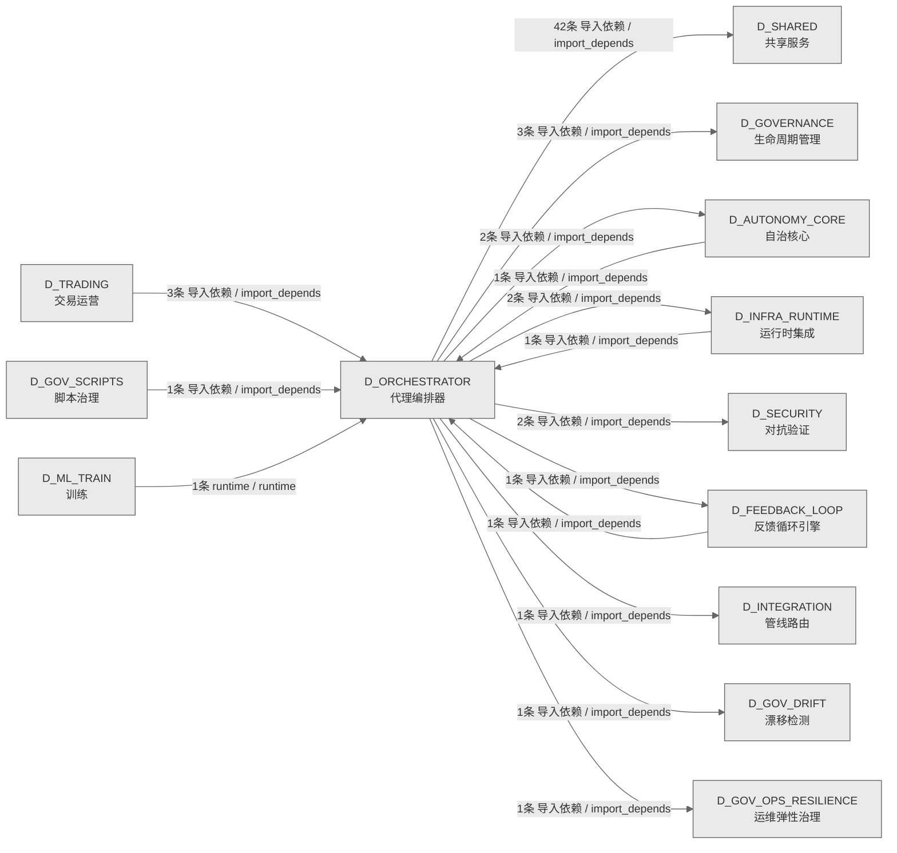

# 25_d_orchestrator / 代理编排器域 / Agent Orchestrator

> **功能简介 / Overview**: 代理编排器，负责 Agent 任务全生命周期：任务入队、调度、沙箱执行、幻觉检测和收尾归档

> **文档作用 / Purpose**: 展示 代理编排器（D_ORCHESTRATOR）功能域的域内依赖关系、跨域依赖关系，模块信息（成熟度/中英文名/大白话/文件路径）内嵌于 Mermaid 节点，供架构审查和域治理参考。

> 本文档由 generate_domain_doc.py 从 depgraph (PostgreSQL) 自动生成
> 数据源: depgraph (PostgreSQL) nodes表 + edges表

> **[可缩放 HTML 版 / Zoomable HTML](http://localhost:8765/docs/02_enterprise_architecture/02_domain_architecture_docs/_zoomable_html/25_d_orchestrator.html)** — Ctrl+滚轮缩放 ｜ 双击重置 ｜ Ctrl+Shift+D 切换拖动/选择模式

## 域基本信息 / Domain Overview

| 字段 | 值 | Field | Value |
|------|------|-------|-------|
| 编号 | 25 | Number | 25 |
| 域ID | D_ORCHESTRATOR | Domain ID | D_ORCHESTRATOR |
| 域名称 | 代理编排器 | Domain Name | Agent Orchestrator |
| 层级 | L1 基础平台层 | Layer | L1 Foundation |
| 模块数 | 70 | Module Count | 70 |
| 域内依赖 | 20 | Internal Dependencies | 20 |
| 跨域入边 | 8 | Cross-domain Incoming | 8 |
| 跨域出边 | 55 | Cross-domain Outgoing | 55 |
| 设计态模块 | 0 | Design Modules | 0 |
| 生产态模块 | 70 | Production Modules | 70 |
| 容量 | 70/150 (正常) | Capacity | 70/150 (正常) |
| 描述 | Agent全生命周期编排 | Description | Agent全生命周期编排 |

## 域内依赖图 / Internal Dependency Diagram

> 依赖图内嵌在本文档中，IDE 可直接渲染；网页版可 Ctrl+滚轮缩放 + 拖动平移查看细节。
>
> **图例说明 / Legend**：
> - 🟦 **蓝色 = 运营态模块**（production，已上线运行）
> - 🟧 **橙色虚线 = 设计态模块**（design，蓝图阶段，代码未写）
> - **实线箭头 = 运营态依赖**（已生效的依赖关系）
> - **虚线箭头 = 非运营态依赖**（计划中/验证中的依赖关系）

### 全景图（全部模块，颜色区分运营态/设计态）

> 展示全部 70 个模块（生产态 70 + 设计态 0），含跨域依赖外部节点。节点含成熟度+名称+大白话/简介+文件路径。

```mermaid
%%{init: {'theme': 'base', 'themeVariables': {'primaryColor': '#eaeaea', 'primaryTextColor': '#333333', 'primaryBorderColor': '#666666', 'lineColor': '#666666', 'secondaryColor': '#eaeaea', 'tertiaryColor': '#eaeaea', 'fontSize': '14px'}}}%%
flowchart TD
    src_zephyr_orchestrator_init_py["(生产态 / production) 包入口 / __init__<br/>编排器的包入口，把这一层的子模块归到一起统一管理<br/>，用到谁才加载谁，避免一次性全加载拖慢启动。<br/>文件: orchestrator/__init__.py"]
    src_zephyr_orchestrator_agent_health_monitor_py["(生产态 / production) 代理健康监控 / agent_<br/>health_monitor<br/>AgentHealthMonitor · Agent 健康监控（三态 + 5<br/>项 SLO）<br/>文件: orchestrator/agent_health_monitor.py"]
    src_zephyr_orchestrator_contracts_init_py["(生产态 / production) 包入口 / contracts —<br/>orchestrator contracts subpackage.<br/>包入口。contracts — orchestrator contracts<br/>subpackage.<br/>文件: contracts/__init__.py"]
    src_zephyr_orchestrator_contracts_construction_guide_py["(生产态 / production) 施工指南引擎<br/>（Construction Guide） / construction_guide<br/>施工指南引擎（Construction Guide）<br/>文件: contracts/construction_guide.py"]
    src_zephyr_orchestrator_contracts_contract_router_py["(生产态 / production) 契约路由器 / contract_<br/>router<br/>契约路由（Contract Router）<br/>文件: contracts/contract_router.py"]
    src_zephyr_orchestrator_contracts_design_decisions_py["(生产态 / production) 设计decisions / design_<br/>decisions<br/>设计decisions，提供包入口和模块加载功能<br/>文件: contracts/design_decisions.py"]
    src_zephyr_orchestrator_contracts_finding_bridge_py["(生产态 / production) CT-ORC-SCRIPT-001<br/>运行时桥接 / finding_bridge<br/>CT-ORC-SCRIPT-001 运行时桥接<br/>文件: contracts/finding_bridge.py"]
    src_zephyr_orchestrator_contracts_prompt_version_py["(生产态 / production) 提示版本 / prompt_version<br/>AI Prompt 版本控制（CT-PROMPT-VERSION）——prompt<br/>template版本化+部署前diff。<br/>文件: contracts/prompt_version.py"]
    src_zephyr_orchestrator_core_init_py["(生产态 / production) 包入口 /<br/>orchestrator.core — auto-generated package init.<br/>包入口。orchestrator.core — auto-generated<br/>package init.<br/>文件: core/__init__.py"]
    src_zephyr_orchestrator_deferred_queue_py["(生产态 / production) deferred队列 /<br/>DeferredQueue: WAITING -> READY task scheduler.<br/>deferred队列。DeferredQueue: WAITING -> READY<br/>task scheduler.<br/>文件: orchestrator/deferred_queue.py"]
    src_zephyr_orchestrator_execution_init_py["(生产态 / production) 包入口 / execution —<br/>orchestrator execution subpackage.<br/>包入口。execution — orchestrator execution<br/>subpackage.<br/>文件: execution/__init__.py"]
    src_zephyr_orchestrator_execution_batch_orchestrator_py["(生产态 / production) 批次编排器 / batch_<br/>orchestrator<br/>BatchOrchestrator — 多 Worker 批量任务协调器<br/>（MOD-INF-016）<br/>文件: execution/batch_orchestrator.py"]
    src_zephyr_orchestrator_execution_dispatch_table_py["(生产态 / production) 分发table / dispatch_table<br/>AI Agent 冷启动分派表（Dispatch Table）<br/>文件: execution/dispatch_table.py"]
    src_zephyr_orchestrator_execution_dlq_manager_py["(生产态 / production) dlq管理器 / dlq_manager<br/>DLQ 管理器（Dead Letter Queue Manager —<br/>CT-DLQ-001）<br/>文件: execution/dlq_manager.py"]
    src_zephyr_orchestrator_execution_phase_executor_py["(生产态 / production) 阶段执行器 / phase_<br/>executor<br/>Phase 执行引擎（Phase Executor）<br/>文件: execution/phase_executor.py"]
    src_zephyr_orchestrator_execution_reconciliation_loop_py["(生产态 / production) 对账循环 / reconciliation_<br/>loop<br/>对账循环，提供包入口和模块加载功能<br/>文件: execution/reconciliation_loop.py"]
    src_zephyr_orchestrator_execution_trigger_router_py["(生产态 / production) 触发器路由器 / trigger_<br/>router<br/>TriggerRouter — RI-03 触发路由器（M3<br/>跨模块触发分派）<br/>文件: execution/trigger_router.py"]
    src_zephyr_orchestrator_execution_wave_generator_py["(生产态 / production) wave生成器 / wave_<br/>generator<br/>WaveGenerator — 根据 Task 依赖图生成执行 Wave<br/>（T-2-03）<br/>文件: execution/wave_generator.py"]
    src_zephyr_orchestrator_fault_tolerance_init_py["(生产态 / production) 包入口 / fault_tolerance<br/>— orchestrator fault_tolerance subpackage.<br/>包入口。fault_tolerance — orchestrator fault_<br/>tolerance subpackage.<br/>文件: fault_tolerance/__init__.py"]
    src_zephyr_orchestrator_fault_tolerance_canary_manager_py["(生产态 / production) 金丝雀发布管理器<br/>（CT-CANARY）——权重分流+指标对比+自动回滚。 /<br/>canary_manager<br/>金丝雀发布管理器<br/>（CT-CANARY）——权重分流+指标对比+自动回滚。<br/>文件: fault_tolerance/canary_manager.py"]
    src_zephyr_orchestrator_fault_tolerance_chaos_hooks_py["(生产态 / production) chaos钩子 / ChaosHook —<br/>integrates ChaosEngine with the orchestrator exe<br/>chaos钩子。ChaosHook — integrates ChaosEngine<br/>with the orchestrator execution loop.<br/>文件: fault_tolerance/chaos_hooks.py"]
    src_zephyr_orchestrator_fault_tolerance_degrade_cascade_py["(生产态 / production) degrade级联 / degrade_<br/>cascade<br/>degrade级联，主要提供检测级联、break级联等功能<br/>文件: fault_tolerance/degrade_cascade.py"]
    src_zephyr_orchestrator_fault_tolerance_disk_guard_py["(生产态 / production) disk守卫 / disk_guard<br/>disk守卫，主要提供检查、应该enter只读等功能<br/>文件: fault_tolerance/disk_guard.py"]
    src_zephyr_orchestrator_fault_tolerance_network_partition_py["(生产态 / production) 网络分区容忍<br/>（CT-NETWORK-PARTITION）——CAP定理CP优先+ /<br/>network_partition<br/>网络分区容忍（CT-NETWORK-PARTITION）——CAP定理CP<br/>优先+脑裂检测+quorum write。<br/>文件: fault_tolerance/network_partition.py"]
    src_zephyr_orchestrator_governance_init_py["(生产态 / production) 包入口 / governance —<br/>orchestrator governance subpackage.<br/>包入口。governance — orchestrator governance<br/>subpackage.<br/>文件: governance/__init__.py"]
    src_zephyr_orchestrator_governance_capacity_budget_py["(生产态 / production) 容量预算 / capacity_budget<br/>全局容量预算控制器（Capacity Budget Controller）<br/>文件: governance/capacity_budget.py"]
    src_zephyr_orchestrator_governance_dependency_lock_py["(生产态 / production) 依赖锁 / dependency_lock<br/>外部依赖版本锁（CT-DEPS）——Python包版本锁定+hash<br/>验证+安全审计。<br/>文件: governance/dependency_lock.py"]
    src_zephyr_orchestrator_governance_model_registry_py["(生产态 / production) 模型注册表 / model_<br/>registry<br/>模型注册表，主要提供获取、列表all、获取by提供器<br/>等功能<br/>文件: governance/model_registry.py"]
    src_zephyr_orchestrator_governance_path_index_py["(生产态 / production) 路径索引 / path_index<br/>路径索引，主要提供lookup、注册等功能<br/>文件: governance/path_index.py"]
    src_zephyr_orchestrator_governance_risk_registry_py["(生产态 / production) 风险注册表 / risk_registry<br/>风险注册表，提供包入口和模块加载功能<br/>文件: governance/risk_registry.py"]
    src_zephyr_orchestrator_governance_schema_migration_py["(生产态 / production) 模式迁移 / schema_<br/>migration<br/>数据库 Schema 演化契约<br/>（CT-SCHEMA-MIGRATE）——向后兼容迁移+回滚脚本。<br/>文件: governance/schema_migration.py"]
    src_zephyr_orchestrator_governance_version_manifest_py["(生产态 / production) 版本清单 / version_<br/>manifest<br/>版本manifest，主要提供获取版本、获取路径、列表sy<br/>stems等功能<br/>文件: governance/version_manifest.py"]
    src_zephyr_orchestrator_hallucination_detector_py["(生产态 / production) hallucination检测器 /<br/>hallucination_detector<br/>HallucinationDetector · Chain-of-Verification<br/>（CoVe）幻觉检测器<br/>文件: orchestrator/hallucination_detector.py"]
    src_zephyr_orchestrator_lifecycle_init_py["(生产态 / production) 包入口 / lifecycle —<br/>orchestrator lifecycle subpackage.<br/>包入口。lifecycle — orchestrator lifecycle<br/>subpackage.<br/>文件: lifecycle/__init__.py"]
    src_zephyr_orchestrator_lifecycle_housekeeping_py["(生产态 / production) 文件卫生保洁管理器<br/>（CT-HOUSEKEEPING）——临时文件扫描+日志轮转+ /<br/>housekeeping<br/>文件卫生保洁管理器<br/>（CT-HOUSEKEEPING）——临时文件扫描+日志轮转+废弃<br/>目录清理。<br/>文件: lifecycle/housekeeping.py"]
    src_zephyr_orchestrator_lifecycle_rolling_upgrade_py["(生产态 / production) 零停机滚动升级<br/>（CT-DEPLOY）——graceful shutdown+流量 / rolling_<br/>upgrade<br/>零停机滚动升级（CT-DEPLOY）——graceful<br/>shutdown+流量摘除+health check wait。<br/>文件: lifecycle/rolling_upgrade.py"]
    src_zephyr_orchestrator_lifecycle_session_conflict_py["(生产态 / production) 会话冲突 / session_<br/>conflict<br/>Session 冲突预防契约<br/>（CT-SESSION-CONFLICT）——文件锁+并发session检测+<br/>冲突resolution。<br/>文件: lifecycle/session_conflict.py"]
    src_zephyr_orchestrator_lifecycle_startup_sequencer_py["(生产态 / production) 启动sequencer / startup_<br/>sequencer<br/>启动sequencer，提供包入口和模块加载功能<br/>文件: lifecycle/startup_sequencer.py"]
    src_zephyr_orchestrator_lifecycle_state_propagation_py["(生产态 / production) 状态propagation / state_<br/>propagation<br/>全局状态传播链（State Propagation Chain）<br/>文件: lifecycle/state_propagation.py"]
    src_zephyr_orchestrator_lifecycle_state_synchronizer_py["(生产态 / production) 状态synchronizer / state_<br/>synchronizer<br/>StateSynchronizer — 同步 SQLite<br/>状态与文件系统实际状态（T-2-04）<br/>文件: lifecycle/state_synchronizer.py"]
    src_zephyr_orchestrator_lifecycle_system_transfer_py["(生产态 / production) 系统迁移 / system_transfer<br/>系统移交恢复（CT-TRANSFER）——系统Owner变更+配置<br/>迁移+密钥轮转+健康验证。<br/>文件: lifecycle/system_transfer.py"]
    src_zephyr_orchestrator_lifecycle_teardown_manager_py["(生产态 / production) teardown管理器 / teardown_<br/>manager<br/>teardown管理器，提供包入口和模块加载功能<br/>文件: lifecycle/teardown_manager.py"]
    src_zephyr_orchestrator_quality_agent_quality_py["(生产态 / production) 代理质量 / agent_quality<br/>AI Agent 质量反馈闭环<br/>（CT-AGENT-QUALITY）——task完成质量评分+agent绩效<br/>追踪。<br/>文件: quality/agent_quality.py"]
    src_zephyr_orchestrator_quality_benchmark_runner_py["(生产态 / production) 基准运行器 / benchmark_<br/>runner<br/>benchmark运行器，主要提供获取基线、检测回归等功<br/>能<br/>文件: quality/benchmark_runner.py"]
    src_zephyr_orchestrator_quality_blind_spot_closure_py["(生产态 / production) 盲点闭合 / blind_spot_<br/>closure<br/>盲点闭合，提供包入口和模块加载功能<br/>文件: quality/blind_spot_closure.py"]
    src_zephyr_orchestrator_quality_ke_quality_py["(生产态 / production) 知识质量评分契约<br/>（CT-KE-QUALITY）——KE完整性+准确性+时效性三维 /<br/>ke_quality<br/>知识质量评分契约<br/>（CT-KE-QUALITY）——KE完整性+准确性+时效性三维评<br/>分。<br/>文件: quality/ke_quality.py"]
    src_zephyr_orchestrator_quality_knowledge_freshness_py["(生产态 / production) 知识新鲜度废止管理器<br/>（CT-KNOWLEDGE-FRESHNESS）——KE过期 / knowledge_<br/>freshness<br/>知识新鲜度废止管理器<br/>（CT-KNOWLEDGE-FRESHNESS）——KE过期标记+自动失效<br/>。<br/>文件: quality/knowledge_freshness.py"]
    src_zephyr_orchestrator_quality_lean_scanner_py["(生产态 / production) 死代码/孤儿文件<br/>/僵尸引用三扫描<br/>（CT-LEAN）——三款扫描器+自动化清理建议 / lean_<br/>scanner<br/>死代码/孤儿文件/僵尸引用三扫描<br/>（CT-LEAN）——三款扫描器+自动化清理建议。<br/>文件: quality/lean_scanner.py"]
    src_zephyr_orchestrator_quality_stability_guard_py["(生产态 / production) stability守卫 / stability_<br/>guard<br/>API 稳定性守护（CT-STABILITY）——public<br/>API签名锁+breaking change检测。<br/>文件: quality/stability_guard.py"]
    src_zephyr_orchestrator_resilience_init_py["(生产态 / production) 包入口 /<br/>orchestrator.resilience — auto-generated<br/>package init.<br/>包入口。orchestrator.resilience —<br/>auto-generated package init.<br/>文件: resilience/__init__.py"]
    src_zephyr_orchestrator_rollback_manager_py["(生产态 / production) 回滚管理器 / rollback_<br/>manager<br/>RollbackManager — 仅调试用途的 DB-state<br/>快照，不用于自动回滚。<br/>文件: orchestrator/rollback_manager.py"]
    src_zephyr_orchestrator_task_queue_py["(生产态 / production) 任务队列 / task_queue<br/>ActiveTaskQueue — 后台任务轮询与自动分发<br/>文件: orchestrator/task_queue.py"]
    src_zephyr_orchestrator_init_py ~~~ src_zephyr_orchestrator_agent_health_monitor_py
    src_zephyr_orchestrator_agent_health_monitor_py ~~~ src_zephyr_orchestrator_contracts_init_py
    src_zephyr_orchestrator_contracts_init_py ~~~ src_zephyr_orchestrator_contracts_construction_guide_py
    src_zephyr_orchestrator_contracts_construction_guide_py ~~~ src_zephyr_orchestrator_contracts_contract_router_py
    src_zephyr_orchestrator_contracts_contract_router_py ~~~ src_zephyr_orchestrator_contracts_design_decisions_py
    src_zephyr_orchestrator_contracts_design_decisions_py ~~~ src_zephyr_orchestrator_contracts_finding_bridge_py
    src_zephyr_orchestrator_contracts_finding_bridge_py ~~~ src_zephyr_orchestrator_contracts_prompt_version_py
    src_zephyr_orchestrator_contracts_prompt_version_py ~~~ src_zephyr_orchestrator_core_init_py
    src_zephyr_orchestrator_core_init_py ~~~ src_zephyr_orchestrator_deferred_queue_py
    src_zephyr_orchestrator_deferred_queue_py ~~~ src_zephyr_orchestrator_execution_init_py
    src_zephyr_orchestrator_execution_init_py ~~~ src_zephyr_orchestrator_execution_batch_orchestrator_py
    src_zephyr_orchestrator_execution_batch_orchestrator_py ~~~ src_zephyr_orchestrator_execution_dispatch_table_py
    src_zephyr_orchestrator_execution_dispatch_table_py ~~~ src_zephyr_orchestrator_execution_dlq_manager_py
    src_zephyr_orchestrator_execution_dlq_manager_py ~~~ src_zephyr_orchestrator_execution_phase_executor_py
    src_zephyr_orchestrator_execution_phase_executor_py ~~~ src_zephyr_orchestrator_execution_reconciliation_loop_py
    src_zephyr_orchestrator_execution_reconciliation_loop_py ~~~ src_zephyr_orchestrator_execution_trigger_router_py
    src_zephyr_orchestrator_execution_trigger_router_py ~~~ src_zephyr_orchestrator_execution_wave_generator_py
    src_zephyr_orchestrator_execution_wave_generator_py ~~~ src_zephyr_orchestrator_fault_tolerance_init_py
    src_zephyr_orchestrator_fault_tolerance_init_py ~~~ src_zephyr_orchestrator_fault_tolerance_canary_manager_py
    src_zephyr_orchestrator_fault_tolerance_canary_manager_py ~~~ src_zephyr_orchestrator_fault_tolerance_chaos_hooks_py
    src_zephyr_orchestrator_fault_tolerance_chaos_hooks_py ~~~ src_zephyr_orchestrator_fault_tolerance_degrade_cascade_py
    src_zephyr_orchestrator_fault_tolerance_degrade_cascade_py ~~~ src_zephyr_orchestrator_fault_tolerance_disk_guard_py
    src_zephyr_orchestrator_fault_tolerance_disk_guard_py ~~~ src_zephyr_orchestrator_fault_tolerance_network_partition_py
    src_zephyr_orchestrator_fault_tolerance_network_partition_py ~~~ src_zephyr_orchestrator_governance_init_py
    src_zephyr_orchestrator_governance_init_py ~~~ src_zephyr_orchestrator_governance_capacity_budget_py
    src_zephyr_orchestrator_governance_capacity_budget_py ~~~ src_zephyr_orchestrator_governance_dependency_lock_py
    src_zephyr_orchestrator_governance_dependency_lock_py ~~~ src_zephyr_orchestrator_governance_model_registry_py
    src_zephyr_orchestrator_governance_model_registry_py ~~~ src_zephyr_orchestrator_governance_path_index_py
    src_zephyr_orchestrator_governance_path_index_py ~~~ src_zephyr_orchestrator_governance_risk_registry_py
    src_zephyr_orchestrator_governance_risk_registry_py ~~~ src_zephyr_orchestrator_governance_schema_migration_py
    src_zephyr_orchestrator_governance_schema_migration_py ~~~ src_zephyr_orchestrator_governance_version_manifest_py
    src_zephyr_orchestrator_governance_version_manifest_py ~~~ src_zephyr_orchestrator_hallucination_detector_py
    src_zephyr_orchestrator_hallucination_detector_py ~~~ src_zephyr_orchestrator_lifecycle_init_py
    src_zephyr_orchestrator_lifecycle_init_py ~~~ src_zephyr_orchestrator_lifecycle_housekeeping_py
    src_zephyr_orchestrator_lifecycle_housekeeping_py ~~~ src_zephyr_orchestrator_lifecycle_rolling_upgrade_py
    src_zephyr_orchestrator_lifecycle_rolling_upgrade_py ~~~ src_zephyr_orchestrator_lifecycle_session_conflict_py
    src_zephyr_orchestrator_lifecycle_session_conflict_py ~~~ src_zephyr_orchestrator_lifecycle_startup_sequencer_py
    src_zephyr_orchestrator_lifecycle_startup_sequencer_py ~~~ src_zephyr_orchestrator_lifecycle_state_propagation_py
    src_zephyr_orchestrator_lifecycle_state_propagation_py ~~~ src_zephyr_orchestrator_lifecycle_state_synchronizer_py
    src_zephyr_orchestrator_lifecycle_state_synchronizer_py ~~~ src_zephyr_orchestrator_lifecycle_system_transfer_py
    src_zephyr_orchestrator_lifecycle_system_transfer_py ~~~ src_zephyr_orchestrator_lifecycle_teardown_manager_py
    src_zephyr_orchestrator_lifecycle_teardown_manager_py ~~~ src_zephyr_orchestrator_quality_agent_quality_py
    src_zephyr_orchestrator_quality_agent_quality_py ~~~ src_zephyr_orchestrator_quality_benchmark_runner_py
    src_zephyr_orchestrator_quality_benchmark_runner_py ~~~ src_zephyr_orchestrator_quality_blind_spot_closure_py
    src_zephyr_orchestrator_quality_blind_spot_closure_py ~~~ src_zephyr_orchestrator_quality_ke_quality_py
    src_zephyr_orchestrator_quality_ke_quality_py ~~~ src_zephyr_orchestrator_quality_knowledge_freshness_py
    src_zephyr_orchestrator_quality_knowledge_freshness_py ~~~ src_zephyr_orchestrator_quality_lean_scanner_py
    src_zephyr_orchestrator_quality_lean_scanner_py ~~~ src_zephyr_orchestrator_quality_stability_guard_py
    src_zephyr_orchestrator_quality_stability_guard_py ~~~ src_zephyr_orchestrator_resilience_init_py
    src_zephyr_orchestrator_resilience_init_py ~~~ src_zephyr_orchestrator_rollback_manager_py
    src_zephyr_orchestrator_rollback_manager_py ~~~ src_zephyr_orchestrator_task_queue_py
    src_zephyr_orchestrator_agent_orchestrator_py["(生产态 / production) 代理编排器 / agent_<br/>orchestrator<br/>AgentOrchestrator · 多角色 Agent<br/>路由、工具链编排与健康监控<br/>文件: orchestrator/agent_orchestrator.py"]
    src_zephyr_orchestrator_contracts_alert_handler_py["(生产态 / production) 告警处理器 / alert_handler<br/>Orc 告警接收器 — handle_alert() 消费者<br/>文件: contracts/alert_handler.py"]
    src_zephyr_orchestrator_contracts_contract_registry_py["(生产态 / production) 契约注册表 / contract_<br/>registry<br/>集成契约注册表（Contract Registry）<br/>文件: contracts/contract_registry.py"]
    src_zephyr_orchestrator_core_task_queue_py["(生产态 / production) 任务队列 / task_queue<br/>ActiveTaskQueue — 后台任务轮询与自动分发<br/>文件: core/task_queue.py"]
    src_zephyr_orchestrator_execution_context_bridge_py["(生产态 / production) 上下文桥接 / context_<br/>bridge<br/>Orc->CE 上下文桥接 — request_context() 生产者<br/>文件: execution/context_bridge.py"]
    src_zephyr_orchestrator_execution_data_lifecycle_py["(生产态 / production) 数据生命周期 / data_<br/>lifecycle<br/>数据生命周期，主要提供获取策略、列表类型定义、应<br/>该清除等功能<br/>文件: execution/data_lifecycle.py"]
    src_zephyr_orchestrator_execution_memory_writer_py["(生产态 / production) Orc->VMS 记忆写入器 /<br/>memory_writer<br/>Orc->VMS 记忆写入器<br/>文件: execution/memory_writer.py"]
    src_zephyr_orchestrator_execution_script_runner_py["(生产态 / production) script运行器 / script_<br/>runner<br/>Orc->Script 脚本执行器 — run_audit() 生产者<br/>文件: execution/script_runner.py"]
    src_zephyr_orchestrator_fault_tolerance_bulkhead_manager_py["(生产态 / production) 舱壁管理器 / bulkhead_<br/>manager<br/>bulkhead管理器，主要提供获取配额、列表systems、<br/>检测slowcall等功能<br/>文件: fault_tolerance/bulkhead_manager.py"]
    src_zephyr_orchestrator_fault_tolerance_chaos_engine_py["(生产态 / production) chaos引擎 / chaos_engine<br/>Chaos 故障注入引擎<br/>（CT-CHAOS-001）——4注入点×月度执行。<br/>文件: fault_tolerance/chaos_engine.py"]
    src_zephyr_orchestrator_fault_tolerance_fault_types_py["(生产态 / production) 故障类型定义 / Fault type<br/>registry and preset templates for chaos<br/>engineeri<br/>fault类型定义。Fault type registry and preset<br/>templates for chaos engineering.<br/>文件: fault_tolerance/fault_types.py"]
    src_zephyr_orchestrator_file_task_mapper_py["(生产态 / production) 文件任务mapper / file_<br/>task_mapper<br/>FileTaskMapper — 文件路径 ↔ Task N:N 映射器<br/>（#21 裁定重写）<br/>文件: orchestrator/file_task_mapper.py"]
    src_zephyr_orchestrator_governance_autonomy_guard_py["(生产态 / production) autonomy守卫 / autonomy_<br/>guard<br/>Owner 缺位分级自治<br/>（CT-AUTONOMY）——Owner离线->自动降级->最小安全运<br/>行。<br/>文件: governance/autonomy_guard.py"]
    src_zephyr_orchestrator_lifecycle_incident_postmortem_py["(生产态 / production) 事件复盘管理器<br/>（CT-INCIDENT）——incident记录+timelin /<br/>incident_postmortem<br/>事件复盘管理器（CT-INCIDENT）——incident记录+time<br/>line+action_items+postmortem。<br/>文件: lifecycle/incident_postmortem.py"]
    src_zephyr_orchestrator_quality_init_py["(生产态 / production) 包入口 / quality —<br/>orchestrator quality subpackage.<br/>包入口。quality — orchestrator quality<br/>subpackage.<br/>文件: quality/__init__.py"]
    src_zephyr_orchestrator_quality_blueprint_scorer_py["(生产态 / production) 蓝图评分器 / blueprint_<br/>scorer<br/>BlueprintScorer — 蓝图路由统一打分逻辑<br/>文件: quality/blueprint_scorer.py"]
    src_zephyr_orchestrator_resilience_failure_matcher_py["(生产态 / production) 故障匹配器 / failure_<br/>matcher<br/>FailurePatternMatcher —<br/>任务失败模式识别与纠正建议<br/>文件: resilience/failure_matcher.py"]
    src_zephyr_orchestrator_agent_orchestrator_py ~~~ src_zephyr_orchestrator_contracts_alert_handler_py
    src_zephyr_orchestrator_contracts_alert_handler_py ~~~ src_zephyr_orchestrator_contracts_contract_registry_py
    src_zephyr_orchestrator_contracts_contract_registry_py ~~~ src_zephyr_orchestrator_core_task_queue_py
    src_zephyr_orchestrator_core_task_queue_py ~~~ src_zephyr_orchestrator_execution_context_bridge_py
    src_zephyr_orchestrator_execution_context_bridge_py ~~~ src_zephyr_orchestrator_execution_data_lifecycle_py
    src_zephyr_orchestrator_execution_data_lifecycle_py ~~~ src_zephyr_orchestrator_execution_memory_writer_py
    src_zephyr_orchestrator_execution_memory_writer_py ~~~ src_zephyr_orchestrator_execution_script_runner_py
    src_zephyr_orchestrator_execution_script_runner_py ~~~ src_zephyr_orchestrator_fault_tolerance_bulkhead_manager_py
    src_zephyr_orchestrator_fault_tolerance_bulkhead_manager_py ~~~ src_zephyr_orchestrator_fault_tolerance_chaos_engine_py
    src_zephyr_orchestrator_fault_tolerance_chaos_engine_py ~~~ src_zephyr_orchestrator_fault_tolerance_fault_types_py
    src_zephyr_orchestrator_fault_tolerance_fault_types_py ~~~ src_zephyr_orchestrator_file_task_mapper_py
    src_zephyr_orchestrator_file_task_mapper_py ~~~ src_zephyr_orchestrator_governance_autonomy_guard_py
    src_zephyr_orchestrator_governance_autonomy_guard_py ~~~ src_zephyr_orchestrator_lifecycle_incident_postmortem_py
    src_zephyr_orchestrator_lifecycle_incident_postmortem_py ~~~ src_zephyr_orchestrator_quality_init_py
    src_zephyr_orchestrator_quality_init_py ~~~ src_zephyr_orchestrator_quality_blueprint_scorer_py
    src_zephyr_orchestrator_quality_blueprint_scorer_py ~~~ src_zephyr_orchestrator_resilience_failure_matcher_py
    src_zephyr_orchestrator_execution_task_context_builder_py["(生产态 / production) 任务上下文构建器 / task_<br/>context_builder<br/>CE 任务上下文构建器 — build_from_task() 消费者<br/>文件: execution/task_context_builder.py"]
    src_zephyr_orchestrator_agent_health_monitor_py -->|导入依赖 / import_depends| src_zephyr_orchestrator_agent_orchestrator_py
    src_zephyr_orchestrator_task_queue_py -->|导入依赖 / import_depends| src_zephyr_orchestrator_core_task_queue_py
    src_zephyr_orchestrator_init_py -->|导入依赖 / import_depends| src_zephyr_orchestrator_contracts_alert_handler_py
    src_zephyr_orchestrator_init_py -->|导入依赖 / import_depends| src_zephyr_orchestrator_execution_context_bridge_py
    src_zephyr_orchestrator_init_py -->|导入依赖 / import_depends| src_zephyr_orchestrator_execution_memory_writer_py
    src_zephyr_orchestrator_init_py -->|导入依赖 / import_depends| src_zephyr_orchestrator_execution_script_runner_py
    src_zephyr_orchestrator_contracts_contract_router_py -->|导入依赖 / import_depends| src_zephyr_orchestrator_contracts_contract_registry_py
    src_zephyr_orchestrator_core_init_py -->|config_depends / config_depends| src_zephyr_orchestrator_core_task_queue_py
    src_zephyr_orchestrator_execution_context_bridge_py -->|导入依赖 / import_depends| src_zephyr_orchestrator_execution_task_context_builder_py
    src_zephyr_orchestrator_execution_trigger_router_py -->|导入依赖 / import_depends| src_zephyr_orchestrator_quality_blueprint_scorer_py
    src_zephyr_orchestrator_execution_init_py -->|config_depends / config_depends| src_zephyr_orchestrator_execution_data_lifecycle_py
    src_zephyr_orchestrator_fault_tolerance_chaos_hooks_py -->|导入依赖 / import_depends| src_zephyr_orchestrator_fault_tolerance_chaos_engine_py
    src_zephyr_orchestrator_fault_tolerance_chaos_hooks_py -->|导入依赖 / import_depends| src_zephyr_orchestrator_fault_tolerance_fault_types_py
    src_zephyr_orchestrator_fault_tolerance_init_py -->|config_depends / config_depends| src_zephyr_orchestrator_fault_tolerance_bulkhead_manager_py
    src_zephyr_orchestrator_governance_init_py -->|config_depends / config_depends| src_zephyr_orchestrator_governance_autonomy_guard_py
    src_zephyr_orchestrator_lifecycle_state_synchronizer_py -->|导入依赖 / import_depends| src_zephyr_orchestrator_file_task_mapper_py
    src_zephyr_orchestrator_lifecycle_init_py -->|config_depends / config_depends| src_zephyr_orchestrator_lifecycle_incident_postmortem_py
    src_zephyr_orchestrator_quality_ke_quality_py -->|config_depends / config_depends| src_zephyr_orchestrator_quality_init_py
    src_zephyr_orchestrator_quality_knowledge_freshness_py -->|config_depends / config_depends| src_zephyr_orchestrator_quality_init_py
    src_zephyr_orchestrator_resilience_init_py -->|导入依赖 / import_depends| src_zephyr_orchestrator_resilience_failure_matcher_py
    D_SHARED["(生产态 / production) 共享服务 / Shared Services<br/>共享服务，负责跨域共享的工具、协议和基础服务<br/>跨域节点 / cross-domain"]
    src_zephyr_orchestrator_file_task_mapper_py -->|导入依赖 / import_depends| D_SHARED
    src_zephyr_orchestrator_core_task_queue_py -->|导入依赖 / import_depends| D_SHARED
    src_zephyr_orchestrator_file_task_mapper_py -->|导入依赖 / import_depends| D_SHARED
    src_zephyr_orchestrator_hallucination_detector_py -->|导入依赖 / import_depends| D_SHARED
    D_GOV_OPS_RESILIENCE["(生产态 / production) 运维弹性治理 / Ops<br/>Resilience Governance<br/>运维弹性治理，负责运维治理、安全治理、弹性治理和<br/>升级协议<br/>跨域节点 / cross-domain"]
    src_zephyr_orchestrator_resilience_failure_matcher_py -->|导入依赖 / import_depends| D_GOV_OPS_RESILIENCE
    src_zephyr_orchestrator_deferred_queue_py -->|导入依赖 / import_depends| D_SHARED
    src_zephyr_orchestrator_execution_batch_orchestrator_py -->|导入依赖 / import_depends| D_SHARED
    src_zephyr_orchestrator_rollback_manager_py -->|导入依赖 / import_depends| D_SHARED
    src_zephyr_orchestrator_contracts_alert_handler_py -->|导入依赖 / import_depends| D_SHARED
    src_zephyr_orchestrator_hallucination_detector_py -->|导入依赖 / import_depends| D_SHARED
    src_zephyr_orchestrator_contracts_alert_handler_py -->|导入依赖 / import_depends| D_SHARED
    src_zephyr_orchestrator_agent_orchestrator_py -->|导入依赖 / import_depends| D_SHARED
    src_zephyr_orchestrator_contracts_alert_handler_py -->|导入依赖 / import_depends| D_SHARED
    D_GOVERNANCE["(生产态 / production) 生命周期管理 / Lifecycle<br/>Management<br/>生命周期管理，负责蓝图/模块<br/>/任务的声明周期管理和元数据治理<br/>跨域节点 / cross-domain"]
    src_zephyr_orchestrator_contracts_finding_bridge_py -->|导入依赖 / import_depends| D_GOVERNANCE
    src_zephyr_orchestrator_fault_tolerance_chaos_hooks_py -->|导入依赖 / import_depends| D_SHARED
    D_ML_TRAIN["(设计态 / design) 训练 / Training<br/>训练，负责模型训练、特征工程和模型评估<br/>跨域节点 / cross-domain"]
    D_ML_TRAIN -.->|runtime / runtime| src_zephyr_orchestrator_governance_model_registry_py
    D_TRADING["(生产态 / production) 交易运营 / Trading<br/>Operations<br/>交易运营，负责交易生命周期管理、订单状态和成交处<br/>理<br/>跨域节点 / cross-domain"]
    D_TRADING -->|导入依赖 / import_depends| src_zephyr_orchestrator_execution_context_bridge_py
    D_GOV_SCRIPTS["(生产态 / production) 脚本治理 / Script<br/>Governance<br/>脚本治理，负责脚本生命周期管理和脚本质量门禁<br/>跨域节点 / cross-domain"]
    D_GOV_SCRIPTS -->|导入依赖 / import_depends| src_zephyr_orchestrator_contracts_contract_registry_py
    D_INFRA_RUNTIME["(生产态 / production) 运行时集成 / Runtime<br/>Integration<br/>运行时集成，负责组件生命周期编排、启动钩子和运行<br/>时上下文管理<br/>跨域节点 / cross-domain"]
    D_INFRA_RUNTIME -->|导入依赖 / import_depends| src_zephyr_orchestrator_execution_memory_writer_py
    D_TRADING -->|导入依赖 / import_depends| src_zephyr_orchestrator_core_task_queue_py
    D_TRADING -->|导入依赖 / import_depends| src_zephyr_orchestrator_execution_script_runner_py
    D_AUTONOMY_CORE["(生产态 / production) 自治核心 / Autonomy Core<br/>自治核心，负责 AI 自治决策、目标分解和执行编排<br/>跨域节点 / cross-domain"]
    D_AUTONOMY_CORE -->|导入依赖 / import_depends| src_zephyr_orchestrator_contracts_init_py
    D_FEEDBACK_LOOP["(生产态 / production) 反馈循环引擎 / Feedback<br/>Loop Engine<br/>反馈循环引擎，负责系统自我改进闭环：异常检测、根<br/>因诊断、自动修复和自我进化<br/>跨域节点 / cross-domain"]
    D_FEEDBACK_LOOP -->|导入依赖 / import_depends| src_zephyr_orchestrator_contracts_alert_handler_py
    classDef production fill:#e1f5fe,stroke:#01579b,stroke-width:2px,color:#000
    classDef design fill:#fff3e0,stroke:#e65100,stroke-width:2px,color:#000,stroke-dasharray: 5 5
    classDef external_prod fill:#e8f4fd,stroke:#0277bd,stroke-width:1px,color:#000
    classDef external_design fill:#fff8e7,stroke:#ef6c00,stroke-width:1px,color:#000,stroke-dasharray: 5 5
    class src_zephyr_orchestrator_init_py,src_zephyr_orchestrator_agent_health_monitor_py,src_zephyr_orchestrator_agent_orchestrator_py,src_zephyr_orchestrator_contracts_init_py,src_zephyr_orchestrator_contracts_alert_handler_py,src_zephyr_orchestrator_contracts_construction_guide_py,src_zephyr_orchestrator_contracts_contract_registry_py,src_zephyr_orchestrator_contracts_contract_router_py,src_zephyr_orchestrator_contracts_design_decisions_py,src_zephyr_orchestrator_contracts_finding_bridge_py,src_zephyr_orchestrator_contracts_prompt_version_py,src_zephyr_orchestrator_core_init_py,src_zephyr_orchestrator_core_task_queue_py,src_zephyr_orchestrator_deferred_queue_py,src_zephyr_orchestrator_execution_init_py,src_zephyr_orchestrator_execution_batch_orchestrator_py,src_zephyr_orchestrator_execution_context_bridge_py,src_zephyr_orchestrator_execution_data_lifecycle_py,src_zephyr_orchestrator_execution_dispatch_table_py,src_zephyr_orchestrator_execution_dlq_manager_py,src_zephyr_orchestrator_execution_memory_writer_py,src_zephyr_orchestrator_execution_phase_executor_py,src_zephyr_orchestrator_execution_reconciliation_loop_py,src_zephyr_orchestrator_execution_script_runner_py,src_zephyr_orchestrator_execution_task_context_builder_py,src_zephyr_orchestrator_execution_trigger_router_py,src_zephyr_orchestrator_execution_wave_generator_py,src_zephyr_orchestrator_fault_tolerance_init_py,src_zephyr_orchestrator_fault_tolerance_bulkhead_manager_py,src_zephyr_orchestrator_fault_tolerance_canary_manager_py,src_zephyr_orchestrator_fault_tolerance_chaos_engine_py,src_zephyr_orchestrator_fault_tolerance_chaos_hooks_py,src_zephyr_orchestrator_fault_tolerance_degrade_cascade_py,src_zephyr_orchestrator_fault_tolerance_disk_guard_py,src_zephyr_orchestrator_fault_tolerance_fault_types_py,src_zephyr_orchestrator_fault_tolerance_network_partition_py,src_zephyr_orchestrator_file_task_mapper_py,src_zephyr_orchestrator_governance_init_py,src_zephyr_orchestrator_governance_autonomy_guard_py,src_zephyr_orchestrator_governance_capacity_budget_py,src_zephyr_orchestrator_governance_dependency_lock_py,src_zephyr_orchestrator_governance_model_registry_py,src_zephyr_orchestrator_governance_path_index_py,src_zephyr_orchestrator_governance_risk_registry_py,src_zephyr_orchestrator_governance_schema_migration_py,src_zephyr_orchestrator_governance_version_manifest_py,src_zephyr_orchestrator_hallucination_detector_py,src_zephyr_orchestrator_lifecycle_init_py,src_zephyr_orchestrator_lifecycle_housekeeping_py,src_zephyr_orchestrator_lifecycle_incident_postmortem_py,src_zephyr_orchestrator_lifecycle_rolling_upgrade_py,src_zephyr_orchestrator_lifecycle_session_conflict_py,src_zephyr_orchestrator_lifecycle_startup_sequencer_py,src_zephyr_orchestrator_lifecycle_state_propagation_py,src_zephyr_orchestrator_lifecycle_state_synchronizer_py,src_zephyr_orchestrator_lifecycle_system_transfer_py,src_zephyr_orchestrator_lifecycle_teardown_manager_py,src_zephyr_orchestrator_quality_init_py,src_zephyr_orchestrator_quality_agent_quality_py,src_zephyr_orchestrator_quality_benchmark_runner_py,src_zephyr_orchestrator_quality_blind_spot_closure_py,src_zephyr_orchestrator_quality_blueprint_scorer_py,src_zephyr_orchestrator_quality_ke_quality_py,src_zephyr_orchestrator_quality_knowledge_freshness_py,src_zephyr_orchestrator_quality_lean_scanner_py,src_zephyr_orchestrator_quality_stability_guard_py,src_zephyr_orchestrator_resilience_init_py,src_zephyr_orchestrator_resilience_failure_matcher_py,src_zephyr_orchestrator_rollback_manager_py,src_zephyr_orchestrator_task_queue_py production
    class D_SHARED,D_GOV_OPS_RESILIENCE,D_GOVERNANCE,D_TRADING,D_GOV_SCRIPTS,D_INFRA_RUNTIME,D_AUTONOMY_CORE,D_FEEDBACK_LOOP external_prod
    class D_ML_TRAIN external_design
```

### 运营态的图（仅 design_maturity=production 的模块和域内依赖）

> 仅展示已上线运行的模块（共 70 个），不含跨域外部节点。跨域依赖见下方跨域依赖章节。

```mermaid
%%{init: {'theme': 'base', 'themeVariables': {'primaryColor': '#eaeaea', 'primaryTextColor': '#333333', 'primaryBorderColor': '#666666', 'lineColor': '#666666', 'secondaryColor': '#eaeaea', 'tertiaryColor': '#eaeaea', 'fontSize': '14px'}}}%%
flowchart TD
    src_zephyr_orchestrator_init_py["(生产态 / production) 包入口 / __init__<br/>编排器的包入口，把这一层的子模块归到一起统一管理<br/>，用到谁才加载谁，避免一次性全加载拖慢启动。<br/>文件: orchestrator/__init__.py"]
    src_zephyr_orchestrator_agent_health_monitor_py["(生产态 / production) 代理健康监控 / agent_<br/>health_monitor<br/>AgentHealthMonitor · Agent 健康监控（三态 + 5<br/>项 SLO）<br/>文件: orchestrator/agent_health_monitor.py"]
    src_zephyr_orchestrator_contracts_init_py["(生产态 / production) 包入口 / contracts —<br/>orchestrator contracts subpackage.<br/>包入口。contracts — orchestrator contracts<br/>subpackage.<br/>文件: contracts/__init__.py"]
    src_zephyr_orchestrator_contracts_construction_guide_py["(生产态 / production) 施工指南引擎<br/>（Construction Guide） / construction_guide<br/>施工指南引擎（Construction Guide）<br/>文件: contracts/construction_guide.py"]
    src_zephyr_orchestrator_contracts_contract_router_py["(生产态 / production) 契约路由器 / contract_<br/>router<br/>契约路由（Contract Router）<br/>文件: contracts/contract_router.py"]
    src_zephyr_orchestrator_contracts_design_decisions_py["(生产态 / production) 设计decisions / design_<br/>decisions<br/>设计decisions，提供包入口和模块加载功能<br/>文件: contracts/design_decisions.py"]
    src_zephyr_orchestrator_contracts_finding_bridge_py["(生产态 / production) CT-ORC-SCRIPT-001<br/>运行时桥接 / finding_bridge<br/>CT-ORC-SCRIPT-001 运行时桥接<br/>文件: contracts/finding_bridge.py"]
    src_zephyr_orchestrator_contracts_prompt_version_py["(生产态 / production) 提示版本 / prompt_version<br/>AI Prompt 版本控制（CT-PROMPT-VERSION）——prompt<br/>template版本化+部署前diff。<br/>文件: contracts/prompt_version.py"]
    src_zephyr_orchestrator_core_init_py["(生产态 / production) 包入口 /<br/>orchestrator.core — auto-generated package init.<br/>包入口。orchestrator.core — auto-generated<br/>package init.<br/>文件: core/__init__.py"]
    src_zephyr_orchestrator_deferred_queue_py["(生产态 / production) deferred队列 /<br/>DeferredQueue: WAITING -> READY task scheduler.<br/>deferred队列。DeferredQueue: WAITING -> READY<br/>task scheduler.<br/>文件: orchestrator/deferred_queue.py"]
    src_zephyr_orchestrator_execution_init_py["(生产态 / production) 包入口 / execution —<br/>orchestrator execution subpackage.<br/>包入口。execution — orchestrator execution<br/>subpackage.<br/>文件: execution/__init__.py"]
    src_zephyr_orchestrator_execution_batch_orchestrator_py["(生产态 / production) 批次编排器 / batch_<br/>orchestrator<br/>BatchOrchestrator — 多 Worker 批量任务协调器<br/>（MOD-INF-016）<br/>文件: execution/batch_orchestrator.py"]
    src_zephyr_orchestrator_execution_dispatch_table_py["(生产态 / production) 分发table / dispatch_table<br/>AI Agent 冷启动分派表（Dispatch Table）<br/>文件: execution/dispatch_table.py"]
    src_zephyr_orchestrator_execution_dlq_manager_py["(生产态 / production) dlq管理器 / dlq_manager<br/>DLQ 管理器（Dead Letter Queue Manager —<br/>CT-DLQ-001）<br/>文件: execution/dlq_manager.py"]
    src_zephyr_orchestrator_execution_phase_executor_py["(生产态 / production) 阶段执行器 / phase_<br/>executor<br/>Phase 执行引擎（Phase Executor）<br/>文件: execution/phase_executor.py"]
    src_zephyr_orchestrator_execution_reconciliation_loop_py["(生产态 / production) 对账循环 / reconciliation_<br/>loop<br/>对账循环，提供包入口和模块加载功能<br/>文件: execution/reconciliation_loop.py"]
    src_zephyr_orchestrator_execution_trigger_router_py["(生产态 / production) 触发器路由器 / trigger_<br/>router<br/>TriggerRouter — RI-03 触发路由器（M3<br/>跨模块触发分派）<br/>文件: execution/trigger_router.py"]
    src_zephyr_orchestrator_execution_wave_generator_py["(生产态 / production) wave生成器 / wave_<br/>generator<br/>WaveGenerator — 根据 Task 依赖图生成执行 Wave<br/>（T-2-03）<br/>文件: execution/wave_generator.py"]
    src_zephyr_orchestrator_fault_tolerance_init_py["(生产态 / production) 包入口 / fault_tolerance<br/>— orchestrator fault_tolerance subpackage.<br/>包入口。fault_tolerance — orchestrator fault_<br/>tolerance subpackage.<br/>文件: fault_tolerance/__init__.py"]
    src_zephyr_orchestrator_fault_tolerance_canary_manager_py["(生产态 / production) 金丝雀发布管理器<br/>（CT-CANARY）——权重分流+指标对比+自动回滚。 /<br/>canary_manager<br/>金丝雀发布管理器<br/>（CT-CANARY）——权重分流+指标对比+自动回滚。<br/>文件: fault_tolerance/canary_manager.py"]
    src_zephyr_orchestrator_fault_tolerance_chaos_hooks_py["(生产态 / production) chaos钩子 / ChaosHook —<br/>integrates ChaosEngine with the orchestrator exe<br/>chaos钩子。ChaosHook — integrates ChaosEngine<br/>with the orchestrator execution loop.<br/>文件: fault_tolerance/chaos_hooks.py"]
    src_zephyr_orchestrator_fault_tolerance_degrade_cascade_py["(生产态 / production) degrade级联 / degrade_<br/>cascade<br/>degrade级联，主要提供检测级联、break级联等功能<br/>文件: fault_tolerance/degrade_cascade.py"]
    src_zephyr_orchestrator_fault_tolerance_disk_guard_py["(生产态 / production) disk守卫 / disk_guard<br/>disk守卫，主要提供检查、应该enter只读等功能<br/>文件: fault_tolerance/disk_guard.py"]
    src_zephyr_orchestrator_fault_tolerance_network_partition_py["(生产态 / production) 网络分区容忍<br/>（CT-NETWORK-PARTITION）——CAP定理CP优先+ /<br/>network_partition<br/>网络分区容忍（CT-NETWORK-PARTITION）——CAP定理CP<br/>优先+脑裂检测+quorum write。<br/>文件: fault_tolerance/network_partition.py"]
    src_zephyr_orchestrator_governance_init_py["(生产态 / production) 包入口 / governance —<br/>orchestrator governance subpackage.<br/>包入口。governance — orchestrator governance<br/>subpackage.<br/>文件: governance/__init__.py"]
    src_zephyr_orchestrator_governance_capacity_budget_py["(生产态 / production) 容量预算 / capacity_budget<br/>全局容量预算控制器（Capacity Budget Controller）<br/>文件: governance/capacity_budget.py"]
    src_zephyr_orchestrator_governance_dependency_lock_py["(生产态 / production) 依赖锁 / dependency_lock<br/>外部依赖版本锁（CT-DEPS）——Python包版本锁定+hash<br/>验证+安全审计。<br/>文件: governance/dependency_lock.py"]
    src_zephyr_orchestrator_governance_model_registry_py["(生产态 / production) 模型注册表 / model_<br/>registry<br/>模型注册表，主要提供获取、列表all、获取by提供器<br/>等功能<br/>文件: governance/model_registry.py"]
    src_zephyr_orchestrator_governance_path_index_py["(生产态 / production) 路径索引 / path_index<br/>路径索引，主要提供lookup、注册等功能<br/>文件: governance/path_index.py"]
    src_zephyr_orchestrator_governance_risk_registry_py["(生产态 / production) 风险注册表 / risk_registry<br/>风险注册表，提供包入口和模块加载功能<br/>文件: governance/risk_registry.py"]
    src_zephyr_orchestrator_governance_schema_migration_py["(生产态 / production) 模式迁移 / schema_<br/>migration<br/>数据库 Schema 演化契约<br/>（CT-SCHEMA-MIGRATE）——向后兼容迁移+回滚脚本。<br/>文件: governance/schema_migration.py"]
    src_zephyr_orchestrator_governance_version_manifest_py["(生产态 / production) 版本清单 / version_<br/>manifest<br/>版本manifest，主要提供获取版本、获取路径、列表sy<br/>stems等功能<br/>文件: governance/version_manifest.py"]
    src_zephyr_orchestrator_hallucination_detector_py["(生产态 / production) hallucination检测器 /<br/>hallucination_detector<br/>HallucinationDetector · Chain-of-Verification<br/>（CoVe）幻觉检测器<br/>文件: orchestrator/hallucination_detector.py"]
    src_zephyr_orchestrator_lifecycle_init_py["(生产态 / production) 包入口 / lifecycle —<br/>orchestrator lifecycle subpackage.<br/>包入口。lifecycle — orchestrator lifecycle<br/>subpackage.<br/>文件: lifecycle/__init__.py"]
    src_zephyr_orchestrator_lifecycle_housekeeping_py["(生产态 / production) 文件卫生保洁管理器<br/>（CT-HOUSEKEEPING）——临时文件扫描+日志轮转+ /<br/>housekeeping<br/>文件卫生保洁管理器<br/>（CT-HOUSEKEEPING）——临时文件扫描+日志轮转+废弃<br/>目录清理。<br/>文件: lifecycle/housekeeping.py"]
    src_zephyr_orchestrator_lifecycle_rolling_upgrade_py["(生产态 / production) 零停机滚动升级<br/>（CT-DEPLOY）——graceful shutdown+流量 / rolling_<br/>upgrade<br/>零停机滚动升级（CT-DEPLOY）——graceful<br/>shutdown+流量摘除+health check wait。<br/>文件: lifecycle/rolling_upgrade.py"]
    src_zephyr_orchestrator_lifecycle_session_conflict_py["(生产态 / production) 会话冲突 / session_<br/>conflict<br/>Session 冲突预防契约<br/>（CT-SESSION-CONFLICT）——文件锁+并发session检测+<br/>冲突resolution。<br/>文件: lifecycle/session_conflict.py"]
    src_zephyr_orchestrator_lifecycle_startup_sequencer_py["(生产态 / production) 启动sequencer / startup_<br/>sequencer<br/>启动sequencer，提供包入口和模块加载功能<br/>文件: lifecycle/startup_sequencer.py"]
    src_zephyr_orchestrator_lifecycle_state_propagation_py["(生产态 / production) 状态propagation / state_<br/>propagation<br/>全局状态传播链（State Propagation Chain）<br/>文件: lifecycle/state_propagation.py"]
    src_zephyr_orchestrator_lifecycle_state_synchronizer_py["(生产态 / production) 状态synchronizer / state_<br/>synchronizer<br/>StateSynchronizer — 同步 SQLite<br/>状态与文件系统实际状态（T-2-04）<br/>文件: lifecycle/state_synchronizer.py"]
    src_zephyr_orchestrator_lifecycle_system_transfer_py["(生产态 / production) 系统迁移 / system_transfer<br/>系统移交恢复（CT-TRANSFER）——系统Owner变更+配置<br/>迁移+密钥轮转+健康验证。<br/>文件: lifecycle/system_transfer.py"]
    src_zephyr_orchestrator_lifecycle_teardown_manager_py["(生产态 / production) teardown管理器 / teardown_<br/>manager<br/>teardown管理器，提供包入口和模块加载功能<br/>文件: lifecycle/teardown_manager.py"]
    src_zephyr_orchestrator_quality_agent_quality_py["(生产态 / production) 代理质量 / agent_quality<br/>AI Agent 质量反馈闭环<br/>（CT-AGENT-QUALITY）——task完成质量评分+agent绩效<br/>追踪。<br/>文件: quality/agent_quality.py"]
    src_zephyr_orchestrator_quality_benchmark_runner_py["(生产态 / production) 基准运行器 / benchmark_<br/>runner<br/>benchmark运行器，主要提供获取基线、检测回归等功<br/>能<br/>文件: quality/benchmark_runner.py"]
    src_zephyr_orchestrator_quality_blind_spot_closure_py["(生产态 / production) 盲点闭合 / blind_spot_<br/>closure<br/>盲点闭合，提供包入口和模块加载功能<br/>文件: quality/blind_spot_closure.py"]
    src_zephyr_orchestrator_quality_ke_quality_py["(生产态 / production) 知识质量评分契约<br/>（CT-KE-QUALITY）——KE完整性+准确性+时效性三维 /<br/>ke_quality<br/>知识质量评分契约<br/>（CT-KE-QUALITY）——KE完整性+准确性+时效性三维评<br/>分。<br/>文件: quality/ke_quality.py"]
    src_zephyr_orchestrator_quality_knowledge_freshness_py["(生产态 / production) 知识新鲜度废止管理器<br/>（CT-KNOWLEDGE-FRESHNESS）——KE过期 / knowledge_<br/>freshness<br/>知识新鲜度废止管理器<br/>（CT-KNOWLEDGE-FRESHNESS）——KE过期标记+自动失效<br/>。<br/>文件: quality/knowledge_freshness.py"]
    src_zephyr_orchestrator_quality_lean_scanner_py["(生产态 / production) 死代码/孤儿文件<br/>/僵尸引用三扫描<br/>（CT-LEAN）——三款扫描器+自动化清理建议 / lean_<br/>scanner<br/>死代码/孤儿文件/僵尸引用三扫描<br/>（CT-LEAN）——三款扫描器+自动化清理建议。<br/>文件: quality/lean_scanner.py"]
    src_zephyr_orchestrator_quality_stability_guard_py["(生产态 / production) stability守卫 / stability_<br/>guard<br/>API 稳定性守护（CT-STABILITY）——public<br/>API签名锁+breaking change检测。<br/>文件: quality/stability_guard.py"]
    src_zephyr_orchestrator_resilience_init_py["(生产态 / production) 包入口 /<br/>orchestrator.resilience — auto-generated<br/>package init.<br/>包入口。orchestrator.resilience —<br/>auto-generated package init.<br/>文件: resilience/__init__.py"]
    src_zephyr_orchestrator_rollback_manager_py["(生产态 / production) 回滚管理器 / rollback_<br/>manager<br/>RollbackManager — 仅调试用途的 DB-state<br/>快照，不用于自动回滚。<br/>文件: orchestrator/rollback_manager.py"]
    src_zephyr_orchestrator_task_queue_py["(生产态 / production) 任务队列 / task_queue<br/>ActiveTaskQueue — 后台任务轮询与自动分发<br/>文件: orchestrator/task_queue.py"]
    src_zephyr_orchestrator_init_py ~~~ src_zephyr_orchestrator_agent_health_monitor_py
    src_zephyr_orchestrator_agent_health_monitor_py ~~~ src_zephyr_orchestrator_contracts_init_py
    src_zephyr_orchestrator_contracts_init_py ~~~ src_zephyr_orchestrator_contracts_construction_guide_py
    src_zephyr_orchestrator_contracts_construction_guide_py ~~~ src_zephyr_orchestrator_contracts_contract_router_py
    src_zephyr_orchestrator_contracts_contract_router_py ~~~ src_zephyr_orchestrator_contracts_design_decisions_py
    src_zephyr_orchestrator_contracts_design_decisions_py ~~~ src_zephyr_orchestrator_contracts_finding_bridge_py
    src_zephyr_orchestrator_contracts_finding_bridge_py ~~~ src_zephyr_orchestrator_contracts_prompt_version_py
    src_zephyr_orchestrator_contracts_prompt_version_py ~~~ src_zephyr_orchestrator_core_init_py
    src_zephyr_orchestrator_core_init_py ~~~ src_zephyr_orchestrator_deferred_queue_py
    src_zephyr_orchestrator_deferred_queue_py ~~~ src_zephyr_orchestrator_execution_init_py
    src_zephyr_orchestrator_execution_init_py ~~~ src_zephyr_orchestrator_execution_batch_orchestrator_py
    src_zephyr_orchestrator_execution_batch_orchestrator_py ~~~ src_zephyr_orchestrator_execution_dispatch_table_py
    src_zephyr_orchestrator_execution_dispatch_table_py ~~~ src_zephyr_orchestrator_execution_dlq_manager_py
    src_zephyr_orchestrator_execution_dlq_manager_py ~~~ src_zephyr_orchestrator_execution_phase_executor_py
    src_zephyr_orchestrator_execution_phase_executor_py ~~~ src_zephyr_orchestrator_execution_reconciliation_loop_py
    src_zephyr_orchestrator_execution_reconciliation_loop_py ~~~ src_zephyr_orchestrator_execution_trigger_router_py
    src_zephyr_orchestrator_execution_trigger_router_py ~~~ src_zephyr_orchestrator_execution_wave_generator_py
    src_zephyr_orchestrator_execution_wave_generator_py ~~~ src_zephyr_orchestrator_fault_tolerance_init_py
    src_zephyr_orchestrator_fault_tolerance_init_py ~~~ src_zephyr_orchestrator_fault_tolerance_canary_manager_py
    src_zephyr_orchestrator_fault_tolerance_canary_manager_py ~~~ src_zephyr_orchestrator_fault_tolerance_chaos_hooks_py
    src_zephyr_orchestrator_fault_tolerance_chaos_hooks_py ~~~ src_zephyr_orchestrator_fault_tolerance_degrade_cascade_py
    src_zephyr_orchestrator_fault_tolerance_degrade_cascade_py ~~~ src_zephyr_orchestrator_fault_tolerance_disk_guard_py
    src_zephyr_orchestrator_fault_tolerance_disk_guard_py ~~~ src_zephyr_orchestrator_fault_tolerance_network_partition_py
    src_zephyr_orchestrator_fault_tolerance_network_partition_py ~~~ src_zephyr_orchestrator_governance_init_py
    src_zephyr_orchestrator_governance_init_py ~~~ src_zephyr_orchestrator_governance_capacity_budget_py
    src_zephyr_orchestrator_governance_capacity_budget_py ~~~ src_zephyr_orchestrator_governance_dependency_lock_py
    src_zephyr_orchestrator_governance_dependency_lock_py ~~~ src_zephyr_orchestrator_governance_model_registry_py
    src_zephyr_orchestrator_governance_model_registry_py ~~~ src_zephyr_orchestrator_governance_path_index_py
    src_zephyr_orchestrator_governance_path_index_py ~~~ src_zephyr_orchestrator_governance_risk_registry_py
    src_zephyr_orchestrator_governance_risk_registry_py ~~~ src_zephyr_orchestrator_governance_schema_migration_py
    src_zephyr_orchestrator_governance_schema_migration_py ~~~ src_zephyr_orchestrator_governance_version_manifest_py
    src_zephyr_orchestrator_governance_version_manifest_py ~~~ src_zephyr_orchestrator_hallucination_detector_py
    src_zephyr_orchestrator_hallucination_detector_py ~~~ src_zephyr_orchestrator_lifecycle_init_py
    src_zephyr_orchestrator_lifecycle_init_py ~~~ src_zephyr_orchestrator_lifecycle_housekeeping_py
    src_zephyr_orchestrator_lifecycle_housekeeping_py ~~~ src_zephyr_orchestrator_lifecycle_rolling_upgrade_py
    src_zephyr_orchestrator_lifecycle_rolling_upgrade_py ~~~ src_zephyr_orchestrator_lifecycle_session_conflict_py
    src_zephyr_orchestrator_lifecycle_session_conflict_py ~~~ src_zephyr_orchestrator_lifecycle_startup_sequencer_py
    src_zephyr_orchestrator_lifecycle_startup_sequencer_py ~~~ src_zephyr_orchestrator_lifecycle_state_propagation_py
    src_zephyr_orchestrator_lifecycle_state_propagation_py ~~~ src_zephyr_orchestrator_lifecycle_state_synchronizer_py
    src_zephyr_orchestrator_lifecycle_state_synchronizer_py ~~~ src_zephyr_orchestrator_lifecycle_system_transfer_py
    src_zephyr_orchestrator_lifecycle_system_transfer_py ~~~ src_zephyr_orchestrator_lifecycle_teardown_manager_py
    src_zephyr_orchestrator_lifecycle_teardown_manager_py ~~~ src_zephyr_orchestrator_quality_agent_quality_py
    src_zephyr_orchestrator_quality_agent_quality_py ~~~ src_zephyr_orchestrator_quality_benchmark_runner_py
    src_zephyr_orchestrator_quality_benchmark_runner_py ~~~ src_zephyr_orchestrator_quality_blind_spot_closure_py
    src_zephyr_orchestrator_quality_blind_spot_closure_py ~~~ src_zephyr_orchestrator_quality_ke_quality_py
    src_zephyr_orchestrator_quality_ke_quality_py ~~~ src_zephyr_orchestrator_quality_knowledge_freshness_py
    src_zephyr_orchestrator_quality_knowledge_freshness_py ~~~ src_zephyr_orchestrator_quality_lean_scanner_py
    src_zephyr_orchestrator_quality_lean_scanner_py ~~~ src_zephyr_orchestrator_quality_stability_guard_py
    src_zephyr_orchestrator_quality_stability_guard_py ~~~ src_zephyr_orchestrator_resilience_init_py
    src_zephyr_orchestrator_resilience_init_py ~~~ src_zephyr_orchestrator_rollback_manager_py
    src_zephyr_orchestrator_rollback_manager_py ~~~ src_zephyr_orchestrator_task_queue_py
    src_zephyr_orchestrator_agent_orchestrator_py["(生产态 / production) 代理编排器 / agent_<br/>orchestrator<br/>AgentOrchestrator · 多角色 Agent<br/>路由、工具链编排与健康监控<br/>文件: orchestrator/agent_orchestrator.py"]
    src_zephyr_orchestrator_contracts_alert_handler_py["(生产态 / production) 告警处理器 / alert_handler<br/>Orc 告警接收器 — handle_alert() 消费者<br/>文件: contracts/alert_handler.py"]
    src_zephyr_orchestrator_contracts_contract_registry_py["(生产态 / production) 契约注册表 / contract_<br/>registry<br/>集成契约注册表（Contract Registry）<br/>文件: contracts/contract_registry.py"]
    src_zephyr_orchestrator_core_task_queue_py["(生产态 / production) 任务队列 / task_queue<br/>ActiveTaskQueue — 后台任务轮询与自动分发<br/>文件: core/task_queue.py"]
    src_zephyr_orchestrator_execution_context_bridge_py["(生产态 / production) 上下文桥接 / context_<br/>bridge<br/>Orc->CE 上下文桥接 — request_context() 生产者<br/>文件: execution/context_bridge.py"]
    src_zephyr_orchestrator_execution_data_lifecycle_py["(生产态 / production) 数据生命周期 / data_<br/>lifecycle<br/>数据生命周期，主要提供获取策略、列表类型定义、应<br/>该清除等功能<br/>文件: execution/data_lifecycle.py"]
    src_zephyr_orchestrator_execution_memory_writer_py["(生产态 / production) Orc->VMS 记忆写入器 /<br/>memory_writer<br/>Orc->VMS 记忆写入器<br/>文件: execution/memory_writer.py"]
    src_zephyr_orchestrator_execution_script_runner_py["(生产态 / production) script运行器 / script_<br/>runner<br/>Orc->Script 脚本执行器 — run_audit() 生产者<br/>文件: execution/script_runner.py"]
    src_zephyr_orchestrator_fault_tolerance_bulkhead_manager_py["(生产态 / production) 舱壁管理器 / bulkhead_<br/>manager<br/>bulkhead管理器，主要提供获取配额、列表systems、<br/>检测slowcall等功能<br/>文件: fault_tolerance/bulkhead_manager.py"]
    src_zephyr_orchestrator_fault_tolerance_chaos_engine_py["(生产态 / production) chaos引擎 / chaos_engine<br/>Chaos 故障注入引擎<br/>（CT-CHAOS-001）——4注入点×月度执行。<br/>文件: fault_tolerance/chaos_engine.py"]
    src_zephyr_orchestrator_fault_tolerance_fault_types_py["(生产态 / production) 故障类型定义 / Fault type<br/>registry and preset templates for chaos<br/>engineeri<br/>fault类型定义。Fault type registry and preset<br/>templates for chaos engineering.<br/>文件: fault_tolerance/fault_types.py"]
    src_zephyr_orchestrator_file_task_mapper_py["(生产态 / production) 文件任务mapper / file_<br/>task_mapper<br/>FileTaskMapper — 文件路径 ↔ Task N:N 映射器<br/>（#21 裁定重写）<br/>文件: orchestrator/file_task_mapper.py"]
    src_zephyr_orchestrator_governance_autonomy_guard_py["(生产态 / production) autonomy守卫 / autonomy_<br/>guard<br/>Owner 缺位分级自治<br/>（CT-AUTONOMY）——Owner离线->自动降级->最小安全运<br/>行。<br/>文件: governance/autonomy_guard.py"]
    src_zephyr_orchestrator_lifecycle_incident_postmortem_py["(生产态 / production) 事件复盘管理器<br/>（CT-INCIDENT）——incident记录+timelin /<br/>incident_postmortem<br/>事件复盘管理器（CT-INCIDENT）——incident记录+time<br/>line+action_items+postmortem。<br/>文件: lifecycle/incident_postmortem.py"]
    src_zephyr_orchestrator_quality_init_py["(生产态 / production) 包入口 / quality —<br/>orchestrator quality subpackage.<br/>包入口。quality — orchestrator quality<br/>subpackage.<br/>文件: quality/__init__.py"]
    src_zephyr_orchestrator_quality_blueprint_scorer_py["(生产态 / production) 蓝图评分器 / blueprint_<br/>scorer<br/>BlueprintScorer — 蓝图路由统一打分逻辑<br/>文件: quality/blueprint_scorer.py"]
    src_zephyr_orchestrator_resilience_failure_matcher_py["(生产态 / production) 故障匹配器 / failure_<br/>matcher<br/>FailurePatternMatcher —<br/>任务失败模式识别与纠正建议<br/>文件: resilience/failure_matcher.py"]
    src_zephyr_orchestrator_agent_orchestrator_py ~~~ src_zephyr_orchestrator_contracts_alert_handler_py
    src_zephyr_orchestrator_contracts_alert_handler_py ~~~ src_zephyr_orchestrator_contracts_contract_registry_py
    src_zephyr_orchestrator_contracts_contract_registry_py ~~~ src_zephyr_orchestrator_core_task_queue_py
    src_zephyr_orchestrator_core_task_queue_py ~~~ src_zephyr_orchestrator_execution_context_bridge_py
    src_zephyr_orchestrator_execution_context_bridge_py ~~~ src_zephyr_orchestrator_execution_data_lifecycle_py
    src_zephyr_orchestrator_execution_data_lifecycle_py ~~~ src_zephyr_orchestrator_execution_memory_writer_py
    src_zephyr_orchestrator_execution_memory_writer_py ~~~ src_zephyr_orchestrator_execution_script_runner_py
    src_zephyr_orchestrator_execution_script_runner_py ~~~ src_zephyr_orchestrator_fault_tolerance_bulkhead_manager_py
    src_zephyr_orchestrator_fault_tolerance_bulkhead_manager_py ~~~ src_zephyr_orchestrator_fault_tolerance_chaos_engine_py
    src_zephyr_orchestrator_fault_tolerance_chaos_engine_py ~~~ src_zephyr_orchestrator_fault_tolerance_fault_types_py
    src_zephyr_orchestrator_fault_tolerance_fault_types_py ~~~ src_zephyr_orchestrator_file_task_mapper_py
    src_zephyr_orchestrator_file_task_mapper_py ~~~ src_zephyr_orchestrator_governance_autonomy_guard_py
    src_zephyr_orchestrator_governance_autonomy_guard_py ~~~ src_zephyr_orchestrator_lifecycle_incident_postmortem_py
    src_zephyr_orchestrator_lifecycle_incident_postmortem_py ~~~ src_zephyr_orchestrator_quality_init_py
    src_zephyr_orchestrator_quality_init_py ~~~ src_zephyr_orchestrator_quality_blueprint_scorer_py
    src_zephyr_orchestrator_quality_blueprint_scorer_py ~~~ src_zephyr_orchestrator_resilience_failure_matcher_py
    src_zephyr_orchestrator_execution_task_context_builder_py["(生产态 / production) 任务上下文构建器 / task_<br/>context_builder<br/>CE 任务上下文构建器 — build_from_task() 消费者<br/>文件: execution/task_context_builder.py"]
    src_zephyr_orchestrator_agent_health_monitor_py -->|导入依赖 / import_depends| src_zephyr_orchestrator_agent_orchestrator_py
    src_zephyr_orchestrator_task_queue_py -->|导入依赖 / import_depends| src_zephyr_orchestrator_core_task_queue_py
    src_zephyr_orchestrator_init_py -->|导入依赖 / import_depends| src_zephyr_orchestrator_contracts_alert_handler_py
    src_zephyr_orchestrator_init_py -->|导入依赖 / import_depends| src_zephyr_orchestrator_execution_context_bridge_py
    src_zephyr_orchestrator_init_py -->|导入依赖 / import_depends| src_zephyr_orchestrator_execution_memory_writer_py
    src_zephyr_orchestrator_init_py -->|导入依赖 / import_depends| src_zephyr_orchestrator_execution_script_runner_py
    src_zephyr_orchestrator_contracts_contract_router_py -->|导入依赖 / import_depends| src_zephyr_orchestrator_contracts_contract_registry_py
    src_zephyr_orchestrator_core_init_py -->|config_depends / config_depends| src_zephyr_orchestrator_core_task_queue_py
    src_zephyr_orchestrator_execution_context_bridge_py -->|导入依赖 / import_depends| src_zephyr_orchestrator_execution_task_context_builder_py
    src_zephyr_orchestrator_execution_trigger_router_py -->|导入依赖 / import_depends| src_zephyr_orchestrator_quality_blueprint_scorer_py
    src_zephyr_orchestrator_execution_init_py -->|config_depends / config_depends| src_zephyr_orchestrator_execution_data_lifecycle_py
    src_zephyr_orchestrator_fault_tolerance_chaos_hooks_py -->|导入依赖 / import_depends| src_zephyr_orchestrator_fault_tolerance_chaos_engine_py
    src_zephyr_orchestrator_fault_tolerance_chaos_hooks_py -->|导入依赖 / import_depends| src_zephyr_orchestrator_fault_tolerance_fault_types_py
    src_zephyr_orchestrator_fault_tolerance_init_py -->|config_depends / config_depends| src_zephyr_orchestrator_fault_tolerance_bulkhead_manager_py
    src_zephyr_orchestrator_governance_init_py -->|config_depends / config_depends| src_zephyr_orchestrator_governance_autonomy_guard_py
    src_zephyr_orchestrator_lifecycle_state_synchronizer_py -->|导入依赖 / import_depends| src_zephyr_orchestrator_file_task_mapper_py
    src_zephyr_orchestrator_lifecycle_init_py -->|config_depends / config_depends| src_zephyr_orchestrator_lifecycle_incident_postmortem_py
    src_zephyr_orchestrator_quality_ke_quality_py -->|config_depends / config_depends| src_zephyr_orchestrator_quality_init_py
    src_zephyr_orchestrator_quality_knowledge_freshness_py -->|config_depends / config_depends| src_zephyr_orchestrator_quality_init_py
    src_zephyr_orchestrator_resilience_init_py -->|导入依赖 / import_depends| src_zephyr_orchestrator_resilience_failure_matcher_py
    classDef production fill:#e1f5fe,stroke:#01579b,stroke-width:2px,color:#000
    classDef design fill:#fff3e0,stroke:#e65100,stroke-width:2px,color:#000,stroke-dasharray: 5 5
    classDef external_prod fill:#e8f4fd,stroke:#0277bd,stroke-width:1px,color:#000
    classDef external_design fill:#fff8e7,stroke:#ef6c00,stroke-width:1px,color:#000,stroke-dasharray: 5 5
    class src_zephyr_orchestrator_init_py,src_zephyr_orchestrator_agent_health_monitor_py,src_zephyr_orchestrator_agent_orchestrator_py,src_zephyr_orchestrator_contracts_init_py,src_zephyr_orchestrator_contracts_alert_handler_py,src_zephyr_orchestrator_contracts_construction_guide_py,src_zephyr_orchestrator_contracts_contract_registry_py,src_zephyr_orchestrator_contracts_contract_router_py,src_zephyr_orchestrator_contracts_design_decisions_py,src_zephyr_orchestrator_contracts_finding_bridge_py,src_zephyr_orchestrator_contracts_prompt_version_py,src_zephyr_orchestrator_core_init_py,src_zephyr_orchestrator_core_task_queue_py,src_zephyr_orchestrator_deferred_queue_py,src_zephyr_orchestrator_execution_init_py,src_zephyr_orchestrator_execution_batch_orchestrator_py,src_zephyr_orchestrator_execution_context_bridge_py,src_zephyr_orchestrator_execution_data_lifecycle_py,src_zephyr_orchestrator_execution_dispatch_table_py,src_zephyr_orchestrator_execution_dlq_manager_py,src_zephyr_orchestrator_execution_memory_writer_py,src_zephyr_orchestrator_execution_phase_executor_py,src_zephyr_orchestrator_execution_reconciliation_loop_py,src_zephyr_orchestrator_execution_script_runner_py,src_zephyr_orchestrator_execution_task_context_builder_py,src_zephyr_orchestrator_execution_trigger_router_py,src_zephyr_orchestrator_execution_wave_generator_py,src_zephyr_orchestrator_fault_tolerance_init_py,src_zephyr_orchestrator_fault_tolerance_bulkhead_manager_py,src_zephyr_orchestrator_fault_tolerance_canary_manager_py,src_zephyr_orchestrator_fault_tolerance_chaos_engine_py,src_zephyr_orchestrator_fault_tolerance_chaos_hooks_py,src_zephyr_orchestrator_fault_tolerance_degrade_cascade_py,src_zephyr_orchestrator_fault_tolerance_disk_guard_py,src_zephyr_orchestrator_fault_tolerance_fault_types_py,src_zephyr_orchestrator_fault_tolerance_network_partition_py,src_zephyr_orchestrator_file_task_mapper_py,src_zephyr_orchestrator_governance_init_py,src_zephyr_orchestrator_governance_autonomy_guard_py,src_zephyr_orchestrator_governance_capacity_budget_py,src_zephyr_orchestrator_governance_dependency_lock_py,src_zephyr_orchestrator_governance_model_registry_py,src_zephyr_orchestrator_governance_path_index_py,src_zephyr_orchestrator_governance_risk_registry_py,src_zephyr_orchestrator_governance_schema_migration_py,src_zephyr_orchestrator_governance_version_manifest_py,src_zephyr_orchestrator_hallucination_detector_py,src_zephyr_orchestrator_lifecycle_init_py,src_zephyr_orchestrator_lifecycle_housekeeping_py,src_zephyr_orchestrator_lifecycle_incident_postmortem_py,src_zephyr_orchestrator_lifecycle_rolling_upgrade_py,src_zephyr_orchestrator_lifecycle_session_conflict_py,src_zephyr_orchestrator_lifecycle_startup_sequencer_py,src_zephyr_orchestrator_lifecycle_state_propagation_py,src_zephyr_orchestrator_lifecycle_state_synchronizer_py,src_zephyr_orchestrator_lifecycle_system_transfer_py,src_zephyr_orchestrator_lifecycle_teardown_manager_py,src_zephyr_orchestrator_quality_init_py,src_zephyr_orchestrator_quality_agent_quality_py,src_zephyr_orchestrator_quality_benchmark_runner_py,src_zephyr_orchestrator_quality_blind_spot_closure_py,src_zephyr_orchestrator_quality_blueprint_scorer_py,src_zephyr_orchestrator_quality_ke_quality_py,src_zephyr_orchestrator_quality_knowledge_freshness_py,src_zephyr_orchestrator_quality_lean_scanner_py,src_zephyr_orchestrator_quality_stability_guard_py,src_zephyr_orchestrator_resilience_init_py,src_zephyr_orchestrator_resilience_failure_matcher_py,src_zephyr_orchestrator_rollback_manager_py,src_zephyr_orchestrator_task_queue_py production
```

### 设计态的图（仅 design_maturity=design 的模块和域内依赖）

> 仅展示蓝图阶段、代码未写的设计态模块（共 0 个），不含跨域外部节点。

> （无模块 / No modules）

## 跨域依赖 / Cross-domain Dependencies

### 本域依赖的其他域（出边）/ Depends On

| # | 本域模块 / Source Module | → | 外部域-目标模块 / Target Module | 依赖类型 / Type |
|:--:|---------|:--:|---------|---------|
| 1 | 上下文桥接 / context_bridge (execution/context_bridge.py) | → | D_AUTONOMY_CORE 自治核心: 向量写入器 / vector_writer (vector_memory/vector_writer.py) | 导入依赖 / import_depends |
| 2 | Orc->VMS 记忆写入器 / memory_writer (execution/memory_wri... | → | D_AUTONOMY_CORE 自治核心: 向量桥接 / vector_bridge (context/vector_bridge.py) | 导入依赖 / import_depends |
| 3 | 触发器路由器 / trigger_router (execution/trigger_router.py) | → | D_FEEDBACK_LOOP 反馈循环引擎: 决策引擎 / Feedback Loop Decision Engine (feedback_loop/d... | 导入依赖 / import_depends |
| 4 | 告警处理器 / alert_handler (contracts/alert_handler.py) | → | D_GOVERNANCE 生命周期管理: sqlite结构 / sqlite_schema (persistence/sqlite_schema.py) | 导入依赖 / import_depends |
| 5 | 告警处理器 / alert_handler (contracts/alert_handler.py) | → | D_GOVERNANCE 生命周期管理: 任务repo / task_repo (persistence/task_repo.py) | 导入依赖 / import_depends |
| 6 | CT-ORC-SCRIPT-001 运行时桥接 / finding_bridge (contracts/... | → | D_GOVERNANCE 生命周期管理: 任务repo / task_repo (persistence/task_repo.py) | 导入依赖 / import_depends |
| 7 | 触发器路由器 / trigger_router (execution/trigger_router.py) | → | D_GOV_DRIFT 漂移检测: 漂移检测器 / Gate-side Drift Detector Recovery — zephyr.... | 导入依赖 / import_depends |
| 8 | 故障匹配器 / failure_matcher (resilience/failure_matcher.py) | → | D_GOV_OPS_RESILIENCE 运维弹性治理: 事件钩子 / event_hook (ops_governance/event_hook.py) | 导入依赖 / import_depends |
| 9 | 代理编排器 / agent_orchestrator (orchestrator/agent_orche... | → | D_INFRA_RUNTIME 运行时集成: 令牌预算 / token_budget (capacity_assurance/token_budget.py) | 导入依赖 / import_depends |
| 10 | script运行器 / script_runner (execution/script_runner.py) | → | D_INFRA_RUNTIME 运行时集成: 门禁桥接 / gate_bridge (script_system/gate_bridge.py) | 导入依赖 / import_depends |
| 11 | Orc->VMS 记忆写入器 / memory_writer (execution/memory_wri... | → | D_INTEGRATION 管线路由: in记忆fakevms / in_memory_fake_vms (vector_memory/in_memo... | 导入依赖 / import_depends |
| 12 | 代理编排器 / agent_orchestrator (orchestrator/agent_orche... | → | D_SECURITY 对抗验证: 网关 / gateway (llm_security/gateway.py) | 导入依赖 / import_depends |
| 13 | 代理编排器 / agent_orchestrator (orchestrator/agent_orche... | → | D_SECURITY 对抗验证: 输入清洗器 / InputSanitizer: path whitelist + command whi... | 导入依赖 / import_depends |
| 14 | 代理健康监控 / agent_health_monitor (orchestrator/agent_h... | → | D_SHARED 共享服务: 模式 / schemas (schema/schemas.py) | 导入依赖 / import_depends |
| 15 | 代理健康监控 / agent_health_monitor (orchestrator/agent_h... | → | D_SHARED 共享服务: 时间工具 / time_utils (utils/time_utils.py) | 导入依赖 / import_depends |
| 16 | 代理编排器 / agent_orchestrator (orchestrator/agent_orche... | → | D_SHARED 共享服务: paths.py — 项目路径常量 SSoT（Single Source of  / paths ... | 导入依赖 / import_depends |
| 17 | 代理编排器 / agent_orchestrator (orchestrator/agent_orche... | → | D_SHARED 共享服务: serialization.py —— 统一序列化/反序列化基础设施（Phase ... | 导入依赖 / import_depends |
| 18 | 代理编排器 / agent_orchestrator (orchestrator/agent_orche... | → | D_SHARED 共享服务: 模式 / schemas (schema/schemas.py) | 导入依赖 / import_depends |
| 19 | 代理编排器 / agent_orchestrator (orchestrator/agent_orche... | → | D_SHARED 共享服务: 异步工具 / async_utils (utils/async_utils.py) | 导入依赖 / import_depends |
| 20 | 代理编排器 / agent_orchestrator (orchestrator/agent_orche... | → | D_SHARED 共享服务: 时间工具 / time_utils (utils/time_utils.py) | 导入依赖 / import_depends |
| 21 | 告警处理器 / alert_handler (contracts/alert_handler.py) | → | D_SHARED 共享服务: 任务仓库协议 / task_repository_protocol (contracts/task_r... | 导入依赖 / import_depends |
| 22 | 告警处理器 / alert_handler (contracts/alert_handler.py) | → | D_SHARED 共享服务: 模型 / models (foundation/models.py) | 导入依赖 / import_depends |
| 23 | 告警处理器 / alert_handler (contracts/alert_handler.py) | → | D_SHARED 共享服务: 基类配置 / base_config (schema/base_config.py) | 导入依赖 / import_depends |
| 24 | 告警处理器 / alert_handler (contracts/alert_handler.py) | → | D_SHARED 共享服务: 执行模型 / execution_model (schema/execution_model.py) | 导入依赖 / import_depends |
| 25 | 告警处理器 / alert_handler (contracts/alert_handler.py) | → | D_SHARED 共享服务: severity类型 / severity_types (schema/severity_types.py) | 导入依赖 / import_depends |
| 26 | 告警处理器 / alert_handler (contracts/alert_handler.py) | → | D_SHARED 共享服务: 任务类型定义 / task_types (schema/task_types.py) | 导入依赖 / import_depends |
| 27 | CT-ORC-SCRIPT-001 运行时桥接 / finding_bridge (contracts/... | → | D_SHARED 共享服务: 模型 / models (foundation/models.py) | 导入依赖 / import_depends |
| 28 | CT-ORC-SCRIPT-001 运行时桥接 / finding_bridge (contracts/... | → | D_SHARED 共享服务: paths.py — 项目路径常量 SSoT（Single Source of  / paths ... | 导入依赖 / import_depends |
| 29 | 任务队列 / task_queue (core/task_queue.py) | → | D_SHARED 共享服务: 任务仓库协议 / task_repository_protocol (contracts/task_r... | 导入依赖 / import_depends |
| 30 | deferred队列 / DeferredQueue: WAITING -> READY task sched... | → | D_SHARED 共享服务: 观察者 / Zero-dependency Observer pattern (subscribe/emit... | 导入依赖 / import_depends |
| 31 | deferred队列 / DeferredQueue: WAITING -> READY task sched... | → | D_SHARED 共享服务: sqlite工厂 / sqlite_factory (io/sqlite_factory.py) | 导入依赖 / import_depends |
| 32 | 批次编排器 / batch_orchestrator (execution/batch_orchestr... | → | D_SHARED 共享服务: 任务仓库协议 / task_repository_protocol (contracts/task_r... | 导入依赖 / import_depends |
| 33 | 批次编排器 / batch_orchestrator (execution/batch_orchestr... | → | D_SHARED 共享服务: 模型 / models (foundation/models.py) | 导入依赖 / import_depends |
| 34 | Orc->VMS 记忆写入器 / memory_writer (execution/memory_wri... | → | D_SHARED 共享服务: serialization.py —— 统一序列化/反序列化基础设施（Phase ... | 导入依赖 / import_depends |
| 35 | script运行器 / script_runner (execution/script_runner.py) | → | D_SHARED 共享服务: 进程池 / process_pool.py - Shared process pool for MCP se... | 导入依赖 / import_depends |
| 36 | 任务上下文构建器 / task_context_builder (execution/task_c... | → | D_SHARED 共享服务: 模式 / schemas (schema/schemas.py) | 导入依赖 / import_depends |
| 37 | 触发器路由器 / trigger_router (execution/trigger_router.py) | → | D_SHARED 共享服务: 进程池 / process_pool.py - Shared process pool for MCP se... | 导入依赖 / import_depends |
| 38 | 触发器路由器 / trigger_router (execution/trigger_router.py) | → | D_SHARED 共享服务: paths.py — 项目路径常量 SSoT（Single Source of  / paths ... | 导入依赖 / import_depends |
| 39 | wave生成器 / wave_generator (execution/wave_generator.py) | → | D_SHARED 共享服务: paths.py — 项目路径常量 SSoT（Single Source of  / paths ... | 导入依赖 / import_depends |
| 40 | wave生成器 / wave_generator (execution/wave_generator.py) | → | D_SHARED 共享服务: 数据库工具 / db_utils (utils/db_utils.py) | 导入依赖 / import_depends |
| 41 | chaos钩子 / ChaosHook — integrates ChaosEngine with the ... | → | D_SHARED 共享服务: orchestration协议 / orchestration_protocol (contracts/orc... | 导入依赖 / import_depends |
| 42 | 文件任务mapper / file_task_mapper (orchestrator/file_task... | → | D_SHARED 共享服务: paths.py — 项目路径常量 SSoT（Single Source of  / paths ... | 导入依赖 / import_depends |
| 43 | 文件任务mapper / file_task_mapper (orchestrator/file_task... | → | D_SHARED 共享服务: yaml工具 / yaml_utils (io/yaml_utils.py) | 导入依赖 / import_depends |
| 44 | 文件任务mapper / file_task_mapper (orchestrator/file_task... | → | D_SHARED 共享服务: 任务类型定义 / task_types (schema/task_types.py) | 导入依赖 / import_depends |
| 45 | 文件任务mapper / file_task_mapper (orchestrator/file_task... | → | D_SHARED 共享服务: 数据库工具 / db_utils (utils/db_utils.py) | 导入依赖 / import_depends |
| 46 | 文件任务mapper / file_task_mapper (orchestrator/file_task... | → | D_SHARED 共享服务: 时间工具 / time_utils (utils/time_utils.py) | 导入依赖 / import_depends |
| 47 | hallucination检测器 / hallucination_detector (orchestrato... | → | D_SHARED 共享服务: 模式 / schemas (schema/schemas.py) | 导入依赖 / import_depends |
| 48 | hallucination检测器 / hallucination_detector (orchestrato... | → | D_SHARED 共享服务: 时间工具 / time_utils (utils/time_utils.py) | 导入依赖 / import_depends |
| 49 | 状态synchronizer / state_synchronizer (lifecycle/state_sy... | → | D_SHARED 共享服务: paths.py — 项目路径常量 SSoT（Single Source of  / paths ... | 导入依赖 / import_depends |
| 50 | 状态synchronizer / state_synchronizer (lifecycle/state_sy... | → | D_SHARED 共享服务: yaml工具 / yaml_utils (io/yaml_utils.py) | 导入依赖 / import_depends |
| 51 | 状态synchronizer / state_synchronizer (lifecycle/state_sy... | → | D_SHARED 共享服务: 数据库工具 / db_utils (utils/db_utils.py) | 导入依赖 / import_depends |
| 52 | 状态synchronizer / state_synchronizer (lifecycle/state_sy... | → | D_SHARED 共享服务: 时间工具 / time_utils (utils/time_utils.py) | 导入依赖 / import_depends |
| 53 | 回滚管理器 / rollback_manager (orchestrator/rollback_mana... | → | D_SHARED 共享服务: paths.py — 项目路径常量 SSoT（Single Source of  / paths ... | 导入依赖 / import_depends |
| 54 | 回滚管理器 / rollback_manager (orchestrator/rollback_mana... | → | D_SHARED 共享服务: 数据库工具 / db_utils (utils/db_utils.py) | 导入依赖 / import_depends |
| 55 | 回滚管理器 / rollback_manager (orchestrator/rollback_mana... | → | D_SHARED 共享服务: 时间工具 / time_utils (utils/time_utils.py) | 导入依赖 / import_depends |

### 依赖本域的其他域（入边）/ Depended By

| # | 外部域-源模块 / Source Module | → | 本域模块 / Target Module | 依赖类型 / Type |
|:--:|---------|:--:|---------|---------|
| 1 | D_AUTONOMY_CORE 自治核心: 上下文assembler / context_assembler (context/context_asse... | → | 包入口 / contracts — orchestrator contracts subpackage. ... | 导入依赖 / import_depends |
| 2 | D_FEEDBACK_LOOP 反馈循环引擎: alert分发器 / alert_dispatcher (feedback_loop/alert_dispa... | → | 告警处理器 / alert_handler (contracts/alert_handler.py) | 导入依赖 / import_depends |
| 3 | D_GOV_SCRIPTS 脚本治理: 检查handoffmanifests / check_handoff_manifests (d1_struct... | → | 契约注册表 / contract_registry (contracts/contract_regist... | 导入依赖 / import_depends |
| 4 | D_INFRA_RUNTIME 运行时集成: 启动钩子 / boot_hooks (trading/boot_hooks.py) | → | Orc->VMS 记忆写入器 / memory_writer (execution/memory_wri... | 导入依赖 / import_depends |
| 5 | D_ML_TRAIN 训练: training管线 (training_pipeline/) | → | 模型注册表 / model_registry (governance/model_registry.py) | runtime / runtime |
| 6 | D_TRADING 交易运营: 自动分发器 / auto_dispatcher (trading/auto_dispatcher.py) | → | 任务队列 / task_queue (core/task_queue.py) | 导入依赖 / import_depends |
| 7 | D_TRADING 交易运营: 自动分发器 / auto_dispatcher (trading/auto_dispatcher.py) | → | 上下文桥接 / context_bridge (execution/context_bridge.py) | 导入依赖 / import_depends |
| 8 | D_TRADING 交易运营: 自动分发器 / auto_dispatcher (trading/auto_dispatcher.py) | → | script运行器 / script_runner (execution/script_runner.py) | 导入依赖 / import_depends |

### 跨域依赖图 / Cross-domain Dependency Diagram

> 本域与 12 个外部域直接连接（出边 55 条 + 入边 8 条 = 63 条）。只显示直接连接的域，不展开具体节点。



## 说明 / Notes

- **数据源 / Data Source**: `depgraph (PostgreSQL)` 的 `nodes`、`edges`、`domains` 表
- **生成器 / Generator**: `generate_domain_doc.py`（G2+G10 合并）
- **维护方式 / Maintenance**: 自动生成，全景图更新时刷新
- **文件名规则 / File Naming**: `{编号:02d}_{域ID小写}.md`，如 `16_d_trading.md`
- **图例说明 / Legend**: `[production]`=已上线 / `[design]`=设计中 / `[unknown]`=未知
