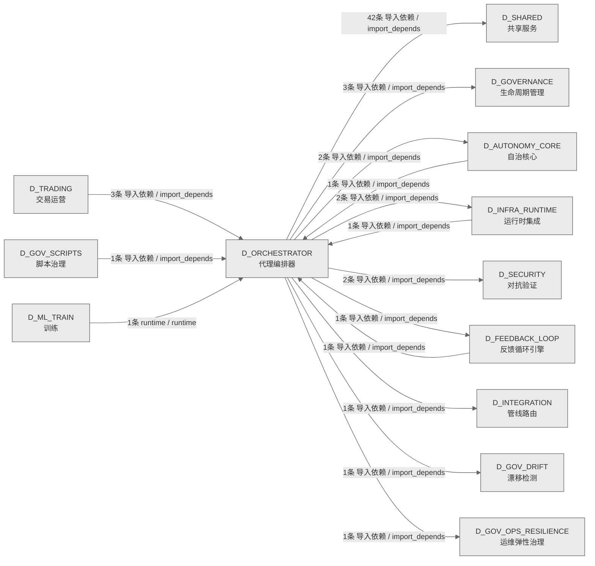

# 25_d_orchestrator / 代理编排器域 / Agent Orchestrator

> **功能简介 / Overview**: 代理编排器，负责 Agent 任务全生命周期：任务入队、调度、沙箱执行、幻觉检测和收尾归档

> **文档作用 / Purpose**: 展示 代理编排器（D_ORCHESTRATOR）功能域的域内依赖关系、跨域依赖关系，模块信息（成熟度/中英文名/大白话/文件路径）内嵌于 Mermaid 节点，供架构审查和域治理参考。

> 本文档由 generate_domain_doc.py 从 depgraph (PostgreSQL) 自动生成
> 数据源: depgraph (PostgreSQL) nodes表 + edges表

> **[可缩放 HTML 版 / Zoomable HTML](http://localhost:8765/docs/02_enterprise_architecture/02_domain_architecture_docs/_zoomable_html/25_d_orchestrator.html)** — Ctrl+滚轮缩放 ｜ 双击重置 ｜ Ctrl+Shift+D 切换拖动/选择模式

## 域基本信息 / Domain Overview

| 字段 | 值 | Field | Value |
|------|------|-------|-------|
| 编号 | 25 | Number | 25 |
| 域ID | D_ORCHESTRATOR | Domain ID | D_ORCHESTRATOR |
| 域名称 | 代理编排器 | Domain Name | Agent Orchestrator |
| 层级 | L1 基础平台层 | Layer | L1 Foundation |
| 模块数 | 70 | Module Count | 70 |
| 域内依赖 | 21 | Internal Dependencies | 21 |
| 跨域入边 | 8 | Cross-domain Incoming | 8 |
| 跨域出边 | 55 | Cross-domain Outgoing | 55 |
| 设计态模块 | 0 | Design Modules | 0 |
| 生产态模块 | 70 | Production Modules | 70 |
| 容量 | 70/150 (正常) | Capacity | 70/150 (正常) |
| 描述 | Agent全生命周期编排 | Description | Agent全生命周期编排 |

## 域内依赖图 / Internal Dependency Diagram

> 依赖图内嵌在本文档中，IDE 可直接渲染；网页版可 Ctrl+滚轮缩放 + 拖动平移查看细节。
>
> **图例说明 / Legend**：
> - 🟦 **蓝色 = 运营态模块**（production，已上线运行）
> - 🟧 **橙色虚线 = 设计态模块**（design，蓝图阶段，代码未写）
> - **实线箭头 = 运营态依赖**（已生效的依赖关系）
> - **虚线箭头 = 非运营态依赖**（计划中/验证中的依赖关系）

### 全景图（全部模块，颜色区分运营态/设计态）

> 展示全部 70 个模块（生产态 70 + 设计态 0），含跨域依赖外部节点。节点含成熟度+名称+大白话/简介+文件路径。

```mermaid
%%{init: {'theme': 'base', 'themeVariables': {'primaryColor': '#eaeaea', 'primaryTextColor': '#333333', 'primaryBorderColor': '#666666', 'lineColor': '#666666', 'secondaryColor': '#eaeaea', 'tertiaryColor': '#eaeaea', 'fontSize': '14px'}}}%%
flowchart TD
    src_zephyr_orchestrator_init_py["zephyr/orchestrator 包入口<br/>管理zephyr.orchestrator子包的加载和懒导入<br/>文件: orchestrator/__init__.py<br/>(生产态 / production)"]
    src_zephyr_orchestrator_agent_health_monitor_py["orchestrator/agent_health_monitor<br/>AgentHealthMonitor · Agent 健康监控（三态 + 5<br/>项 SLO）<br/>文件: orchestrator/agent_health_monitor.py<br/>(生产态 / production)"]
    src_zephyr_orchestrator_contracts_init_py["orchestrator/contracts 包入口<br/>contracts — orchestrator contracts subpackage.<br/>文件: contracts/__init__.py<br/>(生产态 / production)"]
    src_zephyr_orchestrator_contracts_construction_guide_py["contracts/construction_guide<br/>施工指南引擎（Construction Guide）<br/>文件: contracts/construction_guide.py<br/>(生产态 / production)"]
    src_zephyr_orchestrator_contracts_contract_router_py["contracts/contract_router<br/>契约路由（Contract Router）<br/>文件: contracts/contract_router.py<br/>(生产态 / production)"]
    src_zephyr_orchestrator_contracts_design_decisions_py["contracts/design_decisions<br/>编排/契约包的design_decisions模块<br/>文件: contracts/design_decisions.py<br/>(生产态 / production)"]
    src_zephyr_orchestrator_contracts_finding_bridge_py["contracts/finding_bridge<br/>CT-ORC-SCRIPT-001 运行时桥接<br/>文件: contracts/finding_bridge.py<br/>(生产态 / production)"]
    src_zephyr_orchestrator_contracts_prompt_version_py["contracts/prompt_version<br/>AI Prompt 版本控制（CT-PROMPT-VERSION）——prompt<br/>template版本化+部署前diff。<br/>文件: contracts/prompt_version.py<br/>(生产态 / production)"]
    src_zephyr_orchestrator_core_init_py["orchestrator/core 包入口<br/>orchestrator.core — auto-generated package init.<br/>文件: core/__init__.py<br/>(生产态 / production)"]
    src_zephyr_orchestrator_deferred_queue_py["orchestrator/deferred_queue<br/>DeferredQueue: WAITING -> READY task scheduler.<br/>文件: orchestrator/deferred_queue.py<br/>(生产态 / production)"]
    src_zephyr_orchestrator_execution_init_py["orchestrator/execution 包入口<br/>execution — orchestrator execution subpackage.<br/>文件: execution/__init__.py<br/>(生产态 / production)"]
    src_zephyr_orchestrator_execution_batch_orchestrator_py["execution/batch_orchestrator<br/>BatchOrchestrator — 多 Worker 批量任务协调器<br/>（MOD-INF-016）<br/>文件: execution/batch_orchestrator.py<br/>(生产态 / production)"]
    src_zephyr_orchestrator_execution_data_lifecycle_py["execution/data_lifecycle<br/>编排/执行包的data_lifecycle模块<br/>文件: execution/data_lifecycle.py<br/>(生产态 / production)"]
    src_zephyr_orchestrator_execution_dispatch_table_py["execution/dispatch_table<br/>AI Agent 冷启动分派表（Dispatch Table）<br/>文件: execution/dispatch_table.py<br/>(生产态 / production)"]
    src_zephyr_orchestrator_execution_dlq_manager_py["execution/dlq_manager<br/>DLQ 管理器（Dead Letter Queue Manager —<br/>CT-DLQ-001）<br/>文件: execution/dlq_manager.py<br/>(生产态 / production)"]
    src_zephyr_orchestrator_execution_phase_executor_py["execution/phase_executor<br/>Phase 执行引擎（Phase Executor）<br/>文件: execution/phase_executor.py<br/>(生产态 / production)"]
    src_zephyr_orchestrator_execution_trigger_router_py["execution/trigger_router<br/>TriggerRouter — RI-03 触发路由器（M3<br/>跨模块触发分派）<br/>文件: execution/trigger_router.py<br/>(生产态 / production)"]
    src_zephyr_orchestrator_execution_wave_generator_py["execution/wave_generator<br/>WaveGenerator — 根据 Task 依赖图生成执行 Wave<br/>（T-2-03）<br/>文件: execution/wave_generator.py<br/>(生产态 / production)"]
    src_zephyr_orchestrator_fault_tolerance_init_py["orchestrator/fault_tolerance 包入口<br/>fault_tolerance — orchestrator fault_tolerance<br/>subpackage.<br/>文件: fault_tolerance/__init__.py<br/>(生产态 / production)"]
    src_zephyr_orchestrator_fault_tolerance_bulkhead_manager_py["fault_tolerance/bulkhead_manager<br/>编排/fault tolerance包的bulkhead_manager模块<br/>文件: fault_tolerance/bulkhead_manager.py<br/>(生产态 / production)"]
    src_zephyr_orchestrator_fault_tolerance_chaos_hooks_py["fault_tolerance/chaos_hooks<br/>ChaosHook — integrates ChaosEngine with the<br/>orchestrator execution loop.<br/>文件: fault_tolerance/chaos_hooks.py<br/>(生产态 / production)"]
    src_zephyr_orchestrator_fault_tolerance_degrade_cascade_py["fault_tolerance/degrade_cascade<br/>编排/fault tolerance包的degrade_cascade模块<br/>文件: fault_tolerance/degrade_cascade.py<br/>(生产态 / production)"]
    src_zephyr_orchestrator_fault_tolerance_disk_guard_py["fault_tolerance/disk_guard<br/>编排/fault tolerance包的disk_guard模块<br/>文件: fault_tolerance/disk_guard.py<br/>(生产态 / production)"]
    src_zephyr_orchestrator_fault_tolerance_network_partition_py["fault_tolerance/network_partition<br/>网络分区容忍（CT-NETWORK-PARTITION）——CAP定理CP<br/>优先+脑裂检测+quorum write。<br/>文件: fault_tolerance/network_partition.py<br/>(生产态 / production)"]
    src_zephyr_orchestrator_governance_init_py["orchestrator/governance 包入口<br/>governance — orchestrator governance subpackage.<br/>文件: governance/__init__.py<br/>(生产态 / production)"]
    src_zephyr_orchestrator_governance_capacity_budget_py["governance/capacity_budget<br/>全局容量预算控制器（Capacity Budget Controller）<br/>文件: governance/capacity_budget.py<br/>(生产态 / production)"]
    src_zephyr_orchestrator_governance_dependency_lock_py["governance/dependency_lock<br/>外部依赖版本锁（CT-DEPS）——Python包版本锁定+hash<br/>验证+安全审计。<br/>文件: governance/dependency_lock.py<br/>(生产态 / production)"]
    src_zephyr_orchestrator_governance_model_registry_py["governance/model_registry<br/>编排/治理包的model_registry模块<br/>文件: governance/model_registry.py<br/>(生产态 / production)"]
    src_zephyr_orchestrator_governance_path_index_py["governance/path_index<br/>编排/治理包的path_index模块<br/>文件: governance/path_index.py<br/>(生产态 / production)"]
    src_zephyr_orchestrator_governance_risk_registry_py["governance/risk_registry<br/>编排/治理包的risk_registry模块<br/>文件: governance/risk_registry.py<br/>(生产态 / production)"]
    src_zephyr_orchestrator_governance_schema_migration_py["governance/schema_migration<br/>数据库 Schema 演化契约<br/>（CT-SCHEMA-MIGRATE）——向后兼容迁移+回滚脚本。<br/>文件: governance/schema_migration.py<br/>(生产态 / production)"]
    src_zephyr_orchestrator_governance_version_manifest_py["governance/version_manifest<br/>编排/治理包的version_manifest模块<br/>文件: governance/version_manifest.py<br/>(生产态 / production)"]
    src_zephyr_orchestrator_hallucination_detector_py["orchestrator/hallucination_detector<br/>HallucinationDetector · Chain-of-Verification<br/>（CoVe）幻觉检测器<br/>文件: orchestrator/hallucination_detector.py<br/>(生产态 / production)"]
    src_zephyr_orchestrator_lifecycle_init_py["orchestrator/lifecycle 包入口<br/>lifecycle — orchestrator lifecycle subpackage.<br/>文件: lifecycle/__init__.py<br/>(生产态 / production)"]
    src_zephyr_orchestrator_lifecycle_housekeeping_py["lifecycle/housekeeping<br/>文件卫生保洁管理器<br/>（CT-HOUSEKEEPING）——临时文件扫描+日志轮转+废弃<br/>目录清理。<br/>文件: lifecycle/housekeeping.py<br/>(生产态 / production)"]
    src_zephyr_orchestrator_lifecycle_rolling_upgrade_py["lifecycle/rolling_upgrade<br/>零停机滚动升级（CT-DEPLOY）——graceful<br/>shutdown+流量摘除+health check wait。<br/>文件: lifecycle/rolling_upgrade.py<br/>(生产态 / production)"]
    src_zephyr_orchestrator_lifecycle_session_conflict_py["lifecycle/session_conflict<br/>Session 冲突预防契约<br/>（CT-SESSION-CONFLICT）——文件锁+并发session检测+<br/>冲突res...<br/>文件: lifecycle/session_conflict.py<br/>(生产态 / production)"]
    src_zephyr_orchestrator_lifecycle_startup_sequencer_py["lifecycle/startup_sequencer<br/>编排/lifecycle包的startup_sequencer模块<br/>文件: lifecycle/startup_sequencer.py<br/>(生产态 / production)"]
    src_zephyr_orchestrator_lifecycle_state_propagation_py["lifecycle/state_propagation<br/>全局状态传播链（State Propagation Chain）<br/>文件: lifecycle/state_propagation.py<br/>(生产态 / production)"]
    src_zephyr_orchestrator_lifecycle_state_synchronizer_py["lifecycle/state_synchronizer<br/>StateSynchronizer — 同步 SQLite<br/>状态与文件系统实际状态（T-2-04）<br/>文件: lifecycle/state_synchronizer.py<br/>(生产态 / production)"]
    src_zephyr_orchestrator_lifecycle_system_transfer_py["lifecycle/system_transfer<br/>系统移交恢复（CT-TRANSFER）——系统Owner变更+配置<br/>迁移+密钥轮转+健康验证。<br/>文件: lifecycle/system_transfer.py<br/>(生产态 / production)"]
    src_zephyr_orchestrator_lifecycle_teardown_manager_py["lifecycle/teardown_manager<br/>编排/lifecycle包的teardown_manager模块<br/>文件: lifecycle/teardown_manager.py<br/>(生产态 / production)"]
    src_zephyr_orchestrator_quality_benchmark_runner_py["quality/benchmark_runner<br/>编排/quality包的benchmark_runner模块<br/>文件: quality/benchmark_runner.py<br/>(生产态 / production)"]
    src_zephyr_orchestrator_quality_blind_spot_closure_py["quality/blind_spot_closure<br/>编排/quality包的blind_spot_closure模块<br/>文件: quality/blind_spot_closure.py<br/>(生产态 / production)"]
    src_zephyr_orchestrator_quality_ke_quality_py["quality/ke_quality<br/>知识质量评分契约<br/>（CT-KE-QUALITY）——KE完整性+准确性+时效性三维评<br/>分。<br/>文件: quality/ke_quality.py<br/>(生产态 / production)"]
    src_zephyr_orchestrator_quality_knowledge_freshness_py["quality/knowledge_freshness<br/>知识新鲜度废止管理器<br/>（CT-KNOWLEDGE-FRESHNESS）——KE过期标记+自动失效<br/>。<br/>文件: quality/knowledge_freshness.py<br/>(生产态 / production)"]
    src_zephyr_orchestrator_quality_lean_scanner_py["quality/lean_scanner<br/>死代码/孤儿文件/僵尸引用三扫描<br/>（CT-LEAN）——三款扫描器+自动化清理建议。<br/>文件: quality/lean_scanner.py<br/>(生产态 / production)"]
    src_zephyr_orchestrator_quality_stability_guard_py["quality/stability_guard<br/>API 稳定性守护（CT-STABILITY）——public<br/>API签名锁+breaking change检测。<br/>文件: quality/stability_guard.py<br/>(生产态 / production)"]
    src_zephyr_orchestrator_resilience_init_py["orchestrator/resilience 包入口<br/>orchestrator.resilience — auto-generated<br/>package init.<br/>文件: resilience/__init__.py<br/>(生产态 / production)"]
    src_zephyr_orchestrator_rollback_manager_py["orchestrator/rollback_manager<br/>RollbackManager — 仅调试用途的 DB-state<br/>快照，不用于自动回滚。<br/>文件: orchestrator/rollback_manager.py<br/>(生产态 / production)"]
    src_zephyr_orchestrator_task_queue_py["orchestrator/task_queue<br/>ActiveTaskQueue — 后台任务轮询与自动分发<br/>文件: orchestrator/task_queue.py<br/>(生产态 / production)"]
    src_zephyr_orchestrator_init_py ~~~ src_zephyr_orchestrator_agent_health_monitor_py
    src_zephyr_orchestrator_agent_health_monitor_py ~~~ src_zephyr_orchestrator_contracts_init_py
    src_zephyr_orchestrator_contracts_init_py ~~~ src_zephyr_orchestrator_contracts_construction_guide_py
    src_zephyr_orchestrator_contracts_construction_guide_py ~~~ src_zephyr_orchestrator_contracts_contract_router_py
    src_zephyr_orchestrator_contracts_contract_router_py ~~~ src_zephyr_orchestrator_contracts_design_decisions_py
    src_zephyr_orchestrator_contracts_design_decisions_py ~~~ src_zephyr_orchestrator_contracts_finding_bridge_py
    src_zephyr_orchestrator_contracts_finding_bridge_py ~~~ src_zephyr_orchestrator_contracts_prompt_version_py
    src_zephyr_orchestrator_contracts_prompt_version_py ~~~ src_zephyr_orchestrator_core_init_py
    src_zephyr_orchestrator_core_init_py ~~~ src_zephyr_orchestrator_deferred_queue_py
    src_zephyr_orchestrator_deferred_queue_py ~~~ src_zephyr_orchestrator_execution_init_py
    src_zephyr_orchestrator_execution_init_py ~~~ src_zephyr_orchestrator_execution_batch_orchestrator_py
    src_zephyr_orchestrator_execution_batch_orchestrator_py ~~~ src_zephyr_orchestrator_execution_data_lifecycle_py
    src_zephyr_orchestrator_execution_data_lifecycle_py ~~~ src_zephyr_orchestrator_execution_dispatch_table_py
    src_zephyr_orchestrator_execution_dispatch_table_py ~~~ src_zephyr_orchestrator_execution_dlq_manager_py
    src_zephyr_orchestrator_execution_dlq_manager_py ~~~ src_zephyr_orchestrator_execution_phase_executor_py
    src_zephyr_orchestrator_execution_phase_executor_py ~~~ src_zephyr_orchestrator_execution_trigger_router_py
    src_zephyr_orchestrator_execution_trigger_router_py ~~~ src_zephyr_orchestrator_execution_wave_generator_py
    src_zephyr_orchestrator_execution_wave_generator_py ~~~ src_zephyr_orchestrator_fault_tolerance_init_py
    src_zephyr_orchestrator_fault_tolerance_init_py ~~~ src_zephyr_orchestrator_fault_tolerance_bulkhead_manager_py
    src_zephyr_orchestrator_fault_tolerance_bulkhead_manager_py ~~~ src_zephyr_orchestrator_fault_tolerance_chaos_hooks_py
    src_zephyr_orchestrator_fault_tolerance_chaos_hooks_py ~~~ src_zephyr_orchestrator_fault_tolerance_degrade_cascade_py
    src_zephyr_orchestrator_fault_tolerance_degrade_cascade_py ~~~ src_zephyr_orchestrator_fault_tolerance_disk_guard_py
    src_zephyr_orchestrator_fault_tolerance_disk_guard_py ~~~ src_zephyr_orchestrator_fault_tolerance_network_partition_py
    src_zephyr_orchestrator_fault_tolerance_network_partition_py ~~~ src_zephyr_orchestrator_governance_init_py
    src_zephyr_orchestrator_governance_init_py ~~~ src_zephyr_orchestrator_governance_capacity_budget_py
    src_zephyr_orchestrator_governance_capacity_budget_py ~~~ src_zephyr_orchestrator_governance_dependency_lock_py
    src_zephyr_orchestrator_governance_dependency_lock_py ~~~ src_zephyr_orchestrator_governance_model_registry_py
    src_zephyr_orchestrator_governance_model_registry_py ~~~ src_zephyr_orchestrator_governance_path_index_py
    src_zephyr_orchestrator_governance_path_index_py ~~~ src_zephyr_orchestrator_governance_risk_registry_py
    src_zephyr_orchestrator_governance_risk_registry_py ~~~ src_zephyr_orchestrator_governance_schema_migration_py
    src_zephyr_orchestrator_governance_schema_migration_py ~~~ src_zephyr_orchestrator_governance_version_manifest_py
    src_zephyr_orchestrator_governance_version_manifest_py ~~~ src_zephyr_orchestrator_hallucination_detector_py
    src_zephyr_orchestrator_hallucination_detector_py ~~~ src_zephyr_orchestrator_lifecycle_init_py
    src_zephyr_orchestrator_lifecycle_init_py ~~~ src_zephyr_orchestrator_lifecycle_housekeeping_py
    src_zephyr_orchestrator_lifecycle_housekeeping_py ~~~ src_zephyr_orchestrator_lifecycle_rolling_upgrade_py
    src_zephyr_orchestrator_lifecycle_rolling_upgrade_py ~~~ src_zephyr_orchestrator_lifecycle_session_conflict_py
    src_zephyr_orchestrator_lifecycle_session_conflict_py ~~~ src_zephyr_orchestrator_lifecycle_startup_sequencer_py
    src_zephyr_orchestrator_lifecycle_startup_sequencer_py ~~~ src_zephyr_orchestrator_lifecycle_state_propagation_py
    src_zephyr_orchestrator_lifecycle_state_propagation_py ~~~ src_zephyr_orchestrator_lifecycle_state_synchronizer_py
    src_zephyr_orchestrator_lifecycle_state_synchronizer_py ~~~ src_zephyr_orchestrator_lifecycle_system_transfer_py
    src_zephyr_orchestrator_lifecycle_system_transfer_py ~~~ src_zephyr_orchestrator_lifecycle_teardown_manager_py
    src_zephyr_orchestrator_lifecycle_teardown_manager_py ~~~ src_zephyr_orchestrator_quality_benchmark_runner_py
    src_zephyr_orchestrator_quality_benchmark_runner_py ~~~ src_zephyr_orchestrator_quality_blind_spot_closure_py
    src_zephyr_orchestrator_quality_blind_spot_closure_py ~~~ src_zephyr_orchestrator_quality_ke_quality_py
    src_zephyr_orchestrator_quality_ke_quality_py ~~~ src_zephyr_orchestrator_quality_knowledge_freshness_py
    src_zephyr_orchestrator_quality_knowledge_freshness_py ~~~ src_zephyr_orchestrator_quality_lean_scanner_py
    src_zephyr_orchestrator_quality_lean_scanner_py ~~~ src_zephyr_orchestrator_quality_stability_guard_py
    src_zephyr_orchestrator_quality_stability_guard_py ~~~ src_zephyr_orchestrator_resilience_init_py
    src_zephyr_orchestrator_resilience_init_py ~~~ src_zephyr_orchestrator_rollback_manager_py
    src_zephyr_orchestrator_rollback_manager_py ~~~ src_zephyr_orchestrator_task_queue_py
    src_zephyr_orchestrator_agent_orchestrator_py["orchestrator/agent_orchestrator<br/>AgentOrchestrator · 多角色 Agent<br/>路由、工具链编排与健康监控<br/>文件: orchestrator/agent_orchestrator.py<br/>(生产态 / production)"]
    src_zephyr_orchestrator_contracts_alert_handler_py["contracts/alert_handler<br/>Orc 告警接收器 — handle_alert() 消费者<br/>文件: contracts/alert_handler.py<br/>(生产态 / production)"]
    src_zephyr_orchestrator_contracts_contract_registry_py["contracts/contract_registry<br/>集成契约注册表（Contract Registry）<br/>文件: contracts/contract_registry.py<br/>(生产态 / production)"]
    src_zephyr_orchestrator_core_task_queue_py["core/task_queue<br/>ActiveTaskQueue — 后台任务轮询与自动分发<br/>文件: core/task_queue.py<br/>(生产态 / production)"]
    src_zephyr_orchestrator_execution_context_bridge_py["execution/context_bridge<br/>Orc->CE 上下文桥接 — request_context() 生产者<br/>文件: execution/context_bridge.py<br/>(生产态 / production)"]
    src_zephyr_orchestrator_execution_memory_writer_py["execution/memory_writer<br/>Orc->VMS 记忆写入器<br/>文件: execution/memory_writer.py<br/>(生产态 / production)"]
    src_zephyr_orchestrator_execution_reconciliation_loop_py["execution/reconciliation_loop<br/>编排/执行包的reconciliation_loop模块<br/>文件: execution/reconciliation_loop.py<br/>(生产态 / production)"]
    src_zephyr_orchestrator_execution_script_runner_py["execution/script_runner<br/>Orc->Script 脚本执行器 — run_audit() 生产者<br/>文件: execution/script_runner.py<br/>(生产态 / production)"]
    src_zephyr_orchestrator_fault_tolerance_canary_manager_py["fault_tolerance/canary_manager<br/>金丝雀发布管理器<br/>（CT-CANARY）——权重分流+指标对比+自动回滚。<br/>文件: fault_tolerance/canary_manager.py<br/>(生产态 / production)"]
    src_zephyr_orchestrator_fault_tolerance_chaos_engine_py["fault_tolerance/chaos_engine<br/>Chaos 故障注入引擎<br/>（CT-CHAOS-001）——4注入点×月度执行。<br/>文件: fault_tolerance/chaos_engine.py<br/>(生产态 / production)"]
    src_zephyr_orchestrator_fault_tolerance_fault_types_py["fault_tolerance/fault_types<br/>Fault type registry and preset templates for<br/>chaos engineering.<br/>文件: fault_tolerance/fault_types.py<br/>(生产态 / production)"]
    src_zephyr_orchestrator_file_task_mapper_py["orchestrator/file_task_mapper<br/>FileTaskMapper — 文件路径 ↔ Task N:N 映射器<br/>（#21 裁定重写）<br/>文件: orchestrator/file_task_mapper.py<br/>(生产态 / production)"]
    src_zephyr_orchestrator_governance_autonomy_guard_py["governance/autonomy_guard<br/>Owner 缺位分级自治<br/>（CT-AUTONOMY）——Owner离线->自动降级->最小安全运<br/>行。<br/>文件: governance/autonomy_guard.py<br/>(生产态 / production)"]
    src_zephyr_orchestrator_lifecycle_incident_postmortem_py["lifecycle/incident_postmortem<br/>事件复盘管理器（CT-INCIDENT）——incident记录+time<br/>line+action_items+postmortem。<br/>文件: lifecycle/incident_postmortem.py<br/>(生产态 / production)"]
    src_zephyr_orchestrator_quality_init_py["orchestrator/quality 包入口<br/>quality — orchestrator quality subpackage.<br/>文件: quality/__init__.py<br/>(生产态 / production)"]
    src_zephyr_orchestrator_quality_blueprint_scorer_py["quality/blueprint_scorer<br/>BlueprintScorer — 蓝图路由统一打分逻辑<br/>文件: quality/blueprint_scorer.py<br/>(生产态 / production)"]
    src_zephyr_orchestrator_resilience_failure_matcher_py["resilience/failure_matcher<br/>FailurePatternMatcher —<br/>任务失败模式识别与纠正建议<br/>文件: resilience/failure_matcher.py<br/>(生产态 / production)"]
    src_zephyr_orchestrator_agent_orchestrator_py ~~~ src_zephyr_orchestrator_contracts_alert_handler_py
    src_zephyr_orchestrator_contracts_alert_handler_py ~~~ src_zephyr_orchestrator_contracts_contract_registry_py
    src_zephyr_orchestrator_contracts_contract_registry_py ~~~ src_zephyr_orchestrator_core_task_queue_py
    src_zephyr_orchestrator_core_task_queue_py ~~~ src_zephyr_orchestrator_execution_context_bridge_py
    src_zephyr_orchestrator_execution_context_bridge_py ~~~ src_zephyr_orchestrator_execution_memory_writer_py
    src_zephyr_orchestrator_execution_memory_writer_py ~~~ src_zephyr_orchestrator_execution_reconciliation_loop_py
    src_zephyr_orchestrator_execution_reconciliation_loop_py ~~~ src_zephyr_orchestrator_execution_script_runner_py
    src_zephyr_orchestrator_execution_script_runner_py ~~~ src_zephyr_orchestrator_fault_tolerance_canary_manager_py
    src_zephyr_orchestrator_fault_tolerance_canary_manager_py ~~~ src_zephyr_orchestrator_fault_tolerance_chaos_engine_py
    src_zephyr_orchestrator_fault_tolerance_chaos_engine_py ~~~ src_zephyr_orchestrator_fault_tolerance_fault_types_py
    src_zephyr_orchestrator_fault_tolerance_fault_types_py ~~~ src_zephyr_orchestrator_file_task_mapper_py
    src_zephyr_orchestrator_file_task_mapper_py ~~~ src_zephyr_orchestrator_governance_autonomy_guard_py
    src_zephyr_orchestrator_governance_autonomy_guard_py ~~~ src_zephyr_orchestrator_lifecycle_incident_postmortem_py
    src_zephyr_orchestrator_lifecycle_incident_postmortem_py ~~~ src_zephyr_orchestrator_quality_init_py
    src_zephyr_orchestrator_quality_init_py ~~~ src_zephyr_orchestrator_quality_blueprint_scorer_py
    src_zephyr_orchestrator_quality_blueprint_scorer_py ~~~ src_zephyr_orchestrator_resilience_failure_matcher_py
    src_zephyr_orchestrator_execution_task_context_builder_py["execution/task_context_builder<br/>CE 任务上下文构建器 — build_from_task() 消费者<br/>文件: execution/task_context_builder.py<br/>(生产态 / production)"]
    src_zephyr_orchestrator_quality_agent_quality_py["quality/agent_quality<br/>AI Agent 质量反馈闭环<br/>（CT-AGENT-QUALITY）——task完成质量评分+agent绩效<br/>追踪。<br/>文件: quality/agent_quality.py<br/>(生产态 / production)"]
    src_zephyr_orchestrator_execution_task_context_builder_py ~~~ src_zephyr_orchestrator_quality_agent_quality_py
    src_zephyr_orchestrator_agent_health_monitor_py -->|导入依赖 / import_depends| src_zephyr_orchestrator_agent_orchestrator_py
    src_zephyr_orchestrator_init_py -->|导入依赖 / import_depends| src_zephyr_orchestrator_contracts_alert_handler_py
    src_zephyr_orchestrator_init_py -->|导入依赖 / import_depends| src_zephyr_orchestrator_execution_memory_writer_py
    src_zephyr_orchestrator_init_py -->|导入依赖 / import_depends| src_zephyr_orchestrator_execution_context_bridge_py
    src_zephyr_orchestrator_init_py -->|导入依赖 / import_depends| src_zephyr_orchestrator_execution_script_runner_py
    src_zephyr_orchestrator_task_queue_py -->|导入依赖 / import_depends| src_zephyr_orchestrator_core_task_queue_py
    src_zephyr_orchestrator_core_init_py -->|config_depends / config_depends| src_zephyr_orchestrator_core_task_queue_py
    src_zephyr_orchestrator_contracts_contract_router_py -->|导入依赖 / import_depends| src_zephyr_orchestrator_contracts_contract_registry_py
    src_zephyr_orchestrator_execution_context_bridge_py -->|导入依赖 / import_depends| src_zephyr_orchestrator_execution_task_context_builder_py
    src_zephyr_orchestrator_execution_trigger_router_py -->|导入依赖 / import_depends| src_zephyr_orchestrator_quality_blueprint_scorer_py
    src_zephyr_orchestrator_execution_init_py -->|config_depends / config_depends| src_zephyr_orchestrator_execution_reconciliation_loop_py
    src_zephyr_orchestrator_fault_tolerance_chaos_hooks_py -->|导入依赖 / import_depends| src_zephyr_orchestrator_fault_tolerance_fault_types_py
    src_zephyr_orchestrator_fault_tolerance_chaos_hooks_py -->|导入依赖 / import_depends| src_zephyr_orchestrator_fault_tolerance_chaos_engine_py
    src_zephyr_orchestrator_fault_tolerance_init_py -->|config_depends / config_depends| src_zephyr_orchestrator_fault_tolerance_canary_manager_py
    src_zephyr_orchestrator_governance_init_py -->|config_depends / config_depends| src_zephyr_orchestrator_governance_autonomy_guard_py
    src_zephyr_orchestrator_lifecycle_state_synchronizer_py -->|导入依赖 / import_depends| src_zephyr_orchestrator_file_task_mapper_py
    src_zephyr_orchestrator_lifecycle_init_py -->|config_depends / config_depends| src_zephyr_orchestrator_lifecycle_incident_postmortem_py
    src_zephyr_orchestrator_quality_init_py -->|config_depends / config_depends| src_zephyr_orchestrator_quality_agent_quality_py
    src_zephyr_orchestrator_quality_ke_quality_py -->|config_depends / config_depends| src_zephyr_orchestrator_quality_init_py
    src_zephyr_orchestrator_quality_knowledge_freshness_py -->|config_depends / config_depends| src_zephyr_orchestrator_quality_init_py
    src_zephyr_orchestrator_resilience_init_py -->|导入依赖 / import_depends| src_zephyr_orchestrator_resilience_failure_matcher_py
    D_SHARED["共享服务<br/>共享服务，负责跨域共享的工具、协议和基础服务<br/>Shared Services<br/>跨域节点 / cross-domain<br/>(生产态 / production)"]
    src_zephyr_orchestrator_agent_health_monitor_py -->|导入依赖 / import_depends| D_SHARED
    src_zephyr_orchestrator_agent_health_monitor_py -->|导入依赖 / import_depends| D_SHARED
    src_zephyr_orchestrator_agent_orchestrator_py -->|导入依赖 / import_depends| D_SHARED
    src_zephyr_orchestrator_agent_orchestrator_py -->|导入依赖 / import_depends| D_SHARED
    src_zephyr_orchestrator_agent_orchestrator_py -->|导入依赖 / import_depends| D_SHARED
    D_SECURITY["对抗验证<br/>对抗验证，负责系统安全对抗测试、漏洞扫描和攻防验<br/>证<br/>Adversarial Validation<br/>跨域节点 / cross-domain<br/>(生产态 / production)"]
    src_zephyr_orchestrator_agent_orchestrator_py -->|导入依赖 / import_depends| D_SECURITY
    D_INFRA_RUNTIME["运行时集成<br/>运行时集成，负责组件生命周期编排、启动钩子和运行<br/>时上下文管理<br/>Runtime Integration<br/>跨域节点 / cross-domain<br/>(生产态 / production)"]
    src_zephyr_orchestrator_agent_orchestrator_py -->|导入依赖 / import_depends| D_INFRA_RUNTIME
    src_zephyr_orchestrator_agent_orchestrator_py -->|导入依赖 / import_depends| D_SECURITY
    src_zephyr_orchestrator_agent_orchestrator_py -->|导入依赖 / import_depends| D_SHARED
    src_zephyr_orchestrator_agent_orchestrator_py -->|导入依赖 / import_depends| D_SHARED
    src_zephyr_orchestrator_hallucination_detector_py -->|导入依赖 / import_depends| D_SHARED
    src_zephyr_orchestrator_hallucination_detector_py -->|导入依赖 / import_depends| D_SHARED
    src_zephyr_orchestrator_rollback_manager_py -->|导入依赖 / import_depends| D_SHARED
    src_zephyr_orchestrator_rollback_manager_py -->|导入依赖 / import_depends| D_SHARED
    src_zephyr_orchestrator_rollback_manager_py -->|导入依赖 / import_depends| D_SHARED
    D_ML_TRAIN["训练<br/>训练，负责模型训练、特征工程和模型评估<br/>Training<br/>跨域节点 / cross-domain<br/>(设计态 / design)"]
    D_ML_TRAIN -.->|runtime / runtime| src_zephyr_orchestrator_governance_model_registry_py
    D_FEEDBACK_LOOP["反馈循环引擎<br/>反馈循环引擎，负责系统自我改进闭环：异常检测、根<br/>因诊断、自动修复和自我进化<br/>Feedback Loop Engine<br/>跨域节点 / cross-domain<br/>(生产态 / production)"]
    D_FEEDBACK_LOOP -->|导入依赖 / import_depends| src_zephyr_orchestrator_contracts_alert_handler_py
    D_AUTONOMY_CORE["自治核心<br/>自治核心，负责 AI 自治决策、目标分解和执行编排<br/>Autonomy Core<br/>跨域节点 / cross-domain<br/>(生产态 / production)"]
    D_AUTONOMY_CORE -->|导入依赖 / import_depends| src_zephyr_orchestrator_contracts_init_py
    D_INFRA_RUNTIME -->|导入依赖 / import_depends| src_zephyr_orchestrator_execution_memory_writer_py
    D_GOV_SCRIPTS["脚本治理<br/>脚本治理，负责脚本生命周期管理和脚本质量门禁<br/>Script Governance<br/>跨域节点 / cross-domain<br/>(生产态 / production)"]
    D_GOV_SCRIPTS -->|导入依赖 / import_depends| src_zephyr_orchestrator_contracts_contract_registry_py
    D_TRADING["交易运营<br/>交易运营，负责交易生命周期管理、订单状态和成交处<br/>理<br/>Trading Operations<br/>跨域节点 / cross-domain<br/>(生产态 / production)"]
    D_TRADING -->|导入依赖 / import_depends| src_zephyr_orchestrator_execution_context_bridge_py
    D_TRADING -->|导入依赖 / import_depends| src_zephyr_orchestrator_execution_script_runner_py
    D_TRADING -->|导入依赖 / import_depends| src_zephyr_orchestrator_core_task_queue_py
    classDef production fill:#e1f5fe,stroke:#01579b,stroke-width:2px,color:#000
    classDef design fill:#fff3e0,stroke:#e65100,stroke-width:2px,color:#000,stroke-dasharray: 5 5
    classDef external_prod fill:#e8f4fd,stroke:#0277bd,stroke-width:1px,color:#000
    classDef external_design fill:#fff8e7,stroke:#ef6c00,stroke-width:1px,color:#000,stroke-dasharray: 5 5
    class src_zephyr_orchestrator_init_py,src_zephyr_orchestrator_agent_health_monitor_py,src_zephyr_orchestrator_agent_orchestrator_py,src_zephyr_orchestrator_contracts_init_py,src_zephyr_orchestrator_contracts_alert_handler_py,src_zephyr_orchestrator_contracts_construction_guide_py,src_zephyr_orchestrator_contracts_contract_registry_py,src_zephyr_orchestrator_contracts_contract_router_py,src_zephyr_orchestrator_contracts_design_decisions_py,src_zephyr_orchestrator_contracts_finding_bridge_py,src_zephyr_orchestrator_contracts_prompt_version_py,src_zephyr_orchestrator_core_init_py,src_zephyr_orchestrator_core_task_queue_py,src_zephyr_orchestrator_deferred_queue_py,src_zephyr_orchestrator_execution_init_py,src_zephyr_orchestrator_execution_batch_orchestrator_py,src_zephyr_orchestrator_execution_context_bridge_py,src_zephyr_orchestrator_execution_data_lifecycle_py,src_zephyr_orchestrator_execution_dispatch_table_py,src_zephyr_orchestrator_execution_dlq_manager_py,src_zephyr_orchestrator_execution_memory_writer_py,src_zephyr_orchestrator_execution_phase_executor_py,src_zephyr_orchestrator_execution_reconciliation_loop_py,src_zephyr_orchestrator_execution_script_runner_py,src_zephyr_orchestrator_execution_task_context_builder_py,src_zephyr_orchestrator_execution_trigger_router_py,src_zephyr_orchestrator_execution_wave_generator_py,src_zephyr_orchestrator_fault_tolerance_init_py,src_zephyr_orchestrator_fault_tolerance_bulkhead_manager_py,src_zephyr_orchestrator_fault_tolerance_canary_manager_py,src_zephyr_orchestrator_fault_tolerance_chaos_engine_py,src_zephyr_orchestrator_fault_tolerance_chaos_hooks_py,src_zephyr_orchestrator_fault_tolerance_degrade_cascade_py,src_zephyr_orchestrator_fault_tolerance_disk_guard_py,src_zephyr_orchestrator_fault_tolerance_fault_types_py,src_zephyr_orchestrator_fault_tolerance_network_partition_py,src_zephyr_orchestrator_file_task_mapper_py,src_zephyr_orchestrator_governance_init_py,src_zephyr_orchestrator_governance_autonomy_guard_py,src_zephyr_orchestrator_governance_capacity_budget_py,src_zephyr_orchestrator_governance_dependency_lock_py,src_zephyr_orchestrator_governance_model_registry_py,src_zephyr_orchestrator_governance_path_index_py,src_zephyr_orchestrator_governance_risk_registry_py,src_zephyr_orchestrator_governance_schema_migration_py,src_zephyr_orchestrator_governance_version_manifest_py,src_zephyr_orchestrator_hallucination_detector_py,src_zephyr_orchestrator_lifecycle_init_py,src_zephyr_orchestrator_lifecycle_housekeeping_py,src_zephyr_orchestrator_lifecycle_incident_postmortem_py,src_zephyr_orchestrator_lifecycle_rolling_upgrade_py,src_zephyr_orchestrator_lifecycle_session_conflict_py,src_zephyr_orchestrator_lifecycle_startup_sequencer_py,src_zephyr_orchestrator_lifecycle_state_propagation_py,src_zephyr_orchestrator_lifecycle_state_synchronizer_py,src_zephyr_orchestrator_lifecycle_system_transfer_py,src_zephyr_orchestrator_lifecycle_teardown_manager_py,src_zephyr_orchestrator_quality_init_py,src_zephyr_orchestrator_quality_agent_quality_py,src_zephyr_orchestrator_quality_benchmark_runner_py,src_zephyr_orchestrator_quality_blind_spot_closure_py,src_zephyr_orchestrator_quality_blueprint_scorer_py,src_zephyr_orchestrator_quality_ke_quality_py,src_zephyr_orchestrator_quality_knowledge_freshness_py,src_zephyr_orchestrator_quality_lean_scanner_py,src_zephyr_orchestrator_quality_stability_guard_py,src_zephyr_orchestrator_resilience_init_py,src_zephyr_orchestrator_resilience_failure_matcher_py,src_zephyr_orchestrator_rollback_manager_py,src_zephyr_orchestrator_task_queue_py production
    class D_SHARED,D_SECURITY,D_INFRA_RUNTIME,D_FEEDBACK_LOOP,D_AUTONOMY_CORE,D_GOV_SCRIPTS,D_TRADING external_prod
    class D_ML_TRAIN external_design
```

### 运营态的图（仅 design_maturity=production 的模块和域内依赖）

> 仅展示已上线运行的模块（共 70 个），不含跨域外部节点。跨域依赖见下方跨域依赖章节。

```mermaid
%%{init: {'theme': 'base', 'themeVariables': {'primaryColor': '#eaeaea', 'primaryTextColor': '#333333', 'primaryBorderColor': '#666666', 'lineColor': '#666666', 'secondaryColor': '#eaeaea', 'tertiaryColor': '#eaeaea', 'fontSize': '14px'}}}%%
flowchart TD
    src_zephyr_orchestrator_init_py["zephyr/orchestrator 包入口<br/>管理zephyr.orchestrator子包的加载和懒导入<br/>文件: orchestrator/__init__.py<br/>(生产态 / production)"]
    src_zephyr_orchestrator_agent_health_monitor_py["orchestrator/agent_health_monitor<br/>AgentHealthMonitor · Agent 健康监控（三态 + 5<br/>项 SLO）<br/>文件: orchestrator/agent_health_monitor.py<br/>(生产态 / production)"]
    src_zephyr_orchestrator_contracts_init_py["orchestrator/contracts 包入口<br/>contracts — orchestrator contracts subpackage.<br/>文件: contracts/__init__.py<br/>(生产态 / production)"]
    src_zephyr_orchestrator_contracts_construction_guide_py["contracts/construction_guide<br/>施工指南引擎（Construction Guide）<br/>文件: contracts/construction_guide.py<br/>(生产态 / production)"]
    src_zephyr_orchestrator_contracts_contract_router_py["contracts/contract_router<br/>契约路由（Contract Router）<br/>文件: contracts/contract_router.py<br/>(生产态 / production)"]
    src_zephyr_orchestrator_contracts_design_decisions_py["contracts/design_decisions<br/>编排/契约包的design_decisions模块<br/>文件: contracts/design_decisions.py<br/>(生产态 / production)"]
    src_zephyr_orchestrator_contracts_finding_bridge_py["contracts/finding_bridge<br/>CT-ORC-SCRIPT-001 运行时桥接<br/>文件: contracts/finding_bridge.py<br/>(生产态 / production)"]
    src_zephyr_orchestrator_contracts_prompt_version_py["contracts/prompt_version<br/>AI Prompt 版本控制（CT-PROMPT-VERSION）——prompt<br/>template版本化+部署前diff。<br/>文件: contracts/prompt_version.py<br/>(生产态 / production)"]
    src_zephyr_orchestrator_core_init_py["orchestrator/core 包入口<br/>orchestrator.core — auto-generated package init.<br/>文件: core/__init__.py<br/>(生产态 / production)"]
    src_zephyr_orchestrator_deferred_queue_py["orchestrator/deferred_queue<br/>DeferredQueue: WAITING -> READY task scheduler.<br/>文件: orchestrator/deferred_queue.py<br/>(生产态 / production)"]
    src_zephyr_orchestrator_execution_init_py["orchestrator/execution 包入口<br/>execution — orchestrator execution subpackage.<br/>文件: execution/__init__.py<br/>(生产态 / production)"]
    src_zephyr_orchestrator_execution_batch_orchestrator_py["execution/batch_orchestrator<br/>BatchOrchestrator — 多 Worker 批量任务协调器<br/>（MOD-INF-016）<br/>文件: execution/batch_orchestrator.py<br/>(生产态 / production)"]
    src_zephyr_orchestrator_execution_data_lifecycle_py["execution/data_lifecycle<br/>编排/执行包的data_lifecycle模块<br/>文件: execution/data_lifecycle.py<br/>(生产态 / production)"]
    src_zephyr_orchestrator_execution_dispatch_table_py["execution/dispatch_table<br/>AI Agent 冷启动分派表（Dispatch Table）<br/>文件: execution/dispatch_table.py<br/>(生产态 / production)"]
    src_zephyr_orchestrator_execution_dlq_manager_py["execution/dlq_manager<br/>DLQ 管理器（Dead Letter Queue Manager —<br/>CT-DLQ-001）<br/>文件: execution/dlq_manager.py<br/>(生产态 / production)"]
    src_zephyr_orchestrator_execution_phase_executor_py["execution/phase_executor<br/>Phase 执行引擎（Phase Executor）<br/>文件: execution/phase_executor.py<br/>(生产态 / production)"]
    src_zephyr_orchestrator_execution_trigger_router_py["execution/trigger_router<br/>TriggerRouter — RI-03 触发路由器（M3<br/>跨模块触发分派）<br/>文件: execution/trigger_router.py<br/>(生产态 / production)"]
    src_zephyr_orchestrator_execution_wave_generator_py["execution/wave_generator<br/>WaveGenerator — 根据 Task 依赖图生成执行 Wave<br/>（T-2-03）<br/>文件: execution/wave_generator.py<br/>(生产态 / production)"]
    src_zephyr_orchestrator_fault_tolerance_init_py["orchestrator/fault_tolerance 包入口<br/>fault_tolerance — orchestrator fault_tolerance<br/>subpackage.<br/>文件: fault_tolerance/__init__.py<br/>(生产态 / production)"]
    src_zephyr_orchestrator_fault_tolerance_bulkhead_manager_py["fault_tolerance/bulkhead_manager<br/>编排/fault tolerance包的bulkhead_manager模块<br/>文件: fault_tolerance/bulkhead_manager.py<br/>(生产态 / production)"]
    src_zephyr_orchestrator_fault_tolerance_chaos_hooks_py["fault_tolerance/chaos_hooks<br/>ChaosHook — integrates ChaosEngine with the<br/>orchestrator execution loop.<br/>文件: fault_tolerance/chaos_hooks.py<br/>(生产态 / production)"]
    src_zephyr_orchestrator_fault_tolerance_degrade_cascade_py["fault_tolerance/degrade_cascade<br/>编排/fault tolerance包的degrade_cascade模块<br/>文件: fault_tolerance/degrade_cascade.py<br/>(生产态 / production)"]
    src_zephyr_orchestrator_fault_tolerance_disk_guard_py["fault_tolerance/disk_guard<br/>编排/fault tolerance包的disk_guard模块<br/>文件: fault_tolerance/disk_guard.py<br/>(生产态 / production)"]
    src_zephyr_orchestrator_fault_tolerance_network_partition_py["fault_tolerance/network_partition<br/>网络分区容忍（CT-NETWORK-PARTITION）——CAP定理CP<br/>优先+脑裂检测+quorum write。<br/>文件: fault_tolerance/network_partition.py<br/>(生产态 / production)"]
    src_zephyr_orchestrator_governance_init_py["orchestrator/governance 包入口<br/>governance — orchestrator governance subpackage.<br/>文件: governance/__init__.py<br/>(生产态 / production)"]
    src_zephyr_orchestrator_governance_capacity_budget_py["governance/capacity_budget<br/>全局容量预算控制器（Capacity Budget Controller）<br/>文件: governance/capacity_budget.py<br/>(生产态 / production)"]
    src_zephyr_orchestrator_governance_dependency_lock_py["governance/dependency_lock<br/>外部依赖版本锁（CT-DEPS）——Python包版本锁定+hash<br/>验证+安全审计。<br/>文件: governance/dependency_lock.py<br/>(生产态 / production)"]
    src_zephyr_orchestrator_governance_model_registry_py["governance/model_registry<br/>编排/治理包的model_registry模块<br/>文件: governance/model_registry.py<br/>(生产态 / production)"]
    src_zephyr_orchestrator_governance_path_index_py["governance/path_index<br/>编排/治理包的path_index模块<br/>文件: governance/path_index.py<br/>(生产态 / production)"]
    src_zephyr_orchestrator_governance_risk_registry_py["governance/risk_registry<br/>编排/治理包的risk_registry模块<br/>文件: governance/risk_registry.py<br/>(生产态 / production)"]
    src_zephyr_orchestrator_governance_schema_migration_py["governance/schema_migration<br/>数据库 Schema 演化契约<br/>（CT-SCHEMA-MIGRATE）——向后兼容迁移+回滚脚本。<br/>文件: governance/schema_migration.py<br/>(生产态 / production)"]
    src_zephyr_orchestrator_governance_version_manifest_py["governance/version_manifest<br/>编排/治理包的version_manifest模块<br/>文件: governance/version_manifest.py<br/>(生产态 / production)"]
    src_zephyr_orchestrator_hallucination_detector_py["orchestrator/hallucination_detector<br/>HallucinationDetector · Chain-of-Verification<br/>（CoVe）幻觉检测器<br/>文件: orchestrator/hallucination_detector.py<br/>(生产态 / production)"]
    src_zephyr_orchestrator_lifecycle_init_py["orchestrator/lifecycle 包入口<br/>lifecycle — orchestrator lifecycle subpackage.<br/>文件: lifecycle/__init__.py<br/>(生产态 / production)"]
    src_zephyr_orchestrator_lifecycle_housekeeping_py["lifecycle/housekeeping<br/>文件卫生保洁管理器<br/>（CT-HOUSEKEEPING）——临时文件扫描+日志轮转+废弃<br/>目录清理。<br/>文件: lifecycle/housekeeping.py<br/>(生产态 / production)"]
    src_zephyr_orchestrator_lifecycle_rolling_upgrade_py["lifecycle/rolling_upgrade<br/>零停机滚动升级（CT-DEPLOY）——graceful<br/>shutdown+流量摘除+health check wait。<br/>文件: lifecycle/rolling_upgrade.py<br/>(生产态 / production)"]
    src_zephyr_orchestrator_lifecycle_session_conflict_py["lifecycle/session_conflict<br/>Session 冲突预防契约<br/>（CT-SESSION-CONFLICT）——文件锁+并发session检测+<br/>冲突res...<br/>文件: lifecycle/session_conflict.py<br/>(生产态 / production)"]
    src_zephyr_orchestrator_lifecycle_startup_sequencer_py["lifecycle/startup_sequencer<br/>编排/lifecycle包的startup_sequencer模块<br/>文件: lifecycle/startup_sequencer.py<br/>(生产态 / production)"]
    src_zephyr_orchestrator_lifecycle_state_propagation_py["lifecycle/state_propagation<br/>全局状态传播链（State Propagation Chain）<br/>文件: lifecycle/state_propagation.py<br/>(生产态 / production)"]
    src_zephyr_orchestrator_lifecycle_state_synchronizer_py["lifecycle/state_synchronizer<br/>StateSynchronizer — 同步 SQLite<br/>状态与文件系统实际状态（T-2-04）<br/>文件: lifecycle/state_synchronizer.py<br/>(生产态 / production)"]
    src_zephyr_orchestrator_lifecycle_system_transfer_py["lifecycle/system_transfer<br/>系统移交恢复（CT-TRANSFER）——系统Owner变更+配置<br/>迁移+密钥轮转+健康验证。<br/>文件: lifecycle/system_transfer.py<br/>(生产态 / production)"]
    src_zephyr_orchestrator_lifecycle_teardown_manager_py["lifecycle/teardown_manager<br/>编排/lifecycle包的teardown_manager模块<br/>文件: lifecycle/teardown_manager.py<br/>(生产态 / production)"]
    src_zephyr_orchestrator_quality_benchmark_runner_py["quality/benchmark_runner<br/>编排/quality包的benchmark_runner模块<br/>文件: quality/benchmark_runner.py<br/>(生产态 / production)"]
    src_zephyr_orchestrator_quality_blind_spot_closure_py["quality/blind_spot_closure<br/>编排/quality包的blind_spot_closure模块<br/>文件: quality/blind_spot_closure.py<br/>(生产态 / production)"]
    src_zephyr_orchestrator_quality_ke_quality_py["quality/ke_quality<br/>知识质量评分契约<br/>（CT-KE-QUALITY）——KE完整性+准确性+时效性三维评<br/>分。<br/>文件: quality/ke_quality.py<br/>(生产态 / production)"]
    src_zephyr_orchestrator_quality_knowledge_freshness_py["quality/knowledge_freshness<br/>知识新鲜度废止管理器<br/>（CT-KNOWLEDGE-FRESHNESS）——KE过期标记+自动失效<br/>。<br/>文件: quality/knowledge_freshness.py<br/>(生产态 / production)"]
    src_zephyr_orchestrator_quality_lean_scanner_py["quality/lean_scanner<br/>死代码/孤儿文件/僵尸引用三扫描<br/>（CT-LEAN）——三款扫描器+自动化清理建议。<br/>文件: quality/lean_scanner.py<br/>(生产态 / production)"]
    src_zephyr_orchestrator_quality_stability_guard_py["quality/stability_guard<br/>API 稳定性守护（CT-STABILITY）——public<br/>API签名锁+breaking change检测。<br/>文件: quality/stability_guard.py<br/>(生产态 / production)"]
    src_zephyr_orchestrator_resilience_init_py["orchestrator/resilience 包入口<br/>orchestrator.resilience — auto-generated<br/>package init.<br/>文件: resilience/__init__.py<br/>(生产态 / production)"]
    src_zephyr_orchestrator_rollback_manager_py["orchestrator/rollback_manager<br/>RollbackManager — 仅调试用途的 DB-state<br/>快照，不用于自动回滚。<br/>文件: orchestrator/rollback_manager.py<br/>(生产态 / production)"]
    src_zephyr_orchestrator_task_queue_py["orchestrator/task_queue<br/>ActiveTaskQueue — 后台任务轮询与自动分发<br/>文件: orchestrator/task_queue.py<br/>(生产态 / production)"]
    src_zephyr_orchestrator_init_py ~~~ src_zephyr_orchestrator_agent_health_monitor_py
    src_zephyr_orchestrator_agent_health_monitor_py ~~~ src_zephyr_orchestrator_contracts_init_py
    src_zephyr_orchestrator_contracts_init_py ~~~ src_zephyr_orchestrator_contracts_construction_guide_py
    src_zephyr_orchestrator_contracts_construction_guide_py ~~~ src_zephyr_orchestrator_contracts_contract_router_py
    src_zephyr_orchestrator_contracts_contract_router_py ~~~ src_zephyr_orchestrator_contracts_design_decisions_py
    src_zephyr_orchestrator_contracts_design_decisions_py ~~~ src_zephyr_orchestrator_contracts_finding_bridge_py
    src_zephyr_orchestrator_contracts_finding_bridge_py ~~~ src_zephyr_orchestrator_contracts_prompt_version_py
    src_zephyr_orchestrator_contracts_prompt_version_py ~~~ src_zephyr_orchestrator_core_init_py
    src_zephyr_orchestrator_core_init_py ~~~ src_zephyr_orchestrator_deferred_queue_py
    src_zephyr_orchestrator_deferred_queue_py ~~~ src_zephyr_orchestrator_execution_init_py
    src_zephyr_orchestrator_execution_init_py ~~~ src_zephyr_orchestrator_execution_batch_orchestrator_py
    src_zephyr_orchestrator_execution_batch_orchestrator_py ~~~ src_zephyr_orchestrator_execution_data_lifecycle_py
    src_zephyr_orchestrator_execution_data_lifecycle_py ~~~ src_zephyr_orchestrator_execution_dispatch_table_py
    src_zephyr_orchestrator_execution_dispatch_table_py ~~~ src_zephyr_orchestrator_execution_dlq_manager_py
    src_zephyr_orchestrator_execution_dlq_manager_py ~~~ src_zephyr_orchestrator_execution_phase_executor_py
    src_zephyr_orchestrator_execution_phase_executor_py ~~~ src_zephyr_orchestrator_execution_trigger_router_py
    src_zephyr_orchestrator_execution_trigger_router_py ~~~ src_zephyr_orchestrator_execution_wave_generator_py
    src_zephyr_orchestrator_execution_wave_generator_py ~~~ src_zephyr_orchestrator_fault_tolerance_init_py
    src_zephyr_orchestrator_fault_tolerance_init_py ~~~ src_zephyr_orchestrator_fault_tolerance_bulkhead_manager_py
    src_zephyr_orchestrator_fault_tolerance_bulkhead_manager_py ~~~ src_zephyr_orchestrator_fault_tolerance_chaos_hooks_py
    src_zephyr_orchestrator_fault_tolerance_chaos_hooks_py ~~~ src_zephyr_orchestrator_fault_tolerance_degrade_cascade_py
    src_zephyr_orchestrator_fault_tolerance_degrade_cascade_py ~~~ src_zephyr_orchestrator_fault_tolerance_disk_guard_py
    src_zephyr_orchestrator_fault_tolerance_disk_guard_py ~~~ src_zephyr_orchestrator_fault_tolerance_network_partition_py
    src_zephyr_orchestrator_fault_tolerance_network_partition_py ~~~ src_zephyr_orchestrator_governance_init_py
    src_zephyr_orchestrator_governance_init_py ~~~ src_zephyr_orchestrator_governance_capacity_budget_py
    src_zephyr_orchestrator_governance_capacity_budget_py ~~~ src_zephyr_orchestrator_governance_dependency_lock_py
    src_zephyr_orchestrator_governance_dependency_lock_py ~~~ src_zephyr_orchestrator_governance_model_registry_py
    src_zephyr_orchestrator_governance_model_registry_py ~~~ src_zephyr_orchestrator_governance_path_index_py
    src_zephyr_orchestrator_governance_path_index_py ~~~ src_zephyr_orchestrator_governance_risk_registry_py
    src_zephyr_orchestrator_governance_risk_registry_py ~~~ src_zephyr_orchestrator_governance_schema_migration_py
    src_zephyr_orchestrator_governance_schema_migration_py ~~~ src_zephyr_orchestrator_governance_version_manifest_py
    src_zephyr_orchestrator_governance_version_manifest_py ~~~ src_zephyr_orchestrator_hallucination_detector_py
    src_zephyr_orchestrator_hallucination_detector_py ~~~ src_zephyr_orchestrator_lifecycle_init_py
    src_zephyr_orchestrator_lifecycle_init_py ~~~ src_zephyr_orchestrator_lifecycle_housekeeping_py
    src_zephyr_orchestrator_lifecycle_housekeeping_py ~~~ src_zephyr_orchestrator_lifecycle_rolling_upgrade_py
    src_zephyr_orchestrator_lifecycle_rolling_upgrade_py ~~~ src_zephyr_orchestrator_lifecycle_session_conflict_py
    src_zephyr_orchestrator_lifecycle_session_conflict_py ~~~ src_zephyr_orchestrator_lifecycle_startup_sequencer_py
    src_zephyr_orchestrator_lifecycle_startup_sequencer_py ~~~ src_zephyr_orchestrator_lifecycle_state_propagation_py
    src_zephyr_orchestrator_lifecycle_state_propagation_py ~~~ src_zephyr_orchestrator_lifecycle_state_synchronizer_py
    src_zephyr_orchestrator_lifecycle_state_synchronizer_py ~~~ src_zephyr_orchestrator_lifecycle_system_transfer_py
    src_zephyr_orchestrator_lifecycle_system_transfer_py ~~~ src_zephyr_orchestrator_lifecycle_teardown_manager_py
    src_zephyr_orchestrator_lifecycle_teardown_manager_py ~~~ src_zephyr_orchestrator_quality_benchmark_runner_py
    src_zephyr_orchestrator_quality_benchmark_runner_py ~~~ src_zephyr_orchestrator_quality_blind_spot_closure_py
    src_zephyr_orchestrator_quality_blind_spot_closure_py ~~~ src_zephyr_orchestrator_quality_ke_quality_py
    src_zephyr_orchestrator_quality_ke_quality_py ~~~ src_zephyr_orchestrator_quality_knowledge_freshness_py
    src_zephyr_orchestrator_quality_knowledge_freshness_py ~~~ src_zephyr_orchestrator_quality_lean_scanner_py
    src_zephyr_orchestrator_quality_lean_scanner_py ~~~ src_zephyr_orchestrator_quality_stability_guard_py
    src_zephyr_orchestrator_quality_stability_guard_py ~~~ src_zephyr_orchestrator_resilience_init_py
    src_zephyr_orchestrator_resilience_init_py ~~~ src_zephyr_orchestrator_rollback_manager_py
    src_zephyr_orchestrator_rollback_manager_py ~~~ src_zephyr_orchestrator_task_queue_py
    src_zephyr_orchestrator_agent_orchestrator_py["orchestrator/agent_orchestrator<br/>AgentOrchestrator · 多角色 Agent<br/>路由、工具链编排与健康监控<br/>文件: orchestrator/agent_orchestrator.py<br/>(生产态 / production)"]
    src_zephyr_orchestrator_contracts_alert_handler_py["contracts/alert_handler<br/>Orc 告警接收器 — handle_alert() 消费者<br/>文件: contracts/alert_handler.py<br/>(生产态 / production)"]
    src_zephyr_orchestrator_contracts_contract_registry_py["contracts/contract_registry<br/>集成契约注册表（Contract Registry）<br/>文件: contracts/contract_registry.py<br/>(生产态 / production)"]
    src_zephyr_orchestrator_core_task_queue_py["core/task_queue<br/>ActiveTaskQueue — 后台任务轮询与自动分发<br/>文件: core/task_queue.py<br/>(生产态 / production)"]
    src_zephyr_orchestrator_execution_context_bridge_py["execution/context_bridge<br/>Orc->CE 上下文桥接 — request_context() 生产者<br/>文件: execution/context_bridge.py<br/>(生产态 / production)"]
    src_zephyr_orchestrator_execution_memory_writer_py["execution/memory_writer<br/>Orc->VMS 记忆写入器<br/>文件: execution/memory_writer.py<br/>(生产态 / production)"]
    src_zephyr_orchestrator_execution_reconciliation_loop_py["execution/reconciliation_loop<br/>编排/执行包的reconciliation_loop模块<br/>文件: execution/reconciliation_loop.py<br/>(生产态 / production)"]
    src_zephyr_orchestrator_execution_script_runner_py["execution/script_runner<br/>Orc->Script 脚本执行器 — run_audit() 生产者<br/>文件: execution/script_runner.py<br/>(生产态 / production)"]
    src_zephyr_orchestrator_fault_tolerance_canary_manager_py["fault_tolerance/canary_manager<br/>金丝雀发布管理器<br/>（CT-CANARY）——权重分流+指标对比+自动回滚。<br/>文件: fault_tolerance/canary_manager.py<br/>(生产态 / production)"]
    src_zephyr_orchestrator_fault_tolerance_chaos_engine_py["fault_tolerance/chaos_engine<br/>Chaos 故障注入引擎<br/>（CT-CHAOS-001）——4注入点×月度执行。<br/>文件: fault_tolerance/chaos_engine.py<br/>(生产态 / production)"]
    src_zephyr_orchestrator_fault_tolerance_fault_types_py["fault_tolerance/fault_types<br/>Fault type registry and preset templates for<br/>chaos engineering.<br/>文件: fault_tolerance/fault_types.py<br/>(生产态 / production)"]
    src_zephyr_orchestrator_file_task_mapper_py["orchestrator/file_task_mapper<br/>FileTaskMapper — 文件路径 ↔ Task N:N 映射器<br/>（#21 裁定重写）<br/>文件: orchestrator/file_task_mapper.py<br/>(生产态 / production)"]
    src_zephyr_orchestrator_governance_autonomy_guard_py["governance/autonomy_guard<br/>Owner 缺位分级自治<br/>（CT-AUTONOMY）——Owner离线->自动降级->最小安全运<br/>行。<br/>文件: governance/autonomy_guard.py<br/>(生产态 / production)"]
    src_zephyr_orchestrator_lifecycle_incident_postmortem_py["lifecycle/incident_postmortem<br/>事件复盘管理器（CT-INCIDENT）——incident记录+time<br/>line+action_items+postmortem。<br/>文件: lifecycle/incident_postmortem.py<br/>(生产态 / production)"]
    src_zephyr_orchestrator_quality_init_py["orchestrator/quality 包入口<br/>quality — orchestrator quality subpackage.<br/>文件: quality/__init__.py<br/>(生产态 / production)"]
    src_zephyr_orchestrator_quality_blueprint_scorer_py["quality/blueprint_scorer<br/>BlueprintScorer — 蓝图路由统一打分逻辑<br/>文件: quality/blueprint_scorer.py<br/>(生产态 / production)"]
    src_zephyr_orchestrator_resilience_failure_matcher_py["resilience/failure_matcher<br/>FailurePatternMatcher —<br/>任务失败模式识别与纠正建议<br/>文件: resilience/failure_matcher.py<br/>(生产态 / production)"]
    src_zephyr_orchestrator_agent_orchestrator_py ~~~ src_zephyr_orchestrator_contracts_alert_handler_py
    src_zephyr_orchestrator_contracts_alert_handler_py ~~~ src_zephyr_orchestrator_contracts_contract_registry_py
    src_zephyr_orchestrator_contracts_contract_registry_py ~~~ src_zephyr_orchestrator_core_task_queue_py
    src_zephyr_orchestrator_core_task_queue_py ~~~ src_zephyr_orchestrator_execution_context_bridge_py
    src_zephyr_orchestrator_execution_context_bridge_py ~~~ src_zephyr_orchestrator_execution_memory_writer_py
    src_zephyr_orchestrator_execution_memory_writer_py ~~~ src_zephyr_orchestrator_execution_reconciliation_loop_py
    src_zephyr_orchestrator_execution_reconciliation_loop_py ~~~ src_zephyr_orchestrator_execution_script_runner_py
    src_zephyr_orchestrator_execution_script_runner_py ~~~ src_zephyr_orchestrator_fault_tolerance_canary_manager_py
    src_zephyr_orchestrator_fault_tolerance_canary_manager_py ~~~ src_zephyr_orchestrator_fault_tolerance_chaos_engine_py
    src_zephyr_orchestrator_fault_tolerance_chaos_engine_py ~~~ src_zephyr_orchestrator_fault_tolerance_fault_types_py
    src_zephyr_orchestrator_fault_tolerance_fault_types_py ~~~ src_zephyr_orchestrator_file_task_mapper_py
    src_zephyr_orchestrator_file_task_mapper_py ~~~ src_zephyr_orchestrator_governance_autonomy_guard_py
    src_zephyr_orchestrator_governance_autonomy_guard_py ~~~ src_zephyr_orchestrator_lifecycle_incident_postmortem_py
    src_zephyr_orchestrator_lifecycle_incident_postmortem_py ~~~ src_zephyr_orchestrator_quality_init_py
    src_zephyr_orchestrator_quality_init_py ~~~ src_zephyr_orchestrator_quality_blueprint_scorer_py
    src_zephyr_orchestrator_quality_blueprint_scorer_py ~~~ src_zephyr_orchestrator_resilience_failure_matcher_py
    src_zephyr_orchestrator_execution_task_context_builder_py["execution/task_context_builder<br/>CE 任务上下文构建器 — build_from_task() 消费者<br/>文件: execution/task_context_builder.py<br/>(生产态 / production)"]
    src_zephyr_orchestrator_quality_agent_quality_py["quality/agent_quality<br/>AI Agent 质量反馈闭环<br/>（CT-AGENT-QUALITY）——task完成质量评分+agent绩效<br/>追踪。<br/>文件: quality/agent_quality.py<br/>(生产态 / production)"]
    src_zephyr_orchestrator_execution_task_context_builder_py ~~~ src_zephyr_orchestrator_quality_agent_quality_py
    src_zephyr_orchestrator_agent_health_monitor_py -->|导入依赖 / import_depends| src_zephyr_orchestrator_agent_orchestrator_py
    src_zephyr_orchestrator_init_py -->|导入依赖 / import_depends| src_zephyr_orchestrator_contracts_alert_handler_py
    src_zephyr_orchestrator_init_py -->|导入依赖 / import_depends| src_zephyr_orchestrator_execution_memory_writer_py
    src_zephyr_orchestrator_init_py -->|导入依赖 / import_depends| src_zephyr_orchestrator_execution_context_bridge_py
    src_zephyr_orchestrator_init_py -->|导入依赖 / import_depends| src_zephyr_orchestrator_execution_script_runner_py
    src_zephyr_orchestrator_task_queue_py -->|导入依赖 / import_depends| src_zephyr_orchestrator_core_task_queue_py
    src_zephyr_orchestrator_core_init_py -->|config_depends / config_depends| src_zephyr_orchestrator_core_task_queue_py
    src_zephyr_orchestrator_contracts_contract_router_py -->|导入依赖 / import_depends| src_zephyr_orchestrator_contracts_contract_registry_py
    src_zephyr_orchestrator_execution_context_bridge_py -->|导入依赖 / import_depends| src_zephyr_orchestrator_execution_task_context_builder_py
    src_zephyr_orchestrator_execution_trigger_router_py -->|导入依赖 / import_depends| src_zephyr_orchestrator_quality_blueprint_scorer_py
    src_zephyr_orchestrator_execution_init_py -->|config_depends / config_depends| src_zephyr_orchestrator_execution_reconciliation_loop_py
    src_zephyr_orchestrator_fault_tolerance_chaos_hooks_py -->|导入依赖 / import_depends| src_zephyr_orchestrator_fault_tolerance_fault_types_py
    src_zephyr_orchestrator_fault_tolerance_chaos_hooks_py -->|导入依赖 / import_depends| src_zephyr_orchestrator_fault_tolerance_chaos_engine_py
    src_zephyr_orchestrator_fault_tolerance_init_py -->|config_depends / config_depends| src_zephyr_orchestrator_fault_tolerance_canary_manager_py
    src_zephyr_orchestrator_governance_init_py -->|config_depends / config_depends| src_zephyr_orchestrator_governance_autonomy_guard_py
    src_zephyr_orchestrator_lifecycle_state_synchronizer_py -->|导入依赖 / import_depends| src_zephyr_orchestrator_file_task_mapper_py
    src_zephyr_orchestrator_lifecycle_init_py -->|config_depends / config_depends| src_zephyr_orchestrator_lifecycle_incident_postmortem_py
    src_zephyr_orchestrator_quality_init_py -->|config_depends / config_depends| src_zephyr_orchestrator_quality_agent_quality_py
    src_zephyr_orchestrator_quality_ke_quality_py -->|config_depends / config_depends| src_zephyr_orchestrator_quality_init_py
    src_zephyr_orchestrator_quality_knowledge_freshness_py -->|config_depends / config_depends| src_zephyr_orchestrator_quality_init_py
    src_zephyr_orchestrator_resilience_init_py -->|导入依赖 / import_depends| src_zephyr_orchestrator_resilience_failure_matcher_py
    classDef production fill:#e1f5fe,stroke:#01579b,stroke-width:2px,color:#000
    classDef design fill:#fff3e0,stroke:#e65100,stroke-width:2px,color:#000,stroke-dasharray: 5 5
    classDef external_prod fill:#e8f4fd,stroke:#0277bd,stroke-width:1px,color:#000
    classDef external_design fill:#fff8e7,stroke:#ef6c00,stroke-width:1px,color:#000,stroke-dasharray: 5 5
    class src_zephyr_orchestrator_init_py,src_zephyr_orchestrator_agent_health_monitor_py,src_zephyr_orchestrator_agent_orchestrator_py,src_zephyr_orchestrator_contracts_init_py,src_zephyr_orchestrator_contracts_alert_handler_py,src_zephyr_orchestrator_contracts_construction_guide_py,src_zephyr_orchestrator_contracts_contract_registry_py,src_zephyr_orchestrator_contracts_contract_router_py,src_zephyr_orchestrator_contracts_design_decisions_py,src_zephyr_orchestrator_contracts_finding_bridge_py,src_zephyr_orchestrator_contracts_prompt_version_py,src_zephyr_orchestrator_core_init_py,src_zephyr_orchestrator_core_task_queue_py,src_zephyr_orchestrator_deferred_queue_py,src_zephyr_orchestrator_execution_init_py,src_zephyr_orchestrator_execution_batch_orchestrator_py,src_zephyr_orchestrator_execution_context_bridge_py,src_zephyr_orchestrator_execution_data_lifecycle_py,src_zephyr_orchestrator_execution_dispatch_table_py,src_zephyr_orchestrator_execution_dlq_manager_py,src_zephyr_orchestrator_execution_memory_writer_py,src_zephyr_orchestrator_execution_phase_executor_py,src_zephyr_orchestrator_execution_reconciliation_loop_py,src_zephyr_orchestrator_execution_script_runner_py,src_zephyr_orchestrator_execution_task_context_builder_py,src_zephyr_orchestrator_execution_trigger_router_py,src_zephyr_orchestrator_execution_wave_generator_py,src_zephyr_orchestrator_fault_tolerance_init_py,src_zephyr_orchestrator_fault_tolerance_bulkhead_manager_py,src_zephyr_orchestrator_fault_tolerance_canary_manager_py,src_zephyr_orchestrator_fault_tolerance_chaos_engine_py,src_zephyr_orchestrator_fault_tolerance_chaos_hooks_py,src_zephyr_orchestrator_fault_tolerance_degrade_cascade_py,src_zephyr_orchestrator_fault_tolerance_disk_guard_py,src_zephyr_orchestrator_fault_tolerance_fault_types_py,src_zephyr_orchestrator_fault_tolerance_network_partition_py,src_zephyr_orchestrator_file_task_mapper_py,src_zephyr_orchestrator_governance_init_py,src_zephyr_orchestrator_governance_autonomy_guard_py,src_zephyr_orchestrator_governance_capacity_budget_py,src_zephyr_orchestrator_governance_dependency_lock_py,src_zephyr_orchestrator_governance_model_registry_py,src_zephyr_orchestrator_governance_path_index_py,src_zephyr_orchestrator_governance_risk_registry_py,src_zephyr_orchestrator_governance_schema_migration_py,src_zephyr_orchestrator_governance_version_manifest_py,src_zephyr_orchestrator_hallucination_detector_py,src_zephyr_orchestrator_lifecycle_init_py,src_zephyr_orchestrator_lifecycle_housekeeping_py,src_zephyr_orchestrator_lifecycle_incident_postmortem_py,src_zephyr_orchestrator_lifecycle_rolling_upgrade_py,src_zephyr_orchestrator_lifecycle_session_conflict_py,src_zephyr_orchestrator_lifecycle_startup_sequencer_py,src_zephyr_orchestrator_lifecycle_state_propagation_py,src_zephyr_orchestrator_lifecycle_state_synchronizer_py,src_zephyr_orchestrator_lifecycle_system_transfer_py,src_zephyr_orchestrator_lifecycle_teardown_manager_py,src_zephyr_orchestrator_quality_init_py,src_zephyr_orchestrator_quality_agent_quality_py,src_zephyr_orchestrator_quality_benchmark_runner_py,src_zephyr_orchestrator_quality_blind_spot_closure_py,src_zephyr_orchestrator_quality_blueprint_scorer_py,src_zephyr_orchestrator_quality_ke_quality_py,src_zephyr_orchestrator_quality_knowledge_freshness_py,src_zephyr_orchestrator_quality_lean_scanner_py,src_zephyr_orchestrator_quality_stability_guard_py,src_zephyr_orchestrator_resilience_init_py,src_zephyr_orchestrator_resilience_failure_matcher_py,src_zephyr_orchestrator_rollback_manager_py,src_zephyr_orchestrator_task_queue_py production
```

### 设计态的图（仅 design_maturity=design 的模块和域内依赖）

> 仅展示蓝图阶段、代码未写的设计态模块（共 0 个），不含跨域外部节点。

> （无模块 / No modules）

## 跨域依赖 / Cross-domain Dependencies

### 本域依赖的其他域（出边）/ Depends On

| # | 本域模块 / Source Module | → | 外部域-目标模块 / Target Module | 依赖类型 / Type |
|:--:|---------|:--:|---------|---------|
| 1 | Orc->CE 上下文桥接 — request_context() 生产者 (execution... | → | D_AUTONOMY_CORE 自治核心: 向量写入器 / vector_writer (vector_memory/vector_writer.py) | 导入依赖 / import_depends |
| 2 | Orc->VMS 记忆写入器 (execution/memory_writer.py) | → | D_AUTONOMY_CORE 自治核心: 向量桥接 / vector_bridge (context/vector_bridge.py) | 导入依赖 / import_depends |
| 3 | TriggerRouter — RI-03 触发路由器（M3 跨模块触发分派） (e... | → | D_FEEDBACK_LOOP 反馈循环引擎: 决策引擎 / Feedback Loop Decision Engine (feedback_loop/d... | 导入依赖 / import_depends |
| 4 | Orc 告警接收器 — handle_alert() 消费者 (contracts/alert_... | → | D_GOVERNANCE 生命周期管理: sqlite结构 / sqlite_schema (persistence/sqlite_schema.py) | 导入依赖 / import_depends |
| 5 | Orc 告警接收器 — handle_alert() 消费者 (contracts/alert_... | → | D_GOVERNANCE 生命周期管理: 任务repo / task_repo (persistence/task_repo.py) | 导入依赖 / import_depends |
| 6 | CT-ORC-SCRIPT-001 运行时桥接 (contracts/finding_bridge.py) | → | D_GOVERNANCE 生命周期管理: 任务repo / task_repo (persistence/task_repo.py) | 导入依赖 / import_depends |
| 7 | TriggerRouter — RI-03 触发路由器（M3 跨模块触发分派） (e... | → | D_GOV_DRIFT 漂移检测: Gate-side Drift Detector Recovery — zephyr.gov_enforceme... | 导入依赖 / import_depends |
| 8 | FailurePatternMatcher — 任务失败模式识别与纠正建议 (resi... | → | D_GOV_OPS_RESILIENCE 运维弹性治理: EventHook — 声明式任务系统事件订阅 (ops_governance/event... | 导入依赖 / import_depends |
| 9 | AgentOrchestrator · 多角色 Agent 路由、工具链编排与健康... | → | D_INFRA_RUNTIME 运行时集成: token_budget.py — Token 估算工具 SSoT (capacity_assuranc... | 导入依赖 / import_depends |
| 10 | Orc->Script 脚本执行器 — run_audit() 生产者 (execution/s... | → | D_INFRA_RUNTIME 运行时集成: Script->Gate 门禁桥接器 — submit_findings() 生产者 (scri... | 导入依赖 / import_depends |
| 11 | Orc->VMS 记忆写入器 (execution/memory_writer.py) | → | D_INTEGRATION 管线路由: InMemoryFakeVMS — MOD-INF-011 · 零依赖测试双胞胎 (vecto... | 导入依赖 / import_depends |
| 12 | AgentOrchestrator · 多角色 Agent 路由、工具链编排与健康... | → | D_SECURITY 对抗验证: llm_security/gateway.py | 导入依赖 / import_depends |
| 13 | AgentOrchestrator · 多角色 Agent 路由、工具链编排与健康... | → | D_SECURITY 对抗验证: InputSanitizer: path whitelist + command whitelist + toke... | 导入依赖 / import_depends |
| 14 | AgentHealthMonitor · Agent 健康监控（三态 + 5 项 SLO） (... | → | D_SHARED 共享服务: schema/schemas.py | 导入依赖 / import_depends |
| 15 | AgentHealthMonitor · Agent 健康监控（三态 + 5 项 SLO） (... | → | D_SHARED 共享服务: time_utils.py —— 时间/日期工具（Phase 9 新增 | 盲点 B19... | 导入依赖 / import_depends |
| 16 | AgentOrchestrator · 多角色 Agent 路由、工具链编排与健康... | → | D_SHARED 共享服务: paths.py — 项目路径常量 SSoT（Single Source of Truth） (... | 导入依赖 / import_depends |
| 17 | AgentOrchestrator · 多角色 Agent 路由、工具链编排与健康... | → | D_SHARED 共享服务: serialization.py —— 统一序列化/反序列化基础设施（Phase ... | 导入依赖 / import_depends |
| 18 | AgentOrchestrator · 多角色 Agent 路由、工具链编排与健康... | → | D_SHARED 共享服务: schema/schemas.py | 导入依赖 / import_depends |
| 19 | AgentOrchestrator · 多角色 Agent 路由、工具链编排与健康... | → | D_SHARED 共享服务: async_utils.py — async/sync 边界桥接（5.12.8 修复） (uti... | 导入依赖 / import_depends |
| 20 | AgentOrchestrator · 多角色 Agent 路由、工具链编排与健康... | → | D_SHARED 共享服务: time_utils.py —— 时间/日期工具（Phase 9 新增 | 盲点 B19... | 导入依赖 / import_depends |
| 21 | Orc 告警接收器 — handle_alert() 消费者 (contracts/alert_... | → | D_SHARED 共享服务: TaskRepositoryProtocol — TaskRepository 的 Protocol 接口... | 导入依赖 / import_depends |
| 22 | Orc 告警接收器 — handle_alert() 消费者 (contracts/alert_... | → | D_SHARED 共享服务: ZephyrAlpha 任务系统核心数据模型 (foundation/models.py) | 导入依赖 / import_depends |
| 23 | Orc 告警接收器 — handle_alert() 消费者 (contracts/alert_... | → | D_SHARED 共享服务: schema/base_config.py | 导入依赖 / import_depends |
| 24 | Orc 告警接收器 — handle_alert() 消费者 (contracts/alert_... | → | D_SHARED 共享服务: schema/execution_model.py | 导入依赖 / import_depends |
| 25 | Orc 告警接收器 — handle_alert() 消费者 (contracts/alert_... | → | D_SHARED 共享服务: schema/severity_types.py | 导入依赖 / import_depends |
| 26 | Orc 告警接收器 — handle_alert() 消费者 (contracts/alert_... | → | D_SHARED 共享服务: task_types — 任务系统核心类型 re-export 层 (schema/task_... | 导入依赖 / import_depends |
| 27 | CT-ORC-SCRIPT-001 运行时桥接 (contracts/finding_bridge.py) | → | D_SHARED 共享服务: ZephyrAlpha 任务系统核心数据模型 (foundation/models.py) | 导入依赖 / import_depends |
| 28 | CT-ORC-SCRIPT-001 运行时桥接 (contracts/finding_bridge.py) | → | D_SHARED 共享服务: paths.py — 项目路径常量 SSoT（Single Source of Truth） (... | 导入依赖 / import_depends |
| 29 | ActiveTaskQueue — 后台任务轮询与自动分发 (core/task_queu... | → | D_SHARED 共享服务: TaskRepositoryProtocol — TaskRepository 的 Protocol 接口... | 导入依赖 / import_depends |
| 30 | DeferredQueue: WAITING -> READY task scheduler. (orchestr... | → | D_SHARED 共享服务: Zero-dependency Observer pattern (subscribe/emit/unsubscr... | 导入依赖 / import_depends |
| 31 | DeferredQueue: WAITING -> READY task scheduler. (orchestr... | → | D_SHARED 共享服务: SQLite 连接工厂真源（SSoT） (io/sqlite_factory.py) | 导入依赖 / import_depends |
| 32 | BatchOrchestrator — 多 Worker 批量任务协调器（MOD-INF-01... | → | D_SHARED 共享服务: TaskRepositoryProtocol — TaskRepository 的 Protocol 接口... | 导入依赖 / import_depends |
| 33 | BatchOrchestrator — 多 Worker 批量任务协调器（MOD-INF-01... | → | D_SHARED 共享服务: ZephyrAlpha 任务系统核心数据模型 (foundation/models.py) | 导入依赖 / import_depends |
| 34 | Orc->VMS 记忆写入器 (execution/memory_writer.py) | → | D_SHARED 共享服务: serialization.py —— 统一序列化/反序列化基础设施（Phase ... | 导入依赖 / import_depends |
| 35 | Orc->Script 脚本执行器 — run_audit() 生产者 (execution/s... | → | D_SHARED 共享服务: process_pool.py - Shared process pool for MCP servers and... | 导入依赖 / import_depends |
| 36 | CE 任务上下文构建器 — build_from_task() 消费者 (executio... | → | D_SHARED 共享服务: schema/schemas.py | 导入依赖 / import_depends |
| 37 | TriggerRouter — RI-03 触发路由器（M3 跨模块触发分派） (e... | → | D_SHARED 共享服务: process_pool.py - Shared process pool for MCP servers and... | 导入依赖 / import_depends |
| 38 | TriggerRouter — RI-03 触发路由器（M3 跨模块触发分派） (e... | → | D_SHARED 共享服务: paths.py — 项目路径常量 SSoT（Single Source of Truth） (... | 导入依赖 / import_depends |
| 39 | WaveGenerator — 根据 Task 依赖图生成执行 Wave（T-2-03） ... | → | D_SHARED 共享服务: paths.py — 项目路径常量 SSoT（Single Source of Truth） (... | 导入依赖 / import_depends |
| 40 | WaveGenerator — 根据 Task 依赖图生成执行 Wave（T-2-03） ... | → | D_SHARED 共享服务: db_utils.py — SQLite 连接公共 API（SSoT: zephyr.governan... | 导入依赖 / import_depends |
| 41 | ChaosHook — integrates ChaosEngine with the orchestrator... | → | D_SHARED 共享服务: contracts/orchestration_protocol.py | 导入依赖 / import_depends |
| 42 | FileTaskMapper — 文件路径 ↔ Task N:N 映射器（#21 裁定重... | → | D_SHARED 共享服务: paths.py — 项目路径常量 SSoT（Single Source of Truth） (... | 导入依赖 / import_depends |
| 43 | FileTaskMapper — 文件路径 ↔ Task N:N 映射器（#21 裁定重... | → | D_SHARED 共享服务: yaml_utils.py — vocabulary YAML 加载公共工具（SSoT 真源... | 导入依赖 / import_depends |
| 44 | FileTaskMapper — 文件路径 ↔ Task N:N 映射器（#21 裁定重... | → | D_SHARED 共享服务: task_types — 任务系统核心类型 re-export 层 (schema/task_... | 导入依赖 / import_depends |
| 45 | FileTaskMapper — 文件路径 ↔ Task N:N 映射器（#21 裁定重... | → | D_SHARED 共享服务: db_utils.py — SQLite 连接公共 API（SSoT: zephyr.governan... | 导入依赖 / import_depends |
| 46 | FileTaskMapper — 文件路径 ↔ Task N:N 映射器（#21 裁定重... | → | D_SHARED 共享服务: time_utils.py —— 时间/日期工具（Phase 9 新增 | 盲点 B19... | 导入依赖 / import_depends |
| 47 | HallucinationDetector · Chain-of-Verification（CoVe）幻... | → | D_SHARED 共享服务: schema/schemas.py | 导入依赖 / import_depends |
| 48 | HallucinationDetector · Chain-of-Verification（CoVe）幻... | → | D_SHARED 共享服务: time_utils.py —— 时间/日期工具（Phase 9 新增 | 盲点 B19... | 导入依赖 / import_depends |
| 49 | StateSynchronizer — 同步 SQLite 状态与文件系统实际状态（... | → | D_SHARED 共享服务: paths.py — 项目路径常量 SSoT（Single Source of Truth） (... | 导入依赖 / import_depends |
| 50 | StateSynchronizer — 同步 SQLite 状态与文件系统实际状态（... | → | D_SHARED 共享服务: yaml_utils.py — vocabulary YAML 加载公共工具（SSoT 真源... | 导入依赖 / import_depends |
| 51 | StateSynchronizer — 同步 SQLite 状态与文件系统实际状态（... | → | D_SHARED 共享服务: db_utils.py — SQLite 连接公共 API（SSoT: zephyr.governan... | 导入依赖 / import_depends |
| 52 | StateSynchronizer — 同步 SQLite 状态与文件系统实际状态（... | → | D_SHARED 共享服务: time_utils.py —— 时间/日期工具（Phase 9 新增 | 盲点 B19... | 导入依赖 / import_depends |
| 53 | RollbackManager — 仅调试用途的 DB-state 快照，不用于自动... | → | D_SHARED 共享服务: paths.py — 项目路径常量 SSoT（Single Source of Truth） (... | 导入依赖 / import_depends |
| 54 | RollbackManager — 仅调试用途的 DB-state 快照，不用于自动... | → | D_SHARED 共享服务: db_utils.py — SQLite 连接公共 API（SSoT: zephyr.governan... | 导入依赖 / import_depends |
| 55 | RollbackManager — 仅调试用途的 DB-state 快照，不用于自动... | → | D_SHARED 共享服务: time_utils.py —— 时间/日期工具（Phase 9 新增 | 盲点 B19... | 导入依赖 / import_depends |

### 依赖本域的其他域（入边）/ Depended By

| # | 外部域-源模块 / Source Module | → | 本域模块 / Target Module | 依赖类型 / Type |
|:--:|---------|:--:|---------|---------|
| 1 | D_AUTONOMY_CORE 自治核心: 上下文assembler / context_assembler (context/context_asse... | → | contracts — orchestrator contracts subpackage. (contract... | 导入依赖 / import_depends |
| 2 | D_FEEDBACK_LOOP 反馈循环引擎: alert分发器 / alert_dispatcher (feedback_loop/alert_dispa... | → | Orc 告警接收器 — handle_alert() 消费者 (contracts/alert_... | 导入依赖 / import_depends |
| 3 | D_GOV_SCRIPTS 脚本治理: check_handoff_manifests.py — AI Session Handoff Manifest... | → | 集成契约注册表（Contract Registry） (contracts/contract_r... | 导入依赖 / import_depends |
| 4 | D_INFRA_RUNTIME 运行时集成: trading/boot_hooks.py | → | Orc->VMS 记忆写入器 (execution/memory_writer.py) | 导入依赖 / import_depends |
| 5 | D_ML_TRAIN 训练: training_pipeline/ | → | governance/model_registry.py | runtime / runtime |
| 6 | D_TRADING 交易运营: AutoDispatcher — 守护进程内的轻量 PipelineDispatcher (tr... | → | ActiveTaskQueue — 后台任务轮询与自动分发 (core/task_queu... | 导入依赖 / import_depends |
| 7 | D_TRADING 交易运营: AutoDispatcher — 守护进程内的轻量 PipelineDispatcher (tr... | → | Orc->CE 上下文桥接 — request_context() 生产者 (execution... | 导入依赖 / import_depends |
| 8 | D_TRADING 交易运营: AutoDispatcher — 守护进程内的轻量 PipelineDispatcher (tr... | → | Orc->Script 脚本执行器 — run_audit() 生产者 (execution/s... | 导入依赖 / import_depends |

### 跨域依赖图 / Cross-domain Dependency Diagram

> 本域与 12 个外部域直接连接（出边 55 条 + 入边 8 条 = 63 条）。只显示直接连接的域，不展开具体节点。



## 说明 / Notes

- **数据源 / Data Source**: `depgraph (PostgreSQL)` 的 `nodes`、`edges`、`domains` 表
- **生成器 / Generator**: `generate_domain_doc.py`（G2+G10 合并）
- **维护方式 / Maintenance**: 自动生成，全景图更新时刷新
- **文件名规则 / File Naming**: `{编号:02d}_{域ID小写}.md`，如 `16_d_trading.md`
- **图例说明 / Legend**: `[production]`=已上线 / `[design]`=设计中 / `[unknown]`=未知
