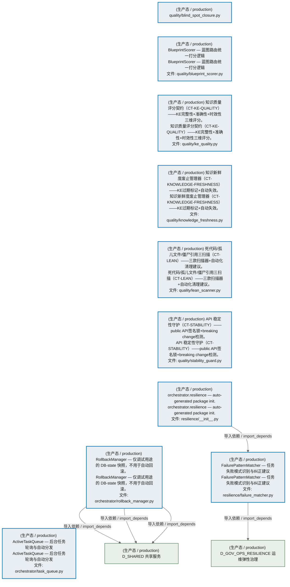
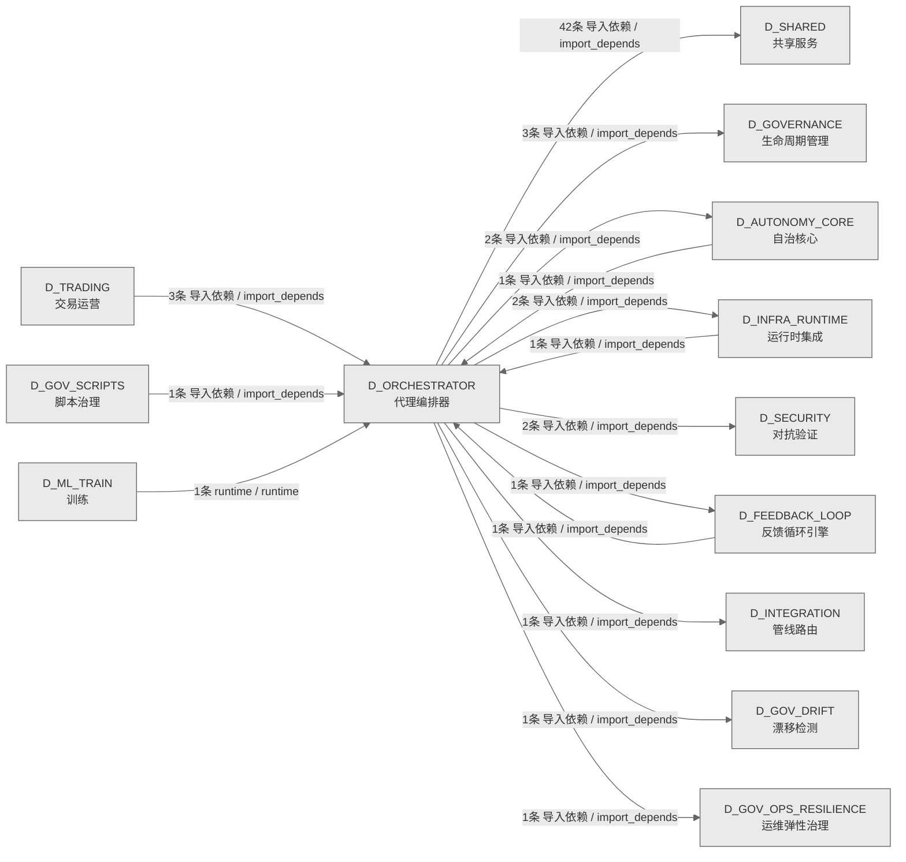

# 25_d_orchestrator / 代理编排器 / Agent Orchestrator

> **功能简介 / Overview**: 代理编排器，负责 Agent 任务全生命周期：任务入队、调度、沙箱执行、幻觉检测和收尾归档

> **文档作用 / Purpose**: 展示 代理编排器（D_ORCHESTRATOR）功能域的模块清单、域内依赖关系、跨域依赖关系、架构分层视图，供架构审查和域治理参考。

> 本文档由 generate_domain_doc.py 从 depgraph (PostgreSQL) 自动生成
> 数据源: depgraph (PostgreSQL) nodes表 + edges表

> **[可缩放 HTML 版 / Zoomable HTML](http://localhost:8765/docs/02_enterprise_architecture/02_domain_architecture_docs/25_d_orchestrator.html)** — Ctrl+滚轮缩放 ｜ 双击重置 ｜ Ctrl+Shift+D 切换拖动/选择模式

## 域基本信息 / Domain Overview

| 字段 | 值 | Field | Value |
|------|------|-------|-------|
| 编号 | 25 | Number | 25 |
| 域ID | D_ORCHESTRATOR | Domain ID | D_ORCHESTRATOR |
| 域名称 | 代理编排器 | Domain Name | Agent Orchestrator |
| 层级 | L1 基础平台层 | Layer | L1 Foundation |
| 模块数 | 70 | Module Count | 70 |
| 域内依赖 | 20 | Internal Dependencies | 20 |
| 跨域入边 | 8 | Cross-domain Incoming | 8 |
| 跨域出边 | 55 | Cross-domain Outgoing | 55 |
| 设计态模块 | 0 | Design Modules | 0 |
| 生产态模块 | 70 | Production Modules | 70 |
| 容量 | 70/150 (正常) | Capacity | 70/150 (正常) |
| 描述 | Agent全生命周期编排 | Description | Agent全生命周期编排 |

## 模块分层清单 / Module Layered List

> 按 architecture_layer 分组的模块清单（共 70 个模块 / 70 modules）。

### L1 基础层 / Foundation Layer (70 modules)

| # | 模块路径 / Module Path | 模块名称 / Module Name (功能简介 / Description) | 成熟度 / Maturity | 蓝图 / Blueprint |
|:--:|---------|---------|:---:|:---:|
| 1 | src/zephyr/orchestrator/__init__.py | orchestrator/__init__.py | 生产态 / production |  |
| 2 | src/zephyr/orchestrator/agent_health_monitor.py | AgentHealthMonitor · Agent 健康监控（三态 + 5 项 SLO） | 生产态 / production |  |
| 3 | src/zephyr/orchestrator/agent_orchestrator.py | AgentOrchestrator · 多角色 Agent 路由、工具链编排与健康监控 | 生产态 / production |  |
| 4 | src/zephyr/orchestrator/contracts/__init__.py | contracts — orchestrator contracts subpackage. | 生产态 / production |  |
| 5 | src/zephyr/orchestrator/contracts/alert_handler.py | Orc 告警接收器 — handle_alert() 消费者 | 生产态 / production |  |
| 6 | src/zephyr/orchestrator/contracts/construction_guide.py | 施工指南引擎（Construction Guide） | 生产态 / production |  |
| 7 | src/zephyr/orchestrator/contracts/contract_registry.py | 集成契约注册表（Contract Registry） | 生产态 / production |  |
| 8 | src/zephyr/orchestrator/contracts/contract_router.py | 契约路由（Contract Router） | 生产态 / production |  |
| 9 | src/zephyr/orchestrator/contracts/design_decisions.py | contracts/design_decisions.py | 生产态 / production |  |
| 10 | src/zephyr/orchestrator/contracts/finding_bridge.py | CT-ORC-SCRIPT-001 运行时桥接 | 生产态 / production |  |
| 11 | src/zephyr/orchestrator/contracts/prompt_version.py | AI Prompt 版本控制（CT-PROMPT-VERSION）——prompt template版本化+部署前diff。 | 生产态 / production |  |
| 12 | src/zephyr/orchestrator/core/__init__.py | orchestrator.core — auto-generated package init. | 生产态 / production |  |
| 13 | src/zephyr/orchestrator/core/task_queue.py | ActiveTaskQueue — 后台任务轮询与自动分发 | 生产态 / production |  |
| 14 | src/zephyr/orchestrator/deferred_queue.py | DeferredQueue: WAITING -> READY task scheduler. | 生产态 / production |  |
| 15 | src/zephyr/orchestrator/execution/__init__.py | execution — orchestrator execution subpackage. | 生产态 / production |  |
| 16 | src/zephyr/orchestrator/execution/batch_orchestrator.py | BatchOrchestrator — 多 Worker 批量任务协调器（MOD-INF-016） | 生产态 / production |  |
| 17 | src/zephyr/orchestrator/execution/context_bridge.py | Orc->CE 上下文桥接 — request_context() 生产者 | 生产态 / production |  |
| 18 | src/zephyr/orchestrator/execution/data_lifecycle.py | execution/data_lifecycle.py | 生产态 / production |  |
| 19 | src/zephyr/orchestrator/execution/dispatch_table.py | AI Agent 冷启动分派表（Dispatch Table） | 生产态 / production |  |
| 20 | src/zephyr/orchestrator/execution/dlq_manager.py | DLQ 管理器（Dead Letter Queue Manager — CT-DLQ-001） | 生产态 / production |  |
| 21 | src/zephyr/orchestrator/execution/memory_writer.py | Orc->VMS 记忆写入器 | 生产态 / production |  |
| 22 | src/zephyr/orchestrator/execution/phase_executor.py | Phase 执行引擎（Phase Executor） | 生产态 / production |  |
| 23 | src/zephyr/orchestrator/execution/reconciliation_loop.py | execution/reconciliation_loop.py | 生产态 / production |  |
| 24 | src/zephyr/orchestrator/execution/script_runner.py | Orc->Script 脚本执行器 — run_audit() 生产者 | 生产态 / production |  |
| 25 | src/zephyr/orchestrator/execution/task_context_builder.py | CE 任务上下文构建器 — build_from_task() 消费者 | 生产态 / production |  |
| 26 | src/zephyr/orchestrator/execution/trigger_router.py | TriggerRouter — RI-03 触发路由器（M3 跨模块触发分派） | 生产态 / production |  |
| 27 | src/zephyr/orchestrator/execution/wave_generator.py | WaveGenerator — 根据 Task 依赖图生成执行 Wave（T-2-03） | 生产态 / production |  |
| 28 | src/zephyr/orchestrator/fault_tolerance/__init__.py | fault_tolerance — orchestrator fault_tolerance subpackage. | 生产态 / production |  |
| 29 | src/zephyr/orchestrator/fault_tolerance/bulkhead_manager.py | fault_tolerance/bulkhead_manager.py | 生产态 / production |  |
| 30 | src/zephyr/orchestrator/fault_tolerance/canary_manager.py | 金丝雀发布管理器（CT-CANARY）——权重分流+指标对比+自动回滚。 | 生产态 / production |  |
| 31 | src/zephyr/orchestrator/fault_tolerance/chaos_engine.py | Chaos 故障注入引擎（CT-CHAOS-001）——4注入点×月度执行。 | 生产态 / production |  |
| 32 | src/zephyr/orchestrator/fault_tolerance/chaos_hooks.py | ChaosHook — integrates ChaosEngine with the orchestrator execution loop. | 生产态 / production |  |
| 33 | src/zephyr/orchestrator/fault_tolerance/degrade_cascade.py | fault_tolerance/degrade_cascade.py | 生产态 / production |  |
| 34 | src/zephyr/orchestrator/fault_tolerance/disk_guard.py | fault_tolerance/disk_guard.py | 生产态 / production |  |
| 35 | src/zephyr/orchestrator/fault_tolerance/fault_types.py | Fault type registry and preset templates for chaos engineering. | 生产态 / production |  |
| 36 | src/zephyr/orchestrator/fault_tolerance/network_partition.py | 网络分区容忍（CT-NETWORK-PARTITION）——CAP定理CP优先+脑裂检测+quorum write。 | 生产态 / production |  |
| 37 | src/zephyr/orchestrator/file_task_mapper.py | FileTaskMapper — 文件路径 ↔ Task N:N 映射器（#21 裁定重写） | 生产态 / production |  |
| 38 | src/zephyr/orchestrator/governance/__init__.py | governance — orchestrator governance subpackage. | 生产态 / production |  |
| 39 | src/zephyr/orchestrator/governance/autonomy_guard.py | Owner 缺位分级自治（CT-AUTONOMY）——Owner离线->自动降级->最小安全运行。 | 生产态 / production |  |
| 40 | src/zephyr/orchestrator/governance/capacity_budget.py | 全局容量预算控制器（Capacity Budget Controller） | 生产态 / production |  |
| 41 | src/zephyr/orchestrator/governance/dependency_lock.py | 外部依赖版本锁（CT-DEPS）——Python包版本锁定+hash验证+安全审计。 | 生产态 / production |  |
| 42 | src/zephyr/orchestrator/governance/model_registry.py | governance/model_registry.py | 生产态 / production |  |
| 43 | src/zephyr/orchestrator/governance/path_index.py | governance/path_index.py | 生产态 / production |  |
| 44 | src/zephyr/orchestrator/governance/risk_registry.py | governance/risk_registry.py | 生产态 / production |  |
| 45 | src/zephyr/orchestrator/governance/schema_migration.py | 数据库 Schema 演化契约（CT-SCHEMA-MIGRATE）——向后兼容迁移+回滚脚本。 | 生产态 / production |  |
| 46 | src/zephyr/orchestrator/governance/version_manifest.py | governance/version_manifest.py | 生产态 / production |  |
| 47 | src/zephyr/orchestrator/hallucination_detector.py | HallucinationDetector · Chain-of-Verification（CoVe）幻觉检测器 | 生产态 / production |  |
| 48 | src/zephyr/orchestrator/lifecycle/__init__.py | lifecycle — orchestrator lifecycle subpackage. | 生产态 / production |  |
| 49 | src/zephyr/orchestrator/lifecycle/housekeeping.py | 文件卫生保洁管理器（CT-HOUSEKEEPING）——临时文件扫描+日志轮转+废弃目录清理。 | 生产态 / production |  |
| 50 | src/zephyr/orchestrator/lifecycle/incident_postmortem.py | 事件复盘管理器（CT-INCIDENT）——incident记录+timeline+action_items+postmortem。 | 生产态 / production |  |
| 51 | src/zephyr/orchestrator/lifecycle/rolling_upgrade.py | 零停机滚动升级（CT-DEPLOY）——graceful shutdown+流量摘除+health check wait。 | 生产态 / production |  |
| 52 | src/zephyr/orchestrator/lifecycle/session_conflict.py | Session 冲突预防契约（CT-SESSION-CONFLICT）——文件锁+并发session检测+冲突res... | 生产态 / production |  |
| 53 | src/zephyr/orchestrator/lifecycle/startup_sequencer.py | lifecycle/startup_sequencer.py | 生产态 / production |  |
| 54 | src/zephyr/orchestrator/lifecycle/state_propagation.py | 全局状态传播链（State Propagation Chain） | 生产态 / production |  |
| 55 | src/zephyr/orchestrator/lifecycle/state_synchronizer.py | StateSynchronizer — 同步 SQLite 状态与文件系统实际状态（T-2-04） | 生产态 / production |  |
| 56 | src/zephyr/orchestrator/lifecycle/system_transfer.py | 系统移交恢复（CT-TRANSFER）——系统Owner变更+配置迁移+密钥轮转+健康验证。 | 生产态 / production |  |
| 57 | src/zephyr/orchestrator/lifecycle/teardown_manager.py | lifecycle/teardown_manager.py | 生产态 / production |  |
| 58 | src/zephyr/orchestrator/quality/__init__.py | quality — orchestrator quality subpackage. | 生产态 / production |  |
| 59 | src/zephyr/orchestrator/quality/agent_quality.py | AI Agent 质量反馈闭环（CT-AGENT-QUALITY）——task完成质量评分+agent绩效追踪。 | 生产态 / production |  |
| 60 | src/zephyr/orchestrator/quality/benchmark_runner.py | quality/benchmark_runner.py | 生产态 / production |  |
| 61 | src/zephyr/orchestrator/quality/blind_spot_closure.py | quality/blind_spot_closure.py | 生产态 / production |  |
| 62 | src/zephyr/orchestrator/quality/blueprint_scorer.py | BlueprintScorer — 蓝图路由统一打分逻辑 | 生产态 / production |  |
| 63 | src/zephyr/orchestrator/quality/ke_quality.py | 知识质量评分契约（CT-KE-QUALITY）——KE完整性+准确性+时效性三维评分。 | 生产态 / production |  |
| 64 | src/zephyr/orchestrator/quality/knowledge_freshness.py | 知识新鲜度废止管理器（CT-KNOWLEDGE-FRESHNESS）——KE过期标记+自动失效。 | 生产态 / production |  |
| 65 | src/zephyr/orchestrator/quality/lean_scanner.py | 死代码/孤儿文件/僵尸引用三扫描（CT-LEAN）——三款扫描器+自动化清理建议。 | 生产态 / production |  |
| 66 | src/zephyr/orchestrator/quality/stability_guard.py | API 稳定性守护（CT-STABILITY）——public API签名锁+breaking change检测。 | 生产态 / production |  |
| 67 | src/zephyr/orchestrator/resilience/__init__.py | orchestrator.resilience — auto-generated package init. | 生产态 / production |  |
| 68 | src/zephyr/orchestrator/resilience/failure_matcher.py | FailurePatternMatcher — 任务失败模式识别与纠正建议 | 生产态 / production |  |
| 69 | src/zephyr/orchestrator/rollback_manager.py | RollbackManager — 仅调试用途的 DB-state 快照，不用于自动回滚。 | 生产态 / production |  |
| 70 | src/zephyr/orchestrator/task_queue.py | ActiveTaskQueue — 后台任务轮询与自动分发 | 生产态 / production |  |

## 域内依赖图 / Internal Dependency Diagram

> 依赖图内嵌在本文档中，IDE 可直接渲染显示。参考 decision_index.md 设计，分三个视图：合并全景图、运营态子图、设计态子图（按 design_maturity 实际值拆分）。
>
> **图例说明 / Legend**：
> - **实线边框 = 运营态模块**（production，已上线运行）
> - **虚线边框 = 设计态模块**（design，蓝图阶段，代码未写）
> - **实线箭头 = 运营态依赖**（已生效的依赖关系）
> - **虚线箭头 = 非运营态依赖**（计划中/验证中的依赖关系）

### 合并全景图（全部模块，标签标注成熟度）

> 展示全部 70 个模块（生产态 70 + 设计态 0），标签标注成熟度。

#### 第 1 页 / 共 3 页

```mermaid
%%{init: {'theme': 'base', 'themeVariables': {'primaryColor': '#eaeaea', 'primaryTextColor': '#333333', 'primaryBorderColor': '#666666', 'lineColor': '#666666', 'secondaryColor': '#eaeaea', 'tertiaryColor': '#eaeaea', 'fontSize': '14px'}}}%%
flowchart TD
    src_zephyr_orchestrator_init_py["(生产态 / production) orchestrator/__init__.py"]
    src_zephyr_orchestrator_agent_health_monitor_py["(生产态 / production) AgentHealthMonitor · Agent 健康监控（三态 + 5 项 SLO）<br/>AgentHealthMonitor · Agent 健康监控（三态 + 5 项 SLO）<br/>文件: orchestrator/agent_health_monitor.py"]
    src_zephyr_orchestrator_contracts_init_py["(生产态 / production) contracts — orchestrator contracts subpackage.<br/>contracts — orchestrator contracts subpackage.<br/>文件: contracts/__init__.py"]
    src_zephyr_orchestrator_contracts_construction_guide_py["(生产态 / production) 施工指南引擎（Construction Guide）<br/>施工指南引擎（Construction Guide）<br/>文件: contracts/construction_guide.py"]
    src_zephyr_orchestrator_contracts_contract_router_py["(生产态 / production) 契约路由（Contract Router）<br/>契约路由（Contract Router）<br/>文件: contracts/contract_router.py"]
    src_zephyr_orchestrator_contracts_design_decisions_py["(生产态 / production) contracts/design_decisions.py"]
    src_zephyr_orchestrator_contracts_finding_bridge_py["(生产态 / production) CT-ORC-SCRIPT-001 运行时桥接<br/>CT-ORC-SCRIPT-001 运行时桥接<br/>文件: contracts/finding_bridge.py"]
    src_zephyr_orchestrator_contracts_prompt_version_py["(生产态 / production) AI Prompt 版本控制（CT-PROMPT-VERSION）——prompt template版本化+部署前diff。<br/>AI Prompt 版本控制（CT-PROMPT-VERSION）——prompt template版本化+部署前diff。<br/>文件: contracts/prompt_version.py"]
    src_zephyr_orchestrator_core_init_py["(生产态 / production) orchestrator.core — auto-generated package init.<br/>orchestrator.core — auto-generated package init.<br/>文件: core/__init__.py"]
    src_zephyr_orchestrator_deferred_queue_py["(生产态 / production) DeferredQueue: WAITING -> READY task scheduler.<br/>DeferredQueue: WAITING -> READY task scheduler.<br/>文件: orchestrator/deferred_queue.py"]
    src_zephyr_orchestrator_execution_init_py["(生产态 / production) execution — orchestrator execution subpackage.<br/>execution — orchestrator execution subpackage.<br/>文件: execution/__init__.py"]
    src_zephyr_orchestrator_execution_batch_orchestrator_py["(生产态 / production) BatchOrchestrator — 多 Worker 批量任务协调器（MOD-INF-016）<br/>BatchOrchestrator — 多 Worker 批量任务协调器（MOD-INF-016）<br/>文件: execution/batch_orchestrator.py"]
    src_zephyr_orchestrator_execution_dispatch_table_py["(生产态 / production) AI Agent 冷启动分派表（Dispatch Table）<br/>AI Agent 冷启动分派表（Dispatch Table）<br/>文件: execution/dispatch_table.py"]
    src_zephyr_orchestrator_execution_dlq_manager_py["(生产态 / production) DLQ 管理器（Dead Letter Queue Manager — CT-DLQ-001）<br/>DLQ 管理器（Dead Letter Queue Manager — CT-DLQ-001）<br/>文件: execution/dlq_manager.py"]
    src_zephyr_orchestrator_execution_phase_executor_py["(生产态 / production) Phase 执行引擎（Phase Executor）<br/>Phase 执行引擎（Phase Executor）<br/>文件: execution/phase_executor.py"]
    src_zephyr_orchestrator_execution_reconciliation_loop_py["(生产态 / production) execution/reconciliation_loop.py"]
    src_zephyr_orchestrator_execution_trigger_router_py["(生产态 / production) TriggerRouter — RI-03 触发路由器（M3 跨模块触发分派）<br/>TriggerRouter — RI-03 触发路由器（M3 跨模块触发分派）<br/>文件: execution/trigger_router.py"]
    src_zephyr_orchestrator_execution_wave_generator_py["(生产态 / production) WaveGenerator — 根据 Task 依赖图生成执行 Wave（T-2-03）<br/>WaveGenerator — 根据 Task 依赖图生成执行 Wave（T-2-03）<br/>文件: execution/wave_generator.py"]
    src_zephyr_orchestrator_fault_tolerance_init_py["(生产态 / production) fault_tolerance — orchestrator fault_tolerance subpackage.<br/>fault_tolerance — orchestrator fault_tolerance subpackage.<br/>文件: fault_tolerance/__init__.py"]
    src_zephyr_orchestrator_fault_tolerance_canary_manager_py["(生产态 / production) 金丝雀发布管理器（CT-CANARY）——权重分流+指标对比+自动回滚。<br/>金丝雀发布管理器（CT-CANARY）——权重分流+指标对比+自动回滚。<br/>文件: fault_tolerance/canary_manager.py"]
    src_zephyr_orchestrator_init_py ~~~ src_zephyr_orchestrator_agent_health_monitor_py
    src_zephyr_orchestrator_agent_health_monitor_py ~~~ src_zephyr_orchestrator_contracts_init_py
    src_zephyr_orchestrator_contracts_init_py ~~~ src_zephyr_orchestrator_contracts_construction_guide_py
    src_zephyr_orchestrator_contracts_construction_guide_py ~~~ src_zephyr_orchestrator_contracts_contract_router_py
    src_zephyr_orchestrator_contracts_contract_router_py ~~~ src_zephyr_orchestrator_contracts_design_decisions_py
    src_zephyr_orchestrator_contracts_design_decisions_py ~~~ src_zephyr_orchestrator_contracts_finding_bridge_py
    src_zephyr_orchestrator_contracts_finding_bridge_py ~~~ src_zephyr_orchestrator_contracts_prompt_version_py
    src_zephyr_orchestrator_contracts_prompt_version_py ~~~ src_zephyr_orchestrator_core_init_py
    src_zephyr_orchestrator_core_init_py ~~~ src_zephyr_orchestrator_deferred_queue_py
    src_zephyr_orchestrator_deferred_queue_py ~~~ src_zephyr_orchestrator_execution_init_py
    src_zephyr_orchestrator_execution_init_py ~~~ src_zephyr_orchestrator_execution_batch_orchestrator_py
    src_zephyr_orchestrator_execution_batch_orchestrator_py ~~~ src_zephyr_orchestrator_execution_dispatch_table_py
    src_zephyr_orchestrator_execution_dispatch_table_py ~~~ src_zephyr_orchestrator_execution_dlq_manager_py
    src_zephyr_orchestrator_execution_dlq_manager_py ~~~ src_zephyr_orchestrator_execution_phase_executor_py
    src_zephyr_orchestrator_execution_phase_executor_py ~~~ src_zephyr_orchestrator_execution_reconciliation_loop_py
    src_zephyr_orchestrator_execution_reconciliation_loop_py ~~~ src_zephyr_orchestrator_execution_trigger_router_py
    src_zephyr_orchestrator_execution_trigger_router_py ~~~ src_zephyr_orchestrator_execution_wave_generator_py
    src_zephyr_orchestrator_execution_wave_generator_py ~~~ src_zephyr_orchestrator_fault_tolerance_init_py
    src_zephyr_orchestrator_fault_tolerance_init_py ~~~ src_zephyr_orchestrator_fault_tolerance_canary_manager_py
    src_zephyr_orchestrator_agent_orchestrator_py["(生产态 / production) AgentOrchestrator · 多角色 Agent 路由、工具链编排与健康监控<br/>AgentOrchestrator · 多角色 Agent 路由、工具链编排与健康监控<br/>文件: orchestrator/agent_orchestrator.py"]
    src_zephyr_orchestrator_contracts_alert_handler_py["(生产态 / production) Orc 告警接收器 — handle_alert() 消费者<br/>Orc 告警接收器 — handle_alert() 消费者<br/>文件: contracts/alert_handler.py"]
    src_zephyr_orchestrator_contracts_contract_registry_py["(生产态 / production) 集成契约注册表（Contract Registry）<br/>集成契约注册表（Contract Registry）<br/>文件: contracts/contract_registry.py"]
    src_zephyr_orchestrator_core_task_queue_py["(生产态 / production) ActiveTaskQueue — 后台任务轮询与自动分发<br/>ActiveTaskQueue — 后台任务轮询与自动分发<br/>文件: core/task_queue.py"]
    src_zephyr_orchestrator_execution_context_bridge_py["(生产态 / production) Orc->CE 上下文桥接 — request_context() 生产者<br/>Orc->CE 上下文桥接 — request_context() 生产者<br/>文件: execution/context_bridge.py"]
    src_zephyr_orchestrator_execution_data_lifecycle_py["(生产态 / production) execution/data_lifecycle.py"]
    src_zephyr_orchestrator_execution_memory_writer_py["(生产态 / production) Orc->VMS 记忆写入器<br/>Orc->VMS 记忆写入器<br/>文件: execution/memory_writer.py"]
    src_zephyr_orchestrator_execution_script_runner_py["(生产态 / production) Orc->Script 脚本执行器 — run_audit() 生产者<br/>Orc->Script 脚本执行器 — run_audit() 生产者<br/>文件: execution/script_runner.py"]
    src_zephyr_orchestrator_fault_tolerance_bulkhead_manager_py["(生产态 / production) fault_tolerance/bulkhead_manager.py"]
    src_zephyr_orchestrator_agent_orchestrator_py ~~~ src_zephyr_orchestrator_contracts_alert_handler_py
    src_zephyr_orchestrator_contracts_alert_handler_py ~~~ src_zephyr_orchestrator_contracts_contract_registry_py
    src_zephyr_orchestrator_contracts_contract_registry_py ~~~ src_zephyr_orchestrator_core_task_queue_py
    src_zephyr_orchestrator_core_task_queue_py ~~~ src_zephyr_orchestrator_execution_context_bridge_py
    src_zephyr_orchestrator_execution_context_bridge_py ~~~ src_zephyr_orchestrator_execution_data_lifecycle_py
    src_zephyr_orchestrator_execution_data_lifecycle_py ~~~ src_zephyr_orchestrator_execution_memory_writer_py
    src_zephyr_orchestrator_execution_memory_writer_py ~~~ src_zephyr_orchestrator_execution_script_runner_py
    src_zephyr_orchestrator_execution_script_runner_py ~~~ src_zephyr_orchestrator_fault_tolerance_bulkhead_manager_py
    src_zephyr_orchestrator_execution_task_context_builder_py["(生产态 / production) CE 任务上下文构建器 — build_from_task() 消费者<br/>CE 任务上下文构建器 — build_from_task() 消费者<br/>文件: execution/task_context_builder.py"]
    src_zephyr_orchestrator_agent_health_monitor_py -->|导入依赖 / import_depends| src_zephyr_orchestrator_agent_orchestrator_py
    src_zephyr_orchestrator_init_py -->|导入依赖 / import_depends| src_zephyr_orchestrator_contracts_alert_handler_py
    src_zephyr_orchestrator_init_py -->|导入依赖 / import_depends| src_zephyr_orchestrator_execution_context_bridge_py
    src_zephyr_orchestrator_init_py -->|导入依赖 / import_depends| src_zephyr_orchestrator_execution_memory_writer_py
    src_zephyr_orchestrator_init_py -->|导入依赖 / import_depends| src_zephyr_orchestrator_execution_script_runner_py
    src_zephyr_orchestrator_contracts_contract_router_py -->|导入依赖 / import_depends| src_zephyr_orchestrator_contracts_contract_registry_py
    src_zephyr_orchestrator_core_init_py -->|config_depends / config_depends| src_zephyr_orchestrator_core_task_queue_py
    src_zephyr_orchestrator_execution_context_bridge_py -->|导入依赖 / import_depends| src_zephyr_orchestrator_execution_task_context_builder_py
    src_zephyr_orchestrator_execution_init_py -->|config_depends / config_depends| src_zephyr_orchestrator_execution_data_lifecycle_py
    src_zephyr_orchestrator_fault_tolerance_init_py -->|config_depends / config_depends| src_zephyr_orchestrator_fault_tolerance_bulkhead_manager_py
    D_SHARED["(生产态 / production) D_SHARED 共享服务"]
    src_zephyr_orchestrator_agent_health_monitor_py -->|导入依赖 / import_depends| D_SHARED
    src_zephyr_orchestrator_agent_health_monitor_py -->|导入依赖 / import_depends| D_SHARED
    D_SECURITY["(生产态 / production) D_SECURITY 对抗验证"]
    src_zephyr_orchestrator_agent_orchestrator_py -->|导入依赖 / import_depends| D_SECURITY
    src_zephyr_orchestrator_agent_orchestrator_py -->|导入依赖 / import_depends| D_SHARED
    D_INFRA_RUNTIME["(生产态 / production) D_INFRA_RUNTIME 运行时集成"]
    src_zephyr_orchestrator_agent_orchestrator_py -->|导入依赖 / import_depends| D_INFRA_RUNTIME
    src_zephyr_orchestrator_agent_orchestrator_py -->|导入依赖 / import_depends| D_SHARED
    src_zephyr_orchestrator_agent_orchestrator_py -->|导入依赖 / import_depends| D_SECURITY
    src_zephyr_orchestrator_agent_orchestrator_py -->|导入依赖 / import_depends| D_SHARED
    src_zephyr_orchestrator_agent_orchestrator_py -->|导入依赖 / import_depends| D_SHARED
    src_zephyr_orchestrator_agent_orchestrator_py -->|导入依赖 / import_depends| D_SHARED
    src_zephyr_orchestrator_deferred_queue_py -->|导入依赖 / import_depends| D_SHARED
    src_zephyr_orchestrator_deferred_queue_py -->|导入依赖 / import_depends| D_SHARED
    src_zephyr_orchestrator_contracts_alert_handler_py -->|导入依赖 / import_depends| D_SHARED
    D_GOVERNANCE["(生产态 / production) D_GOVERNANCE 生命周期管理"]
    src_zephyr_orchestrator_contracts_alert_handler_py -->|导入依赖 / import_depends| D_GOVERNANCE
    src_zephyr_orchestrator_contracts_alert_handler_py -->|导入依赖 / import_depends| D_SHARED
    D_GOV_SCRIPTS["(生产态 / production) D_GOV_SCRIPTS 脚本治理"]
    D_GOV_SCRIPTS -->|导入依赖 / import_depends| src_zephyr_orchestrator_contracts_contract_registry_py
    D_INFRA_RUNTIME -->|导入依赖 / import_depends| src_zephyr_orchestrator_execution_memory_writer_py
    D_TRADING["(生产态 / production) D_TRADING 交易运营"]
    D_TRADING -->|导入依赖 / import_depends| src_zephyr_orchestrator_core_task_queue_py
    D_TRADING -->|导入依赖 / import_depends| src_zephyr_orchestrator_execution_script_runner_py
    D_AUTONOMY_CORE["(生产态 / production) D_AUTONOMY_CORE 自治核心"]
    D_AUTONOMY_CORE -->|导入依赖 / import_depends| src_zephyr_orchestrator_contracts_init_py
    D_TRADING -->|导入依赖 / import_depends| src_zephyr_orchestrator_execution_context_bridge_py
    D_FEEDBACK_LOOP["(生产态 / production) D_FEEDBACK_LOOP 反馈循环引擎"]
    D_FEEDBACK_LOOP -->|导入依赖 / import_depends| src_zephyr_orchestrator_contracts_alert_handler_py
    classDef production fill:#e8edf2,stroke:#0277bd,stroke-width:2px,color:#1a1a1a
    classDef design fill:#f0ebe3,stroke:#bf360c,stroke-width:2px,color:#1a1a1a,stroke-dasharray: 5 5
    classDef external_prod fill:#e8efe9,stroke:#1b5e20,stroke-width:1px,color:#1a1a1a
    classDef external_design fill:#efe5ea,stroke:#880e4f,stroke-width:1px,color:#1a1a1a,stroke-dasharray: 5 5
    class src_zephyr_orchestrator_init_py,src_zephyr_orchestrator_agent_health_monitor_py,src_zephyr_orchestrator_agent_orchestrator_py,src_zephyr_orchestrator_contracts_init_py,src_zephyr_orchestrator_contracts_alert_handler_py,src_zephyr_orchestrator_contracts_construction_guide_py,src_zephyr_orchestrator_contracts_contract_registry_py,src_zephyr_orchestrator_contracts_contract_router_py,src_zephyr_orchestrator_contracts_design_decisions_py,src_zephyr_orchestrator_contracts_finding_bridge_py,src_zephyr_orchestrator_contracts_prompt_version_py,src_zephyr_orchestrator_core_init_py,src_zephyr_orchestrator_core_task_queue_py,src_zephyr_orchestrator_deferred_queue_py,src_zephyr_orchestrator_execution_init_py,src_zephyr_orchestrator_execution_batch_orchestrator_py,src_zephyr_orchestrator_execution_context_bridge_py,src_zephyr_orchestrator_execution_data_lifecycle_py,src_zephyr_orchestrator_execution_dispatch_table_py,src_zephyr_orchestrator_execution_dlq_manager_py,src_zephyr_orchestrator_execution_memory_writer_py,src_zephyr_orchestrator_execution_phase_executor_py,src_zephyr_orchestrator_execution_reconciliation_loop_py,src_zephyr_orchestrator_execution_script_runner_py,src_zephyr_orchestrator_execution_task_context_builder_py,src_zephyr_orchestrator_execution_trigger_router_py,src_zephyr_orchestrator_execution_wave_generator_py,src_zephyr_orchestrator_fault_tolerance_init_py,src_zephyr_orchestrator_fault_tolerance_bulkhead_manager_py,src_zephyr_orchestrator_fault_tolerance_canary_manager_py production
    class D_SHARED,D_SECURITY,D_INFRA_RUNTIME,D_GOVERNANCE,D_GOV_SCRIPTS,D_TRADING,D_AUTONOMY_CORE,D_FEEDBACK_LOOP external_prod
```



#### 第 2 页 / 共 3 页

```mermaid
%%{init: {'theme': 'base', 'themeVariables': {'primaryColor': '#eaeaea', 'primaryTextColor': '#333333', 'primaryBorderColor': '#666666', 'lineColor': '#666666', 'secondaryColor': '#eaeaea', 'tertiaryColor': '#eaeaea', 'fontSize': '14px'}}}%%
flowchart TD
    src_zephyr_orchestrator_fault_tolerance_chaos_hooks_py["(生产态 / production) ChaosHook — integrates ChaosEngine with the orchestrator execution loop.<br/>ChaosHook — integrates ChaosEngine with the orchestrator execution loop.<br/>文件: fault_tolerance/chaos_hooks.py"]
    src_zephyr_orchestrator_fault_tolerance_degrade_cascade_py["(生产态 / production) fault_tolerance/degrade_cascade.py"]
    src_zephyr_orchestrator_fault_tolerance_disk_guard_py["(生产态 / production) fault_tolerance/disk_guard.py"]
    src_zephyr_orchestrator_fault_tolerance_network_partition_py["(生产态 / production) 网络分区容忍（CT-NETWORK-PARTITION）——CAP定理CP优先+脑裂检测+quorum write。<br/>网络分区容忍（CT-NETWORK-PARTITION）——CAP定理CP优先+脑裂检测+quorum write。<br/>文件: fault_tolerance/network_partition.py"]
    src_zephyr_orchestrator_governance_init_py["(生产态 / production) governance — orchestrator governance subpackage.<br/>governance — orchestrator governance subpackage.<br/>文件: governance/__init__.py"]
    src_zephyr_orchestrator_governance_capacity_budget_py["(生产态 / production) 全局容量预算控制器（Capacity Budget Controller）<br/>全局容量预算控制器（Capacity Budget Controller）<br/>文件: governance/capacity_budget.py"]
    src_zephyr_orchestrator_governance_dependency_lock_py["(生产态 / production) 外部依赖版本锁（CT-DEPS）——Python包版本锁定+hash验证+安全审计。<br/>外部依赖版本锁（CT-DEPS）——Python包版本锁定+hash验证+安全审计。<br/>文件: governance/dependency_lock.py"]
    src_zephyr_orchestrator_governance_model_registry_py["(生产态 / production) governance/model_registry.py"]
    src_zephyr_orchestrator_governance_path_index_py["(生产态 / production) governance/path_index.py"]
    src_zephyr_orchestrator_governance_risk_registry_py["(生产态 / production) governance/risk_registry.py"]
    src_zephyr_orchestrator_governance_schema_migration_py["(生产态 / production) 数据库 Schema 演化契约（CT-SCHEMA-MIGRATE）——向后兼容迁移+回滚脚本。<br/>数据库 Schema 演化契约（CT-SCHEMA-MIGRATE）——向后兼容迁移+回滚脚本。<br/>文件: governance/schema_migration.py"]
    src_zephyr_orchestrator_governance_version_manifest_py["(生产态 / production) governance/version_manifest.py"]
    src_zephyr_orchestrator_hallucination_detector_py["(生产态 / production) HallucinationDetector · Chain-of-Verification（CoVe）幻觉检测器<br/>HallucinationDetector · Chain-of-Verification（CoVe）幻觉检测器<br/>文件: orchestrator/hallucination_detector.py"]
    src_zephyr_orchestrator_lifecycle_init_py["(生产态 / production) lifecycle — orchestrator lifecycle subpackage.<br/>lifecycle — orchestrator lifecycle subpackage.<br/>文件: lifecycle/__init__.py"]
    src_zephyr_orchestrator_lifecycle_incident_postmortem_py["(生产态 / production) 事件复盘管理器（CT-INCIDENT）——incident记录+timeline+action_items+postmortem。<br/>事件复盘管理器（CT-INCIDENT）——incident记录+timeline+action_items+postmortem。<br/>文件: lifecycle/incident_postmortem.py"]
    src_zephyr_orchestrator_lifecycle_rolling_upgrade_py["(生产态 / production) 零停机滚动升级（CT-DEPLOY）——graceful shutdown+流量摘除+health check wait。<br/>零停机滚动升级（CT-DEPLOY）——graceful shutdown+流量摘除+health check wait。<br/>文件: lifecycle/rolling_upgrade.py"]
    src_zephyr_orchestrator_lifecycle_session_conflict_py["(生产态 / production) Session 冲突预防契约（CT-SESSION-CONFLICT）——文件锁+并发session检测+冲突res...<br/>Session 冲突预防契约（CT-SESSION-CONFLICT）——文件锁+并发session检测+冲突res...<br/>文件: lifecycle/session_conflict.py"]
    src_zephyr_orchestrator_lifecycle_startup_sequencer_py["(生产态 / production) lifecycle/startup_sequencer.py"]
    src_zephyr_orchestrator_lifecycle_state_propagation_py["(生产态 / production) 全局状态传播链（State Propagation Chain）<br/>全局状态传播链（State Propagation Chain）<br/>文件: lifecycle/state_propagation.py"]
    src_zephyr_orchestrator_lifecycle_state_synchronizer_py["(生产态 / production) StateSynchronizer — 同步 SQLite 状态与文件系统实际状态（T-2-04）<br/>StateSynchronizer — 同步 SQLite 状态与文件系统实际状态（T-2-04）<br/>文件: lifecycle/state_synchronizer.py"]
    src_zephyr_orchestrator_lifecycle_system_transfer_py["(生产态 / production) 系统移交恢复（CT-TRANSFER）——系统Owner变更+配置迁移+密钥轮转+健康验证。<br/>系统移交恢复（CT-TRANSFER）——系统Owner变更+配置迁移+密钥轮转+健康验证。<br/>文件: lifecycle/system_transfer.py"]
    src_zephyr_orchestrator_lifecycle_teardown_manager_py["(生产态 / production) lifecycle/teardown_manager.py"]
    src_zephyr_orchestrator_quality_init_py["(生产态 / production) quality — orchestrator quality subpackage.<br/>quality — orchestrator quality subpackage.<br/>文件: quality/__init__.py"]
    src_zephyr_orchestrator_quality_agent_quality_py["(生产态 / production) AI Agent 质量反馈闭环（CT-AGENT-QUALITY）——task完成质量评分+agent绩效追踪。<br/>AI Agent 质量反馈闭环（CT-AGENT-QUALITY）——task完成质量评分+agent绩效追踪。<br/>文件: quality/agent_quality.py"]
    src_zephyr_orchestrator_quality_benchmark_runner_py["(生产态 / production) quality/benchmark_runner.py"]
    src_zephyr_orchestrator_fault_tolerance_chaos_hooks_py ~~~ src_zephyr_orchestrator_fault_tolerance_degrade_cascade_py
    src_zephyr_orchestrator_fault_tolerance_degrade_cascade_py ~~~ src_zephyr_orchestrator_fault_tolerance_disk_guard_py
    src_zephyr_orchestrator_fault_tolerance_disk_guard_py ~~~ src_zephyr_orchestrator_fault_tolerance_network_partition_py
    src_zephyr_orchestrator_fault_tolerance_network_partition_py ~~~ src_zephyr_orchestrator_governance_init_py
    src_zephyr_orchestrator_governance_init_py ~~~ src_zephyr_orchestrator_governance_capacity_budget_py
    src_zephyr_orchestrator_governance_capacity_budget_py ~~~ src_zephyr_orchestrator_governance_dependency_lock_py
    src_zephyr_orchestrator_governance_dependency_lock_py ~~~ src_zephyr_orchestrator_governance_model_registry_py
    src_zephyr_orchestrator_governance_model_registry_py ~~~ src_zephyr_orchestrator_governance_path_index_py
    src_zephyr_orchestrator_governance_path_index_py ~~~ src_zephyr_orchestrator_governance_risk_registry_py
    src_zephyr_orchestrator_governance_risk_registry_py ~~~ src_zephyr_orchestrator_governance_schema_migration_py
    src_zephyr_orchestrator_governance_schema_migration_py ~~~ src_zephyr_orchestrator_governance_version_manifest_py
    src_zephyr_orchestrator_governance_version_manifest_py ~~~ src_zephyr_orchestrator_hallucination_detector_py
    src_zephyr_orchestrator_hallucination_detector_py ~~~ src_zephyr_orchestrator_lifecycle_init_py
    src_zephyr_orchestrator_lifecycle_init_py ~~~ src_zephyr_orchestrator_lifecycle_incident_postmortem_py
    src_zephyr_orchestrator_lifecycle_incident_postmortem_py ~~~ src_zephyr_orchestrator_lifecycle_rolling_upgrade_py
    src_zephyr_orchestrator_lifecycle_rolling_upgrade_py ~~~ src_zephyr_orchestrator_lifecycle_session_conflict_py
    src_zephyr_orchestrator_lifecycle_session_conflict_py ~~~ src_zephyr_orchestrator_lifecycle_startup_sequencer_py
    src_zephyr_orchestrator_lifecycle_startup_sequencer_py ~~~ src_zephyr_orchestrator_lifecycle_state_propagation_py
    src_zephyr_orchestrator_lifecycle_state_propagation_py ~~~ src_zephyr_orchestrator_lifecycle_state_synchronizer_py
    src_zephyr_orchestrator_lifecycle_state_synchronizer_py ~~~ src_zephyr_orchestrator_lifecycle_system_transfer_py
    src_zephyr_orchestrator_lifecycle_system_transfer_py ~~~ src_zephyr_orchestrator_lifecycle_teardown_manager_py
    src_zephyr_orchestrator_lifecycle_teardown_manager_py ~~~ src_zephyr_orchestrator_quality_init_py
    src_zephyr_orchestrator_quality_init_py ~~~ src_zephyr_orchestrator_quality_agent_quality_py
    src_zephyr_orchestrator_quality_agent_quality_py ~~~ src_zephyr_orchestrator_quality_benchmark_runner_py
    src_zephyr_orchestrator_fault_tolerance_chaos_engine_py["(生产态 / production) Chaos 故障注入引擎（CT-CHAOS-001）——4注入点×月度执行。<br/>Chaos 故障注入引擎（CT-CHAOS-001）——4注入点×月度执行。<br/>文件: fault_tolerance/chaos_engine.py"]
    src_zephyr_orchestrator_fault_tolerance_fault_types_py["(生产态 / production) Fault type registry and preset templates for chaos engineering.<br/>Fault type registry and preset templates for chaos engineering.<br/>文件: fault_tolerance/fault_types.py"]
    src_zephyr_orchestrator_file_task_mapper_py["(生产态 / production) FileTaskMapper — 文件路径 ↔ Task N:N 映射器（#21 裁定重写）<br/>FileTaskMapper — 文件路径 ↔ Task N:N 映射器（#21 裁定重写）<br/>文件: orchestrator/file_task_mapper.py"]
    src_zephyr_orchestrator_governance_autonomy_guard_py["(生产态 / production) Owner 缺位分级自治（CT-AUTONOMY）——Owner离线->自动降级->最小安全运行。<br/>Owner 缺位分级自治（CT-AUTONOMY）——Owner离线->自动降级->最小安全运行。<br/>文件: governance/autonomy_guard.py"]
    src_zephyr_orchestrator_lifecycle_housekeeping_py["(生产态 / production) 文件卫生保洁管理器（CT-HOUSEKEEPING）——临时文件扫描+日志轮转+废弃目录清理。<br/>文件卫生保洁管理器（CT-HOUSEKEEPING）——临时文件扫描+日志轮转+废弃目录清理。<br/>文件: lifecycle/housekeeping.py"]
    src_zephyr_orchestrator_fault_tolerance_chaos_engine_py ~~~ src_zephyr_orchestrator_fault_tolerance_fault_types_py
    src_zephyr_orchestrator_fault_tolerance_fault_types_py ~~~ src_zephyr_orchestrator_file_task_mapper_py
    src_zephyr_orchestrator_file_task_mapper_py ~~~ src_zephyr_orchestrator_governance_autonomy_guard_py
    src_zephyr_orchestrator_governance_autonomy_guard_py ~~~ src_zephyr_orchestrator_lifecycle_housekeeping_py
    src_zephyr_orchestrator_fault_tolerance_chaos_hooks_py -->|导入依赖 / import_depends| src_zephyr_orchestrator_fault_tolerance_chaos_engine_py
    src_zephyr_orchestrator_fault_tolerance_chaos_hooks_py -->|导入依赖 / import_depends| src_zephyr_orchestrator_fault_tolerance_fault_types_py
    src_zephyr_orchestrator_governance_init_py -->|config_depends / config_depends| src_zephyr_orchestrator_governance_autonomy_guard_py
    src_zephyr_orchestrator_lifecycle_state_synchronizer_py -->|导入依赖 / import_depends| src_zephyr_orchestrator_file_task_mapper_py
    src_zephyr_orchestrator_lifecycle_init_py -->|config_depends / config_depends| src_zephyr_orchestrator_lifecycle_housekeeping_py
    D_SHARED["(生产态 / production) D_SHARED 共享服务"]
    src_zephyr_orchestrator_file_task_mapper_py -->|导入依赖 / import_depends| D_SHARED
    src_zephyr_orchestrator_file_task_mapper_py -->|导入依赖 / import_depends| D_SHARED
    src_zephyr_orchestrator_file_task_mapper_py -->|导入依赖 / import_depends| D_SHARED
    src_zephyr_orchestrator_file_task_mapper_py -->|导入依赖 / import_depends| D_SHARED
    src_zephyr_orchestrator_file_task_mapper_py -->|导入依赖 / import_depends| D_SHARED
    src_zephyr_orchestrator_hallucination_detector_py -->|导入依赖 / import_depends| D_SHARED
    src_zephyr_orchestrator_hallucination_detector_py -->|导入依赖 / import_depends| D_SHARED
    src_zephyr_orchestrator_fault_tolerance_chaos_hooks_py -->|导入依赖 / import_depends| D_SHARED
    src_zephyr_orchestrator_lifecycle_state_synchronizer_py -->|导入依赖 / import_depends| D_SHARED
    src_zephyr_orchestrator_lifecycle_state_synchronizer_py -->|导入依赖 / import_depends| D_SHARED
    src_zephyr_orchestrator_lifecycle_state_synchronizer_py -->|导入依赖 / import_depends| D_SHARED
    src_zephyr_orchestrator_lifecycle_state_synchronizer_py -->|导入依赖 / import_depends| D_SHARED
    classDef production fill:#e8edf2,stroke:#0277bd,stroke-width:2px,color:#1a1a1a
    classDef design fill:#f0ebe3,stroke:#bf360c,stroke-width:2px,color:#1a1a1a,stroke-dasharray: 5 5
    classDef external_prod fill:#e8efe9,stroke:#1b5e20,stroke-width:1px,color:#1a1a1a
    classDef external_design fill:#efe5ea,stroke:#880e4f,stroke-width:1px,color:#1a1a1a,stroke-dasharray: 5 5
    class src_zephyr_orchestrator_fault_tolerance_chaos_engine_py,src_zephyr_orchestrator_fault_tolerance_chaos_hooks_py,src_zephyr_orchestrator_fault_tolerance_degrade_cascade_py,src_zephyr_orchestrator_fault_tolerance_disk_guard_py,src_zephyr_orchestrator_fault_tolerance_fault_types_py,src_zephyr_orchestrator_fault_tolerance_network_partition_py,src_zephyr_orchestrator_file_task_mapper_py,src_zephyr_orchestrator_governance_init_py,src_zephyr_orchestrator_governance_autonomy_guard_py,src_zephyr_orchestrator_governance_capacity_budget_py,src_zephyr_orchestrator_governance_dependency_lock_py,src_zephyr_orchestrator_governance_model_registry_py,src_zephyr_orchestrator_governance_path_index_py,src_zephyr_orchestrator_governance_risk_registry_py,src_zephyr_orchestrator_governance_schema_migration_py,src_zephyr_orchestrator_governance_version_manifest_py,src_zephyr_orchestrator_hallucination_detector_py,src_zephyr_orchestrator_lifecycle_init_py,src_zephyr_orchestrator_lifecycle_housekeeping_py,src_zephyr_orchestrator_lifecycle_incident_postmortem_py,src_zephyr_orchestrator_lifecycle_rolling_upgrade_py,src_zephyr_orchestrator_lifecycle_session_conflict_py,src_zephyr_orchestrator_lifecycle_startup_sequencer_py,src_zephyr_orchestrator_lifecycle_state_propagation_py,src_zephyr_orchestrator_lifecycle_state_synchronizer_py,src_zephyr_orchestrator_lifecycle_system_transfer_py,src_zephyr_orchestrator_lifecycle_teardown_manager_py,src_zephyr_orchestrator_quality_init_py,src_zephyr_orchestrator_quality_agent_quality_py,src_zephyr_orchestrator_quality_benchmark_runner_py production
    class D_SHARED external_prod
```



#### 第 3 页 / 共 3 页



### 运营态子图（仅 design_maturity=production 的模块和依赖）

> 仅展示已上线运行的模块（共 70 个，20 条域内依赖）。

```mermaid
%%{init: {'theme': 'base', 'themeVariables': {'primaryColor': '#eaeaea', 'primaryTextColor': '#333333', 'primaryBorderColor': '#666666', 'lineColor': '#666666', 'secondaryColor': '#eaeaea', 'tertiaryColor': '#eaeaea', 'fontSize': '14px'}}}%%
flowchart TD
    src_zephyr_orchestrator_init_py["(生产态 / production) orchestrator/__init__.py"]
    src_zephyr_orchestrator_agent_health_monitor_py["(生产态 / production) AgentHealthMonitor · Agent 健康监控（三态 + 5 项 SLO）<br/>AgentHealthMonitor · Agent 健康监控（三态 + 5 项 SLO）<br/>文件: orchestrator/agent_health_monitor.py"]
    src_zephyr_orchestrator_contracts_init_py["(生产态 / production) contracts — orchestrator contracts subpackage.<br/>contracts — orchestrator contracts subpackage.<br/>文件: contracts/__init__.py"]
    src_zephyr_orchestrator_contracts_construction_guide_py["(生产态 / production) 施工指南引擎（Construction Guide）<br/>施工指南引擎（Construction Guide）<br/>文件: contracts/construction_guide.py"]
    src_zephyr_orchestrator_contracts_contract_router_py["(生产态 / production) 契约路由（Contract Router）<br/>契约路由（Contract Router）<br/>文件: contracts/contract_router.py"]
    src_zephyr_orchestrator_contracts_design_decisions_py["(生产态 / production) contracts/design_decisions.py"]
    src_zephyr_orchestrator_contracts_finding_bridge_py["(生产态 / production) CT-ORC-SCRIPT-001 运行时桥接<br/>CT-ORC-SCRIPT-001 运行时桥接<br/>文件: contracts/finding_bridge.py"]
    src_zephyr_orchestrator_contracts_prompt_version_py["(生产态 / production) AI Prompt 版本控制（CT-PROMPT-VERSION）——prompt template版本化+部署前diff。<br/>AI Prompt 版本控制（CT-PROMPT-VERSION）——prompt template版本化+部署前diff。<br/>文件: contracts/prompt_version.py"]
    src_zephyr_orchestrator_core_init_py["(生产态 / production) orchestrator.core — auto-generated package init.<br/>orchestrator.core — auto-generated package init.<br/>文件: core/__init__.py"]
    src_zephyr_orchestrator_deferred_queue_py["(生产态 / production) DeferredQueue: WAITING -> READY task scheduler.<br/>DeferredQueue: WAITING -> READY task scheduler.<br/>文件: orchestrator/deferred_queue.py"]
    src_zephyr_orchestrator_execution_init_py["(生产态 / production) execution — orchestrator execution subpackage.<br/>execution — orchestrator execution subpackage.<br/>文件: execution/__init__.py"]
    src_zephyr_orchestrator_execution_batch_orchestrator_py["(生产态 / production) BatchOrchestrator — 多 Worker 批量任务协调器（MOD-INF-016）<br/>BatchOrchestrator — 多 Worker 批量任务协调器（MOD-INF-016）<br/>文件: execution/batch_orchestrator.py"]
    src_zephyr_orchestrator_execution_dispatch_table_py["(生产态 / production) AI Agent 冷启动分派表（Dispatch Table）<br/>AI Agent 冷启动分派表（Dispatch Table）<br/>文件: execution/dispatch_table.py"]
    src_zephyr_orchestrator_execution_dlq_manager_py["(生产态 / production) DLQ 管理器（Dead Letter Queue Manager — CT-DLQ-001）<br/>DLQ 管理器（Dead Letter Queue Manager — CT-DLQ-001）<br/>文件: execution/dlq_manager.py"]
    src_zephyr_orchestrator_execution_phase_executor_py["(生产态 / production) Phase 执行引擎（Phase Executor）<br/>Phase 执行引擎（Phase Executor）<br/>文件: execution/phase_executor.py"]
    src_zephyr_orchestrator_execution_reconciliation_loop_py["(生产态 / production) execution/reconciliation_loop.py"]
    src_zephyr_orchestrator_execution_trigger_router_py["(生产态 / production) TriggerRouter — RI-03 触发路由器（M3 跨模块触发分派）<br/>TriggerRouter — RI-03 触发路由器（M3 跨模块触发分派）<br/>文件: execution/trigger_router.py"]
    src_zephyr_orchestrator_execution_wave_generator_py["(生产态 / production) WaveGenerator — 根据 Task 依赖图生成执行 Wave（T-2-03）<br/>WaveGenerator — 根据 Task 依赖图生成执行 Wave（T-2-03）<br/>文件: execution/wave_generator.py"]
    src_zephyr_orchestrator_fault_tolerance_init_py["(生产态 / production) fault_tolerance — orchestrator fault_tolerance subpackage.<br/>fault_tolerance — orchestrator fault_tolerance subpackage.<br/>文件: fault_tolerance/__init__.py"]
    src_zephyr_orchestrator_fault_tolerance_canary_manager_py["(生产态 / production) 金丝雀发布管理器（CT-CANARY）——权重分流+指标对比+自动回滚。<br/>金丝雀发布管理器（CT-CANARY）——权重分流+指标对比+自动回滚。<br/>文件: fault_tolerance/canary_manager.py"]
    src_zephyr_orchestrator_fault_tolerance_chaos_hooks_py["(生产态 / production) ChaosHook — integrates ChaosEngine with the orchestrator execution loop.<br/>ChaosHook — integrates ChaosEngine with the orchestrator execution loop.<br/>文件: fault_tolerance/chaos_hooks.py"]
    src_zephyr_orchestrator_fault_tolerance_degrade_cascade_py["(生产态 / production) fault_tolerance/degrade_cascade.py"]
    src_zephyr_orchestrator_fault_tolerance_disk_guard_py["(生产态 / production) fault_tolerance/disk_guard.py"]
    src_zephyr_orchestrator_fault_tolerance_network_partition_py["(生产态 / production) 网络分区容忍（CT-NETWORK-PARTITION）——CAP定理CP优先+脑裂检测+quorum write。<br/>网络分区容忍（CT-NETWORK-PARTITION）——CAP定理CP优先+脑裂检测+quorum write。<br/>文件: fault_tolerance/network_partition.py"]
    src_zephyr_orchestrator_governance_init_py["(生产态 / production) governance — orchestrator governance subpackage.<br/>governance — orchestrator governance subpackage.<br/>文件: governance/__init__.py"]
    src_zephyr_orchestrator_governance_capacity_budget_py["(生产态 / production) 全局容量预算控制器（Capacity Budget Controller）<br/>全局容量预算控制器（Capacity Budget Controller）<br/>文件: governance/capacity_budget.py"]
    src_zephyr_orchestrator_governance_dependency_lock_py["(生产态 / production) 外部依赖版本锁（CT-DEPS）——Python包版本锁定+hash验证+安全审计。<br/>外部依赖版本锁（CT-DEPS）——Python包版本锁定+hash验证+安全审计。<br/>文件: governance/dependency_lock.py"]
    src_zephyr_orchestrator_governance_model_registry_py["(生产态 / production) governance/model_registry.py"]
    src_zephyr_orchestrator_governance_path_index_py["(生产态 / production) governance/path_index.py"]
    src_zephyr_orchestrator_governance_risk_registry_py["(生产态 / production) governance/risk_registry.py"]
    src_zephyr_orchestrator_governance_schema_migration_py["(生产态 / production) 数据库 Schema 演化契约（CT-SCHEMA-MIGRATE）——向后兼容迁移+回滚脚本。<br/>数据库 Schema 演化契约（CT-SCHEMA-MIGRATE）——向后兼容迁移+回滚脚本。<br/>文件: governance/schema_migration.py"]
    src_zephyr_orchestrator_governance_version_manifest_py["(生产态 / production) governance/version_manifest.py"]
    src_zephyr_orchestrator_hallucination_detector_py["(生产态 / production) HallucinationDetector · Chain-of-Verification（CoVe）幻觉检测器<br/>HallucinationDetector · Chain-of-Verification（CoVe）幻觉检测器<br/>文件: orchestrator/hallucination_detector.py"]
    src_zephyr_orchestrator_lifecycle_init_py["(生产态 / production) lifecycle — orchestrator lifecycle subpackage.<br/>lifecycle — orchestrator lifecycle subpackage.<br/>文件: lifecycle/__init__.py"]
    src_zephyr_orchestrator_lifecycle_incident_postmortem_py["(生产态 / production) 事件复盘管理器（CT-INCIDENT）——incident记录+timeline+action_items+postmortem。<br/>事件复盘管理器（CT-INCIDENT）——incident记录+timeline+action_items+postmortem。<br/>文件: lifecycle/incident_postmortem.py"]
    src_zephyr_orchestrator_lifecycle_rolling_upgrade_py["(生产态 / production) 零停机滚动升级（CT-DEPLOY）——graceful shutdown+流量摘除+health check wait。<br/>零停机滚动升级（CT-DEPLOY）——graceful shutdown+流量摘除+health check wait。<br/>文件: lifecycle/rolling_upgrade.py"]
    src_zephyr_orchestrator_lifecycle_session_conflict_py["(生产态 / production) Session 冲突预防契约（CT-SESSION-CONFLICT）——文件锁+并发session检测+冲突res...<br/>Session 冲突预防契约（CT-SESSION-CONFLICT）——文件锁+并发session检测+冲突res...<br/>文件: lifecycle/session_conflict.py"]
    src_zephyr_orchestrator_lifecycle_startup_sequencer_py["(生产态 / production) lifecycle/startup_sequencer.py"]
    src_zephyr_orchestrator_lifecycle_state_propagation_py["(生产态 / production) 全局状态传播链（State Propagation Chain）<br/>全局状态传播链（State Propagation Chain）<br/>文件: lifecycle/state_propagation.py"]
    src_zephyr_orchestrator_lifecycle_state_synchronizer_py["(生产态 / production) StateSynchronizer — 同步 SQLite 状态与文件系统实际状态（T-2-04）<br/>StateSynchronizer — 同步 SQLite 状态与文件系统实际状态（T-2-04）<br/>文件: lifecycle/state_synchronizer.py"]
    src_zephyr_orchestrator_lifecycle_system_transfer_py["(生产态 / production) 系统移交恢复（CT-TRANSFER）——系统Owner变更+配置迁移+密钥轮转+健康验证。<br/>系统移交恢复（CT-TRANSFER）——系统Owner变更+配置迁移+密钥轮转+健康验证。<br/>文件: lifecycle/system_transfer.py"]
    src_zephyr_orchestrator_lifecycle_teardown_manager_py["(生产态 / production) lifecycle/teardown_manager.py"]
    src_zephyr_orchestrator_quality_agent_quality_py["(生产态 / production) AI Agent 质量反馈闭环（CT-AGENT-QUALITY）——task完成质量评分+agent绩效追踪。<br/>AI Agent 质量反馈闭环（CT-AGENT-QUALITY）——task完成质量评分+agent绩效追踪。<br/>文件: quality/agent_quality.py"]
    src_zephyr_orchestrator_quality_benchmark_runner_py["(生产态 / production) quality/benchmark_runner.py"]
    src_zephyr_orchestrator_quality_blind_spot_closure_py["(生产态 / production) quality/blind_spot_closure.py"]
    src_zephyr_orchestrator_quality_ke_quality_py["(生产态 / production) 知识质量评分契约（CT-KE-QUALITY）——KE完整性+准确性+时效性三维评分。<br/>知识质量评分契约（CT-KE-QUALITY）——KE完整性+准确性+时效性三维评分。<br/>文件: quality/ke_quality.py"]
    src_zephyr_orchestrator_quality_knowledge_freshness_py["(生产态 / production) 知识新鲜度废止管理器（CT-KNOWLEDGE-FRESHNESS）——KE过期标记+自动失效。<br/>知识新鲜度废止管理器（CT-KNOWLEDGE-FRESHNESS）——KE过期标记+自动失效。<br/>文件: quality/knowledge_freshness.py"]
    src_zephyr_orchestrator_quality_lean_scanner_py["(生产态 / production) 死代码/孤儿文件/僵尸引用三扫描（CT-LEAN）——三款扫描器+自动化清理建议。<br/>死代码/孤儿文件/僵尸引用三扫描（CT-LEAN）——三款扫描器+自动化清理建议。<br/>文件: quality/lean_scanner.py"]
    src_zephyr_orchestrator_quality_stability_guard_py["(生产态 / production) API 稳定性守护（CT-STABILITY）——public API签名锁+breaking change检测。<br/>API 稳定性守护（CT-STABILITY）——public API签名锁+breaking change检测。<br/>文件: quality/stability_guard.py"]
    src_zephyr_orchestrator_resilience_init_py["(生产态 / production) orchestrator.resilience — auto-generated package init.<br/>orchestrator.resilience — auto-generated package init.<br/>文件: resilience/__init__.py"]
    src_zephyr_orchestrator_rollback_manager_py["(生产态 / production) RollbackManager — 仅调试用途的 DB-state 快照，不用于自动回滚。<br/>RollbackManager — 仅调试用途的 DB-state 快照，不用于自动回滚。<br/>文件: orchestrator/rollback_manager.py"]
    src_zephyr_orchestrator_task_queue_py["(生产态 / production) ActiveTaskQueue — 后台任务轮询与自动分发<br/>ActiveTaskQueue — 后台任务轮询与自动分发<br/>文件: orchestrator/task_queue.py"]
    src_zephyr_orchestrator_init_py ~~~ src_zephyr_orchestrator_agent_health_monitor_py
    src_zephyr_orchestrator_agent_health_monitor_py ~~~ src_zephyr_orchestrator_contracts_init_py
    src_zephyr_orchestrator_contracts_init_py ~~~ src_zephyr_orchestrator_contracts_construction_guide_py
    src_zephyr_orchestrator_contracts_construction_guide_py ~~~ src_zephyr_orchestrator_contracts_contract_router_py
    src_zephyr_orchestrator_contracts_contract_router_py ~~~ src_zephyr_orchestrator_contracts_design_decisions_py
    src_zephyr_orchestrator_contracts_design_decisions_py ~~~ src_zephyr_orchestrator_contracts_finding_bridge_py
    src_zephyr_orchestrator_contracts_finding_bridge_py ~~~ src_zephyr_orchestrator_contracts_prompt_version_py
    src_zephyr_orchestrator_contracts_prompt_version_py ~~~ src_zephyr_orchestrator_core_init_py
    src_zephyr_orchestrator_core_init_py ~~~ src_zephyr_orchestrator_deferred_queue_py
    src_zephyr_orchestrator_deferred_queue_py ~~~ src_zephyr_orchestrator_execution_init_py
    src_zephyr_orchestrator_execution_init_py ~~~ src_zephyr_orchestrator_execution_batch_orchestrator_py
    src_zephyr_orchestrator_execution_batch_orchestrator_py ~~~ src_zephyr_orchestrator_execution_dispatch_table_py
    src_zephyr_orchestrator_execution_dispatch_table_py ~~~ src_zephyr_orchestrator_execution_dlq_manager_py
    src_zephyr_orchestrator_execution_dlq_manager_py ~~~ src_zephyr_orchestrator_execution_phase_executor_py
    src_zephyr_orchestrator_execution_phase_executor_py ~~~ src_zephyr_orchestrator_execution_reconciliation_loop_py
    src_zephyr_orchestrator_execution_reconciliation_loop_py ~~~ src_zephyr_orchestrator_execution_trigger_router_py
    src_zephyr_orchestrator_execution_trigger_router_py ~~~ src_zephyr_orchestrator_execution_wave_generator_py
    src_zephyr_orchestrator_execution_wave_generator_py ~~~ src_zephyr_orchestrator_fault_tolerance_init_py
    src_zephyr_orchestrator_fault_tolerance_init_py ~~~ src_zephyr_orchestrator_fault_tolerance_canary_manager_py
    src_zephyr_orchestrator_fault_tolerance_canary_manager_py ~~~ src_zephyr_orchestrator_fault_tolerance_chaos_hooks_py
    src_zephyr_orchestrator_fault_tolerance_chaos_hooks_py ~~~ src_zephyr_orchestrator_fault_tolerance_degrade_cascade_py
    src_zephyr_orchestrator_fault_tolerance_degrade_cascade_py ~~~ src_zephyr_orchestrator_fault_tolerance_disk_guard_py
    src_zephyr_orchestrator_fault_tolerance_disk_guard_py ~~~ src_zephyr_orchestrator_fault_tolerance_network_partition_py
    src_zephyr_orchestrator_fault_tolerance_network_partition_py ~~~ src_zephyr_orchestrator_governance_init_py
    src_zephyr_orchestrator_governance_init_py ~~~ src_zephyr_orchestrator_governance_capacity_budget_py
    src_zephyr_orchestrator_governance_capacity_budget_py ~~~ src_zephyr_orchestrator_governance_dependency_lock_py
    src_zephyr_orchestrator_governance_dependency_lock_py ~~~ src_zephyr_orchestrator_governance_model_registry_py
    src_zephyr_orchestrator_governance_model_registry_py ~~~ src_zephyr_orchestrator_governance_path_index_py
    src_zephyr_orchestrator_governance_path_index_py ~~~ src_zephyr_orchestrator_governance_risk_registry_py
    src_zephyr_orchestrator_governance_risk_registry_py ~~~ src_zephyr_orchestrator_governance_schema_migration_py
    src_zephyr_orchestrator_governance_schema_migration_py ~~~ src_zephyr_orchestrator_governance_version_manifest_py
    src_zephyr_orchestrator_governance_version_manifest_py ~~~ src_zephyr_orchestrator_hallucination_detector_py
    src_zephyr_orchestrator_hallucination_detector_py ~~~ src_zephyr_orchestrator_lifecycle_init_py
    src_zephyr_orchestrator_lifecycle_init_py ~~~ src_zephyr_orchestrator_lifecycle_incident_postmortem_py
    src_zephyr_orchestrator_lifecycle_incident_postmortem_py ~~~ src_zephyr_orchestrator_lifecycle_rolling_upgrade_py
    src_zephyr_orchestrator_lifecycle_rolling_upgrade_py ~~~ src_zephyr_orchestrator_lifecycle_session_conflict_py
    src_zephyr_orchestrator_lifecycle_session_conflict_py ~~~ src_zephyr_orchestrator_lifecycle_startup_sequencer_py
    src_zephyr_orchestrator_lifecycle_startup_sequencer_py ~~~ src_zephyr_orchestrator_lifecycle_state_propagation_py
    src_zephyr_orchestrator_lifecycle_state_propagation_py ~~~ src_zephyr_orchestrator_lifecycle_state_synchronizer_py
    src_zephyr_orchestrator_lifecycle_state_synchronizer_py ~~~ src_zephyr_orchestrator_lifecycle_system_transfer_py
    src_zephyr_orchestrator_lifecycle_system_transfer_py ~~~ src_zephyr_orchestrator_lifecycle_teardown_manager_py
    src_zephyr_orchestrator_lifecycle_teardown_manager_py ~~~ src_zephyr_orchestrator_quality_agent_quality_py
    src_zephyr_orchestrator_quality_agent_quality_py ~~~ src_zephyr_orchestrator_quality_benchmark_runner_py
    src_zephyr_orchestrator_quality_benchmark_runner_py ~~~ src_zephyr_orchestrator_quality_blind_spot_closure_py
    src_zephyr_orchestrator_quality_blind_spot_closure_py ~~~ src_zephyr_orchestrator_quality_ke_quality_py
    src_zephyr_orchestrator_quality_ke_quality_py ~~~ src_zephyr_orchestrator_quality_knowledge_freshness_py
    src_zephyr_orchestrator_quality_knowledge_freshness_py ~~~ src_zephyr_orchestrator_quality_lean_scanner_py
    src_zephyr_orchestrator_quality_lean_scanner_py ~~~ src_zephyr_orchestrator_quality_stability_guard_py
    src_zephyr_orchestrator_quality_stability_guard_py ~~~ src_zephyr_orchestrator_resilience_init_py
    src_zephyr_orchestrator_resilience_init_py ~~~ src_zephyr_orchestrator_rollback_manager_py
    src_zephyr_orchestrator_rollback_manager_py ~~~ src_zephyr_orchestrator_task_queue_py
    src_zephyr_orchestrator_agent_orchestrator_py["(生产态 / production) AgentOrchestrator · 多角色 Agent 路由、工具链编排与健康监控<br/>AgentOrchestrator · 多角色 Agent 路由、工具链编排与健康监控<br/>文件: orchestrator/agent_orchestrator.py"]
    src_zephyr_orchestrator_contracts_alert_handler_py["(生产态 / production) Orc 告警接收器 — handle_alert() 消费者<br/>Orc 告警接收器 — handle_alert() 消费者<br/>文件: contracts/alert_handler.py"]
    src_zephyr_orchestrator_contracts_contract_registry_py["(生产态 / production) 集成契约注册表（Contract Registry）<br/>集成契约注册表（Contract Registry）<br/>文件: contracts/contract_registry.py"]
    src_zephyr_orchestrator_core_task_queue_py["(生产态 / production) ActiveTaskQueue — 后台任务轮询与自动分发<br/>ActiveTaskQueue — 后台任务轮询与自动分发<br/>文件: core/task_queue.py"]
    src_zephyr_orchestrator_execution_context_bridge_py["(生产态 / production) Orc->CE 上下文桥接 — request_context() 生产者<br/>Orc->CE 上下文桥接 — request_context() 生产者<br/>文件: execution/context_bridge.py"]
    src_zephyr_orchestrator_execution_data_lifecycle_py["(生产态 / production) execution/data_lifecycle.py"]
    src_zephyr_orchestrator_execution_memory_writer_py["(生产态 / production) Orc->VMS 记忆写入器<br/>Orc->VMS 记忆写入器<br/>文件: execution/memory_writer.py"]
    src_zephyr_orchestrator_execution_script_runner_py["(生产态 / production) Orc->Script 脚本执行器 — run_audit() 生产者<br/>Orc->Script 脚本执行器 — run_audit() 生产者<br/>文件: execution/script_runner.py"]
    src_zephyr_orchestrator_fault_tolerance_bulkhead_manager_py["(生产态 / production) fault_tolerance/bulkhead_manager.py"]
    src_zephyr_orchestrator_fault_tolerance_chaos_engine_py["(生产态 / production) Chaos 故障注入引擎（CT-CHAOS-001）——4注入点×月度执行。<br/>Chaos 故障注入引擎（CT-CHAOS-001）——4注入点×月度执行。<br/>文件: fault_tolerance/chaos_engine.py"]
    src_zephyr_orchestrator_fault_tolerance_fault_types_py["(生产态 / production) Fault type registry and preset templates for chaos engineering.<br/>Fault type registry and preset templates for chaos engineering.<br/>文件: fault_tolerance/fault_types.py"]
    src_zephyr_orchestrator_file_task_mapper_py["(生产态 / production) FileTaskMapper — 文件路径 ↔ Task N:N 映射器（#21 裁定重写）<br/>FileTaskMapper — 文件路径 ↔ Task N:N 映射器（#21 裁定重写）<br/>文件: orchestrator/file_task_mapper.py"]
    src_zephyr_orchestrator_governance_autonomy_guard_py["(生产态 / production) Owner 缺位分级自治（CT-AUTONOMY）——Owner离线->自动降级->最小安全运行。<br/>Owner 缺位分级自治（CT-AUTONOMY）——Owner离线->自动降级->最小安全运行。<br/>文件: governance/autonomy_guard.py"]
    src_zephyr_orchestrator_lifecycle_housekeeping_py["(生产态 / production) 文件卫生保洁管理器（CT-HOUSEKEEPING）——临时文件扫描+日志轮转+废弃目录清理。<br/>文件卫生保洁管理器（CT-HOUSEKEEPING）——临时文件扫描+日志轮转+废弃目录清理。<br/>文件: lifecycle/housekeeping.py"]
    src_zephyr_orchestrator_quality_init_py["(生产态 / production) quality — orchestrator quality subpackage.<br/>quality — orchestrator quality subpackage.<br/>文件: quality/__init__.py"]
    src_zephyr_orchestrator_quality_blueprint_scorer_py["(生产态 / production) BlueprintScorer — 蓝图路由统一打分逻辑<br/>BlueprintScorer — 蓝图路由统一打分逻辑<br/>文件: quality/blueprint_scorer.py"]
    src_zephyr_orchestrator_resilience_failure_matcher_py["(生产态 / production) FailurePatternMatcher — 任务失败模式识别与纠正建议<br/>FailurePatternMatcher — 任务失败模式识别与纠正建议<br/>文件: resilience/failure_matcher.py"]
    src_zephyr_orchestrator_agent_orchestrator_py ~~~ src_zephyr_orchestrator_contracts_alert_handler_py
    src_zephyr_orchestrator_contracts_alert_handler_py ~~~ src_zephyr_orchestrator_contracts_contract_registry_py
    src_zephyr_orchestrator_contracts_contract_registry_py ~~~ src_zephyr_orchestrator_core_task_queue_py
    src_zephyr_orchestrator_core_task_queue_py ~~~ src_zephyr_orchestrator_execution_context_bridge_py
    src_zephyr_orchestrator_execution_context_bridge_py ~~~ src_zephyr_orchestrator_execution_data_lifecycle_py
    src_zephyr_orchestrator_execution_data_lifecycle_py ~~~ src_zephyr_orchestrator_execution_memory_writer_py
    src_zephyr_orchestrator_execution_memory_writer_py ~~~ src_zephyr_orchestrator_execution_script_runner_py
    src_zephyr_orchestrator_execution_script_runner_py ~~~ src_zephyr_orchestrator_fault_tolerance_bulkhead_manager_py
    src_zephyr_orchestrator_fault_tolerance_bulkhead_manager_py ~~~ src_zephyr_orchestrator_fault_tolerance_chaos_engine_py
    src_zephyr_orchestrator_fault_tolerance_chaos_engine_py ~~~ src_zephyr_orchestrator_fault_tolerance_fault_types_py
    src_zephyr_orchestrator_fault_tolerance_fault_types_py ~~~ src_zephyr_orchestrator_file_task_mapper_py
    src_zephyr_orchestrator_file_task_mapper_py ~~~ src_zephyr_orchestrator_governance_autonomy_guard_py
    src_zephyr_orchestrator_governance_autonomy_guard_py ~~~ src_zephyr_orchestrator_lifecycle_housekeeping_py
    src_zephyr_orchestrator_lifecycle_housekeeping_py ~~~ src_zephyr_orchestrator_quality_init_py
    src_zephyr_orchestrator_quality_init_py ~~~ src_zephyr_orchestrator_quality_blueprint_scorer_py
    src_zephyr_orchestrator_quality_blueprint_scorer_py ~~~ src_zephyr_orchestrator_resilience_failure_matcher_py
    src_zephyr_orchestrator_execution_task_context_builder_py["(生产态 / production) CE 任务上下文构建器 — build_from_task() 消费者<br/>CE 任务上下文构建器 — build_from_task() 消费者<br/>文件: execution/task_context_builder.py"]
    src_zephyr_orchestrator_agent_health_monitor_py -->|导入依赖 / import_depends| src_zephyr_orchestrator_agent_orchestrator_py
    src_zephyr_orchestrator_task_queue_py -->|导入依赖 / import_depends| src_zephyr_orchestrator_core_task_queue_py
    src_zephyr_orchestrator_init_py -->|导入依赖 / import_depends| src_zephyr_orchestrator_contracts_alert_handler_py
    src_zephyr_orchestrator_init_py -->|导入依赖 / import_depends| src_zephyr_orchestrator_execution_context_bridge_py
    src_zephyr_orchestrator_init_py -->|导入依赖 / import_depends| src_zephyr_orchestrator_execution_memory_writer_py
    src_zephyr_orchestrator_init_py -->|导入依赖 / import_depends| src_zephyr_orchestrator_execution_script_runner_py
    src_zephyr_orchestrator_contracts_contract_router_py -->|导入依赖 / import_depends| src_zephyr_orchestrator_contracts_contract_registry_py
    src_zephyr_orchestrator_core_init_py -->|config_depends / config_depends| src_zephyr_orchestrator_core_task_queue_py
    src_zephyr_orchestrator_execution_context_bridge_py -->|导入依赖 / import_depends| src_zephyr_orchestrator_execution_task_context_builder_py
    src_zephyr_orchestrator_execution_init_py -->|config_depends / config_depends| src_zephyr_orchestrator_execution_data_lifecycle_py
    src_zephyr_orchestrator_execution_trigger_router_py -->|导入依赖 / import_depends| src_zephyr_orchestrator_quality_blueprint_scorer_py
    src_zephyr_orchestrator_fault_tolerance_chaos_hooks_py -->|导入依赖 / import_depends| src_zephyr_orchestrator_fault_tolerance_chaos_engine_py
    src_zephyr_orchestrator_fault_tolerance_chaos_hooks_py -->|导入依赖 / import_depends| src_zephyr_orchestrator_fault_tolerance_fault_types_py
    src_zephyr_orchestrator_fault_tolerance_init_py -->|config_depends / config_depends| src_zephyr_orchestrator_fault_tolerance_bulkhead_manager_py
    src_zephyr_orchestrator_governance_init_py -->|config_depends / config_depends| src_zephyr_orchestrator_governance_autonomy_guard_py
    src_zephyr_orchestrator_lifecycle_state_synchronizer_py -->|导入依赖 / import_depends| src_zephyr_orchestrator_file_task_mapper_py
    src_zephyr_orchestrator_lifecycle_init_py -->|config_depends / config_depends| src_zephyr_orchestrator_lifecycle_housekeeping_py
    src_zephyr_orchestrator_quality_knowledge_freshness_py -->|config_depends / config_depends| src_zephyr_orchestrator_quality_init_py
    src_zephyr_orchestrator_quality_ke_quality_py -->|config_depends / config_depends| src_zephyr_orchestrator_quality_init_py
    src_zephyr_orchestrator_resilience_init_py -->|导入依赖 / import_depends| src_zephyr_orchestrator_resilience_failure_matcher_py
    D_SHARED["(生产态 / production) D_SHARED 共享服务"]
    src_zephyr_orchestrator_deferred_queue_py -->|导入依赖 / import_depends| D_SHARED
    src_zephyr_orchestrator_hallucination_detector_py -->|导入依赖 / import_depends| D_SHARED
    src_zephyr_orchestrator_agent_orchestrator_py -->|导入依赖 / import_depends| D_SHARED
    src_zephyr_orchestrator_fault_tolerance_chaos_hooks_py -->|导入依赖 / import_depends| D_SHARED
    src_zephyr_orchestrator_rollback_manager_py -->|导入依赖 / import_depends| D_SHARED
    src_zephyr_orchestrator_contracts_alert_handler_py -->|导入依赖 / import_depends| D_SHARED
    src_zephyr_orchestrator_agent_orchestrator_py -->|导入依赖 / import_depends| D_SHARED
    src_zephyr_orchestrator_contracts_alert_handler_py -->|导入依赖 / import_depends| D_SHARED
    src_zephyr_orchestrator_contracts_alert_handler_py -->|导入依赖 / import_depends| D_SHARED
    D_AUTONOMY_CORE["(生产态 / production) D_AUTONOMY_CORE 自治核心"]
    src_zephyr_orchestrator_execution_memory_writer_py -->|导入依赖 / import_depends| D_AUTONOMY_CORE
    D_GOVERNANCE["(生产态 / production) D_GOVERNANCE 生命周期管理"]
    src_zephyr_orchestrator_contracts_alert_handler_py -->|导入依赖 / import_depends| D_GOVERNANCE
    src_zephyr_orchestrator_contracts_alert_handler_py -->|导入依赖 / import_depends| D_SHARED
    src_zephyr_orchestrator_agent_orchestrator_py -->|导入依赖 / import_depends| D_SHARED
    src_zephyr_orchestrator_contracts_finding_bridge_py -->|导入依赖 / import_depends| D_GOVERNANCE
    src_zephyr_orchestrator_execution_wave_generator_py -->|导入依赖 / import_depends| D_SHARED
    D_GOV_SCRIPTS["(生产态 / production) D_GOV_SCRIPTS 脚本治理"]
    D_GOV_SCRIPTS -->|导入依赖 / import_depends| src_zephyr_orchestrator_contracts_contract_registry_py
    D_INFRA_RUNTIME["(生产态 / production) D_INFRA_RUNTIME 运行时集成"]
    D_INFRA_RUNTIME -->|导入依赖 / import_depends| src_zephyr_orchestrator_execution_memory_writer_py
    D_TRADING["(生产态 / production) D_TRADING 交易运营"]
    D_TRADING -->|导入依赖 / import_depends| src_zephyr_orchestrator_core_task_queue_py
    D_TRADING -->|导入依赖 / import_depends| src_zephyr_orchestrator_execution_script_runner_py
    D_AUTONOMY_CORE -->|导入依赖 / import_depends| src_zephyr_orchestrator_contracts_init_py
    D_TRADING -->|导入依赖 / import_depends| src_zephyr_orchestrator_execution_context_bridge_py
    D_FEEDBACK_LOOP["(生产态 / production) D_FEEDBACK_LOOP 反馈循环引擎"]
    D_FEEDBACK_LOOP -->|导入依赖 / import_depends| src_zephyr_orchestrator_contracts_alert_handler_py
    classDef production fill:#e8edf2,stroke:#0277bd,stroke-width:2px,color:#1a1a1a
    classDef design fill:#f0ebe3,stroke:#bf360c,stroke-width:2px,color:#1a1a1a,stroke-dasharray: 5 5
    classDef external_prod fill:#e8efe9,stroke:#1b5e20,stroke-width:1px,color:#1a1a1a
    classDef external_design fill:#efe5ea,stroke:#880e4f,stroke-width:1px,color:#1a1a1a,stroke-dasharray: 5 5
    class src_zephyr_orchestrator_init_py,src_zephyr_orchestrator_agent_health_monitor_py,src_zephyr_orchestrator_agent_orchestrator_py,src_zephyr_orchestrator_contracts_init_py,src_zephyr_orchestrator_contracts_alert_handler_py,src_zephyr_orchestrator_contracts_construction_guide_py,src_zephyr_orchestrator_contracts_contract_registry_py,src_zephyr_orchestrator_contracts_contract_router_py,src_zephyr_orchestrator_contracts_design_decisions_py,src_zephyr_orchestrator_contracts_finding_bridge_py,src_zephyr_orchestrator_contracts_prompt_version_py,src_zephyr_orchestrator_core_init_py,src_zephyr_orchestrator_core_task_queue_py,src_zephyr_orchestrator_deferred_queue_py,src_zephyr_orchestrator_execution_init_py,src_zephyr_orchestrator_execution_batch_orchestrator_py,src_zephyr_orchestrator_execution_context_bridge_py,src_zephyr_orchestrator_execution_data_lifecycle_py,src_zephyr_orchestrator_execution_dispatch_table_py,src_zephyr_orchestrator_execution_dlq_manager_py,src_zephyr_orchestrator_execution_memory_writer_py,src_zephyr_orchestrator_execution_phase_executor_py,src_zephyr_orchestrator_execution_reconciliation_loop_py,src_zephyr_orchestrator_execution_script_runner_py,src_zephyr_orchestrator_execution_task_context_builder_py,src_zephyr_orchestrator_execution_trigger_router_py,src_zephyr_orchestrator_execution_wave_generator_py,src_zephyr_orchestrator_fault_tolerance_init_py,src_zephyr_orchestrator_fault_tolerance_bulkhead_manager_py,src_zephyr_orchestrator_fault_tolerance_canary_manager_py,src_zephyr_orchestrator_fault_tolerance_chaos_engine_py,src_zephyr_orchestrator_fault_tolerance_chaos_hooks_py,src_zephyr_orchestrator_fault_tolerance_degrade_cascade_py,src_zephyr_orchestrator_fault_tolerance_disk_guard_py,src_zephyr_orchestrator_fault_tolerance_fault_types_py,src_zephyr_orchestrator_fault_tolerance_network_partition_py,src_zephyr_orchestrator_file_task_mapper_py,src_zephyr_orchestrator_governance_init_py,src_zephyr_orchestrator_governance_autonomy_guard_py,src_zephyr_orchestrator_governance_capacity_budget_py,src_zephyr_orchestrator_governance_dependency_lock_py,src_zephyr_orchestrator_governance_model_registry_py,src_zephyr_orchestrator_governance_path_index_py,src_zephyr_orchestrator_governance_risk_registry_py,src_zephyr_orchestrator_governance_schema_migration_py,src_zephyr_orchestrator_governance_version_manifest_py,src_zephyr_orchestrator_hallucination_detector_py,src_zephyr_orchestrator_lifecycle_init_py,src_zephyr_orchestrator_lifecycle_housekeeping_py,src_zephyr_orchestrator_lifecycle_incident_postmortem_py,src_zephyr_orchestrator_lifecycle_rolling_upgrade_py,src_zephyr_orchestrator_lifecycle_session_conflict_py,src_zephyr_orchestrator_lifecycle_startup_sequencer_py,src_zephyr_orchestrator_lifecycle_state_propagation_py,src_zephyr_orchestrator_lifecycle_state_synchronizer_py,src_zephyr_orchestrator_lifecycle_system_transfer_py,src_zephyr_orchestrator_lifecycle_teardown_manager_py,src_zephyr_orchestrator_quality_init_py,src_zephyr_orchestrator_quality_agent_quality_py,src_zephyr_orchestrator_quality_benchmark_runner_py,src_zephyr_orchestrator_quality_blind_spot_closure_py,src_zephyr_orchestrator_quality_blueprint_scorer_py,src_zephyr_orchestrator_quality_ke_quality_py,src_zephyr_orchestrator_quality_knowledge_freshness_py,src_zephyr_orchestrator_quality_lean_scanner_py,src_zephyr_orchestrator_quality_stability_guard_py,src_zephyr_orchestrator_resilience_init_py,src_zephyr_orchestrator_resilience_failure_matcher_py,src_zephyr_orchestrator_rollback_manager_py,src_zephyr_orchestrator_task_queue_py production
    class D_SHARED,D_AUTONOMY_CORE,D_GOVERNANCE,D_GOV_SCRIPTS,D_INFRA_RUNTIME,D_TRADING,D_FEEDBACK_LOOP external_prod
```

### 设计态子图（仅 design_maturity=design 的模块和依赖）

> 仅展示蓝图阶段、代码未写的设计态模块（共 0 个，0 条域内依赖）。

> （无设计态模块 / No design modules）

## 跨域依赖 / Cross-domain Dependencies

### 本域依赖的其他域（出边）/ Depends On

| # | 本域模块 / Source Module | → | 外部域-目标模块 / Target Module | 依赖类型 / Type |
|:--:|---------|:--:|---------|---------|
| 1 | Orc->CE 上下文桥接 — request_context() 生产者 (execution... | → | D_AUTONOMY_CORE 自治核心: CE 向量写入器 — vectorize_and_store() 生产者 (vector_mem... | 导入依赖 / import_depends |
| 2 | Orc->VMS 记忆写入器 (execution/memory_writer.py) | → | D_AUTONOMY_CORE 自治核心: VectorBridge — CE↔VMS 检索桥接 (Connect CT-CE-VMS-001) ... | 导入依赖 / import_depends |
| 3 | TriggerRouter — RI-03 触发路由器（M3 跨模块触发分派） (e... | → | D_FEEDBACK_LOOP 反馈循环引擎: Feedback Loop Decision Engine (feedback_loop/decision_eng... | 导入依赖 / import_depends |
| 4 | Orc 告警接收器 — handle_alert() 消费者 (contracts/alert_... | → | D_GOVERNANCE 生命周期管理: SQLite 元数据层 Schema DDL + 版本化迁移框架（T-1-02 + SH-... | 导入依赖 / import_depends |
| 5 | Orc 告警接收器 — handle_alert() 消费者 (contracts/alert_... | → | D_GOVERNANCE 生命周期管理: TaskRepository — 任务登记表 CRUD + 状态机（T-1-04） (per... | 导入依赖 / import_depends |
| 6 | CT-ORC-SCRIPT-001 运行时桥接 (contracts/finding_bridge.py) | → | D_GOVERNANCE 生命周期管理: TaskRepository — 任务登记表 CRUD + 状态机（T-1-04） (per... | 导入依赖 / import_depends |
| 7 | TriggerRouter — RI-03 触发路由器（M3 跨模块触发分派） (e... | → | D_GOV_DRIFT 漂移检测: Gate-side Drift Detector Recovery — zephyr.gov_enforceme... | 导入依赖 / import_depends |
| 8 | FailurePatternMatcher — 任务失败模式识别与纠正建议 (resi... | → | D_GOV_OPS_RESILIENCE 运维弹性治理: EventHook — 声明式任务系统事件订阅 (ops_governance/event... | 导入依赖 / import_depends |
| 9 | AgentOrchestrator · 多角色 Agent 路由、工具链编排与健康... | → | D_INFRA_RUNTIME 运行时集成: token_budget.py — Token 估算工具 SSoT (capacity_assuranc... | 导入依赖 / import_depends |
| 10 | Orc->Script 脚本执行器 — run_audit() 生产者 (execution/s... | → | D_INFRA_RUNTIME 运行时集成: Script->Gate 门禁桥接器 — submit_findings() 生产者 (scri... | 导入依赖 / import_depends |
| 11 | Orc->VMS 记忆写入器 (execution/memory_writer.py) | → | D_INTEGRATION 管线路由: InMemoryFakeVMS — MOD-INF-011 · 零依赖测试双胞胎 (vecto... | 导入依赖 / import_depends |
| 12 | AgentOrchestrator · 多角色 Agent 路由、工具链编排与健康... | → | D_SECURITY 对抗验证: llm_security/gateway.py | 导入依赖 / import_depends |
| 13 | AgentOrchestrator · 多角色 Agent 路由、工具链编排与健康... | → | D_SECURITY 对抗验证: InputSanitizer: path whitelist + command whitelist + toke... | 导入依赖 / import_depends |
| 14 | AgentHealthMonitor · Agent 健康监控（三态 + 5 项 SLO） (... | → | D_SHARED 共享服务: schema/schemas.py | 导入依赖 / import_depends |
| 15 | AgentHealthMonitor · Agent 健康监控（三态 + 5 项 SLO） (... | → | D_SHARED 共享服务: time_utils.py —— 时间/日期工具（Phase 9 新增 | 盲点 B19... | 导入依赖 / import_depends |
| 16 | AgentOrchestrator · 多角色 Agent 路由、工具链编排与健康... | → | D_SHARED 共享服务: paths.py — 项目路径常量 SSoT（Single Source of Truth） (... | 导入依赖 / import_depends |
| 17 | AgentOrchestrator · 多角色 Agent 路由、工具链编排与健康... | → | D_SHARED 共享服务: serialization.py —— 统一序列化/反序列化基础设施（Phase ... | 导入依赖 / import_depends |
| 18 | AgentOrchestrator · 多角色 Agent 路由、工具链编排与健康... | → | D_SHARED 共享服务: schema/schemas.py | 导入依赖 / import_depends |
| 19 | AgentOrchestrator · 多角色 Agent 路由、工具链编排与健康... | → | D_SHARED 共享服务: async_utils.py — async/sync 边界桥接（5.12.8 修复） (uti... | 导入依赖 / import_depends |
| 20 | AgentOrchestrator · 多角色 Agent 路由、工具链编排与健康... | → | D_SHARED 共享服务: time_utils.py —— 时间/日期工具（Phase 9 新增 | 盲点 B19... | 导入依赖 / import_depends |
| 21 | Orc 告警接收器 — handle_alert() 消费者 (contracts/alert_... | → | D_SHARED 共享服务: TaskRepositoryProtocol — TaskRepository 的 Protocol 接口... | 导入依赖 / import_depends |
| 22 | Orc 告警接收器 — handle_alert() 消费者 (contracts/alert_... | → | D_SHARED 共享服务: ZephyrAlpha 任务系统核心数据模型 (foundation/models.py) | 导入依赖 / import_depends |
| 23 | Orc 告警接收器 — handle_alert() 消费者 (contracts/alert_... | → | D_SHARED 共享服务: schema/base_config.py | 导入依赖 / import_depends |
| 24 | Orc 告警接收器 — handle_alert() 消费者 (contracts/alert_... | → | D_SHARED 共享服务: schema/execution_model.py | 导入依赖 / import_depends |
| 25 | Orc 告警接收器 — handle_alert() 消费者 (contracts/alert_... | → | D_SHARED 共享服务: schema/severity_types.py | 导入依赖 / import_depends |
| 26 | Orc 告警接收器 — handle_alert() 消费者 (contracts/alert_... | → | D_SHARED 共享服务: task_types — 任务系统核心类型 re-export 层 (schema/task_... | 导入依赖 / import_depends |
| 27 | CT-ORC-SCRIPT-001 运行时桥接 (contracts/finding_bridge.py) | → | D_SHARED 共享服务: ZephyrAlpha 任务系统核心数据模型 (foundation/models.py) | 导入依赖 / import_depends |
| 28 | CT-ORC-SCRIPT-001 运行时桥接 (contracts/finding_bridge.py) | → | D_SHARED 共享服务: paths.py — 项目路径常量 SSoT（Single Source of Truth） (... | 导入依赖 / import_depends |
| 29 | ActiveTaskQueue — 后台任务轮询与自动分发 (core/task_queu... | → | D_SHARED 共享服务: TaskRepositoryProtocol — TaskRepository 的 Protocol 接口... | 导入依赖 / import_depends |
| 30 | DeferredQueue: WAITING -> READY task scheduler. (orchestr... | → | D_SHARED 共享服务: Zero-dependency Observer pattern (subscribe/emit/unsubscr... | 导入依赖 / import_depends |
| 31 | DeferredQueue: WAITING -> READY task scheduler. (orchestr... | → | D_SHARED 共享服务: SQLite 连接工厂真源（SSoT） (io/sqlite_factory.py) | 导入依赖 / import_depends |
| 32 | BatchOrchestrator — 多 Worker 批量任务协调器（MOD-INF-01... | → | D_SHARED 共享服务: TaskRepositoryProtocol — TaskRepository 的 Protocol 接口... | 导入依赖 / import_depends |
| 33 | BatchOrchestrator — 多 Worker 批量任务协调器（MOD-INF-01... | → | D_SHARED 共享服务: ZephyrAlpha 任务系统核心数据模型 (foundation/models.py) | 导入依赖 / import_depends |
| 34 | Orc->VMS 记忆写入器 (execution/memory_writer.py) | → | D_SHARED 共享服务: serialization.py —— 统一序列化/反序列化基础设施（Phase ... | 导入依赖 / import_depends |
| 35 | Orc->Script 脚本执行器 — run_audit() 生产者 (execution/s... | → | D_SHARED 共享服务: process_pool.py - Shared process pool for MCP servers and... | 导入依赖 / import_depends |
| 36 | CE 任务上下文构建器 — build_from_task() 消费者 (executio... | → | D_SHARED 共享服务: schema/schemas.py | 导入依赖 / import_depends |
| 37 | TriggerRouter — RI-03 触发路由器（M3 跨模块触发分派） (e... | → | D_SHARED 共享服务: process_pool.py - Shared process pool for MCP servers and... | 导入依赖 / import_depends |
| 38 | TriggerRouter — RI-03 触发路由器（M3 跨模块触发分派） (e... | → | D_SHARED 共享服务: paths.py — 项目路径常量 SSoT（Single Source of Truth） (... | 导入依赖 / import_depends |
| 39 | WaveGenerator — 根据 Task 依赖图生成执行 Wave（T-2-03） ... | → | D_SHARED 共享服务: paths.py — 项目路径常量 SSoT（Single Source of Truth） (... | 导入依赖 / import_depends |
| 40 | WaveGenerator — 根据 Task 依赖图生成执行 Wave（T-2-03） ... | → | D_SHARED 共享服务: db_utils.py — SQLite 连接公共 API（SSoT: zephyr.governan... | 导入依赖 / import_depends |
| 41 | ChaosHook — integrates ChaosEngine with the orchestrator... | → | D_SHARED 共享服务: contracts/orchestration_protocol.py | 导入依赖 / import_depends |
| 42 | FileTaskMapper — 文件路径 ↔ Task N:N 映射器（#21 裁定重... | → | D_SHARED 共享服务: paths.py — 项目路径常量 SSoT（Single Source of Truth） (... | 导入依赖 / import_depends |
| 43 | FileTaskMapper — 文件路径 ↔ Task N:N 映射器（#21 裁定重... | → | D_SHARED 共享服务: yaml_utils.py — vocabulary YAML 加载公共工具（SSoT 真源... | 导入依赖 / import_depends |
| 44 | FileTaskMapper — 文件路径 ↔ Task N:N 映射器（#21 裁定重... | → | D_SHARED 共享服务: task_types — 任务系统核心类型 re-export 层 (schema/task_... | 导入依赖 / import_depends |
| 45 | FileTaskMapper — 文件路径 ↔ Task N:N 映射器（#21 裁定重... | → | D_SHARED 共享服务: db_utils.py — SQLite 连接公共 API（SSoT: zephyr.governan... | 导入依赖 / import_depends |
| 46 | FileTaskMapper — 文件路径 ↔ Task N:N 映射器（#21 裁定重... | → | D_SHARED 共享服务: time_utils.py —— 时间/日期工具（Phase 9 新增 | 盲点 B19... | 导入依赖 / import_depends |
| 47 | HallucinationDetector · Chain-of-Verification（CoVe）幻... | → | D_SHARED 共享服务: schema/schemas.py | 导入依赖 / import_depends |
| 48 | HallucinationDetector · Chain-of-Verification（CoVe）幻... | → | D_SHARED 共享服务: time_utils.py —— 时间/日期工具（Phase 9 新增 | 盲点 B19... | 导入依赖 / import_depends |
| 49 | StateSynchronizer — 同步 SQLite 状态与文件系统实际状态（... | → | D_SHARED 共享服务: paths.py — 项目路径常量 SSoT（Single Source of Truth） (... | 导入依赖 / import_depends |
| 50 | StateSynchronizer — 同步 SQLite 状态与文件系统实际状态（... | → | D_SHARED 共享服务: yaml_utils.py — vocabulary YAML 加载公共工具（SSoT 真源... | 导入依赖 / import_depends |
| 51 | StateSynchronizer — 同步 SQLite 状态与文件系统实际状态（... | → | D_SHARED 共享服务: db_utils.py — SQLite 连接公共 API（SSoT: zephyr.governan... | 导入依赖 / import_depends |
| 52 | StateSynchronizer — 同步 SQLite 状态与文件系统实际状态（... | → | D_SHARED 共享服务: time_utils.py —— 时间/日期工具（Phase 9 新增 | 盲点 B19... | 导入依赖 / import_depends |
| 53 | RollbackManager — 仅调试用途的 DB-state 快照，不用于自动... | → | D_SHARED 共享服务: paths.py — 项目路径常量 SSoT（Single Source of Truth） (... | 导入依赖 / import_depends |
| 54 | RollbackManager — 仅调试用途的 DB-state 快照，不用于自动... | → | D_SHARED 共享服务: db_utils.py — SQLite 连接公共 API（SSoT: zephyr.governan... | 导入依赖 / import_depends |
| 55 | RollbackManager — 仅调试用途的 DB-state 快照，不用于自动... | → | D_SHARED 共享服务: time_utils.py —— 时间/日期工具（Phase 9 新增 | 盲点 B19... | 导入依赖 / import_depends |

### 依赖本域的其他域（入边）/ Depended By

| # | 外部域-源模块 / Source Module | → | 本域模块 / Target Module | 依赖类型 / Type |
|:--:|---------|:--:|---------|---------|
| 1 | D_AUTONOMY_CORE 自治核心: ContextAssembler — 上下文装配、校验、影子留档 (context/c... | → | contracts — orchestrator contracts subpackage. (contract... | 导入依赖 / import_depends |
| 2 | D_FEEDBACK_LOOP 反馈循环引擎: FLE->Orc 告警分派器 — dispatch() 生产者 (feedback_loop/a... | → | Orc 告警接收器 — handle_alert() 消费者 (contracts/alert_... | 导入依赖 / import_depends |
| 3 | D_GOV_SCRIPTS 脚本治理: check_handoff_manifests.py — AI Session Handoff Manifest... | → | 集成契约注册表（Contract Registry） (contracts/contract_r... | 导入依赖 / import_depends |
| 4 | D_INFRA_RUNTIME 运行时集成: trading/boot_hooks.py | → | Orc->VMS 记忆写入器 (execution/memory_writer.py) | 导入依赖 / import_depends |
| 5 | D_TRADING 交易运营: AutoDispatcher — 守护进程内的轻量 PipelineDispatcher (tr... | → | ActiveTaskQueue — 后台任务轮询与自动分发 (core/task_queu... | 导入依赖 / import_depends |
| 6 | D_TRADING 交易运营: AutoDispatcher — 守护进程内的轻量 PipelineDispatcher (tr... | → | Orc->CE 上下文桥接 — request_context() 生产者 (execution... | 导入依赖 / import_depends |
| 7 | D_TRADING 交易运营: AutoDispatcher — 守护进程内的轻量 PipelineDispatcher (tr... | → | Orc->Script 脚本执行器 — run_audit() 生产者 (execution/s... | 导入依赖 / import_depends |

### 跨域依赖图 / Cross-domain Dependency Diagram

> 本域与 12 个外部域直接连接（出边 55 条 + 入边 8 条 = 63 条）。只显示直接连接的域，不展开具体节点。



## 说明 / Notes

- **数据源 / Data Source**: `depgraph (PostgreSQL)` 的 `nodes`、`edges`、`domains` 表
- **生成器 / Generator**: `generate_domain_doc.py`（G2+G10 合并）
- **维护方式 / Maintenance**: 自动生成，全景图更新时刷新
- **文件名规则 / File Naming**: `{编号:02d}_{域ID小写}.md`，如 `16_d_trading.md`
- **图例说明 / Legend**: `[production]`=已上线 / `[design]`=设计中 / `[unknown]`=未知
