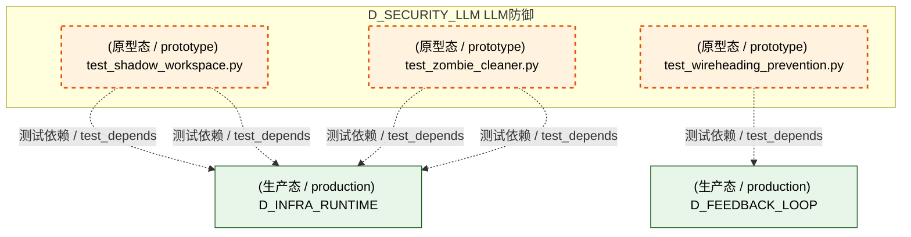
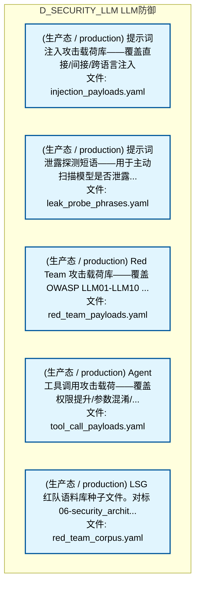
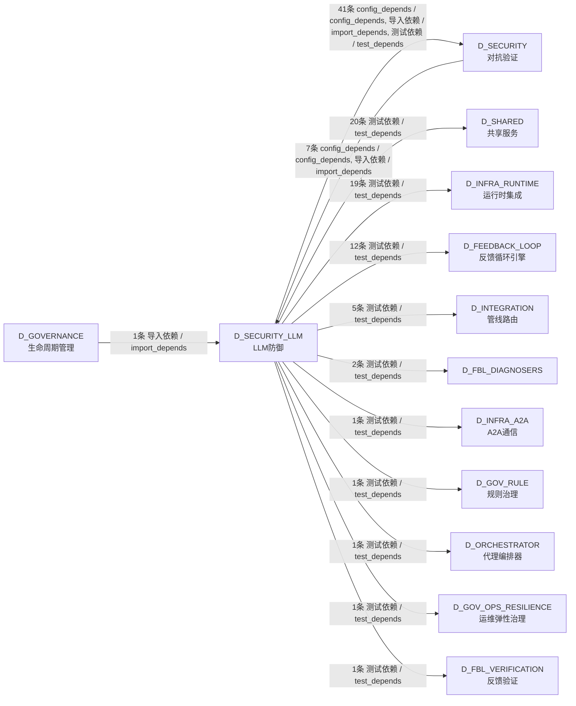

# 25_d_security_llm / llm_defense / LLM防御 / LLM Defense

> **功能简介 / Overview**: LLM 防御，负责 LLM 安全防护、Prompt 注入防御和输出过滤

> **文档作用 / Purpose**: 展示 LLM防御（D_SECURITY_LLM）功能域的模块清单、域内依赖关系、跨域依赖关系、架构分层视图，供架构审查和域治理参考。

> 本文档由 generate_domain_doc.py 从 depgraph (PostgreSQL) 自动生成
> 最后更新: 2026-07-16 22:48:23
> 数据源: depgraph (PostgreSQL) nodes表 + edges表

## 域基本信息 / Domain Overview

| 字段 | 值 | Field | Value |
|------|------|-------|-------|
| 编号 | 25 | Number | 25 |
| 域ID | D_SECURITY_LLM | Domain ID | D_SECURITY_LLM |
| 域名称 | LLM防御 | Domain Name | LLM Defense |
| 层级 | L1 基础平台层 | Layer | L1 Foundation |
| 模块数 | 63 | Module Count | 63 |
| 域内依赖 | 5 | Internal Dependencies | 5 |
| 跨域入边 | 8 | Cross-domain Incoming | 8 |
| 跨域出边 | 104 | Cross-domain Outgoing | 104 |
| 设计态模块 | 0 | Design Modules | 0 |
| 原型态模块 | 58 | Prototype Modules | 58 |
| 生产态模块 | 5 | Production Modules | 5 |
| 容量 | 5/150 (正常) | Capacity | 5/150 (正常) |
| 描述 | L0供应链安全(模型验证/依赖扫描) | Description | L0供应链安全(模型验证/依赖扫描) |

## 模块分层清单 / Module Layered List

> 按 architecture_layer 分组的模块清单（共 63 个模块 / 63 modules）。

### L1 基础层 / Foundation Layer (13 modules)

| # | 模块路径 / Module Path | 模块名称 / Module Name (功能简介 / Description) | 成熟度 / Maturity | 蓝图 / Blueprint |
|:--:|---------|---------|:---:|:---:|
| 1 | src/zephyr/security/llm_defense/__init__.py | __init__.py | 原型态 / prototype |  |
| 2 | src/zephyr/security/llm_defense/llm_security/__init__.py | __init__.py | 原型态 / prototype |  |
| 3 | src/zephyr/security/llm_defense/llm_security/dashboard/__... | LLM Security Gateway Dashboard Module. | 原型态 / prototype | [MOD-LLM_SECURITY](../../03_modules/_cross_layer/large_language_model_security/blueprint.md) |
| 4 | src/zephyr/security/llm_defense/llm_security/layers/__ini... | __init__.py | 原型态 / prototype |  |
| 5 | src/zephyr/security/llm_defense/llm_security/patterns/__i... | __init__.py | 原型态 / prototype |  |
| 6 | src/zephyr/security/llm_defense/llm_security/payloads/__i... | __init__.py | 原型态 / prototype |  |
| 7 | src/zephyr/security/llm_defense/llm_security/payloads/inj... | 提示词注入攻击载荷库——覆盖直接/间接/跨语言注入 | 生产态 / production | [MOD-LLM_SECURITY](../../03_modules/_cross_layer/large_language_model_security/blueprint.md) |
| 8 | src/zephyr/security/llm_defense/llm_security/payloads/lea... | 提示词泄露探测短语——用于主动扫描模型是否泄露... | 生产态 / production | [MOD-LLM_SECURITY](../../03_modules/_cross_layer/large_language_model_security/blueprint.md) |
| 9 | src/zephyr/security/llm_defense/llm_security/payloads/red... | Red Team 攻击载荷库——覆盖 OWASP LLM01-LLM10 ... | 生产态 / production | [MOD-LLM_SECURITY](../../03_modules/_cross_layer/large_language_model_security/blueprint.md) |
| 10 | src/zephyr/security/llm_defense/llm_security/payloads/too... | Agent工具调用攻击载荷——覆盖权限提升/参数混淆/... | 生产态 / production | [MOD-LLM_SECURITY](../../03_modules/_cross_layer/large_language_model_security/blueprint.md) |
| 11 | src/zephyr/security/llm_defense/llm_security/red_team_cor... | LSG 红队语料库种子文件。对标 06-security_archit... | 生产态 / production | [MOD-LLM_SECURITY](../../03_modules/_cross_layer/large_language_model_security/blueprint.md) |
| 12 | src/zephyr/security/llm_defense/llm_security/sandbox/__in... | LSG 代码执行沙箱包。 | 原型态 / prototype | [MOD-LLM_SECURITY](../../03_modules/_cross_layer/large_language_model_security/blueprint.md) |
| 13 | src/zephyr/security/llm_defense/llm_security/self_protect... | __init__.py | 原型态 / prototype |  |

### L2 领域层 / Domain Layer (50 modules)

| # | 模块路径 / Module Path | 模块名称 / Module Name (功能简介 / Description) | 成熟度 / Maturity | 蓝图 / Blueprint |
|:--:|---------|---------|:---:|:---:|
| 1 | tests/llm_security/test_adversarial_mutator.py | test_adversarial_mutator.py | 原型态 / prototype | [MOD-LLM_SECURITY](../../03_modules/_cross_layer/large_language_model_security/blueprint.md) |
| 2 | tests/llm_security/test_batch_fixer.py | test_batch_fixer.py | 原型态 / prototype | [MOD-INF-031](../../03_modules/_cross_layer/auto_fix_engine/blueprint.md) |
| 3 | tests/llm_security/test_behavior_audit_logger.py | test_behavior_audit_logger.py | 原型态 / prototype | [MOD-LLM_SECURITY](../../03_modules/_cross_layer/large_language_model_security/blueprint.md) |
| 4 | tests/llm_security/test_code_integrity.py | test_code_integrity.py | 原型态 / prototype | [MOD-LLM_SECURITY](../../03_modules/_cross_layer/large_language_model_security/blueprint.md) |
| 5 | tests/llm_security/test_cross_module_integration_llm_secu... | test_cross_module_integration_llm_security.py | 原型态 / prototype | [MOD-LLM_SECURITY](../../03_modules/_cross_layer/large_language_model_security/blueprint.md) |
| 6 | tests/llm_security/test_db.py | test_db.py | 原型态 / prototype |  |
| 7 | tests/llm_security/test_dedup_extractor.py | test_dedup_extractor.py | 原型态 / prototype | [MOD-INF-031](../../03_modules/_cross_layer/auto_fix_engine/blueprint.md) |
| 8 | tests/llm_security/test_dep_cve_correlator.py | test_dep_cve_correlator.py | 原型态 / prototype | [MOD-FEEDBACK_LOOP](../../03_modules/_cross_layer/feedback_loop/blueprint.md) |
| 9 | tests/llm_security/test_dep_version_fixer.py | test_dep_version_fixer.py | 原型态 / prototype | [MOD-INF-031](../../03_modules/_cross_layer/auto_fix_engine/blueprint.md) |
| 10 | tests/llm_security/test_engine_root.py | test_engine_root.py | 原型态 / prototype | [MOD-INF-031](../../03_modules/_cross_layer/auto_fix_engine/blueprint.md) |
| 11 | tests/llm_security/test_fail_closed.py | test_fail_closed.py | 原型态 / prototype | [MOD-LLM_SECURITY](../../03_modules/_cross_layer/large_language_model_security/blueprint.md) |
| 12 | tests/llm_security/test_gateway_e2e.py | test_gateway_e2e.py | 原型态 / prototype | [MOD-LLM_SECURITY](../../03_modules/_cross_layer/large_language_model_security/blueprint.md) |
| 13 | tests/llm_security/test_injection_patterns.py | test_injection_patterns.py | 原型态 / prototype | [MOD-LLM_SECURITY](../../03_modules/_cross_layer/large_language_model_security/blueprint.md) |
| 14 | tests/llm_security/test_input_sanitizer_llm_security.py | test_input_sanitizer_llm_security.py | 原型态 / prototype | [MOD-LLM_SECURITY](../../03_modules/_cross_layer/large_language_model_security/blueprint.md) |
| 15 | tests/llm_security/test_interrupt_guard.py | test_interrupt_guard.py | 原型态 / prototype | [MOD-INF-031](../../03_modules/_cross_layer/auto_fix_engine/blueprint.md) |
| 16 | tests/llm_security/test_isolation.py | test_isolation.py | 原型态 / prototype | [MOD-LLM_SECURITY](../../03_modules/_cross_layer/large_language_model_security/blueprint.md) |
| 17 | tests/llm_security/test_l0_supply_chain.py | test_l0_supply_chain.py | 原型态 / prototype | [MOD-LLM_SECURITY](../../03_modules/_cross_layer/large_language_model_security/blueprint.md) |
| 18 | tests/llm_security/test_l1_input_defense.py | test_l1_input_defense.py | 原型态 / prototype | [MOD-LLM_SECURITY](../../03_modules/_cross_layer/large_language_model_security/blueprint.md) |
| 19 | tests/llm_security/test_l2_prompt_protection.py | test_l2_prompt_protection.py | 原型态 / prototype | [MOD-LLM_SECURITY](../../03_modules/_cross_layer/large_language_model_security/blueprint.md) |
| 20 | tests/llm_security/test_l2a_process_sandbox.py | test_l2a_process_sandbox.py | 原型态 / prototype | [MOD-LLM_SECURITY](../../03_modules/_cross_layer/large_language_model_security/blueprint.md) |
| 21 | tests/llm_security/test_l3_output_security.py | test_l3_output_security.py | 原型态 / prototype | [MOD-LLM_SECURITY](../../03_modules/_cross_layer/large_language_model_security/blueprint.md) |
| 22 | tests/llm_security/test_l4_agent_security.py | test_l4_agent_security.py | 原型态 / prototype | [MOD-LLM_SECURITY](../../03_modules/_cross_layer/large_language_model_security/blueprint.md) |
| 23 | tests/llm_security/test_l5_resource_protection.py | test_l5_resource_protection.py | 原型态 / prototype | [MOD-LLM_SECURITY](../../03_modules/_cross_layer/large_language_model_security/blueprint.md) |
| 24 | tests/llm_security/test_l6_observability.py | test_l6_observability.py | 原型态 / prototype | [MOD-LLM_SECURITY](../../03_modules/_cross_layer/large_language_model_security/blueprint.md) |
| 25 | tests/llm_security/test_l7_red_team.py | test_l7_red_team.py | 原型态 / prototype | [MOD-LLM_SECURITY](../../03_modules/_cross_layer/large_language_model_security/blueprint.md) |
| 26 | tests/llm_security/test_l7_validation.py | test_l7_validation.py | 原型态 / prototype | [MOD-LLM_SECURITY](../../03_modules/_cross_layer/large_language_model_security/blueprint.md) |
| 27 | tests/llm_security/test_l8_multi_agent.py | test_l8_multi_agent.py | 原型态 / prototype | [MOD-LLM_SECURITY](../../03_modules/_cross_layer/large_language_model_security/blueprint.md) |
| 28 | tests/llm_security/test_llm_cost_accounting.py | test_llm_cost_accounting.py | 原型态 / prototype | [MOD-FEEDBACK_LOOP](../../03_modules/_cross_layer/feedback_loop/blueprint.md) |
| 29 | tests/llm_security/test_llm_cost_router.py | test_llm_cost_router.py | 原型态 / prototype | [MOD-GATE_ENGINE](../../03_modules/_cross_layer/gate_engine/blueprint.md) |
| 30 | tests/llm_security/test_llm_fix_adapter.py | test_llm_fix_adapter.py | 原型态 / prototype | [MOD-INF-031](../../03_modules/_cross_layer/auto_fix_engine/blueprint.md) |
| 31 | tests/llm_security/test_llm_gateway.py | test_llm_gateway.py | 原型态 / prototype | [MOD-INF-009](../../03_modules/_cross_layer/pipeline/blueprint.md) |
| 32 | tests/llm_security/test_llm_provider_integrity.py | test_llm_provider_integrity.py | 原型态 / prototype | [MOD-FEEDBACK_LOOP](../../03_modules/_cross_layer/feedback_loop/blueprint.md) |
| 33 | tests/llm_security/test_llm_quality_regression.py | test_llm_quality_regression.py | 原型态 / prototype | [MOD-FEEDBACK_LOOP](../../03_modules/_cross_layer/feedback_loop/blueprint.md) |
| 34 | tests/llm_security/test_llm_security.py | test_llm_security.py | 原型态 / prototype | [MOD-LLM_SECURITY](../../03_modules/_cross_layer/large_language_model_security/blueprint.md) |
| 35 | tests/llm_security/test_metric_prompt_scanner.py | test_metric_prompt_scanner.py | 原型态 / prototype | [MOD-FEEDBACK_LOOP](../../03_modules/_cross_layer/feedback_loop/blueprint.md) |
| 36 | tests/llm_security/test_models_root.py | test_models_root.py | 原型态 / prototype | [MOD-INF-031](../../03_modules/_cross_layer/auto_fix_engine/blueprint.md) |
| 37 | tests/llm_security/test_orphan_detector.py | test_orphan_detector.py | 原型态 / prototype | [MOD-INF-029](../../03_modules/_cross_layer/orphan_judge/blueprint.md) |
| 38 | tests/llm_security/test_process_sandbox_llm_security.py | test_process_sandbox_llm_security.py | 原型态 / prototype | [MOD-LLM_SECURITY](../../03_modules/_cross_layer/large_language_model_security/blueprint.md) |
| 39 | tests/llm_security/test_remote_attestation.py | test_remote_attestation.py | 原型态 / prototype | [MOD-FEEDBACK_LOOP](../../03_modules/_cross_layer/feedback_loop/blueprint.md) |
| 40 | tests/llm_security/test_runtime_interceptor.py | test_runtime_interceptor.py — 运行时 LLM 裸调... | 原型态 / prototype | [MOD-LLM_SECURITY](../../03_modules/_cross_layer/large_language_model_security/blueprint.md) |
| 41 | tests/llm_security/test_scaffold_registrar.py | test_scaffold_registrar.py | 原型态 / prototype | [MOD-INF-031](../../03_modules/_cross_layer/auto_fix_engine/blueprint.md) |
| 42 | tests/llm_security/test_secret_rotation.py | test_secret_rotation.py | 原型态 / prototype | [MOD-FEEDBACK_LOOP](../../03_modules/_cross_layer/feedback_loop/blueprint.md) |
| 43 | tests/llm_security/test_secrets.py | test_secrets.py | 原型态 / prototype | [MOD-LLM_SECURITY](../../03_modules/_cross_layer/large_language_model_security/blueprint.md) |
| 44 | tests/llm_security/test_security.py | test_security.py | 原型态 / prototype | [MOD-FEEDBACK_LOOP](../../03_modules/_cross_layer/feedback_loop/blueprint.md) |
| 45 | tests/llm_security/test_security_capability.py | test_security_capability.py | 原型态 / prototype | [MOD-INF-016](../../03_modules/_cross_layer/shared_core/blueprint.md) |
| 46 | tests/llm_security/test_security_secrets.py | test_security_secrets.py | 原型态 / prototype | [MOD-INF-016](../../03_modules/_cross_layer/shared_core/blueprint.md) |
| 47 | tests/llm_security/test_security_ssot_guard.py | test_security_ssot_guard.py | 原型态 / prototype | [MOD-INF-016](../../03_modules/_cross_layer/shared_core/blueprint.md) |
| 48 | tests/llm_security/test_shadow_workspace.py | test_shadow_workspace.py | 原型态 / prototype | [MOD-INF-031](../../03_modules/_cross_layer/auto_fix_engine/blueprint.md) |
| 49 | tests/llm_security/test_wireheading_prevention.py | test_wireheading_prevention.py | 原型态 / prototype | [MOD-FEEDBACK_LOOP](../../03_modules/_cross_layer/feedback_loop/blueprint.md) |
| 50 | tests/llm_security/test_zombie_cleaner.py | test_zombie_cleaner.py | 原型态 / prototype | [MOD-INF-031](../../03_modules/_cross_layer/auto_fix_engine/blueprint.md) |

## 域内依赖图 / Internal Dependency Diagram

> 依赖图内嵌在本文档中，IDE 可直接渲染显示。参考 decision_index.md 设计，分四个视图：合并全景图、运营态子图、设计态子图、原型态子图（按 design_maturity 实际值拆分）。
>
> **图例说明 / Legend**：
> - **实线边框 = 运营态模块**（production，已上线运行）
> - **虚线边框 = 设计态模块**（design，蓝图阶段，代码未写）
> - **虚线边框 = 原型态模块**（prototype，代码已写，验证中未稳定上线）
> - **实线箭头 = 运营态依赖**（已生效的依赖关系）
> - **虚线箭头 = 非运营态依赖**（计划中/验证中的依赖关系）

### 合并全景图（全部模块，标签标注成熟度）

> 展示全部 63 个模块（生产态 5 + 设计态 0 + 原型态 58），标签标注成熟度。

#### 第 1 页 / 共 3 页

```mermaid
graph TD
    subgraph D_SECURITY_LLM["D_SECURITY_LLM LLM防御"]
        src_zephyr_security_llm_defense_init_py["(原型态 / prototype) __init__.py"]
        src_zephyr_security_llm_defense_llm_security_init_py["(原型态 / prototype) __init__.py"]
        src_zephyr_security_llm_defense_llm_security_dashboard_init_py["(原型态 / prototype) LLM Security Gateway Dashboard Module.<br/>文件: __init__.py"]
        src_zephyr_security_llm_defense_llm_security_layers_init_py["(原型态 / prototype) __init__.py"]
        src_zephyr_security_llm_defense_llm_security_patterns_init_py["(原型态 / prototype) __init__.py"]
        src_zephyr_security_llm_defense_llm_security_payloads_init_py["(原型态 / prototype) __init__.py"]
        src_zephyr_security_llm_defense_llm_security_payloads_injection_payloads_yaml["(生产态 / production) 提示词注入攻击载荷库——覆盖直接/间接/跨语言注入<br/>文件: injection_payloads.yaml"]
        src_zephyr_security_llm_defense_llm_security_payloads_leak_probe_phrases_yaml["(生产态 / production) 提示词泄露探测短语——用于主动扫描模型是否泄露...<br/>文件: leak_probe_phrases.yaml"]
        src_zephyr_security_llm_defense_llm_security_payloads_red_team_payloads_yaml["(生产态 / production) Red Team 攻击载荷库——覆盖 OWASP LLM01-LLM10 ...<br/>文件: red_team_payloads.yaml"]
        src_zephyr_security_llm_defense_llm_security_payloads_tool_call_payloads_yaml["(生产态 / production) Agent工具调用攻击载荷——覆盖权限提升/参数混淆/...<br/>文件: tool_call_payloads.yaml"]
        src_zephyr_security_llm_defense_llm_security_red_team_corpus_yaml["(生产态 / production) LSG 红队语料库种子文件。对标 06-security_archit...<br/>文件: red_team_corpus.yaml"]
        src_zephyr_security_llm_defense_llm_security_sandbox_init_py["(原型态 / prototype) LSG 代码执行沙箱包。<br/>文件: __init__.py"]
        src_zephyr_security_llm_defense_llm_security_self_protection_init_py["(原型态 / prototype) __init__.py"]
        tests_llm_security_test_adversarial_mutator_py["(原型态 / prototype) test_adversarial_mutator.py"]
        tests_llm_security_test_batch_fixer_py["(原型态 / prototype) test_batch_fixer.py"]
        tests_llm_security_test_behavior_audit_logger_py["(原型态 / prototype) test_behavior_audit_logger.py"]
        tests_llm_security_test_code_integrity_py["(原型态 / prototype) test_code_integrity.py"]
        tests_llm_security_test_cross_module_integration_llm_security_py["(原型态 / prototype) test_cross_module_integration_llm_security.py"]
        tests_llm_security_test_db_py["(原型态 / prototype) test_db.py"]
        tests_llm_security_test_dedup_extractor_py["(原型态 / prototype) test_dedup_extractor.py"]
        tests_llm_security_test_dep_cve_correlator_py["(原型态 / prototype) test_dep_cve_correlator.py"]
        tests_llm_security_test_dep_version_fixer_py["(原型态 / prototype) test_dep_version_fixer.py"]
        tests_llm_security_test_engine_root_py["(原型态 / prototype) test_engine_root.py"]
        tests_llm_security_test_fail_closed_py["(原型态 / prototype) test_fail_closed.py"]
        tests_llm_security_test_gateway_e2e_py["(原型态 / prototype) test_gateway_e2e.py"]
        tests_llm_security_test_injection_patterns_py["(原型态 / prototype) test_injection_patterns.py"]
        tests_llm_security_test_input_sanitizer_llm_security_py["(原型态 / prototype) test_input_sanitizer_llm_security.py"]
        tests_llm_security_test_interrupt_guard_py["(原型态 / prototype) test_interrupt_guard.py"]
        tests_llm_security_test_isolation_py["(原型态 / prototype) test_isolation.py"]
        tests_llm_security_test_l0_supply_chain_py["(原型态 / prototype) test_l0_supply_chain.py"]
    end
    src_zephyr_security_llm_defense_llm_security_red_team_corpus_yaml -.->|config_depends / config_depends| src_zephyr_security_llm_defense_llm_security_init_py
    src_zephyr_security_llm_defense_llm_security_payloads_injection_payloads_yaml -.->|config_depends / config_depends| src_zephyr_security_llm_defense_llm_security_payloads_init_py
    src_zephyr_security_llm_defense_llm_security_payloads_leak_probe_phrases_yaml -.->|config_depends / config_depends| src_zephyr_security_llm_defense_llm_security_payloads_init_py
    src_zephyr_security_llm_defense_llm_security_payloads_tool_call_payloads_yaml -.->|config_depends / config_depends| src_zephyr_security_llm_defense_llm_security_payloads_init_py
    src_zephyr_security_llm_defense_llm_security_payloads_red_team_payloads_yaml -.->|config_depends / config_depends| src_zephyr_security_llm_defense_llm_security_payloads_init_py
    D_SECURITY["(原型态 / prototype) D_SECURITY"]
    src_zephyr_security_llm_defense_llm_security_dashboard_init_py -.->|config_depends / config_depends| D_SECURITY
    src_zephyr_security_llm_defense_llm_security_init_py -.->|导入依赖 / import_depends| D_SECURITY
    src_zephyr_security_llm_defense_llm_security_init_py -.->|导入依赖 / import_depends| D_SECURITY
    src_zephyr_security_llm_defense_llm_security_init_py -.->|导入依赖 / import_depends| D_SECURITY
    src_zephyr_security_llm_defense_llm_security_init_py -.->|导入依赖 / import_depends| D_SECURITY
    src_zephyr_security_llm_defense_llm_security_init_py -.->|导入依赖 / import_depends| D_SECURITY
    tests_llm_security_test_adversarial_mutator_py -.->|测试依赖 / test_depends| D_SECURITY
    tests_llm_security_test_code_integrity_py -.->|测试依赖 / test_depends| D_SECURITY
    D_SHARED["(生产态 / production) D_SHARED"]
    tests_llm_security_test_code_integrity_py -.->|测试依赖 / test_depends| D_SHARED
    tests_llm_security_test_behavior_audit_logger_py -.->|测试依赖 / test_depends| D_SECURITY
    D_FEEDBACK_LOOP["(生产态 / production) D_FEEDBACK_LOOP"]
    tests_llm_security_test_dep_cve_correlator_py -.->|测试依赖 / test_depends| D_FEEDBACK_LOOP
    D_INFRA_RUNTIME["(生产态 / production) D_INFRA_RUNTIME"]
    tests_llm_security_test_dep_version_fixer_py -.->|测试依赖 / test_depends| D_INFRA_RUNTIME
    tests_llm_security_test_dep_version_fixer_py -.->|测试依赖 / test_depends| D_INFRA_RUNTIME
    tests_llm_security_test_dep_version_fixer_py -.->|测试依赖 / test_depends| D_INFRA_RUNTIME
    tests_llm_security_test_db_py -.->|测试依赖 / test_depends| D_SECURITY
    D_GOVERNANCE["(原型态 / prototype) D_GOVERNANCE"]
    D_GOVERNANCE -.->|导入依赖 / import_depends| src_zephyr_security_llm_defense_llm_security_init_py
    D_SECURITY -.->|config_depends / config_depends| src_zephyr_security_llm_defense_llm_security_layers_init_py
    D_SECURITY -.->|config_depends / config_depends| src_zephyr_security_llm_defense_llm_security_layers_init_py
    D_SECURITY -.->|导入依赖 / import_depends| src_zephyr_security_llm_defense_llm_security_layers_init_py
    D_SECURITY -.->|导入依赖 / import_depends| src_zephyr_security_llm_defense_llm_security_patterns_init_py
    D_SECURITY -.->|导入依赖 / import_depends| src_zephyr_security_llm_defense_llm_security_payloads_init_py
    D_SECURITY -.->|导入依赖 / import_depends| src_zephyr_security_llm_defense_llm_security_payloads_init_py
    D_SECURITY -.->|导入依赖 / import_depends| src_zephyr_security_llm_defense_llm_security_self_protection_init_py
    classDef production fill:#e1f5fe,stroke:#01579b,stroke-width:2px,color:#000
    classDef design fill:#fff3e0,stroke:#e65100,stroke-width:2px,color:#000,stroke-dasharray: 5 5
    classDef external_prod fill:#e8f5e9,stroke:#1b5e20,stroke-width:1px,color:#000
    classDef external_design fill:#fce4ec,stroke:#880e4f,stroke-width:1px,color:#000,stroke-dasharray: 5 5
    class src_zephyr_security_llm_defense_llm_security_payloads_injection_payloads_yaml,src_zephyr_security_llm_defense_llm_security_payloads_leak_probe_phrases_yaml,src_zephyr_security_llm_defense_llm_security_payloads_red_team_payloads_yaml,src_zephyr_security_llm_defense_llm_security_payloads_tool_call_payloads_yaml,src_zephyr_security_llm_defense_llm_security_red_team_corpus_yaml production
    class src_zephyr_security_llm_defense_init_py,src_zephyr_security_llm_defense_llm_security_init_py,src_zephyr_security_llm_defense_llm_security_dashboard_init_py,src_zephyr_security_llm_defense_llm_security_layers_init_py,src_zephyr_security_llm_defense_llm_security_patterns_init_py,src_zephyr_security_llm_defense_llm_security_payloads_init_py,src_zephyr_security_llm_defense_llm_security_sandbox_init_py,src_zephyr_security_llm_defense_llm_security_self_protection_init_py,tests_llm_security_test_adversarial_mutator_py,tests_llm_security_test_batch_fixer_py,tests_llm_security_test_behavior_audit_logger_py,tests_llm_security_test_code_integrity_py,tests_llm_security_test_cross_module_integration_llm_security_py,tests_llm_security_test_db_py,tests_llm_security_test_dedup_extractor_py,tests_llm_security_test_dep_cve_correlator_py,tests_llm_security_test_dep_version_fixer_py,tests_llm_security_test_engine_root_py,tests_llm_security_test_fail_closed_py,tests_llm_security_test_gateway_e2e_py,tests_llm_security_test_injection_patterns_py,tests_llm_security_test_input_sanitizer_llm_security_py,tests_llm_security_test_interrupt_guard_py,tests_llm_security_test_isolation_py,tests_llm_security_test_l0_supply_chain_py design
    class D_SHARED,D_FEEDBACK_LOOP,D_INFRA_RUNTIME external_prod
    class D_SECURITY,D_GOVERNANCE external_design
```

#### 第 2 页 / 共 3 页

#### 第 3 页 / 共 3 页

### 运营态子图（仅 design_maturity=production 的模块和依赖）

> 仅展示已上线运行的模块（共 5 个，0 条域内依赖）。

### 设计态子图（仅 design_maturity=design 的模块和依赖）

> 仅展示蓝图阶段、代码未写的设计态模块（共 0 个，0 条域内依赖）。

> （无设计态模块 / No design modules）

### 原型态子图（仅 design_maturity=prototype 的模块和依赖）

> 仅展示代码已写、验证中未稳定上线的原型态模块（共 58 个，0 条域内依赖）。

```mermaid
graph TD
    subgraph D_SECURITY_LLM["D_SECURITY_LLM LLM防御"]
        src_zephyr_security_llm_defense_init_py["(原型态 / prototype) __init__.py"]
        src_zephyr_security_llm_defense_llm_security_init_py["(原型态 / prototype) __init__.py"]
        src_zephyr_security_llm_defense_llm_security_dashboard_init_py["(原型态 / prototype) LLM Security Gateway Dashboard Module.<br/>文件: __init__.py"]
        src_zephyr_security_llm_defense_llm_security_layers_init_py["(原型态 / prototype) __init__.py"]
        src_zephyr_security_llm_defense_llm_security_patterns_init_py["(原型态 / prototype) __init__.py"]
        src_zephyr_security_llm_defense_llm_security_payloads_init_py["(原型态 / prototype) __init__.py"]
        src_zephyr_security_llm_defense_llm_security_sandbox_init_py["(原型态 / prototype) LSG 代码执行沙箱包。<br/>文件: __init__.py"]
        src_zephyr_security_llm_defense_llm_security_self_protection_init_py["(原型态 / prototype) __init__.py"]
        tests_llm_security_test_adversarial_mutator_py["(原型态 / prototype) test_adversarial_mutator.py"]
        tests_llm_security_test_batch_fixer_py["(原型态 / prototype) test_batch_fixer.py"]
        tests_llm_security_test_behavior_audit_logger_py["(原型态 / prototype) test_behavior_audit_logger.py"]
        tests_llm_security_test_code_integrity_py["(原型态 / prototype) test_code_integrity.py"]
        tests_llm_security_test_cross_module_integration_llm_security_py["(原型态 / prototype) test_cross_module_integration_llm_security.py"]
        tests_llm_security_test_db_py["(原型态 / prototype) test_db.py"]
        tests_llm_security_test_dedup_extractor_py["(原型态 / prototype) test_dedup_extractor.py"]
        tests_llm_security_test_dep_cve_correlator_py["(原型态 / prototype) test_dep_cve_correlator.py"]
        tests_llm_security_test_dep_version_fixer_py["(原型态 / prototype) test_dep_version_fixer.py"]
        tests_llm_security_test_engine_root_py["(原型态 / prototype) test_engine_root.py"]
        tests_llm_security_test_fail_closed_py["(原型态 / prototype) test_fail_closed.py"]
        tests_llm_security_test_gateway_e2e_py["(原型态 / prototype) test_gateway_e2e.py"]
        tests_llm_security_test_injection_patterns_py["(原型态 / prototype) test_injection_patterns.py"]
        tests_llm_security_test_input_sanitizer_llm_security_py["(原型态 / prototype) test_input_sanitizer_llm_security.py"]
        tests_llm_security_test_interrupt_guard_py["(原型态 / prototype) test_interrupt_guard.py"]
        tests_llm_security_test_isolation_py["(原型态 / prototype) test_isolation.py"]
        tests_llm_security_test_l0_supply_chain_py["(原型态 / prototype) test_l0_supply_chain.py"]
        tests_llm_security_test_l1_input_defense_py["(原型态 / prototype) test_l1_input_defense.py"]
        tests_llm_security_test_l2_prompt_protection_py["(原型态 / prototype) test_l2_prompt_protection.py"]
        tests_llm_security_test_l2a_process_sandbox_py["(原型态 / prototype) test_l2a_process_sandbox.py"]
        tests_llm_security_test_l3_output_security_py["(原型态 / prototype) test_l3_output_security.py"]
        tests_llm_security_test_l4_agent_security_py["(原型态 / prototype) test_l4_agent_security.py"]
        tests_llm_security_test_l5_resource_protection_py["(原型态 / prototype) test_l5_resource_protection.py"]
        tests_llm_security_test_l6_observability_py["(原型态 / prototype) test_l6_observability.py"]
        tests_llm_security_test_l7_red_team_py["(原型态 / prototype) test_l7_red_team.py"]
        tests_llm_security_test_l7_validation_py["(原型态 / prototype) test_l7_validation.py"]
        tests_llm_security_test_l8_multi_agent_py["(原型态 / prototype) test_l8_multi_agent.py"]
        tests_llm_security_test_llm_cost_accounting_py["(原型态 / prototype) test_llm_cost_accounting.py"]
        tests_llm_security_test_llm_cost_router_py["(原型态 / prototype) test_llm_cost_router.py"]
        tests_llm_security_test_llm_fix_adapter_py["(原型态 / prototype) test_llm_fix_adapter.py"]
        tests_llm_security_test_llm_gateway_py["(原型态 / prototype) test_llm_gateway.py"]
        tests_llm_security_test_llm_provider_integrity_py["(原型态 / prototype) test_llm_provider_integrity.py"]
        tests_llm_security_test_llm_quality_regression_py["(原型态 / prototype) test_llm_quality_regression.py"]
        tests_llm_security_test_llm_security_py["(原型态 / prototype) test_llm_security.py"]
        tests_llm_security_test_metric_prompt_scanner_py["(原型态 / prototype) test_metric_prompt_scanner.py"]
        tests_llm_security_test_models_root_py["(原型态 / prototype) test_models_root.py"]
        tests_llm_security_test_orphan_detector_py["(原型态 / prototype) test_orphan_detector.py"]
        tests_llm_security_test_process_sandbox_llm_security_py["(原型态 / prototype) test_process_sandbox_llm_security.py"]
        tests_llm_security_test_remote_attestation_py["(原型态 / prototype) test_remote_attestation.py"]
        tests_llm_security_test_runtime_interceptor_py["(原型态 / prototype) test_runtime_interceptor.py — 运行时 LLM 裸调...<br/>文件: test_runtime_interceptor.py"]
        tests_llm_security_test_scaffold_registrar_py["(原型态 / prototype) test_scaffold_registrar.py"]
        tests_llm_security_test_secret_rotation_py["(原型态 / prototype) test_secret_rotation.py"]
        tests_llm_security_test_secrets_py["(原型态 / prototype) test_secrets.py"]
        tests_llm_security_test_security_py["(原型态 / prototype) test_security.py"]
        tests_llm_security_test_security_capability_py["(原型态 / prototype) test_security_capability.py"]
        tests_llm_security_test_security_secrets_py["(原型态 / prototype) test_security_secrets.py"]
        tests_llm_security_test_security_ssot_guard_py["(原型态 / prototype) test_security_ssot_guard.py"]
        tests_llm_security_test_shadow_workspace_py["(原型态 / prototype) test_shadow_workspace.py"]
        tests_llm_security_test_wireheading_prevention_py["(原型态 / prototype) test_wireheading_prevention.py"]
        tests_llm_security_test_zombie_cleaner_py["(原型态 / prototype) test_zombie_cleaner.py"]
    end
    D_SECURITY["(原型态 / prototype) D_SECURITY"]
    src_zephyr_security_llm_defense_llm_security_dashboard_init_py -.->|config_depends / config_depends| D_SECURITY
    src_zephyr_security_llm_defense_llm_security_init_py -.->|导入依赖 / import_depends| D_SECURITY
    src_zephyr_security_llm_defense_llm_security_init_py -.->|导入依赖 / import_depends| D_SECURITY
    src_zephyr_security_llm_defense_llm_security_init_py -.->|导入依赖 / import_depends| D_SECURITY
    src_zephyr_security_llm_defense_llm_security_init_py -.->|导入依赖 / import_depends| D_SECURITY
    src_zephyr_security_llm_defense_llm_security_init_py -.->|导入依赖 / import_depends| D_SECURITY
    tests_llm_security_test_adversarial_mutator_py -.->|测试依赖 / test_depends| D_SECURITY
    D_SHARED["(生产态 / production) D_SHARED"]
    tests_llm_security_test_code_integrity_py -.->|测试依赖 / test_depends| D_SHARED
    tests_llm_security_test_code_integrity_py -.->|测试依赖 / test_depends| D_SECURITY
    tests_llm_security_test_behavior_audit_logger_py -.->|测试依赖 / test_depends| D_SECURITY
    D_FEEDBACK_LOOP["(生产态 / production) D_FEEDBACK_LOOP"]
    tests_llm_security_test_dep_cve_correlator_py -.->|测试依赖 / test_depends| D_FEEDBACK_LOOP
    D_INFRA_RUNTIME["(生产态 / production) D_INFRA_RUNTIME"]
    tests_llm_security_test_dep_version_fixer_py -.->|测试依赖 / test_depends| D_INFRA_RUNTIME
    tests_llm_security_test_dep_version_fixer_py -.->|测试依赖 / test_depends| D_INFRA_RUNTIME
    tests_llm_security_test_dep_version_fixer_py -.->|测试依赖 / test_depends| D_INFRA_RUNTIME
    D_GOV_RULE["(生产态 / production) D_GOV_RULE"]
    tests_llm_security_test_db_py -.->|测试依赖 / test_depends| D_GOV_RULE
    D_SECURITY -.->|导入依赖 / import_depends| src_zephyr_security_llm_defense_llm_security_layers_init_py
    D_SECURITY -.->|导入依赖 / import_depends| src_zephyr_security_llm_defense_llm_security_patterns_init_py
    D_SECURITY -.->|导入依赖 / import_depends| src_zephyr_security_llm_defense_llm_security_payloads_init_py
    D_SECURITY -.->|导入依赖 / import_depends| src_zephyr_security_llm_defense_llm_security_self_protection_init_py
    D_SECURITY -.->|导入依赖 / import_depends| src_zephyr_security_llm_defense_llm_security_payloads_init_py
    D_GOVERNANCE["(原型态 / prototype) D_GOVERNANCE"]
    D_GOVERNANCE -.->|导入依赖 / import_depends| src_zephyr_security_llm_defense_llm_security_init_py
    D_SECURITY -.->|config_depends / config_depends| src_zephyr_security_llm_defense_llm_security_layers_init_py
    D_SECURITY -.->|config_depends / config_depends| src_zephyr_security_llm_defense_llm_security_layers_init_py
    classDef production fill:#e1f5fe,stroke:#01579b,stroke-width:2px,color:#000
    classDef design fill:#fff3e0,stroke:#e65100,stroke-width:2px,color:#000,stroke-dasharray: 5 5
    classDef external_prod fill:#e8f5e9,stroke:#1b5e20,stroke-width:1px,color:#000
    classDef external_design fill:#fce4ec,stroke:#880e4f,stroke-width:1px,color:#000,stroke-dasharray: 5 5
    class src_zephyr_security_llm_defense_init_py,src_zephyr_security_llm_defense_llm_security_init_py,src_zephyr_security_llm_defense_llm_security_dashboard_init_py,src_zephyr_security_llm_defense_llm_security_layers_init_py,src_zephyr_security_llm_defense_llm_security_patterns_init_py,src_zephyr_security_llm_defense_llm_security_payloads_init_py,src_zephyr_security_llm_defense_llm_security_sandbox_init_py,src_zephyr_security_llm_defense_llm_security_self_protection_init_py,tests_llm_security_test_adversarial_mutator_py,tests_llm_security_test_batch_fixer_py,tests_llm_security_test_behavior_audit_logger_py,tests_llm_security_test_code_integrity_py,tests_llm_security_test_cross_module_integration_llm_security_py,tests_llm_security_test_db_py,tests_llm_security_test_dedup_extractor_py,tests_llm_security_test_dep_cve_correlator_py,tests_llm_security_test_dep_version_fixer_py,tests_llm_security_test_engine_root_py,tests_llm_security_test_fail_closed_py,tests_llm_security_test_gateway_e2e_py,tests_llm_security_test_injection_patterns_py,tests_llm_security_test_input_sanitizer_llm_security_py,tests_llm_security_test_interrupt_guard_py,tests_llm_security_test_isolation_py,tests_llm_security_test_l0_supply_chain_py,tests_llm_security_test_l1_input_defense_py,tests_llm_security_test_l2_prompt_protection_py,tests_llm_security_test_l2a_process_sandbox_py,tests_llm_security_test_l3_output_security_py,tests_llm_security_test_l4_agent_security_py,tests_llm_security_test_l5_resource_protection_py,tests_llm_security_test_l6_observability_py,tests_llm_security_test_l7_red_team_py,tests_llm_security_test_l7_validation_py,tests_llm_security_test_l8_multi_agent_py,tests_llm_security_test_llm_cost_accounting_py,tests_llm_security_test_llm_cost_router_py,tests_llm_security_test_llm_fix_adapter_py,tests_llm_security_test_llm_gateway_py,tests_llm_security_test_llm_provider_integrity_py,tests_llm_security_test_llm_quality_regression_py,tests_llm_security_test_llm_security_py,tests_llm_security_test_metric_prompt_scanner_py,tests_llm_security_test_models_root_py,tests_llm_security_test_orphan_detector_py,tests_llm_security_test_process_sandbox_llm_security_py,tests_llm_security_test_remote_attestation_py,tests_llm_security_test_runtime_interceptor_py,tests_llm_security_test_scaffold_registrar_py,tests_llm_security_test_secret_rotation_py,tests_llm_security_test_secrets_py,tests_llm_security_test_security_py,tests_llm_security_test_security_capability_py,tests_llm_security_test_security_secrets_py,tests_llm_security_test_security_ssot_guard_py,tests_llm_security_test_shadow_workspace_py,tests_llm_security_test_wireheading_prevention_py,tests_llm_security_test_zombie_cleaner_py design
    class D_SHARED,D_FEEDBACK_LOOP,D_INFRA_RUNTIME,D_GOV_RULE external_prod
    class D_SECURITY,D_GOVERNANCE external_design
```

## 跨域依赖 / Cross-domain Dependencies

### 本域依赖的其他域（出边）/ Depends On

| # | 本域模块 / Source Module | → | 外部域-目标模块 / Target Module | 依赖类型 / Type |
|:--:|---------|:--:|---------|---------|
| 1 | test_llm_provider_integrity.py | → | D_FBL_DIAGNOSERS: LLM Provider Integrity — v0.15.0 R217 (llm_pro... | 测试依赖 / test_depends |
| 2 | test_llm_quality_regression.py | → | D_FBL_DIAGNOSERS: LLM Quality Regression — v0.12.0 R161 (llm_qua... | 测试依赖 / test_depends |
| 3 | test_llm_cost_router.py | → | D_FBL_VERIFICATION 反馈验证: LLM Cost Router — v0.3.0 R20 (llm_cost_router.py) | 测试依赖 / test_depends |
| 4 | test_dep_cve_correlator.py | → | D_FEEDBACK_LOOP 反馈循环引擎: Dependency CVE Correlator — v0.14.0 R196 (dep_... | 测试依赖 / test_depends |
| 5 | test_llm_cost_accounting.py | → | D_FEEDBACK_LOOP 反馈循环引擎: LLM Cost Accounting — v0.4.0 R35 (llm_cost_acc... | 测试依赖 / test_depends |
| 6 | test_metric_prompt_scanner.py | → | D_FEEDBACK_LOOP 反馈循环引擎: Metric-Prompt Scanner — v0.15.0 R215 (metric_p... | 测试依赖 / test_depends |
| 7 | test_remote_attestation.py | → | D_FEEDBACK_LOOP 反馈循环引擎: Remote Attestation — v0.15.0 R211 (remote_atte... | 测试依赖 / test_depends |
| 8 | test_secret_rotation.py | → | D_FEEDBACK_LOOP 反馈循环引擎: Secret Rotation — v0.14.0 R189 (secret_rotatio... | 测试依赖 / test_depends |
| 9 | test_security.py | → | D_FEEDBACK_LOOP 反馈循环引擎: Agent Skill Guard — v0.14.0 R201 (agent_skill_... | 测试依赖 / test_depends |
| 10 | test_security.py | → | D_FEEDBACK_LOOP 反馈循环引擎: Dependency CVE Correlator — v0.14.0 R196 (dep_... | 测试依赖 / test_depends |
| 11 | test_security.py | → | D_FEEDBACK_LOOP 反馈循环引擎: Metric-Prompt Scanner — v0.15.0 R215 (metric_p... | 测试依赖 / test_depends |
| 12 | test_security.py | → | D_FEEDBACK_LOOP 反馈循环引擎: Remote Attestation — v0.15.0 R211 (remote_atte... | 测试依赖 / test_depends |
| 13 | test_security.py | → | D_FEEDBACK_LOOP 反馈循环引擎: Secret Rotation — v0.14.0 R189 (secret_rotatio... | 测试依赖 / test_depends |
| 14 | test_security.py | → | D_FEEDBACK_LOOP 反馈循环引擎: Wireheading Prevention — v0.37.0 R486 (wirehea... | 测试依赖 / test_depends |
| 15 | test_wireheading_prevention.py | → | D_FEEDBACK_LOOP 反馈循环引擎: Wireheading Prevention — v0.37.0 R486 (wirehea... | 测试依赖 / test_depends |
| 16 | test_cross_module_integration_llm_security.py | → | D_GOV_OPS_RESILIENCE 运维弹性治理: DefaultSecurityGateway — SecurityGateway 三层.... | 测试依赖 / test_depends |
| 17 | test_db.py | → | D_GOV_RULE 规则治理: task_types.py | 测试依赖 / test_depends |
| 18 | test_cross_module_integration_llm_security.py | → | D_INFRA_A2A A2A通信: 基础设施 Infrastructure — A2A Protocol 模块 (M... | 测试依赖 / test_depends |
| 19 | test_cross_module_integration_llm_security.py | → | D_INFRA_RUNTIME 运行时集成: MOD-INF-019: Agent Spec — LLM Gateway (llm_gat... | 测试依赖 / test_depends |
| 20 | test_dep_version_fixer.py | → | D_INFRA_RUNTIME 运行时集成: __init__.py | 测试依赖 / test_depends |
| 21 | test_dep_version_fixer.py | → | D_INFRA_RUNTIME 运行时集成: dep_version_fixer.py | 测试依赖 / test_depends |
| 22 | test_dep_version_fixer.py | → | D_INFRA_RUNTIME 运行时集成: models.py | 测试依赖 / test_depends |
| 23 | test_engine_root.py | → | D_INFRA_RUNTIME 运行时集成: engine.py | 测试依赖 / test_depends |
| 24 | test_engine_root.py | → | D_INFRA_RUNTIME 运行时集成: models.py | 测试依赖 / test_depends |
| 25 | test_interrupt_guard.py | → | D_INFRA_RUNTIME 运行时集成: interrupt_guard.py | 测试依赖 / test_depends |
| 26 | test_llm_fix_adapter.py | → | D_INFRA_RUNTIME 运行时集成: llm_fix_adapter.py | 测试依赖 / test_depends |
| 27 | test_llm_fix_adapter.py | → | D_INFRA_RUNTIME 运行时集成: models.py | 测试依赖 / test_depends |
| 28 | test_llm_gateway.py | → | D_INFRA_RUNTIME 运行时集成: MOD-INF-019: Agent Spec — LLM Gateway (llm_gat... | 测试依赖 / test_depends |
| 29 | test_models_root.py | → | D_INFRA_RUNTIME 运行时集成: models.py | 测试依赖 / test_depends |
| 30 | test_orphan_detector.py | → | D_INFRA_RUNTIME 运行时集成: ModuleOnboardingScanner — 模块接入扫描器 (modu... | 测试依赖 / test_depends |
| 31 | test_scaffold_registrar.py | → | D_INFRA_RUNTIME 运行时集成: __init__.py | 测试依赖 / test_depends |
| 32 | test_scaffold_registrar.py | → | D_INFRA_RUNTIME 运行时集成: models.py | 测试依赖 / test_depends |
| 33 | test_scaffold_registrar.py | → | D_INFRA_RUNTIME 运行时集成: scaffold_registrar.py | 测试依赖 / test_depends |
| 34 | test_shadow_workspace.py | → | D_INFRA_RUNTIME 运行时集成: models.py | 测试依赖 / test_depends |
| 35 | test_shadow_workspace.py | → | D_INFRA_RUNTIME 运行时集成: shadow_workspace.py | 测试依赖 / test_depends |
| 36 | test_zombie_cleaner.py | → | D_INFRA_RUNTIME 运行时集成: models.py | 测试依赖 / test_depends |
| 37 | test_zombie_cleaner.py | → | D_INFRA_RUNTIME 运行时集成: zombie_cleaner.py | 测试依赖 / test_depends |
| 38 | test_cross_module_integration_llm_security.py | → | D_INTEGRATION 管线路由: MCP Gateway 集中式治理节点（MOD-INF-013 §12 Ph... | 测试依赖 / test_depends |
| 39 | test_cross_module_integration_llm_security.py | → | D_INTEGRATION 管线路由: PipelineOrchestrator — M1-M11 管线协调器 (pipe... | 测试依赖 / test_depends |
| 40 | test_db.py | → | D_INTEGRATION 管线路由: base_config.py | 测试依赖 / test_depends |
| 41 | test_db.py | → | D_INTEGRATION 管线路由: execution_model.py | 测试依赖 / test_depends |
| 42 | test_db.py | → | D_INTEGRATION 管线路由: severity_types.py | 测试依赖 / test_depends |
| 43 | test_cross_module_integration_llm_security.py | → | D_ORCHESTRATOR 代理编排器: AgentOrchestrator · 多角色 Agent 路由、工具链.... | 测试依赖 / test_depends |
| 44 | __init__.py | → | D_SECURITY 对抗验证: behavior_audit_logger.py | 导入依赖 / import_depends |
| 45 | __init__.py | → | D_SECURITY 对抗验证: gateway.py | 导入依赖 / import_depends |
| 46 | __init__.py | → | D_SECURITY 对抗验证: InputSanitizer: path whitelist + command whitel... | 导入依赖 / import_depends |
| 47 | __init__.py | → | D_SECURITY 对抗验证: L2a ProcessSandbox — subprocess 路径白名单沙箱... | 导入依赖 / import_depends |
| 48 | __init__.py | → | D_SECURITY 对抗验证: protocol.py | 导入依赖 / import_depends |
| 49 | LLM Security Gateway Dashboard Module. (__init_... | → | D_SECURITY 对抗验证: LLM Security Gateway - Streamlit Dashboard. (ap... | config_depends / config_depends |
| 50 | test_adversarial_mutator.py | → | D_SECURITY 对抗验证: adversarial_mutator.py | 测试依赖 / test_depends |
| 51 | test_behavior_audit_logger.py | → | D_SECURITY 对抗验证: behavior_audit_logger.py | 测试依赖 / test_depends |
| 52 | test_code_integrity.py | → | D_SECURITY 对抗验证: code_integrity.py | 测试依赖 / test_depends |
| 53 | test_db.py | → | D_SECURITY 对抗验证: InputSanitizer: path whitelist + command whitel... | 测试依赖 / test_depends |
| 54 | test_fail_closed.py | → | D_SECURITY 对抗验证: gateway.py | 测试依赖 / test_depends |
| 55 | test_fail_closed.py | → | D_SECURITY 对抗验证: protocol.py | 测试依赖 / test_depends |
| 56 | test_gateway_e2e.py | → | D_SECURITY 对抗验证: gateway.py | 测试依赖 / test_depends |
| 57 | test_injection_patterns.py | → | D_SECURITY 对抗验证: injection_patterns.py | 测试依赖 / test_depends |
| 58 | test_input_sanitizer_llm_security.py | → | D_SECURITY 对抗验证: InputSanitizer: path whitelist + command whitel... | 测试依赖 / test_depends |
| 59 | test_isolation.py | → | D_SECURITY 对抗验证: isolation.py | 测试依赖 / test_depends |
| 60 | test_l0_supply_chain.py | → | D_SECURITY 对抗验证: l0_supply_chain.py | 测试依赖 / test_depends |
| 61 | test_l0_supply_chain.py | → | D_SECURITY 对抗验证: protocol.py | 测试依赖 / test_depends |
| 62 | test_l1_input_defense.py | → | D_SECURITY 对抗验证: l1_input.py | 测试依赖 / test_depends |
| 63 | test_l1_input_defense.py | → | D_SECURITY 对抗验证: protocol.py | 测试依赖 / test_depends |
| 64 | test_l2_prompt_protection.py | → | D_SECURITY 对抗验证: l2_prompt_protection.py | 测试依赖 / test_depends |
| 65 | test_l2_prompt_protection.py | → | D_SECURITY 对抗验证: protocol.py | 测试依赖 / test_depends |
| 66 | test_l2a_process_sandbox.py | → | D_SECURITY 对抗验证: l2a_process_sandbox.py | 测试依赖 / test_depends |
| 67 | test_l3_output_security.py | → | D_SECURITY 对抗验证: l3_output.py | 测试依赖 / test_depends |
| 68 | test_l3_output_security.py | → | D_SECURITY 对抗验证: protocol.py | 测试依赖 / test_depends |
| 69 | test_l4_agent_security.py | → | D_SECURITY 对抗验证: l4_agent.py | 测试依赖 / test_depends |
| 70 | test_l4_agent_security.py | → | D_SECURITY 对抗验证: protocol.py | 测试依赖 / test_depends |
| 71 | test_l5_resource_protection.py | → | D_SECURITY 对抗验证: l5_resource_protection.py | 测试依赖 / test_depends |
| 72 | test_l5_resource_protection.py | → | D_SECURITY 对抗验证: protocol.py | 测试依赖 / test_depends |
| 73 | test_l6_observability.py | → | D_SECURITY 对抗验证: L6 Observability Layer — security event loggin... | 测试依赖 / test_depends |
| 74 | test_l6_observability.py | → | D_SECURITY 对抗验证: protocol.py | 测试依赖 / test_depends |
| 75 | test_l7_red_team.py | → | D_SECURITY 对抗验证: red_team_scanner.py | 测试依赖 / test_depends |
| 76 | test_l7_validation.py | → | D_SECURITY 对抗验证: l7_validation.py | 测试依赖 / test_depends |
| 77 | test_l8_multi_agent.py | → | D_SECURITY 对抗验证: l8_multi_agent.py | 测试依赖 / test_depends |
| 78 | test_l8_multi_agent.py | → | D_SECURITY 对抗验证: protocol.py | 测试依赖 / test_depends |
| 79 | test_orphan_detector.py | → | D_SECURITY 对抗验证: [INVARIANTS] 蓝图 §4 文件清单与代码双向对齐 (o... | 测试依赖 / test_depends |
| 80 | test_process_sandbox_llm_security.py | → | D_SECURITY 对抗验证: L2a ProcessSandbox — subprocess 路径白名单沙箱... | 测试依赖 / test_depends |
| 81 | test_runtime_interceptor.py — 运行时 LLM 裸调.... | → | D_SECURITY 对抗验证: gateway.py | 测试依赖 / test_depends |
| 82 | test_runtime_interceptor.py — 运行时 LLM 裸调.... | → | D_SECURITY 对抗验证: protocol.py | 测试依赖 / test_depends |
| 83 | test_runtime_interceptor.py — 运行时 LLM 裸调.... | → | D_SECURITY 对抗验证: runtime_interceptor.py — 运行时 LLM 裸调拦截器... | 测试依赖 / test_depends |
| 84 | test_secrets.py | → | D_SECURITY 对抗验证: secrets.py | 测试依赖 / test_depends |
| 85 | test_code_integrity.py | → | D_SHARED 共享服务: paths.py — 项目路径常量 SSoT（Single Source of... | 测试依赖 / test_depends |
| 86 | test_db.py | → | D_SHARED 共享服务: ZephyrAlpha 任务系统核心数据模型 (models.py) | 测试依赖 / test_depends |
| 87 | test_fail_closed.py | → | D_SHARED 共享服务: security_decision.py | 测试依赖 / test_depends |
| 88 | test_gateway_e2e.py | → | D_SHARED 共享服务: security_decision.py | 测试依赖 / test_depends |
| 89 | test_interrupt_guard.py | → | D_SHARED 共享服务: paths.py — 项目路径常量 SSoT（Single Source of... | 测试依赖 / test_depends |
| 90 | test_l0_supply_chain.py | → | D_SHARED 共享服务: security_decision.py | 测试依赖 / test_depends |
| 91 | test_l1_input_defense.py | → | D_SHARED 共享服务: security_decision.py | 测试依赖 / test_depends |
| 92 | test_l2_prompt_protection.py | → | D_SHARED 共享服务: security_decision.py | 测试依赖 / test_depends |
| 93 | test_l3_output_security.py | → | D_SHARED 共享服务: security_decision.py | 测试依赖 / test_depends |
| 94 | test_l4_agent_security.py | → | D_SHARED 共享服务: security_decision.py | 测试依赖 / test_depends |
| 95 | test_l5_resource_protection.py | → | D_SHARED 共享服务: security_decision.py | 测试依赖 / test_depends |
| 96 | test_l6_observability.py | → | D_SHARED 共享服务: security_decision.py | 测试依赖 / test_depends |
| 97 | test_l7_validation.py | → | D_SHARED 共享服务: security_decision.py | 测试依赖 / test_depends |
| 98 | test_process_sandbox_llm_security.py | → | D_SHARED 共享服务: paths.py — 项目路径常量 SSoT（Single Source of... | 测试依赖 / test_depends |
| 99 | test_runtime_interceptor.py — 运行时 LLM 裸调.... | → | D_SHARED 共享服务: paths.py — 项目路径常量 SSoT（Single Source of... | 测试依赖 / test_depends |
| 100 | test_security_capability.py | → | D_SHARED 共享服务: CBAC 能力检查器 (Capability-Based Access Contro... | 测试依赖 / test_depends |
| 101 | test_security_secrets.py | → | D_SHARED 共享服务: errors.py —— ZephyrAlpha 统一错误层次（Tradit... | 测试依赖 / test_depends |
| 102 | test_security_secrets.py | → | D_SHARED 共享服务: secrets.py —— Secrets 管理抽象（Phase 7 新增 ... | 测试依赖 / test_depends |
| 103 | test_security_ssot_guard.py | → | D_SHARED 共享服务: errors.py —— ZephyrAlpha 统一错误层次（Tradit... | 测试依赖 / test_depends |
| 104 | test_security_ssot_guard.py | → | D_SHARED 共享服务: ssot_guard.py | 测试依赖 / test_depends |

### 依赖本域的其他域（入边）/ Depended By

| # | 外部域-源模块 / Source Module | → | 本域模块 / Target Module | 依赖类型 / Type |
|:--:|---------|:--:|---------|---------|
| 1 | D_GOVERNANCE 生命周期管理: C-track 端到端演示 —— 全流水线一次性运行 (dem... | → | __init__.py | 导入依赖 / import_depends |
| 2 | D_SECURITY 对抗验证: LLM Security Gateway - Streamlit Dashboard. (ap... | → | __init__.py | 导入依赖 / import_depends |
| 3 | D_SECURITY 对抗验证: LLM Security Gateway - Streamlit Dashboard. (ap... | → | __init__.py | 导入依赖 / import_depends |
| 4 | D_SECURITY 对抗验证: LLM Security Gateway - Streamlit Dashboard. (ap... | → | __init__.py | 导入依赖 / import_depends |
| 5 | D_SECURITY 对抗验证: LLM Security Gateway - Streamlit Dashboard. (ap... | → | __init__.py | 导入依赖 / import_depends |
| 6 | D_SECURITY 对抗验证: l6_data_flow.py | → | __init__.py | config_depends / config_depends |
| 7 | D_SECURITY 对抗验证: l8_compliance.py | → | __init__.py | config_depends / config_depends |
| 8 | D_SECURITY 对抗验证: red_team_scanner.py | → | __init__.py | 导入依赖 / import_depends |

### 跨域依赖图 / Cross-domain Dependency Diagram

> 本域与 12 个外部域直接连接（出边 104 条 + 入边 8 条 = 112 条）。只显示直接连接的域，不展开具体节点。

## 说明 / Notes

- **数据源 / Data Source**: `depgraph (PostgreSQL)` 的 `nodes`、`edges`、`domains` 表
- **生成器 / Generator**: `generate_domain_doc.py`（G2+G10 合并）
- **维护方式 / Maintenance**: 自动生成，全景图更新时刷新
- **文件名规则 / File Naming**: `{编号:02d}_{域ID小写}.md`，如 `16_d_trading.md`
- **图例说明 / Legend**: `[production]`=已上线 / `[design]`=设计中 / `[prototype]`=原型 / `[unknown]`=未知
