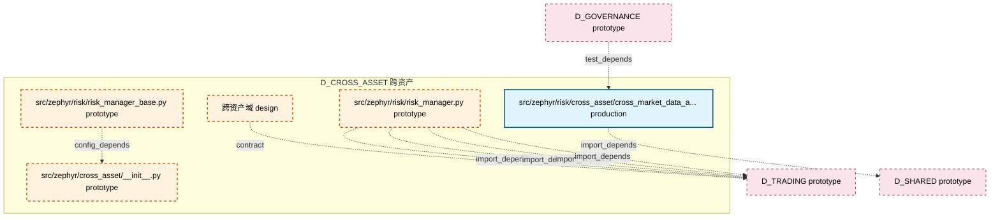

# 26_d_cross_asset / 跨资产

> **文档作用 / Purpose**: 展示 跨资产（D_CROSS_ASSET）功能域的模块清单、域内依赖关系、跨域依赖关系、架构分层视图，供架构审查和域治理参考。

> 本文档由 generate_domain_doc.py 从 depgraph (PostgreSQL) 自动生成
> 最后更新: 2026-07-01 03:11:05
> 数据源: depgraph (PostgreSQL) nodes表 + edges表

## 域基本信息 / Domain Overview

| 字段 | 值 | Field | Value |
|------|------|-------|-------|
| 编号 | 26 | Number | 26 |
| 域ID | D_CROSS_ASSET | Domain ID | D_CROSS_ASSET |
| 域名称 | 跨资产 | Domain Name | 跨资产 |
| 层级 | L2_domain | Layer | L2_domain |
| 模块数 | 5 | Module Count | 5 |
| 域内依赖 | 1 | Internal Dependencies | 1 |
| 跨域入边 | 2 | Cross-domain Incoming | 2 |
| 跨域出边 | 6 | Cross-domain Outgoing | 6 |
| 设计态模块 | 1 | Design Modules | 1 |
| 原型态模块 | 3 | Prototype Modules | 3 |
| 生产态模块 | 1 | Production Modules | 1 |
| 容量 | 1/150 (正常) | Capacity | 1/150 (正常) |
| 描述 | 跨资产策略与配置 | Description | 跨资产策略与配置 |

## 域内依赖图 / Internal Dependency Diagram

> 依赖图内嵌在本文档中，IDE 可直接渲染显示。每30个节点一组分页显示。
>
> **图例说明 / Legend**：
> - **实线边框 = 运营态模块**（production，已上线运行）
> - **虚线边框 = 设计态模块**（design，还在设计中）
> - **实线箭头 = 运营态依赖**（已生效的依赖关系）
> - **虚线箭头 = 设计态依赖**（计划中的依赖关系）



## 跨域依赖 / Cross-domain Dependencies

### 本域依赖的其他域（出边）/ Depends On

| 目标域 / Target Domain | 依赖数 / Count | 依赖类型 / Type |
|--------|:---:|---------|
| D_TRADING | 5 | contract,import_depends |
| D_SHARED | 1 | import_depends |

### 依赖本域的其他域（入边）/ Depended By

| 源域 / Source Domain | 依赖数 / Count | 依赖类型 / Type |
|------|:---:|---------|
| D_GOVERNANCE | 2 | test_depends |

## 架构分层视图 / Architecture Overview

> 按 architecture_layer 分层显示 跨资产（D_CROSS_ASSET）的模块分布。共 5 个模块 / 5 modules。

```

┌──────────────────────────────────────────────────────────────────┐
│               L2 领域层 / Domain Layer (5 modules)               │
├──────────────────────────────────────────────────────────────────┤
│   跨资产域  [design]                                             │
│   src/zephyr/cross_asset/__init__.py  [prototype]                │
│   src/zephyr/risk/cross_asset/cross_market_data_adapter/ml_ex... │
│   src/zephyr/risk/risk_manager.py  [prototype]                   │
│   src/zephyr/risk/risk_manager_base.py  [prototype]              │
└──────────────────────────────────────────────────────────────────┘

```

## 模块分层清单 / Module Layered List

> 按 architecture_layer 分组的模块清单（共 5 个模块 / 5 modules）。

### L2 领域层 / Domain Layer (5 modules)

| # | 模块路径 / Module Path | 模块名称 / Module Name | 成熟度 / Maturity | 构建状态 / Build Status |
|:--:|---------|---------|:---:|:---:|
| 1 | src/zephyr/cross_asset/ | 跨资产域 | design | planned |
| 2 | src/zephyr/cross_asset/__init__.py | src/zephyr/cross_asset/__init__.py | prototype | generated |
| 3 | src/zephyr/risk/cross_asset/cross_market_data_adapter/ml_... | src/zephyr/risk/cross_asset/cross_mar... | production | generated |
| 4 | src/zephyr/risk/risk_manager.py | src/zephyr/risk/risk_manager.py | prototype | generated |
| 5 | src/zephyr/risk/risk_manager_base.py | src/zephyr/risk/risk_manager_base.py | prototype | generated |

## 依赖关系图 / Dependency Graph

> 域内模块依赖关系（共 1 条 / 1 edges）。按依赖类型分组，使用 → 表示方向。

```

┌──────────────────────────────────────────────────────────────────┐
│        依赖关系图 / Dependency Graph (共 1 条 / 1 edges)         │
├──────────────────────────────────────────────────────────────────┤
│   依赖类型数 / Dependency Types: 1                               │
│   [config_depends]: 1 条 / edges                                 │
└──────────────────────────────────────────────────────────────────┘

┌──────────────────────────────────────────────────────────────────┐
│                 [config_depends] (1 条 / edges)                  │
├──────────────────────────────────────────────────────────────────┤
│   risk_manager_base.py → __init__.py                             │
└──────────────────────────────────────────────────────────────────┘

```

## 说明 / Notes

- **数据源 / Data Source**: `depgraph (PostgreSQL)` 的 `nodes`、`edges`、`domains` 表
- **生成器 / Generator**: `generate_domain_doc.py`（G2+G10 合并）
- **维护方式 / Maintenance**: 自动生成，全景图更新时刷新
- **文件名规则 / File Naming**: `{编号:02d}_{域ID小写}.md`，如 `16_d_trading.md`
- **图例说明 / Legend**: `[production]`=已上线 / `[design]`=设计中 / `[prototype]`=原型 / `[unknown]`=未知
