# 26_d_cross_asset / 跨资产

> **文档作用 / Purpose**: 展示 跨资产（D-CROSS_ASSET）功能域的模块清单、域内依赖关系和跨域依赖关系，供架构审查和域治理参考。

> 本文档由 generate_domain_doc.py 从 depgraph.db 自动生成
> 最后更新: 2026-06-26 21:00:25
> 数据源: depgraph.db nodes表 + edges表

## 域基本信息 / Domain Overview

| 字段 | 值 | Field | Value |
|------|------|-------|-------|
| 编号 | 26 | Number | 26 |
| 域ID | D-CROSS_ASSET | Domain ID | D-CROSS_ASSET |
| 域名称 | 跨资产 | Domain Name | 跨资产 |
| 层级 | L2_domain | Layer | L2_domain |
| 模块数 | 11 | Module Count | 11 |
| 域内依赖 | 1 | Internal Dependencies | 1 |
| 跨域入边 | 2 | Cross-domain Incoming | 2 |
| 跨域出边 | 6 | Cross-domain Outgoing | 6 |
| 设计态模块 | 1 | Design Modules | 1 |
| 原型态模块 | 9 | Prototype Modules | 9 |
| 生产态模块 | 1 | Production Modules | 1 |
| 容量 | 1/150 (正常) | Capacity | 1/150 (正常) |
| 描述 | 跨资产策略与配置 | Description | 跨资产策略与配置 |

## 模块清单 / Module List

共 11 个模块（按路径排序，全部显示）

| 模块路径 / Module Path | 模块名称 / Module Name | 设计成熟度 / Maturity | 构建状态 / Build Status |
|---------|---------|-----------|---------|
| src/zephyr/cross_asset/ | 跨资产域 | design | planned |
| src/zephyr/cross_asset/__init__.py |  | prototype | generated |
| src/zephyr/cross_asset/_extensions/__init__.py |  | prototype | deprecated |
| src/zephyr/cross_asset/api/__init__.py |  | prototype | deprecated |
| src/zephyr/cross_asset/core/__init__.py |  | prototype | deprecated |
| src/zephyr/cross_asset/infrastructure/__init__.py |  | prototype | deprecated |
| src/zephyr/cross_asset/models/__init__.py |  | prototype | deprecated |
| src/zephyr/cross_asset/services/__init__.py |  | prototype | deprecated |
| src/zephyr/risk/cross_asset/cross_market_data_adapter/ml_experiment_pipeline.py |  | production | generated |
| src/zephyr/risk/risk_manager.py |  | prototype | generated |
| src/zephyr/risk/risk_manager_base.py |  | prototype | generated |

## 域内依赖图 / Internal Dependency Diagram

> 依赖图内嵌在本文档中，IDE 可直接渲染显示。每30个节点一组分页显示。
>
> **图例说明 / Legend**：
> - **实线边框 = 运营态模块**（production，已上线运行）
> - **虚线边框 = 设计态模块**（design，还在设计中）
> - **实线箭头 = 运营态依赖**（已生效的依赖关系）
> - **虚线箭头 = 设计态依赖**（计划中的依赖关系）

```mermaid
graph TD
    subgraph D_CROSS_ASSET["D-CROSS_ASSET 跨资产"]
        src_zephyr_cross_asset["跨资产域 design"]
        src_zephyr_cross_asset_init_py["src/zephyr/cross_asset/__init__.py prototype"]
        src_zephyr_cross_asset_extensions_init_py["src/zephyr/cross_asset/_extensions/__init__.py prototype"]
        src_zephyr_cross_asset_api_init_py["src/zephyr/cross_asset/api/__init__.py prototype"]
        src_zephyr_cross_asset_core_init_py["src/zephyr/cross_asset/core/__init__.py prototype"]
        src_zephyr_cross_asset_infrastructure_init_py["src/zephyr/cross_asset/infrastructure/__init__.py prototype"]
        src_zephyr_cross_asset_models_init_py["src/zephyr/cross_asset/models/__init__.py prototype"]
        src_zephyr_cross_asset_services_init_py["src/zephyr/cross_asset/services/__init__.py prototype"]
        src_zephyr_risk_cross_asset_cross_market_data_adapter_ml_experiment_pipeline_py["src/zephyr/risk/cross_asset/cross_market_data_a... production"]
        src_zephyr_risk_risk_manager_py["src/zephyr/risk/risk_manager.py prototype"]
        src_zephyr_risk_risk_manager_base_py["src/zephyr/risk/risk_manager_base.py prototype"]
    end
    src_zephyr_risk_risk_manager_base_py -.->|config_depends| src_zephyr_cross_asset_init_py
    D_TRADING["D-TRADING prototype"]
    src_zephyr_cross_asset -.->|contract| D_TRADING
    src_zephyr_risk_risk_manager_py -.->|import_depends| D_TRADING
    src_zephyr_risk_risk_manager_py -.->|import_depends| D_TRADING
    src_zephyr_risk_risk_manager_py -.->|import_depends| D_TRADING
    src_zephyr_risk_risk_manager_py -.->|import_depends| D_TRADING
    D_SHARED["D-SHARED prototype"]
    src_zephyr_risk_cross_asset_cross_market_data_adapter_ml_experiment_pipeline_py -.->|import_depends| D_SHARED
    D_GOVERNANCE["D-GOVERNANCE prototype"]
    D_GOVERNANCE -.->|test_depends| src_zephyr_risk_cross_asset_cross_market_data_adapter_ml_experiment_pipeline_py
    D_GOVERNANCE -.->|test_depends| src_zephyr_risk_cross_asset_cross_market_data_adapter_ml_experiment_pipeline_py
    classDef production fill:#e1f5fe,stroke:#01579b,stroke-width:2px,color:#000
    classDef design fill:#fff3e0,stroke:#e65100,stroke-width:2px,color:#000,stroke-dasharray: 5 5
    classDef external_prod fill:#e8f5e9,stroke:#1b5e20,stroke-width:1px,color:#000
    classDef external_design fill:#fce4ec,stroke:#880e4f,stroke-width:1px,color:#000,stroke-dasharray: 5 5
    class src_zephyr_risk_cross_asset_cross_market_data_adapter_ml_experiment_pipeline_py production
    class src_zephyr_cross_asset,src_zephyr_cross_asset_init_py,src_zephyr_cross_asset_extensions_init_py,src_zephyr_cross_asset_api_init_py,src_zephyr_cross_asset_core_init_py,src_zephyr_cross_asset_infrastructure_init_py,src_zephyr_cross_asset_models_init_py,src_zephyr_cross_asset_services_init_py,src_zephyr_risk_risk_manager_py,src_zephyr_risk_risk_manager_base_py design
    class D_TRADING,D_SHARED,D_GOVERNANCE external_design
```

## 跨域依赖 / Cross-domain Dependencies

### 本域依赖的其他域（出边）/ Depends On

| 目标域 / Target Domain | 依赖数 / Count | 依赖类型 / Type |
|--------|:---:|---------|
| D-TRADING | 5 | contract,import_depends |
| D-SHARED | 1 | import_depends |

### 依赖本域的其他域（入边）/ Depended By

| 源域 / Source Domain | 依赖数 / Count | 依赖类型 / Type |
|------|:---:|---------|
| D-GOVERNANCE | 2 | test_depends |

## 说明 / Notes

- **数据源 / Data Source**: `depgraph.db` 的 `nodes`、`edges`、`domains` 表
- **生成器 / Generator**: `generate_domain_doc.py`
- **维护方式 / Maintenance**: 自动生成，全景图更新时刷新
- **文件名规则 / File Naming**: `{编号:02d}_{域ID小写}.md`，如 `16_d_trading.md`
