# 26_d_gov_audit 域文档

> 本文档由 generate_domain_doc.py 从 depgraph.db 自动生成
> 最后更新: 2026-06-24 02:24:12
> 数据源: depgraph.db nodes表 + edges表

## 域基本信息 / Domain Overview

| 字段 | 值 | Field | Value |
|------|------|-------|-------|
| 编号 | 26 | Number | 26 |
| 域ID | D-GOV_AUDIT | Domain ID | D-GOV_AUDIT |
| 域名称 | audit-trail | Domain Name | audit-trail |
| 层级 | L2_domain | Layer | L2_domain |
| 模块数 | 268 | Module Count | 268 |
| 域内依赖 | 249 | Internal Dependencies | 249 |
| 跨域入边 | 216 | Cross-domain Incoming | 216 |
| 跨域出边 | 119 | Cross-domain Outgoing | 119 |
| 设计态模块 | 6 | Design Modules | 6 |
| 原型态模块 | 193 | Prototype Modules | 193 |
| 生产态模块 | 69 | Production Modules | 69 |
| 容量 | 268/200 (超容) | Capacity | 268/200 (超容) |
| 描述 | Merkle小时级完整性(merkle_hourly) | Description | Merkle小时级完整性(merkle_hourly) |

## 模块清单 / Module List

共 268 个模块（按路径排序，最多显示前 200 个）

| 模块路径 | 模块名称 | 设计成熟度 | 构建状态 | Module Path | Module Name | Maturity | Build Status |
|---------|---------|-----------|---------|-------------|-------------|----------|--------------|
| D-GOVERNANCE/Audit Chain Domain 审计链域 | Audit Chain Domain 审计链域 | design | design_only | D-GOVERNANCE/Audit Chain Domain 审计链域 | Audit Chain Domain 审计链域 | design | design_only |
| D-GOVERNANCE/Audit Orchestrator 审计编排器 | Audit Orchestrator 审计编排器 | design | design_only | D-GOVERNANCE/Audit Orchestrator 审计编排器 | Audit Orchestrator 审计编排器 | design | design_only |
| D-GOVERNANCE/Decision Audit Trail 决策审计追踪 | Decision Audit Trail 决策审计追踪 | design | design_only | D-GOVERNANCE/Decision Audit Trail 决策审计追踪 | Decision Audit Trail 决策审计追踪 | design | design_only |
| D-GOVERNANCE/审计链6W模型 Audit Chain 6W Model | 审计链6W模型 Audit Chain 6W Model | design | design_only | D-GOVERNANCE/审计链6W模型 Audit Chain 6W Model | 审计链6W模型 Audit Chain 6W Model | design | design_only |
| ...policies_and_standards/_registry/vocabularies/compliance_tags_vocabulary.yaml |  | production | orphan | ...policies_and_standards/_registry/vocabularies/compliance_tags_vocabulary.yaml |  | production | orphan |
| ...andards/_registry/vocabularies/provenance_audit_chain_verdict_vocabulary.yaml |  | production | orphan | ...andards/_registry/vocabularies/provenance_audit_chain_verdict_vocabulary.yaml |  | production | orphan |
| docs/01_policies_and_standards/rules/trae_044_compliance_audit.yaml |  | production | orphan | docs/01_policies_and_standards/rules/trae_044_compliance_audit.yaml |  | production | orphan |
| ...rchitecture/target_architecture/architecture_model/layers/l10_compliance.yaml |  | production | orphan | ...rchitecture/target_architecture/architecture_model/layers/l10_compliance.yaml |  | production | orphan |
| docs/03_modules/_cross_layer/audit_orchestrator/blueprint.md | docs__03_modules___cross_layer__audit... | design | design_only | docs/03_modules/_cross_layer/audit_orchestrator/blueprint.md | docs__03_modules___cross_layer__audit... | design | design_only |
| docs/03_modules/_domain_governance/audit_trail/blueprint.md | docs__03_modules___domain_governance_... | design | design_only | docs/03_modules/_domain_governance/audit_trail/blueprint.md | docs__03_modules___domain_governance_... | design | design_only |
| scripts/governance/meta/compliance_framework_map.yaml |  | production | orphan | scripts/governance/meta/compliance_framework_map.yaml |  | production | orphan |
| scripts/governance/repair/_gen_unregistered_registry.py |  | prototype | draft | scripts/governance/repair/_gen_unregistered_registry.py |  | prototype | draft |
| scripts/governance/repair/audit_design_completeness.py |  | prototype | draft | scripts/governance/repair/audit_design_completeness.py |  | prototype | draft |
| scripts/governance/repair/audit_task_cards.py |  | prototype | draft | scripts/governance/repair/audit_task_cards.py |  | prototype | draft |
| scripts/governance/repair/backup_db.py |  | prototype | draft | scripts/governance/repair/backup_db.py |  | prototype | draft |
| scripts/governance/repair/backup_depgraph.py |  | prototype | draft | scripts/governance/repair/backup_depgraph.py |  | prototype | draft |
| scripts/governance/repair/backup_depgraph_migration.py |  | prototype | draft | scripts/governance/repair/backup_depgraph_migration.py |  | prototype | draft |
| scripts/governance/repair/backup_depgraph_v5.py |  | prototype | draft | scripts/governance/repair/backup_depgraph_v5.py |  | prototype | draft |
| scripts/governance/repair/check_arch_tables.py |  | prototype | draft | scripts/governance/repair/check_arch_tables.py |  | prototype | draft |
| scripts/governance/repair/check_depgraph_schema.py |  | prototype | draft | scripts/governance/repair/check_depgraph_schema.py |  | prototype | draft |
| scripts/governance/repair/check_dm200_and_mig.py |  | prototype | draft | scripts/governance/repair/check_dm200_and_mig.py |  | prototype | draft |
| scripts/governance/repair/check_dm_ids.py |  | prototype | draft | scripts/governance/repair/check_dm_ids.py |  | prototype | draft |
| scripts/governance/repair/check_governance_db.py |  | prototype | draft | scripts/governance/repair/check_governance_db.py |  | prototype | draft |
| scripts/governance/repair/check_migration_state.py |  | prototype | draft | scripts/governance/repair/check_migration_state.py |  | prototype | draft |
| scripts/governance/repair/check_tasks_constraints.py |  | prototype | draft | scripts/governance/repair/check_tasks_constraints.py |  | prototype | draft |
| scripts/governance/repair/check_tasks_schema.py |  | prototype | draft | scripts/governance/repair/check_tasks_schema.py |  | prototype | draft |
| scripts/governance/repair/cleanup_migration_residue.py |  | prototype | draft | scripts/governance/repair/cleanup_migration_residue.py |  | prototype | draft |
| scripts/governance/repair/create_all_task_cards.py |  | prototype | draft | scripts/governance/repair/create_all_task_cards.py |  | prototype | draft |
| scripts/governance/repair/create_shared_services_proxies.py |  | prototype | draft | scripts/governance/repair/create_shared_services_proxies.py |  | prototype | draft |
| scripts/governance/repair/ensure_dep_cycles_view.py |  | prototype | draft | scripts/governance/repair/ensure_dep_cycles_view.py |  | prototype | draft |
| scripts/governance/repair/extract_design_nodes.py |  | prototype | draft | scripts/governance/repair/extract_design_nodes.py |  | prototype | draft |
| scripts/governance/repair/fix_acceptance_commands.py |  | prototype | draft | scripts/governance/repair/fix_acceptance_commands.py |  | prototype | draft |
| scripts/governance/repair/fix_blueprint_path.py |  | prototype | draft | scripts/governance/repair/fix_blueprint_path.py |  | prototype | draft |
| scripts/governance/repair/fix_data_v3.4.py |  | prototype | draft | scripts/governance/repair/fix_data_v3.4.py |  | prototype | draft |
| scripts/governance/repair/import_design_edges.py |  | prototype | draft | scripts/governance/repair/import_design_edges.py |  | prototype | draft |
| scripts/governance/repair/import_design_nodes.py |  | prototype | draft | scripts/governance/repair/import_design_nodes.py |  | prototype | draft |
| scripts/governance/repair/list_source_md_files.py |  | prototype | draft | scripts/governance/repair/list_source_md_files.py |  | prototype | draft |
| scripts/governance/repair/mig5_fill_gaps.py |  | prototype | draft | scripts/governance/repair/mig5_fill_gaps.py |  | prototype | draft |
| scripts/governance/repair/migrate_arch_constraints_v1.py |  | prototype | draft | scripts/governance/repair/migrate_arch_constraints_v1.py |  | prototype | draft |
| scripts/governance/repair/migrate_schema_v3.4.py |  | prototype | draft | scripts/governance/repair/migrate_schema_v3.4.py |  | prototype | draft |
| scripts/governance/repair/migrate_schema_v5.py |  | prototype | draft | scripts/governance/repair/migrate_schema_v5.py |  | prototype | draft |
| scripts/governance/repair/query_p0_3.py |  | prototype | draft | scripts/governance/repair/query_p0_3.py |  | prototype | draft |
| scripts/governance/repair/query_p0_4.py |  | prototype | draft | scripts/governance/repair/query_p0_4.py |  | prototype | draft |
| scripts/governance/repair/query_p0_5.py |  | prototype | draft | scripts/governance/repair/query_p0_5.py |  | prototype | draft |
| scripts/governance/repair/query_p0_6.py |  | prototype | draft | scripts/governance/repair/query_p0_6.py |  | prototype | draft |
| scripts/governance/repair/red_blue_test.py |  | prototype | draft | scripts/governance/repair/red_blue_test.py |  | prototype | draft |
| scripts/governance/repair/reimport_design_edges.py |  | prototype | draft | scripts/governance/repair/reimport_design_edges.py |  | prototype | draft |
| scripts/governance/repair/reimport_design_edges_v2.py |  | prototype | draft | scripts/governance/repair/reimport_design_edges_v2.py |  | prototype | draft |
| scripts/governance/repair/review_p0_1.py |  | prototype | draft | scripts/governance/repair/review_p0_1.py |  | prototype | draft |
| scripts/governance/repair/review_p0_2.py |  | prototype | draft | scripts/governance/repair/review_p0_2.py |  | prototype | draft |
| scripts/governance/repair/review_p0_3.py |  | prototype | draft | scripts/governance/repair/review_p0_3.py |  | prototype | draft |
| scripts/governance/repair/review_p0_4.py |  | prototype | draft | scripts/governance/repair/review_p0_4.py |  | prototype | draft |
| scripts/governance/repair/review_p0_5.py |  | prototype | draft | scripts/governance/repair/review_p0_5.py |  | prototype | draft |
| scripts/governance/repair/review_p0_6.py |  | prototype | draft | scripts/governance/repair/review_p0_6.py |  | prototype | draft |
| scripts/governance/repair/review_p0_7.py |  | prototype | draft | scripts/governance/repair/review_p0_7.py |  | prototype | draft |
| scripts/governance/repair/rollback_depgraph.py |  | prototype | draft | scripts/governance/repair/rollback_depgraph.py |  | prototype | draft |
| scripts/governance/repair/task_manager.py |  | prototype | draft | scripts/governance/repair/task_manager.py |  | prototype | draft |
| scripts/governance/repair/verify_mig_1.py |  | prototype | draft | scripts/governance/repair/verify_mig_1.py |  | prototype | draft |
| scripts/governance/repair/verify_mig_prereq.py |  | prototype | draft | scripts/governance/repair/verify_mig_prereq.py |  | prototype | draft |
| scripts/governance/repair/verify_migration.py |  | prototype | draft | scripts/governance/repair/verify_migration.py |  | prototype | draft |
| scripts/governance/repair/verify_p0_1.py |  | prototype | draft | scripts/governance/repair/verify_p0_1.py |  | prototype | draft |
| scripts/governance/repair/verify_p0_2.py |  | prototype | draft | scripts/governance/repair/verify_p0_2.py |  | prototype | draft |
| scripts/governance/repair/verify_p0_3.py |  | prototype | draft | scripts/governance/repair/verify_p0_3.py |  | prototype | draft |
| scripts/governance/repair/verify_p0_4.py |  | prototype | draft | scripts/governance/repair/verify_p0_4.py |  | prototype | draft |
| scripts/governance/repair/verify_p0_5.py |  | prototype | draft | scripts/governance/repair/verify_p0_5.py |  | prototype | draft |
| scripts/governance/repair/verify_p0_6.py |  | prototype | draft | scripts/governance/repair/verify_p0_6.py |  | prototype | draft |
| scripts/governance/repair/verify_p0_7.py |  | prototype | draft | scripts/governance/repair/verify_p0_7.py |  | prototype | draft |
| scripts/governance/repair/verify_task_cards.py |  | prototype | draft | scripts/governance/repair/verify_task_cards.py |  | prototype | draft |
| src/zephyr/governance/audit_orchestration/__init__.py |  | prototype | draft | src/zephyr/governance/audit_orchestration/__init__.py |  | prototype | draft |
| src/zephyr/governance/audit_orchestration/agent_health_monitor.py |  | prototype | draft | src/zephyr/governance/audit_orchestration/agent_health_monitor.py |  | prototype | draft |
| src/zephyr/governance/audit_orchestration/agent_orchestrator.py |  | prototype | draft | src/zephyr/governance/audit_orchestration/agent_orchestrator.py |  | prototype | draft |
| src/zephyr/governance/audit_orchestration/agent_quality.py |  | prototype | draft | src/zephyr/governance/audit_orchestration/agent_quality.py |  | prototype | draft |
| src/zephyr/governance/audit_orchestration/autonomy_guard.py |  | prototype | draft | src/zephyr/governance/audit_orchestration/autonomy_guard.py |  | prototype | draft |
| src/zephyr/governance/audit_orchestration/backup_manager.py |  | prototype | draft | src/zephyr/governance/audit_orchestration/backup_manager.py |  | prototype | draft |
| src/zephyr/governance/audit_orchestration/batch_orchestrator.py |  | prototype | draft | src/zephyr/governance/audit_orchestration/batch_orchestrator.py |  | prototype | draft |
| src/zephyr/governance/audit_orchestration/benchmark_runner.py |  | prototype | draft | src/zephyr/governance/audit_orchestration/benchmark_runner.py |  | prototype | draft |
| src/zephyr/governance/audit_orchestration/blind_spot_closure.py |  | prototype | draft | src/zephyr/governance/audit_orchestration/blind_spot_closure.py |  | prototype | draft |
| src/zephyr/governance/audit_orchestration/blueprint_health.py |  | prototype | draft | src/zephyr/governance/audit_orchestration/blueprint_health.py |  | prototype | draft |
| src/zephyr/governance/audit_orchestration/blueprint_scorer.py |  | prototype | draft | src/zephyr/governance/audit_orchestration/blueprint_scorer.py |  | prototype | draft |
| src/zephyr/governance/audit_orchestration/bulkhead_manager.py |  | prototype | draft | src/zephyr/governance/audit_orchestration/bulkhead_manager.py |  | prototype | draft |
| src/zephyr/governance/audit_orchestration/canary_manager.py |  | prototype | draft | src/zephyr/governance/audit_orchestration/canary_manager.py |  | prototype | draft |
| src/zephyr/governance/audit_orchestration/capacity_budget.py |  | prototype | draft | src/zephyr/governance/audit_orchestration/capacity_budget.py |  | prototype | draft |
| src/zephyr/governance/audit_orchestration/chaos_engine.py |  | prototype | draft | src/zephyr/governance/audit_orchestration/chaos_engine.py |  | prototype | draft |
| src/zephyr/governance/audit_orchestration/config_manager.py |  | prototype | draft | src/zephyr/governance/audit_orchestration/config_manager.py |  | prototype | draft |
| src/zephyr/governance/audit_orchestration/construction_guide.py |  | prototype | draft | src/zephyr/governance/audit_orchestration/construction_guide.py |  | prototype | draft |
| src/zephyr/governance/audit_orchestration/contract_registry.py |  | prototype | draft | src/zephyr/governance/audit_orchestration/contract_registry.py |  | prototype | draft |
| src/zephyr/governance/audit_orchestration/contract_router.py |  | prototype | draft | src/zephyr/governance/audit_orchestration/contract_router.py |  | prototype | draft |
| src/zephyr/governance/audit_orchestration/core/__init__.py |  | prototype | draft | src/zephyr/governance/audit_orchestration/core/__init__.py |  | prototype | draft |
| src/zephyr/governance/audit_orchestration/core/agent_orchestrator.py |  | prototype | draft | src/zephyr/governance/audit_orchestration/core/agent_orchestrator.py |  | prototype | draft |
| src/zephyr/governance/audit_orchestration/core/task_queue.py |  | prototype | draft | src/zephyr/governance/audit_orchestration/core/task_queue.py |  | prototype | draft |
| src/zephyr/governance/audit_orchestration/core/trigger_router.py |  | prototype | draft | src/zephyr/governance/audit_orchestration/core/trigger_router.py |  | prototype | draft |
| src/zephyr/governance/audit_orchestration/core/wave_generator.py |  | prototype | draft | src/zephyr/governance/audit_orchestration/core/wave_generator.py |  | prototype | draft |
| src/zephyr/governance/audit_orchestration/data_lifecycle.py |  | prototype | draft | src/zephyr/governance/audit_orchestration/data_lifecycle.py |  | prototype | draft |
| src/zephyr/governance/audit_orchestration/deferred_queue.py |  | prototype | draft | src/zephyr/governance/audit_orchestration/deferred_queue.py |  | prototype | draft |
| src/zephyr/governance/audit_orchestration/degrade_cascade.py |  | prototype | draft | src/zephyr/governance/audit_orchestration/degrade_cascade.py |  | prototype | draft |
| src/zephyr/governance/audit_orchestration/dependency_lock.py |  | prototype | draft | src/zephyr/governance/audit_orchestration/dependency_lock.py |  | prototype | draft |
| src/zephyr/governance/audit_orchestration/design_decisions.py |  | prototype | draft | src/zephyr/governance/audit_orchestration/design_decisions.py |  | prototype | draft |
| src/zephyr/governance/audit_orchestration/disk_guard.py |  | prototype | draft | src/zephyr/governance/audit_orchestration/disk_guard.py |  | prototype | draft |
| src/zephyr/governance/audit_orchestration/dlq_manager.py |  | prototype | draft | src/zephyr/governance/audit_orchestration/dlq_manager.py |  | prototype | draft |
| src/zephyr/governance/audit_orchestration/failure_matcher.py |  | prototype | draft | src/zephyr/governance/audit_orchestration/failure_matcher.py |  | prototype | draft |
| src/zephyr/governance/audit_orchestration/feature_flag.py |  | prototype | draft | src/zephyr/governance/audit_orchestration/feature_flag.py |  | prototype | draft |
| src/zephyr/governance/audit_orchestration/file_task_mapper.py |  | prototype | draft | src/zephyr/governance/audit_orchestration/file_task_mapper.py |  | prototype | draft |
| src/zephyr/governance/audit_orchestration/finding_bridge.py |  | prototype | draft | src/zephyr/governance/audit_orchestration/finding_bridge.py |  | prototype | draft |
| src/zephyr/governance/audit_orchestration/hallucination_detector.py |  | prototype | draft | src/zephyr/governance/audit_orchestration/hallucination_detector.py |  | prototype | draft |
| src/zephyr/governance/audit_orchestration/housekeeping.py |  | prototype | draft | src/zephyr/governance/audit_orchestration/housekeeping.py |  | prototype | draft |
| src/zephyr/governance/audit_orchestration/incident_postmortem.py |  | prototype | draft | src/zephyr/governance/audit_orchestration/incident_postmortem.py |  | prototype | draft |
| src/zephyr/governance/audit_orchestration/incremental_review.py |  | production | draft | src/zephyr/governance/audit_orchestration/incremental_review.py |  | production | draft |
| src/zephyr/governance/audit_orchestration/ke_quality.py |  | prototype | draft | src/zephyr/governance/audit_orchestration/ke_quality.py |  | prototype | draft |
| src/zephyr/governance/audit_orchestration/knowledge_freshness.py |  | prototype | draft | src/zephyr/governance/audit_orchestration/knowledge_freshness.py |  | prototype | draft |
| src/zephyr/governance/audit_orchestration/lean_scanner.py |  | prototype | draft | src/zephyr/governance/audit_orchestration/lean_scanner.py |  | prototype | draft |
| src/zephyr/governance/audit_orchestration/model_registry.py |  | prototype | draft | src/zephyr/governance/audit_orchestration/model_registry.py |  | prototype | draft |
| src/zephyr/governance/audit_orchestration/network_partition.py |  | prototype | draft | src/zephyr/governance/audit_orchestration/network_partition.py |  | prototype | draft |
| src/zephyr/governance/audit_orchestration/path_index.py |  | prototype | draft | src/zephyr/governance/audit_orchestration/path_index.py |  | prototype | draft |
| src/zephyr/governance/audit_orchestration/phase_executor.py |  | prototype | draft | src/zephyr/governance/audit_orchestration/phase_executor.py |  | prototype | draft |
| src/zephyr/governance/audit_orchestration/prompt_version.py |  | prototype | draft | src/zephyr/governance/audit_orchestration/prompt_version.py |  | prototype | draft |
| src/zephyr/governance/audit_orchestration/reconciliation_loop.py |  | prototype | draft | src/zephyr/governance/audit_orchestration/reconciliation_loop.py |  | prototype | draft |
| src/zephyr/governance/audit_orchestration/resilience/__init__.py |  | prototype | draft | src/zephyr/governance/audit_orchestration/resilience/__init__.py |  | prototype | draft |
| src/zephyr/governance/audit_orchestration/resilience/deferred_queue.py |  | prototype | draft | src/zephyr/governance/audit_orchestration/resilience/deferred_queue.py |  | prototype | draft |
| src/zephyr/governance/audit_orchestration/resilience/failure_matcher.py |  | prototype | draft | src/zephyr/governance/audit_orchestration/resilience/failure_matcher.py |  | prototype | draft |
| src/zephyr/governance/audit_orchestration/resilience/hallucination_detector.py |  | prototype | draft | src/zephyr/governance/audit_orchestration/resilience/hallucination_detector.py |  | prototype | draft |
| src/zephyr/governance/audit_orchestration/resilience/rollback_manager.py |  | prototype | draft | src/zephyr/governance/audit_orchestration/resilience/rollback_manager.py |  | prototype | draft |
| src/zephyr/governance/audit_orchestration/risk_registry.py |  | prototype | draft | src/zephyr/governance/audit_orchestration/risk_registry.py |  | prototype | draft |
| src/zephyr/governance/audit_orchestration/rollback_manager.py |  | prototype | draft | src/zephyr/governance/audit_orchestration/rollback_manager.py |  | prototype | draft |
| src/zephyr/governance/audit_orchestration/rolling_upgrade.py |  | prototype | draft | src/zephyr/governance/audit_orchestration/rolling_upgrade.py |  | prototype | draft |
| src/zephyr/governance/audit_orchestration/schema_migration.py |  | prototype | draft | src/zephyr/governance/audit_orchestration/schema_migration.py |  | prototype | draft |
| src/zephyr/governance/audit_orchestration/session_conflict.py |  | prototype | draft | src/zephyr/governance/audit_orchestration/session_conflict.py |  | prototype | draft |
| src/zephyr/governance/audit_orchestration/session_handoff.py |  | prototype | draft | src/zephyr/governance/audit_orchestration/session_handoff.py |  | prototype | draft |
| src/zephyr/governance/audit_orchestration/session_manager.py |  | prototype | draft | src/zephyr/governance/audit_orchestration/session_manager.py |  | prototype | draft |
| src/zephyr/governance/audit_orchestration/stability_guard.py |  | prototype | draft | src/zephyr/governance/audit_orchestration/stability_guard.py |  | prototype | draft |
| src/zephyr/governance/audit_orchestration/startup_sequencer.py |  | prototype | draft | src/zephyr/governance/audit_orchestration/startup_sequencer.py |  | prototype | draft |
| src/zephyr/governance/audit_orchestration/state/__init__.py |  | prototype | draft | src/zephyr/governance/audit_orchestration/state/__init__.py |  | prototype | draft |
| src/zephyr/governance/audit_orchestration/state/agent_health_monitor.py |  | prototype | draft | src/zephyr/governance/audit_orchestration/state/agent_health_monitor.py |  | prototype | draft |
| src/zephyr/governance/audit_orchestration/state/file_task_mapper.py |  | prototype | draft | src/zephyr/governance/audit_orchestration/state/file_task_mapper.py |  | prototype | draft |
| src/zephyr/governance/audit_orchestration/state/session_manager.py |  | prototype | draft | src/zephyr/governance/audit_orchestration/state/session_manager.py |  | prototype | draft |
| src/zephyr/governance/audit_orchestration/state/state_synchronizer.py |  | prototype | draft | src/zephyr/governance/audit_orchestration/state/state_synchronizer.py |  | prototype | draft |
| src/zephyr/governance/audit_orchestration/state_propagation.py |  | prototype | draft | src/zephyr/governance/audit_orchestration/state_propagation.py |  | prototype | draft |
| src/zephyr/governance/audit_orchestration/state_synchronizer.py |  | prototype | draft | src/zephyr/governance/audit_orchestration/state_synchronizer.py |  | prototype | draft |
| src/zephyr/governance/audit_orchestration/system_transfer.py |  | prototype | draft | src/zephyr/governance/audit_orchestration/system_transfer.py |  | prototype | draft |
| src/zephyr/governance/audit_orchestration/task_queue.py |  | prototype | draft | src/zephyr/governance/audit_orchestration/task_queue.py |  | prototype | draft |
| src/zephyr/governance/audit_orchestration/teardown_manager.py |  | prototype | draft | src/zephyr/governance/audit_orchestration/teardown_manager.py |  | prototype | draft |
| src/zephyr/governance/audit_orchestration/trigger_router.py |  | prototype | draft | src/zephyr/governance/audit_orchestration/trigger_router.py |  | prototype | draft |
| src/zephyr/governance/audit_orchestration/version_manifest.py |  | prototype | draft | src/zephyr/governance/audit_orchestration/version_manifest.py |  | prototype | draft |
| src/zephyr/governance/audit_orchestration/wave_generator.py |  | prototype | draft | src/zephyr/governance/audit_orchestration/wave_generator.py |  | prototype | draft |
| src/zephyr/governance/audit_orchestrator/__init__.py |  | prototype | draft | src/zephyr/governance/audit_orchestrator/__init__.py |  | prototype | draft |
| src/zephyr/governance/audit_orchestrator/__main__.py |  | prototype | draft | src/zephyr/governance/audit_orchestrator/__main__.py |  | prototype | draft |
| src/zephyr/governance/audit_orchestrator/anomaly.py |  | prototype | draft | src/zephyr/governance/audit_orchestrator/anomaly.py |  | prototype | draft |
| src/zephyr/governance/audit_orchestrator/audit_admission_controller.py |  | prototype | draft | src/zephyr/governance/audit_orchestrator/audit_admission_controller.py |  | prototype | draft |
| src/zephyr/governance/audit_orchestrator/bridge.py |  | prototype | draft | src/zephyr/governance/audit_orchestrator/bridge.py |  | prototype | draft |
| src/zephyr/governance/audit_orchestrator/cli.py |  | prototype | draft | src/zephyr/governance/audit_orchestrator/cli.py |  | prototype | draft |
| src/zephyr/governance/audit_orchestrator/cold_start.py |  | production | draft | src/zephyr/governance/audit_orchestrator/cold_start.py |  | production | draft |
| src/zephyr/governance/audit_orchestrator/contracts.py |  | prototype | draft | src/zephyr/governance/audit_orchestrator/contracts.py |  | prototype | draft |
| src/zephyr/governance/audit_orchestrator/delegation_auditor.py |  | prototype | draft | src/zephyr/governance/audit_orchestrator/delegation_auditor.py |  | prototype | draft |
| src/zephyr/governance/audit_orchestrator/delegation_bridge.py |  | prototype | draft | src/zephyr/governance/audit_orchestrator/delegation_bridge.py |  | prototype | draft |
| src/zephyr/governance/audit_orchestrator/drift_bridge.py |  | prototype | draft | src/zephyr/governance/audit_orchestrator/drift_bridge.py |  | prototype | draft |
| src/zephyr/governance/audit_orchestrator/evidence_pack.py |  | production | draft | src/zephyr/governance/audit_orchestrator/evidence_pack.py |  | production | draft |
| src/zephyr/governance/audit_orchestrator/external_tool_audit.py |  | prototype | draft | src/zephyr/governance/audit_orchestrator/external_tool_audit.py |  | prototype | draft |
| src/zephyr/governance/audit_orchestrator/feedback_bridge.py |  | prototype | draft | src/zephyr/governance/audit_orchestrator/feedback_bridge.py |  | prototype | draft |
| src/zephyr/governance/audit_orchestrator/feedback_policy.py |  | prototype | draft | src/zephyr/governance/audit_orchestrator/feedback_policy.py |  | prototype | draft |
| src/zephyr/governance/audit_orchestrator/genesis.py |  | prototype | draft | src/zephyr/governance/audit_orchestrator/genesis.py |  | prototype | draft |
| src/zephyr/governance/audit_orchestrator/indexer.py |  | prototype | draft | src/zephyr/governance/audit_orchestrator/indexer.py |  | prototype | draft |
| src/zephyr/governance/audit_orchestrator/log_rotation.py |  | prototype | draft | src/zephyr/governance/audit_orchestrator/log_rotation.py |  | prototype | draft |
| src/zephyr/governance/audit_orchestrator/merkle_hourly.py |  | prototype | draft | src/zephyr/governance/audit_orchestrator/merkle_hourly.py |  | prototype | draft |
| src/zephyr/governance/audit_orchestrator/models.py |  | prototype | draft | src/zephyr/governance/audit_orchestrator/models.py |  | prototype | draft |
| src/zephyr/governance/audit_orchestrator/pipeline_runner.py |  | prototype | draft | src/zephyr/governance/audit_orchestrator/pipeline_runner.py |  | prototype | draft |
| src/zephyr/governance/audit_orchestrator/query.py |  | prototype | draft | src/zephyr/governance/audit_orchestrator/query.py |  | prototype | draft |
| src/zephyr/governance/audit_orchestrator/replay_engine.py |  | prototype | draft | src/zephyr/governance/audit_orchestrator/replay_engine.py |  | prototype | draft |
| src/zephyr/governance/audit_orchestrator/resource_aware_pool.py |  | prototype | draft | src/zephyr/governance/audit_orchestrator/resource_aware_pool.py |  | prototype | draft |
| src/zephyr/governance/audit_orchestrator/retention.py |  | prototype | draft | src/zephyr/governance/audit_orchestrator/retention.py |  | prototype | draft |
| src/zephyr/governance/audit_orchestrator/self_monitor.py |  | prototype | draft | src/zephyr/governance/audit_orchestrator/self_monitor.py |  | prototype | draft |
| src/zephyr/governance/audit_orchestrator/text_to_finding_adapter.py |  | prototype | draft | src/zephyr/governance/audit_orchestrator/text_to_finding_adapter.py |  | prototype | draft |
| src/zephyr/governance/audit_orchestrator/tiered_storage.py |  | prototype | draft | src/zephyr/governance/audit_orchestrator/tiered_storage.py |  | prototype | draft |
| src/zephyr/governance/audit_orchestrator/tiered_storage_bridge.py |  | prototype | draft | src/zephyr/governance/audit_orchestrator/tiered_storage_bridge.py |  | prototype | draft |
| src/zephyr/governance/audit_orchestrator/trust_bridge.py |  | prototype | draft | src/zephyr/governance/audit_orchestrator/trust_bridge.py |  | prototype | draft |
| src/zephyr/governance/audit_orchestrator/trust_engine.py |  | prototype | draft | src/zephyr/governance/audit_orchestrator/trust_engine.py |  | prototype | draft |
| src/zephyr/governance/audit_orchestrator/writer.py |  | prototype | draft | src/zephyr/governance/audit_orchestrator/writer.py |  | prototype | draft |
| src/zephyr/governance/audit_trail/__init__.py |  | production | draft | src/zephyr/governance/audit_trail/__init__.py |  | production | draft |
| src/zephyr/governance/audit_trail/__main__.py |  | prototype | draft | src/zephyr/governance/audit_trail/__main__.py |  | prototype | draft |
| src/zephyr/governance/audit_trail/agent_signer.py |  | production | draft | src/zephyr/governance/audit_trail/agent_signer.py |  | production | draft |
| src/zephyr/governance/audit_trail/anomaly.py |  | production | draft | src/zephyr/governance/audit_trail/anomaly.py |  | production | draft |
| src/zephyr/governance/audit_trail/api_lifecycle.py |  | production | draft | src/zephyr/governance/audit_trail/api_lifecycle.py |  | production | draft |
| src/zephyr/governance/audit_trail/audit_admission_controller.py |  | prototype | draft | src/zephyr/governance/audit_trail/audit_admission_controller.py |  | prototype | draft |
| src/zephyr/governance/audit_trail/bridge.py |  | production | draft | src/zephyr/governance/audit_trail/bridge.py |  | production | draft |
| src/zephyr/governance/audit_trail/bridges/__init__.py |  | prototype | draft | src/zephyr/governance/audit_trail/bridges/__init__.py |  | prototype | draft |
| src/zephyr/governance/audit_trail/bridges/anomaly.py |  | prototype | draft | src/zephyr/governance/audit_trail/bridges/anomaly.py |  | prototype | draft |
| src/zephyr/governance/audit_trail/bridges/contracts.py |  | prototype | draft | src/zephyr/governance/audit_trail/bridges/contracts.py |  | prototype | draft |
| src/zephyr/governance/audit_trail/bridges/delegation_bridge.py |  | prototype | draft | src/zephyr/governance/audit_trail/bridges/delegation_bridge.py |  | prototype | draft |
| src/zephyr/governance/audit_trail/bridges/drift_bridge.py |  | prototype | draft | src/zephyr/governance/audit_trail/bridges/drift_bridge.py |  | prototype | draft |
| src/zephyr/governance/audit_trail/bridges/feedback_bridge.py |  | prototype | draft | src/zephyr/governance/audit_trail/bridges/feedback_bridge.py |  | prototype | draft |
| src/zephyr/governance/audit_trail/bridges/spec_auditor.py |  | prototype | draft | src/zephyr/governance/audit_trail/bridges/spec_auditor.py |  | prototype | draft |
| src/zephyr/governance/audit_trail/bridges/tiered_storage_bridge.py |  | prototype | draft | src/zephyr/governance/audit_trail/bridges/tiered_storage_bridge.py |  | prototype | draft |
| src/zephyr/governance/audit_trail/bridges/trust_bridge.py |  | prototype | draft | src/zephyr/governance/audit_trail/bridges/trust_bridge.py |  | prototype | draft |
| src/zephyr/governance/audit_trail/changelog_manager.py |  | production | draft | src/zephyr/governance/audit_trail/changelog_manager.py |  | production | draft |
| src/zephyr/governance/audit_trail/cli.py |  | production | draft | src/zephyr/governance/audit_trail/cli.py |  | production | draft |
| src/zephyr/governance/audit_trail/code_archaeology.py |  | production | draft | src/zephyr/governance/audit_trail/code_archaeology.py |  | production | draft |
| src/zephyr/governance/audit_trail/cold_start.py |  | prototype | draft | src/zephyr/governance/audit_trail/cold_start.py |  | prototype | draft |
| src/zephyr/governance/audit_trail/compliance_map.py |  | production | draft | src/zephyr/governance/audit_trail/compliance_map.py |  | production | draft |
| src/zephyr/governance/audit_trail/contracts.py |  | production | draft | src/zephyr/governance/audit_trail/contracts.py |  | production | draft |
| src/zephyr/governance/audit_trail/corporate_actions.py |  | production | draft | src/zephyr/governance/audit_trail/corporate_actions.py |  | production | draft |
| src/zephyr/governance/audit_trail/delegation_auditor.py |  | production | draft | src/zephyr/governance/audit_trail/delegation_auditor.py |  | production | draft |
| src/zephyr/governance/audit_trail/delegation_bridge.py |  | production | draft | src/zephyr/governance/audit_trail/delegation_bridge.py |  | production | draft |

> (仅显示前 200 个模块，共 268 个)

## 域内依赖图 / Internal Dependency Diagram

> 依赖图内嵌在本文档中，IDE 可直接渲染显示。
>
> **图例说明 / Legend**：
> - **实线边框 = 运营态模块**（production，已上线运行）
> - **虚线边框 = 设计态模块**（design，还在设计中）
> - **实线箭头 = 运营态依赖**（已生效的依赖关系）
> - **虚线箭头 = 设计态依赖**（计划中的依赖关系）

```mermaid
graph TD
    subgraph D_GOV_AUDIT["D-GOV_AUDIT audit-trail"]
        D_GOVERNANCE_Audit_Chain_Domain["Audit Chain Domain 审计链域 design"]
        D_GOVERNANCE_Audit_Orchestrator["Audit Orchestrator 审计编排器 design"]
        D_GOVERNANCE_Decision_Audit_Trail["Decision Audit Trail 决策审计追踪 design"]
        D_GOVERNANCE_6W_Audit_Chain_6W_Model["审计链6W模型 Audit Chain 6W Model design"]
        docs_01_policies_and_standards_registry_vocabularies_compliance_tags_vocabulary_yaml["docs/01_policies_and_standards/_registry/vocabu... production"]
        docs_01_policies_and_standards_registry_vocabularies_provenance_audit_chain_verdict_vocabulary_yaml["docs/01_policies_and_standards/_registry/vocabu... production"]
        docs_01_policies_and_standards_rules_trae_044_compliance_audit_yaml["docs/01_policies_and_standards/rules/trae_044_c... production"]
        docs_02_enterprise_architecture_target_architecture_architecture_model_layers_l10_compliance_yaml["docs/02_enterprise_architecture/target_architec... production"]
        docs_03_modules_cross_layer_audit_orchestrator_blueprint_md["docs__03_modules___cross_layer__audit_orchestra... design"]
        docs_03_modules_domain_governance_audit_trail_blueprint_md["docs__03_modules___domain_governance__audit_tra... design"]
        scripts_governance_meta_compliance_framework_map_yaml["scripts/governance/meta/compliance_framework_ma... production"]
        scripts_governance_repair_gen_unregistered_registry_py["scripts/governance/repair/_gen_unregistered_reg... prototype"]
        scripts_governance_repair_audit_design_completeness_py["scripts/governance/repair/audit_design_complete... prototype"]
        scripts_governance_repair_audit_task_cards_py["scripts/governance/repair/audit_task_cards.py prototype"]
        scripts_governance_repair_backup_db_py["scripts/governance/repair/backup_db.py prototype"]
        scripts_governance_repair_backup_depgraph_py["scripts/governance/repair/backup_depgraph.py prototype"]
        scripts_governance_repair_backup_depgraph_migration_py["scripts/governance/repair/backup_depgraph_migra... prototype"]
        scripts_governance_repair_backup_depgraph_v5_py["scripts/governance/repair/backup_depgraph_v5.py prototype"]
        scripts_governance_repair_check_arch_tables_py["scripts/governance/repair/check_arch_tables.py prototype"]
        scripts_governance_repair_check_depgraph_schema_py["scripts/governance/repair/check_depgraph_schema.py prototype"]
        scripts_governance_repair_check_dm200_and_mig_py["scripts/governance/repair/check_dm200_and_mig.py prototype"]
        scripts_governance_repair_check_dm_ids_py["scripts/governance/repair/check_dm_ids.py prototype"]
        scripts_governance_repair_check_governance_db_py["scripts/governance/repair/check_governance_db.py prototype"]
        scripts_governance_repair_check_migration_state_py["scripts/governance/repair/check_migration_state.py prototype"]
        scripts_governance_repair_check_tasks_constraints_py["scripts/governance/repair/check_tasks_constrain... prototype"]
        scripts_governance_repair_check_tasks_schema_py["scripts/governance/repair/check_tasks_schema.py prototype"]
        scripts_governance_repair_cleanup_migration_residue_py["scripts/governance/repair/cleanup_migration_res... prototype"]
        scripts_governance_repair_create_all_task_cards_py["scripts/governance/repair/create_all_task_cards.py prototype"]
        scripts_governance_repair_create_shared_services_proxies_py["scripts/governance/repair/create_shared_service... prototype"]
        scripts_governance_repair_ensure_dep_cycles_view_py["scripts/governance/repair/ensure_dep_cycles_vie... prototype"]
    end
    scripts_governance_repair_backup_depgraph_py -.->|config_depends| scripts_governance_repair_audit_design_completeness_py
    scripts_governance_repair_audit_task_cards_py -.->|config_depends| scripts_governance_repair_backup_depgraph_py
    scripts_governance_repair_backup_db_py -.->|config_depends| scripts_governance_repair_backup_depgraph_py
    scripts_governance_repair_backup_depgraph_v5_py -.->|config_depends| scripts_governance_repair_backup_depgraph_py
    scripts_governance_repair_backup_depgraph_migration_py -.->|config_depends| scripts_governance_repair_backup_depgraph_py
    scripts_governance_repair_check_arch_tables_py -.->|config_depends| scripts_governance_repair_backup_depgraph_py
    scripts_governance_repair_check_dm200_and_mig_py -.->|config_depends| scripts_governance_repair_backup_depgraph_py
    scripts_governance_repair_check_dm_ids_py -.->|config_depends| scripts_governance_repair_backup_depgraph_py
    scripts_governance_repair_check_depgraph_schema_py -.->|config_depends| scripts_governance_repair_backup_depgraph_py
    scripts_governance_repair_check_governance_db_py -.->|config_depends| scripts_governance_repair_backup_depgraph_py
    scripts_governance_repair_cleanup_migration_residue_py -.->|config_depends| scripts_governance_repair_backup_depgraph_py
    scripts_governance_repair_check_migration_state_py -.->|config_depends| scripts_governance_repair_backup_depgraph_py
    scripts_governance_repair_check_tasks_constraints_py -.->|config_depends| scripts_governance_repair_backup_depgraph_py
    scripts_governance_repair_check_tasks_schema_py -.->|config_depends| scripts_governance_repair_backup_depgraph_py
    scripts_governance_repair_create_all_task_cards_py -.->|config_depends| scripts_governance_repair_backup_depgraph_py
    scripts_governance_repair_ensure_dep_cycles_view_py -.->|config_depends| scripts_governance_repair_backup_depgraph_py
    scripts_governance_repair_create_shared_services_proxies_py -.->|config_depends| scripts_governance_repair_backup_depgraph_py
    scripts_governance_repair_gen_unregistered_registry_py -.->|config_depends| scripts_governance_repair_backup_depgraph_py
    D_GOVERNANCE["D-GOVERNANCE design"]
    docs_03_modules_cross_layer_audit_orchestrator_blueprint_md -.->|runtime| D_GOVERNANCE
    docs_03_modules_domain_governance_audit_trail_blueprint_md -.->|runtime| D_GOVERNANCE
    D_GOV_RULE["D-GOV_RULE production"]
    docs_03_modules_domain_governance_audit_trail_blueprint_md -.->|runtime| D_GOV_RULE
    docs_03_modules_domain_governance_audit_trail_blueprint_md -.->|contract| D_GOVERNANCE
    D_GOV_DRIFT["D-GOV_DRIFT design"]
    docs_03_modules_domain_governance_audit_trail_blueprint_md -.->|runtime| D_GOV_DRIFT
    D_GOVERNANCE_Audit_Orchestrator -.->|import_depends| D_GOVERNANCE
    D_GOVERNANCE_Decision_Audit_Trail -.->|import_depends| D_GOVERNANCE
    D_AUTONOMY_PERM["D-AUTONOMY_PERM design"]
    D_GOVERNANCE_Decision_Audit_Trail -.->|event| D_AUTONOMY_PERM
    D_INTELLIGENCE["D-INTELLIGENCE design"]
    D_GOVERNANCE_Decision_Audit_Trail -.->|data| D_INTELLIGENCE
    D_GOVERNANCE_6W_Audit_Chain_6W_Model -.->|import_depends| D_GOVERNANCE
    D_MKT_DATA["D-MKT_DATA design"]
    D_GOVERNANCE_6W_Audit_Chain_6W_Model -.->|data| D_MKT_DATA
    D_SECURITY["D-SECURITY design"]
    D_GOVERNANCE_6W_Audit_Chain_6W_Model -.->|data| D_SECURITY
    D_RISK["D-RISK design"]
    D_GOVERNANCE_Audit_Chain_Domain -.->|data| D_RISK
    D_GOVERNANCE_Audit_Chain_Domain -.->|data| D_SECURITY
    D_GOVERNANCE -.->|contract| docs_03_modules_domain_governance_audit_trail_blueprint_md
    D_GOV_DRIFT -.->|runtime| docs_03_modules_domain_governance_audit_trail_blueprint_md
    D_GOVERNANCE -.->|contract| docs_03_modules_domain_governance_audit_trail_blueprint_md
    D_TRADING["D-TRADING prototype"]
    D_TRADING -.->|contract| docs_03_modules_domain_governance_audit_trail_blueprint_md
    D_GOVERNANCE -.->|runtime| docs_03_modules_domain_governance_audit_trail_blueprint_md
    D_GOVERNANCE -.->|runtime| docs_03_modules_domain_governance_audit_trail_blueprint_md
    D_GOVERNANCE -.->|runtime| docs_03_modules_domain_governance_audit_trail_blueprint_md
    D_GOVERNANCE -.->|import_depends| D_GOVERNANCE_Audit_Orchestrator
    D_AUTONOMY_CORE["D-AUTONOMY_CORE design"]
    D_AUTONOMY_CORE -.->|data| D_GOVERNANCE_Audit_Orchestrator
    D_GOVERNANCE -.->|import_depends| D_GOVERNANCE_Decision_Audit_Trail
    D_GOVERNANCE -.->|import_depends| D_GOVERNANCE_6W_Audit_Chain_6W_Model
    D_GOVERNANCE -.->|import_depends| D_GOVERNANCE_Audit_Chain_Domain
    D_COMPLIANCE["D-COMPLIANCE design"]
    D_COMPLIANCE -.->|domain_dependency| D_GOVERNANCE_Audit_Chain_Domain
    D_OPS["D-OPS design"]
    D_OPS -.->|domain_dependency| D_GOVERNANCE_Audit_Chain_Domain
    classDef production fill:#e1f5fe,stroke:#01579b,stroke-width:2px,color:#000
    classDef design fill:#fff3e0,stroke:#e65100,stroke-width:2px,color:#000,stroke-dasharray: 5 5
    classDef external_prod fill:#e8f5e9,stroke:#1b5e20,stroke-width:1px,color:#000
    classDef external_design fill:#fce4ec,stroke:#880e4f,stroke-width:1px,color:#000,stroke-dasharray: 5 5
    class docs_01_policies_and_standards_registry_vocabularies_compliance_tags_vocabulary_yaml,docs_01_policies_and_standards_registry_vocabularies_provenance_audit_chain_verdict_vocabulary_yaml,docs_01_policies_and_standards_rules_trae_044_compliance_audit_yaml,docs_02_enterprise_architecture_target_architecture_architecture_model_layers_l10_compliance_yaml,scripts_governance_meta_compliance_framework_map_yaml production
    class D_GOVERNANCE_Audit_Chain_Domain,D_GOVERNANCE_Audit_Orchestrator,D_GOVERNANCE_Decision_Audit_Trail,D_GOVERNANCE_6W_Audit_Chain_6W_Model,docs_03_modules_cross_layer_audit_orchestrator_blueprint_md,docs_03_modules_domain_governance_audit_trail_blueprint_md,scripts_governance_repair_gen_unregistered_registry_py,scripts_governance_repair_audit_design_completeness_py,scripts_governance_repair_audit_task_cards_py,scripts_governance_repair_backup_db_py,scripts_governance_repair_backup_depgraph_py,scripts_governance_repair_backup_depgraph_migration_py,scripts_governance_repair_backup_depgraph_v5_py,scripts_governance_repair_check_arch_tables_py,scripts_governance_repair_check_depgraph_schema_py,scripts_governance_repair_check_dm200_and_mig_py,scripts_governance_repair_check_dm_ids_py,scripts_governance_repair_check_governance_db_py,scripts_governance_repair_check_migration_state_py,scripts_governance_repair_check_tasks_constraints_py,scripts_governance_repair_check_tasks_schema_py,scripts_governance_repair_cleanup_migration_residue_py,scripts_governance_repair_create_all_task_cards_py,scripts_governance_repair_create_shared_services_proxies_py,scripts_governance_repair_ensure_dep_cycles_view_py design
    class D_GOV_RULE external_prod
    class D_GOVERNANCE,D_GOV_DRIFT,D_AUTONOMY_PERM,D_INTELLIGENCE,D_MKT_DATA,D_SECURITY,D_RISK,D_TRADING,D_AUTONOMY_CORE,D_COMPLIANCE,D_OPS external_design
```

> (依赖图最多显示前 30 个节点，共 268 个)

## 跨域依赖 / Cross-domain Dependencies

### 本域依赖的其他域（出边）/ Depends On

| 目标域 | 依赖数 | 依赖类型 | Target Domain | Count | Type |
|--------|:---:|---------|---------------|:---:|------|
| D-SHARED | 42 | import_depends,test_depends | D-SHARED | 42 | import_depends,test_depends |
| D-GOVERNANCE | 24 | runtime,contract,import_depends,config_depends | D-GOVERNANCE | 24 | runtime,contract,import_depends,config_depends |
| D-GOV_DRIFT | 16 | runtime,import_depends,test_depends | D-GOV_DRIFT | 16 | runtime,import_depends,test_depends |
| D-SECURITY | 11 | import_depends,test_depends,data | D-SECURITY | 11 | import_depends,test_depends,data |
| D-INTEGRATION | 5 | import_depends | D-INTEGRATION | 5 | import_depends |
| D-INFRA_RUNTIME | 5 | import_depends | D-INFRA_RUNTIME | 5 | import_depends |
| D-GOV_RULE | 5 | runtime,import_depends,test_depends | D-GOV_RULE | 5 | runtime,import_depends,test_depends |
| D-OPS | 3 | import_depends,test_depends | D-OPS | 3 | import_depends,test_depends |
| D-TRADING | 2 | import_depends | D-TRADING | 2 | import_depends |
| D-BEHAVIORAL_AUDIT | 2 | import_depends | D-BEHAVIORAL_AUDIT | 2 | import_depends |
| D-RISK | 1 | data | D-RISK | 1 | data |
| D-MKT_DATA | 1 | data | D-MKT_DATA | 1 | data |
| D-INTELLIGENCE | 1 | data | D-INTELLIGENCE | 1 | data |
| D-AUTONOMY_PERM | 1 | event | D-AUTONOMY_PERM | 1 | event |

### 依赖本域的其他域（入边）/ Depended By

| 源域 | 依赖数 | 依赖类型 | Source Domain | Count | Type |
|------|:---:|---------|---------------|:---:|------|
| D-GOVERNANCE | 150 | contract,runtime,test_depends,import_depends | D-GOVERNANCE | 150 | contract,runtime,test_depends,import_depends |
| D-INFRA_RUNTIME | 12 | import_depends | D-INFRA_RUNTIME | 12 | import_depends |
| D-COMPLIANCE | 12 | import_depends,domain_dependency | D-COMPLIANCE | 12 | import_depends,domain_dependency |
| D-TRADING | 11 | contract,import_depends | D-TRADING | 11 | contract,import_depends |
| D-GOV_DRIFT | 8 | runtime,import_depends | D-GOV_DRIFT | 8 | runtime,import_depends |
| D-SECURITY | 5 | import_depends | D-SECURITY | 5 | import_depends |
| D-AUTONOMY_CORE | 4 | import_depends,data | D-AUTONOMY_CORE | 4 | import_depends,data |
| D-OPS | 3 | import_depends,test_depends,domain_dependency | D-OPS | 3 | import_depends,test_depends,domain_dependency |
| D-INTEGRATION | 3 | import_depends | D-INTEGRATION | 3 | import_depends |
| D-INFRA_OPS | 2 | import_depends | D-INFRA_OPS | 2 | import_depends |
| D-GOV_RULE | 2 | import_depends | D-GOV_RULE | 2 | import_depends |
| D-BEHAVIORAL_AUDIT | 2 | import_depends | D-BEHAVIORAL_AUDIT | 2 | import_depends |
| D-SHARED | 1 | import_depends | D-SHARED | 1 | import_depends |
| D-AUTONOMY_PERM | 1 | test_depends | D-AUTONOMY_PERM | 1 | test_depends |

## 说明 / Notes

- **数据源 / Data Source**: `depgraph.db` 的 `nodes`、`edges`、`domains` 表
- **生成器 / Generator**: `generate_domain_doc.py`
- **维护方式 / Maintenance**: 自动生成，全景图更新时刷新
- **文件名规则 / File Naming**: `{编号:02d}_{域ID小写}.md`，如 `16_d_trading.md`
