# 26_d_gov_audit / 审计追踪

> **文档作用 / Purpose**: 展示 审计追踪（D-GOV_AUDIT）功能域的模块清单、域内依赖关系和跨域依赖关系，供架构审查和域治理参考。

> 本文档由 generate_domain_doc.py 从 depgraph.db 自动生成
> 最后更新: 2026-06-24 23:56:40
> 数据源: depgraph.db nodes表 + edges表

## 域基本信息 / Domain Overview

| 字段 | 值 | Field | Value |
|------|------|-------|-------|
| 编号 | 26 | Number | 26 |
| 域ID | D-GOV_AUDIT | Domain ID | D-GOV_AUDIT |
| 域名称 | 审计追踪 | Domain Name | audit-trail |
| 层级 | L2_domain | Layer | L2_domain |
| 模块数 | 379 | Module Count | 379 |
| 域内依赖 | 193 | Internal Dependencies | 193 |
| 跨域入边 | 216 | Cross-domain Incoming | 216 |
| 跨域出边 | 121 | Cross-domain Outgoing | 121 |
| 设计态模块 | 7 | Design Modules | 7 |
| 原型态模块 | 142 | Prototype Modules | 142 |
| 生产态模块 | 230 | Production Modules | 230 |
| 容量 | 268/200 (超容) | Capacity | 268/200 (超容) |
| 描述 | Merkle小时级完整性(merkle_hourly) | Description | Merkle小时级完整性(merkle_hourly) |

## 模块清单 / Module List

共 379 个模块（按路径排序，全部显示）

| 模块路径 / Module Path | 模块名称 / Module Name | 设计成熟度 / Maturity | 构建状态 / Build Status |
|---------|---------|-----------|---------|
| D-GOVERNANCE/Audit Chain Domain 审计链域 | Audit Chain Domain 审计链域 | design | design_only |
| D-GOVERNANCE/Audit Orchestrator 审计编排器 | Audit Orchestrator 审计编排器 | design | design_only |
| D-GOVERNANCE/Decision Audit Trail 决策审计追踪 | Decision Audit Trail 决策审计追踪 | design | design_only |
| D-GOVERNANCE/审计链6W模型 Audit Chain 6W Model | 审计链6W模型 Audit Chain 6W Model | design | design_only |
| F36-audit-trail/ |  | design | stable |
| ...policies_and_standards/_registry/vocabularies/compliance_tags_vocabulary.yaml |  | production | orphan |
| ...andards/_registry/vocabularies/provenance_audit_chain_verdict_vocabulary.yaml |  | production | orphan |
| docs/01_policies_and_standards/rules/trae_044_compliance_audit.yaml |  | production | orphan |
| ...rchitecture/target_architecture/architecture_model/layers/l10_compliance.yaml |  | production | orphan |
| docs/03_modules/_cross_layer/audit_orchestrator/blueprint.md | docs__03_modules___cross_layer__audit... | design | design_only |
| docs/03_modules/_domain_governance/audit_trail/blueprint.md | docs__03_modules___domain_governance_... | design | design_only |
| scripts/_archive/governance/repair/ensure_dep_cycles_view.py |  | prototype | draft |
| scripts/_archive/governance/repair/list_source_md_files.py |  | prototype | draft |
| scripts/governance/meta/compliance_framework_map.yaml |  | production | orphan |
| scripts/governance/repair/audit_design_completeness.py |  | prototype | draft |
| scripts/governance/repair/backup_db.py |  | prototype | draft |
| scripts/governance/repair/red_blue_test.py |  | prototype | draft |
| scripts/governance/repair/rollback_depgraph.py |  | prototype | draft |
| src/zephyr/governance/audit_orchestration/__init__.py |  | prototype | draft |
| src/zephyr/governance/audit_orchestration/agent_health_monitor.py |  | prototype | draft |
| src/zephyr/governance/audit_orchestration/agent_orchestrator.py |  | prototype | draft |
| src/zephyr/governance/audit_orchestration/agent_quality.py |  | prototype | draft |
| src/zephyr/governance/audit_orchestration/autonomy_guard.py |  | prototype | draft |
| src/zephyr/governance/audit_orchestration/backup_manager.py |  | prototype | draft |
| src/zephyr/governance/audit_orchestration/batch_orchestrator.py |  | prototype | draft |
| src/zephyr/governance/audit_orchestration/benchmark_runner.py |  | prototype | draft |
| src/zephyr/governance/audit_orchestration/blind_spot_closure.py |  | prototype | draft |
| src/zephyr/governance/audit_orchestration/blueprint_health.py |  | prototype | draft |
| src/zephyr/governance/audit_orchestration/blueprint_scorer.py |  | prototype | draft |
| src/zephyr/governance/audit_orchestration/bulkhead_manager.py |  | prototype | draft |
| src/zephyr/governance/audit_orchestration/canary_manager.py |  | prototype | draft |
| src/zephyr/governance/audit_orchestration/capacity_budget.py |  | prototype | draft |
| src/zephyr/governance/audit_orchestration/chaos_engine.py |  | prototype | draft |
| src/zephyr/governance/audit_orchestration/config_manager.py |  | prototype | draft |
| src/zephyr/governance/audit_orchestration/construction_guide.py |  | prototype | draft |
| src/zephyr/governance/audit_orchestration/contract_registry.py |  | prototype | draft |
| src/zephyr/governance/audit_orchestration/contract_router.py |  | prototype | draft |
| src/zephyr/governance/audit_orchestration/core/__init__.py |  | prototype | draft |
| src/zephyr/governance/audit_orchestration/core/agent_orchestrator.py |  | prototype | draft |
| src/zephyr/governance/audit_orchestration/core/task_queue.py |  | prototype | draft |
| src/zephyr/governance/audit_orchestration/core/trigger_router.py |  | prototype | draft |
| src/zephyr/governance/audit_orchestration/core/wave_generator.py |  | prototype | draft |
| src/zephyr/governance/audit_orchestration/data_lifecycle.py |  | prototype | draft |
| src/zephyr/governance/audit_orchestration/deferred_queue.py |  | prototype | draft |
| src/zephyr/governance/audit_orchestration/degrade_cascade.py |  | prototype | draft |
| src/zephyr/governance/audit_orchestration/dependency_lock.py |  | prototype | draft |
| src/zephyr/governance/audit_orchestration/design_decisions.py |  | prototype | draft |
| src/zephyr/governance/audit_orchestration/disk_guard.py |  | prototype | draft |
| src/zephyr/governance/audit_orchestration/dlq_manager.py |  | prototype | draft |
| src/zephyr/governance/audit_orchestration/failure_matcher.py |  | prototype | draft |
| src/zephyr/governance/audit_orchestration/feature_flag.py |  | prototype | draft |
| src/zephyr/governance/audit_orchestration/file_task_mapper.py |  | prototype | draft |
| src/zephyr/governance/audit_orchestration/finding_bridge.py |  | prototype | draft |
| src/zephyr/governance/audit_orchestration/hallucination_detector.py |  | prototype | draft |
| src/zephyr/governance/audit_orchestration/housekeeping.py |  | prototype | draft |
| src/zephyr/governance/audit_orchestration/incident_postmortem.py |  | prototype | draft |
| src/zephyr/governance/audit_orchestration/incremental_review.py |  | production | draft |
| src/zephyr/governance/audit_orchestration/ke_quality.py |  | prototype | draft |
| src/zephyr/governance/audit_orchestration/knowledge_freshness.py |  | prototype | draft |
| src/zephyr/governance/audit_orchestration/lean_scanner.py |  | prototype | draft |
| src/zephyr/governance/audit_orchestration/model_registry.py |  | prototype | draft |
| src/zephyr/governance/audit_orchestration/network_partition.py |  | prototype | draft |
| src/zephyr/governance/audit_orchestration/path_index.py |  | prototype | draft |
| src/zephyr/governance/audit_orchestration/phase_executor.py |  | prototype | draft |
| src/zephyr/governance/audit_orchestration/prompt_version.py |  | prototype | draft |
| src/zephyr/governance/audit_orchestration/reconciliation_loop.py |  | prototype | draft |
| src/zephyr/governance/audit_orchestration/resilience/__init__.py |  | prototype | draft |
| src/zephyr/governance/audit_orchestration/resilience/deferred_queue.py |  | prototype | draft |
| src/zephyr/governance/audit_orchestration/resilience/failure_matcher.py |  | prototype | draft |
| src/zephyr/governance/audit_orchestration/resilience/hallucination_detector.py |  | prototype | draft |
| src/zephyr/governance/audit_orchestration/resilience/rollback_manager.py |  | prototype | draft |
| src/zephyr/governance/audit_orchestration/risk_registry.py |  | prototype | draft |
| src/zephyr/governance/audit_orchestration/rollback_manager.py |  | prototype | draft |
| src/zephyr/governance/audit_orchestration/rolling_upgrade.py |  | prototype | draft |
| src/zephyr/governance/audit_orchestration/schema_migration.py |  | prototype | draft |
| src/zephyr/governance/audit_orchestration/session_conflict.py |  | prototype | draft |
| src/zephyr/governance/audit_orchestration/session_handoff.py |  | prototype | draft |
| src/zephyr/governance/audit_orchestration/session_manager.py |  | prototype | draft |
| src/zephyr/governance/audit_orchestration/stability_guard.py |  | prototype | draft |
| src/zephyr/governance/audit_orchestration/startup_sequencer.py |  | prototype | draft |
| src/zephyr/governance/audit_orchestration/state/__init__.py |  | prototype | draft |
| src/zephyr/governance/audit_orchestration/state/agent_health_monitor.py |  | prototype | draft |
| src/zephyr/governance/audit_orchestration/state/file_task_mapper.py |  | prototype | draft |
| src/zephyr/governance/audit_orchestration/state/session_manager.py |  | prototype | draft |
| src/zephyr/governance/audit_orchestration/state/state_synchronizer.py |  | prototype | draft |
| src/zephyr/governance/audit_orchestration/state_propagation.py |  | prototype | draft |
| src/zephyr/governance/audit_orchestration/state_synchronizer.py |  | prototype | draft |
| src/zephyr/governance/audit_orchestration/system_transfer.py |  | prototype | draft |
| src/zephyr/governance/audit_orchestration/task_queue.py |  | prototype | draft |
| src/zephyr/governance/audit_orchestration/teardown_manager.py |  | prototype | draft |
| src/zephyr/governance/audit_orchestration/trigger_router.py |  | prototype | draft |
| src/zephyr/governance/audit_orchestration/version_manifest.py |  | prototype | draft |
| src/zephyr/governance/audit_orchestration/wave_generator.py |  | prototype | draft |
| src/zephyr/governance/audit_orchestrator/__init__.py |  | prototype | draft |
| src/zephyr/governance/audit_orchestrator/__main__.py |  | prototype | draft |
| src/zephyr/governance/audit_orchestrator/anomaly.py |  | prototype | draft |
| src/zephyr/governance/audit_orchestrator/audit_admission_controller.py |  | prototype | draft |
| src/zephyr/governance/audit_orchestrator/bridge.py |  | prototype | draft |
| src/zephyr/governance/audit_orchestrator/cli.py |  | prototype | draft |
| src/zephyr/governance/audit_orchestrator/cold_start.py |  | production | draft |
| src/zephyr/governance/audit_orchestrator/contracts.py |  | prototype | draft |
| src/zephyr/governance/audit_orchestrator/delegation_auditor.py |  | prototype | draft |
| src/zephyr/governance/audit_orchestrator/delegation_bridge.py |  | prototype | draft |
| src/zephyr/governance/audit_orchestrator/drift_bridge.py |  | prototype | draft |
| src/zephyr/governance/audit_orchestrator/evidence_pack.py |  | production | draft |
| src/zephyr/governance/audit_orchestrator/external_tool_audit.py |  | prototype | draft |
| src/zephyr/governance/audit_orchestrator/feedback_bridge.py |  | prototype | draft |
| src/zephyr/governance/audit_orchestrator/feedback_policy.py |  | prototype | draft |
| src/zephyr/governance/audit_orchestrator/genesis.py |  | prototype | draft |
| src/zephyr/governance/audit_orchestrator/indexer.py |  | prototype | draft |
| src/zephyr/governance/audit_orchestrator/log_rotation.py |  | prototype | draft |
| src/zephyr/governance/audit_orchestrator/merkle_hourly.py |  | prototype | draft |
| src/zephyr/governance/audit_orchestrator/models.py |  | prototype | draft |
| src/zephyr/governance/audit_orchestrator/pipeline_runner.py |  | prototype | draft |
| src/zephyr/governance/audit_orchestrator/query.py |  | prototype | draft |
| src/zephyr/governance/audit_orchestrator/replay_engine.py |  | prototype | draft |
| src/zephyr/governance/audit_orchestrator/resource_aware_pool.py |  | prototype | draft |
| src/zephyr/governance/audit_orchestrator/retention.py |  | prototype | draft |
| src/zephyr/governance/audit_orchestrator/self_monitor.py |  | prototype | draft |
| src/zephyr/governance/audit_orchestrator/text_to_finding_adapter.py |  | prototype | draft |
| src/zephyr/governance/audit_orchestrator/tiered_storage.py |  | prototype | draft |
| src/zephyr/governance/audit_orchestrator/tiered_storage_bridge.py |  | prototype | draft |
| src/zephyr/governance/audit_orchestrator/trust_bridge.py |  | prototype | draft |
| src/zephyr/governance/audit_orchestrator/trust_engine.py |  | prototype | draft |
| src/zephyr/governance/audit_orchestrator/writer.py |  | prototype | draft |
| src/zephyr/governance/audit_trail/__init__.py |  | production | draft |
| src/zephyr/governance/audit_trail/__main__.py |  | prototype | draft |
| src/zephyr/governance/audit_trail/agent_signer.py |  | production | draft |
| src/zephyr/governance/audit_trail/anomaly.py |  | production | draft |
| src/zephyr/governance/audit_trail/api_lifecycle.py |  | production | draft |
| src/zephyr/governance/audit_trail/audit_admission_controller.py |  | prototype | draft |
| src/zephyr/governance/audit_trail/bridge.py |  | production | draft |
| src/zephyr/governance/audit_trail/bridges/__init__.py |  | prototype | draft |
| src/zephyr/governance/audit_trail/bridges/anomaly.py |  | prototype | draft |
| src/zephyr/governance/audit_trail/bridges/contracts.py |  | prototype | draft |
| src/zephyr/governance/audit_trail/bridges/delegation_bridge.py |  | prototype | draft |
| src/zephyr/governance/audit_trail/bridges/drift_bridge.py |  | prototype | draft |
| src/zephyr/governance/audit_trail/bridges/feedback_bridge.py |  | prototype | draft |
| src/zephyr/governance/audit_trail/bridges/spec_auditor.py |  | prototype | draft |
| src/zephyr/governance/audit_trail/bridges/tiered_storage_bridge.py |  | prototype | draft |
| src/zephyr/governance/audit_trail/bridges/trust_bridge.py |  | prototype | draft |
| src/zephyr/governance/audit_trail/changelog_manager.py |  | production | draft |
| src/zephyr/governance/audit_trail/cli.py |  | production | draft |
| src/zephyr/governance/audit_trail/code_archaeology.py |  | production | draft |
| src/zephyr/governance/audit_trail/cold_start.py |  | prototype | draft |
| src/zephyr/governance/audit_trail/compliance_map.py |  | production | draft |
| src/zephyr/governance/audit_trail/contracts.py |  | production | draft |
| src/zephyr/governance/audit_trail/corporate_actions.py |  | production | draft |
| src/zephyr/governance/audit_trail/delegation_auditor.py |  | production | draft |
| src/zephyr/governance/audit_trail/delegation_bridge.py |  | production | draft |
| src/zephyr/governance/audit_trail/dora_metrics.py |  | production | draft |
| src/zephyr/governance/audit_trail/evidence_pack.py |  | prototype | draft |
| src/zephyr/governance/audit_trail/external_tool_audit.py |  | production | draft |
| src/zephyr/governance/audit_trail/feedback_bridge.py |  | production | draft |
| src/zephyr/governance/audit_trail/feedback_policy.py |  | production | draft |
| src/zephyr/governance/audit_trail/feedback_self_audit.py |  | production | draft |
| src/zephyr/governance/audit_trail/financial_compliance.py |  | prototype | draft |
| src/zephyr/governance/audit_trail/finding_model.py |  | prototype | draft |
| src/zephyr/governance/audit_trail/genesis.py |  | production | draft |
| src/zephyr/governance/audit_trail/glossary_matrix.py |  | production | draft |
| src/zephyr/governance/audit_trail/incremental_review.py |  | production | draft |
| src/zephyr/governance/audit_trail/indexer.py |  | production | draft |
| src/zephyr/governance/audit_trail/integrity.py |  | prototype | draft |
| src/zephyr/governance/audit_trail/kb_gate.py |  | production | draft |
| src/zephyr/governance/audit_trail/log_rotation.py |  | production | draft |
| src/zephyr/governance/audit_trail/merkle_hourly.py |  | prototype | draft |
| src/zephyr/governance/audit_trail/models.py |  | production | draft |
| src/zephyr/governance/audit_trail/observability_dashboard.py |  | production | draft |
| src/zephyr/governance/audit_trail/orchestrator.py |  | production | draft |
| src/zephyr/governance/audit_trail/pipeline_runner.py |  | production | draft |
| src/zephyr/governance/audit_trail/privacy.py |  | production | draft |
| src/zephyr/governance/audit_trail/provenance_tracker.py |  | production | draft |
| src/zephyr/governance/audit_trail/query.py |  | production | draft |
| src/zephyr/governance/audit_trail/replay_engine.py |  | production | draft |
| src/zephyr/governance/audit_trail/resource_aware_pool.py |  | prototype | draft |
| src/zephyr/governance/audit_trail/retention.py |  | production | draft |
| src/zephyr/governance/audit_trail/sbom_generator.py |  | production | draft |
| src/zephyr/governance/audit_trail/spec_auditor.py |  | production | draft |
| src/zephyr/governance/audit_trail/supply_chain.py |  | production | draft |
| src/zephyr/governance/audit_trail/supply_chain_security.py |  | production | draft |
| src/zephyr/governance/audit_trail/tiered_storage.py |  | production | draft |
| src/zephyr/governance/audit_trail/tiered_storage_bridge.py |  | production | draft |
| src/zephyr/governance/audit_trail/trust_bridge.py |  | production | draft |
| src/zephyr/governance/audit_trail/trust_engine.py |  | production | draft |
| src/zephyr/governance/audit_trail/wqa_scorer.py |  | production | draft |
| src/zephyr/governance/audit_trail/writer.py |  | production | draft |
| src/zephyr/governance/behavioral_admission/ai_code_standards.py |  | production | draft |
| src/zephyr/governance/behavioral_admission/mcp_result_push.py |  | production | draft |
| src/zephyr/governance/behavioral_admission/post_process.py |  | production | draft |
| src/zephyr/governance/behavioral_admission/vibe_coding_enforcer.py |  | production | draft |
| src/zephyr/governance/compliance_gate_a6/default_security_gateway.py |  | production | draft |
| src/zephyr/governance/financial_compliance.py |  | production | draft |
| src/zephyr/governance/merkle_hourly.py |  | production | draft |
| src/zephyr/governance/persistence/audit_schema.py |  | production | draft |
| ...hyr/governance/rule_enforcement/admission/mad_001_architecture_necessity.yaml |  | production | orphan |
| src/zephyr/governance/rule_enforcement/admission/mad_002_phase_relevance.yaml |  | production | orphan |
| ...phyr/governance/rule_enforcement/admission/mad_003_dependency_compliance.yaml |  | production | orphan |
| ...hyr/governance/rule_enforcement/admission/mad_004_interface_definability.yaml |  | production | orphan |
| .../governance/rule_enforcement/admission/mad_005_dependency_graph_template.yaml |  | production | orphan |
| src/zephyr/governance/rule_enforcement/audit_chain_verifier.py |  | production | draft |
| src/zephyr/governance/rule_enforcement/g6_blueprint_compliance.yaml |  | production | orphan |
| src/zephyr/governance/rule_enforcement/g6_ctr_compliance.yaml |  | production | orphan |
| src/zephyr/governance/rule_enforcement/sys_master_compliance.py |  | production | draft |
| src/zephyr/governance/rule_enforcement/sys_master_compliance.yaml |  | production | orphan |
| src/zephyr/governance/self_healer.py |  | prototype | draft |
| src/zephyr/governance/self_health.py |  | prototype | draft |
| src/zephyr/governance/semantic_audit/self_healer.py |  | prototype | draft |
| src/zephyr/governance/semantic_audit/self_health.py |  | prototype | draft |
| tests/adversarial/test_f3_extreme.py |  | production | draft |
| tests/adversarial/test_rollback_concurrent_extreme.py |  | production | draft |
| tests/adversarial/test_rollback_partial_extreme.py |  | production | draft |
| tests/adversarial/test_rollback_scheduler.py |  | production | draft |
| tests/agent_rbac/test_rbac_auto_lifecycle.py |  | production | draft |
| tests/e2e/test_mcp_full_lifecycle_e2e.py |  | production | draft |
| tests/red_blue/__init__.py |  | production | draft |
| tests/red_blue/_test_lock_target.py |  | production | draft |
| tests/red_blue/test_async_monitor.py |  | production | draft |
| tests/red_blue/test_circuit_breaker.py |  | production | draft |
| tests/red_blue/test_constitution_engine.py |  | production | draft |
| tests/red_blue/test_context_pipeline_red_blue.py |  | production | draft |
| tests/red_blue/test_defense_runner.py |  | production | draft |
| tests/red_blue/test_event_integration.py |  | production | draft |
| tests/red_blue/test_f14_pipeline_extreme.py |  | production | draft |
| tests/red_blue/test_f18_governance_adversarial.py |  | production | draft |
| tests/red_blue/test_f1_extreme.py |  | production | draft |
| tests/red_blue/test_game_day_scheduler.py |  | production | draft |
| tests/red_blue/test_injection_engine.py |  | production | draft |
| tests/red_blue/test_phase_manager_integration.py |  | production | draft |
| tests/red_blue/test_red_blue_validator.py |  | production | draft |
| tests/test_adversarial_extreme.py |  | production | draft |
| tests/test_arbiter.py |  | production | draft |
| tests/test_audit_chain_verifier.py |  | prototype | draft |
| tests/test_audit_orchestrator_e2e.py |  | prototype | orphan |
| tests/test_audit_self_healer_e2e.py |  | prototype | orphan |
| tests/test_auto_fix_autopilot.py |  | production | draft |
| tests/test_auto_fix_phase_manager.py |  | production | draft |
| tests/test_auto_fix_red_blue.py |  | production | draft |
| tests/test_auto_runtime_e2e.py |  | production | draft |
| tests/test_auto_runtime_fle_integration.py |  | production | draft |
| tests/test_budget_event_driven.py |  | production | draft |
| tests/test_budget_lifecycle_e2e.py |  | production | draft |
| tests/test_budget_shutdown.py |  | production | draft |
| tests/test_circadian_red_blue_drill.py |  | production | draft |
| tests/test_conductor.py |  | production | draft |
| tests/test_f10_red_blue.py |  | production | draft |
| tests/test_f18_automation.py |  | production | draft |
| tests/test_f18_redblue.py |  | production | draft |
| tests/test_f1_event_trigger.py |  | production | draft |
| tests/test_f21_auto_run.py |  | production | draft |
| tests/test_f21_auto_shutdown.py |  | production | draft |
| tests/test_f21_auto_startup.py |  | production | draft |
| tests/test_f21_event_driven.py |  | production | draft |
| tests/test_f5_auto_shutdown.py |  | production | draft |
| tests/test_f5_auto_startup.py |  | production | draft |
| tests/test_f5_e2e_lifecycle.py |  | production | draft |
| tests/test_f5_event_startup.py |  | production | draft |
| tests/test_f5_red_team_extreme.py |  | production | draft |
| tests/test_fl_safety_gate_l28_l29.py |  | production | draft |
| tests/test_fl_safety_gate_l36_l37.py |  | production | draft |
| tests/test_fl_safety_gate_l38_l39.py |  | production | draft |
| tests/test_fl_safety_gate_l40_l41.py |  | production | draft |
| tests/test_fl_safety_gate_l42_l43.py |  | production | draft |
| tests/test_fl_safety_gate_l44_l45.py |  | production | draft |
| tests/test_fl_safety_gate_l46_l47.py |  | production | draft |
| tests/test_fl_safety_gate_l48_l49.py |  | production | draft |
| tests/test_fl_safety_gate_l50_l51.py |  | production | draft |
| tests/test_fl_safety_gate_l52_l53.py |  | production | draft |
| tests/test_fl_safety_gate_l54_l55.py |  | production | draft |
| tests/test_fl_safety_gate_l56_l57.py |  | production | draft |
| tests/test_fl_safety_gate_l58_l59.py |  | production | draft |
| tests/test_fl_safety_gate_l60_l61.py |  | production | draft |
| tests/test_fl_safety_gate_l62_l63.py |  | production | draft |
| tests/test_fl_safety_gate_l64_l65.py |  | production | draft |
| tests/test_fl_safety_gate_l66_l67.py |  | production | draft |
| tests/test_g_trae_003.py |  | production | draft |
| tests/test_g_trae_004.py |  | production | draft |
| tests/test_g_trae_006.py |  | production | draft |
| tests/test_g_trae_007.py |  | production | draft |
| tests/test_g_trae_008.py |  | production | draft |
| tests/test_g_trae_009.py |  | production | draft |
| tests/test_g_trae_010.py |  | production | draft |
| tests/test_g_trae_011.py |  | production | draft |
| tests/test_g_trae_012.py |  | production | draft |
| tests/test_g_trae_016.py |  | production | draft |
| tests/test_g_trae_017.py |  | production | draft |
| tests/test_g_trae_018.py |  | production | draft |
| tests/test_g_trae_020.py |  | production | draft |
| tests/test_g_trae_021.py |  | production | draft |
| tests/test_g_trae_022.py |  | production | draft |
| tests/test_g_trae_023.py |  | production | draft |
| tests/test_g_trae_024.py |  | production | draft |
| tests/test_g_trae_025.py |  | production | draft |
| tests/test_g_trae_026.py |  | production | draft |
| tests/test_g_trae_027.py |  | production | draft |
| tests/test_g_trae_028.py |  | production | draft |
| tests/test_g_trae_029.py |  | production | draft |
| tests/test_g_trae_030.py |  | production | draft |
| tests/test_g_trae_031.py |  | production | draft |
| tests/test_g_trae_032.py |  | production | draft |
| tests/test_g_trae_033.py |  | production | draft |
| tests/test_g_trae_034.py |  | production | draft |
| tests/test_g_trae_035.py |  | production | draft |
| tests/test_g_trae_036.py |  | production | draft |
| tests/test_g_trae_037.py |  | production | draft |
| tests/test_g_trae_038.py |  | production | draft |
| tests/test_g_trae_039.py |  | production | draft |
| tests/test_g_trae_040.py |  | production | draft |
| tests/test_g_trae_041.py |  | production | draft |
| tests/test_g_trae_042.py |  | production | draft |
| tests/test_g_trae_043.py |  | production | draft |
| tests/test_g_trae_044.py |  | production | draft |
| tests/test_g_trae_045.py |  | production | draft |
| tests/test_g_trae_046.py |  | production | draft |
| tests/test_g_trae_047.py |  | production | draft |
| tests/test_g_trae_048.py |  | production | draft |
| tests/test_g_trae_049.py |  | production | draft |
| tests/test_g_trae_050.py |  | production | draft |
| tests/test_g_trae_051.py |  | production | draft |
| tests/test_g_trae_052.py |  | production | draft |
| tests/test_g_trae_053.py |  | production | draft |
| tests/test_g_trae_054.py |  | production | draft |
| tests/test_g_trae_055.py |  | production | draft |
| tests/test_ide_health_daemon.py |  | production | draft |
| tests/test_l00_data_source.py |  | production | draft |
| tests/test_l02_alpha_factor.py |  | production | draft |
| tests/test_l03_signal_generation.py |  | production | draft |
| tests/test_l04_risk_management.py |  | production | draft |
| tests/test_l05_portfolio_construction.py |  | production | draft |
| tests/test_l06_trade_execution.py |  | production | draft |
| tests/test_l07_post_trade_analytics.py |  | production | draft |
| tests/test_l08_human_ai_interface.py |  | production | draft |
| tests/test_l09_research_innovation.py |  | production | draft |
| tests/test_l10_compliance.py |  | production | draft |
| tests/test_l11_ml_platform.py |  | production | draft |
| tests/test_l13_experimentation.py |  | production | draft |
| tests/test_legal_audit_chain.py |  | prototype | draft |
| tests/test_lock_release_uncommitted.py |  | production | draft |
| tests/test_mcp_launcher.py |  | production | draft |
| tests/test_phase_executor_rule_enforcement.py |  | production | draft |
| tests/test_pipeline_orchestrator_auto.py |  | production | draft |
| tests/test_post_doc_review.py |  | production | draft |
| tests/test_red_blue_validator_tests.py |  | production | draft |
| tests/test_safety_gate_l28_l29.py |  | production | draft |
| tests/test_safety_gate_l36_l37.py |  | production | draft |
| tests/test_safety_gate_l38_l39.py |  | production | draft |
| tests/test_safety_gate_l40_l41.py |  | production | draft |
| tests/test_safety_gate_l42_l43.py |  | production | draft |
| tests/test_safety_gate_l44_l45.py |  | production | draft |
| tests/test_safety_gate_l46_l47.py |  | production | draft |
| tests/test_safety_gate_l48_l49.py |  | production | draft |
| tests/test_safety_gate_l50_l51.py |  | production | draft |
| tests/test_safety_gate_l52_l53.py |  | production | draft |
| tests/test_safety_gate_l54_l55.py |  | production | draft |
| tests/test_safety_gate_l56_l57.py |  | production | draft |
| tests/test_safety_gate_l58_l59.py |  | production | draft |
| tests/test_safety_gate_l60_l61.py |  | production | draft |
| tests/test_safety_gate_l62_l63.py |  | production | draft |
| tests/test_safety_gate_l64_l65.py |  | production | draft |
| tests/test_safety_gate_l66_l67.py |  | production | draft |
| tests/test_self_heal_agent.py |  | prototype | draft |
| tests/test_self_health_monitor.py |  | prototype | draft |
| tests/test_task_repo_auto_commit.py |  | production | draft |
| tests/test_trading_session_lifecycle.py |  | production | draft |
| tests/test_validate_rule_frontmatter_red_blue.py |  | production | draft |
| tests/unit/audit_trail/__init__.py |  | prototype | orphan |
| tests/unit/audit_trail/test_audit_core.py |  | prototype | draft |
| tests/unit/audit_trail/test_import_smoke_audit_trail.py |  | prototype | draft |
| tests/unit/feedback_loop/test_scheduler_integration.py |  | production | draft |
| tests/unit/pipeline/conftest.py |  | production | draft |
| tests/unit/resource_optimization/test_self_healing.py |  | prototype | draft |
| tests/unit/telemetry/test_l12_telemetry.py |  | production | draft |
| tests/unit/test_concurrency_guard.py |  | production | draft |
| tests/unit/test_context_pipeline_auto.py |  | production | draft |
| tests/unit/test_l08_interface.py |  | production | draft |
| tests/unit/test_l12_telemetry_unit.py |  | production | draft |
| tests/unit/vector_memory/test_vms_adversarial_hijack.py |  | production | draft |
| tests/unit/vector_memory/test_vms_adversarial_injection.py |  | production | draft |
| tests/unit/vector_memory/test_vms_automation.py |  | production | draft |
| tests/unit/vector_memory/test_vms_lifecycle.py |  | production | draft |

## 域内依赖图 / Internal Dependency Diagram

> 依赖图内嵌在本文档中，IDE 可直接渲染显示。每30个节点一组分页显示。
>
> **图例说明 / Legend**：
> - **实线边框 = 运营态模块**（production，已上线运行）
> - **虚线边框 = 设计态模块**（design，还在设计中）
> - **实线箭头 = 运营态依赖**（已生效的依赖关系）
> - **虚线箭头 = 设计态依赖**（计划中的依赖关系）

### 第 1 页 / 共 13 页 / Page 1 of 13

```mermaid
graph TD
    subgraph D_GOV_AUDIT["D-GOV_AUDIT 审计追踪"]
        D_GOVERNANCE_Audit_Chain_Domain["Audit Chain Domain 审计链域 design"]
        D_GOVERNANCE_Audit_Orchestrator["Audit Orchestrator 审计编排器 design"]
        D_GOVERNANCE_Decision_Audit_Trail["Decision Audit Trail 决策审计追踪 design"]
        D_GOVERNANCE_6W_Audit_Chain_6W_Model["审计链6W模型 Audit Chain 6W Model design"]
        F36_audit_trail["F36-audit-trail/ design"]
        docs_01_policies_and_standards_registry_vocabularies_compliance_tags_vocabulary_yaml["docs/01_policies_and_standards/_registry/vocabu... production"]
        docs_01_policies_and_standards_registry_vocabularies_provenance_audit_chain_verdict_vocabulary_yaml["docs/01_policies_and_standards/_registry/vocabu... production"]
        docs_01_policies_and_standards_rules_trae_044_compliance_audit_yaml["docs/01_policies_and_standards/rules/trae_044_c... production"]
        docs_02_enterprise_architecture_target_architecture_architecture_model_layers_l10_compliance_yaml["docs/02_enterprise_architecture/target_architec... production"]
        docs_03_modules_cross_layer_audit_orchestrator_blueprint_md["docs__03_modules___cross_layer__audit_orchestra... design"]
        docs_03_modules_domain_governance_audit_trail_blueprint_md["docs__03_modules___domain_governance__audit_tra... design"]
        scripts_archive_governance_repair_ensure_dep_cycles_view_py["scripts/_archive/governance/repair/ensure_dep_c... prototype"]
        scripts_archive_governance_repair_list_source_md_files_py["scripts/_archive/governance/repair/list_source_... prototype"]
        scripts_governance_meta_compliance_framework_map_yaml["scripts/governance/meta/compliance_framework_ma... production"]
        scripts_governance_repair_audit_design_completeness_py["scripts/governance/repair/audit_design_complete... prototype"]
        scripts_governance_repair_backup_db_py["scripts/governance/repair/backup_db.py prototype"]
        scripts_governance_repair_red_blue_test_py["scripts/governance/repair/red_blue_test.py prototype"]
        scripts_governance_repair_rollback_depgraph_py["scripts/governance/repair/rollback_depgraph.py prototype"]
        src_zephyr_governance_audit_orchestration_init_py["src/zephyr/governance/audit_orchestration/__ini... prototype"]
        src_zephyr_governance_audit_orchestration_agent_health_monitor_py["src/zephyr/governance/audit_orchestration/agent... prototype"]
        src_zephyr_governance_audit_orchestration_agent_orchestrator_py["src/zephyr/governance/audit_orchestration/agent... prototype"]
        src_zephyr_governance_audit_orchestration_agent_quality_py["src/zephyr/governance/audit_orchestration/agent... prototype"]
        src_zephyr_governance_audit_orchestration_autonomy_guard_py["src/zephyr/governance/audit_orchestration/auton... prototype"]
        src_zephyr_governance_audit_orchestration_backup_manager_py["src/zephyr/governance/audit_orchestration/backu... prototype"]
        src_zephyr_governance_audit_orchestration_batch_orchestrator_py["src/zephyr/governance/audit_orchestration/batch... prototype"]
        src_zephyr_governance_audit_orchestration_benchmark_runner_py["src/zephyr/governance/audit_orchestration/bench... prototype"]
        src_zephyr_governance_audit_orchestration_blind_spot_closure_py["src/zephyr/governance/audit_orchestration/blind... prototype"]
        src_zephyr_governance_audit_orchestration_blueprint_health_py["src/zephyr/governance/audit_orchestration/bluep... prototype"]
        src_zephyr_governance_audit_orchestration_blueprint_scorer_py["src/zephyr/governance/audit_orchestration/bluep... prototype"]
        src_zephyr_governance_audit_orchestration_bulkhead_manager_py["src/zephyr/governance/audit_orchestration/bulkh... prototype"]
    end
    src_zephyr_governance_audit_orchestration_agent_health_monitor_py -.->|import_depends| src_zephyr_governance_audit_orchestration_agent_orchestrator_py
    src_zephyr_governance_audit_orchestration_agent_quality_py -.->|config_depends| src_zephyr_governance_audit_orchestration_init_py
    src_zephyr_governance_audit_orchestration_autonomy_guard_py -.->|config_depends| src_zephyr_governance_audit_orchestration_init_py
    src_zephyr_governance_audit_orchestration_backup_manager_py -.->|config_depends| src_zephyr_governance_audit_orchestration_init_py
    src_zephyr_governance_audit_orchestration_blind_spot_closure_py -.->|config_depends| src_zephyr_governance_audit_orchestration_init_py
    src_zephyr_governance_audit_orchestration_blueprint_health_py -.->|config_depends| src_zephyr_governance_audit_orchestration_init_py
    src_zephyr_governance_audit_orchestration_benchmark_runner_py -.->|config_depends| src_zephyr_governance_audit_orchestration_init_py
    src_zephyr_governance_audit_orchestration_bulkhead_manager_py -.->|config_depends| src_zephyr_governance_audit_orchestration_init_py
    D_GOVERNANCE["D-GOVERNANCE design"]
    docs_03_modules_cross_layer_audit_orchestrator_blueprint_md -.->|runtime| D_GOVERNANCE
    docs_03_modules_domain_governance_audit_trail_blueprint_md -.->|runtime| D_GOVERNANCE
    D_GOV_RULE["D-GOV_RULE production"]
    docs_03_modules_domain_governance_audit_trail_blueprint_md -.->|runtime| D_GOV_RULE
    docs_03_modules_domain_governance_audit_trail_blueprint_md -.->|contract| D_GOVERNANCE
    D_GOV_DRIFT["D-GOV_DRIFT design"]
    docs_03_modules_domain_governance_audit_trail_blueprint_md -.->|runtime| D_GOV_DRIFT
    D_SHARED["D-SHARED prototype"]
    src_zephyr_governance_audit_orchestration_agent_health_monitor_py -.->|import_depends| D_SHARED
    src_zephyr_governance_audit_orchestration_agent_health_monitor_py -.->|import_depends| D_SHARED
    src_zephyr_governance_audit_orchestration_batch_orchestrator_py -.->|import_depends| D_SHARED
    src_zephyr_governance_audit_orchestration_batch_orchestrator_py -.->|import_depends| D_SHARED
    src_zephyr_governance_audit_orchestration_agent_orchestrator_py -.->|import_depends| D_SHARED
    src_zephyr_governance_audit_orchestration_agent_orchestrator_py -.->|import_depends| D_SHARED
    D_OPS["D-OPS prototype"]
    src_zephyr_governance_audit_orchestration_agent_orchestrator_py -.->|import_depends| D_OPS
    src_zephyr_governance_audit_orchestration_agent_orchestrator_py -.->|import_depends| D_SHARED
    D_GOVERNANCE_Audit_Orchestrator -.->|import_depends| D_GOVERNANCE
    D_GOVERNANCE_Decision_Audit_Trail -.->|import_depends| D_GOVERNANCE
    D_GOVERNANCE -.->|contract| docs_03_modules_domain_governance_audit_trail_blueprint_md
    D_GOV_DRIFT -.->|runtime| docs_03_modules_domain_governance_audit_trail_blueprint_md
    D_GOVERNANCE -.->|contract| docs_03_modules_domain_governance_audit_trail_blueprint_md
    D_TRADING["D-TRADING prototype"]
    D_TRADING -.->|contract| docs_03_modules_domain_governance_audit_trail_blueprint_md
    D_GOVERNANCE -.->|runtime| docs_03_modules_domain_governance_audit_trail_blueprint_md
    D_GOVERNANCE -.->|runtime| docs_03_modules_domain_governance_audit_trail_blueprint_md
    D_GOVERNANCE -.->|runtime| docs_03_modules_domain_governance_audit_trail_blueprint_md
    D_GOVERNANCE -.->|import_depends| src_zephyr_governance_audit_orchestration_batch_orchestrator_py
    D_GOVERNANCE -.->|import_depends| D_GOVERNANCE_Audit_Orchestrator
    D_AUTONOMY_CORE["D-AUTONOMY_CORE design"]
    D_AUTONOMY_CORE -.->|data| D_GOVERNANCE_Audit_Orchestrator
    D_GOVERNANCE -.->|import_depends| D_GOVERNANCE_Decision_Audit_Trail
    D_GOVERNANCE -.->|import_depends| D_GOVERNANCE_6W_Audit_Chain_6W_Model
    D_GOVERNANCE -.->|import_depends| D_GOVERNANCE_Audit_Chain_Domain
    D_COMPLIANCE["D-COMPLIANCE design"]
    D_COMPLIANCE -.->|domain_dependency| D_GOVERNANCE_Audit_Chain_Domain
    D_OPS -.->|domain_dependency| D_GOVERNANCE_Audit_Chain_Domain
    classDef production fill:#e1f5fe,stroke:#01579b,stroke-width:2px,color:#000
    classDef design fill:#fff3e0,stroke:#e65100,stroke-width:2px,color:#000,stroke-dasharray: 5 5
    classDef external_prod fill:#e8f5e9,stroke:#1b5e20,stroke-width:1px,color:#000
    classDef external_design fill:#fce4ec,stroke:#880e4f,stroke-width:1px,color:#000,stroke-dasharray: 5 5
    class docs_01_policies_and_standards_registry_vocabularies_compliance_tags_vocabulary_yaml,docs_01_policies_and_standards_registry_vocabularies_provenance_audit_chain_verdict_vocabulary_yaml,docs_01_policies_and_standards_rules_trae_044_compliance_audit_yaml,docs_02_enterprise_architecture_target_architecture_architecture_model_layers_l10_compliance_yaml,scripts_governance_meta_compliance_framework_map_yaml production
    class D_GOVERNANCE_Audit_Chain_Domain,D_GOVERNANCE_Audit_Orchestrator,D_GOVERNANCE_Decision_Audit_Trail,D_GOVERNANCE_6W_Audit_Chain_6W_Model,F36_audit_trail,docs_03_modules_cross_layer_audit_orchestrator_blueprint_md,docs_03_modules_domain_governance_audit_trail_blueprint_md,scripts_archive_governance_repair_ensure_dep_cycles_view_py,scripts_archive_governance_repair_list_source_md_files_py,scripts_governance_repair_audit_design_completeness_py,scripts_governance_repair_backup_db_py,scripts_governance_repair_red_blue_test_py,scripts_governance_repair_rollback_depgraph_py,src_zephyr_governance_audit_orchestration_init_py,src_zephyr_governance_audit_orchestration_agent_health_monitor_py,src_zephyr_governance_audit_orchestration_agent_orchestrator_py,src_zephyr_governance_audit_orchestration_agent_quality_py,src_zephyr_governance_audit_orchestration_autonomy_guard_py,src_zephyr_governance_audit_orchestration_backup_manager_py,src_zephyr_governance_audit_orchestration_batch_orchestrator_py,src_zephyr_governance_audit_orchestration_benchmark_runner_py,src_zephyr_governance_audit_orchestration_blind_spot_closure_py,src_zephyr_governance_audit_orchestration_blueprint_health_py,src_zephyr_governance_audit_orchestration_blueprint_scorer_py,src_zephyr_governance_audit_orchestration_bulkhead_manager_py design
    class D_GOV_RULE external_prod
    class D_GOVERNANCE,D_GOV_DRIFT,D_SHARED,D_OPS,D_TRADING,D_AUTONOMY_CORE,D_COMPLIANCE external_design
```

### 第 2 页 / 共 13 页 / Page 2 of 13

```mermaid
graph TD
    subgraph D_GOV_AUDIT["D-GOV_AUDIT 审计追踪"]
        src_zephyr_governance_audit_orchestration_canary_manager_py["src/zephyr/governance/audit_orchestration/canar... prototype"]
        src_zephyr_governance_audit_orchestration_capacity_budget_py["src/zephyr/governance/audit_orchestration/capac... prototype"]
        src_zephyr_governance_audit_orchestration_chaos_engine_py["src/zephyr/governance/audit_orchestration/chaos... prototype"]
        src_zephyr_governance_audit_orchestration_config_manager_py["src/zephyr/governance/audit_orchestration/confi... prototype"]
        src_zephyr_governance_audit_orchestration_construction_guide_py["src/zephyr/governance/audit_orchestration/const... prototype"]
        src_zephyr_governance_audit_orchestration_contract_registry_py["src/zephyr/governance/audit_orchestration/contr... prototype"]
        src_zephyr_governance_audit_orchestration_contract_router_py["src/zephyr/governance/audit_orchestration/contr... prototype"]
        src_zephyr_governance_audit_orchestration_core_init_py["src/zephyr/governance/audit_orchestration/core/... prototype"]
        src_zephyr_governance_audit_orchestration_core_agent_orchestrator_py["src/zephyr/governance/audit_orchestration/core/... prototype"]
        src_zephyr_governance_audit_orchestration_core_task_queue_py["src/zephyr/governance/audit_orchestration/core/... prototype"]
        src_zephyr_governance_audit_orchestration_core_trigger_router_py["src/zephyr/governance/audit_orchestration/core/... prototype"]
        src_zephyr_governance_audit_orchestration_core_wave_generator_py["src/zephyr/governance/audit_orchestration/core/... prototype"]
        src_zephyr_governance_audit_orchestration_data_lifecycle_py["src/zephyr/governance/audit_orchestration/data_... prototype"]
        src_zephyr_governance_audit_orchestration_deferred_queue_py["src/zephyr/governance/audit_orchestration/defer... prototype"]
        src_zephyr_governance_audit_orchestration_degrade_cascade_py["src/zephyr/governance/audit_orchestration/degra... prototype"]
        src_zephyr_governance_audit_orchestration_dependency_lock_py["src/zephyr/governance/audit_orchestration/depen... prototype"]
        src_zephyr_governance_audit_orchestration_design_decisions_py["src/zephyr/governance/audit_orchestration/desig... prototype"]
        src_zephyr_governance_audit_orchestration_disk_guard_py["src/zephyr/governance/audit_orchestration/disk_... prototype"]
        src_zephyr_governance_audit_orchestration_dlq_manager_py["src/zephyr/governance/audit_orchestration/dlq_m... prototype"]
        src_zephyr_governance_audit_orchestration_failure_matcher_py["src/zephyr/governance/audit_orchestration/failu... prototype"]
        src_zephyr_governance_audit_orchestration_feature_flag_py["src/zephyr/governance/audit_orchestration/featu... prototype"]
        src_zephyr_governance_audit_orchestration_file_task_mapper_py["src/zephyr/governance/audit_orchestration/file_... prototype"]
        src_zephyr_governance_audit_orchestration_finding_bridge_py["src/zephyr/governance/audit_orchestration/findi... prototype"]
        src_zephyr_governance_audit_orchestration_hallucination_detector_py["src/zephyr/governance/audit_orchestration/hallu... prototype"]
        src_zephyr_governance_audit_orchestration_housekeeping_py["src/zephyr/governance/audit_orchestration/house... prototype"]
        src_zephyr_governance_audit_orchestration_incident_postmortem_py["src/zephyr/governance/audit_orchestration/incid... prototype"]
        src_zephyr_governance_audit_orchestration_incremental_review_py["src/zephyr/governance/audit_orchestration/incre... production"]
        src_zephyr_governance_audit_orchestration_ke_quality_py["src/zephyr/governance/audit_orchestration/ke_qu... prototype"]
        src_zephyr_governance_audit_orchestration_knowledge_freshness_py["src/zephyr/governance/audit_orchestration/knowl... prototype"]
        src_zephyr_governance_audit_orchestration_lean_scanner_py["src/zephyr/governance/audit_orchestration/lean_... prototype"]
    end
    src_zephyr_governance_audit_orchestration_contract_router_py -.->|import_depends| src_zephyr_governance_audit_orchestration_contract_registry_py
    src_zephyr_governance_audit_orchestration_core_init_py -.->|import_depends| src_zephyr_governance_audit_orchestration_core_trigger_router_py
    D_SHARED["D-SHARED prototype"]
    src_zephyr_governance_audit_orchestration_deferred_queue_py -.->|import_depends| D_SHARED
    D_INFRA_RUNTIME["D-INFRA_RUNTIME production"]
    src_zephyr_governance_audit_orchestration_failure_matcher_py -.->|import_depends| D_INFRA_RUNTIME
    src_zephyr_governance_audit_orchestration_file_task_mapper_py -.->|import_depends| D_SHARED
    src_zephyr_governance_audit_orchestration_file_task_mapper_py -.->|import_depends| D_SHARED
    D_GOV_RULE["D-GOV_RULE production"]
    src_zephyr_governance_audit_orchestration_file_task_mapper_py -.->|import_depends| D_GOV_RULE
    src_zephyr_governance_audit_orchestration_file_task_mapper_py -.->|import_depends| D_SHARED
    src_zephyr_governance_audit_orchestration_finding_bridge_py -.->|import_depends| D_INFRA_RUNTIME
    D_GOVERNANCE["D-GOVERNANCE production"]
    src_zephyr_governance_audit_orchestration_finding_bridge_py -.->|import_depends| D_GOVERNANCE
    src_zephyr_governance_audit_orchestration_finding_bridge_py -.->|import_depends| D_SHARED
    src_zephyr_governance_audit_orchestration_finding_bridge_py -.->|import_depends| D_SHARED
    src_zephyr_governance_audit_orchestration_hallucination_detector_py -.->|import_depends| D_SHARED
    src_zephyr_governance_audit_orchestration_hallucination_detector_py -.->|import_depends| D_SHARED
    src_zephyr_governance_audit_orchestration_core_agent_orchestrator_py -.->|import_depends| D_SHARED
    src_zephyr_governance_audit_orchestration_core_agent_orchestrator_py -.->|import_depends| D_SHARED
    D_OPS["D-OPS prototype"]
    src_zephyr_governance_audit_orchestration_core_agent_orchestrator_py -.->|import_depends| D_OPS
    D_GOVERNANCE -.->|import_depends| src_zephyr_governance_audit_orchestration_chaos_engine_py
    D_GOVERNANCE -.->|import_depends| src_zephyr_governance_audit_orchestration_contract_registry_py
    D_GOVERNANCE -.->|test_depends| src_zephyr_governance_audit_orchestration_incremental_review_py
    classDef production fill:#e1f5fe,stroke:#01579b,stroke-width:2px,color:#000
    classDef design fill:#fff3e0,stroke:#e65100,stroke-width:2px,color:#000,stroke-dasharray: 5 5
    classDef external_prod fill:#e8f5e9,stroke:#1b5e20,stroke-width:1px,color:#000
    classDef external_design fill:#fce4ec,stroke:#880e4f,stroke-width:1px,color:#000,stroke-dasharray: 5 5
    class src_zephyr_governance_audit_orchestration_incremental_review_py production
    class src_zephyr_governance_audit_orchestration_canary_manager_py,src_zephyr_governance_audit_orchestration_capacity_budget_py,src_zephyr_governance_audit_orchestration_chaos_engine_py,src_zephyr_governance_audit_orchestration_config_manager_py,src_zephyr_governance_audit_orchestration_construction_guide_py,src_zephyr_governance_audit_orchestration_contract_registry_py,src_zephyr_governance_audit_orchestration_contract_router_py,src_zephyr_governance_audit_orchestration_core_init_py,src_zephyr_governance_audit_orchestration_core_agent_orchestrator_py,src_zephyr_governance_audit_orchestration_core_task_queue_py,src_zephyr_governance_audit_orchestration_core_trigger_router_py,src_zephyr_governance_audit_orchestration_core_wave_generator_py,src_zephyr_governance_audit_orchestration_data_lifecycle_py,src_zephyr_governance_audit_orchestration_deferred_queue_py,src_zephyr_governance_audit_orchestration_degrade_cascade_py,src_zephyr_governance_audit_orchestration_dependency_lock_py,src_zephyr_governance_audit_orchestration_design_decisions_py,src_zephyr_governance_audit_orchestration_disk_guard_py,src_zephyr_governance_audit_orchestration_dlq_manager_py,src_zephyr_governance_audit_orchestration_failure_matcher_py,src_zephyr_governance_audit_orchestration_feature_flag_py,src_zephyr_governance_audit_orchestration_file_task_mapper_py,src_zephyr_governance_audit_orchestration_finding_bridge_py,src_zephyr_governance_audit_orchestration_hallucination_detector_py,src_zephyr_governance_audit_orchestration_housekeeping_py,src_zephyr_governance_audit_orchestration_incident_postmortem_py,src_zephyr_governance_audit_orchestration_ke_quality_py,src_zephyr_governance_audit_orchestration_knowledge_freshness_py,src_zephyr_governance_audit_orchestration_lean_scanner_py design
    class D_INFRA_RUNTIME,D_GOV_RULE,D_GOVERNANCE external_prod
    class D_SHARED,D_OPS external_design
```

### 第 3 页 / 共 13 页 / Page 3 of 13

### 第 4 页 / 共 13 页 / Page 4 of 13

```mermaid
graph TD
    subgraph D_GOV_AUDIT["D-GOV_AUDIT 审计追踪"]
        src_zephyr_governance_audit_orchestration_trigger_router_py["src/zephyr/governance/audit_orchestration/trigg... prototype"]
        src_zephyr_governance_audit_orchestration_version_manifest_py["src/zephyr/governance/audit_orchestration/versi... prototype"]
        src_zephyr_governance_audit_orchestration_wave_generator_py["src/zephyr/governance/audit_orchestration/wave_... prototype"]
        src_zephyr_governance_audit_orchestrator_init_py["src/zephyr/governance/audit_orchestrator/__init... prototype"]
        src_zephyr_governance_audit_orchestrator_main_py["src/zephyr/governance/audit_orchestrator/__main... prototype"]
        src_zephyr_governance_audit_orchestrator_anomaly_py["src/zephyr/governance/audit_orchestrator/anomal... prototype"]
        src_zephyr_governance_audit_orchestrator_audit_admission_controller_py["src/zephyr/governance/audit_orchestrator/audit_... prototype"]
        src_zephyr_governance_audit_orchestrator_bridge_py["src/zephyr/governance/audit_orchestrator/bridge.py prototype"]
        src_zephyr_governance_audit_orchestrator_cli_py["src/zephyr/governance/audit_orchestrator/cli.py prototype"]
        src_zephyr_governance_audit_orchestrator_cold_start_py["src/zephyr/governance/audit_orchestrator/cold_s... production"]
        src_zephyr_governance_audit_orchestrator_contracts_py["src/zephyr/governance/audit_orchestrator/contra... prototype"]
        src_zephyr_governance_audit_orchestrator_delegation_auditor_py["src/zephyr/governance/audit_orchestrator/delega... prototype"]
        src_zephyr_governance_audit_orchestrator_delegation_bridge_py["src/zephyr/governance/audit_orchestrator/delega... prototype"]
        src_zephyr_governance_audit_orchestrator_drift_bridge_py["src/zephyr/governance/audit_orchestrator/drift_... prototype"]
        src_zephyr_governance_audit_orchestrator_evidence_pack_py["src/zephyr/governance/audit_orchestrator/eviden... production"]
        src_zephyr_governance_audit_orchestrator_external_tool_audit_py["src/zephyr/governance/audit_orchestrator/extern... prototype"]
        src_zephyr_governance_audit_orchestrator_feedback_bridge_py["src/zephyr/governance/audit_orchestrator/feedba... prototype"]
        src_zephyr_governance_audit_orchestrator_feedback_policy_py["src/zephyr/governance/audit_orchestrator/feedba... prototype"]
        src_zephyr_governance_audit_orchestrator_genesis_py["src/zephyr/governance/audit_orchestrator/genesi... prototype"]
        src_zephyr_governance_audit_orchestrator_indexer_py["src/zephyr/governance/audit_orchestrator/indexe... prototype"]
        src_zephyr_governance_audit_orchestrator_log_rotation_py["src/zephyr/governance/audit_orchestrator/log_ro... prototype"]
        src_zephyr_governance_audit_orchestrator_merkle_hourly_py["src/zephyr/governance/audit_orchestrator/merkle... prototype"]
        src_zephyr_governance_audit_orchestrator_models_py["src/zephyr/governance/audit_orchestrator/models.py prototype"]
        src_zephyr_governance_audit_orchestrator_pipeline_runner_py["src/zephyr/governance/audit_orchestrator/pipeli... prototype"]
        src_zephyr_governance_audit_orchestrator_query_py["src/zephyr/governance/audit_orchestrator/query.py prototype"]
        src_zephyr_governance_audit_orchestrator_replay_engine_py["src/zephyr/governance/audit_orchestrator/replay... prototype"]
        src_zephyr_governance_audit_orchestrator_resource_aware_pool_py["src/zephyr/governance/audit_orchestrator/resour... prototype"]
        src_zephyr_governance_audit_orchestrator_retention_py["src/zephyr/governance/audit_orchestrator/retent... prototype"]
        src_zephyr_governance_audit_orchestrator_self_monitor_py["src/zephyr/governance/audit_orchestrator/self_m... prototype"]
        src_zephyr_governance_audit_orchestrator_text_to_finding_adapter_py["src/zephyr/governance/audit_orchestrator/text_t... prototype"]
    end
    src_zephyr_governance_audit_orchestrator_bridge_py -.->|import_depends| src_zephyr_governance_audit_orchestrator_merkle_hourly_py
    src_zephyr_governance_audit_orchestrator_anomaly_py -.->|config_depends| src_zephyr_governance_audit_orchestrator_init_py
    src_zephyr_governance_audit_orchestrator_external_tool_audit_py -.->|config_depends| src_zephyr_governance_audit_orchestrator_init_py
    src_zephyr_governance_audit_orchestrator_genesis_py -.->|config_depends| src_zephyr_governance_audit_orchestrator_init_py
    src_zephyr_governance_audit_orchestrator_indexer_py -.->|config_depends| src_zephyr_governance_audit_orchestrator_init_py
    src_zephyr_governance_audit_orchestrator_log_rotation_py -.->|config_depends| src_zephyr_governance_audit_orchestrator_init_py
    src_zephyr_governance_audit_orchestrator_pipeline_runner_py -.->|import_depends| src_zephyr_governance_audit_orchestrator_text_to_finding_adapter_py
    src_zephyr_governance_audit_orchestrator_models_py -.->|config_depends| src_zephyr_governance_audit_orchestrator_init_py
    src_zephyr_governance_audit_orchestrator_replay_engine_py -.->|config_depends| src_zephyr_governance_audit_orchestrator_init_py
    src_zephyr_governance_audit_orchestrator_resource_aware_pool_py -.->|config_depends| src_zephyr_governance_audit_orchestrator_init_py
    src_zephyr_governance_audit_orchestrator_retention_py -.->|config_depends| src_zephyr_governance_audit_orchestrator_init_py
    src_zephyr_governance_audit_orchestrator_init_py -.->|import_depends| src_zephyr_governance_audit_orchestrator_evidence_pack_py
    src_zephyr_governance_audit_orchestrator_init_py -.->|import_depends| src_zephyr_governance_audit_orchestrator_merkle_hourly_py
    src_zephyr_governance_audit_orchestrator_init_py -.->|import_depends| src_zephyr_governance_audit_orchestrator_text_to_finding_adapter_py
    D_INFRA_RUNTIME["D-INFRA_RUNTIME production"]
    src_zephyr_governance_audit_orchestration_trigger_router_py -.->|import_depends| D_INFRA_RUNTIME
    D_GOV_DRIFT["D-GOV_DRIFT prototype"]
    src_zephyr_governance_audit_orchestration_trigger_router_py -.->|import_depends| D_GOV_DRIFT
    D_SHARED["D-SHARED prototype"]
    src_zephyr_governance_audit_orchestration_wave_generator_py -.->|import_depends| D_SHARED
    src_zephyr_governance_audit_orchestrator_bridge_py -.->|import_depends| D_GOV_DRIFT
    src_zephyr_governance_audit_orchestrator_cli_py -.->|import_depends| D_GOV_DRIFT
    D_SECURITY["D-SECURITY production"]
    src_zephyr_governance_audit_orchestrator_cli_py -.->|import_depends| D_SECURITY
    src_zephyr_governance_audit_orchestrator_cli_py -.->|import_depends| D_SECURITY
    D_BEHAVIORAL_AUDIT["D-BEHAVIORAL_AUDIT production"]
    src_zephyr_governance_audit_orchestrator_cli_py -.->|import_depends| D_BEHAVIORAL_AUDIT
    D_GOVERNANCE["D-GOVERNANCE production"]
    src_zephyr_governance_audit_orchestrator_drift_bridge_py -.->|import_depends| D_GOVERNANCE
    src_zephyr_governance_audit_orchestrator_delegation_bridge_py -.->|import_depends| D_GOVERNANCE
    src_zephyr_governance_audit_orchestrator_feedback_bridge_py -.->|import_depends| D_SHARED
    D_TRADING["D-TRADING production"]
    src_zephyr_governance_audit_orchestrator_feedback_bridge_py -.->|import_depends| D_TRADING
    D_INTEGRATION["D-INTEGRATION production"]
    src_zephyr_governance_audit_orchestrator_pipeline_runner_py -.->|import_depends| D_INTEGRATION
    src_zephyr_governance_audit_orchestrator_self_monitor_py -.->|import_depends| D_GOV_DRIFT
    src_zephyr_governance_audit_orchestrator_text_to_finding_adapter_py -.->|import_depends| D_INTEGRATION
    D_INFRA_RUNTIME -.->|import_depends| src_zephyr_governance_audit_orchestrator_bridge_py
    D_GOVERNANCE -.->|test_depends| src_zephyr_governance_audit_orchestrator_cold_start_py
    D_GOVERNANCE -.->|test_depends| src_zephyr_governance_audit_orchestrator_evidence_pack_py
    D_GOVERNANCE -.->|import_depends| src_zephyr_governance_audit_orchestrator_query_py
    D_GOV_DRIFT -.->|import_depends| src_zephyr_governance_audit_orchestrator_merkle_hourly_py
    D_COMPLIANCE["D-COMPLIANCE prototype"]
    D_COMPLIANCE -.->|import_depends| src_zephyr_governance_audit_orchestrator_init_py
    classDef production fill:#e1f5fe,stroke:#01579b,stroke-width:2px,color:#000
    classDef design fill:#fff3e0,stroke:#e65100,stroke-width:2px,color:#000,stroke-dasharray: 5 5
    classDef external_prod fill:#e8f5e9,stroke:#1b5e20,stroke-width:1px,color:#000
    classDef external_design fill:#fce4ec,stroke:#880e4f,stroke-width:1px,color:#000,stroke-dasharray: 5 5
    class src_zephyr_governance_audit_orchestrator_cold_start_py,src_zephyr_governance_audit_orchestrator_evidence_pack_py production
    class src_zephyr_governance_audit_orchestration_trigger_router_py,src_zephyr_governance_audit_orchestration_version_manifest_py,src_zephyr_governance_audit_orchestration_wave_generator_py,src_zephyr_governance_audit_orchestrator_init_py,src_zephyr_governance_audit_orchestrator_main_py,src_zephyr_governance_audit_orchestrator_anomaly_py,src_zephyr_governance_audit_orchestrator_audit_admission_controller_py,src_zephyr_governance_audit_orchestrator_bridge_py,src_zephyr_governance_audit_orchestrator_cli_py,src_zephyr_governance_audit_orchestrator_contracts_py,src_zephyr_governance_audit_orchestrator_delegation_auditor_py,src_zephyr_governance_audit_orchestrator_delegation_bridge_py,src_zephyr_governance_audit_orchestrator_drift_bridge_py,src_zephyr_governance_audit_orchestrator_external_tool_audit_py,src_zephyr_governance_audit_orchestrator_feedback_bridge_py,src_zephyr_governance_audit_orchestrator_feedback_policy_py,src_zephyr_governance_audit_orchestrator_genesis_py,src_zephyr_governance_audit_orchestrator_indexer_py,src_zephyr_governance_audit_orchestrator_log_rotation_py,src_zephyr_governance_audit_orchestrator_merkle_hourly_py,src_zephyr_governance_audit_orchestrator_models_py,src_zephyr_governance_audit_orchestrator_pipeline_runner_py,src_zephyr_governance_audit_orchestrator_query_py,src_zephyr_governance_audit_orchestrator_replay_engine_py,src_zephyr_governance_audit_orchestrator_resource_aware_pool_py,src_zephyr_governance_audit_orchestrator_retention_py,src_zephyr_governance_audit_orchestrator_self_monitor_py,src_zephyr_governance_audit_orchestrator_text_to_finding_adapter_py design
    class D_INFRA_RUNTIME,D_SECURITY,D_BEHAVIORAL_AUDIT,D_GOVERNANCE,D_TRADING,D_INTEGRATION external_prod
    class D_GOV_DRIFT,D_SHARED,D_COMPLIANCE external_design
```

### 第 5 页 / 共 13 页 / Page 5 of 13

```mermaid
graph TD
    subgraph D_GOV_AUDIT["D-GOV_AUDIT 审计追踪"]
        src_zephyr_governance_audit_orchestrator_tiered_storage_py["src/zephyr/governance/audit_orchestrator/tiered... prototype"]
        src_zephyr_governance_audit_orchestrator_tiered_storage_bridge_py["src/zephyr/governance/audit_orchestrator/tiered... prototype"]
        src_zephyr_governance_audit_orchestrator_trust_bridge_py["src/zephyr/governance/audit_orchestrator/trust_... prototype"]
        src_zephyr_governance_audit_orchestrator_trust_engine_py["src/zephyr/governance/audit_orchestrator/trust_... prototype"]
        src_zephyr_governance_audit_orchestrator_writer_py["src/zephyr/governance/audit_orchestrator/writer.py prototype"]
        src_zephyr_governance_audit_trail_init_py["src/zephyr/governance/audit_trail/__init__.py production"]
        src_zephyr_governance_audit_trail_main_py["src/zephyr/governance/audit_trail/__main__.py prototype"]
        src_zephyr_governance_audit_trail_agent_signer_py["src/zephyr/governance/audit_trail/agent_signer.py production"]
        src_zephyr_governance_audit_trail_anomaly_py["src/zephyr/governance/audit_trail/anomaly.py production"]
        src_zephyr_governance_audit_trail_api_lifecycle_py["src/zephyr/governance/audit_trail/api_lifecycle.py production"]
        src_zephyr_governance_audit_trail_audit_admission_controller_py["src/zephyr/governance/audit_trail/audit_admissi... prototype"]
        src_zephyr_governance_audit_trail_bridge_py["src/zephyr/governance/audit_trail/bridge.py production"]
        src_zephyr_governance_audit_trail_bridges_init_py["src/zephyr/governance/audit_trail/bridges/__ini... prototype"]
        src_zephyr_governance_audit_trail_bridges_anomaly_py["src/zephyr/governance/audit_trail/bridges/anoma... prototype"]
        src_zephyr_governance_audit_trail_bridges_contracts_py["src/zephyr/governance/audit_trail/bridges/contr... prototype"]
        src_zephyr_governance_audit_trail_bridges_delegation_bridge_py["src/zephyr/governance/audit_trail/bridges/deleg... prototype"]
        src_zephyr_governance_audit_trail_bridges_drift_bridge_py["src/zephyr/governance/audit_trail/bridges/drift... prototype"]
        src_zephyr_governance_audit_trail_bridges_feedback_bridge_py["src/zephyr/governance/audit_trail/bridges/feedb... prototype"]
        src_zephyr_governance_audit_trail_bridges_spec_auditor_py["src/zephyr/governance/audit_trail/bridges/spec_... prototype"]
        src_zephyr_governance_audit_trail_bridges_tiered_storage_bridge_py["src/zephyr/governance/audit_trail/bridges/tiere... prototype"]
        src_zephyr_governance_audit_trail_bridges_trust_bridge_py["src/zephyr/governance/audit_trail/bridges/trust... prototype"]
        src_zephyr_governance_audit_trail_changelog_manager_py["src/zephyr/governance/audit_trail/changelog_man... production"]
        src_zephyr_governance_audit_trail_cli_py["src/zephyr/governance/audit_trail/cli.py production"]
        src_zephyr_governance_audit_trail_code_archaeology_py["src/zephyr/governance/audit_trail/code_archaeol... production"]
        src_zephyr_governance_audit_trail_cold_start_py["src/zephyr/governance/audit_trail/cold_start.py prototype"]
        src_zephyr_governance_audit_trail_compliance_map_py["src/zephyr/governance/audit_trail/compliance_ma... production"]
        src_zephyr_governance_audit_trail_contracts_py["src/zephyr/governance/audit_trail/contracts.py production"]
        src_zephyr_governance_audit_trail_corporate_actions_py["src/zephyr/governance/audit_trail/corporate_act... production"]
        src_zephyr_governance_audit_trail_delegation_auditor_py["src/zephyr/governance/audit_trail/delegation_au... production"]
        src_zephyr_governance_audit_trail_delegation_bridge_py["src/zephyr/governance/audit_trail/delegation_br... production"]
    end
    src_zephyr_governance_audit_trail_audit_admission_controller_py -.->|import_depends| src_zephyr_governance_audit_trail_init_py
    src_zephyr_governance_audit_trail_bridge_py -->|import_depends| src_zephyr_governance_audit_trail_delegation_bridge_py
    src_zephyr_governance_audit_trail_cli_py -.->|import_depends| src_zephyr_governance_audit_trail_audit_admission_controller_py
    src_zephyr_governance_audit_trail_delegation_auditor_py -->|import_depends| src_zephyr_governance_audit_trail_delegation_bridge_py
    src_zephyr_governance_audit_trail_init_py -->|import_depends| src_zephyr_governance_audit_trail_anomaly_py
    src_zephyr_governance_audit_trail_init_py -->|import_depends| src_zephyr_governance_audit_trail_bridge_py
    src_zephyr_governance_audit_trail_init_py -->|import_depends| src_zephyr_governance_audit_trail_delegation_auditor_py
    src_zephyr_governance_audit_trail_init_py -->|import_depends| src_zephyr_governance_audit_trail_contracts_py
    src_zephyr_governance_audit_trail_init_py -.->|import_depends| src_zephyr_governance_audit_trail_cold_start_py
    src_zephyr_governance_audit_trail_init_py -->|import_depends| src_zephyr_governance_audit_trail_delegation_bridge_py
    src_zephyr_governance_audit_trail_main_py -.->|import_depends| src_zephyr_governance_audit_trail_cli_py
    src_zephyr_governance_audit_trail_bridges_drift_bridge_py -.->|import_depends| src_zephyr_governance_audit_trail_anomaly_py
    src_zephyr_governance_audit_trail_bridges_feedback_bridge_py -.->|import_depends| src_zephyr_governance_audit_trail_anomaly_py
    src_zephyr_governance_audit_trail_bridges_init_py -.->|import_depends| src_zephyr_governance_audit_trail_bridges_delegation_bridge_py
    src_zephyr_governance_audit_trail_bridges_init_py -.->|import_depends| src_zephyr_governance_audit_trail_bridges_drift_bridge_py
    src_zephyr_governance_audit_trail_bridges_init_py -.->|import_depends| src_zephyr_governance_audit_trail_bridges_anomaly_py
    src_zephyr_governance_audit_trail_bridges_init_py -.->|import_depends| src_zephyr_governance_audit_trail_bridges_feedback_bridge_py
    src_zephyr_governance_audit_trail_bridges_init_py -.->|import_depends| src_zephyr_governance_audit_trail_bridges_contracts_py
    src_zephyr_governance_audit_trail_bridges_init_py -.->|import_depends| src_zephyr_governance_audit_trail_bridges_tiered_storage_bridge_py
    src_zephyr_governance_audit_trail_bridges_init_py -.->|import_depends| src_zephyr_governance_audit_trail_bridges_spec_auditor_py
    src_zephyr_governance_audit_trail_bridges_init_py -.->|import_depends| src_zephyr_governance_audit_trail_bridges_trust_bridge_py
    D_GOV_DRIFT["D-GOV_DRIFT production"]
    src_zephyr_governance_audit_trail_bridge_py -->|import_depends| D_GOV_DRIFT
    src_zephyr_governance_audit_trail_cli_py -->|import_depends| D_GOV_DRIFT
    D_GOVERNANCE["D-GOVERNANCE prototype"]
    src_zephyr_governance_audit_trail_cli_py -.->|import_depends| D_GOVERNANCE
    D_SECURITY["D-SECURITY production"]
    src_zephyr_governance_audit_trail_cli_py -->|import_depends| D_SECURITY
    src_zephyr_governance_audit_trail_cli_py -.->|import_depends| D_SECURITY
    D_BEHAVIORAL_AUDIT["D-BEHAVIORAL_AUDIT production"]
    src_zephyr_governance_audit_trail_cli_py -->|import_depends| D_BEHAVIORAL_AUDIT
    src_zephyr_governance_audit_trail_delegation_bridge_py -->|import_depends| D_GOVERNANCE
    src_zephyr_governance_audit_trail_init_py -->|import_depends| D_GOV_DRIFT
    src_zephyr_governance_audit_trail_init_py -.->|import_depends| D_GOVERNANCE
    src_zephyr_governance_audit_trail_init_py -->|import_depends| D_GOV_DRIFT
    src_zephyr_governance_audit_trail_init_py -->|import_depends| D_GOV_DRIFT
    D_SHARED["D-SHARED prototype"]
    src_zephyr_governance_audit_trail_bridges_drift_bridge_py -.->|import_depends| D_SHARED
    src_zephyr_governance_audit_trail_bridges_drift_bridge_py -.->|import_depends| D_GOVERNANCE
    src_zephyr_governance_audit_trail_bridges_drift_bridge_py -.->|import_depends| D_GOVERNANCE
    src_zephyr_governance_audit_trail_bridges_spec_auditor_py -.->|import_depends| D_GOVERNANCE
    D_GOVERNANCE -.->|import_depends| src_zephyr_governance_audit_orchestrator_writer_py
    D_TRADING["D-TRADING prototype"]
    D_TRADING -.->|import_depends| src_zephyr_governance_audit_trail_audit_admission_controller_py
    D_GOVERNANCE -.->|import_depends| src_zephyr_governance_audit_trail_anomaly_py
    D_INFRA_RUNTIME["D-INFRA_RUNTIME production"]
    D_INFRA_RUNTIME -->|import_depends| src_zephyr_governance_audit_trail_anomaly_py
    D_GOVERNANCE -.->|test_depends| src_zephyr_governance_audit_trail_anomaly_py
    D_GOVERNANCE -.->|test_depends| src_zephyr_governance_audit_trail_anomaly_py
    D_GOVERNANCE -.->|test_depends| src_zephyr_governance_audit_trail_anomaly_py
    D_GOVERNANCE -.->|test_depends| src_zephyr_governance_audit_trail_anomaly_py
    D_GOVERNANCE -.->|test_depends| src_zephyr_governance_audit_trail_anomaly_py
    D_GOVERNANCE -.->|test_depends| src_zephyr_governance_audit_trail_anomaly_py
    D_AUTONOMY_PERM["D-AUTONOMY_PERM prototype"]
    D_AUTONOMY_PERM -.->|test_depends| src_zephyr_governance_audit_trail_agent_signer_py
    D_GOVERNANCE -.->|test_depends| src_zephyr_governance_audit_trail_agent_signer_py
    D_GOVERNANCE -.->|test_depends| src_zephyr_governance_audit_trail_changelog_manager_py
    D_GOVERNANCE -.->|test_depends| src_zephyr_governance_audit_trail_api_lifecycle_py
    D_GOVERNANCE -.->|test_depends| src_zephyr_governance_audit_trail_code_archaeology_py
    classDef production fill:#e1f5fe,stroke:#01579b,stroke-width:2px,color:#000
    classDef design fill:#fff3e0,stroke:#e65100,stroke-width:2px,color:#000,stroke-dasharray: 5 5
    classDef external_prod fill:#e8f5e9,stroke:#1b5e20,stroke-width:1px,color:#000
    classDef external_design fill:#fce4ec,stroke:#880e4f,stroke-width:1px,color:#000,stroke-dasharray: 5 5
    class src_zephyr_governance_audit_trail_init_py,src_zephyr_governance_audit_trail_agent_signer_py,src_zephyr_governance_audit_trail_anomaly_py,src_zephyr_governance_audit_trail_api_lifecycle_py,src_zephyr_governance_audit_trail_bridge_py,src_zephyr_governance_audit_trail_changelog_manager_py,src_zephyr_governance_audit_trail_cli_py,src_zephyr_governance_audit_trail_code_archaeology_py,src_zephyr_governance_audit_trail_compliance_map_py,src_zephyr_governance_audit_trail_contracts_py,src_zephyr_governance_audit_trail_corporate_actions_py,src_zephyr_governance_audit_trail_delegation_auditor_py,src_zephyr_governance_audit_trail_delegation_bridge_py production
    class src_zephyr_governance_audit_orchestrator_tiered_storage_py,src_zephyr_governance_audit_orchestrator_tiered_storage_bridge_py,src_zephyr_governance_audit_orchestrator_trust_bridge_py,src_zephyr_governance_audit_orchestrator_trust_engine_py,src_zephyr_governance_audit_orchestrator_writer_py,src_zephyr_governance_audit_trail_main_py,src_zephyr_governance_audit_trail_audit_admission_controller_py,src_zephyr_governance_audit_trail_bridges_init_py,src_zephyr_governance_audit_trail_bridges_anomaly_py,src_zephyr_governance_audit_trail_bridges_contracts_py,src_zephyr_governance_audit_trail_bridges_delegation_bridge_py,src_zephyr_governance_audit_trail_bridges_drift_bridge_py,src_zephyr_governance_audit_trail_bridges_feedback_bridge_py,src_zephyr_governance_audit_trail_bridges_spec_auditor_py,src_zephyr_governance_audit_trail_bridges_tiered_storage_bridge_py,src_zephyr_governance_audit_trail_bridges_trust_bridge_py,src_zephyr_governance_audit_trail_cold_start_py design
    class D_GOV_DRIFT,D_SECURITY,D_BEHAVIORAL_AUDIT,D_INFRA_RUNTIME external_prod
    class D_GOVERNANCE,D_SHARED,D_TRADING,D_AUTONOMY_PERM external_design
```

### 第 6 页 / 共 13 页 / Page 6 of 13

```mermaid
graph TD
    subgraph D_GOV_AUDIT["D-GOV_AUDIT 审计追踪"]
        src_zephyr_governance_audit_trail_dora_metrics_py["src/zephyr/governance/audit_trail/dora_metrics.py production"]
        src_zephyr_governance_audit_trail_evidence_pack_py["src/zephyr/governance/audit_trail/evidence_pack.py prototype"]
        src_zephyr_governance_audit_trail_external_tool_audit_py["src/zephyr/governance/audit_trail/external_tool... production"]
        src_zephyr_governance_audit_trail_feedback_bridge_py["src/zephyr/governance/audit_trail/feedback_brid... production"]
        src_zephyr_governance_audit_trail_feedback_policy_py["src/zephyr/governance/audit_trail/feedback_poli... production"]
        src_zephyr_governance_audit_trail_feedback_self_audit_py["src/zephyr/governance/audit_trail/feedback_self... production"]
        src_zephyr_governance_audit_trail_financial_compliance_py["src/zephyr/governance/audit_trail/financial_com... prototype"]
        src_zephyr_governance_audit_trail_finding_model_py["src/zephyr/governance/audit_trail/finding_model.py prototype"]
        src_zephyr_governance_audit_trail_genesis_py["src/zephyr/governance/audit_trail/genesis.py production"]
        src_zephyr_governance_audit_trail_glossary_matrix_py["src/zephyr/governance/audit_trail/glossary_matr... production"]
        src_zephyr_governance_audit_trail_incremental_review_py["src/zephyr/governance/audit_trail/incremental_r... production"]
        src_zephyr_governance_audit_trail_indexer_py["src/zephyr/governance/audit_trail/indexer.py production"]
        src_zephyr_governance_audit_trail_integrity_py["src/zephyr/governance/audit_trail/integrity.py prototype"]
        src_zephyr_governance_audit_trail_kb_gate_py["src/zephyr/governance/audit_trail/kb_gate.py production"]
        src_zephyr_governance_audit_trail_log_rotation_py["src/zephyr/governance/audit_trail/log_rotation.py production"]
        src_zephyr_governance_audit_trail_merkle_hourly_py["src/zephyr/governance/audit_trail/merkle_hourly.py prototype"]
        src_zephyr_governance_audit_trail_models_py["src/zephyr/governance/audit_trail/models.py production"]
        src_zephyr_governance_audit_trail_observability_dashboard_py["src/zephyr/governance/audit_trail/observability... production"]
        src_zephyr_governance_audit_trail_orchestrator_py["src/zephyr/governance/audit_trail/orchestrator.py production"]
        src_zephyr_governance_audit_trail_pipeline_runner_py["src/zephyr/governance/audit_trail/pipeline_runn... production"]
        src_zephyr_governance_audit_trail_privacy_py["src/zephyr/governance/audit_trail/privacy.py production"]
        src_zephyr_governance_audit_trail_provenance_tracker_py["src/zephyr/governance/audit_trail/provenance_tr... production"]
        src_zephyr_governance_audit_trail_query_py["src/zephyr/governance/audit_trail/query.py production"]
        src_zephyr_governance_audit_trail_replay_engine_py["src/zephyr/governance/audit_trail/replay_engine.py production"]
        src_zephyr_governance_audit_trail_resource_aware_pool_py["src/zephyr/governance/audit_trail/resource_awar... prototype"]
        src_zephyr_governance_audit_trail_retention_py["src/zephyr/governance/audit_trail/retention.py production"]
        src_zephyr_governance_audit_trail_sbom_generator_py["src/zephyr/governance/audit_trail/sbom_generato... production"]
        src_zephyr_governance_audit_trail_spec_auditor_py["src/zephyr/governance/audit_trail/spec_auditor.py production"]
        src_zephyr_governance_audit_trail_supply_chain_py["src/zephyr/governance/audit_trail/supply_chain.py production"]
        src_zephyr_governance_audit_trail_supply_chain_security_py["src/zephyr/governance/audit_trail/supply_chain_... production"]
    end
    src_zephyr_governance_audit_trail_evidence_pack_py -.->|import_depends| src_zephyr_governance_audit_trail_models_py
    src_zephyr_governance_audit_trail_feedback_policy_py -->|import_depends| src_zephyr_governance_audit_trail_feedback_bridge_py
    src_zephyr_governance_audit_trail_kb_gate_py -->|import_depends| src_zephyr_governance_audit_trail_models_py
    src_zephyr_governance_audit_trail_orchestrator_py -->|import_depends| src_zephyr_governance_audit_trail_indexer_py
    src_zephyr_governance_audit_trail_orchestrator_py -->|import_depends| src_zephyr_governance_audit_trail_models_py
    src_zephyr_governance_audit_trail_orchestrator_py -.->|import_depends| src_zephyr_governance_audit_trail_integrity_py
    src_zephyr_governance_audit_trail_orchestrator_py -->|import_depends| src_zephyr_governance_audit_trail_query_py
    src_zephyr_governance_audit_trail_merkle_hourly_py -.->|import_depends| src_zephyr_governance_audit_trail_integrity_py
    src_zephyr_governance_audit_trail_query_py -->|import_depends| src_zephyr_governance_audit_trail_models_py
    src_zephyr_governance_audit_trail_supply_chain_py -->|import_depends| src_zephyr_governance_audit_trail_models_py
    D_TRADING["D-TRADING production"]
    src_zephyr_governance_audit_trail_feedback_bridge_py -->|import_depends| D_TRADING
    D_INTEGRATION["D-INTEGRATION production"]
    src_zephyr_governance_audit_trail_finding_model_py -.->|import_depends| D_INTEGRATION
    D_GOV_DRIFT["D-GOV_DRIFT production"]
    src_zephyr_governance_audit_trail_orchestrator_py -->|import_depends| D_GOV_DRIFT
    src_zephyr_governance_audit_trail_pipeline_runner_py -->|import_depends| D_INTEGRATION
    D_SHARED["D-SHARED prototype"]
    src_zephyr_governance_audit_trail_replay_engine_py -.->|import_depends| D_SHARED
    D_GOVERNANCE["D-GOVERNANCE prototype"]
    src_zephyr_governance_audit_trail_spec_auditor_py -.->|import_depends| D_GOVERNANCE
    D_GOVERNANCE -.->|test_depends| src_zephyr_governance_audit_trail_dora_metrics_py
    D_GOVERNANCE -.->|test_depends| src_zephyr_governance_audit_trail_feedback_bridge_py
    D_GOVERNANCE -.->|test_depends| src_zephyr_governance_audit_trail_feedback_bridge_py
    D_GOVERNANCE -.->|test_depends| src_zephyr_governance_audit_trail_external_tool_audit_py
    D_GOVERNANCE -.->|test_depends| src_zephyr_governance_audit_trail_feedback_policy_py
    D_GOVERNANCE -.->|test_depends| src_zephyr_governance_audit_trail_feedback_self_audit_py
    D_GOVERNANCE -.->|import_depends| src_zephyr_governance_audit_trail_finding_model_py
    D_SECURITY["D-SECURITY production"]
    D_SECURITY -.->|import_depends| src_zephyr_governance_audit_trail_finding_model_py
    D_BEHAVIORAL_AUDIT["D-BEHAVIORAL_AUDIT production"]
    D_BEHAVIORAL_AUDIT -.->|import_depends| src_zephyr_governance_audit_trail_finding_model_py
    D_SECURITY -.->|import_depends| src_zephyr_governance_audit_trail_finding_model_py
    D_TRADING -.->|import_depends| src_zephyr_governance_audit_trail_finding_model_py
    D_GOVERNANCE -.->|test_depends| src_zephyr_governance_audit_trail_genesis_py
    D_TRADING -.->|import_depends| src_zephyr_governance_audit_trail_log_rotation_py
    D_GOVERNANCE -.->|test_depends| src_zephyr_governance_audit_trail_log_rotation_py
    D_GOVERNANCE -.->|test_depends| src_zephyr_governance_audit_trail_incremental_review_py
    classDef production fill:#e1f5fe,stroke:#01579b,stroke-width:2px,color:#000
    classDef design fill:#fff3e0,stroke:#e65100,stroke-width:2px,color:#000,stroke-dasharray: 5 5
    classDef external_prod fill:#e8f5e9,stroke:#1b5e20,stroke-width:1px,color:#000
    classDef external_design fill:#fce4ec,stroke:#880e4f,stroke-width:1px,color:#000,stroke-dasharray: 5 5
    class src_zephyr_governance_audit_trail_dora_metrics_py,src_zephyr_governance_audit_trail_external_tool_audit_py,src_zephyr_governance_audit_trail_feedback_bridge_py,src_zephyr_governance_audit_trail_feedback_policy_py,src_zephyr_governance_audit_trail_feedback_self_audit_py,src_zephyr_governance_audit_trail_genesis_py,src_zephyr_governance_audit_trail_glossary_matrix_py,src_zephyr_governance_audit_trail_incremental_review_py,src_zephyr_governance_audit_trail_indexer_py,src_zephyr_governance_audit_trail_kb_gate_py,src_zephyr_governance_audit_trail_log_rotation_py,src_zephyr_governance_audit_trail_models_py,src_zephyr_governance_audit_trail_observability_dashboard_py,src_zephyr_governance_audit_trail_orchestrator_py,src_zephyr_governance_audit_trail_pipeline_runner_py,src_zephyr_governance_audit_trail_privacy_py,src_zephyr_governance_audit_trail_provenance_tracker_py,src_zephyr_governance_audit_trail_query_py,src_zephyr_governance_audit_trail_replay_engine_py,src_zephyr_governance_audit_trail_retention_py,src_zephyr_governance_audit_trail_sbom_generator_py,src_zephyr_governance_audit_trail_spec_auditor_py,src_zephyr_governance_audit_trail_supply_chain_py,src_zephyr_governance_audit_trail_supply_chain_security_py production
    class src_zephyr_governance_audit_trail_evidence_pack_py,src_zephyr_governance_audit_trail_financial_compliance_py,src_zephyr_governance_audit_trail_finding_model_py,src_zephyr_governance_audit_trail_integrity_py,src_zephyr_governance_audit_trail_merkle_hourly_py,src_zephyr_governance_audit_trail_resource_aware_pool_py design
    class D_TRADING,D_INTEGRATION,D_GOV_DRIFT,D_SECURITY,D_BEHAVIORAL_AUDIT external_prod
    class D_SHARED,D_GOVERNANCE external_design
```

### 第 7 页 / 共 13 页 / Page 7 of 13

```mermaid
graph TD
    subgraph D_GOV_AUDIT["D-GOV_AUDIT 审计追踪"]
        src_zephyr_governance_audit_trail_tiered_storage_py["src/zephyr/governance/audit_trail/tiered_storag... production"]
        src_zephyr_governance_audit_trail_tiered_storage_bridge_py["src/zephyr/governance/audit_trail/tiered_storag... production"]
        src_zephyr_governance_audit_trail_trust_bridge_py["src/zephyr/governance/audit_trail/trust_bridge.py production"]
        src_zephyr_governance_audit_trail_trust_engine_py["src/zephyr/governance/audit_trail/trust_engine.py production"]
        src_zephyr_governance_audit_trail_wqa_scorer_py["src/zephyr/governance/audit_trail/wqa_scorer.py production"]
        src_zephyr_governance_audit_trail_writer_py["src/zephyr/governance/audit_trail/writer.py production"]
        src_zephyr_governance_behavioral_admission_ai_code_standards_py["src/zephyr/governance/behavioral_admission/ai_c... production"]
        src_zephyr_governance_behavioral_admission_mcp_result_push_py["src/zephyr/governance/behavioral_admission/mcp_... production"]
        src_zephyr_governance_behavioral_admission_post_process_py["src/zephyr/governance/behavioral_admission/post... production"]
        src_zephyr_governance_behavioral_admission_vibe_coding_enforcer_py["src/zephyr/governance/behavioral_admission/vibe... production"]
        src_zephyr_governance_compliance_gate_a6_default_security_gateway_py["src/zephyr/governance/compliance_gate_a6/defaul... production"]
        src_zephyr_governance_financial_compliance_py["src/zephyr/governance/financial_compliance.py production"]
        src_zephyr_governance_merkle_hourly_py["src/zephyr/governance/merkle_hourly.py production"]
        src_zephyr_governance_persistence_audit_schema_py["src/zephyr/governance/persistence/audit_schema.py production"]
        src_zephyr_governance_rule_enforcement_admission_mad_001_architecture_necessity_yaml["src/zephyr/governance/rule_enforcement/admissio... production"]
        src_zephyr_governance_rule_enforcement_admission_mad_002_phase_relevance_yaml["src/zephyr/governance/rule_enforcement/admissio... production"]
        src_zephyr_governance_rule_enforcement_admission_mad_003_dependency_compliance_yaml["src/zephyr/governance/rule_enforcement/admissio... production"]
        src_zephyr_governance_rule_enforcement_admission_mad_004_interface_definability_yaml["src/zephyr/governance/rule_enforcement/admissio... production"]
        src_zephyr_governance_rule_enforcement_admission_mad_005_dependency_graph_template_yaml["src/zephyr/governance/rule_enforcement/admissio... production"]
        src_zephyr_governance_rule_enforcement_audit_chain_verifier_py["src/zephyr/governance/rule_enforcement/audit_ch... production"]
        src_zephyr_governance_rule_enforcement_g6_blueprint_compliance_yaml["src/zephyr/governance/rule_enforcement/g6_bluep... production"]
        src_zephyr_governance_rule_enforcement_g6_ctr_compliance_yaml["src/zephyr/governance/rule_enforcement/g6_ctr_c... production"]
        src_zephyr_governance_rule_enforcement_sys_master_compliance_py["src/zephyr/governance/rule_enforcement/sys_mast... production"]
        src_zephyr_governance_rule_enforcement_sys_master_compliance_yaml["src/zephyr/governance/rule_enforcement/sys_mast... production"]
        src_zephyr_governance_self_healer_py["src/zephyr/governance/self_healer.py prototype"]
        src_zephyr_governance_self_health_py["src/zephyr/governance/self_health.py prototype"]
        src_zephyr_governance_semantic_audit_self_healer_py["src/zephyr/governance/semantic_audit/self_heale... prototype"]
        src_zephyr_governance_semantic_audit_self_health_py["src/zephyr/governance/semantic_audit/self_healt... prototype"]
        tests_adversarial_test_f3_extreme_py["tests/adversarial/test_f3_extreme.py production"]
        tests_adversarial_test_rollback_concurrent_extreme_py["tests/adversarial/test_rollback_concurrent_extr... production"]
    end
    src_zephyr_governance_audit_trail_tiered_storage_bridge_py -->|import_depends| src_zephyr_governance_audit_trail_tiered_storage_py
    src_zephyr_governance_audit_trail_trust_bridge_py -->|import_depends| src_zephyr_governance_audit_trail_trust_engine_py
    src_zephyr_governance_rule_enforcement_audit_chain_verifier_py -->|import_depends| src_zephyr_governance_audit_trail_writer_py
    D_GOVERNANCE["D-GOVERNANCE production"]
    src_zephyr_governance_merkle_hourly_py -->|import_depends| D_GOVERNANCE
    src_zephyr_governance_self_healer_py -.->|config_depends| D_GOVERNANCE
    src_zephyr_governance_self_health_py -.->|config_depends| D_GOVERNANCE
    src_zephyr_governance_compliance_gate_a6_default_security_gateway_py -->|import_depends| D_GOVERNANCE
    D_SECURITY["D-SECURITY production"]
    src_zephyr_governance_compliance_gate_a6_default_security_gateway_py -->|import_depends| D_SECURITY
    src_zephyr_governance_compliance_gate_a6_default_security_gateway_py -->|import_depends| D_GOVERNANCE
    src_zephyr_governance_compliance_gate_a6_default_security_gateway_py -->|import_depends| D_SECURITY
    D_INTEGRATION["D-INTEGRATION prototype"]
    src_zephyr_governance_compliance_gate_a6_default_security_gateway_py -.->|import_depends| D_INTEGRATION
    src_zephyr_governance_persistence_audit_schema_py -.->|import_depends| D_GOVERNANCE
    D_GOV_RULE["D-GOV_RULE production"]
    src_zephyr_governance_rule_enforcement_audit_chain_verifier_py -->|import_depends| D_GOV_RULE
    src_zephyr_governance_semantic_audit_self_health_py -.->|import_depends| D_GOVERNANCE
    src_zephyr_governance_semantic_audit_self_health_py -.->|import_depends| D_GOVERNANCE
    D_COMPLIANCE["D-COMPLIANCE prototype"]
    D_COMPLIANCE -.->|import_depends| src_zephyr_governance_financial_compliance_py
    D_GOVERNANCE -.->|test_depends| src_zephyr_governance_financial_compliance_py
    D_GOVERNANCE -.->|test_depends| src_zephyr_governance_financial_compliance_py
    D_COMPLIANCE -.->|import_depends| src_zephyr_governance_merkle_hourly_py
    D_GOV_DRIFT["D-GOV_DRIFT production"]
    D_GOV_DRIFT -->|import_depends| src_zephyr_governance_merkle_hourly_py
    D_TRADING["D-TRADING prototype"]
    D_TRADING -.->|import_depends| src_zephyr_governance_merkle_hourly_py
    D_GOVERNANCE -.->|test_depends| src_zephyr_governance_merkle_hourly_py
    D_GOVERNANCE -.->|test_depends| src_zephyr_governance_audit_trail_tiered_storage_bridge_py
    D_GOVERNANCE -.->|test_depends| src_zephyr_governance_audit_trail_tiered_storage_bridge_py
    D_GOV_DRIFT -->|import_depends| src_zephyr_governance_audit_trail_trust_bridge_py
    D_GOV_DRIFT -->|import_depends| src_zephyr_governance_audit_trail_trust_bridge_py
    D_GOVERNANCE -.->|test_depends| src_zephyr_governance_audit_trail_trust_bridge_py
    D_GOVERNANCE -.->|test_depends| src_zephyr_governance_audit_trail_trust_bridge_py
    D_TRADING -.->|import_depends| src_zephyr_governance_audit_trail_tiered_storage_py
    D_GOVERNANCE -.->|test_depends| src_zephyr_governance_audit_trail_tiered_storage_py
    classDef production fill:#e1f5fe,stroke:#01579b,stroke-width:2px,color:#000
    classDef design fill:#fff3e0,stroke:#e65100,stroke-width:2px,color:#000,stroke-dasharray: 5 5
    classDef external_prod fill:#e8f5e9,stroke:#1b5e20,stroke-width:1px,color:#000
    classDef external_design fill:#fce4ec,stroke:#880e4f,stroke-width:1px,color:#000,stroke-dasharray: 5 5
    class src_zephyr_governance_audit_trail_tiered_storage_py,src_zephyr_governance_audit_trail_tiered_storage_bridge_py,src_zephyr_governance_audit_trail_trust_bridge_py,src_zephyr_governance_audit_trail_trust_engine_py,src_zephyr_governance_audit_trail_wqa_scorer_py,src_zephyr_governance_audit_trail_writer_py,src_zephyr_governance_behavioral_admission_ai_code_standards_py,src_zephyr_governance_behavioral_admission_mcp_result_push_py,src_zephyr_governance_behavioral_admission_post_process_py,src_zephyr_governance_behavioral_admission_vibe_coding_enforcer_py,src_zephyr_governance_compliance_gate_a6_default_security_gateway_py,src_zephyr_governance_financial_compliance_py,src_zephyr_governance_merkle_hourly_py,src_zephyr_governance_persistence_audit_schema_py,src_zephyr_governance_rule_enforcement_admission_mad_001_architecture_necessity_yaml,src_zephyr_governance_rule_enforcement_admission_mad_002_phase_relevance_yaml,src_zephyr_governance_rule_enforcement_admission_mad_003_dependency_compliance_yaml,src_zephyr_governance_rule_enforcement_admission_mad_004_interface_definability_yaml,src_zephyr_governance_rule_enforcement_admission_mad_005_dependency_graph_template_yaml,src_zephyr_governance_rule_enforcement_audit_chain_verifier_py,src_zephyr_governance_rule_enforcement_g6_blueprint_compliance_yaml,src_zephyr_governance_rule_enforcement_g6_ctr_compliance_yaml,src_zephyr_governance_rule_enforcement_sys_master_compliance_py,src_zephyr_governance_rule_enforcement_sys_master_compliance_yaml,tests_adversarial_test_f3_extreme_py,tests_adversarial_test_rollback_concurrent_extreme_py production
    class src_zephyr_governance_self_healer_py,src_zephyr_governance_self_health_py,src_zephyr_governance_semantic_audit_self_healer_py,src_zephyr_governance_semantic_audit_self_health_py design
    class D_GOVERNANCE,D_SECURITY,D_GOV_RULE,D_GOV_DRIFT external_prod
    class D_INTEGRATION,D_COMPLIANCE,D_TRADING external_design
```

### 第 8 页 / 共 13 页 / Page 8 of 13

### 第 9 页 / 共 13 页 / Page 9 of 13

```mermaid
graph TD
    subgraph D_GOV_AUDIT["D-GOV_AUDIT 审计追踪"]
        tests_test_budget_lifecycle_e2e_py["tests/test_budget_lifecycle_e2e.py production"]
        tests_test_budget_shutdown_py["tests/test_budget_shutdown.py production"]
        tests_test_circadian_red_blue_drill_py["tests/test_circadian_red_blue_drill.py production"]
        tests_test_conductor_py["tests/test_conductor.py production"]
        tests_test_f10_red_blue_py["tests/test_f10_red_blue.py production"]
        tests_test_f18_automation_py["tests/test_f18_automation.py production"]
        tests_test_f18_redblue_py["tests/test_f18_redblue.py production"]
        tests_test_f1_event_trigger_py["tests/test_f1_event_trigger.py production"]
        tests_test_f21_auto_run_py["tests/test_f21_auto_run.py production"]
        tests_test_f21_auto_shutdown_py["tests/test_f21_auto_shutdown.py production"]
        tests_test_f21_auto_startup_py["tests/test_f21_auto_startup.py production"]
        tests_test_f21_event_driven_py["tests/test_f21_event_driven.py production"]
        tests_test_f5_auto_shutdown_py["tests/test_f5_auto_shutdown.py production"]
        tests_test_f5_auto_startup_py["tests/test_f5_auto_startup.py production"]
        tests_test_f5_e2e_lifecycle_py["tests/test_f5_e2e_lifecycle.py production"]
        tests_test_f5_event_startup_py["tests/test_f5_event_startup.py production"]
        tests_test_f5_red_team_extreme_py["tests/test_f5_red_team_extreme.py production"]
        tests_test_fl_safety_gate_l28_l29_py["tests/test_fl_safety_gate_l28_l29.py production"]
        tests_test_fl_safety_gate_l36_l37_py["tests/test_fl_safety_gate_l36_l37.py production"]
        tests_test_fl_safety_gate_l38_l39_py["tests/test_fl_safety_gate_l38_l39.py production"]
        tests_test_fl_safety_gate_l40_l41_py["tests/test_fl_safety_gate_l40_l41.py production"]
        tests_test_fl_safety_gate_l42_l43_py["tests/test_fl_safety_gate_l42_l43.py production"]
        tests_test_fl_safety_gate_l44_l45_py["tests/test_fl_safety_gate_l44_l45.py production"]
        tests_test_fl_safety_gate_l46_l47_py["tests/test_fl_safety_gate_l46_l47.py production"]
        tests_test_fl_safety_gate_l48_l49_py["tests/test_fl_safety_gate_l48_l49.py production"]
        tests_test_fl_safety_gate_l50_l51_py["tests/test_fl_safety_gate_l50_l51.py production"]
        tests_test_fl_safety_gate_l52_l53_py["tests/test_fl_safety_gate_l52_l53.py production"]
        tests_test_fl_safety_gate_l54_l55_py["tests/test_fl_safety_gate_l54_l55.py production"]
        tests_test_fl_safety_gate_l56_l57_py["tests/test_fl_safety_gate_l56_l57.py production"]
        tests_test_fl_safety_gate_l58_l59_py["tests/test_fl_safety_gate_l58_l59.py production"]
    end
    classDef production fill:#e1f5fe,stroke:#01579b,stroke-width:2px,color:#000
    classDef design fill:#fff3e0,stroke:#e65100,stroke-width:2px,color:#000,stroke-dasharray: 5 5
    classDef external_prod fill:#e8f5e9,stroke:#1b5e20,stroke-width:1px,color:#000
    classDef external_design fill:#fce4ec,stroke:#880e4f,stroke-width:1px,color:#000,stroke-dasharray: 5 5
    class tests_test_budget_lifecycle_e2e_py,tests_test_budget_shutdown_py,tests_test_circadian_red_blue_drill_py,tests_test_conductor_py,tests_test_f10_red_blue_py,tests_test_f18_automation_py,tests_test_f18_redblue_py,tests_test_f1_event_trigger_py,tests_test_f21_auto_run_py,tests_test_f21_auto_shutdown_py,tests_test_f21_auto_startup_py,tests_test_f21_event_driven_py,tests_test_f5_auto_shutdown_py,tests_test_f5_auto_startup_py,tests_test_f5_e2e_lifecycle_py,tests_test_f5_event_startup_py,tests_test_f5_red_team_extreme_py,tests_test_fl_safety_gate_l28_l29_py,tests_test_fl_safety_gate_l36_l37_py,tests_test_fl_safety_gate_l38_l39_py,tests_test_fl_safety_gate_l40_l41_py,tests_test_fl_safety_gate_l42_l43_py,tests_test_fl_safety_gate_l44_l45_py,tests_test_fl_safety_gate_l46_l47_py,tests_test_fl_safety_gate_l48_l49_py,tests_test_fl_safety_gate_l50_l51_py,tests_test_fl_safety_gate_l52_l53_py,tests_test_fl_safety_gate_l54_l55_py,tests_test_fl_safety_gate_l56_l57_py,tests_test_fl_safety_gate_l58_l59_py production
```

### 第 10 页 / 共 13 页 / Page 10 of 13

```mermaid
graph TD
    subgraph D_GOV_AUDIT["D-GOV_AUDIT 审计追踪"]
        tests_test_fl_safety_gate_l60_l61_py["tests/test_fl_safety_gate_l60_l61.py production"]
        tests_test_fl_safety_gate_l62_l63_py["tests/test_fl_safety_gate_l62_l63.py production"]
        tests_test_fl_safety_gate_l64_l65_py["tests/test_fl_safety_gate_l64_l65.py production"]
        tests_test_fl_safety_gate_l66_l67_py["tests/test_fl_safety_gate_l66_l67.py production"]
        tests_test_g_trae_003_py["tests/test_g_trae_003.py production"]
        tests_test_g_trae_004_py["tests/test_g_trae_004.py production"]
        tests_test_g_trae_006_py["tests/test_g_trae_006.py production"]
        tests_test_g_trae_007_py["tests/test_g_trae_007.py production"]
        tests_test_g_trae_008_py["tests/test_g_trae_008.py production"]
        tests_test_g_trae_009_py["tests/test_g_trae_009.py production"]
        tests_test_g_trae_010_py["tests/test_g_trae_010.py production"]
        tests_test_g_trae_011_py["tests/test_g_trae_011.py production"]
        tests_test_g_trae_012_py["tests/test_g_trae_012.py production"]
        tests_test_g_trae_016_py["tests/test_g_trae_016.py production"]
        tests_test_g_trae_017_py["tests/test_g_trae_017.py production"]
        tests_test_g_trae_018_py["tests/test_g_trae_018.py production"]
        tests_test_g_trae_020_py["tests/test_g_trae_020.py production"]
        tests_test_g_trae_021_py["tests/test_g_trae_021.py production"]
        tests_test_g_trae_022_py["tests/test_g_trae_022.py production"]
        tests_test_g_trae_023_py["tests/test_g_trae_023.py production"]
        tests_test_g_trae_024_py["tests/test_g_trae_024.py production"]
        tests_test_g_trae_025_py["tests/test_g_trae_025.py production"]
        tests_test_g_trae_026_py["tests/test_g_trae_026.py production"]
        tests_test_g_trae_027_py["tests/test_g_trae_027.py production"]
        tests_test_g_trae_028_py["tests/test_g_trae_028.py production"]
        tests_test_g_trae_029_py["tests/test_g_trae_029.py production"]
        tests_test_g_trae_030_py["tests/test_g_trae_030.py production"]
        tests_test_g_trae_031_py["tests/test_g_trae_031.py production"]
        tests_test_g_trae_032_py["tests/test_g_trae_032.py production"]
        tests_test_g_trae_033_py["tests/test_g_trae_033.py production"]
    end
    classDef production fill:#e1f5fe,stroke:#01579b,stroke-width:2px,color:#000
    classDef design fill:#fff3e0,stroke:#e65100,stroke-width:2px,color:#000,stroke-dasharray: 5 5
    classDef external_prod fill:#e8f5e9,stroke:#1b5e20,stroke-width:1px,color:#000
    classDef external_design fill:#fce4ec,stroke:#880e4f,stroke-width:1px,color:#000,stroke-dasharray: 5 5
    class tests_test_fl_safety_gate_l60_l61_py,tests_test_fl_safety_gate_l62_l63_py,tests_test_fl_safety_gate_l64_l65_py,tests_test_fl_safety_gate_l66_l67_py,tests_test_g_trae_003_py,tests_test_g_trae_004_py,tests_test_g_trae_006_py,tests_test_g_trae_007_py,tests_test_g_trae_008_py,tests_test_g_trae_009_py,tests_test_g_trae_010_py,tests_test_g_trae_011_py,tests_test_g_trae_012_py,tests_test_g_trae_016_py,tests_test_g_trae_017_py,tests_test_g_trae_018_py,tests_test_g_trae_020_py,tests_test_g_trae_021_py,tests_test_g_trae_022_py,tests_test_g_trae_023_py,tests_test_g_trae_024_py,tests_test_g_trae_025_py,tests_test_g_trae_026_py,tests_test_g_trae_027_py,tests_test_g_trae_028_py,tests_test_g_trae_029_py,tests_test_g_trae_030_py,tests_test_g_trae_031_py,tests_test_g_trae_032_py,tests_test_g_trae_033_py production
```

### 第 11 页 / 共 13 页 / Page 11 of 13

```mermaid
graph TD
    subgraph D_GOV_AUDIT["D-GOV_AUDIT 审计追踪"]
        tests_test_g_trae_034_py["tests/test_g_trae_034.py production"]
        tests_test_g_trae_035_py["tests/test_g_trae_035.py production"]
        tests_test_g_trae_036_py["tests/test_g_trae_036.py production"]
        tests_test_g_trae_037_py["tests/test_g_trae_037.py production"]
        tests_test_g_trae_038_py["tests/test_g_trae_038.py production"]
        tests_test_g_trae_039_py["tests/test_g_trae_039.py production"]
        tests_test_g_trae_040_py["tests/test_g_trae_040.py production"]
        tests_test_g_trae_041_py["tests/test_g_trae_041.py production"]
        tests_test_g_trae_042_py["tests/test_g_trae_042.py production"]
        tests_test_g_trae_043_py["tests/test_g_trae_043.py production"]
        tests_test_g_trae_044_py["tests/test_g_trae_044.py production"]
        tests_test_g_trae_045_py["tests/test_g_trae_045.py production"]
        tests_test_g_trae_046_py["tests/test_g_trae_046.py production"]
        tests_test_g_trae_047_py["tests/test_g_trae_047.py production"]
        tests_test_g_trae_048_py["tests/test_g_trae_048.py production"]
        tests_test_g_trae_049_py["tests/test_g_trae_049.py production"]
        tests_test_g_trae_050_py["tests/test_g_trae_050.py production"]
        tests_test_g_trae_051_py["tests/test_g_trae_051.py production"]
        tests_test_g_trae_052_py["tests/test_g_trae_052.py production"]
        tests_test_g_trae_053_py["tests/test_g_trae_053.py production"]
        tests_test_g_trae_054_py["tests/test_g_trae_054.py production"]
        tests_test_g_trae_055_py["tests/test_g_trae_055.py production"]
        tests_test_ide_health_daemon_py["tests/test_ide_health_daemon.py production"]
        tests_test_l00_data_source_py["tests/test_l00_data_source.py production"]
        tests_test_l02_alpha_factor_py["tests/test_l02_alpha_factor.py production"]
        tests_test_l03_signal_generation_py["tests/test_l03_signal_generation.py production"]
        tests_test_l04_risk_management_py["tests/test_l04_risk_management.py production"]
        tests_test_l05_portfolio_construction_py["tests/test_l05_portfolio_construction.py production"]
        tests_test_l06_trade_execution_py["tests/test_l06_trade_execution.py production"]
        tests_test_l07_post_trade_analytics_py["tests/test_l07_post_trade_analytics.py production"]
    end
    classDef production fill:#e1f5fe,stroke:#01579b,stroke-width:2px,color:#000
    classDef design fill:#fff3e0,stroke:#e65100,stroke-width:2px,color:#000,stroke-dasharray: 5 5
    classDef external_prod fill:#e8f5e9,stroke:#1b5e20,stroke-width:1px,color:#000
    classDef external_design fill:#fce4ec,stroke:#880e4f,stroke-width:1px,color:#000,stroke-dasharray: 5 5
    class tests_test_g_trae_034_py,tests_test_g_trae_035_py,tests_test_g_trae_036_py,tests_test_g_trae_037_py,tests_test_g_trae_038_py,tests_test_g_trae_039_py,tests_test_g_trae_040_py,tests_test_g_trae_041_py,tests_test_g_trae_042_py,tests_test_g_trae_043_py,tests_test_g_trae_044_py,tests_test_g_trae_045_py,tests_test_g_trae_046_py,tests_test_g_trae_047_py,tests_test_g_trae_048_py,tests_test_g_trae_049_py,tests_test_g_trae_050_py,tests_test_g_trae_051_py,tests_test_g_trae_052_py,tests_test_g_trae_053_py,tests_test_g_trae_054_py,tests_test_g_trae_055_py,tests_test_ide_health_daemon_py,tests_test_l00_data_source_py,tests_test_l02_alpha_factor_py,tests_test_l03_signal_generation_py,tests_test_l04_risk_management_py,tests_test_l05_portfolio_construction_py,tests_test_l06_trade_execution_py,tests_test_l07_post_trade_analytics_py production
```

### 第 12 页 / 共 13 页 / Page 12 of 13

### 第 13 页 / 共 13 页 / Page 13 of 13

```mermaid
graph TD
    subgraph D_GOV_AUDIT["D-GOV_AUDIT 审计追踪"]
        tests_test_self_health_monitor_py["tests/test_self_health_monitor.py prototype"]
        tests_test_task_repo_auto_commit_py["tests/test_task_repo_auto_commit.py production"]
        tests_test_trading_session_lifecycle_py["tests/test_trading_session_lifecycle.py production"]
        tests_test_validate_rule_frontmatter_red_blue_py["tests/test_validate_rule_frontmatter_red_blue.py production"]
        tests_unit_audit_trail_init_py["tests/unit/audit_trail/__init__.py prototype"]
        tests_unit_audit_trail_test_audit_core_py["tests/unit/audit_trail/test_audit_core.py prototype"]
        tests_unit_audit_trail_test_import_smoke_audit_trail_py["tests/unit/audit_trail/test_import_smoke_audit_... prototype"]
        tests_unit_feedback_loop_test_scheduler_integration_py["tests/unit/feedback_loop/test_scheduler_integra... production"]
        tests_unit_pipeline_conftest_py["tests/unit/pipeline/conftest.py production"]
        tests_unit_resource_optimization_test_self_healing_py["tests/unit/resource_optimization/test_self_heal... prototype"]
        tests_unit_telemetry_test_l12_telemetry_py["tests/unit/telemetry/test_l12_telemetry.py production"]
        tests_unit_test_concurrency_guard_py["tests/unit/test_concurrency_guard.py production"]
        tests_unit_test_context_pipeline_auto_py["tests/unit/test_context_pipeline_auto.py production"]
        tests_unit_test_l08_interface_py["tests/unit/test_l08_interface.py production"]
        tests_unit_test_l12_telemetry_unit_py["tests/unit/test_l12_telemetry_unit.py production"]
        tests_unit_vector_memory_test_vms_adversarial_hijack_py["tests/unit/vector_memory/test_vms_adversarial_h... production"]
        tests_unit_vector_memory_test_vms_adversarial_injection_py["tests/unit/vector_memory/test_vms_adversarial_i... production"]
        tests_unit_vector_memory_test_vms_automation_py["tests/unit/vector_memory/test_vms_automation.py production"]
        tests_unit_vector_memory_test_vms_lifecycle_py["tests/unit/vector_memory/test_vms_lifecycle.py production"]
    end
    D_OPS["D-OPS production"]
    tests_test_self_health_monitor_py -.->|test_depends| D_OPS
    D_GOV_DRIFT["D-GOV_DRIFT production"]
    tests_unit_audit_trail_test_import_smoke_audit_trail_py -.->|test_depends| D_GOV_DRIFT
    D_SHARED["D-SHARED production"]
    tests_unit_resource_optimization_test_self_healing_py -.->|test_depends| D_SHARED
    classDef production fill:#e1f5fe,stroke:#01579b,stroke-width:2px,color:#000
    classDef design fill:#fff3e0,stroke:#e65100,stroke-width:2px,color:#000,stroke-dasharray: 5 5
    classDef external_prod fill:#e8f5e9,stroke:#1b5e20,stroke-width:1px,color:#000
    classDef external_design fill:#fce4ec,stroke:#880e4f,stroke-width:1px,color:#000,stroke-dasharray: 5 5
    class tests_test_task_repo_auto_commit_py,tests_test_trading_session_lifecycle_py,tests_test_validate_rule_frontmatter_red_blue_py,tests_unit_feedback_loop_test_scheduler_integration_py,tests_unit_pipeline_conftest_py,tests_unit_telemetry_test_l12_telemetry_py,tests_unit_test_concurrency_guard_py,tests_unit_test_context_pipeline_auto_py,tests_unit_test_l08_interface_py,tests_unit_test_l12_telemetry_unit_py,tests_unit_vector_memory_test_vms_adversarial_hijack_py,tests_unit_vector_memory_test_vms_adversarial_injection_py,tests_unit_vector_memory_test_vms_automation_py,tests_unit_vector_memory_test_vms_lifecycle_py production
    class tests_test_self_health_monitor_py,tests_unit_audit_trail_init_py,tests_unit_audit_trail_test_audit_core_py,tests_unit_audit_trail_test_import_smoke_audit_trail_py,tests_unit_resource_optimization_test_self_healing_py design
    class D_OPS,D_GOV_DRIFT,D_SHARED external_prod
```

## 跨域依赖 / Cross-domain Dependencies

### 本域依赖的其他域（出边）/ Depends On

| 目标域 / Target Domain | 依赖数 / Count | 依赖类型 / Type |
|--------|:---:|---------|
| D-SHARED | 43 | import_depends,test_depends,runtime |
| D-GOVERNANCE | 24 | runtime,contract,import_depends,config_depends |
| D-GOV_DRIFT | 16 | runtime,import_depends,test_depends |
| D-SECURITY | 11 | import_depends,test_depends,data |
| D-INTEGRATION | 5 | import_depends |
| D-INFRA_RUNTIME | 5 | import_depends |
| D-GOV_RULE | 5 | runtime,import_depends,test_depends |
| D-OPS | 3 | import_depends,test_depends |
| D-TRADING | 2 | import_depends |
| D-BEHAVIORAL_AUDIT | 2 | import_depends |
| D-RISK | 1 | data |
| D-MKT_DATA | 1 | data |
| D-INTELLIGENCE | 1 | data |
| D-INFRA_OPS | 1 | data |
| D-AUTONOMY_PERM | 1 | event |

### 依赖本域的其他域（入边）/ Depended By

| 源域 / Source Domain | 依赖数 / Count | 依赖类型 / Type |
|------|:---:|---------|
| D-GOVERNANCE | 150 | contract,runtime,test_depends,import_depends |
| D-INFRA_RUNTIME | 12 | import_depends |
| D-COMPLIANCE | 12 | import_depends,domain_dependency |
| D-TRADING | 11 | contract,import_depends |
| D-GOV_DRIFT | 9 | runtime,import_depends,data |
| D-SECURITY | 5 | import_depends |
| D-AUTONOMY_CORE | 4 | import_depends,data |
| D-INTEGRATION | 3 | import_depends |
| D-OPS | 2 | test_depends,domain_dependency |
| D-INFRA_OPS | 2 | import_depends |
| D-GOV_RULE | 2 | import_depends |
| D-BEHAVIORAL_AUDIT | 2 | import_depends |
| D-SHARED | 1 | import_depends |
| D-AUTONOMY_PERM | 1 | test_depends |

## 说明 / Notes

- **数据源 / Data Source**: `depgraph.db` 的 `nodes`、`edges`、`domains` 表
- **生成器 / Generator**: `generate_domain_doc.py`
- **维护方式 / Maintenance**: 自动生成，全景图更新时刷新
- **文件名规则 / File Naming**: `{编号:02d}_{域ID小写}.md`，如 `16_d_trading.md`
