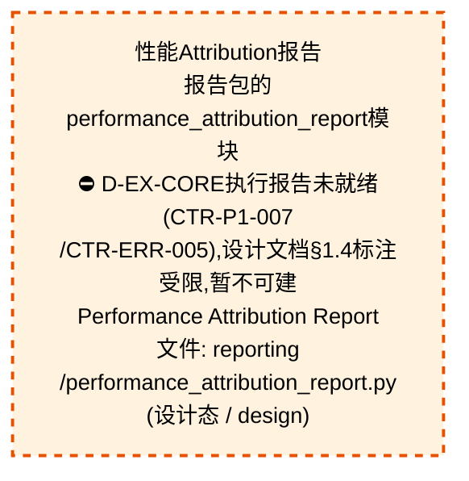
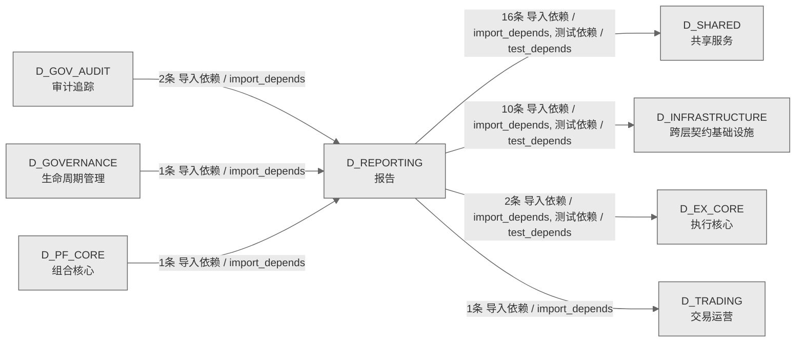

# 26_d_reporting / 报告域 / Reporting

> **功能简介 / Overview**: 报告，负责投资报告、风险报告和合规报告的生成与分发

> **文档作用 / Purpose**: 展示 报告（D_REPORTING）功能域的域内依赖关系、跨域依赖关系，模块信息（成熟度/中英文名/大白话/文件路径）内嵌于 Mermaid 节点，供架构审查和域治理参考。

> 本文档由 generate_domain_doc.py 从 depgraph (PostgreSQL) 自动生成
> 数据源: depgraph (PostgreSQL) nodes表 + edges表

> **[可缩放 HTML 版 / Zoomable HTML](http://localhost:8765/docs/02_enterprise_architecture/02_domain_architecture_docs/_zoomable_html/26_d_reporting.html)** — Ctrl+滚轮缩放 ｜ 双击重置 ｜ Ctrl+Shift+D 切换拖动/选择模式

## 域基本信息 / Domain Overview

| 字段 | 值 | Field | Value |
|------|------|-------|-------|
| 编号 | 26 | Number | 26 |
| 域ID | D_REPORTING | Domain ID | D_REPORTING |
| 域名称 | 报告 | Domain Name | Reporting |
| 层级 | L1 基础平台层 | Layer | L1 Foundation |
| 模块数 | 20 | Module Count | 20 |
| 域内依赖 | 18 | Internal Dependencies | 18 |
| 跨域入边 | 4 | Cross-domain Incoming | 4 |
| 跨域出边 | 29 | Cross-domain Outgoing | 29 |
| 设计态模块 | 1 | Design Modules | 1 |
| 生产态模块 | 19 | Production Modules | 19 |
| 容量 | 19/150 (正常) | Capacity | 19/150 (正常) |
| 描述 | 报告，负责投资报告、风险报告和合规报告的生成与分发 | Description | 报告，负责投资报告、风险报告和合规报告的生成与分发 |

## 域内依赖图 / Internal Dependency Diagram

> 依赖图内嵌在本文档中，IDE 可直接渲染；网页版可 Ctrl+滚轮缩放 + 拖动平移查看细节。
>
> **图例说明 / Legend**：
> - 🟦 **蓝色 = 运营态模块**（production，已上线运行）
> - 🟧 **橙色虚线 = 设计态模块**（design，蓝图阶段，代码未写）
> - **实线箭头 = 运营态依赖**（已生效的依赖关系）
> - **虚线箭头 = 非运营态依赖**（计划中/验证中的依赖关系）

### 全景图（全部模块，颜色区分运营态/设计态）

> 展示全部 20 个模块（生产态 19 + 设计态 1），含跨域依赖外部节点。节点含成熟度+名称+大白话/简介+文件路径。

```mermaid
%%{init: {'theme': 'base', 'themeVariables': {'primaryColor': '#eaeaea', 'primaryTextColor': '#333333', 'primaryBorderColor': '#666666', 'lineColor': '#666666', 'secondaryColor': '#eaeaea', 'tertiaryColor': '#eaeaea', 'fontSize': '14px'}}}%%
flowchart TD
    src_zephyr_reporting_default_tca_engine_py["默认交易成本分析引擎<br/>D_REPORTING — Default TCA Engine<br/>文件: reporting/default_tca_engine.py<br/>(生产态 / production)"]
    src_zephyr_reporting_performance_attribution_report_py["性能Attribution报告<br/>报告包的performance_attribution_report模块<br/>⛔ D-EX-CORE执行报告未就绪(CTR-P1-007<br/>/CTR-ERR-005),设计文档§1.4标注受限,暂不可建<br/>Performance Attribution Report<br/>文件: reporting<br/>/performance_attribution_report.py<br/>(设计态 / design)"]
    tests_reporting_test_ashare_performance_audit_py["MOD-RPT-026 A-Share Performance Audit 单元测试.<br/>报告包的test_ashare_performance_audit模块<br/>Test Ashare Performance Audit<br/>文件: reporting/test_ashare_performance_audit.py<br/>(生产态 / production)"]
    tests_reporting_test_ashare_trade_record_template_py["MOD-RPT-027 A股交易记录模板引擎 单元测试.<br/>报告包的test_ashare_trade_record_template模块<br/>Test Ashare Trade Record Template<br/>文件: reporting<br/>/test_ashare_trade_record_template.py<br/>(生产态 / production)"]
    tests_reporting_test_realtime_pnl_dashboard_py["MOD-RPT-004 Real-time P&L Dashboard 单元测试.<br/>报告包的test_realtime_pnl_dashboard模块<br/>Test Realtime Pnl Dashboard<br/>文件: reporting/test_realtime_pnl_dashboard.py<br/>(生产态 / production)"]
    tests_reporting_test_regulatory_report_generator_py["MOD-RPT-006 Regulatory Report Generator<br/>单元测试.<br/>报告包的test_regulatory_report_generator模块<br/>Test Regulatory Report Generator<br/>文件: reporting<br/>/test_regulatory_report_generator.py<br/>(生产态 / production)"]
    tests_reporting_test_report_publisher_py["MOD-RPT-003 Report Publisher 单元测试.<br/>报告包的test_report_publisher模块<br/>Test Report Publisher<br/>文件: reporting/test_report_publisher.py<br/>(生产态 / production)"]
    tests_reporting_test_report_version_manager_py["MOD-RPT-013 Report Version Manager 单元测试.<br/>报告包的test_report_version_manager模块<br/>Test Report Version Manager<br/>文件: reporting/test_report_version_manager.py<br/>(生产态 / production)"]
    tests_reporting_test_report_watermark_tracker_py["MOD-RPT-017 Report Watermark Tracker 单元测试.<br/>报告包的test_report_watermark_tracker模块<br/>Test Report Watermark Tracker<br/>文件: reporting/test_report_watermark_tracker.py<br/>(生产态 / production)"]
    tests_reporting_test_risk_report_engine_py["MOD-RPT-008 Risk Report Engine 单元测试.<br/>报告包的test_risk_report_engine模块<br/>Test Risk Report Engine<br/>文件: reporting/test_risk_report_engine.py<br/>(生产态 / production)"]
    src_zephyr_reporting_default_tca_engine_py ~~~ src_zephyr_reporting_performance_attribution_report_py
    src_zephyr_reporting_performance_attribution_report_py ~~~ tests_reporting_test_ashare_performance_audit_py
    tests_reporting_test_ashare_performance_audit_py ~~~ tests_reporting_test_ashare_trade_record_template_py
    tests_reporting_test_ashare_trade_record_template_py ~~~ tests_reporting_test_realtime_pnl_dashboard_py
    tests_reporting_test_realtime_pnl_dashboard_py ~~~ tests_reporting_test_regulatory_report_generator_py
    tests_reporting_test_regulatory_report_generator_py ~~~ tests_reporting_test_report_publisher_py
    tests_reporting_test_report_publisher_py ~~~ tests_reporting_test_report_version_manager_py
    tests_reporting_test_report_version_manager_py ~~~ tests_reporting_test_report_watermark_tracker_py
    tests_reporting_test_report_watermark_tracker_py ~~~ tests_reporting_test_risk_report_engine_py
    src_zephyr_reporting_ashare_performance_audit_py["A股性能审计<br/>D_REPORTING — A-Share Performance Audit &<br/>Optimization Trigger<br/>Ashare Performance Audit<br/>文件: reporting/ashare_performance_audit.py<br/>(生产态 / production)"]
    src_zephyr_reporting_ashare_trade_record_template_py["A股交易记录模板引擎<br/>D_REPORTING — A股交易记录模板引擎 (ASHare Trade<br/>Record Template)<br/>文件: reporting/ashare_trade_record_template.py<br/>(生产态 / production)"]
    src_zephyr_reporting_realtime_pnl_dashboard_py["RealtimePnl仪表盘<br/>D_REPORTING — Real-time P&L Dashboard<br/>(实时盈亏仪表盘)<br/>Realtime Pnl Dashboard<br/>文件: reporting/realtime_pnl_dashboard.py<br/>(生产态 / production)"]
    src_zephyr_reporting_regulatory_report_generator_py["Regulatory报告生成器<br/>D_REPORTING — Regulatory Report Generator<br/>(监管报告生成器)<br/>文件: reporting/regulatory_report_generator.py<br/>(生产态 / production)"]
    src_zephyr_reporting_report_version_manager_py["报告版本管理器<br/>D_REPORTING — Report Version Manager<br/>(报告版本管理器)<br/>文件: reporting/report_version_manager.py<br/>(生产态 / production)"]
    src_zephyr_reporting_report_watermark_tracker_py["报告Watermark跟踪器<br/>D_REPORTING — Report Watermark Tracker<br/>(报告水印追踪器)<br/>文件: reporting/report_watermark_tracker.py<br/>(生产态 / production)"]
    src_zephyr_reporting_risk_report_engine_py["风险报告引擎<br/>D_REPORTING — Risk Report Engine (风险报告引擎)<br/>文件: reporting/risk_report_engine.py<br/>(生产态 / production)"]
    src_zephyr_reporting_ashare_performance_audit_py ~~~ src_zephyr_reporting_ashare_trade_record_template_py
    src_zephyr_reporting_ashare_trade_record_template_py ~~~ src_zephyr_reporting_realtime_pnl_dashboard_py
    src_zephyr_reporting_realtime_pnl_dashboard_py ~~~ src_zephyr_reporting_regulatory_report_generator_py
    src_zephyr_reporting_regulatory_report_generator_py ~~~ src_zephyr_reporting_report_version_manager_py
    src_zephyr_reporting_report_version_manager_py ~~~ src_zephyr_reporting_report_watermark_tracker_py
    src_zephyr_reporting_report_watermark_tracker_py ~~~ src_zephyr_reporting_risk_report_engine_py
    src_zephyr_reporting_default_attribution_engine_py["默认Attribution引擎<br/>D_REPORTING — Default Attribution Engine<br/>文件: reporting/default_attribution_engine.py<br/>(生产态 / production)"]
    src_zephyr_reporting_report_publisher_py["报告Publisher<br/>D_REPORTING — Report Publisher (报告发布器)<br/>文件: reporting/report_publisher.py<br/>(生产态 / production)"]
    src_zephyr_reporting_default_attribution_engine_py ~~~ src_zephyr_reporting_report_publisher_py
    src_zephyr_reporting_analytics_base_py["单笔成交的 TCA 分析，返回执行报告'''<br/>D_REPORTING — Post-Trade Analytics Layer<br/>Analytics Base<br/>文件: reporting/analytics_base.py<br/>(生产态 / production)"]
    src_zephyr_reporting_performance_attribution_report_py -.->|data / data| src_zephyr_reporting_report_publisher_py
    src_zephyr_reporting_ashare_performance_audit_py -->|data / data| src_zephyr_reporting_default_attribution_engine_py
    src_zephyr_reporting_ashare_trade_record_template_py -->|data / data| src_zephyr_reporting_report_publisher_py
    src_zephyr_reporting_default_attribution_engine_py -->|导入依赖 / import_depends| src_zephyr_reporting_analytics_base_py
    src_zephyr_reporting_realtime_pnl_dashboard_py -->|data / data| src_zephyr_reporting_report_publisher_py
    src_zephyr_reporting_default_tca_engine_py -->|导入依赖 / import_depends| src_zephyr_reporting_analytics_base_py
    src_zephyr_reporting_regulatory_report_generator_py -->|data / data| src_zephyr_reporting_report_publisher_py
    src_zephyr_reporting_risk_report_engine_py -->|data / data| src_zephyr_reporting_report_publisher_py
    src_zephyr_reporting_report_watermark_tracker_py -->|data / data| src_zephyr_reporting_report_publisher_py
    src_zephyr_reporting_report_version_manager_py -->|data / data| src_zephyr_reporting_report_publisher_py
    tests_reporting_test_ashare_trade_record_template_py -->|测试依赖 / test_depends| src_zephyr_reporting_ashare_trade_record_template_py
    tests_reporting_test_report_publisher_py -->|测试依赖 / test_depends| src_zephyr_reporting_report_publisher_py
    tests_reporting_test_regulatory_report_generator_py -->|测试依赖 / test_depends| src_zephyr_reporting_regulatory_report_generator_py
    tests_reporting_test_report_version_manager_py -->|测试依赖 / test_depends| src_zephyr_reporting_report_version_manager_py
    tests_reporting_test_report_watermark_tracker_py -->|测试依赖 / test_depends| src_zephyr_reporting_report_watermark_tracker_py
    tests_reporting_test_ashare_performance_audit_py -->|测试依赖 / test_depends| src_zephyr_reporting_ashare_performance_audit_py
    tests_reporting_test_risk_report_engine_py -->|测试依赖 / test_depends| src_zephyr_reporting_risk_report_engine_py
    tests_reporting_test_realtime_pnl_dashboard_py -->|测试依赖 / test_depends| src_zephyr_reporting_realtime_pnl_dashboard_py
    D_INFRASTRUCTURE["跨层契约基础设施<br/>跨层契约基础设施，负责跨层契约定义、共享契约管理<br/>和契约校验<br/>Cross-Layer Contract Infrastructure<br/>跨域节点 / cross-domain<br/>(生产态 / production)"]
    src_zephyr_reporting_analytics_base_py -->|导入依赖 / import_depends| D_INFRASTRUCTURE
    D_SHARED["共享服务<br/>共享服务，负责跨域共享的工具、协议和基础服务<br/>Shared Services<br/>跨域节点 / cross-domain<br/>(生产态 / production)"]
    tests_reporting_test_risk_report_engine_py -->|测试依赖 / test_depends| D_SHARED
    src_zephyr_reporting_realtime_pnl_dashboard_py -->|导入依赖 / import_depends| D_INFRASTRUCTURE
    D_EX_CORE["执行核心<br/>执行核心，负责订单执行引擎、执行策略和执行管理<br/>Execution Core<br/>跨域节点 / cross-domain<br/>(生产态 / production)"]
    tests_reporting_test_realtime_pnl_dashboard_py -->|测试依赖 / test_depends| D_EX_CORE
    src_zephyr_reporting_realtime_pnl_dashboard_py -->|导入依赖 / import_depends| D_SHARED
    src_zephyr_reporting_default_attribution_engine_py -->|导入依赖 / import_depends| D_INFRASTRUCTURE
    src_zephyr_reporting_realtime_pnl_dashboard_py -->|导入依赖 / import_depends| D_SHARED
    src_zephyr_reporting_realtime_pnl_dashboard_py -->|导入依赖 / import_depends| D_SHARED
    src_zephyr_reporting_realtime_pnl_dashboard_py -->|导入依赖 / import_depends| D_EX_CORE
    tests_reporting_test_realtime_pnl_dashboard_py -->|测试依赖 / test_depends| D_SHARED
    tests_reporting_test_realtime_pnl_dashboard_py -->|测试依赖 / test_depends| D_SHARED
    tests_reporting_test_risk_report_engine_py -->|测试依赖 / test_depends| D_SHARED
    src_zephyr_reporting_risk_report_engine_py -->|导入依赖 / import_depends| D_SHARED
    src_zephyr_reporting_report_version_manager_py -->|导入依赖 / import_depends| D_SHARED
    src_zephyr_reporting_default_tca_engine_py -->|导入依赖 / import_depends| D_INFRASTRUCTURE
    D_GOVERNANCE["生命周期管理<br/>生命周期管理，负责蓝图/模块<br/>/任务的声明周期管理和元数据治理<br/>Lifecycle Management<br/>跨域节点 / cross-domain<br/>(生产态 / production)"]
    D_GOVERNANCE -->|导入依赖 / import_depends| src_zephyr_reporting_analytics_base_py
    D_GOV_AUDIT["审计追踪<br/>审计追踪，负责变更审计追踪和操作日志管理<br/>Audit Trail<br/>跨域节点 / cross-domain<br/>(生产态 / production)"]
    D_GOV_AUDIT -->|导入依赖 / import_depends| src_zephyr_reporting_default_attribution_engine_py
    D_PF_CORE["组合核心<br/>组合核心，负责投资组合构建、持仓管理和组合优化<br/>Portfolio Core<br/>跨域节点 / cross-domain<br/>(生产态 / production)"]
    D_PF_CORE -->|导入依赖 / import_depends| src_zephyr_reporting_analytics_base_py
    D_GOV_AUDIT -->|导入依赖 / import_depends| src_zephyr_reporting_default_tca_engine_py
    classDef production fill:#e1f5fe,stroke:#01579b,stroke-width:2px,color:#000
    classDef design fill:#fff3e0,stroke:#e65100,stroke-width:2px,color:#000,stroke-dasharray: 5 5
    classDef external_prod fill:#e8f4fd,stroke:#0277bd,stroke-width:1px,color:#000
    classDef external_design fill:#fff8e7,stroke:#ef6c00,stroke-width:1px,color:#000,stroke-dasharray: 5 5
    class src_zephyr_reporting_analytics_base_py,src_zephyr_reporting_ashare_performance_audit_py,src_zephyr_reporting_ashare_trade_record_template_py,src_zephyr_reporting_default_attribution_engine_py,src_zephyr_reporting_default_tca_engine_py,src_zephyr_reporting_realtime_pnl_dashboard_py,src_zephyr_reporting_regulatory_report_generator_py,src_zephyr_reporting_report_publisher_py,src_zephyr_reporting_report_version_manager_py,src_zephyr_reporting_report_watermark_tracker_py,src_zephyr_reporting_risk_report_engine_py,tests_reporting_test_ashare_performance_audit_py,tests_reporting_test_ashare_trade_record_template_py,tests_reporting_test_realtime_pnl_dashboard_py,tests_reporting_test_regulatory_report_generator_py,tests_reporting_test_report_publisher_py,tests_reporting_test_report_version_manager_py,tests_reporting_test_report_watermark_tracker_py,tests_reporting_test_risk_report_engine_py production
    class src_zephyr_reporting_performance_attribution_report_py design
    class D_INFRASTRUCTURE,D_SHARED,D_EX_CORE,D_GOVERNANCE,D_GOV_AUDIT,D_PF_CORE external_prod
```

### 运营态的图（仅 design_maturity=production 的模块和域内依赖）

> 仅展示已上线运行的模块（共 19 个），不含跨域外部节点。跨域依赖见下方跨域依赖章节。

```mermaid
%%{init: {'theme': 'base', 'themeVariables': {'primaryColor': '#eaeaea', 'primaryTextColor': '#333333', 'primaryBorderColor': '#666666', 'lineColor': '#666666', 'secondaryColor': '#eaeaea', 'tertiaryColor': '#eaeaea', 'fontSize': '14px'}}}%%
flowchart TD
    src_zephyr_reporting_default_tca_engine_py["默认交易成本分析引擎<br/>D_REPORTING — Default TCA Engine<br/>文件: reporting/default_tca_engine.py<br/>(生产态 / production)"]
    tests_reporting_test_ashare_performance_audit_py["MOD-RPT-026 A-Share Performance Audit 单元测试.<br/>报告包的test_ashare_performance_audit模块<br/>Test Ashare Performance Audit<br/>文件: reporting/test_ashare_performance_audit.py<br/>(生产态 / production)"]
    tests_reporting_test_ashare_trade_record_template_py["MOD-RPT-027 A股交易记录模板引擎 单元测试.<br/>报告包的test_ashare_trade_record_template模块<br/>Test Ashare Trade Record Template<br/>文件: reporting<br/>/test_ashare_trade_record_template.py<br/>(生产态 / production)"]
    tests_reporting_test_realtime_pnl_dashboard_py["MOD-RPT-004 Real-time P&L Dashboard 单元测试.<br/>报告包的test_realtime_pnl_dashboard模块<br/>Test Realtime Pnl Dashboard<br/>文件: reporting/test_realtime_pnl_dashboard.py<br/>(生产态 / production)"]
    tests_reporting_test_regulatory_report_generator_py["MOD-RPT-006 Regulatory Report Generator<br/>单元测试.<br/>报告包的test_regulatory_report_generator模块<br/>Test Regulatory Report Generator<br/>文件: reporting<br/>/test_regulatory_report_generator.py<br/>(生产态 / production)"]
    tests_reporting_test_report_publisher_py["MOD-RPT-003 Report Publisher 单元测试.<br/>报告包的test_report_publisher模块<br/>Test Report Publisher<br/>文件: reporting/test_report_publisher.py<br/>(生产态 / production)"]
    tests_reporting_test_report_version_manager_py["MOD-RPT-013 Report Version Manager 单元测试.<br/>报告包的test_report_version_manager模块<br/>Test Report Version Manager<br/>文件: reporting/test_report_version_manager.py<br/>(生产态 / production)"]
    tests_reporting_test_report_watermark_tracker_py["MOD-RPT-017 Report Watermark Tracker 单元测试.<br/>报告包的test_report_watermark_tracker模块<br/>Test Report Watermark Tracker<br/>文件: reporting/test_report_watermark_tracker.py<br/>(生产态 / production)"]
    tests_reporting_test_risk_report_engine_py["MOD-RPT-008 Risk Report Engine 单元测试.<br/>报告包的test_risk_report_engine模块<br/>Test Risk Report Engine<br/>文件: reporting/test_risk_report_engine.py<br/>(生产态 / production)"]
    src_zephyr_reporting_default_tca_engine_py ~~~ tests_reporting_test_ashare_performance_audit_py
    tests_reporting_test_ashare_performance_audit_py ~~~ tests_reporting_test_ashare_trade_record_template_py
    tests_reporting_test_ashare_trade_record_template_py ~~~ tests_reporting_test_realtime_pnl_dashboard_py
    tests_reporting_test_realtime_pnl_dashboard_py ~~~ tests_reporting_test_regulatory_report_generator_py
    tests_reporting_test_regulatory_report_generator_py ~~~ tests_reporting_test_report_publisher_py
    tests_reporting_test_report_publisher_py ~~~ tests_reporting_test_report_version_manager_py
    tests_reporting_test_report_version_manager_py ~~~ tests_reporting_test_report_watermark_tracker_py
    tests_reporting_test_report_watermark_tracker_py ~~~ tests_reporting_test_risk_report_engine_py
    src_zephyr_reporting_ashare_performance_audit_py["A股性能审计<br/>D_REPORTING — A-Share Performance Audit &<br/>Optimization Trigger<br/>Ashare Performance Audit<br/>文件: reporting/ashare_performance_audit.py<br/>(生产态 / production)"]
    src_zephyr_reporting_ashare_trade_record_template_py["A股交易记录模板引擎<br/>D_REPORTING — A股交易记录模板引擎 (ASHare Trade<br/>Record Template)<br/>文件: reporting/ashare_trade_record_template.py<br/>(生产态 / production)"]
    src_zephyr_reporting_realtime_pnl_dashboard_py["RealtimePnl仪表盘<br/>D_REPORTING — Real-time P&L Dashboard<br/>(实时盈亏仪表盘)<br/>Realtime Pnl Dashboard<br/>文件: reporting/realtime_pnl_dashboard.py<br/>(生产态 / production)"]
    src_zephyr_reporting_regulatory_report_generator_py["Regulatory报告生成器<br/>D_REPORTING — Regulatory Report Generator<br/>(监管报告生成器)<br/>文件: reporting/regulatory_report_generator.py<br/>(生产态 / production)"]
    src_zephyr_reporting_report_version_manager_py["报告版本管理器<br/>D_REPORTING — Report Version Manager<br/>(报告版本管理器)<br/>文件: reporting/report_version_manager.py<br/>(生产态 / production)"]
    src_zephyr_reporting_report_watermark_tracker_py["报告Watermark跟踪器<br/>D_REPORTING — Report Watermark Tracker<br/>(报告水印追踪器)<br/>文件: reporting/report_watermark_tracker.py<br/>(生产态 / production)"]
    src_zephyr_reporting_risk_report_engine_py["风险报告引擎<br/>D_REPORTING — Risk Report Engine (风险报告引擎)<br/>文件: reporting/risk_report_engine.py<br/>(生产态 / production)"]
    src_zephyr_reporting_ashare_performance_audit_py ~~~ src_zephyr_reporting_ashare_trade_record_template_py
    src_zephyr_reporting_ashare_trade_record_template_py ~~~ src_zephyr_reporting_realtime_pnl_dashboard_py
    src_zephyr_reporting_realtime_pnl_dashboard_py ~~~ src_zephyr_reporting_regulatory_report_generator_py
    src_zephyr_reporting_regulatory_report_generator_py ~~~ src_zephyr_reporting_report_version_manager_py
    src_zephyr_reporting_report_version_manager_py ~~~ src_zephyr_reporting_report_watermark_tracker_py
    src_zephyr_reporting_report_watermark_tracker_py ~~~ src_zephyr_reporting_risk_report_engine_py
    src_zephyr_reporting_default_attribution_engine_py["默认Attribution引擎<br/>D_REPORTING — Default Attribution Engine<br/>文件: reporting/default_attribution_engine.py<br/>(生产态 / production)"]
    src_zephyr_reporting_report_publisher_py["报告Publisher<br/>D_REPORTING — Report Publisher (报告发布器)<br/>文件: reporting/report_publisher.py<br/>(生产态 / production)"]
    src_zephyr_reporting_default_attribution_engine_py ~~~ src_zephyr_reporting_report_publisher_py
    src_zephyr_reporting_analytics_base_py["单笔成交的 TCA 分析，返回执行报告'''<br/>D_REPORTING — Post-Trade Analytics Layer<br/>Analytics Base<br/>文件: reporting/analytics_base.py<br/>(生产态 / production)"]
    src_zephyr_reporting_ashare_performance_audit_py -->|data / data| src_zephyr_reporting_default_attribution_engine_py
    src_zephyr_reporting_ashare_trade_record_template_py -->|data / data| src_zephyr_reporting_report_publisher_py
    src_zephyr_reporting_default_attribution_engine_py -->|导入依赖 / import_depends| src_zephyr_reporting_analytics_base_py
    src_zephyr_reporting_realtime_pnl_dashboard_py -->|data / data| src_zephyr_reporting_report_publisher_py
    src_zephyr_reporting_default_tca_engine_py -->|导入依赖 / import_depends| src_zephyr_reporting_analytics_base_py
    src_zephyr_reporting_regulatory_report_generator_py -->|data / data| src_zephyr_reporting_report_publisher_py
    src_zephyr_reporting_risk_report_engine_py -->|data / data| src_zephyr_reporting_report_publisher_py
    src_zephyr_reporting_report_watermark_tracker_py -->|data / data| src_zephyr_reporting_report_publisher_py
    src_zephyr_reporting_report_version_manager_py -->|data / data| src_zephyr_reporting_report_publisher_py
    tests_reporting_test_ashare_trade_record_template_py -->|测试依赖 / test_depends| src_zephyr_reporting_ashare_trade_record_template_py
    tests_reporting_test_report_publisher_py -->|测试依赖 / test_depends| src_zephyr_reporting_report_publisher_py
    tests_reporting_test_regulatory_report_generator_py -->|测试依赖 / test_depends| src_zephyr_reporting_regulatory_report_generator_py
    tests_reporting_test_report_version_manager_py -->|测试依赖 / test_depends| src_zephyr_reporting_report_version_manager_py
    tests_reporting_test_report_watermark_tracker_py -->|测试依赖 / test_depends| src_zephyr_reporting_report_watermark_tracker_py
    tests_reporting_test_ashare_performance_audit_py -->|测试依赖 / test_depends| src_zephyr_reporting_ashare_performance_audit_py
    tests_reporting_test_risk_report_engine_py -->|测试依赖 / test_depends| src_zephyr_reporting_risk_report_engine_py
    tests_reporting_test_realtime_pnl_dashboard_py -->|测试依赖 / test_depends| src_zephyr_reporting_realtime_pnl_dashboard_py
    classDef production fill:#e1f5fe,stroke:#01579b,stroke-width:2px,color:#000
    classDef design fill:#fff3e0,stroke:#e65100,stroke-width:2px,color:#000,stroke-dasharray: 5 5
    classDef external_prod fill:#e8f4fd,stroke:#0277bd,stroke-width:1px,color:#000
    classDef external_design fill:#fff8e7,stroke:#ef6c00,stroke-width:1px,color:#000,stroke-dasharray: 5 5
    class src_zephyr_reporting_analytics_base_py,src_zephyr_reporting_ashare_performance_audit_py,src_zephyr_reporting_ashare_trade_record_template_py,src_zephyr_reporting_default_attribution_engine_py,src_zephyr_reporting_default_tca_engine_py,src_zephyr_reporting_realtime_pnl_dashboard_py,src_zephyr_reporting_regulatory_report_generator_py,src_zephyr_reporting_report_publisher_py,src_zephyr_reporting_report_version_manager_py,src_zephyr_reporting_report_watermark_tracker_py,src_zephyr_reporting_risk_report_engine_py,tests_reporting_test_ashare_performance_audit_py,tests_reporting_test_ashare_trade_record_template_py,tests_reporting_test_realtime_pnl_dashboard_py,tests_reporting_test_regulatory_report_generator_py,tests_reporting_test_report_publisher_py,tests_reporting_test_report_version_manager_py,tests_reporting_test_report_watermark_tracker_py,tests_reporting_test_risk_report_engine_py production
```

### 设计态的图（仅 design_maturity=design 的模块和域内依赖）

> 仅展示蓝图阶段、代码未写的设计态模块（共 1 个），不含跨域外部节点。

## 跨域依赖 / Cross-domain Dependencies

### 本域依赖的其他域（出边）/ Depends On

| # | 本域模块 / Source Module | → | 外部域-目标模块 / Target Module | 依赖类型 / Type |
|:--:|---------|:--:|---------|---------|
| 1 | RealtimePnl仪表盘 / Realtime Pnl Dashboard (reporting/rea... | → | D_EX_CORE 执行核心: 跟踪器 / Tracker (position_tracker/tracker.py) | 导入依赖 / import_depends |
| 2 | MOD-RPT-004 Real-time P&L Dashboard 单元测试. / Test Real... | → | D_EX_CORE 执行核心: 跟踪器 / Tracker (position_tracker/tracker.py) | 测试依赖 / test_depends |
| 3 | 单笔成交的 TCA 分析，返回执行报告 / Analytics Base (repor... | → | D_INFRASTRUCTURE 跨层契约基础设施: 执行报告 / Execution Report (contracts/execution_report.py) | 导入依赖 / import_depends |
| 4 | 单笔成交的 TCA 分析，返回执行报告 / Analytics Base (repor... | → | D_INFRASTRUCTURE 跨层契约基础设施: Fill (contracts/fill.py) | 导入依赖 / import_depends |
| 5 | 单笔成交的 TCA 分析，返回执行报告 / Analytics Base (repor... | → | D_INFRASTRUCTURE 跨层契约基础设施: 订单 / Order (contracts/order.py) | 导入依赖 / import_depends |
| 6 | 单笔成交的 TCA 分析，返回执行报告 / Analytics Base (repor... | → | D_INFRASTRUCTURE 跨层契约基础设施: 性能Attribution报告 / Performance Attribution Report (con... | 导入依赖 / import_depends |
| 7 | 默认Attribution引擎 / Default Attribution Engine (reporti... | → | D_INFRASTRUCTURE 跨层契约基础设施: 性能Attribution报告 / Performance Attribution Report (con... | 导入依赖 / import_depends |
| 8 | 默认交易成本分析引擎 / Default Tca Engine (reporting/defa... | → | D_INFRASTRUCTURE 跨层契约基础设施: 执行报告 / Execution Report (contracts/execution_report.py) | 导入依赖 / import_depends |
| 9 | 默认交易成本分析引擎 / Default Tca Engine (reporting/defa... | → | D_INFRASTRUCTURE 跨层契约基础设施: Fill (contracts/fill.py) | 导入依赖 / import_depends |
| 10 | 默认交易成本分析引擎 / Default Tca Engine (reporting/defa... | → | D_INFRASTRUCTURE 跨层契约基础设施: 订单 / Order (contracts/order.py) | 导入依赖 / import_depends |
| 11 | RealtimePnl仪表盘 / Realtime Pnl Dashboard (reporting/rea... | → | D_INFRASTRUCTURE 跨层契约基础设施: Fill (contracts/fill.py) | 导入依赖 / import_depends |
| 12 | MOD-RPT-004 Real-time P&L Dashboard 单元测试. / Test Real... | → | D_INFRASTRUCTURE 跨层契约基础设施: Fill (contracts/fill.py) | 测试依赖 / test_depends |
| 13 | A股性能审计 / Ashare Performance Audit (reporting/ashare_... | → | D_SHARED 共享服务: ZephyrAlpha 所有业务异常的根 / Errors (foundation/errors.py) | 导入依赖 / import_depends |
| 14 | A股交易记录模板引擎 / Ashare Trade Record Template (repor... | → | D_SHARED 共享服务: ZephyrAlpha 所有业务异常的根 / Errors (foundation/errors.py) | 导入依赖 / import_depends |
| 15 | RealtimePnl仪表盘 / Realtime Pnl Dashboard (reporting/rea... | → | D_SHARED 共享服务: 交易枚举真源 / Order Enums (enums/order_enums.py) | 导入依赖 / import_depends |
| 16 | RealtimePnl仪表盘 / Realtime Pnl Dashboard (reporting/rea... | → | D_SHARED 共享服务: 风险仪表盘快照 / Risk Dashboard Snapshot (risk/risk_dashb... | 导入依赖 / import_depends |
| 17 | RealtimePnl仪表盘 / Realtime Pnl Dashboard (reporting/rea... | → | D_SHARED 共享服务: ZephyrAlpha 所有业务异常的根 / Errors (foundation/errors.py) | 导入依赖 / import_depends |
| 18 | Regulatory报告生成器 / Regulatory Report Generator (repor... | → | D_SHARED 共享服务: ZephyrAlpha 所有业务异常的根 / Errors (foundation/errors.py) | 导入依赖 / import_depends |
| 19 | 报告Publisher / Report Publisher (reporting/report_publis... | → | D_SHARED 共享服务: ZephyrAlpha 所有业务异常的根 / Errors (foundation/errors.py) | 导入依赖 / import_depends |
| 20 | 报告版本管理器 / Report Version Manager (reporting/report... | → | D_SHARED 共享服务: ZephyrAlpha 所有业务异常的根 / Errors (foundation/errors.py) | 导入依赖 / import_depends |
| 21 | 报告Watermark跟踪器 / Report Watermark Tracker (reporting... | → | D_SHARED 共享服务: ZephyrAlpha 所有业务异常的根 / Errors (foundation/errors.py) | 导入依赖 / import_depends |
| 22 | 风险报告引擎 / Risk Report Engine (reporting/risk_report_... | → | D_SHARED 共享服务: 风险仪表盘快照 / Risk Dashboard Snapshot (risk/risk_dashb... | 导入依赖 / import_depends |
| 23 | 风险报告引擎 / Risk Report Engine (reporting/risk_report_... | → | D_SHARED 共享服务: 风险指标 / Risk Metrics (risk/risk_metrics.py) | 导入依赖 / import_depends |
| 24 | 风险报告引擎 / Risk Report Engine (reporting/risk_report_... | → | D_SHARED 共享服务: ZephyrAlpha 所有业务异常的根 / Errors (foundation/errors.py) | 导入依赖 / import_depends |
| 25 | MOD-RPT-004 Real-time P&L Dashboard 单元测试. / Test Real... | → | D_SHARED 共享服务: 交易枚举真源 / Order Enums (enums/order_enums.py) | 测试依赖 / test_depends |
| 26 | MOD-RPT-004 Real-time P&L Dashboard 单元测试. / Test Real... | → | D_SHARED 共享服务: 风险仪表盘快照 / Risk Dashboard Snapshot (risk/risk_dashb... | 测试依赖 / test_depends |
| 27 | MOD-RPT-008 Risk Report Engine 单元测试. / Test Risk Repo... | → | D_SHARED 共享服务: 风险仪表盘快照 / Risk Dashboard Snapshot (risk/risk_dashb... | 测试依赖 / test_depends |
| 28 | MOD-RPT-008 Risk Report Engine 单元测试. / Test Risk Repo... | → | D_SHARED 共享服务: 风险指标 / Risk Metrics (risk/risk_metrics.py) | 测试依赖 / test_depends |
| 29 | RealtimePnl仪表盘 / Realtime Pnl Dashboard (reporting/rea... | → | D_TRADING 交易运营: Pnl计算器 / Pnl Calculator (trading/pnl_calculator.py) | 导入依赖 / import_depends |

### 依赖本域的其他域（入边）/ Depended By

| # | 外部域-源模块 / Source Module | → | 本域模块 / Target Module | 依赖类型 / Type |
|:--:|---------|:--:|---------|---------|
| 1 | D_GOVERNANCE 生命周期管理: analytics基类 / Re-export wrapper: analytics_base canonic... | → | 单笔成交的 TCA 分析，返回执行报告 / Analytics Base (repor... | 导入依赖 / import_depends |
| 2 | D_GOV_AUDIT 审计追踪: 默认attribution引擎 / Re-export wrapper: default_attribut... | → | 默认Attribution引擎 / Default Attribution Engine (reporti... | 导入依赖 / import_depends |
| 3 | D_GOV_AUDIT 审计追踪: 默认tca引擎 / Re-export wrapper: default_tca_engine canon... | → | 默认交易成本分析引擎 / Default Tca Engine (reporting/defa... | 导入依赖 / import_depends |
| 4 | D_PF_CORE 组合核心: 性能Attribution引擎 / Performance Attribution Engine (cor... | → | 单笔成交的 TCA 分析，返回执行报告 / Analytics Base (repor... | 导入依赖 / import_depends |

### 跨域依赖图 / Cross-domain Dependency Diagram

> 本域与 7 个外部域直接连接（出边 29 条 + 入边 4 条 = 33 条）。只显示直接连接的域，不展开具体节点。

## 说明 / Notes

- **数据源 / Data Source**: `depgraph (PostgreSQL)` 的 `nodes`、`edges`、`domains` 表
- **生成器 / Generator**: `generate_domain_doc.py`（G2+G10 合并）
- **维护方式 / Maintenance**: 自动生成，全景图更新时刷新
- **文件名规则 / File Naming**: `{编号:02d}_{域ID小写}.md`，如 `16_d_trading.md`
- **图例说明 / Legend**: `[production]`=已上线 / `[design]`=设计中 / `[unknown]`=未知
