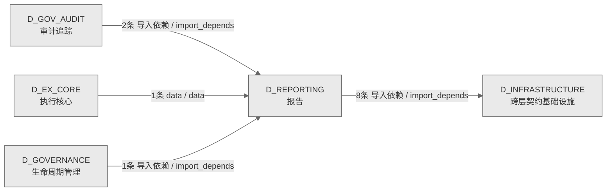

# 26_d_reporting / 报告域 / Reporting

> **功能简介 / Overview**: 报告，负责投资报告、风险报告和合规报告的生成与分发

> **文档作用 / Purpose**: 展示 报告（D_REPORTING）功能域的域内依赖关系、跨域依赖关系，模块信息（成熟度/中英文名/大白话/文件路径）内嵌于 Mermaid 节点，供架构审查和域治理参考。

> 本文档由 generate_domain_doc.py 从 depgraph (PostgreSQL) 自动生成
> 数据源: depgraph (PostgreSQL) nodes表 + edges表

> **[可缩放 HTML 版 / Zoomable HTML](http://localhost:8765/docs/02_enterprise_architecture/02_domain_architecture_docs/_zoomable_html/26_d_reporting.html)** — Ctrl+滚轮缩放 ｜ 双击重置 ｜ Ctrl+Shift+D 切换拖动/选择模式

## 域基本信息 / Domain Overview

| 字段 | 值 | Field | Value |
|------|------|-------|-------|
| 编号 | 26 | Number | 26 |
| 域ID | D_REPORTING | Domain ID | D_REPORTING |
| 域名称 | 报告 | Domain Name | Reporting |
| 层级 | L1 基础平台层 | Layer | L1 Foundation |
| 模块数 | 3 | Module Count | 3 |
| 域内依赖 | 2 | Internal Dependencies | 2 |
| 跨域入边 | 4 | Cross-domain Incoming | 4 |
| 跨域出边 | 8 | Cross-domain Outgoing | 8 |
| 设计态模块 | 0 | Design Modules | 0 |
| 生产态模块 | 3 | Production Modules | 3 |
| 容量 | 3/150 (正常) | Capacity | 3/150 (正常) |
| 描述 | 报告，负责投资报告、风险报告和合规报告的生成与分发 | Description | 报告，负责投资报告、风险报告和合规报告的生成与分发 |

## 域内依赖图 / Internal Dependency Diagram

> 依赖图内嵌在本文档中，IDE 可直接渲染；网页版可 Ctrl+滚轮缩放 + 拖动平移查看细节。全景图用颜色区分运营态/设计态，不再分页/拆子图。
>
> **图例说明 / Legend**：
> - 🟦 **蓝色 = 运营态模块**（production，已上线运行）
> - 🟧 **橙色虚线 = 设计态模块**（design，蓝图阶段，代码未写）
> - **实线箭头 = 运营态依赖**（已生效的依赖关系）
> - **虚线箭头 = 非运营态依赖**（计划中/验证中的依赖关系）

### 全景依赖图（全部模块，颜色区分运营态/设计态）

> 展示全部 3 个模块（生产态 3 + 设计态 0），节点含成熟度+中英文名+大白话+文件路径。

```mermaid
%%{init: {'theme': 'base', 'themeVariables': {'primaryColor': '#eaeaea', 'primaryTextColor': '#333333', 'primaryBorderColor': '#666666', 'lineColor': '#666666', 'secondaryColor': '#eaeaea', 'tertiaryColor': '#eaeaea', 'fontSize': '14px'}}}%%
flowchart TD
    src_zephyr_reporting_default_attribution_engine_py["(生产态 / production) D_REPORTING — Default Attribution Engine<br/>D_REPORTING — Default Attribution Engine<br/>文件: reporting/default_attribution_engine.py"]
    src_zephyr_reporting_default_tca_engine_py["(生产态 / production) D_REPORTING — Default TCA Engine<br/>D_REPORTING — Default TCA Engine<br/>文件: reporting/default_tca_engine.py"]
    src_zephyr_reporting_default_attribution_engine_py ~~~ src_zephyr_reporting_default_tca_engine_py
    src_zephyr_reporting_analytics_base_py["(生产态 / production) D_REPORTING — Post-Trade Analytics Layer<br/>D_REPORTING — Post-Trade Analytics Layer<br/>文件: reporting/analytics_base.py"]
    src_zephyr_reporting_default_tca_engine_py -->|导入依赖 / import_depends| src_zephyr_reporting_analytics_base_py
    src_zephyr_reporting_default_attribution_engine_py -->|导入依赖 / import_depends| src_zephyr_reporting_analytics_base_py
    D_INFRASTRUCTURE["(生产态 / production) 跨层契约基础设施 / Cross-Layer Contract Infrastructure<br/>跨层契约基础设施，负责跨层契约定义、共享契约管理和契约校验<br/>跨域节点 / cross-domain"]
    src_zephyr_reporting_default_tca_engine_py -->|导入依赖 / import_depends| D_INFRASTRUCTURE
    src_zephyr_reporting_analytics_base_py -->|导入依赖 / import_depends| D_INFRASTRUCTURE
    src_zephyr_reporting_default_tca_engine_py -->|导入依赖 / import_depends| D_INFRASTRUCTURE
    src_zephyr_reporting_analytics_base_py -->|导入依赖 / import_depends| D_INFRASTRUCTURE
    src_zephyr_reporting_analytics_base_py -->|导入依赖 / import_depends| D_INFRASTRUCTURE
    src_zephyr_reporting_analytics_base_py -->|导入依赖 / import_depends| D_INFRASTRUCTURE
    src_zephyr_reporting_default_attribution_engine_py -->|导入依赖 / import_depends| D_INFRASTRUCTURE
    src_zephyr_reporting_default_tca_engine_py -->|导入依赖 / import_depends| D_INFRASTRUCTURE
    D_GOVERNANCE["(生产态 / production) 生命周期管理 / Lifecycle Management<br/>生命周期管理，负责蓝图/模块/任务的声明周期管理和元数据治理<br/>跨域节点 / cross-domain"]
    D_GOVERNANCE -->|导入依赖 / import_depends| src_zephyr_reporting_analytics_base_py
    D_GOV_AUDIT["(生产态 / production) 审计追踪 / Audit Trail<br/>审计追踪，负责变更审计追踪和操作日志管理<br/>跨域节点 / cross-domain"]
    D_GOV_AUDIT -->|导入依赖 / import_depends| src_zephyr_reporting_default_tca_engine_py
    D_GOV_AUDIT -->|导入依赖 / import_depends| src_zephyr_reporting_default_attribution_engine_py
    classDef production fill:#e1f5fe,stroke:#01579b,stroke-width:2px,color:#000
    classDef design fill:#fff3e0,stroke:#e65100,stroke-width:2px,color:#000,stroke-dasharray: 5 5
    classDef external_prod fill:#e8f4fd,stroke:#0277bd,stroke-width:1px,color:#000
    classDef external_design fill:#fff8e7,stroke:#ef6c00,stroke-width:1px,color:#000,stroke-dasharray: 5 5
    class src_zephyr_reporting_analytics_base_py,src_zephyr_reporting_default_attribution_engine_py,src_zephyr_reporting_default_tca_engine_py production
    class D_INFRASTRUCTURE,D_GOVERNANCE,D_GOV_AUDIT external_prod
```

## 跨域依赖 / Cross-domain Dependencies

### 本域依赖的其他域（出边）/ Depends On

| # | 本域模块 / Source Module | → | 外部域-目标模块 / Target Module | 依赖类型 / Type |
|:--:|---------|:--:|---------|---------|
| 1 | D_REPORTING — Post-Trade Analytics Layer (reporting/anal... | → | D_INFRASTRUCTURE 跨层契约基础设施: ==== BEGIN CODGEN:CTR-P1-007 ==== (contracts/execution_re... | 导入依赖 / import_depends |
| 2 | D_REPORTING — Post-Trade Analytics Layer (reporting/anal... | → | D_INFRASTRUCTURE 跨层契约基础设施: ==== BEGIN CODGEN:CTR-005 ==== (contracts/fill.py) | 导入依赖 / import_depends |
| 3 | D_REPORTING — Post-Trade Analytics Layer (reporting/anal... | → | D_INFRASTRUCTURE 跨层契约基础设施: ==== BEGIN CODGEN:CTR-004 ==== (contracts/order.py) | 导入依赖 / import_depends |
| 4 | D_REPORTING — Post-Trade Analytics Layer (reporting/anal... | → | D_INFRASTRUCTURE 跨层契约基础设施: ==== BEGIN CODGEN:CTR-P1-009 ==== (contracts/performance_... | 导入依赖 / import_depends |
| 5 | D_REPORTING — Default Attribution Engine (reporting/defa... | → | D_INFRASTRUCTURE 跨层契约基础设施: ==== BEGIN CODGEN:CTR-P1-009 ==== (contracts/performance_... | 导入依赖 / import_depends |
| 6 | D_REPORTING — Default TCA Engine (reporting/default_tca_... | → | D_INFRASTRUCTURE 跨层契约基础设施: ==== BEGIN CODGEN:CTR-P1-007 ==== (contracts/execution_re... | 导入依赖 / import_depends |
| 7 | D_REPORTING — Default TCA Engine (reporting/default_tca_... | → | D_INFRASTRUCTURE 跨层契约基础设施: ==== BEGIN CODGEN:CTR-005 ==== (contracts/fill.py) | 导入依赖 / import_depends |
| 8 | D_REPORTING — Default TCA Engine (reporting/default_tca_... | → | D_INFRASTRUCTURE 跨层契约基础设施: ==== BEGIN CODGEN:CTR-004 ==== (contracts/order.py) | 导入依赖 / import_depends |

### 依赖本域的其他域（入边）/ Depended By

| # | 外部域-源模块 / Source Module | → | 本域模块 / Target Module | 依赖类型 / Type |
|:--:|---------|:--:|---------|---------|
| 1 | D_GOVERNANCE 生命周期管理: Re-export wrapper: analytics_base canonical at zephyr.rep... | → | D_REPORTING — Post-Trade Analytics Layer (reporting/anal... | 导入依赖 / import_depends |
| 2 | D_GOV_AUDIT 审计追踪: Re-export wrapper: default_attribution_engine canonical a... | → | D_REPORTING — Default Attribution Engine (reporting/defa... | 导入依赖 / import_depends |
| 3 | D_GOV_AUDIT 审计追踪: Re-export wrapper: default_tca_engine canonical at zephyr... | → | D_REPORTING — Default TCA Engine (reporting/default_tca_... | 导入依赖 / import_depends |

### 跨域依赖图 / Cross-domain Dependency Diagram

> 本域与 4 个外部域直接连接（出边 8 条 + 入边 4 条 = 12 条）。只显示直接连接的域，不展开具体节点。

## 说明 / Notes

- **数据源 / Data Source**: `depgraph (PostgreSQL)` 的 `nodes`、`edges`、`domains` 表
- **生成器 / Generator**: `generate_domain_doc.py`（G2+G10 合并）
- **维护方式 / Maintenance**: 自动生成，全景图更新时刷新
- **文件名规则 / File Naming**: `{编号:02d}_{域ID小写}.md`，如 `16_d_trading.md`
- **图例说明 / Legend**: `[production]`=已上线 / `[design]`=设计中 / `[unknown]`=未知
