# 27_d_ex_core / 执行核心 / 执行核心 / Execution Core

> **功能简介 / Overview**: 执行核心与订单管理

> **文档作用 / Purpose**: 展示 执行核心（D_EX_CORE）功能域的模块清单、域内依赖关系、跨域依赖关系、架构分层视图，供架构审查和域治理参考。

> 本文档由 generate_domain_doc.py 从 depgraph (PostgreSQL) 自动生成
> 最后更新: 2026-07-09 01:10:28
> 数据源: depgraph (PostgreSQL) nodes表 + edges表

## 域基本信息 / Domain Overview

| 字段 | 值 | Field | Value |
|------|------|-------|-------|
| 编号 | 27 | Number | 27 |
| 域ID | D_EX_CORE | Domain ID | D_EX_CORE |
| 域名称 | 执行核心 | Domain Name | Execution Core |
| 层级 | L2 业务域层 | Layer | L2 Domain |
| 模块数 | 15 | Module Count | 15 |
| 域内依赖 | 2 | Internal Dependencies | 2 |
| 跨域入边 | 7 | Cross-domain Incoming | 7 |
| 跨域出边 | 21 | Cross-domain Outgoing | 21 |
| 设计态模块 | 1 | Design Modules | 1 |
| 原型态模块 | 9 | Prototype Modules | 9 |
| 生产态模块 | 5 | Production Modules | 5 |
| 容量 | 5/150 (正常) | Capacity | 5/150 (正常) |
| 描述 | 执行核心域。负责订单执行核心引擎，包括订单拆分、执行算法(VWAP/TWAP/Iceberg)、执行质量分析。 | Description | 执行核心域。负责订单执行核心引擎，包括订单拆分、执行算法(VWAP/TWAP/Iceberg)、执行质量分析。 |

## 域内依赖图 / Internal Dependency Diagram

> 依赖图内嵌在本文档中，IDE 可直接渲染显示。每30个节点一组分页显示。
>
> **图例说明 / Legend**：
> - **实线边框 = 运营态模块**（production，已上线运行）
> - **虚线边框 = 设计态模块**（design，还在设计中）
> - **实线箭头 = 运营态依赖**（已生效的依赖关系）
> - **虚线箭头 = 设计态依赖**（计划中的依赖关系）

```mermaid
graph TD
    subgraph D_EX_CORE["D_EX_CORE 执行核心"]
        src_zephyr_ex_core_init_py["(生产态 / production) __init__.py"]
        src_zephyr_ex_core_extensions_init_py["(原型态 / prototype) __init__.py"]
        src_zephyr_ex_core_adapters_init_py["(原型态 / prototype) __init__.py"]
        src_zephyr_ex_core_adapters_broker_interface_py["(生产态 / production) broker_interface.py"]
        src_zephyr_ex_core_adapters_miniqmt_broker_py["(原型态 / prototype) miniqmt_broker.py"]
        src_zephyr_ex_core_adapters_miniqmt_broker_py_1["(设计态 / design) "]
        src_zephyr_ex_core_adapters_risk_validation_bridge_py["(原型态 / prototype) risk_validation_bridge.py"]
        src_zephyr_ex_core_adapters_simulation_broker_py["(生产态 / production) simulation_broker.py"]
        src_zephyr_ex_core_api_init_py["(原型态 / prototype) __init__.py"]
        src_zephyr_ex_core_broker_interface_py["(原型态 / prototype) broker_interface.py"]
        src_zephyr_ex_core_core_init_py["(原型态 / prototype) __init__.py"]
        src_zephyr_ex_core_execution_engine_py["(生产态 / production) execution_engine.py"]
        src_zephyr_ex_core_infrastructure_init_py["(原型态 / prototype) __init__.py"]
        src_zephyr_ex_core_order_manager_py["(生产态 / production) order_manager.py"]
        src_zephyr_ex_core_services_init_py["(原型态 / prototype) __init__.py"]
    end
    src_zephyr_ex_core_execution_engine_py -->|导入依赖 / import_depends| src_zephyr_ex_core_order_manager_py
    src_zephyr_ex_core_adapters_init_py -.->|导入依赖 / import_depends| src_zephyr_ex_core_adapters_miniqmt_broker_py
    D_BACKTEST["[设计态 / design] D_BACKTEST"]
    src_zephyr_ex_core_adapters_miniqmt_broker_py_1 -.->|导入依赖 / import_depends| D_BACKTEST
    D_GOVERNANCE["[设计态 / design] D_GOVERNANCE"]
    src_zephyr_ex_core_adapters_miniqmt_broker_py_1 -.->|导入依赖 / import_depends| D_GOVERNANCE
    src_zephyr_ex_core_order_manager_py -.->|导入依赖 / import_depends| D_GOVERNANCE
    D_TRADING["[生产态 / production] D_TRADING"]
    src_zephyr_ex_core_order_manager_py -->|导入依赖 / import_depends| D_TRADING
    src_zephyr_ex_core_order_manager_py -->|导入依赖 / import_depends| D_TRADING
    src_zephyr_ex_core_adapters_broker_interface_py -.->|导入依赖 / import_depends| D_GOVERNANCE
    src_zephyr_ex_core_adapters_miniqmt_broker_py -.->|导入依赖 / import_depends| D_BACKTEST
    src_zephyr_ex_core_adapters_miniqmt_broker_py -.->|导入依赖 / import_depends| D_GOVERNANCE
    src_zephyr_ex_core_adapters_miniqmt_broker_py -.->|导入依赖 / import_depends| D_TRADING
    src_zephyr_ex_core_adapters_miniqmt_broker_py -.->|导入依赖 / import_depends| D_TRADING
    src_zephyr_ex_core_adapters_miniqmt_broker_py -.->|导入依赖 / import_depends| D_TRADING
    D_SHARED["[生产态 / production] D_SHARED"]
    src_zephyr_ex_core_adapters_miniqmt_broker_py -.->|导入依赖 / import_depends| D_SHARED
    src_zephyr_ex_core_execution_engine_py -.->|导入依赖 / import_depends| D_GOVERNANCE
    src_zephyr_ex_core_execution_engine_py -->|导入依赖 / import_depends| D_SHARED
    src_zephyr_ex_core_execution_engine_py -->|导入依赖 / import_depends| D_TRADING
    D_FRONTEND["[设计态 / design] D_FRONTEND"]
    D_FRONTEND -.->|导入依赖 / import_depends| src_zephyr_ex_core_adapters_miniqmt_broker_py_1
    D_FRONTEND -.->|导入依赖 / import_depends| src_zephyr_ex_core_adapters_miniqmt_broker_py_1
    D_GOVERNANCE -.->|导入依赖 / import_depends| src_zephyr_ex_core_init_py
    D_AUDITTEST["[原型态 / prototype] D_AUDITTEST"]
    D_AUDITTEST -.->|测试依赖 / test_depends| src_zephyr_ex_core_init_py
    classDef production fill:#e1f5fe,stroke:#01579b,stroke-width:2px,color:#000
    classDef design fill:#fff3e0,stroke:#e65100,stroke-width:2px,color:#000,stroke-dasharray: 5 5
    classDef external_prod fill:#e8f5e9,stroke:#1b5e20,stroke-width:1px,color:#000
    classDef external_design fill:#fce4ec,stroke:#880e4f,stroke-width:1px,color:#000,stroke-dasharray: 5 5
    class src_zephyr_ex_core_init_py,src_zephyr_ex_core_adapters_broker_interface_py,src_zephyr_ex_core_adapters_simulation_broker_py,src_zephyr_ex_core_execution_engine_py,src_zephyr_ex_core_order_manager_py production
    class src_zephyr_ex_core_extensions_init_py,src_zephyr_ex_core_adapters_init_py,src_zephyr_ex_core_adapters_miniqmt_broker_py,src_zephyr_ex_core_adapters_miniqmt_broker_py_1,src_zephyr_ex_core_adapters_risk_validation_bridge_py,src_zephyr_ex_core_api_init_py,src_zephyr_ex_core_broker_interface_py,src_zephyr_ex_core_core_init_py,src_zephyr_ex_core_infrastructure_init_py,src_zephyr_ex_core_services_init_py design
    class D_TRADING,D_SHARED external_prod
    class D_BACKTEST,D_GOVERNANCE,D_FRONTEND,D_AUDITTEST external_design
```



## 跨域依赖 / Cross-domain Dependencies

### 本域依赖的其他域（出边）/ Depends On

| 目标域 / Target Domain | 依赖数 / Count | 依赖类型 / Type |
|--------|:---:|---------|
| D_GOVERNANCE | 11 | 导入依赖 / import_depends |
| D_TRADING | 6 | 导入依赖 / import_depends |
| D_BACKTEST | 2 | 导入依赖 / import_depends |
| D_SHARED | 2 | 导入依赖 / import_depends |

### 依赖本域的其他域（入边）/ Depended By

| 源域 / Source Domain | 依赖数 / Count | 依赖类型 / Type |
|------|:---:|---------|
| D_AUDITTEST | 4 | 测试依赖 / test_depends |
| D_FRONTEND | 2 | 导入依赖 / import_depends |
| D_GOVERNANCE | 1 | 导入依赖 / import_depends |

## 架构分层视图 / Architecture Overview

> 按 architecture_layer 分层显示 执行核心（D_EX_CORE）的模块分布。共 15 个模块 / 15 modules。

```

┌──────────────────────────────────────────────────────────────────┐
│      L2 领域层 / Domain Layer（共 15 个模块 / 15 modules）       │
├──────────────────────────────────────────────────────────────────┤
│   __init__.py [生产态 / production]                              │
│   __init__.py [原型态 / prototype]                               │
│   __init__.py [原型态 / prototype]                               │
│   broker_interface.py [生产态 / production]                      │
│   miniqmt_broker.py [原型态 / prototype]                         │
│    [设计态 / design]                                             │
│   risk_validation_bridge.py [原型态 / prototype]                 │
│   simulation_broker.py [生产态 / production]                     │
│   __init__.py [原型态 / prototype]                               │
│   broker_interface.py [原型态 / prototype]                       │
│   __init__.py [原型态 / prototype]                               │
│   execution_engine.py [生产态 / production]                      │
│   __init__.py [原型态 / prototype]                               │
│   order_manager.py [生产态 / production]                         │
│   __init__.py [原型态 / prototype]                               │
└──────────────────────────────────────────────────────────────────┘

```

## 模块分层清单 / Module Layered List

> 按 architecture_layer 分组的模块清单（共 15 个模块 / 15 modules）。

### L2 领域层 / Domain Layer (15 modules)

| # | 模块路径 / Module Path | 模块名称 / Module Name | 功能简介 / Description | 成熟度 / Maturity | 构建状态 / Build Status |
|:--:|---------|---------|---------|:---:|:---:|
| 1 | src/zephyr/ex_core/__init__.py | src/zephyr/ex_core/__init__.py | D_EXECUTION_CORE Trade Execution — Re-export wrapper (DM-298) | production | generated |
| 2 | src/zephyr/ex_core/_extensions/__init__.py | src/zephyr/ex_core/_extensions/__init... |  | prototype | generated |
| 3 | src/zephyr/ex_core/adapters/__init__.py | src/zephyr/ex_core/adapters/__init__.py | D_EX_CORE adapters — 券商/风控适配器 re-export wrapper | prototype | generated |
| 4 | src/zephyr/ex_core/adapters/broker_interface.py | src/zephyr/ex_core/adapters/broker_in... | Re-export wrapper: broker_interface has migrated to zephyr.execution.core.ada... | production | generated |
| 5 | src/zephyr/ex_core/adapters/miniqmt_broker.py | src/zephyr/ex_core/adapters/miniqmt_b... | MiniQMT 实盘券商适配器（对接 xttrader，A股实盘交易） | prototype | generated |
| 6 | src/zephyr/ex_core/adapters/miniqmt_broker.py/ | src/zephyr/ex_core/adapters/miniqmt_b... |  | design | stable |
| 7 | src/zephyr/ex_core/adapters/risk_validation_bridge.py | src/zephyr/ex_core/adapters/risk_vali... | Re-export wrapper: risk_validation_bridge has migrated to zephyr.execution.co... | prototype | generated |
| 8 | src/zephyr/ex_core/adapters/simulation_broker.py | src/zephyr/ex_core/adapters/simulatio... | Re-export wrapper: simulation_broker has migrated to zephyr.execution.core.ad... | production | generated |
| 9 | src/zephyr/ex_core/api/__init__.py | src/zephyr/ex_core/api/__init__.py |  | prototype | generated |
| 10 | src/zephyr/ex_core/broker_interface.py | src/zephyr/ex_core/broker_interface.py | Re-export wrapper: broker_interface has migrated to zephyr.execution.core.bro... | prototype | generated |
| 11 | src/zephyr/ex_core/core/__init__.py | src/zephyr/ex_core/core/__init__.py |  | prototype | generated |
| 12 | src/zephyr/ex_core/execution_engine.py | src/zephyr/ex_core/execution_engine.py | D_EXECUTION_CORE — Execution Engine | production | generated |
| 13 | src/zephyr/ex_core/infrastructure/__init__.py | src/zephyr/ex_core/infrastructure/__i... |  | prototype | generated |
| 14 | src/zephyr/ex_core/order_manager.py | src/zephyr/ex_core/order_manager.py | D_EXECUTION_CORE — Order Manager | production | generated |
| 15 | src/zephyr/ex_core/services/__init__.py | src/zephyr/ex_core/services/__init__.py |  | prototype | generated |

## 依赖关系图 / Dependency Graph

> 域内模块依赖关系（共 2 条 / 2 edges）。按依赖类型分组，使用 → 表示方向。

```

┌──────────────────────────────────────────────────────────────────┐
│        依赖关系图 / Dependency Graph (共 2 条 / 2 edges)         │
├──────────────────────────────────────────────────────────────────┤
│   依赖类型数 / Dependency Types: 1                               │
│   [import_depends]: 2 条 / edges                                 │
└──────────────────────────────────────────────────────────────────┘

┌──────────────────────────────────────────────────────────────────┐
│           [导入依赖 / import_depends]（2 条 / edges）            │
├──────────────────────────────────────────────────────────────────┤
│   execution_engine.py → order_manager.py                         │
│   __init__.py → miniqmt_broker.py                                │
└──────────────────────────────────────────────────────────────────┘

```

## 说明 / Notes

- **数据源 / Data Source**: `depgraph (PostgreSQL)` 的 `nodes`、`edges`、`domains` 表
- **生成器 / Generator**: `generate_domain_doc.py`（G2+G10 合并）
- **维护方式 / Maintenance**: 自动生成，全景图更新时刷新
- **文件名规则 / File Naming**: `{编号:02d}_{域ID小写}.md`，如 `16_d_trading.md`
- **图例说明 / Legend**: `[生产态 / production]`=已上线 / `[设计态 / design]`=设计中 / `[原型态 / prototype]`=原型 / `[未知 / unknown]`=未知
