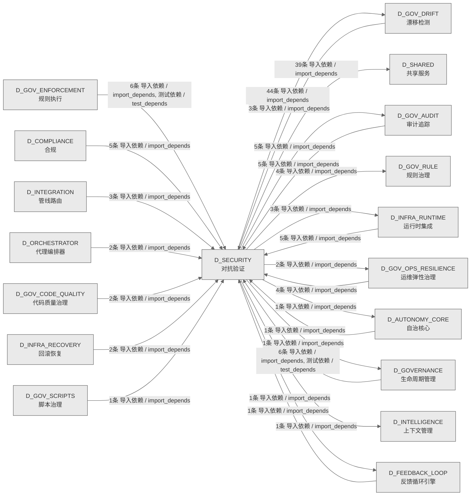

# 27_d_security / 对抗验证域 / Adversarial Validation

> **功能简介 / Overview**: 对抗验证，负责系统安全对抗测试、漏洞扫描和攻防验证

> **文档作用 / Purpose**: 展示 对抗验证（D_SECURITY）功能域的域内依赖关系、跨域依赖关系，模块信息（成熟度/中英文名/大白话/文件路径）内嵌于 Mermaid 节点，供架构审查和域治理参考。

> 本文档由 generate_domain_doc.py 从 depgraph (PostgreSQL) 自动生成
> 数据源: depgraph (PostgreSQL) nodes表 + edges表

> **[可缩放 HTML 版 / Zoomable HTML](http://localhost:8765/docs/02_enterprise_architecture/02_domain_architecture_docs/_zoomable_html/27_d_security.html)** — Ctrl+滚轮缩放 ｜ 双击重置 ｜ Ctrl+Shift+D 切换拖动/选择模式

## 域基本信息 / Domain Overview

| 字段 | 值 | Field | Value |
|------|------|-------|-------|
| 编号 | 27 | Number | 27 |
| 域ID | D_SECURITY | Domain ID | D_SECURITY |
| 域名称 | 对抗验证 | Domain Name | Adversarial Validation |
| 层级 | L1 基础平台层 | Layer | L1 Foundation |
| 模块数 | 166 | Module Count | 166 |
| 域内依赖 | 120 | Internal Dependencies | 120 |
| 跨域入边 | 46 | Cross-domain Incoming | 46 |
| 跨域出边 | 101 | Cross-domain Outgoing | 101 |
| 设计态模块 | 0 | Design Modules | 0 |
| 生产态模块 | 166 | Production Modules | 166 |
| 容量 | 166/150 (超容) | Capacity | 166/150 (超容) |
| 描述 | 孤儿文件检测(orphan_detector) | Description | 孤儿文件检测(orphan_detector) |

## 域内依赖图 / Internal Dependency Diagram

> 依赖图内嵌在本文档中，IDE 可直接渲染；网页版可 Ctrl+滚轮缩放 + 拖动平移查看细节。
>
> **图例说明 / Legend**：
> - 🟦 **蓝色 = 运营态模块**（production，已上线运行）
> - 🟧 **橙色虚线 = 设计态模块**（design，蓝图阶段，代码未写）
> - **实线箭头 = 运营态依赖**（已生效的依赖关系）
> - **虚线箭头 = 非运营态依赖**（计划中/验证中的依赖关系）

### 全景图（全部模块，颜色区分运营态/设计态）

> 展示全部 166 个模块（生产态 166 + 设计态 0），含跨域依赖外部节点。节点含成熟度+名称+大白话/简介+文件路径。

```mermaid
%%{init: {'theme': 'base', 'themeVariables': {'primaryColor': '#eaeaea', 'primaryTextColor': '#333333', 'primaryBorderColor': '#666666', 'lineColor': '#666666', 'secondaryColor': '#eaeaea', 'tertiaryColor': '#eaeaea', 'fontSize': '14px'}}}%%
flowchart TD
    src_zephyr_gov_drift_main_py["(生产态 / production) Drift Detector MOD-INF-023 CLI — 漂移扫描入口。 / __main__<br/>Drift Detector MOD-INF-023 CLI — 漂移扫描入口。<br/>文件: gov_drift/__main__.py"]
    src_zephyr_gov_drift_analysis_py["(生产态 / production) 分析 / _analysis<br/>分析，治理漂移检测的功能模块。<br/>文件: gov_drift/_analysis.py"]
    src_zephyr_gov_drift_core_py["(生产态 / production) 核心 / _core<br/>核心，治理漂移检测的功能模块。<br/>文件: gov_drift/_core.py"]
    src_zephyr_gov_drift_drift_py["(生产态 / production) 漂移 / _drift<br/>漂移，治理漂移检测的功能模块。<br/>文件: gov_drift/_drift.py"]
    src_zephyr_gov_drift_infrastructure_py["(生产态 / production) 基础设施 / _infrastructure<br/>基础设施，治理漂移检测的功能模块。<br/>文件: gov_drift/_infrastructure.py"]
    src_zephyr_gov_drift_scanners_py["(生产态 / production) 扫描器 / _scanners<br/>扫描器，治理漂移检测的功能模块。<br/>文件: gov_drift/_scanners.py"]
    src_zephyr_governance_agent_rbac_contracts_py["(生产态 / production) agent-rbac/contracts.py — G-CT-001 RBAC  / contracts<br/>agent-rbac/contracts.py — G-CT-001 RBAC 契约（re-export）。<br/>文件: agent-rbac/contracts.py"]
    src_zephyr_red_blue_validator_init_py["(生产态 / production) 包入口 / red_blue_validator — re-export shim for zephyr.security.adve<br/>包入口。red_blue_validator — re-export shim for zephyr.security.adversarial_validation.<br/>文件: red_blue_validator/__init__.py"]
    src_zephyr_security_access_control_a2a_check_py["(生产态 / production) A2A 通信对验证——校验两个 agent 之间是否允许通信。 / a2a_check<br/>A2A 通信对验证——校验两个 agent 之间是否允许通信。<br/>文件: access_control/a2a_check.py"]
    src_zephyr_security_access_control_adversarial_resilience_py["(生产态 / production) adversarial韧性 / AdversarialResilience - adversarial resilience & OWASP cover<br/>adversarial韧性。AdversarialResilience - adversarial resilience & OWASP coverage.<br/>文件: access_control/adversarial_resilience.py"]
    src_zephyr_security_access_control_agent_creation_policy_py["(生产态 / production) AgentCreationPolicy — Agent 创建策略. / agent_creation_policy<br/>AgentCreationPolicy — Agent 创建策略.<br/>文件: access_control/agent_creation_policy.py"]
    src_zephyr_security_access_control_approver_check_py["(生产态 / production) Approver authorization verifier — 校验审批人是 / approver_check<br/>Approver authorization verifier — 校验审批人是否有权执行请求的动作。<br/>文件: access_control/approver_check.py"]
    src_zephyr_security_access_control_asymmetric_audit_py["(生产态 / production) asymmetric审计 / AsymmetricAudit - quorum-based approval for high-risk operat<br/>asymmetric审计。AsymmetricAudit - quorum-based approval for high-risk operations.<br/>文件: access_control/asymmetric_audit.py"]
    src_zephyr_security_access_control_auto_maintenance_py["(生产态 / production) AutoMaintenance — 自动维护与规则健康仪表盘. / auto_maintenance<br/>AutoMaintenance — 自动维护与规则健康仪表盘.<br/>文件: access_control/auto_maintenance.py"]
    src_zephyr_security_access_control_blueprint_fidelity_py["(生产态 / production) BlueprintFidelity — 蓝图保真度检查. / blueprint_fidelity<br/>BlueprintFidelity — 蓝图保真度检查.<br/>文件: access_control/blueprint_fidelity.py"]
    src_zephyr_security_access_control_build_sanitizer_py["(生产态 / production) 构建sanitizer / Stub module: zephyr.security.access_control.build_sanitizer <br/>构建sanitizer。Stub module: zephyr.security.access_control.build_sanitizer — implementation pending.<br/>文件: access_control/build_sanitizer.py"]
    src_zephyr_security_access_control_cache_invalidation_py["(生产态 / production) CacheInvalidation — 缓存失效事件管理. / cache_invalidation<br/>CacheInvalidation — 缓存失效事件管理.<br/>文件: access_control/cache_invalidation.py"]
    src_zephyr_security_access_control_canary_rollout_manager_py["(生产态 / production) CanaryRolloutManager — 灰度发布管理器. / canary_rollout_manager<br/>CanaryRolloutManager — 灰度发布管理器.<br/>文件: access_control/canary_rollout_manager.py"]
    src_zephyr_security_access_control_capability_check_py["(生产态 / production) Agent capability scope verification — 拒绝 / capability_check<br/>Agent capability scope verification — 拒绝受限能力声明、空能力声明及能力数量超限。<br/>文件: access_control/capability_check.py"]
    src_zephyr_security_access_control_cascading_failure_isolator_py["(生产态 / production) cascadingfailureisolator / Stub module: zephyr.security.access_control.cascading_failur<br/>cascadingfailureisolator，访问控制的功能模块。<br/>文件: access_control/cascading_failure_isolator.py"]
    src_zephyr_security_access_control_compliance_matrix_py["(生产态 / production) 合规矩阵 / Stub module: zephyr.security.access_control.compliance_matri<br/>合规矩阵。Stub module: zephyr.security.access_control.compliance_matrix — implementation pending.<br/>文件: access_control/compliance_matrix.py"]
    src_zephyr_security_access_control_cross_cutting_py["(生产态 / production) CrossCutting — 横切面权限组件. / cross_cutting<br/>CrossCutting — 横切面权限组件.<br/>文件: access_control/cross_cutting.py"]
    src_zephyr_security_access_control_decision_explainer_py["(生产态 / production) DecisionExplainer — 拒绝决策的结构化解释器. / decision_explainer<br/>DecisionExplainer — 拒绝决策的结构化解释器.<br/>文件: access_control/decision_explainer.py"]
    src_zephyr_security_access_control_decision_registry_py["(生产态 / production) 决策注册表 / DecisionRegistry - decision log with query and stats.<br/>决策注册表。DecisionRegistry - decision log with query and stats.<br/>文件: access_control/decision_registry.py"]
    src_zephyr_security_access_control_defense_depth_py["(生产态 / production) 防御深度 / Stub module: zephyr.security.access_control.defense_depth — <br/>防御深度。Stub module: zephyr.security.access_control.defense_depth — implementation pending.<br/>文件: access_control/defense_depth.py"]
    src_zephyr_security_access_control_dependency_auditor_py["(生产态 / production) 依赖审计器 / Stub module: zephyr.security.access_control.dependency_audit<br/>依赖审计器。Stub module: zephyr.security.access_control.dependency_auditor — implementation pending.<br/>文件: access_control/dependency_auditor.py"]
    src_zephyr_security_access_control_derive_rbac_roles_py["(生产态 / production) RBACRoleDeriver — RBAC 角色派生器. / derive_rbac_roles<br/>RBACRoleDeriver — RBAC 角色派生器.<br/>文件: access_control/derive_rbac_roles.py"]
    src_zephyr_security_access_control_detectors_anomaly_detector_py["(生产态 / production) 异常检测器 / AnomalyDetector - rolling z-score anomaly detection per fiel<br/>异常检测器。AnomalyDetector - rolling z-score anomaly detection per field.<br/>文件: detectors/anomaly_detector.py"]
    src_zephyr_security_access_control_detectors_context_drift_detector_py["(生产态 / production) ContextDriftDetector — 上下文漂移与范围蔓延检测. / context_drift_detector<br/>ContextDriftDetector — 上下文漂移与范围蔓延检测.<br/>文件: detectors/context_drift_detector.py"]
    src_zephyr_security_access_control_detectors_cross_session_detector_py["(生产态 / production) CrossSessionDetector — 跨 Session 检测器. / cross_session_detector<br/>CrossSessionDetector — 跨 Session 检测器.<br/>文件: detectors/cross_session_detector.py"]
    src_zephyr_security_access_control_detectors_false_completion_detector_py["(生产态 / production) FalseCompletionDetector — 虚假完成检测. / false_completion_detector<br/>FalseCompletionDetector — 虚假完成检测.<br/>文件: detectors/false_completion_detector.py"]
    src_zephyr_security_access_control_detectors_multi_agent_collusion_detector_py["(生产态 / production) MultiAgentCollusionDetector — 多 agent 合谋 / multi_agent_collusion_detector<br/>MultiAgentCollusionDetector — 多 agent 合谋检测.<br/>文件: detectors/multi_agent_collusion_detector.py"]
    src_zephyr_security_access_control_detectors_shell_dialect_detector_py["(生产态 / production) ShellDialectDetector — Shell 方言检测器. / shell_dialect_detector<br/>ShellDialectDetector — Shell 方言检测器.<br/>文件: detectors/shell_dialect_detector.py"]
    src_zephyr_security_access_control_dry_run_py["(生产态 / production) DryRun — 权限模拟与影响分析. / dry_run<br/>DryRun — 权限模拟与影响分析.<br/>文件: access_control/dry_run.py"]
    src_zephyr_security_access_control_emergency_override_py["(生产态 / production) EmergencyOverride — 紧急覆盖令牌管理. / emergency_override<br/>EmergencyOverride — 紧急覆盖令牌管理.<br/>文件: access_control/emergency_override.py"]
    src_zephyr_security_access_control_environment_manager_py["(生产态 / production) 环境管理器 / Stub module: zephyr.security.access_control.environment_mana<br/>环境管理器。Stub module: zephyr.security.access_control.environment_manager — implementation pending.<br/>文件: access_control/environment_manager.py"]
    src_zephyr_security_access_control_escalation_handler_py["(生产态 / production) escalation处理器 / Stub module: zephyr.security.access_control.escalation_handl<br/>escalation处理器。Stub module: zephyr.security.access_control.escalation_handler — implementation pending.<br/>文件: access_control/escalation_handler.py"]
    src_zephyr_security_access_control_exceptions_py["(生产态 / production) AgentRbac 异常类型. / exceptions<br/>AgentRbac 异常类型.<br/>文件: access_control/exceptions.py"]
    src_zephyr_security_access_control_genesis_bootstrap_py["(生产态 / production) GenesisBootstrap — RBAC系统启动引导器. / genesis_bootstrap<br/>GenesisBootstrap — RBAC系统启动引导器.<br/>文件: access_control/genesis_bootstrap.py"]
    src_zephyr_security_access_control_guard_layers_py["(生产态 / production) GuardLayers — 权限守卫层组件. / guard_layers<br/>GuardLayers — 权限守卫层组件.<br/>文件: access_control/guard_layers.py"]
    src_zephyr_security_access_control_guards_abac_guard_py["(生产态 / production) ABACGuard — 基于属性的权限守卫. / abac_guard<br/>ABACGuard — 基于属性的权限守卫.<br/>文件: guards/abac_guard.py"]
    src_zephyr_security_access_control_guards_anti_pattern_guard_py["(生产态 / production) anti模式守卫 / Stub module: zephyr.security.access_control.guards.anti_patt<br/>anti模式守卫。Stub module: zephyr.security.access_control.guards.anti_pattern_guard — implementation pending.<br/>文件: guards/anti_pattern_guard.py"]
    src_zephyr_security_access_control_guards_audit_log_guard_py["(生产态 / production) 审计日志guard.py — 审计日志注入防护守卫 / audit_log_guard<br/>审计日志注入防护守卫<br/>文件: guards/audit_log_guard.py"]
    src_zephyr_security_access_control_guards_cybersec_2026_guard_py["(生产态 / production) Cybersec2026Guard — 2026 网络安全威胁检测. / cybersec_2026_guard<br/>Cybersec2026Guard — 2026 网络安全威胁检测.<br/>文件: guards/cybersec_2026_guard.py"]
    src_zephyr_security_access_control_guards_input_guard_py["(生产态 / production) InputGuard — 输入参数守卫. / input_guard<br/>InputGuard — 输入参数守卫.<br/>文件: guards/input_guard.py"]
    src_zephyr_security_access_control_guards_memory_guard_py["(生产态 / production) MemoryGuard — 内存访问守卫. / memory_guard<br/>MemoryGuard — 内存访问守卫.<br/>文件: guards/memory_guard.py"]
    src_zephyr_security_access_control_guards_memory_provenance_guard_py["(生产态 / production) MemoryProvenanceGuard — 记忆来源溯源守卫. / memory_provenance_guard<br/>MemoryProvenanceGuard — 记忆来源溯源守卫.<br/>文件: guards/memory_provenance_guard.py"]
    src_zephyr_security_access_control_guards_native_api_guard_py["(生产态 / production) NativeApiGuard — 原生 API 守卫. / native_api_guard<br/>NativeApiGuard — 原生 API 守卫.<br/>文件: guards/native_api_guard.py"]
    src_zephyr_security_access_control_guards_novel_attack_guard_py["(生产态 / production) NovelAttackGuard — 新型攻击行为画像. / novel_attack_guard<br/>NovelAttackGuard — 新型攻击行为画像.<br/>文件: guards/novel_attack_guard.py"]
    src_zephyr_security_access_control_guards_output_guard_py["(生产态 / production) OutputGuard — 输出内容守卫. / output_guard<br/>OutputGuard — 输出内容守卫.<br/>文件: guards/output_guard.py"]
    src_zephyr_security_access_control_guards_path_guard_py["(生产态 / production) PathGuard — 路径守卫. / path_guard<br/>PathGuard — 路径守卫.<br/>文件: guards/path_guard.py"]
    src_zephyr_security_access_control_guards_replay_attack_guard_py["(生产态 / production) ReplayAttackGuard — 重放攻击防护. / replay_attack_guard<br/>ReplayAttackGuard — 重放攻击防护.<br/>文件: guards/replay_attack_guard.py"]
    src_zephyr_security_access_control_guards_rule_injection_guard_py["(生产态 / production) RuleInjectionGuard — 规则注入守卫. / rule_injection_guard<br/>RuleInjectionGuard — 规则注入守卫.<br/>文件: guards/rule_injection_guard.py"]
    src_zephyr_security_access_control_guards_sequence_guard_py["(生产态 / production) SequenceGuard — 操作序列守卫. / sequence_guard<br/>SequenceGuard — 操作序列守卫.<br/>文件: guards/sequence_guard.py"]
    src_zephyr_security_access_control_guards_toctou_guard_py["(生产态 / production) TOCTOUGuard — TOCTOU (Time-of-Check to T / toctou_guard<br/>TOCTOUGuard — TOCTOU (Time-of-Check to Time-of-Use) 防护.<br/>文件: guards/toctou_guard.py"]
    src_zephyr_security_access_control_guards_vibe_coding_guard_py["(生产态 / production) VibeCodingGuard — Vibe Coding 攻击面检测. / vibe_coding_guard<br/>VibeCodingGuard — Vibe Coding 攻击面检测.<br/>文件: guards/vibe_coding_guard.py"]
    src_zephyr_security_access_control_integration_py["(生产态 / production) 集成 / IntegrationManager - system integration registry & health ch<br/>集成。IntegrationManager - system integration registry & health check.<br/>文件: access_control/integration.py"]
    src_zephyr_security_access_control_integrity_self_check_py["(生产态 / production) IntegritySelfCheck — 完整性自检. / integrity_self_check<br/>IntegritySelfCheck — 完整性自检.<br/>文件: access_control/integrity_self_check.py"]
    src_zephyr_security_access_control_intent_binder_py["(生产态 / production) IntentBinder — 意图绑定与漂移检测. / intent_binder<br/>IntentBinder — 意图绑定与漂移检测.<br/>文件: access_control/intent_binder.py"]
    src_zephyr_security_access_control_key_hierarchy_py["(生产态 / production) 密钥hierarchy / Stub module: zephyr.security.access_control.key_hierarchy — <br/>密钥hierarchy。Stub module: zephyr.security.access_control.key_hierarchy — implementation pending.<br/>文件: access_control/key_hierarchy.py"]
    src_zephyr_security_access_control_legal_audit_chain_py["(生产态 / production) legal审计链 / LegalAuditChain - append-only hash-chained legal audit log.<br/>legal审计链。LegalAuditChain - append-only hash-chained legal audit log.<br/>文件: access_control/legal_audit_chain.py"]
    src_zephyr_security_access_control_microstructure_defense_py["(生产态 / production) 微结构防御——对抗做市/交易微结构攻击的策略与保真度因子。 / microstructure_defense<br/>微结构防御——对抗做市/交易微结构攻击的策略与保真度因子。<br/>文件: access_control/microstructure_defense.py"]
    src_zephyr_security_access_control_monotonic_clock_py["(生产态 / production) MonotonicClock — 单调时钟. / monotonic_clock<br/>MonotonicClock — 单调时钟.<br/>文件: access_control/monotonic_clock.py"]
    src_zephyr_security_access_control_non_repudiation_py["(生产态 / production) NonRepudiation — 不可抵赖性审计签名. / non_repudiation<br/>NonRepudiation — 不可抵赖性审计签名.<br/>文件: access_control/non_repudiation.py"]
    src_zephyr_security_access_control_observability_py["(生产态 / production) ObservabilityReporter — 指标上报与异常检测. / observability<br/>ObservabilityReporter — 指标上报与异常检测.<br/>文件: access_control/observability.py"]
    src_zephyr_security_access_control_orphan_judge_main_py["(生产态 / production) 主入口 / __main__<br/>孤儿判定的命令行入口，可以直接 python -m 跑起来执行主流程。<br/>文件: orphan_judge/__main__.py"]
    src_zephyr_security_access_control_orphan_judge_config_loader_py["(生产态 / production) 配置加载器 / config_loader<br/>配置加载器，主要提供加载、save、配置等功能，供orphan-judge.judge.OrphanJudge使用<br/>文件: orphan_judge/config_loader.py"]
    src_zephyr_security_access_control_orphan_judge_drift_bridge_py["(生产态 / production) 漂移桥接 / drift_bridge<br/>漂移桥接，主要提供notify变更、isavailable等功能，供orphan-judge.judge.OrphanJudge使用<br/>文件: orphan_judge/drift_bridge.py"]
    src_zephyr_security_access_control_orphan_judge_escalation_bridge_py["(生产态 / production) escalation桥接 / escalation_bridge<br/>escalation桥接，主要提供escalatejudgment、评估风险、isavailable等功能，供orphan-judge.judge.OrphanJudge使用<br/>文件: orphan_judge/escalation_bridge.py"]
    src_zephyr_security_access_control_orphan_judge_feedback_bridge_py["(生产态 / production) 反馈桥接 / feedback_bridge<br/>反馈桥接，主要提供报告misjudgment、isavailable等功能，供orphan-judge.judge.OrphanJudge使用<br/>文件: orphan_judge/feedback_bridge.py"]
    src_zephyr_security_access_control_orphan_judge_kb_bridge_py["(生产态 / production) kb桥接 / kb_bridge<br/>kb桥接，主要提供writejudgment、search历史、isavailable等功能，供orphan-judge.__main__._cmd_rep使用<br/>文件: orphan_judge/kb_bridge.py"]
    src_zephyr_security_access_control_orphan_judge_mcp_integration_py["(生产态 / production) MCP集成 / mcp_integration<br/>MCP集成，孤儿判定的功能模块。<br/>文件: orphan_judge/mcp_integration.py"]
    src_zephyr_security_access_control_orphan_judge_orphan_collector_py["(生产态 / production) 孤儿文件收集与处置器——整合 SafetyFence 安全检 / orphan_collector<br/>孤儿文件收集与处置器——整合 SafetyFence 安全检查后执行处置动作。<br/>文件: orphan_judge/orphan_collector.py"]
    src_zephyr_security_access_control_orphan_judge_orphan_detector_py["(生产态 / production) (INVARIANTS) 蓝图 §4 文件清单与代码双向对齐 / orphan_detector<br/>(INVARIANTS) 蓝图 §4 文件清单与代码双向对齐<br/>文件: orphan_judge/orphan_detector.py"]
    src_zephyr_security_access_control_orphan_judge_rbac_bridge_py["(生产态 / production) rbac桥接 / rbac_bridge<br/>rbac桥接，主要提供检查删除权限、isavailable等功能，供orphan-judge.judge.OrphanJudge使用<br/>文件: orphan_judge/rbac_bridge.py"]
    src_zephyr_security_access_control_orphan_judge_reference_graph_engine_py["(生产态 / production) AST解析+import链遍历，判断文件是否被其他文件引用。 / reference_graph_engine<br/>AST解析+import链遍历，判断文件是否被其他文件引用。<br/>文件: orphan_judge/reference_graph_engine.py"]
    src_zephyr_security_access_control_orphan_judge_registration_checker_py["(生产态 / production) 扫描项目注册表，判断文件是否已登记在册。 / registration_checker<br/>扫描项目注册表，判断文件是否已登记在册。<br/>文件: orphan_judge/registration_checker.py"]
    src_zephyr_security_access_control_orphan_judge_report_generator_py["(生产态 / production) 报告生成器 / report_generator<br/>报告生成器，主要提供生成、摘要text等功能，供orphan-judge.__main__._cmd_rep使用<br/>文件: orphan_judge/report_generator.py"]
    src_zephyr_security_access_control_orphan_judge_standalone_evaluator_py["(生产态 / production) 六指标加权评分: 文件大小(15%) + 代码行数(20%) + 定义数(20% / standalone_evaluator<br/>六指标加权评分: 文件大小(15%) + 代码行数(20%) + 定义数(20%)<br/>文件: orphan_judge/standalone_evaluator.py"]
    src_zephyr_security_access_control_orphan_judge_swid_tag_py["(生产态 / production) swid标签 / swid_tag<br/>swid标签，主要提供构建等功能，供orphan-judge.db.JudgmentDB; re使用<br/>文件: orphan_judge/swid_tag.py"]
    src_zephyr_security_access_control_orphan_judge_unique_analyzer_py["(生产态 / production) AST节点比对，检测文件中的独特代码元素(类/函数/常量定义等)。 / unique_analyzer<br/>AST节点比对，检测文件中的独特代码元素(类/函数/常量定义等)。<br/>文件: orphan_judge/unique_analyzer.py"]
    src_zephyr_security_access_control_permission_hooks_py["(生产态 / production) PermissionHooks — 权限钩子注册表. / permission_hooks<br/>PermissionHooks — 权限钩子注册表.<br/>文件: access_control/permission_hooks.py"]
    src_zephyr_security_access_control_permission_mode_manager_py["(生产态 / production) 权限mode管理器 / Stub module: zephyr.security.access_control.permission_mode_<br/>权限mode管理器。Stub module: zephyr.security.access_control.permission_mode_manager — implementation pending.<br/>文件: access_control/permission_mode_manager.py"]
    src_zephyr_security_access_control_phase_executor_py["(生产态 / production) 阶段执行器 / phase_executor<br/>阶段执行器，访问控制的组成部分，依赖包入口工作。<br/>文件: access_control/phase_executor.py"]
    src_zephyr_security_access_control_risk_mitigation_py["(生产态 / production) RiskMitigation — 风险评估与缓解策略. / risk_mitigation<br/>RiskMitigation — 风险评估与缓解策略.<br/>文件: access_control/risk_mitigation.py"]
    src_zephyr_security_access_control_rollback_sandbox_py["(生产态 / production) 回滚sandbox / RollbackSandbox - isolate/execute/rollback pattern for rever<br/>回滚sandbox。RollbackSandbox - isolate/execute/rollback pattern for reversible operations.<br/>文件: access_control/rollback_sandbox.py"]
    src_zephyr_security_access_control_secrets_lifecycle_py["(生产态 / production) secrets生命周期 / Stub module: zephyr.security.access_control.secrets_lifecycl<br/>secrets生命周期。Stub module: zephyr.security.access_control.secrets_lifecycle — implementation pending.<br/>文件: access_control/secrets_lifecycle.py"]
    src_zephyr_security_access_control_session_concurrency_py["(生产态 / production) Session 级并发协调模块（P2-SES 落地）。 / session_concurrency<br/>Session 级并发协调模块（P2-SES 落地）。<br/>文件: access_control/session_concurrency.py"]
    src_zephyr_security_access_control_session_lifecycle_py["(生产态 / production) 会话生命周期 / Stub module: zephyr.security.access_control.session_lifecycl<br/>会话生命周期。Stub module: zephyr.security.access_control.session_lifecycle — implementation pending.<br/>文件: access_control/session_lifecycle.py"]
    src_zephyr_security_access_control_verifiers_bootstrap_verifier_py["(生产态 / production) bootstrap验证器 / Stub module: zephyr.security.access_control.verifiers.bootst<br/>bootstrap验证器。Stub module: zephyr.security.access_control.verifiers.bootstrap_verifier — implementation pending.<br/>文件: verifiers/bootstrap_verifier.py"]
    src_zephyr_security_access_control_verifiers_continuous_verifier_py["(生产态 / production) continuous验证器 / Stub module: zephyr.security.access_control.verifiers.contin<br/>continuous验证器。Stub module: zephyr.security.access_control.verifiers.continuous_verifier — implementation pending.<br/>文件: verifiers/continuous_verifier.py"]
    src_zephyr_security_access_control_verifiers_contract_verifier_py["(生产态 / production) ContractVerifier — 契约验证器. / contract_verifier<br/>ContractVerifier — 契约验证器.<br/>文件: verifiers/contract_verifier.py"]
    src_zephyr_security_access_control_verifiers_micro_verifier_py["(生产态 / production) micro验证器 / Stub module: zephyr.security.access_control.verifiers.micro_<br/>micro验证器。Stub module: zephyr.security.access_control.verifiers.micro_verifier — implementation pending.<br/>文件: verifiers/micro_verifier.py"]
    src_zephyr_security_access_control_verifiers_post_action_verifier_py["(生产态 / production) 提交动作验证器 / Stub module: zephyr.security.access_control.verifiers.post_a<br/>提交动作验证器。Stub module: zephyr.security.access_control.verifiers.post_action_verifier — implementation pending.<br/>文件: verifiers/post_action_verifier.py"]
    src_zephyr_security_adversarial_validation_main_py["(生产态 / production) 主入口 / __main__<br/>对抗验证的命令行入口，可以直接 python -m 跑起来执行主流程。<br/>文件: adversarial_validation/__main__.py"]
    src_zephyr_security_adversarial_validation_ai_attack_generator_py["(生产态 / production) AIattack生成器 / ai_attack_generator<br/>AIattack生成器，对抗验证的异常，定义本模块的异常类型。<br/>文件: adversarial_validation/ai_attack_generator.py"]
    src_zephyr_security_adversarial_validation_async_monitor_py["(生产态 / production) 异步监控 / async_monitor<br/>异步监控，对抗验证的监控器，持续监视某项指标，异常时上报。<br/>文件: adversarial_validation/async_monitor.py"]
    src_zephyr_security_adversarial_validation_attack_registry_py["(生产态 / production) attack注册表 / attack_registry<br/>attack注册表，主要提供注册、查询by层、数量等功能，供见蓝图 §4 接口契约使用<br/>文件: adversarial_validation/attack_registry.py"]
    src_zephyr_security_adversarial_validation_commit_trigger_py["(生产态 / production) CommitTrigger — 事件驱动红蓝对抗触发器 (MOD-INF-030 / commit_trigger<br/>CommitTrigger — 事件驱动红蓝对抗触发器 (MOD-INF-030).<br/>文件: adversarial_validation/commit_trigger.py"]
    src_zephyr_security_adversarial_validation_constitution_engine_py["(生产态 / production) constitution引擎 / constitution_engine<br/>constitution引擎，对抗验证的注册表，登记和查询已注册的条目。<br/>文件: adversarial_validation/constitution_engine.py"]
    src_zephyr_security_adversarial_validation_game_day_scheduler_py["(生产态 / production) gameday调度器 / game_day_scheduler<br/>gameday调度器，对抗验证的调度器，按时间或优先级安排任务执行。<br/>文件: adversarial_validation/game_day_scheduler.py"]
    src_zephyr_security_adversarial_validation_injection_engine_py["(生产态 / production) injection引擎 / injection_engine<br/>injection引擎，执行核心逻辑的处理引擎，主要提供blastradius、blastradius、inject、recover等功能，是对抗验证的组成部分<br/>文件: adversarial_validation/injection_engine.py"]
    src_zephyr_security_adversarial_validation_mcp_endpoints_py["(生产态 / production) MCPendpoints / mcp_endpoints<br/>MCPendpoints，对抗验证的异常，定义本模块的异常类型。<br/>文件: adversarial_validation/mcp_endpoints.py"]
    src_zephyr_security_adversarial_validation_validator_event_bridge_py["(生产态 / production) ValidatorEventBridge — 红蓝验证器事件桥接 (MOD-SE / validator_event_bridge<br/>ValidatorEventBridge — 红蓝验证器事件桥接 (MOD-SEC-030).<br/>文件: adversarial_validation/validator_event_bridge.py"]
    src_zephyr_security_llm_defense_llm_security_dashboard_app_py["(生产态 / production) app / LLM Security Gateway - Streamlit Dashboard.<br/>app。LLM Security Gateway - Streamlit Dashboard.<br/>文件: dashboard/app.py"]
    src_zephyr_security_llm_defense_llm_security_layers_l6_data_flow_py["(生产态 / production) l6数据流 / l6_data_flow<br/>l6数据流，主要提供校验、检查pii、执行encryption等功能<br/>文件: layers/l6_data_flow.py"]
    src_zephyr_security_llm_defense_llm_security_layers_l8_compliance_py["(生产态 / production) l8合规 / l8_compliance<br/>l8合规，主要提供校验、检查策略、执行合规等功能<br/>文件: layers/l8_compliance.py"]
    src_zephyr_security_llm_defense_llm_security_process_sandbox_py["(生产态 / production) L2a ProcessSandbox — subprocess 路径白名单沙箱 / process_sandbox<br/>L2a ProcessSandbox — subprocess 路径白名单沙箱<br/>文件: llm_security/process_sandbox.py"]
    src_zephyr_security_llm_defense_llm_security_self_protection_adversarial_mutator_py["(生产态 / production) 对抗变异生成器 — 对 Red Team 载荷施加 10 种 / adversarial_mutator<br/>对抗变异生成器 — 对 Red Team 载荷施加 10 种变异技术，检验 LSG 抗干扰能力.<br/>文件: self_protection/adversarial_mutator.py"]
    src_zephyr_security_llm_defense_llm_security_self_protection_red_team_scanner_py["(生产态 / production) L7 Red Team 对抗扫描器. / red_team_scanner<br/>L7 Red Team 对抗扫描器.<br/>文件: self_protection/red_team_scanner.py"]
    src_zephyr_gov_drift_main_py ~~~ src_zephyr_gov_drift_analysis_py
    src_zephyr_gov_drift_analysis_py ~~~ src_zephyr_gov_drift_core_py
    src_zephyr_gov_drift_core_py ~~~ src_zephyr_gov_drift_drift_py
    src_zephyr_gov_drift_drift_py ~~~ src_zephyr_gov_drift_infrastructure_py
    src_zephyr_gov_drift_infrastructure_py ~~~ src_zephyr_gov_drift_scanners_py
    src_zephyr_gov_drift_scanners_py ~~~ src_zephyr_governance_agent_rbac_contracts_py
    src_zephyr_governance_agent_rbac_contracts_py ~~~ src_zephyr_red_blue_validator_init_py
    src_zephyr_red_blue_validator_init_py ~~~ src_zephyr_security_access_control_a2a_check_py
    src_zephyr_security_access_control_a2a_check_py ~~~ src_zephyr_security_access_control_adversarial_resilience_py
    src_zephyr_security_access_control_adversarial_resilience_py ~~~ src_zephyr_security_access_control_agent_creation_policy_py
    src_zephyr_security_access_control_agent_creation_policy_py ~~~ src_zephyr_security_access_control_approver_check_py
    src_zephyr_security_access_control_approver_check_py ~~~ src_zephyr_security_access_control_asymmetric_audit_py
    src_zephyr_security_access_control_asymmetric_audit_py ~~~ src_zephyr_security_access_control_auto_maintenance_py
    src_zephyr_security_access_control_auto_maintenance_py ~~~ src_zephyr_security_access_control_blueprint_fidelity_py
    src_zephyr_security_access_control_blueprint_fidelity_py ~~~ src_zephyr_security_access_control_build_sanitizer_py
    src_zephyr_security_access_control_build_sanitizer_py ~~~ src_zephyr_security_access_control_cache_invalidation_py
    src_zephyr_security_access_control_cache_invalidation_py ~~~ src_zephyr_security_access_control_canary_rollout_manager_py
    src_zephyr_security_access_control_canary_rollout_manager_py ~~~ src_zephyr_security_access_control_capability_check_py
    src_zephyr_security_access_control_capability_check_py ~~~ src_zephyr_security_access_control_cascading_failure_isolator_py
    src_zephyr_security_access_control_cascading_failure_isolator_py ~~~ src_zephyr_security_access_control_compliance_matrix_py
    src_zephyr_security_access_control_compliance_matrix_py ~~~ src_zephyr_security_access_control_cross_cutting_py
    src_zephyr_security_access_control_cross_cutting_py ~~~ src_zephyr_security_access_control_decision_explainer_py
    src_zephyr_security_access_control_decision_explainer_py ~~~ src_zephyr_security_access_control_decision_registry_py
    src_zephyr_security_access_control_decision_registry_py ~~~ src_zephyr_security_access_control_defense_depth_py
    src_zephyr_security_access_control_defense_depth_py ~~~ src_zephyr_security_access_control_dependency_auditor_py
    src_zephyr_security_access_control_dependency_auditor_py ~~~ src_zephyr_security_access_control_derive_rbac_roles_py
    src_zephyr_security_access_control_derive_rbac_roles_py ~~~ src_zephyr_security_access_control_detectors_anomaly_detector_py
    src_zephyr_security_access_control_detectors_anomaly_detector_py ~~~ src_zephyr_security_access_control_detectors_context_drift_detector_py
    src_zephyr_security_access_control_detectors_context_drift_detector_py ~~~ src_zephyr_security_access_control_detectors_cross_session_detector_py
    src_zephyr_security_access_control_detectors_cross_session_detector_py ~~~ src_zephyr_security_access_control_detectors_false_completion_detector_py
    src_zephyr_security_access_control_detectors_false_completion_detector_py ~~~ src_zephyr_security_access_control_detectors_multi_agent_collusion_detector_py
    src_zephyr_security_access_control_detectors_multi_agent_collusion_detector_py ~~~ src_zephyr_security_access_control_detectors_shell_dialect_detector_py
    src_zephyr_security_access_control_detectors_shell_dialect_detector_py ~~~ src_zephyr_security_access_control_dry_run_py
    src_zephyr_security_access_control_dry_run_py ~~~ src_zephyr_security_access_control_emergency_override_py
    src_zephyr_security_access_control_emergency_override_py ~~~ src_zephyr_security_access_control_environment_manager_py
    src_zephyr_security_access_control_environment_manager_py ~~~ src_zephyr_security_access_control_escalation_handler_py
    src_zephyr_security_access_control_escalation_handler_py ~~~ src_zephyr_security_access_control_exceptions_py
    src_zephyr_security_access_control_exceptions_py ~~~ src_zephyr_security_access_control_genesis_bootstrap_py
    src_zephyr_security_access_control_genesis_bootstrap_py ~~~ src_zephyr_security_access_control_guard_layers_py
    src_zephyr_security_access_control_guard_layers_py ~~~ src_zephyr_security_access_control_guards_abac_guard_py
    src_zephyr_security_access_control_guards_abac_guard_py ~~~ src_zephyr_security_access_control_guards_anti_pattern_guard_py
    src_zephyr_security_access_control_guards_anti_pattern_guard_py ~~~ src_zephyr_security_access_control_guards_audit_log_guard_py
    src_zephyr_security_access_control_guards_audit_log_guard_py ~~~ src_zephyr_security_access_control_guards_cybersec_2026_guard_py
    src_zephyr_security_access_control_guards_cybersec_2026_guard_py ~~~ src_zephyr_security_access_control_guards_input_guard_py
    src_zephyr_security_access_control_guards_input_guard_py ~~~ src_zephyr_security_access_control_guards_memory_guard_py
    src_zephyr_security_access_control_guards_memory_guard_py ~~~ src_zephyr_security_access_control_guards_memory_provenance_guard_py
    src_zephyr_security_access_control_guards_memory_provenance_guard_py ~~~ src_zephyr_security_access_control_guards_native_api_guard_py
    src_zephyr_security_access_control_guards_native_api_guard_py ~~~ src_zephyr_security_access_control_guards_novel_attack_guard_py
    src_zephyr_security_access_control_guards_novel_attack_guard_py ~~~ src_zephyr_security_access_control_guards_output_guard_py
    src_zephyr_security_access_control_guards_output_guard_py ~~~ src_zephyr_security_access_control_guards_path_guard_py
    src_zephyr_security_access_control_guards_path_guard_py ~~~ src_zephyr_security_access_control_guards_replay_attack_guard_py
    src_zephyr_security_access_control_guards_replay_attack_guard_py ~~~ src_zephyr_security_access_control_guards_rule_injection_guard_py
    src_zephyr_security_access_control_guards_rule_injection_guard_py ~~~ src_zephyr_security_access_control_guards_sequence_guard_py
    src_zephyr_security_access_control_guards_sequence_guard_py ~~~ src_zephyr_security_access_control_guards_toctou_guard_py
    src_zephyr_security_access_control_guards_toctou_guard_py ~~~ src_zephyr_security_access_control_guards_vibe_coding_guard_py
    src_zephyr_security_access_control_guards_vibe_coding_guard_py ~~~ src_zephyr_security_access_control_integration_py
    src_zephyr_security_access_control_integration_py ~~~ src_zephyr_security_access_control_integrity_self_check_py
    src_zephyr_security_access_control_integrity_self_check_py ~~~ src_zephyr_security_access_control_intent_binder_py
    src_zephyr_security_access_control_intent_binder_py ~~~ src_zephyr_security_access_control_key_hierarchy_py
    src_zephyr_security_access_control_key_hierarchy_py ~~~ src_zephyr_security_access_control_legal_audit_chain_py
    src_zephyr_security_access_control_legal_audit_chain_py ~~~ src_zephyr_security_access_control_microstructure_defense_py
    src_zephyr_security_access_control_microstructure_defense_py ~~~ src_zephyr_security_access_control_monotonic_clock_py
    src_zephyr_security_access_control_monotonic_clock_py ~~~ src_zephyr_security_access_control_non_repudiation_py
    src_zephyr_security_access_control_non_repudiation_py ~~~ src_zephyr_security_access_control_observability_py
    src_zephyr_security_access_control_observability_py ~~~ src_zephyr_security_access_control_orphan_judge_main_py
    src_zephyr_security_access_control_orphan_judge_main_py ~~~ src_zephyr_security_access_control_orphan_judge_config_loader_py
    src_zephyr_security_access_control_orphan_judge_config_loader_py ~~~ src_zephyr_security_access_control_orphan_judge_drift_bridge_py
    src_zephyr_security_access_control_orphan_judge_drift_bridge_py ~~~ src_zephyr_security_access_control_orphan_judge_escalation_bridge_py
    src_zephyr_security_access_control_orphan_judge_escalation_bridge_py ~~~ src_zephyr_security_access_control_orphan_judge_feedback_bridge_py
    src_zephyr_security_access_control_orphan_judge_feedback_bridge_py ~~~ src_zephyr_security_access_control_orphan_judge_kb_bridge_py
    src_zephyr_security_access_control_orphan_judge_kb_bridge_py ~~~ src_zephyr_security_access_control_orphan_judge_mcp_integration_py
    src_zephyr_security_access_control_orphan_judge_mcp_integration_py ~~~ src_zephyr_security_access_control_orphan_judge_orphan_collector_py
    src_zephyr_security_access_control_orphan_judge_orphan_collector_py ~~~ src_zephyr_security_access_control_orphan_judge_orphan_detector_py
    src_zephyr_security_access_control_orphan_judge_orphan_detector_py ~~~ src_zephyr_security_access_control_orphan_judge_rbac_bridge_py
    src_zephyr_security_access_control_orphan_judge_rbac_bridge_py ~~~ src_zephyr_security_access_control_orphan_judge_reference_graph_engine_py
    src_zephyr_security_access_control_orphan_judge_reference_graph_engine_py ~~~ src_zephyr_security_access_control_orphan_judge_registration_checker_py
    src_zephyr_security_access_control_orphan_judge_registration_checker_py ~~~ src_zephyr_security_access_control_orphan_judge_report_generator_py
    src_zephyr_security_access_control_orphan_judge_report_generator_py ~~~ src_zephyr_security_access_control_orphan_judge_standalone_evaluator_py
    src_zephyr_security_access_control_orphan_judge_standalone_evaluator_py ~~~ src_zephyr_security_access_control_orphan_judge_swid_tag_py
    src_zephyr_security_access_control_orphan_judge_swid_tag_py ~~~ src_zephyr_security_access_control_orphan_judge_unique_analyzer_py
    src_zephyr_security_access_control_orphan_judge_unique_analyzer_py ~~~ src_zephyr_security_access_control_permission_hooks_py
    src_zephyr_security_access_control_permission_hooks_py ~~~ src_zephyr_security_access_control_permission_mode_manager_py
    src_zephyr_security_access_control_permission_mode_manager_py ~~~ src_zephyr_security_access_control_phase_executor_py
    src_zephyr_security_access_control_phase_executor_py ~~~ src_zephyr_security_access_control_risk_mitigation_py
    src_zephyr_security_access_control_risk_mitigation_py ~~~ src_zephyr_security_access_control_rollback_sandbox_py
    src_zephyr_security_access_control_rollback_sandbox_py ~~~ src_zephyr_security_access_control_secrets_lifecycle_py
    src_zephyr_security_access_control_secrets_lifecycle_py ~~~ src_zephyr_security_access_control_session_concurrency_py
    src_zephyr_security_access_control_session_concurrency_py ~~~ src_zephyr_security_access_control_session_lifecycle_py
    src_zephyr_security_access_control_session_lifecycle_py ~~~ src_zephyr_security_access_control_verifiers_bootstrap_verifier_py
    src_zephyr_security_access_control_verifiers_bootstrap_verifier_py ~~~ src_zephyr_security_access_control_verifiers_continuous_verifier_py
    src_zephyr_security_access_control_verifiers_continuous_verifier_py ~~~ src_zephyr_security_access_control_verifiers_contract_verifier_py
    src_zephyr_security_access_control_verifiers_contract_verifier_py ~~~ src_zephyr_security_access_control_verifiers_micro_verifier_py
    src_zephyr_security_access_control_verifiers_micro_verifier_py ~~~ src_zephyr_security_access_control_verifiers_post_action_verifier_py
    src_zephyr_security_access_control_verifiers_post_action_verifier_py ~~~ src_zephyr_security_adversarial_validation_main_py
    src_zephyr_security_adversarial_validation_main_py ~~~ src_zephyr_security_adversarial_validation_ai_attack_generator_py
    src_zephyr_security_adversarial_validation_ai_attack_generator_py ~~~ src_zephyr_security_adversarial_validation_async_monitor_py
    src_zephyr_security_adversarial_validation_async_monitor_py ~~~ src_zephyr_security_adversarial_validation_attack_registry_py
    src_zephyr_security_adversarial_validation_attack_registry_py ~~~ src_zephyr_security_adversarial_validation_commit_trigger_py
    src_zephyr_security_adversarial_validation_commit_trigger_py ~~~ src_zephyr_security_adversarial_validation_constitution_engine_py
    src_zephyr_security_adversarial_validation_constitution_engine_py ~~~ src_zephyr_security_adversarial_validation_game_day_scheduler_py
    src_zephyr_security_adversarial_validation_game_day_scheduler_py ~~~ src_zephyr_security_adversarial_validation_injection_engine_py
    src_zephyr_security_adversarial_validation_injection_engine_py ~~~ src_zephyr_security_adversarial_validation_mcp_endpoints_py
    src_zephyr_security_adversarial_validation_mcp_endpoints_py ~~~ src_zephyr_security_adversarial_validation_validator_event_bridge_py
    src_zephyr_security_adversarial_validation_validator_event_bridge_py ~~~ src_zephyr_security_llm_defense_llm_security_dashboard_app_py
    src_zephyr_security_llm_defense_llm_security_dashboard_app_py ~~~ src_zephyr_security_llm_defense_llm_security_layers_l6_data_flow_py
    src_zephyr_security_llm_defense_llm_security_layers_l6_data_flow_py ~~~ src_zephyr_security_llm_defense_llm_security_layers_l8_compliance_py
    src_zephyr_security_llm_defense_llm_security_layers_l8_compliance_py ~~~ src_zephyr_security_llm_defense_llm_security_process_sandbox_py
    src_zephyr_security_llm_defense_llm_security_process_sandbox_py ~~~ src_zephyr_security_llm_defense_llm_security_self_protection_adversarial_mutator_py
    src_zephyr_security_llm_defense_llm_security_self_protection_adversarial_mutator_py ~~~ src_zephyr_security_llm_defense_llm_security_self_protection_red_team_scanner_py
    src_zephyr_gov_drift_alert_router_py["(生产态 / production) 告警路由器 / Alert Router — alert_router.py<br/>告警路由器，治理漂移检测的功能模块。<br/>文件: gov_drift/alert_router.py"]
    src_zephyr_gov_drift_cold_start_py["(生产态 / production) Cold Start Bootstrapper — 冷启动引导 §6.31。 / cold_start<br/>Cold Start Bootstrapper — 冷启动引导 §6.31。<br/>文件: gov_drift/cold_start.py"]
    src_zephyr_gov_drift_events_py["(生产态 / production) G-CT-005 — ManagedDriftEvent Pydantic V2 / events<br/>G-CT-005 — ManagedDriftEvent Pydantic V2 BaseModel 漂移事件定义.<br/>文件: gov_drift/events.py"]
    src_zephyr_gov_drift_reconciler_py["(生产态 / production) 协调器 / Auto Reconciler — reconciler.py<br/>协调器，治理漂移检测的功能模块。<br/>文件: gov_drift/reconciler.py"]
    src_zephyr_gov_drift_runbook_generator_py["(生产态 / production) Drift Runbook Generator — 漂移演练手册自动生成。 / runbook_generator<br/>Drift Runbook Generator — 漂移演练手册自动生成。<br/>文件: gov_drift/runbook_generator.py"]
    src_zephyr_gov_drift_state_machine_py["(生产态 / production) 状态machine / Drift State Machine — state_machine.py<br/>状态machine，治理漂移检测的异常，定义本模块的异常类型。<br/>文件: gov_drift/state_machine.py"]
    src_zephyr_security_access_control_bootstrap_superadmin_py["(生产态 / production) BootstrapSuperadmin — Superadmin 账户启动器. / bootstrap_superadmin<br/>BootstrapSuperadmin — Superadmin 账户启动器.<br/>文件: access_control/bootstrap_superadmin.py"]
    src_zephyr_security_access_control_cold_start_lock_py["(生产态 / production) ColdStartLock — 冷启动锁. / cold_start_lock<br/>ColdStartLock — 冷启动锁.<br/>文件: access_control/cold_start_lock.py"]
    src_zephyr_security_access_control_contracts_py["(生产态 / production) G-CT-001 RBAC->Audit 桥接契约 - RBACAuditBri / contracts<br/>G-CT-001 RBAC->Audit 桥接契约 - RBACAuditBridge.<br/>文件: access_control/contracts.py"]
    src_zephyr_security_access_control_engine_degradation_py["(生产态 / production) EngineDegradation — 引擎降级管理. / engine_degradation<br/>EngineDegradation — 引擎降级管理.<br/>文件: access_control/engine_degradation.py"]
    src_zephyr_security_access_control_guards_permission_guard_py["(生产态 / production) PermissionGuard — 七层权限编排器. / permission_guard<br/>PermissionGuard — 七层权限编排器.<br/>文件: guards/permission_guard.py"]
    src_zephyr_security_access_control_kill_switch_py["(生产态 / production) KillSwitch — 熔断器. / kill_switch<br/>KillSwitch — 熔断器.<br/>文件: access_control/kill_switch.py"]
    src_zephyr_security_access_control_orphan_judge_cascade_analyzer_py["(生产态 / production) 删除级联分析器——分析删除文件对项目的影响。 / cascade_analyzer<br/>删除级联分析器——分析删除文件对项目的影响。<br/>文件: orphan_judge/cascade_analyzer.py"]
    src_zephyr_security_access_control_orphan_judge_db_py["(生产态 / production) 数据库 / db<br/>数据库，主要提供insert、获取、列表byverdict等功能，供orphan-judge.__main__._cmd_rep使用<br/>文件: orphan_judge/db.py"]
    src_zephyr_security_access_control_orphan_judge_decision_table_py["(生产态 / production) 五层判定结果 -> 处置动作映射表。 / decision_table<br/>五层判定结果 -> 处置动作映射表。<br/>文件: orphan_judge/decision_table.py"]
    src_zephyr_security_access_control_orphan_judge_deprecation_tracker_py["(生产态 / production) 废弃文件追踪器——标记和追踪废弃文件的生命周期。 / deprecation_tracker<br/>废弃文件追踪器——标记和追踪废弃文件的生命周期。<br/>文件: orphan_judge/deprecation_tracker.py"]
    src_zephyr_security_access_control_orphan_judge_safety_fence_py["(生产态 / production) 安全围栏——阻止删除 frozen/immutableco / safety_fence<br/>安全围栏——阻止删除 frozen/immutable_core 文件。<br/>文件: orphan_judge/safety_fence.py"]
    src_zephyr_security_adversarial_validation_circuit_breaker_py["(生产态 / production) 熔断断路器 / circuit_breaker<br/>熔断断路器，对抗验证的状态机，管理状态流转。<br/>文件: adversarial_validation/circuit_breaker.py"]
    src_zephyr_security_adversarial_validation_cli_py["(生产态 / production) 命令行 / cli<br/>命令行，对抗验证的功能模块。<br/>文件: adversarial_validation/cli.py"]
    src_zephyr_security_adversarial_validation_constitution_guard_py["(生产态 / production) constitution守卫 / constitution_guard<br/>constitution守卫，对抗验证的异常，定义本模块的异常类型。<br/>文件: adversarial_validation/constitution_guard.py"]
    src_zephyr_security_adversarial_validation_convergence_checker_py["(生产态 / production) convergence检查器 / convergence_checker<br/>convergence检查器，对抗验证的异常，定义本模块的异常类型。<br/>文件: adversarial_validation/convergence_checker.py"]
    src_zephyr_security_llm_defense_llm_security_behavior_audit_logger_py["(生产态 / production) 行为审计日志器 / behavior_audit_logger<br/>行为审计日志器。Append-only AI behavior audit logger.<br/>文件: llm_security/behavior_audit_logger.py"]
    src_zephyr_security_llm_defense_llm_security_gateway_py["(生产态 / production) LLM Security Gateway — L0-L8 九 / gateway<br/>LLM Security Gateway — L0-L8 九层纵深防御统一编排入口.<br/>文件: llm_security/gateway.py"]
    src_zephyr_security_llm_defense_llm_security_input_sanitizer_py["(生产态 / production) inputsanitizer / InputSanitizer: path whitelist + command whitelist + token b<br/>输入清洗器基础设施异常基类（InputSanitizer 所有异常由此派生）。<br/>文件: llm_security/input_sanitizer.py"]
    src_zephyr_security_llm_defense_llm_security_patterns_injection_patterns_py["(生产态 / production) injectionpatterns / injection_patterns<br/>injectionpatterns，安全的功能模块。<br/>文件: patterns/injection_patterns.py"]
    src_zephyr_security_llm_defense_llm_security_patterns_secrets_py["(生产态 / production) secrets / secrets<br/>secrets，安全的组成部分，依赖secrets工作。<br/>文件: patterns/secrets.py"]
    src_zephyr_security_llm_defense_llm_security_self_protection_isolation_py["(生产态 / production) LSG 自身隔离策略. / isolation<br/>LSG 自身隔离策略.<br/>文件: self_protection/isolation.py"]
    src_zephyr_gov_drift_alert_router_py ~~~ src_zephyr_gov_drift_cold_start_py
    src_zephyr_gov_drift_cold_start_py ~~~ src_zephyr_gov_drift_events_py
    src_zephyr_gov_drift_events_py ~~~ src_zephyr_gov_drift_reconciler_py
    src_zephyr_gov_drift_reconciler_py ~~~ src_zephyr_gov_drift_runbook_generator_py
    src_zephyr_gov_drift_runbook_generator_py ~~~ src_zephyr_gov_drift_state_machine_py
    src_zephyr_gov_drift_state_machine_py ~~~ src_zephyr_security_access_control_bootstrap_superadmin_py
    src_zephyr_security_access_control_bootstrap_superadmin_py ~~~ src_zephyr_security_access_control_cold_start_lock_py
    src_zephyr_security_access_control_cold_start_lock_py ~~~ src_zephyr_security_access_control_contracts_py
    src_zephyr_security_access_control_contracts_py ~~~ src_zephyr_security_access_control_engine_degradation_py
    src_zephyr_security_access_control_engine_degradation_py ~~~ src_zephyr_security_access_control_guards_permission_guard_py
    src_zephyr_security_access_control_guards_permission_guard_py ~~~ src_zephyr_security_access_control_kill_switch_py
    src_zephyr_security_access_control_kill_switch_py ~~~ src_zephyr_security_access_control_orphan_judge_cascade_analyzer_py
    src_zephyr_security_access_control_orphan_judge_cascade_analyzer_py ~~~ src_zephyr_security_access_control_orphan_judge_db_py
    src_zephyr_security_access_control_orphan_judge_db_py ~~~ src_zephyr_security_access_control_orphan_judge_decision_table_py
    src_zephyr_security_access_control_orphan_judge_decision_table_py ~~~ src_zephyr_security_access_control_orphan_judge_deprecation_tracker_py
    src_zephyr_security_access_control_orphan_judge_deprecation_tracker_py ~~~ src_zephyr_security_access_control_orphan_judge_safety_fence_py
    src_zephyr_security_access_control_orphan_judge_safety_fence_py ~~~ src_zephyr_security_adversarial_validation_circuit_breaker_py
    src_zephyr_security_adversarial_validation_circuit_breaker_py ~~~ src_zephyr_security_adversarial_validation_cli_py
    src_zephyr_security_adversarial_validation_cli_py ~~~ src_zephyr_security_adversarial_validation_constitution_guard_py
    src_zephyr_security_adversarial_validation_constitution_guard_py ~~~ src_zephyr_security_adversarial_validation_convergence_checker_py
    src_zephyr_security_adversarial_validation_convergence_checker_py ~~~ src_zephyr_security_llm_defense_llm_security_behavior_audit_logger_py
    src_zephyr_security_llm_defense_llm_security_behavior_audit_logger_py ~~~ src_zephyr_security_llm_defense_llm_security_gateway_py
    src_zephyr_security_llm_defense_llm_security_gateway_py ~~~ src_zephyr_security_llm_defense_llm_security_input_sanitizer_py
    src_zephyr_security_llm_defense_llm_security_input_sanitizer_py ~~~ src_zephyr_security_llm_defense_llm_security_patterns_injection_patterns_py
    src_zephyr_security_llm_defense_llm_security_patterns_injection_patterns_py ~~~ src_zephyr_security_llm_defense_llm_security_patterns_secrets_py
    src_zephyr_security_llm_defense_llm_security_patterns_secrets_py ~~~ src_zephyr_security_llm_defense_llm_security_self_protection_isolation_py
    src_zephyr_security_access_control_guards_rbac_guard_py["(生产态 / production) RBACGuard — 基于角色的权限守卫. / rbac_guard<br/>RBACGuard — 基于角色的权限守卫.<br/>文件: guards/rbac_guard.py"]
    src_zephyr_security_access_control_orphan_judge_models_py["(生产态 / production) 模型 / models<br/>模型，孤儿判定的记录器，把发生的事件/结果记下来留档。<br/>文件: orphan_judge/models.py"]
    src_zephyr_security_adversarial_validation_cold_start_py["(生产态 / production) 冷启动 / cold_start<br/>冷启动，对抗验证的功能模块。<br/>文件: adversarial_validation/cold_start.py"]
    src_zephyr_security_adversarial_validation_game_day_runner_py["(生产态 / production) gameday运行器 / game_day_runner<br/>gameday运行器，提供层、blastradius等功能，是对抗验证的组成部分<br/>文件: adversarial_validation/game_day_runner.py"]
    src_zephyr_security_llm_defense_llm_security_layers_l0_supply_chain_py["(生产态 / production) l0supply链 / l0_supply_chain<br/>l0supply链。Result of a supply chain audit check.<br/>文件: layers/l0_supply_chain.py"]
    src_zephyr_security_llm_defense_llm_security_layers_l1_input_py["(生产态 / production) 输入来源类型。 / l1_input<br/>输入来源类型。<br/>文件: layers/l1_input.py"]
    src_zephyr_security_llm_defense_llm_security_layers_l2_prompt_protection_py["(生产态 / production) prompt 泄露扫描结果。 / l2_prompt_protection<br/>prompt 泄露扫描结果。<br/>文件: layers/l2_prompt_protection.py"]
    src_zephyr_security_llm_defense_llm_security_layers_l2a_process_sandbox_py["(生产态 / production) l2a进程sandbox / l2a_process_sandbox<br/>l2a进程sandbox。Status of a sandbox execution.<br/>文件: layers/l2a_process_sandbox.py"]
    src_zephyr_security_llm_defense_llm_security_layers_l3_output_py["(生产态 / production) 兼容旧接口的输出过滤层。 / l3_output<br/>兼容旧接口的输出过滤层。<br/>文件: layers/l3_output.py"]
    src_zephyr_security_llm_defense_llm_security_layers_l4_agent_py["(生产态 / production) 风险等级。 / l4_agent<br/>风险等级。<br/>文件: layers/l4_agent.py"]
    src_zephyr_security_llm_defense_llm_security_layers_l5_resource_protection_py["(生产态 / production) L5 资源保护层：token/cost/rate 限额 +  / l5_resource_protection<br/>L5 资源保护层：token/cost/rate 限额 + 成本不对称检测。<br/>文件: layers/l5_resource_protection.py"]
    src_zephyr_security_llm_defense_llm_security_layers_l6_observability_py["(生产态 / production) l6observability / L6 Observability Layer — security event logging, alerting, a<br/>l6observability，安全的功能模块。<br/>文件: layers/l6_observability.py"]
    src_zephyr_security_llm_defense_llm_security_layers_l8_multi_agent_py["(生产态 / production) l8多代理 / l8_multi_agent<br/>l8多代理。Represents a communication item between agents.<br/>文件: layers/l8_multi_agent.py"]
    src_zephyr_security_llm_defense_llm_security_runtime_interceptor_py["(生产态 / production) 运行时interceptor.py — 运行时 LLM 裸调拦截器（G / runtime_interceptor<br/>运行时 LLM 裸调拦截器（GATE-20 后备防线）<br/>文件: llm_security/runtime_interceptor.py"]
    src_zephyr_security_llm_defense_llm_security_self_protection_l7_validation_py["(生产态 / production) l7验证 / l7_validation<br/>l7验证。Manages special risks for DeepSeek models.<br/>文件: self_protection/l7_validation.py"]
    src_zephyr_security_access_control_guards_rbac_guard_py ~~~ src_zephyr_security_access_control_orphan_judge_models_py
    src_zephyr_security_access_control_orphan_judge_models_py ~~~ src_zephyr_security_adversarial_validation_cold_start_py
    src_zephyr_security_adversarial_validation_cold_start_py ~~~ src_zephyr_security_adversarial_validation_game_day_runner_py
    src_zephyr_security_adversarial_validation_game_day_runner_py ~~~ src_zephyr_security_llm_defense_llm_security_layers_l0_supply_chain_py
    src_zephyr_security_llm_defense_llm_security_layers_l0_supply_chain_py ~~~ src_zephyr_security_llm_defense_llm_security_layers_l1_input_py
    src_zephyr_security_llm_defense_llm_security_layers_l1_input_py ~~~ src_zephyr_security_llm_defense_llm_security_layers_l2_prompt_protection_py
    src_zephyr_security_llm_defense_llm_security_layers_l2_prompt_protection_py ~~~ src_zephyr_security_llm_defense_llm_security_layers_l2a_process_sandbox_py
    src_zephyr_security_llm_defense_llm_security_layers_l2a_process_sandbox_py ~~~ src_zephyr_security_llm_defense_llm_security_layers_l3_output_py
    src_zephyr_security_llm_defense_llm_security_layers_l3_output_py ~~~ src_zephyr_security_llm_defense_llm_security_layers_l4_agent_py
    src_zephyr_security_llm_defense_llm_security_layers_l4_agent_py ~~~ src_zephyr_security_llm_defense_llm_security_layers_l5_resource_protection_py
    src_zephyr_security_llm_defense_llm_security_layers_l5_resource_protection_py ~~~ src_zephyr_security_llm_defense_llm_security_layers_l6_observability_py
    src_zephyr_security_llm_defense_llm_security_layers_l6_observability_py ~~~ src_zephyr_security_llm_defense_llm_security_layers_l8_multi_agent_py
    src_zephyr_security_llm_defense_llm_security_layers_l8_multi_agent_py ~~~ src_zephyr_security_llm_defense_llm_security_runtime_interceptor_py
    src_zephyr_security_llm_defense_llm_security_runtime_interceptor_py ~~~ src_zephyr_security_llm_defense_llm_security_self_protection_l7_validation_py
    src_zephyr_security_access_control_identity_py["(生产态 / production) Agent identity — 角色与成熟度定义. / identity<br/>Agent identity — 角色与成熟度定义.<br/>文件: access_control/identity.py"]
    src_zephyr_security_access_control_immutable_core_py["(生产态 / production) ImmutableCore — 不可变核心验证器. / immutable_core<br/>ImmutableCore — 不可变核心验证器.<br/>文件: access_control/immutable_core.py"]
    src_zephyr_security_access_control_orphan_judge_judge_py["(生产态 / production) OrphanJudge 模块基础异常 / judge<br/>OrphanJudge 模块基础异常<br/>文件: orphan_judge/judge.py"]
    src_zephyr_security_adversarial_validation_validator_py["(生产态 / production) 校验器 / validator<br/>校验器，对抗验证的异常，定义本模块的异常类型。<br/>文件: adversarial_validation/validator.py"]
    src_zephyr_security_llm_defense_llm_security_protocol_py["(生产态 / production) LLM Security Gateway 九层防御统一接口契 / protocol<br/>LLM Security Gateway 九层防御统一接口契约（L0-L8）。<br/>文件: llm_security/protocol.py"]
    src_zephyr_security_llm_defense_llm_security_self_protection_code_integrity_py["(生产态 / production) 代码完整性 / code_integrity<br/>代码完整性，安全的核心类，封装IntegrityStatus相关逻辑。<br/>文件: self_protection/code_integrity.py"]
    src_zephyr_security_access_control_identity_py ~~~ src_zephyr_security_access_control_immutable_core_py
    src_zephyr_security_access_control_immutable_core_py ~~~ src_zephyr_security_access_control_orphan_judge_judge_py
    src_zephyr_security_access_control_orphan_judge_judge_py ~~~ src_zephyr_security_adversarial_validation_validator_py
    src_zephyr_security_adversarial_validation_validator_py ~~~ src_zephyr_security_llm_defense_llm_security_protocol_py
    src_zephyr_security_llm_defense_llm_security_protocol_py ~~~ src_zephyr_security_llm_defense_llm_security_self_protection_code_integrity_py
    src_zephyr_security_access_control_orphan_judge_duplicate_detector_py["(生产态 / production) L2 功能重复检测器——基于 AST 哈希的 Jaccard / duplicate_detector<br/>L2 功能重复检测器——基于 AST 哈希的 Jaccard 相似度检测模块间功能重叠。<br/>文件: orphan_judge/duplicate_detector.py"]
    src_zephyr_security_adversarial_validation_blast_radius_py["(生产态 / production) 爆炸半径 / blast_radius<br/>爆炸半径，对抗验证的异常，定义本模块的异常类型。<br/>文件: adversarial_validation/blast_radius.py"]
    src_zephyr_security_adversarial_validation_bypass_recorder_py["(生产态 / production) 绕过记录器 / bypass_recorder<br/>绕过记录器，把发生的事件/结果记下来留档，主要提供记录bypass、查询bypasses、escalated条目、总计bypasses等功能，是对抗验证的组成部分<br/>文件: adversarial_validation/bypass_recorder.py"]
    src_zephyr_security_adversarial_validation_cleanup_py["(生产态 / production) 清理 / cleanup<br/>清理，对抗验证的异常，定义本模块的异常类型。<br/>文件: adversarial_validation/cleanup.py"]
    src_zephyr_security_adversarial_validation_defense_runner_py["(生产态 / production) 防御运行器 / defense_runner<br/>防御运行器，对抗验证的异常，定义本模块的异常类型。<br/>文件: adversarial_validation/defense_runner.py"]
    src_zephyr_security_adversarial_validation_scenario_loader_py["(生产态 / production) 场景加载器 / scenario_loader<br/>场景加载器，读取并加载配置/数据到内存，主要提供场景数量、加载、获取、列表by层等功能，是对抗验证的组成部分<br/>文件: adversarial_validation/scenario_loader.py"]
    src_zephyr_security_adversarial_validation_steady_state_py["(生产态 / production) steady状态 / steady_state<br/>steady状态，对抗验证的异常，定义本模块的异常类型。<br/>文件: adversarial_validation/steady_state.py"]
    src_zephyr_security_access_control_orphan_judge_duplicate_detector_py ~~~ src_zephyr_security_adversarial_validation_blast_radius_py
    src_zephyr_security_adversarial_validation_blast_radius_py ~~~ src_zephyr_security_adversarial_validation_bypass_recorder_py
    src_zephyr_security_adversarial_validation_bypass_recorder_py ~~~ src_zephyr_security_adversarial_validation_cleanup_py
    src_zephyr_security_adversarial_validation_cleanup_py ~~~ src_zephyr_security_adversarial_validation_defense_runner_py
    src_zephyr_security_adversarial_validation_defense_runner_py ~~~ src_zephyr_security_adversarial_validation_scenario_loader_py
    src_zephyr_security_adversarial_validation_scenario_loader_py ~~~ src_zephyr_security_adversarial_validation_steady_state_py
    src_zephyr_security_adversarial_validation_models_py["(生产态 / production) 模型 / models<br/>模型，对抗验证的功能模块。<br/>文件: adversarial_validation/models.py"]
    src_zephyr_governance_agent_rbac_contracts_py -->|导入依赖 / import_depends| src_zephyr_security_access_control_contracts_py
    src_zephyr_gov_drift_core_py -->|导入依赖 / import_depends| src_zephyr_gov_drift_events_py
    src_zephyr_gov_drift_core_py -->|导入依赖 / import_depends| src_zephyr_gov_drift_state_machine_py
    src_zephyr_gov_drift_infrastructure_py -->|导入依赖 / import_depends| src_zephyr_gov_drift_alert_router_py
    src_zephyr_gov_drift_infrastructure_py -->|导入依赖 / import_depends| src_zephyr_gov_drift_cold_start_py
    src_zephyr_gov_drift_analysis_py -->|导入依赖 / import_depends| src_zephyr_gov_drift_reconciler_py
    src_zephyr_gov_drift_analysis_py -->|导入依赖 / import_depends| src_zephyr_gov_drift_runbook_generator_py
    src_zephyr_red_blue_validator_init_py -->|导入依赖 / import_depends| src_zephyr_security_adversarial_validation_constitution_guard_py
    src_zephyr_red_blue_validator_init_py -->|导入依赖 / import_depends| src_zephyr_security_adversarial_validation_validator_py
    src_zephyr_security_access_control_cold_start_lock_py -->|导入依赖 / import_depends| src_zephyr_security_access_control_immutable_core_py
    src_zephyr_security_access_control_derive_rbac_roles_py -->|导入依赖 / import_depends| src_zephyr_security_access_control_identity_py
    src_zephyr_security_access_control_genesis_bootstrap_py -->|导入依赖 / import_depends| src_zephyr_security_access_control_bootstrap_superadmin_py
    src_zephyr_security_access_control_genesis_bootstrap_py -->|导入依赖 / import_depends| src_zephyr_security_access_control_cold_start_lock_py
    src_zephyr_security_access_control_genesis_bootstrap_py -->|导入依赖 / import_depends| src_zephyr_security_access_control_engine_degradation_py
    src_zephyr_security_access_control_genesis_bootstrap_py -->|导入依赖 / import_depends| src_zephyr_security_access_control_immutable_core_py
    src_zephyr_security_access_control_genesis_bootstrap_py -->|导入依赖 / import_depends| src_zephyr_security_access_control_kill_switch_py
    src_zephyr_security_access_control_guards_abac_guard_py -->|导入依赖 / import_depends| src_zephyr_security_access_control_identity_py
    src_zephyr_security_access_control_guards_permission_guard_py -->|导入依赖 / import_depends| src_zephyr_security_access_control_identity_py
    src_zephyr_security_access_control_guards_permission_guard_py -->|导入依赖 / import_depends| src_zephyr_security_access_control_immutable_core_py
    src_zephyr_security_access_control_guards_permission_guard_py -->|导入依赖 / import_depends| src_zephyr_security_access_control_guards_rbac_guard_py
    src_zephyr_security_access_control_guards_rbac_guard_py -->|导入依赖 / import_depends| src_zephyr_security_access_control_identity_py
    src_zephyr_security_access_control_guards_rbac_guard_py -->|导入依赖 / import_depends| src_zephyr_security_access_control_immutable_core_py
    src_zephyr_security_access_control_orphan_judge_config_loader_py -->|导入依赖 / import_depends| src_zephyr_security_access_control_orphan_judge_models_py
    src_zephyr_security_access_control_orphan_judge_db_py -->|导入依赖 / import_depends| src_zephyr_security_access_control_orphan_judge_models_py
    src_zephyr_security_access_control_orphan_judge_judge_py -->|导入依赖 / import_depends| src_zephyr_security_access_control_orphan_judge_duplicate_detector_py
    src_zephyr_security_access_control_orphan_judge_orphan_collector_py -->|导入依赖 / import_depends| src_zephyr_security_access_control_orphan_judge_cascade_analyzer_py
    src_zephyr_security_access_control_orphan_judge_orphan_collector_py -->|导入依赖 / import_depends| src_zephyr_security_access_control_orphan_judge_decision_table_py
    src_zephyr_security_access_control_orphan_judge_orphan_collector_py -->|导入依赖 / import_depends| src_zephyr_security_access_control_orphan_judge_deprecation_tracker_py
    src_zephyr_security_access_control_orphan_judge_orphan_collector_py -->|导入依赖 / import_depends| src_zephyr_security_access_control_orphan_judge_safety_fence_py
    src_zephyr_security_access_control_orphan_judge_registration_checker_py -->|导入依赖 / import_depends| src_zephyr_security_access_control_orphan_judge_judge_py
    src_zephyr_security_access_control_orphan_judge_models_py -->|导入依赖 / import_depends| src_zephyr_security_access_control_orphan_judge_judge_py
    src_zephyr_security_access_control_orphan_judge_reference_graph_engine_py -->|导入依赖 / import_depends| src_zephyr_security_access_control_orphan_judge_judge_py
    src_zephyr_security_access_control_orphan_judge_mcp_integration_py -->|导入依赖 / import_depends| src_zephyr_security_access_control_orphan_judge_judge_py
    src_zephyr_security_access_control_orphan_judge_report_generator_py -->|导入依赖 / import_depends| src_zephyr_security_access_control_orphan_judge_db_py
    src_zephyr_security_access_control_orphan_judge_report_generator_py -->|导入依赖 / import_depends| src_zephyr_security_access_control_orphan_judge_models_py
    src_zephyr_security_access_control_orphan_judge_rbac_bridge_py -->|导入依赖 / import_depends| src_zephyr_security_access_control_guards_permission_guard_py
    src_zephyr_security_access_control_orphan_judge_main_py -->|导入依赖 / import_depends| src_zephyr_security_access_control_orphan_judge_judge_py
    src_zephyr_security_access_control_orphan_judge_swid_tag_py -->|导入依赖 / import_depends| src_zephyr_security_access_control_orphan_judge_models_py
    src_zephyr_security_access_control_orphan_judge_standalone_evaluator_py -->|导入依赖 / import_depends| src_zephyr_security_access_control_orphan_judge_judge_py
    src_zephyr_security_access_control_orphan_judge_unique_analyzer_py -->|导入依赖 / import_depends| src_zephyr_security_access_control_orphan_judge_judge_py
    src_zephyr_security_adversarial_validation_async_monitor_py -->|导入依赖 / import_depends| src_zephyr_security_adversarial_validation_circuit_breaker_py
    src_zephyr_security_adversarial_validation_async_monitor_py -->|导入依赖 / import_depends| src_zephyr_security_adversarial_validation_cleanup_py
    src_zephyr_security_adversarial_validation_async_monitor_py -->|导入依赖 / import_depends| src_zephyr_security_adversarial_validation_bypass_recorder_py
    src_zephyr_security_adversarial_validation_blast_radius_py -->|导入依赖 / import_depends| src_zephyr_security_adversarial_validation_models_py
    src_zephyr_security_adversarial_validation_circuit_breaker_py -->|导入依赖 / import_depends| src_zephyr_security_adversarial_validation_models_py
    src_zephyr_security_adversarial_validation_bypass_recorder_py -->|导入依赖 / import_depends| src_zephyr_security_adversarial_validation_models_py
    src_zephyr_security_adversarial_validation_commit_trigger_py -->|导入依赖 / import_depends| src_zephyr_security_adversarial_validation_circuit_breaker_py
    src_zephyr_security_adversarial_validation_commit_trigger_py -->|导入依赖 / import_depends| src_zephyr_security_adversarial_validation_validator_py
    src_zephyr_security_adversarial_validation_commit_trigger_py -->|导入依赖 / import_depends| src_zephyr_security_adversarial_validation_models_py
    src_zephyr_security_adversarial_validation_constitution_engine_py -->|导入依赖 / import_depends| src_zephyr_security_adversarial_validation_models_py
    src_zephyr_security_adversarial_validation_defense_runner_py -->|导入依赖 / import_depends| src_zephyr_security_adversarial_validation_models_py
    src_zephyr_security_adversarial_validation_convergence_checker_py -->|导入依赖 / import_depends| src_zephyr_security_adversarial_validation_models_py
    src_zephyr_security_adversarial_validation_cli_py -->|导入依赖 / import_depends| src_zephyr_security_adversarial_validation_cold_start_py
    src_zephyr_security_adversarial_validation_cli_py -->|导入依赖 / import_depends| src_zephyr_security_adversarial_validation_game_day_runner_py
    src_zephyr_security_adversarial_validation_cli_py -->|导入依赖 / import_depends| src_zephyr_security_adversarial_validation_scenario_loader_py
    src_zephyr_security_adversarial_validation_cli_py -->|导入依赖 / import_depends| src_zephyr_security_adversarial_validation_validator_py
    src_zephyr_security_adversarial_validation_cli_py -->|导入依赖 / import_depends| src_zephyr_security_adversarial_validation_models_py
    src_zephyr_security_adversarial_validation_game_day_runner_py -->|导入依赖 / import_depends| src_zephyr_security_adversarial_validation_blast_radius_py
    src_zephyr_security_adversarial_validation_game_day_runner_py -->|导入依赖 / import_depends| src_zephyr_security_adversarial_validation_validator_py
    src_zephyr_security_adversarial_validation_game_day_runner_py -->|导入依赖 / import_depends| src_zephyr_security_adversarial_validation_models_py
    src_zephyr_security_adversarial_validation_constitution_guard_py -->|导入依赖 / import_depends| src_zephyr_security_adversarial_validation_models_py
    src_zephyr_security_adversarial_validation_injection_engine_py -->|导入依赖 / import_depends| src_zephyr_security_adversarial_validation_models_py
    src_zephyr_security_adversarial_validation_scenario_loader_py -->|导入依赖 / import_depends| src_zephyr_security_adversarial_validation_models_py
    src_zephyr_security_adversarial_validation_validator_event_bridge_py -->|导入依赖 / import_depends| src_zephyr_security_adversarial_validation_validator_py
    src_zephyr_security_adversarial_validation_mcp_endpoints_py -->|导入依赖 / import_depends| src_zephyr_security_adversarial_validation_convergence_checker_py
    src_zephyr_security_adversarial_validation_mcp_endpoints_py -->|导入依赖 / import_depends| src_zephyr_security_adversarial_validation_scenario_loader_py
    src_zephyr_security_adversarial_validation_mcp_endpoints_py -->|导入依赖 / import_depends| src_zephyr_security_adversarial_validation_validator_py
    src_zephyr_security_adversarial_validation_mcp_endpoints_py -->|导入依赖 / import_depends| src_zephyr_security_adversarial_validation_models_py
    src_zephyr_security_adversarial_validation_steady_state_py -->|导入依赖 / import_depends| src_zephyr_security_adversarial_validation_models_py
    src_zephyr_security_adversarial_validation_game_day_scheduler_py -->|导入依赖 / import_depends| src_zephyr_security_adversarial_validation_game_day_runner_py
    src_zephyr_security_adversarial_validation_validator_py -->|导入依赖 / import_depends| src_zephyr_security_adversarial_validation_blast_radius_py
    src_zephyr_security_adversarial_validation_validator_py -->|导入依赖 / import_depends| src_zephyr_security_adversarial_validation_cleanup_py
    src_zephyr_security_adversarial_validation_validator_py -->|导入依赖 / import_depends| src_zephyr_security_adversarial_validation_bypass_recorder_py
    src_zephyr_security_adversarial_validation_validator_py -->|导入依赖 / import_depends| src_zephyr_security_adversarial_validation_defense_runner_py
    src_zephyr_security_adversarial_validation_validator_py -->|导入依赖 / import_depends| src_zephyr_security_adversarial_validation_scenario_loader_py
    src_zephyr_security_adversarial_validation_validator_py -->|导入依赖 / import_depends| src_zephyr_security_adversarial_validation_steady_state_py
    src_zephyr_security_adversarial_validation_validator_py -->|导入依赖 / import_depends| src_zephyr_security_adversarial_validation_models_py
    src_zephyr_security_adversarial_validation_main_py -->|导入依赖 / import_depends| src_zephyr_security_adversarial_validation_cli_py
    src_zephyr_security_llm_defense_llm_security_gateway_py -->|导入依赖 / import_depends| src_zephyr_security_llm_defense_llm_security_runtime_interceptor_py
    src_zephyr_security_llm_defense_llm_security_gateway_py -->|导入依赖 / import_depends| src_zephyr_security_llm_defense_llm_security_protocol_py
    src_zephyr_security_llm_defense_llm_security_gateway_py -->|导入依赖 / import_depends| src_zephyr_security_llm_defense_llm_security_layers_l0_supply_chain_py
    src_zephyr_security_llm_defense_llm_security_gateway_py -->|导入依赖 / import_depends| src_zephyr_security_llm_defense_llm_security_layers_l1_input_py
    src_zephyr_security_llm_defense_llm_security_gateway_py -->|导入依赖 / import_depends| src_zephyr_security_llm_defense_llm_security_layers_l2a_process_sandbox_py
    src_zephyr_security_llm_defense_llm_security_gateway_py -->|导入依赖 / import_depends| src_zephyr_security_llm_defense_llm_security_layers_l2_prompt_protection_py
    src_zephyr_security_llm_defense_llm_security_gateway_py -->|导入依赖 / import_depends| src_zephyr_security_llm_defense_llm_security_layers_l5_resource_protection_py
    src_zephyr_security_llm_defense_llm_security_gateway_py -->|导入依赖 / import_depends| src_zephyr_security_llm_defense_llm_security_layers_l3_output_py
    src_zephyr_security_llm_defense_llm_security_gateway_py -->|导入依赖 / import_depends| src_zephyr_security_llm_defense_llm_security_layers_l4_agent_py
    src_zephyr_security_llm_defense_llm_security_gateway_py -->|导入依赖 / import_depends| src_zephyr_security_llm_defense_llm_security_layers_l8_multi_agent_py
    src_zephyr_security_llm_defense_llm_security_gateway_py -->|导入依赖 / import_depends| src_zephyr_security_llm_defense_llm_security_layers_l6_observability_py
    src_zephyr_security_llm_defense_llm_security_gateway_py -->|导入依赖 / import_depends| src_zephyr_security_llm_defense_llm_security_self_protection_l7_validation_py
    src_zephyr_security_llm_defense_llm_security_layers_l0_supply_chain_py -->|导入依赖 / import_depends| src_zephyr_security_llm_defense_llm_security_protocol_py
    src_zephyr_security_llm_defense_llm_security_layers_l1_input_py -->|导入依赖 / import_depends| src_zephyr_security_llm_defense_llm_security_protocol_py
    src_zephyr_security_llm_defense_llm_security_dashboard_app_py -->|导入依赖 / import_depends| src_zephyr_security_llm_defense_llm_security_behavior_audit_logger_py
    src_zephyr_security_llm_defense_llm_security_dashboard_app_py -->|导入依赖 / import_depends| src_zephyr_security_llm_defense_llm_security_input_sanitizer_py
    src_zephyr_security_llm_defense_llm_security_dashboard_app_py -->|导入依赖 / import_depends| src_zephyr_security_llm_defense_llm_security_protocol_py
    src_zephyr_security_llm_defense_llm_security_dashboard_app_py -->|导入依赖 / import_depends| src_zephyr_security_llm_defense_llm_security_layers_l0_supply_chain_py
    src_zephyr_security_llm_defense_llm_security_dashboard_app_py -->|导入依赖 / import_depends| src_zephyr_security_llm_defense_llm_security_layers_l1_input_py
    src_zephyr_security_llm_defense_llm_security_dashboard_app_py -->|导入依赖 / import_depends| src_zephyr_security_llm_defense_llm_security_layers_l2_prompt_protection_py
    src_zephyr_security_llm_defense_llm_security_dashboard_app_py -->|导入依赖 / import_depends| src_zephyr_security_llm_defense_llm_security_layers_l5_resource_protection_py
    src_zephyr_security_llm_defense_llm_security_dashboard_app_py -->|导入依赖 / import_depends| src_zephyr_security_llm_defense_llm_security_layers_l3_output_py
    src_zephyr_security_llm_defense_llm_security_dashboard_app_py -->|导入依赖 / import_depends| src_zephyr_security_llm_defense_llm_security_layers_l4_agent_py
    src_zephyr_security_llm_defense_llm_security_dashboard_app_py -->|导入依赖 / import_depends| src_zephyr_security_llm_defense_llm_security_layers_l8_multi_agent_py
    src_zephyr_security_llm_defense_llm_security_dashboard_app_py -->|导入依赖 / import_depends| src_zephyr_security_llm_defense_llm_security_patterns_injection_patterns_py
    src_zephyr_security_llm_defense_llm_security_dashboard_app_py -->|导入依赖 / import_depends| src_zephyr_security_llm_defense_llm_security_layers_l6_observability_py
    src_zephyr_security_llm_defense_llm_security_dashboard_app_py -->|导入依赖 / import_depends| src_zephyr_security_llm_defense_llm_security_self_protection_isolation_py
    src_zephyr_security_llm_defense_llm_security_dashboard_app_py -->|导入依赖 / import_depends| src_zephyr_security_llm_defense_llm_security_patterns_secrets_py
    src_zephyr_security_llm_defense_llm_security_dashboard_app_py -->|导入依赖 / import_depends| src_zephyr_security_llm_defense_llm_security_self_protection_code_integrity_py
    src_zephyr_security_llm_defense_llm_security_dashboard_app_py -->|导入依赖 / import_depends| src_zephyr_security_llm_defense_llm_security_self_protection_l7_validation_py
    src_zephyr_security_llm_defense_llm_security_layers_l2a_process_sandbox_py -->|导入依赖 / import_depends| src_zephyr_security_llm_defense_llm_security_protocol_py
    src_zephyr_security_llm_defense_llm_security_layers_l2_prompt_protection_py -->|导入依赖 / import_depends| src_zephyr_security_llm_defense_llm_security_protocol_py
    src_zephyr_security_llm_defense_llm_security_layers_l5_resource_protection_py -->|导入依赖 / import_depends| src_zephyr_security_llm_defense_llm_security_protocol_py
    src_zephyr_security_llm_defense_llm_security_layers_l3_output_py -->|导入依赖 / import_depends| src_zephyr_security_llm_defense_llm_security_protocol_py
    src_zephyr_security_llm_defense_llm_security_layers_l4_agent_py -->|导入依赖 / import_depends| src_zephyr_security_llm_defense_llm_security_protocol_py
    src_zephyr_security_llm_defense_llm_security_layers_l8_multi_agent_py -->|导入依赖 / import_depends| src_zephyr_security_llm_defense_llm_security_protocol_py
    src_zephyr_security_llm_defense_llm_security_layers_l6_observability_py -->|导入依赖 / import_depends| src_zephyr_security_llm_defense_llm_security_protocol_py
    src_zephyr_security_llm_defense_llm_security_self_protection_red_team_scanner_py -->|导入依赖 / import_depends| src_zephyr_security_llm_defense_llm_security_gateway_py
    src_zephyr_security_llm_defense_llm_security_self_protection_red_team_scanner_py -->|导入依赖 / import_depends| src_zephyr_security_llm_defense_llm_security_protocol_py
    src_zephyr_security_llm_defense_llm_security_self_protection_adversarial_mutator_py -->|导入依赖 / import_depends| src_zephyr_security_llm_defense_llm_security_gateway_py
    src_zephyr_security_llm_defense_llm_security_self_protection_l7_validation_py -->|导入依赖 / import_depends| src_zephyr_security_llm_defense_llm_security_protocol_py
    src_zephyr_security_llm_defense_llm_security_self_protection_l7_validation_py -->|导入依赖 / import_depends| src_zephyr_security_llm_defense_llm_security_self_protection_code_integrity_py
    D_GOV_DRIFT["(生产态 / production) 漂移检测 / Drift Detection<br/>漂移检测，负责架构漂移检测和漂移告警<br/>跨域节点 / cross-domain"]
    src_zephyr_gov_drift_main_py -->|导入依赖 / import_depends| D_GOV_DRIFT
    D_SHARED["(生产态 / production) 共享服务 / Shared Services<br/>共享服务，负责跨域共享的工具、协议和基础服务<br/>跨域节点 / cross-domain"]
    src_zephyr_security_adversarial_validation_validator_py -->|导入依赖 / import_depends| D_SHARED
    src_zephyr_gov_drift_analysis_py -->|导入依赖 / import_depends| D_GOV_DRIFT
    src_zephyr_security_adversarial_validation_defense_runner_py -->|导入依赖 / import_depends| D_SHARED
    src_zephyr_gov_drift_main_py -->|导入依赖 / import_depends| D_SHARED
    src_zephyr_security_access_control_immutable_core_py -->|导入依赖 / import_depends| D_SHARED
    src_zephyr_gov_drift_scanners_py -->|导入依赖 / import_depends| D_GOV_DRIFT
    src_zephyr_gov_drift_drift_py -->|导入依赖 / import_depends| D_GOV_DRIFT
    src_zephyr_security_llm_defense_llm_security_layers_l5_resource_protection_py -->|导入依赖 / import_depends| D_SHARED
    src_zephyr_gov_drift_scanners_py -->|导入依赖 / import_depends| D_GOV_DRIFT
    src_zephyr_security_llm_defense_llm_security_behavior_audit_logger_py -->|导入依赖 / import_depends| D_SHARED
    src_zephyr_security_llm_defense_llm_security_layers_l3_output_py -->|导入依赖 / import_depends| D_SHARED
    src_zephyr_security_llm_defense_llm_security_self_protection_red_team_scanner_py -->|导入依赖 / import_depends| D_SHARED
    src_zephyr_gov_drift_scanners_py -->|导入依赖 / import_depends| D_GOV_DRIFT
    src_zephyr_security_adversarial_validation_defense_runner_py -->|导入依赖 / import_depends| D_SHARED
    D_GOVERNANCE["(生产态 / production) 生命周期管理 / Lifecycle Management<br/>生命周期管理，负责蓝图/模块/任务的声明周期管理和元数据治理<br/>跨域节点 / cross-domain"]
    D_GOVERNANCE -->|导入依赖 / import_depends| src_zephyr_gov_drift_cold_start_py
    D_GOV_DRIFT -->|导入依赖 / import_depends| src_zephyr_gov_drift_events_py
    D_COMPLIANCE["(生产态 / production) 合规 / Compliance<br/>合规，负责交易合规检查、规则引擎和合规报告<br/>跨域节点 / cross-domain"]
    D_COMPLIANCE -->|导入依赖 / import_depends| src_zephyr_gov_drift_events_py
    D_INFRA_RUNTIME["(生产态 / production) 运行时集成 / Runtime Integration<br/>运行时集成，负责组件生命周期编排、启动钩子和运行时上下文管理<br/>跨域节点 / cross-domain"]
    D_INFRA_RUNTIME -->|导入依赖 / import_depends| src_zephyr_security_access_control_genesis_bootstrap_py
    D_GOV_AUDIT["(生产态 / production) 审计追踪 / Audit Trail<br/>审计追踪，负责变更审计追踪和操作日志管理<br/>跨域节点 / cross-domain"]
    D_GOV_AUDIT -->|导入依赖 / import_depends| src_zephyr_security_access_control_orphan_judge_judge_py
    D_GOV_OPS_RESILIENCE["(生产态 / production) 运维弹性治理 / Ops Resilience Governance<br/>运维弹性治理，负责运维治理、安全治理、弹性治理和升级协议<br/>跨域节点 / cross-domain"]
    D_GOV_OPS_RESILIENCE -->|导入依赖 / import_depends| src_zephyr_security_llm_defense_llm_security_input_sanitizer_py
    D_COMPLIANCE -->|导入依赖 / import_depends| src_zephyr_gov_drift_reconciler_py
    D_GOV_OPS_RESILIENCE -->|导入依赖 / import_depends| src_zephyr_security_llm_defense_llm_security_gateway_py
    D_GOV_OPS_RESILIENCE -->|导入依赖 / import_depends| src_zephyr_security_access_control_session_concurrency_py
    D_GOV_AUDIT -->|导入依赖 / import_depends| src_zephyr_security_adversarial_validation_validator_py
    D_GOV_ENFORCEMENT["(生产态 / production) 规则执行 / Rule Enforcement<br/>规则执行，负责治理规则执行和门禁拦截<br/>跨域节点 / cross-domain"]
    D_GOV_ENFORCEMENT -->|导入依赖 / import_depends| src_zephyr_security_adversarial_validation_commit_trigger_py
    D_INTEGRATION["(生产态 / production) 管线路由 / Pipeline Routing<br/>管线路由，负责跨域数据流路由、管道编排和集成适配<br/>跨域节点 / cross-domain"]
    D_INTEGRATION -->|导入依赖 / import_depends| src_zephyr_security_llm_defense_llm_security_gateway_py
    D_GOV_AUDIT -->|导入依赖 / import_depends| src_zephyr_security_access_control_session_concurrency_py
    D_GOV_ENFORCEMENT -->|导入依赖 / import_depends| src_zephyr_security_access_control_session_concurrency_py
    D_INFRA_RUNTIME -->|导入依赖 / import_depends| src_zephyr_security_access_control_non_repudiation_py
    classDef production fill:#e1f5fe,stroke:#01579b,stroke-width:2px,color:#000
    classDef design fill:#fff3e0,stroke:#e65100,stroke-width:2px,color:#000,stroke-dasharray: 5 5
    classDef external_prod fill:#e8f4fd,stroke:#0277bd,stroke-width:1px,color:#000
    classDef external_design fill:#fff8e7,stroke:#ef6c00,stroke-width:1px,color:#000,stroke-dasharray: 5 5
    class src_zephyr_gov_drift_main_py,src_zephyr_gov_drift_analysis_py,src_zephyr_gov_drift_core_py,src_zephyr_gov_drift_drift_py,src_zephyr_gov_drift_infrastructure_py,src_zephyr_gov_drift_scanners_py,src_zephyr_gov_drift_alert_router_py,src_zephyr_gov_drift_cold_start_py,src_zephyr_gov_drift_events_py,src_zephyr_gov_drift_reconciler_py,src_zephyr_gov_drift_runbook_generator_py,src_zephyr_gov_drift_state_machine_py,src_zephyr_governance_agent_rbac_contracts_py,src_zephyr_red_blue_validator_init_py,src_zephyr_security_access_control_a2a_check_py,src_zephyr_security_access_control_adversarial_resilience_py,src_zephyr_security_access_control_agent_creation_policy_py,src_zephyr_security_access_control_approver_check_py,src_zephyr_security_access_control_asymmetric_audit_py,src_zephyr_security_access_control_auto_maintenance_py,src_zephyr_security_access_control_blueprint_fidelity_py,src_zephyr_security_access_control_bootstrap_superadmin_py,src_zephyr_security_access_control_build_sanitizer_py,src_zephyr_security_access_control_cache_invalidation_py,src_zephyr_security_access_control_canary_rollout_manager_py,src_zephyr_security_access_control_capability_check_py,src_zephyr_security_access_control_cascading_failure_isolator_py,src_zephyr_security_access_control_cold_start_lock_py,src_zephyr_security_access_control_compliance_matrix_py,src_zephyr_security_access_control_contracts_py,src_zephyr_security_access_control_cross_cutting_py,src_zephyr_security_access_control_decision_explainer_py,src_zephyr_security_access_control_decision_registry_py,src_zephyr_security_access_control_defense_depth_py,src_zephyr_security_access_control_dependency_auditor_py,src_zephyr_security_access_control_derive_rbac_roles_py,src_zephyr_security_access_control_detectors_anomaly_detector_py,src_zephyr_security_access_control_detectors_context_drift_detector_py,src_zephyr_security_access_control_detectors_cross_session_detector_py,src_zephyr_security_access_control_detectors_false_completion_detector_py,src_zephyr_security_access_control_detectors_multi_agent_collusion_detector_py,src_zephyr_security_access_control_detectors_shell_dialect_detector_py,src_zephyr_security_access_control_dry_run_py,src_zephyr_security_access_control_emergency_override_py,src_zephyr_security_access_control_engine_degradation_py,src_zephyr_security_access_control_environment_manager_py,src_zephyr_security_access_control_escalation_handler_py,src_zephyr_security_access_control_exceptions_py,src_zephyr_security_access_control_genesis_bootstrap_py,src_zephyr_security_access_control_guard_layers_py,src_zephyr_security_access_control_guards_abac_guard_py,src_zephyr_security_access_control_guards_anti_pattern_guard_py,src_zephyr_security_access_control_guards_audit_log_guard_py,src_zephyr_security_access_control_guards_cybersec_2026_guard_py,src_zephyr_security_access_control_guards_input_guard_py,src_zephyr_security_access_control_guards_memory_guard_py,src_zephyr_security_access_control_guards_memory_provenance_guard_py,src_zephyr_security_access_control_guards_native_api_guard_py,src_zephyr_security_access_control_guards_novel_attack_guard_py,src_zephyr_security_access_control_guards_output_guard_py,src_zephyr_security_access_control_guards_path_guard_py,src_zephyr_security_access_control_guards_permission_guard_py,src_zephyr_security_access_control_guards_rbac_guard_py,src_zephyr_security_access_control_guards_replay_attack_guard_py,src_zephyr_security_access_control_guards_rule_injection_guard_py,src_zephyr_security_access_control_guards_sequence_guard_py,src_zephyr_security_access_control_guards_toctou_guard_py,src_zephyr_security_access_control_guards_vibe_coding_guard_py,src_zephyr_security_access_control_identity_py,src_zephyr_security_access_control_immutable_core_py,src_zephyr_security_access_control_integration_py,src_zephyr_security_access_control_integrity_self_check_py,src_zephyr_security_access_control_intent_binder_py,src_zephyr_security_access_control_key_hierarchy_py,src_zephyr_security_access_control_kill_switch_py,src_zephyr_security_access_control_legal_audit_chain_py,src_zephyr_security_access_control_microstructure_defense_py,src_zephyr_security_access_control_monotonic_clock_py,src_zephyr_security_access_control_non_repudiation_py,src_zephyr_security_access_control_observability_py,src_zephyr_security_access_control_orphan_judge_main_py,src_zephyr_security_access_control_orphan_judge_cascade_analyzer_py,src_zephyr_security_access_control_orphan_judge_config_loader_py,src_zephyr_security_access_control_orphan_judge_db_py,src_zephyr_security_access_control_orphan_judge_decision_table_py,src_zephyr_security_access_control_orphan_judge_deprecation_tracker_py,src_zephyr_security_access_control_orphan_judge_drift_bridge_py,src_zephyr_security_access_control_orphan_judge_duplicate_detector_py,src_zephyr_security_access_control_orphan_judge_escalation_bridge_py,src_zephyr_security_access_control_orphan_judge_feedback_bridge_py,src_zephyr_security_access_control_orphan_judge_judge_py,src_zephyr_security_access_control_orphan_judge_kb_bridge_py,src_zephyr_security_access_control_orphan_judge_mcp_integration_py,src_zephyr_security_access_control_orphan_judge_models_py,src_zephyr_security_access_control_orphan_judge_orphan_collector_py,src_zephyr_security_access_control_orphan_judge_orphan_detector_py,src_zephyr_security_access_control_orphan_judge_rbac_bridge_py,src_zephyr_security_access_control_orphan_judge_reference_graph_engine_py,src_zephyr_security_access_control_orphan_judge_registration_checker_py,src_zephyr_security_access_control_orphan_judge_report_generator_py,src_zephyr_security_access_control_orphan_judge_safety_fence_py,src_zephyr_security_access_control_orphan_judge_standalone_evaluator_py,src_zephyr_security_access_control_orphan_judge_swid_tag_py,src_zephyr_security_access_control_orphan_judge_unique_analyzer_py,src_zephyr_security_access_control_permission_hooks_py,src_zephyr_security_access_control_permission_mode_manager_py,src_zephyr_security_access_control_phase_executor_py,src_zephyr_security_access_control_risk_mitigation_py,src_zephyr_security_access_control_rollback_sandbox_py,src_zephyr_security_access_control_secrets_lifecycle_py,src_zephyr_security_access_control_session_concurrency_py,src_zephyr_security_access_control_session_lifecycle_py,src_zephyr_security_access_control_verifiers_bootstrap_verifier_py,src_zephyr_security_access_control_verifiers_continuous_verifier_py,src_zephyr_security_access_control_verifiers_contract_verifier_py,src_zephyr_security_access_control_verifiers_micro_verifier_py,src_zephyr_security_access_control_verifiers_post_action_verifier_py,src_zephyr_security_adversarial_validation_main_py,src_zephyr_security_adversarial_validation_ai_attack_generator_py,src_zephyr_security_adversarial_validation_async_monitor_py,src_zephyr_security_adversarial_validation_attack_registry_py,src_zephyr_security_adversarial_validation_blast_radius_py,src_zephyr_security_adversarial_validation_bypass_recorder_py,src_zephyr_security_adversarial_validation_circuit_breaker_py,src_zephyr_security_adversarial_validation_cleanup_py,src_zephyr_security_adversarial_validation_cli_py,src_zephyr_security_adversarial_validation_cold_start_py,src_zephyr_security_adversarial_validation_commit_trigger_py,src_zephyr_security_adversarial_validation_constitution_engine_py,src_zephyr_security_adversarial_validation_constitution_guard_py,src_zephyr_security_adversarial_validation_convergence_checker_py,src_zephyr_security_adversarial_validation_defense_runner_py,src_zephyr_security_adversarial_validation_game_day_runner_py,src_zephyr_security_adversarial_validation_game_day_scheduler_py,src_zephyr_security_adversarial_validation_injection_engine_py,src_zephyr_security_adversarial_validation_mcp_endpoints_py,src_zephyr_security_adversarial_validation_models_py,src_zephyr_security_adversarial_validation_scenario_loader_py,src_zephyr_security_adversarial_validation_steady_state_py,src_zephyr_security_adversarial_validation_validator_py,src_zephyr_security_adversarial_validation_validator_event_bridge_py,src_zephyr_security_llm_defense_llm_security_behavior_audit_logger_py,src_zephyr_security_llm_defense_llm_security_dashboard_app_py,src_zephyr_security_llm_defense_llm_security_gateway_py,src_zephyr_security_llm_defense_llm_security_input_sanitizer_py,src_zephyr_security_llm_defense_llm_security_layers_l0_supply_chain_py,src_zephyr_security_llm_defense_llm_security_layers_l1_input_py,src_zephyr_security_llm_defense_llm_security_layers_l2_prompt_protection_py,src_zephyr_security_llm_defense_llm_security_layers_l2a_process_sandbox_py,src_zephyr_security_llm_defense_llm_security_layers_l3_output_py,src_zephyr_security_llm_defense_llm_security_layers_l4_agent_py,src_zephyr_security_llm_defense_llm_security_layers_l5_resource_protection_py,src_zephyr_security_llm_defense_llm_security_layers_l6_data_flow_py,src_zephyr_security_llm_defense_llm_security_layers_l6_observability_py,src_zephyr_security_llm_defense_llm_security_layers_l8_compliance_py,src_zephyr_security_llm_defense_llm_security_layers_l8_multi_agent_py,src_zephyr_security_llm_defense_llm_security_patterns_injection_patterns_py,src_zephyr_security_llm_defense_llm_security_patterns_secrets_py,src_zephyr_security_llm_defense_llm_security_process_sandbox_py,src_zephyr_security_llm_defense_llm_security_protocol_py,src_zephyr_security_llm_defense_llm_security_runtime_interceptor_py,src_zephyr_security_llm_defense_llm_security_self_protection_adversarial_mutator_py,src_zephyr_security_llm_defense_llm_security_self_protection_code_integrity_py,src_zephyr_security_llm_defense_llm_security_self_protection_isolation_py,src_zephyr_security_llm_defense_llm_security_self_protection_l7_validation_py,src_zephyr_security_llm_defense_llm_security_self_protection_red_team_scanner_py production
    class D_GOV_DRIFT,D_SHARED,D_GOVERNANCE,D_COMPLIANCE,D_INFRA_RUNTIME,D_GOV_AUDIT,D_GOV_OPS_RESILIENCE,D_GOV_ENFORCEMENT,D_INTEGRATION external_prod
```

### 运营态的图（仅 design_maturity=production 的模块和域内依赖）

> 仅展示已上线运行的模块（共 166 个），不含跨域外部节点。跨域依赖见下方跨域依赖章节。

```mermaid
%%{init: {'theme': 'base', 'themeVariables': {'primaryColor': '#eaeaea', 'primaryTextColor': '#333333', 'primaryBorderColor': '#666666', 'lineColor': '#666666', 'secondaryColor': '#eaeaea', 'tertiaryColor': '#eaeaea', 'fontSize': '14px'}}}%%
flowchart TD
    src_zephyr_gov_drift_main_py["(生产态 / production) Drift Detector MOD-INF-023 CLI — 漂移扫描入口。 / __main__<br/>Drift Detector MOD-INF-023 CLI — 漂移扫描入口。<br/>文件: gov_drift/__main__.py"]
    src_zephyr_gov_drift_analysis_py["(生产态 / production) 分析 / _analysis<br/>分析，治理漂移检测的功能模块。<br/>文件: gov_drift/_analysis.py"]
    src_zephyr_gov_drift_core_py["(生产态 / production) 核心 / _core<br/>核心，治理漂移检测的功能模块。<br/>文件: gov_drift/_core.py"]
    src_zephyr_gov_drift_drift_py["(生产态 / production) 漂移 / _drift<br/>漂移，治理漂移检测的功能模块。<br/>文件: gov_drift/_drift.py"]
    src_zephyr_gov_drift_infrastructure_py["(生产态 / production) 基础设施 / _infrastructure<br/>基础设施，治理漂移检测的功能模块。<br/>文件: gov_drift/_infrastructure.py"]
    src_zephyr_gov_drift_scanners_py["(生产态 / production) 扫描器 / _scanners<br/>扫描器，治理漂移检测的功能模块。<br/>文件: gov_drift/_scanners.py"]
    src_zephyr_governance_agent_rbac_contracts_py["(生产态 / production) agent-rbac/contracts.py — G-CT-001 RBAC  / contracts<br/>agent-rbac/contracts.py — G-CT-001 RBAC 契约（re-export）。<br/>文件: agent-rbac/contracts.py"]
    src_zephyr_red_blue_validator_init_py["(生产态 / production) 包入口 / red_blue_validator — re-export shim for zephyr.security.adve<br/>包入口。red_blue_validator — re-export shim for zephyr.security.adversarial_validation.<br/>文件: red_blue_validator/__init__.py"]
    src_zephyr_security_access_control_a2a_check_py["(生产态 / production) A2A 通信对验证——校验两个 agent 之间是否允许通信。 / a2a_check<br/>A2A 通信对验证——校验两个 agent 之间是否允许通信。<br/>文件: access_control/a2a_check.py"]
    src_zephyr_security_access_control_adversarial_resilience_py["(生产态 / production) adversarial韧性 / AdversarialResilience - adversarial resilience & OWASP cover<br/>adversarial韧性。AdversarialResilience - adversarial resilience & OWASP coverage.<br/>文件: access_control/adversarial_resilience.py"]
    src_zephyr_security_access_control_agent_creation_policy_py["(生产态 / production) AgentCreationPolicy — Agent 创建策略. / agent_creation_policy<br/>AgentCreationPolicy — Agent 创建策略.<br/>文件: access_control/agent_creation_policy.py"]
    src_zephyr_security_access_control_approver_check_py["(生产态 / production) Approver authorization verifier — 校验审批人是 / approver_check<br/>Approver authorization verifier — 校验审批人是否有权执行请求的动作。<br/>文件: access_control/approver_check.py"]
    src_zephyr_security_access_control_asymmetric_audit_py["(生产态 / production) asymmetric审计 / AsymmetricAudit - quorum-based approval for high-risk operat<br/>asymmetric审计。AsymmetricAudit - quorum-based approval for high-risk operations.<br/>文件: access_control/asymmetric_audit.py"]
    src_zephyr_security_access_control_auto_maintenance_py["(生产态 / production) AutoMaintenance — 自动维护与规则健康仪表盘. / auto_maintenance<br/>AutoMaintenance — 自动维护与规则健康仪表盘.<br/>文件: access_control/auto_maintenance.py"]
    src_zephyr_security_access_control_blueprint_fidelity_py["(生产态 / production) BlueprintFidelity — 蓝图保真度检查. / blueprint_fidelity<br/>BlueprintFidelity — 蓝图保真度检查.<br/>文件: access_control/blueprint_fidelity.py"]
    src_zephyr_security_access_control_build_sanitizer_py["(生产态 / production) 构建sanitizer / Stub module: zephyr.security.access_control.build_sanitizer <br/>构建sanitizer。Stub module: zephyr.security.access_control.build_sanitizer — implementation pending.<br/>文件: access_control/build_sanitizer.py"]
    src_zephyr_security_access_control_cache_invalidation_py["(生产态 / production) CacheInvalidation — 缓存失效事件管理. / cache_invalidation<br/>CacheInvalidation — 缓存失效事件管理.<br/>文件: access_control/cache_invalidation.py"]
    src_zephyr_security_access_control_canary_rollout_manager_py["(生产态 / production) CanaryRolloutManager — 灰度发布管理器. / canary_rollout_manager<br/>CanaryRolloutManager — 灰度发布管理器.<br/>文件: access_control/canary_rollout_manager.py"]
    src_zephyr_security_access_control_capability_check_py["(生产态 / production) Agent capability scope verification — 拒绝 / capability_check<br/>Agent capability scope verification — 拒绝受限能力声明、空能力声明及能力数量超限。<br/>文件: access_control/capability_check.py"]
    src_zephyr_security_access_control_cascading_failure_isolator_py["(生产态 / production) cascadingfailureisolator / Stub module: zephyr.security.access_control.cascading_failur<br/>cascadingfailureisolator，访问控制的功能模块。<br/>文件: access_control/cascading_failure_isolator.py"]
    src_zephyr_security_access_control_compliance_matrix_py["(生产态 / production) 合规矩阵 / Stub module: zephyr.security.access_control.compliance_matri<br/>合规矩阵。Stub module: zephyr.security.access_control.compliance_matrix — implementation pending.<br/>文件: access_control/compliance_matrix.py"]
    src_zephyr_security_access_control_cross_cutting_py["(生产态 / production) CrossCutting — 横切面权限组件. / cross_cutting<br/>CrossCutting — 横切面权限组件.<br/>文件: access_control/cross_cutting.py"]
    src_zephyr_security_access_control_decision_explainer_py["(生产态 / production) DecisionExplainer — 拒绝决策的结构化解释器. / decision_explainer<br/>DecisionExplainer — 拒绝决策的结构化解释器.<br/>文件: access_control/decision_explainer.py"]
    src_zephyr_security_access_control_decision_registry_py["(生产态 / production) 决策注册表 / DecisionRegistry - decision log with query and stats.<br/>决策注册表。DecisionRegistry - decision log with query and stats.<br/>文件: access_control/decision_registry.py"]
    src_zephyr_security_access_control_defense_depth_py["(生产态 / production) 防御深度 / Stub module: zephyr.security.access_control.defense_depth — <br/>防御深度。Stub module: zephyr.security.access_control.defense_depth — implementation pending.<br/>文件: access_control/defense_depth.py"]
    src_zephyr_security_access_control_dependency_auditor_py["(生产态 / production) 依赖审计器 / Stub module: zephyr.security.access_control.dependency_audit<br/>依赖审计器。Stub module: zephyr.security.access_control.dependency_auditor — implementation pending.<br/>文件: access_control/dependency_auditor.py"]
    src_zephyr_security_access_control_derive_rbac_roles_py["(生产态 / production) RBACRoleDeriver — RBAC 角色派生器. / derive_rbac_roles<br/>RBACRoleDeriver — RBAC 角色派生器.<br/>文件: access_control/derive_rbac_roles.py"]
    src_zephyr_security_access_control_detectors_anomaly_detector_py["(生产态 / production) 异常检测器 / AnomalyDetector - rolling z-score anomaly detection per fiel<br/>异常检测器。AnomalyDetector - rolling z-score anomaly detection per field.<br/>文件: detectors/anomaly_detector.py"]
    src_zephyr_security_access_control_detectors_context_drift_detector_py["(生产态 / production) ContextDriftDetector — 上下文漂移与范围蔓延检测. / context_drift_detector<br/>ContextDriftDetector — 上下文漂移与范围蔓延检测.<br/>文件: detectors/context_drift_detector.py"]
    src_zephyr_security_access_control_detectors_cross_session_detector_py["(生产态 / production) CrossSessionDetector — 跨 Session 检测器. / cross_session_detector<br/>CrossSessionDetector — 跨 Session 检测器.<br/>文件: detectors/cross_session_detector.py"]
    src_zephyr_security_access_control_detectors_false_completion_detector_py["(生产态 / production) FalseCompletionDetector — 虚假完成检测. / false_completion_detector<br/>FalseCompletionDetector — 虚假完成检测.<br/>文件: detectors/false_completion_detector.py"]
    src_zephyr_security_access_control_detectors_multi_agent_collusion_detector_py["(生产态 / production) MultiAgentCollusionDetector — 多 agent 合谋 / multi_agent_collusion_detector<br/>MultiAgentCollusionDetector — 多 agent 合谋检测.<br/>文件: detectors/multi_agent_collusion_detector.py"]
    src_zephyr_security_access_control_detectors_shell_dialect_detector_py["(生产态 / production) ShellDialectDetector — Shell 方言检测器. / shell_dialect_detector<br/>ShellDialectDetector — Shell 方言检测器.<br/>文件: detectors/shell_dialect_detector.py"]
    src_zephyr_security_access_control_dry_run_py["(生产态 / production) DryRun — 权限模拟与影响分析. / dry_run<br/>DryRun — 权限模拟与影响分析.<br/>文件: access_control/dry_run.py"]
    src_zephyr_security_access_control_emergency_override_py["(生产态 / production) EmergencyOverride — 紧急覆盖令牌管理. / emergency_override<br/>EmergencyOverride — 紧急覆盖令牌管理.<br/>文件: access_control/emergency_override.py"]
    src_zephyr_security_access_control_environment_manager_py["(生产态 / production) 环境管理器 / Stub module: zephyr.security.access_control.environment_mana<br/>环境管理器。Stub module: zephyr.security.access_control.environment_manager — implementation pending.<br/>文件: access_control/environment_manager.py"]
    src_zephyr_security_access_control_escalation_handler_py["(生产态 / production) escalation处理器 / Stub module: zephyr.security.access_control.escalation_handl<br/>escalation处理器。Stub module: zephyr.security.access_control.escalation_handler — implementation pending.<br/>文件: access_control/escalation_handler.py"]
    src_zephyr_security_access_control_exceptions_py["(生产态 / production) AgentRbac 异常类型. / exceptions<br/>AgentRbac 异常类型.<br/>文件: access_control/exceptions.py"]
    src_zephyr_security_access_control_genesis_bootstrap_py["(生产态 / production) GenesisBootstrap — RBAC系统启动引导器. / genesis_bootstrap<br/>GenesisBootstrap — RBAC系统启动引导器.<br/>文件: access_control/genesis_bootstrap.py"]
    src_zephyr_security_access_control_guard_layers_py["(生产态 / production) GuardLayers — 权限守卫层组件. / guard_layers<br/>GuardLayers — 权限守卫层组件.<br/>文件: access_control/guard_layers.py"]
    src_zephyr_security_access_control_guards_abac_guard_py["(生产态 / production) ABACGuard — 基于属性的权限守卫. / abac_guard<br/>ABACGuard — 基于属性的权限守卫.<br/>文件: guards/abac_guard.py"]
    src_zephyr_security_access_control_guards_anti_pattern_guard_py["(生产态 / production) anti模式守卫 / Stub module: zephyr.security.access_control.guards.anti_patt<br/>anti模式守卫。Stub module: zephyr.security.access_control.guards.anti_pattern_guard — implementation pending.<br/>文件: guards/anti_pattern_guard.py"]
    src_zephyr_security_access_control_guards_audit_log_guard_py["(生产态 / production) 审计日志guard.py — 审计日志注入防护守卫 / audit_log_guard<br/>审计日志注入防护守卫<br/>文件: guards/audit_log_guard.py"]
    src_zephyr_security_access_control_guards_cybersec_2026_guard_py["(生产态 / production) Cybersec2026Guard — 2026 网络安全威胁检测. / cybersec_2026_guard<br/>Cybersec2026Guard — 2026 网络安全威胁检测.<br/>文件: guards/cybersec_2026_guard.py"]
    src_zephyr_security_access_control_guards_input_guard_py["(生产态 / production) InputGuard — 输入参数守卫. / input_guard<br/>InputGuard — 输入参数守卫.<br/>文件: guards/input_guard.py"]
    src_zephyr_security_access_control_guards_memory_guard_py["(生产态 / production) MemoryGuard — 内存访问守卫. / memory_guard<br/>MemoryGuard — 内存访问守卫.<br/>文件: guards/memory_guard.py"]
    src_zephyr_security_access_control_guards_memory_provenance_guard_py["(生产态 / production) MemoryProvenanceGuard — 记忆来源溯源守卫. / memory_provenance_guard<br/>MemoryProvenanceGuard — 记忆来源溯源守卫.<br/>文件: guards/memory_provenance_guard.py"]
    src_zephyr_security_access_control_guards_native_api_guard_py["(生产态 / production) NativeApiGuard — 原生 API 守卫. / native_api_guard<br/>NativeApiGuard — 原生 API 守卫.<br/>文件: guards/native_api_guard.py"]
    src_zephyr_security_access_control_guards_novel_attack_guard_py["(生产态 / production) NovelAttackGuard — 新型攻击行为画像. / novel_attack_guard<br/>NovelAttackGuard — 新型攻击行为画像.<br/>文件: guards/novel_attack_guard.py"]
    src_zephyr_security_access_control_guards_output_guard_py["(生产态 / production) OutputGuard — 输出内容守卫. / output_guard<br/>OutputGuard — 输出内容守卫.<br/>文件: guards/output_guard.py"]
    src_zephyr_security_access_control_guards_path_guard_py["(生产态 / production) PathGuard — 路径守卫. / path_guard<br/>PathGuard — 路径守卫.<br/>文件: guards/path_guard.py"]
    src_zephyr_security_access_control_guards_replay_attack_guard_py["(生产态 / production) ReplayAttackGuard — 重放攻击防护. / replay_attack_guard<br/>ReplayAttackGuard — 重放攻击防护.<br/>文件: guards/replay_attack_guard.py"]
    src_zephyr_security_access_control_guards_rule_injection_guard_py["(生产态 / production) RuleInjectionGuard — 规则注入守卫. / rule_injection_guard<br/>RuleInjectionGuard — 规则注入守卫.<br/>文件: guards/rule_injection_guard.py"]
    src_zephyr_security_access_control_guards_sequence_guard_py["(生产态 / production) SequenceGuard — 操作序列守卫. / sequence_guard<br/>SequenceGuard — 操作序列守卫.<br/>文件: guards/sequence_guard.py"]
    src_zephyr_security_access_control_guards_toctou_guard_py["(生产态 / production) TOCTOUGuard — TOCTOU (Time-of-Check to T / toctou_guard<br/>TOCTOUGuard — TOCTOU (Time-of-Check to Time-of-Use) 防护.<br/>文件: guards/toctou_guard.py"]
    src_zephyr_security_access_control_guards_vibe_coding_guard_py["(生产态 / production) VibeCodingGuard — Vibe Coding 攻击面检测. / vibe_coding_guard<br/>VibeCodingGuard — Vibe Coding 攻击面检测.<br/>文件: guards/vibe_coding_guard.py"]
    src_zephyr_security_access_control_integration_py["(生产态 / production) 集成 / IntegrationManager - system integration registry & health ch<br/>集成。IntegrationManager - system integration registry & health check.<br/>文件: access_control/integration.py"]
    src_zephyr_security_access_control_integrity_self_check_py["(生产态 / production) IntegritySelfCheck — 完整性自检. / integrity_self_check<br/>IntegritySelfCheck — 完整性自检.<br/>文件: access_control/integrity_self_check.py"]
    src_zephyr_security_access_control_intent_binder_py["(生产态 / production) IntentBinder — 意图绑定与漂移检测. / intent_binder<br/>IntentBinder — 意图绑定与漂移检测.<br/>文件: access_control/intent_binder.py"]
    src_zephyr_security_access_control_key_hierarchy_py["(生产态 / production) 密钥hierarchy / Stub module: zephyr.security.access_control.key_hierarchy — <br/>密钥hierarchy。Stub module: zephyr.security.access_control.key_hierarchy — implementation pending.<br/>文件: access_control/key_hierarchy.py"]
    src_zephyr_security_access_control_legal_audit_chain_py["(生产态 / production) legal审计链 / LegalAuditChain - append-only hash-chained legal audit log.<br/>legal审计链。LegalAuditChain - append-only hash-chained legal audit log.<br/>文件: access_control/legal_audit_chain.py"]
    src_zephyr_security_access_control_microstructure_defense_py["(生产态 / production) 微结构防御——对抗做市/交易微结构攻击的策略与保真度因子。 / microstructure_defense<br/>微结构防御——对抗做市/交易微结构攻击的策略与保真度因子。<br/>文件: access_control/microstructure_defense.py"]
    src_zephyr_security_access_control_monotonic_clock_py["(生产态 / production) MonotonicClock — 单调时钟. / monotonic_clock<br/>MonotonicClock — 单调时钟.<br/>文件: access_control/monotonic_clock.py"]
    src_zephyr_security_access_control_non_repudiation_py["(生产态 / production) NonRepudiation — 不可抵赖性审计签名. / non_repudiation<br/>NonRepudiation — 不可抵赖性审计签名.<br/>文件: access_control/non_repudiation.py"]
    src_zephyr_security_access_control_observability_py["(生产态 / production) ObservabilityReporter — 指标上报与异常检测. / observability<br/>ObservabilityReporter — 指标上报与异常检测.<br/>文件: access_control/observability.py"]
    src_zephyr_security_access_control_orphan_judge_main_py["(生产态 / production) 主入口 / __main__<br/>孤儿判定的命令行入口，可以直接 python -m 跑起来执行主流程。<br/>文件: orphan_judge/__main__.py"]
    src_zephyr_security_access_control_orphan_judge_config_loader_py["(生产态 / production) 配置加载器 / config_loader<br/>配置加载器，主要提供加载、save、配置等功能，供orphan-judge.judge.OrphanJudge使用<br/>文件: orphan_judge/config_loader.py"]
    src_zephyr_security_access_control_orphan_judge_drift_bridge_py["(生产态 / production) 漂移桥接 / drift_bridge<br/>漂移桥接，主要提供notify变更、isavailable等功能，供orphan-judge.judge.OrphanJudge使用<br/>文件: orphan_judge/drift_bridge.py"]
    src_zephyr_security_access_control_orphan_judge_escalation_bridge_py["(生产态 / production) escalation桥接 / escalation_bridge<br/>escalation桥接，主要提供escalatejudgment、评估风险、isavailable等功能，供orphan-judge.judge.OrphanJudge使用<br/>文件: orphan_judge/escalation_bridge.py"]
    src_zephyr_security_access_control_orphan_judge_feedback_bridge_py["(生产态 / production) 反馈桥接 / feedback_bridge<br/>反馈桥接，主要提供报告misjudgment、isavailable等功能，供orphan-judge.judge.OrphanJudge使用<br/>文件: orphan_judge/feedback_bridge.py"]
    src_zephyr_security_access_control_orphan_judge_kb_bridge_py["(生产态 / production) kb桥接 / kb_bridge<br/>kb桥接，主要提供writejudgment、search历史、isavailable等功能，供orphan-judge.__main__._cmd_rep使用<br/>文件: orphan_judge/kb_bridge.py"]
    src_zephyr_security_access_control_orphan_judge_mcp_integration_py["(生产态 / production) MCP集成 / mcp_integration<br/>MCP集成，孤儿判定的功能模块。<br/>文件: orphan_judge/mcp_integration.py"]
    src_zephyr_security_access_control_orphan_judge_orphan_collector_py["(生产态 / production) 孤儿文件收集与处置器——整合 SafetyFence 安全检 / orphan_collector<br/>孤儿文件收集与处置器——整合 SafetyFence 安全检查后执行处置动作。<br/>文件: orphan_judge/orphan_collector.py"]
    src_zephyr_security_access_control_orphan_judge_orphan_detector_py["(生产态 / production) (INVARIANTS) 蓝图 §4 文件清单与代码双向对齐 / orphan_detector<br/>(INVARIANTS) 蓝图 §4 文件清单与代码双向对齐<br/>文件: orphan_judge/orphan_detector.py"]
    src_zephyr_security_access_control_orphan_judge_rbac_bridge_py["(生产态 / production) rbac桥接 / rbac_bridge<br/>rbac桥接，主要提供检查删除权限、isavailable等功能，供orphan-judge.judge.OrphanJudge使用<br/>文件: orphan_judge/rbac_bridge.py"]
    src_zephyr_security_access_control_orphan_judge_reference_graph_engine_py["(生产态 / production) AST解析+import链遍历，判断文件是否被其他文件引用。 / reference_graph_engine<br/>AST解析+import链遍历，判断文件是否被其他文件引用。<br/>文件: orphan_judge/reference_graph_engine.py"]
    src_zephyr_security_access_control_orphan_judge_registration_checker_py["(生产态 / production) 扫描项目注册表，判断文件是否已登记在册。 / registration_checker<br/>扫描项目注册表，判断文件是否已登记在册。<br/>文件: orphan_judge/registration_checker.py"]
    src_zephyr_security_access_control_orphan_judge_report_generator_py["(生产态 / production) 报告生成器 / report_generator<br/>报告生成器，主要提供生成、摘要text等功能，供orphan-judge.__main__._cmd_rep使用<br/>文件: orphan_judge/report_generator.py"]
    src_zephyr_security_access_control_orphan_judge_standalone_evaluator_py["(生产态 / production) 六指标加权评分: 文件大小(15%) + 代码行数(20%) + 定义数(20% / standalone_evaluator<br/>六指标加权评分: 文件大小(15%) + 代码行数(20%) + 定义数(20%)<br/>文件: orphan_judge/standalone_evaluator.py"]
    src_zephyr_security_access_control_orphan_judge_swid_tag_py["(生产态 / production) swid标签 / swid_tag<br/>swid标签，主要提供构建等功能，供orphan-judge.db.JudgmentDB; re使用<br/>文件: orphan_judge/swid_tag.py"]
    src_zephyr_security_access_control_orphan_judge_unique_analyzer_py["(生产态 / production) AST节点比对，检测文件中的独特代码元素(类/函数/常量定义等)。 / unique_analyzer<br/>AST节点比对，检测文件中的独特代码元素(类/函数/常量定义等)。<br/>文件: orphan_judge/unique_analyzer.py"]
    src_zephyr_security_access_control_permission_hooks_py["(生产态 / production) PermissionHooks — 权限钩子注册表. / permission_hooks<br/>PermissionHooks — 权限钩子注册表.<br/>文件: access_control/permission_hooks.py"]
    src_zephyr_security_access_control_permission_mode_manager_py["(生产态 / production) 权限mode管理器 / Stub module: zephyr.security.access_control.permission_mode_<br/>权限mode管理器。Stub module: zephyr.security.access_control.permission_mode_manager — implementation pending.<br/>文件: access_control/permission_mode_manager.py"]
    src_zephyr_security_access_control_phase_executor_py["(生产态 / production) 阶段执行器 / phase_executor<br/>阶段执行器，访问控制的组成部分，依赖包入口工作。<br/>文件: access_control/phase_executor.py"]
    src_zephyr_security_access_control_risk_mitigation_py["(生产态 / production) RiskMitigation — 风险评估与缓解策略. / risk_mitigation<br/>RiskMitigation — 风险评估与缓解策略.<br/>文件: access_control/risk_mitigation.py"]
    src_zephyr_security_access_control_rollback_sandbox_py["(生产态 / production) 回滚sandbox / RollbackSandbox - isolate/execute/rollback pattern for rever<br/>回滚sandbox。RollbackSandbox - isolate/execute/rollback pattern for reversible operations.<br/>文件: access_control/rollback_sandbox.py"]
    src_zephyr_security_access_control_secrets_lifecycle_py["(生产态 / production) secrets生命周期 / Stub module: zephyr.security.access_control.secrets_lifecycl<br/>secrets生命周期。Stub module: zephyr.security.access_control.secrets_lifecycle — implementation pending.<br/>文件: access_control/secrets_lifecycle.py"]
    src_zephyr_security_access_control_session_concurrency_py["(生产态 / production) Session 级并发协调模块（P2-SES 落地）。 / session_concurrency<br/>Session 级并发协调模块（P2-SES 落地）。<br/>文件: access_control/session_concurrency.py"]
    src_zephyr_security_access_control_session_lifecycle_py["(生产态 / production) 会话生命周期 / Stub module: zephyr.security.access_control.session_lifecycl<br/>会话生命周期。Stub module: zephyr.security.access_control.session_lifecycle — implementation pending.<br/>文件: access_control/session_lifecycle.py"]
    src_zephyr_security_access_control_verifiers_bootstrap_verifier_py["(生产态 / production) bootstrap验证器 / Stub module: zephyr.security.access_control.verifiers.bootst<br/>bootstrap验证器。Stub module: zephyr.security.access_control.verifiers.bootstrap_verifier — implementation pending.<br/>文件: verifiers/bootstrap_verifier.py"]
    src_zephyr_security_access_control_verifiers_continuous_verifier_py["(生产态 / production) continuous验证器 / Stub module: zephyr.security.access_control.verifiers.contin<br/>continuous验证器。Stub module: zephyr.security.access_control.verifiers.continuous_verifier — implementation pending.<br/>文件: verifiers/continuous_verifier.py"]
    src_zephyr_security_access_control_verifiers_contract_verifier_py["(生产态 / production) ContractVerifier — 契约验证器. / contract_verifier<br/>ContractVerifier — 契约验证器.<br/>文件: verifiers/contract_verifier.py"]
    src_zephyr_security_access_control_verifiers_micro_verifier_py["(生产态 / production) micro验证器 / Stub module: zephyr.security.access_control.verifiers.micro_<br/>micro验证器。Stub module: zephyr.security.access_control.verifiers.micro_verifier — implementation pending.<br/>文件: verifiers/micro_verifier.py"]
    src_zephyr_security_access_control_verifiers_post_action_verifier_py["(生产态 / production) 提交动作验证器 / Stub module: zephyr.security.access_control.verifiers.post_a<br/>提交动作验证器。Stub module: zephyr.security.access_control.verifiers.post_action_verifier — implementation pending.<br/>文件: verifiers/post_action_verifier.py"]
    src_zephyr_security_adversarial_validation_main_py["(生产态 / production) 主入口 / __main__<br/>对抗验证的命令行入口，可以直接 python -m 跑起来执行主流程。<br/>文件: adversarial_validation/__main__.py"]
    src_zephyr_security_adversarial_validation_ai_attack_generator_py["(生产态 / production) AIattack生成器 / ai_attack_generator<br/>AIattack生成器，对抗验证的异常，定义本模块的异常类型。<br/>文件: adversarial_validation/ai_attack_generator.py"]
    src_zephyr_security_adversarial_validation_async_monitor_py["(生产态 / production) 异步监控 / async_monitor<br/>异步监控，对抗验证的监控器，持续监视某项指标，异常时上报。<br/>文件: adversarial_validation/async_monitor.py"]
    src_zephyr_security_adversarial_validation_attack_registry_py["(生产态 / production) attack注册表 / attack_registry<br/>attack注册表，主要提供注册、查询by层、数量等功能，供见蓝图 §4 接口契约使用<br/>文件: adversarial_validation/attack_registry.py"]
    src_zephyr_security_adversarial_validation_commit_trigger_py["(生产态 / production) CommitTrigger — 事件驱动红蓝对抗触发器 (MOD-INF-030 / commit_trigger<br/>CommitTrigger — 事件驱动红蓝对抗触发器 (MOD-INF-030).<br/>文件: adversarial_validation/commit_trigger.py"]
    src_zephyr_security_adversarial_validation_constitution_engine_py["(生产态 / production) constitution引擎 / constitution_engine<br/>constitution引擎，对抗验证的注册表，登记和查询已注册的条目。<br/>文件: adversarial_validation/constitution_engine.py"]
    src_zephyr_security_adversarial_validation_game_day_scheduler_py["(生产态 / production) gameday调度器 / game_day_scheduler<br/>gameday调度器，对抗验证的调度器，按时间或优先级安排任务执行。<br/>文件: adversarial_validation/game_day_scheduler.py"]
    src_zephyr_security_adversarial_validation_injection_engine_py["(生产态 / production) injection引擎 / injection_engine<br/>injection引擎，执行核心逻辑的处理引擎，主要提供blastradius、blastradius、inject、recover等功能，是对抗验证的组成部分<br/>文件: adversarial_validation/injection_engine.py"]
    src_zephyr_security_adversarial_validation_mcp_endpoints_py["(生产态 / production) MCPendpoints / mcp_endpoints<br/>MCPendpoints，对抗验证的异常，定义本模块的异常类型。<br/>文件: adversarial_validation/mcp_endpoints.py"]
    src_zephyr_security_adversarial_validation_validator_event_bridge_py["(生产态 / production) ValidatorEventBridge — 红蓝验证器事件桥接 (MOD-SE / validator_event_bridge<br/>ValidatorEventBridge — 红蓝验证器事件桥接 (MOD-SEC-030).<br/>文件: adversarial_validation/validator_event_bridge.py"]
    src_zephyr_security_llm_defense_llm_security_dashboard_app_py["(生产态 / production) app / LLM Security Gateway - Streamlit Dashboard.<br/>app。LLM Security Gateway - Streamlit Dashboard.<br/>文件: dashboard/app.py"]
    src_zephyr_security_llm_defense_llm_security_layers_l6_data_flow_py["(生产态 / production) l6数据流 / l6_data_flow<br/>l6数据流，主要提供校验、检查pii、执行encryption等功能<br/>文件: layers/l6_data_flow.py"]
    src_zephyr_security_llm_defense_llm_security_layers_l8_compliance_py["(生产态 / production) l8合规 / l8_compliance<br/>l8合规，主要提供校验、检查策略、执行合规等功能<br/>文件: layers/l8_compliance.py"]
    src_zephyr_security_llm_defense_llm_security_process_sandbox_py["(生产态 / production) L2a ProcessSandbox — subprocess 路径白名单沙箱 / process_sandbox<br/>L2a ProcessSandbox — subprocess 路径白名单沙箱<br/>文件: llm_security/process_sandbox.py"]
    src_zephyr_security_llm_defense_llm_security_self_protection_adversarial_mutator_py["(生产态 / production) 对抗变异生成器 — 对 Red Team 载荷施加 10 种 / adversarial_mutator<br/>对抗变异生成器 — 对 Red Team 载荷施加 10 种变异技术，检验 LSG 抗干扰能力.<br/>文件: self_protection/adversarial_mutator.py"]
    src_zephyr_security_llm_defense_llm_security_self_protection_red_team_scanner_py["(生产态 / production) L7 Red Team 对抗扫描器. / red_team_scanner<br/>L7 Red Team 对抗扫描器.<br/>文件: self_protection/red_team_scanner.py"]
    src_zephyr_gov_drift_main_py ~~~ src_zephyr_gov_drift_analysis_py
    src_zephyr_gov_drift_analysis_py ~~~ src_zephyr_gov_drift_core_py
    src_zephyr_gov_drift_core_py ~~~ src_zephyr_gov_drift_drift_py
    src_zephyr_gov_drift_drift_py ~~~ src_zephyr_gov_drift_infrastructure_py
    src_zephyr_gov_drift_infrastructure_py ~~~ src_zephyr_gov_drift_scanners_py
    src_zephyr_gov_drift_scanners_py ~~~ src_zephyr_governance_agent_rbac_contracts_py
    src_zephyr_governance_agent_rbac_contracts_py ~~~ src_zephyr_red_blue_validator_init_py
    src_zephyr_red_blue_validator_init_py ~~~ src_zephyr_security_access_control_a2a_check_py
    src_zephyr_security_access_control_a2a_check_py ~~~ src_zephyr_security_access_control_adversarial_resilience_py
    src_zephyr_security_access_control_adversarial_resilience_py ~~~ src_zephyr_security_access_control_agent_creation_policy_py
    src_zephyr_security_access_control_agent_creation_policy_py ~~~ src_zephyr_security_access_control_approver_check_py
    src_zephyr_security_access_control_approver_check_py ~~~ src_zephyr_security_access_control_asymmetric_audit_py
    src_zephyr_security_access_control_asymmetric_audit_py ~~~ src_zephyr_security_access_control_auto_maintenance_py
    src_zephyr_security_access_control_auto_maintenance_py ~~~ src_zephyr_security_access_control_blueprint_fidelity_py
    src_zephyr_security_access_control_blueprint_fidelity_py ~~~ src_zephyr_security_access_control_build_sanitizer_py
    src_zephyr_security_access_control_build_sanitizer_py ~~~ src_zephyr_security_access_control_cache_invalidation_py
    src_zephyr_security_access_control_cache_invalidation_py ~~~ src_zephyr_security_access_control_canary_rollout_manager_py
    src_zephyr_security_access_control_canary_rollout_manager_py ~~~ src_zephyr_security_access_control_capability_check_py
    src_zephyr_security_access_control_capability_check_py ~~~ src_zephyr_security_access_control_cascading_failure_isolator_py
    src_zephyr_security_access_control_cascading_failure_isolator_py ~~~ src_zephyr_security_access_control_compliance_matrix_py
    src_zephyr_security_access_control_compliance_matrix_py ~~~ src_zephyr_security_access_control_cross_cutting_py
    src_zephyr_security_access_control_cross_cutting_py ~~~ src_zephyr_security_access_control_decision_explainer_py
    src_zephyr_security_access_control_decision_explainer_py ~~~ src_zephyr_security_access_control_decision_registry_py
    src_zephyr_security_access_control_decision_registry_py ~~~ src_zephyr_security_access_control_defense_depth_py
    src_zephyr_security_access_control_defense_depth_py ~~~ src_zephyr_security_access_control_dependency_auditor_py
    src_zephyr_security_access_control_dependency_auditor_py ~~~ src_zephyr_security_access_control_derive_rbac_roles_py
    src_zephyr_security_access_control_derive_rbac_roles_py ~~~ src_zephyr_security_access_control_detectors_anomaly_detector_py
    src_zephyr_security_access_control_detectors_anomaly_detector_py ~~~ src_zephyr_security_access_control_detectors_context_drift_detector_py
    src_zephyr_security_access_control_detectors_context_drift_detector_py ~~~ src_zephyr_security_access_control_detectors_cross_session_detector_py
    src_zephyr_security_access_control_detectors_cross_session_detector_py ~~~ src_zephyr_security_access_control_detectors_false_completion_detector_py
    src_zephyr_security_access_control_detectors_false_completion_detector_py ~~~ src_zephyr_security_access_control_detectors_multi_agent_collusion_detector_py
    src_zephyr_security_access_control_detectors_multi_agent_collusion_detector_py ~~~ src_zephyr_security_access_control_detectors_shell_dialect_detector_py
    src_zephyr_security_access_control_detectors_shell_dialect_detector_py ~~~ src_zephyr_security_access_control_dry_run_py
    src_zephyr_security_access_control_dry_run_py ~~~ src_zephyr_security_access_control_emergency_override_py
    src_zephyr_security_access_control_emergency_override_py ~~~ src_zephyr_security_access_control_environment_manager_py
    src_zephyr_security_access_control_environment_manager_py ~~~ src_zephyr_security_access_control_escalation_handler_py
    src_zephyr_security_access_control_escalation_handler_py ~~~ src_zephyr_security_access_control_exceptions_py
    src_zephyr_security_access_control_exceptions_py ~~~ src_zephyr_security_access_control_genesis_bootstrap_py
    src_zephyr_security_access_control_genesis_bootstrap_py ~~~ src_zephyr_security_access_control_guard_layers_py
    src_zephyr_security_access_control_guard_layers_py ~~~ src_zephyr_security_access_control_guards_abac_guard_py
    src_zephyr_security_access_control_guards_abac_guard_py ~~~ src_zephyr_security_access_control_guards_anti_pattern_guard_py
    src_zephyr_security_access_control_guards_anti_pattern_guard_py ~~~ src_zephyr_security_access_control_guards_audit_log_guard_py
    src_zephyr_security_access_control_guards_audit_log_guard_py ~~~ src_zephyr_security_access_control_guards_cybersec_2026_guard_py
    src_zephyr_security_access_control_guards_cybersec_2026_guard_py ~~~ src_zephyr_security_access_control_guards_input_guard_py
    src_zephyr_security_access_control_guards_input_guard_py ~~~ src_zephyr_security_access_control_guards_memory_guard_py
    src_zephyr_security_access_control_guards_memory_guard_py ~~~ src_zephyr_security_access_control_guards_memory_provenance_guard_py
    src_zephyr_security_access_control_guards_memory_provenance_guard_py ~~~ src_zephyr_security_access_control_guards_native_api_guard_py
    src_zephyr_security_access_control_guards_native_api_guard_py ~~~ src_zephyr_security_access_control_guards_novel_attack_guard_py
    src_zephyr_security_access_control_guards_novel_attack_guard_py ~~~ src_zephyr_security_access_control_guards_output_guard_py
    src_zephyr_security_access_control_guards_output_guard_py ~~~ src_zephyr_security_access_control_guards_path_guard_py
    src_zephyr_security_access_control_guards_path_guard_py ~~~ src_zephyr_security_access_control_guards_replay_attack_guard_py
    src_zephyr_security_access_control_guards_replay_attack_guard_py ~~~ src_zephyr_security_access_control_guards_rule_injection_guard_py
    src_zephyr_security_access_control_guards_rule_injection_guard_py ~~~ src_zephyr_security_access_control_guards_sequence_guard_py
    src_zephyr_security_access_control_guards_sequence_guard_py ~~~ src_zephyr_security_access_control_guards_toctou_guard_py
    src_zephyr_security_access_control_guards_toctou_guard_py ~~~ src_zephyr_security_access_control_guards_vibe_coding_guard_py
    src_zephyr_security_access_control_guards_vibe_coding_guard_py ~~~ src_zephyr_security_access_control_integration_py
    src_zephyr_security_access_control_integration_py ~~~ src_zephyr_security_access_control_integrity_self_check_py
    src_zephyr_security_access_control_integrity_self_check_py ~~~ src_zephyr_security_access_control_intent_binder_py
    src_zephyr_security_access_control_intent_binder_py ~~~ src_zephyr_security_access_control_key_hierarchy_py
    src_zephyr_security_access_control_key_hierarchy_py ~~~ src_zephyr_security_access_control_legal_audit_chain_py
    src_zephyr_security_access_control_legal_audit_chain_py ~~~ src_zephyr_security_access_control_microstructure_defense_py
    src_zephyr_security_access_control_microstructure_defense_py ~~~ src_zephyr_security_access_control_monotonic_clock_py
    src_zephyr_security_access_control_monotonic_clock_py ~~~ src_zephyr_security_access_control_non_repudiation_py
    src_zephyr_security_access_control_non_repudiation_py ~~~ src_zephyr_security_access_control_observability_py
    src_zephyr_security_access_control_observability_py ~~~ src_zephyr_security_access_control_orphan_judge_main_py
    src_zephyr_security_access_control_orphan_judge_main_py ~~~ src_zephyr_security_access_control_orphan_judge_config_loader_py
    src_zephyr_security_access_control_orphan_judge_config_loader_py ~~~ src_zephyr_security_access_control_orphan_judge_drift_bridge_py
    src_zephyr_security_access_control_orphan_judge_drift_bridge_py ~~~ src_zephyr_security_access_control_orphan_judge_escalation_bridge_py
    src_zephyr_security_access_control_orphan_judge_escalation_bridge_py ~~~ src_zephyr_security_access_control_orphan_judge_feedback_bridge_py
    src_zephyr_security_access_control_orphan_judge_feedback_bridge_py ~~~ src_zephyr_security_access_control_orphan_judge_kb_bridge_py
    src_zephyr_security_access_control_orphan_judge_kb_bridge_py ~~~ src_zephyr_security_access_control_orphan_judge_mcp_integration_py
    src_zephyr_security_access_control_orphan_judge_mcp_integration_py ~~~ src_zephyr_security_access_control_orphan_judge_orphan_collector_py
    src_zephyr_security_access_control_orphan_judge_orphan_collector_py ~~~ src_zephyr_security_access_control_orphan_judge_orphan_detector_py
    src_zephyr_security_access_control_orphan_judge_orphan_detector_py ~~~ src_zephyr_security_access_control_orphan_judge_rbac_bridge_py
    src_zephyr_security_access_control_orphan_judge_rbac_bridge_py ~~~ src_zephyr_security_access_control_orphan_judge_reference_graph_engine_py
    src_zephyr_security_access_control_orphan_judge_reference_graph_engine_py ~~~ src_zephyr_security_access_control_orphan_judge_registration_checker_py
    src_zephyr_security_access_control_orphan_judge_registration_checker_py ~~~ src_zephyr_security_access_control_orphan_judge_report_generator_py
    src_zephyr_security_access_control_orphan_judge_report_generator_py ~~~ src_zephyr_security_access_control_orphan_judge_standalone_evaluator_py
    src_zephyr_security_access_control_orphan_judge_standalone_evaluator_py ~~~ src_zephyr_security_access_control_orphan_judge_swid_tag_py
    src_zephyr_security_access_control_orphan_judge_swid_tag_py ~~~ src_zephyr_security_access_control_orphan_judge_unique_analyzer_py
    src_zephyr_security_access_control_orphan_judge_unique_analyzer_py ~~~ src_zephyr_security_access_control_permission_hooks_py
    src_zephyr_security_access_control_permission_hooks_py ~~~ src_zephyr_security_access_control_permission_mode_manager_py
    src_zephyr_security_access_control_permission_mode_manager_py ~~~ src_zephyr_security_access_control_phase_executor_py
    src_zephyr_security_access_control_phase_executor_py ~~~ src_zephyr_security_access_control_risk_mitigation_py
    src_zephyr_security_access_control_risk_mitigation_py ~~~ src_zephyr_security_access_control_rollback_sandbox_py
    src_zephyr_security_access_control_rollback_sandbox_py ~~~ src_zephyr_security_access_control_secrets_lifecycle_py
    src_zephyr_security_access_control_secrets_lifecycle_py ~~~ src_zephyr_security_access_control_session_concurrency_py
    src_zephyr_security_access_control_session_concurrency_py ~~~ src_zephyr_security_access_control_session_lifecycle_py
    src_zephyr_security_access_control_session_lifecycle_py ~~~ src_zephyr_security_access_control_verifiers_bootstrap_verifier_py
    src_zephyr_security_access_control_verifiers_bootstrap_verifier_py ~~~ src_zephyr_security_access_control_verifiers_continuous_verifier_py
    src_zephyr_security_access_control_verifiers_continuous_verifier_py ~~~ src_zephyr_security_access_control_verifiers_contract_verifier_py
    src_zephyr_security_access_control_verifiers_contract_verifier_py ~~~ src_zephyr_security_access_control_verifiers_micro_verifier_py
    src_zephyr_security_access_control_verifiers_micro_verifier_py ~~~ src_zephyr_security_access_control_verifiers_post_action_verifier_py
    src_zephyr_security_access_control_verifiers_post_action_verifier_py ~~~ src_zephyr_security_adversarial_validation_main_py
    src_zephyr_security_adversarial_validation_main_py ~~~ src_zephyr_security_adversarial_validation_ai_attack_generator_py
    src_zephyr_security_adversarial_validation_ai_attack_generator_py ~~~ src_zephyr_security_adversarial_validation_async_monitor_py
    src_zephyr_security_adversarial_validation_async_monitor_py ~~~ src_zephyr_security_adversarial_validation_attack_registry_py
    src_zephyr_security_adversarial_validation_attack_registry_py ~~~ src_zephyr_security_adversarial_validation_commit_trigger_py
    src_zephyr_security_adversarial_validation_commit_trigger_py ~~~ src_zephyr_security_adversarial_validation_constitution_engine_py
    src_zephyr_security_adversarial_validation_constitution_engine_py ~~~ src_zephyr_security_adversarial_validation_game_day_scheduler_py
    src_zephyr_security_adversarial_validation_game_day_scheduler_py ~~~ src_zephyr_security_adversarial_validation_injection_engine_py
    src_zephyr_security_adversarial_validation_injection_engine_py ~~~ src_zephyr_security_adversarial_validation_mcp_endpoints_py
    src_zephyr_security_adversarial_validation_mcp_endpoints_py ~~~ src_zephyr_security_adversarial_validation_validator_event_bridge_py
    src_zephyr_security_adversarial_validation_validator_event_bridge_py ~~~ src_zephyr_security_llm_defense_llm_security_dashboard_app_py
    src_zephyr_security_llm_defense_llm_security_dashboard_app_py ~~~ src_zephyr_security_llm_defense_llm_security_layers_l6_data_flow_py
    src_zephyr_security_llm_defense_llm_security_layers_l6_data_flow_py ~~~ src_zephyr_security_llm_defense_llm_security_layers_l8_compliance_py
    src_zephyr_security_llm_defense_llm_security_layers_l8_compliance_py ~~~ src_zephyr_security_llm_defense_llm_security_process_sandbox_py
    src_zephyr_security_llm_defense_llm_security_process_sandbox_py ~~~ src_zephyr_security_llm_defense_llm_security_self_protection_adversarial_mutator_py
    src_zephyr_security_llm_defense_llm_security_self_protection_adversarial_mutator_py ~~~ src_zephyr_security_llm_defense_llm_security_self_protection_red_team_scanner_py
    src_zephyr_gov_drift_alert_router_py["(生产态 / production) 告警路由器 / Alert Router — alert_router.py<br/>告警路由器，治理漂移检测的功能模块。<br/>文件: gov_drift/alert_router.py"]
    src_zephyr_gov_drift_cold_start_py["(生产态 / production) Cold Start Bootstrapper — 冷启动引导 §6.31。 / cold_start<br/>Cold Start Bootstrapper — 冷启动引导 §6.31。<br/>文件: gov_drift/cold_start.py"]
    src_zephyr_gov_drift_events_py["(生产态 / production) G-CT-005 — ManagedDriftEvent Pydantic V2 / events<br/>G-CT-005 — ManagedDriftEvent Pydantic V2 BaseModel 漂移事件定义.<br/>文件: gov_drift/events.py"]
    src_zephyr_gov_drift_reconciler_py["(生产态 / production) 协调器 / Auto Reconciler — reconciler.py<br/>协调器，治理漂移检测的功能模块。<br/>文件: gov_drift/reconciler.py"]
    src_zephyr_gov_drift_runbook_generator_py["(生产态 / production) Drift Runbook Generator — 漂移演练手册自动生成。 / runbook_generator<br/>Drift Runbook Generator — 漂移演练手册自动生成。<br/>文件: gov_drift/runbook_generator.py"]
    src_zephyr_gov_drift_state_machine_py["(生产态 / production) 状态machine / Drift State Machine — state_machine.py<br/>状态machine，治理漂移检测的异常，定义本模块的异常类型。<br/>文件: gov_drift/state_machine.py"]
    src_zephyr_security_access_control_bootstrap_superadmin_py["(生产态 / production) BootstrapSuperadmin — Superadmin 账户启动器. / bootstrap_superadmin<br/>BootstrapSuperadmin — Superadmin 账户启动器.<br/>文件: access_control/bootstrap_superadmin.py"]
    src_zephyr_security_access_control_cold_start_lock_py["(生产态 / production) ColdStartLock — 冷启动锁. / cold_start_lock<br/>ColdStartLock — 冷启动锁.<br/>文件: access_control/cold_start_lock.py"]
    src_zephyr_security_access_control_contracts_py["(生产态 / production) G-CT-001 RBAC->Audit 桥接契约 - RBACAuditBri / contracts<br/>G-CT-001 RBAC->Audit 桥接契约 - RBACAuditBridge.<br/>文件: access_control/contracts.py"]
    src_zephyr_security_access_control_engine_degradation_py["(生产态 / production) EngineDegradation — 引擎降级管理. / engine_degradation<br/>EngineDegradation — 引擎降级管理.<br/>文件: access_control/engine_degradation.py"]
    src_zephyr_security_access_control_guards_permission_guard_py["(生产态 / production) PermissionGuard — 七层权限编排器. / permission_guard<br/>PermissionGuard — 七层权限编排器.<br/>文件: guards/permission_guard.py"]
    src_zephyr_security_access_control_kill_switch_py["(生产态 / production) KillSwitch — 熔断器. / kill_switch<br/>KillSwitch — 熔断器.<br/>文件: access_control/kill_switch.py"]
    src_zephyr_security_access_control_orphan_judge_cascade_analyzer_py["(生产态 / production) 删除级联分析器——分析删除文件对项目的影响。 / cascade_analyzer<br/>删除级联分析器——分析删除文件对项目的影响。<br/>文件: orphan_judge/cascade_analyzer.py"]
    src_zephyr_security_access_control_orphan_judge_db_py["(生产态 / production) 数据库 / db<br/>数据库，主要提供insert、获取、列表byverdict等功能，供orphan-judge.__main__._cmd_rep使用<br/>文件: orphan_judge/db.py"]
    src_zephyr_security_access_control_orphan_judge_decision_table_py["(生产态 / production) 五层判定结果 -> 处置动作映射表。 / decision_table<br/>五层判定结果 -> 处置动作映射表。<br/>文件: orphan_judge/decision_table.py"]
    src_zephyr_security_access_control_orphan_judge_deprecation_tracker_py["(生产态 / production) 废弃文件追踪器——标记和追踪废弃文件的生命周期。 / deprecation_tracker<br/>废弃文件追踪器——标记和追踪废弃文件的生命周期。<br/>文件: orphan_judge/deprecation_tracker.py"]
    src_zephyr_security_access_control_orphan_judge_safety_fence_py["(生产态 / production) 安全围栏——阻止删除 frozen/immutableco / safety_fence<br/>安全围栏——阻止删除 frozen/immutable_core 文件。<br/>文件: orphan_judge/safety_fence.py"]
    src_zephyr_security_adversarial_validation_circuit_breaker_py["(生产态 / production) 熔断断路器 / circuit_breaker<br/>熔断断路器，对抗验证的状态机，管理状态流转。<br/>文件: adversarial_validation/circuit_breaker.py"]
    src_zephyr_security_adversarial_validation_cli_py["(生产态 / production) 命令行 / cli<br/>命令行，对抗验证的功能模块。<br/>文件: adversarial_validation/cli.py"]
    src_zephyr_security_adversarial_validation_constitution_guard_py["(生产态 / production) constitution守卫 / constitution_guard<br/>constitution守卫，对抗验证的异常，定义本模块的异常类型。<br/>文件: adversarial_validation/constitution_guard.py"]
    src_zephyr_security_adversarial_validation_convergence_checker_py["(生产态 / production) convergence检查器 / convergence_checker<br/>convergence检查器，对抗验证的异常，定义本模块的异常类型。<br/>文件: adversarial_validation/convergence_checker.py"]
    src_zephyr_security_llm_defense_llm_security_behavior_audit_logger_py["(生产态 / production) 行为审计日志器 / behavior_audit_logger<br/>行为审计日志器。Append-only AI behavior audit logger.<br/>文件: llm_security/behavior_audit_logger.py"]
    src_zephyr_security_llm_defense_llm_security_gateway_py["(生产态 / production) LLM Security Gateway — L0-L8 九 / gateway<br/>LLM Security Gateway — L0-L8 九层纵深防御统一编排入口.<br/>文件: llm_security/gateway.py"]
    src_zephyr_security_llm_defense_llm_security_input_sanitizer_py["(生产态 / production) inputsanitizer / InputSanitizer: path whitelist + command whitelist + token b<br/>输入清洗器基础设施异常基类（InputSanitizer 所有异常由此派生）。<br/>文件: llm_security/input_sanitizer.py"]
    src_zephyr_security_llm_defense_llm_security_patterns_injection_patterns_py["(生产态 / production) injectionpatterns / injection_patterns<br/>injectionpatterns，安全的功能模块。<br/>文件: patterns/injection_patterns.py"]
    src_zephyr_security_llm_defense_llm_security_patterns_secrets_py["(生产态 / production) secrets / secrets<br/>secrets，安全的组成部分，依赖secrets工作。<br/>文件: patterns/secrets.py"]
    src_zephyr_security_llm_defense_llm_security_self_protection_isolation_py["(生产态 / production) LSG 自身隔离策略. / isolation<br/>LSG 自身隔离策略.<br/>文件: self_protection/isolation.py"]
    src_zephyr_gov_drift_alert_router_py ~~~ src_zephyr_gov_drift_cold_start_py
    src_zephyr_gov_drift_cold_start_py ~~~ src_zephyr_gov_drift_events_py
    src_zephyr_gov_drift_events_py ~~~ src_zephyr_gov_drift_reconciler_py
    src_zephyr_gov_drift_reconciler_py ~~~ src_zephyr_gov_drift_runbook_generator_py
    src_zephyr_gov_drift_runbook_generator_py ~~~ src_zephyr_gov_drift_state_machine_py
    src_zephyr_gov_drift_state_machine_py ~~~ src_zephyr_security_access_control_bootstrap_superadmin_py
    src_zephyr_security_access_control_bootstrap_superadmin_py ~~~ src_zephyr_security_access_control_cold_start_lock_py
    src_zephyr_security_access_control_cold_start_lock_py ~~~ src_zephyr_security_access_control_contracts_py
    src_zephyr_security_access_control_contracts_py ~~~ src_zephyr_security_access_control_engine_degradation_py
    src_zephyr_security_access_control_engine_degradation_py ~~~ src_zephyr_security_access_control_guards_permission_guard_py
    src_zephyr_security_access_control_guards_permission_guard_py ~~~ src_zephyr_security_access_control_kill_switch_py
    src_zephyr_security_access_control_kill_switch_py ~~~ src_zephyr_security_access_control_orphan_judge_cascade_analyzer_py
    src_zephyr_security_access_control_orphan_judge_cascade_analyzer_py ~~~ src_zephyr_security_access_control_orphan_judge_db_py
    src_zephyr_security_access_control_orphan_judge_db_py ~~~ src_zephyr_security_access_control_orphan_judge_decision_table_py
    src_zephyr_security_access_control_orphan_judge_decision_table_py ~~~ src_zephyr_security_access_control_orphan_judge_deprecation_tracker_py
    src_zephyr_security_access_control_orphan_judge_deprecation_tracker_py ~~~ src_zephyr_security_access_control_orphan_judge_safety_fence_py
    src_zephyr_security_access_control_orphan_judge_safety_fence_py ~~~ src_zephyr_security_adversarial_validation_circuit_breaker_py
    src_zephyr_security_adversarial_validation_circuit_breaker_py ~~~ src_zephyr_security_adversarial_validation_cli_py
    src_zephyr_security_adversarial_validation_cli_py ~~~ src_zephyr_security_adversarial_validation_constitution_guard_py
    src_zephyr_security_adversarial_validation_constitution_guard_py ~~~ src_zephyr_security_adversarial_validation_convergence_checker_py
    src_zephyr_security_adversarial_validation_convergence_checker_py ~~~ src_zephyr_security_llm_defense_llm_security_behavior_audit_logger_py
    src_zephyr_security_llm_defense_llm_security_behavior_audit_logger_py ~~~ src_zephyr_security_llm_defense_llm_security_gateway_py
    src_zephyr_security_llm_defense_llm_security_gateway_py ~~~ src_zephyr_security_llm_defense_llm_security_input_sanitizer_py
    src_zephyr_security_llm_defense_llm_security_input_sanitizer_py ~~~ src_zephyr_security_llm_defense_llm_security_patterns_injection_patterns_py
    src_zephyr_security_llm_defense_llm_security_patterns_injection_patterns_py ~~~ src_zephyr_security_llm_defense_llm_security_patterns_secrets_py
    src_zephyr_security_llm_defense_llm_security_patterns_secrets_py ~~~ src_zephyr_security_llm_defense_llm_security_self_protection_isolation_py
    src_zephyr_security_access_control_guards_rbac_guard_py["(生产态 / production) RBACGuard — 基于角色的权限守卫. / rbac_guard<br/>RBACGuard — 基于角色的权限守卫.<br/>文件: guards/rbac_guard.py"]
    src_zephyr_security_access_control_orphan_judge_models_py["(生产态 / production) 模型 / models<br/>模型，孤儿判定的记录器，把发生的事件/结果记下来留档。<br/>文件: orphan_judge/models.py"]
    src_zephyr_security_adversarial_validation_cold_start_py["(生产态 / production) 冷启动 / cold_start<br/>冷启动，对抗验证的功能模块。<br/>文件: adversarial_validation/cold_start.py"]
    src_zephyr_security_adversarial_validation_game_day_runner_py["(生产态 / production) gameday运行器 / game_day_runner<br/>gameday运行器，提供层、blastradius等功能，是对抗验证的组成部分<br/>文件: adversarial_validation/game_day_runner.py"]
    src_zephyr_security_llm_defense_llm_security_layers_l0_supply_chain_py["(生产态 / production) l0supply链 / l0_supply_chain<br/>l0supply链。Result of a supply chain audit check.<br/>文件: layers/l0_supply_chain.py"]
    src_zephyr_security_llm_defense_llm_security_layers_l1_input_py["(生产态 / production) 输入来源类型。 / l1_input<br/>输入来源类型。<br/>文件: layers/l1_input.py"]
    src_zephyr_security_llm_defense_llm_security_layers_l2_prompt_protection_py["(生产态 / production) prompt 泄露扫描结果。 / l2_prompt_protection<br/>prompt 泄露扫描结果。<br/>文件: layers/l2_prompt_protection.py"]
    src_zephyr_security_llm_defense_llm_security_layers_l2a_process_sandbox_py["(生产态 / production) l2a进程sandbox / l2a_process_sandbox<br/>l2a进程sandbox。Status of a sandbox execution.<br/>文件: layers/l2a_process_sandbox.py"]
    src_zephyr_security_llm_defense_llm_security_layers_l3_output_py["(生产态 / production) 兼容旧接口的输出过滤层。 / l3_output<br/>兼容旧接口的输出过滤层。<br/>文件: layers/l3_output.py"]
    src_zephyr_security_llm_defense_llm_security_layers_l4_agent_py["(生产态 / production) 风险等级。 / l4_agent<br/>风险等级。<br/>文件: layers/l4_agent.py"]
    src_zephyr_security_llm_defense_llm_security_layers_l5_resource_protection_py["(生产态 / production) L5 资源保护层：token/cost/rate 限额 +  / l5_resource_protection<br/>L5 资源保护层：token/cost/rate 限额 + 成本不对称检测。<br/>文件: layers/l5_resource_protection.py"]
    src_zephyr_security_llm_defense_llm_security_layers_l6_observability_py["(生产态 / production) l6observability / L6 Observability Layer — security event logging, alerting, a<br/>l6observability，安全的功能模块。<br/>文件: layers/l6_observability.py"]
    src_zephyr_security_llm_defense_llm_security_layers_l8_multi_agent_py["(生产态 / production) l8多代理 / l8_multi_agent<br/>l8多代理。Represents a communication item between agents.<br/>文件: layers/l8_multi_agent.py"]
    src_zephyr_security_llm_defense_llm_security_runtime_interceptor_py["(生产态 / production) 运行时interceptor.py — 运行时 LLM 裸调拦截器（G / runtime_interceptor<br/>运行时 LLM 裸调拦截器（GATE-20 后备防线）<br/>文件: llm_security/runtime_interceptor.py"]
    src_zephyr_security_llm_defense_llm_security_self_protection_l7_validation_py["(生产态 / production) l7验证 / l7_validation<br/>l7验证。Manages special risks for DeepSeek models.<br/>文件: self_protection/l7_validation.py"]
    src_zephyr_security_access_control_guards_rbac_guard_py ~~~ src_zephyr_security_access_control_orphan_judge_models_py
    src_zephyr_security_access_control_orphan_judge_models_py ~~~ src_zephyr_security_adversarial_validation_cold_start_py
    src_zephyr_security_adversarial_validation_cold_start_py ~~~ src_zephyr_security_adversarial_validation_game_day_runner_py
    src_zephyr_security_adversarial_validation_game_day_runner_py ~~~ src_zephyr_security_llm_defense_llm_security_layers_l0_supply_chain_py
    src_zephyr_security_llm_defense_llm_security_layers_l0_supply_chain_py ~~~ src_zephyr_security_llm_defense_llm_security_layers_l1_input_py
    src_zephyr_security_llm_defense_llm_security_layers_l1_input_py ~~~ src_zephyr_security_llm_defense_llm_security_layers_l2_prompt_protection_py
    src_zephyr_security_llm_defense_llm_security_layers_l2_prompt_protection_py ~~~ src_zephyr_security_llm_defense_llm_security_layers_l2a_process_sandbox_py
    src_zephyr_security_llm_defense_llm_security_layers_l2a_process_sandbox_py ~~~ src_zephyr_security_llm_defense_llm_security_layers_l3_output_py
    src_zephyr_security_llm_defense_llm_security_layers_l3_output_py ~~~ src_zephyr_security_llm_defense_llm_security_layers_l4_agent_py
    src_zephyr_security_llm_defense_llm_security_layers_l4_agent_py ~~~ src_zephyr_security_llm_defense_llm_security_layers_l5_resource_protection_py
    src_zephyr_security_llm_defense_llm_security_layers_l5_resource_protection_py ~~~ src_zephyr_security_llm_defense_llm_security_layers_l6_observability_py
    src_zephyr_security_llm_defense_llm_security_layers_l6_observability_py ~~~ src_zephyr_security_llm_defense_llm_security_layers_l8_multi_agent_py
    src_zephyr_security_llm_defense_llm_security_layers_l8_multi_agent_py ~~~ src_zephyr_security_llm_defense_llm_security_runtime_interceptor_py
    src_zephyr_security_llm_defense_llm_security_runtime_interceptor_py ~~~ src_zephyr_security_llm_defense_llm_security_self_protection_l7_validation_py
    src_zephyr_security_access_control_identity_py["(生产态 / production) Agent identity — 角色与成熟度定义. / identity<br/>Agent identity — 角色与成熟度定义.<br/>文件: access_control/identity.py"]
    src_zephyr_security_access_control_immutable_core_py["(生产态 / production) ImmutableCore — 不可变核心验证器. / immutable_core<br/>ImmutableCore — 不可变核心验证器.<br/>文件: access_control/immutable_core.py"]
    src_zephyr_security_access_control_orphan_judge_judge_py["(生产态 / production) OrphanJudge 模块基础异常 / judge<br/>OrphanJudge 模块基础异常<br/>文件: orphan_judge/judge.py"]
    src_zephyr_security_adversarial_validation_validator_py["(生产态 / production) 校验器 / validator<br/>校验器，对抗验证的异常，定义本模块的异常类型。<br/>文件: adversarial_validation/validator.py"]
    src_zephyr_security_llm_defense_llm_security_protocol_py["(生产态 / production) LLM Security Gateway 九层防御统一接口契 / protocol<br/>LLM Security Gateway 九层防御统一接口契约（L0-L8）。<br/>文件: llm_security/protocol.py"]
    src_zephyr_security_llm_defense_llm_security_self_protection_code_integrity_py["(生产态 / production) 代码完整性 / code_integrity<br/>代码完整性，安全的核心类，封装IntegrityStatus相关逻辑。<br/>文件: self_protection/code_integrity.py"]
    src_zephyr_security_access_control_identity_py ~~~ src_zephyr_security_access_control_immutable_core_py
    src_zephyr_security_access_control_immutable_core_py ~~~ src_zephyr_security_access_control_orphan_judge_judge_py
    src_zephyr_security_access_control_orphan_judge_judge_py ~~~ src_zephyr_security_adversarial_validation_validator_py
    src_zephyr_security_adversarial_validation_validator_py ~~~ src_zephyr_security_llm_defense_llm_security_protocol_py
    src_zephyr_security_llm_defense_llm_security_protocol_py ~~~ src_zephyr_security_llm_defense_llm_security_self_protection_code_integrity_py
    src_zephyr_security_access_control_orphan_judge_duplicate_detector_py["(生产态 / production) L2 功能重复检测器——基于 AST 哈希的 Jaccard / duplicate_detector<br/>L2 功能重复检测器——基于 AST 哈希的 Jaccard 相似度检测模块间功能重叠。<br/>文件: orphan_judge/duplicate_detector.py"]
    src_zephyr_security_adversarial_validation_blast_radius_py["(生产态 / production) 爆炸半径 / blast_radius<br/>爆炸半径，对抗验证的异常，定义本模块的异常类型。<br/>文件: adversarial_validation/blast_radius.py"]
    src_zephyr_security_adversarial_validation_bypass_recorder_py["(生产态 / production) 绕过记录器 / bypass_recorder<br/>绕过记录器，把发生的事件/结果记下来留档，主要提供记录bypass、查询bypasses、escalated条目、总计bypasses等功能，是对抗验证的组成部分<br/>文件: adversarial_validation/bypass_recorder.py"]
    src_zephyr_security_adversarial_validation_cleanup_py["(生产态 / production) 清理 / cleanup<br/>清理，对抗验证的异常，定义本模块的异常类型。<br/>文件: adversarial_validation/cleanup.py"]
    src_zephyr_security_adversarial_validation_defense_runner_py["(生产态 / production) 防御运行器 / defense_runner<br/>防御运行器，对抗验证的异常，定义本模块的异常类型。<br/>文件: adversarial_validation/defense_runner.py"]
    src_zephyr_security_adversarial_validation_scenario_loader_py["(生产态 / production) 场景加载器 / scenario_loader<br/>场景加载器，读取并加载配置/数据到内存，主要提供场景数量、加载、获取、列表by层等功能，是对抗验证的组成部分<br/>文件: adversarial_validation/scenario_loader.py"]
    src_zephyr_security_adversarial_validation_steady_state_py["(生产态 / production) steady状态 / steady_state<br/>steady状态，对抗验证的异常，定义本模块的异常类型。<br/>文件: adversarial_validation/steady_state.py"]
    src_zephyr_security_access_control_orphan_judge_duplicate_detector_py ~~~ src_zephyr_security_adversarial_validation_blast_radius_py
    src_zephyr_security_adversarial_validation_blast_radius_py ~~~ src_zephyr_security_adversarial_validation_bypass_recorder_py
    src_zephyr_security_adversarial_validation_bypass_recorder_py ~~~ src_zephyr_security_adversarial_validation_cleanup_py
    src_zephyr_security_adversarial_validation_cleanup_py ~~~ src_zephyr_security_adversarial_validation_defense_runner_py
    src_zephyr_security_adversarial_validation_defense_runner_py ~~~ src_zephyr_security_adversarial_validation_scenario_loader_py
    src_zephyr_security_adversarial_validation_scenario_loader_py ~~~ src_zephyr_security_adversarial_validation_steady_state_py
    src_zephyr_security_adversarial_validation_models_py["(生产态 / production) 模型 / models<br/>模型，对抗验证的功能模块。<br/>文件: adversarial_validation/models.py"]
    src_zephyr_governance_agent_rbac_contracts_py -->|导入依赖 / import_depends| src_zephyr_security_access_control_contracts_py
    src_zephyr_gov_drift_core_py -->|导入依赖 / import_depends| src_zephyr_gov_drift_events_py
    src_zephyr_gov_drift_core_py -->|导入依赖 / import_depends| src_zephyr_gov_drift_state_machine_py
    src_zephyr_gov_drift_infrastructure_py -->|导入依赖 / import_depends| src_zephyr_gov_drift_alert_router_py
    src_zephyr_gov_drift_infrastructure_py -->|导入依赖 / import_depends| src_zephyr_gov_drift_cold_start_py
    src_zephyr_gov_drift_analysis_py -->|导入依赖 / import_depends| src_zephyr_gov_drift_reconciler_py
    src_zephyr_gov_drift_analysis_py -->|导入依赖 / import_depends| src_zephyr_gov_drift_runbook_generator_py
    src_zephyr_red_blue_validator_init_py -->|导入依赖 / import_depends| src_zephyr_security_adversarial_validation_constitution_guard_py
    src_zephyr_red_blue_validator_init_py -->|导入依赖 / import_depends| src_zephyr_security_adversarial_validation_validator_py
    src_zephyr_security_access_control_cold_start_lock_py -->|导入依赖 / import_depends| src_zephyr_security_access_control_immutable_core_py
    src_zephyr_security_access_control_derive_rbac_roles_py -->|导入依赖 / import_depends| src_zephyr_security_access_control_identity_py
    src_zephyr_security_access_control_genesis_bootstrap_py -->|导入依赖 / import_depends| src_zephyr_security_access_control_bootstrap_superadmin_py
    src_zephyr_security_access_control_genesis_bootstrap_py -->|导入依赖 / import_depends| src_zephyr_security_access_control_cold_start_lock_py
    src_zephyr_security_access_control_genesis_bootstrap_py -->|导入依赖 / import_depends| src_zephyr_security_access_control_engine_degradation_py
    src_zephyr_security_access_control_genesis_bootstrap_py -->|导入依赖 / import_depends| src_zephyr_security_access_control_immutable_core_py
    src_zephyr_security_access_control_genesis_bootstrap_py -->|导入依赖 / import_depends| src_zephyr_security_access_control_kill_switch_py
    src_zephyr_security_access_control_guards_abac_guard_py -->|导入依赖 / import_depends| src_zephyr_security_access_control_identity_py
    src_zephyr_security_access_control_guards_permission_guard_py -->|导入依赖 / import_depends| src_zephyr_security_access_control_identity_py
    src_zephyr_security_access_control_guards_permission_guard_py -->|导入依赖 / import_depends| src_zephyr_security_access_control_immutable_core_py
    src_zephyr_security_access_control_guards_permission_guard_py -->|导入依赖 / import_depends| src_zephyr_security_access_control_guards_rbac_guard_py
    src_zephyr_security_access_control_guards_rbac_guard_py -->|导入依赖 / import_depends| src_zephyr_security_access_control_identity_py
    src_zephyr_security_access_control_guards_rbac_guard_py -->|导入依赖 / import_depends| src_zephyr_security_access_control_immutable_core_py
    src_zephyr_security_access_control_orphan_judge_config_loader_py -->|导入依赖 / import_depends| src_zephyr_security_access_control_orphan_judge_models_py
    src_zephyr_security_access_control_orphan_judge_db_py -->|导入依赖 / import_depends| src_zephyr_security_access_control_orphan_judge_models_py
    src_zephyr_security_access_control_orphan_judge_judge_py -->|导入依赖 / import_depends| src_zephyr_security_access_control_orphan_judge_duplicate_detector_py
    src_zephyr_security_access_control_orphan_judge_orphan_collector_py -->|导入依赖 / import_depends| src_zephyr_security_access_control_orphan_judge_cascade_analyzer_py
    src_zephyr_security_access_control_orphan_judge_orphan_collector_py -->|导入依赖 / import_depends| src_zephyr_security_access_control_orphan_judge_decision_table_py
    src_zephyr_security_access_control_orphan_judge_orphan_collector_py -->|导入依赖 / import_depends| src_zephyr_security_access_control_orphan_judge_deprecation_tracker_py
    src_zephyr_security_access_control_orphan_judge_orphan_collector_py -->|导入依赖 / import_depends| src_zephyr_security_access_control_orphan_judge_safety_fence_py
    src_zephyr_security_access_control_orphan_judge_registration_checker_py -->|导入依赖 / import_depends| src_zephyr_security_access_control_orphan_judge_judge_py
    src_zephyr_security_access_control_orphan_judge_models_py -->|导入依赖 / import_depends| src_zephyr_security_access_control_orphan_judge_judge_py
    src_zephyr_security_access_control_orphan_judge_reference_graph_engine_py -->|导入依赖 / import_depends| src_zephyr_security_access_control_orphan_judge_judge_py
    src_zephyr_security_access_control_orphan_judge_mcp_integration_py -->|导入依赖 / import_depends| src_zephyr_security_access_control_orphan_judge_judge_py
    src_zephyr_security_access_control_orphan_judge_report_generator_py -->|导入依赖 / import_depends| src_zephyr_security_access_control_orphan_judge_db_py
    src_zephyr_security_access_control_orphan_judge_report_generator_py -->|导入依赖 / import_depends| src_zephyr_security_access_control_orphan_judge_models_py
    src_zephyr_security_access_control_orphan_judge_rbac_bridge_py -->|导入依赖 / import_depends| src_zephyr_security_access_control_guards_permission_guard_py
    src_zephyr_security_access_control_orphan_judge_main_py -->|导入依赖 / import_depends| src_zephyr_security_access_control_orphan_judge_judge_py
    src_zephyr_security_access_control_orphan_judge_swid_tag_py -->|导入依赖 / import_depends| src_zephyr_security_access_control_orphan_judge_models_py
    src_zephyr_security_access_control_orphan_judge_standalone_evaluator_py -->|导入依赖 / import_depends| src_zephyr_security_access_control_orphan_judge_judge_py
    src_zephyr_security_access_control_orphan_judge_unique_analyzer_py -->|导入依赖 / import_depends| src_zephyr_security_access_control_orphan_judge_judge_py
    src_zephyr_security_adversarial_validation_async_monitor_py -->|导入依赖 / import_depends| src_zephyr_security_adversarial_validation_circuit_breaker_py
    src_zephyr_security_adversarial_validation_async_monitor_py -->|导入依赖 / import_depends| src_zephyr_security_adversarial_validation_cleanup_py
    src_zephyr_security_adversarial_validation_async_monitor_py -->|导入依赖 / import_depends| src_zephyr_security_adversarial_validation_bypass_recorder_py
    src_zephyr_security_adversarial_validation_blast_radius_py -->|导入依赖 / import_depends| src_zephyr_security_adversarial_validation_models_py
    src_zephyr_security_adversarial_validation_circuit_breaker_py -->|导入依赖 / import_depends| src_zephyr_security_adversarial_validation_models_py
    src_zephyr_security_adversarial_validation_bypass_recorder_py -->|导入依赖 / import_depends| src_zephyr_security_adversarial_validation_models_py
    src_zephyr_security_adversarial_validation_commit_trigger_py -->|导入依赖 / import_depends| src_zephyr_security_adversarial_validation_circuit_breaker_py
    src_zephyr_security_adversarial_validation_commit_trigger_py -->|导入依赖 / import_depends| src_zephyr_security_adversarial_validation_validator_py
    src_zephyr_security_adversarial_validation_commit_trigger_py -->|导入依赖 / import_depends| src_zephyr_security_adversarial_validation_models_py
    src_zephyr_security_adversarial_validation_constitution_engine_py -->|导入依赖 / import_depends| src_zephyr_security_adversarial_validation_models_py
    src_zephyr_security_adversarial_validation_defense_runner_py -->|导入依赖 / import_depends| src_zephyr_security_adversarial_validation_models_py
    src_zephyr_security_adversarial_validation_convergence_checker_py -->|导入依赖 / import_depends| src_zephyr_security_adversarial_validation_models_py
    src_zephyr_security_adversarial_validation_cli_py -->|导入依赖 / import_depends| src_zephyr_security_adversarial_validation_cold_start_py
    src_zephyr_security_adversarial_validation_cli_py -->|导入依赖 / import_depends| src_zephyr_security_adversarial_validation_game_day_runner_py
    src_zephyr_security_adversarial_validation_cli_py -->|导入依赖 / import_depends| src_zephyr_security_adversarial_validation_scenario_loader_py
    src_zephyr_security_adversarial_validation_cli_py -->|导入依赖 / import_depends| src_zephyr_security_adversarial_validation_validator_py
    src_zephyr_security_adversarial_validation_cli_py -->|导入依赖 / import_depends| src_zephyr_security_adversarial_validation_models_py
    src_zephyr_security_adversarial_validation_game_day_runner_py -->|导入依赖 / import_depends| src_zephyr_security_adversarial_validation_blast_radius_py
    src_zephyr_security_adversarial_validation_game_day_runner_py -->|导入依赖 / import_depends| src_zephyr_security_adversarial_validation_validator_py
    src_zephyr_security_adversarial_validation_game_day_runner_py -->|导入依赖 / import_depends| src_zephyr_security_adversarial_validation_models_py
    src_zephyr_security_adversarial_validation_constitution_guard_py -->|导入依赖 / import_depends| src_zephyr_security_adversarial_validation_models_py
    src_zephyr_security_adversarial_validation_injection_engine_py -->|导入依赖 / import_depends| src_zephyr_security_adversarial_validation_models_py
    src_zephyr_security_adversarial_validation_scenario_loader_py -->|导入依赖 / import_depends| src_zephyr_security_adversarial_validation_models_py
    src_zephyr_security_adversarial_validation_validator_event_bridge_py -->|导入依赖 / import_depends| src_zephyr_security_adversarial_validation_validator_py
    src_zephyr_security_adversarial_validation_mcp_endpoints_py -->|导入依赖 / import_depends| src_zephyr_security_adversarial_validation_convergence_checker_py
    src_zephyr_security_adversarial_validation_mcp_endpoints_py -->|导入依赖 / import_depends| src_zephyr_security_adversarial_validation_scenario_loader_py
    src_zephyr_security_adversarial_validation_mcp_endpoints_py -->|导入依赖 / import_depends| src_zephyr_security_adversarial_validation_validator_py
    src_zephyr_security_adversarial_validation_mcp_endpoints_py -->|导入依赖 / import_depends| src_zephyr_security_adversarial_validation_models_py
    src_zephyr_security_adversarial_validation_steady_state_py -->|导入依赖 / import_depends| src_zephyr_security_adversarial_validation_models_py
    src_zephyr_security_adversarial_validation_game_day_scheduler_py -->|导入依赖 / import_depends| src_zephyr_security_adversarial_validation_game_day_runner_py
    src_zephyr_security_adversarial_validation_validator_py -->|导入依赖 / import_depends| src_zephyr_security_adversarial_validation_blast_radius_py
    src_zephyr_security_adversarial_validation_validator_py -->|导入依赖 / import_depends| src_zephyr_security_adversarial_validation_cleanup_py
    src_zephyr_security_adversarial_validation_validator_py -->|导入依赖 / import_depends| src_zephyr_security_adversarial_validation_bypass_recorder_py
    src_zephyr_security_adversarial_validation_validator_py -->|导入依赖 / import_depends| src_zephyr_security_adversarial_validation_defense_runner_py
    src_zephyr_security_adversarial_validation_validator_py -->|导入依赖 / import_depends| src_zephyr_security_adversarial_validation_scenario_loader_py
    src_zephyr_security_adversarial_validation_validator_py -->|导入依赖 / import_depends| src_zephyr_security_adversarial_validation_steady_state_py
    src_zephyr_security_adversarial_validation_validator_py -->|导入依赖 / import_depends| src_zephyr_security_adversarial_validation_models_py
    src_zephyr_security_adversarial_validation_main_py -->|导入依赖 / import_depends| src_zephyr_security_adversarial_validation_cli_py
    src_zephyr_security_llm_defense_llm_security_gateway_py -->|导入依赖 / import_depends| src_zephyr_security_llm_defense_llm_security_runtime_interceptor_py
    src_zephyr_security_llm_defense_llm_security_gateway_py -->|导入依赖 / import_depends| src_zephyr_security_llm_defense_llm_security_protocol_py
    src_zephyr_security_llm_defense_llm_security_gateway_py -->|导入依赖 / import_depends| src_zephyr_security_llm_defense_llm_security_layers_l0_supply_chain_py
    src_zephyr_security_llm_defense_llm_security_gateway_py -->|导入依赖 / import_depends| src_zephyr_security_llm_defense_llm_security_layers_l1_input_py
    src_zephyr_security_llm_defense_llm_security_gateway_py -->|导入依赖 / import_depends| src_zephyr_security_llm_defense_llm_security_layers_l2a_process_sandbox_py
    src_zephyr_security_llm_defense_llm_security_gateway_py -->|导入依赖 / import_depends| src_zephyr_security_llm_defense_llm_security_layers_l2_prompt_protection_py
    src_zephyr_security_llm_defense_llm_security_gateway_py -->|导入依赖 / import_depends| src_zephyr_security_llm_defense_llm_security_layers_l5_resource_protection_py
    src_zephyr_security_llm_defense_llm_security_gateway_py -->|导入依赖 / import_depends| src_zephyr_security_llm_defense_llm_security_layers_l3_output_py
    src_zephyr_security_llm_defense_llm_security_gateway_py -->|导入依赖 / import_depends| src_zephyr_security_llm_defense_llm_security_layers_l4_agent_py
    src_zephyr_security_llm_defense_llm_security_gateway_py -->|导入依赖 / import_depends| src_zephyr_security_llm_defense_llm_security_layers_l8_multi_agent_py
    src_zephyr_security_llm_defense_llm_security_gateway_py -->|导入依赖 / import_depends| src_zephyr_security_llm_defense_llm_security_layers_l6_observability_py
    src_zephyr_security_llm_defense_llm_security_gateway_py -->|导入依赖 / import_depends| src_zephyr_security_llm_defense_llm_security_self_protection_l7_validation_py
    src_zephyr_security_llm_defense_llm_security_layers_l0_supply_chain_py -->|导入依赖 / import_depends| src_zephyr_security_llm_defense_llm_security_protocol_py
    src_zephyr_security_llm_defense_llm_security_layers_l1_input_py -->|导入依赖 / import_depends| src_zephyr_security_llm_defense_llm_security_protocol_py
    src_zephyr_security_llm_defense_llm_security_dashboard_app_py -->|导入依赖 / import_depends| src_zephyr_security_llm_defense_llm_security_behavior_audit_logger_py
    src_zephyr_security_llm_defense_llm_security_dashboard_app_py -->|导入依赖 / import_depends| src_zephyr_security_llm_defense_llm_security_input_sanitizer_py
    src_zephyr_security_llm_defense_llm_security_dashboard_app_py -->|导入依赖 / import_depends| src_zephyr_security_llm_defense_llm_security_protocol_py
    src_zephyr_security_llm_defense_llm_security_dashboard_app_py -->|导入依赖 / import_depends| src_zephyr_security_llm_defense_llm_security_layers_l0_supply_chain_py
    src_zephyr_security_llm_defense_llm_security_dashboard_app_py -->|导入依赖 / import_depends| src_zephyr_security_llm_defense_llm_security_layers_l1_input_py
    src_zephyr_security_llm_defense_llm_security_dashboard_app_py -->|导入依赖 / import_depends| src_zephyr_security_llm_defense_llm_security_layers_l2_prompt_protection_py
    src_zephyr_security_llm_defense_llm_security_dashboard_app_py -->|导入依赖 / import_depends| src_zephyr_security_llm_defense_llm_security_layers_l5_resource_protection_py
    src_zephyr_security_llm_defense_llm_security_dashboard_app_py -->|导入依赖 / import_depends| src_zephyr_security_llm_defense_llm_security_layers_l3_output_py
    src_zephyr_security_llm_defense_llm_security_dashboard_app_py -->|导入依赖 / import_depends| src_zephyr_security_llm_defense_llm_security_layers_l4_agent_py
    src_zephyr_security_llm_defense_llm_security_dashboard_app_py -->|导入依赖 / import_depends| src_zephyr_security_llm_defense_llm_security_layers_l8_multi_agent_py
    src_zephyr_security_llm_defense_llm_security_dashboard_app_py -->|导入依赖 / import_depends| src_zephyr_security_llm_defense_llm_security_patterns_injection_patterns_py
    src_zephyr_security_llm_defense_llm_security_dashboard_app_py -->|导入依赖 / import_depends| src_zephyr_security_llm_defense_llm_security_layers_l6_observability_py
    src_zephyr_security_llm_defense_llm_security_dashboard_app_py -->|导入依赖 / import_depends| src_zephyr_security_llm_defense_llm_security_self_protection_isolation_py
    src_zephyr_security_llm_defense_llm_security_dashboard_app_py -->|导入依赖 / import_depends| src_zephyr_security_llm_defense_llm_security_patterns_secrets_py
    src_zephyr_security_llm_defense_llm_security_dashboard_app_py -->|导入依赖 / import_depends| src_zephyr_security_llm_defense_llm_security_self_protection_code_integrity_py
    src_zephyr_security_llm_defense_llm_security_dashboard_app_py -->|导入依赖 / import_depends| src_zephyr_security_llm_defense_llm_security_self_protection_l7_validation_py
    src_zephyr_security_llm_defense_llm_security_layers_l2a_process_sandbox_py -->|导入依赖 / import_depends| src_zephyr_security_llm_defense_llm_security_protocol_py
    src_zephyr_security_llm_defense_llm_security_layers_l2_prompt_protection_py -->|导入依赖 / import_depends| src_zephyr_security_llm_defense_llm_security_protocol_py
    src_zephyr_security_llm_defense_llm_security_layers_l5_resource_protection_py -->|导入依赖 / import_depends| src_zephyr_security_llm_defense_llm_security_protocol_py
    src_zephyr_security_llm_defense_llm_security_layers_l3_output_py -->|导入依赖 / import_depends| src_zephyr_security_llm_defense_llm_security_protocol_py
    src_zephyr_security_llm_defense_llm_security_layers_l4_agent_py -->|导入依赖 / import_depends| src_zephyr_security_llm_defense_llm_security_protocol_py
    src_zephyr_security_llm_defense_llm_security_layers_l8_multi_agent_py -->|导入依赖 / import_depends| src_zephyr_security_llm_defense_llm_security_protocol_py
    src_zephyr_security_llm_defense_llm_security_layers_l6_observability_py -->|导入依赖 / import_depends| src_zephyr_security_llm_defense_llm_security_protocol_py
    src_zephyr_security_llm_defense_llm_security_self_protection_red_team_scanner_py -->|导入依赖 / import_depends| src_zephyr_security_llm_defense_llm_security_gateway_py
    src_zephyr_security_llm_defense_llm_security_self_protection_red_team_scanner_py -->|导入依赖 / import_depends| src_zephyr_security_llm_defense_llm_security_protocol_py
    src_zephyr_security_llm_defense_llm_security_self_protection_adversarial_mutator_py -->|导入依赖 / import_depends| src_zephyr_security_llm_defense_llm_security_gateway_py
    src_zephyr_security_llm_defense_llm_security_self_protection_l7_validation_py -->|导入依赖 / import_depends| src_zephyr_security_llm_defense_llm_security_protocol_py
    src_zephyr_security_llm_defense_llm_security_self_protection_l7_validation_py -->|导入依赖 / import_depends| src_zephyr_security_llm_defense_llm_security_self_protection_code_integrity_py
    classDef production fill:#e1f5fe,stroke:#01579b,stroke-width:2px,color:#000
    classDef design fill:#fff3e0,stroke:#e65100,stroke-width:2px,color:#000,stroke-dasharray: 5 5
    classDef external_prod fill:#e8f4fd,stroke:#0277bd,stroke-width:1px,color:#000
    classDef external_design fill:#fff8e7,stroke:#ef6c00,stroke-width:1px,color:#000,stroke-dasharray: 5 5
    class src_zephyr_gov_drift_main_py,src_zephyr_gov_drift_analysis_py,src_zephyr_gov_drift_core_py,src_zephyr_gov_drift_drift_py,src_zephyr_gov_drift_infrastructure_py,src_zephyr_gov_drift_scanners_py,src_zephyr_gov_drift_alert_router_py,src_zephyr_gov_drift_cold_start_py,src_zephyr_gov_drift_events_py,src_zephyr_gov_drift_reconciler_py,src_zephyr_gov_drift_runbook_generator_py,src_zephyr_gov_drift_state_machine_py,src_zephyr_governance_agent_rbac_contracts_py,src_zephyr_red_blue_validator_init_py,src_zephyr_security_access_control_a2a_check_py,src_zephyr_security_access_control_adversarial_resilience_py,src_zephyr_security_access_control_agent_creation_policy_py,src_zephyr_security_access_control_approver_check_py,src_zephyr_security_access_control_asymmetric_audit_py,src_zephyr_security_access_control_auto_maintenance_py,src_zephyr_security_access_control_blueprint_fidelity_py,src_zephyr_security_access_control_bootstrap_superadmin_py,src_zephyr_security_access_control_build_sanitizer_py,src_zephyr_security_access_control_cache_invalidation_py,src_zephyr_security_access_control_canary_rollout_manager_py,src_zephyr_security_access_control_capability_check_py,src_zephyr_security_access_control_cascading_failure_isolator_py,src_zephyr_security_access_control_cold_start_lock_py,src_zephyr_security_access_control_compliance_matrix_py,src_zephyr_security_access_control_contracts_py,src_zephyr_security_access_control_cross_cutting_py,src_zephyr_security_access_control_decision_explainer_py,src_zephyr_security_access_control_decision_registry_py,src_zephyr_security_access_control_defense_depth_py,src_zephyr_security_access_control_dependency_auditor_py,src_zephyr_security_access_control_derive_rbac_roles_py,src_zephyr_security_access_control_detectors_anomaly_detector_py,src_zephyr_security_access_control_detectors_context_drift_detector_py,src_zephyr_security_access_control_detectors_cross_session_detector_py,src_zephyr_security_access_control_detectors_false_completion_detector_py,src_zephyr_security_access_control_detectors_multi_agent_collusion_detector_py,src_zephyr_security_access_control_detectors_shell_dialect_detector_py,src_zephyr_security_access_control_dry_run_py,src_zephyr_security_access_control_emergency_override_py,src_zephyr_security_access_control_engine_degradation_py,src_zephyr_security_access_control_environment_manager_py,src_zephyr_security_access_control_escalation_handler_py,src_zephyr_security_access_control_exceptions_py,src_zephyr_security_access_control_genesis_bootstrap_py,src_zephyr_security_access_control_guard_layers_py,src_zephyr_security_access_control_guards_abac_guard_py,src_zephyr_security_access_control_guards_anti_pattern_guard_py,src_zephyr_security_access_control_guards_audit_log_guard_py,src_zephyr_security_access_control_guards_cybersec_2026_guard_py,src_zephyr_security_access_control_guards_input_guard_py,src_zephyr_security_access_control_guards_memory_guard_py,src_zephyr_security_access_control_guards_memory_provenance_guard_py,src_zephyr_security_access_control_guards_native_api_guard_py,src_zephyr_security_access_control_guards_novel_attack_guard_py,src_zephyr_security_access_control_guards_output_guard_py,src_zephyr_security_access_control_guards_path_guard_py,src_zephyr_security_access_control_guards_permission_guard_py,src_zephyr_security_access_control_guards_rbac_guard_py,src_zephyr_security_access_control_guards_replay_attack_guard_py,src_zephyr_security_access_control_guards_rule_injection_guard_py,src_zephyr_security_access_control_guards_sequence_guard_py,src_zephyr_security_access_control_guards_toctou_guard_py,src_zephyr_security_access_control_guards_vibe_coding_guard_py,src_zephyr_security_access_control_identity_py,src_zephyr_security_access_control_immutable_core_py,src_zephyr_security_access_control_integration_py,src_zephyr_security_access_control_integrity_self_check_py,src_zephyr_security_access_control_intent_binder_py,src_zephyr_security_access_control_key_hierarchy_py,src_zephyr_security_access_control_kill_switch_py,src_zephyr_security_access_control_legal_audit_chain_py,src_zephyr_security_access_control_microstructure_defense_py,src_zephyr_security_access_control_monotonic_clock_py,src_zephyr_security_access_control_non_repudiation_py,src_zephyr_security_access_control_observability_py,src_zephyr_security_access_control_orphan_judge_main_py,src_zephyr_security_access_control_orphan_judge_cascade_analyzer_py,src_zephyr_security_access_control_orphan_judge_config_loader_py,src_zephyr_security_access_control_orphan_judge_db_py,src_zephyr_security_access_control_orphan_judge_decision_table_py,src_zephyr_security_access_control_orphan_judge_deprecation_tracker_py,src_zephyr_security_access_control_orphan_judge_drift_bridge_py,src_zephyr_security_access_control_orphan_judge_duplicate_detector_py,src_zephyr_security_access_control_orphan_judge_escalation_bridge_py,src_zephyr_security_access_control_orphan_judge_feedback_bridge_py,src_zephyr_security_access_control_orphan_judge_judge_py,src_zephyr_security_access_control_orphan_judge_kb_bridge_py,src_zephyr_security_access_control_orphan_judge_mcp_integration_py,src_zephyr_security_access_control_orphan_judge_models_py,src_zephyr_security_access_control_orphan_judge_orphan_collector_py,src_zephyr_security_access_control_orphan_judge_orphan_detector_py,src_zephyr_security_access_control_orphan_judge_rbac_bridge_py,src_zephyr_security_access_control_orphan_judge_reference_graph_engine_py,src_zephyr_security_access_control_orphan_judge_registration_checker_py,src_zephyr_security_access_control_orphan_judge_report_generator_py,src_zephyr_security_access_control_orphan_judge_safety_fence_py,src_zephyr_security_access_control_orphan_judge_standalone_evaluator_py,src_zephyr_security_access_control_orphan_judge_swid_tag_py,src_zephyr_security_access_control_orphan_judge_unique_analyzer_py,src_zephyr_security_access_control_permission_hooks_py,src_zephyr_security_access_control_permission_mode_manager_py,src_zephyr_security_access_control_phase_executor_py,src_zephyr_security_access_control_risk_mitigation_py,src_zephyr_security_access_control_rollback_sandbox_py,src_zephyr_security_access_control_secrets_lifecycle_py,src_zephyr_security_access_control_session_concurrency_py,src_zephyr_security_access_control_session_lifecycle_py,src_zephyr_security_access_control_verifiers_bootstrap_verifier_py,src_zephyr_security_access_control_verifiers_continuous_verifier_py,src_zephyr_security_access_control_verifiers_contract_verifier_py,src_zephyr_security_access_control_verifiers_micro_verifier_py,src_zephyr_security_access_control_verifiers_post_action_verifier_py,src_zephyr_security_adversarial_validation_main_py,src_zephyr_security_adversarial_validation_ai_attack_generator_py,src_zephyr_security_adversarial_validation_async_monitor_py,src_zephyr_security_adversarial_validation_attack_registry_py,src_zephyr_security_adversarial_validation_blast_radius_py,src_zephyr_security_adversarial_validation_bypass_recorder_py,src_zephyr_security_adversarial_validation_circuit_breaker_py,src_zephyr_security_adversarial_validation_cleanup_py,src_zephyr_security_adversarial_validation_cli_py,src_zephyr_security_adversarial_validation_cold_start_py,src_zephyr_security_adversarial_validation_commit_trigger_py,src_zephyr_security_adversarial_validation_constitution_engine_py,src_zephyr_security_adversarial_validation_constitution_guard_py,src_zephyr_security_adversarial_validation_convergence_checker_py,src_zephyr_security_adversarial_validation_defense_runner_py,src_zephyr_security_adversarial_validation_game_day_runner_py,src_zephyr_security_adversarial_validation_game_day_scheduler_py,src_zephyr_security_adversarial_validation_injection_engine_py,src_zephyr_security_adversarial_validation_mcp_endpoints_py,src_zephyr_security_adversarial_validation_models_py,src_zephyr_security_adversarial_validation_scenario_loader_py,src_zephyr_security_adversarial_validation_steady_state_py,src_zephyr_security_adversarial_validation_validator_py,src_zephyr_security_adversarial_validation_validator_event_bridge_py,src_zephyr_security_llm_defense_llm_security_behavior_audit_logger_py,src_zephyr_security_llm_defense_llm_security_dashboard_app_py,src_zephyr_security_llm_defense_llm_security_gateway_py,src_zephyr_security_llm_defense_llm_security_input_sanitizer_py,src_zephyr_security_llm_defense_llm_security_layers_l0_supply_chain_py,src_zephyr_security_llm_defense_llm_security_layers_l1_input_py,src_zephyr_security_llm_defense_llm_security_layers_l2_prompt_protection_py,src_zephyr_security_llm_defense_llm_security_layers_l2a_process_sandbox_py,src_zephyr_security_llm_defense_llm_security_layers_l3_output_py,src_zephyr_security_llm_defense_llm_security_layers_l4_agent_py,src_zephyr_security_llm_defense_llm_security_layers_l5_resource_protection_py,src_zephyr_security_llm_defense_llm_security_layers_l6_data_flow_py,src_zephyr_security_llm_defense_llm_security_layers_l6_observability_py,src_zephyr_security_llm_defense_llm_security_layers_l8_compliance_py,src_zephyr_security_llm_defense_llm_security_layers_l8_multi_agent_py,src_zephyr_security_llm_defense_llm_security_patterns_injection_patterns_py,src_zephyr_security_llm_defense_llm_security_patterns_secrets_py,src_zephyr_security_llm_defense_llm_security_process_sandbox_py,src_zephyr_security_llm_defense_llm_security_protocol_py,src_zephyr_security_llm_defense_llm_security_runtime_interceptor_py,src_zephyr_security_llm_defense_llm_security_self_protection_adversarial_mutator_py,src_zephyr_security_llm_defense_llm_security_self_protection_code_integrity_py,src_zephyr_security_llm_defense_llm_security_self_protection_isolation_py,src_zephyr_security_llm_defense_llm_security_self_protection_l7_validation_py,src_zephyr_security_llm_defense_llm_security_self_protection_red_team_scanner_py production
```

### 设计态的图（仅 design_maturity=design 的模块和域内依赖）

> 仅展示蓝图阶段、代码未写的设计态模块（共 0 个），不含跨域外部节点。

> （无模块 / No modules）

## 跨域依赖 / Cross-domain Dependencies

### 本域依赖的其他域（出边）/ Depends On

| # | 本域模块 / Source Module | → | 外部域-目标模块 / Target Module | 依赖类型 / Type |
|:--:|---------|:--:|---------|---------|
| 1 | Agent capability scope verification — 拒绝 / capability_... | → | D_AUTONOMY_CORE 自治核心: 技能rbac注册表 / G-CT-003: Agent Spec -> RBAC capability ... | 导入依赖 / import_depends |
| 2 | 反馈桥接 / feedback_bridge (orphan_judge/feedback_bridge.py) | → | D_FEEDBACK_LOOP 反馈循环引擎: 包入口 / Feedback Loop Engine — MOD-FEEDBACK_LOOP. (feed... | 导入依赖 / import_depends |
| 3 | 数据库 / db (orphan_judge/db.py) | → | D_GOVERNANCE 生命周期管理: SQLite 元数据层 Schema DDL + 版本化迁移框架（T-1-02  / sq... | 导入依赖 / import_depends |
| 4 | G-CT-001 RBAC->Audit 桥接契约 - RBACAuditBri / contracts ... | → | D_GOV_AUDIT 审计追踪: 核心审计链写入器——桥接 contracts 层到 writ / contracts ... | 导入依赖 / import_depends |
| 5 | OrphanJudge 模块基础异常 / judge (orphan_judge/judge.py) | → | D_GOV_AUDIT 审计追踪: 发现模型 / finding_model (gov_audit/finding_model.py) | 导入依赖 / import_depends |
| 6 | 防御运行器 / defense_runner (adversarial_validation/defen... | → | D_GOV_AUDIT 审计追踪: 发现模型 / finding_model (gov_audit/finding_model.py) | 导入依赖 / import_depends |
| 7 | 行为审计日志器 / behavior_audit_logger (llm_security/beha... | → | D_GOV_AUDIT 审计追踪: 写入核心审计链——治本（裁定#18 G7 + 5.37.1） / bridge (g... | 导入依赖 / import_depends |
| 8 | LSG 自身隔离策略. / isolation (self_protection/isolation.py) | → | D_GOV_AUDIT 审计追踪: 写入核心审计链——治本（裁定#18 G7 + 5.37.1） / bridge (g... | 导入依赖 / import_depends |
| 9 | Drift Detector MOD-INF-023 CLI — 漂移扫描入口。 / __main... | → | D_GOV_DRIFT 漂移检测: Drift Engine — 编排器核心 (SRC-0030 精简后) / drift_engi... | 导入依赖 / import_depends |
| 10 | Drift Detector MOD-INF-023 CLI — 漂移扫描入口。 / __main... | → | D_GOV_DRIFT 漂移检测: Drift Detector 基础设施 — driftinfrastructu / drift_infr... | 导入依赖 / import_depends |
| 11 | Drift Detector MOD-INF-023 CLI — 漂移扫描入口。 / __main... | → | D_GOV_DRIFT 漂移检测: 自检查 / Self-Drift Check — self_check.py (gov_drift/sel... | 导入依赖 / import_depends |
| 12 | Drift Detector MOD-INF-023 CLI — 漂移扫描入口。 / __main... | → | D_GOV_DRIFT 漂移检测: 自测试验证器 / Self Test Verifier — self_test_verifier.p... | 导入依赖 / import_depends |
| 13 | 分析 / _analysis (gov_drift/_analysis.py) | → | D_GOV_DRIFT 漂移检测: 相关性引擎 / Correlation Engine — correlation_engine.py ... | 导入依赖 / import_depends |
| 14 | 分析 / _analysis (gov_drift/_analysis.py) | → | D_GOV_DRIFT 漂移检测: credibility引擎 / Credibility Engine — credibility_engin... | 导入依赖 / import_depends |
| 15 | 分析 / _analysis (gov_drift/_analysis.py) | → | D_GOV_DRIFT 漂移检测: 跨模块评分 / Cross Module Score — cross_module_score.py ... | 导入依赖 / import_depends |
| 16 | 分析 / _analysis (gov_drift/_analysis.py) | → | D_GOV_DRIFT 漂移检测: Drift Forensics Engine — 漂移取证引擎 §6.17。 / forensi... | 导入依赖 / import_depends |
| 17 | 分析 / _analysis (gov_drift/_analysis.py) | → | D_GOV_DRIFT 漂移检测: gitbisector / Git Bisector — git_bisector.py (gov_drift/... | 导入依赖 / import_depends |
| 18 | 分析 / _analysis (gov_drift/_analysis.py) | → | D_GOV_DRIFT 漂移检测: roi引擎 / ROI Engine — roi_engine.py (gov_drift/roi_engi... | 导入依赖 / import_depends |
| 19 | 分析 / _analysis (gov_drift/_analysis.py) | → | D_GOV_DRIFT 漂移检测: G-CT-006 契约：Drift -> Rollback 漂移触发回滚. / rollback... | 导入依赖 / import_depends |
| 20 | 分析 / _analysis (gov_drift/_analysis.py) | → | D_GOV_DRIFT 漂移检测: 自检查 / Self-Drift Check — self_check.py (gov_drift/sel... | 导入依赖 / import_depends |
| 21 | 分析 / _analysis (gov_drift/_analysis.py) | → | D_GOV_DRIFT 漂移检测: suppressionlearner / Suppression Learner — suppression_l... | 导入依赖 / import_depends |
| 22 | 分析 / _analysis (gov_drift/_analysis.py) | → | D_GOV_DRIFT 漂移检测: Tamper-Proof Audit — 防篡改审计 D-023-37 · §6 / tamper... | 导入依赖 / import_depends |
| 23 | 分析 / _analysis (gov_drift/_analysis.py) | → | D_GOV_DRIFT 漂移检测: 趋势分析器 / Trend Analyzer — trend_analyzer.py (gov_dri... | 导入依赖 / import_depends |
| 24 | 核心 / _core (gov_drift/_core.py) | → | D_GOV_DRIFT 漂移检测: Config Consistency Checker — 配置多源一致性 D-0 / config... | 导入依赖 / import_depends |
| 25 | 核心 / _core (gov_drift/_core.py) | → | D_GOV_DRIFT 漂移检测: Drift Engine — 编排器核心 (SRC-0030 精简后) / drift_engi... | 导入依赖 / import_depends |
| 26 | 核心 / _core (gov_drift/_core.py) | → | D_GOV_DRIFT 漂移检测: Drift Detector 数据模型 — driftmodels.py / drift_models ... | 导入依赖 / import_depends |
| 27 | 漂移 / _drift (gov_drift/_drift.py) | → | D_GOV_DRIFT 漂移检测: 契约漂移detector — 契约漂移检测器。 / contract_drift_det... | 导入依赖 / import_depends |
| 28 | 漂移 / _drift (gov_drift/_drift.py) | → | D_GOV_DRIFT 漂移检测: 漂移hotfixbypass / Drift Hotfix Bypass — drift_hotfix_by... | 导入依赖 / import_depends |
| 29 | 漂移 / _drift (gov_drift/_drift.py) | → | D_GOV_DRIFT 漂移检测: Drift Detector 基础设施 — driftinfrastructu / drift_infr... | 导入依赖 / import_depends |
| 30 | 漂移 / _drift (gov_drift/_drift.py) | → | D_GOV_DRIFT 漂移检测: Drift Detector 结果类型 + 专项检测函数 — driftres / drif... | 导入依赖 / import_depends |
| 31 | 漂移 / _drift (gov_drift/_drift.py) | → | D_GOV_DRIFT 漂移检测: Drift Detector AI 训练闭环 + 跨语言检测 — driftt / drift... | 导入依赖 / import_depends |
| 32 | 基础设施 / _infrastructure (gov_drift/_infrastructure.py) | → | D_GOV_DRIFT 漂移检测: Owner Absence Manager — Owner缺席模式 §6.32。 / absence... | 导入依赖 / import_depends |
| 33 | 基础设施 / _infrastructure (gov_drift/_infrastructure.py) | → | D_GOV_DRIFT 漂移检测: AI Context Injector — 施工前预检D-023-16 · §6 / ai_con... | 导入依赖 / import_depends |
| 34 | 基础设施 / _infrastructure (gov_drift/_infrastructure.py) | → | D_GOV_DRIFT 漂移检测: 基线管理器 / Baseline Manager — baseline_manager.py (gov... | 导入依赖 / import_depends |
| 35 | 基础设施 / _infrastructure (gov_drift/_infrastructure.py) | → | D_GOV_DRIFT 漂移检测: Detector Canary Controller — 检测器金丝雀部署 §6 / cana... | 导入依赖 / import_depends |
| 36 | 基础设施 / _infrastructure (gov_drift/_infrastructure.py) | → | D_GOV_DRIFT 漂移检测: Config Consistency Checker — 配置多源一致性 D-0 / config... | 导入依赖 / import_depends |
| 37 | 基础设施 / _infrastructure (gov_drift/_infrastructure.py) | → | D_GOV_DRIFT 漂移检测: 仪表盘 / Coverage Dashboard — dashboard.py (gov_drift/da... | 导入依赖 / import_depends |
| 38 | 基础设施 / _infrastructure (gov_drift/_infrastructure.py) | → | D_GOV_DRIFT 漂移检测: 门禁persistence / Gate Persistence — gate_persistence.py... | 导入依赖 / import_depends |
| 39 | 基础设施 / _infrastructure (gov_drift/_infrastructure.py) | → | D_GOV_DRIFT 漂移检测: Cross-Session Handoff Manager — 跨Session / handoff_mana... | 导入依赖 / import_depends |
| 40 | 基础设施 / _infrastructure (gov_drift/_infrastructure.py) | → | D_GOV_DRIFT 漂移检测: Resource Guard — 资源上限与优雅降级 D-023-23 · §6 / re... | 导入依赖 / import_depends |
| 41 | 扫描器 / _scanners (gov_drift/_scanners.py) | → | D_GOV_DRIFT 漂移检测: incremental扫描器 / Incremental Scanner — incremental_sc... | 导入依赖 / import_depends |
| 42 | 扫描器 / _scanners (gov_drift/_scanners.py) | → | D_GOV_DRIFT 漂移检测: Naming Magic Checker — 命名魔数与隐式约定检测 §6.27 / n... | 导入依赖 / import_depends |
| 43 | 扫描器 / _scanners (gov_drift/_scanners.py) | → | D_GOV_DRIFT 漂移检测: Orphan Resource Scanner — 孤儿资源检测 §6.28。 / orphan... | 导入依赖 / import_depends |
| 44 | 扫描器 / _scanners (gov_drift/_scanners.py) | → | D_GOV_DRIFT 漂移检测: Python Compatibility Checker — Python版本兼 / python_com... | 导入依赖 / import_depends |
| 45 | 扫描器 / _scanners (gov_drift/_scanners.py) | → | D_GOV_DRIFT 漂移检测: 扫描mutex / Scan Mutex — scan_mutex.py (gov_drift/scan_m... | 导入依赖 / import_depends |
| 46 | 扫描器 / _scanners (gov_drift/_scanners.py) | → | D_GOV_DRIFT 漂移检测: Symlink Integrity Checker — 软链接完整性检测 §6. / syml... | 导入依赖 / import_depends |
| 47 | 扫描器 / _scanners (gov_drift/_scanners.py) | → | D_GOV_DRIFT 漂移检测: Test Fixture Checker — 测试夹具漂移检测 D-023-28 / test_... | 导入依赖 / import_depends |
| 48 | Cold Start Bootstrapper — 冷启动引导 §6.31。 / cold_sta... | → | D_GOV_DRIFT 漂移检测: Drift Engine — 编排器核心 (SRC-0030 精简后) / drift_engi... | 导入依赖 / import_depends |
| 49 | 协调器 / Auto Reconciler — reconciler.py (gov_drift/reco... | → | D_GOV_DRIFT 漂移检测: Drift Detector 数据模型 — driftmodels.py / drift_models ... | 导入依赖 / import_depends |
| 50 | Drift Runbook Generator — 漂移演练手册自动生成。 / runbo... | → | D_GOV_DRIFT 漂移检测: Drift Detector 数据模型 — driftmodels.py / drift_models ... | 导入依赖 / import_depends |
| 51 | 状态machine / Drift State Machine — state_machine.py (go... | → | D_GOV_DRIFT 漂移检测: Drift Detector 数据模型 — driftmodels.py / drift_models ... | 导入依赖 / import_depends |
| 52 | 漂移桥接 / drift_bridge (orphan_judge/drift_bridge.py) | → | D_GOV_DRIFT 漂移检测: 漂移检测器 / Gate-side Drift Detector Recovery — zephyr.... | 导入依赖 / import_depends |
| 53 | escalation桥接 / escalation_bridge (orphan_judge/escalati... | → | D_GOV_OPS_RESILIENCE 运维弹性治理: escalation引擎 / Escalation Engine — MOD-INF-022 (escala... | 导入依赖 / import_depends |
| 54 | gameday调度器 / game_day_scheduler (adversarial_validatio... | → | D_GOV_OPS_RESILIENCE 运维弹性治理: Phase Manager — ZephyrAlpha 施工阶段门控引擎. / phase_ma... | 导入依赖 / import_depends |
| 55 | OrphanJudge 模块基础异常 / judge (orphan_judge/judge.py) | → | D_GOV_RULE 规则治理: 门禁类型定义 / Gate Types (rule_enforcement/gate_types.py) | 导入依赖 / import_depends |
| 56 | constitution守卫 / constitution_guard (adversarial_valida... | → | D_GOV_RULE 规则治理: 门禁裁决引擎 / Gate Engine (gate_engine/gate_engine.py) | 导入依赖 / import_depends |
| 57 | 防御运行器 / defense_runner (adversarial_validation/defen... | → | D_GOV_RULE 规则治理: 门禁裁决引擎 / Gate Engine (gate_engine/gate_engine.py) | 导入依赖 / import_depends |
| 58 | 防御运行器 / defense_runner (adversarial_validation/defen... | → | D_GOV_RULE 规则治理: 任务类型定义 / Task Types (rule_enforcement/task_types.py) | 导入依赖 / import_depends |
| 59 | MCP集成 / mcp_integration (orphan_judge/mcp_integration.py) | → | D_INFRA_RUNTIME 运行时集成: AssetInventory MCP Server — MOD-INF-026  / mcp_server (a... | 导入依赖 / import_depends |
| 60 | [INVARIANTS] 蓝图 §4 文件清单与代码双向对齐 / orphan_det... | → | D_INFRA_RUNTIME 运行时集成: CapabilityRegistry — 能力注册中心 / capability_registry ... | 导入依赖 / import_depends |
| 61 | [INVARIANTS] 蓝图 §4 文件清单与代码双向对齐 / orphan_det... | → | D_INFRA_RUNTIME 运行时集成: ModuleOnboardingScanner — 模块接入扫描器 / module_onboar... | 导入依赖 / import_depends |
| 62 | kb桥接 / kb_bridge (orphan_judge/kb_bridge.py) | → | D_INTELLIGENCE 上下文管理: UnifiedMemoryAPI — RI-02 统一记忆 API（M2 跨模块 / unifi... | 导入依赖 / import_depends |
| 63 | Drift Detector MOD-INF-023 CLI — 漂移扫描入口。 / __main... | → | D_SHARED 共享服务: 异步utils.py — async/sync 边界桥接（5.12.8  / async_util... | 导入依赖 / import_depends |
| 64 | Cold Start Bootstrapper — 冷启动引导 §6.31。 / cold_sta... | → | D_SHARED 共享服务: 异步utils.py — async/sync 边界桥接（5.12.8  / async_util... | 导入依赖 / import_depends |
| 65 | 协调器 / Auto Reconciler — reconciler.py (gov_drift/reco... | → | D_SHARED 共享服务: 进程池 / process_pool.py - Shared process pool for MCP se... | 导入依赖 / import_depends |
| 66 | ABACGuard — 基于属性的权限守卫. / abac_guard (guards/aba... | → | D_SHARED 共享服务: 时间utils.py —— 时间/日期工具（Phase 9 新增 | 盲点 / ti... | 导入依赖 / import_depends |
| 67 | Agent identity — 角色与成熟度定义. / identity (access_co... | → | D_SHARED 共享服务: 代理identity / agent_identity (identity/agent_identity.py) | 导入依赖 / import_depends |
| 68 | ImmutableCore — 不可变核心验证器. / immutable_core (acce... | → | D_SHARED 共享服务: paths.py — 项目路径常量 SSoT（Single Source of  / paths ... | 导入依赖 / import_depends |
| 69 | 主入口 / __main__ (orphan_judge/__main__.py) | → | D_SHARED 共享服务: serialization.py —— 统一序列化/反序列化基础设施（Phase ... | 导入依赖 / import_depends |
| 70 | 配置加载器 / config_loader (orphan_judge/config_loader.py) | → | D_SHARED 共享服务: serialization.py —— 统一序列化/反序列化基础设施（Phase ... | 导入依赖 / import_depends |
| 71 | 反馈桥接 / feedback_bridge (orphan_judge/feedback_bridge.py) | → | D_SHARED 共享服务: paths.py — 项目路径常量 SSoT（Single Source of  / paths ... | 导入依赖 / import_depends |
| 72 | 报告生成器 / report_generator (orphan_judge/report_genera... | → | D_SHARED 共享服务: serialization.py —— 统一序列化/反序列化基础设施（Phase ... | 导入依赖 / import_depends |
| 73 | Session 级并发协调模块（P2-SES 落地）。 / session_concurr... | → | D_SHARED 共享服务: 进程池 / process_pool.py - Shared process pool for MCP se... | 导入依赖 / import_depends |
| 74 | CommitTrigger — 事件驱动红蓝对抗触发器 (MOD-INF-030 / co... | → | D_SHARED 共享服务: EventBus — 事件总线（带背压控制）(M-07) / event_bus (sha... | 导入依赖 / import_depends |
| 75 | CommitTrigger — 事件驱动红蓝对抗触发器 (MOD-INF-030 / co... | → | D_SHARED 共享服务: paths.py — 项目路径常量 SSoT（Single Source of  / paths ... | 导入依赖 / import_depends |
| 76 | 防御运行器 / defense_runner (adversarial_validation/defen... | → | D_SHARED 共享服务: 执行模型 / execution_model (schema/execution_model.py) | 导入依赖 / import_depends |
| 77 | 防御运行器 / defense_runner (adversarial_validation/defen... | → | D_SHARED 共享服务: severity类型定义 / severity_types (schema/severity_types.py) | 导入依赖 / import_depends |
| 78 | steady状态 / steady_state (adversarial_validation/steady_... | → | D_SHARED 共享服务: 进程池 / process_pool.py - Shared process pool for MCP se... | 导入依赖 / import_depends |
| 79 | 校验器 / validator (adversarial_validation/validator.py) | → | D_SHARED 共享服务: EventBus — 事件总线（带背压控制）(M-07) / event_bus (sha... | 导入依赖 / import_depends |
| 80 | ValidatorEventBridge — 红蓝验证器事件桥接 (MOD-SE / vali... | → | D_SHARED 共享服务: EventBus — 事件总线（带背压控制）(M-07) / event_bus (sha... | 导入依赖 / import_depends |
| 81 | 行为审计日志器 / behavior_audit_logger (llm_security/beha... | → | D_SHARED 共享服务: 时间utils.py —— 时间/日期工具（Phase 9 新增 | 盲点 / ti... | 导入依赖 / import_depends |
| 82 | app / LLM Security Gateway - Streamlit Dashboard. (dashbo... | → | D_SHARED 共享服务: paths.py — 项目路径常量 SSoT（Single Source of  / paths ... | 导入依赖 / import_depends |
| 83 | l0supply链 / l0_supply_chain (layers/l0_supply_chain.py) | → | D_SHARED 共享服务: 安全决策 / security_decision (security/security_decision.py) | 导入依赖 / import_depends |
| 84 | l0supply链 / l0_supply_chain (layers/l0_supply_chain.py) | → | D_SHARED 共享服务: 进程池 / process_pool.py - Shared process pool for MCP se... | 导入依赖 / import_depends |
| 85 | 输入来源类型。 / l1_input (layers/l1_input.py) | → | D_SHARED 共享服务: 安全决策 / security_decision (security/security_decision.py) | 导入依赖 / import_depends |
| 86 | prompt 泄露扫描结果。 / l2_prompt_protection (layers/l2_p... | → | D_SHARED 共享服务: 安全决策 / security_decision (security/security_decision.py) | 导入依赖 / import_depends |
| 87 | l2a进程sandbox / l2a_process_sandbox (layers/l2a_process_... | → | D_SHARED 共享服务: 安全决策 / security_decision (security/security_decision.py) | 导入依赖 / import_depends |
| 88 | l2a进程sandbox / l2a_process_sandbox (layers/l2a_process_... | → | D_SHARED 共享服务: 进程池 / process_pool.py - Shared process pool for MCP se... | 导入依赖 / import_depends |
| 89 | 兼容旧接口的输出过滤层。 / l3_output (layers/l3_output.py) | → | D_SHARED 共享服务: 安全决策 / security_decision (security/security_decision.py) | 导入依赖 / import_depends |
| 90 | 风险等级。 / l4_agent (layers/l4_agent.py) | → | D_SHARED 共享服务: 安全决策 / security_decision (security/security_decision.py) | 导入依赖 / import_depends |
| 91 | 风险等级。 / l4_agent (layers/l4_agent.py) | → | D_SHARED 共享服务: secrets.py —— Secrets 管理抽象（Phase 7 新增 |  / secre... | 导入依赖 / import_depends |
| 92 | L5 资源保护层：token/cost/rate 限额 +  / l5_resource_prot... | → | D_SHARED 共享服务: 安全决策 / security_decision (security/security_decision.py) | 导入依赖 / import_depends |
| 93 | l6observability / L6 Observability Layer — security even... | → | D_SHARED 共享服务: 安全决策 / security_decision (security/security_decision.py) | 导入依赖 / import_depends |
| 94 | l8多代理 / l8_multi_agent (layers/l8_multi_agent.py) | → | D_SHARED 共享服务: 安全决策 / security_decision (security/security_decision.py) | 导入依赖 / import_depends |
| 95 | secrets / secrets (patterns/secrets.py) | → | D_SHARED 共享服务: secrets.py —— Secrets 管理抽象（Phase 7 新增 |  / secre... | 导入依赖 / import_depends |
| 96 | L2a ProcessSandbox — subprocess 路径白名单沙箱 / process... | → | D_SHARED 共享服务: 进程池 / process_pool.py - Shared process pool for MCP se... | 导入依赖 / import_depends |
| 97 | L2a ProcessSandbox — subprocess 路径白名单沙箱 / process... | → | D_SHARED 共享服务: paths.py — 项目路径常量 SSoT（Single Source of  / paths ... | 导入依赖 / import_depends |
| 98 | LLM Security Gateway 九层防御统一接口契 / protocol (llm_s... | → | D_SHARED 共享服务: 安全决策 / security_decision (security/security_decision.py) | 导入依赖 / import_depends |
| 99 | 对抗变异生成器 — 对 Red Team 载荷施加 10 种 / adversaria... | → | D_SHARED 共享服务: 异步utils.py — async/sync 边界桥接（5.12.8  / async_util... | 导入依赖 / import_depends |
| 100 | l7验证 / l7_validation (self_protection/l7_validation.py) | → | D_SHARED 共享服务: 安全决策 / security_decision (security/security_decision.py) | 导入依赖 / import_depends |
| 101 | L7 Red Team 对抗扫描器. / red_team_scanner (self_protecti... | → | D_SHARED 共享服务: 异步utils.py — async/sync 边界桥接（5.12.8  / async_util... | 导入依赖 / import_depends |

### 依赖本域的其他域（入边）/ Depended By

| # | 外部域-源模块 / Source Module | → | 本域模块 / Target Module | 依赖类型 / Type |
|:--:|---------|:--:|---------|---------|
| 1 | D_AUTONOMY_CORE 自治核心: 上下文injector / ContextInjector: retrieve and inject rel... | → | LLM Security Gateway — L0-L8 九 / gateway (llm_security/... | 导入依赖 / import_depends |
| 2 | D_COMPLIANCE 合规: 包入口 / __init__ (behavioral_auditor/__init__.py) | → | 告警路由器 / Alert Router — alert_router.py (gov_drift/a... | 导入依赖 / import_depends |
| 3 | D_COMPLIANCE 合规: 包入口 / __init__ (behavioral_auditor/__init__.py) | → | Cold Start Bootstrapper — 冷启动引导 §6.31。 / cold_sta... | 导入依赖 / import_depends |
| 4 | D_COMPLIANCE 合规: 包入口 / __init__ (behavioral_auditor/__init__.py) | → | G-CT-005 — ManagedDriftEvent Pydantic V2 / events (gov_d... | 导入依赖 / import_depends |
| 5 | D_COMPLIANCE 合规: 包入口 / __init__ (behavioral_auditor/__init__.py) | → | 协调器 / Auto Reconciler — reconciler.py (gov_drift/reco... | 导入依赖 / import_depends |
| 6 | D_COMPLIANCE 合规: 包入口 / __init__ (behavioral_auditor/__init__.py) | → | Drift Runbook Generator — 漂移演练手册自动生成。 / runbo... | 导入依赖 / import_depends |
| 7 | D_FEEDBACK_LOOP 反馈循环引擎: 进化引擎 / evolution_engine (feedback_loop/evolution_engi... | → | LLM Security Gateway — L0-L8 九 / gateway (llm_security/... | 导入依赖 / import_depends |
| 8 | D_GOVERNANCE 生命周期管理: gitcommit.py — GitCommitGateway CLI 封装（ / git_commit ... | → | Session 级并发协调模块（P2-SES 落地）。 / session_concurr... | 导入依赖 / import_depends |
| 9 | D_GOVERNANCE 生命周期管理: G-CT-007 契约：Budget -> RBAC 配额限制. / rbac_bridge (ag... | → | PermissionGuard — 七层权限编排器. / permission_guard (gu... | 导入依赖 / import_depends |
| 10 | D_GOVERNANCE 生命周期管理: delegation引擎 / Delegation Engine — MOD-INF-022 (intell... | → | LLM Security Gateway — L0-L8 九 / gateway (llm_security/... | 导入依赖 / import_depends |
| 11 | D_GOVERNANCE 生命周期管理: GovernanceServer: 治理域统一MCP入口 / governance_server (... | → | Cold Start Bootstrapper — 冷启动引导 §6.31。 / cold_sta... | 导入依赖 / import_depends |
| 12 | D_GOVERNANCE 生命周期管理: GovernanceServer: 治理域统一MCP入口 / governance_server (... | → | PermissionGuard — 七层权限编排器. / permission_guard (gu... | 导入依赖 / import_depends |
| 13 | D_GOVERNANCE 生命周期管理: session 隔离 stash 红蓝对抗极限测试。 / test_session_awar... | → | Session 级并发协调模块（P2-SES 落地）。 / session_concurr... | 测试依赖 / test_depends |
| 14 | D_GOV_AUDIT 审计追踪: 命令行 / cli (gov_audit/cli.py) | → | OrphanJudge 模块基础异常 / judge (orphan_judge/judge.py) | 导入依赖 / import_depends |
| 15 | D_GOV_AUDIT 审计追踪: 命令行 / cli (gov_audit/cli.py) | → | 校验器 / validator (adversarial_validation/validator.py) | 导入依赖 / import_depends |
| 16 | D_GOV_AUDIT 审计追踪: 对账runner.py — Reconciler 链路异步化（R / reconcile_run... | → | Session 级并发协调模块（P2-SES 落地）。 / session_concurr... | 导入依赖 / import_depends |
| 17 | D_GOV_AUDIT 审计追踪: 对账worker.py — 异步 reconciler work / reconcile_worker ... | → | Session 级并发协调模块（P2-SES 落地）。 / session_concurr... | 导入依赖 / import_depends |
| 18 | D_GOV_AUDIT 审计追踪: reconciliation_registry.py — GitCommitGa / reconciliatio... | → | Session 级并发协调模块（P2-SES 落地）。 / session_concurr... | 导入依赖 / import_depends |
| 19 | D_GOV_CODE_QUALITY 代码质量治理: forged_gw_marker_gate.py — Forged GW Mar / forged_gw_mar... | → | Session 级并发协调模块（P2-SES 落地）。 / session_concurr... | 导入依赖 / import_depends |
| 20 | D_GOV_CODE_QUALITY 代码质量治理: 导入完整性gate.py — IMPORT-INTEGR / import_integrity_gat... | → | Session 级并发协调模块（P2-SES 落地）。 / session_concurr... | 导入依赖 / import_depends |
| 21 | D_GOV_DRIFT 漂移检测: brain集成 / ProbeHierarchy - K8s 3-Probe + Terraform Reco... | → | Cold Start Bootstrapper — 冷启动引导 §6.31。 / cold_sta... | 导入依赖 / import_depends |
| 22 | D_GOV_DRIFT 漂移检测: 漂移检测器 / Gate-side Drift Detector Recovery — zephyr.... | → | G-CT-005 — ManagedDriftEvent Pydantic V2 / events (gov_d... | 导入依赖 / import_depends |
| 23 | D_GOV_DRIFT 漂移检测: 漂移检测器 / Gate-side Drift Detector Recovery — zephyr.... | → | 协调器 / Auto Reconciler — reconciler.py (gov_drift/reco... | 导入依赖 / import_depends |
| 24 | D_GOV_ENFORCEMENT 规则执行: GitCommitGateway — 全项目唯一合法 git commit 入口 / git_... | → | Session 级并发协调模块（P2-SES 落地）。 / session_concurr... | 导入依赖 / import_depends |
| 25 | D_GOV_ENFORCEMENT 规则执行: GitCommitGateway — 全项目唯一合法 git commit 入口 / git_... | → | CommitTrigger — 事件驱动红蓝对抗触发器 (MOD-INF-030 / co... | 导入依赖 / import_depends |
| 26 | D_GOV_ENFORCEMENT 规则执行: heartbeat_daemon.py — session heartbeat  / heartbeat_dae... | → | Session 级并发协调模块（P2-SES 落地）。 / session_concurr... | 导入依赖 / import_depends |
| 27 | D_GOV_ENFORCEMENT 规则执行: 会话claim.py — AI 对话并发声明 helper（FP-I / session_cl... | → | Session 级并发协调模块（P2-SES 落地）。 / session_concurr... | 导入依赖 / import_depends |
| 28 | D_GOV_ENFORCEMENT 规则执行: 会话worktree.py — AI 对话 worktree 物理隔 / session_work... | → | Session 级并发协调模块（P2-SES 落地）。 / session_concurr... | 导入依赖 / import_depends |
| 29 | D_GOV_ENFORCEMENT 规则执行: 测试claimfilesforedit.py — P2-2 并发 s / test_claim_file... | → | Session 级并发协调模块（P2-SES 落地）。 / session_concurr... | 测试依赖 / test_depends |
| 30 | D_GOV_OPS_RESILIENCE 运维弹性治理: escalation引擎 / Escalation Engine — MOD-INF-022 (escala... | → | LLM Security Gateway — L0-L8 九 / gateway (llm_security/... | 导入依赖 / import_depends |
| 31 | D_GOV_OPS_RESILIENCE 运维弹性治理: Phase Manager — ZephyrAlpha 施工阶段门控引擎. / phase_ma... | → | Session 级并发协调模块（P2-SES 落地）。 / session_concurr... | 导入依赖 / import_depends |
| 32 | D_GOV_OPS_RESILIENCE 运维弹性治理: DefaultSecurityGateway — SecurityGateway / default_secur... | → | LLM Security Gateway — L0-L8 九 / gateway (llm_security/... | 导入依赖 / import_depends |
| 33 | D_GOV_OPS_RESILIENCE 运维弹性治理: DefaultSecurityGateway — SecurityGateway / default_secur... | → | inputsanitizer / InputSanitizer: path whitelist + command... | 导入依赖 / import_depends |
| 34 | D_GOV_SCRIPTS 脚本治理: AI写入前强制门禁钩子: lock协议检查+GateEngine Phase评估 /... | → | Session 级并发协调模块（P2-SES 落地）。 / session_concurr... | 导入依赖 / import_depends |
| 35 | D_INFRA_RECOVERY 回滚恢复: 漂移自动修复处理器 — G-CT-005 消费端. / drift_fix (rollb... | → | G-CT-005 — ManagedDriftEvent Pydantic V2 / events (gov_d... | 导入依赖 / import_depends |
| 36 | D_INFRA_RECOVERY 回滚恢复: RunbookGenerator — 回滚操作 Runbook 自动生成。 / runbook... | → | Drift Runbook Generator — 漂移演练手册自动生成。 / runbo... | 导入依赖 / import_depends |
| 37 | D_INFRA_RUNTIME 运行时集成: AutoRuntimeCore — 三层运行时运营中心（系统大脑） / auto_... | → | GenesisBootstrap — RBAC系统启动引导器. / genesis_bootstr... | 导入依赖 / import_depends |
| 38 | D_INFRA_RUNTIME 运行时集成: 从 TaskRepository 查询 task 的 sou / boot_hooks (trading/... | → | GenesisBootstrap — RBAC系统启动引导器. / genesis_bootstr... | 导入依赖 / import_depends |
| 39 | D_INFRA_RUNTIME 运行时集成: 从 TaskRepository 查询 task 的 sou / boot_hooks (trading/... | → | KillSwitch — 熔断器. / kill_switch (access_control/kill_... | 导入依赖 / import_depends |
| 40 | D_INFRA_RUNTIME 运行时集成: 从 TaskRepository 查询 task 的 sou / boot_hooks (trading/... | → | NonRepudiation — 不可抵赖性审计签名. / non_repudiation (... | 导入依赖 / import_depends |
| 41 | D_INFRA_RUNTIME 运行时集成: 从 TaskRepository 查询 task 的 sou / boot_hooks (trading/... | → | CommitTrigger — 事件驱动红蓝对抗触发器 (MOD-INF-030 / co... | 导入依赖 / import_depends |
| 42 | D_INTEGRATION 管线路由: MCP Gateway 集中式治理节点（MOD-INF-013 §12 Phas / gatew... | → | LLM Security Gateway — L0-L8 九 / gateway (llm_security/... | 导入依赖 / import_depends |
| 43 | D_INTEGRATION 管线路由: MCP Gateway 集中式治理节点（MOD-INF-013 §12 Phas / gatew... | → | LLM Security Gateway 九层防御统一接口契 / protocol (llm_s... | 导入依赖 / import_depends |
| 44 | D_INTEGRATION 管线路由: PipelineOrchestrator — M1-M11 管线协调器 / pipeline_orch... | → | LLM Security Gateway — L0-L8 九 / gateway (llm_security/... | 导入依赖 / import_depends |
| 45 | D_ORCHESTRATOR 代理编排器: AgentOrchestrator · 多角色 Agent 路由、工具链编排与健 / ... | → | LLM Security Gateway — L0-L8 九 / gateway (llm_security/... | 导入依赖 / import_depends |
| 46 | D_ORCHESTRATOR 代理编排器: AgentOrchestrator · 多角色 Agent 路由、工具链编排与健 / ... | → | inputsanitizer / InputSanitizer: path whitelist + command... | 导入依赖 / import_depends |

### 跨域依赖图 / Cross-domain Dependency Diagram

> 本域与 17 个外部域直接连接（出边 101 条 + 入边 46 条 = 147 条）。只显示直接连接的域，不展开具体节点。



## 说明 / Notes

- **数据源 / Data Source**: `depgraph (PostgreSQL)` 的 `nodes`、`edges`、`domains` 表
- **生成器 / Generator**: `generate_domain_doc.py`（G2+G10 合并）
- **维护方式 / Maintenance**: 自动生成，全景图更新时刷新
- **文件名规则 / File Naming**: `{编号:02d}_{域ID小写}.md`，如 `16_d_trading.md`
- **图例说明 / Legend**: `[production]`=已上线 / `[design]`=设计中 / `[unknown]`=未知
