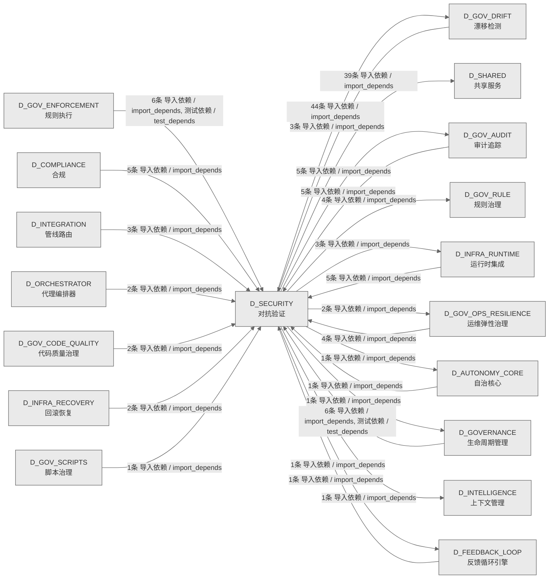

# 27_d_security / 对抗验证域 / Adversarial Validation

> **功能简介 / Overview**: 对抗验证，负责系统安全对抗测试、漏洞扫描和攻防验证

> **文档作用 / Purpose**: 展示 对抗验证（D_SECURITY）功能域的域内依赖关系、跨域依赖关系，模块信息（成熟度/中英文名/大白话/文件路径）内嵌于 Mermaid 节点，供架构审查和域治理参考。

> 本文档由 generate_domain_doc.py 从 depgraph (PostgreSQL) 自动生成
> 数据源: depgraph (PostgreSQL) nodes表 + edges表

> **[可缩放 HTML 版 / Zoomable HTML](http://localhost:8765/docs/02_enterprise_architecture/02_domain_architecture_docs/_zoomable_html/27_d_security.html)** — Ctrl+滚轮缩放 ｜ 双击重置 ｜ Ctrl+Shift+D 切换拖动/选择模式

## 域基本信息 / Domain Overview

| 字段 | 值 | Field | Value |
|------|------|-------|-------|
| 编号 | 27 | Number | 27 |
| 域ID | D_SECURITY | Domain ID | D_SECURITY |
| 域名称 | 对抗验证 | Domain Name | Adversarial Validation |
| 层级 | L1 基础平台层 | Layer | L1 Foundation |
| 模块数 | 166 | Module Count | 166 |
| 域内依赖 | 120 | Internal Dependencies | 120 |
| 跨域入边 | 46 | Cross-domain Incoming | 46 |
| 跨域出边 | 101 | Cross-domain Outgoing | 101 |
| 设计态模块 | 0 | Design Modules | 0 |
| 生产态模块 | 166 | Production Modules | 166 |
| 容量 | 166/150 (超容) | Capacity | 166/150 (超容) |
| 描述 | 孤儿文件检测(orphan_detector) | Description | 孤儿文件检测(orphan_detector) |

## 域内依赖图 / Internal Dependency Diagram

> 依赖图内嵌在本文档中，IDE 可直接渲染；网页版可 Ctrl+滚轮缩放 + 拖动平移查看细节。全景图用颜色区分运营态/设计态，不再分页/拆子图。
>
> **图例说明 / Legend**：
> - 🟦 **蓝色 = 运营态模块**（production，已上线运行）
> - 🟧 **橙色虚线 = 设计态模块**（design，蓝图阶段，代码未写）
> - **实线箭头 = 运营态依赖**（已生效的依赖关系）
> - **虚线箭头 = 非运营态依赖**（计划中/验证中的依赖关系）

### 全景依赖图（全部模块，颜色区分运营态/设计态）

> 展示全部 166 个模块（生产态 166 + 设计态 0），节点含成熟度+中英文名+大白话+文件路径。

```mermaid
%%{init: {'theme': 'base', 'themeVariables': {'primaryColor': '#eaeaea', 'primaryTextColor': '#333333', 'primaryBorderColor': '#666666', 'lineColor': '#666666', 'secondaryColor': '#eaeaea', 'tertiaryColor': '#eaeaea', 'fontSize': '14px'}}}%%
flowchart TD
    src_zephyr_gov_drift_main_py["(生产态 / production) 漂移检测域命令行入口 / Gov Drift CLI Entry<br/>漂移检测域的命令行入口，可通过 python -m 直接运行该包。<br/>文件: gov_drift/__main__.py"]
    src_zephyr_gov_drift_analysis_py["(生产态 / production) analysis / Analysis<br/>_analysis 聚合 — 分析与报告簇（功能域门面，ARCH-034）<br/>文件: gov_drift/_analysis.py"]
    src_zephyr_gov_drift_core_py["(生产态 / production) 核心 / Core<br/>_core 聚合 — 核心引擎与状态机（功能域门面，ARCH-034）<br/>文件: gov_drift/_core.py"]
    src_zephyr_gov_drift_drift_py["(生产态 / production) 漂移 / Drift<br/>_drift 聚合 — 漂移检测器簇（功能域门面，ARCH-034）<br/>文件: gov_drift/_drift.py"]
    src_zephyr_gov_drift_infrastructure_py["(生产态 / production) infrastructure / Infrastructure<br/>_infrastructure 聚合 — 基础设施簇（功能域门面，ARCH-034）<br/>文件: gov_drift/_infrastructure.py"]
    src_zephyr_gov_drift_scanners_py["(生产态 / production) scanners / Scanners<br/>_scanners 聚合 — 扫描器与检查器簇（功能域门面，ARCH-034）<br/>文件: gov_drift/_scanners.py"]
    src_zephyr_governance_agent_rbac_contracts_py["(生产态 / production) 契约 / Contracts<br/>agent-rbac/contracts.py — G-CT-001 RBAC 契约（re-export）。<br/>文件: agent-rbac/contracts.py"]
    src_zephyr_red_blue_validator_init_py["(生产态 / production) Red Blue Validator包 / Red Blue Validator Domain Package<br/>Red Blue Validator 包的文件夹入口，本身不含业务逻辑，只是组织归属。<br/>文件: red_blue_validator/__init__.py"]
    src_zephyr_security_access_control_a2a_check_py["(生产态 / production) a2a检查 / A2a Check<br/>A2A 通信对验证——校验两个 agent 之间是否允许通信。<br/>文件: access_control/a2a_check.py"]
    src_zephyr_security_access_control_adversarial_resilience_py["(生产态 / production) 对抗韧性 / Adversarial Resilience<br/>AdversarialResilience - adversarial resilience & OWASP coverage.<br/>文件: access_control/adversarial_resilience.py"]
    src_zephyr_security_access_control_agent_creation_policy_py["(生产态 / production) 代理creation策略 / Agent Creation Policy<br/>AgentCreationPolicy — Agent 创建策略.<br/>文件: access_control/agent_creation_policy.py"]
    src_zephyr_security_access_control_approver_check_py["(生产态 / production) approver检查 / Approver Check<br/>Approver authorization verifier — 校验审批人是否有权执行请求的动作。<br/>文件: access_control/approver_check.py"]
    src_zephyr_security_access_control_asymmetric_audit_py["(生产态 / production) asymmetric审计 / Asymmetric Audit<br/>AsymmetricAudit - quorum-based approval for high-risk operations.<br/>文件: access_control/asymmetric_audit.py"]
    src_zephyr_security_access_control_auto_maintenance_py["(生产态 / production) 自动maintenance / Auto Maintenance<br/>AutoMaintenance — 自动维护与规则健康仪表盘.<br/>文件: access_control/auto_maintenance.py"]
    src_zephyr_security_access_control_blueprint_fidelity_py["(生产态 / production) 蓝图fidelity / Blueprint Fidelity<br/>BlueprintFidelity — 蓝图保真度检查.<br/>文件: access_control/blueprint_fidelity.py"]
    src_zephyr_security_access_control_build_sanitizer_py["(生产态 / production) buildsanitizer / Build Sanitizer<br/>Stub module: zephyr.security.access_control.build_sanitizer — implementation...<br/>文件: access_control/build_sanitizer.py"]
    src_zephyr_security_access_control_cache_invalidation_py["(生产态 / production) 缓存invalidation / Cache Invalidation<br/>CacheInvalidation — 缓存失效事件管理.<br/>文件: access_control/cache_invalidation.py"]
    src_zephyr_security_access_control_canary_rollout_manager_py["(生产态 / production) canaryrollout管理器 / Canary Rollout Manager<br/>CanaryRolloutManager — 灰度发布管理器.<br/>文件: access_control/canary_rollout_manager.py"]
    src_zephyr_security_access_control_capability_check_py["(生产态 / production) 能力检查 / Capability Check<br/>Agent capability scope verification — 拒绝受限能力声明、空能力声明及能力数量...<br/>文件: access_control/capability_check.py"]
    src_zephyr_security_access_control_cascading_failure_isolator_py["(生产态 / production) cascadingfailure隔离器 / Cascading Failure Isolator<br/>Stub module: zephyr.security.access_control.cascading_failure_isolator — imp...<br/>文件: access_control/cascading_failure_isolator.py"]
    src_zephyr_security_access_control_compliance_matrix_py["(生产态 / production) 合规矩阵 / Compliance Matrix<br/>Stub module: zephyr.security.access_control.compliance_matrix — implementati...<br/>文件: access_control/compliance_matrix.py"]
    src_zephyr_security_access_control_cross_cutting_py["(生产态 / production) 跨cutting / Cross Cutting<br/>CrossCutting — 横切面权限组件.<br/>文件: access_control/cross_cutting.py"]
    src_zephyr_security_access_control_decision_explainer_py["(生产态 / production) 决策explainer / Decision Explainer<br/>DecisionExplainer — 拒绝决策的结构化解释器.<br/>文件: access_control/decision_explainer.py"]
    src_zephyr_security_access_control_decision_registry_py["(生产态 / production) 决策注册表 / Decision Registry<br/>DecisionRegistry - decision log with query and stats.<br/>文件: access_control/decision_registry.py"]
    src_zephyr_security_access_control_defense_depth_py["(生产态 / production) 防御depth / Defense Depth<br/>Stub module: zephyr.security.access_control.defense_depth — implementation p...<br/>文件: access_control/defense_depth.py"]
    src_zephyr_security_access_control_dependency_auditor_py["(生产态 / production) 依赖审计器 / Dependency Auditor<br/>Stub module: zephyr.security.access_control.dependency_auditor — implementat...<br/>文件: access_control/dependency_auditor.py"]
    src_zephyr_security_access_control_derive_rbac_roles_py["(生产态 / production) deriveRBACroles / Derive RBAC Roles<br/>RBACRoleDeriver — RBAC 角色派生器.<br/>文件: access_control/derive_rbac_roles.py"]
    src_zephyr_security_access_control_detectors_anomaly_detector_py["(生产态 / production) 异常检测器 / Anomaly Detector<br/>AnomalyDetector - rolling z-score anomaly detection per field.<br/>文件: detectors/anomaly_detector.py"]
    src_zephyr_security_access_control_detectors_context_drift_detector_py["(生产态 / production) 上下文漂移检测器 / Context Drift Detector<br/>ContextDriftDetector — 上下文漂移与范围蔓延检测.<br/>文件: detectors/context_drift_detector.py"]
    src_zephyr_security_access_control_detectors_cross_session_detector_py["(生产态 / production) 跨会话检测器 / Cross Session Detector<br/>CrossSessionDetector — 跨 Session 检测器.<br/>文件: detectors/cross_session_detector.py"]
    src_zephyr_security_access_control_detectors_false_completion_detector_py["(生产态 / production) falsecompletion检测器 / False Completion Detector<br/>FalseCompletionDetector — 虚假完成检测.<br/>文件: detectors/false_completion_detector.py"]
    src_zephyr_security_access_control_detectors_multi_agent_collusion_detector_py["(生产态 / production) 多代理collusion检测器 / Multi Agent Collusion Detector<br/>MultiAgentCollusionDetector — 多 agent 合谋检测.<br/>文件: detectors/multi_agent_collusion_detector.py"]
    src_zephyr_security_access_control_detectors_shell_dialect_detector_py["(生产态 / production) shelldialect检测器 / Shell Dialect Detector<br/>ShellDialectDetector — Shell 方言检测器.<br/>文件: detectors/shell_dialect_detector.py"]
    src_zephyr_security_access_control_dry_run_py["(生产态 / production) dryrun / Dry Run<br/>DryRun — 权限模拟与影响分析.<br/>文件: access_control/dry_run.py"]
    src_zephyr_security_access_control_emergency_override_py["(生产态 / production) emergencyoverride / Emergency Override<br/>EmergencyOverride — 紧急覆盖令牌管理.<br/>文件: access_control/emergency_override.py"]
    src_zephyr_security_access_control_environment_manager_py["(生产态 / production) 环境管理器 / Environment Manager<br/>Stub module: zephyr.security.access_control.environment_manager — implementa...<br/>文件: access_control/environment_manager.py"]
    src_zephyr_security_access_control_escalation_handler_py["(生产态 / production) 升级handler / Escalation Handler<br/>Stub module: zephyr.security.access_control.escalation_handler — implementat...<br/>文件: access_control/escalation_handler.py"]
    src_zephyr_security_access_control_exceptions_py["(生产态 / production) 异常 / Exceptions<br/>AgentRbac 异常类型.<br/>文件: access_control/exceptions.py"]
    src_zephyr_security_access_control_genesis_bootstrap_py["(生产态 / production) genesisbootstrap / Genesis Bootstrap<br/>GenesisBootstrap — RBAC系统启动引导器.<br/>文件: access_control/genesis_bootstrap.py"]
    src_zephyr_security_access_control_guard_layers_py["(生产态 / production) 守卫layers / Guard Layers<br/>GuardLayers — 权限守卫层组件.<br/>文件: access_control/guard_layers.py"]
    src_zephyr_security_access_control_guards_abac_guard_py["(生产态 / production) abac守卫 / Abac Guard<br/>ABACGuard — 基于属性的权限守卫.<br/>文件: guards/abac_guard.py"]
    src_zephyr_security_access_control_guards_anti_pattern_guard_py["(生产态 / production) anti模式守卫 / Anti Pattern Guard<br/>Stub module: zephyr.security.access_control.guards.anti_pattern_guard — impl...<br/>文件: guards/anti_pattern_guard.py"]
    src_zephyr_security_access_control_guards_audit_log_guard_py["(生产态 / production) 审计log守卫 / Audit Log Guard<br/>audit_log_guard.py — 审计日志注入防护守卫<br/>文件: guards/audit_log_guard.py"]
    src_zephyr_security_access_control_guards_cybersec_2026_guard_py["(生产态 / production) cybersec2026守卫 / Cybersec 2026 Guard<br/>Cybersec2026Guard — 2026 网络安全威胁检测.<br/>文件: guards/cybersec_2026_guard.py"]
    src_zephyr_security_access_control_guards_input_guard_py["(生产态 / production) input守卫 / Input Guard<br/>InputGuard — 输入参数守卫.<br/>文件: guards/input_guard.py"]
    src_zephyr_security_access_control_guards_memory_guard_py["(生产态 / production) memory守卫 / Memory Guard<br/>MemoryGuard — 内存访问守卫.<br/>文件: guards/memory_guard.py"]
    src_zephyr_security_access_control_guards_memory_provenance_guard_py["(生产态 / production) memory溯源守卫 / Memory Provenance Guard<br/>MemoryProvenanceGuard — 记忆来源溯源守卫.<br/>文件: guards/memory_provenance_guard.py"]
    src_zephyr_security_access_control_guards_native_api_guard_py["(生产态 / production) nativeAPI守卫 / Native API Guard<br/>NativeApiGuard — 原生 API 守卫.<br/>文件: guards/native_api_guard.py"]
    src_zephyr_security_access_control_guards_novel_attack_guard_py["(生产态 / production) novel攻击守卫 / Novel Attack Guard<br/>NovelAttackGuard — 新型攻击行为画像.<br/>文件: guards/novel_attack_guard.py"]
    src_zephyr_security_access_control_guards_output_guard_py["(生产态 / production) 输出守卫 / Output Guard<br/>OutputGuard — 输出内容守卫.<br/>文件: guards/output_guard.py"]
    src_zephyr_security_access_control_guards_path_guard_py["(生产态 / production) 路径守卫 / Path Guard<br/>PathGuard — 路径守卫.<br/>文件: guards/path_guard.py"]
    src_zephyr_security_access_control_guards_replay_attack_guard_py["(生产态 / production) replay攻击守卫 / Replay Attack Guard<br/>ReplayAttackGuard — 重放攻击防护.<br/>文件: guards/replay_attack_guard.py"]
    src_zephyr_security_access_control_guards_rule_injection_guard_py["(生产态 / production) 规则注入守卫 / Rule Injection Guard<br/>RuleInjectionGuard — 规则注入守卫.<br/>文件: guards/rule_injection_guard.py"]
    src_zephyr_security_access_control_guards_sequence_guard_py["(生产态 / production) sequence守卫 / Sequence Guard<br/>SequenceGuard — 操作序列守卫.<br/>文件: guards/sequence_guard.py"]
    src_zephyr_security_access_control_guards_toctou_guard_py["(生产态 / production) toctou守卫 / Toctou Guard<br/>TOCTOUGuard — TOCTOU (Time-of-Check to Time-of-Use) 防护.<br/>文件: guards/toctou_guard.py"]
    src_zephyr_security_access_control_guards_vibe_coding_guard_py["(生产态 / production) 直觉编码守卫 / Vibe Coding Guard<br/>VibeCodingGuard — Vibe Coding 攻击面检测.<br/>文件: guards/vibe_coding_guard.py"]
    src_zephyr_security_access_control_integration_py["(生产态 / production) 集成 / Integration<br/>IntegrationManager - system integration registry & health check.<br/>文件: access_control/integration.py"]
    src_zephyr_security_access_control_integrity_self_check_py["(生产态 / production) 完整性自我检查 / Integrity Self Check<br/>IntegritySelfCheck — 完整性自检.<br/>文件: access_control/integrity_self_check.py"]
    src_zephyr_security_access_control_intent_binder_py["(生产态 / production) intentbinder / Intent Binder<br/>IntentBinder — 意图绑定与漂移检测.<br/>文件: access_control/intent_binder.py"]
    src_zephyr_security_access_control_key_hierarchy_py["(生产态 / production) keyhierarchy / Key Hierarchy<br/>Stub module: zephyr.security.access_control.key_hierarchy — implementation p...<br/>文件: access_control/key_hierarchy.py"]
    src_zephyr_security_access_control_legal_audit_chain_py["(生产态 / production) legal审计链 / Legal Audit Chain<br/>LegalAuditChain - append-only hash-chained legal audit log.<br/>文件: access_control/legal_audit_chain.py"]
    src_zephyr_security_access_control_microstructure_defense_py["(生产态 / production) 微观结构防御 / Microstructure Defense<br/>微结构防御——对抗做市/交易微结构攻击的策略与保真度因子。<br/>文件: access_control/microstructure_defense.py"]
    src_zephyr_security_access_control_monotonic_clock_py["(生产态 / production) monotonicclock / Monotonic Clock<br/>MonotonicClock — 单调时钟.<br/>文件: access_control/monotonic_clock.py"]
    src_zephyr_security_access_control_non_repudiation_py["(生产态 / production) nonrepudiation / Non Repudiation<br/>NonRepudiation — 不可抵赖性审计签名.<br/>文件: access_control/non_repudiation.py"]
    src_zephyr_security_access_control_observability_py["(生产态 / production) 可观测性 / Observability<br/>ObservabilityReporter — 指标上报与异常检测.<br/>文件: access_control/observability.py"]
    src_zephyr_security_access_control_orphan_judge_main_py["(生产态 / production) 对抗验证域命令行入口 / Orphan Judge CLI Entry<br/>对抗验证域的命令行入口，可通过 python -m 直接运行该包。<br/>文件: orphan_judge/__main__.py"]
    src_zephyr_security_access_control_orphan_judge_config_loader_py["(生产态 / production) 配置加载器 / Config Loader<br/>YAMLError on bad config file; 返回默认配置<br/>文件: orphan_judge/config_loader.py"]
    src_zephyr_security_access_control_orphan_judge_drift_bridge_py["(生产态 / production) 漂移桥接 / Drift Bridge<br/>桥接失败返回 {'status': 'bridge_unavailable'}<br/>文件: orphan_judge/drift_bridge.py"]
    src_zephyr_security_access_control_orphan_judge_escalation_bridge_py["(生产态 / production) 升级桥接 / Escalation Bridge<br/>桥接失败返回 {'status': 'bridge_unavailable'}<br/>文件: orphan_judge/escalation_bridge.py"]
    src_zephyr_security_access_control_orphan_judge_feedback_bridge_py["(生产态 / production) 反馈桥接 / Feedback Bridge<br/>桥接失败返回空proposals<br/>文件: orphan_judge/feedback_bridge.py"]
    src_zephyr_security_access_control_orphan_judge_kb_bridge_py["(生产态 / production) 知识库桥接 / KB Bridge<br/>桥接失败返回 False<br/>文件: orphan_judge/kb_bridge.py"]
    src_zephyr_security_access_control_orphan_judge_mcp_integration_py["(生产态 / production) MCP集成 / MCP Integration<br/>注册失败返回空dict<br/>文件: orphan_judge/mcp_integration.py"]
    src_zephyr_security_access_control_orphan_judge_orphan_collector_py["(生产态 / production) orphan收集器 / Orphan Collector<br/>孤儿文件收集与处置器——整合 SafetyFence 安全检查后执行处置动作。<br/>文件: orphan_judge/orphan_collector.py"]
    src_zephyr_security_access_control_orphan_judge_orphan_detector_py["(生产态 / production) orphan检测器 / Orphan Detector<br/>(INVARIANTS) 蓝图 §4 文件清单与代码双向对齐<br/>文件: orphan_judge/orphan_detector.py"]
    src_zephyr_security_access_control_orphan_judge_rbac_bridge_py["(生产态 / production) RBAC桥接 / RBAC Bridge<br/>桥接失败默认DENY<br/>文件: orphan_judge/rbac_bridge.py"]
    src_zephyr_security_access_control_orphan_judge_reference_graph_engine_py["(生产态 / production) referencegraph引擎 / Reference Graph Engine<br/>AST解析+import链遍历，判断文件是否被其他文件引用。<br/>文件: orphan_judge/reference_graph_engine.py"]
    src_zephyr_security_access_control_orphan_judge_registration_checker_py["(生产态 / production) registration检查器 / Registration Checker<br/>扫描项目注册表，判断文件是否已登记在册。<br/>文件: orphan_judge/registration_checker.py"]
    src_zephyr_security_access_control_orphan_judge_report_generator_py["(生产态 / production) 报告生成器 / Report Generator<br/>TypeError on unsupported format<br/>文件: orphan_judge/report_generator.py"]
    src_zephyr_security_access_control_orphan_judge_standalone_evaluator_py["(生产态 / production) standaloneevaluator / Standalone Evaluator<br/>六指标加权评分: 文件大小(15%) + 代码行数(20%) + 定义数(20%)<br/>文件: orphan_judge/standalone_evaluator.py"]
    src_zephyr_security_access_control_orphan_judge_swid_tag_py["(生产态 / production) SWID标签 / SWID Tag<br/>生成失败返回空标签<br/>文件: orphan_judge/swid_tag.py"]
    src_zephyr_security_access_control_orphan_judge_unique_analyzer_py["(生产态 / production) unique分析器 / Unique Analyzer<br/>AST节点比对，检测文件中的独特代码元素(类/函数/常量定义等)。<br/>文件: orphan_judge/unique_analyzer.py"]
    src_zephyr_security_access_control_permission_hooks_py["(生产态 / production) 权限hooks / Permission Hooks<br/>PermissionHooks — 权限钩子注册表.<br/>文件: access_control/permission_hooks.py"]
    src_zephyr_security_access_control_permission_mode_manager_py["(生产态 / production) 权限模式管理器 / Permission Mode Manager<br/>Stub module: zephyr.security.access_control.permission_mode_manager — implem...<br/>文件: access_control/permission_mode_manager.py"]
    src_zephyr_security_access_control_phase_executor_py["(生产态 / production) phaseexecutor / Phase Executor<br/>Module stub: zephyr.security.access_control.phase_executor<br/>文件: access_control/phase_executor.py"]
    src_zephyr_security_access_control_risk_mitigation_py["(生产态 / production) 风险mitigation / Risk Mitigation<br/>RiskMitigation — 风险评估与缓解策略.<br/>文件: access_control/risk_mitigation.py"]
    src_zephyr_security_access_control_rollback_sandbox_py["(生产态 / production) rollback沙箱 / Rollback Sandbox<br/>RollbackSandbox - isolate/execute/rollback pattern for reversible operations.<br/>文件: access_control/rollback_sandbox.py"]
    src_zephyr_security_access_control_secrets_lifecycle_py["(生产态 / production) 密钥生命周期 / Secrets Lifecycle<br/>Stub module: zephyr.security.access_control.secrets_lifecycle — implementati...<br/>文件: access_control/secrets_lifecycle.py"]
    src_zephyr_security_access_control_session_concurrency_py["(生产态 / production) 会话concurrency / Session Concurrency<br/>Session 级并发协调模块（P2-SES 落地）。<br/>文件: access_control/session_concurrency.py"]
    src_zephyr_security_access_control_session_lifecycle_py["(生产态 / production) 会话生命周期 / Session Lifecycle<br/>Stub module: zephyr.security.access_control.session_lifecycle — implementati...<br/>文件: access_control/session_lifecycle.py"]
    src_zephyr_security_access_control_verifiers_bootstrap_verifier_py["(生产态 / production) bootstrap验证器 / Bootstrap Verifier<br/>Stub module: zephyr.security.access_control.verifiers.bootstrap_verifier — i...<br/>文件: verifiers/bootstrap_verifier.py"]
    src_zephyr_security_access_control_verifiers_continuous_verifier_py["(生产态 / production) continuous验证器 / Continuous Verifier<br/>Stub module: zephyr.security.access_control.verifiers.continuous_verifier — ...<br/>文件: verifiers/continuous_verifier.py"]
    src_zephyr_security_access_control_verifiers_contract_verifier_py["(生产态 / production) contract验证器 / Contract Verifier<br/>ContractVerifier — 契约验证器.<br/>文件: verifiers/contract_verifier.py"]
    src_zephyr_security_access_control_verifiers_micro_verifier_py["(生产态 / production) micro验证器 / Micro Verifier<br/>Stub module: zephyr.security.access_control.verifiers.micro_verifier — imple...<br/>文件: verifiers/micro_verifier.py"]
    src_zephyr_security_access_control_verifiers_post_action_verifier_py["(生产态 / production) 后动作验证器 / Post Action Verifier<br/>Stub module: zephyr.security.access_control.verifiers.post_action_verifier —...<br/>文件: verifiers/post_action_verifier.py"]
    src_zephyr_security_adversarial_validation_main_py["(生产态 / production) 对抗验证域命令行入口 / Adversarial Validation CLI Entry<br/>对抗验证域的命令行入口，可通过 python -m 直接运行该包。<br/>文件: adversarial_validation/__main__.py"]
    src_zephyr_security_adversarial_validation_ai_attack_generator_py["(生产态 / production) AI攻击生成器 / AI Attack Generator<br/>AttackGenerationError on invalid payload generation<br/>文件: adversarial_validation/ai_attack_generator.py"]
    src_zephyr_security_adversarial_validation_async_monitor_py["(生产态 / production) 异步监控器 / Async Monitor<br/>MonitorStallError on consecutive failures across all monitors<br/>文件: adversarial_validation/async_monitor.py"]
    src_zephyr_security_adversarial_validation_attack_registry_py["(生产态 / production) 攻击注册表 / Attack Registry<br/>RedBlueValidationError<br/>文件: adversarial_validation/attack_registry.py"]
    src_zephyr_security_adversarial_validation_commit_trigger_py["(生产态 / production) commit触发器 / Commit Trigger<br/>CommitTrigger — 事件驱动红蓝对抗触发器 (MOD-INF-030).<br/>文件: adversarial_validation/commit_trigger.py"]
    src_zephyr_security_adversarial_validation_constitution_engine_py["(生产态 / production) 宪法引擎 / Constitution Engine<br/>RegistryWriteError on failed atomic write; DuplicateArticleError on same deri...<br/>文件: adversarial_validation/constitution_engine.py"]
    src_zephyr_security_adversarial_validation_game_day_scheduler_py["(生产态 / production) 博弈日调度器 / Game Day Scheduler<br/>ScheduleConflictError on overlapping schedules; SchedulerNotInitializedError ...<br/>文件: adversarial_validation/game_day_scheduler.py"]
    src_zephyr_security_adversarial_validation_injection_engine_py["(生产态 / production) 注入引擎 / Injection Engine<br/>PermissionError on SYSTEM-level crash injection without confirmation; ValueEr...<br/>文件: adversarial_validation/injection_engine.py"]
    src_zephyr_security_adversarial_validation_mcp_endpoints_py["(生产态 / production) MCP端点 / MCP Endpoints<br/>McpEndpointError on tool execution failure<br/>文件: adversarial_validation/mcp_endpoints.py"]
    src_zephyr_security_adversarial_validation_validator_event_bridge_py["(生产态 / production) 校验器事件桥接 / Validator Event Bridge<br/>ValidatorEventBridge — 红蓝验证器事件桥接 (MOD-SEC-030).<br/>文件: adversarial_validation/validator_event_bridge.py"]
    src_zephyr_security_llm_defense_llm_security_dashboard_app_py["(生产态 / production) app / App<br/>LLM Security Gateway - Streamlit Dashboard.<br/>文件: dashboard/app.py"]
    src_zephyr_security_llm_defense_llm_security_layers_l6_data_flow_py["(生产态 / production) L6数据流 / L6 Data Flow<br/>定义 DataFlowLayer 等类型。<br/>文件: layers/l6_data_flow.py"]
    src_zephyr_security_llm_defense_llm_security_layers_l8_compliance_py["(生产态 / production) L8合规 / L8 Compliance<br/>定义 ComplianceLayer 等类型。<br/>文件: layers/l8_compliance.py"]
    src_zephyr_security_llm_defense_llm_security_process_sandbox_py["(生产态 / production) process沙箱 / Process Sandbox<br/>L2a ProcessSandbox — subprocess 路径白名单沙箱<br/>文件: llm_security/process_sandbox.py"]
    src_zephyr_security_llm_defense_llm_security_self_protection_adversarial_mutator_py["(生产态 / production) 对抗mutator / Adversarial Mutator<br/>对抗变异生成器 — 对 Red Team 载荷施加 10 种变异技术，检验 LSG 抗干扰能力.<br/>文件: self_protection/adversarial_mutator.py"]
    src_zephyr_security_llm_defense_llm_security_self_protection_red_team_scanner_py["(生产态 / production) redteamscanner / Red Team Scanner<br/>noqa: m03-duplicate  M03豁免: AI趋同演化(不同模块为相似问题生成相似代码),非复...<br/>文件: self_protection/red_team_scanner.py"]
    src_zephyr_gov_drift_main_py ~~~ src_zephyr_gov_drift_analysis_py
    src_zephyr_gov_drift_analysis_py ~~~ src_zephyr_gov_drift_core_py
    src_zephyr_gov_drift_core_py ~~~ src_zephyr_gov_drift_drift_py
    src_zephyr_gov_drift_drift_py ~~~ src_zephyr_gov_drift_infrastructure_py
    src_zephyr_gov_drift_infrastructure_py ~~~ src_zephyr_gov_drift_scanners_py
    src_zephyr_gov_drift_scanners_py ~~~ src_zephyr_governance_agent_rbac_contracts_py
    src_zephyr_governance_agent_rbac_contracts_py ~~~ src_zephyr_red_blue_validator_init_py
    src_zephyr_red_blue_validator_init_py ~~~ src_zephyr_security_access_control_a2a_check_py
    src_zephyr_security_access_control_a2a_check_py ~~~ src_zephyr_security_access_control_adversarial_resilience_py
    src_zephyr_security_access_control_adversarial_resilience_py ~~~ src_zephyr_security_access_control_agent_creation_policy_py
    src_zephyr_security_access_control_agent_creation_policy_py ~~~ src_zephyr_security_access_control_approver_check_py
    src_zephyr_security_access_control_approver_check_py ~~~ src_zephyr_security_access_control_asymmetric_audit_py
    src_zephyr_security_access_control_asymmetric_audit_py ~~~ src_zephyr_security_access_control_auto_maintenance_py
    src_zephyr_security_access_control_auto_maintenance_py ~~~ src_zephyr_security_access_control_blueprint_fidelity_py
    src_zephyr_security_access_control_blueprint_fidelity_py ~~~ src_zephyr_security_access_control_build_sanitizer_py
    src_zephyr_security_access_control_build_sanitizer_py ~~~ src_zephyr_security_access_control_cache_invalidation_py
    src_zephyr_security_access_control_cache_invalidation_py ~~~ src_zephyr_security_access_control_canary_rollout_manager_py
    src_zephyr_security_access_control_canary_rollout_manager_py ~~~ src_zephyr_security_access_control_capability_check_py
    src_zephyr_security_access_control_capability_check_py ~~~ src_zephyr_security_access_control_cascading_failure_isolator_py
    src_zephyr_security_access_control_cascading_failure_isolator_py ~~~ src_zephyr_security_access_control_compliance_matrix_py
    src_zephyr_security_access_control_compliance_matrix_py ~~~ src_zephyr_security_access_control_cross_cutting_py
    src_zephyr_security_access_control_cross_cutting_py ~~~ src_zephyr_security_access_control_decision_explainer_py
    src_zephyr_security_access_control_decision_explainer_py ~~~ src_zephyr_security_access_control_decision_registry_py
    src_zephyr_security_access_control_decision_registry_py ~~~ src_zephyr_security_access_control_defense_depth_py
    src_zephyr_security_access_control_defense_depth_py ~~~ src_zephyr_security_access_control_dependency_auditor_py
    src_zephyr_security_access_control_dependency_auditor_py ~~~ src_zephyr_security_access_control_derive_rbac_roles_py
    src_zephyr_security_access_control_derive_rbac_roles_py ~~~ src_zephyr_security_access_control_detectors_anomaly_detector_py
    src_zephyr_security_access_control_detectors_anomaly_detector_py ~~~ src_zephyr_security_access_control_detectors_context_drift_detector_py
    src_zephyr_security_access_control_detectors_context_drift_detector_py ~~~ src_zephyr_security_access_control_detectors_cross_session_detector_py
    src_zephyr_security_access_control_detectors_cross_session_detector_py ~~~ src_zephyr_security_access_control_detectors_false_completion_detector_py
    src_zephyr_security_access_control_detectors_false_completion_detector_py ~~~ src_zephyr_security_access_control_detectors_multi_agent_collusion_detector_py
    src_zephyr_security_access_control_detectors_multi_agent_collusion_detector_py ~~~ src_zephyr_security_access_control_detectors_shell_dialect_detector_py
    src_zephyr_security_access_control_detectors_shell_dialect_detector_py ~~~ src_zephyr_security_access_control_dry_run_py
    src_zephyr_security_access_control_dry_run_py ~~~ src_zephyr_security_access_control_emergency_override_py
    src_zephyr_security_access_control_emergency_override_py ~~~ src_zephyr_security_access_control_environment_manager_py
    src_zephyr_security_access_control_environment_manager_py ~~~ src_zephyr_security_access_control_escalation_handler_py
    src_zephyr_security_access_control_escalation_handler_py ~~~ src_zephyr_security_access_control_exceptions_py
    src_zephyr_security_access_control_exceptions_py ~~~ src_zephyr_security_access_control_genesis_bootstrap_py
    src_zephyr_security_access_control_genesis_bootstrap_py ~~~ src_zephyr_security_access_control_guard_layers_py
    src_zephyr_security_access_control_guard_layers_py ~~~ src_zephyr_security_access_control_guards_abac_guard_py
    src_zephyr_security_access_control_guards_abac_guard_py ~~~ src_zephyr_security_access_control_guards_anti_pattern_guard_py
    src_zephyr_security_access_control_guards_anti_pattern_guard_py ~~~ src_zephyr_security_access_control_guards_audit_log_guard_py
    src_zephyr_security_access_control_guards_audit_log_guard_py ~~~ src_zephyr_security_access_control_guards_cybersec_2026_guard_py
    src_zephyr_security_access_control_guards_cybersec_2026_guard_py ~~~ src_zephyr_security_access_control_guards_input_guard_py
    src_zephyr_security_access_control_guards_input_guard_py ~~~ src_zephyr_security_access_control_guards_memory_guard_py
    src_zephyr_security_access_control_guards_memory_guard_py ~~~ src_zephyr_security_access_control_guards_memory_provenance_guard_py
    src_zephyr_security_access_control_guards_memory_provenance_guard_py ~~~ src_zephyr_security_access_control_guards_native_api_guard_py
    src_zephyr_security_access_control_guards_native_api_guard_py ~~~ src_zephyr_security_access_control_guards_novel_attack_guard_py
    src_zephyr_security_access_control_guards_novel_attack_guard_py ~~~ src_zephyr_security_access_control_guards_output_guard_py
    src_zephyr_security_access_control_guards_output_guard_py ~~~ src_zephyr_security_access_control_guards_path_guard_py
    src_zephyr_security_access_control_guards_path_guard_py ~~~ src_zephyr_security_access_control_guards_replay_attack_guard_py
    src_zephyr_security_access_control_guards_replay_attack_guard_py ~~~ src_zephyr_security_access_control_guards_rule_injection_guard_py
    src_zephyr_security_access_control_guards_rule_injection_guard_py ~~~ src_zephyr_security_access_control_guards_sequence_guard_py
    src_zephyr_security_access_control_guards_sequence_guard_py ~~~ src_zephyr_security_access_control_guards_toctou_guard_py
    src_zephyr_security_access_control_guards_toctou_guard_py ~~~ src_zephyr_security_access_control_guards_vibe_coding_guard_py
    src_zephyr_security_access_control_guards_vibe_coding_guard_py ~~~ src_zephyr_security_access_control_integration_py
    src_zephyr_security_access_control_integration_py ~~~ src_zephyr_security_access_control_integrity_self_check_py
    src_zephyr_security_access_control_integrity_self_check_py ~~~ src_zephyr_security_access_control_intent_binder_py
    src_zephyr_security_access_control_intent_binder_py ~~~ src_zephyr_security_access_control_key_hierarchy_py
    src_zephyr_security_access_control_key_hierarchy_py ~~~ src_zephyr_security_access_control_legal_audit_chain_py
    src_zephyr_security_access_control_legal_audit_chain_py ~~~ src_zephyr_security_access_control_microstructure_defense_py
    src_zephyr_security_access_control_microstructure_defense_py ~~~ src_zephyr_security_access_control_monotonic_clock_py
    src_zephyr_security_access_control_monotonic_clock_py ~~~ src_zephyr_security_access_control_non_repudiation_py
    src_zephyr_security_access_control_non_repudiation_py ~~~ src_zephyr_security_access_control_observability_py
    src_zephyr_security_access_control_observability_py ~~~ src_zephyr_security_access_control_orphan_judge_main_py
    src_zephyr_security_access_control_orphan_judge_main_py ~~~ src_zephyr_security_access_control_orphan_judge_config_loader_py
    src_zephyr_security_access_control_orphan_judge_config_loader_py ~~~ src_zephyr_security_access_control_orphan_judge_drift_bridge_py
    src_zephyr_security_access_control_orphan_judge_drift_bridge_py ~~~ src_zephyr_security_access_control_orphan_judge_escalation_bridge_py
    src_zephyr_security_access_control_orphan_judge_escalation_bridge_py ~~~ src_zephyr_security_access_control_orphan_judge_feedback_bridge_py
    src_zephyr_security_access_control_orphan_judge_feedback_bridge_py ~~~ src_zephyr_security_access_control_orphan_judge_kb_bridge_py
    src_zephyr_security_access_control_orphan_judge_kb_bridge_py ~~~ src_zephyr_security_access_control_orphan_judge_mcp_integration_py
    src_zephyr_security_access_control_orphan_judge_mcp_integration_py ~~~ src_zephyr_security_access_control_orphan_judge_orphan_collector_py
    src_zephyr_security_access_control_orphan_judge_orphan_collector_py ~~~ src_zephyr_security_access_control_orphan_judge_orphan_detector_py
    src_zephyr_security_access_control_orphan_judge_orphan_detector_py ~~~ src_zephyr_security_access_control_orphan_judge_rbac_bridge_py
    src_zephyr_security_access_control_orphan_judge_rbac_bridge_py ~~~ src_zephyr_security_access_control_orphan_judge_reference_graph_engine_py
    src_zephyr_security_access_control_orphan_judge_reference_graph_engine_py ~~~ src_zephyr_security_access_control_orphan_judge_registration_checker_py
    src_zephyr_security_access_control_orphan_judge_registration_checker_py ~~~ src_zephyr_security_access_control_orphan_judge_report_generator_py
    src_zephyr_security_access_control_orphan_judge_report_generator_py ~~~ src_zephyr_security_access_control_orphan_judge_standalone_evaluator_py
    src_zephyr_security_access_control_orphan_judge_standalone_evaluator_py ~~~ src_zephyr_security_access_control_orphan_judge_swid_tag_py
    src_zephyr_security_access_control_orphan_judge_swid_tag_py ~~~ src_zephyr_security_access_control_orphan_judge_unique_analyzer_py
    src_zephyr_security_access_control_orphan_judge_unique_analyzer_py ~~~ src_zephyr_security_access_control_permission_hooks_py
    src_zephyr_security_access_control_permission_hooks_py ~~~ src_zephyr_security_access_control_permission_mode_manager_py
    src_zephyr_security_access_control_permission_mode_manager_py ~~~ src_zephyr_security_access_control_phase_executor_py
    src_zephyr_security_access_control_phase_executor_py ~~~ src_zephyr_security_access_control_risk_mitigation_py
    src_zephyr_security_access_control_risk_mitigation_py ~~~ src_zephyr_security_access_control_rollback_sandbox_py
    src_zephyr_security_access_control_rollback_sandbox_py ~~~ src_zephyr_security_access_control_secrets_lifecycle_py
    src_zephyr_security_access_control_secrets_lifecycle_py ~~~ src_zephyr_security_access_control_session_concurrency_py
    src_zephyr_security_access_control_session_concurrency_py ~~~ src_zephyr_security_access_control_session_lifecycle_py
    src_zephyr_security_access_control_session_lifecycle_py ~~~ src_zephyr_security_access_control_verifiers_bootstrap_verifier_py
    src_zephyr_security_access_control_verifiers_bootstrap_verifier_py ~~~ src_zephyr_security_access_control_verifiers_continuous_verifier_py
    src_zephyr_security_access_control_verifiers_continuous_verifier_py ~~~ src_zephyr_security_access_control_verifiers_contract_verifier_py
    src_zephyr_security_access_control_verifiers_contract_verifier_py ~~~ src_zephyr_security_access_control_verifiers_micro_verifier_py
    src_zephyr_security_access_control_verifiers_micro_verifier_py ~~~ src_zephyr_security_access_control_verifiers_post_action_verifier_py
    src_zephyr_security_access_control_verifiers_post_action_verifier_py ~~~ src_zephyr_security_adversarial_validation_main_py
    src_zephyr_security_adversarial_validation_main_py ~~~ src_zephyr_security_adversarial_validation_ai_attack_generator_py
    src_zephyr_security_adversarial_validation_ai_attack_generator_py ~~~ src_zephyr_security_adversarial_validation_async_monitor_py
    src_zephyr_security_adversarial_validation_async_monitor_py ~~~ src_zephyr_security_adversarial_validation_attack_registry_py
    src_zephyr_security_adversarial_validation_attack_registry_py ~~~ src_zephyr_security_adversarial_validation_commit_trigger_py
    src_zephyr_security_adversarial_validation_commit_trigger_py ~~~ src_zephyr_security_adversarial_validation_constitution_engine_py
    src_zephyr_security_adversarial_validation_constitution_engine_py ~~~ src_zephyr_security_adversarial_validation_game_day_scheduler_py
    src_zephyr_security_adversarial_validation_game_day_scheduler_py ~~~ src_zephyr_security_adversarial_validation_injection_engine_py
    src_zephyr_security_adversarial_validation_injection_engine_py ~~~ src_zephyr_security_adversarial_validation_mcp_endpoints_py
    src_zephyr_security_adversarial_validation_mcp_endpoints_py ~~~ src_zephyr_security_adversarial_validation_validator_event_bridge_py
    src_zephyr_security_adversarial_validation_validator_event_bridge_py ~~~ src_zephyr_security_llm_defense_llm_security_dashboard_app_py
    src_zephyr_security_llm_defense_llm_security_dashboard_app_py ~~~ src_zephyr_security_llm_defense_llm_security_layers_l6_data_flow_py
    src_zephyr_security_llm_defense_llm_security_layers_l6_data_flow_py ~~~ src_zephyr_security_llm_defense_llm_security_layers_l8_compliance_py
    src_zephyr_security_llm_defense_llm_security_layers_l8_compliance_py ~~~ src_zephyr_security_llm_defense_llm_security_process_sandbox_py
    src_zephyr_security_llm_defense_llm_security_process_sandbox_py ~~~ src_zephyr_security_llm_defense_llm_security_self_protection_adversarial_mutator_py
    src_zephyr_security_llm_defense_llm_security_self_protection_adversarial_mutator_py ~~~ src_zephyr_security_llm_defense_llm_security_self_protection_red_team_scanner_py
    src_zephyr_gov_drift_alert_router_py["(生产态 / production) 告警路由器 / Alert Router<br/>Alert Router — alert_router.py<br/>文件: gov_drift/alert_router.py"]
    src_zephyr_gov_drift_cold_start_py["(生产态 / production) 冷启动 / Cold Start<br/>Cold Start Bootstrapper — 冷启动引导 §6.31。<br/>文件: gov_drift/cold_start.py"]
    src_zephyr_gov_drift_events_py["(生产态 / production) events / Events<br/>G-CT-005 — ManagedDriftEvent Pydantic V2 BaseModel 漂移事件定义.<br/>文件: gov_drift/events.py"]
    src_zephyr_gov_drift_reconciler_py["(生产态 / production) reconciler / Reconciler<br/>Auto Reconciler — reconciler.py<br/>文件: gov_drift/reconciler.py"]
    src_zephyr_gov_drift_runbook_generator_py["(生产态 / production) 运行手册生成器 / Runbook Generator<br/>Drift Runbook Generator — 漂移演练手册自动生成。<br/>文件: gov_drift/runbook_generator.py"]
    src_zephyr_gov_drift_state_machine_py["(生产态 / production) 状态machine / State Machine<br/>Drift State Machine — state_machine.py<br/>文件: gov_drift/state_machine.py"]
    src_zephyr_security_access_control_bootstrap_superadmin_py["(生产态 / production) bootstrapsuperadmin / Bootstrap Superadmin<br/>BootstrapSuperadmin — Superadmin 账户启动器.<br/>文件: access_control/bootstrap_superadmin.py"]
    src_zephyr_security_access_control_cold_start_lock_py["(生产态 / production) 冷启动lock / Cold Start Lock<br/>ColdStartLock — 冷启动锁.<br/>文件: access_control/cold_start_lock.py"]
    src_zephyr_security_access_control_contracts_py["(生产态 / production) 契约 / Contracts<br/>G-CT-001 RBAC->Audit 桥接契约 - RBACAuditBridge.<br/>文件: access_control/contracts.py"]
    src_zephyr_security_access_control_engine_degradation_py["(生产态 / production) 引擎降级 / Engine Degradation<br/>EngineDegradation — 引擎降级管理.<br/>文件: access_control/engine_degradation.py"]
    src_zephyr_security_access_control_guards_permission_guard_py["(生产态 / production) 权限守卫 / Permission Guard<br/>PermissionGuard — 七层权限编排器.<br/>文件: guards/permission_guard.py"]
    src_zephyr_security_access_control_kill_switch_py["(生产态 / production) killswitch / Kill Switch<br/>KillSwitch — 熔断器.<br/>文件: access_control/kill_switch.py"]
    src_zephyr_security_access_control_orphan_judge_cascade_analyzer_py["(生产态 / production) 级联分析器 / Cascade Analyzer<br/>删除级联分析器——分析删除文件对项目的影响。<br/>文件: orphan_judge/cascade_analyzer.py"]
    src_zephyr_security_access_control_orphan_judge_db_py["(生产态 / production) 数据库 / DB<br/>IntegrityError on duplicate path<br/>文件: orphan_judge/db.py"]
    src_zephyr_security_access_control_orphan_judge_decision_table_py["(生产态 / production) 决策table / Decision Table<br/>五层判定结果 -> 处置动作映射表。<br/>文件: orphan_judge/decision_table.py"]
    src_zephyr_security_access_control_orphan_judge_deprecation_tracker_py["(生产态 / production) deprecation追踪器 / Deprecation Tracker<br/>废弃文件追踪器——标记和追踪废弃文件的生命周期。<br/>文件: orphan_judge/deprecation_tracker.py"]
    src_zephyr_security_access_control_orphan_judge_safety_fence_py["(生产态 / production) 安全fence / Safety Fence<br/>安全围栏——阻止删除 frozen/immutable_core 文件。<br/>文件: orphan_judge/safety_fence.py"]
    src_zephyr_security_adversarial_validation_circuit_breaker_py["(生产态 / production) 断路熔断器 / Circuit Breaker<br/>CircuitBreakerOpenError when attempting to run while circuit is OPEN<br/>文件: adversarial_validation/circuit_breaker.py"]
    src_zephyr_security_adversarial_validation_cli_py["(生产态 / production) 命令行 / CLI<br/>SystemExit on invalid subcommand<br/>文件: adversarial_validation/cli.py"]
    src_zephyr_security_adversarial_validation_constitution_guard_py["(生产态 / production) 宪法守卫 / Constitution Guard<br/>ConstitutionViolationError on any article failure; FileNotFoundError if regis...<br/>文件: adversarial_validation/constitution_guard.py"]
    src_zephyr_security_adversarial_validation_convergence_checker_py["(生产态 / production) 收敛检查器 / Convergence Checker<br/>ConvergenceFailureError on 3-round stagnation; EscalationTriggerError on esca...<br/>文件: adversarial_validation/convergence_checker.py"]
    src_zephyr_security_llm_defense_llm_security_behavior_audit_logger_py["(生产态 / production) behavior审计日志器 / Behavior Audit Logger<br/>Append-only AI behavior audit logger.<br/>文件: llm_security/behavior_audit_logger.py"]
    src_zephyr_security_llm_defense_llm_security_gateway_py["(生产态 / production) gateway / Gateway<br/>LLM Security Gateway — L0-L8 九层纵深防御统一编排入口.<br/>文件: llm_security/gateway.py"]
    src_zephyr_security_llm_defense_llm_security_input_sanitizer_py["(生产态 / production) inputsanitizer / Input Sanitizer<br/>InputSanitizer: path whitelist + command whitelist + token budget guard.<br/>文件: llm_security/input_sanitizer.py"]
    src_zephyr_security_llm_defense_llm_security_patterns_injection_patterns_py["(生产态 / production) 注入patterns / Injection Patterns<br/>Legacy injection pattern descriptor.<br/>文件: patterns/injection_patterns.py"]
    src_zephyr_security_llm_defense_llm_security_patterns_secrets_py["(生产态 / production) 密钥 / Secrets<br/>定义 scan_secrets 等类型。<br/>文件: patterns/secrets.py"]
    src_zephyr_security_llm_defense_llm_security_self_protection_isolation_py["(生产态 / production) isolation / Isolation<br/>noqa: m03-duplicate  M03豁免: AI趋同演化(不同模块为相似问题生成相似代码),非复...<br/>文件: self_protection/isolation.py"]
    src_zephyr_gov_drift_alert_router_py ~~~ src_zephyr_gov_drift_cold_start_py
    src_zephyr_gov_drift_cold_start_py ~~~ src_zephyr_gov_drift_events_py
    src_zephyr_gov_drift_events_py ~~~ src_zephyr_gov_drift_reconciler_py
    src_zephyr_gov_drift_reconciler_py ~~~ src_zephyr_gov_drift_runbook_generator_py
    src_zephyr_gov_drift_runbook_generator_py ~~~ src_zephyr_gov_drift_state_machine_py
    src_zephyr_gov_drift_state_machine_py ~~~ src_zephyr_security_access_control_bootstrap_superadmin_py
    src_zephyr_security_access_control_bootstrap_superadmin_py ~~~ src_zephyr_security_access_control_cold_start_lock_py
    src_zephyr_security_access_control_cold_start_lock_py ~~~ src_zephyr_security_access_control_contracts_py
    src_zephyr_security_access_control_contracts_py ~~~ src_zephyr_security_access_control_engine_degradation_py
    src_zephyr_security_access_control_engine_degradation_py ~~~ src_zephyr_security_access_control_guards_permission_guard_py
    src_zephyr_security_access_control_guards_permission_guard_py ~~~ src_zephyr_security_access_control_kill_switch_py
    src_zephyr_security_access_control_kill_switch_py ~~~ src_zephyr_security_access_control_orphan_judge_cascade_analyzer_py
    src_zephyr_security_access_control_orphan_judge_cascade_analyzer_py ~~~ src_zephyr_security_access_control_orphan_judge_db_py
    src_zephyr_security_access_control_orphan_judge_db_py ~~~ src_zephyr_security_access_control_orphan_judge_decision_table_py
    src_zephyr_security_access_control_orphan_judge_decision_table_py ~~~ src_zephyr_security_access_control_orphan_judge_deprecation_tracker_py
    src_zephyr_security_access_control_orphan_judge_deprecation_tracker_py ~~~ src_zephyr_security_access_control_orphan_judge_safety_fence_py
    src_zephyr_security_access_control_orphan_judge_safety_fence_py ~~~ src_zephyr_security_adversarial_validation_circuit_breaker_py
    src_zephyr_security_adversarial_validation_circuit_breaker_py ~~~ src_zephyr_security_adversarial_validation_cli_py
    src_zephyr_security_adversarial_validation_cli_py ~~~ src_zephyr_security_adversarial_validation_constitution_guard_py
    src_zephyr_security_adversarial_validation_constitution_guard_py ~~~ src_zephyr_security_adversarial_validation_convergence_checker_py
    src_zephyr_security_adversarial_validation_convergence_checker_py ~~~ src_zephyr_security_llm_defense_llm_security_behavior_audit_logger_py
    src_zephyr_security_llm_defense_llm_security_behavior_audit_logger_py ~~~ src_zephyr_security_llm_defense_llm_security_gateway_py
    src_zephyr_security_llm_defense_llm_security_gateway_py ~~~ src_zephyr_security_llm_defense_llm_security_input_sanitizer_py
    src_zephyr_security_llm_defense_llm_security_input_sanitizer_py ~~~ src_zephyr_security_llm_defense_llm_security_patterns_injection_patterns_py
    src_zephyr_security_llm_defense_llm_security_patterns_injection_patterns_py ~~~ src_zephyr_security_llm_defense_llm_security_patterns_secrets_py
    src_zephyr_security_llm_defense_llm_security_patterns_secrets_py ~~~ src_zephyr_security_llm_defense_llm_security_self_protection_isolation_py
    src_zephyr_security_access_control_guards_rbac_guard_py["(生产态 / production) RBAC守卫 / RBAC Guard<br/>RBACGuard — 基于角色的权限守卫.<br/>文件: guards/rbac_guard.py"]
    src_zephyr_security_access_control_orphan_judge_models_py["(生产态 / production) 模型 / Models<br/>Pydantic ValidationError on bad input<br/>文件: orphan_judge/models.py"]
    src_zephyr_security_adversarial_validation_cold_start_py["(生产态 / production) 冷启动 / Cold Start<br/>BootstrapVerificationError if bootstrap fails post-registration verification<br/>文件: adversarial_validation/cold_start.py"]
    src_zephyr_security_adversarial_validation_game_day_runner_py["(生产态 / production) 博弈日运行器 / Game Day Runner<br/>GameDayError on validation failure within game day session<br/>文件: adversarial_validation/game_day_runner.py"]
    src_zephyr_security_llm_defense_llm_security_layers_l0_supply_chain_py["(生产态 / production) l0供应链链 / L0 Supply Chain<br/>noqa: m03-duplicate  M03豁免: AI趋同演化(不同模块为相似问题生成相似代码),非复...<br/>文件: layers/l0_supply_chain.py"]
    src_zephyr_security_llm_defense_llm_security_layers_l1_input_py["(生产态 / production) l1input / L1 Input<br/>输入来源类型。<br/>文件: layers/l1_input.py"]
    src_zephyr_security_llm_defense_llm_security_layers_l2_prompt_protection_py["(生产态 / production) l2提示词保护 / L2 Prompt Protection<br/>prompt 泄露扫描结果。<br/>文件: layers/l2_prompt_protection.py"]
    src_zephyr_security_llm_defense_llm_security_layers_l2a_process_sandbox_py["(生产态 / production) l2aprocess沙箱 / L2a Process Sandbox<br/>noqa: m03-duplicate  M03豁免: AI趋同演化(不同模块为相似问题生成相似代码),非复...<br/>文件: layers/l2a_process_sandbox.py"]
    src_zephyr_security_llm_defense_llm_security_layers_l3_output_py["(生产态 / production) l3输出 / L3 Output<br/>兼容旧接口的输出过滤层。<br/>文件: layers/l3_output.py"]
    src_zephyr_security_llm_defense_llm_security_layers_l4_agent_py["(生产态 / production) l4代理 / L4 Agent<br/>解析 L4 HMAC 密钥（5.62.4 治本）：显式参数 > SecretProvider（ZEPHYR_LSG_L4_HM...<br/>文件: layers/l4_agent.py"]
    src_zephyr_security_llm_defense_llm_security_layers_l5_resource_protection_py["(生产态 / production) l5资源保护 / L5 Resource Protection<br/>L5 资源保护层：token/cost/rate 限额 + 成本不对称检测。<br/>文件: layers/l5_resource_protection.py"]
    src_zephyr_security_llm_defense_llm_security_layers_l6_observability_py["(生产态 / production) L6可观测性 / L6 Observability<br/>L6 Observability Layer — security event logging, alerting, and reporting.<br/>文件: layers/l6_observability.py"]
    src_zephyr_security_llm_defense_llm_security_layers_l8_multi_agent_py["(生产态 / production) L8多代理 / L8 Multi Agent<br/>Represents a communication item between agents.<br/>文件: layers/l8_multi_agent.py"]
    src_zephyr_security_llm_defense_llm_security_runtime_interceptor_py["(生产态 / production) 运行时interceptor / Runtime Interceptor<br/>runtime_interceptor.py — 运行时 LLM 裸调拦截器（GATE-20 后备防线）<br/>文件: llm_security/runtime_interceptor.py"]
    src_zephyr_security_llm_defense_llm_security_self_protection_l7_validation_py["(生产态 / production) l7validation / L7 Validation<br/>Manages special risks for DeepSeek models.<br/>文件: self_protection/l7_validation.py"]
    src_zephyr_security_access_control_guards_rbac_guard_py ~~~ src_zephyr_security_access_control_orphan_judge_models_py
    src_zephyr_security_access_control_orphan_judge_models_py ~~~ src_zephyr_security_adversarial_validation_cold_start_py
    src_zephyr_security_adversarial_validation_cold_start_py ~~~ src_zephyr_security_adversarial_validation_game_day_runner_py
    src_zephyr_security_adversarial_validation_game_day_runner_py ~~~ src_zephyr_security_llm_defense_llm_security_layers_l0_supply_chain_py
    src_zephyr_security_llm_defense_llm_security_layers_l0_supply_chain_py ~~~ src_zephyr_security_llm_defense_llm_security_layers_l1_input_py
    src_zephyr_security_llm_defense_llm_security_layers_l1_input_py ~~~ src_zephyr_security_llm_defense_llm_security_layers_l2_prompt_protection_py
    src_zephyr_security_llm_defense_llm_security_layers_l2_prompt_protection_py ~~~ src_zephyr_security_llm_defense_llm_security_layers_l2a_process_sandbox_py
    src_zephyr_security_llm_defense_llm_security_layers_l2a_process_sandbox_py ~~~ src_zephyr_security_llm_defense_llm_security_layers_l3_output_py
    src_zephyr_security_llm_defense_llm_security_layers_l3_output_py ~~~ src_zephyr_security_llm_defense_llm_security_layers_l4_agent_py
    src_zephyr_security_llm_defense_llm_security_layers_l4_agent_py ~~~ src_zephyr_security_llm_defense_llm_security_layers_l5_resource_protection_py
    src_zephyr_security_llm_defense_llm_security_layers_l5_resource_protection_py ~~~ src_zephyr_security_llm_defense_llm_security_layers_l6_observability_py
    src_zephyr_security_llm_defense_llm_security_layers_l6_observability_py ~~~ src_zephyr_security_llm_defense_llm_security_layers_l8_multi_agent_py
    src_zephyr_security_llm_defense_llm_security_layers_l8_multi_agent_py ~~~ src_zephyr_security_llm_defense_llm_security_runtime_interceptor_py
    src_zephyr_security_llm_defense_llm_security_runtime_interceptor_py ~~~ src_zephyr_security_llm_defense_llm_security_self_protection_l7_validation_py
    src_zephyr_security_access_control_identity_py["(生产态 / production) 身份 / Identity<br/>Agent identity — 角色与成熟度定义.<br/>文件: access_control/identity.py"]
    src_zephyr_security_access_control_immutable_core_py["(生产态 / production) immutable核心 / Immutable Core<br/>ImmutableCore — 不可变核心验证器.<br/>文件: access_control/immutable_core.py"]
    src_zephyr_security_access_control_orphan_judge_judge_py["(生产态 / production) judge / Judge<br/>OrphanJudge 模块基础异常<br/>文件: orphan_judge/judge.py"]
    src_zephyr_security_adversarial_validation_validator_py["(生产态 / production) 校验器 / Validator<br/>SessionError on cleanup failure; AbortThresholdError propagates from BlastRadius<br/>文件: adversarial_validation/validator.py"]
    src_zephyr_security_llm_defense_llm_security_protocol_py["(生产态 / production) 协议 / Protocol<br/>LLM Security Gateway 九层防御统一接口契约（L0-L8）。<br/>文件: llm_security/protocol.py"]
    src_zephyr_security_llm_defense_llm_security_self_protection_code_integrity_py["(生产态 / production) 代码完整性 / Code Integrity<br/>定义 IntegrityStatus、FileIntegrityRecord、CodeIntegrityGuard 等类型。<br/>文件: self_protection/code_integrity.py"]
    src_zephyr_security_access_control_identity_py ~~~ src_zephyr_security_access_control_immutable_core_py
    src_zephyr_security_access_control_immutable_core_py ~~~ src_zephyr_security_access_control_orphan_judge_judge_py
    src_zephyr_security_access_control_orphan_judge_judge_py ~~~ src_zephyr_security_adversarial_validation_validator_py
    src_zephyr_security_adversarial_validation_validator_py ~~~ src_zephyr_security_llm_defense_llm_security_protocol_py
    src_zephyr_security_llm_defense_llm_security_protocol_py ~~~ src_zephyr_security_llm_defense_llm_security_self_protection_code_integrity_py
    src_zephyr_security_access_control_orphan_judge_duplicate_detector_py["(生产态 / production) duplicate检测器 / Duplicate Detector<br/>L2 功能重复检测器——基于 AST 哈希的 Jaccard 相似度检测模块间功能重叠。<br/>文件: orphan_judge/duplicate_detector.py"]
    src_zephyr_security_adversarial_validation_blast_radius_py["(生产态 / production) 爆炸半径 / Blast Radius<br/>AbortThresholdError when bypass_count >= threshold at SYSTEM level<br/>文件: adversarial_validation/blast_radius.py"]
    src_zephyr_security_adversarial_validation_bypass_recorder_py["(生产态 / production) 旁路记录器 / Bypass Recorder<br/>YAML write uses atomic os.replace; BypassLogNotFoundError if log dir missing<br/>文件: adversarial_validation/bypass_recorder.py"]
    src_zephyr_security_adversarial_validation_cleanup_py["(生产态 / production) 清理 / Cleanup<br/>CleanupVerificationError if residue remains after cleanup<br/>文件: adversarial_validation/cleanup.py"]
    src_zephyr_security_adversarial_validation_defense_runner_py["(生产态 / production) 防御运行器 / Defense Runner<br/>GateEvaluationError on unregistered gate; DefenseResult.passed=False on block...<br/>文件: adversarial_validation/defense_runner.py"]
    src_zephyr_security_adversarial_validation_scenario_loader_py["(生产态 / production) 场景加载器 / Scenario Loader<br/>FileNotFoundError if _scenario-registry.yaml missing; Pydantic ValidationErro...<br/>文件: adversarial_validation/scenario_loader.py"]
    src_zephyr_security_adversarial_validation_steady_state_py["(生产态 / production) 稳态状态 / Steady State<br/>SteadyStateDriftError if drift_rate > 50% after attack<br/>文件: adversarial_validation/steady_state.py"]
    src_zephyr_security_access_control_orphan_judge_duplicate_detector_py ~~~ src_zephyr_security_adversarial_validation_blast_radius_py
    src_zephyr_security_adversarial_validation_blast_radius_py ~~~ src_zephyr_security_adversarial_validation_bypass_recorder_py
    src_zephyr_security_adversarial_validation_bypass_recorder_py ~~~ src_zephyr_security_adversarial_validation_cleanup_py
    src_zephyr_security_adversarial_validation_cleanup_py ~~~ src_zephyr_security_adversarial_validation_defense_runner_py
    src_zephyr_security_adversarial_validation_defense_runner_py ~~~ src_zephyr_security_adversarial_validation_scenario_loader_py
    src_zephyr_security_adversarial_validation_scenario_loader_py ~~~ src_zephyr_security_adversarial_validation_steady_state_py
    src_zephyr_security_adversarial_validation_models_py["(生产态 / production) 模型 / Models<br/>Pydantic ValidationError on malformed scenarios; ValueError on invalid tier/s...<br/>文件: adversarial_validation/models.py"]
    src_zephyr_governance_agent_rbac_contracts_py -->|导入依赖 / import_depends| src_zephyr_security_access_control_contracts_py
    src_zephyr_gov_drift_analysis_py -->|导入依赖 / import_depends| src_zephyr_gov_drift_reconciler_py
    src_zephyr_gov_drift_analysis_py -->|导入依赖 / import_depends| src_zephyr_gov_drift_runbook_generator_py
    src_zephyr_gov_drift_infrastructure_py -->|导入依赖 / import_depends| src_zephyr_gov_drift_alert_router_py
    src_zephyr_gov_drift_infrastructure_py -->|导入依赖 / import_depends| src_zephyr_gov_drift_cold_start_py
    src_zephyr_gov_drift_core_py -->|导入依赖 / import_depends| src_zephyr_gov_drift_events_py
    src_zephyr_gov_drift_core_py -->|导入依赖 / import_depends| src_zephyr_gov_drift_state_machine_py
    src_zephyr_red_blue_validator_init_py -->|导入依赖 / import_depends| src_zephyr_security_adversarial_validation_constitution_guard_py
    src_zephyr_red_blue_validator_init_py -->|导入依赖 / import_depends| src_zephyr_security_adversarial_validation_validator_py
    src_zephyr_security_access_control_cold_start_lock_py -->|导入依赖 / import_depends| src_zephyr_security_access_control_immutable_core_py
    src_zephyr_security_access_control_derive_rbac_roles_py -->|导入依赖 / import_depends| src_zephyr_security_access_control_identity_py
    src_zephyr_security_access_control_genesis_bootstrap_py -->|导入依赖 / import_depends| src_zephyr_security_access_control_bootstrap_superadmin_py
    src_zephyr_security_access_control_genesis_bootstrap_py -->|导入依赖 / import_depends| src_zephyr_security_access_control_cold_start_lock_py
    src_zephyr_security_access_control_genesis_bootstrap_py -->|导入依赖 / import_depends| src_zephyr_security_access_control_engine_degradation_py
    src_zephyr_security_access_control_genesis_bootstrap_py -->|导入依赖 / import_depends| src_zephyr_security_access_control_immutable_core_py
    src_zephyr_security_access_control_genesis_bootstrap_py -->|导入依赖 / import_depends| src_zephyr_security_access_control_kill_switch_py
    src_zephyr_security_access_control_guards_abac_guard_py -->|导入依赖 / import_depends| src_zephyr_security_access_control_identity_py
    src_zephyr_security_access_control_guards_permission_guard_py -->|导入依赖 / import_depends| src_zephyr_security_access_control_identity_py
    src_zephyr_security_access_control_guards_permission_guard_py -->|导入依赖 / import_depends| src_zephyr_security_access_control_immutable_core_py
    src_zephyr_security_access_control_guards_permission_guard_py -->|导入依赖 / import_depends| src_zephyr_security_access_control_guards_rbac_guard_py
    src_zephyr_security_access_control_orphan_judge_config_loader_py -->|导入依赖 / import_depends| src_zephyr_security_access_control_orphan_judge_models_py
    src_zephyr_security_access_control_guards_rbac_guard_py -->|导入依赖 / import_depends| src_zephyr_security_access_control_identity_py
    src_zephyr_security_access_control_guards_rbac_guard_py -->|导入依赖 / import_depends| src_zephyr_security_access_control_immutable_core_py
    src_zephyr_security_access_control_orphan_judge_db_py -->|导入依赖 / import_depends| src_zephyr_security_access_control_orphan_judge_models_py
    src_zephyr_security_access_control_orphan_judge_judge_py -->|导入依赖 / import_depends| src_zephyr_security_access_control_orphan_judge_duplicate_detector_py
    src_zephyr_security_access_control_orphan_judge_orphan_collector_py -->|导入依赖 / import_depends| src_zephyr_security_access_control_orphan_judge_cascade_analyzer_py
    src_zephyr_security_access_control_orphan_judge_orphan_collector_py -->|导入依赖 / import_depends| src_zephyr_security_access_control_orphan_judge_deprecation_tracker_py
    src_zephyr_security_access_control_orphan_judge_orphan_collector_py -->|导入依赖 / import_depends| src_zephyr_security_access_control_orphan_judge_decision_table_py
    src_zephyr_security_access_control_orphan_judge_orphan_collector_py -->|导入依赖 / import_depends| src_zephyr_security_access_control_orphan_judge_safety_fence_py
    src_zephyr_security_access_control_orphan_judge_mcp_integration_py -->|导入依赖 / import_depends| src_zephyr_security_access_control_orphan_judge_judge_py
    src_zephyr_security_access_control_orphan_judge_rbac_bridge_py -->|导入依赖 / import_depends| src_zephyr_security_access_control_guards_permission_guard_py
    src_zephyr_security_access_control_orphan_judge_models_py -->|导入依赖 / import_depends| src_zephyr_security_access_control_orphan_judge_judge_py
    src_zephyr_security_access_control_orphan_judge_reference_graph_engine_py -->|导入依赖 / import_depends| src_zephyr_security_access_control_orphan_judge_judge_py
    src_zephyr_security_access_control_orphan_judge_registration_checker_py -->|导入依赖 / import_depends| src_zephyr_security_access_control_orphan_judge_judge_py
    src_zephyr_security_access_control_orphan_judge_report_generator_py -->|导入依赖 / import_depends| src_zephyr_security_access_control_orphan_judge_db_py
    src_zephyr_security_access_control_orphan_judge_report_generator_py -->|导入依赖 / import_depends| src_zephyr_security_access_control_orphan_judge_models_py
    src_zephyr_security_access_control_orphan_judge_swid_tag_py -->|导入依赖 / import_depends| src_zephyr_security_access_control_orphan_judge_models_py
    src_zephyr_security_access_control_orphan_judge_standalone_evaluator_py -->|导入依赖 / import_depends| src_zephyr_security_access_control_orphan_judge_judge_py
    src_zephyr_security_access_control_orphan_judge_main_py -->|导入依赖 / import_depends| src_zephyr_security_access_control_orphan_judge_judge_py
    src_zephyr_security_access_control_orphan_judge_unique_analyzer_py -->|导入依赖 / import_depends| src_zephyr_security_access_control_orphan_judge_judge_py
    src_zephyr_security_adversarial_validation_blast_radius_py -->|导入依赖 / import_depends| src_zephyr_security_adversarial_validation_models_py
    src_zephyr_security_adversarial_validation_bypass_recorder_py -->|导入依赖 / import_depends| src_zephyr_security_adversarial_validation_models_py
    src_zephyr_security_adversarial_validation_async_monitor_py -->|导入依赖 / import_depends| src_zephyr_security_adversarial_validation_bypass_recorder_py
    src_zephyr_security_adversarial_validation_async_monitor_py -->|导入依赖 / import_depends| src_zephyr_security_adversarial_validation_cleanup_py
    src_zephyr_security_adversarial_validation_async_monitor_py -->|导入依赖 / import_depends| src_zephyr_security_adversarial_validation_circuit_breaker_py
    src_zephyr_security_adversarial_validation_cli_py -->|导入依赖 / import_depends| src_zephyr_security_adversarial_validation_cold_start_py
    src_zephyr_security_adversarial_validation_cli_py -->|导入依赖 / import_depends| src_zephyr_security_adversarial_validation_game_day_runner_py
    src_zephyr_security_adversarial_validation_cli_py -->|导入依赖 / import_depends| src_zephyr_security_adversarial_validation_models_py
    src_zephyr_security_adversarial_validation_cli_py -->|导入依赖 / import_depends| src_zephyr_security_adversarial_validation_scenario_loader_py
    src_zephyr_security_adversarial_validation_cli_py -->|导入依赖 / import_depends| src_zephyr_security_adversarial_validation_validator_py
    src_zephyr_security_adversarial_validation_commit_trigger_py -->|导入依赖 / import_depends| src_zephyr_security_adversarial_validation_circuit_breaker_py
    src_zephyr_security_adversarial_validation_commit_trigger_py -->|导入依赖 / import_depends| src_zephyr_security_adversarial_validation_models_py
    src_zephyr_security_adversarial_validation_commit_trigger_py -->|导入依赖 / import_depends| src_zephyr_security_adversarial_validation_validator_py
    src_zephyr_security_adversarial_validation_constitution_engine_py -->|导入依赖 / import_depends| src_zephyr_security_adversarial_validation_models_py
    src_zephyr_security_adversarial_validation_circuit_breaker_py -->|导入依赖 / import_depends| src_zephyr_security_adversarial_validation_models_py
    src_zephyr_security_adversarial_validation_defense_runner_py -->|导入依赖 / import_depends| src_zephyr_security_adversarial_validation_models_py
    src_zephyr_security_adversarial_validation_game_day_runner_py -->|导入依赖 / import_depends| src_zephyr_security_adversarial_validation_blast_radius_py
    src_zephyr_security_adversarial_validation_game_day_runner_py -->|导入依赖 / import_depends| src_zephyr_security_adversarial_validation_models_py
    src_zephyr_security_adversarial_validation_game_day_runner_py -->|导入依赖 / import_depends| src_zephyr_security_adversarial_validation_validator_py
    src_zephyr_security_adversarial_validation_constitution_guard_py -->|导入依赖 / import_depends| src_zephyr_security_adversarial_validation_models_py
    src_zephyr_security_adversarial_validation_game_day_scheduler_py -->|导入依赖 / import_depends| src_zephyr_security_adversarial_validation_game_day_runner_py
    src_zephyr_security_adversarial_validation_convergence_checker_py -->|导入依赖 / import_depends| src_zephyr_security_adversarial_validation_models_py
    src_zephyr_security_adversarial_validation_mcp_endpoints_py -->|导入依赖 / import_depends| src_zephyr_security_adversarial_validation_convergence_checker_py
    src_zephyr_security_adversarial_validation_mcp_endpoints_py -->|导入依赖 / import_depends| src_zephyr_security_adversarial_validation_models_py
    src_zephyr_security_adversarial_validation_mcp_endpoints_py -->|导入依赖 / import_depends| src_zephyr_security_adversarial_validation_scenario_loader_py
    src_zephyr_security_adversarial_validation_mcp_endpoints_py -->|导入依赖 / import_depends| src_zephyr_security_adversarial_validation_validator_py
    src_zephyr_security_adversarial_validation_injection_engine_py -->|导入依赖 / import_depends| src_zephyr_security_adversarial_validation_models_py
    src_zephyr_security_adversarial_validation_scenario_loader_py -->|导入依赖 / import_depends| src_zephyr_security_adversarial_validation_models_py
    src_zephyr_security_adversarial_validation_validator_py -->|导入依赖 / import_depends| src_zephyr_security_adversarial_validation_blast_radius_py
    src_zephyr_security_adversarial_validation_validator_py -->|导入依赖 / import_depends| src_zephyr_security_adversarial_validation_bypass_recorder_py
    src_zephyr_security_adversarial_validation_validator_py -->|导入依赖 / import_depends| src_zephyr_security_adversarial_validation_cleanup_py
    src_zephyr_security_adversarial_validation_validator_py -->|导入依赖 / import_depends| src_zephyr_security_adversarial_validation_defense_runner_py
    src_zephyr_security_adversarial_validation_validator_py -->|导入依赖 / import_depends| src_zephyr_security_adversarial_validation_models_py
    src_zephyr_security_adversarial_validation_validator_py -->|导入依赖 / import_depends| src_zephyr_security_adversarial_validation_scenario_loader_py
    src_zephyr_security_adversarial_validation_validator_py -->|导入依赖 / import_depends| src_zephyr_security_adversarial_validation_steady_state_py
    src_zephyr_security_adversarial_validation_steady_state_py -->|导入依赖 / import_depends| src_zephyr_security_adversarial_validation_models_py
    src_zephyr_security_adversarial_validation_validator_event_bridge_py -->|导入依赖 / import_depends| src_zephyr_security_adversarial_validation_validator_py
    src_zephyr_security_llm_defense_llm_security_gateway_py -->|导入依赖 / import_depends| src_zephyr_security_llm_defense_llm_security_protocol_py
    src_zephyr_security_llm_defense_llm_security_gateway_py -->|导入依赖 / import_depends| src_zephyr_security_llm_defense_llm_security_runtime_interceptor_py
    src_zephyr_security_llm_defense_llm_security_gateway_py -->|导入依赖 / import_depends| src_zephyr_security_llm_defense_llm_security_layers_l0_supply_chain_py
    src_zephyr_security_llm_defense_llm_security_gateway_py -->|导入依赖 / import_depends| src_zephyr_security_llm_defense_llm_security_layers_l2a_process_sandbox_py
    src_zephyr_security_llm_defense_llm_security_gateway_py -->|导入依赖 / import_depends| src_zephyr_security_llm_defense_llm_security_layers_l2_prompt_protection_py
    src_zephyr_security_llm_defense_llm_security_gateway_py -->|导入依赖 / import_depends| src_zephyr_security_llm_defense_llm_security_layers_l3_output_py
    src_zephyr_security_llm_defense_llm_security_gateway_py -->|导入依赖 / import_depends| src_zephyr_security_llm_defense_llm_security_layers_l1_input_py
    src_zephyr_security_llm_defense_llm_security_gateway_py -->|导入依赖 / import_depends| src_zephyr_security_llm_defense_llm_security_layers_l4_agent_py
    src_zephyr_security_llm_defense_llm_security_gateway_py -->|导入依赖 / import_depends| src_zephyr_security_llm_defense_llm_security_layers_l5_resource_protection_py
    src_zephyr_security_llm_defense_llm_security_gateway_py -->|导入依赖 / import_depends| src_zephyr_security_llm_defense_llm_security_layers_l6_observability_py
    src_zephyr_security_llm_defense_llm_security_gateway_py -->|导入依赖 / import_depends| src_zephyr_security_llm_defense_llm_security_layers_l8_multi_agent_py
    src_zephyr_security_llm_defense_llm_security_gateway_py -->|导入依赖 / import_depends| src_zephyr_security_llm_defense_llm_security_self_protection_l7_validation_py
    src_zephyr_security_adversarial_validation_main_py -->|导入依赖 / import_depends| src_zephyr_security_adversarial_validation_cli_py
    src_zephyr_security_llm_defense_llm_security_layers_l0_supply_chain_py -->|导入依赖 / import_depends| src_zephyr_security_llm_defense_llm_security_protocol_py
    src_zephyr_security_llm_defense_llm_security_dashboard_app_py -->|导入依赖 / import_depends| src_zephyr_security_llm_defense_llm_security_behavior_audit_logger_py
    src_zephyr_security_llm_defense_llm_security_dashboard_app_py -->|导入依赖 / import_depends| src_zephyr_security_llm_defense_llm_security_input_sanitizer_py
    src_zephyr_security_llm_defense_llm_security_dashboard_app_py -->|导入依赖 / import_depends| src_zephyr_security_llm_defense_llm_security_protocol_py
    src_zephyr_security_llm_defense_llm_security_dashboard_app_py -->|导入依赖 / import_depends| src_zephyr_security_llm_defense_llm_security_layers_l0_supply_chain_py
    src_zephyr_security_llm_defense_llm_security_dashboard_app_py -->|导入依赖 / import_depends| src_zephyr_security_llm_defense_llm_security_layers_l2_prompt_protection_py
    src_zephyr_security_llm_defense_llm_security_dashboard_app_py -->|导入依赖 / import_depends| src_zephyr_security_llm_defense_llm_security_layers_l3_output_py
    src_zephyr_security_llm_defense_llm_security_dashboard_app_py -->|导入依赖 / import_depends| src_zephyr_security_llm_defense_llm_security_layers_l1_input_py
    src_zephyr_security_llm_defense_llm_security_dashboard_app_py -->|导入依赖 / import_depends| src_zephyr_security_llm_defense_llm_security_layers_l4_agent_py
    src_zephyr_security_llm_defense_llm_security_dashboard_app_py -->|导入依赖 / import_depends| src_zephyr_security_llm_defense_llm_security_layers_l5_resource_protection_py
    src_zephyr_security_llm_defense_llm_security_dashboard_app_py -->|导入依赖 / import_depends| src_zephyr_security_llm_defense_llm_security_layers_l6_observability_py
    src_zephyr_security_llm_defense_llm_security_dashboard_app_py -->|导入依赖 / import_depends| src_zephyr_security_llm_defense_llm_security_layers_l8_multi_agent_py
    src_zephyr_security_llm_defense_llm_security_dashboard_app_py -->|导入依赖 / import_depends| src_zephyr_security_llm_defense_llm_security_patterns_injection_patterns_py
    src_zephyr_security_llm_defense_llm_security_dashboard_app_py -->|导入依赖 / import_depends| src_zephyr_security_llm_defense_llm_security_patterns_secrets_py
    src_zephyr_security_llm_defense_llm_security_dashboard_app_py -->|导入依赖 / import_depends| src_zephyr_security_llm_defense_llm_security_self_protection_code_integrity_py
    src_zephyr_security_llm_defense_llm_security_dashboard_app_py -->|导入依赖 / import_depends| src_zephyr_security_llm_defense_llm_security_self_protection_isolation_py
    src_zephyr_security_llm_defense_llm_security_dashboard_app_py -->|导入依赖 / import_depends| src_zephyr_security_llm_defense_llm_security_self_protection_l7_validation_py
    src_zephyr_security_llm_defense_llm_security_layers_l2a_process_sandbox_py -->|导入依赖 / import_depends| src_zephyr_security_llm_defense_llm_security_protocol_py
    src_zephyr_security_llm_defense_llm_security_layers_l2_prompt_protection_py -->|导入依赖 / import_depends| src_zephyr_security_llm_defense_llm_security_protocol_py
    src_zephyr_security_llm_defense_llm_security_layers_l3_output_py -->|导入依赖 / import_depends| src_zephyr_security_llm_defense_llm_security_protocol_py
    src_zephyr_security_llm_defense_llm_security_layers_l1_input_py -->|导入依赖 / import_depends| src_zephyr_security_llm_defense_llm_security_protocol_py
    src_zephyr_security_llm_defense_llm_security_layers_l4_agent_py -->|导入依赖 / import_depends| src_zephyr_security_llm_defense_llm_security_protocol_py
    src_zephyr_security_llm_defense_llm_security_layers_l5_resource_protection_py -->|导入依赖 / import_depends| src_zephyr_security_llm_defense_llm_security_protocol_py
    src_zephyr_security_llm_defense_llm_security_layers_l6_observability_py -->|导入依赖 / import_depends| src_zephyr_security_llm_defense_llm_security_protocol_py
    src_zephyr_security_llm_defense_llm_security_layers_l8_multi_agent_py -->|导入依赖 / import_depends| src_zephyr_security_llm_defense_llm_security_protocol_py
    src_zephyr_security_llm_defense_llm_security_self_protection_adversarial_mutator_py -->|导入依赖 / import_depends| src_zephyr_security_llm_defense_llm_security_gateway_py
    src_zephyr_security_llm_defense_llm_security_self_protection_l7_validation_py -->|导入依赖 / import_depends| src_zephyr_security_llm_defense_llm_security_protocol_py
    src_zephyr_security_llm_defense_llm_security_self_protection_l7_validation_py -->|导入依赖 / import_depends| src_zephyr_security_llm_defense_llm_security_self_protection_code_integrity_py
    src_zephyr_security_llm_defense_llm_security_self_protection_red_team_scanner_py -->|导入依赖 / import_depends| src_zephyr_security_llm_defense_llm_security_gateway_py
    src_zephyr_security_llm_defense_llm_security_self_protection_red_team_scanner_py -->|导入依赖 / import_depends| src_zephyr_security_llm_defense_llm_security_protocol_py
    D_GOV_AUDIT["(生产态 / production) 审计追踪 / Audit Trail<br/>审计追踪，负责变更审计追踪和操作日志管理<br/>跨域节点 / cross-domain"]
    src_zephyr_security_llm_defense_llm_security_behavior_audit_logger_py -->|导入依赖 / import_depends| D_GOV_AUDIT
    D_GOV_DRIFT["(生产态 / production) 漂移检测 / Drift Detection<br/>漂移检测，负责架构漂移检测和漂移告警<br/>跨域节点 / cross-domain"]
    src_zephyr_gov_drift_infrastructure_py -->|导入依赖 / import_depends| D_GOV_DRIFT
    src_zephyr_gov_drift_main_py -->|导入依赖 / import_depends| D_GOV_DRIFT
    D_SHARED["(生产态 / production) 共享服务 / Shared Services<br/>共享服务，负责跨域共享的工具、协议和基础服务<br/>跨域节点 / cross-domain"]
    src_zephyr_security_adversarial_validation_validator_py -->|导入依赖 / import_depends| D_SHARED
    src_zephyr_security_adversarial_validation_defense_runner_py -->|导入依赖 / import_depends| D_SHARED
    src_zephyr_gov_drift_main_py -->|导入依赖 / import_depends| D_SHARED
    src_zephyr_gov_drift_scanners_py -->|导入依赖 / import_depends| D_GOV_DRIFT
    src_zephyr_gov_drift_analysis_py -->|导入依赖 / import_depends| D_GOV_DRIFT
    src_zephyr_security_llm_defense_llm_security_layers_l5_resource_protection_py -->|导入依赖 / import_depends| D_SHARED
    src_zephyr_gov_drift_scanners_py -->|导入依赖 / import_depends| D_GOV_DRIFT
    src_zephyr_security_llm_defense_llm_security_behavior_audit_logger_py -->|导入依赖 / import_depends| D_SHARED
    src_zephyr_security_access_control_immutable_core_py -->|导入依赖 / import_depends| D_SHARED
    src_zephyr_gov_drift_drift_py -->|导入依赖 / import_depends| D_GOV_DRIFT
    src_zephyr_security_llm_defense_llm_security_layers_l3_output_py -->|导入依赖 / import_depends| D_SHARED
    src_zephyr_security_llm_defense_llm_security_self_protection_red_team_scanner_py -->|导入依赖 / import_depends| D_SHARED
    D_GOVERNANCE["(生产态 / production) 生命周期管理 / Lifecycle Management<br/>生命周期管理，负责蓝图/模块/任务的声明周期管理和元数据治理<br/>跨域节点 / cross-domain"]
    D_GOVERNANCE -->|导入依赖 / import_depends| src_zephyr_gov_drift_cold_start_py
    D_COMPLIANCE["(生产态 / production) 合规 / Compliance<br/>合规，负责交易合规检查、规则引擎和合规报告<br/>跨域节点 / cross-domain"]
    D_COMPLIANCE -->|导入依赖 / import_depends| src_zephyr_gov_drift_events_py
    D_GOV_DRIFT -->|导入依赖 / import_depends| src_zephyr_gov_drift_events_py
    D_INFRA_RUNTIME["(生产态 / production) 运行时集成 / Runtime Integration<br/>运行时集成，负责组件生命周期编排、启动钩子和运行时上下文管理<br/>跨域节点 / cross-domain"]
    D_INFRA_RUNTIME -->|导入依赖 / import_depends| src_zephyr_security_access_control_genesis_bootstrap_py
    D_GOV_AUDIT -->|导入依赖 / import_depends| src_zephyr_security_access_control_orphan_judge_judge_py
    D_GOV_OPS_RESILIENCE["(生产态 / production) 运维弹性治理 / Ops Resilience Governance<br/>运维弹性治理，负责运维治理、安全治理、弹性治理和升级协议<br/>跨域节点 / cross-domain"]
    D_GOV_OPS_RESILIENCE -->|导入依赖 / import_depends| src_zephyr_security_llm_defense_llm_security_input_sanitizer_py
    D_COMPLIANCE -->|导入依赖 / import_depends| src_zephyr_gov_drift_reconciler_py
    D_GOV_OPS_RESILIENCE -->|导入依赖 / import_depends| src_zephyr_security_llm_defense_llm_security_gateway_py
    D_GOV_OPS_RESILIENCE -->|导入依赖 / import_depends| src_zephyr_security_access_control_session_concurrency_py
    D_GOV_AUDIT -->|导入依赖 / import_depends| src_zephyr_security_adversarial_validation_validator_py
    D_GOV_ENFORCEMENT["(生产态 / production) 规则执行 / Rule Enforcement<br/>规则执行，负责治理规则执行和门禁拦截<br/>跨域节点 / cross-domain"]
    D_GOV_ENFORCEMENT -->|导入依赖 / import_depends| src_zephyr_security_adversarial_validation_commit_trigger_py
    D_INTEGRATION["(生产态 / production) 管线路由 / Pipeline Routing<br/>管线路由，负责跨域数据流路由、管道编排和集成适配<br/>跨域节点 / cross-domain"]
    D_INTEGRATION -->|导入依赖 / import_depends| src_zephyr_security_llm_defense_llm_security_gateway_py
    D_GOV_AUDIT -->|导入依赖 / import_depends| src_zephyr_security_access_control_session_concurrency_py
    D_GOV_ENFORCEMENT -->|导入依赖 / import_depends| src_zephyr_security_access_control_session_concurrency_py
    D_GOV_OPS_RESILIENCE -->|导入依赖 / import_depends| src_zephyr_security_llm_defense_llm_security_gateway_py
    classDef production fill:#e1f5fe,stroke:#01579b,stroke-width:2px,color:#000
    classDef design fill:#fff3e0,stroke:#e65100,stroke-width:2px,color:#000,stroke-dasharray: 5 5
    classDef external_prod fill:#e8f4fd,stroke:#0277bd,stroke-width:1px,color:#000
    classDef external_design fill:#fff8e7,stroke:#ef6c00,stroke-width:1px,color:#000,stroke-dasharray: 5 5
    class src_zephyr_gov_drift_main_py,src_zephyr_gov_drift_analysis_py,src_zephyr_gov_drift_core_py,src_zephyr_gov_drift_drift_py,src_zephyr_gov_drift_infrastructure_py,src_zephyr_gov_drift_scanners_py,src_zephyr_gov_drift_alert_router_py,src_zephyr_gov_drift_cold_start_py,src_zephyr_gov_drift_events_py,src_zephyr_gov_drift_reconciler_py,src_zephyr_gov_drift_runbook_generator_py,src_zephyr_gov_drift_state_machine_py,src_zephyr_governance_agent_rbac_contracts_py,src_zephyr_red_blue_validator_init_py,src_zephyr_security_access_control_a2a_check_py,src_zephyr_security_access_control_adversarial_resilience_py,src_zephyr_security_access_control_agent_creation_policy_py,src_zephyr_security_access_control_approver_check_py,src_zephyr_security_access_control_asymmetric_audit_py,src_zephyr_security_access_control_auto_maintenance_py,src_zephyr_security_access_control_blueprint_fidelity_py,src_zephyr_security_access_control_bootstrap_superadmin_py,src_zephyr_security_access_control_build_sanitizer_py,src_zephyr_security_access_control_cache_invalidation_py,src_zephyr_security_access_control_canary_rollout_manager_py,src_zephyr_security_access_control_capability_check_py,src_zephyr_security_access_control_cascading_failure_isolator_py,src_zephyr_security_access_control_cold_start_lock_py,src_zephyr_security_access_control_compliance_matrix_py,src_zephyr_security_access_control_contracts_py,src_zephyr_security_access_control_cross_cutting_py,src_zephyr_security_access_control_decision_explainer_py,src_zephyr_security_access_control_decision_registry_py,src_zephyr_security_access_control_defense_depth_py,src_zephyr_security_access_control_dependency_auditor_py,src_zephyr_security_access_control_derive_rbac_roles_py,src_zephyr_security_access_control_detectors_anomaly_detector_py,src_zephyr_security_access_control_detectors_context_drift_detector_py,src_zephyr_security_access_control_detectors_cross_session_detector_py,src_zephyr_security_access_control_detectors_false_completion_detector_py,src_zephyr_security_access_control_detectors_multi_agent_collusion_detector_py,src_zephyr_security_access_control_detectors_shell_dialect_detector_py,src_zephyr_security_access_control_dry_run_py,src_zephyr_security_access_control_emergency_override_py,src_zephyr_security_access_control_engine_degradation_py,src_zephyr_security_access_control_environment_manager_py,src_zephyr_security_access_control_escalation_handler_py,src_zephyr_security_access_control_exceptions_py,src_zephyr_security_access_control_genesis_bootstrap_py,src_zephyr_security_access_control_guard_layers_py,src_zephyr_security_access_control_guards_abac_guard_py,src_zephyr_security_access_control_guards_anti_pattern_guard_py,src_zephyr_security_access_control_guards_audit_log_guard_py,src_zephyr_security_access_control_guards_cybersec_2026_guard_py,src_zephyr_security_access_control_guards_input_guard_py,src_zephyr_security_access_control_guards_memory_guard_py,src_zephyr_security_access_control_guards_memory_provenance_guard_py,src_zephyr_security_access_control_guards_native_api_guard_py,src_zephyr_security_access_control_guards_novel_attack_guard_py,src_zephyr_security_access_control_guards_output_guard_py,src_zephyr_security_access_control_guards_path_guard_py,src_zephyr_security_access_control_guards_permission_guard_py,src_zephyr_security_access_control_guards_rbac_guard_py,src_zephyr_security_access_control_guards_replay_attack_guard_py,src_zephyr_security_access_control_guards_rule_injection_guard_py,src_zephyr_security_access_control_guards_sequence_guard_py,src_zephyr_security_access_control_guards_toctou_guard_py,src_zephyr_security_access_control_guards_vibe_coding_guard_py,src_zephyr_security_access_control_identity_py,src_zephyr_security_access_control_immutable_core_py,src_zephyr_security_access_control_integration_py,src_zephyr_security_access_control_integrity_self_check_py,src_zephyr_security_access_control_intent_binder_py,src_zephyr_security_access_control_key_hierarchy_py,src_zephyr_security_access_control_kill_switch_py,src_zephyr_security_access_control_legal_audit_chain_py,src_zephyr_security_access_control_microstructure_defense_py,src_zephyr_security_access_control_monotonic_clock_py,src_zephyr_security_access_control_non_repudiation_py,src_zephyr_security_access_control_observability_py,src_zephyr_security_access_control_orphan_judge_main_py,src_zephyr_security_access_control_orphan_judge_cascade_analyzer_py,src_zephyr_security_access_control_orphan_judge_config_loader_py,src_zephyr_security_access_control_orphan_judge_db_py,src_zephyr_security_access_control_orphan_judge_decision_table_py,src_zephyr_security_access_control_orphan_judge_deprecation_tracker_py,src_zephyr_security_access_control_orphan_judge_drift_bridge_py,src_zephyr_security_access_control_orphan_judge_duplicate_detector_py,src_zephyr_security_access_control_orphan_judge_escalation_bridge_py,src_zephyr_security_access_control_orphan_judge_feedback_bridge_py,src_zephyr_security_access_control_orphan_judge_judge_py,src_zephyr_security_access_control_orphan_judge_kb_bridge_py,src_zephyr_security_access_control_orphan_judge_mcp_integration_py,src_zephyr_security_access_control_orphan_judge_models_py,src_zephyr_security_access_control_orphan_judge_orphan_collector_py,src_zephyr_security_access_control_orphan_judge_orphan_detector_py,src_zephyr_security_access_control_orphan_judge_rbac_bridge_py,src_zephyr_security_access_control_orphan_judge_reference_graph_engine_py,src_zephyr_security_access_control_orphan_judge_registration_checker_py,src_zephyr_security_access_control_orphan_judge_report_generator_py,src_zephyr_security_access_control_orphan_judge_safety_fence_py,src_zephyr_security_access_control_orphan_judge_standalone_evaluator_py,src_zephyr_security_access_control_orphan_judge_swid_tag_py,src_zephyr_security_access_control_orphan_judge_unique_analyzer_py,src_zephyr_security_access_control_permission_hooks_py,src_zephyr_security_access_control_permission_mode_manager_py,src_zephyr_security_access_control_phase_executor_py,src_zephyr_security_access_control_risk_mitigation_py,src_zephyr_security_access_control_rollback_sandbox_py,src_zephyr_security_access_control_secrets_lifecycle_py,src_zephyr_security_access_control_session_concurrency_py,src_zephyr_security_access_control_session_lifecycle_py,src_zephyr_security_access_control_verifiers_bootstrap_verifier_py,src_zephyr_security_access_control_verifiers_continuous_verifier_py,src_zephyr_security_access_control_verifiers_contract_verifier_py,src_zephyr_security_access_control_verifiers_micro_verifier_py,src_zephyr_security_access_control_verifiers_post_action_verifier_py,src_zephyr_security_adversarial_validation_main_py,src_zephyr_security_adversarial_validation_ai_attack_generator_py,src_zephyr_security_adversarial_validation_async_monitor_py,src_zephyr_security_adversarial_validation_attack_registry_py,src_zephyr_security_adversarial_validation_blast_radius_py,src_zephyr_security_adversarial_validation_bypass_recorder_py,src_zephyr_security_adversarial_validation_circuit_breaker_py,src_zephyr_security_adversarial_validation_cleanup_py,src_zephyr_security_adversarial_validation_cli_py,src_zephyr_security_adversarial_validation_cold_start_py,src_zephyr_security_adversarial_validation_commit_trigger_py,src_zephyr_security_adversarial_validation_constitution_engine_py,src_zephyr_security_adversarial_validation_constitution_guard_py,src_zephyr_security_adversarial_validation_convergence_checker_py,src_zephyr_security_adversarial_validation_defense_runner_py,src_zephyr_security_adversarial_validation_game_day_runner_py,src_zephyr_security_adversarial_validation_game_day_scheduler_py,src_zephyr_security_adversarial_validation_injection_engine_py,src_zephyr_security_adversarial_validation_mcp_endpoints_py,src_zephyr_security_adversarial_validation_models_py,src_zephyr_security_adversarial_validation_scenario_loader_py,src_zephyr_security_adversarial_validation_steady_state_py,src_zephyr_security_adversarial_validation_validator_py,src_zephyr_security_adversarial_validation_validator_event_bridge_py,src_zephyr_security_llm_defense_llm_security_behavior_audit_logger_py,src_zephyr_security_llm_defense_llm_security_dashboard_app_py,src_zephyr_security_llm_defense_llm_security_gateway_py,src_zephyr_security_llm_defense_llm_security_input_sanitizer_py,src_zephyr_security_llm_defense_llm_security_layers_l0_supply_chain_py,src_zephyr_security_llm_defense_llm_security_layers_l1_input_py,src_zephyr_security_llm_defense_llm_security_layers_l2_prompt_protection_py,src_zephyr_security_llm_defense_llm_security_layers_l2a_process_sandbox_py,src_zephyr_security_llm_defense_llm_security_layers_l3_output_py,src_zephyr_security_llm_defense_llm_security_layers_l4_agent_py,src_zephyr_security_llm_defense_llm_security_layers_l5_resource_protection_py,src_zephyr_security_llm_defense_llm_security_layers_l6_data_flow_py,src_zephyr_security_llm_defense_llm_security_layers_l6_observability_py,src_zephyr_security_llm_defense_llm_security_layers_l8_compliance_py,src_zephyr_security_llm_defense_llm_security_layers_l8_multi_agent_py,src_zephyr_security_llm_defense_llm_security_patterns_injection_patterns_py,src_zephyr_security_llm_defense_llm_security_patterns_secrets_py,src_zephyr_security_llm_defense_llm_security_process_sandbox_py,src_zephyr_security_llm_defense_llm_security_protocol_py,src_zephyr_security_llm_defense_llm_security_runtime_interceptor_py,src_zephyr_security_llm_defense_llm_security_self_protection_adversarial_mutator_py,src_zephyr_security_llm_defense_llm_security_self_protection_code_integrity_py,src_zephyr_security_llm_defense_llm_security_self_protection_isolation_py,src_zephyr_security_llm_defense_llm_security_self_protection_l7_validation_py,src_zephyr_security_llm_defense_llm_security_self_protection_red_team_scanner_py production
    class D_GOV_AUDIT,D_GOV_DRIFT,D_SHARED,D_GOVERNANCE,D_COMPLIANCE,D_INFRA_RUNTIME,D_GOV_OPS_RESILIENCE,D_GOV_ENFORCEMENT,D_INTEGRATION external_prod
```

## 跨域依赖 / Cross-domain Dependencies

### 本域依赖的其他域（出边）/ Depends On

| # | 本域模块 / Source Module | → | 外部域-目标模块 / Target Module | 依赖类型 / Type |
|:--:|---------|:--:|---------|---------|
| 1 | 能力检查 / Capability Check (access_control/capability_ch... | → | D_AUTONOMY_CORE 自治核心: 技能RBAC注册表 / Skill RBAC Registry (autonomy_core/skill... | 导入依赖 / import_depends |
| 2 | 反馈桥接 / Feedback Bridge (orphan_judge/feedback_bridge.py) | → | D_FEEDBACK_LOOP 反馈循环引擎: 反馈循环域包 / Feedback Loop Domain Package (feedback_loo... | 导入依赖 / import_depends |
| 3 | 数据库 / DB (orphan_judge/db.py) | → | D_GOVERNANCE 生命周期管理: sqliteschema / Sqlite Schema (persistence/sqlite_schema.py) | 导入依赖 / import_depends |
| 4 | 契约 / Contracts (access_control/contracts.py) | → | D_GOV_AUDIT 审计追踪: 契约 / Contracts (gov_audit/contracts.py) | 导入依赖 / import_depends |
| 5 | judge / Judge (orphan_judge/judge.py) | → | D_GOV_AUDIT 审计追踪: 发现模型 / Finding Model (gov_audit/finding_model.py) | 导入依赖 / import_depends |
| 6 | 防御运行器 / Defense Runner (adversarial_validation/defen... | → | D_GOV_AUDIT 审计追踪: 发现模型 / Finding Model (gov_audit/finding_model.py) | 导入依赖 / import_depends |
| 7 | behavior审计日志器 / Behavior Audit Logger (llm_security/... | → | D_GOV_AUDIT 审计追踪: 桥接 / Bridge (gov_audit/bridge.py) | 导入依赖 / import_depends |
| 8 | isolation / Isolation (self_protection/isolation.py) | → | D_GOV_AUDIT 审计追踪: 桥接 / Bridge (gov_audit/bridge.py) | 导入依赖 / import_depends |
| 9 | 漂移检测域命令行入口 / Gov Drift CLI Entry (gov_drift/__m... | → | D_GOV_DRIFT 漂移检测: 漂移引擎 / Drift Engine (gov_drift/drift_engine.py) | 导入依赖 / import_depends |
| 10 | 漂移检测域命令行入口 / Gov Drift CLI Entry (gov_drift/__m... | → | D_GOV_DRIFT 漂移检测: 漂移infrastructure / Drift Infrastructure (gov_drift/drif... | 导入依赖 / import_depends |
| 11 | 漂移检测域命令行入口 / Gov Drift CLI Entry (gov_drift/__m... | → | D_GOV_DRIFT 漂移检测: 自我检查 / Self Check (gov_drift/self_check.py) | 导入依赖 / import_depends |
| 12 | 漂移检测域命令行入口 / Gov Drift CLI Entry (gov_drift/__m... | → | D_GOV_DRIFT 漂移检测: 自我测试验证器 / Self Test Verifier (gov_drift/self_test_... | 导入依赖 / import_depends |
| 13 | analysis / Analysis (gov_drift/_analysis.py) | → | D_GOV_DRIFT 漂移检测: correlation引擎 / Correlation Engine (gov_drift/correlati... | 导入依赖 / import_depends |
| 14 | analysis / Analysis (gov_drift/_analysis.py) | → | D_GOV_DRIFT 漂移检测: credibility引擎 / Credibility Engine (gov_drift/credibili... | 导入依赖 / import_depends |
| 15 | analysis / Analysis (gov_drift/_analysis.py) | → | D_GOV_DRIFT 漂移检测: 跨模块score / Cross Module Score (gov_drift/cross_module_... | 导入依赖 / import_depends |
| 16 | analysis / Analysis (gov_drift/_analysis.py) | → | D_GOV_DRIFT 漂移检测: forensics引擎 / Forensics Engine (gov_drift/forensics_eng... | 导入依赖 / import_depends |
| 17 | analysis / Analysis (gov_drift/_analysis.py) | → | D_GOV_DRIFT 漂移检测: gitbisector / Git Bisector (gov_drift/git_bisector.py) | 导入依赖 / import_depends |
| 18 | analysis / Analysis (gov_drift/_analysis.py) | → | D_GOV_DRIFT 漂移检测: 投资回报引擎 / ROI Engine (gov_drift/roi_engine.py) | 导入依赖 / import_depends |
| 19 | analysis / Analysis (gov_drift/_analysis.py) | → | D_GOV_DRIFT 漂移检测: rollback桥接 / Rollback Bridge (gov_drift/rollback_bridge... | 导入依赖 / import_depends |
| 20 | analysis / Analysis (gov_drift/_analysis.py) | → | D_GOV_DRIFT 漂移检测: 自我检查 / Self Check (gov_drift/self_check.py) | 导入依赖 / import_depends |
| 21 | analysis / Analysis (gov_drift/_analysis.py) | → | D_GOV_DRIFT 漂移检测: suppressionlearner / Suppression Learner (gov_drift/suppr... | 导入依赖 / import_depends |
| 22 | analysis / Analysis (gov_drift/_analysis.py) | → | D_GOV_DRIFT 漂移检测: tamperproof审计 / Tamper Proof Audit (gov_drift/tamper_pr... | 导入依赖 / import_depends |
| 23 | analysis / Analysis (gov_drift/_analysis.py) | → | D_GOV_DRIFT 漂移检测: trend分析器 / Trend Analyzer (gov_drift/trend_analyzer.py) | 导入依赖 / import_depends |
| 24 | 核心 / Core (gov_drift/_core.py) | → | D_GOV_DRIFT 漂移检测: 配置一致性 / Config Consistency (gov_drift/config_consist... | 导入依赖 / import_depends |
| 25 | 核心 / Core (gov_drift/_core.py) | → | D_GOV_DRIFT 漂移检测: 漂移引擎 / Drift Engine (gov_drift/drift_engine.py) | 导入依赖 / import_depends |
| 26 | 核心 / Core (gov_drift/_core.py) | → | D_GOV_DRIFT 漂移检测: 漂移模型 / Drift Models (gov_drift/drift_models.py) | 导入依赖 / import_depends |
| 27 | 漂移 / Drift (gov_drift/_drift.py) | → | D_GOV_DRIFT 漂移检测: contract漂移检测器 / Contract Drift Detector (gov_drift/c... | 导入依赖 / import_depends |
| 28 | 漂移 / Drift (gov_drift/_drift.py) | → | D_GOV_DRIFT 漂移检测: 漂移hotfix旁路 / Drift Hotfix Bypass (gov_drift/drift_hot... | 导入依赖 / import_depends |
| 29 | 漂移 / Drift (gov_drift/_drift.py) | → | D_GOV_DRIFT 漂移检测: 漂移infrastructure / Drift Infrastructure (gov_drift/drif... | 导入依赖 / import_depends |
| 30 | 漂移 / Drift (gov_drift/_drift.py) | → | D_GOV_DRIFT 漂移检测: 漂移结果类型 / Drift Result Types (gov_drift/drift_result... | 导入依赖 / import_depends |
| 31 | 漂移 / Drift (gov_drift/_drift.py) | → | D_GOV_DRIFT 漂移检测: 漂移training / Drift Training (gov_drift/drift_training.py) | 导入依赖 / import_depends |
| 32 | infrastructure / Infrastructure (gov_drift/_infrastructur... | → | D_GOV_DRIFT 漂移检测: absence管理器 / Absence Manager (gov_drift/absence_manage... | 导入依赖 / import_depends |
| 33 | infrastructure / Infrastructure (gov_drift/_infrastructur... | → | D_GOV_DRIFT 漂移检测: AI上下文injector / AI Context Injector (gov_drift/ai_cont... | 导入依赖 / import_depends |
| 34 | infrastructure / Infrastructure (gov_drift/_infrastructur... | → | D_GOV_DRIFT 漂移检测: 基线管理器 / Baseline Manager (gov_drift/baseline_manager... | 导入依赖 / import_depends |
| 35 | infrastructure / Infrastructure (gov_drift/_infrastructur... | → | D_GOV_DRIFT 漂移检测: canary控制器 / Canary Controller (gov_drift/canary_contro... | 导入依赖 / import_depends |
| 36 | infrastructure / Infrastructure (gov_drift/_infrastructur... | → | D_GOV_DRIFT 漂移检测: 配置一致性 / Config Consistency (gov_drift/config_consist... | 导入依赖 / import_depends |
| 37 | infrastructure / Infrastructure (gov_drift/_infrastructur... | → | D_GOV_DRIFT 漂移检测: 仪表板 / Dashboard (gov_drift/dashboard.py) | 导入依赖 / import_depends |
| 38 | infrastructure / Infrastructure (gov_drift/_infrastructur... | → | D_GOV_DRIFT 漂移检测: 门禁persistence / Gate Persistence (gov_drift/gate_persis... | 导入依赖 / import_depends |
| 39 | infrastructure / Infrastructure (gov_drift/_infrastructur... | → | D_GOV_DRIFT 漂移检测: handoff管理器 / Handoff Manager (gov_drift/handoff_manage... | 导入依赖 / import_depends |
| 40 | infrastructure / Infrastructure (gov_drift/_infrastructur... | → | D_GOV_DRIFT 漂移检测: 资源守卫 / Resource Guard (gov_drift/resource_guard.py) | 导入依赖 / import_depends |
| 41 | scanners / Scanners (gov_drift/_scanners.py) | → | D_GOV_DRIFT 漂移检测: 增量scanner / Incremental Scanner (gov_drift/incremental_... | 导入依赖 / import_depends |
| 42 | scanners / Scanners (gov_drift/_scanners.py) | → | D_GOV_DRIFT 漂移检测: 命名magic检查器 / Naming Magic Checker (gov_drift/naming_... | 导入依赖 / import_depends |
| 43 | scanners / Scanners (gov_drift/_scanners.py) | → | D_GOV_DRIFT 漂移检测: orphanscanner / Orphan Scanner (gov_drift/orphan_scanner.py) | 导入依赖 / import_depends |
| 44 | scanners / Scanners (gov_drift/_scanners.py) | → | D_GOV_DRIFT 漂移检测: pythoncompat / Python Compat (gov_drift/python_compat.py) | 导入依赖 / import_depends |
| 45 | scanners / Scanners (gov_drift/_scanners.py) | → | D_GOV_DRIFT 漂移检测: scanmutex / Scan Mutex (gov_drift/scan_mutex.py) | 导入依赖 / import_depends |
| 46 | scanners / Scanners (gov_drift/_scanners.py) | → | D_GOV_DRIFT 漂移检测: symlink检查器 / Symlink Checker (gov_drift/symlink_checke... | 导入依赖 / import_depends |
| 47 | scanners / Scanners (gov_drift/_scanners.py) | → | D_GOV_DRIFT 漂移检测: 测试fixture检查器 / Test Fixture Checker (gov_drift/test_... | 导入依赖 / import_depends |
| 48 | 冷启动 / Cold Start (gov_drift/cold_start.py) | → | D_GOV_DRIFT 漂移检测: 漂移引擎 / Drift Engine (gov_drift/drift_engine.py) | 导入依赖 / import_depends |
| 49 | reconciler / Reconciler (gov_drift/reconciler.py) | → | D_GOV_DRIFT 漂移检测: 漂移模型 / Drift Models (gov_drift/drift_models.py) | 导入依赖 / import_depends |
| 50 | 运行手册生成器 / Runbook Generator (gov_drift/runbook_gen... | → | D_GOV_DRIFT 漂移检测: 漂移模型 / Drift Models (gov_drift/drift_models.py) | 导入依赖 / import_depends |
| 51 | 状态machine / State Machine (gov_drift/state_machine.py) | → | D_GOV_DRIFT 漂移检测: 漂移模型 / Drift Models (gov_drift/drift_models.py) | 导入依赖 / import_depends |
| 52 | 漂移桥接 / Drift Bridge (orphan_judge/drift_bridge.py) | → | D_GOV_DRIFT 漂移检测: 漂移检测器 / Drift Detector (rule_enforcement/drift_detec... | 导入依赖 / import_depends |
| 53 | 升级桥接 / Escalation Bridge (orphan_judge/escalation_bri... | → | D_GOV_OPS_RESILIENCE 运维弹性治理: 升级引擎 / Escalation Engine (escalation/escalation_engin... | 导入依赖 / import_depends |
| 54 | 博弈日调度器 / Game Day Scheduler (adversarial_validation... | → | D_GOV_OPS_RESILIENCE 运维弹性治理: phase管理器 / Phase Manager (ops_governance/phase_manager... | 导入依赖 / import_depends |
| 55 | judge / Judge (orphan_judge/judge.py) | → | D_GOV_RULE 规则治理: 门禁类型定义 / Gate Types (rule_enforcement/gate_types.py) | 导入依赖 / import_depends |
| 56 | 宪法守卫 / Constitution Guard (adversarial_validation/con... | → | D_GOV_RULE 规则治理: 门禁裁决引擎 / Gate Engine (gate_engine/gate_engine.py) | 导入依赖 / import_depends |
| 57 | 防御运行器 / Defense Runner (adversarial_validation/defen... | → | D_GOV_RULE 规则治理: 门禁裁决引擎 / Gate Engine (gate_engine/gate_engine.py) | 导入依赖 / import_depends |
| 58 | 防御运行器 / Defense Runner (adversarial_validation/defen... | → | D_GOV_RULE 规则治理: 任务类型定义 / Task Types (rule_enforcement/task_types.py) | 导入依赖 / import_depends |
| 59 | MCP集成 / MCP Integration (orphan_judge/mcp_integration.py) | → | D_INFRA_RUNTIME 运行时集成: MCP服务端 / MCP Server (asset_inventory/mcp_server.py) | 导入依赖 / import_depends |
| 60 | orphan检测器 / Orphan Detector (orphan_judge/orphan_detec... | → | D_INFRA_RUNTIME 运行时集成: 能力注册表 / Capability Registry (trading/capability_regi... | 导入依赖 / import_depends |
| 61 | orphan检测器 / Orphan Detector (orphan_judge/orphan_detec... | → | D_INFRA_RUNTIME 运行时集成: 模块onboardingscanner / Module Onboarding Scanner (tradin... | 导入依赖 / import_depends |
| 62 | 知识库桥接 / KB Bridge (orphan_judge/kb_bridge.py) | → | D_INTELLIGENCE 上下文管理: unifiedmemoryAPI / Unified Memory API (model_evaluation/u... | 导入依赖 / import_depends |
| 63 | 漂移检测域命令行入口 / Gov Drift CLI Entry (gov_drift/__m... | → | D_SHARED 共享服务: 异步utils / Async Utils (utils/async_utils.py) | 导入依赖 / import_depends |
| 64 | 冷启动 / Cold Start (gov_drift/cold_start.py) | → | D_SHARED 共享服务: 异步utils / Async Utils (utils/async_utils.py) | 导入依赖 / import_depends |
| 65 | reconciler / Reconciler (gov_drift/reconciler.py) | → | D_SHARED 共享服务: process池 / Process Pool (infra/process_pool.py) | 导入依赖 / import_depends |
| 66 | abac守卫 / Abac Guard (guards/abac_guard.py) | → | D_SHARED 共享服务: 时间utils / Time Utils (utils/time_utils.py) | 导入依赖 / import_depends |
| 67 | 身份 / Identity (access_control/identity.py) | → | D_SHARED 共享服务: 代理身份 / Agent Identity (identity/agent_identity.py) | 导入依赖 / import_depends |
| 68 | immutable核心 / Immutable Core (access_control/immutable_... | → | D_SHARED 共享服务: paths / Paths (io/paths.py) | 导入依赖 / import_depends |
| 69 | 对抗验证域命令行入口 / Orphan Judge CLI Entry (orphan_jud... | → | D_SHARED 共享服务: serialization / Serialization (io/serialization.py) | 导入依赖 / import_depends |
| 70 | 配置加载器 / Config Loader (orphan_judge/config_loader.py) | → | D_SHARED 共享服务: serialization / Serialization (io/serialization.py) | 导入依赖 / import_depends |
| 71 | 反馈桥接 / Feedback Bridge (orphan_judge/feedback_bridge.py) | → | D_SHARED 共享服务: paths / Paths (io/paths.py) | 导入依赖 / import_depends |
| 72 | 报告生成器 / Report Generator (orphan_judge/report_genera... | → | D_SHARED 共享服务: serialization / Serialization (io/serialization.py) | 导入依赖 / import_depends |
| 73 | 会话concurrency / Session Concurrency (access_control/ses... | → | D_SHARED 共享服务: process池 / Process Pool (infra/process_pool.py) | 导入依赖 / import_depends |
| 74 | commit触发器 / Commit Trigger (adversarial_validation/com... | → | D_SHARED 共享服务: 事件总线 / Event Bus (shared/event_bus.py) | 导入依赖 / import_depends |
| 75 | commit触发器 / Commit Trigger (adversarial_validation/com... | → | D_SHARED 共享服务: paths / Paths (io/paths.py) | 导入依赖 / import_depends |
| 76 | 防御运行器 / Defense Runner (adversarial_validation/defen... | → | D_SHARED 共享服务: 执行模型 / Execution Model (schema/execution_model.py) | 导入依赖 / import_depends |
| 77 | 防御运行器 / Defense Runner (adversarial_validation/defen... | → | D_SHARED 共享服务: severity类型 / Severity Types (schema/severity_types.py) | 导入依赖 / import_depends |
| 78 | 稳态状态 / Steady State (adversarial_validation/steady_st... | → | D_SHARED 共享服务: process池 / Process Pool (infra/process_pool.py) | 导入依赖 / import_depends |
| 79 | 校验器 / Validator (adversarial_validation/validator.py) | → | D_SHARED 共享服务: 事件总线 / Event Bus (shared/event_bus.py) | 导入依赖 / import_depends |
| 80 | 校验器事件桥接 / Validator Event Bridge (adversarial_vali... | → | D_SHARED 共享服务: 事件总线 / Event Bus (shared/event_bus.py) | 导入依赖 / import_depends |
| 81 | behavior审计日志器 / Behavior Audit Logger (llm_security/... | → | D_SHARED 共享服务: 时间utils / Time Utils (utils/time_utils.py) | 导入依赖 / import_depends |
| 82 | app / App (dashboard/app.py) | → | D_SHARED 共享服务: paths / Paths (io/paths.py) | 导入依赖 / import_depends |
| 83 | l0供应链链 / L0 Supply Chain (layers/l0_supply_chain.py) | → | D_SHARED 共享服务: 安全决策 / Security Decision (security/security_decision.py) | 导入依赖 / import_depends |
| 84 | l0供应链链 / L0 Supply Chain (layers/l0_supply_chain.py) | → | D_SHARED 共享服务: process池 / Process Pool (infra/process_pool.py) | 导入依赖 / import_depends |
| 85 | l1input / L1 Input (layers/l1_input.py) | → | D_SHARED 共享服务: 安全决策 / Security Decision (security/security_decision.py) | 导入依赖 / import_depends |
| 86 | l2提示词保护 / L2 Prompt Protection (layers/l2_prompt_pro... | → | D_SHARED 共享服务: 安全决策 / Security Decision (security/security_decision.py) | 导入依赖 / import_depends |
| 87 | l2aprocess沙箱 / L2a Process Sandbox (layers/l2a_process_... | → | D_SHARED 共享服务: 安全决策 / Security Decision (security/security_decision.py) | 导入依赖 / import_depends |
| 88 | l2aprocess沙箱 / L2a Process Sandbox (layers/l2a_process_... | → | D_SHARED 共享服务: process池 / Process Pool (infra/process_pool.py) | 导入依赖 / import_depends |
| 89 | l3输出 / L3 Output (layers/l3_output.py) | → | D_SHARED 共享服务: 安全决策 / Security Decision (security/security_decision.py) | 导入依赖 / import_depends |
| 90 | l4代理 / L4 Agent (layers/l4_agent.py) | → | D_SHARED 共享服务: 安全决策 / Security Decision (security/security_decision.py) | 导入依赖 / import_depends |
| 91 | l4代理 / L4 Agent (layers/l4_agent.py) | → | D_SHARED 共享服务: 密钥 / Secrets (security/secrets.py) | 导入依赖 / import_depends |
| 92 | l5资源保护 / L5 Resource Protection (layers/l5_resource_p... | → | D_SHARED 共享服务: 安全决策 / Security Decision (security/security_decision.py) | 导入依赖 / import_depends |
| 93 | L6可观测性 / L6 Observability (layers/l6_observability.py) | → | D_SHARED 共享服务: 安全决策 / Security Decision (security/security_decision.py) | 导入依赖 / import_depends |
| 94 | L8多代理 / L8 Multi Agent (layers/l8_multi_agent.py) | → | D_SHARED 共享服务: 安全决策 / Security Decision (security/security_decision.py) | 导入依赖 / import_depends |
| 95 | 密钥 / Secrets (patterns/secrets.py) | → | D_SHARED 共享服务: 密钥 / Secrets (security/secrets.py) | 导入依赖 / import_depends |
| 96 | process沙箱 / Process Sandbox (llm_security/process_sandb... | → | D_SHARED 共享服务: process池 / Process Pool (infra/process_pool.py) | 导入依赖 / import_depends |
| 97 | process沙箱 / Process Sandbox (llm_security/process_sandb... | → | D_SHARED 共享服务: paths / Paths (io/paths.py) | 导入依赖 / import_depends |
| 98 | 协议 / Protocol (llm_security/protocol.py) | → | D_SHARED 共享服务: 安全决策 / Security Decision (security/security_decision.py) | 导入依赖 / import_depends |
| 99 | 对抗mutator / Adversarial Mutator (self_protection/advers... | → | D_SHARED 共享服务: 异步utils / Async Utils (utils/async_utils.py) | 导入依赖 / import_depends |
| 100 | l7validation / L7 Validation (self_protection/l7_validati... | → | D_SHARED 共享服务: 安全决策 / Security Decision (security/security_decision.py) | 导入依赖 / import_depends |
| 101 | redteamscanner / Red Team Scanner (self_protection/red_te... | → | D_SHARED 共享服务: 异步utils / Async Utils (utils/async_utils.py) | 导入依赖 / import_depends |

### 依赖本域的其他域（入边）/ Depended By

| # | 外部域-源模块 / Source Module | → | 本域模块 / Target Module | 依赖类型 / Type |
|:--:|---------|:--:|---------|---------|
| 1 | D_AUTONOMY_CORE 自治核心: 上下文injector / Context Injector (context/context_inject... | → | gateway / Gateway (llm_security/gateway.py) | 导入依赖 / import_depends |
| 2 | D_COMPLIANCE 合规: 合规Behavioral Auditor包 / Compliance Behavioral Auditor ... | → | 告警路由器 / Alert Router (gov_drift/alert_router.py) | 导入依赖 / import_depends |
| 3 | D_COMPLIANCE 合规: 合规Behavioral Auditor包 / Compliance Behavioral Auditor ... | → | 冷启动 / Cold Start (gov_drift/cold_start.py) | 导入依赖 / import_depends |
| 4 | D_COMPLIANCE 合规: 合规Behavioral Auditor包 / Compliance Behavioral Auditor ... | → | events / Events (gov_drift/events.py) | 导入依赖 / import_depends |
| 5 | D_COMPLIANCE 合规: 合规Behavioral Auditor包 / Compliance Behavioral Auditor ... | → | reconciler / Reconciler (gov_drift/reconciler.py) | 导入依赖 / import_depends |
| 6 | D_COMPLIANCE 合规: 合规Behavioral Auditor包 / Compliance Behavioral Auditor ... | → | 运行手册生成器 / Runbook Generator (gov_drift/runbook_gen... | 导入依赖 / import_depends |
| 7 | D_FEEDBACK_LOOP 反馈循环引擎: 进化引擎 / Evolution Engine (feedback_loop/evolution_engi... | → | gateway / Gateway (llm_security/gateway.py) | 导入依赖 / import_depends |
| 8 | D_GOVERNANCE 生命周期管理: gitcommit / Git Commit (scripts/git_commit.py) | → | 会话concurrency / Session Concurrency (access_control/ses... | 导入依赖 / import_depends |
| 9 | D_GOVERNANCE 生命周期管理: RBAC桥接 / RBAC Bridge (agent_spec/rbac_bridge.py) | → | 权限守卫 / Permission Guard (guards/permission_guard.py) | 导入依赖 / import_depends |
| 10 | D_GOVERNANCE 生命周期管理: delegation引擎 / Delegation Engine (intelligence_governan... | → | gateway / Gateway (llm_security/gateway.py) | 导入依赖 / import_depends |
| 11 | D_GOVERNANCE 生命周期管理: 治理服务端 / Governance Server (mcp/governance_server.py) | → | 冷启动 / Cold Start (gov_drift/cold_start.py) | 导入依赖 / import_depends |
| 12 | D_GOVERNANCE 生命周期管理: 治理服务端 / Governance Server (mcp/governance_server.py) | → | 权限守卫 / Permission Guard (guards/permission_guard.py) | 导入依赖 / import_depends |
| 13 | D_GOVERNANCE 生命周期管理: 测试会话感知stashredblue / Test Session Aware Stash Red B... | → | 会话concurrency / Session Concurrency (access_control/ses... | 测试依赖 / test_depends |
| 14 | D_GOV_AUDIT 审计追踪: 命令行 / CLI (gov_audit/cli.py) | → | judge / Judge (orphan_judge/judge.py) | 导入依赖 / import_depends |
| 15 | D_GOV_AUDIT 审计追踪: 命令行 / CLI (gov_audit/cli.py) | → | 校验器 / Validator (adversarial_validation/validator.py) | 导入依赖 / import_depends |
| 16 | D_GOV_AUDIT 审计追踪: reconcile运行器 / Reconcile Runner (audit/reconcile_runne... | → | 会话concurrency / Session Concurrency (access_control/ses... | 导入依赖 / import_depends |
| 17 | D_GOV_AUDIT 审计追踪: reconcileworker / Reconcile Worker (audit/reconcile_worke... | → | 会话concurrency / Session Concurrency (access_control/ses... | 导入依赖 / import_depends |
| 18 | D_GOV_AUDIT 审计追踪: 对账注册表 / Reconciliation Registry (audit/reconciliatio... | → | 会话concurrency / Session Concurrency (access_control/ses... | 导入依赖 / import_depends |
| 19 | D_GOV_CODE_QUALITY 代码质量治理: forgedgwmarker门禁 / Forged Gw Marker Gate (commit_gates/... | → | 会话concurrency / Session Concurrency (access_control/ses... | 导入依赖 / import_depends |
| 20 | D_GOV_CODE_QUALITY 代码质量治理: 导入完整性门禁 / Import Integrity Gate (commit_gates/impo... | → | 会话concurrency / Session Concurrency (access_control/ses... | 导入依赖 / import_depends |
| 21 | D_GOV_DRIFT 漂移检测: brain集成 / Brain Integration (gov_drift/brain_integratio... | → | 冷启动 / Cold Start (gov_drift/cold_start.py) | 导入依赖 / import_depends |
| 22 | D_GOV_DRIFT 漂移检测: 漂移检测器 / Drift Detector (rule_enforcement/drift_detec... | → | events / Events (gov_drift/events.py) | 导入依赖 / import_depends |
| 23 | D_GOV_DRIFT 漂移检测: 漂移检测器 / Drift Detector (rule_enforcement/drift_detec... | → | reconciler / Reconciler (gov_drift/reconciler.py) | 导入依赖 / import_depends |
| 24 | D_GOV_ENFORCEMENT 规则执行: gitcommitgateway / Git Commit Gateway (rule_bridge/git_co... | → | 会话concurrency / Session Concurrency (access_control/ses... | 导入依赖 / import_depends |
| 25 | D_GOV_ENFORCEMENT 规则执行: gitcommitgateway / Git Commit Gateway (rule_bridge/git_co... | → | commit触发器 / Commit Trigger (adversarial_validation/com... | 导入依赖 / import_depends |
| 26 | D_GOV_ENFORCEMENT 规则执行: 心跳daemon / Heartbeat Daemon (rule_bridge/heartbeat_daem... | → | 会话concurrency / Session Concurrency (access_control/ses... | 导入依赖 / import_depends |
| 27 | D_GOV_ENFORCEMENT 规则执行: 会话claim / Session Claim (rule_bridge/session_claim.py) | → | 会话concurrency / Session Concurrency (access_control/ses... | 导入依赖 / import_depends |
| 28 | D_GOV_ENFORCEMENT 规则执行: 会话worktree / Session Worktree (rule_bridge/session_work... | → | 会话concurrency / Session Concurrency (access_control/ses... | 导入依赖 / import_depends |
| 29 | D_GOV_ENFORCEMENT 规则执行: 测试claimfilesforedit / Test Claim Files For Edit (rule_b... | → | 会话concurrency / Session Concurrency (access_control/ses... | 测试依赖 / test_depends |
| 30 | D_GOV_OPS_RESILIENCE 运维弹性治理: 升级引擎 / Escalation Engine (escalation/escalation_engin... | → | gateway / Gateway (llm_security/gateway.py) | 导入依赖 / import_depends |
| 31 | D_GOV_OPS_RESILIENCE 运维弹性治理: phase管理器 / Phase Manager (ops_governance/phase_manager... | → | 会话concurrency / Session Concurrency (access_control/ses... | 导入依赖 / import_depends |
| 32 | D_GOV_OPS_RESILIENCE 运维弹性治理: default安全gateway / Default Security Gateway (security_g... | → | gateway / Gateway (llm_security/gateway.py) | 导入依赖 / import_depends |
| 33 | D_GOV_OPS_RESILIENCE 运维弹性治理: default安全gateway / Default Security Gateway (security_g... | → | inputsanitizer / Input Sanitizer (llm_security/input_sani... | 导入依赖 / import_depends |
| 34 | D_GOV_SCRIPTS 脚本治理: 预write门禁 / Pre Write Gate (d5_architecture/pre_write_g... | → | 会话concurrency / Session Concurrency (access_control/ses... | 导入依赖 / import_depends |
| 35 | D_INFRA_RECOVERY 回滚恢复: 漂移修复 / Drift Fix (rollback/drift_fix.py) | → | events / Events (gov_drift/events.py) | 导入依赖 / import_depends |
| 36 | D_INFRA_RECOVERY 回滚恢复: 运行手册生成器 / Runbook Generator (rollback/runbook_gene... | → | 运行手册生成器 / Runbook Generator (gov_drift/runbook_gen... | 导入依赖 / import_depends |
| 37 | D_INFRA_RUNTIME 运行时集成: 自动运行时核心 / Auto Runtime Core (trading/auto_runtime_... | → | genesisbootstrap / Genesis Bootstrap (access_control/gene... | 导入依赖 / import_depends |
| 38 | D_INFRA_RUNTIME 运行时集成: boothooks / Boot Hooks (trading/boot_hooks.py) | → | genesisbootstrap / Genesis Bootstrap (access_control/gene... | 导入依赖 / import_depends |
| 39 | D_INFRA_RUNTIME 运行时集成: boothooks / Boot Hooks (trading/boot_hooks.py) | → | killswitch / Kill Switch (access_control/kill_switch.py) | 导入依赖 / import_depends |
| 40 | D_INFRA_RUNTIME 运行时集成: boothooks / Boot Hooks (trading/boot_hooks.py) | → | nonrepudiation / Non Repudiation (access_control/non_repu... | 导入依赖 / import_depends |
| 41 | D_INFRA_RUNTIME 运行时集成: boothooks / Boot Hooks (trading/boot_hooks.py) | → | commit触发器 / Commit Trigger (adversarial_validation/com... | 导入依赖 / import_depends |
| 42 | D_INTEGRATION 管线路由: gateway服务端 / Gateway Server (mcp/gateway_server.py) | → | gateway / Gateway (llm_security/gateway.py) | 导入依赖 / import_depends |
| 43 | D_INTEGRATION 管线路由: gateway服务端 / Gateway Server (mcp/gateway_server.py) | → | 协议 / Protocol (llm_security/protocol.py) | 导入依赖 / import_depends |
| 44 | D_INTEGRATION 管线路由: 流水线orchestrator / Pipeline Orchestrator (integration/p... | → | gateway / Gateway (llm_security/gateway.py) | 导入依赖 / import_depends |
| 45 | D_ORCHESTRATOR 代理编排器: 代理orchestrator / Agent Orchestrator (orchestrator/agent... | → | gateway / Gateway (llm_security/gateway.py) | 导入依赖 / import_depends |
| 46 | D_ORCHESTRATOR 代理编排器: 代理orchestrator / Agent Orchestrator (orchestrator/agent... | → | inputsanitizer / Input Sanitizer (llm_security/input_sani... | 导入依赖 / import_depends |

### 跨域依赖图 / Cross-domain Dependency Diagram

> 本域与 17 个外部域直接连接（出边 101 条 + 入边 46 条 = 147 条）。只显示直接连接的域，不展开具体节点。



## 说明 / Notes

- **数据源 / Data Source**: `depgraph (PostgreSQL)` 的 `nodes`、`edges`、`domains` 表
- **生成器 / Generator**: `generate_domain_doc.py`（G2+G10 合并）
- **维护方式 / Maintenance**: 自动生成，全景图更新时刷新
- **文件名规则 / File Naming**: `{编号:02d}_{域ID小写}.md`，如 `16_d_trading.md`
- **图例说明 / Legend**: `[production]`=已上线 / `[design]`=设计中 / `[unknown]`=未知
