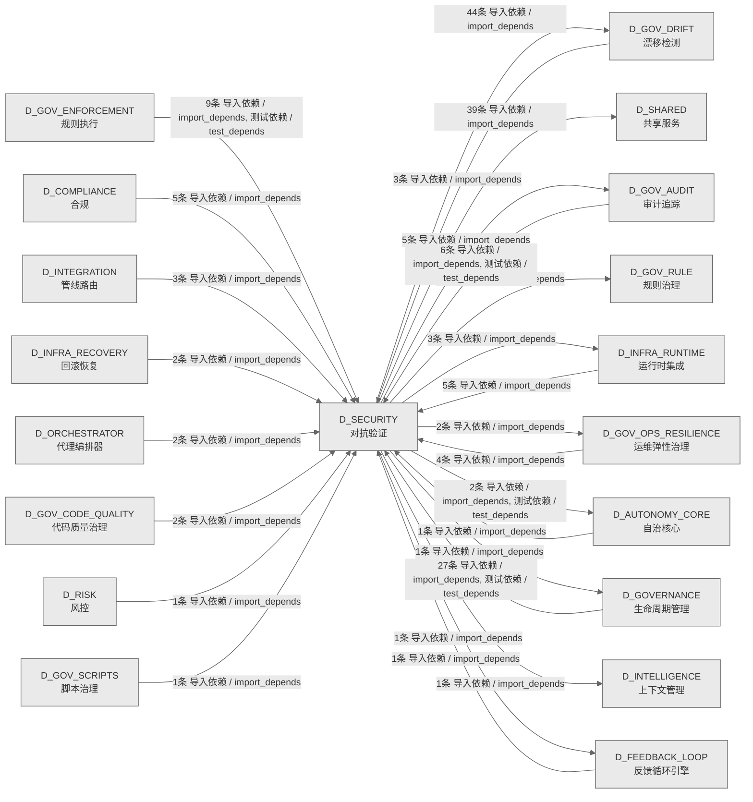

# 27_d_security / 对抗验证域 / Adversarial Validation

> **功能简介 / Overview**: 对抗验证，负责系统安全对抗测试、漏洞扫描和攻防验证

> **文档作用 / Purpose**: 展示 对抗验证（D_SECURITY）功能域的域内依赖关系、跨域依赖关系，模块信息（成熟度/中英文名/大白话/文件路径）内嵌于 Mermaid 节点，供架构审查和域治理参考。

> 本文档由 generate_domain_doc.py 从 depgraph (PostgreSQL) 自动生成
> 数据源: depgraph (PostgreSQL) nodes表 + edges表

> **[可缩放 HTML 版 / Zoomable HTML](http://localhost:8765/docs/02_enterprise_architecture/02_domain_architecture_docs/_zoomable_html/27_d_security.html)** — Ctrl+滚轮缩放 ｜ 双击重置 ｜ Ctrl+Shift+D 切换拖动/选择模式

## 域基本信息 / Domain Overview

| 字段 | 值 | Field | Value |
|------|------|-------|-------|
| 编号 | 27 | Number | 27 |
| 域ID | D_SECURITY | Domain ID | D_SECURITY |
| 域名称 | 对抗验证 | Domain Name | Adversarial Validation |
| 层级 | L1 基础平台层 | Layer | L1 Foundation |
| 模块数 | 171 | Module Count | 171 |
| 域内依赖 | 125 | Internal Dependencies | 125 |
| 跨域入边 | 72 | Cross-domain Incoming | 72 |
| 跨域出边 | 102 | Cross-domain Outgoing | 102 |
| 设计态模块 | 0 | Design Modules | 0 |
| 生产态模块 | 171 | Production Modules | 171 |
| 容量 | 171/150 (超容) | Capacity | 171/150 (超容) |
| 描述 | 孤儿文件检测(orphan_detector) | Description | 孤儿文件检测(orphan_detector) |

## 域内依赖图 / Internal Dependency Diagram

> 依赖图内嵌在本文档中，IDE 可直接渲染；网页版可 Ctrl+滚轮缩放 + 拖动平移查看细节。
>
> **图例说明 / Legend**：
> - 🟦 **蓝色 = 运营态模块**（production，已上线运行）
> - 🟧 **橙色虚线 = 设计态模块**（design，蓝图阶段，代码未写）
> - **实线箭头 = 运营态依赖**（已生效的依赖关系）
> - **虚线箭头 = 非运营态依赖**（计划中/验证中的依赖关系）

### 全景图（全部模块，颜色区分运营态/设计态）

> 展示全部 171 个模块（生产态 171 + 设计态 0），含跨域依赖外部节点。节点含成熟度+名称+大白话/简介+文件路径。

```mermaid
%%{init: {'theme': 'base', 'themeVariables': {'primaryColor': '#eaeaea', 'primaryTextColor': '#333333', 'primaryBorderColor': '#666666', 'lineColor': '#666666', 'secondaryColor': '#eaeaea', 'tertiaryColor': '#eaeaea', 'fontSize': '14px'}}}%%
flowchart TD
    src_zephyr_gov_drift_main_py["gov_drift/__main__<br/>Drift Detector MOD-INF-023 CLI — 漂移扫描入口。<br/>文件: gov_drift/__main__.py<br/>(生产态 / production)"]
    src_zephyr_gov_drift_analysis_py["gov_drift/_analysis<br/>gov drift包的analysis模块<br/>文件: gov_drift/_analysis.py<br/>(生产态 / production)"]
    src_zephyr_gov_drift_core_py["gov_drift/_core<br/>gov drift包的core模块<br/>文件: gov_drift/_core.py<br/>(生产态 / production)"]
    src_zephyr_gov_drift_drift_py["gov_drift/_drift<br/>gov drift包的drift模块<br/>文件: gov_drift/_drift.py<br/>(生产态 / production)"]
    src_zephyr_gov_drift_infrastructure_py["gov_drift/_infrastructure<br/>gov drift包的infrastructure模块<br/>文件: gov_drift/_infrastructure.py<br/>(生产态 / production)"]
    src_zephyr_gov_drift_scanners_py["gov_drift/_scanners<br/>gov drift包的scanners模块<br/>文件: gov_drift/_scanners.py<br/>(生产态 / production)"]
    src_zephyr_governance_agent_rbac_contracts_py["agent-rbac/contracts<br/>py — G-CT-001 RBAC 契约（re-export）<br/>文件: agent-rbac/contracts.py<br/>(生产态 / production)"]
    src_zephyr_red_blue_validator_init_py["zephyr/red_blue_validator 包入口<br/>red_blue_validator — re-export shim for<br/>zephyr.security.adversarial_validation.<br/>文件: red_blue_validator/__init__.py<br/>(生产态 / production)"]
    src_zephyr_security_access_control_adversarial_resilience_py["access_control/adversarial_resilience<br/>AdversarialResilience - adversarial resilience<br/>& OWASP coverage.<br/>文件: access_control/adversarial_resilience.py<br/>(生产态 / production)"]
    src_zephyr_security_access_control_agent_creation_policy_py["access_control/agent_creation_policy<br/>AgentCreationPolicy — Agent 创建策略.<br/>文件: access_control/agent_creation_policy.py<br/>(生产态 / production)"]
    src_zephyr_security_access_control_asymmetric_audit_py["access_control/asymmetric_audit<br/>AsymmetricAudit - quorum-based approval for<br/>high-risk operations.<br/>文件: access_control/asymmetric_audit.py<br/>(生产态 / production)"]
    src_zephyr_security_access_control_auto_maintenance_py["access_control/auto_maintenance<br/>AutoMaintenance — 自动维护与规则健康仪表盘.<br/>文件: access_control/auto_maintenance.py<br/>(生产态 / production)"]
    src_zephyr_security_access_control_blueprint_fidelity_py["access_control/blueprint_fidelity<br/>BlueprintFidelity — 蓝图保真度检查.<br/>文件: access_control/blueprint_fidelity.py<br/>(生产态 / production)"]
    src_zephyr_security_access_control_build_sanitizer_py["access_control/build_sanitizer<br/>安全/access control包的build_sanitizer模块<br/>文件: access_control/build_sanitizer.py<br/>(生产态 / production)"]
    src_zephyr_security_access_control_cache_invalidation_py["access_control/cache_invalidation<br/>CacheInvalidation — 缓存失效事件管理.<br/>文件: access_control/cache_invalidation.py<br/>(生产态 / production)"]
    src_zephyr_security_access_control_canary_rollout_manager_py["access_control/canary_rollout_manager<br/>CanaryRolloutManager — 灰度发布管理器.<br/>文件: access_control/canary_rollout_manager.py<br/>(生产态 / production)"]
    src_zephyr_security_access_control_cascading_failure_isolator_py["access_control/cascading_failure_isolator<br/>安全/access<br/>control包的cascading_failure_isolator模块<br/>文件: access_control<br/>/cascading_failure_isolator.py<br/>(生产态 / production)"]
    src_zephyr_security_access_control_compliance_matrix_py["access_control/compliance_matrix<br/>安全/access control包的compliance_matrix模块<br/>文件: access_control/compliance_matrix.py<br/>(生产态 / production)"]
    src_zephyr_security_access_control_cross_cutting_py["access_control/cross_cutting<br/>CrossCutting — 横切面权限组件.<br/>文件: access_control/cross_cutting.py<br/>(生产态 / production)"]
    src_zephyr_security_access_control_decision_explainer_py["access_control/decision_explainer<br/>DecisionExplainer — 拒绝决策的结构化解释器.<br/>文件: access_control/decision_explainer.py<br/>(生产态 / production)"]
    src_zephyr_security_access_control_decision_registry_py["access_control/decision_registry<br/>DecisionRegistry - decision log with query and<br/>stats.<br/>文件: access_control/decision_registry.py<br/>(生产态 / production)"]
    src_zephyr_security_access_control_defense_depth_py["access_control/defense_depth<br/>安全/access control包的defense_depth模块<br/>文件: access_control/defense_depth.py<br/>(生产态 / production)"]
    src_zephyr_security_access_control_dependency_auditor_py["access_control/dependency_auditor<br/>安全/access control包的dependency_auditor模块<br/>文件: access_control/dependency_auditor.py<br/>(生产态 / production)"]
    src_zephyr_security_access_control_derive_rbac_roles_py["access_control/derive_rbac_roles<br/>RBACRoleDeriver — RBAC 角色派生器.<br/>文件: access_control/derive_rbac_roles.py<br/>(生产态 / production)"]
    src_zephyr_security_access_control_detectors_anomaly_detector_py["detectors/anomaly_detector<br/>AnomalyDetector - rolling z-score anomaly<br/>detection per field.<br/>文件: detectors/anomaly_detector.py<br/>(生产态 / production)"]
    src_zephyr_security_access_control_detectors_context_drift_detector_py["detectors/context_drift_detector<br/>ContextDriftDetector — 上下文漂移与范围蔓延检测.<br/>文件: detectors/context_drift_detector.py<br/>(生产态 / production)"]
    src_zephyr_security_access_control_detectors_cross_session_detector_py["detectors/cross_session_detector<br/>CrossSessionDetector — 跨 Session 检测器.<br/>文件: detectors/cross_session_detector.py<br/>(生产态 / production)"]
    src_zephyr_security_access_control_detectors_false_completion_detector_py["detectors/false_completion_detector<br/>FalseCompletionDetector — 虚假完成检测.<br/>文件: detectors/false_completion_detector.py<br/>(生产态 / production)"]
    src_zephyr_security_access_control_detectors_multi_agent_collusion_detector_py["detectors/multi_agent_collusion_detector<br/>MultiAgentCollusionDetector — 多 agent 合谋检测.<br/>文件: detectors<br/>/multi_agent_collusion_detector.py<br/>(生产态 / production)"]
    src_zephyr_security_access_control_detectors_shell_dialect_detector_py["detectors/shell_dialect_detector<br/>ShellDialectDetector — Shell 方言检测器.<br/>文件: detectors/shell_dialect_detector.py<br/>(生产态 / production)"]
    src_zephyr_security_access_control_dry_run_py["access_control/dry_run<br/>DryRun — 权限模拟与影响分析.<br/>文件: access_control/dry_run.py<br/>(生产态 / production)"]
    src_zephyr_security_access_control_emergency_override_py["access_control/emergency_override<br/>EmergencyOverride — 紧急覆盖令牌管理.<br/>文件: access_control/emergency_override.py<br/>(生产态 / production)"]
    src_zephyr_security_access_control_environment_manager_py["access_control/environment_manager<br/>安全/access control包的environment_manager模块<br/>文件: access_control/environment_manager.py<br/>(生产态 / production)"]
    src_zephyr_security_access_control_escalation_handler_py["access_control/escalation_handler<br/>安全/access control包的escalation_handler模块<br/>文件: access_control/escalation_handler.py<br/>(生产态 / production)"]
    src_zephyr_security_access_control_exceptions_py["access_control/exceptions<br/>AgentRbac 异常类型.<br/>文件: access_control/exceptions.py<br/>(生产态 / production)"]
    src_zephyr_security_access_control_genesis_bootstrap_py["access_control/genesis_bootstrap<br/>GenesisBootstrap — RBAC系统启动引导器.<br/>文件: access_control/genesis_bootstrap.py<br/>(生产态 / production)"]
    src_zephyr_security_access_control_guard_layers_py["access_control/guard_layers<br/>GuardLayers — 权限守卫层组件.<br/>文件: access_control/guard_layers.py<br/>(生产态 / production)"]
    src_zephyr_security_access_control_guards_abac_guard_py["guards/abac_guard<br/>ABACGuard — 基于属性的权限守卫.<br/>文件: guards/abac_guard.py<br/>(生产态 / production)"]
    src_zephyr_security_access_control_guards_anti_pattern_guard_py["guards/anti_pattern_guard<br/>安全/guards包的anti_pattern_guard模块<br/>文件: guards/anti_pattern_guard.py<br/>(生产态 / production)"]
    src_zephyr_security_access_control_guards_audit_log_guard_py["guards/audit_log_guard<br/>audit_log_guard.py — 审计日志注入防护守卫<br/>文件: guards/audit_log_guard.py<br/>(生产态 / production)"]
    src_zephyr_security_access_control_guards_cybersec_2026_guard_py["guards/cybersec_2026_guard<br/>Cybersec2026Guard — 2026 网络安全威胁检测.<br/>文件: guards/cybersec_2026_guard.py<br/>(生产态 / production)"]
    src_zephyr_security_access_control_guards_input_guard_py["guards/input_guard<br/>InputGuard — 输入参数守卫.<br/>文件: guards/input_guard.py<br/>(生产态 / production)"]
    src_zephyr_security_access_control_guards_memory_guard_py["guards/memory_guard<br/>MemoryGuard — 内存访问守卫.<br/>文件: guards/memory_guard.py<br/>(生产态 / production)"]
    src_zephyr_security_access_control_guards_memory_provenance_guard_py["guards/memory_provenance_guard<br/>MemoryProvenanceGuard — 记忆来源溯源守卫.<br/>文件: guards/memory_provenance_guard.py<br/>(生产态 / production)"]
    src_zephyr_security_access_control_guards_native_api_guard_py["guards/native_api_guard<br/>NativeApiGuard — 原生 API 守卫.<br/>文件: guards/native_api_guard.py<br/>(生产态 / production)"]
    src_zephyr_security_access_control_guards_novel_attack_guard_py["guards/novel_attack_guard<br/>NovelAttackGuard — 新型攻击行为画像.<br/>文件: guards/novel_attack_guard.py<br/>(生产态 / production)"]
    src_zephyr_security_access_control_guards_output_guard_py["guards/output_guard<br/>OutputGuard — 输出内容守卫.<br/>文件: guards/output_guard.py<br/>(生产态 / production)"]
    src_zephyr_security_access_control_guards_path_guard_py["guards/path_guard<br/>PathGuard — 路径守卫.<br/>文件: guards/path_guard.py<br/>(生产态 / production)"]
    src_zephyr_security_access_control_guards_replay_attack_guard_py["guards/replay_attack_guard<br/>ReplayAttackGuard — 重放攻击防护.<br/>文件: guards/replay_attack_guard.py<br/>(生产态 / production)"]
    src_zephyr_security_access_control_guards_rule_injection_guard_py["guards/rule_injection_guard<br/>RuleInjectionGuard — 规则注入守卫.<br/>文件: guards/rule_injection_guard.py<br/>(生产态 / production)"]
    src_zephyr_security_access_control_guards_sequence_guard_py["guards/sequence_guard<br/>SequenceGuard — 操作序列守卫.<br/>文件: guards/sequence_guard.py<br/>(生产态 / production)"]
    src_zephyr_security_access_control_guards_toctou_guard_py["guards/toctou_guard<br/>TOCTOUGuard — TOCTOU (Time-of-Check to<br/>Time-of-Use) 防护.<br/>文件: guards/toctou_guard.py<br/>(生产态 / production)"]
    src_zephyr_security_access_control_guards_vibe_coding_guard_py["guards/vibe_coding_guard<br/>VibeCodingGuard — Vibe Coding 攻击面检测.<br/>文件: guards/vibe_coding_guard.py<br/>(生产态 / production)"]
    src_zephyr_security_access_control_integration_py["access_control/integration<br/>IntegrationManager - system integration<br/>registry & health check.<br/>文件: access_control/integration.py<br/>(生产态 / production)"]
    src_zephyr_security_access_control_integrity_self_check_py["access_control/integrity_self_check<br/>IntegritySelfCheck — 完整性自检.<br/>文件: access_control/integrity_self_check.py<br/>(生产态 / production)"]
    src_zephyr_security_access_control_intent_binder_py["access_control/intent_binder<br/>IntentBinder — 意图绑定与漂移检测.<br/>文件: access_control/intent_binder.py<br/>(生产态 / production)"]
    src_zephyr_security_access_control_key_hierarchy_py["access_control/key_hierarchy<br/>安全/access control包的key_hierarchy模块<br/>文件: access_control/key_hierarchy.py<br/>(生产态 / production)"]
    src_zephyr_security_access_control_legal_audit_chain_py["access_control/legal_audit_chain<br/>LegalAuditChain - append-only hash-chained<br/>legal audit log.<br/>文件: access_control/legal_audit_chain.py<br/>(生产态 / production)"]
    src_zephyr_security_access_control_microstructure_defense_py["access_control/microstructure_defense<br/>微结构防御——对抗做市<br/>/交易微结构攻击的策略与保真度因子。<br/>文件: access_control/microstructure_defense.py<br/>(生产态 / production)"]
    src_zephyr_security_access_control_monotonic_clock_py["access_control/monotonic_clock<br/>MonotonicClock — 单调时钟.<br/>文件: access_control/monotonic_clock.py<br/>(生产态 / production)"]
    src_zephyr_security_access_control_non_repudiation_py["access_control/non_repudiation<br/>NonRepudiation — 不可抵赖性审计签名.<br/>文件: access_control/non_repudiation.py<br/>(生产态 / production)"]
    src_zephyr_security_access_control_observability_py["access_control/observability<br/>ObservabilityReporter — 指标上报与异常检测.<br/>文件: access_control/observability.py<br/>(生产态 / production)"]
    src_zephyr_security_access_control_orphan_judge_main_py["orphan_judge/__main__<br/>安全/orphan judge包的main__模块<br/>文件: orphan_judge/__main__.py<br/>(生产态 / production)"]
    src_zephyr_security_access_control_orphan_judge_config_loader_py["orphan_judge/config_loader<br/>安全/orphan judge包的config_loader模块<br/>文件: orphan_judge/config_loader.py<br/>(生产态 / production)"]
    src_zephyr_security_access_control_orphan_judge_drift_bridge_py["orphan_judge/drift_bridge<br/>安全/orphan judge包的drift_bridge模块<br/>文件: orphan_judge/drift_bridge.py<br/>(生产态 / production)"]
    src_zephyr_security_access_control_orphan_judge_escalation_bridge_py["orphan_judge/escalation_bridge<br/>安全/orphan judge包的escalation_bridge模块<br/>文件: orphan_judge/escalation_bridge.py<br/>(生产态 / production)"]
    src_zephyr_security_access_control_orphan_judge_feedback_bridge_py["orphan_judge/feedback_bridge<br/>安全/orphan judge包的feedback_bridge模块<br/>文件: orphan_judge/feedback_bridge.py<br/>(生产态 / production)"]
    src_zephyr_security_access_control_orphan_judge_kb_bridge_py["orphan_judge/kb_bridge<br/>安全/orphan judge包的kb_bridge模块<br/>文件: orphan_judge/kb_bridge.py<br/>(生产态 / production)"]
    src_zephyr_security_access_control_orphan_judge_mcp_integration_py["orphan_judge/mcp_integration<br/>安全/orphan judge包的mcp_integration模块<br/>文件: orphan_judge/mcp_integration.py<br/>(生产态 / production)"]
    src_zephyr_security_access_control_orphan_judge_orphan_collector_py["orphan_judge/orphan_collector<br/>安全/orphan judge包的orphan_collector模块<br/>文件: orphan_judge/orphan_collector.py<br/>(生产态 / production)"]
    src_zephyr_security_access_control_orphan_judge_orphan_detector_py["orphan_judge/orphan_detector<br/>(INVARIANTS) 蓝图 §4 文件清单与代码双向对齐<br/>文件: orphan_judge/orphan_detector.py<br/>(生产态 / production)"]
    src_zephyr_security_access_control_orphan_judge_rbac_bridge_py["orphan_judge/rbac_bridge<br/>安全/orphan judge包的rbac_bridge模块<br/>文件: orphan_judge/rbac_bridge.py<br/>(生产态 / production)"]
    src_zephyr_security_access_control_orphan_judge_reference_graph_engine_py["orphan_judge/reference_graph_engine<br/>AST解析+import链遍历，判断文件是否被其他文件引用<br/>。<br/>文件: orphan_judge/reference_graph_engine.py<br/>(生产态 / production)"]
    src_zephyr_security_access_control_orphan_judge_registration_checker_py["orphan_judge/registration_checker<br/>扫描项目注册表，判断文件是否已登记在册。<br/>文件: orphan_judge/registration_checker.py<br/>(生产态 / production)"]
    src_zephyr_security_access_control_orphan_judge_report_generator_py["orphan_judge/report_generator<br/>安全/orphan judge包的report_generator模块<br/>文件: orphan_judge/report_generator.py<br/>(生产态 / production)"]
    src_zephyr_security_access_control_orphan_judge_standalone_evaluator_py["orphan_judge/standalone_evaluator<br/>六指标加权评分: 文件大小(15%) + 代码行数(20%) +<br/>定义数(20%)<br/>文件: orphan_judge/standalone_evaluator.py<br/>(生产态 / production)"]
    src_zephyr_security_access_control_orphan_judge_swid_tag_py["orphan_judge/swid_tag<br/>安全/orphan judge包的swid_tag模块<br/>文件: orphan_judge/swid_tag.py<br/>(生产态 / production)"]
    src_zephyr_security_access_control_orphan_judge_unique_analyzer_py["orphan_judge/unique_analyzer<br/>AST节点比对，检测文件中的独特代码元素(类/函数<br/>/常量定义等)。<br/>文件: orphan_judge/unique_analyzer.py<br/>(生产态 / production)"]
    src_zephyr_security_access_control_permission_hooks_py["access_control/permission_hooks<br/>PermissionHooks — 权限钩子注册表.<br/>文件: access_control/permission_hooks.py<br/>(生产态 / production)"]
    src_zephyr_security_access_control_permission_mode_manager_py["access_control/permission_mode_manager<br/>安全/access<br/>control包的permission_mode_manager模块<br/>文件: access_control/permission_mode_manager.py<br/>(生产态 / production)"]
    src_zephyr_security_access_control_phase_executor_py["access_control/phase_executor<br/>安全/access control包的phase_executor模块<br/>文件: access_control/phase_executor.py<br/>(生产态 / production)"]
    src_zephyr_security_access_control_risk_mitigation_py["access_control/risk_mitigation<br/>RiskMitigation — 风险评估与缓解策略.<br/>文件: access_control/risk_mitigation.py<br/>(生产态 / production)"]
    src_zephyr_security_access_control_rollback_sandbox_py["access_control/rollback_sandbox<br/>RollbackSandbox - isolate/execute/rollback<br/>pattern for reversible operations.<br/>文件: access_control/rollback_sandbox.py<br/>(生产态 / production)"]
    src_zephyr_security_access_control_secrets_lifecycle_py["access_control/secrets_lifecycle<br/>安全/access control包的secrets_lifecycle模块<br/>文件: access_control/secrets_lifecycle.py<br/>(生产态 / production)"]
    src_zephyr_security_access_control_session_concurrency_py["access_control/session_concurrency<br/>Session 级并发协调模块（P2-SES 落地）。<br/>文件: access_control/session_concurrency.py<br/>(生产态 / production)"]
    src_zephyr_security_access_control_session_lifecycle_py["access_control/session_lifecycle<br/>安全/access control包的session_lifecycle模块<br/>文件: access_control/session_lifecycle.py<br/>(生产态 / production)"]
    src_zephyr_security_access_control_verifiers_bootstrap_verifier_py["verifiers/bootstrap_verifier<br/>安全/verifiers包的bootstrap_verifier模块<br/>文件: verifiers/bootstrap_verifier.py<br/>(生产态 / production)"]
    src_zephyr_security_access_control_verifiers_continuous_verifier_py["verifiers/continuous_verifier<br/>安全/verifiers包的continuous_verifier模块<br/>文件: verifiers/continuous_verifier.py<br/>(生产态 / production)"]
    src_zephyr_security_access_control_verifiers_contract_verifier_py["verifiers/contract_verifier<br/>ContractVerifier — 契约验证器.<br/>文件: verifiers/contract_verifier.py<br/>(生产态 / production)"]
    src_zephyr_security_access_control_verifiers_micro_verifier_py["verifiers/micro_verifier<br/>安全/verifiers包的micro_verifier模块<br/>文件: verifiers/micro_verifier.py<br/>(生产态 / production)"]
    src_zephyr_security_access_control_verifiers_post_action_verifier_py["verifiers/post_action_verifier<br/>安全/verifiers包的post_action_verifier模块<br/>文件: verifiers/post_action_verifier.py<br/>(生产态 / production)"]
    src_zephyr_security_adversarial_validation_main_py["adversarial_validation/__main__<br/>安全/adversarial validation包的main__模块<br/>文件: adversarial_validation/__main__.py<br/>(生产态 / production)"]
    src_zephyr_security_adversarial_validation_ai_attack_generator_py["adversarial_validation/ai_attack_generator<br/>安全/adversarial<br/>validation包的ai_attack_generator模块<br/>文件: adversarial_validation<br/>/ai_attack_generator.py<br/>(生产态 / production)"]
    src_zephyr_security_adversarial_validation_async_monitor_py["adversarial_validation/async_monitor<br/>安全/adversarial validation包的async_monitor模块<br/>文件: adversarial_validation/async_monitor.py<br/>(生产态 / production)"]
    src_zephyr_security_adversarial_validation_attack_registry_py["adversarial_validation/attack_registry<br/>安全/adversarial<br/>validation包的attack_registry模块<br/>文件: adversarial_validation/attack_registry.py<br/>(生产态 / production)"]
    src_zephyr_security_adversarial_validation_commit_trigger_py["adversarial_validation/commit_trigger<br/>CommitTrigger — 事件驱动红蓝对抗触发器<br/>(MOD-INF-030).<br/>文件: adversarial_validation/commit_trigger.py<br/>(生产态 / production)"]
    src_zephyr_security_adversarial_validation_constitution_engine_py["adversarial_validation/constitution_engine<br/>安全/adversarial<br/>validation包的constitution_engine模块<br/>文件: adversarial_validation<br/>/constitution_engine.py<br/>(生产态 / production)"]
    src_zephyr_security_adversarial_validation_game_day_scheduler_py["adversarial_validation/game_day_scheduler<br/>安全/adversarial<br/>validation包的game_day_scheduler模块<br/>文件: adversarial_validation<br/>/game_day_scheduler.py<br/>(生产态 / production)"]
    src_zephyr_security_adversarial_validation_injection_engine_py["adversarial_validation/injection_engine<br/>安全/adversarial<br/>validation包的injection_engine模块<br/>文件: adversarial_validation/injection_engine.py<br/>(生产态 / production)"]
    src_zephyr_security_adversarial_validation_mcp_endpoints_py["adversarial_validation/mcp_endpoints<br/>安全/adversarial validation包的mcp_endpoints模块<br/>文件: adversarial_validation/mcp_endpoints.py<br/>(生产态 / production)"]
    src_zephyr_security_adversarial_validation_validator_event_bridge_py["adversarial_validation/validator_event_bridge<br/>ValidatorEventBridge — 红蓝验证器事件桥接<br/>(MOD-SEC-030).<br/>文件: adversarial_validation<br/>/validator_event_bridge.py<br/>(生产态 / production)"]
    src_zephyr_security_llm_defense_llm_security_dashboard_app_py["dashboard/app<br/>LLM Security Gateway - Streamlit Dashboard.<br/>文件: dashboard/app.py<br/>(生产态 / production)"]
    src_zephyr_security_llm_defense_llm_security_layers_l6_data_flow_py["layers/l6_data_flow<br/>安全/layers包的l6_data_flow模块<br/>文件: layers/l6_data_flow.py<br/>(生产态 / production)"]
    src_zephyr_security_llm_defense_llm_security_layers_l8_compliance_py["layers/l8_compliance<br/>安全/layers包的l8_compliance模块<br/>文件: layers/l8_compliance.py<br/>(生产态 / production)"]
    src_zephyr_security_llm_defense_llm_security_process_sandbox_py["llm_security/process_sandbox<br/>L2a ProcessSandbox — subprocess 路径白名单沙箱<br/>文件: llm_security/process_sandbox.py<br/>(生产态 / production)"]
    src_zephyr_security_llm_defense_llm_security_self_protection_adversarial_mutator_py["self_protection/adversarial_mutator<br/>安全/self protection包的adversarial_mutator模块<br/>文件: self_protection/adversarial_mutator.py<br/>(生产态 / production)"]
    src_zephyr_security_llm_defense_llm_security_self_protection_red_team_scanner_py["self_protection/red_team_scanner<br/>安全/self protection包的red_team_scanner模块<br/>文件: self_protection/red_team_scanner.py<br/>(生产态 / production)"]
    tests_governance_security_test_governance_a2a_check_py["security/test_governance_a2a_check<br/>安全包的test_governance_a2a_check模块<br/>文件: security/test_governance_a2a_check.py<br/>(生产态 / production)"]
    tests_governance_security_test_governance_approver_check_py["security/test_governance_approver_check<br/>安全包的test_governance_approver_check模块<br/>文件: security/test_governance_approver_check.py<br/>(生产态 / production)"]
    tests_governance_security_test_governance_bootstrap_superadmin_py["security/test_governance_bootstrap_superadmin<br/>安全包的test_governance_bootstrap_superadmin模块<br/>文件: security<br/>/test_governance_bootstrap_superadmin.py<br/>(生产态 / production)"]
    tests_governance_security_test_governance_capability_check_py["security/test_governance_capability_check<br/>安全包的test_governance_capability_check模块<br/>文件: security<br/>/test_governance_capability_check.py<br/>(生产态 / production)"]
    tests_governance_security_test_governance_contracts_py["security/test_governance_contracts<br/>安全包的test_governance_contracts模块<br/>文件: security/test_governance_contracts.py<br/>(生产态 / production)"]
    src_zephyr_gov_drift_main_py ~~~ src_zephyr_gov_drift_analysis_py
    src_zephyr_gov_drift_analysis_py ~~~ src_zephyr_gov_drift_core_py
    src_zephyr_gov_drift_core_py ~~~ src_zephyr_gov_drift_drift_py
    src_zephyr_gov_drift_drift_py ~~~ src_zephyr_gov_drift_infrastructure_py
    src_zephyr_gov_drift_infrastructure_py ~~~ src_zephyr_gov_drift_scanners_py
    src_zephyr_gov_drift_scanners_py ~~~ src_zephyr_governance_agent_rbac_contracts_py
    src_zephyr_governance_agent_rbac_contracts_py ~~~ src_zephyr_red_blue_validator_init_py
    src_zephyr_red_blue_validator_init_py ~~~ src_zephyr_security_access_control_adversarial_resilience_py
    src_zephyr_security_access_control_adversarial_resilience_py ~~~ src_zephyr_security_access_control_agent_creation_policy_py
    src_zephyr_security_access_control_agent_creation_policy_py ~~~ src_zephyr_security_access_control_asymmetric_audit_py
    src_zephyr_security_access_control_asymmetric_audit_py ~~~ src_zephyr_security_access_control_auto_maintenance_py
    src_zephyr_security_access_control_auto_maintenance_py ~~~ src_zephyr_security_access_control_blueprint_fidelity_py
    src_zephyr_security_access_control_blueprint_fidelity_py ~~~ src_zephyr_security_access_control_build_sanitizer_py
    src_zephyr_security_access_control_build_sanitizer_py ~~~ src_zephyr_security_access_control_cache_invalidation_py
    src_zephyr_security_access_control_cache_invalidation_py ~~~ src_zephyr_security_access_control_canary_rollout_manager_py
    src_zephyr_security_access_control_canary_rollout_manager_py ~~~ src_zephyr_security_access_control_cascading_failure_isolator_py
    src_zephyr_security_access_control_cascading_failure_isolator_py ~~~ src_zephyr_security_access_control_compliance_matrix_py
    src_zephyr_security_access_control_compliance_matrix_py ~~~ src_zephyr_security_access_control_cross_cutting_py
    src_zephyr_security_access_control_cross_cutting_py ~~~ src_zephyr_security_access_control_decision_explainer_py
    src_zephyr_security_access_control_decision_explainer_py ~~~ src_zephyr_security_access_control_decision_registry_py
    src_zephyr_security_access_control_decision_registry_py ~~~ src_zephyr_security_access_control_defense_depth_py
    src_zephyr_security_access_control_defense_depth_py ~~~ src_zephyr_security_access_control_dependency_auditor_py
    src_zephyr_security_access_control_dependency_auditor_py ~~~ src_zephyr_security_access_control_derive_rbac_roles_py
    src_zephyr_security_access_control_derive_rbac_roles_py ~~~ src_zephyr_security_access_control_detectors_anomaly_detector_py
    src_zephyr_security_access_control_detectors_anomaly_detector_py ~~~ src_zephyr_security_access_control_detectors_context_drift_detector_py
    src_zephyr_security_access_control_detectors_context_drift_detector_py ~~~ src_zephyr_security_access_control_detectors_cross_session_detector_py
    src_zephyr_security_access_control_detectors_cross_session_detector_py ~~~ src_zephyr_security_access_control_detectors_false_completion_detector_py
    src_zephyr_security_access_control_detectors_false_completion_detector_py ~~~ src_zephyr_security_access_control_detectors_multi_agent_collusion_detector_py
    src_zephyr_security_access_control_detectors_multi_agent_collusion_detector_py ~~~ src_zephyr_security_access_control_detectors_shell_dialect_detector_py
    src_zephyr_security_access_control_detectors_shell_dialect_detector_py ~~~ src_zephyr_security_access_control_dry_run_py
    src_zephyr_security_access_control_dry_run_py ~~~ src_zephyr_security_access_control_emergency_override_py
    src_zephyr_security_access_control_emergency_override_py ~~~ src_zephyr_security_access_control_environment_manager_py
    src_zephyr_security_access_control_environment_manager_py ~~~ src_zephyr_security_access_control_escalation_handler_py
    src_zephyr_security_access_control_escalation_handler_py ~~~ src_zephyr_security_access_control_exceptions_py
    src_zephyr_security_access_control_exceptions_py ~~~ src_zephyr_security_access_control_genesis_bootstrap_py
    src_zephyr_security_access_control_genesis_bootstrap_py ~~~ src_zephyr_security_access_control_guard_layers_py
    src_zephyr_security_access_control_guard_layers_py ~~~ src_zephyr_security_access_control_guards_abac_guard_py
    src_zephyr_security_access_control_guards_abac_guard_py ~~~ src_zephyr_security_access_control_guards_anti_pattern_guard_py
    src_zephyr_security_access_control_guards_anti_pattern_guard_py ~~~ src_zephyr_security_access_control_guards_audit_log_guard_py
    src_zephyr_security_access_control_guards_audit_log_guard_py ~~~ src_zephyr_security_access_control_guards_cybersec_2026_guard_py
    src_zephyr_security_access_control_guards_cybersec_2026_guard_py ~~~ src_zephyr_security_access_control_guards_input_guard_py
    src_zephyr_security_access_control_guards_input_guard_py ~~~ src_zephyr_security_access_control_guards_memory_guard_py
    src_zephyr_security_access_control_guards_memory_guard_py ~~~ src_zephyr_security_access_control_guards_memory_provenance_guard_py
    src_zephyr_security_access_control_guards_memory_provenance_guard_py ~~~ src_zephyr_security_access_control_guards_native_api_guard_py
    src_zephyr_security_access_control_guards_native_api_guard_py ~~~ src_zephyr_security_access_control_guards_novel_attack_guard_py
    src_zephyr_security_access_control_guards_novel_attack_guard_py ~~~ src_zephyr_security_access_control_guards_output_guard_py
    src_zephyr_security_access_control_guards_output_guard_py ~~~ src_zephyr_security_access_control_guards_path_guard_py
    src_zephyr_security_access_control_guards_path_guard_py ~~~ src_zephyr_security_access_control_guards_replay_attack_guard_py
    src_zephyr_security_access_control_guards_replay_attack_guard_py ~~~ src_zephyr_security_access_control_guards_rule_injection_guard_py
    src_zephyr_security_access_control_guards_rule_injection_guard_py ~~~ src_zephyr_security_access_control_guards_sequence_guard_py
    src_zephyr_security_access_control_guards_sequence_guard_py ~~~ src_zephyr_security_access_control_guards_toctou_guard_py
    src_zephyr_security_access_control_guards_toctou_guard_py ~~~ src_zephyr_security_access_control_guards_vibe_coding_guard_py
    src_zephyr_security_access_control_guards_vibe_coding_guard_py ~~~ src_zephyr_security_access_control_integration_py
    src_zephyr_security_access_control_integration_py ~~~ src_zephyr_security_access_control_integrity_self_check_py
    src_zephyr_security_access_control_integrity_self_check_py ~~~ src_zephyr_security_access_control_intent_binder_py
    src_zephyr_security_access_control_intent_binder_py ~~~ src_zephyr_security_access_control_key_hierarchy_py
    src_zephyr_security_access_control_key_hierarchy_py ~~~ src_zephyr_security_access_control_legal_audit_chain_py
    src_zephyr_security_access_control_legal_audit_chain_py ~~~ src_zephyr_security_access_control_microstructure_defense_py
    src_zephyr_security_access_control_microstructure_defense_py ~~~ src_zephyr_security_access_control_monotonic_clock_py
    src_zephyr_security_access_control_monotonic_clock_py ~~~ src_zephyr_security_access_control_non_repudiation_py
    src_zephyr_security_access_control_non_repudiation_py ~~~ src_zephyr_security_access_control_observability_py
    src_zephyr_security_access_control_observability_py ~~~ src_zephyr_security_access_control_orphan_judge_main_py
    src_zephyr_security_access_control_orphan_judge_main_py ~~~ src_zephyr_security_access_control_orphan_judge_config_loader_py
    src_zephyr_security_access_control_orphan_judge_config_loader_py ~~~ src_zephyr_security_access_control_orphan_judge_drift_bridge_py
    src_zephyr_security_access_control_orphan_judge_drift_bridge_py ~~~ src_zephyr_security_access_control_orphan_judge_escalation_bridge_py
    src_zephyr_security_access_control_orphan_judge_escalation_bridge_py ~~~ src_zephyr_security_access_control_orphan_judge_feedback_bridge_py
    src_zephyr_security_access_control_orphan_judge_feedback_bridge_py ~~~ src_zephyr_security_access_control_orphan_judge_kb_bridge_py
    src_zephyr_security_access_control_orphan_judge_kb_bridge_py ~~~ src_zephyr_security_access_control_orphan_judge_mcp_integration_py
    src_zephyr_security_access_control_orphan_judge_mcp_integration_py ~~~ src_zephyr_security_access_control_orphan_judge_orphan_collector_py
    src_zephyr_security_access_control_orphan_judge_orphan_collector_py ~~~ src_zephyr_security_access_control_orphan_judge_orphan_detector_py
    src_zephyr_security_access_control_orphan_judge_orphan_detector_py ~~~ src_zephyr_security_access_control_orphan_judge_rbac_bridge_py
    src_zephyr_security_access_control_orphan_judge_rbac_bridge_py ~~~ src_zephyr_security_access_control_orphan_judge_reference_graph_engine_py
    src_zephyr_security_access_control_orphan_judge_reference_graph_engine_py ~~~ src_zephyr_security_access_control_orphan_judge_registration_checker_py
    src_zephyr_security_access_control_orphan_judge_registration_checker_py ~~~ src_zephyr_security_access_control_orphan_judge_report_generator_py
    src_zephyr_security_access_control_orphan_judge_report_generator_py ~~~ src_zephyr_security_access_control_orphan_judge_standalone_evaluator_py
    src_zephyr_security_access_control_orphan_judge_standalone_evaluator_py ~~~ src_zephyr_security_access_control_orphan_judge_swid_tag_py
    src_zephyr_security_access_control_orphan_judge_swid_tag_py ~~~ src_zephyr_security_access_control_orphan_judge_unique_analyzer_py
    src_zephyr_security_access_control_orphan_judge_unique_analyzer_py ~~~ src_zephyr_security_access_control_permission_hooks_py
    src_zephyr_security_access_control_permission_hooks_py ~~~ src_zephyr_security_access_control_permission_mode_manager_py
    src_zephyr_security_access_control_permission_mode_manager_py ~~~ src_zephyr_security_access_control_phase_executor_py
    src_zephyr_security_access_control_phase_executor_py ~~~ src_zephyr_security_access_control_risk_mitigation_py
    src_zephyr_security_access_control_risk_mitigation_py ~~~ src_zephyr_security_access_control_rollback_sandbox_py
    src_zephyr_security_access_control_rollback_sandbox_py ~~~ src_zephyr_security_access_control_secrets_lifecycle_py
    src_zephyr_security_access_control_secrets_lifecycle_py ~~~ src_zephyr_security_access_control_session_concurrency_py
    src_zephyr_security_access_control_session_concurrency_py ~~~ src_zephyr_security_access_control_session_lifecycle_py
    src_zephyr_security_access_control_session_lifecycle_py ~~~ src_zephyr_security_access_control_verifiers_bootstrap_verifier_py
    src_zephyr_security_access_control_verifiers_bootstrap_verifier_py ~~~ src_zephyr_security_access_control_verifiers_continuous_verifier_py
    src_zephyr_security_access_control_verifiers_continuous_verifier_py ~~~ src_zephyr_security_access_control_verifiers_contract_verifier_py
    src_zephyr_security_access_control_verifiers_contract_verifier_py ~~~ src_zephyr_security_access_control_verifiers_micro_verifier_py
    src_zephyr_security_access_control_verifiers_micro_verifier_py ~~~ src_zephyr_security_access_control_verifiers_post_action_verifier_py
    src_zephyr_security_access_control_verifiers_post_action_verifier_py ~~~ src_zephyr_security_adversarial_validation_main_py
    src_zephyr_security_adversarial_validation_main_py ~~~ src_zephyr_security_adversarial_validation_ai_attack_generator_py
    src_zephyr_security_adversarial_validation_ai_attack_generator_py ~~~ src_zephyr_security_adversarial_validation_async_monitor_py
    src_zephyr_security_adversarial_validation_async_monitor_py ~~~ src_zephyr_security_adversarial_validation_attack_registry_py
    src_zephyr_security_adversarial_validation_attack_registry_py ~~~ src_zephyr_security_adversarial_validation_commit_trigger_py
    src_zephyr_security_adversarial_validation_commit_trigger_py ~~~ src_zephyr_security_adversarial_validation_constitution_engine_py
    src_zephyr_security_adversarial_validation_constitution_engine_py ~~~ src_zephyr_security_adversarial_validation_game_day_scheduler_py
    src_zephyr_security_adversarial_validation_game_day_scheduler_py ~~~ src_zephyr_security_adversarial_validation_injection_engine_py
    src_zephyr_security_adversarial_validation_injection_engine_py ~~~ src_zephyr_security_adversarial_validation_mcp_endpoints_py
    src_zephyr_security_adversarial_validation_mcp_endpoints_py ~~~ src_zephyr_security_adversarial_validation_validator_event_bridge_py
    src_zephyr_security_adversarial_validation_validator_event_bridge_py ~~~ src_zephyr_security_llm_defense_llm_security_dashboard_app_py
    src_zephyr_security_llm_defense_llm_security_dashboard_app_py ~~~ src_zephyr_security_llm_defense_llm_security_layers_l6_data_flow_py
    src_zephyr_security_llm_defense_llm_security_layers_l6_data_flow_py ~~~ src_zephyr_security_llm_defense_llm_security_layers_l8_compliance_py
    src_zephyr_security_llm_defense_llm_security_layers_l8_compliance_py ~~~ src_zephyr_security_llm_defense_llm_security_process_sandbox_py
    src_zephyr_security_llm_defense_llm_security_process_sandbox_py ~~~ src_zephyr_security_llm_defense_llm_security_self_protection_adversarial_mutator_py
    src_zephyr_security_llm_defense_llm_security_self_protection_adversarial_mutator_py ~~~ src_zephyr_security_llm_defense_llm_security_self_protection_red_team_scanner_py
    src_zephyr_security_llm_defense_llm_security_self_protection_red_team_scanner_py ~~~ tests_governance_security_test_governance_a2a_check_py
    tests_governance_security_test_governance_a2a_check_py ~~~ tests_governance_security_test_governance_approver_check_py
    tests_governance_security_test_governance_approver_check_py ~~~ tests_governance_security_test_governance_bootstrap_superadmin_py
    tests_governance_security_test_governance_bootstrap_superadmin_py ~~~ tests_governance_security_test_governance_capability_check_py
    tests_governance_security_test_governance_capability_check_py ~~~ tests_governance_security_test_governance_contracts_py
    src_zephyr_gov_drift_alert_router_py["gov_drift/alert_router<br/>Alert Router — alert_router.py<br/>文件: gov_drift/alert_router.py<br/>(生产态 / production)"]
    src_zephyr_gov_drift_cold_start_py["gov_drift/cold_start<br/>Cold Start Bootstrapper — 冷启动引导 §6.31。<br/>文件: gov_drift/cold_start.py<br/>(生产态 / production)"]
    src_zephyr_gov_drift_events_py["gov_drift/events<br/>G-CT-005 — ManagedDriftEvent Pydantic V2<br/>BaseModel 漂移事件定义.<br/>文件: gov_drift/events.py<br/>(生产态 / production)"]
    src_zephyr_gov_drift_reconciler_py["gov_drift/reconciler<br/>Auto Reconciler — reconciler.py<br/>文件: gov_drift/reconciler.py<br/>(生产态 / production)"]
    src_zephyr_gov_drift_runbook_generator_py["gov_drift/runbook_generator<br/>Drift Runbook Generator — 漂移演练手册自动生成。<br/>文件: gov_drift/runbook_generator.py<br/>(生产态 / production)"]
    src_zephyr_gov_drift_state_machine_py["gov_drift/state_machine<br/>Drift State Machine — state_machine.py<br/>文件: gov_drift/state_machine.py<br/>(生产态 / production)"]
    src_zephyr_security_access_control_a2a_check_py["access_control/a2a_check<br/>A2A 通信对验证——校验两个 agent<br/>之间是否允许通信。<br/>文件: access_control/a2a_check.py<br/>(生产态 / production)"]
    src_zephyr_security_access_control_approver_check_py["access_control/approver_check<br/>Approver authorization verifier —<br/>校验审批人是否有权执行请求的动作。<br/>文件: access_control/approver_check.py<br/>(生产态 / production)"]
    src_zephyr_security_access_control_bootstrap_superadmin_py["access_control/bootstrap_superadmin<br/>BootstrapSuperadmin — Superadmin 账户启动器.<br/>文件: access_control/bootstrap_superadmin.py<br/>(生产态 / production)"]
    src_zephyr_security_access_control_capability_check_py["access_control/capability_check<br/>Agent capability scope verification —<br/>拒绝受限能力声明、空能力声明及能力数量...<br/>文件: access_control/capability_check.py<br/>(生产态 / production)"]
    src_zephyr_security_access_control_cold_start_lock_py["access_control/cold_start_lock<br/>ColdStartLock — 冷启动锁.<br/>文件: access_control/cold_start_lock.py<br/>(生产态 / production)"]
    src_zephyr_security_access_control_contracts_py["access_control/contracts<br/>G-CT-001 RBAC->Audit 桥接契约 - RBACAuditBridge.<br/>文件: access_control/contracts.py<br/>(生产态 / production)"]
    src_zephyr_security_access_control_engine_degradation_py["access_control/engine_degradation<br/>EngineDegradation — 引擎降级管理.<br/>文件: access_control/engine_degradation.py<br/>(生产态 / production)"]
    src_zephyr_security_access_control_guards_permission_guard_py["guards/permission_guard<br/>PermissionGuard — 七层权限编排器.<br/>文件: guards/permission_guard.py<br/>(生产态 / production)"]
    src_zephyr_security_access_control_kill_switch_py["access_control/kill_switch<br/>KillSwitch — 熔断器.<br/>文件: access_control/kill_switch.py<br/>(生产态 / production)"]
    src_zephyr_security_access_control_orphan_judge_cascade_analyzer_py["orphan_judge/cascade_analyzer<br/>安全/orphan judge包的cascade_analyzer模块<br/>文件: orphan_judge/cascade_analyzer.py<br/>(生产态 / production)"]
    src_zephyr_security_access_control_orphan_judge_db_py["orphan_judge/db<br/>安全/orphan judge包的db模块<br/>文件: orphan_judge/db.py<br/>(生产态 / production)"]
    src_zephyr_security_access_control_orphan_judge_decision_table_py["orphan_judge/decision_table<br/>安全/orphan judge包的decision_table模块<br/>文件: orphan_judge/decision_table.py<br/>(生产态 / production)"]
    src_zephyr_security_access_control_orphan_judge_deprecation_tracker_py["orphan_judge/deprecation_tracker<br/>安全/orphan judge包的deprecation_tracker模块<br/>文件: orphan_judge/deprecation_tracker.py<br/>(生产态 / production)"]
    src_zephyr_security_access_control_orphan_judge_safety_fence_py["orphan_judge/safety_fence<br/>安全/orphan judge包的safety_fence模块<br/>文件: orphan_judge/safety_fence.py<br/>(生产态 / production)"]
    src_zephyr_security_adversarial_validation_circuit_breaker_py["adversarial_validation/circuit_breaker<br/>安全/adversarial<br/>validation包的circuit_breaker模块<br/>文件: adversarial_validation/circuit_breaker.py<br/>(生产态 / production)"]
    src_zephyr_security_adversarial_validation_cli_py["adversarial_validation/cli<br/>安全/adversarial validation包的cli模块<br/>文件: adversarial_validation/cli.py<br/>(生产态 / production)"]
    src_zephyr_security_adversarial_validation_constitution_guard_py["adversarial_validation/constitution_guard<br/>安全/adversarial<br/>validation包的constitution_guard模块<br/>文件: adversarial_validation<br/>/constitution_guard.py<br/>(生产态 / production)"]
    src_zephyr_security_adversarial_validation_convergence_checker_py["adversarial_validation/convergence_checker<br/>安全/adversarial<br/>validation包的convergence_checker模块<br/>文件: adversarial_validation<br/>/convergence_checker.py<br/>(生产态 / production)"]
    src_zephyr_security_llm_defense_llm_security_behavior_audit_logger_py["llm_security/behavior_audit_logger<br/>安全/llm security包的behavior_audit_logger模块<br/>文件: llm_security/behavior_audit_logger.py<br/>(生产态 / production)"]
    src_zephyr_security_llm_defense_llm_security_gateway_py["llm_security/gateway<br/>安全/llm security包的gateway模块<br/>文件: llm_security/gateway.py<br/>(生产态 / production)"]
    src_zephyr_security_llm_defense_llm_security_input_sanitizer_py["llm_security/input_sanitizer<br/>InputSanitizer: path whitelist + command<br/>whitelist + token budget guard.<br/>文件: llm_security/input_sanitizer.py<br/>(生产态 / production)"]
    src_zephyr_security_llm_defense_llm_security_patterns_injection_patterns_py["patterns/injection_patterns<br/>安全/patterns包的injection_patterns模块<br/>文件: patterns/injection_patterns.py<br/>(生产态 / production)"]
    src_zephyr_security_llm_defense_llm_security_patterns_secrets_py["patterns/secrets<br/>安全/patterns包的secrets模块<br/>文件: patterns/secrets.py<br/>(生产态 / production)"]
    src_zephyr_security_llm_defense_llm_security_self_protection_isolation_py["self_protection/isolation<br/>安全/self protection包的isolation模块<br/>文件: self_protection/isolation.py<br/>(生产态 / production)"]
    src_zephyr_gov_drift_alert_router_py ~~~ src_zephyr_gov_drift_cold_start_py
    src_zephyr_gov_drift_cold_start_py ~~~ src_zephyr_gov_drift_events_py
    src_zephyr_gov_drift_events_py ~~~ src_zephyr_gov_drift_reconciler_py
    src_zephyr_gov_drift_reconciler_py ~~~ src_zephyr_gov_drift_runbook_generator_py
    src_zephyr_gov_drift_runbook_generator_py ~~~ src_zephyr_gov_drift_state_machine_py
    src_zephyr_gov_drift_state_machine_py ~~~ src_zephyr_security_access_control_a2a_check_py
    src_zephyr_security_access_control_a2a_check_py ~~~ src_zephyr_security_access_control_approver_check_py
    src_zephyr_security_access_control_approver_check_py ~~~ src_zephyr_security_access_control_bootstrap_superadmin_py
    src_zephyr_security_access_control_bootstrap_superadmin_py ~~~ src_zephyr_security_access_control_capability_check_py
    src_zephyr_security_access_control_capability_check_py ~~~ src_zephyr_security_access_control_cold_start_lock_py
    src_zephyr_security_access_control_cold_start_lock_py ~~~ src_zephyr_security_access_control_contracts_py
    src_zephyr_security_access_control_contracts_py ~~~ src_zephyr_security_access_control_engine_degradation_py
    src_zephyr_security_access_control_engine_degradation_py ~~~ src_zephyr_security_access_control_guards_permission_guard_py
    src_zephyr_security_access_control_guards_permission_guard_py ~~~ src_zephyr_security_access_control_kill_switch_py
    src_zephyr_security_access_control_kill_switch_py ~~~ src_zephyr_security_access_control_orphan_judge_cascade_analyzer_py
    src_zephyr_security_access_control_orphan_judge_cascade_analyzer_py ~~~ src_zephyr_security_access_control_orphan_judge_db_py
    src_zephyr_security_access_control_orphan_judge_db_py ~~~ src_zephyr_security_access_control_orphan_judge_decision_table_py
    src_zephyr_security_access_control_orphan_judge_decision_table_py ~~~ src_zephyr_security_access_control_orphan_judge_deprecation_tracker_py
    src_zephyr_security_access_control_orphan_judge_deprecation_tracker_py ~~~ src_zephyr_security_access_control_orphan_judge_safety_fence_py
    src_zephyr_security_access_control_orphan_judge_safety_fence_py ~~~ src_zephyr_security_adversarial_validation_circuit_breaker_py
    src_zephyr_security_adversarial_validation_circuit_breaker_py ~~~ src_zephyr_security_adversarial_validation_cli_py
    src_zephyr_security_adversarial_validation_cli_py ~~~ src_zephyr_security_adversarial_validation_constitution_guard_py
    src_zephyr_security_adversarial_validation_constitution_guard_py ~~~ src_zephyr_security_adversarial_validation_convergence_checker_py
    src_zephyr_security_adversarial_validation_convergence_checker_py ~~~ src_zephyr_security_llm_defense_llm_security_behavior_audit_logger_py
    src_zephyr_security_llm_defense_llm_security_behavior_audit_logger_py ~~~ src_zephyr_security_llm_defense_llm_security_gateway_py
    src_zephyr_security_llm_defense_llm_security_gateway_py ~~~ src_zephyr_security_llm_defense_llm_security_input_sanitizer_py
    src_zephyr_security_llm_defense_llm_security_input_sanitizer_py ~~~ src_zephyr_security_llm_defense_llm_security_patterns_injection_patterns_py
    src_zephyr_security_llm_defense_llm_security_patterns_injection_patterns_py ~~~ src_zephyr_security_llm_defense_llm_security_patterns_secrets_py
    src_zephyr_security_llm_defense_llm_security_patterns_secrets_py ~~~ src_zephyr_security_llm_defense_llm_security_self_protection_isolation_py
    src_zephyr_security_access_control_guards_rbac_guard_py["guards/rbac_guard<br/>RBACGuard — 基于角色的权限守卫.<br/>文件: guards/rbac_guard.py<br/>(生产态 / production)"]
    src_zephyr_security_access_control_orphan_judge_models_py["orphan_judge/models<br/>安全/orphan judge包的models模块<br/>文件: orphan_judge/models.py<br/>(生产态 / production)"]
    src_zephyr_security_adversarial_validation_cold_start_py["adversarial_validation/cold_start<br/>安全/adversarial validation包的cold_start模块<br/>文件: adversarial_validation/cold_start.py<br/>(生产态 / production)"]
    src_zephyr_security_adversarial_validation_game_day_runner_py["adversarial_validation/game_day_runner<br/>安全/adversarial<br/>validation包的game_day_runner模块<br/>文件: adversarial_validation/game_day_runner.py<br/>(生产态 / production)"]
    src_zephyr_security_llm_defense_llm_security_layers_l0_supply_chain_py["layers/l0_supply_chain<br/>安全/layers包的l0_supply_chain模块<br/>文件: layers/l0_supply_chain.py<br/>(生产态 / production)"]
    src_zephyr_security_llm_defense_llm_security_layers_l1_input_py["layers/l1_input<br/>安全/layers包的l1_input模块<br/>文件: layers/l1_input.py<br/>(生产态 / production)"]
    src_zephyr_security_llm_defense_llm_security_layers_l2_prompt_protection_py["layers/l2_prompt_protection<br/>安全/layers包的l2_prompt_protection模块<br/>文件: layers/l2_prompt_protection.py<br/>(生产态 / production)"]
    src_zephyr_security_llm_defense_llm_security_layers_l2a_process_sandbox_py["layers/l2a_process_sandbox<br/>安全/layers包的l2a_process_sandbox模块<br/>文件: layers/l2a_process_sandbox.py<br/>(生产态 / production)"]
    src_zephyr_security_llm_defense_llm_security_layers_l3_output_py["layers/l3_output<br/>安全/layers包的l3_output模块<br/>文件: layers/l3_output.py<br/>(生产态 / production)"]
    src_zephyr_security_llm_defense_llm_security_layers_l4_agent_py["layers/l4_agent<br/>安全/layers包的l4_agent模块<br/>文件: layers/l4_agent.py<br/>(生产态 / production)"]
    src_zephyr_security_llm_defense_llm_security_layers_l5_resource_protection_py["layers/l5_resource_protection<br/>安全/layers包的l5_resource_protection模块<br/>文件: layers/l5_resource_protection.py<br/>(生产态 / production)"]
    src_zephyr_security_llm_defense_llm_security_layers_l6_observability_py["layers/l6_observability<br/>L6 Observability Layer — security event<br/>logging, alerting, and reporting.<br/>文件: layers/l6_observability.py<br/>(生产态 / production)"]
    src_zephyr_security_llm_defense_llm_security_layers_l8_multi_agent_py["layers/l8_multi_agent<br/>安全/layers包的l8_multi_agent模块<br/>文件: layers/l8_multi_agent.py<br/>(生产态 / production)"]
    src_zephyr_security_llm_defense_llm_security_runtime_interceptor_py["llm_security/runtime_interceptor<br/>runtime_interceptor.py — 运行时 LLM 裸调拦截器<br/>（GATE-20 后备防线）<br/>文件: llm_security/runtime_interceptor.py<br/>(生产态 / production)"]
    src_zephyr_security_llm_defense_llm_security_self_protection_l7_validation_py["self_protection/l7_validation<br/>安全/self protection包的l7_validation模块<br/>文件: self_protection/l7_validation.py<br/>(生产态 / production)"]
    src_zephyr_security_access_control_guards_rbac_guard_py ~~~ src_zephyr_security_access_control_orphan_judge_models_py
    src_zephyr_security_access_control_orphan_judge_models_py ~~~ src_zephyr_security_adversarial_validation_cold_start_py
    src_zephyr_security_adversarial_validation_cold_start_py ~~~ src_zephyr_security_adversarial_validation_game_day_runner_py
    src_zephyr_security_adversarial_validation_game_day_runner_py ~~~ src_zephyr_security_llm_defense_llm_security_layers_l0_supply_chain_py
    src_zephyr_security_llm_defense_llm_security_layers_l0_supply_chain_py ~~~ src_zephyr_security_llm_defense_llm_security_layers_l1_input_py
    src_zephyr_security_llm_defense_llm_security_layers_l1_input_py ~~~ src_zephyr_security_llm_defense_llm_security_layers_l2_prompt_protection_py
    src_zephyr_security_llm_defense_llm_security_layers_l2_prompt_protection_py ~~~ src_zephyr_security_llm_defense_llm_security_layers_l2a_process_sandbox_py
    src_zephyr_security_llm_defense_llm_security_layers_l2a_process_sandbox_py ~~~ src_zephyr_security_llm_defense_llm_security_layers_l3_output_py
    src_zephyr_security_llm_defense_llm_security_layers_l3_output_py ~~~ src_zephyr_security_llm_defense_llm_security_layers_l4_agent_py
    src_zephyr_security_llm_defense_llm_security_layers_l4_agent_py ~~~ src_zephyr_security_llm_defense_llm_security_layers_l5_resource_protection_py
    src_zephyr_security_llm_defense_llm_security_layers_l5_resource_protection_py ~~~ src_zephyr_security_llm_defense_llm_security_layers_l6_observability_py
    src_zephyr_security_llm_defense_llm_security_layers_l6_observability_py ~~~ src_zephyr_security_llm_defense_llm_security_layers_l8_multi_agent_py
    src_zephyr_security_llm_defense_llm_security_layers_l8_multi_agent_py ~~~ src_zephyr_security_llm_defense_llm_security_runtime_interceptor_py
    src_zephyr_security_llm_defense_llm_security_runtime_interceptor_py ~~~ src_zephyr_security_llm_defense_llm_security_self_protection_l7_validation_py
    src_zephyr_security_access_control_identity_py["access_control/identity<br/>Agent identity — 角色与成熟度定义.<br/>文件: access_control/identity.py<br/>(生产态 / production)"]
    src_zephyr_security_access_control_immutable_core_py["access_control/immutable_core<br/>ImmutableCore — 不可变核心验证器.<br/>文件: access_control/immutable_core.py<br/>(生产态 / production)"]
    src_zephyr_security_access_control_orphan_judge_judge_py["orphan_judge/judge<br/>安全/orphan judge包的judge模块<br/>文件: orphan_judge/judge.py<br/>(生产态 / production)"]
    src_zephyr_security_adversarial_validation_validator_py["adversarial_validation/validator<br/>安全/adversarial validation包的validator模块<br/>文件: adversarial_validation/validator.py<br/>(生产态 / production)"]
    src_zephyr_security_llm_defense_llm_security_protocol_py["llm_security/protocol<br/>安全/llm security包的protocol模块<br/>文件: llm_security/protocol.py<br/>(生产态 / production)"]
    src_zephyr_security_llm_defense_llm_security_self_protection_code_integrity_py["self_protection/code_integrity<br/>安全/self protection包的code_integrity模块<br/>文件: self_protection/code_integrity.py<br/>(生产态 / production)"]
    src_zephyr_security_access_control_identity_py ~~~ src_zephyr_security_access_control_immutable_core_py
    src_zephyr_security_access_control_immutable_core_py ~~~ src_zephyr_security_access_control_orphan_judge_judge_py
    src_zephyr_security_access_control_orphan_judge_judge_py ~~~ src_zephyr_security_adversarial_validation_validator_py
    src_zephyr_security_adversarial_validation_validator_py ~~~ src_zephyr_security_llm_defense_llm_security_protocol_py
    src_zephyr_security_llm_defense_llm_security_protocol_py ~~~ src_zephyr_security_llm_defense_llm_security_self_protection_code_integrity_py
    src_zephyr_security_access_control_orphan_judge_duplicate_detector_py["orphan_judge/duplicate_detector<br/>安全/orphan judge包的duplicate_detector模块<br/>文件: orphan_judge/duplicate_detector.py<br/>(生产态 / production)"]
    src_zephyr_security_adversarial_validation_blast_radius_py["adversarial_validation/blast_radius<br/>安全/adversarial validation包的blast_radius模块<br/>文件: adversarial_validation/blast_radius.py<br/>(生产态 / production)"]
    src_zephyr_security_adversarial_validation_bypass_recorder_py["adversarial_validation/bypass_recorder<br/>安全/adversarial<br/>validation包的bypass_recorder模块<br/>文件: adversarial_validation/bypass_recorder.py<br/>(生产态 / production)"]
    src_zephyr_security_adversarial_validation_cleanup_py["adversarial_validation/cleanup<br/>安全/adversarial validation包的cleanup模块<br/>文件: adversarial_validation/cleanup.py<br/>(生产态 / production)"]
    src_zephyr_security_adversarial_validation_defense_runner_py["adversarial_validation/defense_runner<br/>安全/adversarial<br/>validation包的defense_runner模块<br/>文件: adversarial_validation/defense_runner.py<br/>(生产态 / production)"]
    src_zephyr_security_adversarial_validation_scenario_loader_py["adversarial_validation/scenario_loader<br/>安全/adversarial<br/>validation包的scenario_loader模块<br/>文件: adversarial_validation/scenario_loader.py<br/>(生产态 / production)"]
    src_zephyr_security_adversarial_validation_steady_state_py["adversarial_validation/steady_state<br/>安全/adversarial validation包的steady_state模块<br/>文件: adversarial_validation/steady_state.py<br/>(生产态 / production)"]
    src_zephyr_security_access_control_orphan_judge_duplicate_detector_py ~~~ src_zephyr_security_adversarial_validation_blast_radius_py
    src_zephyr_security_adversarial_validation_blast_radius_py ~~~ src_zephyr_security_adversarial_validation_bypass_recorder_py
    src_zephyr_security_adversarial_validation_bypass_recorder_py ~~~ src_zephyr_security_adversarial_validation_cleanup_py
    src_zephyr_security_adversarial_validation_cleanup_py ~~~ src_zephyr_security_adversarial_validation_defense_runner_py
    src_zephyr_security_adversarial_validation_defense_runner_py ~~~ src_zephyr_security_adversarial_validation_scenario_loader_py
    src_zephyr_security_adversarial_validation_scenario_loader_py ~~~ src_zephyr_security_adversarial_validation_steady_state_py
    src_zephyr_security_adversarial_validation_models_py["adversarial_validation/models<br/>安全/adversarial validation包的models模块<br/>文件: adversarial_validation/models.py<br/>(生产态 / production)"]
    src_zephyr_governance_agent_rbac_contracts_py -->|导入依赖 / import_depends| src_zephyr_security_access_control_contracts_py
    src_zephyr_gov_drift_analysis_py -->|导入依赖 / import_depends| src_zephyr_gov_drift_reconciler_py
    src_zephyr_gov_drift_analysis_py -->|导入依赖 / import_depends| src_zephyr_gov_drift_runbook_generator_py
    src_zephyr_gov_drift_core_py -->|导入依赖 / import_depends| src_zephyr_gov_drift_events_py
    src_zephyr_gov_drift_core_py -->|导入依赖 / import_depends| src_zephyr_gov_drift_state_machine_py
    src_zephyr_gov_drift_infrastructure_py -->|导入依赖 / import_depends| src_zephyr_gov_drift_alert_router_py
    src_zephyr_gov_drift_infrastructure_py -->|导入依赖 / import_depends| src_zephyr_gov_drift_cold_start_py
    src_zephyr_red_blue_validator_init_py -->|导入依赖 / import_depends| src_zephyr_security_adversarial_validation_constitution_guard_py
    src_zephyr_red_blue_validator_init_py -->|导入依赖 / import_depends| src_zephyr_security_adversarial_validation_validator_py
    src_zephyr_security_access_control_cold_start_lock_py -->|导入依赖 / import_depends| src_zephyr_security_access_control_immutable_core_py
    src_zephyr_security_access_control_derive_rbac_roles_py -->|导入依赖 / import_depends| src_zephyr_security_access_control_identity_py
    src_zephyr_security_access_control_genesis_bootstrap_py -->|导入依赖 / import_depends| src_zephyr_security_access_control_bootstrap_superadmin_py
    src_zephyr_security_access_control_genesis_bootstrap_py -->|导入依赖 / import_depends| src_zephyr_security_access_control_cold_start_lock_py
    src_zephyr_security_access_control_genesis_bootstrap_py -->|导入依赖 / import_depends| src_zephyr_security_access_control_engine_degradation_py
    src_zephyr_security_access_control_genesis_bootstrap_py -->|导入依赖 / import_depends| src_zephyr_security_access_control_immutable_core_py
    src_zephyr_security_access_control_genesis_bootstrap_py -->|导入依赖 / import_depends| src_zephyr_security_access_control_kill_switch_py
    src_zephyr_security_access_control_guards_abac_guard_py -->|导入依赖 / import_depends| src_zephyr_security_access_control_identity_py
    src_zephyr_security_access_control_guards_rbac_guard_py -->|导入依赖 / import_depends| src_zephyr_security_access_control_immutable_core_py
    src_zephyr_security_access_control_guards_rbac_guard_py -->|导入依赖 / import_depends| src_zephyr_security_access_control_identity_py
    src_zephyr_security_access_control_guards_permission_guard_py -->|导入依赖 / import_depends| src_zephyr_security_access_control_immutable_core_py
    src_zephyr_security_access_control_guards_permission_guard_py -->|导入依赖 / import_depends| src_zephyr_security_access_control_identity_py
    src_zephyr_security_access_control_guards_permission_guard_py -->|导入依赖 / import_depends| src_zephyr_security_access_control_guards_rbac_guard_py
    src_zephyr_security_access_control_orphan_judge_config_loader_py -->|导入依赖 / import_depends| src_zephyr_security_access_control_orphan_judge_models_py
    src_zephyr_security_access_control_orphan_judge_db_py -->|导入依赖 / import_depends| src_zephyr_security_access_control_orphan_judge_models_py
    src_zephyr_security_access_control_orphan_judge_judge_py -->|导入依赖 / import_depends| src_zephyr_security_access_control_orphan_judge_duplicate_detector_py
    src_zephyr_security_access_control_orphan_judge_mcp_integration_py -->|导入依赖 / import_depends| src_zephyr_security_access_control_orphan_judge_judge_py
    src_zephyr_security_access_control_orphan_judge_orphan_collector_py -->|导入依赖 / import_depends| src_zephyr_security_access_control_orphan_judge_decision_table_py
    src_zephyr_security_access_control_orphan_judge_orphan_collector_py -->|导入依赖 / import_depends| src_zephyr_security_access_control_orphan_judge_deprecation_tracker_py
    src_zephyr_security_access_control_orphan_judge_orphan_collector_py -->|导入依赖 / import_depends| src_zephyr_security_access_control_orphan_judge_cascade_analyzer_py
    src_zephyr_security_access_control_orphan_judge_orphan_collector_py -->|导入依赖 / import_depends| src_zephyr_security_access_control_orphan_judge_safety_fence_py
    src_zephyr_security_access_control_orphan_judge_rbac_bridge_py -->|导入依赖 / import_depends| src_zephyr_security_access_control_guards_permission_guard_py
    src_zephyr_security_access_control_orphan_judge_models_py -->|导入依赖 / import_depends| src_zephyr_security_access_control_orphan_judge_judge_py
    src_zephyr_security_access_control_orphan_judge_report_generator_py -->|导入依赖 / import_depends| src_zephyr_security_access_control_orphan_judge_db_py
    src_zephyr_security_access_control_orphan_judge_report_generator_py -->|导入依赖 / import_depends| src_zephyr_security_access_control_orphan_judge_models_py
    src_zephyr_security_access_control_orphan_judge_reference_graph_engine_py -->|导入依赖 / import_depends| src_zephyr_security_access_control_orphan_judge_judge_py
    src_zephyr_security_access_control_orphan_judge_standalone_evaluator_py -->|导入依赖 / import_depends| src_zephyr_security_access_control_orphan_judge_judge_py
    src_zephyr_security_access_control_orphan_judge_registration_checker_py -->|导入依赖 / import_depends| src_zephyr_security_access_control_orphan_judge_judge_py
    src_zephyr_security_access_control_orphan_judge_unique_analyzer_py -->|导入依赖 / import_depends| src_zephyr_security_access_control_orphan_judge_judge_py
    src_zephyr_security_access_control_orphan_judge_main_py -->|导入依赖 / import_depends| src_zephyr_security_access_control_orphan_judge_judge_py
    src_zephyr_security_access_control_orphan_judge_swid_tag_py -->|导入依赖 / import_depends| src_zephyr_security_access_control_orphan_judge_models_py
    src_zephyr_security_adversarial_validation_async_monitor_py -->|导入依赖 / import_depends| src_zephyr_security_adversarial_validation_circuit_breaker_py
    src_zephyr_security_adversarial_validation_async_monitor_py -->|导入依赖 / import_depends| src_zephyr_security_adversarial_validation_bypass_recorder_py
    src_zephyr_security_adversarial_validation_async_monitor_py -->|导入依赖 / import_depends| src_zephyr_security_adversarial_validation_cleanup_py
    src_zephyr_security_adversarial_validation_blast_radius_py -->|导入依赖 / import_depends| src_zephyr_security_adversarial_validation_models_py
    src_zephyr_security_adversarial_validation_circuit_breaker_py -->|导入依赖 / import_depends| src_zephyr_security_adversarial_validation_models_py
    src_zephyr_security_adversarial_validation_bypass_recorder_py -->|导入依赖 / import_depends| src_zephyr_security_adversarial_validation_models_py
    src_zephyr_security_adversarial_validation_commit_trigger_py -->|导入依赖 / import_depends| src_zephyr_security_adversarial_validation_circuit_breaker_py
    src_zephyr_security_adversarial_validation_commit_trigger_py -->|导入依赖 / import_depends| src_zephyr_security_adversarial_validation_validator_py
    src_zephyr_security_adversarial_validation_commit_trigger_py -->|导入依赖 / import_depends| src_zephyr_security_adversarial_validation_models_py
    src_zephyr_security_adversarial_validation_cli_py -->|导入依赖 / import_depends| src_zephyr_security_adversarial_validation_cold_start_py
    src_zephyr_security_adversarial_validation_cli_py -->|导入依赖 / import_depends| src_zephyr_security_adversarial_validation_game_day_runner_py
    src_zephyr_security_adversarial_validation_cli_py -->|导入依赖 / import_depends| src_zephyr_security_adversarial_validation_validator_py
    src_zephyr_security_adversarial_validation_cli_py -->|导入依赖 / import_depends| src_zephyr_security_adversarial_validation_models_py
    src_zephyr_security_adversarial_validation_cli_py -->|导入依赖 / import_depends| src_zephyr_security_adversarial_validation_scenario_loader_py
    src_zephyr_security_adversarial_validation_defense_runner_py -->|导入依赖 / import_depends| src_zephyr_security_adversarial_validation_models_py
    src_zephyr_security_adversarial_validation_constitution_engine_py -->|导入依赖 / import_depends| src_zephyr_security_adversarial_validation_models_py
    src_zephyr_security_adversarial_validation_game_day_runner_py -->|导入依赖 / import_depends| src_zephyr_security_adversarial_validation_blast_radius_py
    src_zephyr_security_adversarial_validation_game_day_runner_py -->|导入依赖 / import_depends| src_zephyr_security_adversarial_validation_validator_py
    src_zephyr_security_adversarial_validation_game_day_runner_py -->|导入依赖 / import_depends| src_zephyr_security_adversarial_validation_models_py
    src_zephyr_security_adversarial_validation_constitution_guard_py -->|导入依赖 / import_depends| src_zephyr_security_adversarial_validation_models_py
    src_zephyr_security_adversarial_validation_convergence_checker_py -->|导入依赖 / import_depends| src_zephyr_security_adversarial_validation_models_py
    src_zephyr_security_adversarial_validation_injection_engine_py -->|导入依赖 / import_depends| src_zephyr_security_adversarial_validation_models_py
    src_zephyr_security_adversarial_validation_mcp_endpoints_py -->|导入依赖 / import_depends| src_zephyr_security_adversarial_validation_convergence_checker_py
    src_zephyr_security_adversarial_validation_mcp_endpoints_py -->|导入依赖 / import_depends| src_zephyr_security_adversarial_validation_validator_py
    src_zephyr_security_adversarial_validation_mcp_endpoints_py -->|导入依赖 / import_depends| src_zephyr_security_adversarial_validation_models_py
    src_zephyr_security_adversarial_validation_mcp_endpoints_py -->|导入依赖 / import_depends| src_zephyr_security_adversarial_validation_scenario_loader_py
    src_zephyr_security_adversarial_validation_game_day_scheduler_py -->|导入依赖 / import_depends| src_zephyr_security_adversarial_validation_game_day_runner_py
    src_zephyr_security_adversarial_validation_validator_py -->|导入依赖 / import_depends| src_zephyr_security_adversarial_validation_blast_radius_py
    src_zephyr_security_adversarial_validation_validator_py -->|导入依赖 / import_depends| src_zephyr_security_adversarial_validation_bypass_recorder_py
    src_zephyr_security_adversarial_validation_validator_py -->|导入依赖 / import_depends| src_zephyr_security_adversarial_validation_defense_runner_py
    src_zephyr_security_adversarial_validation_validator_py -->|导入依赖 / import_depends| src_zephyr_security_adversarial_validation_cleanup_py
    src_zephyr_security_adversarial_validation_validator_py -->|导入依赖 / import_depends| src_zephyr_security_adversarial_validation_models_py
    src_zephyr_security_adversarial_validation_validator_py -->|导入依赖 / import_depends| src_zephyr_security_adversarial_validation_steady_state_py
    src_zephyr_security_adversarial_validation_validator_py -->|导入依赖 / import_depends| src_zephyr_security_adversarial_validation_scenario_loader_py
    src_zephyr_security_adversarial_validation_steady_state_py -->|导入依赖 / import_depends| src_zephyr_security_adversarial_validation_models_py
    src_zephyr_security_adversarial_validation_validator_event_bridge_py -->|导入依赖 / import_depends| src_zephyr_security_adversarial_validation_validator_py
    src_zephyr_security_adversarial_validation_main_py -->|导入依赖 / import_depends| src_zephyr_security_adversarial_validation_cli_py
    src_zephyr_security_adversarial_validation_scenario_loader_py -->|导入依赖 / import_depends| src_zephyr_security_adversarial_validation_models_py
    src_zephyr_security_llm_defense_llm_security_gateway_py -->|导入依赖 / import_depends| src_zephyr_security_llm_defense_llm_security_protocol_py
    src_zephyr_security_llm_defense_llm_security_gateway_py -->|导入依赖 / import_depends| src_zephyr_security_llm_defense_llm_security_runtime_interceptor_py
    src_zephyr_security_llm_defense_llm_security_gateway_py -->|导入依赖 / import_depends| src_zephyr_security_llm_defense_llm_security_layers_l1_input_py
    src_zephyr_security_llm_defense_llm_security_gateway_py -->|导入依赖 / import_depends| src_zephyr_security_llm_defense_llm_security_layers_l2_prompt_protection_py
    src_zephyr_security_llm_defense_llm_security_gateway_py -->|导入依赖 / import_depends| src_zephyr_security_llm_defense_llm_security_layers_l2a_process_sandbox_py
    src_zephyr_security_llm_defense_llm_security_gateway_py -->|导入依赖 / import_depends| src_zephyr_security_llm_defense_llm_security_layers_l0_supply_chain_py
    src_zephyr_security_llm_defense_llm_security_gateway_py -->|导入依赖 / import_depends| src_zephyr_security_llm_defense_llm_security_layers_l4_agent_py
    src_zephyr_security_llm_defense_llm_security_gateway_py -->|导入依赖 / import_depends| src_zephyr_security_llm_defense_llm_security_layers_l3_output_py
    src_zephyr_security_llm_defense_llm_security_gateway_py -->|导入依赖 / import_depends| src_zephyr_security_llm_defense_llm_security_layers_l5_resource_protection_py
    src_zephyr_security_llm_defense_llm_security_gateway_py -->|导入依赖 / import_depends| src_zephyr_security_llm_defense_llm_security_layers_l6_observability_py
    src_zephyr_security_llm_defense_llm_security_gateway_py -->|导入依赖 / import_depends| src_zephyr_security_llm_defense_llm_security_layers_l8_multi_agent_py
    src_zephyr_security_llm_defense_llm_security_gateway_py -->|导入依赖 / import_depends| src_zephyr_security_llm_defense_llm_security_self_protection_l7_validation_py
    src_zephyr_security_llm_defense_llm_security_dashboard_app_py -->|导入依赖 / import_depends| src_zephyr_security_llm_defense_llm_security_input_sanitizer_py
    src_zephyr_security_llm_defense_llm_security_dashboard_app_py -->|导入依赖 / import_depends| src_zephyr_security_llm_defense_llm_security_behavior_audit_logger_py
    src_zephyr_security_llm_defense_llm_security_dashboard_app_py -->|导入依赖 / import_depends| src_zephyr_security_llm_defense_llm_security_protocol_py
    src_zephyr_security_llm_defense_llm_security_dashboard_app_py -->|导入依赖 / import_depends| src_zephyr_security_llm_defense_llm_security_layers_l1_input_py
    src_zephyr_security_llm_defense_llm_security_dashboard_app_py -->|导入依赖 / import_depends| src_zephyr_security_llm_defense_llm_security_layers_l2_prompt_protection_py
    src_zephyr_security_llm_defense_llm_security_dashboard_app_py -->|导入依赖 / import_depends| src_zephyr_security_llm_defense_llm_security_layers_l0_supply_chain_py
    src_zephyr_security_llm_defense_llm_security_dashboard_app_py -->|导入依赖 / import_depends| src_zephyr_security_llm_defense_llm_security_layers_l4_agent_py
    src_zephyr_security_llm_defense_llm_security_dashboard_app_py -->|导入依赖 / import_depends| src_zephyr_security_llm_defense_llm_security_layers_l3_output_py
    src_zephyr_security_llm_defense_llm_security_dashboard_app_py -->|导入依赖 / import_depends| src_zephyr_security_llm_defense_llm_security_layers_l5_resource_protection_py
    src_zephyr_security_llm_defense_llm_security_dashboard_app_py -->|导入依赖 / import_depends| src_zephyr_security_llm_defense_llm_security_layers_l6_observability_py
    src_zephyr_security_llm_defense_llm_security_dashboard_app_py -->|导入依赖 / import_depends| src_zephyr_security_llm_defense_llm_security_patterns_injection_patterns_py
    src_zephyr_security_llm_defense_llm_security_dashboard_app_py -->|导入依赖 / import_depends| src_zephyr_security_llm_defense_llm_security_patterns_secrets_py
    src_zephyr_security_llm_defense_llm_security_dashboard_app_py -->|导入依赖 / import_depends| src_zephyr_security_llm_defense_llm_security_layers_l8_multi_agent_py
    src_zephyr_security_llm_defense_llm_security_dashboard_app_py -->|导入依赖 / import_depends| src_zephyr_security_llm_defense_llm_security_self_protection_isolation_py
    src_zephyr_security_llm_defense_llm_security_dashboard_app_py -->|导入依赖 / import_depends| src_zephyr_security_llm_defense_llm_security_self_protection_code_integrity_py
    src_zephyr_security_llm_defense_llm_security_dashboard_app_py -->|导入依赖 / import_depends| src_zephyr_security_llm_defense_llm_security_self_protection_l7_validation_py
    src_zephyr_security_llm_defense_llm_security_layers_l1_input_py -->|导入依赖 / import_depends| src_zephyr_security_llm_defense_llm_security_protocol_py
    src_zephyr_security_llm_defense_llm_security_layers_l2_prompt_protection_py -->|导入依赖 / import_depends| src_zephyr_security_llm_defense_llm_security_protocol_py
    src_zephyr_security_llm_defense_llm_security_layers_l2a_process_sandbox_py -->|导入依赖 / import_depends| src_zephyr_security_llm_defense_llm_security_protocol_py
    src_zephyr_security_llm_defense_llm_security_layers_l0_supply_chain_py -->|导入依赖 / import_depends| src_zephyr_security_llm_defense_llm_security_protocol_py
    src_zephyr_security_llm_defense_llm_security_layers_l4_agent_py -->|导入依赖 / import_depends| src_zephyr_security_llm_defense_llm_security_protocol_py
    src_zephyr_security_llm_defense_llm_security_layers_l3_output_py -->|导入依赖 / import_depends| src_zephyr_security_llm_defense_llm_security_protocol_py
    src_zephyr_security_llm_defense_llm_security_layers_l5_resource_protection_py -->|导入依赖 / import_depends| src_zephyr_security_llm_defense_llm_security_protocol_py
    src_zephyr_security_llm_defense_llm_security_layers_l6_observability_py -->|导入依赖 / import_depends| src_zephyr_security_llm_defense_llm_security_protocol_py
    src_zephyr_security_llm_defense_llm_security_layers_l8_multi_agent_py -->|导入依赖 / import_depends| src_zephyr_security_llm_defense_llm_security_protocol_py
    src_zephyr_security_llm_defense_llm_security_self_protection_adversarial_mutator_py -->|导入依赖 / import_depends| src_zephyr_security_llm_defense_llm_security_gateway_py
    src_zephyr_security_llm_defense_llm_security_self_protection_red_team_scanner_py -->|导入依赖 / import_depends| src_zephyr_security_llm_defense_llm_security_gateway_py
    src_zephyr_security_llm_defense_llm_security_self_protection_red_team_scanner_py -->|导入依赖 / import_depends| src_zephyr_security_llm_defense_llm_security_protocol_py
    src_zephyr_security_llm_defense_llm_security_self_protection_l7_validation_py -->|导入依赖 / import_depends| src_zephyr_security_llm_defense_llm_security_protocol_py
    src_zephyr_security_llm_defense_llm_security_self_protection_l7_validation_py -->|导入依赖 / import_depends| src_zephyr_security_llm_defense_llm_security_self_protection_code_integrity_py
    tests_governance_security_test_governance_a2a_check_py -->|测试依赖 / test_depends| src_zephyr_security_access_control_a2a_check_py
    tests_governance_security_test_governance_capability_check_py -->|测试依赖 / test_depends| src_zephyr_security_access_control_capability_check_py
    tests_governance_security_test_governance_approver_check_py -->|测试依赖 / test_depends| src_zephyr_security_access_control_approver_check_py
    tests_governance_security_test_governance_bootstrap_superadmin_py -->|测试依赖 / test_depends| src_zephyr_security_access_control_bootstrap_superadmin_py
    tests_governance_security_test_governance_contracts_py -->|测试依赖 / test_depends| src_zephyr_security_access_control_contracts_py
    D_GOV_DRIFT["漂移检测<br/>漂移检测，负责架构漂移检测和漂移告警<br/>Drift Detection<br/>跨域节点 / cross-domain<br/>(生产态 / production)"]
    src_zephyr_gov_drift_main_py -->|导入依赖 / import_depends| D_GOV_DRIFT
    src_zephyr_gov_drift_analysis_py -->|导入依赖 / import_depends| D_GOV_DRIFT
    D_GOV_AUDIT["审计追踪<br/>审计追踪，负责变更审计追踪和操作日志管理<br/>Audit Trail<br/>跨域节点 / cross-domain<br/>(生产态 / production)"]
    src_zephyr_security_llm_defense_llm_security_behavior_audit_logger_py -->|导入依赖 / import_depends| D_GOV_AUDIT
    src_zephyr_gov_drift_analysis_py -->|导入依赖 / import_depends| D_GOV_DRIFT
    src_zephyr_gov_drift_infrastructure_py -->|导入依赖 / import_depends| D_GOV_DRIFT
    src_zephyr_gov_drift_analysis_py -->|导入依赖 / import_depends| D_GOV_DRIFT
    src_zephyr_gov_drift_infrastructure_py -->|导入依赖 / import_depends| D_GOV_DRIFT
    D_SHARED["共享服务<br/>共享服务，负责跨域共享的工具、协议和基础服务<br/>Shared Services<br/>跨域节点 / cross-domain<br/>(生产态 / production)"]
    src_zephyr_security_access_control_immutable_core_py -->|导入依赖 / import_depends| D_SHARED
    src_zephyr_security_access_control_identity_py -->|导入依赖 / import_depends| D_SHARED
    src_zephyr_gov_drift_core_py -->|导入依赖 / import_depends| D_GOV_DRIFT
    src_zephyr_security_access_control_session_concurrency_py -->|导入依赖 / import_depends| D_SHARED
    D_GOVERNANCE["生命周期管理<br/>生命周期管理，负责蓝图/模块<br/>/任务的声明周期管理和元数据治理<br/>Lifecycle Management<br/>跨域节点 / cross-domain<br/>(生产态 / production)"]
    src_zephyr_security_access_control_orphan_judge_db_py -->|导入依赖 / import_depends| D_GOVERNANCE
    src_zephyr_security_access_control_orphan_judge_feedback_bridge_py -->|导入依赖 / import_depends| D_SHARED
    src_zephyr_security_access_control_orphan_judge_drift_bridge_py -->|导入依赖 / import_depends| D_GOV_DRIFT
    src_zephyr_security_access_control_orphan_judge_config_loader_py -->|导入依赖 / import_depends| D_SHARED
    D_INFRA_RUNTIME["运行时集成<br/>运行时集成，负责组件生命周期编排、启动钩子和运行<br/>时上下文管理<br/>Runtime Integration<br/>跨域节点 / cross-domain<br/>(生产态 / production)"]
    D_INFRA_RUNTIME -->|导入依赖 / import_depends| src_zephyr_security_access_control_genesis_bootstrap_py
    D_RISK["风控<br/>风控，负责风险指标计算、风险限额管理和风险预警<br/>Risk Control<br/>跨域节点 / cross-domain<br/>(生产态 / production)"]
    D_RISK -->|导入依赖 / import_depends| src_zephyr_security_access_control_kill_switch_py
    D_GOV_ENFORCEMENT["规则执行<br/>规则执行，负责治理规则执行和门禁拦截<br/>Rule Enforcement<br/>跨域节点 / cross-domain<br/>(设计态 / design)"]
    D_GOV_ENFORCEMENT -.->|导入依赖 / import_depends| src_zephyr_security_access_control_canary_rollout_manager_py
    D_GOV_AUDIT -->|导入依赖 / import_depends| src_zephyr_security_access_control_session_concurrency_py
    D_GOV_OPS_RESILIENCE["运维弹性治理<br/>运维弹性治理，负责运维治理、安全治理、弹性治理和<br/>升级协议<br/>Ops Resilience Governance<br/>跨域节点 / cross-domain<br/>(生产态 / production)"]
    D_GOV_OPS_RESILIENCE -->|导入依赖 / import_depends| src_zephyr_security_llm_defense_llm_security_gateway_py
    D_AUTONOMY_CORE["自治核心<br/>自治核心，负责 AI 自治决策、目标分解和执行编排<br/>Autonomy Core<br/>跨域节点 / cross-domain<br/>(生产态 / production)"]
    D_AUTONOMY_CORE -->|导入依赖 / import_depends| src_zephyr_security_llm_defense_llm_security_gateway_py
    D_GOVERNANCE -->|测试依赖 / test_depends| src_zephyr_security_access_control_capability_check_py
    D_GOVERNANCE -->|测试依赖 / test_depends| src_zephyr_security_access_control_a2a_check_py
    D_INFRA_RECOVERY["回滚恢复<br/>回滚恢复，负责系统故障时的状态回滚、事务补偿和恢<br/>复编排<br/>Rollback Recovery<br/>跨域节点 / cross-domain<br/>(生产态 / production)"]
    D_INFRA_RECOVERY -->|导入依赖 / import_depends| src_zephyr_gov_drift_runbook_generator_py
    D_GOVERNANCE -->|测试依赖 / test_depends| src_zephyr_gov_drift_events_py
    D_GOV_AUDIT -->|导入依赖 / import_depends| src_zephyr_security_access_control_orphan_judge_judge_py
    D_GOVERNANCE -->|导入依赖 / import_depends| src_zephyr_security_llm_defense_llm_security_gateway_py
    D_GOV_AUDIT -->|导入依赖 / import_depends| src_zephyr_security_access_control_session_concurrency_py
    D_GOV_AUDIT -->|导入依赖 / import_depends| src_zephyr_security_adversarial_validation_validator_py
    D_GOVERNANCE -->|测试依赖 / test_depends| src_zephyr_gov_drift_events_py
    classDef production fill:#e1f5fe,stroke:#01579b,stroke-width:2px,color:#000
    classDef design fill:#fff3e0,stroke:#e65100,stroke-width:2px,color:#000,stroke-dasharray: 5 5
    classDef external_prod fill:#e8f4fd,stroke:#0277bd,stroke-width:1px,color:#000
    classDef external_design fill:#fff8e7,stroke:#ef6c00,stroke-width:1px,color:#000,stroke-dasharray: 5 5
    class src_zephyr_gov_drift_main_py,src_zephyr_gov_drift_analysis_py,src_zephyr_gov_drift_core_py,src_zephyr_gov_drift_drift_py,src_zephyr_gov_drift_infrastructure_py,src_zephyr_gov_drift_scanners_py,src_zephyr_gov_drift_alert_router_py,src_zephyr_gov_drift_cold_start_py,src_zephyr_gov_drift_events_py,src_zephyr_gov_drift_reconciler_py,src_zephyr_gov_drift_runbook_generator_py,src_zephyr_gov_drift_state_machine_py,src_zephyr_governance_agent_rbac_contracts_py,src_zephyr_red_blue_validator_init_py,src_zephyr_security_access_control_a2a_check_py,src_zephyr_security_access_control_adversarial_resilience_py,src_zephyr_security_access_control_agent_creation_policy_py,src_zephyr_security_access_control_approver_check_py,src_zephyr_security_access_control_asymmetric_audit_py,src_zephyr_security_access_control_auto_maintenance_py,src_zephyr_security_access_control_blueprint_fidelity_py,src_zephyr_security_access_control_bootstrap_superadmin_py,src_zephyr_security_access_control_build_sanitizer_py,src_zephyr_security_access_control_cache_invalidation_py,src_zephyr_security_access_control_canary_rollout_manager_py,src_zephyr_security_access_control_capability_check_py,src_zephyr_security_access_control_cascading_failure_isolator_py,src_zephyr_security_access_control_cold_start_lock_py,src_zephyr_security_access_control_compliance_matrix_py,src_zephyr_security_access_control_contracts_py,src_zephyr_security_access_control_cross_cutting_py,src_zephyr_security_access_control_decision_explainer_py,src_zephyr_security_access_control_decision_registry_py,src_zephyr_security_access_control_defense_depth_py,src_zephyr_security_access_control_dependency_auditor_py,src_zephyr_security_access_control_derive_rbac_roles_py,src_zephyr_security_access_control_detectors_anomaly_detector_py,src_zephyr_security_access_control_detectors_context_drift_detector_py,src_zephyr_security_access_control_detectors_cross_session_detector_py,src_zephyr_security_access_control_detectors_false_completion_detector_py,src_zephyr_security_access_control_detectors_multi_agent_collusion_detector_py,src_zephyr_security_access_control_detectors_shell_dialect_detector_py,src_zephyr_security_access_control_dry_run_py,src_zephyr_security_access_control_emergency_override_py,src_zephyr_security_access_control_engine_degradation_py,src_zephyr_security_access_control_environment_manager_py,src_zephyr_security_access_control_escalation_handler_py,src_zephyr_security_access_control_exceptions_py,src_zephyr_security_access_control_genesis_bootstrap_py,src_zephyr_security_access_control_guard_layers_py,src_zephyr_security_access_control_guards_abac_guard_py,src_zephyr_security_access_control_guards_anti_pattern_guard_py,src_zephyr_security_access_control_guards_audit_log_guard_py,src_zephyr_security_access_control_guards_cybersec_2026_guard_py,src_zephyr_security_access_control_guards_input_guard_py,src_zephyr_security_access_control_guards_memory_guard_py,src_zephyr_security_access_control_guards_memory_provenance_guard_py,src_zephyr_security_access_control_guards_native_api_guard_py,src_zephyr_security_access_control_guards_novel_attack_guard_py,src_zephyr_security_access_control_guards_output_guard_py,src_zephyr_security_access_control_guards_path_guard_py,src_zephyr_security_access_control_guards_permission_guard_py,src_zephyr_security_access_control_guards_rbac_guard_py,src_zephyr_security_access_control_guards_replay_attack_guard_py,src_zephyr_security_access_control_guards_rule_injection_guard_py,src_zephyr_security_access_control_guards_sequence_guard_py,src_zephyr_security_access_control_guards_toctou_guard_py,src_zephyr_security_access_control_guards_vibe_coding_guard_py,src_zephyr_security_access_control_identity_py,src_zephyr_security_access_control_immutable_core_py,src_zephyr_security_access_control_integration_py,src_zephyr_security_access_control_integrity_self_check_py,src_zephyr_security_access_control_intent_binder_py,src_zephyr_security_access_control_key_hierarchy_py,src_zephyr_security_access_control_kill_switch_py,src_zephyr_security_access_control_legal_audit_chain_py,src_zephyr_security_access_control_microstructure_defense_py,src_zephyr_security_access_control_monotonic_clock_py,src_zephyr_security_access_control_non_repudiation_py,src_zephyr_security_access_control_observability_py,src_zephyr_security_access_control_orphan_judge_main_py,src_zephyr_security_access_control_orphan_judge_cascade_analyzer_py,src_zephyr_security_access_control_orphan_judge_config_loader_py,src_zephyr_security_access_control_orphan_judge_db_py,src_zephyr_security_access_control_orphan_judge_decision_table_py,src_zephyr_security_access_control_orphan_judge_deprecation_tracker_py,src_zephyr_security_access_control_orphan_judge_drift_bridge_py,src_zephyr_security_access_control_orphan_judge_duplicate_detector_py,src_zephyr_security_access_control_orphan_judge_escalation_bridge_py,src_zephyr_security_access_control_orphan_judge_feedback_bridge_py,src_zephyr_security_access_control_orphan_judge_judge_py,src_zephyr_security_access_control_orphan_judge_kb_bridge_py,src_zephyr_security_access_control_orphan_judge_mcp_integration_py,src_zephyr_security_access_control_orphan_judge_models_py,src_zephyr_security_access_control_orphan_judge_orphan_collector_py,src_zephyr_security_access_control_orphan_judge_orphan_detector_py,src_zephyr_security_access_control_orphan_judge_rbac_bridge_py,src_zephyr_security_access_control_orphan_judge_reference_graph_engine_py,src_zephyr_security_access_control_orphan_judge_registration_checker_py,src_zephyr_security_access_control_orphan_judge_report_generator_py,src_zephyr_security_access_control_orphan_judge_safety_fence_py,src_zephyr_security_access_control_orphan_judge_standalone_evaluator_py,src_zephyr_security_access_control_orphan_judge_swid_tag_py,src_zephyr_security_access_control_orphan_judge_unique_analyzer_py,src_zephyr_security_access_control_permission_hooks_py,src_zephyr_security_access_control_permission_mode_manager_py,src_zephyr_security_access_control_phase_executor_py,src_zephyr_security_access_control_risk_mitigation_py,src_zephyr_security_access_control_rollback_sandbox_py,src_zephyr_security_access_control_secrets_lifecycle_py,src_zephyr_security_access_control_session_concurrency_py,src_zephyr_security_access_control_session_lifecycle_py,src_zephyr_security_access_control_verifiers_bootstrap_verifier_py,src_zephyr_security_access_control_verifiers_continuous_verifier_py,src_zephyr_security_access_control_verifiers_contract_verifier_py,src_zephyr_security_access_control_verifiers_micro_verifier_py,src_zephyr_security_access_control_verifiers_post_action_verifier_py,src_zephyr_security_adversarial_validation_main_py,src_zephyr_security_adversarial_validation_ai_attack_generator_py,src_zephyr_security_adversarial_validation_async_monitor_py,src_zephyr_security_adversarial_validation_attack_registry_py,src_zephyr_security_adversarial_validation_blast_radius_py,src_zephyr_security_adversarial_validation_bypass_recorder_py,src_zephyr_security_adversarial_validation_circuit_breaker_py,src_zephyr_security_adversarial_validation_cleanup_py,src_zephyr_security_adversarial_validation_cli_py,src_zephyr_security_adversarial_validation_cold_start_py,src_zephyr_security_adversarial_validation_commit_trigger_py,src_zephyr_security_adversarial_validation_constitution_engine_py,src_zephyr_security_adversarial_validation_constitution_guard_py,src_zephyr_security_adversarial_validation_convergence_checker_py,src_zephyr_security_adversarial_validation_defense_runner_py,src_zephyr_security_adversarial_validation_game_day_runner_py,src_zephyr_security_adversarial_validation_game_day_scheduler_py,src_zephyr_security_adversarial_validation_injection_engine_py,src_zephyr_security_adversarial_validation_mcp_endpoints_py,src_zephyr_security_adversarial_validation_models_py,src_zephyr_security_adversarial_validation_scenario_loader_py,src_zephyr_security_adversarial_validation_steady_state_py,src_zephyr_security_adversarial_validation_validator_py,src_zephyr_security_adversarial_validation_validator_event_bridge_py,src_zephyr_security_llm_defense_llm_security_behavior_audit_logger_py,src_zephyr_security_llm_defense_llm_security_dashboard_app_py,src_zephyr_security_llm_defense_llm_security_gateway_py,src_zephyr_security_llm_defense_llm_security_input_sanitizer_py,src_zephyr_security_llm_defense_llm_security_layers_l0_supply_chain_py,src_zephyr_security_llm_defense_llm_security_layers_l1_input_py,src_zephyr_security_llm_defense_llm_security_layers_l2_prompt_protection_py,src_zephyr_security_llm_defense_llm_security_layers_l2a_process_sandbox_py,src_zephyr_security_llm_defense_llm_security_layers_l3_output_py,src_zephyr_security_llm_defense_llm_security_layers_l4_agent_py,src_zephyr_security_llm_defense_llm_security_layers_l5_resource_protection_py,src_zephyr_security_llm_defense_llm_security_layers_l6_data_flow_py,src_zephyr_security_llm_defense_llm_security_layers_l6_observability_py,src_zephyr_security_llm_defense_llm_security_layers_l8_compliance_py,src_zephyr_security_llm_defense_llm_security_layers_l8_multi_agent_py,src_zephyr_security_llm_defense_llm_security_patterns_injection_patterns_py,src_zephyr_security_llm_defense_llm_security_patterns_secrets_py,src_zephyr_security_llm_defense_llm_security_process_sandbox_py,src_zephyr_security_llm_defense_llm_security_protocol_py,src_zephyr_security_llm_defense_llm_security_runtime_interceptor_py,src_zephyr_security_llm_defense_llm_security_self_protection_adversarial_mutator_py,src_zephyr_security_llm_defense_llm_security_self_protection_code_integrity_py,src_zephyr_security_llm_defense_llm_security_self_protection_isolation_py,src_zephyr_security_llm_defense_llm_security_self_protection_l7_validation_py,src_zephyr_security_llm_defense_llm_security_self_protection_red_team_scanner_py,tests_governance_security_test_governance_a2a_check_py,tests_governance_security_test_governance_approver_check_py,tests_governance_security_test_governance_bootstrap_superadmin_py,tests_governance_security_test_governance_capability_check_py,tests_governance_security_test_governance_contracts_py production
    class D_GOV_DRIFT,D_GOV_AUDIT,D_SHARED,D_GOVERNANCE,D_INFRA_RUNTIME,D_RISK,D_GOV_OPS_RESILIENCE,D_AUTONOMY_CORE,D_INFRA_RECOVERY external_prod
    class D_GOV_ENFORCEMENT external_design
```

### 运营态的图（仅 design_maturity=production 的模块和域内依赖）

> 仅展示已上线运行的模块（共 171 个），不含跨域外部节点。跨域依赖见下方跨域依赖章节。

```mermaid
%%{init: {'theme': 'base', 'themeVariables': {'primaryColor': '#eaeaea', 'primaryTextColor': '#333333', 'primaryBorderColor': '#666666', 'lineColor': '#666666', 'secondaryColor': '#eaeaea', 'tertiaryColor': '#eaeaea', 'fontSize': '14px'}}}%%
flowchart TD
    src_zephyr_gov_drift_main_py["gov_drift/__main__<br/>Drift Detector MOD-INF-023 CLI — 漂移扫描入口。<br/>文件: gov_drift/__main__.py<br/>(生产态 / production)"]
    src_zephyr_gov_drift_analysis_py["gov_drift/_analysis<br/>gov drift包的analysis模块<br/>文件: gov_drift/_analysis.py<br/>(生产态 / production)"]
    src_zephyr_gov_drift_core_py["gov_drift/_core<br/>gov drift包的core模块<br/>文件: gov_drift/_core.py<br/>(生产态 / production)"]
    src_zephyr_gov_drift_drift_py["gov_drift/_drift<br/>gov drift包的drift模块<br/>文件: gov_drift/_drift.py<br/>(生产态 / production)"]
    src_zephyr_gov_drift_infrastructure_py["gov_drift/_infrastructure<br/>gov drift包的infrastructure模块<br/>文件: gov_drift/_infrastructure.py<br/>(生产态 / production)"]
    src_zephyr_gov_drift_scanners_py["gov_drift/_scanners<br/>gov drift包的scanners模块<br/>文件: gov_drift/_scanners.py<br/>(生产态 / production)"]
    src_zephyr_governance_agent_rbac_contracts_py["agent-rbac/contracts<br/>py — G-CT-001 RBAC 契约（re-export）<br/>文件: agent-rbac/contracts.py<br/>(生产态 / production)"]
    src_zephyr_red_blue_validator_init_py["zephyr/red_blue_validator 包入口<br/>red_blue_validator — re-export shim for<br/>zephyr.security.adversarial_validation.<br/>文件: red_blue_validator/__init__.py<br/>(生产态 / production)"]
    src_zephyr_security_access_control_adversarial_resilience_py["access_control/adversarial_resilience<br/>AdversarialResilience - adversarial resilience<br/>& OWASP coverage.<br/>文件: access_control/adversarial_resilience.py<br/>(生产态 / production)"]
    src_zephyr_security_access_control_agent_creation_policy_py["access_control/agent_creation_policy<br/>AgentCreationPolicy — Agent 创建策略.<br/>文件: access_control/agent_creation_policy.py<br/>(生产态 / production)"]
    src_zephyr_security_access_control_asymmetric_audit_py["access_control/asymmetric_audit<br/>AsymmetricAudit - quorum-based approval for<br/>high-risk operations.<br/>文件: access_control/asymmetric_audit.py<br/>(生产态 / production)"]
    src_zephyr_security_access_control_auto_maintenance_py["access_control/auto_maintenance<br/>AutoMaintenance — 自动维护与规则健康仪表盘.<br/>文件: access_control/auto_maintenance.py<br/>(生产态 / production)"]
    src_zephyr_security_access_control_blueprint_fidelity_py["access_control/blueprint_fidelity<br/>BlueprintFidelity — 蓝图保真度检查.<br/>文件: access_control/blueprint_fidelity.py<br/>(生产态 / production)"]
    src_zephyr_security_access_control_build_sanitizer_py["access_control/build_sanitizer<br/>安全/access control包的build_sanitizer模块<br/>文件: access_control/build_sanitizer.py<br/>(生产态 / production)"]
    src_zephyr_security_access_control_cache_invalidation_py["access_control/cache_invalidation<br/>CacheInvalidation — 缓存失效事件管理.<br/>文件: access_control/cache_invalidation.py<br/>(生产态 / production)"]
    src_zephyr_security_access_control_canary_rollout_manager_py["access_control/canary_rollout_manager<br/>CanaryRolloutManager — 灰度发布管理器.<br/>文件: access_control/canary_rollout_manager.py<br/>(生产态 / production)"]
    src_zephyr_security_access_control_cascading_failure_isolator_py["access_control/cascading_failure_isolator<br/>安全/access<br/>control包的cascading_failure_isolator模块<br/>文件: access_control<br/>/cascading_failure_isolator.py<br/>(生产态 / production)"]
    src_zephyr_security_access_control_compliance_matrix_py["access_control/compliance_matrix<br/>安全/access control包的compliance_matrix模块<br/>文件: access_control/compliance_matrix.py<br/>(生产态 / production)"]
    src_zephyr_security_access_control_cross_cutting_py["access_control/cross_cutting<br/>CrossCutting — 横切面权限组件.<br/>文件: access_control/cross_cutting.py<br/>(生产态 / production)"]
    src_zephyr_security_access_control_decision_explainer_py["access_control/decision_explainer<br/>DecisionExplainer — 拒绝决策的结构化解释器.<br/>文件: access_control/decision_explainer.py<br/>(生产态 / production)"]
    src_zephyr_security_access_control_decision_registry_py["access_control/decision_registry<br/>DecisionRegistry - decision log with query and<br/>stats.<br/>文件: access_control/decision_registry.py<br/>(生产态 / production)"]
    src_zephyr_security_access_control_defense_depth_py["access_control/defense_depth<br/>安全/access control包的defense_depth模块<br/>文件: access_control/defense_depth.py<br/>(生产态 / production)"]
    src_zephyr_security_access_control_dependency_auditor_py["access_control/dependency_auditor<br/>安全/access control包的dependency_auditor模块<br/>文件: access_control/dependency_auditor.py<br/>(生产态 / production)"]
    src_zephyr_security_access_control_derive_rbac_roles_py["access_control/derive_rbac_roles<br/>RBACRoleDeriver — RBAC 角色派生器.<br/>文件: access_control/derive_rbac_roles.py<br/>(生产态 / production)"]
    src_zephyr_security_access_control_detectors_anomaly_detector_py["detectors/anomaly_detector<br/>AnomalyDetector - rolling z-score anomaly<br/>detection per field.<br/>文件: detectors/anomaly_detector.py<br/>(生产态 / production)"]
    src_zephyr_security_access_control_detectors_context_drift_detector_py["detectors/context_drift_detector<br/>ContextDriftDetector — 上下文漂移与范围蔓延检测.<br/>文件: detectors/context_drift_detector.py<br/>(生产态 / production)"]
    src_zephyr_security_access_control_detectors_cross_session_detector_py["detectors/cross_session_detector<br/>CrossSessionDetector — 跨 Session 检测器.<br/>文件: detectors/cross_session_detector.py<br/>(生产态 / production)"]
    src_zephyr_security_access_control_detectors_false_completion_detector_py["detectors/false_completion_detector<br/>FalseCompletionDetector — 虚假完成检测.<br/>文件: detectors/false_completion_detector.py<br/>(生产态 / production)"]
    src_zephyr_security_access_control_detectors_multi_agent_collusion_detector_py["detectors/multi_agent_collusion_detector<br/>MultiAgentCollusionDetector — 多 agent 合谋检测.<br/>文件: detectors<br/>/multi_agent_collusion_detector.py<br/>(生产态 / production)"]
    src_zephyr_security_access_control_detectors_shell_dialect_detector_py["detectors/shell_dialect_detector<br/>ShellDialectDetector — Shell 方言检测器.<br/>文件: detectors/shell_dialect_detector.py<br/>(生产态 / production)"]
    src_zephyr_security_access_control_dry_run_py["access_control/dry_run<br/>DryRun — 权限模拟与影响分析.<br/>文件: access_control/dry_run.py<br/>(生产态 / production)"]
    src_zephyr_security_access_control_emergency_override_py["access_control/emergency_override<br/>EmergencyOverride — 紧急覆盖令牌管理.<br/>文件: access_control/emergency_override.py<br/>(生产态 / production)"]
    src_zephyr_security_access_control_environment_manager_py["access_control/environment_manager<br/>安全/access control包的environment_manager模块<br/>文件: access_control/environment_manager.py<br/>(生产态 / production)"]
    src_zephyr_security_access_control_escalation_handler_py["access_control/escalation_handler<br/>安全/access control包的escalation_handler模块<br/>文件: access_control/escalation_handler.py<br/>(生产态 / production)"]
    src_zephyr_security_access_control_exceptions_py["access_control/exceptions<br/>AgentRbac 异常类型.<br/>文件: access_control/exceptions.py<br/>(生产态 / production)"]
    src_zephyr_security_access_control_genesis_bootstrap_py["access_control/genesis_bootstrap<br/>GenesisBootstrap — RBAC系统启动引导器.<br/>文件: access_control/genesis_bootstrap.py<br/>(生产态 / production)"]
    src_zephyr_security_access_control_guard_layers_py["access_control/guard_layers<br/>GuardLayers — 权限守卫层组件.<br/>文件: access_control/guard_layers.py<br/>(生产态 / production)"]
    src_zephyr_security_access_control_guards_abac_guard_py["guards/abac_guard<br/>ABACGuard — 基于属性的权限守卫.<br/>文件: guards/abac_guard.py<br/>(生产态 / production)"]
    src_zephyr_security_access_control_guards_anti_pattern_guard_py["guards/anti_pattern_guard<br/>安全/guards包的anti_pattern_guard模块<br/>文件: guards/anti_pattern_guard.py<br/>(生产态 / production)"]
    src_zephyr_security_access_control_guards_audit_log_guard_py["guards/audit_log_guard<br/>audit_log_guard.py — 审计日志注入防护守卫<br/>文件: guards/audit_log_guard.py<br/>(生产态 / production)"]
    src_zephyr_security_access_control_guards_cybersec_2026_guard_py["guards/cybersec_2026_guard<br/>Cybersec2026Guard — 2026 网络安全威胁检测.<br/>文件: guards/cybersec_2026_guard.py<br/>(生产态 / production)"]
    src_zephyr_security_access_control_guards_input_guard_py["guards/input_guard<br/>InputGuard — 输入参数守卫.<br/>文件: guards/input_guard.py<br/>(生产态 / production)"]
    src_zephyr_security_access_control_guards_memory_guard_py["guards/memory_guard<br/>MemoryGuard — 内存访问守卫.<br/>文件: guards/memory_guard.py<br/>(生产态 / production)"]
    src_zephyr_security_access_control_guards_memory_provenance_guard_py["guards/memory_provenance_guard<br/>MemoryProvenanceGuard — 记忆来源溯源守卫.<br/>文件: guards/memory_provenance_guard.py<br/>(生产态 / production)"]
    src_zephyr_security_access_control_guards_native_api_guard_py["guards/native_api_guard<br/>NativeApiGuard — 原生 API 守卫.<br/>文件: guards/native_api_guard.py<br/>(生产态 / production)"]
    src_zephyr_security_access_control_guards_novel_attack_guard_py["guards/novel_attack_guard<br/>NovelAttackGuard — 新型攻击行为画像.<br/>文件: guards/novel_attack_guard.py<br/>(生产态 / production)"]
    src_zephyr_security_access_control_guards_output_guard_py["guards/output_guard<br/>OutputGuard — 输出内容守卫.<br/>文件: guards/output_guard.py<br/>(生产态 / production)"]
    src_zephyr_security_access_control_guards_path_guard_py["guards/path_guard<br/>PathGuard — 路径守卫.<br/>文件: guards/path_guard.py<br/>(生产态 / production)"]
    src_zephyr_security_access_control_guards_replay_attack_guard_py["guards/replay_attack_guard<br/>ReplayAttackGuard — 重放攻击防护.<br/>文件: guards/replay_attack_guard.py<br/>(生产态 / production)"]
    src_zephyr_security_access_control_guards_rule_injection_guard_py["guards/rule_injection_guard<br/>RuleInjectionGuard — 规则注入守卫.<br/>文件: guards/rule_injection_guard.py<br/>(生产态 / production)"]
    src_zephyr_security_access_control_guards_sequence_guard_py["guards/sequence_guard<br/>SequenceGuard — 操作序列守卫.<br/>文件: guards/sequence_guard.py<br/>(生产态 / production)"]
    src_zephyr_security_access_control_guards_toctou_guard_py["guards/toctou_guard<br/>TOCTOUGuard — TOCTOU (Time-of-Check to<br/>Time-of-Use) 防护.<br/>文件: guards/toctou_guard.py<br/>(生产态 / production)"]
    src_zephyr_security_access_control_guards_vibe_coding_guard_py["guards/vibe_coding_guard<br/>VibeCodingGuard — Vibe Coding 攻击面检测.<br/>文件: guards/vibe_coding_guard.py<br/>(生产态 / production)"]
    src_zephyr_security_access_control_integration_py["access_control/integration<br/>IntegrationManager - system integration<br/>registry & health check.<br/>文件: access_control/integration.py<br/>(生产态 / production)"]
    src_zephyr_security_access_control_integrity_self_check_py["access_control/integrity_self_check<br/>IntegritySelfCheck — 完整性自检.<br/>文件: access_control/integrity_self_check.py<br/>(生产态 / production)"]
    src_zephyr_security_access_control_intent_binder_py["access_control/intent_binder<br/>IntentBinder — 意图绑定与漂移检测.<br/>文件: access_control/intent_binder.py<br/>(生产态 / production)"]
    src_zephyr_security_access_control_key_hierarchy_py["access_control/key_hierarchy<br/>安全/access control包的key_hierarchy模块<br/>文件: access_control/key_hierarchy.py<br/>(生产态 / production)"]
    src_zephyr_security_access_control_legal_audit_chain_py["access_control/legal_audit_chain<br/>LegalAuditChain - append-only hash-chained<br/>legal audit log.<br/>文件: access_control/legal_audit_chain.py<br/>(生产态 / production)"]
    src_zephyr_security_access_control_microstructure_defense_py["access_control/microstructure_defense<br/>微结构防御——对抗做市<br/>/交易微结构攻击的策略与保真度因子。<br/>文件: access_control/microstructure_defense.py<br/>(生产态 / production)"]
    src_zephyr_security_access_control_monotonic_clock_py["access_control/monotonic_clock<br/>MonotonicClock — 单调时钟.<br/>文件: access_control/monotonic_clock.py<br/>(生产态 / production)"]
    src_zephyr_security_access_control_non_repudiation_py["access_control/non_repudiation<br/>NonRepudiation — 不可抵赖性审计签名.<br/>文件: access_control/non_repudiation.py<br/>(生产态 / production)"]
    src_zephyr_security_access_control_observability_py["access_control/observability<br/>ObservabilityReporter — 指标上报与异常检测.<br/>文件: access_control/observability.py<br/>(生产态 / production)"]
    src_zephyr_security_access_control_orphan_judge_main_py["orphan_judge/__main__<br/>安全/orphan judge包的main__模块<br/>文件: orphan_judge/__main__.py<br/>(生产态 / production)"]
    src_zephyr_security_access_control_orphan_judge_config_loader_py["orphan_judge/config_loader<br/>安全/orphan judge包的config_loader模块<br/>文件: orphan_judge/config_loader.py<br/>(生产态 / production)"]
    src_zephyr_security_access_control_orphan_judge_drift_bridge_py["orphan_judge/drift_bridge<br/>安全/orphan judge包的drift_bridge模块<br/>文件: orphan_judge/drift_bridge.py<br/>(生产态 / production)"]
    src_zephyr_security_access_control_orphan_judge_escalation_bridge_py["orphan_judge/escalation_bridge<br/>安全/orphan judge包的escalation_bridge模块<br/>文件: orphan_judge/escalation_bridge.py<br/>(生产态 / production)"]
    src_zephyr_security_access_control_orphan_judge_feedback_bridge_py["orphan_judge/feedback_bridge<br/>安全/orphan judge包的feedback_bridge模块<br/>文件: orphan_judge/feedback_bridge.py<br/>(生产态 / production)"]
    src_zephyr_security_access_control_orphan_judge_kb_bridge_py["orphan_judge/kb_bridge<br/>安全/orphan judge包的kb_bridge模块<br/>文件: orphan_judge/kb_bridge.py<br/>(生产态 / production)"]
    src_zephyr_security_access_control_orphan_judge_mcp_integration_py["orphan_judge/mcp_integration<br/>安全/orphan judge包的mcp_integration模块<br/>文件: orphan_judge/mcp_integration.py<br/>(生产态 / production)"]
    src_zephyr_security_access_control_orphan_judge_orphan_collector_py["orphan_judge/orphan_collector<br/>安全/orphan judge包的orphan_collector模块<br/>文件: orphan_judge/orphan_collector.py<br/>(生产态 / production)"]
    src_zephyr_security_access_control_orphan_judge_orphan_detector_py["orphan_judge/orphan_detector<br/>(INVARIANTS) 蓝图 §4 文件清单与代码双向对齐<br/>文件: orphan_judge/orphan_detector.py<br/>(生产态 / production)"]
    src_zephyr_security_access_control_orphan_judge_rbac_bridge_py["orphan_judge/rbac_bridge<br/>安全/orphan judge包的rbac_bridge模块<br/>文件: orphan_judge/rbac_bridge.py<br/>(生产态 / production)"]
    src_zephyr_security_access_control_orphan_judge_reference_graph_engine_py["orphan_judge/reference_graph_engine<br/>AST解析+import链遍历，判断文件是否被其他文件引用<br/>。<br/>文件: orphan_judge/reference_graph_engine.py<br/>(生产态 / production)"]
    src_zephyr_security_access_control_orphan_judge_registration_checker_py["orphan_judge/registration_checker<br/>扫描项目注册表，判断文件是否已登记在册。<br/>文件: orphan_judge/registration_checker.py<br/>(生产态 / production)"]
    src_zephyr_security_access_control_orphan_judge_report_generator_py["orphan_judge/report_generator<br/>安全/orphan judge包的report_generator模块<br/>文件: orphan_judge/report_generator.py<br/>(生产态 / production)"]
    src_zephyr_security_access_control_orphan_judge_standalone_evaluator_py["orphan_judge/standalone_evaluator<br/>六指标加权评分: 文件大小(15%) + 代码行数(20%) +<br/>定义数(20%)<br/>文件: orphan_judge/standalone_evaluator.py<br/>(生产态 / production)"]
    src_zephyr_security_access_control_orphan_judge_swid_tag_py["orphan_judge/swid_tag<br/>安全/orphan judge包的swid_tag模块<br/>文件: orphan_judge/swid_tag.py<br/>(生产态 / production)"]
    src_zephyr_security_access_control_orphan_judge_unique_analyzer_py["orphan_judge/unique_analyzer<br/>AST节点比对，检测文件中的独特代码元素(类/函数<br/>/常量定义等)。<br/>文件: orphan_judge/unique_analyzer.py<br/>(生产态 / production)"]
    src_zephyr_security_access_control_permission_hooks_py["access_control/permission_hooks<br/>PermissionHooks — 权限钩子注册表.<br/>文件: access_control/permission_hooks.py<br/>(生产态 / production)"]
    src_zephyr_security_access_control_permission_mode_manager_py["access_control/permission_mode_manager<br/>安全/access<br/>control包的permission_mode_manager模块<br/>文件: access_control/permission_mode_manager.py<br/>(生产态 / production)"]
    src_zephyr_security_access_control_phase_executor_py["access_control/phase_executor<br/>安全/access control包的phase_executor模块<br/>文件: access_control/phase_executor.py<br/>(生产态 / production)"]
    src_zephyr_security_access_control_risk_mitigation_py["access_control/risk_mitigation<br/>RiskMitigation — 风险评估与缓解策略.<br/>文件: access_control/risk_mitigation.py<br/>(生产态 / production)"]
    src_zephyr_security_access_control_rollback_sandbox_py["access_control/rollback_sandbox<br/>RollbackSandbox - isolate/execute/rollback<br/>pattern for reversible operations.<br/>文件: access_control/rollback_sandbox.py<br/>(生产态 / production)"]
    src_zephyr_security_access_control_secrets_lifecycle_py["access_control/secrets_lifecycle<br/>安全/access control包的secrets_lifecycle模块<br/>文件: access_control/secrets_lifecycle.py<br/>(生产态 / production)"]
    src_zephyr_security_access_control_session_concurrency_py["access_control/session_concurrency<br/>Session 级并发协调模块（P2-SES 落地）。<br/>文件: access_control/session_concurrency.py<br/>(生产态 / production)"]
    src_zephyr_security_access_control_session_lifecycle_py["access_control/session_lifecycle<br/>安全/access control包的session_lifecycle模块<br/>文件: access_control/session_lifecycle.py<br/>(生产态 / production)"]
    src_zephyr_security_access_control_verifiers_bootstrap_verifier_py["verifiers/bootstrap_verifier<br/>安全/verifiers包的bootstrap_verifier模块<br/>文件: verifiers/bootstrap_verifier.py<br/>(生产态 / production)"]
    src_zephyr_security_access_control_verifiers_continuous_verifier_py["verifiers/continuous_verifier<br/>安全/verifiers包的continuous_verifier模块<br/>文件: verifiers/continuous_verifier.py<br/>(生产态 / production)"]
    src_zephyr_security_access_control_verifiers_contract_verifier_py["verifiers/contract_verifier<br/>ContractVerifier — 契约验证器.<br/>文件: verifiers/contract_verifier.py<br/>(生产态 / production)"]
    src_zephyr_security_access_control_verifiers_micro_verifier_py["verifiers/micro_verifier<br/>安全/verifiers包的micro_verifier模块<br/>文件: verifiers/micro_verifier.py<br/>(生产态 / production)"]
    src_zephyr_security_access_control_verifiers_post_action_verifier_py["verifiers/post_action_verifier<br/>安全/verifiers包的post_action_verifier模块<br/>文件: verifiers/post_action_verifier.py<br/>(生产态 / production)"]
    src_zephyr_security_adversarial_validation_main_py["adversarial_validation/__main__<br/>安全/adversarial validation包的main__模块<br/>文件: adversarial_validation/__main__.py<br/>(生产态 / production)"]
    src_zephyr_security_adversarial_validation_ai_attack_generator_py["adversarial_validation/ai_attack_generator<br/>安全/adversarial<br/>validation包的ai_attack_generator模块<br/>文件: adversarial_validation<br/>/ai_attack_generator.py<br/>(生产态 / production)"]
    src_zephyr_security_adversarial_validation_async_monitor_py["adversarial_validation/async_monitor<br/>安全/adversarial validation包的async_monitor模块<br/>文件: adversarial_validation/async_monitor.py<br/>(生产态 / production)"]
    src_zephyr_security_adversarial_validation_attack_registry_py["adversarial_validation/attack_registry<br/>安全/adversarial<br/>validation包的attack_registry模块<br/>文件: adversarial_validation/attack_registry.py<br/>(生产态 / production)"]
    src_zephyr_security_adversarial_validation_commit_trigger_py["adversarial_validation/commit_trigger<br/>CommitTrigger — 事件驱动红蓝对抗触发器<br/>(MOD-INF-030).<br/>文件: adversarial_validation/commit_trigger.py<br/>(生产态 / production)"]
    src_zephyr_security_adversarial_validation_constitution_engine_py["adversarial_validation/constitution_engine<br/>安全/adversarial<br/>validation包的constitution_engine模块<br/>文件: adversarial_validation<br/>/constitution_engine.py<br/>(生产态 / production)"]
    src_zephyr_security_adversarial_validation_game_day_scheduler_py["adversarial_validation/game_day_scheduler<br/>安全/adversarial<br/>validation包的game_day_scheduler模块<br/>文件: adversarial_validation<br/>/game_day_scheduler.py<br/>(生产态 / production)"]
    src_zephyr_security_adversarial_validation_injection_engine_py["adversarial_validation/injection_engine<br/>安全/adversarial<br/>validation包的injection_engine模块<br/>文件: adversarial_validation/injection_engine.py<br/>(生产态 / production)"]
    src_zephyr_security_adversarial_validation_mcp_endpoints_py["adversarial_validation/mcp_endpoints<br/>安全/adversarial validation包的mcp_endpoints模块<br/>文件: adversarial_validation/mcp_endpoints.py<br/>(生产态 / production)"]
    src_zephyr_security_adversarial_validation_validator_event_bridge_py["adversarial_validation/validator_event_bridge<br/>ValidatorEventBridge — 红蓝验证器事件桥接<br/>(MOD-SEC-030).<br/>文件: adversarial_validation<br/>/validator_event_bridge.py<br/>(生产态 / production)"]
    src_zephyr_security_llm_defense_llm_security_dashboard_app_py["dashboard/app<br/>LLM Security Gateway - Streamlit Dashboard.<br/>文件: dashboard/app.py<br/>(生产态 / production)"]
    src_zephyr_security_llm_defense_llm_security_layers_l6_data_flow_py["layers/l6_data_flow<br/>安全/layers包的l6_data_flow模块<br/>文件: layers/l6_data_flow.py<br/>(生产态 / production)"]
    src_zephyr_security_llm_defense_llm_security_layers_l8_compliance_py["layers/l8_compliance<br/>安全/layers包的l8_compliance模块<br/>文件: layers/l8_compliance.py<br/>(生产态 / production)"]
    src_zephyr_security_llm_defense_llm_security_process_sandbox_py["llm_security/process_sandbox<br/>L2a ProcessSandbox — subprocess 路径白名单沙箱<br/>文件: llm_security/process_sandbox.py<br/>(生产态 / production)"]
    src_zephyr_security_llm_defense_llm_security_self_protection_adversarial_mutator_py["self_protection/adversarial_mutator<br/>安全/self protection包的adversarial_mutator模块<br/>文件: self_protection/adversarial_mutator.py<br/>(生产态 / production)"]
    src_zephyr_security_llm_defense_llm_security_self_protection_red_team_scanner_py["self_protection/red_team_scanner<br/>安全/self protection包的red_team_scanner模块<br/>文件: self_protection/red_team_scanner.py<br/>(生产态 / production)"]
    tests_governance_security_test_governance_a2a_check_py["security/test_governance_a2a_check<br/>安全包的test_governance_a2a_check模块<br/>文件: security/test_governance_a2a_check.py<br/>(生产态 / production)"]
    tests_governance_security_test_governance_approver_check_py["security/test_governance_approver_check<br/>安全包的test_governance_approver_check模块<br/>文件: security/test_governance_approver_check.py<br/>(生产态 / production)"]
    tests_governance_security_test_governance_bootstrap_superadmin_py["security/test_governance_bootstrap_superadmin<br/>安全包的test_governance_bootstrap_superadmin模块<br/>文件: security<br/>/test_governance_bootstrap_superadmin.py<br/>(生产态 / production)"]
    tests_governance_security_test_governance_capability_check_py["security/test_governance_capability_check<br/>安全包的test_governance_capability_check模块<br/>文件: security<br/>/test_governance_capability_check.py<br/>(生产态 / production)"]
    tests_governance_security_test_governance_contracts_py["security/test_governance_contracts<br/>安全包的test_governance_contracts模块<br/>文件: security/test_governance_contracts.py<br/>(生产态 / production)"]
    src_zephyr_gov_drift_main_py ~~~ src_zephyr_gov_drift_analysis_py
    src_zephyr_gov_drift_analysis_py ~~~ src_zephyr_gov_drift_core_py
    src_zephyr_gov_drift_core_py ~~~ src_zephyr_gov_drift_drift_py
    src_zephyr_gov_drift_drift_py ~~~ src_zephyr_gov_drift_infrastructure_py
    src_zephyr_gov_drift_infrastructure_py ~~~ src_zephyr_gov_drift_scanners_py
    src_zephyr_gov_drift_scanners_py ~~~ src_zephyr_governance_agent_rbac_contracts_py
    src_zephyr_governance_agent_rbac_contracts_py ~~~ src_zephyr_red_blue_validator_init_py
    src_zephyr_red_blue_validator_init_py ~~~ src_zephyr_security_access_control_adversarial_resilience_py
    src_zephyr_security_access_control_adversarial_resilience_py ~~~ src_zephyr_security_access_control_agent_creation_policy_py
    src_zephyr_security_access_control_agent_creation_policy_py ~~~ src_zephyr_security_access_control_asymmetric_audit_py
    src_zephyr_security_access_control_asymmetric_audit_py ~~~ src_zephyr_security_access_control_auto_maintenance_py
    src_zephyr_security_access_control_auto_maintenance_py ~~~ src_zephyr_security_access_control_blueprint_fidelity_py
    src_zephyr_security_access_control_blueprint_fidelity_py ~~~ src_zephyr_security_access_control_build_sanitizer_py
    src_zephyr_security_access_control_build_sanitizer_py ~~~ src_zephyr_security_access_control_cache_invalidation_py
    src_zephyr_security_access_control_cache_invalidation_py ~~~ src_zephyr_security_access_control_canary_rollout_manager_py
    src_zephyr_security_access_control_canary_rollout_manager_py ~~~ src_zephyr_security_access_control_cascading_failure_isolator_py
    src_zephyr_security_access_control_cascading_failure_isolator_py ~~~ src_zephyr_security_access_control_compliance_matrix_py
    src_zephyr_security_access_control_compliance_matrix_py ~~~ src_zephyr_security_access_control_cross_cutting_py
    src_zephyr_security_access_control_cross_cutting_py ~~~ src_zephyr_security_access_control_decision_explainer_py
    src_zephyr_security_access_control_decision_explainer_py ~~~ src_zephyr_security_access_control_decision_registry_py
    src_zephyr_security_access_control_decision_registry_py ~~~ src_zephyr_security_access_control_defense_depth_py
    src_zephyr_security_access_control_defense_depth_py ~~~ src_zephyr_security_access_control_dependency_auditor_py
    src_zephyr_security_access_control_dependency_auditor_py ~~~ src_zephyr_security_access_control_derive_rbac_roles_py
    src_zephyr_security_access_control_derive_rbac_roles_py ~~~ src_zephyr_security_access_control_detectors_anomaly_detector_py
    src_zephyr_security_access_control_detectors_anomaly_detector_py ~~~ src_zephyr_security_access_control_detectors_context_drift_detector_py
    src_zephyr_security_access_control_detectors_context_drift_detector_py ~~~ src_zephyr_security_access_control_detectors_cross_session_detector_py
    src_zephyr_security_access_control_detectors_cross_session_detector_py ~~~ src_zephyr_security_access_control_detectors_false_completion_detector_py
    src_zephyr_security_access_control_detectors_false_completion_detector_py ~~~ src_zephyr_security_access_control_detectors_multi_agent_collusion_detector_py
    src_zephyr_security_access_control_detectors_multi_agent_collusion_detector_py ~~~ src_zephyr_security_access_control_detectors_shell_dialect_detector_py
    src_zephyr_security_access_control_detectors_shell_dialect_detector_py ~~~ src_zephyr_security_access_control_dry_run_py
    src_zephyr_security_access_control_dry_run_py ~~~ src_zephyr_security_access_control_emergency_override_py
    src_zephyr_security_access_control_emergency_override_py ~~~ src_zephyr_security_access_control_environment_manager_py
    src_zephyr_security_access_control_environment_manager_py ~~~ src_zephyr_security_access_control_escalation_handler_py
    src_zephyr_security_access_control_escalation_handler_py ~~~ src_zephyr_security_access_control_exceptions_py
    src_zephyr_security_access_control_exceptions_py ~~~ src_zephyr_security_access_control_genesis_bootstrap_py
    src_zephyr_security_access_control_genesis_bootstrap_py ~~~ src_zephyr_security_access_control_guard_layers_py
    src_zephyr_security_access_control_guard_layers_py ~~~ src_zephyr_security_access_control_guards_abac_guard_py
    src_zephyr_security_access_control_guards_abac_guard_py ~~~ src_zephyr_security_access_control_guards_anti_pattern_guard_py
    src_zephyr_security_access_control_guards_anti_pattern_guard_py ~~~ src_zephyr_security_access_control_guards_audit_log_guard_py
    src_zephyr_security_access_control_guards_audit_log_guard_py ~~~ src_zephyr_security_access_control_guards_cybersec_2026_guard_py
    src_zephyr_security_access_control_guards_cybersec_2026_guard_py ~~~ src_zephyr_security_access_control_guards_input_guard_py
    src_zephyr_security_access_control_guards_input_guard_py ~~~ src_zephyr_security_access_control_guards_memory_guard_py
    src_zephyr_security_access_control_guards_memory_guard_py ~~~ src_zephyr_security_access_control_guards_memory_provenance_guard_py
    src_zephyr_security_access_control_guards_memory_provenance_guard_py ~~~ src_zephyr_security_access_control_guards_native_api_guard_py
    src_zephyr_security_access_control_guards_native_api_guard_py ~~~ src_zephyr_security_access_control_guards_novel_attack_guard_py
    src_zephyr_security_access_control_guards_novel_attack_guard_py ~~~ src_zephyr_security_access_control_guards_output_guard_py
    src_zephyr_security_access_control_guards_output_guard_py ~~~ src_zephyr_security_access_control_guards_path_guard_py
    src_zephyr_security_access_control_guards_path_guard_py ~~~ src_zephyr_security_access_control_guards_replay_attack_guard_py
    src_zephyr_security_access_control_guards_replay_attack_guard_py ~~~ src_zephyr_security_access_control_guards_rule_injection_guard_py
    src_zephyr_security_access_control_guards_rule_injection_guard_py ~~~ src_zephyr_security_access_control_guards_sequence_guard_py
    src_zephyr_security_access_control_guards_sequence_guard_py ~~~ src_zephyr_security_access_control_guards_toctou_guard_py
    src_zephyr_security_access_control_guards_toctou_guard_py ~~~ src_zephyr_security_access_control_guards_vibe_coding_guard_py
    src_zephyr_security_access_control_guards_vibe_coding_guard_py ~~~ src_zephyr_security_access_control_integration_py
    src_zephyr_security_access_control_integration_py ~~~ src_zephyr_security_access_control_integrity_self_check_py
    src_zephyr_security_access_control_integrity_self_check_py ~~~ src_zephyr_security_access_control_intent_binder_py
    src_zephyr_security_access_control_intent_binder_py ~~~ src_zephyr_security_access_control_key_hierarchy_py
    src_zephyr_security_access_control_key_hierarchy_py ~~~ src_zephyr_security_access_control_legal_audit_chain_py
    src_zephyr_security_access_control_legal_audit_chain_py ~~~ src_zephyr_security_access_control_microstructure_defense_py
    src_zephyr_security_access_control_microstructure_defense_py ~~~ src_zephyr_security_access_control_monotonic_clock_py
    src_zephyr_security_access_control_monotonic_clock_py ~~~ src_zephyr_security_access_control_non_repudiation_py
    src_zephyr_security_access_control_non_repudiation_py ~~~ src_zephyr_security_access_control_observability_py
    src_zephyr_security_access_control_observability_py ~~~ src_zephyr_security_access_control_orphan_judge_main_py
    src_zephyr_security_access_control_orphan_judge_main_py ~~~ src_zephyr_security_access_control_orphan_judge_config_loader_py
    src_zephyr_security_access_control_orphan_judge_config_loader_py ~~~ src_zephyr_security_access_control_orphan_judge_drift_bridge_py
    src_zephyr_security_access_control_orphan_judge_drift_bridge_py ~~~ src_zephyr_security_access_control_orphan_judge_escalation_bridge_py
    src_zephyr_security_access_control_orphan_judge_escalation_bridge_py ~~~ src_zephyr_security_access_control_orphan_judge_feedback_bridge_py
    src_zephyr_security_access_control_orphan_judge_feedback_bridge_py ~~~ src_zephyr_security_access_control_orphan_judge_kb_bridge_py
    src_zephyr_security_access_control_orphan_judge_kb_bridge_py ~~~ src_zephyr_security_access_control_orphan_judge_mcp_integration_py
    src_zephyr_security_access_control_orphan_judge_mcp_integration_py ~~~ src_zephyr_security_access_control_orphan_judge_orphan_collector_py
    src_zephyr_security_access_control_orphan_judge_orphan_collector_py ~~~ src_zephyr_security_access_control_orphan_judge_orphan_detector_py
    src_zephyr_security_access_control_orphan_judge_orphan_detector_py ~~~ src_zephyr_security_access_control_orphan_judge_rbac_bridge_py
    src_zephyr_security_access_control_orphan_judge_rbac_bridge_py ~~~ src_zephyr_security_access_control_orphan_judge_reference_graph_engine_py
    src_zephyr_security_access_control_orphan_judge_reference_graph_engine_py ~~~ src_zephyr_security_access_control_orphan_judge_registration_checker_py
    src_zephyr_security_access_control_orphan_judge_registration_checker_py ~~~ src_zephyr_security_access_control_orphan_judge_report_generator_py
    src_zephyr_security_access_control_orphan_judge_report_generator_py ~~~ src_zephyr_security_access_control_orphan_judge_standalone_evaluator_py
    src_zephyr_security_access_control_orphan_judge_standalone_evaluator_py ~~~ src_zephyr_security_access_control_orphan_judge_swid_tag_py
    src_zephyr_security_access_control_orphan_judge_swid_tag_py ~~~ src_zephyr_security_access_control_orphan_judge_unique_analyzer_py
    src_zephyr_security_access_control_orphan_judge_unique_analyzer_py ~~~ src_zephyr_security_access_control_permission_hooks_py
    src_zephyr_security_access_control_permission_hooks_py ~~~ src_zephyr_security_access_control_permission_mode_manager_py
    src_zephyr_security_access_control_permission_mode_manager_py ~~~ src_zephyr_security_access_control_phase_executor_py
    src_zephyr_security_access_control_phase_executor_py ~~~ src_zephyr_security_access_control_risk_mitigation_py
    src_zephyr_security_access_control_risk_mitigation_py ~~~ src_zephyr_security_access_control_rollback_sandbox_py
    src_zephyr_security_access_control_rollback_sandbox_py ~~~ src_zephyr_security_access_control_secrets_lifecycle_py
    src_zephyr_security_access_control_secrets_lifecycle_py ~~~ src_zephyr_security_access_control_session_concurrency_py
    src_zephyr_security_access_control_session_concurrency_py ~~~ src_zephyr_security_access_control_session_lifecycle_py
    src_zephyr_security_access_control_session_lifecycle_py ~~~ src_zephyr_security_access_control_verifiers_bootstrap_verifier_py
    src_zephyr_security_access_control_verifiers_bootstrap_verifier_py ~~~ src_zephyr_security_access_control_verifiers_continuous_verifier_py
    src_zephyr_security_access_control_verifiers_continuous_verifier_py ~~~ src_zephyr_security_access_control_verifiers_contract_verifier_py
    src_zephyr_security_access_control_verifiers_contract_verifier_py ~~~ src_zephyr_security_access_control_verifiers_micro_verifier_py
    src_zephyr_security_access_control_verifiers_micro_verifier_py ~~~ src_zephyr_security_access_control_verifiers_post_action_verifier_py
    src_zephyr_security_access_control_verifiers_post_action_verifier_py ~~~ src_zephyr_security_adversarial_validation_main_py
    src_zephyr_security_adversarial_validation_main_py ~~~ src_zephyr_security_adversarial_validation_ai_attack_generator_py
    src_zephyr_security_adversarial_validation_ai_attack_generator_py ~~~ src_zephyr_security_adversarial_validation_async_monitor_py
    src_zephyr_security_adversarial_validation_async_monitor_py ~~~ src_zephyr_security_adversarial_validation_attack_registry_py
    src_zephyr_security_adversarial_validation_attack_registry_py ~~~ src_zephyr_security_adversarial_validation_commit_trigger_py
    src_zephyr_security_adversarial_validation_commit_trigger_py ~~~ src_zephyr_security_adversarial_validation_constitution_engine_py
    src_zephyr_security_adversarial_validation_constitution_engine_py ~~~ src_zephyr_security_adversarial_validation_game_day_scheduler_py
    src_zephyr_security_adversarial_validation_game_day_scheduler_py ~~~ src_zephyr_security_adversarial_validation_injection_engine_py
    src_zephyr_security_adversarial_validation_injection_engine_py ~~~ src_zephyr_security_adversarial_validation_mcp_endpoints_py
    src_zephyr_security_adversarial_validation_mcp_endpoints_py ~~~ src_zephyr_security_adversarial_validation_validator_event_bridge_py
    src_zephyr_security_adversarial_validation_validator_event_bridge_py ~~~ src_zephyr_security_llm_defense_llm_security_dashboard_app_py
    src_zephyr_security_llm_defense_llm_security_dashboard_app_py ~~~ src_zephyr_security_llm_defense_llm_security_layers_l6_data_flow_py
    src_zephyr_security_llm_defense_llm_security_layers_l6_data_flow_py ~~~ src_zephyr_security_llm_defense_llm_security_layers_l8_compliance_py
    src_zephyr_security_llm_defense_llm_security_layers_l8_compliance_py ~~~ src_zephyr_security_llm_defense_llm_security_process_sandbox_py
    src_zephyr_security_llm_defense_llm_security_process_sandbox_py ~~~ src_zephyr_security_llm_defense_llm_security_self_protection_adversarial_mutator_py
    src_zephyr_security_llm_defense_llm_security_self_protection_adversarial_mutator_py ~~~ src_zephyr_security_llm_defense_llm_security_self_protection_red_team_scanner_py
    src_zephyr_security_llm_defense_llm_security_self_protection_red_team_scanner_py ~~~ tests_governance_security_test_governance_a2a_check_py
    tests_governance_security_test_governance_a2a_check_py ~~~ tests_governance_security_test_governance_approver_check_py
    tests_governance_security_test_governance_approver_check_py ~~~ tests_governance_security_test_governance_bootstrap_superadmin_py
    tests_governance_security_test_governance_bootstrap_superadmin_py ~~~ tests_governance_security_test_governance_capability_check_py
    tests_governance_security_test_governance_capability_check_py ~~~ tests_governance_security_test_governance_contracts_py
    src_zephyr_gov_drift_alert_router_py["gov_drift/alert_router<br/>Alert Router — alert_router.py<br/>文件: gov_drift/alert_router.py<br/>(生产态 / production)"]
    src_zephyr_gov_drift_cold_start_py["gov_drift/cold_start<br/>Cold Start Bootstrapper — 冷启动引导 §6.31。<br/>文件: gov_drift/cold_start.py<br/>(生产态 / production)"]
    src_zephyr_gov_drift_events_py["gov_drift/events<br/>G-CT-005 — ManagedDriftEvent Pydantic V2<br/>BaseModel 漂移事件定义.<br/>文件: gov_drift/events.py<br/>(生产态 / production)"]
    src_zephyr_gov_drift_reconciler_py["gov_drift/reconciler<br/>Auto Reconciler — reconciler.py<br/>文件: gov_drift/reconciler.py<br/>(生产态 / production)"]
    src_zephyr_gov_drift_runbook_generator_py["gov_drift/runbook_generator<br/>Drift Runbook Generator — 漂移演练手册自动生成。<br/>文件: gov_drift/runbook_generator.py<br/>(生产态 / production)"]
    src_zephyr_gov_drift_state_machine_py["gov_drift/state_machine<br/>Drift State Machine — state_machine.py<br/>文件: gov_drift/state_machine.py<br/>(生产态 / production)"]
    src_zephyr_security_access_control_a2a_check_py["access_control/a2a_check<br/>A2A 通信对验证——校验两个 agent<br/>之间是否允许通信。<br/>文件: access_control/a2a_check.py<br/>(生产态 / production)"]
    src_zephyr_security_access_control_approver_check_py["access_control/approver_check<br/>Approver authorization verifier —<br/>校验审批人是否有权执行请求的动作。<br/>文件: access_control/approver_check.py<br/>(生产态 / production)"]
    src_zephyr_security_access_control_bootstrap_superadmin_py["access_control/bootstrap_superadmin<br/>BootstrapSuperadmin — Superadmin 账户启动器.<br/>文件: access_control/bootstrap_superadmin.py<br/>(生产态 / production)"]
    src_zephyr_security_access_control_capability_check_py["access_control/capability_check<br/>Agent capability scope verification —<br/>拒绝受限能力声明、空能力声明及能力数量...<br/>文件: access_control/capability_check.py<br/>(生产态 / production)"]
    src_zephyr_security_access_control_cold_start_lock_py["access_control/cold_start_lock<br/>ColdStartLock — 冷启动锁.<br/>文件: access_control/cold_start_lock.py<br/>(生产态 / production)"]
    src_zephyr_security_access_control_contracts_py["access_control/contracts<br/>G-CT-001 RBAC->Audit 桥接契约 - RBACAuditBridge.<br/>文件: access_control/contracts.py<br/>(生产态 / production)"]
    src_zephyr_security_access_control_engine_degradation_py["access_control/engine_degradation<br/>EngineDegradation — 引擎降级管理.<br/>文件: access_control/engine_degradation.py<br/>(生产态 / production)"]
    src_zephyr_security_access_control_guards_permission_guard_py["guards/permission_guard<br/>PermissionGuard — 七层权限编排器.<br/>文件: guards/permission_guard.py<br/>(生产态 / production)"]
    src_zephyr_security_access_control_kill_switch_py["access_control/kill_switch<br/>KillSwitch — 熔断器.<br/>文件: access_control/kill_switch.py<br/>(生产态 / production)"]
    src_zephyr_security_access_control_orphan_judge_cascade_analyzer_py["orphan_judge/cascade_analyzer<br/>安全/orphan judge包的cascade_analyzer模块<br/>文件: orphan_judge/cascade_analyzer.py<br/>(生产态 / production)"]
    src_zephyr_security_access_control_orphan_judge_db_py["orphan_judge/db<br/>安全/orphan judge包的db模块<br/>文件: orphan_judge/db.py<br/>(生产态 / production)"]
    src_zephyr_security_access_control_orphan_judge_decision_table_py["orphan_judge/decision_table<br/>安全/orphan judge包的decision_table模块<br/>文件: orphan_judge/decision_table.py<br/>(生产态 / production)"]
    src_zephyr_security_access_control_orphan_judge_deprecation_tracker_py["orphan_judge/deprecation_tracker<br/>安全/orphan judge包的deprecation_tracker模块<br/>文件: orphan_judge/deprecation_tracker.py<br/>(生产态 / production)"]
    src_zephyr_security_access_control_orphan_judge_safety_fence_py["orphan_judge/safety_fence<br/>安全/orphan judge包的safety_fence模块<br/>文件: orphan_judge/safety_fence.py<br/>(生产态 / production)"]
    src_zephyr_security_adversarial_validation_circuit_breaker_py["adversarial_validation/circuit_breaker<br/>安全/adversarial<br/>validation包的circuit_breaker模块<br/>文件: adversarial_validation/circuit_breaker.py<br/>(生产态 / production)"]
    src_zephyr_security_adversarial_validation_cli_py["adversarial_validation/cli<br/>安全/adversarial validation包的cli模块<br/>文件: adversarial_validation/cli.py<br/>(生产态 / production)"]
    src_zephyr_security_adversarial_validation_constitution_guard_py["adversarial_validation/constitution_guard<br/>安全/adversarial<br/>validation包的constitution_guard模块<br/>文件: adversarial_validation<br/>/constitution_guard.py<br/>(生产态 / production)"]
    src_zephyr_security_adversarial_validation_convergence_checker_py["adversarial_validation/convergence_checker<br/>安全/adversarial<br/>validation包的convergence_checker模块<br/>文件: adversarial_validation<br/>/convergence_checker.py<br/>(生产态 / production)"]
    src_zephyr_security_llm_defense_llm_security_behavior_audit_logger_py["llm_security/behavior_audit_logger<br/>安全/llm security包的behavior_audit_logger模块<br/>文件: llm_security/behavior_audit_logger.py<br/>(生产态 / production)"]
    src_zephyr_security_llm_defense_llm_security_gateway_py["llm_security/gateway<br/>安全/llm security包的gateway模块<br/>文件: llm_security/gateway.py<br/>(生产态 / production)"]
    src_zephyr_security_llm_defense_llm_security_input_sanitizer_py["llm_security/input_sanitizer<br/>InputSanitizer: path whitelist + command<br/>whitelist + token budget guard.<br/>文件: llm_security/input_sanitizer.py<br/>(生产态 / production)"]
    src_zephyr_security_llm_defense_llm_security_patterns_injection_patterns_py["patterns/injection_patterns<br/>安全/patterns包的injection_patterns模块<br/>文件: patterns/injection_patterns.py<br/>(生产态 / production)"]
    src_zephyr_security_llm_defense_llm_security_patterns_secrets_py["patterns/secrets<br/>安全/patterns包的secrets模块<br/>文件: patterns/secrets.py<br/>(生产态 / production)"]
    src_zephyr_security_llm_defense_llm_security_self_protection_isolation_py["self_protection/isolation<br/>安全/self protection包的isolation模块<br/>文件: self_protection/isolation.py<br/>(生产态 / production)"]
    src_zephyr_gov_drift_alert_router_py ~~~ src_zephyr_gov_drift_cold_start_py
    src_zephyr_gov_drift_cold_start_py ~~~ src_zephyr_gov_drift_events_py
    src_zephyr_gov_drift_events_py ~~~ src_zephyr_gov_drift_reconciler_py
    src_zephyr_gov_drift_reconciler_py ~~~ src_zephyr_gov_drift_runbook_generator_py
    src_zephyr_gov_drift_runbook_generator_py ~~~ src_zephyr_gov_drift_state_machine_py
    src_zephyr_gov_drift_state_machine_py ~~~ src_zephyr_security_access_control_a2a_check_py
    src_zephyr_security_access_control_a2a_check_py ~~~ src_zephyr_security_access_control_approver_check_py
    src_zephyr_security_access_control_approver_check_py ~~~ src_zephyr_security_access_control_bootstrap_superadmin_py
    src_zephyr_security_access_control_bootstrap_superadmin_py ~~~ src_zephyr_security_access_control_capability_check_py
    src_zephyr_security_access_control_capability_check_py ~~~ src_zephyr_security_access_control_cold_start_lock_py
    src_zephyr_security_access_control_cold_start_lock_py ~~~ src_zephyr_security_access_control_contracts_py
    src_zephyr_security_access_control_contracts_py ~~~ src_zephyr_security_access_control_engine_degradation_py
    src_zephyr_security_access_control_engine_degradation_py ~~~ src_zephyr_security_access_control_guards_permission_guard_py
    src_zephyr_security_access_control_guards_permission_guard_py ~~~ src_zephyr_security_access_control_kill_switch_py
    src_zephyr_security_access_control_kill_switch_py ~~~ src_zephyr_security_access_control_orphan_judge_cascade_analyzer_py
    src_zephyr_security_access_control_orphan_judge_cascade_analyzer_py ~~~ src_zephyr_security_access_control_orphan_judge_db_py
    src_zephyr_security_access_control_orphan_judge_db_py ~~~ src_zephyr_security_access_control_orphan_judge_decision_table_py
    src_zephyr_security_access_control_orphan_judge_decision_table_py ~~~ src_zephyr_security_access_control_orphan_judge_deprecation_tracker_py
    src_zephyr_security_access_control_orphan_judge_deprecation_tracker_py ~~~ src_zephyr_security_access_control_orphan_judge_safety_fence_py
    src_zephyr_security_access_control_orphan_judge_safety_fence_py ~~~ src_zephyr_security_adversarial_validation_circuit_breaker_py
    src_zephyr_security_adversarial_validation_circuit_breaker_py ~~~ src_zephyr_security_adversarial_validation_cli_py
    src_zephyr_security_adversarial_validation_cli_py ~~~ src_zephyr_security_adversarial_validation_constitution_guard_py
    src_zephyr_security_adversarial_validation_constitution_guard_py ~~~ src_zephyr_security_adversarial_validation_convergence_checker_py
    src_zephyr_security_adversarial_validation_convergence_checker_py ~~~ src_zephyr_security_llm_defense_llm_security_behavior_audit_logger_py
    src_zephyr_security_llm_defense_llm_security_behavior_audit_logger_py ~~~ src_zephyr_security_llm_defense_llm_security_gateway_py
    src_zephyr_security_llm_defense_llm_security_gateway_py ~~~ src_zephyr_security_llm_defense_llm_security_input_sanitizer_py
    src_zephyr_security_llm_defense_llm_security_input_sanitizer_py ~~~ src_zephyr_security_llm_defense_llm_security_patterns_injection_patterns_py
    src_zephyr_security_llm_defense_llm_security_patterns_injection_patterns_py ~~~ src_zephyr_security_llm_defense_llm_security_patterns_secrets_py
    src_zephyr_security_llm_defense_llm_security_patterns_secrets_py ~~~ src_zephyr_security_llm_defense_llm_security_self_protection_isolation_py
    src_zephyr_security_access_control_guards_rbac_guard_py["guards/rbac_guard<br/>RBACGuard — 基于角色的权限守卫.<br/>文件: guards/rbac_guard.py<br/>(生产态 / production)"]
    src_zephyr_security_access_control_orphan_judge_models_py["orphan_judge/models<br/>安全/orphan judge包的models模块<br/>文件: orphan_judge/models.py<br/>(生产态 / production)"]
    src_zephyr_security_adversarial_validation_cold_start_py["adversarial_validation/cold_start<br/>安全/adversarial validation包的cold_start模块<br/>文件: adversarial_validation/cold_start.py<br/>(生产态 / production)"]
    src_zephyr_security_adversarial_validation_game_day_runner_py["adversarial_validation/game_day_runner<br/>安全/adversarial<br/>validation包的game_day_runner模块<br/>文件: adversarial_validation/game_day_runner.py<br/>(生产态 / production)"]
    src_zephyr_security_llm_defense_llm_security_layers_l0_supply_chain_py["layers/l0_supply_chain<br/>安全/layers包的l0_supply_chain模块<br/>文件: layers/l0_supply_chain.py<br/>(生产态 / production)"]
    src_zephyr_security_llm_defense_llm_security_layers_l1_input_py["layers/l1_input<br/>安全/layers包的l1_input模块<br/>文件: layers/l1_input.py<br/>(生产态 / production)"]
    src_zephyr_security_llm_defense_llm_security_layers_l2_prompt_protection_py["layers/l2_prompt_protection<br/>安全/layers包的l2_prompt_protection模块<br/>文件: layers/l2_prompt_protection.py<br/>(生产态 / production)"]
    src_zephyr_security_llm_defense_llm_security_layers_l2a_process_sandbox_py["layers/l2a_process_sandbox<br/>安全/layers包的l2a_process_sandbox模块<br/>文件: layers/l2a_process_sandbox.py<br/>(生产态 / production)"]
    src_zephyr_security_llm_defense_llm_security_layers_l3_output_py["layers/l3_output<br/>安全/layers包的l3_output模块<br/>文件: layers/l3_output.py<br/>(生产态 / production)"]
    src_zephyr_security_llm_defense_llm_security_layers_l4_agent_py["layers/l4_agent<br/>安全/layers包的l4_agent模块<br/>文件: layers/l4_agent.py<br/>(生产态 / production)"]
    src_zephyr_security_llm_defense_llm_security_layers_l5_resource_protection_py["layers/l5_resource_protection<br/>安全/layers包的l5_resource_protection模块<br/>文件: layers/l5_resource_protection.py<br/>(生产态 / production)"]
    src_zephyr_security_llm_defense_llm_security_layers_l6_observability_py["layers/l6_observability<br/>L6 Observability Layer — security event<br/>logging, alerting, and reporting.<br/>文件: layers/l6_observability.py<br/>(生产态 / production)"]
    src_zephyr_security_llm_defense_llm_security_layers_l8_multi_agent_py["layers/l8_multi_agent<br/>安全/layers包的l8_multi_agent模块<br/>文件: layers/l8_multi_agent.py<br/>(生产态 / production)"]
    src_zephyr_security_llm_defense_llm_security_runtime_interceptor_py["llm_security/runtime_interceptor<br/>runtime_interceptor.py — 运行时 LLM 裸调拦截器<br/>（GATE-20 后备防线）<br/>文件: llm_security/runtime_interceptor.py<br/>(生产态 / production)"]
    src_zephyr_security_llm_defense_llm_security_self_protection_l7_validation_py["self_protection/l7_validation<br/>安全/self protection包的l7_validation模块<br/>文件: self_protection/l7_validation.py<br/>(生产态 / production)"]
    src_zephyr_security_access_control_guards_rbac_guard_py ~~~ src_zephyr_security_access_control_orphan_judge_models_py
    src_zephyr_security_access_control_orphan_judge_models_py ~~~ src_zephyr_security_adversarial_validation_cold_start_py
    src_zephyr_security_adversarial_validation_cold_start_py ~~~ src_zephyr_security_adversarial_validation_game_day_runner_py
    src_zephyr_security_adversarial_validation_game_day_runner_py ~~~ src_zephyr_security_llm_defense_llm_security_layers_l0_supply_chain_py
    src_zephyr_security_llm_defense_llm_security_layers_l0_supply_chain_py ~~~ src_zephyr_security_llm_defense_llm_security_layers_l1_input_py
    src_zephyr_security_llm_defense_llm_security_layers_l1_input_py ~~~ src_zephyr_security_llm_defense_llm_security_layers_l2_prompt_protection_py
    src_zephyr_security_llm_defense_llm_security_layers_l2_prompt_protection_py ~~~ src_zephyr_security_llm_defense_llm_security_layers_l2a_process_sandbox_py
    src_zephyr_security_llm_defense_llm_security_layers_l2a_process_sandbox_py ~~~ src_zephyr_security_llm_defense_llm_security_layers_l3_output_py
    src_zephyr_security_llm_defense_llm_security_layers_l3_output_py ~~~ src_zephyr_security_llm_defense_llm_security_layers_l4_agent_py
    src_zephyr_security_llm_defense_llm_security_layers_l4_agent_py ~~~ src_zephyr_security_llm_defense_llm_security_layers_l5_resource_protection_py
    src_zephyr_security_llm_defense_llm_security_layers_l5_resource_protection_py ~~~ src_zephyr_security_llm_defense_llm_security_layers_l6_observability_py
    src_zephyr_security_llm_defense_llm_security_layers_l6_observability_py ~~~ src_zephyr_security_llm_defense_llm_security_layers_l8_multi_agent_py
    src_zephyr_security_llm_defense_llm_security_layers_l8_multi_agent_py ~~~ src_zephyr_security_llm_defense_llm_security_runtime_interceptor_py
    src_zephyr_security_llm_defense_llm_security_runtime_interceptor_py ~~~ src_zephyr_security_llm_defense_llm_security_self_protection_l7_validation_py
    src_zephyr_security_access_control_identity_py["access_control/identity<br/>Agent identity — 角色与成熟度定义.<br/>文件: access_control/identity.py<br/>(生产态 / production)"]
    src_zephyr_security_access_control_immutable_core_py["access_control/immutable_core<br/>ImmutableCore — 不可变核心验证器.<br/>文件: access_control/immutable_core.py<br/>(生产态 / production)"]
    src_zephyr_security_access_control_orphan_judge_judge_py["orphan_judge/judge<br/>安全/orphan judge包的judge模块<br/>文件: orphan_judge/judge.py<br/>(生产态 / production)"]
    src_zephyr_security_adversarial_validation_validator_py["adversarial_validation/validator<br/>安全/adversarial validation包的validator模块<br/>文件: adversarial_validation/validator.py<br/>(生产态 / production)"]
    src_zephyr_security_llm_defense_llm_security_protocol_py["llm_security/protocol<br/>安全/llm security包的protocol模块<br/>文件: llm_security/protocol.py<br/>(生产态 / production)"]
    src_zephyr_security_llm_defense_llm_security_self_protection_code_integrity_py["self_protection/code_integrity<br/>安全/self protection包的code_integrity模块<br/>文件: self_protection/code_integrity.py<br/>(生产态 / production)"]
    src_zephyr_security_access_control_identity_py ~~~ src_zephyr_security_access_control_immutable_core_py
    src_zephyr_security_access_control_immutable_core_py ~~~ src_zephyr_security_access_control_orphan_judge_judge_py
    src_zephyr_security_access_control_orphan_judge_judge_py ~~~ src_zephyr_security_adversarial_validation_validator_py
    src_zephyr_security_adversarial_validation_validator_py ~~~ src_zephyr_security_llm_defense_llm_security_protocol_py
    src_zephyr_security_llm_defense_llm_security_protocol_py ~~~ src_zephyr_security_llm_defense_llm_security_self_protection_code_integrity_py
    src_zephyr_security_access_control_orphan_judge_duplicate_detector_py["orphan_judge/duplicate_detector<br/>安全/orphan judge包的duplicate_detector模块<br/>文件: orphan_judge/duplicate_detector.py<br/>(生产态 / production)"]
    src_zephyr_security_adversarial_validation_blast_radius_py["adversarial_validation/blast_radius<br/>安全/adversarial validation包的blast_radius模块<br/>文件: adversarial_validation/blast_radius.py<br/>(生产态 / production)"]
    src_zephyr_security_adversarial_validation_bypass_recorder_py["adversarial_validation/bypass_recorder<br/>安全/adversarial<br/>validation包的bypass_recorder模块<br/>文件: adversarial_validation/bypass_recorder.py<br/>(生产态 / production)"]
    src_zephyr_security_adversarial_validation_cleanup_py["adversarial_validation/cleanup<br/>安全/adversarial validation包的cleanup模块<br/>文件: adversarial_validation/cleanup.py<br/>(生产态 / production)"]
    src_zephyr_security_adversarial_validation_defense_runner_py["adversarial_validation/defense_runner<br/>安全/adversarial<br/>validation包的defense_runner模块<br/>文件: adversarial_validation/defense_runner.py<br/>(生产态 / production)"]
    src_zephyr_security_adversarial_validation_scenario_loader_py["adversarial_validation/scenario_loader<br/>安全/adversarial<br/>validation包的scenario_loader模块<br/>文件: adversarial_validation/scenario_loader.py<br/>(生产态 / production)"]
    src_zephyr_security_adversarial_validation_steady_state_py["adversarial_validation/steady_state<br/>安全/adversarial validation包的steady_state模块<br/>文件: adversarial_validation/steady_state.py<br/>(生产态 / production)"]
    src_zephyr_security_access_control_orphan_judge_duplicate_detector_py ~~~ src_zephyr_security_adversarial_validation_blast_radius_py
    src_zephyr_security_adversarial_validation_blast_radius_py ~~~ src_zephyr_security_adversarial_validation_bypass_recorder_py
    src_zephyr_security_adversarial_validation_bypass_recorder_py ~~~ src_zephyr_security_adversarial_validation_cleanup_py
    src_zephyr_security_adversarial_validation_cleanup_py ~~~ src_zephyr_security_adversarial_validation_defense_runner_py
    src_zephyr_security_adversarial_validation_defense_runner_py ~~~ src_zephyr_security_adversarial_validation_scenario_loader_py
    src_zephyr_security_adversarial_validation_scenario_loader_py ~~~ src_zephyr_security_adversarial_validation_steady_state_py
    src_zephyr_security_adversarial_validation_models_py["adversarial_validation/models<br/>安全/adversarial validation包的models模块<br/>文件: adversarial_validation/models.py<br/>(生产态 / production)"]
    src_zephyr_governance_agent_rbac_contracts_py -->|导入依赖 / import_depends| src_zephyr_security_access_control_contracts_py
    src_zephyr_gov_drift_analysis_py -->|导入依赖 / import_depends| src_zephyr_gov_drift_reconciler_py
    src_zephyr_gov_drift_analysis_py -->|导入依赖 / import_depends| src_zephyr_gov_drift_runbook_generator_py
    src_zephyr_gov_drift_core_py -->|导入依赖 / import_depends| src_zephyr_gov_drift_events_py
    src_zephyr_gov_drift_core_py -->|导入依赖 / import_depends| src_zephyr_gov_drift_state_machine_py
    src_zephyr_gov_drift_infrastructure_py -->|导入依赖 / import_depends| src_zephyr_gov_drift_alert_router_py
    src_zephyr_gov_drift_infrastructure_py -->|导入依赖 / import_depends| src_zephyr_gov_drift_cold_start_py
    src_zephyr_red_blue_validator_init_py -->|导入依赖 / import_depends| src_zephyr_security_adversarial_validation_constitution_guard_py
    src_zephyr_red_blue_validator_init_py -->|导入依赖 / import_depends| src_zephyr_security_adversarial_validation_validator_py
    src_zephyr_security_access_control_cold_start_lock_py -->|导入依赖 / import_depends| src_zephyr_security_access_control_immutable_core_py
    src_zephyr_security_access_control_derive_rbac_roles_py -->|导入依赖 / import_depends| src_zephyr_security_access_control_identity_py
    src_zephyr_security_access_control_genesis_bootstrap_py -->|导入依赖 / import_depends| src_zephyr_security_access_control_bootstrap_superadmin_py
    src_zephyr_security_access_control_genesis_bootstrap_py -->|导入依赖 / import_depends| src_zephyr_security_access_control_cold_start_lock_py
    src_zephyr_security_access_control_genesis_bootstrap_py -->|导入依赖 / import_depends| src_zephyr_security_access_control_engine_degradation_py
    src_zephyr_security_access_control_genesis_bootstrap_py -->|导入依赖 / import_depends| src_zephyr_security_access_control_immutable_core_py
    src_zephyr_security_access_control_genesis_bootstrap_py -->|导入依赖 / import_depends| src_zephyr_security_access_control_kill_switch_py
    src_zephyr_security_access_control_guards_abac_guard_py -->|导入依赖 / import_depends| src_zephyr_security_access_control_identity_py
    src_zephyr_security_access_control_guards_rbac_guard_py -->|导入依赖 / import_depends| src_zephyr_security_access_control_immutable_core_py
    src_zephyr_security_access_control_guards_rbac_guard_py -->|导入依赖 / import_depends| src_zephyr_security_access_control_identity_py
    src_zephyr_security_access_control_guards_permission_guard_py -->|导入依赖 / import_depends| src_zephyr_security_access_control_immutable_core_py
    src_zephyr_security_access_control_guards_permission_guard_py -->|导入依赖 / import_depends| src_zephyr_security_access_control_identity_py
    src_zephyr_security_access_control_guards_permission_guard_py -->|导入依赖 / import_depends| src_zephyr_security_access_control_guards_rbac_guard_py
    src_zephyr_security_access_control_orphan_judge_config_loader_py -->|导入依赖 / import_depends| src_zephyr_security_access_control_orphan_judge_models_py
    src_zephyr_security_access_control_orphan_judge_db_py -->|导入依赖 / import_depends| src_zephyr_security_access_control_orphan_judge_models_py
    src_zephyr_security_access_control_orphan_judge_judge_py -->|导入依赖 / import_depends| src_zephyr_security_access_control_orphan_judge_duplicate_detector_py
    src_zephyr_security_access_control_orphan_judge_mcp_integration_py -->|导入依赖 / import_depends| src_zephyr_security_access_control_orphan_judge_judge_py
    src_zephyr_security_access_control_orphan_judge_orphan_collector_py -->|导入依赖 / import_depends| src_zephyr_security_access_control_orphan_judge_decision_table_py
    src_zephyr_security_access_control_orphan_judge_orphan_collector_py -->|导入依赖 / import_depends| src_zephyr_security_access_control_orphan_judge_deprecation_tracker_py
    src_zephyr_security_access_control_orphan_judge_orphan_collector_py -->|导入依赖 / import_depends| src_zephyr_security_access_control_orphan_judge_cascade_analyzer_py
    src_zephyr_security_access_control_orphan_judge_orphan_collector_py -->|导入依赖 / import_depends| src_zephyr_security_access_control_orphan_judge_safety_fence_py
    src_zephyr_security_access_control_orphan_judge_rbac_bridge_py -->|导入依赖 / import_depends| src_zephyr_security_access_control_guards_permission_guard_py
    src_zephyr_security_access_control_orphan_judge_models_py -->|导入依赖 / import_depends| src_zephyr_security_access_control_orphan_judge_judge_py
    src_zephyr_security_access_control_orphan_judge_report_generator_py -->|导入依赖 / import_depends| src_zephyr_security_access_control_orphan_judge_db_py
    src_zephyr_security_access_control_orphan_judge_report_generator_py -->|导入依赖 / import_depends| src_zephyr_security_access_control_orphan_judge_models_py
    src_zephyr_security_access_control_orphan_judge_reference_graph_engine_py -->|导入依赖 / import_depends| src_zephyr_security_access_control_orphan_judge_judge_py
    src_zephyr_security_access_control_orphan_judge_standalone_evaluator_py -->|导入依赖 / import_depends| src_zephyr_security_access_control_orphan_judge_judge_py
    src_zephyr_security_access_control_orphan_judge_registration_checker_py -->|导入依赖 / import_depends| src_zephyr_security_access_control_orphan_judge_judge_py
    src_zephyr_security_access_control_orphan_judge_unique_analyzer_py -->|导入依赖 / import_depends| src_zephyr_security_access_control_orphan_judge_judge_py
    src_zephyr_security_access_control_orphan_judge_main_py -->|导入依赖 / import_depends| src_zephyr_security_access_control_orphan_judge_judge_py
    src_zephyr_security_access_control_orphan_judge_swid_tag_py -->|导入依赖 / import_depends| src_zephyr_security_access_control_orphan_judge_models_py
    src_zephyr_security_adversarial_validation_async_monitor_py -->|导入依赖 / import_depends| src_zephyr_security_adversarial_validation_circuit_breaker_py
    src_zephyr_security_adversarial_validation_async_monitor_py -->|导入依赖 / import_depends| src_zephyr_security_adversarial_validation_bypass_recorder_py
    src_zephyr_security_adversarial_validation_async_monitor_py -->|导入依赖 / import_depends| src_zephyr_security_adversarial_validation_cleanup_py
    src_zephyr_security_adversarial_validation_blast_radius_py -->|导入依赖 / import_depends| src_zephyr_security_adversarial_validation_models_py
    src_zephyr_security_adversarial_validation_circuit_breaker_py -->|导入依赖 / import_depends| src_zephyr_security_adversarial_validation_models_py
    src_zephyr_security_adversarial_validation_bypass_recorder_py -->|导入依赖 / import_depends| src_zephyr_security_adversarial_validation_models_py
    src_zephyr_security_adversarial_validation_commit_trigger_py -->|导入依赖 / import_depends| src_zephyr_security_adversarial_validation_circuit_breaker_py
    src_zephyr_security_adversarial_validation_commit_trigger_py -->|导入依赖 / import_depends| src_zephyr_security_adversarial_validation_validator_py
    src_zephyr_security_adversarial_validation_commit_trigger_py -->|导入依赖 / import_depends| src_zephyr_security_adversarial_validation_models_py
    src_zephyr_security_adversarial_validation_cli_py -->|导入依赖 / import_depends| src_zephyr_security_adversarial_validation_cold_start_py
    src_zephyr_security_adversarial_validation_cli_py -->|导入依赖 / import_depends| src_zephyr_security_adversarial_validation_game_day_runner_py
    src_zephyr_security_adversarial_validation_cli_py -->|导入依赖 / import_depends| src_zephyr_security_adversarial_validation_validator_py
    src_zephyr_security_adversarial_validation_cli_py -->|导入依赖 / import_depends| src_zephyr_security_adversarial_validation_models_py
    src_zephyr_security_adversarial_validation_cli_py -->|导入依赖 / import_depends| src_zephyr_security_adversarial_validation_scenario_loader_py
    src_zephyr_security_adversarial_validation_defense_runner_py -->|导入依赖 / import_depends| src_zephyr_security_adversarial_validation_models_py
    src_zephyr_security_adversarial_validation_constitution_engine_py -->|导入依赖 / import_depends| src_zephyr_security_adversarial_validation_models_py
    src_zephyr_security_adversarial_validation_game_day_runner_py -->|导入依赖 / import_depends| src_zephyr_security_adversarial_validation_blast_radius_py
    src_zephyr_security_adversarial_validation_game_day_runner_py -->|导入依赖 / import_depends| src_zephyr_security_adversarial_validation_validator_py
    src_zephyr_security_adversarial_validation_game_day_runner_py -->|导入依赖 / import_depends| src_zephyr_security_adversarial_validation_models_py
    src_zephyr_security_adversarial_validation_constitution_guard_py -->|导入依赖 / import_depends| src_zephyr_security_adversarial_validation_models_py
    src_zephyr_security_adversarial_validation_convergence_checker_py -->|导入依赖 / import_depends| src_zephyr_security_adversarial_validation_models_py
    src_zephyr_security_adversarial_validation_injection_engine_py -->|导入依赖 / import_depends| src_zephyr_security_adversarial_validation_models_py
    src_zephyr_security_adversarial_validation_mcp_endpoints_py -->|导入依赖 / import_depends| src_zephyr_security_adversarial_validation_convergence_checker_py
    src_zephyr_security_adversarial_validation_mcp_endpoints_py -->|导入依赖 / import_depends| src_zephyr_security_adversarial_validation_validator_py
    src_zephyr_security_adversarial_validation_mcp_endpoints_py -->|导入依赖 / import_depends| src_zephyr_security_adversarial_validation_models_py
    src_zephyr_security_adversarial_validation_mcp_endpoints_py -->|导入依赖 / import_depends| src_zephyr_security_adversarial_validation_scenario_loader_py
    src_zephyr_security_adversarial_validation_game_day_scheduler_py -->|导入依赖 / import_depends| src_zephyr_security_adversarial_validation_game_day_runner_py
    src_zephyr_security_adversarial_validation_validator_py -->|导入依赖 / import_depends| src_zephyr_security_adversarial_validation_blast_radius_py
    src_zephyr_security_adversarial_validation_validator_py -->|导入依赖 / import_depends| src_zephyr_security_adversarial_validation_bypass_recorder_py
    src_zephyr_security_adversarial_validation_validator_py -->|导入依赖 / import_depends| src_zephyr_security_adversarial_validation_defense_runner_py
    src_zephyr_security_adversarial_validation_validator_py -->|导入依赖 / import_depends| src_zephyr_security_adversarial_validation_cleanup_py
    src_zephyr_security_adversarial_validation_validator_py -->|导入依赖 / import_depends| src_zephyr_security_adversarial_validation_models_py
    src_zephyr_security_adversarial_validation_validator_py -->|导入依赖 / import_depends| src_zephyr_security_adversarial_validation_steady_state_py
    src_zephyr_security_adversarial_validation_validator_py -->|导入依赖 / import_depends| src_zephyr_security_adversarial_validation_scenario_loader_py
    src_zephyr_security_adversarial_validation_steady_state_py -->|导入依赖 / import_depends| src_zephyr_security_adversarial_validation_models_py
    src_zephyr_security_adversarial_validation_validator_event_bridge_py -->|导入依赖 / import_depends| src_zephyr_security_adversarial_validation_validator_py
    src_zephyr_security_adversarial_validation_main_py -->|导入依赖 / import_depends| src_zephyr_security_adversarial_validation_cli_py
    src_zephyr_security_adversarial_validation_scenario_loader_py -->|导入依赖 / import_depends| src_zephyr_security_adversarial_validation_models_py
    src_zephyr_security_llm_defense_llm_security_gateway_py -->|导入依赖 / import_depends| src_zephyr_security_llm_defense_llm_security_protocol_py
    src_zephyr_security_llm_defense_llm_security_gateway_py -->|导入依赖 / import_depends| src_zephyr_security_llm_defense_llm_security_runtime_interceptor_py
    src_zephyr_security_llm_defense_llm_security_gateway_py -->|导入依赖 / import_depends| src_zephyr_security_llm_defense_llm_security_layers_l1_input_py
    src_zephyr_security_llm_defense_llm_security_gateway_py -->|导入依赖 / import_depends| src_zephyr_security_llm_defense_llm_security_layers_l2_prompt_protection_py
    src_zephyr_security_llm_defense_llm_security_gateway_py -->|导入依赖 / import_depends| src_zephyr_security_llm_defense_llm_security_layers_l2a_process_sandbox_py
    src_zephyr_security_llm_defense_llm_security_gateway_py -->|导入依赖 / import_depends| src_zephyr_security_llm_defense_llm_security_layers_l0_supply_chain_py
    src_zephyr_security_llm_defense_llm_security_gateway_py -->|导入依赖 / import_depends| src_zephyr_security_llm_defense_llm_security_layers_l4_agent_py
    src_zephyr_security_llm_defense_llm_security_gateway_py -->|导入依赖 / import_depends| src_zephyr_security_llm_defense_llm_security_layers_l3_output_py
    src_zephyr_security_llm_defense_llm_security_gateway_py -->|导入依赖 / import_depends| src_zephyr_security_llm_defense_llm_security_layers_l5_resource_protection_py
    src_zephyr_security_llm_defense_llm_security_gateway_py -->|导入依赖 / import_depends| src_zephyr_security_llm_defense_llm_security_layers_l6_observability_py
    src_zephyr_security_llm_defense_llm_security_gateway_py -->|导入依赖 / import_depends| src_zephyr_security_llm_defense_llm_security_layers_l8_multi_agent_py
    src_zephyr_security_llm_defense_llm_security_gateway_py -->|导入依赖 / import_depends| src_zephyr_security_llm_defense_llm_security_self_protection_l7_validation_py
    src_zephyr_security_llm_defense_llm_security_dashboard_app_py -->|导入依赖 / import_depends| src_zephyr_security_llm_defense_llm_security_input_sanitizer_py
    src_zephyr_security_llm_defense_llm_security_dashboard_app_py -->|导入依赖 / import_depends| src_zephyr_security_llm_defense_llm_security_behavior_audit_logger_py
    src_zephyr_security_llm_defense_llm_security_dashboard_app_py -->|导入依赖 / import_depends| src_zephyr_security_llm_defense_llm_security_protocol_py
    src_zephyr_security_llm_defense_llm_security_dashboard_app_py -->|导入依赖 / import_depends| src_zephyr_security_llm_defense_llm_security_layers_l1_input_py
    src_zephyr_security_llm_defense_llm_security_dashboard_app_py -->|导入依赖 / import_depends| src_zephyr_security_llm_defense_llm_security_layers_l2_prompt_protection_py
    src_zephyr_security_llm_defense_llm_security_dashboard_app_py -->|导入依赖 / import_depends| src_zephyr_security_llm_defense_llm_security_layers_l0_supply_chain_py
    src_zephyr_security_llm_defense_llm_security_dashboard_app_py -->|导入依赖 / import_depends| src_zephyr_security_llm_defense_llm_security_layers_l4_agent_py
    src_zephyr_security_llm_defense_llm_security_dashboard_app_py -->|导入依赖 / import_depends| src_zephyr_security_llm_defense_llm_security_layers_l3_output_py
    src_zephyr_security_llm_defense_llm_security_dashboard_app_py -->|导入依赖 / import_depends| src_zephyr_security_llm_defense_llm_security_layers_l5_resource_protection_py
    src_zephyr_security_llm_defense_llm_security_dashboard_app_py -->|导入依赖 / import_depends| src_zephyr_security_llm_defense_llm_security_layers_l6_observability_py
    src_zephyr_security_llm_defense_llm_security_dashboard_app_py -->|导入依赖 / import_depends| src_zephyr_security_llm_defense_llm_security_patterns_injection_patterns_py
    src_zephyr_security_llm_defense_llm_security_dashboard_app_py -->|导入依赖 / import_depends| src_zephyr_security_llm_defense_llm_security_patterns_secrets_py
    src_zephyr_security_llm_defense_llm_security_dashboard_app_py -->|导入依赖 / import_depends| src_zephyr_security_llm_defense_llm_security_layers_l8_multi_agent_py
    src_zephyr_security_llm_defense_llm_security_dashboard_app_py -->|导入依赖 / import_depends| src_zephyr_security_llm_defense_llm_security_self_protection_isolation_py
    src_zephyr_security_llm_defense_llm_security_dashboard_app_py -->|导入依赖 / import_depends| src_zephyr_security_llm_defense_llm_security_self_protection_code_integrity_py
    src_zephyr_security_llm_defense_llm_security_dashboard_app_py -->|导入依赖 / import_depends| src_zephyr_security_llm_defense_llm_security_self_protection_l7_validation_py
    src_zephyr_security_llm_defense_llm_security_layers_l1_input_py -->|导入依赖 / import_depends| src_zephyr_security_llm_defense_llm_security_protocol_py
    src_zephyr_security_llm_defense_llm_security_layers_l2_prompt_protection_py -->|导入依赖 / import_depends| src_zephyr_security_llm_defense_llm_security_protocol_py
    src_zephyr_security_llm_defense_llm_security_layers_l2a_process_sandbox_py -->|导入依赖 / import_depends| src_zephyr_security_llm_defense_llm_security_protocol_py
    src_zephyr_security_llm_defense_llm_security_layers_l0_supply_chain_py -->|导入依赖 / import_depends| src_zephyr_security_llm_defense_llm_security_protocol_py
    src_zephyr_security_llm_defense_llm_security_layers_l4_agent_py -->|导入依赖 / import_depends| src_zephyr_security_llm_defense_llm_security_protocol_py
    src_zephyr_security_llm_defense_llm_security_layers_l3_output_py -->|导入依赖 / import_depends| src_zephyr_security_llm_defense_llm_security_protocol_py
    src_zephyr_security_llm_defense_llm_security_layers_l5_resource_protection_py -->|导入依赖 / import_depends| src_zephyr_security_llm_defense_llm_security_protocol_py
    src_zephyr_security_llm_defense_llm_security_layers_l6_observability_py -->|导入依赖 / import_depends| src_zephyr_security_llm_defense_llm_security_protocol_py
    src_zephyr_security_llm_defense_llm_security_layers_l8_multi_agent_py -->|导入依赖 / import_depends| src_zephyr_security_llm_defense_llm_security_protocol_py
    src_zephyr_security_llm_defense_llm_security_self_protection_adversarial_mutator_py -->|导入依赖 / import_depends| src_zephyr_security_llm_defense_llm_security_gateway_py
    src_zephyr_security_llm_defense_llm_security_self_protection_red_team_scanner_py -->|导入依赖 / import_depends| src_zephyr_security_llm_defense_llm_security_gateway_py
    src_zephyr_security_llm_defense_llm_security_self_protection_red_team_scanner_py -->|导入依赖 / import_depends| src_zephyr_security_llm_defense_llm_security_protocol_py
    src_zephyr_security_llm_defense_llm_security_self_protection_l7_validation_py -->|导入依赖 / import_depends| src_zephyr_security_llm_defense_llm_security_protocol_py
    src_zephyr_security_llm_defense_llm_security_self_protection_l7_validation_py -->|导入依赖 / import_depends| src_zephyr_security_llm_defense_llm_security_self_protection_code_integrity_py
    tests_governance_security_test_governance_a2a_check_py -->|测试依赖 / test_depends| src_zephyr_security_access_control_a2a_check_py
    tests_governance_security_test_governance_capability_check_py -->|测试依赖 / test_depends| src_zephyr_security_access_control_capability_check_py
    tests_governance_security_test_governance_approver_check_py -->|测试依赖 / test_depends| src_zephyr_security_access_control_approver_check_py
    tests_governance_security_test_governance_bootstrap_superadmin_py -->|测试依赖 / test_depends| src_zephyr_security_access_control_bootstrap_superadmin_py
    tests_governance_security_test_governance_contracts_py -->|测试依赖 / test_depends| src_zephyr_security_access_control_contracts_py
    classDef production fill:#e1f5fe,stroke:#01579b,stroke-width:2px,color:#000
    classDef design fill:#fff3e0,stroke:#e65100,stroke-width:2px,color:#000,stroke-dasharray: 5 5
    classDef external_prod fill:#e8f4fd,stroke:#0277bd,stroke-width:1px,color:#000
    classDef external_design fill:#fff8e7,stroke:#ef6c00,stroke-width:1px,color:#000,stroke-dasharray: 5 5
    class src_zephyr_gov_drift_main_py,src_zephyr_gov_drift_analysis_py,src_zephyr_gov_drift_core_py,src_zephyr_gov_drift_drift_py,src_zephyr_gov_drift_infrastructure_py,src_zephyr_gov_drift_scanners_py,src_zephyr_gov_drift_alert_router_py,src_zephyr_gov_drift_cold_start_py,src_zephyr_gov_drift_events_py,src_zephyr_gov_drift_reconciler_py,src_zephyr_gov_drift_runbook_generator_py,src_zephyr_gov_drift_state_machine_py,src_zephyr_governance_agent_rbac_contracts_py,src_zephyr_red_blue_validator_init_py,src_zephyr_security_access_control_a2a_check_py,src_zephyr_security_access_control_adversarial_resilience_py,src_zephyr_security_access_control_agent_creation_policy_py,src_zephyr_security_access_control_approver_check_py,src_zephyr_security_access_control_asymmetric_audit_py,src_zephyr_security_access_control_auto_maintenance_py,src_zephyr_security_access_control_blueprint_fidelity_py,src_zephyr_security_access_control_bootstrap_superadmin_py,src_zephyr_security_access_control_build_sanitizer_py,src_zephyr_security_access_control_cache_invalidation_py,src_zephyr_security_access_control_canary_rollout_manager_py,src_zephyr_security_access_control_capability_check_py,src_zephyr_security_access_control_cascading_failure_isolator_py,src_zephyr_security_access_control_cold_start_lock_py,src_zephyr_security_access_control_compliance_matrix_py,src_zephyr_security_access_control_contracts_py,src_zephyr_security_access_control_cross_cutting_py,src_zephyr_security_access_control_decision_explainer_py,src_zephyr_security_access_control_decision_registry_py,src_zephyr_security_access_control_defense_depth_py,src_zephyr_security_access_control_dependency_auditor_py,src_zephyr_security_access_control_derive_rbac_roles_py,src_zephyr_security_access_control_detectors_anomaly_detector_py,src_zephyr_security_access_control_detectors_context_drift_detector_py,src_zephyr_security_access_control_detectors_cross_session_detector_py,src_zephyr_security_access_control_detectors_false_completion_detector_py,src_zephyr_security_access_control_detectors_multi_agent_collusion_detector_py,src_zephyr_security_access_control_detectors_shell_dialect_detector_py,src_zephyr_security_access_control_dry_run_py,src_zephyr_security_access_control_emergency_override_py,src_zephyr_security_access_control_engine_degradation_py,src_zephyr_security_access_control_environment_manager_py,src_zephyr_security_access_control_escalation_handler_py,src_zephyr_security_access_control_exceptions_py,src_zephyr_security_access_control_genesis_bootstrap_py,src_zephyr_security_access_control_guard_layers_py,src_zephyr_security_access_control_guards_abac_guard_py,src_zephyr_security_access_control_guards_anti_pattern_guard_py,src_zephyr_security_access_control_guards_audit_log_guard_py,src_zephyr_security_access_control_guards_cybersec_2026_guard_py,src_zephyr_security_access_control_guards_input_guard_py,src_zephyr_security_access_control_guards_memory_guard_py,src_zephyr_security_access_control_guards_memory_provenance_guard_py,src_zephyr_security_access_control_guards_native_api_guard_py,src_zephyr_security_access_control_guards_novel_attack_guard_py,src_zephyr_security_access_control_guards_output_guard_py,src_zephyr_security_access_control_guards_path_guard_py,src_zephyr_security_access_control_guards_permission_guard_py,src_zephyr_security_access_control_guards_rbac_guard_py,src_zephyr_security_access_control_guards_replay_attack_guard_py,src_zephyr_security_access_control_guards_rule_injection_guard_py,src_zephyr_security_access_control_guards_sequence_guard_py,src_zephyr_security_access_control_guards_toctou_guard_py,src_zephyr_security_access_control_guards_vibe_coding_guard_py,src_zephyr_security_access_control_identity_py,src_zephyr_security_access_control_immutable_core_py,src_zephyr_security_access_control_integration_py,src_zephyr_security_access_control_integrity_self_check_py,src_zephyr_security_access_control_intent_binder_py,src_zephyr_security_access_control_key_hierarchy_py,src_zephyr_security_access_control_kill_switch_py,src_zephyr_security_access_control_legal_audit_chain_py,src_zephyr_security_access_control_microstructure_defense_py,src_zephyr_security_access_control_monotonic_clock_py,src_zephyr_security_access_control_non_repudiation_py,src_zephyr_security_access_control_observability_py,src_zephyr_security_access_control_orphan_judge_main_py,src_zephyr_security_access_control_orphan_judge_cascade_analyzer_py,src_zephyr_security_access_control_orphan_judge_config_loader_py,src_zephyr_security_access_control_orphan_judge_db_py,src_zephyr_security_access_control_orphan_judge_decision_table_py,src_zephyr_security_access_control_orphan_judge_deprecation_tracker_py,src_zephyr_security_access_control_orphan_judge_drift_bridge_py,src_zephyr_security_access_control_orphan_judge_duplicate_detector_py,src_zephyr_security_access_control_orphan_judge_escalation_bridge_py,src_zephyr_security_access_control_orphan_judge_feedback_bridge_py,src_zephyr_security_access_control_orphan_judge_judge_py,src_zephyr_security_access_control_orphan_judge_kb_bridge_py,src_zephyr_security_access_control_orphan_judge_mcp_integration_py,src_zephyr_security_access_control_orphan_judge_models_py,src_zephyr_security_access_control_orphan_judge_orphan_collector_py,src_zephyr_security_access_control_orphan_judge_orphan_detector_py,src_zephyr_security_access_control_orphan_judge_rbac_bridge_py,src_zephyr_security_access_control_orphan_judge_reference_graph_engine_py,src_zephyr_security_access_control_orphan_judge_registration_checker_py,src_zephyr_security_access_control_orphan_judge_report_generator_py,src_zephyr_security_access_control_orphan_judge_safety_fence_py,src_zephyr_security_access_control_orphan_judge_standalone_evaluator_py,src_zephyr_security_access_control_orphan_judge_swid_tag_py,src_zephyr_security_access_control_orphan_judge_unique_analyzer_py,src_zephyr_security_access_control_permission_hooks_py,src_zephyr_security_access_control_permission_mode_manager_py,src_zephyr_security_access_control_phase_executor_py,src_zephyr_security_access_control_risk_mitigation_py,src_zephyr_security_access_control_rollback_sandbox_py,src_zephyr_security_access_control_secrets_lifecycle_py,src_zephyr_security_access_control_session_concurrency_py,src_zephyr_security_access_control_session_lifecycle_py,src_zephyr_security_access_control_verifiers_bootstrap_verifier_py,src_zephyr_security_access_control_verifiers_continuous_verifier_py,src_zephyr_security_access_control_verifiers_contract_verifier_py,src_zephyr_security_access_control_verifiers_micro_verifier_py,src_zephyr_security_access_control_verifiers_post_action_verifier_py,src_zephyr_security_adversarial_validation_main_py,src_zephyr_security_adversarial_validation_ai_attack_generator_py,src_zephyr_security_adversarial_validation_async_monitor_py,src_zephyr_security_adversarial_validation_attack_registry_py,src_zephyr_security_adversarial_validation_blast_radius_py,src_zephyr_security_adversarial_validation_bypass_recorder_py,src_zephyr_security_adversarial_validation_circuit_breaker_py,src_zephyr_security_adversarial_validation_cleanup_py,src_zephyr_security_adversarial_validation_cli_py,src_zephyr_security_adversarial_validation_cold_start_py,src_zephyr_security_adversarial_validation_commit_trigger_py,src_zephyr_security_adversarial_validation_constitution_engine_py,src_zephyr_security_adversarial_validation_constitution_guard_py,src_zephyr_security_adversarial_validation_convergence_checker_py,src_zephyr_security_adversarial_validation_defense_runner_py,src_zephyr_security_adversarial_validation_game_day_runner_py,src_zephyr_security_adversarial_validation_game_day_scheduler_py,src_zephyr_security_adversarial_validation_injection_engine_py,src_zephyr_security_adversarial_validation_mcp_endpoints_py,src_zephyr_security_adversarial_validation_models_py,src_zephyr_security_adversarial_validation_scenario_loader_py,src_zephyr_security_adversarial_validation_steady_state_py,src_zephyr_security_adversarial_validation_validator_py,src_zephyr_security_adversarial_validation_validator_event_bridge_py,src_zephyr_security_llm_defense_llm_security_behavior_audit_logger_py,src_zephyr_security_llm_defense_llm_security_dashboard_app_py,src_zephyr_security_llm_defense_llm_security_gateway_py,src_zephyr_security_llm_defense_llm_security_input_sanitizer_py,src_zephyr_security_llm_defense_llm_security_layers_l0_supply_chain_py,src_zephyr_security_llm_defense_llm_security_layers_l1_input_py,src_zephyr_security_llm_defense_llm_security_layers_l2_prompt_protection_py,src_zephyr_security_llm_defense_llm_security_layers_l2a_process_sandbox_py,src_zephyr_security_llm_defense_llm_security_layers_l3_output_py,src_zephyr_security_llm_defense_llm_security_layers_l4_agent_py,src_zephyr_security_llm_defense_llm_security_layers_l5_resource_protection_py,src_zephyr_security_llm_defense_llm_security_layers_l6_data_flow_py,src_zephyr_security_llm_defense_llm_security_layers_l6_observability_py,src_zephyr_security_llm_defense_llm_security_layers_l8_compliance_py,src_zephyr_security_llm_defense_llm_security_layers_l8_multi_agent_py,src_zephyr_security_llm_defense_llm_security_patterns_injection_patterns_py,src_zephyr_security_llm_defense_llm_security_patterns_secrets_py,src_zephyr_security_llm_defense_llm_security_process_sandbox_py,src_zephyr_security_llm_defense_llm_security_protocol_py,src_zephyr_security_llm_defense_llm_security_runtime_interceptor_py,src_zephyr_security_llm_defense_llm_security_self_protection_adversarial_mutator_py,src_zephyr_security_llm_defense_llm_security_self_protection_code_integrity_py,src_zephyr_security_llm_defense_llm_security_self_protection_isolation_py,src_zephyr_security_llm_defense_llm_security_self_protection_l7_validation_py,src_zephyr_security_llm_defense_llm_security_self_protection_red_team_scanner_py,tests_governance_security_test_governance_a2a_check_py,tests_governance_security_test_governance_approver_check_py,tests_governance_security_test_governance_bootstrap_superadmin_py,tests_governance_security_test_governance_capability_check_py,tests_governance_security_test_governance_contracts_py production
```

### 设计态的图（仅 design_maturity=design 的模块和域内依赖）

> 仅展示蓝图阶段、代码未写的设计态模块（共 0 个），不含跨域外部节点。

> （无模块 / No modules）

## 跨域依赖 / Cross-domain Dependencies

### 本域依赖的其他域（出边）/ Depends On

| # | 本域模块 / Source Module | → | 外部域-目标模块 / Target Module | 依赖类型 / Type |
|:--:|---------|:--:|---------|---------|
| 1 | Agent capability scope verification — 拒绝受限能力声明、... | → | D_AUTONOMY_CORE 自治核心: skillRBAC注册表 / G-CT-003: Agent Spec -> RBAC capability... | 导入依赖 / import_depends |
| 2 | security/test_governance_capability_check.py | → | D_AUTONOMY_CORE 自治核心: skillRBAC注册表 / G-CT-003: Agent Spec -> RBAC capability... | 测试依赖 / test_depends |
| 3 | orphan_judge/feedback_bridge.py | → | D_FEEDBACK_LOOP 反馈循环引擎: 包入口 / Feedback Loop Engine — MOD-FEEDBACK_LOOP. (feed... | 导入依赖 / import_depends |
| 4 | orphan_judge/db.py | → | D_GOVERNANCE 生命周期管理: sqlite结构 / sqlite_schema (persistence/sqlite_schema.py) | 导入依赖 / import_depends |
| 5 | G-CT-001 RBAC->Audit 桥接契约 - RBACAuditBridge. (access_... | → | D_GOV_AUDIT 审计追踪: 契约 / contracts (gov_audit/contracts.py) | 导入依赖 / import_depends |
| 6 | orphan_judge/judge.py | → | D_GOV_AUDIT 审计追踪: 发现模型 / finding_model (gov_audit/finding_model.py) | 导入依赖 / import_depends |
| 7 | adversarial_validation/defense_runner.py | → | D_GOV_AUDIT 审计追踪: 发现模型 / finding_model (gov_audit/finding_model.py) | 导入依赖 / import_depends |
| 8 | llm_security/behavior_audit_logger.py | → | D_GOV_AUDIT 审计追踪: 写入核心审计链——治本（裁定#18 G7 + 5.37.1） / bridge (g... | 导入依赖 / import_depends |
| 9 | self_protection/isolation.py | → | D_GOV_AUDIT 审计追踪: 写入核心审计链——治本（裁定#18 G7 + 5.37.1） / bridge (g... | 导入依赖 / import_depends |
| 10 | Drift Detector MOD-INF-023 CLI — 漂移扫描入口。 (gov_dri... | → | D_GOV_DRIFT 漂移检测: Drift Engine — 编排器核心 (SRC-0030 精简后) (gov_drift/d... | 导入依赖 / import_depends |
| 11 | Drift Detector MOD-INF-023 CLI — 漂移扫描入口。 (gov_dri... | → | D_GOV_DRIFT 漂移检测: Drift Detector 基础设施 — drift_infrastructure.py (gov_d... | 导入依赖 / import_depends |
| 12 | Drift Detector MOD-INF-023 CLI — 漂移扫描入口。 (gov_dri... | → | D_GOV_DRIFT 漂移检测: Self-Drift Check — self_check.py (gov_drift/self_check.py) | 导入依赖 / import_depends |
| 13 | Drift Detector MOD-INF-023 CLI — 漂移扫描入口。 (gov_dri... | → | D_GOV_DRIFT 漂移检测: Self Test Verifier — self_test_verifier.py (gov_drift/se... | 导入依赖 / import_depends |
| 14 | gov_drift/_analysis.py | → | D_GOV_DRIFT 漂移检测: Correlation Engine — correlation_engine.py (gov_drift/co... | 导入依赖 / import_depends |
| 15 | gov_drift/_analysis.py | → | D_GOV_DRIFT 漂移检测: Credibility Engine — credibility_engine.py (gov_drift/cr... | 导入依赖 / import_depends |
| 16 | gov_drift/_analysis.py | → | D_GOV_DRIFT 漂移检测: Cross Module Score — cross_module_score.py (gov_drift/cr... | 导入依赖 / import_depends |
| 17 | gov_drift/_analysis.py | → | D_GOV_DRIFT 漂移检测: Drift Forensics Engine — 漂移取证引擎 §6.17。 (gov_drif... | 导入依赖 / import_depends |
| 18 | gov_drift/_analysis.py | → | D_GOV_DRIFT 漂移检测: Git Bisector — git_bisector.py (gov_drift/git_bisector.py) | 导入依赖 / import_depends |
| 19 | gov_drift/_analysis.py | → | D_GOV_DRIFT 漂移检测: ROI Engine — roi_engine.py (gov_drift/roi_engine.py) | 导入依赖 / import_depends |
| 20 | gov_drift/_analysis.py | → | D_GOV_DRIFT 漂移检测: G-CT-006 契约：Drift -> Rollback 漂移触发回滚. (gov_drift... | 导入依赖 / import_depends |
| 21 | gov_drift/_analysis.py | → | D_GOV_DRIFT 漂移检测: Self-Drift Check — self_check.py (gov_drift/self_check.py) | 导入依赖 / import_depends |
| 22 | gov_drift/_analysis.py | → | D_GOV_DRIFT 漂移检测: Suppression Learner — suppression_learner.py (gov_drift/... | 导入依赖 / import_depends |
| 23 | gov_drift/_analysis.py | → | D_GOV_DRIFT 漂移检测: Tamper-Proof Audit — 防篡改审计 D-023-37 · §6.26。 (go... | 导入依赖 / import_depends |
| 24 | gov_drift/_analysis.py | → | D_GOV_DRIFT 漂移检测: Trend Analyzer — trend_analyzer.py (gov_drift/trend_anal... | 导入依赖 / import_depends |
| 25 | gov_drift/_core.py | → | D_GOV_DRIFT 漂移检测: Config Consistency Checker — 配置多源一致性 D-023-29 · ... | 导入依赖 / import_depends |
| 26 | gov_drift/_core.py | → | D_GOV_DRIFT 漂移检测: Drift Engine — 编排器核心 (SRC-0030 精简后) (gov_drift/d... | 导入依赖 / import_depends |
| 27 | gov_drift/_core.py | → | D_GOV_DRIFT 漂移检测: Drift Detector 数据模型 — drift_models.py (gov_drift/dri... | 导入依赖 / import_depends |
| 28 | gov_drift/_drift.py | → | D_GOV_DRIFT 漂移检测: contract_drift_detector — 契约漂移检测器。 (gov_drift/co... | 导入依赖 / import_depends |
| 29 | gov_drift/_drift.py | → | D_GOV_DRIFT 漂移检测: Drift Hotfix Bypass — drift_hotfix_bypass.py (gov_drift/... | 导入依赖 / import_depends |
| 30 | gov_drift/_drift.py | → | D_GOV_DRIFT 漂移检测: Drift Detector 基础设施 — drift_infrastructure.py (gov_d... | 导入依赖 / import_depends |
| 31 | gov_drift/_drift.py | → | D_GOV_DRIFT 漂移检测: Drift Detector 结果类型 + 专项检测函数 — drift_result_ty... | 导入依赖 / import_depends |
| 32 | gov_drift/_drift.py | → | D_GOV_DRIFT 漂移检测: Drift Detector AI 训练闭环 + 跨语言检测 — drift_training... | 导入依赖 / import_depends |
| 33 | gov_drift/_infrastructure.py | → | D_GOV_DRIFT 漂移检测: Owner Absence Manager — Owner缺席模式 §6.32。 (gov_drif... | 导入依赖 / import_depends |
| 34 | gov_drift/_infrastructure.py | → | D_GOV_DRIFT 漂移检测: AI Context Injector — 施工前预检D-023-16 · §6.8。 (gov... | 导入依赖 / import_depends |
| 35 | gov_drift/_infrastructure.py | → | D_GOV_DRIFT 漂移检测: Baseline Manager — baseline_manager.py (gov_drift/baseli... | 导入依赖 / import_depends |
| 36 | gov_drift/_infrastructure.py | → | D_GOV_DRIFT 漂移检测: Detector Canary Controller — 检测器金丝雀部署 §6.11。 (... | 导入依赖 / import_depends |
| 37 | gov_drift/_infrastructure.py | → | D_GOV_DRIFT 漂移检测: Config Consistency Checker — 配置多源一致性 D-023-29 · ... | 导入依赖 / import_depends |
| 38 | gov_drift/_infrastructure.py | → | D_GOV_DRIFT 漂移检测: Coverage Dashboard — dashboard.py (gov_drift/dashboard.py) | 导入依赖 / import_depends |
| 39 | gov_drift/_infrastructure.py | → | D_GOV_DRIFT 漂移检测: Gate Persistence — gate_persistence.py (gov_drift/gate_p... | 导入依赖 / import_depends |
| 40 | gov_drift/_infrastructure.py | → | D_GOV_DRIFT 漂移检测: Cross-Session Handoff Manager — 跨Session修复上下文交接 ... | 导入依赖 / import_depends |
| 41 | gov_drift/_infrastructure.py | → | D_GOV_DRIFT 漂移检测: Resource Guard — 资源上限与优雅降级 D-023-23 · §6.16。... | 导入依赖 / import_depends |
| 42 | gov_drift/_scanners.py | → | D_GOV_DRIFT 漂移检测: Incremental Scanner — incremental_scanner.py (gov_drift/... | 导入依赖 / import_depends |
| 43 | gov_drift/_scanners.py | → | D_GOV_DRIFT 漂移检测: Naming Magic Checker — 命名魔数与隐式约定检测 §6.27。 (... | 导入依赖 / import_depends |
| 44 | gov_drift/_scanners.py | → | D_GOV_DRIFT 漂移检测: Orphan Resource Scanner — 孤儿资源检测 §6.28。 (gov_dri... | 导入依赖 / import_depends |
| 45 | gov_drift/_scanners.py | → | D_GOV_DRIFT 漂移检测: Python Compatibility Checker — Python版本兼容性漂移 D-02... | 导入依赖 / import_depends |
| 46 | gov_drift/_scanners.py | → | D_GOV_DRIFT 漂移检测: Scan Mutex — scan_mutex.py (gov_drift/scan_mutex.py) | 导入依赖 / import_depends |
| 47 | gov_drift/_scanners.py | → | D_GOV_DRIFT 漂移检测: Symlink Integrity Checker — 软链接完整性检测 §6.29。 (g... | 导入依赖 / import_depends |
| 48 | gov_drift/_scanners.py | → | D_GOV_DRIFT 漂移检测: Test Fixture Checker — 测试夹具漂移检测 D-023-28 · §6.... | 导入依赖 / import_depends |
| 49 | Cold Start Bootstrapper — 冷启动引导 §6.31。 (gov_drift... | → | D_GOV_DRIFT 漂移检测: Drift Engine — 编排器核心 (SRC-0030 精简后) (gov_drift/d... | 导入依赖 / import_depends |
| 50 | Auto Reconciler — reconciler.py (gov_drift/reconciler.py) | → | D_GOV_DRIFT 漂移检测: Drift Detector 数据模型 — drift_models.py (gov_drift/dri... | 导入依赖 / import_depends |
| 51 | Drift Runbook Generator — 漂移演练手册自动生成。 (gov_dr... | → | D_GOV_DRIFT 漂移检测: Drift Detector 数据模型 — drift_models.py (gov_drift/dri... | 导入依赖 / import_depends |
| 52 | Drift State Machine — state_machine.py (gov_drift/state_... | → | D_GOV_DRIFT 漂移检测: Drift Detector 数据模型 — drift_models.py (gov_drift/dri... | 导入依赖 / import_depends |
| 53 | orphan_judge/drift_bridge.py | → | D_GOV_DRIFT 漂移检测: Gate-side Drift Detector Recovery — zephyr.gov_enforceme... | 导入依赖 / import_depends |
| 54 | orphan_judge/escalation_bridge.py | → | D_GOV_OPS_RESILIENCE 运维弹性治理: Escalation Engine — MOD-INF-022 (escalation/escalation_e... | 导入依赖 / import_depends |
| 55 | adversarial_validation/game_day_scheduler.py | → | D_GOV_OPS_RESILIENCE 运维弹性治理: Phase Manager — ZephyrAlpha 施工阶段门控引擎. (ops_gover... | 导入依赖 / import_depends |
| 56 | orphan_judge/judge.py | → | D_GOV_RULE 规则治理: 门禁类型定义 / Gate Types (rule_enforcement/gate_types.py) | 导入依赖 / import_depends |
| 57 | adversarial_validation/constitution_guard.py | → | D_GOV_RULE 规则治理: 门禁裁决引擎 / Gate Engine (gate_engine/gate_engine.py) | 导入依赖 / import_depends |
| 58 | adversarial_validation/defense_runner.py | → | D_GOV_RULE 规则治理: 门禁裁决引擎 / Gate Engine (gate_engine/gate_engine.py) | 导入依赖 / import_depends |
| 59 | adversarial_validation/defense_runner.py | → | D_GOV_RULE 规则治理: 任务类型定义 / Task Types (rule_enforcement/task_types.py) | 导入依赖 / import_depends |
| 60 | orphan_judge/mcp_integration.py | → | D_INFRA_RUNTIME 运行时集成: AssetInventory MCP Server — MOD-INF-026 蓝图 §21 (asset... | 导入依赖 / import_depends |
| 61 | [INVARIANTS] 蓝图 §4 文件清单与代码双向对齐 (orphan_judg... | → | D_INFRA_RUNTIME 运行时集成: CapabilityRegistry — 能力注册中心 (trading/capability_re... | 导入依赖 / import_depends |
| 62 | [INVARIANTS] 蓝图 §4 文件清单与代码双向对齐 (orphan_judg... | → | D_INFRA_RUNTIME 运行时集成: ModuleOnboardingScanner — 模块接入扫描器 (trading/module... | 导入依赖 / import_depends |
| 63 | orphan_judge/kb_bridge.py | → | D_INTELLIGENCE 上下文管理: UnifiedMemoryAPI — RI-02 统一记忆 API（M2 跨模块封装） (... | 导入依赖 / import_depends |
| 64 | Drift Detector MOD-INF-023 CLI — 漂移扫描入口。 (gov_dri... | → | D_SHARED 共享服务: async_utils.py — async/sync 边界桥接（5.12.8 修复） (uti... | 导入依赖 / import_depends |
| 65 | Cold Start Bootstrapper — 冷启动引导 §6.31。 (gov_drift... | → | D_SHARED 共享服务: async_utils.py — async/sync 边界桥接（5.12.8 修复） (uti... | 导入依赖 / import_depends |
| 66 | Auto Reconciler — reconciler.py (gov_drift/reconciler.py) | → | D_SHARED 共享服务: process_pool.py - Shared process pool for MCP servers and... | 导入依赖 / import_depends |
| 67 | ABACGuard — 基于属性的权限守卫. (guards/abac_guard.py) | → | D_SHARED 共享服务: time_utils.py —— 时间/日期工具（Phase 9 新增 | 盲点 B19... | 导入依赖 / import_depends |
| 68 | Agent identity — 角色与成熟度定义. (access_control/ident... | → | D_SHARED 共享服务: identity/agent_identity.py | 导入依赖 / import_depends |
| 69 | ImmutableCore — 不可变核心验证器. (access_control/immuta... | → | D_SHARED 共享服务: paths.py — 项目路径常量 SSoT（Single Source of Truth） (... | 导入依赖 / import_depends |
| 70 | orphan_judge/__main__.py | → | D_SHARED 共享服务: serialization.py —— 统一序列化/反序列化基础设施（Phase ... | 导入依赖 / import_depends |
| 71 | orphan_judge/config_loader.py | → | D_SHARED 共享服务: serialization.py —— 统一序列化/反序列化基础设施（Phase ... | 导入依赖 / import_depends |
| 72 | orphan_judge/feedback_bridge.py | → | D_SHARED 共享服务: paths.py — 项目路径常量 SSoT（Single Source of Truth） (... | 导入依赖 / import_depends |
| 73 | orphan_judge/report_generator.py | → | D_SHARED 共享服务: serialization.py —— 统一序列化/反序列化基础设施（Phase ... | 导入依赖 / import_depends |
| 74 | Session 级并发协调模块（P2-SES 落地）。 (access_control/s... | → | D_SHARED 共享服务: process_pool.py - Shared process pool for MCP servers and... | 导入依赖 / import_depends |
| 75 | CommitTrigger — 事件驱动红蓝对抗触发器 (MOD-INF-030). (a... | → | D_SHARED 共享服务: EventBus — 事件总线（带背压控制）(M-07) (shared/event_bu... | 导入依赖 / import_depends |
| 76 | CommitTrigger — 事件驱动红蓝对抗触发器 (MOD-INF-030). (a... | → | D_SHARED 共享服务: paths.py — 项目路径常量 SSoT（Single Source of Truth） (... | 导入依赖 / import_depends |
| 77 | adversarial_validation/defense_runner.py | → | D_SHARED 共享服务: schema/execution_model.py | 导入依赖 / import_depends |
| 78 | adversarial_validation/defense_runner.py | → | D_SHARED 共享服务: schema/severity_types.py | 导入依赖 / import_depends |
| 79 | adversarial_validation/steady_state.py | → | D_SHARED 共享服务: process_pool.py - Shared process pool for MCP servers and... | 导入依赖 / import_depends |
| 80 | adversarial_validation/validator.py | → | D_SHARED 共享服务: EventBus — 事件总线（带背压控制）(M-07) (shared/event_bu... | 导入依赖 / import_depends |
| 81 | ValidatorEventBridge — 红蓝验证器事件桥接 (MOD-SEC-030).... | → | D_SHARED 共享服务: EventBus — 事件总线（带背压控制）(M-07) (shared/event_bu... | 导入依赖 / import_depends |
| 82 | llm_security/behavior_audit_logger.py | → | D_SHARED 共享服务: time_utils.py —— 时间/日期工具（Phase 9 新增 | 盲点 B19... | 导入依赖 / import_depends |
| 83 | LLM Security Gateway - Streamlit Dashboard. (dashboard/ap... | → | D_SHARED 共享服务: paths.py — 项目路径常量 SSoT（Single Source of Truth） (... | 导入依赖 / import_depends |
| 84 | layers/l0_supply_chain.py | → | D_SHARED 共享服务: security/security_decision.py | 导入依赖 / import_depends |
| 85 | layers/l0_supply_chain.py | → | D_SHARED 共享服务: process_pool.py - Shared process pool for MCP servers and... | 导入依赖 / import_depends |
| 86 | layers/l1_input.py | → | D_SHARED 共享服务: security/security_decision.py | 导入依赖 / import_depends |
| 87 | layers/l2_prompt_protection.py | → | D_SHARED 共享服务: security/security_decision.py | 导入依赖 / import_depends |
| 88 | layers/l2a_process_sandbox.py | → | D_SHARED 共享服务: security/security_decision.py | 导入依赖 / import_depends |
| 89 | layers/l2a_process_sandbox.py | → | D_SHARED 共享服务: process_pool.py - Shared process pool for MCP servers and... | 导入依赖 / import_depends |
| 90 | layers/l3_output.py | → | D_SHARED 共享服务: security/security_decision.py | 导入依赖 / import_depends |
| 91 | layers/l4_agent.py | → | D_SHARED 共享服务: security/security_decision.py | 导入依赖 / import_depends |
| 92 | layers/l4_agent.py | → | D_SHARED 共享服务: secrets.py —— Secrets 管理抽象（Phase 7 新增 | 盲点 B12... | 导入依赖 / import_depends |
| 93 | layers/l5_resource_protection.py | → | D_SHARED 共享服务: security/security_decision.py | 导入依赖 / import_depends |
| 94 | L6 Observability Layer — security event logging, alertin... | → | D_SHARED 共享服务: security/security_decision.py | 导入依赖 / import_depends |
| 95 | layers/l8_multi_agent.py | → | D_SHARED 共享服务: security/security_decision.py | 导入依赖 / import_depends |
| 96 | patterns/secrets.py | → | D_SHARED 共享服务: secrets.py —— Secrets 管理抽象（Phase 7 新增 | 盲点 B12... | 导入依赖 / import_depends |
| 97 | L2a ProcessSandbox — subprocess 路径白名单沙箱 (llm_secu... | → | D_SHARED 共享服务: process_pool.py - Shared process pool for MCP servers and... | 导入依赖 / import_depends |
| 98 | L2a ProcessSandbox — subprocess 路径白名单沙箱 (llm_secu... | → | D_SHARED 共享服务: paths.py — 项目路径常量 SSoT（Single Source of Truth） (... | 导入依赖 / import_depends |
| 99 | llm_security/protocol.py | → | D_SHARED 共享服务: security/security_decision.py | 导入依赖 / import_depends |
| 100 | self_protection/adversarial_mutator.py | → | D_SHARED 共享服务: async_utils.py — async/sync 边界桥接（5.12.8 修复） (uti... | 导入依赖 / import_depends |
| 101 | self_protection/l7_validation.py | → | D_SHARED 共享服务: security/security_decision.py | 导入依赖 / import_depends |
| 102 | self_protection/red_team_scanner.py | → | D_SHARED 共享服务: async_utils.py — async/sync 边界桥接（5.12.8 修复） (uti... | 导入依赖 / import_depends |

### 依赖本域的其他域（入边）/ Depended By

| # | 外部域-源模块 / Source Module | → | 本域模块 / Target Module | 依赖类型 / Type |
|:--:|---------|:--:|---------|---------|
| 1 | D_AUTONOMY_CORE 自治核心: 上下文injector / ContextInjector: retrieve and inject rel... | → | llm_security/gateway.py | 导入依赖 / import_depends |
| 2 | D_COMPLIANCE 合规: 包入口 / __init__ (behavioral_auditor/__init__.py) | → | Alert Router — alert_router.py (gov_drift/alert_router.py) | 导入依赖 / import_depends |
| 3 | D_COMPLIANCE 合规: 包入口 / __init__ (behavioral_auditor/__init__.py) | → | Cold Start Bootstrapper — 冷启动引导 §6.31。 (gov_drift... | 导入依赖 / import_depends |
| 4 | D_COMPLIANCE 合规: 包入口 / __init__ (behavioral_auditor/__init__.py) | → | G-CT-005 — ManagedDriftEvent Pydantic V2 BaseModel 漂移... | 导入依赖 / import_depends |
| 5 | D_COMPLIANCE 合规: 包入口 / __init__ (behavioral_auditor/__init__.py) | → | Auto Reconciler — reconciler.py (gov_drift/reconciler.py) | 导入依赖 / import_depends |
| 6 | D_COMPLIANCE 合规: 包入口 / __init__ (behavioral_auditor/__init__.py) | → | Drift Runbook Generator — 漂移演练手册自动生成。 (gov_dr... | 导入依赖 / import_depends |
| 7 | D_FEEDBACK_LOOP 反馈循环引擎: 进化引擎 / evolution_engine (feedback_loop/evolution_engi... | → | llm_security/gateway.py | 导入依赖 / import_depends |
| 8 | D_GOVERNANCE 生命周期管理: Git提交 / git_commit (scripts/git_commit.py) | → | Session 级并发协调模块（P2-SES 落地）。 (access_control/s... | 导入依赖 / import_depends |
| 9 | D_GOVERNANCE 生命周期管理: RBAC桥接 / rbac_bridge (agent_spec/rbac_bridge.py) | → | PermissionGuard — 七层权限编排器. (guards/permission_gua... | 导入依赖 / import_depends |
| 10 | D_GOVERNANCE 生命周期管理: delegation引擎 / Delegation Engine — MOD-INF-022 (intell... | → | llm_security/gateway.py | 导入依赖 / import_depends |
| 11 | D_GOVERNANCE 生命周期管理: 治理服务端 / governance_server (mcp/governance_server.py) | → | Cold Start Bootstrapper — 冷启动引导 §6.31。 (gov_drift... | 导入依赖 / import_depends |
| 12 | D_GOVERNANCE 生命周期管理: 治理服务端 / governance_server (mcp/governance_server.py) | → | PermissionGuard — 七层权限编排器. (guards/permission_gua... | 导入依赖 / import_depends |
| 13 | D_GOVERNANCE 生命周期管理: 测试会话感知stashredblue / test_session_aware_stash_red_b... | → | Session 级并发协调模块（P2-SES 落地）。 (access_control/s... | 测试依赖 / test_depends |
| 14 | D_GOVERNANCE 生命周期管理: G-CT-005 — Drift → Rollback 集成测试. (drift/test_gct_0... | → | G-CT-005 — ManagedDriftEvent Pydantic V2 BaseModel 漂移... | 测试依赖 / test_depends |
| 15 | D_GOVERNANCE 生命周期管理: G-CT GCT集成契约测试. (drift/test_gct_integration.py) | → | G-CT-005 — ManagedDriftEvent Pydantic V2 BaseModel 漂移... | 测试依赖 / test_depends |
| 16 | D_GOVERNANCE 生命周期管理: G-CT GCT集成契约测试. (drift/test_gct_integration.py) | → | A2A 通信对验证——校验两个 agent 之间是否允许通信。 (acce... | 测试依赖 / test_depends |
| 17 | D_GOVERNANCE 生命周期管理: G-CT GCT集成契约测试. (drift/test_gct_integration.py) | → | Agent capability scope verification — 拒绝受限能力声明、... | 测试依赖 / test_depends |
| 18 | D_GOVERNANCE 生命周期管理: drift/test_governance_drift_fix.py | → | G-CT-005 — ManagedDriftEvent Pydantic V2 BaseModel 漂移... | 测试依赖 / test_depends |
| 19 | D_GOVERNANCE 生命周期管理: test_adversarial_contract_attacks.py — 治理域八件套红白... | → | G-CT-005 — ManagedDriftEvent Pydantic V2 BaseModel 漂移... | 测试依赖 / test_depends |
| 20 | D_GOVERNANCE 生命周期管理: test_adversarial_contract_attacks.py — 治理域八件套红白... | → | A2A 通信对验证——校验两个 agent 之间是否允许通信。 (acce... | 测试依赖 / test_depends |
| 21 | D_GOVERNANCE 生命周期管理: test_adversarial_contract_attacks.py — 治理域八件套红白... | → | Approver authorization verifier — 校验审批人是否有权执行... | 测试依赖 / test_depends |
| 22 | D_GOVERNANCE 生命周期管理: test_adversarial_contract_attacks.py — 治理域八件套红白... | → | Agent capability scope verification — 拒绝受限能力声明、... | 测试依赖 / test_depends |
| 23 | D_GOVERNANCE 生命周期管理: test_adversarial_contract_attacks.py — 治理域八件套红白... | → | G-CT-001 RBAC->Audit 桥接契约 - RBACAuditBridge. (access_... | 测试依赖 / test_depends |
| 24 | D_GOVERNANCE 生命周期管理: G-CT-001 集成测试 — RBAC→Audit 端到端数据流通. (securit... | → | G-CT-001 RBAC->Audit 桥接契约 - RBACAuditBridge. (access_... | 测试依赖 / test_depends |
| 25 | D_GOVERNANCE 生命周期管理: G-CT-004 — Escalation → RBAC 集成测试. (security/test_g... | → | Approver authorization verifier — 校验审批人是否有权执行... | 测试依赖 / test_depends |
| 26 | D_GOVERNANCE 生命周期管理: DOM-GOV-001 P0 测试用例 — P0-U1 冒烟测试 + P0-U2 输入校... | → | G-CT-005 — ManagedDriftEvent Pydantic V2 BaseModel 漂移... | 测试依赖 / test_depends |
| 27 | D_GOVERNANCE 生命周期管理: DOM-GOV-001 P0 测试用例 — P0-U1 冒烟测试 + P0-U2 输入校... | → | A2A 通信对验证——校验两个 agent 之间是否允许通信。 (acce... | 测试依赖 / test_depends |
| 28 | D_GOVERNANCE 生命周期管理: DOM-GOV-001 P0 测试用例 — P0-U1 冒烟测试 + P0-U2 输入校... | → | Approver authorization verifier — 校验审批人是否有权执行... | 测试依赖 / test_depends |
| 29 | D_GOVERNANCE 生命周期管理: DOM-GOV-001 P0 测试用例 — P0-U1 冒烟测试 + P0-U2 输入校... | → | Agent capability scope verification — 拒绝受限能力声明、... | 测试依赖 / test_depends |
| 30 | D_GOVERNANCE 生命周期管理: DOM-GOV-001 P0 测试用例 — P0-U1 冒烟测试 + P0-U2 输入校... | → | G-CT-001 RBAC->Audit 桥接契约 - RBACAuditBridge. (access_... | 测试依赖 / test_depends |
| 31 | D_GOVERNANCE 生命周期管理: G-CT-008 — A2A → RBAC 集成测试. (shared/test_gct_008_a2... | → | A2A 通信对验证——校验两个 agent 之间是否允许通信。 (acce... | 测试依赖 / test_depends |
| 32 | D_GOVERNANCE 生命周期管理: P0-U2 输入校验测试 — DOM-GOV-001 §8.2. (shared/test_p0_... | → | Agent capability scope verification — 拒绝受限能力声明、... | 测试依赖 / test_depends |
| 33 | D_GOVERNANCE 生命周期管理: Phase Gates + 依赖审计隔离 + A2A Phase 4 Hold 测试. (shar... | → | G-CT-005 — ManagedDriftEvent Pydantic V2 BaseModel 漂移... | 测试依赖 / test_depends |
| 34 | D_GOVERNANCE 生命周期管理: Phase Gates + 依赖审计隔离 + A2A Phase 4 Hold 测试. (shar... | → | BootstrapSuperadmin — Superadmin 账户启动器. (access_con... | 测试依赖 / test_depends |
| 35 | D_GOV_AUDIT 审计追踪: 命令行 / cli (gov_audit/cli.py) | → | orphan_judge/judge.py | 导入依赖 / import_depends |
| 36 | D_GOV_AUDIT 审计追踪: 命令行 / cli (gov_audit/cli.py) | → | adversarial_validation/validator.py | 导入依赖 / import_depends |
| 37 | D_GOV_AUDIT 审计追踪: 对账运行器 / reconcile_runner (audit/reconcile_runner.py) | → | Session 级并发协调模块（P2-SES 落地）。 (access_control/s... | 导入依赖 / import_depends |
| 38 | D_GOV_AUDIT 审计追踪: 对账工作器 / reconcile_worker (audit/reconcile_worker.py) | → | Session 级并发协调模块（P2-SES 落地）。 (access_control/s... | 导入依赖 / import_depends |
| 39 | D_GOV_AUDIT 审计追踪: 对账注册表 / reconciliation_registry (audit/reconciliatio... | → | Session 级并发协调模块（P2-SES 落地）。 (access_control/s... | 导入依赖 / import_depends |
| 40 | D_GOV_AUDIT 审计追踪: P0-I2 施工顺序验证 — DOM-GOV-001 §8.4. (audit/test_p0_i... | → | G-CT-001 RBAC->Audit 桥接契约 - RBACAuditBridge. (access_... | 测试依赖 / test_depends |
| 41 | D_GOV_CODE_QUALITY 代码质量治理: forgedgwmarker门禁 / forged_gw_marker_gate (commit_gates/... | → | Session 级并发协调模块（P2-SES 落地）。 (access_control/s... | 导入依赖 / import_depends |
| 42 | D_GOV_CODE_QUALITY 代码质量治理: 导入完整性门禁 / import_integrity_gate (commit_gates/impo... | → | Session 级并发协调模块（P2-SES 落地）。 (access_control/s... | 导入依赖 / import_depends |
| 43 | D_GOV_DRIFT 漂移检测: ProbeHierarchy - K8s 3-Probe + Terraform Reconciliation (... | → | Cold Start Bootstrapper — 冷启动引导 §6.31。 (gov_drift... | 导入依赖 / import_depends |
| 44 | D_GOV_DRIFT 漂移检测: Gate-side Drift Detector Recovery — zephyr.gov_enforceme... | → | G-CT-005 — ManagedDriftEvent Pydantic V2 BaseModel 漂移... | 导入依赖 / import_depends |
| 45 | D_GOV_DRIFT 漂移检测: Gate-side Drift Detector Recovery — zephyr.gov_enforceme... | → | Auto Reconciler — reconciler.py (gov_drift/reconciler.py) | 导入依赖 / import_depends |
| 46 | D_GOV_ENFORCEMENT 规则执行: 影子金丝雀部署运行器 / Shadow Canary Deploy Runner (ops/s... | → | CanaryRolloutManager — 灰度发布管理器. (access_control/c... | 导入依赖 / import_depends |
| 47 | D_GOV_ENFORCEMENT 规则执行: GitCommitGateway — 全项目唯一合法 git commit 入口（OPS-2... | → | Session 级并发协调模块（P2-SES 落地）。 (access_control/s... | 导入依赖 / import_depends |
| 48 | D_GOV_ENFORCEMENT 规则执行: GitCommitGateway — 全项目唯一合法 git commit 入口（OPS-2... | → | CommitTrigger — 事件驱动红蓝对抗触发器 (MOD-INF-030). (a... | 导入依赖 / import_depends |
| 49 | D_GOV_ENFORCEMENT 规则执行: heartbeat_daemon.py — session heartbeat 独立进程（Ruling... | → | Session 级并发协调模块（P2-SES 落地）。 (access_control/s... | 导入依赖 / import_depends |
| 50 | D_GOV_ENFORCEMENT 规则执行: session_claim.py — AI 对话并发声明 helper（FP-ISO.4B 件2... | → | Session 级并发协调模块（P2-SES 落地）。 (access_control/s... | 导入依赖 / import_depends |
| 51 | D_GOV_ENFORCEMENT 规则执行: session_worktree.py — AI 对话 worktree 物理隔离 helper（... | → | Session 级并发协调模块（P2-SES 落地）。 (access_control/s... | 导入依赖 / import_depends |
| 52 | D_GOV_ENFORCEMENT 规则执行: test_import_integrity_gate.py — IMPORT-INTEGRITY 门禁单... | → | Session 级并发协调模块（P2-SES 落地）。 (access_control/s... | 测试依赖 / test_depends |
| 53 | D_GOV_ENFORCEMENT 规则执行: test_claim_files_for_edit.py — P2-2 并发 session 文件级... | → | Session 级并发协调模块（P2-SES 落地）。 (access_control/s... | 测试依赖 / test_depends |
| 54 | D_GOV_ENFORCEMENT 规则执行: test_session_worktree.py — worktree 物理隔离端到端测试（... | → | Session 级并发协调模块（P2-SES 落地）。 (access_control/s... | 测试依赖 / test_depends |
| 55 | D_GOV_OPS_RESILIENCE 运维弹性治理: Escalation Engine — MOD-INF-022 (escalation/escalation_e... | → | llm_security/gateway.py | 导入依赖 / import_depends |
| 56 | D_GOV_OPS_RESILIENCE 运维弹性治理: Phase Manager — ZephyrAlpha 施工阶段门控引擎. (ops_gover... | → | Session 级并发协调模块（P2-SES 落地）。 (access_control/s... | 导入依赖 / import_depends |
| 57 | D_GOV_OPS_RESILIENCE 运维弹性治理: DefaultSecurityGateway — SecurityGateway 三层防御 OCP-00... | → | llm_security/gateway.py | 导入依赖 / import_depends |
| 58 | D_GOV_OPS_RESILIENCE 运维弹性治理: DefaultSecurityGateway — SecurityGateway 三层防御 OCP-00... | → | InputSanitizer: path whitelist + command whitelist + toke... | 导入依赖 / import_depends |
| 59 | D_GOV_SCRIPTS 脚本治理: AI写入前强制门禁钩子: lock协议检查+GateEngine Phase评估+... | → | Session 级并发协调模块（P2-SES 落地）。 (access_control/s... | 导入依赖 / import_depends |
| 60 | D_INFRA_RECOVERY 回滚恢复: rollback/drift_fix.py | → | G-CT-005 — ManagedDriftEvent Pydantic V2 BaseModel 漂移... | 导入依赖 / import_depends |
| 61 | D_INFRA_RECOVERY 回滚恢复: RunbookGenerator — 回滚操作 Runbook 自动生成。 (rollback... | → | Drift Runbook Generator — 漂移演练手册自动生成。 (gov_dr... | 导入依赖 / import_depends |
| 62 | D_INFRA_RUNTIME 运行时集成: AutoRuntimeCore — 三层运行时运营中心（系统大脑） (tradin... | → | GenesisBootstrap — RBAC系统启动引导器. (access_control/g... | 导入依赖 / import_depends |
| 63 | D_INFRA_RUNTIME 运行时集成: trading/boot_hooks.py | → | GenesisBootstrap — RBAC系统启动引导器. (access_control/g... | 导入依赖 / import_depends |
| 64 | D_INFRA_RUNTIME 运行时集成: trading/boot_hooks.py | → | KillSwitch — 熔断器. (access_control/kill_switch.py) | 导入依赖 / import_depends |
| 65 | D_INFRA_RUNTIME 运行时集成: trading/boot_hooks.py | → | NonRepudiation — 不可抵赖性审计签名. (access_control/non... | 导入依赖 / import_depends |
| 66 | D_INFRA_RUNTIME 运行时集成: trading/boot_hooks.py | → | CommitTrigger — 事件驱动红蓝对抗触发器 (MOD-INF-030). (a... | 导入依赖 / import_depends |
| 67 | D_INTEGRATION 管线路由: MCP Gateway 集中式治理节点（MOD-INF-013 §12 Phase 5）。 ... | → | llm_security/gateway.py | 导入依赖 / import_depends |
| 68 | D_INTEGRATION 管线路由: MCP Gateway 集中式治理节点（MOD-INF-013 §12 Phase 5）。 ... | → | llm_security/protocol.py | 导入依赖 / import_depends |
| 69 | D_INTEGRATION 管线路由: PipelineOrchestrator — M1-M11 管线协调器 (integration/pi... | → | llm_security/gateway.py | 导入依赖 / import_depends |
| 70 | D_ORCHESTRATOR 代理编排器: AgentOrchestrator · 多角色 Agent 路由、工具链编排与健康... | → | llm_security/gateway.py | 导入依赖 / import_depends |
| 71 | D_ORCHESTRATOR 代理编排器: AgentOrchestrator · 多角色 Agent 路由、工具链编排与健康... | → | InputSanitizer: path whitelist + command whitelist + toke... | 导入依赖 / import_depends |
| 72 | D_RISK 风控: A-Share Systemic Risk Detector — A股系统性风险检测器 (MO... | → | KillSwitch — 熔断器. (access_control/kill_switch.py) | 导入依赖 / import_depends |

### 跨域依赖图 / Cross-domain Dependency Diagram

> 本域与 18 个外部域直接连接（出边 102 条 + 入边 72 条 = 174 条）。只显示直接连接的域，不展开具体节点。



## 说明 / Notes

- **数据源 / Data Source**: `depgraph (PostgreSQL)` 的 `nodes`、`edges`、`domains` 表
- **生成器 / Generator**: `generate_domain_doc.py`（G2+G10 合并）
- **维护方式 / Maintenance**: 自动生成，全景图更新时刷新
- **文件名规则 / File Naming**: `{编号:02d}_{域ID小写}.md`，如 `16_d_trading.md`
- **图例说明 / Legend**: `[production]`=已上线 / `[design]`=设计中 / `[unknown]`=未知
