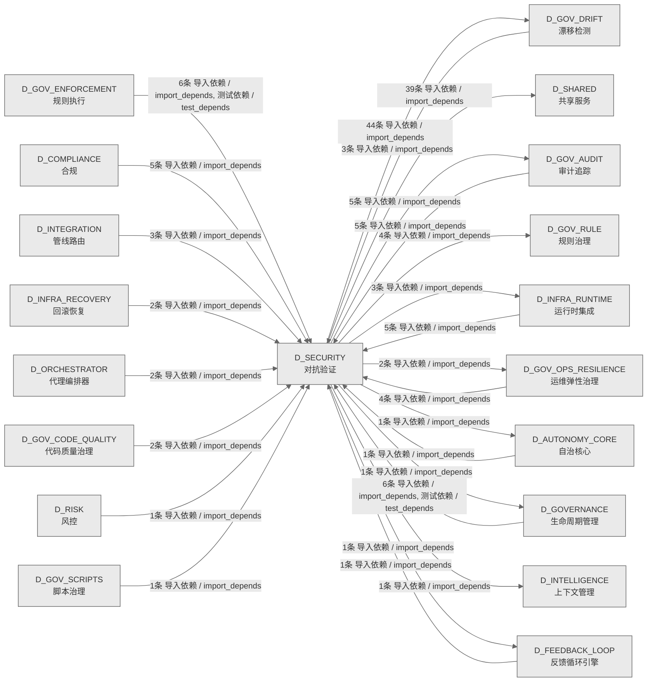

# 27_d_security / 对抗验证域 / Adversarial Validation

> **功能简介 / Overview**: 对抗验证，负责系统安全对抗测试、漏洞扫描和攻防验证

> **文档作用 / Purpose**: 展示 对抗验证（D_SECURITY）功能域的域内依赖关系、跨域依赖关系，模块信息（成熟度/中英文名/大白话/文件路径）内嵌于 Mermaid 节点，供架构审查和域治理参考。

> 本文档由 generate_domain_doc.py 从 depgraph (PostgreSQL) 自动生成
> 数据源: depgraph (PostgreSQL) nodes表 + edges表

> **[可缩放 HTML 版 / Zoomable HTML](http://localhost:8765/docs/02_enterprise_architecture/02_domain_architecture_docs/_zoomable_html/27_d_security.html)** — Ctrl+滚轮缩放 ｜ 双击重置 ｜ Ctrl+Shift+D 切换拖动/选择模式

## 域基本信息 / Domain Overview

| 字段 | 值 | Field | Value |
|------|------|-------|-------|
| 编号 | 27 | Number | 27 |
| 域ID | D_SECURITY | Domain ID | D_SECURITY |
| 域名称 | 对抗验证 | Domain Name | Adversarial Validation |
| 层级 | L1 基础平台层 | Layer | L1 Foundation |
| 模块数 | 166 | Module Count | 166 |
| 域内依赖 | 120 | Internal Dependencies | 120 |
| 跨域入边 | 47 | Cross-domain Incoming | 47 |
| 跨域出边 | 101 | Cross-domain Outgoing | 101 |
| 设计态模块 | 0 | Design Modules | 0 |
| 生产态模块 | 166 | Production Modules | 166 |
| 容量 | 166/150 (超容) | Capacity | 166/150 (超容) |
| 描述 | 孤儿文件检测(orphan_detector) | Description | 孤儿文件检测(orphan_detector) |

## 域内依赖图 / Internal Dependency Diagram

> 依赖图内嵌在本文档中，IDE 可直接渲染；网页版可 Ctrl+滚轮缩放 + 拖动平移查看细节。
>
> **图例说明 / Legend**：
> - 🟦 **蓝色 = 运营态模块**（production，已上线运行）
> - 🟧 **橙色虚线 = 设计态模块**（design，蓝图阶段，代码未写）
> - **实线箭头 = 运营态依赖**（已生效的依赖关系）
> - **虚线箭头 = 非运营态依赖**（计划中/验证中的依赖关系）

### 全景图（全部模块，颜色区分运营态/设计态）

> 展示全部 166 个模块（生产态 166 + 设计态 0），含跨域依赖外部节点。节点含成熟度+名称+大白话/简介+文件路径。

```mermaid
%%{init: {'theme': 'base', 'themeVariables': {'primaryColor': '#eaeaea', 'primaryTextColor': '#333333', 'primaryBorderColor': '#666666', 'lineColor': '#666666', 'secondaryColor': '#eaeaea', 'tertiaryColor': '#eaeaea', 'fontSize': '14px'}}}%%
flowchart TD
    src_zephyr_gov_drift_main_py["主入口<br/>防护安全风险与攻击（main）<br/>__main__<br/>文件: gov_drift/__main__.py<br/>(生产态 / production)"]
    src_zephyr_gov_drift_analysis_py["分析<br/>_analysis 聚合 — 分析与报告簇<br/>（功能域门面，ARCH-034）<br/>文件: gov_drift/_analysis.py<br/>(生产态 / production)"]
    src_zephyr_gov_drift_core_py["核心<br/>_core 聚合 — 核心引擎与状态机<br/>（功能域门面，ARCH-034）<br/>文件: gov_drift/_core.py<br/>(生产态 / production)"]
    src_zephyr_gov_drift_drift_py["漂移<br/>_drift 聚合 — 漂移检测器簇<br/>（功能域门面，ARCH-034）<br/>文件: gov_drift/_drift.py<br/>(生产态 / production)"]
    src_zephyr_gov_drift_infrastructure_py["基础设施<br/>_infrastructure 聚合 — 基础设施簇<br/>（功能域门面，ARCH-034）<br/>文件: gov_drift/_infrastructure.py<br/>(生产态 / production)"]
    src_zephyr_gov_drift_scanners_py["扫描器<br/>_scanners 聚合 — 扫描器与检查器簇<br/>（功能域门面，ARCH-034）<br/>文件: gov_drift/_scanners.py<br/>(生产态 / production)"]
    src_zephyr_governance_agent_rbac_contracts_py["契约<br/>RBAC 契约兼容转发层<br/>（G-CT-001），把角色权限契约符号 re-export 到<br/>agent-rbac 入口，老导入路径不用改。<br/>contracts<br/>文件: agent-rbac/contracts.py<br/>(生产态 / production)"]
    src_zephyr_red_blue_validator_init_py["zephyr/red_blue_validator 包入口<br/>直接调用 ss._import_time<br/>('zephyr.red_blue_validator')，要求该包可导入。<br/>文件: red_blue_validator/__init__.py<br/>(生产态 / production)"]
    src_zephyr_security_access_control_a2a_check_py["A2A检查<br/>A2A 通信对验证——校验两个 agent<br/>之间是否允许通信。<br/>a2a_check<br/>文件: access_control/a2a_check.py<br/>(生产态 / production)"]
    src_zephyr_security_access_control_adversarial_resilience_py["对抗韧性<br/>治本(2026-07-18): 重写以匹配 tests/agent_rbac<br/>/test_adversarial_resilience.py 契约.<br/>文件: access_control/adversarial_resilience.py<br/>(生产态 / production)"]
    src_zephyr_security_access_control_agent_creation_policy_py["代理creation策略<br/>子 agent 的能力数量 <= 父 agent 的能力数量<br/>（能力衰减，截断至前3项）<br/>agent_creation_policy<br/>文件: access_control/agent_creation_policy.py<br/>(生产态 / production)"]
    src_zephyr_security_access_control_approver_check_py["审批器check<br/>Approver authorization verifier —<br/>校验审批人是否有权执行请求的动作。<br/>approver_check<br/>文件: access_control/approver_check.py<br/>(生产态 / production)"]
    src_zephyr_security_access_control_asymmetric_audit_py["asymmetric审计<br/>治本(2026-07-19): 实现 require_quorum/approve<br/>以匹配 tests/agent_rbac/test_forensic_a.py 契约.<br/>文件: access_control/asymmetric_audit.py<br/>(生产态 / production)"]
    src_zephyr_security_access_control_auto_maintenance_py["自动maintenance<br/>AutoMaintenance — 自动维护与规则健康仪表盘.<br/>auto_maintenance<br/>文件: access_control/auto_maintenance.py<br/>(生产态 / production)"]
    src_zephyr_security_access_control_blueprint_fidelity_py["蓝图fidelity<br/>- 检查模块实现与蓝图定义的字段数是否一致<br/>blueprint_fidelity<br/>文件: access_control/blueprint_fidelity.py<br/>(生产态 / production)"]
    src_zephyr_security_access_control_build_sanitizer_py["构建清洗器<br/>构建产物清洗器（占位待实现），预留对构建产物做安<br/>全清洗的接口，当前 implementation pending。<br/>文件: access_control/build_sanitizer.py<br/>(生产态 / production)"]
    src_zephyr_security_access_control_cache_invalidation_py["缓存invalidation<br/>CacheInvalidation — 缓存失效事件管理.<br/>cache_invalidation<br/>文件: access_control/cache_invalidation.py<br/>(生产态 / production)"]
    src_zephyr_security_access_control_canary_rollout_manager_py["金丝雀rollout管理器<br/>- 注册灰度权限规则<br/>canary_rollout_manager<br/>文件: access_control/canary_rollout_manager.py<br/>(生产态 / production)"]
    src_zephyr_security_access_control_capability_check_py["能力检查<br/>Agent capability scope verification —<br/>拒绝受限能力声明、空能力声明及能力数量超限。<br/>capability_check<br/>文件: access_control/capability_check.py<br/>(生产态 / production)"]
    src_zephyr_security_access_control_cascading_failure_isolator_py["级联故障隔离器<br/>访问控制的隔离器，隔离故障防止扩散<br/>文件: access_control<br/>/cascading_failure_isolator.py<br/>(生产态 / production)"]
    src_zephyr_security_access_control_compliance_matrix_py["合规矩阵<br/>防护安全风险与攻击（compliance matrix）<br/>文件: access_control/compliance_matrix.py<br/>(生产态 / production)"]
    src_zephyr_security_access_control_cross_cutting_py["跨cutting<br/>- PermissionTopology: 权限拓扑图与循环检测<br/>cross_cutting<br/>文件: access_control/cross_cutting.py<br/>(生产态 / production)"]
    src_zephyr_security_access_control_decision_explainer_py["决策explainer<br/>DecisionExplainer — 拒绝决策的结构化解释器.<br/>decision_explainer<br/>文件: access_control/decision_explainer.py<br/>(生产态 / production)"]
    src_zephyr_security_access_control_decision_registry_py["决策注册表<br/>防护安全风险与攻击（decision registry）<br/>文件: access_control/decision_registry.py<br/>(生产态 / production)"]
    src_zephyr_security_access_control_defense_depth_py["防御深度<br/>防护安全风险与攻击（defense depth）<br/>文件: access_control/defense_depth.py<br/>(生产态 / production)"]
    src_zephyr_security_access_control_dependency_auditor_py["依赖审计器<br/>防护安全风险与攻击（dependency auditor）<br/>文件: access_control/dependency_auditor.py<br/>(生产态 / production)"]
    src_zephyr_security_access_control_derive_rbac_roles_py["RBACRoleDeriver — RBAC 角色派生器.<br/>从配置文件派生 RBAC 角色定义<br/>derive_rbac_roles<br/>文件: access_control/derive_rbac_roles.py<br/>(生产态 / production)"]
    src_zephyr_security_access_control_detectors_anomaly_detector_py["异常检测器<br/>治本(2026-07-19): 实现 feed() 以匹配 tests<br/>/agent_rbac/test_crosscut_d.py 契约.<br/>文件: detectors/anomaly_detector.py<br/>(生产态 / production)"]
    src_zephyr_security_access_control_detectors_context_drift_detector_py["上下文漂移检测器<br/>ContextDriftDetector — 上下文漂移与范围蔓延检测.<br/>context_drift_detector<br/>文件: detectors/context_drift_detector.py<br/>(生产态 / production)"]
    src_zephyr_security_access_control_detectors_cross_session_detector_py["跨会话检测器<br/>检测跨 session 身份盗用（agent_id<br/>与签名时不一致）<br/>cross_session_detector<br/>文件: detectors/cross_session_detector.py<br/>(生产态 / production)"]
    src_zephyr_security_access_control_detectors_false_completion_detector_py["falsecompletion检测器<br/>- 检测 agent 声称完成但实际产出不足的情况<br/>false_completion_detector<br/>文件: detectors/false_completion_detector.py<br/>(生产态 / production)"]
    src_zephyr_security_access_control_detectors_multi_agent_collusion_detector_py["多代理collusion检测器<br/>记录 agent 间交互（含通道与证据）<br/>multi_agent_collusion_detector<br/>文件: detectors<br/>/multi_agent_collusion_detector.py<br/>(生产态 / production)"]
    src_zephyr_security_access_control_detectors_shell_dialect_detector_py["shelldialect检测器<br/>检测命令字符串的 shell 方言（bash/powershell<br/>/sh）<br/>shell_dialect_detector<br/>文件: detectors/shell_dialect_detector.py<br/>(生产态 / production)"]
    src_zephyr_security_access_control_dry_run_py["dry运行<br/>DryRun — 权限模拟与影响分析.<br/>dry_run<br/>文件: access_control/dry_run.py<br/>(生产态 / production)"]
    src_zephyr_security_access_control_emergency_override_py["紧急override<br/>EmergencyOverride — 紧急覆盖令牌管理.<br/>emergency_override<br/>文件: access_control/emergency_override.py<br/>(生产态 / production)"]
    src_zephyr_security_access_control_environment_manager_py["环境管理器<br/>防护安全风险与攻击（environment）<br/>文件: access_control/environment_manager.py<br/>(生产态 / production)"]
    src_zephyr_security_access_control_escalation_handler_py["升级处理器<br/>防护安全风险与攻击（escalation）<br/>文件: access_control/escalation_handler.py<br/>(生产态 / production)"]
    src_zephyr_security_access_control_exceptions_py["异常<br/>防护安全风险与攻击（exceptions）<br/>文件: access_control/exceptions.py<br/>(生产态 / production)"]
    src_zephyr_security_access_control_genesis_bootstrap_py["genesis自举<br/>启动引导序列，按 5 阶段启动从 COLD_START_LOCK<br/>到 BOOTSTRAP_SUCCESS。<br/>genesis_bootstrap<br/>文件: access_control/genesis_bootstrap.py<br/>(生产态 / production)"]
    src_zephyr_security_access_control_guard_layers_py["守卫layers<br/>防护安全风险与攻击（guard layers）<br/>guard_layers<br/>文件: access_control/guard_layers.py<br/>(生产态 / production)"]
    src_zephyr_security_access_control_guards_abac_guard_py["abac守卫<br/>ABACGuard — 基于属性的权限守卫.<br/>abac_guard<br/>文件: guards/abac_guard.py<br/>(生产态 / production)"]
    src_zephyr_security_access_control_guards_anti_pattern_guard_py["antipattern守卫<br/>反模式守卫，stub 占位模块待实现。<br/>文件: guards/anti_pattern_guard.py<br/>(生产态 / production)"]
    src_zephyr_security_access_control_guards_audit_log_guard_py["审计日志守卫<br/>审计日志注入防护守卫<br/>audit_log_guard<br/>文件: guards/audit_log_guard.py<br/>(生产态 / production)"]
    src_zephyr_security_access_control_guards_cybersec_2026_guard_py["cybersec2026守卫<br/>Cybersec2026Guard — 2026 网络安全威胁检测.<br/>cybersec_2026_guard<br/>文件: guards/cybersec_2026_guard.py<br/>(生产态 / production)"]
    src_zephyr_security_access_control_guards_input_guard_py["输入守卫<br/>- 检测危险命令模式（rm -rf / 等）<br/>input_guard<br/>文件: guards/input_guard.py<br/>(生产态 / production)"]
    src_zephyr_security_access_control_guards_memory_guard_py["记忆守卫<br/>- 限制 agent 的内存访问大小<br/>memory_guard<br/>文件: guards/memory_guard.py<br/>(生产态 / production)"]
    src_zephyr_security_access_control_guards_memory_provenance_guard_py["记忆溯源守卫<br/>MemoryProvenanceGuard — 记忆来源溯源守卫.<br/>memory_provenance_guard<br/>文件: guards/memory_provenance_guard.py<br/>(生产态 / production)"]
    src_zephyr_security_access_control_guards_native_api_guard_py["nativeAPI守卫<br/>检测代码中的原生 API 调用（ctypes, dlopen, mmap<br/>等）<br/>native_api_guard<br/>文件: guards/native_api_guard.py<br/>(生产态 / production)"]
    src_zephyr_security_access_control_guards_novel_attack_guard_py["novel攻击守卫<br/>NovelAttackGuard — 新型攻击行为画像.<br/>novel_attack_guard<br/>文件: guards/novel_attack_guard.py<br/>(生产态 / production)"]
    src_zephyr_security_access_control_guards_output_guard_py["output守卫<br/>- 检测输出中的 PII（个人身份信息）<br/>output_guard<br/>文件: guards/output_guard.py<br/>(生产态 / production)"]
    src_zephyr_security_access_control_guards_path_guard_py["路径守卫<br/>检查路径是否在允许/禁止范围内<br/>path_guard<br/>文件: guards/path_guard.py<br/>(生产态 / production)"]
    src_zephyr_security_access_control_guards_replay_attack_guard_py["replay攻击守卫<br/>维护已见 nonce 集合，安全防护<br/>replay_attack_guard<br/>文件: guards/replay_attack_guard.py<br/>(生产态 / production)"]
    src_zephyr_security_access_control_guards_rule_injection_guard_py["规则注入守卫<br/>- 检测规则内容中的代码注入模式<br/>rule_injection_guard<br/>文件: guards/rule_injection_guard.py<br/>(生产态 / production)"]
    src_zephyr_security_access_control_guards_sequence_guard_py["sequence守卫<br/>- 检测禁止的操作序列（数据外泄、权限提升等）<br/>sequence_guard<br/>文件: guards/sequence_guard.py<br/>(生产态 / production)"]
    src_zephyr_security_access_control_guards_toctou_guard_py["TOCTOU守卫<br/>对文件做快照（mtime, size, hash，安全防护<br/>toctou_guard<br/>文件: guards/toctou_guard.py<br/>(生产态 / production)"]
    src_zephyr_security_access_control_guards_vibe_coding_guard_py["vibecoding守卫<br/>检测代码中的危险模式（HACK/FIXME/bypass<br/>/allow_all 等）<br/>vibe_coding_guard<br/>文件: guards/vibe_coding_guard.py<br/>(生产态 / production)"]
    src_zephyr_security_access_control_integration_py["集成<br/>治本(2026-07-18): 重写以匹配 tests/agent_rbac<br/>/test_integration_root.py 契约.<br/>文件: access_control/integration.py<br/>(生产态 / production)"]
    src_zephyr_security_access_control_integrity_self_check_py["完整性自检查<br/>检查所有模块完整性<br/>integrity_self_check<br/>文件: access_control/integrity_self_check.py<br/>(生产态 / production)"]
    src_zephyr_security_access_control_intent_binder_py["IntentBinder — 意图绑定与漂移检测.<br/>- 声明 agent 对文件的任务意图与预期操作集<br/>intent_binder<br/>文件: access_control/intent_binder.py<br/>(生产态 / production)"]
    src_zephyr_security_access_control_key_hierarchy_py["密钥hierarchy<br/>密钥层级管理（占位待实现），预留多级密钥派生与轮<br/>换接口，当前 implementation pending。<br/>文件: access_control/key_hierarchy.py<br/>(生产态 / production)"]
    src_zephyr_security_access_control_legal_audit_chain_py["legal审计chain<br/>治本(2026-07-19): 实现 append/verify 以匹配<br/>tests/agent_rbac/test_forensic_c.py 契约.<br/>文件: access_control/legal_audit_chain.py<br/>(生产态 / production)"]
    src_zephyr_security_access_control_microstructure_defense_py["微结构防御——对抗做市<br/>/交易微结构攻击的策略与保真度因子。<br/>交易微结构攻击防御，定义 spoofing/layering 等 5<br/>类威胁的反制策略，并基于成交概率/滑点<br/>/盘口深度给出保真度综合评分。<br/>microstructure_defense<br/>文件: access_control/microstructure_defense.py<br/>(生产态 / production)"]
    src_zephyr_security_access_control_monotonic_clock_py["MonotonicClock — 单调时钟.<br/>提供单调递增的时间戳<br/>monotonic_clock<br/>文件: access_control/monotonic_clock.py<br/>(生产态 / production)"]
    src_zephyr_security_access_control_non_repudiation_py["NonRepudiation — 不可抵赖性审计签名.<br/>- 对 agent 操作进行 HMAC<br/>签名，确保审计日志不可抵赖<br/>non_repudiation<br/>文件: access_control/non_repudiation.py<br/>(生产态 / production)"]
    src_zephyr_security_access_control_observability_py["可观测性<br/>ObservabilityReporter — 指标上报与异常检测.<br/>文件: access_control/observability.py<br/>(生产态 / production)"]
    src_zephyr_security_access_control_orphan_judge_main_py["主入口<br/>孤儿判定的命令行入口，可以直接 python -m<br/>跑起来执行主流程。<br/>__main__<br/>文件: orphan_judge/__main__.py<br/>(生产态 / production)"]
    src_zephyr_security_access_control_orphan_judge_config_loader_py["配置加载器<br/>孤儿判定引擎配置加载器，load/save/reload<br/>OrphanJudgeConfig，是配置 SSoT，YAML schema<br/>变更需同步 blueprint。<br/>config_loader<br/>文件: orphan_judge/config_loader.py<br/>(生产态 / production)"]
    src_zephyr_security_access_control_orphan_judge_drift_bridge_py["漂移桥接<br/>漂移检测桥接层，不实现检测逻辑，仅转发到<br/>DriftDetector.trigger_recovery，供孤儿判定做<br/>starve/stale 判定。<br/>drift_bridge<br/>文件: orphan_judge/drift_bridge.py<br/>(生产态 / production)"]
    src_zephyr_security_access_control_orphan_judge_escalation_bridge_py["升级桥接<br/>层，不实现升级逻辑，仅转发到<br/>EscalationEngine.evaluate +<br/>escalate，供孤儿判定做 ESCALATE 判决<br/>escalation_bridge<br/>文件: orphan_judge/escalation_bridge.py<br/>(生产态 / production)"]
    src_zephyr_security_access_control_orphan_judge_feedback_bridge_py["反馈桥接<br/>误判反馈桥接层，不实现反馈逻辑，仅转发到<br/>FeedbackLoop.analyze_pending +<br/>generate_proposals，把误判样本回灌学习。<br/>feedback_bridge<br/>文件: orphan_judge/feedback_bridge.py<br/>(生产态 / production)"]
    src_zephyr_security_access_control_orphan_judge_kb_bridge_py["kb桥接<br/>知识库桥接层，不实现 KB 逻辑，仅转发到<br/>UnifiedMemoryAPI.write +<br/>search，把判定记录写入统一记忆并支持历史查询。<br/>kb_bridge<br/>文件: orphan_judge/kb_bridge.py<br/>(生产态 / production)"]
    src_zephyr_security_access_control_orphan_judge_mcp_integration_py["MCP集成<br/>MCP 工具注册器，把孤儿判定能力（单文件判定<br/>/目录批量扫描）注册为 MCP 工具，供外部 agent<br/>调用。<br/>mcp_integration<br/>文件: orphan_judge/mcp_integration.py<br/>(生产态 / production)"]
    src_zephyr_security_access_control_orphan_judge_orphan_collector_py["孤儿采集器<br/>孤儿文件收集与处置器——整合 SafetyFence<br/>安全检查后执行处置动作。<br/>orphan_collector<br/>文件: orphan_judge/orphan_collector.py<br/>(生产态 / production)"]
    src_zephyr_security_access_control_orphan_judge_orphan_detector_py["(INVARIANTS) 蓝图 §4 文件清单与代码双向对齐<br/>孤儿检测器，检测蓝图文件清单与代码不对齐的孤儿模<br/>块<br/>orphan_detector<br/>文件: orphan_judge/orphan_detector.py<br/>(生产态 / production)"]
    src_zephyr_security_access_control_orphan_judge_rbac_bridge_py["RBAC桥接<br/>RBAC 权限桥接层，不实现权限逻辑，仅转发到<br/>PermissionGuard.check，删除文件前校验是否有删除<br/>权限，桥接失败默认拒绝。<br/>rbac_bridge<br/>文件: orphan_judge/rbac_bridge.py<br/>(生产态 / production)"]
    src_zephyr_security_access_control_orphan_judge_reference_graph_engine_py["referencegraph引擎<br/>AST解析+import链遍历，判断文件是否被其他文件引用<br/>。<br/>reference_graph_engine<br/>文件: orphan_judge/reference_graph_engine.py<br/>(生产态 / production)"]
    src_zephyr_security_access_control_orphan_judge_registration_checker_py["扫描项目注册表，判断文件是否已登记在册。<br/>L0 注册检查器，扫描项目注册表判断文件是否已登记<br/>在册，作为孤儿判定的第一道关卡。<br/>registration_checker<br/>文件: orphan_judge/registration_checker.py<br/>(生产态 / production)"]
    src_zephyr_security_access_control_orphan_judge_report_generator_py["报告生成器<br/>孤儿判定报告生成器，支持 JSON/CSV/Markdown<br/>三种格式输出判决结果，并提供汇总摘要文本。<br/>report_generator<br/>文件: orphan_judge/report_generator.py<br/>(生产态 / production)"]
    src_zephyr_security_access_control_orphan_judge_standalone_evaluator_py["六指标加权评分: 文件大小(15%) + 代码行数(20%) +<br/>定义数(20%<br/>+ 文档注释(10%) + 测试存在(10%) + 导入复杂度<br/>(25%)<br/>standalone_evaluator<br/>文件: orphan_judge/standalone_evaluator.py<br/>(生产态 / production)"]
    src_zephyr_security_access_control_orphan_judge_swid_tag_py["SWID标签<br/>SWID 软件标签生成器，为判定记录生成标签标注文件<br/>来源和判决归属，便于追溯。<br/>swid_tag<br/>文件: orphan_judge/swid_tag.py<br/>(生产态 / production)"]
    src_zephyr_security_access_control_orphan_judge_unique_analyzer_py["AST节点比对，检测文件中的独特代码元素(类/函数<br/>/常量定义等)。<br/>L3 独特价值分析器，用 AST<br/>节点比对检测文件中的独特代码元素（类/函数<br/>/常量定义），判断文件是否有不可替代的独立价值。<br/>unique_analyzer<br/>文件: orphan_judge/unique_analyzer.py<br/>(生产态 / production)"]
    src_zephyr_security_access_control_permission_hooks_py["权限钩子<br/>- 注册权限检查生命周期钩子<br/>permission_hooks<br/>文件: access_control/permission_hooks.py<br/>(生产态 / production)"]
    src_zephyr_security_access_control_permission_mode_manager_py["权限mode管理器<br/>防护安全风险与攻击（permission mode）<br/>文件: access_control/permission_mode_manager.py<br/>(生产态 / production)"]
    src_zephyr_security_access_control_phase_executor_py["阶段执行器<br/>访问控制（phase executor）<br/>phase_executor<br/>文件: access_control/phase_executor.py<br/>(生产态 / production)"]
    src_zephyr_security_access_control_risk_mitigation_py["风险mitigation<br/>RiskMitigation — 风险评估与缓解策略.<br/>risk_mitigation<br/>文件: access_control/risk_mitigation.py<br/>(生产态 / production)"]
    src_zephyr_security_access_control_rollback_sandbox_py["回滚沙箱<br/>治本(2026-07-19): 实现 isolate/execute/rollback<br/>以匹配 tests/agent_rbac/test_forensic_c.py 契约.<br/>文件: access_control/rollback_sandbox.py<br/>(生产态 / production)"]
    src_zephyr_security_access_control_secrets_lifecycle_py["密钥生命周期<br/>安全防护（secrets lifecycle）<br/>文件: access_control/secrets_lifecycle.py<br/>(生产态 / production)"]
    src_zephyr_security_access_control_session_concurrency_py["会话并发<br/>Session 级并发协调模块（P2-SES 落地）。<br/>session_concurrency<br/>文件: access_control/session_concurrency.py<br/>(生产态 / production)"]
    src_zephyr_security_access_control_session_lifecycle_py["会话生命周期<br/>安全防护（session lifecycle）<br/>文件: access_control/session_lifecycle.py<br/>(生产态 / production)"]
    src_zephyr_security_access_control_verifiers_bootstrap_verifier_py["自举验证器<br/>校验一致性（bootstrap verifier）<br/>文件: verifiers/bootstrap_verifier.py<br/>(生产态 / production)"]
    src_zephyr_security_access_control_verifiers_continuous_verifier_py["continuous验证器<br/>持续验证器，stub 占位模块待实现。<br/>文件: verifiers/continuous_verifier.py<br/>(生产态 / production)"]
    src_zephyr_security_access_control_verifiers_contract_verifier_py["契约验证器<br/>校验一致性（contract verifier）<br/>contract_verifier<br/>文件: verifiers/contract_verifier.py<br/>(生产态 / production)"]
    src_zephyr_security_access_control_verifiers_micro_verifier_py["micro验证器<br/>防护安全风险与攻击（micro verifier）<br/>文件: verifiers/micro_verifier.py<br/>(生产态 / production)"]
    src_zephyr_security_access_control_verifiers_post_action_verifier_py["提交动作验证器<br/>校验一致性（post action verifier）<br/>文件: verifiers/post_action_verifier.py<br/>(生产态 / production)"]
    src_zephyr_security_adversarial_validation_main_py["主入口<br/>对抗验证的命令行入口，可以直接 python -m<br/>跑起来执行主流程。<br/>__main__<br/>文件: adversarial_validation/__main__.py<br/>(生产态 / production)"]
    src_zephyr_security_adversarial_validation_ai_attack_generator_py["ai攻击generator<br/>AIattack生成器，对抗验证的异常，定义本模块的异常<br/>类型。<br/>ai_attack_generator<br/>文件: adversarial_validation<br/>/ai_attack_generator.py<br/>(生产态 / production)"]
    src_zephyr_security_adversarial_validation_async_monitor_py["异步监控<br/>对抗验证的监控器，持续监视某项指标，异常时上报<br/>async_monitor<br/>文件: adversarial_validation/async_monitor.py<br/>(生产态 / production)"]
    src_zephyr_security_adversarial_validation_attack_registry_py["攻击注册表<br/>攻击场景注册表，register<br/>登记攻击、query_by_tier 按层级查询、count<br/>计数，蓝图文件清单与代码双向对齐。<br/>attack_registry<br/>文件: adversarial_validation/attack_registry.py<br/>(生产态 / production)"]
    src_zephyr_security_adversarial_validation_commit_trigger_py["提交触发器<br/>把 GitCommitGateway 的 post-commit<br/>事件桥接到红蓝对抗验证器，锁内轻量 emit<br/>触发提交后的对抗验证会话<br/>commit_trigger<br/>文件: adversarial_validation/commit_trigger.py<br/>(生产态 / production)"]
    src_zephyr_security_adversarial_validation_constitution_engine_py["constitution引擎<br/>对抗验证的注册表，登记和查询已注册的条目<br/>constitution_engine<br/>文件: adversarial_validation<br/>/constitution_engine.py<br/>(生产态 / production)"]
    src_zephyr_security_adversarial_validation_game_day_scheduler_py["gameday调度器<br/>对抗验证的调度器，按时间或优先级安排任务执行<br/>game_day_scheduler<br/>文件: adversarial_validation<br/>/game_day_scheduler.py<br/>(生产态 / production)"]
    src_zephyr_security_adversarial_validation_injection_engine_py["注入引擎<br/>故障注入引擎，按 blast_radius<br/>控制爆炸半径，注入延迟/错误/崩溃<br/>/退出码四类故障，含备份恢复与完整性校验。<br/>injection_engine<br/>文件: adversarial_validation/injection_engine.py<br/>(生产态 / production)"]
    src_zephyr_security_adversarial_validation_mcp_endpoints_py["MCP端点<br/>对抗验证的异常，定义本模块的异常类型（mcp<br/>endpoints）<br/>mcp_endpoints<br/>文件: adversarial_validation/mcp_endpoints.py<br/>(生产态 / production)"]
    src_zephyr_security_adversarial_validation_validator_event_bridge_py["校验器事件桥接<br/>ValidatorEventBridge — 红蓝验证器事件桥接<br/>(MOD-SEC-030).<br/>validator_event_bridge<br/>文件: adversarial_validation<br/>/validator_event_bridge.py<br/>(生产态 / production)"]
    src_zephyr_security_llm_defense_llm_security_dashboard_app_py["应用<br/>提供实时安全监控、攻击检测统计、载荷分析、系统健<br/>康状态的可视化界面。<br/>文件: dashboard/app.py<br/>(生产态 / production)"]
    src_zephyr_security_llm_defense_llm_security_layers_l6_data_flow_py["l6数据流<br/>主要提供校验、检查pii、执行encryption等功能<br/>l6_data_flow<br/>文件: layers/l6_data_flow.py<br/>(生产态 / production)"]
    src_zephyr_security_llm_defense_llm_security_layers_l8_compliance_py["l8合规<br/>主要提供校验、检查策略、执行合规等功能<br/>l8_compliance<br/>文件: layers/l8_compliance.py<br/>(生产态 / production)"]
    src_zephyr_security_llm_defense_llm_security_process_sandbox_py["进程沙箱<br/>权限层级 : Immutable Core（沙箱核心逻辑）<br/>process_sandbox<br/>文件: llm_security/process_sandbox.py<br/>(生产态 / production)"]
    src_zephyr_security_llm_defense_llm_security_self_protection_adversarial_mutator_py["对抗变更器<br/>对抗变异生成器 — 对 Red Team 载荷施加 10<br/>种变异技术，检验 LSG 抗干扰能力.<br/>adversarial_mutator<br/>文件: self_protection/adversarial_mutator.py<br/>(生产态 / production)"]
    src_zephyr_security_llm_defense_llm_security_self_protection_red_team_scanner_py["red团队扫描器<br/>防护安全风险与攻击（red team）<br/>red_team_scanner<br/>文件: self_protection/red_team_scanner.py<br/>(生产态 / production)"]
    src_zephyr_gov_drift_main_py ~~~ src_zephyr_gov_drift_analysis_py
    src_zephyr_gov_drift_analysis_py ~~~ src_zephyr_gov_drift_core_py
    src_zephyr_gov_drift_core_py ~~~ src_zephyr_gov_drift_drift_py
    src_zephyr_gov_drift_drift_py ~~~ src_zephyr_gov_drift_infrastructure_py
    src_zephyr_gov_drift_infrastructure_py ~~~ src_zephyr_gov_drift_scanners_py
    src_zephyr_gov_drift_scanners_py ~~~ src_zephyr_governance_agent_rbac_contracts_py
    src_zephyr_governance_agent_rbac_contracts_py ~~~ src_zephyr_red_blue_validator_init_py
    src_zephyr_red_blue_validator_init_py ~~~ src_zephyr_security_access_control_a2a_check_py
    src_zephyr_security_access_control_a2a_check_py ~~~ src_zephyr_security_access_control_adversarial_resilience_py
    src_zephyr_security_access_control_adversarial_resilience_py ~~~ src_zephyr_security_access_control_agent_creation_policy_py
    src_zephyr_security_access_control_agent_creation_policy_py ~~~ src_zephyr_security_access_control_approver_check_py
    src_zephyr_security_access_control_approver_check_py ~~~ src_zephyr_security_access_control_asymmetric_audit_py
    src_zephyr_security_access_control_asymmetric_audit_py ~~~ src_zephyr_security_access_control_auto_maintenance_py
    src_zephyr_security_access_control_auto_maintenance_py ~~~ src_zephyr_security_access_control_blueprint_fidelity_py
    src_zephyr_security_access_control_blueprint_fidelity_py ~~~ src_zephyr_security_access_control_build_sanitizer_py
    src_zephyr_security_access_control_build_sanitizer_py ~~~ src_zephyr_security_access_control_cache_invalidation_py
    src_zephyr_security_access_control_cache_invalidation_py ~~~ src_zephyr_security_access_control_canary_rollout_manager_py
    src_zephyr_security_access_control_canary_rollout_manager_py ~~~ src_zephyr_security_access_control_capability_check_py
    src_zephyr_security_access_control_capability_check_py ~~~ src_zephyr_security_access_control_cascading_failure_isolator_py
    src_zephyr_security_access_control_cascading_failure_isolator_py ~~~ src_zephyr_security_access_control_compliance_matrix_py
    src_zephyr_security_access_control_compliance_matrix_py ~~~ src_zephyr_security_access_control_cross_cutting_py
    src_zephyr_security_access_control_cross_cutting_py ~~~ src_zephyr_security_access_control_decision_explainer_py
    src_zephyr_security_access_control_decision_explainer_py ~~~ src_zephyr_security_access_control_decision_registry_py
    src_zephyr_security_access_control_decision_registry_py ~~~ src_zephyr_security_access_control_defense_depth_py
    src_zephyr_security_access_control_defense_depth_py ~~~ src_zephyr_security_access_control_dependency_auditor_py
    src_zephyr_security_access_control_dependency_auditor_py ~~~ src_zephyr_security_access_control_derive_rbac_roles_py
    src_zephyr_security_access_control_derive_rbac_roles_py ~~~ src_zephyr_security_access_control_detectors_anomaly_detector_py
    src_zephyr_security_access_control_detectors_anomaly_detector_py ~~~ src_zephyr_security_access_control_detectors_context_drift_detector_py
    src_zephyr_security_access_control_detectors_context_drift_detector_py ~~~ src_zephyr_security_access_control_detectors_cross_session_detector_py
    src_zephyr_security_access_control_detectors_cross_session_detector_py ~~~ src_zephyr_security_access_control_detectors_false_completion_detector_py
    src_zephyr_security_access_control_detectors_false_completion_detector_py ~~~ src_zephyr_security_access_control_detectors_multi_agent_collusion_detector_py
    src_zephyr_security_access_control_detectors_multi_agent_collusion_detector_py ~~~ src_zephyr_security_access_control_detectors_shell_dialect_detector_py
    src_zephyr_security_access_control_detectors_shell_dialect_detector_py ~~~ src_zephyr_security_access_control_dry_run_py
    src_zephyr_security_access_control_dry_run_py ~~~ src_zephyr_security_access_control_emergency_override_py
    src_zephyr_security_access_control_emergency_override_py ~~~ src_zephyr_security_access_control_environment_manager_py
    src_zephyr_security_access_control_environment_manager_py ~~~ src_zephyr_security_access_control_escalation_handler_py
    src_zephyr_security_access_control_escalation_handler_py ~~~ src_zephyr_security_access_control_exceptions_py
    src_zephyr_security_access_control_exceptions_py ~~~ src_zephyr_security_access_control_genesis_bootstrap_py
    src_zephyr_security_access_control_genesis_bootstrap_py ~~~ src_zephyr_security_access_control_guard_layers_py
    src_zephyr_security_access_control_guard_layers_py ~~~ src_zephyr_security_access_control_guards_abac_guard_py
    src_zephyr_security_access_control_guards_abac_guard_py ~~~ src_zephyr_security_access_control_guards_anti_pattern_guard_py
    src_zephyr_security_access_control_guards_anti_pattern_guard_py ~~~ src_zephyr_security_access_control_guards_audit_log_guard_py
    src_zephyr_security_access_control_guards_audit_log_guard_py ~~~ src_zephyr_security_access_control_guards_cybersec_2026_guard_py
    src_zephyr_security_access_control_guards_cybersec_2026_guard_py ~~~ src_zephyr_security_access_control_guards_input_guard_py
    src_zephyr_security_access_control_guards_input_guard_py ~~~ src_zephyr_security_access_control_guards_memory_guard_py
    src_zephyr_security_access_control_guards_memory_guard_py ~~~ src_zephyr_security_access_control_guards_memory_provenance_guard_py
    src_zephyr_security_access_control_guards_memory_provenance_guard_py ~~~ src_zephyr_security_access_control_guards_native_api_guard_py
    src_zephyr_security_access_control_guards_native_api_guard_py ~~~ src_zephyr_security_access_control_guards_novel_attack_guard_py
    src_zephyr_security_access_control_guards_novel_attack_guard_py ~~~ src_zephyr_security_access_control_guards_output_guard_py
    src_zephyr_security_access_control_guards_output_guard_py ~~~ src_zephyr_security_access_control_guards_path_guard_py
    src_zephyr_security_access_control_guards_path_guard_py ~~~ src_zephyr_security_access_control_guards_replay_attack_guard_py
    src_zephyr_security_access_control_guards_replay_attack_guard_py ~~~ src_zephyr_security_access_control_guards_rule_injection_guard_py
    src_zephyr_security_access_control_guards_rule_injection_guard_py ~~~ src_zephyr_security_access_control_guards_sequence_guard_py
    src_zephyr_security_access_control_guards_sequence_guard_py ~~~ src_zephyr_security_access_control_guards_toctou_guard_py
    src_zephyr_security_access_control_guards_toctou_guard_py ~~~ src_zephyr_security_access_control_guards_vibe_coding_guard_py
    src_zephyr_security_access_control_guards_vibe_coding_guard_py ~~~ src_zephyr_security_access_control_integration_py
    src_zephyr_security_access_control_integration_py ~~~ src_zephyr_security_access_control_integrity_self_check_py
    src_zephyr_security_access_control_integrity_self_check_py ~~~ src_zephyr_security_access_control_intent_binder_py
    src_zephyr_security_access_control_intent_binder_py ~~~ src_zephyr_security_access_control_key_hierarchy_py
    src_zephyr_security_access_control_key_hierarchy_py ~~~ src_zephyr_security_access_control_legal_audit_chain_py
    src_zephyr_security_access_control_legal_audit_chain_py ~~~ src_zephyr_security_access_control_microstructure_defense_py
    src_zephyr_security_access_control_microstructure_defense_py ~~~ src_zephyr_security_access_control_monotonic_clock_py
    src_zephyr_security_access_control_monotonic_clock_py ~~~ src_zephyr_security_access_control_non_repudiation_py
    src_zephyr_security_access_control_non_repudiation_py ~~~ src_zephyr_security_access_control_observability_py
    src_zephyr_security_access_control_observability_py ~~~ src_zephyr_security_access_control_orphan_judge_main_py
    src_zephyr_security_access_control_orphan_judge_main_py ~~~ src_zephyr_security_access_control_orphan_judge_config_loader_py
    src_zephyr_security_access_control_orphan_judge_config_loader_py ~~~ src_zephyr_security_access_control_orphan_judge_drift_bridge_py
    src_zephyr_security_access_control_orphan_judge_drift_bridge_py ~~~ src_zephyr_security_access_control_orphan_judge_escalation_bridge_py
    src_zephyr_security_access_control_orphan_judge_escalation_bridge_py ~~~ src_zephyr_security_access_control_orphan_judge_feedback_bridge_py
    src_zephyr_security_access_control_orphan_judge_feedback_bridge_py ~~~ src_zephyr_security_access_control_orphan_judge_kb_bridge_py
    src_zephyr_security_access_control_orphan_judge_kb_bridge_py ~~~ src_zephyr_security_access_control_orphan_judge_mcp_integration_py
    src_zephyr_security_access_control_orphan_judge_mcp_integration_py ~~~ src_zephyr_security_access_control_orphan_judge_orphan_collector_py
    src_zephyr_security_access_control_orphan_judge_orphan_collector_py ~~~ src_zephyr_security_access_control_orphan_judge_orphan_detector_py
    src_zephyr_security_access_control_orphan_judge_orphan_detector_py ~~~ src_zephyr_security_access_control_orphan_judge_rbac_bridge_py
    src_zephyr_security_access_control_orphan_judge_rbac_bridge_py ~~~ src_zephyr_security_access_control_orphan_judge_reference_graph_engine_py
    src_zephyr_security_access_control_orphan_judge_reference_graph_engine_py ~~~ src_zephyr_security_access_control_orphan_judge_registration_checker_py
    src_zephyr_security_access_control_orphan_judge_registration_checker_py ~~~ src_zephyr_security_access_control_orphan_judge_report_generator_py
    src_zephyr_security_access_control_orphan_judge_report_generator_py ~~~ src_zephyr_security_access_control_orphan_judge_standalone_evaluator_py
    src_zephyr_security_access_control_orphan_judge_standalone_evaluator_py ~~~ src_zephyr_security_access_control_orphan_judge_swid_tag_py
    src_zephyr_security_access_control_orphan_judge_swid_tag_py ~~~ src_zephyr_security_access_control_orphan_judge_unique_analyzer_py
    src_zephyr_security_access_control_orphan_judge_unique_analyzer_py ~~~ src_zephyr_security_access_control_permission_hooks_py
    src_zephyr_security_access_control_permission_hooks_py ~~~ src_zephyr_security_access_control_permission_mode_manager_py
    src_zephyr_security_access_control_permission_mode_manager_py ~~~ src_zephyr_security_access_control_phase_executor_py
    src_zephyr_security_access_control_phase_executor_py ~~~ src_zephyr_security_access_control_risk_mitigation_py
    src_zephyr_security_access_control_risk_mitigation_py ~~~ src_zephyr_security_access_control_rollback_sandbox_py
    src_zephyr_security_access_control_rollback_sandbox_py ~~~ src_zephyr_security_access_control_secrets_lifecycle_py
    src_zephyr_security_access_control_secrets_lifecycle_py ~~~ src_zephyr_security_access_control_session_concurrency_py
    src_zephyr_security_access_control_session_concurrency_py ~~~ src_zephyr_security_access_control_session_lifecycle_py
    src_zephyr_security_access_control_session_lifecycle_py ~~~ src_zephyr_security_access_control_verifiers_bootstrap_verifier_py
    src_zephyr_security_access_control_verifiers_bootstrap_verifier_py ~~~ src_zephyr_security_access_control_verifiers_continuous_verifier_py
    src_zephyr_security_access_control_verifiers_continuous_verifier_py ~~~ src_zephyr_security_access_control_verifiers_contract_verifier_py
    src_zephyr_security_access_control_verifiers_contract_verifier_py ~~~ src_zephyr_security_access_control_verifiers_micro_verifier_py
    src_zephyr_security_access_control_verifiers_micro_verifier_py ~~~ src_zephyr_security_access_control_verifiers_post_action_verifier_py
    src_zephyr_security_access_control_verifiers_post_action_verifier_py ~~~ src_zephyr_security_adversarial_validation_main_py
    src_zephyr_security_adversarial_validation_main_py ~~~ src_zephyr_security_adversarial_validation_ai_attack_generator_py
    src_zephyr_security_adversarial_validation_ai_attack_generator_py ~~~ src_zephyr_security_adversarial_validation_async_monitor_py
    src_zephyr_security_adversarial_validation_async_monitor_py ~~~ src_zephyr_security_adversarial_validation_attack_registry_py
    src_zephyr_security_adversarial_validation_attack_registry_py ~~~ src_zephyr_security_adversarial_validation_commit_trigger_py
    src_zephyr_security_adversarial_validation_commit_trigger_py ~~~ src_zephyr_security_adversarial_validation_constitution_engine_py
    src_zephyr_security_adversarial_validation_constitution_engine_py ~~~ src_zephyr_security_adversarial_validation_game_day_scheduler_py
    src_zephyr_security_adversarial_validation_game_day_scheduler_py ~~~ src_zephyr_security_adversarial_validation_injection_engine_py
    src_zephyr_security_adversarial_validation_injection_engine_py ~~~ src_zephyr_security_adversarial_validation_mcp_endpoints_py
    src_zephyr_security_adversarial_validation_mcp_endpoints_py ~~~ src_zephyr_security_adversarial_validation_validator_event_bridge_py
    src_zephyr_security_adversarial_validation_validator_event_bridge_py ~~~ src_zephyr_security_llm_defense_llm_security_dashboard_app_py
    src_zephyr_security_llm_defense_llm_security_dashboard_app_py ~~~ src_zephyr_security_llm_defense_llm_security_layers_l6_data_flow_py
    src_zephyr_security_llm_defense_llm_security_layers_l6_data_flow_py ~~~ src_zephyr_security_llm_defense_llm_security_layers_l8_compliance_py
    src_zephyr_security_llm_defense_llm_security_layers_l8_compliance_py ~~~ src_zephyr_security_llm_defense_llm_security_process_sandbox_py
    src_zephyr_security_llm_defense_llm_security_process_sandbox_py ~~~ src_zephyr_security_llm_defense_llm_security_self_protection_adversarial_mutator_py
    src_zephyr_security_llm_defense_llm_security_self_protection_adversarial_mutator_py ~~~ src_zephyr_security_llm_defense_llm_security_self_protection_red_team_scanner_py
    src_zephyr_gov_drift_alert_router_py["告警路由器<br/>治理漂移检测的路由器，按规则分发请求到处理方<br/>Alert Router — alert_router.py<br/>文件: gov_drift/alert_router.py<br/>(生产态 / production)"]
    src_zephyr_gov_drift_cold_start_py["冷启动<br/>init_dirs: 需要物理目录的模块先创建(temp/log<br/>/data/cache/checkpoints)<br/>cold_start<br/>文件: gov_drift/cold_start.py<br/>(生产态 / production)"]
    src_zephyr_gov_drift_events_py["事件<br/>ARCH-034 P3 改名说明（防 AI 重新造轮子）：<br/>events<br/>文件: gov_drift/events.py<br/>(生产态 / production)"]
    src_zephyr_gov_drift_reconciler_py["协调器<br/>自动对账引擎：pre-fix 快照 -> 自动修复 -> 验证<br/>-> 回滚闭环。<br/>Auto Reconciler — reconciler.py<br/>文件: gov_drift/reconciler.py<br/>(生产态 / production)"]
    src_zephyr_gov_drift_runbook_generator_py["runbook生成器<br/>Drift Runbook Generator — 漂移演练手册自动生成。<br/>runbook_generator<br/>文件: gov_drift/runbook_generator.py<br/>(生产态 / production)"]
    src_zephyr_gov_drift_state_machine_py["状态machine<br/>治理漂移检测的异常，定义本模块的异常类型<br/>Drift State Machine — state_machine.py<br/>文件: gov_drift/state_machine.py<br/>(生产态 / production)"]
    src_zephyr_security_access_control_bootstrap_superadmin_py["自举superadmin<br/>创建superadmin账户（唯一特权账户）<br/>bootstrap_superadmin<br/>文件: access_control/bootstrap_superadmin.py<br/>(生产态 / production)"]
    src_zephyr_security_access_control_cold_start_lock_py["冷启动锁<br/>系统启动时处于锁定状态<br/>cold_start_lock<br/>文件: access_control/cold_start_lock.py<br/>(生产态 / production)"]
    src_zephyr_security_access_control_contracts_py["契约<br/>治本（G-CT-001）：原为空桩。现实现<br/>RBACAuditBridge.check_and_log，将 RBAC 权限决策<br/>contracts<br/>文件: access_control/contracts.py<br/>(生产态 / production)"]
    src_zephyr_security_access_control_engine_degradation_py["引擎退化<br/>- 管理引擎降级级别<br/>engine_degradation<br/>文件: access_control/engine_degradation.py<br/>(生产态 / production)"]
    src_zephyr_security_access_control_guards_permission_guard_py["权限守卫<br/>防护安全风险与攻击（permission guard）<br/>permission_guard<br/>文件: guards/permission_guard.py<br/>(生产态 / production)"]
    src_zephyr_security_access_control_kill_switch_py["终止开关<br/>系统级熔断器，在严重故障时触发<br/>kill_switch<br/>文件: access_control/kill_switch.py<br/>(生产态 / production)"]
    src_zephyr_security_access_control_orphan_judge_cascade_analyzer_py["删除级联分析器——分析删除文件对项目的影响。<br/>删除级联影响分析器，基于 import 引用图（grep<br/>搜索 import<br/>语句）识别直接和间接依赖者，评估删文件会波及哪些<br/>模块。<br/>cascade_analyzer<br/>文件: orphan_judge/cascade_analyzer.py<br/>(生产态 / production)"]
    src_zephyr_security_access_control_orphan_judge_db_py["数据库<br/>孤儿判定记录 SQLite 库，存每个文件的判决/置信度<br/>/原因/扫描时间与文件哈希，支持报告生成与历史复查<br/>。<br/>db<br/>文件: orphan_judge/db.py<br/>(生产态 / production)"]
    src_zephyr_security_access_control_orphan_judge_decision_table_py["五层判定结果 -> 处置动作映射表。<br/>五层判定结果到处置动作的映射表，按优先级匹配：安<br/>全拦截→升级、已注册<br/>/可达→保留、有独立价值→保留并登记、重复无价值→删<br/>除、重复有价值→抽取合并。<br/>decision_table<br/>文件: orphan_judge/decision_table.py<br/>(生产态 / production)"]
    src_zephyr_security_access_control_orphan_judge_deprecation_tracker_py["废弃文件追踪器——标记和追踪废弃文件的生命周期。<br/>存储到 .aideprecations/ 目录下的 JSON 文件，<br/>deprecation_tracker<br/>文件: orphan_judge/deprecation_tracker.py<br/>(生产态 / production)"]
    src_zephyr_security_access_control_orphan_judge_safety_fence_py["安全护栏<br/>安全围栏——阻止删除 frozen/immutable_core 文件。<br/>safety_fence<br/>文件: orphan_judge/safety_fence.py<br/>(生产态 / production)"]
    src_zephyr_security_adversarial_validation_circuit_breaker_py["熔断断路器<br/>对抗验证的状态机，管理状态流转<br/>circuit_breaker<br/>文件: adversarial_validation/circuit_breaker.py<br/>(生产态 / production)"]
    src_zephyr_security_adversarial_validation_cli_py["adversarial_validation/cli<br/>红蓝对抗 CLI，提供 list/report/status/gameday<br/>/onboard 子命令，供终端用户、CI/CD、MCP<br/>工具调用。<br/>文件: adversarial_validation/cli.py<br/>(生产态 / production)"]
    src_zephyr_security_adversarial_validation_constitution_guard_py["constitution守卫<br/>对抗验证的异常，定义本模块的异常类型<br/>（constitution guard）<br/>constitution_guard<br/>文件: adversarial_validation<br/>/constitution_guard.py<br/>(生产态 / production)"]
    src_zephyr_security_adversarial_validation_convergence_checker_py["convergence检查器<br/>对抗验证的异常，定义本模块的异常类型<br/>（convergence）<br/>convergence_checker<br/>文件: adversarial_validation<br/>/convergence_checker.py<br/>(生产态 / production)"]
    src_zephyr_security_llm_defense_llm_security_behavior_audit_logger_py["行为审计日志器<br/>安全防护（behavior audit logger）<br/>behavior_audit_logger<br/>文件: llm_security/behavior_audit_logger.py<br/>(生产态 / production)"]
    src_zephyr_security_llm_defense_llm_security_gateway_py["网关<br/>LLM Security Gateway — L0-L8<br/>九层纵深防御统一编排入口.<br/>文件: llm_security/gateway.py<br/>(生产态 / production)"]
    src_zephyr_security_llm_defense_llm_security_input_sanitizer_py["输入清洗器<br/>基础设施异常基类（InputSanitizer<br/>所有异常由此派生）<br/>文件: llm_security/input_sanitizer.py<br/>(生产态 / production)"]
    src_zephyr_security_llm_defense_llm_security_patterns_injection_patterns_py["注入模式<br/>描述符（legacy），定义提示注入的匹配模式，用于测<br/>试用例与检测引擎<br/>injection_patterns<br/>文件: patterns/injection_patterns.py<br/>(生产态 / production)"]
    src_zephyr_security_llm_defense_llm_security_patterns_secrets_py["密钥<br/>防护安全风险与攻击（secrets）<br/>文件: patterns/secrets.py<br/>(生产态 / production)"]
    src_zephyr_security_llm_defense_llm_security_self_protection_isolation_py["LSG 自身隔离策略.<br/>LLM 安全守护<br/>（LSG）自身隔离策略，限制文件系统只读、网络禁外<br/>连、进程禁子进程、内存<br/>W^X、模块加载白名单，防守护层被攻破反噬。<br/>isolation<br/>文件: self_protection/isolation.py<br/>(生产态 / production)"]
    src_zephyr_gov_drift_alert_router_py ~~~ src_zephyr_gov_drift_cold_start_py
    src_zephyr_gov_drift_cold_start_py ~~~ src_zephyr_gov_drift_events_py
    src_zephyr_gov_drift_events_py ~~~ src_zephyr_gov_drift_reconciler_py
    src_zephyr_gov_drift_reconciler_py ~~~ src_zephyr_gov_drift_runbook_generator_py
    src_zephyr_gov_drift_runbook_generator_py ~~~ src_zephyr_gov_drift_state_machine_py
    src_zephyr_gov_drift_state_machine_py ~~~ src_zephyr_security_access_control_bootstrap_superadmin_py
    src_zephyr_security_access_control_bootstrap_superadmin_py ~~~ src_zephyr_security_access_control_cold_start_lock_py
    src_zephyr_security_access_control_cold_start_lock_py ~~~ src_zephyr_security_access_control_contracts_py
    src_zephyr_security_access_control_contracts_py ~~~ src_zephyr_security_access_control_engine_degradation_py
    src_zephyr_security_access_control_engine_degradation_py ~~~ src_zephyr_security_access_control_guards_permission_guard_py
    src_zephyr_security_access_control_guards_permission_guard_py ~~~ src_zephyr_security_access_control_kill_switch_py
    src_zephyr_security_access_control_kill_switch_py ~~~ src_zephyr_security_access_control_orphan_judge_cascade_analyzer_py
    src_zephyr_security_access_control_orphan_judge_cascade_analyzer_py ~~~ src_zephyr_security_access_control_orphan_judge_db_py
    src_zephyr_security_access_control_orphan_judge_db_py ~~~ src_zephyr_security_access_control_orphan_judge_decision_table_py
    src_zephyr_security_access_control_orphan_judge_decision_table_py ~~~ src_zephyr_security_access_control_orphan_judge_deprecation_tracker_py
    src_zephyr_security_access_control_orphan_judge_deprecation_tracker_py ~~~ src_zephyr_security_access_control_orphan_judge_safety_fence_py
    src_zephyr_security_access_control_orphan_judge_safety_fence_py ~~~ src_zephyr_security_adversarial_validation_circuit_breaker_py
    src_zephyr_security_adversarial_validation_circuit_breaker_py ~~~ src_zephyr_security_adversarial_validation_cli_py
    src_zephyr_security_adversarial_validation_cli_py ~~~ src_zephyr_security_adversarial_validation_constitution_guard_py
    src_zephyr_security_adversarial_validation_constitution_guard_py ~~~ src_zephyr_security_adversarial_validation_convergence_checker_py
    src_zephyr_security_adversarial_validation_convergence_checker_py ~~~ src_zephyr_security_llm_defense_llm_security_behavior_audit_logger_py
    src_zephyr_security_llm_defense_llm_security_behavior_audit_logger_py ~~~ src_zephyr_security_llm_defense_llm_security_gateway_py
    src_zephyr_security_llm_defense_llm_security_gateway_py ~~~ src_zephyr_security_llm_defense_llm_security_input_sanitizer_py
    src_zephyr_security_llm_defense_llm_security_input_sanitizer_py ~~~ src_zephyr_security_llm_defense_llm_security_patterns_injection_patterns_py
    src_zephyr_security_llm_defense_llm_security_patterns_injection_patterns_py ~~~ src_zephyr_security_llm_defense_llm_security_patterns_secrets_py
    src_zephyr_security_llm_defense_llm_security_patterns_secrets_py ~~~ src_zephyr_security_llm_defense_llm_security_self_protection_isolation_py
    src_zephyr_security_access_control_guards_rbac_guard_py["RBAC守卫<br/>RBACGuard — 基于角色的权限守卫.<br/>rbac_guard<br/>文件: guards/rbac_guard.py<br/>(生产态 / production)"]
    src_zephyr_security_access_control_orphan_judge_models_py["模型<br/>孤儿判定的记录器，把发生的事件/结果记下来留档<br/>models<br/>文件: orphan_judge/models.py<br/>(生产态 / production)"]
    src_zephyr_security_adversarial_validation_cold_start_py["冷启动<br/>红蓝对抗冷启动器，为 game_day_runner 和<br/>validator 准备初始数据与 registry_path（Stage 4<br/>公共化只读）。<br/>cold_start<br/>文件: adversarial_validation/cold_start.py<br/>(生产态 / production)"]
    src_zephyr_security_adversarial_validation_game_day_runner_py["gameday运行器<br/>Game Day 演练运行器，按 per_commit/daily/weekly<br/>/monthly 频率执行攻击演练，可跑完整周期，返回带<br/>tier 和 blast_radius 的结果。<br/>game_day_runner<br/>文件: adversarial_validation/game_day_runner.py<br/>(生产态 / production)"]
    src_zephyr_security_llm_defense_llm_security_layers_l0_supply_chain_py["l0supply链<br/>L0 供应链审计层，对依赖与构建产物做供应链安全审<br/>计，产出审计检查结果。<br/>l0_supply_chain<br/>文件: layers/l0_supply_chain.py<br/>(生产态 / production)"]
    src_zephyr_security_llm_defense_llm_security_layers_l1_input_py["输入来源类型。<br/>L1 输入防御层，检测直接注入/越狱/间接注入（URL<br/>/工具结果），防御零宽字符、同形字、编码绕过，区<br/>分 4 种输入来源。<br/>l1_input<br/>文件: layers/l1_input.py<br/>(生产态 / production)"]
    src_zephyr_security_llm_defense_llm_security_layers_l2_prompt_protection_py["l2提示保护<br/>提示 泄露扫描结果。<br/>l2_prompt_protection<br/>文件: layers/l2_prompt_protection.py<br/>(生产态 / production)"]
    src_zephyr_security_llm_defense_llm_security_layers_l2a_process_sandbox_py["l2a进程沙箱<br/>L2a 进程沙箱层，在隔离环境中执行代码并产出沙箱执<br/>行状态，防不可信代码污染主进程。<br/>l2a_process_sandbox<br/>文件: layers/l2a_process_sandbox.py<br/>(生产态 / production)"]
    src_zephyr_security_llm_defense_llm_security_layers_l3_output_py["兼容旧接口的输出过滤层。<br/>L3 输出安全层，做 schema<br/>校验、沙箱执行、敏感数据脱敏、幻觉检测、内容安全<br/>检测，含密钥或危险内容则拒绝。<br/>l3_output<br/>文件: layers/l3_output.py<br/>(生产态 / production)"]
    src_zephyr_security_llm_defense_llm_security_layers_l4_agent_py["风险等级。<br/>Agent 工具调用权限级别（值越大权限越高）。<br/>l4_agent<br/>文件: layers/l4_agent.py<br/>(生产态 / production)"]
    src_zephyr_security_llm_defense_llm_security_layers_l5_resource_protection_py["l5资源保护<br/>L5 资源保护层：token/cost/rate 限额 +<br/>成本不对称检测。<br/>l5_resource_protection<br/>文件: layers/l5_resource_protection.py<br/>(生产态 / production)"]
    src_zephyr_security_llm_defense_llm_security_layers_l6_observability_py["l6可观测性<br/>L6 可观测性层，记录安全事件、告警与报告，为 LLM<br/>安全防御提供可追溯的审计链路。<br/>文件: layers/l6_observability.py<br/>(生产态 / production)"]
    src_zephyr_security_llm_defense_llm_security_layers_l8_multi_agent_py["l8多代理<br/>防护安全风险与攻击（l8 multi agent）<br/>l8_multi_agent<br/>文件: layers/l8_multi_agent.py<br/>(生产态 / production)"]
    src_zephyr_security_llm_defense_llm_security_runtime_interceptor_py["运行时拦截器<br/>运行时 LLM 裸调拦截器（GATE-20 后备防线）<br/>runtime_interceptor<br/>文件: llm_security/runtime_interceptor.py<br/>(生产态 / production)"]
    src_zephyr_security_llm_defense_llm_security_self_protection_l7_validation_py["l7验证<br/>L7 验证层，评估当前上下文的安全态势，单元测试覆<br/>盖率低于阈值则拒绝，并管理 DeepSeek<br/>模型的特殊风险。<br/>l7_validation<br/>文件: self_protection/l7_validation.py<br/>(生产态 / production)"]
    src_zephyr_security_access_control_guards_rbac_guard_py ~~~ src_zephyr_security_access_control_orphan_judge_models_py
    src_zephyr_security_access_control_orphan_judge_models_py ~~~ src_zephyr_security_adversarial_validation_cold_start_py
    src_zephyr_security_adversarial_validation_cold_start_py ~~~ src_zephyr_security_adversarial_validation_game_day_runner_py
    src_zephyr_security_adversarial_validation_game_day_runner_py ~~~ src_zephyr_security_llm_defense_llm_security_layers_l0_supply_chain_py
    src_zephyr_security_llm_defense_llm_security_layers_l0_supply_chain_py ~~~ src_zephyr_security_llm_defense_llm_security_layers_l1_input_py
    src_zephyr_security_llm_defense_llm_security_layers_l1_input_py ~~~ src_zephyr_security_llm_defense_llm_security_layers_l2_prompt_protection_py
    src_zephyr_security_llm_defense_llm_security_layers_l2_prompt_protection_py ~~~ src_zephyr_security_llm_defense_llm_security_layers_l2a_process_sandbox_py
    src_zephyr_security_llm_defense_llm_security_layers_l2a_process_sandbox_py ~~~ src_zephyr_security_llm_defense_llm_security_layers_l3_output_py
    src_zephyr_security_llm_defense_llm_security_layers_l3_output_py ~~~ src_zephyr_security_llm_defense_llm_security_layers_l4_agent_py
    src_zephyr_security_llm_defense_llm_security_layers_l4_agent_py ~~~ src_zephyr_security_llm_defense_llm_security_layers_l5_resource_protection_py
    src_zephyr_security_llm_defense_llm_security_layers_l5_resource_protection_py ~~~ src_zephyr_security_llm_defense_llm_security_layers_l6_observability_py
    src_zephyr_security_llm_defense_llm_security_layers_l6_observability_py ~~~ src_zephyr_security_llm_defense_llm_security_layers_l8_multi_agent_py
    src_zephyr_security_llm_defense_llm_security_layers_l8_multi_agent_py ~~~ src_zephyr_security_llm_defense_llm_security_runtime_interceptor_py
    src_zephyr_security_llm_defense_llm_security_runtime_interceptor_py ~~~ src_zephyr_security_llm_defense_llm_security_self_protection_l7_validation_py
    src_zephyr_security_access_control_identity_py["Agent identity — 角色与成熟度定义.<br/>Agent 身份载体，定义角色（RbacRole 7 成员）、5<br/>级成熟度（L0 实习~L4 首席）、7 种 IDE<br/>来源，类型从 shared 契约层 re-export。<br/>文件: access_control/identity.py<br/>(生产态 / production)"]
    src_zephyr_security_access_control_immutable_core_py["不可变核心<br/>ImmutableCore — 不可变核心验证器.<br/>immutable_core<br/>文件: access_control/immutable_core.py<br/>(生产态 / production)"]
    src_zephyr_security_access_control_orphan_judge_judge_py["判定<br/>单文件判定：L0->L1->L2->L3->L4->决策表->安全围栏<br/>->处置建议<br/>judge<br/>文件: orphan_judge/judge.py<br/>(生产态 / production)"]
    src_zephyr_security_adversarial_validation_validator_py["校验器<br/>对抗验证的异常，定义本模块的异常类型<br/>（validator）<br/>文件: adversarial_validation/validator.py<br/>(生产态 / production)"]
    src_zephyr_security_llm_defense_llm_security_protocol_py["协议<br/>LLM Security Gateway 九层防御统一接口契约<br/>（L0-L8）。<br/>protocol<br/>文件: llm_security/protocol.py<br/>(生产态 / production)"]
    src_zephyr_security_llm_defense_llm_security_self_protection_code_integrity_py["代码完整性<br/>安全的核心类，封装IntegrityStatus相关逻辑<br/>code_integrity<br/>文件: self_protection/code_integrity.py<br/>(生产态 / production)"]
    src_zephyr_security_access_control_identity_py ~~~ src_zephyr_security_access_control_immutable_core_py
    src_zephyr_security_access_control_immutable_core_py ~~~ src_zephyr_security_access_control_orphan_judge_judge_py
    src_zephyr_security_access_control_orphan_judge_judge_py ~~~ src_zephyr_security_adversarial_validation_validator_py
    src_zephyr_security_adversarial_validation_validator_py ~~~ src_zephyr_security_llm_defense_llm_security_protocol_py
    src_zephyr_security_llm_defense_llm_security_protocol_py ~~~ src_zephyr_security_llm_defense_llm_security_self_protection_code_integrity_py
    src_zephyr_security_access_control_orphan_judge_duplicate_detector_py["重复检测器<br/>L2 功能重复检测器——基于 AST 哈希的 Jaccard<br/>相似度检测模块间功能重叠。<br/>duplicate_detector<br/>文件: orphan_judge/duplicate_detector.py<br/>(生产态 / production)"]
    src_zephyr_security_adversarial_validation_blast_radius_py["爆炸半径<br/>对抗验证的异常，定义本模块的异常类型（blast<br/>radius）<br/>blast_radius<br/>文件: adversarial_validation/blast_radius.py<br/>(生产态 / production)"]
    src_zephyr_security_adversarial_validation_bypass_recorder_py["绕过记录器<br/>门禁绕过记录器，record_bypass<br/>记录对抗中门禁被绕过的事件、query_bypasses<br/>查询、escalated_entries<br/>提取需升级条目，落盘到日志。<br/>bypass_recorder<br/>文件: adversarial_validation/bypass_recorder.py<br/>(生产态 / production)"]
    src_zephyr_security_adversarial_validation_cleanup_py["清理<br/>对抗验证的异常，定义本模块的异常类型（cleanup）<br/>文件: adversarial_validation/cleanup.py<br/>(生产态 / production)"]
    src_zephyr_security_adversarial_validation_defense_runner_py["防御运行器<br/>对抗验证的异常，定义本模块的异常类型（defense<br/>runner）<br/>defense_runner<br/>文件: adversarial_validation/defense_runner.py<br/>(生产态 / production)"]
    src_zephyr_security_adversarial_validation_scenario_loader_py["场景加载器<br/>攻击场景加载器，从 registry 加载<br/>AttackScenario，支持按 tier/target/severity<br/>筛选与计数，可热重载。<br/>scenario_loader<br/>文件: adversarial_validation/scenario_loader.py<br/>(生产态 / production)"]
    src_zephyr_security_adversarial_validation_steady_state_py["steady状态<br/>对抗验证的异常，定义本模块的异常类型（steady<br/>state）<br/>steady_state<br/>文件: adversarial_validation/steady_state.py<br/>(生产态 / production)"]
    src_zephyr_security_access_control_orphan_judge_duplicate_detector_py ~~~ src_zephyr_security_adversarial_validation_blast_radius_py
    src_zephyr_security_adversarial_validation_blast_radius_py ~~~ src_zephyr_security_adversarial_validation_bypass_recorder_py
    src_zephyr_security_adversarial_validation_bypass_recorder_py ~~~ src_zephyr_security_adversarial_validation_cleanup_py
    src_zephyr_security_adversarial_validation_cleanup_py ~~~ src_zephyr_security_adversarial_validation_defense_runner_py
    src_zephyr_security_adversarial_validation_defense_runner_py ~~~ src_zephyr_security_adversarial_validation_scenario_loader_py
    src_zephyr_security_adversarial_validation_scenario_loader_py ~~~ src_zephyr_security_adversarial_validation_steady_state_py
    src_zephyr_security_adversarial_validation_models_py["模型<br/>对抗验证的模型，定义数据结构和字段<br/>models<br/>文件: adversarial_validation/models.py<br/>(生产态 / production)"]
    src_zephyr_governance_agent_rbac_contracts_py -->|导入依赖 / import_depends| src_zephyr_security_access_control_contracts_py
    src_zephyr_gov_drift_core_py -->|导入依赖 / import_depends| src_zephyr_gov_drift_events_py
    src_zephyr_gov_drift_core_py -->|导入依赖 / import_depends| src_zephyr_gov_drift_state_machine_py
    src_zephyr_gov_drift_analysis_py -->|导入依赖 / import_depends| src_zephyr_gov_drift_runbook_generator_py
    src_zephyr_gov_drift_analysis_py -->|导入依赖 / import_depends| src_zephyr_gov_drift_reconciler_py
    src_zephyr_gov_drift_infrastructure_py -->|导入依赖 / import_depends| src_zephyr_gov_drift_alert_router_py
    src_zephyr_gov_drift_infrastructure_py -->|导入依赖 / import_depends| src_zephyr_gov_drift_cold_start_py
    src_zephyr_red_blue_validator_init_py -->|导入依赖 / import_depends| src_zephyr_security_adversarial_validation_constitution_guard_py
    src_zephyr_red_blue_validator_init_py -->|导入依赖 / import_depends| src_zephyr_security_adversarial_validation_validator_py
    src_zephyr_security_access_control_cold_start_lock_py -->|导入依赖 / import_depends| src_zephyr_security_access_control_immutable_core_py
    src_zephyr_security_access_control_derive_rbac_roles_py -->|导入依赖 / import_depends| src_zephyr_security_access_control_identity_py
    src_zephyr_security_access_control_genesis_bootstrap_py -->|导入依赖 / import_depends| src_zephyr_security_access_control_cold_start_lock_py
    src_zephyr_security_access_control_genesis_bootstrap_py -->|导入依赖 / import_depends| src_zephyr_security_access_control_bootstrap_superadmin_py
    src_zephyr_security_access_control_genesis_bootstrap_py -->|导入依赖 / import_depends| src_zephyr_security_access_control_immutable_core_py
    src_zephyr_security_access_control_genesis_bootstrap_py -->|导入依赖 / import_depends| src_zephyr_security_access_control_engine_degradation_py
    src_zephyr_security_access_control_genesis_bootstrap_py -->|导入依赖 / import_depends| src_zephyr_security_access_control_kill_switch_py
    src_zephyr_security_access_control_guards_abac_guard_py -->|导入依赖 / import_depends| src_zephyr_security_access_control_identity_py
    src_zephyr_security_access_control_guards_permission_guard_py -->|导入依赖 / import_depends| src_zephyr_security_access_control_immutable_core_py
    src_zephyr_security_access_control_guards_permission_guard_py -->|导入依赖 / import_depends| src_zephyr_security_access_control_identity_py
    src_zephyr_security_access_control_guards_permission_guard_py -->|导入依赖 / import_depends| src_zephyr_security_access_control_guards_rbac_guard_py
    src_zephyr_security_access_control_guards_rbac_guard_py -->|导入依赖 / import_depends| src_zephyr_security_access_control_immutable_core_py
    src_zephyr_security_access_control_guards_rbac_guard_py -->|导入依赖 / import_depends| src_zephyr_security_access_control_identity_py
    src_zephyr_security_access_control_orphan_judge_config_loader_py -->|导入依赖 / import_depends| src_zephyr_security_access_control_orphan_judge_models_py
    src_zephyr_security_access_control_orphan_judge_db_py -->|导入依赖 / import_depends| src_zephyr_security_access_control_orphan_judge_models_py
    src_zephyr_security_access_control_orphan_judge_orphan_collector_py -->|导入依赖 / import_depends| src_zephyr_security_access_control_orphan_judge_cascade_analyzer_py
    src_zephyr_security_access_control_orphan_judge_orphan_collector_py -->|导入依赖 / import_depends| src_zephyr_security_access_control_orphan_judge_decision_table_py
    src_zephyr_security_access_control_orphan_judge_orphan_collector_py -->|导入依赖 / import_depends| src_zephyr_security_access_control_orphan_judge_deprecation_tracker_py
    src_zephyr_security_access_control_orphan_judge_orphan_collector_py -->|导入依赖 / import_depends| src_zephyr_security_access_control_orphan_judge_safety_fence_py
    src_zephyr_security_access_control_orphan_judge_mcp_integration_py -->|导入依赖 / import_depends| src_zephyr_security_access_control_orphan_judge_judge_py
    src_zephyr_security_access_control_orphan_judge_judge_py -->|导入依赖 / import_depends| src_zephyr_security_access_control_orphan_judge_duplicate_detector_py
    src_zephyr_security_access_control_orphan_judge_rbac_bridge_py -->|导入依赖 / import_depends| src_zephyr_security_access_control_guards_permission_guard_py
    src_zephyr_security_access_control_orphan_judge_models_py -->|导入依赖 / import_depends| src_zephyr_security_access_control_orphan_judge_judge_py
    src_zephyr_security_access_control_orphan_judge_reference_graph_engine_py -->|导入依赖 / import_depends| src_zephyr_security_access_control_orphan_judge_judge_py
    src_zephyr_security_access_control_orphan_judge_report_generator_py -->|导入依赖 / import_depends| src_zephyr_security_access_control_orphan_judge_db_py
    src_zephyr_security_access_control_orphan_judge_report_generator_py -->|导入依赖 / import_depends| src_zephyr_security_access_control_orphan_judge_models_py
    src_zephyr_security_access_control_orphan_judge_standalone_evaluator_py -->|导入依赖 / import_depends| src_zephyr_security_access_control_orphan_judge_judge_py
    src_zephyr_security_access_control_orphan_judge_swid_tag_py -->|导入依赖 / import_depends| src_zephyr_security_access_control_orphan_judge_models_py
    src_zephyr_security_access_control_orphan_judge_unique_analyzer_py -->|导入依赖 / import_depends| src_zephyr_security_access_control_orphan_judge_judge_py
    src_zephyr_security_access_control_orphan_judge_main_py -->|导入依赖 / import_depends| src_zephyr_security_access_control_orphan_judge_judge_py
    src_zephyr_security_access_control_orphan_judge_registration_checker_py -->|导入依赖 / import_depends| src_zephyr_security_access_control_orphan_judge_judge_py
    src_zephyr_security_adversarial_validation_bypass_recorder_py -->|导入依赖 / import_depends| src_zephyr_security_adversarial_validation_models_py
    src_zephyr_security_adversarial_validation_async_monitor_py -->|导入依赖 / import_depends| src_zephyr_security_adversarial_validation_bypass_recorder_py
    src_zephyr_security_adversarial_validation_async_monitor_py -->|导入依赖 / import_depends| src_zephyr_security_adversarial_validation_circuit_breaker_py
    src_zephyr_security_adversarial_validation_async_monitor_py -->|导入依赖 / import_depends| src_zephyr_security_adversarial_validation_cleanup_py
    src_zephyr_security_adversarial_validation_blast_radius_py -->|导入依赖 / import_depends| src_zephyr_security_adversarial_validation_models_py
    src_zephyr_security_adversarial_validation_cli_py -->|导入依赖 / import_depends| src_zephyr_security_adversarial_validation_cold_start_py
    src_zephyr_security_adversarial_validation_cli_py -->|导入依赖 / import_depends| src_zephyr_security_adversarial_validation_game_day_runner_py
    src_zephyr_security_adversarial_validation_cli_py -->|导入依赖 / import_depends| src_zephyr_security_adversarial_validation_scenario_loader_py
    src_zephyr_security_adversarial_validation_cli_py -->|导入依赖 / import_depends| src_zephyr_security_adversarial_validation_models_py
    src_zephyr_security_adversarial_validation_cli_py -->|导入依赖 / import_depends| src_zephyr_security_adversarial_validation_validator_py
    src_zephyr_security_adversarial_validation_circuit_breaker_py -->|导入依赖 / import_depends| src_zephyr_security_adversarial_validation_models_py
    src_zephyr_security_adversarial_validation_constitution_engine_py -->|导入依赖 / import_depends| src_zephyr_security_adversarial_validation_models_py
    src_zephyr_security_adversarial_validation_commit_trigger_py -->|导入依赖 / import_depends| src_zephyr_security_adversarial_validation_circuit_breaker_py
    src_zephyr_security_adversarial_validation_commit_trigger_py -->|导入依赖 / import_depends| src_zephyr_security_adversarial_validation_models_py
    src_zephyr_security_adversarial_validation_commit_trigger_py -->|导入依赖 / import_depends| src_zephyr_security_adversarial_validation_validator_py
    src_zephyr_security_adversarial_validation_convergence_checker_py -->|导入依赖 / import_depends| src_zephyr_security_adversarial_validation_models_py
    src_zephyr_security_adversarial_validation_constitution_guard_py -->|导入依赖 / import_depends| src_zephyr_security_adversarial_validation_models_py
    src_zephyr_security_adversarial_validation_injection_engine_py -->|导入依赖 / import_depends| src_zephyr_security_adversarial_validation_models_py
    src_zephyr_security_adversarial_validation_game_day_runner_py -->|导入依赖 / import_depends| src_zephyr_security_adversarial_validation_blast_radius_py
    src_zephyr_security_adversarial_validation_game_day_runner_py -->|导入依赖 / import_depends| src_zephyr_security_adversarial_validation_models_py
    src_zephyr_security_adversarial_validation_game_day_runner_py -->|导入依赖 / import_depends| src_zephyr_security_adversarial_validation_validator_py
    src_zephyr_security_adversarial_validation_defense_runner_py -->|导入依赖 / import_depends| src_zephyr_security_adversarial_validation_models_py
    src_zephyr_security_adversarial_validation_mcp_endpoints_py -->|导入依赖 / import_depends| src_zephyr_security_adversarial_validation_convergence_checker_py
    src_zephyr_security_adversarial_validation_mcp_endpoints_py -->|导入依赖 / import_depends| src_zephyr_security_adversarial_validation_scenario_loader_py
    src_zephyr_security_adversarial_validation_mcp_endpoints_py -->|导入依赖 / import_depends| src_zephyr_security_adversarial_validation_models_py
    src_zephyr_security_adversarial_validation_mcp_endpoints_py -->|导入依赖 / import_depends| src_zephyr_security_adversarial_validation_validator_py
    src_zephyr_security_adversarial_validation_scenario_loader_py -->|导入依赖 / import_depends| src_zephyr_security_adversarial_validation_models_py
    src_zephyr_security_adversarial_validation_game_day_scheduler_py -->|导入依赖 / import_depends| src_zephyr_security_adversarial_validation_game_day_runner_py
    src_zephyr_security_adversarial_validation_steady_state_py -->|导入依赖 / import_depends| src_zephyr_security_adversarial_validation_models_py
    src_zephyr_security_adversarial_validation_main_py -->|导入依赖 / import_depends| src_zephyr_security_adversarial_validation_cli_py
    src_zephyr_security_adversarial_validation_validator_py -->|导入依赖 / import_depends| src_zephyr_security_adversarial_validation_bypass_recorder_py
    src_zephyr_security_adversarial_validation_validator_py -->|导入依赖 / import_depends| src_zephyr_security_adversarial_validation_blast_radius_py
    src_zephyr_security_adversarial_validation_validator_py -->|导入依赖 / import_depends| src_zephyr_security_adversarial_validation_cleanup_py
    src_zephyr_security_adversarial_validation_validator_py -->|导入依赖 / import_depends| src_zephyr_security_adversarial_validation_defense_runner_py
    src_zephyr_security_adversarial_validation_validator_py -->|导入依赖 / import_depends| src_zephyr_security_adversarial_validation_scenario_loader_py
    src_zephyr_security_adversarial_validation_validator_py -->|导入依赖 / import_depends| src_zephyr_security_adversarial_validation_steady_state_py
    src_zephyr_security_adversarial_validation_validator_py -->|导入依赖 / import_depends| src_zephyr_security_adversarial_validation_models_py
    src_zephyr_security_adversarial_validation_validator_event_bridge_py -->|导入依赖 / import_depends| src_zephyr_security_adversarial_validation_validator_py
    src_zephyr_security_llm_defense_llm_security_gateway_py -->|导入依赖 / import_depends| src_zephyr_security_llm_defense_llm_security_protocol_py
    src_zephyr_security_llm_defense_llm_security_gateway_py -->|导入依赖 / import_depends| src_zephyr_security_llm_defense_llm_security_runtime_interceptor_py
    src_zephyr_security_llm_defense_llm_security_gateway_py -->|导入依赖 / import_depends| src_zephyr_security_llm_defense_llm_security_layers_l0_supply_chain_py
    src_zephyr_security_llm_defense_llm_security_gateway_py -->|导入依赖 / import_depends| src_zephyr_security_llm_defense_llm_security_layers_l1_input_py
    src_zephyr_security_llm_defense_llm_security_gateway_py -->|导入依赖 / import_depends| src_zephyr_security_llm_defense_llm_security_layers_l2a_process_sandbox_py
    src_zephyr_security_llm_defense_llm_security_gateway_py -->|导入依赖 / import_depends| src_zephyr_security_llm_defense_llm_security_layers_l3_output_py
    src_zephyr_security_llm_defense_llm_security_gateway_py -->|导入依赖 / import_depends| src_zephyr_security_llm_defense_llm_security_layers_l2_prompt_protection_py
    src_zephyr_security_llm_defense_llm_security_gateway_py -->|导入依赖 / import_depends| src_zephyr_security_llm_defense_llm_security_layers_l4_agent_py
    src_zephyr_security_llm_defense_llm_security_gateway_py -->|导入依赖 / import_depends| src_zephyr_security_llm_defense_llm_security_layers_l8_multi_agent_py
    src_zephyr_security_llm_defense_llm_security_gateway_py -->|导入依赖 / import_depends| src_zephyr_security_llm_defense_llm_security_layers_l5_resource_protection_py
    src_zephyr_security_llm_defense_llm_security_gateway_py -->|导入依赖 / import_depends| src_zephyr_security_llm_defense_llm_security_layers_l6_observability_py
    src_zephyr_security_llm_defense_llm_security_gateway_py -->|导入依赖 / import_depends| src_zephyr_security_llm_defense_llm_security_self_protection_l7_validation_py
    src_zephyr_security_llm_defense_llm_security_layers_l0_supply_chain_py -->|导入依赖 / import_depends| src_zephyr_security_llm_defense_llm_security_protocol_py
    src_zephyr_security_llm_defense_llm_security_layers_l1_input_py -->|导入依赖 / import_depends| src_zephyr_security_llm_defense_llm_security_protocol_py
    src_zephyr_security_llm_defense_llm_security_dashboard_app_py -->|导入依赖 / import_depends| src_zephyr_security_llm_defense_llm_security_input_sanitizer_py
    src_zephyr_security_llm_defense_llm_security_dashboard_app_py -->|导入依赖 / import_depends| src_zephyr_security_llm_defense_llm_security_behavior_audit_logger_py
    src_zephyr_security_llm_defense_llm_security_dashboard_app_py -->|导入依赖 / import_depends| src_zephyr_security_llm_defense_llm_security_protocol_py
    src_zephyr_security_llm_defense_llm_security_dashboard_app_py -->|导入依赖 / import_depends| src_zephyr_security_llm_defense_llm_security_layers_l0_supply_chain_py
    src_zephyr_security_llm_defense_llm_security_dashboard_app_py -->|导入依赖 / import_depends| src_zephyr_security_llm_defense_llm_security_layers_l1_input_py
    src_zephyr_security_llm_defense_llm_security_dashboard_app_py -->|导入依赖 / import_depends| src_zephyr_security_llm_defense_llm_security_layers_l3_output_py
    src_zephyr_security_llm_defense_llm_security_dashboard_app_py -->|导入依赖 / import_depends| src_zephyr_security_llm_defense_llm_security_layers_l2_prompt_protection_py
    src_zephyr_security_llm_defense_llm_security_dashboard_app_py -->|导入依赖 / import_depends| src_zephyr_security_llm_defense_llm_security_layers_l4_agent_py
    src_zephyr_security_llm_defense_llm_security_dashboard_app_py -->|导入依赖 / import_depends| src_zephyr_security_llm_defense_llm_security_layers_l8_multi_agent_py
    src_zephyr_security_llm_defense_llm_security_dashboard_app_py -->|导入依赖 / import_depends| src_zephyr_security_llm_defense_llm_security_layers_l5_resource_protection_py
    src_zephyr_security_llm_defense_llm_security_dashboard_app_py -->|导入依赖 / import_depends| src_zephyr_security_llm_defense_llm_security_patterns_secrets_py
    src_zephyr_security_llm_defense_llm_security_dashboard_app_py -->|导入依赖 / import_depends| src_zephyr_security_llm_defense_llm_security_patterns_injection_patterns_py
    src_zephyr_security_llm_defense_llm_security_dashboard_app_py -->|导入依赖 / import_depends| src_zephyr_security_llm_defense_llm_security_layers_l6_observability_py
    src_zephyr_security_llm_defense_llm_security_dashboard_app_py -->|导入依赖 / import_depends| src_zephyr_security_llm_defense_llm_security_self_protection_code_integrity_py
    src_zephyr_security_llm_defense_llm_security_dashboard_app_py -->|导入依赖 / import_depends| src_zephyr_security_llm_defense_llm_security_self_protection_isolation_py
    src_zephyr_security_llm_defense_llm_security_dashboard_app_py -->|导入依赖 / import_depends| src_zephyr_security_llm_defense_llm_security_self_protection_l7_validation_py
    src_zephyr_security_llm_defense_llm_security_layers_l2a_process_sandbox_py -->|导入依赖 / import_depends| src_zephyr_security_llm_defense_llm_security_protocol_py
    src_zephyr_security_llm_defense_llm_security_layers_l3_output_py -->|导入依赖 / import_depends| src_zephyr_security_llm_defense_llm_security_protocol_py
    src_zephyr_security_llm_defense_llm_security_layers_l2_prompt_protection_py -->|导入依赖 / import_depends| src_zephyr_security_llm_defense_llm_security_protocol_py
    src_zephyr_security_llm_defense_llm_security_layers_l4_agent_py -->|导入依赖 / import_depends| src_zephyr_security_llm_defense_llm_security_protocol_py
    src_zephyr_security_llm_defense_llm_security_layers_l8_multi_agent_py -->|导入依赖 / import_depends| src_zephyr_security_llm_defense_llm_security_protocol_py
    src_zephyr_security_llm_defense_llm_security_layers_l5_resource_protection_py -->|导入依赖 / import_depends| src_zephyr_security_llm_defense_llm_security_protocol_py
    src_zephyr_security_llm_defense_llm_security_layers_l6_observability_py -->|导入依赖 / import_depends| src_zephyr_security_llm_defense_llm_security_protocol_py
    src_zephyr_security_llm_defense_llm_security_self_protection_adversarial_mutator_py -->|导入依赖 / import_depends| src_zephyr_security_llm_defense_llm_security_gateway_py
    src_zephyr_security_llm_defense_llm_security_self_protection_red_team_scanner_py -->|导入依赖 / import_depends| src_zephyr_security_llm_defense_llm_security_gateway_py
    src_zephyr_security_llm_defense_llm_security_self_protection_red_team_scanner_py -->|导入依赖 / import_depends| src_zephyr_security_llm_defense_llm_security_protocol_py
    src_zephyr_security_llm_defense_llm_security_self_protection_l7_validation_py -->|导入依赖 / import_depends| src_zephyr_security_llm_defense_llm_security_protocol_py
    src_zephyr_security_llm_defense_llm_security_self_protection_l7_validation_py -->|导入依赖 / import_depends| src_zephyr_security_llm_defense_llm_security_self_protection_code_integrity_py
    D_SHARED["共享服务<br/>共享服务，负责跨域共享的工具、协议和基础服务<br/>Shared Services<br/>跨域节点 / cross-domain<br/>(生产态 / production)"]
    src_zephyr_security_llm_defense_llm_security_behavior_audit_logger_py -->|导入依赖 / import_depends| D_SHARED
    D_GOV_DRIFT["漂移检测<br/>漂移检测，负责架构漂移检测和漂移告警<br/>Drift Detection<br/>跨域节点 / cross-domain<br/>(生产态 / production)"]
    src_zephyr_gov_drift_scanners_py -->|导入依赖 / import_depends| D_GOV_DRIFT
    src_zephyr_security_adversarial_validation_defense_runner_py -->|导入依赖 / import_depends| D_SHARED
    src_zephyr_gov_drift_main_py -->|导入依赖 / import_depends| D_GOV_DRIFT
    src_zephyr_gov_drift_main_py -->|导入依赖 / import_depends| D_SHARED
    src_zephyr_gov_drift_drift_py -->|导入依赖 / import_depends| D_GOV_DRIFT
    src_zephyr_security_access_control_immutable_core_py -->|导入依赖 / import_depends| D_SHARED
    src_zephyr_gov_drift_scanners_py -->|导入依赖 / import_depends| D_GOV_DRIFT
    src_zephyr_security_adversarial_validation_validator_py -->|导入依赖 / import_depends| D_SHARED
    src_zephyr_security_llm_defense_llm_security_layers_l6_observability_py -->|导入依赖 / import_depends| D_SHARED
    D_GOV_AUDIT["审计追踪<br/>审计追踪，负责变更审计追踪和操作日志管理<br/>Audit Trail<br/>跨域节点 / cross-domain<br/>(生产态 / production)"]
    src_zephyr_security_access_control_orphan_judge_judge_py -->|导入依赖 / import_depends| D_GOV_AUDIT
    src_zephyr_security_llm_defense_llm_security_layers_l4_agent_py -->|导入依赖 / import_depends| D_SHARED
    src_zephyr_security_llm_defense_llm_security_layers_l5_resource_protection_py -->|导入依赖 / import_depends| D_SHARED
    src_zephyr_gov_drift_scanners_py -->|导入依赖 / import_depends| D_GOV_DRIFT
    src_zephyr_security_llm_defense_llm_security_layers_l3_output_py -->|导入依赖 / import_depends| D_SHARED
    D_RISK["风控<br/>风控，负责风险指标计算、风险限额管理和风险预警<br/>Risk Control<br/>跨域节点 / cross-domain<br/>(生产态 / production)"]
    D_RISK -->|导入依赖 / import_depends| src_zephyr_security_access_control_kill_switch_py
    D_COMPLIANCE["合规<br/>合规，负责交易合规检查、规则引擎和合规报告<br/>Compliance<br/>跨域节点 / cross-domain<br/>(生产态 / production)"]
    D_COMPLIANCE -->|导入依赖 / import_depends| src_zephyr_gov_drift_events_py
    D_COMPLIANCE -->|导入依赖 / import_depends| src_zephyr_gov_drift_reconciler_py
    D_GOV_AUDIT -->|导入依赖 / import_depends| src_zephyr_security_access_control_orphan_judge_judge_py
    D_GOV_OPS_RESILIENCE["运维弹性治理<br/>运维弹性治理，负责运维治理、安全治理、弹性治理和<br/>升级协议<br/>Ops Resilience Governance<br/>跨域节点 / cross-domain<br/>(生产态 / production)"]
    D_GOV_OPS_RESILIENCE -->|导入依赖 / import_depends| src_zephyr_security_llm_defense_llm_security_input_sanitizer_py
    D_GOV_ENFORCEMENT["规则执行<br/>规则执行，负责治理规则执行和门禁拦截<br/>Rule Enforcement<br/>跨域节点 / cross-domain<br/>(生产态 / production)"]
    D_GOV_ENFORCEMENT -->|导入依赖 / import_depends| src_zephyr_security_adversarial_validation_commit_trigger_py
    D_INFRA_RUNTIME["运行时集成<br/>运行时集成，负责组件生命周期编排、启动钩子和运行<br/>时上下文管理<br/>Runtime Integration<br/>跨域节点 / cross-domain<br/>(生产态 / production)"]
    D_INFRA_RUNTIME -->|导入依赖 / import_depends| src_zephyr_security_access_control_genesis_bootstrap_py
    D_GOVERNANCE["生命周期管理<br/>生命周期管理，负责蓝图/模块<br/>/任务的声明周期管理和元数据治理<br/>Lifecycle Management<br/>跨域节点 / cross-domain<br/>(生产态 / production)"]
    D_GOVERNANCE -->|导入依赖 / import_depends| src_zephyr_gov_drift_cold_start_py
    D_GOV_DRIFT -->|导入依赖 / import_depends| src_zephyr_gov_drift_events_py
    D_GOV_OPS_RESILIENCE -->|导入依赖 / import_depends| src_zephyr_security_llm_defense_llm_security_gateway_py
    D_GOV_AUDIT -->|导入依赖 / import_depends| src_zephyr_security_adversarial_validation_validator_py
    D_GOV_OPS_RESILIENCE -->|导入依赖 / import_depends| src_zephyr_security_access_control_session_concurrency_py
    D_GOV_CODE_QUALITY["代码质量治理<br/>代码质量治理，负责代码去重引擎、函数重复检测、AS<br/>T语义分析和提交门禁引擎<br/>Code Quality Governance<br/>跨域节点 / cross-domain<br/>(生产态 / production)"]
    D_GOV_CODE_QUALITY -->|导入依赖 / import_depends| src_zephyr_security_access_control_session_concurrency_py
    D_GOVERNANCE -->|测试依赖 / test_depends| src_zephyr_security_access_control_session_concurrency_py
    D_GOV_OPS_RESILIENCE -->|导入依赖 / import_depends| src_zephyr_security_llm_defense_llm_security_gateway_py
    classDef production fill:#e1f5fe,stroke:#01579b,stroke-width:2px,color:#000
    classDef design fill:#fff3e0,stroke:#e65100,stroke-width:2px,color:#000,stroke-dasharray: 5 5
    classDef external_prod fill:#e8f4fd,stroke:#0277bd,stroke-width:1px,color:#000
    classDef external_design fill:#fff8e7,stroke:#ef6c00,stroke-width:1px,color:#000,stroke-dasharray: 5 5
    class src_zephyr_gov_drift_main_py,src_zephyr_gov_drift_analysis_py,src_zephyr_gov_drift_core_py,src_zephyr_gov_drift_drift_py,src_zephyr_gov_drift_infrastructure_py,src_zephyr_gov_drift_scanners_py,src_zephyr_gov_drift_alert_router_py,src_zephyr_gov_drift_cold_start_py,src_zephyr_gov_drift_events_py,src_zephyr_gov_drift_reconciler_py,src_zephyr_gov_drift_runbook_generator_py,src_zephyr_gov_drift_state_machine_py,src_zephyr_governance_agent_rbac_contracts_py,src_zephyr_red_blue_validator_init_py,src_zephyr_security_access_control_a2a_check_py,src_zephyr_security_access_control_adversarial_resilience_py,src_zephyr_security_access_control_agent_creation_policy_py,src_zephyr_security_access_control_approver_check_py,src_zephyr_security_access_control_asymmetric_audit_py,src_zephyr_security_access_control_auto_maintenance_py,src_zephyr_security_access_control_blueprint_fidelity_py,src_zephyr_security_access_control_bootstrap_superadmin_py,src_zephyr_security_access_control_build_sanitizer_py,src_zephyr_security_access_control_cache_invalidation_py,src_zephyr_security_access_control_canary_rollout_manager_py,src_zephyr_security_access_control_capability_check_py,src_zephyr_security_access_control_cascading_failure_isolator_py,src_zephyr_security_access_control_cold_start_lock_py,src_zephyr_security_access_control_compliance_matrix_py,src_zephyr_security_access_control_contracts_py,src_zephyr_security_access_control_cross_cutting_py,src_zephyr_security_access_control_decision_explainer_py,src_zephyr_security_access_control_decision_registry_py,src_zephyr_security_access_control_defense_depth_py,src_zephyr_security_access_control_dependency_auditor_py,src_zephyr_security_access_control_derive_rbac_roles_py,src_zephyr_security_access_control_detectors_anomaly_detector_py,src_zephyr_security_access_control_detectors_context_drift_detector_py,src_zephyr_security_access_control_detectors_cross_session_detector_py,src_zephyr_security_access_control_detectors_false_completion_detector_py,src_zephyr_security_access_control_detectors_multi_agent_collusion_detector_py,src_zephyr_security_access_control_detectors_shell_dialect_detector_py,src_zephyr_security_access_control_dry_run_py,src_zephyr_security_access_control_emergency_override_py,src_zephyr_security_access_control_engine_degradation_py,src_zephyr_security_access_control_environment_manager_py,src_zephyr_security_access_control_escalation_handler_py,src_zephyr_security_access_control_exceptions_py,src_zephyr_security_access_control_genesis_bootstrap_py,src_zephyr_security_access_control_guard_layers_py,src_zephyr_security_access_control_guards_abac_guard_py,src_zephyr_security_access_control_guards_anti_pattern_guard_py,src_zephyr_security_access_control_guards_audit_log_guard_py,src_zephyr_security_access_control_guards_cybersec_2026_guard_py,src_zephyr_security_access_control_guards_input_guard_py,src_zephyr_security_access_control_guards_memory_guard_py,src_zephyr_security_access_control_guards_memory_provenance_guard_py,src_zephyr_security_access_control_guards_native_api_guard_py,src_zephyr_security_access_control_guards_novel_attack_guard_py,src_zephyr_security_access_control_guards_output_guard_py,src_zephyr_security_access_control_guards_path_guard_py,src_zephyr_security_access_control_guards_permission_guard_py,src_zephyr_security_access_control_guards_rbac_guard_py,src_zephyr_security_access_control_guards_replay_attack_guard_py,src_zephyr_security_access_control_guards_rule_injection_guard_py,src_zephyr_security_access_control_guards_sequence_guard_py,src_zephyr_security_access_control_guards_toctou_guard_py,src_zephyr_security_access_control_guards_vibe_coding_guard_py,src_zephyr_security_access_control_identity_py,src_zephyr_security_access_control_immutable_core_py,src_zephyr_security_access_control_integration_py,src_zephyr_security_access_control_integrity_self_check_py,src_zephyr_security_access_control_intent_binder_py,src_zephyr_security_access_control_key_hierarchy_py,src_zephyr_security_access_control_kill_switch_py,src_zephyr_security_access_control_legal_audit_chain_py,src_zephyr_security_access_control_microstructure_defense_py,src_zephyr_security_access_control_monotonic_clock_py,src_zephyr_security_access_control_non_repudiation_py,src_zephyr_security_access_control_observability_py,src_zephyr_security_access_control_orphan_judge_main_py,src_zephyr_security_access_control_orphan_judge_cascade_analyzer_py,src_zephyr_security_access_control_orphan_judge_config_loader_py,src_zephyr_security_access_control_orphan_judge_db_py,src_zephyr_security_access_control_orphan_judge_decision_table_py,src_zephyr_security_access_control_orphan_judge_deprecation_tracker_py,src_zephyr_security_access_control_orphan_judge_drift_bridge_py,src_zephyr_security_access_control_orphan_judge_duplicate_detector_py,src_zephyr_security_access_control_orphan_judge_escalation_bridge_py,src_zephyr_security_access_control_orphan_judge_feedback_bridge_py,src_zephyr_security_access_control_orphan_judge_judge_py,src_zephyr_security_access_control_orphan_judge_kb_bridge_py,src_zephyr_security_access_control_orphan_judge_mcp_integration_py,src_zephyr_security_access_control_orphan_judge_models_py,src_zephyr_security_access_control_orphan_judge_orphan_collector_py,src_zephyr_security_access_control_orphan_judge_orphan_detector_py,src_zephyr_security_access_control_orphan_judge_rbac_bridge_py,src_zephyr_security_access_control_orphan_judge_reference_graph_engine_py,src_zephyr_security_access_control_orphan_judge_registration_checker_py,src_zephyr_security_access_control_orphan_judge_report_generator_py,src_zephyr_security_access_control_orphan_judge_safety_fence_py,src_zephyr_security_access_control_orphan_judge_standalone_evaluator_py,src_zephyr_security_access_control_orphan_judge_swid_tag_py,src_zephyr_security_access_control_orphan_judge_unique_analyzer_py,src_zephyr_security_access_control_permission_hooks_py,src_zephyr_security_access_control_permission_mode_manager_py,src_zephyr_security_access_control_phase_executor_py,src_zephyr_security_access_control_risk_mitigation_py,src_zephyr_security_access_control_rollback_sandbox_py,src_zephyr_security_access_control_secrets_lifecycle_py,src_zephyr_security_access_control_session_concurrency_py,src_zephyr_security_access_control_session_lifecycle_py,src_zephyr_security_access_control_verifiers_bootstrap_verifier_py,src_zephyr_security_access_control_verifiers_continuous_verifier_py,src_zephyr_security_access_control_verifiers_contract_verifier_py,src_zephyr_security_access_control_verifiers_micro_verifier_py,src_zephyr_security_access_control_verifiers_post_action_verifier_py,src_zephyr_security_adversarial_validation_main_py,src_zephyr_security_adversarial_validation_ai_attack_generator_py,src_zephyr_security_adversarial_validation_async_monitor_py,src_zephyr_security_adversarial_validation_attack_registry_py,src_zephyr_security_adversarial_validation_blast_radius_py,src_zephyr_security_adversarial_validation_bypass_recorder_py,src_zephyr_security_adversarial_validation_circuit_breaker_py,src_zephyr_security_adversarial_validation_cleanup_py,src_zephyr_security_adversarial_validation_cli_py,src_zephyr_security_adversarial_validation_cold_start_py,src_zephyr_security_adversarial_validation_commit_trigger_py,src_zephyr_security_adversarial_validation_constitution_engine_py,src_zephyr_security_adversarial_validation_constitution_guard_py,src_zephyr_security_adversarial_validation_convergence_checker_py,src_zephyr_security_adversarial_validation_defense_runner_py,src_zephyr_security_adversarial_validation_game_day_runner_py,src_zephyr_security_adversarial_validation_game_day_scheduler_py,src_zephyr_security_adversarial_validation_injection_engine_py,src_zephyr_security_adversarial_validation_mcp_endpoints_py,src_zephyr_security_adversarial_validation_models_py,src_zephyr_security_adversarial_validation_scenario_loader_py,src_zephyr_security_adversarial_validation_steady_state_py,src_zephyr_security_adversarial_validation_validator_py,src_zephyr_security_adversarial_validation_validator_event_bridge_py,src_zephyr_security_llm_defense_llm_security_behavior_audit_logger_py,src_zephyr_security_llm_defense_llm_security_dashboard_app_py,src_zephyr_security_llm_defense_llm_security_gateway_py,src_zephyr_security_llm_defense_llm_security_input_sanitizer_py,src_zephyr_security_llm_defense_llm_security_layers_l0_supply_chain_py,src_zephyr_security_llm_defense_llm_security_layers_l1_input_py,src_zephyr_security_llm_defense_llm_security_layers_l2_prompt_protection_py,src_zephyr_security_llm_defense_llm_security_layers_l2a_process_sandbox_py,src_zephyr_security_llm_defense_llm_security_layers_l3_output_py,src_zephyr_security_llm_defense_llm_security_layers_l4_agent_py,src_zephyr_security_llm_defense_llm_security_layers_l5_resource_protection_py,src_zephyr_security_llm_defense_llm_security_layers_l6_data_flow_py,src_zephyr_security_llm_defense_llm_security_layers_l6_observability_py,src_zephyr_security_llm_defense_llm_security_layers_l8_compliance_py,src_zephyr_security_llm_defense_llm_security_layers_l8_multi_agent_py,src_zephyr_security_llm_defense_llm_security_patterns_injection_patterns_py,src_zephyr_security_llm_defense_llm_security_patterns_secrets_py,src_zephyr_security_llm_defense_llm_security_process_sandbox_py,src_zephyr_security_llm_defense_llm_security_protocol_py,src_zephyr_security_llm_defense_llm_security_runtime_interceptor_py,src_zephyr_security_llm_defense_llm_security_self_protection_adversarial_mutator_py,src_zephyr_security_llm_defense_llm_security_self_protection_code_integrity_py,src_zephyr_security_llm_defense_llm_security_self_protection_isolation_py,src_zephyr_security_llm_defense_llm_security_self_protection_l7_validation_py,src_zephyr_security_llm_defense_llm_security_self_protection_red_team_scanner_py production
    class D_SHARED,D_GOV_DRIFT,D_GOV_AUDIT,D_RISK,D_COMPLIANCE,D_GOV_OPS_RESILIENCE,D_GOV_ENFORCEMENT,D_INFRA_RUNTIME,D_GOVERNANCE,D_GOV_CODE_QUALITY external_prod
```

### 运营态的图（仅 design_maturity=production 的模块和域内依赖）

> 仅展示已上线运行的模块（共 166 个），不含跨域外部节点。跨域依赖见下方跨域依赖章节。

```mermaid
%%{init: {'theme': 'base', 'themeVariables': {'primaryColor': '#eaeaea', 'primaryTextColor': '#333333', 'primaryBorderColor': '#666666', 'lineColor': '#666666', 'secondaryColor': '#eaeaea', 'tertiaryColor': '#eaeaea', 'fontSize': '14px'}}}%%
flowchart TD
    src_zephyr_gov_drift_main_py["主入口<br/>防护安全风险与攻击（main）<br/>__main__<br/>文件: gov_drift/__main__.py<br/>(生产态 / production)"]
    src_zephyr_gov_drift_analysis_py["分析<br/>_analysis 聚合 — 分析与报告簇<br/>（功能域门面，ARCH-034）<br/>文件: gov_drift/_analysis.py<br/>(生产态 / production)"]
    src_zephyr_gov_drift_core_py["核心<br/>_core 聚合 — 核心引擎与状态机<br/>（功能域门面，ARCH-034）<br/>文件: gov_drift/_core.py<br/>(生产态 / production)"]
    src_zephyr_gov_drift_drift_py["漂移<br/>_drift 聚合 — 漂移检测器簇<br/>（功能域门面，ARCH-034）<br/>文件: gov_drift/_drift.py<br/>(生产态 / production)"]
    src_zephyr_gov_drift_infrastructure_py["基础设施<br/>_infrastructure 聚合 — 基础设施簇<br/>（功能域门面，ARCH-034）<br/>文件: gov_drift/_infrastructure.py<br/>(生产态 / production)"]
    src_zephyr_gov_drift_scanners_py["扫描器<br/>_scanners 聚合 — 扫描器与检查器簇<br/>（功能域门面，ARCH-034）<br/>文件: gov_drift/_scanners.py<br/>(生产态 / production)"]
    src_zephyr_governance_agent_rbac_contracts_py["契约<br/>RBAC 契约兼容转发层<br/>（G-CT-001），把角色权限契约符号 re-export 到<br/>agent-rbac 入口，老导入路径不用改。<br/>contracts<br/>文件: agent-rbac/contracts.py<br/>(生产态 / production)"]
    src_zephyr_red_blue_validator_init_py["zephyr/red_blue_validator 包入口<br/>直接调用 ss._import_time<br/>('zephyr.red_blue_validator')，要求该包可导入。<br/>文件: red_blue_validator/__init__.py<br/>(生产态 / production)"]
    src_zephyr_security_access_control_a2a_check_py["A2A检查<br/>A2A 通信对验证——校验两个 agent<br/>之间是否允许通信。<br/>a2a_check<br/>文件: access_control/a2a_check.py<br/>(生产态 / production)"]
    src_zephyr_security_access_control_adversarial_resilience_py["对抗韧性<br/>治本(2026-07-18): 重写以匹配 tests/agent_rbac<br/>/test_adversarial_resilience.py 契约.<br/>文件: access_control/adversarial_resilience.py<br/>(生产态 / production)"]
    src_zephyr_security_access_control_agent_creation_policy_py["代理creation策略<br/>子 agent 的能力数量 <= 父 agent 的能力数量<br/>（能力衰减，截断至前3项）<br/>agent_creation_policy<br/>文件: access_control/agent_creation_policy.py<br/>(生产态 / production)"]
    src_zephyr_security_access_control_approver_check_py["审批器check<br/>Approver authorization verifier —<br/>校验审批人是否有权执行请求的动作。<br/>approver_check<br/>文件: access_control/approver_check.py<br/>(生产态 / production)"]
    src_zephyr_security_access_control_asymmetric_audit_py["asymmetric审计<br/>治本(2026-07-19): 实现 require_quorum/approve<br/>以匹配 tests/agent_rbac/test_forensic_a.py 契约.<br/>文件: access_control/asymmetric_audit.py<br/>(生产态 / production)"]
    src_zephyr_security_access_control_auto_maintenance_py["自动maintenance<br/>AutoMaintenance — 自动维护与规则健康仪表盘.<br/>auto_maintenance<br/>文件: access_control/auto_maintenance.py<br/>(生产态 / production)"]
    src_zephyr_security_access_control_blueprint_fidelity_py["蓝图fidelity<br/>- 检查模块实现与蓝图定义的字段数是否一致<br/>blueprint_fidelity<br/>文件: access_control/blueprint_fidelity.py<br/>(生产态 / production)"]
    src_zephyr_security_access_control_build_sanitizer_py["构建清洗器<br/>构建产物清洗器（占位待实现），预留对构建产物做安<br/>全清洗的接口，当前 implementation pending。<br/>文件: access_control/build_sanitizer.py<br/>(生产态 / production)"]
    src_zephyr_security_access_control_cache_invalidation_py["缓存invalidation<br/>CacheInvalidation — 缓存失效事件管理.<br/>cache_invalidation<br/>文件: access_control/cache_invalidation.py<br/>(生产态 / production)"]
    src_zephyr_security_access_control_canary_rollout_manager_py["金丝雀rollout管理器<br/>- 注册灰度权限规则<br/>canary_rollout_manager<br/>文件: access_control/canary_rollout_manager.py<br/>(生产态 / production)"]
    src_zephyr_security_access_control_capability_check_py["能力检查<br/>Agent capability scope verification —<br/>拒绝受限能力声明、空能力声明及能力数量超限。<br/>capability_check<br/>文件: access_control/capability_check.py<br/>(生产态 / production)"]
    src_zephyr_security_access_control_cascading_failure_isolator_py["级联故障隔离器<br/>访问控制的隔离器，隔离故障防止扩散<br/>文件: access_control<br/>/cascading_failure_isolator.py<br/>(生产态 / production)"]
    src_zephyr_security_access_control_compliance_matrix_py["合规矩阵<br/>防护安全风险与攻击（compliance matrix）<br/>文件: access_control/compliance_matrix.py<br/>(生产态 / production)"]
    src_zephyr_security_access_control_cross_cutting_py["跨cutting<br/>- PermissionTopology: 权限拓扑图与循环检测<br/>cross_cutting<br/>文件: access_control/cross_cutting.py<br/>(生产态 / production)"]
    src_zephyr_security_access_control_decision_explainer_py["决策explainer<br/>DecisionExplainer — 拒绝决策的结构化解释器.<br/>decision_explainer<br/>文件: access_control/decision_explainer.py<br/>(生产态 / production)"]
    src_zephyr_security_access_control_decision_registry_py["决策注册表<br/>防护安全风险与攻击（decision registry）<br/>文件: access_control/decision_registry.py<br/>(生产态 / production)"]
    src_zephyr_security_access_control_defense_depth_py["防御深度<br/>防护安全风险与攻击（defense depth）<br/>文件: access_control/defense_depth.py<br/>(生产态 / production)"]
    src_zephyr_security_access_control_dependency_auditor_py["依赖审计器<br/>防护安全风险与攻击（dependency auditor）<br/>文件: access_control/dependency_auditor.py<br/>(生产态 / production)"]
    src_zephyr_security_access_control_derive_rbac_roles_py["RBACRoleDeriver — RBAC 角色派生器.<br/>从配置文件派生 RBAC 角色定义<br/>derive_rbac_roles<br/>文件: access_control/derive_rbac_roles.py<br/>(生产态 / production)"]
    src_zephyr_security_access_control_detectors_anomaly_detector_py["异常检测器<br/>治本(2026-07-19): 实现 feed() 以匹配 tests<br/>/agent_rbac/test_crosscut_d.py 契约.<br/>文件: detectors/anomaly_detector.py<br/>(生产态 / production)"]
    src_zephyr_security_access_control_detectors_context_drift_detector_py["上下文漂移检测器<br/>ContextDriftDetector — 上下文漂移与范围蔓延检测.<br/>context_drift_detector<br/>文件: detectors/context_drift_detector.py<br/>(生产态 / production)"]
    src_zephyr_security_access_control_detectors_cross_session_detector_py["跨会话检测器<br/>检测跨 session 身份盗用（agent_id<br/>与签名时不一致）<br/>cross_session_detector<br/>文件: detectors/cross_session_detector.py<br/>(生产态 / production)"]
    src_zephyr_security_access_control_detectors_false_completion_detector_py["falsecompletion检测器<br/>- 检测 agent 声称完成但实际产出不足的情况<br/>false_completion_detector<br/>文件: detectors/false_completion_detector.py<br/>(生产态 / production)"]
    src_zephyr_security_access_control_detectors_multi_agent_collusion_detector_py["多代理collusion检测器<br/>记录 agent 间交互（含通道与证据）<br/>multi_agent_collusion_detector<br/>文件: detectors<br/>/multi_agent_collusion_detector.py<br/>(生产态 / production)"]
    src_zephyr_security_access_control_detectors_shell_dialect_detector_py["shelldialect检测器<br/>检测命令字符串的 shell 方言（bash/powershell<br/>/sh）<br/>shell_dialect_detector<br/>文件: detectors/shell_dialect_detector.py<br/>(生产态 / production)"]
    src_zephyr_security_access_control_dry_run_py["dry运行<br/>DryRun — 权限模拟与影响分析.<br/>dry_run<br/>文件: access_control/dry_run.py<br/>(生产态 / production)"]
    src_zephyr_security_access_control_emergency_override_py["紧急override<br/>EmergencyOverride — 紧急覆盖令牌管理.<br/>emergency_override<br/>文件: access_control/emergency_override.py<br/>(生产态 / production)"]
    src_zephyr_security_access_control_environment_manager_py["环境管理器<br/>防护安全风险与攻击（environment）<br/>文件: access_control/environment_manager.py<br/>(生产态 / production)"]
    src_zephyr_security_access_control_escalation_handler_py["升级处理器<br/>防护安全风险与攻击（escalation）<br/>文件: access_control/escalation_handler.py<br/>(生产态 / production)"]
    src_zephyr_security_access_control_exceptions_py["异常<br/>防护安全风险与攻击（exceptions）<br/>文件: access_control/exceptions.py<br/>(生产态 / production)"]
    src_zephyr_security_access_control_genesis_bootstrap_py["genesis自举<br/>启动引导序列，按 5 阶段启动从 COLD_START_LOCK<br/>到 BOOTSTRAP_SUCCESS。<br/>genesis_bootstrap<br/>文件: access_control/genesis_bootstrap.py<br/>(生产态 / production)"]
    src_zephyr_security_access_control_guard_layers_py["守卫layers<br/>防护安全风险与攻击（guard layers）<br/>guard_layers<br/>文件: access_control/guard_layers.py<br/>(生产态 / production)"]
    src_zephyr_security_access_control_guards_abac_guard_py["abac守卫<br/>ABACGuard — 基于属性的权限守卫.<br/>abac_guard<br/>文件: guards/abac_guard.py<br/>(生产态 / production)"]
    src_zephyr_security_access_control_guards_anti_pattern_guard_py["antipattern守卫<br/>反模式守卫，stub 占位模块待实现。<br/>文件: guards/anti_pattern_guard.py<br/>(生产态 / production)"]
    src_zephyr_security_access_control_guards_audit_log_guard_py["审计日志守卫<br/>审计日志注入防护守卫<br/>audit_log_guard<br/>文件: guards/audit_log_guard.py<br/>(生产态 / production)"]
    src_zephyr_security_access_control_guards_cybersec_2026_guard_py["cybersec2026守卫<br/>Cybersec2026Guard — 2026 网络安全威胁检测.<br/>cybersec_2026_guard<br/>文件: guards/cybersec_2026_guard.py<br/>(生产态 / production)"]
    src_zephyr_security_access_control_guards_input_guard_py["输入守卫<br/>- 检测危险命令模式（rm -rf / 等）<br/>input_guard<br/>文件: guards/input_guard.py<br/>(生产态 / production)"]
    src_zephyr_security_access_control_guards_memory_guard_py["记忆守卫<br/>- 限制 agent 的内存访问大小<br/>memory_guard<br/>文件: guards/memory_guard.py<br/>(生产态 / production)"]
    src_zephyr_security_access_control_guards_memory_provenance_guard_py["记忆溯源守卫<br/>MemoryProvenanceGuard — 记忆来源溯源守卫.<br/>memory_provenance_guard<br/>文件: guards/memory_provenance_guard.py<br/>(生产态 / production)"]
    src_zephyr_security_access_control_guards_native_api_guard_py["nativeAPI守卫<br/>检测代码中的原生 API 调用（ctypes, dlopen, mmap<br/>等）<br/>native_api_guard<br/>文件: guards/native_api_guard.py<br/>(生产态 / production)"]
    src_zephyr_security_access_control_guards_novel_attack_guard_py["novel攻击守卫<br/>NovelAttackGuard — 新型攻击行为画像.<br/>novel_attack_guard<br/>文件: guards/novel_attack_guard.py<br/>(生产态 / production)"]
    src_zephyr_security_access_control_guards_output_guard_py["output守卫<br/>- 检测输出中的 PII（个人身份信息）<br/>output_guard<br/>文件: guards/output_guard.py<br/>(生产态 / production)"]
    src_zephyr_security_access_control_guards_path_guard_py["路径守卫<br/>检查路径是否在允许/禁止范围内<br/>path_guard<br/>文件: guards/path_guard.py<br/>(生产态 / production)"]
    src_zephyr_security_access_control_guards_replay_attack_guard_py["replay攻击守卫<br/>维护已见 nonce 集合，安全防护<br/>replay_attack_guard<br/>文件: guards/replay_attack_guard.py<br/>(生产态 / production)"]
    src_zephyr_security_access_control_guards_rule_injection_guard_py["规则注入守卫<br/>- 检测规则内容中的代码注入模式<br/>rule_injection_guard<br/>文件: guards/rule_injection_guard.py<br/>(生产态 / production)"]
    src_zephyr_security_access_control_guards_sequence_guard_py["sequence守卫<br/>- 检测禁止的操作序列（数据外泄、权限提升等）<br/>sequence_guard<br/>文件: guards/sequence_guard.py<br/>(生产态 / production)"]
    src_zephyr_security_access_control_guards_toctou_guard_py["TOCTOU守卫<br/>对文件做快照（mtime, size, hash，安全防护<br/>toctou_guard<br/>文件: guards/toctou_guard.py<br/>(生产态 / production)"]
    src_zephyr_security_access_control_guards_vibe_coding_guard_py["vibecoding守卫<br/>检测代码中的危险模式（HACK/FIXME/bypass<br/>/allow_all 等）<br/>vibe_coding_guard<br/>文件: guards/vibe_coding_guard.py<br/>(生产态 / production)"]
    src_zephyr_security_access_control_integration_py["集成<br/>治本(2026-07-18): 重写以匹配 tests/agent_rbac<br/>/test_integration_root.py 契约.<br/>文件: access_control/integration.py<br/>(生产态 / production)"]
    src_zephyr_security_access_control_integrity_self_check_py["完整性自检查<br/>检查所有模块完整性<br/>integrity_self_check<br/>文件: access_control/integrity_self_check.py<br/>(生产态 / production)"]
    src_zephyr_security_access_control_intent_binder_py["IntentBinder — 意图绑定与漂移检测.<br/>- 声明 agent 对文件的任务意图与预期操作集<br/>intent_binder<br/>文件: access_control/intent_binder.py<br/>(生产态 / production)"]
    src_zephyr_security_access_control_key_hierarchy_py["密钥hierarchy<br/>密钥层级管理（占位待实现），预留多级密钥派生与轮<br/>换接口，当前 implementation pending。<br/>文件: access_control/key_hierarchy.py<br/>(生产态 / production)"]
    src_zephyr_security_access_control_legal_audit_chain_py["legal审计chain<br/>治本(2026-07-19): 实现 append/verify 以匹配<br/>tests/agent_rbac/test_forensic_c.py 契约.<br/>文件: access_control/legal_audit_chain.py<br/>(生产态 / production)"]
    src_zephyr_security_access_control_microstructure_defense_py["微结构防御——对抗做市<br/>/交易微结构攻击的策略与保真度因子。<br/>交易微结构攻击防御，定义 spoofing/layering 等 5<br/>类威胁的反制策略，并基于成交概率/滑点<br/>/盘口深度给出保真度综合评分。<br/>microstructure_defense<br/>文件: access_control/microstructure_defense.py<br/>(生产态 / production)"]
    src_zephyr_security_access_control_monotonic_clock_py["MonotonicClock — 单调时钟.<br/>提供单调递增的时间戳<br/>monotonic_clock<br/>文件: access_control/monotonic_clock.py<br/>(生产态 / production)"]
    src_zephyr_security_access_control_non_repudiation_py["NonRepudiation — 不可抵赖性审计签名.<br/>- 对 agent 操作进行 HMAC<br/>签名，确保审计日志不可抵赖<br/>non_repudiation<br/>文件: access_control/non_repudiation.py<br/>(生产态 / production)"]
    src_zephyr_security_access_control_observability_py["可观测性<br/>ObservabilityReporter — 指标上报与异常检测.<br/>文件: access_control/observability.py<br/>(生产态 / production)"]
    src_zephyr_security_access_control_orphan_judge_main_py["主入口<br/>孤儿判定的命令行入口，可以直接 python -m<br/>跑起来执行主流程。<br/>__main__<br/>文件: orphan_judge/__main__.py<br/>(生产态 / production)"]
    src_zephyr_security_access_control_orphan_judge_config_loader_py["配置加载器<br/>孤儿判定引擎配置加载器，load/save/reload<br/>OrphanJudgeConfig，是配置 SSoT，YAML schema<br/>变更需同步 blueprint。<br/>config_loader<br/>文件: orphan_judge/config_loader.py<br/>(生产态 / production)"]
    src_zephyr_security_access_control_orphan_judge_drift_bridge_py["漂移桥接<br/>漂移检测桥接层，不实现检测逻辑，仅转发到<br/>DriftDetector.trigger_recovery，供孤儿判定做<br/>starve/stale 判定。<br/>drift_bridge<br/>文件: orphan_judge/drift_bridge.py<br/>(生产态 / production)"]
    src_zephyr_security_access_control_orphan_judge_escalation_bridge_py["升级桥接<br/>层，不实现升级逻辑，仅转发到<br/>EscalationEngine.evaluate +<br/>escalate，供孤儿判定做 ESCALATE 判决<br/>escalation_bridge<br/>文件: orphan_judge/escalation_bridge.py<br/>(生产态 / production)"]
    src_zephyr_security_access_control_orphan_judge_feedback_bridge_py["反馈桥接<br/>误判反馈桥接层，不实现反馈逻辑，仅转发到<br/>FeedbackLoop.analyze_pending +<br/>generate_proposals，把误判样本回灌学习。<br/>feedback_bridge<br/>文件: orphan_judge/feedback_bridge.py<br/>(生产态 / production)"]
    src_zephyr_security_access_control_orphan_judge_kb_bridge_py["kb桥接<br/>知识库桥接层，不实现 KB 逻辑，仅转发到<br/>UnifiedMemoryAPI.write +<br/>search，把判定记录写入统一记忆并支持历史查询。<br/>kb_bridge<br/>文件: orphan_judge/kb_bridge.py<br/>(生产态 / production)"]
    src_zephyr_security_access_control_orphan_judge_mcp_integration_py["MCP集成<br/>MCP 工具注册器，把孤儿判定能力（单文件判定<br/>/目录批量扫描）注册为 MCP 工具，供外部 agent<br/>调用。<br/>mcp_integration<br/>文件: orphan_judge/mcp_integration.py<br/>(生产态 / production)"]
    src_zephyr_security_access_control_orphan_judge_orphan_collector_py["孤儿采集器<br/>孤儿文件收集与处置器——整合 SafetyFence<br/>安全检查后执行处置动作。<br/>orphan_collector<br/>文件: orphan_judge/orphan_collector.py<br/>(生产态 / production)"]
    src_zephyr_security_access_control_orphan_judge_orphan_detector_py["(INVARIANTS) 蓝图 §4 文件清单与代码双向对齐<br/>孤儿检测器，检测蓝图文件清单与代码不对齐的孤儿模<br/>块<br/>orphan_detector<br/>文件: orphan_judge/orphan_detector.py<br/>(生产态 / production)"]
    src_zephyr_security_access_control_orphan_judge_rbac_bridge_py["RBAC桥接<br/>RBAC 权限桥接层，不实现权限逻辑，仅转发到<br/>PermissionGuard.check，删除文件前校验是否有删除<br/>权限，桥接失败默认拒绝。<br/>rbac_bridge<br/>文件: orphan_judge/rbac_bridge.py<br/>(生产态 / production)"]
    src_zephyr_security_access_control_orphan_judge_reference_graph_engine_py["referencegraph引擎<br/>AST解析+import链遍历，判断文件是否被其他文件引用<br/>。<br/>reference_graph_engine<br/>文件: orphan_judge/reference_graph_engine.py<br/>(生产态 / production)"]
    src_zephyr_security_access_control_orphan_judge_registration_checker_py["扫描项目注册表，判断文件是否已登记在册。<br/>L0 注册检查器，扫描项目注册表判断文件是否已登记<br/>在册，作为孤儿判定的第一道关卡。<br/>registration_checker<br/>文件: orphan_judge/registration_checker.py<br/>(生产态 / production)"]
    src_zephyr_security_access_control_orphan_judge_report_generator_py["报告生成器<br/>孤儿判定报告生成器，支持 JSON/CSV/Markdown<br/>三种格式输出判决结果，并提供汇总摘要文本。<br/>report_generator<br/>文件: orphan_judge/report_generator.py<br/>(生产态 / production)"]
    src_zephyr_security_access_control_orphan_judge_standalone_evaluator_py["六指标加权评分: 文件大小(15%) + 代码行数(20%) +<br/>定义数(20%<br/>+ 文档注释(10%) + 测试存在(10%) + 导入复杂度<br/>(25%)<br/>standalone_evaluator<br/>文件: orphan_judge/standalone_evaluator.py<br/>(生产态 / production)"]
    src_zephyr_security_access_control_orphan_judge_swid_tag_py["SWID标签<br/>SWID 软件标签生成器，为判定记录生成标签标注文件<br/>来源和判决归属，便于追溯。<br/>swid_tag<br/>文件: orphan_judge/swid_tag.py<br/>(生产态 / production)"]
    src_zephyr_security_access_control_orphan_judge_unique_analyzer_py["AST节点比对，检测文件中的独特代码元素(类/函数<br/>/常量定义等)。<br/>L3 独特价值分析器，用 AST<br/>节点比对检测文件中的独特代码元素（类/函数<br/>/常量定义），判断文件是否有不可替代的独立价值。<br/>unique_analyzer<br/>文件: orphan_judge/unique_analyzer.py<br/>(生产态 / production)"]
    src_zephyr_security_access_control_permission_hooks_py["权限钩子<br/>- 注册权限检查生命周期钩子<br/>permission_hooks<br/>文件: access_control/permission_hooks.py<br/>(生产态 / production)"]
    src_zephyr_security_access_control_permission_mode_manager_py["权限mode管理器<br/>防护安全风险与攻击（permission mode）<br/>文件: access_control/permission_mode_manager.py<br/>(生产态 / production)"]
    src_zephyr_security_access_control_phase_executor_py["阶段执行器<br/>访问控制（phase executor）<br/>phase_executor<br/>文件: access_control/phase_executor.py<br/>(生产态 / production)"]
    src_zephyr_security_access_control_risk_mitigation_py["风险mitigation<br/>RiskMitigation — 风险评估与缓解策略.<br/>risk_mitigation<br/>文件: access_control/risk_mitigation.py<br/>(生产态 / production)"]
    src_zephyr_security_access_control_rollback_sandbox_py["回滚沙箱<br/>治本(2026-07-19): 实现 isolate/execute/rollback<br/>以匹配 tests/agent_rbac/test_forensic_c.py 契约.<br/>文件: access_control/rollback_sandbox.py<br/>(生产态 / production)"]
    src_zephyr_security_access_control_secrets_lifecycle_py["密钥生命周期<br/>安全防护（secrets lifecycle）<br/>文件: access_control/secrets_lifecycle.py<br/>(生产态 / production)"]
    src_zephyr_security_access_control_session_concurrency_py["会话并发<br/>Session 级并发协调模块（P2-SES 落地）。<br/>session_concurrency<br/>文件: access_control/session_concurrency.py<br/>(生产态 / production)"]
    src_zephyr_security_access_control_session_lifecycle_py["会话生命周期<br/>安全防护（session lifecycle）<br/>文件: access_control/session_lifecycle.py<br/>(生产态 / production)"]
    src_zephyr_security_access_control_verifiers_bootstrap_verifier_py["自举验证器<br/>校验一致性（bootstrap verifier）<br/>文件: verifiers/bootstrap_verifier.py<br/>(生产态 / production)"]
    src_zephyr_security_access_control_verifiers_continuous_verifier_py["continuous验证器<br/>持续验证器，stub 占位模块待实现。<br/>文件: verifiers/continuous_verifier.py<br/>(生产态 / production)"]
    src_zephyr_security_access_control_verifiers_contract_verifier_py["契约验证器<br/>校验一致性（contract verifier）<br/>contract_verifier<br/>文件: verifiers/contract_verifier.py<br/>(生产态 / production)"]
    src_zephyr_security_access_control_verifiers_micro_verifier_py["micro验证器<br/>防护安全风险与攻击（micro verifier）<br/>文件: verifiers/micro_verifier.py<br/>(生产态 / production)"]
    src_zephyr_security_access_control_verifiers_post_action_verifier_py["提交动作验证器<br/>校验一致性（post action verifier）<br/>文件: verifiers/post_action_verifier.py<br/>(生产态 / production)"]
    src_zephyr_security_adversarial_validation_main_py["主入口<br/>对抗验证的命令行入口，可以直接 python -m<br/>跑起来执行主流程。<br/>__main__<br/>文件: adversarial_validation/__main__.py<br/>(生产态 / production)"]
    src_zephyr_security_adversarial_validation_ai_attack_generator_py["ai攻击generator<br/>AIattack生成器，对抗验证的异常，定义本模块的异常<br/>类型。<br/>ai_attack_generator<br/>文件: adversarial_validation<br/>/ai_attack_generator.py<br/>(生产态 / production)"]
    src_zephyr_security_adversarial_validation_async_monitor_py["异步监控<br/>对抗验证的监控器，持续监视某项指标，异常时上报<br/>async_monitor<br/>文件: adversarial_validation/async_monitor.py<br/>(生产态 / production)"]
    src_zephyr_security_adversarial_validation_attack_registry_py["攻击注册表<br/>攻击场景注册表，register<br/>登记攻击、query_by_tier 按层级查询、count<br/>计数，蓝图文件清单与代码双向对齐。<br/>attack_registry<br/>文件: adversarial_validation/attack_registry.py<br/>(生产态 / production)"]
    src_zephyr_security_adversarial_validation_commit_trigger_py["提交触发器<br/>把 GitCommitGateway 的 post-commit<br/>事件桥接到红蓝对抗验证器，锁内轻量 emit<br/>触发提交后的对抗验证会话<br/>commit_trigger<br/>文件: adversarial_validation/commit_trigger.py<br/>(生产态 / production)"]
    src_zephyr_security_adversarial_validation_constitution_engine_py["constitution引擎<br/>对抗验证的注册表，登记和查询已注册的条目<br/>constitution_engine<br/>文件: adversarial_validation<br/>/constitution_engine.py<br/>(生产态 / production)"]
    src_zephyr_security_adversarial_validation_game_day_scheduler_py["gameday调度器<br/>对抗验证的调度器，按时间或优先级安排任务执行<br/>game_day_scheduler<br/>文件: adversarial_validation<br/>/game_day_scheduler.py<br/>(生产态 / production)"]
    src_zephyr_security_adversarial_validation_injection_engine_py["注入引擎<br/>故障注入引擎，按 blast_radius<br/>控制爆炸半径，注入延迟/错误/崩溃<br/>/退出码四类故障，含备份恢复与完整性校验。<br/>injection_engine<br/>文件: adversarial_validation/injection_engine.py<br/>(生产态 / production)"]
    src_zephyr_security_adversarial_validation_mcp_endpoints_py["MCP端点<br/>对抗验证的异常，定义本模块的异常类型（mcp<br/>endpoints）<br/>mcp_endpoints<br/>文件: adversarial_validation/mcp_endpoints.py<br/>(生产态 / production)"]
    src_zephyr_security_adversarial_validation_validator_event_bridge_py["校验器事件桥接<br/>ValidatorEventBridge — 红蓝验证器事件桥接<br/>(MOD-SEC-030).<br/>validator_event_bridge<br/>文件: adversarial_validation<br/>/validator_event_bridge.py<br/>(生产态 / production)"]
    src_zephyr_security_llm_defense_llm_security_dashboard_app_py["应用<br/>提供实时安全监控、攻击检测统计、载荷分析、系统健<br/>康状态的可视化界面。<br/>文件: dashboard/app.py<br/>(生产态 / production)"]
    src_zephyr_security_llm_defense_llm_security_layers_l6_data_flow_py["l6数据流<br/>主要提供校验、检查pii、执行encryption等功能<br/>l6_data_flow<br/>文件: layers/l6_data_flow.py<br/>(生产态 / production)"]
    src_zephyr_security_llm_defense_llm_security_layers_l8_compliance_py["l8合规<br/>主要提供校验、检查策略、执行合规等功能<br/>l8_compliance<br/>文件: layers/l8_compliance.py<br/>(生产态 / production)"]
    src_zephyr_security_llm_defense_llm_security_process_sandbox_py["进程沙箱<br/>权限层级 : Immutable Core（沙箱核心逻辑）<br/>process_sandbox<br/>文件: llm_security/process_sandbox.py<br/>(生产态 / production)"]
    src_zephyr_security_llm_defense_llm_security_self_protection_adversarial_mutator_py["对抗变更器<br/>对抗变异生成器 — 对 Red Team 载荷施加 10<br/>种变异技术，检验 LSG 抗干扰能力.<br/>adversarial_mutator<br/>文件: self_protection/adversarial_mutator.py<br/>(生产态 / production)"]
    src_zephyr_security_llm_defense_llm_security_self_protection_red_team_scanner_py["red团队扫描器<br/>防护安全风险与攻击（red team）<br/>red_team_scanner<br/>文件: self_protection/red_team_scanner.py<br/>(生产态 / production)"]
    src_zephyr_gov_drift_main_py ~~~ src_zephyr_gov_drift_analysis_py
    src_zephyr_gov_drift_analysis_py ~~~ src_zephyr_gov_drift_core_py
    src_zephyr_gov_drift_core_py ~~~ src_zephyr_gov_drift_drift_py
    src_zephyr_gov_drift_drift_py ~~~ src_zephyr_gov_drift_infrastructure_py
    src_zephyr_gov_drift_infrastructure_py ~~~ src_zephyr_gov_drift_scanners_py
    src_zephyr_gov_drift_scanners_py ~~~ src_zephyr_governance_agent_rbac_contracts_py
    src_zephyr_governance_agent_rbac_contracts_py ~~~ src_zephyr_red_blue_validator_init_py
    src_zephyr_red_blue_validator_init_py ~~~ src_zephyr_security_access_control_a2a_check_py
    src_zephyr_security_access_control_a2a_check_py ~~~ src_zephyr_security_access_control_adversarial_resilience_py
    src_zephyr_security_access_control_adversarial_resilience_py ~~~ src_zephyr_security_access_control_agent_creation_policy_py
    src_zephyr_security_access_control_agent_creation_policy_py ~~~ src_zephyr_security_access_control_approver_check_py
    src_zephyr_security_access_control_approver_check_py ~~~ src_zephyr_security_access_control_asymmetric_audit_py
    src_zephyr_security_access_control_asymmetric_audit_py ~~~ src_zephyr_security_access_control_auto_maintenance_py
    src_zephyr_security_access_control_auto_maintenance_py ~~~ src_zephyr_security_access_control_blueprint_fidelity_py
    src_zephyr_security_access_control_blueprint_fidelity_py ~~~ src_zephyr_security_access_control_build_sanitizer_py
    src_zephyr_security_access_control_build_sanitizer_py ~~~ src_zephyr_security_access_control_cache_invalidation_py
    src_zephyr_security_access_control_cache_invalidation_py ~~~ src_zephyr_security_access_control_canary_rollout_manager_py
    src_zephyr_security_access_control_canary_rollout_manager_py ~~~ src_zephyr_security_access_control_capability_check_py
    src_zephyr_security_access_control_capability_check_py ~~~ src_zephyr_security_access_control_cascading_failure_isolator_py
    src_zephyr_security_access_control_cascading_failure_isolator_py ~~~ src_zephyr_security_access_control_compliance_matrix_py
    src_zephyr_security_access_control_compliance_matrix_py ~~~ src_zephyr_security_access_control_cross_cutting_py
    src_zephyr_security_access_control_cross_cutting_py ~~~ src_zephyr_security_access_control_decision_explainer_py
    src_zephyr_security_access_control_decision_explainer_py ~~~ src_zephyr_security_access_control_decision_registry_py
    src_zephyr_security_access_control_decision_registry_py ~~~ src_zephyr_security_access_control_defense_depth_py
    src_zephyr_security_access_control_defense_depth_py ~~~ src_zephyr_security_access_control_dependency_auditor_py
    src_zephyr_security_access_control_dependency_auditor_py ~~~ src_zephyr_security_access_control_derive_rbac_roles_py
    src_zephyr_security_access_control_derive_rbac_roles_py ~~~ src_zephyr_security_access_control_detectors_anomaly_detector_py
    src_zephyr_security_access_control_detectors_anomaly_detector_py ~~~ src_zephyr_security_access_control_detectors_context_drift_detector_py
    src_zephyr_security_access_control_detectors_context_drift_detector_py ~~~ src_zephyr_security_access_control_detectors_cross_session_detector_py
    src_zephyr_security_access_control_detectors_cross_session_detector_py ~~~ src_zephyr_security_access_control_detectors_false_completion_detector_py
    src_zephyr_security_access_control_detectors_false_completion_detector_py ~~~ src_zephyr_security_access_control_detectors_multi_agent_collusion_detector_py
    src_zephyr_security_access_control_detectors_multi_agent_collusion_detector_py ~~~ src_zephyr_security_access_control_detectors_shell_dialect_detector_py
    src_zephyr_security_access_control_detectors_shell_dialect_detector_py ~~~ src_zephyr_security_access_control_dry_run_py
    src_zephyr_security_access_control_dry_run_py ~~~ src_zephyr_security_access_control_emergency_override_py
    src_zephyr_security_access_control_emergency_override_py ~~~ src_zephyr_security_access_control_environment_manager_py
    src_zephyr_security_access_control_environment_manager_py ~~~ src_zephyr_security_access_control_escalation_handler_py
    src_zephyr_security_access_control_escalation_handler_py ~~~ src_zephyr_security_access_control_exceptions_py
    src_zephyr_security_access_control_exceptions_py ~~~ src_zephyr_security_access_control_genesis_bootstrap_py
    src_zephyr_security_access_control_genesis_bootstrap_py ~~~ src_zephyr_security_access_control_guard_layers_py
    src_zephyr_security_access_control_guard_layers_py ~~~ src_zephyr_security_access_control_guards_abac_guard_py
    src_zephyr_security_access_control_guards_abac_guard_py ~~~ src_zephyr_security_access_control_guards_anti_pattern_guard_py
    src_zephyr_security_access_control_guards_anti_pattern_guard_py ~~~ src_zephyr_security_access_control_guards_audit_log_guard_py
    src_zephyr_security_access_control_guards_audit_log_guard_py ~~~ src_zephyr_security_access_control_guards_cybersec_2026_guard_py
    src_zephyr_security_access_control_guards_cybersec_2026_guard_py ~~~ src_zephyr_security_access_control_guards_input_guard_py
    src_zephyr_security_access_control_guards_input_guard_py ~~~ src_zephyr_security_access_control_guards_memory_guard_py
    src_zephyr_security_access_control_guards_memory_guard_py ~~~ src_zephyr_security_access_control_guards_memory_provenance_guard_py
    src_zephyr_security_access_control_guards_memory_provenance_guard_py ~~~ src_zephyr_security_access_control_guards_native_api_guard_py
    src_zephyr_security_access_control_guards_native_api_guard_py ~~~ src_zephyr_security_access_control_guards_novel_attack_guard_py
    src_zephyr_security_access_control_guards_novel_attack_guard_py ~~~ src_zephyr_security_access_control_guards_output_guard_py
    src_zephyr_security_access_control_guards_output_guard_py ~~~ src_zephyr_security_access_control_guards_path_guard_py
    src_zephyr_security_access_control_guards_path_guard_py ~~~ src_zephyr_security_access_control_guards_replay_attack_guard_py
    src_zephyr_security_access_control_guards_replay_attack_guard_py ~~~ src_zephyr_security_access_control_guards_rule_injection_guard_py
    src_zephyr_security_access_control_guards_rule_injection_guard_py ~~~ src_zephyr_security_access_control_guards_sequence_guard_py
    src_zephyr_security_access_control_guards_sequence_guard_py ~~~ src_zephyr_security_access_control_guards_toctou_guard_py
    src_zephyr_security_access_control_guards_toctou_guard_py ~~~ src_zephyr_security_access_control_guards_vibe_coding_guard_py
    src_zephyr_security_access_control_guards_vibe_coding_guard_py ~~~ src_zephyr_security_access_control_integration_py
    src_zephyr_security_access_control_integration_py ~~~ src_zephyr_security_access_control_integrity_self_check_py
    src_zephyr_security_access_control_integrity_self_check_py ~~~ src_zephyr_security_access_control_intent_binder_py
    src_zephyr_security_access_control_intent_binder_py ~~~ src_zephyr_security_access_control_key_hierarchy_py
    src_zephyr_security_access_control_key_hierarchy_py ~~~ src_zephyr_security_access_control_legal_audit_chain_py
    src_zephyr_security_access_control_legal_audit_chain_py ~~~ src_zephyr_security_access_control_microstructure_defense_py
    src_zephyr_security_access_control_microstructure_defense_py ~~~ src_zephyr_security_access_control_monotonic_clock_py
    src_zephyr_security_access_control_monotonic_clock_py ~~~ src_zephyr_security_access_control_non_repudiation_py
    src_zephyr_security_access_control_non_repudiation_py ~~~ src_zephyr_security_access_control_observability_py
    src_zephyr_security_access_control_observability_py ~~~ src_zephyr_security_access_control_orphan_judge_main_py
    src_zephyr_security_access_control_orphan_judge_main_py ~~~ src_zephyr_security_access_control_orphan_judge_config_loader_py
    src_zephyr_security_access_control_orphan_judge_config_loader_py ~~~ src_zephyr_security_access_control_orphan_judge_drift_bridge_py
    src_zephyr_security_access_control_orphan_judge_drift_bridge_py ~~~ src_zephyr_security_access_control_orphan_judge_escalation_bridge_py
    src_zephyr_security_access_control_orphan_judge_escalation_bridge_py ~~~ src_zephyr_security_access_control_orphan_judge_feedback_bridge_py
    src_zephyr_security_access_control_orphan_judge_feedback_bridge_py ~~~ src_zephyr_security_access_control_orphan_judge_kb_bridge_py
    src_zephyr_security_access_control_orphan_judge_kb_bridge_py ~~~ src_zephyr_security_access_control_orphan_judge_mcp_integration_py
    src_zephyr_security_access_control_orphan_judge_mcp_integration_py ~~~ src_zephyr_security_access_control_orphan_judge_orphan_collector_py
    src_zephyr_security_access_control_orphan_judge_orphan_collector_py ~~~ src_zephyr_security_access_control_orphan_judge_orphan_detector_py
    src_zephyr_security_access_control_orphan_judge_orphan_detector_py ~~~ src_zephyr_security_access_control_orphan_judge_rbac_bridge_py
    src_zephyr_security_access_control_orphan_judge_rbac_bridge_py ~~~ src_zephyr_security_access_control_orphan_judge_reference_graph_engine_py
    src_zephyr_security_access_control_orphan_judge_reference_graph_engine_py ~~~ src_zephyr_security_access_control_orphan_judge_registration_checker_py
    src_zephyr_security_access_control_orphan_judge_registration_checker_py ~~~ src_zephyr_security_access_control_orphan_judge_report_generator_py
    src_zephyr_security_access_control_orphan_judge_report_generator_py ~~~ src_zephyr_security_access_control_orphan_judge_standalone_evaluator_py
    src_zephyr_security_access_control_orphan_judge_standalone_evaluator_py ~~~ src_zephyr_security_access_control_orphan_judge_swid_tag_py
    src_zephyr_security_access_control_orphan_judge_swid_tag_py ~~~ src_zephyr_security_access_control_orphan_judge_unique_analyzer_py
    src_zephyr_security_access_control_orphan_judge_unique_analyzer_py ~~~ src_zephyr_security_access_control_permission_hooks_py
    src_zephyr_security_access_control_permission_hooks_py ~~~ src_zephyr_security_access_control_permission_mode_manager_py
    src_zephyr_security_access_control_permission_mode_manager_py ~~~ src_zephyr_security_access_control_phase_executor_py
    src_zephyr_security_access_control_phase_executor_py ~~~ src_zephyr_security_access_control_risk_mitigation_py
    src_zephyr_security_access_control_risk_mitigation_py ~~~ src_zephyr_security_access_control_rollback_sandbox_py
    src_zephyr_security_access_control_rollback_sandbox_py ~~~ src_zephyr_security_access_control_secrets_lifecycle_py
    src_zephyr_security_access_control_secrets_lifecycle_py ~~~ src_zephyr_security_access_control_session_concurrency_py
    src_zephyr_security_access_control_session_concurrency_py ~~~ src_zephyr_security_access_control_session_lifecycle_py
    src_zephyr_security_access_control_session_lifecycle_py ~~~ src_zephyr_security_access_control_verifiers_bootstrap_verifier_py
    src_zephyr_security_access_control_verifiers_bootstrap_verifier_py ~~~ src_zephyr_security_access_control_verifiers_continuous_verifier_py
    src_zephyr_security_access_control_verifiers_continuous_verifier_py ~~~ src_zephyr_security_access_control_verifiers_contract_verifier_py
    src_zephyr_security_access_control_verifiers_contract_verifier_py ~~~ src_zephyr_security_access_control_verifiers_micro_verifier_py
    src_zephyr_security_access_control_verifiers_micro_verifier_py ~~~ src_zephyr_security_access_control_verifiers_post_action_verifier_py
    src_zephyr_security_access_control_verifiers_post_action_verifier_py ~~~ src_zephyr_security_adversarial_validation_main_py
    src_zephyr_security_adversarial_validation_main_py ~~~ src_zephyr_security_adversarial_validation_ai_attack_generator_py
    src_zephyr_security_adversarial_validation_ai_attack_generator_py ~~~ src_zephyr_security_adversarial_validation_async_monitor_py
    src_zephyr_security_adversarial_validation_async_monitor_py ~~~ src_zephyr_security_adversarial_validation_attack_registry_py
    src_zephyr_security_adversarial_validation_attack_registry_py ~~~ src_zephyr_security_adversarial_validation_commit_trigger_py
    src_zephyr_security_adversarial_validation_commit_trigger_py ~~~ src_zephyr_security_adversarial_validation_constitution_engine_py
    src_zephyr_security_adversarial_validation_constitution_engine_py ~~~ src_zephyr_security_adversarial_validation_game_day_scheduler_py
    src_zephyr_security_adversarial_validation_game_day_scheduler_py ~~~ src_zephyr_security_adversarial_validation_injection_engine_py
    src_zephyr_security_adversarial_validation_injection_engine_py ~~~ src_zephyr_security_adversarial_validation_mcp_endpoints_py
    src_zephyr_security_adversarial_validation_mcp_endpoints_py ~~~ src_zephyr_security_adversarial_validation_validator_event_bridge_py
    src_zephyr_security_adversarial_validation_validator_event_bridge_py ~~~ src_zephyr_security_llm_defense_llm_security_dashboard_app_py
    src_zephyr_security_llm_defense_llm_security_dashboard_app_py ~~~ src_zephyr_security_llm_defense_llm_security_layers_l6_data_flow_py
    src_zephyr_security_llm_defense_llm_security_layers_l6_data_flow_py ~~~ src_zephyr_security_llm_defense_llm_security_layers_l8_compliance_py
    src_zephyr_security_llm_defense_llm_security_layers_l8_compliance_py ~~~ src_zephyr_security_llm_defense_llm_security_process_sandbox_py
    src_zephyr_security_llm_defense_llm_security_process_sandbox_py ~~~ src_zephyr_security_llm_defense_llm_security_self_protection_adversarial_mutator_py
    src_zephyr_security_llm_defense_llm_security_self_protection_adversarial_mutator_py ~~~ src_zephyr_security_llm_defense_llm_security_self_protection_red_team_scanner_py
    src_zephyr_gov_drift_alert_router_py["告警路由器<br/>治理漂移检测的路由器，按规则分发请求到处理方<br/>Alert Router — alert_router.py<br/>文件: gov_drift/alert_router.py<br/>(生产态 / production)"]
    src_zephyr_gov_drift_cold_start_py["冷启动<br/>init_dirs: 需要物理目录的模块先创建(temp/log<br/>/data/cache/checkpoints)<br/>cold_start<br/>文件: gov_drift/cold_start.py<br/>(生产态 / production)"]
    src_zephyr_gov_drift_events_py["事件<br/>ARCH-034 P3 改名说明（防 AI 重新造轮子）：<br/>events<br/>文件: gov_drift/events.py<br/>(生产态 / production)"]
    src_zephyr_gov_drift_reconciler_py["协调器<br/>自动对账引擎：pre-fix 快照 -> 自动修复 -> 验证<br/>-> 回滚闭环。<br/>Auto Reconciler — reconciler.py<br/>文件: gov_drift/reconciler.py<br/>(生产态 / production)"]
    src_zephyr_gov_drift_runbook_generator_py["runbook生成器<br/>Drift Runbook Generator — 漂移演练手册自动生成。<br/>runbook_generator<br/>文件: gov_drift/runbook_generator.py<br/>(生产态 / production)"]
    src_zephyr_gov_drift_state_machine_py["状态machine<br/>治理漂移检测的异常，定义本模块的异常类型<br/>Drift State Machine — state_machine.py<br/>文件: gov_drift/state_machine.py<br/>(生产态 / production)"]
    src_zephyr_security_access_control_bootstrap_superadmin_py["自举superadmin<br/>创建superadmin账户（唯一特权账户）<br/>bootstrap_superadmin<br/>文件: access_control/bootstrap_superadmin.py<br/>(生产态 / production)"]
    src_zephyr_security_access_control_cold_start_lock_py["冷启动锁<br/>系统启动时处于锁定状态<br/>cold_start_lock<br/>文件: access_control/cold_start_lock.py<br/>(生产态 / production)"]
    src_zephyr_security_access_control_contracts_py["契约<br/>治本（G-CT-001）：原为空桩。现实现<br/>RBACAuditBridge.check_and_log，将 RBAC 权限决策<br/>contracts<br/>文件: access_control/contracts.py<br/>(生产态 / production)"]
    src_zephyr_security_access_control_engine_degradation_py["引擎退化<br/>- 管理引擎降级级别<br/>engine_degradation<br/>文件: access_control/engine_degradation.py<br/>(生产态 / production)"]
    src_zephyr_security_access_control_guards_permission_guard_py["权限守卫<br/>防护安全风险与攻击（permission guard）<br/>permission_guard<br/>文件: guards/permission_guard.py<br/>(生产态 / production)"]
    src_zephyr_security_access_control_kill_switch_py["终止开关<br/>系统级熔断器，在严重故障时触发<br/>kill_switch<br/>文件: access_control/kill_switch.py<br/>(生产态 / production)"]
    src_zephyr_security_access_control_orphan_judge_cascade_analyzer_py["删除级联分析器——分析删除文件对项目的影响。<br/>删除级联影响分析器，基于 import 引用图（grep<br/>搜索 import<br/>语句）识别直接和间接依赖者，评估删文件会波及哪些<br/>模块。<br/>cascade_analyzer<br/>文件: orphan_judge/cascade_analyzer.py<br/>(生产态 / production)"]
    src_zephyr_security_access_control_orphan_judge_db_py["数据库<br/>孤儿判定记录 SQLite 库，存每个文件的判决/置信度<br/>/原因/扫描时间与文件哈希，支持报告生成与历史复查<br/>。<br/>db<br/>文件: orphan_judge/db.py<br/>(生产态 / production)"]
    src_zephyr_security_access_control_orphan_judge_decision_table_py["五层判定结果 -> 处置动作映射表。<br/>五层判定结果到处置动作的映射表，按优先级匹配：安<br/>全拦截→升级、已注册<br/>/可达→保留、有独立价值→保留并登记、重复无价值→删<br/>除、重复有价值→抽取合并。<br/>decision_table<br/>文件: orphan_judge/decision_table.py<br/>(生产态 / production)"]
    src_zephyr_security_access_control_orphan_judge_deprecation_tracker_py["废弃文件追踪器——标记和追踪废弃文件的生命周期。<br/>存储到 .aideprecations/ 目录下的 JSON 文件，<br/>deprecation_tracker<br/>文件: orphan_judge/deprecation_tracker.py<br/>(生产态 / production)"]
    src_zephyr_security_access_control_orphan_judge_safety_fence_py["安全护栏<br/>安全围栏——阻止删除 frozen/immutable_core 文件。<br/>safety_fence<br/>文件: orphan_judge/safety_fence.py<br/>(生产态 / production)"]
    src_zephyr_security_adversarial_validation_circuit_breaker_py["熔断断路器<br/>对抗验证的状态机，管理状态流转<br/>circuit_breaker<br/>文件: adversarial_validation/circuit_breaker.py<br/>(生产态 / production)"]
    src_zephyr_security_adversarial_validation_cli_py["adversarial_validation/cli<br/>红蓝对抗 CLI，提供 list/report/status/gameday<br/>/onboard 子命令，供终端用户、CI/CD、MCP<br/>工具调用。<br/>文件: adversarial_validation/cli.py<br/>(生产态 / production)"]
    src_zephyr_security_adversarial_validation_constitution_guard_py["constitution守卫<br/>对抗验证的异常，定义本模块的异常类型<br/>（constitution guard）<br/>constitution_guard<br/>文件: adversarial_validation<br/>/constitution_guard.py<br/>(生产态 / production)"]
    src_zephyr_security_adversarial_validation_convergence_checker_py["convergence检查器<br/>对抗验证的异常，定义本模块的异常类型<br/>（convergence）<br/>convergence_checker<br/>文件: adversarial_validation<br/>/convergence_checker.py<br/>(生产态 / production)"]
    src_zephyr_security_llm_defense_llm_security_behavior_audit_logger_py["行为审计日志器<br/>安全防护（behavior audit logger）<br/>behavior_audit_logger<br/>文件: llm_security/behavior_audit_logger.py<br/>(生产态 / production)"]
    src_zephyr_security_llm_defense_llm_security_gateway_py["网关<br/>LLM Security Gateway — L0-L8<br/>九层纵深防御统一编排入口.<br/>文件: llm_security/gateway.py<br/>(生产态 / production)"]
    src_zephyr_security_llm_defense_llm_security_input_sanitizer_py["输入清洗器<br/>基础设施异常基类（InputSanitizer<br/>所有异常由此派生）<br/>文件: llm_security/input_sanitizer.py<br/>(生产态 / production)"]
    src_zephyr_security_llm_defense_llm_security_patterns_injection_patterns_py["注入模式<br/>描述符（legacy），定义提示注入的匹配模式，用于测<br/>试用例与检测引擎<br/>injection_patterns<br/>文件: patterns/injection_patterns.py<br/>(生产态 / production)"]
    src_zephyr_security_llm_defense_llm_security_patterns_secrets_py["密钥<br/>防护安全风险与攻击（secrets）<br/>文件: patterns/secrets.py<br/>(生产态 / production)"]
    src_zephyr_security_llm_defense_llm_security_self_protection_isolation_py["LSG 自身隔离策略.<br/>LLM 安全守护<br/>（LSG）自身隔离策略，限制文件系统只读、网络禁外<br/>连、进程禁子进程、内存<br/>W^X、模块加载白名单，防守护层被攻破反噬。<br/>isolation<br/>文件: self_protection/isolation.py<br/>(生产态 / production)"]
    src_zephyr_gov_drift_alert_router_py ~~~ src_zephyr_gov_drift_cold_start_py
    src_zephyr_gov_drift_cold_start_py ~~~ src_zephyr_gov_drift_events_py
    src_zephyr_gov_drift_events_py ~~~ src_zephyr_gov_drift_reconciler_py
    src_zephyr_gov_drift_reconciler_py ~~~ src_zephyr_gov_drift_runbook_generator_py
    src_zephyr_gov_drift_runbook_generator_py ~~~ src_zephyr_gov_drift_state_machine_py
    src_zephyr_gov_drift_state_machine_py ~~~ src_zephyr_security_access_control_bootstrap_superadmin_py
    src_zephyr_security_access_control_bootstrap_superadmin_py ~~~ src_zephyr_security_access_control_cold_start_lock_py
    src_zephyr_security_access_control_cold_start_lock_py ~~~ src_zephyr_security_access_control_contracts_py
    src_zephyr_security_access_control_contracts_py ~~~ src_zephyr_security_access_control_engine_degradation_py
    src_zephyr_security_access_control_engine_degradation_py ~~~ src_zephyr_security_access_control_guards_permission_guard_py
    src_zephyr_security_access_control_guards_permission_guard_py ~~~ src_zephyr_security_access_control_kill_switch_py
    src_zephyr_security_access_control_kill_switch_py ~~~ src_zephyr_security_access_control_orphan_judge_cascade_analyzer_py
    src_zephyr_security_access_control_orphan_judge_cascade_analyzer_py ~~~ src_zephyr_security_access_control_orphan_judge_db_py
    src_zephyr_security_access_control_orphan_judge_db_py ~~~ src_zephyr_security_access_control_orphan_judge_decision_table_py
    src_zephyr_security_access_control_orphan_judge_decision_table_py ~~~ src_zephyr_security_access_control_orphan_judge_deprecation_tracker_py
    src_zephyr_security_access_control_orphan_judge_deprecation_tracker_py ~~~ src_zephyr_security_access_control_orphan_judge_safety_fence_py
    src_zephyr_security_access_control_orphan_judge_safety_fence_py ~~~ src_zephyr_security_adversarial_validation_circuit_breaker_py
    src_zephyr_security_adversarial_validation_circuit_breaker_py ~~~ src_zephyr_security_adversarial_validation_cli_py
    src_zephyr_security_adversarial_validation_cli_py ~~~ src_zephyr_security_adversarial_validation_constitution_guard_py
    src_zephyr_security_adversarial_validation_constitution_guard_py ~~~ src_zephyr_security_adversarial_validation_convergence_checker_py
    src_zephyr_security_adversarial_validation_convergence_checker_py ~~~ src_zephyr_security_llm_defense_llm_security_behavior_audit_logger_py
    src_zephyr_security_llm_defense_llm_security_behavior_audit_logger_py ~~~ src_zephyr_security_llm_defense_llm_security_gateway_py
    src_zephyr_security_llm_defense_llm_security_gateway_py ~~~ src_zephyr_security_llm_defense_llm_security_input_sanitizer_py
    src_zephyr_security_llm_defense_llm_security_input_sanitizer_py ~~~ src_zephyr_security_llm_defense_llm_security_patterns_injection_patterns_py
    src_zephyr_security_llm_defense_llm_security_patterns_injection_patterns_py ~~~ src_zephyr_security_llm_defense_llm_security_patterns_secrets_py
    src_zephyr_security_llm_defense_llm_security_patterns_secrets_py ~~~ src_zephyr_security_llm_defense_llm_security_self_protection_isolation_py
    src_zephyr_security_access_control_guards_rbac_guard_py["RBAC守卫<br/>RBACGuard — 基于角色的权限守卫.<br/>rbac_guard<br/>文件: guards/rbac_guard.py<br/>(生产态 / production)"]
    src_zephyr_security_access_control_orphan_judge_models_py["模型<br/>孤儿判定的记录器，把发生的事件/结果记下来留档<br/>models<br/>文件: orphan_judge/models.py<br/>(生产态 / production)"]
    src_zephyr_security_adversarial_validation_cold_start_py["冷启动<br/>红蓝对抗冷启动器，为 game_day_runner 和<br/>validator 准备初始数据与 registry_path（Stage 4<br/>公共化只读）。<br/>cold_start<br/>文件: adversarial_validation/cold_start.py<br/>(生产态 / production)"]
    src_zephyr_security_adversarial_validation_game_day_runner_py["gameday运行器<br/>Game Day 演练运行器，按 per_commit/daily/weekly<br/>/monthly 频率执行攻击演练，可跑完整周期，返回带<br/>tier 和 blast_radius 的结果。<br/>game_day_runner<br/>文件: adversarial_validation/game_day_runner.py<br/>(生产态 / production)"]
    src_zephyr_security_llm_defense_llm_security_layers_l0_supply_chain_py["l0supply链<br/>L0 供应链审计层，对依赖与构建产物做供应链安全审<br/>计，产出审计检查结果。<br/>l0_supply_chain<br/>文件: layers/l0_supply_chain.py<br/>(生产态 / production)"]
    src_zephyr_security_llm_defense_llm_security_layers_l1_input_py["输入来源类型。<br/>L1 输入防御层，检测直接注入/越狱/间接注入（URL<br/>/工具结果），防御零宽字符、同形字、编码绕过，区<br/>分 4 种输入来源。<br/>l1_input<br/>文件: layers/l1_input.py<br/>(生产态 / production)"]
    src_zephyr_security_llm_defense_llm_security_layers_l2_prompt_protection_py["l2提示保护<br/>提示 泄露扫描结果。<br/>l2_prompt_protection<br/>文件: layers/l2_prompt_protection.py<br/>(生产态 / production)"]
    src_zephyr_security_llm_defense_llm_security_layers_l2a_process_sandbox_py["l2a进程沙箱<br/>L2a 进程沙箱层，在隔离环境中执行代码并产出沙箱执<br/>行状态，防不可信代码污染主进程。<br/>l2a_process_sandbox<br/>文件: layers/l2a_process_sandbox.py<br/>(生产态 / production)"]
    src_zephyr_security_llm_defense_llm_security_layers_l3_output_py["兼容旧接口的输出过滤层。<br/>L3 输出安全层，做 schema<br/>校验、沙箱执行、敏感数据脱敏、幻觉检测、内容安全<br/>检测，含密钥或危险内容则拒绝。<br/>l3_output<br/>文件: layers/l3_output.py<br/>(生产态 / production)"]
    src_zephyr_security_llm_defense_llm_security_layers_l4_agent_py["风险等级。<br/>Agent 工具调用权限级别（值越大权限越高）。<br/>l4_agent<br/>文件: layers/l4_agent.py<br/>(生产态 / production)"]
    src_zephyr_security_llm_defense_llm_security_layers_l5_resource_protection_py["l5资源保护<br/>L5 资源保护层：token/cost/rate 限额 +<br/>成本不对称检测。<br/>l5_resource_protection<br/>文件: layers/l5_resource_protection.py<br/>(生产态 / production)"]
    src_zephyr_security_llm_defense_llm_security_layers_l6_observability_py["l6可观测性<br/>L6 可观测性层，记录安全事件、告警与报告，为 LLM<br/>安全防御提供可追溯的审计链路。<br/>文件: layers/l6_observability.py<br/>(生产态 / production)"]
    src_zephyr_security_llm_defense_llm_security_layers_l8_multi_agent_py["l8多代理<br/>防护安全风险与攻击（l8 multi agent）<br/>l8_multi_agent<br/>文件: layers/l8_multi_agent.py<br/>(生产态 / production)"]
    src_zephyr_security_llm_defense_llm_security_runtime_interceptor_py["运行时拦截器<br/>运行时 LLM 裸调拦截器（GATE-20 后备防线）<br/>runtime_interceptor<br/>文件: llm_security/runtime_interceptor.py<br/>(生产态 / production)"]
    src_zephyr_security_llm_defense_llm_security_self_protection_l7_validation_py["l7验证<br/>L7 验证层，评估当前上下文的安全态势，单元测试覆<br/>盖率低于阈值则拒绝，并管理 DeepSeek<br/>模型的特殊风险。<br/>l7_validation<br/>文件: self_protection/l7_validation.py<br/>(生产态 / production)"]
    src_zephyr_security_access_control_guards_rbac_guard_py ~~~ src_zephyr_security_access_control_orphan_judge_models_py
    src_zephyr_security_access_control_orphan_judge_models_py ~~~ src_zephyr_security_adversarial_validation_cold_start_py
    src_zephyr_security_adversarial_validation_cold_start_py ~~~ src_zephyr_security_adversarial_validation_game_day_runner_py
    src_zephyr_security_adversarial_validation_game_day_runner_py ~~~ src_zephyr_security_llm_defense_llm_security_layers_l0_supply_chain_py
    src_zephyr_security_llm_defense_llm_security_layers_l0_supply_chain_py ~~~ src_zephyr_security_llm_defense_llm_security_layers_l1_input_py
    src_zephyr_security_llm_defense_llm_security_layers_l1_input_py ~~~ src_zephyr_security_llm_defense_llm_security_layers_l2_prompt_protection_py
    src_zephyr_security_llm_defense_llm_security_layers_l2_prompt_protection_py ~~~ src_zephyr_security_llm_defense_llm_security_layers_l2a_process_sandbox_py
    src_zephyr_security_llm_defense_llm_security_layers_l2a_process_sandbox_py ~~~ src_zephyr_security_llm_defense_llm_security_layers_l3_output_py
    src_zephyr_security_llm_defense_llm_security_layers_l3_output_py ~~~ src_zephyr_security_llm_defense_llm_security_layers_l4_agent_py
    src_zephyr_security_llm_defense_llm_security_layers_l4_agent_py ~~~ src_zephyr_security_llm_defense_llm_security_layers_l5_resource_protection_py
    src_zephyr_security_llm_defense_llm_security_layers_l5_resource_protection_py ~~~ src_zephyr_security_llm_defense_llm_security_layers_l6_observability_py
    src_zephyr_security_llm_defense_llm_security_layers_l6_observability_py ~~~ src_zephyr_security_llm_defense_llm_security_layers_l8_multi_agent_py
    src_zephyr_security_llm_defense_llm_security_layers_l8_multi_agent_py ~~~ src_zephyr_security_llm_defense_llm_security_runtime_interceptor_py
    src_zephyr_security_llm_defense_llm_security_runtime_interceptor_py ~~~ src_zephyr_security_llm_defense_llm_security_self_protection_l7_validation_py
    src_zephyr_security_access_control_identity_py["Agent identity — 角色与成熟度定义.<br/>Agent 身份载体，定义角色（RbacRole 7 成员）、5<br/>级成熟度（L0 实习~L4 首席）、7 种 IDE<br/>来源，类型从 shared 契约层 re-export。<br/>文件: access_control/identity.py<br/>(生产态 / production)"]
    src_zephyr_security_access_control_immutable_core_py["不可变核心<br/>ImmutableCore — 不可变核心验证器.<br/>immutable_core<br/>文件: access_control/immutable_core.py<br/>(生产态 / production)"]
    src_zephyr_security_access_control_orphan_judge_judge_py["判定<br/>单文件判定：L0->L1->L2->L3->L4->决策表->安全围栏<br/>->处置建议<br/>judge<br/>文件: orphan_judge/judge.py<br/>(生产态 / production)"]
    src_zephyr_security_adversarial_validation_validator_py["校验器<br/>对抗验证的异常，定义本模块的异常类型<br/>（validator）<br/>文件: adversarial_validation/validator.py<br/>(生产态 / production)"]
    src_zephyr_security_llm_defense_llm_security_protocol_py["协议<br/>LLM Security Gateway 九层防御统一接口契约<br/>（L0-L8）。<br/>protocol<br/>文件: llm_security/protocol.py<br/>(生产态 / production)"]
    src_zephyr_security_llm_defense_llm_security_self_protection_code_integrity_py["代码完整性<br/>安全的核心类，封装IntegrityStatus相关逻辑<br/>code_integrity<br/>文件: self_protection/code_integrity.py<br/>(生产态 / production)"]
    src_zephyr_security_access_control_identity_py ~~~ src_zephyr_security_access_control_immutable_core_py
    src_zephyr_security_access_control_immutable_core_py ~~~ src_zephyr_security_access_control_orphan_judge_judge_py
    src_zephyr_security_access_control_orphan_judge_judge_py ~~~ src_zephyr_security_adversarial_validation_validator_py
    src_zephyr_security_adversarial_validation_validator_py ~~~ src_zephyr_security_llm_defense_llm_security_protocol_py
    src_zephyr_security_llm_defense_llm_security_protocol_py ~~~ src_zephyr_security_llm_defense_llm_security_self_protection_code_integrity_py
    src_zephyr_security_access_control_orphan_judge_duplicate_detector_py["重复检测器<br/>L2 功能重复检测器——基于 AST 哈希的 Jaccard<br/>相似度检测模块间功能重叠。<br/>duplicate_detector<br/>文件: orphan_judge/duplicate_detector.py<br/>(生产态 / production)"]
    src_zephyr_security_adversarial_validation_blast_radius_py["爆炸半径<br/>对抗验证的异常，定义本模块的异常类型（blast<br/>radius）<br/>blast_radius<br/>文件: adversarial_validation/blast_radius.py<br/>(生产态 / production)"]
    src_zephyr_security_adversarial_validation_bypass_recorder_py["绕过记录器<br/>门禁绕过记录器，record_bypass<br/>记录对抗中门禁被绕过的事件、query_bypasses<br/>查询、escalated_entries<br/>提取需升级条目，落盘到日志。<br/>bypass_recorder<br/>文件: adversarial_validation/bypass_recorder.py<br/>(生产态 / production)"]
    src_zephyr_security_adversarial_validation_cleanup_py["清理<br/>对抗验证的异常，定义本模块的异常类型（cleanup）<br/>文件: adversarial_validation/cleanup.py<br/>(生产态 / production)"]
    src_zephyr_security_adversarial_validation_defense_runner_py["防御运行器<br/>对抗验证的异常，定义本模块的异常类型（defense<br/>runner）<br/>defense_runner<br/>文件: adversarial_validation/defense_runner.py<br/>(生产态 / production)"]
    src_zephyr_security_adversarial_validation_scenario_loader_py["场景加载器<br/>攻击场景加载器，从 registry 加载<br/>AttackScenario，支持按 tier/target/severity<br/>筛选与计数，可热重载。<br/>scenario_loader<br/>文件: adversarial_validation/scenario_loader.py<br/>(生产态 / production)"]
    src_zephyr_security_adversarial_validation_steady_state_py["steady状态<br/>对抗验证的异常，定义本模块的异常类型（steady<br/>state）<br/>steady_state<br/>文件: adversarial_validation/steady_state.py<br/>(生产态 / production)"]
    src_zephyr_security_access_control_orphan_judge_duplicate_detector_py ~~~ src_zephyr_security_adversarial_validation_blast_radius_py
    src_zephyr_security_adversarial_validation_blast_radius_py ~~~ src_zephyr_security_adversarial_validation_bypass_recorder_py
    src_zephyr_security_adversarial_validation_bypass_recorder_py ~~~ src_zephyr_security_adversarial_validation_cleanup_py
    src_zephyr_security_adversarial_validation_cleanup_py ~~~ src_zephyr_security_adversarial_validation_defense_runner_py
    src_zephyr_security_adversarial_validation_defense_runner_py ~~~ src_zephyr_security_adversarial_validation_scenario_loader_py
    src_zephyr_security_adversarial_validation_scenario_loader_py ~~~ src_zephyr_security_adversarial_validation_steady_state_py
    src_zephyr_security_adversarial_validation_models_py["模型<br/>对抗验证的模型，定义数据结构和字段<br/>models<br/>文件: adversarial_validation/models.py<br/>(生产态 / production)"]
    src_zephyr_governance_agent_rbac_contracts_py -->|导入依赖 / import_depends| src_zephyr_security_access_control_contracts_py
    src_zephyr_gov_drift_core_py -->|导入依赖 / import_depends| src_zephyr_gov_drift_events_py
    src_zephyr_gov_drift_core_py -->|导入依赖 / import_depends| src_zephyr_gov_drift_state_machine_py
    src_zephyr_gov_drift_analysis_py -->|导入依赖 / import_depends| src_zephyr_gov_drift_runbook_generator_py
    src_zephyr_gov_drift_analysis_py -->|导入依赖 / import_depends| src_zephyr_gov_drift_reconciler_py
    src_zephyr_gov_drift_infrastructure_py -->|导入依赖 / import_depends| src_zephyr_gov_drift_alert_router_py
    src_zephyr_gov_drift_infrastructure_py -->|导入依赖 / import_depends| src_zephyr_gov_drift_cold_start_py
    src_zephyr_red_blue_validator_init_py -->|导入依赖 / import_depends| src_zephyr_security_adversarial_validation_constitution_guard_py
    src_zephyr_red_blue_validator_init_py -->|导入依赖 / import_depends| src_zephyr_security_adversarial_validation_validator_py
    src_zephyr_security_access_control_cold_start_lock_py -->|导入依赖 / import_depends| src_zephyr_security_access_control_immutable_core_py
    src_zephyr_security_access_control_derive_rbac_roles_py -->|导入依赖 / import_depends| src_zephyr_security_access_control_identity_py
    src_zephyr_security_access_control_genesis_bootstrap_py -->|导入依赖 / import_depends| src_zephyr_security_access_control_cold_start_lock_py
    src_zephyr_security_access_control_genesis_bootstrap_py -->|导入依赖 / import_depends| src_zephyr_security_access_control_bootstrap_superadmin_py
    src_zephyr_security_access_control_genesis_bootstrap_py -->|导入依赖 / import_depends| src_zephyr_security_access_control_immutable_core_py
    src_zephyr_security_access_control_genesis_bootstrap_py -->|导入依赖 / import_depends| src_zephyr_security_access_control_engine_degradation_py
    src_zephyr_security_access_control_genesis_bootstrap_py -->|导入依赖 / import_depends| src_zephyr_security_access_control_kill_switch_py
    src_zephyr_security_access_control_guards_abac_guard_py -->|导入依赖 / import_depends| src_zephyr_security_access_control_identity_py
    src_zephyr_security_access_control_guards_permission_guard_py -->|导入依赖 / import_depends| src_zephyr_security_access_control_immutable_core_py
    src_zephyr_security_access_control_guards_permission_guard_py -->|导入依赖 / import_depends| src_zephyr_security_access_control_identity_py
    src_zephyr_security_access_control_guards_permission_guard_py -->|导入依赖 / import_depends| src_zephyr_security_access_control_guards_rbac_guard_py
    src_zephyr_security_access_control_guards_rbac_guard_py -->|导入依赖 / import_depends| src_zephyr_security_access_control_immutable_core_py
    src_zephyr_security_access_control_guards_rbac_guard_py -->|导入依赖 / import_depends| src_zephyr_security_access_control_identity_py
    src_zephyr_security_access_control_orphan_judge_config_loader_py -->|导入依赖 / import_depends| src_zephyr_security_access_control_orphan_judge_models_py
    src_zephyr_security_access_control_orphan_judge_db_py -->|导入依赖 / import_depends| src_zephyr_security_access_control_orphan_judge_models_py
    src_zephyr_security_access_control_orphan_judge_orphan_collector_py -->|导入依赖 / import_depends| src_zephyr_security_access_control_orphan_judge_cascade_analyzer_py
    src_zephyr_security_access_control_orphan_judge_orphan_collector_py -->|导入依赖 / import_depends| src_zephyr_security_access_control_orphan_judge_decision_table_py
    src_zephyr_security_access_control_orphan_judge_orphan_collector_py -->|导入依赖 / import_depends| src_zephyr_security_access_control_orphan_judge_deprecation_tracker_py
    src_zephyr_security_access_control_orphan_judge_orphan_collector_py -->|导入依赖 / import_depends| src_zephyr_security_access_control_orphan_judge_safety_fence_py
    src_zephyr_security_access_control_orphan_judge_mcp_integration_py -->|导入依赖 / import_depends| src_zephyr_security_access_control_orphan_judge_judge_py
    src_zephyr_security_access_control_orphan_judge_judge_py -->|导入依赖 / import_depends| src_zephyr_security_access_control_orphan_judge_duplicate_detector_py
    src_zephyr_security_access_control_orphan_judge_rbac_bridge_py -->|导入依赖 / import_depends| src_zephyr_security_access_control_guards_permission_guard_py
    src_zephyr_security_access_control_orphan_judge_models_py -->|导入依赖 / import_depends| src_zephyr_security_access_control_orphan_judge_judge_py
    src_zephyr_security_access_control_orphan_judge_reference_graph_engine_py -->|导入依赖 / import_depends| src_zephyr_security_access_control_orphan_judge_judge_py
    src_zephyr_security_access_control_orphan_judge_report_generator_py -->|导入依赖 / import_depends| src_zephyr_security_access_control_orphan_judge_db_py
    src_zephyr_security_access_control_orphan_judge_report_generator_py -->|导入依赖 / import_depends| src_zephyr_security_access_control_orphan_judge_models_py
    src_zephyr_security_access_control_orphan_judge_standalone_evaluator_py -->|导入依赖 / import_depends| src_zephyr_security_access_control_orphan_judge_judge_py
    src_zephyr_security_access_control_orphan_judge_swid_tag_py -->|导入依赖 / import_depends| src_zephyr_security_access_control_orphan_judge_models_py
    src_zephyr_security_access_control_orphan_judge_unique_analyzer_py -->|导入依赖 / import_depends| src_zephyr_security_access_control_orphan_judge_judge_py
    src_zephyr_security_access_control_orphan_judge_main_py -->|导入依赖 / import_depends| src_zephyr_security_access_control_orphan_judge_judge_py
    src_zephyr_security_access_control_orphan_judge_registration_checker_py -->|导入依赖 / import_depends| src_zephyr_security_access_control_orphan_judge_judge_py
    src_zephyr_security_adversarial_validation_bypass_recorder_py -->|导入依赖 / import_depends| src_zephyr_security_adversarial_validation_models_py
    src_zephyr_security_adversarial_validation_async_monitor_py -->|导入依赖 / import_depends| src_zephyr_security_adversarial_validation_bypass_recorder_py
    src_zephyr_security_adversarial_validation_async_monitor_py -->|导入依赖 / import_depends| src_zephyr_security_adversarial_validation_circuit_breaker_py
    src_zephyr_security_adversarial_validation_async_monitor_py -->|导入依赖 / import_depends| src_zephyr_security_adversarial_validation_cleanup_py
    src_zephyr_security_adversarial_validation_blast_radius_py -->|导入依赖 / import_depends| src_zephyr_security_adversarial_validation_models_py
    src_zephyr_security_adversarial_validation_cli_py -->|导入依赖 / import_depends| src_zephyr_security_adversarial_validation_cold_start_py
    src_zephyr_security_adversarial_validation_cli_py -->|导入依赖 / import_depends| src_zephyr_security_adversarial_validation_game_day_runner_py
    src_zephyr_security_adversarial_validation_cli_py -->|导入依赖 / import_depends| src_zephyr_security_adversarial_validation_scenario_loader_py
    src_zephyr_security_adversarial_validation_cli_py -->|导入依赖 / import_depends| src_zephyr_security_adversarial_validation_models_py
    src_zephyr_security_adversarial_validation_cli_py -->|导入依赖 / import_depends| src_zephyr_security_adversarial_validation_validator_py
    src_zephyr_security_adversarial_validation_circuit_breaker_py -->|导入依赖 / import_depends| src_zephyr_security_adversarial_validation_models_py
    src_zephyr_security_adversarial_validation_constitution_engine_py -->|导入依赖 / import_depends| src_zephyr_security_adversarial_validation_models_py
    src_zephyr_security_adversarial_validation_commit_trigger_py -->|导入依赖 / import_depends| src_zephyr_security_adversarial_validation_circuit_breaker_py
    src_zephyr_security_adversarial_validation_commit_trigger_py -->|导入依赖 / import_depends| src_zephyr_security_adversarial_validation_models_py
    src_zephyr_security_adversarial_validation_commit_trigger_py -->|导入依赖 / import_depends| src_zephyr_security_adversarial_validation_validator_py
    src_zephyr_security_adversarial_validation_convergence_checker_py -->|导入依赖 / import_depends| src_zephyr_security_adversarial_validation_models_py
    src_zephyr_security_adversarial_validation_constitution_guard_py -->|导入依赖 / import_depends| src_zephyr_security_adversarial_validation_models_py
    src_zephyr_security_adversarial_validation_injection_engine_py -->|导入依赖 / import_depends| src_zephyr_security_adversarial_validation_models_py
    src_zephyr_security_adversarial_validation_game_day_runner_py -->|导入依赖 / import_depends| src_zephyr_security_adversarial_validation_blast_radius_py
    src_zephyr_security_adversarial_validation_game_day_runner_py -->|导入依赖 / import_depends| src_zephyr_security_adversarial_validation_models_py
    src_zephyr_security_adversarial_validation_game_day_runner_py -->|导入依赖 / import_depends| src_zephyr_security_adversarial_validation_validator_py
    src_zephyr_security_adversarial_validation_defense_runner_py -->|导入依赖 / import_depends| src_zephyr_security_adversarial_validation_models_py
    src_zephyr_security_adversarial_validation_mcp_endpoints_py -->|导入依赖 / import_depends| src_zephyr_security_adversarial_validation_convergence_checker_py
    src_zephyr_security_adversarial_validation_mcp_endpoints_py -->|导入依赖 / import_depends| src_zephyr_security_adversarial_validation_scenario_loader_py
    src_zephyr_security_adversarial_validation_mcp_endpoints_py -->|导入依赖 / import_depends| src_zephyr_security_adversarial_validation_models_py
    src_zephyr_security_adversarial_validation_mcp_endpoints_py -->|导入依赖 / import_depends| src_zephyr_security_adversarial_validation_validator_py
    src_zephyr_security_adversarial_validation_scenario_loader_py -->|导入依赖 / import_depends| src_zephyr_security_adversarial_validation_models_py
    src_zephyr_security_adversarial_validation_game_day_scheduler_py -->|导入依赖 / import_depends| src_zephyr_security_adversarial_validation_game_day_runner_py
    src_zephyr_security_adversarial_validation_steady_state_py -->|导入依赖 / import_depends| src_zephyr_security_adversarial_validation_models_py
    src_zephyr_security_adversarial_validation_main_py -->|导入依赖 / import_depends| src_zephyr_security_adversarial_validation_cli_py
    src_zephyr_security_adversarial_validation_validator_py -->|导入依赖 / import_depends| src_zephyr_security_adversarial_validation_bypass_recorder_py
    src_zephyr_security_adversarial_validation_validator_py -->|导入依赖 / import_depends| src_zephyr_security_adversarial_validation_blast_radius_py
    src_zephyr_security_adversarial_validation_validator_py -->|导入依赖 / import_depends| src_zephyr_security_adversarial_validation_cleanup_py
    src_zephyr_security_adversarial_validation_validator_py -->|导入依赖 / import_depends| src_zephyr_security_adversarial_validation_defense_runner_py
    src_zephyr_security_adversarial_validation_validator_py -->|导入依赖 / import_depends| src_zephyr_security_adversarial_validation_scenario_loader_py
    src_zephyr_security_adversarial_validation_validator_py -->|导入依赖 / import_depends| src_zephyr_security_adversarial_validation_steady_state_py
    src_zephyr_security_adversarial_validation_validator_py -->|导入依赖 / import_depends| src_zephyr_security_adversarial_validation_models_py
    src_zephyr_security_adversarial_validation_validator_event_bridge_py -->|导入依赖 / import_depends| src_zephyr_security_adversarial_validation_validator_py
    src_zephyr_security_llm_defense_llm_security_gateway_py -->|导入依赖 / import_depends| src_zephyr_security_llm_defense_llm_security_protocol_py
    src_zephyr_security_llm_defense_llm_security_gateway_py -->|导入依赖 / import_depends| src_zephyr_security_llm_defense_llm_security_runtime_interceptor_py
    src_zephyr_security_llm_defense_llm_security_gateway_py -->|导入依赖 / import_depends| src_zephyr_security_llm_defense_llm_security_layers_l0_supply_chain_py
    src_zephyr_security_llm_defense_llm_security_gateway_py -->|导入依赖 / import_depends| src_zephyr_security_llm_defense_llm_security_layers_l1_input_py
    src_zephyr_security_llm_defense_llm_security_gateway_py -->|导入依赖 / import_depends| src_zephyr_security_llm_defense_llm_security_layers_l2a_process_sandbox_py
    src_zephyr_security_llm_defense_llm_security_gateway_py -->|导入依赖 / import_depends| src_zephyr_security_llm_defense_llm_security_layers_l3_output_py
    src_zephyr_security_llm_defense_llm_security_gateway_py -->|导入依赖 / import_depends| src_zephyr_security_llm_defense_llm_security_layers_l2_prompt_protection_py
    src_zephyr_security_llm_defense_llm_security_gateway_py -->|导入依赖 / import_depends| src_zephyr_security_llm_defense_llm_security_layers_l4_agent_py
    src_zephyr_security_llm_defense_llm_security_gateway_py -->|导入依赖 / import_depends| src_zephyr_security_llm_defense_llm_security_layers_l8_multi_agent_py
    src_zephyr_security_llm_defense_llm_security_gateway_py -->|导入依赖 / import_depends| src_zephyr_security_llm_defense_llm_security_layers_l5_resource_protection_py
    src_zephyr_security_llm_defense_llm_security_gateway_py -->|导入依赖 / import_depends| src_zephyr_security_llm_defense_llm_security_layers_l6_observability_py
    src_zephyr_security_llm_defense_llm_security_gateway_py -->|导入依赖 / import_depends| src_zephyr_security_llm_defense_llm_security_self_protection_l7_validation_py
    src_zephyr_security_llm_defense_llm_security_layers_l0_supply_chain_py -->|导入依赖 / import_depends| src_zephyr_security_llm_defense_llm_security_protocol_py
    src_zephyr_security_llm_defense_llm_security_layers_l1_input_py -->|导入依赖 / import_depends| src_zephyr_security_llm_defense_llm_security_protocol_py
    src_zephyr_security_llm_defense_llm_security_dashboard_app_py -->|导入依赖 / import_depends| src_zephyr_security_llm_defense_llm_security_input_sanitizer_py
    src_zephyr_security_llm_defense_llm_security_dashboard_app_py -->|导入依赖 / import_depends| src_zephyr_security_llm_defense_llm_security_behavior_audit_logger_py
    src_zephyr_security_llm_defense_llm_security_dashboard_app_py -->|导入依赖 / import_depends| src_zephyr_security_llm_defense_llm_security_protocol_py
    src_zephyr_security_llm_defense_llm_security_dashboard_app_py -->|导入依赖 / import_depends| src_zephyr_security_llm_defense_llm_security_layers_l0_supply_chain_py
    src_zephyr_security_llm_defense_llm_security_dashboard_app_py -->|导入依赖 / import_depends| src_zephyr_security_llm_defense_llm_security_layers_l1_input_py
    src_zephyr_security_llm_defense_llm_security_dashboard_app_py -->|导入依赖 / import_depends| src_zephyr_security_llm_defense_llm_security_layers_l3_output_py
    src_zephyr_security_llm_defense_llm_security_dashboard_app_py -->|导入依赖 / import_depends| src_zephyr_security_llm_defense_llm_security_layers_l2_prompt_protection_py
    src_zephyr_security_llm_defense_llm_security_dashboard_app_py -->|导入依赖 / import_depends| src_zephyr_security_llm_defense_llm_security_layers_l4_agent_py
    src_zephyr_security_llm_defense_llm_security_dashboard_app_py -->|导入依赖 / import_depends| src_zephyr_security_llm_defense_llm_security_layers_l8_multi_agent_py
    src_zephyr_security_llm_defense_llm_security_dashboard_app_py -->|导入依赖 / import_depends| src_zephyr_security_llm_defense_llm_security_layers_l5_resource_protection_py
    src_zephyr_security_llm_defense_llm_security_dashboard_app_py -->|导入依赖 / import_depends| src_zephyr_security_llm_defense_llm_security_patterns_secrets_py
    src_zephyr_security_llm_defense_llm_security_dashboard_app_py -->|导入依赖 / import_depends| src_zephyr_security_llm_defense_llm_security_patterns_injection_patterns_py
    src_zephyr_security_llm_defense_llm_security_dashboard_app_py -->|导入依赖 / import_depends| src_zephyr_security_llm_defense_llm_security_layers_l6_observability_py
    src_zephyr_security_llm_defense_llm_security_dashboard_app_py -->|导入依赖 / import_depends| src_zephyr_security_llm_defense_llm_security_self_protection_code_integrity_py
    src_zephyr_security_llm_defense_llm_security_dashboard_app_py -->|导入依赖 / import_depends| src_zephyr_security_llm_defense_llm_security_self_protection_isolation_py
    src_zephyr_security_llm_defense_llm_security_dashboard_app_py -->|导入依赖 / import_depends| src_zephyr_security_llm_defense_llm_security_self_protection_l7_validation_py
    src_zephyr_security_llm_defense_llm_security_layers_l2a_process_sandbox_py -->|导入依赖 / import_depends| src_zephyr_security_llm_defense_llm_security_protocol_py
    src_zephyr_security_llm_defense_llm_security_layers_l3_output_py -->|导入依赖 / import_depends| src_zephyr_security_llm_defense_llm_security_protocol_py
    src_zephyr_security_llm_defense_llm_security_layers_l2_prompt_protection_py -->|导入依赖 / import_depends| src_zephyr_security_llm_defense_llm_security_protocol_py
    src_zephyr_security_llm_defense_llm_security_layers_l4_agent_py -->|导入依赖 / import_depends| src_zephyr_security_llm_defense_llm_security_protocol_py
    src_zephyr_security_llm_defense_llm_security_layers_l8_multi_agent_py -->|导入依赖 / import_depends| src_zephyr_security_llm_defense_llm_security_protocol_py
    src_zephyr_security_llm_defense_llm_security_layers_l5_resource_protection_py -->|导入依赖 / import_depends| src_zephyr_security_llm_defense_llm_security_protocol_py
    src_zephyr_security_llm_defense_llm_security_layers_l6_observability_py -->|导入依赖 / import_depends| src_zephyr_security_llm_defense_llm_security_protocol_py
    src_zephyr_security_llm_defense_llm_security_self_protection_adversarial_mutator_py -->|导入依赖 / import_depends| src_zephyr_security_llm_defense_llm_security_gateway_py
    src_zephyr_security_llm_defense_llm_security_self_protection_red_team_scanner_py -->|导入依赖 / import_depends| src_zephyr_security_llm_defense_llm_security_gateway_py
    src_zephyr_security_llm_defense_llm_security_self_protection_red_team_scanner_py -->|导入依赖 / import_depends| src_zephyr_security_llm_defense_llm_security_protocol_py
    src_zephyr_security_llm_defense_llm_security_self_protection_l7_validation_py -->|导入依赖 / import_depends| src_zephyr_security_llm_defense_llm_security_protocol_py
    src_zephyr_security_llm_defense_llm_security_self_protection_l7_validation_py -->|导入依赖 / import_depends| src_zephyr_security_llm_defense_llm_security_self_protection_code_integrity_py
    classDef production fill:#e1f5fe,stroke:#01579b,stroke-width:2px,color:#000
    classDef design fill:#fff3e0,stroke:#e65100,stroke-width:2px,color:#000,stroke-dasharray: 5 5
    classDef external_prod fill:#e8f4fd,stroke:#0277bd,stroke-width:1px,color:#000
    classDef external_design fill:#fff8e7,stroke:#ef6c00,stroke-width:1px,color:#000,stroke-dasharray: 5 5
    class src_zephyr_gov_drift_main_py,src_zephyr_gov_drift_analysis_py,src_zephyr_gov_drift_core_py,src_zephyr_gov_drift_drift_py,src_zephyr_gov_drift_infrastructure_py,src_zephyr_gov_drift_scanners_py,src_zephyr_gov_drift_alert_router_py,src_zephyr_gov_drift_cold_start_py,src_zephyr_gov_drift_events_py,src_zephyr_gov_drift_reconciler_py,src_zephyr_gov_drift_runbook_generator_py,src_zephyr_gov_drift_state_machine_py,src_zephyr_governance_agent_rbac_contracts_py,src_zephyr_red_blue_validator_init_py,src_zephyr_security_access_control_a2a_check_py,src_zephyr_security_access_control_adversarial_resilience_py,src_zephyr_security_access_control_agent_creation_policy_py,src_zephyr_security_access_control_approver_check_py,src_zephyr_security_access_control_asymmetric_audit_py,src_zephyr_security_access_control_auto_maintenance_py,src_zephyr_security_access_control_blueprint_fidelity_py,src_zephyr_security_access_control_bootstrap_superadmin_py,src_zephyr_security_access_control_build_sanitizer_py,src_zephyr_security_access_control_cache_invalidation_py,src_zephyr_security_access_control_canary_rollout_manager_py,src_zephyr_security_access_control_capability_check_py,src_zephyr_security_access_control_cascading_failure_isolator_py,src_zephyr_security_access_control_cold_start_lock_py,src_zephyr_security_access_control_compliance_matrix_py,src_zephyr_security_access_control_contracts_py,src_zephyr_security_access_control_cross_cutting_py,src_zephyr_security_access_control_decision_explainer_py,src_zephyr_security_access_control_decision_registry_py,src_zephyr_security_access_control_defense_depth_py,src_zephyr_security_access_control_dependency_auditor_py,src_zephyr_security_access_control_derive_rbac_roles_py,src_zephyr_security_access_control_detectors_anomaly_detector_py,src_zephyr_security_access_control_detectors_context_drift_detector_py,src_zephyr_security_access_control_detectors_cross_session_detector_py,src_zephyr_security_access_control_detectors_false_completion_detector_py,src_zephyr_security_access_control_detectors_multi_agent_collusion_detector_py,src_zephyr_security_access_control_detectors_shell_dialect_detector_py,src_zephyr_security_access_control_dry_run_py,src_zephyr_security_access_control_emergency_override_py,src_zephyr_security_access_control_engine_degradation_py,src_zephyr_security_access_control_environment_manager_py,src_zephyr_security_access_control_escalation_handler_py,src_zephyr_security_access_control_exceptions_py,src_zephyr_security_access_control_genesis_bootstrap_py,src_zephyr_security_access_control_guard_layers_py,src_zephyr_security_access_control_guards_abac_guard_py,src_zephyr_security_access_control_guards_anti_pattern_guard_py,src_zephyr_security_access_control_guards_audit_log_guard_py,src_zephyr_security_access_control_guards_cybersec_2026_guard_py,src_zephyr_security_access_control_guards_input_guard_py,src_zephyr_security_access_control_guards_memory_guard_py,src_zephyr_security_access_control_guards_memory_provenance_guard_py,src_zephyr_security_access_control_guards_native_api_guard_py,src_zephyr_security_access_control_guards_novel_attack_guard_py,src_zephyr_security_access_control_guards_output_guard_py,src_zephyr_security_access_control_guards_path_guard_py,src_zephyr_security_access_control_guards_permission_guard_py,src_zephyr_security_access_control_guards_rbac_guard_py,src_zephyr_security_access_control_guards_replay_attack_guard_py,src_zephyr_security_access_control_guards_rule_injection_guard_py,src_zephyr_security_access_control_guards_sequence_guard_py,src_zephyr_security_access_control_guards_toctou_guard_py,src_zephyr_security_access_control_guards_vibe_coding_guard_py,src_zephyr_security_access_control_identity_py,src_zephyr_security_access_control_immutable_core_py,src_zephyr_security_access_control_integration_py,src_zephyr_security_access_control_integrity_self_check_py,src_zephyr_security_access_control_intent_binder_py,src_zephyr_security_access_control_key_hierarchy_py,src_zephyr_security_access_control_kill_switch_py,src_zephyr_security_access_control_legal_audit_chain_py,src_zephyr_security_access_control_microstructure_defense_py,src_zephyr_security_access_control_monotonic_clock_py,src_zephyr_security_access_control_non_repudiation_py,src_zephyr_security_access_control_observability_py,src_zephyr_security_access_control_orphan_judge_main_py,src_zephyr_security_access_control_orphan_judge_cascade_analyzer_py,src_zephyr_security_access_control_orphan_judge_config_loader_py,src_zephyr_security_access_control_orphan_judge_db_py,src_zephyr_security_access_control_orphan_judge_decision_table_py,src_zephyr_security_access_control_orphan_judge_deprecation_tracker_py,src_zephyr_security_access_control_orphan_judge_drift_bridge_py,src_zephyr_security_access_control_orphan_judge_duplicate_detector_py,src_zephyr_security_access_control_orphan_judge_escalation_bridge_py,src_zephyr_security_access_control_orphan_judge_feedback_bridge_py,src_zephyr_security_access_control_orphan_judge_judge_py,src_zephyr_security_access_control_orphan_judge_kb_bridge_py,src_zephyr_security_access_control_orphan_judge_mcp_integration_py,src_zephyr_security_access_control_orphan_judge_models_py,src_zephyr_security_access_control_orphan_judge_orphan_collector_py,src_zephyr_security_access_control_orphan_judge_orphan_detector_py,src_zephyr_security_access_control_orphan_judge_rbac_bridge_py,src_zephyr_security_access_control_orphan_judge_reference_graph_engine_py,src_zephyr_security_access_control_orphan_judge_registration_checker_py,src_zephyr_security_access_control_orphan_judge_report_generator_py,src_zephyr_security_access_control_orphan_judge_safety_fence_py,src_zephyr_security_access_control_orphan_judge_standalone_evaluator_py,src_zephyr_security_access_control_orphan_judge_swid_tag_py,src_zephyr_security_access_control_orphan_judge_unique_analyzer_py,src_zephyr_security_access_control_permission_hooks_py,src_zephyr_security_access_control_permission_mode_manager_py,src_zephyr_security_access_control_phase_executor_py,src_zephyr_security_access_control_risk_mitigation_py,src_zephyr_security_access_control_rollback_sandbox_py,src_zephyr_security_access_control_secrets_lifecycle_py,src_zephyr_security_access_control_session_concurrency_py,src_zephyr_security_access_control_session_lifecycle_py,src_zephyr_security_access_control_verifiers_bootstrap_verifier_py,src_zephyr_security_access_control_verifiers_continuous_verifier_py,src_zephyr_security_access_control_verifiers_contract_verifier_py,src_zephyr_security_access_control_verifiers_micro_verifier_py,src_zephyr_security_access_control_verifiers_post_action_verifier_py,src_zephyr_security_adversarial_validation_main_py,src_zephyr_security_adversarial_validation_ai_attack_generator_py,src_zephyr_security_adversarial_validation_async_monitor_py,src_zephyr_security_adversarial_validation_attack_registry_py,src_zephyr_security_adversarial_validation_blast_radius_py,src_zephyr_security_adversarial_validation_bypass_recorder_py,src_zephyr_security_adversarial_validation_circuit_breaker_py,src_zephyr_security_adversarial_validation_cleanup_py,src_zephyr_security_adversarial_validation_cli_py,src_zephyr_security_adversarial_validation_cold_start_py,src_zephyr_security_adversarial_validation_commit_trigger_py,src_zephyr_security_adversarial_validation_constitution_engine_py,src_zephyr_security_adversarial_validation_constitution_guard_py,src_zephyr_security_adversarial_validation_convergence_checker_py,src_zephyr_security_adversarial_validation_defense_runner_py,src_zephyr_security_adversarial_validation_game_day_runner_py,src_zephyr_security_adversarial_validation_game_day_scheduler_py,src_zephyr_security_adversarial_validation_injection_engine_py,src_zephyr_security_adversarial_validation_mcp_endpoints_py,src_zephyr_security_adversarial_validation_models_py,src_zephyr_security_adversarial_validation_scenario_loader_py,src_zephyr_security_adversarial_validation_steady_state_py,src_zephyr_security_adversarial_validation_validator_py,src_zephyr_security_adversarial_validation_validator_event_bridge_py,src_zephyr_security_llm_defense_llm_security_behavior_audit_logger_py,src_zephyr_security_llm_defense_llm_security_dashboard_app_py,src_zephyr_security_llm_defense_llm_security_gateway_py,src_zephyr_security_llm_defense_llm_security_input_sanitizer_py,src_zephyr_security_llm_defense_llm_security_layers_l0_supply_chain_py,src_zephyr_security_llm_defense_llm_security_layers_l1_input_py,src_zephyr_security_llm_defense_llm_security_layers_l2_prompt_protection_py,src_zephyr_security_llm_defense_llm_security_layers_l2a_process_sandbox_py,src_zephyr_security_llm_defense_llm_security_layers_l3_output_py,src_zephyr_security_llm_defense_llm_security_layers_l4_agent_py,src_zephyr_security_llm_defense_llm_security_layers_l5_resource_protection_py,src_zephyr_security_llm_defense_llm_security_layers_l6_data_flow_py,src_zephyr_security_llm_defense_llm_security_layers_l6_observability_py,src_zephyr_security_llm_defense_llm_security_layers_l8_compliance_py,src_zephyr_security_llm_defense_llm_security_layers_l8_multi_agent_py,src_zephyr_security_llm_defense_llm_security_patterns_injection_patterns_py,src_zephyr_security_llm_defense_llm_security_patterns_secrets_py,src_zephyr_security_llm_defense_llm_security_process_sandbox_py,src_zephyr_security_llm_defense_llm_security_protocol_py,src_zephyr_security_llm_defense_llm_security_runtime_interceptor_py,src_zephyr_security_llm_defense_llm_security_self_protection_adversarial_mutator_py,src_zephyr_security_llm_defense_llm_security_self_protection_code_integrity_py,src_zephyr_security_llm_defense_llm_security_self_protection_isolation_py,src_zephyr_security_llm_defense_llm_security_self_protection_l7_validation_py,src_zephyr_security_llm_defense_llm_security_self_protection_red_team_scanner_py production
```

### 设计态的图（仅 design_maturity=design 的模块和域内依赖）

> 仅展示蓝图阶段、代码未写的设计态模块（共 0 个），不含跨域外部节点。

> （无模块 / No modules）

## 跨域依赖 / Cross-domain Dependencies

### 本域依赖的其他域（出边）/ Depends On

| # | 本域模块 / Source Module | → | 外部域-目标模块 / Target Module | 依赖类型 / Type |
|:--:|---------|:--:|---------|---------|
| 1 | 能力检查 / capability_check (access_control/capability_ch... | → | D_AUTONOMY_CORE 自治核心: skillRBAC注册表 / G-CT-003: Agent Spec -> RBAC capability... | 导入依赖 / import_depends |
| 2 | 反馈桥接 / feedback_bridge (orphan_judge/feedback_bridge.py) | → | D_FEEDBACK_LOOP 反馈循环引擎: 包入口 / Feedback Loop Engine — MOD-FEEDBACK_LOOP. (feed... | 导入依赖 / import_depends |
| 3 | 数据库 / db (orphan_judge/db.py) | → | D_GOVERNANCE 生命周期管理: sqlite结构 / sqlite_schema (persistence/sqlite_schema.py) | 导入依赖 / import_depends |
| 4 | 契约 / contracts (access_control/contracts.py) | → | D_GOV_AUDIT 审计追踪: 契约 / contracts (gov_audit/contracts.py) | 导入依赖 / import_depends |
| 5 | 判定 / judge (orphan_judge/judge.py) | → | D_GOV_AUDIT 审计追踪: 发现模型 / finding_model (gov_audit/finding_model.py) | 导入依赖 / import_depends |
| 6 | 防御运行器 / defense_runner (adversarial_validation/defen... | → | D_GOV_AUDIT 审计追踪: 发现模型 / finding_model (gov_audit/finding_model.py) | 导入依赖 / import_depends |
| 7 | 行为审计日志器 / behavior_audit_logger (llm_security/beha... | → | D_GOV_AUDIT 审计追踪: 写入核心审计链——治本（裁定#18 G7 + 5.37.1） / bridge (g... | 导入依赖 / import_depends |
| 8 | LSG 自身隔离策略. / isolation (self_protection/isolation.py) | → | D_GOV_AUDIT 审计追踪: 写入核心审计链——治本（裁定#18 G7 + 5.37.1） / bridge (g... | 导入依赖 / import_depends |
| 9 | 主入口 / __main__ (gov_drift/__main__.py) | → | D_GOV_DRIFT 漂移检测: 漂移引擎 / drift_engine (gov_drift/drift_engine.py) | 导入依赖 / import_depends |
| 10 | 主入口 / __main__ (gov_drift/__main__.py) | → | D_GOV_DRIFT 漂移检测: 漂移基础设施 / drift_infrastructure (gov_drift/drift_infr... | 导入依赖 / import_depends |
| 11 | 主入口 / __main__ (gov_drift/__main__.py) | → | D_GOV_DRIFT 漂移检测: 自检查 / Self-Drift Check — self_check.py (gov_drift/sel... | 导入依赖 / import_depends |
| 12 | 主入口 / __main__ (gov_drift/__main__.py) | → | D_GOV_DRIFT 漂移检测: 自测试验证器 / Self Test Verifier — self_test_verifier.p... | 导入依赖 / import_depends |
| 13 | 分析 / _analysis (gov_drift/_analysis.py) | → | D_GOV_DRIFT 漂移检测: 相关性引擎 / Correlation Engine — correlation_engine.py ... | 导入依赖 / import_depends |
| 14 | 分析 / _analysis (gov_drift/_analysis.py) | → | D_GOV_DRIFT 漂移检测: credibility引擎 / Credibility Engine — credibility_engin... | 导入依赖 / import_depends |
| 15 | 分析 / _analysis (gov_drift/_analysis.py) | → | D_GOV_DRIFT 漂移检测: 跨模块评分 / Cross Module Score — cross_module_score.py ... | 导入依赖 / import_depends |
| 16 | 分析 / _analysis (gov_drift/_analysis.py) | → | D_GOV_DRIFT 漂移检测: forensics引擎 / forensics_engine (gov_drift/forensics_eng... | 导入依赖 / import_depends |
| 17 | 分析 / _analysis (gov_drift/_analysis.py) | → | D_GOV_DRIFT 漂移检测: Git二分器 / Git Bisector — git_bisector.py (gov_drift/gi... | 导入依赖 / import_depends |
| 18 | 分析 / _analysis (gov_drift/_analysis.py) | → | D_GOV_DRIFT 漂移检测: roi引擎 / ROI Engine — roi_engine.py (gov_drift/roi_engi... | 导入依赖 / import_depends |
| 19 | 分析 / _analysis (gov_drift/_analysis.py) | → | D_GOV_DRIFT 漂移检测: 回滚桥接 / rollback_bridge (gov_drift/rollback_bridge.py) | 导入依赖 / import_depends |
| 20 | 分析 / _analysis (gov_drift/_analysis.py) | → | D_GOV_DRIFT 漂移检测: 自检查 / Self-Drift Check — self_check.py (gov_drift/sel... | 导入依赖 / import_depends |
| 21 | 分析 / _analysis (gov_drift/_analysis.py) | → | D_GOV_DRIFT 漂移检测: 抑制学习器 / Suppression Learner — suppression_learner.p... | 导入依赖 / import_depends |
| 22 | 分析 / _analysis (gov_drift/_analysis.py) | → | D_GOV_DRIFT 漂移检测: tamperproof审计 / tamper_proof_audit (gov_drift/tamper_pr... | 导入依赖 / import_depends |
| 23 | 分析 / _analysis (gov_drift/_analysis.py) | → | D_GOV_DRIFT 漂移检测: 趋势分析器 / Trend Analyzer — trend_analyzer.py (gov_dri... | 导入依赖 / import_depends |
| 24 | 核心 / _core (gov_drift/_core.py) | → | D_GOV_DRIFT 漂移检测: 配置一致性 / config_consistency (gov_drift/config_consist... | 导入依赖 / import_depends |
| 25 | 核心 / _core (gov_drift/_core.py) | → | D_GOV_DRIFT 漂移检测: 漂移引擎 / drift_engine (gov_drift/drift_engine.py) | 导入依赖 / import_depends |
| 26 | 核心 / _core (gov_drift/_core.py) | → | D_GOV_DRIFT 漂移检测: 漂移模型 / drift_models (gov_drift/drift_models.py) | 导入依赖 / import_depends |
| 27 | 漂移 / _drift (gov_drift/_drift.py) | → | D_GOV_DRIFT 漂移检测: 契约漂移检测器 / contract_drift_detector (gov_drift/contr... | 导入依赖 / import_depends |
| 28 | 漂移 / _drift (gov_drift/_drift.py) | → | D_GOV_DRIFT 漂移检测: 漂移hotfix绕过 / Drift Hotfix Bypass — drift_hotfix_bypa... | 导入依赖 / import_depends |
| 29 | 漂移 / _drift (gov_drift/_drift.py) | → | D_GOV_DRIFT 漂移检测: 漂移基础设施 / drift_infrastructure (gov_drift/drift_infr... | 导入依赖 / import_depends |
| 30 | 漂移 / _drift (gov_drift/_drift.py) | → | D_GOV_DRIFT 漂移检测: 漂移结果类型定义 / drift_result_types (gov_drift/drift_re... | 导入依赖 / import_depends |
| 31 | 漂移 / _drift (gov_drift/_drift.py) | → | D_GOV_DRIFT 漂移检测: 漂移training / drift_training (gov_drift/drift_training.py) | 导入依赖 / import_depends |
| 32 | 基础设施 / _infrastructure (gov_drift/_infrastructure.py) | → | D_GOV_DRIFT 漂移检测: absence管理器 / absence_manager (gov_drift/absence_manage... | 导入依赖 / import_depends |
| 33 | 基础设施 / _infrastructure (gov_drift/_infrastructure.py) | → | D_GOV_DRIFT 漂移检测: ai上下文injector / ai_context_injector (gov_drift/ai_cont... | 导入依赖 / import_depends |
| 34 | 基础设施 / _infrastructure (gov_drift/_infrastructure.py) | → | D_GOV_DRIFT 漂移检测: 基线管理器 / Baseline Manager — baseline_manager.py (gov... | 导入依赖 / import_depends |
| 35 | 基础设施 / _infrastructure (gov_drift/_infrastructure.py) | → | D_GOV_DRIFT 漂移检测: 金丝雀控制器 / canary_controller (gov_drift/canary_contro... | 导入依赖 / import_depends |
| 36 | 基础设施 / _infrastructure (gov_drift/_infrastructure.py) | → | D_GOV_DRIFT 漂移检测: 配置一致性 / config_consistency (gov_drift/config_consist... | 导入依赖 / import_depends |
| 37 | 基础设施 / _infrastructure (gov_drift/_infrastructure.py) | → | D_GOV_DRIFT 漂移检测: 仪表盘 / Coverage Dashboard — dashboard.py (gov_drift/da... | 导入依赖 / import_depends |
| 38 | 基础设施 / _infrastructure (gov_drift/_infrastructure.py) | → | D_GOV_DRIFT 漂移检测: 门禁持久化 / Gate Persistence — gate_persistence.py (gov... | 导入依赖 / import_depends |
| 39 | 基础设施 / _infrastructure (gov_drift/_infrastructure.py) | → | D_GOV_DRIFT 漂移检测: handoff管理器 / handoff_manager (gov_drift/handoff_manage... | 导入依赖 / import_depends |
| 40 | 基础设施 / _infrastructure (gov_drift/_infrastructure.py) | → | D_GOV_DRIFT 漂移检测: 资源守卫 / resource_guard (gov_drift/resource_guard.py) | 导入依赖 / import_depends |
| 41 | 扫描器 / _scanners (gov_drift/_scanners.py) | → | D_GOV_DRIFT 漂移检测: incremental扫描器 / Incremental Scanner — incremental_sc... | 导入依赖 / import_depends |
| 42 | 扫描器 / _scanners (gov_drift/_scanners.py) | → | D_GOV_DRIFT 漂移检测: namingmagic检查器 / naming_magic_checker (gov_drift/namin... | 导入依赖 / import_depends |
| 43 | 扫描器 / _scanners (gov_drift/_scanners.py) | → | D_GOV_DRIFT 漂移检测: 孤儿扫描器 / orphan_scanner (gov_drift/orphan_scanner.py) | 导入依赖 / import_depends |
| 44 | 扫描器 / _scanners (gov_drift/_scanners.py) | → | D_GOV_DRIFT 漂移检测: python兼容 / python_compat (gov_drift/python_compat.py) | 导入依赖 / import_depends |
| 45 | 扫描器 / _scanners (gov_drift/_scanners.py) | → | D_GOV_DRIFT 漂移检测: scan互斥 / Scan Mutex — scan_mutex.py (gov_drift/scan_mu... | 导入依赖 / import_depends |
| 46 | 扫描器 / _scanners (gov_drift/_scanners.py) | → | D_GOV_DRIFT 漂移检测: symlink检查器 / symlink_checker (gov_drift/symlink_checke... | 导入依赖 / import_depends |
| 47 | 扫描器 / _scanners (gov_drift/_scanners.py) | → | D_GOV_DRIFT 漂移检测: 测试夹具检查器 / test_fixture_checker (gov_drift/test_fix... | 导入依赖 / import_depends |
| 48 | 冷启动 / cold_start (gov_drift/cold_start.py) | → | D_GOV_DRIFT 漂移检测: 漂移引擎 / drift_engine (gov_drift/drift_engine.py) | 导入依赖 / import_depends |
| 49 | 协调器 / Auto Reconciler — reconciler.py (gov_drift/reco... | → | D_GOV_DRIFT 漂移检测: 漂移模型 / drift_models (gov_drift/drift_models.py) | 导入依赖 / import_depends |
| 50 | runbook生成器 / runbook_generator (gov_drift/runbook_gene... | → | D_GOV_DRIFT 漂移检测: 漂移模型 / drift_models (gov_drift/drift_models.py) | 导入依赖 / import_depends |
| 51 | 状态machine / Drift State Machine — state_machine.py (go... | → | D_GOV_DRIFT 漂移检测: 漂移模型 / drift_models (gov_drift/drift_models.py) | 导入依赖 / import_depends |
| 52 | 漂移桥接 / drift_bridge (orphan_judge/drift_bridge.py) | → | D_GOV_DRIFT 漂移检测: 漂移检测器 / Gate-side Drift Detector Recovery — zephyr.... | 导入依赖 / import_depends |
| 53 | 升级桥接 / escalation_bridge (orphan_judge/escalation_bri... | → | D_GOV_OPS_RESILIENCE 运维弹性治理: 升级引擎 / Escalation Engine — MOD-INF-022 (escalation/e... | 导入依赖 / import_depends |
| 54 | gameday调度器 / game_day_scheduler (adversarial_validatio... | → | D_GOV_OPS_RESILIENCE 运维弹性治理: 阶段管理器 / phase_manager (ops_governance/phase_manager.py) | 导入依赖 / import_depends |
| 55 | 判定 / judge (orphan_judge/judge.py) | → | D_GOV_RULE 规则治理: 门禁类型定义 / Gate Types (rule_enforcement/gate_types.py) | 导入依赖 / import_depends |
| 56 | constitution守卫 / constitution_guard (adversarial_valida... | → | D_GOV_RULE 规则治理: 门禁裁决引擎 / Gate Engine (gate_engine/gate_engine.py) | 导入依赖 / import_depends |
| 57 | 防御运行器 / defense_runner (adversarial_validation/defen... | → | D_GOV_RULE 规则治理: 门禁裁决引擎 / Gate Engine (gate_engine/gate_engine.py) | 导入依赖 / import_depends |
| 58 | 防御运行器 / defense_runner (adversarial_validation/defen... | → | D_GOV_RULE 规则治理: 任务类型定义 / Task Types (rule_enforcement/task_types.py) | 导入依赖 / import_depends |
| 59 | MCP集成 / mcp_integration (orphan_judge/mcp_integration.py) | → | D_INFRA_RUNTIME 运行时集成: MCP服务端 / mcp_server (asset_inventory/mcp_server.py) | 导入依赖 / import_depends |
| 60 | [INVARIANTS] 蓝图 §4 文件清单与代码双向对齐 / orphan_det... | → | D_INFRA_RUNTIME 运行时集成: 能力注册表 / capability_registry (trading/capability_regi... | 导入依赖 / import_depends |
| 61 | [INVARIANTS] 蓝图 §4 文件清单与代码双向对齐 / orphan_det... | → | D_INFRA_RUNTIME 运行时集成: moduleonboarding扫描器 / module_onboarding_scanner (tradi... | 导入依赖 / import_depends |
| 62 | kb桥接 / kb_bridge (orphan_judge/kb_bridge.py) | → | D_INTELLIGENCE 上下文管理: unified记忆API / unified_memory_api (model_evaluation/uni... | 导入依赖 / import_depends |
| 63 | 主入口 / __main__ (gov_drift/__main__.py) | → | D_SHARED 共享服务: 异步工具 / async_utils (utils/async_utils.py) | 导入依赖 / import_depends |
| 64 | 冷启动 / cold_start (gov_drift/cold_start.py) | → | D_SHARED 共享服务: 异步工具 / async_utils (utils/async_utils.py) | 导入依赖 / import_depends |
| 65 | 协调器 / Auto Reconciler — reconciler.py (gov_drift/reco... | → | D_SHARED 共享服务: 进程池 / process_pool.py - Shared process pool for MCP se... | 导入依赖 / import_depends |
| 66 | abac守卫 / abac_guard (guards/abac_guard.py) | → | D_SHARED 共享服务: 时间工具 / time_utils (utils/time_utils.py) | 导入依赖 / import_depends |
| 67 | Agent identity — 角色与成熟度定义. / identity (access_co... | → | D_SHARED 共享服务: 代理identity / agent_identity (identity/agent_identity.py) | 导入依赖 / import_depends |
| 68 | 不可变核心 / immutable_core (access_control/immutable_cor... | → | D_SHARED 共享服务: paths.py — 项目路径常量 SSoT（Single Source of  / paths ... | 导入依赖 / import_depends |
| 69 | 主入口 / __main__ (orphan_judge/__main__.py) | → | D_SHARED 共享服务: serialization.py —— 统一序列化/反序列化基础设施（Phase ... | 导入依赖 / import_depends |
| 70 | 配置加载器 / config_loader (orphan_judge/config_loader.py) | → | D_SHARED 共享服务: serialization.py —— 统一序列化/反序列化基础设施（Phase ... | 导入依赖 / import_depends |
| 71 | 反馈桥接 / feedback_bridge (orphan_judge/feedback_bridge.py) | → | D_SHARED 共享服务: paths.py — 项目路径常量 SSoT（Single Source of  / paths ... | 导入依赖 / import_depends |
| 72 | 报告生成器 / report_generator (orphan_judge/report_genera... | → | D_SHARED 共享服务: serialization.py —— 统一序列化/反序列化基础设施（Phase ... | 导入依赖 / import_depends |
| 73 | 会话并发 / session_concurrency (access_control/session_co... | → | D_SHARED 共享服务: 进程池 / process_pool.py - Shared process pool for MCP se... | 导入依赖 / import_depends |
| 74 | 提交触发器 / commit_trigger (adversarial_validation/commi... | → | D_SHARED 共享服务: 事件总线 / event_bus (shared/event_bus.py) | 导入依赖 / import_depends |
| 75 | 提交触发器 / commit_trigger (adversarial_validation/commi... | → | D_SHARED 共享服务: paths.py — 项目路径常量 SSoT（Single Source of  / paths ... | 导入依赖 / import_depends |
| 76 | 防御运行器 / defense_runner (adversarial_validation/defen... | → | D_SHARED 共享服务: 执行模型 / execution_model (schema/execution_model.py) | 导入依赖 / import_depends |
| 77 | 防御运行器 / defense_runner (adversarial_validation/defen... | → | D_SHARED 共享服务: severity类型 / severity_types (schema/severity_types.py) | 导入依赖 / import_depends |
| 78 | steady状态 / steady_state (adversarial_validation/steady_... | → | D_SHARED 共享服务: 进程池 / process_pool.py - Shared process pool for MCP se... | 导入依赖 / import_depends |
| 79 | 校验器 / validator (adversarial_validation/validator.py) | → | D_SHARED 共享服务: 事件总线 / event_bus (shared/event_bus.py) | 导入依赖 / import_depends |
| 80 | 校验器事件桥接 / validator_event_bridge (adversarial_vali... | → | D_SHARED 共享服务: 事件总线 / event_bus (shared/event_bus.py) | 导入依赖 / import_depends |
| 81 | 行为审计日志器 / behavior_audit_logger (llm_security/beha... | → | D_SHARED 共享服务: 时间工具 / time_utils (utils/time_utils.py) | 导入依赖 / import_depends |
| 82 | 应用 / LLM Security Gateway - Streamlit Dashboard. (dashb... | → | D_SHARED 共享服务: paths.py — 项目路径常量 SSoT（Single Source of  / paths ... | 导入依赖 / import_depends |
| 83 | l0supply链 / l0_supply_chain (layers/l0_supply_chain.py) | → | D_SHARED 共享服务: 安全决策 / security_decision (security/security_decision.py) | 导入依赖 / import_depends |
| 84 | l0supply链 / l0_supply_chain (layers/l0_supply_chain.py) | → | D_SHARED 共享服务: 进程池 / process_pool.py - Shared process pool for MCP se... | 导入依赖 / import_depends |
| 85 | 输入来源类型。 / l1_input (layers/l1_input.py) | → | D_SHARED 共享服务: 安全决策 / security_decision (security/security_decision.py) | 导入依赖 / import_depends |
| 86 | l2提示保护 / l2_prompt_protection (layers/l2_prompt_prote... | → | D_SHARED 共享服务: 安全决策 / security_decision (security/security_decision.py) | 导入依赖 / import_depends |
| 87 | l2a进程沙箱 / l2a_process_sandbox (layers/l2a_process_san... | → | D_SHARED 共享服务: 安全决策 / security_decision (security/security_decision.py) | 导入依赖 / import_depends |
| 88 | l2a进程沙箱 / l2a_process_sandbox (layers/l2a_process_san... | → | D_SHARED 共享服务: 进程池 / process_pool.py - Shared process pool for MCP se... | 导入依赖 / import_depends |
| 89 | 兼容旧接口的输出过滤层。 / l3_output (layers/l3_output.py) | → | D_SHARED 共享服务: 安全决策 / security_decision (security/security_decision.py) | 导入依赖 / import_depends |
| 90 | 风险等级。 / l4_agent (layers/l4_agent.py) | → | D_SHARED 共享服务: 安全决策 / security_decision (security/security_decision.py) | 导入依赖 / import_depends |
| 91 | 风险等级。 / l4_agent (layers/l4_agent.py) | → | D_SHARED 共享服务: 密钥 / secrets (security/secrets.py) | 导入依赖 / import_depends |
| 92 | l5资源保护 / l5_resource_protection (layers/l5_resource_p... | → | D_SHARED 共享服务: 安全决策 / security_decision (security/security_decision.py) | 导入依赖 / import_depends |
| 93 | l6可观测性 / L6 Observability Layer — security event log... | → | D_SHARED 共享服务: 安全决策 / security_decision (security/security_decision.py) | 导入依赖 / import_depends |
| 94 | l8多代理 / l8_multi_agent (layers/l8_multi_agent.py) | → | D_SHARED 共享服务: 安全决策 / security_decision (security/security_decision.py) | 导入依赖 / import_depends |
| 95 | 密钥 / secrets (patterns/secrets.py) | → | D_SHARED 共享服务: 密钥 / secrets (security/secrets.py) | 导入依赖 / import_depends |
| 96 | 进程沙箱 / process_sandbox (llm_security/process_sandbox.py) | → | D_SHARED 共享服务: 进程池 / process_pool.py - Shared process pool for MCP se... | 导入依赖 / import_depends |
| 97 | 进程沙箱 / process_sandbox (llm_security/process_sandbox.py) | → | D_SHARED 共享服务: paths.py — 项目路径常量 SSoT（Single Source of  / paths ... | 导入依赖 / import_depends |
| 98 | 协议 / protocol (llm_security/protocol.py) | → | D_SHARED 共享服务: 安全决策 / security_decision (security/security_decision.py) | 导入依赖 / import_depends |
| 99 | 对抗变更器 / adversarial_mutator (self_protection/adversa... | → | D_SHARED 共享服务: 异步工具 / async_utils (utils/async_utils.py) | 导入依赖 / import_depends |
| 100 | l7验证 / l7_validation (self_protection/l7_validation.py) | → | D_SHARED 共享服务: 安全决策 / security_decision (security/security_decision.py) | 导入依赖 / import_depends |
| 101 | red团队扫描器 / red_team_scanner (self_protection/red_tea... | → | D_SHARED 共享服务: 异步工具 / async_utils (utils/async_utils.py) | 导入依赖 / import_depends |

### 依赖本域的其他域（入边）/ Depended By

| # | 外部域-源模块 / Source Module | → | 本域模块 / Target Module | 依赖类型 / Type |
|:--:|---------|:--:|---------|---------|
| 1 | D_AUTONOMY_CORE 自治核心: 上下文injector / ContextInjector: retrieve and inject rel... | → | 网关 / gateway (llm_security/gateway.py) | 导入依赖 / import_depends |
| 2 | D_COMPLIANCE 合规: 包入口 / __init__ (behavioral_auditor/__init__.py) | → | 告警路由器 / Alert Router — alert_router.py (gov_drift/a... | 导入依赖 / import_depends |
| 3 | D_COMPLIANCE 合规: 包入口 / __init__ (behavioral_auditor/__init__.py) | → | 冷启动 / cold_start (gov_drift/cold_start.py) | 导入依赖 / import_depends |
| 4 | D_COMPLIANCE 合规: 包入口 / __init__ (behavioral_auditor/__init__.py) | → | 事件 / events (gov_drift/events.py) | 导入依赖 / import_depends |
| 5 | D_COMPLIANCE 合规: 包入口 / __init__ (behavioral_auditor/__init__.py) | → | 协调器 / Auto Reconciler — reconciler.py (gov_drift/reco... | 导入依赖 / import_depends |
| 6 | D_COMPLIANCE 合规: 包入口 / __init__ (behavioral_auditor/__init__.py) | → | runbook生成器 / runbook_generator (gov_drift/runbook_gene... | 导入依赖 / import_depends |
| 7 | D_FEEDBACK_LOOP 反馈循环引擎: 进化引擎 / evolution_engine (feedback_loop/evolution_engi... | → | 网关 / gateway (llm_security/gateway.py) | 导入依赖 / import_depends |
| 8 | D_GOVERNANCE 生命周期管理: Git提交 / git_commit (scripts/git_commit.py) | → | 会话并发 / session_concurrency (access_control/session_co... | 导入依赖 / import_depends |
| 9 | D_GOVERNANCE 生命周期管理: RBAC桥接 / rbac_bridge (agent_spec/rbac_bridge.py) | → | 权限守卫 / permission_guard (guards/permission_guard.py) | 导入依赖 / import_depends |
| 10 | D_GOVERNANCE 生命周期管理: delegation引擎 / Delegation Engine — MOD-INF-022 (intell... | → | 网关 / gateway (llm_security/gateway.py) | 导入依赖 / import_depends |
| 11 | D_GOVERNANCE 生命周期管理: 治理服务端 / governance_server (mcp/governance_server.py) | → | 冷启动 / cold_start (gov_drift/cold_start.py) | 导入依赖 / import_depends |
| 12 | D_GOVERNANCE 生命周期管理: 治理服务端 / governance_server (mcp/governance_server.py) | → | 权限守卫 / permission_guard (guards/permission_guard.py) | 导入依赖 / import_depends |
| 13 | D_GOVERNANCE 生命周期管理: 测试会话感知stashredblue / test_session_aware_stash_red_b... | → | 会话并发 / session_concurrency (access_control/session_co... | 测试依赖 / test_depends |
| 14 | D_GOV_AUDIT 审计追踪: 命令行 / cli (gov_audit/cli.py) | → | 判定 / judge (orphan_judge/judge.py) | 导入依赖 / import_depends |
| 15 | D_GOV_AUDIT 审计追踪: 命令行 / cli (gov_audit/cli.py) | → | 校验器 / validator (adversarial_validation/validator.py) | 导入依赖 / import_depends |
| 16 | D_GOV_AUDIT 审计追踪: 对账运行器 / reconcile_runner (audit/reconcile_runner.py) | → | 会话并发 / session_concurrency (access_control/session_co... | 导入依赖 / import_depends |
| 17 | D_GOV_AUDIT 审计追踪: 对账工作器 / reconcile_worker (audit/reconcile_worker.py) | → | 会话并发 / session_concurrency (access_control/session_co... | 导入依赖 / import_depends |
| 18 | D_GOV_AUDIT 审计追踪: 对账注册表 / reconciliation_registry (audit/reconciliatio... | → | 会话并发 / session_concurrency (access_control/session_co... | 导入依赖 / import_depends |
| 19 | D_GOV_CODE_QUALITY 代码质量治理: forgedgwmarker门禁 / forged_gw_marker_gate (commit_gates/... | → | 会话并发 / session_concurrency (access_control/session_co... | 导入依赖 / import_depends |
| 20 | D_GOV_CODE_QUALITY 代码质量治理: 导入完整性门禁 / import_integrity_gate (commit_gates/impo... | → | 会话并发 / session_concurrency (access_control/session_co... | 导入依赖 / import_depends |
| 21 | D_GOV_DRIFT 漂移检测: brain集成 / ProbeHierarchy - K8s 3-Probe + Terraform Reco... | → | 冷启动 / cold_start (gov_drift/cold_start.py) | 导入依赖 / import_depends |
| 22 | D_GOV_DRIFT 漂移检测: 漂移检测器 / Gate-side Drift Detector Recovery — zephyr.... | → | 事件 / events (gov_drift/events.py) | 导入依赖 / import_depends |
| 23 | D_GOV_DRIFT 漂移检测: 漂移检测器 / Gate-side Drift Detector Recovery — zephyr.... | → | 协调器 / Auto Reconciler — reconciler.py (gov_drift/reco... | 导入依赖 / import_depends |
| 24 | D_GOV_ENFORCEMENT 规则执行: Git提交网关 / git_commit_gateway (rule_bridge/git_commit_... | → | 会话并发 / session_concurrency (access_control/session_co... | 导入依赖 / import_depends |
| 25 | D_GOV_ENFORCEMENT 规则执行: Git提交网关 / git_commit_gateway (rule_bridge/git_commit_... | → | 提交触发器 / commit_trigger (adversarial_validation/commi... | 导入依赖 / import_depends |
| 26 | D_GOV_ENFORCEMENT 规则执行: 心跳守护 / heartbeat_daemon (rule_bridge/heartbeat_daemon... | → | 会话并发 / session_concurrency (access_control/session_co... | 导入依赖 / import_depends |
| 27 | D_GOV_ENFORCEMENT 规则执行: 会话claim / session_claim (rule_bridge/session_claim.py) | → | 会话并发 / session_concurrency (access_control/session_co... | 导入依赖 / import_depends |
| 28 | D_GOV_ENFORCEMENT 规则执行: 会话worktree / session_worktree (rule_bridge/session_work... | → | 会话并发 / session_concurrency (access_control/session_co... | 导入依赖 / import_depends |
| 29 | D_GOV_ENFORCEMENT 规则执行: 测试claimfilesforedit / test_claim_files_for_edit (rule_b... | → | 会话并发 / session_concurrency (access_control/session_co... | 测试依赖 / test_depends |
| 30 | D_GOV_OPS_RESILIENCE 运维弹性治理: 升级引擎 / Escalation Engine — MOD-INF-022 (escalation/e... | → | 网关 / gateway (llm_security/gateway.py) | 导入依赖 / import_depends |
| 31 | D_GOV_OPS_RESILIENCE 运维弹性治理: 阶段管理器 / phase_manager (ops_governance/phase_manager.py) | → | 会话并发 / session_concurrency (access_control/session_co... | 导入依赖 / import_depends |
| 32 | D_GOV_OPS_RESILIENCE 运维弹性治理: 默认安全网关 / default_security_gateway (security_governa... | → | 网关 / gateway (llm_security/gateway.py) | 导入依赖 / import_depends |
| 33 | D_GOV_OPS_RESILIENCE 运维弹性治理: 默认安全网关 / default_security_gateway (security_governa... | → | 输入清洗器 / InputSanitizer: path whitelist + command whi... | 导入依赖 / import_depends |
| 34 | D_GOV_SCRIPTS 脚本治理: prewrite门禁 / pre_write_gate (d5_architecture/pre_write_... | → | 会话并发 / session_concurrency (access_control/session_co... | 导入依赖 / import_depends |
| 35 | D_INFRA_RECOVERY 回滚恢复: 漂移自动修复处理器 — G-CT-005 消费端. / drift_fix (rollb... | → | 事件 / events (gov_drift/events.py) | 导入依赖 / import_depends |
| 36 | D_INFRA_RECOVERY 回滚恢复: runbook生成器 / runbook_generator (rollback/runbook_gener... | → | runbook生成器 / runbook_generator (gov_drift/runbook_gene... | 导入依赖 / import_depends |
| 37 | D_INFRA_RUNTIME 运行时集成: 自动运行时核心 / auto_runtime_core (trading/auto_runtime_... | → | genesis自举 / genesis_bootstrap (access_control/genesis_b... | 导入依赖 / import_depends |
| 38 | D_INFRA_RUNTIME 运行时集成: 启动钩子 / boot_hooks (trading/boot_hooks.py) | → | genesis自举 / genesis_bootstrap (access_control/genesis_b... | 导入依赖 / import_depends |
| 39 | D_INFRA_RUNTIME 运行时集成: 启动钩子 / boot_hooks (trading/boot_hooks.py) | → | 终止开关 / kill_switch (access_control/kill_switch.py) | 导入依赖 / import_depends |
| 40 | D_INFRA_RUNTIME 运行时集成: 启动钩子 / boot_hooks (trading/boot_hooks.py) | → | NonRepudiation — 不可抵赖性审计签名. / non_repudiation (... | 导入依赖 / import_depends |
| 41 | D_INFRA_RUNTIME 运行时集成: 启动钩子 / boot_hooks (trading/boot_hooks.py) | → | 提交触发器 / commit_trigger (adversarial_validation/commi... | 导入依赖 / import_depends |
| 42 | D_INTEGRATION 管线路由: 网关服务端 / gateway_server (mcp/gateway_server.py) | → | 网关 / gateway (llm_security/gateway.py) | 导入依赖 / import_depends |
| 43 | D_INTEGRATION 管线路由: 网关服务端 / gateway_server (mcp/gateway_server.py) | → | 协议 / protocol (llm_security/protocol.py) | 导入依赖 / import_depends |
| 44 | D_INTEGRATION 管线路由: 管线编排器 / pipeline_orchestrator (integration/pipeline_... | → | 网关 / gateway (llm_security/gateway.py) | 导入依赖 / import_depends |
| 45 | D_ORCHESTRATOR 代理编排器: 代理编排器 / agent_orchestrator (orchestrator/agent_orche... | → | 网关 / gateway (llm_security/gateway.py) | 导入依赖 / import_depends |
| 46 | D_ORCHESTRATOR 代理编排器: 代理编排器 / agent_orchestrator (orchestrator/agent_orche... | → | 输入清洗器 / InputSanitizer: path whitelist + command whi... | 导入依赖 / import_depends |
| 47 | D_RISK 风控: A股系统性风险检测器 (core/ashare_systemic_risk_detector.py) | → | 终止开关 / kill_switch (access_control/kill_switch.py) | 导入依赖 / import_depends |

### 跨域依赖图 / Cross-domain Dependency Diagram

> 本域与 18 个外部域直接连接（出边 101 条 + 入边 47 条 = 148 条）。只显示直接连接的域，不展开具体节点。



## 说明 / Notes

- **数据源 / Data Source**: `depgraph (PostgreSQL)` 的 `nodes`、`edges`、`domains` 表
- **生成器 / Generator**: `generate_domain_doc.py`（G2+G10 合并）
- **维护方式 / Maintenance**: 自动生成，全景图更新时刷新
- **文件名规则 / File Naming**: `{编号:02d}_{域ID小写}.md`，如 `16_d_trading.md`
- **图例说明 / Legend**: `[production]`=已上线 / `[design]`=设计中 / `[unknown]`=未知
