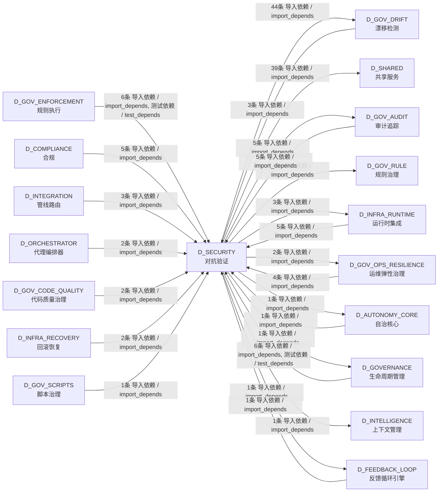

# 27_d_security / 对抗验证 / Adversarial Validation

> **功能简介 / Overview**: 对抗验证，负责系统安全对抗测试、漏洞扫描和攻防验证

> **文档作用 / Purpose**: 展示 对抗验证（D_SECURITY）功能域的模块清单、域内依赖关系、跨域依赖关系、架构分层视图，供架构审查和域治理参考。

> 本文档由 generate_domain_doc.py 从 depgraph (PostgreSQL) 自动生成
> 数据源: depgraph (PostgreSQL) nodes表 + edges表

## 域基本信息 / Domain Overview

| 字段 | 值 | Field | Value |
|------|------|-------|-------|
| 编号 | 27 | Number | 27 |
| 域ID | D_SECURITY | Domain ID | D_SECURITY |
| 域名称 | 对抗验证 | Domain Name | Adversarial Validation |
| 层级 | L1 基础平台层 | Layer | L1 Foundation |
| 模块数 | 166 | Module Count | 166 |
| 域内依赖 | 120 | Internal Dependencies | 120 |
| 跨域入边 | 46 | Cross-domain Incoming | 46 |
| 跨域出边 | 101 | Cross-domain Outgoing | 101 |
| 设计态模块 | 0 | Design Modules | 0 |
| 生产态模块 | 166 | Production Modules | 166 |
| 容量 | 166/150 (超容) | Capacity | 166/150 (超容) |
| 描述 | 孤儿文件检测(orphan_detector) | Description | 孤儿文件检测(orphan_detector) |

## 模块分层清单 / Module Layered List

> 按 architecture_layer 分组的模块清单（共 166 个模块 / 166 modules）。

### L1 基础层 / Foundation Layer (166 modules)

| # | 模块路径 / Module Path | 模块名称 / Module Name (功能简介 / Description) | 成熟度 / Maturity | 蓝图 / Blueprint |
|:--:|---------|---------|:---:|:---:|
| 1 | src/zephyr/gov_drift/__main__.py | Drift Detector MOD-INF-023 CLI — 漂移扫描入口。 | 生产态 / production |  |
| 2 | src/zephyr/gov_drift/_analysis.py | _analysis.py | 生产态 / production |  |
| 3 | src/zephyr/gov_drift/_core.py | _core.py | 生产态 / production |  |
| 4 | src/zephyr/gov_drift/_drift.py | _drift.py | 生产态 / production |  |
| 5 | src/zephyr/gov_drift/_infrastructure.py | _infrastructure.py | 生产态 / production |  |
| 6 | src/zephyr/gov_drift/_scanners.py | _scanners.py | 生产态 / production |  |
| 7 | src/zephyr/gov_drift/alert_router.py | Alert Router — alert_router.py | 生产态 / production |  |
| 8 | src/zephyr/gov_drift/cold_start.py | Cold Start Bootstrapper — 冷启动引导 §6.31。 | 生产态 / production |  |
| 9 | src/zephyr/gov_drift/events.py | G-CT-005 — ManagedDriftEvent Pydantic V2 BaseM... | 生产态 / production |  |
| 10 | src/zephyr/gov_drift/reconciler.py | Auto Reconciler — reconciler.py | 生产态 / production |  |
| 11 | src/zephyr/gov_drift/runbook_generator.py | Drift Runbook Generator — 漂移演练手册自动生成。 | 生产态 / production |  |
| 12 | src/zephyr/gov_drift/state_machine.py | Drift State Machine — state_machine.py | 生产态 / production |  |
| 13 | src/zephyr/governance/agent-rbac/contracts.py | agent-rbac/contracts.py — G-CT-001 RBAC 契约（... | 生产态 / production |  |
| 14 | src/zephyr/red_blue_validator/__init__.py | red_blue_validator — re-export shim for zephyr... | 生产态 / production |  |
| 15 | src/zephyr/security/access_control/a2a_check.py | A2A 通信对验证——校验两个 agent 之间是否允许通信。 | 生产态 / production |  |
| 16 | src/zephyr/security/access_control/adversarial_resilience.py | AdversarialResilience - adversarial resilience ... | 生产态 / production |  |
| 17 | src/zephyr/security/access_control/agent_creation_policy.py | AgentCreationPolicy — Agent 创建策略. | 生产态 / production |  |
| 18 | src/zephyr/security/access_control/approver_check.py | Approver authorization verifier — 校验审批人是... | 生产态 / production |  |
| 19 | src/zephyr/security/access_control/asymmetric_audit.py | AsymmetricAudit - quorum-based approval for hig... | 生产态 / production |  |
| 20 | src/zephyr/security/access_control/auto_maintenance.py | AutoMaintenance — 自动维护与规则健康仪表盘. | 生产态 / production |  |
| 21 | src/zephyr/security/access_control/blueprint_fidelity.py | BlueprintFidelity — 蓝图保真度检查. | 生产态 / production |  |
| 22 | src/zephyr/security/access_control/bootstrap_superadmin.py | BootstrapSuperadmin — Superadmin 账户启动器. | 生产态 / production |  |
| 23 | src/zephyr/security/access_control/build_sanitizer.py | Stub module: zephyr.security.access_control.bui... | 生产态 / production |  |
| 24 | src/zephyr/security/access_control/cache_invalidation.py | CacheInvalidation — 缓存失效事件管理. | 生产态 / production |  |
| 25 | src/zephyr/security/access_control/canary_rollout_manager.py | CanaryRolloutManager — 灰度发布管理器. | 生产态 / production |  |
| 26 | src/zephyr/security/access_control/capability_check.py | Agent capability scope verification — 拒绝受限... | 生产态 / production |  |
| 27 | src/zephyr/security/access_control/cascading_failure_isol... | Stub module: zephyr.security.access_control.cas... | 生产态 / production |  |
| 28 | src/zephyr/security/access_control/cold_start_lock.py | ColdStartLock — 冷启动锁. | 生产态 / production |  |
| 29 | src/zephyr/security/access_control/compliance_matrix.py | Stub module: zephyr.security.access_control.com... | 生产态 / production |  |
| 30 | src/zephyr/security/access_control/contracts.py | G-CT-001 RBAC->Audit 桥接契约 - RBACAuditBridge. | 生产态 / production |  |
| 31 | src/zephyr/security/access_control/cross_cutting.py | CrossCutting — 横切面权限组件. | 生产态 / production |  |
| 32 | src/zephyr/security/access_control/decision_explainer.py | DecisionExplainer — 拒绝决策的结构化解释器. | 生产态 / production |  |
| 33 | src/zephyr/security/access_control/decision_registry.py | DecisionRegistry - decision log with query and ... | 生产态 / production |  |
| 34 | src/zephyr/security/access_control/defense_depth.py | Stub module: zephyr.security.access_control.def... | 生产态 / production |  |
| 35 | src/zephyr/security/access_control/dependency_auditor.py | Stub module: zephyr.security.access_control.dep... | 生产态 / production |  |
| 36 | src/zephyr/security/access_control/derive_rbac_roles.py | RBACRoleDeriver — RBAC 角色派生器. | 生产态 / production |  |
| 37 | src/zephyr/security/access_control/detectors/anomaly_dete... | AnomalyDetector - rolling z-score anomaly detec... | 生产态 / production |  |
| 38 | src/zephyr/security/access_control/detectors/context_drif... | ContextDriftDetector — 上下文漂移与范围蔓延检测. | 生产态 / production |  |
| 39 | src/zephyr/security/access_control/detectors/cross_sessio... | CrossSessionDetector — 跨 Session 检测器. | 生产态 / production |  |
| 40 | src/zephyr/security/access_control/detectors/false_comple... | FalseCompletionDetector — 虚假完成检测. | 生产态 / production |  |
| 41 | src/zephyr/security/access_control/detectors/multi_agent_... | MultiAgentCollusionDetector — 多 agent 合谋检测. | 生产态 / production |  |
| 42 | src/zephyr/security/access_control/detectors/shell_dialec... | ShellDialectDetector — Shell 方言检测器. | 生产态 / production |  |
| 43 | src/zephyr/security/access_control/dry_run.py | DryRun — 权限模拟与影响分析. | 生产态 / production |  |
| 44 | src/zephyr/security/access_control/emergency_override.py | EmergencyOverride — 紧急覆盖令牌管理. | 生产态 / production |  |
| 45 | src/zephyr/security/access_control/engine_degradation.py | EngineDegradation — 引擎降级管理. | 生产态 / production |  |
| 46 | src/zephyr/security/access_control/environment_manager.py | Stub module: zephyr.security.access_control.env... | 生产态 / production |  |
| 47 | src/zephyr/security/access_control/escalation_handler.py | Stub module: zephyr.security.access_control.esc... | 生产态 / production |  |
| 48 | src/zephyr/security/access_control/exceptions.py | AgentRbac 异常类型. | 生产态 / production |  |
| 49 | src/zephyr/security/access_control/genesis_bootstrap.py | GenesisBootstrap — RBAC系统启动引导器. | 生产态 / production |  |
| 50 | src/zephyr/security/access_control/guard_layers.py | GuardLayers — 权限守卫层组件. | 生产态 / production |  |
| 51 | src/zephyr/security/access_control/guards/abac_guard.py | ABACGuard — 基于属性的权限守卫. | 生产态 / production |  |
| 52 | src/zephyr/security/access_control/guards/anti_pattern_gu... | Stub module: zephyr.security.access_control.gua... | 生产态 / production |  |
| 53 | src/zephyr/security/access_control/guards/audit_log_guard.py | audit_log_guard.py — 审计日志注入防护守卫 | 生产态 / production |  |
| 54 | src/zephyr/security/access_control/guards/cybersec_2026_g... | Cybersec2026Guard — 2026 网络安全威胁检测. | 生产态 / production |  |
| 55 | src/zephyr/security/access_control/guards/input_guard.py | InputGuard — 输入参数守卫. | 生产态 / production |  |
| 56 | src/zephyr/security/access_control/guards/memory_guard.py | MemoryGuard — 内存访问守卫. | 生产态 / production |  |
| 57 | src/zephyr/security/access_control/guards/memory_provenan... | MemoryProvenanceGuard — 记忆来源溯源守卫. | 生产态 / production |  |
| 58 | src/zephyr/security/access_control/guards/native_api_guar... | NativeApiGuard — 原生 API 守卫. | 生产态 / production |  |
| 59 | src/zephyr/security/access_control/guards/novel_attack_gu... | NovelAttackGuard — 新型攻击行为画像. | 生产态 / production |  |
| 60 | src/zephyr/security/access_control/guards/output_guard.py | OutputGuard — 输出内容守卫. | 生产态 / production |  |
| 61 | src/zephyr/security/access_control/guards/path_guard.py | PathGuard — 路径守卫. | 生产态 / production |  |
| 62 | src/zephyr/security/access_control/guards/permission_guar... | PermissionGuard — 七层权限编排器. | 生产态 / production |  |
| 63 | src/zephyr/security/access_control/guards/rbac_guard.py | RBACGuard — 基于角色的权限守卫. | 生产态 / production |  |
| 64 | src/zephyr/security/access_control/guards/replay_attack_g... | ReplayAttackGuard — 重放攻击防护. | 生产态 / production |  |
| 65 | src/zephyr/security/access_control/guards/rule_injection_... | RuleInjectionGuard — 规则注入守卫. | 生产态 / production |  |
| 66 | src/zephyr/security/access_control/guards/sequence_guard.py | SequenceGuard — 操作序列守卫. | 生产态 / production |  |
| 67 | src/zephyr/security/access_control/guards/toctou_guard.py | TOCTOUGuard — TOCTOU (Time-of-Check to Time-of... | 生产态 / production |  |
| 68 | src/zephyr/security/access_control/guards/vibe_coding_gua... | VibeCodingGuard — Vibe Coding 攻击面检测. | 生产态 / production |  |
| 69 | src/zephyr/security/access_control/identity.py | Agent identity — 角色与成熟度定义. | 生产态 / production |  |
| 70 | src/zephyr/security/access_control/immutable_core.py | ImmutableCore — 不可变核心验证器. | 生产态 / production |  |
| 71 | src/zephyr/security/access_control/integration.py | IntegrationManager - system integration registr... | 生产态 / production |  |
| 72 | src/zephyr/security/access_control/integrity_self_check.py | IntegritySelfCheck — 完整性自检. | 生产态 / production |  |
| 73 | src/zephyr/security/access_control/intent_binder.py | IntentBinder — 意图绑定与漂移检测. | 生产态 / production |  |
| 74 | src/zephyr/security/access_control/key_hierarchy.py | Stub module: zephyr.security.access_control.key... | 生产态 / production |  |
| 75 | src/zephyr/security/access_control/kill_switch.py | KillSwitch — 熔断器. | 生产态 / production |  |
| 76 | src/zephyr/security/access_control/legal_audit_chain.py | LegalAuditChain - append-only hash-chained lega... | 生产态 / production |  |
| 77 | src/zephyr/security/access_control/microstructure_defense.py | 微结构防御——对抗做市/交易微结构攻击的策略与保... | 生产态 / production |  |
| 78 | src/zephyr/security/access_control/monotonic_clock.py | MonotonicClock — 单调时钟. | 生产态 / production |  |
| 79 | src/zephyr/security/access_control/non_repudiation.py | NonRepudiation — 不可抵赖性审计签名. | 生产态 / production |  |
| 80 | src/zephyr/security/access_control/observability.py | ObservabilityReporter — 指标上报与异常检测. | 生产态 / production |  |
| 81 | src/zephyr/security/access_control/orphan_judge/__main__.py | __main__.py | 生产态 / production |  |
| 82 | src/zephyr/security/access_control/orphan_judge/cascade_a... | cascade_analyzer.py | 生产态 / production |  |
| 83 | src/zephyr/security/access_control/orphan_judge/config_lo... | config_loader.py | 生产态 / production |  |
| 84 | src/zephyr/security/access_control/orphan_judge/db.py | db.py | 生产态 / production |  |
| 85 | src/zephyr/security/access_control/orphan_judge/decision_... | decision_table.py | 生产态 / production |  |
| 86 | src/zephyr/security/access_control/orphan_judge/deprecati... | deprecation_tracker.py | 生产态 / production |  |
| 87 | src/zephyr/security/access_control/orphan_judge/drift_bri... | drift_bridge.py | 生产态 / production |  |
| 88 | src/zephyr/security/access_control/orphan_judge/duplicate... | duplicate_detector.py | 生产态 / production |  |
| 89 | src/zephyr/security/access_control/orphan_judge/escalatio... | escalation_bridge.py | 生产态 / production |  |
| 90 | src/zephyr/security/access_control/orphan_judge/feedback_... | feedback_bridge.py | 生产态 / production |  |
| 91 | src/zephyr/security/access_control/orphan_judge/judge.py | judge.py | 生产态 / production |  |
| 92 | src/zephyr/security/access_control/orphan_judge/kb_bridge.py | kb_bridge.py | 生产态 / production |  |
| 93 | src/zephyr/security/access_control/orphan_judge/mcp_integ... | mcp_integration.py | 生产态 / production |  |
| 94 | src/zephyr/security/access_control/orphan_judge/models.py | models.py | 生产态 / production |  |
| 95 | src/zephyr/security/access_control/orphan_judge/orphan_co... | orphan_collector.py | 生产态 / production |  |
| 96 | src/zephyr/security/access_control/orphan_judge/orphan_de... | [INVARIANTS] 蓝图 §4 文件清单与代码双向对齐 | 生产态 / production |  |
| 97 | src/zephyr/security/access_control/orphan_judge/rbac_brid... | rbac_bridge.py | 生产态 / production |  |
| 98 | src/zephyr/security/access_control/orphan_judge/reference... | AST解析+import链遍历，判断文件是否被其他文件引用。 | 生产态 / production |  |
| 99 | src/zephyr/security/access_control/orphan_judge/registrat... | 扫描项目注册表，判断文件是否已登记在册。 | 生产态 / production |  |
| 100 | src/zephyr/security/access_control/orphan_judge/report_ge... | report_generator.py | 生产态 / production |  |
| 101 | src/zephyr/security/access_control/orphan_judge/safety_fe... | safety_fence.py | 生产态 / production |  |
| 102 | src/zephyr/security/access_control/orphan_judge/standalon... | 六指标加权评分: 文件大小(15%) + 代码行数(20%) +... | 生产态 / production |  |
| 103 | src/zephyr/security/access_control/orphan_judge/swid_tag.py | swid_tag.py | 生产态 / production |  |
| 104 | src/zephyr/security/access_control/orphan_judge/unique_an... | AST节点比对，检测文件中的独特代码元素(类/函数/... | 生产态 / production |  |
| 105 | src/zephyr/security/access_control/permission_hooks.py | PermissionHooks — 权限钩子注册表. | 生产态 / production |  |
| 106 | src/zephyr/security/access_control/permission_mode_manage... | Stub module: zephyr.security.access_control.per... | 生产态 / production |  |
| 107 | src/zephyr/security/access_control/phase_executor.py | phase_executor.py | 生产态 / production |  |
| 108 | src/zephyr/security/access_control/risk_mitigation.py | RiskMitigation — 风险评估与缓解策略. | 生产态 / production |  |
| 109 | src/zephyr/security/access_control/rollback_sandbox.py | RollbackSandbox - isolate/execute/rollback patt... | 生产态 / production |  |
| 110 | src/zephyr/security/access_control/secrets_lifecycle.py | Stub module: zephyr.security.access_control.sec... | 生产态 / production |  |
| 111 | src/zephyr/security/access_control/session_concurrency.py | Session 级并发协调模块（P2-SES 落地）。 | 生产态 / production |  |
| 112 | src/zephyr/security/access_control/session_lifecycle.py | Stub module: zephyr.security.access_control.ses... | 生产态 / production |  |
| 113 | src/zephyr/security/access_control/verifiers/bootstrap_ve... | Stub module: zephyr.security.access_control.ver... | 生产态 / production |  |
| 114 | src/zephyr/security/access_control/verifiers/continuous_v... | Stub module: zephyr.security.access_control.ver... | 生产态 / production |  |
| 115 | src/zephyr/security/access_control/verifiers/contract_ver... | ContractVerifier — 契约验证器. | 生产态 / production |  |
| 116 | src/zephyr/security/access_control/verifiers/micro_verifi... | Stub module: zephyr.security.access_control.ver... | 生产态 / production |  |
| 117 | src/zephyr/security/access_control/verifiers/post_action_... | Stub module: zephyr.security.access_control.ver... | 生产态 / production |  |
| 118 | src/zephyr/security/adversarial_validation/__main__.py | __main__.py | 生产态 / production |  |
| 119 | src/zephyr/security/adversarial_validation/ai_attack_gene... | ai_attack_generator.py | 生产态 / production |  |
| 120 | src/zephyr/security/adversarial_validation/async_monitor.py | async_monitor.py | 生产态 / production |  |
| 121 | src/zephyr/security/adversarial_validation/attack_registr... | attack_registry.py | 生产态 / production |  |
| 122 | src/zephyr/security/adversarial_validation/blast_radius.py | blast_radius.py | 生产态 / production |  |
| 123 | src/zephyr/security/adversarial_validation/bypass_recorde... | bypass_recorder.py | 生产态 / production |  |
| 124 | src/zephyr/security/adversarial_validation/circuit_breake... | circuit_breaker.py | 生产态 / production |  |
| 125 | src/zephyr/security/adversarial_validation/cleanup.py | cleanup.py | 生产态 / production |  |
| 126 | src/zephyr/security/adversarial_validation/cli.py | cli.py | 生产态 / production |  |
| 127 | src/zephyr/security/adversarial_validation/cold_start.py | cold_start.py | 生产态 / production |  |
| 128 | src/zephyr/security/adversarial_validation/commit_trigger.py | CommitTrigger — 事件驱动红蓝对抗触发器 (MOD-IN... | 生产态 / production |  |
| 129 | src/zephyr/security/adversarial_validation/constitution_e... | constitution_engine.py | 生产态 / production |  |
| 130 | src/zephyr/security/adversarial_validation/constitution_g... | constitution_guard.py | 生产态 / production |  |
| 131 | src/zephyr/security/adversarial_validation/convergence_ch... | convergence_checker.py | 生产态 / production |  |
| 132 | src/zephyr/security/adversarial_validation/defense_runner.py | defense_runner.py | 生产态 / production |  |
| 133 | src/zephyr/security/adversarial_validation/game_day_runne... | game_day_runner.py | 生产态 / production |  |
| 134 | src/zephyr/security/adversarial_validation/game_day_sched... | game_day_scheduler.py | 生产态 / production |  |
| 135 | src/zephyr/security/adversarial_validation/injection_engi... | injection_engine.py | 生产态 / production |  |
| 136 | src/zephyr/security/adversarial_validation/mcp_endpoints.py | mcp_endpoints.py | 生产态 / production |  |
| 137 | src/zephyr/security/adversarial_validation/models.py | models.py | 生产态 / production |  |
| 138 | src/zephyr/security/adversarial_validation/scenario_loade... | scenario_loader.py | 生产态 / production |  |
| 139 | src/zephyr/security/adversarial_validation/steady_state.py | steady_state.py | 生产态 / production |  |
| 140 | src/zephyr/security/adversarial_validation/validator.py | validator.py | 生产态 / production |  |
| 141 | src/zephyr/security/adversarial_validation/validator_even... | ValidatorEventBridge — 红蓝验证器事件桥接 (MOD... | 生产态 / production |  |
| 142 | src/zephyr/security/llm_defense/llm_security/behavior_aud... | behavior_audit_logger.py | 生产态 / production |  |
| 143 | src/zephyr/security/llm_defense/llm_security/dashboard/ap... | LLM Security Gateway - Streamlit Dashboard. | 生产态 / production |  |
| 144 | src/zephyr/security/llm_defense/llm_security/gateway.py | gateway.py | 生产态 / production |  |
| 145 | src/zephyr/security/llm_defense/llm_security/input_saniti... | InputSanitizer: path whitelist + command whitel... | 生产态 / production |  |
| 146 | src/zephyr/security/llm_defense/llm_security/layers/l0_su... | l0_supply_chain.py | 生产态 / production |  |
| 147 | src/zephyr/security/llm_defense/llm_security/layers/l1_in... | l1_input.py | 生产态 / production |  |
| 148 | src/zephyr/security/llm_defense/llm_security/layers/l2_pr... | l2_prompt_protection.py | 生产态 / production |  |
| 149 | src/zephyr/security/llm_defense/llm_security/layers/l2a_p... | l2a_process_sandbox.py | 生产态 / production |  |
| 150 | src/zephyr/security/llm_defense/llm_security/layers/l3_ou... | l3_output.py | 生产态 / production |  |
| 151 | src/zephyr/security/llm_defense/llm_security/layers/l4_ag... | l4_agent.py | 生产态 / production |  |
| 152 | src/zephyr/security/llm_defense/llm_security/layers/l5_re... | l5_resource_protection.py | 生产态 / production |  |
| 153 | src/zephyr/security/llm_defense/llm_security/layers/l6_da... | l6_data_flow.py | 生产态 / production |  |
| 154 | src/zephyr/security/llm_defense/llm_security/layers/l6_ob... | L6 Observability Layer — security event loggin... | 生产态 / production |  |
| 155 | src/zephyr/security/llm_defense/llm_security/layers/l8_co... | l8_compliance.py | 生产态 / production |  |
| 156 | src/zephyr/security/llm_defense/llm_security/layers/l8_mu... | l8_multi_agent.py | 生产态 / production |  |
| 157 | src/zephyr/security/llm_defense/llm_security/patterns/inj... | injection_patterns.py | 生产态 / production |  |
| 158 | src/zephyr/security/llm_defense/llm_security/patterns/sec... | secrets.py | 生产态 / production |  |
| 159 | src/zephyr/security/llm_defense/llm_security/process_sand... | L2a ProcessSandbox — subprocess 路径白名单沙箱 | 生产态 / production |  |
| 160 | src/zephyr/security/llm_defense/llm_security/protocol.py | protocol.py | 生产态 / production |  |
| 161 | src/zephyr/security/llm_defense/llm_security/runtime_inte... | runtime_interceptor.py — 运行时 LLM 裸调拦截器... | 生产态 / production |  |
| 162 | src/zephyr/security/llm_defense/llm_security/self_protect... | adversarial_mutator.py | 生产态 / production |  |
| 163 | src/zephyr/security/llm_defense/llm_security/self_protect... | code_integrity.py | 生产态 / production |  |
| 164 | src/zephyr/security/llm_defense/llm_security/self_protect... | isolation.py | 生产态 / production |  |
| 165 | src/zephyr/security/llm_defense/llm_security/self_protect... | l7_validation.py | 生产态 / production |  |
| 166 | src/zephyr/security/llm_defense/llm_security/self_protect... | red_team_scanner.py | 生产态 / production |  |

## 域内依赖图 / Internal Dependency Diagram

> 依赖图内嵌在本文档中，IDE 可直接渲染显示。参考 decision_index.md 设计，分三个视图：合并全景图、运营态子图、设计态子图（按 design_maturity 实际值拆分）。
>
> **图例说明 / Legend**：
> - **实线边框 = 运营态模块**（production，已上线运行）
> - **虚线边框 = 设计态模块**（design，蓝图阶段，代码未写）
> - **实线箭头 = 运营态依赖**（已生效的依赖关系）
> - **虚线箭头 = 非运营态依赖**（计划中/验证中的依赖关系）

### 合并全景图（全部模块，标签标注成熟度）

> 展示全部 166 个模块（生产态 166 + 设计态 0），标签标注成熟度。

#### 第 1 页 / 共 6 页

```mermaid
graph TD
    subgraph D_SECURITY["D_SECURITY 对抗验证"]
        src_zephyr_gov_drift_main_py["(生产态 / production) Drift Detector MOD-INF-023 CLI — 漂移扫描入口。<br/>文件: __main__.py"]
        src_zephyr_gov_drift_analysis_py["(生产态 / production) _analysis.py"]
        src_zephyr_gov_drift_core_py["(生产态 / production) _core.py"]
        src_zephyr_gov_drift_drift_py["(生产态 / production) _drift.py"]
        src_zephyr_gov_drift_infrastructure_py["(生产态 / production) _infrastructure.py"]
        src_zephyr_gov_drift_scanners_py["(生产态 / production) _scanners.py"]
        src_zephyr_gov_drift_alert_router_py["(生产态 / production) Alert Router — alert_router.py<br/>文件: alert_router.py"]
        src_zephyr_gov_drift_cold_start_py["(生产态 / production) Cold Start Bootstrapper — 冷启动引导 §6.31。<br/>文件: cold_start.py"]
        src_zephyr_gov_drift_events_py["(生产态 / production) G-CT-005 — ManagedDriftEvent Pydantic V2 BaseM...<br/>文件: events.py"]
        src_zephyr_gov_drift_reconciler_py["(生产态 / production) Auto Reconciler — reconciler.py<br/>文件: reconciler.py"]
        src_zephyr_gov_drift_runbook_generator_py["(生产态 / production) Drift Runbook Generator — 漂移演练手册自动生成。<br/>文件: runbook_generator.py"]
        src_zephyr_gov_drift_state_machine_py["(生产态 / production) Drift State Machine — state_machine.py<br/>文件: state_machine.py"]
        src_zephyr_governance_agent_rbac_contracts_py["(生产态 / production) agent-rbac/contracts.py — G-CT-001 RBAC 契约（...<br/>文件: contracts.py"]
        src_zephyr_red_blue_validator_init_py["(生产态 / production) red_blue_validator — re-export shim for zephyr...<br/>文件: __init__.py"]
        src_zephyr_security_access_control_a2a_check_py["(生产态 / production) A2A 通信对验证——校验两个 agent 之间是否允许通信。<br/>文件: a2a_check.py"]
        src_zephyr_security_access_control_adversarial_resilience_py["(生产态 / production) AdversarialResilience - adversarial resilience ...<br/>文件: adversarial_resilience.py"]
        src_zephyr_security_access_control_agent_creation_policy_py["(生产态 / production) AgentCreationPolicy — Agent 创建策略.<br/>文件: agent_creation_policy.py"]
        src_zephyr_security_access_control_approver_check_py["(生产态 / production) Approver authorization verifier — 校验审批人是...<br/>文件: approver_check.py"]
        src_zephyr_security_access_control_asymmetric_audit_py["(生产态 / production) AsymmetricAudit - quorum-based approval for hig...<br/>文件: asymmetric_audit.py"]
        src_zephyr_security_access_control_auto_maintenance_py["(生产态 / production) AutoMaintenance — 自动维护与规则健康仪表盘.<br/>文件: auto_maintenance.py"]
        src_zephyr_security_access_control_blueprint_fidelity_py["(生产态 / production) BlueprintFidelity — 蓝图保真度检查.<br/>文件: blueprint_fidelity.py"]
        src_zephyr_security_access_control_bootstrap_superadmin_py["(生产态 / production) BootstrapSuperadmin — Superadmin 账户启动器.<br/>文件: bootstrap_superadmin.py"]
        src_zephyr_security_access_control_build_sanitizer_py["(生产态 / production) Stub module: zephyr.security.access_control.bui...<br/>文件: build_sanitizer.py"]
        src_zephyr_security_access_control_cache_invalidation_py["(生产态 / production) CacheInvalidation — 缓存失效事件管理.<br/>文件: cache_invalidation.py"]
        src_zephyr_security_access_control_canary_rollout_manager_py["(生产态 / production) CanaryRolloutManager — 灰度发布管理器.<br/>文件: canary_rollout_manager.py"]
        src_zephyr_security_access_control_capability_check_py["(生产态 / production) Agent capability scope verification — 拒绝受限...<br/>文件: capability_check.py"]
        src_zephyr_security_access_control_cascading_failure_isolator_py["(生产态 / production) Stub module: zephyr.security.access_control.cas...<br/>文件: cascading_failure_isolator.py"]
        src_zephyr_security_access_control_cold_start_lock_py["(生产态 / production) ColdStartLock — 冷启动锁.<br/>文件: cold_start_lock.py"]
        src_zephyr_security_access_control_compliance_matrix_py["(生产态 / production) Stub module: zephyr.security.access_control.com...<br/>文件: compliance_matrix.py"]
        src_zephyr_security_access_control_contracts_py["(生产态 / production) G-CT-001 RBAC->Audit 桥接契约 - RBACAuditBridge.<br/>文件: contracts.py"]
    end
    src_zephyr_governance_agent_rbac_contracts_py -->|导入依赖 / import_depends| src_zephyr_security_access_control_contracts_py
    src_zephyr_gov_drift_core_py -->|导入依赖 / import_depends| src_zephyr_gov_drift_events_py
    src_zephyr_gov_drift_core_py -->|导入依赖 / import_depends| src_zephyr_gov_drift_state_machine_py
    src_zephyr_gov_drift_analysis_py -->|导入依赖 / import_depends| src_zephyr_gov_drift_reconciler_py
    src_zephyr_gov_drift_analysis_py -->|导入依赖 / import_depends| src_zephyr_gov_drift_runbook_generator_py
    src_zephyr_gov_drift_infrastructure_py -->|导入依赖 / import_depends| src_zephyr_gov_drift_alert_router_py
    src_zephyr_gov_drift_infrastructure_py -->|导入依赖 / import_depends| src_zephyr_gov_drift_cold_start_py
    D_GOV_DRIFT["(生产态 / production) D_GOV_DRIFT"]
    src_zephyr_gov_drift_main_py -->|导入依赖 / import_depends| D_GOV_DRIFT
    src_zephyr_gov_drift_scanners_py -->|导入依赖 / import_depends| D_GOV_DRIFT
    src_zephyr_gov_drift_core_py -->|导入依赖 / import_depends| D_GOV_DRIFT
    src_zephyr_gov_drift_scanners_py -->|导入依赖 / import_depends| D_GOV_DRIFT
    src_zephyr_gov_drift_analysis_py -->|导入依赖 / import_depends| D_GOV_DRIFT
    src_zephyr_gov_drift_analysis_py -->|导入依赖 / import_depends| D_GOV_DRIFT
    src_zephyr_gov_drift_cold_start_py -->|导入依赖 / import_depends| D_GOV_DRIFT
    src_zephyr_gov_drift_state_machine_py -->|导入依赖 / import_depends| D_GOV_DRIFT
    src_zephyr_gov_drift_reconciler_py -->|导入依赖 / import_depends| D_GOV_DRIFT
    D_SHARED["(生产态 / production) D_SHARED"]
    src_zephyr_gov_drift_cold_start_py -->|导入依赖 / import_depends| D_SHARED
    src_zephyr_gov_drift_analysis_py -->|导入依赖 / import_depends| D_GOV_DRIFT
    src_zephyr_gov_drift_reconciler_py -->|导入依赖 / import_depends| D_SHARED
    src_zephyr_gov_drift_analysis_py -->|导入依赖 / import_depends| D_GOV_DRIFT
    src_zephyr_gov_drift_infrastructure_py -->|导入依赖 / import_depends| D_GOV_DRIFT
    src_zephyr_gov_drift_scanners_py -->|导入依赖 / import_depends| D_GOV_DRIFT
    D_GOV_DRIFT -->|导入依赖 / import_depends| src_zephyr_gov_drift_cold_start_py
    D_INFRA_RECOVERY["(生产态 / production) D_INFRA_RECOVERY"]
    D_INFRA_RECOVERY -->|导入依赖 / import_depends| src_zephyr_gov_drift_runbook_generator_py
    D_GOVERNANCE["(生产态 / production) D_GOVERNANCE"]
    D_GOVERNANCE -->|导入依赖 / import_depends| src_zephyr_gov_drift_cold_start_py
    D_GOV_DRIFT -->|导入依赖 / import_depends| src_zephyr_gov_drift_events_py
    D_COMPLIANCE["(生产态 / production) D_COMPLIANCE"]
    D_COMPLIANCE -->|导入依赖 / import_depends| src_zephyr_gov_drift_alert_router_py
    D_COMPLIANCE -->|导入依赖 / import_depends| src_zephyr_gov_drift_events_py
    D_COMPLIANCE -->|导入依赖 / import_depends| src_zephyr_gov_drift_reconciler_py
    D_COMPLIANCE -->|导入依赖 / import_depends| src_zephyr_gov_drift_cold_start_py
    D_INFRA_RECOVERY -->|导入依赖 / import_depends| src_zephyr_gov_drift_events_py
    D_GOV_DRIFT -->|导入依赖 / import_depends| src_zephyr_gov_drift_reconciler_py
    D_COMPLIANCE -->|导入依赖 / import_depends| src_zephyr_gov_drift_runbook_generator_py
    classDef production fill:#e1f5fe,stroke:#01579b,stroke-width:2px,color:#000
    classDef design fill:#fff3e0,stroke:#e65100,stroke-width:2px,color:#000,stroke-dasharray: 5 5
    classDef external_prod fill:#e8f5e9,stroke:#1b5e20,stroke-width:1px,color:#000
    classDef external_design fill:#fce4ec,stroke:#880e4f,stroke-width:1px,color:#000,stroke-dasharray: 5 5
    class src_zephyr_gov_drift_main_py,src_zephyr_gov_drift_analysis_py,src_zephyr_gov_drift_core_py,src_zephyr_gov_drift_drift_py,src_zephyr_gov_drift_infrastructure_py,src_zephyr_gov_drift_scanners_py,src_zephyr_gov_drift_alert_router_py,src_zephyr_gov_drift_cold_start_py,src_zephyr_gov_drift_events_py,src_zephyr_gov_drift_reconciler_py,src_zephyr_gov_drift_runbook_generator_py,src_zephyr_gov_drift_state_machine_py,src_zephyr_governance_agent_rbac_contracts_py,src_zephyr_red_blue_validator_init_py,src_zephyr_security_access_control_a2a_check_py,src_zephyr_security_access_control_adversarial_resilience_py,src_zephyr_security_access_control_agent_creation_policy_py,src_zephyr_security_access_control_approver_check_py,src_zephyr_security_access_control_asymmetric_audit_py,src_zephyr_security_access_control_auto_maintenance_py,src_zephyr_security_access_control_blueprint_fidelity_py,src_zephyr_security_access_control_bootstrap_superadmin_py,src_zephyr_security_access_control_build_sanitizer_py,src_zephyr_security_access_control_cache_invalidation_py,src_zephyr_security_access_control_canary_rollout_manager_py,src_zephyr_security_access_control_capability_check_py,src_zephyr_security_access_control_cascading_failure_isolator_py,src_zephyr_security_access_control_cold_start_lock_py,src_zephyr_security_access_control_compliance_matrix_py,src_zephyr_security_access_control_contracts_py production
    class D_GOV_DRIFT,D_SHARED,D_INFRA_RECOVERY,D_GOVERNANCE,D_COMPLIANCE external_prod
```



#### 第 2 页 / 共 6 页

```mermaid
graph TD
    subgraph D_SECURITY["D_SECURITY 对抗验证"]
        src_zephyr_security_access_control_cross_cutting_py["(生产态 / production) CrossCutting — 横切面权限组件.<br/>文件: cross_cutting.py"]
        src_zephyr_security_access_control_decision_explainer_py["(生产态 / production) DecisionExplainer — 拒绝决策的结构化解释器.<br/>文件: decision_explainer.py"]
        src_zephyr_security_access_control_decision_registry_py["(生产态 / production) DecisionRegistry - decision log with query and ...<br/>文件: decision_registry.py"]
        src_zephyr_security_access_control_defense_depth_py["(生产态 / production) Stub module: zephyr.security.access_control.def...<br/>文件: defense_depth.py"]
        src_zephyr_security_access_control_dependency_auditor_py["(生产态 / production) Stub module: zephyr.security.access_control.dep...<br/>文件: dependency_auditor.py"]
        src_zephyr_security_access_control_derive_rbac_roles_py["(生产态 / production) RBACRoleDeriver — RBAC 角色派生器.<br/>文件: derive_rbac_roles.py"]
        src_zephyr_security_access_control_detectors_anomaly_detector_py["(生产态 / production) AnomalyDetector - rolling z-score anomaly detec...<br/>文件: anomaly_detector.py"]
        src_zephyr_security_access_control_detectors_context_drift_detector_py["(生产态 / production) ContextDriftDetector — 上下文漂移与范围蔓延检测.<br/>文件: context_drift_detector.py"]
        src_zephyr_security_access_control_detectors_cross_session_detector_py["(生产态 / production) CrossSessionDetector — 跨 Session 检测器.<br/>文件: cross_session_detector.py"]
        src_zephyr_security_access_control_detectors_false_completion_detector_py["(生产态 / production) FalseCompletionDetector — 虚假完成检测.<br/>文件: false_completion_detector.py"]
        src_zephyr_security_access_control_detectors_multi_agent_collusion_detector_py["(生产态 / production) MultiAgentCollusionDetector — 多 agent 合谋检测.<br/>文件: multi_agent_collusion_detector.py"]
        src_zephyr_security_access_control_detectors_shell_dialect_detector_py["(生产态 / production) ShellDialectDetector — Shell 方言检测器.<br/>文件: shell_dialect_detector.py"]
        src_zephyr_security_access_control_dry_run_py["(生产态 / production) DryRun — 权限模拟与影响分析.<br/>文件: dry_run.py"]
        src_zephyr_security_access_control_emergency_override_py["(生产态 / production) EmergencyOverride — 紧急覆盖令牌管理.<br/>文件: emergency_override.py"]
        src_zephyr_security_access_control_engine_degradation_py["(生产态 / production) EngineDegradation — 引擎降级管理.<br/>文件: engine_degradation.py"]
        src_zephyr_security_access_control_environment_manager_py["(生产态 / production) Stub module: zephyr.security.access_control.env...<br/>文件: environment_manager.py"]
        src_zephyr_security_access_control_escalation_handler_py["(生产态 / production) Stub module: zephyr.security.access_control.esc...<br/>文件: escalation_handler.py"]
        src_zephyr_security_access_control_exceptions_py["(生产态 / production) AgentRbac 异常类型.<br/>文件: exceptions.py"]
        src_zephyr_security_access_control_genesis_bootstrap_py["(生产态 / production) GenesisBootstrap — RBAC系统启动引导器.<br/>文件: genesis_bootstrap.py"]
        src_zephyr_security_access_control_guard_layers_py["(生产态 / production) GuardLayers — 权限守卫层组件.<br/>文件: guard_layers.py"]
        src_zephyr_security_access_control_guards_abac_guard_py["(生产态 / production) ABACGuard — 基于属性的权限守卫.<br/>文件: abac_guard.py"]
        src_zephyr_security_access_control_guards_anti_pattern_guard_py["(生产态 / production) Stub module: zephyr.security.access_control.gua...<br/>文件: anti_pattern_guard.py"]
        src_zephyr_security_access_control_guards_audit_log_guard_py["(生产态 / production) audit_log_guard.py — 审计日志注入防护守卫<br/>文件: audit_log_guard.py"]
        src_zephyr_security_access_control_guards_cybersec_2026_guard_py["(生产态 / production) Cybersec2026Guard — 2026 网络安全威胁检测.<br/>文件: cybersec_2026_guard.py"]
        src_zephyr_security_access_control_guards_input_guard_py["(生产态 / production) InputGuard — 输入参数守卫.<br/>文件: input_guard.py"]
        src_zephyr_security_access_control_guards_memory_guard_py["(生产态 / production) MemoryGuard — 内存访问守卫.<br/>文件: memory_guard.py"]
        src_zephyr_security_access_control_guards_memory_provenance_guard_py["(生产态 / production) MemoryProvenanceGuard — 记忆来源溯源守卫.<br/>文件: memory_provenance_guard.py"]
        src_zephyr_security_access_control_guards_native_api_guard_py["(生产态 / production) NativeApiGuard — 原生 API 守卫.<br/>文件: native_api_guard.py"]
        src_zephyr_security_access_control_guards_novel_attack_guard_py["(生产态 / production) NovelAttackGuard — 新型攻击行为画像.<br/>文件: novel_attack_guard.py"]
        src_zephyr_security_access_control_guards_output_guard_py["(生产态 / production) OutputGuard — 输出内容守卫.<br/>文件: output_guard.py"]
    end
    src_zephyr_security_access_control_genesis_bootstrap_py -->|导入依赖 / import_depends| src_zephyr_security_access_control_engine_degradation_py
    D_SHARED["(生产态 / production) D_SHARED"]
    src_zephyr_security_access_control_guards_abac_guard_py -->|导入依赖 / import_depends| D_SHARED
    D_INFRA_RUNTIME["(生产态 / production) D_INFRA_RUNTIME"]
    D_INFRA_RUNTIME -->|导入依赖 / import_depends| src_zephyr_security_access_control_genesis_bootstrap_py
    D_INFRA_RUNTIME -->|导入依赖 / import_depends| src_zephyr_security_access_control_genesis_bootstrap_py
    classDef production fill:#e1f5fe,stroke:#01579b,stroke-width:2px,color:#000
    classDef design fill:#fff3e0,stroke:#e65100,stroke-width:2px,color:#000,stroke-dasharray: 5 5
    classDef external_prod fill:#e8f5e9,stroke:#1b5e20,stroke-width:1px,color:#000
    classDef external_design fill:#fce4ec,stroke:#880e4f,stroke-width:1px,color:#000,stroke-dasharray: 5 5
    class src_zephyr_security_access_control_cross_cutting_py,src_zephyr_security_access_control_decision_explainer_py,src_zephyr_security_access_control_decision_registry_py,src_zephyr_security_access_control_defense_depth_py,src_zephyr_security_access_control_dependency_auditor_py,src_zephyr_security_access_control_derive_rbac_roles_py,src_zephyr_security_access_control_detectors_anomaly_detector_py,src_zephyr_security_access_control_detectors_context_drift_detector_py,src_zephyr_security_access_control_detectors_cross_session_detector_py,src_zephyr_security_access_control_detectors_false_completion_detector_py,src_zephyr_security_access_control_detectors_multi_agent_collusion_detector_py,src_zephyr_security_access_control_detectors_shell_dialect_detector_py,src_zephyr_security_access_control_dry_run_py,src_zephyr_security_access_control_emergency_override_py,src_zephyr_security_access_control_engine_degradation_py,src_zephyr_security_access_control_environment_manager_py,src_zephyr_security_access_control_escalation_handler_py,src_zephyr_security_access_control_exceptions_py,src_zephyr_security_access_control_genesis_bootstrap_py,src_zephyr_security_access_control_guard_layers_py,src_zephyr_security_access_control_guards_abac_guard_py,src_zephyr_security_access_control_guards_anti_pattern_guard_py,src_zephyr_security_access_control_guards_audit_log_guard_py,src_zephyr_security_access_control_guards_cybersec_2026_guard_py,src_zephyr_security_access_control_guards_input_guard_py,src_zephyr_security_access_control_guards_memory_guard_py,src_zephyr_security_access_control_guards_memory_provenance_guard_py,src_zephyr_security_access_control_guards_native_api_guard_py,src_zephyr_security_access_control_guards_novel_attack_guard_py,src_zephyr_security_access_control_guards_output_guard_py production
    class D_SHARED,D_INFRA_RUNTIME external_prod
```



#### 第 3 页 / 共 6 页

```mermaid
graph TD
    subgraph D_SECURITY["D_SECURITY 对抗验证"]
        src_zephyr_security_access_control_guards_path_guard_py["(生产态 / production) PathGuard — 路径守卫.<br/>文件: path_guard.py"]
        src_zephyr_security_access_control_guards_permission_guard_py["(生产态 / production) PermissionGuard — 七层权限编排器.<br/>文件: permission_guard.py"]
        src_zephyr_security_access_control_guards_rbac_guard_py["(生产态 / production) RBACGuard — 基于角色的权限守卫.<br/>文件: rbac_guard.py"]
        src_zephyr_security_access_control_guards_replay_attack_guard_py["(生产态 / production) ReplayAttackGuard — 重放攻击防护.<br/>文件: replay_attack_guard.py"]
        src_zephyr_security_access_control_guards_rule_injection_guard_py["(生产态 / production) RuleInjectionGuard — 规则注入守卫.<br/>文件: rule_injection_guard.py"]
        src_zephyr_security_access_control_guards_sequence_guard_py["(生产态 / production) SequenceGuard — 操作序列守卫.<br/>文件: sequence_guard.py"]
        src_zephyr_security_access_control_guards_toctou_guard_py["(生产态 / production) TOCTOUGuard — TOCTOU (Time-of-Check to Time-of...<br/>文件: toctou_guard.py"]
        src_zephyr_security_access_control_guards_vibe_coding_guard_py["(生产态 / production) VibeCodingGuard — Vibe Coding 攻击面检测.<br/>文件: vibe_coding_guard.py"]
        src_zephyr_security_access_control_identity_py["(生产态 / production) Agent identity — 角色与成熟度定义.<br/>文件: identity.py"]
        src_zephyr_security_access_control_immutable_core_py["(生产态 / production) ImmutableCore — 不可变核心验证器.<br/>文件: immutable_core.py"]
        src_zephyr_security_access_control_integration_py["(生产态 / production) IntegrationManager - system integration registr...<br/>文件: integration.py"]
        src_zephyr_security_access_control_integrity_self_check_py["(生产态 / production) IntegritySelfCheck — 完整性自检.<br/>文件: integrity_self_check.py"]
        src_zephyr_security_access_control_intent_binder_py["(生产态 / production) IntentBinder — 意图绑定与漂移检测.<br/>文件: intent_binder.py"]
        src_zephyr_security_access_control_key_hierarchy_py["(生产态 / production) Stub module: zephyr.security.access_control.key...<br/>文件: key_hierarchy.py"]
        src_zephyr_security_access_control_kill_switch_py["(生产态 / production) KillSwitch — 熔断器.<br/>文件: kill_switch.py"]
        src_zephyr_security_access_control_legal_audit_chain_py["(生产态 / production) LegalAuditChain - append-only hash-chained lega...<br/>文件: legal_audit_chain.py"]
        src_zephyr_security_access_control_microstructure_defense_py["(生产态 / production) 微结构防御——对抗做市/交易微结构攻击的策略与保...<br/>文件: microstructure_defense.py"]
        src_zephyr_security_access_control_monotonic_clock_py["(生产态 / production) MonotonicClock — 单调时钟.<br/>文件: monotonic_clock.py"]
        src_zephyr_security_access_control_non_repudiation_py["(生产态 / production) NonRepudiation — 不可抵赖性审计签名.<br/>文件: non_repudiation.py"]
        src_zephyr_security_access_control_observability_py["(生产态 / production) ObservabilityReporter — 指标上报与异常检测.<br/>文件: observability.py"]
        src_zephyr_security_access_control_orphan_judge_main_py["(生产态 / production) __main__.py"]
        src_zephyr_security_access_control_orphan_judge_cascade_analyzer_py["(生产态 / production) cascade_analyzer.py"]
        src_zephyr_security_access_control_orphan_judge_config_loader_py["(生产态 / production) config_loader.py"]
        src_zephyr_security_access_control_orphan_judge_db_py["(生产态 / production) db.py"]
        src_zephyr_security_access_control_orphan_judge_decision_table_py["(生产态 / production) decision_table.py"]
        src_zephyr_security_access_control_orphan_judge_deprecation_tracker_py["(生产态 / production) deprecation_tracker.py"]
        src_zephyr_security_access_control_orphan_judge_drift_bridge_py["(生产态 / production) drift_bridge.py"]
        src_zephyr_security_access_control_orphan_judge_duplicate_detector_py["(生产态 / production) duplicate_detector.py"]
        src_zephyr_security_access_control_orphan_judge_escalation_bridge_py["(生产态 / production) escalation_bridge.py"]
        src_zephyr_security_access_control_orphan_judge_feedback_bridge_py["(生产态 / production) feedback_bridge.py"]
    end
    src_zephyr_security_access_control_guards_rbac_guard_py -->|导入依赖 / import_depends| src_zephyr_security_access_control_identity_py
    src_zephyr_security_access_control_guards_rbac_guard_py -->|导入依赖 / import_depends| src_zephyr_security_access_control_immutable_core_py
    src_zephyr_security_access_control_guards_permission_guard_py -->|导入依赖 / import_depends| src_zephyr_security_access_control_identity_py
    src_zephyr_security_access_control_guards_permission_guard_py -->|导入依赖 / import_depends| src_zephyr_security_access_control_immutable_core_py
    src_zephyr_security_access_control_guards_permission_guard_py -->|导入依赖 / import_depends| src_zephyr_security_access_control_guards_rbac_guard_py
    D_GOV_DRIFT["(生产态 / production) D_GOV_DRIFT"]
    src_zephyr_security_access_control_orphan_judge_drift_bridge_py -->|导入依赖 / import_depends| D_GOV_DRIFT
    D_GOVERNANCE["(生产态 / production) D_GOVERNANCE"]
    src_zephyr_security_access_control_orphan_judge_db_py -->|导入依赖 / import_depends| D_GOVERNANCE
    D_FEEDBACK_LOOP["(生产态 / production) D_FEEDBACK_LOOP"]
    src_zephyr_security_access_control_orphan_judge_feedback_bridge_py -->|导入依赖 / import_depends| D_FEEDBACK_LOOP
    D_GOV_OPS_RESILIENCE["(生产态 / production) D_GOV_OPS_RESILIENCE"]
    src_zephyr_security_access_control_orphan_judge_escalation_bridge_py -->|导入依赖 / import_depends| D_GOV_OPS_RESILIENCE
    D_SHARED["(生产态 / production) D_SHARED"]
    src_zephyr_security_access_control_identity_py -->|导入依赖 / import_depends| D_SHARED
    src_zephyr_security_access_control_immutable_core_py -->|导入依赖 / import_depends| D_SHARED
    src_zephyr_security_access_control_orphan_judge_main_py -->|导入依赖 / import_depends| D_SHARED
    src_zephyr_security_access_control_orphan_judge_config_loader_py -->|导入依赖 / import_depends| D_SHARED
    src_zephyr_security_access_control_orphan_judge_feedback_bridge_py -->|导入依赖 / import_depends| D_SHARED
    D_INFRA_RUNTIME["(生产态 / production) D_INFRA_RUNTIME"]
    D_INFRA_RUNTIME -->|导入依赖 / import_depends| src_zephyr_security_access_control_non_repudiation_py
    D_INFRA_RUNTIME -->|导入依赖 / import_depends| src_zephyr_security_access_control_kill_switch_py
    D_GOVERNANCE -->|导入依赖 / import_depends| src_zephyr_security_access_control_guards_permission_guard_py
    D_GOVERNANCE -->|导入依赖 / import_depends| src_zephyr_security_access_control_guards_permission_guard_py
    classDef production fill:#e1f5fe,stroke:#01579b,stroke-width:2px,color:#000
    classDef design fill:#fff3e0,stroke:#e65100,stroke-width:2px,color:#000,stroke-dasharray: 5 5
    classDef external_prod fill:#e8f5e9,stroke:#1b5e20,stroke-width:1px,color:#000
    classDef external_design fill:#fce4ec,stroke:#880e4f,stroke-width:1px,color:#000,stroke-dasharray: 5 5
    class src_zephyr_security_access_control_guards_path_guard_py,src_zephyr_security_access_control_guards_permission_guard_py,src_zephyr_security_access_control_guards_rbac_guard_py,src_zephyr_security_access_control_guards_replay_attack_guard_py,src_zephyr_security_access_control_guards_rule_injection_guard_py,src_zephyr_security_access_control_guards_sequence_guard_py,src_zephyr_security_access_control_guards_toctou_guard_py,src_zephyr_security_access_control_guards_vibe_coding_guard_py,src_zephyr_security_access_control_identity_py,src_zephyr_security_access_control_immutable_core_py,src_zephyr_security_access_control_integration_py,src_zephyr_security_access_control_integrity_self_check_py,src_zephyr_security_access_control_intent_binder_py,src_zephyr_security_access_control_key_hierarchy_py,src_zephyr_security_access_control_kill_switch_py,src_zephyr_security_access_control_legal_audit_chain_py,src_zephyr_security_access_control_microstructure_defense_py,src_zephyr_security_access_control_monotonic_clock_py,src_zephyr_security_access_control_non_repudiation_py,src_zephyr_security_access_control_observability_py,src_zephyr_security_access_control_orphan_judge_main_py,src_zephyr_security_access_control_orphan_judge_cascade_analyzer_py,src_zephyr_security_access_control_orphan_judge_config_loader_py,src_zephyr_security_access_control_orphan_judge_db_py,src_zephyr_security_access_control_orphan_judge_decision_table_py,src_zephyr_security_access_control_orphan_judge_deprecation_tracker_py,src_zephyr_security_access_control_orphan_judge_drift_bridge_py,src_zephyr_security_access_control_orphan_judge_duplicate_detector_py,src_zephyr_security_access_control_orphan_judge_escalation_bridge_py,src_zephyr_security_access_control_orphan_judge_feedback_bridge_py production
    class D_GOV_DRIFT,D_GOVERNANCE,D_FEEDBACK_LOOP,D_GOV_OPS_RESILIENCE,D_SHARED,D_INFRA_RUNTIME external_prod
```



#### 第 4 页 / 共 6 页

```mermaid
graph TD
    subgraph D_SECURITY["D_SECURITY 对抗验证"]
        src_zephyr_security_access_control_orphan_judge_judge_py["(生产态 / production) judge.py"]
        src_zephyr_security_access_control_orphan_judge_kb_bridge_py["(生产态 / production) kb_bridge.py"]
        src_zephyr_security_access_control_orphan_judge_mcp_integration_py["(生产态 / production) mcp_integration.py"]
        src_zephyr_security_access_control_orphan_judge_models_py["(生产态 / production) models.py"]
        src_zephyr_security_access_control_orphan_judge_orphan_collector_py["(生产态 / production) orphan_collector.py"]
        src_zephyr_security_access_control_orphan_judge_orphan_detector_py["(生产态 / production) (INVARIANTS) 蓝图 §4 文件清单与代码双向对齐<br/>文件: orphan_detector.py"]
        src_zephyr_security_access_control_orphan_judge_rbac_bridge_py["(生产态 / production) rbac_bridge.py"]
        src_zephyr_security_access_control_orphan_judge_reference_graph_engine_py["(生产态 / production) AST解析+import链遍历，判断文件是否被其他文件引用。<br/>文件: reference_graph_engine.py"]
        src_zephyr_security_access_control_orphan_judge_registration_checker_py["(生产态 / production) 扫描项目注册表，判断文件是否已登记在册。<br/>文件: registration_checker.py"]
        src_zephyr_security_access_control_orphan_judge_report_generator_py["(生产态 / production) report_generator.py"]
        src_zephyr_security_access_control_orphan_judge_safety_fence_py["(生产态 / production) safety_fence.py"]
        src_zephyr_security_access_control_orphan_judge_standalone_evaluator_py["(生产态 / production) 六指标加权评分: 文件大小(15%) + 代码行数(20%) +...<br/>文件: standalone_evaluator.py"]
        src_zephyr_security_access_control_orphan_judge_swid_tag_py["(生产态 / production) swid_tag.py"]
        src_zephyr_security_access_control_orphan_judge_unique_analyzer_py["(生产态 / production) AST节点比对，检测文件中的独特代码元素(类/函数/...<br/>文件: unique_analyzer.py"]
        src_zephyr_security_access_control_permission_hooks_py["(生产态 / production) PermissionHooks — 权限钩子注册表.<br/>文件: permission_hooks.py"]
        src_zephyr_security_access_control_permission_mode_manager_py["(生产态 / production) Stub module: zephyr.security.access_control.per...<br/>文件: permission_mode_manager.py"]
        src_zephyr_security_access_control_phase_executor_py["(生产态 / production) phase_executor.py"]
        src_zephyr_security_access_control_risk_mitigation_py["(生产态 / production) RiskMitigation — 风险评估与缓解策略.<br/>文件: risk_mitigation.py"]
        src_zephyr_security_access_control_rollback_sandbox_py["(生产态 / production) RollbackSandbox - isolate/execute/rollback patt...<br/>文件: rollback_sandbox.py"]
        src_zephyr_security_access_control_secrets_lifecycle_py["(生产态 / production) Stub module: zephyr.security.access_control.sec...<br/>文件: secrets_lifecycle.py"]
        src_zephyr_security_access_control_session_concurrency_py["(生产态 / production) Session 级并发协调模块（P2-SES 落地）。<br/>文件: session_concurrency.py"]
        src_zephyr_security_access_control_session_lifecycle_py["(生产态 / production) Stub module: zephyr.security.access_control.ses...<br/>文件: session_lifecycle.py"]
        src_zephyr_security_access_control_verifiers_bootstrap_verifier_py["(生产态 / production) Stub module: zephyr.security.access_control.ver...<br/>文件: bootstrap_verifier.py"]
        src_zephyr_security_access_control_verifiers_continuous_verifier_py["(生产态 / production) Stub module: zephyr.security.access_control.ver...<br/>文件: continuous_verifier.py"]
        src_zephyr_security_access_control_verifiers_contract_verifier_py["(生产态 / production) ContractVerifier — 契约验证器.<br/>文件: contract_verifier.py"]
        src_zephyr_security_access_control_verifiers_micro_verifier_py["(生产态 / production) Stub module: zephyr.security.access_control.ver...<br/>文件: micro_verifier.py"]
        src_zephyr_security_access_control_verifiers_post_action_verifier_py["(生产态 / production) Stub module: zephyr.security.access_control.ver...<br/>文件: post_action_verifier.py"]
        src_zephyr_security_adversarial_validation_main_py["(生产态 / production) __main__.py"]
        src_zephyr_security_adversarial_validation_ai_attack_generator_py["(生产态 / production) ai_attack_generator.py"]
        src_zephyr_security_adversarial_validation_async_monitor_py["(生产态 / production) async_monitor.py"]
    end
    src_zephyr_security_access_control_orphan_judge_mcp_integration_py -->|导入依赖 / import_depends| src_zephyr_security_access_control_orphan_judge_judge_py
    src_zephyr_security_access_control_orphan_judge_models_py -->|导入依赖 / import_depends| src_zephyr_security_access_control_orphan_judge_judge_py
    src_zephyr_security_access_control_orphan_judge_orphan_collector_py -->|导入依赖 / import_depends| src_zephyr_security_access_control_orphan_judge_safety_fence_py
    src_zephyr_security_access_control_orphan_judge_registration_checker_py -->|导入依赖 / import_depends| src_zephyr_security_access_control_orphan_judge_judge_py
    src_zephyr_security_access_control_orphan_judge_report_generator_py -->|导入依赖 / import_depends| src_zephyr_security_access_control_orphan_judge_models_py
    src_zephyr_security_access_control_orphan_judge_swid_tag_py -->|导入依赖 / import_depends| src_zephyr_security_access_control_orphan_judge_models_py
    src_zephyr_security_access_control_orphan_judge_reference_graph_engine_py -->|导入依赖 / import_depends| src_zephyr_security_access_control_orphan_judge_judge_py
    src_zephyr_security_access_control_orphan_judge_standalone_evaluator_py -->|导入依赖 / import_depends| src_zephyr_security_access_control_orphan_judge_judge_py
    src_zephyr_security_access_control_orphan_judge_unique_analyzer_py -->|导入依赖 / import_depends| src_zephyr_security_access_control_orphan_judge_judge_py
    D_GOV_AUDIT["(生产态 / production) D_GOV_AUDIT"]
    src_zephyr_security_access_control_orphan_judge_judge_py -->|导入依赖 / import_depends| D_GOV_AUDIT
    D_SHARED["(生产态 / production) D_SHARED"]
    src_zephyr_security_access_control_session_concurrency_py -->|导入依赖 / import_depends| D_SHARED
    D_GOV_RULE["(生产态 / production) D_GOV_RULE"]
    src_zephyr_security_access_control_orphan_judge_judge_py -->|导入依赖 / import_depends| D_GOV_RULE
    D_INFRA_RUNTIME["(生产态 / production) D_INFRA_RUNTIME"]
    src_zephyr_security_access_control_orphan_judge_orphan_detector_py -->|导入依赖 / import_depends| D_INFRA_RUNTIME
    src_zephyr_security_access_control_orphan_judge_orphan_detector_py -->|导入依赖 / import_depends| D_INFRA_RUNTIME
    src_zephyr_security_access_control_orphan_judge_mcp_integration_py -->|导入依赖 / import_depends| D_INFRA_RUNTIME
    D_INTELLIGENCE["(生产态 / production) D_INTELLIGENCE"]
    src_zephyr_security_access_control_orphan_judge_kb_bridge_py -->|导入依赖 / import_depends| D_INTELLIGENCE
    src_zephyr_security_access_control_orphan_judge_report_generator_py -->|导入依赖 / import_depends| D_SHARED
    D_GOV_ENFORCEMENT["(生产态 / production) D_GOV_ENFORCEMENT"]
    D_GOV_ENFORCEMENT -->|导入依赖 / import_depends| src_zephyr_security_access_control_session_concurrency_py
    D_GOV_AUDIT -->|导入依赖 / import_depends| src_zephyr_security_access_control_session_concurrency_py
    D_GOVERNANCE["(生产态 / production) D_GOVERNANCE"]
    D_GOVERNANCE -->|测试依赖 / test_depends| src_zephyr_security_access_control_session_concurrency_py
    D_GOV_SCRIPTS["(生产态 / production) D_GOV_SCRIPTS"]
    D_GOV_SCRIPTS -->|导入依赖 / import_depends| src_zephyr_security_access_control_session_concurrency_py
    D_GOV_ENFORCEMENT -->|测试依赖 / test_depends| src_zephyr_security_access_control_session_concurrency_py
    D_GOV_CODE_QUALITY["(生产态 / production) D_GOV_CODE_QUALITY"]
    D_GOV_CODE_QUALITY -->|导入依赖 / import_depends| src_zephyr_security_access_control_session_concurrency_py
    D_GOV_AUDIT -->|导入依赖 / import_depends| src_zephyr_security_access_control_session_concurrency_py
    D_GOV_ENFORCEMENT -->|导入依赖 / import_depends| src_zephyr_security_access_control_session_concurrency_py
    D_GOV_ENFORCEMENT -->|导入依赖 / import_depends| src_zephyr_security_access_control_session_concurrency_py
    D_GOV_ENFORCEMENT -->|导入依赖 / import_depends| src_zephyr_security_access_control_session_concurrency_py
    D_GOV_CODE_QUALITY -->|导入依赖 / import_depends| src_zephyr_security_access_control_session_concurrency_py
    D_GOVERNANCE -->|导入依赖 / import_depends| src_zephyr_security_access_control_session_concurrency_py
    D_GOV_OPS_RESILIENCE["(生产态 / production) D_GOV_OPS_RESILIENCE"]
    D_GOV_OPS_RESILIENCE -->|导入依赖 / import_depends| src_zephyr_security_access_control_session_concurrency_py
    D_GOV_AUDIT -->|导入依赖 / import_depends| src_zephyr_security_access_control_orphan_judge_judge_py
    D_GOV_AUDIT -->|导入依赖 / import_depends| src_zephyr_security_access_control_session_concurrency_py
    classDef production fill:#e1f5fe,stroke:#01579b,stroke-width:2px,color:#000
    classDef design fill:#fff3e0,stroke:#e65100,stroke-width:2px,color:#000,stroke-dasharray: 5 5
    classDef external_prod fill:#e8f5e9,stroke:#1b5e20,stroke-width:1px,color:#000
    classDef external_design fill:#fce4ec,stroke:#880e4f,stroke-width:1px,color:#000,stroke-dasharray: 5 5
    class src_zephyr_security_access_control_orphan_judge_judge_py,src_zephyr_security_access_control_orphan_judge_kb_bridge_py,src_zephyr_security_access_control_orphan_judge_mcp_integration_py,src_zephyr_security_access_control_orphan_judge_models_py,src_zephyr_security_access_control_orphan_judge_orphan_collector_py,src_zephyr_security_access_control_orphan_judge_orphan_detector_py,src_zephyr_security_access_control_orphan_judge_rbac_bridge_py,src_zephyr_security_access_control_orphan_judge_reference_graph_engine_py,src_zephyr_security_access_control_orphan_judge_registration_checker_py,src_zephyr_security_access_control_orphan_judge_report_generator_py,src_zephyr_security_access_control_orphan_judge_safety_fence_py,src_zephyr_security_access_control_orphan_judge_standalone_evaluator_py,src_zephyr_security_access_control_orphan_judge_swid_tag_py,src_zephyr_security_access_control_orphan_judge_unique_analyzer_py,src_zephyr_security_access_control_permission_hooks_py,src_zephyr_security_access_control_permission_mode_manager_py,src_zephyr_security_access_control_phase_executor_py,src_zephyr_security_access_control_risk_mitigation_py,src_zephyr_security_access_control_rollback_sandbox_py,src_zephyr_security_access_control_secrets_lifecycle_py,src_zephyr_security_access_control_session_concurrency_py,src_zephyr_security_access_control_session_lifecycle_py,src_zephyr_security_access_control_verifiers_bootstrap_verifier_py,src_zephyr_security_access_control_verifiers_continuous_verifier_py,src_zephyr_security_access_control_verifiers_contract_verifier_py,src_zephyr_security_access_control_verifiers_micro_verifier_py,src_zephyr_security_access_control_verifiers_post_action_verifier_py,src_zephyr_security_adversarial_validation_main_py,src_zephyr_security_adversarial_validation_ai_attack_generator_py,src_zephyr_security_adversarial_validation_async_monitor_py production
    class D_GOV_AUDIT,D_SHARED,D_GOV_RULE,D_INFRA_RUNTIME,D_INTELLIGENCE,D_GOV_ENFORCEMENT,D_GOVERNANCE,D_GOV_SCRIPTS,D_GOV_CODE_QUALITY,D_GOV_OPS_RESILIENCE external_prod
```



#### 第 5 页 / 共 6 页

```mermaid
graph TD
    subgraph D_SECURITY["D_SECURITY 对抗验证"]
        src_zephyr_security_adversarial_validation_attack_registry_py["(生产态 / production) attack_registry.py"]
        src_zephyr_security_adversarial_validation_blast_radius_py["(生产态 / production) blast_radius.py"]
        src_zephyr_security_adversarial_validation_bypass_recorder_py["(生产态 / production) bypass_recorder.py"]
        src_zephyr_security_adversarial_validation_circuit_breaker_py["(生产态 / production) circuit_breaker.py"]
        src_zephyr_security_adversarial_validation_cleanup_py["(生产态 / production) cleanup.py"]
        src_zephyr_security_adversarial_validation_cli_py["(生产态 / production) cli.py"]
        src_zephyr_security_adversarial_validation_cold_start_py["(生产态 / production) cold_start.py"]
        src_zephyr_security_adversarial_validation_commit_trigger_py["(生产态 / production) CommitTrigger — 事件驱动红蓝对抗触发器 (MOD-IN...<br/>文件: commit_trigger.py"]
        src_zephyr_security_adversarial_validation_constitution_engine_py["(生产态 / production) constitution_engine.py"]
        src_zephyr_security_adversarial_validation_constitution_guard_py["(生产态 / production) constitution_guard.py"]
        src_zephyr_security_adversarial_validation_convergence_checker_py["(生产态 / production) convergence_checker.py"]
        src_zephyr_security_adversarial_validation_defense_runner_py["(生产态 / production) defense_runner.py"]
        src_zephyr_security_adversarial_validation_game_day_runner_py["(生产态 / production) game_day_runner.py"]
        src_zephyr_security_adversarial_validation_game_day_scheduler_py["(生产态 / production) game_day_scheduler.py"]
        src_zephyr_security_adversarial_validation_injection_engine_py["(生产态 / production) injection_engine.py"]
        src_zephyr_security_adversarial_validation_mcp_endpoints_py["(生产态 / production) mcp_endpoints.py"]
        src_zephyr_security_adversarial_validation_models_py["(生产态 / production) models.py"]
        src_zephyr_security_adversarial_validation_scenario_loader_py["(生产态 / production) scenario_loader.py"]
        src_zephyr_security_adversarial_validation_steady_state_py["(生产态 / production) steady_state.py"]
        src_zephyr_security_adversarial_validation_validator_py["(生产态 / production) validator.py"]
        src_zephyr_security_adversarial_validation_validator_event_bridge_py["(生产态 / production) ValidatorEventBridge — 红蓝验证器事件桥接 (MOD...<br/>文件: validator_event_bridge.py"]
        src_zephyr_security_llm_defense_llm_security_behavior_audit_logger_py["(生产态 / production) behavior_audit_logger.py"]
        src_zephyr_security_llm_defense_llm_security_dashboard_app_py["(生产态 / production) LLM Security Gateway - Streamlit Dashboard.<br/>文件: app.py"]
        src_zephyr_security_llm_defense_llm_security_gateway_py["(生产态 / production) gateway.py"]
        src_zephyr_security_llm_defense_llm_security_input_sanitizer_py["(生产态 / production) InputSanitizer: path whitelist + command whitel...<br/>文件: input_sanitizer.py"]
        src_zephyr_security_llm_defense_llm_security_layers_l0_supply_chain_py["(生产态 / production) l0_supply_chain.py"]
        src_zephyr_security_llm_defense_llm_security_layers_l1_input_py["(生产态 / production) l1_input.py"]
        src_zephyr_security_llm_defense_llm_security_layers_l2_prompt_protection_py["(生产态 / production) l2_prompt_protection.py"]
        src_zephyr_security_llm_defense_llm_security_layers_l2a_process_sandbox_py["(生产态 / production) l2a_process_sandbox.py"]
        src_zephyr_security_llm_defense_llm_security_layers_l3_output_py["(生产态 / production) l3_output.py"]
    end
    src_zephyr_security_adversarial_validation_blast_radius_py -->|导入依赖 / import_depends| src_zephyr_security_adversarial_validation_models_py
    src_zephyr_security_adversarial_validation_bypass_recorder_py -->|导入依赖 / import_depends| src_zephyr_security_adversarial_validation_models_py
    src_zephyr_security_adversarial_validation_circuit_breaker_py -->|导入依赖 / import_depends| src_zephyr_security_adversarial_validation_models_py
    src_zephyr_security_adversarial_validation_cli_py -->|导入依赖 / import_depends| src_zephyr_security_adversarial_validation_cold_start_py
    src_zephyr_security_adversarial_validation_cli_py -->|导入依赖 / import_depends| src_zephyr_security_adversarial_validation_game_day_runner_py
    src_zephyr_security_adversarial_validation_cli_py -->|导入依赖 / import_depends| src_zephyr_security_adversarial_validation_scenario_loader_py
    src_zephyr_security_adversarial_validation_cli_py -->|导入依赖 / import_depends| src_zephyr_security_adversarial_validation_models_py
    src_zephyr_security_adversarial_validation_cli_py -->|导入依赖 / import_depends| src_zephyr_security_adversarial_validation_validator_py
    src_zephyr_security_adversarial_validation_commit_trigger_py -->|导入依赖 / import_depends| src_zephyr_security_adversarial_validation_circuit_breaker_py
    src_zephyr_security_adversarial_validation_commit_trigger_py -->|导入依赖 / import_depends| src_zephyr_security_adversarial_validation_models_py
    src_zephyr_security_adversarial_validation_commit_trigger_py -->|导入依赖 / import_depends| src_zephyr_security_adversarial_validation_validator_py
    src_zephyr_security_adversarial_validation_convergence_checker_py -->|导入依赖 / import_depends| src_zephyr_security_adversarial_validation_models_py
    src_zephyr_security_adversarial_validation_defense_runner_py -->|导入依赖 / import_depends| src_zephyr_security_adversarial_validation_models_py
    src_zephyr_security_adversarial_validation_constitution_engine_py -->|导入依赖 / import_depends| src_zephyr_security_adversarial_validation_models_py
    src_zephyr_security_adversarial_validation_game_day_runner_py -->|导入依赖 / import_depends| src_zephyr_security_adversarial_validation_blast_radius_py
    src_zephyr_security_adversarial_validation_game_day_runner_py -->|导入依赖 / import_depends| src_zephyr_security_adversarial_validation_models_py
    src_zephyr_security_adversarial_validation_game_day_runner_py -->|导入依赖 / import_depends| src_zephyr_security_adversarial_validation_validator_py
    src_zephyr_security_adversarial_validation_injection_engine_py -->|导入依赖 / import_depends| src_zephyr_security_adversarial_validation_models_py
    src_zephyr_security_adversarial_validation_mcp_endpoints_py -->|导入依赖 / import_depends| src_zephyr_security_adversarial_validation_convergence_checker_py
    src_zephyr_security_adversarial_validation_mcp_endpoints_py -->|导入依赖 / import_depends| src_zephyr_security_adversarial_validation_scenario_loader_py
    src_zephyr_security_adversarial_validation_mcp_endpoints_py -->|导入依赖 / import_depends| src_zephyr_security_adversarial_validation_models_py
    src_zephyr_security_adversarial_validation_mcp_endpoints_py -->|导入依赖 / import_depends| src_zephyr_security_adversarial_validation_validator_py
    src_zephyr_security_adversarial_validation_game_day_scheduler_py -->|导入依赖 / import_depends| src_zephyr_security_adversarial_validation_game_day_runner_py
    src_zephyr_security_adversarial_validation_steady_state_py -->|导入依赖 / import_depends| src_zephyr_security_adversarial_validation_models_py
    src_zephyr_security_adversarial_validation_scenario_loader_py -->|导入依赖 / import_depends| src_zephyr_security_adversarial_validation_models_py
    src_zephyr_security_adversarial_validation_validator_py -->|导入依赖 / import_depends| src_zephyr_security_adversarial_validation_blast_radius_py
    src_zephyr_security_adversarial_validation_validator_py -->|导入依赖 / import_depends| src_zephyr_security_adversarial_validation_bypass_recorder_py
    src_zephyr_security_adversarial_validation_validator_py -->|导入依赖 / import_depends| src_zephyr_security_adversarial_validation_cleanup_py
    src_zephyr_security_adversarial_validation_validator_py -->|导入依赖 / import_depends| src_zephyr_security_adversarial_validation_defense_runner_py
    src_zephyr_security_adversarial_validation_validator_py -->|导入依赖 / import_depends| src_zephyr_security_adversarial_validation_steady_state_py
    src_zephyr_security_adversarial_validation_validator_py -->|导入依赖 / import_depends| src_zephyr_security_adversarial_validation_scenario_loader_py
    src_zephyr_security_adversarial_validation_validator_py -->|导入依赖 / import_depends| src_zephyr_security_adversarial_validation_models_py
    src_zephyr_security_adversarial_validation_constitution_guard_py -->|导入依赖 / import_depends| src_zephyr_security_adversarial_validation_models_py
    src_zephyr_security_adversarial_validation_validator_event_bridge_py -->|导入依赖 / import_depends| src_zephyr_security_adversarial_validation_validator_py
    src_zephyr_security_llm_defense_llm_security_gateway_py -->|导入依赖 / import_depends| src_zephyr_security_llm_defense_llm_security_layers_l0_supply_chain_py
    src_zephyr_security_llm_defense_llm_security_gateway_py -->|导入依赖 / import_depends| src_zephyr_security_llm_defense_llm_security_layers_l2a_process_sandbox_py
    src_zephyr_security_llm_defense_llm_security_gateway_py -->|导入依赖 / import_depends| src_zephyr_security_llm_defense_llm_security_layers_l1_input_py
    src_zephyr_security_llm_defense_llm_security_gateway_py -->|导入依赖 / import_depends| src_zephyr_security_llm_defense_llm_security_layers_l2_prompt_protection_py
    src_zephyr_security_llm_defense_llm_security_gateway_py -->|导入依赖 / import_depends| src_zephyr_security_llm_defense_llm_security_layers_l3_output_py
    src_zephyr_security_llm_defense_llm_security_dashboard_app_py -->|导入依赖 / import_depends| src_zephyr_security_llm_defense_llm_security_behavior_audit_logger_py
    src_zephyr_security_llm_defense_llm_security_dashboard_app_py -->|导入依赖 / import_depends| src_zephyr_security_llm_defense_llm_security_input_sanitizer_py
    src_zephyr_security_llm_defense_llm_security_dashboard_app_py -->|导入依赖 / import_depends| src_zephyr_security_llm_defense_llm_security_layers_l0_supply_chain_py
    src_zephyr_security_llm_defense_llm_security_dashboard_app_py -->|导入依赖 / import_depends| src_zephyr_security_llm_defense_llm_security_layers_l1_input_py
    src_zephyr_security_llm_defense_llm_security_dashboard_app_py -->|导入依赖 / import_depends| src_zephyr_security_llm_defense_llm_security_layers_l2_prompt_protection_py
    src_zephyr_security_llm_defense_llm_security_dashboard_app_py -->|导入依赖 / import_depends| src_zephyr_security_llm_defense_llm_security_layers_l3_output_py
    D_SHARED["(生产态 / production) D_SHARED"]
    src_zephyr_security_adversarial_validation_defense_runner_py -->|导入依赖 / import_depends| D_SHARED
    src_zephyr_security_llm_defense_llm_security_layers_l0_supply_chain_py -->|导入依赖 / import_depends| D_SHARED
    D_GOV_OPS_RESILIENCE["(生产态 / production) D_GOV_OPS_RESILIENCE"]
    src_zephyr_security_adversarial_validation_game_day_scheduler_py -->|导入依赖 / import_depends| D_GOV_OPS_RESILIENCE
    src_zephyr_security_llm_defense_llm_security_layers_l0_supply_chain_py -->|导入依赖 / import_depends| D_SHARED
    src_zephyr_security_adversarial_validation_validator_event_bridge_py -->|导入依赖 / import_depends| D_SHARED
    src_zephyr_security_llm_defense_llm_security_layers_l2a_process_sandbox_py -->|导入依赖 / import_depends| D_SHARED
    src_zephyr_security_llm_defense_llm_security_layers_l2a_process_sandbox_py -->|导入依赖 / import_depends| D_SHARED
    D_GOV_RULE["(生产态 / production) D_GOV_RULE"]
    src_zephyr_security_adversarial_validation_defense_runner_py -->|导入依赖 / import_depends| D_GOV_RULE
    src_zephyr_security_adversarial_validation_steady_state_py -->|导入依赖 / import_depends| D_SHARED
    src_zephyr_security_adversarial_validation_defense_runner_py -->|导入依赖 / import_depends| D_GOV_RULE
    src_zephyr_security_adversarial_validation_commit_trigger_py -->|导入依赖 / import_depends| D_SHARED
    src_zephyr_security_llm_defense_llm_security_layers_l1_input_py -->|导入依赖 / import_depends| D_SHARED
    src_zephyr_security_llm_defense_llm_security_layers_l2_prompt_protection_py -->|导入依赖 / import_depends| D_SHARED
    src_zephyr_security_adversarial_validation_validator_py -->|导入依赖 / import_depends| D_SHARED
    src_zephyr_security_adversarial_validation_defense_runner_py -->|导入依赖 / import_depends| D_SHARED
    D_INTEGRATION["(生产态 / production) D_INTEGRATION"]
    D_INTEGRATION -->|导入依赖 / import_depends| src_zephyr_security_llm_defense_llm_security_gateway_py
    D_GOV_OPS_RESILIENCE -->|导入依赖 / import_depends| src_zephyr_security_llm_defense_llm_security_gateway_py
    D_ORCHESTRATOR["(生产态 / production) D_ORCHESTRATOR"]
    D_ORCHESTRATOR -->|导入依赖 / import_depends| src_zephyr_security_llm_defense_llm_security_input_sanitizer_py
    D_INFRA_RUNTIME["(生产态 / production) D_INFRA_RUNTIME"]
    D_INFRA_RUNTIME -->|导入依赖 / import_depends| src_zephyr_security_adversarial_validation_commit_trigger_py
    D_GOV_OPS_RESILIENCE -->|导入依赖 / import_depends| src_zephyr_security_llm_defense_llm_security_input_sanitizer_py
    D_GOVERNANCE["(生产态 / production) D_GOVERNANCE"]
    D_GOVERNANCE -->|导入依赖 / import_depends| src_zephyr_security_llm_defense_llm_security_gateway_py
    D_FEEDBACK_LOOP["(生产态 / production) D_FEEDBACK_LOOP"]
    D_FEEDBACK_LOOP -->|导入依赖 / import_depends| src_zephyr_security_llm_defense_llm_security_gateway_py
    D_GOV_AUDIT["(生产态 / production) D_GOV_AUDIT"]
    D_GOV_AUDIT -->|导入依赖 / import_depends| src_zephyr_security_adversarial_validation_validator_py
    D_GOV_OPS_RESILIENCE -->|导入依赖 / import_depends| src_zephyr_security_llm_defense_llm_security_gateway_py
    D_GOV_ENFORCEMENT["(生产态 / production) D_GOV_ENFORCEMENT"]
    D_GOV_ENFORCEMENT -->|导入依赖 / import_depends| src_zephyr_security_adversarial_validation_commit_trigger_py
    D_AUTONOMY_CORE["(生产态 / production) D_AUTONOMY_CORE"]
    D_AUTONOMY_CORE -->|导入依赖 / import_depends| src_zephyr_security_llm_defense_llm_security_gateway_py
    D_INTEGRATION -->|导入依赖 / import_depends| src_zephyr_security_llm_defense_llm_security_gateway_py
    D_ORCHESTRATOR -->|导入依赖 / import_depends| src_zephyr_security_llm_defense_llm_security_gateway_py
    classDef production fill:#e1f5fe,stroke:#01579b,stroke-width:2px,color:#000
    classDef design fill:#fff3e0,stroke:#e65100,stroke-width:2px,color:#000,stroke-dasharray: 5 5
    classDef external_prod fill:#e8f5e9,stroke:#1b5e20,stroke-width:1px,color:#000
    classDef external_design fill:#fce4ec,stroke:#880e4f,stroke-width:1px,color:#000,stroke-dasharray: 5 5
    class src_zephyr_security_adversarial_validation_attack_registry_py,src_zephyr_security_adversarial_validation_blast_radius_py,src_zephyr_security_adversarial_validation_bypass_recorder_py,src_zephyr_security_adversarial_validation_circuit_breaker_py,src_zephyr_security_adversarial_validation_cleanup_py,src_zephyr_security_adversarial_validation_cli_py,src_zephyr_security_adversarial_validation_cold_start_py,src_zephyr_security_adversarial_validation_commit_trigger_py,src_zephyr_security_adversarial_validation_constitution_engine_py,src_zephyr_security_adversarial_validation_constitution_guard_py,src_zephyr_security_adversarial_validation_convergence_checker_py,src_zephyr_security_adversarial_validation_defense_runner_py,src_zephyr_security_adversarial_validation_game_day_runner_py,src_zephyr_security_adversarial_validation_game_day_scheduler_py,src_zephyr_security_adversarial_validation_injection_engine_py,src_zephyr_security_adversarial_validation_mcp_endpoints_py,src_zephyr_security_adversarial_validation_models_py,src_zephyr_security_adversarial_validation_scenario_loader_py,src_zephyr_security_adversarial_validation_steady_state_py,src_zephyr_security_adversarial_validation_validator_py,src_zephyr_security_adversarial_validation_validator_event_bridge_py,src_zephyr_security_llm_defense_llm_security_behavior_audit_logger_py,src_zephyr_security_llm_defense_llm_security_dashboard_app_py,src_zephyr_security_llm_defense_llm_security_gateway_py,src_zephyr_security_llm_defense_llm_security_input_sanitizer_py,src_zephyr_security_llm_defense_llm_security_layers_l0_supply_chain_py,src_zephyr_security_llm_defense_llm_security_layers_l1_input_py,src_zephyr_security_llm_defense_llm_security_layers_l2_prompt_protection_py,src_zephyr_security_llm_defense_llm_security_layers_l2a_process_sandbox_py,src_zephyr_security_llm_defense_llm_security_layers_l3_output_py production
    class D_SHARED,D_GOV_OPS_RESILIENCE,D_GOV_RULE,D_INTEGRATION,D_ORCHESTRATOR,D_INFRA_RUNTIME,D_GOVERNANCE,D_FEEDBACK_LOOP,D_GOV_AUDIT,D_GOV_ENFORCEMENT,D_AUTONOMY_CORE external_prod
```



#### 第 6 页 / 共 6 页

```mermaid
graph TD
    subgraph D_SECURITY["D_SECURITY 对抗验证"]
        src_zephyr_security_llm_defense_llm_security_layers_l4_agent_py["(生产态 / production) l4_agent.py"]
        src_zephyr_security_llm_defense_llm_security_layers_l5_resource_protection_py["(生产态 / production) l5_resource_protection.py"]
        src_zephyr_security_llm_defense_llm_security_layers_l6_data_flow_py["(生产态 / production) l6_data_flow.py"]
        src_zephyr_security_llm_defense_llm_security_layers_l6_observability_py["(生产态 / production) L6 Observability Layer — security event loggin...<br/>文件: l6_observability.py"]
        src_zephyr_security_llm_defense_llm_security_layers_l8_compliance_py["(生产态 / production) l8_compliance.py"]
        src_zephyr_security_llm_defense_llm_security_layers_l8_multi_agent_py["(生产态 / production) l8_multi_agent.py"]
        src_zephyr_security_llm_defense_llm_security_patterns_injection_patterns_py["(生产态 / production) injection_patterns.py"]
        src_zephyr_security_llm_defense_llm_security_patterns_secrets_py["(生产态 / production) secrets.py"]
        src_zephyr_security_llm_defense_llm_security_process_sandbox_py["(生产态 / production) L2a ProcessSandbox — subprocess 路径白名单沙箱<br/>文件: process_sandbox.py"]
        src_zephyr_security_llm_defense_llm_security_protocol_py["(生产态 / production) protocol.py"]
        src_zephyr_security_llm_defense_llm_security_runtime_interceptor_py["(生产态 / production) runtime_interceptor.py — 运行时 LLM 裸调拦截器...<br/>文件: runtime_interceptor.py"]
        src_zephyr_security_llm_defense_llm_security_self_protection_adversarial_mutator_py["(生产态 / production) adversarial_mutator.py"]
        src_zephyr_security_llm_defense_llm_security_self_protection_code_integrity_py["(生产态 / production) code_integrity.py"]
        src_zephyr_security_llm_defense_llm_security_self_protection_isolation_py["(生产态 / production) isolation.py"]
        src_zephyr_security_llm_defense_llm_security_self_protection_l7_validation_py["(生产态 / production) l7_validation.py"]
        src_zephyr_security_llm_defense_llm_security_self_protection_red_team_scanner_py["(生产态 / production) red_team_scanner.py"]
    end
    src_zephyr_security_llm_defense_llm_security_layers_l5_resource_protection_py -->|导入依赖 / import_depends| src_zephyr_security_llm_defense_llm_security_protocol_py
    src_zephyr_security_llm_defense_llm_security_layers_l4_agent_py -->|导入依赖 / import_depends| src_zephyr_security_llm_defense_llm_security_protocol_py
    src_zephyr_security_llm_defense_llm_security_layers_l8_multi_agent_py -->|导入依赖 / import_depends| src_zephyr_security_llm_defense_llm_security_protocol_py
    src_zephyr_security_llm_defense_llm_security_layers_l6_observability_py -->|导入依赖 / import_depends| src_zephyr_security_llm_defense_llm_security_protocol_py
    src_zephyr_security_llm_defense_llm_security_self_protection_l7_validation_py -->|导入依赖 / import_depends| src_zephyr_security_llm_defense_llm_security_protocol_py
    src_zephyr_security_llm_defense_llm_security_self_protection_l7_validation_py -->|导入依赖 / import_depends| src_zephyr_security_llm_defense_llm_security_self_protection_code_integrity_py
    src_zephyr_security_llm_defense_llm_security_self_protection_red_team_scanner_py -->|导入依赖 / import_depends| src_zephyr_security_llm_defense_llm_security_protocol_py
    D_SHARED["(生产态 / production) D_SHARED"]
    src_zephyr_security_llm_defense_llm_security_layers_l6_observability_py -->|导入依赖 / import_depends| D_SHARED
    src_zephyr_security_llm_defense_llm_security_layers_l4_agent_py -->|导入依赖 / import_depends| D_SHARED
    src_zephyr_security_llm_defense_llm_security_self_protection_adversarial_mutator_py -->|导入依赖 / import_depends| D_SHARED
    src_zephyr_security_llm_defense_llm_security_self_protection_l7_validation_py -->|导入依赖 / import_depends| D_SHARED
    src_zephyr_security_llm_defense_llm_security_process_sandbox_py -->|导入依赖 / import_depends| D_SHARED
    src_zephyr_security_llm_defense_llm_security_layers_l8_multi_agent_py -->|导入依赖 / import_depends| D_SHARED
    D_GOV_AUDIT["(生产态 / production) D_GOV_AUDIT"]
    src_zephyr_security_llm_defense_llm_security_self_protection_isolation_py -->|导入依赖 / import_depends| D_GOV_AUDIT
    src_zephyr_security_llm_defense_llm_security_layers_l4_agent_py -->|导入依赖 / import_depends| D_SHARED
    src_zephyr_security_llm_defense_llm_security_layers_l5_resource_protection_py -->|导入依赖 / import_depends| D_SHARED
    src_zephyr_security_llm_defense_llm_security_self_protection_red_team_scanner_py -->|导入依赖 / import_depends| D_SHARED
    src_zephyr_security_llm_defense_llm_security_patterns_secrets_py -->|导入依赖 / import_depends| D_SHARED
    src_zephyr_security_llm_defense_llm_security_process_sandbox_py -->|导入依赖 / import_depends| D_SHARED
    src_zephyr_security_llm_defense_llm_security_protocol_py -->|导入依赖 / import_depends| D_SHARED
    D_INTEGRATION["(生产态 / production) D_INTEGRATION"]
    D_INTEGRATION -->|导入依赖 / import_depends| src_zephyr_security_llm_defense_llm_security_protocol_py
    classDef production fill:#e1f5fe,stroke:#01579b,stroke-width:2px,color:#000
    classDef design fill:#fff3e0,stroke:#e65100,stroke-width:2px,color:#000,stroke-dasharray: 5 5
    classDef external_prod fill:#e8f5e9,stroke:#1b5e20,stroke-width:1px,color:#000
    classDef external_design fill:#fce4ec,stroke:#880e4f,stroke-width:1px,color:#000,stroke-dasharray: 5 5
    class src_zephyr_security_llm_defense_llm_security_layers_l4_agent_py,src_zephyr_security_llm_defense_llm_security_layers_l5_resource_protection_py,src_zephyr_security_llm_defense_llm_security_layers_l6_data_flow_py,src_zephyr_security_llm_defense_llm_security_layers_l6_observability_py,src_zephyr_security_llm_defense_llm_security_layers_l8_compliance_py,src_zephyr_security_llm_defense_llm_security_layers_l8_multi_agent_py,src_zephyr_security_llm_defense_llm_security_patterns_injection_patterns_py,src_zephyr_security_llm_defense_llm_security_patterns_secrets_py,src_zephyr_security_llm_defense_llm_security_process_sandbox_py,src_zephyr_security_llm_defense_llm_security_protocol_py,src_zephyr_security_llm_defense_llm_security_runtime_interceptor_py,src_zephyr_security_llm_defense_llm_security_self_protection_adversarial_mutator_py,src_zephyr_security_llm_defense_llm_security_self_protection_code_integrity_py,src_zephyr_security_llm_defense_llm_security_self_protection_isolation_py,src_zephyr_security_llm_defense_llm_security_self_protection_l7_validation_py,src_zephyr_security_llm_defense_llm_security_self_protection_red_team_scanner_py production
    class D_SHARED,D_GOV_AUDIT,D_INTEGRATION external_prod
```



### 运营态子图（仅 design_maturity=production 的模块和依赖）

> 仅展示已上线运行的模块（共 166 个，120 条域内依赖）。

```mermaid
graph TD
    subgraph D_SECURITY["D_SECURITY 对抗验证"]
        src_zephyr_gov_drift_main_py["(生产态 / production) Drift Detector MOD-INF-023 CLI — 漂移扫描入口。<br/>文件: __main__.py"]
        src_zephyr_gov_drift_analysis_py["(生产态 / production) _analysis.py"]
        src_zephyr_gov_drift_core_py["(生产态 / production) _core.py"]
        src_zephyr_gov_drift_drift_py["(生产态 / production) _drift.py"]
        src_zephyr_gov_drift_infrastructure_py["(生产态 / production) _infrastructure.py"]
        src_zephyr_gov_drift_scanners_py["(生产态 / production) _scanners.py"]
        src_zephyr_gov_drift_alert_router_py["(生产态 / production) Alert Router — alert_router.py<br/>文件: alert_router.py"]
        src_zephyr_gov_drift_cold_start_py["(生产态 / production) Cold Start Bootstrapper — 冷启动引导 §6.31。<br/>文件: cold_start.py"]
        src_zephyr_gov_drift_events_py["(生产态 / production) G-CT-005 — ManagedDriftEvent Pydantic V2 BaseM...<br/>文件: events.py"]
        src_zephyr_gov_drift_reconciler_py["(生产态 / production) Auto Reconciler — reconciler.py<br/>文件: reconciler.py"]
        src_zephyr_gov_drift_runbook_generator_py["(生产态 / production) Drift Runbook Generator — 漂移演练手册自动生成。<br/>文件: runbook_generator.py"]
        src_zephyr_gov_drift_state_machine_py["(生产态 / production) Drift State Machine — state_machine.py<br/>文件: state_machine.py"]
        src_zephyr_governance_agent_rbac_contracts_py["(生产态 / production) agent-rbac/contracts.py — G-CT-001 RBAC 契约（...<br/>文件: contracts.py"]
        src_zephyr_red_blue_validator_init_py["(生产态 / production) red_blue_validator — re-export shim for zephyr...<br/>文件: __init__.py"]
        src_zephyr_security_access_control_a2a_check_py["(生产态 / production) A2A 通信对验证——校验两个 agent 之间是否允许通信。<br/>文件: a2a_check.py"]
        src_zephyr_security_access_control_adversarial_resilience_py["(生产态 / production) AdversarialResilience - adversarial resilience ...<br/>文件: adversarial_resilience.py"]
        src_zephyr_security_access_control_agent_creation_policy_py["(生产态 / production) AgentCreationPolicy — Agent 创建策略.<br/>文件: agent_creation_policy.py"]
        src_zephyr_security_access_control_approver_check_py["(生产态 / production) Approver authorization verifier — 校验审批人是...<br/>文件: approver_check.py"]
        src_zephyr_security_access_control_asymmetric_audit_py["(生产态 / production) AsymmetricAudit - quorum-based approval for hig...<br/>文件: asymmetric_audit.py"]
        src_zephyr_security_access_control_auto_maintenance_py["(生产态 / production) AutoMaintenance — 自动维护与规则健康仪表盘.<br/>文件: auto_maintenance.py"]
        src_zephyr_security_access_control_blueprint_fidelity_py["(生产态 / production) BlueprintFidelity — 蓝图保真度检查.<br/>文件: blueprint_fidelity.py"]
        src_zephyr_security_access_control_bootstrap_superadmin_py["(生产态 / production) BootstrapSuperadmin — Superadmin 账户启动器.<br/>文件: bootstrap_superadmin.py"]
        src_zephyr_security_access_control_build_sanitizer_py["(生产态 / production) Stub module: zephyr.security.access_control.bui...<br/>文件: build_sanitizer.py"]
        src_zephyr_security_access_control_cache_invalidation_py["(生产态 / production) CacheInvalidation — 缓存失效事件管理.<br/>文件: cache_invalidation.py"]
        src_zephyr_security_access_control_canary_rollout_manager_py["(生产态 / production) CanaryRolloutManager — 灰度发布管理器.<br/>文件: canary_rollout_manager.py"]
        src_zephyr_security_access_control_capability_check_py["(生产态 / production) Agent capability scope verification — 拒绝受限...<br/>文件: capability_check.py"]
        src_zephyr_security_access_control_cascading_failure_isolator_py["(生产态 / production) Stub module: zephyr.security.access_control.cas...<br/>文件: cascading_failure_isolator.py"]
        src_zephyr_security_access_control_cold_start_lock_py["(生产态 / production) ColdStartLock — 冷启动锁.<br/>文件: cold_start_lock.py"]
        src_zephyr_security_access_control_compliance_matrix_py["(生产态 / production) Stub module: zephyr.security.access_control.com...<br/>文件: compliance_matrix.py"]
        src_zephyr_security_access_control_contracts_py["(生产态 / production) G-CT-001 RBAC->Audit 桥接契约 - RBACAuditBridge.<br/>文件: contracts.py"]
        src_zephyr_security_access_control_cross_cutting_py["(生产态 / production) CrossCutting — 横切面权限组件.<br/>文件: cross_cutting.py"]
        src_zephyr_security_access_control_decision_explainer_py["(生产态 / production) DecisionExplainer — 拒绝决策的结构化解释器.<br/>文件: decision_explainer.py"]
        src_zephyr_security_access_control_decision_registry_py["(生产态 / production) DecisionRegistry - decision log with query and ...<br/>文件: decision_registry.py"]
        src_zephyr_security_access_control_defense_depth_py["(生产态 / production) Stub module: zephyr.security.access_control.def...<br/>文件: defense_depth.py"]
        src_zephyr_security_access_control_dependency_auditor_py["(生产态 / production) Stub module: zephyr.security.access_control.dep...<br/>文件: dependency_auditor.py"]
        src_zephyr_security_access_control_derive_rbac_roles_py["(生产态 / production) RBACRoleDeriver — RBAC 角色派生器.<br/>文件: derive_rbac_roles.py"]
        src_zephyr_security_access_control_detectors_anomaly_detector_py["(生产态 / production) AnomalyDetector - rolling z-score anomaly detec...<br/>文件: anomaly_detector.py"]
        src_zephyr_security_access_control_detectors_context_drift_detector_py["(生产态 / production) ContextDriftDetector — 上下文漂移与范围蔓延检测.<br/>文件: context_drift_detector.py"]
        src_zephyr_security_access_control_detectors_cross_session_detector_py["(生产态 / production) CrossSessionDetector — 跨 Session 检测器.<br/>文件: cross_session_detector.py"]
        src_zephyr_security_access_control_detectors_false_completion_detector_py["(生产态 / production) FalseCompletionDetector — 虚假完成检测.<br/>文件: false_completion_detector.py"]
        src_zephyr_security_access_control_detectors_multi_agent_collusion_detector_py["(生产态 / production) MultiAgentCollusionDetector — 多 agent 合谋检测.<br/>文件: multi_agent_collusion_detector.py"]
        src_zephyr_security_access_control_detectors_shell_dialect_detector_py["(生产态 / production) ShellDialectDetector — Shell 方言检测器.<br/>文件: shell_dialect_detector.py"]
        src_zephyr_security_access_control_dry_run_py["(生产态 / production) DryRun — 权限模拟与影响分析.<br/>文件: dry_run.py"]
        src_zephyr_security_access_control_emergency_override_py["(生产态 / production) EmergencyOverride — 紧急覆盖令牌管理.<br/>文件: emergency_override.py"]
        src_zephyr_security_access_control_engine_degradation_py["(生产态 / production) EngineDegradation — 引擎降级管理.<br/>文件: engine_degradation.py"]
        src_zephyr_security_access_control_environment_manager_py["(生产态 / production) Stub module: zephyr.security.access_control.env...<br/>文件: environment_manager.py"]
        src_zephyr_security_access_control_escalation_handler_py["(生产态 / production) Stub module: zephyr.security.access_control.esc...<br/>文件: escalation_handler.py"]
        src_zephyr_security_access_control_exceptions_py["(生产态 / production) AgentRbac 异常类型.<br/>文件: exceptions.py"]
        src_zephyr_security_access_control_genesis_bootstrap_py["(生产态 / production) GenesisBootstrap — RBAC系统启动引导器.<br/>文件: genesis_bootstrap.py"]
        src_zephyr_security_access_control_guard_layers_py["(生产态 / production) GuardLayers — 权限守卫层组件.<br/>文件: guard_layers.py"]
        src_zephyr_security_access_control_guards_abac_guard_py["(生产态 / production) ABACGuard — 基于属性的权限守卫.<br/>文件: abac_guard.py"]
        src_zephyr_security_access_control_guards_anti_pattern_guard_py["(生产态 / production) Stub module: zephyr.security.access_control.gua...<br/>文件: anti_pattern_guard.py"]
        src_zephyr_security_access_control_guards_audit_log_guard_py["(生产态 / production) audit_log_guard.py — 审计日志注入防护守卫<br/>文件: audit_log_guard.py"]
        src_zephyr_security_access_control_guards_cybersec_2026_guard_py["(生产态 / production) Cybersec2026Guard — 2026 网络安全威胁检测.<br/>文件: cybersec_2026_guard.py"]
        src_zephyr_security_access_control_guards_input_guard_py["(生产态 / production) InputGuard — 输入参数守卫.<br/>文件: input_guard.py"]
        src_zephyr_security_access_control_guards_memory_guard_py["(生产态 / production) MemoryGuard — 内存访问守卫.<br/>文件: memory_guard.py"]
        src_zephyr_security_access_control_guards_memory_provenance_guard_py["(生产态 / production) MemoryProvenanceGuard — 记忆来源溯源守卫.<br/>文件: memory_provenance_guard.py"]
        src_zephyr_security_access_control_guards_native_api_guard_py["(生产态 / production) NativeApiGuard — 原生 API 守卫.<br/>文件: native_api_guard.py"]
        src_zephyr_security_access_control_guards_novel_attack_guard_py["(生产态 / production) NovelAttackGuard — 新型攻击行为画像.<br/>文件: novel_attack_guard.py"]
        src_zephyr_security_access_control_guards_output_guard_py["(生产态 / production) OutputGuard — 输出内容守卫.<br/>文件: output_guard.py"]
        src_zephyr_security_access_control_guards_path_guard_py["(生产态 / production) PathGuard — 路径守卫.<br/>文件: path_guard.py"]
        src_zephyr_security_access_control_guards_permission_guard_py["(生产态 / production) PermissionGuard — 七层权限编排器.<br/>文件: permission_guard.py"]
        src_zephyr_security_access_control_guards_rbac_guard_py["(生产态 / production) RBACGuard — 基于角色的权限守卫.<br/>文件: rbac_guard.py"]
        src_zephyr_security_access_control_guards_replay_attack_guard_py["(生产态 / production) ReplayAttackGuard — 重放攻击防护.<br/>文件: replay_attack_guard.py"]
        src_zephyr_security_access_control_guards_rule_injection_guard_py["(生产态 / production) RuleInjectionGuard — 规则注入守卫.<br/>文件: rule_injection_guard.py"]
        src_zephyr_security_access_control_guards_sequence_guard_py["(生产态 / production) SequenceGuard — 操作序列守卫.<br/>文件: sequence_guard.py"]
        src_zephyr_security_access_control_guards_toctou_guard_py["(生产态 / production) TOCTOUGuard — TOCTOU (Time-of-Check to Time-of...<br/>文件: toctou_guard.py"]
        src_zephyr_security_access_control_guards_vibe_coding_guard_py["(生产态 / production) VibeCodingGuard — Vibe Coding 攻击面检测.<br/>文件: vibe_coding_guard.py"]
        src_zephyr_security_access_control_identity_py["(生产态 / production) Agent identity — 角色与成熟度定义.<br/>文件: identity.py"]
        src_zephyr_security_access_control_immutable_core_py["(生产态 / production) ImmutableCore — 不可变核心验证器.<br/>文件: immutable_core.py"]
        src_zephyr_security_access_control_integration_py["(生产态 / production) IntegrationManager - system integration registr...<br/>文件: integration.py"]
        src_zephyr_security_access_control_integrity_self_check_py["(生产态 / production) IntegritySelfCheck — 完整性自检.<br/>文件: integrity_self_check.py"]
        src_zephyr_security_access_control_intent_binder_py["(生产态 / production) IntentBinder — 意图绑定与漂移检测.<br/>文件: intent_binder.py"]
        src_zephyr_security_access_control_key_hierarchy_py["(生产态 / production) Stub module: zephyr.security.access_control.key...<br/>文件: key_hierarchy.py"]
        src_zephyr_security_access_control_kill_switch_py["(生产态 / production) KillSwitch — 熔断器.<br/>文件: kill_switch.py"]
        src_zephyr_security_access_control_legal_audit_chain_py["(生产态 / production) LegalAuditChain - append-only hash-chained lega...<br/>文件: legal_audit_chain.py"]
        src_zephyr_security_access_control_microstructure_defense_py["(生产态 / production) 微结构防御——对抗做市/交易微结构攻击的策略与保...<br/>文件: microstructure_defense.py"]
        src_zephyr_security_access_control_monotonic_clock_py["(生产态 / production) MonotonicClock — 单调时钟.<br/>文件: monotonic_clock.py"]
        src_zephyr_security_access_control_non_repudiation_py["(生产态 / production) NonRepudiation — 不可抵赖性审计签名.<br/>文件: non_repudiation.py"]
        src_zephyr_security_access_control_observability_py["(生产态 / production) ObservabilityReporter — 指标上报与异常检测.<br/>文件: observability.py"]
        src_zephyr_security_access_control_orphan_judge_main_py["(生产态 / production) __main__.py"]
        src_zephyr_security_access_control_orphan_judge_cascade_analyzer_py["(生产态 / production) cascade_analyzer.py"]
        src_zephyr_security_access_control_orphan_judge_config_loader_py["(生产态 / production) config_loader.py"]
        src_zephyr_security_access_control_orphan_judge_db_py["(生产态 / production) db.py"]
        src_zephyr_security_access_control_orphan_judge_decision_table_py["(生产态 / production) decision_table.py"]
        src_zephyr_security_access_control_orphan_judge_deprecation_tracker_py["(生产态 / production) deprecation_tracker.py"]
        src_zephyr_security_access_control_orphan_judge_drift_bridge_py["(生产态 / production) drift_bridge.py"]
        src_zephyr_security_access_control_orphan_judge_duplicate_detector_py["(生产态 / production) duplicate_detector.py"]
        src_zephyr_security_access_control_orphan_judge_escalation_bridge_py["(生产态 / production) escalation_bridge.py"]
        src_zephyr_security_access_control_orphan_judge_feedback_bridge_py["(生产态 / production) feedback_bridge.py"]
        src_zephyr_security_access_control_orphan_judge_judge_py["(生产态 / production) judge.py"]
        src_zephyr_security_access_control_orphan_judge_kb_bridge_py["(生产态 / production) kb_bridge.py"]
        src_zephyr_security_access_control_orphan_judge_mcp_integration_py["(生产态 / production) mcp_integration.py"]
        src_zephyr_security_access_control_orphan_judge_models_py["(生产态 / production) models.py"]
        src_zephyr_security_access_control_orphan_judge_orphan_collector_py["(生产态 / production) orphan_collector.py"]
        src_zephyr_security_access_control_orphan_judge_orphan_detector_py["(生产态 / production) (INVARIANTS) 蓝图 §4 文件清单与代码双向对齐<br/>文件: orphan_detector.py"]
        src_zephyr_security_access_control_orphan_judge_rbac_bridge_py["(生产态 / production) rbac_bridge.py"]
        src_zephyr_security_access_control_orphan_judge_reference_graph_engine_py["(生产态 / production) AST解析+import链遍历，判断文件是否被其他文件引用。<br/>文件: reference_graph_engine.py"]
        src_zephyr_security_access_control_orphan_judge_registration_checker_py["(生产态 / production) 扫描项目注册表，判断文件是否已登记在册。<br/>文件: registration_checker.py"]
        src_zephyr_security_access_control_orphan_judge_report_generator_py["(生产态 / production) report_generator.py"]
        src_zephyr_security_access_control_orphan_judge_safety_fence_py["(生产态 / production) safety_fence.py"]
        src_zephyr_security_access_control_orphan_judge_standalone_evaluator_py["(生产态 / production) 六指标加权评分: 文件大小(15%) + 代码行数(20%) +...<br/>文件: standalone_evaluator.py"]
        src_zephyr_security_access_control_orphan_judge_swid_tag_py["(生产态 / production) swid_tag.py"]
        src_zephyr_security_access_control_orphan_judge_unique_analyzer_py["(生产态 / production) AST节点比对，检测文件中的独特代码元素(类/函数/...<br/>文件: unique_analyzer.py"]
        src_zephyr_security_access_control_permission_hooks_py["(生产态 / production) PermissionHooks — 权限钩子注册表.<br/>文件: permission_hooks.py"]
        src_zephyr_security_access_control_permission_mode_manager_py["(生产态 / production) Stub module: zephyr.security.access_control.per...<br/>文件: permission_mode_manager.py"]
        src_zephyr_security_access_control_phase_executor_py["(生产态 / production) phase_executor.py"]
        src_zephyr_security_access_control_risk_mitigation_py["(生产态 / production) RiskMitigation — 风险评估与缓解策略.<br/>文件: risk_mitigation.py"]
        src_zephyr_security_access_control_rollback_sandbox_py["(生产态 / production) RollbackSandbox - isolate/execute/rollback patt...<br/>文件: rollback_sandbox.py"]
        src_zephyr_security_access_control_secrets_lifecycle_py["(生产态 / production) Stub module: zephyr.security.access_control.sec...<br/>文件: secrets_lifecycle.py"]
        src_zephyr_security_access_control_session_concurrency_py["(生产态 / production) Session 级并发协调模块（P2-SES 落地）。<br/>文件: session_concurrency.py"]
        src_zephyr_security_access_control_session_lifecycle_py["(生产态 / production) Stub module: zephyr.security.access_control.ses...<br/>文件: session_lifecycle.py"]
        src_zephyr_security_access_control_verifiers_bootstrap_verifier_py["(生产态 / production) Stub module: zephyr.security.access_control.ver...<br/>文件: bootstrap_verifier.py"]
        src_zephyr_security_access_control_verifiers_continuous_verifier_py["(生产态 / production) Stub module: zephyr.security.access_control.ver...<br/>文件: continuous_verifier.py"]
        src_zephyr_security_access_control_verifiers_contract_verifier_py["(生产态 / production) ContractVerifier — 契约验证器.<br/>文件: contract_verifier.py"]
        src_zephyr_security_access_control_verifiers_micro_verifier_py["(生产态 / production) Stub module: zephyr.security.access_control.ver...<br/>文件: micro_verifier.py"]
        src_zephyr_security_access_control_verifiers_post_action_verifier_py["(生产态 / production) Stub module: zephyr.security.access_control.ver...<br/>文件: post_action_verifier.py"]
        src_zephyr_security_adversarial_validation_main_py["(生产态 / production) __main__.py"]
        src_zephyr_security_adversarial_validation_ai_attack_generator_py["(生产态 / production) ai_attack_generator.py"]
        src_zephyr_security_adversarial_validation_async_monitor_py["(生产态 / production) async_monitor.py"]
        src_zephyr_security_adversarial_validation_attack_registry_py["(生产态 / production) attack_registry.py"]
        src_zephyr_security_adversarial_validation_blast_radius_py["(生产态 / production) blast_radius.py"]
        src_zephyr_security_adversarial_validation_bypass_recorder_py["(生产态 / production) bypass_recorder.py"]
        src_zephyr_security_adversarial_validation_circuit_breaker_py["(生产态 / production) circuit_breaker.py"]
        src_zephyr_security_adversarial_validation_cleanup_py["(生产态 / production) cleanup.py"]
        src_zephyr_security_adversarial_validation_cli_py["(生产态 / production) cli.py"]
        src_zephyr_security_adversarial_validation_cold_start_py["(生产态 / production) cold_start.py"]
        src_zephyr_security_adversarial_validation_commit_trigger_py["(生产态 / production) CommitTrigger — 事件驱动红蓝对抗触发器 (MOD-IN...<br/>文件: commit_trigger.py"]
        src_zephyr_security_adversarial_validation_constitution_engine_py["(生产态 / production) constitution_engine.py"]
        src_zephyr_security_adversarial_validation_constitution_guard_py["(生产态 / production) constitution_guard.py"]
        src_zephyr_security_adversarial_validation_convergence_checker_py["(生产态 / production) convergence_checker.py"]
        src_zephyr_security_adversarial_validation_defense_runner_py["(生产态 / production) defense_runner.py"]
        src_zephyr_security_adversarial_validation_game_day_runner_py["(生产态 / production) game_day_runner.py"]
        src_zephyr_security_adversarial_validation_game_day_scheduler_py["(生产态 / production) game_day_scheduler.py"]
        src_zephyr_security_adversarial_validation_injection_engine_py["(生产态 / production) injection_engine.py"]
        src_zephyr_security_adversarial_validation_mcp_endpoints_py["(生产态 / production) mcp_endpoints.py"]
        src_zephyr_security_adversarial_validation_models_py["(生产态 / production) models.py"]
        src_zephyr_security_adversarial_validation_scenario_loader_py["(生产态 / production) scenario_loader.py"]
        src_zephyr_security_adversarial_validation_steady_state_py["(生产态 / production) steady_state.py"]
        src_zephyr_security_adversarial_validation_validator_py["(生产态 / production) validator.py"]
        src_zephyr_security_adversarial_validation_validator_event_bridge_py["(生产态 / production) ValidatorEventBridge — 红蓝验证器事件桥接 (MOD...<br/>文件: validator_event_bridge.py"]
        src_zephyr_security_llm_defense_llm_security_behavior_audit_logger_py["(生产态 / production) behavior_audit_logger.py"]
        src_zephyr_security_llm_defense_llm_security_dashboard_app_py["(生产态 / production) LLM Security Gateway - Streamlit Dashboard.<br/>文件: app.py"]
        src_zephyr_security_llm_defense_llm_security_gateway_py["(生产态 / production) gateway.py"]
        src_zephyr_security_llm_defense_llm_security_input_sanitizer_py["(生产态 / production) InputSanitizer: path whitelist + command whitel...<br/>文件: input_sanitizer.py"]
        src_zephyr_security_llm_defense_llm_security_layers_l0_supply_chain_py["(生产态 / production) l0_supply_chain.py"]
        src_zephyr_security_llm_defense_llm_security_layers_l1_input_py["(生产态 / production) l1_input.py"]
        src_zephyr_security_llm_defense_llm_security_layers_l2_prompt_protection_py["(生产态 / production) l2_prompt_protection.py"]
        src_zephyr_security_llm_defense_llm_security_layers_l2a_process_sandbox_py["(生产态 / production) l2a_process_sandbox.py"]
        src_zephyr_security_llm_defense_llm_security_layers_l3_output_py["(生产态 / production) l3_output.py"]
        src_zephyr_security_llm_defense_llm_security_layers_l4_agent_py["(生产态 / production) l4_agent.py"]
        src_zephyr_security_llm_defense_llm_security_layers_l5_resource_protection_py["(生产态 / production) l5_resource_protection.py"]
        src_zephyr_security_llm_defense_llm_security_layers_l6_data_flow_py["(生产态 / production) l6_data_flow.py"]
        src_zephyr_security_llm_defense_llm_security_layers_l6_observability_py["(生产态 / production) L6 Observability Layer — security event loggin...<br/>文件: l6_observability.py"]
        src_zephyr_security_llm_defense_llm_security_layers_l8_compliance_py["(生产态 / production) l8_compliance.py"]
        src_zephyr_security_llm_defense_llm_security_layers_l8_multi_agent_py["(生产态 / production) l8_multi_agent.py"]
        src_zephyr_security_llm_defense_llm_security_patterns_injection_patterns_py["(生产态 / production) injection_patterns.py"]
        src_zephyr_security_llm_defense_llm_security_patterns_secrets_py["(生产态 / production) secrets.py"]
        src_zephyr_security_llm_defense_llm_security_process_sandbox_py["(生产态 / production) L2a ProcessSandbox — subprocess 路径白名单沙箱<br/>文件: process_sandbox.py"]
        src_zephyr_security_llm_defense_llm_security_protocol_py["(生产态 / production) protocol.py"]
        src_zephyr_security_llm_defense_llm_security_runtime_interceptor_py["(生产态 / production) runtime_interceptor.py — 运行时 LLM 裸调拦截器...<br/>文件: runtime_interceptor.py"]
        src_zephyr_security_llm_defense_llm_security_self_protection_adversarial_mutator_py["(生产态 / production) adversarial_mutator.py"]
        src_zephyr_security_llm_defense_llm_security_self_protection_code_integrity_py["(生产态 / production) code_integrity.py"]
        src_zephyr_security_llm_defense_llm_security_self_protection_isolation_py["(生产态 / production) isolation.py"]
        src_zephyr_security_llm_defense_llm_security_self_protection_l7_validation_py["(生产态 / production) l7_validation.py"]
        src_zephyr_security_llm_defense_llm_security_self_protection_red_team_scanner_py["(生产态 / production) red_team_scanner.py"]
    end
    src_zephyr_governance_agent_rbac_contracts_py -->|导入依赖 / import_depends| src_zephyr_security_access_control_contracts_py
    src_zephyr_gov_drift_core_py -->|导入依赖 / import_depends| src_zephyr_gov_drift_events_py
    src_zephyr_gov_drift_core_py -->|导入依赖 / import_depends| src_zephyr_gov_drift_state_machine_py
    src_zephyr_gov_drift_analysis_py -->|导入依赖 / import_depends| src_zephyr_gov_drift_reconciler_py
    src_zephyr_gov_drift_analysis_py -->|导入依赖 / import_depends| src_zephyr_gov_drift_runbook_generator_py
    src_zephyr_gov_drift_infrastructure_py -->|导入依赖 / import_depends| src_zephyr_gov_drift_alert_router_py
    src_zephyr_gov_drift_infrastructure_py -->|导入依赖 / import_depends| src_zephyr_gov_drift_cold_start_py
    src_zephyr_red_blue_validator_init_py -->|导入依赖 / import_depends| src_zephyr_security_adversarial_validation_validator_py
    src_zephyr_red_blue_validator_init_py -->|导入依赖 / import_depends| src_zephyr_security_adversarial_validation_constitution_guard_py
    src_zephyr_security_access_control_cold_start_lock_py -->|导入依赖 / import_depends| src_zephyr_security_access_control_immutable_core_py
    src_zephyr_security_access_control_derive_rbac_roles_py -->|导入依赖 / import_depends| src_zephyr_security_access_control_identity_py
    src_zephyr_security_access_control_genesis_bootstrap_py -->|导入依赖 / import_depends| src_zephyr_security_access_control_bootstrap_superadmin_py
    src_zephyr_security_access_control_genesis_bootstrap_py -->|导入依赖 / import_depends| src_zephyr_security_access_control_cold_start_lock_py
    src_zephyr_security_access_control_genesis_bootstrap_py -->|导入依赖 / import_depends| src_zephyr_security_access_control_engine_degradation_py
    src_zephyr_security_access_control_genesis_bootstrap_py -->|导入依赖 / import_depends| src_zephyr_security_access_control_immutable_core_py
    src_zephyr_security_access_control_genesis_bootstrap_py -->|导入依赖 / import_depends| src_zephyr_security_access_control_kill_switch_py
    src_zephyr_security_access_control_guards_abac_guard_py -->|导入依赖 / import_depends| src_zephyr_security_access_control_identity_py
    src_zephyr_security_access_control_guards_rbac_guard_py -->|导入依赖 / import_depends| src_zephyr_security_access_control_identity_py
    src_zephyr_security_access_control_guards_rbac_guard_py -->|导入依赖 / import_depends| src_zephyr_security_access_control_immutable_core_py
    src_zephyr_security_access_control_guards_permission_guard_py -->|导入依赖 / import_depends| src_zephyr_security_access_control_identity_py
    src_zephyr_security_access_control_guards_permission_guard_py -->|导入依赖 / import_depends| src_zephyr_security_access_control_immutable_core_py
    src_zephyr_security_access_control_guards_permission_guard_py -->|导入依赖 / import_depends| src_zephyr_security_access_control_guards_rbac_guard_py
    src_zephyr_security_access_control_orphan_judge_config_loader_py -->|导入依赖 / import_depends| src_zephyr_security_access_control_orphan_judge_models_py
    src_zephyr_security_access_control_orphan_judge_db_py -->|导入依赖 / import_depends| src_zephyr_security_access_control_orphan_judge_models_py
    src_zephyr_security_access_control_orphan_judge_mcp_integration_py -->|导入依赖 / import_depends| src_zephyr_security_access_control_orphan_judge_judge_py
    src_zephyr_security_access_control_orphan_judge_judge_py -->|导入依赖 / import_depends| src_zephyr_security_access_control_orphan_judge_duplicate_detector_py
    src_zephyr_security_access_control_orphan_judge_models_py -->|导入依赖 / import_depends| src_zephyr_security_access_control_orphan_judge_judge_py
    src_zephyr_security_access_control_orphan_judge_rbac_bridge_py -->|导入依赖 / import_depends| src_zephyr_security_access_control_guards_permission_guard_py
    src_zephyr_security_access_control_orphan_judge_orphan_collector_py -->|导入依赖 / import_depends| src_zephyr_security_access_control_orphan_judge_decision_table_py
    src_zephyr_security_access_control_orphan_judge_orphan_collector_py -->|导入依赖 / import_depends| src_zephyr_security_access_control_orphan_judge_deprecation_tracker_py
    src_zephyr_security_access_control_orphan_judge_orphan_collector_py -->|导入依赖 / import_depends| src_zephyr_security_access_control_orphan_judge_cascade_analyzer_py
    src_zephyr_security_access_control_orphan_judge_orphan_collector_py -->|导入依赖 / import_depends| src_zephyr_security_access_control_orphan_judge_safety_fence_py
    src_zephyr_security_access_control_orphan_judge_registration_checker_py -->|导入依赖 / import_depends| src_zephyr_security_access_control_orphan_judge_judge_py
    src_zephyr_security_access_control_orphan_judge_report_generator_py -->|导入依赖 / import_depends| src_zephyr_security_access_control_orphan_judge_db_py
    src_zephyr_security_access_control_orphan_judge_report_generator_py -->|导入依赖 / import_depends| src_zephyr_security_access_control_orphan_judge_models_py
    src_zephyr_security_access_control_orphan_judge_swid_tag_py -->|导入依赖 / import_depends| src_zephyr_security_access_control_orphan_judge_models_py
    src_zephyr_security_access_control_orphan_judge_reference_graph_engine_py -->|导入依赖 / import_depends| src_zephyr_security_access_control_orphan_judge_judge_py
    src_zephyr_security_access_control_orphan_judge_main_py -->|导入依赖 / import_depends| src_zephyr_security_access_control_orphan_judge_judge_py
    src_zephyr_security_access_control_orphan_judge_standalone_evaluator_py -->|导入依赖 / import_depends| src_zephyr_security_access_control_orphan_judge_judge_py
    src_zephyr_security_access_control_orphan_judge_unique_analyzer_py -->|导入依赖 / import_depends| src_zephyr_security_access_control_orphan_judge_judge_py
    src_zephyr_security_adversarial_validation_blast_radius_py -->|导入依赖 / import_depends| src_zephyr_security_adversarial_validation_models_py
    src_zephyr_security_adversarial_validation_async_monitor_py -->|导入依赖 / import_depends| src_zephyr_security_adversarial_validation_bypass_recorder_py
    src_zephyr_security_adversarial_validation_async_monitor_py -->|导入依赖 / import_depends| src_zephyr_security_adversarial_validation_circuit_breaker_py
    src_zephyr_security_adversarial_validation_async_monitor_py -->|导入依赖 / import_depends| src_zephyr_security_adversarial_validation_cleanup_py
    src_zephyr_security_adversarial_validation_bypass_recorder_py -->|导入依赖 / import_depends| src_zephyr_security_adversarial_validation_models_py
    src_zephyr_security_adversarial_validation_circuit_breaker_py -->|导入依赖 / import_depends| src_zephyr_security_adversarial_validation_models_py
    src_zephyr_security_adversarial_validation_cli_py -->|导入依赖 / import_depends| src_zephyr_security_adversarial_validation_cold_start_py
    src_zephyr_security_adversarial_validation_cli_py -->|导入依赖 / import_depends| src_zephyr_security_adversarial_validation_game_day_runner_py
    src_zephyr_security_adversarial_validation_cli_py -->|导入依赖 / import_depends| src_zephyr_security_adversarial_validation_scenario_loader_py
    src_zephyr_security_adversarial_validation_cli_py -->|导入依赖 / import_depends| src_zephyr_security_adversarial_validation_models_py
    src_zephyr_security_adversarial_validation_cli_py -->|导入依赖 / import_depends| src_zephyr_security_adversarial_validation_validator_py
    src_zephyr_security_adversarial_validation_commit_trigger_py -->|导入依赖 / import_depends| src_zephyr_security_adversarial_validation_circuit_breaker_py
    src_zephyr_security_adversarial_validation_commit_trigger_py -->|导入依赖 / import_depends| src_zephyr_security_adversarial_validation_models_py
    src_zephyr_security_adversarial_validation_commit_trigger_py -->|导入依赖 / import_depends| src_zephyr_security_adversarial_validation_validator_py
    src_zephyr_security_adversarial_validation_convergence_checker_py -->|导入依赖 / import_depends| src_zephyr_security_adversarial_validation_models_py
    src_zephyr_security_adversarial_validation_defense_runner_py -->|导入依赖 / import_depends| src_zephyr_security_adversarial_validation_models_py
    src_zephyr_security_adversarial_validation_constitution_engine_py -->|导入依赖 / import_depends| src_zephyr_security_adversarial_validation_models_py
    src_zephyr_security_adversarial_validation_game_day_runner_py -->|导入依赖 / import_depends| src_zephyr_security_adversarial_validation_blast_radius_py
    src_zephyr_security_adversarial_validation_game_day_runner_py -->|导入依赖 / import_depends| src_zephyr_security_adversarial_validation_models_py
    src_zephyr_security_adversarial_validation_game_day_runner_py -->|导入依赖 / import_depends| src_zephyr_security_adversarial_validation_validator_py
    src_zephyr_security_adversarial_validation_injection_engine_py -->|导入依赖 / import_depends| src_zephyr_security_adversarial_validation_models_py
    src_zephyr_security_adversarial_validation_mcp_endpoints_py -->|导入依赖 / import_depends| src_zephyr_security_adversarial_validation_convergence_checker_py
    src_zephyr_security_adversarial_validation_mcp_endpoints_py -->|导入依赖 / import_depends| src_zephyr_security_adversarial_validation_scenario_loader_py
    src_zephyr_security_adversarial_validation_mcp_endpoints_py -->|导入依赖 / import_depends| src_zephyr_security_adversarial_validation_models_py
    src_zephyr_security_adversarial_validation_mcp_endpoints_py -->|导入依赖 / import_depends| src_zephyr_security_adversarial_validation_validator_py
    src_zephyr_security_adversarial_validation_game_day_scheduler_py -->|导入依赖 / import_depends| src_zephyr_security_adversarial_validation_game_day_runner_py
    src_zephyr_security_adversarial_validation_steady_state_py -->|导入依赖 / import_depends| src_zephyr_security_adversarial_validation_models_py
    src_zephyr_security_adversarial_validation_scenario_loader_py -->|导入依赖 / import_depends| src_zephyr_security_adversarial_validation_models_py
    src_zephyr_security_adversarial_validation_validator_py -->|导入依赖 / import_depends| src_zephyr_security_adversarial_validation_blast_radius_py
    src_zephyr_security_adversarial_validation_validator_py -->|导入依赖 / import_depends| src_zephyr_security_adversarial_validation_bypass_recorder_py
    src_zephyr_security_adversarial_validation_validator_py -->|导入依赖 / import_depends| src_zephyr_security_adversarial_validation_cleanup_py
    src_zephyr_security_adversarial_validation_validator_py -->|导入依赖 / import_depends| src_zephyr_security_adversarial_validation_defense_runner_py
    src_zephyr_security_adversarial_validation_validator_py -->|导入依赖 / import_depends| src_zephyr_security_adversarial_validation_steady_state_py
    src_zephyr_security_adversarial_validation_validator_py -->|导入依赖 / import_depends| src_zephyr_security_adversarial_validation_scenario_loader_py
    src_zephyr_security_adversarial_validation_validator_py -->|导入依赖 / import_depends| src_zephyr_security_adversarial_validation_models_py
    src_zephyr_security_adversarial_validation_constitution_guard_py -->|导入依赖 / import_depends| src_zephyr_security_adversarial_validation_models_py
    src_zephyr_security_adversarial_validation_main_py -->|导入依赖 / import_depends| src_zephyr_security_adversarial_validation_cli_py
    src_zephyr_security_adversarial_validation_validator_event_bridge_py -->|导入依赖 / import_depends| src_zephyr_security_adversarial_validation_validator_py
    src_zephyr_security_llm_defense_llm_security_gateway_py -->|导入依赖 / import_depends| src_zephyr_security_llm_defense_llm_security_protocol_py
    src_zephyr_security_llm_defense_llm_security_gateway_py -->|导入依赖 / import_depends| src_zephyr_security_llm_defense_llm_security_runtime_interceptor_py
    src_zephyr_security_llm_defense_llm_security_gateway_py -->|导入依赖 / import_depends| src_zephyr_security_llm_defense_llm_security_layers_l0_supply_chain_py
    src_zephyr_security_llm_defense_llm_security_gateway_py -->|导入依赖 / import_depends| src_zephyr_security_llm_defense_llm_security_layers_l2a_process_sandbox_py
    src_zephyr_security_llm_defense_llm_security_gateway_py -->|导入依赖 / import_depends| src_zephyr_security_llm_defense_llm_security_layers_l1_input_py
    src_zephyr_security_llm_defense_llm_security_gateway_py -->|导入依赖 / import_depends| src_zephyr_security_llm_defense_llm_security_layers_l5_resource_protection_py
    src_zephyr_security_llm_defense_llm_security_gateway_py -->|导入依赖 / import_depends| src_zephyr_security_llm_defense_llm_security_layers_l2_prompt_protection_py
    src_zephyr_security_llm_defense_llm_security_gateway_py -->|导入依赖 / import_depends| src_zephyr_security_llm_defense_llm_security_layers_l3_output_py
    src_zephyr_security_llm_defense_llm_security_gateway_py -->|导入依赖 / import_depends| src_zephyr_security_llm_defense_llm_security_layers_l4_agent_py
    src_zephyr_security_llm_defense_llm_security_gateway_py -->|导入依赖 / import_depends| src_zephyr_security_llm_defense_llm_security_layers_l8_multi_agent_py
    src_zephyr_security_llm_defense_llm_security_gateway_py -->|导入依赖 / import_depends| src_zephyr_security_llm_defense_llm_security_layers_l6_observability_py
    src_zephyr_security_llm_defense_llm_security_gateway_py -->|导入依赖 / import_depends| src_zephyr_security_llm_defense_llm_security_self_protection_l7_validation_py
    src_zephyr_security_llm_defense_llm_security_dashboard_app_py -->|导入依赖 / import_depends| src_zephyr_security_llm_defense_llm_security_behavior_audit_logger_py
    src_zephyr_security_llm_defense_llm_security_dashboard_app_py -->|导入依赖 / import_depends| src_zephyr_security_llm_defense_llm_security_input_sanitizer_py
    src_zephyr_security_llm_defense_llm_security_dashboard_app_py -->|导入依赖 / import_depends| src_zephyr_security_llm_defense_llm_security_protocol_py
    src_zephyr_security_llm_defense_llm_security_dashboard_app_py -->|导入依赖 / import_depends| src_zephyr_security_llm_defense_llm_security_layers_l0_supply_chain_py
    src_zephyr_security_llm_defense_llm_security_dashboard_app_py -->|导入依赖 / import_depends| src_zephyr_security_llm_defense_llm_security_layers_l1_input_py
    src_zephyr_security_llm_defense_llm_security_dashboard_app_py -->|导入依赖 / import_depends| src_zephyr_security_llm_defense_llm_security_layers_l5_resource_protection_py
    src_zephyr_security_llm_defense_llm_security_dashboard_app_py -->|导入依赖 / import_depends| src_zephyr_security_llm_defense_llm_security_layers_l2_prompt_protection_py
    src_zephyr_security_llm_defense_llm_security_dashboard_app_py -->|导入依赖 / import_depends| src_zephyr_security_llm_defense_llm_security_layers_l3_output_py
    src_zephyr_security_llm_defense_llm_security_dashboard_app_py -->|导入依赖 / import_depends| src_zephyr_security_llm_defense_llm_security_layers_l4_agent_py
    src_zephyr_security_llm_defense_llm_security_dashboard_app_py -->|导入依赖 / import_depends| src_zephyr_security_llm_defense_llm_security_layers_l8_multi_agent_py
    src_zephyr_security_llm_defense_llm_security_dashboard_app_py -->|导入依赖 / import_depends| src_zephyr_security_llm_defense_llm_security_layers_l6_observability_py
    src_zephyr_security_llm_defense_llm_security_dashboard_app_py -->|导入依赖 / import_depends| src_zephyr_security_llm_defense_llm_security_patterns_injection_patterns_py
    src_zephyr_security_llm_defense_llm_security_dashboard_app_py -->|导入依赖 / import_depends| src_zephyr_security_llm_defense_llm_security_self_protection_isolation_py
    src_zephyr_security_llm_defense_llm_security_dashboard_app_py -->|导入依赖 / import_depends| src_zephyr_security_llm_defense_llm_security_patterns_secrets_py
    src_zephyr_security_llm_defense_llm_security_dashboard_app_py -->|导入依赖 / import_depends| src_zephyr_security_llm_defense_llm_security_self_protection_code_integrity_py
    src_zephyr_security_llm_defense_llm_security_dashboard_app_py -->|导入依赖 / import_depends| src_zephyr_security_llm_defense_llm_security_self_protection_l7_validation_py
    src_zephyr_security_llm_defense_llm_security_layers_l0_supply_chain_py -->|导入依赖 / import_depends| src_zephyr_security_llm_defense_llm_security_protocol_py
    src_zephyr_security_llm_defense_llm_security_layers_l2a_process_sandbox_py -->|导入依赖 / import_depends| src_zephyr_security_llm_defense_llm_security_protocol_py
    src_zephyr_security_llm_defense_llm_security_layers_l1_input_py -->|导入依赖 / import_depends| src_zephyr_security_llm_defense_llm_security_protocol_py
    src_zephyr_security_llm_defense_llm_security_layers_l5_resource_protection_py -->|导入依赖 / import_depends| src_zephyr_security_llm_defense_llm_security_protocol_py
    src_zephyr_security_llm_defense_llm_security_layers_l2_prompt_protection_py -->|导入依赖 / import_depends| src_zephyr_security_llm_defense_llm_security_protocol_py
    src_zephyr_security_llm_defense_llm_security_layers_l3_output_py -->|导入依赖 / import_depends| src_zephyr_security_llm_defense_llm_security_protocol_py
    src_zephyr_security_llm_defense_llm_security_layers_l4_agent_py -->|导入依赖 / import_depends| src_zephyr_security_llm_defense_llm_security_protocol_py
    src_zephyr_security_llm_defense_llm_security_layers_l8_multi_agent_py -->|导入依赖 / import_depends| src_zephyr_security_llm_defense_llm_security_protocol_py
    src_zephyr_security_llm_defense_llm_security_layers_l6_observability_py -->|导入依赖 / import_depends| src_zephyr_security_llm_defense_llm_security_protocol_py
    src_zephyr_security_llm_defense_llm_security_self_protection_adversarial_mutator_py -->|导入依赖 / import_depends| src_zephyr_security_llm_defense_llm_security_gateway_py
    src_zephyr_security_llm_defense_llm_security_self_protection_l7_validation_py -->|导入依赖 / import_depends| src_zephyr_security_llm_defense_llm_security_protocol_py
    src_zephyr_security_llm_defense_llm_security_self_protection_l7_validation_py -->|导入依赖 / import_depends| src_zephyr_security_llm_defense_llm_security_self_protection_code_integrity_py
    src_zephyr_security_llm_defense_llm_security_self_protection_red_team_scanner_py -->|导入依赖 / import_depends| src_zephyr_security_llm_defense_llm_security_gateway_py
    src_zephyr_security_llm_defense_llm_security_self_protection_red_team_scanner_py -->|导入依赖 / import_depends| src_zephyr_security_llm_defense_llm_security_protocol_py
    D_GOV_DRIFT["(生产态 / production) D_GOV_DRIFT"]
    src_zephyr_gov_drift_main_py -->|导入依赖 / import_depends| D_GOV_DRIFT
    D_GOV_AUDIT["(生产态 / production) D_GOV_AUDIT"]
    src_zephyr_security_access_control_orphan_judge_judge_py -->|导入依赖 / import_depends| D_GOV_AUDIT
    src_zephyr_gov_drift_scanners_py -->|导入依赖 / import_depends| D_GOV_DRIFT
    D_SHARED["(生产态 / production) D_SHARED"]
    src_zephyr_security_adversarial_validation_defense_runner_py -->|导入依赖 / import_depends| D_SHARED
    src_zephyr_gov_drift_core_py -->|导入依赖 / import_depends| D_GOV_DRIFT
    src_zephyr_security_llm_defense_llm_security_layers_l6_observability_py -->|导入依赖 / import_depends| D_SHARED
    src_zephyr_gov_drift_scanners_py -->|导入依赖 / import_depends| D_GOV_DRIFT
    src_zephyr_gov_drift_analysis_py -->|导入依赖 / import_depends| D_GOV_DRIFT
    src_zephyr_gov_drift_analysis_py -->|导入依赖 / import_depends| D_GOV_DRIFT
    src_zephyr_security_llm_defense_llm_security_layers_l0_supply_chain_py -->|导入依赖 / import_depends| D_SHARED
    D_GOV_OPS_RESILIENCE["(生产态 / production) D_GOV_OPS_RESILIENCE"]
    src_zephyr_security_adversarial_validation_game_day_scheduler_py -->|导入依赖 / import_depends| D_GOV_OPS_RESILIENCE
    src_zephyr_security_access_control_session_concurrency_py -->|导入依赖 / import_depends| D_SHARED
    src_zephyr_security_llm_defense_llm_security_layers_l0_supply_chain_py -->|导入依赖 / import_depends| D_SHARED
    src_zephyr_security_llm_defense_llm_security_layers_l4_agent_py -->|导入依赖 / import_depends| D_SHARED
    src_zephyr_security_adversarial_validation_validator_event_bridge_py -->|导入依赖 / import_depends| D_SHARED
    D_GOV_ENFORCEMENT["(生产态 / production) D_GOV_ENFORCEMENT"]
    D_GOV_ENFORCEMENT -->|导入依赖 / import_depends| src_zephyr_security_access_control_session_concurrency_py
    D_INTEGRATION["(生产态 / production) D_INTEGRATION"]
    D_INTEGRATION -->|导入依赖 / import_depends| src_zephyr_security_llm_defense_llm_security_gateway_py
    D_GOV_AUDIT -->|导入依赖 / import_depends| src_zephyr_security_access_control_session_concurrency_py
    D_GOV_DRIFT -->|导入依赖 / import_depends| src_zephyr_gov_drift_cold_start_py
    D_GOV_OPS_RESILIENCE -->|导入依赖 / import_depends| src_zephyr_security_llm_defense_llm_security_gateway_py
    D_GOVERNANCE["(生产态 / production) D_GOVERNANCE"]
    D_GOVERNANCE -->|测试依赖 / test_depends| src_zephyr_security_access_control_session_concurrency_py
    D_GOV_SCRIPTS["(生产态 / production) D_GOV_SCRIPTS"]
    D_GOV_SCRIPTS -->|导入依赖 / import_depends| src_zephyr_security_access_control_session_concurrency_py
    D_GOV_ENFORCEMENT -->|测试依赖 / test_depends| src_zephyr_security_access_control_session_concurrency_py
    D_INFRA_RUNTIME["(生产态 / production) D_INFRA_RUNTIME"]
    D_INFRA_RUNTIME -->|导入依赖 / import_depends| src_zephyr_security_access_control_non_repudiation_py
    D_GOV_CODE_QUALITY["(生产态 / production) D_GOV_CODE_QUALITY"]
    D_GOV_CODE_QUALITY -->|导入依赖 / import_depends| src_zephyr_security_access_control_session_concurrency_py
    D_ORCHESTRATOR["(生产态 / production) D_ORCHESTRATOR"]
    D_ORCHESTRATOR -->|导入依赖 / import_depends| src_zephyr_security_llm_defense_llm_security_input_sanitizer_py
    D_INFRA_RUNTIME -->|导入依赖 / import_depends| src_zephyr_security_adversarial_validation_commit_trigger_py
    D_GOV_AUDIT -->|导入依赖 / import_depends| src_zephyr_security_access_control_session_concurrency_py
    D_GOV_ENFORCEMENT -->|导入依赖 / import_depends| src_zephyr_security_access_control_session_concurrency_py
    D_INFRA_RUNTIME -->|导入依赖 / import_depends| src_zephyr_security_access_control_genesis_bootstrap_py
    classDef production fill:#e1f5fe,stroke:#01579b,stroke-width:2px,color:#000
    classDef design fill:#fff3e0,stroke:#e65100,stroke-width:2px,color:#000,stroke-dasharray: 5 5
    classDef external_prod fill:#e8f5e9,stroke:#1b5e20,stroke-width:1px,color:#000
    classDef external_design fill:#fce4ec,stroke:#880e4f,stroke-width:1px,color:#000,stroke-dasharray: 5 5
    class src_zephyr_gov_drift_main_py,src_zephyr_gov_drift_analysis_py,src_zephyr_gov_drift_core_py,src_zephyr_gov_drift_drift_py,src_zephyr_gov_drift_infrastructure_py,src_zephyr_gov_drift_scanners_py,src_zephyr_gov_drift_alert_router_py,src_zephyr_gov_drift_cold_start_py,src_zephyr_gov_drift_events_py,src_zephyr_gov_drift_reconciler_py,src_zephyr_gov_drift_runbook_generator_py,src_zephyr_gov_drift_state_machine_py,src_zephyr_governance_agent_rbac_contracts_py,src_zephyr_red_blue_validator_init_py,src_zephyr_security_access_control_a2a_check_py,src_zephyr_security_access_control_adversarial_resilience_py,src_zephyr_security_access_control_agent_creation_policy_py,src_zephyr_security_access_control_approver_check_py,src_zephyr_security_access_control_asymmetric_audit_py,src_zephyr_security_access_control_auto_maintenance_py,src_zephyr_security_access_control_blueprint_fidelity_py,src_zephyr_security_access_control_bootstrap_superadmin_py,src_zephyr_security_access_control_build_sanitizer_py,src_zephyr_security_access_control_cache_invalidation_py,src_zephyr_security_access_control_canary_rollout_manager_py,src_zephyr_security_access_control_capability_check_py,src_zephyr_security_access_control_cascading_failure_isolator_py,src_zephyr_security_access_control_cold_start_lock_py,src_zephyr_security_access_control_compliance_matrix_py,src_zephyr_security_access_control_contracts_py,src_zephyr_security_access_control_cross_cutting_py,src_zephyr_security_access_control_decision_explainer_py,src_zephyr_security_access_control_decision_registry_py,src_zephyr_security_access_control_defense_depth_py,src_zephyr_security_access_control_dependency_auditor_py,src_zephyr_security_access_control_derive_rbac_roles_py,src_zephyr_security_access_control_detectors_anomaly_detector_py,src_zephyr_security_access_control_detectors_context_drift_detector_py,src_zephyr_security_access_control_detectors_cross_session_detector_py,src_zephyr_security_access_control_detectors_false_completion_detector_py,src_zephyr_security_access_control_detectors_multi_agent_collusion_detector_py,src_zephyr_security_access_control_detectors_shell_dialect_detector_py,src_zephyr_security_access_control_dry_run_py,src_zephyr_security_access_control_emergency_override_py,src_zephyr_security_access_control_engine_degradation_py,src_zephyr_security_access_control_environment_manager_py,src_zephyr_security_access_control_escalation_handler_py,src_zephyr_security_access_control_exceptions_py,src_zephyr_security_access_control_genesis_bootstrap_py,src_zephyr_security_access_control_guard_layers_py,src_zephyr_security_access_control_guards_abac_guard_py,src_zephyr_security_access_control_guards_anti_pattern_guard_py,src_zephyr_security_access_control_guards_audit_log_guard_py,src_zephyr_security_access_control_guards_cybersec_2026_guard_py,src_zephyr_security_access_control_guards_input_guard_py,src_zephyr_security_access_control_guards_memory_guard_py,src_zephyr_security_access_control_guards_memory_provenance_guard_py,src_zephyr_security_access_control_guards_native_api_guard_py,src_zephyr_security_access_control_guards_novel_attack_guard_py,src_zephyr_security_access_control_guards_output_guard_py,src_zephyr_security_access_control_guards_path_guard_py,src_zephyr_security_access_control_guards_permission_guard_py,src_zephyr_security_access_control_guards_rbac_guard_py,src_zephyr_security_access_control_guards_replay_attack_guard_py,src_zephyr_security_access_control_guards_rule_injection_guard_py,src_zephyr_security_access_control_guards_sequence_guard_py,src_zephyr_security_access_control_guards_toctou_guard_py,src_zephyr_security_access_control_guards_vibe_coding_guard_py,src_zephyr_security_access_control_identity_py,src_zephyr_security_access_control_immutable_core_py,src_zephyr_security_access_control_integration_py,src_zephyr_security_access_control_integrity_self_check_py,src_zephyr_security_access_control_intent_binder_py,src_zephyr_security_access_control_key_hierarchy_py,src_zephyr_security_access_control_kill_switch_py,src_zephyr_security_access_control_legal_audit_chain_py,src_zephyr_security_access_control_microstructure_defense_py,src_zephyr_security_access_control_monotonic_clock_py,src_zephyr_security_access_control_non_repudiation_py,src_zephyr_security_access_control_observability_py,src_zephyr_security_access_control_orphan_judge_main_py,src_zephyr_security_access_control_orphan_judge_cascade_analyzer_py,src_zephyr_security_access_control_orphan_judge_config_loader_py,src_zephyr_security_access_control_orphan_judge_db_py,src_zephyr_security_access_control_orphan_judge_decision_table_py,src_zephyr_security_access_control_orphan_judge_deprecation_tracker_py,src_zephyr_security_access_control_orphan_judge_drift_bridge_py,src_zephyr_security_access_control_orphan_judge_duplicate_detector_py,src_zephyr_security_access_control_orphan_judge_escalation_bridge_py,src_zephyr_security_access_control_orphan_judge_feedback_bridge_py,src_zephyr_security_access_control_orphan_judge_judge_py,src_zephyr_security_access_control_orphan_judge_kb_bridge_py,src_zephyr_security_access_control_orphan_judge_mcp_integration_py,src_zephyr_security_access_control_orphan_judge_models_py,src_zephyr_security_access_control_orphan_judge_orphan_collector_py,src_zephyr_security_access_control_orphan_judge_orphan_detector_py,src_zephyr_security_access_control_orphan_judge_rbac_bridge_py,src_zephyr_security_access_control_orphan_judge_reference_graph_engine_py,src_zephyr_security_access_control_orphan_judge_registration_checker_py,src_zephyr_security_access_control_orphan_judge_report_generator_py,src_zephyr_security_access_control_orphan_judge_safety_fence_py,src_zephyr_security_access_control_orphan_judge_standalone_evaluator_py,src_zephyr_security_access_control_orphan_judge_swid_tag_py,src_zephyr_security_access_control_orphan_judge_unique_analyzer_py,src_zephyr_security_access_control_permission_hooks_py,src_zephyr_security_access_control_permission_mode_manager_py,src_zephyr_security_access_control_phase_executor_py,src_zephyr_security_access_control_risk_mitigation_py,src_zephyr_security_access_control_rollback_sandbox_py,src_zephyr_security_access_control_secrets_lifecycle_py,src_zephyr_security_access_control_session_concurrency_py,src_zephyr_security_access_control_session_lifecycle_py,src_zephyr_security_access_control_verifiers_bootstrap_verifier_py,src_zephyr_security_access_control_verifiers_continuous_verifier_py,src_zephyr_security_access_control_verifiers_contract_verifier_py,src_zephyr_security_access_control_verifiers_micro_verifier_py,src_zephyr_security_access_control_verifiers_post_action_verifier_py,src_zephyr_security_adversarial_validation_main_py,src_zephyr_security_adversarial_validation_ai_attack_generator_py,src_zephyr_security_adversarial_validation_async_monitor_py,src_zephyr_security_adversarial_validation_attack_registry_py,src_zephyr_security_adversarial_validation_blast_radius_py,src_zephyr_security_adversarial_validation_bypass_recorder_py,src_zephyr_security_adversarial_validation_circuit_breaker_py,src_zephyr_security_adversarial_validation_cleanup_py,src_zephyr_security_adversarial_validation_cli_py,src_zephyr_security_adversarial_validation_cold_start_py,src_zephyr_security_adversarial_validation_commit_trigger_py,src_zephyr_security_adversarial_validation_constitution_engine_py,src_zephyr_security_adversarial_validation_constitution_guard_py,src_zephyr_security_adversarial_validation_convergence_checker_py,src_zephyr_security_adversarial_validation_defense_runner_py,src_zephyr_security_adversarial_validation_game_day_runner_py,src_zephyr_security_adversarial_validation_game_day_scheduler_py,src_zephyr_security_adversarial_validation_injection_engine_py,src_zephyr_security_adversarial_validation_mcp_endpoints_py,src_zephyr_security_adversarial_validation_models_py,src_zephyr_security_adversarial_validation_scenario_loader_py,src_zephyr_security_adversarial_validation_steady_state_py,src_zephyr_security_adversarial_validation_validator_py,src_zephyr_security_adversarial_validation_validator_event_bridge_py,src_zephyr_security_llm_defense_llm_security_behavior_audit_logger_py,src_zephyr_security_llm_defense_llm_security_dashboard_app_py,src_zephyr_security_llm_defense_llm_security_gateway_py,src_zephyr_security_llm_defense_llm_security_input_sanitizer_py,src_zephyr_security_llm_defense_llm_security_layers_l0_supply_chain_py,src_zephyr_security_llm_defense_llm_security_layers_l1_input_py,src_zephyr_security_llm_defense_llm_security_layers_l2_prompt_protection_py,src_zephyr_security_llm_defense_llm_security_layers_l2a_process_sandbox_py,src_zephyr_security_llm_defense_llm_security_layers_l3_output_py,src_zephyr_security_llm_defense_llm_security_layers_l4_agent_py,src_zephyr_security_llm_defense_llm_security_layers_l5_resource_protection_py,src_zephyr_security_llm_defense_llm_security_layers_l6_data_flow_py,src_zephyr_security_llm_defense_llm_security_layers_l6_observability_py,src_zephyr_security_llm_defense_llm_security_layers_l8_compliance_py,src_zephyr_security_llm_defense_llm_security_layers_l8_multi_agent_py,src_zephyr_security_llm_defense_llm_security_patterns_injection_patterns_py,src_zephyr_security_llm_defense_llm_security_patterns_secrets_py,src_zephyr_security_llm_defense_llm_security_process_sandbox_py,src_zephyr_security_llm_defense_llm_security_protocol_py,src_zephyr_security_llm_defense_llm_security_runtime_interceptor_py,src_zephyr_security_llm_defense_llm_security_self_protection_adversarial_mutator_py,src_zephyr_security_llm_defense_llm_security_self_protection_code_integrity_py,src_zephyr_security_llm_defense_llm_security_self_protection_isolation_py,src_zephyr_security_llm_defense_llm_security_self_protection_l7_validation_py,src_zephyr_security_llm_defense_llm_security_self_protection_red_team_scanner_py production
    class D_GOV_DRIFT,D_GOV_AUDIT,D_SHARED,D_GOV_OPS_RESILIENCE,D_GOV_ENFORCEMENT,D_INTEGRATION,D_GOVERNANCE,D_GOV_SCRIPTS,D_INFRA_RUNTIME,D_GOV_CODE_QUALITY,D_ORCHESTRATOR external_prod
```

### 设计态子图（仅 design_maturity=design 的模块和依赖）

> 仅展示蓝图阶段、代码未写的设计态模块（共 0 个，0 条域内依赖）。

> （无设计态模块 / No design modules）

## 跨域依赖 / Cross-domain Dependencies

### 本域依赖的其他域（出边）/ Depends On

| # | 本域模块 / Source Module | → | 外部域-目标模块 / Target Module | 依赖类型 / Type |
|:--:|---------|:--:|---------|---------|
| 1 | Agent capability scope verification — 拒绝受限... | → | D_AUTONOMY_CORE 自治核心: G-CT-003: Agent Spec -> RBAC capability check. ... | 导入依赖 / import_depends |
| 2 | feedback_bridge.py | → | D_FEEDBACK_LOOP 反馈循环引擎: Feedback Loop Engine — MOD-FEEDBACK_LOOP. (__i... | 导入依赖 / import_depends |
| 3 | db.py | → | D_GOVERNANCE 生命周期管理: SQLite 元数据层 Schema DDL + 版本化迁移框架（T-... | 导入依赖 / import_depends |
| 4 | G-CT-001 RBAC->Audit 桥接契约 - RBACAuditBridge... | → | D_GOV_AUDIT 审计追踪: contracts.py | 导入依赖 / import_depends |
| 5 | judge.py | → | D_GOV_AUDIT 审计追踪: finding_model.py | 导入依赖 / import_depends |
| 6 | defense_runner.py | → | D_GOV_AUDIT 审计追踪: finding_model.py | 导入依赖 / import_depends |
| 7 | behavior_audit_logger.py | → | D_GOV_AUDIT 审计追踪: bridge.py | 导入依赖 / import_depends |
| 8 | isolation.py | → | D_GOV_AUDIT 审计追踪: bridge.py | 导入依赖 / import_depends |
| 9 | Drift Detector MOD-INF-023 CLI — 漂移扫描入口... | → | D_GOV_DRIFT 漂移检测: Drift Engine — 编排器核心 (SRC-0030 精简后) (d... | 导入依赖 / import_depends |
| 10 | Drift Detector MOD-INF-023 CLI — 漂移扫描入口... | → | D_GOV_DRIFT 漂移检测: Drift Detector 基础设施 — drift_infrastructure... | 导入依赖 / import_depends |
| 11 | Drift Detector MOD-INF-023 CLI — 漂移扫描入口... | → | D_GOV_DRIFT 漂移检测: Self-Drift Check — self_check.py (self_check.py) | 导入依赖 / import_depends |
| 12 | Drift Detector MOD-INF-023 CLI — 漂移扫描入口... | → | D_GOV_DRIFT 漂移检测: Self Test Verifier — self_test_verifier.py (se... | 导入依赖 / import_depends |
| 13 | _analysis.py | → | D_GOV_DRIFT 漂移检测: Correlation Engine — correlation_engine.py (co... | 导入依赖 / import_depends |
| 14 | _analysis.py | → | D_GOV_DRIFT 漂移检测: Credibility Engine — credibility_engine.py (cr... | 导入依赖 / import_depends |
| 15 | _analysis.py | → | D_GOV_DRIFT 漂移检测: Cross Module Score — cross_module_score.py (cr... | 导入依赖 / import_depends |
| 16 | _analysis.py | → | D_GOV_DRIFT 漂移检测: Drift Forensics Engine — 漂移取证引擎 §6.17。... | 导入依赖 / import_depends |
| 17 | _analysis.py | → | D_GOV_DRIFT 漂移检测: Git Bisector — git_bisector.py (git_bisector.py) | 导入依赖 / import_depends |
| 18 | _analysis.py | → | D_GOV_DRIFT 漂移检测: ROI Engine — roi_engine.py (roi_engine.py) | 导入依赖 / import_depends |
| 19 | _analysis.py | → | D_GOV_DRIFT 漂移检测: G-CT-006 契约：Drift -> Rollback 漂移触发回滚. ... | 导入依赖 / import_depends |
| 20 | _analysis.py | → | D_GOV_DRIFT 漂移检测: Self-Drift Check — self_check.py (self_check.py) | 导入依赖 / import_depends |
| 21 | _analysis.py | → | D_GOV_DRIFT 漂移检测: Suppression Learner — suppression_learner.py (... | 导入依赖 / import_depends |
| 22 | _analysis.py | → | D_GOV_DRIFT 漂移检测: Tamper-Proof Audit — 防篡改审计 D-023-37 · §... | 导入依赖 / import_depends |
| 23 | _analysis.py | → | D_GOV_DRIFT 漂移检测: Trend Analyzer — trend_analyzer.py (trend_anal... | 导入依赖 / import_depends |
| 24 | _core.py | → | D_GOV_DRIFT 漂移检测: Config Consistency Checker — 配置多源一致性 D-... | 导入依赖 / import_depends |
| 25 | _core.py | → | D_GOV_DRIFT 漂移检测: Drift Engine — 编排器核心 (SRC-0030 精简后) (d... | 导入依赖 / import_depends |
| 26 | _core.py | → | D_GOV_DRIFT 漂移检测: Drift Detector 数据模型 — drift_models.py (dri... | 导入依赖 / import_depends |
| 27 | _drift.py | → | D_GOV_DRIFT 漂移检测: contract_drift_detector — 契约漂移检测器。 (co... | 导入依赖 / import_depends |
| 28 | _drift.py | → | D_GOV_DRIFT 漂移检测: Drift Hotfix Bypass — drift_hotfix_bypass.py (... | 导入依赖 / import_depends |
| 29 | _drift.py | → | D_GOV_DRIFT 漂移检测: Drift Detector 基础设施 — drift_infrastructure... | 导入依赖 / import_depends |
| 30 | _drift.py | → | D_GOV_DRIFT 漂移检测: Drift Detector 结果类型 + 专项检测函数 — drift... | 导入依赖 / import_depends |
| 31 | _drift.py | → | D_GOV_DRIFT 漂移检测: Drift Detector AI 训练闭环 + 跨语言检测 — drif... | 导入依赖 / import_depends |
| 32 | _infrastructure.py | → | D_GOV_DRIFT 漂移检测: Owner Absence Manager — Owner缺席模式 §6.32。... | 导入依赖 / import_depends |
| 33 | _infrastructure.py | → | D_GOV_DRIFT 漂移检测: AI Context Injector — 施工前预检D-023-16 · §... | 导入依赖 / import_depends |
| 34 | _infrastructure.py | → | D_GOV_DRIFT 漂移检测: Baseline Manager — baseline_manager.py (baseli... | 导入依赖 / import_depends |
| 35 | _infrastructure.py | → | D_GOV_DRIFT 漂移检测: Detector Canary Controller — 检测器金丝雀部署 ... | 导入依赖 / import_depends |
| 36 | _infrastructure.py | → | D_GOV_DRIFT 漂移检测: Config Consistency Checker — 配置多源一致性 D-... | 导入依赖 / import_depends |
| 37 | _infrastructure.py | → | D_GOV_DRIFT 漂移检测: Coverage Dashboard — dashboard.py (dashboard.py) | 导入依赖 / import_depends |
| 38 | _infrastructure.py | → | D_GOV_DRIFT 漂移检测: Gate Persistence — gate_persistence.py (gate_p... | 导入依赖 / import_depends |
| 39 | _infrastructure.py | → | D_GOV_DRIFT 漂移检测: Cross-Session Handoff Manager — 跨Session修复.... | 导入依赖 / import_depends |
| 40 | _infrastructure.py | → | D_GOV_DRIFT 漂移检测: Resource Guard — 资源上限与优雅降级 D-023-23 .... | 导入依赖 / import_depends |
| 41 | _scanners.py | → | D_GOV_DRIFT 漂移检测: Incremental Scanner — incremental_scanner.py (... | 导入依赖 / import_depends |
| 42 | _scanners.py | → | D_GOV_DRIFT 漂移检测: Naming Magic Checker — 命名魔数与隐式约定检测 ... | 导入依赖 / import_depends |
| 43 | _scanners.py | → | D_GOV_DRIFT 漂移检测: Orphan Resource Scanner — 孤儿资源检测 §6.28... | 导入依赖 / import_depends |
| 44 | _scanners.py | → | D_GOV_DRIFT 漂移检测: Python Compatibility Checker — Python版本兼容.... | 导入依赖 / import_depends |
| 45 | _scanners.py | → | D_GOV_DRIFT 漂移检测: Scan Mutex — scan_mutex.py (scan_mutex.py) | 导入依赖 / import_depends |
| 46 | _scanners.py | → | D_GOV_DRIFT 漂移检测: Symlink Integrity Checker — 软链接完整性检测 .... | 导入依赖 / import_depends |
| 47 | _scanners.py | → | D_GOV_DRIFT 漂移检测: Test Fixture Checker — 测试夹具漂移检测 D-023-... | 导入依赖 / import_depends |
| 48 | Cold Start Bootstrapper — 冷启动引导 §6.31。 ... | → | D_GOV_DRIFT 漂移检测: Drift Engine — 编排器核心 (SRC-0030 精简后) (d... | 导入依赖 / import_depends |
| 49 | Auto Reconciler — reconciler.py (reconciler.py) | → | D_GOV_DRIFT 漂移检测: Drift Detector 数据模型 — drift_models.py (dri... | 导入依赖 / import_depends |
| 50 | Drift Runbook Generator — 漂移演练手册自动生成... | → | D_GOV_DRIFT 漂移检测: Drift Detector 数据模型 — drift_models.py (dri... | 导入依赖 / import_depends |
| 51 | Drift State Machine — state_machine.py (state_... | → | D_GOV_DRIFT 漂移检测: Drift Detector 数据模型 — drift_models.py (dri... | 导入依赖 / import_depends |
| 52 | drift_bridge.py | → | D_GOV_DRIFT 漂移检测: Gate-side Drift Detector Recovery — zephyr.gov... | 导入依赖 / import_depends |
| 53 | escalation_bridge.py | → | D_GOV_OPS_RESILIENCE 运维弹性治理: Escalation Engine — MOD-INF-022 (escalation_en... | 导入依赖 / import_depends |
| 54 | game_day_scheduler.py | → | D_GOV_OPS_RESILIENCE 运维弹性治理: Phase Manager — ZephyrAlpha 施工阶段门控引擎. ... | 导入依赖 / import_depends |
| 55 | judge.py | → | D_GOV_RULE 规则治理: gate_types.py | 导入依赖 / import_depends |
| 56 | constitution_guard.py | → | D_GOV_RULE 规则治理: GateEngine — KMS G1-G6 + Orc G0/G7 + 交易 G10-... | 导入依赖 / import_depends |
| 57 | defense_runner.py | → | D_GOV_RULE 规则治理: GateEngine — KMS G1-G6 + Orc G0/G7 + 交易 G10-... | 导入依赖 / import_depends |
| 58 | defense_runner.py | → | D_GOV_RULE 规则治理: task_types.py | 导入依赖 / import_depends |
| 59 | mcp_integration.py | → | D_INFRA_RUNTIME 运行时集成: AssetInventory MCP Server — MOD-INF-026 蓝图 ... | 导入依赖 / import_depends |
| 60 | [INVARIANTS] 蓝图 §4 文件清单与代码双向对齐 (o... | → | D_INFRA_RUNTIME 运行时集成: CapabilityRegistry — 能力注册中心 (capability_... | 导入依赖 / import_depends |
| 61 | [INVARIANTS] 蓝图 §4 文件清单与代码双向对齐 (o... | → | D_INFRA_RUNTIME 运行时集成: ModuleOnboardingScanner — 模块接入扫描器 (modu... | 导入依赖 / import_depends |
| 62 | kb_bridge.py | → | D_INTELLIGENCE 上下文管理: UnifiedMemoryAPI — RI-02 统一记忆 API（M2 跨模... | 导入依赖 / import_depends |
| 63 | Drift Detector MOD-INF-023 CLI — 漂移扫描入口... | → | D_SHARED 共享服务: async_utils.py — async/sync 边界桥接（5.12.8 .... | 导入依赖 / import_depends |
| 64 | Cold Start Bootstrapper — 冷启动引导 §6.31。 ... | → | D_SHARED 共享服务: async_utils.py — async/sync 边界桥接（5.12.8 .... | 导入依赖 / import_depends |
| 65 | Auto Reconciler — reconciler.py (reconciler.py) | → | D_SHARED 共享服务: process_pool.py - Shared process pool for MCP s... | 导入依赖 / import_depends |
| 66 | ABACGuard — 基于属性的权限守卫. (abac_guard.py) | → | D_SHARED 共享服务: time_utils.py —— 时间/日期工具（Phase 9 新增 ... | 导入依赖 / import_depends |
| 67 | Agent identity — 角色与成熟度定义. (identity.py) | → | D_SHARED 共享服务: agent_identity.py | 导入依赖 / import_depends |
| 68 | ImmutableCore — 不可变核心验证器. (immutable_c... | → | D_SHARED 共享服务: paths.py — 项目路径常量 SSoT（Single Source of... | 导入依赖 / import_depends |
| 69 | __main__.py | → | D_SHARED 共享服务: serialization.py —— 统一序列化/反序列化基础设... | 导入依赖 / import_depends |
| 70 | config_loader.py | → | D_SHARED 共享服务: serialization.py —— 统一序列化/反序列化基础设... | 导入依赖 / import_depends |
| 71 | feedback_bridge.py | → | D_SHARED 共享服务: paths.py — 项目路径常量 SSoT（Single Source of... | 导入依赖 / import_depends |
| 72 | report_generator.py | → | D_SHARED 共享服务: serialization.py —— 统一序列化/反序列化基础设... | 导入依赖 / import_depends |
| 73 | Session 级并发协调模块（P2-SES 落地）。 (sessio... | → | D_SHARED 共享服务: process_pool.py - Shared process pool for MCP s... | 导入依赖 / import_depends |
| 74 | CommitTrigger — 事件驱动红蓝对抗触发器 (MOD-IN... | → | D_SHARED 共享服务: EventBus — 事件总线（带背压控制）(M-07) (event... | 导入依赖 / import_depends |
| 75 | CommitTrigger — 事件驱动红蓝对抗触发器 (MOD-IN... | → | D_SHARED 共享服务: paths.py — 项目路径常量 SSoT（Single Source of... | 导入依赖 / import_depends |
| 76 | defense_runner.py | → | D_SHARED 共享服务: execution_model.py | 导入依赖 / import_depends |
| 77 | defense_runner.py | → | D_SHARED 共享服务: severity_types.py | 导入依赖 / import_depends |
| 78 | steady_state.py | → | D_SHARED 共享服务: process_pool.py - Shared process pool for MCP s... | 导入依赖 / import_depends |
| 79 | validator.py | → | D_SHARED 共享服务: EventBus — 事件总线（带背压控制）(M-07) (event... | 导入依赖 / import_depends |
| 80 | ValidatorEventBridge — 红蓝验证器事件桥接 (MOD... | → | D_SHARED 共享服务: EventBus — 事件总线（带背压控制）(M-07) (event... | 导入依赖 / import_depends |
| 81 | behavior_audit_logger.py | → | D_SHARED 共享服务: time_utils.py —— 时间/日期工具（Phase 9 新增 ... | 导入依赖 / import_depends |
| 82 | LLM Security Gateway - Streamlit Dashboard. (ap... | → | D_SHARED 共享服务: paths.py — 项目路径常量 SSoT（Single Source of... | 导入依赖 / import_depends |
| 83 | l0_supply_chain.py | → | D_SHARED 共享服务: security_decision.py | 导入依赖 / import_depends |
| 84 | l0_supply_chain.py | → | D_SHARED 共享服务: process_pool.py - Shared process pool for MCP s... | 导入依赖 / import_depends |
| 85 | l1_input.py | → | D_SHARED 共享服务: security_decision.py | 导入依赖 / import_depends |
| 86 | l2_prompt_protection.py | → | D_SHARED 共享服务: security_decision.py | 导入依赖 / import_depends |
| 87 | l2a_process_sandbox.py | → | D_SHARED 共享服务: security_decision.py | 导入依赖 / import_depends |
| 88 | l2a_process_sandbox.py | → | D_SHARED 共享服务: process_pool.py - Shared process pool for MCP s... | 导入依赖 / import_depends |
| 89 | l3_output.py | → | D_SHARED 共享服务: security_decision.py | 导入依赖 / import_depends |
| 90 | l4_agent.py | → | D_SHARED 共享服务: security_decision.py | 导入依赖 / import_depends |
| 91 | l4_agent.py | → | D_SHARED 共享服务: secrets.py —— Secrets 管理抽象（Phase 7 新增 ... | 导入依赖 / import_depends |
| 92 | l5_resource_protection.py | → | D_SHARED 共享服务: security_decision.py | 导入依赖 / import_depends |
| 93 | L6 Observability Layer — security event loggin... | → | D_SHARED 共享服务: security_decision.py | 导入依赖 / import_depends |
| 94 | l8_multi_agent.py | → | D_SHARED 共享服务: security_decision.py | 导入依赖 / import_depends |
| 95 | secrets.py | → | D_SHARED 共享服务: secrets.py —— Secrets 管理抽象（Phase 7 新增 ... | 导入依赖 / import_depends |
| 96 | L2a ProcessSandbox — subprocess 路径白名单沙箱... | → | D_SHARED 共享服务: process_pool.py - Shared process pool for MCP s... | 导入依赖 / import_depends |
| 97 | L2a ProcessSandbox — subprocess 路径白名单沙箱... | → | D_SHARED 共享服务: paths.py — 项目路径常量 SSoT（Single Source of... | 导入依赖 / import_depends |
| 98 | protocol.py | → | D_SHARED 共享服务: security_decision.py | 导入依赖 / import_depends |
| 99 | adversarial_mutator.py | → | D_SHARED 共享服务: async_utils.py — async/sync 边界桥接（5.12.8 .... | 导入依赖 / import_depends |
| 100 | l7_validation.py | → | D_SHARED 共享服务: security_decision.py | 导入依赖 / import_depends |
| 101 | red_team_scanner.py | → | D_SHARED 共享服务: async_utils.py — async/sync 边界桥接（5.12.8 .... | 导入依赖 / import_depends |

### 依赖本域的其他域（入边）/ Depended By

| # | 外部域-源模块 / Source Module | → | 本域模块 / Target Module | 依赖类型 / Type |
|:--:|---------|:--:|---------|---------|
| 1 | D_AUTONOMY_CORE 自治核心: ContextInjector: retrieve and inject relevant k... | → | gateway.py | 导入依赖 / import_depends |
| 2 | D_COMPLIANCE 合规: __init__.py | → | Alert Router — alert_router.py (alert_router.py) | 导入依赖 / import_depends |
| 3 | D_COMPLIANCE 合规: __init__.py | → | Cold Start Bootstrapper — 冷启动引导 §6.31。 ... | 导入依赖 / import_depends |
| 4 | D_COMPLIANCE 合规: __init__.py | → | G-CT-005 — ManagedDriftEvent Pydantic V2 BaseM... | 导入依赖 / import_depends |
| 5 | D_COMPLIANCE 合规: __init__.py | → | Auto Reconciler — reconciler.py (reconciler.py) | 导入依赖 / import_depends |
| 6 | D_COMPLIANCE 合规: __init__.py | → | Drift Runbook Generator — 漂移演练手册自动生成... | 导入依赖 / import_depends |
| 7 | D_FEEDBACK_LOOP 反馈循环引擎: evolution_engine.py | → | gateway.py | 导入依赖 / import_depends |
| 8 | D_GOVERNANCE 生命周期管理: git_commit.py — GitCommitGateway CLI 封装（OPS... | → | Session 级并发协调模块（P2-SES 落地）。 (sessio... | 导入依赖 / import_depends |
| 9 | D_GOVERNANCE 生命周期管理: G-CT-007 契约：Budget -> RBAC 配额限制. (rbac_b... | → | PermissionGuard — 七层权限编排器. (permission_... | 导入依赖 / import_depends |
| 10 | D_GOVERNANCE 生命周期管理: Delegation Engine — MOD-INF-022 (delegation_en... | → | gateway.py | 导入依赖 / import_depends |
| 11 | D_GOVERNANCE 生命周期管理: GovernanceServer: 治理域统一MCP入口 (governance... | → | Cold Start Bootstrapper — 冷启动引导 §6.31。 ... | 导入依赖 / import_depends |
| 12 | D_GOVERNANCE 生命周期管理: GovernanceServer: 治理域统一MCP入口 (governance... | → | PermissionGuard — 七层权限编排器. (permission_... | 导入依赖 / import_depends |
| 13 | D_GOVERNANCE 生命周期管理: session 隔离 stash 红蓝对抗极限测试。 (test_ses... | → | Session 级并发协调模块（P2-SES 落地）。 (sessio... | 测试依赖 / test_depends |
| 14 | D_GOV_AUDIT 审计追踪: cli.py | → | judge.py | 导入依赖 / import_depends |
| 15 | D_GOV_AUDIT 审计追踪: cli.py | → | validator.py | 导入依赖 / import_depends |
| 16 | D_GOV_AUDIT 审计追踪: reconcile_runner.py — Reconciler 链路异步化（R... | → | Session 级并发协调模块（P2-SES 落地）。 (sessio... | 导入依赖 / import_depends |
| 17 | D_GOV_AUDIT 审计追踪: reconcile_worker.py — 异步 reconciler worker（... | → | Session 级并发协调模块（P2-SES 落地）。 (sessio... | 导入依赖 / import_depends |
| 18 | D_GOV_AUDIT 审计追踪: reconciliation_registry.py — GitCommitGateway ... | → | Session 级并发协调模块（P2-SES 落地）。 (sessio... | 导入依赖 / import_depends |
| 19 | D_GOV_CODE_QUALITY 代码质量治理: forged_gw_marker_gate.py — Forged GW Marker 前... | → | Session 级并发协调模块（P2-SES 落地）。 (sessio... | 导入依赖 / import_depends |
| 20 | D_GOV_CODE_QUALITY 代码质量治理: import_integrity_gate.py — IMPORT-INTEGRITY 门... | → | Session 级并发协调模块（P2-SES 落地）。 (sessio... | 导入依赖 / import_depends |
| 21 | D_GOV_DRIFT 漂移检测: ProbeHierarchy - K8s 3-Probe + Terraform Reconc... | → | Cold Start Bootstrapper — 冷启动引导 §6.31。 ... | 导入依赖 / import_depends |
| 22 | D_GOV_DRIFT 漂移检测: Gate-side Drift Detector Recovery — zephyr.gov... | → | G-CT-005 — ManagedDriftEvent Pydantic V2 BaseM... | 导入依赖 / import_depends |
| 23 | D_GOV_DRIFT 漂移检测: Gate-side Drift Detector Recovery — zephyr.gov... | → | Auto Reconciler — reconciler.py (reconciler.py) | 导入依赖 / import_depends |
| 24 | D_GOV_ENFORCEMENT 规则执行: GitCommitGateway — 全项目唯一合法 git commit .... | → | Session 级并发协调模块（P2-SES 落地）。 (sessio... | 导入依赖 / import_depends |
| 25 | D_GOV_ENFORCEMENT 规则执行: GitCommitGateway — 全项目唯一合法 git commit .... | → | CommitTrigger — 事件驱动红蓝对抗触发器 (MOD-IN... | 导入依赖 / import_depends |
| 26 | D_GOV_ENFORCEMENT 规则执行: heartbeat_daemon.py — session heartbeat 独立进... | → | Session 级并发协调模块（P2-SES 落地）。 (sessio... | 导入依赖 / import_depends |
| 27 | D_GOV_ENFORCEMENT 规则执行: session_claim.py — AI 对话并发声明 helper（FP-... | → | Session 级并发协调模块（P2-SES 落地）。 (sessio... | 导入依赖 / import_depends |
| 28 | D_GOV_ENFORCEMENT 规则执行: session_worktree.py — AI 对话 worktree 物理隔.... | → | Session 级并发协调模块（P2-SES 落地）。 (sessio... | 导入依赖 / import_depends |
| 29 | D_GOV_ENFORCEMENT 规则执行: test_claim_files_for_edit.py — P2-2 并发 sessi... | → | Session 级并发协调模块（P2-SES 落地）。 (sessio... | 测试依赖 / test_depends |
| 30 | D_GOV_OPS_RESILIENCE 运维弹性治理: Escalation Engine — MOD-INF-022 (escalation_en... | → | gateway.py | 导入依赖 / import_depends |
| 31 | D_GOV_OPS_RESILIENCE 运维弹性治理: Phase Manager — ZephyrAlpha 施工阶段门控引擎. ... | → | Session 级并发协调模块（P2-SES 落地）。 (sessio... | 导入依赖 / import_depends |
| 32 | D_GOV_OPS_RESILIENCE 运维弹性治理: DefaultSecurityGateway — SecurityGateway 三层.... | → | gateway.py | 导入依赖 / import_depends |
| 33 | D_GOV_OPS_RESILIENCE 运维弹性治理: DefaultSecurityGateway — SecurityGateway 三层.... | → | InputSanitizer: path whitelist + command whitel... | 导入依赖 / import_depends |
| 34 | D_GOV_SCRIPTS 脚本治理: AI写入前强制门禁钩子: lock协议检查+GateEngine P... | → | Session 级并发协调模块（P2-SES 落地）。 (sessio... | 导入依赖 / import_depends |
| 35 | D_INFRA_RECOVERY 回滚恢复: drift_fix.py | → | G-CT-005 — ManagedDriftEvent Pydantic V2 BaseM... | 导入依赖 / import_depends |
| 36 | D_INFRA_RECOVERY 回滚恢复: RunbookGenerator — 回滚操作 Runbook 自动生成。... | → | Drift Runbook Generator — 漂移演练手册自动生成... | 导入依赖 / import_depends |
| 37 | D_INFRA_RUNTIME 运行时集成: AutoRuntimeCore — 三层运行时运营中心（系统大脑... | → | GenesisBootstrap — RBAC系统启动引导器. (genesi... | 导入依赖 / import_depends |
| 38 | D_INFRA_RUNTIME 运行时集成: boot_hooks.py | → | GenesisBootstrap — RBAC系统启动引导器. (genesi... | 导入依赖 / import_depends |
| 39 | D_INFRA_RUNTIME 运行时集成: boot_hooks.py | → | KillSwitch — 熔断器. (kill_switch.py) | 导入依赖 / import_depends |
| 40 | D_INFRA_RUNTIME 运行时集成: boot_hooks.py | → | NonRepudiation — 不可抵赖性审计签名. (non_repu... | 导入依赖 / import_depends |
| 41 | D_INFRA_RUNTIME 运行时集成: boot_hooks.py | → | CommitTrigger — 事件驱动红蓝对抗触发器 (MOD-IN... | 导入依赖 / import_depends |
| 42 | D_INTEGRATION 管线路由: MCP Gateway 集中式治理节点（MOD-INF-013 §12 Ph... | → | gateway.py | 导入依赖 / import_depends |
| 43 | D_INTEGRATION 管线路由: MCP Gateway 集中式治理节点（MOD-INF-013 §12 Ph... | → | protocol.py | 导入依赖 / import_depends |
| 44 | D_INTEGRATION 管线路由: PipelineOrchestrator — M1-M11 管线协调器 (pipe... | → | gateway.py | 导入依赖 / import_depends |
| 45 | D_ORCHESTRATOR 代理编排器: AgentOrchestrator · 多角色 Agent 路由、工具链.... | → | gateway.py | 导入依赖 / import_depends |
| 46 | D_ORCHESTRATOR 代理编排器: AgentOrchestrator · 多角色 Agent 路由、工具链.... | → | InputSanitizer: path whitelist + command whitel... | 导入依赖 / import_depends |

### 跨域依赖图 / Cross-domain Dependency Diagram

> 本域与 17 个外部域直接连接（出边 101 条 + 入边 46 条 = 147 条）。只显示直接连接的域，不展开具体节点。



## 说明 / Notes

- **数据源 / Data Source**: `depgraph (PostgreSQL)` 的 `nodes`、`edges`、`domains` 表
- **生成器 / Generator**: `generate_domain_doc.py`（G2+G10 合并）
- **维护方式 / Maintenance**: 自动生成，全景图更新时刷新
- **文件名规则 / File Naming**: `{编号:02d}_{域ID小写}.md`，如 `16_d_trading.md`
- **图例说明 / Legend**: `[production]`=已上线 / `[design]`=设计中 / `[unknown]`=未知
