# 28_d_gov_rule / 规则治理

> **文档作用 / Purpose**: 展示 规则治理（D-GOV_RULE）功能域的模块清单、域内依赖关系和跨域依赖关系，供架构审查和域治理参考。

> 本文档由 generate_domain_doc.py 从 depgraph.db 自动生成
> 最后更新: 2026-06-24 21:40:08
> 数据源: depgraph.db nodes表 + edges表

## 域基本信息 / Domain Overview

| 字段 | 值 | Field | Value |
|------|------|-------|-------|
| 编号 | 28 | Number | 28 |
| 域ID | D-GOV_RULE | Domain ID | D-GOV_RULE |
| 域名称 | 规则治理 | Domain Name | 规则治理 |
| 层级 | L2_domain | Layer | L2_domain |
| 模块数 | 178 | Module Count | 178 |
| 域内依赖 | 21 | Internal Dependencies | 21 |
| 跨域入边 | 283 | Cross-domain Incoming | 283 |
| 跨域出边 | 29 | Cross-domain Outgoing | 29 |
| 设计态模块 | 0 | Design Modules | 0 |
| 原型态模块 | 1 | Prototype Modules | 1 |
| 生产态模块 | 177 | Production Modules | 177 |
| 容量 | 178/200 (正常) | Capacity | 178/200 (正常) |
| 描述 | 规则执行、注册表管理、策略同步、标准定义。从 D-GOVERNANCE 拆分。 | Description | 规则执行、注册表管理、策略同步、标准定义。从 D-GOVERNANCE 拆分。 |

## 模块清单 / Module List

共 178 个模块（按路径排序，全部显示）

| 模块路径 / Module Path | 模块名称 / Module Name | 设计成熟度 / Maturity | 构建状态 / Build Status |
|---------|---------|-----------|---------|
| config/alert_rules.yaml |  | production | orphan |
| config/budget_policy.yaml |  | production | orphan |
| config/capacity/ai_context_policy.yaml |  | production | orphan |
| config/capacity/sandbox_policy.yaml |  | production | orphan |
| config/compression/policy.yaml |  | production | orphan |
| config/context_rules.yaml |  | production | orphan |
| config/context_rules_v1.yaml |  | production | orphan |
| config/data/survivorship_policy.yaml |  | production | orphan |
| config/embedding_model_registry.yaml |  | production | orphan |
| config/feature_activation_policy.yaml |  | production | orphan |
| config/sli_registry.yaml |  | production | orphan |
| data/asset_index/archive/migration_registry.yaml |  | production | orphan |
| docs/01_policies_and_standards/_registry/catalogs/ai_risk_register.yaml |  | production | orphan |
| docs/01_policies_and_standards/_registry/catalogs/ai_session_registry.yaml |  | production | orphan |
| docs/01_policies_and_standards/_registry/catalogs/business_streams.yaml |  | production | orphan |
| ...licies_and_standards/_registry/catalogs/cross_module_dependency_registry.yaml |  | production | orphan |
| ...s_and_standards/_registry/catalogs/declarative_contract_tracker_registry.yaml |  | production | orphan |
| docs/01_policies_and_standards/_registry/catalogs/directory_registry.yaml |  | production | orphan |
| ...licies_and_standards/_registry/catalogs/document_metadata_index_registry.yaml |  | production | orphan |
| .../01_policies_and_standards/_registry/catalogs/frontmatter_field_registry.yaml |  | production | orphan |
| .../01_policies_and_standards/_registry/catalogs/functional_domain_registry.yaml |  | production | orphan |
| docs/01_policies_and_standards/_registry/catalogs/gate_registry.yaml |  | production | orphan |
| docs/01_policies_and_standards/_registry/catalogs/hard_boundaries.yaml |  | production | orphan |
| docs/01_policies_and_standards/_registry/catalogs/infrastructure_registry.yaml |  | production | orphan |
| .../01_policies_and_standards/_registry/catalogs/knowledge_article_registry.yaml |  | production | orphan |
| ...cies_and_standards/_registry/catalogs/master_document_inventory_registry.yaml |  | production | orphan |
| docs/01_policies_and_standards/_registry/catalogs/project_path_tree.yaml |  | production | orphan |
| docs/01_policies_and_standards/_registry/catalogs/registry_master_index.yaml |  | production | orphan |
| docs/01_policies_and_standards/_registry/catalogs/registry_of_registries.yaml |  | production | orphan |
| docs/01_policies_and_standards/_registry/catalogs/rule_catalog_registry.yaml |  | production | orphan |
| docs/01_policies_and_standards/_registry/catalogs/task_card_meta_registry.yaml |  | production | orphan |
| docs/01_policies_and_standards/_registry/contracts/architecture_contract.yaml |  | production | orphan |
| docs/01_policies_and_standards/_registry/contracts/contract_mapping_table.yaml |  | production | orphan |
| .../01_policies_and_standards/_registry/contracts/model_capability_contract.yaml |  | production | orphan |
| docs/01_policies_and_standards/_registry/schemas/frontmatter_schema.json |  | production | orphan |
| docs/01_policies_and_standards/_registry/schemas/index.md |  | production | orphan |
| docs/01_policies_and_standards/_registry/schemas/session_log_schema.yaml |  | production | orphan |
| ...nd_standards/_registry/vocabularies/ai_autonomy_level_planned_vocabulary.yaml |  | production | orphan |
| .../01_policies_and_standards/_registry/vocabularies/ai_autonomy_vocabulary.yaml |  | production | orphan |
| ...icies_and_standards/_registry/vocabularies/ai_capability_slot_vocabulary.yaml |  | production | orphan |
| ...es_and_standards/_registry/vocabularies/blueprint_refs_status_vocabulary.yaml |  | production | orphan |
| docs/01_policies_and_standards/_registry/vocabularies/category_vocabulary.yaml |  | production | orphan |
| ..._policies_and_standards/_registry/vocabularies/classification_vocabulary.yaml |  | production | orphan |
| docs/01_policies_and_standards/_registry/vocabularies/created_by_vocabulary.yaml |  | production | orphan |
| ...nd_standards/_registry/vocabularies/derived_from_relationship_vocabulary.yaml |  | production | orphan |
| docs/01_policies_and_standards/_registry/vocabularies/doc_type_vocabulary.yaml |  | production | orphan |
| docs/01_policies_and_standards/_registry/vocabularies/domain_vocabulary.yaml |  | production | orphan |
| ...olicies_and_standards/_registry/vocabularies/evolution_policy_vocabulary.yaml |  | production | orphan |
| ...licies_and_standards/_registry/vocabularies/governance_family_vocabulary.yaml |  | production | orphan |
| docs/01_policies_and_standards/_registry/vocabularies/language_vocabulary.yaml |  | production | orphan |
| docs/01_policies_and_standards/_registry/vocabularies/layer_vocabulary.yaml |  | production | orphan |
| ...1_policies_and_standards/_registry/vocabularies/review_status_vocabulary.yaml |  | production | orphan |
| docs/01_policies_and_standards/_registry/vocabularies/rule_form_vocabulary.yaml |  | production | orphan |
| ...01_policies_and_standards/_registry/vocabularies/safety_level_vocabulary.yaml |  | production | orphan |
| docs/01_policies_and_standards/_registry/vocabularies/scope_vocabulary.yaml |  | production | orphan |
| docs/01_policies_and_standards/_registry/vocabularies/stability_vocabulary.yaml |  | production | orphan |
| docs/01_policies_and_standards/_registry/vocabularies/status_vocabulary.yaml |  | production | orphan |
| docs/01_policies_and_standards/_registry/vocabularies/ttl_vocabulary.yaml |  | production | orphan |
| ...1_policies_and_standards/_registry/vocabularies/verifiability_vocabulary.yaml |  | production | orphan |
| docs/01_policies_and_standards/rules/_index.yaml |  | production | orphan |
| docs/01_policies_and_standards/rules/trae_001_file_operation_security.yaml |  | production | orphan |
| docs/01_policies_and_standards/rules/trae_002_anti_orphan_search_first.yaml |  | production | orphan |
| docs/01_policies_and_standards/rules/trae_003_task_granularity_threshold.yaml |  | production | orphan |
| docs/01_policies_and_standards/rules/trae_004_parallel_atomic_transaction.yaml |  | production | orphan |
| docs/01_policies_and_standards/rules/trae_005_modification_governance.yaml |  | production | orphan |
| docs/01_policies_and_standards/rules/trae_006_anti_hallucination_structure.yaml |  | production | orphan |
| docs/01_policies_and_standards/rules/trae_007_anti_hallucination_behavior.yaml |  | production | orphan |
| docs/01_policies_and_standards/rules/trae_008_anti_hallucination_output.yaml |  | production | orphan |
| docs/01_policies_and_standards/rules/trae_009_anti_hallucination_safety.yaml |  | production | orphan |
| docs/01_policies_and_standards/rules/trae_010_code_naming_organization.yaml |  | production | orphan |
| docs/01_policies_and_standards/rules/trae_011_code_type_import.yaml |  | production | orphan |
| docs/01_policies_and_standards/rules/trae_012_code_test_security.yaml |  | production | orphan |
| docs/01_policies_and_standards/rules/trae_013_arch_cross_package_dep.yaml |  | production | orphan |
| docs/01_policies_and_standards/rules/trae_014_arch_blueprint_alignment.yaml |  | production | orphan |
| docs/01_policies_and_standards/rules/trae_015_arch_path_registration.yaml |  | production | orphan |
| docs/01_policies_and_standards/rules/trae_017_arch_governance_order.yaml |  | production | orphan |
| docs/01_policies_and_standards/rules/trae_018_behavior_code_prohibition.yaml |  | production | orphan |
| docs/01_policies_and_standards/rules/trae_019_behavior_security_prohibition.yaml |  | production | orphan |
| ...01_policies_and_standards/rules/trae_020_behavior_governance_prohibition.yaml |  | production | orphan |
| docs/01_policies_and_standards/rules/trae_021_behavior_other_prohibition.yaml |  | production | orphan |
| docs/01_policies_and_standards/rules/trae_022_behavior_conditional_code.yaml |  | production | orphan |
| ...01_policies_and_standards/rules/trae_023_behavior_conditional_governance.yaml |  | production | orphan |
| docs/01_policies_and_standards/rules/trae_024_methodology_diagnosis.yaml |  | production | orphan |
| docs/01_policies_and_standards/rules/trae_025_methodology_decision.yaml |  | production | orphan |
| docs/01_policies_and_standards/rules/trae_026_methodology_quality.yaml |  | production | orphan |
| docs/01_policies_and_standards/rules/trae_027_methodology_collaboration.yaml |  | production | orphan |
| docs/01_policies_and_standards/rules/trae_028_doc_structure_naming.yaml |  | production | orphan |
| docs/01_policies_and_standards/rules/trae_029_doc_operation_security.yaml |  | production | orphan |
| docs/01_policies_and_standards/rules/trae_030_doc_numbering_metadata.yaml |  | production | orphan |
| docs/01_policies_and_standards/rules/trae_031_security_key_access.yaml |  | production | orphan |
| docs/01_policies_and_standards/rules/trae_032_module_lifecycle.yaml |  | production | orphan |
| docs/01_policies_and_standards/rules/trae_033_module_registration_sync.yaml |  | production | orphan |
| docs/01_policies_and_standards/rules/trae_034_task_card_standard.yaml |  | production | orphan |
| docs/01_policies_and_standards/rules/trae_036_arch_gate_transition.yaml |  | production | orphan |
| docs/01_policies_and_standards/rules/trae_037_arch_qualification_versioning.yaml |  | production | orphan |
| docs/01_policies_and_standards/rules/trae_038_arch_ctr_injection.yaml |  | production | orphan |
| docs/01_policies_and_standards/rules/trae_040_ai_model_routing.yaml |  | production | orphan |
| docs/01_policies_and_standards/rules/trae_041_meta_rule_classification.yaml |  | production | orphan |
| docs/01_policies_and_standards/rules/trae_042_meta_rule_standard.yaml |  | production | orphan |
| docs/01_policies_and_standards/rules/trae_043_meta_rule_metadata.yaml |  | production | orphan |
| docs/01_policies_and_standards/rules/trae_045_data_quality_lineage.yaml |  | production | orphan |
| docs/01_policies_and_standards/rules/trae_046_engineering_code_restructure.yaml |  | production | orphan |
| docs/01_policies_and_standards/rules/trae_047_engineering_file_header.yaml |  | production | orphan |
| docs/01_policies_and_standards/rules/trae_048_ops_vibe_coding_session.yaml |  | production | orphan |
| docs/01_policies_and_standards/rules/trae_049_ops_domain_manual.yaml |  | production | orphan |
| docs/01_policies_and_standards/rules/trae_050_domain_policy_data_factor.yaml |  | production | orphan |
| docs/01_policies_and_standards/rules/trae_051_domain_policy_risk_backtest.yaml |  | production | orphan |
| .../01_policies_and_standards/rules/trae_052_cross_blueprint_change_cleanup.yaml |  | production | orphan |
| docs/01_policies_and_standards/rules/trae_053_automation_dual_track.yaml |  | production | orphan |
| docs/02_enterprise_architecture/migration_registry.yaml |  | production | orphan |
| ...cture/target_architecture/architecture_model/contracts/consumer_registry.yaml |  | production | orphan |
| ...e_architecture/target_architecture/architecture_model/module_id_registry.yaml |  | production | orphan |
| docs/03_modules/_domain_infra_ops/a2a_protocol/arbitration_rules.yaml |  | production | orphan |
| docs/03_modules/blueprint_registry.yaml |  | production | orphan |
| docs/03_modules/module_registry.yaml |  | production | orphan |
| docs/03_modules/system_pathway_registry.yaml |  | production | orphan |
| docs/03_modules/template_registry.yaml |  | production | orphan |
| scripts/governance/generators/generate_script_manifest.py |  | prototype | draft |
| scripts/governance/meta/trust_tier_policy.yaml |  | production | orphan |
| scripts/governance/script_manifest.yaml |  | production | orphan |
| scripts/registry_scope.yaml |  | production | orphan |
| scripts/script_manifest.yaml |  | production | orphan |
| src/zephyr/governance/constitutional_update/constitutional_update.py |  | production | draft |
| src/zephyr/governance/rule_enforcement/__init__.py |  | production | draft |
| src/zephyr/governance/rule_enforcement/_registry.yaml |  | production | orphan |
| src/zephyr/governance/rule_enforcement/_template.yaml |  | production | orphan |
| src/zephyr/governance/rule_enforcement/adaptive_threshold.py |  | production | draft |
| src/zephyr/governance/rule_enforcement/adversarial_strategies.py |  | production | draft |
| src/zephyr/governance/rule_enforcement/adversarial_validation.py |  | production | draft |
| src/zephyr/governance/rule_enforcement/ai_capability_guard.py |  | production | draft |
| src/zephyr/governance/rule_enforcement/anti_pattern_guard.py |  | production | draft |
| src/zephyr/governance/rule_enforcement/can_i_deploy.py |  | production | draft |
| src/zephyr/governance/rule_enforcement/capability_checker.py |  | production | draft |
| src/zephyr/governance/rule_enforcement/cbac_matrix.py |  | production | draft |
| src/zephyr/governance/rule_enforcement/cdc_broker.py |  | production | draft |
| src/zephyr/governance/rule_enforcement/check_types/check_type_registry.py |  | production | draft |
| src/zephyr/governance/rule_enforcement/circuit_breaker.py |  | production | draft |
| src/zephyr/governance/rule_enforcement/contract_template_manager.py |  | production | draft |
| src/zephyr/governance/rule_enforcement/end_to_end_walkthrough.py |  | production | draft |
| src/zephyr/governance/rule_enforcement/g1_ingest.yaml |  | production | orphan |
| src/zephyr/governance/rule_enforcement/g2_triage.yaml |  | production | orphan |
| src/zephyr/governance/rule_enforcement/g3_evaluate.yaml |  | production | orphan |
| src/zephyr/governance/rule_enforcement/g4_activate.yaml |  | production | orphan |
| src/zephyr/governance/rule_enforcement/g5_extract.yaml |  | production | orphan |
| src/zephyr/governance/rule_enforcement/g6_path_tree_freshness.yaml |  | production | orphan |
| src/zephyr/governance/rule_enforcement/g7_position_limits.yaml |  | production | orphan |
| src/zephyr/governance/rule_enforcement/g8.yaml |  | production | orphan |
| src/zephyr/governance/rule_enforcement/g8_leverage.yaml |  | production | orphan |
| src/zephyr/governance/rule_enforcement/g9.yaml |  | production | orphan |
| src/zephyr/governance/rule_enforcement/g9_strategy_correlation.yaml |  | production | orphan |
| src/zephyr/governance/rule_enforcement/g_asset_inventory.yaml |  | production | orphan |
| src/zephyr/governance/rule_enforcement/gate_context.py |  | production | draft |
| src/zephyr/governance/rule_enforcement/gate_dedup.yaml |  | production | orphan |
| src/zephyr/governance/rule_enforcement/gate_engine.py |  | production | draft |
| src/zephyr/governance/rule_enforcement/gate_override.py |  | production | draft |
| src/zephyr/governance/rule_enforcement/gate_pipeline.py |  | production | draft |
| src/zephyr/governance/rule_enforcement/gate_simulator.py |  | production | draft |
| src/zephyr/governance/rule_enforcement/gate_types.py |  | production | draft |
| src/zephyr/governance/rule_enforcement/gct_024_budget_enforcer.yaml |  | production | orphan |
| src/zephyr/governance/rule_enforcement/integration_test_runner.py |  | production | draft |
| src/zephyr/governance/rule_enforcement/invariants/en_001_circular_dependency.py |  | production | draft |
| ...zephyr/governance/rule_enforcement/invariants/en_001_circular_dependency.yaml |  | production | draft |
| ...ephyr/governance/rule_enforcement/invariants/en_003_contract_compatibility.py |  | production | draft |
| ...hyr/governance/rule_enforcement/invariants/en_003_contract_compatibility.yaml |  | production | orphan |
| ...zephyr/governance/rule_enforcement/invariants/en_process_lifecycle_gateway.py |  | production | draft |
| src/zephyr/governance/rule_enforcement/invariants/zero_residue_check.py |  | production | draft |
| src/zephyr/governance/rule_enforcement/kiss_enforcer.py |  | production | draft |
| src/zephyr/governance/rule_enforcement/observability_baseline.yaml |  | production | orphan |
| src/zephyr/governance/rule_enforcement/risk_ssot.py |  | production | draft |
| src/zephyr/governance/rule_enforcement/secrets_guard.py |  | production | draft |
| src/zephyr/governance/rule_enforcement/task/g0_entry.yaml |  | production | orphan |
| src/zephyr/governance/rule_enforcement/task/g0_orc_gate_engine.yaml |  | production | orphan |
| src/zephyr/governance/rule_enforcement/task/g7_orc_gate_engine.yaml |  | production | orphan |
| src/zephyr/governance/rule_enforcement/task_completion_gate.py |  | production | draft |
| src/zephyr/governance/rule_enforcement/task_types.py |  | production | draft |
| src/zephyr/governance/rule_enforcement/triple_alignment.py |  | production | draft |
| src/zephyr/governance/rule_enforcement/zero_residue.yaml |  | production | orphan |
| src/zephyr/governance/rule_engine.py |  | production | draft |

## 域内依赖图 / Internal Dependency Diagram

> 依赖图内嵌在本文档中，IDE 可直接渲染显示。每30个节点一组分页显示。
>
> **图例说明 / Legend**：
> - **实线边框 = 运营态模块**（production，已上线运行）
> - **虚线边框 = 设计态模块**（design，还在设计中）
> - **实线箭头 = 运营态依赖**（已生效的依赖关系）
> - **虚线箭头 = 设计态依赖**（计划中的依赖关系）

### 第 1 页 / 共 6 页 / Page 1 of 6

```mermaid
graph TD
    subgraph D_GOV_RULE["D-GOV_RULE 规则治理"]
        config_alert_rules_yaml["config/alert_rules.yaml production"]
        config_budget_policy_yaml["config/budget_policy.yaml production"]
        config_capacity_ai_context_policy_yaml["config/capacity/ai_context_policy.yaml production"]
        config_capacity_sandbox_policy_yaml["config/capacity/sandbox_policy.yaml production"]
        config_compression_policy_yaml["config/compression/policy.yaml production"]
        config_context_rules_yaml["config/context_rules.yaml production"]
        config_context_rules_v1_yaml["config/context_rules_v1.yaml production"]
        config_data_survivorship_policy_yaml["config/data/survivorship_policy.yaml production"]
        config_embedding_model_registry_yaml["config/embedding_model_registry.yaml production"]
        config_feature_activation_policy_yaml["config/feature_activation_policy.yaml production"]
        config_sli_registry_yaml["config/sli_registry.yaml production"]
        data_asset_index_archive_migration_registry_yaml["data/asset_index/archive/migration_registry.yaml production"]
        docs_01_policies_and_standards_registry_catalogs_ai_risk_register_yaml["docs/01_policies_and_standards/_registry/catalo... production"]
        docs_01_policies_and_standards_registry_catalogs_ai_session_registry_yaml["docs/01_policies_and_standards/_registry/catalo... production"]
        docs_01_policies_and_standards_registry_catalogs_business_streams_yaml["docs/01_policies_and_standards/_registry/catalo... production"]
        docs_01_policies_and_standards_registry_catalogs_cross_module_dependency_registry_yaml["docs/01_policies_and_standards/_registry/catalo... production"]
        docs_01_policies_and_standards_registry_catalogs_declarative_contract_tracker_registry_yaml["docs/01_policies_and_standards/_registry/catalo... production"]
        docs_01_policies_and_standards_registry_catalogs_directory_registry_yaml["docs/01_policies_and_standards/_registry/catalo... production"]
        docs_01_policies_and_standards_registry_catalogs_document_metadata_index_registry_yaml["docs/01_policies_and_standards/_registry/catalo... production"]
        docs_01_policies_and_standards_registry_catalogs_frontmatter_field_registry_yaml["docs/01_policies_and_standards/_registry/catalo... production"]
        docs_01_policies_and_standards_registry_catalogs_functional_domain_registry_yaml["docs/01_policies_and_standards/_registry/catalo... production"]
        docs_01_policies_and_standards_registry_catalogs_gate_registry_yaml["docs/01_policies_and_standards/_registry/catalo... production"]
        docs_01_policies_and_standards_registry_catalogs_hard_boundaries_yaml["docs/01_policies_and_standards/_registry/catalo... production"]
        docs_01_policies_and_standards_registry_catalogs_infrastructure_registry_yaml["docs/01_policies_and_standards/_registry/catalo... production"]
        docs_01_policies_and_standards_registry_catalogs_knowledge_article_registry_yaml["docs/01_policies_and_standards/_registry/catalo... production"]
        docs_01_policies_and_standards_registry_catalogs_master_document_inventory_registry_yaml["docs/01_policies_and_standards/_registry/catalo... production"]
        docs_01_policies_and_standards_registry_catalogs_project_path_tree_yaml["docs/01_policies_and_standards/_registry/catalo... production"]
        docs_01_policies_and_standards_registry_catalogs_registry_master_index_yaml["docs/01_policies_and_standards/_registry/catalo... production"]
        docs_01_policies_and_standards_registry_catalogs_registry_of_registries_yaml["docs/01_policies_and_standards/_registry/catalo... production"]
        docs_01_policies_and_standards_registry_catalogs_rule_catalog_registry_yaml["docs/01_policies_and_standards/_registry/catalo... production"]
    end
    classDef production fill:#e1f5fe,stroke:#01579b,stroke-width:2px,color:#000
    classDef design fill:#fff3e0,stroke:#e65100,stroke-width:2px,color:#000,stroke-dasharray: 5 5
    classDef external_prod fill:#e8f5e9,stroke:#1b5e20,stroke-width:1px,color:#000
    classDef external_design fill:#fce4ec,stroke:#880e4f,stroke-width:1px,color:#000,stroke-dasharray: 5 5
    class config_alert_rules_yaml,config_budget_policy_yaml,config_capacity_ai_context_policy_yaml,config_capacity_sandbox_policy_yaml,config_compression_policy_yaml,config_context_rules_yaml,config_context_rules_v1_yaml,config_data_survivorship_policy_yaml,config_embedding_model_registry_yaml,config_feature_activation_policy_yaml,config_sli_registry_yaml,data_asset_index_archive_migration_registry_yaml,docs_01_policies_and_standards_registry_catalogs_ai_risk_register_yaml,docs_01_policies_and_standards_registry_catalogs_ai_session_registry_yaml,docs_01_policies_and_standards_registry_catalogs_business_streams_yaml,docs_01_policies_and_standards_registry_catalogs_cross_module_dependency_registry_yaml,docs_01_policies_and_standards_registry_catalogs_declarative_contract_tracker_registry_yaml,docs_01_policies_and_standards_registry_catalogs_directory_registry_yaml,docs_01_policies_and_standards_registry_catalogs_document_metadata_index_registry_yaml,docs_01_policies_and_standards_registry_catalogs_frontmatter_field_registry_yaml,docs_01_policies_and_standards_registry_catalogs_functional_domain_registry_yaml,docs_01_policies_and_standards_registry_catalogs_gate_registry_yaml,docs_01_policies_and_standards_registry_catalogs_hard_boundaries_yaml,docs_01_policies_and_standards_registry_catalogs_infrastructure_registry_yaml,docs_01_policies_and_standards_registry_catalogs_knowledge_article_registry_yaml,docs_01_policies_and_standards_registry_catalogs_master_document_inventory_registry_yaml,docs_01_policies_and_standards_registry_catalogs_project_path_tree_yaml,docs_01_policies_and_standards_registry_catalogs_registry_master_index_yaml,docs_01_policies_and_standards_registry_catalogs_registry_of_registries_yaml,docs_01_policies_and_standards_registry_catalogs_rule_catalog_registry_yaml production
```

### 第 2 页 / 共 6 页 / Page 2 of 6

```mermaid
graph TD
    subgraph D_GOV_RULE["D-GOV_RULE 规则治理"]
        docs_01_policies_and_standards_registry_catalogs_task_card_meta_registry_yaml["docs/01_policies_and_standards/_registry/catalo... production"]
        docs_01_policies_and_standards_registry_contracts_architecture_contract_yaml["docs/01_policies_and_standards/_registry/contra... production"]
        docs_01_policies_and_standards_registry_contracts_contract_mapping_table_yaml["docs/01_policies_and_standards/_registry/contra... production"]
        docs_01_policies_and_standards_registry_contracts_model_capability_contract_yaml["docs/01_policies_and_standards/_registry/contra... production"]
        docs_01_policies_and_standards_registry_schemas_frontmatter_schema_json["docs/01_policies_and_standards/_registry/schema... production"]
        docs_01_policies_and_standards_registry_schemas_index_md["docs/01_policies_and_standards/_registry/schema... production"]
        docs_01_policies_and_standards_registry_schemas_session_log_schema_yaml["docs/01_policies_and_standards/_registry/schema... production"]
        docs_01_policies_and_standards_registry_vocabularies_ai_autonomy_level_planned_vocabulary_yaml["docs/01_policies_and_standards/_registry/vocabu... production"]
        docs_01_policies_and_standards_registry_vocabularies_ai_autonomy_vocabulary_yaml["docs/01_policies_and_standards/_registry/vocabu... production"]
        docs_01_policies_and_standards_registry_vocabularies_ai_capability_slot_vocabulary_yaml["docs/01_policies_and_standards/_registry/vocabu... production"]
        docs_01_policies_and_standards_registry_vocabularies_blueprint_refs_status_vocabulary_yaml["docs/01_policies_and_standards/_registry/vocabu... production"]
        docs_01_policies_and_standards_registry_vocabularies_category_vocabulary_yaml["docs/01_policies_and_standards/_registry/vocabu... production"]
        docs_01_policies_and_standards_registry_vocabularies_classification_vocabulary_yaml["docs/01_policies_and_standards/_registry/vocabu... production"]
        docs_01_policies_and_standards_registry_vocabularies_created_by_vocabulary_yaml["docs/01_policies_and_standards/_registry/vocabu... production"]
        docs_01_policies_and_standards_registry_vocabularies_derived_from_relationship_vocabulary_yaml["docs/01_policies_and_standards/_registry/vocabu... production"]
        docs_01_policies_and_standards_registry_vocabularies_doc_type_vocabulary_yaml["docs/01_policies_and_standards/_registry/vocabu... production"]
        docs_01_policies_and_standards_registry_vocabularies_domain_vocabulary_yaml["docs/01_policies_and_standards/_registry/vocabu... production"]
        docs_01_policies_and_standards_registry_vocabularies_evolution_policy_vocabulary_yaml["docs/01_policies_and_standards/_registry/vocabu... production"]
        docs_01_policies_and_standards_registry_vocabularies_governance_family_vocabulary_yaml["docs/01_policies_and_standards/_registry/vocabu... production"]
        docs_01_policies_and_standards_registry_vocabularies_language_vocabulary_yaml["docs/01_policies_and_standards/_registry/vocabu... production"]
        docs_01_policies_and_standards_registry_vocabularies_layer_vocabulary_yaml["docs/01_policies_and_standards/_registry/vocabu... production"]
        docs_01_policies_and_standards_registry_vocabularies_review_status_vocabulary_yaml["docs/01_policies_and_standards/_registry/vocabu... production"]
        docs_01_policies_and_standards_registry_vocabularies_rule_form_vocabulary_yaml["docs/01_policies_and_standards/_registry/vocabu... production"]
        docs_01_policies_and_standards_registry_vocabularies_safety_level_vocabulary_yaml["docs/01_policies_and_standards/_registry/vocabu... production"]
        docs_01_policies_and_standards_registry_vocabularies_scope_vocabulary_yaml["docs/01_policies_and_standards/_registry/vocabu... production"]
        docs_01_policies_and_standards_registry_vocabularies_stability_vocabulary_yaml["docs/01_policies_and_standards/_registry/vocabu... production"]
        docs_01_policies_and_standards_registry_vocabularies_status_vocabulary_yaml["docs/01_policies_and_standards/_registry/vocabu... production"]
        docs_01_policies_and_standards_registry_vocabularies_ttl_vocabulary_yaml["docs/01_policies_and_standards/_registry/vocabu... production"]
        docs_01_policies_and_standards_registry_vocabularies_verifiability_vocabulary_yaml["docs/01_policies_and_standards/_registry/vocabu... production"]
        docs_01_policies_and_standards_rules_index_yaml["docs/01_policies_and_standards/rules/_index.yaml production"]
    end
    classDef production fill:#e1f5fe,stroke:#01579b,stroke-width:2px,color:#000
    classDef design fill:#fff3e0,stroke:#e65100,stroke-width:2px,color:#000,stroke-dasharray: 5 5
    classDef external_prod fill:#e8f5e9,stroke:#1b5e20,stroke-width:1px,color:#000
    classDef external_design fill:#fce4ec,stroke:#880e4f,stroke-width:1px,color:#000,stroke-dasharray: 5 5
    class docs_01_policies_and_standards_registry_catalogs_task_card_meta_registry_yaml,docs_01_policies_and_standards_registry_contracts_architecture_contract_yaml,docs_01_policies_and_standards_registry_contracts_contract_mapping_table_yaml,docs_01_policies_and_standards_registry_contracts_model_capability_contract_yaml,docs_01_policies_and_standards_registry_schemas_frontmatter_schema_json,docs_01_policies_and_standards_registry_schemas_index_md,docs_01_policies_and_standards_registry_schemas_session_log_schema_yaml,docs_01_policies_and_standards_registry_vocabularies_ai_autonomy_level_planned_vocabulary_yaml,docs_01_policies_and_standards_registry_vocabularies_ai_autonomy_vocabulary_yaml,docs_01_policies_and_standards_registry_vocabularies_ai_capability_slot_vocabulary_yaml,docs_01_policies_and_standards_registry_vocabularies_blueprint_refs_status_vocabulary_yaml,docs_01_policies_and_standards_registry_vocabularies_category_vocabulary_yaml,docs_01_policies_and_standards_registry_vocabularies_classification_vocabulary_yaml,docs_01_policies_and_standards_registry_vocabularies_created_by_vocabulary_yaml,docs_01_policies_and_standards_registry_vocabularies_derived_from_relationship_vocabulary_yaml,docs_01_policies_and_standards_registry_vocabularies_doc_type_vocabulary_yaml,docs_01_policies_and_standards_registry_vocabularies_domain_vocabulary_yaml,docs_01_policies_and_standards_registry_vocabularies_evolution_policy_vocabulary_yaml,docs_01_policies_and_standards_registry_vocabularies_governance_family_vocabulary_yaml,docs_01_policies_and_standards_registry_vocabularies_language_vocabulary_yaml,docs_01_policies_and_standards_registry_vocabularies_layer_vocabulary_yaml,docs_01_policies_and_standards_registry_vocabularies_review_status_vocabulary_yaml,docs_01_policies_and_standards_registry_vocabularies_rule_form_vocabulary_yaml,docs_01_policies_and_standards_registry_vocabularies_safety_level_vocabulary_yaml,docs_01_policies_and_standards_registry_vocabularies_scope_vocabulary_yaml,docs_01_policies_and_standards_registry_vocabularies_stability_vocabulary_yaml,docs_01_policies_and_standards_registry_vocabularies_status_vocabulary_yaml,docs_01_policies_and_standards_registry_vocabularies_ttl_vocabulary_yaml,docs_01_policies_and_standards_registry_vocabularies_verifiability_vocabulary_yaml,docs_01_policies_and_standards_rules_index_yaml production
```

### 第 3 页 / 共 6 页 / Page 3 of 6

```mermaid
graph TD
    subgraph D_GOV_RULE["D-GOV_RULE 规则治理"]
        docs_01_policies_and_standards_rules_trae_001_file_operation_security_yaml["docs/01_policies_and_standards/rules/trae_001_f... production"]
        docs_01_policies_and_standards_rules_trae_002_anti_orphan_search_first_yaml["docs/01_policies_and_standards/rules/trae_002_a... production"]
        docs_01_policies_and_standards_rules_trae_003_task_granularity_threshold_yaml["docs/01_policies_and_standards/rules/trae_003_t... production"]
        docs_01_policies_and_standards_rules_trae_004_parallel_atomic_transaction_yaml["docs/01_policies_and_standards/rules/trae_004_p... production"]
        docs_01_policies_and_standards_rules_trae_005_modification_governance_yaml["docs/01_policies_and_standards/rules/trae_005_m... production"]
        docs_01_policies_and_standards_rules_trae_006_anti_hallucination_structure_yaml["docs/01_policies_and_standards/rules/trae_006_a... production"]
        docs_01_policies_and_standards_rules_trae_007_anti_hallucination_behavior_yaml["docs/01_policies_and_standards/rules/trae_007_a... production"]
        docs_01_policies_and_standards_rules_trae_008_anti_hallucination_output_yaml["docs/01_policies_and_standards/rules/trae_008_a... production"]
        docs_01_policies_and_standards_rules_trae_009_anti_hallucination_safety_yaml["docs/01_policies_and_standards/rules/trae_009_a... production"]
        docs_01_policies_and_standards_rules_trae_010_code_naming_organization_yaml["docs/01_policies_and_standards/rules/trae_010_c... production"]
        docs_01_policies_and_standards_rules_trae_011_code_type_import_yaml["docs/01_policies_and_standards/rules/trae_011_c... production"]
        docs_01_policies_and_standards_rules_trae_012_code_test_security_yaml["docs/01_policies_and_standards/rules/trae_012_c... production"]
        docs_01_policies_and_standards_rules_trae_013_arch_cross_package_dep_yaml["docs/01_policies_and_standards/rules/trae_013_a... production"]
        docs_01_policies_and_standards_rules_trae_014_arch_blueprint_alignment_yaml["docs/01_policies_and_standards/rules/trae_014_a... production"]
        docs_01_policies_and_standards_rules_trae_015_arch_path_registration_yaml["docs/01_policies_and_standards/rules/trae_015_a... production"]
        docs_01_policies_and_standards_rules_trae_017_arch_governance_order_yaml["docs/01_policies_and_standards/rules/trae_017_a... production"]
        docs_01_policies_and_standards_rules_trae_018_behavior_code_prohibition_yaml["docs/01_policies_and_standards/rules/trae_018_b... production"]
        docs_01_policies_and_standards_rules_trae_019_behavior_security_prohibition_yaml["docs/01_policies_and_standards/rules/trae_019_b... production"]
        docs_01_policies_and_standards_rules_trae_020_behavior_governance_prohibition_yaml["docs/01_policies_and_standards/rules/trae_020_b... production"]
        docs_01_policies_and_standards_rules_trae_021_behavior_other_prohibition_yaml["docs/01_policies_and_standards/rules/trae_021_b... production"]
        docs_01_policies_and_standards_rules_trae_022_behavior_conditional_code_yaml["docs/01_policies_and_standards/rules/trae_022_b... production"]
        docs_01_policies_and_standards_rules_trae_023_behavior_conditional_governance_yaml["docs/01_policies_and_standards/rules/trae_023_b... production"]
        docs_01_policies_and_standards_rules_trae_024_methodology_diagnosis_yaml["docs/01_policies_and_standards/rules/trae_024_m... production"]
        docs_01_policies_and_standards_rules_trae_025_methodology_decision_yaml["docs/01_policies_and_standards/rules/trae_025_m... production"]
        docs_01_policies_and_standards_rules_trae_026_methodology_quality_yaml["docs/01_policies_and_standards/rules/trae_026_m... production"]
        docs_01_policies_and_standards_rules_trae_027_methodology_collaboration_yaml["docs/01_policies_and_standards/rules/trae_027_m... production"]
        docs_01_policies_and_standards_rules_trae_028_doc_structure_naming_yaml["docs/01_policies_and_standards/rules/trae_028_d... production"]
        docs_01_policies_and_standards_rules_trae_029_doc_operation_security_yaml["docs/01_policies_and_standards/rules/trae_029_d... production"]
        docs_01_policies_and_standards_rules_trae_030_doc_numbering_metadata_yaml["docs/01_policies_and_standards/rules/trae_030_d... production"]
        docs_01_policies_and_standards_rules_trae_031_security_key_access_yaml["docs/01_policies_and_standards/rules/trae_031_s... production"]
    end
    classDef production fill:#e1f5fe,stroke:#01579b,stroke-width:2px,color:#000
    classDef design fill:#fff3e0,stroke:#e65100,stroke-width:2px,color:#000,stroke-dasharray: 5 5
    classDef external_prod fill:#e8f5e9,stroke:#1b5e20,stroke-width:1px,color:#000
    classDef external_design fill:#fce4ec,stroke:#880e4f,stroke-width:1px,color:#000,stroke-dasharray: 5 5
    class docs_01_policies_and_standards_rules_trae_001_file_operation_security_yaml,docs_01_policies_and_standards_rules_trae_002_anti_orphan_search_first_yaml,docs_01_policies_and_standards_rules_trae_003_task_granularity_threshold_yaml,docs_01_policies_and_standards_rules_trae_004_parallel_atomic_transaction_yaml,docs_01_policies_and_standards_rules_trae_005_modification_governance_yaml,docs_01_policies_and_standards_rules_trae_006_anti_hallucination_structure_yaml,docs_01_policies_and_standards_rules_trae_007_anti_hallucination_behavior_yaml,docs_01_policies_and_standards_rules_trae_008_anti_hallucination_output_yaml,docs_01_policies_and_standards_rules_trae_009_anti_hallucination_safety_yaml,docs_01_policies_and_standards_rules_trae_010_code_naming_organization_yaml,docs_01_policies_and_standards_rules_trae_011_code_type_import_yaml,docs_01_policies_and_standards_rules_trae_012_code_test_security_yaml,docs_01_policies_and_standards_rules_trae_013_arch_cross_package_dep_yaml,docs_01_policies_and_standards_rules_trae_014_arch_blueprint_alignment_yaml,docs_01_policies_and_standards_rules_trae_015_arch_path_registration_yaml,docs_01_policies_and_standards_rules_trae_017_arch_governance_order_yaml,docs_01_policies_and_standards_rules_trae_018_behavior_code_prohibition_yaml,docs_01_policies_and_standards_rules_trae_019_behavior_security_prohibition_yaml,docs_01_policies_and_standards_rules_trae_020_behavior_governance_prohibition_yaml,docs_01_policies_and_standards_rules_trae_021_behavior_other_prohibition_yaml,docs_01_policies_and_standards_rules_trae_022_behavior_conditional_code_yaml,docs_01_policies_and_standards_rules_trae_023_behavior_conditional_governance_yaml,docs_01_policies_and_standards_rules_trae_024_methodology_diagnosis_yaml,docs_01_policies_and_standards_rules_trae_025_methodology_decision_yaml,docs_01_policies_and_standards_rules_trae_026_methodology_quality_yaml,docs_01_policies_and_standards_rules_trae_027_methodology_collaboration_yaml,docs_01_policies_and_standards_rules_trae_028_doc_structure_naming_yaml,docs_01_policies_and_standards_rules_trae_029_doc_operation_security_yaml,docs_01_policies_and_standards_rules_trae_030_doc_numbering_metadata_yaml,docs_01_policies_and_standards_rules_trae_031_security_key_access_yaml production
```

### 第 4 页 / 共 6 页 / Page 4 of 6

### 第 5 页 / 共 6 页 / Page 5 of 6

```mermaid
graph TD
    subgraph D_GOV_RULE["D-GOV_RULE 规则治理"]
        scripts_registry_scope_yaml["scripts/registry_scope.yaml production"]
        scripts_script_manifest_yaml["scripts/script_manifest.yaml production"]
        src_zephyr_governance_constitutional_update_constitutional_update_py["src/zephyr/governance/constitutional_update/con... production"]
        src_zephyr_governance_rule_enforcement_init_py["src/zephyr/governance/rule_enforcement/__init__.py production"]
        src_zephyr_governance_rule_enforcement_registry_yaml["src/zephyr/governance/rule_enforcement/_registr... production"]
        src_zephyr_governance_rule_enforcement_template_yaml["src/zephyr/governance/rule_enforcement/_templat... production"]
        src_zephyr_governance_rule_enforcement_adaptive_threshold_py["src/zephyr/governance/rule_enforcement/adaptive... production"]
        src_zephyr_governance_rule_enforcement_adversarial_strategies_py["src/zephyr/governance/rule_enforcement/adversar... production"]
        src_zephyr_governance_rule_enforcement_adversarial_validation_py["src/zephyr/governance/rule_enforcement/adversar... production"]
        src_zephyr_governance_rule_enforcement_ai_capability_guard_py["src/zephyr/governance/rule_enforcement/ai_capab... production"]
        src_zephyr_governance_rule_enforcement_anti_pattern_guard_py["src/zephyr/governance/rule_enforcement/anti_pat... production"]
        src_zephyr_governance_rule_enforcement_can_i_deploy_py["src/zephyr/governance/rule_enforcement/can_i_de... production"]
        src_zephyr_governance_rule_enforcement_capability_checker_py["src/zephyr/governance/rule_enforcement/capabili... production"]
        src_zephyr_governance_rule_enforcement_cbac_matrix_py["src/zephyr/governance/rule_enforcement/cbac_mat... production"]
        src_zephyr_governance_rule_enforcement_cdc_broker_py["src/zephyr/governance/rule_enforcement/cdc_brok... production"]
        src_zephyr_governance_rule_enforcement_check_types_check_type_registry_py["src/zephyr/governance/rule_enforcement/check_ty... production"]
        src_zephyr_governance_rule_enforcement_circuit_breaker_py["src/zephyr/governance/rule_enforcement/circuit_... production"]
        src_zephyr_governance_rule_enforcement_contract_template_manager_py["src/zephyr/governance/rule_enforcement/contract... production"]
        src_zephyr_governance_rule_enforcement_end_to_end_walkthrough_py["src/zephyr/governance/rule_enforcement/end_to_e... production"]
        src_zephyr_governance_rule_enforcement_g1_ingest_yaml["src/zephyr/governance/rule_enforcement/g1_inges... production"]
        src_zephyr_governance_rule_enforcement_g2_triage_yaml["src/zephyr/governance/rule_enforcement/g2_triag... production"]
        src_zephyr_governance_rule_enforcement_g3_evaluate_yaml["src/zephyr/governance/rule_enforcement/g3_evalu... production"]
        src_zephyr_governance_rule_enforcement_g4_activate_yaml["src/zephyr/governance/rule_enforcement/g4_activ... production"]
        src_zephyr_governance_rule_enforcement_g5_extract_yaml["src/zephyr/governance/rule_enforcement/g5_extra... production"]
        src_zephyr_governance_rule_enforcement_g6_path_tree_freshness_yaml["src/zephyr/governance/rule_enforcement/g6_path_... production"]
        src_zephyr_governance_rule_enforcement_g7_position_limits_yaml["src/zephyr/governance/rule_enforcement/g7_posit... production"]
        src_zephyr_governance_rule_enforcement_g8_yaml["src/zephyr/governance/rule_enforcement/g8.yaml production"]
        src_zephyr_governance_rule_enforcement_g8_leverage_yaml["src/zephyr/governance/rule_enforcement/g8_lever... production"]
        src_zephyr_governance_rule_enforcement_g9_yaml["src/zephyr/governance/rule_enforcement/g9.yaml production"]
        src_zephyr_governance_rule_enforcement_g9_strategy_correlation_yaml["src/zephyr/governance/rule_enforcement/g9_strat... production"]
    end
    src_zephyr_governance_rule_enforcement_capability_checker_py -->|import_depends| src_zephyr_governance_rule_enforcement_cbac_matrix_py
    src_zephyr_governance_rule_enforcement_init_py -->|import_depends| src_zephyr_governance_rule_enforcement_adaptive_threshold_py
    src_zephyr_governance_rule_enforcement_init_py -->|import_depends| src_zephyr_governance_rule_enforcement_ai_capability_guard_py
    src_zephyr_governance_rule_enforcement_init_py -->|import_depends| src_zephyr_governance_rule_enforcement_end_to_end_walkthrough_py
    src_zephyr_governance_rule_enforcement_check_types_check_type_registry_py -->|import_depends| src_zephyr_governance_rule_enforcement_init_py
    D_INTEGRATION["D-INTEGRATION production"]
    src_zephyr_governance_constitutional_update_constitutional_update_py -->|import_depends| D_INTEGRATION
    D_SHARED["D-SHARED production"]
    src_zephyr_governance_constitutional_update_constitutional_update_py -->|import_depends| D_SHARED
    D_GOV_AUDIT["D-GOV_AUDIT production"]
    src_zephyr_governance_rule_enforcement_capability_checker_py -->|import_depends| D_GOV_AUDIT
    src_zephyr_governance_rule_enforcement_contract_template_manager_py -->|import_depends| D_INTEGRATION
    src_zephyr_governance_rule_enforcement_circuit_breaker_py -->|import_depends| D_INTEGRATION
    src_zephyr_governance_rule_enforcement_circuit_breaker_py -->|import_depends| D_INTEGRATION
    D_GOV_DRIFT["D-GOV_DRIFT production"]
    src_zephyr_governance_rule_enforcement_init_py -->|import_depends| D_GOV_DRIFT
    src_zephyr_governance_rule_enforcement_init_py -->|import_depends| D_GOV_DRIFT
    src_zephyr_governance_rule_enforcement_init_py -->|import_depends| D_GOV_DRIFT
    D_GOVERNANCE["D-GOVERNANCE prototype"]
    D_GOVERNANCE -.->|import_depends| src_zephyr_governance_constitutional_update_constitutional_update_py
    D_GOVERNANCE -.->|test_depends| src_zephyr_governance_constitutional_update_constitutional_update_py
    D_GOVERNANCE -.->|test_depends| src_zephyr_governance_constitutional_update_constitutional_update_py
    D_GOVERNANCE -.->|test_depends| src_zephyr_governance_constitutional_update_constitutional_update_py
    D_GOVERNANCE -.->|test_depends| src_zephyr_governance_rule_enforcement_adaptive_threshold_py
    D_INTELLIGENCE["D-INTELLIGENCE scaffold_placeholder"]
    D_INTELLIGENCE -.->|contract| src_zephyr_governance_rule_enforcement_adaptive_threshold_py
    D_GOVERNANCE -.->|runtime| src_zephyr_governance_rule_enforcement_adaptive_threshold_py
    D_GOV_DRIFT -.->|runtime| src_zephyr_governance_rule_enforcement_adaptive_threshold_py
    D_GOV_AUDIT -.->|runtime| src_zephyr_governance_rule_enforcement_adaptive_threshold_py
    D_GOVERNANCE -.->|runtime| src_zephyr_governance_rule_enforcement_adaptive_threshold_py
    D_GOVERNANCE -.->|runtime| src_zephyr_governance_rule_enforcement_adaptive_threshold_py
    D_TRADING["D-TRADING prototype"]
    D_TRADING -.->|contract| src_zephyr_governance_rule_enforcement_adaptive_threshold_py
    D_GOVERNANCE -.->|runtime| src_zephyr_governance_rule_enforcement_adaptive_threshold_py
    D_GOVERNANCE -.->|import_depends| src_zephyr_governance_rule_enforcement_adversarial_validation_py
    D_GOVERNANCE -.->|test_depends| src_zephyr_governance_rule_enforcement_adversarial_validation_py
    classDef production fill:#e1f5fe,stroke:#01579b,stroke-width:2px,color:#000
    classDef design fill:#fff3e0,stroke:#e65100,stroke-width:2px,color:#000,stroke-dasharray: 5 5
    classDef external_prod fill:#e8f5e9,stroke:#1b5e20,stroke-width:1px,color:#000
    classDef external_design fill:#fce4ec,stroke:#880e4f,stroke-width:1px,color:#000,stroke-dasharray: 5 5
    class scripts_registry_scope_yaml,scripts_script_manifest_yaml,src_zephyr_governance_constitutional_update_constitutional_update_py,src_zephyr_governance_rule_enforcement_init_py,src_zephyr_governance_rule_enforcement_registry_yaml,src_zephyr_governance_rule_enforcement_template_yaml,src_zephyr_governance_rule_enforcement_adaptive_threshold_py,src_zephyr_governance_rule_enforcement_adversarial_strategies_py,src_zephyr_governance_rule_enforcement_adversarial_validation_py,src_zephyr_governance_rule_enforcement_ai_capability_guard_py,src_zephyr_governance_rule_enforcement_anti_pattern_guard_py,src_zephyr_governance_rule_enforcement_can_i_deploy_py,src_zephyr_governance_rule_enforcement_capability_checker_py,src_zephyr_governance_rule_enforcement_cbac_matrix_py,src_zephyr_governance_rule_enforcement_cdc_broker_py,src_zephyr_governance_rule_enforcement_check_types_check_type_registry_py,src_zephyr_governance_rule_enforcement_circuit_breaker_py,src_zephyr_governance_rule_enforcement_contract_template_manager_py,src_zephyr_governance_rule_enforcement_end_to_end_walkthrough_py,src_zephyr_governance_rule_enforcement_g1_ingest_yaml,src_zephyr_governance_rule_enforcement_g2_triage_yaml,src_zephyr_governance_rule_enforcement_g3_evaluate_yaml,src_zephyr_governance_rule_enforcement_g4_activate_yaml,src_zephyr_governance_rule_enforcement_g5_extract_yaml,src_zephyr_governance_rule_enforcement_g6_path_tree_freshness_yaml,src_zephyr_governance_rule_enforcement_g7_position_limits_yaml,src_zephyr_governance_rule_enforcement_g8_yaml,src_zephyr_governance_rule_enforcement_g8_leverage_yaml,src_zephyr_governance_rule_enforcement_g9_yaml,src_zephyr_governance_rule_enforcement_g9_strategy_correlation_yaml production
    class D_INTEGRATION,D_SHARED,D_GOV_AUDIT,D_GOV_DRIFT external_prod
    class D_GOVERNANCE,D_INTELLIGENCE,D_TRADING external_design
```

### 第 6 页 / 共 6 页 / Page 6 of 6

```mermaid
graph TD
    subgraph D_GOV_RULE["D-GOV_RULE 规则治理"]
        src_zephyr_governance_rule_enforcement_g_asset_inventory_yaml["src/zephyr/governance/rule_enforcement/g_asset_... production"]
        src_zephyr_governance_rule_enforcement_gate_context_py["src/zephyr/governance/rule_enforcement/gate_con... production"]
        src_zephyr_governance_rule_enforcement_gate_dedup_yaml["src/zephyr/governance/rule_enforcement/gate_ded... production"]
        src_zephyr_governance_rule_enforcement_gate_engine_py["src/zephyr/governance/rule_enforcement/gate_eng... production"]
        src_zephyr_governance_rule_enforcement_gate_override_py["src/zephyr/governance/rule_enforcement/gate_ove... production"]
        src_zephyr_governance_rule_enforcement_gate_pipeline_py["src/zephyr/governance/rule_enforcement/gate_pip... production"]
        src_zephyr_governance_rule_enforcement_gate_simulator_py["src/zephyr/governance/rule_enforcement/gate_sim... production"]
        src_zephyr_governance_rule_enforcement_gate_types_py["src/zephyr/governance/rule_enforcement/gate_typ... production"]
        src_zephyr_governance_rule_enforcement_gct_024_budget_enforcer_yaml["src/zephyr/governance/rule_enforcement/gct_024_... production"]
        src_zephyr_governance_rule_enforcement_integration_test_runner_py["src/zephyr/governance/rule_enforcement/integrat... production"]
        src_zephyr_governance_rule_enforcement_invariants_en_001_circular_dependency_py["src/zephyr/governance/rule_enforcement/invarian... production"]
        src_zephyr_governance_rule_enforcement_invariants_en_001_circular_dependency_yaml["src/zephyr/governance/rule_enforcement/invarian... production"]
        src_zephyr_governance_rule_enforcement_invariants_en_003_contract_compatibility_py["src/zephyr/governance/rule_enforcement/invarian... production"]
        src_zephyr_governance_rule_enforcement_invariants_en_003_contract_compatibility_yaml["src/zephyr/governance/rule_enforcement/invarian... production"]
        src_zephyr_governance_rule_enforcement_invariants_en_process_lifecycle_gateway_py["src/zephyr/governance/rule_enforcement/invarian... production"]
        src_zephyr_governance_rule_enforcement_invariants_zero_residue_check_py["src/zephyr/governance/rule_enforcement/invarian... production"]
        src_zephyr_governance_rule_enforcement_kiss_enforcer_py["src/zephyr/governance/rule_enforcement/kiss_enf... production"]
        src_zephyr_governance_rule_enforcement_observability_baseline_yaml["src/zephyr/governance/rule_enforcement/observab... production"]
        src_zephyr_governance_rule_enforcement_risk_ssot_py["src/zephyr/governance/rule_enforcement/risk_sso... production"]
        src_zephyr_governance_rule_enforcement_secrets_guard_py["src/zephyr/governance/rule_enforcement/secrets_... production"]
        src_zephyr_governance_rule_enforcement_task_g0_entry_yaml["src/zephyr/governance/rule_enforcement/task/g0_... production"]
        src_zephyr_governance_rule_enforcement_task_g0_orc_gate_engine_yaml["src/zephyr/governance/rule_enforcement/task/g0_... production"]
        src_zephyr_governance_rule_enforcement_task_g7_orc_gate_engine_yaml["src/zephyr/governance/rule_enforcement/task/g7_... production"]
        src_zephyr_governance_rule_enforcement_task_completion_gate_py["src/zephyr/governance/rule_enforcement/task_com... production"]
        src_zephyr_governance_rule_enforcement_task_types_py["src/zephyr/governance/rule_enforcement/task_typ... production"]
        src_zephyr_governance_rule_enforcement_triple_alignment_py["src/zephyr/governance/rule_enforcement/triple_a... production"]
        src_zephyr_governance_rule_enforcement_zero_residue_yaml["src/zephyr/governance/rule_enforcement/zero_res... production"]
        src_zephyr_governance_rule_engine_py["src/zephyr/governance/rule_engine.py production"]
    end
    src_zephyr_governance_rule_enforcement_gate_engine_py -->|import_depends| src_zephyr_governance_rule_enforcement_gate_types_py
    src_zephyr_governance_rule_enforcement_gate_engine_py -->|import_depends| src_zephyr_governance_rule_enforcement_risk_ssot_py
    src_zephyr_governance_rule_enforcement_gate_engine_py -->|import_depends| src_zephyr_governance_rule_enforcement_task_types_py
    src_zephyr_governance_rule_enforcement_gate_engine_py -->|import_depends| src_zephyr_governance_rule_enforcement_invariants_zero_residue_check_py
    src_zephyr_governance_rule_enforcement_gate_engine_py -->|import_depends| src_zephyr_governance_rule_enforcement_invariants_en_003_contract_compatibility_py
    src_zephyr_governance_rule_enforcement_gate_engine_py -->|import_depends| src_zephyr_governance_rule_enforcement_invariants_en_001_circular_dependency_py
    src_zephyr_governance_rule_enforcement_gate_pipeline_py -->|import_depends| src_zephyr_governance_rule_enforcement_gate_context_py
    src_zephyr_governance_rule_enforcement_gate_simulator_py -->|import_depends| src_zephyr_governance_rule_enforcement_gate_context_py
    src_zephyr_governance_rule_enforcement_gate_simulator_py -->|import_depends| src_zephyr_governance_rule_enforcement_gate_pipeline_py
    D_INTEGRATION["D-INTEGRATION production"]
    src_zephyr_governance_rule_enforcement_gate_engine_py -->|import_depends| D_INTEGRATION
    D_SHARED["D-SHARED prototype"]
    src_zephyr_governance_rule_enforcement_gate_engine_py -.->|import_depends| D_SHARED
    src_zephyr_governance_rule_enforcement_gate_engine_py -->|import_depends| D_SHARED
    src_zephyr_governance_rule_enforcement_gate_engine_py -->|import_depends| D_SHARED
    src_zephyr_governance_rule_enforcement_gate_engine_py -->|import_depends| D_SHARED
    src_zephyr_governance_rule_enforcement_gate_engine_py -->|import_depends| D_SHARED
    src_zephyr_governance_rule_enforcement_gate_engine_py -->|import_depends| D_SHARED
    D_BEHAVIORAL_AUDIT["D-BEHAVIORAL_AUDIT production"]
    src_zephyr_governance_rule_enforcement_gate_engine_py -->|import_depends| D_BEHAVIORAL_AUDIT
    D_GOV_DRIFT["D-GOV_DRIFT production"]
    src_zephyr_governance_rule_enforcement_gate_engine_py -->|import_depends| D_GOV_DRIFT
    src_zephyr_governance_rule_enforcement_gate_engine_py -.->|import_depends| D_INTEGRATION
    D_GOVERNANCE["D-GOVERNANCE production"]
    src_zephyr_governance_rule_enforcement_gate_engine_py -->|import_depends| D_GOVERNANCE
    D_GOV_AUDIT["D-GOV_AUDIT production"]
    src_zephyr_governance_rule_enforcement_gate_override_py -->|import_depends| D_GOV_AUDIT
    src_zephyr_governance_rule_enforcement_gate_types_py -->|import_depends| D_INTEGRATION
    src_zephyr_governance_rule_enforcement_task_completion_gate_py -->|import_depends| D_SHARED
    src_zephyr_governance_rule_enforcement_task_types_py -->|import_depends| D_INTEGRATION
    D_GOVERNANCE -->|import_depends| src_zephyr_governance_rule_engine_py
    D_GOVERNANCE -.->|test_depends| src_zephyr_governance_rule_engine_py
    D_GOVERNANCE -.->|test_depends| src_zephyr_governance_rule_engine_py
    D_GOV_AUDIT -->|import_depends| src_zephyr_governance_rule_enforcement_gate_context_py
    D_GOV_AUDIT -.->|test_depends| src_zephyr_governance_rule_enforcement_gate_context_py
    D_GOVERNANCE -.->|test_depends| src_zephyr_governance_rule_enforcement_gate_context_py
    D_GOVERNANCE -.->|test_depends| src_zephyr_governance_rule_enforcement_gate_context_py
    D_GOVERNANCE -.->|test_depends| src_zephyr_governance_rule_enforcement_gate_context_py
    D_GOVERNANCE -.->|test_depends| src_zephyr_governance_rule_enforcement_gate_context_py
    D_AUTONOMY_CORE["D-AUTONOMY_CORE prototype"]
    D_AUTONOMY_CORE -.->|import_depends| src_zephyr_governance_rule_enforcement_gate_engine_py
    D_GOVERNANCE -.->|import_depends| src_zephyr_governance_rule_enforcement_gate_engine_py
    D_GOVERNANCE -.->|import_depends| src_zephyr_governance_rule_enforcement_gate_engine_py
    D_GOVERNANCE -.->|import_depends| src_zephyr_governance_rule_enforcement_gate_engine_py
    D_GOVERNANCE -.->|import_depends| src_zephyr_governance_rule_enforcement_gate_engine_py
    D_GOVERNANCE -.->|import_depends| src_zephyr_governance_rule_enforcement_gate_engine_py
    classDef production fill:#e1f5fe,stroke:#01579b,stroke-width:2px,color:#000
    classDef design fill:#fff3e0,stroke:#e65100,stroke-width:2px,color:#000,stroke-dasharray: 5 5
    classDef external_prod fill:#e8f5e9,stroke:#1b5e20,stroke-width:1px,color:#000
    classDef external_design fill:#fce4ec,stroke:#880e4f,stroke-width:1px,color:#000,stroke-dasharray: 5 5
    class src_zephyr_governance_rule_enforcement_g_asset_inventory_yaml,src_zephyr_governance_rule_enforcement_gate_context_py,src_zephyr_governance_rule_enforcement_gate_dedup_yaml,src_zephyr_governance_rule_enforcement_gate_engine_py,src_zephyr_governance_rule_enforcement_gate_override_py,src_zephyr_governance_rule_enforcement_gate_pipeline_py,src_zephyr_governance_rule_enforcement_gate_simulator_py,src_zephyr_governance_rule_enforcement_gate_types_py,src_zephyr_governance_rule_enforcement_gct_024_budget_enforcer_yaml,src_zephyr_governance_rule_enforcement_integration_test_runner_py,src_zephyr_governance_rule_enforcement_invariants_en_001_circular_dependency_py,src_zephyr_governance_rule_enforcement_invariants_en_001_circular_dependency_yaml,src_zephyr_governance_rule_enforcement_invariants_en_003_contract_compatibility_py,src_zephyr_governance_rule_enforcement_invariants_en_003_contract_compatibility_yaml,src_zephyr_governance_rule_enforcement_invariants_en_process_lifecycle_gateway_py,src_zephyr_governance_rule_enforcement_invariants_zero_residue_check_py,src_zephyr_governance_rule_enforcement_kiss_enforcer_py,src_zephyr_governance_rule_enforcement_observability_baseline_yaml,src_zephyr_governance_rule_enforcement_risk_ssot_py,src_zephyr_governance_rule_enforcement_secrets_guard_py,src_zephyr_governance_rule_enforcement_task_g0_entry_yaml,src_zephyr_governance_rule_enforcement_task_g0_orc_gate_engine_yaml,src_zephyr_governance_rule_enforcement_task_g7_orc_gate_engine_yaml,src_zephyr_governance_rule_enforcement_task_completion_gate_py,src_zephyr_governance_rule_enforcement_task_types_py,src_zephyr_governance_rule_enforcement_triple_alignment_py,src_zephyr_governance_rule_enforcement_zero_residue_yaml,src_zephyr_governance_rule_engine_py production
    class D_INTEGRATION,D_BEHAVIORAL_AUDIT,D_GOV_DRIFT,D_GOVERNANCE,D_GOV_AUDIT external_prod
    class D_SHARED,D_AUTONOMY_CORE external_design
```

## 跨域依赖 / Cross-domain Dependencies

### 本域依赖的其他域（出边）/ Depends On

| 目标域 / Target Domain | 依赖数 / Count | 依赖类型 / Type |
|--------|:---:|---------|
| D-INTEGRATION | 10 | import_depends |
| D-SHARED | 9 | import_depends |
| D-GOV_DRIFT | 4 | import_depends |
| D-GOVERNANCE | 3 | import_depends,config_depends |
| D-GOV_AUDIT | 2 | import_depends |
| D-BEHAVIORAL_AUDIT | 1 | import_depends |

### 依赖本域的其他域（入边）/ Depended By

| 源域 / Source Domain | 依赖数 / Count | 依赖类型 / Type |
|------|:---:|---------|
| D-GOVERNANCE | 264 | import_depends,test_depends,runtime,config_depends |
| D-GOV_AUDIT | 5 | runtime,import_depends,test_depends |
| D-TRADING | 4 | contract,import_depends |
| D-SECURITY | 4 | import_depends |
| D-INTELLIGENCE | 2 | contract,import_depends |
| D-INTEGRATION | 2 | import_depends |
| D-GOV_DRIFT | 1 | runtime |
| D-AUTONOMY_CORE | 1 | import_depends |

## 说明 / Notes

- **数据源 / Data Source**: `depgraph.db` 的 `nodes`、`edges`、`domains` 表
- **生成器 / Generator**: `generate_domain_doc.py`
- **维护方式 / Maintenance**: 自动生成，全景图更新时刷新
- **文件名规则 / File Naming**: `{编号:02d}_{域ID小写}.md`，如 `16_d_trading.md`
