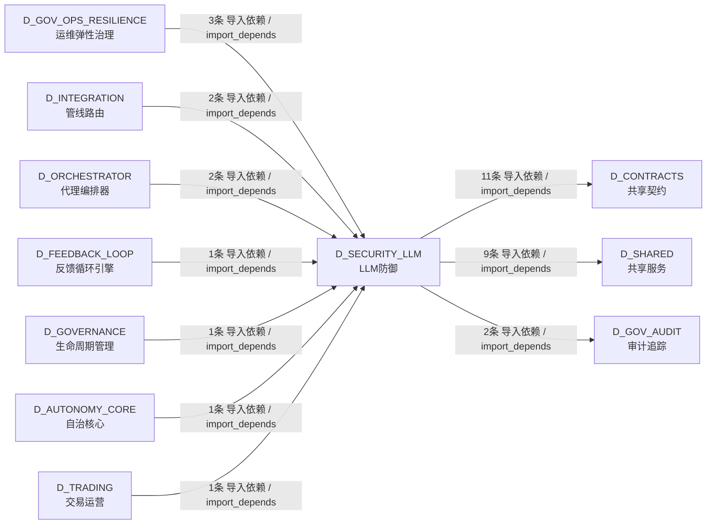

# 28_d_security_llm / LLM防御 / LLM Defense

> **功能简介 / Overview**: LLM 防御，负责 LLM 安全防护、Prompt 注入防御和输出过滤

> **文档作用 / Purpose**: 展示 LLM防御（D_SECURITY_LLM）功能域的模块清单、域内依赖关系、跨域依赖关系、架构分层视图，供架构审查和域治理参考。

> 本文档由 generate_domain_doc.py 从 depgraph (PostgreSQL) 自动生成
> 数据源: depgraph (PostgreSQL) nodes表 + edges表

## 域基本信息 / Domain Overview

| 字段 | 值 | Field | Value |
|------|------|-------|-------|
| 编号 | 28 | Number | 28 |
| 域ID | D_SECURITY_LLM | Domain ID | D_SECURITY_LLM |
| 域名称 | LLM防御 | Domain Name | LLM Defense |
| 层级 | L1 基础平台层 | Layer | L1 Foundation |
| 模块数 | 25 | Module Count | 25 |
| 域内依赖 | 42 | Internal Dependencies | 42 |
| 跨域入边 | 11 | Cross-domain Incoming | 11 |
| 跨域出边 | 22 | Cross-domain Outgoing | 22 |
| 设计态模块 | 0 | Design Modules | 0 |
| 生产态模块 | 25 | Production Modules | 25 |
| 容量 | 0/150 (正常) | Capacity | 0/150 (正常) |
| 描述 | L0供应链安全(模型验证/依赖扫描) | Description | L0供应链安全(模型验证/依赖扫描) |

## 模块分层清单 / Module Layered List

> 按 architecture_layer 分组的模块清单（共 25 个模块 / 25 modules）。

### L1 基础层 / Foundation Layer (25 modules)

| # | 模块路径 / Module Path | 模块名称 / Module Name (功能简介 / Description) | 成熟度 / Maturity | 蓝图 / Blueprint |
|:--:|---------|---------|:---:|:---:|
| 1 | src/zephyr/security/llm_defense/llm_security/behavior_aud... | behavior_audit_logger.py | 生产态 / production |  |
| 2 | src/zephyr/security/llm_defense/llm_security/dashboard/ap... | LLM Security Gateway - Streamlit Dashboard. | 生产态 / production |  |
| 3 | src/zephyr/security/llm_defense/llm_security/gateway.py | gateway.py | 生产态 / production |  |
| 4 | src/zephyr/security/llm_defense/llm_security/input_saniti... | InputSanitizer: path whitelist + command whitel... | 生产态 / production |  |
| 5 | src/zephyr/security/llm_defense/llm_security/layers/l0_su... | l0_supply_chain.py | 生产态 / production |  |
| 6 | src/zephyr/security/llm_defense/llm_security/layers/l1_in... | l1_input.py | 生产态 / production |  |
| 7 | src/zephyr/security/llm_defense/llm_security/layers/l2_pr... | l2_prompt_protection.py | 生产态 / production |  |
| 8 | src/zephyr/security/llm_defense/llm_security/layers/l2a_p... | l2a_process_sandbox.py | 生产态 / production |  |
| 9 | src/zephyr/security/llm_defense/llm_security/layers/l3_ou... | l3_output.py | 生产态 / production |  |
| 10 | src/zephyr/security/llm_defense/llm_security/layers/l4_ag... | l4_agent.py | 生产态 / production |  |
| 11 | src/zephyr/security/llm_defense/llm_security/layers/l5_re... | l5_resource_protection.py | 生产态 / production |  |
| 12 | src/zephyr/security/llm_defense/llm_security/layers/l6_da... | l6_data_flow.py | 生产态 / production |  |
| 13 | src/zephyr/security/llm_defense/llm_security/layers/l6_ob... | L6 Observability Layer — security event loggin... | 生产态 / production |  |
| 14 | src/zephyr/security/llm_defense/llm_security/layers/l8_co... | l8_compliance.py | 生产态 / production |  |
| 15 | src/zephyr/security/llm_defense/llm_security/layers/l8_mu... | l8_multi_agent.py | 生产态 / production |  |
| 16 | src/zephyr/security/llm_defense/llm_security/patterns/inj... | injection_patterns.py | 生产态 / production |  |
| 17 | src/zephyr/security/llm_defense/llm_security/patterns/sec... | secrets.py | 生产态 / production |  |
| 18 | src/zephyr/security/llm_defense/llm_security/process_sand... | L2a ProcessSandbox — subprocess 路径白名单沙箱 | 生产态 / production |  |
| 19 | src/zephyr/security/llm_defense/llm_security/protocol.py | protocol.py | 生产态 / production |  |
| 20 | src/zephyr/security/llm_defense/llm_security/runtime_inte... | runtime_interceptor.py — 运行时 LLM 裸调拦截器... | 生产态 / production |  |
| 21 | src/zephyr/security/llm_defense/llm_security/self_protect... | adversarial_mutator.py | 生产态 / production |  |
| 22 | src/zephyr/security/llm_defense/llm_security/self_protect... | code_integrity.py | 生产态 / production |  |
| 23 | src/zephyr/security/llm_defense/llm_security/self_protect... | isolation.py | 生产态 / production |  |
| 24 | src/zephyr/security/llm_defense/llm_security/self_protect... | l7_validation.py | 生产态 / production |  |
| 25 | src/zephyr/security/llm_defense/llm_security/self_protect... | red_team_scanner.py | 生产态 / production |  |

## 域内依赖图 / Internal Dependency Diagram

> 依赖图内嵌在本文档中，IDE 可直接渲染显示。参考 decision_index.md 设计，分三个视图：合并全景图、运营态子图、设计态子图（按 design_maturity 实际值拆分）。
>
> **图例说明 / Legend**：
> - **实线边框 = 运营态模块**（production，已上线运行）
> - **虚线边框 = 设计态模块**（design，蓝图阶段，代码未写）
> - **实线箭头 = 运营态依赖**（已生效的依赖关系）
> - **虚线箭头 = 非运营态依赖**（计划中/验证中的依赖关系）

### 合并全景图（全部模块，标签标注成熟度）

> 展示全部 25 个模块（生产态 25 + 设计态 0），标签标注成熟度。

### 运营态子图（仅 design_maturity=production 的模块和依赖）

> 仅展示已上线运行的模块（共 25 个，42 条域内依赖）。

```mermaid
graph TD
    subgraph D_SECURITY_LLM["D_SECURITY_LLM LLM防御"]
        src_zephyr_security_llm_defense_llm_security_behavior_audit_logger_py["(生产态 / production) behavior_audit_logger.py"]
        src_zephyr_security_llm_defense_llm_security_dashboard_app_py["(生产态 / production) LLM Security Gateway - Streamlit Dashboard.<br/>文件: app.py"]
        src_zephyr_security_llm_defense_llm_security_gateway_py["(生产态 / production) gateway.py"]
        src_zephyr_security_llm_defense_llm_security_input_sanitizer_py["(生产态 / production) InputSanitizer: path whitelist + command whitel...<br/>文件: input_sanitizer.py"]
        src_zephyr_security_llm_defense_llm_security_layers_l0_supply_chain_py["(生产态 / production) l0_supply_chain.py"]
        src_zephyr_security_llm_defense_llm_security_layers_l1_input_py["(生产态 / production) l1_input.py"]
        src_zephyr_security_llm_defense_llm_security_layers_l2_prompt_protection_py["(生产态 / production) l2_prompt_protection.py"]
        src_zephyr_security_llm_defense_llm_security_layers_l2a_process_sandbox_py["(生产态 / production) l2a_process_sandbox.py"]
        src_zephyr_security_llm_defense_llm_security_layers_l3_output_py["(生产态 / production) l3_output.py"]
        src_zephyr_security_llm_defense_llm_security_layers_l4_agent_py["(生产态 / production) l4_agent.py"]
        src_zephyr_security_llm_defense_llm_security_layers_l5_resource_protection_py["(生产态 / production) l5_resource_protection.py"]
        src_zephyr_security_llm_defense_llm_security_layers_l6_data_flow_py["(生产态 / production) l6_data_flow.py"]
        src_zephyr_security_llm_defense_llm_security_layers_l6_observability_py["(生产态 / production) L6 Observability Layer — security event loggin...<br/>文件: l6_observability.py"]
        src_zephyr_security_llm_defense_llm_security_layers_l8_compliance_py["(生产态 / production) l8_compliance.py"]
        src_zephyr_security_llm_defense_llm_security_layers_l8_multi_agent_py["(生产态 / production) l8_multi_agent.py"]
        src_zephyr_security_llm_defense_llm_security_patterns_injection_patterns_py["(生产态 / production) injection_patterns.py"]
        src_zephyr_security_llm_defense_llm_security_patterns_secrets_py["(生产态 / production) secrets.py"]
        src_zephyr_security_llm_defense_llm_security_process_sandbox_py["(生产态 / production) L2a ProcessSandbox — subprocess 路径白名单沙箱<br/>文件: process_sandbox.py"]
        src_zephyr_security_llm_defense_llm_security_protocol_py["(生产态 / production) protocol.py"]
        src_zephyr_security_llm_defense_llm_security_runtime_interceptor_py["(生产态 / production) runtime_interceptor.py — 运行时 LLM 裸调拦截器...<br/>文件: runtime_interceptor.py"]
        src_zephyr_security_llm_defense_llm_security_self_protection_adversarial_mutator_py["(生产态 / production) adversarial_mutator.py"]
        src_zephyr_security_llm_defense_llm_security_self_protection_code_integrity_py["(生产态 / production) code_integrity.py"]
        src_zephyr_security_llm_defense_llm_security_self_protection_isolation_py["(生产态 / production) isolation.py"]
        src_zephyr_security_llm_defense_llm_security_self_protection_l7_validation_py["(生产态 / production) l7_validation.py"]
        src_zephyr_security_llm_defense_llm_security_self_protection_red_team_scanner_py["(生产态 / production) red_team_scanner.py"]
    end
    src_zephyr_security_llm_defense_llm_security_gateway_py -->|导入依赖 / import_depends| src_zephyr_security_llm_defense_llm_security_runtime_interceptor_py
    src_zephyr_security_llm_defense_llm_security_gateway_py -->|导入依赖 / import_depends| src_zephyr_security_llm_defense_llm_security_protocol_py
    src_zephyr_security_llm_defense_llm_security_gateway_py -->|导入依赖 / import_depends| src_zephyr_security_llm_defense_llm_security_layers_l0_supply_chain_py
    src_zephyr_security_llm_defense_llm_security_gateway_py -->|导入依赖 / import_depends| src_zephyr_security_llm_defense_llm_security_layers_l4_agent_py
    src_zephyr_security_llm_defense_llm_security_gateway_py -->|导入依赖 / import_depends| src_zephyr_security_llm_defense_llm_security_layers_l5_resource_protection_py
    src_zephyr_security_llm_defense_llm_security_gateway_py -->|导入依赖 / import_depends| src_zephyr_security_llm_defense_llm_security_layers_l2a_process_sandbox_py
    src_zephyr_security_llm_defense_llm_security_gateway_py -->|导入依赖 / import_depends| src_zephyr_security_llm_defense_llm_security_layers_l1_input_py
    src_zephyr_security_llm_defense_llm_security_gateway_py -->|导入依赖 / import_depends| src_zephyr_security_llm_defense_llm_security_layers_l2_prompt_protection_py
    src_zephyr_security_llm_defense_llm_security_gateway_py -->|导入依赖 / import_depends| src_zephyr_security_llm_defense_llm_security_layers_l3_output_py
    src_zephyr_security_llm_defense_llm_security_gateway_py -->|导入依赖 / import_depends| src_zephyr_security_llm_defense_llm_security_layers_l6_observability_py
    src_zephyr_security_llm_defense_llm_security_gateway_py -->|导入依赖 / import_depends| src_zephyr_security_llm_defense_llm_security_layers_l8_multi_agent_py
    src_zephyr_security_llm_defense_llm_security_gateway_py -->|导入依赖 / import_depends| src_zephyr_security_llm_defense_llm_security_self_protection_l7_validation_py
    src_zephyr_security_llm_defense_llm_security_layers_l0_supply_chain_py -->|导入依赖 / import_depends| src_zephyr_security_llm_defense_llm_security_protocol_py
    src_zephyr_security_llm_defense_llm_security_layers_l4_agent_py -->|导入依赖 / import_depends| src_zephyr_security_llm_defense_llm_security_protocol_py
    src_zephyr_security_llm_defense_llm_security_layers_l5_resource_protection_py -->|导入依赖 / import_depends| src_zephyr_security_llm_defense_llm_security_protocol_py
    src_zephyr_security_llm_defense_llm_security_layers_l2a_process_sandbox_py -->|导入依赖 / import_depends| src_zephyr_security_llm_defense_llm_security_protocol_py
    src_zephyr_security_llm_defense_llm_security_dashboard_app_py -->|导入依赖 / import_depends| src_zephyr_security_llm_defense_llm_security_behavior_audit_logger_py
    src_zephyr_security_llm_defense_llm_security_dashboard_app_py -->|导入依赖 / import_depends| src_zephyr_security_llm_defense_llm_security_input_sanitizer_py
    src_zephyr_security_llm_defense_llm_security_dashboard_app_py -->|导入依赖 / import_depends| src_zephyr_security_llm_defense_llm_security_protocol_py
    src_zephyr_security_llm_defense_llm_security_dashboard_app_py -->|导入依赖 / import_depends| src_zephyr_security_llm_defense_llm_security_layers_l0_supply_chain_py
    src_zephyr_security_llm_defense_llm_security_dashboard_app_py -->|导入依赖 / import_depends| src_zephyr_security_llm_defense_llm_security_layers_l4_agent_py
    src_zephyr_security_llm_defense_llm_security_dashboard_app_py -->|导入依赖 / import_depends| src_zephyr_security_llm_defense_llm_security_layers_l5_resource_protection_py
    src_zephyr_security_llm_defense_llm_security_dashboard_app_py -->|导入依赖 / import_depends| src_zephyr_security_llm_defense_llm_security_layers_l1_input_py
    src_zephyr_security_llm_defense_llm_security_dashboard_app_py -->|导入依赖 / import_depends| src_zephyr_security_llm_defense_llm_security_layers_l2_prompt_protection_py
    src_zephyr_security_llm_defense_llm_security_dashboard_app_py -->|导入依赖 / import_depends| src_zephyr_security_llm_defense_llm_security_layers_l3_output_py
    src_zephyr_security_llm_defense_llm_security_dashboard_app_py -->|导入依赖 / import_depends| src_zephyr_security_llm_defense_llm_security_layers_l6_observability_py
    src_zephyr_security_llm_defense_llm_security_dashboard_app_py -->|导入依赖 / import_depends| src_zephyr_security_llm_defense_llm_security_self_protection_isolation_py
    src_zephyr_security_llm_defense_llm_security_dashboard_app_py -->|导入依赖 / import_depends| src_zephyr_security_llm_defense_llm_security_layers_l8_multi_agent_py
    src_zephyr_security_llm_defense_llm_security_dashboard_app_py -->|导入依赖 / import_depends| src_zephyr_security_llm_defense_llm_security_self_protection_code_integrity_py
    src_zephyr_security_llm_defense_llm_security_dashboard_app_py -->|导入依赖 / import_depends| src_zephyr_security_llm_defense_llm_security_patterns_injection_patterns_py
    src_zephyr_security_llm_defense_llm_security_dashboard_app_py -->|导入依赖 / import_depends| src_zephyr_security_llm_defense_llm_security_patterns_secrets_py
    src_zephyr_security_llm_defense_llm_security_dashboard_app_py -->|导入依赖 / import_depends| src_zephyr_security_llm_defense_llm_security_self_protection_l7_validation_py
    src_zephyr_security_llm_defense_llm_security_layers_l1_input_py -->|导入依赖 / import_depends| src_zephyr_security_llm_defense_llm_security_protocol_py
    src_zephyr_security_llm_defense_llm_security_layers_l2_prompt_protection_py -->|导入依赖 / import_depends| src_zephyr_security_llm_defense_llm_security_protocol_py
    src_zephyr_security_llm_defense_llm_security_layers_l3_output_py -->|导入依赖 / import_depends| src_zephyr_security_llm_defense_llm_security_protocol_py
    src_zephyr_security_llm_defense_llm_security_layers_l6_observability_py -->|导入依赖 / import_depends| src_zephyr_security_llm_defense_llm_security_protocol_py
    src_zephyr_security_llm_defense_llm_security_layers_l8_multi_agent_py -->|导入依赖 / import_depends| src_zephyr_security_llm_defense_llm_security_protocol_py
    src_zephyr_security_llm_defense_llm_security_self_protection_adversarial_mutator_py -->|导入依赖 / import_depends| src_zephyr_security_llm_defense_llm_security_gateway_py
    src_zephyr_security_llm_defense_llm_security_self_protection_red_team_scanner_py -->|导入依赖 / import_depends| src_zephyr_security_llm_defense_llm_security_gateway_py
    src_zephyr_security_llm_defense_llm_security_self_protection_red_team_scanner_py -->|导入依赖 / import_depends| src_zephyr_security_llm_defense_llm_security_protocol_py
    src_zephyr_security_llm_defense_llm_security_self_protection_l7_validation_py -->|导入依赖 / import_depends| src_zephyr_security_llm_defense_llm_security_protocol_py
    src_zephyr_security_llm_defense_llm_security_self_protection_l7_validation_py -->|导入依赖 / import_depends| src_zephyr_security_llm_defense_llm_security_self_protection_code_integrity_py
    D_SHARED["(生产态 / production) D_SHARED"]
    src_zephyr_security_llm_defense_llm_security_layers_l2a_process_sandbox_py -->|导入依赖 / import_depends| D_SHARED
    D_CONTRACTS["(生产态 / production) D_CONTRACTS"]
    src_zephyr_security_llm_defense_llm_security_layers_l0_supply_chain_py -->|导入依赖 / import_depends| D_CONTRACTS
    src_zephyr_security_llm_defense_llm_security_layers_l4_agent_py -->|导入依赖 / import_depends| D_SHARED
    src_zephyr_security_llm_defense_llm_security_patterns_secrets_py -->|导入依赖 / import_depends| D_SHARED
    src_zephyr_security_llm_defense_llm_security_process_sandbox_py -->|导入依赖 / import_depends| D_SHARED
    src_zephyr_security_llm_defense_llm_security_layers_l2_prompt_protection_py -->|导入依赖 / import_depends| D_CONTRACTS
    src_zephyr_security_llm_defense_llm_security_layers_l2a_process_sandbox_py -->|导入依赖 / import_depends| D_CONTRACTS
    src_zephyr_security_llm_defense_llm_security_layers_l3_output_py -->|导入依赖 / import_depends| D_CONTRACTS
    src_zephyr_security_llm_defense_llm_security_layers_l4_agent_py -->|导入依赖 / import_depends| D_CONTRACTS
    src_zephyr_security_llm_defense_llm_security_layers_l6_observability_py -->|导入依赖 / import_depends| D_CONTRACTS
    D_GOV_AUDIT["(生产态 / production) D_GOV_AUDIT"]
    src_zephyr_security_llm_defense_llm_security_self_protection_isolation_py -->|导入依赖 / import_depends| D_GOV_AUDIT
    src_zephyr_security_llm_defense_llm_security_self_protection_red_team_scanner_py -->|导入依赖 / import_depends| D_SHARED
    src_zephyr_security_llm_defense_llm_security_protocol_py -->|导入依赖 / import_depends| D_CONTRACTS
    src_zephyr_security_llm_defense_llm_security_self_protection_l7_validation_py -->|导入依赖 / import_depends| D_CONTRACTS
    src_zephyr_security_llm_defense_llm_security_self_protection_adversarial_mutator_py -->|导入依赖 / import_depends| D_SHARED
    D_GOV_OPS_RESILIENCE["(生产态 / production) D_GOV_OPS_RESILIENCE"]
    D_GOV_OPS_RESILIENCE -->|导入依赖 / import_depends| src_zephyr_security_llm_defense_llm_security_gateway_py
    D_FEEDBACK_LOOP["(生产态 / production) D_FEEDBACK_LOOP"]
    D_FEEDBACK_LOOP -->|导入依赖 / import_depends| src_zephyr_security_llm_defense_llm_security_gateway_py
    D_GOVERNANCE["(生产态 / production) D_GOVERNANCE"]
    D_GOVERNANCE -->|导入依赖 / import_depends| src_zephyr_security_llm_defense_llm_security_gateway_py
    D_AUTONOMY_CORE["(生产态 / production) D_AUTONOMY_CORE"]
    D_AUTONOMY_CORE -->|导入依赖 / import_depends| src_zephyr_security_llm_defense_llm_security_gateway_py
    D_INTEGRATION["(生产态 / production) D_INTEGRATION"]
    D_INTEGRATION -->|导入依赖 / import_depends| src_zephyr_security_llm_defense_llm_security_gateway_py
    D_ORCHESTRATOR["(生产态 / production) D_ORCHESTRATOR"]
    D_ORCHESTRATOR -->|导入依赖 / import_depends| src_zephyr_security_llm_defense_llm_security_gateway_py
    D_TRADING["(生产态 / production) D_TRADING"]
    D_TRADING -->|导入依赖 / import_depends| src_zephyr_security_llm_defense_llm_security_gateway_py
    D_ORCHESTRATOR -->|导入依赖 / import_depends| src_zephyr_security_llm_defense_llm_security_input_sanitizer_py
    D_GOV_OPS_RESILIENCE -->|导入依赖 / import_depends| src_zephyr_security_llm_defense_llm_security_input_sanitizer_py
    D_INTEGRATION -->|导入依赖 / import_depends| src_zephyr_security_llm_defense_llm_security_protocol_py
    D_GOV_OPS_RESILIENCE -->|导入依赖 / import_depends| src_zephyr_security_llm_defense_llm_security_gateway_py
    classDef production fill:#e1f5fe,stroke:#01579b,stroke-width:2px,color:#000
    classDef design fill:#fff3e0,stroke:#e65100,stroke-width:2px,color:#000,stroke-dasharray: 5 5
    classDef external_prod fill:#e8f5e9,stroke:#1b5e20,stroke-width:1px,color:#000
    classDef external_design fill:#fce4ec,stroke:#880e4f,stroke-width:1px,color:#000,stroke-dasharray: 5 5
    class src_zephyr_security_llm_defense_llm_security_behavior_audit_logger_py,src_zephyr_security_llm_defense_llm_security_dashboard_app_py,src_zephyr_security_llm_defense_llm_security_gateway_py,src_zephyr_security_llm_defense_llm_security_input_sanitizer_py,src_zephyr_security_llm_defense_llm_security_layers_l0_supply_chain_py,src_zephyr_security_llm_defense_llm_security_layers_l1_input_py,src_zephyr_security_llm_defense_llm_security_layers_l2_prompt_protection_py,src_zephyr_security_llm_defense_llm_security_layers_l2a_process_sandbox_py,src_zephyr_security_llm_defense_llm_security_layers_l3_output_py,src_zephyr_security_llm_defense_llm_security_layers_l4_agent_py,src_zephyr_security_llm_defense_llm_security_layers_l5_resource_protection_py,src_zephyr_security_llm_defense_llm_security_layers_l6_data_flow_py,src_zephyr_security_llm_defense_llm_security_layers_l6_observability_py,src_zephyr_security_llm_defense_llm_security_layers_l8_compliance_py,src_zephyr_security_llm_defense_llm_security_layers_l8_multi_agent_py,src_zephyr_security_llm_defense_llm_security_patterns_injection_patterns_py,src_zephyr_security_llm_defense_llm_security_patterns_secrets_py,src_zephyr_security_llm_defense_llm_security_process_sandbox_py,src_zephyr_security_llm_defense_llm_security_protocol_py,src_zephyr_security_llm_defense_llm_security_runtime_interceptor_py,src_zephyr_security_llm_defense_llm_security_self_protection_adversarial_mutator_py,src_zephyr_security_llm_defense_llm_security_self_protection_code_integrity_py,src_zephyr_security_llm_defense_llm_security_self_protection_isolation_py,src_zephyr_security_llm_defense_llm_security_self_protection_l7_validation_py,src_zephyr_security_llm_defense_llm_security_self_protection_red_team_scanner_py production
    class D_SHARED,D_CONTRACTS,D_GOV_AUDIT,D_GOV_OPS_RESILIENCE,D_FEEDBACK_LOOP,D_GOVERNANCE,D_AUTONOMY_CORE,D_INTEGRATION,D_ORCHESTRATOR,D_TRADING external_prod
```

### 设计态子图（仅 design_maturity=design 的模块和依赖）

> 仅展示蓝图阶段、代码未写的设计态模块（共 0 个，0 条域内依赖）。

> （无设计态模块 / No design modules）

## 跨域依赖 / Cross-domain Dependencies

### 本域依赖的其他域（出边）/ Depends On

| # | 本域模块 / Source Module | → | 外部域-目标模块 / Target Module | 依赖类型 / Type |
|:--:|---------|:--:|---------|---------|
| 1 | l0_supply_chain.py | → | D_CONTRACTS 共享契约: security_decision.py | 导入依赖 / import_depends |
| 2 | l1_input.py | → | D_CONTRACTS 共享契约: security_decision.py | 导入依赖 / import_depends |
| 3 | l2_prompt_protection.py | → | D_CONTRACTS 共享契约: security_decision.py | 导入依赖 / import_depends |
| 4 | l2a_process_sandbox.py | → | D_CONTRACTS 共享契约: security_decision.py | 导入依赖 / import_depends |
| 5 | l3_output.py | → | D_CONTRACTS 共享契约: security_decision.py | 导入依赖 / import_depends |
| 6 | l4_agent.py | → | D_CONTRACTS 共享契约: security_decision.py | 导入依赖 / import_depends |
| 7 | l5_resource_protection.py | → | D_CONTRACTS 共享契约: security_decision.py | 导入依赖 / import_depends |
| 8 | L6 Observability Layer — security event loggin... | → | D_CONTRACTS 共享契约: security_decision.py | 导入依赖 / import_depends |
| 9 | l8_multi_agent.py | → | D_CONTRACTS 共享契约: security_decision.py | 导入依赖 / import_depends |
| 10 | protocol.py | → | D_CONTRACTS 共享契约: security_decision.py | 导入依赖 / import_depends |
| 11 | l7_validation.py | → | D_CONTRACTS 共享契约: security_decision.py | 导入依赖 / import_depends |
| 12 | behavior_audit_logger.py | → | D_GOV_AUDIT 审计追踪: bridge.py | 导入依赖 / import_depends |
| 13 | isolation.py | → | D_GOV_AUDIT 审计追踪: bridge.py | 导入依赖 / import_depends |
| 14 | behavior_audit_logger.py | → | D_SHARED 共享服务: time_utils.py —— 时间/日期工具（Phase 9 新增 ... | 导入依赖 / import_depends |
| 15 | LLM Security Gateway - Streamlit Dashboard. (ap... | → | D_SHARED 共享服务: paths.py — 项目路径常量 SSoT（Single Source of... | 导入依赖 / import_depends |
| 16 | l2a_process_sandbox.py | → | D_SHARED 共享服务: process_pool.py - Shared process pool for MCP s... | 导入依赖 / import_depends |
| 17 | l4_agent.py | → | D_SHARED 共享服务: secrets.py —— Secrets 管理抽象（Phase 7 新增 ... | 导入依赖 / import_depends |
| 18 | secrets.py | → | D_SHARED 共享服务: secrets.py —— Secrets 管理抽象（Phase 7 新增 ... | 导入依赖 / import_depends |
| 19 | L2a ProcessSandbox — subprocess 路径白名单沙箱... | → | D_SHARED 共享服务: process_pool.py - Shared process pool for MCP s... | 导入依赖 / import_depends |
| 20 | L2a ProcessSandbox — subprocess 路径白名单沙箱... | → | D_SHARED 共享服务: paths.py — 项目路径常量 SSoT（Single Source of... | 导入依赖 / import_depends |
| 21 | adversarial_mutator.py | → | D_SHARED 共享服务: async_utils.py — async/sync 边界桥接（5.12.8 .... | 导入依赖 / import_depends |
| 22 | red_team_scanner.py | → | D_SHARED 共享服务: async_utils.py — async/sync 边界桥接（5.12.8 .... | 导入依赖 / import_depends |

### 依赖本域的其他域（入边）/ Depended By

| # | 外部域-源模块 / Source Module | → | 本域模块 / Target Module | 依赖类型 / Type |
|:--:|---------|:--:|---------|---------|
| 1 | D_AUTONOMY_CORE 自治核心: ContextInjector: retrieve and inject relevant k... | → | gateway.py | 导入依赖 / import_depends |
| 2 | D_FEEDBACK_LOOP 反馈循环引擎: evolution_engine.py | → | gateway.py | 导入依赖 / import_depends |
| 3 | D_GOVERNANCE 生命周期管理: Delegation Engine — MOD-INF-022 (delegation_en... | → | gateway.py | 导入依赖 / import_depends |
| 4 | D_GOV_OPS_RESILIENCE 运维弹性治理: Escalation Engine — MOD-INF-022 (escalation_en... | → | gateway.py | 导入依赖 / import_depends |
| 5 | D_GOV_OPS_RESILIENCE 运维弹性治理: DefaultSecurityGateway — SecurityGateway 三层.... | → | gateway.py | 导入依赖 / import_depends |
| 6 | D_GOV_OPS_RESILIENCE 运维弹性治理: DefaultSecurityGateway — SecurityGateway 三层.... | → | InputSanitizer: path whitelist + command whitel... | 导入依赖 / import_depends |
| 7 | D_INTEGRATION 管线路由: MCP Gateway 集中式治理节点（MOD-INF-013 §12 Ph... | → | gateway.py | 导入依赖 / import_depends |
| 8 | D_INTEGRATION 管线路由: MCP Gateway 集中式治理节点（MOD-INF-013 §12 Ph... | → | protocol.py | 导入依赖 / import_depends |
| 9 | D_ORCHESTRATOR 代理编排器: AgentOrchestrator · 多角色 Agent 路由、工具链.... | → | gateway.py | 导入依赖 / import_depends |
| 10 | D_ORCHESTRATOR 代理编排器: AgentOrchestrator · 多角色 Agent 路由、工具链.... | → | InputSanitizer: path whitelist + command whitel... | 导入依赖 / import_depends |
| 11 | D_TRADING 交易运营: PipelineOrchestrator — M1-M11 管线协调器 (pipe... | → | gateway.py | 导入依赖 / import_depends |

### 跨域依赖图 / Cross-domain Dependency Diagram

> 本域与 10 个外部域直接连接（出边 22 条 + 入边 11 条 = 33 条）。只显示直接连接的域，不展开具体节点。

## 说明 / Notes

- **数据源 / Data Source**: `depgraph (PostgreSQL)` 的 `nodes`、`edges`、`domains` 表
- **生成器 / Generator**: `generate_domain_doc.py`（G2+G10 合并）
- **维护方式 / Maintenance**: 自动生成，全景图更新时刷新
- **文件名规则 / File Naming**: `{编号:02d}_{域ID小写}.md`，如 `16_d_trading.md`
- **图例说明 / Legend**: `[production]`=已上线 / `[design]`=设计中 / `[unknown]`=未知
