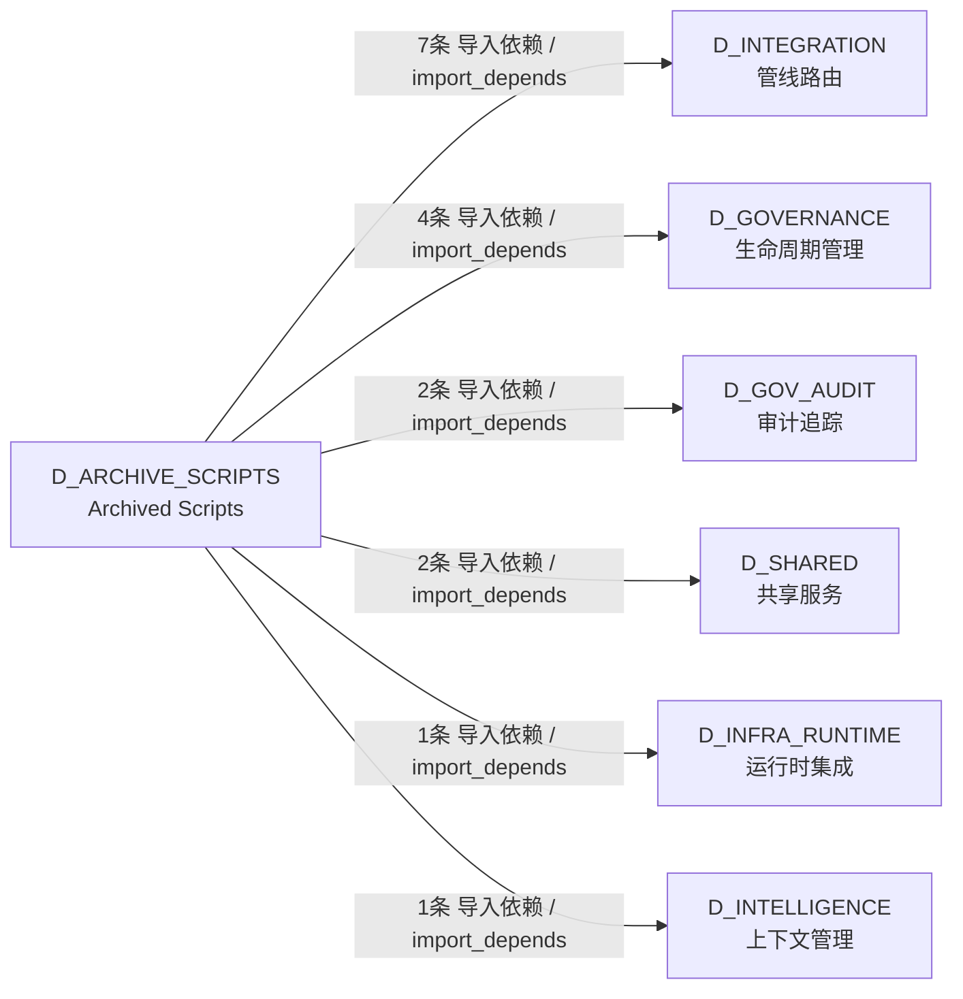

# 29_d_archive_scripts / Archived Scripts / D_ARCHIVE_SCRIPTS

> **文档作用 / Purpose**: 展示 Archived Scripts（D_ARCHIVE_SCRIPTS）功能域的模块清单、域内依赖关系、跨域依赖关系、架构分层视图，供架构审查和域治理参考。

> 本文档由 generate_domain_doc.py 从 depgraph (PostgreSQL) 自动生成
> 数据源: depgraph (PostgreSQL) nodes表 + edges表

## 域基本信息 / Domain Overview

| 字段 | 值 | Field | Value |
|------|------|-------|-------|
| 编号 | 29 | Number | 29 |
| 域ID | D_ARCHIVE_SCRIPTS | Domain ID | D_ARCHIVE_SCRIPTS |
| 域名称 | Archived Scripts | Domain Name | D_ARCHIVE_SCRIPTS |
| 层级 | L2 业务域层 | Layer | L2 Domain |
| 模块数 | 35 | Module Count | 35 |
| 域内依赖 | 14 | Internal Dependencies | 14 |
| 跨域入边 | 0 | Cross-domain Incoming | 0 |
| 跨域出边 | 17 | Cross-domain Outgoing | 17 |
| 设计态模块 | 0 | Design Modules | 0 |
| 生产态模块 | 35 | Production Modules | 35 |
| 容量 | 0/150 (正常) | Capacity | 0/150 (正常) |
| 描述 | Archived scripts (no longer maintained) | Description | Archived scripts (no longer maintained) |

## 模块分层清单 / Module Layered List

> 按 architecture_layer 分组的模块清单（共 35 个模块 / 35 modules）。

### L2 领域层 / Domain Layer (35 modules)

| # | 模块路径 / Module Path | 模块名称 / Module Name (功能简介 / Description) | 成熟度 / Maturity | 蓝图 / Blueprint |
|:--:|---------|---------|:---:|:---:|
| 1 | scripts/governance/_archive/one_off/audit_post_sync_comma... | audit_post_sync_commands.py — post_sync_standa... | 生产态 / production |  |
| 2 | scripts/governance/_archive/one_off/check_exam_case_consi... | 考试题库一致性检查——根因治本，防止"定义-注册... | 生产态 / production |  |
| 3 | scripts/governance/_archive/one_off/create_alignment_task... | # [BLUEPRINT] MOD-INF-005 | scripts/governance/... | 生产态 / production |  |
| 4 | scripts/governance/_archive/one_off/dm105_depgraph_triage.py | DM-105: depgraph 未分配节点三策略处理脚本 | 生产态 / production |  |
| 5 | scripts/governance/_archive/one_off/fix_broken_post_sync.py | fix_broken_post_sync.py — 批量修复历史 broken ... | 生产态 / production |  |
| 6 | scripts/governance/_archive/one_off/list_phase0_tasks.py | [INVARIANTS] 仅查询不修改; 连接失败→exit 1 | 生产态 / production |  |
| 7 | scripts/governance/_archive/one_off/phase_a_backup.py | phase_a_backup.py — 阶段A安全网 Tier0/Tier1 关... | 生产态 / production |  |
| 8 | scripts/governance/_archive/one_off/rename_kebab_to_snake.py | rename_kebab_to_snake.py — 全项目文件名/目录名... | 生产态 / production |  |
| 9 | scripts/governance/_archive/one_off/rename_whitelist_clea... | 命名规范白名单清理 - 全文替换脚本。 | 生产态 / production |  |
| 10 | scripts/governance/_archive/one_off/test_lock_scenarios.py | test_lock_scenarios.py — RULE-ZERO 锁协议场景 ... | 生产态 / production |  |
| 11 | scripts/governance/_archive/one_off/verify_final_delivery.py | [INVARIANTS] 设计态节点数>=1128; 规则表各表>0 | 生产态 / production |  |
| 12 | scripts/governance/_archive/one_off/verify_rule_yaml_migr... | verify_rule_yaml_migration.py - 6-dimensional v... | 生产态 / production |  |
| 13 | scripts/governance/_archive/prototype/adversarial_log.py | 红白对抗闭环记录——攻击→根源分析→修复→回归... | 生产态 / production |  |
| 14 | scripts/governance/_archive/prototype/adversarial_sys_mas... | Red/Blue Team Adversarial Test v3: SYS-MASTER-0... | 生产态 / production |  |
| 15 | scripts/governance/_archive/prototype/audit_domain_nodes.py | SRC-100200: Audit 13 over-capacity domains gran... | 生产态 / production |  |
| 16 | scripts/governance/_archive/prototype/changelog.py | changelog.py — 治理域变更日志生成/追加工具. | 生产态 / production |  |
| 17 | scripts/governance/_archive/prototype/check_audit_rbac_is... | check_audit_rbac_isolation.py — 静态分析 audit... | 生产态 / production |  |
| 18 | scripts/governance/_archive/prototype/construction_gate.py | Construction Gate — 施工前路径校验门禁 | 生产态 / production |  |
| 19 | scripts/governance/_archive/prototype/generate_asset_inde... | 全项目资产索引生成器 | 生产态 / production |  |
| 20 | scripts/governance/_archive/prototype/generate_nav_table.py | generate_nav_table.py — 全流程导航表自动生成器... | 生产态 / production |  |
| 21 | scripts/governance/_archive/prototype/rebuild_audit_index.py | scripts/governance/rebuild_audit_index.py — 重... | 生产态 / production |  |
| 22 | scripts/governance/_archive/prototype/scan_ground_truth_d... | # [BLUEPRINT] MOD-INF-005 | scripts/governance/... | 生产态 / production |  |
| 23 | scripts/governance/_archive/prototype/session_simulator.py | session_simulator — 30 个模拟开发 session 的蓝... | 生产态 / production |  |
| 24 | scripts/governance/_archive/prototype/sync_blueprint_stat... | 机械强制：construction_plan=phase_2_complete →... | 生产态 / production |  |
| 25 | scripts/governance/_archive/vms_ri/ri_boundary_check.py | Runtime Integration 边界验证脚本 — MOD-INF-002 | 生产态 / production |  |
| 26 | scripts/governance/_archive/vms_ri/ri_build_completion_ch... | Runtime Integration Phase 2 完工验证 — MOD-INF-002 | 生产态 / production |  |
| 27 | scripts/governance/_archive/vms_ri/vms_blindspot_check.py | VMS 盲点闭合检查器 — MOD-INF-011 · R1(33) + R... | 生产态 / production |  |
| 28 | scripts/governance/_archive/vms_ri/vms_build_completion_c... | VMS Build Completion Check — MOD-INF-011 · TA... | 生产态 / production |  |
| 29 | scripts/governance/_archive/vms_ri/vms_cron_monitor.py | VMS Cron 监控器 — MOD-INF-011 · TASK-INF-0224 | 生产态 / production |  |
| 30 | scripts/governance/_archive/vms_ri/vms_cross_file_check.py | VMS 跨文件内容一致性检查器 — MOD-INF-011 · TA... | 生产态 / production |  |
| 31 | scripts/governance/_archive/vms_ri/vms_health_check.py | VMS Health Check 脚本 — MOD-INF-011 · Phase 3... | 生产态 / production |  |
| 32 | scripts/governance/_archive/vms_ri/vms_migrate.py | VMS Phase 2 数据迁移脚本 — MOD-INF-011 | 生产态 / production |  |
| 33 | scripts/governance/_archive/vms_ri/vms_migration_dry_run.py | VMS 迁移 dry-run 脚本 — MOD-INF-011 Phase 2 前... | 生产态 / production |  |
| 34 | scripts/governance/_archive/vms_ri/vms_phase_rollback.py | VMS Phase 回滚方案 — MOD-INF-011 · TASK-INF-0217 | 生产态 / production |  |
| 35 | scripts/governance/_archive/vms_ri/vms_version_sync_check.py | VMS 版本同步检查器 — MOD-INF-011 · TASK-INF-0222 | 生产态 / production |  |

## 域内依赖图 / Internal Dependency Diagram

> 依赖图内嵌在本文档中，IDE 可直接渲染显示。参考 decision_index.md 设计，分三个视图：合并全景图、运营态子图、设计态子图（按 design_maturity 实际值拆分）。
>
> **图例说明 / Legend**：
> - **实线边框 = 运营态模块**（production，已上线运行）
> - **虚线边框 = 设计态模块**（design，蓝图阶段，代码未写）
> - **实线箭头 = 运营态依赖**（已生效的依赖关系）
> - **虚线箭头 = 非运营态依赖**（计划中/验证中的依赖关系）

### 合并全景图（全部模块，标签标注成熟度）

> 展示全部 35 个模块（生产态 35 + 设计态 0），标签标注成熟度。

#### 第 1 页 / 共 2 页

```mermaid
graph TD
    subgraph D_ARCHIVE_SCRIPTS["D_ARCHIVE_SCRIPTS Archived Scripts"]
        scripts_governance_archive_one_off_audit_post_sync_commands_py["(生产态 / production) audit_post_sync_commands.py — post_sync_standa...<br/>文件: audit_post_sync_commands.py"]
        scripts_governance_archive_one_off_check_exam_case_consistency_py["(生产态 / production) 考试题库一致性检查——根因治本，防止'定义-注册...<br/>文件: check_exam_case_consistency.py"]
        scripts_governance_archive_one_off_create_alignment_tasks_py["(生产态 / production) # (BLUEPRINT) MOD-INF-005 / scripts/governance/...<br/>文件: create_alignment_tasks.py"]
        scripts_governance_archive_one_off_dm105_depgraph_triage_py["(生产态 / production) DM-105: depgraph 未分配节点三策略处理脚本<br/>文件: dm105_depgraph_triage.py"]
        scripts_governance_archive_one_off_fix_broken_post_sync_py["(生产态 / production) fix_broken_post_sync.py — 批量修复历史 broken ...<br/>文件: fix_broken_post_sync.py"]
        scripts_governance_archive_one_off_list_phase0_tasks_py["(生产态 / production) (INVARIANTS) 仅查询不修改; 连接失败→exit 1<br/>文件: list_phase0_tasks.py"]
        scripts_governance_archive_one_off_phase_a_backup_py["(生产态 / production) phase_a_backup.py — 阶段A安全网 Tier0/Tier1 关...<br/>文件: phase_a_backup.py"]
        scripts_governance_archive_one_off_rename_kebab_to_snake_py["(生产态 / production) rename_kebab_to_snake.py — 全项目文件名/目录名...<br/>文件: rename_kebab_to_snake.py"]
        scripts_governance_archive_one_off_rename_whitelist_cleanup_py["(生产态 / production) 命名规范白名单清理 - 全文替换脚本。<br/>文件: rename_whitelist_cleanup.py"]
        scripts_governance_archive_one_off_test_lock_scenarios_py["(生产态 / production) test_lock_scenarios.py — RULE-ZERO 锁协议场景 ...<br/>文件: test_lock_scenarios.py"]
        scripts_governance_archive_one_off_verify_final_delivery_py["(生产态 / production) (INVARIANTS) 设计态节点数>=1128; 规则表各表>0<br/>文件: verify_final_delivery.py"]
        scripts_governance_archive_one_off_verify_rule_yaml_migration_py["(生产态 / production) verify_rule_yaml_migration.py - 6-dimensional v...<br/>文件: verify_rule_yaml_migration.py"]
        scripts_governance_archive_prototype_adversarial_log_py["(生产态 / production) 红白对抗闭环记录——攻击→根源分析→修复→回归...<br/>文件: adversarial_log.py"]
        scripts_governance_archive_prototype_adversarial_sys_master_test_py["(生产态 / production) Red/Blue Team Adversarial Test v3: SYS-MASTER-0...<br/>文件: adversarial_sys_master_test.py"]
        scripts_governance_archive_prototype_audit_domain_nodes_py["(生产态 / production) SRC-100200: Audit 13 over-capacity domains gran...<br/>文件: audit_domain_nodes.py"]
        scripts_governance_archive_prototype_changelog_py["(生产态 / production) changelog.py — 治理域变更日志生成/追加工具.<br/>文件: changelog.py"]
        scripts_governance_archive_prototype_check_audit_rbac_isolation_py["(生产态 / production) check_audit_rbac_isolation.py — 静态分析 audit...<br/>文件: check_audit_rbac_isolation.py"]
        scripts_governance_archive_prototype_construction_gate_py["(生产态 / production) Construction Gate — 施工前路径校验门禁<br/>文件: construction_gate.py"]
        scripts_governance_archive_prototype_generate_asset_index_py["(生产态 / production) 全项目资产索引生成器<br/>文件: generate_asset_index.py"]
        scripts_governance_archive_prototype_generate_nav_table_py["(生产态 / production) generate_nav_table.py — 全流程导航表自动生成器...<br/>文件: generate_nav_table.py"]
        scripts_governance_archive_prototype_rebuild_audit_index_py["(生产态 / production) scripts/governance/rebuild_audit_index.py — 重...<br/>文件: rebuild_audit_index.py"]
        scripts_governance_archive_prototype_scan_ground_truth_deps_py["(生产态 / production) # (BLUEPRINT) MOD-INF-005 / scripts/governance/...<br/>文件: scan_ground_truth_deps.py"]
        scripts_governance_archive_prototype_session_simulator_py["(生产态 / production) session_simulator — 30 个模拟开发 session 的蓝...<br/>文件: session_simulator.py"]
        scripts_governance_archive_prototype_sync_blueprint_status_py["(生产态 / production) 机械强制：construction_plan=phase_2_complete →...<br/>文件: sync_blueprint_status.py"]
        scripts_governance_archive_vms_ri_ri_boundary_check_py["(生产态 / production) Runtime Integration 边界验证脚本 — MOD-INF-002<br/>文件: ri_boundary_check.py"]
        scripts_governance_archive_vms_ri_ri_build_completion_check_py["(生产态 / production) Runtime Integration Phase 2 完工验证 — MOD-INF-002<br/>文件: ri_build_completion_check.py"]
        scripts_governance_archive_vms_ri_vms_blindspot_check_py["(生产态 / production) VMS 盲点闭合检查器 — MOD-INF-011 · R1(33) + R...<br/>文件: vms_blindspot_check.py"]
        scripts_governance_archive_vms_ri_vms_build_completion_check_py["(生产态 / production) VMS Build Completion Check — MOD-INF-011 · TA...<br/>文件: vms_build_completion_check.py"]
        scripts_governance_archive_vms_ri_vms_cron_monitor_py["(生产态 / production) VMS Cron 监控器 — MOD-INF-011 · TASK-INF-0224<br/>文件: vms_cron_monitor.py"]
        scripts_governance_archive_vms_ri_vms_cross_file_check_py["(生产态 / production) VMS 跨文件内容一致性检查器 — MOD-INF-011 · TA...<br/>文件: vms_cross_file_check.py"]
    end
    scripts_governance_archive_prototype_adversarial_log_py -->|config_depends / config_depends| scripts_governance_archive_prototype_adversarial_sys_master_test_py
    scripts_governance_archive_prototype_changelog_py -->|config_depends / config_depends| scripts_governance_archive_prototype_adversarial_sys_master_test_py
    scripts_governance_archive_prototype_check_audit_rbac_isolation_py -->|config_depends / config_depends| scripts_governance_archive_prototype_adversarial_sys_master_test_py
    scripts_governance_archive_prototype_audit_domain_nodes_py -->|config_depends / config_depends| scripts_governance_archive_prototype_adversarial_sys_master_test_py
    scripts_governance_archive_prototype_generate_nav_table_py -->|config_depends / config_depends| scripts_governance_archive_prototype_adversarial_sys_master_test_py
    scripts_governance_archive_prototype_generate_asset_index_py -->|config_depends / config_depends| scripts_governance_archive_prototype_adversarial_sys_master_test_py
    scripts_governance_archive_prototype_scan_ground_truth_deps_py -->|config_depends / config_depends| scripts_governance_archive_prototype_adversarial_sys_master_test_py
    scripts_governance_archive_vms_ri_ri_boundary_check_py -->|config_depends / config_depends| scripts_governance_archive_vms_ri_ri_build_completion_check_py
    scripts_governance_archive_vms_ri_vms_blindspot_check_py -->|config_depends / config_depends| scripts_governance_archive_vms_ri_ri_boundary_check_py
    scripts_governance_archive_prototype_sync_blueprint_status_py -->|config_depends / config_depends| scripts_governance_archive_prototype_adversarial_sys_master_test_py
    scripts_governance_archive_vms_ri_vms_build_completion_check_py -->|config_depends / config_depends| scripts_governance_archive_vms_ri_ri_boundary_check_py
    scripts_governance_archive_vms_ri_vms_cross_file_check_py -->|config_depends / config_depends| scripts_governance_archive_vms_ri_ri_boundary_check_py
    D_INTEGRATION["(生产态 / production) D_INTEGRATION"]
    scripts_governance_archive_vms_ri_vms_cron_monitor_py -->|导入依赖 / import_depends| D_INTEGRATION
    scripts_governance_archive_vms_ri_vms_cron_monitor_py -->|导入依赖 / import_depends| D_INTEGRATION
    D_INFRA_RUNTIME["(生产态 / production) D_INFRA_RUNTIME"]
    scripts_governance_archive_prototype_session_simulator_py -->|导入依赖 / import_depends| D_INFRA_RUNTIME
    D_GOV_AUDIT["(生产态 / production) D_GOV_AUDIT"]
    scripts_governance_archive_prototype_rebuild_audit_index_py -->|导入依赖 / import_depends| D_GOV_AUDIT
    D_GOVERNANCE["(生产态 / production) D_GOVERNANCE"]
    scripts_governance_archive_one_off_audit_post_sync_commands_py -->|导入依赖 / import_depends| D_GOVERNANCE
    D_SHARED["(生产态 / production) D_SHARED"]
    scripts_governance_archive_one_off_dm105_depgraph_triage_py -->|导入依赖 / import_depends| D_SHARED
    D_INTELLIGENCE["(生产态 / production) D_INTELLIGENCE"]
    scripts_governance_archive_one_off_check_exam_case_consistency_py -->|导入依赖 / import_depends| D_INTELLIGENCE
    scripts_governance_archive_one_off_audit_post_sync_commands_py -->|导入依赖 / import_depends| D_SHARED
    scripts_governance_archive_one_off_create_alignment_tasks_py -->|导入依赖 / import_depends| D_GOVERNANCE
    scripts_governance_archive_one_off_fix_broken_post_sync_py -->|导入依赖 / import_depends| D_GOVERNANCE
    scripts_governance_archive_prototype_adversarial_sys_master_test_py -->|导入依赖 / import_depends| D_GOV_AUDIT
    scripts_governance_archive_prototype_construction_gate_py -->|导入依赖 / import_depends| D_GOVERNANCE
    classDef production fill:#e1f5fe,stroke:#01579b,stroke-width:2px,color:#000
    classDef design fill:#fff3e0,stroke:#e65100,stroke-width:2px,color:#000,stroke-dasharray: 5 5
    classDef external_prod fill:#e8f5e9,stroke:#1b5e20,stroke-width:1px,color:#000
    classDef external_design fill:#fce4ec,stroke:#880e4f,stroke-width:1px,color:#000,stroke-dasharray: 5 5
    class scripts_governance_archive_one_off_audit_post_sync_commands_py,scripts_governance_archive_one_off_check_exam_case_consistency_py,scripts_governance_archive_one_off_create_alignment_tasks_py,scripts_governance_archive_one_off_dm105_depgraph_triage_py,scripts_governance_archive_one_off_fix_broken_post_sync_py,scripts_governance_archive_one_off_list_phase0_tasks_py,scripts_governance_archive_one_off_phase_a_backup_py,scripts_governance_archive_one_off_rename_kebab_to_snake_py,scripts_governance_archive_one_off_rename_whitelist_cleanup_py,scripts_governance_archive_one_off_test_lock_scenarios_py,scripts_governance_archive_one_off_verify_final_delivery_py,scripts_governance_archive_one_off_verify_rule_yaml_migration_py,scripts_governance_archive_prototype_adversarial_log_py,scripts_governance_archive_prototype_adversarial_sys_master_test_py,scripts_governance_archive_prototype_audit_domain_nodes_py,scripts_governance_archive_prototype_changelog_py,scripts_governance_archive_prototype_check_audit_rbac_isolation_py,scripts_governance_archive_prototype_construction_gate_py,scripts_governance_archive_prototype_generate_asset_index_py,scripts_governance_archive_prototype_generate_nav_table_py,scripts_governance_archive_prototype_rebuild_audit_index_py,scripts_governance_archive_prototype_scan_ground_truth_deps_py,scripts_governance_archive_prototype_session_simulator_py,scripts_governance_archive_prototype_sync_blueprint_status_py,scripts_governance_archive_vms_ri_ri_boundary_check_py,scripts_governance_archive_vms_ri_ri_build_completion_check_py,scripts_governance_archive_vms_ri_vms_blindspot_check_py,scripts_governance_archive_vms_ri_vms_build_completion_check_py,scripts_governance_archive_vms_ri_vms_cron_monitor_py,scripts_governance_archive_vms_ri_vms_cross_file_check_py production
    class D_INTEGRATION,D_INFRA_RUNTIME,D_GOV_AUDIT,D_GOVERNANCE,D_SHARED,D_INTELLIGENCE external_prod
```

#### 第 2 页 / 共 2 页

```mermaid
graph TD
    subgraph D_ARCHIVE_SCRIPTS["D_ARCHIVE_SCRIPTS Archived Scripts"]
        scripts_governance_archive_vms_ri_vms_health_check_py["(生产态 / production) VMS Health Check 脚本 — MOD-INF-011 · Phase 3...<br/>文件: vms_health_check.py"]
        scripts_governance_archive_vms_ri_vms_migrate_py["(生产态 / production) VMS Phase 2 数据迁移脚本 — MOD-INF-011<br/>文件: vms_migrate.py"]
        scripts_governance_archive_vms_ri_vms_migration_dry_run_py["(生产态 / production) VMS 迁移 dry-run 脚本 — MOD-INF-011 Phase 2 前...<br/>文件: vms_migration_dry_run.py"]
        scripts_governance_archive_vms_ri_vms_phase_rollback_py["(生产态 / production) VMS Phase 回滚方案 — MOD-INF-011 · TASK-INF-0217<br/>文件: vms_phase_rollback.py"]
        scripts_governance_archive_vms_ri_vms_version_sync_check_py["(生产态 / production) VMS 版本同步检查器 — MOD-INF-011 · TASK-INF-0222<br/>文件: vms_version_sync_check.py"]
    end
    D_INTEGRATION["(生产态 / production) D_INTEGRATION"]
    scripts_governance_archive_vms_ri_vms_migration_dry_run_py -->|导入依赖 / import_depends| D_INTEGRATION
    scripts_governance_archive_vms_ri_vms_health_check_py -->|导入依赖 / import_depends| D_INTEGRATION
    scripts_governance_archive_vms_ri_vms_health_check_py -->|导入依赖 / import_depends| D_INTEGRATION
    scripts_governance_archive_vms_ri_vms_migrate_py -->|导入依赖 / import_depends| D_INTEGRATION
    scripts_governance_archive_vms_ri_vms_migrate_py -->|导入依赖 / import_depends| D_INTEGRATION
    classDef production fill:#e1f5fe,stroke:#01579b,stroke-width:2px,color:#000
    classDef design fill:#fff3e0,stroke:#e65100,stroke-width:2px,color:#000,stroke-dasharray: 5 5
    classDef external_prod fill:#e8f5e9,stroke:#1b5e20,stroke-width:1px,color:#000
    classDef external_design fill:#fce4ec,stroke:#880e4f,stroke-width:1px,color:#000,stroke-dasharray: 5 5
    class scripts_governance_archive_vms_ri_vms_health_check_py,scripts_governance_archive_vms_ri_vms_migrate_py,scripts_governance_archive_vms_ri_vms_migration_dry_run_py,scripts_governance_archive_vms_ri_vms_phase_rollback_py,scripts_governance_archive_vms_ri_vms_version_sync_check_py production
    class D_INTEGRATION external_prod
```

### 运营态子图（仅 design_maturity=production 的模块和依赖）

> 仅展示已上线运行的模块（共 35 个，14 条域内依赖）。

```mermaid
graph TD
    subgraph D_ARCHIVE_SCRIPTS["D_ARCHIVE_SCRIPTS Archived Scripts"]
        scripts_governance_archive_one_off_audit_post_sync_commands_py["(生产态 / production) audit_post_sync_commands.py — post_sync_standa...<br/>文件: audit_post_sync_commands.py"]
        scripts_governance_archive_one_off_check_exam_case_consistency_py["(生产态 / production) 考试题库一致性检查——根因治本，防止'定义-注册...<br/>文件: check_exam_case_consistency.py"]
        scripts_governance_archive_one_off_create_alignment_tasks_py["(生产态 / production) # (BLUEPRINT) MOD-INF-005 / scripts/governance/...<br/>文件: create_alignment_tasks.py"]
        scripts_governance_archive_one_off_dm105_depgraph_triage_py["(生产态 / production) DM-105: depgraph 未分配节点三策略处理脚本<br/>文件: dm105_depgraph_triage.py"]
        scripts_governance_archive_one_off_fix_broken_post_sync_py["(生产态 / production) fix_broken_post_sync.py — 批量修复历史 broken ...<br/>文件: fix_broken_post_sync.py"]
        scripts_governance_archive_one_off_list_phase0_tasks_py["(生产态 / production) (INVARIANTS) 仅查询不修改; 连接失败→exit 1<br/>文件: list_phase0_tasks.py"]
        scripts_governance_archive_one_off_phase_a_backup_py["(生产态 / production) phase_a_backup.py — 阶段A安全网 Tier0/Tier1 关...<br/>文件: phase_a_backup.py"]
        scripts_governance_archive_one_off_rename_kebab_to_snake_py["(生产态 / production) rename_kebab_to_snake.py — 全项目文件名/目录名...<br/>文件: rename_kebab_to_snake.py"]
        scripts_governance_archive_one_off_rename_whitelist_cleanup_py["(生产态 / production) 命名规范白名单清理 - 全文替换脚本。<br/>文件: rename_whitelist_cleanup.py"]
        scripts_governance_archive_one_off_test_lock_scenarios_py["(生产态 / production) test_lock_scenarios.py — RULE-ZERO 锁协议场景 ...<br/>文件: test_lock_scenarios.py"]
        scripts_governance_archive_one_off_verify_final_delivery_py["(生产态 / production) (INVARIANTS) 设计态节点数>=1128; 规则表各表>0<br/>文件: verify_final_delivery.py"]
        scripts_governance_archive_one_off_verify_rule_yaml_migration_py["(生产态 / production) verify_rule_yaml_migration.py - 6-dimensional v...<br/>文件: verify_rule_yaml_migration.py"]
        scripts_governance_archive_prototype_adversarial_log_py["(生产态 / production) 红白对抗闭环记录——攻击→根源分析→修复→回归...<br/>文件: adversarial_log.py"]
        scripts_governance_archive_prototype_adversarial_sys_master_test_py["(生产态 / production) Red/Blue Team Adversarial Test v3: SYS-MASTER-0...<br/>文件: adversarial_sys_master_test.py"]
        scripts_governance_archive_prototype_audit_domain_nodes_py["(生产态 / production) SRC-100200: Audit 13 over-capacity domains gran...<br/>文件: audit_domain_nodes.py"]
        scripts_governance_archive_prototype_changelog_py["(生产态 / production) changelog.py — 治理域变更日志生成/追加工具.<br/>文件: changelog.py"]
        scripts_governance_archive_prototype_check_audit_rbac_isolation_py["(生产态 / production) check_audit_rbac_isolation.py — 静态分析 audit...<br/>文件: check_audit_rbac_isolation.py"]
        scripts_governance_archive_prototype_construction_gate_py["(生产态 / production) Construction Gate — 施工前路径校验门禁<br/>文件: construction_gate.py"]
        scripts_governance_archive_prototype_generate_asset_index_py["(生产态 / production) 全项目资产索引生成器<br/>文件: generate_asset_index.py"]
        scripts_governance_archive_prototype_generate_nav_table_py["(生产态 / production) generate_nav_table.py — 全流程导航表自动生成器...<br/>文件: generate_nav_table.py"]
        scripts_governance_archive_prototype_rebuild_audit_index_py["(生产态 / production) scripts/governance/rebuild_audit_index.py — 重...<br/>文件: rebuild_audit_index.py"]
        scripts_governance_archive_prototype_scan_ground_truth_deps_py["(生产态 / production) # (BLUEPRINT) MOD-INF-005 / scripts/governance/...<br/>文件: scan_ground_truth_deps.py"]
        scripts_governance_archive_prototype_session_simulator_py["(生产态 / production) session_simulator — 30 个模拟开发 session 的蓝...<br/>文件: session_simulator.py"]
        scripts_governance_archive_prototype_sync_blueprint_status_py["(生产态 / production) 机械强制：construction_plan=phase_2_complete →...<br/>文件: sync_blueprint_status.py"]
        scripts_governance_archive_vms_ri_ri_boundary_check_py["(生产态 / production) Runtime Integration 边界验证脚本 — MOD-INF-002<br/>文件: ri_boundary_check.py"]
        scripts_governance_archive_vms_ri_ri_build_completion_check_py["(生产态 / production) Runtime Integration Phase 2 完工验证 — MOD-INF-002<br/>文件: ri_build_completion_check.py"]
        scripts_governance_archive_vms_ri_vms_blindspot_check_py["(生产态 / production) VMS 盲点闭合检查器 — MOD-INF-011 · R1(33) + R...<br/>文件: vms_blindspot_check.py"]
        scripts_governance_archive_vms_ri_vms_build_completion_check_py["(生产态 / production) VMS Build Completion Check — MOD-INF-011 · TA...<br/>文件: vms_build_completion_check.py"]
        scripts_governance_archive_vms_ri_vms_cron_monitor_py["(生产态 / production) VMS Cron 监控器 — MOD-INF-011 · TASK-INF-0224<br/>文件: vms_cron_monitor.py"]
        scripts_governance_archive_vms_ri_vms_cross_file_check_py["(生产态 / production) VMS 跨文件内容一致性检查器 — MOD-INF-011 · TA...<br/>文件: vms_cross_file_check.py"]
        scripts_governance_archive_vms_ri_vms_health_check_py["(生产态 / production) VMS Health Check 脚本 — MOD-INF-011 · Phase 3...<br/>文件: vms_health_check.py"]
        scripts_governance_archive_vms_ri_vms_migrate_py["(生产态 / production) VMS Phase 2 数据迁移脚本 — MOD-INF-011<br/>文件: vms_migrate.py"]
        scripts_governance_archive_vms_ri_vms_migration_dry_run_py["(生产态 / production) VMS 迁移 dry-run 脚本 — MOD-INF-011 Phase 2 前...<br/>文件: vms_migration_dry_run.py"]
        scripts_governance_archive_vms_ri_vms_phase_rollback_py["(生产态 / production) VMS Phase 回滚方案 — MOD-INF-011 · TASK-INF-0217<br/>文件: vms_phase_rollback.py"]
        scripts_governance_archive_vms_ri_vms_version_sync_check_py["(生产态 / production) VMS 版本同步检查器 — MOD-INF-011 · TASK-INF-0222<br/>文件: vms_version_sync_check.py"]
    end
    scripts_governance_archive_prototype_adversarial_log_py -->|config_depends / config_depends| scripts_governance_archive_prototype_adversarial_sys_master_test_py
    scripts_governance_archive_prototype_changelog_py -->|config_depends / config_depends| scripts_governance_archive_prototype_adversarial_sys_master_test_py
    scripts_governance_archive_prototype_check_audit_rbac_isolation_py -->|config_depends / config_depends| scripts_governance_archive_prototype_adversarial_sys_master_test_py
    scripts_governance_archive_prototype_audit_domain_nodes_py -->|config_depends / config_depends| scripts_governance_archive_prototype_adversarial_sys_master_test_py
    scripts_governance_archive_prototype_generate_nav_table_py -->|config_depends / config_depends| scripts_governance_archive_prototype_adversarial_sys_master_test_py
    scripts_governance_archive_prototype_generate_asset_index_py -->|config_depends / config_depends| scripts_governance_archive_prototype_adversarial_sys_master_test_py
    scripts_governance_archive_prototype_scan_ground_truth_deps_py -->|config_depends / config_depends| scripts_governance_archive_prototype_adversarial_sys_master_test_py
    scripts_governance_archive_vms_ri_ri_boundary_check_py -->|config_depends / config_depends| scripts_governance_archive_vms_ri_ri_build_completion_check_py
    scripts_governance_archive_vms_ri_vms_blindspot_check_py -->|config_depends / config_depends| scripts_governance_archive_vms_ri_ri_boundary_check_py
    scripts_governance_archive_prototype_sync_blueprint_status_py -->|config_depends / config_depends| scripts_governance_archive_prototype_adversarial_sys_master_test_py
    scripts_governance_archive_vms_ri_vms_build_completion_check_py -->|config_depends / config_depends| scripts_governance_archive_vms_ri_ri_boundary_check_py
    scripts_governance_archive_vms_ri_vms_cross_file_check_py -->|config_depends / config_depends| scripts_governance_archive_vms_ri_ri_boundary_check_py
    scripts_governance_archive_vms_ri_vms_version_sync_check_py -->|config_depends / config_depends| scripts_governance_archive_vms_ri_ri_boundary_check_py
    scripts_governance_archive_vms_ri_vms_phase_rollback_py -->|config_depends / config_depends| scripts_governance_archive_vms_ri_ri_boundary_check_py
    D_INTEGRATION["(生产态 / production) D_INTEGRATION"]
    scripts_governance_archive_vms_ri_vms_migration_dry_run_py -->|导入依赖 / import_depends| D_INTEGRATION
    scripts_governance_archive_vms_ri_vms_cron_monitor_py -->|导入依赖 / import_depends| D_INTEGRATION
    scripts_governance_archive_vms_ri_vms_cron_monitor_py -->|导入依赖 / import_depends| D_INTEGRATION
    scripts_governance_archive_vms_ri_vms_health_check_py -->|导入依赖 / import_depends| D_INTEGRATION
    scripts_governance_archive_vms_ri_vms_health_check_py -->|导入依赖 / import_depends| D_INTEGRATION
    D_INFRA_RUNTIME["(生产态 / production) D_INFRA_RUNTIME"]
    scripts_governance_archive_prototype_session_simulator_py -->|导入依赖 / import_depends| D_INFRA_RUNTIME
    D_GOV_AUDIT["(生产态 / production) D_GOV_AUDIT"]
    scripts_governance_archive_prototype_rebuild_audit_index_py -->|导入依赖 / import_depends| D_GOV_AUDIT
    D_GOVERNANCE["(生产态 / production) D_GOVERNANCE"]
    scripts_governance_archive_one_off_audit_post_sync_commands_py -->|导入依赖 / import_depends| D_GOVERNANCE
    D_SHARED["(生产态 / production) D_SHARED"]
    scripts_governance_archive_one_off_dm105_depgraph_triage_py -->|导入依赖 / import_depends| D_SHARED
    D_INTELLIGENCE["(生产态 / production) D_INTELLIGENCE"]
    scripts_governance_archive_one_off_check_exam_case_consistency_py -->|导入依赖 / import_depends| D_INTELLIGENCE
    scripts_governance_archive_one_off_audit_post_sync_commands_py -->|导入依赖 / import_depends| D_SHARED
    scripts_governance_archive_one_off_create_alignment_tasks_py -->|导入依赖 / import_depends| D_GOVERNANCE
    scripts_governance_archive_one_off_fix_broken_post_sync_py -->|导入依赖 / import_depends| D_GOVERNANCE
    scripts_governance_archive_prototype_adversarial_sys_master_test_py -->|导入依赖 / import_depends| D_GOV_AUDIT
    scripts_governance_archive_prototype_construction_gate_py -->|导入依赖 / import_depends| D_GOVERNANCE
    classDef production fill:#e1f5fe,stroke:#01579b,stroke-width:2px,color:#000
    classDef design fill:#fff3e0,stroke:#e65100,stroke-width:2px,color:#000,stroke-dasharray: 5 5
    classDef external_prod fill:#e8f5e9,stroke:#1b5e20,stroke-width:1px,color:#000
    classDef external_design fill:#fce4ec,stroke:#880e4f,stroke-width:1px,color:#000,stroke-dasharray: 5 5
    class scripts_governance_archive_one_off_audit_post_sync_commands_py,scripts_governance_archive_one_off_check_exam_case_consistency_py,scripts_governance_archive_one_off_create_alignment_tasks_py,scripts_governance_archive_one_off_dm105_depgraph_triage_py,scripts_governance_archive_one_off_fix_broken_post_sync_py,scripts_governance_archive_one_off_list_phase0_tasks_py,scripts_governance_archive_one_off_phase_a_backup_py,scripts_governance_archive_one_off_rename_kebab_to_snake_py,scripts_governance_archive_one_off_rename_whitelist_cleanup_py,scripts_governance_archive_one_off_test_lock_scenarios_py,scripts_governance_archive_one_off_verify_final_delivery_py,scripts_governance_archive_one_off_verify_rule_yaml_migration_py,scripts_governance_archive_prototype_adversarial_log_py,scripts_governance_archive_prototype_adversarial_sys_master_test_py,scripts_governance_archive_prototype_audit_domain_nodes_py,scripts_governance_archive_prototype_changelog_py,scripts_governance_archive_prototype_check_audit_rbac_isolation_py,scripts_governance_archive_prototype_construction_gate_py,scripts_governance_archive_prototype_generate_asset_index_py,scripts_governance_archive_prototype_generate_nav_table_py,scripts_governance_archive_prototype_rebuild_audit_index_py,scripts_governance_archive_prototype_scan_ground_truth_deps_py,scripts_governance_archive_prototype_session_simulator_py,scripts_governance_archive_prototype_sync_blueprint_status_py,scripts_governance_archive_vms_ri_ri_boundary_check_py,scripts_governance_archive_vms_ri_ri_build_completion_check_py,scripts_governance_archive_vms_ri_vms_blindspot_check_py,scripts_governance_archive_vms_ri_vms_build_completion_check_py,scripts_governance_archive_vms_ri_vms_cron_monitor_py,scripts_governance_archive_vms_ri_vms_cross_file_check_py,scripts_governance_archive_vms_ri_vms_health_check_py,scripts_governance_archive_vms_ri_vms_migrate_py,scripts_governance_archive_vms_ri_vms_migration_dry_run_py,scripts_governance_archive_vms_ri_vms_phase_rollback_py,scripts_governance_archive_vms_ri_vms_version_sync_check_py production
    class D_INTEGRATION,D_INFRA_RUNTIME,D_GOV_AUDIT,D_GOVERNANCE,D_SHARED,D_INTELLIGENCE external_prod
```

### 设计态子图（仅 design_maturity=design 的模块和依赖）

> 仅展示蓝图阶段、代码未写的设计态模块（共 0 个，0 条域内依赖）。

> （无设计态模块 / No design modules）

## 跨域依赖 / Cross-domain Dependencies

### 本域依赖的其他域（出边）/ Depends On

| # | 本域模块 / Source Module | → | 外部域-目标模块 / Target Module | 依赖类型 / Type |
|:--:|---------|:--:|---------|---------|
| 1 | audit_post_sync_commands.py — post_sync_standa... | → | D_GOVERNANCE 生命周期管理: post_sync_validator — post_sync_standard 命令.... | 导入依赖 / import_depends |
| 2 | # [BLUEPRINT] MOD-INF-005 | scripts/governance/... | → | D_GOVERNANCE 生命周期管理: TaskRepository — 任务登记表 CRUD + 状态机（T-1... | 导入依赖 / import_depends |
| 3 | fix_broken_post_sync.py — 批量修复历史 broken ... | → | D_GOVERNANCE 生命周期管理: TaskRepository — 任务登记表 CRUD + 状态机（T-1... | 导入依赖 / import_depends |
| 4 | Construction Gate — 施工前路径校验门禁 (constr... | → | D_GOVERNANCE 生命周期管理: PathResolver — 模块路径解析器 (path_resolver.py) | 导入依赖 / import_depends |
| 5 | Red/Blue Team Adversarial Test v3: SYS-MASTER-0... | → | D_GOV_AUDIT 审计追踪: SYS-MASTER-001 Compliance Checker (sys_master_c... | 导入依赖 / import_depends |
| 6 | scripts/governance/rebuild_audit_index.py — 重... | → | D_GOV_AUDIT 审计追踪: indexer.py | 导入依赖 / import_depends |
| 7 | session_simulator — 30 个模拟开发 session 的蓝... | → | D_INFRA_RUNTIME 运行时集成: blueprint_metrics — 蓝图使用追踪 instrumentati... | 导入依赖 / import_depends |
| 8 | VMS Cron 监控器 — MOD-INF-011 · TASK-INF-0224... | → | D_INTEGRATION 管线路由: CollectionManager — MOD-INF-011 八大 Collectio... | 导入依赖 / import_depends |
| 9 | VMS Cron 监控器 — MOD-INF-011 · TASK-INF-0224... | → | D_INTEGRATION 管线路由: IndexHealthMonitor — MOD-INF-011 索引健康自检.... | 导入依赖 / import_depends |
| 10 | VMS Health Check 脚本 — MOD-INF-011 · Phase 3... | → | D_INTEGRATION 管线路由: CollectionManager — MOD-INF-011 八大 Collectio... | 导入依赖 / import_depends |
| 11 | VMS Health Check 脚本 — MOD-INF-011 · Phase 3... | → | D_INTEGRATION 管线路由: IndexHealthMonitor — MOD-INF-011 索引健康自检.... | 导入依赖 / import_depends |
| 12 | VMS Phase 2 数据迁移脚本 — MOD-INF-011 (vms_mi... | → | D_INTEGRATION 管线路由: BridgeLayer — MOD-INF-011 kb/ ↔ VMS 过渡桥接 ... | 导入依赖 / import_depends |
| 13 | VMS Phase 2 数据迁移脚本 — MOD-INF-011 (vms_mi... | → | D_INTEGRATION 管线路由: CollectionManager — MOD-INF-011 八大 Collectio... | 导入依赖 / import_depends |
| 14 | VMS 迁移 dry-run 脚本 — MOD-INF-011 Phase 2 前... | → | D_INTEGRATION 管线路由: BridgeLayer — MOD-INF-011 kb/ ↔ VMS 过渡桥接 ... | 导入依赖 / import_depends |
| 15 | 考试题库一致性检查——根因治本，防止"定义-注册.... | → | D_INTELLIGENCE 上下文管理: ExamTestCases --- v3.0.5 扩展考试题库（96 题 / ... | 导入依赖 / import_depends |
| 16 | audit_post_sync_commands.py — post_sync_standa... | → | D_SHARED 共享服务: paths.py — 项目路径常量 SSoT（Single Source of... | 导入依赖 / import_depends |
| 17 | DM-105: depgraph 未分配节点三策略处理脚本 (dm10... | → | D_SHARED 共享服务: paths.py — 项目路径常量 SSoT（Single Source of... | 导入依赖 / import_depends |

### 依赖本域的其他域（入边）/ Depended By

无跨域入边依赖 / No cross-domain incoming dependencies

### 跨域依赖图 / Cross-domain Dependency Diagram

> 本域与 6 个外部域直接连接（出边 17 条 + 入边 0 条 = 17 条）。只显示直接连接的域，不展开具体节点。

## 说明 / Notes

- **数据源 / Data Source**: `depgraph (PostgreSQL)` 的 `nodes`、`edges`、`domains` 表
- **生成器 / Generator**: `generate_domain_doc.py`（G2+G10 合并）
- **维护方式 / Maintenance**: 自动生成，全景图更新时刷新
- **文件名规则 / File Naming**: `{编号:02d}_{域ID小写}.md`，如 `16_d_trading.md`
- **图例说明 / Legend**: `[production]`=已上线 / `[design]`=设计中 / `[unknown]`=未知
