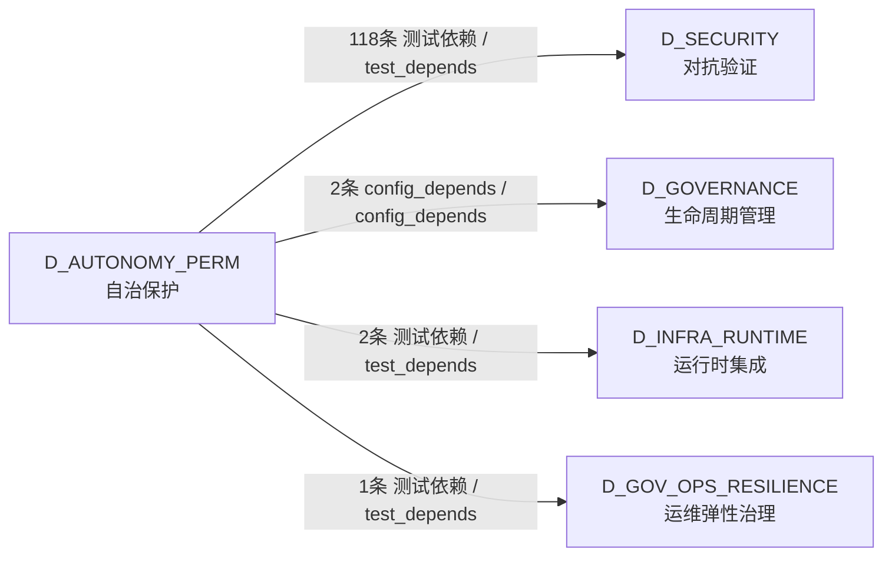

# 29_d_autonomy_perm / budget_enforcement / 自治保护 / Autonomy Protection

> **功能简介 / Overview**: 自治保护，负责 AI 自治行为的权限控制和安全边界

> **文档作用 / Purpose**: 展示 自治保护（D_AUTONOMY_PERM）功能域的模块清单、域内依赖关系、跨域依赖关系、架构分层视图，供架构审查和域治理参考。

> 本文档由 generate_domain_doc.py 从 depgraph (PostgreSQL) 自动生成
> 最后更新: 2026-07-17 03:23:14
> 数据源: depgraph (PostgreSQL) nodes表 + edges表

## 域基本信息 / Domain Overview

| 字段 | 值 | Field | Value |
|------|------|-------|-------|
| 编号 | 29 | Number | 29 |
| 域ID | D_AUTONOMY_PERM | Domain ID | D_AUTONOMY_PERM |
| 域名称 | 自治保护 | Domain Name | Autonomy Protection |
| 层级 | L2 业务域层 | Layer | L2 Domain |
| 模块数 | 41 | Module Count | 41 |
| 域内依赖 | 0 | Internal Dependencies | 0 |
| 跨域入边 | 0 | Cross-domain Incoming | 0 |
| 跨域出边 | 123 | Cross-domain Outgoing | 123 |
| 设计态模块 | 0 | Design Modules | 0 |
| 原型态模块 | 41 | Prototype Modules | 41 |
| 生产态模块 | 0 | Production Modules | 0 |
| 容量 | 0/150 (正常) | Capacity | 0/150 (正常) |
| 描述 | Token/Cost/Time三维预算 | Description | Token/Cost/Time三维预算 |

## 模块分层清单 / Module Layered List

> 按 architecture_layer 分组的模块清单（共 41 个模块 / 41 modules）。

### L2 领域层 / Domain Layer (41 modules)

| # | 模块路径 / Module Path | 模块名称 / Module Name (功能简介 / Description) | 成熟度 / Maturity | 蓝图 / Blueprint |
|:--:|---------|---------|:---:|:---:|
| 1 | scripts/arch_guard/fitness_functions/check_kill_switch_la... | check_kill_switch_latency.py — Kill Switch 延... | 原型态 / prototype | [MOD-INF-005](../../03_modules/_domain_governance/governance_automation/blueprint.md) |
| 2 | scripts/governance/meta/manage_kill_switch.py | manage_kill_switch.py — Kill Switch 管理工具 | 原型态 / prototype | [MOD-INF-005](../../03_modules/_domain_governance/governance_automation/blueprint.md) |
| 3 | tests/agent_rbac/conftest.py | pytest fixtures for agent-rbac tests. | 原型态 / prototype | [MOD-INF-018](../../03_modules/_domain_autonomy_core/agent_role_based_access_control/blueprint.md) |
| 4 | tests/agent_rbac/test_abac_guard_agent_rbac.py | 测试 L2 ABACGuard — 五维属性权限判定 | 原型态 / prototype | [MOD-INF-018](../../03_modules/_domain_autonomy_core/agent_role_based_access_control/blueprint.md) |
| 5 | tests/agent_rbac/test_adversarial_agent_rbac.py | MOD-INF-018 test_adversarial.py — 对抗性测试: ... | 原型态 / prototype | [MOD-INF-018](../../03_modules/_domain_autonomy_core/agent_role_based_access_control/blueprint.md) |
| 6 | tests/agent_rbac/test_adversarial_resilience.py | test_adversarial_resilience.py | 原型态 / prototype | [MOD-INF-018](../../03_modules/_domain_autonomy_core/agent_role_based_access_control/blueprint.md) |
| 7 | tests/agent_rbac/test_cross_model_consistency.py | MOD-INF-018 跨模型一致性测试 — DeepSeek/GLM/Cl... | 原型态 / prototype | [MOD-INF-018](../../03_modules/_domain_autonomy_core/agent_role_based_access_control/blueprint.md) |
| 8 | tests/agent_rbac/test_crosscut_d.py | 跨切面 D 异常检测 + 蓝图保真 + 原生API守卫 + 内... | 原型态 / prototype | [MOD-INF-018](../../03_modules/_domain_autonomy_core/agent_role_based_access_control/blueprint.md) |
| 9 | tests/agent_rbac/test_cybersec_2026.py | cybersec 2026 独立测试. | 原型态 / prototype | [MOD-INF-018](../../03_modules/_domain_autonomy_core/agent_role_based_access_control/blueprint.md) |
| 10 | tests/agent_rbac/test_decision_explainer_agent_rbac.py | 测试 DecisionExplainer — 结构化拒绝原因 | 原型态 / prototype | [MOD-INF-018](../../03_modules/_domain_autonomy_core/agent_role_based_access_control/blueprint.md) |
| 11 | tests/agent_rbac/test_decisions.py | 决策注册表测试. | 原型态 / prototype | [MOD-INF-018](../../03_modules/_domain_autonomy_core/agent_role_based_access_control/blueprint.md) |
| 12 | tests/agent_rbac/test_derive_rbac.py | MOD-INF-018 test_derive_rbac.py — RBAC 自动派... | 原型态 / prototype | [MOD-INF-018](../../03_modules/_domain_autonomy_core/agent_role_based_access_control/blueprint.md) |
| 13 | tests/agent_rbac/test_dry_run_agent_rbac.py | 测试 L7 DryRun — 权限模拟与影响分析 | 原型态 / prototype | [MOD-INF-018](../../03_modules/_domain_autonomy_core/agent_role_based_access_control/blueprint.md) |
| 14 | tests/agent_rbac/test_engine_degradation_agent_rbac.py | 测试 L0 EngineDegradation — 权限引擎降级策略 | 原型态 / prototype | [MOD-INF-018](../../03_modules/_domain_autonomy_core/agent_role_based_access_control/blueprint.md) |
| 15 | tests/agent_rbac/test_enhanced_security.py | 七项增强安全机制整合测试. | 原型态 / prototype | [MOD-INF-018](../../03_modules/_domain_autonomy_core/agent_role_based_access_control/blueprint.md) |
| 16 | tests/agent_rbac/test_exceptions_agent_rbac.py | 测试 AgentRbac 异常类型 | 原型态 / prototype | [MOD-INF-018](../../03_modules/_domain_autonomy_core/agent_role_based_access_control/blueprint.md) |
| 17 | tests/agent_rbac/test_forensic_a.py | 跨切面 B 取证审计 A 层——genesis/asymmetric/no... | 原型态 / prototype | [MOD-INF-018](../../03_modules/_domain_autonomy_core/agent_role_based_access_control/blueprint.md) |
| 18 | tests/agent_rbac/test_forensic_b.py | 跨切面 B 取证审计 B 层——path/shell/rule_injec... | 原型态 / prototype | [MOD-INF-018](../../03_modules/_domain_autonomy_core/agent_role_based_access_control/blueprint.md) |
| 19 | tests/agent_rbac/test_forensic_c.py | 跨切面 B 取证审计 C 层——audit_log/replay/lega... | 原型态 / prototype | [MOD-INF-018](../../03_modules/_domain_autonomy_core/agent_role_based_access_control/blueprint.md) |
| 20 | tests/agent_rbac/test_guard_layers_agent_rbac.py | 测试防护层模块 — ColdStartLock, AutoGuard, Esc... | 原型态 / prototype | [MOD-INF-018](../../03_modules/_domain_autonomy_core/agent_role_based_access_control/blueprint.md) |
| 21 | tests/agent_rbac/test_identity.py | 测试 AgentIdentity — 身份模型 | 原型态 / prototype | [MOD-INF-018](../../03_modules/_domain_autonomy_core/agent_role_based_access_control/blueprint.md) |
| 22 | tests/agent_rbac/test_immutable_core_agent_rbac.py | 测试 L0 ImmutableCore — 硬编码不可变保护区 | 原型态 / prototype | [MOD-INF-018](../../03_modules/_domain_autonomy_core/agent_role_based_access_control/blueprint.md) |
| 23 | tests/agent_rbac/test_input_guard_agent_rbac.py | 测试 L3 InputGuard — 参数级护栏 | 原型态 / prototype | [MOD-INF-018](../../03_modules/_domain_autonomy_core/agent_role_based_access_control/blueprint.md) |
| 24 | tests/agent_rbac/test_integration_agent_rbac.py | 集成 + 契约验证测试. | 原型态 / prototype | [MOD-INF-018](../../03_modules/_domain_autonomy_core/agent_role_based_access_control/blueprint.md) |
| 25 | tests/agent_rbac/test_integration_root.py | test_integration_root.py | 原型态 / prototype | [MOD-INF-018](../../03_modules/_domain_autonomy_core/agent_role_based_access_control/blueprint.md) |
| 26 | tests/agent_rbac/test_integrity_agent_rbac.py | 完整性自检测试. | 原型态 / prototype | [MOD-INF-018](../../03_modules/_domain_autonomy_core/agent_role_based_access_control/blueprint.md) |
| 27 | tests/agent_rbac/test_intent_binder_agent_rbac.py | 测试 IntentBinder — 意图绑定与连续验证 | 原型态 / prototype | [MOD-INF-018](../../03_modules/_domain_autonomy_core/agent_role_based_access_control/blueprint.md) |
| 28 | tests/agent_rbac/test_kill_switch_agent_rbac.py | 测试 L0 KillSwitch — 全局熔断机制 | 原型态 / prototype | [MOD-INF-018](../../03_modules/_domain_autonomy_core/agent_role_based_access_control/blueprint.md) |
| 29 | tests/agent_rbac/test_novel_attack.py | 新攻击 / cybersec 2026 专项测试. | 原型态 / prototype | [MOD-INF-018](../../03_modules/_domain_autonomy_core/agent_role_based_access_control/blueprint.md) |
| 30 | tests/agent_rbac/test_observability_agent_rbac.py | 测试 L6 Observability — 指标上报与异常检测 | 原型态 / prototype | [MOD-INF-018](../../03_modules/_domain_autonomy_core/agent_role_based_access_control/blueprint.md) |
| 31 | tests/agent_rbac/test_output_guard_agent_rbac.py | 测试 L5 OutputGuard — 输出护栏 | 原型态 / prototype | [MOD-INF-018](../../03_modules/_domain_autonomy_core/agent_role_based_access_control/blueprint.md) |
| 32 | tests/agent_rbac/test_permission_guard.py | 测试 PermissionGuard — 七层统一编排 | 原型态 / prototype | [MOD-INF-018](../../03_modules/_domain_autonomy_core/agent_role_based_access_control/blueprint.md) |
| 33 | tests/agent_rbac/test_permissions.py | 权限自动化测试——120+攻击向量/跨模型一致性/对... | 原型态 / prototype | [MOD-INF-018](../../03_modules/_domain_autonomy_core/agent_role_based_access_control/blueprint.md) |
| 34 | tests/agent_rbac/test_post_action.py | MOD-INF-018 test_post_action.py — L5 Post-Acti... | 原型态 / prototype | [MOD-INF-018](../../03_modules/_domain_autonomy_core/agent_role_based_access_control/blueprint.md) |
| 35 | tests/agent_rbac/test_rbac_auto_lifecycle.py | RBAC 自动启动/关闭生命周期集成测试. | 原型态 / prototype | [MOD-INF-018](../../03_modules/_domain_autonomy_core/agent_role_based_access_control/blueprint.md) |
| 36 | tests/agent_rbac/test_rbac_guard_agent_rbac.py | 测试 L1 RBACGuard — 三层权限模型 | 原型态 / prototype | [MOD-INF-018](../../03_modules/_domain_autonomy_core/agent_role_based_access_control/blueprint.md) |
| 37 | tests/agent_rbac/test_redteam_adversarial.py | MOD-INF-018 对抗性红队测试 — 专用 Agent 尝试绕... | 原型态 / prototype | [MOD-INF-018](../../03_modules/_domain_autonomy_core/agent_role_based_access_control/blueprint.md) |
| 38 | tests/agent_rbac/test_risk_mitigation_agent_rbac.py | 风险缓解测试. | 原型态 / prototype | [MOD-INF-018](../../03_modules/_domain_autonomy_core/agent_role_based_access_control/blueprint.md) |
| 39 | tests/agent_rbac/test_sequence_guard_agent_rbac.py | 测试 L4 SequenceGuard — 操作序列追踪与危险序列阻断 | 原型态 / prototype | [MOD-INF-018](../../03_modules/_domain_autonomy_core/agent_role_based_access_control/blueprint.md) |
| 40 | tests/agent_rbac/test_toctou_guard_agent_rbac.py | 测试 TOCTOU Guard — 竞态防护 | 原型态 / prototype | [MOD-INF-018](../../03_modules/_domain_autonomy_core/agent_role_based_access_control/blueprint.md) |
| 41 | tests/agent_rbac/test_vibe_coding.py | Vibe Coding / Novel Attack / Cybersec 2026 攻击... | 原型态 / prototype | [MOD-INF-018](../../03_modules/_domain_autonomy_core/agent_role_based_access_control/blueprint.md) |

## 域内依赖图 / Internal Dependency Diagram

> 依赖图内嵌在本文档中，IDE 可直接渲染显示。参考 decision_index.md 设计，分四个视图：合并全景图、运营态子图、设计态子图、原型态子图（按 design_maturity 实际值拆分）。
>
> **图例说明 / Legend**：
> - **实线边框 = 运营态模块**（production，已上线运行）
> - **虚线边框 = 设计态模块**（design，蓝图阶段，代码未写）
> - **虚线边框 = 原型态模块**（prototype，代码已写，验证中未稳定上线）
> - **实线箭头 = 运营态依赖**（已生效的依赖关系）
> - **虚线箭头 = 非运营态依赖**（计划中/验证中的依赖关系）

### 合并全景图（全部模块，标签标注成熟度）

> 展示全部 41 个模块（生产态 0 + 设计态 0 + 原型态 41），标签标注成熟度。

#### 第 1 页 / 共 2 页

```mermaid
graph TD
    subgraph D_AUTONOMY_PERM["D_AUTONOMY_PERM 自治保护"]
        scripts_arch_guard_fitness_functions_check_kill_switch_latency_py["(原型态 / prototype) check_kill_switch_latency.py — Kill Switch 延...<br/>文件: check_kill_switch_latency.py"]
        scripts_governance_meta_manage_kill_switch_py["(原型态 / prototype) manage_kill_switch.py — Kill Switch 管理工具<br/>文件: manage_kill_switch.py"]
        tests_agent_rbac_conftest_py["(原型态 / prototype) pytest fixtures for agent-rbac tests.<br/>文件: conftest.py"]
        tests_agent_rbac_test_abac_guard_agent_rbac_py["(原型态 / prototype) 测试 L2 ABACGuard — 五维属性权限判定<br/>文件: test_abac_guard_agent_rbac.py"]
        tests_agent_rbac_test_adversarial_agent_rbac_py["(原型态 / prototype) MOD-INF-018 test_adversarial.py — 对抗性测试: ...<br/>文件: test_adversarial_agent_rbac.py"]
        tests_agent_rbac_test_adversarial_resilience_py["(原型态 / prototype) test_adversarial_resilience.py"]
        tests_agent_rbac_test_cross_model_consistency_py["(原型态 / prototype) MOD-INF-018 跨模型一致性测试 — DeepSeek/GLM/Cl...<br/>文件: test_cross_model_consistency.py"]
        tests_agent_rbac_test_crosscut_d_py["(原型态 / prototype) 跨切面 D 异常检测 + 蓝图保真 + 原生API守卫 + 内...<br/>文件: test_crosscut_d.py"]
        tests_agent_rbac_test_cybersec_2026_py["(原型态 / prototype) cybersec 2026 独立测试.<br/>文件: test_cybersec_2026.py"]
        tests_agent_rbac_test_decision_explainer_agent_rbac_py["(原型态 / prototype) 测试 DecisionExplainer — 结构化拒绝原因<br/>文件: test_decision_explainer_agent_rbac.py"]
        tests_agent_rbac_test_decisions_py["(原型态 / prototype) 决策注册表测试.<br/>文件: test_decisions.py"]
        tests_agent_rbac_test_derive_rbac_py["(原型态 / prototype) MOD-INF-018 test_derive_rbac.py — RBAC 自动派...<br/>文件: test_derive_rbac.py"]
        tests_agent_rbac_test_dry_run_agent_rbac_py["(原型态 / prototype) 测试 L7 DryRun — 权限模拟与影响分析<br/>文件: test_dry_run_agent_rbac.py"]
        tests_agent_rbac_test_engine_degradation_agent_rbac_py["(原型态 / prototype) 测试 L0 EngineDegradation — 权限引擎降级策略<br/>文件: test_engine_degradation_agent_rbac.py"]
        tests_agent_rbac_test_enhanced_security_py["(原型态 / prototype) 七项增强安全机制整合测试.<br/>文件: test_enhanced_security.py"]
        tests_agent_rbac_test_exceptions_agent_rbac_py["(原型态 / prototype) 测试 AgentRbac 异常类型<br/>文件: test_exceptions_agent_rbac.py"]
        tests_agent_rbac_test_forensic_a_py["(原型态 / prototype) 跨切面 B 取证审计 A 层——genesis/asymmetric/no...<br/>文件: test_forensic_a.py"]
        tests_agent_rbac_test_forensic_b_py["(原型态 / prototype) 跨切面 B 取证审计 B 层——path/shell/rule_injec...<br/>文件: test_forensic_b.py"]
        tests_agent_rbac_test_forensic_c_py["(原型态 / prototype) 跨切面 B 取证审计 C 层——audit_log/replay/lega...<br/>文件: test_forensic_c.py"]
        tests_agent_rbac_test_guard_layers_agent_rbac_py["(原型态 / prototype) 测试防护层模块 — ColdStartLock, AutoGuard, Esc...<br/>文件: test_guard_layers_agent_rbac.py"]
        tests_agent_rbac_test_identity_py["(原型态 / prototype) 测试 AgentIdentity — 身份模型<br/>文件: test_identity.py"]
        tests_agent_rbac_test_immutable_core_agent_rbac_py["(原型态 / prototype) 测试 L0 ImmutableCore — 硬编码不可变保护区<br/>文件: test_immutable_core_agent_rbac.py"]
        tests_agent_rbac_test_input_guard_agent_rbac_py["(原型态 / prototype) 测试 L3 InputGuard — 参数级护栏<br/>文件: test_input_guard_agent_rbac.py"]
        tests_agent_rbac_test_integration_agent_rbac_py["(原型态 / prototype) 集成 + 契约验证测试.<br/>文件: test_integration_agent_rbac.py"]
        tests_agent_rbac_test_integration_root_py["(原型态 / prototype) test_integration_root.py"]
        tests_agent_rbac_test_integrity_agent_rbac_py["(原型态 / prototype) 完整性自检测试.<br/>文件: test_integrity_agent_rbac.py"]
        tests_agent_rbac_test_intent_binder_agent_rbac_py["(原型态 / prototype) 测试 IntentBinder — 意图绑定与连续验证<br/>文件: test_intent_binder_agent_rbac.py"]
        tests_agent_rbac_test_kill_switch_agent_rbac_py["(原型态 / prototype) 测试 L0 KillSwitch — 全局熔断机制<br/>文件: test_kill_switch_agent_rbac.py"]
        tests_agent_rbac_test_novel_attack_py["(原型态 / prototype) 新攻击 / cybersec 2026 专项测试.<br/>文件: test_novel_attack.py"]
        tests_agent_rbac_test_observability_agent_rbac_py["(原型态 / prototype) 测试 L6 Observability — 指标上报与异常检测<br/>文件: test_observability_agent_rbac.py"]
    end
    D_GOVERNANCE["(原型态 / prototype) D_GOVERNANCE"]
    scripts_arch_guard_fitness_functions_check_kill_switch_latency_py -.->|config_depends / config_depends| D_GOVERNANCE
    scripts_governance_meta_manage_kill_switch_py -.->|config_depends / config_depends| D_GOVERNANCE
    D_SECURITY["(生产态 / production) D_SECURITY"]
    tests_agent_rbac_test_adversarial_agent_rbac_py -.->|测试依赖 / test_depends| D_SECURITY
    tests_agent_rbac_test_adversarial_agent_rbac_py -.->|测试依赖 / test_depends| D_SECURITY
    tests_agent_rbac_test_adversarial_agent_rbac_py -.->|测试依赖 / test_depends| D_SECURITY
    tests_agent_rbac_test_adversarial_agent_rbac_py -.->|测试依赖 / test_depends| D_SECURITY
    tests_agent_rbac_test_abac_guard_agent_rbac_py -.->|测试依赖 / test_depends| D_SECURITY
    tests_agent_rbac_test_abac_guard_agent_rbac_py -.->|测试依赖 / test_depends| D_SECURITY
    tests_agent_rbac_test_adversarial_resilience_py -.->|测试依赖 / test_depends| D_SECURITY
    tests_agent_rbac_test_crosscut_d_py -.->|测试依赖 / test_depends| D_SECURITY
    tests_agent_rbac_test_crosscut_d_py -.->|测试依赖 / test_depends| D_SECURITY
    tests_agent_rbac_test_crosscut_d_py -.->|测试依赖 / test_depends| D_SECURITY
    tests_agent_rbac_test_crosscut_d_py -.->|测试依赖 / test_depends| D_SECURITY
    tests_agent_rbac_test_cybersec_2026_py -.->|测试依赖 / test_depends| D_SECURITY
    tests_agent_rbac_test_decision_explainer_agent_rbac_py -.->|测试依赖 / test_depends| D_SECURITY
    classDef production fill:#e1f5fe,stroke:#01579b,stroke-width:2px,color:#000
    classDef design fill:#fff3e0,stroke:#e65100,stroke-width:2px,color:#000,stroke-dasharray: 5 5
    classDef external_prod fill:#e8f5e9,stroke:#1b5e20,stroke-width:1px,color:#000
    classDef external_design fill:#fce4ec,stroke:#880e4f,stroke-width:1px,color:#000,stroke-dasharray: 5 5
    class scripts_arch_guard_fitness_functions_check_kill_switch_latency_py,scripts_governance_meta_manage_kill_switch_py,tests_agent_rbac_conftest_py,tests_agent_rbac_test_abac_guard_agent_rbac_py,tests_agent_rbac_test_adversarial_agent_rbac_py,tests_agent_rbac_test_adversarial_resilience_py,tests_agent_rbac_test_cross_model_consistency_py,tests_agent_rbac_test_crosscut_d_py,tests_agent_rbac_test_cybersec_2026_py,tests_agent_rbac_test_decision_explainer_agent_rbac_py,tests_agent_rbac_test_decisions_py,tests_agent_rbac_test_derive_rbac_py,tests_agent_rbac_test_dry_run_agent_rbac_py,tests_agent_rbac_test_engine_degradation_agent_rbac_py,tests_agent_rbac_test_enhanced_security_py,tests_agent_rbac_test_exceptions_agent_rbac_py,tests_agent_rbac_test_forensic_a_py,tests_agent_rbac_test_forensic_b_py,tests_agent_rbac_test_forensic_c_py,tests_agent_rbac_test_guard_layers_agent_rbac_py,tests_agent_rbac_test_identity_py,tests_agent_rbac_test_immutable_core_agent_rbac_py,tests_agent_rbac_test_input_guard_agent_rbac_py,tests_agent_rbac_test_integration_agent_rbac_py,tests_agent_rbac_test_integration_root_py,tests_agent_rbac_test_integrity_agent_rbac_py,tests_agent_rbac_test_intent_binder_agent_rbac_py,tests_agent_rbac_test_kill_switch_agent_rbac_py,tests_agent_rbac_test_novel_attack_py,tests_agent_rbac_test_observability_agent_rbac_py design
    class D_SECURITY external_prod
    class D_GOVERNANCE external_design
```

#### 第 2 页 / 共 2 页

```mermaid
graph TD
    subgraph D_AUTONOMY_PERM["D_AUTONOMY_PERM 自治保护"]
        tests_agent_rbac_test_output_guard_agent_rbac_py["(原型态 / prototype) 测试 L5 OutputGuard — 输出护栏<br/>文件: test_output_guard_agent_rbac.py"]
        tests_agent_rbac_test_permission_guard_py["(原型态 / prototype) 测试 PermissionGuard — 七层统一编排<br/>文件: test_permission_guard.py"]
        tests_agent_rbac_test_permissions_py["(原型态 / prototype) 权限自动化测试——120+攻击向量/跨模型一致性/对...<br/>文件: test_permissions.py"]
        tests_agent_rbac_test_post_action_py["(原型态 / prototype) MOD-INF-018 test_post_action.py — L5 Post-Acti...<br/>文件: test_post_action.py"]
        tests_agent_rbac_test_rbac_auto_lifecycle_py["(原型态 / prototype) RBAC 自动启动/关闭生命周期集成测试.<br/>文件: test_rbac_auto_lifecycle.py"]
        tests_agent_rbac_test_rbac_guard_agent_rbac_py["(原型态 / prototype) 测试 L1 RBACGuard — 三层权限模型<br/>文件: test_rbac_guard_agent_rbac.py"]
        tests_agent_rbac_test_redteam_adversarial_py["(原型态 / prototype) MOD-INF-018 对抗性红队测试 — 专用 Agent 尝试绕...<br/>文件: test_redteam_adversarial.py"]
        tests_agent_rbac_test_risk_mitigation_agent_rbac_py["(原型态 / prototype) 风险缓解测试.<br/>文件: test_risk_mitigation_agent_rbac.py"]
        tests_agent_rbac_test_sequence_guard_agent_rbac_py["(原型态 / prototype) 测试 L4 SequenceGuard — 操作序列追踪与危险序列阻断<br/>文件: test_sequence_guard_agent_rbac.py"]
        tests_agent_rbac_test_toctou_guard_agent_rbac_py["(原型态 / prototype) 测试 TOCTOU Guard — 竞态防护<br/>文件: test_toctou_guard_agent_rbac.py"]
        tests_agent_rbac_test_vibe_coding_py["(原型态 / prototype) Vibe Coding / Novel Attack / Cybersec 2026 攻击...<br/>文件: test_vibe_coding.py"]
    end
    D_SECURITY["(生产态 / production) D_SECURITY"]
    tests_agent_rbac_test_output_guard_agent_rbac_py -.->|测试依赖 / test_depends| D_SECURITY
    tests_agent_rbac_test_post_action_py -.->|测试依赖 / test_depends| D_SECURITY
    tests_agent_rbac_test_permission_guard_py -.->|测试依赖 / test_depends| D_SECURITY
    tests_agent_rbac_test_permission_guard_py -.->|测试依赖 / test_depends| D_SECURITY
    tests_agent_rbac_test_permission_guard_py -.->|测试依赖 / test_depends| D_SECURITY
    tests_agent_rbac_test_permissions_py -.->|测试依赖 / test_depends| D_SECURITY
    tests_agent_rbac_test_permissions_py -.->|测试依赖 / test_depends| D_SECURITY
    tests_agent_rbac_test_permissions_py -.->|测试依赖 / test_depends| D_SECURITY
    tests_agent_rbac_test_permissions_py -.->|测试依赖 / test_depends| D_SECURITY
    tests_agent_rbac_test_permissions_py -.->|测试依赖 / test_depends| D_SECURITY
    tests_agent_rbac_test_permissions_py -.->|测试依赖 / test_depends| D_SECURITY
    tests_agent_rbac_test_permissions_py -.->|测试依赖 / test_depends| D_SECURITY
    tests_agent_rbac_test_permissions_py -.->|测试依赖 / test_depends| D_SECURITY
    tests_agent_rbac_test_permissions_py -.->|测试依赖 / test_depends| D_SECURITY
    tests_agent_rbac_test_permissions_py -.->|测试依赖 / test_depends| D_SECURITY
    classDef production fill:#e1f5fe,stroke:#01579b,stroke-width:2px,color:#000
    classDef design fill:#fff3e0,stroke:#e65100,stroke-width:2px,color:#000,stroke-dasharray: 5 5
    classDef external_prod fill:#e8f5e9,stroke:#1b5e20,stroke-width:1px,color:#000
    classDef external_design fill:#fce4ec,stroke:#880e4f,stroke-width:1px,color:#000,stroke-dasharray: 5 5
    class tests_agent_rbac_test_output_guard_agent_rbac_py,tests_agent_rbac_test_permission_guard_py,tests_agent_rbac_test_permissions_py,tests_agent_rbac_test_post_action_py,tests_agent_rbac_test_rbac_auto_lifecycle_py,tests_agent_rbac_test_rbac_guard_agent_rbac_py,tests_agent_rbac_test_redteam_adversarial_py,tests_agent_rbac_test_risk_mitigation_agent_rbac_py,tests_agent_rbac_test_sequence_guard_agent_rbac_py,tests_agent_rbac_test_toctou_guard_agent_rbac_py,tests_agent_rbac_test_vibe_coding_py design
    class D_SECURITY external_prod
```

### 运营态子图（仅 design_maturity=production 的模块和依赖）

> 仅展示已上线运行的模块（共 0 个，0 条域内依赖）。

> （无运营态模块 / No production modules）

### 设计态子图（仅 design_maturity=design 的模块和依赖）

> 仅展示蓝图阶段、代码未写的设计态模块（共 0 个，0 条域内依赖）。

> （无设计态模块 / No design modules）

### 原型态子图（仅 design_maturity=prototype 的模块和依赖）

> 仅展示代码已写、验证中未稳定上线的原型态模块（共 41 个，0 条域内依赖）。

```mermaid
graph TD
    subgraph D_AUTONOMY_PERM["D_AUTONOMY_PERM 自治保护"]
        scripts_arch_guard_fitness_functions_check_kill_switch_latency_py["(原型态 / prototype) check_kill_switch_latency.py — Kill Switch 延...<br/>文件: check_kill_switch_latency.py"]
        scripts_governance_meta_manage_kill_switch_py["(原型态 / prototype) manage_kill_switch.py — Kill Switch 管理工具<br/>文件: manage_kill_switch.py"]
        tests_agent_rbac_conftest_py["(原型态 / prototype) pytest fixtures for agent-rbac tests.<br/>文件: conftest.py"]
        tests_agent_rbac_test_abac_guard_agent_rbac_py["(原型态 / prototype) 测试 L2 ABACGuard — 五维属性权限判定<br/>文件: test_abac_guard_agent_rbac.py"]
        tests_agent_rbac_test_adversarial_agent_rbac_py["(原型态 / prototype) MOD-INF-018 test_adversarial.py — 对抗性测试: ...<br/>文件: test_adversarial_agent_rbac.py"]
        tests_agent_rbac_test_adversarial_resilience_py["(原型态 / prototype) test_adversarial_resilience.py"]
        tests_agent_rbac_test_cross_model_consistency_py["(原型态 / prototype) MOD-INF-018 跨模型一致性测试 — DeepSeek/GLM/Cl...<br/>文件: test_cross_model_consistency.py"]
        tests_agent_rbac_test_crosscut_d_py["(原型态 / prototype) 跨切面 D 异常检测 + 蓝图保真 + 原生API守卫 + 内...<br/>文件: test_crosscut_d.py"]
        tests_agent_rbac_test_cybersec_2026_py["(原型态 / prototype) cybersec 2026 独立测试.<br/>文件: test_cybersec_2026.py"]
        tests_agent_rbac_test_decision_explainer_agent_rbac_py["(原型态 / prototype) 测试 DecisionExplainer — 结构化拒绝原因<br/>文件: test_decision_explainer_agent_rbac.py"]
        tests_agent_rbac_test_decisions_py["(原型态 / prototype) 决策注册表测试.<br/>文件: test_decisions.py"]
        tests_agent_rbac_test_derive_rbac_py["(原型态 / prototype) MOD-INF-018 test_derive_rbac.py — RBAC 自动派...<br/>文件: test_derive_rbac.py"]
        tests_agent_rbac_test_dry_run_agent_rbac_py["(原型态 / prototype) 测试 L7 DryRun — 权限模拟与影响分析<br/>文件: test_dry_run_agent_rbac.py"]
        tests_agent_rbac_test_engine_degradation_agent_rbac_py["(原型态 / prototype) 测试 L0 EngineDegradation — 权限引擎降级策略<br/>文件: test_engine_degradation_agent_rbac.py"]
        tests_agent_rbac_test_enhanced_security_py["(原型态 / prototype) 七项增强安全机制整合测试.<br/>文件: test_enhanced_security.py"]
        tests_agent_rbac_test_exceptions_agent_rbac_py["(原型态 / prototype) 测试 AgentRbac 异常类型<br/>文件: test_exceptions_agent_rbac.py"]
        tests_agent_rbac_test_forensic_a_py["(原型态 / prototype) 跨切面 B 取证审计 A 层——genesis/asymmetric/no...<br/>文件: test_forensic_a.py"]
        tests_agent_rbac_test_forensic_b_py["(原型态 / prototype) 跨切面 B 取证审计 B 层——path/shell/rule_injec...<br/>文件: test_forensic_b.py"]
        tests_agent_rbac_test_forensic_c_py["(原型态 / prototype) 跨切面 B 取证审计 C 层——audit_log/replay/lega...<br/>文件: test_forensic_c.py"]
        tests_agent_rbac_test_guard_layers_agent_rbac_py["(原型态 / prototype) 测试防护层模块 — ColdStartLock, AutoGuard, Esc...<br/>文件: test_guard_layers_agent_rbac.py"]
        tests_agent_rbac_test_identity_py["(原型态 / prototype) 测试 AgentIdentity — 身份模型<br/>文件: test_identity.py"]
        tests_agent_rbac_test_immutable_core_agent_rbac_py["(原型态 / prototype) 测试 L0 ImmutableCore — 硬编码不可变保护区<br/>文件: test_immutable_core_agent_rbac.py"]
        tests_agent_rbac_test_input_guard_agent_rbac_py["(原型态 / prototype) 测试 L3 InputGuard — 参数级护栏<br/>文件: test_input_guard_agent_rbac.py"]
        tests_agent_rbac_test_integration_agent_rbac_py["(原型态 / prototype) 集成 + 契约验证测试.<br/>文件: test_integration_agent_rbac.py"]
        tests_agent_rbac_test_integration_root_py["(原型态 / prototype) test_integration_root.py"]
        tests_agent_rbac_test_integrity_agent_rbac_py["(原型态 / prototype) 完整性自检测试.<br/>文件: test_integrity_agent_rbac.py"]
        tests_agent_rbac_test_intent_binder_agent_rbac_py["(原型态 / prototype) 测试 IntentBinder — 意图绑定与连续验证<br/>文件: test_intent_binder_agent_rbac.py"]
        tests_agent_rbac_test_kill_switch_agent_rbac_py["(原型态 / prototype) 测试 L0 KillSwitch — 全局熔断机制<br/>文件: test_kill_switch_agent_rbac.py"]
        tests_agent_rbac_test_novel_attack_py["(原型态 / prototype) 新攻击 / cybersec 2026 专项测试.<br/>文件: test_novel_attack.py"]
        tests_agent_rbac_test_observability_agent_rbac_py["(原型态 / prototype) 测试 L6 Observability — 指标上报与异常检测<br/>文件: test_observability_agent_rbac.py"]
        tests_agent_rbac_test_output_guard_agent_rbac_py["(原型态 / prototype) 测试 L5 OutputGuard — 输出护栏<br/>文件: test_output_guard_agent_rbac.py"]
        tests_agent_rbac_test_permission_guard_py["(原型态 / prototype) 测试 PermissionGuard — 七层统一编排<br/>文件: test_permission_guard.py"]
        tests_agent_rbac_test_permissions_py["(原型态 / prototype) 权限自动化测试——120+攻击向量/跨模型一致性/对...<br/>文件: test_permissions.py"]
        tests_agent_rbac_test_post_action_py["(原型态 / prototype) MOD-INF-018 test_post_action.py — L5 Post-Acti...<br/>文件: test_post_action.py"]
        tests_agent_rbac_test_rbac_auto_lifecycle_py["(原型态 / prototype) RBAC 自动启动/关闭生命周期集成测试.<br/>文件: test_rbac_auto_lifecycle.py"]
        tests_agent_rbac_test_rbac_guard_agent_rbac_py["(原型态 / prototype) 测试 L1 RBACGuard — 三层权限模型<br/>文件: test_rbac_guard_agent_rbac.py"]
        tests_agent_rbac_test_redteam_adversarial_py["(原型态 / prototype) MOD-INF-018 对抗性红队测试 — 专用 Agent 尝试绕...<br/>文件: test_redteam_adversarial.py"]
        tests_agent_rbac_test_risk_mitigation_agent_rbac_py["(原型态 / prototype) 风险缓解测试.<br/>文件: test_risk_mitigation_agent_rbac.py"]
        tests_agent_rbac_test_sequence_guard_agent_rbac_py["(原型态 / prototype) 测试 L4 SequenceGuard — 操作序列追踪与危险序列阻断<br/>文件: test_sequence_guard_agent_rbac.py"]
        tests_agent_rbac_test_toctou_guard_agent_rbac_py["(原型态 / prototype) 测试 TOCTOU Guard — 竞态防护<br/>文件: test_toctou_guard_agent_rbac.py"]
        tests_agent_rbac_test_vibe_coding_py["(原型态 / prototype) Vibe Coding / Novel Attack / Cybersec 2026 攻击...<br/>文件: test_vibe_coding.py"]
    end
    D_GOVERNANCE["(原型态 / prototype) D_GOVERNANCE"]
    scripts_arch_guard_fitness_functions_check_kill_switch_latency_py -.->|config_depends / config_depends| D_GOVERNANCE
    scripts_governance_meta_manage_kill_switch_py -.->|config_depends / config_depends| D_GOVERNANCE
    D_SECURITY["(生产态 / production) D_SECURITY"]
    tests_agent_rbac_test_adversarial_agent_rbac_py -.->|测试依赖 / test_depends| D_SECURITY
    tests_agent_rbac_test_adversarial_agent_rbac_py -.->|测试依赖 / test_depends| D_SECURITY
    tests_agent_rbac_test_adversarial_agent_rbac_py -.->|测试依赖 / test_depends| D_SECURITY
    tests_agent_rbac_test_adversarial_agent_rbac_py -.->|测试依赖 / test_depends| D_SECURITY
    tests_agent_rbac_test_abac_guard_agent_rbac_py -.->|测试依赖 / test_depends| D_SECURITY
    tests_agent_rbac_test_abac_guard_agent_rbac_py -.->|测试依赖 / test_depends| D_SECURITY
    tests_agent_rbac_test_adversarial_resilience_py -.->|测试依赖 / test_depends| D_SECURITY
    tests_agent_rbac_test_crosscut_d_py -.->|测试依赖 / test_depends| D_SECURITY
    tests_agent_rbac_test_crosscut_d_py -.->|测试依赖 / test_depends| D_SECURITY
    tests_agent_rbac_test_crosscut_d_py -.->|测试依赖 / test_depends| D_SECURITY
    tests_agent_rbac_test_crosscut_d_py -.->|测试依赖 / test_depends| D_SECURITY
    tests_agent_rbac_test_cybersec_2026_py -.->|测试依赖 / test_depends| D_SECURITY
    tests_agent_rbac_test_decision_explainer_agent_rbac_py -.->|测试依赖 / test_depends| D_SECURITY
    classDef production fill:#e1f5fe,stroke:#01579b,stroke-width:2px,color:#000
    classDef design fill:#fff3e0,stroke:#e65100,stroke-width:2px,color:#000,stroke-dasharray: 5 5
    classDef external_prod fill:#e8f5e9,stroke:#1b5e20,stroke-width:1px,color:#000
    classDef external_design fill:#fce4ec,stroke:#880e4f,stroke-width:1px,color:#000,stroke-dasharray: 5 5
    class scripts_arch_guard_fitness_functions_check_kill_switch_latency_py,scripts_governance_meta_manage_kill_switch_py,tests_agent_rbac_conftest_py,tests_agent_rbac_test_abac_guard_agent_rbac_py,tests_agent_rbac_test_adversarial_agent_rbac_py,tests_agent_rbac_test_adversarial_resilience_py,tests_agent_rbac_test_cross_model_consistency_py,tests_agent_rbac_test_crosscut_d_py,tests_agent_rbac_test_cybersec_2026_py,tests_agent_rbac_test_decision_explainer_agent_rbac_py,tests_agent_rbac_test_decisions_py,tests_agent_rbac_test_derive_rbac_py,tests_agent_rbac_test_dry_run_agent_rbac_py,tests_agent_rbac_test_engine_degradation_agent_rbac_py,tests_agent_rbac_test_enhanced_security_py,tests_agent_rbac_test_exceptions_agent_rbac_py,tests_agent_rbac_test_forensic_a_py,tests_agent_rbac_test_forensic_b_py,tests_agent_rbac_test_forensic_c_py,tests_agent_rbac_test_guard_layers_agent_rbac_py,tests_agent_rbac_test_identity_py,tests_agent_rbac_test_immutable_core_agent_rbac_py,tests_agent_rbac_test_input_guard_agent_rbac_py,tests_agent_rbac_test_integration_agent_rbac_py,tests_agent_rbac_test_integration_root_py,tests_agent_rbac_test_integrity_agent_rbac_py,tests_agent_rbac_test_intent_binder_agent_rbac_py,tests_agent_rbac_test_kill_switch_agent_rbac_py,tests_agent_rbac_test_novel_attack_py,tests_agent_rbac_test_observability_agent_rbac_py,tests_agent_rbac_test_output_guard_agent_rbac_py,tests_agent_rbac_test_permission_guard_py,tests_agent_rbac_test_permissions_py,tests_agent_rbac_test_post_action_py,tests_agent_rbac_test_rbac_auto_lifecycle_py,tests_agent_rbac_test_rbac_guard_agent_rbac_py,tests_agent_rbac_test_redteam_adversarial_py,tests_agent_rbac_test_risk_mitigation_agent_rbac_py,tests_agent_rbac_test_sequence_guard_agent_rbac_py,tests_agent_rbac_test_toctou_guard_agent_rbac_py,tests_agent_rbac_test_vibe_coding_py design
    class D_SECURITY external_prod
    class D_GOVERNANCE external_design
```

## 跨域依赖 / Cross-domain Dependencies

### 本域依赖的其他域（出边）/ Depends On

| # | 本域模块 / Source Module | → | 外部域-目标模块 / Target Module | 依赖类型 / Type |
|:--:|---------|:--:|---------|---------|
| 1 | check_kill_switch_latency.py — Kill Switch 延.... | → | D_GOVERNANCE 生命周期管理: Architecture Guard — 不变量适应度函数集 (__ini... | config_depends / config_depends |
| 2 | manage_kill_switch.py — Kill Switch 管理工具 (... | → | D_GOVERNANCE 生命周期管理: meta/ — 脚本系统自我审计维度（第 13 维度） (__... | config_depends / config_depends |
| 3 | RBAC 自动启动/关闭生命周期集成测试. (test_rbac_... | → | D_GOV_OPS_RESILIENCE 运维弹性治理: EventHook — 声明式任务系统事件订阅 (event_hook.py) | 测试依赖 / test_depends |
| 4 | RBAC 自动启动/关闭生命周期集成测试. (test_rbac_... | → | D_INFRA_RUNTIME 运行时集成: AutoRuntimeCore — 三层运行时运营中心（系统大脑... | 测试依赖 / test_depends |
| 5 | RBAC 自动启动/关闭生命周期集成测试. (test_rbac_... | → | D_INFRA_RUNTIME 运行时集成: boot_hooks.py | 测试依赖 / test_depends |
| 6 | 测试 L2 ABACGuard — 五维属性权限判定 (test_aba... | → | D_SECURITY 对抗验证: ABACGuard — 基于属性的权限守卫. (abac_guard.py) | 测试依赖 / test_depends |
| 7 | 测试 L2 ABACGuard — 五维属性权限判定 (test_aba... | → | D_SECURITY 对抗验证: Agent identity — 角色与成熟度定义. (identity.py) | 测试依赖 / test_depends |
| 8 | MOD-INF-018 test_adversarial.py — 对抗性测试: ... | → | D_SECURITY 对抗验证: CrossSessionDetector — 跨 Session 检测器. (cro... | 测试依赖 / test_depends |
| 9 | MOD-INF-018 test_adversarial.py — 对抗性测试: ... | → | D_SECURITY 对抗验证: ReplayAttackGuard — 重放攻击防护. (replay_atta... | 测试依赖 / test_depends |
| 10 | MOD-INF-018 test_adversarial.py — 对抗性测试: ... | → | D_SECURITY 对抗验证: MonotonicClock — 单调时钟. (monotonic_clock.py) | 测试依赖 / test_depends |
| 11 | MOD-INF-018 test_adversarial.py — 对抗性测试: ... | → | D_SECURITY 对抗验证: NonRepudiation — 不可抵赖性审计签名. (non_repu... | 测试依赖 / test_depends |
| 12 | test_adversarial_resilience.py | → | D_SECURITY 对抗验证: AdversarialResilience — 对抗性韧性与 OWASP 覆... | 测试依赖 / test_depends |
| 13 | MOD-INF-018 跨模型一致性测试 — DeepSeek/GLM/Cl... | → | D_SECURITY 对抗验证: RBACRoleDeriver — RBAC 角色派生器. (derive_rba... | 测试依赖 / test_depends |
| 14 | MOD-INF-018 跨模型一致性测试 — DeepSeek/GLM/Cl... | → | D_SECURITY 对抗验证: PermissionGuard — 七层权限编排器. (permission_... | 测试依赖 / test_depends |
| 15 | MOD-INF-018 跨模型一致性测试 — DeepSeek/GLM/Cl... | → | D_SECURITY 对抗验证: RBACGuard — 基于角色的权限守卫. (rbac_guard.py) | 测试依赖 / test_depends |
| 16 | MOD-INF-018 跨模型一致性测试 — DeepSeek/GLM/Cl... | → | D_SECURITY 对抗验证: Agent identity — 角色与成熟度定义. (identity.py) | 测试依赖 / test_depends |
| 17 | MOD-INF-018 跨模型一致性测试 — DeepSeek/GLM/Cl... | → | D_SECURITY 对抗验证: ImmutableCore — 不可变核心验证器. (immutable_c... | 测试依赖 / test_depends |
| 18 | MOD-INF-018 跨模型一致性测试 — DeepSeek/GLM/Cl... | → | D_SECURITY 对抗验证: IntegritySelfCheck — 完整性自检. (integrity_se... | 测试依赖 / test_depends |
| 19 | 跨切面 D 异常检测 + 蓝图保真 + 原生API守卫 + 内... | → | D_SECURITY 对抗验证: BlueprintFidelity — 蓝图保真度检查. (blueprint... | 测试依赖 / test_depends |
| 20 | 跨切面 D 异常检测 + 蓝图保真 + 原生API守卫 + 内... | → | D_SECURITY 对抗验证: Stub module: zephyr.security.access_control.det... | 测试依赖 / test_depends |
| 21 | 跨切面 D 异常检测 + 蓝图保真 + 原生API守卫 + 内... | → | D_SECURITY 对抗验证: MemoryGuard — 内存访问守卫. (memory_guard.py) | 测试依赖 / test_depends |
| 22 | 跨切面 D 异常检测 + 蓝图保真 + 原生API守卫 + 内... | → | D_SECURITY 对抗验证: NativeApiGuard — 原生 API 守卫. (native_api_gu... | 测试依赖 / test_depends |
| 23 | cybersec 2026 独立测试. (test_cybersec_2026.py) | → | D_SECURITY 对抗验证: Cybersec2026Guard — 2026 网络安全威胁检测. (cy... | 测试依赖 / test_depends |
| 24 | 测试 DecisionExplainer — 结构化拒绝原因 (test_... | → | D_SECURITY 对抗验证: Stub module: zephyr.security.access_control.dec... | 测试依赖 / test_depends |
| 25 | 决策注册表测试. (test_decisions.py) | → | D_SECURITY 对抗验证: Stub module: zephyr.security.access_control.dec... | 测试依赖 / test_depends |
| 26 | MOD-INF-018 test_derive_rbac.py — RBAC 自动派.... | → | D_SECURITY 对抗验证: RBACGuard — 基于角色的权限守卫. (rbac_guard.py) | 测试依赖 / test_depends |
| 27 | MOD-INF-018 test_derive_rbac.py — RBAC 自动派.... | → | D_SECURITY 对抗验证: Agent identity — 角色与成熟度定义. (identity.py) | 测试依赖 / test_depends |
| 28 | 测试 L7 DryRun — 权限模拟与影响分析 (test_dry_... | → | D_SECURITY 对抗验证: DryRun — 权限模拟与影响分析. (dry_run.py) | 测试依赖 / test_depends |
| 29 | 测试 L7 DryRun — 权限模拟与影响分析 (test_dry_... | → | D_SECURITY 对抗验证: RBACGuard — 基于角色的权限守卫. (rbac_guard.py) | 测试依赖 / test_depends |
| 30 | 测试 L7 DryRun — 权限模拟与影响分析 (test_dry_... | → | D_SECURITY 对抗验证: Agent identity — 角色与成熟度定义. (identity.py) | 测试依赖 / test_depends |
| 31 | 测试 L0 EngineDegradation — 权限引擎降级策略 (... | → | D_SECURITY 对抗验证: EngineDegradation — 引擎降级管理. (engine_degr... | 测试依赖 / test_depends |
| 32 | 七项增强安全机制整合测试. (test_enhanced_securi... | → | D_SECURITY 对抗验证: AgentCreationPolicy — Agent 创建策略. (agent_c... | 测试依赖 / test_depends |
| 33 | 七项增强安全机制整合测试. (test_enhanced_securi... | → | D_SECURITY 对抗验证: AutoMaintenance — 自动维护与规则健康仪表盘. (a... | 测试依赖 / test_depends |
| 34 | 七项增强安全机制整合测试. (test_enhanced_securi... | → | D_SECURITY 对抗验证: CacheInvalidation — 缓存失效事件管理. (cache_i... | 测试依赖 / test_depends |
| 35 | 七项增强安全机制整合测试. (test_enhanced_securi... | → | D_SECURITY 对抗验证: CrossSessionDetector — 跨 Session 检测器. (cro... | 测试依赖 / test_depends |
| 36 | 七项增强安全机制整合测试. (test_enhanced_securi... | → | D_SECURITY 对抗验证: EmergencyOverride — 紧急覆盖令牌管理. (emergen... | 测试依赖 / test_depends |
| 37 | 七项增强安全机制整合测试. (test_enhanced_securi... | → | D_SECURITY 对抗验证: PermissionHooks — 权限钩子注册表. (permission_... | 测试依赖 / test_depends |
| 38 | 测试 AgentRbac 异常类型 (test_exceptions_agent_... | → | D_SECURITY 对抗验证: AgentRbac 异常类型. (exceptions.py) | 测试依赖 / test_depends |
| 39 | 跨切面 B 取证审计 A 层——genesis/asymmetric/no... | → | D_SECURITY 对抗验证: Stub module: zephyr.security.access_control.asy... | 测试依赖 / test_depends |
| 40 | 跨切面 B 取证审计 A 层——genesis/asymmetric/no... | → | D_SECURITY 对抗验证: GenesisBootstrap — RBAC系统启动引导器. (genesi... | 测试依赖 / test_depends |
| 41 | 跨切面 B 取证审计 A 层——genesis/asymmetric/no... | → | D_SECURITY 对抗验证: NonRepudiation — 不可抵赖性审计签名. (non_repu... | 测试依赖 / test_depends |
| 42 | 跨切面 B 取证审计 B 层——path/shell/rule_injec... | → | D_SECURITY 对抗验证: Stub module: zephyr.security.access_control.det... | 测试依赖 / test_depends |
| 43 | 跨切面 B 取证审计 B 层——path/shell/rule_injec... | → | D_SECURITY 对抗验证: PathGuard — 路径守卫. (path_guard.py) | 测试依赖 / test_depends |
| 44 | 跨切面 B 取证审计 B 层——path/shell/rule_injec... | → | D_SECURITY 对抗验证: RuleInjectionGuard — 规则注入守卫. (rule_injec... | 测试依赖 / test_depends |
| 45 | 跨切面 B 取证审计 C 层——audit_log/replay/lega... | → | D_SECURITY 对抗验证: Stub module: zephyr.security.access_control.gua... | 测试依赖 / test_depends |
| 46 | 跨切面 B 取证审计 C 层——audit_log/replay/lega... | → | D_SECURITY 对抗验证: ReplayAttackGuard — 重放攻击防护. (replay_atta... | 测试依赖 / test_depends |
| 47 | 跨切面 B 取证审计 C 层——audit_log/replay/lega... | → | D_SECURITY 对抗验证: Stub module: zephyr.security.access_control.leg... | 测试依赖 / test_depends |
| 48 | 跨切面 B 取证审计 C 层——audit_log/replay/lega... | → | D_SECURITY 对抗验证: MonotonicClock — 单调时钟. (monotonic_clock.py) | 测试依赖 / test_depends |
| 49 | 跨切面 B 取证审计 C 层——audit_log/replay/lega... | → | D_SECURITY 对抗验证: Stub module: zephyr.security.access_control.rol... | 测试依赖 / test_depends |
| 50 | 测试防护层模块 — ColdStartLock, AutoGuard, Esc... | → | D_SECURITY 对抗验证: GuardLayers — 权限守卫层组件. (guard_layers.py) | 测试依赖 / test_depends |
| 51 | 测试防护层模块 — ColdStartLock, AutoGuard, Esc... | → | D_SECURITY 对抗验证: Agent identity — 角色与成熟度定义. (identity.py) | 测试依赖 / test_depends |
| 52 | 测试 AgentIdentity — 身份模型 (test_identity.py) | → | D_SECURITY 对抗验证: Agent identity — 角色与成熟度定义. (identity.py) | 测试依赖 / test_depends |
| 53 | 测试 L0 ImmutableCore — 硬编码不可变保护区 (te... | → | D_SECURITY 对抗验证: ImmutableCore — 不可变核心验证器. (immutable_c... | 测试依赖 / test_depends |
| 54 | 测试 L3 InputGuard — 参数级护栏 (test_input_gu... | → | D_SECURITY 对抗验证: InputGuard — 输入参数守卫. (input_guard.py) | 测试依赖 / test_depends |
| 55 | 集成 + 契约验证测试. (test_integration_agent_rb... | → | D_SECURITY 对抗验证: IntegrationManager — 系统集成注册与健康检查. (... | 测试依赖 / test_depends |
| 56 | 集成 + 契约验证测试. (test_integration_agent_rb... | → | D_SECURITY 对抗验证: ContractVerifier — 契约验证器. (contract_verif... | 测试依赖 / test_depends |
| 57 | test_integration_root.py | → | D_SECURITY 对抗验证: IntegrationManager — 系统集成注册与健康检查. (... | 测试依赖 / test_depends |
| 58 | 完整性自检测试. (test_integrity_agent_rbac.py) | → | D_SECURITY 对抗验证: IntegritySelfCheck — 完整性自检. (integrity_se... | 测试依赖 / test_depends |
| 59 | 测试 IntentBinder — 意图绑定与连续验证 (test_i... | → | D_SECURITY 对抗验证: IntentBinder — 意图绑定与漂移检测. (intent_bin... | 测试依赖 / test_depends |
| 60 | 测试 L0 KillSwitch — 全局熔断机制 (test_kill_s... | → | D_SECURITY 对抗验证: KillSwitch — 熔断器. (kill_switch.py) | 测试依赖 / test_depends |
| 61 | 新攻击 / cybersec 2026 专项测试. (test_novel_at... | → | D_SECURITY 对抗验证: Cybersec2026Guard — 2026 网络安全威胁检测. (cy... | 测试依赖 / test_depends |
| 62 | 新攻击 / cybersec 2026 专项测试. (test_novel_at... | → | D_SECURITY 对抗验证: NovelAttackGuard — 新型攻击行为画像. (novel_at... | 测试依赖 / test_depends |
| 63 | 测试 L6 Observability — 指标上报与异常检测 (te... | → | D_SECURITY 对抗验证: ObservabilityReporter — 指标上报与异常检测. (o... | 测试依赖 / test_depends |
| 64 | 测试 L5 OutputGuard — 输出护栏 (test_output_gu... | → | D_SECURITY 对抗验证: OutputGuard — 输出内容守卫. (output_guard.py) | 测试依赖 / test_depends |
| 65 | 测试 PermissionGuard — 七层统一编排 (test_perm... | → | D_SECURITY 对抗验证: PermissionGuard — 七层权限编排器. (permission_... | 测试依赖 / test_depends |
| 66 | 测试 PermissionGuard — 七层统一编排 (test_perm... | → | D_SECURITY 对抗验证: Agent identity — 角色与成熟度定义. (identity.py) | 测试依赖 / test_depends |
| 67 | 测试 PermissionGuard — 七层统一编排 (test_perm... | → | D_SECURITY 对抗验证: ImmutableCore — 不可变核心验证器. (immutable_c... | 测试依赖 / test_depends |
| 68 | 权限自动化测试——120+攻击向量/跨模型一致性/对.... | → | D_SECURITY 对抗验证: CanaryRolloutManager — 灰度发布管理器. (canary... | 测试依赖 / test_depends |
| 69 | 权限自动化测试——120+攻击向量/跨模型一致性/对.... | → | D_SECURITY 对抗验证: FalseCompletionDetector — 虚假完成检测. (false... | 测试依赖 / test_depends |
| 70 | 权限自动化测试——120+攻击向量/跨模型一致性/对.... | → | D_SECURITY 对抗验证: MultiAgentCollusionDetector — 多 agent 合谋检... | 测试依赖 / test_depends |
| 71 | 权限自动化测试——120+攻击向量/跨模型一致性/对.... | → | D_SECURITY 对抗验证: DryRun — 权限模拟与影响分析. (dry_run.py) | 测试依赖 / test_depends |
| 72 | 权限自动化测试——120+攻击向量/跨模型一致性/对.... | → | D_SECURITY 对抗验证: GuardLayers — 权限守卫层组件. (guard_layers.py) | 测试依赖 / test_depends |
| 73 | 权限自动化测试——120+攻击向量/跨模型一致性/对.... | → | D_SECURITY 对抗验证: ABACGuard — 基于属性的权限守卫. (abac_guard.py) | 测试依赖 / test_depends |
| 74 | 权限自动化测试——120+攻击向量/跨模型一致性/对.... | → | D_SECURITY 对抗验证: InputGuard — 输入参数守卫. (input_guard.py) | 测试依赖 / test_depends |
| 75 | 权限自动化测试——120+攻击向量/跨模型一致性/对.... | → | D_SECURITY 对抗验证: MemoryProvenanceGuard — 记忆来源溯源守卫. (mem... | 测试依赖 / test_depends |
| 76 | 权限自动化测试——120+攻击向量/跨模型一致性/对.... | → | D_SECURITY 对抗验证: OutputGuard — 输出内容守卫. (output_guard.py) | 测试依赖 / test_depends |
| 77 | 权限自动化测试——120+攻击向量/跨模型一致性/对.... | → | D_SECURITY 对抗验证: PermissionGuard — 七层权限编排器. (permission_... | 测试依赖 / test_depends |
| 78 | 权限自动化测试——120+攻击向量/跨模型一致性/对.... | → | D_SECURITY 对抗验证: SequenceGuard — 操作序列守卫. (sequence_guard.py) | 测试依赖 / test_depends |
| 79 | 权限自动化测试——120+攻击向量/跨模型一致性/对.... | → | D_SECURITY 对抗验证: TOCTOUGuard — TOCTOU (Time-of-Check to Time-of... | 测试依赖 / test_depends |
| 80 | 权限自动化测试——120+攻击向量/跨模型一致性/对.... | → | D_SECURITY 对抗验证: Agent identity — 角色与成熟度定义. (identity.py) | 测试依赖 / test_depends |
| 81 | 权限自动化测试——120+攻击向量/跨模型一致性/对.... | → | D_SECURITY 对抗验证: ImmutableCore — 不可变核心验证器. (immutable_c... | 测试依赖 / test_depends |
| 82 | 权限自动化测试——120+攻击向量/跨模型一致性/对.... | → | D_SECURITY 对抗验证: KillSwitch — 熔断器. (kill_switch.py) | 测试依赖 / test_depends |
| 83 | MOD-INF-018 test_post_action.py — L5 Post-Acti... | → | D_SECURITY 对抗验证: PermissionHooks — 权限钩子注册表. (permission_... | 测试依赖 / test_depends |
| 84 | RBAC 自动启动/关闭生命周期集成测试. (test_rbac_... | → | D_SECURITY 对抗验证: zephyr.security.access_control — Agent RBAC 权... | 测试依赖 / test_depends |
| 85 | RBAC 自动启动/关闭生命周期集成测试. (test_rbac_... | → | D_SECURITY 对抗验证: EngineDegradation — 引擎降级管理. (engine_degr... | 测试依赖 / test_depends |
| 86 | RBAC 自动启动/关闭生命周期集成测试. (test_rbac_... | → | D_SECURITY 对抗验证: GenesisBootstrap — RBAC系统启动引导器. (genesi... | 测试依赖 / test_depends |
| 87 | RBAC 自动启动/关闭生命周期集成测试. (test_rbac_... | → | D_SECURITY 对抗验证: ImmutableCore — 不可变核心验证器. (immutable_c... | 测试依赖 / test_depends |
| 88 | RBAC 自动启动/关闭生命周期集成测试. (test_rbac_... | → | D_SECURITY 对抗验证: KillSwitch — 熔断器. (kill_switch.py) | 测试依赖 / test_depends |
| 89 | 测试 L1 RBACGuard — 三层权限模型 (test_rbac_gu... | → | D_SECURITY 对抗验证: RBACGuard — 基于角色的权限守卫. (rbac_guard.py) | 测试依赖 / test_depends |
| 90 | 测试 L1 RBACGuard — 三层权限模型 (test_rbac_gu... | → | D_SECURITY 对抗验证: Agent identity — 角色与成熟度定义. (identity.py) | 测试依赖 / test_depends |
| 91 | MOD-INF-018 对抗性红队测试 — 专用 Agent 尝试绕... | → | D_SECURITY 对抗验证: AdversarialResilience — 对抗性韧性与 OWASP 覆... | 测试依赖 / test_depends |
| 92 | MOD-INF-018 对抗性红队测试 — 专用 Agent 尝试绕... | → | D_SECURITY 对抗验证: AgentCreationPolicy — Agent 创建策略. (agent_c... | 测试依赖 / test_depends |
| 93 | MOD-INF-018 对抗性红队测试 — 专用 Agent 尝试绕... | → | D_SECURITY 对抗验证: AutoMaintenance — 自动维护与规则健康仪表盘. (a... | 测试依赖 / test_depends |
| 94 | MOD-INF-018 对抗性红队测试 — 专用 Agent 尝试绕... | → | D_SECURITY 对抗验证: ColdStartLock — 冷启动锁. (cold_start_lock.py) | 测试依赖 / test_depends |
| 95 | MOD-INF-018 对抗性红队测试 — 专用 Agent 尝试绕... | → | D_SECURITY 对抗验证: CrossCutting — 横切面权限组件. (cross_cutting.py) | 测试依赖 / test_depends |
| 96 | MOD-INF-018 对抗性红队测试 — 专用 Agent 尝试绕... | → | D_SECURITY 对抗验证: ContextDriftDetector — 上下文漂移与范围蔓延检... | 测试依赖 / test_depends |
| 97 | MOD-INF-018 对抗性红队测试 — 专用 Agent 尝试绕... | → | D_SECURITY 对抗验证: CrossSessionDetector — 跨 Session 检测器. (cro... | 测试依赖 / test_depends |
| 98 | MOD-INF-018 对抗性红队测试 — 专用 Agent 尝试绕... | → | D_SECURITY 对抗验证: FalseCompletionDetector — 虚假完成检测. (false... | 测试依赖 / test_depends |
| 99 | MOD-INF-018 对抗性红队测试 — 专用 Agent 尝试绕... | → | D_SECURITY 对抗验证: MultiAgentCollusionDetector — 多 agent 合谋检... | 测试依赖 / test_depends |
| 100 | MOD-INF-018 对抗性红队测试 — 专用 Agent 尝试绕... | → | D_SECURITY 对抗验证: EmergencyOverride — 紧急覆盖令牌管理. (emergen... | 测试依赖 / test_depends |
| 101 | MOD-INF-018 对抗性红队测试 — 专用 Agent 尝试绕... | → | D_SECURITY 对抗验证: EngineDegradation — 引擎降级管理. (engine_degr... | 测试依赖 / test_depends |
| 102 | MOD-INF-018 对抗性红队测试 — 专用 Agent 尝试绕... | → | D_SECURITY 对抗验证: ABACGuard — 基于属性的权限守卫. (abac_guard.py) | 测试依赖 / test_depends |
| 103 | MOD-INF-018 对抗性红队测试 — 专用 Agent 尝试绕... | → | D_SECURITY 对抗验证: InputGuard — 输入参数守卫. (input_guard.py) | 测试依赖 / test_depends |
| 104 | MOD-INF-018 对抗性红队测试 — 专用 Agent 尝试绕... | → | D_SECURITY 对抗验证: OutputGuard — 输出内容守卫. (output_guard.py) | 测试依赖 / test_depends |
| 105 | MOD-INF-018 对抗性红队测试 — 专用 Agent 尝试绕... | → | D_SECURITY 对抗验证: PathGuard — 路径守卫. (path_guard.py) | 测试依赖 / test_depends |
| 106 | MOD-INF-018 对抗性红队测试 — 专用 Agent 尝试绕... | → | D_SECURITY 对抗验证: PermissionGuard — 七层权限编排器. (permission_... | 测试依赖 / test_depends |
| 107 | MOD-INF-018 对抗性红队测试 — 专用 Agent 尝试绕... | → | D_SECURITY 对抗验证: RBACGuard — 基于角色的权限守卫. (rbac_guard.py) | 测试依赖 / test_depends |
| 108 | MOD-INF-018 对抗性红队测试 — 专用 Agent 尝试绕... | → | D_SECURITY 对抗验证: ReplayAttackGuard — 重放攻击防护. (replay_atta... | 测试依赖 / test_depends |
| 109 | MOD-INF-018 对抗性红队测试 — 专用 Agent 尝试绕... | → | D_SECURITY 对抗验证: SequenceGuard — 操作序列守卫. (sequence_guard.py) | 测试依赖 / test_depends |
| 110 | MOD-INF-018 对抗性红队测试 — 专用 Agent 尝试绕... | → | D_SECURITY 对抗验证: TOCTOUGuard — TOCTOU (Time-of-Check to Time-of... | 测试依赖 / test_depends |
| 111 | MOD-INF-018 对抗性红队测试 — 专用 Agent 尝试绕... | → | D_SECURITY 对抗验证: Agent identity — 角色与成熟度定义. (identity.py) | 测试依赖 / test_depends |
| 112 | MOD-INF-018 对抗性红队测试 — 专用 Agent 尝试绕... | → | D_SECURITY 对抗验证: ImmutableCore — 不可变核心验证器. (immutable_c... | 测试依赖 / test_depends |
| 113 | MOD-INF-018 对抗性红队测试 — 专用 Agent 尝试绕... | → | D_SECURITY 对抗验证: IntentBinder — 意图绑定与漂移检测. (intent_bin... | 测试依赖 / test_depends |
| 114 | MOD-INF-018 对抗性红队测试 — 专用 Agent 尝试绕... | → | D_SECURITY 对抗验证: KillSwitch — 熔断器. (kill_switch.py) | 测试依赖 / test_depends |
| 115 | MOD-INF-018 对抗性红队测试 — 专用 Agent 尝试绕... | → | D_SECURITY 对抗验证: MonotonicClock — 单调时钟. (monotonic_clock.py) | 测试依赖 / test_depends |
| 116 | MOD-INF-018 对抗性红队测试 — 专用 Agent 尝试绕... | → | D_SECURITY 对抗验证: NonRepudiation — 不可抵赖性审计签名. (non_repu... | 测试依赖 / test_depends |
| 117 | MOD-INF-018 对抗性红队测试 — 专用 Agent 尝试绕... | → | D_SECURITY 对抗验证: PermissionHooks — 权限钩子注册表. (permission_... | 测试依赖 / test_depends |
| 118 | 风险缓解测试. (test_risk_mitigation_agent_rbac.py) | → | D_SECURITY 对抗验证: RiskMitigation — 风险评估与缓解策略. (risk_mit... | 测试依赖 / test_depends |
| 119 | 测试 L4 SequenceGuard — 操作序列追踪与危险序列... | → | D_SECURITY 对抗验证: SequenceGuard — 操作序列守卫. (sequence_guard.py) | 测试依赖 / test_depends |
| 120 | 测试 TOCTOU Guard — 竞态防护 (test_toctou_guar... | → | D_SECURITY 对抗验证: TOCTOUGuard — TOCTOU (Time-of-Check to Time-of... | 测试依赖 / test_depends |
| 121 | Vibe Coding / Novel Attack / Cybersec 2026 攻击... | → | D_SECURITY 对抗验证: Cybersec2026Guard — 2026 网络安全威胁检测. (cy... | 测试依赖 / test_depends |
| 122 | Vibe Coding / Novel Attack / Cybersec 2026 攻击... | → | D_SECURITY 对抗验证: NovelAttackGuard — 新型攻击行为画像. (novel_at... | 测试依赖 / test_depends |
| 123 | Vibe Coding / Novel Attack / Cybersec 2026 攻击... | → | D_SECURITY 对抗验证: VibeCodingGuard — Vibe Coding 攻击面检测. (vib... | 测试依赖 / test_depends |

### 依赖本域的其他域（入边）/ Depended By

无跨域入边依赖 / No cross-domain incoming dependencies

### 跨域依赖图 / Cross-domain Dependency Diagram

> 本域与 4 个外部域直接连接（出边 123 条 + 入边 0 条 = 123 条）。只显示直接连接的域，不展开具体节点。

## 说明 / Notes

- **数据源 / Data Source**: `depgraph (PostgreSQL)` 的 `nodes`、`edges`、`domains` 表
- **生成器 / Generator**: `generate_domain_doc.py`（G2+G10 合并）
- **维护方式 / Maintenance**: 自动生成，全景图更新时刷新
- **文件名规则 / File Naming**: `{编号:02d}_{域ID小写}.md`，如 `16_d_trading.md`
- **图例说明 / Legend**: `[production]`=已上线 / `[design]`=设计中 / `[prototype]`=原型 / `[unknown]`=未知
