# 29_d_factor / 因子

> **文档作用 / Purpose**: 展示 因子（D_FACTOR）功能域的模块清单、域内依赖关系、跨域依赖关系、架构分层视图，供架构审查和域治理参考。

> 本文档由 generate_domain_doc.py 从 depgraph (PostgreSQL) 自动生成
> 最后更新: 2026-07-06 13:18:28
> 数据源: depgraph (PostgreSQL) nodes表 + edges表

## 域基本信息 / Domain Overview

| 字段 | 值 | Field | Value |
|------|------|-------|-------|
| 编号 | 29 | Number | 29 |
| 域ID | D_FACTOR | Domain ID | D_FACTOR |
| 域名称 | 因子 | Domain Name | 因子 |
| 层级 | L2_domain | Layer | L2_domain |
| 模块数 | 14 | Module Count | 14 |
| 域内依赖 | 4 | Internal Dependencies | 4 |
| 跨域入边 | 2 | Cross-domain Incoming | 2 |
| 跨域出边 | 1 | Cross-domain Outgoing | 1 |
| 设计态模块 | 0 | Design Modules | 0 |
| 原型态模块 | 10 | Prototype Modules | 10 |
| 生产态模块 | 4 | Production Modules | 4 |
| 容量 | 4/150 (正常) | Capacity | 4/150 (正常) |
| 描述 | 因子计算、因子库、因子评价、因子正交化。Alpha挖掘引擎。 | Description | 因子计算、因子库、因子评价、因子正交化。Alpha挖掘引擎。 |

## 域内依赖图 / Internal Dependency Diagram

> 依赖图内嵌在本文档中，IDE 可直接渲染显示。每30个节点一组分页显示。
>
> **图例说明 / Legend**：
> - **实线边框 = 运营态模块**（production，已上线运行）
> - **虚线边框 = 设计态模块**（design，还在设计中）
> - **实线箭头 = 运营态依赖**（已生效的依赖关系）
> - **虚线箭头 = 设计态依赖**（计划中的依赖关系）

```mermaid
graph TD
    subgraph D_FACTOR["D_FACTOR 因子"]
        src_zephyr_factor_init_py["src/zephyr/factor/__init__.py production"]
        src_zephyr_factor_extensions_init_py["src/zephyr/factor/_extensions/__init__.py prototype"]
        src_zephyr_factor_alpha_signal_pipeline_py["src/zephyr/factor/alpha_signal_pipeline.py prototype"]
        src_zephyr_factor_api_init_py["src/zephyr/factor/api/__init__.py prototype"]
        src_zephyr_factor_base_py["src/zephyr/factor/base.py production"]
        src_zephyr_factor_bus_factor_defense_py["src/zephyr/factor/bus_factor_defense.py production"]
        src_zephyr_factor_core_init_py["src/zephyr/factor/core/__init__.py prototype"]
        src_zephyr_factor_ctr_001_consumer_init_py["src/zephyr/factor/ctr_001_consumer/__init__.py prototype"]
        src_zephyr_factor_engine_init_py["src/zephyr/factor/engine/__init__.py prototype"]
        src_zephyr_factor_factor_base_py["src/zephyr/factor/factor_base.py production"]
        src_zephyr_factor_infrastructure_init_py["src/zephyr/factor/infrastructure/__init__.py prototype"]
        src_zephyr_factor_momentum_factor_py["src/zephyr/factor/momentum_factor.py prototype"]
        src_zephyr_factor_services_init_py["src/zephyr/factor/services/__init__.py prototype"]
        src_zephyr_factor_value_factor_py["src/zephyr/factor/value_factor.py prototype"]
    end
    src_zephyr_factor_base_py -->|import_depends| src_zephyr_factor_factor_base_py
    src_zephyr_factor_momentum_factor_py -.->|import_depends| src_zephyr_factor_factor_base_py
    src_zephyr_factor_value_factor_py -.->|import_depends| src_zephyr_factor_factor_base_py
    src_zephyr_factor_init_py -->|import_depends| src_zephyr_factor_factor_base_py
    D_FUNDAMENTAL_SIGNAL["D_FUNDAMENTAL_SIGNAL production"]
    src_zephyr_factor_alpha_signal_pipeline_py -.->|import_depends| D_FUNDAMENTAL_SIGNAL
    D_GOVERNANCE["D_GOVERNANCE prototype"]
    D_GOVERNANCE -.->|import_depends| src_zephyr_factor_factor_base_py
    D_FUNDAMENTAL_SIGNAL -->|import_depends| src_zephyr_factor_factor_base_py
    classDef production fill:#e1f5fe,stroke:#01579b,stroke-width:2px,color:#000
    classDef design fill:#fff3e0,stroke:#e65100,stroke-width:2px,color:#000,stroke-dasharray: 5 5
    classDef external_prod fill:#e8f5e9,stroke:#1b5e20,stroke-width:1px,color:#000
    classDef external_design fill:#fce4ec,stroke:#880e4f,stroke-width:1px,color:#000,stroke-dasharray: 5 5
    class src_zephyr_factor_init_py,src_zephyr_factor_base_py,src_zephyr_factor_bus_factor_defense_py,src_zephyr_factor_factor_base_py production
    class src_zephyr_factor_extensions_init_py,src_zephyr_factor_alpha_signal_pipeline_py,src_zephyr_factor_api_init_py,src_zephyr_factor_core_init_py,src_zephyr_factor_ctr_001_consumer_init_py,src_zephyr_factor_engine_init_py,src_zephyr_factor_infrastructure_init_py,src_zephyr_factor_momentum_factor_py,src_zephyr_factor_services_init_py,src_zephyr_factor_value_factor_py design
    class D_FUNDAMENTAL_SIGNAL external_prod
    class D_GOVERNANCE external_design
```



## 跨域依赖 / Cross-domain Dependencies

### 本域依赖的其他域（出边）/ Depends On

| 目标域 / Target Domain | 依赖数 / Count | 依赖类型 / Type |
|--------|:---:|---------|
| D_FUNDAMENTAL_SIGNAL | 1 | import_depends |

### 依赖本域的其他域（入边）/ Depended By

| 源域 / Source Domain | 依赖数 / Count | 依赖类型 / Type |
|------|:---:|---------|
| D_FUNDAMENTAL_SIGNAL | 1 | import_depends |
| D_GOVERNANCE | 1 | import_depends |

## 架构分层视图 / Architecture Overview

> 按 architecture_layer 分层显示 因子（D_FACTOR）的模块分布。共 14 个模块 / 14 modules。

```

┌──────────────────────────────────────────────────────────────────┐
│              L2 领域层 / Domain Layer (14 modules)               │
├──────────────────────────────────────────────────────────────────┤
│   src/zephyr/factor/__init__.py  [production]                    │
│   src/zephyr/factor/_extensions/__init__.py  [prototype]         │
│   src/zephyr/factor/alpha_signal_pipeline.py  [prototype]        │
│   src/zephyr/factor/api/__init__.py  [prototype]                 │
│   src/zephyr/factor/base.py  [production]                        │
│   src/zephyr/factor/bus_factor_defense.py  [production]          │
│   src/zephyr/factor/core/__init__.py  [prototype]                │
│   src/zephyr/factor/ctr_001_consumer/__init__.py  [prototype]    │
│   src/zephyr/factor/engine/__init__.py  [prototype]              │
│   src/zephyr/factor/factor_base.py  [production]                 │
│   src/zephyr/factor/infrastructure/__init__.py  [prototype]      │
│   src/zephyr/factor/momentum_factor.py  [prototype]              │
│   src/zephyr/factor/services/__init__.py  [prototype]            │
│   src/zephyr/factor/value_factor.py  [prototype]                 │
└──────────────────────────────────────────────────────────────────┘

```

## 模块分层清单 / Module Layered List

> 按 architecture_layer 分组的模块清单（共 14 个模块 / 14 modules）。

### L2 领域层 / Domain Layer (14 modules)

| # | 模块路径 / Module Path | 模块名称 / Module Name | 成熟度 / Maturity | 构建状态 / Build Status |
|:--:|---------|---------|:---:|:---:|
| 1 | src/zephyr/factor/__init__.py | src/zephyr/factor/__init__.py | production | generated |
| 2 | src/zephyr/factor/_extensions/__init__.py | src/zephyr/factor/_extensions/__init_... | prototype | generated |
| 3 | src/zephyr/factor/alpha_signal_pipeline.py | src/zephyr/factor/alpha_signal_pipeli... | prototype | generated |
| 4 | src/zephyr/factor/api/__init__.py | src/zephyr/factor/api/__init__.py | prototype | generated |
| 5 | src/zephyr/factor/base.py | src/zephyr/factor/base.py | production | generated |
| 6 | src/zephyr/factor/bus_factor_defense.py | src/zephyr/factor/bus_factor_defense.py | production | generated |
| 7 | src/zephyr/factor/core/__init__.py | src/zephyr/factor/core/__init__.py | prototype | generated |
| 8 | src/zephyr/factor/ctr_001_consumer/__init__.py | src/zephyr/factor/ctr_001_consumer/__... | prototype | generated |
| 9 | src/zephyr/factor/engine/__init__.py | src/zephyr/factor/engine/__init__.py | prototype | generated |
| 10 | src/zephyr/factor/factor_base.py | src/zephyr/factor/factor_base.py | production | generated |
| 11 | src/zephyr/factor/infrastructure/__init__.py | src/zephyr/factor/infrastructure/__in... | prototype | generated |
| 12 | src/zephyr/factor/momentum_factor.py | src/zephyr/factor/momentum_factor.py | prototype | generated |
| 13 | src/zephyr/factor/services/__init__.py | src/zephyr/factor/services/__init__.py | prototype | generated |
| 14 | src/zephyr/factor/value_factor.py | src/zephyr/factor/value_factor.py | prototype | generated |

## 依赖关系图 / Dependency Graph

> 域内模块依赖关系（共 4 条 / 4 edges）。按依赖类型分组，使用 → 表示方向。

```

┌──────────────────────────────────────────────────────────────────┐
│        依赖关系图 / Dependency Graph (共 4 条 / 4 edges)         │
├──────────────────────────────────────────────────────────────────┤
│   依赖类型数 / Dependency Types: 1                               │
│   [import_depends]: 4 条 / edges                                 │
└──────────────────────────────────────────────────────────────────┘

┌──────────────────────────────────────────────────────────────────┐
│                 [import_depends] (4 条 / edges)                  │
├──────────────────────────────────────────────────────────────────┤
│   base.py → factor_base.py                                       │
│   momentum_factor.py → factor_base.py                            │
│   value_factor.py → factor_base.py                               │
│   __init__.py → factor_base.py                                   │
└──────────────────────────────────────────────────────────────────┘

```

## 说明 / Notes

- **数据源 / Data Source**: `depgraph (PostgreSQL)` 的 `nodes`、`edges`、`domains` 表
- **生成器 / Generator**: `generate_domain_doc.py`（G2+G10 合并）
- **维护方式 / Maintenance**: 自动生成，全景图更新时刷新
- **文件名规则 / File Naming**: `{编号:02d}_{域ID小写}.md`，如 `16_d_trading.md`
- **图例说明 / Legend**: `[production]`=已上线 / `[design]`=设计中 / `[prototype]`=原型 / `[unknown]`=未知
