# 29_d_gov_enforcement / rule_enforcement

> **文档作用 / Purpose**: 展示 rule_enforcement（D-GOV-ENFORCEMENT）功能域的模块清单、域内依赖关系和跨域依赖关系，供架构审查和域治理参考。

> 本文档由 generate_domain_doc.py 从 depgraph.db 自动生成
> 最后更新: 2026-06-25 03:07:09
> 数据源: depgraph.db nodes表 + edges表

## 域基本信息 / Domain Overview

| 字段 | 值 | Field | Value |
|------|------|-------|-------|
| 编号 | 29 | Number | 29 |
| 域ID | D-GOV-ENFORCEMENT | Domain ID | D-GOV-ENFORCEMENT |
| 域名称 | rule_enforcement | Domain Name | rule_enforcement |
| 层级 | L2_domain | Layer | L2_domain |
| 模块数 | 107 | Module Count | 107 |
| 域内依赖 | 138 | Internal Dependencies | 138 |
| 跨域入边 | 215 | Cross-domain Incoming | 215 |
| 跨域出边 | 35 | Cross-domain Outgoing | 35 |
| 设计态模块 | 0 | Design Modules | 0 |
| 原型态模块 | 38 | Prototype Modules | 38 |
| 生产态模块 | 69 | Production Modules | 69 |
| 容量 | 69/150 (正常) | Capacity | 69/150 (正常) |
| 描述 | 门禁引擎流程编排(GatePipeline/GateEngine) | Description | 门禁引擎流程编排(GatePipeline/GateEngine) |

## 模块清单 / Module List

共 107 个模块（按路径排序，全部显示）

| 模块路径 / Module Path | 模块名称 / Module Name | 设计成熟度 / Maturity | 构建状态 / Build Status |
|---------|---------|-----------|---------|
| src/zephyr/governance/rule_enforcement/__init__.py |  | production | generated |
| src/zephyr/governance/rule_enforcement/_template.yaml |  | production | deprecated |
| src/zephyr/governance/rule_enforcement/adaptive_threshold.py |  | production | generated |
| src/zephyr/governance/rule_enforcement/admission/__init__.py |  | prototype | deprecated |
| ...hyr/governance/rule_enforcement/admission/mad_001_architecture_necessity.yaml |  | production | deprecated |
| src/zephyr/governance/rule_enforcement/admission/mad_002_phase_relevance.yaml |  | production | deprecated |
| ...phyr/governance/rule_enforcement/admission/mad_003_dependency_compliance.yaml |  | production | deprecated |
| ...hyr/governance/rule_enforcement/admission/mad_004_interface_definability.yaml |  | production | deprecated |
| .../governance/rule_enforcement/admission/mad_005_dependency_graph_template.yaml |  | production | deprecated |
| src/zephyr/governance/rule_enforcement/adversarial_strategies.py |  | production | generated |
| src/zephyr/governance/rule_enforcement/adversarial_validation.py |  | production | generated |
| src/zephyr/governance/rule_enforcement/ai_capability_guard.py |  | production | generated |
| src/zephyr/governance/rule_enforcement/anti_pattern_guard.py |  | production | generated |
| src/zephyr/governance/rule_enforcement/audit_chain_verifier.py |  | production | generated |
| src/zephyr/governance/rule_enforcement/breaking_change_detector.py |  | production | generated |
| src/zephyr/governance/rule_enforcement/can_i_deploy.py |  | production | generated |
| src/zephyr/governance/rule_enforcement/capability_checker.py |  | production | generated |
| src/zephyr/governance/rule_enforcement/cbac_matrix.py |  | production | generated |
| src/zephyr/governance/rule_enforcement/cdc_broker.py |  | production | generated |
| src/zephyr/governance/rule_enforcement/check_types/__init__.py |  | prototype | generated |
| src/zephyr/governance/rule_enforcement/check_types/adversarial_validation.py |  | prototype | generated |
| src/zephyr/governance/rule_enforcement/check_types/check_type_registry.py |  | production | generated |
| src/zephyr/governance/rule_enforcement/check_types/ct_audit_findings_resolved.py |  | prototype | generated |
| src/zephyr/governance/rule_enforcement/check_types/ct_blueprint_read_check.py |  | prototype | generated |
| src/zephyr/governance/rule_enforcement/check_types/ct_circuit_breaker.py |  | prototype | generated |
| ...zephyr/governance/rule_enforcement/check_types/ct_circular_dependency_scan.py |  | prototype | generated |
| src/zephyr/governance/rule_enforcement/check_types/ct_classification.py |  | prototype | generated |
| src/zephyr/governance/rule_enforcement/check_types/ct_content_length.py |  | prototype | generated |
| src/zephyr/governance/rule_enforcement/check_types/ct_content_quality.py |  | prototype | generated |
| ...yr/governance/rule_enforcement/check_types/ct_contract_compatibility_check.py |  | prototype | generated |
| src/zephyr/governance/rule_enforcement/check_types/ct_deduplication.py |  | prototype | generated |
| src/zephyr/governance/rule_enforcement/check_types/ct_drift_budget.py |  | prototype | generated |
| src/zephyr/governance/rule_enforcement/check_types/ct_encoding.py |  | prototype | generated |
| src/zephyr/governance/rule_enforcement/check_types/ct_enforcement_mode_check.py |  | prototype | generated |
| src/zephyr/governance/rule_enforcement/check_types/ct_field_presence.py |  | prototype | generated |
| src/zephyr/governance/rule_enforcement/check_types/ct_file_extension.py |  | prototype | generated |
| src/zephyr/governance/rule_enforcement/check_types/ct_fle_gate.py |  | prototype | generated |
| src/zephyr/governance/rule_enforcement/check_types/ct_frontmatter.py |  | prototype | generated |
| src/zephyr/governance/rule_enforcement/check_types/ct_leverage_limit.py |  | prototype | generated |
| src/zephyr/governance/rule_enforcement/check_types/ct_line_ending.py |  | prototype | generated |
| src/zephyr/governance/rule_enforcement/check_types/ct_manual_approval.py |  | prototype | generated |
| src/zephyr/governance/rule_enforcement/check_types/ct_path_blacklist.py |  | prototype | generated |
| src/zephyr/governance/rule_enforcement/check_types/ct_path_routing.py |  | prototype | generated |
| src/zephyr/governance/rule_enforcement/check_types/ct_path_whitelist.py |  | prototype | generated |
| src/zephyr/governance/rule_enforcement/check_types/ct_position_limit.py |  | prototype | generated |
| src/zephyr/governance/rule_enforcement/check_types/ct_reference_check.py |  | prototype | generated |
| src/zephyr/governance/rule_enforcement/check_types/ct_regex_pattern.py |  | prototype | generated |
| src/zephyr/governance/rule_enforcement/check_types/ct_restructuring_safety.py |  | prototype | generated |
| src/zephyr/governance/rule_enforcement/check_types/ct_rollback_exit_code.py |  | prototype | generated |
| src/zephyr/governance/rule_enforcement/check_types/ct_score_threshold.py |  | prototype | generated |
| src/zephyr/governance/rule_enforcement/check_types/ct_security_artifact_scan.py |  | prototype | generated |
| src/zephyr/governance/rule_enforcement/check_types/ct_strategy_correlation.py |  | prototype | generated |
| src/zephyr/governance/rule_enforcement/check_types/ct_temporal.py |  | prototype | generated |
| src/zephyr/governance/rule_enforcement/check_types/ct_zero_residue_check.py |  | prototype | generated |
| src/zephyr/governance/rule_enforcement/circuit_breaker.py |  | production | generated |
| src/zephyr/governance/rule_enforcement/contract_template_manager.py |  | production | generated |
| src/zephyr/governance/rule_enforcement/drift_detector.py |  | prototype | generated |
| src/zephyr/governance/rule_enforcement/end_to_end_walkthrough.py |  | production | generated |
| src/zephyr/governance/rule_enforcement/g1_ingest.yaml |  | production | deprecated |
| src/zephyr/governance/rule_enforcement/g2_triage.yaml |  | production | deprecated |
| src/zephyr/governance/rule_enforcement/g3_evaluate.yaml |  | production | deprecated |
| src/zephyr/governance/rule_enforcement/g4_activate.yaml |  | production | deprecated |
| src/zephyr/governance/rule_enforcement/g5_extract.yaml |  | production | deprecated |
| src/zephyr/governance/rule_enforcement/g6_blueprint_compliance.yaml |  | production | deprecated |
| src/zephyr/governance/rule_enforcement/g6_ctr_compliance.yaml |  | production | deprecated |
| src/zephyr/governance/rule_enforcement/g6_path_tree_freshness.yaml |  | production | deprecated |
| src/zephyr/governance/rule_enforcement/g7_position_limits.yaml |  | production | deprecated |
| src/zephyr/governance/rule_enforcement/g8.yaml |  | production | deprecated |
| src/zephyr/governance/rule_enforcement/g8_leverage.yaml |  | production | deprecated |
| src/zephyr/governance/rule_enforcement/g9.yaml |  | production | deprecated |
| src/zephyr/governance/rule_enforcement/g9_strategy_correlation.yaml |  | production | deprecated |
| src/zephyr/governance/rule_enforcement/g_asset_inventory.yaml |  | production | deprecated |
| src/zephyr/governance/rule_enforcement/gate_context.py |  | production | generated |
| src/zephyr/governance/rule_enforcement/gate_dedup.yaml |  | production | deprecated |
| src/zephyr/governance/rule_enforcement/gate_engine.py |  | production | generated |
| src/zephyr/governance/rule_enforcement/gate_health.py |  | production | generated |
| src/zephyr/governance/rule_enforcement/gate_integrity_guard.py |  | production | generated |
| src/zephyr/governance/rule_enforcement/gate_override.py |  | production | generated |
| src/zephyr/governance/rule_enforcement/gate_pipeline.py |  | production | generated |
| src/zephyr/governance/rule_enforcement/gate_simulator.py |  | production | generated |
| src/zephyr/governance/rule_enforcement/gate_types.py |  | production | generated |
| src/zephyr/governance/rule_enforcement/gct_024_budget_enforcer.yaml |  | production | deprecated |
| src/zephyr/governance/rule_enforcement/integration_test_runner.py |  | production | generated |
| src/zephyr/governance/rule_enforcement/invariants/__init__.py |  | prototype | generated |
| src/zephyr/governance/rule_enforcement/invariants/en_001_circular_dependency.py |  | production | generated |
| ...zephyr/governance/rule_enforcement/invariants/en_001_circular_dependency.yaml |  | production | generated |
| ...zephyr/governance/rule_enforcement/invariants/en_002_enforcement_validator.py |  | production | generated |
| ...phyr/governance/rule_enforcement/invariants/en_002_enforcement_validator.yaml |  | production | deprecated |
| ...ephyr/governance/rule_enforcement/invariants/en_003_contract_compatibility.py |  | production | generated |
| ...hyr/governance/rule_enforcement/invariants/en_003_contract_compatibility.yaml |  | production | deprecated |
| ...zephyr/governance/rule_enforcement/invariants/en_process_lifecycle_gateway.py |  | production | generated |
| src/zephyr/governance/rule_enforcement/invariants/zero_residue_check.py |  | production | generated |
| src/zephyr/governance/rule_enforcement/kiss_enforcer.py |  | production | generated |
| src/zephyr/governance/rule_enforcement/observability_baseline.yaml |  | production | deprecated |
| src/zephyr/governance/rule_enforcement/risk_ssot.py |  | production | generated |
| src/zephyr/governance/rule_enforcement/secrets_guard.py |  | production | generated |
| src/zephyr/governance/rule_enforcement/sys_master_compliance.py |  | production | generated |
| src/zephyr/governance/rule_enforcement/sys_master_compliance.yaml |  | production | deprecated |
| src/zephyr/governance/rule_enforcement/task/__init__.py |  | prototype | deprecated |
| src/zephyr/governance/rule_enforcement/task/g0_entry.yaml |  | production | deprecated |
| src/zephyr/governance/rule_enforcement/task/g0_orc_gate_engine.yaml |  | production | deprecated |
| src/zephyr/governance/rule_enforcement/task/g7_orc_gate_engine.yaml |  | production | deprecated |
| src/zephyr/governance/rule_enforcement/task_completion_gate.py |  | production | generated |
| src/zephyr/governance/rule_enforcement/task_types.py |  | production | generated |
| src/zephyr/governance/rule_enforcement/triple_alignment.py |  | production | generated |
| src/zephyr/governance/rule_enforcement/truth_source_validator.py |  | production | generated |
| src/zephyr/governance/rule_enforcement/zero_residue.yaml |  | production | deprecated |

## 域内依赖图 / Internal Dependency Diagram

> 依赖图内嵌在本文档中，IDE 可直接渲染显示。每30个节点一组分页显示。
>
> **图例说明 / Legend**：
> - **实线边框 = 运营态模块**（production，已上线运行）
> - **虚线边框 = 设计态模块**（design，还在设计中）
> - **实线箭头 = 运营态依赖**（已生效的依赖关系）
> - **虚线箭头 = 设计态依赖**（计划中的依赖关系）

### 第 1 页 / 共 4 页 / Page 1 of 4

```mermaid
graph TD
    subgraph D_GOV_ENFORCEMENT["D-GOV-ENFORCEMENT rule_enforcement"]
        src_zephyr_governance_rule_enforcement_init_py["src/zephyr/governance/rule_enforcement/__init__.py production"]
        src_zephyr_governance_rule_enforcement_template_yaml["src/zephyr/governance/rule_enforcement/_templat... production"]
        src_zephyr_governance_rule_enforcement_adaptive_threshold_py["src/zephyr/governance/rule_enforcement/adaptive... production"]
        src_zephyr_governance_rule_enforcement_admission_init_py["src/zephyr/governance/rule_enforcement/admissio... prototype"]
        src_zephyr_governance_rule_enforcement_admission_mad_001_architecture_necessity_yaml["src/zephyr/governance/rule_enforcement/admissio... production"]
        src_zephyr_governance_rule_enforcement_admission_mad_002_phase_relevance_yaml["src/zephyr/governance/rule_enforcement/admissio... production"]
        src_zephyr_governance_rule_enforcement_admission_mad_003_dependency_compliance_yaml["src/zephyr/governance/rule_enforcement/admissio... production"]
        src_zephyr_governance_rule_enforcement_admission_mad_004_interface_definability_yaml["src/zephyr/governance/rule_enforcement/admissio... production"]
        src_zephyr_governance_rule_enforcement_admission_mad_005_dependency_graph_template_yaml["src/zephyr/governance/rule_enforcement/admissio... production"]
        src_zephyr_governance_rule_enforcement_adversarial_strategies_py["src/zephyr/governance/rule_enforcement/adversar... production"]
        src_zephyr_governance_rule_enforcement_adversarial_validation_py["src/zephyr/governance/rule_enforcement/adversar... production"]
        src_zephyr_governance_rule_enforcement_ai_capability_guard_py["src/zephyr/governance/rule_enforcement/ai_capab... production"]
        src_zephyr_governance_rule_enforcement_anti_pattern_guard_py["src/zephyr/governance/rule_enforcement/anti_pat... production"]
        src_zephyr_governance_rule_enforcement_audit_chain_verifier_py["src/zephyr/governance/rule_enforcement/audit_ch... production"]
        src_zephyr_governance_rule_enforcement_breaking_change_detector_py["src/zephyr/governance/rule_enforcement/breaking... production"]
        src_zephyr_governance_rule_enforcement_can_i_deploy_py["src/zephyr/governance/rule_enforcement/can_i_de... production"]
        src_zephyr_governance_rule_enforcement_capability_checker_py["src/zephyr/governance/rule_enforcement/capabili... production"]
        src_zephyr_governance_rule_enforcement_cbac_matrix_py["src/zephyr/governance/rule_enforcement/cbac_mat... production"]
        src_zephyr_governance_rule_enforcement_cdc_broker_py["src/zephyr/governance/rule_enforcement/cdc_brok... production"]
        src_zephyr_governance_rule_enforcement_check_types_init_py["src/zephyr/governance/rule_enforcement/check_ty... prototype"]
        src_zephyr_governance_rule_enforcement_check_types_adversarial_validation_py["src/zephyr/governance/rule_enforcement/check_ty... prototype"]
        src_zephyr_governance_rule_enforcement_check_types_check_type_registry_py["src/zephyr/governance/rule_enforcement/check_ty... production"]
        src_zephyr_governance_rule_enforcement_check_types_ct_audit_findings_resolved_py["src/zephyr/governance/rule_enforcement/check_ty... prototype"]
        src_zephyr_governance_rule_enforcement_check_types_ct_blueprint_read_check_py["src/zephyr/governance/rule_enforcement/check_ty... prototype"]
        src_zephyr_governance_rule_enforcement_check_types_ct_circuit_breaker_py["src/zephyr/governance/rule_enforcement/check_ty... prototype"]
        src_zephyr_governance_rule_enforcement_check_types_ct_circular_dependency_scan_py["src/zephyr/governance/rule_enforcement/check_ty... prototype"]
        src_zephyr_governance_rule_enforcement_check_types_ct_classification_py["src/zephyr/governance/rule_enforcement/check_ty... prototype"]
        src_zephyr_governance_rule_enforcement_check_types_ct_content_length_py["src/zephyr/governance/rule_enforcement/check_ty... prototype"]
        src_zephyr_governance_rule_enforcement_check_types_ct_content_quality_py["src/zephyr/governance/rule_enforcement/check_ty... prototype"]
        src_zephyr_governance_rule_enforcement_check_types_ct_contract_compatibility_check_py["src/zephyr/governance/rule_enforcement/check_ty... prototype"]
    end
    src_zephyr_governance_rule_enforcement_capability_checker_py -->|import_depends| src_zephyr_governance_rule_enforcement_cbac_matrix_py
    src_zephyr_governance_rule_enforcement_init_py -->|import_depends| src_zephyr_governance_rule_enforcement_adaptive_threshold_py
    src_zephyr_governance_rule_enforcement_init_py -->|import_depends| src_zephyr_governance_rule_enforcement_ai_capability_guard_py
    src_zephyr_governance_rule_enforcement_init_py -->|import_depends| src_zephyr_governance_rule_enforcement_breaking_change_detector_py
    src_zephyr_governance_rule_enforcement_check_types_check_type_registry_py -->|import_depends| src_zephyr_governance_rule_enforcement_init_py
    src_zephyr_governance_rule_enforcement_check_types_adversarial_validation_py -.->|import_depends| src_zephyr_governance_rule_enforcement_adversarial_validation_py
    src_zephyr_governance_rule_enforcement_check_types_adversarial_validation_py -.->|import_depends| src_zephyr_governance_rule_enforcement_adversarial_strategies_py
    src_zephyr_governance_rule_enforcement_check_types_adversarial_validation_py -.->|import_depends| src_zephyr_governance_rule_enforcement_check_types_check_type_registry_py
    src_zephyr_governance_rule_enforcement_check_types_ct_circuit_breaker_py -.->|import_depends| src_zephyr_governance_rule_enforcement_check_types_check_type_registry_py
    src_zephyr_governance_rule_enforcement_check_types_ct_audit_findings_resolved_py -.->|import_depends| src_zephyr_governance_rule_enforcement_check_types_check_type_registry_py
    src_zephyr_governance_rule_enforcement_check_types_ct_blueprint_read_check_py -.->|import_depends| src_zephyr_governance_rule_enforcement_check_types_check_type_registry_py
    src_zephyr_governance_rule_enforcement_check_types_ct_classification_py -.->|import_depends| src_zephyr_governance_rule_enforcement_check_types_check_type_registry_py
    src_zephyr_governance_rule_enforcement_check_types_ct_circular_dependency_scan_py -.->|import_depends| src_zephyr_governance_rule_enforcement_check_types_check_type_registry_py
    src_zephyr_governance_rule_enforcement_check_types_ct_content_length_py -.->|import_depends| src_zephyr_governance_rule_enforcement_check_types_check_type_registry_py
    src_zephyr_governance_rule_enforcement_check_types_ct_content_quality_py -.->|import_depends| src_zephyr_governance_rule_enforcement_check_types_check_type_registry_py
    src_zephyr_governance_rule_enforcement_check_types_ct_contract_compatibility_check_py -.->|import_depends| src_zephyr_governance_rule_enforcement_check_types_check_type_registry_py
    src_zephyr_governance_rule_enforcement_check_types_init_py -.->|import_depends| src_zephyr_governance_rule_enforcement_check_types_check_type_registry_py
    src_zephyr_governance_rule_enforcement_check_types_init_py -.->|import_depends| src_zephyr_governance_rule_enforcement_check_types_adversarial_validation_py
    src_zephyr_governance_rule_enforcement_check_types_init_py -.->|import_depends| src_zephyr_governance_rule_enforcement_check_types_ct_circuit_breaker_py
    src_zephyr_governance_rule_enforcement_check_types_init_py -.->|import_depends| src_zephyr_governance_rule_enforcement_check_types_ct_audit_findings_resolved_py
    src_zephyr_governance_rule_enforcement_check_types_init_py -.->|import_depends| src_zephyr_governance_rule_enforcement_check_types_ct_blueprint_read_check_py
    src_zephyr_governance_rule_enforcement_check_types_init_py -.->|import_depends| src_zephyr_governance_rule_enforcement_check_types_ct_classification_py
    src_zephyr_governance_rule_enforcement_check_types_init_py -.->|import_depends| src_zephyr_governance_rule_enforcement_check_types_ct_circular_dependency_scan_py
    src_zephyr_governance_rule_enforcement_check_types_init_py -.->|import_depends| src_zephyr_governance_rule_enforcement_check_types_ct_content_length_py
    src_zephyr_governance_rule_enforcement_check_types_init_py -.->|import_depends| src_zephyr_governance_rule_enforcement_check_types_ct_content_quality_py
    src_zephyr_governance_rule_enforcement_check_types_init_py -.->|import_depends| src_zephyr_governance_rule_enforcement_check_types_ct_contract_compatibility_check_py
    D_GOV_AUDIT["D-GOV_AUDIT production"]
    src_zephyr_governance_rule_enforcement_audit_chain_verifier_py -->|import_depends| D_GOV_AUDIT
    src_zephyr_governance_rule_enforcement_capability_checker_py -->|import_depends| D_GOV_AUDIT
    D_GOVERNANCE["D-GOVERNANCE prototype"]
    D_GOVERNANCE -.->|test_depends| src_zephyr_governance_rule_enforcement_adaptive_threshold_py
    D_INTELLIGENCE["D-INTELLIGENCE prototype"]
    D_INTELLIGENCE -.->|contract| src_zephyr_governance_rule_enforcement_adaptive_threshold_py
    D_GOVERNANCE -.->|runtime| src_zephyr_governance_rule_enforcement_adaptive_threshold_py
    D_GOV_DRIFT["D-GOV_DRIFT design"]
    D_GOV_DRIFT -.->|runtime| src_zephyr_governance_rule_enforcement_adaptive_threshold_py
    D_GOV_AUDIT -.->|runtime| src_zephyr_governance_rule_enforcement_adaptive_threshold_py
    D_GOVERNANCE -.->|runtime| src_zephyr_governance_rule_enforcement_adaptive_threshold_py
    D_GOVERNANCE -.->|runtime| src_zephyr_governance_rule_enforcement_adaptive_threshold_py
    D_TRADING["D-TRADING prototype"]
    D_TRADING -.->|contract| src_zephyr_governance_rule_enforcement_adaptive_threshold_py
    D_GOVERNANCE -.->|runtime| src_zephyr_governance_rule_enforcement_adaptive_threshold_py
    D_GOVERNANCE -.->|test_depends| src_zephyr_governance_rule_enforcement_adversarial_validation_py
    D_GOVERNANCE -.->|test_depends| src_zephyr_governance_rule_enforcement_adversarial_validation_py
    D_GOVERNANCE -.->|test_depends| src_zephyr_governance_rule_enforcement_adversarial_validation_py
    D_GOVERNANCE -.->|test_depends| src_zephyr_governance_rule_enforcement_adversarial_validation_py
    D_GOVERNANCE -.->|test_depends| src_zephyr_governance_rule_enforcement_ai_capability_guard_py
    D_GOVERNANCE -.->|test_depends| src_zephyr_governance_rule_enforcement_anti_pattern_guard_py
    classDef production fill:#e1f5fe,stroke:#01579b,stroke-width:2px,color:#000
    classDef design fill:#fff3e0,stroke:#e65100,stroke-width:2px,color:#000,stroke-dasharray: 5 5
    classDef external_prod fill:#e8f5e9,stroke:#1b5e20,stroke-width:1px,color:#000
    classDef external_design fill:#fce4ec,stroke:#880e4f,stroke-width:1px,color:#000,stroke-dasharray: 5 5
    class src_zephyr_governance_rule_enforcement_init_py,src_zephyr_governance_rule_enforcement_template_yaml,src_zephyr_governance_rule_enforcement_adaptive_threshold_py,src_zephyr_governance_rule_enforcement_admission_mad_001_architecture_necessity_yaml,src_zephyr_governance_rule_enforcement_admission_mad_002_phase_relevance_yaml,src_zephyr_governance_rule_enforcement_admission_mad_003_dependency_compliance_yaml,src_zephyr_governance_rule_enforcement_admission_mad_004_interface_definability_yaml,src_zephyr_governance_rule_enforcement_admission_mad_005_dependency_graph_template_yaml,src_zephyr_governance_rule_enforcement_adversarial_strategies_py,src_zephyr_governance_rule_enforcement_adversarial_validation_py,src_zephyr_governance_rule_enforcement_ai_capability_guard_py,src_zephyr_governance_rule_enforcement_anti_pattern_guard_py,src_zephyr_governance_rule_enforcement_audit_chain_verifier_py,src_zephyr_governance_rule_enforcement_breaking_change_detector_py,src_zephyr_governance_rule_enforcement_can_i_deploy_py,src_zephyr_governance_rule_enforcement_capability_checker_py,src_zephyr_governance_rule_enforcement_cbac_matrix_py,src_zephyr_governance_rule_enforcement_cdc_broker_py,src_zephyr_governance_rule_enforcement_check_types_check_type_registry_py production
    class src_zephyr_governance_rule_enforcement_admission_init_py,src_zephyr_governance_rule_enforcement_check_types_init_py,src_zephyr_governance_rule_enforcement_check_types_adversarial_validation_py,src_zephyr_governance_rule_enforcement_check_types_ct_audit_findings_resolved_py,src_zephyr_governance_rule_enforcement_check_types_ct_blueprint_read_check_py,src_zephyr_governance_rule_enforcement_check_types_ct_circuit_breaker_py,src_zephyr_governance_rule_enforcement_check_types_ct_circular_dependency_scan_py,src_zephyr_governance_rule_enforcement_check_types_ct_classification_py,src_zephyr_governance_rule_enforcement_check_types_ct_content_length_py,src_zephyr_governance_rule_enforcement_check_types_ct_content_quality_py,src_zephyr_governance_rule_enforcement_check_types_ct_contract_compatibility_check_py design
    class D_GOV_AUDIT external_prod
    class D_GOVERNANCE,D_INTELLIGENCE,D_GOV_DRIFT,D_TRADING external_design
```

### 第 2 页 / 共 4 页 / Page 2 of 4

```mermaid
graph TD
    subgraph D_GOV_ENFORCEMENT["D-GOV-ENFORCEMENT rule_enforcement"]
        src_zephyr_governance_rule_enforcement_check_types_ct_deduplication_py["src/zephyr/governance/rule_enforcement/check_ty... prototype"]
        src_zephyr_governance_rule_enforcement_check_types_ct_drift_budget_py["src/zephyr/governance/rule_enforcement/check_ty... prototype"]
        src_zephyr_governance_rule_enforcement_check_types_ct_encoding_py["src/zephyr/governance/rule_enforcement/check_ty... prototype"]
        src_zephyr_governance_rule_enforcement_check_types_ct_enforcement_mode_check_py["src/zephyr/governance/rule_enforcement/check_ty... prototype"]
        src_zephyr_governance_rule_enforcement_check_types_ct_field_presence_py["src/zephyr/governance/rule_enforcement/check_ty... prototype"]
        src_zephyr_governance_rule_enforcement_check_types_ct_file_extension_py["src/zephyr/governance/rule_enforcement/check_ty... prototype"]
        src_zephyr_governance_rule_enforcement_check_types_ct_fle_gate_py["src/zephyr/governance/rule_enforcement/check_ty... prototype"]
        src_zephyr_governance_rule_enforcement_check_types_ct_frontmatter_py["src/zephyr/governance/rule_enforcement/check_ty... prototype"]
        src_zephyr_governance_rule_enforcement_check_types_ct_leverage_limit_py["src/zephyr/governance/rule_enforcement/check_ty... prototype"]
        src_zephyr_governance_rule_enforcement_check_types_ct_line_ending_py["src/zephyr/governance/rule_enforcement/check_ty... prototype"]
        src_zephyr_governance_rule_enforcement_check_types_ct_manual_approval_py["src/zephyr/governance/rule_enforcement/check_ty... prototype"]
        src_zephyr_governance_rule_enforcement_check_types_ct_path_blacklist_py["src/zephyr/governance/rule_enforcement/check_ty... prototype"]
        src_zephyr_governance_rule_enforcement_check_types_ct_path_routing_py["src/zephyr/governance/rule_enforcement/check_ty... prototype"]
        src_zephyr_governance_rule_enforcement_check_types_ct_path_whitelist_py["src/zephyr/governance/rule_enforcement/check_ty... prototype"]
        src_zephyr_governance_rule_enforcement_check_types_ct_position_limit_py["src/zephyr/governance/rule_enforcement/check_ty... prototype"]
        src_zephyr_governance_rule_enforcement_check_types_ct_reference_check_py["src/zephyr/governance/rule_enforcement/check_ty... prototype"]
        src_zephyr_governance_rule_enforcement_check_types_ct_regex_pattern_py["src/zephyr/governance/rule_enforcement/check_ty... prototype"]
        src_zephyr_governance_rule_enforcement_check_types_ct_restructuring_safety_py["src/zephyr/governance/rule_enforcement/check_ty... prototype"]
        src_zephyr_governance_rule_enforcement_check_types_ct_rollback_exit_code_py["src/zephyr/governance/rule_enforcement/check_ty... prototype"]
        src_zephyr_governance_rule_enforcement_check_types_ct_score_threshold_py["src/zephyr/governance/rule_enforcement/check_ty... prototype"]
        src_zephyr_governance_rule_enforcement_check_types_ct_security_artifact_scan_py["src/zephyr/governance/rule_enforcement/check_ty... prototype"]
        src_zephyr_governance_rule_enforcement_check_types_ct_strategy_correlation_py["src/zephyr/governance/rule_enforcement/check_ty... prototype"]
        src_zephyr_governance_rule_enforcement_check_types_ct_temporal_py["src/zephyr/governance/rule_enforcement/check_ty... prototype"]
        src_zephyr_governance_rule_enforcement_check_types_ct_zero_residue_check_py["src/zephyr/governance/rule_enforcement/check_ty... prototype"]
        src_zephyr_governance_rule_enforcement_circuit_breaker_py["src/zephyr/governance/rule_enforcement/circuit_... production"]
        src_zephyr_governance_rule_enforcement_contract_template_manager_py["src/zephyr/governance/rule_enforcement/contract... production"]
        src_zephyr_governance_rule_enforcement_drift_detector_py["src/zephyr/governance/rule_enforcement/drift_de... prototype"]
        src_zephyr_governance_rule_enforcement_end_to_end_walkthrough_py["src/zephyr/governance/rule_enforcement/end_to_e... production"]
        src_zephyr_governance_rule_enforcement_g1_ingest_yaml["src/zephyr/governance/rule_enforcement/g1_inges... production"]
        src_zephyr_governance_rule_enforcement_g2_triage_yaml["src/zephyr/governance/rule_enforcement/g2_triag... production"]
    end
    D_INTEGRATION["D-INTEGRATION prototype"]
    src_zephyr_governance_rule_enforcement_drift_detector_py -.->|import_depends| D_INTEGRATION
    D_BEHAVIORAL_AUDIT["D-BEHAVIORAL_AUDIT production"]
    src_zephyr_governance_rule_enforcement_drift_detector_py -.->|import_depends| D_BEHAVIORAL_AUDIT
    src_zephyr_governance_rule_enforcement_drift_detector_py -.->|import_depends| D_BEHAVIORAL_AUDIT
    src_zephyr_governance_rule_enforcement_drift_detector_py -.->|import_depends| D_BEHAVIORAL_AUDIT
    D_SECURITY["D-SECURITY prototype"]
    src_zephyr_governance_rule_enforcement_drift_detector_py -.->|import_depends| D_SECURITY
    D_GOVERNANCE["D-GOVERNANCE production"]
    src_zephyr_governance_rule_enforcement_drift_detector_py -.->|import_depends| D_GOVERNANCE
    src_zephyr_governance_rule_enforcement_drift_detector_py -.->|import_depends| D_SECURITY
    src_zephyr_governance_rule_enforcement_contract_template_manager_py -->|import_depends| D_INTEGRATION
    src_zephyr_governance_rule_enforcement_circuit_breaker_py -->|import_depends| D_INTEGRATION
    src_zephyr_governance_rule_enforcement_circuit_breaker_py -->|import_depends| D_INTEGRATION
    src_zephyr_governance_rule_enforcement_check_types_ct_drift_budget_py -.->|import_depends| D_BEHAVIORAL_AUDIT
    src_zephyr_governance_rule_enforcement_check_types_ct_rollback_exit_code_py -.->|import_depends| D_INTEGRATION
    src_zephyr_governance_rule_enforcement_check_types_ct_rollback_exit_code_py -.->|import_depends| D_GOVERNANCE
    D_GOV_AUDIT["D-GOV_AUDIT prototype"]
    D_GOV_AUDIT -.->|import_depends| src_zephyr_governance_rule_enforcement_drift_detector_py
    D_GOV_AUDIT -.->|import_depends| src_zephyr_governance_rule_enforcement_drift_detector_py
    D_GOVERNANCE -.->|import_depends| src_zephyr_governance_rule_enforcement_drift_detector_py
    D_SECURITY -.->|import_depends| src_zephyr_governance_rule_enforcement_drift_detector_py
    D_TRADING["D-TRADING prototype"]
    D_TRADING -.->|import_depends| src_zephyr_governance_rule_enforcement_drift_detector_py
    D_TRADING -.->|import_depends| src_zephyr_governance_rule_enforcement_drift_detector_py
    D_GOVERNANCE -.->|test_depends| src_zephyr_governance_rule_enforcement_end_to_end_walkthrough_py
    D_GOVERNANCE -.->|test_depends| src_zephyr_governance_rule_enforcement_contract_template_manager_py
    D_GOVERNANCE -.->|test_depends| src_zephyr_governance_rule_enforcement_contract_template_manager_py
    D_GOV_SCRIPTS["D-GOV-SCRIPTS prototype"]
    D_GOV_SCRIPTS -.->|import_depends| src_zephyr_governance_rule_enforcement_circuit_breaker_py
    D_GOV_SCRIPTS -.->|import_depends| src_zephyr_governance_rule_enforcement_circuit_breaker_py
    D_GOV_SCRIPTS -.->|import_depends| src_zephyr_governance_rule_enforcement_circuit_breaker_py
    D_GOV_SCRIPTS -.->|import_depends| src_zephyr_governance_rule_enforcement_circuit_breaker_py
    D_GOVERNANCE -.->|test_depends| src_zephyr_governance_rule_enforcement_circuit_breaker_py
    D_GOVERNANCE -.->|test_depends| src_zephyr_governance_rule_enforcement_circuit_breaker_py
    classDef production fill:#e1f5fe,stroke:#01579b,stroke-width:2px,color:#000
    classDef design fill:#fff3e0,stroke:#e65100,stroke-width:2px,color:#000,stroke-dasharray: 5 5
    classDef external_prod fill:#e8f5e9,stroke:#1b5e20,stroke-width:1px,color:#000
    classDef external_design fill:#fce4ec,stroke:#880e4f,stroke-width:1px,color:#000,stroke-dasharray: 5 5
    class src_zephyr_governance_rule_enforcement_circuit_breaker_py,src_zephyr_governance_rule_enforcement_contract_template_manager_py,src_zephyr_governance_rule_enforcement_end_to_end_walkthrough_py,src_zephyr_governance_rule_enforcement_g1_ingest_yaml,src_zephyr_governance_rule_enforcement_g2_triage_yaml production
    class src_zephyr_governance_rule_enforcement_check_types_ct_deduplication_py,src_zephyr_governance_rule_enforcement_check_types_ct_drift_budget_py,src_zephyr_governance_rule_enforcement_check_types_ct_encoding_py,src_zephyr_governance_rule_enforcement_check_types_ct_enforcement_mode_check_py,src_zephyr_governance_rule_enforcement_check_types_ct_field_presence_py,src_zephyr_governance_rule_enforcement_check_types_ct_file_extension_py,src_zephyr_governance_rule_enforcement_check_types_ct_fle_gate_py,src_zephyr_governance_rule_enforcement_check_types_ct_frontmatter_py,src_zephyr_governance_rule_enforcement_check_types_ct_leverage_limit_py,src_zephyr_governance_rule_enforcement_check_types_ct_line_ending_py,src_zephyr_governance_rule_enforcement_check_types_ct_manual_approval_py,src_zephyr_governance_rule_enforcement_check_types_ct_path_blacklist_py,src_zephyr_governance_rule_enforcement_check_types_ct_path_routing_py,src_zephyr_governance_rule_enforcement_check_types_ct_path_whitelist_py,src_zephyr_governance_rule_enforcement_check_types_ct_position_limit_py,src_zephyr_governance_rule_enforcement_check_types_ct_reference_check_py,src_zephyr_governance_rule_enforcement_check_types_ct_regex_pattern_py,src_zephyr_governance_rule_enforcement_check_types_ct_restructuring_safety_py,src_zephyr_governance_rule_enforcement_check_types_ct_rollback_exit_code_py,src_zephyr_governance_rule_enforcement_check_types_ct_score_threshold_py,src_zephyr_governance_rule_enforcement_check_types_ct_security_artifact_scan_py,src_zephyr_governance_rule_enforcement_check_types_ct_strategy_correlation_py,src_zephyr_governance_rule_enforcement_check_types_ct_temporal_py,src_zephyr_governance_rule_enforcement_check_types_ct_zero_residue_check_py,src_zephyr_governance_rule_enforcement_drift_detector_py design
    class D_BEHAVIORAL_AUDIT,D_GOVERNANCE external_prod
    class D_INTEGRATION,D_SECURITY,D_GOV_AUDIT,D_TRADING,D_GOV_SCRIPTS external_design
```

### 第 3 页 / 共 4 页 / Page 3 of 4

```mermaid
graph TD
    subgraph D_GOV_ENFORCEMENT["D-GOV-ENFORCEMENT rule_enforcement"]
        src_zephyr_governance_rule_enforcement_g3_evaluate_yaml["src/zephyr/governance/rule_enforcement/g3_evalu... production"]
        src_zephyr_governance_rule_enforcement_g4_activate_yaml["src/zephyr/governance/rule_enforcement/g4_activ... production"]
        src_zephyr_governance_rule_enforcement_g5_extract_yaml["src/zephyr/governance/rule_enforcement/g5_extra... production"]
        src_zephyr_governance_rule_enforcement_g6_blueprint_compliance_yaml["src/zephyr/governance/rule_enforcement/g6_bluep... production"]
        src_zephyr_governance_rule_enforcement_g6_ctr_compliance_yaml["src/zephyr/governance/rule_enforcement/g6_ctr_c... production"]
        src_zephyr_governance_rule_enforcement_g6_path_tree_freshness_yaml["src/zephyr/governance/rule_enforcement/g6_path_... production"]
        src_zephyr_governance_rule_enforcement_g7_position_limits_yaml["src/zephyr/governance/rule_enforcement/g7_posit... production"]
        src_zephyr_governance_rule_enforcement_g8_yaml["src/zephyr/governance/rule_enforcement/g8.yaml production"]
        src_zephyr_governance_rule_enforcement_g8_leverage_yaml["src/zephyr/governance/rule_enforcement/g8_lever... production"]
        src_zephyr_governance_rule_enforcement_g9_yaml["src/zephyr/governance/rule_enforcement/g9.yaml production"]
        src_zephyr_governance_rule_enforcement_g9_strategy_correlation_yaml["src/zephyr/governance/rule_enforcement/g9_strat... production"]
        src_zephyr_governance_rule_enforcement_g_asset_inventory_yaml["src/zephyr/governance/rule_enforcement/g_asset_... production"]
        src_zephyr_governance_rule_enforcement_gate_context_py["src/zephyr/governance/rule_enforcement/gate_con... production"]
        src_zephyr_governance_rule_enforcement_gate_dedup_yaml["src/zephyr/governance/rule_enforcement/gate_ded... production"]
        src_zephyr_governance_rule_enforcement_gate_engine_py["src/zephyr/governance/rule_enforcement/gate_eng... production"]
        src_zephyr_governance_rule_enforcement_gate_health_py["src/zephyr/governance/rule_enforcement/gate_hea... production"]
        src_zephyr_governance_rule_enforcement_gate_integrity_guard_py["src/zephyr/governance/rule_enforcement/gate_int... production"]
        src_zephyr_governance_rule_enforcement_gate_override_py["src/zephyr/governance/rule_enforcement/gate_ove... production"]
        src_zephyr_governance_rule_enforcement_gate_pipeline_py["src/zephyr/governance/rule_enforcement/gate_pip... production"]
        src_zephyr_governance_rule_enforcement_gate_simulator_py["src/zephyr/governance/rule_enforcement/gate_sim... production"]
        src_zephyr_governance_rule_enforcement_gate_types_py["src/zephyr/governance/rule_enforcement/gate_typ... production"]
        src_zephyr_governance_rule_enforcement_gct_024_budget_enforcer_yaml["src/zephyr/governance/rule_enforcement/gct_024_... production"]
        src_zephyr_governance_rule_enforcement_integration_test_runner_py["src/zephyr/governance/rule_enforcement/integrat... production"]
        src_zephyr_governance_rule_enforcement_invariants_init_py["src/zephyr/governance/rule_enforcement/invarian... prototype"]
        src_zephyr_governance_rule_enforcement_invariants_en_001_circular_dependency_py["src/zephyr/governance/rule_enforcement/invarian... production"]
        src_zephyr_governance_rule_enforcement_invariants_en_001_circular_dependency_yaml["src/zephyr/governance/rule_enforcement/invarian... production"]
        src_zephyr_governance_rule_enforcement_invariants_en_002_enforcement_validator_py["src/zephyr/governance/rule_enforcement/invarian... production"]
        src_zephyr_governance_rule_enforcement_invariants_en_002_enforcement_validator_yaml["src/zephyr/governance/rule_enforcement/invarian... production"]
        src_zephyr_governance_rule_enforcement_invariants_en_003_contract_compatibility_py["src/zephyr/governance/rule_enforcement/invarian... production"]
        src_zephyr_governance_rule_enforcement_invariants_en_003_contract_compatibility_yaml["src/zephyr/governance/rule_enforcement/invarian... production"]
    end
    src_zephyr_governance_rule_enforcement_gate_engine_py -->|import_depends| src_zephyr_governance_rule_enforcement_gate_types_py
    src_zephyr_governance_rule_enforcement_gate_engine_py -->|import_depends| src_zephyr_governance_rule_enforcement_invariants_en_002_enforcement_validator_py
    src_zephyr_governance_rule_enforcement_gate_engine_py -->|import_depends| src_zephyr_governance_rule_enforcement_invariants_en_003_contract_compatibility_py
    src_zephyr_governance_rule_enforcement_gate_engine_py -->|import_depends| src_zephyr_governance_rule_enforcement_invariants_en_001_circular_dependency_py
    src_zephyr_governance_rule_enforcement_gate_pipeline_py -->|import_depends| src_zephyr_governance_rule_enforcement_gate_context_py
    src_zephyr_governance_rule_enforcement_gate_simulator_py -->|import_depends| src_zephyr_governance_rule_enforcement_gate_context_py
    src_zephyr_governance_rule_enforcement_gate_simulator_py -->|import_depends| src_zephyr_governance_rule_enforcement_gate_pipeline_py
    src_zephyr_governance_rule_enforcement_invariants_en_001_circular_dependency_yaml -.->|config_depends| src_zephyr_governance_rule_enforcement_invariants_init_py
    D_INTEGRATION["D-INTEGRATION production"]
    src_zephyr_governance_rule_enforcement_gate_engine_py -->|import_depends| D_INTEGRATION
    D_SHARED["D-SHARED prototype"]
    src_zephyr_governance_rule_enforcement_gate_engine_py -.->|import_depends| D_SHARED
    src_zephyr_governance_rule_enforcement_gate_engine_py -->|import_depends| D_SHARED
    src_zephyr_governance_rule_enforcement_gate_engine_py -->|import_depends| D_SHARED
    src_zephyr_governance_rule_enforcement_gate_engine_py -->|import_depends| D_SHARED
    src_zephyr_governance_rule_enforcement_gate_engine_py -->|import_depends| D_SHARED
    src_zephyr_governance_rule_enforcement_gate_engine_py -->|import_depends| D_SHARED
    D_BEHAVIORAL_AUDIT["D-BEHAVIORAL_AUDIT production"]
    src_zephyr_governance_rule_enforcement_gate_engine_py -->|import_depends| D_BEHAVIORAL_AUDIT
    src_zephyr_governance_rule_enforcement_gate_engine_py -.->|import_depends| D_INTEGRATION
    D_GOVERNANCE["D-GOVERNANCE production"]
    src_zephyr_governance_rule_enforcement_gate_engine_py -->|import_depends| D_GOVERNANCE
    D_GOV_AUDIT["D-GOV_AUDIT production"]
    src_zephyr_governance_rule_enforcement_gate_override_py -->|import_depends| D_GOV_AUDIT
    src_zephyr_governance_rule_enforcement_gate_types_py -->|import_depends| D_INTEGRATION
    src_zephyr_governance_rule_enforcement_invariants_en_002_enforcement_validator_py -->|import_depends| D_INTEGRATION
    src_zephyr_governance_rule_enforcement_invariants_en_003_contract_compatibility_py -.->|import_depends| D_SHARED
    D_GOV_AUDIT_TESTS["D-GOV_AUDIT_TESTS prototype"]
    D_GOV_AUDIT_TESTS -.->|test_depends| src_zephyr_governance_rule_enforcement_gate_context_py
    D_GOVERNANCE -.->|test_depends| src_zephyr_governance_rule_enforcement_gate_context_py
    D_GOVERNANCE -.->|test_depends| src_zephyr_governance_rule_enforcement_gate_context_py
    D_GOVERNANCE -.->|test_depends| src_zephyr_governance_rule_enforcement_gate_context_py
    D_GOVERNANCE -.->|test_depends| src_zephyr_governance_rule_enforcement_gate_context_py
    D_AUTONOMY_CORE["D-AUTONOMY_CORE prototype"]
    D_AUTONOMY_CORE -.->|import_depends| src_zephyr_governance_rule_enforcement_gate_engine_py
    D_GOVERNANCE -.->|import_depends| src_zephyr_governance_rule_enforcement_gate_engine_py
    D_GOVERNANCE -.->|import_depends| src_zephyr_governance_rule_enforcement_gate_engine_py
    D_GOVERNANCE -.->|import_depends| src_zephyr_governance_rule_enforcement_gate_engine_py
    D_GOV_DOCS["D-GOV-DOCS prototype"]
    D_GOV_DOCS -.->|import_depends| src_zephyr_governance_rule_enforcement_gate_engine_py
    D_GOV_DOCS -.->|import_depends| src_zephyr_governance_rule_enforcement_gate_engine_py
    D_GOV_DOCS -.->|import_depends| src_zephyr_governance_rule_enforcement_gate_engine_py
    D_GOV_DOCS -.->|import_depends| src_zephyr_governance_rule_enforcement_gate_engine_py
    D_GOV_DOCS -.->|import_depends| src_zephyr_governance_rule_enforcement_gate_engine_py
    D_GOV_DOCS -.->|import_depends| src_zephyr_governance_rule_enforcement_gate_engine_py
    classDef production fill:#e1f5fe,stroke:#01579b,stroke-width:2px,color:#000
    classDef design fill:#fff3e0,stroke:#e65100,stroke-width:2px,color:#000,stroke-dasharray: 5 5
    classDef external_prod fill:#e8f5e9,stroke:#1b5e20,stroke-width:1px,color:#000
    classDef external_design fill:#fce4ec,stroke:#880e4f,stroke-width:1px,color:#000,stroke-dasharray: 5 5
    class src_zephyr_governance_rule_enforcement_g3_evaluate_yaml,src_zephyr_governance_rule_enforcement_g4_activate_yaml,src_zephyr_governance_rule_enforcement_g5_extract_yaml,src_zephyr_governance_rule_enforcement_g6_blueprint_compliance_yaml,src_zephyr_governance_rule_enforcement_g6_ctr_compliance_yaml,src_zephyr_governance_rule_enforcement_g6_path_tree_freshness_yaml,src_zephyr_governance_rule_enforcement_g7_position_limits_yaml,src_zephyr_governance_rule_enforcement_g8_yaml,src_zephyr_governance_rule_enforcement_g8_leverage_yaml,src_zephyr_governance_rule_enforcement_g9_yaml,src_zephyr_governance_rule_enforcement_g9_strategy_correlation_yaml,src_zephyr_governance_rule_enforcement_g_asset_inventory_yaml,src_zephyr_governance_rule_enforcement_gate_context_py,src_zephyr_governance_rule_enforcement_gate_dedup_yaml,src_zephyr_governance_rule_enforcement_gate_engine_py,src_zephyr_governance_rule_enforcement_gate_health_py,src_zephyr_governance_rule_enforcement_gate_integrity_guard_py,src_zephyr_governance_rule_enforcement_gate_override_py,src_zephyr_governance_rule_enforcement_gate_pipeline_py,src_zephyr_governance_rule_enforcement_gate_simulator_py,src_zephyr_governance_rule_enforcement_gate_types_py,src_zephyr_governance_rule_enforcement_gct_024_budget_enforcer_yaml,src_zephyr_governance_rule_enforcement_integration_test_runner_py,src_zephyr_governance_rule_enforcement_invariants_en_001_circular_dependency_py,src_zephyr_governance_rule_enforcement_invariants_en_001_circular_dependency_yaml,src_zephyr_governance_rule_enforcement_invariants_en_002_enforcement_validator_py,src_zephyr_governance_rule_enforcement_invariants_en_002_enforcement_validator_yaml,src_zephyr_governance_rule_enforcement_invariants_en_003_contract_compatibility_py,src_zephyr_governance_rule_enforcement_invariants_en_003_contract_compatibility_yaml production
    class src_zephyr_governance_rule_enforcement_invariants_init_py design
    class D_INTEGRATION,D_BEHAVIORAL_AUDIT,D_GOVERNANCE,D_GOV_AUDIT external_prod
    class D_SHARED,D_GOV_AUDIT_TESTS,D_AUTONOMY_CORE,D_GOV_DOCS external_design
```

### 第 4 页 / 共 4 页 / Page 4 of 4

```mermaid
graph TD
    subgraph D_GOV_ENFORCEMENT["D-GOV-ENFORCEMENT rule_enforcement"]
        src_zephyr_governance_rule_enforcement_invariants_en_process_lifecycle_gateway_py["src/zephyr/governance/rule_enforcement/invarian... production"]
        src_zephyr_governance_rule_enforcement_invariants_zero_residue_check_py["src/zephyr/governance/rule_enforcement/invarian... production"]
        src_zephyr_governance_rule_enforcement_kiss_enforcer_py["src/zephyr/governance/rule_enforcement/kiss_enf... production"]
        src_zephyr_governance_rule_enforcement_observability_baseline_yaml["src/zephyr/governance/rule_enforcement/observab... production"]
        src_zephyr_governance_rule_enforcement_risk_ssot_py["src/zephyr/governance/rule_enforcement/risk_sso... production"]
        src_zephyr_governance_rule_enforcement_secrets_guard_py["src/zephyr/governance/rule_enforcement/secrets_... production"]
        src_zephyr_governance_rule_enforcement_sys_master_compliance_py["src/zephyr/governance/rule_enforcement/sys_mast... production"]
        src_zephyr_governance_rule_enforcement_sys_master_compliance_yaml["src/zephyr/governance/rule_enforcement/sys_mast... production"]
        src_zephyr_governance_rule_enforcement_task_init_py["src/zephyr/governance/rule_enforcement/task/__i... prototype"]
        src_zephyr_governance_rule_enforcement_task_g0_entry_yaml["src/zephyr/governance/rule_enforcement/task/g0_... production"]
        src_zephyr_governance_rule_enforcement_task_g0_orc_gate_engine_yaml["src/zephyr/governance/rule_enforcement/task/g0_... production"]
        src_zephyr_governance_rule_enforcement_task_g7_orc_gate_engine_yaml["src/zephyr/governance/rule_enforcement/task/g7_... production"]
        src_zephyr_governance_rule_enforcement_task_completion_gate_py["src/zephyr/governance/rule_enforcement/task_com... production"]
        src_zephyr_governance_rule_enforcement_task_types_py["src/zephyr/governance/rule_enforcement/task_typ... production"]
        src_zephyr_governance_rule_enforcement_triple_alignment_py["src/zephyr/governance/rule_enforcement/triple_a... production"]
        src_zephyr_governance_rule_enforcement_truth_source_validator_py["src/zephyr/governance/rule_enforcement/truth_so... production"]
        src_zephyr_governance_rule_enforcement_zero_residue_yaml["src/zephyr/governance/rule_enforcement/zero_res... production"]
    end
    D_SHARED["D-SHARED production"]
    src_zephyr_governance_rule_enforcement_task_completion_gate_py -->|import_depends| D_SHARED
    D_INTEGRATION["D-INTEGRATION production"]
    src_zephyr_governance_rule_enforcement_task_types_py -->|import_depends| D_INTEGRATION
    src_zephyr_governance_rule_enforcement_task_types_py -->|import_depends| D_INTEGRATION
    src_zephyr_governance_rule_enforcement_task_types_py -->|import_depends| D_INTEGRATION
    D_GOV_AUDIT["D-GOV_AUDIT production"]
    src_zephyr_governance_rule_enforcement_truth_source_validator_py -->|import_depends| D_GOV_AUDIT
    src_zephyr_governance_rule_enforcement_truth_source_validator_py -.->|import_depends| D_INTEGRATION
    D_GOVERNANCE["D-GOVERNANCE prototype"]
    D_GOVERNANCE -.->|test_depends| src_zephyr_governance_rule_enforcement_kiss_enforcer_py
    D_GOVERNANCE -.->|test_depends| src_zephyr_governance_rule_enforcement_risk_ssot_py
    D_TRADING["D-TRADING prototype"]
    D_TRADING -.->|import_depends| src_zephyr_governance_rule_enforcement_task_completion_gate_py
    D_GOVERNANCE -.->|test_depends| src_zephyr_governance_rule_enforcement_task_completion_gate_py
    D_GOVERNANCE -.->|test_depends| src_zephyr_governance_rule_enforcement_task_completion_gate_py
    D_GOVERNANCE -.->|import_depends| src_zephyr_governance_rule_enforcement_sys_master_compliance_py
    D_INTEGRATION -.->|import_depends| src_zephyr_governance_rule_enforcement_sys_master_compliance_py
    D_GOV_SCRIPTS["D-GOV-SCRIPTS prototype"]
    D_GOV_SCRIPTS -.->|import_depends| src_zephyr_governance_rule_enforcement_sys_master_compliance_py
    D_GOVERNANCE -.->|test_depends| src_zephyr_governance_rule_enforcement_sys_master_compliance_py
    D_GOVERNANCE -.->|import_depends| src_zephyr_governance_rule_enforcement_task_types_py
    D_GOV_AUDIT -.->|import_depends| src_zephyr_governance_rule_enforcement_task_types_py
    D_GOV_AUDIT -.->|import_depends| src_zephyr_governance_rule_enforcement_task_types_py
    D_INTEGRATION -.->|import_depends| src_zephyr_governance_rule_enforcement_task_types_py
    D_INTEGRATION -->|import_depends| src_zephyr_governance_rule_enforcement_task_types_py
    D_SECURITY["D-SECURITY prototype"]
    D_SECURITY -.->|import_depends| src_zephyr_governance_rule_enforcement_task_types_py
    classDef production fill:#e1f5fe,stroke:#01579b,stroke-width:2px,color:#000
    classDef design fill:#fff3e0,stroke:#e65100,stroke-width:2px,color:#000,stroke-dasharray: 5 5
    classDef external_prod fill:#e8f5e9,stroke:#1b5e20,stroke-width:1px,color:#000
    classDef external_design fill:#fce4ec,stroke:#880e4f,stroke-width:1px,color:#000,stroke-dasharray: 5 5
    class src_zephyr_governance_rule_enforcement_invariants_en_process_lifecycle_gateway_py,src_zephyr_governance_rule_enforcement_invariants_zero_residue_check_py,src_zephyr_governance_rule_enforcement_kiss_enforcer_py,src_zephyr_governance_rule_enforcement_observability_baseline_yaml,src_zephyr_governance_rule_enforcement_risk_ssot_py,src_zephyr_governance_rule_enforcement_secrets_guard_py,src_zephyr_governance_rule_enforcement_sys_master_compliance_py,src_zephyr_governance_rule_enforcement_sys_master_compliance_yaml,src_zephyr_governance_rule_enforcement_task_g0_entry_yaml,src_zephyr_governance_rule_enforcement_task_g0_orc_gate_engine_yaml,src_zephyr_governance_rule_enforcement_task_g7_orc_gate_engine_yaml,src_zephyr_governance_rule_enforcement_task_completion_gate_py,src_zephyr_governance_rule_enforcement_task_types_py,src_zephyr_governance_rule_enforcement_triple_alignment_py,src_zephyr_governance_rule_enforcement_truth_source_validator_py,src_zephyr_governance_rule_enforcement_zero_residue_yaml production
    class src_zephyr_governance_rule_enforcement_task_init_py design
    class D_SHARED,D_INTEGRATION,D_GOV_AUDIT external_prod
    class D_GOVERNANCE,D_TRADING,D_GOV_SCRIPTS,D_SECURITY external_design
```

## 跨域依赖 / Cross-domain Dependencies

### 本域依赖的其他域（出边）/ Depends On

| 目标域 / Target Domain | 依赖数 / Count | 依赖类型 / Type |
|--------|:---:|---------|
| D-INTEGRATION | 13 | import_depends |
| D-SHARED | 8 | import_depends |
| D-BEHAVIORAL_AUDIT | 5 | import_depends |
| D-GOV_AUDIT | 4 | import_depends |
| D-GOVERNANCE | 3 | import_depends |
| D-SECURITY | 2 | import_depends |

### 依赖本域的其他域（入边）/ Depended By

| 源域 / Source Domain | 依赖数 / Count | 依赖类型 / Type |
|------|:---:|---------|
| D-GOVERNANCE | 168 | test_depends,runtime,import_depends |
| D-GOV-DOCS | 12 | import_depends |
| D-GOV-SCRIPTS | 10 | import_depends |
| D-TRADING | 6 | contract,import_depends |
| D-SECURITY | 5 | import_depends |
| D-GOV_AUDIT | 5 | runtime,import_depends |
| D-INTEGRATION | 3 | import_depends |
| D-INTELLIGENCE | 2 | contract,import_depends |
| D-GOV_AUDIT_TESTS | 2 | test_depends |
| D-GOV_DRIFT | 1 | runtime |
| D-AUTONOMY_CORE | 1 | import_depends |

## 说明 / Notes

- **数据源 / Data Source**: `depgraph.db` 的 `nodes`、`edges`、`domains` 表
- **生成器 / Generator**: `generate_domain_doc.py`
- **维护方式 / Maintenance**: 自动生成，全景图更新时刷新
- **文件名规则 / File Naming**: `{编号:02d}_{域ID小写}.md`，如 `16_d_trading.md`
