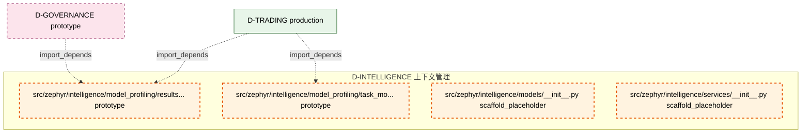

# 29_d_intelligence / 上下文管理

> **文档作用 / Purpose**: 展示 上下文管理（D-INTELLIGENCE）功能域的模块清单、域内依赖关系和跨域依赖关系，供架构审查和域治理参考。

> 本文档由 generate_domain_doc.py 从 depgraph.db 自动生成
> 最后更新: 2026-06-24 23:56:40
> 数据源: depgraph.db nodes表 + edges表

## 域基本信息 / Domain Overview

| 字段 | 值 | Field | Value |
|------|------|-------|-------|
| 编号 | 29 | Number | 29 |
| 域ID | D-INTELLIGENCE | Domain ID | D-INTELLIGENCE |
| 域名称 | 上下文管理 | Domain Name | context_management |
| 层级 | L2_domain | Layer | L2_domain |
| 模块数 | 274 | Module Count | 274 |
| 域内依赖 | 270 | Internal Dependencies | 270 |
| 跨域入边 | 322 | Cross-domain Incoming | 322 |
| 跨域出边 | 213 | Cross-domain Outgoing | 213 |
| 设计态模块 | 218 | Design Modules | 218 |
| 原型态模块 | 32 | Prototype Modules | 32 |
| 生产态模块 | 18 | Production Modules | 18 |
| 容量 | 273/150 (超容) | Capacity | 273/150 (超容) |
| 描述 | 上下文预算管理(context_budget/token_budget) | Description | 上下文预算管理(context_budget/token_budget) |

## 模块清单 / Module List

共 274 个模块（按路径排序，全部显示）

| 模块路径 / Module Path | 模块名称 / Module Name | 设计成熟度 / Maturity | 构建状态 / Build Status |
|---------|---------|-----------|---------|
| D-INTELLIGENCE/3阶段决策门控 3-Stage Decision Gate | 3阶段决策门控 3-Stage Decision Gate | design | design_only |
| D-INTELLIGENCE/4 Level Risk Control Decision Gating 4级风控决策门控 | 4 Level Risk Control Decision Gating ... | design | design_only |
| D-INTELLIGENCE/4-Level Risk Decision Gate 4级风控决策门控 | 4-Level Risk Decision Gate 4级风控决策门控 | design | design_only |
| D-INTELLIGENCE/7 Stage Learning Pipeline 7阶段学习流水线 | 7 Stage Learning Pipeline 7阶段学习流水线 | design | design_only |
| D-INTELLIGENCE/A/B测试框架 A/B Testing Framework | A/B测试框架 A/B Testing Framework | design | design_only |
| D-INTELLIGENCE/A8 Learning System Architecture A8学习系统架构 | A8 Learning System Architecture A8学习系统架构 | design | design_only |
| D-INTELLIGENCE/A8 Learning System Interface A8学习系统接口 | A8 Learning System Interface A8学习系统接口 | design | design_only |
| D-INTELLIGENCE/AI协作策略与人机信任模型 | AI协作策略与人机信任模型 | design | design_only |
| D-INTELLIGENCE/AI自治运维 | AI自治运维 | design | design_only |
| D-INTELLIGENCE/Adaptive Walk-Forward 自适应Walk-Forward | Adaptive Walk-Forward 自适应Walk-Forward | design | design_only |
| D-INTELLIGENCE/Agent Drift Detection Agent漂移检测 | Agent Drift Detection Agent漂移检测 | design | design_only |
| ...ELLIGENCE/AlphaEvolve元级基础设施进化 AlphaEvolve Meta-Level Infrastructure Evolution | AlphaEvolve元级基础设施进化 AlphaEvolve Meta-... | design | design_only |
| D-INTELLIGENCE/AlphaFin统一多模态框架 AlphaFin Unified Multimodal Framework | AlphaFin统一多模态框架 AlphaFin Unified Mult... | design | design_only |
| D-INTELLIGENCE/ArchitectureOptimizer Agent 架构优化Agent | ArchitectureOptimizer Agent 架构优化Agent | design | design_only |
| D-INTELLIGENCE/Auto Backtest & Simulation 自动回测与仿真 | Auto Backtest & Simulation 自动回测与仿真 | design | design_only |
| D-INTELLIGENCE/AutoML Engine 自动ML引擎 | AutoML Engine 自动ML引擎 | design | design_only |
| D-INTELLIGENCE/AutoSkill自动技能发现 AutoSkill Automatic Skill Discovery | AutoSkill自动技能发现 AutoSkill Automatic S... | design | design_only |
| D-INTELLIGENCE/A股特色数据 A-Share Special Data | A股特色数据 A-Share Special Data | design | design_only |
| D-INTELLIGENCE/Backtest-to-Production Deployer 回测到生产部署器 | Backtest-to-Production Deployer 回测到生产部署器 | design | design_only |
| D-INTELLIGENCE/BacktestCompleted 回测已完成 | BacktestCompleted 回测已完成 | design | design_only |
| ...TELLIGENCE/CPCV v2 Combinatorial Purged Cross-Validation v2 CPCV v2组合净化交叉验证v2 | CPCV v2 Combinatorial Purged Cross-Va... | design | design_only |
| D-INTELLIGENCE/Causal Factor Validator 因果因子验证器 | Causal Factor Validator 因果因子验证器 | design | design_only |
| D-INTELLIGENCE/Causal KG 因果方向标注 | Causal KG 因果方向标注 | design | design_only |
| D-INTELLIGENCE/Causal SHAP 因果Shapley值 | Causal SHAP 因果Shapley值 | design | design_only |
| D-INTELLIGENCE/CausalEdge 因果边 | CausalEdge 因果边 | design | design_only |
| D-INTELLIGENCE/CausalNLP 文本因果声明提取 | CausalNLP 文本因果声明提取 | design | design_only |
| D-INTELLIGENCE/Classified Knowledge Package 分类知识包 | Classified Knowledge Package 分类知识包 | design | design_only |
| D-INTELLIGENCE/Cluster Behavior Protection 群集行为防护 | Cluster Behavior Protection 群集行为防护 | design | design_only |
| D-INTELLIGENCE/CodeGenerator Agent 代码生成Agent | CodeGenerator Agent 代码生成Agent | design | design_only |
| D-INTELLIGENCE/Collection Scheduler 采集调度器 | Collection Scheduler 采集调度器 | design | design_only |
| D-INTELLIGENCE/Critic 批判器Agent | Critic 批判器Agent | design | design_only |
| D-INTELLIGENCE/Cross-Market Transmission Quantitative Model 跨市场传导量化模型 | Cross-Market Transmission Quantitativ... | design | design_only |
| D-INTELLIGENCE/D-RESEARCH | D-RESEARCH | design | design_only |
| D-INTELLIGENCE/DSL AST Sandbox Code Generation DSL+AST沙箱安全代码生成 | DSL AST Sandbox Code Generation DSL+A... | design | design_only |
| D-INTELLIGENCE/DSL AST Sandbox DSL+AST沙箱 | DSL AST Sandbox DSL+AST沙箱 | design | design_only |
| D-INTELLIGENCE/DSR扩展 Deflated Sharpe Ratio Extension | DSR扩展 Deflated Sharpe Ratio Extension | design | design_only |
| D-INTELLIGENCE/Data Quality Scorer 数据质量评分器 | Data Quality Scorer 数据质量评分器 | design | design_only |
| D-INTELLIGENCE/DeepSCM深度因果模型 DeepSCM Deep Causal Model | DeepSCM深度因果模型 DeepSCM Deep Causal Model | design | design_only |
| D-INTELLIGENCE/Drift Alert 漂移告警 | Drift Alert 漂移告警 | design | design_only |
| D-INTELLIGENCE/E-RS-02 BacktestCompleted E-RS-02 BacktestCompleted事件 | E-RS-02 BacktestCompleted E-RS-02 Bac... | design | design_only |
| D-INTELLIGENCE/Effect Feedback Path 效果反馈路径 | Effect Feedback Path 效果反馈路径 | design | design_only |
| D-INTELLIGENCE/End-to-End Causal Factor Analysis 端到端因果因子分析 | End-to-End Causal Factor Analysis 端到端... | design | design_only |
| D-INTELLIGENCE/Experiment Tracker实验追踪 | Experiment Tracker实验追踪 | design | design_only |
| D-INTELLIGENCE/ExperimentReproduced 实验复现 | ExperimentReproduced 实验复现 | design | design_only |
| D-INTELLIGENCE/Explainability Gate 可解释性门控 | Explainability Gate 可解释性门控 | design | design_only |
| D-INTELLIGENCE/Factor Mining Agent 因子挖掘Agent | Factor Mining Agent 因子挖掘Agent | design | design_only |
| D-INTELLIGENCE/Factor Proposal 因子提案 | Factor Proposal 因子提案 | design | design_only |
| D-INTELLIGENCE/Feature Store特征存储 | Feature Store特征存储 | design | design_only |
| D-INTELLIGENCE/FeatureStore PIT Feature Feed FeatureStore PIT特征供给 | FeatureStore PIT Feature Feed Feature... | design | design_only |
| D-INTELLIGENCE/Filing NLP Engine 公告NLP引擎 | Filing NLP Engine 公告NLP引擎 | design | design_only |
| D-INTELLIGENCE/FinVision端到端图表→策略 FinVision End-to-End Chart to Strategy | FinVision端到端图表→策略 FinVision End-to-En... | design | design_only |
| D-INTELLIGENCE/Generator 生成器Agent | Generator 生成器Agent | design | design_only |
| D-INTELLIGENCE/GraphRAG图增强检索 GraphRAG Graph-Enhanced Retrieval | GraphRAG图增强检索 GraphRAG Graph-Enhanced... | design | design_only |
| D-INTELLIGENCE/Hypothesis Manager 假设管理器 | Hypothesis Manager 假设管理器 | design | design_only |
| D-INTELLIGENCE/Hypothesis Manager假设管理 | Hypothesis Manager假设管理 | design | design_only |
| D-INTELLIGENCE/ICL作为元学习 ICL as Meta-Learning | ICL作为元学习 ICL as Meta-Learning | design | design_only |
| D-INTELLIGENCE/Judge 裁判Agent | Judge 裁判Agent | design | design_only |
| D-INTELLIGENCE/KG引导多跳推理 KG-Guided Multi-Hop Reasoning | KG引导多跳推理 KG-Guided Multi-Hop Reasoning | design | design_only |
| D-INTELLIGENCE/Knowledge Classification System 知识分类体系 | Knowledge Classification System 知识分类体系 | design | design_only |
| D-INTELLIGENCE/Knowledge Effectiveness Evaluator 知识效果评估器 | Knowledge Effectiveness Evaluator 知识效... | design | design_only |
| D-INTELLIGENCE/Knowledge Quality Assessor 知识质量评估器 | Knowledge Quality Assessor 知识质量评估器 | design | design_only |
| D-INTELLIGENCE/K线分词机制 K-line Tokenization | K线分词机制 K-line Tokenization | design | design_only |
| D-INTELLIGENCE/LLM Research Agent LLM研究助手 | LLM Research Agent LLM研究助手 | design | design_only |
| D-INTELLIGENCE/LLM引导因果发现先验 LLM Prior Causal Discovery | LLM引导因果发现先验 LLM Prior Causal Discovery | design | design_only |
| D-INTELLIGENCE/LLM语义理解 LLM Semantic Understanding | LLM语义理解 LLM Semantic Understanding | design | design_only |
| D-INTELLIGENCE/LLM遗传编程变异算子 LLM Genetic Programming Mutation | LLM遗传编程变异算子 LLM Genetic Programming M... | design | design_only |
| D-INTELLIGENCE/Learning System 7-Stage Pipeline 学习系统7阶段流水线 | Learning System 7-Stage Pipeline 学习系统... | design | design_only |
| D-INTELLIGENCE/Learning System Performance Attribution 学习系统绩效归因 | Learning System Performance Attributi... | design | design_only |
| D-INTELLIGENCE/LiNGAM | LiNGAM | design | design_only |
| D-INTELLIGENCE/Liquidity & Slippage Simulator 流动性与滑点模拟器 | Liquidity & Slippage Simulator 流动性与滑点模拟器 | design | design_only |
| D-INTELLIGENCE/MAML快速适应 MAML Fast Adaptation | MAML快速适应 MAML Fast Adaptation | design | design_only |
| D-INTELLIGENCE/MLOps Closed Loop MLOps闭环 | MLOps Closed Loop MLOps闭环 | design | design_only |
| D-INTELLIGENCE/MLOps闭环 MLOps Closed Loop | MLOps闭环 MLOps Closed Loop | design | design_only |
| D-INTELLIGENCE/ML模型工厂 | ML模型工厂 | design | design_only |
| D-INTELLIGENCE/Market Regime Detector 市场制度检测器 | Market Regime Detector 市场制度检测器 | design | design_only |
| D-INTELLIGENCE/Meta-Harness 元优化器 Meta-Optimizer | Meta-Harness 元优化器 Meta-Optimizer | design | design_only |
| D-INTELLIGENCE/MethodologyLearner Agent 方法论学习Agent | MethodologyLearner Agent 方法论学习Agent | design | design_only |
| D-INTELLIGENCE/Module Dependency Graph 模块依赖图 | Module Dependency Graph 模块依赖图 | design | design_only |
| D-INTELLIGENCE/Module Factory Architecture 模块工厂架构 | Module Factory Architecture 模块工厂架构 | design | design_only |
| D-INTELLIGENCE/Module Factory 模块工厂 | Module Factory 模块工厂 | design | design_only |
| D-INTELLIGENCE/Module Matcher 模块匹配器 | Module Matcher 模块匹配器 | design | design_only |
| D-INTELLIGENCE/Module Registry 模块注册表 | Module Registry 模块注册表 | design | design_only |
| D-INTELLIGENCE/Module Requirement Spec 模块需求规格 | Module Requirement Spec 模块需求规格 | design | design_only |
| D-INTELLIGENCE/Monte Carlo Engine 蒙特卡洛引擎 | Monte Carlo Engine 蒙特卡洛引擎 | design | design_only |
| D-INTELLIGENCE/Multi Modal Knowledge Acquisition 多模态知识采集 | Multi Modal Knowledge Acquisition 多模态... | design | design_only |
| D-INTELLIGENCE/Multimodal Knowledge Collection 多模态知识采集 | Multimodal Knowledge Collection 多模态知识采集 | design | design_only |
| D-INTELLIGENCE/Neural Granger Causality 神经Granger因果 | Neural Granger Causality 神经Granger因果 | design | design_only |
| D-INTELLIGENCE/NewModule 新模块 | NewModule 新模块 | design | design_only |
| D-INTELLIGENCE/Notebook Integration Notebook集成 | Notebook Integration Notebook集成 | design | design_only |
| D-INTELLIGENCE/OCR 光学字符识别 | OCR 光学字符识别 | design | design_only |
| D-INTELLIGENCE/ODL-Net在线深度学习 ODL-Net Online Deep Learning | ODL-Net在线深度学习 ODL-Net Online Deep Lea... | design | design_only |
| D-INTELLIGENCE/Order Matching Simulator 订单匹配模拟器 | Order Matching Simulator 订单匹配模拟器 | design | design_only |
| D-INTELLIGENCE/PC算法 PC Algorithm | PC算法 PC Algorithm | design | design_only |
| D-INTELLIGENCE/PDF预测引擎 PDF Prediction Engine | PDF预测引擎 PDF Prediction Engine | design | design_only |
| D-INTELLIGENCE/Paper Search 论文搜索 | Paper Search 论文搜索 | design | design_only |
| D-INTELLIGENCE/Paper Tracker 论文追踪器 | Paper Tracker 论文追踪器 | design | design_only |
| D-INTELLIGENCE/Point-in-Time门控 Point-in-Time Gating | Point-in-Time门控 Point-in-Time Gating | design | design_only |
| D-INTELLIGENCE/Probabilistic Backtesting 概率回测 | Probabilistic Backtesting 概率回测 | design | design_only |
| D-INTELLIGENCE/PromptOptimizer Agent 提示词优化Agent | PromptOptimizer Agent 提示词优化Agent | design | design_only |
| D-INTELLIGENCE/Purge Gap 清洗间隔 | Purge Gap 清洗间隔 | design | design_only |
| D-INTELLIGENCE/RISE 代码自纠正 Code Self-Correction | RISE 代码自纠正 Code Self-Correction | design | design_only |
| D-INTELLIGENCE/RSI Architecture RSI自进化架构 | RSI Architecture RSI自进化架构 | design | design_only |
| D-INTELLIGENCE/Reproducibility Manager可复现性管理 | Reproducibility Manager可复现性管理 | design | design_only |
| D-INTELLIGENCE/Reproducibility Pack Generator 可复现性包生成器 | Reproducibility Pack Generator 可复现性包生成器 | design | design_only |
| D-INTELLIGENCE/Research Asset Versioning 研究资产版本化 | Research Asset Versioning 研究资产版本化 | design | design_only |
| D-INTELLIGENCE/Research Catalog 研究目录 | Research Catalog 研究目录 | design | design_only |
| D-INTELLIGENCE/Research Collaboration Hub 研究协作中心 | Research Collaboration Hub 研究协作中心 | design | design_only |
| D-INTELLIGENCE/Research Data Manager 研究数据管理器 | Research Data Manager 研究数据管理器 | design | design_only |
| D-INTELLIGENCE/Research Data Sandbox 研究数据沙箱 | Research Data Sandbox 研究数据沙箱 | design | design_only |
| D-INTELLIGENCE/Research Discovery Knowledge Base 研究发现知识库 | Research Discovery Knowledge Base 研究发... | design | design_only |
| D-INTELLIGENCE/Research Experiment Anomaly Detector 研究实验异常检测器 | Research Experiment Anomaly Detector ... | design | design_only |
| D-INTELLIGENCE/Research Information Barrier 研究信息隔离 | Research Information Barrier 研究信息隔离 | design | design_only |
| D-INTELLIGENCE/Research Information Isolation 研究信息隔离 | Research Information Isolation 研究信息隔离 | design | design_only |
| D-INTELLIGENCE/Research Knowledge Precipitator 研究知识沉淀器 | Research Knowledge Precipitator 研究知识沉淀器 | design | design_only |
| D-INTELLIGENCE/Research Reproducibility Pack Generator 研究复现包生成器 | Research Reproducibility Pack Generat... | design | design_only |
| D-INTELLIGENCE/Research Workflow Engine 研究工作流引擎 | Research Workflow Engine 研究工作流引擎 | design | design_only |
| D-INTELLIGENCE/ResearchCompleted 研究完成 | ResearchCompleted 研究完成 | design | design_only |
| D-INTELLIGENCE/ResearchProject 研究项目 | ResearchProject 研究项目 | design | design_only |
| D-INTELLIGENCE/Researcher Agent 研究Agent | Researcher Agent 研究Agent | design | design_only |
| D-INTELLIGENCE/S0 多模态知识采集层 S0 Multimodal Knowledge Collection Layer | S0 多模态知识采集层 S0 Multimodal Knowledge C... | design | design_only |
| D-INTELLIGENCE/S1 知识清洗与结构化层 S1 Knowledge Cleaning & Structuring Layer | S1 知识清洗与结构化层 S1 Knowledge Cleaning & ... | design | design_only |
| ...LIGENCE/S2 知识分类与策略提取层 S2 Knowledge Classification & Strategy Extraction Layer | S2 知识分类与策略提取层 S2 Knowledge Classifica... | design | design_only |
| D-INTELLIGENCE/S3 模块映射与工厂匹配层 S3 Module Mapping & Factory Matching Layer | S3 模块映射与工厂匹配层 S3 Module Mapping & Fac... | design | design_only |
| D-INTELLIGENCE/S4 模块创建与接入层 S4 Module Creation & Integration Layer | S4 模块创建与接入层 S4 Module Creation & Inte... | design | design_only |
| D-INTELLIGENCE/S5 试运行与验证层 S5 Trial Run & Validation Layer | S5 试运行与验证层 S5 Trial Run & Validation ... | design | design_only |
| D-INTELLIGENCE/S6 元学习与自我进化层 S6 Meta-Learning & Self-Evolution Layer | S6 元学习与自我进化层 S6 Meta-Learning & Self-... | design | design_only |
| D-INTELLIGENCE/SHAP值解释 SHAP Value Explanation | SHAP值解释 SHAP Value Explanation | design | design_only |
| D-INTELLIGENCE/STOP Prompt自优化 Prompt Self-Optimization | STOP Prompt自优化 Prompt Self-Optimization | design | design_only |
| D-INTELLIGENCE/Scenario Generator基础版 情景生成器基础版 | Scenario Generator基础版 情景生成器基础版 | design | design_only |
| D-INTELLIGENCE/Security Governance 安全与治理 | Security Governance 安全与治理 | design | design_only |
| D-INTELLIGENCE/Sentiment Engine 情感分析引擎 | Sentiment Engine 情感分析引擎 | design | design_only |
| D-INTELLIGENCE/Signal Confidence Scorer 信号置信度评分器 | Signal Confidence Scorer 信号置信度评分器 | design | design_only |
| D-INTELLIGENCE/Signal Extractor 信号提取器 | Signal Extractor 信号提取器 | design | design_only |
| D-INTELLIGENCE/Strategy Code Generation 策略代码生成 | Strategy Code Generation 策略代码生成 | design | design_only |
| D-INTELLIGENCE/Strategy Iteration Upgrader策略迭代升级 | Strategy Iteration Upgrader策略迭代升级 | design | design_only |
| D-INTELLIGENCE/Strategy Sandbox轻量版 策略沙盒轻量版 | Strategy Sandbox轻量版 策略沙盒轻量版 | design | design_only |
| D-INTELLIGENCE/Structured Knowledge Fragment 结构化知识片段 | Structured Knowledge Fragment 结构化知识片段 | design | design_only |
| D-INTELLIGENCE/Synthetic Backtesting合成回测 Synthetic Backtesting | Synthetic Backtesting合成回测 Synthetic B... | design | design_only |
| D-INTELLIGENCE/Synthetic Data Generator基础版 合成数据生成器基础版 | Synthetic Data Generator基础版 合成数据生成器基础版 | design | design_only |
| D-INTELLIGENCE/TimePC时序因果发现 TimePC Temporal Causal Discovery | TimePC时序因果发现 TimePC Temporal Causal D... | design | design_only |
| D-INTELLIGENCE/Trading Domain NLP Engine 交易领域NLP引擎 | Trading Domain NLP Engine 交易领域NLP引擎 | design | design_only |
| D-INTELLIGENCE/VLM图表视觉理解 VLM Chart Visual Understanding | VLM图表视觉理解 VLM Chart Visual Understanding | design | design_only |
| D-INTELLIGENCE/Voyager 技能库 Skill Library | Voyager 技能库 Skill Library | design | design_only |
| D-INTELLIGENCE/Walk-Forward Analyzer完整版 Walk-Forward Analyzer Full Version | Walk-Forward Analyzer完整版 Walk-Forward... | design | design_only |
| D-INTELLIGENCE/Whisper 语音转写引擎 | Whisper 语音转写引擎 | design | design_only |
| D-INTELLIGENCE/White's Reality Check 怀特现实检验 | White's Reality Check 怀特现实检验 | design | design_only |
| D-INTELLIGENCE/三层参数优化 3-Layer Parameter Optimization | 三层参数优化 3-Layer Parameter Optimization | design | design_only |
| D-INTELLIGENCE/三重语义一致性 Triple Semantic Consistency | 三重语义一致性 Triple Semantic Consistency | design | design_only |
| D-INTELLIGENCE/三重语义一致性约束 Triple Semantic Consistency Constraint | 三重语义一致性约束 Triple Semantic Consistency... | design | design_only |
| D-INTELLIGENCE/事件影响知识 Event Impact Knowledge | 事件影响知识 Event Impact Knowledge | design | design_only |
| D-INTELLIGENCE/事件触发采集 Event-Triggered Collection | 事件触发采集 Event-Triggered Collection | design | design_only |
| D-INTELLIGENCE/交互式解释 Interactive Explanation | 交互式解释 Interactive Explanation | design | design_only |
| D-INTELLIGENCE/交易逻辑提取 Trading Logic Extraction | 交易逻辑提取 Trading Logic Extraction | design | design_only |
| D-INTELLIGENCE/人工干预接口 Human Intervention Interface | 人工干预接口 Human Intervention Interface | design | design_only |
| D-INTELLIGENCE/人机协作模式 Human-AI Collaboration Mode | 人机协作模式 Human-AI Collaboration Mode | design | design_only |
| D-INTELLIGENCE/信息价值评分 Information Value Scoring | 信息价值评分 Information Value Scoring | design | design_only |
| D-INTELLIGENCE/信息论过拟合检测 Information-Theoretic Overfitting Detection | 信息论过拟合检测 Information-Theoretic Overfi... | design | design_only |
| D-INTELLIGENCE/元反思 Meta-Reflection | 元反思 Meta-Reflection | design | design_only |
| D-INTELLIGENCE/共形漂移检测 Conformal Drift Detection | 共形漂移检测 Conformal Drift Detection | design | design_only |
| D-INTELLIGENCE/决策树学习 Decision Tree Learning | 决策树学习 Decision Tree Learning | design | design_only |
| D-INTELLIGENCE/决策路径可视化 Decision Path Visualization | 决策路径可视化 Decision Path Visualization | design | design_only |
| D-INTELLIGENCE/创意拓宽模式 Creative Broadening Mode | 创意拓宽模式 Creative Broadening Mode | design | design_only |
| D-INTELLIGENCE/制度知识 Regime Knowledge | 制度知识 Regime Knowledge | design | design_only |
| D-INTELLIGENCE/博弈知识 Game Theory Knowledge | 博弈知识 Game Theory Knowledge | design | design_only |
| D-INTELLIGENCE/去噪 Denoising | 去噪 Denoising | design | design_only |
| D-INTELLIGENCE/去重 Deduplication | 去重 Deduplication | design | design_only |
| D-INTELLIGENCE/参数稳定性区域 Parameter Stability Plateau | 参数稳定性区域 Parameter Stability Plateau | design | design_only |
| D-INTELLIGENCE/可微因果发现 Differentiable Causal Discovery NOTEARS+ | 可微因果发现 Differentiable Causal Discover... | design | design_only |
| D-INTELLIGENCE/可解释性门控 Explainability Gate | 可解释性门控 Explainability Gate | design | design_only |
| D-INTELLIGENCE/可解释设计约束 Explainable By Design Constraint | 可解释设计约束 Explainable By Design Constraint | design | design_only |
| D-INTELLIGENCE/因子知识 Factor Knowledge | 因子知识 Factor Knowledge | design | design_only |
| D-INTELLIGENCE/因子语义去重 Factor Semantic Deduplication | 因子语义去重 Factor Semantic Deduplication | design | design_only |
| D-INTELLIGENCE/因果发现三阶段扩展 Causal Discovery 3-Stage Extension | 因果发现三阶段扩展 Causal Discovery 3-Stage Ex... | design | design_only |
| D-INTELLIGENCE/因果发现引擎 Causal Discovery Engine | 因果发现引擎 Causal Discovery Engine | design | design_only |
| D-INTELLIGENCE/因果约束反事实解释 Causal-Constrained Counterfactual Explanation | 因果约束反事实解释 Causal-Constrained Counterf... | design | design_only |
| D-INTELLIGENCE/因果验证层 Causal Validation Layer | 因果验证层 Causal Validation Layer | design | design_only |
| D-INTELLIGENCE/在线EWC Online Elastic Weight Consolidation | 在线EWC Online Elastic Weight Consolida... | design | design_only |
| D-INTELLIGENCE/多尺度漂移检测 Multi-Scale Drift Detection | 多尺度漂移检测 Multi-Scale Drift Detection | design | design_only |
| D-INTELLIGENCE/多模态融合引擎 Multimodal Fusion Engine | 多模态融合引擎 Multimodal Fusion Engine | design | design_only |
| D-INTELLIGENCE/学习系统反馈路径 Path | 学习系统反馈路径 Path | design | design_only |
| D-INTELLIGENCE/宏观因果传导路径 Macro Causal Transmission Path | 宏观因果传导路径 Macro Causal Transmission Path | design | design_only |
| D-INTELLIGENCE/定时采集 Scheduled Collection | 定时采集 Scheduled Collection | design | design_only |
| D-INTELLIGENCE/对抗性知识增强 Adversarial Knowledge Enhancement | 对抗性知识增强 Adversarial Knowledge Enhance... | design | design_only |
| D-INTELLIGENCE/市场状态感知Walk-Forward Regime-Aware Walk-Forward | 市场状态感知Walk-Forward Regime-Aware Walk-... | design | design_only |
| D-INTELLIGENCE/市场状态知识 Market State Knowledge | 市场状态知识 Market State Knowledge | design | design_only |
| D-INTELLIGENCE/带干预的时序因果发现 Intervention-Enhanced Temporal Causal Discovery | 带干预的时序因果发现 Intervention-Enhanced Temp... | design | design_only |
| D-INTELLIGENCE/带推理路径的KG-RAG KG-RAG with Reasoning Path | 带推理路径的KG-RAG KG-RAG with Reasoning Path | design | design_only |
| D-INTELLIGENCE/延迟离线学习模式 Delayed Offline Learning Mode | 延迟离线学习模式 Delayed Offline Learning Mode | design | design_only |
| D-INTELLIGENCE/手动提交 Manual Submission | 手动提交 Manual Submission | design | design_only |
| D-INTELLIGENCE/技能三元组 Skill Triple | 技能三元组 Skill Triple | design | design_only |
| D-INTELLIGENCE/教训知识 Lesson Learned Knowledge | 教训知识 Lesson Learned Knowledge | design | design_only |
| D-INTELLIGENCE/数学反思闭环 Mathematical Reflection Loop | 数学反思闭环 Mathematical Reflection Loop | design | design_only |
| D-INTELLIGENCE/方法论知识 Methodology Knowledge | 方法论知识 Methodology Knowledge | design | design_only |
| D-INTELLIGENCE/时序基础模型骨干 TimesFM Foundation Model Backbone | 时序基础模型骨干 TimesFM Foundation Model Bac... | design | design_only |
| D-INTELLIGENCE/时滞因果扩展 Lagged Causal Extension | 时滞因果扩展 Lagged Causal Extension | design | design_only |
| D-INTELLIGENCE/术语标准化 Terminology Normalization | 术语标准化 Terminology Normalization | design | design_only |
| D-INTELLIGENCE/板块轮动知识 Sector Rotation Knowledge | 板块轮动知识 Sector Rotation Knowledge | design | design_only |
| D-INTELLIGENCE/格式转换 Format Conversion | 格式转换 Format Conversion | design | design_only |
| D-INTELLIGENCE/模块工厂 Module Factory | 模块工厂 Module Factory | design | design_only |
| D-INTELLIGENCE/流动性知识 Liquidity Knowledge | 流动性知识 Liquidity Knowledge | design | design_only |
| D-INTELLIGENCE/漂移感知调度 Drift-Aware Scheduling | 漂移感知调度 Drift-Aware Scheduling | design | design_only |
| D-INTELLIGENCE/漂移感知集成 Drift-Aware Ensemble | 漂移感知集成 Drift-Aware Ensemble | design | design_only |
| D-INTELLIGENCE/矛盾检测 Conflict Detection | 矛盾检测 Conflict Detection | design | design_only |
| D-INTELLIGENCE/知识模型自进化 Model Knowledge | 知识模型自进化 Model Knowledge | design | design_only |
| D-INTELLIGENCE/知识类型分类 Knowledge Type Classification | 知识类型分类 Knowledge Type Classification | design | design_only |
| D-INTELLIGENCE/知识质量门禁 Knowledge Quality Gate | 知识质量门禁 Knowledge Quality Gate | design | design_only |
| D-INTELLIGENCE/神经符号融合推理 Neuro-Symbolic Fusion Reasoning | 神经符号融合推理 Neuro-Symbolic Fusion Reasoning | design | design_only |
| D-INTELLIGENCE/策略知识 Strategy Knowledge | 策略知识 Strategy Knowledge | design | design_only |
| D-INTELLIGENCE/表示学习驱动漂移检测 Representation Learning Drift Detection | 表示学习驱动漂移检测 Representation Learning Dr... | design | design_only |
| D-INTELLIGENCE/说话人分离 Speaker Diarization | 说话人分离 Speaker Diarization | design | design_only |
| D-INTELLIGENCE/质量-多样性优化 Quality-Diversity Optimization | 质量-多样性优化 Quality-Diversity Optimization | design | design_only |
| D-INTELLIGENCE/轨迹级进化 Trajectory-level Evolution | 轨迹级进化 Trajectory-level Evolution | design | design_only |
| D-INTELLIGENCE/轻量Agent化 Lightweight Agentification | 轻量Agent化 Lightweight Agentification | design | design_only |
| D-INTELLIGENCE/辩论式因子精炼 Debate-based Factor Refinement | 辩论式因子精炼 Debate-based Factor Refinement | design | design_only |
| D-INTELLIGENCE/过拟合检测扩展 Overfitting Detection Extension | 过拟合检测扩展 Overfitting Detection Extension | design | design_only |
| D-INTELLIGENCE/风控知识 Risk Management Knowledge | 风控知识 Risk Management Knowledge | design | design_only |
| D-INTELLIGENCE/高级回测 Advanced Backtesting | 高级回测 Advanced Backtesting | design | design_only |
| F10-model-exam/ |  | design | stable |
| src/zephyr/intelligence/__init__.py |  | prototype | orphan |
| src/zephyr/intelligence/_extensions/__init__.py |  | scaffold_placeholder | orphan |
| src/zephyr/intelligence/api/__init__.py |  | scaffold_placeholder | orphan |
| src/zephyr/intelligence/core/__init__.py |  | scaffold_placeholder | orphan |
| src/zephyr/intelligence/infrastructure/__init__.py |  | scaffold_placeholder | orphan |
| src/zephyr/intelligence/model_drift_detector.py |  | prototype | draft |
| src/zephyr/intelligence/model_evaluation/__init__.py |  | prototype | draft |
| src/zephyr/intelligence/model_evaluation/activate.py |  | production | draft |
| src/zephyr/intelligence/model_evaluation/backtest_base.py |  | prototype | draft |
| src/zephyr/intelligence/model_evaluation/experiment_tracker/__init__.py |  | prototype | draft |
| src/zephyr/intelligence/model_evaluation/implementations/__init__.py |  | prototype | draft |
| ...phyr/intelligence/model_evaluation/implementations/default_backtest_engine.py |  | prototype | draft |
| ...hyr/intelligence/model_evaluation/implementations/default_inference_engine.py |  | production | draft |
| src/zephyr/intelligence/model_evaluation/inference_base.py |  | production | draft |
| src/zephyr/intelligence/model_evaluation/kb_repo.py |  | production | draft |
| src/zephyr/intelligence/model_evaluation/notebook_integration/__init__.py |  | prototype | draft |
| src/zephyr/intelligence/model_evaluation/reranker.py |  | production | draft |
| src/zephyr/intelligence/model_evaluation/sync_engine.py |  | prototype | draft |
| src/zephyr/intelligence/model_evaluation/target_lib/__init__.py |  | prototype | orphan |
| src/zephyr/intelligence/model_evaluation/unified_memory_api.py |  | production | draft |
| src/zephyr/intelligence/model_profiling/__init__.py |  | prototype | draft |
| src/zephyr/intelligence/model_profiling/benchmark_suite.py |  | prototype | draft |
| src/zephyr/intelligence/model_profiling/capability_passport.py |  | production | draft |
| src/zephyr/intelligence/model_profiling/cli.py |  | production | draft |
| src/zephyr/intelligence/model_profiling/deepseek_v4_chat.py |  | production | draft |
| src/zephyr/intelligence/model_profiling/exam_orchestrator.py |  | production | draft |
| src/zephyr/intelligence/model_profiling/exam_test_cases.py |  | production | draft |
| src/zephyr/intelligence/model_profiling/model_discovery.py |  | prototype | draft |
| src/zephyr/intelligence/model_profiling/pipeline/__init__.py |  | prototype | draft |
| src/zephyr/intelligence/model_profiling/pipeline/benchmark_suite.py |  | prototype | draft |
| src/zephyr/intelligence/model_profiling/pipeline/capability_passport.py |  | prototype | draft |
| src/zephyr/intelligence/model_profiling/pipeline/cli.py |  | prototype | draft |
| src/zephyr/intelligence/model_profiling/pipeline/deepseek_v4_chat.py |  | prototype | draft |
| src/zephyr/intelligence/model_profiling/pipeline/exam_orchestrator.py |  | prototype | draft |
| src/zephyr/intelligence/model_profiling/pipeline/exam_test_cases.py |  | prototype | draft |
| src/zephyr/intelligence/model_profiling/pipeline/model_discovery.py |  | prototype | draft |
| src/zephyr/intelligence/model_profiling/pipeline/profiler.py |  | prototype | draft |
| src/zephyr/intelligence/model_profiling/pipeline/results_writer.py |  | prototype | draft |
| src/zephyr/intelligence/model_profiling/pipeline/task_model_learner.py |  | prototype | draft |
| src/zephyr/intelligence/model_profiling/pipeline_routing/__init__.py |  | prototype | draft |
| src/zephyr/intelligence/model_profiling/pipeline_routing/benchmark_suite.py |  | production | draft |
| src/zephyr/intelligence/model_profiling/pipeline_routing/capability_passport.py |  | production | draft |
| src/zephyr/intelligence/model_profiling/pipeline_routing/cli.py |  | prototype | draft |
| src/zephyr/intelligence/model_profiling/pipeline_routing/deepseek_v4_chat.py |  | prototype | draft |
| src/zephyr/intelligence/model_profiling/pipeline_routing/exam_orchestrator.py |  | prototype | draft |
| src/zephyr/intelligence/model_profiling/pipeline_routing/exam_test_cases.py |  | prototype | draft |
| src/zephyr/intelligence/model_profiling/pipeline_routing/model_discovery.py |  | production | draft |
| src/zephyr/intelligence/model_profiling/pipeline_routing/profiler.py |  | production | draft |
| src/zephyr/intelligence/model_profiling/pipeline_routing/results_writer.py |  | production | draft |
| src/zephyr/intelligence/model_profiling/pipeline_routing/task_model_learner.py |  | production | draft |
| src/zephyr/intelligence/model_profiling/profiler.py |  | prototype | draft |
| src/zephyr/intelligence/model_profiling/provider_data.py |  | production | draft |
| src/zephyr/intelligence/model_profiling/results_writer.py |  | prototype | draft |
| src/zephyr/intelligence/model_profiling/task_model_learner.py |  | prototype | draft |
| src/zephyr/intelligence/models/__init__.py |  | scaffold_placeholder | orphan |
| src/zephyr/intelligence/services/__init__.py |  | scaffold_placeholder | orphan |

## 域内依赖图 / Internal Dependency Diagram

> 依赖图内嵌在本文档中，IDE 可直接渲染显示。每30个节点一组分页显示。
>
> **图例说明 / Legend**：
> - **实线边框 = 运营态模块**（production，已上线运行）
> - **虚线边框 = 设计态模块**（design，还在设计中）
> - **实线箭头 = 运营态依赖**（已生效的依赖关系）
> - **虚线箭头 = 设计态依赖**（计划中的依赖关系）

### 第 1 页 / 共 10 页 / Page 1 of 10

```mermaid
graph TD
    subgraph D_INTELLIGENCE["D-INTELLIGENCE 上下文管理"]
        D_INTELLIGENCE_3_3_Stage_Decision_Gate["3阶段决策门控 3-Stage Decision Gate design"]
        D_INTELLIGENCE_4_Level_Risk_Control_Decision_Gating_4["4 Level Risk Control Decision Gating 4级风控决策门控 design"]
        D_INTELLIGENCE_4_Level_Risk_Decision_Gate_4["4-Level Risk Decision Gate 4级风控决策门控 design"]
        D_INTELLIGENCE_7_Stage_Learning_Pipeline_7["7 Stage Learning Pipeline 7阶段学习流水线 design"]
        D_INTELLIGENCE_A_B_A_B_Testing_Framework["A/B测试框架 A/B Testing Framework design"]
        D_INTELLIGENCE_A8_Learning_System_Architecture_A8["A8 Learning System Architecture A8学习系统架构 design"]
        D_INTELLIGENCE_A8_Learning_System_Interface_A8["A8 Learning System Interface A8学习系统接口 design"]
        D_INTELLIGENCE_AI["AI协作策略与人机信任模型 design"]
        D_INTELLIGENCE_AI_1["AI自治运维 design"]
        D_INTELLIGENCE_Adaptive_Walk_Forward_Walk_Forward["Adaptive Walk-Forward 自适应Walk-Forward design"]
        D_INTELLIGENCE_Agent_Drift_Detection_Agent["Agent Drift Detection Agent漂移检测 design"]
        D_INTELLIGENCE_AlphaEvolve_AlphaEvolve_Meta_Level_Infrastructure_Evolution["AlphaEvolve元级基础设施进化 AlphaEvolve Meta-Level Infr... design"]
        D_INTELLIGENCE_AlphaFin_AlphaFin_Unified_Multimodal_Framework["AlphaFin统一多模态框架 AlphaFin Unified Multimodal Fra... design"]
        D_INTELLIGENCE_ArchitectureOptimizer_Agent_Agent["ArchitectureOptimizer Agent 架构优化Agent design"]
        D_INTELLIGENCE_Auto_Backtest_Simulation["Auto Backtest & Simulation 自动回测与仿真 design"]
        D_INTELLIGENCE_AutoML_Engine_ML["AutoML Engine 自动ML引擎 design"]
        D_INTELLIGENCE_AutoSkill_AutoSkill_Automatic_Skill_Discovery["AutoSkill自动技能发现 AutoSkill Automatic Skill Disco... design"]
        D_INTELLIGENCE_A_A_Share_Special_Data["A股特色数据 A-Share Special Data design"]
        D_INTELLIGENCE_Backtest_to_Production_Deployer["Backtest-to-Production Deployer 回测到生产部署器 design"]
        D_INTELLIGENCE_BacktestCompleted["BacktestCompleted 回测已完成 design"]
        D_INTELLIGENCE_CPCV_v2_Combinatorial_Purged_Cross_Validation_v2_CPCV_v2_v2["CPCV v2 Combinatorial Purged Cross-Validation v... design"]
        D_INTELLIGENCE_Causal_Factor_Validator["Causal Factor Validator 因果因子验证器 design"]
        D_INTELLIGENCE_Causal_KG["Causal KG 因果方向标注 design"]
        D_INTELLIGENCE_Causal_SHAP_Shapley["Causal SHAP 因果Shapley值 design"]
        D_INTELLIGENCE_CausalEdge["CausalEdge 因果边 design"]
        D_INTELLIGENCE_CausalNLP["CausalNLP 文本因果声明提取 design"]
        D_INTELLIGENCE_Classified_Knowledge_Package["Classified Knowledge Package 分类知识包 design"]
        D_INTELLIGENCE_Cluster_Behavior_Protection["Cluster Behavior Protection 群集行为防护 design"]
        D_INTELLIGENCE_CodeGenerator_Agent_Agent["CodeGenerator Agent 代码生成Agent design"]
        D_INTELLIGENCE_Collection_Scheduler["Collection Scheduler 采集调度器 design"]
    end
    D_INTELLIGENCE_AutoML_Engine_ML -.->|import_depends| D_INTELLIGENCE_Backtest_to_Production_Deployer
    D_INTELLIGENCE_Causal_Factor_Validator -.->|import_depends| D_INTELLIGENCE_A8_Learning_System_Architecture_A8
    D_INTELLIGENCE_ArchitectureOptimizer_Agent_Agent -.->|import_depends| D_INTELLIGENCE_CodeGenerator_Agent_Agent
    D_INTELLIGENCE_Agent_Drift_Detection_Agent -.->|import_depends| D_INTELLIGENCE_Cluster_Behavior_Protection
    D_SIGNAL["D-SIGNAL design"]
    D_INTELLIGENCE_AI -.->|contract| D_SIGNAL
    D_RISK["D-RISK design"]
    D_INTELLIGENCE_Classified_Knowledge_Package -.->|event| D_RISK
    D_INFRA_RUNTIME["D-INFRA_RUNTIME design"]
    D_INTELLIGENCE_3_3_Stage_Decision_Gate -.->|data| D_INFRA_RUNTIME
    D_FACTOR["D-FACTOR design"]
    D_INTELLIGENCE_A_A_Share_Special_Data -.->|contract| D_FACTOR
    D_KNOWLEDGE["D-KNOWLEDGE design"]
    D_INTELLIGENCE_A_A_Share_Special_Data -.->|contract| D_KNOWLEDGE
    D_INTELLIGENCE_A_A_Share_Special_Data -.->|config_depends| D_SIGNAL
    D_INTELLIGENCE_CausalNLP -.->|contract| D_FACTOR
    D_SECURITY["D-SECURITY design"]
    D_INTELLIGENCE_Causal_Factor_Validator -.->|config_depends| D_SECURITY
    D_ML_SERVE["D-ML_SERVE design"]
    D_INTELLIGENCE_CPCV_v2_Combinatorial_Purged_Cross_Validation_v2_CPCV_v2_v2 -.->|contract| D_ML_SERVE
    D_INTELLIGENCE_Adaptive_Walk_Forward_Walk_Forward -.->|data| D_RISK
    D_INTELLIGENCE_Adaptive_Walk_Forward_Walk_Forward -.->|contract| D_ML_SERVE
    D_TRADING["D-TRADING design"]
    D_INTELLIGENCE_A_B_A_B_Testing_Framework -.->|event| D_TRADING
    D_INTELLIGENCE_AutoSkill_AutoSkill_Automatic_Skill_Discovery -.->|event| D_SECURITY
    D_INTELLIGENCE_ArchitectureOptimizer_Agent_Agent -.->|data| D_RISK
    D_PF_CORE["D-PF_CORE design"]
    D_INTELLIGENCE_CausalEdge -.->|event| D_PF_CORE
    D_INTEGRATION["D-INTEGRATION design"]
    D_INTEGRATION -.->|contract| D_INTELLIGENCE_AI
    D_GOVERNANCE["D-GOVERNANCE design"]
    D_GOVERNANCE -.->|event| D_INTELLIGENCE_AI
    D_INFRA_OPS["D-INFRA_OPS design"]
    D_INFRA_OPS -.->|config_depends| D_INTELLIGENCE_AutoML_Engine_ML
    D_COMPLIANCE["D-COMPLIANCE design"]
    D_COMPLIANCE -.->|contract| D_INTELLIGENCE_Backtest_to_Production_Deployer
    D_AUTONOMY_CORE["D-AUTONOMY_CORE design"]
    D_AUTONOMY_CORE -.->|data| D_INTELLIGENCE_Classified_Knowledge_Package
    D_INFRA_OPS -.->|data| D_INTELLIGENCE_Classified_Knowledge_Package
    D_GOVERNANCE -.->|contract| D_INTELLIGENCE_A_A_Share_Special_Data
    D_OPS["D-OPS design"]
    D_OPS -.->|data| D_INTELLIGENCE_CausalNLP
    D_GOV_AUDIT["D-GOV_AUDIT design"]
    D_GOV_AUDIT -.->|data| D_INTELLIGENCE_Causal_KG
    D_GOVERNANCE -.->|contract| D_INTELLIGENCE_Causal_Factor_Validator
    D_AUTONOMY_CORE -.->|event| D_INTELLIGENCE_CPCV_v2_Combinatorial_Purged_Cross_Validation_v2_CPCV_v2_v2
    D_AUTONOMY_PERM["D-AUTONOMY_PERM design"]
    D_AUTONOMY_PERM -.->|contract| D_INTELLIGENCE_Adaptive_Walk_Forward_Walk_Forward
    D_ALT_DATA["D-ALT_DATA design"]
    D_ALT_DATA -.->|data| D_INTELLIGENCE_Adaptive_Walk_Forward_Walk_Forward
    D_COMPLIANCE -.->|data| D_INTELLIGENCE_A_B_A_B_Testing_Framework
    D_AUTONOMY_PERM -.->|data| D_INTELLIGENCE_A_B_A_B_Testing_Framework
    classDef production fill:#e1f5fe,stroke:#01579b,stroke-width:2px,color:#000
    classDef design fill:#fff3e0,stroke:#e65100,stroke-width:2px,color:#000,stroke-dasharray: 5 5
    classDef external_prod fill:#e8f5e9,stroke:#1b5e20,stroke-width:1px,color:#000
    classDef external_design fill:#fce4ec,stroke:#880e4f,stroke-width:1px,color:#000,stroke-dasharray: 5 5
    class D_INTELLIGENCE_3_3_Stage_Decision_Gate,D_INTELLIGENCE_4_Level_Risk_Control_Decision_Gating_4,D_INTELLIGENCE_4_Level_Risk_Decision_Gate_4,D_INTELLIGENCE_7_Stage_Learning_Pipeline_7,D_INTELLIGENCE_A_B_A_B_Testing_Framework,D_INTELLIGENCE_A8_Learning_System_Architecture_A8,D_INTELLIGENCE_A8_Learning_System_Interface_A8,D_INTELLIGENCE_AI,D_INTELLIGENCE_AI_1,D_INTELLIGENCE_Adaptive_Walk_Forward_Walk_Forward,D_INTELLIGENCE_Agent_Drift_Detection_Agent,D_INTELLIGENCE_AlphaEvolve_AlphaEvolve_Meta_Level_Infrastructure_Evolution,D_INTELLIGENCE_AlphaFin_AlphaFin_Unified_Multimodal_Framework,D_INTELLIGENCE_ArchitectureOptimizer_Agent_Agent,D_INTELLIGENCE_Auto_Backtest_Simulation,D_INTELLIGENCE_AutoML_Engine_ML,D_INTELLIGENCE_AutoSkill_AutoSkill_Automatic_Skill_Discovery,D_INTELLIGENCE_A_A_Share_Special_Data,D_INTELLIGENCE_Backtest_to_Production_Deployer,D_INTELLIGENCE_BacktestCompleted,D_INTELLIGENCE_CPCV_v2_Combinatorial_Purged_Cross_Validation_v2_CPCV_v2_v2,D_INTELLIGENCE_Causal_Factor_Validator,D_INTELLIGENCE_Causal_KG,D_INTELLIGENCE_Causal_SHAP_Shapley,D_INTELLIGENCE_CausalEdge,D_INTELLIGENCE_CausalNLP,D_INTELLIGENCE_Classified_Knowledge_Package,D_INTELLIGENCE_Cluster_Behavior_Protection,D_INTELLIGENCE_CodeGenerator_Agent_Agent,D_INTELLIGENCE_Collection_Scheduler design
    class D_SIGNAL,D_RISK,D_INFRA_RUNTIME,D_FACTOR,D_KNOWLEDGE,D_SECURITY,D_ML_SERVE,D_TRADING,D_PF_CORE,D_INTEGRATION,D_GOVERNANCE,D_INFRA_OPS,D_COMPLIANCE,D_AUTONOMY_CORE,D_OPS,D_GOV_AUDIT,D_AUTONOMY_PERM,D_ALT_DATA external_design
```

### 第 2 页 / 共 10 页 / Page 2 of 10

```mermaid
graph TD
    subgraph D_INTELLIGENCE["D-INTELLIGENCE 上下文管理"]
        D_INTELLIGENCE_Critic_Agent["Critic 批判器Agent design"]
        D_INTELLIGENCE_Cross_Market_Transmission_Quantitative_Model["Cross-Market Transmission Quantitative Model 跨市... design"]
        D_INTELLIGENCE_D_RESEARCH["D-RESEARCH design"]
        D_INTELLIGENCE_DSL_AST_Sandbox_Code_Generation_DSL_AST["DSL AST Sandbox Code Generation DSL+AST沙箱安全代码生成 design"]
        D_INTELLIGENCE_DSL_AST_Sandbox_DSL_AST["DSL AST Sandbox DSL+AST沙箱 design"]
        D_INTELLIGENCE_DSR_Deflated_Sharpe_Ratio_Extension["DSR扩展 Deflated Sharpe Ratio Extension design"]
        D_INTELLIGENCE_Data_Quality_Scorer["Data Quality Scorer 数据质量评分器 design"]
        D_INTELLIGENCE_DeepSCM_DeepSCM_Deep_Causal_Model["DeepSCM深度因果模型 DeepSCM Deep Causal Model design"]
        D_INTELLIGENCE_Drift_Alert["Drift Alert 漂移告警 design"]
        D_INTELLIGENCE_E_RS_02_BacktestCompleted_E_RS_02_BacktestCompleted["E-RS-02 BacktestCompleted E-RS-02 BacktestCompl... design"]
        D_INTELLIGENCE_Effect_Feedback_Path["Effect Feedback Path 效果反馈路径 design"]
        D_INTELLIGENCE_End_to_End_Causal_Factor_Analysis["End-to-End Causal Factor Analysis 端到端因果因子分析 design"]
        D_INTELLIGENCE_Experiment_Tracker["Experiment Tracker实验追踪 design"]
        D_INTELLIGENCE_ExperimentReproduced["ExperimentReproduced 实验复现 design"]
        D_INTELLIGENCE_Explainability_Gate["Explainability Gate 可解释性门控 design"]
        D_INTELLIGENCE_Factor_Mining_Agent_Agent["Factor Mining Agent 因子挖掘Agent design"]
        D_INTELLIGENCE_Factor_Proposal["Factor Proposal 因子提案 design"]
        D_INTELLIGENCE_Feature_Store["Feature Store特征存储 design"]
        D_INTELLIGENCE_FeatureStore_PIT_Feature_Feed_FeatureStore_PIT["FeatureStore PIT Feature Feed FeatureStore PIT特征供给 design"]
        D_INTELLIGENCE_Filing_NLP_Engine_NLP["Filing NLP Engine 公告NLP引擎 design"]
        D_INTELLIGENCE_FinVision_FinVision_End_to_End_Chart_to_Strategy["FinVision端到端图表→策略 FinVision End-to-End Chart to... design"]
        D_INTELLIGENCE_Generator_Agent["Generator 生成器Agent design"]
        D_INTELLIGENCE_GraphRAG_GraphRAG_Graph_Enhanced_Retrieval["GraphRAG图增强检索 GraphRAG Graph-Enhanced Retrieval design"]
        D_INTELLIGENCE_Hypothesis_Manager["Hypothesis Manager 假设管理器 design"]
        D_INTELLIGENCE_Hypothesis_Manager_1["Hypothesis Manager假设管理 design"]
        D_INTELLIGENCE_ICL_ICL_as_Meta_Learning["ICL作为元学习 ICL as Meta-Learning design"]
        D_INTELLIGENCE_Judge_Agent["Judge 裁判Agent design"]
        D_INTELLIGENCE_KG_KG_Guided_Multi_Hop_Reasoning["KG引导多跳推理 KG-Guided Multi-Hop Reasoning design"]
        D_INTELLIGENCE_Knowledge_Classification_System["Knowledge Classification System 知识分类体系 design"]
        D_INTELLIGENCE_Knowledge_Effectiveness_Evaluator["Knowledge Effectiveness Evaluator 知识效果评估器 design"]
    end
    D_INTELLIGENCE_D_RESEARCH -.->|import_depends| D_INTELLIGENCE_Feature_Store
    D_INTELLIGENCE_Feature_Store -.->|import_depends| D_INTELLIGENCE_Experiment_Tracker
    D_INTELLIGENCE_Generator_Agent -.->|import_depends| D_INTELLIGENCE_Critic_Agent
    D_INTELLIGENCE_Critic_Agent -.->|import_depends| D_INTELLIGENCE_Judge_Agent
    D_INTELLIGENCE_Factor_Mining_Agent_Agent -.->|import_depends| D_INTELLIGENCE_Hypothesis_Manager
    D_INTELLIGENCE_ICL_ICL_as_Meta_Learning -.->|event| D_INTELLIGENCE_ExperimentReproduced
    D_ML_TRAIN["D-ML_TRAIN design"]
    D_INTELLIGENCE_Cross_Market_Transmission_Quantitative_Model -.->|config_depends| D_ML_TRAIN
    D_KNOWLEDGE["D-KNOWLEDGE design"]
    D_INTELLIGENCE_Cross_Market_Transmission_Quantitative_Model -.->|config_depends| D_KNOWLEDGE
    D_POSITION["D-POSITION design"]
    D_INTELLIGENCE_Experiment_Tracker -.->|contract| D_POSITION
    D_FACTOR["D-FACTOR design"]
    D_INTELLIGENCE_Hypothesis_Manager_1 -.->|config_depends| D_FACTOR
    D_ML_SERVE["D-ML_SERVE design"]
    D_INTELLIGENCE_Data_Quality_Scorer -.->|event| D_ML_SERVE
    D_EX_CORE["D-EX_CORE design"]
    D_INTELLIGENCE_Data_Quality_Scorer -.->|data| D_EX_CORE
    D_DATA_ENG["D-DATA_ENG design"]
    D_INTELLIGENCE_Data_Quality_Scorer -.->|data| D_DATA_ENG
    D_INTELLIGENCE_Generator_Agent -.->|contract| D_ML_TRAIN
    D_INTELLIGENCE_Generator_Agent -.->|event| D_FACTOR
    D_RISK["D-RISK design"]
    D_INTELLIGENCE_Critic_Agent -.->|contract| D_RISK
    D_MKT_DATA["D-MKT_DATA design"]
    D_INTELLIGENCE_Hypothesis_Manager -.->|data| D_MKT_DATA
    D_INTELLIGENCE_Hypothesis_Manager -.->|contract| D_FACTOR
    D_INTELLIGENCE_FinVision_FinVision_End_to_End_Chart_to_Strategy -.->|config_depends| D_RISK
    D_INTELLIGENCE_E_RS_02_BacktestCompleted_E_RS_02_BacktestCompleted -.->|data| D_RISK
    D_SIGNAL["D-SIGNAL design"]
    D_INTELLIGENCE_Effect_Feedback_Path -.->|config_depends| D_SIGNAL
    D_AUTONOMY_CORE["D-AUTONOMY_CORE design"]
    D_AUTONOMY_CORE -.->|contract| D_INTELLIGENCE_Cross_Market_Transmission_Quantitative_Model
    D_AUTONOMY_CORE -.->|config_depends| D_INTELLIGENCE_Feature_Store
    D_PF_ALLOC["D-PF_ALLOC design"]
    D_PF_ALLOC -.->|config_depends| D_INTELLIGENCE_Feature_Store
    D_SIMULATION["D-SIMULATION design"]
    D_SIMULATION -.->|data| D_INTELLIGENCE_Feature_Store
    D_COMPLIANCE["D-COMPLIANCE design"]
    D_COMPLIANCE -.->|contract| D_INTELLIGENCE_Data_Quality_Scorer
    D_INFRA_OPS["D-INFRA_OPS design"]
    D_INFRA_OPS -.->|contract| D_INTELLIGENCE_Data_Quality_Scorer
    D_INFRA_OPS -.->|event| D_INTELLIGENCE_Data_Quality_Scorer
    D_COMPLIANCE -.->|contract| D_INTELLIGENCE_GraphRAG_GraphRAG_Graph_Enhanced_Retrieval
    D_PF_ALLOC -.->|event| D_INTELLIGENCE_KG_KG_Guided_Multi_Hop_Reasoning
    D_INFRA_OPS -.->|event| D_INTELLIGENCE_Generator_Agent
    D_OPS["D-OPS design"]
    D_OPS -.->|contract| D_INTELLIGENCE_Generator_Agent
    D_SIMULATION -.->|data| D_INTELLIGENCE_Generator_Agent
    D_PF_ALLOC -.->|data| D_INTELLIGENCE_Critic_Agent
    D_CROSS_ASSET["D-CROSS_ASSET design"]
    D_CROSS_ASSET -.->|contract| D_INTELLIGENCE_Factor_Mining_Agent_Agent
    D_AUTONOMY_CORE -.->|event| D_INTELLIGENCE_Factor_Mining_Agent_Agent
    classDef production fill:#e1f5fe,stroke:#01579b,stroke-width:2px,color:#000
    classDef design fill:#fff3e0,stroke:#e65100,stroke-width:2px,color:#000,stroke-dasharray: 5 5
    classDef external_prod fill:#e8f5e9,stroke:#1b5e20,stroke-width:1px,color:#000
    classDef external_design fill:#fce4ec,stroke:#880e4f,stroke-width:1px,color:#000,stroke-dasharray: 5 5
    class D_INTELLIGENCE_Critic_Agent,D_INTELLIGENCE_Cross_Market_Transmission_Quantitative_Model,D_INTELLIGENCE_D_RESEARCH,D_INTELLIGENCE_DSL_AST_Sandbox_Code_Generation_DSL_AST,D_INTELLIGENCE_DSL_AST_Sandbox_DSL_AST,D_INTELLIGENCE_DSR_Deflated_Sharpe_Ratio_Extension,D_INTELLIGENCE_Data_Quality_Scorer,D_INTELLIGENCE_DeepSCM_DeepSCM_Deep_Causal_Model,D_INTELLIGENCE_Drift_Alert,D_INTELLIGENCE_E_RS_02_BacktestCompleted_E_RS_02_BacktestCompleted,D_INTELLIGENCE_Effect_Feedback_Path,D_INTELLIGENCE_End_to_End_Causal_Factor_Analysis,D_INTELLIGENCE_Experiment_Tracker,D_INTELLIGENCE_ExperimentReproduced,D_INTELLIGENCE_Explainability_Gate,D_INTELLIGENCE_Factor_Mining_Agent_Agent,D_INTELLIGENCE_Factor_Proposal,D_INTELLIGENCE_Feature_Store,D_INTELLIGENCE_FeatureStore_PIT_Feature_Feed_FeatureStore_PIT,D_INTELLIGENCE_Filing_NLP_Engine_NLP,D_INTELLIGENCE_FinVision_FinVision_End_to_End_Chart_to_Strategy,D_INTELLIGENCE_Generator_Agent,D_INTELLIGENCE_GraphRAG_GraphRAG_Graph_Enhanced_Retrieval,D_INTELLIGENCE_Hypothesis_Manager,D_INTELLIGENCE_Hypothesis_Manager_1,D_INTELLIGENCE_ICL_ICL_as_Meta_Learning,D_INTELLIGENCE_Judge_Agent,D_INTELLIGENCE_KG_KG_Guided_Multi_Hop_Reasoning,D_INTELLIGENCE_Knowledge_Classification_System,D_INTELLIGENCE_Knowledge_Effectiveness_Evaluator design
    class D_ML_TRAIN,D_KNOWLEDGE,D_POSITION,D_FACTOR,D_ML_SERVE,D_EX_CORE,D_DATA_ENG,D_RISK,D_MKT_DATA,D_SIGNAL,D_AUTONOMY_CORE,D_PF_ALLOC,D_SIMULATION,D_COMPLIANCE,D_INFRA_OPS,D_OPS,D_CROSS_ASSET external_design
```

### 第 3 页 / 共 10 页 / Page 3 of 10

```mermaid
graph TD
    subgraph D_INTELLIGENCE["D-INTELLIGENCE 上下文管理"]
        D_INTELLIGENCE_Knowledge_Quality_Assessor["Knowledge Quality Assessor 知识质量评估器 design"]
        D_INTELLIGENCE_K_K_line_Tokenization["K线分词机制 K-line Tokenization design"]
        D_INTELLIGENCE_LLM_Research_Agent_LLM["LLM Research Agent LLM研究助手 design"]
        D_INTELLIGENCE_LLM_LLM_Prior_Causal_Discovery["LLM引导因果发现先验 LLM Prior Causal Discovery design"]
        D_INTELLIGENCE_LLM_LLM_Semantic_Understanding["LLM语义理解 LLM Semantic Understanding design"]
        D_INTELLIGENCE_LLM_LLM_Genetic_Programming_Mutation["LLM遗传编程变异算子 LLM Genetic Programming Mutation design"]
        D_INTELLIGENCE_Learning_System_7_Stage_Pipeline_7["Learning System 7-Stage Pipeline 学习系统7阶段流水线 design"]
        D_INTELLIGENCE_Learning_System_Performance_Attribution["Learning System Performance Attribution 学习系统绩效归因 design"]
        D_INTELLIGENCE_LiNGAM["LiNGAM design"]
        D_INTELLIGENCE_Liquidity_Slippage_Simulator["Liquidity & Slippage Simulator 流动性与滑点模拟器 design"]
        D_INTELLIGENCE_MAML_MAML_Fast_Adaptation["MAML快速适应 MAML Fast Adaptation design"]
        D_INTELLIGENCE_MLOps_Closed_Loop_MLOps["MLOps Closed Loop MLOps闭环 design"]
        D_INTELLIGENCE_MLOps_MLOps_Closed_Loop["MLOps闭环 MLOps Closed Loop design"]
        D_INTELLIGENCE_ML["ML模型工厂 design"]
        D_INTELLIGENCE_Market_Regime_Detector["Market Regime Detector 市场制度检测器 design"]
        D_INTELLIGENCE_Meta_Harness_Meta_Optimizer["Meta-Harness 元优化器 Meta-Optimizer design"]
        D_INTELLIGENCE_MethodologyLearner_Agent_Agent["MethodologyLearner Agent 方法论学习Agent design"]
        D_INTELLIGENCE_Module_Dependency_Graph["Module Dependency Graph 模块依赖图 design"]
        D_INTELLIGENCE_Module_Factory_Architecture["Module Factory Architecture 模块工厂架构 design"]
        D_INTELLIGENCE_Module_Factory["Module Factory 模块工厂 design"]
        D_INTELLIGENCE_Module_Matcher["Module Matcher 模块匹配器 design"]
        D_INTELLIGENCE_Module_Registry["Module Registry 模块注册表 design"]
        D_INTELLIGENCE_Module_Requirement_Spec["Module Requirement Spec 模块需求规格 design"]
        D_INTELLIGENCE_Monte_Carlo_Engine["Monte Carlo Engine 蒙特卡洛引擎 design"]
        D_INTELLIGENCE_Multi_Modal_Knowledge_Acquisition["Multi Modal Knowledge Acquisition 多模态知识采集 design"]
        D_INTELLIGENCE_Multimodal_Knowledge_Collection["Multimodal Knowledge Collection 多模态知识采集 design"]
        D_INTELLIGENCE_Neural_Granger_Causality_Granger["Neural Granger Causality 神经Granger因果 design"]
        D_INTELLIGENCE_NewModule["NewModule 新模块 design"]
        D_INTELLIGENCE_Notebook_Integration_Notebook["Notebook Integration Notebook集成 design"]
        D_INTELLIGENCE_OCR["OCR 光学字符识别 design"]
    end
    D_INTELLIGENCE_Module_Registry -.->|import_depends| D_INTELLIGENCE_MLOps_MLOps_Closed_Loop
    D_INTELLIGENCE_LLM_LLM_Genetic_Programming_Mutation -.->|import_depends| D_INTELLIGENCE_Module_Dependency_Graph
    D_INTELLIGENCE_Module_Dependency_Graph -.->|import_depends| D_INTELLIGENCE_Market_Regime_Detector
    D_INTELLIGENCE_Multimodal_Knowledge_Collection -.->|import_depends| D_INTELLIGENCE_MLOps_Closed_Loop_MLOps
    D_FACTOR["D-FACTOR design"]
    D_INTELLIGENCE_Notebook_Integration_Notebook -.->|contract| D_FACTOR
    D_DATA_ENG["D-DATA_ENG design"]
    D_INTELLIGENCE_Module_Requirement_Spec -.->|event| D_DATA_ENG
    D_RISK["D-RISK design"]
    D_INTELLIGENCE_NewModule -.->|data| D_RISK
    D_INTELLIGENCE_MLOps_MLOps_Closed_Loop -.->|contract| D_FACTOR
    D_POSITION["D-POSITION design"]
    D_INTELLIGENCE_MLOps_MLOps_Closed_Loop -.->|config_depends| D_POSITION
    D_SECURITY["D-SECURITY design"]
    D_INTELLIGENCE_Neural_Granger_Causality_Granger -.->|event| D_SECURITY
    D_KNOWLEDGE["D-KNOWLEDGE design"]
    D_INTELLIGENCE_LLM_LLM_Prior_Causal_Discovery -.->|event| D_KNOWLEDGE
    D_SIGNAL["D-SIGNAL design"]
    D_INTELLIGENCE_LLM_LLM_Prior_Causal_Discovery -.->|event| D_SIGNAL
    D_MKT_DATA["D-MKT_DATA design"]
    D_INTELLIGENCE_Module_Matcher -.->|config_depends| D_MKT_DATA
    D_INFRA_RUNTIME["D-INFRA_RUNTIME design"]
    D_INTELLIGENCE_LLM_LLM_Genetic_Programming_Mutation -.->|data| D_INFRA_RUNTIME
    D_INTELLIGENCE_LLM_LLM_Genetic_Programming_Mutation -.->|data| D_SECURITY
    D_INTELLIGENCE_Module_Dependency_Graph -.->|contract| D_MKT_DATA
    D_INTELLIGENCE_Module_Dependency_Graph -.->|config_depends| D_FACTOR
    D_INTELLIGENCE_Market_Regime_Detector -.->|data| D_RISK
    D_EX_SOR["D-EX_SOR design"]
    D_INTELLIGENCE_Liquidity_Slippage_Simulator -.->|contract| D_EX_SOR
    D_AUTONOMY_CORE["D-AUTONOMY_CORE design"]
    D_AUTONOMY_CORE -.->|contract| D_INTELLIGENCE_ML
    D_FRONTEND["D-FRONTEND design"]
    D_FRONTEND -.->|contract| D_INTELLIGENCE_Notebook_Integration_Notebook
    D_INFRA_OPS["D-INFRA_OPS design"]
    D_INFRA_OPS -.->|event| D_INTELLIGENCE_LLM_Research_Agent_LLM
    D_ALT_DATA["D-ALT_DATA design"]
    D_ALT_DATA -.->|config_depends| D_INTELLIGENCE_LLM_Research_Agent_LLM
    D_AUTONOMY_CORE -.->|data| D_INTELLIGENCE_Module_Registry
    D_AUTONOMY_CORE -.->|contract| D_INTELLIGENCE_Module_Registry
    D_DATA_GOV["D-DATA_GOV design"]
    D_DATA_GOV -.->|contract| D_INTELLIGENCE_MLOps_MLOps_Closed_Loop
    D_INTEGRATION["D-INTEGRATION design"]
    D_INTEGRATION -.->|contract| D_INTELLIGENCE_MLOps_MLOps_Closed_Loop
    D_AUTONOMY_PERM["D-AUTONOMY_PERM design"]
    D_AUTONOMY_PERM -.->|data| D_INTELLIGENCE_Knowledge_Quality_Assessor
    D_OPS["D-OPS design"]
    D_OPS -.->|contract| D_INTELLIGENCE_Neural_Granger_Causality_Granger
    D_INTEGRATION -.->|event| D_INTELLIGENCE_LLM_LLM_Prior_Causal_Discovery
    D_AUTONOMY_PERM -.->|data| D_INTELLIGENCE_LLM_LLM_Genetic_Programming_Mutation
    D_INFRA_OPS -.->|contract| D_INTELLIGENCE_LLM_LLM_Genetic_Programming_Mutation
    D_GOVERNANCE["D-GOVERNANCE design"]
    D_GOVERNANCE -.->|data| D_INTELLIGENCE_LLM_LLM_Genetic_Programming_Mutation
    D_AUTONOMY_CORE -.->|config_depends| D_INTELLIGENCE_LLM_LLM_Genetic_Programming_Mutation
    classDef production fill:#e1f5fe,stroke:#01579b,stroke-width:2px,color:#000
    classDef design fill:#fff3e0,stroke:#e65100,stroke-width:2px,color:#000,stroke-dasharray: 5 5
    classDef external_prod fill:#e8f5e9,stroke:#1b5e20,stroke-width:1px,color:#000
    classDef external_design fill:#fce4ec,stroke:#880e4f,stroke-width:1px,color:#000,stroke-dasharray: 5 5
    class D_INTELLIGENCE_Knowledge_Quality_Assessor,D_INTELLIGENCE_K_K_line_Tokenization,D_INTELLIGENCE_LLM_Research_Agent_LLM,D_INTELLIGENCE_LLM_LLM_Prior_Causal_Discovery,D_INTELLIGENCE_LLM_LLM_Semantic_Understanding,D_INTELLIGENCE_LLM_LLM_Genetic_Programming_Mutation,D_INTELLIGENCE_Learning_System_7_Stage_Pipeline_7,D_INTELLIGENCE_Learning_System_Performance_Attribution,D_INTELLIGENCE_LiNGAM,D_INTELLIGENCE_Liquidity_Slippage_Simulator,D_INTELLIGENCE_MAML_MAML_Fast_Adaptation,D_INTELLIGENCE_MLOps_Closed_Loop_MLOps,D_INTELLIGENCE_MLOps_MLOps_Closed_Loop,D_INTELLIGENCE_ML,D_INTELLIGENCE_Market_Regime_Detector,D_INTELLIGENCE_Meta_Harness_Meta_Optimizer,D_INTELLIGENCE_MethodologyLearner_Agent_Agent,D_INTELLIGENCE_Module_Dependency_Graph,D_INTELLIGENCE_Module_Factory_Architecture,D_INTELLIGENCE_Module_Factory,D_INTELLIGENCE_Module_Matcher,D_INTELLIGENCE_Module_Registry,D_INTELLIGENCE_Module_Requirement_Spec,D_INTELLIGENCE_Monte_Carlo_Engine,D_INTELLIGENCE_Multi_Modal_Knowledge_Acquisition,D_INTELLIGENCE_Multimodal_Knowledge_Collection,D_INTELLIGENCE_Neural_Granger_Causality_Granger,D_INTELLIGENCE_NewModule,D_INTELLIGENCE_Notebook_Integration_Notebook,D_INTELLIGENCE_OCR design
    class D_FACTOR,D_DATA_ENG,D_RISK,D_POSITION,D_SECURITY,D_KNOWLEDGE,D_SIGNAL,D_MKT_DATA,D_INFRA_RUNTIME,D_EX_SOR,D_AUTONOMY_CORE,D_FRONTEND,D_INFRA_OPS,D_ALT_DATA,D_DATA_GOV,D_INTEGRATION,D_AUTONOMY_PERM,D_OPS,D_GOVERNANCE external_design
```

### 第 4 页 / 共 10 页 / Page 4 of 10

```mermaid
graph TD
    subgraph D_INTELLIGENCE["D-INTELLIGENCE 上下文管理"]
        D_INTELLIGENCE_ODL_Net_ODL_Net_Online_Deep_Learning["ODL-Net在线深度学习 ODL-Net Online Deep Learning design"]
        D_INTELLIGENCE_Order_Matching_Simulator["Order Matching Simulator 订单匹配模拟器 design"]
        D_INTELLIGENCE_PC_PC_Algorithm["PC算法 PC Algorithm design"]
        D_INTELLIGENCE_PDF_PDF_Prediction_Engine["PDF预测引擎 PDF Prediction Engine design"]
        D_INTELLIGENCE_Paper_Search["Paper Search 论文搜索 design"]
        D_INTELLIGENCE_Paper_Tracker["Paper Tracker 论文追踪器 design"]
        D_INTELLIGENCE_Point_in_Time_Point_in_Time_Gating["Point-in-Time门控 Point-in-Time Gating design"]
        D_INTELLIGENCE_Probabilistic_Backtesting["Probabilistic Backtesting 概率回测 design"]
        D_INTELLIGENCE_PromptOptimizer_Agent_Agent["PromptOptimizer Agent 提示词优化Agent design"]
        D_INTELLIGENCE_Purge_Gap["Purge Gap 清洗间隔 design"]
        D_INTELLIGENCE_RISE_Code_Self_Correction["RISE 代码自纠正 Code Self-Correction design"]
        D_INTELLIGENCE_RSI_Architecture_RSI["RSI Architecture RSI自进化架构 design"]
        D_INTELLIGENCE_Reproducibility_Manager["Reproducibility Manager可复现性管理 design"]
        D_INTELLIGENCE_Reproducibility_Pack_Generator["Reproducibility Pack Generator 可复现性包生成器 design"]
        D_INTELLIGENCE_Research_Asset_Versioning["Research Asset Versioning 研究资产版本化 design"]
        D_INTELLIGENCE_Research_Catalog["Research Catalog 研究目录 design"]
        D_INTELLIGENCE_Research_Collaboration_Hub["Research Collaboration Hub 研究协作中心 design"]
        D_INTELLIGENCE_Research_Data_Manager["Research Data Manager 研究数据管理器 design"]
        D_INTELLIGENCE_Research_Data_Sandbox["Research Data Sandbox 研究数据沙箱 design"]
        D_INTELLIGENCE_Research_Discovery_Knowledge_Base["Research Discovery Knowledge Base 研究发现知识库 design"]
        D_INTELLIGENCE_Research_Experiment_Anomaly_Detector["Research Experiment Anomaly Detector 研究实验异常检测器 design"]
        D_INTELLIGENCE_Research_Information_Barrier["Research Information Barrier 研究信息隔离 design"]
        D_INTELLIGENCE_Research_Information_Isolation["Research Information Isolation 研究信息隔离 design"]
        D_INTELLIGENCE_Research_Knowledge_Precipitator["Research Knowledge Precipitator 研究知识沉淀器 design"]
        D_INTELLIGENCE_Research_Reproducibility_Pack_Generator["Research Reproducibility Pack Generator 研究复现包生成器 design"]
        D_INTELLIGENCE_Research_Workflow_Engine["Research Workflow Engine 研究工作流引擎 design"]
        D_INTELLIGENCE_ResearchCompleted["ResearchCompleted 研究完成 design"]
        D_INTELLIGENCE_ResearchProject["ResearchProject 研究项目 design"]
        D_INTELLIGENCE_Researcher_Agent_Agent["Researcher Agent 研究Agent design"]
        D_INTELLIGENCE_S0_S0_Multimodal_Knowledge_Collection_Layer["S0 多模态知识采集层 S0 Multimodal Knowledge Collection ... design"]
    end
    D_INTELLIGENCE_Research_Data_Manager -.->|import_depends| D_INTELLIGENCE_Research_Data_Sandbox
    D_INTELLIGENCE_Research_Data_Sandbox -.->|import_depends| D_INTELLIGENCE_Research_Information_Barrier
    D_INTELLIGENCE_Research_Information_Barrier -.->|import_depends| D_INTELLIGENCE_Research_Asset_Versioning
    D_INTELLIGENCE_Research_Asset_Versioning -.->|import_depends| D_INTELLIGENCE_Research_Catalog
    D_INTELLIGENCE_Research_Catalog -.->|import_depends| D_INTELLIGENCE_Paper_Tracker
    D_INTELLIGENCE_Paper_Tracker -.->|import_depends| D_INTELLIGENCE_Research_Workflow_Engine
    D_INTELLIGENCE_Research_Workflow_Engine -.->|import_depends| D_INTELLIGENCE_Research_Collaboration_Hub
    D_INTELLIGENCE_Research_Collaboration_Hub -.->|import_depends| D_INTELLIGENCE_Research_Experiment_Anomaly_Detector
    D_INTELLIGENCE_Research_Experiment_Anomaly_Detector -.->|import_depends| D_INTELLIGENCE_Research_Discovery_Knowledge_Base
    D_INTELLIGENCE_Research_Experiment_Anomaly_Detector -.->|config_depends| D_INTELLIGENCE_Point_in_Time_Point_in_Time_Gating
    D_INTELLIGENCE_Research_Discovery_Knowledge_Base -.->|import_depends| D_INTELLIGENCE_Research_Reproducibility_Pack_Generator
    D_INTELLIGENCE_Research_Reproducibility_Pack_Generator -.->|import_depends| D_INTELLIGENCE_Research_Knowledge_Precipitator
    D_INTELLIGENCE_Reproducibility_Pack_Generator -.->|import_depends| D_INTELLIGENCE_Research_Information_Isolation
    D_KNOWLEDGE["D-KNOWLEDGE design"]
    D_INTELLIGENCE_Research_Data_Manager -.->|event| D_KNOWLEDGE
    D_RISK["D-RISK design"]
    D_INTELLIGENCE_Research_Data_Sandbox -.->|data| D_RISK
    D_FACTOR["D-FACTOR design"]
    D_INTELLIGENCE_Research_Data_Sandbox -.->|event| D_FACTOR
    D_INTELLIGENCE_Research_Information_Barrier -.->|event| D_FACTOR
    D_MKT_DATA["D-MKT_DATA design"]
    D_INTELLIGENCE_Research_Asset_Versioning -.->|event| D_MKT_DATA
    D_EX_SOR["D-EX_SOR design"]
    D_INTELLIGENCE_Research_Catalog -.->|data| D_EX_SOR
    D_INTELLIGENCE_Research_Workflow_Engine -.->|contract| D_RISK
    D_SIGNAL["D-SIGNAL design"]
    D_INTELLIGENCE_Research_Collaboration_Hub -.->|event| D_SIGNAL
    D_INFRA_RUNTIME["D-INFRA_RUNTIME design"]
    D_INTELLIGENCE_Research_Collaboration_Hub -.->|contract| D_INFRA_RUNTIME
    D_SECURITY["D-SECURITY design"]
    D_INTELLIGENCE_Research_Experiment_Anomaly_Detector -.->|event| D_SECURITY
    D_INTELLIGENCE_Point_in_Time_Point_in_Time_Gating -.->|contract| D_SECURITY
    D_INTELLIGENCE_Point_in_Time_Point_in_Time_Gating -.->|data| D_SIGNAL
    D_INTELLIGENCE_RISE_Code_Self_Correction -.->|data| D_SIGNAL
    D_INTELLIGENCE_PDF_PDF_Prediction_Engine -.->|event| D_SIGNAL
    D_INTELLIGENCE_Probabilistic_Backtesting -.->|data| D_SECURITY
    D_DATA_GOV["D-DATA_GOV design"]
    D_DATA_GOV -.->|event| D_INTELLIGENCE_Reproducibility_Manager
    D_COMPLIANCE["D-COMPLIANCE design"]
    D_COMPLIANCE -.->|event| D_INTELLIGENCE_Research_Data_Manager
    D_COMPLIANCE -.->|config_depends| D_INTELLIGENCE_Research_Data_Manager
    D_COMPLIANCE -.->|data| D_INTELLIGENCE_Research_Data_Manager
    D_COMPLIANCE -.->|contract| D_INTELLIGENCE_Research_Data_Sandbox
    D_DATA_SEC["D-DATA_SEC design"]
    D_DATA_SEC -.->|config_depends| D_INTELLIGENCE_Research_Data_Sandbox
    D_SIMULATION["D-SIMULATION design"]
    D_SIMULATION -.->|contract| D_INTELLIGENCE_Research_Information_Barrier
    D_COMPLIANCE -.->|event| D_INTELLIGENCE_Research_Asset_Versioning
    D_COMPLIANCE -.->|event| D_INTELLIGENCE_Research_Asset_Versioning
    D_COMPLIANCE -.->|contract| D_INTELLIGENCE_Paper_Tracker
    D_GOVERNANCE["D-GOVERNANCE design"]
    D_GOVERNANCE -.->|contract| D_INTELLIGENCE_Research_Collaboration_Hub
    D_COMPLIANCE -.->|data| D_INTELLIGENCE_Research_Collaboration_Hub
    D_OPS["D-OPS design"]
    D_OPS -.->|event| D_INTELLIGENCE_Research_Experiment_Anomaly_Detector
    D_GOVERNANCE -.->|data| D_INTELLIGENCE_Research_Discovery_Knowledge_Base
    D_COMPLIANCE -.->|contract| D_INTELLIGENCE_Research_Reproducibility_Pack_Generator
    classDef production fill:#e1f5fe,stroke:#01579b,stroke-width:2px,color:#000
    classDef design fill:#fff3e0,stroke:#e65100,stroke-width:2px,color:#000,stroke-dasharray: 5 5
    classDef external_prod fill:#e8f5e9,stroke:#1b5e20,stroke-width:1px,color:#000
    classDef external_design fill:#fce4ec,stroke:#880e4f,stroke-width:1px,color:#000,stroke-dasharray: 5 5
    class D_INTELLIGENCE_ODL_Net_ODL_Net_Online_Deep_Learning,D_INTELLIGENCE_Order_Matching_Simulator,D_INTELLIGENCE_PC_PC_Algorithm,D_INTELLIGENCE_PDF_PDF_Prediction_Engine,D_INTELLIGENCE_Paper_Search,D_INTELLIGENCE_Paper_Tracker,D_INTELLIGENCE_Point_in_Time_Point_in_Time_Gating,D_INTELLIGENCE_Probabilistic_Backtesting,D_INTELLIGENCE_PromptOptimizer_Agent_Agent,D_INTELLIGENCE_Purge_Gap,D_INTELLIGENCE_RISE_Code_Self_Correction,D_INTELLIGENCE_RSI_Architecture_RSI,D_INTELLIGENCE_Reproducibility_Manager,D_INTELLIGENCE_Reproducibility_Pack_Generator,D_INTELLIGENCE_Research_Asset_Versioning,D_INTELLIGENCE_Research_Catalog,D_INTELLIGENCE_Research_Collaboration_Hub,D_INTELLIGENCE_Research_Data_Manager,D_INTELLIGENCE_Research_Data_Sandbox,D_INTELLIGENCE_Research_Discovery_Knowledge_Base,D_INTELLIGENCE_Research_Experiment_Anomaly_Detector,D_INTELLIGENCE_Research_Information_Barrier,D_INTELLIGENCE_Research_Information_Isolation,D_INTELLIGENCE_Research_Knowledge_Precipitator,D_INTELLIGENCE_Research_Reproducibility_Pack_Generator,D_INTELLIGENCE_Research_Workflow_Engine,D_INTELLIGENCE_ResearchCompleted,D_INTELLIGENCE_ResearchProject,D_INTELLIGENCE_Researcher_Agent_Agent,D_INTELLIGENCE_S0_S0_Multimodal_Knowledge_Collection_Layer design
    class D_KNOWLEDGE,D_RISK,D_FACTOR,D_MKT_DATA,D_EX_SOR,D_SIGNAL,D_INFRA_RUNTIME,D_SECURITY,D_DATA_GOV,D_COMPLIANCE,D_DATA_SEC,D_SIMULATION,D_GOVERNANCE,D_OPS external_design
```

### 第 5 页 / 共 10 页 / Page 5 of 10

```mermaid
graph TD
    subgraph D_INTELLIGENCE["D-INTELLIGENCE 上下文管理"]
        D_INTELLIGENCE_S1_S1_Knowledge_Cleaning_Structuring_Layer["S1 知识清洗与结构化层 S1 Knowledge Cleaning & Structurin... design"]
        D_INTELLIGENCE_S2_S2_Knowledge_Classification_Strategy_Extraction_Layer["S2 知识分类与策略提取层 S2 Knowledge Classification & Str... design"]
        D_INTELLIGENCE_S3_S3_Module_Mapping_Factory_Matching_Layer["S3 模块映射与工厂匹配层 S3 Module Mapping & Factory Match... design"]
        D_INTELLIGENCE_S4_S4_Module_Creation_Integration_Layer["S4 模块创建与接入层 S4 Module Creation & Integration Layer design"]
        D_INTELLIGENCE_S5_S5_Trial_Run_Validation_Layer["S5 试运行与验证层 S5 Trial Run & Validation Layer design"]
        D_INTELLIGENCE_S6_S6_Meta_Learning_Self_Evolution_Layer["S6 元学习与自我进化层 S6 Meta-Learning & Self-Evolution ... design"]
        D_INTELLIGENCE_SHAP_SHAP_Value_Explanation["SHAP值解释 SHAP Value Explanation design"]
        D_INTELLIGENCE_STOP_Prompt_Prompt_Self_Optimization["STOP Prompt自优化 Prompt Self-Optimization design"]
        D_INTELLIGENCE_Scenario_Generator["Scenario Generator基础版 情景生成器基础版 design"]
        D_INTELLIGENCE_Security_Governance["Security Governance 安全与治理 design"]
        D_INTELLIGENCE_Sentiment_Engine["Sentiment Engine 情感分析引擎 design"]
        D_INTELLIGENCE_Signal_Confidence_Scorer["Signal Confidence Scorer 信号置信度评分器 design"]
        D_INTELLIGENCE_Signal_Extractor["Signal Extractor 信号提取器 design"]
        D_INTELLIGENCE_Strategy_Code_Generation["Strategy Code Generation 策略代码生成 design"]
        D_INTELLIGENCE_Strategy_Iteration_Upgrader["Strategy Iteration Upgrader策略迭代升级 design"]
        D_INTELLIGENCE_Strategy_Sandbox["Strategy Sandbox轻量版 策略沙盒轻量版 design"]
        D_INTELLIGENCE_Structured_Knowledge_Fragment["Structured Knowledge Fragment 结构化知识片段 design"]
        D_INTELLIGENCE_Synthetic_Backtesting_Synthetic_Backtesting["Synthetic Backtesting合成回测 Synthetic Backtesting design"]
        D_INTELLIGENCE_Synthetic_Data_Generator["Synthetic Data Generator基础版 合成数据生成器基础版 design"]
        D_INTELLIGENCE_TimePC_TimePC_Temporal_Causal_Discovery["TimePC时序因果发现 TimePC Temporal Causal Discovery design"]
        D_INTELLIGENCE_Trading_Domain_NLP_Engine_NLP["Trading Domain NLP Engine 交易领域NLP引擎 design"]
        D_INTELLIGENCE_VLM_VLM_Chart_Visual_Understanding["VLM图表视觉理解 VLM Chart Visual Understanding design"]
        D_INTELLIGENCE_Voyager_Skill_Library["Voyager 技能库 Skill Library design"]
        D_INTELLIGENCE_Walk_Forward_Analyzer_Walk_Forward_Analyzer_Full_Version["Walk-Forward Analyzer完整版 Walk-Forward Analyzer ... design"]
        D_INTELLIGENCE_Whisper["Whisper 语音转写引擎 design"]
        D_INTELLIGENCE_White_s_Reality_Check["White's Reality Check 怀特现实检验 design"]
        D_INTELLIGENCE_3_Layer_Parameter_Optimization["三层参数优化 3-Layer Parameter Optimization design"]
        D_INTELLIGENCE_Triple_Semantic_Consistency["三重语义一致性 Triple Semantic Consistency design"]
        D_INTELLIGENCE_Triple_Semantic_Consistency_Constraint["三重语义一致性约束 Triple Semantic Consistency Constraint design"]
        D_INTELLIGENCE_Event_Impact_Knowledge["事件影响知识 Event Impact Knowledge design"]
    end
    D_INTELLIGENCE_S3_S3_Module_Mapping_Factory_Matching_Layer -.->|import_depends| D_INTELLIGENCE_S4_S4_Module_Creation_Integration_Layer
    D_INTELLIGENCE_S4_S4_Module_Creation_Integration_Layer -.->|import_depends| D_INTELLIGENCE_Triple_Semantic_Consistency
    D_INTELLIGENCE_Triple_Semantic_Consistency -.->|import_depends| D_INTELLIGENCE_S5_S5_Trial_Run_Validation_Layer
    D_INTELLIGENCE_S6_S6_Meta_Learning_Self_Evolution_Layer -.->|import_depends| D_INTELLIGENCE_STOP_Prompt_Prompt_Self_Optimization
    D_INTELLIGENCE_Signal_Confidence_Scorer -.->|import_depends| D_INTELLIGENCE_3_Layer_Parameter_Optimization
    D_SIGNAL["D-SIGNAL design"]
    D_INTELLIGENCE_Strategy_Iteration_Upgrader -.->|event| D_SIGNAL
    D_INTELLIGENCE_VLM_VLM_Chart_Visual_Understanding -.->|contract| D_SIGNAL
    D_SECURITY["D-SECURITY design"]
    D_INTELLIGENCE_S1_S1_Knowledge_Cleaning_Structuring_Layer -.->|contract| D_SECURITY
    D_INTELLIGENCE_S2_S2_Knowledge_Classification_Strategy_Extraction_Layer -.->|config_depends| D_SIGNAL
    D_RISK["D-RISK design"]
    D_INTELLIGENCE_S4_S4_Module_Creation_Integration_Layer -.->|data| D_RISK
    D_INTELLIGENCE_S4_S4_Module_Creation_Integration_Layer -.->|data| D_SECURITY
    D_INTELLIGENCE_S5_S5_Trial_Run_Validation_Layer -.->|contract| D_SECURITY
    D_PF_CORE["D-PF_CORE design"]
    D_INTELLIGENCE_S5_S5_Trial_Run_Validation_Layer -.->|config_depends| D_PF_CORE
    D_MKT_DATA["D-MKT_DATA design"]
    D_INTELLIGENCE_S6_S6_Meta_Learning_Self_Evolution_Layer -.->|data| D_MKT_DATA
    D_FACTOR["D-FACTOR design"]
    D_INTELLIGENCE_S6_S6_Meta_Learning_Self_Evolution_Layer -.->|config_depends| D_FACTOR
    D_INTELLIGENCE_STOP_Prompt_Prompt_Self_Optimization -.->|event| D_RISK
    D_EX_CORE["D-EX_CORE design"]
    D_INTELLIGENCE_Voyager_Skill_Library -.->|data| D_EX_CORE
    D_INTELLIGENCE_Trading_Domain_NLP_Engine_NLP -.->|contract| D_SECURITY
    D_INTELLIGENCE_Signal_Extractor -.->|data| D_SIGNAL
    D_INTELLIGENCE_TimePC_TimePC_Temporal_Causal_Discovery -.->|event| D_SECURITY
    D_GOVERNANCE["D-GOVERNANCE design"]
    D_GOVERNANCE -.->|event| D_INTELLIGENCE_Whisper
    D_AUTONOMY_PERM["D-AUTONOMY_PERM design"]
    D_AUTONOMY_PERM -.->|data| D_INTELLIGENCE_VLM_VLM_Chart_Visual_Understanding
    D_OPS["D-OPS design"]
    D_OPS -.->|contract| D_INTELLIGENCE_VLM_VLM_Chart_Visual_Understanding
    D_COMPLIANCE["D-COMPLIANCE design"]
    D_COMPLIANCE -.->|event| D_INTELLIGENCE_S1_S1_Knowledge_Cleaning_Structuring_Layer
    D_FRONTEND["D-FRONTEND design"]
    D_FRONTEND -.->|contract| D_INTELLIGENCE_Structured_Knowledge_Fragment
    D_COMPLIANCE -.->|config_depends| D_INTELLIGENCE_S3_S3_Module_Mapping_Factory_Matching_Layer
    D_GOVERNANCE -.->|data| D_INTELLIGENCE_Triple_Semantic_Consistency
    D_COMPLIANCE -.->|event| D_INTELLIGENCE_Triple_Semantic_Consistency
    D_INFRA_OPS["D-INFRA_OPS design"]
    D_INFRA_OPS -.->|contract| D_INTELLIGENCE_STOP_Prompt_Prompt_Self_Optimization
    D_COMPLIANCE -.->|event| D_INTELLIGENCE_STOP_Prompt_Prompt_Self_Optimization
    D_COMPLIANCE -.->|data| D_INTELLIGENCE_STOP_Prompt_Prompt_Self_Optimization
    D_GOVERNANCE -.->|contract| D_INTELLIGENCE_Sentiment_Engine
    D_INTEGRATION["D-INTEGRATION design"]
    D_INTEGRATION -.->|data| D_INTELLIGENCE_Trading_Domain_NLP_Engine_NLP
    D_ALT_DATA["D-ALT_DATA design"]
    D_ALT_DATA -.->|contract| D_INTELLIGENCE_Trading_Domain_NLP_Engine_NLP
    D_REPORTING["D-REPORTING design"]
    D_REPORTING -.->|data| D_INTELLIGENCE_Signal_Extractor
    classDef production fill:#e1f5fe,stroke:#01579b,stroke-width:2px,color:#000
    classDef design fill:#fff3e0,stroke:#e65100,stroke-width:2px,color:#000,stroke-dasharray: 5 5
    classDef external_prod fill:#e8f5e9,stroke:#1b5e20,stroke-width:1px,color:#000
    classDef external_design fill:#fce4ec,stroke:#880e4f,stroke-width:1px,color:#000,stroke-dasharray: 5 5
    class D_INTELLIGENCE_S1_S1_Knowledge_Cleaning_Structuring_Layer,D_INTELLIGENCE_S2_S2_Knowledge_Classification_Strategy_Extraction_Layer,D_INTELLIGENCE_S3_S3_Module_Mapping_Factory_Matching_Layer,D_INTELLIGENCE_S4_S4_Module_Creation_Integration_Layer,D_INTELLIGENCE_S5_S5_Trial_Run_Validation_Layer,D_INTELLIGENCE_S6_S6_Meta_Learning_Self_Evolution_Layer,D_INTELLIGENCE_SHAP_SHAP_Value_Explanation,D_INTELLIGENCE_STOP_Prompt_Prompt_Self_Optimization,D_INTELLIGENCE_Scenario_Generator,D_INTELLIGENCE_Security_Governance,D_INTELLIGENCE_Sentiment_Engine,D_INTELLIGENCE_Signal_Confidence_Scorer,D_INTELLIGENCE_Signal_Extractor,D_INTELLIGENCE_Strategy_Code_Generation,D_INTELLIGENCE_Strategy_Iteration_Upgrader,D_INTELLIGENCE_Strategy_Sandbox,D_INTELLIGENCE_Structured_Knowledge_Fragment,D_INTELLIGENCE_Synthetic_Backtesting_Synthetic_Backtesting,D_INTELLIGENCE_Synthetic_Data_Generator,D_INTELLIGENCE_TimePC_TimePC_Temporal_Causal_Discovery,D_INTELLIGENCE_Trading_Domain_NLP_Engine_NLP,D_INTELLIGENCE_VLM_VLM_Chart_Visual_Understanding,D_INTELLIGENCE_Voyager_Skill_Library,D_INTELLIGENCE_Walk_Forward_Analyzer_Walk_Forward_Analyzer_Full_Version,D_INTELLIGENCE_Whisper,D_INTELLIGENCE_White_s_Reality_Check,D_INTELLIGENCE_3_Layer_Parameter_Optimization,D_INTELLIGENCE_Triple_Semantic_Consistency,D_INTELLIGENCE_Triple_Semantic_Consistency_Constraint,D_INTELLIGENCE_Event_Impact_Knowledge design
    class D_SIGNAL,D_SECURITY,D_RISK,D_PF_CORE,D_MKT_DATA,D_FACTOR,D_EX_CORE,D_GOVERNANCE,D_AUTONOMY_PERM,D_OPS,D_COMPLIANCE,D_FRONTEND,D_INFRA_OPS,D_INTEGRATION,D_ALT_DATA,D_REPORTING external_design
```

### 第 6 页 / 共 10 页 / Page 6 of 10

```mermaid
graph TD
    subgraph D_INTELLIGENCE["D-INTELLIGENCE 上下文管理"]
        D_INTELLIGENCE_Event_Triggered_Collection["事件触发采集 Event-Triggered Collection design"]
        D_INTELLIGENCE_Interactive_Explanation["交互式解释 Interactive Explanation design"]
        D_INTELLIGENCE_Trading_Logic_Extraction["交易逻辑提取 Trading Logic Extraction design"]
        D_INTELLIGENCE_Human_Intervention_Interface["人工干预接口 Human Intervention Interface design"]
        D_INTELLIGENCE_Human_AI_Collaboration_Mode["人机协作模式 Human-AI Collaboration Mode design"]
        D_INTELLIGENCE_Information_Value_Scoring["信息价值评分 Information Value Scoring design"]
        D_INTELLIGENCE_Information_Theoretic_Overfitting_Detection["信息论过拟合检测 Information-Theoretic Overfitting Dete... design"]
        D_INTELLIGENCE_Meta_Reflection["元反思 Meta-Reflection design"]
        D_INTELLIGENCE_Conformal_Drift_Detection["共形漂移检测 Conformal Drift Detection design"]
        D_INTELLIGENCE_Decision_Tree_Learning["决策树学习 Decision Tree Learning design"]
        D_INTELLIGENCE_Decision_Path_Visualization["决策路径可视化 Decision Path Visualization design"]
        D_INTELLIGENCE_Creative_Broadening_Mode["创意拓宽模式 Creative Broadening Mode design"]
        D_INTELLIGENCE_Regime_Knowledge["制度知识 Regime Knowledge design"]
        D_INTELLIGENCE_Game_Theory_Knowledge["博弈知识 Game Theory Knowledge design"]
        D_INTELLIGENCE_Denoising["去噪 Denoising design"]
        D_INTELLIGENCE_Deduplication["去重 Deduplication design"]
        D_INTELLIGENCE_Parameter_Stability_Plateau["参数稳定性区域 Parameter Stability Plateau design"]
        D_INTELLIGENCE_Differentiable_Causal_Discovery_NOTEARS["可微因果发现 Differentiable Causal Discovery NOTEARS+ design"]
        D_INTELLIGENCE_Explainability_Gate["可解释性门控 Explainability Gate design"]
        D_INTELLIGENCE_Explainable_By_Design_Constraint["可解释设计约束 Explainable By Design Constraint design"]
        D_INTELLIGENCE_Factor_Knowledge["因子知识 Factor Knowledge design"]
        D_INTELLIGENCE_Factor_Semantic_Deduplication["因子语义去重 Factor Semantic Deduplication design"]
        D_INTELLIGENCE_Causal_Discovery_3_Stage_Extension["因果发现三阶段扩展 Causal Discovery 3-Stage Extension design"]
        D_INTELLIGENCE_Causal_Discovery_Engine["因果发现引擎 Causal Discovery Engine design"]
        D_INTELLIGENCE_Causal_Constrained_Counterfactual_Explanation["因果约束反事实解释 Causal-Constrained Counterfactual Exp... design"]
        D_INTELLIGENCE_Causal_Validation_Layer["因果验证层 Causal Validation Layer design"]
        D_INTELLIGENCE_EWC_Online_Elastic_Weight_Consolidation["在线EWC Online Elastic Weight Consolidation design"]
        D_INTELLIGENCE_Multi_Scale_Drift_Detection["多尺度漂移检测 Multi-Scale Drift Detection design"]
        D_INTELLIGENCE_Multimodal_Fusion_Engine["多模态融合引擎 Multimodal Fusion Engine design"]
        D_INTELLIGENCE_Path["学习系统反馈路径 Path design"]
    end
    D_INTELLIGENCE_Conformal_Drift_Detection -.->|import_depends| D_INTELLIGENCE_Multi_Scale_Drift_Detection
    D_INTELLIGENCE_Conformal_Drift_Detection -.->|contract| D_INTELLIGENCE_Deduplication
    D_INTELLIGENCE_Causal_Validation_Layer -.->|import_depends| D_INTELLIGENCE_Factor_Semantic_Deduplication
    D_INTELLIGENCE_Creative_Broadening_Mode -.->|import_depends| D_INTELLIGENCE_Causal_Discovery_3_Stage_Extension
    D_INTELLIGENCE_Causal_Constrained_Counterfactual_Explanation -.->|import_depends| D_INTELLIGENCE_Interactive_Explanation
    D_INTELLIGENCE_Deduplication -.->|import_depends| D_INTELLIGENCE_Denoising
    D_SECURITY["D-SECURITY design"]
    D_INTELLIGENCE_Information_Value_Scoring -.->|data| D_SECURITY
    D_RISK["D-RISK design"]
    D_INTELLIGENCE_Causal_Discovery_Engine -.->|contract| D_RISK
    D_FACTOR["D-FACTOR design"]
    D_INTELLIGENCE_Causal_Discovery_Engine -.->|data| D_FACTOR
    D_INTELLIGENCE_Causal_Discovery_Engine -.->|contract| D_SECURITY
    D_INTELLIGENCE_Parameter_Stability_Plateau -.->|event| D_FACTOR
    D_DATA_ENG["D-DATA_ENG design"]
    D_INTELLIGENCE_Multi_Scale_Drift_Detection -.->|config_depends| D_DATA_ENG
    D_INTELLIGENCE_Game_Theory_Knowledge -.->|data| D_SECURITY
    D_INTELLIGENCE_Game_Theory_Knowledge -.->|config_depends| D_FACTOR
    D_INTELLIGENCE_Regime_Knowledge -.->|data| D_RISK
    D_KNOWLEDGE["D-KNOWLEDGE design"]
    D_INTELLIGENCE_Regime_Knowledge -.->|event| D_KNOWLEDGE
    D_EX_CORE["D-EX_CORE design"]
    D_INTELLIGENCE_Creative_Broadening_Mode -.->|data| D_EX_CORE
    D_ML_TRAIN["D-ML_TRAIN design"]
    D_INTELLIGENCE_Creative_Broadening_Mode -.->|data| D_ML_TRAIN
    D_SIGNAL["D-SIGNAL design"]
    D_INTELLIGENCE_Creative_Broadening_Mode -.->|config_depends| D_SIGNAL
    D_MKT_DATA["D-MKT_DATA design"]
    D_INTELLIGENCE_Explainable_By_Design_Constraint -.->|contract| D_MKT_DATA
    D_INTELLIGENCE_Human_Intervention_Interface -.->|data| D_RISK
    D_FRONTEND["D-FRONTEND design"]
    D_FRONTEND -.->|data| D_INTELLIGENCE_Causal_Discovery_Engine
    D_GOVERNANCE["D-GOVERNANCE design"]
    D_GOVERNANCE -.->|event| D_INTELLIGENCE_Parameter_Stability_Plateau
    D_GOVERNANCE -.->|data| D_INTELLIGENCE_EWC_Online_Elastic_Weight_Consolidation
    D_AUTONOMY_PERM["D-AUTONOMY_PERM design"]
    D_AUTONOMY_PERM -.->|contract| D_INTELLIGENCE_EWC_Online_Elastic_Weight_Consolidation
    D_COMPLIANCE["D-COMPLIANCE design"]
    D_COMPLIANCE -.->|data| D_INTELLIGENCE_Conformal_Drift_Detection
    D_COMPLIANCE -.->|data| D_INTELLIGENCE_Conformal_Drift_Detection
    D_INFRA_OPS["D-INFRA_OPS design"]
    D_INFRA_OPS -.->|contract| D_INTELLIGENCE_Factor_Knowledge
    D_OPS["D-OPS design"]
    D_OPS -.->|data| D_INTELLIGENCE_Game_Theory_Knowledge
    D_COMPLIANCE -.->|data| D_INTELLIGENCE_Regime_Knowledge
    D_COMPLIANCE -.->|contract| D_INTELLIGENCE_Factor_Semantic_Deduplication
    D_INTEGRATION["D-INTEGRATION design"]
    D_INTEGRATION -.->|event| D_INTELLIGENCE_Creative_Broadening_Mode
    D_INFRA_OPS -.->|config_depends| D_INTELLIGENCE_Creative_Broadening_Mode
    D_COMPLIANCE -.->|contract| D_INTELLIGENCE_Causal_Discovery_3_Stage_Extension
    D_SIMULATION["D-SIMULATION design"]
    D_SIMULATION -.->|event| D_INTELLIGENCE_Decision_Tree_Learning
    D_FRONTEND -.->|data| D_INTELLIGENCE_Decision_Tree_Learning
    classDef production fill:#e1f5fe,stroke:#01579b,stroke-width:2px,color:#000
    classDef design fill:#fff3e0,stroke:#e65100,stroke-width:2px,color:#000,stroke-dasharray: 5 5
    classDef external_prod fill:#e8f5e9,stroke:#1b5e20,stroke-width:1px,color:#000
    classDef external_design fill:#fce4ec,stroke:#880e4f,stroke-width:1px,color:#000,stroke-dasharray: 5 5
    class D_INTELLIGENCE_Event_Triggered_Collection,D_INTELLIGENCE_Interactive_Explanation,D_INTELLIGENCE_Trading_Logic_Extraction,D_INTELLIGENCE_Human_Intervention_Interface,D_INTELLIGENCE_Human_AI_Collaboration_Mode,D_INTELLIGENCE_Information_Value_Scoring,D_INTELLIGENCE_Information_Theoretic_Overfitting_Detection,D_INTELLIGENCE_Meta_Reflection,D_INTELLIGENCE_Conformal_Drift_Detection,D_INTELLIGENCE_Decision_Tree_Learning,D_INTELLIGENCE_Decision_Path_Visualization,D_INTELLIGENCE_Creative_Broadening_Mode,D_INTELLIGENCE_Regime_Knowledge,D_INTELLIGENCE_Game_Theory_Knowledge,D_INTELLIGENCE_Denoising,D_INTELLIGENCE_Deduplication,D_INTELLIGENCE_Parameter_Stability_Plateau,D_INTELLIGENCE_Differentiable_Causal_Discovery_NOTEARS,D_INTELLIGENCE_Explainability_Gate,D_INTELLIGENCE_Explainable_By_Design_Constraint,D_INTELLIGENCE_Factor_Knowledge,D_INTELLIGENCE_Factor_Semantic_Deduplication,D_INTELLIGENCE_Causal_Discovery_3_Stage_Extension,D_INTELLIGENCE_Causal_Discovery_Engine,D_INTELLIGENCE_Causal_Constrained_Counterfactual_Explanation,D_INTELLIGENCE_Causal_Validation_Layer,D_INTELLIGENCE_EWC_Online_Elastic_Weight_Consolidation,D_INTELLIGENCE_Multi_Scale_Drift_Detection,D_INTELLIGENCE_Multimodal_Fusion_Engine,D_INTELLIGENCE_Path design
    class D_SECURITY,D_RISK,D_FACTOR,D_DATA_ENG,D_KNOWLEDGE,D_EX_CORE,D_ML_TRAIN,D_SIGNAL,D_MKT_DATA,D_FRONTEND,D_GOVERNANCE,D_AUTONOMY_PERM,D_COMPLIANCE,D_INFRA_OPS,D_OPS,D_INTEGRATION,D_SIMULATION external_design
```

### 第 7 页 / 共 10 页 / Page 7 of 10

```mermaid
graph TD
    subgraph D_INTELLIGENCE["D-INTELLIGENCE 上下文管理"]
        D_INTELLIGENCE_Macro_Causal_Transmission_Path["宏观因果传导路径 Macro Causal Transmission Path design"]
        D_INTELLIGENCE_Scheduled_Collection["定时采集 Scheduled Collection design"]
        D_INTELLIGENCE_Adversarial_Knowledge_Enhancement["对抗性知识增强 Adversarial Knowledge Enhancement design"]
        D_INTELLIGENCE_Walk_Forward_Regime_Aware_Walk_Forward["市场状态感知Walk-Forward Regime-Aware Walk-Forward design"]
        D_INTELLIGENCE_Market_State_Knowledge["市场状态知识 Market State Knowledge design"]
        D_INTELLIGENCE_Intervention_Enhanced_Temporal_Causal_Discovery["带干预的时序因果发现 Intervention-Enhanced Temporal Causa... design"]
        D_INTELLIGENCE_KG_RAG_KG_RAG_with_Reasoning_Path["带推理路径的KG-RAG KG-RAG with Reasoning Path design"]
        D_INTELLIGENCE_Delayed_Offline_Learning_Mode["延迟离线学习模式 Delayed Offline Learning Mode design"]
        D_INTELLIGENCE_Manual_Submission["手动提交 Manual Submission design"]
        D_INTELLIGENCE_Skill_Triple["技能三元组 Skill Triple design"]
        D_INTELLIGENCE_Lesson_Learned_Knowledge["教训知识 Lesson Learned Knowledge design"]
        D_INTELLIGENCE_Mathematical_Reflection_Loop["数学反思闭环 Mathematical Reflection Loop design"]
        D_INTELLIGENCE_Methodology_Knowledge["方法论知识 Methodology Knowledge design"]
        D_INTELLIGENCE_TimesFM_Foundation_Model_Backbone["时序基础模型骨干 TimesFM Foundation Model Backbone design"]
        D_INTELLIGENCE_Lagged_Causal_Extension["时滞因果扩展 Lagged Causal Extension design"]
        D_INTELLIGENCE_Terminology_Normalization["术语标准化 Terminology Normalization design"]
        D_INTELLIGENCE_Sector_Rotation_Knowledge["板块轮动知识 Sector Rotation Knowledge design"]
        D_INTELLIGENCE_Format_Conversion["格式转换 Format Conversion design"]
        D_INTELLIGENCE_Module_Factory["模块工厂 Module Factory design"]
        D_INTELLIGENCE_Liquidity_Knowledge["流动性知识 Liquidity Knowledge design"]
        D_INTELLIGENCE_Drift_Aware_Scheduling["漂移感知调度 Drift-Aware Scheduling design"]
        D_INTELLIGENCE_Drift_Aware_Ensemble["漂移感知集成 Drift-Aware Ensemble design"]
        D_INTELLIGENCE_Conflict_Detection["矛盾检测 Conflict Detection design"]
        D_INTELLIGENCE_Model_Knowledge["知识模型自进化 Model Knowledge design"]
        D_INTELLIGENCE_Knowledge_Type_Classification["知识类型分类 Knowledge Type Classification design"]
        D_INTELLIGENCE_Knowledge_Quality_Gate["知识质量门禁 Knowledge Quality Gate design"]
        D_INTELLIGENCE_Neuro_Symbolic_Fusion_Reasoning["神经符号融合推理 Neuro-Symbolic Fusion Reasoning design"]
        D_INTELLIGENCE_Strategy_Knowledge["策略知识 Strategy Knowledge design"]
        D_INTELLIGENCE_Representation_Learning_Drift_Detection["表示学习驱动漂移检测 Representation Learning Drift Detection design"]
        D_INTELLIGENCE_Speaker_Diarization["说话人分离 Speaker Diarization design"]
    end
    D_INTELLIGENCE_Mathematical_Reflection_Loop -.->|import_depends| D_INTELLIGENCE_Market_State_Knowledge
    D_INTELLIGENCE_Neuro_Symbolic_Fusion_Reasoning -.->|import_depends| D_INTELLIGENCE_Macro_Causal_Transmission_Path
    D_INTELLIGENCE_Walk_Forward_Regime_Aware_Walk_Forward -.->|import_depends| D_INTELLIGENCE_Adversarial_Knowledge_Enhancement
    D_INTELLIGENCE_Adversarial_Knowledge_Enhancement -.->|import_depends| D_INTELLIGENCE_Delayed_Offline_Learning_Mode
    D_INTELLIGENCE_Drift_Aware_Ensemble -.->|import_depends| D_INTELLIGENCE_Scheduled_Collection
    D_INTELLIGENCE_Manual_Submission -.->|import_depends| D_INTELLIGENCE_Format_Conversion
    D_INTELLIGENCE_Terminology_Normalization -.->|import_depends| D_INTELLIGENCE_Speaker_Diarization
    D_KNOWLEDGE["D-KNOWLEDGE design"]
    D_INTELLIGENCE_Drift_Aware_Scheduling -.->|event| D_KNOWLEDGE
    D_EX_CORE["D-EX_CORE design"]
    D_INTELLIGENCE_TimesFM_Foundation_Model_Backbone -.->|contract| D_EX_CORE
    D_SECURITY["D-SECURITY design"]
    D_INTELLIGENCE_Mathematical_Reflection_Loop -.->|contract| D_SECURITY
    D_RISK["D-RISK design"]
    D_INTELLIGENCE_Mathematical_Reflection_Loop -.->|contract| D_RISK
    D_INTELLIGENCE_Strategy_Knowledge -.->|event| D_RISK
    D_TRADING["D-TRADING design"]
    D_INTELLIGENCE_Market_State_Knowledge -.->|event| D_TRADING
    D_INTELLIGENCE_Sector_Rotation_Knowledge -.->|data| D_SECURITY
    D_INTELLIGENCE_Methodology_Knowledge -.->|event| D_RISK
    D_INTELLIGENCE_Lesson_Learned_Knowledge -.->|contract| D_RISK
    D_SIGNAL["D-SIGNAL design"]
    D_INTELLIGENCE_KG_RAG_KG_RAG_with_Reasoning_Path -.->|config_depends| D_SIGNAL
    D_INTELLIGENCE_Neuro_Symbolic_Fusion_Reasoning -.->|event| D_RISK
    D_INTELLIGENCE_Macro_Causal_Transmission_Path -.->|event| D_SECURITY
    D_MKT_DATA["D-MKT_DATA design"]
    D_INTELLIGENCE_Walk_Forward_Regime_Aware_Walk_Forward -.->|contract| D_MKT_DATA
    D_INTELLIGENCE_Walk_Forward_Regime_Aware_Walk_Forward -.->|contract| D_RISK
    D_INTELLIGENCE_Adversarial_Knowledge_Enhancement -.->|data| D_RISK
    D_FRONTEND["D-FRONTEND design"]
    D_FRONTEND -.->|event| D_INTELLIGENCE_Model_Knowledge
    D_COMPLIANCE["D-COMPLIANCE design"]
    D_COMPLIANCE -.->|contract| D_INTELLIGENCE_Model_Knowledge
    D_COMPLIANCE -.->|config_depends| D_INTELLIGENCE_Model_Knowledge
    D_COMPLIANCE -.->|contract| D_INTELLIGENCE_TimesFM_Foundation_Model_Backbone
    D_INTEGRATION["D-INTEGRATION design"]
    D_INTEGRATION -.->|event| D_INTELLIGENCE_Mathematical_Reflection_Loop
    D_DATA_GOV["D-DATA_GOV design"]
    D_DATA_GOV -.->|contract| D_INTELLIGENCE_Mathematical_Reflection_Loop
    D_PF_ALLOC["D-PF_ALLOC design"]
    D_PF_ALLOC -.->|contract| D_INTELLIGENCE_Module_Factory
    D_GOVERNANCE["D-GOVERNANCE design"]
    D_GOVERNANCE -.->|event| D_INTELLIGENCE_Module_Factory
    D_FRONTEND -.->|contract| D_INTELLIGENCE_Module_Factory
    D_INFRA_OPS["D-INFRA_OPS design"]
    D_INFRA_OPS -.->|event| D_INTELLIGENCE_Module_Factory
    D_PF_ALLOC -.->|event| D_INTELLIGENCE_Module_Factory
    D_COMPLIANCE -.->|data| D_INTELLIGENCE_Market_State_Knowledge
    D_INTEGRATION -.->|contract| D_INTELLIGENCE_Market_State_Knowledge
    D_INFRA_OPS -.->|data| D_INTELLIGENCE_Methodology_Knowledge
    D_AUTONOMY_CORE["D-AUTONOMY_CORE design"]
    D_AUTONOMY_CORE -.->|event| D_INTELLIGENCE_Methodology_Knowledge
    classDef production fill:#e1f5fe,stroke:#01579b,stroke-width:2px,color:#000
    classDef design fill:#fff3e0,stroke:#e65100,stroke-width:2px,color:#000,stroke-dasharray: 5 5
    classDef external_prod fill:#e8f5e9,stroke:#1b5e20,stroke-width:1px,color:#000
    classDef external_design fill:#fce4ec,stroke:#880e4f,stroke-width:1px,color:#000,stroke-dasharray: 5 5
    class D_INTELLIGENCE_Macro_Causal_Transmission_Path,D_INTELLIGENCE_Scheduled_Collection,D_INTELLIGENCE_Adversarial_Knowledge_Enhancement,D_INTELLIGENCE_Walk_Forward_Regime_Aware_Walk_Forward,D_INTELLIGENCE_Market_State_Knowledge,D_INTELLIGENCE_Intervention_Enhanced_Temporal_Causal_Discovery,D_INTELLIGENCE_KG_RAG_KG_RAG_with_Reasoning_Path,D_INTELLIGENCE_Delayed_Offline_Learning_Mode,D_INTELLIGENCE_Manual_Submission,D_INTELLIGENCE_Skill_Triple,D_INTELLIGENCE_Lesson_Learned_Knowledge,D_INTELLIGENCE_Mathematical_Reflection_Loop,D_INTELLIGENCE_Methodology_Knowledge,D_INTELLIGENCE_TimesFM_Foundation_Model_Backbone,D_INTELLIGENCE_Lagged_Causal_Extension,D_INTELLIGENCE_Terminology_Normalization,D_INTELLIGENCE_Sector_Rotation_Knowledge,D_INTELLIGENCE_Format_Conversion,D_INTELLIGENCE_Module_Factory,D_INTELLIGENCE_Liquidity_Knowledge,D_INTELLIGENCE_Drift_Aware_Scheduling,D_INTELLIGENCE_Drift_Aware_Ensemble,D_INTELLIGENCE_Conflict_Detection,D_INTELLIGENCE_Model_Knowledge,D_INTELLIGENCE_Knowledge_Type_Classification,D_INTELLIGENCE_Knowledge_Quality_Gate,D_INTELLIGENCE_Neuro_Symbolic_Fusion_Reasoning,D_INTELLIGENCE_Strategy_Knowledge,D_INTELLIGENCE_Representation_Learning_Drift_Detection,D_INTELLIGENCE_Speaker_Diarization design
    class D_KNOWLEDGE,D_EX_CORE,D_SECURITY,D_RISK,D_TRADING,D_SIGNAL,D_MKT_DATA,D_FRONTEND,D_COMPLIANCE,D_INTEGRATION,D_DATA_GOV,D_PF_ALLOC,D_GOVERNANCE,D_INFRA_OPS,D_AUTONOMY_CORE external_design
```

### 第 8 页 / 共 10 页 / Page 8 of 10

```mermaid
graph TD
    subgraph D_INTELLIGENCE["D-INTELLIGENCE 上下文管理"]
        D_INTELLIGENCE_Quality_Diversity_Optimization["质量-多样性优化 Quality-Diversity Optimization design"]
        D_INTELLIGENCE_Trajectory_level_Evolution["轨迹级进化 Trajectory-level Evolution design"]
        D_INTELLIGENCE_Agent_Lightweight_Agentification["轻量Agent化 Lightweight Agentification design"]
        D_INTELLIGENCE_Debate_based_Factor_Refinement["辩论式因子精炼 Debate-based Factor Refinement design"]
        D_INTELLIGENCE_Overfitting_Detection_Extension["过拟合检测扩展 Overfitting Detection Extension design"]
        D_INTELLIGENCE_Risk_Management_Knowledge["风控知识 Risk Management Knowledge design"]
        D_INTELLIGENCE_Advanced_Backtesting["高级回测 Advanced Backtesting design"]
        F10_model_exam["F10-model-exam/ design"]
        src_zephyr_intelligence_init_py["src/zephyr/intelligence/__init__.py prototype"]
        src_zephyr_intelligence_extensions_init_py["src/zephyr/intelligence/_extensions/__init__.py scaffold_placeholder"]
        src_zephyr_intelligence_api_init_py["src/zephyr/intelligence/api/__init__.py scaffold_placeholder"]
        src_zephyr_intelligence_core_init_py["src/zephyr/intelligence/core/__init__.py scaffold_placeholder"]
        src_zephyr_intelligence_infrastructure_init_py["src/zephyr/intelligence/infrastructure/__init__.py scaffold_placeholder"]
        src_zephyr_intelligence_model_drift_detector_py["src/zephyr/intelligence/model_drift_detector.py prototype"]
        src_zephyr_intelligence_model_evaluation_init_py["src/zephyr/intelligence/model_evaluation/__init... prototype"]
        src_zephyr_intelligence_model_evaluation_activate_py["src/zephyr/intelligence/model_evaluation/activa... production"]
        src_zephyr_intelligence_model_evaluation_backtest_base_py["src/zephyr/intelligence/model_evaluation/backte... prototype"]
        src_zephyr_intelligence_model_evaluation_experiment_tracker_init_py["src/zephyr/intelligence/model_evaluation/experi... prototype"]
        src_zephyr_intelligence_model_evaluation_implementations_init_py["src/zephyr/intelligence/model_evaluation/implem... prototype"]
        src_zephyr_intelligence_model_evaluation_implementations_default_backtest_engine_py["src/zephyr/intelligence/model_evaluation/implem... prototype"]
        src_zephyr_intelligence_model_evaluation_implementations_default_inference_engine_py["src/zephyr/intelligence/model_evaluation/implem... production"]
        src_zephyr_intelligence_model_evaluation_inference_base_py["src/zephyr/intelligence/model_evaluation/infere... production"]
        src_zephyr_intelligence_model_evaluation_kb_repo_py["src/zephyr/intelligence/model_evaluation/kb_rep... production"]
        src_zephyr_intelligence_model_evaluation_notebook_integration_init_py["src/zephyr/intelligence/model_evaluation/notebo... prototype"]
        src_zephyr_intelligence_model_evaluation_reranker_py["src/zephyr/intelligence/model_evaluation/rerank... production"]
        src_zephyr_intelligence_model_evaluation_sync_engine_py["src/zephyr/intelligence/model_evaluation/sync_e... prototype"]
        src_zephyr_intelligence_model_evaluation_target_lib_init_py["src/zephyr/intelligence/model_evaluation/target... prototype"]
        src_zephyr_intelligence_model_evaluation_unified_memory_api_py["src/zephyr/intelligence/model_evaluation/unifie... production"]
        src_zephyr_intelligence_model_profiling_init_py["src/zephyr/intelligence/model_profiling/__init_... prototype"]
        src_zephyr_intelligence_model_profiling_benchmark_suite_py["src/zephyr/intelligence/model_profiling/benchma... prototype"]
    end
    src_zephyr_intelligence_model_evaluation_backtest_base_py -.->|config_depends| src_zephyr_intelligence_model_evaluation_init_py
    src_zephyr_intelligence_model_evaluation_activate_py -->|import_depends| src_zephyr_intelligence_model_evaluation_kb_repo_py
    src_zephyr_intelligence_model_evaluation_implementations_init_py -.->|import_depends| src_zephyr_intelligence_model_evaluation_implementations_default_backtest_engine_py
    src_zephyr_intelligence_model_evaluation_implementations_init_py -.->|import_depends| src_zephyr_intelligence_model_evaluation_implementations_default_inference_engine_py
    src_zephyr_intelligence_model_profiling_init_py -.->|import_depends| src_zephyr_intelligence_model_profiling_benchmark_suite_py
    D_GOVERNANCE["D-GOVERNANCE production"]
    src_zephyr_intelligence_model_drift_detector_py -.->|config_depends| D_GOVERNANCE
    D_GOV_RULE["D-GOV_RULE production"]
    src_zephyr_intelligence_infrastructure_init_py -.->|contract| D_GOV_RULE
    src_zephyr_intelligence_model_evaluation_activate_py -->|import_depends| D_GOV_RULE
    D_INTEGRATION["D-INTEGRATION prototype"]
    src_zephyr_intelligence_model_evaluation_activate_py -.->|import_depends| D_INTEGRATION
    src_zephyr_intelligence_model_evaluation_activate_py -->|import_depends| D_GOVERNANCE
    src_zephyr_intelligence_model_evaluation_kb_repo_py -->|import_depends| D_INTEGRATION
    src_zephyr_intelligence_model_evaluation_kb_repo_py -.->|import_depends| D_INTEGRATION
    src_zephyr_intelligence_model_evaluation_kb_repo_py -->|import_depends| D_INTEGRATION
    src_zephyr_intelligence_model_evaluation_kb_repo_py -->|import_depends| D_GOVERNANCE
    D_ML_TRAIN["D-ML_TRAIN prototype"]
    src_zephyr_intelligence_model_evaluation_inference_base_py -.->|import_depends| D_ML_TRAIN
    src_zephyr_intelligence_model_evaluation_inference_base_py -.->|import_depends| D_ML_TRAIN
    src_zephyr_intelligence_model_evaluation_unified_memory_api_py -->|import_depends| D_GOVERNANCE
    src_zephyr_intelligence_model_evaluation_unified_memory_api_py -->|import_depends| D_INTEGRATION
    src_zephyr_intelligence_model_evaluation_sync_engine_py -.->|import_depends| D_GOVERNANCE
    src_zephyr_intelligence_model_evaluation_sync_engine_py -.->|import_depends| D_GOVERNANCE
    D_GOVERNANCE -.->|test_depends| src_zephyr_intelligence_model_evaluation_activate_py
    D_GOVERNANCE -.->|test_depends| src_zephyr_intelligence_model_evaluation_activate_py
    D_GOVERNANCE -.->|test_depends| src_zephyr_intelligence_model_evaluation_activate_py
    D_GOVERNANCE -.->|test_depends| src_zephyr_intelligence_model_evaluation_activate_py
    D_GOVERNANCE -.->|test_depends| src_zephyr_intelligence_model_evaluation_activate_py
    D_GOVERNANCE -.->|import_depends| src_zephyr_intelligence_model_evaluation_kb_repo_py
    D_GOVERNANCE -.->|import_depends| src_zephyr_intelligence_model_evaluation_kb_repo_py
    D_GOVERNANCE -.->|import_depends| src_zephyr_intelligence_model_evaluation_kb_repo_py
    D_GOVERNANCE -.->|test_depends| src_zephyr_intelligence_model_evaluation_kb_repo_py
    D_GOVERNANCE -.->|test_depends| src_zephyr_intelligence_model_evaluation_kb_repo_py
    D_GOVERNANCE -.->|test_depends| src_zephyr_intelligence_model_evaluation_kb_repo_py
    D_GOVERNANCE -.->|test_depends| src_zephyr_intelligence_model_evaluation_kb_repo_py
    D_GOVERNANCE -.->|test_depends| src_zephyr_intelligence_model_evaluation_kb_repo_py
    D_GOVERNANCE -.->|test_depends| src_zephyr_intelligence_model_evaluation_kb_repo_py
    D_GOVERNANCE -.->|test_depends| src_zephyr_intelligence_model_evaluation_kb_repo_py
    classDef production fill:#e1f5fe,stroke:#01579b,stroke-width:2px,color:#000
    classDef design fill:#fff3e0,stroke:#e65100,stroke-width:2px,color:#000,stroke-dasharray: 5 5
    classDef external_prod fill:#e8f5e9,stroke:#1b5e20,stroke-width:1px,color:#000
    classDef external_design fill:#fce4ec,stroke:#880e4f,stroke-width:1px,color:#000,stroke-dasharray: 5 5
    class src_zephyr_intelligence_model_evaluation_activate_py,src_zephyr_intelligence_model_evaluation_implementations_default_inference_engine_py,src_zephyr_intelligence_model_evaluation_inference_base_py,src_zephyr_intelligence_model_evaluation_kb_repo_py,src_zephyr_intelligence_model_evaluation_reranker_py,src_zephyr_intelligence_model_evaluation_unified_memory_api_py production
    class D_INTELLIGENCE_Quality_Diversity_Optimization,D_INTELLIGENCE_Trajectory_level_Evolution,D_INTELLIGENCE_Agent_Lightweight_Agentification,D_INTELLIGENCE_Debate_based_Factor_Refinement,D_INTELLIGENCE_Overfitting_Detection_Extension,D_INTELLIGENCE_Risk_Management_Knowledge,D_INTELLIGENCE_Advanced_Backtesting,F10_model_exam,src_zephyr_intelligence_init_py,src_zephyr_intelligence_extensions_init_py,src_zephyr_intelligence_api_init_py,src_zephyr_intelligence_core_init_py,src_zephyr_intelligence_infrastructure_init_py,src_zephyr_intelligence_model_drift_detector_py,src_zephyr_intelligence_model_evaluation_init_py,src_zephyr_intelligence_model_evaluation_backtest_base_py,src_zephyr_intelligence_model_evaluation_experiment_tracker_init_py,src_zephyr_intelligence_model_evaluation_implementations_init_py,src_zephyr_intelligence_model_evaluation_implementations_default_backtest_engine_py,src_zephyr_intelligence_model_evaluation_notebook_integration_init_py,src_zephyr_intelligence_model_evaluation_sync_engine_py,src_zephyr_intelligence_model_evaluation_target_lib_init_py,src_zephyr_intelligence_model_profiling_init_py,src_zephyr_intelligence_model_profiling_benchmark_suite_py design
    class D_GOVERNANCE,D_GOV_RULE external_prod
    class D_INTEGRATION,D_ML_TRAIN external_design
```

### 第 9 页 / 共 10 页 / Page 9 of 10

```mermaid
graph TD
    subgraph D_INTELLIGENCE["D-INTELLIGENCE 上下文管理"]
        src_zephyr_intelligence_model_profiling_capability_passport_py["src/zephyr/intelligence/model_profiling/capabil... production"]
        src_zephyr_intelligence_model_profiling_cli_py["src/zephyr/intelligence/model_profiling/cli.py production"]
        src_zephyr_intelligence_model_profiling_deepseek_v4_chat_py["src/zephyr/intelligence/model_profiling/deepsee... production"]
        src_zephyr_intelligence_model_profiling_exam_orchestrator_py["src/zephyr/intelligence/model_profiling/exam_or... production"]
        src_zephyr_intelligence_model_profiling_exam_test_cases_py["src/zephyr/intelligence/model_profiling/exam_te... production"]
        src_zephyr_intelligence_model_profiling_model_discovery_py["src/zephyr/intelligence/model_profiling/model_d... prototype"]
        src_zephyr_intelligence_model_profiling_pipeline_init_py["src/zephyr/intelligence/model_profiling/pipelin... prototype"]
        src_zephyr_intelligence_model_profiling_pipeline_benchmark_suite_py["src/zephyr/intelligence/model_profiling/pipelin... prototype"]
        src_zephyr_intelligence_model_profiling_pipeline_capability_passport_py["src/zephyr/intelligence/model_profiling/pipelin... prototype"]
        src_zephyr_intelligence_model_profiling_pipeline_cli_py["src/zephyr/intelligence/model_profiling/pipelin... prototype"]
        src_zephyr_intelligence_model_profiling_pipeline_deepseek_v4_chat_py["src/zephyr/intelligence/model_profiling/pipelin... prototype"]
        src_zephyr_intelligence_model_profiling_pipeline_exam_orchestrator_py["src/zephyr/intelligence/model_profiling/pipelin... prototype"]
        src_zephyr_intelligence_model_profiling_pipeline_exam_test_cases_py["src/zephyr/intelligence/model_profiling/pipelin... prototype"]
        src_zephyr_intelligence_model_profiling_pipeline_model_discovery_py["src/zephyr/intelligence/model_profiling/pipelin... prototype"]
        src_zephyr_intelligence_model_profiling_pipeline_profiler_py["src/zephyr/intelligence/model_profiling/pipelin... prototype"]
        src_zephyr_intelligence_model_profiling_pipeline_results_writer_py["src/zephyr/intelligence/model_profiling/pipelin... prototype"]
        src_zephyr_intelligence_model_profiling_pipeline_task_model_learner_py["src/zephyr/intelligence/model_profiling/pipelin... prototype"]
        src_zephyr_intelligence_model_profiling_pipeline_routing_init_py["src/zephyr/intelligence/model_profiling/pipelin... prototype"]
        src_zephyr_intelligence_model_profiling_pipeline_routing_benchmark_suite_py["src/zephyr/intelligence/model_profiling/pipelin... production"]
        src_zephyr_intelligence_model_profiling_pipeline_routing_capability_passport_py["src/zephyr/intelligence/model_profiling/pipelin... production"]
        src_zephyr_intelligence_model_profiling_pipeline_routing_cli_py["src/zephyr/intelligence/model_profiling/pipelin... prototype"]
        src_zephyr_intelligence_model_profiling_pipeline_routing_deepseek_v4_chat_py["src/zephyr/intelligence/model_profiling/pipelin... prototype"]
        src_zephyr_intelligence_model_profiling_pipeline_routing_exam_orchestrator_py["src/zephyr/intelligence/model_profiling/pipelin... prototype"]
        src_zephyr_intelligence_model_profiling_pipeline_routing_exam_test_cases_py["src/zephyr/intelligence/model_profiling/pipelin... prototype"]
        src_zephyr_intelligence_model_profiling_pipeline_routing_model_discovery_py["src/zephyr/intelligence/model_profiling/pipelin... production"]
        src_zephyr_intelligence_model_profiling_pipeline_routing_profiler_py["src/zephyr/intelligence/model_profiling/pipelin... production"]
        src_zephyr_intelligence_model_profiling_pipeline_routing_results_writer_py["src/zephyr/intelligence/model_profiling/pipelin... production"]
        src_zephyr_intelligence_model_profiling_pipeline_routing_task_model_learner_py["src/zephyr/intelligence/model_profiling/pipelin... production"]
        src_zephyr_intelligence_model_profiling_profiler_py["src/zephyr/intelligence/model_profiling/profile... prototype"]
        src_zephyr_intelligence_model_profiling_provider_data_py["src/zephyr/intelligence/model_profiling/provide... production"]
    end
    src_zephyr_intelligence_model_profiling_exam_orchestrator_py -->|import_depends| src_zephyr_intelligence_model_profiling_capability_passport_py
    src_zephyr_intelligence_model_profiling_exam_orchestrator_py -->|import_depends| src_zephyr_intelligence_model_profiling_exam_test_cases_py
    src_zephyr_intelligence_model_profiling_profiler_py -.->|import_depends| src_zephyr_intelligence_model_profiling_model_discovery_py
    src_zephyr_intelligence_model_profiling_model_discovery_py -.->|import_depends| src_zephyr_intelligence_model_profiling_provider_data_py
    src_zephyr_intelligence_model_profiling_pipeline_cli_py -.->|import_depends| src_zephyr_intelligence_model_profiling_pipeline_model_discovery_py
    src_zephyr_intelligence_model_profiling_pipeline_cli_py -.->|import_depends| src_zephyr_intelligence_model_profiling_pipeline_results_writer_py
    src_zephyr_intelligence_model_profiling_pipeline_cli_py -.->|import_depends| src_zephyr_intelligence_model_profiling_pipeline_profiler_py
    src_zephyr_intelligence_model_profiling_pipeline_exam_orchestrator_py -.->|import_depends| src_zephyr_intelligence_model_profiling_pipeline_capability_passport_py
    src_zephyr_intelligence_model_profiling_pipeline_exam_orchestrator_py -.->|import_depends| src_zephyr_intelligence_model_profiling_pipeline_exam_test_cases_py
    src_zephyr_intelligence_model_profiling_pipeline_deepseek_v4_chat_py -.->|config_depends| src_zephyr_intelligence_model_profiling_pipeline_init_py
    src_zephyr_intelligence_model_profiling_pipeline_results_writer_py -.->|import_depends| src_zephyr_intelligence_model_profiling_pipeline_profiler_py
    src_zephyr_intelligence_model_profiling_pipeline_profiler_py -.->|import_depends| src_zephyr_intelligence_model_profiling_pipeline_benchmark_suite_py
    src_zephyr_intelligence_model_profiling_pipeline_profiler_py -.->|import_depends| src_zephyr_intelligence_model_profiling_pipeline_model_discovery_py
    src_zephyr_intelligence_model_profiling_pipeline_init_py -.->|import_depends| src_zephyr_intelligence_model_profiling_pipeline_benchmark_suite_py
    src_zephyr_intelligence_model_profiling_pipeline_init_py -.->|import_depends| src_zephyr_intelligence_model_profiling_pipeline_cli_py
    src_zephyr_intelligence_model_profiling_pipeline_init_py -.->|import_depends| src_zephyr_intelligence_model_profiling_pipeline_model_discovery_py
    src_zephyr_intelligence_model_profiling_pipeline_init_py -.->|import_depends| src_zephyr_intelligence_model_profiling_pipeline_profiler_py
    src_zephyr_intelligence_model_profiling_pipeline_init_py -.->|import_depends| src_zephyr_intelligence_model_profiling_pipeline_task_model_learner_py
    src_zephyr_intelligence_model_profiling_pipeline_routing_cli_py -.->|import_depends| src_zephyr_intelligence_model_profiling_pipeline_routing_profiler_py
    src_zephyr_intelligence_model_profiling_pipeline_routing_cli_py -.->|import_depends| src_zephyr_intelligence_model_profiling_pipeline_routing_model_discovery_py
    src_zephyr_intelligence_model_profiling_pipeline_routing_cli_py -.->|import_depends| src_zephyr_intelligence_model_profiling_pipeline_routing_results_writer_py
    src_zephyr_intelligence_model_profiling_pipeline_routing_deepseek_v4_chat_py -.->|config_depends| src_zephyr_intelligence_model_profiling_pipeline_routing_init_py
    src_zephyr_intelligence_model_profiling_pipeline_routing_profiler_py -->|import_depends| src_zephyr_intelligence_model_profiling_pipeline_routing_benchmark_suite_py
    src_zephyr_intelligence_model_profiling_pipeline_routing_profiler_py -->|import_depends| src_zephyr_intelligence_model_profiling_pipeline_routing_model_discovery_py
    src_zephyr_intelligence_model_profiling_pipeline_routing_init_py -.->|import_depends| src_zephyr_intelligence_model_profiling_pipeline_routing_cli_py
    src_zephyr_intelligence_model_profiling_pipeline_routing_init_py -.->|import_depends| src_zephyr_intelligence_model_profiling_pipeline_routing_benchmark_suite_py
    src_zephyr_intelligence_model_profiling_pipeline_routing_init_py -.->|import_depends| src_zephyr_intelligence_model_profiling_pipeline_routing_profiler_py
    src_zephyr_intelligence_model_profiling_pipeline_routing_init_py -.->|import_depends| src_zephyr_intelligence_model_profiling_pipeline_routing_model_discovery_py
    src_zephyr_intelligence_model_profiling_pipeline_routing_init_py -.->|import_depends| src_zephyr_intelligence_model_profiling_pipeline_routing_task_model_learner_py
    src_zephyr_intelligence_model_profiling_pipeline_routing_exam_orchestrator_py -.->|import_depends| src_zephyr_intelligence_model_profiling_pipeline_routing_capability_passport_py
    src_zephyr_intelligence_model_profiling_pipeline_routing_exam_orchestrator_py -.->|import_depends| src_zephyr_intelligence_model_profiling_pipeline_routing_exam_test_cases_py
    src_zephyr_intelligence_model_profiling_pipeline_routing_model_discovery_py -->|import_depends| src_zephyr_intelligence_model_profiling_provider_data_py
    src_zephyr_intelligence_model_profiling_pipeline_routing_results_writer_py -->|import_depends| src_zephyr_intelligence_model_profiling_pipeline_routing_profiler_py
    D_GOVERNANCE["D-GOVERNANCE production"]
    src_zephyr_intelligence_model_profiling_pipeline_model_discovery_py -.->|import_depends| D_GOVERNANCE
    D_INFRA_RUNTIME["D-INFRA_RUNTIME production"]
    src_zephyr_intelligence_model_profiling_pipeline_task_model_learner_py -.->|import_depends| D_INFRA_RUNTIME
    D_INTEGRATION["D-INTEGRATION production"]
    src_zephyr_intelligence_model_profiling_pipeline_routing_task_model_learner_py -->|import_depends| D_INTEGRATION
    D_TRADING["D-TRADING prototype"]
    D_TRADING -.->|import_depends| src_zephyr_intelligence_model_profiling_capability_passport_py
    D_GOVERNANCE -.->|test_depends| src_zephyr_intelligence_model_profiling_capability_passport_py
    D_GOVERNANCE -.->|test_depends| src_zephyr_intelligence_model_profiling_capability_passport_py
    D_GOVERNANCE -.->|test_depends| src_zephyr_intelligence_model_profiling_deepseek_v4_chat_py
    D_GOVERNANCE -.->|test_depends| src_zephyr_intelligence_model_profiling_exam_orchestrator_py
    D_GOVERNANCE -.->|test_depends| src_zephyr_intelligence_model_profiling_cli_py
    D_GOVERNANCE -.->|test_depends| src_zephyr_intelligence_model_profiling_exam_test_cases_py
    D_GOVERNANCE -.->|test_depends| src_zephyr_intelligence_model_profiling_exam_test_cases_py
    D_GOVERNANCE -.->|import_depends| src_zephyr_intelligence_model_profiling_provider_data_py
    D_INTEGRATION -.->|import_depends| src_zephyr_intelligence_model_profiling_provider_data_py
    D_GOVERNANCE -.->|test_depends| src_zephyr_intelligence_model_profiling_provider_data_py
    D_INTEGRATION -.->|import_depends| src_zephyr_intelligence_model_profiling_pipeline_routing_benchmark_suite_py
    D_INTEGRATION -.->|import_depends| src_zephyr_intelligence_model_profiling_pipeline_routing_benchmark_suite_py
    D_GOVERNANCE -.->|test_depends| src_zephyr_intelligence_model_profiling_pipeline_routing_benchmark_suite_py
    D_GOVERNANCE -.->|test_depends| src_zephyr_intelligence_model_profiling_pipeline_routing_benchmark_suite_py
    classDef production fill:#e1f5fe,stroke:#01579b,stroke-width:2px,color:#000
    classDef design fill:#fff3e0,stroke:#e65100,stroke-width:2px,color:#000,stroke-dasharray: 5 5
    classDef external_prod fill:#e8f5e9,stroke:#1b5e20,stroke-width:1px,color:#000
    classDef external_design fill:#fce4ec,stroke:#880e4f,stroke-width:1px,color:#000,stroke-dasharray: 5 5
    class src_zephyr_intelligence_model_profiling_capability_passport_py,src_zephyr_intelligence_model_profiling_cli_py,src_zephyr_intelligence_model_profiling_deepseek_v4_chat_py,src_zephyr_intelligence_model_profiling_exam_orchestrator_py,src_zephyr_intelligence_model_profiling_exam_test_cases_py,src_zephyr_intelligence_model_profiling_pipeline_routing_benchmark_suite_py,src_zephyr_intelligence_model_profiling_pipeline_routing_capability_passport_py,src_zephyr_intelligence_model_profiling_pipeline_routing_model_discovery_py,src_zephyr_intelligence_model_profiling_pipeline_routing_profiler_py,src_zephyr_intelligence_model_profiling_pipeline_routing_results_writer_py,src_zephyr_intelligence_model_profiling_pipeline_routing_task_model_learner_py,src_zephyr_intelligence_model_profiling_provider_data_py production
    class src_zephyr_intelligence_model_profiling_model_discovery_py,src_zephyr_intelligence_model_profiling_pipeline_init_py,src_zephyr_intelligence_model_profiling_pipeline_benchmark_suite_py,src_zephyr_intelligence_model_profiling_pipeline_capability_passport_py,src_zephyr_intelligence_model_profiling_pipeline_cli_py,src_zephyr_intelligence_model_profiling_pipeline_deepseek_v4_chat_py,src_zephyr_intelligence_model_profiling_pipeline_exam_orchestrator_py,src_zephyr_intelligence_model_profiling_pipeline_exam_test_cases_py,src_zephyr_intelligence_model_profiling_pipeline_model_discovery_py,src_zephyr_intelligence_model_profiling_pipeline_profiler_py,src_zephyr_intelligence_model_profiling_pipeline_results_writer_py,src_zephyr_intelligence_model_profiling_pipeline_task_model_learner_py,src_zephyr_intelligence_model_profiling_pipeline_routing_init_py,src_zephyr_intelligence_model_profiling_pipeline_routing_cli_py,src_zephyr_intelligence_model_profiling_pipeline_routing_deepseek_v4_chat_py,src_zephyr_intelligence_model_profiling_pipeline_routing_exam_orchestrator_py,src_zephyr_intelligence_model_profiling_pipeline_routing_exam_test_cases_py,src_zephyr_intelligence_model_profiling_profiler_py design
    class D_GOVERNANCE,D_INFRA_RUNTIME,D_INTEGRATION external_prod
    class D_TRADING external_design
```

### 第 10 页 / 共 10 页 / Page 10 of 10

## 跨域依赖 / Cross-domain Dependencies

### 本域依赖的其他域（出边）/ Depends On

| 目标域 / Target Domain | 依赖数 / Count | 依赖类型 / Type |
|--------|:---:|---------|
| D-RISK | 35 | data,contract,event,config_depends |
| D-SECURITY | 24 | event,contract,data,config_depends,runtime |
| D-SIGNAL | 22 | contract,event,data,config_depends |
| D-FACTOR | 22 | contract,config_depends,event,data |
| D-KNOWLEDGE | 18 | config_depends,event,contract,data,domain_dependency |
| D-ML_TRAIN | 13 | import_depends,config_depends,data,contract,event |
| D-MKT_DATA | 13 | event,config_depends,data,contract |
| D-INFRA_RUNTIME | 10 | import_depends,contract,data,event,config_depends |
| D-PF_CORE | 7 | config_depends,contract,event,data |
| D-INTEGRATION | 7 | import_depends,data |
| D-GOVERNANCE | 7 | config_depends,import_depends |
| D-ML_SERVE | 6 | event,contract,data,domain_dependency |
| D-EX_CORE | 6 | data,contract,config_depends |
| D-POSITION | 5 | contract,config_depends |
| D-EX_SOR | 4 | data,event,contract |
| D-DATA_ENG | 4 | data,event,config_depends |
| D-TRADING | 3 | import_depends,event |
| D-SIMULATION | 3 | import_depends |
| D-GOV_RULE | 2 | contract,import_depends |
| D-SHARED | 1 | import_depends |
| D-AUTONOMY_CORE | 1 | import_depends |

### 依赖本域的其他域（入边）/ Depended By

| 源域 / Source Domain | 依赖数 / Count | 依赖类型 / Type |
|------|:---:|---------|
| D-GOVERNANCE | 84 | test_depends,import_depends,event,contract,data,config_depends |
| D-COMPLIANCE | 60 | contract,config_depends,event,data |
| D-INTEGRATION | 37 | import_depends,contract,data,event,config_depends |
| D-AUTONOMY_CORE | 32 | import_depends,contract,config_depends,event,data,domain_dependency |
| D-INFRA_OPS | 30 | event,contract,config_depends,data |
| D-OPS | 12 | event,contract,data,config_depends |
| D-AUTONOMY_PERM | 10 | data,contract,config_depends |
| D-SIMULATION | 9 | data,contract,event |
| D-FRONTEND | 9 | event,contract,data |
| D-PF_ALLOC | 8 | config_depends,contract,event,data |
| D-DATA_GOV | 7 | event,contract,data |
| D-TRADING | 6 | import_depends |
| D-CROSS_ASSET | 6 | contract,data,config_depends |
| D-ALT_DATA | 4 | config_depends,contract,data |
| D-REPORTING | 3 | data,event |
| D-SELL_DECISION | 2 | data,contract |
| D-SECURITY | 1 | import_depends |
| D-GOV_AUDIT | 1 | data |
| D-DATA_SEC | 1 | config_depends |

## 说明 / Notes

- **数据源 / Data Source**: `depgraph.db` 的 `nodes`、`edges`、`domains` 表
- **生成器 / Generator**: `generate_domain_doc.py`
- **维护方式 / Maintenance**: 自动生成，全景图更新时刷新
- **文件名规则 / File Naming**: `{编号:02d}_{域ID小写}.md`，如 `16_d_trading.md`
