# 30_d_arch_guard / 架构守护脚本 / D_ARCH_GUARD

> **文档作用 / Purpose**: 展示 架构守护脚本（D_ARCH_GUARD）功能域的模块清单、域内依赖关系、跨域依赖关系、架构分层视图，供架构审查和域治理参考。

> 本文档由 generate_domain_doc.py 从 depgraph (PostgreSQL) 自动生成
> 数据源: depgraph (PostgreSQL) nodes表 + edges表

## 域基本信息 / Domain Overview

| 字段 | 值 | Field | Value |
|------|------|-------|-------|
| 编号 | 30 | Number | 30 |
| 域ID | D_ARCH_GUARD | Domain ID | D_ARCH_GUARD |
| 域名称 | 架构守护脚本 | Domain Name | D_ARCH_GUARD |
| 层级 | L2 业务域层 | Layer | L2 Domain |
| 模块数 | 25 | Module Count | 25 |
| 域内依赖 | 2 | Internal Dependencies | 2 |
| 跨域入边 | 0 | Cross-domain Incoming | 0 |
| 跨域出边 | 0 | Cross-domain Outgoing | 0 |
| 设计态模块 | 0 | Design Modules | 0 |
| 生产态模块 | 25 | Production Modules | 25 |
| 容量 | 0/150 (正常) | Capacity | 0/150 (正常) |
| 描述 | 架构守护脚本（fitness functions） | Description | 架构守护脚本（fitness functions） |

## 模块分层清单 / Module Layered List

> 按 architecture_layer 分组的模块清单（共 25 个模块 / 25 modules）。

### L2 领域层 / Domain Layer (25 modules)

| # | 模块路径 / Module Path | 模块名称 / Module Name (功能简介 / Description) | 成熟度 / Maturity | 蓝图 / Blueprint |
|:--:|---------|---------|:---:|:---:|
| 1 | scripts/arch_guard/_arch_ssot.py | arch_guard 共享：仓库根路径、capacity_slo / inv... | 生产态 / production |  |
| 2 | scripts/arch_guard/_tools/build_ocp_manifest.py | 从 cross_layer_contracts.yaml 生成 OCP 冻结契约... | 生产态 / production |  |
| 3 | scripts/arch_guard/_tools/inject_idempotency.py | 为所有 P0/P1 契约添加 idempotency_key 字段——... | 生产态 / production |  |
| 4 | scripts/arch_guard/_tools/patch_p1_paths.py | 一次性工具——为 9 个 P1 契约补齐 physical_path... | 生产态 / production |  |
| 5 | scripts/arch_guard/check_acl_boundary.py | check_acl_boundary.py — Broker ACL 边界强制执... | 生产态 / production |  |
| 6 | scripts/arch_guard/check_cross_plane_communication.py | check_cross_plane_communication.py — INV-011 ... | 生产态 / production |  |
| 7 | scripts/arch_guard/check_fe_acl_boundary.py | check_fe_acl_boundary.py — INV-006 前端 ACL（... | 生产态 / production |  |
| 8 | scripts/arch_guard/check_hot_path_purity.py | check_hot_path_purity.py — INV-012 Hot 路径 Py... | 生产态 / production |  |
| 9 | scripts/arch_guard/check_scaffold_exit_gates.py | check_scaffold_exit_gates.py — scaffold→exper... | 生产态 / production |  |
| 10 | scripts/arch_guard/check_schema_consistency.py | check_schema_consistency.py — INV-010 契约物理... | 生产态 / production |  |
| 11 | scripts/arch_guard/fitness_functions/check_aisg_gateway.py | check_aisg_gateway.py — AISG 拦截门禁 (INV-015... | 生产态 / production |  |
| 12 | scripts/arch_guard/fitness_functions/check_audit_log_immu... | check_audit_log_immutability.py — 审计日志不可... | 生产态 / production |  |
| 13 | scripts/arch_guard/fitness_functions/check_capacity_slo_s... | check_capacity_slo_ssot.py — capacity_slo.yaml... | 生产态 / production |  |
| 14 | scripts/arch_guard/fitness_functions/check_daily_loss_lim... | check_daily_loss_limit.py — 日损失限额自动暂停... | 生产态 / production |  |
| 15 | scripts/arch_guard/fitness_functions/check_hot_warm_ipc.py | check_hot_warm_ipc.py — INV-018 Hot↔Warm IPC ... | 生产态 / production |  |
| 16 | scripts/arch_guard/fitness_functions/check_idempotency_ke... | check_idempotency_key.py — 幂等 Key 字段存在性... | 生产态 / production |  |
| 17 | scripts/arch_guard/fitness_functions/check_log_secret_lea... | check_log_secret_leak.py — R2 日志不写 secret ... | 生产态 / production |  |
| 18 | scripts/arch_guard/fitness_functions/check_no_cross_plane... | check_no_cross_plane_mutable_state.py — INV-02... | 生产态 / production |  |
| 19 | scripts/arch_guard/fitness_functions/check_ocp_signatures.py | check_ocp_signatures.py — OCP 冻结契约指纹校验... | 生产态 / production |  |
| 20 | scripts/arch_guard/fitness_functions/check_pit_compliance.py | check_pit_compliance.py — PIT（Point-in-Time）... | 生产态 / production |  |
| 21 | scripts/arch_guard/fitness_functions/check_position_limit.py | check_position_limit.py — 单一持仓限制 ≤ 5% N... | 生产态 / production |  |
| 22 | scripts/arch_guard/fitness_functions/check_risk_params_co... | check_risk_params_consistency.py — 风控参数真... | 生产态 / production |  |
| 23 | scripts/arch_guard/fitness_functions/check_survivorship_b... | check_survivorship_bias.py — Survivorship 策略... | 生产态 / production |  |
| 24 | scripts/arch_guard/fitness_functions/check_warm_cold_asyn... | check_warm_cold_async.py — INV-019 Warm→Cold ... | 生产态 / production |  |
| 25 | scripts/arch_guard/run_all.py | Architecture Guard 编排器 | 生产态 / production |  |

## 域内依赖图 / Internal Dependency Diagram

> 依赖图内嵌在本文档中，IDE 可直接渲染显示。参考 decision_index.md 设计，分三个视图：合并全景图、运营态子图、设计态子图（按 design_maturity 实际值拆分）。
>
> **图例说明 / Legend**：
> - **实线边框 = 运营态模块**（production，已上线运行）
> - **虚线边框 = 设计态模块**（design，蓝图阶段，代码未写）
> - **实线箭头 = 运营态依赖**（已生效的依赖关系）
> - **虚线箭头 = 非运营态依赖**（计划中/验证中的依赖关系）

### 合并全景图（全部模块，标签标注成熟度）

> 展示全部 25 个模块（生产态 25 + 设计态 0），标签标注成熟度。

### 运营态子图（仅 design_maturity=production 的模块和依赖）

> 仅展示已上线运行的模块（共 25 个，2 条域内依赖）。

```mermaid
graph TD
    subgraph D_ARCH_GUARD["D_ARCH_GUARD 架构守护脚本"]
        scripts_arch_guard_arch_ssot_py["(生产态 / production) arch_guard 共享：仓库根路径、capacity_slo / inv...<br/>文件: _arch_ssot.py"]
        scripts_arch_guard_tools_build_ocp_manifest_py["(生产态 / production) 从 cross_layer_contracts.yaml 生成 OCP 冻结契约...<br/>文件: build_ocp_manifest.py"]
        scripts_arch_guard_tools_inject_idempotency_py["(生产态 / production) 为所有 P0/P1 契约添加 idempotency_key 字段——...<br/>文件: inject_idempotency.py"]
        scripts_arch_guard_tools_patch_p1_paths_py["(生产态 / production) 一次性工具——为 9 个 P1 契约补齐 physical_path...<br/>文件: patch_p1_paths.py"]
        scripts_arch_guard_check_acl_boundary_py["(生产态 / production) check_acl_boundary.py — Broker ACL 边界强制执...<br/>文件: check_acl_boundary.py"]
        scripts_arch_guard_check_cross_plane_communication_py["(生产态 / production) check_cross_plane_communication.py — INV-011 ...<br/>文件: check_cross_plane_communication.py"]
        scripts_arch_guard_check_fe_acl_boundary_py["(生产态 / production) check_fe_acl_boundary.py — INV-006 前端 ACL（...<br/>文件: check_fe_acl_boundary.py"]
        scripts_arch_guard_check_hot_path_purity_py["(生产态 / production) check_hot_path_purity.py — INV-012 Hot 路径 Py...<br/>文件: check_hot_path_purity.py"]
        scripts_arch_guard_check_scaffold_exit_gates_py["(生产态 / production) check_scaffold_exit_gates.py — scaffold→exper...<br/>文件: check_scaffold_exit_gates.py"]
        scripts_arch_guard_check_schema_consistency_py["(生产态 / production) check_schema_consistency.py — INV-010 契约物理...<br/>文件: check_schema_consistency.py"]
        scripts_arch_guard_fitness_functions_check_aisg_gateway_py["(生产态 / production) check_aisg_gateway.py — AISG 拦截门禁 (INV-015...<br/>文件: check_aisg_gateway.py"]
        scripts_arch_guard_fitness_functions_check_audit_log_immutability_py["(生产态 / production) check_audit_log_immutability.py — 审计日志不可...<br/>文件: check_audit_log_immutability.py"]
        scripts_arch_guard_fitness_functions_check_capacity_slo_ssot_py["(生产态 / production) check_capacity_slo_ssot.py — capacity_slo.yaml...<br/>文件: check_capacity_slo_ssot.py"]
        scripts_arch_guard_fitness_functions_check_daily_loss_limit_py["(生产态 / production) check_daily_loss_limit.py — 日损失限额自动暂停...<br/>文件: check_daily_loss_limit.py"]
        scripts_arch_guard_fitness_functions_check_hot_warm_ipc_py["(生产态 / production) check_hot_warm_ipc.py — INV-018 Hot↔Warm IPC ...<br/>文件: check_hot_warm_ipc.py"]
        scripts_arch_guard_fitness_functions_check_idempotency_key_py["(生产态 / production) check_idempotency_key.py — 幂等 Key 字段存在性...<br/>文件: check_idempotency_key.py"]
        scripts_arch_guard_fitness_functions_check_log_secret_leak_py["(生产态 / production) check_log_secret_leak.py — R2 日志不写 secret ...<br/>文件: check_log_secret_leak.py"]
        scripts_arch_guard_fitness_functions_check_no_cross_plane_mutable_state_py["(生产态 / production) check_no_cross_plane_mutable_state.py — INV-02...<br/>文件: check_no_cross_plane_mutable_state.py"]
        scripts_arch_guard_fitness_functions_check_ocp_signatures_py["(生产态 / production) check_ocp_signatures.py — OCP 冻结契约指纹校验...<br/>文件: check_ocp_signatures.py"]
        scripts_arch_guard_fitness_functions_check_pit_compliance_py["(生产态 / production) check_pit_compliance.py — PIT（Point-in-Time）...<br/>文件: check_pit_compliance.py"]
        scripts_arch_guard_fitness_functions_check_position_limit_py["(生产态 / production) check_position_limit.py — 单一持仓限制 ≤ 5% N...<br/>文件: check_position_limit.py"]
        scripts_arch_guard_fitness_functions_check_risk_params_consistency_py["(生产态 / production) check_risk_params_consistency.py — 风控参数真...<br/>文件: check_risk_params_consistency.py"]
        scripts_arch_guard_fitness_functions_check_survivorship_bias_py["(生产态 / production) check_survivorship_bias.py — Survivorship 策略...<br/>文件: check_survivorship_bias.py"]
        scripts_arch_guard_fitness_functions_check_warm_cold_async_py["(生产态 / production) check_warm_cold_async.py — INV-019 Warm→Cold ...<br/>文件: check_warm_cold_async.py"]
        scripts_arch_guard_run_all_py["(生产态 / production) Architecture Guard 编排器<br/>文件: run_all.py"]
    end
    scripts_arch_guard_tools_build_ocp_manifest_py -->|config_depends / config_depends| scripts_arch_guard_tools_patch_p1_paths_py
    scripts_arch_guard_tools_inject_idempotency_py -->|config_depends / config_depends| scripts_arch_guard_tools_build_ocp_manifest_py
    classDef production fill:#e1f5fe,stroke:#01579b,stroke-width:2px,color:#000
    classDef design fill:#fff3e0,stroke:#e65100,stroke-width:2px,color:#000,stroke-dasharray: 5 5
    classDef external_prod fill:#e8f5e9,stroke:#1b5e20,stroke-width:1px,color:#000
    classDef external_design fill:#fce4ec,stroke:#880e4f,stroke-width:1px,color:#000,stroke-dasharray: 5 5
    class scripts_arch_guard_arch_ssot_py,scripts_arch_guard_tools_build_ocp_manifest_py,scripts_arch_guard_tools_inject_idempotency_py,scripts_arch_guard_tools_patch_p1_paths_py,scripts_arch_guard_check_acl_boundary_py,scripts_arch_guard_check_cross_plane_communication_py,scripts_arch_guard_check_fe_acl_boundary_py,scripts_arch_guard_check_hot_path_purity_py,scripts_arch_guard_check_scaffold_exit_gates_py,scripts_arch_guard_check_schema_consistency_py,scripts_arch_guard_fitness_functions_check_aisg_gateway_py,scripts_arch_guard_fitness_functions_check_audit_log_immutability_py,scripts_arch_guard_fitness_functions_check_capacity_slo_ssot_py,scripts_arch_guard_fitness_functions_check_daily_loss_limit_py,scripts_arch_guard_fitness_functions_check_hot_warm_ipc_py,scripts_arch_guard_fitness_functions_check_idempotency_key_py,scripts_arch_guard_fitness_functions_check_log_secret_leak_py,scripts_arch_guard_fitness_functions_check_no_cross_plane_mutable_state_py,scripts_arch_guard_fitness_functions_check_ocp_signatures_py,scripts_arch_guard_fitness_functions_check_pit_compliance_py,scripts_arch_guard_fitness_functions_check_position_limit_py,scripts_arch_guard_fitness_functions_check_risk_params_consistency_py,scripts_arch_guard_fitness_functions_check_survivorship_bias_py,scripts_arch_guard_fitness_functions_check_warm_cold_async_py,scripts_arch_guard_run_all_py production
```

### 设计态子图（仅 design_maturity=design 的模块和依赖）

> 仅展示蓝图阶段、代码未写的设计态模块（共 0 个，0 条域内依赖）。

> （无设计态模块 / No design modules）

## 跨域依赖 / Cross-domain Dependencies

### 本域依赖的其他域（出边）/ Depends On

无跨域出边依赖 / No cross-domain outgoing dependencies

### 依赖本域的其他域（入边）/ Depended By

无跨域入边依赖 / No cross-domain incoming dependencies

### 跨域依赖图 / Cross-domain Dependency Diagram

> 本域与 0 个外部域直接连接（出边 0 条 + 入边 0 条 = 0 条）。只显示直接连接的域，不展开具体节点。

> （无跨域依赖 / No cross-domain dependencies）

## 说明 / Notes

- **数据源 / Data Source**: `depgraph (PostgreSQL)` 的 `nodes`、`edges`、`domains` 表
- **生成器 / Generator**: `generate_domain_doc.py`（G2+G10 合并）
- **维护方式 / Maintenance**: 自动生成，全景图更新时刷新
- **文件名规则 / File Naming**: `{编号:02d}_{域ID小写}.md`，如 `16_d_trading.md`
- **图例说明 / Legend**: `[production]`=已上线 / `[design]`=设计中 / `[unknown]`=未知
